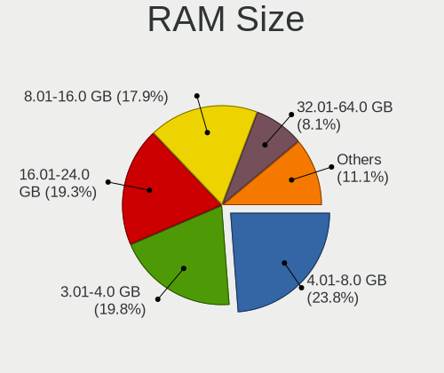
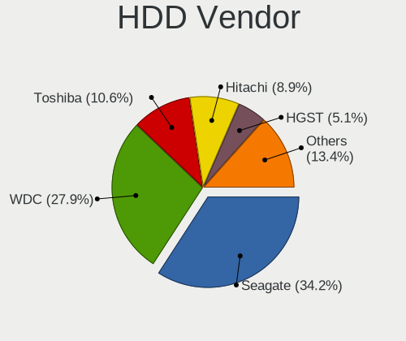
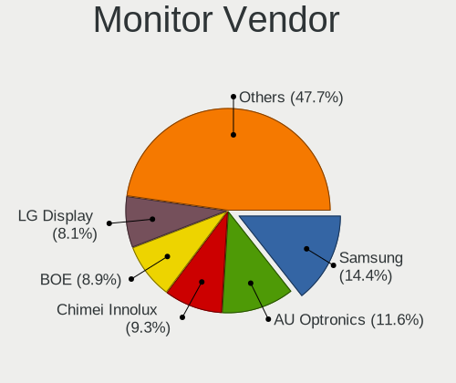
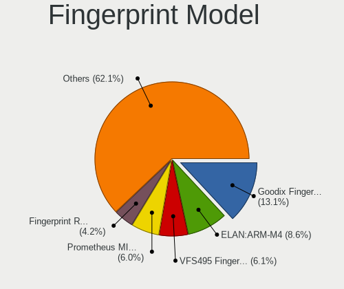

Linux in Italy - Tested Hardware & Statistics
---------------------------------------------

A project to collect tested hardware configurations for Linux in Italy.

Anyone can contribute to this report by the [hw-probe](https://github.com/linuxhw/hw-probe) tool:

    sudo -E hw-probe -all -upload

Please contribute! Especially if your hardware is rare.

This is a report for all computer types. See also reports for [desktops](/Location/Italy/Desktop/README.md) and [notebooks](/Location/Italy/Notebook/README.md).

Contents
--------

* [ Test Cases ](#test-cases)

* [ System ](#system)
  - [ OS                       ](#os)
  - [ OS Family                ](#os-family)
  - [ Kernel                   ](#kernel)
  - [ Kernel Family            ](#kernel-family)
  - [ Kernel Major Ver.        ](#kernel-major-ver)
  - [ Arch                     ](#arch)
  - [ DE                       ](#de)
  - [ Display Server           ](#display-server)
  - [ Display Manager          ](#display-manager)
  - [ OS Lang                  ](#os-lang)
  - [ Boot Mode                ](#boot-mode)
  - [ Filesystem               ](#filesystem)
  - [ Part. scheme             ](#part-scheme)
  - [ Dual Boot with Linux/BSD ](#dual-boot-with-linuxbsd)
  - [ Dual Boot (Win)          ](#dual-boot-win)

* [ Board ](#board)
  - [ Vendor                   ](#vendor)
  - [ Model                    ](#model)
  - [ Model Family             ](#model-family)
  - [ MFG Year                 ](#mfg-year)
  - [ Form Factor              ](#form-factor)
  - [ Secure Boot              ](#secure-boot)
  - [ Coreboot                 ](#coreboot)
  - [ RAM Size                 ](#ram-size)
  - [ RAM Used                 ](#ram-used)
  - [ Total Drives             ](#total-drives)
  - [ Has CD-ROM               ](#has-cd-rom)
  - [ Has Ethernet             ](#has-ethernet)
  - [ Has WiFi                 ](#has-wifi)
  - [ Has Bluetooth            ](#has-bluetooth)

* [ Location ](#location)
  - [ Country                  ](#country)
  - [ City                     ](#city)

* [ Drives ](#drives)
  - [ Drive Vendor             ](#drive-vendor)
  - [ Drive Model              ](#drive-model)
  - [ HDD Vendor               ](#hdd-vendor)
  - [ SSD Vendor               ](#ssd-vendor)
  - [ Drive Kind               ](#drive-kind)
  - [ Drive Connector          ](#drive-connector)
  - [ Drive Size               ](#drive-size)
  - [ Space Total              ](#space-total)
  - [ Space Used               ](#space-used)
  - [ Malfunc. Drives          ](#malfunc-drives)
  - [ Malfunc. Drive Vendor    ](#malfunc-drive-vendor)
  - [ Malfunc. HDD Vendor      ](#malfunc-hdd-vendor)
  - [ Malfunc. Drive Kind      ](#malfunc-drive-kind)
  - [ Failed Drives            ](#failed-drives)
  - [ Failed Drive Vendor      ](#failed-drive-vendor)
  - [ Drive Status             ](#drive-status)

* [ Storage controller ](#storage-controller)
  - [ Storage Vendor           ](#storage-vendor)
  - [ Storage Model            ](#storage-model)
  - [ Storage Kind             ](#storage-kind)

* [ Processor ](#processor)
  - [ CPU Vendor               ](#cpu-vendor)
  - [ CPU Model                ](#cpu-model)
  - [ CPU Model Family         ](#cpu-model-family)
  - [ CPU Cores                ](#cpu-cores)
  - [ CPU Sockets              ](#cpu-sockets)
  - [ CPU Threads              ](#cpu-threads)
  - [ CPU Op-Modes             ](#cpu-op-modes)
  - [ CPU Microcode            ](#cpu-microcode)
  - [ CPU Microarch            ](#cpu-microarch)

* [ Graphics ](#graphics)
  - [ GPU Vendor               ](#gpu-vendor)
  - [ GPU Model                ](#gpu-model)
  - [ GPU Combo                ](#gpu-combo)
  - [ GPU Driver               ](#gpu-driver)
  - [ GPU Memory               ](#gpu-memory)

* [ Monitor ](#monitor)
  - [ Monitor Vendor           ](#monitor-vendor)
  - [ Monitor Model            ](#monitor-model)
  - [ Monitor Resolution       ](#monitor-resolution)
  - [ Monitor Diagonal         ](#monitor-diagonal)
  - [ Monitor Width            ](#monitor-width)
  - [ Aspect Ratio             ](#aspect-ratio)
  - [ Monitor Area             ](#monitor-area)
  - [ Pixel Density            ](#pixel-density)
  - [ Multiple Monitors        ](#multiple-monitors)

* [ Network ](#network)
  - [ Net Controller Vendor    ](#net-controller-vendor)
  - [ Net Controller Model     ](#net-controller-model)
  - [ Wireless Vendor          ](#wireless-vendor)
  - [ Wireless Model           ](#wireless-model)
  - [ Ethernet Vendor          ](#ethernet-vendor)
  - [ Ethernet Model           ](#ethernet-model)
  - [ Net Controller Kind      ](#net-controller-kind)
  - [ Used Controller          ](#used-controller)
  - [ NICs                     ](#nics)
  - [ IPv6                     ](#ipv6)

* [ Bluetooth ](#bluetooth)
  - [ Bluetooth Vendor         ](#bluetooth-vendor)
  - [ Bluetooth Model          ](#bluetooth-model)

* [ Sound ](#sound)
  - [ Sound Vendor             ](#sound-vendor)
  - [ Sound Model              ](#sound-model)

* [ Memory ](#memory)
  - [ Memory Vendor            ](#memory-vendor)
  - [ Memory Model             ](#memory-model)
  - [ Memory Kind              ](#memory-kind)
  - [ Memory Form Factor       ](#memory-form-factor)
  - [ Memory Size              ](#memory-size)
  - [ Memory Speed             ](#memory-speed)

* [ Printers & scanners ](#printers--scanners)
  - [ Printer Vendor           ](#printer-vendor)
  - [ Printer Model            ](#printer-model)
  - [ Scanner Vendor           ](#scanner-vendor)
  - [ Scanner Model            ](#scanner-model)

* [ Camera ](#camera)
  - [ Camera Vendor            ](#camera-vendor)
  - [ Camera Model             ](#camera-model)

* [ Security ](#security)
  - [ Fingerprint Vendor       ](#fingerprint-vendor)
  - [ Fingerprint Model        ](#fingerprint-model)
  - [ Chipcard Vendor          ](#chipcard-vendor)
  - [ Chipcard Model           ](#chipcard-model)

* [ Unsupported ](#unsupported)
  - [ Unsupported Devices      ](#unsupported-devices)
  - [ Unsupported Device Types ](#unsupported-device-types)

Test Cases
----------

Total: 14329

| Vendor        | Model                       | Form-Factor | Probe                                                      | Date         |
|---------------|-----------------------------|-------------|------------------------------------------------------------|--------------|
| ASUSTek       | PRIME B250M-C               | Desktop     | [0a6d61d9f6](https://linux-hardware.org/?probe=0a6d61d9f6) | May 09, 2024 |
| Toshiba       | Satellite C650D             | Notebook    | [9e66892f4b](https://linux-hardware.org/?probe=9e66892f4b) | May 09, 2024 |
| Toshiba       | PORTEGE Z30-C               | Notebook    | [38ddab3b19](https://linux-hardware.org/?probe=38ddab3b19) | May 08, 2024 |
| HP            | Pavilion x360 Convertibl... | Convertible | [762a9e4609](https://linux-hardware.org/?probe=762a9e4609) | May 08, 2024 |
| HP            | Pavilion x360 Convertibl... | Convertible | [f3aa52459b](https://linux-hardware.org/?probe=f3aa52459b) | May 08, 2024 |
| GEEKOM        | Mini Air12                  | Server      | [c02c2be45e](https://linux-hardware.org/?probe=c02c2be45e) | May 08, 2024 |
| ASUSTek       | GL753VE                     | Notebook    | [17bf72a741](https://linux-hardware.org/?probe=17bf72a741) | May 08, 2024 |
| ASUSTek       | P8H77-V LE                  | Desktop     | [e896127dc3](https://linux-hardware.org/?probe=e896127dc3) | May 08, 2024 |
| ASRock        | Z77 Performance             | Desktop     | [500cd7ed60](https://linux-hardware.org/?probe=500cd7ed60) | May 08, 2024 |
| MSI           | MAG Z690 TOMAHAWK WIFI D... | Desktop     | [2143043fa4](https://linux-hardware.org/?probe=2143043fa4) | May 08, 2024 |
| HP            | 83E5                        | All in one  | [38a2509046](https://linux-hardware.org/?probe=38a2509046) | May 08, 2024 |
| HUAWEI        | KLVL-WXX9                   | Notebook    | [6021a53b71](https://linux-hardware.org/?probe=6021a53b71) | May 08, 2024 |
| Lenovo        | B50-30 80ES                 | Notebook    | [c19f3dfc3a](https://linux-hardware.org/?probe=c19f3dfc3a) | May 07, 2024 |
| Lenovo        | ThinkPad X1 Carbon Gen 8... | Notebook    | [3b821d76a7](https://linux-hardware.org/?probe=3b821d76a7) | May 07, 2024 |
| HP            | Pavilion Sleekbook 15       | Notebook    | [9cd7bfcd0f](https://linux-hardware.org/?probe=9cd7bfcd0f) | May 07, 2024 |
| HP            | Laptop 15-bs1xx             | Notebook    | [f3c9212dca](https://linux-hardware.org/?probe=f3c9212dca) | May 07, 2024 |
| HP            | 250 G3                      | Notebook    | [c34d89360b](https://linux-hardware.org/?probe=c34d89360b) | May 07, 2024 |
| ASRock        | Z68 Extreme4 Gen3           | Desktop     | [df427b5f9f](https://linux-hardware.org/?probe=df427b5f9f) | May 07, 2024 |
| HP            | 250 G3                      | Notebook    | [7ebf68ab6e](https://linux-hardware.org/?probe=7ebf68ab6e) | May 07, 2024 |
| ASUSTek       | PRIME X570-P                | Desktop     | [2ff26254ae](https://linux-hardware.org/?probe=2ff26254ae) | May 07, 2024 |
| HP            | 250 G3                      | Notebook    | [5f00c46a92](https://linux-hardware.org/?probe=5f00c46a92) | May 07, 2024 |
| Packard Be... | WMCP78M                     | Desktop     | [4d711194fa](https://linux-hardware.org/?probe=4d711194fa) | May 07, 2024 |
| Lenovo        | V145-15AST 81MT             | Notebook    | [f683d111b9](https://linux-hardware.org/?probe=f683d111b9) | May 07, 2024 |
| Lenovo        | V145-15AST 81MT             | Notebook    | [1f8035ccf5](https://linux-hardware.org/?probe=1f8035ccf5) | May 07, 2024 |
| HP            | ZBook 15 G6                 | Notebook    | [4a401c8b15](https://linux-hardware.org/?probe=4a401c8b15) | May 06, 2024 |
| ASUSTek       | TUF Gaming Z790-PRO WIFI    | Desktop     | [07048840f0](https://linux-hardware.org/?probe=07048840f0) | May 06, 2024 |
| Lenovo        | IdeaPad Slim 3 15ABR8 82... | Notebook    | [c082a264d6](https://linux-hardware.org/?probe=c082a264d6) | May 06, 2024 |
| Apple         | MacBookAir7,2               | Notebook    | [c8f7c82599](https://linux-hardware.org/?probe=c8f7c82599) | May 06, 2024 |
| ASUSTek       | P8Z77-V LX2                 | Desktop     | [1181eb41ee](https://linux-hardware.org/?probe=1181eb41ee) | May 06, 2024 |
| Acer          | Predator PO3-630            | Desktop     | [7271f27dc0](https://linux-hardware.org/?probe=7271f27dc0) | May 06, 2024 |
| Acer          | Aspire 5310                 | Notebook    | [8e28475b52](https://linux-hardware.org/?probe=8e28475b52) | May 06, 2024 |
| Apple         | Mac-81E3E92DD6088272 iMa... | All in one  | [390ca96513](https://linux-hardware.org/?probe=390ca96513) | May 06, 2024 |
| HP            | Pavilion 15                 | Notebook    | [77f8425176](https://linux-hardware.org/?probe=77f8425176) | May 06, 2024 |
| Apple         | Mac-81E3E92DD6088272 iMa... | All in one  | [c3072851e8](https://linux-hardware.org/?probe=c3072851e8) | May 06, 2024 |
| GEEKOM        | Mini IT12                   | Desktop     | [bf478cb069](https://linux-hardware.org/?probe=bf478cb069) | May 06, 2024 |
| Fujitsu       | LIFEBOOK E754               | Notebook    | [c201d1f500](https://linux-hardware.org/?probe=c201d1f500) | May 06, 2024 |
| Xiaomi        | Pad 5                       | Notebook    | [2ee74fac7d](https://linux-hardware.org/?probe=2ee74fac7d) | May 05, 2024 |
| Lenovo        | IdeaPad 500-15ISK 80NT      | Notebook    | [63486fcdd6](https://linux-hardware.org/?probe=63486fcdd6) | May 05, 2024 |
| Lenovo        | IdeaPad 500-15ISK 80NT      | Notebook    | [61af632661](https://linux-hardware.org/?probe=61af632661) | May 05, 2024 |
| ASUSTek       | H81M-K                      | Desktop     | [a17314c287](https://linux-hardware.org/?probe=a17314c287) | May 05, 2024 |
| Lenovo        | ThinkPad T470 20HES6VG00    | Notebook    | [f87983a9a9](https://linux-hardware.org/?probe=f87983a9a9) | May 05, 2024 |
| ASUSTek       | CM6870                      | Desktop     | [63591686d7](https://linux-hardware.org/?probe=63591686d7) | May 05, 2024 |
| ASUSTek       | CM6870                      | Desktop     | [6d828aab44](https://linux-hardware.org/?probe=6d828aab44) | May 05, 2024 |
| Dell          | 0YXT71 A02                  | Desktop     | [4da89e5d1d](https://linux-hardware.org/?probe=4da89e5d1d) | May 05, 2024 |
| HP            | Compaq 6720s                | Notebook    | [e51bd60d05](https://linux-hardware.org/?probe=e51bd60d05) | May 05, 2024 |
| MSI           | Modern 14 B11MOL            | Notebook    | [c394eac782](https://linux-hardware.org/?probe=c394eac782) | May 05, 2024 |
| Shenzhen B... | XN116B                      | Notebook    | [47dbcecbd7](https://linux-hardware.org/?probe=47dbcecbd7) | May 04, 2024 |
| AZW           | SER V1.0                    | Mini pc     | [83a9a92054](https://linux-hardware.org/?probe=83a9a92054) | May 04, 2024 |
| ECS           | P45T-A                      | Desktop     | [c1f450f8a1](https://linux-hardware.org/?probe=c1f450f8a1) | May 04, 2024 |
| Apple         | MacBook5,1                  | Notebook    | [021661dd6a](https://linux-hardware.org/?probe=021661dd6a) | May 04, 2024 |
| Apple         | MacBook5,1                  | Notebook    | [cc8e76485b](https://linux-hardware.org/?probe=cc8e76485b) | May 04, 2024 |
| Lenovo        | ThinkPad T480 20L6SADD00    | Notebook    | [ad52d07a71](https://linux-hardware.org/?probe=ad52d07a71) | May 04, 2024 |
| Toshiba       | Satellite L855              | Notebook    | [15101644b0](https://linux-hardware.org/?probe=15101644b0) | May 04, 2024 |
| Toshiba       | Satellite L855              | Notebook    | [359b9f3cd6](https://linux-hardware.org/?probe=359b9f3cd6) | May 04, 2024 |
| Lenovo        | ThinkPad T14 Gen 1 20S00... | Notebook    | [ed456fa085](https://linux-hardware.org/?probe=ed456fa085) | May 04, 2024 |
| HP            | Presario CQ56               | Notebook    | [6df22495ed](https://linux-hardware.org/?probe=6df22495ed) | May 04, 2024 |
| ASUSTek       | ROG STRIX B550-I GAMING     | Desktop     | [169c97e582](https://linux-hardware.org/?probe=169c97e582) | May 04, 2024 |
| Alienware     | m15 R6                      | Notebook    | [98d55c3264](https://linux-hardware.org/?probe=98d55c3264) | May 04, 2024 |
| Samsung       | DP700A7D-S04IT SEC_SW_RE... | All in one  | [7ddb4bb85e](https://linux-hardware.org/?probe=7ddb4bb85e) | May 04, 2024 |
| AZW           | GTR V21                     | Mini pc     | [7c20e2e82b](https://linux-hardware.org/?probe=7c20e2e82b) | May 04, 2024 |
| Lenovo        | IdeaPad 3 15IML05 81WB      | Notebook    | [9ea4c7559c](https://linux-hardware.org/?probe=9ea4c7559c) | May 04, 2024 |
| Lenovo        | ThinkBook 15 G2 ITL 20VE    | Notebook    | [a308965bd0](https://linux-hardware.org/?probe=a308965bd0) | May 04, 2024 |
| Apple         | MacBookAir4,1               | Notebook    | [f8bc0c50a5](https://linux-hardware.org/?probe=f8bc0c50a5) | May 04, 2024 |
| HP            | G62                         | Notebook    | [3e3af3a851](https://linux-hardware.org/?probe=3e3af3a851) | May 04, 2024 |
| Lenovo        | ThinkBook 15-IIL 20SM       | Notebook    | [7471316f20](https://linux-hardware.org/?probe=7471316f20) | May 04, 2024 |
| ALLDOCUBE     | i1305A                      | Notebook    | [c5c24beb34](https://linux-hardware.org/?probe=c5c24beb34) | May 04, 2024 |
| Acer          | Aspire E1-531               | Notebook    | [27d57e495a](https://linux-hardware.org/?probe=27d57e495a) | May 04, 2024 |
| HP            | Pavilion dv6                | Notebook    | [3c67356b46](https://linux-hardware.org/?probe=3c67356b46) | May 04, 2024 |
| Toshiba       | Satellite A200              | Notebook    | [81e6cf4d6e](https://linux-hardware.org/?probe=81e6cf4d6e) | May 04, 2024 |
| ASUSTek       | X553MA                      | Notebook    | [dc9e8b63f5](https://linux-hardware.org/?probe=dc9e8b63f5) | May 03, 2024 |
| GEEKOM        | Mini IT12                   | Desktop     | [d1264f51d1](https://linux-hardware.org/?probe=d1264f51d1) | May 03, 2024 |
| Acer          | Aspire A315-56              | Notebook    | [b7341e861f](https://linux-hardware.org/?probe=b7341e861f) | May 03, 2024 |
| ASUSTek       | P8Z68-V                     | Desktop     | [04f2de6ec1](https://linux-hardware.org/?probe=04f2de6ec1) | May 03, 2024 |
| Toshiba       | Satellite Pro L650          | Notebook    | [4e0111f9c9](https://linux-hardware.org/?probe=4e0111f9c9) | May 02, 2024 |
| PC Special... | PCx0Dx                      | Notebook    | [8aa3848116](https://linux-hardware.org/?probe=8aa3848116) | May 02, 2024 |
| AZW           | SER V1.0                    | Mini pc     | [29f1e433d5](https://linux-hardware.org/?probe=29f1e433d5) | May 02, 2024 |
| HP            | EliteBook 840 G6            | Notebook    | [da166304a5](https://linux-hardware.org/?probe=da166304a5) | May 02, 2024 |
| Lenovo        | ThinkPad T14 Gen 5 21MLC... | Notebook    | [d1732b9421](https://linux-hardware.org/?probe=d1732b9421) | May 02, 2024 |
| Lenovo        | ThinkBook 15-IML 20RW       | Notebook    | [3f312360ff](https://linux-hardware.org/?probe=3f312360ff) | May 02, 2024 |
| Lenovo        | Yoga Pro 7 14IRH8 82Y7      | Notebook    | [2bd6f2ebd6](https://linux-hardware.org/?probe=2bd6f2ebd6) | May 02, 2024 |
| ZOTAC         | ZBOX-ERP74070C              | Mini pc     | [0589ef9701](https://linux-hardware.org/?probe=0589ef9701) | May 02, 2024 |
| MSI           | G41M-P28                    | Desktop     | [c946f92e74](https://linux-hardware.org/?probe=c946f92e74) | May 02, 2024 |
| Raspberry ... | Raspberry Pi 5 Model B R... | Soc         | [00a9e3fe9b](https://linux-hardware.org/?probe=00a9e3fe9b) | May 02, 2024 |
| Acer          | FIH57                       | Desktop     | [8e4b02facb](https://linux-hardware.org/?probe=8e4b02facb) | May 02, 2024 |
| Acer          | TravelMate P2510-G2-M       | Notebook    | [39c2dc876b](https://linux-hardware.org/?probe=39c2dc876b) | May 02, 2024 |
| Acer          | Aspire E1-571               | Notebook    | [0f3b954320](https://linux-hardware.org/?probe=0f3b954320) | May 02, 2024 |
| HP            | 2B0D A01                    | All in one  | [2d8d879cbe](https://linux-hardware.org/?probe=2d8d879cbe) | May 02, 2024 |
| Apple         | Mac-27ADBB7B4CEE8E61 iMa... | All in one  | [1ae07ba421](https://linux-hardware.org/?probe=1ae07ba421) | May 01, 2024 |
| HP            | Pavilion Laptop 14-ec1xx... | Notebook    | [0983506014](https://linux-hardware.org/?probe=0983506014) | May 01, 2024 |
| HP            | Pavilion g6                 | Notebook    | [6568deae58](https://linux-hardware.org/?probe=6568deae58) | May 01, 2024 |
| HP            | Pavilion g6                 | Notebook    | [57a50655da](https://linux-hardware.org/?probe=57a50655da) | May 01, 2024 |
| ALLDOCUBE     | i1305A                      | Notebook    | [c817ff0b69](https://linux-hardware.org/?probe=c817ff0b69) | May 01, 2024 |
| HP            | Pavilion Sleekbook 15       | Notebook    | [f61e28b31c](https://linux-hardware.org/?probe=f61e28b31c) | May 01, 2024 |
| Samsung       | DP700A7D-S04IT SEC_SW_RE... | All in one  | [3ba7fa0ef2](https://linux-hardware.org/?probe=3ba7fa0ef2) | May 01, 2024 |
| HP            | Compaq 6730s                | Notebook    | [ab6d479788](https://linux-hardware.org/?probe=ab6d479788) | May 01, 2024 |
| Apple         | Mac-FC02E91DDD3FA6A4 iMa... | All in one  | [f7ef1cc124](https://linux-hardware.org/?probe=f7ef1cc124) | May 01, 2024 |
| Lenovo        | Yoga 530-14ARR 81H9         | Convertible | [6575f267e2](https://linux-hardware.org/?probe=6575f267e2) | May 01, 2024 |
| Lenovo        | Yoga 530-14ARR 81H9         | Convertible | [dc4f05290b](https://linux-hardware.org/?probe=dc4f05290b) | May 01, 2024 |
| AYANEO        | GEEK 1S                     | Tablet      | [57648b445e](https://linux-hardware.org/?probe=57648b445e) | May 01, 2024 |
| eMachines     | Rhine V1.42                 | Notebook    | [f281ddf1c6](https://linux-hardware.org/?probe=f281ddf1c6) | May 01, 2024 |
| ASRock        | H61M-S                      | Desktop     | [2c79ee4cae](https://linux-hardware.org/?probe=2c79ee4cae) | May 01, 2024 |
| MSI           | MPG Z390 GAMING PLUS        | Desktop     | [f50df78b1f](https://linux-hardware.org/?probe=f50df78b1f) | May 01, 2024 |
| ASUSTek       | H81-PLUS                    | Desktop     | [efe7c01899](https://linux-hardware.org/?probe=efe7c01899) | May 01, 2024 |
| ASUSTek       | H81-PLUS                    | Desktop     | [512660cdbc](https://linux-hardware.org/?probe=512660cdbc) | May 01, 2024 |
| ASUSTek       | K55VD                       | Notebook    | [66566dcc5c](https://linux-hardware.org/?probe=66566dcc5c) | May 01, 2024 |
| HP            | Pavilion Laptop 15-eh2xx... | Notebook    | [2ad4a9fc76](https://linux-hardware.org/?probe=2ad4a9fc76) | Apr 30, 2024 |
| Acer          | Aspire ES1-522              | Notebook    | [90a2ac9af6](https://linux-hardware.org/?probe=90a2ac9af6) | Apr 30, 2024 |
| Sony          | SVE1512Z1EB                 | Notebook    | [18a1eb8f10](https://linux-hardware.org/?probe=18a1eb8f10) | Apr 30, 2024 |
| MSI           | Z170A GAMING M7             | Desktop     | [3ce4a9b0c5](https://linux-hardware.org/?probe=3ce4a9b0c5) | Apr 30, 2024 |
| HP            | Compaq 6720s                | Notebook    | [fc9309f2a1](https://linux-hardware.org/?probe=fc9309f2a1) | Apr 30, 2024 |
| Unknown       | Unknown                     | Notebook    | [a677f40065](https://linux-hardware.org/?probe=a677f40065) | Apr 30, 2024 |
| Dell          | XPS 9315                    | Notebook    | [7a8e7beaea](https://linux-hardware.org/?probe=7a8e7beaea) | Apr 30, 2024 |
| Packard Be... | DOT SE                      | Notebook    | [25e87d67cc](https://linux-hardware.org/?probe=25e87d67cc) | Apr 30, 2024 |
| Packard Be... | DOT SE                      | Notebook    | [e8d7adfcce](https://linux-hardware.org/?probe=e8d7adfcce) | Apr 30, 2024 |
| Acer          | Acadia V1.45                | Notebook    | [7dc83a3832](https://linux-hardware.org/?probe=7dc83a3832) | Apr 30, 2024 |
| HP            | ProBook 4520s               | Notebook    | [cedd016f83](https://linux-hardware.org/?probe=cedd016f83) | Apr 30, 2024 |
| HP            | ProBook 4520s               | Notebook    | [7489071390](https://linux-hardware.org/?probe=7489071390) | Apr 29, 2024 |
| HP            | 09F8h                       | Desktop     | [d31df7e1d8](https://linux-hardware.org/?probe=d31df7e1d8) | Apr 29, 2024 |
| ASRock        | B365M-HDV                   | Desktop     | [23d6569af8](https://linux-hardware.org/?probe=23d6569af8) | Apr 29, 2024 |
| Lenovo        | IdeaPadFlex 5 14IIL05 81... | Convertible | [e204e319f8](https://linux-hardware.org/?probe=e204e319f8) | Apr 29, 2024 |
| Dell          | Inspiron 5558               | Notebook    | [843f3962e2](https://linux-hardware.org/?probe=843f3962e2) | Apr 29, 2024 |
| HP            | ProBook 450 G1              | Notebook    | [5f5030ef83](https://linux-hardware.org/?probe=5f5030ef83) | Apr 29, 2024 |
| Gigabyte      | Z790 AERO G                 | Desktop     | [f226cfa836](https://linux-hardware.org/?probe=f226cfa836) | Apr 29, 2024 |
| Dell          | 0H8GYJ A02                  | Server      | [26c6662d67](https://linux-hardware.org/?probe=26c6662d67) | Apr 29, 2024 |
| Lenovo        | ThinkPad T430 2349IF8       | Notebook    | [d4d6667b5e](https://linux-hardware.org/?probe=d4d6667b5e) | Apr 29, 2024 |
| MSI           | B350M PRO-VD PLUS           | Desktop     | [25f45497bf](https://linux-hardware.org/?probe=25f45497bf) | Apr 29, 2024 |
| AWOW          | AK34Pro                     | Mini pc     | [acbd739d86](https://linux-hardware.org/?probe=acbd739d86) | Apr 29, 2024 |
| Pegatron      | 2AD5                        | Desktop     | [fae22df93c](https://linux-hardware.org/?probe=fae22df93c) | Apr 28, 2024 |
| Fujitsu       | D3041-A1 S26361-D3041-A1    | Desktop     | [166266e759](https://linux-hardware.org/?probe=166266e759) | Apr 28, 2024 |
| Lenovo        | Z50-75 80EC                 | Notebook    | [278dad8d5a](https://linux-hardware.org/?probe=278dad8d5a) | Apr 28, 2024 |
| HUAWEI        | KPL-W0X                     | Notebook    | [26afcd3dda](https://linux-hardware.org/?probe=26afcd3dda) | Apr 28, 2024 |
| HP            | 2B52                        | Desktop     | [41588d4e13](https://linux-hardware.org/?probe=41588d4e13) | Apr 28, 2024 |
| Lenovo        | NO DPK                      | Desktop     | [50204c0691](https://linux-hardware.org/?probe=50204c0691) | Apr 28, 2024 |
| Lenovo        | G50-45 80E3                 | Notebook    | [a12bc9b719](https://linux-hardware.org/?probe=a12bc9b719) | Apr 28, 2024 |
| HP            | Stream Laptop 14-ax0XX      | Notebook    | [f9c0aa7676](https://linux-hardware.org/?probe=f9c0aa7676) | Apr 28, 2024 |
| MSI           | B450 TOMAHAWK MAX           | Desktop     | [1fd2d052b0](https://linux-hardware.org/?probe=1fd2d052b0) | Apr 28, 2024 |
| HP            | Stream Laptop 14-ax0XX      | Notebook    | [3a742038ec](https://linux-hardware.org/?probe=3a742038ec) | Apr 28, 2024 |
| HUAWEI        | KPL-W0X                     | Notebook    | [31f15bd85c](https://linux-hardware.org/?probe=31f15bd85c) | Apr 28, 2024 |
| Packard Be... | IMEDIA S3712                | Desktop     | [200b3d1a1e](https://linux-hardware.org/?probe=200b3d1a1e) | Apr 28, 2024 |
| HP            | Laptop 15s-fq2xxx           | Notebook    | [b6fc451f3c](https://linux-hardware.org/?probe=b6fc451f3c) | Apr 27, 2024 |
| Apple         | MacBookPro7,1               | Notebook    | [b83cef7cdd](https://linux-hardware.org/?probe=b83cef7cdd) | Apr 27, 2024 |
| HP            | Mini 210-1000               | Notebook    | [26d3ef8d19](https://linux-hardware.org/?probe=26d3ef8d19) | Apr 27, 2024 |
| Lenovo        | ThinkPad T495 20NKS1YE00    | Notebook    | [8436983b86](https://linux-hardware.org/?probe=8436983b86) | Apr 27, 2024 |
| ASUSTek       | P5Q3 DELUXE                 | Desktop     | [080e3fa26d](https://linux-hardware.org/?probe=080e3fa26d) | Apr 27, 2024 |
| Gigabyte      | H610M H DDR4                | Desktop     | [1617705438](https://linux-hardware.org/?probe=1617705438) | Apr 27, 2024 |
| Dell          | XPS L521X                   | Notebook    | [2f78a9d44b](https://linux-hardware.org/?probe=2f78a9d44b) | Apr 27, 2024 |
| Gigabyte      | H610M H DDR4                | Desktop     | [e6d74d7705](https://linux-hardware.org/?probe=e6d74d7705) | Apr 27, 2024 |
| AZW           | U57                         | Mini pc     | [4c88507b2f](https://linux-hardware.org/?probe=4c88507b2f) | Apr 27, 2024 |
| ASUSTek       | P5QPL-AM                    | Desktop     | [9199a16ddd](https://linux-hardware.org/?probe=9199a16ddd) | Apr 27, 2024 |
| Fujitsu       | D3171-A1 S26361-D3171-A1    | Desktop     | [a52ce5dea5](https://linux-hardware.org/?probe=a52ce5dea5) | Apr 27, 2024 |
| HP            | 15                          | Notebook    | [474c29dc98](https://linux-hardware.org/?probe=474c29dc98) | Apr 27, 2024 |
| Acer          | Aspire 5734Z                | Notebook    | [1b89b729a3](https://linux-hardware.org/?probe=1b89b729a3) | Apr 27, 2024 |
| Microtech     | CoreBook Lite               | Notebook    | [6b831e47a9](https://linux-hardware.org/?probe=6b831e47a9) | Apr 26, 2024 |
| Mediacom      | SmartBook 14 FullHD - SB... | Notebook    | [679f3b5338](https://linux-hardware.org/?probe=679f3b5338) | Apr 26, 2024 |
| ASUSTek       | M5A78L-M/USB3               | Desktop     | [c33dc3b69c](https://linux-hardware.org/?probe=c33dc3b69c) | Apr 26, 2024 |
| HP            | ProBook 450 G1              | Notebook    | [02e056b32e](https://linux-hardware.org/?probe=02e056b32e) | Apr 26, 2024 |
| Lenovo        | IdeaPad 5 14ARE05 81YM      | Notebook    | [ce253ebd01](https://linux-hardware.org/?probe=ce253ebd01) | Apr 26, 2024 |
| HPE           | ProLiant MicroServer Gen... | Desktop     | [ca351b002d](https://linux-hardware.org/?probe=ca351b002d) | Apr 26, 2024 |
| MSI           | A320M-A PRO MAX             | Desktop     | [253984e9f3](https://linux-hardware.org/?probe=253984e9f3) | Apr 26, 2024 |
| Apple         | MacBook5,1                  | Notebook    | [8da3b01d13](https://linux-hardware.org/?probe=8da3b01d13) | Apr 26, 2024 |
| Microsoft     | Surface Pro 4               | Tablet      | [4548a5f355](https://linux-hardware.org/?probe=4548a5f355) | Apr 26, 2024 |
| Acer          | Aspire one                  | Notebook    | [aa3dbeb28b](https://linux-hardware.org/?probe=aa3dbeb28b) | Apr 26, 2024 |
| ASUSTek       | P5Q3 DELUXE                 | Desktop     | [bac3d4945e](https://linux-hardware.org/?probe=bac3d4945e) | Apr 26, 2024 |
| Gigabyte      | Z390 UD                     | Desktop     | [2aebb056ff](https://linux-hardware.org/?probe=2aebb056ff) | Apr 26, 2024 |
| ASUSTek       | ROG CROSSHAIR VII HERO      | Desktop     | [bfc2a1f12e](https://linux-hardware.org/?probe=bfc2a1f12e) | Apr 26, 2024 |
| ASUSTek       | ROG CROSSHAIR VII HERO      | Desktop     | [8faa952621](https://linux-hardware.org/?probe=8faa952621) | Apr 26, 2024 |
| Acer          | Aspire A315-53G             | Notebook    | [2a3e224f63](https://linux-hardware.org/?probe=2a3e224f63) | Apr 26, 2024 |
| Apple         | MacBookPro12,1              | Notebook    | [2480570421](https://linux-hardware.org/?probe=2480570421) | Apr 26, 2024 |
| ASUSTek       | P5Q SE                      | Desktop     | [1df93195b0](https://linux-hardware.org/?probe=1df93195b0) | Apr 25, 2024 |
| HP            | Laptop 15-da0xxx            | Notebook    | [3d96ca2745](https://linux-hardware.org/?probe=3d96ca2745) | Apr 25, 2024 |
| HP            | Victus by Gaming Laptop ... | Notebook    | [c56f9e6bd0](https://linux-hardware.org/?probe=c56f9e6bd0) | Apr 25, 2024 |
| ASUSTek       | X553MA                      | Notebook    | [cb731fbd8f](https://linux-hardware.org/?probe=cb731fbd8f) | Apr 25, 2024 |
| ASUSTek       | X541UVK                     | Notebook    | [422fd329a8](https://linux-hardware.org/?probe=422fd329a8) | Apr 25, 2024 |
| ASUSTek       | P5QLD PRO                   | Desktop     | [f20dcd8125](https://linux-hardware.org/?probe=f20dcd8125) | Apr 25, 2024 |
| Pegatron      | 2A94                        | Desktop     | [3673d4e290](https://linux-hardware.org/?probe=3673d4e290) | Apr 25, 2024 |
| ASUSTek       | K52JU                       | Notebook    | [418274ccd0](https://linux-hardware.org/?probe=418274ccd0) | Apr 25, 2024 |
| Acer          | Aspire TC-1660 V:1.1        | Desktop     | [cd563cdb02](https://linux-hardware.org/?probe=cd563cdb02) | Apr 25, 2024 |
| HP            | EliteBook 840 G5            | Notebook    | [13645366c7](https://linux-hardware.org/?probe=13645366c7) | Apr 24, 2024 |
| ASUSTek       | P8Z77-V PRO                 | Desktop     | [755f446bc7](https://linux-hardware.org/?probe=755f446bc7) | Apr 24, 2024 |
| Dell          | 0K095G A02                  | Desktop     | [a5f4dd8567](https://linux-hardware.org/?probe=a5f4dd8567) | Apr 24, 2024 |
| Dell          | 0K095G A02                  | Desktop     | [0d7d9ad04d](https://linux-hardware.org/?probe=0d7d9ad04d) | Apr 24, 2024 |
| ASUSTek       | PRIME B450M-A               | Desktop     | [41856dea7c](https://linux-hardware.org/?probe=41856dea7c) | Apr 24, 2024 |
| ASUSTek       | H81-PLUS                    | Desktop     | [34b4840a60](https://linux-hardware.org/?probe=34b4840a60) | Apr 24, 2024 |
| HP            | 15                          | Notebook    | [479cea6b16](https://linux-hardware.org/?probe=479cea6b16) | Apr 24, 2024 |
| Acer          | Aspire E5-573G              | Notebook    | [216cd2fc72](https://linux-hardware.org/?probe=216cd2fc72) | Apr 24, 2024 |
| ASUSTek       | M4A78 PRO                   | Desktop     | [4a79911a5b](https://linux-hardware.org/?probe=4a79911a5b) | Apr 24, 2024 |
| Acer          | Aspire A515-47              | Notebook    | [dc0e4e49bb](https://linux-hardware.org/?probe=dc0e4e49bb) | Apr 24, 2024 |
| Lenovo        | Legion Pro 5 16IRX9 83DF    | Notebook    | [a0287fdd29](https://linux-hardware.org/?probe=a0287fdd29) | Apr 24, 2024 |
| HP            | Pavilion dv6                | Notebook    | [c8d73c3a23](https://linux-hardware.org/?probe=c8d73c3a23) | Apr 24, 2024 |
| HP            | Pavilion dv6                | Notebook    | [08f01fc7ed](https://linux-hardware.org/?probe=08f01fc7ed) | Apr 24, 2024 |
| Acer          | TravelMate 4070             | Notebook    | [99e797eb28](https://linux-hardware.org/?probe=99e797eb28) | Apr 23, 2024 |
| Apple         | MacBookAir7,2               | Notebook    | [674850b624](https://linux-hardware.org/?probe=674850b624) | Apr 23, 2024 |
| HP            | EliteBook 840 G2            | Notebook    | [006661b0c2](https://linux-hardware.org/?probe=006661b0c2) | Apr 23, 2024 |
| ASUSTek       | F9E                         | Notebook    | [18bf0f692e](https://linux-hardware.org/?probe=18bf0f692e) | Apr 23, 2024 |
| HP            | Victus by Laptop 16-e0xx... | Notebook    | [74c8b80974](https://linux-hardware.org/?probe=74c8b80974) | Apr 23, 2024 |
| Acer          | Aspire ES1-523              | Notebook    | [499fa508bd](https://linux-hardware.org/?probe=499fa508bd) | Apr 23, 2024 |
| Samsung       | N150P/N210P/N220P           | Notebook    | [b7a4824162](https://linux-hardware.org/?probe=b7a4824162) | Apr 23, 2024 |
| ASUSTek       | F2A85-M PRO                 | Desktop     | [1a0e93d25f](https://linux-hardware.org/?probe=1a0e93d25f) | Apr 23, 2024 |
| Acer          | Aspire 4820TG               | Notebook    | [7f3e1cb872](https://linux-hardware.org/?probe=7f3e1cb872) | Apr 23, 2024 |
| Apple         | MacBookAir7,2               | Notebook    | [c7cbc009ef](https://linux-hardware.org/?probe=c7cbc009ef) | Apr 23, 2024 |
| ASUSTek       | X555QG                      | Notebook    | [c905efd379](https://linux-hardware.org/?probe=c905efd379) | Apr 23, 2024 |
| Acer          | Aspire 5750G                | Notebook    | [39ed7553a3](https://linux-hardware.org/?probe=39ed7553a3) | Apr 23, 2024 |
| ASUSTek       | X555QG                      | Notebook    | [26b8da2305](https://linux-hardware.org/?probe=26b8da2305) | Apr 23, 2024 |
| AMI           | Intel                       | Desktop     | [7f5a03f6a3](https://linux-hardware.org/?probe=7f5a03f6a3) | Apr 23, 2024 |
| Microsoft     | Surface Pro 4               | Tablet      | [a3842c8188](https://linux-hardware.org/?probe=a3842c8188) | Apr 23, 2024 |
| ASUSTek       | ROG STRIX B450-F GAMING ... | Desktop     | [4626c1b15a](https://linux-hardware.org/?probe=4626c1b15a) | Apr 23, 2024 |
| HP            | Pavilion x2 Detachable      | Notebook    | [62dfe52148](https://linux-hardware.org/?probe=62dfe52148) | Apr 22, 2024 |
| HP            | Pavilion x2 Detachable      | Notebook    | [fadfc9adae](https://linux-hardware.org/?probe=fadfc9adae) | Apr 22, 2024 |
| Apple         | MacBookPro9,2               | Notebook    | [da3cb2d356](https://linux-hardware.org/?probe=da3cb2d356) | Apr 22, 2024 |
| Unknown       | Unknown                     | Desktop     | [2be166cff9](https://linux-hardware.org/?probe=2be166cff9) | Apr 22, 2024 |
| Unknown       | Unknown                     | Desktop     | [9bce7f48fb](https://linux-hardware.org/?probe=9bce7f48fb) | Apr 22, 2024 |
| ASUSTek       | K56CB                       | Notebook    | [5ab318e135](https://linux-hardware.org/?probe=5ab318e135) | Apr 22, 2024 |
| ASUSTek       | F2A85-M PRO                 | Desktop     | [8c84e31977](https://linux-hardware.org/?probe=8c84e31977) | Apr 22, 2024 |
| HP            | Laptop 15-dw0xxx            | Notebook    | [b69baa13a6](https://linux-hardware.org/?probe=b69baa13a6) | Apr 22, 2024 |
| Acer          | Aspire A515-47              | Notebook    | [feba2802f3](https://linux-hardware.org/?probe=feba2802f3) | Apr 22, 2024 |
| HP            | Pavilion dv6500             | Notebook    | [339679d475](https://linux-hardware.org/?probe=339679d475) | Apr 22, 2024 |
| ASUSTek       | P5Q SE                      | Desktop     | [686ba44668](https://linux-hardware.org/?probe=686ba44668) | Apr 22, 2024 |
| ASUSTek       | VivoBook_ASUSLaptop X740... | Notebook    | [7102c622a5](https://linux-hardware.org/?probe=7102c622a5) | Apr 22, 2024 |
| HP            | Laptop 15s-eq3xxx           | Notebook    | [63efa2e397](https://linux-hardware.org/?probe=63efa2e397) | Apr 21, 2024 |
| ASUSTek       | ROG STRIX Z690-F GAMING ... | Desktop     | [77503515ef](https://linux-hardware.org/?probe=77503515ef) | Apr 21, 2024 |
| HP            | Notebook                    | Notebook    | [65703ccbac](https://linux-hardware.org/?probe=65703ccbac) | Apr 21, 2024 |
| Unknown       | Unknown                     | Desktop     | [746f56684d](https://linux-hardware.org/?probe=746f56684d) | Apr 21, 2024 |
| ASRock        | H61M-S                      | Desktop     | [2e941c8160](https://linux-hardware.org/?probe=2e941c8160) | Apr 21, 2024 |
| ASUSTek       | TUF Gaming B550-PLUS        | Desktop     | [5b37288076](https://linux-hardware.org/?probe=5b37288076) | Apr 21, 2024 |
| Acer          | Aspire A315-24P             | Notebook    | [51136613de](https://linux-hardware.org/?probe=51136613de) | Apr 21, 2024 |
| Lenovo        | IdeaPad 5 14ALC05 82LM      | Notebook    | [d76ac08a0d](https://linux-hardware.org/?probe=d76ac08a0d) | Apr 21, 2024 |
| Lenovo        | ThinkPad T470 20HES6VG00    | Notebook    | [b122ffbcd4](https://linux-hardware.org/?probe=b122ffbcd4) | Apr 21, 2024 |
| BESSTAR Te... | CB9                         | Mini pc     | [ddd433c51c](https://linux-hardware.org/?probe=ddd433c51c) | Apr 21, 2024 |
| ASUSTek       | M3N78 PRO                   | Desktop     | [01371d4a2c](https://linux-hardware.org/?probe=01371d4a2c) | Apr 21, 2024 |
| ASUSTek       | PRIME B250M-C               | Desktop     | [46d23f3585](https://linux-hardware.org/?probe=46d23f3585) | Apr 21, 2024 |
| Gigabyte      | H81M-D2V                    | Desktop     | [601836b445](https://linux-hardware.org/?probe=601836b445) | Apr 21, 2024 |
| HP            | ProBook 4540s               | Notebook    | [b13d3be380](https://linux-hardware.org/?probe=b13d3be380) | Apr 21, 2024 |
| HP            | 1495                        | Desktop     | [0eb85fb716](https://linux-hardware.org/?probe=0eb85fb716) | Apr 20, 2024 |
| MACHINIST     | H81M-PRO S1 V2.0            | Desktop     | [15bd0a756c](https://linux-hardware.org/?probe=15bd0a756c) | Apr 20, 2024 |
| Acer          | Aspire ES1-523              | Notebook    | [23fbbe90c4](https://linux-hardware.org/?probe=23fbbe90c4) | Apr 20, 2024 |
| MSI           | B85M Night Elf              | Desktop     | [bcf2e02f82](https://linux-hardware.org/?probe=bcf2e02f82) | Apr 20, 2024 |
| HP            | 1495                        | Desktop     | [f3b383fe91](https://linux-hardware.org/?probe=f3b383fe91) | Apr 20, 2024 |
| Colorful T... | CVN Z690 GAMING FROZEN V... | Desktop     | [09cbde09ca](https://linux-hardware.org/?probe=09cbde09ca) | Apr 20, 2024 |
| HP            | 18E7                        | Desktop     | [1d707ddc17](https://linux-hardware.org/?probe=1d707ddc17) | Apr 20, 2024 |
| Lenovo        | IdeaPad Gaming 3 15ACH6 ... | Notebook    | [67792de52a](https://linux-hardware.org/?probe=67792de52a) | Apr 20, 2024 |
| ASUSTek       | T103HAF                     | Tablet      | [30ac5535f2](https://linux-hardware.org/?probe=30ac5535f2) | Apr 20, 2024 |
| Dell          | Latitude 5290 2-in-1        | Tablet      | [c2e6974e1f](https://linux-hardware.org/?probe=c2e6974e1f) | Apr 20, 2024 |
| ASUSTek       | X540SAA                     | Notebook    | [17f2b9c802](https://linux-hardware.org/?probe=17f2b9c802) | Apr 20, 2024 |
| Shenzhen M... | AHBNB OEM                   | Desktop     | [0ff344b5d6](https://linux-hardware.org/?probe=0ff344b5d6) | Apr 20, 2024 |
| ASUSTek       | TUF Gaming B650M-E WIFI     | Desktop     | [8fd0a624a7](https://linux-hardware.org/?probe=8fd0a624a7) | Apr 20, 2024 |
| Acer          | Aspire E1-571G              | Notebook    | [cfb1f06070](https://linux-hardware.org/?probe=cfb1f06070) | Apr 20, 2024 |
| HP            | 802E                        | Desktop     | [2c4cd0708d](https://linux-hardware.org/?probe=2c4cd0708d) | Apr 20, 2024 |
| ASUSTek       | TUF Gaming B650M-E WIFI     | Desktop     | [5e91dc2b03](https://linux-hardware.org/?probe=5e91dc2b03) | Apr 20, 2024 |
| HP            | Pavilion Notebook           | Notebook    | [e4e64863d9](https://linux-hardware.org/?probe=e4e64863d9) | Apr 20, 2024 |
| HP            | ENVY 17                     | Notebook    | [2ff3b1ea53](https://linux-hardware.org/?probe=2ff3b1ea53) | Apr 20, 2024 |
| ONE-NETBOO... | ONEXPLAYER Mini Pro         | Tablet      | [2b95c1e3b2](https://linux-hardware.org/?probe=2b95c1e3b2) | Apr 20, 2024 |
| Lenovo        | IdeaPad 300-15ISK 80Q7      | Notebook    | [dda75cf468](https://linux-hardware.org/?probe=dda75cf468) | Apr 20, 2024 |
| ASUSTek       | X751LX                      | Notebook    | [7be3e5016c](https://linux-hardware.org/?probe=7be3e5016c) | Apr 19, 2024 |
| Acer          | Aspire A315-21              | Notebook    | [c05d2f5d20](https://linux-hardware.org/?probe=c05d2f5d20) | Apr 19, 2024 |
| Mediacom      | SmartBook Pro i5            | Notebook    | [fdc40cdd18](https://linux-hardware.org/?probe=fdc40cdd18) | Apr 19, 2024 |
| HP            | Laptop 15s-fq5xxx           | Notebook    | [c55294e976](https://linux-hardware.org/?probe=c55294e976) | Apr 19, 2024 |
| Lenovo        | ThinkPad T450s 20BWS00V0... | Notebook    | [8d933e8d9e](https://linux-hardware.org/?probe=8d933e8d9e) | Apr 19, 2024 |
| ASUSTek       | PRIME B450M-A               | Desktop     | [704ca87ebc](https://linux-hardware.org/?probe=704ca87ebc) | Apr 19, 2024 |
| ASUSTek       | X751LX                      | Notebook    | [52041d2fb2](https://linux-hardware.org/?probe=52041d2fb2) | Apr 19, 2024 |
| ONE-NETBOO... | ONEXPLAYER Mini Pro         | Tablet      | [4c54b3eac4](https://linux-hardware.org/?probe=4c54b3eac4) | Apr 19, 2024 |
| Sony          | SVE1111M1EW                 | Notebook    | [4303a7cc13](https://linux-hardware.org/?probe=4303a7cc13) | Apr 19, 2024 |
| Dell          | Latitude 5290 2-in-1        | Tablet      | [a813962065](https://linux-hardware.org/?probe=a813962065) | Apr 18, 2024 |
| Dell          | Vostro 1540                 | Notebook    | [780a9675dd](https://linux-hardware.org/?probe=780a9675dd) | Apr 18, 2024 |
| ASUSTek       | X55A                        | Notebook    | [92b3966e51](https://linux-hardware.org/?probe=92b3966e51) | Apr 18, 2024 |
| Lenovo        | ThinkPad T14 Gen 3 21CF0... | Notebook    | [011644727b](https://linux-hardware.org/?probe=011644727b) | Apr 18, 2024 |
| Seco          | UDOO x86                    | Notebook    | [858d9abe37](https://linux-hardware.org/?probe=858d9abe37) | Apr 17, 2024 |
| Lenovo        | IdeaPadFlex 5 14ABR8 82X... | Convertible | [47a3594e98](https://linux-hardware.org/?probe=47a3594e98) | Apr 17, 2024 |
| ASUSTek       | P8Z68 DELUXE                | Desktop     | [f77a3ef205](https://linux-hardware.org/?probe=f77a3ef205) | Apr 16, 2024 |
| ASUSTek       | ROG STRIX Z490-A GAMING     | Desktop     | [1a16ee804f](https://linux-hardware.org/?probe=1a16ee804f) | Apr 16, 2024 |
| HP            | 8617                        | Desktop     | [4f55f454d0](https://linux-hardware.org/?probe=4f55f454d0) | Apr 16, 2024 |
| ASUSTek       | ROG STRIX Z490-A GAMING     | Desktop     | [2397ebd700](https://linux-hardware.org/?probe=2397ebd700) | Apr 16, 2024 |
| Lenovo        | ThinkPad T450s 20BWS00V0... | Notebook    | [763289fa74](https://linux-hardware.org/?probe=763289fa74) | Apr 16, 2024 |
| Apple         | Mac-031B6874CF7F642A iMa... | All in one  | [847e24305d](https://linux-hardware.org/?probe=847e24305d) | Apr 16, 2024 |
| Unknown       | Unknown                     | Notebook    | [10d92e98c0](https://linux-hardware.org/?probe=10d92e98c0) | Apr 16, 2024 |
| HP            | Laptop 15-dw0xxx            | Notebook    | [f30fb8d67e](https://linux-hardware.org/?probe=f30fb8d67e) | Apr 16, 2024 |
| Apple         | MacBookAir7,2               | Notebook    | [163f3a262e](https://linux-hardware.org/?probe=163f3a262e) | Apr 15, 2024 |
| HP            | ProBook 450 G6              | Notebook    | [c41b024ad4](https://linux-hardware.org/?probe=c41b024ad4) | Apr 15, 2024 |
| Lenovo        | IdeaPadFlex 5 14ABR8 82X... | Convertible | [ffc28a2270](https://linux-hardware.org/?probe=ffc28a2270) | Apr 15, 2024 |
| Dell          | 0FF3FN A00                  | Desktop     | [b1bddc88aa](https://linux-hardware.org/?probe=b1bddc88aa) | Apr 15, 2024 |
| HP            | Pavilion dv6                | Notebook    | [b914c1b7f6](https://linux-hardware.org/?probe=b914c1b7f6) | Apr 15, 2024 |
| ASUSTek       | P5G41T-M LX                 | Desktop     | [24a706aaeb](https://linux-hardware.org/?probe=24a706aaeb) | Apr 15, 2024 |
| Acer          | Nitro AN515-57              | Notebook    | [09b7f317ca](https://linux-hardware.org/?probe=09b7f317ca) | Apr 14, 2024 |
| Gigabyte      | B550I AORUS PRO AX          | Desktop     | [f65f90469b](https://linux-hardware.org/?probe=f65f90469b) | Apr 14, 2024 |
| HP            | 2B47                        | Desktop     | [2ea4cccb87](https://linux-hardware.org/?probe=2ea4cccb87) | Apr 14, 2024 |
| Apple         | Mac-031B6874CF7F642A iMa... | All in one  | [0018ad80c4](https://linux-hardware.org/?probe=0018ad80c4) | Apr 14, 2024 |
| Lenovo        | ThinkBook 15 G2 ITL 20VE    | Notebook    | [b202e3f78e](https://linux-hardware.org/?probe=b202e3f78e) | Apr 14, 2024 |
| HP            | 871A                        | Mini pc     | [8a1d58f8ea](https://linux-hardware.org/?probe=8a1d58f8ea) | Apr 14, 2024 |
| TUXEDO        | Gemini Gen2                 | Notebook    | [89fbde8b2d](https://linux-hardware.org/?probe=89fbde8b2d) | Apr 14, 2024 |
| Samsung       | 300E4A/300E5A/300E7A/343... | Notebook    | [a1161960b8](https://linux-hardware.org/?probe=a1161960b8) | Apr 14, 2024 |
| Lenovo        | IdeaPad 5 14ITL05 82FE      | Notebook    | [351fd4ce06](https://linux-hardware.org/?probe=351fd4ce06) | Apr 13, 2024 |
| HP            | 2B52                        | Desktop     | [e775ba35a1](https://linux-hardware.org/?probe=e775ba35a1) | Apr 13, 2024 |
| Acer          | Aspire 6935                 | Notebook    | [d26ee0494f](https://linux-hardware.org/?probe=d26ee0494f) | Apr 13, 2024 |
| ASUSTek       | VivoBook_ASUSLaptop TP42... | Convertible | [a974b21c36](https://linux-hardware.org/?probe=a974b21c36) | Apr 13, 2024 |
| ASUSTek       | E402SA                      | Notebook    | [5266b4e65d](https://linux-hardware.org/?probe=5266b4e65d) | Apr 13, 2024 |
| Gigabyte      | B450 AORUS PRO-CF           | Desktop     | [84e0f3d8a3](https://linux-hardware.org/?probe=84e0f3d8a3) | Apr 13, 2024 |
| Acer          | Nitro AN515-58              | Notebook    | [1da17c34a3](https://linux-hardware.org/?probe=1da17c34a3) | Apr 13, 2024 |
| ASUSTek       | PRIME H610M-K D4            | Desktop     | [ca76c3d3ec](https://linux-hardware.org/?probe=ca76c3d3ec) | Apr 13, 2024 |
| Samsung       | N150P/N210P/N220P           | Notebook    | [d6fca9f7f5](https://linux-hardware.org/?probe=d6fca9f7f5) | Apr 13, 2024 |
| ASUSTek       | TUF Gaming B550-PLUS        | Desktop     | [2bbd6deca8](https://linux-hardware.org/?probe=2bbd6deca8) | Apr 13, 2024 |
| Acer          | E1-510                      | Notebook    | [a3809aca83](https://linux-hardware.org/?probe=a3809aca83) | Apr 13, 2024 |
| Acer          | Nitro AN515-58              | Notebook    | [b08b5165e8](https://linux-hardware.org/?probe=b08b5165e8) | Apr 13, 2024 |
| Gigabyte      | Z390 GAMING X-CF            | Desktop     | [e2bf219dba](https://linux-hardware.org/?probe=e2bf219dba) | Apr 13, 2024 |
| ASRock        | J4105B-ITX                  | Desktop     | [ecb84ecf2a](https://linux-hardware.org/?probe=ecb84ecf2a) | Apr 12, 2024 |
| Acer          | Aspire A715-42G             | Notebook    | [0d589db88d](https://linux-hardware.org/?probe=0d589db88d) | Apr 12, 2024 |
| HP            | Laptop 15s-fq5xxx           | Notebook    | [4c870a99b4](https://linux-hardware.org/?probe=4c870a99b4) | Apr 12, 2024 |
| ASUSTek       | VivoBook_ASUSLaptop K350... | Notebook    | [f239d3dcb1](https://linux-hardware.org/?probe=f239d3dcb1) | Apr 12, 2024 |
| Acer          | Aspire A715-42G             | Notebook    | [ab14bb8fdc](https://linux-hardware.org/?probe=ab14bb8fdc) | Apr 12, 2024 |
| HUAWEI        | BOD-WXX9                    | Notebook    | [922645652d](https://linux-hardware.org/?probe=922645652d) | Apr 12, 2024 |
| ASUSTek       | K52Je                       | Notebook    | [7cfd3a8614](https://linux-hardware.org/?probe=7cfd3a8614) | Apr 12, 2024 |
| HP            | ProBook 650 G1              | Notebook    | [6bdfe181ea](https://linux-hardware.org/?probe=6bdfe181ea) | Apr 12, 2024 |
| HP            | ProBook 650 G1              | Notebook    | [aa6dfe532c](https://linux-hardware.org/?probe=aa6dfe532c) | Apr 12, 2024 |
| Fujitsu       | LIFEBOOK E752               | Notebook    | [57b8f56426](https://linux-hardware.org/?probe=57b8f56426) | Apr 12, 2024 |
| HP            | EliteBook 840 G6            | Notebook    | [c9dc8fedd4](https://linux-hardware.org/?probe=c9dc8fedd4) | Apr 12, 2024 |
| ASUSTek       | P8Z68-V                     | Desktop     | [e6cd50c20c](https://linux-hardware.org/?probe=e6cd50c20c) | Apr 12, 2024 |
| ASUSTek       | K52Je                       | Notebook    | [e825e3871d](https://linux-hardware.org/?probe=e825e3871d) | Apr 12, 2024 |
| Lenovo        | ThinkPad S430 336457G       | Notebook    | [93b1811e42](https://linux-hardware.org/?probe=93b1811e42) | Apr 12, 2024 |
| Lenovo        | ThinkPad S430 336457G       | Notebook    | [118beb78ac](https://linux-hardware.org/?probe=118beb78ac) | Apr 12, 2024 |
| ASUSTek       | ROG STRIX B450-F GAMING     | Desktop     | [6bd36b8a91](https://linux-hardware.org/?probe=6bd36b8a91) | Apr 12, 2024 |
| ASUSTek       | ROG STRIX Z690-E GAMING ... | Desktop     | [0b66fdcaf8](https://linux-hardware.org/?probe=0b66fdcaf8) | Apr 11, 2024 |
| ASUSTek       | G752VY                      | Notebook    | [039e830652](https://linux-hardware.org/?probe=039e830652) | Apr 11, 2024 |
| HP            | Pavilion dv5                | Notebook    | [8709b8e62d](https://linux-hardware.org/?probe=8709b8e62d) | Apr 11, 2024 |
| ASRock        | H77 Pro4-M                  | Desktop     | [7b10a71ade](https://linux-hardware.org/?probe=7b10a71ade) | Apr 11, 2024 |
| MSI           | MPG X570 GAMING PLUS        | Desktop     | [11e58d238c](https://linux-hardware.org/?probe=11e58d238c) | Apr 11, 2024 |
| ASRock        | Z77 Performance             | Desktop     | [8904a692b1](https://linux-hardware.org/?probe=8904a692b1) | Apr 11, 2024 |
| MSI           | MPG X570 GAMING PRO CARB... | Desktop     | [85072c85db](https://linux-hardware.org/?probe=85072c85db) | Apr 11, 2024 |
| Acer          | WG43M                       | Desktop     | [782ee862c8](https://linux-hardware.org/?probe=782ee862c8) | Apr 11, 2024 |
| Gigabyte      | GA-MA78G-DS3H               | Desktop     | [da706e0534](https://linux-hardware.org/?probe=da706e0534) | Apr 11, 2024 |
| ASUSTek       | CM6870                      | Desktop     | [0c29f72def](https://linux-hardware.org/?probe=0c29f72def) | Apr 10, 2024 |
| ASUSTek       | Q87T                        | Desktop     | [9b85fb5652](https://linux-hardware.org/?probe=9b85fb5652) | Apr 10, 2024 |
| HP            | Pavilion Laptop 15-eh2xx... | Notebook    | [b7131cef2d](https://linux-hardware.org/?probe=b7131cef2d) | Apr 10, 2024 |
| HP            | Pavilion Laptop 15-eh2xx... | Notebook    | [7fa5b7e16f](https://linux-hardware.org/?probe=7fa5b7e16f) | Apr 10, 2024 |
| Acer          | Aspire 5930                 | Notebook    | [6389c2a9af](https://linux-hardware.org/?probe=6389c2a9af) | Apr 10, 2024 |
| ASRock        | Z370 Extreme4               | Desktop     | [89b87e5d2e](https://linux-hardware.org/?probe=89b87e5d2e) | Apr 10, 2024 |
| Dell          | Latitude 5500               | Notebook    | [59a70a843f](https://linux-hardware.org/?probe=59a70a843f) | Apr 10, 2024 |
| ASUSTek       | P8P67 LE                    | Desktop     | [de829401f2](https://linux-hardware.org/?probe=de829401f2) | Apr 10, 2024 |
| Lenovo        | Z50-70 20354                | Notebook    | [4469cb6e76](https://linux-hardware.org/?probe=4469cb6e76) | Apr 10, 2024 |
| Dell          | 0FF3FN A00                  | Desktop     | [979d51faa5](https://linux-hardware.org/?probe=979d51faa5) | Apr 10, 2024 |
| Acer          | AOD270                      | Notebook    | [6e71521433](https://linux-hardware.org/?probe=6e71521433) | Apr 10, 2024 |
| Dell          | 0D441T A01                  | Desktop     | [98b14bc73d](https://linux-hardware.org/?probe=98b14bc73d) | Apr 10, 2024 |
| Intel         | DH61CR AAG14064-207         | Desktop     | [f8046553af](https://linux-hardware.org/?probe=f8046553af) | Apr 10, 2024 |
| Dell          | Latitude 7290               | Notebook    | [8c904a8ecf](https://linux-hardware.org/?probe=8c904a8ecf) | Apr 10, 2024 |
| GenMachine    | Ren12                       | Desktop     | [f5ec7252ac](https://linux-hardware.org/?probe=f5ec7252ac) | Apr 10, 2024 |
| HP            | 250 G8 Notebook PC          | Notebook    | [73ef8a88c7](https://linux-hardware.org/?probe=73ef8a88c7) | Apr 10, 2024 |
| HUAWEI        | BOM-WXX9                    | Notebook    | [67679cf1d8](https://linux-hardware.org/?probe=67679cf1d8) | Apr 10, 2024 |
| HUAWEI        | BOHB-WAX9                   | Notebook    | [672d643881](https://linux-hardware.org/?probe=672d643881) | Apr 09, 2024 |
| ASUSTek       | PRIME B450M-A II            | Desktop     | [ec1a7c3951](https://linux-hardware.org/?probe=ec1a7c3951) | Apr 09, 2024 |
| HUAWEI        | BOHB-WAX9                   | Notebook    | [7497e16b5c](https://linux-hardware.org/?probe=7497e16b5c) | Apr 09, 2024 |
| HP            | Pavilion Power Laptop 15... | Notebook    | [6e23ce4681](https://linux-hardware.org/?probe=6e23ce4681) | Apr 09, 2024 |
| Valve         | Jupiter                     | Notebook    | [6f2b093298](https://linux-hardware.org/?probe=6f2b093298) | Apr 09, 2024 |
| Chuwi         | X312B                       | Notebook    | [3623330a1c](https://linux-hardware.org/?probe=3623330a1c) | Apr 09, 2024 |
| Apple         | MacBookPro8,1               | Notebook    | [ac137b7cb7](https://linux-hardware.org/?probe=ac137b7cb7) | Apr 09, 2024 |
| Apple         | MacBookPro8,1               | Notebook    | [e964beb301](https://linux-hardware.org/?probe=e964beb301) | Apr 09, 2024 |
| Lenovo        | ThinkPad Yoga 260 20FES1... | Convertible | [8dfad29114](https://linux-hardware.org/?probe=8dfad29114) | Apr 09, 2024 |
| ASUSTek       | K55VD                       | Notebook    | [8cc1b30bd1](https://linux-hardware.org/?probe=8cc1b30bd1) | Apr 09, 2024 |
| ASUSTek       | TUF Gaming FX504GE_FX80G... | Notebook    | [6cb6635cbb](https://linux-hardware.org/?probe=6cb6635cbb) | Apr 09, 2024 |
| Samsung       | 750XED                      | Notebook    | [bfcfd0dab7](https://linux-hardware.org/?probe=bfcfd0dab7) | Apr 08, 2024 |
| Acer          | Aspire 5750ZG               | Notebook    | [b80881ad3d](https://linux-hardware.org/?probe=b80881ad3d) | Apr 08, 2024 |
| Lenovo        | ThinkPad Yoga 260 20FES1... | Convertible | [fa773129c2](https://linux-hardware.org/?probe=fa773129c2) | Apr 08, 2024 |
| Teclast       | F15                         | Notebook    | [fdbca364e4](https://linux-hardware.org/?probe=fdbca364e4) | Apr 08, 2024 |
| Teclast       | F15                         | Notebook    | [a36f18a41b](https://linux-hardware.org/?probe=a36f18a41b) | Apr 08, 2024 |
| Chuwi         | X312B                       | Notebook    | [5aa107f741](https://linux-hardware.org/?probe=5aa107f741) | Apr 08, 2024 |
| AYANEO        | GEEK 1S                     | Tablet      | [2b4664da0c](https://linux-hardware.org/?probe=2b4664da0c) | Apr 08, 2024 |
| Acer          | Predator PO3-630            | Desktop     | [8bd507c30e](https://linux-hardware.org/?probe=8bd507c30e) | Apr 08, 2024 |
| Acer          | Veriton X4630G              | Desktop     | [4ba25709b1](https://linux-hardware.org/?probe=4ba25709b1) | Apr 07, 2024 |
| Toshiba       | PORTEGE R30-D               | Notebook    | [9d7e83e928](https://linux-hardware.org/?probe=9d7e83e928) | Apr 07, 2024 |
| Gigabyte      | Z390 AORUS PRO-CF           | Desktop     | [3ef4683b94](https://linux-hardware.org/?probe=3ef4683b94) | Apr 07, 2024 |
| ASUSTek       | PRIME B250M-A               | Desktop     | [455bdd34ef](https://linux-hardware.org/?probe=455bdd34ef) | Apr 07, 2024 |
| ASUSTek       | PRIME B250M-A               | Desktop     | [fa5b0597ea](https://linux-hardware.org/?probe=fa5b0597ea) | Apr 07, 2024 |
| Apple         | MacBookAir7,2               | Notebook    | [98695d52ec](https://linux-hardware.org/?probe=98695d52ec) | Apr 07, 2024 |
| Packard Be... | WMCP78M                     | Desktop     | [89a292ea11](https://linux-hardware.org/?probe=89a292ea11) | Apr 07, 2024 |
| Microtech     | CoreBook Lite               | Notebook    | [95ee2cd3b2](https://linux-hardware.org/?probe=95ee2cd3b2) | Apr 07, 2024 |
| Dell          | Latitude 5580               | Notebook    | [295ed34ace](https://linux-hardware.org/?probe=295ed34ace) | Apr 07, 2024 |
| Dell          | Latitude 7290               | Notebook    | [d6acda310b](https://linux-hardware.org/?probe=d6acda310b) | Apr 07, 2024 |
| Lenovo        | IdeaPad 300-15ISK 80Q7      | Notebook    | [8b2eeec935](https://linux-hardware.org/?probe=8b2eeec935) | Apr 07, 2024 |
| Lenovo        | ThinkPad T60 1951FDG        | Notebook    | [3baacd7e39](https://linux-hardware.org/?probe=3baacd7e39) | Apr 07, 2024 |
| HP            | 8950                        | Notebook    | [db33441ed7](https://linux-hardware.org/?probe=db33441ed7) | Apr 07, 2024 |
| HP            | 8950                        | Notebook    | [649afa7841](https://linux-hardware.org/?probe=649afa7841) | Apr 07, 2024 |
| Gigabyte      | G41M-Combo                  | Desktop     | [4fa66fe035](https://linux-hardware.org/?probe=4fa66fe035) | Apr 07, 2024 |
| Gigabyte      | Z390 AORUS PRO-CF           | Desktop     | [5a9432f73b](https://linux-hardware.org/?probe=5a9432f73b) | Apr 06, 2024 |
| HP            | 2AF7                        | Desktop     | [e666f2cf49](https://linux-hardware.org/?probe=e666f2cf49) | Apr 06, 2024 |
| Lenovo        | ThinkBook 15 G2 ITL 20VE    | Notebook    | [c7b9f12d30](https://linux-hardware.org/?probe=c7b9f12d30) | Apr 06, 2024 |
| ASUSTek       | N551JX                      | Notebook    | [e7f0a7b86d](https://linux-hardware.org/?probe=e7f0a7b86d) | Apr 06, 2024 |
| HUAWEI        | NBLK-WAX9X                  | Notebook    | [02e385a043](https://linux-hardware.org/?probe=02e385a043) | Apr 06, 2024 |
| Lenovo        | ThinkPad T430 2349IF8       | Notebook    | [fcdfc53b39](https://linux-hardware.org/?probe=fcdfc53b39) | Apr 06, 2024 |
| HP            | 8653 A                      | Desktop     | [6df4b26261](https://linux-hardware.org/?probe=6df4b26261) | Apr 06, 2024 |
| ASRock        | B450 Steel Legend           | Desktop     | [8acd2823d2](https://linux-hardware.org/?probe=8acd2823d2) | Apr 06, 2024 |
| Packard Be... | WMCP78M                     | Desktop     | [e91b099d94](https://linux-hardware.org/?probe=e91b099d94) | Apr 06, 2024 |
| Lenovo        | ThinkBook 14s Yoga G2 IA... | Convertible | [40d3a72e1e](https://linux-hardware.org/?probe=40d3a72e1e) | Apr 06, 2024 |
| Dell          | Latitude D630               | Notebook    | [10f9ff035c](https://linux-hardware.org/?probe=10f9ff035c) | Apr 06, 2024 |
| GEEKOM        | Mini IT13                   | Desktop     | [b867775b62](https://linux-hardware.org/?probe=b867775b62) | Apr 06, 2024 |
| HP            | 8455                        | Desktop     | [487bf9d08f](https://linux-hardware.org/?probe=487bf9d08f) | Apr 06, 2024 |
| HP            | 8653 A                      | Desktop     | [1ab035c8c7](https://linux-hardware.org/?probe=1ab035c8c7) | Apr 06, 2024 |
| HP            | 8455                        | Desktop     | [21d1aa3abc](https://linux-hardware.org/?probe=21d1aa3abc) | Apr 06, 2024 |
| ASUSTek       | P5KPL-CM                    | Desktop     | [7fb2e983ef](https://linux-hardware.org/?probe=7fb2e983ef) | Apr 06, 2024 |
| Lenovo        | ThinkBook 15 G2 ITL 20VE    | Notebook    | [9afed2e851](https://linux-hardware.org/?probe=9afed2e851) | Apr 06, 2024 |
| Lenovo        | ThinkPad T60 1951FDG        | Notebook    | [48ffb129cb](https://linux-hardware.org/?probe=48ffb129cb) | Apr 06, 2024 |
| Lenovo        | ThinkPad P52 20MAS1DM00     | Notebook    | [c83b503bb6](https://linux-hardware.org/?probe=c83b503bb6) | Apr 06, 2024 |
| HP            | 3048h                       | Desktop     | [98a7ae878b](https://linux-hardware.org/?probe=98a7ae878b) | Apr 06, 2024 |
| Lenovo        | Unknown                     | Notebook    | [b013ec1e99](https://linux-hardware.org/?probe=b013ec1e99) | Apr 05, 2024 |
| Unknown       | V00                         | Mini pc     | [65a304e1cd](https://linux-hardware.org/?probe=65a304e1cd) | Apr 05, 2024 |
| HP            | Stream Laptop 14-ax0XX      | Notebook    | [61b97ed8ce](https://linux-hardware.org/?probe=61b97ed8ce) | Apr 05, 2024 |
| Samsung       | 300E4A/300E5A/300E7A/343... | Notebook    | [c6925e3708](https://linux-hardware.org/?probe=c6925e3708) | Apr 05, 2024 |
| ASUSTek       | STRIX Z270G GAMING          | Desktop     | [67a3c40ae1](https://linux-hardware.org/?probe=67a3c40ae1) | Apr 05, 2024 |
| MSI           | Prestige 14Evo A11M         | Notebook    | [62fb7b6781](https://linux-hardware.org/?probe=62fb7b6781) | Apr 05, 2024 |
| Notebook      | NJx0PU                      | Notebook    | [1c5fb42067](https://linux-hardware.org/?probe=1c5fb42067) | Apr 05, 2024 |
| HP            | Laptop 15s-eq2xxx           | Notebook    | [b0435cb369](https://linux-hardware.org/?probe=b0435cb369) | Apr 05, 2024 |
| ASUSTek       | PRIME Z590-P                | Desktop     | [9ef1b07dc2](https://linux-hardware.org/?probe=9ef1b07dc2) | Apr 05, 2024 |
| HP            | Pavilion Laptop 15-eg0xx... | Notebook    | [bd18b70366](https://linux-hardware.org/?probe=bd18b70366) | Apr 05, 2024 |
| Jumper        | EZbook                      | Notebook    | [8061ab16a4](https://linux-hardware.org/?probe=8061ab16a4) | Apr 05, 2024 |
| TUXEDO        | Aura 15 Gen1                | Notebook    | [8f75e91c04](https://linux-hardware.org/?probe=8f75e91c04) | Apr 05, 2024 |
| Timi          | RedmiBook 16                | Notebook    | [cc9c19df85](https://linux-hardware.org/?probe=cc9c19df85) | Apr 05, 2024 |
| HP            | 18E7                        | Desktop     | [32fb4595f3](https://linux-hardware.org/?probe=32fb4595f3) | Apr 05, 2024 |
| Dell          | Latitude 5480               | Notebook    | [995ea90b66](https://linux-hardware.org/?probe=995ea90b66) | Apr 05, 2024 |
| HP            | Pavilion Notebook           | Notebook    | [819d681431](https://linux-hardware.org/?probe=819d681431) | Apr 05, 2024 |
| Lenovo        | ThinkPad T60 1951FDG        | Notebook    | [690d2ee78f](https://linux-hardware.org/?probe=690d2ee78f) | Apr 05, 2024 |
| VALE          | Notebook Classic C151V      | Notebook    | [d09e06015f](https://linux-hardware.org/?probe=d09e06015f) | Apr 05, 2024 |
| HP            | Pavilion Notebook           | Notebook    | [fa3180578d](https://linux-hardware.org/?probe=fa3180578d) | Apr 04, 2024 |
| Chuwi         | UBook XPro                  | Notebook    | [f7f05e8aa2](https://linux-hardware.org/?probe=f7f05e8aa2) | Apr 04, 2024 |
| Dell          | Latitude 7290               | Notebook    | [943479c493](https://linux-hardware.org/?probe=943479c493) | Apr 04, 2024 |
| Dell          | System XPS L502X            | Notebook    | [50a066426a](https://linux-hardware.org/?probe=50a066426a) | Apr 04, 2024 |
| HP            | ProBook 640 G2              | Notebook    | [f5fc4b58c7](https://linux-hardware.org/?probe=f5fc4b58c7) | Apr 04, 2024 |
| ASUSTek       | P553UA                      | Notebook    | [71fe936f4b](https://linux-hardware.org/?probe=71fe936f4b) | Apr 04, 2024 |
| ASUSTek       | P553UA                      | Notebook    | [d14e714f0c](https://linux-hardware.org/?probe=d14e714f0c) | Apr 04, 2024 |
| ASUSTek       | PRIME Z370-P II             | Desktop     | [e075d81601](https://linux-hardware.org/?probe=e075d81601) | Apr 04, 2024 |
| ASUSTek       | ROG Maximus Z790 HERO       | Desktop     | [cbebdb268e](https://linux-hardware.org/?probe=cbebdb268e) | Apr 04, 2024 |
| Acer          | Nitro AN515-58              | Notebook    | [e2d921879b](https://linux-hardware.org/?probe=e2d921879b) | Apr 04, 2024 |
| ASUSTek       | K55VD                       | Notebook    | [6b8d31af6a](https://linux-hardware.org/?probe=6b8d31af6a) | Apr 04, 2024 |
| Apple         | MacBookAir7,2               | Notebook    | [c5ce1039fa](https://linux-hardware.org/?probe=c5ce1039fa) | Apr 04, 2024 |
| Apple         | MacBookAir7,2               | Notebook    | [86c8aec82f](https://linux-hardware.org/?probe=86c8aec82f) | Apr 04, 2024 |
| ASRock        | H81M-DG4                    | Desktop     | [422726b1b4](https://linux-hardware.org/?probe=422726b1b4) | Apr 03, 2024 |
| ASUSTek       | G11CB                       | Desktop     | [372379f18a](https://linux-hardware.org/?probe=372379f18a) | Apr 03, 2024 |
| HP            | 1497                        | Desktop     | [86bbef8ff3](https://linux-hardware.org/?probe=86bbef8ff3) | Apr 03, 2024 |
| ASRock        | H61M-ITX                    | Desktop     | [56a5b3ae2f](https://linux-hardware.org/?probe=56a5b3ae2f) | Apr 03, 2024 |
| ASRock        | H77 Pro4-M                  | Desktop     | [4202019d78](https://linux-hardware.org/?probe=4202019d78) | Apr 03, 2024 |
| HP            | Pavilion Laptop 14-ec1xx... | Notebook    | [2e54390ec0](https://linux-hardware.org/?probe=2e54390ec0) | Apr 03, 2024 |
| Samsung       | 300E4C/300E5C/300E7C        | Notebook    | [dfef032d35](https://linux-hardware.org/?probe=dfef032d35) | Apr 03, 2024 |
| ASUSTek       | Strix 17 GL703GE            | Notebook    | [074f6dc47b](https://linux-hardware.org/?probe=074f6dc47b) | Apr 03, 2024 |
| Lenovo        | ThinkPad L380 20M50013IX    | Notebook    | [ce306c9400](https://linux-hardware.org/?probe=ce306c9400) | Apr 03, 2024 |
| ASUSTek       | H170M-PLUS                  | Desktop     | [2c1173e504](https://linux-hardware.org/?probe=2c1173e504) | Apr 03, 2024 |
| Dell          | 051FJ8 A00                  | Desktop     | [8f67355bed](https://linux-hardware.org/?probe=8f67355bed) | Apr 03, 2024 |
| HP            | 3396                        | Desktop     | [641a1891ba](https://linux-hardware.org/?probe=641a1891ba) | Apr 02, 2024 |
| Acer          | Aspire A315-56              | Notebook    | [c44e1a4b30](https://linux-hardware.org/?probe=c44e1a4b30) | Apr 02, 2024 |
| Acer          | Swift SF314-54              | Notebook    | [0d4fb9ea31](https://linux-hardware.org/?probe=0d4fb9ea31) | Apr 02, 2024 |
| Huanan        | X99-F8D PLUS V1.3           | Desktop     | [87853d6d1c](https://linux-hardware.org/?probe=87853d6d1c) | Apr 02, 2024 |
| ASUSTek       | Z87-A                       | Desktop     | [19d75dd3f4](https://linux-hardware.org/?probe=19d75dd3f4) | Apr 02, 2024 |
| Dell          | 0GXM1W A00                  | Desktop     | [0af28f3719](https://linux-hardware.org/?probe=0af28f3719) | Apr 02, 2024 |
| Acer          | Aspire A315-58              | Notebook    | [42c853e695](https://linux-hardware.org/?probe=42c853e695) | Apr 01, 2024 |
| Dell          | Vostro 3350                 | Notebook    | [382f6d4d58](https://linux-hardware.org/?probe=382f6d4d58) | Apr 01, 2024 |
| ASUSTek       | H81M-K                      | Desktop     | [e7044658cf](https://linux-hardware.org/?probe=e7044658cf) | Apr 01, 2024 |
| SiComputer    | ActivaOne                   | Desktop     | [62822405e7](https://linux-hardware.org/?probe=62822405e7) | Apr 01, 2024 |
| HP            | 1632                        | Desktop     | [09e29cc1bb](https://linux-hardware.org/?probe=09e29cc1bb) | Apr 01, 2024 |
| HP            | 1632                        | Desktop     | [746200a8d4](https://linux-hardware.org/?probe=746200a8d4) | Apr 01, 2024 |
| Mediacom      | M-SBE130                    | Notebook    | [09f5cada23](https://linux-hardware.org/?probe=09f5cada23) | Apr 01, 2024 |
| HP            | 250 G3                      | Notebook    | [f57828a1b4](https://linux-hardware.org/?probe=f57828a1b4) | Apr 01, 2024 |
| ASUSTek       | P7H55-M PRO                 | Desktop     | [825d1f7a17](https://linux-hardware.org/?probe=825d1f7a17) | Apr 01, 2024 |
| HP            | Pavilion Sleekbook 15       | Notebook    | [20959b9997](https://linux-hardware.org/?probe=20959b9997) | Apr 01, 2024 |
| HP            | 2171                        | Desktop     | [3cd1f729a4](https://linux-hardware.org/?probe=3cd1f729a4) | Apr 01, 2024 |
| HP            | Pavilion Sleekbook 15       | Notebook    | [42117baa72](https://linux-hardware.org/?probe=42117baa72) | Apr 01, 2024 |
| Lenovo        | IdeaPad 310-15ISK 80SM      | Notebook    | [b3511ccf47](https://linux-hardware.org/?probe=b3511ccf47) | Apr 01, 2024 |
| Lenovo        | IdeaPad 300-17ISK 80QH      | Notebook    | [ab62e84f70](https://linux-hardware.org/?probe=ab62e84f70) | Mar 31, 2024 |
| ONE-NETBOO... | ONEXPLAYER Mini Pro         | Tablet      | [4dd7031fb5](https://linux-hardware.org/?probe=4dd7031fb5) | Mar 31, 2024 |
| ASRock        | H310CM-DVS                  | Desktop     | [c543e25407](https://linux-hardware.org/?probe=c543e25407) | Mar 31, 2024 |
| Toshiba       | Satellite C50-A-12K         | Notebook    | [ccda000bd9](https://linux-hardware.org/?probe=ccda000bd9) | Mar 31, 2024 |
| ASRock        | H310CM-DVS                  | Desktop     | [39914bc3e6](https://linux-hardware.org/?probe=39914bc3e6) | Mar 31, 2024 |
| Trigkey       | S5 V2.0                     | Mini pc     | [8374427ff8](https://linux-hardware.org/?probe=8374427ff8) | Mar 31, 2024 |
| Unknown       | Unknown                     | Tablet      | [447c7d54b9](https://linux-hardware.org/?probe=447c7d54b9) | Mar 31, 2024 |
| Gigabyte      | B450M DS3H-CF               | Desktop     | [44a5af956a](https://linux-hardware.org/?probe=44a5af956a) | Mar 31, 2024 |
| Acer          | Aspire 5738                 | Notebook    | [c065f8efda](https://linux-hardware.org/?probe=c065f8efda) | Mar 31, 2024 |
| Unknown       | Unknown                     | Tablet      | [ae87758c50](https://linux-hardware.org/?probe=ae87758c50) | Mar 31, 2024 |
| HMT           | W042-67A                    | Notebook    | [957c1d9647](https://linux-hardware.org/?probe=957c1d9647) | Mar 31, 2024 |
| HP            | 250 G4                      | Notebook    | [fbf0b206e8](https://linux-hardware.org/?probe=fbf0b206e8) | Mar 31, 2024 |
| HMT           | W042-67A                    | Notebook    | [1d219ca2d5](https://linux-hardware.org/?probe=1d219ca2d5) | Mar 31, 2024 |
| Foxconn       | 2ADA                        | Desktop     | [302a9a0e28](https://linux-hardware.org/?probe=302a9a0e28) | Mar 31, 2024 |
| Lenovo        | ThinkPad X250 20CM003WMS    | Notebook    | [f9389cc6c5](https://linux-hardware.org/?probe=f9389cc6c5) | Mar 31, 2024 |
| Lenovo        | MIIX 320-10ICR 80XF         | Tablet      | [b58fc76879](https://linux-hardware.org/?probe=b58fc76879) | Mar 31, 2024 |
| HP            | ProBook 450 G5              | Notebook    | [eaa846245d](https://linux-hardware.org/?probe=eaa846245d) | Mar 31, 2024 |
| Gigabyte      | Z390 GAMING X-CF            | Desktop     | [c32641d945](https://linux-hardware.org/?probe=c32641d945) | Mar 31, 2024 |
| Packard Be... | EasyNote MH36               | Notebook    | [db4c360048](https://linux-hardware.org/?probe=db4c360048) | Mar 30, 2024 |
| Gigabyte      | X570 I AORUS PRO WIFI       | Desktop     | [1fb5102d8c](https://linux-hardware.org/?probe=1fb5102d8c) | Mar 30, 2024 |
| ASUSTek       | H110M-K                     | Desktop     | [8b3c41683d](https://linux-hardware.org/?probe=8b3c41683d) | Mar 30, 2024 |
| ASUSTek       | ROG STRIX B650E-E GAMING... | Desktop     | [79fe67eaa6](https://linux-hardware.org/?probe=79fe67eaa6) | Mar 30, 2024 |
| Valve         | Galileo                     | Notebook    | [f1d07303d3](https://linux-hardware.org/?probe=f1d07303d3) | Mar 30, 2024 |
| Samsung       | 300E4C/300E5C/300E7C        | Notebook    | [c654a65e68](https://linux-hardware.org/?probe=c654a65e68) | Mar 30, 2024 |
| HP            | Pavilion 15                 | Notebook    | [69bc35a5b1](https://linux-hardware.org/?probe=69bc35a5b1) | Mar 30, 2024 |
| HP            | Pavilion 15                 | Notebook    | [69293f7635](https://linux-hardware.org/?probe=69293f7635) | Mar 30, 2024 |
| ASUSTek       | VivoBook_ASUSLaptop X160... | Notebook    | [f2bc58419e](https://linux-hardware.org/?probe=f2bc58419e) | Mar 30, 2024 |
| HP            | 250 G4 Notebook PC          | Notebook    | [82ae07c449](https://linux-hardware.org/?probe=82ae07c449) | Mar 29, 2024 |
| Acer          | Aspire A515-52G             | Notebook    | [b4f1f1be3f](https://linux-hardware.org/?probe=b4f1f1be3f) | Mar 29, 2024 |
| Apple         | MacBookPro5,5               | Notebook    | [cb8f6595e4](https://linux-hardware.org/?probe=cb8f6595e4) | Mar 29, 2024 |
| Apple         | MacBookPro5,5               | Notebook    | [3f9d311cfd](https://linux-hardware.org/?probe=3f9d311cfd) | Mar 29, 2024 |
| Acer          | Aspire 4820TG               | Notebook    | [1eda48cfbf](https://linux-hardware.org/?probe=1eda48cfbf) | Mar 29, 2024 |
| ASUSTek       | ProArt Studiobook H7604J... | Notebook    | [ce5acdd8b0](https://linux-hardware.org/?probe=ce5acdd8b0) | Mar 29, 2024 |
| Gigabyte      | G41M-Combo                  | Desktop     | [de15aa9a55](https://linux-hardware.org/?probe=de15aa9a55) | Mar 29, 2024 |
| HP            | EliteBook 8440p             | Notebook    | [54a537a410](https://linux-hardware.org/?probe=54a537a410) | Mar 29, 2024 |
| Acer          | Nitro AN515-58              | Notebook    | [a3032a5b05](https://linux-hardware.org/?probe=a3032a5b05) | Mar 28, 2024 |
| ASUSTek       | K53SJ                       | Notebook    | [7542f194a2](https://linux-hardware.org/?probe=7542f194a2) | Mar 28, 2024 |
| ASUSTek       | K53SJ                       | Notebook    | [34d7c41e80](https://linux-hardware.org/?probe=34d7c41e80) | Mar 28, 2024 |
| HP            | 829A                        | Mini pc     | [9419634289](https://linux-hardware.org/?probe=9419634289) | Mar 28, 2024 |
| HPE           | Cray XD665 MB PCA           | Server      | [0ea228faae](https://linux-hardware.org/?probe=0ea228faae) | Mar 28, 2024 |
| HP            | Laptop 15-bs0xx             | Notebook    | [671ce6facf](https://linux-hardware.org/?probe=671ce6facf) | Mar 28, 2024 |
| Timi          | TM1701                      | Notebook    | [7445efccfb](https://linux-hardware.org/?probe=7445efccfb) | Mar 28, 2024 |
| HP            | Laptop 15-dw0xxx            | Notebook    | [aec6aec9c6](https://linux-hardware.org/?probe=aec6aec9c6) | Mar 28, 2024 |
| HP            | 3398                        | Desktop     | [97bcb402ed](https://linux-hardware.org/?probe=97bcb402ed) | Mar 28, 2024 |
| ASUSTek       | ROG Zephyrus G16 GU603ZI... | Notebook    | [c1a3cee107](https://linux-hardware.org/?probe=c1a3cee107) | Mar 28, 2024 |
| Packard Be... | IXTREME M5850               | Desktop     | [7e315f3367](https://linux-hardware.org/?probe=7e315f3367) | Mar 27, 2024 |
| Packard Be... | IXTREME M5850               | Desktop     | [ef6855721d](https://linux-hardware.org/?probe=ef6855721d) | Mar 27, 2024 |
| Acer          | Extensa 215-55              | Notebook    | [c8547aeab7](https://linux-hardware.org/?probe=c8547aeab7) | Mar 27, 2024 |
| Lenovo        | ThinkPad P16s Gen 2 21K9... | Notebook    | [a9635e09dc](https://linux-hardware.org/?probe=a9635e09dc) | Mar 27, 2024 |
| MSI           | Z87-G45 GAMING              | Desktop     | [9d1882967c](https://linux-hardware.org/?probe=9d1882967c) | Mar 27, 2024 |
| HP            | Laptop 15s-eq3xxx           | Notebook    | [f7029cc0e7](https://linux-hardware.org/?probe=f7029cc0e7) | Mar 27, 2024 |
| Gigabyte      | B450 AORUS PRO-CF           | Desktop     | [a47bfb1a29](https://linux-hardware.org/?probe=a47bfb1a29) | Mar 27, 2024 |
| HP            | Laptop 15-db0xxx            | Notebook    | [04ef2627e2](https://linux-hardware.org/?probe=04ef2627e2) | Mar 27, 2024 |
| Dell          | XPS 15 7590                 | Notebook    | [44a28c885e](https://linux-hardware.org/?probe=44a28c885e) | Mar 27, 2024 |
| ASUSTek       | F52Q                        | Notebook    | [edb335c489](https://linux-hardware.org/?probe=edb335c489) | Mar 27, 2024 |
| Acer          | Aspire 5750G                | Notebook    | [f15d6007f3](https://linux-hardware.org/?probe=f15d6007f3) | Mar 27, 2024 |
| Acer          | Aspire A515-47              | Notebook    | [84310b0211](https://linux-hardware.org/?probe=84310b0211) | Mar 27, 2024 |
| Apple         | Mac-F2238BAE iMac11,3       | All in one  | [7d8682f1b2](https://linux-hardware.org/?probe=7d8682f1b2) | Mar 27, 2024 |
| Dell          | Latitude E6430              | Notebook    | [1ba5377a4a](https://linux-hardware.org/?probe=1ba5377a4a) | Mar 26, 2024 |
| ASUSTek       | ASUS TUF Gaming F15 FX50... | Notebook    | [5c24770c7e](https://linux-hardware.org/?probe=5c24770c7e) | Mar 26, 2024 |
| ASUSTek       | VivoBook_ASUSLaptop X340... | Notebook    | [d8ce553b41](https://linux-hardware.org/?probe=d8ce553b41) | Mar 26, 2024 |
| ASUSTek       | X75VC                       | Notebook    | [8c68d57585](https://linux-hardware.org/?probe=8c68d57585) | Mar 26, 2024 |
| ASUSTek       | X200MA                      | Notebook    | [c95a47bfb6](https://linux-hardware.org/?probe=c95a47bfb6) | Mar 26, 2024 |
| MSI           | B350 TOMAHAWK               | Desktop     | [10ca4510ec](https://linux-hardware.org/?probe=10ca4510ec) | Mar 26, 2024 |
| Gigabyte      | B365M D2V                   | Desktop     | [bd13d968ce](https://linux-hardware.org/?probe=bd13d968ce) | Mar 26, 2024 |
| HP            | 550                         | Notebook    | [2e06980f11](https://linux-hardware.org/?probe=2e06980f11) | Mar 26, 2024 |
| HP            | Pavilion Power Laptop 15... | Notebook    | [e38040b11f](https://linux-hardware.org/?probe=e38040b11f) | Mar 26, 2024 |
| MSI           | B550-A PRO                  | Desktop     | [639196a80f](https://linux-hardware.org/?probe=639196a80f) | Mar 26, 2024 |
| ASUSTek       | UX31E                       | Notebook    | [24d903a1a4](https://linux-hardware.org/?probe=24d903a1a4) | Mar 25, 2024 |
| ASUSTek       | UX31E                       | Notebook    | [d6f21c86f5](https://linux-hardware.org/?probe=d6f21c86f5) | Mar 25, 2024 |
| Acer          | Extensa 5620                | Notebook    | [194f62cafe](https://linux-hardware.org/?probe=194f62cafe) | Mar 25, 2024 |
| Fujitsu       | D3161-A1 S26361-D3161-A1    | Desktop     | [feb35a6b9c](https://linux-hardware.org/?probe=feb35a6b9c) | Mar 25, 2024 |
| HP            | ProBook 450 G5              | Notebook    | [e256bda48f](https://linux-hardware.org/?probe=e256bda48f) | Mar 25, 2024 |
| HP            | Spectre x360 Convertible... | Convertible | [92ede48838](https://linux-hardware.org/?probe=92ede48838) | Mar 25, 2024 |
| Valve         | Jupiter                     | Notebook    | [28b02c08d8](https://linux-hardware.org/?probe=28b02c08d8) | Mar 25, 2024 |
| Sony          | SVE1513Q1ESI                | Notebook    | [9362c14552](https://linux-hardware.org/?probe=9362c14552) | Mar 25, 2024 |
| Dell          | Precision 5530              | Notebook    | [d3267b1e8a](https://linux-hardware.org/?probe=d3267b1e8a) | Mar 25, 2024 |
| Apple         | Mac-031B6874CF7F642A iMa... | All in one  | [910b8aaa31](https://linux-hardware.org/?probe=910b8aaa31) | Mar 25, 2024 |
| HP            | 2B52                        | Desktop     | [5f6112f456](https://linux-hardware.org/?probe=5f6112f456) | Mar 25, 2024 |
| HP            | 2B52                        | Desktop     | [d6d9cdd38e](https://linux-hardware.org/?probe=d6d9cdd38e) | Mar 25, 2024 |
| Dynabook      | Satellite Pro C50-G-101     | Notebook    | [298381401f](https://linux-hardware.org/?probe=298381401f) | Mar 25, 2024 |
| Apple         | MacBookPro7,1               | Notebook    | [bbfdefb7ef](https://linux-hardware.org/?probe=bbfdefb7ef) | Mar 25, 2024 |
| Sony          | VGN-NS11M_S                 | Notebook    | [b1ef5d1cd7](https://linux-hardware.org/?probe=b1ef5d1cd7) | Mar 24, 2024 |
| Sony          | VGN-NS11M_S                 | Notebook    | [245ea408c3](https://linux-hardware.org/?probe=245ea408c3) | Mar 24, 2024 |
| ASUSTek       | TUF Gaming X670E-PLUS       | Desktop     | [932ab537fb](https://linux-hardware.org/?probe=932ab537fb) | Mar 24, 2024 |
| ASUSTek       | ROG STRIX B550-I GAMING     | Desktop     | [e8278f3412](https://linux-hardware.org/?probe=e8278f3412) | Mar 24, 2024 |
| ASUSTek       | B150M-A/M.2                 | Desktop     | [7d11879130](https://linux-hardware.org/?probe=7d11879130) | Mar 24, 2024 |
| HP            | 1905                        | Desktop     | [ee5ca084c4](https://linux-hardware.org/?probe=ee5ca084c4) | Mar 24, 2024 |
| Jumper        | EZbook                      | Notebook    | [0aab28b972](https://linux-hardware.org/?probe=0aab28b972) | Mar 24, 2024 |
| ASUSTek       | CROSSHAIR VI HERO           | Desktop     | [52902a9cbc](https://linux-hardware.org/?probe=52902a9cbc) | Mar 24, 2024 |
| Packard Be... | WMCP78M                     | Desktop     | [854bfb4d53](https://linux-hardware.org/?probe=854bfb4d53) | Mar 24, 2024 |
| Mediacom      | SmartBook 14 FullHD - SB... | Notebook    | [75b22c5497](https://linux-hardware.org/?probe=75b22c5497) | Mar 24, 2024 |
| HP            | 1905                        | Desktop     | [05c7e6e706](https://linux-hardware.org/?probe=05c7e6e706) | Mar 24, 2024 |
| Lenovo        | G50-45 80E3                 | Notebook    | [f3d66b5b1b](https://linux-hardware.org/?probe=f3d66b5b1b) | Mar 24, 2024 |
| ASUSTek       | P6T DELUXE V2               | Desktop     | [526ba57aee](https://linux-hardware.org/?probe=526ba57aee) | Mar 24, 2024 |
| HP            | Laptop 15-fc0xxx            | Notebook    | [45f2251b48](https://linux-hardware.org/?probe=45f2251b48) | Mar 23, 2024 |
| Lenovo        | ThinkBook 15-IIL 20SM       | Notebook    | [692db635b4](https://linux-hardware.org/?probe=692db635b4) | Mar 23, 2024 |
| SYWZ          | S210HA Series               | Desktop     | [0adb0f4432](https://linux-hardware.org/?probe=0adb0f4432) | Mar 23, 2024 |
| Unknown       | Unknown                     | Notebook    | [fdd96eddca](https://linux-hardware.org/?probe=fdd96eddca) | Mar 23, 2024 |
| HP            | G62                         | Notebook    | [f87ae01466](https://linux-hardware.org/?probe=f87ae01466) | Mar 23, 2024 |
| HP            | G62                         | Notebook    | [aa25d3d398](https://linux-hardware.org/?probe=aa25d3d398) | Mar 23, 2024 |
| ASUSTek       | A68HM-PLUS                  | Desktop     | [0f967dfb79](https://linux-hardware.org/?probe=0f967dfb79) | Mar 23, 2024 |
| ASRock        | H110M-HDV                   | Desktop     | [fa6c0a124f](https://linux-hardware.org/?probe=fa6c0a124f) | Mar 23, 2024 |
| Acer          | Aspire 5738                 | Notebook    | [1843c0bf19](https://linux-hardware.org/?probe=1843c0bf19) | Mar 23, 2024 |
| Lenovo        | V130-15IKB 81HN             | Notebook    | [ed5ffee126](https://linux-hardware.org/?probe=ed5ffee126) | Mar 23, 2024 |
| MSI           | B650 GAMING PLUS WIFI       | Desktop     | [8f6b235761](https://linux-hardware.org/?probe=8f6b235761) | Mar 23, 2024 |
| Samsung       | N150P/N210P/N220P           | Notebook    | [153847bfc0](https://linux-hardware.org/?probe=153847bfc0) | Mar 23, 2024 |
| ASUSTek       | X541NA                      | Notebook    | [032929e502](https://linux-hardware.org/?probe=032929e502) | Mar 23, 2024 |
| ASUSTek       | VivoBook_ASUSLaptop X513... | Notebook    | [aaafb945bc](https://linux-hardware.org/?probe=aaafb945bc) | Mar 23, 2024 |
| SYWZ          | S210HA Series               | Desktop     | [0fbf298970](https://linux-hardware.org/?probe=0fbf298970) | Mar 23, 2024 |
| Acer          | Nitro AN515-52              | Notebook    | [a0de26fdab](https://linux-hardware.org/?probe=a0de26fdab) | Mar 22, 2024 |
| LG Electro... | 17Z90P-G.AP75D              | Notebook    | [81927a6a24](https://linux-hardware.org/?probe=81927a6a24) | Mar 22, 2024 |
| Lenovo        | SHARKBAY SDK0E50510 WIN     | Desktop     | [6b90e66027](https://linux-hardware.org/?probe=6b90e66027) | Mar 22, 2024 |
| Trigkey       | S5 V2.0                     | Mini pc     | [ebcb3a9b4e](https://linux-hardware.org/?probe=ebcb3a9b4e) | Mar 22, 2024 |
| MSI           | B450M BAZOOKA               | Desktop     | [a4ff7791f6](https://linux-hardware.org/?probe=a4ff7791f6) | Mar 22, 2024 |
| Lenovo        | ThinkPad T480 20L6SCYF0P    | Notebook    | [aea21a32b6](https://linux-hardware.org/?probe=aea21a32b6) | Mar 22, 2024 |
| Fujitsu       | D3161-A1 S26361-D3161-A1    | Desktop     | [07889f98fc](https://linux-hardware.org/?probe=07889f98fc) | Mar 22, 2024 |
| HP            | Pavilion Laptop 15-eh1xx... | Notebook    | [7f8e1827ff](https://linux-hardware.org/?probe=7f8e1827ff) | Mar 22, 2024 |
| Raspberry ... | Raspberry Pi 4 Model B R... | Soc         | [8099dc4885](https://linux-hardware.org/?probe=8099dc4885) | Mar 22, 2024 |
| Gigabyte      | X570 AORUS ELITE            | Desktop     | [488589d270](https://linux-hardware.org/?probe=488589d270) | Mar 22, 2024 |
| Unknown       | Unknown                     | Desktop     | [52255354d1](https://linux-hardware.org/?probe=52255354d1) | Mar 21, 2024 |
| Lenovo        | IdeaPad 330-15AST 81D6      | Notebook    | [ea88da000b](https://linux-hardware.org/?probe=ea88da000b) | Mar 21, 2024 |
| HP            | Pavilion Gaming Laptop 1... | Notebook    | [0cf2295ae4](https://linux-hardware.org/?probe=0cf2295ae4) | Mar 21, 2024 |
| HUAWEI        | NBLB-WAX9N                  | Notebook    | [3ef07aa692](https://linux-hardware.org/?probe=3ef07aa692) | Mar 21, 2024 |
| MSI           | X58 Pro                     | Desktop     | [4480d39e78](https://linux-hardware.org/?probe=4480d39e78) | Mar 21, 2024 |
| HP            | Laptop 15-dw0xxx            | Notebook    | [5845560b28](https://linux-hardware.org/?probe=5845560b28) | Mar 21, 2024 |
| ASUSTek       | ROG STRIX Z370-E GAMING     | Desktop     | [c47be99616](https://linux-hardware.org/?probe=c47be99616) | Mar 20, 2024 |
| ASRock        | H81M-VG4                    | Desktop     | [627ddc4a77](https://linux-hardware.org/?probe=627ddc4a77) | Mar 20, 2024 |
| Unknown       | AM02                        | Mini pc     | [ad3f00a84a](https://linux-hardware.org/?probe=ad3f00a84a) | Mar 20, 2024 |
| ASUSTek       | B85M-C/C/SI                 | Desktop     | [b456ba2213](https://linux-hardware.org/?probe=b456ba2213) | Mar 20, 2024 |
| Gigabyte      | B550I AORUS PRO AX          | Desktop     | [17d208911e](https://linux-hardware.org/?probe=17d208911e) | Mar 20, 2024 |
| Lenovo        | IdeaCentre B310             | All in one  | [7cce3e46d0](https://linux-hardware.org/?probe=7cce3e46d0) | Mar 20, 2024 |
| Lenovo        | IdeaCentre B310             | All in one  | [5fadb262b9](https://linux-hardware.org/?probe=5fadb262b9) | Mar 20, 2024 |
| ASRock        | X670E Taichi                | Desktop     | [9478d158a1](https://linux-hardware.org/?probe=9478d158a1) | Mar 20, 2024 |
| Dell          | 07T4MC A06                  | Desktop     | [152cda2324](https://linux-hardware.org/?probe=152cda2324) | Mar 20, 2024 |
| MSI           | X58 Pro                     | Desktop     | [ff22611a3e](https://linux-hardware.org/?probe=ff22611a3e) | Mar 20, 2024 |
| ASUSTek       | PRIME B460M-A               | Desktop     | [6d5c05f0a7](https://linux-hardware.org/?probe=6d5c05f0a7) | Mar 20, 2024 |
| MSI           | H97 PC Mate                 | Desktop     | [aea5049f9f](https://linux-hardware.org/?probe=aea5049f9f) | Mar 19, 2024 |
| MSI           | MAG B660M MORTAR WIFI DD... | Desktop     | [d1ba139b4e](https://linux-hardware.org/?probe=d1ba139b4e) | Mar 19, 2024 |
| ASUSTek       | B85M-C/C/SI                 | Desktop     | [d374aaf228](https://linux-hardware.org/?probe=d374aaf228) | Mar 19, 2024 |
| ASUSTek       | Maximus VIII HERO ALPHA     | Desktop     | [27e08fbafc](https://linux-hardware.org/?probe=27e08fbafc) | Mar 19, 2024 |
| ASUSTek       | Z170 PRO GAMING             | Desktop     | [a9647ad337](https://linux-hardware.org/?probe=a9647ad337) | Mar 19, 2024 |
| HP            | 889C                        | Desktop     | [395bdd06d9](https://linux-hardware.org/?probe=395bdd06d9) | Mar 19, 2024 |
| Microsoft     | Surface Pro                 | Tablet      | [2b015ad195](https://linux-hardware.org/?probe=2b015ad195) | Mar 19, 2024 |
| MSI           | B450M BAZOOKA               | Desktop     | [8acd0b4f67](https://linux-hardware.org/?probe=8acd0b4f67) | Mar 19, 2024 |
| ASUSTek       | PRIME H410M-R               | Desktop     | [5213638a3c](https://linux-hardware.org/?probe=5213638a3c) | Mar 19, 2024 |
| HUAWEI        | KLVD-WXX9                   | Notebook    | [f8a39666b9](https://linux-hardware.org/?probe=f8a39666b9) | Mar 19, 2024 |
| HUAWEI        | KLVD-WXX9                   | Notebook    | [74127be2ca](https://linux-hardware.org/?probe=74127be2ca) | Mar 19, 2024 |
| ASUSTek       | PRIME H510M-A               | Desktop     | [3fb9e2390e](https://linux-hardware.org/?probe=3fb9e2390e) | Mar 19, 2024 |
| ASUSTek       | X580VD                      | Notebook    | [4171f75e00](https://linux-hardware.org/?probe=4171f75e00) | Mar 19, 2024 |
| HP            | Presario CQ57               | Notebook    | [d3278988e9](https://linux-hardware.org/?probe=d3278988e9) | Mar 19, 2024 |
| AZW           | SER V1.0                    | Mini pc     | [7d09ef62cc](https://linux-hardware.org/?probe=7d09ef62cc) | Mar 18, 2024 |
| ASUSTek       | A68HM-PLUS                  | Desktop     | [3515178501](https://linux-hardware.org/?probe=3515178501) | Mar 18, 2024 |
| HP            | Victus by Gaming Laptop ... | Notebook    | [a0aaebedc0](https://linux-hardware.org/?probe=a0aaebedc0) | Mar 18, 2024 |
| HP            | ENVY x360 Convertible 15... | Convertible | [44bb14cf6d](https://linux-hardware.org/?probe=44bb14cf6d) | Mar 18, 2024 |
| Lenovo        | ThinkPad R400 278225C       | Notebook    | [dd04ea3d6b](https://linux-hardware.org/?probe=dd04ea3d6b) | Mar 18, 2024 |
| Unknown       | Unknown                     | Notebook    | [30e63ff201](https://linux-hardware.org/?probe=30e63ff201) | Mar 18, 2024 |
| Unknown       | Unknown                     | Notebook    | [966cd696a4](https://linux-hardware.org/?probe=966cd696a4) | Mar 18, 2024 |
| Fujitsu       | D3161-A1 S26361-D3161-A1    | Desktop     | [7c2336be5e](https://linux-hardware.org/?probe=7c2336be5e) | Mar 18, 2024 |
| Packard Be... | EasyNote TJ65               | Notebook    | [00b7925953](https://linux-hardware.org/?probe=00b7925953) | Mar 18, 2024 |
| ASUSTek       | M5A97 R2.0                  | Desktop     | [9b92d1d8d0](https://linux-hardware.org/?probe=9b92d1d8d0) | Mar 17, 2024 |
| Lenovo        | ThinkPad P16v Gen 1 21FE... | Notebook    | [def7c584ff](https://linux-hardware.org/?probe=def7c584ff) | Mar 17, 2024 |
| Lenovo        | ThinkPad P16v Gen 1 21FE... | Notebook    | [3906b06830](https://linux-hardware.org/?probe=3906b06830) | Mar 17, 2024 |
| HP            | Laptop 15s-eq2xxx           | Notebook    | [dbbfda791c](https://linux-hardware.org/?probe=dbbfda791c) | Mar 17, 2024 |
| HP            | Laptop 15-bs1xx             | Notebook    | [fa1b40fdce](https://linux-hardware.org/?probe=fa1b40fdce) | Mar 17, 2024 |
| ASUSTek       | Z170 PRO GAMING             | Desktop     | [ddd79fecda](https://linux-hardware.org/?probe=ddd79fecda) | Mar 17, 2024 |
| MSI           | MAG B550M MORTAR            | Desktop     | [7190a95ce8](https://linux-hardware.org/?probe=7190a95ce8) | Mar 17, 2024 |
| MSI           | Z270 GAMING M5              | Desktop     | [5deb427721](https://linux-hardware.org/?probe=5deb427721) | Mar 17, 2024 |
| Lenovo        | V15-ADA 82C7                | Notebook    | [3c3545a34f](https://linux-hardware.org/?probe=3c3545a34f) | Mar 17, 2024 |
| Raspberry ... | Raspberry Pi 4 Model B R... | Soc         | [75309e4a5b](https://linux-hardware.org/?probe=75309e4a5b) | Mar 17, 2024 |
| Fujitsu       | D3041-A1 S26361-D3041-A1    | Desktop     | [7347a50168](https://linux-hardware.org/?probe=7347a50168) | Mar 17, 2024 |
| Lenovo        | ThinkPad T495 20NKS1R700    | Notebook    | [a7435c5834](https://linux-hardware.org/?probe=a7435c5834) | Mar 16, 2024 |
| ASUSTek       | PRIME B350-PLUS             | Desktop     | [5d30af07da](https://linux-hardware.org/?probe=5d30af07da) | Mar 16, 2024 |
| ASUSTek       | VivoBook 15_ASUS Laptop ... | Notebook    | [22d9bc5efb](https://linux-hardware.org/?probe=22d9bc5efb) | Mar 16, 2024 |
| ASUSTek       | U6Sg                        | Notebook    | [6780a94d1c](https://linux-hardware.org/?probe=6780a94d1c) | Mar 16, 2024 |
| ASRock        | FM2A68M-HD+                 | Desktop     | [0dd66d219d](https://linux-hardware.org/?probe=0dd66d219d) | Mar 16, 2024 |
| HUAWEI        | CREM-WXX9                   | Notebook    | [d1f4d3e711](https://linux-hardware.org/?probe=d1f4d3e711) | Mar 16, 2024 |
| ASUSTek       | VivoBook_ASUSLaptop X515... | Notebook    | [e05236c14d](https://linux-hardware.org/?probe=e05236c14d) | Mar 16, 2024 |
| Packard Be... | EasyNote LJ65               | Notebook    | [e426b215cb](https://linux-hardware.org/?probe=e426b215cb) | Mar 16, 2024 |
| ASUSTek       | ROG CROSSHAIR VIII DARK ... | Desktop     | [84e1a7347a](https://linux-hardware.org/?probe=84e1a7347a) | Mar 16, 2024 |
| ASUSTek       | PRIME X470-PRO              | Desktop     | [ebbc10ff00](https://linux-hardware.org/?probe=ebbc10ff00) | Mar 15, 2024 |
| HUAWEI        | MACHC-WAX9                  | Notebook    | [b312700336](https://linux-hardware.org/?probe=b312700336) | Mar 15, 2024 |
| HP            | 097Ch                       | Desktop     | [23bc1b2344](https://linux-hardware.org/?probe=23bc1b2344) | Mar 15, 2024 |
| AZW           | MINI S 10                   | Desktop     | [843a0455d6](https://linux-hardware.org/?probe=843a0455d6) | Mar 15, 2024 |
| Lenovo        | IdeaPadFlex 5 14ARE05 81... | Convertible | [6a3034630c](https://linux-hardware.org/?probe=6a3034630c) | Mar 15, 2024 |
| Unknown       | Unknown                     | Desktop     | [765be7c26e](https://linux-hardware.org/?probe=765be7c26e) | Mar 15, 2024 |
| Lenovo        | ThinkPad T495s 20QJCTO1W... | Notebook    | [ba8c04d50e](https://linux-hardware.org/?probe=ba8c04d50e) | Mar 15, 2024 |
| ASUSTek       | PRIME B350-PLUS             | Desktop     | [6c0b3fb84c](https://linux-hardware.org/?probe=6c0b3fb84c) | Mar 15, 2024 |
| Dell          | Latitude E7270              | Notebook    | [8c9fc2182a](https://linux-hardware.org/?probe=8c9fc2182a) | Mar 15, 2024 |
| Lenovo        | ThinkPad P14s Gen 4 21K5... | Notebook    | [20d2994e24](https://linux-hardware.org/?probe=20d2994e24) | Mar 15, 2024 |
| PC Special... | Lafite Pro III 15           | Notebook    | [41257b8ee3](https://linux-hardware.org/?probe=41257b8ee3) | Mar 15, 2024 |
| ASUSTek       | TUF Gaming Z490-PLUS        | Desktop     | [ed06ccc20a](https://linux-hardware.org/?probe=ed06ccc20a) | Mar 15, 2024 |
| HUAWEI        | CREM-WXX9                   | Notebook    | [8dfd30f47d](https://linux-hardware.org/?probe=8dfd30f47d) | Mar 14, 2024 |
| ASUSTek       | UX310UQK                    | Notebook    | [0d077de427](https://linux-hardware.org/?probe=0d077de427) | Mar 14, 2024 |
| Apple         | MacBookPro6,2               | Notebook    | [934138c03b](https://linux-hardware.org/?probe=934138c03b) | Mar 14, 2024 |
| Apple         | MacBook9,1                  | Notebook    | [b8bbc1b9c0](https://linux-hardware.org/?probe=b8bbc1b9c0) | Mar 14, 2024 |
| PC Special... | Initia 15                   | Notebook    | [6aaef8dea6](https://linux-hardware.org/?probe=6aaef8dea6) | Mar 14, 2024 |
| ASUSTek       | ROG Strix G731GW_G731GW     | Notebook    | [046ddded98](https://linux-hardware.org/?probe=046ddded98) | Mar 14, 2024 |
| ASUSTek       | T103HAF                     | Tablet      | [cae2c37148](https://linux-hardware.org/?probe=cae2c37148) | Mar 14, 2024 |
| Lenovo        | ThinkPad S430 336457G       | Notebook    | [4e64dcc89e](https://linux-hardware.org/?probe=4e64dcc89e) | Mar 14, 2024 |
| ASUSTek       | ROG Strix G731GW_G731GW     | Notebook    | [c1d5b681d3](https://linux-hardware.org/?probe=c1d5b681d3) | Mar 14, 2024 |
| Acer          | Swift SF114-34              | Notebook    | [f424b29405](https://linux-hardware.org/?probe=f424b29405) | Mar 14, 2024 |
| PC Special... | Lafite Pro III 15           | Notebook    | [36af2d3967](https://linux-hardware.org/?probe=36af2d3967) | Mar 14, 2024 |
| Apple         | Mac-F42C88C8 Proto1         | Desktop     | [4e7425d94c](https://linux-hardware.org/?probe=4e7425d94c) | Mar 14, 2024 |
| ASUSTek       | Maximus VIII HERO ALPHA     | Desktop     | [d98c142fbe](https://linux-hardware.org/?probe=d98c142fbe) | Mar 14, 2024 |
| Lenovo        | IdeaPad 330-15AST 81D6      | Notebook    | [8ff31d6bc3](https://linux-hardware.org/?probe=8ff31d6bc3) | Mar 14, 2024 |
| Lenovo        | Z50-75 80EC                 | Notebook    | [07d7209b29](https://linux-hardware.org/?probe=07d7209b29) | Mar 14, 2024 |
| Lenovo        | ThinkPad T15 Gen 1 20S6S... | Notebook    | [cd29cde5fb](https://linux-hardware.org/?probe=cd29cde5fb) | Mar 13, 2024 |
| ASUSTek       | X555LAB                     | Notebook    | [8b2310099c](https://linux-hardware.org/?probe=8b2310099c) | Mar 13, 2024 |
| ASUSTek       | PRIME B450M-A II            | Desktop     | [e5bf526b80](https://linux-hardware.org/?probe=e5bf526b80) | Mar 13, 2024 |
| Microsoft     | Surface Laptop Go 2         | Tablet      | [33c018bacb](https://linux-hardware.org/?probe=33c018bacb) | Mar 13, 2024 |
| ASUSTek       | ASUS TUF Gaming A15 FA50... | Notebook    | [cae8e0e29c](https://linux-hardware.org/?probe=cae8e0e29c) | Mar 12, 2024 |
| Acer          | Aspire F5-573G              | Notebook    | [88c712b08c](https://linux-hardware.org/?probe=88c712b08c) | Mar 12, 2024 |
| HUAWEI        | NDZ-WXX9                    | Notebook    | [b9a534289f](https://linux-hardware.org/?probe=b9a534289f) | Mar 12, 2024 |
| Microsoft     | Surface Laptop Go 2         | Tablet      | [33a29a17d1](https://linux-hardware.org/?probe=33a29a17d1) | Mar 12, 2024 |
| ASUSTek       | P5QL-EM                     | Desktop     | [6a8fe023d8](https://linux-hardware.org/?probe=6a8fe023d8) | Mar 12, 2024 |
| Samsung       | 700Z3C/700Z5C               | Notebook    | [aa8a2f7241](https://linux-hardware.org/?probe=aa8a2f7241) | Mar 12, 2024 |
| MSI           | Z87-G45 GAMING              | Desktop     | [a37652ce0a](https://linux-hardware.org/?probe=a37652ce0a) | Mar 11, 2024 |
| ASUSTek       | P5Q                         | Desktop     | [9e6a34f9fd](https://linux-hardware.org/?probe=9e6a34f9fd) | Mar 11, 2024 |
| Dell          | 0FF3FN A00                  | Desktop     | [78dd6f891e](https://linux-hardware.org/?probe=78dd6f891e) | Mar 11, 2024 |
| HP            | 2171                        | Desktop     | [83cba3a447](https://linux-hardware.org/?probe=83cba3a447) | Mar 11, 2024 |
| Acer          | Aspire V3-111P              | Notebook    | [9bd631ec91](https://linux-hardware.org/?probe=9bd631ec91) | Mar 11, 2024 |
| Apple         | Mac-F2268DC8                | All in one  | [3e8cf17057](https://linux-hardware.org/?probe=3e8cf17057) | Mar 11, 2024 |
| HP            | 650                         | Notebook    | [96c8acc1a4](https://linux-hardware.org/?probe=96c8acc1a4) | Mar 11, 2024 |
| ASRock        | B450M-HDV R4.0              | Desktop     | [f17a5b4720](https://linux-hardware.org/?probe=f17a5b4720) | Mar 11, 2024 |
| MSI           | MEG Z590 ACE GOLD EDITIO... | Desktop     | [df6500bf6b](https://linux-hardware.org/?probe=df6500bf6b) | Mar 10, 2024 |
| ASUSTek       | P6T DELUXE V2               | Desktop     | [6b1dcf50e8](https://linux-hardware.org/?probe=6b1dcf50e8) | Mar 10, 2024 |
| ASRock        | H570 Phantom Gaming 4       | Desktop     | [8874ba55ff](https://linux-hardware.org/?probe=8874ba55ff) | Mar 10, 2024 |
| ASUSTek       | S551LN                      | Notebook    | [e2af762393](https://linux-hardware.org/?probe=e2af762393) | Mar 10, 2024 |
| HP            | Compaq 15                   | Notebook    | [933a624e6f](https://linux-hardware.org/?probe=933a624e6f) | Mar 10, 2024 |
| HUAWEI        | BOD-WXX9                    | Notebook    | [bf7e46090f](https://linux-hardware.org/?probe=bf7e46090f) | Mar 10, 2024 |
| Lenovo        | ThinkCentre M57 6075W5N     | Desktop     | [bc6ff80035](https://linux-hardware.org/?probe=bc6ff80035) | Mar 10, 2024 |
| ASUSTek       | M5A97 EVO R2.0              | Desktop     | [001f42acad](https://linux-hardware.org/?probe=001f42acad) | Mar 10, 2024 |
| Dell          | Latitude E6410              | Notebook    | [635faac1cf](https://linux-hardware.org/?probe=635faac1cf) | Mar 10, 2024 |
| ASUSTek       | H110M-K                     | Desktop     | [321f393354](https://linux-hardware.org/?probe=321f393354) | Mar 10, 2024 |
| Acer          | AOD270                      | Notebook    | [87f42bf5b3](https://linux-hardware.org/?probe=87f42bf5b3) | Mar 10, 2024 |
| ASUSTek       | ASUS EXPERTBOOK B1500CEA... | Notebook    | [779fb19ac5](https://linux-hardware.org/?probe=779fb19ac5) | Mar 09, 2024 |
| ASRock        | H310CM-HDV                  | Desktop     | [f289e031a3](https://linux-hardware.org/?probe=f289e031a3) | Mar 09, 2024 |
| MSI           | Alpha 15 A4DEK              | Notebook    | [bf844ef78f](https://linux-hardware.org/?probe=bf844ef78f) | Mar 09, 2024 |
| Lenovo        | Yoga Slim 7 Pro 14ARH7 8... | Notebook    | [fe32daee85](https://linux-hardware.org/?probe=fe32daee85) | Mar 09, 2024 |
| HUAWEI        | MACHC-WAX9                  | Notebook    | [9a80e12c77](https://linux-hardware.org/?probe=9a80e12c77) | Mar 09, 2024 |
| Lenovo        | IdeaPad 100-15IBD 80QQ      | Notebook    | [45bd992a0b](https://linux-hardware.org/?probe=45bd992a0b) | Mar 09, 2024 |
| HUAWEI        | BOHB-WAX9                   | Notebook    | [2b04d5a043](https://linux-hardware.org/?probe=2b04d5a043) | Mar 08, 2024 |
| Dell          | 04Y8V0 A02                  | Desktop     | [c15b0cc3e2](https://linux-hardware.org/?probe=c15b0cc3e2) | Mar 08, 2024 |
| GEEKOM        | A7                          | Desktop     | [902477b52e](https://linux-hardware.org/?probe=902477b52e) | Mar 08, 2024 |
| Sony          | VGN-FW21E                   | Notebook    | [618cb0b126](https://linux-hardware.org/?probe=618cb0b126) | Mar 08, 2024 |
| Sony          | VGN-FW21E                   | Notebook    | [8770642321](https://linux-hardware.org/?probe=8770642321) | Mar 08, 2024 |
| Dell          | Inspiron 5593               | Notebook    | [f80a3758f4](https://linux-hardware.org/?probe=f80a3758f4) | Mar 08, 2024 |
| ASUSTek       | X55C                        | Notebook    | [5e08a0f9b3](https://linux-hardware.org/?probe=5e08a0f9b3) | Mar 08, 2024 |
| HUAWEI        | HLYL-WXX9                   | Notebook    | [1268e9c989](https://linux-hardware.org/?probe=1268e9c989) | Mar 08, 2024 |
| HP            | Pavilion Laptop 15-eh3xx... | Notebook    | [96df9c795f](https://linux-hardware.org/?probe=96df9c795f) | Mar 08, 2024 |
| ASUSTek       | PRIME B365M-K               | Desktop     | [343dc1071f](https://linux-hardware.org/?probe=343dc1071f) | Mar 08, 2024 |
| Unknown       | AM02                        | Mini pc     | [3a7ef0d16c](https://linux-hardware.org/?probe=3a7ef0d16c) | Mar 08, 2024 |
| Dell          | XPS 13 9370                 | Notebook    | [6d3e199d12](https://linux-hardware.org/?probe=6d3e199d12) | Mar 07, 2024 |
| Acer          | TravelMate 8571             | Notebook    | [fc248fb6b6](https://linux-hardware.org/?probe=fc248fb6b6) | Mar 07, 2024 |
| Unknown       | NVIDIA Orin Nano Develop... | Soc         | [7179c9d8d1](https://linux-hardware.org/?probe=7179c9d8d1) | Mar 07, 2024 |
| Dell          | Precision M4800             | Notebook    | [8c3ccdefdf](https://linux-hardware.org/?probe=8c3ccdefdf) | Mar 07, 2024 |
| MSI           | B450 GAMING PRO CARBON A... | Desktop     | [a04cc41ec5](https://linux-hardware.org/?probe=a04cc41ec5) | Mar 07, 2024 |
| Lenovo        | ThinkPad T460s 20FAS5LC0... | Notebook    | [2b04d5c43f](https://linux-hardware.org/?probe=2b04d5c43f) | Mar 07, 2024 |
| Lenovo        | ThinkPad T430 2349IF8       | Notebook    | [142d320b69](https://linux-hardware.org/?probe=142d320b69) | Mar 07, 2024 |
| Dell          | Precision M4800             | Notebook    | [ee670169c3](https://linux-hardware.org/?probe=ee670169c3) | Mar 07, 2024 |
| Apple         | Mac-77EB7D7DAF985301 iMa... | All in one  | [847c509b35](https://linux-hardware.org/?probe=847c509b35) | Mar 07, 2024 |
| ASUSTek       | T100TA                      | Notebook    | [d723bb2900](https://linux-hardware.org/?probe=d723bb2900) | Mar 07, 2024 |
| HP            | Pavilion Laptop 14-ce2xx... | Notebook    | [a41d273411](https://linux-hardware.org/?probe=a41d273411) | Mar 07, 2024 |
| HP            | OMEN by Laptop 16-c0xxx     | Notebook    | [bb4c0ce2be](https://linux-hardware.org/?probe=bb4c0ce2be) | Mar 06, 2024 |
| Lenovo        | Z50-75 80EC                 | Notebook    | [e3c7074391](https://linux-hardware.org/?probe=e3c7074391) | Mar 06, 2024 |
| Lenovo        | ThinkPad P52s 20LCS1Q400    | Notebook    | [a09bbded94](https://linux-hardware.org/?probe=a09bbded94) | Mar 06, 2024 |
| Dell          | 06JWJY A00                  | Desktop     | [f1c6a0f9dd](https://linux-hardware.org/?probe=f1c6a0f9dd) | Mar 06, 2024 |
| HP            | Pavilion g6                 | Notebook    | [cc005e2abb](https://linux-hardware.org/?probe=cc005e2abb) | Mar 06, 2024 |
| HP            | Pavilion g6                 | Notebook    | [e8ab30878a](https://linux-hardware.org/?probe=e8ab30878a) | Mar 06, 2024 |
| Lenovo        | ThinkPad P52s 20LCS1Q400    | Notebook    | [5eeed0066e](https://linux-hardware.org/?probe=5eeed0066e) | Mar 06, 2024 |
| Apple         | Mac-F2218FC8                | All in one  | [064e78652b](https://linux-hardware.org/?probe=064e78652b) | Mar 05, 2024 |
| HUAWEI        | BOD-WXX9                    | Notebook    | [1fc0257c17](https://linux-hardware.org/?probe=1fc0257c17) | Mar 05, 2024 |
| MSI           | Modern 14 B11MOU            | Notebook    | [0e93128c3f](https://linux-hardware.org/?probe=0e93128c3f) | Mar 05, 2024 |
| Lenovo        | ThinkPad T14s Gen 4 21F9... | Notebook    | [29c17b9a8d](https://linux-hardware.org/?probe=29c17b9a8d) | Mar 05, 2024 |
| Lenovo        | ThinkPad T14s Gen 4 21F9... | Notebook    | [ef854dbf77](https://linux-hardware.org/?probe=ef854dbf77) | Mar 05, 2024 |
| HP            | 255 G8 Notebook PC          | Notebook    | [d723a88f1b](https://linux-hardware.org/?probe=d723a88f1b) | Mar 05, 2024 |
| ASUSTek       | ASUS Vivobook Pro 15 N65... | Notebook    | [f2ab4be9ab](https://linux-hardware.org/?probe=f2ab4be9ab) | Mar 05, 2024 |
| ASUSTek       | ASUS Vivobook Pro 15 N65... | Notebook    | [28f64d1136](https://linux-hardware.org/?probe=28f64d1136) | Mar 05, 2024 |
| Sony          | VPCEA4S1E                   | Notebook    | [1de57604b4](https://linux-hardware.org/?probe=1de57604b4) | Mar 05, 2024 |
| Sony          | VPCEA4S1E                   | Notebook    | [cf93759e19](https://linux-hardware.org/?probe=cf93759e19) | Mar 05, 2024 |
| HP            | Presario C500 (GF866EA#A... | Notebook    | [07d8a0454b](https://linux-hardware.org/?probe=07d8a0454b) | Mar 05, 2024 |
| ASUSTek       | VivoBook_ASUSLaptop TP42... | Convertible | [6aa75994df](https://linux-hardware.org/?probe=6aa75994df) | Mar 05, 2024 |
| Trigkey       | S5 V2.0                     | Mini pc     | [4a6153bfa4](https://linux-hardware.org/?probe=4a6153bfa4) | Mar 05, 2024 |
| Biostar       | M7MKB                       | Desktop     | [8d1cf151f7](https://linux-hardware.org/?probe=8d1cf151f7) | Mar 05, 2024 |
| Biostar       | M7MKB                       | Desktop     | [bd1260c783](https://linux-hardware.org/?probe=bd1260c783) | Mar 05, 2024 |
| Acer          | Aspire 5570Z                | Notebook    | [16e46c8657](https://linux-hardware.org/?probe=16e46c8657) | Mar 05, 2024 |
| Acer          | Aspire 5570Z                | Notebook    | [4471c4987a](https://linux-hardware.org/?probe=4471c4987a) | Mar 05, 2024 |
| Acer          | Extensa 5635ZG              | Notebook    | [736943715c](https://linux-hardware.org/?probe=736943715c) | Mar 04, 2024 |
| Acer          | Extensa 5635ZG              | Notebook    | [e32263435e](https://linux-hardware.org/?probe=e32263435e) | Mar 04, 2024 |
| HP            | Pavilion Gaming Laptop 1... | Notebook    | [25074d4407](https://linux-hardware.org/?probe=25074d4407) | Mar 04, 2024 |
| HP            | Laptop 17-ca0xxx            | Notebook    | [50206aadaf](https://linux-hardware.org/?probe=50206aadaf) | Mar 04, 2024 |
| HP            | Laptop 17-ca0xxx            | Notebook    | [0560489c7e](https://linux-hardware.org/?probe=0560489c7e) | Mar 04, 2024 |
| ASUSTek       | TUF Gaming X670E-PLUS WI... | Desktop     | [42a5c3d1a3](https://linux-hardware.org/?probe=42a5c3d1a3) | Mar 04, 2024 |
| Samsung       | N150P/N210P/N220P           | Notebook    | [10852897a2](https://linux-hardware.org/?probe=10852897a2) | Mar 04, 2024 |
| MSI           | Katana GF66 11UE            | Notebook    | [95b3dd2821](https://linux-hardware.org/?probe=95b3dd2821) | Mar 03, 2024 |
| Dell          | Precision 7510              | Notebook    | [a6eca5c0c7](https://linux-hardware.org/?probe=a6eca5c0c7) | Mar 03, 2024 |
| Apple         | Mac-F2218FC8                | All in one  | [daa84a887a](https://linux-hardware.org/?probe=daa84a887a) | Mar 03, 2024 |
| ASUSTek       | VivoBook 15_ASUS Laptop ... | Notebook    | [84de25fe23](https://linux-hardware.org/?probe=84de25fe23) | Mar 03, 2024 |
| Apple         | MacBookPro11,3              | Notebook    | [3c890c1811](https://linux-hardware.org/?probe=3c890c1811) | Mar 03, 2024 |
| ASUSTek       | TUF Gaming A620M-PLUS       | Desktop     | [813c36f5cf](https://linux-hardware.org/?probe=813c36f5cf) | Mar 03, 2024 |
| ASUSTek       | ROG Strix G733QS_G733QS     | Notebook    | [b31b19c629](https://linux-hardware.org/?probe=b31b19c629) | Mar 02, 2024 |
| Dell          | 0C522T A03                  | Desktop     | [9ca74a9e44](https://linux-hardware.org/?probe=9ca74a9e44) | Mar 02, 2024 |
| HP            | EliteBook 840 G8 Noteboo... | Notebook    | [b5fd28d40f](https://linux-hardware.org/?probe=b5fd28d40f) | Mar 02, 2024 |
| Mediacom      | M-SBE150                    | Notebook    | [04eb860353](https://linux-hardware.org/?probe=04eb860353) | Mar 02, 2024 |
| Acer          | Extensa 5620                | Notebook    | [184149092e](https://linux-hardware.org/?probe=184149092e) | Mar 02, 2024 |
| Dell          | 042P49 A02                  | Desktop     | [f02e3ceba7](https://linux-hardware.org/?probe=f02e3ceba7) | Mar 02, 2024 |
| HP            | Notebook                    | Notebook    | [73f90ac3a8](https://linux-hardware.org/?probe=73f90ac3a8) | Mar 02, 2024 |
| HP            | Notebook                    | Notebook    | [19bd840f83](https://linux-hardware.org/?probe=19bd840f83) | Mar 02, 2024 |
| ASUSTek       | D500TC                      | Desktop     | [78a01397ae](https://linux-hardware.org/?probe=78a01397ae) | Mar 02, 2024 |
| ASUSTek       | D500TC                      | Desktop     | [06e510f9b4](https://linux-hardware.org/?probe=06e510f9b4) | Mar 02, 2024 |
| Lenovo        | ThinkPad T450 20BUS0QT03    | Notebook    | [40e1c764cc](https://linux-hardware.org/?probe=40e1c764cc) | Mar 01, 2024 |
| ASUSTek       | P5G41T-M LX                 | Desktop     | [e0de46817d](https://linux-hardware.org/?probe=e0de46817d) | Mar 01, 2024 |
| MSI           | Z170A GAMING M7             | Desktop     | [07244d5e51](https://linux-hardware.org/?probe=07244d5e51) | Mar 01, 2024 |
| HP            | 843B                        | Desktop     | [4293861b42](https://linux-hardware.org/?probe=4293861b42) | Mar 01, 2024 |
| ASUSTek       | VivoBook_ASUSLaptop X435... | Notebook    | [7d69b22273](https://linux-hardware.org/?probe=7d69b22273) | Mar 01, 2024 |
| MSI           | 2A9C                        | Desktop     | [4782e67070](https://linux-hardware.org/?probe=4782e67070) | Mar 01, 2024 |
| ASUSTek       | PRIME X570-PRO              | Desktop     | [67fc346412](https://linux-hardware.org/?probe=67fc346412) | Mar 01, 2024 |
| HP            | EliteBook 2570p             | Notebook    | [ac593be45d](https://linux-hardware.org/?probe=ac593be45d) | Mar 01, 2024 |
| HP            | EliteBook 2570p             | Notebook    | [84f73212aa](https://linux-hardware.org/?probe=84f73212aa) | Mar 01, 2024 |
| HP            | 255 G8 Notebook PC          | Notebook    | [54724e70b6](https://linux-hardware.org/?probe=54724e70b6) | Mar 01, 2024 |
| ASUSTek       | CROSSHAIR VI HERO           | Desktop     | [6c63f25dbc](https://linux-hardware.org/?probe=6c63f25dbc) | Feb 29, 2024 |
| Unknown       | Unknown                     | Mini pc     | [6051253cea](https://linux-hardware.org/?probe=6051253cea) | Feb 29, 2024 |
| Apple         | Mac-031B6874CF7F642A iMa... | All in one  | [ec4214ac32](https://linux-hardware.org/?probe=ec4214ac32) | Feb 29, 2024 |
| ASUSTek       | ROG STRIX Z790-F GAMING ... | Desktop     | [08482c8ae5](https://linux-hardware.org/?probe=08482c8ae5) | Feb 29, 2024 |
| ASUSTek       | ROG STRIX Z790-F GAMING ... | Desktop     | [f7550261f5](https://linux-hardware.org/?probe=f7550261f5) | Feb 29, 2024 |
| ASRock        | N68-GS4 FX                  | Desktop     | [90b09b13a4](https://linux-hardware.org/?probe=90b09b13a4) | Feb 29, 2024 |
| TULPAR        | A5 V20.3                    | Notebook    | [24d529a8b9](https://linux-hardware.org/?probe=24d529a8b9) | Feb 29, 2024 |
| HP            | Notebook                    | Notebook    | [9b7a8a0478](https://linux-hardware.org/?probe=9b7a8a0478) | Feb 29, 2024 |
| Lenovo        | ThinkPad T420 4236BD5       | Notebook    | [470be089f8](https://linux-hardware.org/?probe=470be089f8) | Feb 29, 2024 |
| Gigabyte      | B450 AORUS M                | Desktop     | [d11b129122](https://linux-hardware.org/?probe=d11b129122) | Feb 29, 2024 |
| Apple         | Mac-031B6874CF7F642A iMa... | All in one  | [64a5beba0b](https://linux-hardware.org/?probe=64a5beba0b) | Feb 28, 2024 |
| ASUSTek       | PRIME H510M-E               | Desktop     | [32c850d7a0](https://linux-hardware.org/?probe=32c850d7a0) | Feb 28, 2024 |
| ASUSTek       | ROG STRIX Z690-E GAMING ... | Desktop     | [dfddb11609](https://linux-hardware.org/?probe=dfddb11609) | Feb 28, 2024 |
| Microsoft     | Surface Go 3                | Tablet      | [72fe932e5d](https://linux-hardware.org/?probe=72fe932e5d) | Feb 28, 2024 |
| Fujitsu       | LIFEBOOK A532               | Notebook    | [fb6f3bbf27](https://linux-hardware.org/?probe=fb6f3bbf27) | Feb 28, 2024 |
| Lenovo        | G50-70 20351                | Notebook    | [7669e0cbb6](https://linux-hardware.org/?probe=7669e0cbb6) | Feb 28, 2024 |
| ASUSTek       | ASUS EXPERTBOOK B1500CEA... | Notebook    | [1f78c91c28](https://linux-hardware.org/?probe=1f78c91c28) | Feb 28, 2024 |
| ASRock        | Z170 Pro4                   | Desktop     | [dd1a0b8173](https://linux-hardware.org/?probe=dd1a0b8173) | Feb 28, 2024 |
| Lenovo        | ThinkPad T14 Gen 2i 20W0... | Notebook    | [1247f8ba53](https://linux-hardware.org/?probe=1247f8ba53) | Feb 28, 2024 |
| Lenovo        | ThinkPad T14s Gen 2a 20X... | Notebook    | [3bedd47b16](https://linux-hardware.org/?probe=3bedd47b16) | Feb 28, 2024 |
| HP            | 83EE                        | Desktop     | [86edbf63e7](https://linux-hardware.org/?probe=86edbf63e7) | Feb 28, 2024 |
| ASUSTek       | PRIME H510M-E               | Desktop     | [3ccf63844b](https://linux-hardware.org/?probe=3ccf63844b) | Feb 27, 2024 |
| Dell          | XPS 15 9570                 | Notebook    | [dd352941f6](https://linux-hardware.org/?probe=dd352941f6) | Feb 27, 2024 |
| Dell          | Inspiron 16 7610            | Notebook    | [a1d6be5823](https://linux-hardware.org/?probe=a1d6be5823) | Feb 27, 2024 |
| Dell          | Precision 3530              | Notebook    | [e0f9df42ca](https://linux-hardware.org/?probe=e0f9df42ca) | Feb 27, 2024 |
| Lenovo        | IdeaPad L340-15IRH Gamin... | Notebook    | [df29939277](https://linux-hardware.org/?probe=df29939277) | Feb 27, 2024 |
| Fujitsu       | LIFEBOOK AH512              | Notebook    | [e20168e1e5](https://linux-hardware.org/?probe=e20168e1e5) | Feb 27, 2024 |
| Lenovo        | IdeaPad 330S-14IKB 81F4     | Notebook    | [dc511ffd5f](https://linux-hardware.org/?probe=dc511ffd5f) | Feb 27, 2024 |
| HUAWEI        | KLVL-WXX9                   | Notebook    | [b1c31d32ab](https://linux-hardware.org/?probe=b1c31d32ab) | Feb 27, 2024 |
| ASUSTek       | M50Vn                       | Notebook    | [65d6f947b1](https://linux-hardware.org/?probe=65d6f947b1) | Feb 26, 2024 |
| MSI           | B365M PRO-VH                | Desktop     | [030fdfa47e](https://linux-hardware.org/?probe=030fdfa47e) | Feb 26, 2024 |
| Lenovo        | IdeaPad 100-15IBD 80QQ      | Notebook    | [b4ca4ecbe7](https://linux-hardware.org/?probe=b4ca4ecbe7) | Feb 26, 2024 |
| ASUSTek       | H61M-K                      | Desktop     | [9bf9a75794](https://linux-hardware.org/?probe=9bf9a75794) | Feb 26, 2024 |
| ASUSTek       | H61M-K                      | Desktop     | [4fa6f03992](https://linux-hardware.org/?probe=4fa6f03992) | Feb 26, 2024 |
| ASUSTek       | TUF Gaming A620M-PLUS       | Desktop     | [7fe90d068b](https://linux-hardware.org/?probe=7fe90d068b) | Feb 26, 2024 |
| ASUSTek       | TUF Gaming A620M-PLUS       | Desktop     | [5b006b8b96](https://linux-hardware.org/?probe=5b006b8b96) | Feb 26, 2024 |
| ASUSTek       | ROG Strix G513IC_G513IC     | Notebook    | [becf8ecb62](https://linux-hardware.org/?probe=becf8ecb62) | Feb 26, 2024 |
| SiComputer    | Nauta 02C                   | Notebook    | [c3136bfdd3](https://linux-hardware.org/?probe=c3136bfdd3) | Feb 26, 2024 |
| Acer          | Extensa 5620                | Notebook    | [80c455b66f](https://linux-hardware.org/?probe=80c455b66f) | Feb 26, 2024 |
| HP            | Pavilion x360 Convertibl... | Convertible | [0202356e6b](https://linux-hardware.org/?probe=0202356e6b) | Feb 26, 2024 |
| Gigabyte      | Z370 HD3P-CF                | Desktop     | [38e6bbe4ee](https://linux-hardware.org/?probe=38e6bbe4ee) | Feb 26, 2024 |
| Acer          | TravelMate P414-51          | Notebook    | [185c057bf7](https://linux-hardware.org/?probe=185c057bf7) | Feb 26, 2024 |
| Lenovo        | IdeaPad 300-15IBR 80M3      | Notebook    | [10a837ee0f](https://linux-hardware.org/?probe=10a837ee0f) | Feb 26, 2024 |
| HP            | Compaq 15                   | Notebook    | [d72d6ed080](https://linux-hardware.org/?probe=d72d6ed080) | Feb 26, 2024 |
| HP            | Pavilion Notebook           | Notebook    | [c9179f0eed](https://linux-hardware.org/?probe=c9179f0eed) | Feb 26, 2024 |
| Dell          | Latitude E5450              | Notebook    | [c37b8a50c7](https://linux-hardware.org/?probe=c37b8a50c7) | Feb 26, 2024 |
| Dell          | Latitude E5450              | Notebook    | [121c48c635](https://linux-hardware.org/?probe=121c48c635) | Feb 26, 2024 |
| Dell          | G5 5587                     | Notebook    | [b3ed40c415](https://linux-hardware.org/?probe=b3ed40c415) | Feb 26, 2024 |
| ASUSTek       | STRIX Z270G GAMING          | Desktop     | [8ad7f250df](https://linux-hardware.org/?probe=8ad7f250df) | Feb 25, 2024 |
| ASUSTek       | N550JV                      | Notebook    | [cb82c3826b](https://linux-hardware.org/?probe=cb82c3826b) | Feb 25, 2024 |
| Dell          | XPS 13 9350                 | Notebook    | [c4d66ff023](https://linux-hardware.org/?probe=c4d66ff023) | Feb 25, 2024 |
| ASUSTek       | VivoBook_ASUS Laptop E41... | Notebook    | [14a2b4f3ca](https://linux-hardware.org/?probe=14a2b4f3ca) | Feb 25, 2024 |
| Lenovo        | ThinkBook 15 G4 IAP 21DJ    | Notebook    | [2bb54204c2](https://linux-hardware.org/?probe=2bb54204c2) | Feb 25, 2024 |
| Dell          | Inspiron 16 7610            | Notebook    | [dc67ddeecb](https://linux-hardware.org/?probe=dc67ddeecb) | Feb 25, 2024 |
| Samsung       | 300E4A/300E5A/300E7A/343... | Notebook    | [0abb317a3d](https://linux-hardware.org/?probe=0abb317a3d) | Feb 25, 2024 |
| MSI           | AM1I                        | Desktop     | [70713d8578](https://linux-hardware.org/?probe=70713d8578) | Feb 25, 2024 |
| ASUSTek       | PRIME Z790-P                | Desktop     | [e302c30d09](https://linux-hardware.org/?probe=e302c30d09) | Feb 25, 2024 |
| ASUSTek       | M5A97 LE R2.0               | Desktop     | [fbe5235d49](https://linux-hardware.org/?probe=fbe5235d49) | Feb 25, 2024 |
| Lenovo        | V15 G3 IAP 82TT             | Notebook    | [6d9fbfffcd](https://linux-hardware.org/?probe=6d9fbfffcd) | Feb 25, 2024 |
| Samsung       | 300E4A/300E5A/300E7A/343... | Notebook    | [d2703786e9](https://linux-hardware.org/?probe=d2703786e9) | Feb 25, 2024 |
| ASUSTek       | ROG STRIX B450-F GAMING     | Desktop     | [a6f08967ca](https://linux-hardware.org/?probe=a6f08967ca) | Feb 24, 2024 |
| Lenovo        | Yoga Pro 9 16IRP8 83BY      | Notebook    | [e47b7e1355](https://linux-hardware.org/?probe=e47b7e1355) | Feb 24, 2024 |
| Lenovo        | ThinkPad T14s Gen 2i 20W... | Notebook    | [f3ecf83f86](https://linux-hardware.org/?probe=f3ecf83f86) | Feb 24, 2024 |
| ASUSTek       | P7P55-M                     | Desktop     | [3ea869d864](https://linux-hardware.org/?probe=3ea869d864) | Feb 24, 2024 |
| ASUSTek       | N551JW                      | Notebook    | [fc16e6cd0f](https://linux-hardware.org/?probe=fc16e6cd0f) | Feb 24, 2024 |
| Acer          | Aspire TC-885 V:1.1         | Desktop     | [deda1f24e0](https://linux-hardware.org/?probe=deda1f24e0) | Feb 24, 2024 |
| Lenovo        | ThinkPad E14 Gen 4 21E3C... | Notebook    | [fa50eefbbe](https://linux-hardware.org/?probe=fa50eefbbe) | Feb 24, 2024 |
| Lenovo        | ThinkBook 15 G2 ITL 20VE    | Notebook    | [0e53b24247](https://linux-hardware.org/?probe=0e53b24247) | Feb 24, 2024 |
| Lenovo        | ThinkPad E14 Gen 4 21E3C... | Notebook    | [c9f8e4f038](https://linux-hardware.org/?probe=c9f8e4f038) | Feb 24, 2024 |
| SiComputer    | ActivaOne                   | Desktop     | [af902e64c6](https://linux-hardware.org/?probe=af902e64c6) | Feb 24, 2024 |
| ASUSTek       | PRIME B660-PLUS D4          | Desktop     | [623fa9174e](https://linux-hardware.org/?probe=623fa9174e) | Feb 24, 2024 |
| Dell          | 0F6X5P A00                  | Desktop     | [2b1f681fd3](https://linux-hardware.org/?probe=2b1f681fd3) | Feb 24, 2024 |
| Lenovo        | ThinkPad T490 20N3SC8T00    | Notebook    | [9c2ae2e6d2](https://linux-hardware.org/?probe=9c2ae2e6d2) | Feb 23, 2024 |
| HP            | OMEN by Laptop 15z-en100    | Notebook    | [c2012786d3](https://linux-hardware.org/?probe=c2012786d3) | Feb 23, 2024 |
| HP            | OMEN by Laptop 15z-en100    | Notebook    | [d1ca21ebe3](https://linux-hardware.org/?probe=d1ca21ebe3) | Feb 23, 2024 |
| HP            | 255 G1                      | Notebook    | [ff401d3204](https://linux-hardware.org/?probe=ff401d3204) | Feb 23, 2024 |
| ASUSTek       | K55VD                       | Notebook    | [56c990d7bb](https://linux-hardware.org/?probe=56c990d7bb) | Feb 23, 2024 |
| MSI           | Stealth GS66 12UGS          | Notebook    | [c676983800](https://linux-hardware.org/?probe=c676983800) | Feb 23, 2024 |
| Lenovo        | ThinkPad P16v Gen 1 21FD... | Notebook    | [d7c68dd1d1](https://linux-hardware.org/?probe=d7c68dd1d1) | Feb 23, 2024 |
| Lenovo        | ThinkPad X230 2325ZF9       | Notebook    | [f88c20db11](https://linux-hardware.org/?probe=f88c20db11) | Feb 23, 2024 |
| Pegatron      | 2A9Eh                       | Desktop     | [94d3a033b2](https://linux-hardware.org/?probe=94d3a033b2) | Feb 23, 2024 |
| Pegatron      | 2A9Eh                       | Desktop     | [d4ec32384c](https://linux-hardware.org/?probe=d4ec32384c) | Feb 23, 2024 |
| Lenovo        | G50-45 80MQ                 | Notebook    | [f45c20f5eb](https://linux-hardware.org/?probe=f45c20f5eb) | Feb 23, 2024 |
| Lenovo        | Yoga 7 14ITL5 82BH          | Convertible | [6347b74826](https://linux-hardware.org/?probe=6347b74826) | Feb 23, 2024 |
| Lenovo        | ThinkPad T14s Gen 2a 20X... | Notebook    | [4e5b9229ab](https://linux-hardware.org/?probe=4e5b9229ab) | Feb 23, 2024 |
| HP            | Pavilion 15                 | Notebook    | [b06f828d1d](https://linux-hardware.org/?probe=b06f828d1d) | Feb 22, 2024 |
| Apple         | MacBookPro8,1               | Notebook    | [682708c8fc](https://linux-hardware.org/?probe=682708c8fc) | Feb 22, 2024 |
| Apple         | MacBookPro8,1               | Notebook    | [7b6aebf503](https://linux-hardware.org/?probe=7b6aebf503) | Feb 22, 2024 |
| ASUSTek       | PRIME H510M-E               | Desktop     | [5e789b17a4](https://linux-hardware.org/?probe=5e789b17a4) | Feb 22, 2024 |
| Packard Be... | WMCP78M                     | Desktop     | [287778c9d3](https://linux-hardware.org/?probe=287778c9d3) | Feb 22, 2024 |
| ASUSTek       | N552VX                      | Notebook    | [61d7175e3f](https://linux-hardware.org/?probe=61d7175e3f) | Feb 22, 2024 |
| Lenovo        | ThinkPad T590 20N4000KIX    | Notebook    | [d2636dcfb3](https://linux-hardware.org/?probe=d2636dcfb3) | Feb 22, 2024 |
| Sony          | VPCEH2N1E                   | Notebook    | [d5772fa494](https://linux-hardware.org/?probe=d5772fa494) | Feb 22, 2024 |
| Sony          | VPCEH2N1E                   | Notebook    | [608b477d0d](https://linux-hardware.org/?probe=608b477d0d) | Feb 22, 2024 |
| ASUSTek       | PRIME Z490-P                | Desktop     | [9c9f621388](https://linux-hardware.org/?probe=9c9f621388) | Feb 21, 2024 |
| Apple         | Mac-8ED6AF5B48C039E1 Mac... | Mini pc     | [8993dc5998](https://linux-hardware.org/?probe=8993dc5998) | Feb 21, 2024 |
| HP            | ProBook 450 G1              | Notebook    | [857257c8f8](https://linux-hardware.org/?probe=857257c8f8) | Feb 21, 2024 |
| Lenovo        | ThinkBook 15 G2 ITL 20VE    | Notebook    | [3715975b5b](https://linux-hardware.org/?probe=3715975b5b) | Feb 21, 2024 |
| MSI           | B450 TOMAHAWK MAX           | Desktop     | [4b35a9b634](https://linux-hardware.org/?probe=4b35a9b634) | Feb 21, 2024 |
| HC Technol... | HCAR5000-MI                 | Desktop     | [235d34fbb4](https://linux-hardware.org/?probe=235d34fbb4) | Feb 21, 2024 |
| HC Technol... | HCAR5000-MI                 | Desktop     | [432c91517b](https://linux-hardware.org/?probe=432c91517b) | Feb 21, 2024 |
| Lenovo        | ThinkPad P14s Gen 4 21K5... | Notebook    | [a56a359af7](https://linux-hardware.org/?probe=a56a359af7) | Feb 21, 2024 |
| Unknown       | Unknown                     | Desktop     | [be4ddf53d4](https://linux-hardware.org/?probe=be4ddf53d4) | Feb 21, 2024 |
| ASUSTek       | X501U                       | Notebook    | [1ebbe09ae2](https://linux-hardware.org/?probe=1ebbe09ae2) | Feb 21, 2024 |
| Lenovo        | 30D9 SDK0J40705 WIN 3425... | Desktop     | [d63458f668](https://linux-hardware.org/?probe=d63458f668) | Feb 21, 2024 |
| HP            | ZBook Fury 15.6 inch G8 ... | Notebook    | [b27420dd64](https://linux-hardware.org/?probe=b27420dd64) | Feb 21, 2024 |
| ASUSTek       | PRIME B365M-K               | Desktop     | [0594874cf6](https://linux-hardware.org/?probe=0594874cf6) | Feb 21, 2024 |
| HP            | Stream Notebook PC 13       | Notebook    | [1df20b4ef4](https://linux-hardware.org/?probe=1df20b4ef4) | Feb 21, 2024 |
| Lenovo        | ThinkPad Yoga 370 20AC00... | Convertible | [1b3bc4b5e0](https://linux-hardware.org/?probe=1b3bc4b5e0) | Feb 20, 2024 |
| Dell          | Vostro 3500                 | Notebook    | [1350ae4e0e](https://linux-hardware.org/?probe=1350ae4e0e) | Feb 20, 2024 |
| HP            | 18E7                        | Desktop     | [bb8f095490](https://linux-hardware.org/?probe=bb8f095490) | Feb 20, 2024 |
| HP            | 3647h                       | Desktop     | [220be271eb](https://linux-hardware.org/?probe=220be271eb) | Feb 20, 2024 |
| Gigabyte      | A520I AC                    | Desktop     | [43c2e83da6](https://linux-hardware.org/?probe=43c2e83da6) | Feb 20, 2024 |
| HP            | 81C6 MVB 0C                 | Server      | [d7aed73c92](https://linux-hardware.org/?probe=d7aed73c92) | Feb 20, 2024 |
| HP            | 81C6 MVB 0C                 | Server      | [fb4b410319](https://linux-hardware.org/?probe=fb4b410319) | Feb 20, 2024 |
| HP            | 81C6 MVB 0C                 | Server      | [4e99bff498](https://linux-hardware.org/?probe=4e99bff498) | Feb 20, 2024 |
| HP            | EliteBook 840 G2            | Notebook    | [f147ea99d8](https://linux-hardware.org/?probe=f147ea99d8) | Feb 20, 2024 |
| HP            | EliteBook 8730w             | Notebook    | [f49b3c47c3](https://linux-hardware.org/?probe=f49b3c47c3) | Feb 19, 2024 |
| Microsoft     | Surface Pro                 | Tablet      | [b5d32985f3](https://linux-hardware.org/?probe=b5d32985f3) | Feb 19, 2024 |
| Microsoft     | Surface Pro                 | Tablet      | [482e67dd0e](https://linux-hardware.org/?probe=482e67dd0e) | Feb 19, 2024 |
| ASUSTek       | ROG Maximus XI HERO         | Desktop     | [9b01704fd0](https://linux-hardware.org/?probe=9b01704fd0) | Feb 19, 2024 |
| HP            | ENVY x360 2-in-1 Laptop ... | Convertible | [afa0be18fd](https://linux-hardware.org/?probe=afa0be18fd) | Feb 19, 2024 |
| HP            | 250 15.6 inch G9 Noteboo... | Notebook    | [70cd83d1df](https://linux-hardware.org/?probe=70cd83d1df) | Feb 19, 2024 |
| HP            | Pavilion Laptop 14-ec1xx... | Notebook    | [ab07ffd028](https://linux-hardware.org/?probe=ab07ffd028) | Feb 19, 2024 |
| Lenovo        | IdeaPad Gaming 3 15ARH05... | Notebook    | [ed14256987](https://linux-hardware.org/?probe=ed14256987) | Feb 19, 2024 |
| HP            | Laptop 17-cp0xxx            | Notebook    | [561016aad2](https://linux-hardware.org/?probe=561016aad2) | Feb 19, 2024 |
| Lenovo        | Z50-70 20354                | Notebook    | [6b4aeca7f8](https://linux-hardware.org/?probe=6b4aeca7f8) | Feb 19, 2024 |
| Apple         | MacBookAir8,1               | Notebook    | [91de6d6520](https://linux-hardware.org/?probe=91de6d6520) | Feb 19, 2024 |
| ASUSTek       | PRIME H510M-E               | Desktop     | [82ae92e9ec](https://linux-hardware.org/?probe=82ae92e9ec) | Feb 18, 2024 |
| Gigabyte      | G41MT-S2PT                  | Desktop     | [dca61882f5](https://linux-hardware.org/?probe=dca61882f5) | Feb 18, 2024 |
| Fujitsu Si... | ESPRIMO Mobile V6555        | Notebook    | [f38cb571f6](https://linux-hardware.org/?probe=f38cb571f6) | Feb 18, 2024 |
| HP            | Pavilion dv7                | Notebook    | [8e0789c207](https://linux-hardware.org/?probe=8e0789c207) | Feb 18, 2024 |
| MSI           | B350 GAMING PRO CARBON      | Desktop     | [3307faa138](https://linux-hardware.org/?probe=3307faa138) | Feb 18, 2024 |
| Gigabyte      | Z690 GAMING X DDR4          | Desktop     | [84c64fdd20](https://linux-hardware.org/?probe=84c64fdd20) | Feb 18, 2024 |
| Samsung       | N150P/N210P/N220P           | Notebook    | [b861f48e1b](https://linux-hardware.org/?probe=b861f48e1b) | Feb 18, 2024 |
| HP            | Pavilion Laptop 14-ce2xx... | Notebook    | [81da9433a4](https://linux-hardware.org/?probe=81da9433a4) | Feb 18, 2024 |
| Unknown       | Apple MacBook Pro (14-in... | Notebook    | [f4e4925aa3](https://linux-hardware.org/?probe=f4e4925aa3) | Feb 18, 2024 |
| Lenovo        | Yoga 500-14IBD 80N4         | Notebook    | [c3bcfe1eee](https://linux-hardware.org/?probe=c3bcfe1eee) | Feb 17, 2024 |
| Acer          | Aspire A315-54              | Notebook    | [c9ea6edeae](https://linux-hardware.org/?probe=c9ea6edeae) | Feb 17, 2024 |
| MSI           | H310M PRO-VD                | Desktop     | [31625fed4d](https://linux-hardware.org/?probe=31625fed4d) | Feb 17, 2024 |
| AZW           | GTR V21                     | Mini pc     | [680992c836](https://linux-hardware.org/?probe=680992c836) | Feb 17, 2024 |
| Lenovo        | ThinkBook 15 G4 IAP 21DJ    | Notebook    | [1d0a24742e](https://linux-hardware.org/?probe=1d0a24742e) | Feb 17, 2024 |
| HP            | Pavilion 15                 | Notebook    | [55af31fd66](https://linux-hardware.org/?probe=55af31fd66) | Feb 17, 2024 |
| Gigabyte      | Z690 GAMING X DDR4          | Desktop     | [750dd55d12](https://linux-hardware.org/?probe=750dd55d12) | Feb 17, 2024 |
| ASUSTek       | VivoBook_ASUSLaptop X435... | Notebook    | [5867c86aef](https://linux-hardware.org/?probe=5867c86aef) | Feb 17, 2024 |
| Unknown       | Apple MacBook Pro (14-in... | Notebook    | [5fd8e872af](https://linux-hardware.org/?probe=5fd8e872af) | Feb 17, 2024 |
| Samsung       | 930XDB/931XDB/930XDY        | Notebook    | [223a69e99f](https://linux-hardware.org/?probe=223a69e99f) | Feb 17, 2024 |
| Fujitsu       | LIFEBOOK A512               | Notebook    | [4113f4c4a8](https://linux-hardware.org/?probe=4113f4c4a8) | Feb 17, 2024 |
| Lenovo        | G50-45 80E3                 | Notebook    | [3c6c35f408](https://linux-hardware.org/?probe=3c6c35f408) | Feb 17, 2024 |
| Pegatron      | 2A9Eh                       | Desktop     | [a9643719d6](https://linux-hardware.org/?probe=a9643719d6) | Feb 17, 2024 |
| Pegatron      | 2A9Eh                       | Desktop     | [6f761d008c](https://linux-hardware.org/?probe=6f761d008c) | Feb 17, 2024 |
| Lenovo        | ThinkPad E590 20NB001AMX    | Notebook    | [5adc73dd2d](https://linux-hardware.org/?probe=5adc73dd2d) | Feb 17, 2024 |
| ASUSTek       | F5SL                        | Notebook    | [6116ec25d6](https://linux-hardware.org/?probe=6116ec25d6) | Feb 17, 2024 |
| HP            | Pavilion 15                 | Notebook    | [7dbe71cc73](https://linux-hardware.org/?probe=7dbe71cc73) | Feb 17, 2024 |
| Lenovo        | ThinkPad X1 Carbon Gen 9... | Notebook    | [67c15ba25a](https://linux-hardware.org/?probe=67c15ba25a) | Feb 17, 2024 |
| Packard Be... | EasyNote TM85               | Notebook    | [df1899a28b](https://linux-hardware.org/?probe=df1899a28b) | Feb 16, 2024 |
| Raspberry ... | Raspberry Pi 4 Model B R... | Soc         | [0fe8b08e8c](https://linux-hardware.org/?probe=0fe8b08e8c) | Feb 16, 2024 |
| HP            | 1998                        | Desktop     | [88acae11a0](https://linux-hardware.org/?probe=88acae11a0) | Feb 16, 2024 |
| Lenovo        | ThinkPad T14 Gen 1 20UES... | Notebook    | [7bfe2f3a9a](https://linux-hardware.org/?probe=7bfe2f3a9a) | Feb 16, 2024 |
| ASUSTek       | ET2301I                     | Desktop     | [97c93084f4](https://linux-hardware.org/?probe=97c93084f4) | Feb 16, 2024 |
| MSI           | B450M-A PRO MAX             | Desktop     | [dbe01c0fc4](https://linux-hardware.org/?probe=dbe01c0fc4) | Feb 16, 2024 |
| Lenovo        | Yoga 6 13ARE05 82FN         | Convertible | [f2c52fe746](https://linux-hardware.org/?probe=f2c52fe746) | Feb 16, 2024 |
| ASUSTek       | TUF Gaming Z790-PRO WIFI    | Desktop     | [e008d83e46](https://linux-hardware.org/?probe=e008d83e46) | Feb 16, 2024 |
| Packard Be... | WMCP78M                     | Desktop     | [667944d1b4](https://linux-hardware.org/?probe=667944d1b4) | Feb 16, 2024 |
| ASRock        | B450M-HDV R4.0              | Desktop     | [910a91c8ee](https://linux-hardware.org/?probe=910a91c8ee) | Feb 15, 2024 |
| HP            | Pavilion Laptop 15-eg2xx... | Notebook    | [abad5d722f](https://linux-hardware.org/?probe=abad5d722f) | Feb 15, 2024 |
| ASUSTek       | M5A97 EVO R2.0              | Desktop     | [a62bdc7719](https://linux-hardware.org/?probe=a62bdc7719) | Feb 15, 2024 |
| MSI           | B450M-A PRO MAX             | Desktop     | [06ec01ce9a](https://linux-hardware.org/?probe=06ec01ce9a) | Feb 15, 2024 |
| Apple         | MacBookPro11,5              | Notebook    | [4216786605](https://linux-hardware.org/?probe=4216786605) | Feb 15, 2024 |
| MSI           | GP72M 7REX                  | Notebook    | [0bba140f23](https://linux-hardware.org/?probe=0bba140f23) | Feb 15, 2024 |
| Lenovo        | IdeaPad 310-15ABR 80ST      | Notebook    | [5f6e7affee](https://linux-hardware.org/?probe=5f6e7affee) | Feb 14, 2024 |
| AOpen         | D1009 A1A4                  | Desktop     | [97f2ada76d](https://linux-hardware.org/?probe=97f2ada76d) | Feb 14, 2024 |
| MSI           | GP72M 7REX                  | Notebook    | [30a3b068c9](https://linux-hardware.org/?probe=30a3b068c9) | Feb 14, 2024 |
| Dell          | XPS 13 9305                 | Notebook    | [cf602689fb](https://linux-hardware.org/?probe=cf602689fb) | Feb 14, 2024 |
| Dell          | XPS 13 9305                 | Notebook    | [531e1ffb52](https://linux-hardware.org/?probe=531e1ffb52) | Feb 14, 2024 |
| Packard Be... | WMCP78M                     | Desktop     | [24e5b7a839](https://linux-hardware.org/?probe=24e5b7a839) | Feb 14, 2024 |
| HP            | 18E7                        | Desktop     | [b6da2159e6](https://linux-hardware.org/?probe=b6da2159e6) | Feb 14, 2024 |
| Intel         | ADL-F10                     | Desktop     | [afa55bc295](https://linux-hardware.org/?probe=afa55bc295) | Feb 14, 2024 |
| ASUSTek       | BU201LA                     | Notebook    | [7d7e9ee7df](https://linux-hardware.org/?probe=7d7e9ee7df) | Feb 14, 2024 |
| HP            | 18E7                        | Desktop     | [dc6f42b7dd](https://linux-hardware.org/?probe=dc6f42b7dd) | Feb 14, 2024 |
| ASUSTek       | BU201LA                     | Notebook    | [420cd60b3b](https://linux-hardware.org/?probe=420cd60b3b) | Feb 14, 2024 |
| Dell          | 0WR1RF A05                  | Desktop     | [b5e464293c](https://linux-hardware.org/?probe=b5e464293c) | Feb 14, 2024 |
| Acer          | Predator PO3-630            | Desktop     | [45ef053c68](https://linux-hardware.org/?probe=45ef053c68) | Feb 14, 2024 |
| ASUSTek       | TUF Gaming A620M-PLUS       | Desktop     | [ea66a8f18a](https://linux-hardware.org/?probe=ea66a8f18a) | Feb 14, 2024 |
| AZW           | SER V1.0                    | Mini pc     | [00bfd9b122](https://linux-hardware.org/?probe=00bfd9b122) | Feb 14, 2024 |
| Microsoft     | Surface Pro 8               | Tablet      | [fdecfbe5c3](https://linux-hardware.org/?probe=fdecfbe5c3) | Feb 13, 2024 |
| ASUSTek       | K52JU                       | Notebook    | [d9ff2db026](https://linux-hardware.org/?probe=d9ff2db026) | Feb 13, 2024 |
| ASUSTek       | K52JU                       | Notebook    | [15af146ca8](https://linux-hardware.org/?probe=15af146ca8) | Feb 13, 2024 |
| HP            | 8169                        | Desktop     | [8aadb502eb](https://linux-hardware.org/?probe=8aadb502eb) | Feb 13, 2024 |
| Dell          | Precision M4800             | Notebook    | [7ed8c14668](https://linux-hardware.org/?probe=7ed8c14668) | Feb 13, 2024 |
| Lenovo        | G50-70 20351                | Notebook    | [f014e18d87](https://linux-hardware.org/?probe=f014e18d87) | Feb 13, 2024 |
| Acer          | Aspire E5-553G              | Notebook    | [404e5c5a40](https://linux-hardware.org/?probe=404e5c5a40) | Feb 13, 2024 |
| HP            | Laptop 15-dw0xxx            | Notebook    | [5b9367efbe](https://linux-hardware.org/?probe=5b9367efbe) | Feb 13, 2024 |
| HP            | Laptop 15-dw0xxx            | Notebook    | [c83de1da34](https://linux-hardware.org/?probe=c83de1da34) | Feb 13, 2024 |
| Microsoft     | Surface Pro 8               | Tablet      | [2bede56961](https://linux-hardware.org/?probe=2bede56961) | Feb 13, 2024 |
| Lenovo        | ThinkPad P14s Gen 4 21K5... | Notebook    | [cad88bab63](https://linux-hardware.org/?probe=cad88bab63) | Feb 13, 2024 |
| MSI           | H310M PRO-VD                | Desktop     | [9dba655949](https://linux-hardware.org/?probe=9dba655949) | Feb 12, 2024 |
| Samsung       | Galaxy TabPro S             | Tablet      | [12ecbb6794](https://linux-hardware.org/?probe=12ecbb6794) | Feb 12, 2024 |
| Dell          | Latitude E5420              | Notebook    | [e5f8d8fab7](https://linux-hardware.org/?probe=e5f8d8fab7) | Feb 12, 2024 |
| ASUSTek       | ROG STRIX B550-I GAMING     | Desktop     | [7efa507cb3](https://linux-hardware.org/?probe=7efa507cb3) | Feb 12, 2024 |
| HUAWEI        | NBLB-WAX9N                  | Notebook    | [4aeb6bfaa9](https://linux-hardware.org/?probe=4aeb6bfaa9) | Feb 12, 2024 |
| HP            | EliteBook 820 G2            | Notebook    | [bd35a80911](https://linux-hardware.org/?probe=bd35a80911) | Feb 12, 2024 |
| ASUSTek       | K55VD                       | Notebook    | [8ca9369c9e](https://linux-hardware.org/?probe=8ca9369c9e) | Feb 12, 2024 |
| ASUSTek       | ROG STRIX B450-F GAMING     | Desktop     | [3d70390768](https://linux-hardware.org/?probe=3d70390768) | Feb 12, 2024 |
| ASUSTek       | P8Z68-V                     | Desktop     | [a626ed4aad](https://linux-hardware.org/?probe=a626ed4aad) | Feb 12, 2024 |
| Apple         | MacBookPro8,2               | Notebook    | [14db9ac02e](https://linux-hardware.org/?probe=14db9ac02e) | Feb 12, 2024 |
| HP            | OMEN by Laptop 15-ce0xx     | Notebook    | [3296f455d7](https://linux-hardware.org/?probe=3296f455d7) | Feb 12, 2024 |
| Samsung       | N150P/N210P/N220P           | Notebook    | [042003f9b0](https://linux-hardware.org/?probe=042003f9b0) | Feb 12, 2024 |
| ASUSTek       | TUF Gaming A520M-PLUS       | Desktop     | [7442b9508b](https://linux-hardware.org/?probe=7442b9508b) | Feb 12, 2024 |
| Acer          | TravelMate P414-51          | Notebook    | [67ee573d2c](https://linux-hardware.org/?probe=67ee573d2c) | Feb 12, 2024 |
| AZW           | GT-R                        | Notebook    | [0d11177457](https://linux-hardware.org/?probe=0d11177457) | Feb 12, 2024 |
| HP            | Unknown                     | Notebook    | [f4f96bdcb1](https://linux-hardware.org/?probe=f4f96bdcb1) | Feb 12, 2024 |
| Dell          | Inspiron 5391               | Notebook    | [ad72665f0e](https://linux-hardware.org/?probe=ad72665f0e) | Feb 11, 2024 |
| ASUSTek       | P7H55-M PRO                 | Desktop     | [28081a6da7](https://linux-hardware.org/?probe=28081a6da7) | Feb 11, 2024 |
| Lenovo        | SKYBAY SDK0J40700 WIN 32... | Desktop     | [915d2de64a](https://linux-hardware.org/?probe=915d2de64a) | Feb 11, 2024 |
| Lenovo        | SKYBAY SDK0J40700 WIN 32... | Desktop     | [aa3e660848](https://linux-hardware.org/?probe=aa3e660848) | Feb 11, 2024 |
| Samsung       | Galaxy TabPro S             | Tablet      | [72a75e85ca](https://linux-hardware.org/?probe=72a75e85ca) | Feb 11, 2024 |
| Gigabyte      | H81M-DS2                    | Desktop     | [ec530a9900](https://linux-hardware.org/?probe=ec530a9900) | Feb 11, 2024 |
| Gigabyte      | H81M-DS2                    | Desktop     | [825fdec714](https://linux-hardware.org/?probe=825fdec714) | Feb 11, 2024 |
| ASUSTek       | P8H61                       | Desktop     | [6b53ddd469](https://linux-hardware.org/?probe=6b53ddd469) | Feb 11, 2024 |
| AZW           | SER V01                     | Mini pc     | [57e7122611](https://linux-hardware.org/?probe=57e7122611) | Feb 11, 2024 |

...

See full list of test cases in the file [Test_Cases.md](</Location/Italy/All/Test_Cases.md>).

System
------

OS
--

Installed operating systems

| Name                         | Computers | Percent |
|------------------------------|-----------|---------|
| Ubuntu 20.04                 | 934       | 9.08%   |
| Ubuntu 22.04                 | 694       | 6.75%   |
| Ubuntu 18.04                 | 571       | 5.55%   |
| Arch Rolling                 | 363       | 3.53%   |
| Debian 11                    | 228       | 2.22%   |
| OpenMandriva 4.2             | 221       | 2.15%   |
| OpenMandriva 4.3             | 199       | 1.93%   |
| Pop!_OS 22.04                | 159       | 1.55%   |
| Linux Mint 21.1              | 159       | 1.55%   |
| Fedora 36                    | 152       | 1.48%   |
| Linux Mint 21.2              | 145       | 1.41%   |
| EndeavourOS Rolling          | 145       | 1.41%   |
| Zorin 16                     | 143       | 1.39%   |
| Debian 12                    | 142       | 1.38%   |
| Fedora 39                    | 140       | 1.36%   |
| Ubuntu 22.10                 | 134       | 1.3%    |
| Fedora 38                    | 132       | 1.28%   |
| Ubuntu 20.10                 | 131       | 1.27%   |
| Arch                         | 123       | 1.2%    |
| Linux Mint 20.3              | 121       | 1.18%   |
| Ubuntu 19.10                 | 120       | 1.17%   |
| Linux Mint 21.3              | 114       | 1.11%   |
| Xubuntu 18.04                | 111       | 1.08%   |
| Ubuntu 19.04                 | 108       | 1.05%   |
| Xubuntu 20.04                | 106       | 1.03%   |
| OpenMandriva 23.03           | 104       | 1.01%   |
| Fedora 37                    | 104       | 1.01%   |
| KDE neon 20.04               | 102       | 0.99%   |
| Linux Mint 21                | 100       | 0.97%   |
| Ubuntu 21.10                 | 96        | 0.93%   |
| OpenMandriva 23.01           | 94        | 0.91%   |
| Kubuntu 22.04                | 93        | 0.9%    |
| Manjaro                      | 91        | 0.88%   |
| openSUSE Tumbleweed-XXXXXXXX | 88        | 0.86%   |
| Ubuntu 21.04                 | 84        | 0.82%   |
| Debian 10                    | 84        | 0.82%   |
| OpenMandriva 23.08           | 83        | 0.81%   |
| Ubuntu 23.10                 | 81        | 0.79%   |
| Ubuntu 23.04                 | 80        | 0.78%   |
| Zorin 15                     | 72        | 0.7%    |

OS Family
---------

OS without a version

| Name          | Computers | Percent |
|---------------|-----------|---------|
| Ubuntu        | 2970      | 30.85%  |
| Linux Mint    | 865       | 8.98%   |
| OpenMandriva  | 788       | 8.18%   |
| Fedora        | 721       | 7.49%   |
| Debian        | 523       | 5.43%   |
| Arch          | 476       | 4.94%   |
| Xubuntu       | 337       | 3.5%    |
| Pop!_OS       | 306       | 3.18%   |
| Zorin         | 290       | 3.01%   |
| Manjaro       | 273       | 2.84%   |
| Kubuntu       | 271       | 2.81%   |
| ROSA          | 202       | 2.1%    |
| KDE neon      | 167       | 1.73%   |
| EndeavourOS   | 151       | 1.57%   |
| openSUSE      | 122       | 1.27%   |
| Lubuntu       | 119       | 1.24%   |
| Ubuntu MATE   | 93        | 0.97%   |
| LMDE          | 87        | 0.9%    |
| Elementary    | 81        | 0.84%   |
| ArcoLinux     | 66        | 0.69%   |
| Endless       | 51        | 0.53%   |
| MX            | 47        | 0.49%   |
| Ubuntu Unity  | 46        | 0.48%   |
| Gentoo        | 42        | 0.44%   |
| Kali          | 41        | 0.43%   |
| Clear Linux   | 41        | 0.43%   |
| BlackPanther  | 37        | 0.38%   |
| Garuda Linux  | 36        | 0.37%   |
| Ubuntu Budgie | 26        | 0.27%   |
| Nobara        | 25        | 0.26%   |
| SteamOS       | 23        | 0.24%   |
| Peppermint    | 22        | 0.23%   |
| NixOS         | 20        | 0.21%   |
| Parrot        | 19        | 0.2%    |
| Xero          | 16        | 0.17%   |
| Ubuntu Studio | 13        | 0.14%   |
| Raspbian      | 12        | 0.12%   |
| LinuxFX       | 12        | 0.12%   |
| Slackware     | 11        | 0.11%   |
| CentOS        | 10        | 0.1%    |

Kernel
------

Version of the Linux kernel

| Version                  | Computers | Percent |
|--------------------------|-----------|---------|
| 5.10.14-desktop-1omv4002 | 214       | 1.87%   |
| 5.16.7-desktop-1omv4003  | 187       | 1.63%   |
| 5.15.0-52-generic        | 169       | 1.48%   |
| 5.4.0-42-generic         | 126       | 1.1%    |
| 5.15.0-56-generic        | 123       | 1.07%   |
| 6.2.6-desktop-1omv2390   | 103       | 0.9%    |
| 5.4.0-52-generic         | 81        | 0.71%   |
| 6.1.1-desktop-1omv2290   | 79        | 0.69%   |
| 5.15.0-58-generic        | 74        | 0.65%   |
| 6.4.11-desktop-1omv2390  | 72        | 0.63%   |
| 5.15.0-47-generic        | 71        | 0.62%   |
| 5.4.0-26-generic         | 68        | 0.59%   |
| 5.3.0-46-generic         | 66        | 0.58%   |
| 5.15.0-91-generic        | 65        | 0.57%   |
| 5.15.0-46-generic        | 65        | 0.57%   |
| 5.4.0-58-generic         | 61        | 0.53%   |
| 5.4.0-29-generic         | 59        | 0.52%   |
| 5.3.0-40-generic         | 58        | 0.51%   |
| 6.6.2-desktop-1omv2390   | 57        | 0.5%    |
| 6.2.0-39-generic         | 56        | 0.49%   |
| 5.4.0-48-generic         | 56        | 0.49%   |
| 5.15.0-43-generic        | 55        | 0.48%   |
| 6.2.0-26-generic         | 48        | 0.42%   |
| 5.3.0-42-generic         | 48        | 0.42%   |
| 6.2.0-36-generic         | 47        | 0.41%   |
| 5.4.0-54-generic         | 46        | 0.4%    |
| 6.1.0-13-amd64           | 45        | 0.39%   |
| 5.15.0-76-generic        | 45        | 0.39%   |
| 6.5.0-28-generic         | 43        | 0.38%   |
| 6.5.0-14-generic         | 43        | 0.38%   |
| 5.19.0-32-generic        | 43        | 0.38%   |
| 5.10.0-19-amd64          | 43        | 0.38%   |
| 6.5.0-26-generic         | 42        | 0.37%   |
| 5.19.0-35-generic        | 42        | 0.37%   |
| 5.15.0-60-generic        | 42        | 0.37%   |
| 5.19.0-23-generic        | 41        | 0.36%   |
| 5.15.0-88-generic        | 41        | 0.36%   |
| 5.15.0-53-generic        | 41        | 0.36%   |
| 5.15.0-41-generic        | 41        | 0.36%   |
| 6.0.2-arch1-1            | 40        | 0.35%   |

Kernel Family
-------------

Linux kernel without a distro release

| Version | Computers | Percent |
|---------|-----------|---------|
| 5.4.0   | 1305      | 12.2%   |
| 5.15.0  | 1194      | 11.16%  |
| 4.15.0  | 477       | 4.46%   |
| 5.8.0   | 395       | 3.69%   |
| 5.19.0  | 392       | 3.66%   |
| 5.3.0   | 386       | 3.61%   |
| 6.5.0   | 366       | 3.42%   |
| 6.2.0   | 341       | 3.19%   |
| 5.11.0  | 311       | 2.91%   |
| 5.13.0  | 301       | 2.81%   |
| 5.10.0  | 271       | 2.53%   |
| 5.0.0   | 224       | 2.09%   |
| 5.10.14 | 215       | 2.01%   |
| 6.1.0   | 212       | 1.98%   |
| 5.16.7  | 189       | 1.77%   |
| 4.18.0  | 161       | 1.5%    |
| 6.2.6   | 131       | 1.22%   |
| 6.1.1   | 92        | 0.86%   |
| 6.4.11  | 89        | 0.83%   |
| 6.0.2   | 82        | 0.77%   |
| 4.19.0  | 81        | 0.76%   |
| 6.6.2   | 72        | 0.67%   |
| 6.5.9   | 62        | 0.58%   |
| 6.5.6   | 49        | 0.46%   |
| 5.19.16 | 47        | 0.44%   |
| 6.5.5   | 42        | 0.39%   |
| 6.0.0   | 38        | 0.36%   |
| 6.0.6   | 36        | 0.34%   |
| 4.9.60  | 36        | 0.34%   |
| 4.18.16 | 36        | 0.34%   |
| 4.9.20  | 35        | 0.33%   |
| 6.0.12  | 34        | 0.32%   |
| 5.17.5  | 32        | 0.3%    |
| 6.2.9   | 30        | 0.28%   |
| 4.4.0   | 30        | 0.28%   |
| 5.19.6  | 28        | 0.26%   |
| 6.5.8   | 27        | 0.25%   |
| 6.7.4   | 26        | 0.24%   |
| 6.6.8   | 26        | 0.24%   |
| 6.0.7   | 26        | 0.24%   |

Kernel Major Ver.
-----------------

Linux kernel major version

| Version | Computers | Percent |
|---------|-----------|---------|
| 5.4     | 1387      | 13.17%  |
| 5.15    | 1372      | 13.03%  |
| 6.5     | 613       | 5.82%   |
| 6.2     | 600       | 5.7%    |
| 5.10    | 588       | 5.58%   |
| 5.19    | 580       | 5.51%   |
| 6.1     | 508       | 4.82%   |
| 4.15    | 479       | 4.55%   |
| 5.8     | 464       | 4.41%   |
| 5.3     | 416       | 3.95%   |
| 5.11    | 373       | 3.54%   |
| 5.13    | 335       | 3.18%   |
| 6.0     | 328       | 3.11%   |
| 5.16    | 287       | 2.73%   |
| 6.6     | 255       | 2.42%   |
| 5.0     | 232       | 2.2%    |
| 6.4     | 213       | 2.02%   |
| 4.18    | 204       | 1.94%   |
| 4.9     | 124       | 1.18%   |
| 6.8     | 122       | 1.16%   |
| 6.7     | 117       | 1.11%   |
| 5.17    | 109       | 1.04%   |
| 4.19    | 106       | 1.01%   |
| 6.3     | 101       | 0.96%   |
| 5.18    | 99        | 0.94%   |
| 5.14    | 94        | 0.89%   |
| 5.9     | 82        | 0.78%   |
| 5.6     | 67        | 0.64%   |
| 5.12    | 62        | 0.59%   |
| 5.7     | 50        | 0.47%   |
| 5.5     | 47        | 0.45%   |
| 4.4     | 32        | 0.3%    |
| 4.1     | 16        | 0.15%   |
| 5.2     | 13        | 0.12%   |
| 4.13    | 12        | 0.11%   |
| 5.1     | 7         | 0.07%   |
| 4.20    | 5         | 0.05%   |
| 4.17    | 5         | 0.05%   |
| 4.14    | 5         | 0.05%   |
| 4.12    | 5         | 0.05%   |

Arch
----

OS architecture (x86_64, i586, etc.)

| Name    | Computers | Percent |
|---------|-----------|---------|
| x86_64  | 8751      | 95.51%  |
| i686    | 346       | 3.78%   |
| aarch64 | 47        | 0.51%   |
| armv7l  | 17        | 0.19%   |
| ppc64le | 1         | 0.01%   |

DE
--

Desktop Environment

| Name              | Computers | Percent |
|-------------------|-----------|---------|
| GNOME             | 4066      | 42.13%  |
| KDE5              | 1878      | 19.46%  |
| Unknown           | 898       | 9.3%    |
| XFCE              | 797       | 8.26%   |
| X-Cinnamon        | 765       | 7.93%   |
| MATE              | 274       | 2.84%   |
| LXQt              | 177       | 1.83%   |
| KDE               | 151       | 1.56%   |
| KDE4              | 108       | 1.12%   |
| Pantheon          | 80        | 0.83%   |
| Cinnamon          | 64        | 0.66%   |
| LXDE              | 56        | 0.58%   |
| Unity             | 47        | 0.49%   |
| KDE6              | 45        | 0.47%   |
| Budgie            | 40        | 0.41%   |
| i3                | 36        | 0.37%   |
| GNOME Flashback   | 34        | 0.35%   |
| GNOME Classic     | 22        | 0.23%   |
| Hyprland          | 19        | 0.2%    |
| sway              | 17        | 0.18%   |
| Deepin            | 12        | 0.12%   |
| openbox           | 10        | 0.1%    |
| Trinity           | 6         | 0.06%   |
| lightdm-xsession  | 6         | 0.06%   |
| bspwm             | 6         | 0.06%   |
| icewm             | 5         | 0.05%   |
| DWM               | 4         | 0.04%   |
| none+i3           | 3         | 0.03%   |
| Enlightenment     | 3         | 0.03%   |
| xubuntu           | 2         | 0.02%   |
| Unicorn:XFCE      | 2         | 0.02%   |
| qtile             | 2         | 0.02%   |
| herbstluftwm      | 2         | 0.02%   |
| awesome           | 2         | 0.02%   |
| ubuntu:pika:GNOME | 1         | 0.01%   |
| ubuntu            | 1         | 0.01%   |
| pika:GNOME        | 1         | 0.01%   |
| onyx:GNOME        | 1         | 0.01%   |
| none+bspwm        | 1         | 0.01%   |
| LXDE-pi-wayfire   | 1         | 0.01%   |

Display Server
--------------

X11 or Wayland

| Name        | Computers | Percent |
|-------------|-----------|---------|
| X11         | 6801      | 71.19%  |
| Wayland     | 2136      | 22.36%  |
| Unknown     | 451       | 4.72%   |
| Tty         | 164       | 1.72%   |
| Unspecified | 1         | 0.01%   |

Display Manager
---------------

SDDM, LightDM, etc.

| Name    | Computers | Percent |
|---------|-----------|---------|
| Unknown | 3952      | 40.94%  |
| SDDM    | 1797      | 18.62%  |
| GDM3    | 1355      | 14.04%  |
| LightDM | 1213      | 12.57%  |
| GDM     | 1007      | 10.43%  |
| TDM     | 169       | 1.75%   |
| KDM     | 114       | 1.18%   |
| XDM     | 15        | 0.16%   |
| SLiM    | 10        | 0.1%    |
| LXDM    | 6         | 0.06%   |
| SLIMSKI | 4         | 0.04%   |
| GREETD  | 4         | 0.04%   |
| Ly      | 2         | 0.02%   |
| WDM     | 1         | 0.01%   |
| NODM    | 1         | 0.01%   |
| MDM     | 1         | 0.01%   |
| EMPTTY  | 1         | 0.01%   |

OS Lang
-------

Language

| Lang              | Computers | Percent |
|-------------------|-----------|---------|
| it_IT             | 5977      | 63.24%  |
| en_US             | 2009      | 21.26%  |
| Unknown           | 878       | 9.29%   |
| C                 | 225       | 2.38%   |
| en_GB             | 203       | 2.15%   |
| de_DE             | 29        | 0.31%   |
| fr_FR             | 17        | 0.18%   |
| de_IT             | 14        | 0.15%   |
| es_ES             | 13        | 0.14%   |
| POSIX             | 12        | 0.13%   |
| it_CH             | 10        | 0.11%   |
| ru_RU             | 8         | 0.08%   |
| en_IE             | 8         | 0.08%   |
| it_IT@euro        | 5         | 0.05%   |
| en_AG             | 5         | 0.05%   |
| fur_IT            | 4         | 0.04%   |
| en_AU             | 4         | 0.04%   |
| de_AT             | 4         | 0.04%   |
| it                | 2         | 0.02%   |
| en_US.UTF8        | 2         | 0.02%   |
| sc_IT             | 1         | 0.01%   |
| ro_RO             | 1         | 0.01%   |
| pt_BR             | 1         | 0.01%   |
| pl_PL             | 1         | 0.01%   |
| it_ITutf8         | 1         | 0.01%   |
| it_IT.UTF -8      | 1         | 0.01%   |
| it_IT.iso88591    | 1         | 0.01%   |
| hu_HU             | 1         | 0.01%   |
| fr_CH             | 1         | 0.01%   |
| fr_BE             | 1         | 0.01%   |
| es_US             | 1         | 0.01%   |
| es_MX             | 1         | 0.01%   |
| en_US@euro        | 1         | 0.01%   |
| en_US.utf-8       | 1         | 0.01%   |
| en_US.ISO-8859-15 | 1         | 0.01%   |
| en_US.ASCII       | 1         | 0.01%   |
| en_IN             | 1         | 0.01%   |
| en_DK             | 1         | 0.01%   |
| de_CH             | 1         | 0.01%   |
| Default           | 1         | 0.01%   |

Boot Mode
---------

EFI or BIOS

| Mode | Computers | Percent |
|------|-----------|---------|
| EFI  | 4764      | 50.6%   |
| BIOS | 4651      | 49.4%   |

Filesystem
----------

Type of filesystem

| Type     | Computers | Percent |
|----------|-----------|---------|
| Ext4     | 6833      | 71.67%  |
| Btrfs    | 939       | 9.85%   |
| Overlay  | 927       | 9.72%   |
| Tmpfs    | 398       | 4.17%   |
| Unknown  | 230       | 2.41%   |
| Xfs      | 101       | 1.06%   |
| Zfs      | 42        | 0.44%   |
| Ext2     | 19        | 0.2%    |
| Ext3     | 18        | 0.19%   |
| F2fs     | 14        | 0.15%   |
| Aufs     | 5         | 0.05%   |
| Bcachefs | 3         | 0.03%   |
| XXX4     | 2         | 0.02%   |
| XXXX     | 1         | 0.01%   |
| Reiserfs | 1         | 0.01%   |
| Jfs      | 1         | 0.01%   |

Part. scheme
------------

Scheme of partitioning

| Type    | Computers | Percent |
|---------|-----------|---------|
| GPT     | 4229      | 44.57%  |
| Unknown | 4145      | 43.69%  |
| MBR     | 1114      | 11.74%  |

Dual Boot with Linux/BSD
------------------------

Hosting more than one Linux/BSD

| Dual boot | Computers | Percent |
|-----------|-----------|---------|
| No        | 7929      | 84.23%  |
| Yes       | 1485      | 15.77%  |

Dual Boot (Win)
---------------

Hosting Linux and Windows

| Dual boot | Computers | Percent |
|-----------|-----------|---------|
| No        | 5985      | 63.69%  |
| Yes       | 3412      | 36.31%  |

Board
-----

Vendor
------

Motherboard manufacturer

| Name                    | Computers | Percent |
|-------------------------|-----------|---------|
| ASUSTek Computer        | 1872      | 20.45%  |
| Hewlett-Packard         | 1553      | 16.97%  |
| Lenovo                  | 1084      | 11.84%  |
| Dell                    | 736       | 8.04%   |
| Acer                    | 726       | 7.93%   |
| MSI                     | 518       | 5.66%   |
| ASRock                  | 378       | 4.13%   |
| Gigabyte Technology     | 314       | 3.43%   |
| Apple                   | 231       | 2.52%   |
| HUAWEI                  | 140       | 1.53%   |
| Intel                   | 123       | 1.34%   |
| Toshiba                 | 115       | 1.26%   |
| Unknown                 | 114       | 1.25%   |
| Sony                    | 111       | 1.21%   |
| Fujitsu                 | 100       | 1.09%   |
| Samsung Electronics     | 96        | 1.05%   |
| Packard Bell            | 67        | 0.73%   |
| Pegatron                | 53        | 0.58%   |
| Mediacom                | 47        | 0.51%   |
| Raspberry Pi Foundation | 45        | 0.49%   |
| Chuwi                   | 40        | 0.44%   |
| Fujitsu Siemens         | 35        | 0.38%   |
| Microsoft               | 33        | 0.36%   |
| AMI                     | 32        | 0.35%   |
| Teclast                 | 29        | 0.32%   |
| Notebook                | 29        | 0.32%   |
| Foxconn                 | 29        | 0.32%   |
| AZW                     | 28        | 0.31%   |
| BESSTAR Tech            | 23        | 0.25%   |
| Microtech               | 22        | 0.24%   |
| Timi                    | 20        | 0.22%   |
| TUXEDO                  | 18        | 0.2%    |
| PC Specialist           | 18        | 0.2%    |
| Valve                   | 16        | 0.17%   |
| Supermicro              | 14        | 0.15%   |
| Google                  | 12        | 0.13%   |
| eMachines               | 11        | 0.12%   |
| Alienware               | 11        | 0.12%   |
| LG Electronics          | 10        | 0.11%   |
| Jumper                  | 10        | 0.11%   |

Model
-----

Motherboard model

| Name                                  | Computers | Percent |
|---------------------------------------|-----------|---------|
| Unknown                               | 136       | 1.49%   |
| ASUS All Series                       | 92        | 1.01%   |
| HP Pavilion dv6                       | 62        | 0.68%   |
| HP Notebook                           | 50        | 0.55%   |
| HP Pavilion 15                        | 38        | 0.42%   |
| HP Pavilion g6                        | 28        | 0.31%   |
| HP 255 G8 Notebook PC                 | 28        | 0.31%   |
| Mediacom SmartBook 14 FullHD - SB14UC | 21        | 0.23%   |
| Dell OptiPlex 7010                    | 21        | 0.23%   |
| HUAWEI NBLK-WAX9X                     | 20        | 0.22%   |
| MSI MS-7C37                           | 19        | 0.21%   |
| HP 15                                 | 19        | 0.21%   |
| ASUS PRIME A320M-K                    | 18        | 0.2%    |
| AMI Intel                             | 17        | 0.19%   |
| MSI MS-7C56                           | 16        | 0.17%   |
| MSI MS-7B86                           | 16        | 0.17%   |
| Dell XPS 15 7590                      | 16        | 0.17%   |
| HUAWEI KLVL-WXX9                      | 15        | 0.16%   |
| HP Pavilion x2 Detachable             | 15        | 0.16%   |
| Valve Jupiter                         | 14        | 0.15%   |
| HP ENVY 15                            | 14        | 0.15%   |
| HP 255 G7 Notebook PC                 | 14        | 0.15%   |
| HP 250 G3                             | 14        | 0.15%   |
| HP G62                                | 13        | 0.14%   |
| HP Compaq Elite 8300 SFF              | 13        | 0.14%   |
| HP 255 G6 Notebook PC                 | 13        | 0.14%   |
| Dell XPS 15 9570                      | 13        | 0.14%   |
| ASUS TUF Gaming X570-PLUS             | 13        | 0.14%   |
| Apple MacBook4,1                      | 13        | 0.14%   |
| Acer Aspire 5750G                     | 13        | 0.14%   |
| MSI MS-7B79                           | 12        | 0.13%   |
| Lenovo IdeaPad 3 15ADA05 81W1         | 12        | 0.13%   |
| HUAWEI BOD-WXX9                       | 12        | 0.13%   |
| HP Pavilion dv7                       | 12        | 0.13%   |
| HP 250 G6 Notebook PC                 | 12        | 0.13%   |
| ASUS T101HA                           | 12        | 0.13%   |
| Apple MacBookAir7,2                   | 12        | 0.13%   |
| RPi Raspberry Pi                      | 11        | 0.12%   |
| MSI MS-7C52                           | 11        | 0.12%   |
| Lenovo ThinkBook 15 G2 ITL 20VE       | 11        | 0.12%   |

Model Family
------------

Motherboard model prefix

| Name                  | Computers | Percent |
|-----------------------|-----------|---------|
| Acer Aspire           | 449       | 4.9%    |
| Lenovo ThinkPad       | 433       | 4.73%   |
| HP Pavilion           | 345       | 3.77%   |
| Lenovo IdeaPad        | 225       | 2.46%   |
| Dell Latitude         | 205       | 2.24%   |
| HP Compaq             | 187       | 2.04%   |
| ASUS PRIME            | 171       | 1.87%   |
| HP EliteBook          | 145       | 1.58%   |
| ASUS VivoBook         | 137       | 1.5%    |
| Unknown               | 136       | 1.49%   |
| Dell XPS              | 132       | 1.44%   |
| Dell Inspiron         | 115       | 1.26%   |
| ASUS ROG              | 115       | 1.26%   |
| HP ProBook            | 114       | 1.25%   |
| HP Laptop             | 112       | 1.22%   |
| Dell OptiPlex         | 105       | 1.15%   |
| Toshiba Satellite     | 97        | 1.06%   |
| ASUS All              | 92        | 1.01%   |
| ASUS TUF              | 84        | 0.92%   |
| HP 255                | 76        | 0.83%   |
| HP 250                | 72        | 0.79%   |
| Dell Precision        | 68        | 0.74%   |
| Lenovo ThinkCentre    | 65        | 0.71%   |
| Dell Vostro           | 56        | 0.61%   |
| Acer Swift            | 53        | 0.58%   |
| HP Notebook           | 50        | 0.55%   |
| Acer TravelMate       | 50        | 0.55%   |
| Lenovo Yoga           | 49        | 0.54%   |
| HP ENVY               | 47        | 0.51%   |
| Fujitsu ESPRIMO       | 47        | 0.51%   |
| RPi Raspberry         | 45        | 0.49%   |
| Lenovo ThinkBook      | 45        | 0.49%   |
| Fujitsu LIFEBOOK      | 45        | 0.49%   |
| Acer Extensa          | 42        | 0.46%   |
| Acer Veriton          | 41        | 0.45%   |
| HP ProDesk            | 39        | 0.43%   |
| Microsoft Surface     | 33        | 0.36%   |
| Packard Bell EasyNote | 30        | 0.33%   |
| ASUS ASUS             | 29        | 0.32%   |
| Mediacom SmartBook    | 27        | 0.29%   |

MFG Year
--------

Motherboard manufacture year

| Year    | Computers | Percent |
|---------|-----------|---------|
| 2020    | 755       | 8.25%   |
| 2018    | 747       | 8.16%   |
| 2019    | 724       | 7.91%   |
| 2021    | 678       | 7.41%   |
| 2013    | 611       | 6.67%   |
| 2012    | 591       | 6.46%   |
| 2017    | 574       | 6.27%   |
| 2014    | 510       | 5.57%   |
| 2011    | 510       | 5.57%   |
| 2008    | 505       | 5.52%   |
| 2016    | 487       | 5.32%   |
| 2010    | 471       | 5.15%   |
| 2015    | 469       | 5.12%   |
| 2009    | 463       | 5.06%   |
| 2022    | 307       | 3.35%   |
| 2007    | 288       | 3.15%   |
| 2023    | 152       | 1.66%   |
| 2006    | 147       | 1.61%   |
| 2005    | 69        | 0.75%   |
| Unknown | 59        | 0.64%   |
| 2004    | 15        | 0.16%   |
| 2024    | 12        | 0.13%   |
| 2003    | 6         | 0.07%   |
| 2001    | 2         | 0.02%   |
| 2002    | 1         | 0.01%   |
| 2000    | 1         | 0.01%   |

Form Factor
-----------

Physical design of the computer

| Name           | Computers | Percent |
|----------------|-----------|---------|
| Notebook       | 5197      | 56.77%  |
| Desktop        | 3277      | 35.8%   |
| Convertible    | 199       | 2.17%   |
| Mini pc        | 143       | 1.56%   |
| All in one     | 131       | 1.43%   |
| Tablet         | 110       | 1.2%    |
| System on chip | 60        | 0.66%   |
| Server         | 36        | 0.39%   |
| Phone          | 1         | 0.01%   |

Secure Boot
-----------

Enabled or disabled

| State    | Computers | Percent |
|----------|-----------|---------|
| Disabled | 8542      | 92.34%  |
| Enabled  | 709       | 7.66%   |

Coreboot
--------

Have coreboot on board

| Used | Computers | Percent |
|------|-----------|---------|
| No   | 9134      | 99.78%  |
| Yes  | 20        | 0.22%   |

RAM Size
--------

Total RAM memory

| Size in GB      | Computers | Percent |
|-----------------|-----------|---------|
| 4.01-8.0        | 2252      | 24.18%  |
| 3.01-4.0        | 1929      | 20.71%  |
| 16.01-24.0      | 1759      | 18.89%  |
| 8.01-16.0       | 1641      | 17.62%  |
| 32.01-64.0      | 698       | 7.49%   |
| 1.01-2.0        | 480       | 5.15%   |
| 2.01-3.0        | 161       | 1.73%   |
| 64.01-256.0     | 152       | 1.63%   |
| 24.01-32.0      | 138       | 1.48%   |
| 0.51-1.0        | 86        | 0.92%   |
| More than 256.0 | 9         | 0.1%    |
| 0.01-0.5        | 8         | 0.09%   |

RAM Used
--------

Used RAM memory

| Used GB     | Computers | Percent |
|-------------|-----------|---------|
| 1.01-2.0    | 3746      | 36.33%  |
| 2.01-3.0    | 2574      | 24.96%  |
| 4.01-8.0    | 1380      | 13.38%  |
| 3.01-4.0    | 1343      | 13.02%  |
| 0.51-1.0    | 753       | 7.3%    |
| 8.01-16.0   | 343       | 3.33%   |
| 0.01-0.5    | 121       | 1.17%   |
| 16.01-24.0  | 33        | 0.32%   |
| 24.01-32.0  | 8         | 0.08%   |
| 32.01-64.0  | 5         | 0.05%   |
| Unknown     | 3         | 0.03%   |
| 64.01-256.0 | 1         | 0.01%   |
| 0           | 1         | 0.01%   |

Total Drives
------------

Number of drives on board

| Drives  | Computers | Percent |
|---------|-----------|---------|
| 1       | 5756      | 60.85%  |
| 2       | 2307      | 24.39%  |
| 3       | 739       | 7.81%   |
| 4       | 310       | 3.28%   |
| 5       | 137       | 1.45%   |
| 0       | 85        | 0.9%    |
| 6       | 70        | 0.74%   |
| 7       | 25        | 0.26%   |
| 8       | 12        | 0.13%   |
| 9       | 7         | 0.07%   |
| 10      | 4         | 0.04%   |
| 12      | 3         | 0.03%   |
| Unknown | 2         | 0.02%   |
| 14      | 1         | 0.01%   |
| 13      | 1         | 0.01%   |

Has CD-ROM
----------

Has CD-ROM on board

| Presented | Computers | Percent |
|-----------|-----------|---------|
| No        | 5124      | 55.48%  |
| Yes       | 4111      | 44.52%  |

Has Ethernet
------------

Has Ethernet on board

| Presented | Computers | Percent |
|-----------|-----------|---------|
| Yes       | 7740      | 84.24%  |
| No        | 1448      | 15.76%  |

Has WiFi
--------

Has WiFi module

| Presented | Computers | Percent |
|-----------|-----------|---------|
| Yes       | 7156      | 77.68%  |
| No        | 2056      | 22.32%  |

Has Bluetooth
-------------

Has Bluetooth module

| Presented | Computers | Percent |
|-----------|-----------|---------|
| Yes       | 5443      | 58.53%  |
| No        | 3856      | 41.47%  |

Location
--------

Country
-------

Geographic location (country)

| Country | Computers | Percent |
|---------|-----------|---------|
| Italy   | 9154      | 100%    |

City
----

Geographic location (city)

| City                | Computers | Percent |
|---------------------|-----------|---------|
| Milan               | 1281      | 12.07%  |
| Rome                | 1041      | 9.81%   |
| Turin               | 345       | 3.25%   |
| Bologna             | 230       | 2.17%   |
| Milano              | 205       | 1.93%   |
| Florence            | 203       | 1.91%   |
| Naples              | 195       | 1.84%   |
| Rho                 | 154       | 1.45%   |
| Genoa               | 151       | 1.42%   |
| Padova              | 128       | 1.21%   |
| Palermo             | 119       | 1.12%   |
| Verona              | 103       | 0.97%   |
| Bari                | 89        | 0.84%   |
| Catania             | 84        | 0.79%   |
| Brescia             | 74        | 0.7%    |
| Trieste             | 73        | 0.69%   |
| Venice              | 66        | 0.62%   |
| Parma               | 65        | 0.61%   |
| Bergamo             | 61        | 0.57%   |
| Pisa                | 52        | 0.49%   |
| Casalecchio di Reno | 50        | 0.47%   |
| Trento              | 49        | 0.46%   |
| Monza               | 49        | 0.46%   |
| Reggio Emilia       | 48        | 0.45%   |
| Modena              | 47        | 0.44%   |
| Pescara             | 46        | 0.43%   |
| Cagliari            | 46        | 0.43%   |
| Perugia             | 43        | 0.41%   |
| Taranto             | 39        | 0.37%   |
| Vicenza             | 36        | 0.34%   |
| Sesto San Giovanni  | 36        | 0.34%   |
| Bolzano             | 35        | 0.33%   |
| Udine               | 33        | 0.31%   |
| Salerno             | 31        | 0.29%   |
| Reggio Calabria     | 30        | 0.28%   |
| Legnano             | 30        | 0.28%   |
| Mestre              | 28        | 0.26%   |
| Como                | 28        | 0.26%   |
| Forl              | 27        | 0.25%   |
| Seregno             | 26        | 0.25%   |

Drives
------

Drive Vendor
------------

Hard drive vendors

| Vendor                      | Computers | Drives | Percent |
|-----------------------------|-----------|--------|---------|
| Samsung Electronics         | 2195      | 3317   | 16.44%  |
| Seagate                     | 1783      | 2764   | 13.35%  |
| WDC                         | 1695      | 2648   | 12.69%  |
| Kingston                    | 876       | 1189   | 6.56%   |
| Crucial                     | 808       | 1054   | 6.05%   |
| Toshiba                     | 730       | 1035   | 5.47%   |
| Sandisk                     | 690       | 947    | 5.17%   |
| Unknown                     | 610       | 848    | 4.57%   |
| Hitachi                     | 463       | 592    | 3.47%   |
| SK hynix                    | 314       | 399    | 2.35%   |
| HGST                        | 260       | 354    | 1.95%   |
| Micron Technology           | 247       | 316    | 1.85%   |
| Intel                       | 225       | 308    | 1.69%   |
| Maxtor                      | 202       | 276    | 1.51%   |
| China                       | 130       | 154    | 0.97%   |
| Phison                      | 121       | 179    | 0.91%   |
| KIOXIA                      | 102       | 136    | 0.76%   |
| SPCC                        | 100       | 123    | 0.75%   |
| Micron/Crucial Technology   | 91        | 123    | 0.68%   |
| Apple                       | 89        | 117    | 0.67%   |
| Phison Electronics          | 80        | 100    | 0.6%    |
| Intenso                     | 74        | 93     | 0.55%   |
| Fujitsu                     | 63        | 75     | 0.47%   |
| Transcend                   | 59        | 78     | 0.44%   |
| Kingston Technology Company | 56        | 73     | 0.42%   |
| JMicron Technology          | 53        | 60     | 0.4%    |
| A-DATA Technology           | 52        | 69     | 0.39%   |
| Unknown                     | 50        | 63     | 0.37%   |
| PNY                         | 46        | 58     | 0.34%   |
| Corsair                     | 43        | 61     | 0.32%   |
| Silicon Motion              | 42        | 58     | 0.31%   |
| Lexar                       | 40        | 45     | 0.3%    |
| KingDian                    | 39        | 47     | 0.29%   |
| LITEON                      | 38        | 47     | 0.28%   |
| Netac                       | 36        | 41     | 0.27%   |
| MAXIO Technology (Hangzhou) | 34        | 35     | 0.25%   |
| Patriot                     | 31        | 43     | 0.23%   |
| Fanxiang                    | 31        | 38     | 0.23%   |
| OCZ                         | 29        | 34     | 0.22%   |
| SABRENT                     | 28        | 31     | 0.21%   |

Drive Model
-----------

Hard drive models

| Model                                              | Computers | Percent |
|----------------------------------------------------|-----------|---------|
| Kingston SA400S37240G 240GB SSD                    | 238       | 1.63%   |
| Crucial CT500MX500SSD1 500GB                       | 187       | 1.28%   |
| Samsung SSD 860 EVO 500GB                          | 172       | 1.18%   |
| Samsung SSD 850 EVO 250GB                          | 144       | 0.98%   |
| Seagate ST500DM002-1BD142 500GB                    | 132       | 0.9%    |
| Samsung NVMe SSD Controller SM981/PM981/PM983 1TB  | 124       | 0.85%   |
| Kingston SA400S37480G 480GB SSD                    | 122       | 0.83%   |
| Samsung SSD 850 EVO 500GB                          | 108       | 0.74%   |
| Unknown MMC Card  32GB                             | 105       | 0.72%   |
| Seagate ST1000DM010-2EP102 1TB                     | 97        | 0.66%   |
| Crucial CT240BX500SSD1 240GB                       | 97        | 0.66%   |
| Unknown MMC Card  64GB                             | 87        | 0.59%   |
| Crucial CT1000MX500SSD1 1TB                        | 87        | 0.59%   |
| Samsung SSD 860 EVO 250GB                          | 82        | 0.56%   |
| Crucial CT480BX500SSD1 480GB                       | 82        | 0.56%   |
| Toshiba DT01ACA100 1TB                             | 81        | 0.55%   |
| Samsung NVMe SSD Controller PM9A1/PM9A3/980PRO 1TB | 81        | 0.55%   |
| Toshiba MQ01ABF050 500GB                           | 80        | 0.55%   |
| Kingston SA400S37120G 120GB SSD                    | 80        | 0.55%   |
| Seagate ST1000LM024 HN-M101MBB 1TB                 | 75        | 0.51%   |
| Seagate ST2000DM008-2FR102 2TB                     | 69        | 0.47%   |
| Seagate ST1000LM035-1RK172 1TB                     | 67        | 0.46%   |
| HGST HTS545050A7E680 500GB                         | 67        | 0.46%   |
| Seagate ST500LT012-1DG142 500GB                    | 62        | 0.42%   |
| Kingston SV300S37A120G 120GB SSD                   | 61        | 0.42%   |
| HGST HTS721010A9E630 1TB                           | 61        | 0.42%   |
| Unknown SD/MMC/MS PRO 128GB                        | 60        | 0.41%   |
| Seagate ST3500418AS 500GB                          | 59        | 0.4%    |
| SanDisk SSD PLUS 240GB                             | 55        | 0.38%   |
| Seagate M3 Portable 4TB                            | 53        | 0.36%   |
| Samsung SSD 860 EVO 1TB                            | 53        | 0.36%   |
| WDC WD10EZEX-08WN4A0 1TB                           | 52        | 0.36%   |
| Seagate ST9500325AS 500GB                          | 51        | 0.35%   |
| Unknown MMC Card  128GB                            | 50        | 0.34%   |
| Unknown                                            | 50        | 0.34%   |
| Samsung SSD 870 QVO 1TB                            | 49        | 0.33%   |
| Seagate ST1000DM003-1ER162 1TB                     | 48        | 0.33%   |
| Micron/Crucial P2 NVMe PCIe SSD 4TB                | 48        | 0.33%   |
| Seagate Expansion 2TB                              | 47        | 0.32%   |
| Sandisk WD Blue SN550 NVMe SSD 2TB                 | 47        | 0.32%   |

HDD Vendor
----------

Hard disk drive vendors

| Vendor              | Computers | Drives | Percent |
|---------------------|-----------|--------|---------|
| Seagate             | 1725      | 2665   | 34.2%   |
| WDC                 | 1405      | 2223   | 27.85%  |
| Toshiba             | 532       | 744    | 10.55%  |
| Hitachi             | 463       | 592    | 9.18%   |
| HGST                | 259       | 353    | 5.13%   |
| Maxtor              | 200       | 274    | 3.97%   |
| Samsung Electronics | 167       | 214    | 3.31%   |
| Unknown             | 73        | 86     | 1.45%   |
| Fujitsu             | 63        | 75     | 1.25%   |
| SABRENT             | 28        | 31     | 0.56%   |
| Apple               | 28        | 36     | 0.56%   |
| JMicron Technology  | 25        | 27     | 0.5%    |
| TO Exter            | 9         | 9      | 0.18%   |
| ASMT                | 9         | 9      | 0.18%   |
| Hewlett-Packard     | 8         | 13     | 0.16%   |
| Inateck             | 5         | 6      | 0.1%    |
| IBM/Hitachi         | 5         | 6      | 0.1%    |
| HGST HTS            | 5         | 5      | 0.1%    |
| Intenso             | 3         | 5      | 0.06%   |
| WD MediaMax         | 2         | 2      | 0.04%   |
| USB                 | 2         | 2      | 0.04%   |
| MARVELL             | 2         | 4      | 0.04%   |
| LaCie               | 2         | 3      | 0.04%   |
| Initio              | 2         | 2      | 0.04%   |
| FC-1307             | 2         | 3      | 0.04%   |
| ASMT109x            | 2         | 2      | 0.04%   |
| Unknown             | 2         | 2      | 0.04%   |
| USB3.0              | 1         | 1      | 0.02%   |
| USB 3.0             | 1         | 2      | 0.02%   |
| TDAS                | 1         | 1      | 0.02%   |
| StoreJet            | 1         | 1      | 0.02%   |
| QUANTUM             | 1         | 1      | 0.02%   |
| Promise             | 1         | 1      | 0.02%   |
| PI-041              | 1         | 1      | 0.02%   |
| IBM-ESXS            | 1         | 2      | 0.02%   |
| IBM-207x            | 1         | 4      | 0.02%   |
| HPE                 | 1         | 1      | 0.02%   |
| Generic-            | 1         | 1      | 0.02%   |
| External            | 1         | 1      | 0.02%   |
| DAS                 | 1         | 4      | 0.02%   |

SSD Vendor
----------

Solid state drive vendors

| Vendor              | Computers | Drives | Percent |
|---------------------|-----------|--------|---------|
| Samsung Electronics | 1171      | 1722   | 25.65%  |
| Crucial             | 727       | 948    | 15.92%  |
| Kingston            | 724       | 989    | 15.86%  |
| SanDisk             | 378       | 535    | 8.28%   |
| WDC                 | 145       | 200    | 3.18%   |
| China               | 129       | 152    | 2.83%   |
| Micron Technology   | 90        | 114    | 1.97%   |
| SPCC                | 87        | 107    | 1.91%   |
| Intenso             | 66        | 79     | 1.45%   |
| Toshiba             | 65        | 91     | 1.42%   |
| SK hynix            | 61        | 72     | 1.34%   |
| Transcend           | 55        | 74     | 1.2%    |
| Apple               | 49        | 53     | 1.07%   |
| Intel               | 46        | 69     | 1.01%   |
| PNY                 | 43        | 54     | 0.94%   |
| A-DATA Technology   | 40        | 54     | 0.88%   |
| KingDian            | 38        | 46     | 0.83%   |
| Corsair             | 37        | 53     | 0.81%   |
| LITEON              | 34        | 38     | 0.74%   |
| Netac               | 31        | 35     | 0.68%   |
| Patriot             | 29        | 41     | 0.64%   |
| OCZ                 | 28        | 33     | 0.61%   |
| Teclast             | 26        | 33     | 0.57%   |
| Drevo               | 26        | 27     | 0.57%   |
| Lexar               | 24        | 27     | 0.53%   |
| GOODRAM             | 21        | 29     | 0.46%   |
| Dogfish             | 21        | 27     | 0.46%   |
| Unknown             | 21        | 27     | 0.46%   |
| Fanxiang            | 20        | 24     | 0.44%   |
| Team                | 17        | 36     | 0.37%   |
| LITEONIT            | 17        | 29     | 0.37%   |
| Verbatim            | 14        | 20     | 0.31%   |
| TCSUNBOW            | 14        | 15     | 0.31%   |
| BAITITON            | 13        | 21     | 0.28%   |
| KingSpec            | 12        | 14     | 0.26%   |
| FORESEE             | 12        | 15     | 0.26%   |
| External            | 12        | 13     | 0.26%   |
| Emtec               | 12        | 13     | 0.26%   |
| ASMT                | 12        | 15     | 0.26%   |
| Unknown             | 10        | 11     | 0.22%   |

Drive Kind
----------

HDD or SSD

| Kind    | Computers | Drives | Percent |
|---------|-----------|--------|---------|
| HDD     | 4245      | 7417   | 35.66%  |
| SSD     | 4037      | 6202   | 33.91%  |
| NVMe    | 2857      | 4233   | 24%     |
| MMC     | 546       | 776    | 4.59%   |
| Unknown | 220       | 297    | 1.85%   |

Drive Connector
---------------

SATA, SAS, NVMe, etc.

| Type | Computers | Drives | Percent |
|------|-----------|--------|---------|
| SATA | 6725      | 13179  | 62.98%  |
| NVMe | 2853      | 4207   | 26.72%  |
| SAS  | 554       | 763    | 5.19%   |
| MMC  | 546       | 776    | 5.11%   |

Drive Size
----------

Size of hard drive

| Size in TB      | Computers | Drives | Percent |
|-----------------|-----------|--------|---------|
| 0.01-0.5        | 5436      | 8808   | 64.41%  |
| 0.51-1.0        | 2128      | 3260   | 25.21%  |
| 1.01-2.0        | 528       | 890    | 6.26%   |
| 3.01-4.0        | 146       | 260    | 1.73%   |
| 2.01-3.0        | 120       | 219    | 1.42%   |
| 4.01-10.0       | 69        | 157    | 0.82%   |
| 10.01-20.0      | 12        | 24     | 0.14%   |
| More than 100.0 | 1         | 1      | 0.01%   |

Space Total
-----------

Amount of disk space available on the file system

| Size in GB     | Computers | Percent |
|----------------|-----------|---------|
| 101-250        | 2584      | 26.12%  |
| 251-500        | 2182      | 22.06%  |
| 501-1000       | 1251      | 12.65%  |
| 1-20           | 960       | 9.71%   |
| 1001-2000      | 741       | 7.49%   |
| 51-100         | 739       | 7.47%   |
| 21-50          | 448       | 4.53%   |
| More than 3000 | 422       | 4.27%   |
| 2001-3000      | 299       | 3.02%   |
| Unknown        | 264       | 2.67%   |
| 0              | 1         | 0.01%   |

Space Used
----------

Amount of used disk space

| Used GB        | Computers | Percent |
|----------------|-----------|---------|
| 1-20           | 4020      | 39.22%  |
| 21-50          | 1654      | 16.14%  |
| 101-250        | 1295      | 12.63%  |
| 51-100         | 1149      | 11.21%  |
| 251-500        | 767       | 7.48%   |
| 501-1000       | 544       | 5.31%   |
| 1001-2000      | 298       | 2.91%   |
| Unknown        | 264       | 2.58%   |
| More than 3000 | 151       | 1.47%   |
| 2001-3000      | 108       | 1.05%   |
| 0              | 1         | 0.01%   |

Malfunc. Drives
---------------

Drive models with a malfunction

| Model                                 | Computers | Drives | Percent |
|---------------------------------------|-----------|--------|---------|
| Seagate ST500DM002-1BD142 500GB       | 27        | 30     | 2.97%   |
| HGST HTS545050A7E680 500GB            | 23        | 28     | 2.53%   |
| Seagate ST3500418AS 500GB             | 14        | 19     | 1.54%   |
| Seagate ST9500325AS 500GB             | 13        | 14     | 1.43%   |
| Seagate ST1000LM035-1RK172 1TB        | 11        | 13     | 1.21%   |
| SanDisk SSD PLUS 480GB                | 9         | 14     | 0.99%   |
| Toshiba MQ01ABF050 500GB              | 8         | 9      | 0.88%   |
| Seagate ST500LT012-1DG142 500GB       | 8         | 8      | 0.88%   |
| Seagate ST1000LM024 HN-M101MBB 1TB    | 8         | 10     | 0.88%   |
| Maxtor STM3250310AS 250GB             | 8         | 11     | 0.88%   |
| Hitachi HTS725050A9A364 500GB         | 8         | 9      | 0.88%   |
| Hitachi HTS545050A7E380 500GB         | 7         | 7      | 0.77%   |
| HGST HTS725050A7E630 500GB            | 7         | 9      | 0.77%   |
| HGST HTS721010A9E630 1TB              | 7         | 7      | 0.77%   |
| HGST HTS541010A9E680 1TB              | 7         | 8      | 0.77%   |
| WDC WD40EFRX-68N32N0 4TB              | 6         | 7      | 0.66%   |
| WDC WD30EFRX-68EUZN0 3TB              | 6         | 7      | 0.66%   |
| Maxtor STM3320820AS 320GB             | 6         | 6      | 0.66%   |
| WDC WD5000LPCX-24C6HT0 500GB          | 5         | 6      | 0.55%   |
| WDC WD3200BEVT-60A23T0 320GB          | 5         | 5      | 0.55%   |
| Toshiba MK5065GSX 500GB               | 5         | 6      | 0.55%   |
| Toshiba DT01ACA100 1TB                | 5         | 5      | 0.55%   |
| Seagate ST9320325AS 320GB             | 5         | 5      | 0.55%   |
| Seagate ST500LM012 HN-M500MBB 500GB   | 5         | 8      | 0.55%   |
| Seagate ST1000LM014-1EJ164 1TB        | 5         | 5      | 0.55%   |
| Samsung Electronics SSD 860 EVO 500GB | 5         | 6      | 0.55%   |
| Kingston SA400S37240G 240GB SSD       | 5         | 6      | 0.55%   |
| Kingston SA400S37120G 120GB SSD       | 5         | 6      | 0.55%   |
| Hitachi HTS543232A7A384 320GB         | 5         | 6      | 0.55%   |
| Crucial CT525MX300SSD1 528GB          | 5         | 5      | 0.55%   |
| WDC WD20EFRX-68EUZN0 2TB              | 4         | 8      | 0.44%   |
| Unknown MM0500EANCR 500GB             | 4         | 9      | 0.44%   |
| SK hynix HFS512G39TND-N210A 512GB SSD | 4         | 4      | 0.44%   |
| Seagate ST500LT012-9WS142 500GB       | 4         | 4      | 0.44%   |
| Seagate ST3500320AS 500GB             | 4         | 4      | 0.44%   |
| Seagate ST3320613AS 320GB             | 4         | 6      | 0.44%   |
| Seagate ST31500341AS 1TB              | 4         | 4      | 0.44%   |
| Seagate ST31000528AS 1TB              | 4         | 7      | 0.44%   |
| Seagate ST1000DM003-1ER162 1TB        | 4         | 4      | 0.44%   |
| Samsung Electronics SSD 870 EVO 1TB   | 4         | 5      | 0.44%   |

Malfunc. Drive Vendor
---------------------

Vendors of faulty drives

| Vendor                      | Computers | Drives | Percent |
|-----------------------------|-----------|--------|---------|
| Seagate                     | 231       | 298    | 26.13%  |
| WDC                         | 172       | 215    | 19.46%  |
| Hitachi                     | 91        | 100    | 10.29%  |
| Samsung Electronics         | 58        | 65     | 6.56%   |
| Toshiba                     | 54        | 60     | 6.11%   |
| HGST                        | 52        | 63     | 5.88%   |
| Maxtor                      | 43        | 54     | 4.86%   |
| Crucial                     | 28        | 31     | 3.17%   |
| Kingston                    | 24        | 28     | 2.71%   |
| SK hynix                    | 19        | 22     | 2.15%   |
| SanDisk                     | 17        | 22     | 1.92%   |
| Micron Technology           | 11        | 12     | 1.24%   |
| Intel                       | 8         | 19     | 0.9%    |
| Fujitsu                     | 7         | 10     | 0.79%   |
| China                       | 6         | 6      | 0.68%   |
| Unknown                     | 5         | 10     | 0.57%   |
| OCZ                         | 4         | 4      | 0.45%   |
| Apple                       | 4         | 5      | 0.45%   |
| SSSTC                       | 3         | 4      | 0.34%   |
| Intenso                     | 3         | 4      | 0.34%   |
| Drevo                       | 3         | 3      | 0.34%   |
| Corsair                     | 3         | 4      | 0.34%   |
| ASMT                        | 3         | 3      | 0.34%   |
| Transcend                   | 2         | 3      | 0.23%   |
| TCSUNBOW                    | 2         | 2      | 0.23%   |
| BAITITON                    | 2         | 4      | 0.23%   |
| A-DATA Technology           | 2         | 2      | 0.23%   |
| Yangtze Memory Technologies | 1         | 1      | 0.11%   |
| WINTEC                      | 1         | 1      | 0.11%   |
| WDC WDS2                    | 1         | 1      | 0.11%   |
| WD MediaMax                 | 1         | 1      | 0.11%   |
| USB3.0                      | 1         | 1      | 0.11%   |
| Teclast                     | 1         | 1      | 0.11%   |
| Team                        | 1         | 1      | 0.11%   |
| SPCC                        | 1         | 2      | 0.11%   |
| Silicon Motion              | 1         | 1      | 0.11%   |
| Realtek Semiconductor       | 1         | 1      | 0.11%   |
| QUANTUM                     | 1         | 1      | 0.11%   |
| NGFF                        | 1         | 1      | 0.11%   |
| Netac                       | 1         | 1      | 0.11%   |

Malfunc. HDD Vendor
-------------------

Vendors of faulty HDD drives

| Vendor              | Computers | Drives | Percent |
|---------------------|-----------|--------|---------|
| Seagate             | 231       | 298    | 33.72%  |
| WDC                 | 166       | 206    | 24.23%  |
| Hitachi             | 91        | 100    | 13.28%  |
| Toshiba             | 52        | 58     | 7.59%   |
| HGST                | 52        | 63     | 7.59%   |
| Maxtor              | 43        | 54     | 6.28%   |
| Samsung Electronics | 28        | 31     | 4.09%   |
| Fujitsu             | 7         | 10     | 1.02%   |
| Unknown             | 5         | 10     | 0.73%   |
| Apple               | 4         | 5      | 0.58%   |
| ASMT                | 2         | 2      | 0.29%   |
| WD MediaMax         | 1         | 1      | 0.15%   |
| QUANTUM             | 1         | 1      | 0.15%   |
| Inateck             | 1         | 1      | 0.15%   |
| IBM/Hitachi         | 1         | 1      | 0.15%   |

Malfunc. Drive Kind
-------------------

Kinds of faulty drives

| Kind | Computers | Drives | Percent |
|------|-----------|--------|---------|
| HDD  | 642       | 841    | 76.25%  |
| SSD  | 169       | 203    | 20.07%  |
| NVMe | 31        | 38     | 3.68%   |

Failed Drives
-------------

Failed drive models

| Model                                            | Computers | Drives | Percent |
|--------------------------------------------------|-----------|--------|---------|
| Seagate ST9500420AS 500GB                        | 2         | 4      | 10%     |
| Seagate ST500DM002-1BD142 500GB                  | 2         | 3      | 10%     |
| WDC WD5000BEVT-26A0RT0 500GB                     | 1         | 1      | 5%      |
| WDC WD5000BEVT-22A0RT0 500GB                     | 1         | 1      | 5%      |
| WDC WD10JPVX-60JC3T0 1TB                         | 1         | 1      | 5%      |
| WDC PC SN520 SDAPNUW-256G-1102 256GB             | 1         | 1      | 5%      |
| Toshiba MK3265GSX 320GB                          | 1         | 1      | 5%      |
| SK hynix BC501 HFM256GDJTNG-8310A 256GB          | 1         | 1      | 5%      |
| Seagate STM3250318AS 250GB                       | 1         | 1      | 5%      |
| Seagate ST3500418AS 500GB                        | 1         | 1      | 5%      |
| Seagate ST2000LX001-1RG174 2TB                   | 1         | 1      | 5%      |
| Samsung Electronics MZNTY128HDHP-00000 128GB SSD | 1         | 1      | 5%      |
| JMicron Technology Tech 250GB                    | 1         | 1      | 5%      |
| JMicron Technology Generic 320GB                 | 1         | 1      | 5%      |
| Hitachi HTS725050A7E630 500GB                    | 1         | 1      | 5%      |
| Hitachi HTS723232A7A364 320GB                    | 1         | 1      | 5%      |
| Hitachi HTS545050A7E380 500GB                    | 1         | 1      | 5%      |
| Hitachi HTS543216L9A300 160GB                    | 1         | 1      | 5%      |

Failed Drive Vendor
-------------------

Failed drive vendors

| Vendor              | Computers | Drives | Percent |
|---------------------|-----------|--------|---------|
| Seagate             | 7         | 10     | 36.84%  |
| WDC                 | 4         | 4      | 21.05%  |
| Hitachi             | 4         | 4      | 21.05%  |
| Toshiba             | 1         | 1      | 5.26%   |
| SK hynix            | 1         | 1      | 5.26%   |
| Samsung Electronics | 1         | 1      | 5.26%   |
| JMicron Technology  | 1         | 2      | 5.26%   |

Drive Status
------------

Number of failed and malfunc. drives

| Status   | Computers | Drives | Percent |
|----------|-----------|--------|---------|
| Detected | 5221      | 10470  | 51.83%  |
| Works    | 4022      | 7350   | 39.93%  |
| Malfunc  | 811       | 1082   | 8.05%   |
| Failed   | 19        | 23     | 0.19%   |

Storage controller
------------------

Storage Vendor
--------------

Storage controller vendors

| Vendor                           | Computers | Percent |
|----------------------------------|-----------|---------|
| Intel                            | 6073      | 53.07%  |
| AMD                              | 1520      | 13.28%  |
| Samsung Electronics              | 1028      | 8.98%   |
| SanDisk                          | 425       | 3.71%   |
| SK hynix                         | 238       | 2.08%   |
| Kingston Technology Company      | 212       | 1.85%   |
| Phison Electronics               | 210       | 1.84%   |
| Nvidia                           | 210       | 1.84%   |
| ASMedia Technology               | 178       | 1.56%   |
| Micron/Crucial Technology        | 171       | 1.49%   |
| Micron Technology                | 166       | 1.45%   |
| Marvell Technology Group         | 154       | 1.35%   |
| JMicron Technology               | 152       | 1.33%   |
| Toshiba America Info Systems     | 137       | 1.2%    |
| KIOXIA                           | 112       | 0.98%   |
| VIA Technologies                 | 65        | 0.57%   |
| Silicon Motion                   | 58        | 0.51%   |
| MAXIO Technology (Hangzhou)      | 51        | 0.45%   |
| Silicon Integrated Systems [SiS] | 36        | 0.31%   |
| ADATA Technology                 | 25        | 0.22%   |
| Shenzhen Longsys Electronics     | 20        | 0.17%   |
| Solid State Storage Technology   | 19        | 0.17%   |
| Union Memory (Shenzhen)          | 18        | 0.16%   |
| Realtek Semiconductor            | 18        | 0.16%   |
| Adaptec                          | 17        | 0.15%   |
| Silicon Image                    | 15        | 0.13%   |
| Broadcom / LSI                   | 15        | 0.13%   |
| Apple                            | 15        | 0.13%   |
| LSI Logic / Symbios Logic        | 14        | 0.12%   |
| Lite-On Technology               | 8         | 0.07%   |
| Lenovo                           | 8         | 0.07%   |
| Seagate Technology               | 7         | 0.06%   |
| Solidigm                         | 6         | 0.05%   |
| INNOGRIT                         | 6         | 0.05%   |
| Yangtze Memory Technologies      | 4         | 0.03%   |
| Hewlett-Packard                  | 4         | 0.03%   |
| Promise Technology               | 3         | 0.03%   |
| Integrated Technology Express    | 3         | 0.03%   |
| HighPoint Technologies           | 3         | 0.03%   |
| Broadcom                         | 3         | 0.03%   |

Storage Model
-------------

Storage controller models

| Model                                                                          | Computers | Percent |
|--------------------------------------------------------------------------------|-----------|---------|
| AMD FCH SATA Controller [AHCI mode]                                            | 1005      | 7.59%   |
| Intel Sunrise Point-LP SATA Controller [AHCI mode]                             | 466       | 3.52%   |
| Samsung NVMe SSD Controller SM981/PM981/PM983                                  | 446       | 3.37%   |
| Intel 8 Series/C220 Series Chipset Family 6-port SATA Controller 1 [AHCI mode] | 378       | 2.85%   |
| Intel 7 Series Chipset Family 6-port SATA Controller [AHCI mode]               | 324       | 2.45%   |
| Intel 82801 Mobile SATA Controller [RAID mode]                                 | 297       | 2.24%   |
| Samsung NVMe SSD Controller 980 (DRAM-less)                                    | 265       | 2%      |
| Intel 6 Series/C200 Series Chipset Family 6 port Mobile SATA AHCI Controller   | 255       | 1.93%   |
| Intel 82801IBM/IEM (ICH9M/ICH9M-E) 4 port SATA Controller [AHCI mode]          | 246       | 1.86%   |
| Intel Volume Management Device NVMe RAID Controller                            | 223       | 1.68%   |
| Intel 8 Series SATA Controller 1 [AHCI mode]                                   | 207       | 1.56%   |
| Intel Q170/Q150/B150/H170/H110/Z170/CM236 Chipset SATA Controller [AHCI Mode]  | 203       | 1.53%   |
| Intel 82801G (ICH7 Family) IDE Controller                                      | 198       | 1.5%    |
| AMD 400 Series Chipset SATA Controller                                         | 194       | 1.47%   |
| Intel Celeron/Pentium Silver Processor SATA Controller                         | 184       | 1.39%   |
| Intel NM10/ICH7 Family SATA Controller [IDE mode]                              | 176       | 1.33%   |
| Intel 6 Series/C200 Series Chipset Family 6 port Desktop SATA AHCI Controller  | 171       | 1.29%   |
| ASMedia ASM1061/ASM1062 Serial ATA Controller                                  | 167       | 1.26%   |
| Samsung NVMe SSD Controller PM9A1/PM9A3/980PRO                                 | 162       | 1.22%   |
| AMD SB7x0/SB8x0/SB9x0 SATA Controller [AHCI mode]                              | 159       | 1.2%    |
| Intel SATA Controller [RAID mode]                                              | 157       | 1.19%   |
| Intel 82801HM/HEM (ICH8M/ICH8M-E) IDE Controller                               | 155       | 1.17%   |
| Intel 7 Series/C210 Series Chipset Family 6-port SATA Controller [AHCI mode]   | 152       | 1.15%   |
| AMD SB7x0/SB8x0/SB9x0 IDE Controller                                           | 149       | 1.13%   |
| Intel Wildcat Point-LP SATA Controller [AHCI Mode]                             | 146       | 1.1%    |
| Intel 200 Series PCH SATA controller [AHCI mode]                               | 138       | 1.04%   |
| Intel Comet Lake SATA AHCI Controller                                          | 136       | 1.03%   |
| Intel 5 Series/3400 Series Chipset 4 port SATA AHCI Controller                 | 135       | 1.02%   |
| Intel 82801HM/HEM (ICH8M/ICH8M-E) SATA Controller [AHCI mode]                  | 132       | 1%      |
| Phison E12 NVMe Controller                                                     | 127       | 0.96%   |
| Intel 5 Series/3400 Series Chipset 6 port SATA AHCI Controller                 | 112       | 0.85%   |
| Intel Cannon Lake Mobile PCH SATA AHCI Controller                              | 108       | 0.82%   |
| Intel Cannon Lake PCH SATA AHCI Controller                                     | 106       | 0.8%    |
| SanDisk Ultra 3D / WD Blue SN550 NVMe SSD                                      | 105       | 0.79%   |
| Micron/Crucial P2 [Nick P2] / P3 / P3 Plus NVMe PCIe SSD (DRAM-less)           | 103       | 0.78%   |
| AMD 500 Series Chipset SATA Controller                                         | 101       | 0.76%   |
| Intel HM170/QM170 Chipset SATA Controller [AHCI Mode]                          | 94        | 0.71%   |
| AMD SB7x0/SB8x0/SB9x0 SATA Controller [IDE mode]                               | 93        | 0.7%    |
| KIOXIA NVMe SSD Controller BG4 (DRAM-less)                                     | 92        | 0.69%   |
| Intel SSD 660P Series                                                          | 84        | 0.63%   |

Storage Kind
------------

Kind of storage controller (IDE, SATA, NVMe, SAS, ...)

| Kind | Computers | Percent |
|------|-----------|---------|
| SATA | 6324      | 54.85%  |
| NVMe | 2867      | 24.87%  |
| IDE  | 1495      | 12.97%  |
| RAID | 815       | 7.07%   |
| SAS  | 16        | 0.14%   |
| SCSI | 13        | 0.11%   |

Processor
---------

CPU Vendor
----------

Processor vendors

| Vendor                   | Computers | Percent |
|--------------------------|-----------|---------|
| Intel                    | 7041      | 76.92%  |
| AMD                      | 2043      | 22.32%  |
| ARM                      | 61        | 0.67%   |
| CentaurHauls             | 4         | 0.04%   |
| Qualcomm                 | 2         | 0.02%   |
| Unknown                  | 2         | 0.02%   |
| PowerNV C1P9S01 REV 1.01 | 1         | 0.01%   |

CPU Model
---------

Processor models

| Model                                         | Computers | Percent |
|-----------------------------------------------|-----------|---------|
| Intel Core i7-8550U CPU @ 1.80GHz             | 109       | 1.19%   |
| Intel 11th Gen Core i7-1165G7 @ 2.80GHz       | 108       | 1.18%   |
| Intel Core i5-8250U CPU @ 1.60GHz             | 94        | 1.02%   |
| Intel 11th Gen Core i5-1135G7 @ 2.40GHz       | 89        | 0.97%   |
| Intel Core i7-8565U CPU @ 1.80GHz             | 85        | 0.93%   |
| Intel Atom x5-Z8350 CPU @ 1.44GHz             | 79        | 0.86%   |
| Intel Core i5-10210U CPU @ 1.60GHz            | 71        | 0.77%   |
| Intel Core i5-6200U CPU @ 2.30GHz             | 69        | 0.75%   |
| Intel Core i7-10510U CPU @ 1.80GHz            | 67        | 0.73%   |
| AMD Ryzen 5 3500U with Radeon Vega Mobile Gfx | 67        | 0.73%   |
| Intel Core i5-7200U CPU @ 2.50GHz             | 64        | 0.7%    |
| AMD Ryzen 7 5700U with Radeon Graphics        | 62        | 0.68%   |
| Intel Core i7-7700HQ CPU @ 2.80GHz            | 61        | 0.66%   |
| Intel Core i7-7500U CPU @ 2.70GHz             | 60        | 0.65%   |
| Intel Core i7-8750H CPU @ 2.20GHz             | 57        | 0.62%   |
| Intel Core i5-3470 CPU @ 3.20GHz              | 56        | 0.61%   |
| AMD Ryzen 5 3600 6-Core Processor             | 56        | 0.61%   |
| Intel Atom x5-Z8300 CPU @ 1.44GHz             | 54        | 0.59%   |
| AMD Ryzen 5 5500U with Radeon Graphics        | 54        | 0.59%   |
| Intel Core i7-6500U CPU @ 2.50GHz             | 53        | 0.58%   |
| AMD Ryzen 7 3700X 8-Core Processor            | 52        | 0.57%   |
| Intel Core i7-3770 CPU @ 3.40GHz              | 47        | 0.51%   |
| Intel Core i5-8265U CPU @ 1.60GHz             | 47        | 0.51%   |
| Intel Celeron N4020 CPU @ 1.10GHz             | 47        | 0.51%   |
| Intel Core i7-9750H CPU @ 2.60GHz             | 45        | 0.49%   |
| Intel Core i7-6700HQ CPU @ 2.60GHz            | 44        | 0.48%   |
| ARM Processor                                 | 42        | 0.46%   |
| Intel Core i7-2670QM CPU @ 2.20GHz            | 40        | 0.44%   |
| Intel Core i5-5200U CPU @ 2.20GHz             | 40        | 0.44%   |
| Intel Core i5-1035G1 CPU @ 1.00GHz            | 40        | 0.44%   |
| Intel Core i7-1065G7 CPU @ 1.30GHz            | 39        | 0.42%   |
| Intel Core i5-2400 CPU @ 3.10GHz              | 38        | 0.41%   |
| Intel Core 2 Quad CPU Q6600 @ 2.40GHz         | 38        | 0.41%   |
| Intel Core 2 Duo CPU P8600 @ 2.40GHz          | 38        | 0.41%   |
| Intel Core i5-4210U CPU @ 1.70GHz             | 37        | 0.4%    |
| Intel Core i7-4510U CPU @ 2.00GHz             | 36        | 0.39%   |
| Intel Core i5-6300U CPU @ 2.40GHz             | 35        | 0.38%   |
| Intel Core i5-3320M CPU @ 2.60GHz             | 35        | 0.38%   |
| Intel Core 2 Duo CPU E8400 @ 3.00GHz          | 35        | 0.38%   |
| Intel 11th Gen Core i7-1185G7 @ 3.00GHz       | 35        | 0.38%   |

CPU Model Family
----------------

Processor model prefix

| Model                   | Computers | Percent |
|-------------------------|-----------|---------|
| Intel Core i5           | 1748      | 19.06%  |
| Intel Core i7           | 1740      | 18.97%  |
| Other                   | 718       | 7.83%   |
| Intel Core i3           | 618       | 6.74%   |
| Intel Core 2 Duo        | 502       | 5.47%   |
| Intel Celeron           | 488       | 5.32%   |
| AMD Ryzen 5             | 479       | 5.22%   |
| AMD Ryzen 7             | 420       | 4.58%   |
| Intel Atom              | 299       | 3.26%   |
| Intel Pentium           | 161       | 1.76%   |
| Intel Pentium Dual-Core | 138       | 1.5%    |
| Intel Xeon              | 137       | 1.49%   |
| Intel Core 2 Quad       | 124       | 1.35%   |
| AMD Ryzen 9             | 114       | 1.24%   |
| AMD Ryzen 3             | 96        | 1.05%   |
| AMD FX                  | 88        | 0.96%   |
| Intel Core 2            | 82        | 0.89%   |
| Intel Pentium Dual      | 75        | 0.82%   |
| Intel Pentium 4         | 69        | 0.75%   |
| AMD A10                 | 66        | 0.72%   |
| AMD A8                  | 65        | 0.71%   |
| Intel Core i9           | 59        | 0.64%   |
| AMD E1                  | 59        | 0.64%   |
| AMD A4                  | 58        | 0.63%   |
| AMD Athlon 64 X2        | 52        | 0.57%   |
| AMD A6                  | 51        | 0.56%   |
| Intel Genuine           | 43        | 0.47%   |
| AMD Phenom II X4        | 37        | 0.4%    |
| AMD Sempron             | 33        | 0.36%   |
| AMD E2                  | 31        | 0.34%   |
| AMD Ryzen 7 PRO         | 30        | 0.33%   |
| Intel Pentium Silver    | 26        | 0.28%   |
| AMD Athlon              | 26        | 0.28%   |
| AMD Ryzen 5 PRO         | 25        | 0.27%   |
| Intel Pentium D         | 24        | 0.26%   |
| AMD Phenom II X6        | 23        | 0.25%   |
| AMD Athlon II X2        | 21        | 0.23%   |
| Intel Pentium M         | 18        | 0.2%    |
| AMD E                   | 18        | 0.2%    |
| Intel Celeron M         | 17        | 0.19%   |

CPU Cores
---------

Number of processor cores

| Number  | Computers | Percent |
|---------|-----------|---------|
| 2       | 3609      | 39.34%  |
| 4       | 3401      | 37.08%  |
| 6       | 773       | 8.43%   |
| 8       | 641       | 6.99%   |
| 1       | 338       | 3.68%   |
| 12      | 125       | 1.36%   |
| 10      | 87        | 0.95%   |
| 14      | 71        | 0.77%   |
| 16      | 43        | 0.47%   |
| 3       | 38        | 0.41%   |
| 24      | 19        | 0.21%   |
| Unknown | 13        | 0.14%   |
| 20      | 4         | 0.04%   |
| 40      | 3         | 0.03%   |
| 28      | 3         | 0.03%   |
| 5       | 3         | 0.03%   |
| 64      | 2         | 0.02%   |

CPU Sockets
-----------

Number of sockets

| Number  | Computers | Percent |
|---------|-----------|---------|
| 1       | 9079      | 99.18%  |
| 2       | 60        | 0.66%   |
| Unknown | 11        | 0.12%   |
| 4       | 3         | 0.03%   |
| 3       | 1         | 0.01%   |

CPU Threads
-----------

Threads per core (Hyper-Threading)

| Number  | Computers | Percent |
|---------|-----------|---------|
| 2       | 5692      | 62.04%  |
| 1       | 3463      | 37.74%  |
| Unknown | 13        | 0.14%   |
| 4       | 5         | 0.05%   |
| 12      | 1         | 0.01%   |
| 8       | 1         | 0.01%   |

CPU Op-Modes
------------

CPU Operation Modes (32-bit, 64-bit)

| Op mode        | Computers | Percent |
|----------------|-----------|---------|
| 32-bit, 64-bit | 8930      | 97.43%  |
| 32-bit         | 136       | 1.48%   |
| Unknown        | 95        | 1.04%   |
| 64-bit         | 5         | 0.05%   |

CPU Microcode
-------------

Microcode number

| Number     | Computers | Percent |
|------------|-----------|---------|
| Unknown    | 3081      | 31.86%  |
| 0x206a7    | 400       | 4.14%   |
| 0x306a9    | 393       | 4.06%   |
| 0x306c3    | 328       | 3.39%   |
| 0x1067a    | 323       | 3.34%   |
| 0x806ea    | 189       | 1.95%   |
| 0x806c1    | 171       | 1.77%   |
| 0x40651    | 167       | 1.73%   |
| 0x906ea    | 164       | 1.7%    |
| 0x806ec    | 162       | 1.68%   |
| 0x806e9    | 161       | 1.66%   |
| 0x506e3    | 161       | 1.66%   |
| 0x6fd      | 146       | 1.51%   |
| 0x406e3    | 146       | 1.51%   |
| 0x906e9    | 135       | 1.4%    |
| 0x08108109 | 127       | 1.31%   |
| 0x20655    | 124       | 1.28%   |
| 0x10676    | 109       | 1.13%   |
| 0x08701021 | 105       | 1.09%   |
| 0x306d4    | 102       | 1.05%   |
| 0x406c4    | 88        | 0.91%   |
| 0x0a50000c | 88        | 0.91%   |
| 0x406c3    | 82        | 0.85%   |
| 0x30678    | 78        | 0.81%   |
| 0x6fb      | 77        | 0.8%    |
| 0x08608103 | 76        | 0.79%   |
| 0x20652    | 71        | 0.73%   |
| 0x706a1    | 70        | 0.72%   |
| 0x706e5    | 68        | 0.7%    |
| 0x706a8    | 60        | 0.62%   |
| 0x6f6      | 58        | 0.6%    |
| 0x806eb    | 55        | 0.57%   |
| 0x0a50000d | 55        | 0.57%   |
| 0x08600106 | 54        | 0.56%   |
| 0x06006705 | 54        | 0.56%   |
| 0x010000c8 | 54        | 0.56%   |
| 0x506c9    | 53        | 0.55%   |
| 0x0800820d | 52        | 0.54%   |
| 0x906ed    | 49        | 0.51%   |
| 0x106e5    | 48        | 0.5%    |

CPU Microarch
-------------

Microarchitecture

| Name             | Computers | Percent |
|------------------|-----------|---------|
| KabyLake         | 1342      | 14.62%  |
| Haswell          | 733       | 7.99%   |
| Penryn           | 610       | 6.65%   |
| SandyBridge      | 561       | 6.11%   |
| IvyBridge        | 557       | 6.07%   |
| Skylake          | 467       | 5.09%   |
| Unknown          | 412       | 4.49%   |
| Core             | 399       | 4.35%   |
| Silvermont       | 340       | 3.7%    |
| Zen 2            | 312       | 3.4%    |
| TigerLake        | 297       | 3.24%   |
| Westmere         | 279       | 3.04%   |
| Zen 3            | 269       | 2.93%   |
| Zen+             | 257       | 2.8%    |
| Goldmont plus    | 189       | 2.06%   |
| K10              | 182       | 1.98%   |
| CometLake        | 179       | 1.95%   |
| Broadwell        | 176       | 1.92%   |
| Alderlake Hybrid | 167       | 1.82%   |
| IceLake          | 156       | 1.7%    |
| Zen              | 142       | 1.55%   |
| Excavator        | 139       | 1.51%   |
| Piledriver       | 118       | 1.29%   |
| K8 Hammer        | 118       | 1.29%   |
| Bonnell          | 113       | 1.23%   |
| NetBurst         | 102       | 1.11%   |
| Nehalem          | 101       | 1.1%    |
| Goldmont         | 84        | 0.92%   |
| P6               | 66        | 0.72%   |
| Jaguar           | 65        | 0.71%   |
| Puma             | 60        | 0.65%   |
| Bobcat           | 45        | 0.49%   |
| K10 Llano        | 39        | 0.42%   |
| Steamroller      | 37        | 0.4%    |
| Tremont          | 20        | 0.22%   |
| K8 & K10 hybrid  | 20        | 0.22%   |
| Bulldozer        | 13        | 0.14%   |
| Gracemont        | 11        | 0.12%   |
| K6               | 2         | 0.02%   |

Graphics
--------

GPU Vendor
----------

Vendors of graphics cards

| Vendor                                       | Computers | Percent |
|----------------------------------------------|-----------|---------|
| Intel                                        | 5192      | 48.28%  |
| Nvidia                                       | 2986      | 27.76%  |
| AMD                                          | 2498      | 23.23%  |
| Matrox Electronics Systems                   | 23        | 0.21%   |
| Silicon Integrated Systems [SiS]             | 22        | 0.2%    |
| VIA Technologies                             | 16        | 0.15%   |
| ASPEED Technology                            | 11        | 0.1%    |
| XGI Technology (eXtreme Graphics Innovation) | 3         | 0.03%   |
| S3 Graphics                                  | 2         | 0.02%   |
| ATI Technologies                             | 2         | 0.02%   |

GPU Model
---------

Graphics card models

| Model                                                                                    | Computers | Percent |
|------------------------------------------------------------------------------------------|-----------|---------|
| Intel 2nd Generation Core Processor Family Integrated Graphics Controller                | 395       | 3.53%   |
| Intel 3rd Gen Core processor Graphics Controller                                         | 300       | 2.68%   |
| Intel TigerLake-LP GT2 [Iris Xe Graphics]                                                | 271       | 2.42%   |
| Intel UHD Graphics 620                                                                   | 248       | 2.22%   |
| Intel Haswell-ULT Integrated Graphics Controller                                         | 228       | 2.04%   |
| Intel Atom/Celeron/Pentium Processor x5-E8000/J3xxx/N3xxx Integrated Graphics Controller | 224       | 2%      |
| Intel Skylake GT2 [HD Graphics 520]                                                      | 195       | 1.74%   |
| Intel HD Graphics 620                                                                    | 190       | 1.7%    |
| AMD Picasso/Raven 2 [Radeon Vega Series / Radeon Vega Mobile Series]                     | 188       | 1.68%   |
| Intel Mobile 4 Series Chipset Integrated Graphics Controller                             | 178       | 1.59%   |
| Intel GeminiLake [UHD Graphics 600]                                                      | 165       | 1.48%   |
| Intel CometLake-U GT2 [UHD Graphics]                                                     | 164       | 1.47%   |
| Intel WhiskeyLake-U GT2 [UHD Graphics 620]                                               | 157       | 1.4%    |
| Intel CoffeeLake-H GT2 [UHD Graphics 630]                                                | 140       | 1.25%   |
| Intel Xeon E3-1200 v3/4th Gen Core Processor Integrated Graphics Controller              | 138       | 1.23%   |
| AMD Renoir [Radeon RX Vega 6 (Ryzen 4000/5000 Mobile Series)]                            | 136       | 1.22%   |
| Intel Core Processor Integrated Graphics Controller                                      | 134       | 1.2%    |
| AMD Cezanne [Radeon Vega Series / Radeon Vega Mobile Series]                             | 133       | 1.19%   |
| Intel HD Graphics 5500                                                                   | 132       | 1.18%   |
| AMD Lucienne                                                                             | 127       | 1.14%   |
| Intel 4th Gen Core Processor Integrated Graphics Controller                              | 124       | 1.11%   |
| AMD Ellesmere [Radeon RX 470/480/570/570X/580/580X/590]                                  | 118       | 1.05%   |
| Intel HD Graphics 530                                                                    | 115       | 1.03%   |
| Intel Atom Processor Z36xxx/Z37xxx Series Graphics & Display                             | 114       | 1.02%   |
| Intel HD Graphics 630                                                                    | 102       | 0.91%   |
| Nvidia GK208B [GeForce GT 710]                                                           | 95        | 0.85%   |
| Intel Mobile GM965/GL960 Integrated Graphics Controller (secondary)                      | 90        | 0.8%    |
| Intel Mobile GM965/GL960 Integrated Graphics Controller (primary)                        | 90        | 0.8%    |
| Intel Mobile 945GM/GMS/GME, 943/940GML Express Integrated Graphics Controller            | 84        | 0.75%   |
| AMD Stoney [Radeon R2/R3/R4/R5 Graphics]                                                 | 83        | 0.74%   |
| Nvidia GP107 [GeForce GTX 1050 Ti]                                                       | 77        | 0.69%   |
| Nvidia GF117M [GeForce 610M/710M/810M/820M / GT 620M/625M/630M/720M]                     | 77        | 0.69%   |
| Intel Xeon E3-1200 v2/3rd Gen Core processor Graphics Controller                         | 77        | 0.69%   |
| Nvidia TU117M [GeForce GTX 1650 Mobile / Max-Q]                                          | 75        | 0.67%   |
| Intel 4 Series Chipset Integrated Graphics Controller                                    | 73        | 0.65%   |
| AMD Topaz XT [Radeon R7 M260/M265 / M340/M360 / M440/M445 / 530/535 / 620/625 Mobile]    | 73        | 0.65%   |
| Intel HD Graphics 500                                                                    | 72        | 0.64%   |
| AMD Raven Ridge [Radeon Vega Series / Radeon Vega Mobile Series]                         | 68        | 0.61%   |
| Nvidia GT218 [GeForce 210]                                                               | 67        | 0.6%    |
| Nvidia GP107M [GeForce GTX 1050 Mobile]                                                  | 64        | 0.57%   |

GPU Combo
---------

Combinations of graphics cards

| Name                    | Computers | Percent |
|-------------------------|-----------|---------|
| 1 x Intel               | 3660      | 39.74%  |
| 1 x AMD                 | 1931      | 20.97%  |
| 1 x Nvidia              | 1669      | 18.12%  |
| Intel + Nvidia          | 1170      | 12.7%   |
| Intel + AMD             | 246       | 2.67%   |
| 2 x AMD                 | 196       | 2.13%   |
| AMD + Nvidia            | 124       | 1.35%   |
| Other                   | 73        | 0.79%   |
| 2 x Intel               | 46        | 0.5%    |
| 1 x SiS                 | 22        | 0.24%   |
| 1 x VIA                 | 16        | 0.17%   |
| 1 x Matrox              | 14        | 0.15%   |
| 2 x Nvidia              | 13        | 0.14%   |
| 1 x ASPEED              | 6         | 0.07%   |
| Nvidia + Matrox         | 5         | 0.05%   |
| Nvidia + ASPEED         | 4         | 0.04%   |
| 1 x XGI                 | 3         | 0.03%   |
| AMD + Matrox            | 3         | 0.03%   |
| 1 x S3 Graphics         | 2         | 0.02%   |
| 3 x AMD                 | 1         | 0.01%   |
| 2 x Nvidia + 1 x Matrox | 1         | 0.01%   |
| 2 x AMD + 1 x Nvidia    | 1         | 0.01%   |
| Intel + 2 x AMD         | 1         | 0.01%   |
| AMD + 2 x Nvidia        | 1         | 0.01%   |
| AMD + ASPEED            | 1         | 0.01%   |

GPU Driver
----------

Free vs proprietary

| Driver      | Computers | Percent |
|-------------|-----------|---------|
| Free        | 7530      | 80.7%   |
| Proprietary | 1478      | 15.84%  |
| Unknown     | 323       | 3.46%   |

GPU Memory
----------

Total video memory

| Size in GB | Computers | Percent |
|------------|-----------|---------|
| Unknown    | 5254      | 55.41%  |
| 0.01-0.5   | 1231      | 12.98%  |
| 1.01-2.0   | 1169      | 12.33%  |
| 0.51-1.0   | 754       | 7.95%   |
| 3.01-4.0   | 484       | 5.1%    |
| 7.01-8.0   | 263       | 2.77%   |
| 5.01-6.0   | 176       | 1.86%   |
| 8.01-16.0  | 80        | 0.84%   |
| 2.01-3.0   | 60        | 0.63%   |
| 16.01-24.0 | 9         | 0.09%   |
| 4.01-5.0   | 2         | 0.02%   |

Monitor
-------

Monitor Vendor
--------------

Monitor vendors

| Vendor                  | Computers | Percent |
|-------------------------|-----------|---------|
| Samsung Electronics     | 1412      | 14.54%  |
| AU Optronics            | 1141      | 11.75%  |
| Chimei Innolux          | 886       | 9.12%   |
| BOE                     | 834       | 8.59%   |
| LG Display              | 784       | 8.07%   |
| Hewlett-Packard         | 473       | 4.87%   |
| Goldstar                | 473       | 4.87%   |
| Philips                 | 434       | 4.47%   |
| Ancor Communications    | 345       | 3.55%   |
| Acer                    | 298       | 3.07%   |
| Dell                    | 236       | 2.43%   |
| BenQ                    | 207       | 2.13%   |
| Apple                   | 199       | 2.05%   |
| Sharp                   | 171       | 1.76%   |
| Chi Mei Optoelectronics | 163       | 1.68%   |
| AOC                     | 161       | 1.66%   |
| Lenovo                  | 145       | 1.49%   |
| Sony                    | 87        | 0.9%    |
| HannStar                | 82        | 0.84%   |
| PANDA                   | 79        | 0.81%   |
| LG Philips              | 77        | 0.79%   |
| ASUSTek Computer        | 69        | 0.71%   |
| InfoVision              | 55        | 0.57%   |
| MSI                     | 52        | 0.54%   |
| Unknown                 | 50        | 0.51%   |
| LG Electronics          | 41        | 0.42%   |
| CSO                     | 33        | 0.34%   |
| Eizo                    | 30        | 0.31%   |
| Fujitsu Siemens         | 27        | 0.28%   |
| CPT                     | 27        | 0.28%   |
| Panasonic               | 21        | 0.22%   |
| Toshiba                 | 20        | 0.21%   |
| NEC Computers           | 19        | 0.2%    |
| Iiyama                  | 19        | 0.2%    |
| Mi                      | 18        | 0.19%   |
| Vestel Elektronik       | 17        | 0.18%   |
| RTK                     | 17        | 0.18%   |
| Quanta Display          | 16        | 0.16%   |
| Packard Bell            | 16        | 0.16%   |
| ViewSonic               | 14        | 0.14%   |

Monitor Model
-------------

Monitor models

| Model                                                                    | Computers | Percent |
|--------------------------------------------------------------------------|-----------|---------|
| Chimei Innolux LCD Monitor CMN15DB 1366x768 344x193mm 15.5-inch          | 79        | 0.79%   |
| Goldstar FULL HD GSM5B55 1920x1080 480x270mm 21.7-inch                   | 57        | 0.57%   |
| Chimei Innolux LCD Monitor CMN14D4 1920x1080 309x173mm 13.9-inch         | 52        | 0.52%   |
| Chimei Innolux LCD Monitor CMN15F5 1920x1080 344x193mm 15.5-inch         | 44        | 0.44%   |
| Samsung Electronics C27F390 SAM0D32 1920x1080 598x336mm 27.0-inch        | 42        | 0.42%   |
| AU Optronics LCD Monitor AUO71EC 1366x768 344x193mm 15.5-inch            | 41        | 0.41%   |
| AU Optronics LCD Monitor AUO38ED 1920x1080 344x193mm 15.5-inch           | 41        | 0.41%   |
| BOE LCD Monitor BOE06A5 1366x768 344x194mm 15.5-inch                     | 39        | 0.39%   |
| LG Display LCD Monitor LGD02DC 1366x768 344x194mm 15.5-inch              | 37        | 0.37%   |
| AU Optronics LCD Monitor AUO21ED 1920x1080 344x193mm 15.5-inch           | 37        | 0.37%   |
| Chimei Innolux LCD Monitor CMN15C9 1366x768 344x193mm 15.5-inch          | 36        | 0.36%   |
| BOE LCD Monitor BOE0872 1920x1080 344x194mm 15.5-inch                    | 35        | 0.35%   |
| AU Optronics LCD Monitor AUO26EC 1366x768 344x193mm 15.5-inch            | 32        | 0.32%   |
| AU Optronics LCD Monitor AUO22EC 1366x768 344x193mm 15.5-inch            | 31        | 0.31%   |
| Samsung Electronics S24F350 SAM0D20 1920x1080 521x293mm 23.5-inch        | 30        | 0.3%    |
| Chimei Innolux LCD Monitor CMN15E7 1920x1080 344x193mm 15.5-inch         | 30        | 0.3%    |
| Chi Mei Optoelectronics LCD Monitor CMO15A7 1366x768 344x193mm 15.5-inch | 30        | 0.3%    |
| AU Optronics LCD Monitor AUO403D 1920x1080 309x174mm 14.0-inch           | 30        | 0.3%    |
| Chimei Innolux LCD Monitor CMN15E6 1366x768 344x193mm 15.5-inch          | 28        | 0.28%   |
| AU Optronics LCD Monitor AUO45EC 1366x768 344x193mm 15.5-inch            | 28        | 0.28%   |
| Samsung Electronics S24D330 SAM0D92 1920x1080 531x299mm 24.0-inch        | 27        | 0.27%   |
| Philips PHL 243V5 PHLC0D1 1920x1080 521x293mm 23.5-inch                  | 27        | 0.27%   |
| Ancor Communications ASUS VS228 ACI22FD 1920x1080 476x268mm 21.5-inch    | 27        | 0.27%   |
| Samsung Electronics LCD Monitor SEC5441 1366x768 344x194mm 15.5-inch     | 26        | 0.26%   |
| LG Display LCD Monitor LGD039F 1366x768 345x194mm 15.6-inch              | 24        | 0.24%   |
| AU Optronics LCD Monitor AUO23EC 1366x768 344x193mm 15.5-inch            | 24        | 0.24%   |
| Chimei Innolux LCD Monitor CMN15CA 1366x768 344x193mm 15.5-inch          | 23        | 0.23%   |
| LG Display LCD Monitor LGD046F 1920x1080 340x190mm 15.3-inch             | 21        | 0.21%   |
| Hewlett-Packard 24fw HPN3545 1920x1080 527x296mm 23.8-inch               | 21        | 0.21%   |
| BOE LCD Monitor BOE06A4 1366x768 344x194mm 15.5-inch                     | 21        | 0.21%   |
| AU Optronics LCD Monitor AUO46EC 1366x768 344x193mm 15.5-inch            | 21        | 0.21%   |
| Samsung Electronics C24F390 SAM0D2C 1920x1080 521x293mm 23.5-inch        | 20        | 0.2%    |
| Philips PHL 223V5 PHLC0CF 1920x1080 477x268mm 21.5-inch                  | 20        | 0.2%    |
| BOE LCD Monitor BOE0893 2160x1440 296x197mm 14.0-inch                    | 20        | 0.2%    |
| BOE LCD Monitor BOE0877 1920x1080 309x173mm 13.9-inch                    | 19        | 0.19%   |
| AU Optronics LCD Monitor AUO106C 1366x768 277x156mm 12.5-inch            | 19        | 0.19%   |
| Goldstar HDR 4K GSM7706 3840x2160 600x340mm 27.2-inch                    | 18        | 0.18%   |
| Chimei Innolux LCD Monitor CMN15E8 1920x1080 344x193mm 15.5-inch         | 18        | 0.18%   |
| BOE LCD Monitor BOE0812 1920x1080 344x194mm 15.5-inch                    | 18        | 0.18%   |
| Vestel Elektronik 22W_LCD_TV VES3700 1920x540                            | 17        | 0.17%   |

Monitor Resolution
------------------

Monitor screen resolution

| Resolution         | Computers | Percent |
|--------------------|-----------|---------|
| 1920x1080 (FHD)    | 4152      | 44.53%  |
| 1366x768 (WXGA)    | 1790      | 19.2%   |
| 3840x2160 (4K)     | 489       | 5.24%   |
| 1280x1024 (SXGA)   | 374       | 4.01%   |
| 1280x800 (WXGA)    | 356       | 3.82%   |
| 2560x1440 (QHD)    | 321       | 3.44%   |
| 1440x900 (WXGA+)   | 287       | 3.08%   |
| 1680x1050 (WSXGA+) | 249       | 2.67%   |
| 1600x900 (HD+)     | 234       | 2.51%   |
| 1920x1200 (WUXGA)  | 183       | 1.96%   |
| 1360x768           | 86        | 0.92%   |
| 1024x600           | 69        | 0.74%   |
| Unknown            | 68        | 0.73%   |
| 2560x1080          | 66        | 0.71%   |
| 3440x1440          | 65        | 0.7%    |
| 2560x1600          | 64        | 0.69%   |
| 2160x1440          | 51        | 0.55%   |
| 1024x768 (XGA)     | 44        | 0.47%   |
| 2880x1800          | 42        | 0.45%   |
| 3840x1080          | 37        | 0.4%    |
| 3840x2400          | 21        | 0.23%   |
| 1920x540           | 21        | 0.23%   |
| 1920x1280          | 17        | 0.18%   |
| 2736x1824          | 16        | 0.17%   |
| 800x1280           | 15        | 0.16%   |
| 1600x1200          | 15        | 0.16%   |
| 1280x720 (HD)      | 15        | 0.16%   |
| 3200x1800 (QHD+)   | 12        | 0.13%   |
| 3000x2000          | 12        | 0.13%   |
| 2288x1287          | 12        | 0.13%   |
| 2520x1680          | 9         | 0.1%    |
| 3840x1600          | 8         | 0.09%   |
| 3072x1920          | 8         | 0.09%   |
| 2256x1504          | 8         | 0.09%   |
| 1280x768           | 8         | 0.09%   |
| 3200x2000          | 7         | 0.08%   |
| 2880x1920          | 7         | 0.08%   |
| 2240x1400          | 6         | 0.06%   |
| 4480x1440          | 5         | 0.05%   |
| 3456x2160          | 5         | 0.05%   |

Monitor Diagonal
----------------

Diagonal size in inches

| Inches  | Computers | Percent |
|---------|-----------|---------|
| 15      | 2940      | 30.2%   |
| 13      | 829       | 8.52%   |
| 27      | 688       | 7.07%   |
| 24      | 685       | 7.04%   |
| 21      | 609       | 6.26%   |
| 14      | 579       | 5.95%   |
| 23      | 502       | 5.16%   |
| Unknown | 437       | 4.49%   |
| 17      | 434       | 4.46%   |
| 19      | 339       | 3.48%   |
| 18      | 185       | 1.9%    |
| 12      | 177       | 1.82%   |
| 20      | 140       | 1.44%   |
| 31      | 138       | 1.42%   |
| 22      | 127       | 1.3%    |
| 34      | 119       | 1.22%   |
| 16      | 105       | 1.08%   |
| 10      | 94        | 0.97%   |
| 11      | 86        | 0.88%   |
| 40      | 71        | 0.73%   |
| 54      | 55        | 0.57%   |
| 84      | 49        | 0.5%    |
| 72      | 45        | 0.46%   |
| 32      | 30        | 0.31%   |
| 25      | 28        | 0.29%   |
| 26      | 22        | 0.23%   |
| 28      | 21        | 0.22%   |
| 46      | 16        | 0.16%   |
| 52      | 15        | 0.15%   |
| 65      | 14        | 0.14%   |
| 48      | 14        | 0.14%   |
| 7       | 14        | 0.14%   |
| 37      | 12        | 0.12%   |
| 142     | 11        | 0.11%   |
| 42      | 11        | 0.11%   |
| 36      | 9         | 0.09%   |
| 29      | 9         | 0.09%   |
| 43      | 7         | 0.07%   |
| 39      | 7         | 0.07%   |
| 35      | 6         | 0.06%   |

Monitor Width
-------------

Physical width

| Width in mm    | Computers | Percent |
|----------------|-----------|---------|
| 301-350        | 4045      | 42.1%   |
| 501-600        | 1756      | 18.27%  |
| 401-500        | 1191      | 12.39%  |
| 201-300        | 840       | 8.74%   |
| 351-400        | 550       | 5.72%   |
| Unknown        | 437       | 4.55%   |
| 601-700        | 234       | 2.44%   |
| 701-800        | 163       | 1.7%    |
| 1001-1500      | 142       | 1.48%   |
| 1501-2000      | 102       | 1.06%   |
| 801-900        | 98        | 1.02%   |
| 901-1000       | 18        | 0.19%   |
| 1-100          | 14        | 0.15%   |
| More than 2000 | 11        | 0.11%   |
| 101-200        | 8         | 0.08%   |

Aspect Ratio
------------

Proportional relationship between the width and the height

| Ratio   | Computers | Percent |
|---------|-----------|---------|
| 16/9    | 6567      | 73.6%   |
| 16/10   | 1199      | 13.44%  |
| 5/4     | 363       | 4.07%   |
| Unknown | 357       | 4%      |
| 3/2     | 143       | 1.6%    |
| 21/9    | 134       | 1.5%    |
| 4/3     | 95        | 1.06%   |
| 6/5     | 18        | 0.2%    |
| 32/9    | 15        | 0.17%   |
| 0.67    | 12        | 0.13%   |
| 1.00    | 11        | 0.12%   |
| 0.62    | 4         | 0.04%   |
| 0.56    | 3         | 0.03%   |
| 2.65    | 1         | 0.01%   |
| 2.21    | 1         | 0.01%   |

Monitor Area
------------

Area in inch

| Area in inch | Computers | Percent |
|----------------|-----------|---------|
| 101-110        | 2944      | 30.49%  |
| 201-250        | 1551      | 16.06%  |
| 81-90          | 1038      | 10.75%  |
| 301-350        | 708       | 7.33%   |
| 151-200        | 673       | 6.97%   |
| Unknown        | 437       | 4.53%   |
| 71-80          | 376       | 3.89%   |
| 351-500        | 310       | 3.21%   |
| 141-150        | 290       | 3%      |
| 121-130        | 230       | 2.38%   |
| More than 1000 | 222       | 2.3%    |
| 251-300        | 222       | 2.3%    |
| 501-1000       | 155       | 1.61%   |
| 61-70          | 154       | 1.59%   |
| 41-50          | 92        | 0.95%   |
| 51-60          | 89        | 0.92%   |
| 111-120        | 75        | 0.78%   |
| 131-140        | 39        | 0.4%    |
| 91-100         | 30        | 0.31%   |
| 1-40           | 21        | 0.22%   |

Pixel Density
-------------

Pixels per inch

| Density       | Computers | Percent |
|---------------|-----------|---------|
| 51-100        | 3251      | 34.41%  |
| 101-120       | 2429      | 25.71%  |
| 121-160       | 2388      | 25.28%  |
| 161-240       | 572       | 6.05%   |
| Unknown       | 437       | 4.63%   |
| 1-50          | 197       | 2.09%   |
| More than 240 | 173       | 1.83%   |

Multiple Monitors
-----------------

Total monitors connected

| Total | Computers | Percent |
|-------|-----------|---------|
| 1     | 7711      | 82.29%  |
| 2     | 1205      | 12.86%  |
| 0     | 343       | 3.66%   |
| 3     | 104       | 1.11%   |
| 4     | 7         | 0.07%   |

Network
-------

Net Controller Vendor
---------------------

Controller vendors

| Vendor                            | Computers | Percent |
|-----------------------------------|-----------|---------|
| Realtek Semiconductor             | 5042      | 36.33%  |
| Intel                             | 4031      | 29.04%  |
| Qualcomm Atheros                  | 1593      | 11.48%  |
| Broadcom                          | 819       | 5.9%    |
| Marvell Technology Group          | 242       | 1.74%   |
| TP-Link                           | 208       | 1.5%    |
| MediaTek                          | 207       | 1.49%   |
| Broadcom Limited                  | 192       | 1.38%   |
| Nvidia                            | 161       | 1.16%   |
| Ralink Technology                 | 151       | 1.09%   |
| Ralink                            | 139       | 1%      |
| Huawei Technologies               | 64        | 0.46%   |
| Qualcomm Atheros Communications   | 62        | 0.45%   |
| ASIX Electronics                  | 62        | 0.45%   |
| Samsung Electronics               | 59        | 0.43%   |
| Xiaomi                            | 57        | 0.41%   |
| D-Link System                     | 53        | 0.38%   |
| D-Link                            | 52        | 0.37%   |
| Dell                              | 38        | 0.27%   |
| Sitecom Europe                    | 36        | 0.26%   |
| Microsoft                         | 36        | 0.26%   |
| VIA Technologies                  | 35        | 0.25%   |
| NetGear                           | 33        | 0.24%   |
| Sierra Wireless                   | 29        | 0.21%   |
| Qualcomm                          | 29        | 0.21%   |
| OPPO Electronics                  | 28        | 0.2%    |
| Silicon Integrated Systems [SiS]  | 27        | 0.19%   |
| JMicron Technology                | 27        | 0.19%   |
| ASUSTek Computer                  | 27        | 0.19%   |
| Ericsson Business Mobile Networks | 26        | 0.19%   |
| DisplayLink                       | 21        | 0.15%   |
| Attansic Technology               | 18        | 0.13%   |
| Microchip Technology              | 15        | 0.11%   |
| Hewlett-Packard                   | 15        | 0.11%   |
| Belkin Components                 | 14        | 0.1%    |
| ZTE WCDMA Technologies MSM        | 13        | 0.09%   |
| Lenovo                            | 12        | 0.09%   |
| OnePlus Technology (Shenzhen)     | 10        | 0.07%   |
| Gemtek                            | 10        | 0.07%   |
| T & A Mobile Phones               | 9         | 0.06%   |

Net Controller Model
--------------------

Controller models

| Model                                                                   | Computers | Percent |
|-------------------------------------------------------------------------|-----------|---------|
| Realtek RTL8111/8168/8211/8411 PCI Express Gigabit Ethernet Controller  | 3395      | 21.04%  |
| Realtek RTL810xE PCI Express Fast Ethernet controller                   | 561       | 3.48%   |
| Intel Wi-Fi 6 AX200                                                     | 326       | 2.02%   |
| Realtek RTL8821CE 802.11ac PCIe Wireless Network Adapter                | 318       | 1.97%   |
| Intel 82579LM Gigabit Network Connection (Lewisville)                   | 259       | 1.61%   |
| Intel Wireless 8265 / 8275                                              | 258       | 1.6%    |
| Realtek RTL8153 Gigabit Ethernet Adapter                                | 244       | 1.51%   |
| Qualcomm Atheros QCA9377 802.11ac Wireless Network Adapter              | 240       | 1.49%   |
| Intel Wireless 7265                                                     | 224       | 1.39%   |
| Realtek RTL8822CE 802.11ac PCIe Wireless Network Adapter                | 222       | 1.38%   |
| Qualcomm Atheros AR9285 Wireless Network Adapter (PCI-Express)          | 222       | 1.38%   |
| Intel Wi-Fi 6 AX201                                                     | 212       | 1.31%   |
| Qualcomm Atheros QCA9565 / AR9565 Wireless Network Adapter              | 211       | 1.31%   |
| Qualcomm Atheros AR9485 Wireless Network Adapter                        | 189       | 1.17%   |
| Intel Wireless 3165                                                     | 180       | 1.12%   |
| Realtek RTL8125 2.5GbE Controller                                       | 158       | 0.98%   |
| Intel I211 Gigabit Network Connection                                   | 140       | 0.87%   |
| Intel Ethernet Connection (2) I219-V                                    | 138       | 0.86%   |
| Intel Comet Lake PCH-LP CNVi WiFi                                       | 138       | 0.86%   |
| Intel Wireless 7260                                                     | 125       | 0.77%   |
| Qualcomm Atheros QCA6174 802.11ac Wireless Network Adapter              | 115       | 0.71%   |
| Realtek RTL8723BE PCIe Wireless Network Adapter                         | 110       | 0.68%   |
| Intel Wireless 8260                                                     | 106       | 0.66%   |
| MediaTek MT7921 802.11ax PCI Express Wireless Network Adapter           | 101       | 0.63%   |
| Intel Ethernet Connection I217-LM                                       | 97        | 0.6%    |
| Intel Cannon Point-LP CNVi [Wireless-AC]                                | 97        | 0.6%    |
| Intel Cannon Lake PCH CNVi WiFi                                         | 97        | 0.6%    |
| Broadcom BCM4313 802.11bgn Wireless Network Adapter                     | 96        | 0.6%    |
| Realtek RTL-8100/8101L/8139 PCI Fast Ethernet Adapter                   | 95        | 0.59%   |
| Intel PRO/Wireless 3945ABG [Golan] Network Connection                   | 94        | 0.58%   |
| Intel Ethernet Controller I225-V                                        | 94        | 0.58%   |
| Intel Alder Lake-P PCH CNVi WiFi                                        | 92        | 0.57%   |
| Intel Dual Band Wireless-AC 3168NGW [Stone Peak]                        | 91        | 0.56%   |
| Intel 82579V Gigabit Network Connection                                 | 90        | 0.56%   |
| Intel WiFi Link 5100                                                    | 89        | 0.55%   |
| Intel Centrino Advanced-N 6205 [Taylor Peak]                            | 88        | 0.55%   |
| Broadcom BCM43142 802.11b/g/n                                           | 83        | 0.51%   |
| Qualcomm Atheros AR242x / AR542x Wireless Network Adapter (PCI-Express) | 82        | 0.51%   |
| Qualcomm Atheros AR928X Wireless Network Adapter (PCI-Express)          | 81        | 0.5%    |
| Realtek 802.11ac NIC                                                    | 78        | 0.48%   |

Wireless Vendor
---------------

Wireless vendors

| Vendor                                | Computers | Percent |
|---------------------------------------|-----------|---------|
| Intel                                 | 3053      | 40.35%  |
| Realtek Semiconductor                 | 1393      | 18.41%  |
| Qualcomm Atheros                      | 1338      | 17.68%  |
| Broadcom                              | 544       | 7.19%   |
| MediaTek                              | 196       | 2.59%   |
| TP-Link                               | 190       | 2.51%   |
| Ralink Technology                     | 151       | 2%      |
| Ralink                                | 139       | 1.84%   |
| Broadcom Limited                      | 120       | 1.59%   |
| Qualcomm Atheros Communications       | 62        | 0.82%   |
| D-Link                                | 51        | 0.67%   |
| D-Link System                         | 43        | 0.57%   |
| Sitecom Europe                        | 35        | 0.46%   |
| NetGear                               | 32        | 0.42%   |
| Microsoft                             | 30        | 0.4%    |
| Sierra Wireless                       | 29        | 0.38%   |
| Dell                                  | 26        | 0.34%   |
| ASUSTek Computer                      | 26        | 0.34%   |
| Marvell Technology Group              | 18        | 0.24%   |
| Qualcomm                              | 15        | 0.2%    |
| Belkin Components                     | 14        | 0.19%   |
| Gemtek                                | 10        | 0.13%   |
| FIBOCOM                               | 8         | 0.11%   |
| AVM                                   | 7         | 0.09%   |
| Linksys                               | 6         | 0.08%   |
| ZyDAS                                 | 5         | 0.07%   |
| Edimax Technology                     | 5         | 0.07%   |
| 802.11g Adapter [Linksys WUSB54GC v3] | 4         | 0.05%   |
| ZyXEL Communications                  | 2         | 0.03%   |
| ZTE WCDMA Technologies MSM            | 2         | 0.03%   |
| U.S. Robotics                         | 2         | 0.03%   |
| Qcom                                  | 2         | 0.03%   |
| Hewlett-Packard                       | 2         | 0.03%   |
| Wilocity                              | 1         | 0.01%   |
| Wacom                                 | 1         | 0.01%   |
| Samsung Electronics                   | 1         | 0.01%   |
| Micro Star International              | 1         | 0.01%   |
| Fiberline                             | 1         | 0.01%   |
| Accton Technology                     | 1         | 0.01%   |
| AboCom Systems                        | 1         | 0.01%   |

Wireless Model
--------------

Wireless models

| Model                                                                   | Computers | Percent |
|-------------------------------------------------------------------------|-----------|---------|
| Intel Wi-Fi 6 AX200                                                     | 326       | 4.28%   |
| Realtek RTL8821CE 802.11ac PCIe Wireless Network Adapter                | 318       | 4.17%   |
| Intel Wireless 8265 / 8275                                              | 258       | 3.39%   |
| Qualcomm Atheros QCA9377 802.11ac Wireless Network Adapter              | 240       | 3.15%   |
| Intel Wireless 7265                                                     | 224       | 2.94%   |
| Realtek RTL8822CE 802.11ac PCIe Wireless Network Adapter                | 222       | 2.91%   |
| Qualcomm Atheros AR9285 Wireless Network Adapter (PCI-Express)          | 222       | 2.91%   |
| Intel Wi-Fi 6 AX201                                                     | 212       | 2.78%   |
| Qualcomm Atheros QCA9565 / AR9565 Wireless Network Adapter              | 211       | 2.77%   |
| Qualcomm Atheros AR9485 Wireless Network Adapter                        | 189       | 2.48%   |
| Intel Wireless 3165                                                     | 180       | 2.36%   |
| Intel Comet Lake PCH-LP CNVi WiFi                                       | 138       | 1.81%   |
| Intel Wireless 7260                                                     | 125       | 1.64%   |
| Qualcomm Atheros QCA6174 802.11ac Wireless Network Adapter              | 115       | 1.51%   |
| Realtek RTL8723BE PCIe Wireless Network Adapter                         | 110       | 1.44%   |
| Intel Wireless 8260                                                     | 106       | 1.39%   |
| MediaTek MT7921 802.11ax PCI Express Wireless Network Adapter           | 101       | 1.33%   |
| Intel Cannon Point-LP CNVi [Wireless-AC]                                | 97        | 1.27%   |
| Intel Cannon Lake PCH CNVi WiFi                                         | 97        | 1.27%   |
| Broadcom BCM4313 802.11bgn Wireless Network Adapter                     | 96        | 1.26%   |
| Intel PRO/Wireless 3945ABG [Golan] Network Connection                   | 94        | 1.23%   |
| Intel Alder Lake-P PCH CNVi WiFi                                        | 92        | 1.21%   |
| Intel Dual Band Wireless-AC 3168NGW [Stone Peak]                        | 91        | 1.19%   |
| Intel WiFi Link 5100                                                    | 89        | 1.17%   |
| Intel Centrino Advanced-N 6205 [Taylor Peak]                            | 88        | 1.16%   |
| Broadcom BCM43142 802.11b/g/n                                           | 83        | 1.09%   |
| Qualcomm Atheros AR242x / AR542x Wireless Network Adapter (PCI-Express) | 82        | 1.08%   |
| Qualcomm Atheros AR928X Wireless Network Adapter (PCI-Express)          | 81        | 1.06%   |
| Realtek 802.11ac NIC                                                    | 78        | 1.02%   |
| Intel Wi-Fi 6E(802.11ax) AX210/AX1675* 2x2 [Typhoon Peak]               | 76        | 1%      |
| Realtek RTL88x2bu [AC1200 Techkey]                                      | 71        | 0.93%   |
| TP-Link TL-WN823N v2/v3 [Realtek RTL8192EU]                             | 70        | 0.92%   |
| Intel Wi-Fi 5(802.11ac) Wireless-AC 9x6x [Thunder Peak]                 | 70        | 0.92%   |
| Intel Comet Lake PCH CNVi WiFi                                          | 70        | 0.92%   |
| Realtek RTL8188EUS 802.11n Wireless Network Adapter                     | 62        | 0.81%   |
| Intel Ice Lake-LP PCH CNVi WiFi                                         | 59        | 0.77%   |
| Qualcomm Atheros AR9271 802.11n                                         | 57        | 0.75%   |
| Qualcomm Atheros AR9462 Wireless Network Adapter                        | 52        | 0.68%   |
| Realtek RTL8852AE 802.11ax PCIe Wireless Network Adapter                | 51        | 0.67%   |
| Qualcomm Atheros AR9287 Wireless Network Adapter (PCI-Express)          | 50        | 0.66%   |

Ethernet Vendor
---------------

Ethernet vendors

| Vendor                           | Computers | Percent |
|----------------------------------|-----------|---------|
| Realtek Semiconductor            | 4495      | 54.8%   |
| Intel                            | 1888      | 23.02%  |
| Qualcomm Atheros                 | 412       | 5.02%   |
| Broadcom                         | 381       | 4.64%   |
| Marvell Technology Group         | 224       | 2.73%   |
| Nvidia                           | 160       | 1.95%   |
| Broadcom Limited                 | 73        | 0.89%   |
| ASIX Electronics                 | 62        | 0.76%   |
| Xiaomi                           | 57        | 0.69%   |
| Samsung Electronics              | 57        | 0.69%   |
| Huawei Technologies              | 51        | 0.62%   |
| VIA Technologies                 | 33        | 0.4%    |
| OPPO Electronics                 | 28        | 0.34%   |
| JMicron Technology               | 27        | 0.33%   |
| Silicon Integrated Systems [SiS] | 25        | 0.3%    |
| DisplayLink                      | 21        | 0.26%   |
| TP-Link                          | 18        | 0.22%   |
| Attansic Technology              | 18        | 0.22%   |
| Qualcomm                         | 14        | 0.17%   |
| Lenovo                           | 12        | 0.15%   |
| ZTE WCDMA Technologies MSM       | 11        | 0.13%   |
| MediaTek                         | 11        | 0.13%   |
| Microchip Technology             | 10        | 0.12%   |
| D-Link System                    | 10        | 0.12%   |
| OnePlus Technology (Shenzhen)    | 9         | 0.11%   |
| Aquantia                         | 9         | 0.11%   |
| 3Com                             | 8         | 0.1%    |
| Motorola PCS                     | 7         | 0.09%   |
| ICS Advent                       | 7         | 0.09%   |
| HMD Global                       | 7         | 0.09%   |
| Apple                            | 7         | 0.09%   |
| Hewlett-Packard                  | 6         | 0.07%   |
| Google                           | 6         | 0.07%   |
| T & A Mobile Phones              | 5         | 0.06%   |
| LG Electronics                   | 3         | 0.04%   |
| Standard Microsystems            | 2         | 0.02%   |
| Spreadtrum Communications        | 2         | 0.02%   |
| Raspberry Pi                     | 2         | 0.02%   |
| NetXen Incorporated              | 2         | 0.02%   |
| Foxconn / Hon Hai                | 2         | 0.02%   |

Ethernet Model
--------------

Ethernet models

| Model                                                                  | Computers | Percent |
|------------------------------------------------------------------------|-----------|---------|
| Realtek RTL8111/8168/8211/8411 PCI Express Gigabit Ethernet Controller | 3395      | 40.59%  |
| Realtek RTL810xE PCI Express Fast Ethernet controller                  | 561       | 6.71%   |
| Intel 82579LM Gigabit Network Connection (Lewisville)                  | 259       | 3.1%    |
| Realtek RTL8153 Gigabit Ethernet Adapter                               | 244       | 2.92%   |
| Realtek RTL8125 2.5GbE Controller                                      | 158       | 1.89%   |
| Intel I211 Gigabit Network Connection                                  | 140       | 1.67%   |
| Intel Ethernet Connection (2) I219-V                                   | 138       | 1.65%   |
| Intel Ethernet Connection I217-LM                                      | 97        | 1.16%   |
| Realtek RTL-8100/8101L/8139 PCI Fast Ethernet Adapter                  | 95        | 1.14%   |
| Intel Ethernet Controller I225-V                                       | 94        | 1.12%   |
| Intel 82579V Gigabit Network Connection                                | 90        | 1.08%   |
| Qualcomm Atheros AR8121/AR8113/AR8114 Gigabit or Fast Ethernet         | 69        | 0.82%   |
| Intel Ethernet Connection (4) I219-LM                                  | 68        | 0.81%   |
| Intel Ethernet Connection I217-V                                       | 55        | 0.66%   |
| Qualcomm Atheros AR8151 v2.0 Gigabit Ethernet                          | 53        | 0.63%   |
| Intel Ethernet Connection (7) I219-V                                   | 52        | 0.62%   |
| Xiaomi Mi/Redmi series (RNDIS)                                         | 48        | 0.57%   |
| Samsung Galaxy series, misc. (tethering mode)                          | 46        | 0.55%   |
| Qualcomm Atheros AR8131 Gigabit Ethernet                               | 46        | 0.55%   |
| Broadcom NetLink BCM57785 Gigabit Ethernet PCIe                        | 46        | 0.55%   |
| ASIX AX88179 Gigabit Ethernet                                          | 46        | 0.55%   |
| Marvell Group 88E8056 PCI-E Gigabit Ethernet Controller                | 45        | 0.54%   |
| Nvidia MCP79 Ethernet                                                  | 43        | 0.51%   |
| Broadcom NetXtreme BCM5764M Gigabit Ethernet PCIe                      | 43        | 0.51%   |
| Intel 82577LM Gigabit Network Connection                               | 42        | 0.5%    |
| Intel Ethernet Connection I219-LM                                      | 40        | 0.48%   |
| Intel Ethernet Connection I218-LM                                      | 40        | 0.48%   |
| Nvidia MCP61 Ethernet                                                  | 39        | 0.47%   |
| Intel 82567LM Gigabit Network Connection                               | 39        | 0.47%   |
| Broadcom NetLink BCM5787M Gigabit Ethernet PCI Express                 | 39        | 0.47%   |
| Intel Ethernet Connection (4) I219-V                                   | 38        | 0.45%   |
| Intel 82567LM-3 Gigabit Network Connection                             | 38        | 0.45%   |
| Intel Ethernet Connection (3) I218-LM                                  | 37        | 0.44%   |
| Intel Ethernet Connection (2) I219-LM                                  | 37        | 0.44%   |
| Broadcom NetXtreme BCM57765 Gigabit Ethernet PCIe                      | 36        | 0.43%   |
| Realtek RTL8169 PCI Gigabit Ethernet Controller                        | 35        | 0.42%   |
| Huawei VTR-L09                                                         | 34        | 0.41%   |
| Broadcom NetXtreme BCM57766 Gigabit Ethernet PCIe                      | 34        | 0.41%   |
| Qualcomm Atheros QCA8171 Gigabit Ethernet                              | 33        | 0.39%   |
| Intel Ethernet Connection (7) I219-LM                                  | 33        | 0.39%   |

Net Controller Kind
-------------------

Ethernet, WiFi or modem

| Kind     | Computers | Percent |
|----------|-----------|---------|
| Ethernet | 7718      | 51.37%  |
| WiFi     | 7156      | 47.63%  |
| Modem    | 134       | 0.89%   |
| Unknown  | 16        | 0.11%   |

Used Controller
---------------

Currently used network controller

| Kind     | Computers | Percent |
|----------|-----------|---------|
| WiFi     | 5574      | 59.42%  |
| Ethernet | 3803      | 40.54%  |
| Unknown  | 3         | 0.03%   |
| Modem    | 1         | 0.01%   |

NICs
----

Total network controllers on board

| Total | Computers | Percent |
|-------|-----------|---------|
| 2     | 4955      | 53.95%  |
| 1     | 3812      | 41.5%   |
| 0     | 217       | 2.36%   |
| 3     | 165       | 1.8%    |
| 4     | 21        | 0.23%   |
| 5     | 7         | 0.08%   |
| 6     | 3         | 0.03%   |
| 12    | 2         | 0.02%   |
| 7     | 2         | 0.02%   |
| 8     | 1         | 0.01%   |

IPv6
----

IPv6 vs IPv4

| Used | Computers | Percent |
|------|-----------|---------|
| No   | 8525      | 91.77%  |
| Yes  | 765       | 8.23%   |

Bluetooth
---------

Bluetooth Vendor
----------------

Controller vendors

| Vendor                          | Computers | Percent |
|---------------------------------|-----------|---------|
| Intel                           | 2427      | 44.02%  |
| Realtek Semiconductor           | 710       | 12.88%  |
| Qualcomm Atheros Communications | 314       | 5.7%    |
| IMC Networks                    | 310       | 5.62%   |
| Cambridge Silicon Radio         | 300       | 5.44%   |
| Broadcom                        | 257       | 4.66%   |
| Lite-On Technology              | 231       | 4.19%   |
| Apple                           | 218       | 3.95%   |
| Foxconn / Hon Hai               | 187       | 3.39%   |
| ASUSTek Computer                | 85        | 1.54%   |
| Hewlett-Packard                 | 81        | 1.47%   |
| Realtek                         | 76        | 1.38%   |
| Dell                            | 50        | 0.91%   |
| Ralink                          | 43        | 0.78%   |
| MediaTek                        | 42        | 0.76%   |
| Toshiba                         | 39        | 0.71%   |
| TP-Link                         | 20        | 0.36%   |
| Alps Electric                   | 20        | 0.36%   |
| Marvell Semiconductor           | 17        | 0.31%   |
| Integrated System Solution      | 12        | 0.22%   |
| Ralink Technology               | 8         | 0.15%   |
| Foxconn International           | 7         | 0.13%   |
| Belkin Components               | 7         | 0.13%   |
| USI                             | 5         | 0.09%   |
| Sitecom Europe                  | 4         | 0.07%   |
| Chicony Electronics             | 4         | 0.07%   |
| Askey Computer                  | 4         | 0.07%   |
| Taiyo Yuden                     | 3         | 0.05%   |
| SINO WEALTH                     | 3         | 0.05%   |
| Logitech                        | 3         | 0.05%   |
| Conwise Technology              | 3         | 0.05%   |
| Unknown                         | 3         | 0.05%   |
| SiW                             | 2         | 0.04%   |
| Qcom                            | 2         | 0.04%   |
| HTC (High Tech Computer)        | 2         | 0.04%   |
| Edimax Technology               | 2         | 0.04%   |
| D-Link System                   | 2         | 0.04%   |
| Accel Semiconductor             | 2         | 0.04%   |
| Unknown                         | 1         | 0.02%   |
| Opticis                         | 1         | 0.02%   |

Bluetooth Model
---------------

Controller models

| Model                                                                               | Computers | Percent |
|-------------------------------------------------------------------------------------|-----------|---------|
| Intel Bluetooth wireless interface                                                  | 583       | 10.57%  |
| Realtek Bluetooth Radio                                                             | 465       | 8.43%   |
| Intel AX201 Bluetooth                                                               | 451       | 8.18%   |
| Intel Bluetooth 9460/9560 Jefferson Peak (JfP)                                      | 337       | 6.11%   |
| Intel Bluetooth Device                                                              | 330       | 5.98%   |
| Intel AX200 Bluetooth                                                               | 308       | 5.58%   |
| Cambridge Silicon Radio Bluetooth Dongle (HCI mode)                                 | 300       | 5.44%   |
| Realtek  Bluetooth 4.2 Adapter                                                      | 125       | 2.27%   |
| Qualcomm Atheros  Bluetooth Device                                                  | 122       | 2.21%   |
| IMC Networks Bluetooth Device                                                       | 115       | 2.08%   |
| Apple Bluetooth Host Controller                                                     | 108       | 1.96%   |
| Intel AX211 Bluetooth                                                               | 105       | 1.9%    |
| Intel Wireless-AC 3168 Bluetooth                                                    | 91        | 1.65%   |
| IMC Networks Bluetooth Radio                                                        | 85        | 1.54%   |
| Lite-On Qualcomm Atheros QCA9377 Bluetooth                                          | 79        | 1.43%   |
| Realtek 802.11ac WLAN Adapter                                                       | 78        | 1.41%   |
| Realtek Bluetooth Radio                                                             | 76        | 1.38%   |
| Intel AX210 Bluetooth                                                               | 69        | 1.25%   |
| Intel Wireless-AC 9260 Bluetooth Adapter                                            | 67        | 1.21%   |
| Qualcomm Atheros AR3011 Bluetooth                                                   | 64        | 1.16%   |
| Intel Centrino Bluetooth Wireless Transceiver                                       | 62        | 1.12%   |
| IMC Networks Wireless_Device                                                        | 60        | 1.09%   |
| Qualcomm Atheros AR3012 Bluetooth 4.0                                               | 58        | 1.05%   |
| Qualcomm Atheros QCA61x4 Bluetooth 4.0                                              | 56        | 1.02%   |
| Lite-On Bluetooth Device                                                            | 54        | 0.98%   |
| Foxconn / Hon Hai Bluetooth Device                                                  | 53        | 0.96%   |
| Broadcom BCM2045 Bluetooth                                                          | 46        | 0.83%   |
| Apple Bluetooth USB Host Controller                                                 | 44        | 0.8%    |
| Ralink RT3290 Bluetooth                                                             | 43        | 0.78%   |
| Lite-On Atheros AR3012 Bluetooth                                                    | 42        | 0.76%   |
| HP Bluetooth 2.0 Interface [Broadcom BCM2045]                                       | 39        | 0.71%   |
| HP Broadcom 2070 Bluetooth Combo                                                    | 38        | 0.69%   |
| MediaTek Wireless_Device                                                            | 37        | 0.67%   |
| Apple Bluetooth HCI                                                                 | 33        | 0.6%    |
| Foxconn / Hon Hai MediaTek Bluetooth Adapter                                        | 32        | 0.58%   |
| Apple Built-in Bluetooth 2.0+EDR HCI                                                | 29        | 0.53%   |
| Broadcom BCM20702A0 Bluetooth 4.0                                                   | 28        | 0.51%   |
| Intel Centrino Advanced-N 6230 Bluetooth adapter                                    | 26        | 0.47%   |
| Foxconn / Hon Hai Foxconn T77H114 BCM2070 [Single-Chip Bluetooth 2.1 + EDR Adapter] | 26        | 0.47%   |
| Broadcom BCM43142A0 Bluetooth Device                                                | 25        | 0.45%   |

Sound
-----

Sound Vendor
------------

Sound card vendors

| Vendor                                       | Computers | Percent |
|----------------------------------------------|-----------|---------|
| Intel                                        | 6625      | 54.18%  |
| AMD                                          | 2495      | 20.4%   |
| Nvidia                                       | 1953      | 15.97%  |
| C-Media Electronics                          | 210       | 1.72%   |
| Logitech                                     | 75        | 0.61%   |
| Creative Labs                                | 63        | 0.52%   |
| VIA Technologies                             | 45        | 0.37%   |
| JMTek                                        | 40        | 0.33%   |
| GN Netcom                                    | 38        | 0.31%   |
| Silicon Integrated Systems [SiS]             | 36        | 0.29%   |
| Texas Instruments                            | 34        | 0.28%   |
| Generalplus Technology                       | 33        | 0.27%   |
| Realtek Semiconductor                        | 29        | 0.24%   |
| Creative Technology                          | 28        | 0.23%   |
| Razer USA                                    | 26        | 0.21%   |
| Focusrite-Novation                           | 26        | 0.21%   |
| ASUSTek Computer                             | 24        | 0.2%    |
| Micro Star International                     | 20        | 0.16%   |
| M-Audio                                      | 18        | 0.15%   |
| Zoran Co. Personal Media Division (Nogatech) | 17        | 0.14%   |
| Samson Technologies                          | 16        | 0.13%   |
| BEHRINGER International                      | 15        | 0.12%   |
| Kingston Technology                          | 14        | 0.11%   |
| Hewlett-Packard                              | 14        | 0.11%   |
| Corsair                                      | 13        | 0.11%   |
| Plantronics                                  | 12        | 0.1%    |
| Thesycon Systemsoftware & Consulting         | 11        | 0.09%   |
| Apple                                        | 11        | 0.09%   |
| Trust                                        | 10        | 0.08%   |
| Tenx Technology                              | 10        | 0.08%   |
| Sony                                         | 10        | 0.08%   |
| Dell                                         | 10        | 0.08%   |
| CMX Systems                                  | 10        | 0.08%   |
| Lenovo                                       | 9         | 0.07%   |
| DSEA A/S                                     | 9         | 0.07%   |
| BR25                                         | 9         | 0.07%   |
| Microsoft                                    | 7         | 0.06%   |
| Ensoniq                                      | 7         | 0.06%   |
| Yamaha                                       | 6         | 0.05%   |
| SteelSeries ApS                              | 6         | 0.05%   |

Sound Model
-----------

Sound card models

| Model                                                                      | Computers | Percent |
|----------------------------------------------------------------------------|-----------|---------|
| AMD Family 17h/19h HD Audio Controller                                     | 781       | 5.4%    |
| Intel Sunrise Point-LP HD Audio                                            | 693       | 4.8%    |
| Intel 7 Series/C216 Chipset Family High Definition Audio Controller        | 547       | 3.79%   |
| Intel 6 Series/C200 Series Chipset Family High Definition Audio Controller | 520       | 3.6%    |
| Intel 8 Series/C220 Series Chipset High Definition Audio Controller        | 419       | 2.9%    |
| AMD Renoir Radeon High Definition Audio Controller                         | 410       | 2.84%   |
| Intel 82801I (ICH9 Family) HD Audio Controller                             | 379       | 2.62%   |
| Intel NM10/ICH7 Family High Definition Audio Controller                    | 354       | 2.45%   |
| Intel 5 Series/3400 Series Chipset High Definition Audio                   | 323       | 2.24%   |
| Intel Tiger Lake-LP Smart Sound Technology Audio Controller                | 298       | 2.06%   |
| Intel Xeon E3-1200 v3/4th Gen Core Processor HD Audio Controller           | 273       | 1.89%   |
| Intel Cannon Lake PCH cAVS                                                 | 271       | 1.88%   |
| AMD FCH Azalia Controller                                                  | 265       | 1.83%   |
| AMD SBx00 Azalia (Intel HDA)                                               | 264       | 1.83%   |
| Intel 100 Series/C230 Series Chipset Family HD Audio Controller            | 257       | 1.78%   |
| AMD Starship/Matisse HD Audio Controller                                   | 257       | 1.78%   |
| AMD Raven/Raven2/Fenghuang HDMI/DP Audio Controller                        | 247       | 1.71%   |
| Intel Haswell-ULT HD Audio Controller                                      | 230       | 1.59%   |
| Intel 8 Series HD Audio Controller                                         | 230       | 1.59%   |
| Intel Celeron/Pentium Silver Processor High Definition Audio               | 189       | 1.31%   |
| Nvidia GK208 HDMI/DP Audio Controller                                      | 187       | 1.29%   |
| Intel 82801H (ICH8 Family) HD Audio Controller                             | 181       | 1.25%   |
| Intel Comet Lake PCH-LP cAVS                                               | 179       | 1.24%   |
| Intel Cannon Point-LP High Definition Audio Controller                     | 174       | 1.2%    |
| Intel Broadwell-U Audio Controller                                         | 167       | 1.16%   |
| AMD Kabini HDMI/DP Audio                                                   | 164       | 1.13%   |
| Intel Wildcat Point-LP High Definition Audio Controller                    | 163       | 1.13%   |
| Intel 200 Series PCH HD Audio                                              | 154       | 1.07%   |
| Nvidia GP107GL High Definition Audio Controller                            | 144       | 1%      |
| Nvidia GF108 High Definition Audio Controller                              | 144       | 1%      |
| AMD Family 15h (Models 60h-6fh) Audio Controller                           | 134       | 0.93%   |
| Nvidia High Definition Audio Controller                                    | 132       | 0.91%   |
| Intel Alder Lake PCH-P High Definition Audio Controller                    | 131       | 0.91%   |
| AMD Family 17h (Models 00h-0fh) HD Audio Controller                        | 128       | 0.89%   |
| AMD Ellesmere HDMI Audio [Radeon RX 470/480 / 570/580/590]                 | 124       | 0.86%   |
| Intel 82801JI (ICH10 Family) HD Audio Controller                           | 120       | 0.83%   |
| Intel Comet Lake PCH cAVS                                                  | 116       | 0.8%    |
| AMD Cedar HDMI Audio [Radeon HD 5400/6300/7300 Series]                     | 105       | 0.73%   |
| Intel Ice Lake-LP Smart Sound Technology Audio Controller                  | 100       | 0.69%   |
| AMD Rembrandt Radeon High Definition Audio Controller                      | 96        | 0.66%   |

Memory
------

Memory Vendor
-------------

Memory module vendors

| Vendor                       | Computers | Percent |
|------------------------------|-----------|---------|
| Samsung Electronics          | 1368      | 22.3%   |
| SK hynix                     | 1029      | 16.78%  |
| Kingston                     | 733       | 11.95%  |
| Unknown                      | 659       | 10.74%  |
| Micron Technology            | 616       | 10.04%  |
| Crucial                      | 421       | 6.86%   |
| Corsair                      | 383       | 6.24%   |
| G.Skill                      | 118       | 1.92%   |
| Unknown (ABCD)               | 115       | 1.87%   |
| Elpida                       | 104       | 1.7%    |
| Ramaxel Technology           | 102       | 1.66%   |
| A-DATA Technology            | 92        | 1.5%    |
| Nanya Technology             | 62        | 1.01%   |
| Unknown                      | 51        | 0.83%   |
| Team                         | 50        | 0.82%   |
| Patriot                      | 35        | 0.57%   |
| Transcend                    | 25        | 0.41%   |
| ASint Technology             | 15        | 0.24%   |
| Unifosa                      | 11        | 0.18%   |
| Timetec                      | 10        | 0.16%   |
| Lexar                        | 8         | 0.13%   |
| Silicon Power                | 7         | 0.11%   |
| Qimonda                      | 7         | 0.11%   |
| 48spaces                     | 7         | 0.11%   |
| Toshiba                      | 6         | 0.1%    |
| GeIL                         | 5         | 0.08%   |
| Unknown (0x0E9D)             | 4         | 0.07%   |
| Patriot Memory (PDP Systems) | 4         | 0.07%   |
| Hewlett-Packard              | 4         | 0.07%   |
| GOODRAM                      | 4         | 0.07%   |
| CSX                          | 4         | 0.07%   |
| Unknown (AB)                 | 3         | 0.05%   |
| Hikvision                    | 3         | 0.05%   |
| Apacer                       | 3         | 0.05%   |
| A Force                      | 3         | 0.05%   |
| Wodposit                     | 2         | 0.03%   |
| PUSKILL                      | 2         | 0.03%   |
| PLEXHD                       | 2         | 0.03%   |
| Netac                        | 2         | 0.03%   |
| Kingmax                      | 2         | 0.03%   |

Memory Model
------------

Memory module models

| Model                                                            | Computers | Percent |
|------------------------------------------------------------------|-----------|---------|
| Unknown (ABCD) RAM 123456789012345678 2GB SODIMM LPDDR4 2400MT/s | 81        | 1.23%   |
| Samsung RAM M471A5244CB0-CTD 4GB SODIMM DDR4 3266MT/s            | 57        | 0.86%   |
| Samsung RAM M471A1G44AB0-CWE 8192MB SODIMM DDR4 3200MT/s         | 54        | 0.82%   |
| Unknown                                                          | 51        | 0.77%   |
| Samsung RAM M471A1K43CB1-CRC 8GB SODIMM DDR4 2667MT/s            | 47        | 0.71%   |
| SK hynix RAM HMA81GS6AFR8N-UH 8GB SODIMM DDR4 2667MT/s           | 44        | 0.67%   |
| Corsair RAM CMK16GX4M2B3200C16 8GB DIMM DDR4 3600MT/s            | 44        | 0.67%   |
| SK hynix RAM HMT451S6BFR8A-PB 4GB SODIMM DDR3 1600MT/s           | 39        | 0.59%   |
| Micron RAM 4ATF51264HZ-2G6E1 4GB SODIMM DDR4 2667MT/s            | 39        | 0.59%   |
| Samsung RAM M471B5273DH0-CH9 4GB SODIMM DDR3 1334MT/s            | 38        | 0.58%   |
| Samsung RAM M471A5244CB0-CWE 4GB SODIMM DDR4 3200MT/s            | 37        | 0.56%   |
| Samsung RAM M471B5173QH0-YK0 4GB SODIMM DDR3 1600MT/s            | 35        | 0.53%   |
| Samsung RAM M471A1K43EB1-CWE 8GB SODIMM DDR4 3200MT/s            | 35        | 0.53%   |
| Unknown (ABCD) RAM 123456789012345678 4GB DIMM DDR4 2400MT/s     | 34        | 0.52%   |
| Samsung RAM M471B5173EB0-YK0 4GB SODIMM DDR3 1600MT/s            | 34        | 0.52%   |
| Unknown RAM Module 2GB SODIMM DDR2 667MT/s                       | 33        | 0.5%    |
| SK hynix RAM HMT41GS6BFR8A-PB 8GB SODIMM DDR3 1600MT/s           | 31        | 0.47%   |
| SK hynix RAM HMAA1GS6CJR6N-XN 8GB SODIMM DDR4 3200MT/s           | 30        | 0.46%   |
| Samsung RAM M471A5244CB0-CRC 4GB SODIMM DDR4 2667MT/s            | 30        | 0.46%   |
| Samsung RAM M471A1K43CB1-CTD 8GB SODIMM DDR4 2667MT/s            | 30        | 0.46%   |
| Samsung RAM M471A1G44AB0-CWE 8GB Row Of Chips DDR4 3200MT/s      | 30        | 0.46%   |
| Samsung RAM M471B1G73DB0-YK0 8GB SODIMM DDR3 1600MT/s            | 29        | 0.44%   |
| Corsair RAM CMK16GX4M2B3000C15 8GB DIMM DDR4 3600MT/s            | 29        | 0.44%   |
| Samsung RAM M471A1K43DB1-CWE 8GB SODIMM DDR4 3200MT/s            | 28        | 0.42%   |
| Samsung RAM M471A1K43BB1-CRC 8192MB SODIMM DDR4 2667MT/s         | 28        | 0.42%   |
| Samsung RAM M471B5173DB0-YK0 4GB SODIMM DDR3 1600MT/s            | 26        | 0.39%   |
| Samsung RAM M471B1G73QH0-YK0 8GB SODIMM DDR3 1600MT/s            | 26        | 0.39%   |
| Unknown RAM Module 2GB DIMM DDR2 800MT/s                         | 25        | 0.38%   |
| Samsung RAM M471A5244CB0-CWE 4GB Row Of Chips DDR4 3200MT/s      | 25        | 0.38%   |
| Samsung RAM M471A2K43DB1-CWE 16GB SODIMM DDR4 3200MT/s           | 24        | 0.36%   |
| SK hynix RAM HMA851S6AFR6N-UH 4GB SODIMM DDR4 2667MT/s           | 23        | 0.35%   |
| Samsung RAM M471A1K43DB1-CTD 8GB SODIMM DDR4 2667MT/s            | 22        | 0.33%   |
| Micron RAM 4ATF51264HZ-2G3B1 4GB SODIMM DDR4 3200MT/s            | 22        | 0.33%   |
| Unknown RAM Module 4GB SODIMM DDR3                               | 21        | 0.32%   |
| SK hynix RAM HMA81GS6DJR8N-XN 8GB SODIMM DDR4 3200MT/s           | 21        | 0.32%   |
| SK hynix RAM HMA81GS6JJR8N-VK 8GB SODIMM DDR4 2667MT/s           | 20        | 0.3%    |
| Samsung RAM M471A5244CB0-CTD 4GB Row Of Chips DDR4 2667MT/s      | 20        | 0.3%    |
| Samsung RAM M471A2K43CB1-CRC 16GB SODIMM DDR4 2667MT/s           | 20        | 0.3%    |
| Micron RAM 8KTF51264HZ-1G6E1 4GB SODIMM DDR3 1600MT/s            | 20        | 0.3%    |
| SK hynix RAM HMT351S6BFR8C-H9 4GB SODIMM DDR3 1333MT/s           | 19        | 0.29%   |

Memory Kind
-----------

Memory module kinds

| Kind    | Computers | Percent |
|---------|-----------|---------|
| DDR4    | 2443      | 45.61%  |
| DDR3    | 1699      | 31.72%  |
| DDR2    | 338       | 6.31%   |
| LPDDR4  | 264       | 4.93%   |
| SDRAM   | 172       | 3.21%   |
| LPDDR3  | 132       | 2.46%   |
| Unknown | 103       | 1.92%   |
| DDR5    | 97        | 1.81%   |
| LPDDR5  | 52        | 0.97%   |
| DDR     | 41        | 0.77%   |
| DRAM    | 15        | 0.28%   |

Memory Form Factor
------------------

Physical design of the memory module

| Name         | Computers | Percent |
|--------------|-----------|---------|
| SODIMM       | 3148      | 59.05%  |
| DIMM         | 1721      | 32.28%  |
| Row Of Chips | 439       | 8.23%   |
| Chip         | 14        | 0.26%   |
| FB-DIMM      | 5         | 0.09%   |
| Unknown      | 4         | 0.08%   |

Memory Size
-----------

Memory module size

| Size  | Computers | Percent |
|-------|-----------|---------|
| 8192  | 2167      | 37%     |
| 4096  | 1616      | 27.6%   |
| 16384 | 850       | 14.52%  |
| 2048  | 816       | 13.93%  |
| 1024  | 199       | 3.4%    |
| 32768 | 156       | 2.66%   |
| 512   | 40        | 0.68%   |
| 256   | 7         | 0.12%   |
| 3072  | 2         | 0.03%   |
| 65536 | 1         | 0.02%   |
| 6144  | 1         | 0.02%   |
| 32    | 1         | 0.02%   |

Memory Speed
------------

Memory module speed

| Speed   | Computers | Percent |
|---------|-----------|---------|
| 1600    | 1054      | 18.13%  |
| 3200    | 896       | 15.42%  |
| 2667    | 797       | 13.71%  |
| 2400    | 423       | 7.28%   |
| 1333    | 343       | 5.9%    |
| 2133    | 247       | 4.25%   |
| 1334    | 180       | 3.1%    |
| 3600    | 168       | 2.89%   |
| Unknown | 159       | 2.74%   |
| 667     | 155       | 2.67%   |
| 800     | 143       | 2.46%   |
| 1867    | 127       | 2.19%   |
| 4267    | 92        | 1.58%   |
| 1066    | 75        | 1.29%   |
| 4800    | 66        | 1.14%   |
| 3266    | 61        | 1.05%   |
| 3733    | 60        | 1.03%   |
| 1067    | 60        | 1.03%   |
| 6400    | 49        | 0.84%   |
| 1800    | 41        | 0.71%   |
| 3000    | 39        | 0.67%   |
| 3400    | 37        | 0.64%   |
| 2933    | 36        | 0.62%   |
| 2666    | 36        | 0.62%   |
| 3800    | 32        | 0.55%   |
| 1866    | 32        | 0.55%   |
| 533     | 29        | 0.5%    |
| 2048    | 26        | 0.45%   |
| 3666    | 25        | 0.43%   |
| 4199    | 24        | 0.41%   |
| 8400    | 19        | 0.33%   |
| 400     | 19        | 0.33%   |
| 4266    | 15        | 0.26%   |
| 266     | 15        | 0.26%   |
| 5600    | 14        | 0.24%   |
| 3866    | 12        | 0.21%   |
| 2800    | 12        | 0.21%   |
| 2000    | 11        | 0.19%   |
| 975     | 11        | 0.19%   |
| 333     | 11        | 0.19%   |

Printers & scanners
-------------------

Printer Vendor
--------------

Printer device vendors

| Vendor                | Computers | Percent |
|-----------------------|-----------|---------|
| Hewlett-Packard       | 131       | 36.59%  |
| Samsung Electronics   | 63        | 17.6%   |
| Canon                 | 48        | 13.41%  |
| Seiko Epson           | 42        | 11.73%  |
| Brother Industries    | 40        | 11.17%  |
| Dymo-CoStar           | 6         | 1.68%   |
| Xerox                 | 4         | 1.12%   |
| Lexmark International | 4         | 1.12%   |
| Pantum                | 3         | 0.84%   |
| Kyocera               | 3         | 0.84%   |
| QinHeng Electronics   | 2         | 0.56%   |
| Prolific Technology   | 2         | 0.56%   |
| Oki Data              | 2         | 0.56%   |
| Apple                 | 2         | 0.56%   |
| Toshiba TEC           | 1         | 0.28%   |
| STMicroelectronics    | 1         | 0.28%   |
| Sato                  | 1         | 0.28%   |
| Sagem                 | 1         | 0.28%   |
| Ricoh                 | 1         | 0.28%   |
| ICS Advent            | 1         | 0.28%   |

Printer Model
-------------

Printer device models

| Model                                                                 | Computers | Percent |
|-----------------------------------------------------------------------|-----------|---------|
| Samsung M2020 Series                                                  | 11        | 3.06%   |
| Samsung M2070 Series                                                  | 9         | 2.51%   |
| Seiko Epson WF-2510 Series                                            | 8         | 2.23%   |
| Samsung M267x 287x Series                                             | 8         | 2.23%   |
| HP OfficeJet 6950                                                     | 8         | 2.23%   |
| Seiko Epson Printer                                                   | 7         | 1.95%   |
| Samsung ML-216x Series Laser Printer                                  | 7         | 1.95%   |
| HP Deskjet 2050 J510                                                  | 7         | 1.95%   |
| HP LaserJet 1018                                                      | 6         | 1.67%   |
| HP ENVY 5000 series                                                   | 5         | 1.39%   |
| HP ENVY 4520 series                                                   | 5         | 1.39%   |
| Canon LiDE 400                                                        | 5         | 1.39%   |
| Seiko Epson ME OFFICE 620F Series/Stylus Office BX305F/BX305FW/TX320F | 4         | 1.11%   |
| HP OfficeJet 3830 series                                              | 4         | 1.11%   |
| HP Officejet 2620 series                                              | 4         | 1.11%   |
| HP LaserJet P1102                                                     | 4         | 1.11%   |
| Canon PIXMA MG3600 Series                                             | 4         | 1.11%   |
| Seiko Epson ET-2820 Series                                            | 3         | 0.84%   |
| Samsung ML-1660 Series                                                | 3         | 0.84%   |
| Samsung ML-1640 Series Laser Printer                                  | 3         | 0.84%   |
| Samsung Composite Device                                              | 3         | 0.84%   |
| HP LaserJet Professional P 1102w                                      | 3         | 0.84%   |
| HP LaserJet P1005                                                     | 3         | 0.84%   |
| HP LaserJet 1200                                                      | 3         | 0.84%   |
| HP ENVY Photo 6200 series                                             | 3         | 0.84%   |
| HP Deskjet F4500 series                                               | 3         | 0.84%   |
| HP DeskJet 3700 series                                                | 3         | 0.84%   |
| HP Deskjet 3520 series                                                | 3         | 0.84%   |
| HP Deskjet 3050A                                                      | 3         | 0.84%   |
| Dymo-CoStar LabelWriter 450                                           | 3         | 0.84%   |
| Canon PIXMA MX920 Series                                              | 3         | 0.84%   |
| Canon PIXMA MG2500 Series                                             | 3         | 0.84%   |
| Brother MFC-L2710DW series                                            | 3         | 0.84%   |
| Brother MFC-L2700DW                                                   | 3         | 0.84%   |
| Brother HL-3140CW series                                              | 3         | 0.84%   |
| Brother DCP-1610W                                                     | 3         | 0.84%   |
| Seiko Epson WF-2870 Series                                            | 2         | 0.56%   |
| Seiko Epson ME Office 600F/Stylus Office BX300F/TX300F                | 2         | 0.56%   |
| Samsung SCX-4623 Series                                               | 2         | 0.56%   |
| Samsung SCX-4300 Series                                               | 2         | 0.56%   |

Scanner Vendor
--------------

Scanner device vendors

| Vendor             | Computers | Percent |
|--------------------|-----------|---------|
| Canon              | 49        | 55.68%  |
| Seiko Epson        | 22        | 25%     |
| Hewlett-Packard    | 10        | 11.36%  |
| Mustek Systems     | 4         | 4.55%   |
| Ultima Electronics | 2         | 2.27%   |
| Plustek            | 1         | 1.14%   |

Scanner Model
-------------

Scanner device models

| Model                                                                                 | Computers | Percent |
|---------------------------------------------------------------------------------------|-----------|---------|
| Canon CanoScan LiDE 110                                                               | 10        | 11.24%  |
| Canon CanoScan LiDE 210                                                               | 7         | 7.87%   |
| Canon CanoScan N670U/N676U/LiDE 20                                                    | 6         | 6.74%   |
| Canon CanoScan LiDE 120                                                               | 4         | 4.49%   |
| Canon CanoScan LiDE 100                                                               | 4         | 4.49%   |
| Seiko Epson GT-F520/GT-F570 [Perfection 3590 PHOTO]                                   | 3         | 3.37%   |
| Seiko Epson GT-F500/GT-F550 [Perfection 2480/2580 PHOTO]                              | 3         | 3.37%   |
| Canon CanoScan LiDE 60                                                                | 3         | 3.37%   |
| Canon CanoScan LiDE 220                                                               | 3         | 3.37%   |
| Seiko Epson GT-7700U [Perfection 1240U]                                               | 2         | 2.25%   |
| Seiko Epson GT-7300U [Perfection 1260/1260 PHOTO]                                     | 2         | 2.25%   |
| Mustek Systems BearPaw 1200 CU Plus                                                   | 2         | 2.25%   |
| HP Scanjet 200                                                                        | 2         | 2.25%   |
| Canon CanoScan N1240U/LiDE 30                                                         | 2         | 2.25%   |
| Canon CanoScan LiDE 700F                                                              | 2         | 2.25%   |
| Canon CanoScan LIDE 25                                                                | 2         | 2.25%   |
| Ultima Artec Ultima 2000 (GT6801 based)/Lifetec LT9385/ScanMagic 1200 UB Plus Scanner | 1         | 1.12%   |
| Ultima Artec E+ 48U                                                                   | 1         | 1.12%   |
| Seiko Epson GT-X800 [Perfection 4990 PHOTO]                                           | 1         | 1.12%   |
| Seiko Epson GT-X750 [Perfection 4490 Photo]                                           | 1         | 1.12%   |
| Seiko Epson GT-F730 [GT-S630/Perfection V33/V330 Photo]                               | 1         | 1.12%   |
| Seiko Epson GT-F700 [Perfection V350]                                                 | 1         | 1.12%   |
| Seiko Epson GT-F650 [GT-S600/Perfection V10/V100]                                     | 1         | 1.12%   |
| Seiko Epson GT-9700F [Perfection 2450 PHOTO]                                          | 1         | 1.12%   |
| Seiko Epson GT-9300UF [Perfection 2400 PHOTO]                                         | 1         | 1.12%   |
| Seiko Epson GT-8400UF [Perfection 1670/1670 PHOTO]                                    | 1         | 1.12%   |
| Seiko Epson GT-7600UF [Perfection 1200U/1200U Photo]                                  | 1         | 1.12%   |
| Seiko Epson GT-6600U [Perfection 610]                                                 | 1         | 1.12%   |
| Seiko Epson ES-D400 [GT-S80]                                                          | 1         | 1.12%   |
| Seiko Epson CC-570L [Stylus CX3100/CX3200]                                            | 1         | 1.12%   |
| Plustek 600DPI USB Scanner                                                            | 1         | 1.12%   |
| Mustek Systems SNAPSCAN e22                                                           | 1         | 1.12%   |
| Mustek Systems ScanExpress A3 USB 1200 PRO                                            | 1         | 1.12%   |
| HP Scanjet G2710                                                                      | 1         | 1.12%   |
| HP ScanJet 3800c                                                                      | 1         | 1.12%   |
| HP ScanJet 3570c                                                                      | 1         | 1.12%   |
| HP ScanJet 3400cse                                                                    | 1         | 1.12%   |
| HP Scanjet 300                                                                        | 1         | 1.12%   |
| HP ScanJet 2400c                                                                      | 1         | 1.12%   |
| HP PSC 1200                                                                           | 1         | 1.12%   |

Camera
------

Camera Vendor
-------------

Camera device vendors

| Vendor                                 | Computers | Percent |
|----------------------------------------|-----------|---------|
| Chicony Electronics                    | 1275      | 22.25%  |
| IMC Networks                           | 604       | 10.54%  |
| Microdia                               | 420       | 7.33%   |
| Realtek Semiconductor                  | 386       | 6.74%   |
| Quanta                                 | 288       | 5.03%   |
| Logitech                               | 281       | 4.9%    |
| Bison Electronics                      | 267       | 4.66%   |
| Sunplus Innovation Technology          | 242       | 4.22%   |
| Cheng Uei Precision Industry (Foxlink) | 227       | 3.96%   |
| Suyin                                  | 223       | 3.89%   |
| Apple                                  | 178       | 3.11%   |
| Acer                                   | 143       | 2.5%    |
| Syntek                                 | 140       | 2.44%   |
| Alcor Micro                            | 128       | 2.23%   |
| Luxvisions Innotech Limited            | 120       | 2.09%   |
| Lite-On Technology                     | 110       | 1.92%   |
| Microsoft                              | 85        | 1.48%   |
| Silicon Motion                         | 65        | 1.13%   |
| Ricoh                                  | 63        | 1.1%    |
| Samsung Electronics                    | 33        | 0.58%   |
| Z-Star Microelectronics                | 32        | 0.56%   |
| ARC International                      | 30        | 0.52%   |
| Trust                                  | 27        | 0.47%   |
| Sonix Technology                       | 25        | 0.44%   |
| Generalplus Technology                 | 25        | 0.44%   |
| ALi                                    | 20        | 0.35%   |
| icSpring                               | 17        | 0.3%    |
| Primax Electronics                     | 16        | 0.28%   |
| Sunplus IT                             | 14        | 0.24%   |
| KYE Systems (Mouse Systems)            | 14        | 0.24%   |
| GEMBIRD                                | 13        | 0.23%   |
| SunplusIT                              | 12        | 0.21%   |
| Sunplus Technology                     | 12        | 0.21%   |
| Importek                               | 12        | 0.21%   |
| Lenovo                                 | 11        | 0.19%   |
| 2M UVC CAMERA                          | 11        | 0.19%   |
| Genesys Logic                          | 10        | 0.17%   |
| Cubeternet                             | 10        | 0.17%   |
| DigiTech                               | 9         | 0.16%   |
| WaveRider Communications               | 8         | 0.14%   |

Camera Model
------------

Camera device models

| Model                                                   | Computers | Percent |
|---------------------------------------------------------|-----------|---------|
| Chicony Integrated Camera                               | 209       | 3.62%   |
| Microdia Integrated_Webcam_HD                           | 151       | 2.61%   |
| IMC Networks USB2.0 HD UVC WebCam                       | 128       | 2.22%   |
| Chicony HD WebCam                                       | 116       | 2.01%   |
| IMC Networks Integrated Camera                          | 105       | 1.82%   |
| Realtek Integrated_Webcam_HD                            | 94        | 1.63%   |
| Logitech Webcam C270                                    | 86        | 1.49%   |
| IMC Networks USB2.0 VGA UVC WebCam                      | 86        | 1.49%   |
| Syntek Integrated Camera                                | 81        | 1.4%    |
| Realtek USB Camera                                      | 81        | 1.4%    |
| Bison Integrated Camera                                 | 79        | 1.37%   |
| Alcor Micro USB 2.0 PC cam                              | 64        | 1.11%   |
| Apple Built-in iSight                                   | 60        | 1.04%   |
| Chicony USB2.0 VGA UVC WebCam                           | 58        | 1%      |
| Luxvisions Innotech Limited HP TrueVision HD Camera     | 56        | 0.97%   |
| Chicony HP Truevision HD                                | 56        | 0.97%   |
| Chicony USB2.0 HD UVC WebCam                            | 51        | 0.88%   |
| Apple iPhone 5/5C/5S/6/SE/7/8/X                         | 51        | 0.88%   |
| Sunplus Integrated_Webcam_HD                            | 49        | 0.85%   |
| IMC Networks HD Camera                                  | 48        | 0.83%   |
| Chicony HP TrueVision HD Camera                         | 46        | 0.8%    |
| Quanta HP TrueVision HD Camera                          | 43        | 0.74%   |
| Quanta HD User Facing                                   | 43        | 0.74%   |
| Bison HD Webcam                                         | 43        | 0.74%   |
| Acer Integrated Camera                                  | 42        | 0.73%   |
| Microdia Webcam Vitade AF                               | 41        | 0.71%   |
| Chicony HP Wide Vision HD Camera                        | 40        | 0.69%   |
| Chicony HP HD Camera                                    | 40        | 0.69%   |
| Chicony HP Webcam                                       | 38        | 0.66%   |
| Microsoft LifeCam HD-3000                               | 37        | 0.64%   |
| Chicony FJ Camera                                       | 37        | 0.64%   |
| Cheng Uei Precision Industry (Foxlink) HP Truevision HD | 37        | 0.64%   |
| Apple FaceTime HD Camera (Built-in)                     | 36        | 0.62%   |
| Sunplus HD WebCam                                       | 34        | 0.59%   |
| Logitech HD Pro Webcam C920                             | 34        | 0.59%   |
| Samsung Galaxy series, misc. (MTP mode)                 | 33        | 0.57%   |
| Microdia USB 2.0 Camera                                 | 33        | 0.57%   |
| Chicony USB2.0 Camera                                   | 31        | 0.54%   |
| Suyin Acer/HP Integrated Webcam [CN0314]                | 30        | 0.52%   |
| Realtek USB2.0 VGA UVC WebCam                           | 30        | 0.52%   |

Security
--------

Fingerprint Vendor
------------------

Fingerprint sensor vendors

| Vendor                             | Computers | Percent |
|------------------------------------|-----------|---------|
| Validity Sensors                   | 285       | 28.3%   |
| Synaptics                          | 246       | 24.43%  |
| Shenzhen Goodix Technology         | 183       | 18.17%  |
| Elan Microelectronics              | 125       | 12.41%  |
| LighTuning Technology              | 51        | 5.06%   |
| AuthenTec                          | 50        | 4.97%   |
| Upek                               | 46        | 4.57%   |
| STMicroelectronics                 | 7         | 0.7%    |
| Focal-systems.Corp                 | 7         | 0.7%    |
| Realtek USB2.0 Finger Print Bridge | 3         | 0.3%    |
| Samsung Electronics                | 1         | 0.1%    |
| Microsoft                          | 1         | 0.1%    |
| HOLTEK                             | 1         | 0.1%    |
| Dell                               | 1         | 0.1%    |

Fingerprint Model
-----------------

Fingerprint sensor models

| Model                                                                      | Computers | Percent |
|----------------------------------------------------------------------------|-----------|---------|
| Shenzhen Goodix  Fingerprint Device                                        | 127       | 12.61%  |
| Elan ELAN:ARM-M4                                                           | 85        | 8.44%   |
| Validity Sensors VFS495 Fingerprint Reader                                 | 60        | 5.96%   |
| Synaptics Prometheus MIS Touch Fingerprint Reader                          | 60        | 5.96%   |
| Shenzhen Goodix Fingerprint Reader                                         | 42        | 4.17%   |
| Upek Biometric Touchchip/Touchstrip Fingerprint Sensor                     | 40        | 3.97%   |
| Elan ELAN:Fingerprint                                                      | 40        | 3.97%   |
| LighTuning EgisTec Touch Fingerprint Sensor                                | 34        | 3.38%   |
| Synaptics Metallica MIS Touch Fingerprint Reader                           | 28        | 2.78%   |
| Validity Sensors VFS 5011 fingerprint sensor                               | 27        | 2.68%   |
| Validity Sensors VFS5011 Fingerprint Reader                                | 26        | 2.58%   |
| Validity Sensors Swipe Fingerprint Sensor                                  | 26        | 2.58%   |
| Synaptics WBDI Fingerprint Reader USB 086                                  | 26        | 2.58%   |
| Synaptics  WBDI                                                            | 21        | 2.09%   |
| Validity Sensors VFS451 Fingerprint Reader                                 | 20        | 1.99%   |
| Validity Sensors Fingerprint scanner                                       | 19        | 1.89%   |
| Validity Sensors Synaptics WBDI                                            | 18        | 1.79%   |
| Validity Sensors Synaptics VFS7552 Touch Fingerprint Sensor with PurePrint | 18        | 1.79%   |
| Validity Sensors VFS471 Fingerprint Reader                                 | 15        | 1.49%   |
| Synaptics WBDI                                                             | 15        | 1.49%   |
| Synaptics FS7604 Touch Fingerprint Sensor with PurePrint                   | 14        | 1.39%   |
| Shenzhen Goodix FingerPrint                                                | 14        | 1.39%   |
| AuthenTec AES2501 Fingerprint Sensor                                       | 14        | 1.39%   |
| Synaptics  FS7604 Touch Fingerprint Sensor with PurePrint                  | 13        | 1.29%   |
| Synaptics Fingerprint reader [HP G6]                                       | 13        | 1.29%   |
| Validity Sensors VFS491                                                    | 12        | 1.19%   |
| Synaptics UWP WBDI                                                         | 12        | 1.19%   |
| Unknown                                                                    | 11        | 1.09%   |
| Validity Sensors VFS101 Fingerprint Reader                                 | 10        | 0.99%   |
| Validity Sensors VFS Fingerprint sensor                                    | 10        | 0.99%   |
| Synaptics Metallica MOH Touch Fingerprint Reader                           | 10        | 0.99%   |
| AuthenTec AES1600                                                          | 10        | 0.99%   |
| Synaptics UWP WBDI Device                                                  | 9         | 0.89%   |
| AuthenTec Fingerprint Sensor                                               | 9         | 0.89%   |
| AuthenTec AES2810                                                          | 9         | 0.89%   |
| Validity Sensors Synaptics VFS7552 Touch Fingerprint Sensor                | 8         | 0.79%   |
| LighTuning Fingerprint Reader                                              | 8         | 0.79%   |
| LighTuning ES603 Swipe Fingerprint Sensor                                  | 8         | 0.79%   |
| STMicroelectronics Fingerprint Reader                                      | 7         | 0.7%    |
| Focal-systems.Corp FT9201Fingerprint.                                      | 7         | 0.7%    |

Chipcard Vendor
---------------

Chipcard module vendors

| Vendor                    | Computers | Percent |
|---------------------------|-----------|---------|
| Broadcom                  | 142       | 34.13%  |
| Alcor Micro               | 128       | 30.77%  |
| O2 Micro                  | 36        | 8.65%   |
| Advanced Card Systems     | 26        | 6.25%   |
| Lenovo                    | 17        | 4.09%   |
| Upek                      | 15        | 3.61%   |
| Bit4id                    | 14        | 3.37%   |
| Realtek Semiconductor     | 9         | 2.16%   |
| Gemalto (was Gemplus)     | 8         | 1.92%   |
| SCM Microsystems          | 7         | 1.68%   |
| Clay Logic                | 5         | 1.2%    |
| OmniKey                   | 3         | 0.72%   |
| Reiner SCT Kartensysteme  | 2         | 0.48%   |
| Microchip Technology      | 1         | 0.24%   |
| In Focus Systems          | 1         | 0.24%   |
| Fujitsu Siemens Computers | 1         | 0.24%   |
| CHERRY                    | 1         | 0.24%   |

Chipcard Model
--------------

Chipcard module models

| Model                                                                        | Computers | Percent |
|------------------------------------------------------------------------------|-----------|---------|
| Alcor Micro AU9540 Smartcard Reader                                          | 123       | 29.5%   |
| Broadcom 58200                                                               | 43        | 10.31%  |
| Broadcom BCM5880 Secure Applications Processor                               | 40        | 9.59%   |
| Broadcom 5880                                                                | 36        | 8.63%   |
| O2 Micro OZ776 CCID Smartcard Reader                                         | 32        | 7.67%   |
| Broadcom BCM5880 Secure Applications Processor with fingerprint swipe sensor | 21        | 5.04%   |
| Advanced Card Systems ACR38 SmartCard Reader                                 | 19        | 4.56%   |
| Lenovo Integrated Smart Card Reader                                          | 17        | 4.08%   |
| Upek TouchChip Fingerprint Coprocessor (WBF advanced mode)                   | 15        | 3.6%    |
| Bit4id miniLector EVO                                                        | 12        | 2.88%   |
| Realtek Semiconductor Smart Card Reader Interface                            | 9         | 2.16%   |
| Advanced Card Systems ACR122U                                                | 7         | 1.68%   |
| Gemalto (was Gemplus) GemPC Twin SmartCard Reader                            | 5         | 1.2%    |
| Clay Logic Nitrokey Pro                                                      | 5         | 1.2%    |
| Alcor Micro Watchdata W 1981                                                 | 5         | 1.2%    |
| O2 Micro Oz776 SmartCard Reader                                              | 4         | 0.96%   |
| SCM Microsystems Identiv SmartOS Reader                                      | 3         | 0.72%   |
| Gemalto (was Gemplus) Compact Smart Card Reader Writer                       | 3         | 0.72%   |
| SCM Microsystems uTrust 3700 F CL Reader                                     | 2         | 0.48%   |
| Reiner SCT Kartensysteme cyberJack RFID basis contactless smartcard reader   | 2         | 0.48%   |
| Broadcom BCM5880 Secure Applications Processor with fingerprint touch sensor | 2         | 0.48%   |
| SCM Microsystems SCR35xx Smart Card Reader                                   | 1         | 0.24%   |
| SCM Microsystems SCR335 SmartCard Reader                                     | 1         | 0.24%   |
| OmniKey CardMan Smart@Link                                                   | 1         | 0.24%   |
| OmniKey CardMan 3021 / 3121                                                  | 1         | 0.24%   |
| OmniKey 3x21 Smart Card Reader                                               | 1         | 0.24%   |
| Microchip Technology SMSC USX101x Reader                                     | 1         | 0.24%   |
| In Focus Systems EMV Smartcard Reader                                        | 1         | 0.24%   |
| Fujitsu Siemens Computers SmartCard Reader 2A                                | 1         | 0.24%   |
| CHERRY SmartCard Reader Keyboard KC 1000 SC                                  | 1         | 0.24%   |
| Bit4id miniLector-s                                                          | 1         | 0.24%   |
| BIT4ID miniLector AIR NFC v3                                                 | 1         | 0.24%   |
| Advanced Card Systems ACR1281 1S Dual Reader                                 | 1         | 0.24%   |

Unsupported
-----------

Unsupported Devices
-------------------

Total unsupported devices on board

| Total | Computers | Percent |
|-------|-----------|---------|
| 0     | 6615      | 70.14%  |
| 1     | 2286      | 24.24%  |
| 2     | 455       | 4.82%   |
| 3     | 52        | 0.55%   |
| 4     | 16        | 0.17%   |
| 5     | 5         | 0.05%   |
| 6     | 2         | 0.02%   |

Unsupported Device Types
------------------------

Types of unsupported devices

| Type                     | Computers | Percent |
|--------------------------|-----------|---------|
| Fingerprint reader       | 995       | 30.12%  |
| Graphics card            | 807       | 24.43%  |
| Net/wireless             | 395       | 11.96%  |
| Chipcard                 | 344       | 10.41%  |
| Multimedia controller    | 175       | 5.3%    |
| Camera                   | 118       | 3.57%   |
| Communication controller | 103       | 3.12%   |
| Bluetooth                | 79        | 2.39%   |
| Unassigned class         | 47        | 1.42%   |
| Sound                    | 43        | 1.3%    |
| Storage                  | 35        | 1.06%   |
| Card reader              | 30        | 0.91%   |
| Net/ethernet             | 28        | 0.85%   |
| Modem                    | 28        | 0.85%   |
| Flash memory             | 20        | 0.61%   |
| Network                  | 19        | 0.58%   |
| Storage/raid             | 11        | 0.33%   |
| Dvb card                 | 8         | 0.24%   |
| Storage/ide              | 5         | 0.15%   |
| Firewire controller      | 5         | 0.15%   |
| Video                    | 3         | 0.09%   |
| Wireless                 | 2         | 0.06%   |
| Tv card                  | 2         | 0.06%   |
| Storage/nvme             | 1         | 0.03%   |

