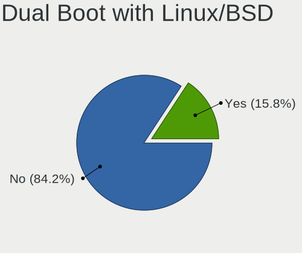
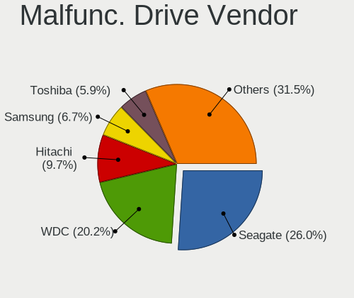
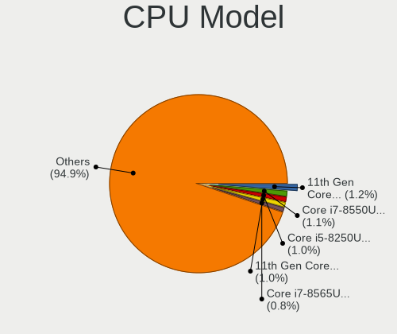
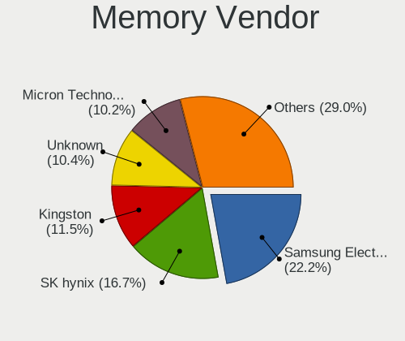

Linux in Italy - Tested Hardware & Statistics
---------------------------------------------

A project to collect tested hardware configurations for Linux in Italy.

Anyone can contribute to this report by the [hw-probe](https://github.com/linuxhw/hw-probe) tool:

    sudo -E hw-probe -all -upload

Please contribute! Especially if your hardware is rare.

This is a report for all computer types. See also reports for [desktops](/Location/Italy/Desktop/README.md) and [notebooks](/Location/Italy/Notebook/README.md).

Contents
--------

* [ Test Cases ](#test-cases)

* [ System ](#system)
  - [ OS                       ](#os)
  - [ OS Family                ](#os-family)
  - [ Kernel                   ](#kernel)
  - [ Kernel Family            ](#kernel-family)
  - [ Kernel Major Ver.        ](#kernel-major-ver)
  - [ Arch                     ](#arch)
  - [ DE                       ](#de)
  - [ Display Server           ](#display-server)
  - [ Display Manager          ](#display-manager)
  - [ OS Lang                  ](#os-lang)
  - [ Boot Mode                ](#boot-mode)
  - [ Filesystem               ](#filesystem)
  - [ Part. scheme             ](#part-scheme)
  - [ Dual Boot with Linux/BSD ](#dual-boot-with-linuxbsd)
  - [ Dual Boot (Win)          ](#dual-boot-win)

* [ Board ](#board)
  - [ Vendor                   ](#vendor)
  - [ Model                    ](#model)
  - [ Model Family             ](#model-family)
  - [ MFG Year                 ](#mfg-year)
  - [ Form Factor              ](#form-factor)
  - [ Secure Boot              ](#secure-boot)
  - [ Coreboot                 ](#coreboot)
  - [ RAM Size                 ](#ram-size)
  - [ RAM Used                 ](#ram-used)
  - [ Total Drives             ](#total-drives)
  - [ Has CD-ROM               ](#has-cd-rom)
  - [ Has Ethernet             ](#has-ethernet)
  - [ Has WiFi                 ](#has-wifi)
  - [ Has Bluetooth            ](#has-bluetooth)

* [ Location ](#location)
  - [ Country                  ](#country)
  - [ City                     ](#city)

* [ Drives ](#drives)
  - [ Drive Vendor             ](#drive-vendor)
  - [ Drive Model              ](#drive-model)
  - [ HDD Vendor               ](#hdd-vendor)
  - [ SSD Vendor               ](#ssd-vendor)
  - [ Drive Kind               ](#drive-kind)
  - [ Drive Connector          ](#drive-connector)
  - [ Drive Size               ](#drive-size)
  - [ Space Total              ](#space-total)
  - [ Space Used               ](#space-used)
  - [ Malfunc. Drives          ](#malfunc-drives)
  - [ Malfunc. Drive Vendor    ](#malfunc-drive-vendor)
  - [ Malfunc. HDD Vendor      ](#malfunc-hdd-vendor)
  - [ Malfunc. Drive Kind      ](#malfunc-drive-kind)
  - [ Failed Drives            ](#failed-drives)
  - [ Failed Drive Vendor      ](#failed-drive-vendor)
  - [ Drive Status             ](#drive-status)

* [ Storage controller ](#storage-controller)
  - [ Storage Vendor           ](#storage-vendor)
  - [ Storage Model            ](#storage-model)
  - [ Storage Kind             ](#storage-kind)

* [ Processor ](#processor)
  - [ CPU Vendor               ](#cpu-vendor)
  - [ CPU Model                ](#cpu-model)
  - [ CPU Model Family         ](#cpu-model-family)
  - [ CPU Cores                ](#cpu-cores)
  - [ CPU Sockets              ](#cpu-sockets)
  - [ CPU Threads              ](#cpu-threads)
  - [ CPU Op-Modes             ](#cpu-op-modes)
  - [ CPU Microcode            ](#cpu-microcode)
  - [ CPU Microarch            ](#cpu-microarch)

* [ Graphics ](#graphics)
  - [ GPU Vendor               ](#gpu-vendor)
  - [ GPU Model                ](#gpu-model)
  - [ GPU Combo                ](#gpu-combo)
  - [ GPU Driver               ](#gpu-driver)
  - [ GPU Memory               ](#gpu-memory)

* [ Monitor ](#monitor)
  - [ Monitor Vendor           ](#monitor-vendor)
  - [ Monitor Model            ](#monitor-model)
  - [ Monitor Resolution       ](#monitor-resolution)
  - [ Monitor Diagonal         ](#monitor-diagonal)
  - [ Monitor Width            ](#monitor-width)
  - [ Aspect Ratio             ](#aspect-ratio)
  - [ Monitor Area             ](#monitor-area)
  - [ Pixel Density            ](#pixel-density)
  - [ Multiple Monitors        ](#multiple-monitors)

* [ Network ](#network)
  - [ Net Controller Vendor    ](#net-controller-vendor)
  - [ Net Controller Model     ](#net-controller-model)
  - [ Wireless Vendor          ](#wireless-vendor)
  - [ Wireless Model           ](#wireless-model)
  - [ Ethernet Vendor          ](#ethernet-vendor)
  - [ Ethernet Model           ](#ethernet-model)
  - [ Net Controller Kind      ](#net-controller-kind)
  - [ Used Controller          ](#used-controller)
  - [ NICs                     ](#nics)
  - [ IPv6                     ](#ipv6)

* [ Bluetooth ](#bluetooth)
  - [ Bluetooth Vendor         ](#bluetooth-vendor)
  - [ Bluetooth Model          ](#bluetooth-model)

* [ Sound ](#sound)
  - [ Sound Vendor             ](#sound-vendor)
  - [ Sound Model              ](#sound-model)

* [ Memory ](#memory)
  - [ Memory Vendor            ](#memory-vendor)
  - [ Memory Model             ](#memory-model)
  - [ Memory Kind              ](#memory-kind)
  - [ Memory Form Factor       ](#memory-form-factor)
  - [ Memory Size              ](#memory-size)
  - [ Memory Speed             ](#memory-speed)

* [ Printers & scanners ](#printers--scanners)
  - [ Printer Vendor           ](#printer-vendor)
  - [ Printer Model            ](#printer-model)
  - [ Scanner Vendor           ](#scanner-vendor)
  - [ Scanner Model            ](#scanner-model)

* [ Camera ](#camera)
  - [ Camera Vendor            ](#camera-vendor)
  - [ Camera Model             ](#camera-model)

* [ Security ](#security)
  - [ Fingerprint Vendor       ](#fingerprint-vendor)
  - [ Fingerprint Model        ](#fingerprint-model)
  - [ Chipcard Vendor          ](#chipcard-vendor)
  - [ Chipcard Model           ](#chipcard-model)

* [ Unsupported ](#unsupported)
  - [ Unsupported Devices      ](#unsupported-devices)
  - [ Unsupported Device Types ](#unsupported-device-types)

Test Cases
----------

Total: 11692

| Vendor        | Model                       | Form-Factor | Probe                                                      | Date         |
|---------------|-----------------------------|-------------|------------------------------------------------------------|--------------|
| Dell          | Vostro 3560                 | Notebook    | [9acebbf655](https://linux-hardware.org/?probe=9acebbf655) | Oct 01, 2023 |
| HP            | ProBook 440 G4              | Notebook    | [8db3bb5b34](https://linux-hardware.org/?probe=8db3bb5b34) | Oct 01, 2023 |
| ASUSTek       | PRIME H610M-E D4            | Desktop     | [8985b86479](https://linux-hardware.org/?probe=8985b86479) | Oct 01, 2023 |
| ASUSTek       | VivoBook_ASUSLaptop X512... | Notebook    | [ef74c51c65](https://linux-hardware.org/?probe=ef74c51c65) | Oct 01, 2023 |
| HUAWEI        | VLT-WX0                     | Notebook    | [a312a57d16](https://linux-hardware.org/?probe=a312a57d16) | Sep 30, 2023 |
| MSI           | B450-A PRO MAX              | Desktop     | [6ee0910511](https://linux-hardware.org/?probe=6ee0910511) | Sep 30, 2023 |
| Lenovo        | 3106 SDK0J40697 WIN 3305... | Desktop     | [c93af00811](https://linux-hardware.org/?probe=c93af00811) | Sep 30, 2023 |
| Lenovo        | IdeaPad 3 15ADA6 82KR       | Notebook    | [58552d0532](https://linux-hardware.org/?probe=58552d0532) | Sep 30, 2023 |
| ASUSTek       | CG8480                      | Desktop     | [dc174e8f73](https://linux-hardware.org/?probe=dc174e8f73) | Sep 30, 2023 |
| Toshiba       | Satellite L500              | Notebook    | [9c1b258088](https://linux-hardware.org/?probe=9c1b258088) | Sep 30, 2023 |
| Dell          | Latitude 7390               | Notebook    | [bd6d90d41e](https://linux-hardware.org/?probe=bd6d90d41e) | Sep 30, 2023 |
| MSI           | P67A-C43                    | Desktop     | [22492f6d47](https://linux-hardware.org/?probe=22492f6d47) | Sep 30, 2023 |
| Fujitsu Si... | ESPRIMO Mobile V6555        | Notebook    | [703170e428](https://linux-hardware.org/?probe=703170e428) | Sep 30, 2023 |
| ASRock        | 4Core1600-GLAN              | Desktop     | [aefbc14017](https://linux-hardware.org/?probe=aefbc14017) | Sep 30, 2023 |
| ASUSTek       | A5401WRP                    | All in one  | [354c1dc0ba](https://linux-hardware.org/?probe=354c1dc0ba) | Sep 29, 2023 |
| Acer          | Nitro N50-610               | Desktop     | [a91f602e4a](https://linux-hardware.org/?probe=a91f602e4a) | Sep 29, 2023 |
| eMachines     | eME732Z                     | Notebook    | [ba03824830](https://linux-hardware.org/?probe=ba03824830) | Sep 29, 2023 |
| Dell          | Latitude 7490               | Notebook    | [a22e4e9304](https://linux-hardware.org/?probe=a22e4e9304) | Sep 29, 2023 |
| GEEKOM        | Mini IT 8                   | Desktop     | [fc5d6092da](https://linux-hardware.org/?probe=fc5d6092da) | Sep 29, 2023 |
| MSI           | Prestige 15 A12SC           | Notebook    | [d78d241946](https://linux-hardware.org/?probe=d78d241946) | Sep 29, 2023 |
| Lenovo        | ThinkPad T480s 20L8002WM... | Notebook    | [eef8975f1e](https://linux-hardware.org/?probe=eef8975f1e) | Sep 29, 2023 |
| MSI           | A320M-A PRO MAX             | Desktop     | [4aa521a31f](https://linux-hardware.org/?probe=4aa521a31f) | Sep 29, 2023 |
| Lenovo        | ThinkPad W541 20EGS24J00    | Notebook    | [99fb3ec5e9](https://linux-hardware.org/?probe=99fb3ec5e9) | Sep 29, 2023 |
| ASUSTek       | H81M-E                      | Desktop     | [0137140cae](https://linux-hardware.org/?probe=0137140cae) | Sep 28, 2023 |
| ASUSTek       | PRIME B450M-A               | Desktop     | [6bce0e41d9](https://linux-hardware.org/?probe=6bce0e41d9) | Sep 28, 2023 |
| MSI           | MPG B550 GAMING PLUS        | Desktop     | [8f35ffb248](https://linux-hardware.org/?probe=8f35ffb248) | Sep 28, 2023 |
| MSI           | H310M PRO-VD                | Desktop     | [67e14c1b2d](https://linux-hardware.org/?probe=67e14c1b2d) | Sep 28, 2023 |
| HP            | 0AA8h                       | Desktop     | [7c8c8fbb40](https://linux-hardware.org/?probe=7c8c8fbb40) | Sep 28, 2023 |
| Acer          | Aspire E1-570G              | Notebook    | [17584cef15](https://linux-hardware.org/?probe=17584cef15) | Sep 28, 2023 |
| MSI           | GL73 8RE                    | Notebook    | [670f7351b5](https://linux-hardware.org/?probe=670f7351b5) | Sep 28, 2023 |
| HP            | 843C                        | Desktop     | [4af4a9e798](https://linux-hardware.org/?probe=4af4a9e798) | Sep 28, 2023 |
| HP            | Laptop 15s-fq0xxx           | Notebook    | [4c1a2e1e21](https://linux-hardware.org/?probe=4c1a2e1e21) | Sep 28, 2023 |
| Lenovo        | ThinkPad E14 Gen 3 20Y70... | Notebook    | [78b1c422c7](https://linux-hardware.org/?probe=78b1c422c7) | Sep 28, 2023 |
| Intel         | H61                         | Desktop     | [f41171114f](https://linux-hardware.org/?probe=f41171114f) | Sep 28, 2023 |
| HP            | EliteBook 840 G6            | Notebook    | [5b87382fce](https://linux-hardware.org/?probe=5b87382fce) | Sep 28, 2023 |
| Lenovo        | ThinkBook 15 G2 ITL 20VE    | Notebook    | [6fc52a277a](https://linux-hardware.org/?probe=6fc52a277a) | Sep 28, 2023 |
| Medion        | E3221                       | Convertible | [eaa3a2c9ee](https://linux-hardware.org/?probe=eaa3a2c9ee) | Sep 27, 2023 |
| MSI           | MPG Z490M GAMING EDGE WI... | Desktop     | [23150c5bd3](https://linux-hardware.org/?probe=23150c5bd3) | Sep 27, 2023 |
| AMI           | Cherry Trail CR             | Notebook    | [41b2d006c1](https://linux-hardware.org/?probe=41b2d006c1) | Sep 27, 2023 |
| AMI           | Cherry Trail CR             | Notebook    | [050c423c6b](https://linux-hardware.org/?probe=050c423c6b) | Sep 27, 2023 |
| Unknown       | Unknown                     | Desktop     | [2bf5f64c14](https://linux-hardware.org/?probe=2bf5f64c14) | Sep 27, 2023 |
| Lenovo        | ThinkPad W541 20EGS24J00    | Notebook    | [e87c0e3c00](https://linux-hardware.org/?probe=e87c0e3c00) | Sep 27, 2023 |
| MSI           | A320M-A PRO MAX             | Desktop     | [f6c6bfc3fe](https://linux-hardware.org/?probe=f6c6bfc3fe) | Sep 27, 2023 |
| Gigabyte      | B450M DS3H-CF               | Desktop     | [812b06784e](https://linux-hardware.org/?probe=812b06784e) | Sep 27, 2023 |
| YANYU         | H17SL                       | Desktop     | [5966ae64d0](https://linux-hardware.org/?probe=5966ae64d0) | Sep 26, 2023 |
| HP            | Laptop 15-bw0xx             | Notebook    | [ba7c544fbb](https://linux-hardware.org/?probe=ba7c544fbb) | Sep 26, 2023 |
| ASUSTek       | Z97-PRO GAMER               | Desktop     | [0a5cc18946](https://linux-hardware.org/?probe=0a5cc18946) | Sep 26, 2023 |
| ASUSTek       | E1600WKA                    | All in one  | [43c8a9b758](https://linux-hardware.org/?probe=43c8a9b758) | Sep 26, 2023 |
| ASUSTek       | M5A97 R2.0                  | Desktop     | [275018a17e](https://linux-hardware.org/?probe=275018a17e) | Sep 26, 2023 |
| Samsung       | R519/R719                   | Notebook    | [15ae7c9603](https://linux-hardware.org/?probe=15ae7c9603) | Sep 26, 2023 |
| Foxconn       | 2ABF                        | Desktop     | [2be1547618](https://linux-hardware.org/?probe=2be1547618) | Sep 26, 2023 |
| ASUSTek       | P9D WS                      | Desktop     | [fd2133400d](https://linux-hardware.org/?probe=fd2133400d) | Sep 25, 2023 |
| MSI           | MPG Z490M GAMING EDGE WI... | Desktop     | [a6ef2b5028](https://linux-hardware.org/?probe=a6ef2b5028) | Sep 25, 2023 |
| HP            | 250 G4                      | Notebook    | [6e475cbb1f](https://linux-hardware.org/?probe=6e475cbb1f) | Sep 25, 2023 |
| HP            | 250 G4                      | Notebook    | [9543354fea](https://linux-hardware.org/?probe=9543354fea) | Sep 25, 2023 |
| Dell          | 0200DY A02                  | Desktop     | [0ecd2d60b4](https://linux-hardware.org/?probe=0ecd2d60b4) | Sep 25, 2023 |
| Samsung       | 750XDA                      | Notebook    | [dd03d00004](https://linux-hardware.org/?probe=dd03d00004) | Sep 25, 2023 |
| Lenovo        | IdeaPad 720S-13IKB 81BV     | Notebook    | [7ea3152d65](https://linux-hardware.org/?probe=7ea3152d65) | Sep 25, 2023 |
| HP            | 255 G8 Notebook PC          | Notebook    | [38b5be59cc](https://linux-hardware.org/?probe=38b5be59cc) | Sep 25, 2023 |
| HP            | 255 G8 Notebook PC          | Notebook    | [91c3333a18](https://linux-hardware.org/?probe=91c3333a18) | Sep 25, 2023 |
| Dell          | Vostro 1000                 | Notebook    | [38499a1a0f](https://linux-hardware.org/?probe=38499a1a0f) | Sep 25, 2023 |
| Dell          | 0773VG A02                  | Desktop     | [83390c3986](https://linux-hardware.org/?probe=83390c3986) | Sep 25, 2023 |
| Dell          | Vostro 15 3510              | Notebook    | [e8868c236d](https://linux-hardware.org/?probe=e8868c236d) | Sep 25, 2023 |
| Dell          | Vostro 15 3510              | Notebook    | [eaa5061963](https://linux-hardware.org/?probe=eaa5061963) | Sep 25, 2023 |
| TUXEDO        | Unknown                     | Notebook    | [6746de397a](https://linux-hardware.org/?probe=6746de397a) | Sep 25, 2023 |
| Raspberry ... | Raspberry Pi 3 Model B P... | Soc         | [42473f0360](https://linux-hardware.org/?probe=42473f0360) | Sep 25, 2023 |
| ASUSTek       | X553MA                      | Notebook    | [b6b370953d](https://linux-hardware.org/?probe=b6b370953d) | Sep 24, 2023 |
| ASUSTek       | X553MA                      | Notebook    | [78977336f9](https://linux-hardware.org/?probe=78977336f9) | Sep 24, 2023 |
| Acer          | H11H4-AI V:1.0              | Desktop     | [971f03180e](https://linux-hardware.org/?probe=971f03180e) | Sep 24, 2023 |
| ASUSTek       | H81M-E                      | Desktop     | [6d3f4579cd](https://linux-hardware.org/?probe=6d3f4579cd) | Sep 24, 2023 |
| Gigabyte      | GA-78LMT-USB3 R2 sex        | Desktop     | [c80ba0c0f7](https://linux-hardware.org/?probe=c80ba0c0f7) | Sep 24, 2023 |
| Foxconn       | H67MP-S/-V/H67MP            | Desktop     | [67b0050938](https://linux-hardware.org/?probe=67b0050938) | Sep 24, 2023 |
| Acer          | Aspire 5734Z                | Notebook    | [d5219dbfbe](https://linux-hardware.org/?probe=d5219dbfbe) | Sep 24, 2023 |
| HP            | 18E7                        | Desktop     | [6257920a37](https://linux-hardware.org/?probe=6257920a37) | Sep 24, 2023 |
| HUAWEI        | BOD-WXX9                    | Notebook    | [e688665729](https://linux-hardware.org/?probe=e688665729) | Sep 24, 2023 |
| Lenovo        | ThinkPad T480s 20L8002WM... | Notebook    | [234fc6a6fb](https://linux-hardware.org/?probe=234fc6a6fb) | Sep 24, 2023 |
| HP            | EliteBook 6930p (KK082AV... | Notebook    | [5e61b319b6](https://linux-hardware.org/?probe=5e61b319b6) | Sep 23, 2023 |
| AMI           | Intel                       | Notebook    | [ebb3577023](https://linux-hardware.org/?probe=ebb3577023) | Sep 23, 2023 |
| HP            | Pavilion dv6                | Notebook    | [bd8ae0385b](https://linux-hardware.org/?probe=bd8ae0385b) | Sep 23, 2023 |
| Apple         | MacBookPro11,1              | Notebook    | [e9478deeae](https://linux-hardware.org/?probe=e9478deeae) | Sep 23, 2023 |
| HP            | 255 G8 Notebook PC          | Notebook    | [7fcb0a9529](https://linux-hardware.org/?probe=7fcb0a9529) | Sep 23, 2023 |
| ASUSTek       | X510UQR                     | Notebook    | [364ee59aef](https://linux-hardware.org/?probe=364ee59aef) | Sep 23, 2023 |
| HP            | Compaq Presario CQ60        | Notebook    | [ae8071638f](https://linux-hardware.org/?probe=ae8071638f) | Sep 23, 2023 |
| HP            | Laptop 15-dw1xxx            | Notebook    | [be4a46768b](https://linux-hardware.org/?probe=be4a46768b) | Sep 23, 2023 |
| Dell          | 0WR7PY A01                  | Desktop     | [64e4102978](https://linux-hardware.org/?probe=64e4102978) | Sep 23, 2023 |
| Shuttle       | XS36V                       | Desktop     | [dbcb5658e4](https://linux-hardware.org/?probe=dbcb5658e4) | Sep 23, 2023 |
| HUAWEI        | BOM-WXX9                    | Notebook    | [830bf573b1](https://linux-hardware.org/?probe=830bf573b1) | Sep 23, 2023 |
| HP            | EliteBook 845 G8 Noteboo... | Notebook    | [574c2193bb](https://linux-hardware.org/?probe=574c2193bb) | Sep 23, 2023 |
| TUXEDO        | Unknown                     | Notebook    | [07870d9c20](https://linux-hardware.org/?probe=07870d9c20) | Sep 22, 2023 |
| ASUSTek       | PRIME Z370-P                | Desktop     | [fb3ade25c0](https://linux-hardware.org/?probe=fb3ade25c0) | Sep 22, 2023 |
| HP            | Pavilion dv6                | Notebook    | [270b0c0878](https://linux-hardware.org/?probe=270b0c0878) | Sep 21, 2023 |
| ASUSTek       | Vivobook Go E1504FA_E150... | Notebook    | [3cd9b7841a](https://linux-hardware.org/?probe=3cd9b7841a) | Sep 21, 2023 |
| MSI           | Boston                      | Desktop     | [a9fe9241ec](https://linux-hardware.org/?probe=a9fe9241ec) | Sep 21, 2023 |
| MSI           | A88XM-E45                   | Desktop     | [99b5c7c976](https://linux-hardware.org/?probe=99b5c7c976) | Sep 21, 2023 |
| HP            | 250 G7 Notebook PC          | Notebook    | [cc25c24fa5](https://linux-hardware.org/?probe=cc25c24fa5) | Sep 21, 2023 |
| HP            | 15                          | Notebook    | [d0ddd6fbc9](https://linux-hardware.org/?probe=d0ddd6fbc9) | Sep 21, 2023 |
| HP            | 255 G8 Notebook PC          | Notebook    | [d92a4fb2af](https://linux-hardware.org/?probe=d92a4fb2af) | Sep 21, 2023 |
| ASRock        | H310M-HDV                   | Desktop     | [0ac59e2ff6](https://linux-hardware.org/?probe=0ac59e2ff6) | Sep 21, 2023 |
| HP            | 2ADC                        | Desktop     | [b4794f247b](https://linux-hardware.org/?probe=b4794f247b) | Sep 21, 2023 |
| HP            | 2ADC                        | Desktop     | [7e9eb06b31](https://linux-hardware.org/?probe=7e9eb06b31) | Sep 21, 2023 |
| MSI           | Katana GF66 11UC            | Notebook    | [20dfeb32a2](https://linux-hardware.org/?probe=20dfeb32a2) | Sep 21, 2023 |
| MSI           | Summit E13FlipEvo A12MT     | Notebook    | [bd096f1ae3](https://linux-hardware.org/?probe=bd096f1ae3) | Sep 20, 2023 |
| HP            | ProBook 450 15.6 inch G9... | Notebook    | [79111191a0](https://linux-hardware.org/?probe=79111191a0) | Sep 20, 2023 |
| Gigabyte      | B450M DS3H-CF               | Desktop     | [f65b051dc9](https://linux-hardware.org/?probe=f65b051dc9) | Sep 20, 2023 |
| Acer          | EG43M                       | Desktop     | [77e78183b9](https://linux-hardware.org/?probe=77e78183b9) | Sep 20, 2023 |
| Huanan        | X99-F8 V2.0                 | Desktop     | [f832424d90](https://linux-hardware.org/?probe=f832424d90) | Sep 19, 2023 |
| Lenovo        | IdeaPad Gaming 3 15IAH7 ... | Notebook    | [ca0ad87f0b](https://linux-hardware.org/?probe=ca0ad87f0b) | Sep 19, 2023 |
| Dell          | Latitude E5450              | Notebook    | [6f16759400](https://linux-hardware.org/?probe=6f16759400) | Sep 19, 2023 |
| ASUSTek       | P5KPL-AM SE                 | Desktop     | [7273c8eb2e](https://linux-hardware.org/?probe=7273c8eb2e) | Sep 19, 2023 |
| HP            | 255 G8 Notebook PC          | Notebook    | [c2cd300139](https://linux-hardware.org/?probe=c2cd300139) | Sep 19, 2023 |
| ASRock        | B450 Steel Legend           | Desktop     | [b294855348](https://linux-hardware.org/?probe=b294855348) | Sep 19, 2023 |
| HP            | 15                          | Notebook    | [b016d5ee79](https://linux-hardware.org/?probe=b016d5ee79) | Sep 18, 2023 |
| ASUSTek       | PRIME B365M-A               | Desktop     | [8922ced8ec](https://linux-hardware.org/?probe=8922ced8ec) | Sep 18, 2023 |
| ASUSTek       | P5KPL-AM SE                 | Desktop     | [9a7a68b69f](https://linux-hardware.org/?probe=9a7a68b69f) | Sep 18, 2023 |
| Lenovo        | Z50-75 80EC                 | Notebook    | [e14140ad96](https://linux-hardware.org/?probe=e14140ad96) | Sep 18, 2023 |
| Dell          | 0PTTT9 A01                  | Desktop     | [35248efbaf](https://linux-hardware.org/?probe=35248efbaf) | Sep 18, 2023 |
| Unknown       | Unknown                     | Desktop     | [faa59f7ab3](https://linux-hardware.org/?probe=faa59f7ab3) | Sep 18, 2023 |
| MSI           | MPG Z590 GAMING FORCE       | Desktop     | [0ac4289831](https://linux-hardware.org/?probe=0ac4289831) | Sep 18, 2023 |
| ASUSTek       | X550LD                      | Notebook    | [a466adc807](https://linux-hardware.org/?probe=a466adc807) | Sep 17, 2023 |
| ASUSTek       | S551LN                      | Notebook    | [50ad376e75](https://linux-hardware.org/?probe=50ad376e75) | Sep 17, 2023 |
| HP            | Pavilion 15                 | Notebook    | [c16424732a](https://linux-hardware.org/?probe=c16424732a) | Sep 17, 2023 |
| HP            | Pavilion 15                 | Notebook    | [47df3b9a6e](https://linux-hardware.org/?probe=47df3b9a6e) | Sep 17, 2023 |
| Toshiba       | Satellite Pro R50-B         | Notebook    | [e3a895eaa7](https://linux-hardware.org/?probe=e3a895eaa7) | Sep 17, 2023 |
| HC Technol... | HCAR5000-MI                 | Desktop     | [eb9e6551ac](https://linux-hardware.org/?probe=eb9e6551ac) | Sep 17, 2023 |
| HC Technol... | HCAR5000-MI                 | Desktop     | [f3a4ce70fb](https://linux-hardware.org/?probe=f3a4ce70fb) | Sep 17, 2023 |
| Lenovo        | ThinkPad X220 4290LT8       | Notebook    | [56d2386012](https://linux-hardware.org/?probe=56d2386012) | Sep 17, 2023 |
| HP            | 250 G1                      | Notebook    | [0e052c1de2](https://linux-hardware.org/?probe=0e052c1de2) | Sep 17, 2023 |
| ASUSTek       | X540SA                      | Notebook    | [68bc662ac9](https://linux-hardware.org/?probe=68bc662ac9) | Sep 17, 2023 |
| Lenovo        | IdeaPad Gaming 3 15IAH7 ... | Notebook    | [bf532ab6ec](https://linux-hardware.org/?probe=bf532ab6ec) | Sep 16, 2023 |
| Lenovo        | IdeaPad Z500 5931           | Notebook    | [8de8aa75cc](https://linux-hardware.org/?probe=8de8aa75cc) | Sep 16, 2023 |
| AZW           | S5 V2.0                     | Mini pc     | [c10acf583a](https://linux-hardware.org/?probe=c10acf583a) | Sep 16, 2023 |
| Lenovo        | IdeaPad Z500 5931           | Notebook    | [0986123aac](https://linux-hardware.org/?probe=0986123aac) | Sep 16, 2023 |
| Acer          | Aspire E1-522               | Notebook    | [cbc5e29bf6](https://linux-hardware.org/?probe=cbc5e29bf6) | Sep 16, 2023 |
| HP            | 250 G7 Notebook PC          | Notebook    | [72503b214c](https://linux-hardware.org/?probe=72503b214c) | Sep 16, 2023 |
| Apple         | Mac-031B6874CF7F642A iMa... | All in one  | [5615ee8a0b](https://linux-hardware.org/?probe=5615ee8a0b) | Sep 16, 2023 |
| Acer          | TravelMate 5335             | Notebook    | [d440c12063](https://linux-hardware.org/?probe=d440c12063) | Sep 16, 2023 |
| ASUSTek       | CM1740                      | Desktop     | [96b9168216](https://linux-hardware.org/?probe=96b9168216) | Sep 16, 2023 |
| ASUSTek       | ROG Maximus Z790 APEX       | Desktop     | [76d354fede](https://linux-hardware.org/?probe=76d354fede) | Sep 16, 2023 |
| ASUSTek       | ROG Maximus Z790 APEX       | Desktop     | [ae35c7426c](https://linux-hardware.org/?probe=ae35c7426c) | Sep 16, 2023 |
| HP            | 15                          | Notebook    | [636b9a80a1](https://linux-hardware.org/?probe=636b9a80a1) | Sep 15, 2023 |
| Lenovo        | Yoga Pro 7 14ARP8 83AU      | Notebook    | [98dbf213e7](https://linux-hardware.org/?probe=98dbf213e7) | Sep 15, 2023 |
| Apple         | MacBookAir7,2               | Notebook    | [2b5ed25fd3](https://linux-hardware.org/?probe=2b5ed25fd3) | Sep 15, 2023 |
| Apple         | MacBookAir7,2               | Notebook    | [5bb7230963](https://linux-hardware.org/?probe=5bb7230963) | Sep 15, 2023 |
| Raspberry ... | Raspberry Pi 4 Model B R... | Soc         | [e8b7d9645c](https://linux-hardware.org/?probe=e8b7d9645c) | Sep 15, 2023 |
| Lenovo        | ThinkPad P15 Gen 1 20STC... | Notebook    | [66b29aeb1d](https://linux-hardware.org/?probe=66b29aeb1d) | Sep 15, 2023 |
| Lenovo        | ThinkPad P15 Gen 1 20STC... | Notebook    | [3eb787f2ec](https://linux-hardware.org/?probe=3eb787f2ec) | Sep 15, 2023 |
| Gigabyte      | B450M DS3H-CF               | Desktop     | [27d7589428](https://linux-hardware.org/?probe=27d7589428) | Sep 15, 2023 |
| ASUSTek       | UX530UX                     | Notebook    | [8651a15c57](https://linux-hardware.org/?probe=8651a15c57) | Sep 14, 2023 |
| Fujitsu       | LIFEBOOK A357               | Notebook    | [a02233b901](https://linux-hardware.org/?probe=a02233b901) | Sep 14, 2023 |
| Lenovo        | Yoga Pro 7 14ARP8 83AU      | Notebook    | [4f6e19f508](https://linux-hardware.org/?probe=4f6e19f508) | Sep 14, 2023 |
| HP            | ENVY Laptop 17-ch0xxx       | Notebook    | [e7463cdeb1](https://linux-hardware.org/?probe=e7463cdeb1) | Sep 14, 2023 |
| ASUSTek       | X556URK                     | Notebook    | [0996de9eac](https://linux-hardware.org/?probe=0996de9eac) | Sep 14, 2023 |
| Acer          | Swift SF113-31              | Notebook    | [f165d66761](https://linux-hardware.org/?probe=f165d66761) | Sep 14, 2023 |
| Foxconn       | H67MP-S/-V/H67MP            | Desktop     | [9df835f343](https://linux-hardware.org/?probe=9df835f343) | Sep 14, 2023 |
| ASUSTek       | P8Z77-V LX                  | Desktop     | [103e7031fe](https://linux-hardware.org/?probe=103e7031fe) | Sep 14, 2023 |
| Intel         | DH67CL AAG10212-210         | Desktop     | [21932b1004](https://linux-hardware.org/?probe=21932b1004) | Sep 14, 2023 |
| ASUSTek       | P8P67-M PRO                 | Desktop     | [799a135aca](https://linux-hardware.org/?probe=799a135aca) | Sep 14, 2023 |
| Unknown       | Unknown                     | Desktop     | [be3cf24114](https://linux-hardware.org/?probe=be3cf24114) | Sep 13, 2023 |
| ASUSTek       | P8Z77-V LX                  | Desktop     | [7cea54ec70](https://linux-hardware.org/?probe=7cea54ec70) | Sep 13, 2023 |
| HP            | x2 210                      | Notebook    | [776f895eec](https://linux-hardware.org/?probe=776f895eec) | Sep 13, 2023 |
| Dell          | Latitude 3420               | Notebook    | [e78cbe0564](https://linux-hardware.org/?probe=e78cbe0564) | Sep 13, 2023 |
| Intel         | X79                         | Desktop     | [e9a4f4dc51](https://linux-hardware.org/?probe=e9a4f4dc51) | Sep 13, 2023 |
| HP            | Pavilion dv6                | Notebook    | [2174e236d6](https://linux-hardware.org/?probe=2174e236d6) | Sep 13, 2023 |
| ASRock        | H97 Anniversary             | Desktop     | [37014ea895](https://linux-hardware.org/?probe=37014ea895) | Sep 13, 2023 |
| Gigabyte      | AB350M-Gaming 3-CF          | Desktop     | [4dcd4e8234](https://linux-hardware.org/?probe=4dcd4e8234) | Sep 13, 2023 |
| Gigabyte      | AB350M-Gaming 3-CF          | Desktop     | [cbfa4c2641](https://linux-hardware.org/?probe=cbfa4c2641) | Sep 13, 2023 |
| ASUSTek       | P8H61-M LX2 R2.0            | Desktop     | [8b55f7f82a](https://linux-hardware.org/?probe=8b55f7f82a) | Sep 13, 2023 |
| ASRock        | H410M-HVS                   | Desktop     | [483bbfcc92](https://linux-hardware.org/?probe=483bbfcc92) | Sep 13, 2023 |
| Lenovo        | IdeaPad 5 Pro 14ARH7 82S... | Notebook    | [52a1dc1e19](https://linux-hardware.org/?probe=52a1dc1e19) | Sep 12, 2023 |
| Sony          | SVE1713X1EB                 | Notebook    | [2284d8a2dd](https://linux-hardware.org/?probe=2284d8a2dd) | Sep 12, 2023 |
| HP            | EliteBook x360 1030 G2      | Convertible | [1d143a22f1](https://linux-hardware.org/?probe=1d143a22f1) | Sep 12, 2023 |
| Lenovo        | ThinkPad P1 Gen 3 20TJS2... | Notebook    | [4715a2425e](https://linux-hardware.org/?probe=4715a2425e) | Sep 12, 2023 |
| ASUSTek       | ZenBook UX363EA_UX363EA     | Convertible | [b26d76e8b1](https://linux-hardware.org/?probe=b26d76e8b1) | Sep 12, 2023 |
| AZW           | MINI S 10                   | Desktop     | [5cd0efea8b](https://linux-hardware.org/?probe=5cd0efea8b) | Sep 12, 2023 |
| MSI           | GL73 8RE                    | Notebook    | [dca28b0d09](https://linux-hardware.org/?probe=dca28b0d09) | Sep 12, 2023 |
| MSI           | GL73 8RE                    | Notebook    | [6c6c4a19ec](https://linux-hardware.org/?probe=6c6c4a19ec) | Sep 12, 2023 |
| Dell          | 0G254H A00                  | Desktop     | [b41d69b7e2](https://linux-hardware.org/?probe=b41d69b7e2) | Sep 12, 2023 |
| Apple         | Mac-942B5BF58194151B        | All in one  | [79d77d78be](https://linux-hardware.org/?probe=79d77d78be) | Sep 12, 2023 |
| Lenovo        | V15-IGL 82C3                | Notebook    | [b6c8bbb82f](https://linux-hardware.org/?probe=b6c8bbb82f) | Sep 12, 2023 |
| HP            | 18E7                        | Desktop     | [a553a173be](https://linux-hardware.org/?probe=a553a173be) | Sep 11, 2023 |
| Cincoze       | DX-1000.01.001              | Desktop     | [561f581c95](https://linux-hardware.org/?probe=561f581c95) | Sep 11, 2023 |
| Dell          | Inspiron 5748               | Notebook    | [afa0844d9f](https://linux-hardware.org/?probe=afa0844d9f) | Sep 11, 2023 |
| HUAWEI        | MACHC-WAX9                  | Notebook    | [3cafef18bf](https://linux-hardware.org/?probe=3cafef18bf) | Sep 11, 2023 |
| HP            | 250 G3                      | Notebook    | [162574954f](https://linux-hardware.org/?probe=162574954f) | Sep 11, 2023 |
| HP            | Pavilion zd8000 (EF038EA... | Notebook    | [f58cbb99ad](https://linux-hardware.org/?probe=f58cbb99ad) | Sep 11, 2023 |
| HP            | Pavilion zd8000 (EF038EA... | Notebook    | [accb107fb0](https://linux-hardware.org/?probe=accb107fb0) | Sep 11, 2023 |
| ASUSTek       | H110M-A/M.2                 | Desktop     | [e186172ee4](https://linux-hardware.org/?probe=e186172ee4) | Sep 10, 2023 |
| Dell          | Inspiron 5515               | Notebook    | [a6c468e52d](https://linux-hardware.org/?probe=a6c468e52d) | Sep 10, 2023 |
| Acer          | Veriton M2631 V:1.0         | Desktop     | [ec947814d1](https://linux-hardware.org/?probe=ec947814d1) | Sep 10, 2023 |
| ASUSTek       | X550CC                      | Notebook    | [838e1d8f4a](https://linux-hardware.org/?probe=838e1d8f4a) | Sep 10, 2023 |
| MSI           | Modern 14 B11MOU            | Notebook    | [394bdfe7af](https://linux-hardware.org/?probe=394bdfe7af) | Sep 10, 2023 |
| Lenovo        | ThinkPad P16s Gen 2 21HK... | Notebook    | [511507697a](https://linux-hardware.org/?probe=511507697a) | Sep 10, 2023 |
| Lenovo        | V15 G4 AMN 82YU             | Notebook    | [e8f4b3bf42](https://linux-hardware.org/?probe=e8f4b3bf42) | Sep 09, 2023 |
| Google        | Rabbid                      | Notebook    | [c55be85343](https://linux-hardware.org/?probe=c55be85343) | Sep 09, 2023 |
| Acer          | Aspire E1-531               | Notebook    | [91decda3c9](https://linux-hardware.org/?probe=91decda3c9) | Sep 09, 2023 |
| Lenovo        | V15 G4 AMN 82YU             | Notebook    | [69458a43ef](https://linux-hardware.org/?probe=69458a43ef) | Sep 09, 2023 |
| Dell          | System Vostro 3750          | Notebook    | [00a11a78f5](https://linux-hardware.org/?probe=00a11a78f5) | Sep 09, 2023 |
| MSI           | B450M GAMING PLUS           | Desktop     | [5bf280924d](https://linux-hardware.org/?probe=5bf280924d) | Sep 09, 2023 |
| HP            | ProBook 650 G1              | Notebook    | [d46b2b90ec](https://linux-hardware.org/?probe=d46b2b90ec) | Sep 09, 2023 |
| ASUSTek       | P8B75-M                     | Desktop     | [d64063efa5](https://linux-hardware.org/?probe=d64063efa5) | Sep 09, 2023 |
| LG Electro... | 14Z990-V.AR52D              | Notebook    | [9a0f106aa0](https://linux-hardware.org/?probe=9a0f106aa0) | Sep 08, 2023 |
| ASUSTek       | VivoBook_ASUSLaptop X509... | Notebook    | [5fc227a0e8](https://linux-hardware.org/?probe=5fc227a0e8) | Sep 08, 2023 |
| MSI           | Boston                      | Desktop     | [865959d898](https://linux-hardware.org/?probe=865959d898) | Sep 08, 2023 |
| ASUSTek       | P8P67-M PRO                 | Desktop     | [6ec67cd2f1](https://linux-hardware.org/?probe=6ec67cd2f1) | Sep 08, 2023 |
| Lenovo        | IdeaPadFlex 5 14ABR8 82X... | Convertible | [fe6b08c772](https://linux-hardware.org/?probe=fe6b08c772) | Sep 08, 2023 |
| Lenovo        | IdeaPadFlex 5 14ABR8 82X... | Convertible | [c0422be924](https://linux-hardware.org/?probe=c0422be924) | Sep 08, 2023 |
| MSI           | Prestige 14Evo A12M         | Notebook    | [42ba1f73b8](https://linux-hardware.org/?probe=42ba1f73b8) | Sep 08, 2023 |
| Acer          | Veriton M2632G V:1.0        | Desktop     | [a0363f72e3](https://linux-hardware.org/?probe=a0363f72e3) | Sep 08, 2023 |
| HP            | 250 G3                      | Notebook    | [51ef1d34d0](https://linux-hardware.org/?probe=51ef1d34d0) | Sep 08, 2023 |
| ASUSTek       | X510UQ                      | Notebook    | [b838a2495b](https://linux-hardware.org/?probe=b838a2495b) | Sep 08, 2023 |
| Acer          | Nitro AN515-45              | Notebook    | [e7d0ece5a1](https://linux-hardware.org/?probe=e7d0ece5a1) | Sep 08, 2023 |
| Apple         | MacBookPro11,2              | Notebook    | [d6cfec3d58](https://linux-hardware.org/?probe=d6cfec3d58) | Sep 08, 2023 |
| Lenovo        | ThinkPad T495s 20QJCTO1W... | Notebook    | [c9d6171716](https://linux-hardware.org/?probe=c9d6171716) | Sep 08, 2023 |
| Gigabyte      | X570 I AORUS PRO WIFI       | Desktop     | [c06ee9858a](https://linux-hardware.org/?probe=c06ee9858a) | Sep 08, 2023 |
| Apple         | MacBookPro11,2              | Notebook    | [654a62e050](https://linux-hardware.org/?probe=654a62e050) | Sep 07, 2023 |
| ASUSTek       | P5K-VM                      | Desktop     | [9b8cb6e3f6](https://linux-hardware.org/?probe=9b8cb6e3f6) | Sep 07, 2023 |
| MSI           | B450 TOMAHAWK MAX           | Desktop     | [36a4c33de8](https://linux-hardware.org/?probe=36a4c33de8) | Sep 07, 2023 |
| Unknown       | Unknown                     | Desktop     | [b0fccd6eb5](https://linux-hardware.org/?probe=b0fccd6eb5) | Sep 07, 2023 |
| ASRock        | 775Dual-VSTA                | Desktop     | [05af667eb0](https://linux-hardware.org/?probe=05af667eb0) | Sep 07, 2023 |
| Apple         | Mac-8ED6AF5B48C039E1 Mac... | Mini pc     | [adc9ee1464](https://linux-hardware.org/?probe=adc9ee1464) | Sep 07, 2023 |
| ASUSTek       | SABERTOOTH P67              | Desktop     | [002bdcd34d](https://linux-hardware.org/?probe=002bdcd34d) | Sep 07, 2023 |
| Clevo         | M1100M                      | Notebook    | [399b796d9f](https://linux-hardware.org/?probe=399b796d9f) | Sep 06, 2023 |
| Dell          | 00P8G1 A00                  | All in one  | [3ce904c03e](https://linux-hardware.org/?probe=3ce904c03e) | Sep 06, 2023 |
| Lenovo        | ThinkPad E14 Gen 2 20TA0... | Notebook    | [0468bc91fc](https://linux-hardware.org/?probe=0468bc91fc) | Sep 06, 2023 |
| ASRock        | Z97M OC Formula             | Desktop     | [1f2c20e8cf](https://linux-hardware.org/?probe=1f2c20e8cf) | Sep 06, 2023 |
| ASUSTek       | X555QG                      | Notebook    | [8cf63afc0f](https://linux-hardware.org/?probe=8cf63afc0f) | Sep 06, 2023 |
| Unknown       | Unknown                     | Desktop     | [7fd153d869](https://linux-hardware.org/?probe=7fd153d869) | Sep 06, 2023 |
| Unknown       | Unknown                     | Desktop     | [6508e8eeb8](https://linux-hardware.org/?probe=6508e8eeb8) | Sep 06, 2023 |
| TUXEDO        | Unknown                     | Notebook    | [1e6c412d84](https://linux-hardware.org/?probe=1e6c412d84) | Sep 06, 2023 |
| HP            | Notebook                    | Notebook    | [ad9bafda30](https://linux-hardware.org/?probe=ad9bafda30) | Sep 06, 2023 |
| HP            | Laptop 15s-eq2xxx           | Notebook    | [03f6b3b62b](https://linux-hardware.org/?probe=03f6b3b62b) | Sep 06, 2023 |
| Sony          | SVE1712C5E                  | Notebook    | [a5c77b2450](https://linux-hardware.org/?probe=a5c77b2450) | Sep 06, 2023 |
| Lenovo        | IdeaPad Gaming 3 15ARH05... | Notebook    | [0fdeca1313](https://linux-hardware.org/?probe=0fdeca1313) | Sep 06, 2023 |
| Sony          | SVE1712C5E                  | Notebook    | [f864c8e44a](https://linux-hardware.org/?probe=f864c8e44a) | Sep 05, 2023 |
| Sony          | SVE1713X1EB                 | Notebook    | [f7c65dc902](https://linux-hardware.org/?probe=f7c65dc902) | Sep 05, 2023 |
| ASUSTek       | ROG CROSSHAIR VIII DARK ... | Desktop     | [c404211007](https://linux-hardware.org/?probe=c404211007) | Sep 05, 2023 |
| Notebook      | N9x0TC                      | Notebook    | [ea9c38200b](https://linux-hardware.org/?probe=ea9c38200b) | Sep 05, 2023 |
| ASUSTek       | ROG Flow X13 GV301QH_GV3... | Notebook    | [7619d8e5e8](https://linux-hardware.org/?probe=7619d8e5e8) | Sep 05, 2023 |
| Dell          | 0PTTT9 A01                  | Desktop     | [2c7accd18e](https://linux-hardware.org/?probe=2c7accd18e) | Sep 05, 2023 |
| ASRock        | 970 Extreme4                | Desktop     | [4196acbe15](https://linux-hardware.org/?probe=4196acbe15) | Sep 05, 2023 |
| Toshiba       | Satellite C850-1DZ          | Notebook    | [cf916c2f33](https://linux-hardware.org/?probe=cf916c2f33) | Sep 05, 2023 |
| MSI           | Boston                      | Desktop     | [5e1b8aa70b](https://linux-hardware.org/?probe=5e1b8aa70b) | Sep 04, 2023 |
| Gigabyte      | Z390 AORUS PRO-CF           | Desktop     | [a9321ea88e](https://linux-hardware.org/?probe=a9321ea88e) | Sep 04, 2023 |
| MSI           | Boston                      | Desktop     | [5ad763345c](https://linux-hardware.org/?probe=5ad763345c) | Sep 04, 2023 |
| ASUSTek       | K52JB                       | Notebook    | [7944dc4ca2](https://linux-hardware.org/?probe=7944dc4ca2) | Sep 04, 2023 |
| HP            | Laptop 15s-eq2xxx           | Notebook    | [522dd175b1](https://linux-hardware.org/?probe=522dd175b1) | Sep 04, 2023 |
| HUAWEI        | MateBook HZ-W09             | Tablet      | [1e12adec6b](https://linux-hardware.org/?probe=1e12adec6b) | Sep 04, 2023 |
| Intel         | DG41RQ AAE54511-203         | Desktop     | [46aeab1365](https://linux-hardware.org/?probe=46aeab1365) | Sep 04, 2023 |
| Dell          | 0773VG A00                  | Desktop     | [426a2f4142](https://linux-hardware.org/?probe=426a2f4142) | Sep 04, 2023 |
| AZW           | MINI S 10                   | Desktop     | [54967a6b36](https://linux-hardware.org/?probe=54967a6b36) | Sep 04, 2023 |
| Raspberry ... | Raspberry Pi                | Soc         | [34410efd6c](https://linux-hardware.org/?probe=34410efd6c) | Sep 04, 2023 |
| ASRock        | Z790 Taichi Carrara         | Desktop     | [80f9f3915b](https://linux-hardware.org/?probe=80f9f3915b) | Sep 04, 2023 |
| HP            | Notebook                    | Notebook    | [9be8a6b0e7](https://linux-hardware.org/?probe=9be8a6b0e7) | Sep 03, 2023 |
| HP            | Notebook                    | Notebook    | [d038b7106e](https://linux-hardware.org/?probe=d038b7106e) | Sep 03, 2023 |
| HP            | 1825                        | Desktop     | [ea5da3d446](https://linux-hardware.org/?probe=ea5da3d446) | Sep 03, 2023 |
| HP            | 240 G8 Notebook PC          | Notebook    | [092ae0b34d](https://linux-hardware.org/?probe=092ae0b34d) | Sep 03, 2023 |
| HP            | Laptop 15s-eq3xxx           | Notebook    | [399abaa799](https://linux-hardware.org/?probe=399abaa799) | Sep 02, 2023 |
| Microtech     | ebookPro                    | Notebook    | [ce14e0ffeb](https://linux-hardware.org/?probe=ce14e0ffeb) | Sep 02, 2023 |
| Apple         | Mac-942B5BF58194151B        | All in one  | [e7b6359ed9](https://linux-hardware.org/?probe=e7b6359ed9) | Sep 02, 2023 |
| ASUSTek       | PRIME B450-PLUS             | Desktop     | [5590e2e8d6](https://linux-hardware.org/?probe=5590e2e8d6) | Sep 02, 2023 |
| HP            | Compaq Presario CQ61        | Notebook    | [0cd9e98276](https://linux-hardware.org/?probe=0cd9e98276) | Sep 02, 2023 |
| Chuwi         | LapBook Pro                 | Notebook    | [4dd222efaa](https://linux-hardware.org/?probe=4dd222efaa) | Sep 01, 2023 |
| Lenovo        | YB1-X91L                    | Convertible | [af7d9b26da](https://linux-hardware.org/?probe=af7d9b26da) | Sep 01, 2023 |
| Shenzhen M... | F6BFC                       | Desktop     | [4b8aead223](https://linux-hardware.org/?probe=4b8aead223) | Sep 01, 2023 |
| Intel         | DP67DE AAG10217-300         | Desktop     | [4d0db0b964](https://linux-hardware.org/?probe=4d0db0b964) | Sep 01, 2023 |
| HP            | 89B5 A                      | Desktop     | [3b6a46c308](https://linux-hardware.org/?probe=3b6a46c308) | Sep 01, 2023 |
| Gigabyte      | B450M DS3H-CF               | Desktop     | [7940f23184](https://linux-hardware.org/?probe=7940f23184) | Sep 01, 2023 |
| Acer          | Aspire 5715Z                | Notebook    | [1cb91dff9e](https://linux-hardware.org/?probe=1cb91dff9e) | Sep 01, 2023 |
| HP            | 1632                        | Desktop     | [a36b07aeda](https://linux-hardware.org/?probe=a36b07aeda) | Sep 01, 2023 |
| ASUSTek       | P5Q SE                      | Desktop     | [288078e39e](https://linux-hardware.org/?probe=288078e39e) | Sep 01, 2023 |
| Intel         | X79M-S                      | Desktop     | [a6952c68e4](https://linux-hardware.org/?probe=a6952c68e4) | Sep 01, 2023 |
| Acer          | Extensa 5635Z               | Notebook    | [da70c2acd8](https://linux-hardware.org/?probe=da70c2acd8) | Sep 01, 2023 |
| Lenovo        | ThinkPad T430 2349IF8       | Notebook    | [b52faa8776](https://linux-hardware.org/?probe=b52faa8776) | Sep 01, 2023 |
| Gigabyte      | M5NM1AI-GB                  | Desktop     | [2b2efe00dd](https://linux-hardware.org/?probe=2b2efe00dd) | Sep 01, 2023 |
| HP            | EliteBook 6930p             | Notebook    | [f40d8bbc73](https://linux-hardware.org/?probe=f40d8bbc73) | Sep 01, 2023 |
| HP            | 1632                        | Desktop     | [13de11f1ff](https://linux-hardware.org/?probe=13de11f1ff) | Sep 01, 2023 |
| ASUSTek       | S301LP                      | Notebook    | [d33b635602](https://linux-hardware.org/?probe=d33b635602) | Aug 31, 2023 |
| Apple         | Mac-F2238AC8                | All in one  | [b5cdfbd338](https://linux-hardware.org/?probe=b5cdfbd338) | Aug 31, 2023 |
| HP            | Stream Laptop 14-ax0XX      | Notebook    | [a45654cfd8](https://linux-hardware.org/?probe=a45654cfd8) | Aug 31, 2023 |
| ASUSTek       | M4A87TD EVO                 | Desktop     | [32a123fc5d](https://linux-hardware.org/?probe=32a123fc5d) | Aug 31, 2023 |
| Notebook      | N9x0TC                      | Notebook    | [f37b35c8dc](https://linux-hardware.org/?probe=f37b35c8dc) | Aug 31, 2023 |
| ASUSTek       | M4A88TD-V EVO/USB3          | Desktop     | [578f5e581e](https://linux-hardware.org/?probe=578f5e581e) | Aug 31, 2023 |
| HP            | EliteBook 840 14 inch G9... | Notebook    | [ec33c11aa1](https://linux-hardware.org/?probe=ec33c11aa1) | Aug 31, 2023 |
| MSI           | A88X-G41 PC Mate            | Desktop     | [13724b9cc2](https://linux-hardware.org/?probe=13724b9cc2) | Aug 31, 2023 |
| MSI           | A320M PRO-E                 | Desktop     | [92c4032614](https://linux-hardware.org/?probe=92c4032614) | Aug 31, 2023 |
| Lenovo        | ThinkPad T470s 20HGS0PA0... | Notebook    | [89caf6d252](https://linux-hardware.org/?probe=89caf6d252) | Aug 31, 2023 |
| ASUSTek       | GL753VD                     | Notebook    | [649fb869a6](https://linux-hardware.org/?probe=649fb869a6) | Aug 31, 2023 |
| ASRock        | Q1900B-ITX                  | Desktop     | [875427cd72](https://linux-hardware.org/?probe=875427cd72) | Aug 31, 2023 |
| Lenovo        | V15 G4 AMN 82YU             | Notebook    | [23242fe856](https://linux-hardware.org/?probe=23242fe856) | Aug 31, 2023 |
| ASUSTek       | P8B75-M                     | Desktop     | [4f8c86072b](https://linux-hardware.org/?probe=4f8c86072b) | Aug 31, 2023 |
| Acer          | Aspire 1700                 | Notebook    | [a76fb24570](https://linux-hardware.org/?probe=a76fb24570) | Aug 31, 2023 |
| Gigabyte      | X570S AERO G                | Desktop     | [f367356391](https://linux-hardware.org/?probe=f367356391) | Aug 30, 2023 |
| Lenovo        | ThinkPad T470 20HES0ET0R    | Notebook    | [65d003a7a0](https://linux-hardware.org/?probe=65d003a7a0) | Aug 30, 2023 |
| HP            | 255 G8 Notebook PC          | Notebook    | [92552fa038](https://linux-hardware.org/?probe=92552fa038) | Aug 30, 2023 |
| HP            | 82B4                        | Desktop     | [28155e6336](https://linux-hardware.org/?probe=28155e6336) | Aug 30, 2023 |
| ASUSTek       | A8N32-SLI-Deluxe            | Desktop     | [26c288c533](https://linux-hardware.org/?probe=26c288c533) | Aug 30, 2023 |
| Dell          | Inspiron 7548               | Notebook    | [6b6a2e7632](https://linux-hardware.org/?probe=6b6a2e7632) | Aug 30, 2023 |
| HUAWEI        | NBLK-WAX9X                  | Notebook    | [4ac0615cbb](https://linux-hardware.org/?probe=4ac0615cbb) | Aug 30, 2023 |
| Acer          | Swift SF314-52              | Notebook    | [4f6b648f42](https://linux-hardware.org/?probe=4f6b648f42) | Aug 30, 2023 |
| Lenovo        | SHARKBAY SDK0E50510 WIN     | Desktop     | [f040a85f2f](https://linux-hardware.org/?probe=f040a85f2f) | Aug 30, 2023 |
| Dell          | Vostro 2520                 | Notebook    | [73ca89b4fa](https://linux-hardware.org/?probe=73ca89b4fa) | Aug 30, 2023 |
| HUAWEI        | KLVD-WXX9                   | Notebook    | [98262b8471](https://linux-hardware.org/?probe=98262b8471) | Aug 30, 2023 |
| Toshiba       | Satellite P850              | Notebook    | [a129c031fa](https://linux-hardware.org/?probe=a129c031fa) | Aug 29, 2023 |
| Dell          | Venue 11 Pro 5130           | Notebook    | [38c58406bc](https://linux-hardware.org/?probe=38c58406bc) | Aug 29, 2023 |
| Lenovo        | ThinkPad T495s 20QJCTO1W... | Notebook    | [4bdfa8b9ea](https://linux-hardware.org/?probe=4bdfa8b9ea) | Aug 29, 2023 |
| Gigabyte      | AB350-Gaming 3-CF           | Desktop     | [1fd98a124f](https://linux-hardware.org/?probe=1fd98a124f) | Aug 29, 2023 |
| ASRock        | X570 Phantom Gaming 4       | Desktop     | [7674d12aa5](https://linux-hardware.org/?probe=7674d12aa5) | Aug 28, 2023 |
| Apple         | MacBookPro7,1               | Notebook    | [f520b2dd72](https://linux-hardware.org/?probe=f520b2dd72) | Aug 28, 2023 |
| Intel         | NUC6CAYB J23203-409         | Mini pc     | [2e7cb45969](https://linux-hardware.org/?probe=2e7cb45969) | Aug 28, 2023 |
| HP            | 21D0                        | Desktop     | [8978dfd3bf](https://linux-hardware.org/?probe=8978dfd3bf) | Aug 28, 2023 |
| Dell          | XPS 15 9510                 | Notebook    | [4b78bfab47](https://linux-hardware.org/?probe=4b78bfab47) | Aug 28, 2023 |
| HP            | Laptop 15s-fq0xxx           | Notebook    | [d0453c59f5](https://linux-hardware.org/?probe=d0453c59f5) | Aug 28, 2023 |
| ASUSTek       | ROG STRIX Z390-F GAMING     | Desktop     | [17136ed242](https://linux-hardware.org/?probe=17136ed242) | Aug 28, 2023 |
| Gigabyte      | H410M S2H V3                | Desktop     | [c772f3df30](https://linux-hardware.org/?probe=c772f3df30) | Aug 28, 2023 |
| HP            | Spectre x360 Convertible    | Convertible | [b483fa27b9](https://linux-hardware.org/?probe=b483fa27b9) | Aug 28, 2023 |
| ASUSTek       | PRIME B450M-A               | Desktop     | [b4411a9169](https://linux-hardware.org/?probe=b4411a9169) | Aug 27, 2023 |
| ASRock        | Z490M-ITX/ac                | Desktop     | [d3a4f92f62](https://linux-hardware.org/?probe=d3a4f92f62) | Aug 27, 2023 |
| ASUSTek       | VivoBook_ASUSLaptop X515... | Notebook    | [ded7284a37](https://linux-hardware.org/?probe=ded7284a37) | Aug 27, 2023 |
| Gigabyte      | B650 AORUS ELITE AX         | Desktop     | [b7020427e0](https://linux-hardware.org/?probe=b7020427e0) | Aug 27, 2023 |
| ASUSTek       | PRIME X370-PRO              | Desktop     | [95d23ba555](https://linux-hardware.org/?probe=95d23ba555) | Aug 27, 2023 |
| MSI           | H310M PRO-VD PLUS           | Desktop     | [2a25ad0be2](https://linux-hardware.org/?probe=2a25ad0be2) | Aug 27, 2023 |
| ASUSTek       | ASUS TUF Gaming A15 FA50... | Notebook    | [6c54b2881a](https://linux-hardware.org/?probe=6c54b2881a) | Aug 27, 2023 |
| Lenovo        | ThinkPad T430 2349IF8       | Notebook    | [8c616e6421](https://linux-hardware.org/?probe=8c616e6421) | Aug 27, 2023 |
| HP            | 470 G8 Notebook PC          | Notebook    | [b725ab24df](https://linux-hardware.org/?probe=b725ab24df) | Aug 27, 2023 |
| Lenovo        | ThinkPad T495s 20QJCTO1W... | Notebook    | [69a4a078cd](https://linux-hardware.org/?probe=69a4a078cd) | Aug 27, 2023 |
| Sony          | SVE1713X1EB                 | Notebook    | [ab8f75bb84](https://linux-hardware.org/?probe=ab8f75bb84) | Aug 27, 2023 |
| Lenovo        | Legion 5 15ACH6A 82NW       | Notebook    | [2ee2c8dd6c](https://linux-hardware.org/?probe=2ee2c8dd6c) | Aug 26, 2023 |
| ASUSTek       | T100HAN                     | Notebook    | [73c5eff054](https://linux-hardware.org/?probe=73c5eff054) | Aug 26, 2023 |
| Lenovo        | ThinkBook 15 G3 ACL 21A4    | Notebook    | [caf8dd1fc3](https://linux-hardware.org/?probe=caf8dd1fc3) | Aug 26, 2023 |
| Lenovo        | ThinkBook 15 G3 ACL 21A4    | Notebook    | [3cce8305bb](https://linux-hardware.org/?probe=3cce8305bb) | Aug 26, 2023 |
| ASUSTek       | H110M-K                     | Desktop     | [9cf3912874](https://linux-hardware.org/?probe=9cf3912874) | Aug 26, 2023 |
| ASRock        | 775Dual-VSTA                | Desktop     | [8d36dd0fbb](https://linux-hardware.org/?probe=8d36dd0fbb) | Aug 25, 2023 |
| HP            | Compaq Presario CQ60        | Notebook    | [b407522eb0](https://linux-hardware.org/?probe=b407522eb0) | Aug 25, 2023 |
| HP            | 21F5 0A                     | Desktop     | [812718f3e7](https://linux-hardware.org/?probe=812718f3e7) | Aug 25, 2023 |
| ASUSTek       | VivoBook_ASUSLaptop X350... | Notebook    | [3eea0be3b4](https://linux-hardware.org/?probe=3eea0be3b4) | Aug 24, 2023 |
| ASUSTek       | VivoBook_ASUSLaptop X350... | Notebook    | [53ba2f91cd](https://linux-hardware.org/?probe=53ba2f91cd) | Aug 24, 2023 |
| Lenovo        | V15-IIL 82C5                | Notebook    | [fbe986e246](https://linux-hardware.org/?probe=fbe986e246) | Aug 24, 2023 |
| Pegatron      | EVANS                       | Desktop     | [1b32c5d271](https://linux-hardware.org/?probe=1b32c5d271) | Aug 24, 2023 |
| Lenovo        | 3141 SDK0J40697 WIN 3305... | Desktop     | [088ba21947](https://linux-hardware.org/?probe=088ba21947) | Aug 24, 2023 |
| Lenovo        | ThinkPad T470 20JNS08H00    | Notebook    | [5c956051fb](https://linux-hardware.org/?probe=5c956051fb) | Aug 24, 2023 |
| HP            | ENVY 15                     | Notebook    | [6367186102](https://linux-hardware.org/?probe=6367186102) | Aug 24, 2023 |
| Lenovo        | ThinkPad T430 2347DS4       | Notebook    | [cbaaad3882](https://linux-hardware.org/?probe=cbaaad3882) | Aug 24, 2023 |
| Acer          | Aspire 5750G                | Notebook    | [b7ab89701b](https://linux-hardware.org/?probe=b7ab89701b) | Aug 24, 2023 |
| HP            | EliteBook 830 G7 Noteboo... | Notebook    | [e71571b95d](https://linux-hardware.org/?probe=e71571b95d) | Aug 24, 2023 |
| MSI           | MAG Z390M MORTAR            | Desktop     | [91de6baf4d](https://linux-hardware.org/?probe=91de6baf4d) | Aug 24, 2023 |
| Pegatron      | 2AD5                        | Desktop     | [fcb0ac31fe](https://linux-hardware.org/?probe=fcb0ac31fe) | Aug 23, 2023 |
| Apple         | Mac-35C5E08120C7EEAF Mac... | Mini pc     | [0eb0410780](https://linux-hardware.org/?probe=0eb0410780) | Aug 23, 2023 |
| Apple         | Mac-031B6874CF7F642A iMa... | All in one  | [94195a7c07](https://linux-hardware.org/?probe=94195a7c07) | Aug 23, 2023 |
| HP            | 250 G4                      | Notebook    | [1eb6dc4c12](https://linux-hardware.org/?probe=1eb6dc4c12) | Aug 23, 2023 |
| HP            | Pavilion x2 Detachable      | Notebook    | [a8fb075a9a](https://linux-hardware.org/?probe=a8fb075a9a) | Aug 23, 2023 |
| Acer          | TravelMate 7730G            | Notebook    | [e286f4c997](https://linux-hardware.org/?probe=e286f4c997) | Aug 23, 2023 |
| Acer          | Predator G3610              | Desktop     | [04153b05c7](https://linux-hardware.org/?probe=04153b05c7) | Aug 22, 2023 |
| Dell          | Vostro 5471                 | Notebook    | [342ccb8530](https://linux-hardware.org/?probe=342ccb8530) | Aug 22, 2023 |
| ASUSTek       | PRIME B550M-A               | Desktop     | [df5037fab5](https://linux-hardware.org/?probe=df5037fab5) | Aug 22, 2023 |
| Lenovo        | ThinkPad E15 Gen 2 20TD0... | Notebook    | [f56ee94116](https://linux-hardware.org/?probe=f56ee94116) | Aug 22, 2023 |
| Acer          | Nitro AN515-56              | Notebook    | [530e70e1ab](https://linux-hardware.org/?probe=530e70e1ab) | Aug 22, 2023 |
| MSI           | Katana GF66 12UC            | Notebook    | [6651fbd434](https://linux-hardware.org/?probe=6651fbd434) | Aug 22, 2023 |
| Acer          | Predator PO3-630            | Desktop     | [b7c9c3e0c4](https://linux-hardware.org/?probe=b7c9c3e0c4) | Aug 22, 2023 |
| Lenovo        | ThinkPad T14 Gen 2i 20W0... | Notebook    | [285b51551c](https://linux-hardware.org/?probe=285b51551c) | Aug 22, 2023 |
| HP            | Pavilion dv6                | Notebook    | [10badbd20d](https://linux-hardware.org/?probe=10badbd20d) | Aug 22, 2023 |
| Acer          | Aspire A315-23              | Notebook    | [9b3a3cd47b](https://linux-hardware.org/?probe=9b3a3cd47b) | Aug 22, 2023 |
| HP            | 530                         | Notebook    | [2b631777d9](https://linux-hardware.org/?probe=2b631777d9) | Aug 22, 2023 |
| Lenovo        | ThinkPad X380 Yoga 20LJS... | Convertible | [33442fefbf](https://linux-hardware.org/?probe=33442fefbf) | Aug 21, 2023 |
| Sony          | SVE1713X1EB                 | Notebook    | [165cab2421](https://linux-hardware.org/?probe=165cab2421) | Aug 21, 2023 |
| Lenovo        | ThinkPad T14 Gen 2i 20W0... | Notebook    | [0baece8878](https://linux-hardware.org/?probe=0baece8878) | Aug 21, 2023 |
| MSI           | GL73 8RE                    | Notebook    | [6112b46746](https://linux-hardware.org/?probe=6112b46746) | Aug 21, 2023 |
| HP            | 3048h                       | Desktop     | [959637abde](https://linux-hardware.org/?probe=959637abde) | Aug 21, 2023 |
| ASUSTek       | ROG Strix G713IE_G713IE     | Notebook    | [22443858cb](https://linux-hardware.org/?probe=22443858cb) | Aug 21, 2023 |
| HP            | Pavilion x360 Convertibl... | Convertible | [6cee16ebd6](https://linux-hardware.org/?probe=6cee16ebd6) | Aug 21, 2023 |
| Lenovo        | IdeaPad 5 Pro 14ACN6 82L... | Notebook    | [359cd5a655](https://linux-hardware.org/?probe=359cd5a655) | Aug 21, 2023 |
| MSI           | GL73 8RE                    | Notebook    | [b883100fd3](https://linux-hardware.org/?probe=b883100fd3) | Aug 21, 2023 |
| HP            | Stream Laptop 14-ax0XX      | Notebook    | [b6f1a58560](https://linux-hardware.org/?probe=b6f1a58560) | Aug 20, 2023 |
| Lenovo        | ThinkPad X230 2325H50       | Notebook    | [65dd59e7d2](https://linux-hardware.org/?probe=65dd59e7d2) | Aug 20, 2023 |
| ASUSTek       | P8H61-M LE/USB3             | Desktop     | [49289df595](https://linux-hardware.org/?probe=49289df595) | Aug 20, 2023 |
| HP            | 2B52                        | Desktop     | [ed7526d18f](https://linux-hardware.org/?probe=ed7526d18f) | Aug 20, 2023 |
| ASUSTek       | ROG STRIX B550-I GAMING     | Desktop     | [04efd4ddec](https://linux-hardware.org/?probe=04efd4ddec) | Aug 20, 2023 |
| Acer          | Nitro AN515-56              | Notebook    | [45264bf6e6](https://linux-hardware.org/?probe=45264bf6e6) | Aug 20, 2023 |
| ASRock        | 970 Extreme4                | Desktop     | [4cec633c85](https://linux-hardware.org/?probe=4cec633c85) | Aug 20, 2023 |
| ASUSTek       | CM6870                      | Desktop     | [05507d2151](https://linux-hardware.org/?probe=05507d2151) | Aug 20, 2023 |
| ASUSTek       | CM6870                      | Desktop     | [b91ffcb2be](https://linux-hardware.org/?probe=b91ffcb2be) | Aug 20, 2023 |
| HP            | EliteBook 850 G8 Noteboo... | Notebook    | [8e91f085b4](https://linux-hardware.org/?probe=8e91f085b4) | Aug 20, 2023 |
| ASUSTek       | X540NA                      | Notebook    | [2f3758945b](https://linux-hardware.org/?probe=2f3758945b) | Aug 20, 2023 |
| HP            | Pavilion 15                 | Notebook    | [63e1b9e62c](https://linux-hardware.org/?probe=63e1b9e62c) | Aug 20, 2023 |
| Gigabyte      | B75M-D2V                    | Desktop     | [8c805fa379](https://linux-hardware.org/?probe=8c805fa379) | Aug 20, 2023 |
| Lenovo        | ThinkPad T470 20JNS08H00    | Notebook    | [01a44fbb3b](https://linux-hardware.org/?probe=01a44fbb3b) | Aug 20, 2023 |
| PC Special... | Ionico 16                   | Notebook    | [96fb68dc70](https://linux-hardware.org/?probe=96fb68dc70) | Aug 20, 2023 |
| HUAWEI        | NBLK-WAX9X                  | Notebook    | [e33524b456](https://linux-hardware.org/?probe=e33524b456) | Aug 20, 2023 |
| HP            | ProBook x360 435 G7         | Convertible | [c10d5b11d1](https://linux-hardware.org/?probe=c10d5b11d1) | Aug 19, 2023 |
| HP            | ProBook 440 G8 Notebook ... | Notebook    | [66c64c5da8](https://linux-hardware.org/?probe=66c64c5da8) | Aug 19, 2023 |
| ASUSTek       | ROG STRIX B550-I GAMING     | Desktop     | [825225e1c4](https://linux-hardware.org/?probe=825225e1c4) | Aug 19, 2023 |
| HP            | Stream Laptop 14-ax0XX      | Notebook    | [c19ed9405c](https://linux-hardware.org/?probe=c19ed9405c) | Aug 19, 2023 |
| Toshiba       | Satellite P850              | Notebook    | [8d00e88e1c](https://linux-hardware.org/?probe=8d00e88e1c) | Aug 19, 2023 |
| Dell          | 0P03DX A04                  | Desktop     | [be211c5305](https://linux-hardware.org/?probe=be211c5305) | Aug 18, 2023 |
| HP            | 8245 001                    | All in one  | [f95bcca474](https://linux-hardware.org/?probe=f95bcca474) | Aug 18, 2023 |
| Intel         | NUC11TNBv7 K87766-404       | Mini pc     | [a991f1ebf3](https://linux-hardware.org/?probe=a991f1ebf3) | Aug 18, 2023 |
| HP            | 250 G4 Notebook PC          | Notebook    | [ea6fdc81ab](https://linux-hardware.org/?probe=ea6fdc81ab) | Aug 18, 2023 |
| PC Special... | Ionico 16                   | Notebook    | [da33e8f1c1](https://linux-hardware.org/?probe=da33e8f1c1) | Aug 18, 2023 |
| Lenovo        | IdeaPadFlex 5 14IIL05 81... | Convertible | [f1441ed73a](https://linux-hardware.org/?probe=f1441ed73a) | Aug 18, 2023 |
| Notebook      | NS50MU                      | Notebook    | [37abf5de2d](https://linux-hardware.org/?probe=37abf5de2d) | Aug 17, 2023 |
| Intel         | X79M-S                      | Desktop     | [d79895d82c](https://linux-hardware.org/?probe=d79895d82c) | Aug 17, 2023 |
| HUAWEI        | NBLK-WAX9X                  | Notebook    | [0438f450f4](https://linux-hardware.org/?probe=0438f450f4) | Aug 17, 2023 |
| MSI           | Z87 MPOWER MAX              | Desktop     | [6bda9908df](https://linux-hardware.org/?probe=6bda9908df) | Aug 16, 2023 |
| HP            | Laptop 15s-fq5xxx           | Notebook    | [d3926b324c](https://linux-hardware.org/?probe=d3926b324c) | Aug 16, 2023 |
| Dell          | Latitude 5414               | Notebook    | [74b8020613](https://linux-hardware.org/?probe=74b8020613) | Aug 16, 2023 |
| Samsung       | RC530/RC730                 | Notebook    | [f9ce7b0ef5](https://linux-hardware.org/?probe=f9ce7b0ef5) | Aug 15, 2023 |
| Samsung       | RC530/RC730                 | Notebook    | [86f3ddda0c](https://linux-hardware.org/?probe=86f3ddda0c) | Aug 15, 2023 |
| MSI           | Z170A GAMING M9 ACK         | Desktop     | [1ff9bff198](https://linux-hardware.org/?probe=1ff9bff198) | Aug 15, 2023 |
| Dell          | Inspiron 7590               | Notebook    | [4438df6adb](https://linux-hardware.org/?probe=4438df6adb) | Aug 15, 2023 |
| Pegatron      | Benicia                     | Desktop     | [0ab394fa9e](https://linux-hardware.org/?probe=0ab394fa9e) | Aug 15, 2023 |
| HP            | 15                          | Notebook    | [9b9e2459a8](https://linux-hardware.org/?probe=9b9e2459a8) | Aug 15, 2023 |
| ASUSTek       | TUF Gaming Z790-PLUS WIF... | Desktop     | [780b9a9e3a](https://linux-hardware.org/?probe=780b9a9e3a) | Aug 15, 2023 |
| HP            | ENVY 15                     | Notebook    | [caa5e1d37a](https://linux-hardware.org/?probe=caa5e1d37a) | Aug 14, 2023 |
| ASUSTek       | CROSSHAIR VI HERO           | Desktop     | [bf753b0310](https://linux-hardware.org/?probe=bf753b0310) | Aug 14, 2023 |
| SLIMBOOK      | PROX-AMD5                   | Notebook    | [6c7c115335](https://linux-hardware.org/?probe=6c7c115335) | Aug 14, 2023 |
| ASUSTek       | CROSSHAIR VI HERO           | Desktop     | [0be611b499](https://linux-hardware.org/?probe=0be611b499) | Aug 14, 2023 |
| ASUSTek       | X553MA                      | Notebook    | [b2ee5cedbe](https://linux-hardware.org/?probe=b2ee5cedbe) | Aug 14, 2023 |
| Unknown       | V00                         | Mini pc     | [a043004a53](https://linux-hardware.org/?probe=a043004a53) | Aug 14, 2023 |
| ASUSTek       | N53SV                       | Notebook    | [8643d609f2](https://linux-hardware.org/?probe=8643d609f2) | Aug 14, 2023 |
| ASUSTek       | PRO B460M-C                 | Desktop     | [a4a49de960](https://linux-hardware.org/?probe=a4a49de960) | Aug 13, 2023 |
| HP            | 8055                        | Desktop     | [a4c4208546](https://linux-hardware.org/?probe=a4c4208546) | Aug 13, 2023 |
| HP            | 3031h                       | Desktop     | [2f9084013a](https://linux-hardware.org/?probe=2f9084013a) | Aug 13, 2023 |
| HP            | Victus by Laptop 16-e0xx... | Notebook    | [246c60a344](https://linux-hardware.org/?probe=246c60a344) | Aug 13, 2023 |
| Dell          | Inspiron 5584               | Notebook    | [9fb83333a5](https://linux-hardware.org/?probe=9fb83333a5) | Aug 13, 2023 |
| Gigabyte      | B450M DS3H-CF               | Desktop     | [b232e62577](https://linux-hardware.org/?probe=b232e62577) | Aug 13, 2023 |
| Lenovo        | V130-15IKB 81HN             | Notebook    | [ca2c61168c](https://linux-hardware.org/?probe=ca2c61168c) | Aug 13, 2023 |
| HP            | 250 G8 Notebook PC          | Notebook    | [64a738d034](https://linux-hardware.org/?probe=64a738d034) | Aug 13, 2023 |
| HP            | OMEN by Laptop 15-dc1xxx    | Notebook    | [bb650e1dd2](https://linux-hardware.org/?probe=bb650e1dd2) | Aug 12, 2023 |
| HP            | OMEN by Laptop 15-dc1xxx    | Notebook    | [fb024a9374](https://linux-hardware.org/?probe=fb024a9374) | Aug 12, 2023 |
| HP            | OMEN by Laptop 15-dc1xxx    | Notebook    | [398f85e94a](https://linux-hardware.org/?probe=398f85e94a) | Aug 12, 2023 |
| ASUSTek       | PRIME A520M-E               | Desktop     | [92f4e14369](https://linux-hardware.org/?probe=92f4e14369) | Aug 11, 2023 |
| MSI           | Boston                      | Desktop     | [62ad275a7d](https://linux-hardware.org/?probe=62ad275a7d) | Aug 11, 2023 |
| MSI           | Boston                      | Desktop     | [a34a89c083](https://linux-hardware.org/?probe=a34a89c083) | Aug 11, 2023 |
| MSI           | MAG B650M MORTAR WIFI       | Desktop     | [d4b93affe2](https://linux-hardware.org/?probe=d4b93affe2) | Aug 11, 2023 |
| MSI           | MAG B650M MORTAR WIFI       | Desktop     | [7a8e32eb89](https://linux-hardware.org/?probe=7a8e32eb89) | Aug 11, 2023 |
| Gigabyte      | B250-HD3P-CF                | Desktop     | [b347883be2](https://linux-hardware.org/?probe=b347883be2) | Aug 11, 2023 |
| HUAWEI        | BOD-WXX9                    | Notebook    | [b21e9793a5](https://linux-hardware.org/?probe=b21e9793a5) | Aug 11, 2023 |
| HP            | ProBook 450 15.6 inch G9... | Notebook    | [8c449cd820](https://linux-hardware.org/?probe=8c449cd820) | Aug 11, 2023 |
| Fujitsu Si... | G31T-M2 V3.02               | Desktop     | [1c32da7aed](https://linux-hardware.org/?probe=1c32da7aed) | Aug 10, 2023 |
| Dell          | XPS 15 9575                 | Convertible | [48f1354795](https://linux-hardware.org/?probe=48f1354795) | Aug 10, 2023 |
| Dell          | Latitude 5300               | Notebook    | [661051063f](https://linux-hardware.org/?probe=661051063f) | Aug 10, 2023 |
| HP            | OMEN by Laptop 15-dc1xxx    | Notebook    | [9627b6d632](https://linux-hardware.org/?probe=9627b6d632) | Aug 10, 2023 |
| HP            | OMEN by Laptop 15-dc1xxx    | Notebook    | [099d1ac0de](https://linux-hardware.org/?probe=099d1ac0de) | Aug 10, 2023 |
| Dell          | 0JP3NX A01                  | Desktop     | [a9c4812d66](https://linux-hardware.org/?probe=a9c4812d66) | Aug 09, 2023 |
| HUAWEI        | NBLK-WAX9X                  | Notebook    | [51fa860c87](https://linux-hardware.org/?probe=51fa860c87) | Aug 09, 2023 |
| ASUSTek       | X510URR                     | Notebook    | [abf7479cb8](https://linux-hardware.org/?probe=abf7479cb8) | Aug 09, 2023 |
| Acer          | Aspire V3-112P              | Notebook    | [e6305472c5](https://linux-hardware.org/?probe=e6305472c5) | Aug 09, 2023 |
| Lenovo        | ThinkPad X240 20AL00C6UK    | Notebook    | [d33c586eab](https://linux-hardware.org/?probe=d33c586eab) | Aug 09, 2023 |
| Unknown       | Unknown                     | Notebook    | [5f186cbc4d](https://linux-hardware.org/?probe=5f186cbc4d) | Aug 09, 2023 |
| ASUSTek       | M5A97 PLUS                  | Desktop     | [0c755e3349](https://linux-hardware.org/?probe=0c755e3349) | Aug 09, 2023 |
| HP            | EliteBook 8470p             | Notebook    | [16acf13ed8](https://linux-hardware.org/?probe=16acf13ed8) | Aug 09, 2023 |
| HP            | 255 G5                      | Notebook    | [d4adfe0ead](https://linux-hardware.org/?probe=d4adfe0ead) | Aug 09, 2023 |
| ASUSTek       | X510URR                     | Notebook    | [f3ee04187f](https://linux-hardware.org/?probe=f3ee04187f) | Aug 09, 2023 |
| Dell          | Inspiron 5584               | Notebook    | [33e964d1d6](https://linux-hardware.org/?probe=33e964d1d6) | Aug 09, 2023 |
| ASUSTek       | ET2011A 0405                | All in one  | [a236196a29](https://linux-hardware.org/?probe=a236196a29) | Aug 08, 2023 |
| ASUSTek       | ROG STRIX B550-F GAMING     | Desktop     | [6abad99081](https://linux-hardware.org/?probe=6abad99081) | Aug 08, 2023 |
| Dell          | XPS L521X                   | Notebook    | [5aec7ef034](https://linux-hardware.org/?probe=5aec7ef034) | Aug 08, 2023 |
| Intel         | X79M-S                      | Desktop     | [8250cad3d6](https://linux-hardware.org/?probe=8250cad3d6) | Aug 08, 2023 |
| Gigabyte      | Z370P D3-CF                 | Desktop     | [ed5ccc8efb](https://linux-hardware.org/?probe=ed5ccc8efb) | Aug 08, 2023 |
| Dell          | Latitude 7440               | Notebook    | [0cfa45fbd8](https://linux-hardware.org/?probe=0cfa45fbd8) | Aug 08, 2023 |
| Dell          | Latitude 7440               | Notebook    | [e476a3e532](https://linux-hardware.org/?probe=e476a3e532) | Aug 08, 2023 |
| Lenovo        | IdeaPad 5 15IIL05 81YK      | Notebook    | [3cd08fb125](https://linux-hardware.org/?probe=3cd08fb125) | Aug 08, 2023 |
| MSI           | Z170A GAMING M9 ACK         | Desktop     | [8839aa58c4](https://linux-hardware.org/?probe=8839aa58c4) | Aug 08, 2023 |
| AZW           | U59                         | Desktop     | [d7b7b7641b](https://linux-hardware.org/?probe=d7b7b7641b) | Aug 07, 2023 |
| Dell          | Inspiron 7391 2n1           | Convertible | [c7a3dd2647](https://linux-hardware.org/?probe=c7a3dd2647) | Aug 07, 2023 |
| Dell          | Inspiron 7391 2n1           | Convertible | [ed6fdbd235](https://linux-hardware.org/?probe=ed6fdbd235) | Aug 07, 2023 |
| Timi          | A7S                         | Notebook    | [34a354df5a](https://linux-hardware.org/?probe=34a354df5a) | Aug 07, 2023 |
| HP            | EliteBook 850 G8 Noteboo... | Notebook    | [ce02da2586](https://linux-hardware.org/?probe=ce02da2586) | Aug 07, 2023 |
| MSI           | B450 TOMAHAWK MAX           | Desktop     | [31c3da5150](https://linux-hardware.org/?probe=31c3da5150) | Aug 07, 2023 |
| HP            | EliteBook 850 G8 Noteboo... | Notebook    | [aabc0a8aee](https://linux-hardware.org/?probe=aabc0a8aee) | Aug 07, 2023 |
| ASUSTek       | VivoBook_ASUSLaptop X340... | Notebook    | [4dec7b692a](https://linux-hardware.org/?probe=4dec7b692a) | Aug 07, 2023 |
| ASUSTek       | P5GDC                       | Desktop     | [82fefe395d](https://linux-hardware.org/?probe=82fefe395d) | Aug 06, 2023 |
| ASUSTek       | X405UA                      | Notebook    | [97acf73dea](https://linux-hardware.org/?probe=97acf73dea) | Aug 06, 2023 |
| Dell          | Latitude E5540              | Notebook    | [928c427cbc](https://linux-hardware.org/?probe=928c427cbc) | Aug 06, 2023 |
| MSI           | PRO H610M-B DDR4            | Desktop     | [1b3c788790](https://linux-hardware.org/?probe=1b3c788790) | Aug 06, 2023 |
| Dell          | Precision 7730              | Notebook    | [1ed1a60e50](https://linux-hardware.org/?probe=1ed1a60e50) | Aug 06, 2023 |
| Pegatron      | IPMMB-MQ1                   | Desktop     | [70c450c395](https://linux-hardware.org/?probe=70c450c395) | Aug 06, 2023 |
| Dell          | Inspiron 15 5510            | Notebook    | [88f7813621](https://linux-hardware.org/?probe=88f7813621) | Aug 06, 2023 |
| HP            | 255 G8 Notebook PC          | Notebook    | [5b67a1f9cf](https://linux-hardware.org/?probe=5b67a1f9cf) | Aug 06, 2023 |
| Dell          | Inspiron 5584               | Notebook    | [7a4e005f77](https://linux-hardware.org/?probe=7a4e005f77) | Aug 06, 2023 |
| Dell          | Latitude E6230              | Notebook    | [cc78868322](https://linux-hardware.org/?probe=cc78868322) | Aug 05, 2023 |
| Dell          | Inspiron 15 5510            | Notebook    | [6d78d72399](https://linux-hardware.org/?probe=6d78d72399) | Aug 05, 2023 |
| ASUSTek       | Z97-K                       | Desktop     | [5ca4ca286b](https://linux-hardware.org/?probe=5ca4ca286b) | Aug 05, 2023 |
| Mediacom      | SmartBook 130 FullHD - M... | Notebook    | [3aa51361ae](https://linux-hardware.org/?probe=3aa51361ae) | Aug 05, 2023 |
| Raspberry ... | Raspberry Pi 3 Model B R... | Soc         | [1a1d48f2a6](https://linux-hardware.org/?probe=1a1d48f2a6) | Aug 05, 2023 |
| Acer          | Veriton M2632G V:1.0        | Desktop     | [b66051af86](https://linux-hardware.org/?probe=b66051af86) | Aug 04, 2023 |
| Pegatron      | 2A94h                       | Desktop     | [9d5490fb82](https://linux-hardware.org/?probe=9d5490fb82) | Aug 04, 2023 |
| Apple         | MacBookAir7,2               | Notebook    | [e21469f818](https://linux-hardware.org/?probe=e21469f818) | Aug 04, 2023 |
| Lenovo        | IdeaPad 3 15IGL05 81WQ      | Notebook    | [6fd7ffb05b](https://linux-hardware.org/?probe=6fd7ffb05b) | Aug 04, 2023 |
| ASUSTek       | H81M-K                      | Desktop     | [d946977ec8](https://linux-hardware.org/?probe=d946977ec8) | Aug 04, 2023 |
| SANTECH       | NL5xNU                      | Notebook    | [68d1f62251](https://linux-hardware.org/?probe=68d1f62251) | Aug 04, 2023 |
| HP            | Notebook                    | Notebook    | [9b9a2bd44a](https://linux-hardware.org/?probe=9b9a2bd44a) | Aug 04, 2023 |
| Gigabyte      | B450 AORUS ELITE            | Desktop     | [e0b5eb8809](https://linux-hardware.org/?probe=e0b5eb8809) | Aug 04, 2023 |
| Lenovo        | ThinkPad T480 20L6S5LF00    | Notebook    | [6bc628f4e6](https://linux-hardware.org/?probe=6bc628f4e6) | Aug 03, 2023 |
| Dell          | Latitude 5530               | Notebook    | [dd85033508](https://linux-hardware.org/?probe=dd85033508) | Aug 03, 2023 |
| PC Special... | Lafite Pro III 17           | Notebook    | [702cdf4138](https://linux-hardware.org/?probe=702cdf4138) | Aug 03, 2023 |
| Apple         | MacBookAir7,2               | Notebook    | [89c0c5c135](https://linux-hardware.org/?probe=89c0c5c135) | Aug 03, 2023 |
| Raspberry ... | Raspberry Pi 3 Model B R... | Soc         | [020699b05e](https://linux-hardware.org/?probe=020699b05e) | Aug 03, 2023 |
| Raspberry ... | Raspberry Pi 3 Model B R... | Soc         | [ccc5e0b3ab](https://linux-hardware.org/?probe=ccc5e0b3ab) | Aug 03, 2023 |
| Raspberry ... | Raspberry Pi 3 Model B R... | Soc         | [34a566342b](https://linux-hardware.org/?probe=34a566342b) | Aug 03, 2023 |
| MSI           | PRO Z790-P WIFI             | Desktop     | [8f3eaca764](https://linux-hardware.org/?probe=8f3eaca764) | Aug 03, 2023 |
| ASUSTek       | TUF Gaming Z690-PLUS WIF... | Desktop     | [986cf08dc9](https://linux-hardware.org/?probe=986cf08dc9) | Aug 03, 2023 |
| ASUSTek       | TUF Gaming Z690-PLUS WIF... | Desktop     | [da8d764a97](https://linux-hardware.org/?probe=da8d764a97) | Aug 03, 2023 |
| Timi          | A7S                         | Notebook    | [7de693ff63](https://linux-hardware.org/?probe=7de693ff63) | Aug 03, 2023 |
| Intel         | X79M-S                      | Desktop     | [5a4d94f325](https://linux-hardware.org/?probe=5a4d94f325) | Aug 02, 2023 |
| HP            | ENVY 17                     | Notebook    | [ef244ad969](https://linux-hardware.org/?probe=ef244ad969) | Aug 02, 2023 |
| ASRock        | Z170 Gaming K4              | Desktop     | [2c10cb0378](https://linux-hardware.org/?probe=2c10cb0378) | Aug 02, 2023 |
| ASRock        | 775Dual-VSTA                | Desktop     | [7241233996](https://linux-hardware.org/?probe=7241233996) | Aug 02, 2023 |
| HP            | 255 G8 Notebook PC          | Notebook    | [d0e963d600](https://linux-hardware.org/?probe=d0e963d600) | Aug 02, 2023 |
| Dell          | Precision 3571              | Notebook    | [efa0df50dc](https://linux-hardware.org/?probe=efa0df50dc) | Aug 02, 2023 |
| Lenovo        | ThinkPad T480s 20L8002WM... | Notebook    | [6cfc0b2281](https://linux-hardware.org/?probe=6cfc0b2281) | Aug 01, 2023 |
| ASRock        | B365M-HDV                   | Desktop     | [994853ef26](https://linux-hardware.org/?probe=994853ef26) | Aug 01, 2023 |
| Intel         | X79                         | Desktop     | [051316466a](https://linux-hardware.org/?probe=051316466a) | Aug 01, 2023 |
| Dell          | Latitude E5470              | Notebook    | [3be826cec4](https://linux-hardware.org/?probe=3be826cec4) | Aug 01, 2023 |
| ASUSTek       | Z87-A                       | Desktop     | [603bee8812](https://linux-hardware.org/?probe=603bee8812) | Aug 01, 2023 |
| ASUSTek       | Z87-A                       | Desktop     | [64bc1caf41](https://linux-hardware.org/?probe=64bc1caf41) | Aug 01, 2023 |
| Lenovo        | Yoga Pro 7 14ARP8 83AU      | Notebook    | [37be164783](https://linux-hardware.org/?probe=37be164783) | Aug 01, 2023 |
| MSI           | PRO Z690-A                  | Desktop     | [19f4cb0c69](https://linux-hardware.org/?probe=19f4cb0c69) | Jul 31, 2023 |
| MSI           | Alpha 15 B5EEK              | Notebook    | [18924cfab7](https://linux-hardware.org/?probe=18924cfab7) | Jul 31, 2023 |
| Gigabyte      | B85M-D3H                    | Desktop     | [9ddb5c2ea3](https://linux-hardware.org/?probe=9ddb5c2ea3) | Jul 31, 2023 |
| MSI           | Katana GF66 12UC            | Notebook    | [d590bcd619](https://linux-hardware.org/?probe=d590bcd619) | Jul 31, 2023 |
| TUXEDO        | InfinityBook Pro Gen7 (M... | Notebook    | [00c9fab30f](https://linux-hardware.org/?probe=00c9fab30f) | Jul 31, 2023 |
| ASUSTek       | ZenBook UX363EA_UX363EA     | Convertible | [be9923f6d2](https://linux-hardware.org/?probe=be9923f6d2) | Jul 30, 2023 |
| ASUSTek       | P552LA                      | Notebook    | [d84e6d9683](https://linux-hardware.org/?probe=d84e6d9683) | Jul 30, 2023 |
| Apple         | Mac-42FD25EABCABB274 iMa... | All in one  | [2672322c34](https://linux-hardware.org/?probe=2672322c34) | Jul 30, 2023 |
| ASUSTek       | Z170-PRO                    | Desktop     | [ac4682042f](https://linux-hardware.org/?probe=ac4682042f) | Jul 30, 2023 |
| Intel         | NUC11TNBv7 K87766-404       | Mini pc     | [9a5567fb0b](https://linux-hardware.org/?probe=9a5567fb0b) | Jul 30, 2023 |
| SiComputer    | NL40_50CU                   | Notebook    | [95afbe5674](https://linux-hardware.org/?probe=95afbe5674) | Jul 30, 2023 |
| Gigabyte      | GA-MA78GM-S2H               | Desktop     | [37e282ff80](https://linux-hardware.org/?probe=37e282ff80) | Jul 30, 2023 |
| Dell          | XPS 13 9350                 | Notebook    | [472c0bf0b0](https://linux-hardware.org/?probe=472c0bf0b0) | Jul 29, 2023 |
| Dell          | XPS 13 9350                 | Notebook    | [2da43364f8](https://linux-hardware.org/?probe=2da43364f8) | Jul 29, 2023 |
| HP            | Pavilion 15                 | Notebook    | [df29d1164c](https://linux-hardware.org/?probe=df29d1164c) | Jul 29, 2023 |
| HP            | Pavilion 15                 | Notebook    | [804d28484b](https://linux-hardware.org/?probe=804d28484b) | Jul 29, 2023 |
| Beelink       | Gemini X                    | Notebook    | [2846d152be](https://linux-hardware.org/?probe=2846d152be) | Jul 29, 2023 |
| HP            | 3048h                       | Desktop     | [cd83e4a73a](https://linux-hardware.org/?probe=cd83e4a73a) | Jul 29, 2023 |
| HP            | 3048h                       | Desktop     | [56918c8bad](https://linux-hardware.org/?probe=56918c8bad) | Jul 29, 2023 |
| ASRock        | A620M-HDV/M.2+              | Desktop     | [ea91ff9db6](https://linux-hardware.org/?probe=ea91ff9db6) | Jul 28, 2023 |
| Dell          | System XPS L702X            | Notebook    | [5e9f83aa10](https://linux-hardware.org/?probe=5e9f83aa10) | Jul 28, 2023 |
| Dell          | Latitude 5290 2-in-1        | Tablet      | [83a69f246c](https://linux-hardware.org/?probe=83a69f246c) | Jul 28, 2023 |
| MSI           | PRO Z690-A                  | Desktop     | [f1a5d69727](https://linux-hardware.org/?probe=f1a5d69727) | Jul 28, 2023 |
| Apple         | Mac-42FD25EABCABB274 iMa... | All in one  | [7e89496549](https://linux-hardware.org/?probe=7e89496549) | Jul 27, 2023 |
| MSI           | MS-B1831                    | Desktop     | [35f0e625f1](https://linux-hardware.org/?probe=35f0e625f1) | Jul 27, 2023 |
| ASUSTek       | ROG STRIX B560-G GAMING ... | Desktop     | [d32fa8840b](https://linux-hardware.org/?probe=d32fa8840b) | Jul 27, 2023 |
| Lenovo        | V15-IGL 82C3                | Notebook    | [613164e308](https://linux-hardware.org/?probe=613164e308) | Jul 27, 2023 |
| Lenovo        | ThinkBook 15 G2 ITL 20VE    | Notebook    | [6546d49225](https://linux-hardware.org/?probe=6546d49225) | Jul 27, 2023 |
| ASUSTek       | LEUCITE3                    | Desktop     | [bb2046286f](https://linux-hardware.org/?probe=bb2046286f) | Jul 26, 2023 |
| ASUSTek       | LEUCITE3                    | Desktop     | [6ced09890f](https://linux-hardware.org/?probe=6ced09890f) | Jul 26, 2023 |
| ASUSTek       | P6X58D PREMIUM              | Desktop     | [0a84eeb8e2](https://linux-hardware.org/?probe=0a84eeb8e2) | Jul 26, 2023 |
| HP            | Pavilion Laptop 15-cw0xx... | Notebook    | [87d69792fb](https://linux-hardware.org/?probe=87d69792fb) | Jul 26, 2023 |
| HP            | Pavilion Laptop 15-cw0xx... | Notebook    | [83097985a2](https://linux-hardware.org/?probe=83097985a2) | Jul 26, 2023 |
| MSI           | GL73 8RE                    | Notebook    | [7de233f9bd](https://linux-hardware.org/?probe=7de233f9bd) | Jul 26, 2023 |
| ASUSTek       | P50IJ                       | Notebook    | [d8aff1255a](https://linux-hardware.org/?probe=d8aff1255a) | Jul 25, 2023 |
| Fujitsu Si... | LIFEBOOK S6410              | Notebook    | [47d5775197](https://linux-hardware.org/?probe=47d5775197) | Jul 25, 2023 |
| HP            | 871C                        | All in one  | [4ebf5aee4d](https://linux-hardware.org/?probe=4ebf5aee4d) | Jul 25, 2023 |
| Acer          | TravelMate B113             | Notebook    | [b6fdce48b3](https://linux-hardware.org/?probe=b6fdce48b3) | Jul 25, 2023 |
| ASUSTek       | ROG Flow X13 GV301RC_GV3... | Convertible | [676bfc8484](https://linux-hardware.org/?probe=676bfc8484) | Jul 25, 2023 |
| Lenovo        | Yoga 520-14IKB 80X8         | Convertible | [22c5b2df49](https://linux-hardware.org/?probe=22c5b2df49) | Jul 25, 2023 |
| Phoenix Co... | PSB514 A11                  | Desktop     | [9791c84b0d](https://linux-hardware.org/?probe=9791c84b0d) | Jul 25, 2023 |
| Lenovo        | ThinkPad E15 20RD0011IX     | Notebook    | [c7a1caa230](https://linux-hardware.org/?probe=c7a1caa230) | Jul 25, 2023 |
| SANTECH       | NHx0DB,DE                   | Notebook    | [80aa11a7e8](https://linux-hardware.org/?probe=80aa11a7e8) | Jul 25, 2023 |
| HUAWEI        | NBLK-WAX9X                  | Notebook    | [f347019f85](https://linux-hardware.org/?probe=f347019f85) | Jul 24, 2023 |
| Intel         | NUC11TNBv7 K87766-404       | Mini pc     | [48ac49a195](https://linux-hardware.org/?probe=48ac49a195) | Jul 24, 2023 |
| Dell          | Latitude 5420               | Notebook    | [c286ff883f](https://linux-hardware.org/?probe=c286ff883f) | Jul 24, 2023 |
| Phoenix Co... | PSB514 A11                  | Desktop     | [8e271c334d](https://linux-hardware.org/?probe=8e271c334d) | Jul 24, 2023 |
| HP            | 250 G3                      | Notebook    | [5580b343bd](https://linux-hardware.org/?probe=5580b343bd) | Jul 24, 2023 |
| SLIMBOOK      | Executive                   | Notebook    | [2def302827](https://linux-hardware.org/?probe=2def302827) | Jul 24, 2023 |
| SLIMBOOK      | Executive                   | Notebook    | [2f0b072622](https://linux-hardware.org/?probe=2f0b072622) | Jul 24, 2023 |
| Dell          | XPS 15 9510                 | Notebook    | [84c7ea08c6](https://linux-hardware.org/?probe=84c7ea08c6) | Jul 24, 2023 |
| MSI           | GL73 8RE                    | Notebook    | [86035a17da](https://linux-hardware.org/?probe=86035a17da) | Jul 24, 2023 |
| Intel         | X79                         | Desktop     | [8037a9fc0e](https://linux-hardware.org/?probe=8037a9fc0e) | Jul 24, 2023 |
| Timi          | A7S                         | Notebook    | [d0bcd36416](https://linux-hardware.org/?probe=d0bcd36416) | Jul 24, 2023 |
| MSI           | B450M-A PRO MAX             | Desktop     | [5d16b13584](https://linux-hardware.org/?probe=5d16b13584) | Jul 24, 2023 |
| Gigabyte      | X570 AORUS ELITE            | Desktop     | [ae4343c245](https://linux-hardware.org/?probe=ae4343c245) | Jul 23, 2023 |
| Gigabyte      | B550M DS3H                  | Desktop     | [04982390e0](https://linux-hardware.org/?probe=04982390e0) | Jul 23, 2023 |
| Gigabyte      | B550M DS3H                  | Desktop     | [b13bb2310f](https://linux-hardware.org/?probe=b13bb2310f) | Jul 23, 2023 |
| HP            | ProBook 635 Aero G8 Note... | Notebook    | [ff5392a180](https://linux-hardware.org/?probe=ff5392a180) | Jul 23, 2023 |
| Microtech     | ebookPro                    | Notebook    | [4427543f1a](https://linux-hardware.org/?probe=4427543f1a) | Jul 23, 2023 |
| HP            | 250 G1                      | Notebook    | [deab96c404](https://linux-hardware.org/?probe=deab96c404) | Jul 23, 2023 |
| ASUSTek       | CG8480                      | Desktop     | [2b839ca54f](https://linux-hardware.org/?probe=2b839ca54f) | Jul 23, 2023 |
| Sony          | SVE1713X1EB                 | Notebook    | [f2dfaee237](https://linux-hardware.org/?probe=f2dfaee237) | Jul 23, 2023 |
| ASRock        | B250M Pro4                  | Desktop     | [9ce9a989dd](https://linux-hardware.org/?probe=9ce9a989dd) | Jul 23, 2023 |
| MSI           | MPG X570 GAMING EDGE WIF... | Desktop     | [0e830a2330](https://linux-hardware.org/?probe=0e830a2330) | Jul 23, 2023 |
| ASRock        | B250M Pro4                  | Desktop     | [23d73ededd](https://linux-hardware.org/?probe=23d73ededd) | Jul 23, 2023 |
| MSI           | B450 TOMAHAWK               | Desktop     | [bda4392623](https://linux-hardware.org/?probe=bda4392623) | Jul 22, 2023 |
| HP            | Pavilion x2 Detachable      | Tablet      | [3ed87bb81b](https://linux-hardware.org/?probe=3ed87bb81b) | Jul 22, 2023 |
| Lenovo        | IdeaPad 530S-14ARR 81H1     | Notebook    | [ea078c7fb9](https://linux-hardware.org/?probe=ea078c7fb9) | Jul 22, 2023 |
| Intel         | NUC11TNBv7 K87766-404       | Mini pc     | [723915cfda](https://linux-hardware.org/?probe=723915cfda) | Jul 22, 2023 |
| Apple         | Mac-27ADBB7B4CEE8E61 iMa... | All in one  | [931df813b1](https://linux-hardware.org/?probe=931df813b1) | Jul 22, 2023 |
| ASUSTek       | ROG STRIX Z790-I GAMING ... | Desktop     | [625e829a7e](https://linux-hardware.org/?probe=625e829a7e) | Jul 22, 2023 |
| ASUSTek       | PRIME Z590-P                | Desktop     | [02903e0210](https://linux-hardware.org/?probe=02903e0210) | Jul 22, 2023 |
| MSI           | GL63 8SD                    | Notebook    | [7705e15f5e](https://linux-hardware.org/?probe=7705e15f5e) | Jul 21, 2023 |
| Dell          | XPS 9315                    | Notebook    | [f97422b64b](https://linux-hardware.org/?probe=f97422b64b) | Jul 21, 2023 |
| Lenovo        | IdeaPad 3 15ALC6 82KU       | Notebook    | [38856f8131](https://linux-hardware.org/?probe=38856f8131) | Jul 21, 2023 |
| HP            | Laptop 15s-fq2xxx           | Notebook    | [977443386e](https://linux-hardware.org/?probe=977443386e) | Jul 21, 2023 |
| ASRock        | 960GC-GS FX                 | Desktop     | [187cbf1010](https://linux-hardware.org/?probe=187cbf1010) | Jul 21, 2023 |
| Lenovo        | IdeaPad S540-14API 81NH     | Notebook    | [32ec9929c9](https://linux-hardware.org/?probe=32ec9929c9) | Jul 21, 2023 |
| Lenovo        | IdeaPad S540-14API 81NH     | Notebook    | [a1f316c8c9](https://linux-hardware.org/?probe=a1f316c8c9) | Jul 20, 2023 |
| HP            | ProBook 450 15.6 inch G9... | Notebook    | [e99bf7a4be](https://linux-hardware.org/?probe=e99bf7a4be) | Jul 20, 2023 |
| Sony          | SVE1713X1EB                 | Notebook    | [89340a2cf7](https://linux-hardware.org/?probe=89340a2cf7) | Jul 19, 2023 |
| Lenovo        | ThinkPad T430 2349IF8       | Notebook    | [56e1ff54a3](https://linux-hardware.org/?probe=56e1ff54a3) | Jul 19, 2023 |
| Acer          | MCP7A                       | Desktop     | [06afe36113](https://linux-hardware.org/?probe=06afe36113) | Jul 18, 2023 |
| Dell          | 0WMJ54 A01                  | Desktop     | [032a11c2a5](https://linux-hardware.org/?probe=032a11c2a5) | Jul 18, 2023 |
| Lenovo        | ThinkPad E15 20RDS1G700     | Notebook    | [6ad3194fd9](https://linux-hardware.org/?probe=6ad3194fd9) | Jul 18, 2023 |
| HP            | 18E7                        | Desktop     | [bddd22fb18](https://linux-hardware.org/?probe=bddd22fb18) | Jul 18, 2023 |
| AMI           | Intel                       | Desktop     | [fb562a8b94](https://linux-hardware.org/?probe=fb562a8b94) | Jul 18, 2023 |
| AMI           | Intel                       | Desktop     | [52cb51f3c6](https://linux-hardware.org/?probe=52cb51f3c6) | Jul 18, 2023 |
| MSI           | B450M-A PRO MAX             | Desktop     | [4c8b8b5a8a](https://linux-hardware.org/?probe=4c8b8b5a8a) | Jul 18, 2023 |
| ASUSTek       | T101HA                      | Tablet      | [c75f0b8a63](https://linux-hardware.org/?probe=c75f0b8a63) | Jul 17, 2023 |
| Acer          | Aspire 7750G                | Notebook    | [c7d69d227a](https://linux-hardware.org/?probe=c7d69d227a) | Jul 17, 2023 |
| MSI           | Creator 17 A10SE            | Notebook    | [775c65db16](https://linux-hardware.org/?probe=775c65db16) | Jul 17, 2023 |
| HP            | 3048h                       | Desktop     | [ad7b0d8c8d](https://linux-hardware.org/?probe=ad7b0d8c8d) | Jul 17, 2023 |
| HUAWEI        | KLVC-WXX9                   | Notebook    | [0427f16143](https://linux-hardware.org/?probe=0427f16143) | Jul 17, 2023 |
| HP            | ProBook 455 15.6 inch G9... | Notebook    | [7f25599ad8](https://linux-hardware.org/?probe=7f25599ad8) | Jul 17, 2023 |
| Unknown       | Unknown                     | Notebook    | [2bda9f913a](https://linux-hardware.org/?probe=2bda9f913a) | Jul 17, 2023 |
| HP            | ProBook 455 15.6 inch G9... | Notebook    | [8c94595be0](https://linux-hardware.org/?probe=8c94595be0) | Jul 17, 2023 |
| Olivetti      | Olipad Graphos W811         | Notebook    | [d303fe2826](https://linux-hardware.org/?probe=d303fe2826) | Jul 17, 2023 |
| Toshiba       | TECRA A10                   | Notebook    | [0740ca470e](https://linux-hardware.org/?probe=0740ca470e) | Jul 16, 2023 |
| MSI           | PRO B650-P WIFI             | Desktop     | [65afe9f74b](https://linux-hardware.org/?probe=65afe9f74b) | Jul 16, 2023 |
| Apple         | MacBookPro5,4               | Notebook    | [91f38d0ab5](https://linux-hardware.org/?probe=91f38d0ab5) | Jul 16, 2023 |
| Unknown       | Unknown                     | Soc         | [99bfa94ff7](https://linux-hardware.org/?probe=99bfa94ff7) | Jul 16, 2023 |
| ASUSTek       | K53SJ                       | Notebook    | [eb5e64c657](https://linux-hardware.org/?probe=eb5e64c657) | Jul 16, 2023 |
| Teclast       | F7 Plus                     | Notebook    | [1c317224d2](https://linux-hardware.org/?probe=1c317224d2) | Jul 16, 2023 |
| HP            | Pavilion Laptop 15-eh1xx... | Notebook    | [52870865a4](https://linux-hardware.org/?probe=52870865a4) | Jul 15, 2023 |
| HP            | 250 G8 Notebook PC          | Notebook    | [60809c13e6](https://linux-hardware.org/?probe=60809c13e6) | Jul 15, 2023 |
| Lenovo        | ThinkPad T450 20BUS0S902    | Notebook    | [34329ab49c](https://linux-hardware.org/?probe=34329ab49c) | Jul 15, 2023 |
| Gigabyte      | B550 AORUS ELITE AX V2      | Desktop     | [6087b16809](https://linux-hardware.org/?probe=6087b16809) | Jul 15, 2023 |
| Dell          | Inspiron 16 5625            | Notebook    | [97e2731292](https://linux-hardware.org/?probe=97e2731292) | Jul 15, 2023 |
| Gigabyte      | B550 AORUS ELITE AX V2      | Desktop     | [dd63c138ad](https://linux-hardware.org/?probe=dd63c138ad) | Jul 15, 2023 |
| Apple         | MacBookPro14,3              | Notebook    | [bd2e85e3ce](https://linux-hardware.org/?probe=bd2e85e3ce) | Jul 15, 2023 |
| Dell          | Inspiron 16 5625            | Notebook    | [fab0c2fb26](https://linux-hardware.org/?probe=fab0c2fb26) | Jul 15, 2023 |
| Notebook      | PCX0DX                      | Notebook    | [4b7f45adc4](https://linux-hardware.org/?probe=4b7f45adc4) | Jul 15, 2023 |
| HUAWEI        | BOM-WXX9                    | Notebook    | [31ae047fcf](https://linux-hardware.org/?probe=31ae047fcf) | Jul 14, 2023 |
| ASRock        | A320M-HDV R4.0              | Desktop     | [8df4f1a098](https://linux-hardware.org/?probe=8df4f1a098) | Jul 14, 2023 |
| MSI           | B450M-A PRO MAX             | Desktop     | [9ec51bc7eb](https://linux-hardware.org/?probe=9ec51bc7eb) | Jul 14, 2023 |
| ASUSTek       | PN53-G                      | Mini pc     | [a945d4d417](https://linux-hardware.org/?probe=a945d4d417) | Jul 14, 2023 |
| ASUSTek       | PN53-G                      | Mini pc     | [1c568b626c](https://linux-hardware.org/?probe=1c568b626c) | Jul 14, 2023 |
| Samsung       | 350V5C/351V5C/3540VC/344... | Notebook    | [0498e27f41](https://linux-hardware.org/?probe=0498e27f41) | Jul 14, 2023 |
| HP            | Laptop 15s-fq2xxx           | Notebook    | [25bd8ff761](https://linux-hardware.org/?probe=25bd8ff761) | Jul 14, 2023 |
| HUAWEI        | HN-WX9X                     | Notebook    | [9868eab45f](https://linux-hardware.org/?probe=9868eab45f) | Jul 14, 2023 |
| Acer          | Aspire TC-380               | Desktop     | [94f5f10ff2](https://linux-hardware.org/?probe=94f5f10ff2) | Jul 14, 2023 |
| HP            | ENVY 15                     | Notebook    | [d69bc2702c](https://linux-hardware.org/?probe=d69bc2702c) | Jul 14, 2023 |
| HP            | Compaq CQ58                 | Notebook    | [78977dd4de](https://linux-hardware.org/?probe=78977dd4de) | Jul 13, 2023 |
| MSI           | H510I PRO WIFI              | Desktop     | [23fef6418b](https://linux-hardware.org/?probe=23fef6418b) | Jul 13, 2023 |
| Dell          | Latitude 5501               | Notebook    | [b10b0e72f0](https://linux-hardware.org/?probe=b10b0e72f0) | Jul 13, 2023 |
| Fujitsu       | D3233-A1 S26361-D3233-A1    | Desktop     | [6c08fefa24](https://linux-hardware.org/?probe=6c08fefa24) | Jul 13, 2023 |
| HP            | Pavilion Laptop 15-eg1xx... | Notebook    | [be2db3ecfa](https://linux-hardware.org/?probe=be2db3ecfa) | Jul 13, 2023 |
| HP            | Victus by Laptop 16-e0xx... | Notebook    | [d2dd2ac514](https://linux-hardware.org/?probe=d2dd2ac514) | Jul 13, 2023 |
| Lenovo        | IdeaPad Creator 5 15IMH0... | Notebook    | [56093a48aa](https://linux-hardware.org/?probe=56093a48aa) | Jul 13, 2023 |
| ASUSTek       | K8V-X                       | Desktop     | [7562568efe](https://linux-hardware.org/?probe=7562568efe) | Jul 13, 2023 |
| ASUSTek       | PRIME B450-PLUS             | Desktop     | [cd3de89b97](https://linux-hardware.org/?probe=cd3de89b97) | Jul 12, 2023 |
| Toshiba       | Satellite Pro S500          | Notebook    | [b9b5f89f0c](https://linux-hardware.org/?probe=b9b5f89f0c) | Jul 12, 2023 |
| Acer          | Aspire A515-47              | Notebook    | [10d3da2824](https://linux-hardware.org/?probe=10d3da2824) | Jul 12, 2023 |
| ASUSTek       | X550LD                      | Notebook    | [bc78a01502](https://linux-hardware.org/?probe=bc78a01502) | Jul 12, 2023 |
| ASUSTek       | X550LD                      | Notebook    | [c01febb128](https://linux-hardware.org/?probe=c01febb128) | Jul 12, 2023 |
| HP            | ProLiant DL580 G7           | Server      | [cf5953ed12](https://linux-hardware.org/?probe=cf5953ed12) | Jul 12, 2023 |
| Dell          | XPS 13 9305                 | Notebook    | [a4f7584ee4](https://linux-hardware.org/?probe=a4f7584ee4) | Jul 12, 2023 |
| Fujitsu       | D3061-A1 S26361-D3061-A1    | Desktop     | [40281279ab](https://linux-hardware.org/?probe=40281279ab) | Jul 12, 2023 |
| ASUSTek       | PRIME H610M-R D4            | Desktop     | [f7e7c29964](https://linux-hardware.org/?probe=f7e7c29964) | Jul 12, 2023 |
| Acer          | EG31M R01-B1                | Desktop     | [dbc5e1d5db](https://linux-hardware.org/?probe=dbc5e1d5db) | Jul 11, 2023 |
| Acer          | EG31M R01-B1                | Desktop     | [12f533494b](https://linux-hardware.org/?probe=12f533494b) | Jul 11, 2023 |
| HP            | Pavilion x360 Convertibl... | Convertible | [4347661295](https://linux-hardware.org/?probe=4347661295) | Jul 11, 2023 |
| MSI           | Katana GF66 12UC            | Notebook    | [aac3e629d3](https://linux-hardware.org/?probe=aac3e629d3) | Jul 11, 2023 |
| Apple         | Mac-F22C86C8                | Mini pc     | [e9a45b4e27](https://linux-hardware.org/?probe=e9a45b4e27) | Jul 11, 2023 |
| HP            | 89D8 SMVB                   | Desktop     | [68ee3dff51](https://linux-hardware.org/?probe=68ee3dff51) | Jul 11, 2023 |
| Acer          | Aspire A715-71G             | Notebook    | [cd76343b6e](https://linux-hardware.org/?probe=cd76343b6e) | Jul 11, 2023 |
| MSI           | A320M-A PRO                 | Desktop     | [1a540134de](https://linux-hardware.org/?probe=1a540134de) | Jul 11, 2023 |
| HP            | 255 15.6 inch G9 Noteboo... | Notebook    | [59b334f01a](https://linux-hardware.org/?probe=59b334f01a) | Jul 10, 2023 |
| Panasonic     | CF-C1BD06EFG                | Notebook    | [3b5ab4416a](https://linux-hardware.org/?probe=3b5ab4416a) | Jul 10, 2023 |
| ASRock        | A75 Extreme6                | Desktop     | [1c0eb1b3ea](https://linux-hardware.org/?probe=1c0eb1b3ea) | Jul 10, 2023 |
| HUAWEI        | HLYL-WXX9                   | Notebook    | [480ee8d732](https://linux-hardware.org/?probe=480ee8d732) | Jul 10, 2023 |
| Dell          | Latitude E5430 non-vPro     | Notebook    | [71329b9909](https://linux-hardware.org/?probe=71329b9909) | Jul 10, 2023 |
| ASUSTek       | P8H61-M LX3 PLUS R2.0       | Desktop     | [b7d5b7b224](https://linux-hardware.org/?probe=b7d5b7b224) | Jul 10, 2023 |
| Shenzhen M... | F7BAA                       | Desktop     | [29c15fc4d2](https://linux-hardware.org/?probe=29c15fc4d2) | Jul 10, 2023 |
| Lenovo        | V15-IGL 82C3                | Notebook    | [9f920e8a7e](https://linux-hardware.org/?probe=9f920e8a7e) | Jul 10, 2023 |
| Dell          | Latitude E6440              | Notebook    | [6265e6109a](https://linux-hardware.org/?probe=6265e6109a) | Jul 09, 2023 |
| MSI           | B550-A PRO                  | Desktop     | [483109bdd9](https://linux-hardware.org/?probe=483109bdd9) | Jul 09, 2023 |
| Lenovo        | IdeaPad Pro 5 16ARP8 83A... | Notebook    | [acdb08441f](https://linux-hardware.org/?probe=acdb08441f) | Jul 09, 2023 |
| HUAWEI        | HN-WX9X                     | Notebook    | [c01a765f59](https://linux-hardware.org/?probe=c01a765f59) | Jul 09, 2023 |
| MSI           | PRO B650-P WIFI             | Desktop     | [7d98a62bcc](https://linux-hardware.org/?probe=7d98a62bcc) | Jul 09, 2023 |
| Acer          | Aspire F5-573G              | Notebook    | [10cf2c3aa5](https://linux-hardware.org/?probe=10cf2c3aa5) | Jul 09, 2023 |
| HP            | Notebook                    | Notebook    | [40226d935a](https://linux-hardware.org/?probe=40226d935a) | Jul 09, 2023 |
| ASUSTek       | ROG STRIX Z790-I GAMING ... | Desktop     | [a1b896bd04](https://linux-hardware.org/?probe=a1b896bd04) | Jul 09, 2023 |
| Notebook      | P7xxTM1                     | Notebook    | [81c163ed4a](https://linux-hardware.org/?probe=81c163ed4a) | Jul 09, 2023 |
| Acer          | Aspire V3-371               | Notebook    | [b4f20e8bc3](https://linux-hardware.org/?probe=b4f20e8bc3) | Jul 08, 2023 |
| HP            | 82A1                        | Desktop     | [2db1718d8f](https://linux-hardware.org/?probe=2db1718d8f) | Jul 08, 2023 |
| ASUSTek       | PRIME Z390-P                | Desktop     | [018447554a](https://linux-hardware.org/?probe=018447554a) | Jul 08, 2023 |
| Shenzhen M... | F7BAA                       | Desktop     | [aa3a981cb3](https://linux-hardware.org/?probe=aa3a981cb3) | Jul 08, 2023 |
| Acer          | TravelMate 5335             | Notebook    | [7422cf6091](https://linux-hardware.org/?probe=7422cf6091) | Jul 08, 2023 |
| Acer          | Chapala                     | Notebook    | [6ea600326f](https://linux-hardware.org/?probe=6ea600326f) | Jul 08, 2023 |
| HP            | 82A1                        | Desktop     | [1bab189e8d](https://linux-hardware.org/?probe=1bab189e8d) | Jul 08, 2023 |
| MSI           | Alpha 15 B5EEK              | Notebook    | [62fac1de1c](https://linux-hardware.org/?probe=62fac1de1c) | Jul 08, 2023 |
| Sony          | SVE1713X1EB                 | Notebook    | [7fde9afaf1](https://linux-hardware.org/?probe=7fde9afaf1) | Jul 08, 2023 |
| Dell          | Inspiron 7720               | Notebook    | [dde4874147](https://linux-hardware.org/?probe=dde4874147) | Jul 08, 2023 |
| Apple         | MacBookPro14,3              | Notebook    | [6a739102d0](https://linux-hardware.org/?probe=6a739102d0) | Jul 08, 2023 |
| Acer          | Aspire E1-570G              | Notebook    | [f1d3e3070e](https://linux-hardware.org/?probe=f1d3e3070e) | Jul 07, 2023 |
| MSI           | B550-A PRO                  | Desktop     | [9c6ce21357](https://linux-hardware.org/?probe=9c6ce21357) | Jul 07, 2023 |
| Gigabyte      | H170-HD3-CF                 | Desktop     | [f2203ae88e](https://linux-hardware.org/?probe=f2203ae88e) | Jul 07, 2023 |
| Gigabyte      | H170-HD3-CF                 | Desktop     | [e2adf09ecf](https://linux-hardware.org/?probe=e2adf09ecf) | Jul 07, 2023 |
| Olidata       | Stainer 8050                | Notebook    | [beb3c029a6](https://linux-hardware.org/?probe=beb3c029a6) | Jul 07, 2023 |
| Acer          | Aspire A515-47              | Notebook    | [ab21b766b6](https://linux-hardware.org/?probe=ab21b766b6) | Jul 07, 2023 |
| Acer          | Aspire A515-47              | Notebook    | [5bba6eb442](https://linux-hardware.org/?probe=5bba6eb442) | Jul 07, 2023 |
| Timi          | RedmiBook 16                | Notebook    | [dbb5eb75b8](https://linux-hardware.org/?probe=dbb5eb75b8) | Jul 07, 2023 |
| HP            | OMEN by Laptop 16-c0xxx     | Notebook    | [e484073491](https://linux-hardware.org/?probe=e484073491) | Jul 07, 2023 |
| Acer          | Aspire E1-570G              | Notebook    | [276cdeb14d](https://linux-hardware.org/?probe=276cdeb14d) | Jul 07, 2023 |
| ASUSTek       | ROG Flow X13 GV301QH_GV3... | Notebook    | [e134f78b10](https://linux-hardware.org/?probe=e134f78b10) | Jul 07, 2023 |
| Acer          | Aspire TC-885 V:1.1         | Desktop     | [a2dc9efa21](https://linux-hardware.org/?probe=a2dc9efa21) | Jul 06, 2023 |
| HP            | 82FE 11                     | Desktop     | [fcac934bde](https://linux-hardware.org/?probe=fcac934bde) | Jul 06, 2023 |
| ASRock        | H510M-HDV R2.0              | Desktop     | [2cb98a7961](https://linux-hardware.org/?probe=2cb98a7961) | Jul 06, 2023 |
| Dell          | Precision M6800             | Notebook    | [4b8d02d04a](https://linux-hardware.org/?probe=4b8d02d04a) | Jul 06, 2023 |
| Dell          | Precision M6800             | Notebook    | [239c3ea2b9](https://linux-hardware.org/?probe=239c3ea2b9) | Jul 06, 2023 |
| Gigabyte      | Z390 AORUS PRO-CF           | Desktop     | [79bd04036c](https://linux-hardware.org/?probe=79bd04036c) | Jul 05, 2023 |
| Apple         | MacBookPro14,3              | Notebook    | [d6153317bf](https://linux-hardware.org/?probe=d6153317bf) | Jul 05, 2023 |
| Toshiba       | Satellite L750              | Notebook    | [037db5066a](https://linux-hardware.org/?probe=037db5066a) | Jul 05, 2023 |
| Dell          | Latitude 7440               | Notebook    | [2efee1eb6c](https://linux-hardware.org/?probe=2efee1eb6c) | Jul 05, 2023 |
| MSI           | MAG B650 TOMAHAWK WIFI      | Desktop     | [44140c28bb](https://linux-hardware.org/?probe=44140c28bb) | Jul 05, 2023 |
| Gigabyte      | B450 AORUS ELITE            | Desktop     | [a4b93f17c2](https://linux-hardware.org/?probe=a4b93f17c2) | Jul 05, 2023 |
| Sony          | VGN-NS21M_W                 | Notebook    | [36b9bc971f](https://linux-hardware.org/?probe=36b9bc971f) | Jul 05, 2023 |
| Gigabyte      | B450 AORUS ELITE            | Desktop     | [5699e37170](https://linux-hardware.org/?probe=5699e37170) | Jul 04, 2023 |
| MSI           | Creator 15M A9SD            | Notebook    | [84c85a8969](https://linux-hardware.org/?probe=84c85a8969) | Jul 04, 2023 |
| ADLINK Tec... | ABX-5600 A1                 | Desktop     | [db376a9857](https://linux-hardware.org/?probe=db376a9857) | Jul 04, 2023 |
| HP            | Laptop 15-db0xxx            | Notebook    | [71de589577](https://linux-hardware.org/?probe=71de589577) | Jul 04, 2023 |
| Packard Be... | EasyNote MH36               | Notebook    | [87873c1e0e](https://linux-hardware.org/?probe=87873c1e0e) | Jul 03, 2023 |
| ASUSTek       | K55VD                       | Notebook    | [1a3814f9d9](https://linux-hardware.org/?probe=1a3814f9d9) | Jul 03, 2023 |
| Chuwi         | RZBOX                       | Desktop     | [78bdc20fe8](https://linux-hardware.org/?probe=78bdc20fe8) | Jul 03, 2023 |
| ADLINK Tec... | ABX-5600 A1                 | Desktop     | [46dbe425b5](https://linux-hardware.org/?probe=46dbe425b5) | Jul 03, 2023 |
| Dell          | 0D24M8 A01                  | Desktop     | [8ad2509708](https://linux-hardware.org/?probe=8ad2509708) | Jul 03, 2023 |
| Toshiba       | Satellite C660              | Notebook    | [3e88dd8cd6](https://linux-hardware.org/?probe=3e88dd8cd6) | Jul 03, 2023 |
| MSI           | Z170A KRAIT GAMING          | Desktop     | [4bede9ff31](https://linux-hardware.org/?probe=4bede9ff31) | Jul 03, 2023 |
| Dell          | XPS 15 7590                 | Notebook    | [de620c05a9](https://linux-hardware.org/?probe=de620c05a9) | Jul 03, 2023 |
| MSI           | Katana GF66 12UC            | Notebook    | [b241427d10](https://linux-hardware.org/?probe=b241427d10) | Jul 03, 2023 |
| Microsoft     | Surface Pro                 | Tablet      | [08fb6b76ce](https://linux-hardware.org/?probe=08fb6b76ce) | Jul 03, 2023 |
| HUAWEI        | NBLK-WAX9X                  | Notebook    | [9ebec4e811](https://linux-hardware.org/?probe=9ebec4e811) | Jul 03, 2023 |
| ASUSTek       | ROG CROSSHAIR VIII DARK ... | Desktop     | [349ff94e9f](https://linux-hardware.org/?probe=349ff94e9f) | Jul 02, 2023 |
| Jumper        | EZbook                      | Notebook    | [735e20e770](https://linux-hardware.org/?probe=735e20e770) | Jul 02, 2023 |
| Lenovo        | IdeaPad 3 15ADA05 81W1      | Notebook    | [f341618e19](https://linux-hardware.org/?probe=f341618e19) | Jul 02, 2023 |
| ASRock        | B450 Pro4                   | Desktop     | [304cab93f1](https://linux-hardware.org/?probe=304cab93f1) | Jul 02, 2023 |
| Lenovo        | IdeaPad S340-15API 81NC     | Notebook    | [2ac145f096](https://linux-hardware.org/?probe=2ac145f096) | Jul 02, 2023 |
| HP            | Pavilion dv6                | Notebook    | [0840377177](https://linux-hardware.org/?probe=0840377177) | Jul 02, 2023 |
| Cincoze       | DX-1000.01.001              | Desktop     | [696453bbab](https://linux-hardware.org/?probe=696453bbab) | Jul 02, 2023 |
| Dell          | Latitude E6420              | Notebook    | [aae88e9000](https://linux-hardware.org/?probe=aae88e9000) | Jul 01, 2023 |
| MSI           | Boston                      | Desktop     | [39a458d562](https://linux-hardware.org/?probe=39a458d562) | Jul 01, 2023 |
| Unknown       | Unknown                     | Desktop     | [1b8105097a](https://linux-hardware.org/?probe=1b8105097a) | Jul 01, 2023 |
| Acer          | Aspire A315-55G             | Notebook    | [caddb7bcf7](https://linux-hardware.org/?probe=caddb7bcf7) | Jul 01, 2023 |
| ASUSTek       | PRIME Z590-P                | Desktop     | [fb7e164f62](https://linux-hardware.org/?probe=fb7e164f62) | Jul 01, 2023 |
| ASUSTek       | PRIME Z590-P                | Desktop     | [2774be84e6](https://linux-hardware.org/?probe=2774be84e6) | Jul 01, 2023 |
| HP            | Victus by Laptop 16-e0xx... | Notebook    | [cf9a80fbbc](https://linux-hardware.org/?probe=cf9a80fbbc) | Jul 01, 2023 |
| Gigabyte      | Z490 VISION D               | Desktop     | [97ebc05877](https://linux-hardware.org/?probe=97ebc05877) | Jul 01, 2023 |
| Acer          | Aspire 7750G                | Notebook    | [ec3012e08e](https://linux-hardware.org/?probe=ec3012e08e) | Jul 01, 2023 |
| Unknown       | Unknown                     | Desktop     | [53eedfaac9](https://linux-hardware.org/?probe=53eedfaac9) | Jul 01, 2023 |
| Gigabyte      | Z490 VISION D               | Desktop     | [06d9033522](https://linux-hardware.org/?probe=06d9033522) | Jul 01, 2023 |
| Apple         | MacBookPro14,3              | Notebook    | [4a51b35cb8](https://linux-hardware.org/?probe=4a51b35cb8) | Jul 01, 2023 |
| Acer          | Aspire V5-123               | Notebook    | [8507833f22](https://linux-hardware.org/?probe=8507833f22) | Jul 01, 2023 |
| ASUSTek       | ROG CROSSHAIR VII HERO      | Desktop     | [d42cdc8551](https://linux-hardware.org/?probe=d42cdc8551) | Jun 30, 2023 |
| Lenovo        | IdeaPad 330S-15IKB 81F5     | Notebook    | [39a8ee4269](https://linux-hardware.org/?probe=39a8ee4269) | Jun 30, 2023 |
| ASRock        | 775Dual-VSTA                | Desktop     | [7ddc95bb2f](https://linux-hardware.org/?probe=7ddc95bb2f) | Jun 30, 2023 |
| Dell          | Vostro 2520                 | Notebook    | [48d04d8282](https://linux-hardware.org/?probe=48d04d8282) | Jun 30, 2023 |
| Dell          | Latitude 5521               | Notebook    | [3a8f3794aa](https://linux-hardware.org/?probe=3a8f3794aa) | Jun 29, 2023 |
| HP            | Pavilion dv6                | Notebook    | [b6c2bcb025](https://linux-hardware.org/?probe=b6c2bcb025) | Jun 29, 2023 |
| Lenovo        | Legion 5 Pro 16ARH7H 82R... | Notebook    | [b52c0ac96a](https://linux-hardware.org/?probe=b52c0ac96a) | Jun 29, 2023 |
| HP            | Stream Laptop 14-cb1XX      | Notebook    | [1db11a4fa9](https://linux-hardware.org/?probe=1db11a4fa9) | Jun 29, 2023 |
| Fujitsu       | D3400-A1 S26361-D3400-A1    | Desktop     | [4ad54ee28d](https://linux-hardware.org/?probe=4ad54ee28d) | Jun 29, 2023 |
| Acer          | Aspire 5750G                | Notebook    | [3c4acbf380](https://linux-hardware.org/?probe=3c4acbf380) | Jun 28, 2023 |
| Lenovo        | IdeaPad 5 15ALC05 82LN      | Notebook    | [7017964456](https://linux-hardware.org/?probe=7017964456) | Jun 28, 2023 |
| Acer          | Aspire 5738                 | Notebook    | [b4fcb0d0c0](https://linux-hardware.org/?probe=b4fcb0d0c0) | Jun 28, 2023 |
| ASUSTek       | F2A85-M PRO                 | Desktop     | [a7617c12c5](https://linux-hardware.org/?probe=a7617c12c5) | Jun 28, 2023 |
| Acer          | Aspire 5750G                | Notebook    | [8ae62960d8](https://linux-hardware.org/?probe=8ae62960d8) | Jun 28, 2023 |
| Dell          | Latitude 7440               | Notebook    | [24f85667ac](https://linux-hardware.org/?probe=24f85667ac) | Jun 28, 2023 |
| Dell          | 0XJ5V0 A03                  | Desktop     | [a1595a590c](https://linux-hardware.org/?probe=a1595a590c) | Jun 28, 2023 |
| ASUSTek       | PRIME Z370M-PLUS II         | Desktop     | [1114cf7328](https://linux-hardware.org/?probe=1114cf7328) | Jun 28, 2023 |
| Gigabyte      | B450 I AORUS PRO WIFI-CF    | Desktop     | [0251f7e1ab](https://linux-hardware.org/?probe=0251f7e1ab) | Jun 27, 2023 |
| Acer          | Aspire A315-21              | Notebook    | [4bf524cd80](https://linux-hardware.org/?probe=4bf524cd80) | Jun 27, 2023 |
| MSI           | B250M PRO-VH                | Desktop     | [cb47380993](https://linux-hardware.org/?probe=cb47380993) | Jun 27, 2023 |
| Lenovo        | ThinkPad SL 2746EDG         | Notebook    | [7f0ae1c657](https://linux-hardware.org/?probe=7f0ae1c657) | Jun 27, 2023 |
| Dell          | XPS 15 9500                 | Notebook    | [8ea6d92813](https://linux-hardware.org/?probe=8ea6d92813) | Jun 27, 2023 |
| Lenovo        | IdeaPad Gaming 3 15ACH6 ... | Notebook    | [24d66c058b](https://linux-hardware.org/?probe=24d66c058b) | Jun 27, 2023 |
| HP            | ENVY 15                     | Notebook    | [0d46d829d2](https://linux-hardware.org/?probe=0d46d829d2) | Jun 27, 2023 |
| HP            | ENVY 15                     | Notebook    | [189cf01c37](https://linux-hardware.org/?probe=189cf01c37) | Jun 27, 2023 |
| Lenovo        | ThinkPad T480 20L6S5LF00    | Notebook    | [5a062be874](https://linux-hardware.org/?probe=5a062be874) | Jun 26, 2023 |
| MSI           | X570-A PRO                  | Desktop     | [f664b455eb](https://linux-hardware.org/?probe=f664b455eb) | Jun 26, 2023 |
| ASUSTek       | T102HA                      | Tablet      | [09acdc7c4a](https://linux-hardware.org/?probe=09acdc7c4a) | Jun 26, 2023 |
| ASUSTek       | B85M-G                      | Desktop     | [5a9f85740e](https://linux-hardware.org/?probe=5a9f85740e) | Jun 26, 2023 |
| HP            | Pavilion dv6                | Notebook    | [fe7974bbc9](https://linux-hardware.org/?probe=fe7974bbc9) | Jun 26, 2023 |
| HP            | Pavilion dv6                | Notebook    | [3051c4ac4e](https://linux-hardware.org/?probe=3051c4ac4e) | Jun 26, 2023 |
| ASUSTek       | H110M-K                     | Desktop     | [8a0a603eef](https://linux-hardware.org/?probe=8a0a603eef) | Jun 26, 2023 |
| Acer          | Aspire V3-772               | Notebook    | [12cc9ac9dc](https://linux-hardware.org/?probe=12cc9ac9dc) | Jun 25, 2023 |
| Acer          | Aspire 5600                 | Notebook    | [82fd23bd36](https://linux-hardware.org/?probe=82fd23bd36) | Jun 25, 2023 |
| Google        | Sasuke                      | Notebook    | [d2b46a08a3](https://linux-hardware.org/?probe=d2b46a08a3) | Jun 25, 2023 |
| Toshiba       | Satellite A300              | Notebook    | [6f1d7a6089](https://linux-hardware.org/?probe=6f1d7a6089) | Jun 25, 2023 |
| Lenovo        | ThinkPad E560 20EV000UIX    | Notebook    | [ac6bd9497a](https://linux-hardware.org/?probe=ac6bd9497a) | Jun 25, 2023 |
| MSI           | GL73 8RE                    | Notebook    | [0b8ee3c470](https://linux-hardware.org/?probe=0b8ee3c470) | Jun 25, 2023 |
| HUAWEI        | BOD-WXX9                    | Notebook    | [aa75d0dace](https://linux-hardware.org/?probe=aa75d0dace) | Jun 25, 2023 |
| ASUSTek       | PRIME H310M-A R2.0          | Desktop     | [aab1616d0e](https://linux-hardware.org/?probe=aab1616d0e) | Jun 25, 2023 |
| Acer          | Aspire 5738                 | Notebook    | [8112b061f0](https://linux-hardware.org/?probe=8112b061f0) | Jun 24, 2023 |
| HP            | 8437                        | Desktop     | [477b6d5623](https://linux-hardware.org/?probe=477b6d5623) | Jun 24, 2023 |
| ASUSTek       | P5SD2-VM                    | Desktop     | [d91441b98b](https://linux-hardware.org/?probe=d91441b98b) | Jun 24, 2023 |
| Microtech     | CoreBook Lite               | Notebook    | [1840bef280](https://linux-hardware.org/?probe=1840bef280) | Jun 24, 2023 |
| Packard Be... | EasyNote TJ65               | Notebook    | [cdc135487b](https://linux-hardware.org/?probe=cdc135487b) | Jun 24, 2023 |
| MSI           | MS-7360                     | Desktop     | [9a0d46b069](https://linux-hardware.org/?probe=9a0d46b069) | Jun 23, 2023 |
| HP            | Presario CQ56               | Notebook    | [5a8991a97b](https://linux-hardware.org/?probe=5a8991a97b) | Jun 23, 2023 |
| HP            | Laptop 15-da0xxx            | Notebook    | [f8d0ce645a](https://linux-hardware.org/?probe=f8d0ce645a) | Jun 23, 2023 |
| MSI           | B550M PRO-VDH WIFI          | Desktop     | [2fb45a65c8](https://linux-hardware.org/?probe=2fb45a65c8) | Jun 23, 2023 |
| MSI           | B550M PRO-VDH WIFI          | Desktop     | [ae8e0ef85b](https://linux-hardware.org/?probe=ae8e0ef85b) | Jun 23, 2023 |
| HP            | ENVY 15                     | Notebook    | [3918cca1e5](https://linux-hardware.org/?probe=3918cca1e5) | Jun 23, 2023 |
| HP            | Pavilion g6                 | Notebook    | [fa58c1a1fd](https://linux-hardware.org/?probe=fa58c1a1fd) | Jun 22, 2023 |
| Acer          | Aspire 7720G                | Notebook    | [a8e44a5ab1](https://linux-hardware.org/?probe=a8e44a5ab1) | Jun 22, 2023 |
| HP            | Pavilion g6                 | Notebook    | [a58868d782](https://linux-hardware.org/?probe=a58868d782) | Jun 22, 2023 |
| HUAWEI        | BOD-WXX9                    | Notebook    | [83d89a8751](https://linux-hardware.org/?probe=83d89a8751) | Jun 22, 2023 |
| HP            | Pavilion Laptop 14-ce2xx... | Notebook    | [419687b31f](https://linux-hardware.org/?probe=419687b31f) | Jun 22, 2023 |
| Dell          | Vostro 3700                 | Notebook    | [6e4fe4f0c8](https://linux-hardware.org/?probe=6e4fe4f0c8) | Jun 22, 2023 |
| IP3 Techno... | ACB19                       | Mini pc     | [db5c45e4f7](https://linux-hardware.org/?probe=db5c45e4f7) | Jun 22, 2023 |
| ASUSTek       | K55VD                       | Notebook    | [223967ea1d](https://linux-hardware.org/?probe=223967ea1d) | Jun 22, 2023 |
| Lenovo        | IdeaPad 3 15IGL05 81WQ      | Notebook    | [44050251e9](https://linux-hardware.org/?probe=44050251e9) | Jun 22, 2023 |
| Sony          | VGN-NS21M_W                 | Notebook    | [6813d6589e](https://linux-hardware.org/?probe=6813d6589e) | Jun 21, 2023 |
| HP            | EliteBook 820 G2            | Notebook    | [d4f506e331](https://linux-hardware.org/?probe=d4f506e331) | Jun 21, 2023 |
| Microsoft     | Surface Go                  | Tablet      | [197d2f4c7c](https://linux-hardware.org/?probe=197d2f4c7c) | Jun 21, 2023 |
| ASUSTek       | K55VD                       | Notebook    | [49f6cc6986](https://linux-hardware.org/?probe=49f6cc6986) | Jun 20, 2023 |
| Intel         | X79                         | Desktop     | [8c50d3b5e8](https://linux-hardware.org/?probe=8c50d3b5e8) | Jun 20, 2023 |
| Lenovo        | ThinkPad SL 2746EDG         | Notebook    | [42ba3d75e5](https://linux-hardware.org/?probe=42ba3d75e5) | Jun 20, 2023 |
| AMI           | Intel                       | Desktop     | [94c1b63cc6](https://linux-hardware.org/?probe=94c1b63cc6) | Jun 20, 2023 |
| HP            | OMEN by Laptop 15-dh0xxx    | Notebook    | [6e2f7d8295](https://linux-hardware.org/?probe=6e2f7d8295) | Jun 20, 2023 |
| ASUSTek       | P8H61-M LX                  | Desktop     | [35de204113](https://linux-hardware.org/?probe=35de204113) | Jun 19, 2023 |
| Samsung       | RC420/RC520/RC720           | Notebook    | [406b650f19](https://linux-hardware.org/?probe=406b650f19) | Jun 19, 2023 |
| Apple         | Mac-81E3E92DD6088272 iMa... | All in one  | [0f15219a46](https://linux-hardware.org/?probe=0f15219a46) | Jun 19, 2023 |
| Acer          | Aspire TC-780               | Desktop     | [7412881615](https://linux-hardware.org/?probe=7412881615) | Jun 18, 2023 |
| MSI           | PS63 Modern 8RC             | Notebook    | [f540e88555](https://linux-hardware.org/?probe=f540e88555) | Jun 18, 2023 |
| Dell          | Latitude 5520               | Notebook    | [09da4ee3c4](https://linux-hardware.org/?probe=09da4ee3c4) | Jun 18, 2023 |
| Dell          | Latitude 5520               | Notebook    | [5e70c1929c](https://linux-hardware.org/?probe=5e70c1929c) | Jun 18, 2023 |
| Acer          | Aspire 5600                 | Notebook    | [af924230a1](https://linux-hardware.org/?probe=af924230a1) | Jun 18, 2023 |
| HP            | EliteBook 2530p             | Notebook    | [7d246caf6f](https://linux-hardware.org/?probe=7d246caf6f) | Jun 18, 2023 |
| Lenovo        | IdeaPad 3 15ALC6 82KU       | Notebook    | [46692b99cb](https://linux-hardware.org/?probe=46692b99cb) | Jun 18, 2023 |
| Acer          | Aspire 5738                 | Notebook    | [8247e349fc](https://linux-hardware.org/?probe=8247e349fc) | Jun 17, 2023 |
| Sony          | SVE1713X1EB                 | Notebook    | [8b346f7874](https://linux-hardware.org/?probe=8b346f7874) | Jun 17, 2023 |
| HUAWEI        | MACH-WX9                    | Notebook    | [4a86028eb3](https://linux-hardware.org/?probe=4a86028eb3) | Jun 17, 2023 |
| ASUSTek       | P8H61-M LX                  | Desktop     | [fe3b7abf1d](https://linux-hardware.org/?probe=fe3b7abf1d) | Jun 17, 2023 |
| MSI           | Boston                      | Desktop     | [8bc41737a5](https://linux-hardware.org/?probe=8bc41737a5) | Jun 17, 2023 |
| ASUSTek       | T101HA                      | Tablet      | [834705c660](https://linux-hardware.org/?probe=834705c660) | Jun 17, 2023 |
| HP            | ENVY 15                     | Notebook    | [10a4cb8865](https://linux-hardware.org/?probe=10a4cb8865) | Jun 17, 2023 |
| ASUSTek       | P8H61-M LX                  | Desktop     | [23b64edd39](https://linux-hardware.org/?probe=23b64edd39) | Jun 17, 2023 |
| ASUSTek       | P5B-Deluxe                  | Desktop     | [4dae4ff7c6](https://linux-hardware.org/?probe=4dae4ff7c6) | Jun 16, 2023 |
| Dell          | Vostro 3700                 | Notebook    | [dae8f5a0b4](https://linux-hardware.org/?probe=dae8f5a0b4) | Jun 15, 2023 |
| HP            | Laptop 15s-fq0xxx           | Notebook    | [bbc15bef9c](https://linux-hardware.org/?probe=bbc15bef9c) | Jun 15, 2023 |
| Supermicro    | C7X99-OCE                   | Server      | [3d606bb171](https://linux-hardware.org/?probe=3d606bb171) | Jun 15, 2023 |
| Apple         | Mac-031B6874CF7F642A iMa... | All in one  | [f3d2cd0976](https://linux-hardware.org/?probe=f3d2cd0976) | Jun 15, 2023 |
| Acer          | Aspire 1810T                | Notebook    | [1b1d11f461](https://linux-hardware.org/?probe=1b1d11f461) | Jun 14, 2023 |
| Samsung       | N130                        | Notebook    | [3efb763643](https://linux-hardware.org/?probe=3efb763643) | Jun 14, 2023 |
| MSI           | GL73 8RE                    | Notebook    | [e37b06f2b0](https://linux-hardware.org/?probe=e37b06f2b0) | Jun 14, 2023 |
| Unknown       | Unknown                     | Desktop     | [e6ac28ac73](https://linux-hardware.org/?probe=e6ac28ac73) | Jun 14, 2023 |
| Unknown       | Unknown                     | Desktop     | [ca27fe4c19](https://linux-hardware.org/?probe=ca27fe4c19) | Jun 14, 2023 |
| ASUSTek       | P553UA                      | Notebook    | [2543eb4ce8](https://linux-hardware.org/?probe=2543eb4ce8) | Jun 14, 2023 |
| BESSTAR Te... | GB7                         | Mini pc     | [511317bdbc](https://linux-hardware.org/?probe=511317bdbc) | Jun 14, 2023 |
| Dell          | XPS 15 9560                 | Notebook    | [f3b25c0959](https://linux-hardware.org/?probe=f3b25c0959) | Jun 14, 2023 |
| Chuwi         | RZBOX                       | Desktop     | [11bb40ef32](https://linux-hardware.org/?probe=11bb40ef32) | Jun 13, 2023 |
| HP            | 18E7                        | Desktop     | [1be1b42bb4](https://linux-hardware.org/?probe=1be1b42bb4) | Jun 13, 2023 |
| HP            | 18E7                        | Desktop     | [cbf4019da2](https://linux-hardware.org/?probe=cbf4019da2) | Jun 13, 2023 |
| HP            | Pavilion dv7                | Notebook    | [3c113d457b](https://linux-hardware.org/?probe=3c113d457b) | Jun 13, 2023 |
| Dell          | Latitude E5540              | Notebook    | [029d51e57f](https://linux-hardware.org/?probe=029d51e57f) | Jun 13, 2023 |
| HP            | 250 15.6 inch G9 Noteboo... | Notebook    | [d910ebe7bb](https://linux-hardware.org/?probe=d910ebe7bb) | Jun 13, 2023 |
| Dell          | Latitude E7250              | Notebook    | [cc9fc2bace](https://linux-hardware.org/?probe=cc9fc2bace) | Jun 13, 2023 |
| ASUSTek       | H110M-A                     | Desktop     | [d9cd48b67d](https://linux-hardware.org/?probe=d9cd48b67d) | Jun 12, 2023 |
| Lenovo        | 103D SDK0Q40112 WIN 3305... | Desktop     | [5c2eef3678](https://linux-hardware.org/?probe=5c2eef3678) | Jun 12, 2023 |
| HP            | EliteBook 2530p             | Notebook    | [8e5a09ba99](https://linux-hardware.org/?probe=8e5a09ba99) | Jun 12, 2023 |
| MSI           | MPG B550 GAMING EDGE WIF... | Desktop     | [373e36422d](https://linux-hardware.org/?probe=373e36422d) | Jun 12, 2023 |
| ASUSTek       | PRIME H270-PLUS             | Desktop     | [017c7fd564](https://linux-hardware.org/?probe=017c7fd564) | Jun 11, 2023 |
| HP            | EliteBook 2530p             | Notebook    | [b843a66531](https://linux-hardware.org/?probe=b843a66531) | Jun 11, 2023 |
| Chuwi         | RZBOX                       | Desktop     | [e31b33ae5e](https://linux-hardware.org/?probe=e31b33ae5e) | Jun 11, 2023 |
| HP            | ZBook 15 G6                 | Notebook    | [180abd0b90](https://linux-hardware.org/?probe=180abd0b90) | Jun 11, 2023 |
| Valve         | Jupiter                     | Notebook    | [d276b58f38](https://linux-hardware.org/?probe=d276b58f38) | Jun 10, 2023 |
| HP            | Compaq CQ58                 | Notebook    | [98a4edb43d](https://linux-hardware.org/?probe=98a4edb43d) | Jun 10, 2023 |
| Intel         | NUC11ATBC2 M53055-202       | Mini pc     | [81aee70d12](https://linux-hardware.org/?probe=81aee70d12) | Jun 10, 2023 |
| Lenovo        | IdeaPad Gaming 3 15ARH05... | Notebook    | [bdca36306b](https://linux-hardware.org/?probe=bdca36306b) | Jun 10, 2023 |
| HUAWEI        | BOD-WXX9                    | Notebook    | [c4063bcf07](https://linux-hardware.org/?probe=c4063bcf07) | Jun 09, 2023 |
| HUAWEI        | BOD-WXX9                    | Notebook    | [9016ad81ae](https://linux-hardware.org/?probe=9016ad81ae) | Jun 09, 2023 |
| Sony          | SVE1713X1EB                 | Notebook    | [f1c10c92b3](https://linux-hardware.org/?probe=f1c10c92b3) | Jun 09, 2023 |
| Acer          | Aspire F5-573G              | Notebook    | [5648ca2620](https://linux-hardware.org/?probe=5648ca2620) | Jun 09, 2023 |
| Acer          | Aspire F5-573G              | Notebook    | [30dbebd931](https://linux-hardware.org/?probe=30dbebd931) | Jun 09, 2023 |
| Onda TLC      | ONDA Oliver                 | Notebook    | [80a06d821b](https://linux-hardware.org/?probe=80a06d821b) | Jun 09, 2023 |
| Raspberry ... | Raspberry Pi 2 Model B R... | Soc         | [5ad9f9e0bf](https://linux-hardware.org/?probe=5ad9f9e0bf) | Jun 09, 2023 |
| HP            | Pavilion x360 Convertibl... | Convertible | [797dea9c96](https://linux-hardware.org/?probe=797dea9c96) | Jun 09, 2023 |
| MSI           | H81I                        | Desktop     | [c7c19346a2](https://linux-hardware.org/?probe=c7c19346a2) | Jun 09, 2023 |
| HP            | 09E0h                       | Desktop     | [b6bb01441c](https://linux-hardware.org/?probe=b6bb01441c) | Jun 09, 2023 |
| HP            | EliteBook 8440p             | Notebook    | [b88712538e](https://linux-hardware.org/?probe=b88712538e) | Jun 09, 2023 |
| HP            | 2B35                        | Desktop     | [5921b94b60](https://linux-hardware.org/?probe=5921b94b60) | Jun 09, 2023 |
| HP            | EliteBook 8440p             | Notebook    | [51bfdec531](https://linux-hardware.org/?probe=51bfdec531) | Jun 09, 2023 |
| Acer          | Aspire A315-51              | Notebook    | [9bcc99d434](https://linux-hardware.org/?probe=9bcc99d434) | Jun 08, 2023 |
| Acer          | Aspire A315-51              | Notebook    | [3013e9caf2](https://linux-hardware.org/?probe=3013e9caf2) | Jun 08, 2023 |
| HP            | G42                         | Notebook    | [fe8d2be276](https://linux-hardware.org/?probe=fe8d2be276) | Jun 08, 2023 |
| HP            | G42                         | Notebook    | [4f33462d46](https://linux-hardware.org/?probe=4f33462d46) | Jun 08, 2023 |
| Lenovo        | ThinkPad X270 W10DG 20K5... | Notebook    | [8a01610ae4](https://linux-hardware.org/?probe=8a01610ae4) | Jun 08, 2023 |
| MSI           | X470 GAMING PLUS            | Desktop     | [eea4cea0e0](https://linux-hardware.org/?probe=eea4cea0e0) | Jun 08, 2023 |
| HUAWEI        | HKD-WXX                     | Notebook    | [d6a8e02362](https://linux-hardware.org/?probe=d6a8e02362) | Jun 08, 2023 |
| HP            | 87A4 10100                  | All in one  | [3c67e34a5e](https://linux-hardware.org/?probe=3c67e34a5e) | Jun 08, 2023 |
| ASUSTek       | X580VN                      | Notebook    | [8c1cf3f164](https://linux-hardware.org/?probe=8c1cf3f164) | Jun 08, 2023 |
| HUAWEI        | HKD-WXX                     | Notebook    | [fdb80f6e89](https://linux-hardware.org/?probe=fdb80f6e89) | Jun 08, 2023 |
| MSI           | MAG B650 TOMAHAWK WIFI      | Desktop     | [35c7fcb130](https://linux-hardware.org/?probe=35c7fcb130) | Jun 08, 2023 |
| MSI           | MAG B650 TOMAHAWK WIFI      | Desktop     | [f4e1a7a712](https://linux-hardware.org/?probe=f4e1a7a712) | Jun 08, 2023 |
| Lenovo        | 317C SDK0J40700 WIN 3258... | Desktop     | [d5d7ffe9df](https://linux-hardware.org/?probe=d5d7ffe9df) | Jun 08, 2023 |
| Lenovo        | IdeaPad 3 15ITL6 82H8       | Notebook    | [82d0019a0b](https://linux-hardware.org/?probe=82d0019a0b) | Jun 08, 2023 |
| Acer          | AO722                       | Notebook    | [a57b6cf2ff](https://linux-hardware.org/?probe=a57b6cf2ff) | Jun 08, 2023 |
| HP            | Pavilion dv7                | Notebook    | [75a37cd4c8](https://linux-hardware.org/?probe=75a37cd4c8) | Jun 07, 2023 |
| HP            | 1905                        | Desktop     | [0617f4e698](https://linux-hardware.org/?probe=0617f4e698) | Jun 07, 2023 |
| Apple         | Mac-77F17D7DA9285301 iMa... | All in one  | [2ad409f60a](https://linux-hardware.org/?probe=2ad409f60a) | Jun 07, 2023 |
| Onda TLC      | ONDA Oliver                 | Notebook    | [bbfcf4a3be](https://linux-hardware.org/?probe=bbfcf4a3be) | Jun 07, 2023 |
| Dell          | Latitude 5300               | Notebook    | [1eea10cfa3](https://linux-hardware.org/?probe=1eea10cfa3) | Jun 07, 2023 |
| HP            | Pavilion Notebook           | Notebook    | [5254a5fe09](https://linux-hardware.org/?probe=5254a5fe09) | Jun 07, 2023 |
| Acer          | Aspire E1-571               | Notebook    | [f4e4a4b982](https://linux-hardware.org/?probe=f4e4a4b982) | Jun 07, 2023 |
| Acer          | Aspire E1-571               | Notebook    | [7948f267c2](https://linux-hardware.org/?probe=7948f267c2) | Jun 07, 2023 |
| Lenovo        | 317C SDK0J40700 WIN 3258... | Desktop     | [23b41d16db](https://linux-hardware.org/?probe=23b41d16db) | Jun 06, 2023 |
| Acer          | AO722                       | Notebook    | [8840b1284b](https://linux-hardware.org/?probe=8840b1284b) | Jun 06, 2023 |
| Acer          | Aspire E1-571               | Notebook    | [1139c69312](https://linux-hardware.org/?probe=1139c69312) | Jun 06, 2023 |
| Chuwi         | RZBOX                       | Desktop     | [f395c0f429](https://linux-hardware.org/?probe=f395c0f429) | Jun 06, 2023 |
| MSI           | GF63 Thin 9RCX              | Notebook    | [85ec51dbf3](https://linux-hardware.org/?probe=85ec51dbf3) | Jun 05, 2023 |
| ASUSTek       | ROG STRIX X570-E GAMING     | Desktop     | [d288737b23](https://linux-hardware.org/?probe=d288737b23) | Jun 05, 2023 |
| Lenovo        | ThinkPad T15 Gen 1 20S60... | Notebook    | [c20dd8572a](https://linux-hardware.org/?probe=c20dd8572a) | Jun 05, 2023 |
| MSI           | B360M PRO-VH                | Desktop     | [8d150fb2b0](https://linux-hardware.org/?probe=8d150fb2b0) | Jun 05, 2023 |
| HUAWEI        | KPR-WX9                     | Notebook    | [3eb711e453](https://linux-hardware.org/?probe=3eb711e453) | Jun 05, 2023 |
| Dell          | XPS 13 9305                 | Notebook    | [450d20f29d](https://linux-hardware.org/?probe=450d20f29d) | Jun 05, 2023 |
| BESSTAR Te... | GB7                         | Mini pc     | [e3738c1f5a](https://linux-hardware.org/?probe=e3738c1f5a) | Jun 05, 2023 |
| Fujitsu       | D3061-A1 S26361-D3061-A1    | Desktop     | [cc575f0073](https://linux-hardware.org/?probe=cc575f0073) | Jun 05, 2023 |
| Unknown       | Unknown                     | Desktop     | [292269611c](https://linux-hardware.org/?probe=292269611c) | Jun 05, 2023 |
| Acer          | Aspire F5-573G              | Notebook    | [b4f165f28d](https://linux-hardware.org/?probe=b4f165f28d) | Jun 05, 2023 |
| Acer          | Aspire F5-573G              | Notebook    | [e0ce9df73c](https://linux-hardware.org/?probe=e0ce9df73c) | Jun 05, 2023 |
| MSI           | Boston                      | Desktop     | [9f5efc29ad](https://linux-hardware.org/?probe=9f5efc29ad) | Jun 04, 2023 |
| ASUSTek       | ROG STRIX B450-F GAMING ... | Desktop     | [3af6e03b1c](https://linux-hardware.org/?probe=3af6e03b1c) | Jun 04, 2023 |
| MSI           | GL75 Leopard 10SER          | Notebook    | [24111ade43](https://linux-hardware.org/?probe=24111ade43) | Jun 04, 2023 |
| Gigabyte      | B450M DS3H-CF               | Desktop     | [4b162cac99](https://linux-hardware.org/?probe=4b162cac99) | Jun 04, 2023 |
| Acer          | Aspire E5-573G              | Notebook    | [3ef3c9ec82](https://linux-hardware.org/?probe=3ef3c9ec82) | Jun 04, 2023 |
| Sony          | SVE1713X1EB                 | Notebook    | [6a50598ca6](https://linux-hardware.org/?probe=6a50598ca6) | Jun 04, 2023 |
| HP            | 255 G7 Notebook PC          | Notebook    | [8b14da5cf8](https://linux-hardware.org/?probe=8b14da5cf8) | Jun 04, 2023 |
| MSI           | MPG X570 GAMING PLUS        | Desktop     | [70e5950511](https://linux-hardware.org/?probe=70e5950511) | Jun 04, 2023 |
| ASRock        | A320M-HDV R4.0              | Desktop     | [f472cba5a6](https://linux-hardware.org/?probe=f472cba5a6) | Jun 04, 2023 |
| HP            | ZBook 15 G2                 | Notebook    | [19ed8e22e6](https://linux-hardware.org/?probe=19ed8e22e6) | Jun 03, 2023 |
| Lenovo        | Legion 5 Pro 16ACH6H 82J... | Notebook    | [ac6745cffb](https://linux-hardware.org/?probe=ac6745cffb) | Jun 03, 2023 |
| Dell          | Latitude E5430 non-vPro     | Notebook    | [ba2dfac7ae](https://linux-hardware.org/?probe=ba2dfac7ae) | Jun 03, 2023 |
| Sony          | SVE1713X1EB                 | Notebook    | [fc0097b52f](https://linux-hardware.org/?probe=fc0097b52f) | Jun 03, 2023 |
| MSI           | MAG B550M MORTAR            | Desktop     | [3d911ac9c9](https://linux-hardware.org/?probe=3d911ac9c9) | Jun 03, 2023 |
| HONOR         | BBR-WAX9                    | Notebook    | [fe03659a55](https://linux-hardware.org/?probe=fe03659a55) | Jun 02, 2023 |
| ASUSTek       | ASUS TUF Gaming F17 FX70... | Notebook    | [959b76650d](https://linux-hardware.org/?probe=959b76650d) | Jun 02, 2023 |
| ASRock        | B365 Pro4                   | Desktop     | [35fff15a30](https://linux-hardware.org/?probe=35fff15a30) | Jun 02, 2023 |
| ASRock        | B365 Pro4                   | Desktop     | [54fcb811b8](https://linux-hardware.org/?probe=54fcb811b8) | Jun 02, 2023 |
| Lenovo        | ThinkPad T470 20HES0FW00    | Notebook    | [174ffa62e4](https://linux-hardware.org/?probe=174ffa62e4) | Jun 02, 2023 |
| Gigabyte      | B550M DS3H                  | Desktop     | [a8f8239e40](https://linux-hardware.org/?probe=a8f8239e40) | Jun 02, 2023 |
| ASUSTek       | ASUS TUF Dash F15 FX516P... | Notebook    | [49ca1fd34f](https://linux-hardware.org/?probe=49ca1fd34f) | Jun 02, 2023 |
| Lenovo        | G50-45 80E3                 | Notebook    | [3bc50c5ccb](https://linux-hardware.org/?probe=3bc50c5ccb) | Jun 02, 2023 |
| HONOR         | BBR-WAX9                    | Notebook    | [0a536c1198](https://linux-hardware.org/?probe=0a536c1198) | Jun 01, 2023 |
| MSI           | X470 GAMING PLUS MAX        | Desktop     | [5430a83fca](https://linux-hardware.org/?probe=5430a83fca) | Jun 01, 2023 |
| Samsung       | 300E4C/300E5C/300E7C        | Notebook    | [fcc2d0ed39](https://linux-hardware.org/?probe=fcc2d0ed39) | Jun 01, 2023 |
| HP            | 18E7                        | Desktop     | [a3f557389e](https://linux-hardware.org/?probe=a3f557389e) | Jun 01, 2023 |
| ASRock        | H310M-HDV                   | Desktop     | [3dc5138ecd](https://linux-hardware.org/?probe=3dc5138ecd) | Jun 01, 2023 |
| Fujitsu Si... | D2740-A2 S26361-D2740-A2    | Desktop     | [165491db1f](https://linux-hardware.org/?probe=165491db1f) | Jun 01, 2023 |
| MSI           | Prestige 15 A12UC           | Notebook    | [9324563727](https://linux-hardware.org/?probe=9324563727) | Jun 01, 2023 |
| Gigabyte      | B550M DS3H                  | Desktop     | [df7287f2c8](https://linux-hardware.org/?probe=df7287f2c8) | Jun 01, 2023 |
| MSI           | Prestige 15 A12UC           | Notebook    | [778e78d2a5](https://linux-hardware.org/?probe=778e78d2a5) | Jun 01, 2023 |
| ASRock        | X370 Pro4                   | Desktop     | [aaeac4c226](https://linux-hardware.org/?probe=aaeac4c226) | Jun 01, 2023 |
| MSI           | H110M PRO-VH PLUS           | Desktop     | [cfabc605f7](https://linux-hardware.org/?probe=cfabc605f7) | Jun 01, 2023 |
| Acer          | WG43M                       | Desktop     | [cdd78e1cac](https://linux-hardware.org/?probe=cdd78e1cac) | May 31, 2023 |
| ASUSTek       | ROG Flow X13 GV301QH_GV3... | Notebook    | [0b0c375bb8](https://linux-hardware.org/?probe=0b0c375bb8) | May 31, 2023 |
| Olidata       | Tehom cw4900                | Notebook    | [f5b147962f](https://linux-hardware.org/?probe=f5b147962f) | May 31, 2023 |
| ASRock        | H81M-HDS R2.0               | Desktop     | [810f6b35ea](https://linux-hardware.org/?probe=810f6b35ea) | May 31, 2023 |
| HONOR         | BBR-WAX9                    | Notebook    | [8630cfad52](https://linux-hardware.org/?probe=8630cfad52) | May 31, 2023 |
| HP            | Laptop 15s-fq5xxx           | Notebook    | [bfcb7f950d](https://linux-hardware.org/?probe=bfcb7f950d) | May 31, 2023 |
| ASUSTek       | P9X79                       | Desktop     | [c677ff5b2d](https://linux-hardware.org/?probe=c677ff5b2d) | May 31, 2023 |
| Dell          | Inspiron 15 5510            | Notebook    | [bd2319fd67](https://linux-hardware.org/?probe=bd2319fd67) | May 31, 2023 |
| Jumper        | EZbook                      | Notebook    | [3ccf2e1365](https://linux-hardware.org/?probe=3ccf2e1365) | May 31, 2023 |
| HP            | ENVY 15                     | Notebook    | [ad3cf182fe](https://linux-hardware.org/?probe=ad3cf182fe) | May 30, 2023 |
| HP            | ENVY 15                     | Notebook    | [5acbfb03f4](https://linux-hardware.org/?probe=5acbfb03f4) | May 30, 2023 |
| Fujitsu       | D3233-A1 S26361-D3233-A1    | Desktop     | [de30e713bf](https://linux-hardware.org/?probe=de30e713bf) | May 30, 2023 |
| Lenovo        | IdeaPad 5 14ALC05 82LM      | Notebook    | [bb50e13268](https://linux-hardware.org/?probe=bb50e13268) | May 30, 2023 |
| ASUSTek       | P5KPL-AM                    | Desktop     | [48359795cc](https://linux-hardware.org/?probe=48359795cc) | May 30, 2023 |
| HP            | Pavilion 15                 | Notebook    | [ca18fafda8](https://linux-hardware.org/?probe=ca18fafda8) | May 29, 2023 |
| Fujitsu       | D3233-A1 S26361-D3233-A1    | Desktop     | [4679a6e565](https://linux-hardware.org/?probe=4679a6e565) | May 29, 2023 |
| Fujitsu       | D3233-A1 S26361-D3233-A1    | Desktop     | [ec89dcb694](https://linux-hardware.org/?probe=ec89dcb694) | May 29, 2023 |
| Lenovo        | G50-45 80E3                 | Notebook    | [013d065e72](https://linux-hardware.org/?probe=013d065e72) | May 29, 2023 |
| Dell          | Latitude E5470              | Notebook    | [77d85b619e](https://linux-hardware.org/?probe=77d85b619e) | May 29, 2023 |
| Unknown       | Unknown                     | Notebook    | [351ca28b27](https://linux-hardware.org/?probe=351ca28b27) | May 29, 2023 |
| Acer          | Aspire A515-41G             | Notebook    | [644a5d7a16](https://linux-hardware.org/?probe=644a5d7a16) | May 29, 2023 |
| Apple         | MacBookAir7,2               | Notebook    | [2f44574d7c](https://linux-hardware.org/?probe=2f44574d7c) | May 29, 2023 |
| Apple         | MacBookPro7,1               | Notebook    | [81a267d02b](https://linux-hardware.org/?probe=81a267d02b) | May 28, 2023 |
| Apple         | MacBookAir7,2               | Notebook    | [5e146ef326](https://linux-hardware.org/?probe=5e146ef326) | May 28, 2023 |
| AZW           | SER V1.0                    | Mini pc     | [6ce88925e9](https://linux-hardware.org/?probe=6ce88925e9) | May 28, 2023 |
| HUAWEI        | BOHB-WAX9                   | Notebook    | [c7afdbbd76](https://linux-hardware.org/?probe=c7afdbbd76) | May 28, 2023 |
| Apple         | MacBookPro6,2               | Notebook    | [db9c87ce89](https://linux-hardware.org/?probe=db9c87ce89) | May 28, 2023 |
| Sony          | SVE1713X1EB                 | Notebook    | [2695d0a6c8](https://linux-hardware.org/?probe=2695d0a6c8) | May 28, 2023 |
| Lenovo        | IdeaPad 5 15IIL05 81YK      | Notebook    | [1eecbd5808](https://linux-hardware.org/?probe=1eecbd5808) | May 27, 2023 |
| HP            | G42                         | Notebook    | [7b9612a51a](https://linux-hardware.org/?probe=7b9612a51a) | May 27, 2023 |
| Dell          | XPS 15 9570                 | Notebook    | [e74ee1390f](https://linux-hardware.org/?probe=e74ee1390f) | May 26, 2023 |
| Dell          | XPS 15 9570                 | Notebook    | [ac75726738](https://linux-hardware.org/?probe=ac75726738) | May 26, 2023 |
| HP            | Pavilion x2 Detachable      | Notebook    | [e21476b6d2](https://linux-hardware.org/?probe=e21476b6d2) | May 26, 2023 |
| Acer          | Aspire A515-52G             | Notebook    | [433b367e58](https://linux-hardware.org/?probe=433b367e58) | May 26, 2023 |
| Acer          | Aspire A515-52G             | Notebook    | [ac85063e46](https://linux-hardware.org/?probe=ac85063e46) | May 26, 2023 |
| Gigabyte      | B450M DS3H-CF               | Desktop     | [cc8e36e75a](https://linux-hardware.org/?probe=cc8e36e75a) | May 26, 2023 |
| ASRock        | 990FX Extreme4              | Desktop     | [8c61dd5381](https://linux-hardware.org/?probe=8c61dd5381) | May 26, 2023 |
| Acer          | Aspire 7750G                | Notebook    | [1ddb5fe9a0](https://linux-hardware.org/?probe=1ddb5fe9a0) | May 26, 2023 |
| ASUSTek       | P7P55-M                     | Desktop     | [a8fd95ce79](https://linux-hardware.org/?probe=a8fd95ce79) | May 25, 2023 |
| Lenovo        | IdeaPad Z580                | Notebook    | [8d9c3b024d](https://linux-hardware.org/?probe=8d9c3b024d) | May 25, 2023 |
| ASUSTek       | PRIME H270-PRO              | Desktop     | [2a14c05edc](https://linux-hardware.org/?probe=2a14c05edc) | May 25, 2023 |
| ASUSTek       | S551LB                      | Notebook    | [86f50d3933](https://linux-hardware.org/?probe=86f50d3933) | May 25, 2023 |
| Mediacom      | SMARTBOOK ONE               | Notebook    | [ad010a6b3e](https://linux-hardware.org/?probe=ad010a6b3e) | May 25, 2023 |
| HPE           | ProLiant MicroServer Gen... | Desktop     | [530b841978](https://linux-hardware.org/?probe=530b841978) | May 25, 2023 |
| MSI           | X99A GAMING PRO CARBON      | Desktop     | [4c9595e6ea](https://linux-hardware.org/?probe=4c9595e6ea) | May 24, 2023 |
| Lenovo        | ThinkPad W541 20EGS24J00    | Notebook    | [d674d76da5](https://linux-hardware.org/?probe=d674d76da5) | May 24, 2023 |
| Sony          | SVF13N2J2ES                 | Notebook    | [978ae98d6e](https://linux-hardware.org/?probe=978ae98d6e) | May 24, 2023 |
| Lenovo        | ThinkPad W541 20EGS24J00    | Notebook    | [3b74b092c6](https://linux-hardware.org/?probe=3b74b092c6) | May 24, 2023 |

...

See full list of test cases in the file [Test_Cases.md](</Location/Italy/All/Test_Cases.md>).

System
------

OS
--

Installed operating systems

| Name                         | Computers | Percent |
|------------------------------|-----------|---------|
| Ubuntu 20.04                 | 907       | 10.81%  |
| Ubuntu 18.04                 | 564       | 6.72%   |
| Ubuntu 22.04                 | 496       | 5.91%   |
| Arch Rolling                 | 249       | 2.97%   |
| OpenMandriva 4.2             | 221       | 2.63%   |
| Debian 11                    | 205       | 2.44%   |
| OpenMandriva 4.3             | 195       | 2.32%   |
| Fedora 36                    | 151       | 1.8%    |
| Linux Mint 21.1              | 148       | 1.76%   |
| Ubuntu 22.10                 | 131       | 1.56%   |
| Ubuntu 20.10                 | 130       | 1.55%   |
| Arch                         | 123       | 1.47%   |
| Zorin 16                     | 122       | 1.45%   |
| Pop!_OS 22.04                | 121       | 1.44%   |
| Ubuntu 19.10                 | 120       | 1.43%   |
| Ubuntu 19.04                 | 108       | 1.29%   |
| Linux Mint 20.3              | 108       | 1.29%   |
| Xubuntu 18.04                | 107       | 1.28%   |
| Xubuntu 20.04                | 104       | 1.24%   |
| OpenMandriva 23.03           | 103       | 1.23%   |
| Fedora 37                    | 103       | 1.23%   |
| KDE neon 20.04               | 102       | 1.22%   |
| Ubuntu 21.10                 | 96        | 1.14%   |
| Linux Mint 21                | 93        | 1.11%   |
| OpenMandriva 23.01           | 91        | 1.08%   |
| EndeavourOS Rolling          | 91        | 1.08%   |
| Ubuntu 21.04                 | 84        | 1%      |
| Fedora 38                    | 84        | 1%      |
| Debian 10                    | 81        | 0.97%   |
| Manjaro                      | 77        | 0.92%   |
| Zorin 15                     | 71        | 0.85%   |
| Ubuntu 18.10                 | 68        | 0.81%   |
| Kubuntu 22.04                | 68        | 0.81%   |
| Fedora 35                    | 68        | 0.81%   |
| Linux Mint 19.3              | 66        | 0.79%   |
| Kubuntu 20.04                | 66        | 0.79%   |
| openSUSE Tumbleweed-XXXXXXXX | 64        | 0.76%   |
| ROSA R10                     | 62        | 0.74%   |
| Linux Mint 20.2              | 61        | 0.73%   |
| Linux Mint 20.1              | 60        | 0.72%   |

OS Family
---------

OS without a version

| Name          | Computers | Percent |
|---------------|-----------|---------|
| Ubuntu        | 2657      | 33.65%  |
| OpenMandriva  | 691       | 8.75%   |
| Linux Mint    | 615       | 7.79%   |
| Fedora        | 531       | 6.73%   |
| Debian        | 383       | 4.85%   |
| Arch          | 363       | 4.6%    |
| Xubuntu       | 312       | 3.95%   |
| Pop!_OS       | 269       | 3.41%   |
| Manjaro       | 231       | 2.93%   |
| Kubuntu       | 213       | 2.7%    |
| Zorin         | 203       | 2.57%   |
| ROSA          | 186       | 2.36%   |
| KDE neon      | 154       | 1.95%   |
| Lubuntu       | 98        | 1.24%   |
| EndeavourOS   | 97        | 1.23%   |
| openSUSE      | 91        | 1.15%   |
| Ubuntu MATE   | 83        | 1.05%   |
| Elementary    | 63        | 0.8%    |
| Endless       | 48        | 0.61%   |
| Ubuntu Unity  | 43        | 0.54%   |
| ArcoLinux     | 43        | 0.54%   |
| LMDE          | 39        | 0.49%   |
| Clear Linux   | 39        | 0.49%   |
| MX            | 36        | 0.46%   |
| BlackPanther  | 36        | 0.46%   |
| Gentoo        | 33        | 0.42%   |
| Kali          | 27        | 0.34%   |
| Garuda Linux  | 26        | 0.33%   |
| Ubuntu Budgie | 23        | 0.29%   |
| Peppermint    | 20        | 0.25%   |
| SteamOS       | 16        | 0.2%    |
| Parrot        | 16        | 0.2%    |
| Nobara        | 15        | 0.19%   |
| Raspbian      | 12        | 0.15%   |
| LinuxFX       | 12        | 0.15%   |
| Xero          | 11        | 0.14%   |
| Ubuntu Studio | 11        | 0.14%   |
| NixOS         | 11        | 0.14%   |
| Slackware     | 9         | 0.11%   |
| Q4OS          | 9         | 0.11%   |

Kernel
------

Version of the Linux kernel

| Version                  | Computers | Percent |
|--------------------------|-----------|---------|
| 5.10.14-desktop-1omv4002 | 214       | 2.29%   |
| 5.16.7-desktop-1omv4003  | 184       | 1.97%   |
| 5.15.0-52-generic        | 169       | 1.81%   |
| 5.4.0-42-generic         | 125       | 1.34%   |
| 5.15.0-56-generic        | 123       | 1.32%   |
| 6.2.6-desktop-1omv2390   | 102       | 1.09%   |
| 5.4.0-52-generic         | 81        | 0.87%   |
| 6.1.1-desktop-1omv2290   | 76        | 0.81%   |
| 5.15.0-58-generic        | 74        | 0.79%   |
| 5.15.0-47-generic        | 71        | 0.76%   |
| 5.4.0-26-generic         | 67        | 0.72%   |
| 5.3.0-46-generic         | 66        | 0.71%   |
| 5.15.0-46-generic        | 65        | 0.7%    |
| 5.4.0-58-generic         | 61        | 0.65%   |
| 5.4.0-29-generic         | 59        | 0.63%   |
| 5.3.0-40-generic         | 58        | 0.62%   |
| 5.4.0-48-generic         | 56        | 0.6%    |
| 5.15.0-43-generic        | 54        | 0.58%   |
| 5.3.0-42-generic         | 48        | 0.51%   |
| 5.4.0-54-generic         | 46        | 0.49%   |
| 5.10.0-19-amd64          | 42        | 0.45%   |
| 5.19.0-23-generic        | 41        | 0.44%   |
| 5.15.0-53-generic        | 41        | 0.44%   |
| 5.15.0-41-generic        | 41        | 0.44%   |
| 6.0.2-arch1-1            | 40        | 0.43%   |
| 5.4.0-28-generic         | 40        | 0.43%   |
| 5.19.0-35-generic        | 40        | 0.43%   |
| 5.15.0-60-generic        | 40        | 0.43%   |
| 5.0.0-37-generic         | 39        | 0.42%   |
| 5.4.0-56-generic         | 38        | 0.41%   |
| 5.4.0-37-generic         | 38        | 0.41%   |
| 5.4.0-33-generic         | 38        | 0.41%   |
| 5.15.0-48-generic        | 38        | 0.41%   |
| 5.4.0-47-generic         | 37        | 0.4%    |
| 5.19.0-32-generic        | 37        | 0.4%    |
| 5.11.0-38-generic        | 37        | 0.4%    |
| 5.4.0-40-generic         | 35        | 0.37%   |
| 5.13.0-28-generic        | 35        | 0.37%   |
| 5.15.0-50-generic        | 34        | 0.36%   |
| 5.10.0-21-amd64          | 34        | 0.36%   |

Kernel Family
-------------

Linux kernel without a distro release

| Version | Computers | Percent |
|---------|-----------|---------|
| 5.4.0   | 1271      | 14.62%  |
| 5.15.0  | 922       | 10.61%  |
| 4.15.0  | 472       | 5.43%   |
| 5.8.0   | 395       | 4.54%   |
| 5.3.0   | 385       | 4.43%   |
| 5.19.0  | 382       | 4.39%   |
| 5.11.0  | 310       | 3.57%   |
| 5.13.0  | 303       | 3.49%   |
| 5.10.0  | 242       | 2.78%   |
| 5.0.0   | 224       | 2.58%   |
| 5.10.14 | 215       | 2.47%   |
| 5.16.7  | 187       | 2.15%   |
| 4.18.0  | 158       | 1.82%   |
| 6.2.0   | 131       | 1.51%   |
| 6.2.6   | 129       | 1.48%   |
| 6.1.1   | 89        | 1.02%   |
| 6.0.2   | 83        | 0.95%   |
| 4.19.0  | 79        | 0.91%   |
| 6.1.0   | 61        | 0.7%    |
| 6.4.11  | 47        | 0.54%   |
| 5.19.16 | 47        | 0.54%   |
| 6.0.0   | 38        | 0.44%   |
| 4.9.60  | 36        | 0.41%   |
| 4.9.20  | 36        | 0.41%   |
| 6.0.6   | 35        | 0.4%    |
| 4.18.16 | 35        | 0.4%    |
| 6.0.12  | 34        | 0.39%   |
| 5.17.5  | 32        | 0.37%   |
| 4.4.0   | 29        | 0.33%   |
| 5.19.6  | 28        | 0.32%   |
| 6.0.7   | 26        | 0.3%    |
| 6.0.10  | 24        | 0.28%   |
| 6.2.9   | 22        | 0.25%   |
| 6.0.5   | 21        | 0.24%   |
| 5.17.1  | 20        | 0.23%   |
| 5.16.11 | 20        | 0.23%   |
| 6.1.8   | 19        | 0.22%   |
| 6.0.9   | 19        | 0.22%   |
| 6.4.8   | 18        | 0.21%   |
| 5.12.4  | 18        | 0.21%   |

Kernel Major Ver.
-----------------

Linux kernel major version

| Version | Computers | Percent |
|---------|-----------|---------|
| 5.4     | 1351      | 15.75%  |
| 5.15    | 1092      | 12.73%  |
| 5.19    | 569       | 6.63%   |
| 5.10    | 555       | 6.47%   |
| 4.15    | 474       | 5.53%   |
| 5.8     | 465       | 5.42%   |
| 5.3     | 415       | 4.84%   |
| 6.2     | 377       | 4.4%    |
| 5.11    | 372       | 4.34%   |
| 5.13    | 336       | 3.92%   |
| 6.0     | 328       | 3.82%   |
| 6.1     | 307       | 3.58%   |
| 5.16    | 283       | 3.3%    |
| 5.0     | 232       | 2.71%   |
| 4.18    | 200       | 2.33%   |
| 6.4     | 160       | 1.87%   |
| 4.9     | 124       | 1.45%   |
| 5.17    | 108       | 1.26%   |
| 4.19    | 104       | 1.21%   |
| 5.18    | 99        | 1.15%   |
| 6.3     | 94        | 1.1%    |
| 5.14    | 83        | 0.97%   |
| 5.9     | 82        | 0.96%   |
| 5.6     | 64        | 0.75%   |
| 5.12    | 62        | 0.72%   |
| 5.7     | 50        | 0.58%   |
| 5.5     | 47        | 0.55%   |
| 6.5     | 31        | 0.36%   |
| 4.4     | 31        | 0.36%   |
| 4.1     | 16        | 0.19%   |
| 5.2     | 13        | 0.15%   |
| 4.13    | 12        | 0.14%   |
| 5.1     | 7         | 0.08%   |
| 4.20    | 5         | 0.06%   |
| 4.17    | 5         | 0.06%   |
| 4.12    | 5         | 0.06%   |
| 4.14    | 4         | 0.05%   |
| 3.10    | 3         | 0.03%   |
| 4.16    | 2         | 0.02%   |
| 4.10    | 2         | 0.02%   |

Arch
----

OS architecture (x86_64, i586, etc.)

| Name    | Computers | Percent |
|---------|-----------|---------|
| x86_64  | 7201      | 95%     |
| i686    | 325       | 4.29%   |
| aarch64 | 36        | 0.47%   |
| armv7l  | 17        | 0.22%   |
| ppc64le | 1         | 0.01%   |

DE
--

Desktop Environment

| Name              | Computers | Percent |
|-------------------|-----------|---------|
| GNOME             | 3351      | 42.2%   |
| KDE5              | 1558      | 19.62%  |
| Unknown           | 855       | 10.77%  |
| XFCE              | 661       | 8.32%   |
| X-Cinnamon        | 512       | 6.45%   |
| MATE              | 225       | 2.83%   |
| KDE               | 140       | 1.76%   |
| LXQt              | 127       | 1.6%    |
| KDE4              | 108       | 1.36%   |
| Pantheon          | 62        | 0.78%   |
| Cinnamon          | 55        | 0.69%   |
| LXDE              | 52        | 0.65%   |
| Unity             | 45        | 0.57%   |
| Budgie            | 34        | 0.43%   |
| GNOME Flashback   | 30        | 0.38%   |
| i3                | 23        | 0.29%   |
| GNOME Classic     | 17        | 0.21%   |
| sway              | 11        | 0.14%   |
| Hyprland          | 11        | 0.14%   |
| Deepin            | 11        | 0.14%   |
| Openbox           | 9         | 0.11%   |
| Trinity           | 6         | 0.08%   |
| bspwm             | 6         | 0.08%   |
| lightdm-xsession  | 5         | 0.06%   |
| DWM               | 4         | 0.05%   |
| xubuntu           | 2         | 0.03%   |
| qtile             | 2         | 0.03%   |
| icewm             | 2         | 0.03%   |
| Enlightenment     | 2         | 0.03%   |
| awesome           | 2         | 0.03%   |
| Unicorn:XFCE      | 1         | 0.01%   |
| ubuntu:pika:GNOME | 1         | 0.01%   |
| ubuntu            | 1         | 0.01%   |
| pika:GNOME        | 1         | 0.01%   |
| onyx:GNOME        | 1         | 0.01%   |
| none+i3           | 1         | 0.01%   |
| none+bspwm        | 1         | 0.01%   |
| Lubuntu           | 1         | 0.01%   |
| herbstluftwm      | 1         | 0.01%   |
| gamescope         | 1         | 0.01%   |

Display Server
--------------

X11 or Wayland

| Name    | Computers | Percent |
|---------|-----------|---------|
| X11     | 5875      | 74.82%  |
| Wayland | 1422      | 18.11%  |
| Unknown | 429       | 5.46%   |
| Tty     | 126       | 1.6%    |

Display Manager
---------------

SDDM, LightDM, etc.

| Name    | Computers | Percent |
|---------|-----------|---------|
| Unknown | 3502      | 44.12%  |
| SDDM    | 1465      | 18.46%  |
| GDM3    | 989       | 12.46%  |
| GDM     | 841       | 10.6%   |
| LightDM | 822       | 10.36%  |
| TDM     | 170       | 2.14%   |
| KDM     | 111       | 1.4%    |
| XDM     | 15        | 0.19%   |
| SLiM    | 7         | 0.09%   |
| LXDM    | 5         | 0.06%   |
| GREETD  | 4         | 0.05%   |
| Ly      | 2         | 0.03%   |
| WDM     | 1         | 0.01%   |
| SLIMSKI | 1         | 0.01%   |
| NODM    | 1         | 0.01%   |
| MDM     | 1         | 0.01%   |

OS Lang
-------

Language

| Lang         | Computers | Percent |
|--------------|-----------|---------|
| it_IT        | 4860      | 62.22%  |
| en_US        | 1619      | 20.73%  |
| Unknown      | 866       | 11.09%  |
| en_GB        | 174       | 2.23%   |
| C            | 153       | 1.96%   |
| de_DE        | 26        | 0.33%   |
| fr_FR        | 16        | 0.2%    |
| es_ES        | 12        | 0.15%   |
| de_IT        | 12        | 0.15%   |
| POSIX        | 9         | 0.12%   |
| ru_RU        | 8         | 0.1%    |
| it_CH        | 8         | 0.1%    |
| en_IE        | 7         | 0.09%   |
| it_IT@euro   | 5         | 0.06%   |
| en_AG        | 5         | 0.06%   |
| de_AT        | 4         | 0.05%   |
| en_AU        | 3         | 0.04%   |
| en_US.UTF8   | 2         | 0.03%   |
| sc_IT        | 1         | 0.01%   |
| ro_RO        | 1         | 0.01%   |
| pt_BR        | 1         | 0.01%   |
| pl_PL        | 1         | 0.01%   |
| it_ITutf8    | 1         | 0.01%   |
| it_IT.UTF -8 | 1         | 0.01%   |
| it           | 1         | 0.01%   |
| hu_HU        | 1         | 0.01%   |
| fur_IT       | 1         | 0.01%   |
| fr_CH        | 1         | 0.01%   |
| fr_BE        | 1         | 0.01%   |
| es_US        | 1         | 0.01%   |
| es_MX        | 1         | 0.01%   |
| en_US@euro   | 1         | 0.01%   |
| en_US.utf-8  | 1         | 0.01%   |
| en_US.ASCII  | 1         | 0.01%   |
| en_IN        | 1         | 0.01%   |
| en_DK        | 1         | 0.01%   |
| de_CH        | 1         | 0.01%   |
| Default      | 1         | 0.01%   |
| C.UTF8       | 1         | 0.01%   |
| bg_BG        | 1         | 0.01%   |

Boot Mode
---------

EFI or BIOS

| Mode | Computers | Percent |
|------|-----------|---------|
| BIOS | 3961      | 51.08%  |
| EFI  | 3793      | 48.92%  |

Filesystem
----------

Type of filesystem

| Type     | Computers | Percent |
|----------|-----------|---------|
| Ext4     | 5795      | 74.09%  |
| Overlay  | 802       | 10.25%  |
| Btrfs    | 656       | 8.39%   |
| Unknown  | 230       | 2.94%   |
| Tmpfs    | 163       | 2.08%   |
| Xfs      | 80        | 1.02%   |
| Zfs      | 39        | 0.5%    |
| Ext2     | 19        | 0.24%   |
| Ext3     | 17        | 0.22%   |
| F2fs     | 13        | 0.17%   |
| Aufs     | 3         | 0.04%   |
| XXX4     | 2         | 0.03%   |
| XXXX     | 1         | 0.01%   |
| Reiserfs | 1         | 0.01%   |
| Jfs      | 1         | 0.01%   |

Part. scheme
------------

Scheme of partitioning

| Type    | Computers | Percent |
|---------|-----------|---------|
| Unknown | 3738      | 47.87%  |
| GPT     | 3145      | 40.28%  |
| MBR     | 925       | 11.85%  |

Dual Boot with Linux/BSD
------------------------

Hosting more than one Linux/BSD

| Dual boot | Computers | Percent |
|-----------|-----------|---------|
| No        | 6511      | 83.93%  |
| Yes       | 1247      | 16.07%  |

Dual Boot (Win)
---------------

Hosting Linux and Windows

| Dual boot | Computers | Percent |
|-----------|-----------|---------|
| No        | 4923      | 63.47%  |
| Yes       | 2834      | 36.53%  |

Board
-----

Vendor
------

Motherboard manufacturer

| Name                    | Computers | Percent |
|-------------------------|-----------|---------|
| ASUSTek Computer        | 1558      | 20.57%  |
| Hewlett-Packard         | 1286      | 16.98%  |
| Lenovo                  | 864       | 11.41%  |
| Dell                    | 615       | 8.12%   |
| Acer                    | 605       | 7.99%   |
| MSI                     | 443       | 5.85%   |
| ASRock                  | 338       | 4.46%   |
| Gigabyte Technology     | 266       | 3.51%   |
| Apple                   | 171       | 2.26%   |
| Intel                   | 110       | 1.45%   |
| HUAWEI                  | 109       | 1.44%   |
| Toshiba                 | 107       | 1.41%   |
| Sony                    | 96        | 1.27%   |
| Unknown                 | 83        | 1.1%    |
| Fujitsu                 | 81        | 1.07%   |
| Samsung Electronics     | 79        | 1.04%   |
| Packard Bell            | 57        | 0.75%   |
| Pegatron                | 46        | 0.61%   |
| Raspberry Pi Foundation | 39        | 0.51%   |
| Mediacom                | 34        | 0.45%   |
| Fujitsu Siemens         | 34        | 0.45%   |
| Chuwi                   | 33        | 0.44%   |
| Teclast                 | 27        | 0.36%   |
| AMI                     | 27        | 0.36%   |
| Notebook                | 24        | 0.32%   |
| Microsoft               | 24        | 0.32%   |
| Foxconn                 | 24        | 0.32%   |
| Microtech               | 20        | 0.26%   |
| BESSTAR Tech            | 20        | 0.26%   |
| Timi                    | 18        | 0.24%   |
| AZW                     | 17        | 0.22%   |
| TUXEDO                  | 14        | 0.18%   |
| PC Specialist           | 14        | 0.18%   |
| Supermicro              | 13        | 0.17%   |
| Valve                   | 12        | 0.16%   |
| Google                  | 10        | 0.13%   |
| eMachines               | 10        | 0.13%   |
| TrekStor                | 9         | 0.12%   |
| SANTECH                 | 9         | 0.12%   |
| Jumper                  | 9         | 0.12%   |

Model
-----

Motherboard model

| Name                                  | Computers | Percent |
|---------------------------------------|-----------|---------|
| Unknown                               | 100       | 1.32%   |
| ASUS All Series                       | 81        | 1.07%   |
| HP Pavilion dv6                       | 56        | 0.74%   |
| HP Notebook                           | 42        | 0.55%   |
| HP Pavilion 15                        | 29        | 0.38%   |
| HP 255 G8 Notebook PC                 | 25        | 0.33%   |
| HP Pavilion g6                        | 23        | 0.3%    |
| HUAWEI NBLK-WAX9X                     | 20        | 0.26%   |
| HP 15                                 | 18        | 0.24%   |
| MSI MS-7C37                           | 17        | 0.22%   |
| Mediacom SmartBook 14 FullHD - SB14UC | 17        | 0.22%   |
| Dell OptiPlex 7010                    | 17        | 0.22%   |
| ASUS PRIME A320M-K                    | 17        | 0.22%   |
| MSI MS-7C56                           | 15        | 0.2%    |
| MSI MS-7B86                           | 14        | 0.18%   |
| HP Pavilion x2 Detachable             | 14        | 0.18%   |
| Dell XPS 15 7590                      | 14        | 0.18%   |
| HP ENVY 15                            | 13        | 0.17%   |
| HP 255 G7 Notebook PC                 | 13        | 0.17%   |
| Valve Jupiter                         | 12        | 0.16%   |
| Lenovo IdeaPad 3 15ADA05 81W1         | 12        | 0.16%   |
| HUAWEI KLVL-WXX9                      | 12        | 0.16%   |
| HP G62                                | 12        | 0.16%   |
| HP 250 G6 Notebook PC                 | 12        | 0.16%   |
| ASUS T101HA                           | 12        | 0.16%   |
| Apple MacBook4,1                      | 12        | 0.16%   |
| AMI Intel                             | 12        | 0.16%   |
| RPi Raspberry Pi                      | 11        | 0.15%   |
| Lenovo IdeaPad 330S-15IKB 81F5        | 11        | 0.15%   |
| HP 255 G6 Notebook PC                 | 11        | 0.15%   |
| Gigabyte B450M DS3H                   | 11        | 0.15%   |
| Dell XPS 15 9570                      | 11        | 0.15%   |
| Acer Aspire 5750G                     | 11        | 0.15%   |
| MSI MS-7B79                           | 10        | 0.13%   |
| HP Pavilion dv7                       | 10        | 0.13%   |
| HP Laptop 15s-eq2xxx                  | 10        | 0.13%   |
| HP Compaq Elite 8300 SFF              | 10        | 0.13%   |
| HP 250 G3                             | 10        | 0.13%   |
| Dell XPS 15 9560                      | 10        | 0.13%   |
| Acer Aspire 5920G                     | 10        | 0.13%   |

Model Family
------------

Motherboard model prefix

| Name                  | Computers | Percent |
|-----------------------|-----------|---------|
| Acer Aspire           | 384       | 5.07%   |
| Lenovo ThinkPad       | 347       | 4.58%   |
| HP Pavilion           | 288       | 3.8%    |
| Lenovo IdeaPad        | 180       | 2.38%   |
| Dell Latitude         | 180       | 2.38%   |
| HP Compaq             | 160       | 2.11%   |
| ASUS PRIME            | 131       | 1.73%   |
| HP EliteBook          | 123       | 1.62%   |
| Dell XPS              | 111       | 1.47%   |
| ASUS VivoBook         | 105       | 1.39%   |
| Dell Inspiron         | 100       | 1.32%   |
| Unknown               | 100       | 1.32%   |
| HP Laptop             | 95        | 1.25%   |
| Toshiba Satellite     | 92        | 1.21%   |
| HP ProBook            | 91        | 1.2%    |
| Dell OptiPlex         | 84        | 1.11%   |
| ASUS ROG              | 82        | 1.08%   |
| ASUS All              | 81        | 1.07%   |
| HP 255                | 67        | 0.88%   |
| HP 250                | 61        | 0.81%   |
| ASUS TUF              | 59        | 0.78%   |
| Dell Precision        | 57        | 0.75%   |
| Lenovo ThinkCentre    | 55        | 0.73%   |
| Dell Vostro           | 43        | 0.57%   |
| HP Notebook           | 42        | 0.55%   |
| RPi Raspberry         | 39        | 0.51%   |
| Fujitsu LIFEBOOK      | 39        | 0.51%   |
| HP ENVY               | 38        | 0.5%    |
| Acer TravelMate       | 38        | 0.5%    |
| Acer Swift            | 38        | 0.5%    |
| Acer Veriton          | 37        | 0.49%   |
| Acer Extensa          | 37        | 0.49%   |
| Fujitsu ESPRIMO       | 36        | 0.48%   |
| Lenovo Yoga           | 34        | 0.45%   |
| Lenovo ThinkBook      | 31        | 0.41%   |
| HP ProDesk            | 27        | 0.36%   |
| Packard Bell EasyNote | 24        | 0.32%   |
| Microsoft Surface     | 24        | 0.32%   |
| ASUS P8H61-M          | 24        | 0.32%   |
| Mediacom SmartBook    | 21        | 0.28%   |

MFG Year
--------

Motherboard manufacture year

| Year    | Computers | Percent |
|---------|-----------|---------|
| 2018    | 641       | 8.46%   |
| 2020    | 619       | 8.17%   |
| 2019    | 608       | 8.03%   |
| 2013    | 521       | 6.88%   |
| 2021    | 506       | 6.68%   |
| 2017    | 489       | 6.46%   |
| 2012    | 485       | 6.4%    |
| 2011    | 454       | 5.99%   |
| 2008    | 437       | 5.77%   |
| 2014    | 436       | 5.76%   |
| 2009    | 411       | 5.43%   |
| 2010    | 404       | 5.33%   |
| 2016    | 403       | 5.32%   |
| 2015    | 397       | 5.24%   |
| 2007    | 255       | 3.37%   |
| 2022    | 192       | 2.54%   |
| 2006    | 139       | 1.84%   |
| 2005    | 69        | 0.91%   |
| Unknown | 50        | 0.66%   |
| 2023    | 34        | 0.45%   |
| 2004    | 14        | 0.18%   |
| 2003    | 6         | 0.08%   |
| 2001    | 2         | 0.03%   |
| 2002    | 1         | 0.01%   |

Form Factor
-----------

Physical design of the computer

| Name           | Computers | Percent |
|----------------|-----------|---------|
| Notebook       | 4270      | 56.38%  |
| Desktop        | 2762      | 36.47%  |
| Convertible    | 161       | 2.13%   |
| Mini pc        | 110       | 1.45%   |
| All in one     | 107       | 1.41%   |
| Tablet         | 90        | 1.19%   |
| System on chip | 51        | 0.67%   |
| Server         | 21        | 0.28%   |
| Phone          | 1         | 0.01%   |

Secure Boot
-----------

Enabled or disabled

| State    | Computers | Percent |
|----------|-----------|---------|
| Disabled | 7082      | 92.68%  |
| Enabled  | 559       | 7.32%   |

Coreboot
--------

Have coreboot on board

| Used | Computers | Percent |
|------|-----------|---------|
| No   | 7555      | 99.76%  |
| Yes  | 18        | 0.24%   |

RAM Size
--------

Total RAM memory

| Size in GB      | Computers | Percent |
|-----------------|-----------|---------|
| 4.01-8.0        | 1832      | 23.84%  |
| 3.01-4.0        | 1717      | 22.34%  |
| 16.01-24.0      | 1409      | 18.33%  |
| 8.01-16.0       | 1333      | 17.34%  |
| 32.01-64.0      | 527       | 6.86%   |
| 1.01-2.0        | 440       | 5.72%   |
| 2.01-3.0        | 136       | 1.77%   |
| 64.01-256.0     | 105       | 1.37%   |
| 24.01-32.0      | 90        | 1.17%   |
| 0.51-1.0        | 83        | 1.08%   |
| 0.01-0.5        | 8         | 0.1%    |
| More than 256.0 | 6         | 0.08%   |

RAM Used
--------

Used RAM memory

| Used GB    | Computers | Percent |
|------------|-----------|---------|
| 1.01-2.0   | 3262      | 38.59%  |
| 2.01-3.0   | 2067      | 24.45%  |
| 4.01-8.0   | 1046      | 12.37%  |
| 3.01-4.0   | 1002      | 11.85%  |
| 0.51-1.0   | 685       | 8.1%    |
| 8.01-16.0  | 246       | 2.91%   |
| 0.01-0.5   | 107       | 1.27%   |
| 16.01-24.0 | 25        | 0.3%    |
| 24.01-32.0 | 8         | 0.09%   |
| Unknown    | 3         | 0.04%   |
| 32.01-64.0 | 2         | 0.02%   |

Total Drives
------------

Number of drives on board

| Drives  | Computers | Percent |
|---------|-----------|---------|
| 1       | 4737      | 60.72%  |
| 2       | 1929      | 24.72%  |
| 3       | 599       | 7.68%   |
| 4       | 249       | 3.19%   |
| 5       | 114       | 1.46%   |
| 0       | 72        | 0.92%   |
| 6       | 56        | 0.72%   |
| 7       | 19        | 0.24%   |
| 8       | 13        | 0.17%   |
| 10      | 4         | 0.05%   |
| 9       | 4         | 0.05%   |
| 12      | 3         | 0.04%   |
| Unknown | 2         | 0.03%   |
| 13      | 1         | 0.01%   |

Has CD-ROM
----------

Has CD-ROM on board

| Presented | Computers | Percent |
|-----------|-----------|---------|
| No        | 4109      | 53.85%  |
| Yes       | 3521      | 46.15%  |

Has Ethernet
------------

Has Ethernet on board

| Presented | Computers | Percent |
|-----------|-----------|---------|
| Yes       | 6445      | 84.81%  |
| No        | 1154      | 15.19%  |

Has WiFi
--------

Has WiFi module

| Presented | Computers | Percent |
|-----------|-----------|---------|
| Yes       | 5841      | 76.67%  |
| No        | 1777      | 23.33%  |

Has Bluetooth
-------------

Has Bluetooth module

| Presented | Computers | Percent |
|-----------|-----------|---------|
| Yes       | 4359      | 56.65%  |
| No        | 3336      | 43.35%  |

Location
--------

Country
-------

Geographic location (country)

| Country | Computers | Percent |
|---------|-----------|---------|
| Italy   | 7573      | 100%    |

City
----

Geographic location (city)

| City                | Computers | Percent |
|---------------------|-----------|---------|
| Milan               | 1063      | 12.25%  |
| Rome                | 877       | 10.11%  |
| Turin               | 277       | 3.19%   |
| Bologna             | 181       | 2.09%   |
| Florence            | 161       | 1.86%   |
| Naples              | 155       | 1.79%   |
| Genoa               | 122       | 1.41%   |
| Rho                 | 117       | 1.35%   |
| Padova              | 104       | 1.2%    |
| Milano              | 103       | 1.19%   |
| Palermo             | 95        | 1.1%    |
| Verona              | 81        | 0.93%   |
| Catania             | 72        | 0.83%   |
| Bari                | 70        | 0.81%   |
| Brescia             | 62        | 0.71%   |
| Trieste             | 57        | 0.66%   |
| Venice              | 54        | 0.62%   |
| Parma               | 52        | 0.6%    |
| Pisa                | 47        | 0.54%   |
| Bergamo             | 46        | 0.53%   |
| Reggio Emilia       | 41        | 0.47%   |
| Modena              | 40        | 0.46%   |
| Cagliari            | 40        | 0.46%   |
| Pescara             | 39        | 0.45%   |
| Casalecchio di Reno | 39        | 0.45%   |
| Monza               | 38        | 0.44%   |
| Trento              | 36        | 0.41%   |
| Perugia             | 36        | 0.41%   |
| Sesto San Giovanni  | 33        | 0.38%   |
| Bolzano             | 30        | 0.35%   |
| Taranto             | 29        | 0.33%   |
| Vicenza             | 28        | 0.32%   |
| Udine               | 26        | 0.3%    |
| Seregno             | 25        | 0.29%   |
| Salerno             | 25        | 0.29%   |
| Mestre              | 25        | 0.29%   |
| Como                | 24        | 0.28%   |
| Reggio Calabria     | 23        | 0.27%   |
| Forl              | 23        | 0.27%   |
| Legnano             | 21        | 0.24%   |

Drives
------

Drive Vendor
------------

Hard drive vendors

| Vendor                      | Computers | Drives | Percent |
|-----------------------------|-----------|--------|---------|
| Samsung Electronics         | 1776      | 2588   | 16.18%  |
| Seagate                     | 1531      | 2348   | 13.95%  |
| WDC                         | 1471      | 2256   | 13.4%   |
| Kingston                    | 713       | 946    | 6.5%    |
| Crucial                     | 639       | 812    | 5.82%   |
| Toshiba                     | 632       | 901    | 5.76%   |
| SanDisk                     | 555       | 761    | 5.06%   |
| Unknown                     | 529       | 724    | 4.82%   |
| Hitachi                     | 412       | 528    | 3.75%   |
| SK hynix                    | 248       | 304    | 2.26%   |
| HGST                        | 228       | 308    | 2.08%   |
| Maxtor                      | 190       | 261    | 1.73%   |
| Micron Technology           | 180       | 227    | 1.64%   |
| Intel                       | 171       | 234    | 1.56%   |
| Phison                      | 110       | 155    | 1%      |
| China                       | 95        | 109    | 0.87%   |
| KIOXIA                      | 79        | 108    | 0.72%   |
| SPCC                        | 74        | 92     | 0.67%   |
| Apple                       | 62        | 77     | 0.56%   |
| Intenso                     | 56        | 71     | 0.51%   |
| Fujitsu                     | 55        | 64     | 0.5%    |
| Micron/Crucial Technology   | 54        | 73     | 0.49%   |
| Transcend                   | 49        | 64     | 0.45%   |
| Phison Electronics          | 49        | 64     | 0.45%   |
| A-DATA Technology           | 46        | 61     | 0.42%   |
| PNY                         | 38        | 49     | 0.35%   |
| JMicron Technology          | 38        | 42     | 0.35%   |
| Corsair                     | 38        | 55     | 0.35%   |
| KingDian                    | 37        | 43     | 0.34%   |
| Kingston Technology Company | 36        | 44     | 0.33%   |
| LITEON                      | 35        | 44     | 0.32%   |
| Unknown                     | 32        | 42     | 0.29%   |
| Silicon Motion              | 29        | 43     | 0.26%   |
| OCZ                         | 27        | 32     | 0.25%   |
| Patriot                     | 25        | 35     | 0.23%   |
| Netac                       | 25        | 27     | 0.23%   |
| SABRENT                     | 24        | 25     | 0.22%   |
| Drevo                       | 24        | 26     | 0.22%   |
| Teclast                     | 23        | 29     | 0.21%   |
| ASMT                        | 20        | 23     | 0.18%   |

Drive Model
-----------

Hard drive models

| Model                                               | Computers | Percent |
|-----------------------------------------------------|-----------|---------|
| Kingston SA400S37240G 240GB SSD                     | 195       | 1.62%   |
| Samsung SSD 860 EVO 500GB                           | 153       | 1.27%   |
| Crucial CT500MX500SSD1 500GB                        | 152       | 1.26%   |
| Samsung SSD 850 EVO 250GB                           | 132       | 1.1%    |
| Seagate ST500DM002-1BD142 500GB                     | 115       | 0.96%   |
| Unknown MMC Card  32GB                              | 96        | 0.8%    |
| Kingston SA400S37480G 480GB SSD                     | 94        | 0.78%   |
| Samsung SSD 850 EVO 500GB                           | 91        | 0.76%   |
| Unknown MMC Card  64GB                              | 79        | 0.66%   |
| Samsung NVMe SSD Controller SM981/PM981/PM983 256GB | 78        | 0.65%   |
| Crucial CT240BX500SSD1 240GB                        | 76        | 0.63%   |
| Seagate ST1000DM010-2EP102 1TB                      | 75        | 0.62%   |
| Toshiba MQ01ABF050 500GB                            | 71        | 0.59%   |
| Samsung SSD 860 EVO 250GB                           | 71        | 0.59%   |
| Crucial CT1000MX500SSD1 1TB                         | 66        | 0.55%   |
| Toshiba DT01ACA100 1TB                              | 65        | 0.54%   |
| Seagate ST1000LM024 HN-M101MBB 1TB                  | 65        | 0.54%   |
| Kingston SA400S37120G 120GB SSD                     | 65        | 0.54%   |
| Crucial CT480BX500SSD1 480GB                        | 61        | 0.51%   |
| HGST HTS545050A7E680 500GB                          | 60        | 0.5%    |
| Seagate ST2000DM008-2FR102 2TB                      | 58        | 0.48%   |
| Seagate ST500LT012-1DG142 500GB                     | 55        | 0.46%   |
| Seagate ST1000LM035-1RK172 1TB                      | 54        | 0.45%   |
| Seagate ST3500418AS 500GB                           | 53        | 0.44%   |
| HGST HTS721010A9E630 1TB                            | 52        | 0.43%   |
| Kingston SV300S37A120G 120GB SSD                    | 50        | 0.42%   |
| Unknown SD/MMC/MS PRO 128GB                         | 49        | 0.41%   |
| Seagate M3 Portable 1TB                             | 48        | 0.4%    |
| SanDisk SSD PLUS 240GB                              | 47        | 0.39%   |
| Unknown MMC Card  128GB                             | 44        | 0.37%   |
| Samsung SSD 860 EVO 1TB                             | 44        | 0.37%   |
| Seagate ST9500325AS 500GB                           | 43        | 0.36%   |
| Samsung SSD 840 EVO 250GB                           | 43        | 0.36%   |
| Samsung NVMe SSD Drive 512GB                        | 43        | 0.36%   |
| Seagate Expansion 1TB                               | 42        | 0.35%   |
| Phison Sabrent 256GB                                | 42        | 0.35%   |
| WDC WD10EZEX-08WN4A0 1TB                            | 41        | 0.34%   |
| Seagate ST31000528AS 1TB                            | 41        | 0.34%   |
| Seagate ST1000DM003-1CH162 1TB                      | 40        | 0.33%   |
| Samsung NVMe SSD Controller PM9A1/PM9A3/980PRO 1TB  | 40        | 0.33%   |

HDD Vendor
----------

Hard disk drive vendors

| Vendor              | Computers | Drives | Percent |
|---------------------|-----------|--------|---------|
| Seagate             | 1483      | 2262   | 33.91%  |
| WDC                 | 1220      | 1891   | 27.9%   |
| Toshiba             | 464       | 650    | 10.61%  |
| Hitachi             | 412       | 528    | 9.42%   |
| HGST                | 227       | 307    | 5.19%   |
| Maxtor              | 188       | 259    | 4.3%    |
| Samsung Electronics | 149       | 187    | 3.41%   |
| Unknown             | 62        | 73     | 1.42%   |
| Fujitsu             | 55        | 64     | 1.26%   |
| SABRENT             | 23        | 24     | 0.53%   |
| Apple               | 22        | 25     | 0.5%    |
| External            | 12        | 13     | 0.27%   |
| ASMT                | 8         | 8      | 0.18%   |
| USB3.0              | 5         | 6      | 0.11%   |
| HGST HTS            | 5         | 5      | 0.11%   |
| IBM/Hitachi         | 4         | 5      | 0.09%   |
| SSK                 | 3         | 3      | 0.07%   |
| Hewlett-Packard     | 3         | 4      | 0.07%   |
| WD MediaMax         | 2         | 2      | 0.05%   |
| LaCie               | 2         | 3      | 0.05%   |
| Intenso             | 2         | 4      | 0.05%   |
| Initio              | 2         | 2      | 0.05%   |
| ASMT109x            | 2         | 2      | 0.05%   |
| USB 3.0             | 1         | 2      | 0.02%   |
| USB                 | 1         | 1      | 0.02%   |
| TDAS                | 1         | 1      | 0.02%   |
| StoreJet            | 1         | 1      | 0.02%   |
| QUANTUM             | 1         | 1      | 0.02%   |
| Promise             | 1         | 1      | 0.02%   |
| PI-041              | 1         | 1      | 0.02%   |
| MARVELL             | 1         | 2      | 0.02%   |
| Inateck             | 1         | 1      | 0.02%   |
| IBM-ESXS            | 1         | 2      | 0.02%   |
| IBM-207x            | 1         | 4      | 0.02%   |
| HPE                 | 1         | 1      | 0.02%   |
| Generic-            | 1         | 1      | 0.02%   |
| FC-1307             | 1         | 2      | 0.02%   |
| DAS                 | 1         | 4      | 0.02%   |
| Config              | 1         | 1      | 0.02%   |
| China               | 1         | 1      | 0.02%   |

SSD Vendor
----------

Solid state drive vendors

| Vendor              | Computers | Drives | Percent |
|---------------------|-----------|--------|---------|
| Samsung Electronics | 980       | 1385   | 26.2%   |
| Kingston            | 601       | 802    | 16.07%  |
| Crucial             | 574       | 730    | 15.34%  |
| SanDisk             | 328       | 457    | 8.77%   |
| WDC                 | 127       | 172    | 3.39%   |
| China               | 93        | 107    | 2.49%   |
| Micron Technology   | 77        | 97     | 2.06%   |
| SPCC                | 63        | 78     | 1.68%   |
| Toshiba             | 57        | 81     | 1.52%   |
| SK hynix            | 54        | 62     | 1.44%   |
| Intenso             | 49        | 60     | 1.31%   |
| Transcend           | 46        | 61     | 1.23%   |
| Intel               | 39        | 54     | 1.04%   |
| A-DATA Technology   | 37        | 50     | 0.99%   |
| KingDian            | 36        | 42     | 0.96%   |
| PNY                 | 35        | 45     | 0.94%   |
| Apple               | 35        | 38     | 0.94%   |
| Corsair             | 32        | 47     | 0.86%   |
| LITEON              | 31        | 35     | 0.83%   |
| OCZ                 | 26        | 31     | 0.7%    |
| Patriot             | 25        | 35     | 0.67%   |
| Teclast             | 23        | 29     | 0.61%   |
| Drevo               | 22        | 23     | 0.59%   |
| Netac               | 21        | 22     | 0.56%   |
| JMicron Technology  | 19        | 21     | 0.51%   |
| LITEONIT            | 16        | 27     | 0.43%   |
| GOODRAM             | 16        | 24     | 0.43%   |
| Dogfish             | 16        | 20     | 0.43%   |
| Unknown             | 14        | 20     | 0.37%   |
| TCSUNBOW            | 13        | 14     | 0.35%   |
| Team                | 12        | 23     | 0.32%   |
| Verbatim            | 11        | 17     | 0.29%   |
| FORESEE             | 11        | 13     | 0.29%   |
| ASMT                | 11        | 14     | 0.29%   |
| Unknown             | 10        | 11     | 0.27%   |
| Lexar               | 10        | 13     | 0.27%   |
| BAITITON            | 10        | 14     | 0.27%   |
| TO Exter            | 9         | 9      | 0.24%   |
| KingSpec            | 9         | 11     | 0.24%   |
| Microtech           | 8         | 18     | 0.21%   |

Drive Kind
----------

HDD or SSD

| Kind    | Computers | Drives | Percent |
|---------|-----------|--------|---------|
| HDD     | 3683      | 6355   | 37.6%   |
| SSD     | 3323      | 4983   | 33.92%  |
| NVMe    | 2123      | 3100   | 21.67%  |
| MMC     | 480       | 679    | 4.9%    |
| Unknown | 187       | 239    | 1.91%   |

Drive Connector
---------------

SATA, SAS, NVMe, etc.

| Type | Computers | Drives | Percent |
|------|-----------|--------|---------|
| SATA | 5713      | 11007  | 65.3%   |
| NVMe | 2121      | 3087   | 24.24%  |
| MMC  | 480       | 679    | 5.49%   |
| SAS  | 435       | 583    | 4.97%   |

Drive Size
----------

Size of hard drive

| Size in TB      | Computers | Drives | Percent |
|-----------------|-----------|--------|---------|
| 0.01-0.5        | 4685      | 7482   | 65.75%  |
| 0.51-1.0        | 1768      | 2669   | 24.81%  |
| 1.01-2.0        | 387       | 661    | 5.43%   |
| 3.01-4.0        | 112       | 204    | 1.57%   |
| 2.01-3.0        | 105       | 180    | 1.47%   |
| 4.01-10.0       | 60        | 125    | 0.84%   |
| 10.01-20.0      | 8         | 16     | 0.11%   |
| More than 100.0 | 1         | 1      | 0.01%   |

Space Total
-----------

Amount of disk space available on the file system

| Size in GB     | Computers | Percent |
|----------------|-----------|---------|
| 101-250        | 2182      | 26.89%  |
| 251-500        | 1774      | 21.86%  |
| 501-1000       | 979       | 12.06%  |
| 1-20           | 811       | 9.99%   |
| 51-100         | 638       | 7.86%   |
| 1001-2000      | 577       | 7.11%   |
| 21-50          | 384       | 4.73%   |
| More than 3000 | 311       | 3.83%   |
| 2001-3000      | 236       | 2.91%   |
| Unknown        | 222       | 2.74%   |
| 0              | 1         | 0.01%   |

Space Used
----------

Amount of used disk space

| Used GB        | Computers | Percent |
|----------------|-----------|---------|
| 1-20           | 3456      | 41.12%  |
| 21-50          | 1287      | 15.31%  |
| 101-250        | 1013      | 12.05%  |
| 51-100         | 935       | 11.13%  |
| 251-500        | 620       | 7.38%   |
| 501-1000       | 435       | 5.18%   |
| 1001-2000      | 232       | 2.76%   |
| Unknown        | 222       | 2.64%   |
| More than 3000 | 115       | 1.37%   |
| 2001-3000      | 88        | 1.05%   |
| 0              | 1         | 0.01%   |

Malfunc. Drives
---------------

Drive models with a malfunction

| Model                                 | Computers | Drives | Percent |
|---------------------------------------|-----------|--------|---------|
| Seagate ST500DM002-1BD142 500GB       | 22        | 25     | 3.07%   |
| HGST HTS545050A7E680 500GB            | 18        | 22     | 2.51%   |
| Seagate ST3500418AS 500GB             | 12        | 16     | 1.67%   |
| Seagate ST9500325AS 500GB             | 10        | 10     | 1.39%   |
| Seagate ST1000LM035-1RK172 1TB        | 8         | 10     | 1.12%   |
| Maxtor STM3250310AS 250GB             | 8         | 9      | 1.12%   |
| Hitachi HTS725050A9A364 500GB         | 8         | 9      | 1.12%   |
| Seagate ST1000LM024 HN-M101MBB 1TB    | 7         | 9      | 0.98%   |
| Toshiba MQ01ABF050 500GB              | 6         | 6      | 0.84%   |
| Seagate ST500LT012-1DG142 500GB       | 6         | 6      | 0.84%   |
| SanDisk SSD PLUS 480GB                | 6         | 7      | 0.84%   |
| WDC WD40EFRX-68N32N0 4TB              | 5         | 6      | 0.7%    |
| WDC WD3200BEVT-60A23T0 320GB          | 5         | 5      | 0.7%    |
| Seagate ST500LM012 HN-M500MBB 500GB   | 5         | 7      | 0.7%    |
| Maxtor STM3320820AS 320GB             | 5         | 5      | 0.7%    |
| Kingston SA400S37240G 240GB SSD       | 5         | 5      | 0.7%    |
| Hitachi HTS545050A7E380 500GB         | 5         | 5      | 0.7%    |
| HGST HTS725050A7E630 500GB            | 5         | 6      | 0.7%    |
| HGST HTS721010A9E630 1TB              | 5         | 5      | 0.7%    |
| WDC WD5000LPCX-24C6HT0 500GB          | 4         | 4      | 0.56%   |
| Unknown MM0500EANCR 500GB             | 4         | 9      | 0.56%   |
| Toshiba MK5065GSX 500GB               | 4         | 4      | 0.56%   |
| Seagate ST9320325AS 320GB             | 4         | 4      | 0.56%   |
| Seagate ST31500341AS 1TB              | 4         | 4      | 0.56%   |
| Seagate ST31000528AS 1TB              | 4         | 7      | 0.56%   |
| Samsung Electronics HD103UJ 1TB       | 4         | 4      | 0.56%   |
| Hitachi HTS547550A9E384 500GB         | 4         | 4      | 0.56%   |
| Hitachi HTS543232A7A384 320GB         | 4         | 5      | 0.56%   |
| HGST HTS541075A9E680 752GB            | 4         | 7      | 0.56%   |
| HGST HTS541010A9E680 1TB              | 4         | 5      | 0.56%   |
| WDC WD20EFRX-68EUZN0 2TB              | 3         | 4      | 0.42%   |
| WDC WD10EZEX-60WN4A0 1TB              | 3         | 4      | 0.42%   |
| WDC WD10EZEX-60M2NA0 1TB              | 3         | 3      | 0.42%   |
| Toshiba MQ01ABD100 1TB                | 3         | 5      | 0.42%   |
| Toshiba DT01ACA100 1TB                | 3         | 3      | 0.42%   |
| Toshiba DT01ACA050 500GB              | 3         | 3      | 0.42%   |
| SK hynix HFS512G39TND-N210A 512GB SSD | 3         | 3      | 0.42%   |
| Seagate ST500LT012-9WS142 500GB       | 3         | 3      | 0.42%   |
| Seagate ST3500413AS 500GB             | 3         | 5      | 0.42%   |
| Seagate ST3500320AS 500GB             | 3         | 3      | 0.42%   |

Malfunc. Drive Vendor
---------------------

Vendors of faulty drives

| Vendor                      | Computers | Drives | Percent |
|-----------------------------|-----------|--------|---------|
| Seagate                     | 182       | 236    | 26.11%  |
| WDC                         | 137       | 168    | 19.66%  |
| Hitachi                     | 79        | 85     | 11.33%  |
| Toshiba                     | 46        | 49     | 6.6%    |
| Samsung Electronics         | 45        | 49     | 6.46%   |
| HGST                        | 40        | 49     | 5.74%   |
| Maxtor                      | 39        | 48     | 5.6%    |
| Crucial                     | 20        | 20     | 2.87%   |
| Kingston                    | 17        | 17     | 2.44%   |
| SK hynix                    | 13        | 15     | 1.87%   |
| SanDisk                     | 12        | 13     | 1.72%   |
| Micron Technology           | 10        | 11     | 1.43%   |
| Intel                       | 7         | 12     | 1%      |
| Fujitsu                     | 6         | 6      | 0.86%   |
| Unknown                     | 5         | 10     | 0.72%   |
| OCZ                         | 3         | 3      | 0.43%   |
| Drevo                       | 3         | 3      | 0.43%   |
| ASMT                        | 3         | 3      | 0.43%   |
| TCSUNBOW                    | 2         | 2      | 0.29%   |
| Intenso                     | 2         | 3      | 0.29%   |
| Corsair                     | 2         | 3      | 0.29%   |
| BAITITON                    | 2         | 4      | 0.29%   |
| Apple                       | 2         | 2      | 0.29%   |
| A-DATA Technology           | 2         | 2      | 0.29%   |
| Yangtze Memory Technologies | 1         | 1      | 0.14%   |
| WINTEC                      | 1         | 1      | 0.14%   |
| WDC WDS2                    | 1         | 1      | 0.14%   |
| WD MediaMax                 | 1         | 1      | 0.14%   |
| USB3.0                      | 1         | 1      | 0.14%   |
| Transcend                   | 1         | 2      | 0.14%   |
| Teclast                     | 1         | 1      | 0.14%   |
| SSSTC                       | 1         | 2      | 0.14%   |
| QUANTUM                     | 1         | 1      | 0.14%   |
| NGFF                        | 1         | 1      | 0.14%   |
| LITEONIT                    | 1         | 1      | 0.14%   |
| LITEON                      | 1         | 1      | 0.14%   |
| KingSpec                    | 1         | 1      | 0.14%   |
| KingDian                    | 1         | 1      | 0.14%   |
| GSemi                       | 1         | 1      | 0.14%   |
| Emtec                       | 1         | 1      | 0.14%   |

Malfunc. HDD Vendor
-------------------

Vendors of faulty HDD drives

| Vendor              | Computers | Drives | Percent |
|---------------------|-----------|--------|---------|
| Seagate             | 182       | 236    | 32.68%  |
| WDC                 | 132       | 160    | 23.7%   |
| Hitachi             | 79        | 85     | 14.18%  |
| Toshiba             | 44        | 47     | 7.9%    |
| HGST                | 40        | 49     | 7.18%   |
| Maxtor              | 39        | 48     | 7%      |
| Samsung Electronics | 23        | 25     | 4.13%   |
| Fujitsu             | 6         | 6      | 1.08%   |
| Unknown             | 5         | 10     | 0.9%    |
| ASMT                | 2         | 2      | 0.36%   |
| Apple               | 2         | 2      | 0.36%   |
| WD MediaMax         | 1         | 1      | 0.18%   |
| USB3.0              | 1         | 1      | 0.18%   |
| QUANTUM             | 1         | 1      | 0.18%   |

Malfunc. Drive Kind
-------------------

Kinds of faulty drives

| Kind | Computers | Drives | Percent |
|------|-----------|--------|---------|
| HDD  | 525       | 673    | 78.83%  |
| SSD  | 122       | 137    | 18.32%  |
| NVMe | 19        | 24     | 2.85%   |

Failed Drives
-------------

Failed drive models

| Model                                            | Computers | Drives | Percent |
|--------------------------------------------------|-----------|--------|---------|
| Seagate ST9500420AS 500GB                        | 2         | 4      | 13.33%  |
| Seagate ST500DM002-1BD142 500GB                  | 2         | 3      | 13.33%  |
| WDC WD5000BEVT-26A0RT0 500GB                     | 1         | 1      | 6.67%   |
| WDC WD5000BEVT-22A0RT0 500GB                     | 1         | 1      | 6.67%   |
| WDC WD10JPVX-60JC3T0 1TB                         | 1         | 1      | 6.67%   |
| WDC PC SN520 SDAPNUW-256G-1102 256GB             | 1         | 1      | 6.67%   |
| Toshiba MK3265GSX 320GB                          | 1         | 1      | 6.67%   |
| Seagate STM3250318AS 250GB                       | 1         | 1      | 6.67%   |
| Seagate ST2000LX001-1RG174 2TB                   | 1         | 1      | 6.67%   |
| Samsung Electronics MZNTY128HDHP-00000 128GB SSD | 1         | 1      | 6.67%   |
| Hitachi HTS725050A7E630 500GB                    | 1         | 1      | 6.67%   |
| Hitachi HTS545050A7E380 500GB                    | 1         | 1      | 6.67%   |
| Hitachi HTS543216L9A300 160GB                    | 1         | 1      | 6.67%   |

Failed Drive Vendor
-------------------

Failed drive vendors

| Vendor              | Computers | Drives | Percent |
|---------------------|-----------|--------|---------|
| Seagate             | 6         | 9      | 40%     |
| WDC                 | 4         | 4      | 26.67%  |
| Hitachi             | 3         | 3      | 20%     |
| Toshiba             | 1         | 1      | 6.67%   |
| Samsung Electronics | 1         | 1      | 6.67%   |

Drive Status
------------

Number of failed and malfunc. drives

| Status   | Computers | Drives | Percent |
|----------|-----------|--------|---------|
| Detected | 4491      | 8908   | 54.31%  |
| Works    | 3116      | 5596   | 37.68%  |
| Malfunc  | 647       | 834    | 7.82%   |
| Failed   | 15        | 18     | 0.18%   |

Storage controller
------------------

Storage Vendor
--------------

Storage controller vendors

| Vendor                           | Computers | Percent |
|----------------------------------|-----------|---------|
| Intel                            | 5077      | 54.45%  |
| AMD                              | 1268      | 13.6%   |
| Samsung Electronics              | 776       | 8.32%   |
| SanDisk                          | 326       | 3.5%    |
| Nvidia                           | 189       | 2.03%   |
| SK hynix                         | 183       | 1.96%   |
| Phison Electronics               | 167       | 1.79%   |
| Kingston Technology Company      | 150       | 1.61%   |
| ASMedia Technology               | 148       | 1.59%   |
| JMicron Technology               | 138       | 1.48%   |
| Marvell Technology Group         | 131       | 1.4%    |
| Micron/Crucial Technology        | 118       | 1.27%   |
| Toshiba America Info Systems     | 116       | 1.24%   |
| Micron Technology                | 108       | 1.16%   |
| KIOXIA                           | 88        | 0.94%   |
| VIA Technologies                 | 59        | 0.63%   |
| Silicon Motion                   | 40        | 0.43%   |
| Silicon Integrated Systems [SiS] | 35        | 0.38%   |
| ADATA Technology                 | 21        | 0.23%   |
| MAXIO Technology (Hangzhou)      | 20        | 0.21%   |
| Union Memory (Shenzhen)          | 17        | 0.18%   |
| Solid State Storage Technology   | 16        | 0.17%   |
| Adaptec                          | 16        | 0.17%   |
| Silicon Image                    | 14        | 0.15%   |
| LSI Logic / Symbios Logic        | 11        | 0.12%   |
| Shenzhen Longsys Electronics     | 10        | 0.11%   |
| Realtek Semiconductor            | 10        | 0.11%   |
| Broadcom / LSI                   | 10        | 0.11%   |
| Apple                            | 9         | 0.1%    |
| Lite-On Technology               | 7         | 0.08%   |
| Lenovo                           | 7         | 0.08%   |
| Seagate Technology               | 6         | 0.06%   |
| Yangtze Memory Technologies      | 4         | 0.04%   |
| Hewlett-Packard                  | 4         | 0.04%   |
| Promise Technology               | 3         | 0.03%   |
| Integrated Technology Express    | 3         | 0.03%   |
| HighPoint Technologies           | 3         | 0.03%   |
| Broadcom                         | 3         | 0.03%   |
| ULi Electronics                  | 2         | 0.02%   |
| INNOGRIT                         | 2         | 0.02%   |

Storage Model
-------------

Storage controller models

| Model                                                                          | Computers | Percent |
|--------------------------------------------------------------------------------|-----------|---------|
| AMD FCH SATA Controller [AHCI mode]                                            | 846       | 7.78%   |
| Intel Sunrise Point-LP SATA Controller [AHCI mode]                             | 394       | 3.62%   |
| Samsung NVMe SSD Controller SM981/PM981/PM983                                  | 377       | 3.47%   |
| Intel 8 Series/C220 Series Chipset Family 6-port SATA Controller 1 [AHCI mode] | 311       | 2.86%   |
| Intel 7 Series Chipset Family 6-port SATA Controller [AHCI mode]               | 284       | 2.61%   |
| Intel 82801 Mobile SATA Controller [RAID mode]                                 | 257       | 2.36%   |
| Intel 6 Series/C200 Series Chipset Family 6 port Mobile SATA AHCI Controller   | 225       | 2.07%   |
| Intel 82801IBM/IEM (ICH9M/ICH9M-E) 4 port SATA Controller [AHCI mode]          | 210       | 1.93%   |
| Samsung NVMe SSD Controller 980                                                | 191       | 1.76%   |
| Intel 8 Series SATA Controller 1 [AHCI mode]                                   | 181       | 1.66%   |
| Intel 82801G (ICH7 Family) IDE Controller                                      | 178       | 1.64%   |
| Intel Q170/Q150/B150/H170/H110/Z170/CM236 Chipset SATA Controller [AHCI Mode]  | 164       | 1.51%   |
| Intel NM10/ICH7 Family SATA Controller [IDE mode]                              | 162       | 1.49%   |
| AMD 400 Series Chipset SATA Controller                                         | 162       | 1.49%   |
| Intel Volume Management Device NVMe RAID Controller                            | 161       | 1.48%   |
| Intel Celeron/Pentium Silver Processor SATA Controller                         | 155       | 1.42%   |
| Intel 6 Series/C200 Series Chipset Family 6 port Desktop SATA AHCI Controller  | 148       | 1.36%   |
| AMD SB7x0/SB8x0/SB9x0 SATA Controller [AHCI mode]                              | 145       | 1.33%   |
| ASMedia ASM1062 Serial ATA Controller                                          | 137       | 1.26%   |
| AMD SB7x0/SB8x0/SB9x0 IDE Controller                                           | 136       | 1.25%   |
| Intel 82801HM/HEM (ICH8M/ICH8M-E) IDE Controller                               | 134       | 1.23%   |
| Intel 7 Series/C210 Series Chipset Family 6-port SATA Controller [AHCI mode]   | 119       | 1.09%   |
| Intel SATA Controller [RAID mode]                                              | 118       | 1.08%   |
| Intel 200 Series PCH SATA controller [AHCI mode]                               | 116       | 1.07%   |
| Intel 82801HM/HEM (ICH8M/ICH8M-E) SATA Controller [AHCI mode]                  | 115       | 1.06%   |
| Intel Wildcat Point-LP SATA Controller [AHCI Mode]                             | 114       | 1.05%   |
| Intel 5 Series/3400 Series Chipset 4 port SATA AHCI Controller                 | 114       | 1.05%   |
| Intel Comet Lake SATA AHCI Controller                                          | 110       | 1.01%   |
| Phison E12 NVMe Controller                                                     | 104       | 0.96%   |
| Samsung NVMe SSD Controller PM9A1/PM9A3/980PRO                                 | 98        | 0.9%    |
| Intel 5 Series/3400 Series Chipset 6 port SATA AHCI Controller                 | 96        | 0.88%   |
| Intel Cannon Lake PCH SATA AHCI Controller                                     | 93        | 0.85%   |
| Intel Cannon Lake Mobile PCH SATA AHCI Controller                              | 86        | 0.79%   |
| SanDisk WD Blue SN550 NVMe SSD                                                 | 85        | 0.78%   |
| AMD SB7x0/SB8x0/SB9x0 SATA Controller [IDE mode]                               | 84        | 0.77%   |
| Intel HM170/QM170 Chipset SATA Controller [AHCI Mode]                          | 80        | 0.74%   |
| KIOXIA NVMe SSD Controller BG4 (DRAM-less)                                     | 77        | 0.71%   |
| AMD 500 Series Chipset SATA Controller                                         | 76        | 0.7%    |
| JMicron JMB363 SATA/IDE Controller                                             | 73        | 0.67%   |
| Intel SSD 660P Series                                                          | 70        | 0.64%   |

Storage Kind
------------

Kind of storage controller (IDE, SATA, NVMe, SAS, ...)

| Kind | Computers | Percent |
|------|-----------|---------|
| SATA | 5250      | 55.75%  |
| NVMe | 2135      | 22.67%  |
| IDE  | 1359      | 14.43%  |
| RAID | 651       | 6.91%   |
| SAS  | 11        | 0.12%   |
| SCSI | 11        | 0.12%   |

Processor
---------

CPU Vendor
----------

Processor vendors

| Vendor                   | Computers | Percent |
|--------------------------|-----------|---------|
| Intel                    | 5847      | 77.21%  |
| AMD                      | 1667      | 22.01%  |
| ARM                      | 53        | 0.7%    |
| CentaurHauls             | 4         | 0.05%   |
| PowerNV C1P9S01 REV 1.01 | 1         | 0.01%   |
| Unknown                  | 1         | 0.01%   |

CPU Model
---------

Processor models

| Model                                         | Computers | Percent |
|-----------------------------------------------|-----------|---------|
| Intel Core i7-8550U CPU @ 1.80GHz             | 97        | 1.28%   |
| Intel 11th Gen Core i7-1165G7 @ 2.80GHz       | 86        | 1.13%   |
| Intel Core i5-8250U CPU @ 1.60GHz             | 79        | 1.04%   |
| Intel Core i7-8565U CPU @ 1.80GHz             | 76        | 1%      |
| Intel Atom x5-Z8350 CPU @ 1.44GHz             | 74        | 0.97%   |
| Intel 11th Gen Core i5-1135G7 @ 2.40GHz       | 59        | 0.78%   |
| AMD Ryzen 5 3500U with Radeon Vega Mobile Gfx | 59        | 0.78%   |
| Intel Core i7-10510U CPU @ 1.80GHz            | 57        | 0.75%   |
| Intel Core i5-10210U CPU @ 1.60GHz            | 57        | 0.75%   |
| Intel Core i5-6200U CPU @ 2.30GHz             | 53        | 0.7%    |
| Intel Core i7-7700HQ CPU @ 2.80GHz            | 52        | 0.69%   |
| AMD Ryzen 5 3600 6-Core Processor             | 52        | 0.69%   |
| Intel Core i7-7500U CPU @ 2.70GHz             | 50        | 0.66%   |
| Intel Core i5-7200U CPU @ 2.50GHz             | 50        | 0.66%   |
| Intel Core i7-8750H CPU @ 2.20GHz             | 49        | 0.65%   |
| Intel Core i7-6500U CPU @ 2.50GHz             | 46        | 0.61%   |
| Intel Core i5-3470 CPU @ 3.20GHz              | 45        | 0.59%   |
| Intel Atom x5-Z8300 CPU @ 1.44GHz             | 45        | 0.59%   |
| AMD Ryzen 7 5700U with Radeon Graphics        | 44        | 0.58%   |
| Intel Core i5-8265U CPU @ 1.60GHz             | 42        | 0.55%   |
| AMD Ryzen 7 3700X 8-Core Processor            | 41        | 0.54%   |
| AMD Ryzen 5 5500U with Radeon Graphics        | 40        | 0.53%   |
| Intel Core i7-2670QM CPU @ 2.20GHz            | 38        | 0.5%    |
| Intel Celeron N4020 CPU @ 1.10GHz             | 38        | 0.5%    |
| Intel Core i7-9750H CPU @ 2.60GHz             | 37        | 0.49%   |
| Intel Core 2 Quad CPU Q6600 @ 2.40GHz         | 37        | 0.49%   |
| Intel Core i7-6700HQ CPU @ 2.60GHz            | 35        | 0.46%   |
| ARM Processor                                 | 34        | 0.45%   |
| Intel Core i5-3320M CPU @ 2.60GHz             | 33        | 0.43%   |
| Intel Core i5-2400 CPU @ 3.10GHz              | 33        | 0.43%   |
| Intel Core i5-1035G1 CPU @ 1.00GHz            | 33        | 0.43%   |
| Intel Core i7-3770 CPU @ 3.40GHz              | 31        | 0.41%   |
| Intel Core i5-2520M CPU @ 2.50GHz             | 31        | 0.41%   |
| Intel Core 2 Duo CPU E8400 @ 3.00GHz          | 31        | 0.41%   |
| Intel Core i7-1065G7 CPU @ 1.30GHz            | 30        | 0.4%    |
| Intel Core i5-4210U CPU @ 1.70GHz             | 30        | 0.4%    |
| Intel Core i7-2600 CPU @ 3.40GHz              | 29        | 0.38%   |
| Intel Core i7-10750H CPU @ 2.60GHz            | 29        | 0.38%   |
| Intel Core i5-5200U CPU @ 2.20GHz             | 29        | 0.38%   |
| Intel Core 2 Duo CPU P8600 @ 2.40GHz          | 29        | 0.38%   |

CPU Model Family
----------------

Processor model prefix

| Model                   | Computers | Percent |
|-------------------------|-----------|---------|
| Intel Core i7           | 1477      | 19.47%  |
| Intel Core i5           | 1448      | 19.09%  |
| Intel Core i3           | 513       | 6.76%   |
| Other                   | 469       | 6.18%   |
| Intel Core 2 Duo        | 429       | 5.66%   |
| Intel Celeron           | 409       | 5.39%   |
| AMD Ryzen 5             | 384       | 5.06%   |
| AMD Ryzen 7             | 306       | 4.03%   |
| Intel Atom              | 269       | 3.55%   |
| Intel Pentium           | 144       | 1.9%    |
| Intel Pentium Dual-Core | 126       | 1.66%   |
| Intel Core 2 Quad       | 110       | 1.45%   |
| Intel Xeon              | 108       | 1.42%   |
| AMD Ryzen 9             | 81        | 1.07%   |
| AMD Ryzen 3             | 76        | 1%      |
| AMD FX                  | 76        | 1%      |
| Intel Core 2            | 75        | 0.99%   |
| Intel Pentium Dual      | 73        | 0.96%   |
| Intel Pentium 4         | 67        | 0.88%   |
| AMD A8                  | 58        | 0.76%   |
| AMD E1                  | 53        | 0.7%    |
| AMD A10                 | 52        | 0.69%   |
| AMD Athlon 64 X2        | 50        | 0.66%   |
| Intel Core i9           | 49        | 0.65%   |
| AMD A6                  | 48        | 0.63%   |
| AMD A4                  | 47        | 0.62%   |
| Intel Genuine           | 40        | 0.53%   |
| AMD Sempron             | 33        | 0.44%   |
| AMD Phenom II X4        | 33        | 0.44%   |
| AMD E2                  | 26        | 0.34%   |
| Intel Pentium D         | 24        | 0.32%   |
| Intel Pentium Silver    | 22        | 0.29%   |
| AMD Athlon              | 22        | 0.29%   |
| AMD Phenom II X6        | 21        | 0.28%   |
| AMD Ryzen 7 PRO         | 20        | 0.26%   |
| AMD Ryzen 5 PRO         | 19        | 0.25%   |
| AMD Athlon II X2        | 19        | 0.25%   |
| Intel Pentium M         | 16        | 0.21%   |
| AMD Phenom              | 16        | 0.21%   |
| AMD Athlon II X4        | 16        | 0.21%   |

CPU Cores
---------

Number of processor cores

| Number  | Computers | Percent |
|---------|-----------|---------|
| 2       | 3077      | 40.55%  |
| 4       | 2851      | 37.57%  |
| 6       | 617       | 8.13%   |
| 8       | 472       | 6.22%   |
| 1       | 312       | 4.11%   |
| 12      | 83        | 1.09%   |
| 10      | 48        | 0.63%   |
| 14      | 40        | 0.53%   |
| 3       | 36        | 0.47%   |
| 16      | 28        | 0.37%   |
| 24      | 7         | 0.09%   |
| Unknown | 7         | 0.09%   |
| 5       | 3         | 0.04%   |
| 40      | 2         | 0.03%   |
| 28      | 2         | 0.03%   |
| 20      | 2         | 0.03%   |
| 64      | 1         | 0.01%   |

CPU Sockets
-----------

Number of sockets

| Number  | Computers | Percent |
|---------|-----------|---------|
| 1       | 7514      | 99.22%  |
| 2       | 50        | 0.66%   |
| Unknown | 5         | 0.07%   |
| 4       | 3         | 0.04%   |
| 3       | 1         | 0.01%   |

CPU Threads
-----------

Threads per core (Hyper-Threading)

| Number  | Computers | Percent |
|---------|-----------|---------|
| 2       | 4570      | 60.23%  |
| 1       | 3004      | 39.59%  |
| Unknown | 7         | 0.09%   |
| 4       | 5         | 0.07%   |
| 12      | 1         | 0.01%   |
| 8       | 1         | 0.01%   |

CPU Op-Modes
------------

CPU Operation Modes (32-bit, 64-bit)

| Op mode        | Computers | Percent |
|----------------|-----------|---------|
| 32-bit, 64-bit | 7364      | 97.09%  |
| 32-bit         | 125       | 1.65%   |
| Unknown        | 94        | 1.24%   |
| 64-bit         | 2         | 0.03%   |

CPU Microcode
-------------

Microcode number

| Number     | Computers | Percent |
|------------|-----------|---------|
| Unknown    | 1989      | 25.08%  |
| 0x206a7    | 374       | 4.72%   |
| 0x306a9    | 362       | 4.56%   |
| 0x1067a    | 303       | 3.82%   |
| 0x306c3    | 296       | 3.73%   |
| 0x806ea    | 178       | 2.24%   |
| 0x806c1    | 157       | 1.98%   |
| 0x906ea    | 153       | 1.93%   |
| 0x806ec    | 153       | 1.93%   |
| 0x40651    | 152       | 1.92%   |
| 0x806e9    | 148       | 1.87%   |
| 0x506e3    | 139       | 1.75%   |
| 0x406e3    | 139       | 1.75%   |
| 0x6fd      | 135       | 1.7%    |
| 0x906e9    | 130       | 1.64%   |
| 0x20655    | 115       | 1.45%   |
| 0x08108109 | 110       | 1.39%   |
| 0x10676    | 105       | 1.32%   |
| 0x08701021 | 93        | 1.17%   |
| 0x306d4    | 91        | 1.15%   |
| 0x406c4    | 85        | 1.07%   |
| 0x6fb      | 77        | 0.97%   |
| 0x406c3    | 75        | 0.95%   |
| 0x30678    | 74        | 0.93%   |
| 0x0a50000c | 72        | 0.91%   |
| 0x20652    | 66        | 0.83%   |
| 0x706e5    | 65        | 0.82%   |
| 0x706a1    | 64        | 0.81%   |
| 0x08608103 | 59        | 0.74%   |
| 0x706a8    | 55        | 0.69%   |
| 0x806eb    | 54        | 0.68%   |
| 0x6f6      | 52        | 0.66%   |
| 0x010000c8 | 52        | 0.66%   |
| 0x506c9    | 50        | 0.63%   |
| 0x06006705 | 50        | 0.63%   |
| 0x106e5    | 48        | 0.61%   |
| 0x906ed    | 47        | 0.59%   |
| 0xa0652    | 45        | 0.57%   |
| 0x08600106 | 45        | 0.57%   |
| 0x106ca    | 44        | 0.55%   |

CPU Microarch
-------------

Microarchitecture

| Name             | Computers | Percent |
|------------------|-----------|---------|
| KabyLake         | 1127      | 14.85%  |
| Haswell          | 617       | 8.13%   |
| Penryn           | 529       | 6.97%   |
| SandyBridge      | 488       | 6.43%   |
| IvyBridge        | 473       | 6.23%   |
| Skylake          | 372       | 4.9%    |
| Core             | 360       | 4.74%   |
| Silvermont       | 301       | 3.97%   |
| Zen 2            | 255       | 3.36%   |
| Unknown          | 254       | 3.35%   |
| Westmere         | 234       | 3.08%   |
| TigerLake        | 222       | 2.92%   |
| Zen+             | 215       | 2.83%   |
| Zen 3            | 193       | 2.54%   |
| K10              | 171       | 2.25%   |
| Goldmont plus    | 159       | 2.09%   |
| CometLake        | 150       | 1.98%   |
| Broadwell        | 131       | 1.73%   |
| Zen              | 123       | 1.62%   |
| Excavator        | 120       | 1.58%   |
| IceLake          | 114       | 1.5%    |
| K8 Hammer        | 113       | 1.49%   |
| Piledriver       | 101       | 1.33%   |
| Bonnell          | 101       | 1.33%   |
| NetBurst         | 99        | 1.3%    |
| Nehalem          | 95        | 1.25%   |
| Alderlake Hybrid | 82        | 1.08%   |
| Goldmont         | 72        | 0.95%   |
| P6               | 60        | 0.79%   |
| Jaguar           | 54        | 0.71%   |
| Puma             | 51        | 0.67%   |
| Bobcat           | 39        | 0.51%   |
| K10 Llano        | 36        | 0.47%   |
| Steamroller      | 33        | 0.43%   |
| K8 & K10 hybrid  | 20        | 0.26%   |
| Tremont          | 12        | 0.16%   |
| Bulldozer        | 12        | 0.16%   |
| Gracemont        | 2         | 0.03%   |
| K6               | 1         | 0.01%   |

Graphics
--------

GPU Vendor
----------

Vendors of graphics cards

| Vendor                                       | Computers | Percent |
|----------------------------------------------|-----------|---------|
| Intel                                        | 4262      | 48.03%  |
| Nvidia                                       | 2490      | 28.06%  |
| AMD                                          | 2051      | 23.12%  |
| Silicon Integrated Systems [SiS]             | 22        | 0.25%   |
| Matrox Electronics Systems                   | 17        | 0.19%   |
| VIA Technologies                             | 16        | 0.18%   |
| ASPEED Technology                            | 8         | 0.09%   |
| XGI Technology (eXtreme Graphics Innovation) | 3         | 0.03%   |
| S3 Graphics                                  | 2         | 0.02%   |
| ATI Technologies                             | 2         | 0.02%   |

GPU Model
---------

Graphics card models

| Model                                                                                    | Computers | Percent |
|------------------------------------------------------------------------------------------|-----------|---------|
| Intel 2nd Generation Core Processor Family Integrated Graphics Controller                | 337       | 3.65%   |
| Intel 3rd Gen Core processor Graphics Controller                                         | 268       | 2.9%    |
| Intel UHD Graphics 620                                                                   | 210       | 2.28%   |
| Intel TigerLake-LP GT2 [Iris Xe Graphics]                                                | 204       | 2.21%   |
| Intel Haswell-ULT Integrated Graphics Controller                                         | 199       | 2.16%   |
| Intel Atom/Celeron/Pentium Processor x5-E8000/J3xxx/N3xxx Integrated Graphics Controller | 198       | 2.15%   |
| Intel Skylake GT2 [HD Graphics 520]                                                      | 163       | 1.77%   |
| Intel Mobile 4 Series Chipset Integrated Graphics Controller                             | 160       | 1.73%   |
| AMD Picasso/Raven 2 [Radeon Vega Series / Radeon Vega Mobile Series]                     | 158       | 1.71%   |
| Intel HD Graphics 620                                                                    | 155       | 1.68%   |
| Intel GeminiLake [UHD Graphics 600]                                                      | 137       | 1.48%   |
| Intel WhiskeyLake-U GT2 [UHD Graphics 620]                                               | 136       | 1.47%   |
| Intel CometLake-U GT2 [UHD Graphics]                                                     | 133       | 1.44%   |
| Intel Core Processor Integrated Graphics Controller                                      | 117       | 1.27%   |
| Intel CoffeeLake-H GT2 [UHD Graphics 630]                                                | 114       | 1.24%   |
| Intel Xeon E3-1200 v3/4th Gen Core Processor Integrated Graphics Controller              | 112       | 1.21%   |
| Intel 4th Gen Core Processor Integrated Graphics Controller                              | 108       | 1.17%   |
| AMD Renoir                                                                               | 107       | 1.16%   |
| Intel HD Graphics 5500                                                                   | 103       | 1.12%   |
| AMD Ellesmere [Radeon RX 470/480/570/570X/580/580X/590]                                  | 103       | 1.12%   |
| Intel Atom Processor Z36xxx/Z37xxx Series Graphics & Display                             | 101       | 1.09%   |
| AMD Cezanne [Radeon Vega Series / Radeon Vega Mobile Series]                             | 101       | 1.09%   |
| AMD Lucienne                                                                             | 92        | 1%      |
| Intel HD Graphics 630                                                                    | 90        | 0.98%   |
| Intel HD Graphics 530                                                                    | 87        | 0.94%   |
| Nvidia GK208B [GeForce GT 710]                                                           | 82        | 0.89%   |
| Intel Mobile GM965/GL960 Integrated Graphics Controller (secondary)                      | 76        | 0.82%   |
| Intel Mobile GM965/GL960 Integrated Graphics Controller (primary)                        | 76        | 0.82%   |
| AMD Stoney [Radeon R2/R3/R4/R5 Graphics]                                                 | 75        | 0.81%   |
| Intel Mobile 945GM/GMS/GME, 943/940GML Express Integrated Graphics Controller            | 73        | 0.79%   |
| Nvidia GP107 [GeForce GTX 1050 Ti]                                                       | 72        | 0.78%   |
| Nvidia GF117M [GeForce 610M/710M/810M/820M / GT 620M/625M/630M/720M]                     | 69        | 0.75%   |
| Intel Xeon E3-1200 v2/3rd Gen Core processor Graphics Controller                         | 66        | 0.72%   |
| Nvidia GT218 [GeForce 210]                                                               | 62        | 0.67%   |
| Intel 4 Series Chipset Integrated Graphics Controller                                    | 61        | 0.66%   |
| Nvidia GP107M [GeForce GTX 1050 Mobile]                                                  | 60        | 0.65%   |
| Intel HD Graphics 500                                                                    | 60        | 0.65%   |
| AMD Topaz XT [Radeon R7 M260/M265 / M340/M360 / M440/M445 / 530/535 / 620/625 Mobile]    | 59        | 0.64%   |
| AMD Raven Ridge [Radeon Vega Series / Radeon Vega Mobile Series]                         | 58        | 0.63%   |
| Intel CometLake-H GT2 [UHD Graphics]                                                     | 57        | 0.62%   |

GPU Combo
---------

Combinations of graphics cards

| Name                    | Computers | Percent |
|-------------------------|-----------|---------|
| 1 x Intel               | 3010      | 39.55%  |
| 1 x AMD                 | 1598      | 21%     |
| 1 x Nvidia              | 1410      | 18.53%  |
| Intel + Nvidia          | 970       | 12.75%  |
| Intel + AMD             | 201       | 2.64%   |
| 2 x AMD                 | 159       | 2.09%   |
| AMD + Nvidia            | 91        | 1.2%    |
| Other                   | 61        | 0.8%    |
| 2 x Intel               | 27        | 0.35%   |
| 1 x SiS                 | 22        | 0.29%   |
| 1 x VIA                 | 16        | 0.21%   |
| 2 x Nvidia              | 11        | 0.14%   |
| 1 x Matrox              | 9         | 0.12%   |
| Nvidia + Matrox         | 4         | 0.05%   |
| 1 x ASPEED              | 4         | 0.05%   |
| 1 x XGI                 | 3         | 0.04%   |
| Nvidia + ASPEED         | 3         | 0.04%   |
| AMD + Matrox            | 3         | 0.04%   |
| 1 x S3 Graphics         | 2         | 0.03%   |
| 3 x AMD                 | 1         | 0.01%   |
| 2 x Nvidia + 1 x Matrox | 1         | 0.01%   |
| 2 x AMD + 1 x Nvidia    | 1         | 0.01%   |
| Intel + 2 x AMD         | 1         | 0.01%   |
| AMD + 2 x Nvidia        | 1         | 0.01%   |
| AMD + ASPEED            | 1         | 0.01%   |

GPU Driver
----------

Free vs proprietary

| Driver      | Computers | Percent |
|-------------|-----------|---------|
| Free        | 6235      | 80.86%  |
| Proprietary | 1200      | 15.56%  |
| Unknown     | 276       | 3.58%   |

GPU Memory
----------

Total video memory

| Size in GB | Computers | Percent |
|------------|-----------|---------|
| Unknown    | 4208      | 53.74%  |
| 0.01-0.5   | 1061      | 13.55%  |
| 1.01-2.0   | 1029      | 13.14%  |
| 0.51-1.0   | 671       | 8.57%   |
| 3.01-4.0   | 406       | 5.19%   |
| 7.01-8.0   | 202       | 2.58%   |
| 5.01-6.0   | 155       | 1.98%   |
| 8.01-16.0  | 49        | 0.63%   |
| 2.01-3.0   | 47        | 0.6%    |
| 4.01-5.0   | 1         | 0.01%   |
| 16.01-24.0 | 1         | 0.01%   |

Monitor
-------

Monitor Vendor
--------------

Monitor vendors

| Vendor                  | Computers | Percent |
|-------------------------|-----------|---------|
| Samsung Electronics     | 1161      | 14.61%  |
| AU Optronics            | 931       | 11.72%  |
| Chimei Innolux          | 721       | 9.07%   |
| BOE                     | 658       | 8.28%   |
| LG Display              | 643       | 8.09%   |
| Hewlett-Packard         | 403       | 5.07%   |
| Goldstar                | 364       | 4.58%   |
| Philips                 | 349       | 4.39%   |
| Ancor Communications    | 298       | 3.75%   |
| Acer                    | 259       | 3.26%   |
| Dell                    | 196       | 2.47%   |
| BenQ                    | 177       | 2.23%   |
| Apple                   | 148       | 1.86%   |
| Sharp                   | 146       | 1.84%   |
| Chi Mei Optoelectronics | 145       | 1.82%   |
| AOC                     | 133       | 1.67%   |
| Lenovo                  | 112       | 1.41%   |
| Sony                    | 76        | 0.96%   |
| HannStar                | 74        | 0.93%   |
| LG Philips              | 66        | 0.83%   |
| PANDA                   | 65        | 0.82%   |
| InfoVision              | 47        | 0.59%   |
| ASUSTek Computer        | 47        | 0.59%   |
| Unknown                 | 43        | 0.54%   |
| LG Electronics          | 39        | 0.49%   |
| MSI                     | 31        | 0.39%   |
| CSO                     | 25        | 0.31%   |
| CPT                     | 25        | 0.31%   |
| Eizo                    | 24        | 0.3%    |
| Fujitsu Siemens         | 23        | 0.29%   |
| Toshiba                 | 17        | 0.21%   |
| Iiyama                  | 17        | 0.21%   |
| Panasonic               | 16        | 0.2%    |
| Packard Bell            | 15        | 0.19%   |
| NEC Computers           | 15        | 0.19%   |
| Vestel Elektronik       | 14        | 0.18%   |
| Quanta Display          | 13        | 0.16%   |
| LGD                     | 13        | 0.16%   |
| Mi                      | 12        | 0.15%   |
| RTK                     | 11        | 0.14%   |

Monitor Model
-------------

Monitor models

| Model                                                                    | Computers | Percent |
|--------------------------------------------------------------------------|-----------|---------|
| Chimei Innolux LCD Monitor CMN15DB 1366x768 344x193mm 15.5-inch          | 72        | 0.88%   |
| Goldstar FULL HD GSM5B55 1920x1080 480x270mm 21.7-inch                   | 46        | 0.56%   |
| Chimei Innolux LCD Monitor CMN14D4 1920x1080 309x173mm 13.9-inch         | 39        | 0.48%   |
| Samsung Electronics C27F390 SAM0D32 1920x1080 598x336mm 27.0-inch        | 35        | 0.43%   |
| BOE LCD Monitor BOE06A5 1366x768 344x194mm 15.5-inch                     | 35        | 0.43%   |
| LG Display LCD Monitor LGD02DC 1366x768 344x194mm 15.5-inch              | 34        | 0.42%   |
| Chimei Innolux LCD Monitor CMN15F5 1920x1080 344x193mm 15.5-inch         | 34        | 0.42%   |
| AU Optronics LCD Monitor AUO71EC 1366x768 344x193mm 15.5-inch            | 33        | 0.4%    |
| AU Optronics LCD Monitor AUO38ED 1920x1080 344x193mm 15.5-inch           | 33        | 0.4%    |
| Chimei Innolux LCD Monitor CMN15C9 1366x768 344x193mm 15.5-inch          | 30        | 0.37%   |
| AU Optronics LCD Monitor AUO26EC 1366x768 344x193mm 15.5-inch            | 29        | 0.35%   |
| AU Optronics LCD Monitor AUO21ED 1920x1080 344x194mm 15.5-inch           | 29        | 0.35%   |
| Chi Mei Optoelectronics LCD Monitor CMO15A7 1366x768 344x193mm 15.5-inch | 28        | 0.34%   |
| AU Optronics LCD Monitor AUO22EC 1366x768 344x193mm 15.5-inch            | 28        | 0.34%   |
| Samsung Electronics S24F350 SAM0D20 1920x1080 521x293mm 23.5-inch        | 25        | 0.31%   |
| Philips PHL 243V5 PHLC0D1 1920x1080 521x293mm 23.5-inch                  | 25        | 0.31%   |
| Chimei Innolux LCD Monitor CMN15E7 1920x1080 344x193mm 15.5-inch         | 25        | 0.31%   |
| Chimei Innolux LCD Monitor CMN15E6 1366x768 344x193mm 15.5-inch          | 25        | 0.31%   |
| AU Optronics LCD Monitor AUO45EC 1366x768 344x193mm 15.5-inch            | 24        | 0.29%   |
| Ancor Communications ASUS VS228 ACI22FD 1920x1080 476x268mm 21.5-inch    | 24        | 0.29%   |
| BOE LCD Monitor BOE0872 1920x1080 344x194mm 15.5-inch                    | 23        | 0.28%   |
| Samsung Electronics LCD Monitor SEC5441 1366x768 344x194mm 15.5-inch     | 22        | 0.27%   |
| LG Display LCD Monitor LGD039F 1366x768 345x194mm 15.6-inch              | 22        | 0.27%   |
| AU Optronics LCD Monitor AUO403D 1920x1080 309x173mm 13.9-inch           | 22        | 0.27%   |
| AU Optronics LCD Monitor AUO23EC 1366x768 344x193mm 15.5-inch            | 22        | 0.27%   |
| Chimei Innolux LCD Monitor CMN15CA 1366x768 344x193mm 15.5-inch          | 21        | 0.26%   |
| Samsung Electronics S24D330 SAM0D92 1920x1080 531x299mm 24.0-inch        | 20        | 0.24%   |
| BOE LCD Monitor BOE06A4 1366x768 344x194mm 15.5-inch                     | 20        | 0.24%   |
| Philips PHL 223V5 PHLC0CF 1920x1080 477x268mm 21.5-inch                  | 19        | 0.23%   |
| AU Optronics LCD Monitor AUO46EC 1366x768 344x193mm 15.5-inch            | 18        | 0.22%   |
| AU Optronics LCD Monitor AUO106C 1366x768 277x156mm 12.5-inch            | 18        | 0.22%   |
| Samsung Electronics C24F390 SAM0D2C 1920x1080 521x293mm 23.5-inch        | 17        | 0.21%   |
| LG Display LCD Monitor LGD046F 1920x1080 345x194mm 15.6-inch             | 17        | 0.21%   |
| Philips 226V4 PHLC0B1 1920x1080 477x268mm 21.5-inch                      | 16        | 0.2%    |
| Hewlett-Packard 24f HPN3545 1920x1080 527x296mm 23.8-inch                | 16        | 0.2%    |
| BOE LCD Monitor BOE0812 1920x1080 344x194mm 15.5-inch                    | 16        | 0.2%    |
| AU Optronics LCD Monitor AUO18D4 1280x800 216x135mm 10.0-inch            | 16        | 0.2%    |
| Samsung Electronics LCD Monitor SEC3245 1280x800 331x207mm 15.4-inch     | 15        | 0.18%   |
| HannStar LCD Monitor HSD03E9 1024x600 220x129mm 10.0-inch                | 15        | 0.18%   |
| BOE LCD Monitor BOE0893 2160x1440 296x197mm 14.0-inch                    | 15        | 0.18%   |

Monitor Resolution
------------------

Monitor screen resolution

| Resolution         | Computers | Percent |
|--------------------|-----------|---------|
| 1920x1080 (FHD)    | 3347      | 43.76%  |
| 1366x768 (WXGA)    | 1542      | 20.16%  |
| 3840x2160 (4K)     | 391       | 5.11%   |
| 1280x1024 (SXGA)   | 332       | 4.34%   |
| 1280x800 (WXGA)    | 306       | 4%      |
| 1440x900 (WXGA+)   | 245       | 3.2%    |
| 2560x1440 (QHD)    | 240       | 3.14%   |
| 1680x1050 (WSXGA+) | 226       | 2.95%   |
| 1600x900 (HD+)     | 201       | 2.63%   |
| 1920x1200 (WUXGA)  | 132       | 1.73%   |
| 1360x768           | 74        | 0.97%   |
| Unknown            | 62        | 0.81%   |
| 1024x600           | 61        | 0.8%    |
| 2560x1080          | 51        | 0.67%   |
| 2560x1600          | 43        | 0.56%   |
| 3440x1440          | 42        | 0.55%   |
| 1024x768 (XGA)     | 38        | 0.5%    |
| 2160x1440          | 37        | 0.48%   |
| 3840x1080          | 31        | 0.41%   |
| 2880x1800          | 26        | 0.34%   |
| 3840x2400          | 18        | 0.24%   |
| 1920x540           | 16        | 0.21%   |
| 1600x1200          | 15        | 0.2%    |
| 1280x720 (HD)      | 13        | 0.17%   |
| 1920x1280          | 11        | 0.14%   |
| 800x1280           | 10        | 0.13%   |
| 3000x2000          | 10        | 0.13%   |
| 3200x1800 (QHD+)   | 9         | 0.12%   |
| 2736x1824          | 9         | 0.12%   |
| 3072x1920          | 7         | 0.09%   |
| 3840x1600          | 6         | 0.08%   |
| 2880x1920          | 6         | 0.08%   |
| 4480x1440          | 5         | 0.07%   |
| 2520x1680          | 5         | 0.07%   |
| 2288x1287          | 5         | 0.07%   |
| 2240x1400          | 5         | 0.07%   |
| 1800x1200          | 5         | 0.07%   |
| 1280x768           | 5         | 0.07%   |
| 2256x1504          | 4         | 0.05%   |
| 1400x1050          | 4         | 0.05%   |

Monitor Diagonal
----------------

Diagonal size in inches

| Inches  | Computers | Percent |
|---------|-----------|---------|
| 15      | 2430      | 30.5%   |
| 13      | 665       | 8.35%   |
| 24      | 547       | 6.87%   |
| 27      | 530       | 6.65%   |
| 21      | 505       | 6.34%   |
| 14      | 451       | 5.66%   |
| 23      | 424       | 5.32%   |
| Unknown | 399       | 5.01%   |
| 17      | 369       | 4.63%   |
| 19      | 296       | 3.72%   |
| 18      | 156       | 1.96%   |
| 12      | 148       | 1.86%   |
| 20      | 125       | 1.57%   |
| 22      | 118       | 1.48%   |
| 31      | 93        | 1.17%   |
| 34      | 85        | 1.07%   |
| 10      | 84        | 1.05%   |
| 11      | 75        | 0.94%   |
| 16      | 61        | 0.77%   |
| 40      | 55        | 0.69%   |
| 54      | 44        | 0.55%   |
| 84      | 41        | 0.51%   |
| 72      | 36        | 0.45%   |
| 25      | 26        | 0.33%   |
| 32      | 24        | 0.3%    |
| 28      | 14        | 0.18%   |
| 52      | 13        | 0.16%   |
| 46      | 13        | 0.16%   |
| 26      | 13        | 0.16%   |
| 48      | 12        | 0.15%   |
| 65      | 10        | 0.13%   |
| 42      | 10        | 0.13%   |
| 37      | 9         | 0.11%   |
| 7       | 9         | 0.11%   |
| 36      | 8         | 0.1%    |
| 39      | 7         | 0.09%   |
| 29      | 6         | 0.08%   |
| 8       | 6         | 0.08%   |
| 142     | 5         | 0.06%   |
| 43      | 5         | 0.06%   |

Monitor Width
-------------

Physical width

| Width in mm    | Computers | Percent |
|----------------|-----------|---------|
| 301-350        | 3299      | 41.91%  |
| 501-600        | 1410      | 17.91%  |
| 401-500        | 1021      | 12.97%  |
| 201-300        | 693       | 8.8%    |
| 351-400        | 456       | 5.79%   |
| Unknown        | 399       | 5.07%   |
| 601-700        | 166       | 2.11%   |
| 701-800        | 120       | 1.52%   |
| 1001-1500      | 111       | 1.41%   |
| 1501-2000      | 82        | 1.04%   |
| 801-900        | 77        | 0.98%   |
| 901-1000       | 15        | 0.19%   |
| 1-100          | 10        | 0.13%   |
| 101-200        | 8         | 0.1%    |
| More than 2000 | 5         | 0.06%   |

Aspect Ratio
------------

Proportional relationship between the width and the height

| Ratio   | Computers | Percent |
|---------|-----------|---------|
| 16/9    | 5387      | 73.4%   |
| 16/10   | 981       | 13.37%  |
| Unknown | 330       | 4.5%    |
| 5/4     | 320       | 4.36%   |
| 3/2     | 103       | 1.4%    |
| 21/9    | 95        | 1.29%   |
| 4/3     | 81        | 1.1%    |
| 6/5     | 14        | 0.19%   |
| 32/9    | 10        | 0.14%   |
| 0.67    | 9         | 0.12%   |
| 1.00    | 5         | 0.07%   |
| 0.56    | 2         | 0.03%   |
| 2.65    | 1         | 0.01%   |
| 2.21    | 1         | 0.01%   |

Monitor Area
------------

Area in inch

| Area in inch | Computers | Percent |
|----------------|-----------|---------|
| 101-110        | 2426      | 30.71%  |
| 201-250        | 1296      | 16.41%  |
| 81-90          | 810       | 10.25%  |
| 151-200        | 587       | 7.43%   |
| 301-350        | 543       | 6.87%   |
| Unknown        | 399       | 5.05%   |
| 71-80          | 309       | 3.91%   |
| 141-150        | 253       | 3.2%    |
| 351-500        | 215       | 2.72%   |
| 121-130        | 183       | 2.32%   |
| More than 1000 | 175       | 2.22%   |
| 251-300        | 168       | 2.13%   |
| 61-70          | 133       | 1.68%   |
| 501-1000       | 121       | 1.53%   |
| 41-50          | 83        | 1.05%   |
| 51-60          | 77        | 0.97%   |
| 111-120        | 47        | 0.6%    |
| 131-140        | 35        | 0.44%   |
| 91-100         | 22        | 0.28%   |
| 1-40           | 17        | 0.22%   |

Pixel Density
-------------

Pixels per inch

| Density       | Computers | Percent |
|---------------|-----------|---------|
| 51-100        | 2706      | 34.95%  |
| 101-120       | 2031      | 26.23%  |
| 121-160       | 1884      | 24.33%  |
| 161-240       | 435       | 5.62%   |
| Unknown       | 399       | 5.15%   |
| 1-50          | 155       | 2%      |
| More than 240 | 133       | 1.72%   |

Multiple Monitors
-----------------

Total monitors connected

| Total | Computers | Percent |
|-------|-----------|---------|
| 1     | 6393      | 82.62%  |
| 2     | 962       | 12.43%  |
| 0     | 294       | 3.8%    |
| 3     | 85        | 1.1%    |
| 4     | 4         | 0.05%   |

Network
-------

Net Controller Vendor
---------------------

Controller vendors

| Vendor                            | Computers | Percent |
|-----------------------------------|-----------|---------|
| Realtek Semiconductor             | 4161      | 36.3%   |
| Intel                             | 3280      | 28.61%  |
| Qualcomm Atheros                  | 1366      | 11.92%  |
| Broadcom                          | 675       | 5.89%   |
| Marvell Technology Group          | 214       | 1.87%   |
| TP-Link                           | 164       | 1.43%   |
| Broadcom Limited                  | 164       | 1.43%   |
| Nvidia                            | 145       | 1.26%   |
| Ralink Technology                 | 139       | 1.21%   |
| MediaTek                          | 122       | 1.06%   |
| Ralink                            | 121       | 1.06%   |
| Qualcomm Atheros Communications   | 56        | 0.49%   |
| Huawei Technologies               | 56        | 0.49%   |
| ASIX Electronics                  | 52        | 0.45%   |
| Samsung Electronics               | 47        | 0.41%   |
| Xiaomi                            | 45        | 0.39%   |
| D-Link System                     | 45        | 0.39%   |
| D-Link                            | 40        | 0.35%   |
| Sitecom Europe                    | 33        | 0.29%   |
| Dell                              | 33        | 0.29%   |
| VIA Technologies                  | 32        | 0.28%   |
| NetGear                           | 29        | 0.25%   |
| Silicon Integrated Systems [SiS]  | 26        | 0.23%   |
| Sierra Wireless                   | 22        | 0.19%   |
| ASUSTek Computer                  | 22        | 0.19%   |
| OPPO Electronics                  | 21        | 0.18%   |
| Microsoft                         | 21        | 0.18%   |
| JMicron Technology                | 21        | 0.18%   |
| Ericsson Business Mobile Networks | 21        | 0.18%   |
| Qualcomm                          | 17        | 0.15%   |
| Attansic Technology               | 17        | 0.15%   |
| DisplayLink                       | 16        | 0.14%   |
| Microchip Technology              | 14        | 0.12%   |
| Belkin Components                 | 14        | 0.12%   |
| Hewlett-Packard                   | 13        | 0.11%   |
| ZTE WCDMA Technologies MSM        | 11        | 0.1%    |
| OnePlus Technology (Shenzhen)     | 9         | 0.08%   |
| Lenovo                            | 9         | 0.08%   |
| Gemtek                            | 9         | 0.08%   |
| T & A Mobile Phones               | 8         | 0.07%   |

Net Controller Model
--------------------

Controller models

| Model                                                                   | Computers | Percent |
|-------------------------------------------------------------------------|-----------|---------|
| Realtek RTL8111/8168/8411 PCI Express Gigabit Ethernet Controller       | 2819      | 21.24%  |
| Realtek RTL810xE PCI Express Fast Ethernet controller                   | 482       | 3.63%   |
| Intel Wi-Fi 6 AX200                                                     | 263       | 1.98%   |
| Realtek RTL8821CE 802.11ac PCIe Wireless Network Adapter                | 245       | 1.85%   |
| Intel 82579LM Gigabit Network Connection (Lewisville)                   | 226       | 1.7%    |
| Intel Wireless 8265 / 8275                                              | 209       | 1.57%   |
| Qualcomm Atheros QCA9377 802.11ac Wireless Network Adapter              | 201       | 1.51%   |
| Qualcomm Atheros AR9285 Wireless Network Adapter (PCI-Express)          | 196       | 1.48%   |
| Realtek RTL8153 Gigabit Ethernet Adapter                                | 195       | 1.47%   |
| Qualcomm Atheros QCA9565 / AR9565 Wireless Network Adapter              | 181       | 1.36%   |
| Intel Wireless 7265                                                     | 181       | 1.36%   |
| Realtek RTL8822CE 802.11ac PCIe Wireless Network Adapter                | 180       | 1.36%   |
| Intel Wireless 3165                                                     | 162       | 1.22%   |
| Intel Wi-Fi 6 AX201                                                     | 158       | 1.19%   |
| Qualcomm Atheros AR9485 Wireless Network Adapter                        | 151       | 1.14%   |
| Intel Ethernet Connection (2) I219-V                                    | 119       | 0.9%    |
| Intel I211 Gigabit Network Connection                                   | 115       | 0.87%   |
| Intel Comet Lake PCH-LP CNVi WiFi                                       | 112       | 0.84%   |
| Intel Wireless 7260                                                     | 110       | 0.83%   |
| Realtek RTL8125 2.5GbE Controller                                       | 97        | 0.73%   |
| Qualcomm Atheros QCA6174 802.11ac Wireless Network Adapter              | 96        | 0.72%   |
| Realtek RTL8723BE PCIe Wireless Network Adapter                         | 94        | 0.71%   |
| Intel Cannon Point-LP CNVi [Wireless-AC]                                | 91        | 0.69%   |
| Realtek RTL-8100/8101L/8139 PCI Fast Ethernet Adapter                   | 90        | 0.68%   |
| Broadcom BCM4313 802.11bgn Wireless Network Adapter                     | 85        | 0.64%   |
| Intel Wireless 8260                                                     | 84        | 0.63%   |
| Intel PRO/Wireless 3945ABG [Golan] Network Connection                   | 83        | 0.63%   |
| Intel 82579V Gigabit Network Connection                                 | 81        | 0.61%   |
| Intel Centrino Advanced-N 6205 [Taylor Peak]                            | 80        | 0.6%    |
| Intel Dual Band Wireless-AC 3168NGW [Stone Peak]                        | 79        | 0.6%    |
| Intel Cannon Lake PCH CNVi WiFi                                         | 76        | 0.57%   |
| Qualcomm Atheros AR242x / AR542x Wireless Network Adapter (PCI-Express) | 74        | 0.56%   |
| Intel Ethernet Connection I217-LM                                       | 73        | 0.55%   |
| Qualcomm Atheros AR928X Wireless Network Adapter (PCI-Express)          | 71        | 0.53%   |
| Intel WiFi Link 5100                                                    | 70        | 0.53%   |
| Broadcom BCM43142 802.11b/g/n                                           | 70        | 0.53%   |
| Intel Comet Lake PCH CNVi WiFi                                          | 61        | 0.46%   |
| MediaTek MT7921 802.11ax PCI Express Wireless Network Adapter           | 60        | 0.45%   |
| Intel Wireless-AC 9260                                                  | 60        | 0.45%   |
| Intel Ethernet Controller I225-V                                        | 60        | 0.45%   |

Wireless Vendor
---------------

Wireless vendors

| Vendor                                | Computers | Percent |
|---------------------------------------|-----------|---------|
| Intel                                 | 2473      | 40.06%  |
| Qualcomm Atheros                      | 1152      | 18.66%  |
| Realtek Semiconductor                 | 1121      | 18.16%  |
| Broadcom                              | 448       | 7.26%   |
| TP-Link                               | 147       | 2.38%   |
| Ralink Technology                     | 139       | 2.25%   |
| Ralink                                | 121       | 1.96%   |
| MediaTek                              | 112       | 1.81%   |
| Broadcom Limited                      | 97        | 1.57%   |
| Qualcomm Atheros Communications       | 56        | 0.91%   |
| D-Link                                | 39        | 0.63%   |
| D-Link System                         | 37        | 0.6%    |
| Sitecom Europe                        | 32        | 0.52%   |
| NetGear                               | 28        | 0.45%   |
| Sierra Wireless                       | 22        | 0.36%   |
| Dell                                  | 21        | 0.34%   |
| ASUSTek Computer                      | 21        | 0.34%   |
| Microsoft                             | 18        | 0.29%   |
| Marvell Technology Group              | 14        | 0.23%   |
| Belkin Components                     | 14        | 0.23%   |
| Gemtek                                | 9         | 0.15%   |
| AVM                                   | 7         | 0.11%   |
| Qualcomm                              | 6         | 0.1%    |
| Linksys                               | 6         | 0.1%    |
| Fibocom                               | 6         | 0.1%    |
| ZyDAS                                 | 5         | 0.08%   |
| Edimax Technology                     | 4         | 0.06%   |
| 802.11g Adapter [Linksys WUSB54GC v3] | 4         | 0.06%   |
| ZyXEL Communications                  | 2         | 0.03%   |
| U.S. Robotics                         | 2         | 0.03%   |
| Qcom                                  | 2         | 0.03%   |
| Hewlett-Packard                       | 2         | 0.03%   |
| Wilocity                              | 1         | 0.02%   |
| Wacom                                 | 1         | 0.02%   |
| Samsung Electronics                   | 1         | 0.02%   |
| Micro Star International              | 1         | 0.02%   |
| Fiberline                             | 1         | 0.02%   |
| Accton Technology                     | 1         | 0.02%   |
| AboCom Systems                        | 1         | 0.02%   |

Wireless Model
--------------

Wireless models

| Model                                                                   | Computers | Percent |
|-------------------------------------------------------------------------|-----------|---------|
| Intel Wi-Fi 6 AX200                                                     | 263       | 4.23%   |
| Realtek RTL8821CE 802.11ac PCIe Wireless Network Adapter                | 245       | 3.94%   |
| Intel Wireless 8265 / 8275                                              | 209       | 3.36%   |
| Qualcomm Atheros QCA9377 802.11ac Wireless Network Adapter              | 201       | 3.24%   |
| Qualcomm Atheros AR9285 Wireless Network Adapter (PCI-Express)          | 196       | 3.16%   |
| Qualcomm Atheros QCA9565 / AR9565 Wireless Network Adapter              | 181       | 2.91%   |
| Intel Wireless 7265                                                     | 181       | 2.91%   |
| Realtek RTL8822CE 802.11ac PCIe Wireless Network Adapter                | 180       | 2.9%    |
| Intel Wireless 3165                                                     | 162       | 2.61%   |
| Intel Wi-Fi 6 AX201                                                     | 158       | 2.54%   |
| Qualcomm Atheros AR9485 Wireless Network Adapter                        | 151       | 2.43%   |
| Intel Comet Lake PCH-LP CNVi WiFi                                       | 112       | 1.8%    |
| Intel Wireless 7260                                                     | 110       | 1.77%   |
| Qualcomm Atheros QCA6174 802.11ac Wireless Network Adapter              | 96        | 1.55%   |
| Realtek RTL8723BE PCIe Wireless Network Adapter                         | 94        | 1.51%   |
| Intel Cannon Point-LP CNVi [Wireless-AC]                                | 91        | 1.46%   |
| Broadcom BCM4313 802.11bgn Wireless Network Adapter                     | 85        | 1.37%   |
| Intel Wireless 8260                                                     | 84        | 1.35%   |
| Intel PRO/Wireless 3945ABG [Golan] Network Connection                   | 83        | 1.34%   |
| Intel Centrino Advanced-N 6205 [Taylor Peak]                            | 80        | 1.29%   |
| Intel Dual Band Wireless-AC 3168NGW [Stone Peak]                        | 79        | 1.27%   |
| Intel Cannon Lake PCH CNVi WiFi                                         | 76        | 1.22%   |
| Qualcomm Atheros AR242x / AR542x Wireless Network Adapter (PCI-Express) | 74        | 1.19%   |
| Qualcomm Atheros AR928X Wireless Network Adapter (PCI-Express)          | 71        | 1.14%   |
| Intel WiFi Link 5100                                                    | 70        | 1.13%   |
| Broadcom BCM43142 802.11b/g/n                                           | 70        | 1.13%   |
| Intel Comet Lake PCH CNVi WiFi                                          | 61        | 0.98%   |
| MediaTek MT7921 802.11ax PCI Express Wireless Network Adapter           | 60        | 0.97%   |
| Intel Wireless-AC 9260                                                  | 60        | 0.97%   |
| Realtek 802.11ac NIC                                                    | 57        | 0.92%   |
| Intel Alder Lake-P PCH CNVi WiFi                                        | 55        | 0.89%   |
| Realtek RTL88x2bu [AC1200 Techkey]                                      | 54        | 0.87%   |
| Realtek RTL8188EUS 802.11n Wireless Network Adapter                     | 52        | 0.84%   |
| Qualcomm Atheros AR9271 802.11n                                         | 51        | 0.82%   |
| Qualcomm Atheros AR9462 Wireless Network Adapter                        | 49        | 0.79%   |
| TP-Link TL-WN823N v2/v3 [Realtek RTL8192EU]                             | 47        | 0.76%   |
| Intel Wi-Fi 6 AX210/AX211/AX411 160MHz                                  | 46        | 0.74%   |
| Intel Ice Lake-LP PCH CNVi WiFi                                         | 45        | 0.72%   |
| Qualcomm Atheros AR9287 Wireless Network Adapter (PCI-Express)          | 42        | 0.68%   |
| Realtek RTL8852AE 802.11ax PCIe Wireless Network Adapter                | 41        | 0.66%   |

Ethernet Vendor
---------------

Ethernet vendors

| Vendor                           | Computers | Percent |
|----------------------------------|-----------|---------|
| Realtek Semiconductor            | 3730      | 54.61%  |
| Intel                            | 1542      | 22.58%  |
| Qualcomm Atheros                 | 354       | 5.18%   |
| Broadcom                         | 313       | 4.58%   |
| Marvell Technology Group         | 200       | 2.93%   |
| Nvidia                           | 144       | 2.11%   |
| Broadcom Limited                 | 68        | 1%      |
| ASIX Electronics                 | 52        | 0.76%   |
| Huawei Technologies              | 46        | 0.67%   |
| Xiaomi                           | 45        | 0.66%   |
| Samsung Electronics              | 45        | 0.66%   |
| VIA Technologies                 | 30        | 0.44%   |
| Silicon Integrated Systems [SiS] | 24        | 0.35%   |
| OPPO Electronics                 | 21        | 0.31%   |
| JMicron Technology               | 21        | 0.31%   |
| TP-Link                          | 17        | 0.25%   |
| Attansic Technology              | 17        | 0.25%   |
| DisplayLink                      | 16        | 0.23%   |
| Qualcomm                         | 11        | 0.16%   |
| ZTE WCDMA Technologies MSM       | 10        | 0.15%   |
| Microchip Technology             | 10        | 0.15%   |
| MediaTek                         | 10        | 0.15%   |
| Lenovo                           | 9         | 0.13%   |
| OnePlus Technology (Shenzhen)    | 8         | 0.12%   |
| D-Link System                    | 8         | 0.12%   |
| Aquantia                         | 8         | 0.12%   |
| HMD Global                       | 7         | 0.1%    |
| Apple                            | 7         | 0.1%    |
| 3Com                             | 6         | 0.09%   |
| Motorola PCS                     | 5         | 0.07%   |
| ICS Advent                       | 5         | 0.07%   |
| Google                           | 5         | 0.07%   |
| T & A Mobile Phones              | 4         | 0.06%   |
| Hewlett-Packard                  | 4         | 0.06%   |
| LG Electronics                   | 3         | 0.04%   |
| Standard Microsystems            | 2         | 0.03%   |
| Spreadtrum Communications        | 2         | 0.03%   |
| NetXen Incorporated              | 2         | 0.03%   |
| Foxconn / Hon Hai                | 2         | 0.03%   |
| ULi Electronics                  | 1         | 0.01%   |

Ethernet Model
--------------

Ethernet models

| Model                                                             | Computers | Percent |
|-------------------------------------------------------------------|-----------|---------|
| Realtek RTL8111/8168/8411 PCI Express Gigabit Ethernet Controller | 2819      | 40.67%  |
| Realtek RTL810xE PCI Express Fast Ethernet controller             | 482       | 6.95%   |
| Intel 82579LM Gigabit Network Connection (Lewisville)             | 226       | 3.26%   |
| Realtek RTL8153 Gigabit Ethernet Adapter                          | 195       | 2.81%   |
| Intel Ethernet Connection (2) I219-V                              | 119       | 1.72%   |
| Intel I211 Gigabit Network Connection                             | 115       | 1.66%   |
| Realtek RTL8125 2.5GbE Controller                                 | 97        | 1.4%    |
| Realtek RTL-8100/8101L/8139 PCI Fast Ethernet Adapter             | 90        | 1.3%    |
| Intel 82579V Gigabit Network Connection                           | 81        | 1.17%   |
| Intel Ethernet Connection I217-LM                                 | 73        | 1.05%   |
| Intel Ethernet Controller I225-V                                  | 60        | 0.87%   |
| Qualcomm Atheros AR8121/AR8113/AR8114 Gigabit or Fast Ethernet    | 56        | 0.81%   |
| Qualcomm Atheros AR8151 v2.0 Gigabit Ethernet                     | 49        | 0.71%   |
| Intel Ethernet Connection (4) I219-LM                             | 49        | 0.71%   |
| Intel Ethernet Connection I217-V                                  | 46        | 0.66%   |
| Intel Ethernet Connection (7) I219-V                              | 44        | 0.63%   |
| Marvell Group 88E8056 PCI-E Gigabit Ethernet Controller           | 43        | 0.62%   |
| Qualcomm Atheros AR8131 Gigabit Ethernet                          | 41        | 0.59%   |
| Broadcom NetLink BCM57785 Gigabit Ethernet PCIe                   | 40        | 0.58%   |
| Nvidia MCP61 Ethernet                                             | 39        | 0.56%   |
| Intel Ethernet Connection I218-LM                                 | 39        | 0.56%   |
| Xiaomi Mi/Redmi series (RNDIS)                                    | 38        | 0.55%   |
| Intel 82567LM Gigabit Network Connection                          | 38        | 0.55%   |
| Intel 82577LM Gigabit Network Connection                          | 36        | 0.52%   |
| ASIX AX88179 Gigabit Ethernet                                     | 36        | 0.52%   |
| Samsung Galaxy series, misc. (tethering mode)                     | 35        | 0.5%    |
| Nvidia MCP79 Ethernet                                             | 34        | 0.49%   |
| Intel Ethernet Connection I219-LM                                 | 33        | 0.48%   |
| Broadcom NetXtreme BCM5764M Gigabit Ethernet PCIe                 | 33        | 0.48%   |
| Broadcom NetLink BCM5787M Gigabit Ethernet PCI Express            | 33        | 0.48%   |
| Realtek RTL8169 PCI Gigabit Ethernet Controller                   | 32        | 0.46%   |
| Intel 82567LM-3 Gigabit Network Connection                        | 32        | 0.46%   |
| Qualcomm Atheros QCA8171 Gigabit Ethernet                         | 31        | 0.45%   |
| Intel Ethernet Connection (6) I219-V                              | 31        | 0.45%   |
| Intel Ethernet Connection (4) I219-V                              | 30        | 0.43%   |
| Qualcomm Atheros AR8132 Fast Ethernet                             | 29        | 0.42%   |
| Huawei JKM-LX1                                                    | 29        | 0.42%   |
| VIA VT6102/VT6103 [Rhine-II]                                      | 28        | 0.4%    |
| Broadcom NetXtreme BCM57765 Gigabit Ethernet PCIe                 | 28        | 0.4%    |
| Intel Ethernet Connection (3) I218-LM                             | 26        | 0.38%   |

Net Controller Kind
-------------------

Ethernet, WiFi or modem

| Kind     | Computers | Percent |
|----------|-----------|---------|
| Ethernet | 6429      | 51.87%  |
| WiFi     | 5837      | 47.1%   |
| Modem    | 115       | 0.93%   |
| Unknown  | 13        | 0.1%    |

Used Controller
---------------

Currently used network controller

| Kind     | Computers | Percent |
|----------|-----------|---------|
| WiFi     | 4535      | 58.71%  |
| Ethernet | 3185      | 41.24%  |
| Unknown  | 3         | 0.04%   |
| Modem    | 1         | 0.01%   |

NICs
----

Total network controllers on board

| Total | Computers | Percent |
|-------|-----------|---------|
| 2     | 4082      | 53.72%  |
| 1     | 3177      | 41.81%  |
| 0     | 191       | 2.51%   |
| 3     | 124       | 1.63%   |
| 4     | 16        | 0.21%   |
| 5     | 3         | 0.04%   |
| 12    | 2         | 0.03%   |
| 6     | 2         | 0.03%   |
| 7     | 1         | 0.01%   |

IPv6
----

IPv6 vs IPv4

| Used | Computers | Percent |
|------|-----------|---------|
| No   | 7138      | 93.22%  |
| Yes  | 519       | 6.78%   |

Bluetooth
---------

Bluetooth Vendor
----------------

Controller vendors

| Vendor                          | Computers | Percent |
|---------------------------------|-----------|---------|
| Intel                           | 1934      | 43.89%  |
| Realtek Semiconductor           | 551       | 12.51%  |
| Qualcomm Atheros Communications | 264       | 5.99%   |
| Cambridge Silicon Radio         | 261       | 5.92%   |
| IMC Networks                    | 230       | 5.22%   |
| Broadcom                        | 227       | 5.15%   |
| Lite-On Technology              | 189       | 4.29%   |
| Apple                           | 163       | 3.7%    |
| Foxconn / Hon Hai               | 149       | 3.38%   |
| Hewlett-Packard                 | 70        | 1.59%   |
| ASUSTek Computer                | 64        | 1.45%   |
| Realtek                         | 61        | 1.38%   |
| Dell                            | 45        | 1.02%   |
| Ralink                          | 36        | 0.82%   |
| Toshiba                         | 35        | 0.79%   |
| MediaTek                        | 21        | 0.48%   |
| Alps Electric                   | 16        | 0.36%   |
| Marvell Semiconductor           | 13        | 0.3%    |
| TP-Link                         | 11        | 0.25%   |
| Integrated System Solution      | 10        | 0.23%   |
| Ralink Technology               | 7         | 0.16%   |
| Foxconn International           | 5         | 0.11%   |
| Belkin Components               | 5         | 0.11%   |
| Sitecom Europe                  | 4         | 0.09%   |
| Chicony Electronics             | 4         | 0.09%   |
| Askey Computer                  | 4         | 0.09%   |
| Taiyo Yuden                     | 3         | 0.07%   |
| Conwise Technology              | 3         | 0.07%   |
| SINO WEALTH                     | 2         | 0.05%   |
| ISSC                            | 2         | 0.05%   |
| D-Link System                   | 2         | 0.05%   |
| Accel Semiconductor             | 2         | 0.05%   |
| USI                             | 1         | 0.02%   |
| Unknown                         | 1         | 0.02%   |
| Qcom                            | 1         | 0.02%   |
| Opticis                         | 1         | 0.02%   |
| Logitech                        | 1         | 0.02%   |
| HTC (High Tech Computer)        | 1         | 0.02%   |
| Fujitsu Siemens Computers       | 1         | 0.02%   |
| Fujitsu                         | 1         | 0.02%   |

Bluetooth Model
---------------

Controller models

| Model                                                                               | Computers | Percent |
|-------------------------------------------------------------------------------------|-----------|---------|
| Intel Bluetooth wireless interface                                                  | 772       | 17.52%  |
| Realtek Bluetooth Radio                                                             | 384       | 8.71%   |
| Intel AX201 Bluetooth                                                               | 335       | 7.6%    |
| Intel Bluetooth 9460/9560 Jefferson Peak (JfP)                                      | 278       | 6.31%   |
| Cambridge Silicon Radio Bluetooth Dongle (HCI mode)                                 | 261       | 5.92%   |
| Intel AX200 Bluetooth                                                               | 245       | 5.56%   |
| Realtek  Bluetooth 4.2 Adapter                                                      | 133       | 3.02%   |
| Qualcomm Atheros  Bluetooth Device                                                  | 105       | 2.38%   |
| IMC Networks Bluetooth Device                                                       | 103       | 2.34%   |
| Intel Wireless-AC 3168 Bluetooth                                                    | 79        | 1.79%   |
| Apple Bluetooth Host Controller                                                     | 79        | 1.79%   |
| Lite-On Qualcomm Atheros QCA9377 Bluetooth                                          | 64        | 1.45%   |
| Realtek Bluetooth Radio                                                             | 61        | 1.38%   |
| IMC Networks Bluetooth Radio                                                        | 60        | 1.36%   |
| Qualcomm Atheros AR3011 Bluetooth                                                   | 56        | 1.27%   |
| Intel Wireless-AC 9260 Bluetooth Adapter                                            | 56        | 1.27%   |
| Intel Centrino Bluetooth Wireless Transceiver                                       | 54        | 1.23%   |
| Intel Bluetooth Device                                                              | 51        | 1.16%   |
| Qualcomm Atheros AR3012 Bluetooth 4.0                                               | 49        | 1.11%   |
| Qualcomm Atheros QCA61x4 Bluetooth 4.0                                              | 48        | 1.09%   |
| Lite-On Bluetooth Device                                                            | 48        | 1.09%   |
| Foxconn / Hon Hai Bluetooth Device                                                  | 46        | 1.04%   |
| Intel AX210 Bluetooth                                                               | 42        | 0.95%   |
| Broadcom BCM2045 Bluetooth                                                          | 41        | 0.93%   |
| Lite-On Atheros AR3012 Bluetooth                                                    | 37        | 0.84%   |
| Ralink RT3290 Bluetooth                                                             | 36        | 0.82%   |
| HP Bluetooth 2.0 Interface [Broadcom BCM2045]                                       | 34        | 0.77%   |
| IMC Networks Wireless_Device                                                        | 32        | 0.73%   |
| HP Broadcom 2070 Bluetooth Combo                                                    | 32        | 0.73%   |
| Apple Bluetooth USB Host Controller                                                 | 29        | 0.66%   |
| Apple Bluetooth HCI                                                                 | 29        | 0.66%   |
| Broadcom BCM20702A0 Bluetooth 4.0                                                   | 25        | 0.57%   |
| Intel Centrino Advanced-N 6230 Bluetooth adapter                                    | 23        | 0.52%   |
| Foxconn / Hon Hai Foxconn T77H114 BCM2070 [Single-Chip Bluetooth 2.1 + EDR Adapter] | 23        | 0.52%   |
| Apple Built-in Bluetooth 2.0+EDR HCI                                                | 23        | 0.52%   |
| Broadcom BCM43142A0 Bluetooth Device                                                | 19        | 0.43%   |
| Realtek RTL8723B Bluetooth                                                          | 18        | 0.41%   |
| Foxconn / Hon Hai MediaTek Bluetooth Adapter                                        | 18        | 0.41%   |
| Dell BCM20702A0 Bluetooth Module                                                    | 18        | 0.41%   |
| MediaTek Wireless_Device                                                            | 17        | 0.39%   |

Sound
-----

Sound Vendor
------------

Sound card vendors

| Vendor                                       | Computers | Percent |
|----------------------------------------------|-----------|---------|
| Intel                                        | 5472      | 54.56%  |
| AMD                                          | 2036      | 20.3%   |
| Nvidia                                       | 1601      | 15.96%  |
| C-Media Electronics                          | 175       | 1.74%   |
| Logitech                                     | 60        | 0.6%    |
| Creative Labs                                | 57        | 0.57%   |
| VIA Technologies                             | 43        | 0.43%   |
| Silicon Integrated Systems [SiS]             | 35        | 0.35%   |
| JMTek                                        | 31        | 0.31%   |
| GN Netcom                                    | 30        | 0.3%    |
| Razer USA                                    | 24        | 0.24%   |
| Generalplus Technology                       | 24        | 0.24%   |
| Creative Technology                          | 23        | 0.23%   |
| Texas Instruments                            | 22        | 0.22%   |
| Realtek Semiconductor                        | 22        | 0.22%   |
| Focusrite-Novation                           | 21        | 0.21%   |
| M-Audio                                      | 17        | 0.17%   |
| ASUSTek Computer                             | 15        | 0.15%   |
| Micro Star International                     | 14        | 0.14%   |
| Kingston Technology                          | 13        | 0.13%   |
| BEHRINGER International                      | 13        | 0.13%   |
| Samson Technologies                          | 11        | 0.11%   |
| Plantronics                                  | 11        | 0.11%   |
| Tenx Technology                              | 10        | 0.1%    |
| Hewlett-Packard                              | 10        | 0.1%    |
| Dell                                         | 10        | 0.1%    |
| Corsair                                      | 9         | 0.09%   |
| CMX Systems                                  | 9         | 0.09%   |
| Trust                                        | 8         | 0.08%   |
| Lenovo                                       | 8         | 0.08%   |
| Thesycon Systemsoftware & Consulting         | 7         | 0.07%   |
| Sony                                         | 7         | 0.07%   |
| Microsoft                                    | 7         | 0.07%   |
| Ensoniq                                      | 7         | 0.07%   |
| Cambridge Silicon Radio                      | 6         | 0.06%   |
| Apple                                        | 6         | 0.06%   |
| SteelSeries ApS                              | 5         | 0.05%   |
| SAVITECH                                     | 5         | 0.05%   |
| BR23                                         | 5         | 0.05%   |
| Zoran Co. Personal Media Division (Nogatech) | 4         | 0.04%   |

Sound Model
-----------

Sound card models

| Model                                                                      | Computers | Percent |
|----------------------------------------------------------------------------|-----------|---------|
| Intel Sunrise Point-LP HD Audio                                            | 577       | 4.89%   |
| AMD Family 17h/19h HD Audio Controller                                     | 575       | 4.87%   |
| Intel 7 Series/C216 Chipset Family High Definition Audio Controller        | 463       | 3.92%   |
| Intel 6 Series/C200 Series Chipset Family High Definition Audio Controller | 453       | 3.84%   |
| Intel 8 Series/C220 Series Chipset High Definition Audio Controller        | 340       | 2.88%   |
| Intel 82801I (ICH9 Family) HD Audio Controller                             | 338       | 2.86%   |
| Intel NM10/ICH7 Family High Definition Audio Controller                    | 318       | 2.69%   |
| AMD Renoir Radeon High Definition Audio Controller                         | 302       | 2.56%   |
| Intel 5 Series/3400 Series Chipset High Definition Audio                   | 277       | 2.35%   |
| AMD SBx00 Azalia (Intel HDA)                                               | 242       | 2.05%   |
| AMD FCH Azalia Controller                                                  | 228       | 1.93%   |
| Intel Xeon E3-1200 v3/4th Gen Core Processor HD Audio Controller           | 225       | 1.91%   |
| Intel Cannon Lake PCH cAVS                                                 | 224       | 1.9%    |
| Intel Tiger Lake-LP Smart Sound Technology Audio Controller                | 222       | 1.88%   |
| AMD Raven/Raven2/Fenghuang HDMI/DP Audio Controller                        | 209       | 1.77%   |
| Intel 100 Series/C230 Series Chipset Family HD Audio Controller            | 206       | 1.74%   |
| AMD Starship/Matisse HD Audio Controller                                   | 205       | 1.74%   |
| Intel Haswell-ULT HD Audio Controller                                      | 201       | 1.7%    |
| Intel 8 Series HD Audio Controller                                         | 201       | 1.7%    |
| Intel 82801H (ICH8 Family) HD Audio Controller                             | 159       | 1.35%   |
| Intel Celeron/Pentium Silver Processor High Definition Audio               | 158       | 1.34%   |
| Intel Cannon Point-LP High Definition Audio Controller                     | 151       | 1.28%   |
| Nvidia GK208 HDMI/DP Audio Controller                                      | 149       | 1.26%   |
| Intel Comet Lake PCH-LP cAVS                                               | 145       | 1.23%   |
| AMD Kabini HDMI/DP Audio                                                   | 136       | 1.15%   |
| Nvidia GP107GL High Definition Audio Controller                            | 129       | 1.09%   |
| Intel Broadwell-U Audio Controller                                         | 128       | 1.08%   |
| Intel 200 Series PCH HD Audio                                              | 128       | 1.08%   |
| Nvidia GF108 High Definition Audio Controller                              | 124       | 1.05%   |
| Intel Wildcat Point-LP High Definition Audio Controller                    | 123       | 1.04%   |
| AMD Family 15h (Models 60h-6fh) Audio Controller                           | 117       | 0.99%   |
| Nvidia High Definition Audio Controller                                    | 116       | 0.98%   |
| AMD Family 17h (Models 00h-0fh) HD Audio Controller                        | 110       | 0.93%   |
| AMD Ellesmere HDMI Audio [Radeon RX 470/480 / 570/580/590]                 | 107       | 0.91%   |
| Intel 82801JI (ICH10 Family) HD Audio Controller                           | 103       | 0.87%   |
| Intel Comet Lake PCH cAVS                                                  | 98        | 0.83%   |
| AMD Cedar HDMI Audio [Radeon HD 5400/6300/7300 Series]                     | 89        | 0.75%   |
| Nvidia GM107 High Definition Audio Controller [GeForce 940MX]              | 83        | 0.7%    |
| Intel Ice Lake-LP Smart Sound Technology Audio Controller                  | 79        | 0.67%   |
| Intel Alder Lake PCH-P High Definition Audio Controller                    | 77        | 0.65%   |

Memory
------

Memory Vendor
-------------

Memory module vendors

| Vendor                       | Computers | Percent |
|------------------------------|-----------|---------|
| Samsung Electronics          | 1065      | 22.07%  |
| SK hynix                     | 811       | 16.8%   |
| Kingston                     | 575       | 11.91%  |
| Unknown                      | 544       | 11.27%  |
| Micron Technology            | 482       | 9.99%   |
| Crucial                      | 333       | 6.9%    |
| Corsair                      | 297       | 6.15%   |
| G.Skill                      | 94        | 1.95%   |
| Unknown (ABCD)               | 92        | 1.91%   |
| Ramaxel Technology           | 89        | 1.84%   |
| Elpida                       | 82        | 1.7%    |
| A-DATA Technology            | 72        | 1.49%   |
| Nanya Technology             | 52        | 1.08%   |
| Team                         | 40        | 0.83%   |
| Unknown                      | 34        | 0.7%    |
| Patriot                      | 29        | 0.6%    |
| Transcend                    | 19        | 0.39%   |
| ASint Technology             | 12        | 0.25%   |
| Unifosa                      | 8         | 0.17%   |
| Toshiba                      | 6         | 0.12%   |
| Timetec                      | 6         | 0.12%   |
| Qimonda                      | 6         | 0.12%   |
| 48spaces                     | 6         | 0.12%   |
| Silicon Power                | 4         | 0.08%   |
| Patriot Memory (PDP Systems) | 4         | 0.08%   |
| Hewlett-Packard              | 4         | 0.08%   |
| GOODRAM                      | 4         | 0.08%   |
| Unknown (AB)                 | 3         | 0.06%   |
| GeIL                         | 3         | 0.06%   |
| A Force                      | 3         | 0.06%   |
| PUSKILL                      | 2         | 0.04%   |
| PLEXHD                       | 2         | 0.04%   |
| Netac                        | 2         | 0.04%   |
| Lexar                        | 2         | 0.04%   |
| Goldkey                      | 2         | 0.04%   |
| CSX                          | 2         | 0.04%   |
| ChangXin Memory              | 2         | 0.04%   |
| Apacer                       | 2         | 0.04%   |
| Wodposit                     | 1         | 0.02%   |
| V-Color                      | 1         | 0.02%   |

Memory Model
------------

Memory module models

| Model                                                            | Computers | Percent |
|------------------------------------------------------------------|-----------|---------|
| Unknown (ABCD) RAM 123456789012345678 1GB SODIMM LPDDR4 2400MT/s | 64        | 1.23%   |
| Samsung RAM M471A5244CB0-CTD 4GB SODIMM DDR4 3266MT/s            | 49        | 0.94%   |
| Samsung RAM M471A1G44AB0-CWE 8GB SODIMM DDR4 3200MT/s            | 43        | 0.83%   |
| Samsung RAM M471A1K43CB1-CRC 8GB SODIMM DDR4 2667MT/s            | 39        | 0.75%   |
| Corsair RAM CMK16GX4M2B3200C16 8GB DIMM DDR4 3600MT/s            | 37        | 0.71%   |
| Micron RAM 4ATF51264HZ-2G6E1 4GB SODIMM DDR4 2667MT/s            | 36        | 0.69%   |
| SK hynix RAM HMA81GS6AFR8N-UH 8GB SODIMM DDR4 2667MT/s           | 34        | 0.65%   |
| Unknown                                                          | 34        | 0.65%   |
| SK hynix RAM HMT451S6BFR8A-PB 4GB SODIMM DDR3 1600MT/s           | 32        | 0.62%   |
| Samsung RAM M471B5273DH0-CH9 4GB SODIMM DDR3 1334MT/s            | 31        | 0.6%    |
| Samsung RAM M471B5173QH0-YK0 4GB SODIMM DDR3 1600MT/s            | 30        | 0.58%   |
| Unknown (ABCD) RAM 123456789012345678 4GB DIMM LPDDR4 2400MT/s   | 28        | 0.54%   |
| Samsung RAM M471B5173EB0-YK0 4GB SODIMM DDR3 1600MT/s            | 28        | 0.54%   |
| Samsung RAM M471A5244CB0-CWE 4GB SODIMM DDR4 3200MT/s            | 28        | 0.54%   |
| Samsung RAM M471A1K43CB1-CTD 8GB SODIMM DDR4 2667MT/s            | 28        | 0.54%   |
| Samsung RAM M471A1K43DB1-CWE 8GB SODIMM DDR4 3200MT/s            | 26        | 0.5%    |
| Samsung RAM M471B1G73QH0-YK0 8GB SODIMM DDR3 1867MT/s            | 25        | 0.48%   |
| Samsung RAM M471A1K43EB1-CWE 8GB SODIMM DDR4 3200MT/s            | 24        | 0.46%   |
| SK hynix RAM HMT41GS6BFR8A-PB 8GB SODIMM DDR3 1600MT/s           | 23        | 0.44%   |
| Samsung RAM M471A5244CB0-CRC 4GB SODIMM DDR4 2667MT/s            | 23        | 0.44%   |
| SK hynix RAM HMAA1GS6CJR6N-XN 8GB SODIMM DDR4 3200MT/s           | 22        | 0.42%   |
| Samsung RAM M471A2K43DB1-CWE 16384MB SODIMM DDR4 3200MT/s        | 22        | 0.42%   |
| Samsung RAM M471B5173DB0-YK0 4GB SODIMM DDR3 1600MT/s            | 21        | 0.4%    |
| Samsung RAM M471B1G73DB0-YK0 8GB SODIMM DDR3 1600MT/s            | 21        | 0.4%    |
| Corsair RAM CMK16GX4M2B3000C15 8GB DIMM DDR4 3533MT/s            | 21        | 0.4%    |
| Unknown RAM Module 2GB SODIMM DDR2 667MT/s                       | 20        | 0.38%   |
| Unknown RAM Module 2GB DIMM DDR2 800MT/s                         | 20        | 0.38%   |
| SK hynix RAM HMA851S6AFR6N-UH 4GB SODIMM DDR4 2667MT/s           | 20        | 0.38%   |
| Samsung RAM M471A1K43BB1-CRC 8GB SODIMM DDR4 2667MT/s            | 19        | 0.37%   |
| Samsung RAM M471A1G44AB0-CWE 8GB Row Of Chips DDR4 3200MT/s      | 19        | 0.37%   |
| Micron RAM 4ATF51264HZ-2G3B1 4GB SODIMM DDR4 3200MT/s            | 19        | 0.37%   |
| Samsung RAM M471A5244CB0-CWE 4GB Row Of Chips DDR4 3200MT/s      | 18        | 0.35%   |
| Samsung RAM M471A2K43CB1-CTD 16GB SODIMM DDR4 8400MT/s           | 18        | 0.35%   |
| SK hynix RAM HMT351S6BFR8C-H9 4GB SODIMM DDR3 1333MT/s           | 17        | 0.33%   |
| SK hynix RAM HMA81GS6JJR8N-VK 8GB SODIMM DDR4 2667MT/s           | 17        | 0.33%   |
| Micron RAM 4ATF1G64HZ-3G2E1 8GB SODIMM DDR4 3200MT/s             | 17        | 0.33%   |
| Unknown RAM Module 4GB SODIMM DDR3                               | 16        | 0.31%   |
| Samsung RAM M471A5244CB0-CTD 4GB Row Of Chips DDR4 2667MT/s      | 16        | 0.31%   |
| Samsung RAM M471A1K43DB1-CTD 8GB SODIMM DDR4 2667MT/s            | 16        | 0.31%   |
| Micron RAM 8KTF51264HZ-1G6E1 4096MB SODIMM DDR3 1600MT/s         | 16        | 0.31%   |

Memory Kind
-----------

Memory module kinds

| Kind    | Computers | Percent |
|---------|-----------|---------|
| DDR4    | 1918      | 45.26%  |
| DDR3    | 1382      | 32.61%  |
| DDR2    | 284       | 6.7%    |
| LPDDR4  | 203       | 4.79%   |
| SDRAM   | 147       | 3.47%   |
| LPDDR3  | 109       | 2.57%   |
| Unknown | 89        | 2.1%    |
| DDR5    | 38        | 0.9%    |
| DDR     | 33        | 0.78%   |
| LPDDR5  | 22        | 0.52%   |
| DRAM    | 13        | 0.31%   |

Memory Form Factor
------------------

Physical design of the memory module

| Name         | Computers | Percent |
|--------------|-----------|---------|
| SODIMM       | 2467      | 58.6%   |
| DIMM         | 1395      | 33.14%  |
| Row Of Chips | 329       | 7.81%   |
| Chip         | 12        | 0.29%   |
| FB-DIMM      | 4         | 0.1%    |
| Unknown      | 3         | 0.07%   |

Memory Size
-----------

Memory module size

| Size  | Computers | Percent |
|-------|-----------|---------|
| 8192  | 1721      | 37.31%  |
| 4096  | 1320      | 28.61%  |
| 2048  | 678       | 14.7%   |
| 16384 | 577       | 12.51%  |
| 1024  | 169       | 3.66%   |
| 32768 | 104       | 2.25%   |
| 512   | 36        | 0.78%   |
| 256   | 5         | 0.11%   |
| 3072  | 2         | 0.04%   |
| 32    | 1         | 0.02%   |

Memory Speed
------------

Memory module speed

| Speed   | Computers | Percent |
|---------|-----------|---------|
| 1600    | 841       | 18.35%  |
| 3200    | 650       | 14.19%  |
| 2667    | 642       | 14.01%  |
| 2400    | 350       | 7.64%   |
| 1333    | 284       | 6.2%    |
| 2133    | 190       | 4.15%   |
| 1334    | 159       | 3.47%   |
| Unknown | 135       | 2.95%   |
| 3600    | 130       | 2.84%   |
| 667     | 128       | 2.79%   |
| 800     | 122       | 2.66%   |
| 1867    | 105       | 2.29%   |
| 4267    | 66        | 1.44%   |
| 1066    | 64        | 1.4%    |
| 3266    | 60        | 1.31%   |
| 2933    | 39        | 0.85%   |
| 3400    | 37        | 0.81%   |
| 1067    | 37        | 0.81%   |
| 3000    | 36        | 0.79%   |
| 1800    | 33        | 0.72%   |
| 4800    | 32        | 0.7%    |
| 3733    | 30        | 0.65%   |
| 1866    | 26        | 0.57%   |
| 533     | 26        | 0.57%   |
| 6400    | 22        | 0.48%   |
| 3533    | 22        | 0.48%   |
| 3666    | 21        | 0.46%   |
| 2048    | 21        | 0.46%   |
| 4199    | 20        | 0.44%   |
| 8400    | 18        | 0.39%   |
| 2666    | 17        | 0.37%   |
| 400     | 17        | 0.37%   |
| 3800    | 15        | 0.33%   |
| 266     | 15        | 0.33%   |
| 4266    | 10        | 0.22%   |
| 2800    | 10        | 0.22%   |
| 333     | 10        | 0.22%   |
| 2000    | 9         | 0.2%    |
| 975     | 9         | 0.2%    |
| 1639    | 7         | 0.15%   |

Printers & scanners
-------------------

Printer Vendor
--------------

Printer device vendors

| Vendor                | Computers | Percent |
|-----------------------|-----------|---------|
| Hewlett-Packard       | 112       | 36.13%  |
| Samsung Electronics   | 54        | 17.42%  |
| Canon                 | 43        | 13.87%  |
| Brother Industries    | 37        | 11.94%  |
| Seiko Epson           | 34        | 10.97%  |
| Xerox                 | 4         | 1.29%   |
| Lexmark International | 4         | 1.29%   |
| Dymo-CoStar           | 4         | 1.29%   |
| Pantum                | 3         | 0.97%   |
| Prolific Technology   | 2         | 0.65%   |
| Oki Data              | 2         | 0.65%   |
| Kyocera               | 2         | 0.65%   |
| Apple                 | 2         | 0.65%   |
| Toshiba TEC           | 1         | 0.32%   |
| STMicroelectronics    | 1         | 0.32%   |
| Sato                  | 1         | 0.32%   |
| Sagem                 | 1         | 0.32%   |
| Ricoh                 | 1         | 0.32%   |
| QinHeng Electronics   | 1         | 0.32%   |
| ICS Advent            | 1         | 0.32%   |

Printer Model
-------------

Printer device models

| Model                                                                 | Computers | Percent |
|-----------------------------------------------------------------------|-----------|---------|
| Samsung M2020 Series                                                  | 9         | 2.89%   |
| Seiko Epson WF-2510 Series                                            | 8         | 2.57%   |
| HP OfficeJet 6950                                                     | 8         | 2.57%   |
| Samsung ML-216x Series Laser Printer                                  | 7         | 2.25%   |
| Samsung M267x 287x Series                                             | 7         | 2.25%   |
| HP Deskjet 2050 J510                                                  | 7         | 2.25%   |
| Seiko Epson Printer                                                   | 6         | 1.93%   |
| Samsung M2070 Series                                                  | 6         | 1.93%   |
| HP LaserJet 1018                                                      | 5         | 1.61%   |
| HP ENVY 4520 series                                                   | 5         | 1.61%   |
| Canon LiDE 400                                                        | 5         | 1.61%   |
| Seiko Epson ME OFFICE 620F Series/Stylus Office BX305F/BX305FW/TX320F | 4         | 1.29%   |
| HP Officejet 2620 series                                              | 4         | 1.29%   |
| HP LaserJet P1102                                                     | 4         | 1.29%   |
| HP ENVY 5000 series                                                   | 4         | 1.29%   |
| Canon PIXMA MG3600 Series                                             | 4         | 1.29%   |
| Samsung ML-1660 Series                                                | 3         | 0.96%   |
| Samsung ML-1640 Series Laser Printer                                  | 3         | 0.96%   |
| Samsung Composite Device                                              | 3         | 0.96%   |
| HP LaserJet Professional P 1102w                                      | 3         | 0.96%   |
| HP LaserJet P1005                                                     | 3         | 0.96%   |
| HP LaserJet 1200                                                      | 3         | 0.96%   |
| HP Deskjet F4500 series                                               | 3         | 0.96%   |
| HP Deskjet 3520 series                                                | 3         | 0.96%   |
| HP Deskjet 3050A                                                      | 3         | 0.96%   |
| Dymo-CoStar LabelWriter 450                                           | 3         | 0.96%   |
| Canon PIXMA MG2500 Series                                             | 3         | 0.96%   |
| Brother MFC-L2710DW series                                            | 3         | 0.96%   |
| Brother MFC-L2700DW                                                   | 3         | 0.96%   |
| Brother HL-3140CW series                                              | 3         | 0.96%   |
| Brother DCP-1610W                                                     | 3         | 0.96%   |
| Seiko Epson ET-2820 Series                                            | 2         | 0.64%   |
| Samsung SCX-4623 Series                                               | 2         | 0.64%   |
| Samsung SCX-4300 Series                                               | 2         | 0.64%   |
| Prolific PL2305 Parallel Port                                         | 2         | 0.64%   |
| Oki Data USB Device                                                   | 2         | 0.64%   |
| Lexmark International InkJet Color Printer                            | 2         | 0.64%   |
| HP Officejet Pro 6230                                                 | 2         | 0.64%   |
| HP OfficeJet 5200 series                                              | 2         | 0.64%   |
| HP OfficeJet 4650 series                                              | 2         | 0.64%   |

Scanner Vendor
--------------

Scanner device vendors

| Vendor             | Computers | Percent |
|--------------------|-----------|---------|
| Canon              | 45        | 55.56%  |
| Seiko Epson        | 21        | 25.93%  |
| Hewlett-Packard    | 9         | 11.11%  |
| Mustek Systems     | 4         | 4.94%   |
| Ultima Electronics | 1         | 1.23%   |
| Plustek            | 1         | 1.23%   |

Scanner Model
-------------

Scanner device models

| Model                                                                                 | Computers | Percent |
|---------------------------------------------------------------------------------------|-----------|---------|
| Canon CanoScan LiDE 110                                                               | 10        | 12.2%   |
| Canon CanoScan LiDE 210                                                               | 6         | 7.32%   |
| Canon CanoScan N670U/N676U/LiDE 20                                                    | 5         | 6.1%    |
| Canon CanoScan LiDE 120                                                               | 4         | 4.88%   |
| Canon CanoScan LiDE 100                                                               | 4         | 4.88%   |
| Seiko Epson GT-F520/GT-F570 [Perfection 3590 PHOTO]                                   | 3         | 3.66%   |
| Seiko Epson GT-F500/GT-F550 [Perfection 2480/2580 PHOTO]                              | 3         | 3.66%   |
| Canon CanoScan LiDE 60                                                                | 3         | 3.66%   |
| Canon CanoScan LiDE 220                                                               | 3         | 3.66%   |
| Seiko Epson GT-7700U [Perfection 1240U]                                               | 2         | 2.44%   |
| Seiko Epson GT-7300U [Perfection 1260/1260 PHOTO]                                     | 2         | 2.44%   |
| Mustek Systems BearPaw 1200 CU Plus                                                   | 2         | 2.44%   |
| HP Scanjet 200                                                                        | 2         | 2.44%   |
| Canon CanoScan N1240U/LiDE 30                                                         | 2         | 2.44%   |
| Canon CanoScan LIDE 25                                                                | 2         | 2.44%   |
| Ultima Artec Ultima 2000 (GT6801 based)/Lifetec LT9385/ScanMagic 1200 UB Plus Scanner | 1         | 1.22%   |
| Seiko Epson GT-X800 [Perfection 4990 PHOTO]                                           | 1         | 1.22%   |
| Seiko Epson GT-X750 [Perfection 4490 Photo]                                           | 1         | 1.22%   |
| Seiko Epson GT-F730 [GT-S630/Perfection V33/V330 Photo]                               | 1         | 1.22%   |
| Seiko Epson GT-F700 [Perfection V350]                                                 | 1         | 1.22%   |
| Seiko Epson GT-9700F [Perfection 2450 PHOTO]                                          | 1         | 1.22%   |
| Seiko Epson GT-9300UF [Perfection 2400 PHOTO]                                         | 1         | 1.22%   |
| Seiko Epson GT-8400UF [Perfection 1670/1670 PHOTO]                                    | 1         | 1.22%   |
| Seiko Epson GT-7600UF [Perfection 1200U/1200U Photo]                                  | 1         | 1.22%   |
| Seiko Epson GT-6600U [Perfection 610]                                                 | 1         | 1.22%   |
| Seiko Epson ES-D400 [GT-S80]                                                          | 1         | 1.22%   |
| Seiko Epson CC-570L [Stylus CX3100/CX3200]                                            | 1         | 1.22%   |
| Plustek 600DPI USB Scanner                                                            | 1         | 1.22%   |
| Mustek Systems SNAPSCAN e22                                                           | 1         | 1.22%   |
| Mustek Systems ScanExpress A3 USB 1200 PRO                                            | 1         | 1.22%   |
| HP Scanjet G2710                                                                      | 1         | 1.22%   |
| HP ScanJet 3800c                                                                      | 1         | 1.22%   |
| HP ScanJet 3570c                                                                      | 1         | 1.22%   |
| HP ScanJet 3400cse                                                                    | 1         | 1.22%   |
| HP ScanJet 2400c                                                                      | 1         | 1.22%   |
| HP PSC 1200                                                                           | 1         | 1.22%   |
| HP HP4470C                                                                            | 1         | 1.22%   |
| Canon CanoScan LiDE 90                                                                | 1         | 1.22%   |
| Canon CanoScan LiDE 700F                                                              | 1         | 1.22%   |
| Canon CanoScan LiDE 600F                                                              | 1         | 1.22%   |

Camera
------

Camera Vendor
-------------

Camera device vendors

| Vendor                                 | Computers | Percent |
|----------------------------------------|-----------|---------|
| Chicony Electronics                    | 1073      | 22.91%  |
| IMC Networks                           | 491       | 10.48%  |
| Microdia                               | 346       | 7.39%   |
| Realtek Semiconductor                  | 326       | 6.96%   |
| Bison Electronics                      | 232       | 4.95%   |
| Logitech                               | 229       | 4.89%   |
| Quanta                                 | 213       | 4.55%   |
| Sunplus Innovation Technology          | 200       | 4.27%   |
| Suyin                                  | 195       | 4.16%   |
| Cheng Uei Precision Industry (Foxlink) | 183       | 3.91%   |
| Apple                                  | 137       | 2.93%   |
| Alcor Micro                            | 111       | 2.37%   |
| Syntek                                 | 110       | 2.35%   |
| Acer                                   | 103       | 2.2%    |
| Lite-On Technology                     | 92        | 1.96%   |
| Luxvisions Innotech Limited            | 86        | 1.84%   |
| Microsoft                              | 71        | 1.52%   |
| Silicon Motion                         | 53        | 1.13%   |
| Ricoh                                  | 51        | 1.09%   |
| Z-Star Microelectronics                | 29        | 0.62%   |
| Samsung Electronics                    | 29        | 0.62%   |
| ARC International                      | 26        | 0.56%   |
| Trust                                  | 18        | 0.38%   |
| ALi                                    | 17        | 0.36%   |
| Generalplus Technology                 | 15        | 0.32%   |
| Primax Electronics                     | 13        | 0.28%   |
| KYE Systems (Mouse Systems)            | 13        | 0.28%   |
| icSpring                               | 13        | 0.28%   |
| GEMBIRD                                | 12        | 0.26%   |
| SunplusIT                              | 11        | 0.23%   |
| Sonix Technology                       | 11        | 0.23%   |
| Sunplus Technology                     | 10        | 0.21%   |
| Lenovo                                 | 10        | 0.21%   |
| Cubeternet                             | 9         | 0.19%   |
| WaveRider Communications               | 8         | 0.17%   |
| Importek                               | 8         | 0.17%   |
| Genesys Logic                          | 8         | 0.17%   |
| webcamvendor                           | 7         | 0.15%   |
| DigiTech                               | 7         | 0.15%   |
| Sunplus IT                             | 6         | 0.13%   |

Camera Model
------------

Camera device models

| Model                                                   | Computers | Percent |
|---------------------------------------------------------|-----------|---------|
| Chicony Integrated Camera                               | 168       | 3.56%   |
| Microdia Integrated_Webcam_HD                           | 120       | 2.54%   |
| IMC Networks USB2.0 HD UVC WebCam                       | 99        | 2.1%    |
| Chicony HD WebCam                                       | 82        | 1.74%   |
| IMC Networks Integrated Camera                          | 81        | 1.72%   |
| Realtek Integrated_Webcam_HD                            | 78        | 1.65%   |
| IMC Networks USB2.0 VGA UVC WebCam                      | 73        | 1.55%   |
| Bison Integrated Camera                                 | 65        | 1.38%   |
| Logitech Webcam C270                                    | 64        | 1.36%   |
| Syntek Integrated Camera                                | 63        | 1.34%   |
| Sunplus Integrated_Webcam_HD                            | 57        | 1.21%   |
| Alcor Micro USB 2.0 Web Camera                          | 55        | 1.17%   |
| Realtek USB Camera                                      | 49        | 1.04%   |
| Luxvisions Innotech Limited HP TrueVision HD Camera     | 48        | 1.02%   |
| Chicony USB2.0 VGA UVC WebCam                           | 47        | 1%      |
| Chicony USB2.0 HD UVC WebCam                            | 47        | 1%      |
| Chicony HP TrueVision HD                                | 46        | 0.97%   |
| Apple Built-in iSight                                   | 44        | 0.93%   |
| Apple iPhone 5/5C/5S/6/SE/7/8/X/XR                      | 40        | 0.85%   |
| Chicony HP TrueVision HD Camera                         | 39        | 0.83%   |
| Quanta HP TrueVision HD Camera                          | 38        | 0.81%   |
| Bison HD Webcam                                         | 38        | 0.81%   |
| Chicony HP HD Camera                                    | 36        | 0.76%   |
| Microdia Webcam Vitade AF                               | 35        | 0.74%   |
| Logitech HD Pro Webcam C920                             | 33        | 0.7%    |
| Chicony HP Wide Vision HD Camera                        | 33        | 0.7%    |
| IMC Networks ov9734_azurewave_camera                    | 32        | 0.68%   |
| Chicony HP Webcam                                       | 32        | 0.68%   |
| Sunplus HD WebCam                                       | 31        | 0.66%   |
| Microsoft LifeCam HD-3000                               | 31        | 0.66%   |
| Chicony FJ Camera                                       | 31        | 0.66%   |
| Samsung Galaxy series, misc. (MTP mode)                 | 29        | 0.61%   |
| IMC Networks HD Camera                                  | 29        | 0.61%   |
| Cheng Uei Precision Industry (Foxlink) HP TrueVision HD | 29        | 0.61%   |
| Quanta HP Webcam                                        | 28        | 0.59%   |
| Apple FaceTime HD Camera (Built-in)                     | 28        | 0.59%   |
| Chicony USB2.0 Camera                                   | 27        | 0.57%   |
| Suyin HP TrueVision HD                                  | 26        | 0.55%   |
| Realtek USB2.0 VGA UVC WebCam                           | 26        | 0.55%   |
| ARC International Camera                                | 26        | 0.55%   |

Security
--------

Fingerprint Vendor
------------------

Fingerprint sensor vendors

| Vendor                             | Computers | Percent |
|------------------------------------|-----------|---------|
| Validity Sensors                   | 230       | 28.05%  |
| Synaptics                          | 200       | 24.39%  |
| Shenzhen Goodix Technology         | 146       | 17.8%   |
| Elan Microelectronics              | 99        | 12.07%  |
| Upek                               | 44        | 5.37%   |
| AuthenTec                          | 44        | 5.37%   |
| LighTuning Technology              | 40        | 4.88%   |
| STMicroelectronics                 | 6         | 0.73%   |
| Focal-systems.Corp                 | 6         | 0.73%   |
| Realtek USB2.0 Finger Print Bridge | 2         | 0.24%   |
| Microsoft                          | 1         | 0.12%   |
| HOLTEK                             | 1         | 0.12%   |
| Dell                               | 1         | 0.12%   |

Fingerprint Model
-----------------

Fingerprint sensor models

| Model                                                                      | Computers | Percent |
|----------------------------------------------------------------------------|-----------|---------|
| Shenzhen Goodix  FingerPrint Device                                        | 103       | 12.56%  |
| Elan ELAN:ARM-M4                                                           | 67        | 8.17%   |
| Synaptics Prometheus MIS Touch Fingerprint Reader                          | 46        | 5.61%   |
| Validity Sensors VFS495 Fingerprint Reader                                 | 43        | 5.24%   |
| Upek Biometric Touchchip/Touchstrip Fingerprint Sensor                     | 39        | 4.76%   |
| Shenzhen Goodix Fingerprint Reader                                         | 31        | 3.78%   |
| LighTuning EgisTec Touch Fingerprint Sensor                                | 28        | 3.41%   |
| Validity Sensors Swipe Fingerprint Sensor                                  | 25        | 3.05%   |
| Synaptics WBDI Fingerprint Reader USB 086                                  | 23        | 2.8%    |
| Validity Sensors VFS5011 Fingerprint Reader                                | 22        | 2.68%   |
| Synaptics Metallica MIS Touch Fingerprint Reader                           | 22        | 2.68%   |
| Elan ELAN:Fingerprint                                                      | 22        | 2.68%   |
| Validity Sensors VFS 5011 fingerprint sensor                               | 21        | 2.56%   |
| Synaptics  WBDI                                                            | 18        | 2.2%    |
| Synaptics UWP WBDI                                                         | 17        | 2.07%   |
| Validity Sensors VFS451 Fingerprint Reader                                 | 16        | 1.95%   |
| Validity Sensors Fingerprint scanner                                       | 16        | 1.95%   |
| Validity Sensors VFS471 Fingerprint Reader                                 | 14        | 1.71%   |
| AuthenTec AES2501 Fingerprint Sensor                                       | 14        | 1.71%   |
| Validity Sensors Synaptics WBDI                                            | 13        | 1.59%   |
| Validity Sensors Synaptics VFS7552 Touch Fingerprint Sensor with PurePrint | 12        | 1.46%   |
| Synaptics WBDI                                                             | 12        | 1.46%   |
| Synaptics  FS7604 Touch Fingerprint Sensor with PurePrint                  | 12        | 1.46%   |
| Shenzhen Goodix FingerPrint                                                | 12        | 1.46%   |
| Validity Sensors VFS491                                                    | 11        | 1.34%   |
| Synaptics FS7604 Touch Fingerprint Sensor with PurePrint                   | 10        | 1.22%   |
| Synaptics Fingerprint reader [HP G6]                                       | 10        | 1.22%   |
| Elan WBF Fingerprint Sensor                                                | 10        | 1.22%   |
| Unknown                                                                    | 10        | 1.22%   |
| Synaptics Metallica MOH Touch Fingerprint Reader                           | 9         | 1.1%    |
| Validity Sensors VFS101 Fingerprint Reader                                 | 8         | 0.98%   |
| Validity Sensors Synaptics VFS7552 Touch Fingerprint Sensor                | 8         | 0.98%   |
| AuthenTec Fingerprint Sensor                                               | 8         | 0.98%   |
| AuthenTec AES2810                                                          | 8         | 0.98%   |
| Validity Sensors VFS Fingerprint sensor                                    | 7         | 0.85%   |
| LighTuning ES603 Swipe Fingerprint Sensor                                  | 7         | 0.85%   |
| AuthenTec AES1600                                                          | 7         | 0.85%   |
| STMicroelectronics Fingerprint Reader                                      | 6         | 0.73%   |
| Focal-systems.Corp FT9201Fingerprint.                                      | 6         | 0.73%   |
| Validity Sensors VFS301 Fingerprint Reader                                 | 5         | 0.61%   |

Chipcard Vendor
---------------

Chipcard module vendors

| Vendor                    | Computers | Percent |
|---------------------------|-----------|---------|
| Broadcom                  | 125       | 36.55%  |
| Alcor Micro               | 95        | 27.78%  |
| O2 Micro                  | 28        | 8.19%   |
| Advanced Card Systems     | 23        | 6.73%   |
| Lenovo                    | 16        | 4.68%   |
| Upek                      | 12        | 3.51%   |
| BIT4ID                    | 12        | 3.51%   |
| Gemalto (was Gemplus)     | 8         | 2.34%   |
| Realtek Semiconductor     | 7         | 2.05%   |
| SCM Microsystems          | 5         | 1.46%   |
| OmniKey                   | 3         | 0.88%   |
| Clay Logic                | 3         | 0.88%   |
| Reiner SCT Kartensysteme  | 2         | 0.58%   |
| Microchip Technology      | 1         | 0.29%   |
| In Focus Systems          | 1         | 0.29%   |
| Fujitsu Siemens Computers | 1         | 0.29%   |

Chipcard Model
--------------

Chipcard module models

| Model                                                                        | Computers | Percent |
|------------------------------------------------------------------------------|-----------|---------|
| Alcor Micro AU9540 Smartcard Reader                                          | 90        | 26.24%  |
| Broadcom 58200                                                               | 39        | 11.37%  |
| Broadcom BCM5880 Secure Applications Processor                               | 36        | 10.5%   |
| Broadcom 5880                                                                | 28        | 8.16%   |
| O2 Micro OZ776 CCID Smartcard Reader                                         | 24        | 7%      |
| Broadcom BCM5880 Secure Applications Processor with fingerprint swipe sensor | 20        | 5.83%   |
| Advanced Card Systems ACR38 SmartCard Reader                                 | 17        | 4.96%   |
| Lenovo Integrated Smart Card Reader                                          | 16        | 4.66%   |
| Upek TouchChip Fingerprint Coprocessor (WBF advanced mode)                   | 12        | 3.5%    |
| BIT4ID miniLector EVO                                                        | 11        | 3.21%   |
| Realtek Semiconductor Smart Card Reader Interface                            | 7         | 2.04%   |
| Advanced Card Systems ACR122U                                                | 6         | 1.75%   |
| Gemalto (was Gemplus) GemPC Twin SmartCard Reader                            | 5         | 1.46%   |
| Alcor Micro Watchdata W 1981                                                 | 5         | 1.46%   |
| O2 Micro Oz776 SmartCard Reader                                              | 4         | 1.17%   |
| Gemalto (was Gemplus) Compact Smart Card Reader Writer                       | 3         | 0.87%   |
| Clay Logic Nitrokey Pro                                                      | 3         | 0.87%   |
| SCM Microsystems uTrust 3700 F CL Reader                                     | 2         | 0.58%   |
| Reiner SCT Kartensysteme cyberJack RFID basis contactless smartcard reader   | 2         | 0.58%   |
| Broadcom BCM5880 Secure Applications Processor with fingerprint touch sensor | 2         | 0.58%   |
| SCM Microsystems SCR35xx Smart Card Reader                                   | 1         | 0.29%   |
| SCM Microsystems SCR335 SmartCard Reader                                     | 1         | 0.29%   |
| SCM Microsystems Identiv SmartOS Reader                                      | 1         | 0.29%   |
| OmniKey CardMan Smart@Link                                                   | 1         | 0.29%   |
| OmniKey CardMan 3021 / 3121                                                  | 1         | 0.29%   |
| OmniKey 3x21 Smart Card Reader                                               | 1         | 0.29%   |
| Microchip Technology SMSC USX101x Reader                                     | 1         | 0.29%   |
| In Focus Systems EMV Smartcard Reader                                        | 1         | 0.29%   |
| Fujitsu Siemens Computers SmartCard Reader 2A                                | 1         | 0.29%   |
| BIT4ID miniLector AIR NFC v3                                                 | 1         | 0.29%   |
| Advanced Card Systems ACR1281 1S Dual Reader                                 | 1         | 0.29%   |

Unsupported
-----------

Unsupported Devices
-------------------

Total unsupported devices on board

| Total | Computers | Percent |
|-------|-----------|---------|
| 0     | 5467      | 70.23%  |
| 1     | 1860      | 23.9%   |
| 2     | 393       | 5.05%   |
| 3     | 43        | 0.55%   |
| 4     | 13        | 0.17%   |
| 5     | 6         | 0.08%   |
| 6     | 2         | 0.03%   |

Unsupported Device Types
------------------------

Types of unsupported devices

| Type                     | Computers | Percent |
|--------------------------|-----------|---------|
| Fingerprint reader       | 811       | 29.58%  |
| Graphics card            | 699       | 25.49%  |
| Net/wireless             | 328       | 11.96%  |
| Chipcard                 | 286       | 10.43%  |
| Multimedia controller    | 134       | 4.89%   |
| Camera                   | 95        | 3.46%   |
| Communication controller | 86        | 3.14%   |
| Bluetooth                | 66        | 2.41%   |
| Sound                    | 36        | 1.31%   |
| Unassigned class         | 34        | 1.24%   |
| Storage                  | 34        | 1.24%   |
| Modem                    | 26        | 0.95%   |
| Card reader              | 24        | 0.88%   |
| Net/ethernet             | 21        | 0.77%   |
| Flash memory             | 18        | 0.66%   |
| Network                  | 13        | 0.47%   |
| Storage/raid             | 8         | 0.29%   |
| Dvb card                 | 7         | 0.26%   |
| Firewire controller      | 5         | 0.18%   |
| Storage/ide              | 4         | 0.15%   |
| Wireless                 | 2         | 0.07%   |
| Video                    | 2         | 0.07%   |
| Tv card                  | 2         | 0.07%   |
| Storage/nvme             | 1         | 0.04%   |

