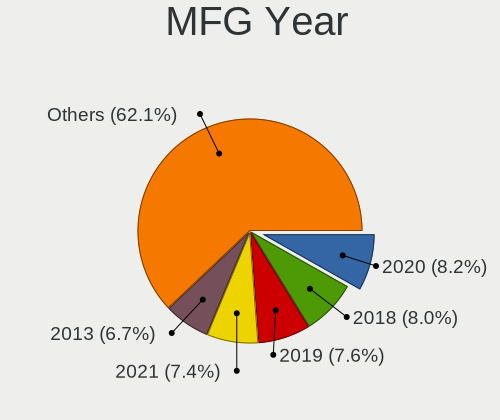
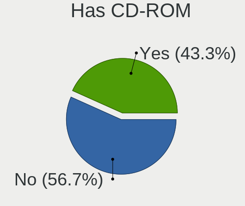
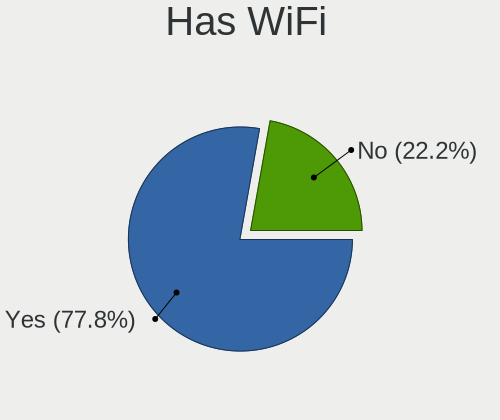
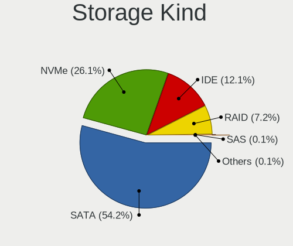
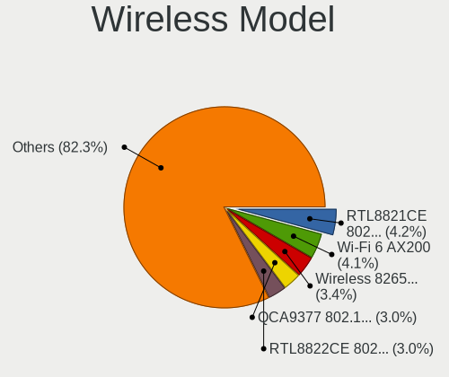
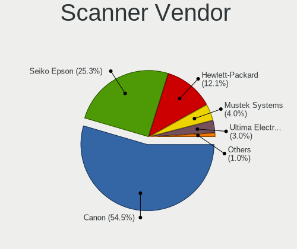

Linux in Italy - Tested Hardware & Statistics
---------------------------------------------

A project to collect tested hardware configurations for Linux in Italy.

Anyone can contribute to this report by the [hw-probe](https://github.com/linuxhw/hw-probe) tool:

    sudo -E hw-probe -all -upload

Please contribute! Especially if your hardware is rare.

This is a report for all computer types. See also reports for [desktops](/Location/Italy/Desktop/README.md) and [notebooks](/Location/Italy/Notebook/README.md).

Contents
--------

* [ Test Cases ](#test-cases)

* [ System ](#system)
  - [ OS                       ](#os)
  - [ OS Family                ](#os-family)
  - [ Kernel                   ](#kernel)
  - [ Kernel Family            ](#kernel-family)
  - [ Kernel Major Ver.        ](#kernel-major-ver)
  - [ Arch                     ](#arch)
  - [ DE                       ](#de)
  - [ Display Server           ](#display-server)
  - [ Display Manager          ](#display-manager)
  - [ OS Lang                  ](#os-lang)
  - [ Boot Mode                ](#boot-mode)
  - [ Filesystem               ](#filesystem)
  - [ Part. scheme             ](#part-scheme)
  - [ Dual Boot with Linux/BSD ](#dual-boot-with-linuxbsd)
  - [ Dual Boot (Win)          ](#dual-boot-win)

* [ Board ](#board)
  - [ Vendor                   ](#vendor)
  - [ Model                    ](#model)
  - [ Model Family             ](#model-family)
  - [ MFG Year                 ](#mfg-year)
  - [ Form Factor              ](#form-factor)
  - [ Secure Boot              ](#secure-boot)
  - [ Coreboot                 ](#coreboot)
  - [ RAM Size                 ](#ram-size)
  - [ RAM Used                 ](#ram-used)
  - [ Total Drives             ](#total-drives)
  - [ Has CD-ROM               ](#has-cd-rom)
  - [ Has Ethernet             ](#has-ethernet)
  - [ Has WiFi                 ](#has-wifi)
  - [ Has Bluetooth            ](#has-bluetooth)

* [ Location ](#location)
  - [ Country                  ](#country)
  - [ City                     ](#city)

* [ Drives ](#drives)
  - [ Drive Vendor             ](#drive-vendor)
  - [ Drive Model              ](#drive-model)
  - [ HDD Vendor               ](#hdd-vendor)
  - [ SSD Vendor               ](#ssd-vendor)
  - [ Drive Kind               ](#drive-kind)
  - [ Drive Connector          ](#drive-connector)
  - [ Drive Size               ](#drive-size)
  - [ Space Total              ](#space-total)
  - [ Space Used               ](#space-used)
  - [ Malfunc. Drives          ](#malfunc-drives)
  - [ Malfunc. Drive Vendor    ](#malfunc-drive-vendor)
  - [ Malfunc. HDD Vendor      ](#malfunc-hdd-vendor)
  - [ Malfunc. Drive Kind      ](#malfunc-drive-kind)
  - [ Failed Drives            ](#failed-drives)
  - [ Failed Drive Vendor      ](#failed-drive-vendor)
  - [ Drive Status             ](#drive-status)

* [ Storage controller ](#storage-controller)
  - [ Storage Vendor           ](#storage-vendor)
  - [ Storage Model            ](#storage-model)
  - [ Storage Kind             ](#storage-kind)

* [ Processor ](#processor)
  - [ CPU Vendor               ](#cpu-vendor)
  - [ CPU Model                ](#cpu-model)
  - [ CPU Model Family         ](#cpu-model-family)
  - [ CPU Cores                ](#cpu-cores)
  - [ CPU Sockets              ](#cpu-sockets)
  - [ CPU Threads              ](#cpu-threads)
  - [ CPU Op-Modes             ](#cpu-op-modes)
  - [ CPU Microcode            ](#cpu-microcode)
  - [ CPU Microarch            ](#cpu-microarch)

* [ Graphics ](#graphics)
  - [ GPU Vendor               ](#gpu-vendor)
  - [ GPU Model                ](#gpu-model)
  - [ GPU Combo                ](#gpu-combo)
  - [ GPU Driver               ](#gpu-driver)
  - [ GPU Memory               ](#gpu-memory)

* [ Monitor ](#monitor)
  - [ Monitor Vendor           ](#monitor-vendor)
  - [ Monitor Model            ](#monitor-model)
  - [ Monitor Resolution       ](#monitor-resolution)
  - [ Monitor Diagonal         ](#monitor-diagonal)
  - [ Monitor Width            ](#monitor-width)
  - [ Aspect Ratio             ](#aspect-ratio)
  - [ Monitor Area             ](#monitor-area)
  - [ Pixel Density            ](#pixel-density)
  - [ Multiple Monitors        ](#multiple-monitors)

* [ Network ](#network)
  - [ Net Controller Vendor    ](#net-controller-vendor)
  - [ Net Controller Model     ](#net-controller-model)
  - [ Wireless Vendor          ](#wireless-vendor)
  - [ Wireless Model           ](#wireless-model)
  - [ Ethernet Vendor          ](#ethernet-vendor)
  - [ Ethernet Model           ](#ethernet-model)
  - [ Net Controller Kind      ](#net-controller-kind)
  - [ Used Controller          ](#used-controller)
  - [ NICs                     ](#nics)
  - [ IPv6                     ](#ipv6)

* [ Bluetooth ](#bluetooth)
  - [ Bluetooth Vendor         ](#bluetooth-vendor)
  - [ Bluetooth Model          ](#bluetooth-model)

* [ Sound ](#sound)
  - [ Sound Vendor             ](#sound-vendor)
  - [ Sound Model              ](#sound-model)

* [ Memory ](#memory)
  - [ Memory Vendor            ](#memory-vendor)
  - [ Memory Model             ](#memory-model)
  - [ Memory Kind              ](#memory-kind)
  - [ Memory Form Factor       ](#memory-form-factor)
  - [ Memory Size              ](#memory-size)
  - [ Memory Speed             ](#memory-speed)

* [ Printers & scanners ](#printers--scanners)
  - [ Printer Vendor           ](#printer-vendor)
  - [ Printer Model            ](#printer-model)
  - [ Scanner Vendor           ](#scanner-vendor)
  - [ Scanner Model            ](#scanner-model)

* [ Camera ](#camera)
  - [ Camera Vendor            ](#camera-vendor)
  - [ Camera Model             ](#camera-model)

* [ Security ](#security)
  - [ Fingerprint Vendor       ](#fingerprint-vendor)
  - [ Fingerprint Model        ](#fingerprint-model)
  - [ Chipcard Vendor          ](#chipcard-vendor)
  - [ Chipcard Model           ](#chipcard-model)

* [ Unsupported ](#unsupported)
  - [ Unsupported Devices      ](#unsupported-devices)
  - [ Unsupported Device Types ](#unsupported-device-types)

Test Cases
----------

Total: 9162

| Vendor        | Model                       | Form-Factor | Probe                                                      | Date         |
|---------------|-----------------------------|-------------|------------------------------------------------------------|--------------|
| Acer          | Aspire E5-573G              | Notebook    | [527a92f562](https://linux-hardware.org/?probe=527a92f562) | Dec 31, 2022 |
| HP            | Notebook                    | Notebook    | [d25df9daf4](https://linux-hardware.org/?probe=d25df9daf4) | Dec 31, 2022 |
| ASUSTek       | ProArt StudioBook H5600Q... | Notebook    | [07ca2ed63d](https://linux-hardware.org/?probe=07ca2ed63d) | Dec 31, 2022 |
| Dell          | XPS 9320                    | Notebook    | [c98fd80f29](https://linux-hardware.org/?probe=c98fd80f29) | Dec 31, 2022 |
| ASRock        | B450 Gaming-ITX/ac          | Desktop     | [afdda0ad31](https://linux-hardware.org/?probe=afdda0ad31) | Dec 31, 2022 |
| ASRock        | B450 Gaming-ITX/ac          | Desktop     | [3659d7377d](https://linux-hardware.org/?probe=3659d7377d) | Dec 31, 2022 |
| HP            | Victus by Laptop 16-e0xx... | Notebook    | [60989ad0c4](https://linux-hardware.org/?probe=60989ad0c4) | Dec 31, 2022 |
| HP            | Compaq 6710b (KE207ES#AB... | Notebook    | [d7d0be3872](https://linux-hardware.org/?probe=d7d0be3872) | Dec 30, 2022 |
| Chuwi         | HeroBook                    | Notebook    | [1664994b07](https://linux-hardware.org/?probe=1664994b07) | Dec 30, 2022 |
| ASUSTek       | K55VD                       | Notebook    | [e4c90250df](https://linux-hardware.org/?probe=e4c90250df) | Dec 30, 2022 |
| MSI           | GP72MVR 7RFX                | Notebook    | [cefedef93c](https://linux-hardware.org/?probe=cefedef93c) | Dec 30, 2022 |
| Lenovo        | ThinkPad W541 20EF0011IX    | Notebook    | [a2f6a6831a](https://linux-hardware.org/?probe=a2f6a6831a) | Dec 30, 2022 |
| Lenovo        | ThinkPad W541 20EF0011IX    | Notebook    | [3f5a2c6ea1](https://linux-hardware.org/?probe=3f5a2c6ea1) | Dec 30, 2022 |
| ASUSTek       | X556UQK                     | Notebook    | [42a9dc760d](https://linux-hardware.org/?probe=42a9dc760d) | Dec 30, 2022 |
| Dell          | Inspiron 5593               | Notebook    | [bf0f36d69a](https://linux-hardware.org/?probe=bf0f36d69a) | Dec 30, 2022 |
| HP            | 255 G3                      | Notebook    | [89d6bd459c](https://linux-hardware.org/?probe=89d6bd459c) | Dec 30, 2022 |
| BESSTAR Te... | C-J34 Pro                   | Desktop     | [1b54a52c3c](https://linux-hardware.org/?probe=1b54a52c3c) | Dec 30, 2022 |
| ASUSTek       | H81M-A                      | Desktop     | [10f0b28589](https://linux-hardware.org/?probe=10f0b28589) | Dec 29, 2022 |
| Dell          | Latitude E6410              | Notebook    | [0ee655e2cc](https://linux-hardware.org/?probe=0ee655e2cc) | Dec 29, 2022 |
| HP            | 0AE8h                       | Desktop     | [b23a6da065](https://linux-hardware.org/?probe=b23a6da065) | Dec 29, 2022 |
| Lenovo        | IdeaPad 110-15ISK 80UD      | Notebook    | [2d653884d9](https://linux-hardware.org/?probe=2d653884d9) | Dec 29, 2022 |
| MSI           | Z390-A PRO                  | Desktop     | [3a3375e173](https://linux-hardware.org/?probe=3a3375e173) | Dec 29, 2022 |
| HP            | 8399                        | Desktop     | [8a4ef9ab88](https://linux-hardware.org/?probe=8a4ef9ab88) | Dec 29, 2022 |
| HP            | Pavilion Laptop 15-cs2xx... | Notebook    | [587aa5f819](https://linux-hardware.org/?probe=587aa5f819) | Dec 29, 2022 |
| ASUSTek       | H110M-K                     | Desktop     | [4dab06b05f](https://linux-hardware.org/?probe=4dab06b05f) | Dec 29, 2022 |
| Lenovo        | ThinkPad E580 20KS001RIX    | Notebook    | [4ca01731b4](https://linux-hardware.org/?probe=4ca01731b4) | Dec 29, 2022 |
| HP            | Compaq 6730s                | Notebook    | [9294bf57da](https://linux-hardware.org/?probe=9294bf57da) | Dec 28, 2022 |
| Lenovo        | ThinkPad E480 20KQS13M00    | Notebook    | [fb7e2874d3](https://linux-hardware.org/?probe=fb7e2874d3) | Dec 28, 2022 |
| Apple         | MacBookPro8,1               | Notebook    | [7b03f438db](https://linux-hardware.org/?probe=7b03f438db) | Dec 28, 2022 |
| Fujitsu       | LIFEBOOK A544               | Notebook    | [efdc6bb5cb](https://linux-hardware.org/?probe=efdc6bb5cb) | Dec 28, 2022 |
| ASUSTek       | M5A78L-M LE/USB3            | Desktop     | [d0969c6a4c](https://linux-hardware.org/?probe=d0969c6a4c) | Dec 28, 2022 |
| ASUSTek       | M5A78L-M LE/USB3            | Desktop     | [8a4dce4662](https://linux-hardware.org/?probe=8a4dce4662) | Dec 28, 2022 |
| Acer          | Aspire A315-55G             | Notebook    | [92155ba882](https://linux-hardware.org/?probe=92155ba882) | Dec 28, 2022 |
| HP            | ProBook 440 G6              | Notebook    | [6240bc3677](https://linux-hardware.org/?probe=6240bc3677) | Dec 28, 2022 |
| HP            | ProBook 440 G6              | Notebook    | [f5689c6edc](https://linux-hardware.org/?probe=f5689c6edc) | Dec 28, 2022 |
| ASUSTek       | ROG STRIX B550-F GAMING     | Desktop     | [6297565fda](https://linux-hardware.org/?probe=6297565fda) | Dec 28, 2022 |
| HP            | EliteBook 850 G3            | Notebook    | [0dede5b37a](https://linux-hardware.org/?probe=0dede5b37a) | Dec 28, 2022 |
| Pegatron      | 2AB6                        | Desktop     | [742c9ebcca](https://linux-hardware.org/?probe=742c9ebcca) | Dec 28, 2022 |
| Pegatron      | 2AB6                        | Desktop     | [9e95c7e7c7](https://linux-hardware.org/?probe=9e95c7e7c7) | Dec 28, 2022 |
| System76      | Darter Pro                  | Notebook    | [a46000c111](https://linux-hardware.org/?probe=a46000c111) | Dec 28, 2022 |
| HP            | 250 G8 Notebook PC          | Notebook    | [7d79eadc7d](https://linux-hardware.org/?probe=7d79eadc7d) | Dec 28, 2022 |
| ASUSTek       | P8Z77-V PRO                 | Desktop     | [79427500b5](https://linux-hardware.org/?probe=79427500b5) | Dec 28, 2022 |
| ASRock        | 4CoreDual-SATA2             | Desktop     | [05ae1afd3f](https://linux-hardware.org/?probe=05ae1afd3f) | Dec 28, 2022 |
| HP            | 0AE8h                       | Desktop     | [c1bd1ff073](https://linux-hardware.org/?probe=c1bd1ff073) | Dec 27, 2022 |
| Teclast       | F15Plus 2                   | Notebook    | [71564a5900](https://linux-hardware.org/?probe=71564a5900) | Dec 27, 2022 |
| Teclast       | F15Plus 2                   | Notebook    | [4d10c4922e](https://linux-hardware.org/?probe=4d10c4922e) | Dec 27, 2022 |
| Packard Be... | EasyNote TJ65               | Notebook    | [57bfe7c99d](https://linux-hardware.org/?probe=57bfe7c99d) | Dec 27, 2022 |
| Unknown       | Unknown                     | Desktop     | [ccce0caf7e](https://linux-hardware.org/?probe=ccce0caf7e) | Dec 27, 2022 |
| ASUSTek       | X550VXK                     | Notebook    | [301db79821](https://linux-hardware.org/?probe=301db79821) | Dec 27, 2022 |
| ASUSTek       | X550VXK                     | Notebook    | [039600625a](https://linux-hardware.org/?probe=039600625a) | Dec 27, 2022 |
| Dell          | XPS 9320                    | Notebook    | [7a2537eba2](https://linux-hardware.org/?probe=7a2537eba2) | Dec 27, 2022 |
| Dell          | XPS 13 9365                 | Convertible | [4eda9a1749](https://linux-hardware.org/?probe=4eda9a1749) | Dec 27, 2022 |
| Dell          | Inspiron 15 3525            | Notebook    | [64a70af984](https://linux-hardware.org/?probe=64a70af984) | Dec 27, 2022 |
| System76      | Darter Pro                  | Notebook    | [c5aebaaece](https://linux-hardware.org/?probe=c5aebaaece) | Dec 27, 2022 |
| MSI           | Z270 GAMING PRO CARBON      | Desktop     | [f422489705](https://linux-hardware.org/?probe=f422489705) | Dec 27, 2022 |
| HP            | Pavilion Laptop 15-cs0xx... | Notebook    | [d75dbe1e39](https://linux-hardware.org/?probe=d75dbe1e39) | Dec 27, 2022 |
| ASUSTek       | VivoBook_ASUSLaptop K650... | Notebook    | [1cf2ac2b8b](https://linux-hardware.org/?probe=1cf2ac2b8b) | Dec 27, 2022 |
| Dell          | 0PTTT9 A01                  | Desktop     | [78512365ca](https://linux-hardware.org/?probe=78512365ca) | Dec 26, 2022 |
| HP            | Pavilion 15                 | Notebook    | [9843ba5174](https://linux-hardware.org/?probe=9843ba5174) | Dec 26, 2022 |
| MSI           | X470 GAMING PLUS MAX        | Desktop     | [bc68280036](https://linux-hardware.org/?probe=bc68280036) | Dec 26, 2022 |
| Notebook      | NP5x_NP6x_NP7xPNK_PNH_PN... | Notebook    | [792a203576](https://linux-hardware.org/?probe=792a203576) | Dec 26, 2022 |
| ASUSTek       | B85M-E/DASH                 | Desktop     | [b2acfa6e70](https://linux-hardware.org/?probe=b2acfa6e70) | Dec 26, 2022 |
| ASUSTek       | B85M-E/DASH                 | Desktop     | [59e6ec4132](https://linux-hardware.org/?probe=59e6ec4132) | Dec 26, 2022 |
| Lenovo        | 3106 SDK0J40697 WIN 3305... | Desktop     | [5ce1ea886f](https://linux-hardware.org/?probe=5ce1ea886f) | Dec 26, 2022 |
| MSI           | GS76 Stealth 11UG           | Notebook    | [10e22b317f](https://linux-hardware.org/?probe=10e22b317f) | Dec 26, 2022 |
| Lenovo        | ThinkPad E590 20NB001AMX    | Notebook    | [047944fa9f](https://linux-hardware.org/?probe=047944fa9f) | Dec 26, 2022 |
| Lenovo        | 3106 SDK0J40697 WIN 3305... | Desktop     | [f56ea263a2](https://linux-hardware.org/?probe=f56ea263a2) | Dec 26, 2022 |
| HP            | Laptop 15-da0xxx            | Notebook    | [96a4f739b8](https://linux-hardware.org/?probe=96a4f739b8) | Dec 26, 2022 |
| HP            | Laptop 15-da0xxx            | Notebook    | [19af161114](https://linux-hardware.org/?probe=19af161114) | Dec 26, 2022 |
| HP            | EliteBook 840 G4            | Notebook    | [1c5b59d2e4](https://linux-hardware.org/?probe=1c5b59d2e4) | Dec 26, 2022 |
| HP            | EliteBook 840 G4            | Notebook    | [730469b496](https://linux-hardware.org/?probe=730469b496) | Dec 26, 2022 |
| HP            | EliteBook 820 G1            | Notebook    | [6a2c20cb74](https://linux-hardware.org/?probe=6a2c20cb74) | Dec 26, 2022 |
| HP            | 255 G8 Notebook PC          | Notebook    | [2df8b7768a](https://linux-hardware.org/?probe=2df8b7768a) | Dec 26, 2022 |
| HP            | Compaq 6730s                | Notebook    | [ac1ae104e8](https://linux-hardware.org/?probe=ac1ae104e8) | Dec 26, 2022 |
| HP            | Pavilion Laptop 15-cs0xx... | Notebook    | [38a87e716e](https://linux-hardware.org/?probe=38a87e716e) | Dec 26, 2022 |
| HP            | Compaq 6730s                | Notebook    | [0cc88159aa](https://linux-hardware.org/?probe=0cc88159aa) | Dec 26, 2022 |
| Lenovo        | ThinkPad X1 Carbon 34604... | Notebook    | [dfb555f802](https://linux-hardware.org/?probe=dfb555f802) | Dec 26, 2022 |
| Gigabyte      | X470 AORUS GAMING 7 WIFI... | Desktop     | [7e46b9fd5b](https://linux-hardware.org/?probe=7e46b9fd5b) | Dec 26, 2022 |
| Samsung       | RV420/RV520/RV720/E3530/... | Notebook    | [4665d79293](https://linux-hardware.org/?probe=4665d79293) | Dec 25, 2022 |
| SANTECH       | NHx0DB,DE                   | Notebook    | [a0996d42bd](https://linux-hardware.org/?probe=a0996d42bd) | Dec 25, 2022 |
| Toshiba       | Satellite Pro S500          | Notebook    | [cd547b04a1](https://linux-hardware.org/?probe=cd547b04a1) | Dec 25, 2022 |
| Lenovo        | IdeaPad 3 15ADA05 81W1      | Notebook    | [ff90a6a029](https://linux-hardware.org/?probe=ff90a6a029) | Dec 25, 2022 |
| MSI           | Boston                      | Desktop     | [5ffbd4e9a5](https://linux-hardware.org/?probe=5ffbd4e9a5) | Dec 25, 2022 |
| Lenovo        | ThinkPad X1 Carbon 5th 2... | Notebook    | [faba7b00c6](https://linux-hardware.org/?probe=faba7b00c6) | Dec 25, 2022 |
| WYSE          | XM CLASS                    | Notebook    | [948bfb388d](https://linux-hardware.org/?probe=948bfb388d) | Dec 25, 2022 |
| ASUSTek       | M32CD_A_F_K20CD_K31CD       | Desktop     | [384d09ccdb](https://linux-hardware.org/?probe=384d09ccdb) | Dec 25, 2022 |
| Dell          | 0DN075                      | Desktop     | [9fd08be389](https://linux-hardware.org/?probe=9fd08be389) | Dec 25, 2022 |
| ASRock        | N3700-ITX                   | Desktop     | [dc3f0d5062](https://linux-hardware.org/?probe=dc3f0d5062) | Dec 25, 2022 |
| HP            | EliteBook 8440p             | Notebook    | [571afe8b70](https://linux-hardware.org/?probe=571afe8b70) | Dec 24, 2022 |
| Dell          | XPS 9320                    | Notebook    | [f55956cac2](https://linux-hardware.org/?probe=f55956cac2) | Dec 24, 2022 |
| Dell          | Latitude 5590               | Notebook    | [f7011844b5](https://linux-hardware.org/?probe=f7011844b5) | Dec 24, 2022 |
| Dell          | Latitude 5590               | Notebook    | [3f1acac04f](https://linux-hardware.org/?probe=3f1acac04f) | Dec 24, 2022 |
| HP            | 255 G8 Notebook PC          | Notebook    | [3f72d88324](https://linux-hardware.org/?probe=3f72d88324) | Dec 24, 2022 |
| AMI           | Cherry Trail FFD            | Desktop     | [7070bf387d](https://linux-hardware.org/?probe=7070bf387d) | Dec 24, 2022 |
| HP            | ProLiant MicroServer        | Desktop     | [b95892f2dc](https://linux-hardware.org/?probe=b95892f2dc) | Dec 24, 2022 |
| Dell          | Latitude 5590               | Notebook    | [e439eb94d4](https://linux-hardware.org/?probe=e439eb94d4) | Dec 24, 2022 |
| Dell          | Latitude 5590               | Notebook    | [816056e28e](https://linux-hardware.org/?probe=816056e28e) | Dec 24, 2022 |
| Foxconn       | 2AA9                        | Desktop     | [07650be639](https://linux-hardware.org/?probe=07650be639) | Dec 24, 2022 |
| ASRock        | B450 Pro4                   | Desktop     | [70ff83271a](https://linux-hardware.org/?probe=70ff83271a) | Dec 24, 2022 |
| ASRock        | X570 Steel Legend           | Desktop     | [7b79249b18](https://linux-hardware.org/?probe=7b79249b18) | Dec 23, 2022 |
| HUAWEI        | KPR-WX9                     | Notebook    | [e2b01c4a0f](https://linux-hardware.org/?probe=e2b01c4a0f) | Dec 23, 2022 |
| ASUSTek       | M5A78L/USB3                 | Desktop     | [348c431775](https://linux-hardware.org/?probe=348c431775) | Dec 23, 2022 |
| Dell          | Inspiron 15 5510            | Notebook    | [d53469cd41](https://linux-hardware.org/?probe=d53469cd41) | Dec 23, 2022 |
| MSI           | B450 TOMAHAWK MAX           | Desktop     | [568df9daf7](https://linux-hardware.org/?probe=568df9daf7) | Dec 23, 2022 |
| ZOTAC         | ZBOX-MI640/MI660/MI620NA... | Mini pc     | [c36792aeaa](https://linux-hardware.org/?probe=c36792aeaa) | Dec 23, 2022 |
| Dell          | Inspiron 15 5510            | Notebook    | [9ddf91aa1b](https://linux-hardware.org/?probe=9ddf91aa1b) | Dec 23, 2022 |
| HUAWEI        | NBLK-WAX9X                  | Notebook    | [f114731a78](https://linux-hardware.org/?probe=f114731a78) | Dec 23, 2022 |
| Lenovo        | ThinkCentre M71e 3129C3G    | Desktop     | [cb9f99f1cf](https://linux-hardware.org/?probe=cb9f99f1cf) | Dec 23, 2022 |
| ASUSTek       | ROG STRIX Z590-F GAMING ... | Desktop     | [9e19c2db67](https://linux-hardware.org/?probe=9e19c2db67) | Dec 23, 2022 |
| Acer          | Aspire A515-52G             | Notebook    | [586dd36eed](https://linux-hardware.org/?probe=586dd36eed) | Dec 23, 2022 |
| Lenovo        | ThinkPad T14 Gen 1 20UD0... | Notebook    | [214b2a3235](https://linux-hardware.org/?probe=214b2a3235) | Dec 23, 2022 |
| ASUSTek       | ASUS EXPERTBOOK B3302CEA... | Notebook    | [756390ae0c](https://linux-hardware.org/?probe=756390ae0c) | Dec 23, 2022 |
| ASUSTek       | ASUS EXPERTBOOK B3302CEA... | Notebook    | [c2dd56664a](https://linux-hardware.org/?probe=c2dd56664a) | Dec 23, 2022 |
| Timi          | TM1701                      | Notebook    | [2f28d7e2dc](https://linux-hardware.org/?probe=2f28d7e2dc) | Dec 23, 2022 |
| Timi          | TM1701                      | Notebook    | [dfb4f8774f](https://linux-hardware.org/?probe=dfb4f8774f) | Dec 23, 2022 |
| Dell          | XPS 9320                    | Notebook    | [7bb7ba7202](https://linux-hardware.org/?probe=7bb7ba7202) | Dec 23, 2022 |
| Medion        | X6816                       | Notebook    | [bafbf1ea90](https://linux-hardware.org/?probe=bafbf1ea90) | Dec 23, 2022 |
| Medion        | X6816                       | Notebook    | [ac9627e5d4](https://linux-hardware.org/?probe=ac9627e5d4) | Dec 23, 2022 |
| Lenovo        | Legion 5 15ARH05H 82B1      | Notebook    | [db7dc4fa25](https://linux-hardware.org/?probe=db7dc4fa25) | Dec 22, 2022 |
| Lenovo        | Legion 5 15ARH05H 82B1      | Notebook    | [e8ac233c29](https://linux-hardware.org/?probe=e8ac233c29) | Dec 22, 2022 |
| HP            | Compaq 6730b (GW687AV)      | Notebook    | [8c936284b0](https://linux-hardware.org/?probe=8c936284b0) | Dec 22, 2022 |
| ASRock        | FM2A88M-HD+                 | Desktop     | [18b83ae613](https://linux-hardware.org/?probe=18b83ae613) | Dec 22, 2022 |
| ASUSTek       | ROG STRIX Z590-F GAMING ... | Desktop     | [ec808658f8](https://linux-hardware.org/?probe=ec808658f8) | Dec 22, 2022 |
| Monster       | TULPAR T5 V20.1             | Notebook    | [23cb6e06f8](https://linux-hardware.org/?probe=23cb6e06f8) | Dec 22, 2022 |
| Acer          | Aspire M3920                | Desktop     | [803cd5d8f9](https://linux-hardware.org/?probe=803cd5d8f9) | Dec 22, 2022 |
| Lenovo        | Yoga 9 14IAP7 82LU          | Convertible | [01aae2d5df](https://linux-hardware.org/?probe=01aae2d5df) | Dec 22, 2022 |
| HP            | Pavilion dv9000 (RR329EA... | Notebook    | [6fc7281f2f](https://linux-hardware.org/?probe=6fc7281f2f) | Dec 22, 2022 |
| HP            | Pavilion Laptop 15-cs3xx... | Notebook    | [a62d8c781d](https://linux-hardware.org/?probe=a62d8c781d) | Dec 22, 2022 |
| HUAWEI        | VLT-WX0                     | Notebook    | [6f2d542a6e](https://linux-hardware.org/?probe=6f2d542a6e) | Dec 22, 2022 |
| Packard Be... | DOT S                       | Notebook    | [c26f1d77e6](https://linux-hardware.org/?probe=c26f1d77e6) | Dec 22, 2022 |
| HP            | Victus by Laptop 16-e0xx... | Notebook    | [54273f1267](https://linux-hardware.org/?probe=54273f1267) | Dec 22, 2022 |
| ASUSTek       | 1215P                       | Notebook    | [a39ca1c22f](https://linux-hardware.org/?probe=a39ca1c22f) | Dec 21, 2022 |
| ASUSTek       | 1215P                       | Notebook    | [ed3dc80f1b](https://linux-hardware.org/?probe=ed3dc80f1b) | Dec 21, 2022 |
| Lenovo        | IdeaPad 320-15IKB 81BT      | Notebook    | [543b6fc9db](https://linux-hardware.org/?probe=543b6fc9db) | Dec 21, 2022 |
| HP            | Pavilion Laptop 15-cs2xx... | Notebook    | [5ea57fb331](https://linux-hardware.org/?probe=5ea57fb331) | Dec 21, 2022 |
| HP            | Pavilion Laptop 15-cs2xx... | Notebook    | [c4f6f99d36](https://linux-hardware.org/?probe=c4f6f99d36) | Dec 21, 2022 |
| ASUSTek       | ZenBook UX363EA_UX363EA     | Convertible | [20150bbe50](https://linux-hardware.org/?probe=20150bbe50) | Dec 21, 2022 |
| ASUSTek       | P5KPL-AM EPU                | Desktop     | [fc162d4cb2](https://linux-hardware.org/?probe=fc162d4cb2) | Dec 21, 2022 |
| ASUSTek       | P5KPL-AM EPU                | Desktop     | [1cdb02c6db](https://linux-hardware.org/?probe=1cdb02c6db) | Dec 21, 2022 |
| Dell          | Latitude E7470              | Notebook    | [e171eea812](https://linux-hardware.org/?probe=e171eea812) | Dec 21, 2022 |
| ASUSTek       | S551LB                      | Notebook    | [5e48f71064](https://linux-hardware.org/?probe=5e48f71064) | Dec 20, 2022 |
| HP            | Sona                        | Notebook    | [85c88dea70](https://linux-hardware.org/?probe=85c88dea70) | Dec 20, 2022 |
| Apple         | Mac-942B5BF58194151B        | All in one  | [aa6f672c23](https://linux-hardware.org/?probe=aa6f672c23) | Dec 20, 2022 |
| HP            | Pavilion Laptop 15-cs2xx... | Notebook    | [a4549398af](https://linux-hardware.org/?probe=a4549398af) | Dec 20, 2022 |
| HP            | 8906 SMVB                   | Desktop     | [c7b2f48d96](https://linux-hardware.org/?probe=c7b2f48d96) | Dec 20, 2022 |
| HUAWEI        | NBLB-WAX9N                  | Notebook    | [2b8c2f06eb](https://linux-hardware.org/?probe=2b8c2f06eb) | Dec 20, 2022 |
| ASUSTek       | ZenBook UX363EA_UX363EA     | Convertible | [d949885cee](https://linux-hardware.org/?probe=d949885cee) | Dec 20, 2022 |
| Notebook      | PCX0DX                      | Notebook    | [83c28a3013](https://linux-hardware.org/?probe=83c28a3013) | Dec 20, 2022 |
| ASUSTek       | PRIME A320M-K               | Desktop     | [3b38fc673c](https://linux-hardware.org/?probe=3b38fc673c) | Dec 19, 2022 |
| Gigabyte      | 970-GAMING                  | Desktop     | [cf93a75cf0](https://linux-hardware.org/?probe=cf93a75cf0) | Dec 19, 2022 |
| MSI           | X470 GAMING PLUS            | Desktop     | [44cdfa03bf](https://linux-hardware.org/?probe=44cdfa03bf) | Dec 19, 2022 |
| HP            | 829E                        | Mini pc     | [effdd89e26](https://linux-hardware.org/?probe=effdd89e26) | Dec 19, 2022 |
| ASUSTek       | ZenBook UX363EA_UX363EA     | Convertible | [7808d8a51f](https://linux-hardware.org/?probe=7808d8a51f) | Dec 19, 2022 |
| HP            | OMEN by Laptop 16-c0xxx     | Notebook    | [9f5a91c628](https://linux-hardware.org/?probe=9f5a91c628) | Dec 19, 2022 |
| Gigabyte      | B75M-D3H                    | Desktop     | [ad506ad64e](https://linux-hardware.org/?probe=ad506ad64e) | Dec 19, 2022 |
| Lenovo        | 3106 SDK0J40697 WIN 3305... | Desktop     | [87907abff7](https://linux-hardware.org/?probe=87907abff7) | Dec 19, 2022 |
| MSI           | X470 GAMING PLUS MAX        | Desktop     | [831f650b05](https://linux-hardware.org/?probe=831f650b05) | Dec 19, 2022 |
| HP            | 18E7                        | Desktop     | [9f601a9f1a](https://linux-hardware.org/?probe=9f601a9f1a) | Dec 19, 2022 |
| Sony          | VGN-FW11E                   | Notebook    | [2d57afaa38](https://linux-hardware.org/?probe=2d57afaa38) | Dec 19, 2022 |
| HUAWEI        | NBLK-WAX9X                  | Notebook    | [686a93a02a](https://linux-hardware.org/?probe=686a93a02a) | Dec 19, 2022 |
| Lenovo        | IdeaPad 120S-14IAP 81A5     | Notebook    | [8e10fc1464](https://linux-hardware.org/?probe=8e10fc1464) | Dec 18, 2022 |
| ASUSTek       | 900SD                       | Notebook    | [43d2c88062](https://linux-hardware.org/?probe=43d2c88062) | Dec 18, 2022 |
| Lenovo        | ThinkPad R61 77324TG        | Notebook    | [90c300a51c](https://linux-hardware.org/?probe=90c300a51c) | Dec 18, 2022 |
| MSI           | B250M PRO-VDH               | Desktop     | [14ea50f3b2](https://linux-hardware.org/?probe=14ea50f3b2) | Dec 18, 2022 |
| Gigabyte      | B450M DS3H-CF               | Desktop     | [2d046f9339](https://linux-hardware.org/?probe=2d046f9339) | Dec 18, 2022 |
| Lenovo        | IdeaPad 3 15ALC6 82KU       | Notebook    | [7dc7a80819](https://linux-hardware.org/?probe=7dc7a80819) | Dec 18, 2022 |
| Acer          | TravelMate P253             | Notebook    | [97d650e93f](https://linux-hardware.org/?probe=97d650e93f) | Dec 18, 2022 |
| Dell          | Latitude E7470              | Notebook    | [262849f0f6](https://linux-hardware.org/?probe=262849f0f6) | Dec 18, 2022 |
| Intel         | H55                         | Desktop     | [a5033f178f](https://linux-hardware.org/?probe=a5033f178f) | Dec 18, 2022 |
| ASUSTek       | P7H55D-M EVO                | Desktop     | [1e294ecd38](https://linux-hardware.org/?probe=1e294ecd38) | Dec 18, 2022 |
| HP            | Laptop 15s-fq2xxx           | Notebook    | [ab6fd91b71](https://linux-hardware.org/?probe=ab6fd91b71) | Dec 17, 2022 |
| HP            | Laptop 15s-fq2xxx           | Notebook    | [1a23b502b9](https://linux-hardware.org/?probe=1a23b502b9) | Dec 17, 2022 |
| Lenovo        | Yoga 9 14IAP7 82LU          | Convertible | [dc92ebcc7c](https://linux-hardware.org/?probe=dc92ebcc7c) | Dec 17, 2022 |
| Lenovo        | ThinkPad E15 Gen 3 20YGC... | Notebook    | [75126bccca](https://linux-hardware.org/?probe=75126bccca) | Dec 17, 2022 |
| ASUSTek       | F1A55-M LE                  | Desktop     | [c2db38b403](https://linux-hardware.org/?probe=c2db38b403) | Dec 17, 2022 |
| ASUSTek       | ASUS EXPERTBOOK B1500CEA... | Notebook    | [a54756ab6f](https://linux-hardware.org/?probe=a54756ab6f) | Dec 17, 2022 |
| HP            | Spectre x360 Convertible    | Convertible | [fcb9b3ba60](https://linux-hardware.org/?probe=fcb9b3ba60) | Dec 17, 2022 |
| ASUSTek       | P8H77-M LE                  | Desktop     | [d9eba2d52f](https://linux-hardware.org/?probe=d9eba2d52f) | Dec 17, 2022 |
| Lenovo        | ThinkBook 15 G2 ITL 20VE    | Notebook    | [fc473cc90f](https://linux-hardware.org/?probe=fc473cc90f) | Dec 17, 2022 |
| MSI           | MS-B1711                    | Desktop     | [a5b142e258](https://linux-hardware.org/?probe=a5b142e258) | Dec 17, 2022 |
| Unknown       | AM02                        | Mini pc     | [e60a6e7777](https://linux-hardware.org/?probe=e60a6e7777) | Dec 17, 2022 |
| WYSE          | XM CLASS                    | Notebook    | [8aac2f31cb](https://linux-hardware.org/?probe=8aac2f31cb) | Dec 17, 2022 |
| HP            | EliteBook 820 G3            | Notebook    | [5e5909e93f](https://linux-hardware.org/?probe=5e5909e93f) | Dec 17, 2022 |
| ASUSTek       | ROG Strix G513RC_G513RC     | Notebook    | [feb5e321dc](https://linux-hardware.org/?probe=feb5e321dc) | Dec 16, 2022 |
| Fujitsu       | D3230-A1 S26361-D3230-A1    | Desktop     | [90912f0bba](https://linux-hardware.org/?probe=90912f0bba) | Dec 16, 2022 |
| Acer          | TravelMate P253             | Notebook    | [80188fd5bf](https://linux-hardware.org/?probe=80188fd5bf) | Dec 16, 2022 |
| Toshiba       | Satellite M70               | Notebook    | [9415a97254](https://linux-hardware.org/?probe=9415a97254) | Dec 16, 2022 |
| Dell          | XPS 15 9520                 | Notebook    | [dcf616e068](https://linux-hardware.org/?probe=dcf616e068) | Dec 16, 2022 |
| Fujitsu       | D3221-A1 S26361-D3221-A1    | Desktop     | [25ba267a65](https://linux-hardware.org/?probe=25ba267a65) | Dec 16, 2022 |
| Acer          | Veriton X2631G V:1.0        | Desktop     | [14d39a67c2](https://linux-hardware.org/?probe=14d39a67c2) | Dec 16, 2022 |
| Acer          | Veriton X2631G V:1.0        | Desktop     | [fc99e84afd](https://linux-hardware.org/?probe=fc99e84afd) | Dec 16, 2022 |
| HP            | Pavilion Laptop 15-cs2xx... | Notebook    | [665bd04471](https://linux-hardware.org/?probe=665bd04471) | Dec 16, 2022 |
| Alienware     | 15                          | Notebook    | [6da8e1748a](https://linux-hardware.org/?probe=6da8e1748a) | Dec 16, 2022 |
| Lenovo        | IdeaPad Gaming 3 15ARH05... | Notebook    | [30fda215a5](https://linux-hardware.org/?probe=30fda215a5) | Dec 16, 2022 |
| Lenovo        | ThinkPad X1 Extreme Gen ... | Notebook    | [d5cf351351](https://linux-hardware.org/?probe=d5cf351351) | Dec 16, 2022 |
| MSI           | AM1I                        | Desktop     | [0ebd00e848](https://linux-hardware.org/?probe=0ebd00e848) | Dec 16, 2022 |
| Lenovo        | ThinkPad X1 Extreme Gen ... | Notebook    | [e2056deb8a](https://linux-hardware.org/?probe=e2056deb8a) | Dec 16, 2022 |
| MSI           | AM1I                        | Desktop     | [97dfa5ebf8](https://linux-hardware.org/?probe=97dfa5ebf8) | Dec 16, 2022 |
| HUAWEI        | BOM-WXX9                    | Notebook    | [dd664077fe](https://linux-hardware.org/?probe=dd664077fe) | Dec 16, 2022 |
| HP            | Laptop 15s-fq2xxx           | Notebook    | [d9c3d0a5cd](https://linux-hardware.org/?probe=d9c3d0a5cd) | Dec 16, 2022 |
| HP            | Laptop 15-da0xxx            | Notebook    | [d871acfe36](https://linux-hardware.org/?probe=d871acfe36) | Dec 16, 2022 |
| Toshiba       | Satellite M70               | Notebook    | [79506873c1](https://linux-hardware.org/?probe=79506873c1) | Dec 15, 2022 |
| Samsung       | 350V5C/351V5C/3540VC/344... | Notebook    | [18d67ba2ab](https://linux-hardware.org/?probe=18d67ba2ab) | Dec 15, 2022 |
| HP            | Spectre x360 Convertible... | Convertible | [e69127d249](https://linux-hardware.org/?probe=e69127d249) | Dec 15, 2022 |
| Packard Be... | EasyNote TJ71               | Notebook    | [f722162e15](https://linux-hardware.org/?probe=f722162e15) | Dec 15, 2022 |
| ASUSTek       | ROG STRIX Z390-H GAMING     | Desktop     | [1d1a225cde](https://linux-hardware.org/?probe=1d1a225cde) | Dec 15, 2022 |
| HP            | OMEN by Laptop 16-c0xxx     | Notebook    | [5e8318b8b8](https://linux-hardware.org/?probe=5e8318b8b8) | Dec 15, 2022 |
| ASUSTek       | ROG STRIX X570-I GAMING     | Desktop     | [587fac961e](https://linux-hardware.org/?probe=587fac961e) | Dec 15, 2022 |
| HP            | Pavilion Gaming Laptop 1... | Notebook    | [57ecebdc0f](https://linux-hardware.org/?probe=57ecebdc0f) | Dec 15, 2022 |
| HP            | OMEN by Laptop 16-c0xxx     | Notebook    | [d5c9abda1e](https://linux-hardware.org/?probe=d5c9abda1e) | Dec 15, 2022 |
| HP            | Pavilion Laptop 15-cs2xx... | Notebook    | [1d57f3ab30](https://linux-hardware.org/?probe=1d57f3ab30) | Dec 15, 2022 |
| HP            | Pavilion Laptop 15-cs2xx... | Notebook    | [a1d6879fab](https://linux-hardware.org/?probe=a1d6879fab) | Dec 15, 2022 |
| Microsoft     | Surface Pro 4               | Tablet      | [d39c428918](https://linux-hardware.org/?probe=d39c428918) | Dec 15, 2022 |
| Lenovo        | 3111 SDK0J40697 WIN 3305... | Mini pc     | [a9d66f9686](https://linux-hardware.org/?probe=a9d66f9686) | Dec 14, 2022 |
| HP            | Compaq 6735s                | Notebook    | [72d29aa11f](https://linux-hardware.org/?probe=72d29aa11f) | Dec 14, 2022 |
| Samsung       | 750XDA                      | Notebook    | [0120054e9f](https://linux-hardware.org/?probe=0120054e9f) | Dec 14, 2022 |
| Dell          | 0XJ8C4 A00                  | Desktop     | [c7ce3d7180](https://linux-hardware.org/?probe=c7ce3d7180) | Dec 14, 2022 |
| Dell          | 0XJ8C4 A00                  | Desktop     | [b136ecfff3](https://linux-hardware.org/?probe=b136ecfff3) | Dec 14, 2022 |
| HP            | 843C                        | Desktop     | [e647aa1207](https://linux-hardware.org/?probe=e647aa1207) | Dec 14, 2022 |
| HP            | 2AF7                        | Desktop     | [089612dee6](https://linux-hardware.org/?probe=089612dee6) | Dec 14, 2022 |
| ASRock        | B450M-HDV R4.0              | Desktop     | [b4d843d4c2](https://linux-hardware.org/?probe=b4d843d4c2) | Dec 14, 2022 |
| HP            | 2AF7                        | Desktop     | [2c6c08c8b8](https://linux-hardware.org/?probe=2c6c08c8b8) | Dec 14, 2022 |
| ASUSTek       | ZenBook UX363EA_UX363EA     | Convertible | [c8207bdc43](https://linux-hardware.org/?probe=c8207bdc43) | Dec 14, 2022 |
| ASUSTek       | X302LA                      | Notebook    | [8404a0b0c6](https://linux-hardware.org/?probe=8404a0b0c6) | Dec 14, 2022 |
| MSI           | MAG X570S TORPEDO MAX       | Desktop     | [39d58ec9aa](https://linux-hardware.org/?probe=39d58ec9aa) | Dec 13, 2022 |
| Intel         | DB75EN AAG39650-400         | Desktop     | [72b3306c33](https://linux-hardware.org/?probe=72b3306c33) | Dec 13, 2022 |
| ASUSTek       | T101HA                      | Tablet      | [8061225355](https://linux-hardware.org/?probe=8061225355) | Dec 13, 2022 |
| PC Special... | Elimina Iv 17               | Notebook    | [66a5d6dd6a](https://linux-hardware.org/?probe=66a5d6dd6a) | Dec 13, 2022 |
| ASUSTek       | ROG Zephyrus G15 GA503QM... | Notebook    | [6fc042d213](https://linux-hardware.org/?probe=6fc042d213) | Dec 13, 2022 |
| HP            | EliteBook 820 G3            | Notebook    | [ff5b82cee3](https://linux-hardware.org/?probe=ff5b82cee3) | Dec 13, 2022 |
| Lenovo        | G505 20240                  | Notebook    | [e6777c2fbc](https://linux-hardware.org/?probe=e6777c2fbc) | Dec 13, 2022 |
| Lenovo        | ThinkPad T480s 20L8002WM... | Notebook    | [d742af8997](https://linux-hardware.org/?probe=d742af8997) | Dec 13, 2022 |
| Foxconn       | 2ABF                        | Desktop     | [48f3c01650](https://linux-hardware.org/?probe=48f3c01650) | Dec 12, 2022 |
| Gigabyte      | B550 AORUS ELITE AX V2      | Desktop     | [3d835ed57d](https://linux-hardware.org/?probe=3d835ed57d) | Dec 12, 2022 |
| ASUSTek       | ROG CROSSHAIR VIII DARK ... | Notebook    | [c62c8e69b0](https://linux-hardware.org/?probe=c62c8e69b0) | Dec 12, 2022 |
| MSI           | GS65 Stealth Thin 8RF       | Notebook    | [074195107c](https://linux-hardware.org/?probe=074195107c) | Dec 12, 2022 |
| Packard Be... | EasyNote TJ71               | Notebook    | [45630329df](https://linux-hardware.org/?probe=45630329df) | Dec 12, 2022 |
| Lenovo        | ThinkPad X1 Carbon Gen 8... | Notebook    | [a9505fa3e4](https://linux-hardware.org/?probe=a9505fa3e4) | Dec 12, 2022 |
| ASUSTek       | PRIME B660M-A WIFI D4       | Desktop     | [9a73e431ee](https://linux-hardware.org/?probe=9a73e431ee) | Dec 12, 2022 |
| HP            | EliteBook 820 G3            | Notebook    | [1e0eec72b2](https://linux-hardware.org/?probe=1e0eec72b2) | Dec 12, 2022 |
| ASUSTek       | PRIME B450M-K               | Desktop     | [2212bad256](https://linux-hardware.org/?probe=2212bad256) | Dec 12, 2022 |
| ASUSTek       | PRIME B450M-K               | Desktop     | [20cb7a525a](https://linux-hardware.org/?probe=20cb7a525a) | Dec 12, 2022 |
| Apple         | MacBookPro14,3              | Notebook    | [7cefe54b56](https://linux-hardware.org/?probe=7cefe54b56) | Dec 12, 2022 |
| ASUSTek       | LEUCITE3                    | Desktop     | [b29a792d69](https://linux-hardware.org/?probe=b29a792d69) | Dec 12, 2022 |
| MSI           | MAG X570S TORPEDO MAX       | Desktop     | [c5501c208c](https://linux-hardware.org/?probe=c5501c208c) | Dec 11, 2022 |
| HP            | EliteBook 8570w             | Notebook    | [367579550b](https://linux-hardware.org/?probe=367579550b) | Dec 11, 2022 |
| SGIN          | laptop                      | Notebook    | [8f650d00dd](https://linux-hardware.org/?probe=8f650d00dd) | Dec 11, 2022 |
| MSI           | Boston                      | Desktop     | [4cc25e826f](https://linux-hardware.org/?probe=4cc25e826f) | Dec 11, 2022 |
| Toshiba       | Satellite L455              | Notebook    | [e92985332e](https://linux-hardware.org/?probe=e92985332e) | Dec 11, 2022 |
| Lenovo        | G50-45 80E3                 | Notebook    | [754e028997](https://linux-hardware.org/?probe=754e028997) | Dec 11, 2022 |
| Lenovo        | G50-45 80E3                 | Notebook    | [fb2f97325d](https://linux-hardware.org/?probe=fb2f97325d) | Dec 11, 2022 |
| HP            | Laptop 15s-fq2xxx           | Notebook    | [129c077e02](https://linux-hardware.org/?probe=129c077e02) | Dec 11, 2022 |
| ASUSTek       | K50C                        | Notebook    | [6cf2037e0f](https://linux-hardware.org/?probe=6cf2037e0f) | Dec 11, 2022 |
| ASUSTek       | S551LN                      | Notebook    | [9aabc2d159](https://linux-hardware.org/?probe=9aabc2d159) | Dec 11, 2022 |
| Teclast       | F5                          | Convertible | [02e54783b6](https://linux-hardware.org/?probe=02e54783b6) | Dec 11, 2022 |
| HP            | EliteBook x360 1040 G6      | Convertible | [7b9b41bfb5](https://linux-hardware.org/?probe=7b9b41bfb5) | Dec 11, 2022 |
| Unknown       | T3 MRD                      | Desktop     | [c2cb5ad16b](https://linux-hardware.org/?probe=c2cb5ad16b) | Dec 11, 2022 |
| Lenovo        | IdeaPadFlex 5 14ALC05 82... | Convertible | [63128e9c0f](https://linux-hardware.org/?probe=63128e9c0f) | Dec 11, 2022 |
| Google        | Blooglet                    | Notebook    | [a9d65d2144](https://linux-hardware.org/?probe=a9d65d2144) | Dec 11, 2022 |
| Valve         | Jupiter                     | Notebook    | [26c1e67dff](https://linux-hardware.org/?probe=26c1e67dff) | Dec 11, 2022 |
| Valve         | Jupiter                     | Notebook    | [e143b181a1](https://linux-hardware.org/?probe=e143b181a1) | Dec 11, 2022 |
| Gigabyte      | X570S AERO G                | Desktop     | [118d4ebca0](https://linux-hardware.org/?probe=118d4ebca0) | Dec 11, 2022 |
| Intel         | DB75EN AAG39650-400         | Desktop     | [01decbbb6d](https://linux-hardware.org/?probe=01decbbb6d) | Dec 10, 2022 |
| HP            | Pavilion dv6000 (RY649EA... | Notebook    | [9deecc89f5](https://linux-hardware.org/?probe=9deecc89f5) | Dec 10, 2022 |
| Acer          | TravelMate 4070             | Notebook    | [8f9e4c0e26](https://linux-hardware.org/?probe=8f9e4c0e26) | Dec 10, 2022 |
| HUAWEI        | CREM-WXX9                   | Notebook    | [1b6dee1e4a](https://linux-hardware.org/?probe=1b6dee1e4a) | Dec 10, 2022 |
| HUAWEI        | NBLB-WAX9N                  | Notebook    | [61b2bab886](https://linux-hardware.org/?probe=61b2bab886) | Dec 10, 2022 |
| ASUSTek       | PRIME X570-P                | Desktop     | [6b00f35a38](https://linux-hardware.org/?probe=6b00f35a38) | Dec 10, 2022 |
| ASUSTek       | VivoBook S15 X510UF         | Notebook    | [5f72ad2758](https://linux-hardware.org/?probe=5f72ad2758) | Dec 10, 2022 |
| HUAWEI        | CREM-WXX9                   | Notebook    | [fdda7ba30e](https://linux-hardware.org/?probe=fdda7ba30e) | Dec 10, 2022 |
| Acer          | Aspire ES1-512              | Notebook    | [c9313e3820](https://linux-hardware.org/?probe=c9313e3820) | Dec 10, 2022 |
| Lenovo        | SHARKBAY NOK                | Desktop     | [746c717d34](https://linux-hardware.org/?probe=746c717d34) | Dec 10, 2022 |
| SANTECH       | NHx0DB,DE                   | Notebook    | [89e8d0f23e](https://linux-hardware.org/?probe=89e8d0f23e) | Dec 10, 2022 |
| Dell          | Inspiron 5570               | Notebook    | [4d78d14f00](https://linux-hardware.org/?probe=4d78d14f00) | Dec 10, 2022 |
| Toshiba       | Satellite C70-C-11L         | Notebook    | [8de407e526](https://linux-hardware.org/?probe=8de407e526) | Dec 09, 2022 |
| HP            | 250 G3                      | Notebook    | [7e7b65bb5f](https://linux-hardware.org/?probe=7e7b65bb5f) | Dec 09, 2022 |
| HP            | 250 G3                      | Notebook    | [170a8b35c6](https://linux-hardware.org/?probe=170a8b35c6) | Dec 09, 2022 |
| Packard Be... | EasyNote TJ71               | Notebook    | [4c0af21017](https://linux-hardware.org/?probe=4c0af21017) | Dec 09, 2022 |
| Unknown       | Unknown                     | Desktop     | [41ff90c88a](https://linux-hardware.org/?probe=41ff90c88a) | Dec 09, 2022 |
| Lenovo        | IdeaPad 3 15ADA05 81W1      | Notebook    | [d28d2da00b](https://linux-hardware.org/?probe=d28d2da00b) | Dec 09, 2022 |
| Google        | Blooglet                    | Notebook    | [241c0f4331](https://linux-hardware.org/?probe=241c0f4331) | Dec 09, 2022 |
| ASRock        | 970 Extreme3 R2.0           | Desktop     | [d52b5053b2](https://linux-hardware.org/?probe=d52b5053b2) | Dec 09, 2022 |
| HP            | EliteBook 830 G8 Noteboo... | Notebook    | [5d96a0484a](https://linux-hardware.org/?probe=5d96a0484a) | Dec 08, 2022 |
| Unknown       | Unknown                     | Soc         | [c2f69bb6ef](https://linux-hardware.org/?probe=c2f69bb6ef) | Dec 08, 2022 |
| HP            | EliteBook 840 G5            | Notebook    | [946807e266](https://linux-hardware.org/?probe=946807e266) | Dec 08, 2022 |
| HP            | Pavilion Laptop 15-eg1xx... | Notebook    | [970f8e990b](https://linux-hardware.org/?probe=970f8e990b) | Dec 08, 2022 |
| HP            | Pavilion Laptop 15-eg1xx... | Notebook    | [0e7da55713](https://linux-hardware.org/?probe=0e7da55713) | Dec 08, 2022 |
| Toshiba       | Satellite C850-1LJ          | Notebook    | [4af2ab112f](https://linux-hardware.org/?probe=4af2ab112f) | Dec 08, 2022 |
| Acer          | Veriton N2620G              | Desktop     | [2c4bd5a093](https://linux-hardware.org/?probe=2c4bd5a093) | Dec 08, 2022 |
| Lenovo        | ThinkPad P52 20M9001KIX     | Notebook    | [f470667df1](https://linux-hardware.org/?probe=f470667df1) | Dec 08, 2022 |
| Lenovo        | ThinkPad P52 20M9001KIX     | Notebook    | [2562e31e5a](https://linux-hardware.org/?probe=2562e31e5a) | Dec 08, 2022 |
| Lenovo        | ThinkPad P1 Gen 3 20THCT... | Notebook    | [182678a056](https://linux-hardware.org/?probe=182678a056) | Dec 08, 2022 |
| Packard Be... | EasyNote TJ71               | Notebook    | [f4bf9ede5b](https://linux-hardware.org/?probe=f4bf9ede5b) | Dec 08, 2022 |
| Microsoft     | Surface Laptop              | Tablet      | [8745419f51](https://linux-hardware.org/?probe=8745419f51) | Dec 08, 2022 |
| HP            | ProBook 640 G1              | Notebook    | [c3bf44d032](https://linux-hardware.org/?probe=c3bf44d032) | Dec 08, 2022 |
| Microsoft     | Surface Laptop              | Tablet      | [f3774cb1c4](https://linux-hardware.org/?probe=f3774cb1c4) | Dec 08, 2022 |
| Lenovo        | ThinkPad P1 Gen 3 20THCT... | Notebook    | [c66f0c0c8d](https://linux-hardware.org/?probe=c66f0c0c8d) | Dec 08, 2022 |
| Lenovo        | V15 G2 ITL 82KB             | Notebook    | [ca25d43c56](https://linux-hardware.org/?probe=ca25d43c56) | Dec 08, 2022 |
| Lenovo        | V15 G2 ITL 82KB             | Notebook    | [104e0e02d1](https://linux-hardware.org/?probe=104e0e02d1) | Dec 08, 2022 |
| Acer          | TravelMate 4070             | Notebook    | [ec589662a2](https://linux-hardware.org/?probe=ec589662a2) | Dec 08, 2022 |
| Toshiba       | Satellite Pro S500          | Notebook    | [bcf1460e47](https://linux-hardware.org/?probe=bcf1460e47) | Dec 08, 2022 |
| HP            | EliteBook 840 G5            | Notebook    | [bb11ec4f3f](https://linux-hardware.org/?probe=bb11ec4f3f) | Dec 08, 2022 |
| Dell          | 0RM5DR A00                  | Desktop     | [cd67b584bb](https://linux-hardware.org/?probe=cd67b584bb) | Dec 07, 2022 |
| Google        | Sasuke                      | Notebook    | [527f49b0ae](https://linux-hardware.org/?probe=527f49b0ae) | Dec 07, 2022 |
| ASRock        | H410M-HVS                   | Desktop     | [a8aa92bfed](https://linux-hardware.org/?probe=a8aa92bfed) | Dec 07, 2022 |
| Dell          | Inspiron 5505               | Notebook    | [183c4593a7](https://linux-hardware.org/?probe=183c4593a7) | Dec 07, 2022 |
| ASUSTek       | ROG STRIX Z370-F GAMING     | Desktop     | [768329e263](https://linux-hardware.org/?probe=768329e263) | Dec 07, 2022 |
| Google        | Sasuke                      | Notebook    | [5bd0b833cb](https://linux-hardware.org/?probe=5bd0b833cb) | Dec 07, 2022 |
| ASRock        | Z170 Extreme7+              | Desktop     | [15f86800ee](https://linux-hardware.org/?probe=15f86800ee) | Dec 07, 2022 |
| ASUSTek       | PRIME B660M-A WIFI D4       | Desktop     | [9d8dee4e41](https://linux-hardware.org/?probe=9d8dee4e41) | Dec 07, 2022 |
| Acer          | Aspire 5935                 | Notebook    | [01da97dae6](https://linux-hardware.org/?probe=01da97dae6) | Dec 07, 2022 |
| Dell          | Studio 1558                 | Notebook    | [ce0c8ffe20](https://linux-hardware.org/?probe=ce0c8ffe20) | Dec 06, 2022 |
| ASUSTek       | ZenBook UX533FD_UX533FD     | Notebook    | [799ba39d5e](https://linux-hardware.org/?probe=799ba39d5e) | Dec 06, 2022 |
| MAXSUN        | MS-TZZ A320M.2-VH           | Desktop     | [c3fc86b5d4](https://linux-hardware.org/?probe=c3fc86b5d4) | Dec 06, 2022 |
| ASRock        | A320M-DGS                   | Desktop     | [fd3597e4bf](https://linux-hardware.org/?probe=fd3597e4bf) | Dec 06, 2022 |
| Lenovo        | ThinkBook 15 G3 ACL 21A4    | Notebook    | [10fea00e5a](https://linux-hardware.org/?probe=10fea00e5a) | Dec 06, 2022 |
| HP            | 843C                        | Desktop     | [278cbd2708](https://linux-hardware.org/?probe=278cbd2708) | Dec 06, 2022 |
| Gigabyte      | Z370P D3-CF                 | Desktop     | [13ac8bc162](https://linux-hardware.org/?probe=13ac8bc162) | Dec 06, 2022 |
| ASUSTek       | P8H61-M LX R2.0             | Desktop     | [664d064b07](https://linux-hardware.org/?probe=664d064b07) | Dec 06, 2022 |
| Teclast       | F7 Plus                     | Notebook    | [5e155a318e](https://linux-hardware.org/?probe=5e155a318e) | Dec 06, 2022 |
| HP            | 0A64h                       | Desktop     | [58658d8b61](https://linux-hardware.org/?probe=58658d8b61) | Dec 06, 2022 |
| Acer          | Aspire 5935                 | Notebook    | [44895b82f9](https://linux-hardware.org/?probe=44895b82f9) | Dec 05, 2022 |
| MSI           | MS-B1711                    | Desktop     | [1fbaa02605](https://linux-hardware.org/?probe=1fbaa02605) | Dec 05, 2022 |
| MSI           | Boston                      | Desktop     | [fd25ac3a2e](https://linux-hardware.org/?probe=fd25ac3a2e) | Dec 05, 2022 |
| HP            | Pavilion Laptop 15-cs0xx... | Notebook    | [dd7a026e5e](https://linux-hardware.org/?probe=dd7a026e5e) | Dec 05, 2022 |
| ASUSTek       | PRIME B660M-A WIFI D4       | Desktop     | [d0230b5c69](https://linux-hardware.org/?probe=d0230b5c69) | Dec 05, 2022 |
| Acer          | Aspire TC-885 V:1.1         | Desktop     | [73d037e031](https://linux-hardware.org/?probe=73d037e031) | Dec 05, 2022 |
| MSI           | Creator 15M A9SD            | Notebook    | [f8e6206ba6](https://linux-hardware.org/?probe=f8e6206ba6) | Dec 05, 2022 |
| Toshiba       | Satellite L50-B             | Notebook    | [6d92129c25](https://linux-hardware.org/?probe=6d92129c25) | Dec 05, 2022 |
| ASUSTek       | K53SC                       | Notebook    | [57e7bb2427](https://linux-hardware.org/?probe=57e7bb2427) | Dec 05, 2022 |
| Lenovo        | IdeaPad 100-15IBD 80QQ      | Notebook    | [fd9114a304](https://linux-hardware.org/?probe=fd9114a304) | Dec 04, 2022 |
| ASUSTek       | X750JN                      | Notebook    | [af27460f17](https://linux-hardware.org/?probe=af27460f17) | Dec 04, 2022 |
| Lenovo        | IdeaPad Gaming 3 15ARH05... | Notebook    | [888ec24e9d](https://linux-hardware.org/?probe=888ec24e9d) | Dec 04, 2022 |
| Lenovo        | ThinkPad T14s Gen 2i 20W... | Notebook    | [ac92442dbc](https://linux-hardware.org/?probe=ac92442dbc) | Dec 04, 2022 |
| Schenker      | XMG APEX (Mid 2021)         | Notebook    | [41824c584f](https://linux-hardware.org/?probe=41824c584f) | Dec 03, 2022 |
| Acer          | Aspire A315-23              | Notebook    | [8c3beba1e1](https://linux-hardware.org/?probe=8c3beba1e1) | Dec 03, 2022 |
| MSI           | B450M BAZOOKA PLUS          | Desktop     | [dc890ad363](https://linux-hardware.org/?probe=dc890ad363) | Dec 03, 2022 |
| ASUSTek       | PRIME A320M-K               | Desktop     | [84bc78ebb6](https://linux-hardware.org/?probe=84bc78ebb6) | Dec 03, 2022 |
| Acer          | Aspire X3950                | Desktop     | [96044c1932](https://linux-hardware.org/?probe=96044c1932) | Dec 03, 2022 |
| MSI           | B450M BAZOOKA PLUS          | Desktop     | [a087ddb18f](https://linux-hardware.org/?probe=a087ddb18f) | Dec 03, 2022 |
| Pegatron      | 2ACF                        | Desktop     | [f2d1d7fb3d](https://linux-hardware.org/?probe=f2d1d7fb3d) | Dec 03, 2022 |
| Acer          | Aspire A315-21              | Notebook    | [91eb1913d7](https://linux-hardware.org/?probe=91eb1913d7) | Dec 03, 2022 |
| HUAWEI        | BOHK-WAX9X                  | Notebook    | [f34caf87d5](https://linux-hardware.org/?probe=f34caf87d5) | Dec 03, 2022 |
| MSI           | X99S SLI PLUS               | Desktop     | [03a2e66a94](https://linux-hardware.org/?probe=03a2e66a94) | Dec 03, 2022 |
| ASUSTek       | PRIME A320M-K               | Desktop     | [7d42d3210f](https://linux-hardware.org/?probe=7d42d3210f) | Dec 03, 2022 |
| HP            | 2B52                        | Desktop     | [e2e8bdd4f6](https://linux-hardware.org/?probe=e2e8bdd4f6) | Dec 03, 2022 |
| Lenovo        | ThinkPad T14 Gen 1 20UD0... | Notebook    | [c00aab388c](https://linux-hardware.org/?probe=c00aab388c) | Dec 03, 2022 |
| ASUSTek       | TUF Z390-PLUS GAMING        | Desktop     | [dc233f857f](https://linux-hardware.org/?probe=dc233f857f) | Dec 03, 2022 |
| Lenovo        | XiaoXinPro 16ACH 2021 82... | Notebook    | [2085f260e1](https://linux-hardware.org/?probe=2085f260e1) | Dec 03, 2022 |
| HP            | Pavilion 15                 | Notebook    | [87de142ecd](https://linux-hardware.org/?probe=87de142ecd) | Dec 03, 2022 |
| Google        | Blooglet                    | Notebook    | [045f75ab43](https://linux-hardware.org/?probe=045f75ab43) | Dec 03, 2022 |
| HUAWEI        | MACHC-WAX9                  | Notebook    | [958e17ffc9](https://linux-hardware.org/?probe=958e17ffc9) | Dec 03, 2022 |
| Lenovo        | G580 2189                   | Notebook    | [80fe3f7171](https://linux-hardware.org/?probe=80fe3f7171) | Dec 03, 2022 |
| Samsung       | 530U3C/530U4C/532U3C        | Notebook    | [91edd3827d](https://linux-hardware.org/?probe=91edd3827d) | Dec 02, 2022 |
| TrekStor      | SurfTab twin 11.6           | Convertible | [4dc73d8f69](https://linux-hardware.org/?probe=4dc73d8f69) | Dec 02, 2022 |
| Dell          | XPS 15 9570                 | Notebook    | [867e3d70f0](https://linux-hardware.org/?probe=867e3d70f0) | Dec 02, 2022 |
| HP            | ProLiant DL360e Gen8        | Server      | [709c3a84ea](https://linux-hardware.org/?probe=709c3a84ea) | Dec 02, 2022 |
| HP            | Unknown                     | Notebook    | [741029c3af](https://linux-hardware.org/?probe=741029c3af) | Dec 02, 2022 |
| HP            | Notebook                    | Notebook    | [4184c8fa06](https://linux-hardware.org/?probe=4184c8fa06) | Dec 02, 2022 |
| Gigabyte      | B75M-D2V                    | Desktop     | [ee17f7d657](https://linux-hardware.org/?probe=ee17f7d657) | Dec 02, 2022 |
| MSI           | Z170A GAMING M3             | Desktop     | [e4fd5dfa0e](https://linux-hardware.org/?probe=e4fd5dfa0e) | Dec 01, 2022 |
| Lenovo        | ThinkBook 15 G3 ACL 21A4    | Notebook    | [9d27bb4f90](https://linux-hardware.org/?probe=9d27bb4f90) | Dec 01, 2022 |
| Mediacom      | SmartBook 14 FullHD - SB... | Notebook    | [1df1f552ff](https://linux-hardware.org/?probe=1df1f552ff) | Dec 01, 2022 |
| BESSTAR Te... | GB1B                        | Mini pc     | [961f58c143](https://linux-hardware.org/?probe=961f58c143) | Dec 01, 2022 |
| Acer          | Aspire 5750G                | Notebook    | [a8236e24a5](https://linux-hardware.org/?probe=a8236e24a5) | Dec 01, 2022 |
| Acer          | Aspire C24-963              | All in one  | [ab421fd2d4](https://linux-hardware.org/?probe=ab421fd2d4) | Dec 01, 2022 |
| HP            | ProBook 440 G7              | Notebook    | [a54a325001](https://linux-hardware.org/?probe=a54a325001) | Dec 01, 2022 |
| Acer          | Aspire 5750G                | Notebook    | [198d7f2534](https://linux-hardware.org/?probe=198d7f2534) | Dec 01, 2022 |
| ASUSTek       | K52F                        | Notebook    | [63c08600c3](https://linux-hardware.org/?probe=63c08600c3) | Dec 01, 2022 |
| ASUSTek       | K52F                        | Notebook    | [4276cc2cb9](https://linux-hardware.org/?probe=4276cc2cb9) | Dec 01, 2022 |
| Acer          | Aspire C24-963              | All in one  | [4f517e816d](https://linux-hardware.org/?probe=4f517e816d) | Dec 01, 2022 |
| MSI           | MPG Z390 GAMING PRO CARB... | Desktop     | [f8a7663037](https://linux-hardware.org/?probe=f8a7663037) | Dec 01, 2022 |
| Gigabyte      | Z390 M GAMING-CF            | Desktop     | [f0dba35258](https://linux-hardware.org/?probe=f0dba35258) | Dec 01, 2022 |
| Gigabyte      | Z390 M GAMING-CF            | Desktop     | [baa969bf8b](https://linux-hardware.org/?probe=baa969bf8b) | Nov 30, 2022 |
| MSI           | Boston                      | Desktop     | [0564f7ed2d](https://linux-hardware.org/?probe=0564f7ed2d) | Nov 30, 2022 |
| HP            | 304Ah                       | Desktop     | [15db22accc](https://linux-hardware.org/?probe=15db22accc) | Nov 30, 2022 |
| MSI           | Z170A GAMING M3             | Desktop     | [dfe92c80c1](https://linux-hardware.org/?probe=dfe92c80c1) | Nov 30, 2022 |
| Dell          | Studio 1558                 | Notebook    | [cf40788ef8](https://linux-hardware.org/?probe=cf40788ef8) | Nov 30, 2022 |
| ASUSTek       | K53SC                       | Notebook    | [6d21dd6cea](https://linux-hardware.org/?probe=6d21dd6cea) | Nov 30, 2022 |
| HP            | Pavilion g6                 | Notebook    | [c552ca011c](https://linux-hardware.org/?probe=c552ca011c) | Nov 30, 2022 |
| Apple         | MacBook4,1                  | Notebook    | [0866a64897](https://linux-hardware.org/?probe=0866a64897) | Nov 30, 2022 |
| Apple         | MacBookAir8,1               | Notebook    | [7581ef0e85](https://linux-hardware.org/?probe=7581ef0e85) | Nov 29, 2022 |
| IBM           | MSI-9151 Boards             | Desktop     | [720ff829b9](https://linux-hardware.org/?probe=720ff829b9) | Nov 29, 2022 |
| HP            | 3048h                       | Desktop     | [6f5a8d1a09](https://linux-hardware.org/?probe=6f5a8d1a09) | Nov 29, 2022 |
| HUAWEI        | BOD-WXX9                    | Notebook    | [a2b8deb4e3](https://linux-hardware.org/?probe=a2b8deb4e3) | Nov 29, 2022 |
| ASUSTek       | P5KPL-AM SE                 | Desktop     | [719921de81](https://linux-hardware.org/?probe=719921de81) | Nov 29, 2022 |
| ASUSTek       | P5KPL-AM SE                 | Desktop     | [f998b6a0d9](https://linux-hardware.org/?probe=f998b6a0d9) | Nov 29, 2022 |
| Gigabyte      | TRX40 AORUS PRO WIFI        | Desktop     | [d5702f8b2d](https://linux-hardware.org/?probe=d5702f8b2d) | Nov 29, 2022 |
| Gigabyte      | TRX40 AORUS PRO WIFI        | Desktop     | [640a031786](https://linux-hardware.org/?probe=640a031786) | Nov 29, 2022 |
| Lenovo        | IdeaPad 110-15AST 80TR      | Notebook    | [cbb0c1dca7](https://linux-hardware.org/?probe=cbb0c1dca7) | Nov 29, 2022 |
| HP            | Compaq nc6320 (GB940ES#A... | Notebook    | [bb417133ee](https://linux-hardware.org/?probe=bb417133ee) | Nov 29, 2022 |
| HP            | Compaq nc6320 (GB940ES#A... | Notebook    | [ddb2f42bcc](https://linux-hardware.org/?probe=ddb2f42bcc) | Nov 29, 2022 |
| Acer          | Aspire 5738                 | Notebook    | [a9697f1e7a](https://linux-hardware.org/?probe=a9697f1e7a) | Nov 28, 2022 |
| HP            | 843B                        | Desktop     | [19bd35484c](https://linux-hardware.org/?probe=19bd35484c) | Nov 28, 2022 |
| ASUSTek       | H110M-K                     | Desktop     | [becbfa5cc7](https://linux-hardware.org/?probe=becbfa5cc7) | Nov 28, 2022 |
| MSI           | Prestige 15 A12SC           | Notebook    | [af2a404105](https://linux-hardware.org/?probe=af2a404105) | Nov 28, 2022 |
| Lenovo        | IdeaPad 5 15IIL05 81YK      | Notebook    | [ab9b95babe](https://linux-hardware.org/?probe=ab9b95babe) | Nov 28, 2022 |
| HP            | OMEN by Laptop 16-c0xxx     | Notebook    | [1620a1a2cb](https://linux-hardware.org/?probe=1620a1a2cb) | Nov 28, 2022 |
| Lenovo        | Yoga Slim 7 ProX 14ARH7 ... | Notebook    | [0d99651537](https://linux-hardware.org/?probe=0d99651537) | Nov 28, 2022 |
| Lenovo        | Yoga Slim 7 ProX 14ARH7 ... | Notebook    | [3f660318ea](https://linux-hardware.org/?probe=3f660318ea) | Nov 28, 2022 |
| Unknown       | Unknown                     | Notebook    | [4f73de3788](https://linux-hardware.org/?probe=4f73de3788) | Nov 27, 2022 |
| Gigabyte      | M61PME-S2P                  | Desktop     | [4aa3d8ee32](https://linux-hardware.org/?probe=4aa3d8ee32) | Nov 27, 2022 |
| Dell          | XPS 13 9305                 | Notebook    | [c306dcfa4f](https://linux-hardware.org/?probe=c306dcfa4f) | Nov 27, 2022 |
| Samsung       | 300E4A/300E5A/300E7A/343... | Notebook    | [44a305db4d](https://linux-hardware.org/?probe=44a305db4d) | Nov 27, 2022 |
| MSI           | H510I PRO WIFI              | Desktop     | [f46e59c772](https://linux-hardware.org/?probe=f46e59c772) | Nov 27, 2022 |
| ASUSTek       | VivoBook S15 X510UF         | Notebook    | [7bd68a8bb1](https://linux-hardware.org/?probe=7bd68a8bb1) | Nov 27, 2022 |
| Gigabyte      | Z370P D3-CF                 | Desktop     | [02c62a5eb8](https://linux-hardware.org/?probe=02c62a5eb8) | Nov 27, 2022 |
| Lenovo        | S20-30 Touch 20434          | Notebook    | [63d2134051](https://linux-hardware.org/?probe=63d2134051) | Nov 27, 2022 |
| Dell          | 042P49 A01                  | Desktop     | [8f510e55e2](https://linux-hardware.org/?probe=8f510e55e2) | Nov 27, 2022 |
| Gigabyte      | Z370P D3-CF                 | Desktop     | [6206268283](https://linux-hardware.org/?probe=6206268283) | Nov 27, 2022 |
| Lenovo        | B50-30 80ES                 | Notebook    | [ced4c1f563](https://linux-hardware.org/?probe=ced4c1f563) | Nov 27, 2022 |
| Dell          | G5 5587                     | Notebook    | [689db41249](https://linux-hardware.org/?probe=689db41249) | Nov 27, 2022 |
| Lenovo        | IdeaPad 330S-14IKB 81F4     | Notebook    | [f397d89e9b](https://linux-hardware.org/?probe=f397d89e9b) | Nov 27, 2022 |
| Lenovo        | ThinkPad X280 20KES2DD0D    | Notebook    | [394b24459c](https://linux-hardware.org/?probe=394b24459c) | Nov 27, 2022 |
| Lenovo        | ThinkPad T440p 20AWS0XX0... | Notebook    | [f91c391079](https://linux-hardware.org/?probe=f91c391079) | Nov 26, 2022 |
| Gigabyte      | F2A78M-HD2                  | Desktop     | [b5260b5609](https://linux-hardware.org/?probe=b5260b5609) | Nov 26, 2022 |
| MSI           | Creator 15M A9SD            | Notebook    | [8b47bbf475](https://linux-hardware.org/?probe=8b47bbf475) | Nov 26, 2022 |
| Gigabyte      | Z390 I AORUS PRO WIFI-CF    | Desktop     | [eb0921d1f6](https://linux-hardware.org/?probe=eb0921d1f6) | Nov 26, 2022 |
| ASUSTek       | ASUS EXPERTBOOK B3402FEA... | Convertible | [e3c2051d8f](https://linux-hardware.org/?probe=e3c2051d8f) | Nov 26, 2022 |
| ASUSTek       | TUF Gaming B560M-PLUS WI... | Desktop     | [07363955de](https://linux-hardware.org/?probe=07363955de) | Nov 26, 2022 |
| Lenovo        | Y50-70 20378                | Notebook    | [57e4892065](https://linux-hardware.org/?probe=57e4892065) | Nov 26, 2022 |
| HUAWEI        | KLVL-WXX9                   | Notebook    | [ce7815f106](https://linux-hardware.org/?probe=ce7815f106) | Nov 26, 2022 |
| Apple         | Mac-FC02E91DDD3FA6A4 iMa... | All in one  | [949860da0f](https://linux-hardware.org/?probe=949860da0f) | Nov 26, 2022 |
| HP            | 3397                        | Desktop     | [c943f7435d](https://linux-hardware.org/?probe=c943f7435d) | Nov 26, 2022 |
| Acer          | Spin SP314-54N              | Convertible | [0569fa8cc9](https://linux-hardware.org/?probe=0569fa8cc9) | Nov 26, 2022 |
| Lenovo        | ThinkPad T495 20NJS0L100    | Notebook    | [1e9e7f34df](https://linux-hardware.org/?probe=1e9e7f34df) | Nov 26, 2022 |
| Sony          | SVP1121X9EB                 | Notebook    | [78df785a47](https://linux-hardware.org/?probe=78df785a47) | Nov 26, 2022 |
| Lenovo        | ThinkPad E14 Gen 2 20T60... | Notebook    | [123efdf4df](https://linux-hardware.org/?probe=123efdf4df) | Nov 26, 2022 |
| ASUSTek       | X202E                       | Notebook    | [24a8811d77](https://linux-hardware.org/?probe=24a8811d77) | Nov 25, 2022 |
| ASUSTek       | X202E                       | Notebook    | [69a3fa54c1](https://linux-hardware.org/?probe=69a3fa54c1) | Nov 25, 2022 |
| Lenovo        | ThinkPad T430 2349IF8       | Notebook    | [4d8bd1760a](https://linux-hardware.org/?probe=4d8bd1760a) | Nov 25, 2022 |
| MSI           | Creator 15M A9SD            | Notebook    | [a15ef33296](https://linux-hardware.org/?probe=a15ef33296) | Nov 25, 2022 |
| Pegatron      | 2ACF                        | Desktop     | [dc9d24ac01](https://linux-hardware.org/?probe=dc9d24ac01) | Nov 25, 2022 |
| Pegatron      | 2ACF                        | Desktop     | [037b47ab43](https://linux-hardware.org/?probe=037b47ab43) | Nov 25, 2022 |
| Acer          | Nitro AN515-45              | Notebook    | [10186425ec](https://linux-hardware.org/?probe=10186425ec) | Nov 25, 2022 |
| HP            | 3397                        | Desktop     | [0605f9214a](https://linux-hardware.org/?probe=0605f9214a) | Nov 25, 2022 |
| HP            | ProBook 450 G6              | Notebook    | [d044aabfec](https://linux-hardware.org/?probe=d044aabfec) | Nov 25, 2022 |
| Acer          | Nitro AN515-45              | Notebook    | [5a7b57dae6](https://linux-hardware.org/?probe=5a7b57dae6) | Nov 25, 2022 |
| Dell          | Latitude 3450               | Notebook    | [d7af694917](https://linux-hardware.org/?probe=d7af694917) | Nov 25, 2022 |
| ASUSTek       | P8H61-I LX/RM/SI            | Desktop     | [61cfa154b0](https://linux-hardware.org/?probe=61cfa154b0) | Nov 24, 2022 |
| ASUSTek       | X551CAP                     | Notebook    | [f40e3110d0](https://linux-hardware.org/?probe=f40e3110d0) | Nov 24, 2022 |
| MSI           | H81M-E33                    | Desktop     | [80ec8663ac](https://linux-hardware.org/?probe=80ec8663ac) | Nov 24, 2022 |
| ASUSTek       | PRIME B550-PLUS             | Desktop     | [d6fe192013](https://linux-hardware.org/?probe=d6fe192013) | Nov 24, 2022 |
| Alienware     | 15                          | Notebook    | [3423725ae2](https://linux-hardware.org/?probe=3423725ae2) | Nov 24, 2022 |
| Lenovo        | ThinkPad T14s Gen 2a 20X... | Notebook    | [2d1c8c7ea5](https://linux-hardware.org/?probe=2d1c8c7ea5) | Nov 24, 2022 |
| ASRock        | 960GC-GS FX                 | Desktop     | [30081f61ca](https://linux-hardware.org/?probe=30081f61ca) | Nov 24, 2022 |
| ASRock        | 960GC-GS FX                 | Desktop     | [9e33d3b8f1](https://linux-hardware.org/?probe=9e33d3b8f1) | Nov 24, 2022 |
| ASUSTek       | X510UQ                      | Notebook    | [5972ededc2](https://linux-hardware.org/?probe=5972ededc2) | Nov 24, 2022 |
| HP            | Pavilion 15                 | Notebook    | [b0d1e2e0ba](https://linux-hardware.org/?probe=b0d1e2e0ba) | Nov 24, 2022 |
| HP            | Laptop 15-dw0xxx            | Notebook    | [894c4e9ebf](https://linux-hardware.org/?probe=894c4e9ebf) | Nov 24, 2022 |
| Foxconn       | 2ADA                        | Desktop     | [3be30a3d31](https://linux-hardware.org/?probe=3be30a3d31) | Nov 23, 2022 |
| Acer          | Aspire V3-772G              | Notebook    | [7ce85c6de5](https://linux-hardware.org/?probe=7ce85c6de5) | Nov 23, 2022 |
| Lenovo        | G500 20236                  | Notebook    | [2bfa796e90](https://linux-hardware.org/?probe=2bfa796e90) | Nov 23, 2022 |
| Lenovo        | G500 20236                  | Notebook    | [afcb386e71](https://linux-hardware.org/?probe=afcb386e71) | Nov 23, 2022 |
| Unknown       | Unknown                     | Notebook    | [f40545f0d5](https://linux-hardware.org/?probe=f40545f0d5) | Nov 23, 2022 |
| MSI           | B450M-A PRO MAX             | Desktop     | [e4904d14cc](https://linux-hardware.org/?probe=e4904d14cc) | Nov 23, 2022 |
| Dell          | 09M8Y8 A01                  | Desktop     | [4b44aea106](https://linux-hardware.org/?probe=4b44aea106) | Nov 23, 2022 |
| Dell          | 09M8Y8 A01                  | Desktop     | [1c232e6d70](https://linux-hardware.org/?probe=1c232e6d70) | Nov 23, 2022 |
| ASUSTek       | ROG STRIX B450-F GAMING ... | Desktop     | [bd9c6238bc](https://linux-hardware.org/?probe=bd9c6238bc) | Nov 23, 2022 |
| ASUSTek       | TUF Gaming X570-PLUS        | Desktop     | [393b7f7d3a](https://linux-hardware.org/?probe=393b7f7d3a) | Nov 23, 2022 |
| HUAWEI        | NBLK-WAX9X                  | Notebook    | [fd8121fecd](https://linux-hardware.org/?probe=fd8121fecd) | Nov 22, 2022 |
| Lenovo        | Bantry CRB SDK0E50510 WI... | Desktop     | [14c0f082d8](https://linux-hardware.org/?probe=14c0f082d8) | Nov 22, 2022 |
| Raspberry ... | Raspberry Pi 2 Model B R... | Soc         | [e497c428f0](https://linux-hardware.org/?probe=e497c428f0) | Nov 22, 2022 |
| ASRock        | 960GC-GS FX                 | Desktop     | [d0bd92a5e0](https://linux-hardware.org/?probe=d0bd92a5e0) | Nov 22, 2022 |
| ASRock        | 960GC-GS FX                 | Desktop     | [b4cc2dc00b](https://linux-hardware.org/?probe=b4cc2dc00b) | Nov 22, 2022 |
| Lenovo        | Yoga 730-13IWL 81JR         | Convertible | [dc74022dc5](https://linux-hardware.org/?probe=dc74022dc5) | Nov 22, 2022 |
| HP            | 250 G7 Notebook PC          | Notebook    | [242d685287](https://linux-hardware.org/?probe=242d685287) | Nov 22, 2022 |
| Microtech     | etabPro4+                   | Tablet      | [4fe8061ebd](https://linux-hardware.org/?probe=4fe8061ebd) | Nov 22, 2022 |
| Lenovo        | ThinkPad T14s Gen 1 20UH... | Notebook    | [923ccf8b76](https://linux-hardware.org/?probe=923ccf8b76) | Nov 22, 2022 |
| HP            | 83E2                        | Desktop     | [b04e1014da](https://linux-hardware.org/?probe=b04e1014da) | Nov 22, 2022 |
| TUXEDO        | Pulse 15 Gen1               | Notebook    | [e9ba2ff234](https://linux-hardware.org/?probe=e9ba2ff234) | Nov 22, 2022 |
| Toshiba       | Satellite Pro S500          | Notebook    | [a9d392c0c3](https://linux-hardware.org/?probe=a9d392c0c3) | Nov 22, 2022 |
| ASUSTek       | GL503VS                     | Notebook    | [18fa411a6d](https://linux-hardware.org/?probe=18fa411a6d) | Nov 22, 2022 |
| Lenovo        | Legion 5 Pro 16ARH7H 82R... | Notebook    | [bdf1794487](https://linux-hardware.org/?probe=bdf1794487) | Nov 22, 2022 |
| ASUSTek       | M4A78T-E                    | Desktop     | [aef32a0e69](https://linux-hardware.org/?probe=aef32a0e69) | Nov 22, 2022 |
| HUAWEI        | BOHB-WAX9                   | Notebook    | [b0d3226df4](https://linux-hardware.org/?probe=b0d3226df4) | Nov 21, 2022 |
| Acer          | Aspire A515-45              | Notebook    | [b0b972f8ef](https://linux-hardware.org/?probe=b0b972f8ef) | Nov 21, 2022 |
| Dell          | Latitude 9420               | Notebook    | [ddf8c8749c](https://linux-hardware.org/?probe=ddf8c8749c) | Nov 21, 2022 |
| ASUSTek       | PRIME B460M-A               | Desktop     | [4ed396ae3f](https://linux-hardware.org/?probe=4ed396ae3f) | Nov 21, 2022 |
| MSI           | Creator 15M A9SD            | Notebook    | [e6d5440b09](https://linux-hardware.org/?probe=e6d5440b09) | Nov 21, 2022 |
| HP            | Laptop 14s-fq0xxx           | Notebook    | [a94bd1fd5a](https://linux-hardware.org/?probe=a94bd1fd5a) | Nov 21, 2022 |
| ASUSTek       | ROG STRIX X570-E GAMING     | Desktop     | [f13d80cf0b](https://linux-hardware.org/?probe=f13d80cf0b) | Nov 21, 2022 |
| HP            | Laptop 14s-fq0xxx           | Notebook    | [cc9c76c85c](https://linux-hardware.org/?probe=cc9c76c85c) | Nov 21, 2022 |
| ASUSTek       | IP4BL-ME-Oli                | Desktop     | [242fd5b355](https://linux-hardware.org/?probe=242fd5b355) | Nov 21, 2022 |
| Gigabyte      | B450 AORUS M                | Desktop     | [7ccd7842c1](https://linux-hardware.org/?probe=7ccd7842c1) | Nov 21, 2022 |
| HP            | Laptop 15-db0xxx            | Notebook    | [f634446cde](https://linux-hardware.org/?probe=f634446cde) | Nov 21, 2022 |
| ASUSTek       | P5E3 Deluxe                 | Desktop     | [c14020107c](https://linux-hardware.org/?probe=c14020107c) | Nov 21, 2022 |
| HP            | 2AF3                        | Desktop     | [babcb0bf93](https://linux-hardware.org/?probe=babcb0bf93) | Nov 21, 2022 |
| Microtech     | etabPro4+                   | Tablet      | [ccf3636310](https://linux-hardware.org/?probe=ccf3636310) | Nov 21, 2022 |
| Google        | Sasuke                      | Notebook    | [35330e59ad](https://linux-hardware.org/?probe=35330e59ad) | Nov 20, 2022 |
| Lenovo        | ThinkPad X1 Extreme Gen ... | Notebook    | [aaa2d66240](https://linux-hardware.org/?probe=aaa2d66240) | Nov 20, 2022 |
| HUAWEI        | NBLK-WAX9X                  | Notebook    | [3ecbc7acb4](https://linux-hardware.org/?probe=3ecbc7acb4) | Nov 20, 2022 |
| HP            | Pavilion Laptop 14-ce2xx... | Notebook    | [cd2b457ffb](https://linux-hardware.org/?probe=cd2b457ffb) | Nov 20, 2022 |
| Lenovo        | Bantry CRB SDK0E50510 WI... | Desktop     | [07ca09898f](https://linux-hardware.org/?probe=07ca09898f) | Nov 20, 2022 |
| HP            | Notebook                    | Notebook    | [1278403b39](https://linux-hardware.org/?probe=1278403b39) | Nov 20, 2022 |
| Lenovo        | ThinkPad L380 20M6S4E000    | Notebook    | [4f65299a92](https://linux-hardware.org/?probe=4f65299a92) | Nov 20, 2022 |
| Sony          | VPCEB2M1E                   | Notebook    | [eeefed51e4](https://linux-hardware.org/?probe=eeefed51e4) | Nov 20, 2022 |
| Acer          | Nitro AN515-54              | Notebook    | [b9d2b8c218](https://linux-hardware.org/?probe=b9d2b8c218) | Nov 20, 2022 |
| Dell          | XPS 13 7390                 | Notebook    | [9f6c38b4ee](https://linux-hardware.org/?probe=9f6c38b4ee) | Nov 20, 2022 |
| Gigabyte      | H110M-S2H-CF                | Desktop     | [87c95f019e](https://linux-hardware.org/?probe=87c95f019e) | Nov 20, 2022 |
| Acer          | aspire5740                  | Notebook    | [6cdc4f5cfc](https://linux-hardware.org/?probe=6cdc4f5cfc) | Nov 20, 2022 |
| ASUSTek       | TUF Gaming X570-PLUS        | Desktop     | [835c000337](https://linux-hardware.org/?probe=835c000337) | Nov 20, 2022 |
| Acer          | Aspire ES1-521              | Notebook    | [6af4249f1a](https://linux-hardware.org/?probe=6af4249f1a) | Nov 20, 2022 |
| Acer          | Nitro N50-620               | Desktop     | [ecd8e9ec1b](https://linux-hardware.org/?probe=ecd8e9ec1b) | Nov 20, 2022 |
| HP            | 8767 A                      | Desktop     | [375e0d4525](https://linux-hardware.org/?probe=375e0d4525) | Nov 19, 2022 |
| Apple         | MacBookPro5,1               | Notebook    | [4f04b7d627](https://linux-hardware.org/?probe=4f04b7d627) | Nov 19, 2022 |
| Acer          | Aspire ES1-111M             | Notebook    | [3b15bcfd88](https://linux-hardware.org/?probe=3b15bcfd88) | Nov 19, 2022 |
| HUAWEI        | BOHB-WAX9                   | Notebook    | [8ffb460b9e](https://linux-hardware.org/?probe=8ffb460b9e) | Nov 19, 2022 |
| Olidata       | T7700                       | Notebook    | [d8220596fc](https://linux-hardware.org/?probe=d8220596fc) | Nov 19, 2022 |
| Gigabyte      | H110M-S2H-CF                | Desktop     | [f1724d63d5](https://linux-hardware.org/?probe=f1724d63d5) | Nov 19, 2022 |
| Apple         | MacBook4,1                  | Notebook    | [c2d79be90d](https://linux-hardware.org/?probe=c2d79be90d) | Nov 19, 2022 |
| Lenovo        | IdeaPad 3 15ADA05 81W1      | Notebook    | [36bc4b545f](https://linux-hardware.org/?probe=36bc4b545f) | Nov 19, 2022 |
| HP            | Presario CQ58               | Notebook    | [fc1d1892ef](https://linux-hardware.org/?probe=fc1d1892ef) | Nov 19, 2022 |
| Apple         | MacBookAir4,2               | Notebook    | [c11ad764af](https://linux-hardware.org/?probe=c11ad764af) | Nov 19, 2022 |
| HP            | Pavilion Gaming Laptop 1... | Notebook    | [0b0d1f6427](https://linux-hardware.org/?probe=0b0d1f6427) | Nov 19, 2022 |
| ASUSTek       | PRIME A320M-K               | Desktop     | [6d02e2a960](https://linux-hardware.org/?probe=6d02e2a960) | Nov 19, 2022 |
| HP            | Pavilion Laptop 15-cs0xx... | Notebook    | [865fa07274](https://linux-hardware.org/?probe=865fa07274) | Nov 19, 2022 |
| HP            | Pavilion Laptop 15-cs0xx... | Notebook    | [68d651f36b](https://linux-hardware.org/?probe=68d651f36b) | Nov 19, 2022 |
| ASUSTek       | Z170-K                      | Desktop     | [1af696c23c](https://linux-hardware.org/?probe=1af696c23c) | Nov 19, 2022 |
| Sony          | VPCYA1C5E                   | Notebook    | [416067b991](https://linux-hardware.org/?probe=416067b991) | Nov 18, 2022 |
| MSI           | H510M-A PRO                 | Desktop     | [e913feb821](https://linux-hardware.org/?probe=e913feb821) | Nov 18, 2022 |
| Apple         | Mac-F42C88C8 Proto1         | Desktop     | [a61b66e4ed](https://linux-hardware.org/?probe=a61b66e4ed) | Nov 18, 2022 |
| ASUSTek       | VivoBook_ASUSLaptop X580... | Notebook    | [6e0f255eeb](https://linux-hardware.org/?probe=6e0f255eeb) | Nov 18, 2022 |
| Fujitsu       | LIFEBOOK U759               | Notebook    | [945910eb8a](https://linux-hardware.org/?probe=945910eb8a) | Nov 18, 2022 |
| Lenovo        | 31900058 STD                | Desktop     | [1408b2dc5f](https://linux-hardware.org/?probe=1408b2dc5f) | Nov 18, 2022 |
| Acer          | Aspire V5-573G              | Notebook    | [f58db71272](https://linux-hardware.org/?probe=f58db71272) | Nov 18, 2022 |
| HP            | Laptop 17-cp0xxx            | Notebook    | [e18aef24ac](https://linux-hardware.org/?probe=e18aef24ac) | Nov 17, 2022 |
| Lenovo        | ThinkPad E14 Gen 4 21E3C... | Notebook    | [dee1a4e29e](https://linux-hardware.org/?probe=dee1a4e29e) | Nov 17, 2022 |
| Acer          | E946GZ                      | Desktop     | [f084e099d5](https://linux-hardware.org/?probe=f084e099d5) | Nov 17, 2022 |
| Dell          | XPS 13 7390                 | Notebook    | [19d18ac52c](https://linux-hardware.org/?probe=19d18ac52c) | Nov 17, 2022 |
| Mediacom      | FlexBook_edge13-M-FBE13     | Notebook    | [aa7f8583b6](https://linux-hardware.org/?probe=aa7f8583b6) | Nov 17, 2022 |
| Microsoft     | Surface Pro 6               | Tablet      | [3f03d0cbaa](https://linux-hardware.org/?probe=3f03d0cbaa) | Nov 17, 2022 |
| Mediacom      | FlexBook_edge13-M-FBE13     | Notebook    | [c15d4ee015](https://linux-hardware.org/?probe=c15d4ee015) | Nov 17, 2022 |
| Mediacom      | FlexBook_edge13-M-FBE13     | Notebook    | [b5106cb728](https://linux-hardware.org/?probe=b5106cb728) | Nov 17, 2022 |
| ASUSTek       | X541UV                      | Notebook    | [74aca760f1](https://linux-hardware.org/?probe=74aca760f1) | Nov 17, 2022 |
| HP            | Laptop 15-dw0xxx            | Notebook    | [b81771eed0](https://linux-hardware.org/?probe=b81771eed0) | Nov 17, 2022 |
| MSI           | Creator 15M A9SD            | Notebook    | [f1fdc384f9](https://linux-hardware.org/?probe=f1fdc384f9) | Nov 17, 2022 |
| HP            | Laptop 15-db0xxx            | Notebook    | [5aa50e7f6c](https://linux-hardware.org/?probe=5aa50e7f6c) | Nov 17, 2022 |
| HP            | OMEN by Laptop 15-dh0xxx    | Notebook    | [523e8a1c6b](https://linux-hardware.org/?probe=523e8a1c6b) | Nov 17, 2022 |
| HP            | 250 G4                      | Notebook    | [3f2660a101](https://linux-hardware.org/?probe=3f2660a101) | Nov 16, 2022 |
| HP            | 250 G4                      | Notebook    | [cc4a368fd3](https://linux-hardware.org/?probe=cc4a368fd3) | Nov 16, 2022 |
| ASUSTek       | N53Jf                       | Notebook    | [61f5cf6214](https://linux-hardware.org/?probe=61f5cf6214) | Nov 16, 2022 |
| HP            | Laptop 15-db0xxx            | Notebook    | [f6202bb6fa](https://linux-hardware.org/?probe=f6202bb6fa) | Nov 16, 2022 |
| MSI           | Prestige 14Evo A11M         | Notebook    | [78601d078c](https://linux-hardware.org/?probe=78601d078c) | Nov 16, 2022 |
| Mediacom      | M-AO241/64                  | Desktop     | [8312099aa4](https://linux-hardware.org/?probe=8312099aa4) | Nov 16, 2022 |
| Lenovo        | ThinkBook 13s G2 ITL 20V... | Notebook    | [922ce95539](https://linux-hardware.org/?probe=922ce95539) | Nov 16, 2022 |
| Dell          | XPS 15 9570                 | Notebook    | [d62ee2298d](https://linux-hardware.org/?probe=d62ee2298d) | Nov 16, 2022 |
| Gigabyte      | H370 AORUS GAMING 3 WIFI... | Desktop     | [e2492ba1c1](https://linux-hardware.org/?probe=e2492ba1c1) | Nov 16, 2022 |
| Toshiba       | Satellite Pro S500          | Notebook    | [f528238460](https://linux-hardware.org/?probe=f528238460) | Nov 16, 2022 |
| Toshiba       | Satellite Pro S500          | Notebook    | [97ccc55f03](https://linux-hardware.org/?probe=97ccc55f03) | Nov 16, 2022 |
| Fujitsu       | LIFEBOOK E554               | Notebook    | [df8344d098](https://linux-hardware.org/?probe=df8344d098) | Nov 16, 2022 |
| ASRock        | J3455B-ITX                  | Desktop     | [2a85d4fa3a](https://linux-hardware.org/?probe=2a85d4fa3a) | Nov 15, 2022 |
| Samsung       | 350V5C/351V5C/3540VC/344... | Notebook    | [809e86d562](https://linux-hardware.org/?probe=809e86d562) | Nov 15, 2022 |
| HP            | ProBook 450 G7              | Notebook    | [612006bada](https://linux-hardware.org/?probe=612006bada) | Nov 15, 2022 |
| Chuwi         | LarkBox X                   | Mini pc     | [cbfdfc82b4](https://linux-hardware.org/?probe=cbfdfc82b4) | Nov 15, 2022 |
| HP            | ProBook 450 G7              | Notebook    | [2e122b28c4](https://linux-hardware.org/?probe=2e122b28c4) | Nov 15, 2022 |
| Fujitsu       | LIFEBOOK E557               | Notebook    | [a57972523b](https://linux-hardware.org/?probe=a57972523b) | Nov 15, 2022 |
| MSI           | PS63 Modern 8RC             | Notebook    | [699ea2cc17](https://linux-hardware.org/?probe=699ea2cc17) | Nov 15, 2022 |
| ASRock        | 970 Extreme3 R2.0           | Desktop     | [a7e5419c89](https://linux-hardware.org/?probe=a7e5419c89) | Nov 15, 2022 |
| System76      | Oryx Pro                    | Notebook    | [3ea0d459e1](https://linux-hardware.org/?probe=3ea0d459e1) | Nov 15, 2022 |
| MSI           | H61M-P31/W8                 | Desktop     | [a7d3a01ab2](https://linux-hardware.org/?probe=a7d3a01ab2) | Nov 15, 2022 |
| ASUSTek       | A58M-A/USB3                 | Desktop     | [f6342a3d18](https://linux-hardware.org/?probe=f6342a3d18) | Nov 15, 2022 |
| Acer          | Aspire A715-42G             | Notebook    | [403bc1b6b5](https://linux-hardware.org/?probe=403bc1b6b5) | Nov 14, 2022 |
| Acer          | Aspire A715-42G             | Notebook    | [6209796b42](https://linux-hardware.org/?probe=6209796b42) | Nov 14, 2022 |
| Intel         | DB75EN AAG39650-400         | Desktop     | [07d6aa9adc](https://linux-hardware.org/?probe=07d6aa9adc) | Nov 14, 2022 |
| Lenovo        | ThinkPad T430 2349IF8       | Notebook    | [b6e353af2b](https://linux-hardware.org/?probe=b6e353af2b) | Nov 14, 2022 |
| Lenovo        | ThinkPad T430 2349IF8       | Notebook    | [c642a76e3e](https://linux-hardware.org/?probe=c642a76e3e) | Nov 14, 2022 |
| Huanan        | X99-F8                      | Desktop     | [503cf4b0ea](https://linux-hardware.org/?probe=503cf4b0ea) | Nov 14, 2022 |
| ASUSTek       | N751JX                      | Notebook    | [cea52af467](https://linux-hardware.org/?probe=cea52af467) | Nov 14, 2022 |
| Olidata       | T7700                       | Notebook    | [488f74cf4b](https://linux-hardware.org/?probe=488f74cf4b) | Nov 14, 2022 |
| Lenovo        | IdeaPad 3 15ADA6 82KR       | Notebook    | [d28a778811](https://linux-hardware.org/?probe=d28a778811) | Nov 14, 2022 |
| Microtech     | ebookLite                   | Notebook    | [471a1a6ac7](https://linux-hardware.org/?probe=471a1a6ac7) | Nov 14, 2022 |
| MSI           | Prestige 15 A12SC           | Notebook    | [211fdda09b](https://linux-hardware.org/?probe=211fdda09b) | Nov 14, 2022 |
| Lenovo        | ThinkBook 14 G2 ARE 20VF    | Notebook    | [0d39dde901](https://linux-hardware.org/?probe=0d39dde901) | Nov 14, 2022 |
| Acer          | Aspire 5600                 | Notebook    | [9fe2a7d245](https://linux-hardware.org/?probe=9fe2a7d245) | Nov 14, 2022 |
| Acer          | TravelMate P259-G2-MG       | Notebook    | [27d3da0f8a](https://linux-hardware.org/?probe=27d3da0f8a) | Nov 14, 2022 |
| HP            | 802F                        | Desktop     | [8e7dbc3f9f](https://linux-hardware.org/?probe=8e7dbc3f9f) | Nov 14, 2022 |
| HP            | 802F                        | Desktop     | [89441a53f7](https://linux-hardware.org/?probe=89441a53f7) | Nov 14, 2022 |
| ASUSTek       | PRIME B360-PLUS             | Desktop     | [c3573fb12b](https://linux-hardware.org/?probe=c3573fb12b) | Nov 14, 2022 |
| Sony          | VGN-NS21M_W                 | Notebook    | [b3f4aef7a4](https://linux-hardware.org/?probe=b3f4aef7a4) | Nov 14, 2022 |
| Packard Be... | DOT S                       | Notebook    | [4e6d343f5c](https://linux-hardware.org/?probe=4e6d343f5c) | Nov 14, 2022 |
| Lenovo        | G510 20238                  | Notebook    | [99c1eee67d](https://linux-hardware.org/?probe=99c1eee67d) | Nov 14, 2022 |
| MSI           | B450M PRO-M2 MAX            | Desktop     | [e1f2995c6f](https://linux-hardware.org/?probe=e1f2995c6f) | Nov 14, 2022 |
| HP            | Laptop 15s-eq2xxx           | Notebook    | [36df61fb32](https://linux-hardware.org/?probe=36df61fb32) | Nov 13, 2022 |
| HP            | 3397                        | Desktop     | [035eb81bdf](https://linux-hardware.org/?probe=035eb81bdf) | Nov 13, 2022 |
| MSI           | Z97A GAMING 7               | Desktop     | [275a1c28dd](https://linux-hardware.org/?probe=275a1c28dd) | Nov 13, 2022 |
| HUAWEI        | CREM-WXX9                   | Notebook    | [b33f7744b5](https://linux-hardware.org/?probe=b33f7744b5) | Nov 13, 2022 |
| HUAWEI        | CREM-WXX9                   | Notebook    | [9d7853c05b](https://linux-hardware.org/?probe=9d7853c05b) | Nov 13, 2022 |
| Lenovo        | ThinkPad L450 20DSS1GD00    | Notebook    | [b0ea02b16c](https://linux-hardware.org/?probe=b0ea02b16c) | Nov 13, 2022 |
| Gigabyte      | Z77X-UP7                    | Desktop     | [e0edc946f9](https://linux-hardware.org/?probe=e0edc946f9) | Nov 13, 2022 |
| MSI           | ZH77A-G43                   | Desktop     | [a8f49c1ad8](https://linux-hardware.org/?probe=a8f49c1ad8) | Nov 13, 2022 |
| Mediacom      | M-AO241/64                  | Desktop     | [8c577b3d8f](https://linux-hardware.org/?probe=8c577b3d8f) | Nov 13, 2022 |
| Lenovo        | ThinkPad T430 2349P25       | Notebook    | [ba76ce6af6](https://linux-hardware.org/?probe=ba76ce6af6) | Nov 13, 2022 |
| Lenovo        | ThinkPad X1 Extreme 20MF... | Notebook    | [48e0868598](https://linux-hardware.org/?probe=48e0868598) | Nov 13, 2022 |
| MSI           | PRO B660M-A WIFI DDR4       | Desktop     | [7d72f2fa26](https://linux-hardware.org/?probe=7d72f2fa26) | Nov 12, 2022 |
| MSI           | MS-7309                     | Desktop     | [bd4d6c72e3](https://linux-hardware.org/?probe=bd4d6c72e3) | Nov 12, 2022 |
| Gigabyte      | 970A-DS3                    | Desktop     | [7c25342680](https://linux-hardware.org/?probe=7c25342680) | Nov 12, 2022 |
| HP            | 250 G4                      | Notebook    | [58f7b77f39](https://linux-hardware.org/?probe=58f7b77f39) | Nov 12, 2022 |
| Lenovo        | Yoga C640-13IML 81UE        | Convertible | [768efc0c32](https://linux-hardware.org/?probe=768efc0c32) | Nov 12, 2022 |
| ASUSTek       | P8P67 EVO                   | Desktop     | [c033c311f3](https://linux-hardware.org/?probe=c033c311f3) | Nov 12, 2022 |
| HP            | 250 G4                      | Notebook    | [f700001da4](https://linux-hardware.org/?probe=f700001da4) | Nov 12, 2022 |
| Acer          | aspire5740                  | Notebook    | [5218638790](https://linux-hardware.org/?probe=5218638790) | Nov 12, 2022 |
| Microtech     | ebookLite                   | Notebook    | [9c3039fa75](https://linux-hardware.org/?probe=9c3039fa75) | Nov 12, 2022 |
| Unknown       | Unknown                     | Notebook    | [0dff6ba2e2](https://linux-hardware.org/?probe=0dff6ba2e2) | Nov 12, 2022 |
| Acer          | aspire5740                  | Notebook    | [ba3ea314f0](https://linux-hardware.org/?probe=ba3ea314f0) | Nov 12, 2022 |
| HP            | 15                          | Notebook    | [bebef9206b](https://linux-hardware.org/?probe=bebef9206b) | Nov 12, 2022 |
| Unknown       | 775i65G                     | Desktop     | [b872a779af](https://linux-hardware.org/?probe=b872a779af) | Nov 12, 2022 |
| Dell          | Inspiron 15 3511            | Notebook    | [361f37b08d](https://linux-hardware.org/?probe=361f37b08d) | Nov 11, 2022 |
| ASUSTek       | P5L1394                     | Desktop     | [d4c699bf10](https://linux-hardware.org/?probe=d4c699bf10) | Nov 11, 2022 |
| Dell          | Latitude E6440              | Notebook    | [7d35b21aae](https://linux-hardware.org/?probe=7d35b21aae) | Nov 11, 2022 |
| Unknown       | 1.0                         | Desktop     | [d07852e419](https://linux-hardware.org/?probe=d07852e419) | Nov 11, 2022 |
| ASUSTek       | X550JD                      | Notebook    | [9c88cc6c32](https://linux-hardware.org/?probe=9c88cc6c32) | Nov 11, 2022 |
| ASUSTek       | TUF B450M-PLUS GAMING       | Desktop     | [4fddb7605a](https://linux-hardware.org/?probe=4fddb7605a) | Nov 11, 2022 |
| ASUSTek       | TUF B450M-PLUS GAMING       | Desktop     | [779188af6a](https://linux-hardware.org/?probe=779188af6a) | Nov 11, 2022 |
| Intel         | DQ57TM AAE70931-403         | Desktop     | [1759cf3bec](https://linux-hardware.org/?probe=1759cf3bec) | Nov 11, 2022 |
| HP            | EliteBook 855 G7 Noteboo... | Notebook    | [969fa6c183](https://linux-hardware.org/?probe=969fa6c183) | Nov 11, 2022 |
| Dell          | Latitude 12 Rugged Extre... | Notebook    | [d5b955a7b3](https://linux-hardware.org/?probe=d5b955a7b3) | Nov 11, 2022 |
| HP            | OMEN by Laptop 15-ce0xx     | Notebook    | [08963a61fb](https://linux-hardware.org/?probe=08963a61fb) | Nov 10, 2022 |
| Dell          | Venue 11 Pro 7140           | Notebook    | [78a6cdf739](https://linux-hardware.org/?probe=78a6cdf739) | Nov 10, 2022 |
| HP            | ProLiant DL360e Gen8        | Server      | [132ffe6588](https://linux-hardware.org/?probe=132ffe6588) | Nov 10, 2022 |
| ASUSTek       | ROG STRIX B550-F GAMING     | Desktop     | [b4aa454d9a](https://linux-hardware.org/?probe=b4aa454d9a) | Nov 10, 2022 |
| ASUSTek       | N550JK                      | Notebook    | [befb8455f0](https://linux-hardware.org/?probe=befb8455f0) | Nov 10, 2022 |
| ASUSTek       | VivoBook_ASUSLaptop X509... | Notebook    | [fc22f217b3](https://linux-hardware.org/?probe=fc22f217b3) | Nov 10, 2022 |
| ASRock        | B365 Pro4                   | Desktop     | [3069280223](https://linux-hardware.org/?probe=3069280223) | Nov 10, 2022 |
| Lenovo        | IdeaPad L3 15IML05 81Y3     | Notebook    | [89839b84cb](https://linux-hardware.org/?probe=89839b84cb) | Nov 10, 2022 |
| MSI           | H61M-P31/W8                 | Desktop     | [933683bc04](https://linux-hardware.org/?probe=933683bc04) | Nov 10, 2022 |
| ASUSTek       | ASUS TUF Gaming F17 FX70... | Notebook    | [31e940a232](https://linux-hardware.org/?probe=31e940a232) | Nov 10, 2022 |
| Microtech     | ebookLite                   | Notebook    | [63f80f900a](https://linux-hardware.org/?probe=63f80f900a) | Nov 10, 2022 |
| Mediacom      | M-AO241/64                  | Desktop     | [d0cac7ee7b](https://linux-hardware.org/?probe=d0cac7ee7b) | Nov 10, 2022 |
| Mediacom      | M-AO241/64                  | Desktop     | [cf0ed7acab](https://linux-hardware.org/?probe=cf0ed7acab) | Nov 10, 2022 |
| Timi          | TM1701                      | Notebook    | [917ec43bd1](https://linux-hardware.org/?probe=917ec43bd1) | Nov 09, 2022 |
| HP            | Pavilion Notebook           | Notebook    | [150409691d](https://linux-hardware.org/?probe=150409691d) | Nov 09, 2022 |
| ASUSTek       | P5KPL-SE                    | Desktop     | [dafce5f727](https://linux-hardware.org/?probe=dafce5f727) | Nov 09, 2022 |
| HP            | 15                          | Notebook    | [c301aa00eb](https://linux-hardware.org/?probe=c301aa00eb) | Nov 09, 2022 |
| MSI           | GL63 8RD                    | Notebook    | [e10069a2f8](https://linux-hardware.org/?probe=e10069a2f8) | Nov 09, 2022 |
| Lenovo        | ThinkPad X250 20CLS3AJ00    | Notebook    | [ec16a4b3c5](https://linux-hardware.org/?probe=ec16a4b3c5) | Nov 09, 2022 |
| Toshiba       | Satellite L50-B             | Notebook    | [8939445388](https://linux-hardware.org/?probe=8939445388) | Nov 09, 2022 |
| MSI           | X299 RAIDER                 | Desktop     | [b7d117fc31](https://linux-hardware.org/?probe=b7d117fc31) | Nov 09, 2022 |
| ASUSTek       | VivoBook S15 X510UF         | Notebook    | [a2e9b34d94](https://linux-hardware.org/?probe=a2e9b34d94) | Nov 09, 2022 |
| Dell          | XPS 15 9560                 | Notebook    | [439ec3a470](https://linux-hardware.org/?probe=439ec3a470) | Nov 09, 2022 |
| Toshiba       | Satellite L50-B             | Notebook    | [420aaf8ede](https://linux-hardware.org/?probe=420aaf8ede) | Nov 09, 2022 |
| ASUSTek       | UX305FA                     | Notebook    | [4bdd2e5e51](https://linux-hardware.org/?probe=4bdd2e5e51) | Nov 08, 2022 |
| Sony          | VGN-CS11Z_R                 | Notebook    | [865efadfee](https://linux-hardware.org/?probe=865efadfee) | Nov 08, 2022 |
| ASRock        | X370 Gaming K4              | Desktop     | [f0634d863e](https://linux-hardware.org/?probe=f0634d863e) | Nov 08, 2022 |
| Mediacom      | SmartBook 14 FullHD - SB... | Notebook    | [2e0a3f4943](https://linux-hardware.org/?probe=2e0a3f4943) | Nov 08, 2022 |
| ASUSTek       | UL30A                       | Notebook    | [a7ede6f17c](https://linux-hardware.org/?probe=a7ede6f17c) | Nov 08, 2022 |
| HP            | Pavilion Notebook           | Notebook    | [656885b89d](https://linux-hardware.org/?probe=656885b89d) | Nov 08, 2022 |
| Chuwi         | CoreBox                     | Mini pc     | [19000343fd](https://linux-hardware.org/?probe=19000343fd) | Nov 08, 2022 |
| ASRock        | Z77 Pro4-M                  | Desktop     | [3a4a75d603](https://linux-hardware.org/?probe=3a4a75d603) | Nov 08, 2022 |
| ASUSTek       | TUF Gaming B550M-E          | Desktop     | [e7fb74c85e](https://linux-hardware.org/?probe=e7fb74c85e) | Nov 08, 2022 |
| Lenovo        | Flex 5-14ALC05 82HU         | Convertible | [2082ce8e0f](https://linux-hardware.org/?probe=2082ce8e0f) | Nov 08, 2022 |
| Lenovo        | ThinkPad X380 Yoga 20LJS... | Convertible | [11c3b15916](https://linux-hardware.org/?probe=11c3b15916) | Nov 08, 2022 |
| Apple         | MacBookPro11,4              | Notebook    | [9b54aae918](https://linux-hardware.org/?probe=9b54aae918) | Nov 08, 2022 |
| Apple         | MacBookPro11,4              | Notebook    | [46e5fff8cf](https://linux-hardware.org/?probe=46e5fff8cf) | Nov 08, 2022 |
| Intel         | NUC10i7FNB M38062-307       | Mini pc     | [f36e8a56db](https://linux-hardware.org/?probe=f36e8a56db) | Nov 08, 2022 |
| HP            | EliteBook 8540w             | Notebook    | [b373db743a](https://linux-hardware.org/?probe=b373db743a) | Nov 08, 2022 |
| HP            | EliteBook 8540w             | Notebook    | [6d246a753e](https://linux-hardware.org/?probe=6d246a753e) | Nov 08, 2022 |
| Lenovo        | G50-45 80E3                 | Notebook    | [70940de14e](https://linux-hardware.org/?probe=70940de14e) | Nov 08, 2022 |
| Intel         | NUC10i7FNB M38062-307       | Mini pc     | [47ac77d647](https://linux-hardware.org/?probe=47ac77d647) | Nov 08, 2022 |
| Dell          | XPS 13 9360                 | Notebook    | [a35aee6ec2](https://linux-hardware.org/?probe=a35aee6ec2) | Nov 08, 2022 |
| ASUSTek       | PRIME X299-DELUXE           | Desktop     | [92cf5ed7b4](https://linux-hardware.org/?probe=92cf5ed7b4) | Nov 07, 2022 |
| ASUSTek       | VivoBook_ASUSLaptop X760... | Notebook    | [b8f810cd9e](https://linux-hardware.org/?probe=b8f810cd9e) | Nov 07, 2022 |
| Dell          | 0X231R A01                  | Desktop     | [5846e23f06](https://linux-hardware.org/?probe=5846e23f06) | Nov 07, 2022 |
| Dell          | Venue 11 Pro 7140           | Notebook    | [da4eb1c67f](https://linux-hardware.org/?probe=da4eb1c67f) | Nov 07, 2022 |
| HP            | ZBook 15 G6                 | Notebook    | [3339953a1e](https://linux-hardware.org/?probe=3339953a1e) | Nov 07, 2022 |
| Dell          | Precision M4500             | Notebook    | [0ace37e277](https://linux-hardware.org/?probe=0ace37e277) | Nov 06, 2022 |
| HP            | Laptop 15-db0xxx            | Notebook    | [32b59c7a7d](https://linux-hardware.org/?probe=32b59c7a7d) | Nov 06, 2022 |
| ASUSTek       | P8H61-M LX R2.0             | Desktop     | [ddca3f4758](https://linux-hardware.org/?probe=ddca3f4758) | Nov 06, 2022 |
| HP            | Notebook                    | Notebook    | [59b70f4c7c](https://linux-hardware.org/?probe=59b70f4c7c) | Nov 06, 2022 |
| HP            | Laptop 15-db0xxx            | Notebook    | [f0c8aff40f](https://linux-hardware.org/?probe=f0c8aff40f) | Nov 06, 2022 |
| Dell          | Latitude E6440              | Notebook    | [68593d9a9d](https://linux-hardware.org/?probe=68593d9a9d) | Nov 06, 2022 |
| HP            | EliteBook 2570p             | Notebook    | [2ac38253fa](https://linux-hardware.org/?probe=2ac38253fa) | Nov 06, 2022 |
| Teclast       | F6 Pro                      | Notebook    | [bfba140f45](https://linux-hardware.org/?probe=bfba140f45) | Nov 06, 2022 |
| ASRock        | B365 Pro4                   | Desktop     | [6c37cfce25](https://linux-hardware.org/?probe=6c37cfce25) | Nov 06, 2022 |
| HUAWEI        | HN-WX9X                     | Notebook    | [4777921b9b](https://linux-hardware.org/?probe=4777921b9b) | Nov 06, 2022 |
| Apple         | Mac-942B5BF58194151B        | All in one  | [a7c6078b6d](https://linux-hardware.org/?probe=a7c6078b6d) | Nov 06, 2022 |
| HP            | Pavilion Laptop 15-cs2xx... | Notebook    | [912bfcc57e](https://linux-hardware.org/?probe=912bfcc57e) | Nov 06, 2022 |
| HP            | Laptop 15-dw1xxx            | Notebook    | [a2d210c1c5](https://linux-hardware.org/?probe=a2d210c1c5) | Nov 06, 2022 |
| ASUSTek       | T101HA                      | Tablet      | [d6313173c8](https://linux-hardware.org/?probe=d6313173c8) | Nov 06, 2022 |
| HP            | Pavilion x360 Convertibl... | Convertible | [317efeba98](https://linux-hardware.org/?probe=317efeba98) | Nov 06, 2022 |
| Lenovo        | IdeaPad 3 15ADA6 82KR       | Notebook    | [8090894691](https://linux-hardware.org/?probe=8090894691) | Nov 06, 2022 |
| Sony          | VGN-FW21E                   | Notebook    | [8be58df3e0](https://linux-hardware.org/?probe=8be58df3e0) | Nov 06, 2022 |
| Lenovo        | ThinkPad T520 42406AG       | Notebook    | [1038487513](https://linux-hardware.org/?probe=1038487513) | Nov 06, 2022 |
| Lenovo        | G50-45 80E3                 | Notebook    | [7818a033c6](https://linux-hardware.org/?probe=7818a033c6) | Nov 06, 2022 |
| HP            | Pavilion dv6                | Notebook    | [f13b221630](https://linux-hardware.org/?probe=f13b221630) | Nov 06, 2022 |
| ASUSTek       | VivoBook_ASUSLaptop X531... | Notebook    | [55d115647e](https://linux-hardware.org/?probe=55d115647e) | Nov 06, 2022 |
| HP            | Laptop 15s-eq0xxx           | Notebook    | [ec4fd96563](https://linux-hardware.org/?probe=ec4fd96563) | Nov 06, 2022 |
| HP            | Laptop 15s-eq0xxx           | Notebook    | [4c9e9f49aa](https://linux-hardware.org/?probe=4c9e9f49aa) | Nov 06, 2022 |
| HP            | Laptop 15-dw0xxx            | Notebook    | [46c9baf82c](https://linux-hardware.org/?probe=46c9baf82c) | Nov 05, 2022 |
| HP            | Laptop 15-dw0xxx            | Notebook    | [5783283bd4](https://linux-hardware.org/?probe=5783283bd4) | Nov 05, 2022 |
| ASUSTek       | ROG STRIX B350-F GAMING     | Desktop     | [958f0c8551](https://linux-hardware.org/?probe=958f0c8551) | Nov 05, 2022 |
| Gigabyte      | Z390 AORUS ELITE-CF         | Desktop     | [98a3c2457d](https://linux-hardware.org/?probe=98a3c2457d) | Nov 05, 2022 |
| Gigabyte      | 990XA-UD3                   | Desktop     | [a06275a0f2](https://linux-hardware.org/?probe=a06275a0f2) | Nov 05, 2022 |
| HP            | Stream Laptop 14-ax0XX      | Notebook    | [578079d456](https://linux-hardware.org/?probe=578079d456) | Nov 05, 2022 |
| Gigabyte      | Z390 AORUS ELITE-CF         | Desktop     | [1cf71a1b5c](https://linux-hardware.org/?probe=1cf71a1b5c) | Nov 05, 2022 |
| Acer          | Aspire 5741G                | Notebook    | [10c1cb72e2](https://linux-hardware.org/?probe=10c1cb72e2) | Nov 05, 2022 |
| ASUSTek       | T101HA                      | Tablet      | [10170218bb](https://linux-hardware.org/?probe=10170218bb) | Nov 05, 2022 |
| ASRock        | B450M Pro4                  | Desktop     | [97e52df467](https://linux-hardware.org/?probe=97e52df467) | Nov 05, 2022 |
| BESSTAR Te... | UM250 V1.0                  | Desktop     | [67369107e1](https://linux-hardware.org/?probe=67369107e1) | Nov 05, 2022 |
| AMI           | Cherry Trail CR             | Desktop     | [f731a55cc1](https://linux-hardware.org/?probe=f731a55cc1) | Nov 05, 2022 |
| Apple         | Mac-F2268CC8                | All in one  | [309c12cc50](https://linux-hardware.org/?probe=309c12cc50) | Nov 05, 2022 |
| Apple         | Mac-F2268CC8                | All in one  | [6479b746b8](https://linux-hardware.org/?probe=6479b746b8) | Nov 05, 2022 |
| ASRock        | J3455B-ITX                  | Desktop     | [deda12dd1f](https://linux-hardware.org/?probe=deda12dd1f) | Nov 05, 2022 |
| Google        | Sasuke                      | Notebook    | [216a160b84](https://linux-hardware.org/?probe=216a160b84) | Nov 05, 2022 |
| Dell          | Latitude 3390 2-in-1        | Convertible | [56d14a3b3f](https://linux-hardware.org/?probe=56d14a3b3f) | Nov 05, 2022 |
| ASRock        | B450M Steel Legend          | Desktop     | [1534af11b9](https://linux-hardware.org/?probe=1534af11b9) | Nov 05, 2022 |
| ASUSTek       | T200TAC                     | Notebook    | [e14cb334c4](https://linux-hardware.org/?probe=e14cb334c4) | Nov 05, 2022 |
| HP            | 8053                        | Desktop     | [20c566d4e7](https://linux-hardware.org/?probe=20c566d4e7) | Nov 05, 2022 |
| Lenovo        | Z50-70 20354                | Notebook    | [0c65bd2797](https://linux-hardware.org/?probe=0c65bd2797) | Nov 05, 2022 |
| ASUSTek       | P8H67                       | Desktop     | [0d98e4b3b3](https://linux-hardware.org/?probe=0d98e4b3b3) | Nov 05, 2022 |
| ASUSTek       | X200CA                      | Notebook    | [91d85f8376](https://linux-hardware.org/?probe=91d85f8376) | Nov 05, 2022 |
| Dell          | Inspiron 7570               | Notebook    | [158f7b0bcd](https://linux-hardware.org/?probe=158f7b0bcd) | Nov 05, 2022 |
| Lenovo        | IdeaPad 3 15ADA6 82KR       | Notebook    | [f1117abc19](https://linux-hardware.org/?probe=f1117abc19) | Nov 05, 2022 |
| HP            | Pro x2 410 G1 PC            | Notebook    | [9ac029fa2c](https://linux-hardware.org/?probe=9ac029fa2c) | Nov 05, 2022 |
| HP            | Pro x2 410 G1 PC            | Notebook    | [6b6622e981](https://linux-hardware.org/?probe=6b6622e981) | Nov 05, 2022 |
| Dell          | Inspiron 5502               | Notebook    | [204c296466](https://linux-hardware.org/?probe=204c296466) | Nov 04, 2022 |
| ASUSTek       | TUF Gaming X570-PLUS        | Desktop     | [6494c493cb](https://linux-hardware.org/?probe=6494c493cb) | Nov 04, 2022 |
| HP            | Spectre x360 Conv 15        | Convertible | [f1d5f7705f](https://linux-hardware.org/?probe=f1d5f7705f) | Nov 04, 2022 |
| ASUSTek       | K53SD                       | Notebook    | [809577d2bb](https://linux-hardware.org/?probe=809577d2bb) | Nov 04, 2022 |
| Lenovo        | ThinkPad P51 20HH0014IX     | Notebook    | [e519495581](https://linux-hardware.org/?probe=e519495581) | Nov 04, 2022 |
| Dell          | Inspiron 7577               | Notebook    | [78b49e6f73](https://linux-hardware.org/?probe=78b49e6f73) | Nov 04, 2022 |
| Acer          | Aspire E1-570G              | Notebook    | [3614ee4149](https://linux-hardware.org/?probe=3614ee4149) | Nov 04, 2022 |
| ASUSTek       | E200HA                      | Notebook    | [6a9cb1ae1d](https://linux-hardware.org/?probe=6a9cb1ae1d) | Nov 04, 2022 |
| Acer          | Aspire E1-570G              | Notebook    | [c58816cb3d](https://linux-hardware.org/?probe=c58816cb3d) | Nov 04, 2022 |
| Lenovo        | B50-45 80F0                 | Notebook    | [2d36803ec6](https://linux-hardware.org/?probe=2d36803ec6) | Nov 04, 2022 |
| Lenovo        | IdeaPad Creator 5 15IMH0... | Notebook    | [72b1a49ec9](https://linux-hardware.org/?probe=72b1a49ec9) | Nov 04, 2022 |
| HP            | Pavilion Laptop 15-cs2xx... | Notebook    | [99e32a37ff](https://linux-hardware.org/?probe=99e32a37ff) | Nov 04, 2022 |
| ASUSTek       | ROG Strix G513IE_G513IE     | Notebook    | [1d1783ca36](https://linux-hardware.org/?probe=1d1783ca36) | Nov 04, 2022 |
| Apple         | MacBookPro11,5              | Notebook    | [2101c9063a](https://linux-hardware.org/?probe=2101c9063a) | Nov 04, 2022 |
| ASUSTek       | ROG Strix G513IE_G513IE     | Notebook    | [1333104aae](https://linux-hardware.org/?probe=1333104aae) | Nov 04, 2022 |
| ASUSTek       | Unknown                     | Notebook    | [f1a58eaa87](https://linux-hardware.org/?probe=f1a58eaa87) | Nov 04, 2022 |
| Toshiba       | Satellite L350              | Notebook    | [17157970ee](https://linux-hardware.org/?probe=17157970ee) | Nov 04, 2022 |
| Toshiba       | Satellite L350              | Notebook    | [7479ad8a79](https://linux-hardware.org/?probe=7479ad8a79) | Nov 04, 2022 |
| HP            | EliteBook 840 G7 Noteboo... | Notebook    | [d04fddb1cc](https://linux-hardware.org/?probe=d04fddb1cc) | Nov 04, 2022 |
| HP            | EliteBook 840 G7 Noteboo... | Notebook    | [9cb27611ff](https://linux-hardware.org/?probe=9cb27611ff) | Nov 04, 2022 |
| ASUSTek       | X555LJ                      | Notebook    | [b46456d0c2](https://linux-hardware.org/?probe=b46456d0c2) | Nov 04, 2022 |
| Lenovo        | SHARKBAY SDK0J40700 WIN     | Desktop     | [f027f3a4e2](https://linux-hardware.org/?probe=f027f3a4e2) | Nov 04, 2022 |
| Lenovo        | SHARKBAY SDK0J40700 WIN     | Desktop     | [cb9374e939](https://linux-hardware.org/?probe=cb9374e939) | Nov 04, 2022 |
| ASUSTek       | X555LJ                      | Notebook    | [e57ec28998](https://linux-hardware.org/?probe=e57ec28998) | Nov 03, 2022 |
| Acer          | Aspire 7720                 | Notebook    | [4599565d35](https://linux-hardware.org/?probe=4599565d35) | Nov 03, 2022 |
| Gigabyte      | X570 AORUS ELITE            | Desktop     | [97d8c001ef](https://linux-hardware.org/?probe=97d8c001ef) | Nov 03, 2022 |
| Lenovo        | V145-15AST 81MT             | Notebook    | [077d7d4379](https://linux-hardware.org/?probe=077d7d4379) | Nov 03, 2022 |
| HP            | EliteBook 2570p             | Notebook    | [2c28f25521](https://linux-hardware.org/?probe=2c28f25521) | Nov 03, 2022 |
| Lenovo        | ThinkPad E15 Gen 3 20YG0... | Notebook    | [c796c2f9ee](https://linux-hardware.org/?probe=c796c2f9ee) | Nov 03, 2022 |
| ASUSTek       | X550LD                      | Notebook    | [0847d7c7e6](https://linux-hardware.org/?probe=0847d7c7e6) | Nov 03, 2022 |
| Lenovo        | 3728 SDK0J40700 WIN 3258... | Desktop     | [6700909ef7](https://linux-hardware.org/?probe=6700909ef7) | Nov 03, 2022 |
| HP            | 8054                        | Desktop     | [0f1371d133](https://linux-hardware.org/?probe=0f1371d133) | Nov 03, 2022 |
| Acer          | Aspire 5732Z                | Notebook    | [7c6f7aa3e8](https://linux-hardware.org/?probe=7c6f7aa3e8) | Nov 03, 2022 |
| Dell          | Inspiron 5570               | Notebook    | [33d3e9ce22](https://linux-hardware.org/?probe=33d3e9ce22) | Nov 03, 2022 |
| Dell          | 0W5363                      | Desktop     | [20c6f0d689](https://linux-hardware.org/?probe=20c6f0d689) | Nov 03, 2022 |
| Dell          | Latitude 7280               | Notebook    | [ec1ac4ec28](https://linux-hardware.org/?probe=ec1ac4ec28) | Nov 03, 2022 |
| Dell          | 0W5363                      | Desktop     | [7400a9beb1](https://linux-hardware.org/?probe=7400a9beb1) | Nov 03, 2022 |
| HP            | x2 Detachable 10-p0XX       | Tablet      | [f4de2cf149](https://linux-hardware.org/?probe=f4de2cf149) | Nov 03, 2022 |
| Lenovo        | ThinkPad T430 23501B6       | Notebook    | [f059837f31](https://linux-hardware.org/?probe=f059837f31) | Nov 03, 2022 |
| ASUSTek       | ROG Zephyrus G15 GA502IU    | Notebook    | [9e1b981f01](https://linux-hardware.org/?probe=9e1b981f01) | Nov 03, 2022 |
| Lenovo        | ThinkPad P14s Gen 2a 21A... | Notebook    | [e2f82d9c90](https://linux-hardware.org/?probe=e2f82d9c90) | Nov 03, 2022 |
| Microtech     | CoreBook                    | Notebook    | [1276c24890](https://linux-hardware.org/?probe=1276c24890) | Nov 03, 2022 |
| HUAWEI        | NBLK-WAX9X                  | Notebook    | [ec7425c123](https://linux-hardware.org/?probe=ec7425c123) | Nov 03, 2022 |
| Acer          | Aspire V5-573G              | Notebook    | [2bab719066](https://linux-hardware.org/?probe=2bab719066) | Nov 03, 2022 |
| Gigabyte      | B550I AORUS PRO AX          | Desktop     | [e4206174ca](https://linux-hardware.org/?probe=e4206174ca) | Nov 03, 2022 |
| Lenovo        | ThinkPad Edge E530 3259M... | Notebook    | [2bca9d747b](https://linux-hardware.org/?probe=2bca9d747b) | Nov 03, 2022 |
| ASUSTek       | ASUS TUF Gaming F17 FX70... | Notebook    | [eeb167d869](https://linux-hardware.org/?probe=eeb167d869) | Nov 02, 2022 |
| HP            | Pavilion Gaming Laptop      | Notebook    | [695b3d82a7](https://linux-hardware.org/?probe=695b3d82a7) | Nov 02, 2022 |
| HP            | Pavilion Gaming Laptop      | Notebook    | [9b9e55c471](https://linux-hardware.org/?probe=9b9e55c471) | Nov 02, 2022 |
| ASUSTek       | X540SAA                     | Notebook    | [ccaedd7155](https://linux-hardware.org/?probe=ccaedd7155) | Nov 02, 2022 |
| ASUSTek       | H81T                        | Desktop     | [7598a634e6](https://linux-hardware.org/?probe=7598a634e6) | Nov 02, 2022 |
| Lenovo        | ThinkPad E15 Gen 3 20YHS... | Notebook    | [a3b1926b7e](https://linux-hardware.org/?probe=a3b1926b7e) | Nov 02, 2022 |
| MSI           | MAG X570S TOMAHAWK MAX W... | Desktop     | [c9041d22be](https://linux-hardware.org/?probe=c9041d22be) | Nov 02, 2022 |
| ASUSTek       | B85-PLUS                    | Desktop     | [dd24c26ffa](https://linux-hardware.org/?probe=dd24c26ffa) | Nov 02, 2022 |
| MSI           | Prestige 15 A11SCX          | Notebook    | [973b498b3f](https://linux-hardware.org/?probe=973b498b3f) | Nov 02, 2022 |
| HP            | Laptop                      | Notebook    | [e1cd3de91a](https://linux-hardware.org/?probe=e1cd3de91a) | Nov 02, 2022 |
| Lenovo        | ThinkPad X1 Extreme 20MF... | Notebook    | [9819da96f2](https://linux-hardware.org/?probe=9819da96f2) | Nov 02, 2022 |
| Dell          | 0GWHMW A01                  | Desktop     | [732eaeede7](https://linux-hardware.org/?probe=732eaeede7) | Nov 02, 2022 |
| ASUSTek       | ASUS TUF Gaming F15 FX50... | Notebook    | [2d931f9e99](https://linux-hardware.org/?probe=2d931f9e99) | Nov 02, 2022 |
| Lenovo        | ThinkBook 15 G3 ACL 21A4    | Notebook    | [335af8b89b](https://linux-hardware.org/?probe=335af8b89b) | Nov 02, 2022 |
| HUAWEI        | BOD-WXX9                    | Notebook    | [d4ac3a5f04](https://linux-hardware.org/?probe=d4ac3a5f04) | Nov 02, 2022 |
| HP            | G42                         | Notebook    | [18c487d99d](https://linux-hardware.org/?probe=18c487d99d) | Nov 02, 2022 |
| Jumper        | EZbook                      | Notebook    | [08ec434199](https://linux-hardware.org/?probe=08ec434199) | Nov 02, 2022 |
| Notebook      | P65_P67SE                   | Notebook    | [9b99df1e15](https://linux-hardware.org/?probe=9b99df1e15) | Nov 02, 2022 |
| HUAWEI        | NBLK-WAX9X                  | Notebook    | [d3beec5427](https://linux-hardware.org/?probe=d3beec5427) | Nov 02, 2022 |
| Microsoft     | Surface Go                  | Tablet      | [961f664871](https://linux-hardware.org/?probe=961f664871) | Nov 02, 2022 |
| Apple         | MacBookPro11,5              | Notebook    | [f22ebdf694](https://linux-hardware.org/?probe=f22ebdf694) | Nov 01, 2022 |
| Apple         | MacBookPro11,5              | Notebook    | [a27142d25c](https://linux-hardware.org/?probe=a27142d25c) | Nov 01, 2022 |
| Lenovo        | ThinkPad X201 3680BR4       | Notebook    | [eeeeb33766](https://linux-hardware.org/?probe=eeeeb33766) | Nov 01, 2022 |
| Dell          | Precision 7530              | Notebook    | [b1b5f7678c](https://linux-hardware.org/?probe=b1b5f7678c) | Nov 01, 2022 |
| HP            | ProBook 4530s               | Notebook    | [34682f3bfe](https://linux-hardware.org/?probe=34682f3bfe) | Nov 01, 2022 |
| HP            | EliteBook 830 G5            | Notebook    | [379443a5d6](https://linux-hardware.org/?probe=379443a5d6) | Nov 01, 2022 |
| Lenovo        | ThinkPad T420 4236PG6       | Notebook    | [49d423bc50](https://linux-hardware.org/?probe=49d423bc50) | Nov 01, 2022 |
| MSI           | B75A-IE35                   | Desktop     | [57b74e4ca2](https://linux-hardware.org/?probe=57b74e4ca2) | Nov 01, 2022 |
| MSI           | Z370 GAMING PLUS            | Desktop     | [527c779cfb](https://linux-hardware.org/?probe=527c779cfb) | Nov 01, 2022 |
| HP            | EliteBook 830 G5            | Notebook    | [5e099af04c](https://linux-hardware.org/?probe=5e099af04c) | Nov 01, 2022 |
| Lenovo        | ThinkPad L590 20Q7001KIX    | Notebook    | [c8e545615f](https://linux-hardware.org/?probe=c8e545615f) | Nov 01, 2022 |
| Toshiba       | Satellite L50-B             | Notebook    | [c242c45dbe](https://linux-hardware.org/?probe=c242c45dbe) | Nov 01, 2022 |
| ASUSTek       | BM2AD_D510MT_D310MT         | Desktop     | [8f2b0bc926](https://linux-hardware.org/?probe=8f2b0bc926) | Nov 01, 2022 |
| Acer          | Swift SF314-41              | Notebook    | [921b1a7ebf](https://linux-hardware.org/?probe=921b1a7ebf) | Nov 01, 2022 |
| Lenovo        | ThinkPad X1 Tablet Gen 3... | Tablet      | [fd97cf3ecb](https://linux-hardware.org/?probe=fd97cf3ecb) | Nov 01, 2022 |
| Lenovo        | IdeaPad 3 15ADA05 81W1      | Notebook    | [6db184e152](https://linux-hardware.org/?probe=6db184e152) | Nov 01, 2022 |
| Lenovo        | IdeaPad 3 15ADA05 81W1      | Notebook    | [60cfb7dcc6](https://linux-hardware.org/?probe=60cfb7dcc6) | Nov 01, 2022 |
| SANTECH       | X170KM-G                    | Notebook    | [073f9a1d24](https://linux-hardware.org/?probe=073f9a1d24) | Nov 01, 2022 |
| Intel         | DH61DL AAG14066-205         | Desktop     | [0f62f6f3b1](https://linux-hardware.org/?probe=0f62f6f3b1) | Nov 01, 2022 |
| MSI           | H81M-E33                    | Desktop     | [ee4c33d7b1](https://linux-hardware.org/?probe=ee4c33d7b1) | Nov 01, 2022 |
| ASUSTek       | PRIME A320M-K               | Desktop     | [a14fa00a56](https://linux-hardware.org/?probe=a14fa00a56) | Nov 01, 2022 |
| ASUSTek       | PRIME A320M-K               | Desktop     | [bfa1db2eb1](https://linux-hardware.org/?probe=bfa1db2eb1) | Nov 01, 2022 |
| ASUSTek       | H61M-K                      | Desktop     | [ca5a47c66a](https://linux-hardware.org/?probe=ca5a47c66a) | Nov 01, 2022 |
| ASUSTek       | SABERTOOTH Z87              | Desktop     | [d39c952932](https://linux-hardware.org/?probe=d39c952932) | Nov 01, 2022 |
| Apple         | MacBookAir7,2               | Notebook    | [2532d13f74](https://linux-hardware.org/?probe=2532d13f74) | Nov 01, 2022 |
| Dell          | Precision 3510              | Notebook    | [a87bb1e8dd](https://linux-hardware.org/?probe=a87bb1e8dd) | Nov 01, 2022 |
| Acer          | Aspire one                  | Notebook    | [bfb9f97d74](https://linux-hardware.org/?probe=bfb9f97d74) | Oct 31, 2022 |
| Packard Be... | EasyNote TE11BZ             | Notebook    | [0301f1ddf1](https://linux-hardware.org/?probe=0301f1ddf1) | Oct 31, 2022 |
| Acer          | Aspire V5-561G              | Notebook    | [ea7f8f381b](https://linux-hardware.org/?probe=ea7f8f381b) | Oct 31, 2022 |
| SANTECH       | NL5xRU                      | Notebook    | [63e1b4298d](https://linux-hardware.org/?probe=63e1b4298d) | Oct 31, 2022 |
| MSI           | X570-A PRO                  | Desktop     | [c60d9aa72d](https://linux-hardware.org/?probe=c60d9aa72d) | Oct 31, 2022 |
| ASUSTek       | CG8480                      | Desktop     | [0f7c1dc1cf](https://linux-hardware.org/?probe=0f7c1dc1cf) | Oct 31, 2022 |
| MSI           | H110M PRO-VD PLUS           | Desktop     | [ced3229025](https://linux-hardware.org/?probe=ced3229025) | Oct 31, 2022 |
| ASUSTek       | X510UNR                     | Notebook    | [6a28e2929d](https://linux-hardware.org/?probe=6a28e2929d) | Oct 31, 2022 |
| Microsoft     | Surface 3                   | Tablet      | [71eeeaef9e](https://linux-hardware.org/?probe=71eeeaef9e) | Oct 31, 2022 |
| HP            | 3397                        | Desktop     | [942cfa2a25](https://linux-hardware.org/?probe=942cfa2a25) | Oct 31, 2022 |
| ASUSTek       | VivoBook 15_ASUS Laptop ... | Notebook    | [027cfb43c4](https://linux-hardware.org/?probe=027cfb43c4) | Oct 31, 2022 |
| ASUSTek       | VivoBook 15_ASUS Laptop ... | Notebook    | [113930496e](https://linux-hardware.org/?probe=113930496e) | Oct 31, 2022 |
| Acer          | Aspire one                  | Notebook    | [82b34552f6](https://linux-hardware.org/?probe=82b34552f6) | Oct 31, 2022 |
| Gigabyte      | Z270-HD3P-CF                | Desktop     | [e309413fea](https://linux-hardware.org/?probe=e309413fea) | Oct 31, 2022 |
| HP            | Victus by Laptop 16-d1xx... | Notebook    | [f141a6cddf](https://linux-hardware.org/?probe=f141a6cddf) | Oct 31, 2022 |
| HP            | Victus by Laptop 16-d1xx... | Notebook    | [b9890126af](https://linux-hardware.org/?probe=b9890126af) | Oct 31, 2022 |
| ASUSTek       | ROG Strix G713RW_G713RW     | Notebook    | [5355a5547a](https://linux-hardware.org/?probe=5355a5547a) | Oct 31, 2022 |
| ASUSTek       | VivoBook 15_ASUS Laptop ... | Notebook    | [2934bab108](https://linux-hardware.org/?probe=2934bab108) | Oct 31, 2022 |
| Gigabyte      | B450 AORUS M                | Desktop     | [13741c554f](https://linux-hardware.org/?probe=13741c554f) | Oct 31, 2022 |
| Apple         | Mac-942B5BF58194151B        | All in one  | [32b9b29220](https://linux-hardware.org/?probe=32b9b29220) | Oct 31, 2022 |
| Gigabyte      | B450 AORUS M                | Desktop     | [e6e466cd8f](https://linux-hardware.org/?probe=e6e466cd8f) | Oct 31, 2022 |
| MSI           | 990FXA-GD80                 | Desktop     | [baaa1111ec](https://linux-hardware.org/?probe=baaa1111ec) | Oct 31, 2022 |
| HP            | ProBook 450 G8 Notebook ... | Notebook    | [34727cd696](https://linux-hardware.org/?probe=34727cd696) | Oct 31, 2022 |
| Lenovo        | ThinkPad Edge E530 3259M... | Notebook    | [aa1f78db58](https://linux-hardware.org/?probe=aa1f78db58) | Oct 31, 2022 |
| Lenovo        | ThinkPad Edge E530 3259M... | Notebook    | [26b5f59993](https://linux-hardware.org/?probe=26b5f59993) | Oct 31, 2022 |
| Gigabyte      | X570S AERO G                | Desktop     | [600587e66a](https://linux-hardware.org/?probe=600587e66a) | Oct 31, 2022 |
| Acer          | Nitro AN517-55              | Notebook    | [9653f093e1](https://linux-hardware.org/?probe=9653f093e1) | Oct 31, 2022 |
| ASUSTek       | PRIME X570-PRO              | Desktop     | [3fbcca75d5](https://linux-hardware.org/?probe=3fbcca75d5) | Oct 30, 2022 |
| ASRock        | FM2A88X-ITX+                | Desktop     | [08cf9e2ccd](https://linux-hardware.org/?probe=08cf9e2ccd) | Oct 30, 2022 |
| Lenovo        | V15 G2 ITL 82KB             | Notebook    | [209fa66bb9](https://linux-hardware.org/?probe=209fa66bb9) | Oct 30, 2022 |
| Gigabyte      | G1.Sniper B5-CF             | Desktop     | [c128f85cdc](https://linux-hardware.org/?probe=c128f85cdc) | Oct 30, 2022 |
| Acer          | Aspire 5732Z                | Notebook    | [df73e0ca67](https://linux-hardware.org/?probe=df73e0ca67) | Oct 30, 2022 |
| HP            | x2 210                      | Notebook    | [8ed0a97ee9](https://linux-hardware.org/?probe=8ed0a97ee9) | Oct 30, 2022 |
| HP            | EliteBook 840 G5            | Notebook    | [f8c58b7061](https://linux-hardware.org/?probe=f8c58b7061) | Oct 30, 2022 |
| Sony          | VAIO                        | All in one  | [b295b1cb6f](https://linux-hardware.org/?probe=b295b1cb6f) | Oct 30, 2022 |
| Chuwi         | LarkBox X                   | Mini pc     | [5cd057be2a](https://linux-hardware.org/?probe=5cd057be2a) | Oct 30, 2022 |
| ASUSTek       | A88XM-PLUS                  | Desktop     | [10aa435a0b](https://linux-hardware.org/?probe=10aa435a0b) | Oct 30, 2022 |
| ASRock        | FM2A88X-ITX+                | Desktop     | [e28a25b18a](https://linux-hardware.org/?probe=e28a25b18a) | Oct 30, 2022 |
| MSI           | MPG B550 GAMING PLUS        | Desktop     | [1f7df5159e](https://linux-hardware.org/?probe=1f7df5159e) | Oct 30, 2022 |
| ASUSTek       | N751JK                      | Notebook    | [eea92055f3](https://linux-hardware.org/?probe=eea92055f3) | Oct 30, 2022 |
| ASUSTek       | P6TD DELUXE                 | Desktop     | [faa61ea635](https://linux-hardware.org/?probe=faa61ea635) | Oct 30, 2022 |
| ASUSTek       | X510UNR                     | Notebook    | [41a0a441d3](https://linux-hardware.org/?probe=41a0a441d3) | Oct 30, 2022 |
| MSI           | Z77A-G45 Thunderbolt        | Desktop     | [fa189cf50b](https://linux-hardware.org/?probe=fa189cf50b) | Oct 30, 2022 |
| Lenovo        | V15 G2 ITL 82KB             | Notebook    | [89595b2fa9](https://linux-hardware.org/?probe=89595b2fa9) | Oct 30, 2022 |
| HP            | 1495                        | Desktop     | [b62f9d83b9](https://linux-hardware.org/?probe=b62f9d83b9) | Oct 30, 2022 |
| MSI           | A320M-A PRO MAX             | Desktop     | [80d6d99bcf](https://linux-hardware.org/?probe=80d6d99bcf) | Oct 30, 2022 |
| Intel         | NUC7i7BNB J31145-314        | Mini pc     | [9fd1f28183](https://linux-hardware.org/?probe=9fd1f28183) | Oct 30, 2022 |
| HP            | ProBook 6560b               | Notebook    | [89feda4b09](https://linux-hardware.org/?probe=89feda4b09) | Oct 30, 2022 |
| HUAWEI        | KLVL-WXX9                   | Notebook    | [4e4e0ac802](https://linux-hardware.org/?probe=4e4e0ac802) | Oct 30, 2022 |
| HUAWEI        | KLVL-WXX9                   | Notebook    | [8887bce606](https://linux-hardware.org/?probe=8887bce606) | Oct 30, 2022 |
| Lenovo        | ThinkPad X1 Extreme 20MF... | Notebook    | [423ad57e72](https://linux-hardware.org/?probe=423ad57e72) | Oct 29, 2022 |
| Lenovo        | ThinkPad X1 Extreme 20MF... | Notebook    | [f8b4ce6c3f](https://linux-hardware.org/?probe=f8b4ce6c3f) | Oct 29, 2022 |
| ASUSTek       | ZenBook UX325EA_UX325EA     | Notebook    | [69198e503e](https://linux-hardware.org/?probe=69198e503e) | Oct 29, 2022 |
| HP            | Laptop 15-dw0xxx            | Notebook    | [f6b00cb10f](https://linux-hardware.org/?probe=f6b00cb10f) | Oct 29, 2022 |
| Toshiba       | Satellite L50-A-1D6         | Notebook    | [77f308d89c](https://linux-hardware.org/?probe=77f308d89c) | Oct 29, 2022 |
| HP            | 18E7                        | Desktop     | [d4a4ad62cb](https://linux-hardware.org/?probe=d4a4ad62cb) | Oct 29, 2022 |
| Dell          | Precision 7520              | Notebook    | [f54f6d6354](https://linux-hardware.org/?probe=f54f6d6354) | Oct 29, 2022 |
| SANTECH       | PCx0Dx                      | Notebook    | [24462321e8](https://linux-hardware.org/?probe=24462321e8) | Oct 29, 2022 |
| MSI           | B450M PRO-M2 MAX            | Desktop     | [6549416d9d](https://linux-hardware.org/?probe=6549416d9d) | Oct 29, 2022 |
| Dell          | Precision 3570              | Notebook    | [fb016d8d01](https://linux-hardware.org/?probe=fb016d8d01) | Oct 29, 2022 |
| HUAWEI        | NBLB-WAX9N                  | Notebook    | [1925c8ce1f](https://linux-hardware.org/?probe=1925c8ce1f) | Oct 29, 2022 |
| ASRock        | B450M Pro4                  | Desktop     | [0616272661](https://linux-hardware.org/?probe=0616272661) | Oct 29, 2022 |
| Dell          | Precision 3510              | Notebook    | [bc9324156f](https://linux-hardware.org/?probe=bc9324156f) | Oct 29, 2022 |
| HP            | OMEN by Laptop 15-dc1xxx    | Notebook    | [20d95ce78c](https://linux-hardware.org/?probe=20d95ce78c) | Oct 29, 2022 |
| ASUSTek       | PRIME A320M-K               | Desktop     | [25caeb6d9e](https://linux-hardware.org/?probe=25caeb6d9e) | Oct 29, 2022 |
| HP            | Pavilion dv5                | Notebook    | [8bd42e12c3](https://linux-hardware.org/?probe=8bd42e12c3) | Oct 29, 2022 |
| ASRock        | 890GX Extreme3              | Desktop     | [ff1af2eaf0](https://linux-hardware.org/?probe=ff1af2eaf0) | Oct 29, 2022 |
| Dell          | Inspiron 5570               | Notebook    | [6555e01443](https://linux-hardware.org/?probe=6555e01443) | Oct 29, 2022 |
| ASUSTek       | LEUCITE3                    | Desktop     | [f51161d005](https://linux-hardware.org/?probe=f51161d005) | Oct 29, 2022 |
| ASUSTek       | LEUCITE3                    | Desktop     | [4c4e1b6871](https://linux-hardware.org/?probe=4c4e1b6871) | Oct 29, 2022 |
| Dell          | Inspiron 1525               | Notebook    | [ffb4369f83](https://linux-hardware.org/?probe=ffb4369f83) | Oct 29, 2022 |
| Lenovo        | ThinkBook 15 G2 ITL 20VE    | Notebook    | [be41a03a4d](https://linux-hardware.org/?probe=be41a03a4d) | Oct 29, 2022 |
| Acer          | Predator PH315-53           | Notebook    | [b3dd383a83](https://linux-hardware.org/?probe=b3dd383a83) | Oct 29, 2022 |
| Teclast       | F7 Plus                     | Notebook    | [f416278476](https://linux-hardware.org/?probe=f416278476) | Oct 29, 2022 |
| ASUSTek       | P5KPL-AM SE                 | Desktop     | [95af9b0439](https://linux-hardware.org/?probe=95af9b0439) | Oct 29, 2022 |
| Insyde        | Braswell                    | Notebook    | [d98b2d9661](https://linux-hardware.org/?probe=d98b2d9661) | Oct 29, 2022 |
| HUAWEI        | VLT-WX0                     | Notebook    | [e3662dc3bd](https://linux-hardware.org/?probe=e3662dc3bd) | Oct 29, 2022 |
| HUAWEI        | VLT-WX0                     | Notebook    | [7b414a3c7c](https://linux-hardware.org/?probe=7b414a3c7c) | Oct 29, 2022 |
| HP            | Pavilion dv6                | Notebook    | [6406b8b769](https://linux-hardware.org/?probe=6406b8b769) | Oct 29, 2022 |
| HP            | Pavilion dv6                | Notebook    | [7873dfb4cf](https://linux-hardware.org/?probe=7873dfb4cf) | Oct 29, 2022 |
| Acer          | Aspire E5-571G              | Notebook    | [cc0f34a2fa](https://linux-hardware.org/?probe=cc0f34a2fa) | Oct 29, 2022 |
| HUAWEI        | BOD-WXX9                    | Notebook    | [880d3ba9c9](https://linux-hardware.org/?probe=880d3ba9c9) | Oct 29, 2022 |
| Dell          | Latitude 5531               | Notebook    | [cdea65fd5c](https://linux-hardware.org/?probe=cdea65fd5c) | Oct 29, 2022 |
| Gigabyte      | EX58-UD3R                   | Desktop     | [0d76cc7e31](https://linux-hardware.org/?probe=0d76cc7e31) | Oct 29, 2022 |
| ASUSTek       | K53SV                       | Notebook    | [4ead64f80f](https://linux-hardware.org/?probe=4ead64f80f) | Oct 28, 2022 |
| Apple         | MacBookPro14,3              | Notebook    | [6383143b5b](https://linux-hardware.org/?probe=6383143b5b) | Oct 28, 2022 |
| ASUSTek       | K53SV                       | Notebook    | [d3043c50ae](https://linux-hardware.org/?probe=d3043c50ae) | Oct 28, 2022 |
| Chuwi         | LapBook Pro                 | Notebook    | [d362ed14bf](https://linux-hardware.org/?probe=d362ed14bf) | Oct 28, 2022 |
| ASUSTek       | PRIME A320M-K               | Desktop     | [5876a2f3d6](https://linux-hardware.org/?probe=5876a2f3d6) | Oct 28, 2022 |
| MSI           | Prestige 15 A12UC           | Notebook    | [3d4c4364f1](https://linux-hardware.org/?probe=3d4c4364f1) | Oct 28, 2022 |
| Acer          | MCP7A                       | Desktop     | [c14a31f6ab](https://linux-hardware.org/?probe=c14a31f6ab) | Oct 28, 2022 |
| MSI           | Prestige 14Evo A12M         | Notebook    | [5e32f7b38b](https://linux-hardware.org/?probe=5e32f7b38b) | Oct 28, 2022 |
| Unknown       | 775V88+                     | Desktop     | [f1a685b497](https://linux-hardware.org/?probe=f1a685b497) | Oct 28, 2022 |
| HP            | Laptop 15s-eq2xxx           | Notebook    | [9dcb685f5e](https://linux-hardware.org/?probe=9dcb685f5e) | Oct 28, 2022 |
| Dell          | XPS 13 9310                 | Notebook    | [7205cfe7b4](https://linux-hardware.org/?probe=7205cfe7b4) | Oct 28, 2022 |
| Toshiba       | Satellite C650D             | Notebook    | [0696abd43c](https://linux-hardware.org/?probe=0696abd43c) | Oct 28, 2022 |
| Lenovo        | 317E SDK0J40700 WIN 3258... | Desktop     | [8c85b7ec2e](https://linux-hardware.org/?probe=8c85b7ec2e) | Oct 28, 2022 |
| Lenovo        | ThinkPad X1 Carbon 4th 2... | Notebook    | [cfa027a9e2](https://linux-hardware.org/?probe=cfa027a9e2) | Oct 28, 2022 |
| Lenovo        | ThinkPad T14 Gen 2i 20W0... | Notebook    | [df9ef8c115](https://linux-hardware.org/?probe=df9ef8c115) | Oct 28, 2022 |
| Toshiba       | Satellite C650D             | Notebook    | [d42867d201](https://linux-hardware.org/?probe=d42867d201) | Oct 28, 2022 |
| Dell          | Precision 3510              | Notebook    | [b1f2e24e41](https://linux-hardware.org/?probe=b1f2e24e41) | Oct 28, 2022 |
| Dell          | Precision 3510              | Notebook    | [bb81eb9627](https://linux-hardware.org/?probe=bb81eb9627) | Oct 28, 2022 |
| Gigabyte      | H310M S2H x.x               | Desktop     | [acdf2a172f](https://linux-hardware.org/?probe=acdf2a172f) | Oct 28, 2022 |
| MSI           | H81M-P33                    | Desktop     | [16a78334cd](https://linux-hardware.org/?probe=16a78334cd) | Oct 28, 2022 |
| Lenovo        | ThinkPad P52 20M9S1EM00     | Notebook    | [40de74c5c5](https://linux-hardware.org/?probe=40de74c5c5) | Oct 28, 2022 |
| Microsoft     | Surface Go 2                | Tablet      | [b720c57302](https://linux-hardware.org/?probe=b720c57302) | Oct 28, 2022 |
| MSI           | Z370 KRAIT GAMING           | Desktop     | [cbf597cec1](https://linux-hardware.org/?probe=cbf597cec1) | Oct 28, 2022 |
| HP            | Laptop 15s-fq4xxx           | Notebook    | [e06398e1bc](https://linux-hardware.org/?probe=e06398e1bc) | Oct 28, 2022 |
| Lenovo        | ThinkPad X1 Carbon 4th 2... | Notebook    | [83179a6cea](https://linux-hardware.org/?probe=83179a6cea) | Oct 28, 2022 |
| Dell          | Latitude 5521               | Notebook    | [460057b367](https://linux-hardware.org/?probe=460057b367) | Oct 28, 2022 |
| Lenovo        | IdeaPad Gaming 3 15ARH05... | Notebook    | [7d99f01f0e](https://linux-hardware.org/?probe=7d99f01f0e) | Oct 28, 2022 |
| Lenovo        | ThinkPad W540 20BHS0730D    | Notebook    | [f24dc12e06](https://linux-hardware.org/?probe=f24dc12e06) | Oct 28, 2022 |
| MSI           | Stealth GS66 12UGS          | Notebook    | [98b47019d1](https://linux-hardware.org/?probe=98b47019d1) | Oct 28, 2022 |
| Lenovo        | IdeaPadFlex 5 14ITL05 82... | Convertible | [ac6f0daea9](https://linux-hardware.org/?probe=ac6f0daea9) | Oct 28, 2022 |
| ASUSTek       | P9X79-WS-SYS                | Desktop     | [8b10d380a5](https://linux-hardware.org/?probe=8b10d380a5) | Oct 28, 2022 |
| Samsung       | 950XDB/951XDB/950XDY        | Notebook    | [2fdc53f0f3](https://linux-hardware.org/?probe=2fdc53f0f3) | Oct 28, 2022 |
| MSI           | Modern 14 B10RBSW           | Notebook    | [9c3c17a82e](https://linux-hardware.org/?probe=9c3c17a82e) | Oct 28, 2022 |
| Lenovo        | 3172 NOK                    | Mini pc     | [1ddbbf71eb](https://linux-hardware.org/?probe=1ddbbf71eb) | Oct 28, 2022 |
| ASUSTek       | ROG CROSSHAIR VII HERO      | Desktop     | [1759cbebe1](https://linux-hardware.org/?probe=1759cbebe1) | Oct 28, 2022 |
| Lenovo        | ThinkPad X1 Carbon Gen 1... | Notebook    | [6314ec0dd1](https://linux-hardware.org/?probe=6314ec0dd1) | Oct 28, 2022 |
| Lenovo        | ThinkPad X1 Carbon Gen 1... | Notebook    | [dcd40f9f78](https://linux-hardware.org/?probe=dcd40f9f78) | Oct 28, 2022 |
| Acer          | Aspire E5-573G              | Notebook    | [f575803f23](https://linux-hardware.org/?probe=f575803f23) | Oct 28, 2022 |
| ASUSTek       | ROG CROSSHAIR VII HERO      | Desktop     | [ac3b0eaf36](https://linux-hardware.org/?probe=ac3b0eaf36) | Oct 28, 2022 |
| Apple         | MacBookPro11,5              | Notebook    | [fc35e765fd](https://linux-hardware.org/?probe=fc35e765fd) | Oct 28, 2022 |
| MSI           | Katana GF66 11UC            | Notebook    | [83088617d3](https://linux-hardware.org/?probe=83088617d3) | Oct 28, 2022 |
| SANTECH       | NHx0DB,DE                   | Notebook    | [db8c0489f4](https://linux-hardware.org/?probe=db8c0489f4) | Oct 28, 2022 |
| ASUSTek       | VivoBook_ASUSLaptop X509... | Notebook    | [033cc83715](https://linux-hardware.org/?probe=033cc83715) | Oct 28, 2022 |
| HUAWEI        | KLVL-WXX9                   | Notebook    | [176fa68922](https://linux-hardware.org/?probe=176fa68922) | Oct 28, 2022 |
| Microsoft     | Surface Go 3                | Tablet      | [85019658e9](https://linux-hardware.org/?probe=85019658e9) | Oct 27, 2022 |
| HP            | Pavilion Gaming Laptop 1... | Notebook    | [1d64fb48e7](https://linux-hardware.org/?probe=1d64fb48e7) | Oct 27, 2022 |
| Timi          | TM1701                      | Notebook    | [f246345845](https://linux-hardware.org/?probe=f246345845) | Oct 27, 2022 |
| Intel         | DH61DL AAG14066-205         | Desktop     | [9031f7b82b](https://linux-hardware.org/?probe=9031f7b82b) | Oct 27, 2022 |
| HP            | Victus by Laptop 16-e0xx... | Notebook    | [53832f0517](https://linux-hardware.org/?probe=53832f0517) | Oct 27, 2022 |
| ASUSTek       | S551LN                      | Notebook    | [30d97ad99e](https://linux-hardware.org/?probe=30d97ad99e) | Oct 27, 2022 |
| Unknown       | Unknown                     | Notebook    | [a03935aadd](https://linux-hardware.org/?probe=a03935aadd) | Oct 27, 2022 |
| Samsung       | 950XDB/951XDB/950XDY        | Notebook    | [f27c4e1041](https://linux-hardware.org/?probe=f27c4e1041) | Oct 27, 2022 |
| HP            | 255 G7 Notebook PC          | Notebook    | [8cf00ceef5](https://linux-hardware.org/?probe=8cf00ceef5) | Oct 27, 2022 |
| Lenovo        | 0B98401 PRO                 | Desktop     | [99f9bbd5ad](https://linux-hardware.org/?probe=99f9bbd5ad) | Oct 27, 2022 |
| ASUSTek       | TUF Gaming FX505DT_FX505... | Notebook    | [639503102e](https://linux-hardware.org/?probe=639503102e) | Oct 27, 2022 |
| HP            | 255 G8 Notebook PC          | Notebook    | [ba5aec702a](https://linux-hardware.org/?probe=ba5aec702a) | Oct 27, 2022 |
| MSI           | H110M PRO-VD PLUS           | Desktop     | [d3c4092754](https://linux-hardware.org/?probe=d3c4092754) | Oct 27, 2022 |
| HP            | ProBook 640 G1              | Notebook    | [3a9f97607d](https://linux-hardware.org/?probe=3a9f97607d) | Oct 27, 2022 |
| Gigabyte      | Z77X-UP7                    | Desktop     | [c33d6de923](https://linux-hardware.org/?probe=c33d6de923) | Oct 27, 2022 |
| Packard Be... | IMEDIA S3810                | Desktop     | [f492fb9369](https://linux-hardware.org/?probe=f492fb9369) | Oct 27, 2022 |
| Unknown       | Unknown                     | Notebook    | [069ce9d405](https://linux-hardware.org/?probe=069ce9d405) | Oct 27, 2022 |
| MSI           | PS63 Modern 8RC             | Notebook    | [36b663cec7](https://linux-hardware.org/?probe=36b663cec7) | Oct 27, 2022 |
| MSI           | H81M-E33                    | Desktop     | [f0613bfce8](https://linux-hardware.org/?probe=f0613bfce8) | Oct 27, 2022 |
| MSI           | PS63 Modern 8RC             | Notebook    | [e00fd51503](https://linux-hardware.org/?probe=e00fd51503) | Oct 27, 2022 |
| HP            | ProBook 450 G5              | Notebook    | [664bf1184f](https://linux-hardware.org/?probe=664bf1184f) | Oct 27, 2022 |
| Lenovo        | IdeaPad 330S-15IKB 81F5     | Notebook    | [264d164669](https://linux-hardware.org/?probe=264d164669) | Oct 27, 2022 |
| Dell          | Latitude 9420               | Notebook    | [a601281b46](https://linux-hardware.org/?probe=a601281b46) | Oct 27, 2022 |
| Dell          | Latitude E5530 non-vPro     | Notebook    | [a5c5f0ec1e](https://linux-hardware.org/?probe=a5c5f0ec1e) | Oct 27, 2022 |
| HP            | Pavilion dv6                | Notebook    | [ed392a140d](https://linux-hardware.org/?probe=ed392a140d) | Oct 27, 2022 |
| HP            | Pavilion dv6                | Notebook    | [1e14922876](https://linux-hardware.org/?probe=1e14922876) | Oct 27, 2022 |
| HUAWEI        | BOHK-WAX9X                  | Notebook    | [0c037323d9](https://linux-hardware.org/?probe=0c037323d9) | Oct 27, 2022 |
| Lenovo        | ThinkPad X1 Carbon Gen 9... | Notebook    | [24da197a3a](https://linux-hardware.org/?probe=24da197a3a) | Oct 27, 2022 |
| Dell          | Inspiron 5515               | Notebook    | [74ad4c8c59](https://linux-hardware.org/?probe=74ad4c8c59) | Oct 27, 2022 |
| HP            | ProBook 6560b               | Notebook    | [222a5c2dbe](https://linux-hardware.org/?probe=222a5c2dbe) | Oct 27, 2022 |
| MSI           | X58 Pro                     | Desktop     | [6c449246c8](https://linux-hardware.org/?probe=6c449246c8) | Oct 27, 2022 |
| Lenovo        | IdeaPad 5 14ITL05 82FE      | Notebook    | [670823778e](https://linux-hardware.org/?probe=670823778e) | Oct 27, 2022 |
| HP            | Spectre x360 Convertible... | Convertible | [7be37b6a2d](https://linux-hardware.org/?probe=7be37b6a2d) | Oct 27, 2022 |
| HP            | Pavilion x360 Convertibl... | Convertible | [19859b5baf](https://linux-hardware.org/?probe=19859b5baf) | Oct 27, 2022 |
| MSI           | B450 TOMAHAWK MAX           | Desktop     | [b682a38061](https://linux-hardware.org/?probe=b682a38061) | Oct 27, 2022 |
| Lenovo        | IdeaPad 3 15ADA05 81W1      | Notebook    | [a308f68bce](https://linux-hardware.org/?probe=a308f68bce) | Oct 27, 2022 |
| MSI           | MS-B1061                    | All in one  | [6a736e8849](https://linux-hardware.org/?probe=6a736e8849) | Oct 27, 2022 |
| Lenovo        | Yoga 720-13IKB              | Convertible | [1ca9551d4d](https://linux-hardware.org/?probe=1ca9551d4d) | Oct 27, 2022 |
| Acer          | Aspire 5750G                | Notebook    | [b51a20d480](https://linux-hardware.org/?probe=b51a20d480) | Oct 27, 2022 |
| HP            | Pavilion x360 Convertibl... | Convertible | [810ec3e083](https://linux-hardware.org/?probe=810ec3e083) | Oct 27, 2022 |
| Lenovo        | IdeaPadFlex 5 14ITL05 82... | Convertible | [0d31bc8f88](https://linux-hardware.org/?probe=0d31bc8f88) | Oct 27, 2022 |
| HP            | 1589                        | Desktop     | [4a15b6de0f](https://linux-hardware.org/?probe=4a15b6de0f) | Oct 27, 2022 |
| MSI           | Katana GF66 12UC            | Notebook    | [9b8f917e6b](https://linux-hardware.org/?probe=9b8f917e6b) | Oct 27, 2022 |
| Dell          | Inspiron 5590               | Notebook    | [f1a5637218](https://linux-hardware.org/?probe=f1a5637218) | Oct 27, 2022 |
| HP            | ENVY x360 Convertible 13... | Convertible | [51877edd1e](https://linux-hardware.org/?probe=51877edd1e) | Oct 27, 2022 |
| HP            | ENVY x360 Convertible 13... | Convertible | [aca9e00b3d](https://linux-hardware.org/?probe=aca9e00b3d) | Oct 27, 2022 |
| Lenovo        | ThinkPad X260 20F5S2WX05    | Notebook    | [710f95eab8](https://linux-hardware.org/?probe=710f95eab8) | Oct 27, 2022 |
| Lenovo        | ThinkPad T480s 20L8S5YM0... | Notebook    | [c348de09bf](https://linux-hardware.org/?probe=c348de09bf) | Oct 26, 2022 |
| HP            | Pavilion Laptop 15-eh1xx... | Notebook    | [0d705b0971](https://linux-hardware.org/?probe=0d705b0971) | Oct 26, 2022 |
| HP            | ProBook 450 G3              | Notebook    | [4aa258716b](https://linux-hardware.org/?probe=4aa258716b) | Oct 26, 2022 |
| HP            | ProBook 450 G3              | Notebook    | [26d1b8b2b2](https://linux-hardware.org/?probe=26d1b8b2b2) | Oct 26, 2022 |
| Lenovo        | IdeaPad 3 15IIL05 81WE      | Notebook    | [022cfe6707](https://linux-hardware.org/?probe=022cfe6707) | Oct 26, 2022 |
| ASUSTek       | TUF Gaming B460M-PLUS       | Desktop     | [d2debd1dab](https://linux-hardware.org/?probe=d2debd1dab) | Oct 26, 2022 |
| ASUSTek       | X555LAB                     | Notebook    | [44d47f5024](https://linux-hardware.org/?probe=44d47f5024) | Oct 26, 2022 |
| MSI           | MPG Z390 GAMING PRO CARB... | Desktop     | [97d2bacb5d](https://linux-hardware.org/?probe=97d2bacb5d) | Oct 26, 2022 |
| ASUSTek       | VivoBook S15 X510UF         | Notebook    | [85b4bc70fa](https://linux-hardware.org/?probe=85b4bc70fa) | Oct 26, 2022 |
| HP            | 240 G8 Notebook PC          | Notebook    | [25765f4a76](https://linux-hardware.org/?probe=25765f4a76) | Oct 26, 2022 |
| HP            | Pavilion Laptop 14-ce0xx... | Notebook    | [7e1a95e569](https://linux-hardware.org/?probe=7e1a95e569) | Oct 26, 2022 |
| Gigabyte      | X570 AORUS ELITE            | Desktop     | [82fcc1ecc7](https://linux-hardware.org/?probe=82fcc1ecc7) | Oct 26, 2022 |
| Lenovo        | ThinkPad T480 20L50000IX    | Notebook    | [bcb1b11c50](https://linux-hardware.org/?probe=bcb1b11c50) | Oct 26, 2022 |
| Apple         | Mac-942B5BF58194151B        | All in one  | [03fc94fc36](https://linux-hardware.org/?probe=03fc94fc36) | Oct 26, 2022 |
| Intel         | H55                         | Desktop     | [f634aefb9a](https://linux-hardware.org/?probe=f634aefb9a) | Oct 26, 2022 |
| MSI           | ZH77A-G43                   | Desktop     | [ff43c876e9](https://linux-hardware.org/?probe=ff43c876e9) | Oct 26, 2022 |
| ASUSTek       | TUF B450M-PLUS GAMING       | Desktop     | [469345600b](https://linux-hardware.org/?probe=469345600b) | Oct 26, 2022 |
| HP            | 250 G8 Notebook PC          | Notebook    | [d4ebaa71a2](https://linux-hardware.org/?probe=d4ebaa71a2) | Oct 26, 2022 |
| Acer          | Extensa 2540                | Notebook    | [367660309f](https://linux-hardware.org/?probe=367660309f) | Oct 26, 2022 |

...

See full list of test cases in the file [Test_Cases.md](</Location/Italy/All/Test_Cases.md>).

System
------

OS
--

Installed operating systems

| Name                         | Computers | Percent |
|------------------------------|-----------|---------|
| Ubuntu 20.04                 | 881       | 13.27%  |
| Ubuntu 18.04                 | 555       | 8.36%   |
| Ubuntu 22.04                 | 302       | 4.55%   |
| OpenMandriva 4.2             | 212       | 3.19%   |
| OpenMandriva 4.3             | 172       | 2.59%   |
| Arch Rolling                 | 155       | 2.33%   |
| Debian 11                    | 151       | 2.27%   |
| Fedora 36                    | 144       | 2.17%   |
| Ubuntu 20.10                 | 129       | 1.94%   |
| Arch                         | 123       | 1.85%   |
| Ubuntu 19.10                 | 120       | 1.81%   |
| Ubuntu 19.04                 | 108       | 1.63%   |
| Xubuntu 18.04                | 106       | 1.6%    |
| KDE neon 20.04               | 102       | 1.54%   |
| Xubuntu 20.04                | 100       | 1.51%   |
| Ubuntu 21.10                 | 96        | 1.45%   |
| Linux Mint 20.3              | 90        | 1.36%   |
| Pop!_OS 22.04                | 84        | 1.27%   |
| Ubuntu 21.04                 | 83        | 1.25%   |
| Debian 10                    | 79        | 1.19%   |
| Linux Mint 21                | 78        | 1.17%   |
| Zorin 16                     | 77        | 1.16%   |
| Zorin 15                     | 69        | 1.04%   |
| Ubuntu 18.10                 | 68        | 1.02%   |
| Fedora 35                    | 68        | 1.02%   |
| Kubuntu 20.04                | 66        | 0.99%   |
| Linux Mint 19.3              | 65        | 0.98%   |
| Ubuntu 22.10                 | 63        | 0.95%   |
| ROSA R10                     | 62        | 0.93%   |
| Linux Mint 20.1              | 60        | 0.9%    |
| Manjaro                      | 58        | 0.87%   |
| Linux Mint 20.2              | 58        | 0.87%   |
| Pop!_OS 20.10                | 57        | 0.86%   |
| Linux Mint 20                | 54        | 0.81%   |
| Fedora 33                    | 54        | 0.81%   |
| Kubuntu 22.04                | 52        | 0.78%   |
| EndeavourOS Rolling          | 50        | 0.75%   |
| Fedora 32                    | 46        | 0.69%   |
| openSUSE Tumbleweed-XXXXXXXX | 43        | 0.65%   |
| OpenMandriva 4.50            | 42        | 0.63%   |

OS Family
---------

OS without a version

| Name          | Computers | Percent |
|---------------|-----------|---------|
| Ubuntu        | 2322      | 36.78%  |
| OpenMandriva  | 442       | 7%      |
| Linux Mint    | 435       | 6.89%   |
| Fedora        | 401       | 6.35%   |
| Debian        | 290       | 4.59%   |
| Xubuntu       | 285       | 4.51%   |
| Arch          | 273       | 4.32%   |
| Pop!_OS       | 234       | 3.71%   |
| Manjaro       | 195       | 3.09%   |
| Kubuntu       | 178       | 2.82%   |
| ROSA          | 177       | 2.8%    |
| Zorin         | 156       | 2.47%   |
| KDE neon      | 130       | 2.06%   |
| Lubuntu       | 84        | 1.33%   |
| Ubuntu MATE   | 66        | 1.05%   |
| openSUSE      | 61        | 0.97%   |
| EndeavourOS   | 56        | 0.89%   |
| Elementary    | 50        | 0.79%   |
| Endless       | 47        | 0.74%   |
| Ubuntu Unity  | 39        | 0.62%   |
| Clear Linux   | 36        | 0.57%   |
| BlackPanther  | 35        | 0.55%   |
| ArcoLinux     | 29        | 0.46%   |
| LMDE          | 27        | 0.43%   |
| Gentoo        | 27        | 0.43%   |
| MX            | 25        | 0.4%    |
| Peppermint    | 20        | 0.32%   |
| Kali          | 20        | 0.32%   |
| Garuda Linux  | 18        | 0.29%   |
| Ubuntu Budgie | 17        | 0.27%   |
| LinuxFX       | 11        | 0.17%   |
| Parrot        | 10        | 0.16%   |
| Ubuntu Studio | 9         | 0.14%   |
| CentOS        | 8         | 0.13%   |
| Slackware     | 7         | 0.11%   |
| Raspbian      | 7         | 0.11%   |
| Chrome OS     | 7         | 0.11%   |
| SteamOS       | 5         | 0.08%   |
| Q4OS          | 5         | 0.08%   |
| Xero          | 4         | 0.06%   |

Kernel
------

Version of the Linux kernel

| Version                  | Computers | Percent |
|--------------------------|-----------|---------|
| 5.10.14-desktop-1omv4002 | 205       | 2.8%    |
| 5.16.7-desktop-1omv4003  | 167       | 2.28%   |
| 5.15.0-52-generic        | 165       | 2.25%   |
| 5.4.0-42-generic         | 125       | 1.71%   |
| 5.4.0-52-generic         | 81        | 1.11%   |
| 5.15.0-56-generic        | 70        | 0.96%   |
| 5.15.0-47-generic        | 70        | 0.96%   |
| 5.3.0-46-generic         | 66        | 0.9%    |
| 5.4.0-26-generic         | 65        | 0.89%   |
| 5.15.0-46-generic        | 64        | 0.87%   |
| 5.4.0-58-generic         | 60        | 0.82%   |
| 5.4.0-29-generic         | 59        | 0.81%   |
| 5.3.0-40-generic         | 58        | 0.79%   |
| 5.4.0-48-generic         | 56        | 0.76%   |
| 5.3.0-42-generic         | 48        | 0.66%   |
| 5.4.0-54-generic         | 46        | 0.63%   |
| 5.15.0-43-generic        | 46        | 0.63%   |
| 5.10.0-19-amd64          | 41        | 0.56%   |
| 6.0.2-arch1-1            | 40        | 0.55%   |
| 5.4.0-28-generic         | 40        | 0.55%   |
| 5.19.0-23-generic        | 40        | 0.55%   |
| 5.15.0-53-generic        | 39        | 0.53%   |
| 5.0.0-37-generic         | 39        | 0.53%   |
| 5.4.0-56-generic         | 38        | 0.52%   |
| 5.4.0-37-generic         | 38        | 0.52%   |
| 5.4.0-33-generic         | 38        | 0.52%   |
| 5.4.0-47-generic         | 37        | 0.51%   |
| 5.15.0-48-generic        | 37        | 0.51%   |
| 5.11.0-38-generic        | 37        | 0.51%   |
| 5.4.0-40-generic         | 35        | 0.48%   |
| 5.15.0-41-generic        | 35        | 0.48%   |
| 5.13.0-28-generic        | 35        | 0.48%   |
| 5.15.0-50-generic        | 34        | 0.46%   |
| 5.13.0-39-generic        | 33        | 0.45%   |
| 4.18.16-desktop-1bP      | 32        | 0.44%   |
| 5.4.0-31-generic         | 31        | 0.42%   |
| 5.19.16-200.fc36.x86_64  | 31        | 0.42%   |
| 4.18.0-15-generic        | 31        | 0.42%   |
| 5.8.0-48-generic         | 30        | 0.41%   |
| 5.3.0-51-generic         | 30        | 0.41%   |

Kernel Family
-------------

Linux kernel without a distro release

| Version | Computers | Percent |
|---------|-----------|---------|
| 5.4.0   | 1230      | 17.96%  |
| 5.15.0  | 613       | 8.95%   |
| 4.15.0  | 463       | 6.76%   |
| 5.8.0   | 394       | 5.75%   |
| 5.3.0   | 384       | 5.61%   |
| 5.11.0  | 308       | 4.5%    |
| 5.13.0  | 292       | 4.26%   |
| 5.0.0   | 224       | 3.27%   |
| 5.10.14 | 206       | 3.01%   |
| 5.10.0  | 179       | 2.61%   |
| 5.16.7  | 170       | 2.48%   |
| 4.18.0  | 157       | 2.29%   |
| 5.19.0  | 125       | 1.83%   |
| 6.0.2   | 83        | 1.21%   |
| 4.19.0  | 76        | 1.11%   |
| 5.19.16 | 47        | 0.69%   |
| 4.9.60  | 36        | 0.53%   |
| 4.9.20  | 36        | 0.53%   |
| 4.18.16 | 34        | 0.5%    |
| 6.0.6   | 33        | 0.48%   |
| 5.17.5  | 32        | 0.47%   |
| 5.19.6  | 28        | 0.41%   |
| 6.0.0   | 26        | 0.38%   |
| 4.4.0   | 25        | 0.37%   |
| 6.0.5   | 21        | 0.31%   |
| 6.0.12  | 20        | 0.29%   |
| 5.16.11 | 20        | 0.29%   |
| 5.17.1  | 19        | 0.28%   |
| 6.0.9   | 18        | 0.26%   |
| 6.0.7   | 18        | 0.26%   |
| 6.0.10  | 18        | 0.26%   |
| 5.12.4  | 18        | 0.26%   |
| 5.19.4  | 16        | 0.23%   |
| 5.18.0  | 16        | 0.23%   |
| 5.16.0  | 16        | 0.23%   |
| 6.0.8   | 15        | 0.22%   |
| 5.19.12 | 15        | 0.22%   |
| 5.17.0  | 15        | 0.22%   |
| 5.8.18  | 14        | 0.2%    |
| 6.0.11  | 13        | 0.19%   |

Kernel Major Ver.
-----------------

Linux kernel major version

| Version | Computers | Percent |
|---------|-----------|---------|
| 5.4     | 1309      | 19.34%  |
| 5.15    | 763       | 11.28%  |
| 5.10    | 474       | 7%      |
| 4.15    | 465       | 6.87%   |
| 5.8     | 464       | 6.86%   |
| 5.3     | 414       | 6.12%   |
| 5.11    | 370       | 5.47%   |
| 5.13    | 324       | 4.79%   |
| 5.19    | 305       | 4.51%   |
| 6.0     | 273       | 4.03%   |
| 5.16    | 258       | 3.81%   |
| 5.0     | 232       | 3.43%   |
| 4.18    | 198       | 2.93%   |
| 4.9     | 121       | 1.79%   |
| 5.17    | 104       | 1.54%   |
| 4.19    | 101       | 1.49%   |
| 5.18    | 93        | 1.37%   |
| 5.9     | 82        | 1.21%   |
| 5.14    | 72        | 1.06%   |
| 5.6     | 64        | 0.95%   |
| 5.12    | 62        | 0.92%   |
| 5.7     | 50        | 0.74%   |
| 5.5     | 47        | 0.69%   |
| 4.4     | 27        | 0.4%    |
| 6.1     | 16        | 0.24%   |
| 4.1     | 16        | 0.24%   |
| 5.2     | 13        | 0.19%   |
| 4.13    | 12        | 0.18%   |
| 5.1     | 7         | 0.1%    |
| 4.20    | 5         | 0.07%   |
| 4.17    | 5         | 0.07%   |
| 4.12    | 5         | 0.07%   |
| 4.14    | 4         | 0.06%   |
| 3.10    | 3         | 0.04%   |
| 4.16    | 2         | 0.03%   |
| 4.8     | 1         | 0.01%   |
| 4.7     | 1         | 0.01%   |
| 4.10    | 1         | 0.01%   |
| 3.4     | 1         | 0.01%   |
| 3.16    | 1         | 0.01%   |

Arch
----

OS architecture (x86_64, i586, etc.)

| Name    | Computers | Percent |
|---------|-----------|---------|
| x86_64  | 5775      | 94.3%   |
| i686    | 309       | 5.05%   |
| aarch64 | 31        | 0.51%   |
| armv7l  | 9         | 0.15%   |

DE
--

Desktop Environment

| Name             | Computers | Percent |
|------------------|-----------|---------|
| GNOME            | 2724      | 42.7%   |
| KDE5             | 1124      | 17.62%  |
| Unknown          | 804       | 12.6%   |
| XFCE             | 538       | 8.43%   |
| X-Cinnamon       | 353       | 5.53%   |
| MATE             | 173       | 2.71%   |
| KDE              | 136       | 2.13%   |
| KDE4             | 108       | 1.69%   |
| LXQt             | 95        | 1.49%   |
| Pantheon         | 48        | 0.75%   |
| Cinnamon         | 48        | 0.75%   |
| LXDE             | 45        | 0.71%   |
| Unity            | 40        | 0.63%   |
| GNOME Flashback  | 27        | 0.42%   |
| Budgie           | 25        | 0.39%   |
| i3               | 19        | 0.3%    |
| GNOME Classic    | 10        | 0.16%   |
| Deepin           | 10        | 0.16%   |
| Openbox          | 8         | 0.13%   |
| Sway             | 6         | 0.09%   |
| Hyprland         | 6         | 0.09%   |
| bspwm            | 5         | 0.08%   |
| Trinity          | 4         | 0.06%   |
| lightdm-xsession | 4         | 0.06%   |
| DWM              | 4         | 0.06%   |
| xubuntu          | 2         | 0.03%   |
| qtile            | 2         | 0.03%   |
| Enlightenment    | 2         | 0.03%   |
| ubuntu           | 1         | 0.02%   |
| none+i3          | 1         | 0.02%   |
| none+bspwm       | 1         | 0.02%   |
| Lubuntu          | 1         | 0.02%   |
| herbstluftwm     | 1         | 0.02%   |
| gamescope        | 1         | 0.02%   |
| FVWM             | 1         | 0.02%   |
| Cutefish         | 1         | 0.02%   |
| awesome          | 1         | 0.02%   |

Display Server
--------------

X11 or Wayland

| Name    | Computers | Percent |
|---------|-----------|---------|
| X11     | 4897      | 77.69%  |
| Wayland | 906       | 14.37%  |
| Unknown | 419       | 6.65%   |
| Tty     | 81        | 1.29%   |

Display Manager
---------------

SDDM, LightDM, etc.

| Name    | Computers | Percent |
|---------|-----------|---------|
| Unknown | 3111      | 48.92%  |
| SDDM    | 1063      | 16.72%  |
| GDM     | 690       | 10.85%  |
| GDM3    | 640       | 10.06%  |
| LightDM | 548       | 8.62%   |
| TDM     | 168       | 2.64%   |
| KDM     | 111       | 1.75%   |
| XDM     | 12        | 0.19%   |
| SLiM    | 4         | 0.06%   |
| LXDM    | 4         | 0.06%   |
| GREETD  | 3         | 0.05%   |
| Ly      | 2         | 0.03%   |
| WDM     | 1         | 0.02%   |
| NODM    | 1         | 0.02%   |
| MDM     | 1         | 0.02%   |

OS Lang
-------

Language

| Lang         | Computers | Percent |
|--------------|-----------|---------|
| it_IT        | 3880      | 61.79%  |
| en_US        | 1211      | 19.29%  |
| Unknown      | 852       | 13.57%  |
| en_GB        | 134       | 2.13%   |
| C            | 94        | 1.5%    |
| de_DE        | 18        | 0.29%   |
| fr_FR        | 13        | 0.21%   |
| es_ES        | 11        | 0.18%   |
| de_IT        | 9         | 0.14%   |
| ru_RU        | 8         | 0.13%   |
| it_CH        | 8         | 0.13%   |
| POSIX        | 6         | 0.1%    |
| en_IE        | 4         | 0.06%   |
| de_AT        | 4         | 0.06%   |
| en_AU        | 3         | 0.05%   |
| en_AG        | 3         | 0.05%   |
| en_US.UTF8   | 2         | 0.03%   |
| ro_RO        | 1         | 0.02%   |
| pt_BR        | 1         | 0.02%   |
| pl_PL        | 1         | 0.02%   |
| it_ITutf8    | 1         | 0.02%   |
| it_IT@euro   | 1         | 0.02%   |
| it_IT.UTF -8 | 1         | 0.02%   |
| hu_HU        | 1         | 0.02%   |
| fur_IT       | 1         | 0.02%   |
| fr_BE        | 1         | 0.02%   |
| es_US        | 1         | 0.02%   |
| es_MX        | 1         | 0.02%   |
| en_US@euro   | 1         | 0.02%   |
| en_US.utf-8  | 1         | 0.02%   |
| en_US.ASCII  | 1         | 0.02%   |
| en_IN        | 1         | 0.02%   |
| de_CH        | 1         | 0.02%   |
| Default      | 1         | 0.02%   |
| C.UTF8       | 1         | 0.02%   |
| bg_BG        | 1         | 0.02%   |

Boot Mode
---------

EFI or BIOS

| Mode | Computers | Percent |
|------|-----------|---------|
| BIOS | 3294      | 52.87%  |
| EFI  | 2936      | 47.13%  |

Filesystem
----------

Type of filesystem

| Type     | Computers | Percent |
|----------|-----------|---------|
| Ext4     | 4856      | 77.9%   |
| Overlay  | 570       | 9.14%   |
| Btrfs    | 438       | 7.03%   |
| Unknown  | 230       | 3.69%   |
| Xfs      | 58        | 0.93%   |
| Zfs      | 27        | 0.43%   |
| Ext2     | 18        | 0.29%   |
| Ext3     | 14        | 0.22%   |
| F2fs     | 9         | 0.14%   |
| Tmpfs    | 7         | 0.11%   |
| XXX4     | 2         | 0.03%   |
| Aufs     | 2         | 0.03%   |
| XXXX     | 1         | 0.02%   |
| Reiserfs | 1         | 0.02%   |
| Jfs      | 1         | 0.02%   |

Part. scheme
------------

Scheme of partitioning

| Type    | Computers | Percent |
|---------|-----------|---------|
| Unknown | 3377      | 53.98%  |
| GPT     | 2155      | 34.45%  |
| MBR     | 724       | 11.57%  |

Dual Boot with Linux/BSD
------------------------

Hosting more than one Linux/BSD

| Dual boot | Computers | Percent |
|-----------|-----------|---------|
| No        | 5276      | 84.66%  |
| Yes       | 956       | 15.34%  |

Dual Boot (Win)
---------------

Hosting Linux and Windows

| Dual boot | Computers | Percent |
|-----------|-----------|---------|
| No        | 3951      | 63.32%  |
| Yes       | 2289      | 36.68%  |

Board
-----

Vendor
------

Motherboard manufacturer

| Name                    | Computers | Percent |
|-------------------------|-----------|---------|
| ASUSTek Computer        | 1316      | 21.51%  |
| Hewlett-Packard         | 1026      | 16.77%  |
| Lenovo                  | 686       | 11.21%  |
| Dell                    | 498       | 8.14%   |
| Acer                    | 497       | 8.12%   |
| MSI                     | 336       | 5.49%   |
| ASRock                  | 285       | 4.66%   |
| Gigabyte Technology     | 215       | 3.51%   |
| Apple                   | 126       | 2.06%   |
| Toshiba                 | 96        | 1.57%   |
| Intel                   | 93        | 1.52%   |
| Sony                    | 86        | 1.41%   |
| HUAWEI                  | 77        | 1.26%   |
| Samsung Electronics     | 66        | 1.08%   |
| Fujitsu                 | 63        | 1.03%   |
| Unknown                 | 62        | 1.01%   |
| Packard Bell            | 53        | 0.87%   |
| Pegatron                | 36        | 0.59%   |
| Fujitsu Siemens         | 30        | 0.49%   |
| Raspberry Pi Foundation | 29        | 0.47%   |
| Teclast                 | 25        | 0.41%   |
| Chuwi                   | 25        | 0.41%   |
| Mediacom                | 24        | 0.39%   |
| Foxconn                 | 22        | 0.36%   |
| AMI                     | 19        | 0.31%   |
| Notebook                | 18        | 0.29%   |
| Microsoft               | 17        | 0.28%   |
| Timi                    | 15        | 0.25%   |
| Microtech               | 15        | 0.25%   |
| BESSTAR Tech            | 15        | 0.25%   |
| Supermicro              | 11        | 0.18%   |
| PC Specialist           | 11        | 0.18%   |
| TUXEDO                  | 10        | 0.16%   |
| AZW                     | 10        | 0.16%   |
| eMachines               | 9         | 0.15%   |
| SANTECH                 | 8         | 0.13%   |
| Biostar                 | 8         | 0.13%   |
| Alienware               | 8         | 0.13%   |
| TrekStor                | 7         | 0.11%   |
| IBM                     | 7         | 0.11%   |

Model
-----

Motherboard model

| Name                                       | Computers | Percent |
|--------------------------------------------|-----------|---------|
| Unknown                                    | 77        | 1.26%   |
| ASUS All Series                            | 68        | 1.11%   |
| HP Pavilion dv6                            | 49        | 0.8%    |
| HP Notebook                                | 33        | 0.54%   |
| HP Pavilion 15                             | 23        | 0.38%   |
| HP Pavilion g6                             | 20        | 0.33%   |
| HUAWEI NBLK-WAX9X                          | 16        | 0.26%   |
| HP 255 G8 Notebook PC                      | 15        | 0.25%   |
| ASUS PRIME A320M-K                         | 14        | 0.23%   |
| MSI MS-7C37                                | 13        | 0.21%   |
| MSI MS-7B86                                | 12        | 0.2%    |
| HP 255 G7 Notebook PC                      | 12        | 0.2%    |
| HP 15                                      | 12        | 0.2%    |
| Dell XPS 15 7590                           | 12        | 0.2%    |
| Dell OptiPlex 7010                         | 12        | 0.2%    |
| HP G62                                     | 11        | 0.18%   |
| HP 255 G6 Notebook PC                      | 11        | 0.18%   |
| ASUS T101HA                                | 11        | 0.18%   |
| Apple MacBook4,1                           | 11        | 0.18%   |
| RPi Raspberry Pi                           | 10        | 0.16%   |
| MSI MS-7C56                                | 10        | 0.16%   |
| Mediacom SmartBook 14 FullHD - SB14UC      | 10        | 0.16%   |
| Lenovo IdeaPad 3 15ADA05 81W1              | 10        | 0.16%   |
| HP Compaq Elite 8300 SFF                   | 10        | 0.16%   |
| HP 250 G6 Notebook PC                      | 10        | 0.16%   |
| HUAWEI KLVL-WXX9                           | 9         | 0.15%   |
| HP Pavilion x2 Detachable                  | 9         | 0.15%   |
| Dell XPS 15 9560                           | 9         | 0.15%   |
| Lenovo V145-15AST 81MT                     | 8         | 0.13%   |
| HP ProBook 450 G5                          | 8         | 0.13%   |
| HP Laptop 15s-eq2xxx                       | 8         | 0.13%   |
| HP Compaq 6730s                            | 8         | 0.13%   |
| Gigabyte B450M DS3H                        | 8         | 0.13%   |
| Dell XPS 15 9570                           | 8         | 0.13%   |
| ASUS VivoBook_ASUSLaptop X580GD_N580GD     | 8         | 0.13%   |
| ASUS TUF Gaming X570-PLUS                  | 8         | 0.13%   |
| ASUS K53SC                                 | 8         | 0.13%   |
| Supermicro H8DM8-2                         | 7         | 0.11%   |
| Samsung 300E4A/300E5A/300E7A/3430EA/3530EA | 7         | 0.11%   |
| Microtech ebookPro                         | 7         | 0.11%   |

Model Family
------------

Motherboard model prefix

| Name                  | Computers | Percent |
|-----------------------|-----------|---------|
| Acer Aspire           | 317       | 5.18%   |
| Lenovo ThinkPad       | 279       | 4.56%   |
| HP Pavilion           | 237       | 3.87%   |
| Dell Latitude         | 142       | 2.32%   |
| HP Compaq             | 140       | 2.29%   |
| Lenovo IdeaPad        | 126       | 2.06%   |
| ASUS PRIME            | 102       | 1.67%   |
| HP EliteBook          | 99        | 1.62%   |
| Dell XPS              | 88        | 1.44%   |
| Dell Inspiron         | 87        | 1.42%   |
| ASUS VivoBook         | 87        | 1.42%   |
| Toshiba Satellite     | 84        | 1.37%   |
| Unknown               | 77        | 1.26%   |
| HP Laptop             | 74        | 1.21%   |
| HP ProBook            | 72        | 1.18%   |
| ASUS All              | 68        | 1.11%   |
| Dell OptiPlex         | 66        | 1.08%   |
| ASUS ROG              | 63        | 1.03%   |
| HP 255                | 52        | 0.85%   |
| ASUS TUF              | 48        | 0.78%   |
| Lenovo ThinkCentre    | 46        | 0.75%   |
| Dell Precision        | 46        | 0.75%   |
| HP 250                | 41        | 0.67%   |
| Fujitsu LIFEBOOK      | 35        | 0.57%   |
| Dell Vostro           | 35        | 0.57%   |
| HP Notebook           | 33        | 0.54%   |
| Acer Extensa          | 32        | 0.52%   |
| RPi Raspberry         | 29        | 0.47%   |
| Acer TravelMate       | 29        | 0.47%   |
| Acer Swift            | 29        | 0.47%   |
| Lenovo ThinkBook      | 28        | 0.46%   |
| Lenovo Yoga           | 26        | 0.43%   |
| Acer Veriton          | 26        | 0.43%   |
| HP ENVY               | 24        | 0.39%   |
| Fujitsu ESPRIMO       | 23        | 0.38%   |
| Packard Bell EasyNote | 22        | 0.36%   |
| ASUS P8H61-M          | 19        | 0.31%   |
| Packard Bell IMEDIA   | 17        | 0.28%   |
| Microsoft Surface     | 17        | 0.28%   |
| HP ProDesk            | 17        | 0.28%   |

MFG Year
--------

Motherboard manufacture year

| Year    | Computers | Percent |
|---------|-----------|---------|
| 2018    | 536       | 8.76%   |
| 2019    | 508       | 8.3%    |
| 2020    | 488       | 7.98%   |
| 2013    | 423       | 6.92%   |
| 2012    | 396       | 6.47%   |
| 2017    | 390       | 6.38%   |
| 2011    | 382       | 6.24%   |
| 2008    | 382       | 6.24%   |
| 2009    | 367       | 6%      |
| 2010    | 350       | 5.72%   |
| 2014    | 349       | 5.71%   |
| 2021    | 340       | 5.56%   |
| 2016    | 329       | 5.38%   |
| 2015    | 322       | 5.26%   |
| 2007    | 236       | 3.86%   |
| 2006    | 132       | 2.16%   |
| 2022    | 69        | 1.13%   |
| 2005    | 61        | 1%      |
| Unknown | 35        | 0.57%   |
| 2004    | 14        | 0.23%   |
| 2003    | 5         | 0.08%   |
| 2001    | 2         | 0.03%   |
| 2002    | 1         | 0.02%   |

Form Factor
-----------

Physical design of the computer

| Name           | Computers | Percent |
|----------------|-----------|---------|
| Notebook       | 3444      | 56.3%   |
| Desktop        | 2258      | 36.91%  |
| Convertible    | 126       | 2.06%   |
| Mini pc        | 88        | 1.44%   |
| All in one     | 76        | 1.24%   |
| Tablet         | 69        | 1.13%   |
| System on chip | 38        | 0.62%   |
| Server         | 17        | 0.28%   |
| Phone          | 1         | 0.02%   |

Secure Boot
-----------

Enabled or disabled

| State    | Computers | Percent |
|----------|-----------|---------|
| Disabled | 5712      | 92.76%  |
| Enabled  | 446       | 7.24%   |

Coreboot
--------

Have coreboot on board

| Used | Computers | Percent |
|------|-----------|---------|
| No   | 6103      | 99.77%  |
| Yes  | 14        | 0.23%   |

RAM Size
--------

Total RAM memory

| Size in GB      | Computers | Percent |
|-----------------|-----------|---------|
| 3.01-4.0        | 1469      | 23.71%  |
| 4.01-8.0        | 1437      | 23.19%  |
| 16.01-24.0      | 1088      | 17.56%  |
| 8.01-16.0       | 1061      | 17.12%  |
| 1.01-2.0        | 401       | 6.47%   |
| 32.01-64.0      | 388       | 6.26%   |
| 2.01-3.0        | 123       | 1.99%   |
| 64.01-256.0     | 78        | 1.26%   |
| 0.51-1.0        | 75        | 1.21%   |
| 24.01-32.0      | 65        | 1.05%   |
| 0.01-0.5        | 6         | 0.1%    |
| More than 256.0 | 5         | 0.08%   |

RAM Used
--------

Used RAM memory

| Used GB    | Computers | Percent |
|------------|-----------|---------|
| 1.01-2.0   | 2703      | 40.12%  |
| 2.01-3.0   | 1586      | 23.54%  |
| 4.01-8.0   | 775       | 11.5%   |
| 3.01-4.0   | 749       | 11.12%  |
| 0.51-1.0   | 621       | 9.22%   |
| 8.01-16.0  | 186       | 2.76%   |
| 0.01-0.5   | 89        | 1.32%   |
| 16.01-24.0 | 18        | 0.27%   |
| 24.01-32.0 | 6         | 0.09%   |
| Unknown    | 3         | 0.04%   |
| 32.01-64.0 | 1         | 0.01%   |

Total Drives
------------

Number of drives on board

| Drives  | Computers | Percent |
|---------|-----------|---------|
| 1       | 3817      | 60.83%  |
| 2       | 1572      | 25.05%  |
| 3       | 464       | 7.39%   |
| 4       | 200       | 3.19%   |
| 5       | 91        | 1.45%   |
| 0       | 54        | 0.86%   |
| 6       | 40        | 0.64%   |
| 7       | 14        | 0.22%   |
| 8       | 10        | 0.16%   |
| 10      | 4         | 0.06%   |
| 12      | 3         | 0.05%   |
| 9       | 3         | 0.05%   |
| Unknown | 2         | 0.03%   |
| 13      | 1         | 0.02%   |

Has CD-ROM
----------

Has CD-ROM on board

| Presented | Computers | Percent |
|-----------|-----------|---------|
| No        | 3162      | 51.32%  |
| Yes       | 2999      | 48.68%  |

Has Ethernet
------------

Has Ethernet on board

| Presented | Computers | Percent |
|-----------|-----------|---------|
| Yes       | 5248      | 85.5%   |
| No        | 890       | 14.5%   |

Has WiFi
--------

Has WiFi module

| Presented | Computers | Percent |
|-----------|-----------|---------|
| Yes       | 4669      | 75.99%  |
| No        | 1475      | 24.01%  |

Has Bluetooth
-------------

Has Bluetooth module

| Presented | Computers | Percent |
|-----------|-----------|---------|
| Yes       | 3372      | 54.34%  |
| No        | 2833      | 45.66%  |

Location
--------

Country
-------

Geographic location (country)

| Country | Computers | Percent |
|---------|-----------|---------|
| Italy   | 6117      | 100%    |

City
----

Geographic location (city)

| City                | Computers | Percent |
|---------------------|-----------|---------|
| Milan               | 841       | 12.3%   |
| Rome                | 721       | 10.54%  |
| Turin               | 229       | 3.35%   |
| Bologna             | 157       | 2.3%    |
| Naples              | 135       | 1.97%   |
| Florence            | 125       | 1.83%   |
| Genoa               | 101       | 1.48%   |
| Rho                 | 90        | 1.32%   |
| Padova              | 87        | 1.27%   |
| Palermo             | 76        | 1.11%   |
| Verona              | 67        | 0.98%   |
| Bari                | 53        | 0.78%   |
| Catania             | 50        | 0.73%   |
| Brescia             | 50        | 0.73%   |
| Trieste             | 47        | 0.69%   |
| Parma               | 39        | 0.57%   |
| Venice              | 36        | 0.53%   |
| Bergamo             | 35        | 0.51%   |
| Reggio Emilia       | 34        | 0.5%    |
| Pisa                | 34        | 0.5%    |
| Modena              | 34        | 0.5%    |
| Casalecchio di Reno | 32        | 0.47%   |
| Trento              | 30        | 0.44%   |
| Pescara             | 30        | 0.44%   |
| Cagliari            | 30        | 0.44%   |
| Bolzano             | 28        | 0.41%   |
| Sesto San Giovanni  | 27        | 0.39%   |
| Perugia             | 27        | 0.39%   |
| Monza               | 27        | 0.39%   |
| Taranto             | 25        | 0.37%   |
| Mestre              | 22        | 0.32%   |
| Udine               | 21        | 0.31%   |
| Seregno             | 21        | 0.31%   |
| Reggio Calabria     | 19        | 0.28%   |
| Forl              | 19        | 0.28%   |
| Como                | 19        | 0.28%   |
| Vicenza             | 18        | 0.26%   |
| Legnano             | 18        | 0.26%   |
| Salerno             | 17        | 0.25%   |
| Cesena              | 17        | 0.25%   |

Drives
------

Drive Vendor
------------

Hard drive vendors

| Vendor                    | Computers | Drives | Percent |
|---------------------------|-----------|--------|---------|
| Samsung Electronics       | 1427      | 1998   | 16.24%  |
| Seagate                   | 1282      | 1919   | 14.59%  |
| WDC                       | 1239      | 1831   | 14.1%   |
| Kingston                  | 565       | 732    | 6.43%   |
| Toshiba                   | 533       | 728    | 6.07%   |
| Crucial                   | 496       | 608    | 5.64%   |
| SanDisk                   | 437       | 586    | 4.97%   |
| Unknown                   | 415       | 559    | 4.72%   |
| Hitachi                   | 362       | 461    | 4.12%   |
| SK hynix                  | 191       | 230    | 2.17%   |
| HGST                      | 183       | 239    | 2.08%   |
| Maxtor                    | 167       | 228    | 1.9%    |
| Micron Technology         | 132       | 160    | 1.5%    |
| Intel                     | 129       | 162    | 1.47%   |
| Phison                    | 93        | 125    | 1.06%   |
| China                     | 64        | 70     | 0.73%   |
| KIOXIA                    | 58        | 74     | 0.66%   |
| SPCC                      | 55        | 66     | 0.63%   |
| Fujitsu                   | 52        | 61     | 0.59%   |
| Intenso                   | 42        | 53     | 0.48%   |
| Transcend                 | 41        | 51     | 0.47%   |
| Apple                     | 41        | 50     | 0.47%   |
| Corsair                   | 36        | 53     | 0.41%   |
| A-DATA Technology         | 35        | 46     | 0.4%    |
| Micron/Crucial Technology | 31        | 39     | 0.35%   |
| PNY                       | 29        | 36     | 0.33%   |
| KingDian                  | 29        | 35     | 0.33%   |
| JMicron Technology        | 29        | 32     | 0.33%   |
| LITEON                    | 26        | 32     | 0.3%    |
| Silicon Motion            | 23        | 29     | 0.26%   |
| Drevo                     | 22        | 24     | 0.25%   |
| Patriot                   | 21        | 28     | 0.24%   |
| OCZ                       | 21        | 23     | 0.24%   |
| Phison Electronics        | 20        | 23     | 0.23%   |
| Netac                     | 20        | 22     | 0.23%   |
| Teclast                   | 19        | 24     | 0.22%   |
| SABRENT                   | 16        | 16     | 0.18%   |
| LITEONIT                  | 16        | 26     | 0.18%   |
| Unknown                   | 16        | 21     | 0.18%   |
| TCSUNBOW                  | 15        | 17     | 0.17%   |

Drive Model
-----------

Hard drive models

| Model                                               | Computers | Percent |
|-----------------------------------------------------|-----------|---------|
| Kingston SA400S37240G 240GB SSD                     | 146       | 1.52%   |
| Samsung SSD 860 EVO 500GB                           | 128       | 1.33%   |
| Samsung SSD 850 EVO 250GB                           | 113       | 1.18%   |
| Crucial CT500MX500SSD1 500GB                        | 113       | 1.18%   |
| Seagate ST500DM002-1BD142 500GB                     | 94        | 0.98%   |
| Kingston SA400S37480G 480GB SSD                     | 84        | 0.87%   |
| Samsung SSD 850 EVO 500GB                           | 83        | 0.86%   |
| Unknown MMC Card  32GB                              | 78        | 0.81%   |
| Samsung SSD 860 EVO 250GB                           | 66        | 0.69%   |
| Toshiba MQ01ABF050 500GB                            | 64        | 0.67%   |
| Crucial CT240BX500SSD1 240GB                        | 63        | 0.66%   |
| Unknown MMC Card  64GB                              | 62        | 0.65%   |
| Seagate ST1000DM010-2EP102 1TB                      | 61        | 0.64%   |
| Toshiba DT01ACA100 1TB                              | 56        | 0.58%   |
| Seagate ST1000LM024 HN-M101MBB 1TB                  | 52        | 0.54%   |
| Kingston SA400S37120G 120GB SSD                     | 50        | 0.52%   |
| Seagate ST500LT012-1DG142 500GB                     | 48        | 0.5%    |
| Seagate ST1000LM035-1RK172 1TB                      | 47        | 0.49%   |
| Crucial CT1000MX500SSD1 1TB                         | 47        | 0.49%   |
| Seagate ST3500418AS 500GB                           | 46        | 0.48%   |
| Samsung NVMe SSD Controller SM981/PM981/PM983 500GB | 46        | 0.48%   |
| Kingston SV300S37A120G 120GB SSD                    | 46        | 0.48%   |
| HGST HTS721010A9E630 1TB                            | 46        | 0.48%   |
| HGST HTS545050A7E680 500GB                          | 46        | 0.48%   |
| Seagate ST2000DM008-2FR102 2TB                      | 45        | 0.47%   |
| Samsung NVMe SSD Drive 512GB                        | 43        | 0.45%   |
| Crucial CT480BX500SSD1 480GB                        | 43        | 0.45%   |
| SanDisk SSD PLUS 240GB                              | 42        | 0.44%   |
| Seagate M3 Portable 4TB                             | 41        | 0.43%   |
| Samsung SSD 840 EVO 250GB                           | 40        | 0.42%   |
| Seagate ST31000528AS 1TB                            | 38        | 0.4%    |
| Seagate ST9500325AS 500GB                           | 37        | 0.39%   |
| Samsung SSD 860 EVO 1TB                             | 37        | 0.39%   |
| WDC WD10EZEX-08WN4A0 1TB                            | 36        | 0.37%   |
| Toshiba MQ01ABD100 1TB                              | 36        | 0.37%   |
| Seagate ST1000DM003-1CH162 1TB                      | 36        | 0.37%   |
| Unknown SD/MMC/MS PRO 64GB                          | 34        | 0.35%   |
| SanDisk NVMe SSD Drive 512GB                        | 34        | 0.35%   |
| Samsung NVMe SSD Drive 500GB                        | 34        | 0.35%   |
| Phison Sabrent 1TB                                  | 34        | 0.35%   |

HDD Vendor
----------

Hard disk drive vendors

| Vendor              | Computers | Drives | Percent |
|---------------------|-----------|--------|---------|
| Seagate             | 1243      | 1852   | 33.76%  |
| WDC                 | 1047      | 1549   | 28.44%  |
| Toshiba             | 393       | 532    | 10.67%  |
| Hitachi             | 362       | 461    | 9.83%   |
| HGST                | 182       | 238    | 4.94%   |
| Maxtor              | 167       | 228    | 4.54%   |
| Samsung Electronics | 134       | 169    | 3.64%   |
| Fujitsu             | 52        | 61     | 1.41%   |
| Unknown             | 47        | 56     | 1.28%   |
| Apple               | 10        | 12     | 0.27%   |
| ASMT                | 9         | 12     | 0.24%   |
| USB3.0              | 5         | 5      | 0.14%   |
| HGST HTS            | 5         | 5      | 0.14%   |
| IBM/Hitachi         | 4         | 5      | 0.11%   |
| WD MediaMax         | 2         | 2      | 0.05%   |
| Intenso             | 2         | 4      | 0.05%   |
| Inateck             | 2         | 2      | 0.05%   |
| ASMT109x            | 2         | 2      | 0.05%   |
| USB 3.0             | 1         | 2      | 0.03%   |
| USB                 | 1         | 1      | 0.03%   |
| StoreJet            | 1         | 1      | 0.03%   |
| Promise             | 1         | 1      | 0.03%   |
| PI-041              | 1         | 1      | 0.03%   |
| MARVELL             | 1         | 2      | 0.03%   |
| Initio              | 1         | 1      | 0.03%   |
| IBM-ESXS            | 1         | 2      | 0.03%   |
| IBM-207x            | 1         | 4      | 0.03%   |
| Hewlett-Packard     | 1         | 1      | 0.03%   |
| Generic-            | 1         | 1      | 0.03%   |
| FC-1307             | 1         | 2      | 0.03%   |
| DAS                 | 1         | 4      | 0.03%   |
| Config              | 1         | 1      | 0.03%   |

SSD Vendor
----------

Solid state drive vendors

| Vendor              | Computers | Drives | Percent |
|---------------------|-----------|--------|---------|
| Samsung Electronics | 809       | 1098   | 27.07%  |
| Kingston            | 488       | 630    | 16.33%  |
| Crucial             | 448       | 552    | 14.99%  |
| SanDisk             | 275       | 368    | 9.2%    |
| WDC                 | 101       | 137    | 3.38%   |
| Micron Technology   | 64        | 79     | 2.14%   |
| China               | 63        | 69     | 2.11%   |
| Toshiba             | 49        | 70     | 1.64%   |
| SPCC                | 45        | 54     | 1.51%   |
| SK hynix            | 43        | 51     | 1.44%   |
| Transcend           | 39        | 49     | 1.31%   |
| Intenso             | 35        | 43     | 1.17%   |
| Intel               | 33        | 43     | 1.1%    |
| Corsair             | 30        | 45     | 1%      |
| KingDian            | 28        | 34     | 0.94%   |
| A-DATA Technology   | 28        | 38     | 0.94%   |
| PNY                 | 27        | 33     | 0.9%    |
| Apple               | 23        | 24     | 0.77%   |
| LITEON              | 22        | 25     | 0.74%   |
| Patriot             | 21        | 28     | 0.7%    |
| OCZ                 | 20        | 22     | 0.67%   |
| Teclast             | 19        | 24     | 0.64%   |
| Netac               | 17        | 18     | 0.57%   |
| Drevo               | 17        | 18     | 0.57%   |
| LITEONIT            | 16        | 26     | 0.54%   |
| GOODRAM             | 15        | 20     | 0.5%    |
| Dogfish             | 14        | 18     | 0.47%   |
| TCSUNBOW            | 13        | 14     | 0.44%   |
| JMicron Technology  | 12        | 13     | 0.4%    |
| Unknown             | 10        | 11     | 0.33%   |
| Team                | 10        | 14     | 0.33%   |
| FORESEE             | 10        | 12     | 0.33%   |
| Verbatim            | 9         | 14     | 0.3%    |
| KingSpec            | 8         | 10     | 0.27%   |
| BAITITON            | 8         | 8      | 0.27%   |
| Unknown             | 8         | 13     | 0.27%   |
| Microtech           | 7         | 16     | 0.23%   |
| Lexar               | 5         | 5      | 0.17%   |
| ASMT                | 5         | 5      | 0.17%   |
| TO Exter            | 4         | 4      | 0.13%   |

Drive Kind
----------

HDD or SSD

| Kind    | Computers | Drives | Percent |
|---------|-----------|--------|---------|
| HDD     | 3118      | 5219   | 39.6%   |
| SSD     | 2675      | 3865   | 33.97%  |
| NVMe    | 1564      | 2173   | 19.86%  |
| MMC     | 370       | 519    | 4.7%    |
| Unknown | 147       | 185    | 1.87%   |

Drive Connector
---------------

SATA, SAS, NVMe, etc.

| Type | Computers | Drives | Percent |
|------|-----------|--------|---------|
| SATA | 4759      | 8880   | 67.96%  |
| NVMe | 1549      | 2140   | 22.12%  |
| MMC  | 370       | 519    | 5.28%   |
| SAS  | 325       | 422    | 4.64%   |

Drive Size
----------

Size of hard drive

| Size in TB | Computers | Drives | Percent |
|------------|-----------|--------|---------|
| 0.01-0.5   | 3941      | 6112   | 66.96%  |
| 0.51-1.0   | 1383      | 2012   | 23.5%   |
| 1.01-2.0   | 305       | 510    | 5.18%   |
| 3.01-4.0   | 121       | 196    | 2.06%   |
| 2.01-3.0   | 86        | 147    | 1.46%   |
| 4.01-10.0  | 44        | 96     | 0.75%   |
| 10.01-20.0 | 6         | 11     | 0.1%    |

Space Total
-----------

Amount of disk space available on the file system

| Size in GB     | Computers | Percent |
|----------------|-----------|---------|
| 101-250        | 1812      | 28.02%  |
| 251-500        | 1428      | 22.08%  |
| 501-1000       | 754       | 11.66%  |
| 1-20           | 593       | 9.17%   |
| 51-100         | 536       | 8.29%   |
| 1001-2000      | 439       | 6.79%   |
| 21-50          | 308       | 4.76%   |
| More than 3000 | 244       | 3.77%   |
| 2001-3000      | 182       | 2.81%   |
| Unknown        | 171       | 2.64%   |

Space Used
----------

Amount of used disk space

| Used GB        | Computers | Percent |
|----------------|-----------|---------|
| 1-20           | 2786      | 41.6%   |
| 21-50          | 1015      | 15.16%  |
| 101-250        | 798       | 11.92%  |
| 51-100         | 745       | 11.12%  |
| 251-500        | 486       | 7.26%   |
| 501-1000       | 354       | 5.29%   |
| 1001-2000      | 175       | 2.61%   |
| Unknown        | 171       | 2.55%   |
| More than 3000 | 95        | 1.42%   |
| 2001-3000      | 72        | 1.08%   |

Malfunc. Drives
---------------

Drive models with a malfunction

| Model                                 | Computers | Drives | Percent |
|---------------------------------------|-----------|--------|---------|
| Seagate ST500DM002-1BD142 500GB       | 15        | 17     | 2.87%   |
| HGST HTS545050A7E680 500GB            | 12        | 13     | 2.3%    |
| Seagate ST3500418AS 500GB             | 10        | 14     | 1.92%   |
| Seagate ST9500325AS 500GB             | 8         | 8      | 1.53%   |
| Seagate ST1000LM035-1RK172 1TB        | 7         | 7      | 1.34%   |
| Hitachi HTS725050A9A364 500GB         | 7         | 7      | 1.34%   |
| WDC WD3200BEVT-60A23T0 320GB          | 5         | 5      | 0.96%   |
| Seagate ST500LT012-1DG142 500GB       | 5         | 5      | 0.96%   |
| Seagate ST1000LM024 HN-M101MBB 1TB    | 5         | 5      | 0.96%   |
| Maxtor STM3250310AS 250GB             | 5         | 5      | 0.96%   |
| WDC WD5000LPCX-24C6HT0 500GB          | 4         | 4      | 0.77%   |
| Unknown MM0500EANCR 500GB             | 4         | 9      | 0.77%   |
| Toshiba MQ01ABF050 500GB              | 4         | 4      | 0.77%   |
| Seagate ST31500341AS 1TB              | 4         | 4      | 0.77%   |
| Seagate ST31000528AS 1TB              | 4         | 7      | 0.77%   |
| Maxtor STM3320820AS 320GB             | 4         | 4      | 0.77%   |
| Hitachi HTS545050A7E380 500GB         | 4         | 4      | 0.77%   |
| HGST HTS725050A7E630 500GB            | 4         | 4      | 0.77%   |
| WDC WD40EFRX-68N32N0 4TB              | 3         | 4      | 0.57%   |
| WDC WD20EFRX-68EUZN0 2TB              | 3         | 4      | 0.57%   |
| WDC WD10EZEX-60WN4A0 1TB              | 3         | 4      | 0.57%   |
| SK hynix HFS512G39TND-N210A 512GB SSD | 3         | 3      | 0.57%   |
| Seagate ST500LT012-9WS142 500GB       | 3         | 3      | 0.57%   |
| Seagate ST3500413AS 500GB             | 3         | 5      | 0.57%   |
| Seagate ST3500320AS 500GB             | 3         | 3      | 0.57%   |
| Seagate ST2000DM001-1ER164 2TB        | 3         | 7      | 0.57%   |
| SanDisk SSD PLUS 480GB                | 3         | 3      | 0.57%   |
| Samsung Electronics SSD 970 EVO 1TB   | 3         | 3      | 0.57%   |
| Samsung Electronics SSD 860 EVO 500GB | 3         | 4      | 0.57%   |
| Samsung Electronics HD103UJ 1TB       | 3         | 3      | 0.57%   |
| Maxtor 6Y080L0 81GB                   | 3         | 3      | 0.57%   |
| Kingston SA400S37480G 480GB SSD       | 3         | 3      | 0.57%   |
| Kingston SA400S37240G 240GB SSD       | 3         | 3      | 0.57%   |
| Hitachi HTS547550A9E384 500GB         | 3         | 3      | 0.57%   |
| Hitachi HTS543225L9A300 250GB         | 3         | 3      | 0.57%   |
| HGST HTS721010A9E630 1TB              | 3         | 3      | 0.57%   |
| HGST HTS541010A9E680 1TB              | 3         | 4      | 0.57%   |
| Crucial CT525MX300SSD1 528GB          | 3         | 3      | 0.57%   |
| WDC WDS240G2G0B-00EPW0 240GB SSD      | 2         | 2      | 0.38%   |
| WDC WD5000BEVT-22ZAT0 500GB           | 2         | 2      | 0.38%   |

Malfunc. Drive Vendor
---------------------

Vendors of faulty drives

| Vendor              | Computers | Drives | Percent |
|---------------------|-----------|--------|---------|
| Seagate             | 141       | 183    | 27.65%  |
| WDC                 | 100       | 120    | 19.61%  |
| Hitachi             | 60        | 64     | 11.76%  |
| Toshiba             | 33        | 33     | 6.47%   |
| Samsung Electronics | 33        | 37     | 6.47%   |
| Maxtor              | 31        | 35     | 6.08%   |
| HGST                | 25        | 27     | 4.9%    |
| Kingston            | 14        | 14     | 2.75%   |
| Crucial             | 12        | 12     | 2.35%   |
| SK hynix            | 8         | 9      | 1.57%   |
| Micron Technology   | 8         | 8      | 1.57%   |
| SanDisk             | 7         | 7      | 1.37%   |
| Unknown             | 5         | 10     | 0.98%   |
| Intel               | 5         | 7      | 0.98%   |
| Fujitsu             | 5         | 5      | 0.98%   |
| Drevo               | 3         | 3      | 0.59%   |
| TCSUNBOW            | 2         | 2      | 0.39%   |
| OCZ                 | 2         | 2      | 0.39%   |
| Intenso             | 2         | 3      | 0.39%   |
| BAITITON            | 2         | 2      | 0.39%   |
| ASMT                | 2         | 2      | 0.39%   |
| WDC WDS2            | 1         | 1      | 0.2%    |
| WD MediaMax         | 1         | 1      | 0.2%    |
| Transcend           | 1         | 2      | 0.2%    |
| NGFF                | 1         | 1      | 0.2%    |
| LITEONIT            | 1         | 1      | 0.2%    |
| LITEON              | 1         | 1      | 0.2%    |
| KingSpec            | 1         | 1      | 0.2%    |
| KingDian            | 1         | 1      | 0.2%    |
| CT1000P1            | 1         | 2      | 0.2%    |
| Corsair             | 1         | 2      | 0.2%    |

Malfunc. HDD Vendor
-------------------

Vendors of faulty HDD drives

| Vendor              | Computers | Drives | Percent |
|---------------------|-----------|--------|---------|
| Seagate             | 141       | 183    | 33.57%  |
| WDC                 | 98        | 117    | 23.33%  |
| Hitachi             | 60        | 64     | 14.29%  |
| Toshiba             | 32        | 32     | 7.62%   |
| Maxtor              | 31        | 35     | 7.38%   |
| HGST                | 25        | 27     | 5.95%   |
| Samsung Electronics | 20        | 22     | 4.76%   |
| Unknown             | 5         | 10     | 1.19%   |
| Fujitsu             | 5         | 5      | 1.19%   |
| ASMT                | 2         | 2      | 0.48%   |
| WD MediaMax         | 1         | 1      | 0.24%   |

Malfunc. Drive Kind
-------------------

Kinds of faulty drives

| Kind | Computers | Drives | Percent |
|------|-----------|--------|---------|
| HDD  | 395       | 498    | 81.44%  |
| SSD  | 79        | 85     | 16.29%  |
| NVMe | 11        | 15     | 2.27%   |

Failed Drives
-------------

Failed drive models

| Model                                | Computers | Drives | Percent |
|--------------------------------------|-----------|--------|---------|
| Seagate ST9500420AS 500GB            | 2         | 4      | 14.29%  |
| Seagate ST500DM002-1BD142 500GB      | 2         | 3      | 14.29%  |
| WDC WD5000BEVT-26A0RT0 500GB         | 1         | 1      | 7.14%   |
| WDC WD5000BEVT-22A0RT0 500GB         | 1         | 1      | 7.14%   |
| WDC WD10JPVX-60JC3T0 1TB             | 1         | 1      | 7.14%   |
| WDC PC SN520 SDAPNUW-256G-1102 256GB | 1         | 1      | 7.14%   |
| Toshiba MK3265GSX 320GB              | 1         | 1      | 7.14%   |
| Seagate STM3250318AS 250GB           | 1         | 1      | 7.14%   |
| Seagate ST2000LX001-1RG174 2TB       | 1         | 1      | 7.14%   |
| Hitachi HTS725050A7E630 500GB        | 1         | 1      | 7.14%   |
| Hitachi HTS545050A7E380 500GB        | 1         | 1      | 7.14%   |
| Hitachi HTS543216L9A300 160GB        | 1         | 1      | 7.14%   |

Failed Drive Vendor
-------------------

Failed drive vendors

| Vendor  | Computers | Drives | Percent |
|---------|-----------|--------|---------|
| Seagate | 6         | 9      | 42.86%  |
| WDC     | 4         | 4      | 28.57%  |
| Hitachi | 3         | 3      | 21.43%  |
| Toshiba | 1         | 1      | 7.14%   |

Drive Status
------------

Number of failed and malfunc. drives

| Status   | Computers | Drives | Percent |
|----------|-----------|--------|---------|
| Detected | 3780      | 7269   | 57.17%  |
| Works    | 2342      | 4077   | 35.42%  |
| Malfunc  | 476       | 598    | 7.2%    |
| Failed   | 14        | 17     | 0.21%   |

Storage controller
------------------

Storage Vendor
--------------

Storage controller vendors

| Vendor                           | Computers | Percent |
|----------------------------------|-----------|---------|
| Intel                            | 4146      | 55.89%  |
| AMD                              | 1022      | 13.78%  |
| Samsung Electronics              | 585       | 7.89%   |
| SanDisk                          | 237       | 3.19%   |
| Nvidia                           | 172       | 2.32%   |
| SK hynix                         | 139       | 1.87%   |
| Phison Electronics               | 122       | 1.64%   |
| JMicron Technology               | 118       | 1.59%   |
| Marvell Technology Group         | 113       | 1.52%   |
| ASMedia Technology               | 108       | 1.46%   |
| Toshiba America Info Systems     | 96        | 1.29%   |
| Kingston Technology Company      | 89        | 1.2%    |
| Micron/Crucial Technology        | 77        | 1.04%   |
| Micron Technology                | 73        | 0.98%   |
| KIOXIA                           | 64        | 0.86%   |
| VIA Technologies                 | 54        | 0.73%   |
| Silicon Integrated Systems [SiS] | 32        | 0.43%   |
| Silicon Motion                   | 31        | 0.42%   |
| ADATA Technology                 | 15        | 0.2%    |
| Adaptec                          | 15        | 0.2%    |
| Union Memory (Shenzhen)          | 13        | 0.18%   |
| Silicon Image                    | 11        | 0.15%   |
| Solid State Storage Technology   | 9         | 0.12%   |
| Broadcom / LSI                   | 9         | 0.12%   |
| Apple                            | 9         | 0.12%   |
| LSI Logic / Symbios Logic        | 7         | 0.09%   |
| Lenovo                           | 7         | 0.09%   |
| Lite-On Technology               | 6         | 0.08%   |
| Seagate Technology               | 5         | 0.07%   |
| Realtek Semiconductor            | 5         | 0.07%   |
| MAXIO Technology (Hangzhou)      | 4         | 0.05%   |
| Promise Technology               | 3         | 0.04%   |
| Hewlett-Packard                  | 3         | 0.04%   |
| Broadcom                         | 3         | 0.04%   |
| Yangtze Memory Technologies      | 2         | 0.03%   |
| ULi Electronics                  | 2         | 0.03%   |
| Shenzhen Longsys Electronics     | 2         | 0.03%   |
| Integrated Technology Express    | 2         | 0.03%   |
| INNOGRIT                         | 2         | 0.03%   |
| HighPoint Technologies           | 2         | 0.03%   |

Storage Model
-------------

Storage controller models

| Model                                                                          | Computers | Percent |
|--------------------------------------------------------------------------------|-----------|---------|
| AMD FCH SATA Controller [AHCI mode]                                            | 670       | 7.66%   |
| Intel Sunrise Point-LP SATA Controller [AHCI mode]                             | 323       | 3.69%   |
| Samsung NVMe SSD Controller SM981/PM981/PM983                                  | 309       | 3.53%   |
| Intel 8 Series/C220 Series Chipset Family 6-port SATA Controller 1 [AHCI mode] | 244       | 2.79%   |
| Intel 7 Series Chipset Family 6-port SATA Controller [AHCI mode]               | 237       | 2.71%   |
| Intel 82801 Mobile SATA Controller [RAID mode]                                 | 217       | 2.48%   |
| Intel 6 Series/C200 Series Chipset Family 6 port Mobile SATA AHCI Controller   | 199       | 2.28%   |
| Intel 82801IBM/IEM (ICH9M/ICH9M-E) 4 port SATA Controller [AHCI mode]          | 170       | 1.94%   |
| Intel 82801G (ICH7 Family) IDE Controller                                      | 163       | 1.86%   |
| Intel NM10/ICH7 Family SATA Controller [IDE mode]                              | 148       | 1.69%   |
| Intel 8 Series SATA Controller 1 [AHCI mode]                                   | 142       | 1.62%   |
| Samsung NVMe SSD Controller 980                                                | 135       | 1.54%   |
| AMD 400 Series Chipset SATA Controller                                         | 133       | 1.52%   |
| Intel 6 Series/C200 Series Chipset Family 6 port Desktop SATA AHCI Controller  | 122       | 1.39%   |
| AMD SB7x0/SB8x0/SB9x0 SATA Controller [AHCI mode]                              | 122       | 1.39%   |
| Intel Q170/Q150/B150/H170/H110/Z170/CM236 Chipset SATA Controller [AHCI Mode]  | 121       | 1.38%   |
| Intel 82801HM/HEM (ICH8M/ICH8M-E) IDE Controller                               | 121       | 1.38%   |
| Intel Celeron/Pentium Silver Processor SATA Controller                         | 119       | 1.36%   |
| AMD SB7x0/SB8x0/SB9x0 IDE Controller                                           | 119       | 1.36%   |
| Intel 82801HM/HEM (ICH8M/ICH8M-E) SATA Controller [AHCI mode]                  | 103       | 1.18%   |
| ASMedia ASM1062 Serial ATA Controller                                          | 103       | 1.18%   |
| Intel 5 Series/3400 Series Chipset 4 port SATA AHCI Controller                 | 102       | 1.17%   |
| Intel SATA Controller [RAID mode]                                              | 101       | 1.15%   |
| Intel Volume Management Device NVMe RAID Controller                            | 99        | 1.13%   |
| Intel 7 Series/C210 Series Chipset Family 6-port SATA Controller [AHCI mode]   | 95        | 1.09%   |
| Intel Wildcat Point-LP SATA Controller [AHCI Mode]                             | 91        | 1.04%   |
| Intel 200 Series PCH SATA controller [AHCI mode]                               | 89        | 1.02%   |
| Phison E12 NVMe Controller                                                     | 83        | 0.95%   |
| Intel 5 Series/3400 Series Chipset 6 port SATA AHCI Controller                 | 81        | 0.93%   |
| Intel Comet Lake SATA AHCI Controller                                          | 79        | 0.9%    |
| AMD SB7x0/SB8x0/SB9x0 SATA Controller [IDE mode]                               | 74        | 0.85%   |
| Micron Non-Volatile memory controller                                          | 73        | 0.83%   |
| Intel Cannon Lake Mobile PCH SATA AHCI Controller                              | 72        | 0.82%   |
| Intel Cannon Lake PCH SATA AHCI Controller                                     | 71        | 0.81%   |
| Intel HM170/QM170 Chipset SATA Controller [AHCI Mode]                          | 68        | 0.78%   |
| Samsung NVMe SSD Controller PM9A1/PM9A3/980PRO                                 | 62        | 0.71%   |
| JMicron JMB363 SATA/IDE Controller                                             | 62        | 0.71%   |
| Intel NM10/ICH7 Family SATA Controller [AHCI mode]                             | 60        | 0.69%   |
| KIOXIA NVMe SSD Controller BG4                                                 | 59        | 0.67%   |
| Intel SSD 660P Series                                                          | 57        | 0.65%   |

Storage Kind
------------

Kind of storage controller (IDE, SATA, NVMe, SAS, ...)

| Kind | Computers | Percent |
|------|-----------|---------|
| SATA | 4224      | 56.02%  |
| NVMe | 1562      | 20.72%  |
| IDE  | 1226      | 16.26%  |
| RAID | 510       | 6.76%   |
| SAS  | 9         | 0.12%   |
| SCSI | 9         | 0.12%   |

Processor
---------

CPU Vendor
----------

Processor vendors

| Vendor       | Computers | Percent |
|--------------|-----------|---------|
| Intel        | 4753      | 77.7%   |
| AMD          | 1320      | 21.58%  |
| ARM          | 40        | 0.65%   |
| CentaurHauls | 3         | 0.05%   |
| Unknown      | 1         | 0.02%   |

CPU Model
---------

Processor models

| Model                                         | Computers | Percent |
|-----------------------------------------------|-----------|---------|
| Intel Core i7-8550U CPU @ 1.80GHz             | 81        | 1.32%   |
| Intel Core i5-8250U CPU @ 1.60GHz             | 66        | 1.08%   |
| Intel Core i7-8565U CPU @ 1.80GHz             | 65        | 1.06%   |
| Intel 11th Gen Core i7-1165G7 @ 2.80GHz       | 63        | 1.03%   |
| Intel Atom x5-Z8350 CPU @ 1.44GHz             | 60        | 0.98%   |
| AMD Ryzen 5 3500U with Radeon Vega Mobile Gfx | 51        | 0.83%   |
| Intel Core i7-7700HQ CPU @ 2.80GHz            | 46        | 0.75%   |
| Intel Core i7-10510U CPU @ 1.80GHz            | 46        | 0.75%   |
| Intel Core i5-6200U CPU @ 2.30GHz             | 46        | 0.75%   |
| Intel Core i7-8750H CPU @ 2.20GHz             | 44        | 0.72%   |
| Intel Core i5-7200U CPU @ 2.50GHz             | 43        | 0.7%    |
| AMD Ryzen 5 3600 6-Core Processor             | 43        | 0.7%    |
| Intel Core i7-7500U CPU @ 2.70GHz             | 42        | 0.69%   |
| Intel Core i5-10210U CPU @ 1.60GHz            | 42        | 0.69%   |
| Intel 11th Gen Core i5-1135G7 @ 2.40GHz       | 40        | 0.65%   |
| Intel Core i7-6500U CPU @ 2.50GHz             | 39        | 0.64%   |
| Intel Core i5-8265U CPU @ 1.60GHz             | 37        | 0.6%    |
| Intel Core i7-2670QM CPU @ 2.20GHz            | 36        | 0.59%   |
| Intel Core i5-3470 CPU @ 3.20GHz              | 36        | 0.59%   |
| Intel Core i7-9750H CPU @ 2.60GHz             | 34        | 0.56%   |
| Intel Core 2 Quad CPU Q6600 @ 2.40GHz         | 33        | 0.54%   |
| Intel Atom x5-Z8300 CPU @ 1.44GHz             | 32        | 0.52%   |
| AMD Ryzen 7 3700X 8-Core Processor            | 32        | 0.52%   |
| Intel Core i7-6700HQ CPU @ 2.60GHz            | 29        | 0.47%   |
| ARM Processor                                 | 29        | 0.47%   |
| AMD Ryzen 5 5500U with Radeon Graphics        | 29        | 0.47%   |
| Intel Core i5-2520M CPU @ 2.50GHz             | 27        | 0.44%   |
| Intel Core i5-2400 CPU @ 3.10GHz              | 27        | 0.44%   |
| Intel Core i5-1035G1 CPU @ 1.00GHz            | 27        | 0.44%   |
| Intel Celeron N4020 CPU @ 1.10GHz             | 27        | 0.44%   |
| Intel Core i7-1065G7 CPU @ 1.30GHz            | 26        | 0.42%   |
| Intel Core i5-3320M CPU @ 2.60GHz             | 26        | 0.42%   |
| Intel Core 2 Duo CPU E8400 @ 3.00GHz          | 26        | 0.42%   |
| AMD Ryzen 7 5700U with Radeon Graphics        | 26        | 0.42%   |
| Intel Core i7-3770 CPU @ 3.40GHz              | 24        | 0.39%   |
| Intel Core i7-10750H CPU @ 2.60GHz            | 24        | 0.39%   |
| Intel Core i5-4210U CPU @ 1.70GHz             | 24        | 0.39%   |
| Intel Core i7-4790 CPU @ 3.60GHz              | 23        | 0.38%   |
| Intel Core i7-2600 CPU @ 3.40GHz              | 23        | 0.38%   |
| Intel Core 2 Duo CPU P8600 @ 2.40GHz          | 23        | 0.38%   |

CPU Model Family
----------------

Processor model prefix

| Model                   | Computers | Percent |
|-------------------------|-----------|---------|
| Intel Core i7           | 1216      | 19.86%  |
| Intel Core i5           | 1171      | 19.12%  |
| Intel Core i3           | 433       | 7.07%   |
| Intel Core 2 Duo        | 369       | 6.03%   |
| Intel Celeron           | 329       | 5.37%   |
| AMD Ryzen 5             | 282       | 4.6%    |
| Other                   | 279       | 4.56%   |
| Intel Atom              | 225       | 3.67%   |
| AMD Ryzen 7             | 214       | 3.49%   |
| Intel Pentium           | 111       | 1.81%   |
| Intel Pentium Dual-Core | 110       | 1.8%    |
| Intel Core 2 Quad       | 98        | 1.6%    |
| Intel Xeon              | 92        | 1.5%    |
| Intel Core 2            | 69        | 1.13%   |
| Intel Pentium Dual      | 65        | 1.06%   |
| AMD FX                  | 64        | 1.05%   |
| AMD Ryzen 3             | 63        | 1.03%   |
| Intel Pentium 4         | 60        | 0.98%   |
| AMD Ryzen 9             | 57        | 0.93%   |
| AMD A8                  | 55        | 0.9%    |
| AMD Athlon 64 X2        | 49        | 0.8%    |
| AMD E1                  | 44        | 0.72%   |
| AMD A4                  | 44        | 0.72%   |
| Intel Core i9           | 40        | 0.65%   |
| AMD A10                 | 40        | 0.65%   |
| Intel Genuine           | 38        | 0.62%   |
| AMD A6                  | 38        | 0.62%   |
| AMD Sempron             | 31        | 0.51%   |
| AMD Phenom II X4        | 26        | 0.42%   |
| AMD E2                  | 24        | 0.39%   |
| Intel Pentium D         | 23        | 0.38%   |
| AMD Phenom II X6        | 19        | 0.31%   |
| Intel Pentium Silver    | 18        | 0.29%   |
| AMD Athlon II X2        | 18        | 0.29%   |
| Intel Pentium M         | 16        | 0.26%   |
| AMD Ryzen 5 PRO         | 16        | 0.26%   |
| AMD Turion 64 X2 Mobile | 15        | 0.24%   |
| AMD Athlon II X4        | 15        | 0.24%   |
| AMD Athlon              | 15        | 0.24%   |
| AMD Ryzen 7 PRO         | 14        | 0.23%   |

CPU Cores
---------

Number of processor cores

| Number  | Computers | Percent |
|---------|-----------|---------|
| 2       | 2575      | 42.04%  |
| 4       | 2286      | 37.32%  |
| 6       | 479       | 7.82%   |
| 8       | 336       | 5.49%   |
| 1       | 287       | 4.69%   |
| 12      | 53        | 0.87%   |
| 3       | 31        | 0.51%   |
| 14      | 22        | 0.36%   |
| 16      | 20        | 0.33%   |
| 10      | 19        | 0.31%   |
| 24      | 5         | 0.08%   |
| Unknown | 5         | 0.08%   |
| 20      | 2         | 0.03%   |
| 5       | 2         | 0.03%   |
| 64      | 1         | 0.02%   |
| 40      | 1         | 0.02%   |
| 28      | 1         | 0.02%   |

CPU Sockets
-----------

Number of sockets

| Number  | Computers | Percent |
|---------|-----------|---------|
| 1       | 6064      | 99.13%  |
| 2       | 48        | 0.78%   |
| Unknown | 3         | 0.05%   |
| 4       | 2         | 0.03%   |

CPU Threads
-----------

Threads per core (Hyper-Threading)

| Number  | Computers | Percent |
|---------|-----------|---------|
| 2       | 3595      | 58.68%  |
| 1       | 2525      | 41.22%  |
| Unknown | 5         | 0.08%   |
| 4       | 1         | 0.02%   |

CPU Op-Modes
------------

CPU Operation Modes (32-bit, 64-bit)

| Op mode        | Computers | Percent |
|----------------|-----------|---------|
| 32-bit, 64-bit | 5924      | 96.66%  |
| 32-bit         | 119       | 1.94%   |
| Unknown        | 84        | 1.37%   |
| 64-bit         | 2         | 0.03%   |

CPU Microcode
-------------

Microcode number

| Number     | Computers | Percent |
|------------|-----------|---------|
| Unknown    | 1230      | 19.49%  |
| 0x206a7    | 347       | 5.5%    |
| 0x306a9    | 312       | 4.94%   |
| 0x1067a    | 274       | 4.34%   |
| 0x306c3    | 256       | 4.06%   |
| 0x806ea    | 158       | 2.5%    |
| 0x906ea    | 139       | 2.2%    |
| 0x40651    | 130       | 2.06%   |
| 0x806ec    | 128       | 2.03%   |
| 0x806e9    | 125       | 1.98%   |
| 0x6fd      | 125       | 1.98%   |
| 0x806c1    | 120       | 1.9%    |
| 0x406e3    | 120       | 1.9%    |
| 0x506e3    | 116       | 1.84%   |
| 0x20655    | 107       | 1.7%    |
| 0x906e9    | 106       | 1.68%   |
| 0x10676    | 97        | 1.54%   |
| 0x08108109 | 88        | 1.39%   |
| 0x306d4    | 84        | 1.33%   |
| 0x08701021 | 82        | 1.3%    |
| 0x6fb      | 76        | 1.2%    |
| 0x406c4    | 75        | 1.19%   |
| 0x30678    | 65        | 1.03%   |
| 0x406c3    | 61        | 0.97%   |
| 0x706e5    | 59        | 0.93%   |
| 0x706a1    | 59        | 0.93%   |
| 0x20652    | 57        | 0.9%    |
| 0x806eb    | 50        | 0.79%   |
| 0x6f6      | 49        | 0.78%   |
| 0x0a50000c | 49        | 0.78%   |
| 0x706a8    | 47        | 0.74%   |
| 0x106e5    | 45        | 0.71%   |
| 0x010000c8 | 45        | 0.71%   |
| 0x06006705 | 44        | 0.7%    |
| 0x506c9    | 42        | 0.67%   |
| 0x106ca    | 42        | 0.67%   |
| 0x08608103 | 41        | 0.65%   |
| 0xa0652    | 40        | 0.63%   |
| 0x0800820d | 38        | 0.6%    |
| 0x906ed    | 36        | 0.57%   |

CPU Microarch
-------------

Microarchitecture

| Name             | Computers | Percent |
|------------------|-----------|---------|
| KabyLake         | 915       | 14.94%  |
| Haswell          | 491       | 8.02%   |
| Penryn           | 453       | 7.39%   |
| SandyBridge      | 419       | 6.84%   |
| IvyBridge        | 383       | 6.25%   |
| Core             | 326       | 5.32%   |
| Skylake          | 299       | 4.88%   |
| Silvermont       | 243       | 3.97%   |
| Zen 2            | 206       | 3.36%   |
| Westmere         | 205       | 3.35%   |
| Zen+             | 181       | 2.95%   |
| K10              | 153       | 2.5%    |
| TigerLake        | 149       | 2.43%   |
| Unknown          | 142       | 2.32%   |
| Goldmont plus    | 122       | 1.99%   |
| CometLake        | 118       | 1.93%   |
| Zen 3            | 117       | 1.91%   |
| K8 Hammer        | 111       | 1.81%   |
| Broadwell        | 100       | 1.63%   |
| Excavator        | 97        | 1.58%   |
| Bonnell          | 93        | 1.52%   |
| Zen              | 92        | 1.5%    |
| Icelake          | 92        | 1.5%    |
| NetBurst         | 90        | 1.47%   |
| Piledriver       | 88        | 1.44%   |
| Nehalem          | 86        | 1.4%    |
| P6               | 58        | 0.95%   |
| Goldmont         | 58        | 0.95%   |
| Jaguar           | 46        | 0.75%   |
| Puma             | 44        | 0.72%   |
| K10 Llano        | 32        | 0.52%   |
| Bobcat           | 31        | 0.51%   |
| Steamroller      | 28        | 0.46%   |
| Alderlake Hybrid | 27        | 0.44%   |
| K8 & K10 hybrid  | 16        | 0.26%   |
| Bulldozer        | 10        | 0.16%   |
| Tremont          | 4         | 0.07%   |
| K6               | 1         | 0.02%   |

Graphics
--------

GPU Vendor
----------

Vendors of graphics cards

| Vendor                                       | Computers | Percent |
|----------------------------------------------|-----------|---------|
| Intel                                        | 3405      | 47.59%  |
| Nvidia                                       | 2056      | 28.74%  |
| AMD                                          | 1634      | 22.84%  |
| Silicon Integrated Systems [SiS]             | 19        | 0.27%   |
| Matrox Electronics Systems                   | 16        | 0.22%   |
| VIA Technologies                             | 15        | 0.21%   |
| ASPEED Technology                            | 6         | 0.08%   |
| XGI Technology (eXtreme Graphics Innovation) | 3         | 0.04%   |
| S3 Graphics                                  | 1         | 0.01%   |

GPU Model
---------

Graphics card models

| Model                                                                                    | Computers | Percent |
|------------------------------------------------------------------------------------------|-----------|---------|
| Intel 2nd Generation Core Processor Family Integrated Graphics Controller                | 286       | 3.84%   |
| Intel 3rd Gen Core processor Graphics Controller                                         | 226       | 3.04%   |
| Intel UHD Graphics 620                                                                   | 172       | 2.31%   |
| Intel Atom/Celeron/Pentium Processor x5-E8000/J3xxx/N3xxx Integrated Graphics Controller | 160       | 2.15%   |
| Intel Haswell-ULT Integrated Graphics Controller                                         | 156       | 2.1%    |
| Intel TigerLake-LP GT2 [Iris Xe Graphics]                                                | 137       | 1.84%   |
| Intel Skylake GT2 [HD Graphics 520]                                                      | 133       | 1.79%   |
| Intel Mobile 4 Series Chipset Integrated Graphics Controller                             | 131       | 1.76%   |
| AMD Picasso/Raven 2 [Radeon Vega Series / Radeon Vega Mobile Series]                     | 129       | 1.73%   |
| Intel HD Graphics 620                                                                    | 127       | 1.71%   |
| Intel WhiskeyLake-U GT2 [UHD Graphics 620]                                               | 114       | 1.53%   |
| Intel GeminiLake [UHD Graphics 600]                                                      | 104       | 1.4%    |
| Intel Core Processor Integrated Graphics Controller                                      | 104       | 1.4%    |
| Intel CometLake-U GT2 [UHD Graphics]                                                     | 104       | 1.4%    |
| Intel CoffeeLake-H GT2 [UHD Graphics 630]                                                | 99        | 1.33%   |
| Intel 4th Gen Core Processor Integrated Graphics Controller                              | 91        | 1.22%   |
| Intel Xeon E3-1200 v3/4th Gen Core Processor Integrated Graphics Controller              | 87        | 1.17%   |
| AMD Ellesmere [Radeon RX 470/480/570/570X/580/580X/590]                                  | 85        | 1.14%   |
| AMD Renoir                                                                               | 83        | 1.12%   |
| Intel HD Graphics 5500                                                                   | 81        | 1.09%   |
| Intel Atom Processor Z36xxx/Z37xxx Series Graphics & Display                             | 81        | 1.09%   |
| Intel Mobile GM965/GL960 Integrated Graphics Controller (secondary)                      | 70        | 0.94%   |
| Intel Mobile GM965/GL960 Integrated Graphics Controller (primary)                        | 70        | 0.94%   |
| Intel HD Graphics 630                                                                    | 67        | 0.9%    |
| Intel Mobile 945GM/GMS/GME, 943/940GML Express Integrated Graphics Controller            | 65        | 0.87%   |
| Nvidia GK208B [GeForce GT 710]                                                           | 64        | 0.86%   |
| AMD Stoney [Radeon R2/R3/R4/R5 Graphics]                                                 | 64        | 0.86%   |
| Intel HD Graphics 530                                                                    | 63        | 0.85%   |
| Nvidia GP107 [GeForce GTX 1050 Ti]                                                       | 62        | 0.83%   |
| AMD Cezanne [Radeon Vega Series / Radeon Vega Mobile Series]                             | 62        | 0.83%   |
| AMD Lucienne                                                                             | 61        | 0.82%   |
| Nvidia GT218 [GeForce 210]                                                               | 56        | 0.75%   |
| Nvidia GP107M [GeForce GTX 1050 Mobile]                                                  | 55        | 0.74%   |
| Intel 4 Series Chipset Integrated Graphics Controller                                    | 55        | 0.74%   |
| Nvidia GF117M [GeForce 610M/710M/810M/820M / GT 620M/625M/630M/720M]                     | 54        | 0.73%   |
| Intel Xeon E3-1200 v2/3rd Gen Core processor Graphics Controller                         | 51        | 0.69%   |
| Intel HD Graphics 500                                                                    | 49        | 0.66%   |
| Intel CometLake-H GT2 [UHD Graphics]                                                     | 48        | 0.65%   |
| AMD Seymour [Radeon HD 6400M/7400M Series]                                               | 48        | 0.65%   |
| AMD Raven Ridge [Radeon Vega Series / Radeon Vega Mobile Series]                         | 47        | 0.63%   |

GPU Combo
---------

Combinations of graphics cards

| Name                    | Computers | Percent |
|-------------------------|-----------|---------|
| 1 x Intel               | 2404      | 39.16%  |
| 1 x AMD                 | 1282      | 20.88%  |
| 1 x Nvidia              | 1198      | 19.51%  |
| Intel + Nvidia          | 787       | 12.82%  |
| Intel + AMD             | 163       | 2.66%   |
| 2 x AMD                 | 126       | 2.05%   |
| AMD + Nvidia            | 57        | 0.93%   |
| Other                   | 47        | 0.77%   |
| 1 x SiS                 | 19        | 0.31%   |
| 1 x VIA                 | 15        | 0.24%   |
| 1 x Matrox              | 9         | 0.15%   |
| 2 x Nvidia              | 8         | 0.13%   |
| Nvidia + Matrox         | 4         | 0.07%   |
| 2 x Intel               | 3         | 0.05%   |
| 1 x XGI                 | 3         | 0.05%   |
| 1 x ASPEED              | 3         | 0.05%   |
| Nvidia + ASPEED         | 2         | 0.03%   |
| AMD + Matrox            | 2         | 0.03%   |
| 3 x AMD                 | 1         | 0.02%   |
| 2 x Nvidia + 1 x Matrox | 1         | 0.02%   |
| 2 x AMD + 1 x Nvidia    | 1         | 0.02%   |
| 1 x S3 Graphics         | 1         | 0.02%   |
| Intel + 2 x AMD         | 1         | 0.02%   |
| AMD + 2 x Nvidia        | 1         | 0.02%   |
| AMD + ASPEED            | 1         | 0.02%   |

GPU Driver
----------

Free vs proprietary

| Driver      | Computers | Percent |
|-------------|-----------|---------|
| Free        | 4991      | 80.42%  |
| Proprietary | 993       | 16%     |
| Unknown     | 222       | 3.58%   |

GPU Memory
----------

Total video memory

| Size in GB | Computers | Percent |
|------------|-----------|---------|
| Unknown    | 3262      | 51.89%  |
| 0.01-0.5   | 907       | 14.43%  |
| 1.01-2.0   | 861       | 13.7%   |
| 0.51-1.0   | 572       | 9.1%    |
| 3.01-4.0   | 344       | 5.47%   |
| 7.01-8.0   | 147       | 2.34%   |
| 5.01-6.0   | 121       | 1.92%   |
| 2.01-3.0   | 42        | 0.67%   |
| 8.01-16.0  | 28        | 0.45%   |
| 4.01-5.0   | 1         | 0.02%   |
| 16.01-24.0 | 1         | 0.02%   |

Monitor
-------

Monitor Vendor
--------------

Monitor vendors

| Vendor                  | Computers | Percent |
|-------------------------|-----------|---------|
| Samsung Electronics     | 954       | 14.84%  |
| AU Optronics            | 773       | 12.03%  |
| Chimei Innolux          | 559       | 8.7%    |
| LG Display              | 529       | 8.23%   |
| BOE                     | 508       | 7.9%    |
| Goldstar                | 308       | 4.79%   |
| Hewlett-Packard         | 307       | 4.78%   |
| Philips                 | 297       | 4.62%   |
| Ancor Communications    | 257       | 4%      |
| Acer                    | 211       | 3.28%   |
| Dell                    | 159       | 2.47%   |
| BenQ                    | 147       | 2.29%   |
| Chi Mei Optoelectronics | 126       | 1.96%   |
| Sharp                   | 112       | 1.74%   |
| AOC                     | 112       | 1.74%   |
| Apple                   | 108       | 1.68%   |
| Lenovo                  | 90        | 1.4%    |
| HannStar                | 66        | 1.03%   |
| LG Philips              | 60        | 0.93%   |
| Sony                    | 57        | 0.89%   |
| PANDA                   | 51        | 0.79%   |
| Unknown                 | 36        | 0.56%   |
| ASUSTek Computer        | 36        | 0.56%   |
| LG Electronics          | 35        | 0.54%   |
| InfoVision              | 34        | 0.53%   |
| Eizo                    | 21        | 0.33%   |
| CPT                     | 21        | 0.33%   |
| CSO                     | 18        | 0.28%   |
| MSI                     | 17        | 0.26%   |
| Fujitsu Siemens         | 17        | 0.26%   |
| Toshiba                 | 16        | 0.25%   |
| Vestel Elektronik       | 13        | 0.2%    |
| Quanta Display          | 13        | 0.2%    |
| Packard Bell            | 13        | 0.2%    |
| LGD                     | 13        | 0.2%    |
| Panasonic               | 11        | 0.17%   |
| NEC Computers           | 10        | 0.16%   |
| Iiyama                  | 10        | 0.16%   |
| Belinea                 | 10        | 0.16%   |
| Mi                      | 9         | 0.14%   |

Monitor Model
-------------

Monitor models

| Model                                                                    | Computers | Percent |
|--------------------------------------------------------------------------|-----------|---------|
| Chimei Innolux LCD Monitor CMN15DB 1366x768 344x193mm 15.5-inch          | 60        | 0.91%   |
| AU Optronics LCD Monitor AUO61ED 1920x1080 344x194mm 15.5-inch           | 35        | 0.53%   |
| Goldstar FULL HD GSM5B55 1920x1080 480x270mm 21.7-inch                   | 34        | 0.51%   |
| BOE LCD Monitor BOE06A5 1366x768 344x194mm 15.5-inch                     | 33        | 0.5%    |
| Chimei Innolux LCD Monitor CMN14D4 1920x1080 309x173mm 13.9-inch         | 32        | 0.48%   |
| LG Display LCD Monitor LGD02DC 1366x768 344x194mm 15.5-inch              | 31        | 0.47%   |
| Samsung Electronics C27F390 SAM0D32 1920x1080 598x336mm 27.0-inch        | 27        | 0.41%   |
| Chimei Innolux LCD Monitor CMN15C9 1366x768 344x193mm 15.5-inch          | 27        | 0.41%   |
| AU Optronics LCD Monitor AUO71EC 1366x768 344x193mm 15.5-inch            | 27        | 0.41%   |
| Chimei Innolux LCD Monitor CMN15F5 1920x1080 344x193mm 15.5-inch         | 26        | 0.39%   |
| AU Optronics LCD Monitor AUO38ED 1920x1080 344x193mm 15.5-inch           | 26        | 0.39%   |
| AU Optronics LCD Monitor AUO22EC 1366x768 344x193mm 15.5-inch            | 26        | 0.39%   |
| Chi Mei Optoelectronics LCD Monitor CMO15A7 1366x768 344x193mm 15.5-inch | 24        | 0.36%   |
| AU Optronics LCD Monitor AUO26EC 1366x768 344x193mm 15.5-inch            | 24        | 0.36%   |
| Philips PHL 243V5 PHLC0D1 1920x1080 521x293mm 23.5-inch                  | 23        | 0.35%   |
| AU Optronics LCD Monitor AUO21ED 1920x1080 344x193mm 15.5-inch           | 23        | 0.35%   |
| Samsung Electronics LCD Monitor SEC5441 1366x768 344x194mm 15.5-inch     | 21        | 0.32%   |
| Chimei Innolux LCD Monitor CMN15E6 1366x768 344x193mm 15.5-inch          | 21        | 0.32%   |
| LG Display LCD Monitor LGD039F 1366x768 345x194mm 15.6-inch              | 20        | 0.3%    |
| AU Optronics LCD Monitor AUO23EC 1366x768 344x193mm 15.5-inch            | 20        | 0.3%    |
| Ancor Communications ASUS VS228 ACI22FD 1920x1080 476x268mm 21.5-inch    | 20        | 0.3%    |
| Samsung Electronics S24F350 SAM0D20 1920x1080 520x290mm 23.4-inch        | 18        | 0.27%   |
| Chimei Innolux LCD Monitor CMN15CA 1366x768 344x193mm 15.5-inch          | 18        | 0.27%   |
| AU Optronics LCD Monitor AUO45EC 1366x768 344x193mm 15.5-inch            | 18        | 0.27%   |
| Philips PHL 223V5 PHLC0CF 1920x1080 477x268mm 21.5-inch                  | 17        | 0.26%   |
| AU Optronics LCD Monitor AUO403D 1920x1080 309x173mm 13.9-inch           | 17        | 0.26%   |
| LG Display LCD Monitor LGD046F 1920x1080 344x194mm 15.5-inch             | 16        | 0.24%   |
| Goldstar HDR 4K GSM7707 3840x2160 600x340mm 27.2-inch                    | 16        | 0.24%   |
| Philips 226V4 PHLC0B1 1920x1080 477x268mm 21.5-inch                      | 15        | 0.23%   |
| BOE LCD Monitor BOE0872 1920x1080 344x194mm 15.5-inch                    | 15        | 0.23%   |
| Samsung Electronics S24D330 SAM0D92 1920x1080 531x299mm 24.0-inch        | 14        | 0.21%   |
| BOE LCD Monitor BOE06A4 1366x768 344x194mm 15.5-inch                     | 14        | 0.21%   |
| AU Optronics LCD Monitor AUO46EC 1366x768 344x193mm 15.5-inch            | 14        | 0.21%   |
| AU Optronics LCD Monitor AUO106C 1366x768 276x155mm 12.5-inch            | 14        | 0.21%   |
| Vestel Elektronik 40UHD_LCD_TV VES3700 3840x2160 890x500mm 40.2-inch     | 13        | 0.2%    |
| Samsung Electronics LCD Monitor SEC3245 1366x768 344x194mm 15.5-inch     | 13        | 0.2%    |
| LG Display LCD Monitor LGD045C 1366x768 345x194mm 15.6-inch              | 13        | 0.2%    |
| HannStar HSD101PFW2 HSD03E9 1024x600 222x125mm 10.0-inch                 | 13        | 0.2%    |
| Chi Mei Optoelectronics LCD Monitor CMO15A2 1366x768 344x193mm 15.5-inch | 13        | 0.2%    |
| BOE LCD Monitor BOE0812 1920x1080 344x194mm 15.5-inch                    | 13        | 0.2%    |

Monitor Resolution
------------------

Monitor screen resolution

| Resolution         | Computers | Percent |
|--------------------|-----------|---------|
| 1920x1080 (FHD)    | 2649      | 42.8%   |
| 1366x768 (WXGA)    | 1302      | 21.04%  |
| 3840x2160 (4K)     | 305       | 4.93%   |
| 1280x1024 (SXGA)   | 287       | 4.64%   |
| 1280x800 (WXGA)    | 271       | 4.38%   |
| 1440x900 (WXGA+)   | 213       | 3.44%   |
| 1680x1050 (WSXGA+) | 188       | 3.04%   |
| 2560x1440 (QHD)    | 177       | 2.86%   |
| 1600x900 (HD+)     | 163       | 2.63%   |
| 1920x1200 (WUXGA)  | 94        | 1.52%   |
| 1360x768           | 61        | 0.99%   |
| 1024x600           | 55        | 0.89%   |
| Unknown            | 54        | 0.87%   |
| 2560x1080          | 41        | 0.66%   |
| 1024x768 (XGA)     | 35        | 0.57%   |
| 2560x1600          | 32        | 0.52%   |
| 3440x1440          | 28        | 0.45%   |
| 2160x1440          | 26        | 0.42%   |
| 3840x1080          | 23        | 0.37%   |
| 2880x1800          | 19        | 0.31%   |
| 3840x2400          | 14        | 0.23%   |
| 1600x1200          | 14        | 0.23%   |
| 1920x540           | 11        | 0.18%   |
| 1280x720 (HD)      | 10        | 0.16%   |
| 3200x1800 (QHD+)   | 8         | 0.13%   |
| 3000x2000          | 8         | 0.13%   |
| 1920x1280          | 8         | 0.13%   |
| 2736x1824          | 7         | 0.11%   |
| 3072x1920          | 5         | 0.08%   |
| 2880x1920          | 4         | 0.06%   |
| 2288x1287          | 4         | 0.06%   |
| 2256x1504          | 4         | 0.06%   |
| 1400x1050          | 4         | 0.06%   |
| 800x1280           | 3         | 0.05%   |
| 4480x1440          | 3         | 0.05%   |
| 3840x1600          | 3         | 0.05%   |
| 3200x1080          | 3         | 0.05%   |
| 2520x1680          | 3         | 0.05%   |
| 1280x768           | 3         | 0.05%   |
| 8960x2160          | 2         | 0.03%   |

Monitor Diagonal
----------------

Diagonal size in inches

| Inches  | Computers | Percent |
|---------|-----------|---------|
| 15      | 2002      | 31.13%  |
| 13      | 533       | 8.29%   |
| 27      | 448       | 6.97%   |
| 24      | 440       | 6.84%   |
| 21      | 398       | 6.19%   |
| 14      | 351       | 5.46%   |
| Unknown | 349       | 5.43%   |
| 23      | 341       | 5.3%    |
| 17      | 308       | 4.79%   |
| 19      | 255       | 3.97%   |
| 18      | 142       | 2.21%   |
| 12      | 111       | 1.73%   |
| 20      | 100       | 1.55%   |
| 22      | 99        | 1.54%   |
| 31      | 68        | 1.06%   |
| 10      | 68        | 1.06%   |
| 34      | 64        | 1%      |
| 11      | 63        | 0.98%   |
| 16      | 37        | 0.58%   |
| 84      | 36        | 0.56%   |
| 54      | 30        | 0.47%   |
| 72      | 25        | 0.39%   |
| 25      | 21        | 0.33%   |
| 32      | 16        | 0.25%   |
| 40      | 15        | 0.23%   |
| 52      | 9         | 0.14%   |
| 42      | 8         | 0.12%   |
| 48      | 7         | 0.11%   |
| 47      | 7         | 0.11%   |
| 37      | 7         | 0.11%   |
| 28      | 7         | 0.11%   |
| 26      | 7         | 0.11%   |
| 46      | 6         | 0.09%   |
| 8       | 6         | 0.09%   |
| 65      | 5         | 0.08%   |
| 39      | 5         | 0.08%   |
| 142     | 4         | 0.06%   |
| 60      | 4         | 0.06%   |
| 43      | 4         | 0.06%   |
| 33      | 4         | 0.06%   |

Monitor Width
-------------

Physical width

| Width in mm    | Computers | Percent |
|----------------|-----------|---------|
| 301-350        | 2679      | 42.2%   |
| 501-600        | 1142      | 17.99%  |
| 401-500        | 840       | 13.23%  |
| 201-300        | 552       | 8.7%    |
| 351-400        | 384       | 6.05%   |
| Unknown        | 349       | 5.5%    |
| 601-700        | 126       | 1.98%   |
| 701-800        | 84        | 1.32%   |
| 1001-1500      | 76        | 1.2%    |
| 1501-2000      | 63        | 0.99%   |
| 801-900        | 30        | 0.47%   |
| 901-1000       | 11        | 0.17%   |
| 101-200        | 8         | 0.13%   |
| More than 2000 | 4         | 0.06%   |

Aspect Ratio
------------

Proportional relationship between the width and the height

| Ratio   | Computers | Percent |
|---------|-----------|---------|
| 16/9    | 4309      | 72.71%  |
| 16/10   | 815       | 13.75%  |
| Unknown | 288       | 4.86%   |
| 5/4     | 274       | 4.62%   |
| 3/2     | 76        | 1.28%   |
| 4/3     | 69        | 1.16%   |
| 21/9    | 68        | 1.15%   |
| 6/5     | 12        | 0.2%    |
| 32/9    | 6         | 0.1%    |
| 1.00    | 4         | 0.07%   |
| 0.62    | 3         | 0.05%   |
| 2.65    | 1         | 0.02%   |
| 2.21    | 1         | 0.02%   |

Monitor Area
------------

Area in inch

| Area in inch | Computers | Percent |
|----------------|-----------|---------|
| 101-110        | 1998      | 31.33%  |
| 201-250        | 1033      | 16.2%   |
| 81-90          | 636       | 9.97%   |
| 151-200        | 499       | 7.82%   |
| 301-350        | 455       | 7.14%   |
| Unknown        | 349       | 5.47%   |
| 71-80          | 247       | 3.87%   |
| 141-150        | 219       | 3.43%   |
| 351-500        | 153       | 2.4%    |
| 121-130        | 145       | 2.27%   |
| 251-300        | 140       | 2.2%    |
| More than 1000 | 125       | 1.96%   |
| 61-70          | 103       | 1.62%   |
| 41-50          | 67        | 1.05%   |
| 51-60          | 65        | 1.02%   |
| 501-1000       | 61        | 0.96%   |
| 131-140        | 31        | 0.49%   |
| 111-120        | 27        | 0.42%   |
| 91-100         | 17        | 0.27%   |
| 1-40           | 7         | 0.11%   |

Pixel Density
-------------

Pixels per inch

| Density       | Computers | Percent |
|---------------|-----------|---------|
| 51-100        | 2235      | 35.69%  |
| 101-120       | 1670      | 26.67%  |
| 121-160       | 1454      | 23.22%  |
| Unknown       | 349       | 5.57%   |
| 161-240       | 336       | 5.37%   |
| 1-50          | 114       | 1.82%   |
| More than 240 | 104       | 1.66%   |

Multiple Monitors
-----------------

Total monitors connected

| Total | Computers | Percent |
|-------|-----------|---------|
| 1     | 5168      | 82.89%  |
| 2     | 759       | 12.17%  |
| 0     | 240       | 3.85%   |
| 3     | 65        | 1.04%   |
| 4     | 3         | 0.05%   |

Network
-------

Net Controller Vendor
---------------------

Controller vendors

| Vendor                            | Computers | Percent |
|-----------------------------------|-----------|---------|
| Realtek Semiconductor             | 3322      | 35.92%  |
| Intel                             | 2631      | 28.45%  |
| Qualcomm Atheros                  | 1158      | 12.52%  |
| Broadcom                          | 561       | 6.07%   |
| Marvell Technology Group          | 190       | 2.05%   |
| Broadcom Limited                  | 135       | 1.46%   |
| Nvidia                            | 132       | 1.43%   |
| TP-Link                           | 123       | 1.33%   |
| Ralink Technology                 | 121       | 1.31%   |
| Ralink                            | 101       | 1.09%   |
| MediaTek                          | 71        | 0.77%   |
| Qualcomm Atheros Communications   | 49        | 0.53%   |
| Huawei Technologies               | 48        | 0.52%   |
| D-Link System                     | 38        | 0.41%   |
| ASIX Electronics                  | 37        | 0.4%    |
| Samsung Electronics               | 32        | 0.35%   |
| VIA Technologies                  | 30        | 0.32%   |
| Sitecom Europe                    | 30        | 0.32%   |
| D-Link                            | 30        | 0.32%   |
| Xiaomi                            | 29        | 0.31%   |
| Dell                              | 25        | 0.27%   |
| Silicon Integrated Systems [SiS]  | 23        | 0.25%   |
| NetGear                           | 22        | 0.24%   |
| ASUSTek Computer                  | 20        | 0.22%   |
| Sierra Wireless                   | 17        | 0.18%   |
| JMicron Technology                | 16        | 0.17%   |
| Ericsson Business Mobile Networks | 16        | 0.17%   |
| Attansic Technology               | 16        | 0.17%   |
| Microsoft                         | 15        | 0.16%   |
| Hewlett-Packard                   | 11        | 0.12%   |
| Belkin Components                 | 11        | 0.12%   |
| Qualcomm                          | 10        | 0.11%   |
| Microchip Technology              | 10        | 0.11%   |
| DisplayLink                       | 10        | 0.11%   |
| ZTE WCDMA Technologies MSM        | 8         | 0.09%   |
| OPPO Electronics                  | 8         | 0.09%   |
| Gemtek                            | 8         | 0.09%   |
| OnePlus Technology (Shenzhen)     | 7         | 0.08%   |
| Lenovo                            | 7         | 0.08%   |
| Aquantia                          | 7         | 0.08%   |

Net Controller Model
--------------------

Controller models

| Model                                                                   | Computers | Percent |
|-------------------------------------------------------------------------|-----------|---------|
| Realtek RTL8111/8168/8411 PCI Express Gigabit Ethernet Controller       | 2268      | 21.25%  |
| Realtek RTL810xE PCI Express Fast Ethernet controller                   | 407       | 3.81%   |
| Intel Wi-Fi 6 AX200                                                     | 206       | 1.93%   |
| Realtek RTL8821CE 802.11ac PCIe Wireless Network Adapter                | 194       | 1.82%   |
| Intel 82579LM Gigabit Network Connection (Lewisville)                   | 192       | 1.8%    |
| Qualcomm Atheros AR9285 Wireless Network Adapter (PCI-Express)          | 178       | 1.67%   |
| Intel Wireless 8265 / 8275                                              | 169       | 1.58%   |
| Qualcomm Atheros QCA9377 802.11ac Wireless Network Adapter              | 158       | 1.48%   |
| Qualcomm Atheros QCA9565 / AR9565 Wireless Network Adapter              | 153       | 1.43%   |
| Intel Wireless 7265                                                     | 142       | 1.33%   |
| Realtek RTL8153 Gigabit Ethernet Adapter                                | 138       | 1.29%   |
| Intel Wireless 3165                                                     | 135       | 1.26%   |
| Qualcomm Atheros AR9485 Wireless Network Adapter                        | 123       | 1.15%   |
| Realtek RTL8822CE 802.11ac PCIe Wireless Network Adapter                | 112       | 1.05%   |
| Intel Wi-Fi 6 AX201                                                     | 105       | 0.98%   |
| Intel Ethernet Connection (2) I219-V                                    | 99        | 0.93%   |
| Intel I211 Gigabit Network Connection                                   | 98        | 0.92%   |
| Intel Wireless 7260                                                     | 94        | 0.88%   |
| Intel Comet Lake PCH-LP CNVi WiFi                                       | 88        | 0.82%   |
| Realtek RTL-8100/8101L/8139 PCI Fast Ethernet Adapter                   | 81        | 0.76%   |
| Intel Cannon Point-LP CNVi [Wireless-AC]                                | 79        | 0.74%   |
| Realtek RTL8723BE PCIe Wireless Network Adapter                         | 76        | 0.71%   |
| Intel PRO/Wireless 3945ABG [Golan] Network Connection                   | 75        | 0.7%    |
| Broadcom BCM4313 802.11bgn Wireless Network Adapter                     | 75        | 0.7%    |
| Qualcomm Atheros QCA6174 802.11ac Wireless Network Adapter              | 73        | 0.68%   |
| Qualcomm Atheros AR242x / AR542x Wireless Network Adapter (PCI-Express) | 71        | 0.67%   |
| Intel Centrino Advanced-N 6205 [Taylor Peak]                            | 70        | 0.66%   |
| Intel 82579V Gigabit Network Connection                                 | 69        | 0.65%   |
| Intel Cannon Lake PCH CNVi WiFi                                         | 68        | 0.64%   |
| Realtek RTL8125 2.5GbE Controller                                       | 65        | 0.61%   |
| Intel Wireless 8260                                                     | 65        | 0.61%   |
| Intel WiFi Link 5100                                                    | 65        | 0.61%   |
| Intel Dual Band Wireless-AC 3168NGW [Stone Peak]                        | 65        | 0.61%   |
| Broadcom BCM43142 802.11b/g/n                                           | 55        | 0.52%   |
| Qualcomm Atheros AR928X Wireless Network Adapter (PCI-Express)          | 54        | 0.51%   |
| Intel Ethernet Connection I217-LM                                       | 54        | 0.51%   |
| Qualcomm Atheros AR8121/AR8113/AR8114 Gigabit or Fast Ethernet          | 50        | 0.47%   |
| Intel Comet Lake PCH CNVi WiFi                                          | 47        | 0.44%   |
| Realtek RTL8188EUS 802.11n Wireless Network Adapter                     | 46        | 0.43%   |
| Qualcomm Atheros AR9271 802.11n                                         | 46        | 0.43%   |

Wireless Vendor
---------------

Wireless vendors

| Vendor                                | Computers | Percent |
|---------------------------------------|-----------|---------|
| Intel                                 | 1972      | 40%     |
| Qualcomm Atheros                      | 968       | 19.63%  |
| Realtek Semiconductor                 | 862       | 17.48%  |
| Broadcom                              | 364       | 7.38%   |
| Ralink Technology                     | 121       | 2.45%   |
| TP-Link                               | 113       | 2.29%   |
| Ralink                                | 101       | 2.05%   |
| Broadcom Limited                      | 75        | 1.52%   |
| MediaTek                              | 62        | 1.26%   |
| Qualcomm Atheros Communications       | 49        | 0.99%   |
| D-Link System                         | 30        | 0.61%   |
| Sitecom Europe                        | 29        | 0.59%   |
| D-Link                                | 29        | 0.59%   |
| NetGear                               | 22        | 0.45%   |
| ASUSTek Computer                      | 19        | 0.39%   |
| Sierra Wireless                       | 17        | 0.34%   |
| Dell                                  | 16        | 0.32%   |
| Microsoft                             | 12        | 0.24%   |
| Marvell Technology Group              | 11        | 0.22%   |
| Belkin Components                     | 11        | 0.22%   |
| Gemtek                                | 8         | 0.16%   |
| Linksys                               | 6         | 0.12%   |
| AVM                                   | 6         | 0.12%   |
| Fibocom                               | 5         | 0.1%    |
| ZyDAS                                 | 4         | 0.08%   |
| ZyXEL Communications                  | 2         | 0.04%   |
| U.S. Robotics                         | 2         | 0.04%   |
| Qualcomm                              | 2         | 0.04%   |
| Qcom                                  | 2         | 0.04%   |
| Hewlett-Packard                       | 2         | 0.04%   |
| Edimax Technology                     | 2         | 0.04%   |
| Wilocity                              | 1         | 0.02%   |
| Wacom                                 | 1         | 0.02%   |
| Samsung Electronics                   | 1         | 0.02%   |
| Fiberline                             | 1         | 0.02%   |
| AboCom Systems                        | 1         | 0.02%   |
| 802.11g Adapter [Linksys WUSB54GC v3] | 1         | 0.02%   |

Wireless Model
--------------

Wireless models

| Model                                                                   | Computers | Percent |
|-------------------------------------------------------------------------|-----------|---------|
| Intel Wi-Fi 6 AX200                                                     | 206       | 4.15%   |
| Realtek RTL8821CE 802.11ac PCIe Wireless Network Adapter                | 194       | 3.91%   |
| Qualcomm Atheros AR9285 Wireless Network Adapter (PCI-Express)          | 178       | 3.59%   |
| Intel Wireless 8265 / 8275                                              | 169       | 3.41%   |
| Qualcomm Atheros QCA9377 802.11ac Wireless Network Adapter              | 158       | 3.19%   |
| Qualcomm Atheros QCA9565 / AR9565 Wireless Network Adapter              | 153       | 3.09%   |
| Intel Wireless 7265                                                     | 142       | 2.86%   |
| Intel Wireless 3165                                                     | 135       | 2.72%   |
| Qualcomm Atheros AR9485 Wireless Network Adapter                        | 123       | 2.48%   |
| Realtek RTL8822CE 802.11ac PCIe Wireless Network Adapter                | 112       | 2.26%   |
| Intel Wi-Fi 6 AX201                                                     | 105       | 2.12%   |
| Intel Wireless 7260                                                     | 94        | 1.9%    |
| Intel Comet Lake PCH-LP CNVi WiFi                                       | 88        | 1.77%   |
| Intel Cannon Point-LP CNVi [Wireless-AC]                                | 79        | 1.59%   |
| Realtek RTL8723BE PCIe Wireless Network Adapter                         | 76        | 1.53%   |
| Intel PRO/Wireless 3945ABG [Golan] Network Connection                   | 75        | 1.51%   |
| Broadcom BCM4313 802.11bgn Wireless Network Adapter                     | 75        | 1.51%   |
| Qualcomm Atheros QCA6174 802.11ac Wireless Network Adapter              | 73        | 1.47%   |
| Qualcomm Atheros AR242x / AR542x Wireless Network Adapter (PCI-Express) | 71        | 1.43%   |
| Intel Centrino Advanced-N 6205 [Taylor Peak]                            | 70        | 1.41%   |
| Intel Cannon Lake PCH CNVi WiFi                                         | 68        | 1.37%   |
| Intel Wireless 8260                                                     | 65        | 1.31%   |
| Intel WiFi Link 5100                                                    | 65        | 1.31%   |
| Intel Dual Band Wireless-AC 3168NGW [Stone Peak]                        | 65        | 1.31%   |
| Broadcom BCM43142 802.11b/g/n                                           | 55        | 1.11%   |
| Qualcomm Atheros AR928X Wireless Network Adapter (PCI-Express)          | 54        | 1.09%   |
| Intel Comet Lake PCH CNVi WiFi                                          | 47        | 0.95%   |
| Realtek RTL8188EUS 802.11n Wireless Network Adapter                     | 46        | 0.93%   |
| Qualcomm Atheros AR9271 802.11n                                         | 46        | 0.93%   |
| Intel Wireless-AC 9260                                                  | 44        | 0.89%   |
| Realtek RTL88x2bu [AC1200 Techkey]                                      | 42        | 0.85%   |
| Qualcomm Atheros AR9462 Wireless Network Adapter                        | 41        | 0.83%   |
| TP-Link TL-WN823N v2/v3 [Realtek RTL8192EU]                             | 38        | 0.77%   |
| Intel Ice Lake-LP PCH CNVi WiFi                                         | 38        | 0.77%   |
| Realtek RTL8822BE 802.11a/b/g/n/ac WiFi adapter                         | 37        | 0.75%   |
| MediaTek MT7921 802.11ax PCI Express Wireless Network Adapter           | 37        | 0.75%   |
| Realtek 802.11ac NIC                                                    | 36        | 0.73%   |
| Intel Centrino Advanced-N 6200                                          | 34        | 0.69%   |
| Qualcomm Atheros AR9287 Wireless Network Adapter (PCI-Express)          | 33        | 0.67%   |
| Intel Dual Band Wireless-AC 3165 Plus Bluetooth                         | 32        | 0.65%   |

Ethernet Vendor
---------------

Ethernet vendors

| Vendor                            | Computers | Percent |
|-----------------------------------|-----------|---------|
| Realtek Semiconductor             | 3005      | 54.28%  |
| Intel                             | 1235      | 22.31%  |
| Qualcomm Atheros                  | 305       | 5.51%   |
| Broadcom                          | 263       | 4.75%   |
| Marvell Technology Group          | 179       | 3.23%   |
| Nvidia                            | 131       | 2.37%   |
| Broadcom Limited                  | 61        | 1.1%    |
| Huawei Technologies               | 40        | 0.72%   |
| ASIX Electronics                  | 37        | 0.67%   |
| Samsung Electronics               | 30        | 0.54%   |
| Xiaomi                            | 29        | 0.52%   |
| VIA Technologies                  | 29        | 0.52%   |
| Silicon Integrated Systems [SiS]  | 21        | 0.38%   |
| JMicron Technology                | 16        | 0.29%   |
| Attansic Technology               | 16        | 0.29%   |
| TP-Link                           | 10        | 0.18%   |
| DisplayLink                       | 10        | 0.18%   |
| MediaTek                          | 9         | 0.16%   |
| Qualcomm                          | 8         | 0.14%   |
| OPPO Electronics                  | 8         | 0.14%   |
| D-Link System                     | 8         | 0.14%   |
| ZTE WCDMA Technologies MSM        | 7         | 0.13%   |
| Lenovo                            | 7         | 0.13%   |
| Aquantia                          | 7         | 0.13%   |
| Apple                             | 7         | 0.13%   |
| OnePlus Technology (Shenzhen)     | 6         | 0.11%   |
| Microchip Technology              | 6         | 0.11%   |
| HMD Global                        | 6         | 0.11%   |
| 3Com                              | 5         | 0.09%   |
| T & A Mobile Phones               | 4         | 0.07%   |
| Motorola PCS                      | 4         | 0.07%   |
| ICS Advent                        | 4         | 0.07%   |
| LG Electronics                    | 3         | 0.05%   |
| Spreadtrum Communications         | 2         | 0.04%   |
| Hewlett-Packard                   | 2         | 0.04%   |
| Google                            | 2         | 0.04%   |
| Foxconn / Hon Hai                 | 2         | 0.04%   |
| ULi Electronics                   | 1         | 0.02%   |
| Sundance Technology Inc / IC Plus | 1         | 0.02%   |
| Standard Microsystems             | 1         | 0.02%   |

Ethernet Model
--------------

Ethernet models

| Model                                                             | Computers | Percent |
|-------------------------------------------------------------------|-----------|---------|
| Realtek RTL8111/8168/8411 PCI Express Gigabit Ethernet Controller | 2268      | 40.41%  |
| Realtek RTL810xE PCI Express Fast Ethernet controller             | 407       | 7.25%   |
| Intel 82579LM Gigabit Network Connection (Lewisville)             | 192       | 3.42%   |
| Realtek RTL8153 Gigabit Ethernet Adapter                          | 138       | 2.46%   |
| Intel Ethernet Connection (2) I219-V                              | 99        | 1.76%   |
| Intel I211 Gigabit Network Connection                             | 98        | 1.75%   |
| Realtek RTL-8100/8101L/8139 PCI Fast Ethernet Adapter             | 81        | 1.44%   |
| Intel 82579V Gigabit Network Connection                           | 69        | 1.23%   |
| Realtek RTL8125 2.5GbE Controller                                 | 65        | 1.16%   |
| Intel Ethernet Connection I217-LM                                 | 54        | 0.96%   |
| Qualcomm Atheros AR8121/AR8113/AR8114 Gigabit or Fast Ethernet    | 50        | 0.89%   |
| Intel Ethernet Controller I225-V                                  | 39        | 0.69%   |
| Qualcomm Atheros AR8151 v2.0 Gigabit Ethernet                     | 38        | 0.68%   |
| Nvidia MCP61 Ethernet                                             | 38        | 0.68%   |
| Marvell Group 88E8056 PCI-E Gigabit Ethernet Controller           | 38        | 0.68%   |
| Intel Ethernet Connection I217-V                                  | 36        | 0.64%   |
| Intel Ethernet Connection (7) I219-V                              | 36        | 0.64%   |
| Qualcomm Atheros AR8131 Gigabit Ethernet                          | 35        | 0.62%   |
| Intel Ethernet Connection (4) I219-LM                             | 34        | 0.61%   |
| Intel Ethernet Connection I218-LM                                 | 33        | 0.59%   |
| Intel 82577LM Gigabit Network Connection                          | 33        | 0.59%   |
| Realtek RTL8169 PCI Gigabit Ethernet Controller                   | 30        | 0.53%   |
| Intel 82567LM Gigabit Network Connection                          | 30        | 0.53%   |
| Broadcom NetLink BCM5787M Gigabit Ethernet PCI Express            | 30        | 0.53%   |
| Broadcom NetLink BCM57785 Gigabit Ethernet PCIe                   | 30        | 0.53%   |
| Intel 82567LM-3 Gigabit Network Connection                        | 29        | 0.52%   |
| Xiaomi Mi/Redmi series (RNDIS)                                    | 27        | 0.48%   |
| VIA VT6102/VT6103 [Rhine-II]                                      | 27        | 0.48%   |
| Nvidia MCP79 Ethernet                                             | 27        | 0.48%   |
| Intel Ethernet Connection (6) I219-V                              | 27        | 0.48%   |
| Intel Ethernet Connection (4) I219-V                              | 27        | 0.48%   |
| Qualcomm Atheros QCA8171 Gigabit Ethernet                         | 26        | 0.46%   |
| Qualcomm Atheros AR8132 Fast Ethernet                             | 26        | 0.46%   |
| Broadcom NetXtreme BCM5764M Gigabit Ethernet PCIe                 | 25        | 0.45%   |
| Huawei STK-L21                                                    | 24        | 0.43%   |
| ASIX AX88179 Gigabit Ethernet                                     | 24        | 0.43%   |
| Broadcom NetXtreme BCM57765 Gigabit Ethernet PCIe                 | 23        | 0.41%   |
| Samsung Galaxy series, misc. (tethering mode)                     | 22        | 0.39%   |
| Qualcomm Atheros Killer E2400 Gigabit Ethernet Controller         | 22        | 0.39%   |
| Nvidia MCP77 Ethernet                                             | 22        | 0.39%   |

Net Controller Kind
-------------------

Ethernet, WiFi or modem

| Kind     | Computers | Percent |
|----------|-----------|---------|
| Ethernet | 5235      | 52.34%  |
| WiFi     | 4666      | 46.65%  |
| Modem    | 90        | 0.9%    |
| Unknown  | 11        | 0.11%   |

Used Controller
---------------

Currently used network controller

| Kind     | Computers | Percent |
|----------|-----------|---------|
| WiFi     | 3650      | 58.41%  |
| Ethernet | 2595      | 41.53%  |
| Unknown  | 3         | 0.05%   |
| Modem    | 1         | 0.02%   |

NICs
----

Total network controllers on board

| Total | Computers | Percent |
|-------|-----------|---------|
| 2     | 3323      | 54.16%  |
| 1     | 2551      | 41.58%  |
| 0     | 149       | 2.43%   |
| 3     | 94        | 1.53%   |
| 4     | 13        | 0.21%   |
| 5     | 2         | 0.03%   |
| 12    | 1         | 0.02%   |
| 7     | 1         | 0.02%   |
| 6     | 1         | 0.02%   |

IPv6
----

IPv6 vs IPv4

| Used | Computers | Percent |
|------|-----------|---------|
| No   | 5826      | 94.61%  |
| Yes  | 332       | 5.39%   |

Bluetooth
---------

Bluetooth Vendor
----------------

Controller vendors

| Vendor                          | Computers | Percent |
|---------------------------------|-----------|---------|
| Intel                           | 1493      | 43.8%   |
| Realtek Semiconductor           | 400       | 11.73%  |
| Cambridge Silicon Radio         | 214       | 6.28%   |
| Qualcomm Atheros Communications | 208       | 6.1%    |
| Broadcom                        | 187       | 5.49%   |
| IMC Networks                    | 175       | 5.13%   |
| Lite-On Technology              | 153       | 4.49%   |
| Apple                           | 117       | 3.43%   |
| Foxconn / Hon Hai               | 116       | 3.4%    |
| Hewlett-Packard                 | 59        | 1.73%   |
| ASUSTek Computer                | 53        | 1.55%   |
| Realtek                         | 48        | 1.41%   |
| Dell                            | 39        | 1.14%   |
| Toshiba                         | 29        | 0.85%   |
| Ralink                          | 29        | 0.85%   |
| Alps Electric                   | 15        | 0.44%   |
| Marvell Semiconductor           | 11        | 0.32%   |
| Integrated System Solution      | 10        | 0.29%   |
| MediaTek                        | 8         | 0.23%   |
| Ralink Technology               | 7         | 0.21%   |
| TP-Link                         | 5         | 0.15%   |
| Foxconn International           | 5         | 0.15%   |
| Askey Computer                  | 4         | 0.12%   |
| Sitecom Europe                  | 3         | 0.09%   |
| Chicony Electronics             | 3         | 0.09%   |
| Belkin Components               | 3         | 0.09%   |
| Unknown                         | 2         | 0.06%   |
| Taiyo Yuden                     | 2         | 0.06%   |
| D-Link System                   | 2         | 0.06%   |
| Conwise Technology              | 2         | 0.06%   |
| Qcom                            | 1         | 0.03%   |
| Opticis                         | 1         | 0.03%   |
| Logitech                        | 1         | 0.03%   |
| HTC (High Tech Computer)        | 1         | 0.03%   |
| Fujitsu Siemens Computers       | 1         | 0.03%   |
| Fujitsu                         | 1         | 0.03%   |
| Edimax Technology               | 1         | 0.03%   |

Bluetooth Model
---------------

Controller models

| Model                                                                               | Computers | Percent |
|-------------------------------------------------------------------------------------|-----------|---------|
| Intel Bluetooth wireless interface                                                  | 630       | 18.48%  |
| Realtek Bluetooth Radio                                                             | 257       | 7.54%   |
| Intel AX201 Bluetooth                                                               | 234       | 6.86%   |
| Intel Bluetooth 9460/9560 Jefferson Peak (JfP)                                      | 225       | 6.6%    |
| Cambridge Silicon Radio Bluetooth Dongle (HCI mode)                                 | 214       | 6.28%   |
| Intel AX200 Bluetooth                                                               | 189       | 5.54%   |
| Realtek  Bluetooth 4.2 Adapter                                                      | 117       | 3.43%   |
| IMC Networks Bluetooth Device                                                       | 89        | 2.61%   |
| Qualcomm Atheros  Bluetooth Device                                                  | 76        | 2.23%   |
| Intel Wireless-AC 3168 Bluetooth                                                    | 64        | 1.88%   |
| Lite-On Qualcomm Atheros QCA9377 Bluetooth                                          | 51        | 1.5%    |
| Realtek Bluetooth Radio                                                             | 48        | 1.41%   |
| Qualcomm Atheros AR3011 Bluetooth                                                   | 47        | 1.38%   |
| Intel Centrino Bluetooth Wireless Transceiver                                       | 46        | 1.35%   |
| Apple Bluetooth Host Controller                                                     | 46        | 1.35%   |
| Qualcomm Atheros AR3012 Bluetooth 4.0                                               | 44        | 1.29%   |
| Intel Wireless-AC 9260 Bluetooth Adapter                                            | 41        | 1.2%    |
| Lite-On Bluetooth Device                                                            | 40        | 1.17%   |
| IMC Networks Bluetooth Radio                                                        | 39        | 1.14%   |
| Qualcomm Atheros QCA61x4 Bluetooth 4.0                                              | 37        | 1.09%   |
| Broadcom BCM2045 Bluetooth                                                          | 36        | 1.06%   |
| Foxconn / Hon Hai Bluetooth Device                                                  | 34        | 1%      |
| Lite-On Atheros AR3012 Bluetooth                                                    | 31        | 0.91%   |
| Ralink RT3290 Bluetooth                                                             | 29        | 0.85%   |
| Intel AX210 Bluetooth                                                               | 28        | 0.82%   |
| HP Broadcom 2070 Bluetooth Combo                                                    | 28        | 0.82%   |
| HP Bluetooth 2.0 Interface [Broadcom BCM2045]                                       | 28        | 0.82%   |
| Apple Bluetooth USB Host Controller                                                 | 26        | 0.76%   |
| Apple Bluetooth HCI                                                                 | 26        | 0.76%   |
| Broadcom BCM20702A0 Bluetooth 4.0                                                   | 24        | 0.7%    |
| Foxconn / Hon Hai Foxconn T77H114 BCM2070 [Single-Chip Bluetooth 2.1 + EDR Adapter] | 23        | 0.67%   |
| Intel Bluetooth Device                                                              | 21        | 0.62%   |
| IMC Networks Wireless_Device                                                        | 18        | 0.53%   |
| Apple Built-in Bluetooth 2.0+EDR HCI                                                | 17        | 0.5%    |
| Realtek RTL8723B Bluetooth                                                          | 16        | 0.47%   |
| Intel Centrino Advanced-N 6230 Bluetooth adapter                                    | 16        | 0.47%   |
| IMC Networks Atheros AR3012 Bluetooth 4.0 Adapter                                   | 15        | 0.44%   |
| Dell BCM20702A0 Bluetooth Module                                                    | 15        | 0.44%   |
| Lite-On Broadcom BCM43142A0 Bluetooth Device                                        | 14        | 0.41%   |
| Foxconn / Hon Hai Wireless_Device                                                   | 14        | 0.41%   |

Sound
-----

Sound Vendor
------------

Sound card vendors

| Vendor                               | Computers | Percent |
|--------------------------------------|-----------|---------|
| Intel                                | 4443      | 54.98%  |
| AMD                                  | 1615      | 19.99%  |
| Nvidia                               | 1318      | 16.31%  |
| C-Media Electronics                  | 132       | 1.63%   |
| Logitech                             | 50        | 0.62%   |
| Creative Labs                        | 41        | 0.51%   |
| VIA Technologies                     | 38        | 0.47%   |
| Silicon Integrated Systems [SiS]     | 32        | 0.4%    |
| JMTek                                | 25        | 0.31%   |
| GN Netcom                            | 23        | 0.28%   |
| Texas Instruments                    | 21        | 0.26%   |
| Creative Technology                  | 18        | 0.22%   |
| Realtek Semiconductor                | 16        | 0.2%    |
| Razer USA                            | 16        | 0.2%    |
| M-Audio                              | 15        | 0.19%   |
| Generalplus Technology               | 15        | 0.19%   |
| Focusrite-Novation                   | 15        | 0.19%   |
| Kingston Technology                  | 10        | 0.12%   |
| BEHRINGER International              | 10        | 0.12%   |
| ASUSTek Computer                     | 9         | 0.11%   |
| Tenx Technology                      | 8         | 0.1%    |
| Samson Technologies                  | 8         | 0.1%    |
| Plantronics                          | 8         | 0.1%    |
| Trust                                | 7         | 0.09%   |
| Microsoft                            | 7         | 0.09%   |
| Micro Star International             | 7         | 0.09%   |
| Lenovo                               | 7         | 0.09%   |
| Ensoniq                              | 7         | 0.09%   |
| Dell                                 | 7         | 0.09%   |
| CMX Systems                          | 6         | 0.07%   |
| Apple                                | 6         | 0.07%   |
| Thesycon Systemsoftware & Consulting | 5         | 0.06%   |
| Hewlett-Packard                      | 5         | 0.06%   |
| Cambridge Silicon Radio              | 5         | 0.06%   |
| Yamaha                               | 4         | 0.05%   |
| XMOS                                 | 4         | 0.05%   |
| Sony                                 | 4         | 0.05%   |
| SAVITECH                             | 4         | 0.05%   |
| Huawei Technologies                  | 4         | 0.05%   |
| Fujitsu                              | 4         | 0.05%   |

Sound Model
-----------

Sound card models

| Model                                                                      | Computers | Percent |
|----------------------------------------------------------------------------|-----------|---------|
| Intel Sunrise Point-LP HD Audio                                            | 471       | 4.99%   |
| AMD Family 17h/19h HD Audio Controller                                     | 395       | 4.19%   |
| Intel 6 Series/C200 Series Chipset Family High Definition Audio Controller | 386       | 4.09%   |
| Intel 7 Series/C216 Chipset Family High Definition Audio Controller        | 380       | 4.03%   |
| Intel NM10/ICH7 Family High Definition Audio Controller                    | 292       | 3.09%   |
| Intel 82801I (ICH9 Family) HD Audio Controller                             | 286       | 3.03%   |
| Intel 8 Series/C220 Series Chipset High Definition Audio Controller        | 271       | 2.87%   |
| Intel 5 Series/3400 Series Chipset High Definition Audio                   | 243       | 2.57%   |
| AMD SBx00 Azalia (Intel HDA)                                               | 210       | 2.23%   |
| AMD FCH Azalia Controller                                                  | 199       | 2.11%   |
| AMD Renoir Radeon High Definition Audio Controller                         | 196       | 2.08%   |
| Intel Cannon Lake PCH cAVS                                                 | 188       | 1.99%   |
| Intel Xeon E3-1200 v3/4th Gen Core Processor HD Audio Controller           | 181       | 1.92%   |
| AMD Raven/Raven2/Fenghuang HDMI/DP Audio Controller                        | 170       | 1.8%    |
| AMD Starship/Matisse HD Audio Controller                                   | 165       | 1.75%   |
| Intel 100 Series/C230 Series Chipset Family HD Audio Controller            | 160       | 1.7%    |
| Intel Haswell-ULT HD Audio Controller                                      | 158       | 1.67%   |
| Intel 8 Series HD Audio Controller                                         | 158       | 1.67%   |
| Intel Tiger Lake-LP Smart Sound Technology Audio Controller                | 149       | 1.58%   |
| Intel 82801H (ICH8 Family) HD Audio Controller                             | 144       | 1.53%   |
| Intel Cannon Point-LP High Definition Audio Controller                     | 127       | 1.35%   |
| Nvidia GK208 HDMI/DP Audio Controller                                      | 122       | 1.29%   |
| Intel Celeron/Pentium Silver Processor High Definition Audio               | 121       | 1.28%   |
| Intel Comet Lake PCH-LP cAVS                                               | 113       | 1.2%    |
| AMD Kabini HDMI/DP Audio                                                   | 110       | 1.17%   |
| Nvidia GP107GL High Definition Audio Controller                            | 109       | 1.15%   |
| Nvidia GF108 High Definition Audio Controller                              | 104       | 1.1%    |
| Nvidia High Definition Audio Controller                                    | 101       | 1.07%   |
| Intel Broadwell-U Audio Controller                                         | 98        | 1.04%   |
| Intel 200 Series PCH HD Audio                                              | 97        | 1.03%   |
| AMD Family 15h (Models 60h-6fh) Audio Controller                           | 95        | 1.01%   |
| Intel Wildcat Point-LP High Definition Audio Controller                    | 93        | 0.99%   |
| Intel 82801JI (ICH10 Family) HD Audio Controller                           | 90        | 0.95%   |
| AMD Family 17h (Models 00h-0fh) HD Audio Controller                        | 90        | 0.95%   |
| AMD Ellesmere HDMI Audio [Radeon RX 470/480 / 570/580/590]                 | 87        | 0.92%   |
| Intel Comet Lake PCH cAVS                                                  | 76        | 0.81%   |
| AMD Cedar HDMI Audio [Radeon HD 5400/6300/7300 Series]                     | 76        | 0.81%   |
| Intel Ice Lake-LP Smart Sound Technology Audio Controller                  | 68        | 0.72%   |
| Nvidia GM107 High Definition Audio Controller [GeForce 940MX]              | 66        | 0.7%    |
| Nvidia GF119 HDMI Audio Controller                                         | 64        | 0.68%   |

Memory
------

Memory Vendor
-------------

Memory module vendors

| Vendor                       | Computers | Percent |
|------------------------------|-----------|---------|
| Samsung Electronics          | 816       | 22.13%  |
| SK hynix                     | 609       | 16.52%  |
| Kingston                     | 459       | 12.45%  |
| Unknown                      | 450       | 12.21%  |
| Micron Technology            | 358       | 9.71%   |
| Crucial                      | 250       | 6.78%   |
| Corsair                      | 214       | 5.8%    |
| G.Skill                      | 75        | 2.03%   |
| Ramaxel Technology           | 69        | 1.87%   |
| Unknown (ABCD)               | 68        | 1.84%   |
| Elpida                       | 65        | 1.76%   |
| A-DATA Technology            | 53        | 1.44%   |
| Nanya Technology             | 39        | 1.06%   |
| Team                         | 30        | 0.81%   |
| Patriot                      | 23        | 0.62%   |
| Unknown                      | 16        | 0.43%   |
| Transcend                    | 12        | 0.33%   |
| ASint Technology             | 10        | 0.27%   |
| Unifosa                      | 7         | 0.19%   |
| Toshiba                      | 6         | 0.16%   |
| Qimonda                      | 6         | 0.16%   |
| 48spaces                     | 4         | 0.11%   |
| Timetec                      | 3         | 0.08%   |
| Silicon Power                | 3         | 0.08%   |
| Hewlett-Packard              | 3         | 0.08%   |
| GeIL                         | 3         | 0.08%   |
| Unknown (AB)                 | 2         | 0.05%   |
| PLEXHD                       | 2         | 0.05%   |
| Patriot Memory (PDP Systems) | 2         | 0.05%   |
| Goldkey                      | 2         | 0.05%   |
| A Force                      | 2         | 0.05%   |
| V-Color                      | 1         | 0.03%   |
| Unknown (D386)               | 1         | 0.03%   |
| Unknown (8A02)               | 1         | 0.03%   |
| Unknown (7F7F7F7F7F7F6B00)   | 1         | 0.03%   |
| Unknown (0x8551)             | 1         | 0.03%   |
| Unknown (0x08A4FFFFFFFFFFFF) | 1         | 0.03%   |
| Unigen                       | 1         | 0.03%   |
| TwinMOS                      | 1         | 0.03%   |
| Thermaltake                  | 1         | 0.03%   |

Memory Model
------------

Memory module models

| Model                                                            | Computers | Percent |
|------------------------------------------------------------------|-----------|---------|
| Unknown (ABCD) RAM 123456789012345678 2GB SODIMM LPDDR4 2400MT/s | 51        | 1.29%   |
| Samsung RAM M471A5244CB0-CTD 4GB SODIMM DDR4 3266MT/s            | 36        | 0.91%   |
| Samsung RAM M471A1K43CB1-CRC 8GB SODIMM DDR4 2667MT/s            | 34        | 0.86%   |
| Samsung RAM M471A1G44AB0-CWE 8GB SODIMM DDR4 3200MT/s            | 33        | 0.83%   |
| SK hynix RAM HMT451S6BFR8A-PB 4GB SODIMM DDR3 1600MT/s           | 27        | 0.68%   |
| SK hynix RAM HMA81GS6AFR8N-UH 8GB SODIMM DDR4 2667MT/s           | 27        | 0.68%   |
| Samsung RAM M471B5273DH0-CH9 4096MB SODIMM DDR3 1334MT/s         | 26        | 0.66%   |
| Corsair RAM CMK16GX4M2B3200C16 8GB DIMM DDR4 3600MT/s            | 25        | 0.63%   |
| Samsung RAM M471A1K43CB1-CTD 8GB SODIMM DDR4 2667MT/s            | 24        | 0.61%   |
| Samsung RAM M471B5173QH0-YK0 4GB SODIMM DDR3 1600MT/s            | 22        | 0.55%   |
| Samsung RAM M471B5173EB0-YK0 4GB SODIMM DDR3 1600MT/s            | 22        | 0.55%   |
| Samsung RAM M471A5244CB0-CWE 4GB SODIMM DDR4 3200MT/s            | 21        | 0.53%   |
| Micron RAM 4ATF51264HZ-2G6E1 4GB SODIMM DDR4 2667MT/s            | 21        | 0.53%   |
| SK hynix RAM HMT41GS6BFR8A-PB 8GB SODIMM DDR3 1600MT/s           | 20        | 0.5%    |
| Samsung RAM M471B1G73QH0-YK0 8192MB SODIMM DDR3 1600MT/s         | 20        | 0.5%    |
| SK hynix RAM HMA851S6AFR6N-UH 2GB SODIMM LPDDR4 2667MT/s         | 19        | 0.48%   |
| Samsung RAM M471A1K43DB1-CWE 8GB SODIMM DDR4 3200MT/s            | 19        | 0.48%   |
| Corsair RAM CMK16GX4M2B3000C15 8GB DIMM DDR4 3200MT/s            | 19        | 0.48%   |
| Samsung RAM M471B1G73DB0-YK0 8GB SODIMM DDR3 1600MT/s            | 18        | 0.45%   |
| Samsung RAM M471A2K43DB1-CWE 16GB SODIMM DDR4 3200MT/s           | 18        | 0.45%   |
| Unknown (ABCD) RAM 123456789012345678 4GB DIMM DDR4 2400MT/s     | 17        | 0.43%   |
| SK hynix RAM HMAA1GS6CJR6N-XN 8GB SODIMM DDR4 3200MT/s           | 17        | 0.43%   |
| SK hynix RAM HMA851S6CJR6N-VK 4GB SODIMM DDR4 2667MT/s           | 17        | 0.43%   |
| Samsung RAM M471A1K43BB1-CRC 8192MB SODIMM DDR4 2667MT/s         | 17        | 0.43%   |
| Samsung RAM M471A1G44AB0-CWE 8GB Row Of Chips DDR4 3200MT/s      | 17        | 0.43%   |
| SK hynix RAM HMA81GS6JJR8N-VK 8GB SODIMM DDR4 2667MT/s           | 16        | 0.4%    |
| Samsung RAM M471A5244CB0-CRC 4GB SODIMM DDR4 2667MT/s            | 16        | 0.4%    |
| Unknown                                                          | 16        | 0.4%    |
| Unknown RAM Module 2GB DIMM DDR2 800MT/s                         | 15        | 0.38%   |
| SK hynix RAM HMA81GS6DJR8N-XN 8GB SODIMM DDR4 3200MT/s           | 15        | 0.38%   |
| Samsung RAM M471B5173DB0-YK0 4GB SODIMM DDR3 1600MT/s            | 15        | 0.38%   |
| Samsung RAM M471A5244CB0-CWE 4GB Row Of Chips DDR4 3200MT/s      | 15        | 0.38%   |
| Samsung RAM M471A2K43CB1-CTD 16GB SODIMM DDR4 8400MT/s           | 15        | 0.38%   |
| SK hynix RAM HMT351S6BFR8C-H9 4GB SODIMM DDR3 1333MT/s           | 14        | 0.35%   |
| Samsung RAM M471A5244CB0-CTD 4GB Row Of Chips DDR4 2667MT/s      | 14        | 0.35%   |
| Samsung RAM M471A1K43DB1-CTD 8GB SODIMM DDR4 2667MT/s            | 14        | 0.35%   |
| Unknown RAM Module 4GB SODIMM DDR3                               | 13        | 0.33%   |
| Unknown RAM Module 4096MB DIMM DDR2 266MT/s                      | 13        | 0.33%   |
| Unknown RAM Module 2048MB DIMM SDRAM                             | 13        | 0.33%   |
| Samsung RAM M471A2K43CB1-CRC 16GB SODIMM DDR4 2667MT/s           | 13        | 0.33%   |

Memory Kind
-----------

Memory module kinds

| Kind    | Computers | Percent |
|---------|-----------|---------|
| DDR4    | 1418      | 43.77%  |
| DDR3    | 1097      | 33.86%  |
| DDR2    | 236       | 7.28%   |
| LPDDR4  | 153       | 4.72%   |
| SDRAM   | 119       | 3.67%   |
| LPDDR3  | 88        | 2.72%   |
| Unknown | 73        | 2.25%   |
| DDR     | 29        | 0.9%    |
| DDR5    | 14        | 0.43%   |
| DRAM    | 10        | 0.31%   |
| LPDDR5  | 3         | 0.09%   |

Memory Form Factor
------------------

Physical design of the memory module

| Name         | Computers | Percent |
|--------------|-----------|---------|
| SODIMM       | 1878      | 58.38%  |
| DIMM         | 1088      | 33.82%  |
| Row Of Chips | 236       | 7.34%   |
| Chip         | 9         | 0.28%   |
| FB-DIMM      | 4         | 0.12%   |
| Unknown      | 2         | 0.06%   |

Memory Size
-----------

Memory module size

| Size  | Computers | Percent |
|-------|-----------|---------|
| 8192  | 1267      | 36.21%  |
| 4096  | 1049      | 29.98%  |
| 2048  | 541       | 15.46%  |
| 16384 | 400       | 11.43%  |
| 1024  | 147       | 4.2%    |
| 32768 | 52        | 1.49%   |
| 512   | 34        | 0.97%   |
| 256   | 5         | 0.14%   |
| 3072  | 2         | 0.06%   |
| 6144  | 1         | 0.03%   |
| 32    | 1         | 0.03%   |

Memory Speed
------------

Memory module speed

| Speed   | Computers | Percent |
|---------|-----------|---------|
| 1600    | 657       | 18.85%  |
| 2667    | 498       | 14.29%  |
| 3200    | 444       | 12.74%  |
| 2400    | 289       | 8.29%   |
| 1333    | 233       | 6.68%   |
| 2133    | 156       | 4.48%   |
| 1334    | 130       | 3.73%   |
| Unknown | 119       | 3.41%   |
| 667     | 106       | 3.04%   |
| 3600    | 103       | 2.95%   |
| 800     | 99        | 2.84%   |
| 1867    | 83        | 2.38%   |
| 1066    | 51        | 1.46%   |
| 4267    | 49        | 1.41%   |
| 3266    | 36        | 1.03%   |
| 1067    | 32        | 0.92%   |
| 3000    | 27        | 0.77%   |
| 2933    | 25        | 0.72%   |
| 3466    | 24        | 0.69%   |
| 3733    | 21        | 0.6%    |
| 533     | 21        | 0.6%    |
| 1866    | 19        | 0.55%   |
| 3400    | 18        | 0.52%   |
| 2048    | 17        | 0.49%   |
| 4800    | 16        | 0.46%   |
| 4199    | 16        | 0.46%   |
| 8400    | 15        | 0.43%   |
| 1800    | 15        | 0.43%   |
| 266     | 15        | 0.43%   |
| 400     | 14        | 0.4%    |
| 2666    | 11        | 0.32%   |
| 3800    | 9         | 0.26%   |
| 975     | 9         | 0.26%   |
| 333     | 9         | 0.26%   |
| 2800    | 8         | 0.23%   |
| 4266    | 7         | 0.2%    |
| 2000    | 7         | 0.2%    |
| 1639    | 7         | 0.2%    |
| 49926   | 4         | 0.11%   |
| 3333    | 4         | 0.11%   |

Printers & scanners
-------------------

Printer Vendor
--------------

Printer device vendors

| Vendor                | Computers | Percent |
|-----------------------|-----------|---------|
| Hewlett-Packard       | 97        | 37.45%  |
| Samsung Electronics   | 43        | 16.6%   |
| Canon                 | 36        | 13.9%   |
| Brother Industries    | 31        | 11.97%  |
| Seiko Epson           | 25        | 9.65%   |
| Lexmark International | 4         | 1.54%   |
| Dymo-CoStar           | 4         | 1.54%   |
| Xerox                 | 3         | 1.16%   |
| Pantum                | 3         | 1.16%   |
| Prolific Technology   | 2         | 0.77%   |
| Oki Data              | 2         | 0.77%   |
| Apple                 | 2         | 0.77%   |
| Toshiba TEC           | 1         | 0.39%   |
| Sato                  | 1         | 0.39%   |
| Sagem                 | 1         | 0.39%   |
| Ricoh                 | 1         | 0.39%   |
| QinHeng Electronics   | 1         | 0.39%   |
| Kyocera               | 1         | 0.39%   |
| ICS Advent            | 1         | 0.39%   |

Printer Model
-------------

Printer device models

| Model                                                                 | Computers | Percent |
|-----------------------------------------------------------------------|-----------|---------|
| Seiko Epson WF-2510 Series                                            | 8         | 3.08%   |
| Samsung M2020 Series                                                  | 7         | 2.69%   |
| HP OfficeJet 6950                                                     | 7         | 2.69%   |
| Samsung M267x 287x Series                                             | 6         | 2.31%   |
| HP Deskjet 2050 J510                                                  | 6         | 2.31%   |
| Seiko Epson Printer                                                   | 5         | 1.92%   |
| Samsung ML-216x Series Laser Printer                                  | 5         | 1.92%   |
| HP ENVY 4520 series                                                   | 5         | 1.92%   |
| Seiko Epson ME OFFICE 620F Series/Stylus Office BX305F/BX305FW/TX320F | 4         | 1.54%   |
| HP LaserJet 1018                                                      | 4         | 1.54%   |
| Canon PIXMA MG3600 Series                                             | 4         | 1.54%   |
| Samsung ML-1660 Series                                                | 3         | 1.15%   |
| Samsung ML-1640 Series Laser Printer                                  | 3         | 1.15%   |
| Samsung M2070 Series                                                  | 3         | 1.15%   |
| Samsung Composite Device                                              | 3         | 1.15%   |
| HP Officejet 2620 series                                              | 3         | 1.15%   |
| HP LaserJet Professional P 1102w                                      | 3         | 1.15%   |
| HP LaserJet P1102                                                     | 3         | 1.15%   |
| HP LaserJet P1005                                                     | 3         | 1.15%   |
| HP LaserJet 1200                                                      | 3         | 1.15%   |
| HP ENVY 5000 series                                                   | 3         | 1.15%   |
| HP Deskjet F4500 series                                               | 3         | 1.15%   |
| HP Deskjet 3050A                                                      | 3         | 1.15%   |
| Dymo-CoStar LabelWriter 450                                           | 3         | 1.15%   |
| Canon PIXMA MG2500 Series                                             | 3         | 1.15%   |
| Canon LiDE 400                                                        | 3         | 1.15%   |
| Brother MFC-L2700DW                                                   | 3         | 1.15%   |
| Brother HL-3140CW series                                              | 3         | 1.15%   |
| Brother DCP-1610W                                                     | 3         | 1.15%   |
| Samsung SCX-4623 Series                                               | 2         | 0.77%   |
| Prolific PL2305 Parallel Port                                         | 2         | 0.77%   |
| Oki Data USB Device                                                   | 2         | 0.77%   |
| Lexmark International InkJet Color Printer                            | 2         | 0.77%   |
| HP Officejet Pro 6230                                                 | 2         | 0.77%   |
| HP OfficeJet 5200 series                                              | 2         | 0.77%   |
| HP OfficeJet 4650 series                                              | 2         | 0.77%   |
| HP Officejet 4630 series                                              | 2         | 0.77%   |
| HP Officejet 4500 G510n-z                                             | 2         | 0.77%   |
| HP OfficeJet 3830 series                                              | 2         | 0.77%   |
| HP LaserJet Pro M12a                                                  | 2         | 0.77%   |

Scanner Vendor
--------------

Scanner device vendors

| Vendor             | Computers | Percent |
|--------------------|-----------|---------|
| Canon              | 36        | 51.43%  |
| Seiko Epson        | 19        | 27.14%  |
| Hewlett-Packard    | 9         | 12.86%  |
| Mustek Systems     | 4         | 5.71%   |
| Ultima Electronics | 1         | 1.43%   |
| Plustek            | 1         | 1.43%   |

Scanner Model
-------------

Scanner device models

| Model                                                                                 | Computers | Percent |
|---------------------------------------------------------------------------------------|-----------|---------|
| Canon CanoScan LiDE 110                                                               | 8         | 11.27%  |
| Canon CanoScan LiDE 210                                                               | 5         | 7.04%   |
| Canon CanoScan N670U/N676U/LiDE 20                                                    | 4         | 5.63%   |
| Canon CanoScan LiDE 120                                                               | 4         | 5.63%   |
| Seiko Epson GT-F500/GT-F550 [Perfection 2480/2580 PHOTO]                              | 3         | 4.23%   |
| Canon CanoScan LiDE 100                                                               | 3         | 4.23%   |
| Seiko Epson GT-F520/GT-F570 [Perfection 3590 PHOTO]                                   | 2         | 2.82%   |
| Seiko Epson GT-7700U [Perfection 1240U]                                               | 2         | 2.82%   |
| Seiko Epson GT-7300U [Perfection 1260/1260 PHOTO]                                     | 2         | 2.82%   |
| Mustek Systems BearPaw 1200 CU Plus                                                   | 2         | 2.82%   |
| HP Scanjet 200                                                                        | 2         | 2.82%   |
| Canon CanoScan N1240U/LiDE 30                                                         | 2         | 2.82%   |
| Canon CanoScan LIDE 25                                                                | 2         | 2.82%   |
| Canon CanoScan LiDE 220                                                               | 2         | 2.82%   |
| Ultima Artec Ultima 2000 (GT6801 based)/Lifetec LT9385/ScanMagic 1200 UB Plus Scanner | 1         | 1.41%   |
| Seiko Epson GT-X750 [Perfection 4490 Photo]                                           | 1         | 1.41%   |
| Seiko Epson GT-F730 [GT-S630/Perfection V33/V330 Photo]                               | 1         | 1.41%   |
| Seiko Epson GT-F700 [Perfection V350]                                                 | 1         | 1.41%   |
| Seiko Epson GT-9700F [Perfection 2450 PHOTO]                                          | 1         | 1.41%   |
| Seiko Epson GT-9300UF [Perfection 2400 PHOTO]                                         | 1         | 1.41%   |
| Seiko Epson GT-8400UF [Perfection 1670/1670 PHOTO]                                    | 1         | 1.41%   |
| Seiko Epson GT-7600UF [Perfection 1200U/1200U Photo]                                  | 1         | 1.41%   |
| Seiko Epson GT-6600U [Perfection 610]                                                 | 1         | 1.41%   |
| Seiko Epson ES-D400 [GT-S80]                                                          | 1         | 1.41%   |
| Seiko Epson CC-570L [Stylus CX3100/CX3200]                                            | 1         | 1.41%   |
| Plustek 600DPI USB Scanner                                                            | 1         | 1.41%   |
| Mustek Systems SNAPSCAN e22                                                           | 1         | 1.41%   |
| Mustek Systems ScanExpress A3 USB 1200 PRO                                            | 1         | 1.41%   |
| HP Scanjet G2710                                                                      | 1         | 1.41%   |
| HP ScanJet 3800c                                                                      | 1         | 1.41%   |
| HP ScanJet 3570c                                                                      | 1         | 1.41%   |
| HP ScanJet 3400cse                                                                    | 1         | 1.41%   |
| HP ScanJet 2400c                                                                      | 1         | 1.41%   |
| HP PSC 1200                                                                           | 1         | 1.41%   |
| HP HP4470C                                                                            | 1         | 1.41%   |
| Canon CanoScan LiDE 90                                                                | 1         | 1.41%   |
| Canon CanoScan LiDE 700F                                                              | 1         | 1.41%   |
| Canon CanoScan LiDE 600F                                                              | 1         | 1.41%   |
| Canon CanoScan LiDE 60                                                                | 1         | 1.41%   |
| Canon CanoScan 4400F                                                                  | 1         | 1.41%   |

Camera
------

Camera Vendor
-------------

Camera device vendors

| Vendor                                 | Computers | Percent |
|----------------------------------------|-----------|---------|
| Chicony Electronics                    | 871       | 23.33%  |
| IMC Networks                           | 404       | 10.82%  |
| Microdia                               | 281       | 7.53%   |
| Realtek Semiconductor                  | 265       | 7.1%    |
| Acer                                   | 253       | 6.78%   |
| Logitech                               | 182       | 4.87%   |
| Quanta                                 | 169       | 4.53%   |
| Suyin                                  | 167       | 4.47%   |
| Sunplus Innovation Technology          | 155       | 4.15%   |
| Cheng Uei Precision Industry (Foxlink) | 138       | 3.7%    |
| Apple                                  | 98        | 2.62%   |
| Alcor Micro                            | 89        | 2.38%   |
| Syntek                                 | 83        | 2.22%   |
| Lite-On Technology                     | 79        | 2.12%   |
| Microsoft                              | 55        | 1.47%   |
| Luxvisions Innotech Limited            | 48        | 1.29%   |
| Ricoh                                  | 46        | 1.23%   |
| Silicon Motion                         | 42        | 1.12%   |
| Z-Star Microelectronics                | 24        | 0.64%   |
| Samsung Electronics                    | 22        | 0.59%   |
| ARC International                      | 19        | 0.51%   |
| Trust                                  | 15        | 0.4%    |
| Generalplus Technology                 | 15        | 0.4%    |
| ALi                                    | 14        | 0.37%   |
| Primax Electronics                     | 13        | 0.35%   |
| KYE Systems (Mouse Systems)            | 10        | 0.27%   |
| GEMBIRD                                | 10        | 0.27%   |
| USB Camera                             | 9         | 0.24%   |
| Cubeternet                             | 9         | 0.24%   |
| SunplusIT                              | 8         | 0.21%   |
| Genesys Logic                          | 8         | 0.21%   |
| Sunplus Technology                     | 7         | 0.19%   |
| Lenovo                                 | 7         | 0.19%   |
| WaveRider Communications               | 6         | 0.16%   |
| Sunplus IT                             | 6         | 0.16%   |
| Importek                               | 6         | 0.16%   |
| Huawei Technologies                    | 6         | 0.16%   |
| HD 2MP WEBCAM                          | 6         | 0.16%   |
| DJJHFA1BIF5595                         | 6         | 0.16%   |
| DigiTech                               | 6         | 0.16%   |

Camera Model
------------

Camera device models

| Model                                                   | Computers | Percent |
|---------------------------------------------------------|-----------|---------|
| Chicony Integrated Camera                               | 131       | 3.48%   |
| Microdia Integrated_Webcam_HD                           | 101       | 2.69%   |
| Chicony HD WebCam                                       | 82        | 2.18%   |
| IMC Networks USB2.0 HD UVC WebCam                       | 74        | 1.97%   |
| IMC Networks USB2.0 VGA UVC WebCam                      | 69        | 1.83%   |
| Acer Integrated Camera                                  | 69        | 1.83%   |
| Realtek Integrated_Webcam_HD                            | 65        | 1.73%   |
| IMC Networks Integrated Camera                          | 64        | 1.7%    |
| Logitech Webcam C270                                    | 55        | 1.46%   |
| Realtek USB Camera                                      | 51        | 1.36%   |
| Syntek Integrated Camera                                | 42        | 1.12%   |
| Alcor Micro USB 2.0 Camera                              | 42        | 1.12%   |
| Chicony USB2.0 HD UVC WebCam                            | 41        | 1.09%   |
| Chicony USB2.0 VGA UVC WebCam                           | 38        | 1.01%   |
| Sunplus Integrated_Webcam_HD                            | 34        | 0.9%    |
| Chicony HP TrueVision HD                                | 34        | 0.9%    |
| Apple Built-in iSight                                   | 32        | 0.85%   |
| Quanta HP TrueVision HD Camera                          | 31        | 0.82%   |
| Acer Lenovo EasyCamera                                  | 31        | 0.82%   |
| Luxvisions Innotech Limited HP TrueVision HD Camera     | 29        | 0.77%   |
| Chicony HP Webcam                                       | 28        | 0.74%   |
| Chicony FJ Camera                                       | 28        | 0.74%   |
| Apple iPhone5/5C/5S/6                                   | 28        | 0.74%   |
| Microsoft LifeCam HD-3000                               | 27        | 0.72%   |
| Microdia USB 2.0 Camera                                 | 27        | 0.72%   |
| Chicony HP HD Camera                                    | 27        | 0.72%   |
| Chicony HP Wide Vision HD Camera                        | 26        | 0.69%   |
| Chicony HP TrueVision HD Camera                         | 26        | 0.69%   |
| Quanta HP Webcam                                        | 25        | 0.66%   |
| Microdia Webcam Vitade AF                               | 25        | 0.66%   |
| Logitech HD Pro Webcam C920                             | 24        | 0.64%   |
| Sunplus HD WebCam                                       | 23        | 0.61%   |
| IMC Networks ov9734_azurewave_camera                    | 23        | 0.61%   |
| Cheng Uei Precision Industry (Foxlink) HP TrueVision HD | 23        | 0.61%   |
| Alcor Micro Asus Integrated Webcam                      | 23        | 0.61%   |
| Samsung Galaxy A5 (MTP)                                 | 22        | 0.58%   |
| Realtek USB2.0 VGA UVC WebCam                           | 22        | 0.58%   |
| Microdia Sonix USB 2.0 Camera                           | 22        | 0.58%   |
| Logitech Webcam C170                                    | 21        | 0.56%   |
| IMC Networks UVC VGA Webcam                             | 21        | 0.56%   |

Security
--------

Fingerprint Vendor
------------------

Fingerprint sensor vendors

| Vendor                             | Computers | Percent |
|------------------------------------|-----------|---------|
| Validity Sensors                   | 186       | 29.29%  |
| Synaptics                          | 163       | 25.67%  |
| Shenzhen Goodix Technology         | 110       | 17.32%  |
| Elan Microelectronics              | 67        | 10.55%  |
| AuthenTec                          | 34        | 5.35%   |
| Upek                               | 33        | 5.2%    |
| LighTuning Technology              | 32        | 5.04%   |
| STMicroelectronics                 | 5         | 0.79%   |
| Focal-systems.Corp                 | 4         | 0.63%   |
| Realtek USB2.0 Finger Print Bridge | 1         | 0.16%   |

Fingerprint Model
-----------------

Fingerprint sensor models

| Model                                                                      | Computers | Percent |
|----------------------------------------------------------------------------|-----------|---------|
| Shenzhen Goodix  Fingerprint Device                                        | 73        | 11.5%   |
| Unknown                                                                    | 58        | 9.13%   |
| Elan ELAN:ARM-M4                                                           | 42        | 6.61%   |
| Synaptics Prometheus MIS Touch Fingerprint Reader                          | 40        | 6.3%    |
| Validity Sensors VFS495 Fingerprint Reader                                 | 33        | 5.2%    |
| Upek Biometric Touchchip/Touchstrip Fingerprint Sensor                     | 28        | 4.41%   |
| Shenzhen Goodix Fingerprint Reader                                         | 27        | 4.25%   |
| Elan ELAN:Fingerprint                                                      | 25        | 3.94%   |
| LighTuning EgisTec Touch Fingerprint Sensor                                | 22        | 3.46%   |
| Synaptics Metallica MIS Touch Fingerprint Reader                           | 20        | 3.15%   |
| Validity Sensors Swipe Fingerprint Sensor                                  | 18        | 2.83%   |
| Validity Sensors VFS5011 Fingerprint Reader                                | 17        | 2.68%   |
| Synaptics  WBDI                                                            | 17        | 2.68%   |
| Validity Sensors VFS 5011 fingerprint sensor                               | 16        | 2.52%   |
| Validity Sensors Fingerprint scanner                                       | 14        | 2.2%    |
| Validity Sensors VFS471 Fingerprint Reader                                 | 13        | 2.05%   |
| Validity Sensors VFS451 Fingerprint Reader                                 | 13        | 2.05%   |
| Validity Sensors Synaptics VFS7552 Touch Fingerprint Sensor with PurePrint | 12        | 1.89%   |
| AuthenTec AES2501 Fingerprint Sensor                                       | 12        | 1.89%   |
| Validity Sensors VFS491                                                    | 10        | 1.57%   |
| Synaptics  FS7604 Touch Fingerprint Sensor with PurePrint                  | 10        | 1.57%   |
| Shenzhen Goodix FingerPrint                                                | 10        | 1.57%   |
| Synaptics Metallica MOH Touch Fingerprint Reader                           | 9         | 1.42%   |
| Validity Sensors VFS101 Fingerprint Reader                                 | 8         | 1.26%   |
| Synaptics  VFS7552 Touch Fingerprint Sensor with PurePrint                 | 8         | 1.26%   |
| Validity Sensors VFS Fingerprint sensor                                    | 7         | 1.1%    |
| Validity Sensors Synaptics WBDI                                            | 7         | 1.1%    |
| AuthenTec Fingerprint Sensor                                               | 7         | 1.1%    |
| Validity Sensors Synaptics VFS7552 Touch Fingerprint Sensor                | 6         | 0.94%   |
| AuthenTec AES1600                                                          | 6         | 0.94%   |
| Upek TCS5B Fingerprint sensor                                              | 5         | 0.79%   |
| STMicroelectronics Fingerprint Reader                                      | 5         | 0.79%   |
| LighTuning Fingerprint Reader                                              | 5         | 0.79%   |
| LighTuning ES603 Swipe Fingerprint Sensor                                  | 5         | 0.79%   |
| Validity Sensors VFS301 Fingerprint Reader                                 | 4         | 0.63%   |
| Focal-systems.Corp FT9201Fingerprint.                                      | 4         | 0.63%   |
| Validity Sensors VFS7552 Touch Fingerprint Sensor                          | 3         | 0.47%   |
| Validity Sensors VFS7500 Touch Fingerprint Sensor                          | 3         | 0.47%   |
| AuthenTec AES2810                                                          | 3         | 0.47%   |
| AuthenTec AES2550 Fingerprint Sensor                                       | 3         | 0.47%   |

Chipcard Vendor
---------------

Chipcard module vendors

| Vendor                    | Computers | Percent |
|---------------------------|-----------|---------|
| Broadcom                  | 95        | 33.93%  |
| Alcor Micro               | 77        | 27.5%   |
| O2 Micro                  | 27        | 9.64%   |
| Advanced Card Systems     | 19        | 6.79%   |
| Lenovo                    | 15        | 5.36%   |
| Upek                      | 9         | 3.21%   |
| BIT4ID                    | 9         | 3.21%   |
| Gemalto (was Gemplus)     | 8         | 2.86%   |
| Realtek Semiconductor     | 7         | 2.5%    |
| SCM Microsystems          | 3         | 1.07%   |
| OmniKey                   | 3         | 1.07%   |
| Clay Logic                | 3         | 1.07%   |
| Reiner SCT Kartensysteme  | 2         | 0.71%   |
| Microchip Technology      | 1         | 0.36%   |
| In Focus Systems          | 1         | 0.36%   |
| Fujitsu Siemens Computers | 1         | 0.36%   |

Chipcard Model
--------------

Chipcard module models

| Model                                                                        | Computers | Percent |
|------------------------------------------------------------------------------|-----------|---------|
| Alcor Micro AU9540 Smartcard Reader                                          | 73        | 25.98%  |
| Broadcom BCM5880 Secure Applications Processor                               | 30        | 10.68%  |
| Broadcom 58200                                                               | 26        | 9.25%   |
| O2 Micro OZ776 CCID Smartcard Reader                                         | 23        | 8.19%   |
| Broadcom BCM5880 Secure Applications Processor with fingerprint swipe sensor | 20        | 7.12%   |
| Broadcom 5880                                                                | 17        | 6.05%   |
| Advanced Card Systems ACR38 SmartCard Reader                                 | 16        | 5.69%   |
| Lenovo Integrated Smart Card Reader                                          | 15        | 5.34%   |
| Upek TouchChip Fingerprint Coprocessor (WBF advanced mode)                   | 9         | 3.2%    |
| BIT4ID miniLector EVO                                                        | 9         | 3.2%    |
| Realtek Semiconductor Smart Card Reader Interface                            | 7         | 2.49%   |
| Gemalto (was Gemplus) GemPC Twin SmartCard Reader                            | 5         | 1.78%   |
| O2 Micro Oz776 SmartCard Reader                                              | 4         | 1.42%   |
| Alcor Micro Watchdata W 1981                                                 | 4         | 1.42%   |
| Gemalto (was Gemplus) Compact Smart Card Reader Writer                       | 3         | 1.07%   |
| Clay Logic Nitrokey Pro                                                      | 3         | 1.07%   |
| Advanced Card Systems ACR122U                                                | 3         | 1.07%   |
| Reiner SCT Kartensysteme cyberJack RFID basis contactless smartcard reader   | 2         | 0.71%   |
| Broadcom BCM5880 Secure Applications Processor with fingerprint touch sensor | 2         | 0.71%   |
| SCM Microsystems uTrust 3700 F CL Reader                                     | 1         | 0.36%   |
| SCM Microsystems SCR35xx Smart Card Reader                                   | 1         | 0.36%   |
| SCM Microsystems SCR335 SmartCard Reader                                     | 1         | 0.36%   |
| OmniKey CardMan Smart@Link                                                   | 1         | 0.36%   |
| OmniKey CardMan 3021 / 3121                                                  | 1         | 0.36%   |
| OmniKey 3x21 Smart Card Reader                                               | 1         | 0.36%   |
| Microchip Technology SMSC USX101x Reader                                     | 1         | 0.36%   |
| In Focus Systems EMV Smartcard Reader                                        | 1         | 0.36%   |
| Fujitsu Siemens Computers SmartCard Reader 2A                                | 1         | 0.36%   |
| Advanced Card Systems ACR1281 1S Dual Reader                                 | 1         | 0.36%   |

Unsupported
-----------

Unsupported Devices
-------------------

Total unsupported devices on board

| Total | Computers | Percent |
|-------|-----------|---------|
| 0     | 4496      | 71.91%  |
| 1     | 1420      | 22.71%  |
| 2     | 292       | 4.67%   |
| 3     | 26        | 0.42%   |
| 4     | 11        | 0.18%   |
| 5     | 5         | 0.08%   |
| 6     | 2         | 0.03%   |

Unsupported Device Types
------------------------

Types of unsupported devices

| Type                     | Computers | Percent |
|--------------------------|-----------|---------|
| Fingerprint reader       | 629       | 30.37%  |
| Graphics card            | 466       | 22.5%   |
| Net/wireless             | 263       | 12.7%   |
| Chipcard                 | 232       | 11.2%   |
| Multimedia controller    | 92        | 4.44%   |
| Camera                   | 72        | 3.48%   |
| Communication controller | 68        | 3.28%   |
| Bluetooth                | 56        | 2.7%    |
| Sound                    | 31        | 1.5%    |
| Unassigned class         | 28        | 1.35%   |
| Storage                  | 28        | 1.35%   |
| Modem                    | 23        | 1.11%   |
| Card reader              | 22        | 1.06%   |
| Flash memory             | 18        | 0.87%   |
| Net/ethernet             | 15        | 0.72%   |
| Network                  | 7         | 0.34%   |
| Storage/raid             | 5         | 0.24%   |
| Dvb card                 | 5         | 0.24%   |
| Firewire controller      | 4         | 0.19%   |
| Video                    | 2         | 0.1%    |
| Tv card                  | 2         | 0.1%    |
| Storage/ide              | 2         | 0.1%    |
| Storage/nvme             | 1         | 0.05%   |

