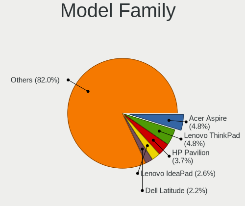
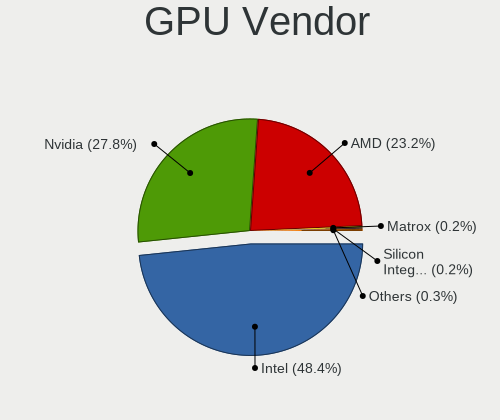

Linux in Italy - Tested Hardware & Statistics
---------------------------------------------

A project to collect tested hardware configurations for Linux in Italy.

Anyone can contribute to this report by the [hw-probe](https://github.com/linuxhw/hw-probe) tool:

    sudo -E hw-probe -all -upload

Please contribute! Especially if your hardware is rare.

This is a report for all computer types. See also reports for [desktops](/Location/Italy/Desktop/README.md) and [notebooks](/Location/Italy/Notebook/README.md).

Contents
--------

* [ Test Cases ](#test-cases)

* [ System ](#system)
  - [ OS                       ](#os)
  - [ OS Family                ](#os-family)
  - [ Kernel                   ](#kernel)
  - [ Kernel Family            ](#kernel-family)
  - [ Kernel Major Ver.        ](#kernel-major-ver)
  - [ Arch                     ](#arch)
  - [ DE                       ](#de)
  - [ Display Server           ](#display-server)
  - [ Display Manager          ](#display-manager)
  - [ OS Lang                  ](#os-lang)
  - [ Boot Mode                ](#boot-mode)
  - [ Filesystem               ](#filesystem)
  - [ Part. scheme             ](#part-scheme)
  - [ Dual Boot with Linux/BSD ](#dual-boot-with-linuxbsd)
  - [ Dual Boot (Win)          ](#dual-boot-win)

* [ Board ](#board)
  - [ Vendor                   ](#vendor)
  - [ Model                    ](#model)
  - [ Model Family             ](#model-family)
  - [ MFG Year                 ](#mfg-year)
  - [ Form Factor              ](#form-factor)
  - [ Secure Boot              ](#secure-boot)
  - [ Coreboot                 ](#coreboot)
  - [ RAM Size                 ](#ram-size)
  - [ RAM Used                 ](#ram-used)
  - [ Total Drives             ](#total-drives)
  - [ Has CD-ROM               ](#has-cd-rom)
  - [ Has Ethernet             ](#has-ethernet)
  - [ Has WiFi                 ](#has-wifi)
  - [ Has Bluetooth            ](#has-bluetooth)

* [ Location ](#location)
  - [ Country                  ](#country)
  - [ City                     ](#city)

* [ Drives ](#drives)
  - [ Drive Vendor             ](#drive-vendor)
  - [ Drive Model              ](#drive-model)
  - [ HDD Vendor               ](#hdd-vendor)
  - [ SSD Vendor               ](#ssd-vendor)
  - [ Drive Kind               ](#drive-kind)
  - [ Drive Connector          ](#drive-connector)
  - [ Drive Size               ](#drive-size)
  - [ Space Total              ](#space-total)
  - [ Space Used               ](#space-used)
  - [ Malfunc. Drives          ](#malfunc-drives)
  - [ Malfunc. Drive Vendor    ](#malfunc-drive-vendor)
  - [ Malfunc. HDD Vendor      ](#malfunc-hdd-vendor)
  - [ Malfunc. Drive Kind      ](#malfunc-drive-kind)
  - [ Failed Drives            ](#failed-drives)
  - [ Failed Drive Vendor      ](#failed-drive-vendor)
  - [ Drive Status             ](#drive-status)

* [ Storage controller ](#storage-controller)
  - [ Storage Vendor           ](#storage-vendor)
  - [ Storage Model            ](#storage-model)
  - [ Storage Kind             ](#storage-kind)

* [ Processor ](#processor)
  - [ CPU Vendor               ](#cpu-vendor)
  - [ CPU Model                ](#cpu-model)
  - [ CPU Model Family         ](#cpu-model-family)
  - [ CPU Cores                ](#cpu-cores)
  - [ CPU Sockets              ](#cpu-sockets)
  - [ CPU Threads              ](#cpu-threads)
  - [ CPU Op-Modes             ](#cpu-op-modes)
  - [ CPU Microcode            ](#cpu-microcode)
  - [ CPU Microarch            ](#cpu-microarch)

* [ Graphics ](#graphics)
  - [ GPU Vendor               ](#gpu-vendor)
  - [ GPU Model                ](#gpu-model)
  - [ GPU Combo                ](#gpu-combo)
  - [ GPU Driver               ](#gpu-driver)
  - [ GPU Memory               ](#gpu-memory)

* [ Monitor ](#monitor)
  - [ Monitor Vendor           ](#monitor-vendor)
  - [ Monitor Model            ](#monitor-model)
  - [ Monitor Resolution       ](#monitor-resolution)
  - [ Monitor Diagonal         ](#monitor-diagonal)
  - [ Monitor Width            ](#monitor-width)
  - [ Aspect Ratio             ](#aspect-ratio)
  - [ Monitor Area             ](#monitor-area)
  - [ Pixel Density            ](#pixel-density)
  - [ Multiple Monitors        ](#multiple-monitors)

* [ Network ](#network)
  - [ Net Controller Vendor    ](#net-controller-vendor)
  - [ Net Controller Model     ](#net-controller-model)
  - [ Wireless Vendor          ](#wireless-vendor)
  - [ Wireless Model           ](#wireless-model)
  - [ Ethernet Vendor          ](#ethernet-vendor)
  - [ Ethernet Model           ](#ethernet-model)
  - [ Net Controller Kind      ](#net-controller-kind)
  - [ Used Controller          ](#used-controller)
  - [ NICs                     ](#nics)
  - [ IPv6                     ](#ipv6)

* [ Bluetooth ](#bluetooth)
  - [ Bluetooth Vendor         ](#bluetooth-vendor)
  - [ Bluetooth Model          ](#bluetooth-model)

* [ Sound ](#sound)
  - [ Sound Vendor             ](#sound-vendor)
  - [ Sound Model              ](#sound-model)

* [ Memory ](#memory)
  - [ Memory Vendor            ](#memory-vendor)
  - [ Memory Model             ](#memory-model)
  - [ Memory Kind              ](#memory-kind)
  - [ Memory Form Factor       ](#memory-form-factor)
  - [ Memory Size              ](#memory-size)
  - [ Memory Speed             ](#memory-speed)

* [ Printers & scanners ](#printers--scanners)
  - [ Printer Vendor           ](#printer-vendor)
  - [ Printer Model            ](#printer-model)
  - [ Scanner Vendor           ](#scanner-vendor)
  - [ Scanner Model            ](#scanner-model)

* [ Camera ](#camera)
  - [ Camera Vendor            ](#camera-vendor)
  - [ Camera Model             ](#camera-model)

* [ Security ](#security)
  - [ Fingerprint Vendor       ](#fingerprint-vendor)
  - [ Fingerprint Model        ](#fingerprint-model)
  - [ Chipcard Vendor          ](#chipcard-vendor)
  - [ Chipcard Model           ](#chipcard-model)

* [ Unsupported ](#unsupported)
  - [ Unsupported Devices      ](#unsupported-devices)
  - [ Unsupported Device Types ](#unsupported-device-types)

Test Cases
----------

Total: 10942

| Vendor        | Model                       | Form-Factor | Probe                                                      | Date         |
|---------------|-----------------------------|-------------|------------------------------------------------------------|--------------|
| Acer          | Aspire V5-123               | Notebook    | [8507833f22](https://linux-hardware.org/?probe=8507833f22) | Jul 01, 2023 |
| ASUSTek       | ROG CROSSHAIR VII HERO      | Desktop     | [d42cdc8551](https://linux-hardware.org/?probe=d42cdc8551) | Jun 30, 2023 |
| Lenovo        | IdeaPad 330S-15IKB 81F5     | Notebook    | [39a8ee4269](https://linux-hardware.org/?probe=39a8ee4269) | Jun 30, 2023 |
| ASRock        | 775Dual-VSTA                | Desktop     | [7ddc95bb2f](https://linux-hardware.org/?probe=7ddc95bb2f) | Jun 30, 2023 |
| Dell          | Vostro 2520                 | Notebook    | [48d04d8282](https://linux-hardware.org/?probe=48d04d8282) | Jun 30, 2023 |
| Dell          | Latitude 5521               | Notebook    | [3a8f3794aa](https://linux-hardware.org/?probe=3a8f3794aa) | Jun 29, 2023 |
| HP            | Pavilion dv6                | Notebook    | [b6c2bcb025](https://linux-hardware.org/?probe=b6c2bcb025) | Jun 29, 2023 |
| Lenovo        | Legion 5 Pro 16ARH7H 82R... | Notebook    | [b52c0ac96a](https://linux-hardware.org/?probe=b52c0ac96a) | Jun 29, 2023 |
| HP            | Stream Laptop 14-cb1XX      | Notebook    | [1db11a4fa9](https://linux-hardware.org/?probe=1db11a4fa9) | Jun 29, 2023 |
| Fujitsu       | D3400-A1 S26361-D3400-A1    | Desktop     | [4ad54ee28d](https://linux-hardware.org/?probe=4ad54ee28d) | Jun 29, 2023 |
| Acer          | Aspire 5750G                | Notebook    | [3c4acbf380](https://linux-hardware.org/?probe=3c4acbf380) | Jun 28, 2023 |
| Lenovo        | IdeaPad 5 15ALC05 82LN      | Notebook    | [7017964456](https://linux-hardware.org/?probe=7017964456) | Jun 28, 2023 |
| Acer          | Aspire 5738                 | Notebook    | [b4fcb0d0c0](https://linux-hardware.org/?probe=b4fcb0d0c0) | Jun 28, 2023 |
| ASUSTek       | F2A85-M PRO                 | Desktop     | [a7617c12c5](https://linux-hardware.org/?probe=a7617c12c5) | Jun 28, 2023 |
| Acer          | Aspire 5750G                | Notebook    | [8ae62960d8](https://linux-hardware.org/?probe=8ae62960d8) | Jun 28, 2023 |
| Dell          | Latitude 7440               | Notebook    | [24f85667ac](https://linux-hardware.org/?probe=24f85667ac) | Jun 28, 2023 |
| Dell          | 0XJ5V0 A03                  | Desktop     | [a1595a590c](https://linux-hardware.org/?probe=a1595a590c) | Jun 28, 2023 |
| ASUSTek       | PRIME Z370M-PLUS II         | Desktop     | [1114cf7328](https://linux-hardware.org/?probe=1114cf7328) | Jun 28, 2023 |
| Gigabyte      | B450 I AORUS PRO WIFI-CF    | Desktop     | [0251f7e1ab](https://linux-hardware.org/?probe=0251f7e1ab) | Jun 27, 2023 |
| Acer          | Aspire A315-21              | Notebook    | [4bf524cd80](https://linux-hardware.org/?probe=4bf524cd80) | Jun 27, 2023 |
| MSI           | B250M PRO-VH                | Desktop     | [cb47380993](https://linux-hardware.org/?probe=cb47380993) | Jun 27, 2023 |
| Lenovo        | ThinkPad SL 2746EDG         | Notebook    | [7f0ae1c657](https://linux-hardware.org/?probe=7f0ae1c657) | Jun 27, 2023 |
| Dell          | XPS 15 9500                 | Notebook    | [8ea6d92813](https://linux-hardware.org/?probe=8ea6d92813) | Jun 27, 2023 |
| Lenovo        | IdeaPad Gaming 3 15ACH6 ... | Notebook    | [24d66c058b](https://linux-hardware.org/?probe=24d66c058b) | Jun 27, 2023 |
| HP            | ENVY 15                     | Notebook    | [0d46d829d2](https://linux-hardware.org/?probe=0d46d829d2) | Jun 27, 2023 |
| HP            | ENVY 15                     | Notebook    | [189cf01c37](https://linux-hardware.org/?probe=189cf01c37) | Jun 27, 2023 |
| Lenovo        | ThinkPad T480 20L6S5LF00    | Notebook    | [5a062be874](https://linux-hardware.org/?probe=5a062be874) | Jun 26, 2023 |
| MSI           | X570-A PRO                  | Desktop     | [f664b455eb](https://linux-hardware.org/?probe=f664b455eb) | Jun 26, 2023 |
| ASUSTek       | T102HA                      | Tablet      | [09acdc7c4a](https://linux-hardware.org/?probe=09acdc7c4a) | Jun 26, 2023 |
| ASUSTek       | B85M-G                      | Desktop     | [5a9f85740e](https://linux-hardware.org/?probe=5a9f85740e) | Jun 26, 2023 |
| HP            | Pavilion dv6                | Notebook    | [fe7974bbc9](https://linux-hardware.org/?probe=fe7974bbc9) | Jun 26, 2023 |
| HP            | Pavilion dv6                | Notebook    | [3051c4ac4e](https://linux-hardware.org/?probe=3051c4ac4e) | Jun 26, 2023 |
| ASUSTek       | H110M-K                     | Desktop     | [8a0a603eef](https://linux-hardware.org/?probe=8a0a603eef) | Jun 26, 2023 |
| Acer          | Aspire V3-772               | Notebook    | [12cc9ac9dc](https://linux-hardware.org/?probe=12cc9ac9dc) | Jun 25, 2023 |
| Acer          | Aspire 5600                 | Notebook    | [82fd23bd36](https://linux-hardware.org/?probe=82fd23bd36) | Jun 25, 2023 |
| Google        | Sasuke                      | Notebook    | [d2b46a08a3](https://linux-hardware.org/?probe=d2b46a08a3) | Jun 25, 2023 |
| Toshiba       | Satellite A300              | Notebook    | [6f1d7a6089](https://linux-hardware.org/?probe=6f1d7a6089) | Jun 25, 2023 |
| Lenovo        | ThinkPad E560 20EV000UIX    | Notebook    | [ac6bd9497a](https://linux-hardware.org/?probe=ac6bd9497a) | Jun 25, 2023 |
| MSI           | GL73 8RE                    | Notebook    | [0b8ee3c470](https://linux-hardware.org/?probe=0b8ee3c470) | Jun 25, 2023 |
| HUAWEI        | BOD-WXX9                    | Notebook    | [aa75d0dace](https://linux-hardware.org/?probe=aa75d0dace) | Jun 25, 2023 |
| ASUSTek       | PRIME H310M-A R2.0          | Desktop     | [aab1616d0e](https://linux-hardware.org/?probe=aab1616d0e) | Jun 25, 2023 |
| Acer          | Aspire 5738                 | Notebook    | [8112b061f0](https://linux-hardware.org/?probe=8112b061f0) | Jun 24, 2023 |
| HP            | 8437                        | Desktop     | [477b6d5623](https://linux-hardware.org/?probe=477b6d5623) | Jun 24, 2023 |
| ASUSTek       | P5SD2-VM                    | Desktop     | [d91441b98b](https://linux-hardware.org/?probe=d91441b98b) | Jun 24, 2023 |
| Microtech     | CoreBook Lite               | Notebook    | [1840bef280](https://linux-hardware.org/?probe=1840bef280) | Jun 24, 2023 |
| Packard Be... | EasyNote TJ65               | Notebook    | [cdc135487b](https://linux-hardware.org/?probe=cdc135487b) | Jun 24, 2023 |
| MSI           | MS-7360                     | Desktop     | [9a0d46b069](https://linux-hardware.org/?probe=9a0d46b069) | Jun 23, 2023 |
| HP            | Presario CQ56               | Notebook    | [5a8991a97b](https://linux-hardware.org/?probe=5a8991a97b) | Jun 23, 2023 |
| HP            | Laptop 15-da0xxx            | Notebook    | [f8d0ce645a](https://linux-hardware.org/?probe=f8d0ce645a) | Jun 23, 2023 |
| MSI           | B550M PRO-VDH WIFI          | Desktop     | [2fb45a65c8](https://linux-hardware.org/?probe=2fb45a65c8) | Jun 23, 2023 |
| MSI           | B550M PRO-VDH WIFI          | Desktop     | [ae8e0ef85b](https://linux-hardware.org/?probe=ae8e0ef85b) | Jun 23, 2023 |
| HP            | ENVY 15                     | Notebook    | [3918cca1e5](https://linux-hardware.org/?probe=3918cca1e5) | Jun 23, 2023 |
| HP            | Pavilion g6                 | Notebook    | [fa58c1a1fd](https://linux-hardware.org/?probe=fa58c1a1fd) | Jun 22, 2023 |
| Acer          | Aspire 7720G                | Notebook    | [a8e44a5ab1](https://linux-hardware.org/?probe=a8e44a5ab1) | Jun 22, 2023 |
| HP            | Pavilion g6                 | Notebook    | [a58868d782](https://linux-hardware.org/?probe=a58868d782) | Jun 22, 2023 |
| HUAWEI        | BOD-WXX9                    | Notebook    | [83d89a8751](https://linux-hardware.org/?probe=83d89a8751) | Jun 22, 2023 |
| HP            | Pavilion Laptop 14-ce2xx... | Notebook    | [419687b31f](https://linux-hardware.org/?probe=419687b31f) | Jun 22, 2023 |
| Dell          | Vostro 3700                 | Notebook    | [6e4fe4f0c8](https://linux-hardware.org/?probe=6e4fe4f0c8) | Jun 22, 2023 |
| IP3 Techno... | ACB19                       | Mini pc     | [db5c45e4f7](https://linux-hardware.org/?probe=db5c45e4f7) | Jun 22, 2023 |
| ASUSTek       | K55VD                       | Notebook    | [223967ea1d](https://linux-hardware.org/?probe=223967ea1d) | Jun 22, 2023 |
| Lenovo        | IdeaPad 3 15IGL05 81WQ      | Notebook    | [44050251e9](https://linux-hardware.org/?probe=44050251e9) | Jun 22, 2023 |
| Sony          | VGN-NS21M_W                 | Notebook    | [6813d6589e](https://linux-hardware.org/?probe=6813d6589e) | Jun 21, 2023 |
| HP            | EliteBook 820 G2            | Notebook    | [d4f506e331](https://linux-hardware.org/?probe=d4f506e331) | Jun 21, 2023 |
| Microsoft     | Surface Go                  | Tablet      | [197d2f4c7c](https://linux-hardware.org/?probe=197d2f4c7c) | Jun 21, 2023 |
| ASUSTek       | K55VD                       | Notebook    | [49f6cc6986](https://linux-hardware.org/?probe=49f6cc6986) | Jun 20, 2023 |
| Intel         | X79                         | Desktop     | [8c50d3b5e8](https://linux-hardware.org/?probe=8c50d3b5e8) | Jun 20, 2023 |
| Lenovo        | ThinkPad SL 2746EDG         | Notebook    | [42ba3d75e5](https://linux-hardware.org/?probe=42ba3d75e5) | Jun 20, 2023 |
| AMI           | Intel                       | Desktop     | [94c1b63cc6](https://linux-hardware.org/?probe=94c1b63cc6) | Jun 20, 2023 |
| HP            | OMEN by Laptop 15-dh0xxx    | Notebook    | [6e2f7d8295](https://linux-hardware.org/?probe=6e2f7d8295) | Jun 20, 2023 |
| ASUSTek       | P8H61-M LX                  | Desktop     | [35de204113](https://linux-hardware.org/?probe=35de204113) | Jun 19, 2023 |
| Samsung       | RC420/RC520/RC720           | Notebook    | [406b650f19](https://linux-hardware.org/?probe=406b650f19) | Jun 19, 2023 |
| Apple         | Mac-81E3E92DD6088272 iMa... | All in one  | [0f15219a46](https://linux-hardware.org/?probe=0f15219a46) | Jun 19, 2023 |
| Acer          | Aspire TC-780               | Desktop     | [7412881615](https://linux-hardware.org/?probe=7412881615) | Jun 18, 2023 |
| MSI           | PS63 Modern 8RC             | Notebook    | [f540e88555](https://linux-hardware.org/?probe=f540e88555) | Jun 18, 2023 |
| Dell          | Latitude 5520               | Notebook    | [09da4ee3c4](https://linux-hardware.org/?probe=09da4ee3c4) | Jun 18, 2023 |
| Dell          | Latitude 5520               | Notebook    | [5e70c1929c](https://linux-hardware.org/?probe=5e70c1929c) | Jun 18, 2023 |
| Acer          | Aspire 5600                 | Notebook    | [af924230a1](https://linux-hardware.org/?probe=af924230a1) | Jun 18, 2023 |
| HP            | EliteBook 2530p             | Notebook    | [7d246caf6f](https://linux-hardware.org/?probe=7d246caf6f) | Jun 18, 2023 |
| Lenovo        | IdeaPad 3 15ALC6 82KU       | Notebook    | [46692b99cb](https://linux-hardware.org/?probe=46692b99cb) | Jun 18, 2023 |
| Acer          | Aspire 5738                 | Notebook    | [8247e349fc](https://linux-hardware.org/?probe=8247e349fc) | Jun 17, 2023 |
| Sony          | SVE1713X1EB                 | Notebook    | [8b346f7874](https://linux-hardware.org/?probe=8b346f7874) | Jun 17, 2023 |
| HUAWEI        | MACH-WX9                    | Notebook    | [4a86028eb3](https://linux-hardware.org/?probe=4a86028eb3) | Jun 17, 2023 |
| ASUSTek       | P8H61-M LX                  | Desktop     | [fe3b7abf1d](https://linux-hardware.org/?probe=fe3b7abf1d) | Jun 17, 2023 |
| MSI           | Boston                      | Desktop     | [8bc41737a5](https://linux-hardware.org/?probe=8bc41737a5) | Jun 17, 2023 |
| ASUSTek       | T101HA                      | Tablet      | [834705c660](https://linux-hardware.org/?probe=834705c660) | Jun 17, 2023 |
| HP            | ENVY 15                     | Notebook    | [10a4cb8865](https://linux-hardware.org/?probe=10a4cb8865) | Jun 17, 2023 |
| ASUSTek       | P8H61-M LX                  | Desktop     | [23b64edd39](https://linux-hardware.org/?probe=23b64edd39) | Jun 17, 2023 |
| ASUSTek       | P5B-Deluxe                  | Desktop     | [4dae4ff7c6](https://linux-hardware.org/?probe=4dae4ff7c6) | Jun 16, 2023 |
| Dell          | Vostro 3700                 | Notebook    | [dae8f5a0b4](https://linux-hardware.org/?probe=dae8f5a0b4) | Jun 15, 2023 |
| HP            | Laptop 15s-fq0xxx           | Notebook    | [bbc15bef9c](https://linux-hardware.org/?probe=bbc15bef9c) | Jun 15, 2023 |
| Supermicro    | C7X99-OCE                   | Server      | [3d606bb171](https://linux-hardware.org/?probe=3d606bb171) | Jun 15, 2023 |
| Apple         | Mac-031B6874CF7F642A iMa... | All in one  | [f3d2cd0976](https://linux-hardware.org/?probe=f3d2cd0976) | Jun 15, 2023 |
| Acer          | Aspire 1810T                | Notebook    | [1b1d11f461](https://linux-hardware.org/?probe=1b1d11f461) | Jun 14, 2023 |
| Samsung       | N130                        | Notebook    | [3efb763643](https://linux-hardware.org/?probe=3efb763643) | Jun 14, 2023 |
| MSI           | GL73 8RE                    | Notebook    | [e37b06f2b0](https://linux-hardware.org/?probe=e37b06f2b0) | Jun 14, 2023 |
| Unknown       | Unknown                     | Desktop     | [e6ac28ac73](https://linux-hardware.org/?probe=e6ac28ac73) | Jun 14, 2023 |
| Unknown       | Unknown                     | Desktop     | [ca27fe4c19](https://linux-hardware.org/?probe=ca27fe4c19) | Jun 14, 2023 |
| ASUSTek       | P553UA                      | Notebook    | [2543eb4ce8](https://linux-hardware.org/?probe=2543eb4ce8) | Jun 14, 2023 |
| BESSTAR Te... | GB7                         | Mini pc     | [511317bdbc](https://linux-hardware.org/?probe=511317bdbc) | Jun 14, 2023 |
| Dell          | XPS 15 9560                 | Notebook    | [f3b25c0959](https://linux-hardware.org/?probe=f3b25c0959) | Jun 14, 2023 |
| Chuwi         | RZBOX                       | Desktop     | [11bb40ef32](https://linux-hardware.org/?probe=11bb40ef32) | Jun 13, 2023 |
| HP            | 18E7                        | Desktop     | [1be1b42bb4](https://linux-hardware.org/?probe=1be1b42bb4) | Jun 13, 2023 |
| HP            | 18E7                        | Desktop     | [cbf4019da2](https://linux-hardware.org/?probe=cbf4019da2) | Jun 13, 2023 |
| HP            | Pavilion dv7                | Notebook    | [3c113d457b](https://linux-hardware.org/?probe=3c113d457b) | Jun 13, 2023 |
| Dell          | Latitude E5540              | Notebook    | [029d51e57f](https://linux-hardware.org/?probe=029d51e57f) | Jun 13, 2023 |
| HP            | 250 15.6 inch G9 Noteboo... | Notebook    | [d910ebe7bb](https://linux-hardware.org/?probe=d910ebe7bb) | Jun 13, 2023 |
| Dell          | Latitude E7250              | Notebook    | [cc9fc2bace](https://linux-hardware.org/?probe=cc9fc2bace) | Jun 13, 2023 |
| ASUSTek       | H110M-A                     | Desktop     | [d9cd48b67d](https://linux-hardware.org/?probe=d9cd48b67d) | Jun 12, 2023 |
| Lenovo        | 103D SDK0Q40112 WIN 3305... | Desktop     | [5c2eef3678](https://linux-hardware.org/?probe=5c2eef3678) | Jun 12, 2023 |
| HP            | EliteBook 2530p             | Notebook    | [8e5a09ba99](https://linux-hardware.org/?probe=8e5a09ba99) | Jun 12, 2023 |
| MSI           | MPG B550 GAMING EDGE WIF... | Desktop     | [373e36422d](https://linux-hardware.org/?probe=373e36422d) | Jun 12, 2023 |
| ASUSTek       | PRIME H270-PLUS             | Desktop     | [017c7fd564](https://linux-hardware.org/?probe=017c7fd564) | Jun 11, 2023 |
| HP            | EliteBook 2530p             | Notebook    | [b843a66531](https://linux-hardware.org/?probe=b843a66531) | Jun 11, 2023 |
| Chuwi         | RZBOX                       | Desktop     | [e31b33ae5e](https://linux-hardware.org/?probe=e31b33ae5e) | Jun 11, 2023 |
| HP            | ZBook 15 G6                 | Notebook    | [180abd0b90](https://linux-hardware.org/?probe=180abd0b90) | Jun 11, 2023 |
| Valve         | Jupiter                     | Notebook    | [d276b58f38](https://linux-hardware.org/?probe=d276b58f38) | Jun 10, 2023 |
| HP            | Compaq CQ58                 | Notebook    | [98a4edb43d](https://linux-hardware.org/?probe=98a4edb43d) | Jun 10, 2023 |
| Intel         | NUC11ATBC2 M53055-202       | Mini pc     | [81aee70d12](https://linux-hardware.org/?probe=81aee70d12) | Jun 10, 2023 |
| Lenovo        | IdeaPad Gaming 3 15ARH05... | Notebook    | [bdca36306b](https://linux-hardware.org/?probe=bdca36306b) | Jun 10, 2023 |
| HUAWEI        | BOD-WXX9                    | Notebook    | [c4063bcf07](https://linux-hardware.org/?probe=c4063bcf07) | Jun 09, 2023 |
| HUAWEI        | BOD-WXX9                    | Notebook    | [9016ad81ae](https://linux-hardware.org/?probe=9016ad81ae) | Jun 09, 2023 |
| Sony          | SVE1713X1EB                 | Notebook    | [f1c10c92b3](https://linux-hardware.org/?probe=f1c10c92b3) | Jun 09, 2023 |
| Acer          | Aspire F5-573G              | Notebook    | [5648ca2620](https://linux-hardware.org/?probe=5648ca2620) | Jun 09, 2023 |
| Acer          | Aspire F5-573G              | Notebook    | [30dbebd931](https://linux-hardware.org/?probe=30dbebd931) | Jun 09, 2023 |
| Onda TLC      | ONDA Oliver                 | Notebook    | [80a06d821b](https://linux-hardware.org/?probe=80a06d821b) | Jun 09, 2023 |
| Raspberry ... | Raspberry Pi 2 Model B R... | Soc         | [5ad9f9e0bf](https://linux-hardware.org/?probe=5ad9f9e0bf) | Jun 09, 2023 |
| HP            | Pavilion x360 Convertibl... | Convertible | [797dea9c96](https://linux-hardware.org/?probe=797dea9c96) | Jun 09, 2023 |
| MSI           | H81I                        | Desktop     | [c7c19346a2](https://linux-hardware.org/?probe=c7c19346a2) | Jun 09, 2023 |
| HP            | 09E0h                       | Desktop     | [b6bb01441c](https://linux-hardware.org/?probe=b6bb01441c) | Jun 09, 2023 |
| HP            | EliteBook 8440p             | Notebook    | [b88712538e](https://linux-hardware.org/?probe=b88712538e) | Jun 09, 2023 |
| HP            | 2B35                        | Desktop     | [5921b94b60](https://linux-hardware.org/?probe=5921b94b60) | Jun 09, 2023 |
| HP            | EliteBook 8440p             | Notebook    | [51bfdec531](https://linux-hardware.org/?probe=51bfdec531) | Jun 09, 2023 |
| Acer          | Aspire A315-51              | Notebook    | [9bcc99d434](https://linux-hardware.org/?probe=9bcc99d434) | Jun 08, 2023 |
| Acer          | Aspire A315-51              | Notebook    | [3013e9caf2](https://linux-hardware.org/?probe=3013e9caf2) | Jun 08, 2023 |
| HP            | G42                         | Notebook    | [fe8d2be276](https://linux-hardware.org/?probe=fe8d2be276) | Jun 08, 2023 |
| HP            | G42                         | Notebook    | [4f33462d46](https://linux-hardware.org/?probe=4f33462d46) | Jun 08, 2023 |
| Lenovo        | ThinkPad X270 W10DG 20K5... | Notebook    | [8a01610ae4](https://linux-hardware.org/?probe=8a01610ae4) | Jun 08, 2023 |
| MSI           | X470 GAMING PLUS            | Desktop     | [eea4cea0e0](https://linux-hardware.org/?probe=eea4cea0e0) | Jun 08, 2023 |
| HUAWEI        | HKD-WXX                     | Notebook    | [d6a8e02362](https://linux-hardware.org/?probe=d6a8e02362) | Jun 08, 2023 |
| HP            | 87A4 10100                  | All in one  | [3c67e34a5e](https://linux-hardware.org/?probe=3c67e34a5e) | Jun 08, 2023 |
| ASUSTek       | X580VN                      | Notebook    | [8c1cf3f164](https://linux-hardware.org/?probe=8c1cf3f164) | Jun 08, 2023 |
| HUAWEI        | HKD-WXX                     | Notebook    | [fdb80f6e89](https://linux-hardware.org/?probe=fdb80f6e89) | Jun 08, 2023 |
| MSI           | MAG B650 TOMAHAWK WIFI      | Desktop     | [35c7fcb130](https://linux-hardware.org/?probe=35c7fcb130) | Jun 08, 2023 |
| MSI           | MAG B650 TOMAHAWK WIFI      | Desktop     | [f4e1a7a712](https://linux-hardware.org/?probe=f4e1a7a712) | Jun 08, 2023 |
| Lenovo        | 317C SDK0J40700 WIN 3258... | Desktop     | [d5d7ffe9df](https://linux-hardware.org/?probe=d5d7ffe9df) | Jun 08, 2023 |
| Lenovo        | IdeaPad 3 15ITL6 82H8       | Notebook    | [82d0019a0b](https://linux-hardware.org/?probe=82d0019a0b) | Jun 08, 2023 |
| Acer          | AO722                       | Notebook    | [a57b6cf2ff](https://linux-hardware.org/?probe=a57b6cf2ff) | Jun 08, 2023 |
| HP            | Pavilion dv7                | Notebook    | [75a37cd4c8](https://linux-hardware.org/?probe=75a37cd4c8) | Jun 07, 2023 |
| HP            | 1905                        | Desktop     | [0617f4e698](https://linux-hardware.org/?probe=0617f4e698) | Jun 07, 2023 |
| Apple         | Mac-77F17D7DA9285301 iMa... | All in one  | [2ad409f60a](https://linux-hardware.org/?probe=2ad409f60a) | Jun 07, 2023 |
| Onda TLC      | ONDA Oliver                 | Notebook    | [bbfcf4a3be](https://linux-hardware.org/?probe=bbfcf4a3be) | Jun 07, 2023 |
| Dell          | Latitude 5300               | Notebook    | [1eea10cfa3](https://linux-hardware.org/?probe=1eea10cfa3) | Jun 07, 2023 |
| HP            | Pavilion Notebook           | Notebook    | [5254a5fe09](https://linux-hardware.org/?probe=5254a5fe09) | Jun 07, 2023 |
| Acer          | Aspire E1-571               | Notebook    | [f4e4a4b982](https://linux-hardware.org/?probe=f4e4a4b982) | Jun 07, 2023 |
| Acer          | Aspire E1-571               | Notebook    | [7948f267c2](https://linux-hardware.org/?probe=7948f267c2) | Jun 07, 2023 |
| Lenovo        | 317C SDK0J40700 WIN 3258... | Desktop     | [23b41d16db](https://linux-hardware.org/?probe=23b41d16db) | Jun 06, 2023 |
| Acer          | AO722                       | Notebook    | [8840b1284b](https://linux-hardware.org/?probe=8840b1284b) | Jun 06, 2023 |
| Acer          | Aspire E1-571               | Notebook    | [1139c69312](https://linux-hardware.org/?probe=1139c69312) | Jun 06, 2023 |
| Chuwi         | RZBOX                       | Desktop     | [f395c0f429](https://linux-hardware.org/?probe=f395c0f429) | Jun 06, 2023 |
| MSI           | GF63 Thin 9RCX              | Notebook    | [85ec51dbf3](https://linux-hardware.org/?probe=85ec51dbf3) | Jun 05, 2023 |
| ASUSTek       | ROG STRIX X570-E GAMING     | Desktop     | [d288737b23](https://linux-hardware.org/?probe=d288737b23) | Jun 05, 2023 |
| Lenovo        | ThinkPad T15 Gen 1 20S60... | Notebook    | [c20dd8572a](https://linux-hardware.org/?probe=c20dd8572a) | Jun 05, 2023 |
| MSI           | B360M PRO-VH                | Desktop     | [8d150fb2b0](https://linux-hardware.org/?probe=8d150fb2b0) | Jun 05, 2023 |
| HUAWEI        | KPR-WX9                     | Notebook    | [3eb711e453](https://linux-hardware.org/?probe=3eb711e453) | Jun 05, 2023 |
| Dell          | XPS 13 9305                 | Notebook    | [450d20f29d](https://linux-hardware.org/?probe=450d20f29d) | Jun 05, 2023 |
| BESSTAR Te... | GB7                         | Mini pc     | [e3738c1f5a](https://linux-hardware.org/?probe=e3738c1f5a) | Jun 05, 2023 |
| Fujitsu       | D3061-A1 S26361-D3061-A1    | Desktop     | [cc575f0073](https://linux-hardware.org/?probe=cc575f0073) | Jun 05, 2023 |
| Unknown       | Unknown                     | Desktop     | [292269611c](https://linux-hardware.org/?probe=292269611c) | Jun 05, 2023 |
| Acer          | Aspire F5-573G              | Notebook    | [b4f165f28d](https://linux-hardware.org/?probe=b4f165f28d) | Jun 05, 2023 |
| Acer          | Aspire F5-573G              | Notebook    | [e0ce9df73c](https://linux-hardware.org/?probe=e0ce9df73c) | Jun 05, 2023 |
| MSI           | Boston                      | Desktop     | [9f5efc29ad](https://linux-hardware.org/?probe=9f5efc29ad) | Jun 04, 2023 |
| ASUSTek       | ROG STRIX B450-F GAMING ... | Desktop     | [3af6e03b1c](https://linux-hardware.org/?probe=3af6e03b1c) | Jun 04, 2023 |
| MSI           | GL75 Leopard 10SER          | Notebook    | [24111ade43](https://linux-hardware.org/?probe=24111ade43) | Jun 04, 2023 |
| Gigabyte      | B450M DS3H-CF               | Desktop     | [4b162cac99](https://linux-hardware.org/?probe=4b162cac99) | Jun 04, 2023 |
| Acer          | Aspire E5-573G              | Notebook    | [3ef3c9ec82](https://linux-hardware.org/?probe=3ef3c9ec82) | Jun 04, 2023 |
| Sony          | SVE1713X1EB                 | Notebook    | [6a50598ca6](https://linux-hardware.org/?probe=6a50598ca6) | Jun 04, 2023 |
| HP            | 255 G7 Notebook PC          | Notebook    | [8b14da5cf8](https://linux-hardware.org/?probe=8b14da5cf8) | Jun 04, 2023 |
| MSI           | MPG X570 GAMING PLUS        | Desktop     | [70e5950511](https://linux-hardware.org/?probe=70e5950511) | Jun 04, 2023 |
| ASRock        | A320M-HDV R4.0              | Desktop     | [f472cba5a6](https://linux-hardware.org/?probe=f472cba5a6) | Jun 04, 2023 |
| HP            | ZBook 15 G2                 | Notebook    | [19ed8e22e6](https://linux-hardware.org/?probe=19ed8e22e6) | Jun 03, 2023 |
| Lenovo        | Legion 5 Pro 16ACH6H 82J... | Notebook    | [ac6745cffb](https://linux-hardware.org/?probe=ac6745cffb) | Jun 03, 2023 |
| Dell          | Latitude E5430 non-vPro     | Notebook    | [ba2dfac7ae](https://linux-hardware.org/?probe=ba2dfac7ae) | Jun 03, 2023 |
| Sony          | SVE1713X1EB                 | Notebook    | [fc0097b52f](https://linux-hardware.org/?probe=fc0097b52f) | Jun 03, 2023 |
| MSI           | MAG B550M MORTAR            | Desktop     | [3d911ac9c9](https://linux-hardware.org/?probe=3d911ac9c9) | Jun 03, 2023 |
| HONOR         | BBR-WAX9                    | Notebook    | [fe03659a55](https://linux-hardware.org/?probe=fe03659a55) | Jun 02, 2023 |
| ASUSTek       | ASUS TUF Gaming F17 FX70... | Notebook    | [959b76650d](https://linux-hardware.org/?probe=959b76650d) | Jun 02, 2023 |
| ASRock        | B365 Pro4                   | Desktop     | [35fff15a30](https://linux-hardware.org/?probe=35fff15a30) | Jun 02, 2023 |
| ASRock        | B365 Pro4                   | Desktop     | [54fcb811b8](https://linux-hardware.org/?probe=54fcb811b8) | Jun 02, 2023 |
| Lenovo        | ThinkPad T470 20HES0FW00    | Notebook    | [174ffa62e4](https://linux-hardware.org/?probe=174ffa62e4) | Jun 02, 2023 |
| Gigabyte      | B550M DS3H                  | Desktop     | [a8f8239e40](https://linux-hardware.org/?probe=a8f8239e40) | Jun 02, 2023 |
| ASUSTek       | ASUS TUF Dash F15 FX516P... | Notebook    | [49ca1fd34f](https://linux-hardware.org/?probe=49ca1fd34f) | Jun 02, 2023 |
| Lenovo        | G50-45 80E3                 | Notebook    | [3bc50c5ccb](https://linux-hardware.org/?probe=3bc50c5ccb) | Jun 02, 2023 |
| HONOR         | BBR-WAX9                    | Notebook    | [0a536c1198](https://linux-hardware.org/?probe=0a536c1198) | Jun 01, 2023 |
| MSI           | X470 GAMING PLUS MAX        | Desktop     | [5430a83fca](https://linux-hardware.org/?probe=5430a83fca) | Jun 01, 2023 |
| Samsung       | 300E4C/300E5C/300E7C        | Notebook    | [fcc2d0ed39](https://linux-hardware.org/?probe=fcc2d0ed39) | Jun 01, 2023 |
| HP            | 18E7                        | Desktop     | [a3f557389e](https://linux-hardware.org/?probe=a3f557389e) | Jun 01, 2023 |
| ASRock        | H310M-HDV                   | Desktop     | [3dc5138ecd](https://linux-hardware.org/?probe=3dc5138ecd) | Jun 01, 2023 |
| Fujitsu Si... | D2740-A2 S26361-D2740-A2    | Desktop     | [165491db1f](https://linux-hardware.org/?probe=165491db1f) | Jun 01, 2023 |
| MSI           | Prestige 15 A12UC           | Notebook    | [9324563727](https://linux-hardware.org/?probe=9324563727) | Jun 01, 2023 |
| Gigabyte      | B550M DS3H                  | Desktop     | [df7287f2c8](https://linux-hardware.org/?probe=df7287f2c8) | Jun 01, 2023 |
| MSI           | Prestige 15 A12UC           | Notebook    | [778e78d2a5](https://linux-hardware.org/?probe=778e78d2a5) | Jun 01, 2023 |
| ASRock        | X370 Pro4                   | Desktop     | [aaeac4c226](https://linux-hardware.org/?probe=aaeac4c226) | Jun 01, 2023 |
| MSI           | H110M PRO-VH PLUS           | Desktop     | [cfabc605f7](https://linux-hardware.org/?probe=cfabc605f7) | Jun 01, 2023 |
| Acer          | WG43M                       | Desktop     | [cdd78e1cac](https://linux-hardware.org/?probe=cdd78e1cac) | May 31, 2023 |
| ASUSTek       | ROG Flow X13 GV301QH_GV3... | Notebook    | [0b0c375bb8](https://linux-hardware.org/?probe=0b0c375bb8) | May 31, 2023 |
| Olidata       | Tehom cw4900                | Notebook    | [f5b147962f](https://linux-hardware.org/?probe=f5b147962f) | May 31, 2023 |
| ASRock        | H81M-HDS R2.0               | Desktop     | [810f6b35ea](https://linux-hardware.org/?probe=810f6b35ea) | May 31, 2023 |
| HONOR         | BBR-WAX9                    | Notebook    | [8630cfad52](https://linux-hardware.org/?probe=8630cfad52) | May 31, 2023 |
| HP            | Laptop 15s-fq5xxx           | Notebook    | [bfcb7f950d](https://linux-hardware.org/?probe=bfcb7f950d) | May 31, 2023 |
| ASUSTek       | P9X79                       | Desktop     | [c677ff5b2d](https://linux-hardware.org/?probe=c677ff5b2d) | May 31, 2023 |
| Dell          | Inspiron 15 5510            | Notebook    | [bd2319fd67](https://linux-hardware.org/?probe=bd2319fd67) | May 31, 2023 |
| Jumper        | EZbook                      | Notebook    | [3ccf2e1365](https://linux-hardware.org/?probe=3ccf2e1365) | May 31, 2023 |
| HP            | ENVY 15                     | Notebook    | [ad3cf182fe](https://linux-hardware.org/?probe=ad3cf182fe) | May 30, 2023 |
| HP            | ENVY 15                     | Notebook    | [5acbfb03f4](https://linux-hardware.org/?probe=5acbfb03f4) | May 30, 2023 |
| Fujitsu       | D3233-A1 S26361-D3233-A1    | Desktop     | [de30e713bf](https://linux-hardware.org/?probe=de30e713bf) | May 30, 2023 |
| Lenovo        | IdeaPad 5 14ALC05 82LM      | Notebook    | [bb50e13268](https://linux-hardware.org/?probe=bb50e13268) | May 30, 2023 |
| ASUSTek       | P5KPL-AM                    | Desktop     | [48359795cc](https://linux-hardware.org/?probe=48359795cc) | May 30, 2023 |
| HP            | Pavilion 15                 | Notebook    | [ca18fafda8](https://linux-hardware.org/?probe=ca18fafda8) | May 29, 2023 |
| Fujitsu       | D3233-A1 S26361-D3233-A1    | Desktop     | [4679a6e565](https://linux-hardware.org/?probe=4679a6e565) | May 29, 2023 |
| Fujitsu       | D3233-A1 S26361-D3233-A1    | Desktop     | [ec89dcb694](https://linux-hardware.org/?probe=ec89dcb694) | May 29, 2023 |
| Lenovo        | G50-45 80E3                 | Notebook    | [013d065e72](https://linux-hardware.org/?probe=013d065e72) | May 29, 2023 |
| Dell          | Latitude E5470              | Notebook    | [77d85b619e](https://linux-hardware.org/?probe=77d85b619e) | May 29, 2023 |
| Unknown       | Unknown                     | Notebook    | [351ca28b27](https://linux-hardware.org/?probe=351ca28b27) | May 29, 2023 |
| Acer          | Aspire A515-41G             | Notebook    | [644a5d7a16](https://linux-hardware.org/?probe=644a5d7a16) | May 29, 2023 |
| Apple         | MacBookAir7,2               | Notebook    | [2f44574d7c](https://linux-hardware.org/?probe=2f44574d7c) | May 29, 2023 |
| Apple         | MacBookPro7,1               | Notebook    | [81a267d02b](https://linux-hardware.org/?probe=81a267d02b) | May 28, 2023 |
| Apple         | MacBookAir7,2               | Notebook    | [5e146ef326](https://linux-hardware.org/?probe=5e146ef326) | May 28, 2023 |
| AZW           | SER V1.0                    | Mini pc     | [6ce88925e9](https://linux-hardware.org/?probe=6ce88925e9) | May 28, 2023 |
| HUAWEI        | BOHB-WAX9                   | Notebook    | [c7afdbbd76](https://linux-hardware.org/?probe=c7afdbbd76) | May 28, 2023 |
| Apple         | MacBookPro6,2               | Notebook    | [db9c87ce89](https://linux-hardware.org/?probe=db9c87ce89) | May 28, 2023 |
| Sony          | SVE1713X1EB                 | Notebook    | [2695d0a6c8](https://linux-hardware.org/?probe=2695d0a6c8) | May 28, 2023 |
| Lenovo        | IdeaPad 5 15IIL05 81YK      | Notebook    | [1eecbd5808](https://linux-hardware.org/?probe=1eecbd5808) | May 27, 2023 |
| HP            | G42                         | Notebook    | [7b9612a51a](https://linux-hardware.org/?probe=7b9612a51a) | May 27, 2023 |
| Dell          | XPS 15 9570                 | Notebook    | [e74ee1390f](https://linux-hardware.org/?probe=e74ee1390f) | May 26, 2023 |
| Dell          | XPS 15 9570                 | Notebook    | [ac75726738](https://linux-hardware.org/?probe=ac75726738) | May 26, 2023 |
| HP            | Pavilion x2 Detachable      | Notebook    | [e21476b6d2](https://linux-hardware.org/?probe=e21476b6d2) | May 26, 2023 |
| Acer          | Aspire A515-52G             | Notebook    | [433b367e58](https://linux-hardware.org/?probe=433b367e58) | May 26, 2023 |
| Acer          | Aspire A515-52G             | Notebook    | [ac85063e46](https://linux-hardware.org/?probe=ac85063e46) | May 26, 2023 |
| Gigabyte      | B450M DS3H-CF               | Desktop     | [cc8e36e75a](https://linux-hardware.org/?probe=cc8e36e75a) | May 26, 2023 |
| ASRock        | 990FX Extreme4              | Desktop     | [8c61dd5381](https://linux-hardware.org/?probe=8c61dd5381) | May 26, 2023 |
| Acer          | Aspire 7750G                | Notebook    | [1ddb5fe9a0](https://linux-hardware.org/?probe=1ddb5fe9a0) | May 26, 2023 |
| ASUSTek       | P7P55-M                     | Desktop     | [a8fd95ce79](https://linux-hardware.org/?probe=a8fd95ce79) | May 25, 2023 |
| Lenovo        | IdeaPad Z580                | Notebook    | [8d9c3b024d](https://linux-hardware.org/?probe=8d9c3b024d) | May 25, 2023 |
| ASUSTek       | PRIME H270-PRO              | Desktop     | [2a14c05edc](https://linux-hardware.org/?probe=2a14c05edc) | May 25, 2023 |
| ASUSTek       | S551LB                      | Notebook    | [86f50d3933](https://linux-hardware.org/?probe=86f50d3933) | May 25, 2023 |
| Mediacom      | SMARTBOOK ONE               | Notebook    | [ad010a6b3e](https://linux-hardware.org/?probe=ad010a6b3e) | May 25, 2023 |
| HPE           | ProLiant MicroServer Gen... | Desktop     | [530b841978](https://linux-hardware.org/?probe=530b841978) | May 25, 2023 |
| MSI           | X99A GAMING PRO CARBON      | Desktop     | [4c9595e6ea](https://linux-hardware.org/?probe=4c9595e6ea) | May 24, 2023 |
| Lenovo        | ThinkPad W541 20EGS24J00    | Notebook    | [d674d76da5](https://linux-hardware.org/?probe=d674d76da5) | May 24, 2023 |
| Sony          | SVF13N2J2ES                 | Notebook    | [978ae98d6e](https://linux-hardware.org/?probe=978ae98d6e) | May 24, 2023 |
| Lenovo        | ThinkPad W541 20EGS24J00    | Notebook    | [3b74b092c6](https://linux-hardware.org/?probe=3b74b092c6) | May 24, 2023 |
| Sony          | SVE1513Q1ESI                | Notebook    | [422e8954f2](https://linux-hardware.org/?probe=422e8954f2) | May 24, 2023 |
| ASUSTek       | VivoBook_ASUSLaptop X580... | Notebook    | [c5baa41ff7](https://linux-hardware.org/?probe=c5baa41ff7) | May 24, 2023 |
| ASUSTek       | PRIME B350M-A               | Desktop     | [174a3139c4](https://linux-hardware.org/?probe=174a3139c4) | May 24, 2023 |
| ASUSTek       | ROG Strix G733PZ_G733PZ     | Notebook    | [e484eaf025](https://linux-hardware.org/?probe=e484eaf025) | May 24, 2023 |
| Dell          | Precision 3571              | Notebook    | [3806fcdb9c](https://linux-hardware.org/?probe=3806fcdb9c) | May 24, 2023 |
| HP            | EliteBook 845 G8 Noteboo... | Notebook    | [1280876877](https://linux-hardware.org/?probe=1280876877) | May 24, 2023 |
| Sony          | SVF13N2J2ES                 | Notebook    | [01e2285654](https://linux-hardware.org/?probe=01e2285654) | May 24, 2023 |
| Acer          | Aspire 7750G                | Notebook    | [4ddad1d733](https://linux-hardware.org/?probe=4ddad1d733) | May 24, 2023 |
| Lenovo        | Yoga Slim 7 14ARE05 82A2    | Notebook    | [0dfd1ede62](https://linux-hardware.org/?probe=0dfd1ede62) | May 23, 2023 |
| Apple         | MacBookPro7,1               | Notebook    | [e1baf451db](https://linux-hardware.org/?probe=e1baf451db) | May 23, 2023 |
| ASRock        | AB350M Pro4                 | Desktop     | [9f7d80df58](https://linux-hardware.org/?probe=9f7d80df58) | May 23, 2023 |
| Apple         | MacBookPro7,1               | Notebook    | [61ef8e4e63](https://linux-hardware.org/?probe=61ef8e4e63) | May 23, 2023 |
| BESSTAR Te... | UM350                       | Desktop     | [e177bb8db5](https://linux-hardware.org/?probe=e177bb8db5) | May 23, 2023 |
| Valve         | Jupiter                     | Notebook    | [223ab4f15c](https://linux-hardware.org/?probe=223ab4f15c) | May 23, 2023 |
| HP            | ENVY 15                     | Notebook    | [85a97390d5](https://linux-hardware.org/?probe=85a97390d5) | May 23, 2023 |
| Sony          | SVE1513Q1ESI                | Notebook    | [eef57d6c26](https://linux-hardware.org/?probe=eef57d6c26) | May 23, 2023 |
| MSI           | B550-A PRO                  | Desktop     | [1ec3710265](https://linux-hardware.org/?probe=1ec3710265) | May 23, 2023 |
| MSI           | X99A GAMING PRO CARBON      | Desktop     | [d0312b1a56](https://linux-hardware.org/?probe=d0312b1a56) | May 23, 2023 |
| HP            | Pavilion x2 Detachable      | Notebook    | [f9f3305d0b](https://linux-hardware.org/?probe=f9f3305d0b) | May 23, 2023 |
| HP            | 2AF3                        | Desktop     | [e70a1c12fb](https://linux-hardware.org/?probe=e70a1c12fb) | May 22, 2023 |
| HUAWEI        | NBLB-WAX9N                  | Notebook    | [14b20068ca](https://linux-hardware.org/?probe=14b20068ca) | May 22, 2023 |
| Lenovo        | Legion 5 15ARH05H 82B1      | Notebook    | [5300f7df17](https://linux-hardware.org/?probe=5300f7df17) | May 22, 2023 |
| Unknown       | Unknown                     | Desktop     | [9cc7b8d0a8](https://linux-hardware.org/?probe=9cc7b8d0a8) | May 22, 2023 |
| MSI           | MAG B650 TOMAHAWK WIFI      | Desktop     | [a8e6f277e2](https://linux-hardware.org/?probe=a8e6f277e2) | May 22, 2023 |
| Dell          | Latitude E6230              | Notebook    | [89c5618eb8](https://linux-hardware.org/?probe=89c5618eb8) | May 22, 2023 |
| HUAWEI        | KLVL-WXX9                   | Notebook    | [5cb11eee20](https://linux-hardware.org/?probe=5cb11eee20) | May 22, 2023 |
| HP            | ENVY 15                     | Notebook    | [21a38278ca](https://linux-hardware.org/?probe=21a38278ca) | May 21, 2023 |
| MSI           | Modern 14 B11MOL            | Notebook    | [7bc8f5e875](https://linux-hardware.org/?probe=7bc8f5e875) | May 21, 2023 |
| Lenovo        | ThinkPad X395 20NLCTO1WW    | Notebook    | [55a289b426](https://linux-hardware.org/?probe=55a289b426) | May 21, 2023 |
| ASUSTek       | ZenBook UX425JA_UX425JA     | Notebook    | [916d381f2f](https://linux-hardware.org/?probe=916d381f2f) | May 21, 2023 |
| Intel         | NUC11ATBC2 M53055-202       | Mini pc     | [6f50de46aa](https://linux-hardware.org/?probe=6f50de46aa) | May 21, 2023 |
| ASRock        | 775Dual-VSTA                | Desktop     | [2eb8cdff34](https://linux-hardware.org/?probe=2eb8cdff34) | May 21, 2023 |
| ASUSTek       | N53TK                       | Notebook    | [275e480739](https://linux-hardware.org/?probe=275e480739) | May 21, 2023 |
| Acer          | Aspire 7750G                | Notebook    | [61ebf173dc](https://linux-hardware.org/?probe=61ebf173dc) | May 21, 2023 |
| ASUSTek       | VivoBook_ASUSLaptop X580... | Notebook    | [fa899a9a41](https://linux-hardware.org/?probe=fa899a9a41) | May 21, 2023 |
| MSI           | PRO B760-P WIFI DDR4        | Desktop     | [c8c091e2d8](https://linux-hardware.org/?probe=c8c091e2d8) | May 21, 2023 |
| ASUSTek       | ROG Strix G713PV_G713PV     | Notebook    | [8ec7bb4682](https://linux-hardware.org/?probe=8ec7bb4682) | May 21, 2023 |
| Acer          | Aspire V3-572G              | Notebook    | [8f1be2d961](https://linux-hardware.org/?probe=8f1be2d961) | May 21, 2023 |
| Lenovo        | V15 G2 ALC 82KD             | Notebook    | [74274a1304](https://linux-hardware.org/?probe=74274a1304) | May 21, 2023 |
| Dell          | 0FGCC7 A01                  | Server      | [3900d6a330](https://linux-hardware.org/?probe=3900d6a330) | May 21, 2023 |
| Samsung       | RV411/RV511/E3511/S3511/... | Notebook    | [07039bd959](https://linux-hardware.org/?probe=07039bd959) | May 21, 2023 |
| Toshiba       | Satellite Pro S500          | Notebook    | [b08ca84ea8](https://linux-hardware.org/?probe=b08ca84ea8) | May 20, 2023 |
| HP            | Pavilion dv6                | Notebook    | [51e808c93a](https://linux-hardware.org/?probe=51e808c93a) | May 20, 2023 |
| Valve         | Jupiter                     | Notebook    | [6b5b728c7e](https://linux-hardware.org/?probe=6b5b728c7e) | May 20, 2023 |
| HP            | 8437                        | Desktop     | [d41a0c8439](https://linux-hardware.org/?probe=d41a0c8439) | May 20, 2023 |
| Unknown       | Unknown                     | Notebook    | [c7157cc723](https://linux-hardware.org/?probe=c7157cc723) | May 20, 2023 |
| HP            | Pavilion dv3                | Notebook    | [34c6a2c14a](https://linux-hardware.org/?probe=34c6a2c14a) | May 20, 2023 |
| Lenovo        | ThinkPad T470s 20HF0000M... | Notebook    | [3976703e20](https://linux-hardware.org/?probe=3976703e20) | May 20, 2023 |
| ASUSTek       | VivoBook_ASUSLaptop X509... | Notebook    | [1f6220f21a](https://linux-hardware.org/?probe=1f6220f21a) | May 19, 2023 |
| HP            | 8437                        | Desktop     | [ceacc79bf6](https://linux-hardware.org/?probe=ceacc79bf6) | May 19, 2023 |
| MSI           | Alpha 15 B5EEK              | Notebook    | [b309bee7e9](https://linux-hardware.org/?probe=b309bee7e9) | May 19, 2023 |
| Fujitsu       | D3161-A1 S26361-D3161-A1    | Desktop     | [76a17acffb](https://linux-hardware.org/?probe=76a17acffb) | May 19, 2023 |
| Lenovo        | ThinkPad T14 Gen 1 20S00... | Notebook    | [5e6991f9e3](https://linux-hardware.org/?probe=5e6991f9e3) | May 19, 2023 |
| Dell          | 0D881F A06                  | Desktop     | [2d5184956b](https://linux-hardware.org/?probe=2d5184956b) | May 18, 2023 |
| Unknown       | Unknown                     | Notebook    | [49c702a8c9](https://linux-hardware.org/?probe=49c702a8c9) | May 18, 2023 |
| ASUSTek       | P5B                         | Desktop     | [9d815bcd44](https://linux-hardware.org/?probe=9d815bcd44) | May 18, 2023 |
| Acer          | Aspire Z3-705               | All in one  | [95fcf79dd4](https://linux-hardware.org/?probe=95fcf79dd4) | May 18, 2023 |
| ASUSTek       | P5B                         | Desktop     | [70be41e795](https://linux-hardware.org/?probe=70be41e795) | May 18, 2023 |
| ASUSTek       | X555LPB                     | Notebook    | [c1082eef21](https://linux-hardware.org/?probe=c1082eef21) | May 18, 2023 |
| Acer          | Aspire 5920G                | Notebook    | [65638219a5](https://linux-hardware.org/?probe=65638219a5) | May 18, 2023 |
| Apple         | Mac-F65AE981FFA204ED Mac... | Mini pc     | [c9d1849e5e](https://linux-hardware.org/?probe=c9d1849e5e) | May 18, 2023 |
| HUAWEI        | BOD-WXX9                    | Notebook    | [62e064b7d0](https://linux-hardware.org/?probe=62e064b7d0) | May 18, 2023 |
| ASUSTek       | PRIME Z270-A                | Desktop     | [790c5137ba](https://linux-hardware.org/?probe=790c5137ba) | May 18, 2023 |
| Lenovo        | ThinkPad X260 20F6CTO1WW    | Notebook    | [a35e6c0b2d](https://linux-hardware.org/?probe=a35e6c0b2d) | May 17, 2023 |
| ASUSTek       | CROSSHAIR VI HERO           | Desktop     | [bb4c9d6b4c](https://linux-hardware.org/?probe=bb4c9d6b4c) | May 17, 2023 |
| HP            | 3048h                       | Desktop     | [9e65995057](https://linux-hardware.org/?probe=9e65995057) | May 17, 2023 |
| HP            | Pavilion Laptop 15-eg1xx... | Notebook    | [b5aef01bc9](https://linux-hardware.org/?probe=b5aef01bc9) | May 17, 2023 |
| ASUSTek       | ROG STRIX B560-G GAMING ... | Desktop     | [7f3487434e](https://linux-hardware.org/?probe=7f3487434e) | May 17, 2023 |
| HP            | 09F8h                       | Desktop     | [380bbcda71](https://linux-hardware.org/?probe=380bbcda71) | May 17, 2023 |
| Lenovo        | 317E SDK0J40700 WIN 3258... | Desktop     | [281042ebf0](https://linux-hardware.org/?probe=281042ebf0) | May 17, 2023 |
| HP            | ENVY 15                     | Notebook    | [4576cea8b0](https://linux-hardware.org/?probe=4576cea8b0) | May 17, 2023 |
| HP            | 18E5                        | Desktop     | [5e25e2156a](https://linux-hardware.org/?probe=5e25e2156a) | May 16, 2023 |
| ASUSTek       | UX305FA                     | Notebook    | [36cb231f34](https://linux-hardware.org/?probe=36cb231f34) | May 16, 2023 |
| HP            | Pavilion dv6                | Notebook    | [bc505434f7](https://linux-hardware.org/?probe=bc505434f7) | May 16, 2023 |
| Dell          | Latitude E5530 non-vPro     | Notebook    | [7c05862259](https://linux-hardware.org/?probe=7c05862259) | May 16, 2023 |
| Dell          | 0D24M8 A01                  | Desktop     | [4dcf0cf794](https://linux-hardware.org/?probe=4dcf0cf794) | May 16, 2023 |
| Acer          | Nitro AN515-45              | Notebook    | [62e3c494bd](https://linux-hardware.org/?probe=62e3c494bd) | May 16, 2023 |
| ASUSTek       | PRIME B650-PLUS             | Desktop     | [212936564d](https://linux-hardware.org/?probe=212936564d) | May 16, 2023 |
| MSI           | MS-7369                     | Desktop     | [4a083f89af](https://linux-hardware.org/?probe=4a083f89af) | May 16, 2023 |
| Valve         | Jupiter                     | Notebook    | [6c64da33ef](https://linux-hardware.org/?probe=6c64da33ef) | May 16, 2023 |
| Apple         | MacBook4,1                  | Notebook    | [755f1920f2](https://linux-hardware.org/?probe=755f1920f2) | May 15, 2023 |
| Lenovo        | SHARKBAY NOK                | Desktop     | [16308738b3](https://linux-hardware.org/?probe=16308738b3) | May 15, 2023 |
| HUAWEI        | KLVD-WXX9                   | Notebook    | [ba609eb1e6](https://linux-hardware.org/?probe=ba609eb1e6) | May 15, 2023 |
| ASUSTek       | VivoBook_ASUSLaptop X580... | Notebook    | [bfd8d8244b](https://linux-hardware.org/?probe=bfd8d8244b) | May 15, 2023 |
| HP            | Pavilion dv6                | Notebook    | [fd5291d10e](https://linux-hardware.org/?probe=fd5291d10e) | May 15, 2023 |
| Dell          | Precision 7520              | Notebook    | [cbfb960bae](https://linux-hardware.org/?probe=cbfb960bae) | May 15, 2023 |
| Dell          | Precision 7520              | Notebook    | [a42d1a8bf5](https://linux-hardware.org/?probe=a42d1a8bf5) | May 15, 2023 |
| Lenovo        | IdeaPad 3 15ITL6 82H8       | Notebook    | [2750a05721](https://linux-hardware.org/?probe=2750a05721) | May 15, 2023 |
| HP            | Pavilion x2 Detachable      | Notebook    | [e9e5b21145](https://linux-hardware.org/?probe=e9e5b21145) | May 15, 2023 |
| HP            | Pavilion x2 Detachable      | Notebook    | [34c6621991](https://linux-hardware.org/?probe=34c6621991) | May 15, 2023 |
| BESSTAR Te... | UM350                       | Desktop     | [fafdf532fb](https://linux-hardware.org/?probe=fafdf532fb) | May 15, 2023 |
| TEXA          | NEMO MINI                   | Tablet      | [81fc17efec](https://linux-hardware.org/?probe=81fc17efec) | May 14, 2023 |
| Lenovo        | ThinkPad X100e 0022CTO      | Notebook    | [842b7a3ee2](https://linux-hardware.org/?probe=842b7a3ee2) | May 14, 2023 |
| TEXA          | NEMO MINI                   | Tablet      | [4b0f306d78](https://linux-hardware.org/?probe=4b0f306d78) | May 14, 2023 |
| Lenovo        | ThinkPad T14 Gen 3 21CFC... | Notebook    | [bb119829d0](https://linux-hardware.org/?probe=bb119829d0) | May 14, 2023 |
| HP            | OMEN by Laptop 15-dc1xxx    | Notebook    | [020d4612bd](https://linux-hardware.org/?probe=020d4612bd) | May 14, 2023 |
| Mediacom      | SmartBook 14 FullHD - SB... | Notebook    | [ca65ed1052](https://linux-hardware.org/?probe=ca65ed1052) | May 14, 2023 |
| Gigabyte      | AB350M-DS3H V2-CF           | Desktop     | [0495c4f485](https://linux-hardware.org/?probe=0495c4f485) | May 14, 2023 |
| HP            | Compaq CQ58                 | Notebook    | [0df5818390](https://linux-hardware.org/?probe=0df5818390) | May 14, 2023 |
| Valve         | Jupiter                     | Notebook    | [af70e39629](https://linux-hardware.org/?probe=af70e39629) | May 14, 2023 |
| HP            | OMEN by Laptop 15-dc1xxx    | Notebook    | [2be4ad0e3d](https://linux-hardware.org/?probe=2be4ad0e3d) | May 14, 2023 |
| Mediacom      | SmartBook 14 FullHD - SB... | Notebook    | [1bb0ed422e](https://linux-hardware.org/?probe=1bb0ed422e) | May 14, 2023 |
| Mediacom      | SmartBook 14 FullHD - SB... | Notebook    | [5f3a14748e](https://linux-hardware.org/?probe=5f3a14748e) | May 13, 2023 |
| HP            | Pavilion x360 Convertibl... | Convertible | [ab7d27081e](https://linux-hardware.org/?probe=ab7d27081e) | May 13, 2023 |
| Mediacom      | SmartBook 14 FullHD - SB... | Notebook    | [24aaf9e627](https://linux-hardware.org/?probe=24aaf9e627) | May 13, 2023 |
| HP            | Pavilion dv6                | Notebook    | [e20ba378ac](https://linux-hardware.org/?probe=e20ba378ac) | May 13, 2023 |
| Gigabyte      | A520M DS3H                  | Desktop     | [e053d0d304](https://linux-hardware.org/?probe=e053d0d304) | May 13, 2023 |
| HP            | ENVY 15                     | Notebook    | [e188fe21b7](https://linux-hardware.org/?probe=e188fe21b7) | May 12, 2023 |
| Lenovo        | ThinkPad Edge 02173BG       | Notebook    | [05f67c346b](https://linux-hardware.org/?probe=05f67c346b) | May 12, 2023 |
| ASRock        | 775Dual-VSTA                | Desktop     | [4e603c1756](https://linux-hardware.org/?probe=4e603c1756) | May 12, 2023 |
| ASRock        | 775Dual-VSTA                | Desktop     | [5379481e09](https://linux-hardware.org/?probe=5379481e09) | May 12, 2023 |
| Unknown       | Unknown                     | Notebook    | [8375f52559](https://linux-hardware.org/?probe=8375f52559) | May 12, 2023 |
| HP            | 1998                        | Desktop     | [b806151d9f](https://linux-hardware.org/?probe=b806151d9f) | May 12, 2023 |
| Gigabyte      | Z87X-OC-CF                  | Desktop     | [068ef24174](https://linux-hardware.org/?probe=068ef24174) | May 12, 2023 |
| HP            | OMEN by Laptop              | Notebook    | [8b187d1291](https://linux-hardware.org/?probe=8b187d1291) | May 11, 2023 |
| Unknown       | Unknown                     | Notebook    | [00f98129ce](https://linux-hardware.org/?probe=00f98129ce) | May 11, 2023 |
| ASUSTek       | PRO B460M-C                 | Desktop     | [80892a273c](https://linux-hardware.org/?probe=80892a273c) | May 11, 2023 |
| MSI           | B150M PRO-VDH               | Desktop     | [59efd46e1c](https://linux-hardware.org/?probe=59efd46e1c) | May 11, 2023 |
| Valve         | Jupiter                     | Notebook    | [ec8ac0aafd](https://linux-hardware.org/?probe=ec8ac0aafd) | May 11, 2023 |
| Dell          | XPS 9315                    | Notebook    | [d53e7f5d92](https://linux-hardware.org/?probe=d53e7f5d92) | May 11, 2023 |
| ASRock        | Z370 Extreme4               | Desktop     | [bdd9bcedf5](https://linux-hardware.org/?probe=bdd9bcedf5) | May 11, 2023 |
| Gigabyte      | B550 GAMING X V2            | Desktop     | [4d4946eec9](https://linux-hardware.org/?probe=4d4946eec9) | May 11, 2023 |
| Samsung       | RV410/RV510/S3510/E3510     | Notebook    | [d6a837c94d](https://linux-hardware.org/?probe=d6a837c94d) | May 11, 2023 |
| Mediacom      | SmartBook 14 FullHD - SB... | Notebook    | [e03da60adf](https://linux-hardware.org/?probe=e03da60adf) | May 11, 2023 |
| Acer          | Aspire 5715Z                | Notebook    | [81c255952d](https://linux-hardware.org/?probe=81c255952d) | May 10, 2023 |
| HP            | Pavilion x360 Convertibl... | Convertible | [0a3aa24894](https://linux-hardware.org/?probe=0a3aa24894) | May 10, 2023 |
| Lenovo        | V15-ADA 82C7                | Notebook    | [8eae6560cb](https://linux-hardware.org/?probe=8eae6560cb) | May 10, 2023 |
| HP            | 2ADE                        | Desktop     | [ef4aa64bd5](https://linux-hardware.org/?probe=ef4aa64bd5) | May 10, 2023 |
| Lenovo        | ThinkPad E14 Gen 3 20Y70... | Notebook    | [eb6941b1b8](https://linux-hardware.org/?probe=eb6941b1b8) | May 10, 2023 |
| Acer          | Aspire E5-553G              | Notebook    | [922a392eee](https://linux-hardware.org/?probe=922a392eee) | May 09, 2023 |
| Dell          | Latitude 7420               | Notebook    | [4b8927333b](https://linux-hardware.org/?probe=4b8927333b) | May 09, 2023 |
| Gigabyte      | B550 GAMING X V2            | Desktop     | [666c071a8b](https://linux-hardware.org/?probe=666c071a8b) | May 09, 2023 |
| ASRock        | H61M-DGS                    | Desktop     | [0b1518261e](https://linux-hardware.org/?probe=0b1518261e) | May 09, 2023 |
| ASUSTek       | M32CD4-K                    | Desktop     | [0bca52bcc5](https://linux-hardware.org/?probe=0bca52bcc5) | May 09, 2023 |
| Dell          | Latitude E6520              | Notebook    | [668b26cd28](https://linux-hardware.org/?probe=668b26cd28) | May 09, 2023 |
| HP            | 255 G5                      | Notebook    | [4ed50eeba3](https://linux-hardware.org/?probe=4ed50eeba3) | May 09, 2023 |
| Lenovo        | IdeaPad Gaming 3 15ARH05... | Notebook    | [4e95a5b88e](https://linux-hardware.org/?probe=4e95a5b88e) | May 08, 2023 |
| Lenovo        | IdeaPad Gaming 3 15ARH05... | Notebook    | [5cbf24306a](https://linux-hardware.org/?probe=5cbf24306a) | May 08, 2023 |
| HP            | 2ADE                        | Desktop     | [bb8ee11580](https://linux-hardware.org/?probe=bb8ee11580) | May 08, 2023 |
| ASUSTek       | Z170 PRO GAMING             | Desktop     | [3b4eb54186](https://linux-hardware.org/?probe=3b4eb54186) | May 08, 2023 |
| Acer          | Aspire 5750G                | Notebook    | [6b908b35cc](https://linux-hardware.org/?probe=6b908b35cc) | May 08, 2023 |
| HUAWEI        | NBLK-WAX9X                  | Notebook    | [a4f5dce6d6](https://linux-hardware.org/?probe=a4f5dce6d6) | May 08, 2023 |
| Dell          | XPS 15 9570                 | Notebook    | [100534a570](https://linux-hardware.org/?probe=100534a570) | May 08, 2023 |
| Notebook      | P750ZM                      | Notebook    | [2cbd56abdc](https://linux-hardware.org/?probe=2cbd56abdc) | May 08, 2023 |
| Apple         | MacBookPro3,1               | Notebook    | [561202c004](https://linux-hardware.org/?probe=561202c004) | May 07, 2023 |
| HP            | 255 G3                      | Notebook    | [d95f6211dc](https://linux-hardware.org/?probe=d95f6211dc) | May 07, 2023 |
| HP            | Pavilion dv6                | Notebook    | [978d2165ac](https://linux-hardware.org/?probe=978d2165ac) | May 07, 2023 |
| ASUSTek       | TUF Gaming B650-PLUS WIF... | Desktop     | [ecfcb0cab6](https://linux-hardware.org/?probe=ecfcb0cab6) | May 07, 2023 |
| TrekStor      | SurfTab twin 11.6           | Convertible | [d6085d9a0b](https://linux-hardware.org/?probe=d6085d9a0b) | May 07, 2023 |
| HP            | 250 G5 Notebook PC          | Notebook    | [c1a5a5b4d9](https://linux-hardware.org/?probe=c1a5a5b4d9) | May 07, 2023 |
| Lenovo        | ThinkPad X260 20F6CTO1WW    | Notebook    | [e81eb02947](https://linux-hardware.org/?probe=e81eb02947) | May 07, 2023 |
| ASRock        | H61M-DGS                    | Desktop     | [96cfd64792](https://linux-hardware.org/?probe=96cfd64792) | May 07, 2023 |
| Acer          | Aspire E5-551G              | Notebook    | [ab9ff23d88](https://linux-hardware.org/?probe=ab9ff23d88) | May 07, 2023 |
| Acer          | Aspire E5-551G              | Notebook    | [a21a8395d8](https://linux-hardware.org/?probe=a21a8395d8) | May 07, 2023 |
| Lenovo        | G50-70 20351                | Notebook    | [784570bae3](https://linux-hardware.org/?probe=784570bae3) | May 07, 2023 |
| Dell          | XPS 13 9343                 | Notebook    | [5e91733408](https://linux-hardware.org/?probe=5e91733408) | May 07, 2023 |
| Lenovo        | ThinkPad X260 20F6CTO1WW    | Notebook    | [7998abcdcd](https://linux-hardware.org/?probe=7998abcdcd) | May 07, 2023 |
| HP            | Notebook                    | Notebook    | [cb89261339](https://linux-hardware.org/?probe=cb89261339) | May 06, 2023 |
| HP            | Laptop 15s-fq5xxx           | Notebook    | [8ce0b92713](https://linux-hardware.org/?probe=8ce0b92713) | May 06, 2023 |
| HP            | EliteBook 2530p             | Notebook    | [9963aba3a2](https://linux-hardware.org/?probe=9963aba3a2) | May 06, 2023 |
| Lenovo        | IdeaPad U510 20191          | Notebook    | [23414f0626](https://linux-hardware.org/?probe=23414f0626) | May 06, 2023 |
| HP            | Notebook                    | Notebook    | [74f9f1122e](https://linux-hardware.org/?probe=74f9f1122e) | May 06, 2023 |
| MSI           | X570-A PRO                  | Desktop     | [46894747b1](https://linux-hardware.org/?probe=46894747b1) | May 05, 2023 |
| MSI           | X570-A PRO                  | Desktop     | [2723e21a6e](https://linux-hardware.org/?probe=2723e21a6e) | May 05, 2023 |
| TrekStor      | SurfTab twin 11.6           | Convertible | [2d5ecba977](https://linux-hardware.org/?probe=2d5ecba977) | May 05, 2023 |
| Lenovo        | IdeaPad 3 15ITL6 82H8       | Notebook    | [7aeb31c7f1](https://linux-hardware.org/?probe=7aeb31c7f1) | May 05, 2023 |
| Dell          | Inspiron 5406 2n1           | Convertible | [91c6b0d769](https://linux-hardware.org/?probe=91c6b0d769) | May 05, 2023 |
| MSI           | Modern 14 B11MOL            | Notebook    | [d6bc185f4e](https://linux-hardware.org/?probe=d6bc185f4e) | May 05, 2023 |
| Lenovo        | IdeaPad Gaming 3 15ARH7 ... | Notebook    | [bd885c202d](https://linux-hardware.org/?probe=bd885c202d) | May 05, 2023 |
| Lenovo        | ThinkPad T495s 20QJCTO1W... | Notebook    | [a27c899176](https://linux-hardware.org/?probe=a27c899176) | May 04, 2023 |
| HP            | 255 G8 Notebook PC          | Notebook    | [af9621c92b](https://linux-hardware.org/?probe=af9621c92b) | May 04, 2023 |
| HP            | Elite x2 1012 G1            | Notebook    | [20dcc3e6b3](https://linux-hardware.org/?probe=20dcc3e6b3) | May 04, 2023 |
| KUU           | Andes II                    | Notebook    | [b15876e521](https://linux-hardware.org/?probe=b15876e521) | May 04, 2023 |
| Dell          | XPS 15 9510                 | Notebook    | [ce70c65f11](https://linux-hardware.org/?probe=ce70c65f11) | May 03, 2023 |
| HP            | Compaq Presario C700        | Notebook    | [8c62d76e28](https://linux-hardware.org/?probe=8c62d76e28) | May 03, 2023 |
| Sony          | SVF1521G1EW                 | Notebook    | [b84b2ed08a](https://linux-hardware.org/?probe=b84b2ed08a) | May 03, 2023 |
| Acer          | Swift SF515-51T             | Notebook    | [80d7446f47](https://linux-hardware.org/?probe=80d7446f47) | May 03, 2023 |
| Olivetti      | OLIBOOK P35-XXXAEU          | Notebook    | [bb924b0c19](https://linux-hardware.org/?probe=bb924b0c19) | May 03, 2023 |
| ASUSTek       | VivoBook_ASUSLaptop X510... | Notebook    | [4280750d03](https://linux-hardware.org/?probe=4280750d03) | May 03, 2023 |
| MSI           | MPG X570 GAMING PRO CARB... | Desktop     | [f8d80b7cf0](https://linux-hardware.org/?probe=f8d80b7cf0) | May 03, 2023 |
| Samsung       | 750XDA                      | Notebook    | [2e99c882ff](https://linux-hardware.org/?probe=2e99c882ff) | May 03, 2023 |
| HUAWEI        | BOM-WXX9                    | Notebook    | [fd0dee0606](https://linux-hardware.org/?probe=fd0dee0606) | May 03, 2023 |
| TELECOMITA... | M7x0S                       | Notebook    | [d8256a8177](https://linux-hardware.org/?probe=d8256a8177) | May 03, 2023 |
| TELECOMITA... | M7x0S                       | Notebook    | [d4019e13f1](https://linux-hardware.org/?probe=d4019e13f1) | May 03, 2023 |
| Lenovo        | IdeaPad 320-15AST 80XV      | Notebook    | [910824ac40](https://linux-hardware.org/?probe=910824ac40) | May 03, 2023 |
| Gigabyte      | Z170X-Gaming 3              | Desktop     | [50f922927f](https://linux-hardware.org/?probe=50f922927f) | May 03, 2023 |
| Lenovo        | ThinkPad X220 4291IR6       | Notebook    | [56d274f769](https://linux-hardware.org/?probe=56d274f769) | May 03, 2023 |
| Lenovo        | V130-15IKB 81HN             | Notebook    | [8c3e5e8d50](https://linux-hardware.org/?probe=8c3e5e8d50) | May 03, 2023 |
| Unknown       | 1.0                         | Desktop     | [5f99ebeed7](https://linux-hardware.org/?probe=5f99ebeed7) | May 02, 2023 |
| Dell          | Latitude E7270              | Notebook    | [62c1cdc600](https://linux-hardware.org/?probe=62c1cdc600) | May 02, 2023 |
| ASUSTek       | ROG STRIX X299-E GAMING     | Desktop     | [553a101cf8](https://linux-hardware.org/?probe=553a101cf8) | May 02, 2023 |
| Sony          | VPCF11C5E                   | Notebook    | [77f08d3d00](https://linux-hardware.org/?probe=77f08d3d00) | May 02, 2023 |
| Dell          | Latitude E7270              | Notebook    | [96e1a00bae](https://linux-hardware.org/?probe=96e1a00bae) | May 02, 2023 |
| HP            | Laptop 15s-eq3xxx           | Notebook    | [5375a4f57c](https://linux-hardware.org/?probe=5375a4f57c) | May 02, 2023 |
| Acer          | H11H4-AI V:1.0              | Desktop     | [12d9338aba](https://linux-hardware.org/?probe=12d9338aba) | May 02, 2023 |
| Acer          | H11H4-AI V:1.0              | Desktop     | [eaa909b055](https://linux-hardware.org/?probe=eaa909b055) | May 02, 2023 |
| Lenovo        | IdeaPad 330S-15IKB 81F5     | Notebook    | [b56701568d](https://linux-hardware.org/?probe=b56701568d) | May 01, 2023 |
| HP            | 255 G4                      | Notebook    | [b06ddec94b](https://linux-hardware.org/?probe=b06ddec94b) | May 01, 2023 |
| Timi          | RedmiBook 16                | Notebook    | [01706331eb](https://linux-hardware.org/?probe=01706331eb) | May 01, 2023 |
| HP            | Compaq 8510w                | Notebook    | [eea89c8c92](https://linux-hardware.org/?probe=eea89c8c92) | May 01, 2023 |
| ASRock        | G41M-GS                     | Desktop     | [0824a9c571](https://linux-hardware.org/?probe=0824a9c571) | May 01, 2023 |
| HP            | ENVY 15                     | Notebook    | [935dc183e1](https://linux-hardware.org/?probe=935dc183e1) | May 01, 2023 |
| HP            | OMEN by Laptop              | Notebook    | [bfbda66d8b](https://linux-hardware.org/?probe=bfbda66d8b) | May 01, 2023 |
| Dell          | 0WR7PY A01                  | Desktop     | [dfe07c7749](https://linux-hardware.org/?probe=dfe07c7749) | May 01, 2023 |
| ASRock        | H61M-DGS                    | Desktop     | [f395109c45](https://linux-hardware.org/?probe=f395109c45) | May 01, 2023 |
| ASUSTek       | K52Jc                       | Notebook    | [ae414cf185](https://linux-hardware.org/?probe=ae414cf185) | May 01, 2023 |
| ASUSTek       | T103HAF                     | Tablet      | [961e13c584](https://linux-hardware.org/?probe=961e13c584) | May 01, 2023 |
| Pegatron      | 2A94                        | Desktop     | [7dcdfa9b9f](https://linux-hardware.org/?probe=7dcdfa9b9f) | May 01, 2023 |
| Mediacom      | SmartBook 14 FullHD - SB... | Notebook    | [cbc75f825e](https://linux-hardware.org/?probe=cbc75f825e) | May 01, 2023 |
| MSI           | MPG X570 GAMING PRO CARB... | Desktop     | [d02d21f47a](https://linux-hardware.org/?probe=d02d21f47a) | May 01, 2023 |
| ASRock        | 970 Pro3 R2.0               | Desktop     | [26681d2879](https://linux-hardware.org/?probe=26681d2879) | May 01, 2023 |
| ASRock        | 970 Pro3 R2.0               | Desktop     | [577b5e8f51](https://linux-hardware.org/?probe=577b5e8f51) | May 01, 2023 |
| Lenovo        | Legion S7 15IMH5 82BC       | Notebook    | [a57d01b946](https://linux-hardware.org/?probe=a57d01b946) | May 01, 2023 |
| HP            | Pavilion x360 Convertibl... | Convertible | [1b2adc0ae5](https://linux-hardware.org/?probe=1b2adc0ae5) | May 01, 2023 |
| ASUSTek       | VivoBook_ASUSLaptop X580... | Notebook    | [05251702aa](https://linux-hardware.org/?probe=05251702aa) | Apr 30, 2023 |
| HP            | 255 G8 Notebook PC          | Notebook    | [7262375294](https://linux-hardware.org/?probe=7262375294) | Apr 30, 2023 |
| MSI           | 760GM-P23                   | Desktop     | [4ac55a6bbe](https://linux-hardware.org/?probe=4ac55a6bbe) | Apr 30, 2023 |
| HP            | Compaq 6720s                | Notebook    | [cc5f5ee72c](https://linux-hardware.org/?probe=cc5f5ee72c) | Apr 30, 2023 |
| Lenovo        | IdeaPad 330S-15IKB 81F5     | Notebook    | [36ccc3c930](https://linux-hardware.org/?probe=36ccc3c930) | Apr 30, 2023 |
| ASUSTek       | VivoBook_ASUSLaptop X580... | Notebook    | [94118ab632](https://linux-hardware.org/?probe=94118ab632) | Apr 30, 2023 |
| Dell          | 0GXM1W A02                  | Desktop     | [7dcb847a6c](https://linux-hardware.org/?probe=7dcb847a6c) | Apr 30, 2023 |
| ASRock        | H61M-HVS                    | Desktop     | [77f87da085](https://linux-hardware.org/?probe=77f87da085) | Apr 29, 2023 |
| Dell          | 0WR7PY A01                  | Desktop     | [e585f66f17](https://linux-hardware.org/?probe=e585f66f17) | Apr 29, 2023 |
| ASUSTek       | SABERTOOTH 990FX            | Desktop     | [4801547d54](https://linux-hardware.org/?probe=4801547d54) | Apr 29, 2023 |
| MSI           | Modern 14 B11MOU            | Notebook    | [6b3fcf3fcc](https://linux-hardware.org/?probe=6b3fcf3fcc) | Apr 29, 2023 |
| ASUSTek       | Z97-P                       | Desktop     | [8ea78b28f1](https://linux-hardware.org/?probe=8ea78b28f1) | Apr 29, 2023 |
| Acer          | Aspire A515-51G             | Notebook    | [bd4c84da60](https://linux-hardware.org/?probe=bd4c84da60) | Apr 29, 2023 |
| Lenovo        | ThinkPad X270 W10DG 20K5... | Notebook    | [59fcc52279](https://linux-hardware.org/?probe=59fcc52279) | Apr 29, 2023 |
| Intel         | NUC6i7KYB H90766-405        | Mini pc     | [19bb30e27a](https://linux-hardware.org/?probe=19bb30e27a) | Apr 29, 2023 |
| HP            | 1998                        | Desktop     | [6f816ac95a](https://linux-hardware.org/?probe=6f816ac95a) | Apr 29, 2023 |
| HP            | 339A                        | Desktop     | [4f9a0b2661](https://linux-hardware.org/?probe=4f9a0b2661) | Apr 28, 2023 |
| Rockchip      | Unknown                     | Soc         | [5236b9452c](https://linux-hardware.org/?probe=5236b9452c) | Apr 28, 2023 |
| Unknown       | RS780-SB700                 | Desktop     | [94f2408a63](https://linux-hardware.org/?probe=94f2408a63) | Apr 28, 2023 |
| Unknown       | RS780-SB700                 | Desktop     | [76c36882d9](https://linux-hardware.org/?probe=76c36882d9) | Apr 28, 2023 |
| Lenovo        | IdeaPad 5 Pro 14ACN6 82L... | Notebook    | [25d0c90e31](https://linux-hardware.org/?probe=25d0c90e31) | Apr 27, 2023 |
| ASUSTek       | ASUS TUF Gaming A15 FA50... | Notebook    | [b6bd42eb71](https://linux-hardware.org/?probe=b6bd42eb71) | Apr 27, 2023 |
| TUXEDO        | Unknown                     | Notebook    | [5108a05d49](https://linux-hardware.org/?probe=5108a05d49) | Apr 27, 2023 |
| Dell          | Latitude E6400              | Notebook    | [2cb1305ae1](https://linux-hardware.org/?probe=2cb1305ae1) | Apr 27, 2023 |
| MSI           | X470 GAMING PLUS            | Desktop     | [a5d42a7b78](https://linux-hardware.org/?probe=a5d42a7b78) | Apr 26, 2023 |
| Toshiba       | Satellite Pro S500          | Notebook    | [7a2503959a](https://linux-hardware.org/?probe=7a2503959a) | Apr 26, 2023 |
| Acer          | TravelMate 6593             | Notebook    | [58dce8147e](https://linux-hardware.org/?probe=58dce8147e) | Apr 26, 2023 |
| HP            | ENVY 15                     | Notebook    | [1f50420c44](https://linux-hardware.org/?probe=1f50420c44) | Apr 26, 2023 |
| Lenovo        | ThinkPad T480s 20L8002WM... | Notebook    | [82bd4b0d20](https://linux-hardware.org/?probe=82bd4b0d20) | Apr 26, 2023 |
| Acer          | Aspire A515-45              | Notebook    | [496934207f](https://linux-hardware.org/?probe=496934207f) | Apr 25, 2023 |
| Acer          | Aspire A515-45              | Notebook    | [0466417666](https://linux-hardware.org/?probe=0466417666) | Apr 25, 2023 |
| ASUSTek       | ROG CROSSHAIR VIII DARK ... | Desktop     | [98ed5e9a2e](https://linux-hardware.org/?probe=98ed5e9a2e) | Apr 25, 2023 |
| HUAWEI        | NBLB-WAX9N                  | Notebook    | [50930ebe57](https://linux-hardware.org/?probe=50930ebe57) | Apr 25, 2023 |
| Acer          | Aspire 5920G                | Notebook    | [c6387003fc](https://linux-hardware.org/?probe=c6387003fc) | Apr 25, 2023 |
| Gigabyte      | 945GCM-S2L                  | Desktop     | [405bcbb43c](https://linux-hardware.org/?probe=405bcbb43c) | Apr 25, 2023 |
| ASUSTek       | TUF Gaming Z490-PLUS        | Desktop     | [b144f1aa54](https://linux-hardware.org/?probe=b144f1aa54) | Apr 24, 2023 |
| Dell          | 0R790T A00                  | Desktop     | [7ca2bb8871](https://linux-hardware.org/?probe=7ca2bb8871) | Apr 24, 2023 |
| ASUSTek       | PRIME B350-PLUS             | Desktop     | [34278ef67e](https://linux-hardware.org/?probe=34278ef67e) | Apr 24, 2023 |
| HP            | Laptop 17-cp0xxx            | Notebook    | [288f3f709c](https://linux-hardware.org/?probe=288f3f709c) | Apr 24, 2023 |
| HP            | 470 17 inch G9 Notebook ... | Notebook    | [6b73c4cb65](https://linux-hardware.org/?probe=6b73c4cb65) | Apr 24, 2023 |
| ASUSTek       | PRO B460M-C                 | Desktop     | [2ea3950e19](https://linux-hardware.org/?probe=2ea3950e19) | Apr 24, 2023 |
| ASRock        | H61M-DGS                    | Desktop     | [154380c27c](https://linux-hardware.org/?probe=154380c27c) | Apr 24, 2023 |
| MSI           | B460M PRO-VDH               | Desktop     | [f7709c23a1](https://linux-hardware.org/?probe=f7709c23a1) | Apr 24, 2023 |
| MSI           | Z390-A PRO                  | Desktop     | [74cf7ef6e5](https://linux-hardware.org/?probe=74cf7ef6e5) | Apr 23, 2023 |
| Onda TLC      | ONDA Oliver                 | Notebook    | [c59dbdea18](https://linux-hardware.org/?probe=c59dbdea18) | Apr 23, 2023 |
| Gigabyte      | G5 KD                       | Notebook    | [d7648edaab](https://linux-hardware.org/?probe=d7648edaab) | Apr 23, 2023 |
| Acer          | Swift SF314-43              | Notebook    | [b18f893905](https://linux-hardware.org/?probe=b18f893905) | Apr 23, 2023 |
| AMI           | Intel                       | Desktop     | [62d06b215e](https://linux-hardware.org/?probe=62d06b215e) | Apr 23, 2023 |
| Toshiba       | Satellite Pro S500          | Notebook    | [fcf8a7bdb4](https://linux-hardware.org/?probe=fcf8a7bdb4) | Apr 23, 2023 |
| Dell          | Inspiron MP061              | Notebook    | [2b25a48030](https://linux-hardware.org/?probe=2b25a48030) | Apr 23, 2023 |
| ASRock        | Z77 Pro3                    | Desktop     | [2f4b412834](https://linux-hardware.org/?probe=2f4b412834) | Apr 22, 2023 |
| Sony          | SVE1713X1EB                 | Notebook    | [b935ad65e3](https://linux-hardware.org/?probe=b935ad65e3) | Apr 22, 2023 |
| ASUSTek       | 1215B                       | Notebook    | [a7fc39a85b](https://linux-hardware.org/?probe=a7fc39a85b) | Apr 22, 2023 |
| HUAWEI        | BOHB-WAX9                   | Notebook    | [5cceab0ac3](https://linux-hardware.org/?probe=5cceab0ac3) | Apr 22, 2023 |
| ASUSTek       | ET1602                      | Desktop     | [637fb8c9ce](https://linux-hardware.org/?probe=637fb8c9ce) | Apr 22, 2023 |
| MSI           | B360M BAZOOKA               | Desktop     | [46516c6f3a](https://linux-hardware.org/?probe=46516c6f3a) | Apr 22, 2023 |
| ASRock        | H61M/U3S3                   | Desktop     | [8fd7aea5ea](https://linux-hardware.org/?probe=8fd7aea5ea) | Apr 22, 2023 |
| Apple         | Mac-F2268CC8                | All in one  | [3165ab3194](https://linux-hardware.org/?probe=3165ab3194) | Apr 22, 2023 |
| Apple         | MacBook6,1                  | Notebook    | [47ea666f74](https://linux-hardware.org/?probe=47ea666f74) | Apr 21, 2023 |
| HP            | Compaq 6735s                | Notebook    | [9a23d08368](https://linux-hardware.org/?probe=9a23d08368) | Apr 21, 2023 |
| HP            | Compaq 6735s                | Notebook    | [6b255d5f07](https://linux-hardware.org/?probe=6b255d5f07) | Apr 21, 2023 |
| HP            | 82F2 A01                    | Desktop     | [fbcf679bae](https://linux-hardware.org/?probe=fbcf679bae) | Apr 21, 2023 |
| HP            | Pavilion Sleekbook 15       | Notebook    | [644ea805a9](https://linux-hardware.org/?probe=644ea805a9) | Apr 21, 2023 |
| Acer          | Swift SF114-32              | Notebook    | [7641434e4d](https://linux-hardware.org/?probe=7641434e4d) | Apr 21, 2023 |
| ELSKY         | M219F-6C                    | Desktop     | [5f41223856](https://linux-hardware.org/?probe=5f41223856) | Apr 21, 2023 |
| Apple         | MacBookAir7,2               | Notebook    | [d34d10b1ad](https://linux-hardware.org/?probe=d34d10b1ad) | Apr 20, 2023 |
| HP            | 250 15.6 inch G9 Noteboo... | Notebook    | [aace924665](https://linux-hardware.org/?probe=aace924665) | Apr 20, 2023 |
| ASUSTek       | TUF Gaming Z690-PLUS WIF... | Desktop     | [f7ca0a552d](https://linux-hardware.org/?probe=f7ca0a552d) | Apr 20, 2023 |
| ASUSTek       | CG8270                      | Desktop     | [3f390ff38e](https://linux-hardware.org/?probe=3f390ff38e) | Apr 20, 2023 |
| ASUSTek       | CG8270                      | Desktop     | [a4f54ca55b](https://linux-hardware.org/?probe=a4f54ca55b) | Apr 20, 2023 |
| Apple         | MacBookAir7,2               | Notebook    | [b54a612e76](https://linux-hardware.org/?probe=b54a612e76) | Apr 20, 2023 |
| ASUSTek       | P5G41T-M LX                 | Desktop     | [b830d8001e](https://linux-hardware.org/?probe=b830d8001e) | Apr 19, 2023 |
| Lenovo        | G50-45 80E3                 | Notebook    | [1943314777](https://linux-hardware.org/?probe=1943314777) | Apr 19, 2023 |
| ASUSTek       | 1011PX                      | Notebook    | [6aa9d32dda](https://linux-hardware.org/?probe=6aa9d32dda) | Apr 19, 2023 |
| HP            | 250 15.6 inch G9 Noteboo... | Notebook    | [9df9b0d25d](https://linux-hardware.org/?probe=9df9b0d25d) | Apr 19, 2023 |
| HP            | Pavilion x2 Detachable      | Notebook    | [1c7cd2fe1d](https://linux-hardware.org/?probe=1c7cd2fe1d) | Apr 19, 2023 |
| HP            | 250 15.6 inch G9 Noteboo... | Notebook    | [9db7166b25](https://linux-hardware.org/?probe=9db7166b25) | Apr 19, 2023 |
| Lenovo        | ThinkPad T480s 20L8S6S30... | Notebook    | [9241adf5fb](https://linux-hardware.org/?probe=9241adf5fb) | Apr 19, 2023 |
| PC Special... | PCx0Dx                      | Notebook    | [0f82987a84](https://linux-hardware.org/?probe=0f82987a84) | Apr 18, 2023 |
| ASUSTek       | TUF Gaming FX505GE_FX505... | Notebook    | [cccb2ff44c](https://linux-hardware.org/?probe=cccb2ff44c) | Apr 18, 2023 |
| Toshiba       | Kronos 10CUG                | Notebook    | [228e28e6a8](https://linux-hardware.org/?probe=228e28e6a8) | Apr 18, 2023 |
| Otazak        | iPC45                       | Convertible | [1775e826d8](https://linux-hardware.org/?probe=1775e826d8) | Apr 18, 2023 |
| Gigabyte      | Z68X-UD7-B3                 | Desktop     | [175cfb374b](https://linux-hardware.org/?probe=175cfb374b) | Apr 18, 2023 |
| HP            | Laptop 15s-fq1xxx           | Notebook    | [9437766194](https://linux-hardware.org/?probe=9437766194) | Apr 18, 2023 |
| Toshiba       | Satellite Pro C850-1J2      | Notebook    | [e5c63957a2](https://linux-hardware.org/?probe=e5c63957a2) | Apr 18, 2023 |
| HP            | Pavilion x2 Detachable      | Notebook    | [5d56d95ea5](https://linux-hardware.org/?probe=5d56d95ea5) | Apr 18, 2023 |
| HP            | 18E9                        | Desktop     | [8c36235f13](https://linux-hardware.org/?probe=8c36235f13) | Apr 18, 2023 |
| HP            | Laptop 15-da0xxx            | Notebook    | [c64154e569](https://linux-hardware.org/?probe=c64154e569) | Apr 17, 2023 |
| Apple         | MacBookPro8,1               | Notebook    | [fa475c8ca8](https://linux-hardware.org/?probe=fa475c8ca8) | Apr 17, 2023 |
| MSI           | Z87M GAMING                 | Desktop     | [9552ef2174](https://linux-hardware.org/?probe=9552ef2174) | Apr 17, 2023 |
| MSI           | PRO B660-A DDR4             | Desktop     | [b274726abd](https://linux-hardware.org/?probe=b274726abd) | Apr 17, 2023 |
| ASRock        | N3700-ITX                   | Desktop     | [849679b442](https://linux-hardware.org/?probe=849679b442) | Apr 17, 2023 |
| ASUSTek       | TUF B450M-PLUS GAMING       | Desktop     | [9df377aaf2](https://linux-hardware.org/?probe=9df377aaf2) | Apr 17, 2023 |
| HP            | EliteBook 8570w             | Notebook    | [317efe55c2](https://linux-hardware.org/?probe=317efe55c2) | Apr 17, 2023 |
| HP            | ProBook 445 14 inch G9 N... | Notebook    | [877464f534](https://linux-hardware.org/?probe=877464f534) | Apr 17, 2023 |
| ASUSTek       | PRIME H370M-PLUS            | Desktop     | [0a544df503](https://linux-hardware.org/?probe=0a544df503) | Apr 17, 2023 |
| HP            | ProBook 445 14 inch G9 N... | Notebook    | [650deb855e](https://linux-hardware.org/?probe=650deb855e) | Apr 17, 2023 |
| Medion        | E16401                      | Notebook    | [e6c20783e7](https://linux-hardware.org/?probe=e6c20783e7) | Apr 17, 2023 |
| MSI           | MAG B650 TOMAHAWK WIFI      | Desktop     | [5109f5c8d9](https://linux-hardware.org/?probe=5109f5c8d9) | Apr 17, 2023 |
| Acer          | TravelMate 5730             | Notebook    | [8e99149abe](https://linux-hardware.org/?probe=8e99149abe) | Apr 17, 2023 |
| ASUSTek       | CROSSHAIR VI HERO           | Desktop     | [67ce5b3ab1](https://linux-hardware.org/?probe=67ce5b3ab1) | Apr 16, 2023 |
| MSI           | H310M PRO-VD PLUS           | Desktop     | [bff38bc725](https://linux-hardware.org/?probe=bff38bc725) | Apr 16, 2023 |
| MSI           | Modern 14 B11MOU            | Notebook    | [d76555e7e6](https://linux-hardware.org/?probe=d76555e7e6) | Apr 16, 2023 |
| Acer          | Swift SF314-41              | Notebook    | [8c42a0aba8](https://linux-hardware.org/?probe=8c42a0aba8) | Apr 16, 2023 |
| Lenovo        | ThinkPad X270 W10DG 20K5... | Notebook    | [40ec2e0cba](https://linux-hardware.org/?probe=40ec2e0cba) | Apr 16, 2023 |
| ASRock        | N68-GS4 FX                  | Desktop     | [19a6cddfe0](https://linux-hardware.org/?probe=19a6cddfe0) | Apr 16, 2023 |
| ASUSTek       | ROG STRIX X570-E GAMING     | Desktop     | [4375bd0fb6](https://linux-hardware.org/?probe=4375bd0fb6) | Apr 16, 2023 |
| ASUSTek       | P5E Deluxe                  | Desktop     | [ce0a1adc22](https://linux-hardware.org/?probe=ce0a1adc22) | Apr 16, 2023 |
| MAXDATA       | o.max_5xs                   | Notebook    | [cb90c411ca](https://linux-hardware.org/?probe=cb90c411ca) | Apr 16, 2023 |
| Lenovo        | G50-45 80E3                 | Notebook    | [55309d71c2](https://linux-hardware.org/?probe=55309d71c2) | Apr 16, 2023 |
| ASUSTek       | PRIME A320M-K               | Desktop     | [2eb96e4d6e](https://linux-hardware.org/?probe=2eb96e4d6e) | Apr 16, 2023 |
| ASUSTek       | PRIME A320M-K               | Desktop     | [7d34909c86](https://linux-hardware.org/?probe=7d34909c86) | Apr 16, 2023 |
| Chuwi         | HeroBook Air                | Notebook    | [360f364ebf](https://linux-hardware.org/?probe=360f364ebf) | Apr 15, 2023 |
| Google        | Dragonair                   | Notebook    | [be10ee5035](https://linux-hardware.org/?probe=be10ee5035) | Apr 15, 2023 |
| Google        | Dragonair                   | Notebook    | [cb2aa57d07](https://linux-hardware.org/?probe=cb2aa57d07) | Apr 15, 2023 |
| ASUSTek       | Z87-A                       | Desktop     | [3e96076874](https://linux-hardware.org/?probe=3e96076874) | Apr 15, 2023 |
| Lenovo        | ThinkPad X250 20CLS0CW00    | Notebook    | [2d25abe83c](https://linux-hardware.org/?probe=2d25abe83c) | Apr 15, 2023 |
| Lenovo        | XiaoXinPro 16ACH 2021 82... | Notebook    | [8ca60a45fe](https://linux-hardware.org/?probe=8ca60a45fe) | Apr 15, 2023 |
| ASRock        | H61M-DGS                    | Desktop     | [506ba2605a](https://linux-hardware.org/?probe=506ba2605a) | Apr 15, 2023 |
| Acidanther... | Mac-27AD2F918AE68F61 Mac... | Desktop     | [e17175b9ac](https://linux-hardware.org/?probe=e17175b9ac) | Apr 15, 2023 |
| Dell          | Inspiron 5570               | Notebook    | [d582f92277](https://linux-hardware.org/?probe=d582f92277) | Apr 15, 2023 |
| HP            | Pavilion 15                 | Notebook    | [a51b096e12](https://linux-hardware.org/?probe=a51b096e12) | Apr 15, 2023 |
| HP            | Pavilion 15                 | Notebook    | [1f524a54fc](https://linux-hardware.org/?probe=1f524a54fc) | Apr 15, 2023 |
| MSI           | 970A-G45                    | Desktop     | [8f62fd1fb1](https://linux-hardware.org/?probe=8f62fd1fb1) | Apr 15, 2023 |
| BESSTAR Te... | GB7                         | Mini pc     | [91696fe0f2](https://linux-hardware.org/?probe=91696fe0f2) | Apr 14, 2023 |
| HP            | Victus by Laptop 16-e0xx... | Notebook    | [b60b4dbb07](https://linux-hardware.org/?probe=b60b4dbb07) | Apr 14, 2023 |
| MSI           | H310M PRO-VD PLUS           | Desktop     | [9f6209111c](https://linux-hardware.org/?probe=9f6209111c) | Apr 14, 2023 |
| Dell          | Latitude 9420               | Notebook    | [529aa83bbc](https://linux-hardware.org/?probe=529aa83bbc) | Apr 14, 2023 |
| Microsoft     | Surface 3                   | Tablet      | [540a259700](https://linux-hardware.org/?probe=540a259700) | Apr 14, 2023 |
| HP            | EliteBook 8440p             | Notebook    | [6522f4e2dc](https://linux-hardware.org/?probe=6522f4e2dc) | Apr 14, 2023 |
| ASUSTek       | VivoBook_ASUSLaptop M160... | Notebook    | [6af1f492c4](https://linux-hardware.org/?probe=6af1f492c4) | Apr 14, 2023 |
| Chuwi         | LapBook Pro                 | Notebook    | [3c8bbf6ec3](https://linux-hardware.org/?probe=3c8bbf6ec3) | Apr 14, 2023 |
| Cincoze       | DX-1000.01.001              | Desktop     | [fa2c48478a](https://linux-hardware.org/?probe=fa2c48478a) | Apr 13, 2023 |
| ASUSTek       | PRIME A320M-K               | Desktop     | [bbc081e43e](https://linux-hardware.org/?probe=bbc081e43e) | Apr 13, 2023 |
| MAXDATA       | o.max_5xs                   | Notebook    | [81a407c1d5](https://linux-hardware.org/?probe=81a407c1d5) | Apr 13, 2023 |
| ASUSTek       | PRIME A320M-K               | Desktop     | [a59a28162e](https://linux-hardware.org/?probe=a59a28162e) | Apr 13, 2023 |
| Acer          | Veriton K8-680G V:1.0       | Desktop     | [9ab3fc183a](https://linux-hardware.org/?probe=9ab3fc183a) | Apr 13, 2023 |
| Lenovo        | V15-IGL 82C3                | Notebook    | [3b24daf87d](https://linux-hardware.org/?probe=3b24daf87d) | Apr 13, 2023 |
| Chuwi         | UBook X                     | Tablet      | [2e70372d4b](https://linux-hardware.org/?probe=2e70372d4b) | Apr 13, 2023 |
| Lenovo        | 36F7 SDK0J40700 WIN 3258... | Desktop     | [ea50bc5d28](https://linux-hardware.org/?probe=ea50bc5d28) | Apr 13, 2023 |
| Lenovo        | Legion 5 15ARH05H 82B1      | Notebook    | [5a86b52121](https://linux-hardware.org/?probe=5a86b52121) | Apr 13, 2023 |
| Toshiba       | Satellite Pro S500          | Notebook    | [44dca3cd92](https://linux-hardware.org/?probe=44dca3cd92) | Apr 13, 2023 |
| Lenovo        | 36F7 SDK0J40700 WIN 3258... | Desktop     | [8e05a5e529](https://linux-hardware.org/?probe=8e05a5e529) | Apr 13, 2023 |
| ASRock        | H410M-HVS                   | Desktop     | [23371691ec](https://linux-hardware.org/?probe=23371691ec) | Apr 12, 2023 |
| Acer          | Veriton K8-680G V:1.0       | Desktop     | [214038993e](https://linux-hardware.org/?probe=214038993e) | Apr 12, 2023 |
| AMI           | Aptio CRB                   | Mini pc     | [9408f6348b](https://linux-hardware.org/?probe=9408f6348b) | Apr 12, 2023 |
| Dell          | XPS 9315                    | Notebook    | [20fa2b86b9](https://linux-hardware.org/?probe=20fa2b86b9) | Apr 12, 2023 |
| ASUSTek       | M4A87TD EVO                 | Desktop     | [695de52123](https://linux-hardware.org/?probe=695de52123) | Apr 12, 2023 |
| ASUSTek       | B85M-G                      | Desktop     | [27bfaf568a](https://linux-hardware.org/?probe=27bfaf568a) | Apr 12, 2023 |
| Acer          | Aspire A715-42G             | Notebook    | [54a72d7d55](https://linux-hardware.org/?probe=54a72d7d55) | Apr 12, 2023 |
| MSI           | X470 GAMING PLUS MAX        | Desktop     | [46eba03bed](https://linux-hardware.org/?probe=46eba03bed) | Apr 12, 2023 |
| MSI           | B450M-A PRO MAX             | Desktop     | [07353da9f6](https://linux-hardware.org/?probe=07353da9f6) | Apr 11, 2023 |
| Packard Be... | EasyNote_MX45               | Notebook    | [95935443c0](https://linux-hardware.org/?probe=95935443c0) | Apr 11, 2023 |
| Acer          | H57M01                      | Desktop     | [c62231ca98](https://linux-hardware.org/?probe=c62231ca98) | Apr 11, 2023 |
| Lenovo        | ThinkPad L530 24783B3       | Notebook    | [9cb172cc6b](https://linux-hardware.org/?probe=9cb172cc6b) | Apr 11, 2023 |
| HP            | ProBook 650 G1              | Notebook    | [1a09ecfcd1](https://linux-hardware.org/?probe=1a09ecfcd1) | Apr 11, 2023 |
| MSI           | MEG X570 UNIFY              | Desktop     | [02d670e0db](https://linux-hardware.org/?probe=02d670e0db) | Apr 11, 2023 |
| HP            | Pavilion Sleekbook 15       | Notebook    | [dae979ddc0](https://linux-hardware.org/?probe=dae979ddc0) | Apr 11, 2023 |
| BESSTAR Te... | X400                        | Notebook    | [6b1587e21d](https://linux-hardware.org/?probe=6b1587e21d) | Apr 11, 2023 |
| Acer          | Aspire TC-780               | Desktop     | [ce8b386e5b](https://linux-hardware.org/?probe=ce8b386e5b) | Apr 11, 2023 |
| HP            | Pavilion Sleekbook 15       | Notebook    | [e6e26b16f3](https://linux-hardware.org/?probe=e6e26b16f3) | Apr 11, 2023 |
| MSI           | H310M PRO-VD                | Desktop     | [498c52e62e](https://linux-hardware.org/?probe=498c52e62e) | Apr 10, 2023 |
| ASUSTek       | X541UV                      | Notebook    | [07b7bedac7](https://linux-hardware.org/?probe=07b7bedac7) | Apr 10, 2023 |
| ASUSTek       | N552VX                      | Notebook    | [a5bf121256](https://linux-hardware.org/?probe=a5bf121256) | Apr 10, 2023 |
| HP            | Laptop 15s-fq5xxx           | Notebook    | [649a715fba](https://linux-hardware.org/?probe=649a715fba) | Apr 10, 2023 |
| HP            | Laptop 15s-fq5xxx           | Notebook    | [39c6b4afbe](https://linux-hardware.org/?probe=39c6b4afbe) | Apr 10, 2023 |
| Sony          | SVE1713X1EB                 | Notebook    | [ccf16cae6a](https://linux-hardware.org/?probe=ccf16cae6a) | Apr 10, 2023 |
| Apple         | MacBookPro11,5              | Notebook    | [2e428c73dc](https://linux-hardware.org/?probe=2e428c73dc) | Apr 10, 2023 |
| ASUSTek       | ZN240IC                     | All in one  | [557e50987c](https://linux-hardware.org/?probe=557e50987c) | Apr 09, 2023 |
| ASRock        | Q1900M                      | Desktop     | [6ff7177033](https://linux-hardware.org/?probe=6ff7177033) | Apr 09, 2023 |
| ASUSTek       | P7P55D-E                    | Desktop     | [1f8dc6aa3d](https://linux-hardware.org/?probe=1f8dc6aa3d) | Apr 09, 2023 |
| ASUSTek       | P7P55D-E                    | Desktop     | [ff595db737](https://linux-hardware.org/?probe=ff595db737) | Apr 09, 2023 |
| ASUSTek       | K52Jc                       | Notebook    | [0e6d01e44d](https://linux-hardware.org/?probe=0e6d01e44d) | Apr 09, 2023 |
| ASUSTek       | PRIME B350-PLUS             | Desktop     | [621eb9522f](https://linux-hardware.org/?probe=621eb9522f) | Apr 09, 2023 |
| ASUSTek       | PRIME B350-PLUS             | Desktop     | [6aae769b7a](https://linux-hardware.org/?probe=6aae769b7a) | Apr 09, 2023 |
| Lenovo        | V14-ADA 82C6                | Notebook    | [23a244aaf4](https://linux-hardware.org/?probe=23a244aaf4) | Apr 09, 2023 |
| AMI           | Intel                       | Notebook    | [f35d255c12](https://linux-hardware.org/?probe=f35d255c12) | Apr 09, 2023 |
| ASUSTek       | K52Jc                       | Notebook    | [594a8d9a89](https://linux-hardware.org/?probe=594a8d9a89) | Apr 08, 2023 |
| MSI           | B450M GAMING PLUS           | Desktop     | [cb57237789](https://linux-hardware.org/?probe=cb57237789) | Apr 08, 2023 |
| HP            | EliteBook 2560p             | Notebook    | [a4b27a5659](https://linux-hardware.org/?probe=a4b27a5659) | Apr 08, 2023 |
| Sony          | VPCSE1V9E                   | Notebook    | [e6dd1647f3](https://linux-hardware.org/?probe=e6dd1647f3) | Apr 08, 2023 |
| Lenovo        | ThinkPad 10 20C1002PUK      | Tablet      | [1133b0413b](https://linux-hardware.org/?probe=1133b0413b) | Apr 08, 2023 |
| MSI           | B450 TOMAHAWK MAX           | Desktop     | [e657bedde3](https://linux-hardware.org/?probe=e657bedde3) | Apr 08, 2023 |
| Lenovo        | Z50-75 80EC                 | Notebook    | [1502ff1933](https://linux-hardware.org/?probe=1502ff1933) | Apr 08, 2023 |
| MSI           | Katana GF66 12UC            | Notebook    | [5d0c8cade6](https://linux-hardware.org/?probe=5d0c8cade6) | Apr 08, 2023 |
| Lenovo        | ThinkPad L430 24683NG       | Notebook    | [d5f226c56f](https://linux-hardware.org/?probe=d5f226c56f) | Apr 08, 2023 |
| ASUSTek       | PRIME B350-PLUS             | Desktop     | [bd1dc31213](https://linux-hardware.org/?probe=bd1dc31213) | Apr 07, 2023 |
| Intel         | NUC6i7KYB H90766-406        | Mini pc     | [fccb05fbef](https://linux-hardware.org/?probe=fccb05fbef) | Apr 07, 2023 |
| HP            | Pavilion dv7                | Notebook    | [3a159264b1](https://linux-hardware.org/?probe=3a159264b1) | Apr 07, 2023 |
| HP            | Pavilion dv7                | Notebook    | [3ec1e98abd](https://linux-hardware.org/?probe=3ec1e98abd) | Apr 07, 2023 |
| HP            | Pavilion Laptop 15-cs3xx... | Notebook    | [1e9120783f](https://linux-hardware.org/?probe=1e9120783f) | Apr 07, 2023 |
| HP            | 250 G6 Notebook PC          | Notebook    | [859f83bbfc](https://linux-hardware.org/?probe=859f83bbfc) | Apr 07, 2023 |
| HP            | G61                         | Notebook    | [8eec217a3a](https://linux-hardware.org/?probe=8eec217a3a) | Apr 07, 2023 |
| Gigabyte      | B75M-D3H                    | Desktop     | [bf0c0bb982](https://linux-hardware.org/?probe=bf0c0bb982) | Apr 07, 2023 |
| HP            | G61                         | Notebook    | [d00ad3f0fb](https://linux-hardware.org/?probe=d00ad3f0fb) | Apr 07, 2023 |
| Dell          | 096JG8 A01                  | Desktop     | [9f5a3611b8](https://linux-hardware.org/?probe=9f5a3611b8) | Apr 07, 2023 |
| ASUSTek       | P8Z77-V LX                  | Desktop     | [241572fcea](https://linux-hardware.org/?probe=241572fcea) | Apr 07, 2023 |
| Lenovo        | B51-80 80LM                 | Notebook    | [78e2e080ea](https://linux-hardware.org/?probe=78e2e080ea) | Apr 07, 2023 |
| Samsung       | 950QED                      | Convertible | [c691077d2f](https://linux-hardware.org/?probe=c691077d2f) | Apr 06, 2023 |
| System76      | Oryx Pro                    | Notebook    | [a221f4f9d4](https://linux-hardware.org/?probe=a221f4f9d4) | Apr 06, 2023 |
| HP            | 250 G4                      | Notebook    | [3e85d0e3ef](https://linux-hardware.org/?probe=3e85d0e3ef) | Apr 06, 2023 |
| Acer          | Aspire 5250                 | Notebook    | [bf0fc7e5d1](https://linux-hardware.org/?probe=bf0fc7e5d1) | Apr 06, 2023 |
| Dell          | XPS 9320                    | Notebook    | [ff14e0074a](https://linux-hardware.org/?probe=ff14e0074a) | Apr 06, 2023 |
| Dell          | XPS 13 9380                 | Notebook    | [58e0aa6707](https://linux-hardware.org/?probe=58e0aa6707) | Apr 06, 2023 |
| Acer          | Aspire 5750G                | Notebook    | [3fa6f0de7a](https://linux-hardware.org/?probe=3fa6f0de7a) | Apr 06, 2023 |
| Quanta        | XV1                         | All in one  | [7cce1c6f6f](https://linux-hardware.org/?probe=7cce1c6f6f) | Apr 06, 2023 |
| MSI           | B450M GAMING PLUS           | Desktop     | [51d2c2c17d](https://linux-hardware.org/?probe=51d2c2c17d) | Apr 06, 2023 |
| Dell          | 0GXM1W A02                  | Desktop     | [3fae5e4d5c](https://linux-hardware.org/?probe=3fae5e4d5c) | Apr 05, 2023 |
| Lenovo        | ThinkPad X250 20CLS2X60S    | Notebook    | [b5b5fd68e9](https://linux-hardware.org/?probe=b5b5fd68e9) | Apr 05, 2023 |
| Sony          | SVE1713X1EB                 | Notebook    | [c31fccd9d8](https://linux-hardware.org/?probe=c31fccd9d8) | Apr 05, 2023 |
| Lenovo        | ThinkPad X61s 7666WJ5       | Notebook    | [eb755a4a95](https://linux-hardware.org/?probe=eb755a4a95) | Apr 05, 2023 |
| Gigabyte      | H97-HD3                     | Desktop     | [caf5563d44](https://linux-hardware.org/?probe=caf5563d44) | Apr 05, 2023 |
| MSI           | X470 GAMING PLUS MAX        | Desktop     | [0e7d453676](https://linux-hardware.org/?probe=0e7d453676) | Apr 05, 2023 |
| Fujitsu       | LIFEBOOK U759               | Notebook    | [08e8eb7cea](https://linux-hardware.org/?probe=08e8eb7cea) | Apr 05, 2023 |
| Dell          | Latitude 5591               | Notebook    | [aa2f4e4208](https://linux-hardware.org/?probe=aa2f4e4208) | Apr 05, 2023 |
| MSI           | 2A9C                        | Desktop     | [7a007c46d0](https://linux-hardware.org/?probe=7a007c46d0) | Apr 05, 2023 |
| ASUSTek       | PRIME Z370M-PLUS II         | Desktop     | [9fc5c6f8a7](https://linux-hardware.org/?probe=9fc5c6f8a7) | Apr 05, 2023 |
| Samsung       | RC530/RC730                 | Notebook    | [3f886e678f](https://linux-hardware.org/?probe=3f886e678f) | Apr 05, 2023 |
| Samsung       | RC530/RC730                 | Notebook    | [43e4869357](https://linux-hardware.org/?probe=43e4869357) | Apr 05, 2023 |
| Gigabyte      | AB350-Gaming-CF             | Desktop     | [45bcedba86](https://linux-hardware.org/?probe=45bcedba86) | Apr 05, 2023 |
| Dell          | XPS 13 7390                 | Notebook    | [73056011a2](https://linux-hardware.org/?probe=73056011a2) | Apr 04, 2023 |
| Gigabyte      | AB350-Gaming-CF             | Desktop     | [f08ea6ee04](https://linux-hardware.org/?probe=f08ea6ee04) | Apr 04, 2023 |
| Dell          | XPS 13 7390                 | Notebook    | [906d900083](https://linux-hardware.org/?probe=906d900083) | Apr 04, 2023 |
| ASUSTek       | S551LB                      | Notebook    | [cd1746937a](https://linux-hardware.org/?probe=cd1746937a) | Apr 04, 2023 |
| ASUSTek       | P8Z77-V LX2                 | Desktop     | [250b63078d](https://linux-hardware.org/?probe=250b63078d) | Apr 04, 2023 |
| ASUSTek       | M5A97 LE R2.0               | Desktop     | [f637374c21](https://linux-hardware.org/?probe=f637374c21) | Apr 03, 2023 |
| Acidanther... | Mac-7BA5B2D9E42DDD94 iMa... | All in one  | [13a42307a4](https://linux-hardware.org/?probe=13a42307a4) | Apr 03, 2023 |
| Lenovo        | ThinkPad L490 20Q6S90C00    | Notebook    | [93fa18f474](https://linux-hardware.org/?probe=93fa18f474) | Apr 03, 2023 |
| Lenovo        | ThinkPad L490 20Q6S90C00    | Notebook    | [915c34d052](https://linux-hardware.org/?probe=915c34d052) | Apr 03, 2023 |
| Mediacom      | WinPad 11,6 FullHD- WPU1... | Notebook    | [cef60ea315](https://linux-hardware.org/?probe=cef60ea315) | Apr 03, 2023 |
| Lenovo        | ThinkPad X200 7459J74       | Notebook    | [d7f98c1ddb](https://linux-hardware.org/?probe=d7f98c1ddb) | Apr 03, 2023 |
| Lenovo        | IdeaPad Gaming 3 15ARH05... | Notebook    | [fc89f163b0](https://linux-hardware.org/?probe=fc89f163b0) | Apr 03, 2023 |
| Lenovo        | B50-30 80ES                 | Notebook    | [11da2097ba](https://linux-hardware.org/?probe=11da2097ba) | Apr 03, 2023 |
| ASRock        | H61M-DGS                    | Desktop     | [e05fcde338](https://linux-hardware.org/?probe=e05fcde338) | Apr 03, 2023 |
| MSI           | Boston                      | Desktop     | [5a875def3f](https://linux-hardware.org/?probe=5a875def3f) | Apr 02, 2023 |
| ASUSTek       | P8Z77-V PRO                 | Desktop     | [b4207e264f](https://linux-hardware.org/?probe=b4207e264f) | Apr 02, 2023 |
| ASUSTek       | VivoBook_ASUSLaptop X510... | Notebook    | [f995b3a81f](https://linux-hardware.org/?probe=f995b3a81f) | Apr 02, 2023 |
| Apple         | MacBook3,1                  | Notebook    | [44f31f3094](https://linux-hardware.org/?probe=44f31f3094) | Apr 02, 2023 |
| Packard Be... | EasyNote TJ65               | Notebook    | [cd6a05149d](https://linux-hardware.org/?probe=cd6a05149d) | Apr 02, 2023 |
| ASUSTek       | X555LAB                     | Notebook    | [95f5025351](https://linux-hardware.org/?probe=95f5025351) | Apr 02, 2023 |
| ASUSTek       | B150M-K D3                  | Desktop     | [08df6b50be](https://linux-hardware.org/?probe=08df6b50be) | Apr 02, 2023 |
| Lenovo        | B50-30 80ES                 | Notebook    | [a971008720](https://linux-hardware.org/?probe=a971008720) | Apr 02, 2023 |
| Lenovo        | Yoga C940-14IIL 81Q9        | Convertible | [a55c39912f](https://linux-hardware.org/?probe=a55c39912f) | Apr 01, 2023 |
| PC Special... | Elimina Iv 17               | Notebook    | [0681af5346](https://linux-hardware.org/?probe=0681af5346) | Apr 01, 2023 |
| Acer          | Aspire A515-41G             | Notebook    | [f047e9361c](https://linux-hardware.org/?probe=f047e9361c) | Apr 01, 2023 |
| Acidanther... | Mac-27AD2F918AE68F61 Mac... | Desktop     | [217bb72a30](https://linux-hardware.org/?probe=217bb72a30) | Apr 01, 2023 |
| ASUSTek       | PRIME Z490-P                | Desktop     | [bbbfbb2dfc](https://linux-hardware.org/?probe=bbbfbb2dfc) | Apr 01, 2023 |
| Intel         | DB75EN AAG39650-303         | Desktop     | [50d4a766a6](https://linux-hardware.org/?probe=50d4a766a6) | Apr 01, 2023 |
| Acer          | H11H4-AI V:1.0              | Desktop     | [d5337ce0e3](https://linux-hardware.org/?probe=d5337ce0e3) | Apr 01, 2023 |
| Lenovo        | V110-15ISK 80TL             | Notebook    | [db058df07b](https://linux-hardware.org/?probe=db058df07b) | Apr 01, 2023 |
| Lenovo        | V110-15ISK 80TL             | Notebook    | [3691be13e8](https://linux-hardware.org/?probe=3691be13e8) | Apr 01, 2023 |
| HP            | Pavilion Gaming Laptop 1... | Notebook    | [70fb59cd4f](https://linux-hardware.org/?probe=70fb59cd4f) | Apr 01, 2023 |
| Unknown       | Unknown                     | Notebook    | [702a241ca6](https://linux-hardware.org/?probe=702a241ca6) | Apr 01, 2023 |
| Lenovo        | G50-45 80E3                 | Notebook    | [f75af97954](https://linux-hardware.org/?probe=f75af97954) | Apr 01, 2023 |
| Acer          | WG43M                       | Desktop     | [77cb0bf517](https://linux-hardware.org/?probe=77cb0bf517) | Apr 01, 2023 |
| HP            | Notebook                    | Notebook    | [7cb279c8e0](https://linux-hardware.org/?probe=7cb279c8e0) | Apr 01, 2023 |
| HP            | Pavilion x2 Detachable      | Notebook    | [363d925d25](https://linux-hardware.org/?probe=363d925d25) | Apr 01, 2023 |
| MSI           | X570-A PRO                  | Desktop     | [3093c50d3d](https://linux-hardware.org/?probe=3093c50d3d) | Mar 31, 2023 |
| ASUSTek       | X556UAK                     | Notebook    | [24f79c68f6](https://linux-hardware.org/?probe=24f79c68f6) | Mar 31, 2023 |
| Notebook      | W54_55SU1,SUW               | Notebook    | [74313ae73b](https://linux-hardware.org/?probe=74313ae73b) | Mar 31, 2023 |
| Microtech     | ebookPro                    | Notebook    | [ffe1da27cc](https://linux-hardware.org/?probe=ffe1da27cc) | Mar 31, 2023 |
| Acer          | Extensa 215-31              | Notebook    | [b1601e6747](https://linux-hardware.org/?probe=b1601e6747) | Mar 31, 2023 |
| Dell          | Latitude E7440              | Notebook    | [fdd9fda693](https://linux-hardware.org/?probe=fdd9fda693) | Mar 31, 2023 |
| HP            | Pavilion 15                 | Notebook    | [4dc2c9dfc1](https://linux-hardware.org/?probe=4dc2c9dfc1) | Mar 31, 2023 |
| Lenovo        | ThinkPad E14 20RA0016IX     | Notebook    | [685f18f5b3](https://linux-hardware.org/?probe=685f18f5b3) | Mar 31, 2023 |
| MSI           | B550-A PRO                  | Desktop     | [f243351def](https://linux-hardware.org/?probe=f243351def) | Mar 31, 2023 |
| ASUSTek       | ET2400E                     | All in one  | [eb1110a2f0](https://linux-hardware.org/?probe=eb1110a2f0) | Mar 31, 2023 |
| Lenovo        | Yoga 3 11 80J8              | Notebook    | [fce7483fa0](https://linux-hardware.org/?probe=fce7483fa0) | Mar 31, 2023 |
| Gigabyte      | X570 I AORUS PRO WIFI       | Desktop     | [871b458080](https://linux-hardware.org/?probe=871b458080) | Mar 31, 2023 |
| Olivetti      | Spring Peak                 | Notebook    | [9678c685d7](https://linux-hardware.org/?probe=9678c685d7) | Mar 31, 2023 |
| Gigabyte      | Z390 M-CF                   | Desktop     | [6bce2b9bc3](https://linux-hardware.org/?probe=6bce2b9bc3) | Mar 31, 2023 |
| Olivetti      | Spring Peak                 | Notebook    | [7878f53f36](https://linux-hardware.org/?probe=7878f53f36) | Mar 31, 2023 |
| Valve         | Jupiter                     | Notebook    | [34766581f3](https://linux-hardware.org/?probe=34766581f3) | Mar 31, 2023 |
| Toshiba       | Satellite Pro S500          | Notebook    | [b2e60d9170](https://linux-hardware.org/?probe=b2e60d9170) | Mar 31, 2023 |
| ASUSTek       | N552VX                      | Notebook    | [cacf95c277](https://linux-hardware.org/?probe=cacf95c277) | Mar 30, 2023 |
| DFI           | LP UT X58                   | Desktop     | [cd706d90d3](https://linux-hardware.org/?probe=cd706d90d3) | Mar 30, 2023 |
| Acer          | Aspire ES1-523              | Notebook    | [a800dab0ab](https://linux-hardware.org/?probe=a800dab0ab) | Mar 30, 2023 |
| Sony          | SVE1713X1EB                 | Notebook    | [8953aa2e04](https://linux-hardware.org/?probe=8953aa2e04) | Mar 30, 2023 |
| Packard Be... | FIH57                       | Desktop     | [f1336c6cc4](https://linux-hardware.org/?probe=f1336c6cc4) | Mar 30, 2023 |
| Lenovo        | IdeaPad 3 15ITL6 82H8       | Notebook    | [45f39402f0](https://linux-hardware.org/?probe=45f39402f0) | Mar 30, 2023 |
| Lenovo        | IdeaPad 100-14IBY 80MH      | Notebook    | [976d8a1a13](https://linux-hardware.org/?probe=976d8a1a13) | Mar 30, 2023 |
| Gigabyte      | B550M AORUS PRO-P           | Desktop     | [4ccaa78b43](https://linux-hardware.org/?probe=4ccaa78b43) | Mar 30, 2023 |
| ASUSTek       | H110M-R                     | Desktop     | [3c641024ba](https://linux-hardware.org/?probe=3c641024ba) | Mar 30, 2023 |
| Apple         | Mac-B809C3757DA9BB8D iMa... | All in one  | [e8fc7722ef](https://linux-hardware.org/?probe=e8fc7722ef) | Mar 30, 2023 |
| Dell          | Precision 3560              | Notebook    | [f6ef5c1a2c](https://linux-hardware.org/?probe=f6ef5c1a2c) | Mar 30, 2023 |
| Samsung       | 950QED                      | Convertible | [20b6d6f93d](https://linux-hardware.org/?probe=20b6d6f93d) | Mar 30, 2023 |
| Lenovo        | G505 20240                  | Notebook    | [25c5c7ee2e](https://linux-hardware.org/?probe=25c5c7ee2e) | Mar 30, 2023 |
| Toshiba       | Satellite L655              | Notebook    | [2e6ea8bf5c](https://linux-hardware.org/?probe=2e6ea8bf5c) | Mar 30, 2023 |
| Apple         | Mac-F2268DC8                | All in one  | [0e8950a217](https://linux-hardware.org/?probe=0e8950a217) | Mar 30, 2023 |
| Dell          | Latitude 5580               | Notebook    | [84157deda8](https://linux-hardware.org/?probe=84157deda8) | Mar 29, 2023 |
| Fujitsu       | D3401-A1 S26361-D3401-A1    | Desktop     | [e772d0e916](https://linux-hardware.org/?probe=e772d0e916) | Mar 29, 2023 |
| AZW           | U59                         | Desktop     | [3776cd7fb3](https://linux-hardware.org/?probe=3776cd7fb3) | Mar 29, 2023 |
| AZW           | U59                         | Desktop     | [f7958b8f39](https://linux-hardware.org/?probe=f7958b8f39) | Mar 29, 2023 |
| Fujitsu       | LIFEBOOK A555               | Notebook    | [6f28f9e6ec](https://linux-hardware.org/?probe=6f28f9e6ec) | Mar 29, 2023 |
| Lenovo        | HASWELLREFRESHDT 3190005... | All in one  | [9a6102422f](https://linux-hardware.org/?probe=9a6102422f) | Mar 29, 2023 |
| HP            | 3646h                       | Desktop     | [b173e99a5a](https://linux-hardware.org/?probe=b173e99a5a) | Mar 29, 2023 |
| MSI           | Prestige 14Evo A11M         | Notebook    | [fc06b01f31](https://linux-hardware.org/?probe=fc06b01f31) | Mar 29, 2023 |
| MSI           | Prestige 14Evo A11M         | Notebook    | [5ac693dbd4](https://linux-hardware.org/?probe=5ac693dbd4) | Mar 29, 2023 |
| Lenovo        | ThinkPad T440 20B7A0CYMH    | Notebook    | [428491a9d5](https://linux-hardware.org/?probe=428491a9d5) | Mar 29, 2023 |
| ASUSTek       | P8Z77-V LX2                 | Desktop     | [23256b54cf](https://linux-hardware.org/?probe=23256b54cf) | Mar 29, 2023 |
| Lenovo        | G50-45 80E3                 | Notebook    | [7bfed0aedd](https://linux-hardware.org/?probe=7bfed0aedd) | Mar 29, 2023 |
| HP            | Laptop 15-dw0xxx            | Notebook    | [53bc341050](https://linux-hardware.org/?probe=53bc341050) | Mar 29, 2023 |
| Lenovo        | ThinkPad L13 Yoga Gen 2 ... | Convertible | [a38bcb83b3](https://linux-hardware.org/?probe=a38bcb83b3) | Mar 29, 2023 |
| Valve         | Jupiter                     | Notebook    | [889e4e5eef](https://linux-hardware.org/?probe=889e4e5eef) | Mar 29, 2023 |
| Acer          | H11H4-AI V:1.0              | Desktop     | [4266c0287d](https://linux-hardware.org/?probe=4266c0287d) | Mar 29, 2023 |
| MSI           | X570-A PRO                  | Desktop     | [0921fd9096](https://linux-hardware.org/?probe=0921fd9096) | Mar 28, 2023 |
| HP            | ProBook 640 G1              | Notebook    | [c9ac2eb353](https://linux-hardware.org/?probe=c9ac2eb353) | Mar 28, 2023 |
| Lenovo        | IdeaPad 3 15IML05 81WB      | Notebook    | [5520b0fc5f](https://linux-hardware.org/?probe=5520b0fc5f) | Mar 28, 2023 |
| MSI           | B450-A PRO MAX              | Desktop     | [f3ebf80a3d](https://linux-hardware.org/?probe=f3ebf80a3d) | Mar 28, 2023 |
| HP            | OMEN Laptop 15-ek0xxx       | Notebook    | [f44d26ed76](https://linux-hardware.org/?probe=f44d26ed76) | Mar 28, 2023 |
| Acer          | One S1003                   | Tablet      | [89fa2c4ac3](https://linux-hardware.org/?probe=89fa2c4ac3) | Mar 28, 2023 |
| ASUSTek       | TUF Z390-PRO GAMING         | Desktop     | [5ac9dd16da](https://linux-hardware.org/?probe=5ac9dd16da) | Mar 28, 2023 |
| Acer          | Swift SF314-511             | Notebook    | [ccef379a7f](https://linux-hardware.org/?probe=ccef379a7f) | Mar 28, 2023 |
| HP            | ProBook 450 G7              | Notebook    | [8b27d78a17](https://linux-hardware.org/?probe=8b27d78a17) | Mar 28, 2023 |
| Dell          | Inspiron 16 5630            | Notebook    | [5838554410](https://linux-hardware.org/?probe=5838554410) | Mar 28, 2023 |
| ASUSTek       | N53SV                       | Notebook    | [77aa77b2a3](https://linux-hardware.org/?probe=77aa77b2a3) | Mar 28, 2023 |
| Unknown       | Unknown                     | Notebook    | [26d819f9fc](https://linux-hardware.org/?probe=26d819f9fc) | Mar 27, 2023 |
| HP            | 250 G1                      | Notebook    | [75cf798dde](https://linux-hardware.org/?probe=75cf798dde) | Mar 27, 2023 |
| Sony          | SVE1713X1EB                 | Notebook    | [fa77641b57](https://linux-hardware.org/?probe=fa77641b57) | Mar 27, 2023 |
| HP            | 18E6                        | Desktop     | [a406dc2463](https://linux-hardware.org/?probe=a406dc2463) | Mar 27, 2023 |
| Dell          | XPS 13 9305                 | Notebook    | [2f96abf16a](https://linux-hardware.org/?probe=2f96abf16a) | Mar 27, 2023 |
| Dell          | XPS 13 9305                 | Notebook    | [07caea9176](https://linux-hardware.org/?probe=07caea9176) | Mar 27, 2023 |
| Acer          | Mammoth                     | Notebook    | [d43ab9891b](https://linux-hardware.org/?probe=d43ab9891b) | Mar 27, 2023 |
| ASUSTek       | X79-DELUXE                  | Desktop     | [da016d15c7](https://linux-hardware.org/?probe=da016d15c7) | Mar 27, 2023 |
| Sony          | VPCEH1S1E                   | Notebook    | [081294b14c](https://linux-hardware.org/?probe=081294b14c) | Mar 27, 2023 |
| Unknown       | Unknown                     | Desktop     | [6f77d9be36](https://linux-hardware.org/?probe=6f77d9be36) | Mar 26, 2023 |
| Lenovo        | G50-45 80E3                 | Notebook    | [279d3659a9](https://linux-hardware.org/?probe=279d3659a9) | Mar 26, 2023 |
| ASUSTek       | X550LD                      | Notebook    | [6ac498fa82](https://linux-hardware.org/?probe=6ac498fa82) | Mar 26, 2023 |
| ASUSTek       | N552VW                      | Notebook    | [322426698a](https://linux-hardware.org/?probe=322426698a) | Mar 26, 2023 |
| Shenzhen M... | HX90G                       | Desktop     | [fb3f1be00d](https://linux-hardware.org/?probe=fb3f1be00d) | Mar 26, 2023 |
| MSI           | B550-A PRO                  | Desktop     | [eddf5a759a](https://linux-hardware.org/?probe=eddf5a759a) | Mar 26, 2023 |
| ASRock        | H61M-DGS                    | Desktop     | [76fc7291a6](https://linux-hardware.org/?probe=76fc7291a6) | Mar 26, 2023 |
| Apple         | MacBookPro11,5              | Notebook    | [0c2be4a34c](https://linux-hardware.org/?probe=0c2be4a34c) | Mar 26, 2023 |
| Intel         | NUC5i7RYB H73774-105        | Mini pc     | [584e5e014a](https://linux-hardware.org/?probe=584e5e014a) | Mar 26, 2023 |
| Dell          | XPS 13 9305                 | Notebook    | [5b29fbd6ac](https://linux-hardware.org/?probe=5b29fbd6ac) | Mar 26, 2023 |
| Sony          | SVE1713X1EB                 | Notebook    | [cf11e69c46](https://linux-hardware.org/?probe=cf11e69c46) | Mar 26, 2023 |
| HP            | 250 15.6 inch G9 Noteboo... | Notebook    | [55c29cec29](https://linux-hardware.org/?probe=55c29cec29) | Mar 26, 2023 |
| Acer          | Veriton M2631 V:1.0         | Desktop     | [4a4f12631a](https://linux-hardware.org/?probe=4a4f12631a) | Mar 26, 2023 |
| ASUSTek       | M5A78L-M/USB3               | Desktop     | [c7e347798a](https://linux-hardware.org/?probe=c7e347798a) | Mar 26, 2023 |
| ASUSTek       | STRIX Z270I GAMING          | Desktop     | [4253088a92](https://linux-hardware.org/?probe=4253088a92) | Mar 25, 2023 |
| HP            | Compaq 6730s                | Notebook    | [ca30390612](https://linux-hardware.org/?probe=ca30390612) | Mar 25, 2023 |
| MSI           | Z170A PC MATE               | Desktop     | [ad4b4f6a8f](https://linux-hardware.org/?probe=ad4b4f6a8f) | Mar 25, 2023 |
| HP            | Laptop 15-dw3xxx            | Notebook    | [3b8cd70b69](https://linux-hardware.org/?probe=3b8cd70b69) | Mar 25, 2023 |
| MSI           | Katana GF66 12UG            | Notebook    | [9e03ac14c0](https://linux-hardware.org/?probe=9e03ac14c0) | Mar 25, 2023 |
| Lenovo        | V130-15IKB 81HN             | Notebook    | [0bfaf1252f](https://linux-hardware.org/?probe=0bfaf1252f) | Mar 25, 2023 |
| Dell          | Latitude E6230              | Notebook    | [1a248bdc33](https://linux-hardware.org/?probe=1a248bdc33) | Mar 25, 2023 |
| Acer          | Aspire A517-52G             | Notebook    | [ce3133a010](https://linux-hardware.org/?probe=ce3133a010) | Mar 25, 2023 |
| ASUSTek       | ROG Maximus XII FORMULA     | Desktop     | [bf5cc186ea](https://linux-hardware.org/?probe=bf5cc186ea) | Mar 25, 2023 |
| ASUSTek       | GL503VS                     | Notebook    | [8e066fcf6e](https://linux-hardware.org/?probe=8e066fcf6e) | Mar 25, 2023 |
| Lenovo        | ThinkPad X1 Yoga 2nd 20J... | Convertible | [5b3d7995b2](https://linux-hardware.org/?probe=5b3d7995b2) | Mar 25, 2023 |
| ASRock        | X570 Phantom Gaming 4       | Desktop     | [518cef7fe4](https://linux-hardware.org/?probe=518cef7fe4) | Mar 24, 2023 |
| ASUSTek       | M32CD_A_F_K20CD_K31CD       | Desktop     | [dc56fbfedb](https://linux-hardware.org/?probe=dc56fbfedb) | Mar 24, 2023 |
| ASUSTek       | M32CD_A_F_K20CD_K31CD       | Desktop     | [67d60d55e4](https://linux-hardware.org/?probe=67d60d55e4) | Mar 24, 2023 |
| Lenovo        | Z50-75 80EC                 | Notebook    | [d6783c57a6](https://linux-hardware.org/?probe=d6783c57a6) | Mar 24, 2023 |
| Lenovo        | Z50-75 80EC                 | Notebook    | [353666c217](https://linux-hardware.org/?probe=353666c217) | Mar 24, 2023 |
| Dell          | XPS 13 9305                 | Notebook    | [c7e354ffe3](https://linux-hardware.org/?probe=c7e354ffe3) | Mar 24, 2023 |
| Apple         | MacBookPro11,5              | Notebook    | [9fd6508caf](https://linux-hardware.org/?probe=9fd6508caf) | Mar 24, 2023 |
| Dell          | Latitude 5580               | Notebook    | [d4ad4c55a6](https://linux-hardware.org/?probe=d4ad4c55a6) | Mar 24, 2023 |
| ASUSTek       | P8P67 PRO                   | Desktop     | [7ed577df49](https://linux-hardware.org/?probe=7ed577df49) | Mar 23, 2023 |
| ASUSTek       | K53SJ                       | Notebook    | [175f99ccdd](https://linux-hardware.org/?probe=175f99ccdd) | Mar 23, 2023 |
| Acer          | Aspire E3-112               | Notebook    | [721e804a03](https://linux-hardware.org/?probe=721e804a03) | Mar 23, 2023 |
| HUAWEI        | BOD-WXX9                    | Notebook    | [088494906d](https://linux-hardware.org/?probe=088494906d) | Mar 23, 2023 |
| MSI           | Z590-A PRO                  | Desktop     | [ad6a144db9](https://linux-hardware.org/?probe=ad6a144db9) | Mar 23, 2023 |
| Lenovo        | SDK0F82993 WIN              | Desktop     | [fbff3ec47c](https://linux-hardware.org/?probe=fbff3ec47c) | Mar 23, 2023 |
| HP            | ProBook 440 G8 Notebook ... | Notebook    | [aba9609828](https://linux-hardware.org/?probe=aba9609828) | Mar 23, 2023 |
| Dell          | Inspiron 1750               | Notebook    | [007a0b3bb7](https://linux-hardware.org/?probe=007a0b3bb7) | Mar 22, 2023 |
| Dell          | XPS 9315                    | Notebook    | [b082aa6edf](https://linux-hardware.org/?probe=b082aa6edf) | Mar 22, 2023 |
| Dell          | XPS 9315                    | Notebook    | [9a14590477](https://linux-hardware.org/?probe=9a14590477) | Mar 22, 2023 |
| TrekStor      | Notebook Slim S130          | Notebook    | [6c3a6e7e53](https://linux-hardware.org/?probe=6c3a6e7e53) | Mar 22, 2023 |
| Toshiba       | Satellite Pro S500          | Notebook    | [2bb2519c2c](https://linux-hardware.org/?probe=2bb2519c2c) | Mar 21, 2023 |
| Toshiba       | Satellite Pro S500          | Notebook    | [a45c7086e5](https://linux-hardware.org/?probe=a45c7086e5) | Mar 21, 2023 |
| Dell          | XPS 15 9570                 | Notebook    | [6fc76628d3](https://linux-hardware.org/?probe=6fc76628d3) | Mar 21, 2023 |
| HP            | 250 15.6 inch G9 Noteboo... | Notebook    | [b4d5442d02](https://linux-hardware.org/?probe=b4d5442d02) | Mar 21, 2023 |
| Gigabyte      | H81M-S2PV                   | Desktop     | [ac856abadc](https://linux-hardware.org/?probe=ac856abadc) | Mar 21, 2023 |
| Apple         | Mac-F226BEC8 PVT            | All in one  | [074de9621d](https://linux-hardware.org/?probe=074de9621d) | Mar 21, 2023 |
| MSI           | Prestige 14Evo A11M         | Notebook    | [cac8d6b991](https://linux-hardware.org/?probe=cac8d6b991) | Mar 21, 2023 |
| HP            | Pavilion Laptop 15-cs2xx... | Notebook    | [6d96576431](https://linux-hardware.org/?probe=6d96576431) | Mar 21, 2023 |
| Dell          | Inspiron 5570               | Notebook    | [e311e9a53a](https://linux-hardware.org/?probe=e311e9a53a) | Mar 21, 2023 |
| ASRock        | B550M Pro4                  | Desktop     | [de1c89d1b0](https://linux-hardware.org/?probe=de1c89d1b0) | Mar 21, 2023 |
| Dell          | 0D441T A03                  | Desktop     | [926d18b722](https://linux-hardware.org/?probe=926d18b722) | Mar 20, 2023 |
| Acer          | Extensa 5235                | Notebook    | [270cd6ed83](https://linux-hardware.org/?probe=270cd6ed83) | Mar 20, 2023 |
| Lenovo        | ThinkPad T480s 20L8002WM... | Notebook    | [762762da77](https://linux-hardware.org/?probe=762762da77) | Mar 20, 2023 |
| Acer          | Aspire C24-320              | All in one  | [f320bc5964](https://linux-hardware.org/?probe=f320bc5964) | Mar 20, 2023 |
| Acer          | Veriton M4610G              | Desktop     | [fed7efcecb](https://linux-hardware.org/?probe=fed7efcecb) | Mar 20, 2023 |
| Acer          | Aspire C24-320              | All in one  | [21de7ff6d5](https://linux-hardware.org/?probe=21de7ff6d5) | Mar 20, 2023 |
| HP            | 872E                        | Mini pc     | [4be8ddc98e](https://linux-hardware.org/?probe=4be8ddc98e) | Mar 20, 2023 |
| Lenovo        | ThinkBook 13s G2 ITL 20V... | Notebook    | [0a71696d3b](https://linux-hardware.org/?probe=0a71696d3b) | Mar 20, 2023 |
| Techvision    | TVI7309X B0                 | Desktop     | [67b681a703](https://linux-hardware.org/?probe=67b681a703) | Mar 20, 2023 |
| HP            | Laptop 15s-eq3xxx           | Notebook    | [83fbe3a3d6](https://linux-hardware.org/?probe=83fbe3a3d6) | Mar 20, 2023 |
| ASUSTek       | CROSSHAIR VI HERO           | Desktop     | [42290142fb](https://linux-hardware.org/?probe=42290142fb) | Mar 19, 2023 |
| ASUSTek       | ROG STRIX Z590-F GAMING ... | Desktop     | [3500d84a8e](https://linux-hardware.org/?probe=3500d84a8e) | Mar 19, 2023 |
| Notebook      | P15SM                       | Notebook    | [00d7786f9f](https://linux-hardware.org/?probe=00d7786f9f) | Mar 19, 2023 |
| ASRock        | H61M-DGS                    | Desktop     | [2b86166550](https://linux-hardware.org/?probe=2b86166550) | Mar 19, 2023 |
| Microtech     | CoreBook                    | Notebook    | [d50c0297a6](https://linux-hardware.org/?probe=d50c0297a6) | Mar 19, 2023 |
| HP            | G62                         | Notebook    | [2cb4092da0](https://linux-hardware.org/?probe=2cb4092da0) | Mar 19, 2023 |
| HP            | G62                         | Notebook    | [76d7e36f21](https://linux-hardware.org/?probe=76d7e36f21) | Mar 19, 2023 |
| ASUSTek       | VivoBook_ASUSLaptop X509... | Notebook    | [cbad8c5f1e](https://linux-hardware.org/?probe=cbad8c5f1e) | Mar 18, 2023 |
| Lenovo        | ThinkPad T460s 20FAS6PN0... | Notebook    | [bb86a34180](https://linux-hardware.org/?probe=bb86a34180) | Mar 18, 2023 |
| Lenovo        | IdeaPad 120S-14IAP 81A5     | Notebook    | [a3339e152a](https://linux-hardware.org/?probe=a3339e152a) | Mar 18, 2023 |
| Gigabyte      | 970A-DS3P                   | Desktop     | [727e5c46b7](https://linux-hardware.org/?probe=727e5c46b7) | Mar 18, 2023 |
| Quanta        | XV1                         | All in one  | [2bbbb73d41](https://linux-hardware.org/?probe=2bbbb73d41) | Mar 18, 2023 |
| MSI           | H55M-P31                    | Desktop     | [e95e62df99](https://linux-hardware.org/?probe=e95e62df99) | Mar 18, 2023 |
| HP            | Laptop 15-dw1xxx            | Notebook    | [63ecda6230](https://linux-hardware.org/?probe=63ecda6230) | Mar 18, 2023 |
| HP            | 18E7                        | Desktop     | [9f4d303ffa](https://linux-hardware.org/?probe=9f4d303ffa) | Mar 18, 2023 |
| ASRock        | X570 Phantom Gaming 4       | Desktop     | [b346ffbe8e](https://linux-hardware.org/?probe=b346ffbe8e) | Mar 18, 2023 |
| Lenovo        | IdeaPadFlex 5 14ALC05 82... | Convertible | [b21fb664f8](https://linux-hardware.org/?probe=b21fb664f8) | Mar 17, 2023 |
| ASUSTek       | TUF B350M-PLUS GAMING       | Desktop     | [be6db6cc62](https://linux-hardware.org/?probe=be6db6cc62) | Mar 17, 2023 |
| MSI           | PRO B660M-A WIFI DDR4       | Desktop     | [7298c4b04b](https://linux-hardware.org/?probe=7298c4b04b) | Mar 17, 2023 |
| AMI           | Intel                       | Desktop     | [491d2cca9d](https://linux-hardware.org/?probe=491d2cca9d) | Mar 17, 2023 |
| HP            | ProBook 6570b               | Notebook    | [f5c9cd8419](https://linux-hardware.org/?probe=f5c9cd8419) | Mar 17, 2023 |
| MSI           | PRO B660M-A WIFI DDR4       | Desktop     | [794bc239ab](https://linux-hardware.org/?probe=794bc239ab) | Mar 17, 2023 |
| HP            | 255 G3                      | Notebook    | [3e5f860704](https://linux-hardware.org/?probe=3e5f860704) | Mar 17, 2023 |
| Lenovo        | MIIX 310-10ICR 80SG         | Tablet      | [ef104e7202](https://linux-hardware.org/?probe=ef104e7202) | Mar 17, 2023 |
| Lenovo        | IdeaPad 5 Pro 14ACN6 82L... | Notebook    | [2530e262d2](https://linux-hardware.org/?probe=2530e262d2) | Mar 17, 2023 |
| ASUSTek       | K61IC                       | Notebook    | [045474725b](https://linux-hardware.org/?probe=045474725b) | Mar 17, 2023 |
| Lenovo        | ThinkPad T480s 20L8S88M0... | Notebook    | [2ad89b7995](https://linux-hardware.org/?probe=2ad89b7995) | Mar 16, 2023 |
| HP            | Pavilion Laptop 15-ck0xx    | Notebook    | [6a1e908693](https://linux-hardware.org/?probe=6a1e908693) | Mar 16, 2023 |
| ASUSTek       | VivoBook_ASUSLaptop M340... | Notebook    | [2cb5e6ce4f](https://linux-hardware.org/?probe=2cb5e6ce4f) | Mar 16, 2023 |
| Dell          | Latitude E5470              | Notebook    | [cc4f08349d](https://linux-hardware.org/?probe=cc4f08349d) | Mar 16, 2023 |
| MSI           | B550-A PRO                  | Desktop     | [730eec29f4](https://linux-hardware.org/?probe=730eec29f4) | Mar 16, 2023 |
| MSI           | Modern 14 B11MOL            | Notebook    | [33bbc272c0](https://linux-hardware.org/?probe=33bbc272c0) | Mar 15, 2023 |
| Lenovo        | ThinkPad P14s Gen 2a 21A... | Notebook    | [c454542aaa](https://linux-hardware.org/?probe=c454542aaa) | Mar 15, 2023 |
| Valve         | Jupiter                     | Notebook    | [fc387a787e](https://linux-hardware.org/?probe=fc387a787e) | Mar 15, 2023 |
| Toshiba       | Satellite Pro S500          | Notebook    | [0065669867](https://linux-hardware.org/?probe=0065669867) | Mar 15, 2023 |
| ASUSTek       | VivoBook_ASUSLaptop X530... | Notebook    | [b0b311216d](https://linux-hardware.org/?probe=b0b311216d) | Mar 14, 2023 |
| ASUSTek       | P5KPL-AM SE                 | Desktop     | [37f8d341e3](https://linux-hardware.org/?probe=37f8d341e3) | Mar 14, 2023 |
| ASUSTek       | H61M-K                      | Desktop     | [783ff991d4](https://linux-hardware.org/?probe=783ff991d4) | Mar 14, 2023 |
| ASUSTek       | P5KPL-AM SE                 | Desktop     | [ce69431d69](https://linux-hardware.org/?probe=ce69431d69) | Mar 14, 2023 |
| Lenovo        | ThinkPad X1 Carbon 6th 2... | Notebook    | [0f6370d7f7](https://linux-hardware.org/?probe=0f6370d7f7) | Mar 14, 2023 |
| ASUSTek       | U36SD                       | Notebook    | [74e2dfbbc6](https://linux-hardware.org/?probe=74e2dfbbc6) | Mar 14, 2023 |
| HP            | ProLiant DL380 G4           | Server      | [403a18bfff](https://linux-hardware.org/?probe=403a18bfff) | Mar 14, 2023 |
| HP            | EliteBook x360 1030 G2      | Convertible | [ec3dcfdbc0](https://linux-hardware.org/?probe=ec3dcfdbc0) | Mar 14, 2023 |
| HP            | EliteBook x360 1030 G2      | Convertible | [64f7f16909](https://linux-hardware.org/?probe=64f7f16909) | Mar 14, 2023 |
| HP            | Pavilion Laptop 15-ck0xx    | Notebook    | [d9f9e09a41](https://linux-hardware.org/?probe=d9f9e09a41) | Mar 14, 2023 |
| ASUSTek       | Rampage V EXTREME           | Desktop     | [e186537a7e](https://linux-hardware.org/?probe=e186537a7e) | Mar 14, 2023 |
| Lenovo        | ThinkPad X1 Yoga 1st 20F... | Convertible | [af6b7e8138](https://linux-hardware.org/?probe=af6b7e8138) | Mar 13, 2023 |
| HP            | Pavilion Laptop 15-ck0xx    | Notebook    | [be16fd4aab](https://linux-hardware.org/?probe=be16fd4aab) | Mar 13, 2023 |
| HP            | Pro x2 612 G2               | Tablet      | [6ecc8f0bad](https://linux-hardware.org/?probe=6ecc8f0bad) | Mar 13, 2023 |
| ASUSTek       | GL753VE                     | Notebook    | [8100c63113](https://linux-hardware.org/?probe=8100c63113) | Mar 13, 2023 |
| HP            | Pavilion dv6500             | Notebook    | [03097b6049](https://linux-hardware.org/?probe=03097b6049) | Mar 13, 2023 |
| Dell          | XPS 15 9570                 | Notebook    | [456057e6af](https://linux-hardware.org/?probe=456057e6af) | Mar 13, 2023 |
| Dell          | XPS 15 9570                 | Notebook    | [7ee93079fb](https://linux-hardware.org/?probe=7ee93079fb) | Mar 13, 2023 |
| Lenovo        | ThinkPad T495s 20QJCTO1W... | Notebook    | [ee01825196](https://linux-hardware.org/?probe=ee01825196) | Mar 13, 2023 |
| HP            | Pro x2 612 G2               | Tablet      | [13f42eb616](https://linux-hardware.org/?probe=13f42eb616) | Mar 13, 2023 |
| Quanta        | XV1                         | All in one  | [930e98f517](https://linux-hardware.org/?probe=930e98f517) | Mar 13, 2023 |
| HP            | 18E7                        | Desktop     | [2042edf904](https://linux-hardware.org/?probe=2042edf904) | Mar 12, 2023 |
| Acer          | One S1003                   | Tablet      | [89fff0b13a](https://linux-hardware.org/?probe=89fff0b13a) | Mar 12, 2023 |
| Fujitsu       | D2912-A1 S26361-D2912-A1    | Desktop     | [a7105953c2](https://linux-hardware.org/?probe=a7105953c2) | Mar 12, 2023 |
| Lenovo        | IdeaPad Z500 20202          | Notebook    | [a7d30f68b1](https://linux-hardware.org/?probe=a7d30f68b1) | Mar 12, 2023 |
| Acer          | aspire5740                  | Notebook    | [d5e64f31d4](https://linux-hardware.org/?probe=d5e64f31d4) | Mar 12, 2023 |
| MSI           | P55-CD53                    | Desktop     | [d492118b16](https://linux-hardware.org/?probe=d492118b16) | Mar 12, 2023 |
| ASRock        | B460M Pro4                  | Desktop     | [50e790583a](https://linux-hardware.org/?probe=50e790583a) | Mar 12, 2023 |
| ASRock        | B450 Pro4                   | Desktop     | [4dd7be5be9](https://linux-hardware.org/?probe=4dd7be5be9) | Mar 12, 2023 |
| ASRock        | B450 Pro4                   | Desktop     | [ce0343a044](https://linux-hardware.org/?probe=ce0343a044) | Mar 12, 2023 |
| ASUSTek       | CROSSHAIR VI HERO           | Desktop     | [17431ae177](https://linux-hardware.org/?probe=17431ae177) | Mar 12, 2023 |
| HP            | Laptop 15s-fq5xxx           | Notebook    | [5bf763c288](https://linux-hardware.org/?probe=5bf763c288) | Mar 11, 2023 |
| Dell          | 0P03DX A04                  | Desktop     | [e1c38bafaa](https://linux-hardware.org/?probe=e1c38bafaa) | Mar 11, 2023 |
| Dell          | Latitude E6440              | Notebook    | [e5ba284442](https://linux-hardware.org/?probe=e5ba284442) | Mar 11, 2023 |
| HP            | G61                         | Notebook    | [2f5e9f6f43](https://linux-hardware.org/?probe=2f5e9f6f43) | Mar 11, 2023 |
| Lenovo        | 3141 SDK0J40700 WIN 3258... | Desktop     | [b7de8d093d](https://linux-hardware.org/?probe=b7de8d093d) | Mar 11, 2023 |
| Sony          | SVE1713X1EB                 | Notebook    | [2a7d9091ff](https://linux-hardware.org/?probe=2a7d9091ff) | Mar 11, 2023 |
| ASUSTek       | CROSSHAIR VI HERO           | Desktop     | [278b9e10a7](https://linux-hardware.org/?probe=278b9e10a7) | Mar 11, 2023 |
| Dell          | 0HY9JP A00                  | Desktop     | [caaa97e4ba](https://linux-hardware.org/?probe=caaa97e4ba) | Mar 11, 2023 |
| MSI           | Z590-A PRO                  | Desktop     | [c0c43b3296](https://linux-hardware.org/?probe=c0c43b3296) | Mar 11, 2023 |
| ASUSTek       | X556UQK                     | Notebook    | [e5c898a856](https://linux-hardware.org/?probe=e5c898a856) | Mar 11, 2023 |
| HP            | Pavilion x360 Convertibl... | Convertible | [5d7fdfa3ab](https://linux-hardware.org/?probe=5d7fdfa3ab) | Mar 11, 2023 |
| Lenovo        | IdeaPad Z500 20202          | Notebook    | [d7ed4aaf2c](https://linux-hardware.org/?probe=d7ed4aaf2c) | Mar 11, 2023 |
| ASUSTek       | ROG Zephyrus G15 GA503QS... | Notebook    | [4664479644](https://linux-hardware.org/?probe=4664479644) | Mar 11, 2023 |
| Lenovo        | IdeaPad Z500 20202          | Notebook    | [6e97141469](https://linux-hardware.org/?probe=6e97141469) | Mar 10, 2023 |
| Acer          | Aspire TC-380               | Desktop     | [563bd52487](https://linux-hardware.org/?probe=563bd52487) | Mar 10, 2023 |
| HP            | EliteBook 840 G1            | Notebook    | [1315898b67](https://linux-hardware.org/?probe=1315898b67) | Mar 10, 2023 |
| ASUSTek       | VivoBook_ASUSLaptop M760... | Notebook    | [ffcc55bb14](https://linux-hardware.org/?probe=ffcc55bb14) | Mar 10, 2023 |
| Lenovo        | ThinkPad T460 20LPS3K002    | Notebook    | [c375b36f4a](https://linux-hardware.org/?probe=c375b36f4a) | Mar 10, 2023 |
| ASRock        | H410M-HVS                   | Desktop     | [689186d7de](https://linux-hardware.org/?probe=689186d7de) | Mar 10, 2023 |
| Lenovo        | ThinkPad T495s 20QJCTO1W... | Notebook    | [420b463f4d](https://linux-hardware.org/?probe=420b463f4d) | Mar 10, 2023 |
| MSI           | B550-A PRO                  | Desktop     | [493a2b9df6](https://linux-hardware.org/?probe=493a2b9df6) | Mar 10, 2023 |
| Gigabyte      | Z370N WIFI-CF               | Desktop     | [0fb1309bff](https://linux-hardware.org/?probe=0fb1309bff) | Mar 10, 2023 |
| ASUSTek       | X540LA                      | Notebook    | [de3c24e686](https://linux-hardware.org/?probe=de3c24e686) | Mar 10, 2023 |
| HP            | 2B35                        | Desktop     | [ddb4d051ab](https://linux-hardware.org/?probe=ddb4d051ab) | Mar 09, 2023 |
| HP            | 2B35                        | Desktop     | [83f9096b77](https://linux-hardware.org/?probe=83f9096b77) | Mar 09, 2023 |
| Lenovo        | IdeaPad 330S-15IKB 81F5     | Notebook    | [041ebfc8c6](https://linux-hardware.org/?probe=041ebfc8c6) | Mar 09, 2023 |
| MSI           | 970A-G46                    | Desktop     | [322eb2bdf0](https://linux-hardware.org/?probe=322eb2bdf0) | Mar 09, 2023 |
| Lenovo        | ThinkPad T440p 20AWS0XX0... | Notebook    | [780937bb9f](https://linux-hardware.org/?probe=780937bb9f) | Mar 09, 2023 |
| Acer          | Veriton M480                | Desktop     | [8cd45e8525](https://linux-hardware.org/?probe=8cd45e8525) | Mar 09, 2023 |
| Lenovo        | IdeaPad 320-15AST 80XV      | Notebook    | [ffbffb33ae](https://linux-hardware.org/?probe=ffbffb33ae) | Mar 09, 2023 |
| ASRock        | H61M-ITX                    | Desktop     | [ab7e81c6ca](https://linux-hardware.org/?probe=ab7e81c6ca) | Mar 09, 2023 |
| Fujitsu       | LIFEBOOK U7312              | Notebook    | [74bbf2c865](https://linux-hardware.org/?probe=74bbf2c865) | Mar 09, 2023 |
| Intel         | NUC10i3FNB K61362-303       | Mini pc     | [d19762a0e5](https://linux-hardware.org/?probe=d19762a0e5) | Mar 09, 2023 |
| Lenovo        | IdeaPad 5 Pro 14ACN6 82L... | Notebook    | [796b1ad7cb](https://linux-hardware.org/?probe=796b1ad7cb) | Mar 09, 2023 |
| HP            | Compaq Presario CQ60        | Notebook    | [4167bec602](https://linux-hardware.org/?probe=4167bec602) | Mar 09, 2023 |
| HP            | 8433 11                     | Desktop     | [95f33803c0](https://linux-hardware.org/?probe=95f33803c0) | Mar 08, 2023 |
| Lenovo        | ThinkPad T495s 20QJCTO1W... | Notebook    | [8faa1d14ca](https://linux-hardware.org/?probe=8faa1d14ca) | Mar 08, 2023 |
| ASRock        | 970 Performance             | Desktop     | [c018d98ddc](https://linux-hardware.org/?probe=c018d98ddc) | Mar 08, 2023 |
| Lenovo        | CRESCENTBAY 31900056 PRO... | All in one  | [4189f851d8](https://linux-hardware.org/?probe=4189f851d8) | Mar 08, 2023 |
| Lenovo        | ThinkPad E490 20N9S21H00    | Notebook    | [0bb64aee2c](https://linux-hardware.org/?probe=0bb64aee2c) | Mar 08, 2023 |
| ASUSTek       | H81T                        | Desktop     | [c17251dbd9](https://linux-hardware.org/?probe=c17251dbd9) | Mar 08, 2023 |
| ASUSTek       | ROG STRIX X470-F GAMING     | Desktop     | [3629efc5a5](https://linux-hardware.org/?probe=3629efc5a5) | Mar 08, 2023 |
| HP            | Pavilion x2 Detachable      | Notebook    | [04ef76ee4a](https://linux-hardware.org/?probe=04ef76ee4a) | Mar 07, 2023 |
| Timi          | TM1701                      | Notebook    | [3a94d06b73](https://linux-hardware.org/?probe=3a94d06b73) | Mar 07, 2023 |
| ASUSTek       | ZenBook UX363EA_UX363EA     | Convertible | [4630034dbc](https://linux-hardware.org/?probe=4630034dbc) | Mar 07, 2023 |
| HP            | Pavilion dv6                | Notebook    | [a1631eb10b](https://linux-hardware.org/?probe=a1631eb10b) | Mar 07, 2023 |
| Gigabyte      | A320M-S2H-CF                | Desktop     | [00ddbf4ad1](https://linux-hardware.org/?probe=00ddbf4ad1) | Mar 07, 2023 |
| Acer          | Veriton X4610G              | Desktop     | [7f5cb2ac6a](https://linux-hardware.org/?probe=7f5cb2ac6a) | Mar 07, 2023 |
| MSI           | MPG B550 GAMING EDGE WIF... | Desktop     | [ced1079ce2](https://linux-hardware.org/?probe=ced1079ce2) | Mar 07, 2023 |
| Dell          | Latitude 5300 2-in-1        | Convertible | [5a706c6543](https://linux-hardware.org/?probe=5a706c6543) | Mar 07, 2023 |
| HP            | ENVY x360 Convertible 13... | Convertible | [0a85b4da67](https://linux-hardware.org/?probe=0a85b4da67) | Mar 07, 2023 |
| Unknown       | Unknown                     | Notebook    | [fdc4f4d3c6](https://linux-hardware.org/?probe=fdc4f4d3c6) | Mar 07, 2023 |
| Dell          | Latitude 5330               | Notebook    | [c99cbe9970](https://linux-hardware.org/?probe=c99cbe9970) | Mar 07, 2023 |
| HP            | EliteBook 840 G1            | Notebook    | [f56dc75b4e](https://linux-hardware.org/?probe=f56dc75b4e) | Mar 07, 2023 |
| Lenovo        | MAHOBAY                     | Desktop     | [e4e709f69a](https://linux-hardware.org/?probe=e4e709f69a) | Mar 07, 2023 |
| Lenovo        | IdeaPad 3 15ALC6 82KU       | Notebook    | [16c33be9a3](https://linux-hardware.org/?probe=16c33be9a3) | Mar 07, 2023 |
| HUAWEI        | NBLK-WAX9X                  | Notebook    | [be24c7e178](https://linux-hardware.org/?probe=be24c7e178) | Mar 07, 2023 |
| Acer          | H11H4-AI V:1.0              | Desktop     | [ff1a57749f](https://linux-hardware.org/?probe=ff1a57749f) | Mar 07, 2023 |
| Acer          | H11H4-AI V:1.0              | Desktop     | [37f7cabb58](https://linux-hardware.org/?probe=37f7cabb58) | Mar 07, 2023 |
| Acer          | Aspire E5-575G              | Notebook    | [fd8c378fda](https://linux-hardware.org/?probe=fd8c378fda) | Mar 07, 2023 |
| ASUSTek       | X556UAK                     | Notebook    | [51f2084195](https://linux-hardware.org/?probe=51f2084195) | Mar 06, 2023 |
| Lenovo        | IdeaPad S540-14IWL 81ND     | Notebook    | [745898b5de](https://linux-hardware.org/?probe=745898b5de) | Mar 06, 2023 |
| Lenovo        | IdeaPad Z500 20202          | Notebook    | [8a70478523](https://linux-hardware.org/?probe=8a70478523) | Mar 06, 2023 |
| ASUSTek       | PRIME Z690-P WIFI D4        | Desktop     | [ad0dbd5503](https://linux-hardware.org/?probe=ad0dbd5503) | Mar 06, 2023 |
| Chuwi         | LarkBox Pro                 | Mini pc     | [256a8abb58](https://linux-hardware.org/?probe=256a8abb58) | Mar 06, 2023 |
| ASUSTek       | PRIME Z690-P WIFI D4        | Desktop     | [0f36c1b0f7](https://linux-hardware.org/?probe=0f36c1b0f7) | Mar 06, 2023 |
| Lenovo        | IdeaPad Z500 20202          | Notebook    | [6e08a2dcf9](https://linux-hardware.org/?probe=6e08a2dcf9) | Mar 06, 2023 |
| Chuwi         | LarkBox Pro                 | Mini pc     | [dbe64de6bd](https://linux-hardware.org/?probe=dbe64de6bd) | Mar 06, 2023 |
| Lenovo        | IdeaPad Gaming 3 15ACH6 ... | Notebook    | [20fbc926fd](https://linux-hardware.org/?probe=20fbc926fd) | Mar 06, 2023 |
| Lenovo        | G50-45 80E3                 | Notebook    | [02dfdb807e](https://linux-hardware.org/?probe=02dfdb807e) | Mar 06, 2023 |
| HP            | G72                         | Notebook    | [64009d0874](https://linux-hardware.org/?probe=64009d0874) | Mar 06, 2023 |
| HP            | ProBook 430 G5              | Notebook    | [aaebada0ca](https://linux-hardware.org/?probe=aaebada0ca) | Mar 06, 2023 |
| YJKC          | vBOOK Plus RVP7             | Notebook    | [acdf0dca1d](https://linux-hardware.org/?probe=acdf0dca1d) | Mar 06, 2023 |
| Microtech     | ebookPro                    | Notebook    | [cac30f03b1](https://linux-hardware.org/?probe=cac30f03b1) | Mar 06, 2023 |
| ASRock        | G31M-S                      | Desktop     | [69f88597a5](https://linux-hardware.org/?probe=69f88597a5) | Mar 05, 2023 |
| ASUSTek       | PRIME A320I-K               | Desktop     | [88e6308c0a](https://linux-hardware.org/?probe=88e6308c0a) | Mar 05, 2023 |
| AZW           | U59                         | Desktop     | [7711289a77](https://linux-hardware.org/?probe=7711289a77) | Mar 05, 2023 |
| ASUSTek       | ROG STRIX Z690-E GAMING ... | Desktop     | [109fa85017](https://linux-hardware.org/?probe=109fa85017) | Mar 05, 2023 |
| ASUSTek       | ROG STRIX Z690-E GAMING ... | Desktop     | [0d99cfc372](https://linux-hardware.org/?probe=0d99cfc372) | Mar 05, 2023 |
| Lenovo        | ThinkPad P40 Yoga 20GQ00... | Convertible | [4fbc244180](https://linux-hardware.org/?probe=4fbc244180) | Mar 05, 2023 |
| Dell          | Inspiron 17-7779            | Notebook    | [24b5bddf1d](https://linux-hardware.org/?probe=24b5bddf1d) | Mar 05, 2023 |

...

See full list of test cases in the file [Test_Cases.md](</Location/Italy/All/Test_Cases.md>).

System
------

OS
--

Installed operating systems

| Name                         | Computers | Percent |
|------------------------------|-----------|---------|
| Ubuntu 20.04                 | 902       | 11.45%  |
| Ubuntu 18.04                 | 563       | 7.14%   |
| Ubuntu 22.04                 | 443       | 5.62%   |
| Arch Rolling                 | 224       | 2.84%   |
| OpenMandriva 4.2             | 220       | 2.79%   |
| Debian 11                    | 200       | 2.54%   |
| OpenMandriva 4.3             | 191       | 2.42%   |
| Fedora 36                    | 150       | 1.9%    |
| Linux Mint 21.1              | 136       | 1.73%   |
| Ubuntu 20.10                 | 129       | 1.64%   |
| Ubuntu 22.10                 | 125       | 1.59%   |
| Arch                         | 123       | 1.56%   |
| Ubuntu 19.10                 | 120       | 1.52%   |
| Zorin 16                     | 111       | 1.41%   |
| Pop!_OS 22.04                | 109       | 1.38%   |
| Ubuntu 19.04                 | 108       | 1.37%   |
| Xubuntu 18.04                | 107       | 1.36%   |
| Xubuntu 20.04                | 103       | 1.31%   |
| Linux Mint 20.3              | 102       | 1.29%   |
| KDE neon 20.04               | 102       | 1.29%   |
| Fedora 37                    | 100       | 1.27%   |
| Ubuntu 21.10                 | 96        | 1.22%   |
| Linux Mint 21                | 92        | 1.17%   |
| OpenMandriva 23.01           | 89        | 1.13%   |
| OpenMandriva 23.03           | 86        | 1.09%   |
| Ubuntu 21.04                 | 83        | 1.05%   |
| Debian 10                    | 81        | 1.03%   |
| EndeavourOS Rolling          | 78        | 0.99%   |
| Manjaro                      | 71        | 0.9%    |
| Zorin 15                     | 70        | 0.89%   |
| Ubuntu 18.10                 | 68        | 0.86%   |
| Fedora 35                    | 68        | 0.86%   |
| Linux Mint 19.3              | 66        | 0.84%   |
| Kubuntu 20.04                | 66        | 0.84%   |
| Kubuntu 22.04                | 65        | 0.82%   |
| ROSA R10                     | 62        | 0.79%   |
| Linux Mint 20.1              | 60        | 0.76%   |
| Linux Mint 20.2              | 59        | 0.75%   |
| openSUSE Tumbleweed-XXXXXXXX | 58        | 0.74%   |
| Linux Mint 20                | 58        | 0.74%   |

OS Family
---------

OS without a version

| Name          | Computers | Percent |
|---------------|-----------|---------|
| Ubuntu        | 2565      | 34.46%  |
| OpenMandriva  | 621       | 8.34%   |
| Linux Mint    | 578       | 7.77%   |
| Fedora        | 485       | 6.52%   |
| Debian        | 353       | 4.74%   |
| Arch          | 339       | 4.55%   |
| Xubuntu       | 300       | 4.03%   |
| Pop!_OS       | 259       | 3.48%   |
| Manjaro       | 219       | 2.94%   |
| Kubuntu       | 207       | 2.78%   |
| Zorin         | 191       | 2.57%   |
| ROSA          | 184       | 2.47%   |
| KDE neon      | 146       | 1.96%   |
| Lubuntu       | 96        | 1.29%   |
| EndeavourOS   | 84        | 1.13%   |
| openSUSE      | 81        | 1.09%   |
| Ubuntu MATE   | 75        | 1.01%   |
| Elementary    | 60        | 0.81%   |
| Endless       | 48        | 0.64%   |
| Ubuntu Unity  | 43        | 0.58%   |
| Clear Linux   | 38        | 0.51%   |
| LMDE          | 36        | 0.48%   |
| BlackPanther  | 35        | 0.47%   |
| ArcoLinux     | 35        | 0.47%   |
| MX            | 33        | 0.44%   |
| Gentoo        | 32        | 0.43%   |
| Kali          | 26        | 0.35%   |
| Garuda Linux  | 24        | 0.32%   |
| Ubuntu Budgie | 23        | 0.31%   |
| Peppermint    | 20        | 0.27%   |
| SteamOS       | 15        | 0.2%    |
| Parrot        | 12        | 0.16%   |
| Nobara        | 12        | 0.16%   |
| LinuxFX       | 12        | 0.16%   |
| Ubuntu Studio | 10        | 0.13%   |
| NixOS         | 10        | 0.13%   |
| Slackware     | 8         | 0.11%   |
| Q4OS          | 8         | 0.11%   |
| CentOS        | 8         | 0.11%   |
| Raspbian      | 7         | 0.09%   |

Kernel
------

Version of the Linux kernel

| Version                  | Computers | Percent |
|--------------------------|-----------|---------|
| 5.10.14-desktop-1omv4002 | 213       | 2.44%   |
| 5.16.7-desktop-1omv4003  | 182       | 2.08%   |
| 5.15.0-52-generic        | 168       | 1.92%   |
| 5.4.0-42-generic         | 125       | 1.43%   |
| 5.15.0-56-generic        | 121       | 1.38%   |
| 6.2.6-desktop-1omv2390   | 84        | 0.96%   |
| 5.4.0-52-generic         | 81        | 0.93%   |
| 6.1.1-desktop-1omv2290   | 74        | 0.85%   |
| 5.15.0-58-generic        | 73        | 0.84%   |
| 5.15.0-47-generic        | 71        | 0.81%   |
| 5.4.0-26-generic         | 66        | 0.76%   |
| 5.3.0-46-generic         | 66        | 0.76%   |
| 5.15.0-46-generic        | 65        | 0.74%   |
| 5.4.0-58-generic         | 60        | 0.69%   |
| 5.4.0-29-generic         | 59        | 0.68%   |
| 5.3.0-40-generic         | 58        | 0.66%   |
| 5.4.0-48-generic         | 56        | 0.64%   |
| 5.15.0-43-generic        | 54        | 0.62%   |
| 5.3.0-42-generic         | 48        | 0.55%   |
| 5.4.0-54-generic         | 46        | 0.53%   |
| 5.10.0-19-amd64          | 42        | 0.48%   |
| 5.19.0-23-generic        | 41        | 0.47%   |
| 5.15.0-53-generic        | 41        | 0.47%   |
| 5.15.0-41-generic        | 41        | 0.47%   |
| 6.0.2-arch1-1            | 40        | 0.46%   |
| 5.4.0-28-generic         | 40        | 0.46%   |
| 5.19.0-35-generic        | 40        | 0.46%   |
| 5.15.0-60-generic        | 40        | 0.46%   |
| 5.0.0-37-generic         | 39        | 0.45%   |
| 5.4.0-56-generic         | 38        | 0.43%   |
| 5.4.0-37-generic         | 38        | 0.43%   |
| 5.4.0-33-generic         | 38        | 0.43%   |
| 5.15.0-48-generic        | 38        | 0.43%   |
| 5.4.0-47-generic         | 37        | 0.42%   |
| 5.11.0-38-generic        | 37        | 0.42%   |
| 5.4.0-40-generic         | 35        | 0.4%    |
| 5.13.0-28-generic        | 35        | 0.4%    |
| 5.19.0-32-generic        | 34        | 0.39%   |
| 5.15.0-50-generic        | 34        | 0.39%   |
| 5.10.0-21-amd64          | 34        | 0.39%   |

Kernel Family
-------------

Linux kernel without a distro release

| Version | Computers | Percent |
|---------|-----------|---------|
| 5.4.0   | 1260      | 15.47%  |
| 5.15.0  | 859       | 10.55%  |
| 4.15.0  | 471       | 5.78%   |
| 5.8.0   | 394       | 4.84%   |
| 5.3.0   | 385       | 4.73%   |
| 5.19.0  | 351       | 4.31%   |
| 5.11.0  | 308       | 3.78%   |
| 5.13.0  | 302       | 3.71%   |
| 5.10.0  | 238       | 2.92%   |
| 5.0.0   | 224       | 2.75%   |
| 5.10.14 | 214       | 2.63%   |
| 5.16.7  | 185       | 2.27%   |
| 4.18.0  | 158       | 1.94%   |
| 6.2.6   | 105       | 1.29%   |
| 6.1.1   | 87        | 1.07%   |
| 6.0.2   | 83        | 1.02%   |
| 4.19.0  | 78        | 0.96%   |
| 5.19.16 | 47        | 0.58%   |
| 6.2.0   | 40        | 0.49%   |
| 6.0.0   | 37        | 0.45%   |
| 6.1.0   | 36        | 0.44%   |
| 4.9.60  | 36        | 0.44%   |
| 4.9.20  | 36        | 0.44%   |
| 6.0.6   | 35        | 0.43%   |
| 6.0.12  | 34        | 0.42%   |
| 4.18.16 | 34        | 0.42%   |
| 5.17.5  | 32        | 0.39%   |
| 4.4.0   | 29        | 0.36%   |
| 5.19.6  | 28        | 0.34%   |
| 6.0.7   | 26        | 0.32%   |
| 6.0.10  | 24        | 0.29%   |
| 6.0.5   | 21        | 0.26%   |
| 5.16.11 | 20        | 0.25%   |
| 6.0.9   | 19        | 0.23%   |
| 5.17.1  | 19        | 0.23%   |
| 6.1.8   | 18        | 0.22%   |
| 5.12.4  | 18        | 0.22%   |
| 5.18.0  | 17        | 0.21%   |
| 6.2.9   | 16        | 0.2%    |
| 6.1.4   | 16        | 0.2%    |

Kernel Major Ver.
-----------------

Linux kernel major version

| Version | Computers | Percent |
|---------|-----------|---------|
| 5.4     | 1340      | 16.67%  |
| 5.15    | 1027      | 12.78%  |
| 5.10    | 547       | 6.8%    |
| 5.19    | 538       | 6.69%   |
| 4.15    | 473       | 5.88%   |
| 5.8     | 464       | 5.77%   |
| 5.3     | 415       | 5.16%   |
| 5.11    | 370       | 4.6%    |
| 5.13    | 335       | 4.17%   |
| 6.0     | 327       | 4.07%   |
| 5.16    | 278       | 3.46%   |
| 6.1     | 264       | 3.28%   |
| 6.2     | 249       | 3.1%    |
| 5.0     | 232       | 2.89%   |
| 4.18    | 199       | 2.48%   |
| 4.9     | 124       | 1.54%   |
| 5.17    | 106       | 1.32%   |
| 4.19    | 103       | 1.28%   |
| 5.18    | 99        | 1.23%   |
| 5.9     | 82        | 1.02%   |
| 5.14    | 79        | 0.98%   |
| 5.6     | 64        | 0.8%    |
| 5.12    | 62        | 0.77%   |
| 6.3     | 53        | 0.66%   |
| 5.7     | 50        | 0.62%   |
| 5.5     | 47        | 0.58%   |
| 4.4     | 31        | 0.39%   |
| 4.1     | 16        | 0.2%    |
| 5.2     | 13        | 0.16%   |
| 4.13    | 12        | 0.15%   |
| 5.1     | 7         | 0.09%   |
| 4.20    | 5         | 0.06%   |
| 4.17    | 5         | 0.06%   |
| 4.12    | 5         | 0.06%   |
| 4.14    | 4         | 0.05%   |
| 3.10    | 3         | 0.04%   |
| 4.16    | 2         | 0.02%   |
| 4.10    | 2         | 0.02%   |
| 6.4     | 1         | 0.01%   |
| 4.8     | 1         | 0.01%   |

Arch
----

OS architecture (x86_64, i586, etc.)

| Name    | Computers | Percent |
|---------|-----------|---------|
| x86_64  | 6804      | 94.84%  |
| i686    | 322       | 4.49%   |
| aarch64 | 35        | 0.49%   |
| armv7l  | 12        | 0.17%   |
| ppc64le | 1         | 0.01%   |

DE
--

Desktop Environment

| Name              | Computers | Percent |
|-------------------|-----------|---------|
| GNOME             | 3173      | 42.32%  |
| KDE5              | 1438      | 19.18%  |
| Unknown           | 837       | 11.16%  |
| XFCE              | 621       | 8.28%   |
| X-Cinnamon        | 476       | 6.35%   |
| MATE              | 205       | 2.73%   |
| KDE               | 140       | 1.87%   |
| LXQt              | 118       | 1.57%   |
| KDE4              | 108       | 1.44%   |
| Pantheon          | 59        | 0.79%   |
| Cinnamon          | 53        | 0.71%   |
| LXDE              | 48        | 0.64%   |
| Unity             | 44        | 0.59%   |
| Budgie            | 34        | 0.45%   |
| GNOME Flashback   | 28        | 0.37%   |
| i3                | 21        | 0.28%   |
| GNOME Classic     | 15        | 0.2%    |
| Deepin            | 11        | 0.15%   |
| sway              | 10        | 0.13%   |
| Hyprland          | 10        | 0.13%   |
| Openbox           | 9         | 0.12%   |
| bspwm             | 6         | 0.08%   |
| Trinity           | 5         | 0.07%   |
| lightdm-xsession  | 5         | 0.07%   |
| dwm               | 4         | 0.05%   |
| xubuntu           | 2         | 0.03%   |
| qtile             | 2         | 0.03%   |
| icewm             | 2         | 0.03%   |
| enlightenment     | 2         | 0.03%   |
| awesome           | 2         | 0.03%   |
| ubuntu:pika:GNOME | 1         | 0.01%   |
| ubuntu            | 1         | 0.01%   |
| pika:GNOME        | 1         | 0.01%   |
| none+i3           | 1         | 0.01%   |
| none+bspwm        | 1         | 0.01%   |
| Lubuntu           | 1         | 0.01%   |
| herbstluftwm      | 1         | 0.01%   |
| gamescope         | 1         | 0.01%   |
| FVWM              | 1         | 0.01%   |
| Cutefish          | 1         | 0.01%   |

Display Server
--------------

X11 or Wayland

| Name    | Computers | Percent |
|---------|-----------|---------|
| X11     | 5618      | 75.83%  |
| Wayland | 1253      | 16.91%  |
| Unknown | 428       | 5.78%   |
| Tty     | 110       | 1.48%   |

Display Manager
---------------

SDDM, LightDM, etc.

| Name    | Computers | Percent |
|---------|-----------|---------|
| Unknown | 3381      | 45.12%  |
| SDDM    | 1355      | 18.08%  |
| GDM3    | 890       | 11.88%  |
| GDM     | 806       | 10.76%  |
| LightDM | 750       | 10.01%  |
| TDM     | 169       | 2.26%   |
| KDM     | 111       | 1.48%   |
| XDM     | 13        | 0.17%   |
| SLiM    | 6         | 0.08%   |
| LXDM    | 4         | 0.05%   |
| GREETD  | 3         | 0.04%   |
| Ly      | 2         | 0.03%   |
| WDM     | 1         | 0.01%   |
| SLIMSKI | 1         | 0.01%   |
| NODM    | 1         | 0.01%   |
| MDM     | 1         | 0.01%   |

OS Lang
-------

Language

| Lang         | Computers | Percent |
|--------------|-----------|---------|
| it_IT        | 4584      | 62.15%  |
| en_US        | 1506      | 20.42%  |
| Unknown      | 862       | 11.69%  |
| en_GB        | 159       | 2.16%   |
| C            | 135       | 1.83%   |
| de_DE        | 23        | 0.31%   |
| fr_FR        | 15        | 0.2%    |
| es_ES        | 12        | 0.16%   |
| de_IT        | 11        | 0.15%   |
| ru_RU        | 8         | 0.11%   |
| POSIX        | 8         | 0.11%   |
| it_CH        | 8         | 0.11%   |
| en_IE        | 6         | 0.08%   |
| en_AG        | 5         | 0.07%   |
| it_IT@euro   | 4         | 0.05%   |
| de_AT        | 4         | 0.05%   |
| en_AU        | 3         | 0.04%   |
| en_US.UTF8   | 2         | 0.03%   |
| sc_IT        | 1         | 0.01%   |
| ro_RO        | 1         | 0.01%   |
| pt_BR        | 1         | 0.01%   |
| pl_PL        | 1         | 0.01%   |
| it_ITutf8    | 1         | 0.01%   |
| it_IT.UTF -8 | 1         | 0.01%   |
| it           | 1         | 0.01%   |
| hu_HU        | 1         | 0.01%   |
| fur_IT       | 1         | 0.01%   |
| fr_CH        | 1         | 0.01%   |
| fr_BE        | 1         | 0.01%   |
| es_US        | 1         | 0.01%   |
| es_MX        | 1         | 0.01%   |
| en_US@euro   | 1         | 0.01%   |
| en_US.utf-8  | 1         | 0.01%   |
| en_US.ASCII  | 1         | 0.01%   |
| en_IN        | 1         | 0.01%   |
| de_CH        | 1         | 0.01%   |
| Default      | 1         | 0.01%   |
| C.UTF8       | 1         | 0.01%   |
| bg_BG        | 1         | 0.01%   |

Boot Mode
---------

EFI or BIOS

| Mode | Computers | Percent |
|------|-----------|---------|
| BIOS | 3784      | 51.64%  |
| EFI  | 3544      | 48.36%  |

Filesystem
----------

Type of filesystem

| Type     | Computers | Percent |
|----------|-----------|---------|
| Ext4     | 5562      | 75.47%  |
| Overlay  | 749       | 10.16%  |
| Btrfs    | 583       | 7.91%   |
| Unknown  | 230       | 3.12%   |
| Tmpfs    | 82        | 1.11%   |
| Xfs      | 71        | 0.96%   |
| Zfs      | 38        | 0.52%   |
| Ext2     | 18        | 0.24%   |
| Ext3     | 16        | 0.22%   |
| F2fs     | 13        | 0.18%   |
| Aufs     | 3         | 0.04%   |
| XXX4     | 2         | 0.03%   |
| XXXX     | 1         | 0.01%   |
| Reiserfs | 1         | 0.01%   |
| Jfs      | 1         | 0.01%   |

Part. scheme
------------

Scheme of partitioning

| Type    | Computers | Percent |
|---------|-----------|---------|
| Unknown | 3624      | 49.11%  |
| GPT     | 2880      | 39.02%  |
| MBR     | 876       | 11.87%  |

Dual Boot with Linux/BSD
------------------------

Hosting more than one Linux/BSD

| Dual boot | Computers | Percent |
|-----------|-----------|---------|
| No        | 6171      | 84.23%  |
| Yes       | 1155      | 15.77%  |

Dual Boot (Win)
---------------

Hosting Linux and Windows

| Dual boot | Computers | Percent |
|-----------|-----------|---------|
| No        | 4649      | 63.38%  |
| Yes       | 2686      | 36.62%  |

Board
-----

Vendor
------

Motherboard manufacturer

| Name                    | Computers | Percent |
|-------------------------|-----------|---------|
| ASUSTek Computer        | 1487      | 20.75%  |
| Hewlett-Packard         | 1210      | 16.88%  |
| Lenovo                  | 825       | 11.51%  |
| Acer                    | 582       | 8.12%   |
| Dell                    | 578       | 8.06%   |
| MSI                     | 411       | 5.73%   |
| ASRock                  | 324       | 4.52%   |
| Gigabyte Technology     | 251       | 3.5%    |
| Apple                   | 155       | 2.16%   |
| Intel                   | 106       | 1.48%   |
| Toshiba                 | 103       | 1.44%   |
| HUAWEI                  | 102       | 1.42%   |
| Sony                    | 95        | 1.33%   |
| Fujitsu                 | 79        | 1.1%    |
| Samsung Electronics     | 77        | 1.07%   |
| Unknown                 | 76        | 1.06%   |
| Packard Bell            | 56        | 0.78%   |
| Pegatron                | 42        | 0.59%   |
| Raspberry Pi Foundation | 34        | 0.47%   |
| Mediacom                | 33        | 0.46%   |
| Fujitsu Siemens         | 31        | 0.43%   |
| Chuwi                   | 31        | 0.43%   |
| Teclast                 | 26        | 0.36%   |
| AMI                     | 25        | 0.35%   |
| Microsoft               | 23        | 0.32%   |
| Notebook                | 22        | 0.31%   |
| Foxconn                 | 22        | 0.31%   |
| BESSTAR Tech            | 20        | 0.28%   |
| Timi                    | 18        | 0.25%   |
| Microtech               | 18        | 0.25%   |
| TUXEDO                  | 13        | 0.18%   |
| Supermicro              | 13        | 0.18%   |
| AZW                     | 13        | 0.18%   |
| Valve                   | 12        | 0.17%   |
| PC Specialist           | 12        | 0.17%   |
| TrekStor                | 9         | 0.13%   |
| Google                  | 9         | 0.13%   |
| eMachines               | 9         | 0.13%   |
| SANTECH                 | 8         | 0.11%   |
| Jumper                  | 8         | 0.11%   |

Model
-----

Motherboard model

| Name                                  | Computers | Percent |
|---------------------------------------|-----------|---------|
| Unknown                               | 93        | 1.3%    |
| ASUS All Series                       | 74        | 1.03%   |
| HP Pavilion dv6                       | 55        | 0.77%   |
| HP Notebook                           | 40        | 0.56%   |
| HP Pavilion 15                        | 27        | 0.38%   |
| HP Pavilion g6                        | 23        | 0.32%   |
| HP 255 G8 Notebook PC                 | 20        | 0.28%   |
| HUAWEI NBLK-WAX9X                     | 18        | 0.25%   |
| Mediacom SmartBook 14 FullHD - SB14UC | 17        | 0.24%   |
| ASUS PRIME A320M-K                    | 17        | 0.24%   |
| MSI MS-7C37                           | 16        | 0.22%   |
| HP 15                                 | 15        | 0.21%   |
| Dell OptiPlex 7010                    | 15        | 0.21%   |
| MSI MS-7C56                           | 14        | 0.2%    |
| MSI MS-7B86                           | 13        | 0.18%   |
| HP ENVY 15                            | 13        | 0.18%   |
| HP 255 G7 Notebook PC                 | 13        | 0.18%   |
| Dell XPS 15 7590                      | 13        | 0.18%   |
| Valve Jupiter                         | 12        | 0.17%   |
| HUAWEI KLVL-WXX9                      | 12        | 0.17%   |
| HP Pavilion x2 Detachable             | 12        | 0.17%   |
| HP G62                                | 12        | 0.17%   |
| HP 250 G6 Notebook PC                 | 12        | 0.17%   |
| ASUS T101HA                           | 12        | 0.17%   |
| Apple MacBook4,1                      | 12        | 0.17%   |
| Lenovo IdeaPad 330S-15IKB 81F5        | 11        | 0.15%   |
| Lenovo IdeaPad 3 15ADA05 81W1         | 11        | 0.15%   |
| HP 255 G6 Notebook PC                 | 11        | 0.15%   |
| Dell XPS 15 9570                      | 11        | 0.15%   |
| AMI Intel                             | 11        | 0.15%   |
| Acer Aspire 5750G                     | 11        | 0.15%   |
| RPi Raspberry Pi                      | 10        | 0.14%   |
| MSI MS-7B79                           | 10        | 0.14%   |
| HP Pavilion dv7                       | 10        | 0.14%   |
| HP Compaq Elite 8300 SFF              | 10        | 0.14%   |
| Gigabyte B450M DS3H                   | 10        | 0.14%   |
| Dell XPS 15 9560                      | 10        | 0.14%   |
| HUAWEI BOD-WXX9                       | 9         | 0.13%   |
| HP Laptop 15s-eq2xxx                  | 9         | 0.13%   |
| HP EliteBook 8440p                    | 9         | 0.13%   |

Model Family
------------

Motherboard model prefix

| Name                  | Computers | Percent |
|-----------------------|-----------|---------|
| Acer Aspire           | 372       | 5.19%   |
| Lenovo ThinkPad       | 333       | 4.65%   |
| HP Pavilion           | 278       | 3.88%   |
| Lenovo IdeaPad        | 169       | 2.36%   |
| Dell Latitude         | 168       | 2.34%   |
| HP Compaq             | 156       | 2.18%   |
| ASUS PRIME            | 122       | 1.7%    |
| HP EliteBook          | 116       | 1.62%   |
| Dell XPS              | 106       | 1.48%   |
| ASUS VivoBook         | 99        | 1.38%   |
| Dell Inspiron         | 94        | 1.31%   |
| Unknown               | 93        | 1.3%    |
| Toshiba Satellite     | 89        | 1.24%   |
| HP Laptop             | 88        | 1.23%   |
| HP ProBook            | 85        | 1.19%   |
| Dell OptiPlex         | 80        | 1.12%   |
| ASUS ROG              | 75        | 1.05%   |
| ASUS All              | 74        | 1.03%   |
| HP 255                | 60        | 0.84%   |
| ASUS TUF              | 59        | 0.82%   |
| HP 250                | 54        | 0.75%   |
| Dell Precision        | 54        | 0.75%   |
| Lenovo ThinkCentre    | 53        | 0.74%   |
| HP Notebook           | 40        | 0.56%   |
| Dell Vostro           | 40        | 0.56%   |
| Fujitsu LIFEBOOK      | 38        | 0.53%   |
| HP ENVY               | 37        | 0.52%   |
| Acer Swift            | 37        | 0.52%   |
| Acer TravelMate       | 36        | 0.5%    |
| Acer Extensa          | 36        | 0.5%    |
| Fujitsu ESPRIMO       | 35        | 0.49%   |
| RPi Raspberry         | 34        | 0.47%   |
| Acer Veriton          | 34        | 0.47%   |
| Lenovo Yoga           | 31        | 0.43%   |
| Lenovo ThinkBook      | 30        | 0.42%   |
| Packard Bell EasyNote | 23        | 0.32%   |
| Microsoft Surface     | 23        | 0.32%   |
| HP ProDesk            | 22        | 0.31%   |
| ASUS P8H61-M          | 21        | 0.29%   |
| Mediacom SmartBook    | 20        | 0.28%   |

MFG Year
--------

Motherboard manufacture year

| Year    | Computers | Percent |
|---------|-----------|---------|
| 2018    | 615       | 8.58%   |
| 2020    | 578       | 8.06%   |
| 2019    | 577       | 8.05%   |
| 2013    | 488       | 6.81%   |
| 2017    | 467       | 6.52%   |
| 2021    | 465       | 6.49%   |
| 2012    | 461       | 6.43%   |
| 2011    | 436       | 6.08%   |
| 2008    | 423       | 5.9%    |
| 2014    | 405       | 5.65%   |
| 2009    | 397       | 5.54%   |
| 2016    | 395       | 5.51%   |
| 2010    | 393       | 5.48%   |
| 2015    | 379       | 5.29%   |
| 2007    | 250       | 3.49%   |
| 2022    | 160       | 2.23%   |
| 2006    | 139       | 1.94%   |
| 2005    | 66        | 0.92%   |
| Unknown | 44        | 0.61%   |
| 2004    | 14        | 0.2%    |
| 2023    | 7         | 0.1%    |
| 2003    | 5         | 0.07%   |
| 2001    | 2         | 0.03%   |
| 2002    | 1         | 0.01%   |

Form Factor
-----------

Physical design of the computer

| Name           | Computers | Percent |
|----------------|-----------|---------|
| Notebook       | 4049      | 56.5%   |
| Desktop        | 2614      | 36.47%  |
| Convertible    | 151       | 2.11%   |
| Mini pc        | 103       | 1.44%   |
| All in one     | 97        | 1.35%   |
| Tablet         | 87        | 1.21%   |
| System on chip | 45        | 0.63%   |
| Server         | 20        | 0.28%   |
| Phone          | 1         | 0.01%   |

Secure Boot
-----------

Enabled or disabled

| State    | Computers | Percent |
|----------|-----------|---------|
| Disabled | 6697      | 92.64%  |
| Enabled  | 532       | 7.36%   |

Coreboot
--------

Have coreboot on board

| Used | Computers | Percent |
|------|-----------|---------|
| No   | 7150      | 99.76%  |
| Yes  | 17        | 0.24%   |

RAM Size
--------

Total RAM memory

| Size in GB      | Computers | Percent |
|-----------------|-----------|---------|
| 4.01-8.0        | 1738      | 23.9%   |
| 3.01-4.0        | 1651      | 22.71%  |
| 16.01-24.0      | 1312      | 18.04%  |
| 8.01-16.0       | 1268      | 17.44%  |
| 32.01-64.0      | 474       | 6.52%   |
| 1.01-2.0        | 429       | 5.9%    |
| 2.01-3.0        | 133       | 1.83%   |
| 64.01-256.0     | 93        | 1.28%   |
| 24.01-32.0      | 82        | 1.13%   |
| 0.51-1.0        | 79        | 1.09%   |
| 0.01-0.5        | 7         | 0.1%    |
| More than 256.0 | 5         | 0.07%   |

RAM Used
--------

Used RAM memory

| Used GB    | Computers | Percent |
|------------|-----------|---------|
| 1.01-2.0   | 3109      | 39.04%  |
| 2.01-3.0   | 1935      | 24.3%   |
| 4.01-8.0   | 967       | 12.14%  |
| 3.01-4.0   | 923       | 11.59%  |
| 0.51-1.0   | 665       | 8.35%   |
| 8.01-16.0  | 229       | 2.88%   |
| 0.01-0.5   | 99        | 1.24%   |
| 16.01-24.0 | 24        | 0.3%    |
| 24.01-32.0 | 8         | 0.1%    |
| Unknown    | 3         | 0.04%   |
| 32.01-64.0 | 2         | 0.03%   |

Total Drives
------------

Number of drives on board

| Drives  | Computers | Percent |
|---------|-----------|---------|
| 1       | 4485      | 60.88%  |
| 2       | 1826      | 24.79%  |
| 3       | 558       | 7.57%   |
| 4       | 235       | 3.19%   |
| 5       | 107       | 1.45%   |
| 0       | 65        | 0.88%   |
| 6       | 47        | 0.64%   |
| 7       | 18        | 0.24%   |
| 8       | 13        | 0.18%   |
| 10      | 4         | 0.05%   |
| 12      | 3         | 0.04%   |
| 9       | 3         | 0.04%   |
| Unknown | 2         | 0.03%   |
| 13      | 1         | 0.01%   |

Has CD-ROM
----------

Has CD-ROM on board

| Presented | Computers | Percent |
|-----------|-----------|---------|
| No        | 3821      | 52.94%  |
| Yes       | 3397      | 47.06%  |

Has Ethernet
------------

Has Ethernet on board

| Presented | Computers | Percent |
|-----------|-----------|---------|
| Yes       | 6106      | 84.9%   |
| No        | 1086      | 15.1%   |

Has WiFi
--------

Has WiFi module

| Presented | Computers | Percent |
|-----------|-----------|---------|
| Yes       | 5511      | 76.48%  |
| No        | 1695      | 23.52%  |

Has Bluetooth
-------------

Has Bluetooth module

| Presented | Computers | Percent |
|-----------|-----------|---------|
| Yes       | 4079      | 56.07%  |
| No        | 3196      | 43.93%  |

Location
--------

Country
-------

Geographic location (country)

| Country | Computers | Percent |
|---------|-----------|---------|
| Italy   | 7167      | 100%    |

City
----

Geographic location (city)

| City                | Computers | Percent |
|---------------------|-----------|---------|
| Milan               | 1002      | 12.29%  |
| Rome                | 840       | 10.3%   |
| Turin               | 264       | 3.24%   |
| Bologna             | 172       | 2.11%   |
| Florence            | 149       | 1.83%   |
| Naples              | 148       | 1.82%   |
| Genoa               | 117       | 1.44%   |
| Rho                 | 108       | 1.32%   |
| Padova              | 96        | 1.18%   |
| Palermo             | 90        | 1.1%    |
| Verona              | 78        | 0.96%   |
| Milano              | 73        | 0.9%    |
| Catania             | 66        | 0.81%   |
| Bari                | 65        | 0.8%    |
| Brescia             | 58        | 0.71%   |
| Trieste             | 54        | 0.66%   |
| Venice              | 49        | 0.6%    |
| Parma               | 48        | 0.59%   |
| Bergamo             | 45        | 0.55%   |
| Pisa                | 43        | 0.53%   |
| Reggio Emilia       | 39        | 0.48%   |
| Pescara             | 39        | 0.48%   |
| Modena              | 39        | 0.48%   |
| Cagliari            | 37        | 0.45%   |
| Monza               | 35        | 0.43%   |
| Casalecchio di Reno | 35        | 0.43%   |
| Trento              | 34        | 0.42%   |
| Sesto San Giovanni  | 33        | 0.4%    |
| Perugia             | 33        | 0.4%    |
| Bolzano             | 30        | 0.37%   |
| Taranto             | 28        | 0.34%   |
| Vicenza             | 26        | 0.32%   |
| Udine               | 25        | 0.31%   |
| Mestre              | 24        | 0.29%   |
| Seregno             | 23        | 0.28%   |
| Como                | 23        | 0.28%   |
| Reggio Calabria     | 22        | 0.27%   |
| Forl              | 21        | 0.26%   |
| Salerno             | 20        | 0.25%   |
| Treviso             | 19        | 0.23%   |

Drives
------

Drive Vendor
------------

Hard drive vendors

| Vendor                      | Computers | Drives | Percent |
|-----------------------------|-----------|--------|---------|
| Samsung Electronics         | 1676      | 2412   | 16.18%  |
| Seagate                     | 1458      | 2217   | 14.07%  |
| WDC                         | 1403      | 2131   | 13.54%  |
| Kingston                    | 672       | 882    | 6.49%   |
| Toshiba                     | 611       | 847    | 5.9%    |
| Crucial                     | 600       | 753    | 5.79%   |
| SanDisk                     | 519       | 702    | 5.01%   |
| Unknown                     | 501       | 681    | 4.84%   |
| Hitachi                     | 399       | 509    | 3.85%   |
| SK hynix                    | 227       | 276    | 2.19%   |
| HGST                        | 217       | 293    | 2.09%   |
| Maxtor                      | 187       | 252    | 1.81%   |
| Micron Technology           | 164       | 204    | 1.58%   |
| Intel                       | 160       | 211    | 1.54%   |
| Phison                      | 107       | 147    | 1.03%   |
| China                       | 86        | 96     | 0.83%   |
| KIOXIA                      | 73        | 98     | 0.7%    |
| SPCC                        | 68        | 82     | 0.66%   |
| Fujitsu                     | 55        | 64     | 0.53%   |
| Intenso                     | 53        | 66     | 0.51%   |
| Apple                       | 53        | 65     | 0.51%   |
| Transcend                   | 48        | 62     | 0.46%   |
| Micron/Crucial Technology   | 46        | 62     | 0.44%   |
| A-DATA Technology           | 44        | 59     | 0.42%   |
| Phison Electronics          | 37        | 44     | 0.36%   |
| Corsair                     | 37        | 54     | 0.36%   |
| PNY                         | 36        | 44     | 0.35%   |
| LITEON                      | 33        | 41     | 0.32%   |
| KingDian                    | 33        | 39     | 0.32%   |
| JMicron Technology          | 33        | 37     | 0.32%   |
| Unknown                     | 28        | 34     | 0.27%   |
| OCZ                         | 27        | 32     | 0.26%   |
| Kingston Technology Company | 27        | 33     | 0.26%   |
| Silicon Motion              | 26        | 37     | 0.25%   |
| Netac                       | 25        | 27     | 0.24%   |
| Patriot                     | 24        | 32     | 0.23%   |
| SABRENT                     | 23        | 23     | 0.22%   |
| Teclast                     | 22        | 28     | 0.21%   |
| Drevo                       | 22        | 24     | 0.21%   |
| ASMT                        | 19        | 22     | 0.18%   |

Drive Model
-----------

Hard drive models

| Model                                               | Computers | Percent |
|-----------------------------------------------------|-----------|---------|
| Kingston SA400S37240G 240GB SSD                     | 186       | 1.64%   |
| Samsung SSD 860 EVO 500GB                           | 147       | 1.3%    |
| Crucial CT500MX500SSD1 500GB                        | 140       | 1.23%   |
| Samsung SSD 850 EVO 250GB                           | 128       | 1.13%   |
| Seagate ST500DM002-1BD142 500GB                     | 109       | 0.96%   |
| Unknown MMC Card  32GB                              | 90        | 0.79%   |
| Samsung SSD 850 EVO 500GB                           | 89        | 0.78%   |
| Kingston SA400S37480G 480GB SSD                     | 89        | 0.78%   |
| Unknown MMC Card  64GB                              | 73        | 0.64%   |
| Crucial CT240BX500SSD1 240GB                        | 73        | 0.64%   |
| Toshiba MQ01ABF050 500GB                            | 71        | 0.63%   |
| Samsung SSD 860 EVO 250GB                           | 71        | 0.63%   |
| Seagate ST1000DM010-2EP102 1TB                      | 70        | 0.62%   |
| Samsung NVMe SSD Controller SM981/PM981/PM983 250GB | 67        | 0.59%   |
| Seagate ST1000LM024 HN-M101MBB 1TB                  | 62        | 0.55%   |
| Crucial CT1000MX500SSD1 1TB                         | 62        | 0.55%   |
| Toshiba DT01ACA100 1TB                              | 61        | 0.54%   |
| Kingston SA400S37120G 120GB SSD                     | 61        | 0.54%   |
| Crucial CT480BX500SSD1 480GB                        | 57        | 0.5%    |
| HGST HTS545050A7E680 500GB                          | 55        | 0.48%   |
| Seagate ST500LT012-1DG142 500GB                     | 53        | 0.47%   |
| Seagate ST2000DM008-2FR102 2TB                      | 52        | 0.46%   |
| Seagate ST1000LM035-1RK172 1TB                      | 52        | 0.46%   |
| HGST HTS721010A9E630 1TB                            | 52        | 0.46%   |
| Kingston SV300S37A120G 120GB SSD                    | 49        | 0.43%   |
| Seagate ST3500418AS 500GB                           | 48        | 0.42%   |
| Seagate M3 Portable 4TB                             | 46        | 0.41%   |
| SanDisk SSD PLUS 240GB                              | 45        | 0.4%    |
| Unknown SD/MMC/MS PRO 250GB                         | 44        | 0.39%   |
| Samsung SSD 840 EVO 250GB                           | 43        | 0.38%   |
| Samsung NVMe SSD Drive 512GB                        | 43        | 0.38%   |
| Seagate ST9500325AS 500GB                           | 42        | 0.37%   |
| Samsung SSD 860 EVO 1TB                             | 42        | 0.37%   |
| WDC WD10EZEX-08WN4A0 1TB                            | 41        | 0.36%   |
| Phison Sabrent 1TB                                  | 41        | 0.36%   |
| Unknown MMC Card  128GB                             | 40        | 0.35%   |
| Seagate Expansion 1TB                               | 40        | 0.35%   |
| Seagate ST1000DM003-1CH162 1TB                      | 39        | 0.34%   |
| Toshiba MQ01ABD100 1TB                              | 38        | 0.34%   |
| Seagate ST31000528AS 1TB                            | 38        | 0.34%   |

HDD Vendor
----------

Hard disk drive vendors

| Vendor              | Computers | Drives | Percent |
|---------------------|-----------|--------|---------|
| Seagate             | 1411      | 2133   | 33.89%  |
| WDC                 | 1173      | 1795   | 28.18%  |
| Toshiba             | 452       | 620    | 10.86%  |
| Hitachi             | 399       | 509    | 9.58%   |
| HGST                | 216       | 292    | 5.19%   |
| Maxtor              | 185       | 250    | 4.44%   |
| Samsung Electronics | 142       | 178    | 3.41%   |
| Unknown             | 57        | 67     | 1.37%   |
| Fujitsu             | 55        | 64     | 1.32%   |
| Apple               | 17        | 19     | 0.41%   |
| ASMT                | 8         | 8      | 0.19%   |
| USB3.0              | 5         | 6      | 0.12%   |
| HGST HTS            | 5         | 5      | 0.12%   |
| IBM/Hitachi         | 4         | 5      | 0.1%    |
| SSK                 | 3         | 3      | 0.07%   |
| Inateck             | 3         | 3      | 0.07%   |
| Hewlett-Packard     | 3         | 4      | 0.07%   |
| WD MediaMax         | 2         | 2      | 0.05%   |
| LaCie               | 2         | 3      | 0.05%   |
| Intenso             | 2         | 4      | 0.05%   |
| ASMT109x            | 2         | 2      | 0.05%   |
| USB 3.0             | 1         | 2      | 0.02%   |
| USB                 | 1         | 1      | 0.02%   |
| StoreJet            | 1         | 1      | 0.02%   |
| QUANTUM             | 1         | 1      | 0.02%   |
| Promise             | 1         | 1      | 0.02%   |
| PI-041              | 1         | 1      | 0.02%   |
| MARVELL             | 1         | 2      | 0.02%   |
| IBM-ESXS            | 1         | 2      | 0.02%   |
| IBM-207x            | 1         | 4      | 0.02%   |
| HPE                 | 1         | 1      | 0.02%   |
| Generic-            | 1         | 1      | 0.02%   |
| FC-1307             | 1         | 2      | 0.02%   |
| External            | 1         | 1      | 0.02%   |
| DAS                 | 1         | 4      | 0.02%   |
| Config              | 1         | 1      | 0.02%   |
| China               | 1         | 1      | 0.02%   |
| ASMedia             | 1         | 1      | 0.02%   |

SSD Vendor
----------

Solid state drive vendors

| Vendor              | Computers | Drives | Percent |
|---------------------|-----------|--------|---------|
| Samsung Electronics | 939       | 1307   | 26.6%   |
| Kingston            | 568       | 750    | 16.09%  |
| Crucial             | 541       | 682    | 15.33%  |
| SanDisk             | 316       | 432    | 8.95%   |
| WDC                 | 118       | 160    | 3.34%   |
| China               | 84        | 94     | 2.38%   |
| Micron Technology   | 71        | 88     | 2.01%   |
| SPCC                | 57        | 68     | 1.61%   |
| Toshiba             | 54        | 75     | 1.53%   |
| SK hynix            | 51        | 59     | 1.44%   |
| Intenso             | 46        | 55     | 1.3%    |
| Transcend           | 45        | 59     | 1.27%   |
| Intel               | 38        | 51     | 1.08%   |
| A-DATA Technology   | 35        | 48     | 0.99%   |
| PNY                 | 33        | 40     | 0.93%   |
| KingDian            | 32        | 38     | 0.91%   |
| Corsair             | 31        | 46     | 0.88%   |
| Apple               | 30        | 32     | 0.85%   |
| LITEON              | 29        | 33     | 0.82%   |
| OCZ                 | 26        | 31     | 0.74%   |
| Patriot             | 24        | 32     | 0.68%   |
| Teclast             | 22        | 28     | 0.62%   |
| Netac               | 21        | 22     | 0.59%   |
| Drevo               | 17        | 18     | 0.48%   |
| LITEONIT            | 16        | 27     | 0.45%   |
| GOODRAM             | 16        | 24     | 0.45%   |
| Dogfish             | 16        | 20     | 0.45%   |
| TCSUNBOW            | 13        | 14     | 0.37%   |
| Unknown             | 13        | 19     | 0.37%   |
| Team                | 12        | 20     | 0.34%   |
| FORESEE             | 11        | 13     | 0.31%   |
| Verbatim            | 10        | 15     | 0.28%   |
| Unknown             | 10        | 11     | 0.28%   |
| External            | 10        | 11     | 0.28%   |
| ASMT                | 10        | 13     | 0.28%   |
| KingSpec            | 9         | 11     | 0.25%   |
| BAITITON            | 9         | 11     | 0.25%   |
| TO Exter            | 8         | 8      | 0.23%   |
| Lexar               | 8         | 10     | 0.23%   |
| Emtec               | 8         | 8      | 0.23%   |

Drive Kind
----------

HDD or SSD

| Kind    | Computers | Drives | Percent |
|---------|-----------|--------|---------|
| HDD     | 3518      | 5999   | 37.94%  |
| SSD     | 3151      | 4645   | 33.98%  |
| NVMe    | 1965      | 2812   | 21.19%  |
| MMC     | 458       | 642    | 4.94%   |
| Unknown | 181       | 228    | 1.95%   |

Drive Connector
---------------

SATA, SAS, NVMe, etc.

| Type | Computers | Drives | Percent |
|------|-----------|--------|---------|
| SATA | 5467      | 10390  | 66.15%  |
| NVMe | 1939      | 2761   | 23.46%  |
| MMC  | 458       | 642    | 5.54%   |
| SAS  | 401       | 533    | 4.85%   |

Drive Size
----------

Size of hard drive

| Size in TB      | Computers | Drives | Percent |
|-----------------|-----------|--------|---------|
| 0.01-0.5        | 4482      | 7063   | 66.22%  |
| 0.51-1.0        | 1663      | 2485   | 24.57%  |
| 1.01-2.0        | 357       | 608    | 5.27%   |
| 3.01-4.0        | 103       | 186    | 1.52%   |
| 2.01-3.0        | 99        | 168    | 1.46%   |
| 4.01-10.0       | 56        | 118    | 0.83%   |
| 10.01-20.0      | 7         | 15     | 0.1%    |
| More than 100.0 | 1         | 1      | 0.01%   |

Space Total
-----------

Amount of disk space available on the file system

| Size in GB     | Computers | Percent |
|----------------|-----------|---------|
| 101-250        | 2091      | 27.35%  |
| 251-500        | 1669      | 21.83%  |
| 501-1000       | 903       | 11.81%  |
| 1-20           | 755       | 9.88%   |
| 51-100         | 607       | 7.94%   |
| 1001-2000      | 536       | 7.01%   |
| 21-50          | 369       | 4.83%   |
| More than 3000 | 282       | 3.69%   |
| 2001-3000      | 224       | 2.93%   |
| Unknown        | 208       | 2.72%   |

Space Used
----------

Amount of used disk space

| Used GB        | Computers | Percent |
|----------------|-----------|---------|
| 1-20           | 3264      | 41.23%  |
| 21-50          | 1214      | 15.33%  |
| 101-250        | 954       | 12.05%  |
| 51-100         | 883       | 11.15%  |
| 251-500        | 587       | 7.41%   |
| 501-1000       | 404       | 5.1%    |
| 1001-2000      | 213       | 2.69%   |
| Unknown        | 208       | 2.63%   |
| More than 3000 | 111       | 1.4%    |
| 2001-3000      | 79        | 1%      |

Malfunc. Drives
---------------

Drive models with a malfunction

| Model                                 | Computers | Drives | Percent |
|---------------------------------------|-----------|--------|---------|
| Seagate ST500DM002-1BD142 500GB       | 19        | 22     | 2.82%   |
| HGST HTS545050A7E680 500GB            | 16        | 19     | 2.38%   |
| Seagate ST9500325AS 500GB             | 10        | 10     | 1.49%   |
| Seagate ST3500418AS 500GB             | 10        | 14     | 1.49%   |
| Seagate ST1000LM035-1RK172 1TB        | 8         | 10     | 1.19%   |
| Maxtor STM3250310AS 250GB             | 8         | 9      | 1.19%   |
| Hitachi HTS725050A9A364 500GB         | 8         | 8      | 1.19%   |
| Seagate ST1000LM024 HN-M101MBB 1TB    | 7         | 9      | 1.04%   |
| Toshiba MQ01ABF050 500GB              | 6         | 6      | 0.89%   |
| Seagate ST500LT012-1DG142 500GB       | 6         | 6      | 0.89%   |
| WDC WD40EFRX-68N32N0 4TB              | 5         | 6      | 0.74%   |
| WDC WD3200BEVT-60A23T0 320GB          | 5         | 5      | 0.74%   |
| SanDisk SSD PLUS 480GB                | 5         | 6      | 0.74%   |
| Maxtor STM3320820AS 320GB             | 5         | 5      | 0.74%   |
| Kingston SA400S37240G 240GB SSD       | 5         | 5      | 0.74%   |
| Hitachi HTS545050A7E380 500GB         | 5         | 5      | 0.74%   |
| HGST HTS725050A7E630 500GB            | 5         | 6      | 0.74%   |
| HGST HTS721010A9E630 1TB              | 5         | 5      | 0.74%   |
| WDC WD5000LPCX-24C6HT0 500GB          | 4         | 4      | 0.59%   |
| Unknown MM0500EANCR 500GB             | 4         | 9      | 0.59%   |
| Toshiba MK5065GSX 500GB               | 4         | 4      | 0.59%   |
| Seagate ST9320325AS 320GB             | 4         | 4      | 0.59%   |
| Seagate ST500LM012 HN-M500MBB 500GB   | 4         | 6      | 0.59%   |
| Seagate ST31500341AS 1TB              | 4         | 4      | 0.59%   |
| Seagate ST31000528AS 1TB              | 4         | 7      | 0.59%   |
| Samsung Electronics HD103UJ 1TB       | 4         | 4      | 0.59%   |
| Hitachi HTS547550A9E384 500GB         | 4         | 4      | 0.59%   |
| Hitachi HTS543232A7A384 320GB         | 4         | 5      | 0.59%   |
| WDC WD20EFRX-68EUZN0 2TB              | 3         | 4      | 0.45%   |
| WDC WD10EZEX-60WN4A0 1TB              | 3         | 4      | 0.45%   |
| Toshiba MQ01ABD100 1TB                | 3         | 4      | 0.45%   |
| Toshiba DT01ACA100 1TB                | 3         | 3      | 0.45%   |
| Toshiba DT01ACA050 500GB              | 3         | 3      | 0.45%   |
| SK hynix HFS512G39TND-N210A 512GB SSD | 3         | 3      | 0.45%   |
| Seagate ST500LT012-9WS142 500GB       | 3         | 3      | 0.45%   |
| Seagate ST3500413AS 500GB             | 3         | 5      | 0.45%   |
| Seagate ST3500320AS 500GB             | 3         | 3      | 0.45%   |
| Seagate ST3250310AS 250GB             | 3         | 3      | 0.45%   |
| Seagate ST2000DM001-1ER164 2TB        | 3         | 7      | 0.45%   |
| Seagate ST1000LM014-1EJ164 1TB        | 3         | 3      | 0.45%   |

Malfunc. Drive Vendor
---------------------

Vendors of faulty drives

| Vendor                      | Computers | Drives | Percent |
|-----------------------------|-----------|--------|---------|
| Seagate                     | 172       | 223    | 26.3%   |
| WDC                         | 127       | 156    | 19.42%  |
| Hitachi                     | 77        | 81     | 11.77%  |
| Toshiba                     | 46        | 47     | 7.03%   |
| Samsung Electronics         | 41        | 45     | 6.27%   |
| Maxtor                      | 38        | 43     | 5.81%   |
| HGST                        | 34        | 42     | 5.2%    |
| Crucial                     | 19        | 19     | 2.91%   |
| Kingston                    | 17        | 17     | 2.6%    |
| SK hynix                    | 10        | 12     | 1.53%   |
| SanDisk                     | 10        | 11     | 1.53%   |
| Micron Technology           | 9         | 9      | 1.38%   |
| Intel                       | 6         | 9      | 0.92%   |
| Fujitsu                     | 6         | 6      | 0.92%   |
| Unknown                     | 5         | 10     | 0.76%   |
| OCZ                         | 3         | 3      | 0.46%   |
| Drevo                       | 3         | 3      | 0.46%   |
| ASMT                        | 3         | 3      | 0.46%   |
| TCSUNBOW                    | 2         | 2      | 0.31%   |
| Intenso                     | 2         | 3      | 0.31%   |
| Corsair                     | 2         | 3      | 0.31%   |
| BAITITON                    | 2         | 4      | 0.31%   |
| Yangtze Memory Technologies | 1         | 1      | 0.15%   |
| WINTEC                      | 1         | 1      | 0.15%   |
| WDC WDS2                    | 1         | 1      | 0.15%   |
| WD MediaMax                 | 1         | 1      | 0.15%   |
| USB3.0                      | 1         | 1      | 0.15%   |
| Transcend                   | 1         | 2      | 0.15%   |
| Teclast                     | 1         | 1      | 0.15%   |
| SSSTC                       | 1         | 1      | 0.15%   |
| QUANTUM                     | 1         | 1      | 0.15%   |
| NGFF                        | 1         | 1      | 0.15%   |
| LITEONIT                    | 1         | 1      | 0.15%   |
| LITEON                      | 1         | 1      | 0.15%   |
| KingSpec                    | 1         | 1      | 0.15%   |
| KingDian                    | 1         | 1      | 0.15%   |
| GSemi                       | 1         | 1      | 0.15%   |
| Emtec                       | 1         | 1      | 0.15%   |
| CT1000P1                    | 1         | 2      | 0.15%   |
| Apple                       | 1         | 1      | 0.15%   |

Malfunc. HDD Vendor
-------------------

Vendors of faulty HDD drives

| Vendor              | Computers | Drives | Percent |
|---------------------|-----------|--------|---------|
| Seagate             | 172       | 223    | 32.58%  |
| WDC                 | 123       | 149    | 23.3%   |
| Hitachi             | 77        | 81     | 14.58%  |
| Toshiba             | 44        | 45     | 8.33%   |
| Maxtor              | 38        | 43     | 7.2%    |
| HGST                | 34        | 42     | 6.44%   |
| Samsung Electronics | 23        | 25     | 4.36%   |
| Fujitsu             | 6         | 6      | 1.14%   |
| Unknown             | 5         | 10     | 0.95%   |
| ASMT                | 2         | 2      | 0.38%   |
| WD MediaMax         | 1         | 1      | 0.19%   |
| USB3.0              | 1         | 1      | 0.19%   |
| QUANTUM             | 1         | 1      | 0.19%   |
| Apple               | 1         | 1      | 0.19%   |

Malfunc. Drive Kind
-------------------

Kinds of faulty drives

| Kind | Computers | Drives | Percent |
|------|-----------|--------|---------|
| HDD  | 497       | 630    | 79.65%  |
| SSD  | 112       | 123    | 17.95%  |
| NVMe | 15        | 20     | 2.4%    |

Failed Drives
-------------

Failed drive models

| Model                                            | Computers | Drives | Percent |
|--------------------------------------------------|-----------|--------|---------|
| Seagate ST9500420AS 500GB                        | 2         | 4      | 13.33%  |
| Seagate ST500DM002-1BD142 500GB                  | 2         | 3      | 13.33%  |
| WDC WD5000BEVT-26A0RT0 500GB                     | 1         | 1      | 6.67%   |
| WDC WD5000BEVT-22A0RT0 500GB                     | 1         | 1      | 6.67%   |
| WDC WD10JPVX-60JC3T0 1TB                         | 1         | 1      | 6.67%   |
| WDC PC SN520 SDAPNUW-256G-1102 256GB             | 1         | 1      | 6.67%   |
| Toshiba MK3265GSX 320GB                          | 1         | 1      | 6.67%   |
| Seagate STM3250318AS 250GB                       | 1         | 1      | 6.67%   |
| Seagate ST2000LX001-1RG174 2TB                   | 1         | 1      | 6.67%   |
| Samsung Electronics MZNTY128HDHP-00000 128GB SSD | 1         | 1      | 6.67%   |
| Hitachi HTS725050A7E630 500GB                    | 1         | 1      | 6.67%   |
| Hitachi HTS545050A7E380 500GB                    | 1         | 1      | 6.67%   |
| Hitachi HTS543216L9A300 160GB                    | 1         | 1      | 6.67%   |

Failed Drive Vendor
-------------------

Failed drive vendors

| Vendor              | Computers | Drives | Percent |
|---------------------|-----------|--------|---------|
| Seagate             | 6         | 9      | 40%     |
| WDC                 | 4         | 4      | 26.67%  |
| Hitachi             | 3         | 3      | 20%     |
| Toshiba             | 1         | 1      | 6.67%   |
| Samsung Electronics | 1         | 1      | 6.67%   |

Drive Status
------------

Number of failed and malfunc. drives

| Status   | Computers | Drives | Percent |
|----------|-----------|--------|---------|
| Detected | 4289      | 8407   | 54.87%  |
| Works    | 2907      | 5128   | 37.19%  |
| Malfunc  | 606       | 773    | 7.75%   |
| Failed   | 15        | 18     | 0.19%   |

Storage controller
------------------

Storage Vendor
--------------

Storage controller vendors

| Vendor                           | Computers | Percent |
|----------------------------------|-----------|---------|
| Intel                            | 4825      | 55%     |
| AMD                              | 1200      | 13.68%  |
| Samsung Electronics              | 715       | 8.15%   |
| SanDisk                          | 291       | 3.32%   |
| Nvidia                           | 182       | 2.07%   |
| SK hynix                         | 165       | 1.88%   |
| Phison Electronics               | 152       | 1.73%   |
| ASMedia Technology               | 139       | 1.58%   |
| JMicron Technology               | 136       | 1.55%   |
| Kingston Technology Company      | 134       | 1.53%   |
| Marvell Technology Group         | 128       | 1.46%   |
| Toshiba America Info Systems     | 110       | 1.25%   |
| Micron/Crucial Technology        | 103       | 1.17%   |
| Micron Technology                | 98        | 1.12%   |
| KIOXIA                           | 82        | 0.93%   |
| VIA Technologies                 | 57        | 0.65%   |
| Silicon Motion                   | 37        | 0.42%   |
| Silicon Integrated Systems [SiS] | 34        | 0.39%   |
| ADATA Technology                 | 20        | 0.23%   |
| Adaptec                          | 16        | 0.18%   |
| Union Memory (Shenzhen)          | 15        | 0.17%   |
| Solid State Storage Technology   | 15        | 0.17%   |
| MAXIO Technology (Hangzhou)      | 13        | 0.15%   |
| Silicon Image                    | 12        | 0.14%   |
| LSI Logic / Symbios Logic        | 11        | 0.13%   |
| Broadcom / LSI                   | 10        | 0.11%   |
| Apple                            | 9         | 0.1%    |
| Realtek Semiconductor            | 8         | 0.09%   |
| Shenzhen Longsys Electronics     | 7         | 0.08%   |
| Lite-On Technology               | 7         | 0.08%   |
| Lenovo                           | 7         | 0.08%   |
| Seagate Technology               | 6         | 0.07%   |
| Yangtze Memory Technologies      | 4         | 0.05%   |
| Promise Technology               | 3         | 0.03%   |
| Integrated Technology Express    | 3         | 0.03%   |
| Hewlett-Packard                  | 3         | 0.03%   |
| Broadcom                         | 3         | 0.03%   |
| ULi Electronics                  | 2         | 0.02%   |
| INNOGRIT                         | 2         | 0.02%   |
| HighPoint Technologies           | 2         | 0.02%   |

Storage Model
-------------

Storage controller models

| Model                                                                          | Computers | Percent |
|--------------------------------------------------------------------------------|-----------|---------|
| AMD FCH SATA Controller [AHCI mode]                                            | 798       | 7.78%   |
| Intel Sunrise Point-LP SATA Controller [AHCI mode]                             | 382       | 3.72%   |
| Samsung NVMe SSD Controller SM981/PM981/PM983                                  | 360       | 3.51%   |
| Intel 8 Series/C220 Series Chipset Family 6-port SATA Controller 1 [AHCI mode] | 295       | 2.88%   |
| Intel 7 Series Chipset Family 6-port SATA Controller [AHCI mode]               | 274       | 2.67%   |
| Intel 82801 Mobile SATA Controller [RAID mode]                                 | 246       | 2.4%    |
| Intel 6 Series/C200 Series Chipset Family 6 port Mobile SATA AHCI Controller   | 217       | 2.12%   |
| Intel 82801IBM/IEM (ICH9M/ICH9M-E) 4 port SATA Controller [AHCI mode]          | 202       | 1.97%   |
| Samsung NVMe SSD Controller 980                                                | 176       | 1.72%   |
| Intel 82801G (ICH7 Family) IDE Controller                                      | 173       | 1.69%   |
| Intel 8 Series SATA Controller 1 [AHCI mode]                                   | 166       | 1.62%   |
| Intel Q170/Q150/B150/H170/H110/Z170/CM236 Chipset SATA Controller [AHCI Mode]  | 157       | 1.53%   |
| Intel NM10/ICH7 Family SATA Controller [IDE mode]                              | 155       | 1.51%   |
| AMD 400 Series Chipset SATA Controller                                         | 153       | 1.49%   |
| Intel Celeron/Pentium Silver Processor SATA Controller                         | 144       | 1.4%    |
| Intel 6 Series/C200 Series Chipset Family 6 port Desktop SATA AHCI Controller  | 142       | 1.38%   |
| Intel Volume Management Device NVMe RAID Controller                            | 141       | 1.37%   |
| AMD SB7x0/SB8x0/SB9x0 SATA Controller [AHCI mode]                              | 140       | 1.37%   |
| Intel 82801HM/HEM (ICH8M/ICH8M-E) IDE Controller                               | 132       | 1.29%   |
| ASMedia ASM1062 Serial ATA Controller                                          | 130       | 1.27%   |
| AMD SB7x0/SB8x0/SB9x0 IDE Controller                                           | 130       | 1.27%   |
| Intel 7 Series/C210 Series Chipset Family 6-port SATA Controller [AHCI mode]   | 114       | 1.11%   |
| Intel 82801HM/HEM (ICH8M/ICH8M-E) SATA Controller [AHCI mode]                  | 113       | 1.1%    |
| Intel SATA Controller [RAID mode]                                              | 112       | 1.09%   |
| Intel 5 Series/3400 Series Chipset 4 port SATA AHCI Controller                 | 112       | 1.09%   |
| Intel Wildcat Point-LP SATA Controller [AHCI Mode]                             | 110       | 1.07%   |
| Intel 200 Series PCH SATA controller [AHCI mode]                               | 108       | 1.05%   |
| Intel Comet Lake SATA AHCI Controller                                          | 98        | 0.96%   |
| Phison E12 NVMe Controller                                                     | 96        | 0.94%   |
| Intel 5 Series/3400 Series Chipset 6 port SATA AHCI Controller                 | 94        | 0.92%   |
| Samsung NVMe SSD Controller PM9A1/PM9A3/980PRO                                 | 85        | 0.83%   |
| Intel Cannon Lake PCH SATA AHCI Controller                                     | 84        | 0.82%   |
| Intel Cannon Lake Mobile PCH SATA AHCI Controller                              | 82        | 0.8%    |
| AMD SB7x0/SB8x0/SB9x0 SATA Controller [IDE mode]                               | 81        | 0.79%   |
| Intel HM170/QM170 Chipset SATA Controller [AHCI Mode]                          | 78        | 0.76%   |
| SanDisk WD Blue SN550 NVMe SSD                                                 | 73        | 0.71%   |
| JMicron JMB363 SATA/IDE Controller                                             | 73        | 0.71%   |
| KIOXIA NVMe SSD Controller BG4                                                 | 71        | 0.69%   |
| AMD 500 Series Chipset SATA Controller                                         | 70        | 0.68%   |
| Intel Celeron N3350/Pentium N4200/Atom E3900 Series SATA AHCI Controller       | 69        | 0.67%   |

Storage Kind
------------

Kind of storage controller (IDE, SATA, NVMe, SAS, ...)

| Kind | Computers | Percent |
|------|-----------|---------|
| SATA | 4972      | 56.04%  |
| NVMe | 1953      | 22.01%  |
| IDE  | 1318      | 14.85%  |
| RAID | 608       | 6.85%   |
| SAS  | 11        | 0.12%   |
| SCSI | 11        | 0.12%   |

Processor
---------

CPU Vendor
----------

Processor vendors

| Vendor                   | Computers | Percent |
|--------------------------|-----------|---------|
| Intel                    | 5551      | 77.45%  |
| AMD                      | 1563      | 21.81%  |
| ARM                      | 47        | 0.66%   |
| CentaurHauls             | 4         | 0.06%   |
| PowerNV C1P9S01 REV 1.01 | 1         | 0.01%   |
| Unknown                  | 1         | 0.01%   |

CPU Model
---------

Processor models

| Model                                         | Computers | Percent |
|-----------------------------------------------|-----------|---------|
| Intel Core i7-8550U CPU @ 1.80GHz             | 97        | 1.35%   |
| Intel 11th Gen Core i7-1165G7 @ 2.80GHz       | 78        | 1.09%   |
| Intel Core i7-8565U CPU @ 1.80GHz             | 75        | 1.04%   |
| Intel Core i5-8250U CPU @ 1.60GHz             | 74        | 1.03%   |
| Intel Atom x5-Z8350 CPU @ 1.44GHz             | 72        | 1%      |
| Intel Core i7-10510U CPU @ 1.80GHz            | 55        | 0.77%   |
| AMD Ryzen 5 3500U with Radeon Vega Mobile Gfx | 55        | 0.77%   |
| Intel 11th Gen Core i5-1135G7 @ 2.40GHz       | 53        | 0.74%   |
| Intel Core i5-6200U CPU @ 2.30GHz             | 52        | 0.72%   |
| Intel Core i5-10210U CPU @ 1.60GHz            | 51        | 0.71%   |
| Intel Core i7-7700HQ CPU @ 2.80GHz            | 50        | 0.7%    |
| AMD Ryzen 5 3600 6-Core Processor             | 49        | 0.68%   |
| Intel Core i7-8750H CPU @ 2.20GHz             | 48        | 0.67%   |
| Intel Core i5-7200U CPU @ 2.50GHz             | 48        | 0.67%   |
| Intel Core i7-7500U CPU @ 2.70GHz             | 47        | 0.65%   |
| Intel Core i7-6500U CPU @ 2.50GHz             | 45        | 0.63%   |
| Intel Atom x5-Z8300 CPU @ 1.44GHz             | 44        | 0.61%   |
| Intel Core i5-3470 CPU @ 3.20GHz              | 42        | 0.58%   |
| Intel Core i5-8265U CPU @ 1.60GHz             | 39        | 0.54%   |
| AMD Ryzen 7 3700X 8-Core Processor            | 39        | 0.54%   |
| AMD Ryzen 7 5700U with Radeon Graphics        | 38        | 0.53%   |
| Intel Core i7-2670QM CPU @ 2.20GHz            | 37        | 0.52%   |
| Intel Core i7-9750H CPU @ 2.60GHz             | 36        | 0.5%    |
| Intel Core 2 Quad CPU Q6600 @ 2.40GHz         | 36        | 0.5%    |
| Intel Core i7-6700HQ CPU @ 2.60GHz            | 35        | 0.49%   |
| AMD Ryzen 5 5500U with Radeon Graphics        | 35        | 0.49%   |
| Intel Celeron N4020 CPU @ 1.10GHz             | 34        | 0.47%   |
| ARM Processor                                 | 33        | 0.46%   |
| Intel Core i5-2400 CPU @ 3.10GHz              | 32        | 0.45%   |
| Intel Core i7-3770 CPU @ 3.40GHz              | 31        | 0.43%   |
| Intel Core i7-1065G7 CPU @ 1.30GHz            | 30        | 0.42%   |
| Intel Core i5-3320M CPU @ 2.60GHz             | 30        | 0.42%   |
| Intel Core i5-1035G1 CPU @ 1.00GHz            | 30        | 0.42%   |
| Intel Core i5-2520M CPU @ 2.50GHz             | 29        | 0.4%    |
| Intel Core i7-10750H CPU @ 2.60GHz            | 28        | 0.39%   |
| Intel Core 2 Duo CPU P8600 @ 2.40GHz          | 28        | 0.39%   |
| Intel Core 2 Duo CPU E8400 @ 3.00GHz          | 28        | 0.39%   |
| Intel Core i5-6300U CPU @ 2.40GHz             | 27        | 0.38%   |
| Intel Core i5-5200U CPU @ 2.20GHz             | 27        | 0.38%   |
| Intel Core i5-4210U CPU @ 1.70GHz             | 27        | 0.38%   |

CPU Model Family
----------------

Processor model prefix

| Model                   | Computers | Percent |
|-------------------------|-----------|---------|
| Intel Core i7           | 1415      | 19.71%  |
| Intel Core i5           | 1366      | 19.03%  |
| Intel Core i3           | 492       | 6.85%   |
| Intel Core 2 Duo        | 415       | 5.78%   |
| Other                   | 412       | 5.74%   |
| Intel Celeron           | 389       | 5.42%   |
| AMD Ryzen 5             | 348       | 4.85%   |
| AMD Ryzen 7             | 275       | 3.83%   |
| Intel Atom              | 259       | 3.61%   |
| Intel Pentium           | 136       | 1.89%   |
| Intel Pentium Dual-Core | 121       | 1.69%   |
| Intel Xeon              | 105       | 1.46%   |
| Intel Core 2 Quad       | 105       | 1.46%   |
| AMD Ryzen 9             | 76        | 1.06%   |
| Intel Core 2            | 75        | 1.04%   |
| AMD FX                  | 74        | 1.03%   |
| AMD Ryzen 3             | 73        | 1.02%   |
| Intel Pentium Dual      | 70        | 0.97%   |
| Intel Pentium 4         | 65        | 0.91%   |
| AMD A8                  | 57        | 0.79%   |
| AMD E1                  | 52        | 0.72%   |
| AMD Athlon 64 X2        | 49        | 0.68%   |
| AMD A10                 | 49        | 0.68%   |
| Intel Core i9           | 47        | 0.65%   |
| AMD A4                  | 47        | 0.65%   |
| AMD A6                  | 45        | 0.63%   |
| Intel Genuine           | 40        | 0.56%   |
| AMD Sempron             | 33        | 0.46%   |
| AMD Phenom II X4        | 30        | 0.42%   |
| AMD E2                  | 25        | 0.35%   |
| Intel Pentium D         | 24        | 0.33%   |
| Intel Pentium Silver    | 21        | 0.29%   |
| AMD Phenom II X6        | 20        | 0.28%   |
| AMD Athlon II X2        | 19        | 0.26%   |
| AMD Ryzen 7 PRO         | 18        | 0.25%   |
| AMD Ryzen 5 PRO         | 18        | 0.25%   |
| Intel Pentium M         | 16        | 0.22%   |
| AMD Phenom              | 16        | 0.22%   |
| AMD Athlon II X4        | 16        | 0.22%   |
| AMD Athlon              | 16        | 0.22%   |

CPU Cores
---------

Number of processor cores

| Number  | Computers | Percent |
|---------|-----------|---------|
| 2       | 2952      | 41.11%  |
| 4       | 2699      | 37.59%  |
| 6       | 574       | 7.99%   |
| 8       | 423       | 5.89%   |
| 1       | 304       | 4.23%   |
| 12      | 75        | 1.04%   |
| 10      | 43        | 0.6%    |
| 3       | 36        | 0.5%    |
| 14      | 32        | 0.45%   |
| 16      | 23        | 0.32%   |
| Unknown | 7         | 0.1%    |
| 24      | 5         | 0.07%   |
| 28      | 2         | 0.03%   |
| 20      | 2         | 0.03%   |
| 5       | 2         | 0.03%   |
| 64      | 1         | 0.01%   |
| 40      | 1         | 0.01%   |

CPU Sockets
-----------

Number of sockets

| Number  | Computers | Percent |
|---------|-----------|---------|
| 1       | 7109      | 99.19%  |
| 2       | 50        | 0.7%    |
| Unknown | 5         | 0.07%   |
| 4       | 2         | 0.03%   |
| 3       | 1         | 0.01%   |

CPU Threads
-----------

Threads per core (Hyper-Threading)

| Number  | Computers | Percent |
|---------|-----------|---------|
| 2       | 4297      | 59.85%  |
| 1       | 2870      | 39.97%  |
| Unknown | 7         | 0.1%    |
| 4       | 5         | 0.07%   |
| 8       | 1         | 0.01%   |

CPU Op-Modes
------------

CPU Operation Modes (32-bit, 64-bit)

| Op mode        | Computers | Percent |
|----------------|-----------|---------|
| 32-bit, 64-bit | 6964      | 97.01%  |
| 32-bit         | 124       | 1.73%   |
| Unknown        | 89        | 1.24%   |
| 64-bit         | 2         | 0.03%   |

CPU Microcode
-------------

Microcode number

| Number     | Computers | Percent |
|------------|-----------|---------|
| Unknown    | 1692      | 22.69%  |
| 0x206a7    | 368       | 4.93%   |
| 0x306a9    | 357       | 4.79%   |
| 0x1067a    | 300       | 4.02%   |
| 0x306c3    | 291       | 3.9%    |
| 0x806ea    | 176       | 2.36%   |
| 0x40651    | 149       | 2%      |
| 0x906ea    | 148       | 1.98%   |
| 0x806ec    | 148       | 1.98%   |
| 0x806c1    | 148       | 1.98%   |
| 0x806e9    | 146       | 1.96%   |
| 0x506e3    | 139       | 1.86%   |
| 0x406e3    | 136       | 1.82%   |
| 0x6fd      | 132       | 1.77%   |
| 0x906e9    | 126       | 1.69%   |
| 0x20655    | 114       | 1.53%   |
| 0x10676    | 104       | 1.39%   |
| 0x08108109 | 99        | 1.33%   |
| 0x306d4    | 91        | 1.22%   |
| 0x08701021 | 90        | 1.21%   |
| 0x406c4    | 83        | 1.11%   |
| 0x6fb      | 77        | 1.03%   |
| 0x406c3    | 73        | 0.98%   |
| 0x30678    | 72        | 0.97%   |
| 0x20652    | 66        | 0.88%   |
| 0x0a50000c | 66        | 0.88%   |
| 0x706e5    | 64        | 0.86%   |
| 0x706a1    | 62        | 0.83%   |
| 0x706a8    | 55        | 0.74%   |
| 0x806eb    | 54        | 0.72%   |
| 0x08608103 | 53        | 0.71%   |
| 0x6f6      | 52        | 0.7%    |
| 0x010000c8 | 51        | 0.68%   |
| 0x506c9    | 49        | 0.66%   |
| 0x06006705 | 49        | 0.66%   |
| 0x106e5    | 48        | 0.64%   |
| 0x906ed    | 45        | 0.6%    |
| 0xa0652    | 44        | 0.59%   |
| 0x106ca    | 44        | 0.59%   |
| 0x08600106 | 43        | 0.58%   |

CPU Microarch
-------------

Microarchitecture

| Name             | Computers | Percent |
|------------------|-----------|---------|
| KabyLake         | 1070      | 14.9%   |
| Haswell          | 578       | 8.05%   |
| Penryn           | 506       | 7.04%   |
| SandyBridge      | 470       | 6.54%   |
| IvyBridge        | 450       | 6.26%   |
| Skylake          | 361       | 5.03%   |
| Core             | 352       | 4.9%    |
| Silvermont       | 288       | 4.01%   |
| Zen 2            | 243       | 3.38%   |
| Westmere         | 229       | 3.19%   |
| Unknown          | 209       | 2.91%   |
| Zen+             | 201       | 2.8%    |
| TigerLake        | 201       | 2.8%    |
| Zen 3            | 169       | 2.35%   |
| K10              | 167       | 2.32%   |
| Goldmont plus    | 148       | 2.06%   |
| CometLake        | 138       | 1.92%   |
| Broadwell        | 123       | 1.71%   |
| Zen              | 116       | 1.61%   |
| Excavator        | 116       | 1.61%   |
| K8 Hammer        | 111       | 1.55%   |
| IceLake          | 108       | 1.5%    |
| Piledriver       | 98        | 1.36%   |
| Bonnell          | 98        | 1.36%   |
| NetBurst         | 97        | 1.35%   |
| Nehalem          | 94        | 1.31%   |
| Goldmont         | 70        | 0.97%   |
| Alderlake Hybrid | 64        | 0.89%   |
| P6               | 60        | 0.84%   |
| Jaguar           | 53        | 0.74%   |
| Puma             | 49        | 0.68%   |
| Bobcat           | 37        | 0.52%   |
| K10 Llano        | 35        | 0.49%   |
| Steamroller      | 32        | 0.45%   |
| K8 & K10 hybrid  | 17        | 0.24%   |
| Bulldozer        | 12        | 0.17%   |
| Tremont          | 11        | 0.15%   |
| K6               | 1         | 0.01%   |
| Gracemont        | 1         | 0.01%   |

Graphics
--------

GPU Vendor
----------

Vendors of graphics cards

| Vendor                                       | Computers | Percent |
|----------------------------------------------|-----------|---------|
| Intel                                        | 4028      | 47.94%  |
| Nvidia                                       | 2378      | 28.3%   |
| AMD                                          | 1928      | 22.95%  |
| Silicon Integrated Systems [SiS]             | 21        | 0.25%   |
| Matrox Electronics Systems                   | 17        | 0.2%    |
| VIA Technologies                             | 16        | 0.19%   |
| ASPEED Technology                            | 8         | 0.1%    |
| XGI Technology (eXtreme Graphics Innovation) | 3         | 0.04%   |
| S3 Graphics                                  | 2         | 0.02%   |
| ATI Technologies                             | 1         | 0.01%   |

GPU Model
---------

Graphics card models

| Model                                                                                    | Computers | Percent |
|------------------------------------------------------------------------------------------|-----------|---------|
| Intel 2nd Generation Core Processor Family Integrated Graphics Controller                | 324       | 3.71%   |
| Intel 3rd Gen Core processor Graphics Controller                                         | 259       | 2.96%   |
| Intel UHD Graphics 620                                                                   | 202       | 2.31%   |
| Intel Atom/Celeron/Pentium Processor x5-E8000/J3xxx/N3xxx Integrated Graphics Controller | 190       | 2.17%   |
| Intel TigerLake-LP GT2 [Iris Xe Graphics]                                                | 184       | 2.1%    |
| Intel Haswell-ULT Integrated Graphics Controller                                         | 183       | 2.09%   |
| Intel Skylake GT2 [HD Graphics 520]                                                      | 158       | 1.81%   |
| Intel Mobile 4 Series Chipset Integrated Graphics Controller                             | 150       | 1.72%   |
| Intel HD Graphics 620                                                                    | 147       | 1.68%   |
| AMD Picasso/Raven 2 [Radeon Vega Series / Radeon Vega Mobile Series]                     | 146       | 1.67%   |
| Intel WhiskeyLake-U GT2 [UHD Graphics 620]                                               | 131       | 1.5%    |
| Intel GeminiLake [UHD Graphics 600]                                                      | 127       | 1.45%   |
| Intel CometLake-U GT2 [UHD Graphics]                                                     | 125       | 1.43%   |
| Intel Core Processor Integrated Graphics Controller                                      | 116       | 1.33%   |
| Intel CoffeeLake-H GT2 [UHD Graphics 630]                                                | 109       | 1.25%   |
| Intel 4th Gen Core Processor Integrated Graphics Controller                              | 107       | 1.22%   |
| Intel Xeon E3-1200 v3/4th Gen Core Processor Integrated Graphics Controller              | 106       | 1.21%   |
| AMD Renoir                                                                               | 102       | 1.17%   |
| Intel HD Graphics 5500                                                                   | 98        | 1.12%   |
| Intel Atom Processor Z36xxx/Z37xxx Series Graphics & Display                             | 96        | 1.1%    |
| AMD Ellesmere [Radeon RX 470/480/570/570X/580/580X/590]                                  | 96        | 1.1%    |
| AMD Cezanne [Radeon Vega Series / Radeon Vega Mobile Series]                             | 88        | 1.01%   |
| Intel HD Graphics 530                                                                    | 84        | 0.96%   |
| Intel HD Graphics 630                                                                    | 82        | 0.94%   |
| AMD Lucienne                                                                             | 81        | 0.93%   |
| Nvidia GK208B [GeForce GT 710]                                                           | 76        | 0.87%   |
| Intel Mobile GM965/GL960 Integrated Graphics Controller (secondary)                      | 75        | 0.86%   |
| Intel Mobile GM965/GL960 Integrated Graphics Controller (primary)                        | 75        | 0.86%   |
| AMD Stoney [Radeon R2/R3/R4/R5 Graphics]                                                 | 73        | 0.83%   |
| Intel Mobile 945GM/GMS/GME, 943/940GML Express Integrated Graphics Controller            | 72        | 0.82%   |
| Nvidia GP107 [GeForce GTX 1050 Ti]                                                       | 68        | 0.78%   |
| Nvidia GF117M [GeForce 610M/710M/810M/820M / GT 620M/625M/630M/720M]                     | 65        | 0.74%   |
| Nvidia GT218 [GeForce 210]                                                               | 61        | 0.7%    |
| Intel Xeon E3-1200 v2/3rd Gen Core processor Graphics Controller                         | 59        | 0.67%   |
| Intel HD Graphics 500                                                                    | 59        | 0.67%   |
| AMD Topaz XT [Radeon R7 M260/M265 / M340/M360 / M440/M445 / 530/535 / 620/625 Mobile]    | 59        | 0.67%   |
| Nvidia GP107M [GeForce GTX 1050 Mobile]                                                  | 58        | 0.66%   |
| Intel 4 Series Chipset Integrated Graphics Controller                                    | 58        | 0.66%   |
| Intel CometLake-H GT2 [UHD Graphics]                                                     | 55        | 0.63%   |
| AMD Raven Ridge [Radeon Vega Series / Radeon Vega Mobile Series]                         | 54        | 0.62%   |

GPU Combo
---------

Combinations of graphics cards

| Name                    | Computers | Percent |
|-------------------------|-----------|---------|
| 1 x Intel               | 2842      | 39.48%  |
| 1 x AMD                 | 1501      | 20.85%  |
| 1 x Nvidia              | 1352      | 18.78%  |
| Intel + Nvidia          | 927       | 12.88%  |
| Intel + AMD             | 192       | 2.67%   |
| 2 x AMD                 | 151       | 2.1%    |
| AMD + Nvidia            | 81        | 1.13%   |
| Other                   | 54        | 0.75%   |
| 1 x SiS                 | 21        | 0.29%   |
| 2 x Intel               | 16        | 0.22%   |
| 1 x VIA                 | 16        | 0.22%   |
| 2 x Nvidia              | 11        | 0.15%   |
| 1 x Matrox              | 9         | 0.13%   |
| Nvidia + Matrox         | 4         | 0.06%   |
| 1 x ASPEED              | 4         | 0.06%   |
| 1 x XGI                 | 3         | 0.04%   |
| Nvidia + ASPEED         | 3         | 0.04%   |
| AMD + Matrox            | 3         | 0.04%   |
| 1 x S3 Graphics         | 2         | 0.03%   |
| 3 x AMD                 | 1         | 0.01%   |
| 2 x Nvidia + 1 x Matrox | 1         | 0.01%   |
| 2 x AMD + 1 x Nvidia    | 1         | 0.01%   |
| Intel + 2 x AMD         | 1         | 0.01%   |
| AMD + 2 x Nvidia        | 1         | 0.01%   |
| AMD + ASPEED            | 1         | 0.01%   |

GPU Driver
----------

Free vs proprietary

| Driver      | Computers | Percent |
|-------------|-----------|---------|
| Free        | 5887      | 80.8%   |
| Proprietary | 1140      | 15.65%  |
| Unknown     | 259       | 3.55%   |

GPU Memory
----------

Total video memory

| Size in GB | Computers | Percent |
|------------|-----------|---------|
| Unknown    | 3939      | 53.27%  |
| 0.01-0.5   | 1018      | 13.77%  |
| 1.01-2.0   | 982       | 13.28%  |
| 0.51-1.0   | 650       | 8.79%   |
| 3.01-4.0   | 386       | 5.22%   |
| 7.01-8.0   | 185       | 2.5%    |
| 5.01-6.0   | 146       | 1.97%   |
| 2.01-3.0   | 47        | 0.64%   |
| 8.01-16.0  | 40        | 0.54%   |
| 4.01-5.0   | 1         | 0.01%   |
| 16.01-24.0 | 1         | 0.01%   |

Monitor
-------

Monitor Vendor
--------------

Monitor vendors

| Vendor                  | Computers | Percent |
|-------------------------|-----------|---------|
| Samsung Electronics     | 1105      | 14.74%  |
| AU Optronics            | 884       | 11.79%  |
| Chimei Innolux          | 681       | 9.08%   |
| BOE                     | 614       | 8.19%   |
| LG Display              | 606       | 8.08%   |
| Hewlett-Packard         | 372       | 4.96%   |
| Goldstar                | 339       | 4.52%   |
| Philips                 | 337       | 4.49%   |
| Ancor Communications    | 284       | 3.79%   |
| Acer                    | 246       | 3.28%   |
| Dell                    | 186       | 2.48%   |
| BenQ                    | 167       | 2.23%   |
| Chi Mei Optoelectronics | 138       | 1.84%   |
| Sharp                   | 137       | 1.83%   |
| Apple                   | 134       | 1.79%   |
| AOC                     | 130       | 1.73%   |
| Lenovo                  | 105       | 1.4%    |
| HannStar                | 73        | 0.97%   |
| Sony                    | 68        | 0.91%   |
| LG Philips              | 65        | 0.87%   |
| PANDA                   | 62        | 0.83%   |
| ASUSTek Computer        | 45        | 0.6%    |
| InfoVision              | 43        | 0.57%   |
| Unknown                 | 42        | 0.56%   |
| LG Electronics          | 37        | 0.49%   |
| MSI                     | 27        | 0.36%   |
| CPT                     | 23        | 0.31%   |
| Eizo                    | 22        | 0.29%   |
| CSO                     | 21        | 0.28%   |
| Fujitsu Siemens         | 20        | 0.27%   |
| Toshiba                 | 17        | 0.23%   |
| Panasonic               | 16        | 0.21%   |
| Iiyama                  | 15        | 0.2%    |
| Packard Bell            | 14        | 0.19%   |
| Vestel Elektronik       | 13        | 0.17%   |
| Quanta Display          | 13        | 0.17%   |
| LGD                     | 13        | 0.17%   |
| NEC Computers           | 12        | 0.16%   |
| Mi                      | 12        | 0.16%   |
| Belinea                 | 11        | 0.15%   |

Monitor Model
-------------

Monitor models

| Model                                                                    | Computers | Percent |
|--------------------------------------------------------------------------|-----------|---------|
| Chimei Innolux LCD Monitor CMN15DB 1366x768 344x193mm 15.5-inch          | 68        | 0.88%   |
| Goldstar FULL HD GSM5B55 1920x1080 480x270mm 21.7-inch                   | 43        | 0.56%   |
| Chimei Innolux LCD Monitor CMN14D4 1920x1080 309x173mm 13.9-inch         | 39        | 0.51%   |
| BOE LCD Monitor BOE06A5 1366x768 344x194mm 15.5-inch                     | 35        | 0.45%   |
| Samsung Electronics C27F390 SAM0D32 1920x1080 598x336mm 27.0-inch        | 34        | 0.44%   |
| LG Display LCD Monitor LGD02DC 1366x768 344x194mm 15.5-inch              | 34        | 0.44%   |
| AU Optronics LCD Monitor AUO71EC 1366x768 344x193mm 15.5-inch            | 33        | 0.43%   |
| Chimei Innolux LCD Monitor CMN15F5 1920x1080 344x193mm 15.5-inch         | 32        | 0.42%   |
| AU Optronics LCD Monitor AUO38ED 1920x1080 344x193mm 15.5-inch           | 32        | 0.42%   |
| Chimei Innolux LCD Monitor CMN15C9 1366x768 344x193mm 15.5-inch          | 29        | 0.38%   |
| AU Optronics LCD Monitor AUO26EC 1366x768 344x193mm 15.5-inch            | 28        | 0.36%   |
| AU Optronics LCD Monitor AUO21ED 1920x1080 344x194mm 15.5-inch           | 28        | 0.36%   |
| AU Optronics LCD Monitor AUO22EC 1366x768 344x193mm 15.5-inch            | 27        | 0.35%   |
| Chi Mei Optoelectronics LCD Monitor CMO15A7 1366x768 344x193mm 15.5-inch | 26        | 0.34%   |
| Philips PHL 243V5 PHLC0D1 1920x1080 520x290mm 23.4-inch                  | 25        | 0.32%   |
| Ancor Communications ASUS VS228 ACI22FD 1920x1080 476x268mm 21.5-inch    | 24        | 0.31%   |
| Chimei Innolux LCD Monitor CMN15E7 1920x1080 344x193mm 15.5-inch         | 23        | 0.3%    |
| Chimei Innolux LCD Monitor CMN15E6 1366x768 344x193mm 15.5-inch          | 23        | 0.3%    |
| BOE LCD Monitor BOE0872 1920x1080 344x194mm 15.5-inch                    | 23        | 0.3%    |
| AU Optronics LCD Monitor AUO23EC 1366x768 344x193mm 15.5-inch            | 22        | 0.29%   |
| Samsung Electronics S24F350 SAM0D20 1920x1080 521x293mm 23.5-inch        | 21        | 0.27%   |
| Samsung Electronics LCD Monitor SEC5441 1366x768 293x165mm 13.2-inch     | 21        | 0.27%   |
| LG Display LCD Monitor LGD039F 1366x768 345x194mm 15.6-inch              | 21        | 0.27%   |
| AU Optronics LCD Monitor AUO45EC 1366x768 344x193mm 15.5-inch            | 21        | 0.27%   |
| AU Optronics LCD Monitor AUO403D 1920x1080 309x174mm 14.0-inch           | 21        | 0.27%   |
| Chimei Innolux LCD Monitor CMN15CA 1366x768 344x193mm 15.5-inch          | 20        | 0.26%   |
| BOE LCD Monitor BOE06A4 1366x768 344x194mm 15.5-inch                     | 18        | 0.23%   |
| AU Optronics LCD Monitor AUO46EC 1366x768 344x193mm 15.5-inch            | 18        | 0.23%   |
| AU Optronics LCD Monitor AUO106C 1366x768 277x156mm 12.5-inch            | 18        | 0.23%   |
| Samsung Electronics S24D330 SAM0D92 1920x1080 531x299mm 24.0-inch        | 17        | 0.22%   |
| Philips PHL 223V5 PHLC0CF 1920x1080 477x268mm 21.5-inch                  | 17        | 0.22%   |
| LG Display LCD Monitor LGD046F 1920x1080 350x190mm 15.7-inch             | 17        | 0.22%   |
| Samsung Electronics C24F390 SAM0D2C 1920x1080 521x293mm 23.5-inch        | 16        | 0.21%   |
| Philips 226V4 PHLC0B1 1920x1080 477x268mm 21.5-inch                      | 15        | 0.19%   |
| HannStar HSD101PFW2 HSD03E9 1024x600 222x125mm 10.0-inch                 | 15        | 0.19%   |
| AU Optronics LCD Monitor AUO18D4 1280x800 216x135mm 10.0-inch            | 15        | 0.19%   |
| Samsung Electronics LCD Monitor SEC4251 1366x768 344x194mm 15.5-inch     | 14        | 0.18%   |
| Samsung Electronics LCD Monitor SEC3245 1366x768 344x194mm 15.5-inch     | 14        | 0.18%   |
| Philips PHL 243V7 PHLC155 1920x1080 527x296mm 23.8-inch                  | 14        | 0.18%   |
| LG Display LCD Monitor LGD045C 1366x768 345x194mm 15.6-inch              | 14        | 0.18%   |

Monitor Resolution
------------------

Monitor screen resolution

| Resolution         | Computers | Percent |
|--------------------|-----------|---------|
| 1920x1080 (FHD)    | 3124      | 43.24%  |
| 1366x768 (WXGA)    | 1484      | 20.54%  |
| 3840x2160 (4K)     | 355       | 4.91%   |
| 1280x1024 (SXGA)   | 321       | 4.44%   |
| 1280x800 (WXGA)    | 300       | 4.15%   |
| 1440x900 (WXGA+)   | 232       | 3.21%   |
| 2560x1440 (QHD)    | 228       | 3.16%   |
| 1680x1050 (WSXGA+) | 219       | 3.03%   |
| 1600x900 (HD+)     | 196       | 2.71%   |
| 1920x1200 (WUXGA)  | 115       | 1.59%   |
| 1360x768           | 71        | 0.98%   |
| 1024x600           | 60        | 0.83%   |
| Unknown            | 60        | 0.83%   |
| 2560x1080          | 50        | 0.69%   |
| 1024x768 (XGA)     | 38        | 0.53%   |
| 2560x1600          | 37        | 0.51%   |
| 3440x1440          | 36        | 0.5%    |
| 2160x1440          | 34        | 0.47%   |
| 3840x1080          | 31        | 0.43%   |
| 2880x1800          | 23        | 0.32%   |
| 3840x2400          | 18        | 0.25%   |
| 1600x1200          | 15        | 0.21%   |
| 1920x540           | 14        | 0.19%   |
| 1280x720 (HD)      | 12        | 0.17%   |
| 800x1280           | 10        | 0.14%   |
| 3000x2000          | 10        | 0.14%   |
| 1920x1280          | 10        | 0.14%   |
| 3200x1800 (QHD+)   | 8         | 0.11%   |
| 2736x1824          | 8         | 0.11%   |
| 2880x1920          | 6         | 0.08%   |
| 3840x1600          | 5         | 0.07%   |
| 3072x1920          | 5         | 0.07%   |
| 2520x1680          | 5         | 0.07%   |
| 2288x1287          | 5         | 0.07%   |
| 1800x1200          | 5         | 0.07%   |
| 1280x768           | 5         | 0.07%   |
| 4480x1440          | 4         | 0.06%   |
| 2256x1504          | 4         | 0.06%   |
| 2240x1400          | 4         | 0.06%   |
| 1400x1050          | 4         | 0.06%   |

Monitor Diagonal
----------------

Diagonal size in inches

| Inches  | Computers | Percent |
|---------|-----------|---------|
| 15      | 2306      | 30.69%  |
| 13      | 632       | 8.41%   |
| 24      | 507       | 6.75%   |
| 27      | 487       | 6.48%   |
| 21      | 471       | 6.27%   |
| 14      | 420       | 5.59%   |
| 23      | 401       | 5.34%   |
| Unknown | 386       | 5.14%   |
| 17      | 351       | 4.67%   |
| 19      | 284       | 3.78%   |
| 18      | 154       | 2.05%   |
| 12      | 142       | 1.89%   |
| 20      | 122       | 1.62%   |
| 22      | 114       | 1.52%   |
| 31      | 85        | 1.13%   |
| 10      | 81        | 1.08%   |
| 34      | 78        | 1.04%   |
| 11      | 73        | 0.97%   |
| 40      | 53        | 0.71%   |
| 16      | 49        | 0.65%   |
| 84      | 39        | 0.52%   |
| 72      | 33        | 0.44%   |
| 54      | 32        | 0.43%   |
| 32      | 23        | 0.31%   |
| 25      | 23        | 0.31%   |
| 52      | 12        | 0.16%   |
| 28      | 12        | 0.16%   |
| 48      | 11        | 0.15%   |
| 47      | 11        | 0.15%   |
| 65      | 9         | 0.12%   |
| 46      | 9         | 0.12%   |
| 42      | 9         | 0.12%   |
| 26      | 9         | 0.12%   |
| 7       | 9         | 0.12%   |
| 37      | 8         | 0.11%   |
| 36      | 7         | 0.09%   |
| 39      | 6         | 0.08%   |
| 29      | 6         | 0.08%   |
| 8       | 6         | 0.08%   |
| 142     | 5         | 0.07%   |

Monitor Width
-------------

Physical width

| Width in mm    | Computers | Percent |
|----------------|-----------|---------|
| 301-350        | 3117      | 41.97%  |
| 501-600        | 1312      | 17.67%  |
| 401-500        | 971       | 13.07%  |
| 201-300        | 663       | 8.93%   |
| 351-400        | 430       | 5.79%   |
| Unknown        | 386       | 5.2%    |
| 601-700        | 151       | 2.03%   |
| 701-800        | 111       | 1.49%   |
| 1001-1500      | 100       | 1.35%   |
| 1501-2000      | 76        | 1.02%   |
| 801-900        | 73        | 0.98%   |
| 901-1000       | 14        | 0.19%   |
| 1-100          | 10        | 0.13%   |
| 101-200        | 8         | 0.11%   |
| More than 2000 | 5         | 0.07%   |

Aspect Ratio
------------

Proportional relationship between the width and the height

| Ratio   | Computers | Percent |
|---------|-----------|---------|
| 16/9    | 5070      | 73.17%  |
| 16/10   | 929       | 13.41%  |
| Unknown | 320       | 4.62%   |
| 5/4     | 305       | 4.4%    |
| 3/2     | 98        | 1.41%   |
| 21/9    | 87        | 1.26%   |
| 4/3     | 81        | 1.17%   |
| 6/5     | 13        | 0.19%   |
| 32/9    | 10        | 0.14%   |
| 0.67    | 9         | 0.13%   |
| 1.00    | 5         | 0.07%   |
| 2.65    | 1         | 0.01%   |
| 2.21    | 1         | 0.01%   |

Monitor Area
------------

Area in inch

| Area in inch | Computers | Percent |
|----------------|-----------|---------|
| 101-110        | 2299      | 30.85%  |
| 201-250        | 1219      | 16.36%  |
| 81-90          | 763       | 10.24%  |
| 151-200        | 561       | 7.53%   |
| 301-350        | 497       | 6.67%   |
| Unknown        | 386       | 5.18%   |
| 71-80          | 293       | 3.93%   |
| 141-150        | 247       | 3.31%   |
| 351-500        | 198       | 2.66%   |
| 121-130        | 171       | 2.29%   |
| More than 1000 | 153       | 2.05%   |
| 251-300        | 151       | 2.03%   |
| 61-70          | 128       | 1.72%   |
| 501-1000       | 121       | 1.62%   |
| 41-50          | 80        | 1.07%   |
| 51-60          | 75        | 1.01%   |
| 111-120        | 41        | 0.55%   |
| 131-140        | 33        | 0.44%   |
| 91-100         | 18        | 0.24%   |
| 1-40           | 17        | 0.23%   |

Pixel Density
-------------

Pixels per inch

| Density       | Computers | Percent |
|---------------|-----------|---------|
| 51-100        | 2571      | 35.2%   |
| 101-120       | 1932      | 26.45%  |
| 121-160       | 1749      | 23.95%  |
| 161-240       | 400       | 5.48%   |
| Unknown       | 386       | 5.29%   |
| 1-50          | 141       | 1.93%   |
| More than 240 | 124       | 1.7%    |

Multiple Monitors
-----------------

Total monitors connected

| Total | Computers | Percent |
|-------|-----------|---------|
| 1     | 6045      | 82.64%  |
| 2     | 905       | 12.37%  |
| 0     | 280       | 3.83%   |
| 3     | 81        | 1.11%   |
| 4     | 4         | 0.05%   |

Network
-------

Net Controller Vendor
---------------------

Controller vendors

| Vendor                            | Computers | Percent |
|-----------------------------------|-----------|---------|
| Realtek Semiconductor             | 3922      | 36.19%  |
| Intel                             | 3097      | 28.58%  |
| Qualcomm Atheros                  | 1325      | 12.23%  |
| Broadcom                          | 648       | 5.98%   |
| Marvell Technology Group          | 209       | 1.93%   |
| Broadcom Limited                  | 151       | 1.39%   |
| TP-Link                           | 150       | 1.38%   |
| Nvidia                            | 139       | 1.28%   |
| Ralink Technology                 | 133       | 1.23%   |
| Ralink                            | 115       | 1.06%   |
| MediaTek                          | 101       | 0.93%   |
| Qualcomm Atheros Communications   | 54        | 0.5%    |
| Huawei Technologies               | 53        | 0.49%   |
| ASIX Electronics                  | 49        | 0.45%   |
| Xiaomi                            | 43        | 0.4%    |
| D-Link System                     | 41        | 0.38%   |
| Samsung Electronics               | 39        | 0.36%   |
| D-Link                            | 38        | 0.35%   |
| VIA Technologies                  | 31        | 0.29%   |
| Sitecom Europe                    | 31        | 0.29%   |
| Dell                              | 30        | 0.28%   |
| NetGear                           | 26        | 0.24%   |
| Silicon Integrated Systems [SiS]  | 25        | 0.23%   |
| ASUSTek Computer                  | 22        | 0.2%    |
| Microsoft                         | 20        | 0.18%   |
| Ericsson Business Mobile Networks | 20        | 0.18%   |
| Sierra Wireless                   | 19        | 0.18%   |
| OPPO Electronics                  | 19        | 0.18%   |
| JMicron Technology                | 18        | 0.17%   |
| Qualcomm                          | 17        | 0.16%   |
| Attansic Technology               | 17        | 0.16%   |
| DisplayLink                       | 14        | 0.13%   |
| Hewlett-Packard                   | 13        | 0.12%   |
| Belkin Components                 | 13        | 0.12%   |
| Microchip Technology              | 12        | 0.11%   |
| ZTE WCDMA Technologies MSM        | 9         | 0.08%   |
| OnePlus Technology (Shenzhen)     | 9         | 0.08%   |
| Lenovo                            | 9         | 0.08%   |
| Gemtek                            | 9         | 0.08%   |
| T & A Mobile Phones               | 8         | 0.07%   |

Net Controller Model
--------------------

Controller models

| Model                                                                   | Computers | Percent |
|-------------------------------------------------------------------------|-----------|---------|
| Realtek RTL8111/8168/8411 PCI Express Gigabit Ethernet Controller       | 2658      | 21.21%  |
| Realtek RTL810xE PCI Express Fast Ethernet controller                   | 461       | 3.68%   |
| Intel Wi-Fi 6 AX200                                                     | 244       | 1.95%   |
| Realtek RTL8821CE 802.11ac PCIe Wireless Network Adapter                | 227       | 1.81%   |
| Intel 82579LM Gigabit Network Connection (Lewisville)                   | 215       | 1.72%   |
| Intel Wireless 8265 / 8275                                              | 199       | 1.59%   |
| Qualcomm Atheros QCA9377 802.11ac Wireless Network Adapter              | 196       | 1.56%   |
| Qualcomm Atheros AR9285 Wireless Network Adapter (PCI-Express)          | 192       | 1.53%   |
| Realtek RTL8153 Gigabit Ethernet Adapter                                | 178       | 1.42%   |
| Qualcomm Atheros QCA9565 / AR9565 Wireless Network Adapter              | 177       | 1.41%   |
| Intel Wireless 7265                                                     | 169       | 1.35%   |
| Realtek RTL8822CE 802.11ac PCIe Wireless Network Adapter                | 162       | 1.29%   |
| Intel Wireless 3165                                                     | 153       | 1.22%   |
| Qualcomm Atheros AR9485 Wireless Network Adapter                        | 147       | 1.17%   |
| Intel Wi-Fi 6 AX201                                                     | 145       | 1.16%   |
| Intel Ethernet Connection (2) I219-V                                    | 115       | 0.92%   |
| Intel I211 Gigabit Network Connection                                   | 110       | 0.88%   |
| Intel Wireless 7260                                                     | 107       | 0.85%   |
| Intel Comet Lake PCH-LP CNVi WiFi                                       | 105       | 0.84%   |
| Qualcomm Atheros QCA6174 802.11ac Wireless Network Adapter              | 91        | 0.73%   |
| Realtek RTL8723BE PCIe Wireless Network Adapter                         | 89        | 0.71%   |
| Realtek RTL-8100/8101L/8139 PCI Fast Ethernet Adapter                   | 89        | 0.71%   |
| Realtek RTL8125 2.5GbE Controller                                       | 87        | 0.69%   |
| Intel Cannon Point-LP CNVi [Wireless-AC]                                | 87        | 0.69%   |
| Broadcom BCM4313 802.11bgn Wireless Network Adapter                     | 84        | 0.67%   |
| Intel PRO/Wireless 3945ABG [Golan] Network Connection                   | 82        | 0.65%   |
| Intel Wireless 8260                                                     | 81        | 0.65%   |
| Intel 82579V Gigabit Network Connection                                 | 80        | 0.64%   |
| Intel Centrino Advanced-N 6205 [Taylor Peak]                            | 77        | 0.61%   |
| Intel Dual Band Wireless-AC 3168NGW [Stone Peak]                        | 76        | 0.61%   |
| Intel Cannon Lake PCH CNVi WiFi                                         | 74        | 0.59%   |
| Qualcomm Atheros AR242x / AR542x Wireless Network Adapter (PCI-Express) | 72        | 0.57%   |
| Intel WiFi Link 5100                                                    | 69        | 0.55%   |
| Intel Ethernet Connection I217-LM                                       | 67        | 0.53%   |
| Qualcomm Atheros AR928X Wireless Network Adapter (PCI-Express)          | 66        | 0.53%   |
| Broadcom BCM43142 802.11b/g/n                                           | 64        | 0.51%   |
| Intel Wireless-AC 9260                                                  | 57        | 0.45%   |
| MediaTek MT7921 802.11ax PCI Express Wireless Network Adapter           | 55        | 0.44%   |
| Intel Comet Lake PCH CNVi WiFi                                          | 55        | 0.44%   |
| Qualcomm Atheros AR8121/AR8113/AR8114 Gigabit or Fast Ethernet          | 54        | 0.43%   |

Wireless Vendor
---------------

Wireless vendors

| Vendor                                | Computers | Percent |
|---------------------------------------|-----------|---------|
| Intel                                 | 2330      | 40.03%  |
| Qualcomm Atheros                      | 1115      | 19.16%  |
| Realtek Semiconductor                 | 1048      | 18.01%  |
| Broadcom                              | 426       | 7.32%   |
| TP-Link                               | 135       | 2.32%   |
| Ralink Technology                     | 133       | 2.29%   |
| Ralink                                | 115       | 1.98%   |
| MediaTek                              | 92        | 1.58%   |
| Broadcom Limited                      | 87        | 1.49%   |
| Qualcomm Atheros Communications       | 54        | 0.93%   |
| D-Link                                | 37        | 0.64%   |
| D-Link System                         | 33        | 0.57%   |
| Sitecom Europe                        | 30        | 0.52%   |
| NetGear                               | 25        | 0.43%   |
| ASUSTek Computer                      | 21        | 0.36%   |
| Sierra Wireless                       | 19        | 0.33%   |
| Dell                                  | 18        | 0.31%   |
| Microsoft                             | 17        | 0.29%   |
| Marvell Technology Group              | 13        | 0.22%   |
| Belkin Components                     | 13        | 0.22%   |
| Gemtek                                | 9         | 0.15%   |
| Qualcomm                              | 6         | 0.1%    |
| Fibocom                               | 6         | 0.1%    |
| AVM                                   | 6         | 0.1%    |
| ZyDAS                                 | 5         | 0.09%   |
| Linksys                               | 5         | 0.09%   |
| 802.11g Adapter [Linksys WUSB54GC v3] | 4         | 0.07%   |
| Edimax Technology                     | 3         | 0.05%   |
| ZyXEL Communications                  | 2         | 0.03%   |
| U.S. Robotics                         | 2         | 0.03%   |
| Qcom                                  | 2         | 0.03%   |
| Hewlett-Packard                       | 2         | 0.03%   |
| Wilocity                              | 1         | 0.02%   |
| Wacom                                 | 1         | 0.02%   |
| Samsung Electronics                   | 1         | 0.02%   |
| Micro Star International              | 1         | 0.02%   |
| Fiberline                             | 1         | 0.02%   |
| Accton Technology                     | 1         | 0.02%   |
| AboCom Systems                        | 1         | 0.02%   |

Wireless Model
--------------

Wireless models

| Model                                                                   | Computers | Percent |
|-------------------------------------------------------------------------|-----------|---------|
| Intel Wi-Fi 6 AX200                                                     | 244       | 4.17%   |
| Realtek RTL8821CE 802.11ac PCIe Wireless Network Adapter                | 227       | 3.88%   |
| Intel Wireless 8265 / 8275                                              | 199       | 3.4%    |
| Qualcomm Atheros QCA9377 802.11ac Wireless Network Adapter              | 196       | 3.35%   |
| Qualcomm Atheros AR9285 Wireless Network Adapter (PCI-Express)          | 192       | 3.28%   |
| Qualcomm Atheros QCA9565 / AR9565 Wireless Network Adapter              | 177       | 3.02%   |
| Intel Wireless 7265                                                     | 169       | 2.89%   |
| Realtek RTL8822CE 802.11ac PCIe Wireless Network Adapter                | 162       | 2.77%   |
| Intel Wireless 3165                                                     | 153       | 2.61%   |
| Qualcomm Atheros AR9485 Wireless Network Adapter                        | 147       | 2.51%   |
| Intel Wi-Fi 6 AX201                                                     | 145       | 2.48%   |
| Intel Wireless 7260                                                     | 107       | 1.83%   |
| Intel Comet Lake PCH-LP CNVi WiFi                                       | 105       | 1.79%   |
| Qualcomm Atheros QCA6174 802.11ac Wireless Network Adapter              | 91        | 1.55%   |
| Realtek RTL8723BE PCIe Wireless Network Adapter                         | 89        | 1.52%   |
| Intel Cannon Point-LP CNVi [Wireless-AC]                                | 87        | 1.49%   |
| Broadcom BCM4313 802.11bgn Wireless Network Adapter                     | 84        | 1.43%   |
| Intel PRO/Wireless 3945ABG [Golan] Network Connection                   | 82        | 1.4%    |
| Intel Wireless 8260                                                     | 81        | 1.38%   |
| Intel Centrino Advanced-N 6205 [Taylor Peak]                            | 77        | 1.32%   |
| Intel Dual Band Wireless-AC 3168NGW [Stone Peak]                        | 76        | 1.3%    |
| Intel Cannon Lake PCH CNVi WiFi                                         | 74        | 1.26%   |
| Qualcomm Atheros AR242x / AR542x Wireless Network Adapter (PCI-Express) | 72        | 1.23%   |
| Intel WiFi Link 5100                                                    | 69        | 1.18%   |
| Qualcomm Atheros AR928X Wireless Network Adapter (PCI-Express)          | 66        | 1.13%   |
| Broadcom BCM43142 802.11b/g/n                                           | 64        | 1.09%   |
| Intel Wireless-AC 9260                                                  | 57        | 0.97%   |
| MediaTek MT7921 802.11ax PCI Express Wireless Network Adapter           | 55        | 0.94%   |
| Intel Comet Lake PCH CNVi WiFi                                          | 55        | 0.94%   |
| Realtek RTL88x2bu [AC1200 Techkey]                                      | 51        | 0.87%   |
| Realtek RTL8188EUS 802.11n Wireless Network Adapter                     | 51        | 0.87%   |
| Realtek 802.11ac NIC                                                    | 51        | 0.87%   |
| Qualcomm Atheros AR9271 802.11n                                         | 49        | 0.84%   |
| Qualcomm Atheros AR9462 Wireless Network Adapter                        | 47        | 0.8%    |
| Intel Alder Lake-P PCH CNVi WiFi                                        | 46        | 0.79%   |
| TP-Link TL-WN823N v2/v3 [Realtek RTL8192EU]                             | 45        | 0.77%   |
| Intel Ice Lake-LP PCH CNVi WiFi                                         | 44        | 0.75%   |
| Intel Wi-Fi 6 AX210/AX211/AX411 160MHz                                  | 41        | 0.7%    |
| Realtek RTL8822BE 802.11a/b/g/n/ac WiFi adapter                         | 40        | 0.68%   |
| Qualcomm Atheros AR9287 Wireless Network Adapter (PCI-Express)          | 40        | 0.68%   |

Ethernet Vendor
---------------

Ethernet vendors

| Vendor                            | Computers | Percent |
|-----------------------------------|-----------|---------|
| Realtek Semiconductor             | 3516      | 54.53%  |
| Intel                             | 1457      | 22.6%   |
| Qualcomm Atheros                  | 344       | 5.33%   |
| Broadcom                          | 302       | 4.68%   |
| Marvell Technology Group          | 196       | 3.04%   |
| Nvidia                            | 138       | 2.14%   |
| Broadcom Limited                  | 65        | 1.01%   |
| ASIX Electronics                  | 49        | 0.76%   |
| Huawei Technologies               | 44        | 0.68%   |
| Xiaomi                            | 43        | 0.67%   |
| VIA Technologies                  | 30        | 0.47%   |
| Samsung Electronics               | 28        | 0.43%   |
| Silicon Integrated Systems [SiS]  | 23        | 0.36%   |
| OPPO Electronics                  | 19        | 0.29%   |
| JMicron Technology                | 18        | 0.28%   |
| Attansic Technology               | 17        | 0.26%   |
| TP-Link                           | 15        | 0.23%   |
| DisplayLink                       | 14        | 0.22%   |
| Qualcomm                          | 11        | 0.17%   |
| MediaTek                          | 9         | 0.14%   |
| Lenovo                            | 9         | 0.14%   |
| OnePlus Technology (Shenzhen)     | 8         | 0.12%   |
| Microchip Technology              | 8         | 0.12%   |
| D-Link System                     | 8         | 0.12%   |
| Aquantia                          | 8         | 0.12%   |
| Apple                             | 7         | 0.11%   |
| HMD Global                        | 6         | 0.09%   |
| 3Com                              | 6         | 0.09%   |
| Motorola PCS                      | 5         | 0.08%   |
| ICS Advent                        | 5         | 0.08%   |
| ZTE WCDMA Technologies MSM        | 4         | 0.06%   |
| T & A Mobile Phones               | 4         | 0.06%   |
| Hewlett-Packard                   | 4         | 0.06%   |
| Google                            | 4         | 0.06%   |
| LG Electronics                    | 3         | 0.05%   |
| Spreadtrum Communications         | 2         | 0.03%   |
| Foxconn / Hon Hai                 | 2         | 0.03%   |
| ULi Electronics                   | 1         | 0.02%   |
| SysKonnect                        | 1         | 0.02%   |
| Sundance Technology Inc / IC Plus | 1         | 0.02%   |

Ethernet Model
--------------

Ethernet models

| Model                                                             | Computers | Percent |
|-------------------------------------------------------------------|-----------|---------|
| Realtek RTL8111/8168/8411 PCI Express Gigabit Ethernet Controller | 2658      | 40.64%  |
| Realtek RTL810xE PCI Express Fast Ethernet controller             | 461       | 7.05%   |
| Intel 82579LM Gigabit Network Connection (Lewisville)             | 215       | 3.29%   |
| Realtek RTL8153 Gigabit Ethernet Adapter                          | 178       | 2.72%   |
| Intel Ethernet Connection (2) I219-V                              | 115       | 1.76%   |
| Intel I211 Gigabit Network Connection                             | 110       | 1.68%   |
| Realtek RTL-8100/8101L/8139 PCI Fast Ethernet Adapter             | 89        | 1.36%   |
| Realtek RTL8125 2.5GbE Controller                                 | 87        | 1.33%   |
| Intel 82579V Gigabit Network Connection                           | 80        | 1.22%   |
| Intel Ethernet Connection I217-LM                                 | 67        | 1.02%   |
| Qualcomm Atheros AR8121/AR8113/AR8114 Gigabit or Fast Ethernet    | 54        | 0.83%   |
| Intel Ethernet Controller I225-V                                  | 52        | 0.79%   |
| Qualcomm Atheros AR8151 v2.0 Gigabit Ethernet                     | 47        | 0.72%   |
| Intel Ethernet Connection I217-V                                  | 46        | 0.7%    |
| Intel Ethernet Connection (4) I219-LM                             | 44        | 0.67%   |
| Marvell Group 88E8056 PCI-E Gigabit Ethernet Controller           | 41        | 0.63%   |
| Intel Ethernet Connection (7) I219-V                              | 41        | 0.63%   |
| Qualcomm Atheros AR8131 Gigabit Ethernet                          | 40        | 0.61%   |
| Nvidia MCP61 Ethernet                                             | 39        | 0.6%    |
| Broadcom NetLink BCM57785 Gigabit Ethernet PCIe                   | 39        | 0.6%    |
| Xiaomi Mi/Redmi series (RNDIS)                                    | 37        | 0.57%   |
| Intel Ethernet Connection I218-LM                                 | 37        | 0.57%   |
| Intel 82577LM Gigabit Network Connection                          | 36        | 0.55%   |
| Intel 82567LM Gigabit Network Connection                          | 35        | 0.54%   |
| ASIX AX88179 Gigabit Ethernet                                     | 34        | 0.52%   |
| Realtek RTL8169 PCI Gigabit Ethernet Controller                   | 32        | 0.49%   |
| Broadcom NetLink BCM5787M Gigabit Ethernet PCI Express            | 32        | 0.49%   |
| Qualcomm Atheros QCA8171 Gigabit Ethernet                         | 31        | 0.47%   |
| Nvidia MCP79 Ethernet                                             | 31        | 0.47%   |
| Intel Ethernet Connection I219-LM                                 | 31        | 0.47%   |
| Intel 82567LM-3 Gigabit Network Connection                        | 31        | 0.47%   |
| Broadcom NetXtreme BCM5764M Gigabit Ethernet PCIe                 | 31        | 0.47%   |
| Intel Ethernet Connection (4) I219-V                              | 30        | 0.46%   |
| VIA VT6102/VT6103 [Rhine-II]                                      | 28        | 0.43%   |
| Samsung Galaxy series, misc. (tethering mode)                     | 28        | 0.43%   |
| Qualcomm Atheros AR8132 Fast Ethernet                             | 28        | 0.43%   |
| Intel Ethernet Connection (6) I219-V                              | 28        | 0.43%   |
| Huawei LLD-L21                                                    | 27        | 0.41%   |
| Broadcom NetXtreme BCM57765 Gigabit Ethernet PCIe                 | 26        | 0.4%    |
| Intel Ethernet Connection (3) I218-LM                             | 25        | 0.38%   |

Net Controller Kind
-------------------

Ethernet, WiFi or modem

| Kind     | Computers | Percent |
|----------|-----------|---------|
| Ethernet | 6092      | 51.93%  |
| WiFi     | 5507      | 46.94%  |
| Modem    | 119       | 1.01%   |
| Unknown  | 13        | 0.11%   |

Used Controller
---------------

Currently used network controller

| Kind     | Computers | Percent |
|----------|-----------|---------|
| WiFi     | 4296      | 58.74%  |
| Ethernet | 3014      | 41.21%  |
| Unknown  | 3         | 0.04%   |
| Modem    | 1         | 0.01%   |

NICs
----

Total network controllers on board

| Total | Computers | Percent |
|-------|-----------|---------|
| 2     | 3870      | 53.82%  |
| 1     | 3004      | 41.78%  |
| 0     | 181       | 2.52%   |
| 3     | 115       | 1.6%    |
| 4     | 14        | 0.19%   |
| 6     | 2         | 0.03%   |
| 5     | 2         | 0.03%   |
| 12    | 1         | 0.01%   |
| 7     | 1         | 0.01%   |

IPv6
----

IPv6 vs IPv4

| Used | Computers | Percent |
|------|-----------|---------|
| No   | 6771      | 93.6%   |
| Yes  | 463       | 6.4%    |

Bluetooth
---------

Bluetooth Vendor
----------------

Controller vendors

| Vendor                          | Computers | Percent |
|---------------------------------|-----------|---------|
| Intel                           | 1804      | 43.74%  |
| Realtek Semiconductor           | 502       | 12.17%  |
| Qualcomm Atheros Communications | 254       | 6.16%   |
| Cambridge Silicon Radio         | 248       | 6.01%   |
| IMC Networks                    | 219       | 5.31%   |
| Broadcom                        | 216       | 5.24%   |
| Lite-On Technology              | 183       | 4.44%   |
| Apple                           | 148       | 3.59%   |
| Foxconn / Hon Hai               | 139       | 3.37%   |
| Hewlett-Packard                 | 68        | 1.65%   |
| ASUSTek Computer                | 63        | 1.53%   |
| Realtek                         | 56        | 1.36%   |
| Dell                            | 43        | 1.04%   |
| Toshiba                         | 34        | 0.82%   |
| Ralink                          | 34        | 0.82%   |
| Alps Electric                   | 15        | 0.36%   |
| MediaTek                        | 13        | 0.32%   |
| Marvell Semiconductor           | 12        | 0.29%   |
| TP-Link                         | 10        | 0.24%   |
| Integrated System Solution      | 10        | 0.24%   |
| Ralink Technology               | 7         | 0.17%   |
| Foxconn International           | 5         | 0.12%   |
| Belkin Components               | 5         | 0.12%   |
| Sitecom Europe                  | 4         | 0.1%    |
| Chicony Electronics             | 4         | 0.1%    |
| Askey Computer                  | 4         | 0.1%    |
| Conwise Technology              | 3         | 0.07%   |
| Taiyo Yuden                     | 2         | 0.05%   |
| SINO WEALTH                     | 2         | 0.05%   |
| ISSC                            | 2         | 0.05%   |
| D-Link System                   | 2         | 0.05%   |
| Accel Semiconductor             | 2         | 0.05%   |
| USI                             | 1         | 0.02%   |
| Unknown                         | 1         | 0.02%   |
| Qcom                            | 1         | 0.02%   |
| Opticis                         | 1         | 0.02%   |
| Logitech                        | 1         | 0.02%   |
| HTC (High Tech Computer)        | 1         | 0.02%   |
| Fujitsu Siemens Computers       | 1         | 0.02%   |
| Fujitsu                         | 1         | 0.02%   |

Bluetooth Model
---------------

Controller models

| Model                                                                               | Computers | Percent |
|-------------------------------------------------------------------------------------|-----------|---------|
| Intel Bluetooth wireless interface                                                  | 735       | 17.82%  |
| Realtek Bluetooth Radio                                                             | 341       | 8.27%   |
| Intel AX201 Bluetooth                                                               | 303       | 7.35%   |
| Intel Bluetooth 9460/9560 Jefferson Peak (JfP)                                      | 264       | 6.4%    |
| Cambridge Silicon Radio Bluetooth Dongle (HCI mode)                                 | 248       | 6.01%   |
| Intel AX200 Bluetooth                                                               | 227       | 5.5%    |
| Realtek  Bluetooth 4.2 Adapter                                                      | 127       | 3.08%   |
| IMC Networks Bluetooth Device                                                       | 102       | 2.47%   |
| Qualcomm Atheros  Bluetooth Device                                                  | 99        | 2.4%    |
| Intel Wireless-AC 3168 Bluetooth                                                    | 75        | 1.82%   |
| Lite-On Qualcomm Atheros QCA9377 Bluetooth                                          | 63        | 1.53%   |
| IMC Networks Bluetooth Radio                                                        | 57        | 1.38%   |
| Realtek Bluetooth Radio                                                             | 56        | 1.36%   |
| Qualcomm Atheros AR3011 Bluetooth                                                   | 55        | 1.33%   |
| Apple Bluetooth Host Controller                                                     | 55        | 1.33%   |
| Intel Wireless-AC 9260 Bluetooth Adapter                                            | 54        | 1.31%   |
| Intel Centrino Bluetooth Wireless Transceiver                                       | 50        | 1.21%   |
| Qualcomm Atheros AR3012 Bluetooth 4.0                                               | 48        | 1.16%   |
| Qualcomm Atheros QCA61x4 Bluetooth 4.0                                              | 46        | 1.12%   |
| Lite-On Bluetooth Device                                                            | 45        | 1.09%   |
| Foxconn / Hon Hai Bluetooth Device                                                  | 44        | 1.07%   |
| Broadcom BCM2045 Bluetooth                                                          | 40        | 0.97%   |
| Apple Bluetooth USB Host Controller                                                 | 40        | 0.97%   |
| Intel Bluetooth Device                                                              | 39        | 0.95%   |
| Intel AX210 Bluetooth                                                               | 38        | 0.92%   |
| Lite-On Atheros AR3012 Bluetooth                                                    | 37        | 0.9%    |
| Ralink RT3290 Bluetooth                                                             | 34        | 0.82%   |
| HP Bluetooth 2.0 Interface [Broadcom BCM2045]                                       | 33        | 0.8%    |
| HP Broadcom 2070 Bluetooth Combo                                                    | 32        | 0.78%   |
| Apple Bluetooth HCI                                                                 | 29        | 0.7%    |
| IMC Networks Wireless_Device                                                        | 27        | 0.65%   |
| Broadcom BCM20702A0 Bluetooth 4.0                                                   | 25        | 0.61%   |
| Foxconn / Hon Hai Foxconn T77H114 BCM2070 [Single-Chip Bluetooth 2.1 + EDR Adapter] | 23        | 0.56%   |
| Apple Built-in Bluetooth 2.0+EDR HCI                                                | 21        | 0.51%   |
| Intel Centrino Advanced-N 6230 Bluetooth adapter                                    | 20        | 0.48%   |
| Realtek RTL8723B Bluetooth                                                          | 18        | 0.44%   |
| Dell BCM20702A0 Bluetooth Module                                                    | 17        | 0.41%   |
| Broadcom BCM43142A0 Bluetooth Device                                                | 17        | 0.41%   |
| Lite-On Broadcom BCM43142A0 Bluetooth Device                                        | 16        | 0.39%   |
| IMC Networks Atheros AR3012 Bluetooth 4.0 Adapter                                   | 16        | 0.39%   |

Sound
-----

Sound Vendor
------------

Sound card vendors

| Vendor                               | Computers | Percent |
|--------------------------------------|-----------|---------|
| Intel                                | 5192      | 54.76%  |
| AMD                                  | 1913      | 20.18%  |
| Nvidia                               | 1520      | 16.03%  |
| C-Media Electronics                  | 166       | 1.75%   |
| Logitech                             | 57        | 0.6%    |
| Creative Labs                        | 53        | 0.56%   |
| VIA Technologies                     | 42        | 0.44%   |
| Silicon Integrated Systems [SiS]     | 34        | 0.36%   |
| JMTek                                | 31        | 0.33%   |
| GN Netcom                            | 29        | 0.31%   |
| Generalplus Technology               | 23        | 0.24%   |
| Razer USA                            | 22        | 0.23%   |
| Creative Technology                  | 22        | 0.23%   |
| Texas Instruments                    | 21        | 0.22%   |
| Realtek Semiconductor                | 21        | 0.22%   |
| M-Audio                              | 16        | 0.17%   |
| Focusrite-Novation                   | 15        | 0.16%   |
| Kingston Technology                  | 12        | 0.13%   |
| ASUSTek Computer                     | 12        | 0.13%   |
| Micro Star International             | 11        | 0.12%   |
| Samson Technologies                  | 10        | 0.11%   |
| Plantronics                          | 10        | 0.11%   |
| Dell                                 | 10        | 0.11%   |
| BEHRINGER International              | 10        | 0.11%   |
| Tenx Technology                      | 9         | 0.09%   |
| Hewlett-Packard                      | 9         | 0.09%   |
| Corsair                              | 9         | 0.09%   |
| Trust                                | 7         | 0.07%   |
| Microsoft                            | 7         | 0.07%   |
| Lenovo                               | 7         | 0.07%   |
| Ensoniq                              | 7         | 0.07%   |
| Sony                                 | 6         | 0.06%   |
| CMX Systems                          | 6         | 0.06%   |
| Apple                                | 6         | 0.06%   |
| Thesycon Systemsoftware & Consulting | 5         | 0.05%   |
| Sennheiser Communications            | 5         | 0.05%   |
| SAVITECH                             | 5         | 0.05%   |
| Cambridge Silicon Radio              | 5         | 0.05%   |
| Yamaha                               | 4         | 0.04%   |
| XMOS                                 | 4         | 0.04%   |

Sound Model
-----------

Sound card models

| Model                                                                      | Computers | Percent |
|----------------------------------------------------------------------------|-----------|---------|
| Intel Sunrise Point-LP HD Audio                                            | 555       | 4.99%   |
| AMD Family 17h/19h HD Audio Controller                                     | 508       | 4.57%   |
| Intel 7 Series/C216 Chipset Family High Definition Audio Controller        | 446       | 4.01%   |
| Intel 6 Series/C200 Series Chipset Family High Definition Audio Controller | 430       | 3.87%   |
| Intel 82801I (ICH9 Family) HD Audio Controller                             | 324       | 2.91%   |
| Intel 8 Series/C220 Series Chipset High Definition Audio Controller        | 324       | 2.91%   |
| Intel NM10/ICH7 Family High Definition Audio Controller                    | 308       | 2.77%   |
| Intel 5 Series/3400 Series Chipset High Definition Audio                   | 273       | 2.45%   |
| AMD Renoir Radeon High Definition Audio Controller                         | 266       | 2.39%   |
| AMD SBx00 Azalia (Intel HDA)                                               | 234       | 2.1%    |
| AMD FCH Azalia Controller                                                  | 221       | 1.99%   |
| Intel Xeon E3-1200 v3/4th Gen Core Processor HD Audio Controller           | 217       | 1.95%   |
| Intel Cannon Lake PCH cAVS                                                 | 210       | 1.89%   |
| Intel Tiger Lake-LP Smart Sound Technology Audio Controller                | 201       | 1.81%   |
| Intel 100 Series/C230 Series Chipset Family HD Audio Controller            | 200       | 1.8%    |
| AMD Starship/Matisse HD Audio Controller                                   | 196       | 1.76%   |
| AMD Raven/Raven2/Fenghuang HDMI/DP Audio Controller                        | 193       | 1.73%   |
| Intel Haswell-ULT HD Audio Controller                                      | 185       | 1.66%   |
| Intel 8 Series HD Audio Controller                                         | 185       | 1.66%   |
| Intel 82801H (ICH8 Family) HD Audio Controller                             | 157       | 1.41%   |
| Intel Celeron/Pentium Silver Processor High Definition Audio               | 147       | 1.32%   |
| Intel Cannon Point-LP High Definition Audio Controller                     | 145       | 1.3%    |
| Nvidia GK208 HDMI/DP Audio Controller                                      | 140       | 1.26%   |
| Intel Comet Lake PCH-LP cAVS                                               | 136       | 1.22%   |
| AMD Kabini HDMI/DP Audio                                                   | 131       | 1.18%   |
| Nvidia GP107GL High Definition Audio Controller                            | 122       | 1.1%    |
| Intel Broadwell-U Audio Controller                                         | 120       | 1.08%   |
| Intel 200 Series PCH HD Audio                                              | 120       | 1.08%   |
| Nvidia GF108 High Definition Audio Controller                              | 118       | 1.06%   |
| Intel Wildcat Point-LP High Definition Audio Controller                    | 115       | 1.03%   |
| Nvidia High Definition Audio Controller                                    | 113       | 1.02%   |
| AMD Family 15h (Models 60h-6fh) Audio Controller                           | 113       | 1.02%   |
| AMD Family 17h (Models 00h-0fh) HD Audio Controller                        | 106       | 0.95%   |
| Intel 82801JI (ICH10 Family) HD Audio Controller                           | 99        | 0.89%   |
| AMD Ellesmere HDMI Audio [Radeon RX 470/480 / 570/580/590]                 | 99        | 0.89%   |
| Intel Comet Lake PCH cAVS                                                  | 89        | 0.8%    |
| AMD Cedar HDMI Audio [Radeon HD 5400/6300/7300 Series]                     | 86        | 0.77%   |
| Nvidia GM107 High Definition Audio Controller [GeForce 940MX]              | 80        | 0.72%   |
| Intel Ice Lake-LP Smart Sound Technology Audio Controller                  | 76        | 0.68%   |
| AMD High Definition Audio Controller                                       | 73        | 0.66%   |

Memory
------

Memory Vendor
-------------

Memory module vendors

| Vendor                       | Computers | Percent |
|------------------------------|-----------|---------|
| Samsung Electronics          | 1001      | 22.12%  |
| SK hynix                     | 760       | 16.8%   |
| Kingston                     | 534       | 11.8%   |
| Unknown                      | 526       | 11.62%  |
| Micron Technology            | 456       | 10.08%  |
| Crucial                      | 311       | 6.87%   |
| Corsair                      | 273       | 6.03%   |
| G.Skill                      | 90        | 1.99%   |
| Unknown (ABCD)               | 87        | 1.92%   |
| Ramaxel Technology           | 83        | 1.83%   |
| Elpida                       | 76        | 1.68%   |
| A-DATA Technology            | 63        | 1.39%   |
| Nanya Technology             | 49        | 1.08%   |
| Team                         | 37        | 0.82%   |
| Unknown                      | 30        | 0.66%   |
| Patriot                      | 28        | 0.62%   |
| Transcend                    | 18        | 0.4%    |
| ASint Technology             | 10        | 0.22%   |
| Unifosa                      | 8         | 0.18%   |
| Toshiba                      | 6         | 0.13%   |
| Qimonda                      | 6         | 0.13%   |
| 48spaces                     | 5         | 0.11%   |
| Timetec                      | 4         | 0.09%   |
| Patriot Memory (PDP Systems) | 4         | 0.09%   |
| Hewlett-Packard              | 4         | 0.09%   |
| GOODRAM                      | 4         | 0.09%   |
| Unknown (AB)                 | 3         | 0.07%   |
| Silicon Power                | 3         | 0.07%   |
| GeIL                         | 3         | 0.07%   |
| A Force                      | 3         | 0.07%   |
| PLEXHD                       | 2         | 0.04%   |
| Netac                        | 2         | 0.04%   |
| Goldkey                      | 2         | 0.04%   |
| CSX                          | 2         | 0.04%   |
| ChangXin Memory              | 2         | 0.04%   |
| V-Color                      | 1         | 0.02%   |
| Unknown (D386)               | 1         | 0.02%   |
| Unknown (8A5D)               | 1         | 0.02%   |
| Unknown (8A02)               | 1         | 0.02%   |
| Unknown (7F7F7F7F7F7F6B00)   | 1         | 0.02%   |

Memory Model
------------

Memory module models

| Model                                                            | Computers | Percent |
|------------------------------------------------------------------|-----------|---------|
| Unknown (ABCD) RAM 123456789012345678 3GB SODIMM LPDDR4 2400MT/s | 60        | 1.23%   |
| Samsung RAM M471A5244CB0-CTD 4GB SODIMM DDR4 3266MT/s            | 47        | 0.96%   |
| Samsung RAM M471A1K43CB1-CRC 8GB SODIMM DDR4 2667MT/s            | 38        | 0.78%   |
| Samsung RAM M471A1G44AB0-CWE 8GB SODIMM DDR4 3200MT/s            | 37        | 0.76%   |
| Micron RAM 4ATF51264HZ-2G6E1 4GB SODIMM DDR4 2667MT/s            | 34        | 0.7%    |
| SK hynix RAM HMT451S6BFR8A-PB 4GB SODIMM DDR3 1600MT/s           | 32        | 0.66%   |
| SK hynix RAM HMA81GS6AFR8N-UH 8GB SODIMM DDR4 2667MT/s           | 32        | 0.66%   |
| Corsair RAM CMK16GX4M2B3200C16 8192MB DIMM DDR4 3600MT/s         | 32        | 0.66%   |
| Samsung RAM M471B5273DH0-CH9 4GB SODIMM DDR3 1334MT/s            | 30        | 0.61%   |
| Unknown                                                          | 30        | 0.61%   |
| Samsung RAM M471B5173QH0-YK0 4GB SODIMM DDR3 1600MT/s            | 28        | 0.57%   |
| Unknown (ABCD) RAM 123456789012345678 2GB DIMM LPDDR4 2400MT/s   | 27        | 0.55%   |
| Samsung RAM M471A5244CB0-CWE 4GB SODIMM DDR4 3200MT/s            | 27        | 0.55%   |
| Samsung RAM M471B5173EB0-YK0 4096MB SODIMM DDR3 1600MT/s         | 26        | 0.53%   |
| Samsung RAM M471A1K43CB1-CTD 8GB SODIMM DDR4 2667MT/s            | 26        | 0.53%   |
| Samsung RAM M471B1G73QH0-YK0 8GB SODIMM DDR3 1867MT/s            | 25        | 0.51%   |
| SK hynix RAM HMA81GS6DJR8N-XN 8GB SODIMM DDR4 3200MT/s           | 24        | 0.49%   |
| SK hynix RAM HMT41GS6BFR8A-PB 8GB SODIMM DDR3 1600MT/s           | 23        | 0.47%   |
| Samsung RAM M471A1K43DB1-CWE 8GB SODIMM DDR4 3200MT/s            | 22        | 0.45%   |
| Samsung RAM M471B1G73DB0-YK0 8GB SODIMM DDR3 1600MT/s            | 21        | 0.43%   |
| Samsung RAM M471A5244CB0-CRC 4GB SODIMM DDR4 2667MT/s            | 21        | 0.43%   |
| Corsair RAM CMK16GX4M2B3000C15 8GB DIMM DDR4 3533MT/s            | 21        | 0.43%   |
| SK hynix RAM HMAA1GS6CJR6N-XN 8GB SODIMM DDR4 3200MT/s           | 20        | 0.41%   |
| SK hynix RAM HMA851S6AFR6N-UH 4GB SODIMM DDR4 2667MT/s           | 20        | 0.41%   |
| Samsung RAM M471A2K43DB1-CWE 16GB SODIMM DDR4 3200MT/s           | 20        | 0.41%   |
| Unknown RAM Module 2GB DIMM DDR2 800MT/s                         | 19        | 0.39%   |
| Samsung RAM M471A1K43EB1-CWE 8GB SODIMM DDR4 3200MT/s            | 19        | 0.39%   |
| Samsung RAM M471A1K43BB1-CRC 8GB SODIMM DDR4 2667MT/s            | 19        | 0.39%   |
| Micron RAM 4ATF51264HZ-2G3B1 4GB SODIMM DDR4 2400MT/s            | 19        | 0.39%   |
| Unknown RAM Module 2GB SODIMM DDR2 667MT/s                       | 18        | 0.37%   |
| Samsung RAM M471B5173DB0-YK0 4GB SODIMM DDR3 1600MT/s            | 18        | 0.37%   |
| Samsung RAM M471A5244CB0-CWE 4GB Row Of Chips DDR4 3200MT/s      | 18        | 0.37%   |
| Samsung RAM M471A2K43CB1-CTD 16GB SODIMM DDR4 8400MT/s           | 18        | 0.37%   |
| Samsung RAM M471A1G44AB0-CWE 8GB Row Of Chips DDR4 3200MT/s      | 18        | 0.37%   |
| SK hynix RAM HMA81GS6JJR8N-VK 8GB SODIMM DDR4 2667MT/s           | 17        | 0.35%   |
| Unknown RAM Module 4GB SODIMM DDR3                               | 16        | 0.33%   |
| Samsung RAM M471A5244CB0-CTD 4GB Row Of Chips DDR4 2667MT/s      | 16        | 0.33%   |
| Samsung RAM M471A1K43DB1-CTD 8GB SODIMM DDR4 2667MT/s            | 16        | 0.33%   |
| Unknown RAM Module 8GB SODIMM DDR3 1600MT/s                      | 15        | 0.31%   |
| SK hynix RAM HMT351S6BFR8C-H9 4GB SODIMM DDR3 1333MT/s           | 15        | 0.31%   |

Memory Kind
-----------

Memory module kinds

| Kind    | Computers | Percent |
|---------|-----------|---------|
| DDR4    | 1786      | 44.95%  |
| DDR3    | 1305      | 32.85%  |
| DDR2    | 273       | 6.87%   |
| LPDDR4  | 194       | 4.88%   |
| SDRAM   | 140       | 3.52%   |
| LPDDR3  | 105       | 2.64%   |
| Unknown | 85        | 2.14%   |
| DDR     | 32        | 0.81%   |
| DDR5    | 28        | 0.7%    |
| LPDDR5  | 15        | 0.38%   |
| DRAM    | 10        | 0.25%   |

Memory Form Factor
------------------

Physical design of the memory module

| Name         | Computers | Percent |
|--------------|-----------|---------|
| SODIMM       | 2300      | 58.29%  |
| DIMM         | 1318      | 33.4%   |
| Row Of Chips | 309       | 7.83%   |
| Chip         | 12        | 0.3%    |
| FB-DIMM      | 4         | 0.1%    |
| Unknown      | 3         | 0.08%   |

Memory Size
-----------

Memory module size

| Size  | Computers | Percent |
|-------|-----------|---------|
| 8192  | 1581      | 36.75%  |
| 4096  | 1264      | 29.38%  |
| 2048  | 650       | 15.11%  |
| 16384 | 528       | 12.27%  |
| 1024  | 167       | 3.88%   |
| 32768 | 69        | 1.6%    |
| 512   | 35        | 0.81%   |
| 256   | 5         | 0.12%   |
| 3072  | 2         | 0.05%   |
| 32    | 1         | 0.02%   |

Memory Speed
------------

Memory module speed

| Speed   | Computers | Percent |
|---------|-----------|---------|
| 1600    | 794       | 18.51%  |
| 2667    | 613       | 14.29%  |
| 3200    | 563       | 13.12%  |
| 2400    | 348       | 8.11%   |
| 1333    | 270       | 6.29%   |
| 2133    | 185       | 4.31%   |
| 1334    | 154       | 3.59%   |
| Unknown | 132       | 3.08%   |
| 667     | 122       | 2.84%   |
| 3600    | 117       | 2.73%   |
| 800     | 115       | 2.68%   |
| 1867    | 102       | 2.38%   |
| 4267    | 63        | 1.47%   |
| 1066    | 61        | 1.42%   |
| 3266    | 58        | 1.35%   |
| 1067    | 36        | 0.84%   |
| 3400    | 35        | 0.82%   |
| 3000    | 34        | 0.79%   |
| 2933    | 33        | 0.77%   |
| 3733    | 28        | 0.65%   |
| 533     | 26        | 0.61%   |
| 4800    | 25        | 0.58%   |
| 1800    | 24        | 0.56%   |
| 3533    | 23        | 0.54%   |
| 1866    | 23        | 0.54%   |
| 4199    | 20        | 0.47%   |
| 2048    | 20        | 0.47%   |
| 8400    | 18        | 0.42%   |
| 3666    | 16        | 0.37%   |
| 400     | 16        | 0.37%   |
| 6400    | 15        | 0.35%   |
| 2666    | 15        | 0.35%   |
| 266     | 15        | 0.35%   |
| 3800    | 14        | 0.33%   |
| 4266    | 10        | 0.23%   |
| 2800    | 10        | 0.23%   |
| 975     | 9         | 0.21%   |
| 333     | 9         | 0.21%   |
| 2000    | 7         | 0.16%   |
| 1639    | 7         | 0.16%   |

Printers & scanners
-------------------

Printer Vendor
--------------

Printer device vendors

| Vendor                | Computers | Percent |
|-----------------------|-----------|---------|
| Hewlett-Packard       | 109       | 36.58%  |
| Samsung Electronics   | 53        | 17.79%  |
| Canon                 | 42        | 14.09%  |
| Seiko Epson           | 32        | 10.74%  |
| Brother Industries    | 32        | 10.74%  |
| Xerox                 | 4         | 1.34%   |
| Lexmark International | 4         | 1.34%   |
| Dymo-CoStar           | 4         | 1.34%   |
| Pantum                | 3         | 1.01%   |
| Prolific Technology   | 2         | 0.67%   |
| Oki Data              | 2         | 0.67%   |
| Kyocera               | 2         | 0.67%   |
| Apple                 | 2         | 0.67%   |
| Toshiba TEC           | 1         | 0.34%   |
| STMicroelectronics    | 1         | 0.34%   |
| Sato                  | 1         | 0.34%   |
| Sagem                 | 1         | 0.34%   |
| Ricoh                 | 1         | 0.34%   |
| QinHeng Electronics   | 1         | 0.34%   |
| ICS Advent            | 1         | 0.34%   |

Printer Model
-------------

Printer device models

| Model                                                                 | Computers | Percent |
|-----------------------------------------------------------------------|-----------|---------|
| Samsung M2020 Series                                                  | 9         | 3.01%   |
| Seiko Epson WF-2510 Series                                            | 8         | 2.68%   |
| HP OfficeJet 6950                                                     | 8         | 2.68%   |
| Samsung ML-216x Series Laser Printer                                  | 7         | 2.34%   |
| Samsung M267x 287x Series                                             | 7         | 2.34%   |
| HP Deskjet 2050 J510                                                  | 7         | 2.34%   |
| Seiko Epson Printer                                                   | 5         | 1.67%   |
| Samsung M2070 Series                                                  | 5         | 1.67%   |
| HP ENVY 4520 series                                                   | 5         | 1.67%   |
| Canon LiDE 400                                                        | 5         | 1.67%   |
| Seiko Epson ME OFFICE 620F Series/Stylus Office BX305F/BX305FW/TX320F | 4         | 1.34%   |
| HP Officejet 2620 series                                              | 4         | 1.34%   |
| HP LaserJet P1102                                                     | 4         | 1.34%   |
| HP LaserJet 1018                                                      | 4         | 1.34%   |
| Canon PIXMA MG3600 Series                                             | 4         | 1.34%   |
| Samsung ML-1660 Series                                                | 3         | 1%      |
| Samsung ML-1640 Series Laser Printer                                  | 3         | 1%      |
| Samsung Composite Device                                              | 3         | 1%      |
| HP LaserJet Professional P 1102w                                      | 3         | 1%      |
| HP LaserJet P1005                                                     | 3         | 1%      |
| HP LaserJet 1200                                                      | 3         | 1%      |
| HP ENVY 5000 series                                                   | 3         | 1%      |
| HP Deskjet F4500 series                                               | 3         | 1%      |
| HP Deskjet 3520 series                                                | 3         | 1%      |
| HP Deskjet 3050A                                                      | 3         | 1%      |
| Dymo-CoStar LabelWriter 450                                           | 3         | 1%      |
| Canon PIXMA MG2500 Series                                             | 3         | 1%      |
| Brother MFC-L2700DW                                                   | 3         | 1%      |
| Brother HL-3140CW series                                              | 3         | 1%      |
| Brother DCP-1610W                                                     | 3         | 1%      |
| Seiko Epson ET-2820 Series                                            | 2         | 0.67%   |
| Samsung SCX-4623 Series                                               | 2         | 0.67%   |
| Samsung SCX-4300 Series                                               | 2         | 0.67%   |
| Prolific PL2305 Parallel Port                                         | 2         | 0.67%   |
| Oki Data USB Device                                                   | 2         | 0.67%   |
| Lexmark International InkJet Color Printer                            | 2         | 0.67%   |
| HP Officejet Pro 6230                                                 | 2         | 0.67%   |
| HP OfficeJet 5200 series                                              | 2         | 0.67%   |
| HP OfficeJet 4650 series                                              | 2         | 0.67%   |
| HP Officejet 4630 series                                              | 2         | 0.67%   |

Scanner Vendor
--------------

Scanner device vendors

| Vendor             | Computers | Percent |
|--------------------|-----------|---------|
| Canon              | 41        | 53.25%  |
| Seiko Epson        | 21        | 27.27%  |
| Hewlett-Packard    | 9         | 11.69%  |
| Mustek Systems     | 4         | 5.19%   |
| Ultima Electronics | 1         | 1.3%    |
| Plustek            | 1         | 1.3%    |

Scanner Model
-------------

Scanner device models

| Model                                                                                 | Computers | Percent |
|---------------------------------------------------------------------------------------|-----------|---------|
| Canon CanoScan LiDE 110                                                               | 10        | 12.82%  |
| Canon CanoScan LiDE 210                                                               | 6         | 7.69%   |
| Canon CanoScan N670U/N676U/LiDE 20                                                    | 4         | 5.13%   |
| Canon CanoScan LiDE 120                                                               | 4         | 5.13%   |
| Seiko Epson GT-F520/GT-F570 [Perfection 3590 PHOTO]                                   | 3         | 3.85%   |
| Seiko Epson GT-F500/GT-F550 [Perfection 2480/2580 PHOTO]                              | 3         | 3.85%   |
| Canon CanoScan LiDE 220                                                               | 3         | 3.85%   |
| Canon CanoScan LiDE 100                                                               | 3         | 3.85%   |
| Seiko Epson GT-7700U [Perfection 1240U]                                               | 2         | 2.56%   |
| Seiko Epson GT-7300U [Perfection 1260/1260 PHOTO]                                     | 2         | 2.56%   |
| Mustek Systems BearPaw 1200 CU Plus                                                   | 2         | 2.56%   |
| HP Scanjet 200                                                                        | 2         | 2.56%   |
| Canon CanoScan N1240U/LiDE 30                                                         | 2         | 2.56%   |
| Canon CanoScan LiDE 60                                                                | 2         | 2.56%   |
| Canon CanoScan LIDE 25                                                                | 2         | 2.56%   |
| Ultima Artec Ultima 2000 (GT6801 based)/Lifetec LT9385/ScanMagic 1200 UB Plus Scanner | 1         | 1.28%   |
| Seiko Epson GT-X800 [Perfection 4990 PHOTO]                                           | 1         | 1.28%   |
| Seiko Epson GT-X750 [Perfection 4490 Photo]                                           | 1         | 1.28%   |
| Seiko Epson GT-F730 [GT-S630/Perfection V33/V330 Photo]                               | 1         | 1.28%   |
| Seiko Epson GT-F700 [Perfection V350]                                                 | 1         | 1.28%   |
| Seiko Epson GT-9700F [Perfection 2450 PHOTO]                                          | 1         | 1.28%   |
| Seiko Epson GT-9300UF [Perfection 2400 PHOTO]                                         | 1         | 1.28%   |
| Seiko Epson GT-8400UF [Perfection 1670/1670 PHOTO]                                    | 1         | 1.28%   |
| Seiko Epson GT-7600UF [Perfection 1200U/1200U Photo]                                  | 1         | 1.28%   |
| Seiko Epson GT-6600U [Perfection 610]                                                 | 1         | 1.28%   |
| Seiko Epson ES-D400 [GT-S80]                                                          | 1         | 1.28%   |
| Seiko Epson CC-570L [Stylus CX3100/CX3200]                                            | 1         | 1.28%   |
| Plustek 600DPI USB Scanner                                                            | 1         | 1.28%   |
| Mustek Systems SNAPSCAN e22                                                           | 1         | 1.28%   |
| Mustek Systems ScanExpress A3 USB 1200 PRO                                            | 1         | 1.28%   |
| HP Scanjet G2710                                                                      | 1         | 1.28%   |
| HP ScanJet 3800c                                                                      | 1         | 1.28%   |
| HP ScanJet 3570c                                                                      | 1         | 1.28%   |
| HP ScanJet 3400cse                                                                    | 1         | 1.28%   |
| HP ScanJet 2400c                                                                      | 1         | 1.28%   |
| HP PSC 1200                                                                           | 1         | 1.28%   |
| HP HP4470C                                                                            | 1         | 1.28%   |
| Canon CanoScan LiDE 90                                                                | 1         | 1.28%   |
| Canon CanoScan LiDE 700F                                                              | 1         | 1.28%   |
| Canon CanoScan LiDE 600F                                                              | 1         | 1.28%   |

Camera
------

Camera Vendor
-------------

Camera device vendors

| Vendor                                 | Computers | Percent |
|----------------------------------------|-----------|---------|
| Chicony Electronics                    | 1018      | 23.05%  |
| IMC Networks                           | 468       | 10.6%   |
| Microdia                               | 326       | 7.38%   |
| Realtek Semiconductor                  | 307       | 6.95%   |
| Logitech                               | 214       | 4.85%   |
| Quanta                                 | 200       | 4.53%   |
| Bison Electronics                      | 199       | 4.51%   |
| Suyin                                  | 189       | 4.28%   |
| Sunplus Innovation Technology          | 189       | 4.28%   |
| Cheng Uei Precision Industry (Foxlink) | 170       | 3.85%   |
| Apple                                  | 124       | 2.81%   |
| Acer                                   | 122       | 2.76%   |
| Alcor Micro                            | 103       | 2.33%   |
| Syntek                                 | 102       | 2.31%   |
| Lite-On Technology                     | 91        | 2.06%   |
| Luxvisions Innotech Limited            | 70        | 1.59%   |
| Microsoft                              | 66        | 1.49%   |
| Silicon Motion                         | 50        | 1.13%   |
| Ricoh                                  | 49        | 1.11%   |
| Z-Star Microelectronics                | 28        | 0.63%   |
| Samsung Electronics                    | 27        | 0.61%   |
| ARC International                      | 24        | 0.54%   |
| Trust                                  | 17        | 0.38%   |
| ALi                                    | 17        | 0.38%   |
| Primax Electronics                     | 15        | 0.34%   |
| Generalplus Technology                 | 15        | 0.34%   |
| USB Camera                             | 11        | 0.25%   |
| KYE Systems (Mouse Systems)            | 11        | 0.25%   |
| GEMBIRD                                | 11        | 0.25%   |
| Sunplus Technology                     | 10        | 0.23%   |
| Sonix Technology                       | 10        | 0.23%   |
| Lenovo                                 | 10        | 0.23%   |
| SunplusIT                              | 9         | 0.2%    |
| Cubeternet                             | 9         | 0.2%    |
| WaveRider Communications               | 8         | 0.18%   |
| Sunplus IT                             | 8         | 0.18%   |
| Genesys Logic                          | 8         | 0.18%   |
| Importek                               | 7         | 0.16%   |
| DigiTech                               | 7         | 0.16%   |
| Huawei Technologies                    | 6         | 0.14%   |

Camera Model
------------

Camera device models

| Model                                                   | Computers | Percent |
|---------------------------------------------------------|-----------|---------|
| Chicony Integrated Camera                               | 160       | 3.59%   |
| Microdia Integrated_Webcam_HD                           | 111       | 2.49%   |
| Chicony HD WebCam                                       | 95        | 2.13%   |
| IMC Networks USB2.0 HD UVC WebCam                       | 91        | 2.04%   |
| IMC Networks Integrated Camera                          | 78        | 1.75%   |
| IMC Networks USB2.0 VGA UVC WebCam                      | 72        | 1.62%   |
| Realtek Integrated_Webcam_HD                            | 70        | 1.57%   |
| Logitech Webcam C270                                    | 63        | 1.42%   |
| Syntek Integrated Camera                                | 55        | 1.24%   |
| Alcor Micro USB 2.0 Camera                              | 52        | 1.17%   |
| Bison Integrated Camera                                 | 46        | 1.03%   |
| Realtek USB Camera                                      | 45        | 1.01%   |
| Chicony USB2.0 VGA UVC WebCam                           | 45        | 1.01%   |
| Chicony USB2.0 HD UVC WebCam                            | 45        | 1.01%   |
| Chicony HP Truevision HD                                | 45        | 1.01%   |
| Luxvisions Innotech Limited HP TrueVision HD Camera     | 41        | 0.92%   |
| Apple Built-in iSight                                   | 41        | 0.92%   |
| Sunplus Integrated_Webcam_HD                            | 39        | 0.88%   |
| Acer Integrated Camera                                  | 38        | 0.85%   |
| Quanta HP TrueVision HD Camera                          | 36        | 0.81%   |
| Apple iPhone 5/5C/5S/6/SE/7/8/X                         | 35        | 0.79%   |
| Microdia Webcam Vitade AF                               | 33        | 0.74%   |
| Chicony HP TrueVision HD Camera                         | 32        | 0.72%   |
| Chicony HP HD Camera                                    | 32        | 0.72%   |
| Acer HD Webcam                                          | 32        | 0.72%   |
| Chicony HP Wide Vision HD Camera                        | 31        | 0.7%    |
| Chicony FJ Camera                                       | 30        | 0.67%   |
| IMC Networks ov9734_azurewave_camera                    | 29        | 0.65%   |
| Chicony HP Webcam                                       | 29        | 0.65%   |
| Sunplus HD WebCam                                       | 28        | 0.63%   |
| Quanta HP Webcam                                        | 28        | 0.63%   |
| Microsoft LifeCam HD-3000                               | 28        | 0.63%   |
| Samsung Galaxy A5 (MTP)                                 | 27        | 0.61%   |
| IMC Networks HD Camera                                  | 27        | 0.61%   |
| Cheng Uei Precision Industry (Foxlink) HP TrueVision HD | 27        | 0.61%   |
| Suyin HP TrueVision HD                                  | 26        | 0.58%   |
| Realtek USB2.0 VGA UVC WebCam                           | 25        | 0.56%   |
| Logitech HD Pro Webcam C920                             | 25        | 0.56%   |
| Logitech Webcam C170                                    | 24        | 0.54%   |
| ARC International Camera                                | 24        | 0.54%   |

Security
--------

Fingerprint Vendor
------------------

Fingerprint sensor vendors

| Vendor                             | Computers | Percent |
|------------------------------------|-----------|---------|
| Validity Sensors                   | 222       | 28.61%  |
| Synaptics                          | 190       | 24.48%  |
| Shenzhen Goodix Technology         | 135       | 17.4%   |
| Elan Microelectronics              | 90        | 11.6%   |
| Upek                               | 43        | 5.54%   |
| AuthenTec                          | 41        | 5.28%   |
| LighTuning Technology              | 39        | 5.03%   |
| STMicroelectronics                 | 6         | 0.77%   |
| Focal-systems.Corp                 | 5         | 0.64%   |
| Realtek USB2.0 Finger Print Bridge | 2         | 0.26%   |
| Microsoft                          | 1         | 0.13%   |
| HOLTEK                             | 1         | 0.13%   |
| Dell                               | 1         | 0.13%   |

Fingerprint Model
-----------------

Fingerprint sensor models

| Model                                                                      | Computers | Percent |
|----------------------------------------------------------------------------|-----------|---------|
| Shenzhen Goodix  FingerPrint Device                                        | 96        | 12.37%  |
| Elan ELAN:ARM-M4                                                           | 60        | 7.73%   |
| Synaptics Prometheus MIS Touch Fingerprint Reader                          | 45        | 5.8%    |
| Validity Sensors VFS495 Fingerprint Reader                                 | 41        | 5.28%   |
| Upek Biometric Touchchip/Touchstrip Fingerprint Sensor                     | 38        | 4.9%    |
| Elan ELAN:Fingerprint                                                      | 30        | 3.87%   |
| Shenzhen Goodix Fingerprint Reader                                         | 27        | 3.48%   |
| LighTuning EgisTec Touch Fingerprint Sensor                                | 27        | 3.48%   |
| Validity Sensors Swipe Fingerprint Sensor                                  | 25        | 3.22%   |
| Synaptics Metallica MIS Touch Fingerprint Reader                           | 22        | 2.84%   |
| Validity Sensors VFS5011 Fingerprint Reader                                | 20        | 2.58%   |
| Validity Sensors VFS 5011 fingerprint sensor                               | 20        | 2.58%   |
| Synaptics WBDI Fingerprint Reader USB 086                                  | 20        | 2.58%   |
| Synaptics  WBDI                                                            | 18        | 2.32%   |
| Synaptics UWP WBDI                                                         | 17        | 2.19%   |
| Validity Sensors VFS451 Fingerprint Reader                                 | 16        | 2.06%   |
| Validity Sensors Fingerprint scanner                                       | 16        | 2.06%   |
| Validity Sensors VFS471 Fingerprint Reader                                 | 14        | 1.8%    |
| AuthenTec AES2501 Fingerprint Sensor                                       | 14        | 1.8%    |
| Validity Sensors Synaptics VFS7552 Touch Fingerprint Sensor with PurePrint | 12        | 1.55%   |
| Synaptics  FS7604 Touch Fingerprint Sensor with PurePrint                  | 12        | 1.55%   |
| Shenzhen Goodix FingerPrint                                                | 12        | 1.55%   |
| Validity Sensors VFS491                                                    | 11        | 1.42%   |
| Synaptics WBDI                                                             | 11        | 1.42%   |
| Validity Sensors Synaptics WBDI                                            | 10        | 1.29%   |
| Unknown                                                                    | 10        | 1.29%   |
| Synaptics  VFS7552 Touch Fingerprint Sensor with PurePrint                 | 9         | 1.16%   |
| Synaptics Metallica MOH Touch Fingerprint Reader                           | 9         | 1.16%   |
| Validity Sensors VFS101 Fingerprint Reader                                 | 8         | 1.03%   |
| Validity Sensors Synaptics VFS7552 Touch Fingerprint Sensor                | 8         | 1.03%   |
| Validity Sensors VFS Fingerprint sensor                                    | 7         | 0.9%    |
| Synaptics FS7604 Touch Fingerprint Sensor with PurePrint                   | 7         | 0.9%    |
| LighTuning ES603 Swipe Fingerprint Sensor                                  | 7         | 0.9%    |
| AuthenTec Fingerprint Sensor                                               | 7         | 0.9%    |
| AuthenTec AES1600                                                          | 7         | 0.9%    |
| STMicroelectronics Fingerprint Reader                                      | 6         | 0.77%   |
| AuthenTec AES2810                                                          | 6         | 0.77%   |
| Validity Sensors VFS301 Fingerprint Reader                                 | 5         | 0.64%   |
| Upek TCS5B Fingerprint sensor                                              | 5         | 0.64%   |
| Synaptics UWP WBDI Device                                                  | 5         | 0.64%   |

Chipcard Vendor
---------------

Chipcard module vendors

| Vendor                    | Computers | Percent |
|---------------------------|-----------|---------|
| Broadcom                  | 115       | 35.06%  |
| Alcor Micro               | 94        | 28.66%  |
| O2 Micro                  | 27        | 8.23%   |
| Advanced Card Systems     | 23        | 7.01%   |
| Lenovo                    | 16        | 4.88%   |
| BIT4ID                    | 12        | 3.66%   |
| Upek                      | 11        | 3.35%   |
| Gemalto (was Gemplus)     | 8         | 2.44%   |
| Realtek Semiconductor     | 7         | 2.13%   |
| SCM Microsystems          | 4         | 1.22%   |
| OmniKey                   | 3         | 0.91%   |
| Clay Logic                | 3         | 0.91%   |
| Reiner SCT Kartensysteme  | 2         | 0.61%   |
| Microchip Technology      | 1         | 0.3%    |
| In Focus Systems          | 1         | 0.3%    |
| Fujitsu Siemens Computers | 1         | 0.3%    |

Chipcard Model
--------------

Chipcard module models

| Model                                                                        | Computers | Percent |
|------------------------------------------------------------------------------|-----------|---------|
| Alcor Micro AU9540 Smartcard Reader                                          | 89        | 27.05%  |
| Broadcom 58200                                                               | 37        | 11.25%  |
| Broadcom BCM5880 Secure Applications Processor                               | 33        | 10.03%  |
| O2 Micro OZ776 CCID Smartcard Reader                                         | 23        | 6.99%   |
| Broadcom 5880                                                                | 23        | 6.99%   |
| Broadcom BCM5880 Secure Applications Processor with fingerprint swipe sensor | 20        | 6.08%   |
| Advanced Card Systems ACR38 SmartCard Reader                                 | 17        | 5.17%   |
| Lenovo Integrated Smart Card Reader                                          | 16        | 4.86%   |
| Upek TouchChip Fingerprint Coprocessor (WBF advanced mode)                   | 11        | 3.34%   |
| BIT4ID miniLector EVO                                                        | 11        | 3.34%   |
| Realtek Semiconductor Smart Card Reader Interface                            | 7         | 2.13%   |
| Advanced Card Systems ACR122U                                                | 6         | 1.82%   |
| Gemalto (was Gemplus) GemPC Twin SmartCard Reader                            | 5         | 1.52%   |
| Alcor Micro Watchdata W 1981                                                 | 5         | 1.52%   |
| O2 Micro Oz776 SmartCard Reader                                              | 4         | 1.22%   |
| Gemalto (was Gemplus) Compact Smart Card Reader Writer                       | 3         | 0.91%   |
| Clay Logic Nitrokey Pro                                                      | 3         | 0.91%   |
| SCM Microsystems uTrust 3700 F CL Reader                                     | 2         | 0.61%   |
| Reiner SCT Kartensysteme cyberJack RFID basis contactless smartcard reader   | 2         | 0.61%   |
| Broadcom BCM5880 Secure Applications Processor with fingerprint touch sensor | 2         | 0.61%   |
| SCM Microsystems SCR35xx Smart Card Reader                                   | 1         | 0.3%    |
| SCM Microsystems SCR335 SmartCard Reader                                     | 1         | 0.3%    |
| OmniKey CardMan Smart@Link                                                   | 1         | 0.3%    |
| OmniKey CardMan 3021 / 3121                                                  | 1         | 0.3%    |
| OmniKey 3x21 Smart Card Reader                                               | 1         | 0.3%    |
| Microchip Technology SMSC USX101x Reader                                     | 1         | 0.3%    |
| In Focus Systems EMV Smartcard Reader                                        | 1         | 0.3%    |
| Fujitsu Siemens Computers SmartCard Reader 2A                                | 1         | 0.3%    |
| BIT4ID miniLector AIR NFC v3                                                 | 1         | 0.3%    |
| Advanced Card Systems ACR1281 1S Dual Reader                                 | 1         | 0.3%    |

Unsupported
-----------

Unsupported Devices
-------------------

Total unsupported devices on board

| Total | Computers | Percent |
|-------|-----------|---------|
| 0     | 5222      | 71.04%  |
| 1     | 1713      | 23.3%   |
| 2     | 360       | 4.9%    |
| 3     | 37        | 0.5%    |
| 4     | 12        | 0.16%   |
| 5     | 5         | 0.07%   |
| 6     | 2         | 0.03%   |

Unsupported Device Types
------------------------

Types of unsupported devices

| Type                     | Computers | Percent |
|--------------------------|-----------|---------|
| Fingerprint reader       | 767       | 30.45%  |
| Graphics card            | 599       | 23.78%  |
| Net/wireless             | 306       | 12.15%  |
| Chipcard                 | 273       | 10.84%  |
| Multimedia controller    | 120       | 4.76%   |
| Camera                   | 88        | 3.49%   |
| Communication controller | 81        | 3.22%   |
| Bluetooth                | 63        | 2.5%    |
| Sound                    | 35        | 1.39%   |
| Unassigned class         | 33        | 1.31%   |
| Storage                  | 32        | 1.27%   |
| Modem                    | 24        | 0.95%   |
| Card reader              | 24        | 0.95%   |
| Net/ethernet             | 18        | 0.71%   |
| Flash memory             | 18        | 0.71%   |
| Network                  | 11        | 0.44%   |
| Dvb card                 | 6         | 0.24%   |
| Storage/raid             | 5         | 0.2%    |
| Firewire controller      | 5         | 0.2%    |
| Storage/ide              | 4         | 0.16%   |
| Wireless                 | 2         | 0.08%   |
| Video                    | 2         | 0.08%   |
| Tv card                  | 2         | 0.08%   |
| Storage/nvme             | 1         | 0.04%   |

