Linux in Japan - Tested Hardware & Statistics (Desktops)
--------------------------------------------------------

A project to collect tested hardware configurations for Linux in Japan.

Anyone can contribute to this report by the [hw-probe](https://github.com/linuxhw/hw-probe) tool:

    sudo -E hw-probe -all -upload

Please contribute! Especially if your hardware is rare.

Contents
--------

* [ Test Cases ](#test-cases)

* [ System ](#system)
  - [ OS                       ](#os)
  - [ OS Family                ](#os-family)
  - [ Kernel                   ](#kernel)
  - [ Kernel Family            ](#kernel-family)
  - [ Kernel Major Ver.        ](#kernel-major-ver)
  - [ Arch                     ](#arch)
  - [ DE                       ](#de)
  - [ Display Server           ](#display-server)
  - [ Display Manager          ](#display-manager)
  - [ OS Lang                  ](#os-lang)
  - [ Boot Mode                ](#boot-mode)
  - [ Filesystem               ](#filesystem)
  - [ Part. scheme             ](#part-scheme)
  - [ Dual Boot with Linux/BSD ](#dual-boot-with-linuxbsd)
  - [ Dual Boot (Win)          ](#dual-boot-win)

* [ Board ](#board)
  - [ Vendor                   ](#vendor)
  - [ Model                    ](#model)
  - [ Model Family             ](#model-family)
  - [ MFG Year                 ](#mfg-year)
  - [ Form Factor              ](#form-factor)
  - [ Secure Boot              ](#secure-boot)
  - [ Coreboot                 ](#coreboot)
  - [ RAM Size                 ](#ram-size)
  - [ RAM Used                 ](#ram-used)
  - [ Total Drives             ](#total-drives)
  - [ Has CD-ROM               ](#has-cd-rom)
  - [ Has Ethernet             ](#has-ethernet)
  - [ Has WiFi                 ](#has-wifi)
  - [ Has Bluetooth            ](#has-bluetooth)

* [ Location ](#location)
  - [ Country                  ](#country)
  - [ City                     ](#city)

* [ Drives ](#drives)
  - [ Drive Vendor             ](#drive-vendor)
  - [ Drive Model              ](#drive-model)
  - [ HDD Vendor               ](#hdd-vendor)
  - [ SSD Vendor               ](#ssd-vendor)
  - [ Drive Kind               ](#drive-kind)
  - [ Drive Connector          ](#drive-connector)
  - [ Drive Size               ](#drive-size)
  - [ Space Total              ](#space-total)
  - [ Space Used               ](#space-used)
  - [ Malfunc. Drives          ](#malfunc-drives)
  - [ Malfunc. Drive Vendor    ](#malfunc-drive-vendor)
  - [ Malfunc. HDD Vendor      ](#malfunc-hdd-vendor)
  - [ Malfunc. Drive Kind      ](#malfunc-drive-kind)
  - [ Failed Drives            ](#failed-drives)
  - [ Failed Drive Vendor      ](#failed-drive-vendor)
  - [ Drive Status             ](#drive-status)

* [ Storage controller ](#storage-controller)
  - [ Storage Vendor           ](#storage-vendor)
  - [ Storage Model            ](#storage-model)
  - [ Storage Kind             ](#storage-kind)

* [ Processor ](#processor)
  - [ CPU Vendor               ](#cpu-vendor)
  - [ CPU Model                ](#cpu-model)
  - [ CPU Model Family         ](#cpu-model-family)
  - [ CPU Cores                ](#cpu-cores)
  - [ CPU Sockets              ](#cpu-sockets)
  - [ CPU Threads              ](#cpu-threads)
  - [ CPU Op-Modes             ](#cpu-op-modes)
  - [ CPU Microcode            ](#cpu-microcode)
  - [ CPU Microarch            ](#cpu-microarch)

* [ Graphics ](#graphics)
  - [ GPU Vendor               ](#gpu-vendor)
  - [ GPU Model                ](#gpu-model)
  - [ GPU Combo                ](#gpu-combo)
  - [ GPU Driver               ](#gpu-driver)
  - [ GPU Memory               ](#gpu-memory)

* [ Monitor ](#monitor)
  - [ Monitor Vendor           ](#monitor-vendor)
  - [ Monitor Model            ](#monitor-model)
  - [ Monitor Resolution       ](#monitor-resolution)
  - [ Monitor Diagonal         ](#monitor-diagonal)
  - [ Monitor Width            ](#monitor-width)
  - [ Aspect Ratio             ](#aspect-ratio)
  - [ Monitor Area             ](#monitor-area)
  - [ Pixel Density            ](#pixel-density)
  - [ Multiple Monitors        ](#multiple-monitors)

* [ Network ](#network)
  - [ Net Controller Vendor    ](#net-controller-vendor)
  - [ Net Controller Model     ](#net-controller-model)
  - [ Wireless Vendor          ](#wireless-vendor)
  - [ Wireless Model           ](#wireless-model)
  - [ Ethernet Vendor          ](#ethernet-vendor)
  - [ Ethernet Model           ](#ethernet-model)
  - [ Net Controller Kind      ](#net-controller-kind)
  - [ Used Controller          ](#used-controller)
  - [ NICs                     ](#nics)
  - [ IPv6                     ](#ipv6)

* [ Bluetooth ](#bluetooth)
  - [ Bluetooth Vendor         ](#bluetooth-vendor)
  - [ Bluetooth Model          ](#bluetooth-model)

* [ Sound ](#sound)
  - [ Sound Vendor             ](#sound-vendor)
  - [ Sound Model              ](#sound-model)

* [ Memory ](#memory)
  - [ Memory Vendor            ](#memory-vendor)
  - [ Memory Model             ](#memory-model)
  - [ Memory Kind              ](#memory-kind)
  - [ Memory Form Factor       ](#memory-form-factor)
  - [ Memory Size              ](#memory-size)
  - [ Memory Speed             ](#memory-speed)

* [ Printers & scanners ](#printers--scanners)
  - [ Printer Vendor           ](#printer-vendor)
  - [ Printer Model            ](#printer-model)
  - [ Scanner Vendor           ](#scanner-vendor)
  - [ Scanner Model            ](#scanner-model)

* [ Camera ](#camera)
  - [ Camera Vendor            ](#camera-vendor)
  - [ Camera Model             ](#camera-model)

* [ Security ](#security)
  - [ Fingerprint Vendor       ](#fingerprint-vendor)
  - [ Fingerprint Model        ](#fingerprint-model)
  - [ Chipcard Vendor          ](#chipcard-vendor)
  - [ Chipcard Model           ](#chipcard-model)

* [ Unsupported ](#unsupported)
  - [ Unsupported Devices      ](#unsupported-devices)
  - [ Unsupported Device Types ](#unsupported-device-types)

Test Cases
----------

Total: 1205

| Vendor        | Model                       | Probe                                                      | Date         |
|---------------|-----------------------------|------------------------------------------------------------|--------------|
| Unknown       | Unknown                     | [1a5e59050e](https://linux-hardware.org/?probe=1a5e59050e) | Jan 02, 2026 |
| American M... | K7S41GX                     | [1e5ee9ad40](https://linux-hardware.org/?probe=1e5ee9ad40) | Jan 01, 2026 |
| ASUSTek       | A68HM-K                     | [727b0ea931](https://linux-hardware.org/?probe=727b0ea931) | Dec 31, 2025 |
| ASUSTek       | A68HM-K                     | [7396e506dc](https://linux-hardware.org/?probe=7396e506dc) | Dec 31, 2025 |
| GMKtec        | NucBox K6                   | [969b86f65b](https://linux-hardware.org/?probe=969b86f65b) | Dec 27, 2025 |
| AMI           | Intel                       | [ffd40388c4](https://linux-hardware.org/?probe=ffd40388c4) | Dec 26, 2025 |
| ASUSTek       | L1N64-SLI WS                | [cb8e0c63e0](https://linux-hardware.org/?probe=cb8e0c63e0) | Dec 26, 2025 |
| ASUSTek       | L1N64-SLI WS                | [609c7ef70f](https://linux-hardware.org/?probe=609c7ef70f) | Dec 26, 2025 |
| ASUSTek       | L1N64-SLI WS                | [68a8fcbc78](https://linux-hardware.org/?probe=68a8fcbc78) | Dec 25, 2025 |
| ASUSTek       | P8Z68-V                     | [5137397d34](https://linux-hardware.org/?probe=5137397d34) | Dec 21, 2025 |
| UGREEN        | DXP2800                     | [38e18f8298](https://linux-hardware.org/?probe=38e18f8298) | Dec 20, 2025 |
| Arima Comp... | SDVIA-100 Series            | [db7df04c12](https://linux-hardware.org/?probe=db7df04c12) | Dec 20, 2025 |
| Arima Comp... | SDVIA-100 Series            | [4e1efda613](https://linux-hardware.org/?probe=4e1efda613) | Dec 20, 2025 |
| HP            | 8299                        | [8fe19e6f2e](https://linux-hardware.org/?probe=8fe19e6f2e) | Dec 19, 2025 |
| ASRock        | B550M Pro4                  | [c3d0f2cc72](https://linux-hardware.org/?probe=c3d0f2cc72) | Dec 13, 2025 |
| Dell          | 0N5G27 A00                  | [e9ee119acc](https://linux-hardware.org/?probe=e9ee119acc) | Dec 13, 2025 |
| JGINYUE       | B760I Snow Dream D5 V1.0    | [3c3d6f048b](https://linux-hardware.org/?probe=3c3d6f048b) | Dec 08, 2025 |
| ASUSTek       | PRIME B450M-A               | [985bb99e1e](https://linux-hardware.org/?probe=985bb99e1e) | Dec 05, 2025 |
| MSI           | MAG X870E TOMAHAWK WIFI     | [c3e4a489d1](https://linux-hardware.org/?probe=c3e4a489d1) | Dec 05, 2025 |
| ASRock        | X570S PG Riptide            | [dbda02e3a8](https://linux-hardware.org/?probe=dbda02e3a8) | Nov 26, 2025 |
| ASUSTek       | ROG Maximus XI HERO         | [2c498f5351](https://linux-hardware.org/?probe=2c498f5351) | Nov 23, 2025 |
| HP            | 8299                        | [5e58f8d705](https://linux-hardware.org/?probe=5e58f8d705) | Nov 20, 2025 |
| ASUSTek       | PRIME H670-PLUS D4          | [312925c839](https://linux-hardware.org/?probe=312925c839) | Nov 19, 2025 |
| ASUSTek       | PRIME B550M-K               | [ccded39534](https://linux-hardware.org/?probe=ccded39534) | Nov 17, 2025 |
| Gigabyte      | H170M-D3H-CF                | [b50af00d52](https://linux-hardware.org/?probe=b50af00d52) | Nov 15, 2025 |
| Dell          | 0KWVT8 A03                  | [805ff70bce](https://linux-hardware.org/?probe=805ff70bce) | Nov 13, 2025 |
| ASUSTek       | H110M-A/M.2                 | [3fdcf576e2](https://linux-hardware.org/?probe=3fdcf576e2) | Nov 09, 2025 |
| MSI           | B860M GAMING PLUS WIFI      | [916c613be3](https://linux-hardware.org/?probe=916c613be3) | Nov 07, 2025 |
| HP            | 3646h                       | [b50d13bcf3](https://linux-hardware.org/?probe=b50d13bcf3) | Nov 07, 2025 |
| HP            | 3646h                       | [4e4f2ff457](https://linux-hardware.org/?probe=4e4f2ff457) | Nov 07, 2025 |
| ASUSTek       | ROG STRIX B550-I GAMING     | [814008aa67](https://linux-hardware.org/?probe=814008aa67) | Nov 01, 2025 |
| Gigabyte      | Z68P-DS3                    | [7e17d7d58d](https://linux-hardware.org/?probe=7e17d7d58d) | Oct 28, 2025 |
| Dell          | 0WMJ54 A01                  | [4752209902](https://linux-hardware.org/?probe=4752209902) | Oct 26, 2025 |
| ASRock        | X870E Nova WiFi             | [a0c509ca9c](https://linux-hardware.org/?probe=a0c509ca9c) | Oct 21, 2025 |
| ONDA          | H61N                        | [0f766bcca6](https://linux-hardware.org/?probe=0f766bcca6) | Oct 05, 2025 |
| ONDA          | H61N                        | [a8f42d544b](https://linux-hardware.org/?probe=a8f42d544b) | Oct 05, 2025 |
| AMI           | AMD                         | [076aa3f826](https://linux-hardware.org/?probe=076aa3f826) | Oct 03, 2025 |
| MouseCompu... | H97M-S01                    | [f3b4b95fd4](https://linux-hardware.org/?probe=f3b4b95fd4) | Oct 03, 2025 |
| Acer          | Aspire X1900                | [2585d098af](https://linux-hardware.org/?probe=2585d098af) | Sep 25, 2025 |
| AMI           | AMD                         | [6b8fc06cb5](https://linux-hardware.org/?probe=6b8fc06cb5) | Sep 23, 2025 |
| Gigabyte      | A520I AC                    | [aea7b67ef7](https://linux-hardware.org/?probe=aea7b67ef7) | Sep 14, 2025 |
| Gigabyte      | X79-UP4                     | [1cdb0abaf7](https://linux-hardware.org/?probe=1cdb0abaf7) | Sep 13, 2025 |
| ASRock        | 970M Pro3                   | [977c07efac](https://linux-hardware.org/?probe=977c07efac) | Sep 13, 2025 |
| MSI           | MAG B650M MORTAR WIFI       | [c5e23c4c58](https://linux-hardware.org/?probe=c5e23c4c58) | Sep 12, 2025 |
| Dell          | 0NV0M7 A02                  | [09fe545147](https://linux-hardware.org/?probe=09fe545147) | Sep 09, 2025 |
| Gigabyte      | A520I AC                    | [888c2fb423](https://linux-hardware.org/?probe=888c2fb423) | Sep 02, 2025 |
| MSI           | X470 GAMING PLUS            | [c52ba965cf](https://linux-hardware.org/?probe=c52ba965cf) | Aug 31, 2025 |
| MSI           | H87-G43 GAMING              | [d0647089f9](https://linux-hardware.org/?probe=d0647089f9) | Aug 31, 2025 |
| Dell          | OptiPlex 9010               | [f0a3b7b674](https://linux-hardware.org/?probe=f0a3b7b674) | Aug 21, 2025 |
| Dell          | 0CXR46 A01                  | [eb254dc6b2](https://linux-hardware.org/?probe=eb254dc6b2) | Aug 19, 2025 |
| ASUSTek       | H170-PRO                    | [c5feda8b47](https://linux-hardware.org/?probe=c5feda8b47) | Aug 14, 2025 |
| ASUSTek       | H170-PRO                    | [def3cc8a74](https://linux-hardware.org/?probe=def3cc8a74) | Aug 14, 2025 |
| ASUSTek       | PRIME B250M-A               | [14e66e7506](https://linux-hardware.org/?probe=14e66e7506) | Aug 10, 2025 |
| Gigabyte      | B365M D3H-CF                | [56435397f8](https://linux-hardware.org/?probe=56435397f8) | Aug 07, 2025 |
| HP            | 158B                        | [790774b590](https://linux-hardware.org/?probe=790774b590) | Aug 06, 2025 |
| Gigabyte      | B560M DS3H                  | [2fbb40e75d](https://linux-hardware.org/?probe=2fbb40e75d) | Aug 06, 2025 |
| MSI           | MEG X570 UNIFY              | [c92ccfb9df](https://linux-hardware.org/?probe=c92ccfb9df) | Aug 04, 2025 |
| Gigabyte      | GA-E6010N                   | [4fa4edbcca](https://linux-hardware.org/?probe=4fa4edbcca) | Aug 04, 2025 |
| Gigabyte      | X870 AORUS ELITE WIFI7 I... | [abb0751b0b](https://linux-hardware.org/?probe=abb0751b0b) | Aug 02, 2025 |
| ASUSTek       | PRO H410M-C                 | [5000eccbd0](https://linux-hardware.org/?probe=5000eccbd0) | Jul 31, 2025 |
| ASUSTek       | CROSSBLADE RANGER           | [4b021c9517](https://linux-hardware.org/?probe=4b021c9517) | Jul 28, 2025 |
| ASUSTek       | PRIME A520M-E               | [6f1d1c0eae](https://linux-hardware.org/?probe=6f1d1c0eae) | Jul 22, 2025 |
| MSI           | MAG B650 TOMAHAWK WIFI      | [42113a9cf9](https://linux-hardware.org/?probe=42113a9cf9) | Jul 20, 2025 |
| Dell          | OptiPlex 9010               | [a66757e39e](https://linux-hardware.org/?probe=a66757e39e) | Jul 18, 2025 |
| UGREEN        | DXP2800                     | [cb18d03d32](https://linux-hardware.org/?probe=cb18d03d32) | Jul 17, 2025 |
| Gigabyte      | GA-E6010N                   | [679c72edba](https://linux-hardware.org/?probe=679c72edba) | Jul 16, 2025 |
| Unknown       | Unknown                     | [6c43748eda](https://linux-hardware.org/?probe=6c43748eda) | Jul 13, 2025 |
| HP            | 0AA4h                       | [f9c28917d3](https://linux-hardware.org/?probe=f9c28917d3) | Jul 13, 2025 |
| Medion        | P2A4-EM                     | [4c5985287e](https://linux-hardware.org/?probe=4c5985287e) | Jul 06, 2025 |
| ASUSTek       | TUF Gaming B760M-PLUS WI... | [b5eeeea292](https://linux-hardware.org/?probe=b5eeeea292) | Jul 05, 2025 |
| Gigabyte      | H87-HD3                     | [d83ba54429](https://linux-hardware.org/?probe=d83ba54429) | Jul 05, 2025 |
| ASUSTek       | ProArt X870E-CREATOR WIF... | [31fe7a5845](https://linux-hardware.org/?probe=31fe7a5845) | Jul 02, 2025 |
| HP            | 0AA4h                       | [de4e1809c4](https://linux-hardware.org/?probe=de4e1809c4) | Jun 30, 2025 |
| ASUSTek       | P5B                         | [7245c1dd87](https://linux-hardware.org/?probe=7245c1dd87) | Jun 30, 2025 |
| ASUSTek       | TUF Gaming B550M-PLUS       | [6886817be1](https://linux-hardware.org/?probe=6886817be1) | Jun 26, 2025 |
| ASRock        | X570 Taichi                 | [ef58226398](https://linux-hardware.org/?probe=ef58226398) | Jun 23, 2025 |
| Intel         | CRESCENTBAY                 | [ebfcb246e7](https://linux-hardware.org/?probe=ebfcb246e7) | Jun 23, 2025 |
| MSI           | B550M PRO-VDH WIFI          | [de01514b34](https://linux-hardware.org/?probe=de01514b34) | Jun 23, 2025 |
| HP            | 18E7                        | [7bfc94e98c](https://linux-hardware.org/?probe=7bfc94e98c) | Jun 21, 2025 |
| Trigkey       | Green G4 10                 | [65ffbdb59d](https://linux-hardware.org/?probe=65ffbdb59d) | Jun 20, 2025 |
| ASUSTek       | Pro H610M-C D4              | [fa3489b79a](https://linux-hardware.org/?probe=fa3489b79a) | Jun 18, 2025 |
| Gigabyte      | X870 AORUS ELITE WIFI7 I... | [500c588293](https://linux-hardware.org/?probe=500c588293) | Jun 17, 2025 |
| MouseCompu... | H110M-S01                   | [9775a061b4](https://linux-hardware.org/?probe=9775a061b4) | Jun 16, 2025 |
| EPSON DIRE... | AT992E                      | [8880eb9397](https://linux-hardware.org/?probe=8880eb9397) | Jun 15, 2025 |
| Unknown       | Unknown                     | [cd5a296616](https://linux-hardware.org/?probe=cd5a296616) | Jun 15, 2025 |
| Acer          | Veriton M2630G V:1.0        | [b46528e66b](https://linux-hardware.org/?probe=b46528e66b) | Jun 08, 2025 |
| Gigabyte      | B550M K                     | [689fbb5b42](https://linux-hardware.org/?probe=689fbb5b42) | Jun 07, 2025 |
| ASRock        | A520M-ITX/ac                | [f09517e968](https://linux-hardware.org/?probe=f09517e968) | Jun 03, 2025 |
| MouseCompu... | Z87-S01                     | [b61e8f71ee](https://linux-hardware.org/?probe=b61e8f71ee) | Jun 03, 2025 |
| MSI           | MAG X670E TOMAHAWK WIFI     | [872b70ce14](https://linux-hardware.org/?probe=872b70ce14) | Jun 01, 2025 |
| MSI           | Z390-A PRO                  | [6353bbffb5](https://linux-hardware.org/?probe=6353bbffb5) | Jun 01, 2025 |
| Acer          | Aspire M3970                | [c968f3f0c9](https://linux-hardware.org/?probe=c968f3f0c9) | May 30, 2025 |
| ASRock        | Z790 PG-ITX/TB4             | [d61f6050e0](https://linux-hardware.org/?probe=d61f6050e0) | May 29, 2025 |
| ASRock        | Z790 PG-ITX/TB4             | [4387e2a9a7](https://linux-hardware.org/?probe=4387e2a9a7) | May 29, 2025 |
| ASRock        | H110M-HDV                   | [9260164729](https://linux-hardware.org/?probe=9260164729) | May 23, 2025 |
| NEC Comput... | 30D4                        | [78f644651a](https://linux-hardware.org/?probe=78f644651a) | May 21, 2025 |
| Gigabyte      | B650M AORUS ELITE AX        | [475489067d](https://linux-hardware.org/?probe=475489067d) | May 14, 2025 |
| HP            | 83E8                        | [dfbbc8a499](https://linux-hardware.org/?probe=dfbbc8a499) | May 12, 2025 |
| Wistron       | JIB75Y2                     | [d5e1b44496](https://linux-hardware.org/?probe=d5e1b44496) | May 12, 2025 |
| ASUSTek       | P8Z68-M PRO                 | [e6e629d52d](https://linux-hardware.org/?probe=e6e629d52d) | May 09, 2025 |
| Gigabyte      | Z690M AORUS ELITE DDR4      | [784fa5e30f](https://linux-hardware.org/?probe=784fa5e30f) | May 07, 2025 |
| ASRock        | B760 Pro RS/D4              | [ab03322e3d](https://linux-hardware.org/?probe=ab03322e3d) | May 05, 2025 |
| Gigabyte      | A620I AX                    | [9646d0f4ee](https://linux-hardware.org/?probe=9646d0f4ee) | May 05, 2025 |
| Gigabyte      | B650 AORUS ELITE AX V2      | [bf8335d0a7](https://linux-hardware.org/?probe=bf8335d0a7) | May 04, 2025 |
| ASUSTek       | ROG STRIX X870E-E GAMING... | [68a927fab5](https://linux-hardware.org/?probe=68a927fab5) | May 04, 2025 |
| ASRock        | X870E Nova WiFi             | [75291d53a4](https://linux-hardware.org/?probe=75291d53a4) | May 02, 2025 |
| T-bao         | MINI PC V1.0                | [648bae811b](https://linux-hardware.org/?probe=648bae811b) | May 02, 2025 |
| ASRock        | B550M Pro4                  | [7058d685df](https://linux-hardware.org/?probe=7058d685df) | Apr 30, 2025 |
| Dell          | 02GDWG A00                  | [84201ddcb8](https://linux-hardware.org/?probe=84201ddcb8) | Apr 29, 2025 |
| ASRock        | Z270 Pro4                   | [dc00a6b878](https://linux-hardware.org/?probe=dc00a6b878) | Apr 28, 2025 |
| ASUSTek       | TUF Gaming X870-PLUS WIF... | [5d769f9f59](https://linux-hardware.org/?probe=5d769f9f59) | Apr 27, 2025 |
| ASRock        | B550M Pro4                  | [97cab0ad9f](https://linux-hardware.org/?probe=97cab0ad9f) | Apr 27, 2025 |
| ASUSTek       | PRIME H670-PLUS D4          | [10e56ce116](https://linux-hardware.org/?probe=10e56ce116) | Apr 26, 2025 |
| NEC Comput... | MS-7479MH                   | [2263a0ef49](https://linux-hardware.org/?probe=2263a0ef49) | Apr 26, 2025 |
| ASUSTek       | TUF Gaming B550M-PLUS       | [3c978cb5b5](https://linux-hardware.org/?probe=3c978cb5b5) | Apr 24, 2025 |
| Gigabyte      | Z590I AORUS ULTRA           | [fc808fe2ac](https://linux-hardware.org/?probe=fc808fe2ac) | Apr 23, 2025 |
| Acer          | Aspire M3970                | [a2934646ce](https://linux-hardware.org/?probe=a2934646ce) | Apr 23, 2025 |
| MSI           | B450M PRO-M2 V2             | [e3c814f506](https://linux-hardware.org/?probe=e3c814f506) | Apr 21, 2025 |
| ASUSTek       | PRIME B760M-AJ D4           | [e9f4177ebc](https://linux-hardware.org/?probe=e9f4177ebc) | Apr 21, 2025 |
| NEC Comput... | 30C4                        | [83cdb39710](https://linux-hardware.org/?probe=83cdb39710) | Apr 20, 2025 |
| ASUSTek       | PRIME Z490-P                | [c21c7bfb62](https://linux-hardware.org/?probe=c21c7bfb62) | Apr 17, 2025 |
| Dell          | 084J0R A00                  | [2092227450](https://linux-hardware.org/?probe=2092227450) | Apr 14, 2025 |
| Acer          | Aspire M3970                | [55134265c5](https://linux-hardware.org/?probe=55134265c5) | Apr 09, 2025 |
| MouseCompu... | H110M-S01                   | [d8ccfc944d](https://linux-hardware.org/?probe=d8ccfc944d) | Apr 09, 2025 |
| MouseCompu... | H61MU-S01                   | [24071a5fb2](https://linux-hardware.org/?probe=24071a5fb2) | Apr 07, 2025 |
| MSI           | B360M WIND                  | [21713363e3](https://linux-hardware.org/?probe=21713363e3) | Apr 05, 2025 |
| HP            | 8B1D 11                     | [bcce157971](https://linux-hardware.org/?probe=bcce157971) | Apr 05, 2025 |
| ASRock        | B660-ITX                    | [ebc6ebb1cf](https://linux-hardware.org/?probe=ebc6ebb1cf) | Apr 05, 2025 |
| Dell          | 084J0R A00                  | [9bcd0e3916](https://linux-hardware.org/?probe=9bcd0e3916) | Apr 04, 2025 |
| ASUSTek       | TUF Gaming X570-PRO         | [50cc729da0](https://linux-hardware.org/?probe=50cc729da0) | Apr 01, 2025 |
| MSI           | B360M WIND                  | [8245a57ec6](https://linux-hardware.org/?probe=8245a57ec6) | Mar 30, 2025 |
| T-bao         | MINI PC V1.0                | [b6f038338d](https://linux-hardware.org/?probe=b6f038338d) | Mar 27, 2025 |
| GMKtec        | NucBox M3 PLUS              | [91126c21f2](https://linux-hardware.org/?probe=91126c21f2) | Mar 25, 2025 |
| Fujitsu       | JIB75Y3                     | [fcd70f6f63](https://linux-hardware.org/?probe=fcd70f6f63) | Mar 24, 2025 |
| ASUSTek       | PRIME H670-PLUS D4          | [97e097062a](https://linux-hardware.org/?probe=97e097062a) | Mar 19, 2025 |
| MSI           | AM1I                        | [9ac07ef6f4](https://linux-hardware.org/?probe=9ac07ef6f4) | Mar 08, 2025 |
| MSI           | AM1I                        | [f706570d70](https://linux-hardware.org/?probe=f706570d70) | Mar 08, 2025 |
| Fujitsu       | FJNB04F                     | [9a5a30fd94](https://linux-hardware.org/?probe=9a5a30fd94) | Mar 08, 2025 |
| ASRock        | B450M Steel Legend          | [80d0232b75](https://linux-hardware.org/?probe=80d0232b75) | Mar 08, 2025 |
| MouseCompu... | B360M-ITX                   | [6f300edc59](https://linux-hardware.org/?probe=6f300edc59) | Mar 08, 2025 |
| ASUSTek       | PRIME H670-PLUS D4          | [a7a80f7881](https://linux-hardware.org/?probe=a7a80f7881) | Mar 06, 2025 |
| Unknown       | Unknown                     | [7ce46e0977](https://linux-hardware.org/?probe=7ce46e0977) | Mar 04, 2025 |
| ASUSTek       | P8B75-M                     | [8e13b13353](https://linux-hardware.org/?probe=8e13b13353) | Feb 27, 2025 |
| ASUSTek       | P8B75-M                     | [9929989998](https://linux-hardware.org/?probe=9929989998) | Feb 27, 2025 |
| MSI           | Z87-G41 PC Mate             | [a28479d0dd](https://linux-hardware.org/?probe=a28479d0dd) | Feb 27, 2025 |
| ASRock        | X570 Steel Legend           | [4a29523f9e](https://linux-hardware.org/?probe=4a29523f9e) | Feb 24, 2025 |
| Shenzhen M... | F7BFC                       | [33047b63bf](https://linux-hardware.org/?probe=33047b63bf) | Feb 12, 2025 |
| ASUSTek       | PRIME H670-PLUS D4          | [c1d0483654](https://linux-hardware.org/?probe=c1d0483654) | Feb 11, 2025 |
| HIKVISION     | 22D4-US B01                 | [bfebaeef8d](https://linux-hardware.org/?probe=bfebaeef8d) | Feb 11, 2025 |
| ASRock        | AB350M-HDV R3.0             | [ed028711a5](https://linux-hardware.org/?probe=ed028711a5) | Feb 04, 2025 |
| ASRock        | AB350M-HDV R3.0             | [4cdaef61ed](https://linux-hardware.org/?probe=4cdaef61ed) | Feb 02, 2025 |
| HP            | 18E7                        | [44d4774e9d](https://linux-hardware.org/?probe=44d4774e9d) | Feb 02, 2025 |
| EPSON DIRE... | AT980E                      | [f72b076e0a](https://linux-hardware.org/?probe=f72b076e0a) | Jan 31, 2025 |
| EPSON DIRE... | AT980E                      | [4a168b17c0](https://linux-hardware.org/?probe=4a168b17c0) | Jan 30, 2025 |
| ASUSTek       | F1A75-M LE                  | [777ecf40c8](https://linux-hardware.org/?probe=777ecf40c8) | Jan 28, 2025 |
| ASUSTek       | P5N32-E SLI                 | [41245cce4e](https://linux-hardware.org/?probe=41245cce4e) | Jan 27, 2025 |
| HP            | 802E                        | [df16de6cb8](https://linux-hardware.org/?probe=df16de6cb8) | Jan 23, 2025 |
| NEC Comput... | 3098                        | [dbd299f12e](https://linux-hardware.org/?probe=dbd299f12e) | Jan 22, 2025 |
| eMachines     | EL1850                      | [052719a78c](https://linux-hardware.org/?probe=052719a78c) | Jan 20, 2025 |
| ASUSTek       | ROG STRIX X570-I GAMING     | [c9dcbe7d77](https://linux-hardware.org/?probe=c9dcbe7d77) | Jan 16, 2025 |
| MSI           | B550M PRO-VDH WIFI          | [d4f62109b8](https://linux-hardware.org/?probe=d4f62109b8) | Jan 10, 2025 |
| ASUSTek       | TUF Gaming X670E-PLUS       | [20d101a487](https://linux-hardware.org/?probe=20d101a487) | Jan 08, 2025 |
| MSI           | B550M PRO-VDH WIFI          | [3043c449ae](https://linux-hardware.org/?probe=3043c449ae) | Jan 07, 2025 |
| ASUSTek       | B75M-PLUS                   | [d2e3a47f3b](https://linux-hardware.org/?probe=d2e3a47f3b) | Jan 07, 2025 |
| MSI           | B550M PRO-VDH WIFI          | [a3c4d34290](https://linux-hardware.org/?probe=a3c4d34290) | Jan 04, 2025 |
| HP            | 0A9Ch                       | [d05c412a3b](https://linux-hardware.org/?probe=d05c412a3b) | Jan 02, 2025 |
| HP            | 212B                        | [3cb08b6d4f](https://linux-hardware.org/?probe=3cb08b6d4f) | Dec 30, 2024 |
| MSI           | 970 GAMING                  | [25058a0a6c](https://linux-hardware.org/?probe=25058a0a6c) | Dec 29, 2024 |
| Lenovo        | 3317 SDK0T76463 WIN 3422... | [05481678ba](https://linux-hardware.org/?probe=05481678ba) | Dec 27, 2024 |
| HP            | 1998                        | [35ce2043be](https://linux-hardware.org/?probe=35ce2043be) | Dec 26, 2024 |
| ASRock        | 990FX Extreme4              | [597783d573](https://linux-hardware.org/?probe=597783d573) | Dec 25, 2024 |
| HP            | 1497                        | [9b71f5f802](https://linux-hardware.org/?probe=9b71f5f802) | Dec 23, 2024 |
| ASUSTek       | P8Z68-M PRO                 | [d7826b9a59](https://linux-hardware.org/?probe=d7826b9a59) | Dec 22, 2024 |
| Gigabyte      | X870E AORUS PRO             | [830132d35c](https://linux-hardware.org/?probe=830132d35c) | Dec 20, 2024 |
| T-bao         | MINI PC V1.0                | [abcfbdcc04](https://linux-hardware.org/?probe=abcfbdcc04) | Dec 18, 2024 |
| GMKtec        | NucBox M6                   | [db441fd218](https://linux-hardware.org/?probe=db441fd218) | Dec 15, 2024 |
| MSI           | B550M PRO-VDH WIFI          | [99bbee3d81](https://linux-hardware.org/?probe=99bbee3d81) | Dec 13, 2024 |
| MSI           | B550M PRO-VDH WIFI          | [4629709a7a](https://linux-hardware.org/?probe=4629709a7a) | Dec 11, 2024 |
| HP            | 8396                        | [eef8330bfa](https://linux-hardware.org/?probe=eef8330bfa) | Dec 10, 2024 |
| NEC Comput... | MS-7479VS                   | [9d1c2d403f](https://linux-hardware.org/?probe=9d1c2d403f) | Dec 09, 2024 |
| ASRock        | H81M-HDS                    | [a6bc6848cb](https://linux-hardware.org/?probe=a6bc6848cb) | Dec 06, 2024 |
| ASUSTek       | Z87-PRO                     | [029f1c1e1b](https://linux-hardware.org/?probe=029f1c1e1b) | Dec 03, 2024 |
| MSI           | PRO B650M-A WIFI            | [0b6eff9251](https://linux-hardware.org/?probe=0b6eff9251) | Dec 01, 2024 |
| ASRock        | H81M-HDS                    | [632566b3d9](https://linux-hardware.org/?probe=632566b3d9) | Nov 29, 2024 |
| Dell          | 042P49 A02                  | [6c4c6577ac](https://linux-hardware.org/?probe=6c4c6577ac) | Nov 29, 2024 |
| MSI           | MPG X870E CARBON WIFI       | [48363822b7](https://linux-hardware.org/?probe=48363822b7) | Nov 19, 2024 |
| MSI           | X470 GAMING PLUS            | [94e52a0420](https://linux-hardware.org/?probe=94e52a0420) | Nov 19, 2024 |
| ECS           | G31T-M                      | [9714673328](https://linux-hardware.org/?probe=9714673328) | Nov 19, 2024 |
| HP            | 158B                        | [5af010ad69](https://linux-hardware.org/?probe=5af010ad69) | Nov 19, 2024 |
| ASRock        | H310CM-HDV/M.2              | [65268bc04c](https://linux-hardware.org/?probe=65268bc04c) | Nov 17, 2024 |
| Pegatron      | 2A9A                        | [f28e0b8f3d](https://linux-hardware.org/?probe=f28e0b8f3d) | Nov 16, 2024 |
| MSI           | B550M PRO-VDH WIFI          | [280fdbebe9](https://linux-hardware.org/?probe=280fdbebe9) | Nov 13, 2024 |
| Foxconn       | H61MXT1/F2/-S/-V            | [a45a575296](https://linux-hardware.org/?probe=a45a575296) | Nov 12, 2024 |
| ASRock        | E3C226D2I                   | [300bd153e3](https://linux-hardware.org/?probe=300bd153e3) | Nov 11, 2024 |
| ASUSTek       | PRIME H670-PLUS D4          | [fbfd923c5c](https://linux-hardware.org/?probe=fbfd923c5c) | Nov 11, 2024 |
| Lenovo        | SHARKBAY 0B98401 PRO        | [10ec5abb10](https://linux-hardware.org/?probe=10ec5abb10) | Nov 11, 2024 |
| ASUSTek       | ROG STRIX Z690-F GAMING ... | [fa99db20aa](https://linux-hardware.org/?probe=fa99db20aa) | Nov 10, 2024 |
| ASRock        | B660-ITX                    | [4f6485a182](https://linux-hardware.org/?probe=4f6485a182) | Nov 08, 2024 |
| ASRock        | H310CM-HDV/M.2              | [31b44d52d7](https://linux-hardware.org/?probe=31b44d52d7) | Nov 07, 2024 |
| Lenovo        | ThinkCentre M91p 7005AD4    | [87a6f941f8](https://linux-hardware.org/?probe=87a6f941f8) | Nov 07, 2024 |
| ASRock        | X600M-STX                   | [c0977924f9](https://linux-hardware.org/?probe=c0977924f9) | Nov 06, 2024 |
| ASRock        | E3C226D2I                   | [fedc08339f](https://linux-hardware.org/?probe=fedc08339f) | Nov 05, 2024 |
| Wistron       | JIG41Y2                     | [8f0c980990](https://linux-hardware.org/?probe=8f0c980990) | Nov 04, 2024 |
| Acer          | EG43M                       | [481ae677a2](https://linux-hardware.org/?probe=481ae677a2) | Nov 02, 2024 |
| ASRock        | 990FX Extreme4              | [06e781c23c](https://linux-hardware.org/?probe=06e781c23c) | Nov 02, 2024 |
| Acer          | Aspire M3970                | [3fd50d4be6](https://linux-hardware.org/?probe=3fd50d4be6) | Nov 01, 2024 |
| ASRock        | B450M Pro4                  | [0e1c4eff0c](https://linux-hardware.org/?probe=0e1c4eff0c) | Oct 27, 2024 |
| ASRock        | 990FX Killer                | [f8fbe6083a](https://linux-hardware.org/?probe=f8fbe6083a) | Oct 25, 2024 |
| ASRock        | B450M Pro4                  | [7c278df68f](https://linux-hardware.org/?probe=7c278df68f) | Oct 24, 2024 |
| Intel         | X99 V1.0                    | [e479bd7415](https://linux-hardware.org/?probe=e479bd7415) | Oct 20, 2024 |
| ASUSTek       | PRO H410M-C                 | [b9547d0951](https://linux-hardware.org/?probe=b9547d0951) | Oct 20, 2024 |
| ASRock        | B550M Pro4                  | [63658311d5](https://linux-hardware.org/?probe=63658311d5) | Oct 19, 2024 |
| Dell          | 0T1D10 A01                  | [78623fc138](https://linux-hardware.org/?probe=78623fc138) | Oct 18, 2024 |
| ASUSTek       | PRIME B250M-A               | [6039ce3756](https://linux-hardware.org/?probe=6039ce3756) | Oct 17, 2024 |
| ASUSTek       | PRIME H670-PLUS D4          | [313e850ec5](https://linux-hardware.org/?probe=313e850ec5) | Oct 14, 2024 |
| ASRock        | 990FX Extreme4              | [b6ac399c00](https://linux-hardware.org/?probe=b6ac399c00) | Oct 13, 2024 |
| Unknown       | Unknown                     | [5f66268b4a](https://linux-hardware.org/?probe=5f66268b4a) | Oct 13, 2024 |
| HP            | ProLiant MicroServer        | [318bfb0ac5](https://linux-hardware.org/?probe=318bfb0ac5) | Oct 11, 2024 |
| ASUSTek       | PRIME H370-A                | [24ed3d9fde](https://linux-hardware.org/?probe=24ed3d9fde) | Oct 06, 2024 |
| Trigkey       | Green G5                    | [7363b46604](https://linux-hardware.org/?probe=7363b46604) | Oct 04, 2024 |
| MSI           | X670E GAMING PLUS WIFI      | [e81efc4773](https://linux-hardware.org/?probe=e81efc4773) | Oct 03, 2024 |
| ASUSTek       | F2A55-M LK PLUS             | [2fdfd4a0ca](https://linux-hardware.org/?probe=2fdfd4a0ca) | Oct 01, 2024 |
| T-bao         | MINI PC V1.0                | [a6e5d88fad](https://linux-hardware.org/?probe=a6e5d88fad) | Sep 30, 2024 |
| AMI           | Intel                       | [69a3119f10](https://linux-hardware.org/?probe=69a3119f10) | Sep 30, 2024 |
| MACHINIST     | X99-MR9A PRO MAX V5.1       | [2a4a609a7c](https://linux-hardware.org/?probe=2a4a609a7c) | Sep 23, 2024 |
| ASUSTek       | M3A79-T DELUXE              | [1777d7b016](https://linux-hardware.org/?probe=1777d7b016) | Sep 23, 2024 |
| ASRock        | A320M-HDV R4.0              | [e9f25fa551](https://linux-hardware.org/?probe=e9f25fa551) | Sep 23, 2024 |
| MouseCompu... | A78M-S01                    | [71c3b987a8](https://linux-hardware.org/?probe=71c3b987a8) | Sep 22, 2024 |
| Gigabyte      | X570 AORUS PRO              | [0aa85b388a](https://linux-hardware.org/?probe=0aa85b388a) | Sep 17, 2024 |
| MouseCompu... | A78M-S01                    | [c95e2b829c](https://linux-hardware.org/?probe=c95e2b829c) | Sep 17, 2024 |
| HP            | 82B4                        | [6eeffa7867](https://linux-hardware.org/?probe=6eeffa7867) | Sep 17, 2024 |
| ASUSTek       | GR8 II-K                    | [d7a4d66200](https://linux-hardware.org/?probe=d7a4d66200) | Sep 16, 2024 |
| ASUSTek       | SABERTOOTH Z77              | [b31586905a](https://linux-hardware.org/?probe=b31586905a) | Sep 15, 2024 |
| ASRock        | B85M Pro4                   | [756c8199e5](https://linux-hardware.org/?probe=756c8199e5) | Sep 15, 2024 |
| Gigabyte      | Z170X-Gaming 3              | [5d2671c2f6](https://linux-hardware.org/?probe=5d2671c2f6) | Sep 15, 2024 |
| T-bao         | MINI PC V1.0                | [f02a2deeda](https://linux-hardware.org/?probe=f02a2deeda) | Sep 15, 2024 |
| MouseCompu... | Z390-S01                    | [0946a3613d](https://linux-hardware.org/?probe=0946a3613d) | Sep 09, 2024 |
| Shenzhen M... | F7BSC                       | [8caa2707df](https://linux-hardware.org/?probe=8caa2707df) | Sep 03, 2024 |
| XFX           | nForce 780i 3-Way SLI 1     | [9841360cc1](https://linux-hardware.org/?probe=9841360cc1) | Sep 02, 2024 |
| ASRock        | J5040-ITX                   | [fcfa738334](https://linux-hardware.org/?probe=fcfa738334) | Sep 01, 2024 |
| ASRock        | X600M-STX                   | [86b4ecf63c](https://linux-hardware.org/?probe=86b4ecf63c) | Aug 30, 2024 |
| ASUSTek       | Pro H610M-C D4              | [1b20c180f0](https://linux-hardware.org/?probe=1b20c180f0) | Aug 29, 2024 |
| JGINYUE       | B550i-GAMING                | [21385ab790](https://linux-hardware.org/?probe=21385ab790) | Aug 24, 2024 |
| Red Hat       | RHEL RHEL-9.4.0 PC          | [e5b92fc048](https://linux-hardware.org/?probe=e5b92fc048) | Aug 23, 2024 |
| ASRock        | B85M Pro4                   | [83964b6fd5](https://linux-hardware.org/?probe=83964b6fd5) | Aug 18, 2024 |
| ASRock        | 970 Pro3 R2.0               | [e4d80ec38a](https://linux-hardware.org/?probe=e4d80ec38a) | Aug 15, 2024 |
| MSI           | H110M PRO-VH                | [6237021269](https://linux-hardware.org/?probe=6237021269) | Aug 04, 2024 |
| ASUSTek       | PRIME X299-A                | [860a944117](https://linux-hardware.org/?probe=860a944117) | Jul 26, 2024 |
| MACHINIST     | E5-RS9 V1.11                | [6b4c3e0c10](https://linux-hardware.org/?probe=6b4c3e0c10) | Jul 26, 2024 |
| Gigabyte      | B75M-D3H                    | [6bfee437e7](https://linux-hardware.org/?probe=6bfee437e7) | Jul 23, 2024 |
| ASUSTek       | PRIME H670-PLUS D4          | [03405c1729](https://linux-hardware.org/?probe=03405c1729) | Jul 17, 2024 |
| JGINYUE       | B550i-GAMING                | [facf752650](https://linux-hardware.org/?probe=facf752650) | Jul 15, 2024 |
| ASUSTek       | P8Z77-V PRO                 | [6744d65ebf](https://linux-hardware.org/?probe=6744d65ebf) | Jul 15, 2024 |
| ASRock        | X300-ITX                    | [e2f74f8346](https://linux-hardware.org/?probe=e2f74f8346) | Jul 13, 2024 |
| HP            | 0A54h                       | [fd9a2c9f64](https://linux-hardware.org/?probe=fd9a2c9f64) | Jul 07, 2024 |
| ASUSTek       | H110M-A/M.2                 | [ddec5f335f](https://linux-hardware.org/?probe=ddec5f335f) | Jul 07, 2024 |
| HP            | 18E7                        | [d7e6718daf](https://linux-hardware.org/?probe=d7e6718daf) | Jul 01, 2024 |
| HP            | 18E7                        | [afd21565ec](https://linux-hardware.org/?probe=afd21565ec) | Jun 28, 2024 |
| Win Elemen... | M9                          | [573c35a501](https://linux-hardware.org/?probe=573c35a501) | Jun 27, 2024 |
| GEEKOM        | Mini IT12                   | [31bd93719f](https://linux-hardware.org/?probe=31bd93719f) | Jun 23, 2024 |
| ASRock        | B550M Phantom Gaming 4      | [55cfe8a68f](https://linux-hardware.org/?probe=55cfe8a68f) | Jun 23, 2024 |
| USI           | SUGI                        | [759ee09716](https://linux-hardware.org/?probe=759ee09716) | Jun 17, 2024 |
| Unknown       | Unknown                     | [28c7c72aa1](https://linux-hardware.org/?probe=28c7c72aa1) | Jun 17, 2024 |
| Gigabyte      | B550M AORUS ELITE           | [d2f2894a0c](https://linux-hardware.org/?probe=d2f2894a0c) | Jun 14, 2024 |
| Gigabyte      | TRX50 AERO D                | [bd0ceaa990](https://linux-hardware.org/?probe=bd0ceaa990) | Jun 13, 2024 |
| HP            | 158B                        | [c6bfd0a777](https://linux-hardware.org/?probe=c6bfd0a777) | Jun 03, 2024 |
| ASUSTek       | P8H77-V                     | [958f0db117](https://linux-hardware.org/?probe=958f0db117) | Jun 01, 2024 |
| MSI           | MPG X570S EDGE MAX WIFI     | [5201ae534c](https://linux-hardware.org/?probe=5201ae534c) | May 28, 2024 |
| ASUSTek       | PRIME H610M-A D4            | [d9be047d24](https://linux-hardware.org/?probe=d9be047d24) | May 26, 2024 |
| Shenzhen M... | ANSVK                       | [9d7782cbb6](https://linux-hardware.org/?probe=9d7782cbb6) | May 22, 2024 |
| Shenzhen M... | ANSVK                       | [70f87ebe01](https://linux-hardware.org/?probe=70f87ebe01) | May 22, 2024 |
| ASUSTek       | P8H77-V                     | [7db025d532](https://linux-hardware.org/?probe=7db025d532) | May 21, 2024 |
| ASUSTek       | P5Q-EM                      | [281a5c3880](https://linux-hardware.org/?probe=281a5c3880) | May 15, 2024 |
| ASUSTek       | ROG STRIX Z590-F GAMING ... | [2e284b3d40](https://linux-hardware.org/?probe=2e284b3d40) | May 11, 2024 |
| ASUSTek       | M5A78L-M PLUS/USB3          | [63e6db28a2](https://linux-hardware.org/?probe=63e6db28a2) | May 11, 2024 |
| Gigabyte      | B75M-D3H                    | [a10be2227c](https://linux-hardware.org/?probe=a10be2227c) | May 07, 2024 |
| MouseCompu... | H61MU-S01                   | [9ab7d4b6e9](https://linux-hardware.org/?probe=9ab7d4b6e9) | May 04, 2024 |
| MouseCompu... | Z170-S01                    | [013d513bf9](https://linux-hardware.org/?probe=013d513bf9) | May 04, 2024 |
| Dell          | 0GPD72 A00                  | [09c386e20d](https://linux-hardware.org/?probe=09c386e20d) | May 02, 2024 |
| MSI           | PRO Z690-P DDR4             | [c43d04d511](https://linux-hardware.org/?probe=c43d04d511) | Apr 27, 2024 |
| ASUSTek       | P8H67-I                     | [0d76590ae1](https://linux-hardware.org/?probe=0d76590ae1) | Apr 24, 2024 |
| ASUSTek       | TUF Gaming B560-PLUS WIF... | [db930d4d95](https://linux-hardware.org/?probe=db930d4d95) | Apr 23, 2024 |
| Gigabyte      | H370 HD3-CF                 | [adc440db7b](https://linux-hardware.org/?probe=adc440db7b) | Apr 09, 2024 |
| Biostar       | TB250-BTC PRO               | [3fceee8ca7](https://linux-hardware.org/?probe=3fceee8ca7) | Apr 06, 2024 |
| ECS           | H110M4-C2H                  | [925c280360](https://linux-hardware.org/?probe=925c280360) | Apr 04, 2024 |
| Gigabyte      | Z87X-UD3H-CF                | [14c3c359f7](https://linux-hardware.org/?probe=14c3c359f7) | Apr 04, 2024 |
| ASUSTek       | PRIME Q270M-C               | [608007e987](https://linux-hardware.org/?probe=608007e987) | Apr 01, 2024 |
| ASUSTek       | PRO H410M-C                 | [fb6a80a325](https://linux-hardware.org/?probe=fb6a80a325) | Apr 01, 2024 |
| ASUSTek       | M5A78L-M PLUS/USB3          | [943b90560f](https://linux-hardware.org/?probe=943b90560f) | Mar 31, 2024 |
| MouseCompu... | B85H3-M4/2.0                | [0318e0dbfb](https://linux-hardware.org/?probe=0318e0dbfb) | Mar 31, 2024 |
| Dell          | 0T10XW A01                  | [64d0600046](https://linux-hardware.org/?probe=64d0600046) | Mar 26, 2024 |
| Intel         | DH55TC AAE70932-302         | [67b164f712](https://linux-hardware.org/?probe=67b164f712) | Mar 24, 2024 |
| Gigabyte      | B85M-DS3H                   | [36eeb06901](https://linux-hardware.org/?probe=36eeb06901) | Mar 23, 2024 |
| NEC Comput... | 30C4                        | [ad2735fc3a](https://linux-hardware.org/?probe=ad2735fc3a) | Mar 23, 2024 |
| Gigabyte      | B760 AORUS ELITE            | [ee0981094e](https://linux-hardware.org/?probe=ee0981094e) | Mar 14, 2024 |
| Dell          | 0VNM11 A00                  | [95e41a9f38](https://linux-hardware.org/?probe=95e41a9f38) | Feb 28, 2024 |
| Dell          | 0VNM11 A00                  | [61cc610862](https://linux-hardware.org/?probe=61cc610862) | Feb 28, 2024 |
| MSI           | MPG Z790 EDGE TI MAX WIF... | [db87415493](https://linux-hardware.org/?probe=db87415493) | Feb 25, 2024 |
| Gigabyte      | P55A-UD3R                   | [a88836eaad](https://linux-hardware.org/?probe=a88836eaad) | Feb 22, 2024 |
| Foxconn       | G45M04                      | [41eddd38b0](https://linux-hardware.org/?probe=41eddd38b0) | Feb 18, 2024 |
| ASUSTek       | H97M-E                      | [aaf4ef0813](https://linux-hardware.org/?probe=aaf4ef0813) | Feb 18, 2024 |
| Gigabyte      | GA-890GPA-UD3H              | [c5e5fa98bf](https://linux-hardware.org/?probe=c5e5fa98bf) | Feb 17, 2024 |
| MSI           | MAG B650M MORTAR WIFI       | [2ed279c40d](https://linux-hardware.org/?probe=2ed279c40d) | Feb 16, 2024 |
| Gigabyte      | H55-UD3H                    | [87165c913f](https://linux-hardware.org/?probe=87165c913f) | Feb 15, 2024 |
| ASUSTek       | STRIX B250I GAMING          | [2ecbe02c6d](https://linux-hardware.org/?probe=2ecbe02c6d) | Feb 14, 2024 |
| Pegatron      | IPM41G                      | [a9a2ccae14](https://linux-hardware.org/?probe=a9a2ccae14) | Feb 12, 2024 |
| ASUSTek       | STRIX B250I GAMING          | [0f2f5e53e3](https://linux-hardware.org/?probe=0f2f5e53e3) | Feb 11, 2024 |
| ASRock        | B760 Pro RS/D4              | [924b3da655](https://linux-hardware.org/?probe=924b3da655) | Feb 08, 2024 |
| Fujitsu       | D3523-Ax S26361-D3523-Ax    | [fefabce2b4](https://linux-hardware.org/?probe=fefabce2b4) | Feb 02, 2024 |
| ASUSTek       | PRO H410M-C                 | [ab001c7490](https://linux-hardware.org/?probe=ab001c7490) | Jan 31, 2024 |
| ASRock        | B75M R2.0                   | [7a7e12dca2](https://linux-hardware.org/?probe=7a7e12dca2) | Jan 27, 2024 |
| Lenovo        | SKYBAY SDK0J40697 WIN 33... | [a0c6f84300](https://linux-hardware.org/?probe=a0c6f84300) | Jan 27, 2024 |
| MSI           | MAG B650M MORTAR WIFI       | [f536b283c6](https://linux-hardware.org/?probe=f536b283c6) | Jan 27, 2024 |
| ASRock        | B450M Pro4                  | [e44bf066a4](https://linux-hardware.org/?probe=e44bf066a4) | Jan 25, 2024 |
| ASRock        | B450M Pro4                  | [3566eaf43c](https://linux-hardware.org/?probe=3566eaf43c) | Jan 22, 2024 |
| ASUSTek       | PRIME H670-PLUS D4          | [5a711c0ff0](https://linux-hardware.org/?probe=5a711c0ff0) | Jan 20, 2024 |
| ASRock        | H670 PG Riptide             | [d1a75ad00a](https://linux-hardware.org/?probe=d1a75ad00a) | Jan 18, 2024 |
| MSI           | MAG B650M MORTAR WIFI       | [5dcf737641](https://linux-hardware.org/?probe=5dcf737641) | Jan 15, 2024 |
| ASUSTek       | ROG STRIX Z390-F GAMING     | [4532c646e7](https://linux-hardware.org/?probe=4532c646e7) | Jan 15, 2024 |
| ASRock        | Z68 Extreme3 Gen3           | [9bc7ba0294](https://linux-hardware.org/?probe=9bc7ba0294) | Jan 14, 2024 |
| MSI           | Z390-A PRO                  | [2fc8c692c0](https://linux-hardware.org/?probe=2fc8c692c0) | Jan 12, 2024 |
| Gigabyte      | GA-E350N-USB3               | [222f3e6908](https://linux-hardware.org/?probe=222f3e6908) | Jan 08, 2024 |
| NEC Comput... | 30D4                        | [7dbd07f1f7](https://linux-hardware.org/?probe=7dbd07f1f7) | Jan 07, 2024 |
| Gigabyte      | P55-UD3R                    | [44658131d3](https://linux-hardware.org/?probe=44658131d3) | Jan 05, 2024 |
| Gigabyte      | GA-890GPA-UD3H              | [1272096f12](https://linux-hardware.org/?probe=1272096f12) | Jan 03, 2024 |
| Gigabyte      | GA-890GPA-UD3H              | [ee1c1bbe4a](https://linux-hardware.org/?probe=ee1c1bbe4a) | Jan 02, 2024 |
| HP            | 0A54h                       | [6db4931db4](https://linux-hardware.org/?probe=6db4931db4) | Jan 02, 2024 |
| HP            | 0A54h                       | [cbf6bc2e02](https://linux-hardware.org/?probe=cbf6bc2e02) | Jan 02, 2024 |
| MAXSUN        | MS-Terminator B550M         | [57ce047c4c](https://linux-hardware.org/?probe=57ce047c4c) | Dec 24, 2023 |
| MSI           | MAG B650M MORTAR WIFI       | [7e506254e0](https://linux-hardware.org/?probe=7e506254e0) | Dec 22, 2023 |
| Dell          | 0WMJ54 A01                  | [6cacd38012](https://linux-hardware.org/?probe=6cacd38012) | Dec 21, 2023 |
| ASRock        | B760 Pro RS/D4              | [4b020f53e1](https://linux-hardware.org/?probe=4b020f53e1) | Dec 21, 2023 |
| ASUSTek       | P5B                         | [a700c11a65](https://linux-hardware.org/?probe=a700c11a65) | Dec 19, 2023 |
| Gigabyte      | Z77X-UP5 TH-CF              | [ee9b8f604a](https://linux-hardware.org/?probe=ee9b8f604a) | Dec 19, 2023 |
| Dell          | 06FW8P A02                  | [7b66e504eb](https://linux-hardware.org/?probe=7b66e504eb) | Dec 18, 2023 |
| MSI           | X470 GAMING PRO             | [64d4715e81](https://linux-hardware.org/?probe=64d4715e81) | Dec 18, 2023 |
| Gigabyte      | Z87X-UD3H-CF                | [bb3e11a8bf](https://linux-hardware.org/?probe=bb3e11a8bf) | Dec 16, 2023 |
| ASUSTek       | PRIME H670-PLUS D4          | [e8965075d3](https://linux-hardware.org/?probe=e8965075d3) | Dec 14, 2023 |
| ASUSTek       | PRIME H270-PRO              | [b701b34038](https://linux-hardware.org/?probe=b701b34038) | Dec 14, 2023 |
| MouseCompu... | B360M                       | [83fa126717](https://linux-hardware.org/?probe=83fa126717) | Dec 14, 2023 |
| Fujitsu       | JIH61Y3                     | [cb566e2fd0](https://linux-hardware.org/?probe=cb566e2fd0) | Dec 12, 2023 |
| Dell          | 0Y2YM6 A01                  | [c3fee04c74](https://linux-hardware.org/?probe=c3fee04c74) | Dec 11, 2023 |
| ASRock        | B650 PG Lightning           | [7b2a48d751](https://linux-hardware.org/?probe=7b2a48d751) | Dec 11, 2023 |
| ASUSTek       | PRIME H670-PLUS D4          | [e9e5956d89](https://linux-hardware.org/?probe=e9e5956d89) | Dec 10, 2023 |
| Fujitsu       | JIH61Y3                     | [8aa3f5fa84](https://linux-hardware.org/?probe=8aa3f5fa84) | Dec 05, 2023 |
| ASRock        | H97 Performance             | [dc36b5ee77](https://linux-hardware.org/?probe=dc36b5ee77) | Dec 04, 2023 |
| Lenovo        | 1048 SDK0J40697 WIN 3305... | [af727ea890](https://linux-hardware.org/?probe=af727ea890) | Nov 29, 2023 |
| ASUSTek       | PRIME A320M-K               | [ee22e39495](https://linux-hardware.org/?probe=ee22e39495) | Nov 27, 2023 |
| Gigabyte      | B550I AORUS PRO AX          | [ce3c79e275](https://linux-hardware.org/?probe=ce3c79e275) | Nov 22, 2023 |
| Gigabyte      | GA-MA78G-DS3H               | [8047aac511](https://linux-hardware.org/?probe=8047aac511) | Nov 20, 2023 |
| ASUSTek       | PRIME H310M-F R2.0          | [4b4560a9ba](https://linux-hardware.org/?probe=4b4560a9ba) | Nov 20, 2023 |
| ASUSTek       | PRIME H310M-F R2.0          | [6ff3a21e4e](https://linux-hardware.org/?probe=6ff3a21e4e) | Nov 20, 2023 |
| HP            | 0AA0h                       | [6d11e8b4d5](https://linux-hardware.org/?probe=6d11e8b4d5) | Nov 13, 2023 |
| Gigabyte      | F2A85XN-WIFI                | [5be4ed3aba](https://linux-hardware.org/?probe=5be4ed3aba) | Nov 11, 2023 |
| MouseCompu... | H61MU-S01                   | [f887cc4eb6](https://linux-hardware.org/?probe=f887cc4eb6) | Nov 10, 2023 |
| Shenzhen M... | F6CQW                       | [ebdc114f90](https://linux-hardware.org/?probe=ebdc114f90) | Nov 09, 2023 |
| MouseCompu... | H110M4-M01                  | [6ed3e6042e](https://linux-hardware.org/?probe=6ed3e6042e) | Nov 07, 2023 |
| ASUSTek       | PRIME H370M-PLUS            | [328a40f6fe](https://linux-hardware.org/?probe=328a40f6fe) | Nov 03, 2023 |
| NEC Comput... | MS-7770MH                   | [9d2ab645d4](https://linux-hardware.org/?probe=9d2ab645d4) | Nov 03, 2023 |
| ASUSTek       | H81I-PLUS                   | [28c1330071](https://linux-hardware.org/?probe=28c1330071) | Nov 01, 2023 |
| MSI           | MAG Z490 TOMAHAWK           | [771ada77a7](https://linux-hardware.org/?probe=771ada77a7) | Oct 30, 2023 |
| ASUSTek       | Pro WS X570-ACE             | [2021aa6173](https://linux-hardware.org/?probe=2021aa6173) | Oct 27, 2023 |
| HP            | 3397                        | [50b7d4272d](https://linux-hardware.org/?probe=50b7d4272d) | Oct 26, 2023 |
| MSI           | MAG Z490 TOMAHAWK           | [f3802ecf63](https://linux-hardware.org/?probe=f3802ecf63) | Oct 26, 2023 |
| MSI           | MAG Z490 TOMAHAWK           | [1ad6c144a3](https://linux-hardware.org/?probe=1ad6c144a3) | Oct 26, 2023 |
| Dell          | 06FW8P A02                  | [4efc493619](https://linux-hardware.org/?probe=4efc493619) | Oct 24, 2023 |
| ASUSTek       | Z170-A                      | [480f22e1b7](https://linux-hardware.org/?probe=480f22e1b7) | Oct 24, 2023 |
| EPSON DIRE... | AT992E                      | [b61468f9c5](https://linux-hardware.org/?probe=b61468f9c5) | Oct 24, 2023 |
| MSI           | PRO Z690-P DDR4             | [35e54833e8](https://linux-hardware.org/?probe=35e54833e8) | Oct 23, 2023 |
| Shenzhen M... | F7BRC                       | [f61616bfcb](https://linux-hardware.org/?probe=f61616bfcb) | Oct 22, 2023 |
| MSI           | MS-7309                     | [b747d8e3a3](https://linux-hardware.org/?probe=b747d8e3a3) | Oct 22, 2023 |
| ASUSTek       | B85M-G                      | [2682d3f618](https://linux-hardware.org/?probe=2682d3f618) | Oct 21, 2023 |
| ASUSTek       | B85M-G                      | [8765923ff6](https://linux-hardware.org/?probe=8765923ff6) | Oct 21, 2023 |
| HP            | 0AA0h                       | [4175b0f530](https://linux-hardware.org/?probe=4175b0f530) | Oct 20, 2023 |
| Gigabyte      | X79-UP4                     | [9c4b6341e0](https://linux-hardware.org/?probe=9c4b6341e0) | Oct 18, 2023 |
| EPSON DIRE... | MR4400E                     | [3c07bfb5a0](https://linux-hardware.org/?probe=3c07bfb5a0) | Oct 18, 2023 |
| EPSON DIRE... | MR4400E                     | [8559cb634e](https://linux-hardware.org/?probe=8559cb634e) | Oct 17, 2023 |
| ASRock        | B460M Pro4                  | [bc01f51395](https://linux-hardware.org/?probe=bc01f51395) | Oct 17, 2023 |
| HP            | 8714                        | [ab691c5017](https://linux-hardware.org/?probe=ab691c5017) | Oct 11, 2023 |
| Gigabyte      | Z87MX-D3H-CF                | [e95641d18d](https://linux-hardware.org/?probe=e95641d18d) | Oct 08, 2023 |
| MSI           | MAG B550M MORTAR            | [3d6601e877](https://linux-hardware.org/?probe=3d6601e877) | Oct 08, 2023 |
| AZW           | Green G4 10                 | [d8fb758dec](https://linux-hardware.org/?probe=d8fb758dec) | Oct 07, 2023 |
| MSI           | B550M PRO-VDH WIFI          | [0aa9a5ddc3](https://linux-hardware.org/?probe=0aa9a5ddc3) | Oct 05, 2023 |
| Gigabyte      | 5MMSV-RHD                   | [ec5e1c9b31](https://linux-hardware.org/?probe=ec5e1c9b31) | Oct 03, 2023 |
| ASUSTek       | P5B-E Plus                  | [78c413cac5](https://linux-hardware.org/?probe=78c413cac5) | Sep 30, 2023 |
| Unknown       | TB-5000                     | [9c67baa34f](https://linux-hardware.org/?probe=9c67baa34f) | Sep 29, 2023 |
| GMKtec        | NucBox3                     | [c99750febd](https://linux-hardware.org/?probe=c99750febd) | Sep 28, 2023 |
| ASRock        | Z370 Pro4                   | [a70543ae67](https://linux-hardware.org/?probe=a70543ae67) | Sep 28, 2023 |
| ASUSTek       | PRO H410M-C                 | [6554d255c3](https://linux-hardware.org/?probe=6554d255c3) | Sep 27, 2023 |
| AAEON         | MIX-H310D1 V1.0             | [7a3b3d3b2d](https://linux-hardware.org/?probe=7a3b3d3b2d) | Sep 27, 2023 |
| ASUSTek       | PRIME H270M-PLUS            | [fa9b30f699](https://linux-hardware.org/?probe=fa9b30f699) | Sep 18, 2023 |
| MSI           | H510I PRO WIFI              | [e8f9c86131](https://linux-hardware.org/?probe=e8f9c86131) | Sep 16, 2023 |
| ASRock        | B450 Pro4                   | [b3d56132ec](https://linux-hardware.org/?probe=b3d56132ec) | Sep 15, 2023 |
| Intel         | DG41TY AAE47335-202         | [cd00ffcda2](https://linux-hardware.org/?probe=cd00ffcda2) | Sep 09, 2023 |
| Intel         | DG41TY AAE47335-202         | [4cdbce3b75](https://linux-hardware.org/?probe=4cdbce3b75) | Sep 09, 2023 |
| NEC Comput... | MS-7451MA                   | [963dde730a](https://linux-hardware.org/?probe=963dde730a) | Sep 03, 2023 |
| MSI           | X99A WORKSTATION            | [46d1af7083](https://linux-hardware.org/?probe=46d1af7083) | Sep 01, 2023 |
| HP            | 806A                        | [638dfe4edc](https://linux-hardware.org/?probe=638dfe4edc) | Aug 31, 2023 |
| ASRock        | B450 Gaming-ITX/ac          | [c95eb85e58](https://linux-hardware.org/?probe=c95eb85e58) | Aug 30, 2023 |
| Loongson      | 3A6000-HV-7A2000-1w-EVB-... | [ad154077da](https://linux-hardware.org/?probe=ad154077da) | Aug 28, 2023 |
| ASRock        | A320M-HDV R4.0              | [ccc34d5a51](https://linux-hardware.org/?probe=ccc34d5a51) | Aug 25, 2023 |
| MSI           | A320M-A PRO                 | [25dc707bff](https://linux-hardware.org/?probe=25dc707bff) | Aug 24, 2023 |
| ASUSTek       | SABERTOOTH Z87              | [62ac8a7715](https://linux-hardware.org/?probe=62ac8a7715) | Aug 23, 2023 |
| HP            | 18E7                        | [7c200916bf](https://linux-hardware.org/?probe=7c200916bf) | Aug 22, 2023 |
| HP            | 18E7                        | [6cd6ef6396](https://linux-hardware.org/?probe=6cd6ef6396) | Aug 22, 2023 |
| Shenzhen M... | F7BSC                       | [94b9b057b4](https://linux-hardware.org/?probe=94b9b057b4) | Aug 17, 2023 |
| Dell          | 0XFWHV A00                  | [0ddde115f9](https://linux-hardware.org/?probe=0ddde115f9) | Aug 17, 2023 |
| ASUSTek       | H170-PRO                    | [a5086e207e](https://linux-hardware.org/?probe=a5086e207e) | Aug 15, 2023 |
| ASUSTek       | TUF Gaming B550-PLUS        | [c5ad691377](https://linux-hardware.org/?probe=c5ad691377) | Aug 14, 2023 |
| ASUSTek       | Rampage IV GENE             | [2a494a04b5](https://linux-hardware.org/?probe=2a494a04b5) | Aug 12, 2023 |
| Fujitsu       | JIQ87Y                      | [b11d99014e](https://linux-hardware.org/?probe=b11d99014e) | Aug 12, 2023 |
| NEC Comput... | 312C                        | [770ffcfcf5](https://linux-hardware.org/?probe=770ffcfcf5) | Aug 10, 2023 |
| Biostar       | B350GTN                     | [5ae18cae6c](https://linux-hardware.org/?probe=5ae18cae6c) | Aug 04, 2023 |
| Dell          | 07PR60 A00                  | [590695e09f](https://linux-hardware.org/?probe=590695e09f) | Aug 02, 2023 |
| ASUSTek       | PRIME H670-PLUS D4          | [993a10a30b](https://linux-hardware.org/?probe=993a10a30b) | Aug 01, 2023 |
| MSI           | MAG B760M MORTAR WIFI       | [44937ea360](https://linux-hardware.org/?probe=44937ea360) | Jul 30, 2023 |
| ASRock        | H270 Pro4                   | [52cefaf6dd](https://linux-hardware.org/?probe=52cefaf6dd) | Jul 28, 2023 |
| Dell          | 07PR60 A00                  | [67ef05bdd5](https://linux-hardware.org/?probe=67ef05bdd5) | Jul 27, 2023 |
| Biostar       | H81MHV3 5.0                 | [06e3fae658](https://linux-hardware.org/?probe=06e3fae658) | Jul 24, 2023 |
| MSI           | Z87-G43                     | [f153badd8c](https://linux-hardware.org/?probe=f153badd8c) | Jul 23, 2023 |
| Shenzhen M... | F7BFC                       | [a9639fb963](https://linux-hardware.org/?probe=a9639fb963) | Jul 22, 2023 |
| HP            | 158A                        | [a2a4176353](https://linux-hardware.org/?probe=a2a4176353) | Jul 22, 2023 |
| Intel         | JSL MRD                     | [4c9c765884](https://linux-hardware.org/?probe=4c9c765884) | Jul 21, 2023 |
| Pegatron      | IPM41G                      | [9d29cf9820](https://linux-hardware.org/?probe=9d29cf9820) | Jul 18, 2023 |
| MSI           | PRO Z690-A WIFI             | [d20f9ee7a7](https://linux-hardware.org/?probe=d20f9ee7a7) | Jul 14, 2023 |
| Gigabyte      | B550I AORUS PRO AX          | [00e22b8fa7](https://linux-hardware.org/?probe=00e22b8fa7) | Jul 10, 2023 |
| Pegatron      | IPM41G                      | [be1f42c658](https://linux-hardware.org/?probe=be1f42c658) | Jul 09, 2023 |
| ASUSTek       | PRIME B550-PLUS             | [13195d7ff3](https://linux-hardware.org/?probe=13195d7ff3) | Jul 02, 2023 |
| Dell          | 08NPPY A00                  | [9f1aec7e08](https://linux-hardware.org/?probe=9f1aec7e08) | Jul 01, 2023 |
| HP            | 0A54h                       | [7383b90fc8](https://linux-hardware.org/?probe=7383b90fc8) | Jun 24, 2023 |
| HP            | 0A54h                       | [8cf79bc35e](https://linux-hardware.org/?probe=8cf79bc35e) | Jun 23, 2023 |
| ASUSTek       | PRIME B365M-A               | [4e877b9c8d](https://linux-hardware.org/?probe=4e877b9c8d) | Jun 22, 2023 |
| ASRock        | B760 Pro RS/D4              | [bf19dd1c4b](https://linux-hardware.org/?probe=bf19dd1c4b) | Jun 20, 2023 |
| ASUSTek       | ROG STRIX B360-I GAMING     | [2e14ad6bce](https://linux-hardware.org/?probe=2e14ad6bce) | Jun 20, 2023 |
| ASRock        | H270 Pro4                   | [e3b13a5c7f](https://linux-hardware.org/?probe=e3b13a5c7f) | Jun 20, 2023 |
| ASRock        | B760 Pro RS/D4              | [6767dd6968](https://linux-hardware.org/?probe=6767dd6968) | Jun 16, 2023 |
| ASRock        | B450 Gaming-ITX/ac          | [09b0f43143](https://linux-hardware.org/?probe=09b0f43143) | Jun 14, 2023 |
| MouseCompu... | B360M                       | [6a7f26bdae](https://linux-hardware.org/?probe=6a7f26bdae) | Jun 12, 2023 |
| ASRock        | G41C-GS R2.0                | [6e4835c7bc](https://linux-hardware.org/?probe=6e4835c7bc) | Jun 06, 2023 |
| Acer          | Veriton X4630G V:1.0        | [5106e40f32](https://linux-hardware.org/?probe=5106e40f32) | Jun 04, 2023 |
| Gigabyte      | H61M-DS2 x.x                | [e58b7bfc92](https://linux-hardware.org/?probe=e58b7bfc92) | May 29, 2023 |
| ASUSTek       | ROG STRIX X570-F GAMING     | [ea5ba11b48](https://linux-hardware.org/?probe=ea5ba11b48) | May 27, 2023 |
| Fujitsu       | D3227-A1 S26361-D3227-A1    | [769f5c0d23](https://linux-hardware.org/?probe=769f5c0d23) | May 25, 2023 |
| EPSON DIRE... | MR7200E-L                   | [a436b49a11](https://linux-hardware.org/?probe=a436b49a11) | May 24, 2023 |
| ASUSTek       | ROG STRIX X570-F GAMING     | [31ea0c4ab8](https://linux-hardware.org/?probe=31ea0c4ab8) | May 24, 2023 |
| Gigabyte      | B75M-D3H                    | [00a6f60d75](https://linux-hardware.org/?probe=00a6f60d75) | May 23, 2023 |
| ASRock        | H77M                        | [7f173e0b75](https://linux-hardware.org/?probe=7f173e0b75) | May 22, 2023 |
| ASRock        | H310M-STX                   | [c5d385dd80](https://linux-hardware.org/?probe=c5d385dd80) | May 22, 2023 |
| ASRock        | B550M-ITX/ac                | [b03cb56dfa](https://linux-hardware.org/?probe=b03cb56dfa) | May 21, 2023 |
| Fujitsu       | D3420-U1 S26361-D3420-U1    | [958b2ab1f9](https://linux-hardware.org/?probe=958b2ab1f9) | May 17, 2023 |
| EPSON DIRE... | MR7200E-L                   | [fed1ba2b90](https://linux-hardware.org/?probe=fed1ba2b90) | May 17, 2023 |
| EPSON DIRE... | MR7200E-L                   | [b0710623f7](https://linux-hardware.org/?probe=b0710623f7) | May 17, 2023 |
| ASUSTek       | TUF Gaming B660M-PLUS D4    | [35990f19da](https://linux-hardware.org/?probe=35990f19da) | May 12, 2023 |
| ASUSTek       | H170-PRO                    | [8f41b17a9b](https://linux-hardware.org/?probe=8f41b17a9b) | May 10, 2023 |
| Acer          | EG43M                       | [01704e814c](https://linux-hardware.org/?probe=01704e814c) | May 09, 2023 |
| ASRock        | B760 Pro RS/D4              | [cf7cf903c0](https://linux-hardware.org/?probe=cf7cf903c0) | May 08, 2023 |
| Gigabyte      | Z68MA-D2H-B3                | [e7b77f5cf0](https://linux-hardware.org/?probe=e7b77f5cf0) | May 08, 2023 |
| Gigabyte      | Z87X-UD3H-CF                | [22bd54d6d1](https://linux-hardware.org/?probe=22bd54d6d1) | May 08, 2023 |
| NEC Comput... | IH81M                       | [407098c17f](https://linux-hardware.org/?probe=407098c17f) | May 07, 2023 |
| ASUSTek       | STRIX B250I GAMING          | [536e6e7cc9](https://linux-hardware.org/?probe=536e6e7cc9) | May 07, 2023 |
| HP            | 1998                        | [92772a7c11](https://linux-hardware.org/?probe=92772a7c11) | May 06, 2023 |
| MouseCompu... | B75M-D3V-JP                 | [a72531bd2d](https://linux-hardware.org/?probe=a72531bd2d) | May 04, 2023 |
| ASRock        | B760 Pro RS/D4              | [78dbd4cfb6](https://linux-hardware.org/?probe=78dbd4cfb6) | May 04, 2023 |
| Intel         | PH10LU E13069-531           | [432b5e380d](https://linux-hardware.org/?probe=432b5e380d) | May 03, 2023 |
| Intel         | PH10LU E13069-531           | [f34e545b00](https://linux-hardware.org/?probe=f34e545b00) | May 03, 2023 |
| HP            | 158A                        | [fb7aef7883](https://linux-hardware.org/?probe=fb7aef7883) | Apr 28, 2023 |
| MSI           | A78M-E35 V2                 | [5eb0f9d104](https://linux-hardware.org/?probe=5eb0f9d104) | Apr 27, 2023 |
| HP            | 158A                        | [c3189bccb1](https://linux-hardware.org/?probe=c3189bccb1) | Apr 26, 2023 |
| ASUSTek       | STRIX B250I GAMING          | [beabf00341](https://linux-hardware.org/?probe=beabf00341) | Apr 24, 2023 |
| ASUSTek       | STRIX B250I GAMING          | [0e96ee4471](https://linux-hardware.org/?probe=0e96ee4471) | Apr 23, 2023 |
| Shenzhen M... | F6CQW                       | [c2be3dd62b](https://linux-hardware.org/?probe=c2be3dd62b) | Apr 23, 2023 |
| MSI           | B450 GAMING PLUS MAX        | [cc80f06375](https://linux-hardware.org/?probe=cc80f06375) | Apr 23, 2023 |
| ASUSTek       | Z87-PRO                     | [08ebdd71ab](https://linux-hardware.org/?probe=08ebdd71ab) | Apr 23, 2023 |
| Fujitsu       | FJNB037                     | [00e5e30f9b](https://linux-hardware.org/?probe=00e5e30f9b) | Apr 22, 2023 |
| Dell          | 0K240Y A02                  | [2d1b73d846](https://linux-hardware.org/?probe=2d1b73d846) | Apr 22, 2023 |
| ECS           | APLD-MINI                   | [8f3546722b](https://linux-hardware.org/?probe=8f3546722b) | Apr 22, 2023 |
| MouseCompu... | Z87-S01                     | [8caff0d2f2](https://linux-hardware.org/?probe=8caff0d2f2) | Apr 21, 2023 |
| ASRock        | Z270 Taichi                 | [faf3402431](https://linux-hardware.org/?probe=faf3402431) | Apr 21, 2023 |
| ECS           | BSW-MINI                    | [5d3161092f](https://linux-hardware.org/?probe=5d3161092f) | Apr 19, 2023 |
| ASRock        | B550M Pro4                  | [5fa6c74be4](https://linux-hardware.org/?probe=5fa6c74be4) | Apr 19, 2023 |
| ASUSTek       | Z87-PRO                     | [7981ad8440](https://linux-hardware.org/?probe=7981ad8440) | Apr 19, 2023 |
| NEC Comput... | MS-7451VM                   | [dc094ceba3](https://linux-hardware.org/?probe=dc094ceba3) | Apr 18, 2023 |
| ASRock        | B450M Pro4                  | [4c6abc2653](https://linux-hardware.org/?probe=4c6abc2653) | Apr 18, 2023 |
| ASRock        | Z270 Taichi                 | [5f3eb929b7](https://linux-hardware.org/?probe=5f3eb929b7) | Apr 18, 2023 |
| ASUSTek       | P8H67-M PRO                 | [9eb59318e2](https://linux-hardware.org/?probe=9eb59318e2) | Apr 18, 2023 |
| ASRock        | B450M Pro4                  | [eb66896af3](https://linux-hardware.org/?probe=eb66896af3) | Apr 18, 2023 |
| ASUSTek       | B85M-G                      | [8f5803697f](https://linux-hardware.org/?probe=8f5803697f) | Apr 17, 2023 |
| ASRock        | A520M TW                    | [0fc8e9ca06](https://linux-hardware.org/?probe=0fc8e9ca06) | Apr 17, 2023 |
| ASUSTek       | PRIME A320M-K               | [a2596e8d06](https://linux-hardware.org/?probe=a2596e8d06) | Apr 16, 2023 |
| Gigabyte      | F2A85XN-WIFI                | [80a8d69a06](https://linux-hardware.org/?probe=80a8d69a06) | Apr 15, 2023 |
| Intel         | Alder Lake-H PCH E1.0G      | [0ec41c7bd8](https://linux-hardware.org/?probe=0ec41c7bd8) | Apr 14, 2023 |
| Intel         | Alder Lake-H PCH E1.0G      | [9cf22928fb](https://linux-hardware.org/?probe=9cf22928fb) | Apr 13, 2023 |
| MSI           | B450I GAMING PLUS AC        | [e34683f5f0](https://linux-hardware.org/?probe=e34683f5f0) | Apr 07, 2023 |
| MSI           | B450M MORTAR MAX            | [0077b88576](https://linux-hardware.org/?probe=0077b88576) | Apr 06, 2023 |
| ASUSTek       | P5KPL-CM                    | [78c525b19b](https://linux-hardware.org/?probe=78c525b19b) | Apr 05, 2023 |
| ASRock        | B450M Pro4                  | [6bf9bb58c5](https://linux-hardware.org/?probe=6bf9bb58c5) | Apr 04, 2023 |
| ASRock        | B460M Pro4                  | [1f3b96d1a0](https://linux-hardware.org/?probe=1f3b96d1a0) | Apr 01, 2023 |
| Gigabyte      | GA-880GA-UD3H               | [393fc00a5d](https://linux-hardware.org/?probe=393fc00a5d) | Mar 30, 2023 |
| MSI           | MPG B550I GAMING EDGE WI... | [f0540604bc](https://linux-hardware.org/?probe=f0540604bc) | Mar 30, 2023 |
| MSI           | MPG B550I GAMING EDGE WI... | [1c575e8cb6](https://linux-hardware.org/?probe=1c575e8cb6) | Mar 30, 2023 |
| ASUSTek       | A88XM-A                     | [405e95a907](https://linux-hardware.org/?probe=405e95a907) | Mar 28, 2023 |
| MSI           | B450M MORTAR MAX            | [29c85678af](https://linux-hardware.org/?probe=29c85678af) | Mar 28, 2023 |
| Huanan        | X99-F8 V2.0                 | [922d8a7941](https://linux-hardware.org/?probe=922d8a7941) | Mar 26, 2023 |
| MSI           | MEG B550 UNIFY              | [492a70f1c3](https://linux-hardware.org/?probe=492a70f1c3) | Mar 26, 2023 |
| HP            | 158A                        | [9ed0f8f65f](https://linux-hardware.org/?probe=9ed0f8f65f) | Mar 25, 2023 |
| MSI           | B450M MORTAR MAX            | [641481dd1d](https://linux-hardware.org/?probe=641481dd1d) | Mar 21, 2023 |
| HP            | 158A                        | [033f7a5abd](https://linux-hardware.org/?probe=033f7a5abd) | Mar 21, 2023 |
| MSI           | B450M MORTAR MAX            | [9d859cb8bd](https://linux-hardware.org/?probe=9d859cb8bd) | Mar 20, 2023 |
| ASUSTek       | PRIME B350M-A               | [9ee81ffe32](https://linux-hardware.org/?probe=9ee81ffe32) | Mar 20, 2023 |
| ASRock        | 4X4-4000 Series             | [3718d345ca](https://linux-hardware.org/?probe=3718d345ca) | Mar 18, 2023 |
| Lenovo        | ThinkCentre A58 7522M4J     | [ba0a303be5](https://linux-hardware.org/?probe=ba0a303be5) | Mar 17, 2023 |
| HP            | 806A                        | [2203b83131](https://linux-hardware.org/?probe=2203b83131) | Mar 13, 2023 |
| Unknown       | HX90                        | [51aca581e4](https://linux-hardware.org/?probe=51aca581e4) | Mar 11, 2023 |
| Gigabyte      | P55-UD3R                    | [e720741a00](https://linux-hardware.org/?probe=e720741a00) | Mar 11, 2023 |
| ASUSTek       | B85M-G                      | [70f4bed81b](https://linux-hardware.org/?probe=70f4bed81b) | Mar 08, 2023 |
| ASUSTek       | PRO H410M-C                 | [a97c12b513](https://linux-hardware.org/?probe=a97c12b513) | Mar 08, 2023 |
| Wistron       | ProLiant ML110 G5           | [a36361538b](https://linux-hardware.org/?probe=a36361538b) | Mar 07, 2023 |
| ASUSTek       | SABERTOOTH Z77              | [f85824345a](https://linux-hardware.org/?probe=f85824345a) | Mar 06, 2023 |
| Gigabyte      | GA-E7AUM-DS2H               | [825b26708c](https://linux-hardware.org/?probe=825b26708c) | Mar 04, 2023 |
| ASUSTek       | PRO H410M-C                 | [b0076c9250](https://linux-hardware.org/?probe=b0076c9250) | Mar 03, 2023 |
| MSI           | B550M PRO-VDH WIFI          | [ed5432e979](https://linux-hardware.org/?probe=ed5432e979) | Mar 01, 2023 |
| ASUSTek       | PRIME H670-PLUS D4          | [3887cb1418](https://linux-hardware.org/?probe=3887cb1418) | Feb 26, 2023 |
| Gigabyte      | B85N PHOENIX                | [5fe00f35c4](https://linux-hardware.org/?probe=5fe00f35c4) | Feb 25, 2023 |
| Lenovo        | 30D2 SDK0J40697 WIN 3305... | [7864921f8d](https://linux-hardware.org/?probe=7864921f8d) | Feb 25, 2023 |
| ASUSTek       | PRO H410M-C                 | [d6edc5401d](https://linux-hardware.org/?probe=d6edc5401d) | Feb 22, 2023 |
| ASUSTek       | PRIME H670-PLUS D4          | [a7270cf962](https://linux-hardware.org/?probe=a7270cf962) | Feb 19, 2023 |
| ASUSTek       | SABERTOOTH Z77              | [b8b41b7a6e](https://linux-hardware.org/?probe=b8b41b7a6e) | Feb 19, 2023 |
| HP            | 158A                        | [ce217224ba](https://linux-hardware.org/?probe=ce217224ba) | Feb 19, 2023 |
| Gigabyte      | B450M S2H                   | [eb04bfdc84](https://linux-hardware.org/?probe=eb04bfdc84) | Feb 14, 2023 |
| ASUSTek       | H110M-A/M.2                 | [76711a4e32](https://linux-hardware.org/?probe=76711a4e32) | Feb 10, 2023 |
| ASUSTek       | H110M-A/M.2                 | [73b3c1c661](https://linux-hardware.org/?probe=73b3c1c661) | Feb 06, 2023 |
| ASUSTek       | PRIME A320M-A               | [9de02793ea](https://linux-hardware.org/?probe=9de02793ea) | Feb 04, 2023 |
| ASRock        | Z87M Extreme4               | [8821f128c8](https://linux-hardware.org/?probe=8821f128c8) | Feb 03, 2023 |
| NEC Comput... | MS9666 011                  | [26a38770fe](https://linux-hardware.org/?probe=26a38770fe) | Feb 02, 2023 |
| Wistron       | ProLiant ML110 G5           | [4af666d5b3](https://linux-hardware.org/?probe=4af666d5b3) | Feb 02, 2023 |
| BESSTAR Te... | HM90                        | [3f958de9bb](https://linux-hardware.org/?probe=3f958de9bb) | Feb 01, 2023 |
| ASUSTek       | PRIME B350M-A               | [e2721d08d6](https://linux-hardware.org/?probe=e2721d08d6) | Jan 30, 2023 |
| ASUSTek       | PRIME Z270-P                | [15644c39de](https://linux-hardware.org/?probe=15644c39de) | Jan 25, 2023 |
| MSI           | H110M PRO-VH                | [7068e861ba](https://linux-hardware.org/?probe=7068e861ba) | Jan 21, 2023 |
| Unknown       | HX90                        | [2b034e44e2](https://linux-hardware.org/?probe=2b034e44e2) | Jan 18, 2023 |
| ASRock        | B550M Pro4                  | [b781eb32d2](https://linux-hardware.org/?probe=b781eb32d2) | Jan 18, 2023 |
| HC            | HCAR357-MI V1.0             | [ef934af180](https://linux-hardware.org/?probe=ef934af180) | Jan 16, 2023 |
| ASUSTek       | J1900I-C                    | [6a2ef2080d](https://linux-hardware.org/?probe=6a2ef2080d) | Jan 09, 2023 |
| Gigabyte      | B550I AORUS PRO AX          | [99e2769927](https://linux-hardware.org/?probe=99e2769927) | Jan 07, 2023 |
| ASUSTek       | PRIME B365-PLUS             | [d3bab9b69b](https://linux-hardware.org/?probe=d3bab9b69b) | Jan 02, 2023 |
| HP            | 2B36                        | [4b363628a9](https://linux-hardware.org/?probe=4b363628a9) | Dec 30, 2022 |
| HP            | 2B36                        | [be6670b1ad](https://linux-hardware.org/?probe=be6670b1ad) | Dec 30, 2022 |
| ASUSTek       | P6T DELUXE V2               | [0d8d6061d7](https://linux-hardware.org/?probe=0d8d6061d7) | Dec 29, 2022 |
| ASUSTek       | P6T DELUXE V2               | [4bda137e99](https://linux-hardware.org/?probe=4bda137e99) | Dec 29, 2022 |
| ASRock        | X570M Pro4                  | [71d2c76079](https://linux-hardware.org/?probe=71d2c76079) | Dec 28, 2022 |
| HP            | 18E7                        | [260119e159](https://linux-hardware.org/?probe=260119e159) | Dec 25, 2022 |
| Dell          | 0C2KJT A00                  | [08a8cc75ac](https://linux-hardware.org/?probe=08a8cc75ac) | Dec 23, 2022 |
| Dell          | 0C2KJT A00                  | [bd8a5003e8](https://linux-hardware.org/?probe=bd8a5003e8) | Dec 23, 2022 |
| ASUSTek       | PRIME H670-PLUS D4          | [117f4c04d6](https://linux-hardware.org/?probe=117f4c04d6) | Dec 21, 2022 |
| ASUSTek       | H170-PRO                    | [3d866a7ec8](https://linux-hardware.org/?probe=3d866a7ec8) | Dec 19, 2022 |
| ASRock        | B450 Gaming-ITX/ac          | [17618a8281](https://linux-hardware.org/?probe=17618a8281) | Dec 18, 2022 |
| HP            | 8054                        | [98d0f316b3](https://linux-hardware.org/?probe=98d0f316b3) | Dec 18, 2022 |
| MSI           | MS-7360                     | [2f5a9baf11](https://linux-hardware.org/?probe=2f5a9baf11) | Dec 18, 2022 |
| Dell          | 042P49 A02                  | [8b97211b80](https://linux-hardware.org/?probe=8b97211b80) | Dec 11, 2022 |
| Gigabyte      | F2A88XM-D3H                 | [7d6b3699e7](https://linux-hardware.org/?probe=7d6b3699e7) | Dec 10, 2022 |
| MSI           | MAG Z490 TOMAHAWK           | [c22c7dfa5c](https://linux-hardware.org/?probe=c22c7dfa5c) | Dec 09, 2022 |
| ASRock        | Z370 Pro4                   | [769fed352d](https://linux-hardware.org/?probe=769fed352d) | Dec 06, 2022 |
| ASRock        | A320M-HDV R4.0              | [eeb0795100](https://linux-hardware.org/?probe=eeb0795100) | Dec 05, 2022 |
| ASUSTek       | X99-PRO                     | [6906303697](https://linux-hardware.org/?probe=6906303697) | Nov 25, 2022 |
| Biostar       | X470GTA                     | [83dcb407ba](https://linux-hardware.org/?probe=83dcb407ba) | Nov 23, 2022 |
| ASRock        | Z370 Pro4                   | [ced8851dc3](https://linux-hardware.org/?probe=ced8851dc3) | Nov 23, 2022 |
| Gigabyte      | B660M DS3H DDR4             | [4956957df8](https://linux-hardware.org/?probe=4956957df8) | Nov 19, 2022 |
| ASUSTek       | PRIME B365-PLUS             | [14318910c1](https://linux-hardware.org/?probe=14318910c1) | Nov 18, 2022 |
| ASUSTek       | PRIME B365-PLUS             | [c4bf12a3e5](https://linux-hardware.org/?probe=c4bf12a3e5) | Nov 18, 2022 |
| Fujitsu       | D3219-A1 S26361-D3219-A1    | [4ba72d9f3b](https://linux-hardware.org/?probe=4ba72d9f3b) | Nov 16, 2022 |
| MSI           | Z590 PRO WIFI               | [c53f301391](https://linux-hardware.org/?probe=c53f301391) | Nov 16, 2022 |
| HP            | 83EE                        | [182682b17c](https://linux-hardware.org/?probe=182682b17c) | Nov 16, 2022 |
| HP            | 83EE                        | [65d7bade6e](https://linux-hardware.org/?probe=65d7bade6e) | Nov 16, 2022 |
| Gigabyte      | H61M-DS2 x.x                | [4488e0a71a](https://linux-hardware.org/?probe=4488e0a71a) | Nov 10, 2022 |
| MSI           | MAG Z490 TOMAHAWK           | [07a9b0efe0](https://linux-hardware.org/?probe=07a9b0efe0) | Nov 10, 2022 |
| Gigabyte      | Z68MA-D2H-B3                | [09c5b6e39e](https://linux-hardware.org/?probe=09c5b6e39e) | Nov 06, 2022 |
| ASUSTek       | PRIME H670-PLUS D4          | [8ee7171b61](https://linux-hardware.org/?probe=8ee7171b61) | Nov 03, 2022 |
| ASUSTek       | TUF Gaming H570-PRO         | [573a028791](https://linux-hardware.org/?probe=573a028791) | Nov 03, 2022 |
| Dell          | 0WMJ54 A01                  | [41e9e7aba7](https://linux-hardware.org/?probe=41e9e7aba7) | Oct 28, 2022 |
| MSI           | MPG Z390I GAMING EDGE AC    | [1627ad94ef](https://linux-hardware.org/?probe=1627ad94ef) | Oct 27, 2022 |
| ASUSTek       | PRO H410M-C                 | [00e64f6075](https://linux-hardware.org/?probe=00e64f6075) | Oct 25, 2022 |
| ASUSTek       | PRIME H610M-A D4            | [daa76e4b78](https://linux-hardware.org/?probe=daa76e4b78) | Oct 25, 2022 |
| ASRock        | Z370 Pro4                   | [cd2e9dd7af](https://linux-hardware.org/?probe=cd2e9dd7af) | Oct 23, 2022 |
| ASRock        | Z370 Pro4                   | [5962a98f24](https://linux-hardware.org/?probe=5962a98f24) | Oct 23, 2022 |
| HP            | 18E7                        | [db33d9c2c2](https://linux-hardware.org/?probe=db33d9c2c2) | Oct 18, 2022 |
| ASUSTek       | PRIME B365M-K               | [5fb0a15135](https://linux-hardware.org/?probe=5fb0a15135) | Oct 18, 2022 |
| ASRock        | X300-ITX                    | [a391ce99bf](https://linux-hardware.org/?probe=a391ce99bf) | Oct 17, 2022 |
| ASUSTek       | PRIME B560M-K               | [8d9bc873e4](https://linux-hardware.org/?probe=8d9bc873e4) | Oct 17, 2022 |
| HP            | 2AF7                        | [e5cd1d0cce](https://linux-hardware.org/?probe=e5cd1d0cce) | Oct 15, 2022 |
| ASUSTek       | PRO H410M-C                 | [13581dc0a2](https://linux-hardware.org/?probe=13581dc0a2) | Oct 13, 2022 |
| Dell          | 0Y2MRG A00                  | [2e8206e823](https://linux-hardware.org/?probe=2e8206e823) | Oct 12, 2022 |
| Dell          | 0Y2MRG A00                  | [5eab8a8351](https://linux-hardware.org/?probe=5eab8a8351) | Oct 12, 2022 |
| Gigabyte      | B450 AORUS PRO WIFI-CF      | [55bb52409c](https://linux-hardware.org/?probe=55bb52409c) | Oct 12, 2022 |
| MSI           | B550M PRO-VDH WIFI          | [dd3d3724d6](https://linux-hardware.org/?probe=dd3d3724d6) | Oct 10, 2022 |
| ASUSTek       | F2A85-M PRO                 | [571cb4bb05](https://linux-hardware.org/?probe=571cb4bb05) | Sep 28, 2022 |
| ASUSTek       | TUF Gaming B660M-PLUS D4    | [82b73270ca](https://linux-hardware.org/?probe=82b73270ca) | Sep 25, 2022 |
| ASUSTek       | TUF Gaming B660M-PLUS D4    | [a1f261d09d](https://linux-hardware.org/?probe=a1f261d09d) | Sep 25, 2022 |
| MSI           | X470 GAMING PLUS            | [efe1609ac0](https://linux-hardware.org/?probe=efe1609ac0) | Sep 24, 2022 |
| Gigabyte      | Z68X-UD3H-B3                | [11ea16f0d6](https://linux-hardware.org/?probe=11ea16f0d6) | Sep 22, 2022 |
| ASUSTek       | TUF Gaming B660M-PLUS D4    | [b48eda0e37](https://linux-hardware.org/?probe=b48eda0e37) | Sep 18, 2022 |
| Gigabyte      | G31M-ES2L                   | [e074efb108](https://linux-hardware.org/?probe=e074efb108) | Sep 18, 2022 |
| Gigabyte      | G31M-ES2L                   | [4b8841b706](https://linux-hardware.org/?probe=4b8841b706) | Sep 18, 2022 |
| ASUSTek       | TUF Gaming B660M-PLUS D4    | [e633838a51](https://linux-hardware.org/?probe=e633838a51) | Sep 15, 2022 |
| Gigabyte      | Z77X-UP7                    | [3bdc70035e](https://linux-hardware.org/?probe=3bdc70035e) | Sep 11, 2022 |
| ASRock        | H370 Pro4                   | [f6b34cb2b6](https://linux-hardware.org/?probe=f6b34cb2b6) | Sep 10, 2022 |
| ASRock        | B450 Pro4                   | [4d5b865aed](https://linux-hardware.org/?probe=4d5b865aed) | Sep 05, 2022 |
| Intel         | D34010WYB H14771-304        | [47d9609ba8](https://linux-hardware.org/?probe=47d9609ba8) | Sep 01, 2022 |
| Intel         | D34010WYB H14771-304        | [fd34481bf8](https://linux-hardware.org/?probe=fd34481bf8) | Sep 01, 2022 |
| HP            | 18E7                        | [613d55d0e9](https://linux-hardware.org/?probe=613d55d0e9) | Aug 27, 2022 |
| Biostar       | B660MX-E                    | [4fa9d132c2](https://linux-hardware.org/?probe=4fa9d132c2) | Aug 26, 2022 |
| Gigabyte      | B365 M AORUS ELITE-CF       | [05a337504b](https://linux-hardware.org/?probe=05a337504b) | Aug 25, 2022 |
| ASUSTek       | PRIME B350M-A               | [1c98247f4c](https://linux-hardware.org/?probe=1c98247f4c) | Aug 25, 2022 |
| ASRock        | B660-ITX                    | [316ae22af8](https://linux-hardware.org/?probe=316ae22af8) | Aug 24, 2022 |
| ASUSTek       | P7H55-M                     | [7596762e80](https://linux-hardware.org/?probe=7596762e80) | Aug 17, 2022 |
| ASUSTek       | P7H55-M                     | [bbcdb246aa](https://linux-hardware.org/?probe=bbcdb246aa) | Aug 16, 2022 |
| Fujitsu       | D3219-A1 S26361-D3219-A1    | [79b28d4c5f](https://linux-hardware.org/?probe=79b28d4c5f) | Aug 16, 2022 |
| ASUSTek       | P7H55-M                     | [5106d4eda8](https://linux-hardware.org/?probe=5106d4eda8) | Aug 15, 2022 |
| Fujitsu       | D3219-A1 S26361-D3219-A1    | [e59ee250ad](https://linux-hardware.org/?probe=e59ee250ad) | Aug 13, 2022 |
| Fujitsu       | D3219-A1 S26361-D3219-A1    | [4ec9a5896d](https://linux-hardware.org/?probe=4ec9a5896d) | Aug 12, 2022 |
| ASRock        | B450 Pro4                   | [b87492e7c7](https://linux-hardware.org/?probe=b87492e7c7) | Aug 08, 2022 |
| Gigabyte      | EP45-UD3R                   | [6c434341ce](https://linux-hardware.org/?probe=6c434341ce) | Aug 07, 2022 |
| Gigabyte      | Z170X-UD3-CF                | [450fee0496](https://linux-hardware.org/?probe=450fee0496) | Aug 03, 2022 |
| ASUSTek       | TUF Gaming B560M-PLUS       | [6b790e8a9b](https://linux-hardware.org/?probe=6b790e8a9b) | Aug 02, 2022 |
| MSI           | MEG X570 UNIFY              | [9be9a3e83b](https://linux-hardware.org/?probe=9be9a3e83b) | Aug 01, 2022 |
| ASUSTek       | M4N78                       | [870702db59](https://linux-hardware.org/?probe=870702db59) | Jul 29, 2022 |
| ASRock        | A88M-ITX/ac                 | [e339941033](https://linux-hardware.org/?probe=e339941033) | Jul 27, 2022 |
| ASRock        | FM2A88X-ITX+                | [24e0844619](https://linux-hardware.org/?probe=24e0844619) | Jul 27, 2022 |
| ASRock        | H470M Pro4                  | [5a709f059c](https://linux-hardware.org/?probe=5a709f059c) | Jul 25, 2022 |
| Gigabyte      | Z97X-UD3H-BK-CF             | [b63e85ff7e](https://linux-hardware.org/?probe=b63e85ff7e) | Jul 25, 2022 |
| ASUSTek       | TUF Gaming H570-PRO         | [36edefbce1](https://linux-hardware.org/?probe=36edefbce1) | Jul 24, 2022 |
| ASUSTek       | TUF Gaming B550-PLUS        | [de6f28d0f7](https://linux-hardware.org/?probe=de6f28d0f7) | Jul 24, 2022 |
| ASRock        | J5005-ITX                   | [8fdd045c35](https://linux-hardware.org/?probe=8fdd045c35) | Jul 24, 2022 |
| ASUSTek       | PRIME Z390-A                | [9a3ffce1a4](https://linux-hardware.org/?probe=9a3ffce1a4) | Jul 24, 2022 |
| GALAX         | H310M-A V2                  | [db46aaa3aa](https://linux-hardware.org/?probe=db46aaa3aa) | Jul 24, 2022 |
| ASUSTek       | SABERTOOTH Z77              | [a09d9de883](https://linux-hardware.org/?probe=a09d9de883) | Jul 23, 2022 |
| Gigabyte      | Z390 DESIGNARE-CF           | [a81e48e206](https://linux-hardware.org/?probe=a81e48e206) | Jul 15, 2022 |
| ASRock        | AMCP7A-ION                  | [339f0e7944](https://linux-hardware.org/?probe=339f0e7944) | Jul 10, 2022 |
| ASRock        | A300M-STX                   | [8cf2a64c6b](https://linux-hardware.org/?probe=8cf2a64c6b) | Jul 10, 2022 |
| HP            | 158A                        | [e1bec79951](https://linux-hardware.org/?probe=e1bec79951) | Jul 10, 2022 |
| MSI           | A520M-A PRO                 | [85fe785be5](https://linux-hardware.org/?probe=85fe785be5) | Jul 10, 2022 |
| ASUSTek       | ROG STRIX B550-F GAMING     | [85dbd84c37](https://linux-hardware.org/?probe=85dbd84c37) | Jul 09, 2022 |
| ASRock        | X399 Taichi                 | [caea75035f](https://linux-hardware.org/?probe=caea75035f) | Jun 30, 2022 |
| ASUSTek       | PRO H410M-C                 | [9f705aea75](https://linux-hardware.org/?probe=9f705aea75) | Jun 29, 2022 |
| MSI           | Creator X299                | [279caedd2f](https://linux-hardware.org/?probe=279caedd2f) | Jun 20, 2022 |
| ASUSTek       | TUF Gaming B550M-PLUS       | [b841edf2b7](https://linux-hardware.org/?probe=b841edf2b7) | Jun 19, 2022 |
| Gigabyte      | GA-MA69G-S3H                | [2dba47edb2](https://linux-hardware.org/?probe=2dba47edb2) | Jun 18, 2022 |
| ASUSTek       | X99-A                       | [2f722cf462](https://linux-hardware.org/?probe=2f722cf462) | Jun 17, 2022 |
| Foxconn       | G41MX/G41MX-K 2.0 1.0       | [f5af934210](https://linux-hardware.org/?probe=f5af934210) | Jun 16, 2022 |
| Intel         | DB75EN AAG39650-400         | [5fa7614020](https://linux-hardware.org/?probe=5fa7614020) | Jun 12, 2022 |
| Gigabyte      | GA-MA69GM-S2H               | [a382b54934](https://linux-hardware.org/?probe=a382b54934) | Jun 11, 2022 |
| MSI           | H510I PRO WIFI              | [7cb5b3fd8a](https://linux-hardware.org/?probe=7cb5b3fd8a) | Jun 06, 2022 |
| ASUSTek       | PRIME B365M-K               | [0cf459f0db](https://linux-hardware.org/?probe=0cf459f0db) | Jun 06, 2022 |
| ASRock        | A520M-HDV                   | [a8ade4e46f](https://linux-hardware.org/?probe=a8ade4e46f) | Jun 06, 2022 |
| ASRock        | B450 Gaming-ITX/ac          | [0d24b53837](https://linux-hardware.org/?probe=0d24b53837) | Jun 02, 2022 |
| ASUSTek       | P5Q SE                      | [386a88c2b6](https://linux-hardware.org/?probe=386a88c2b6) | May 30, 2022 |
| ASUSTek       | P5Q SE                      | [5a51cc8767](https://linux-hardware.org/?probe=5a51cc8767) | May 30, 2022 |
| ASUSTek       | VM60                        | [57bea34864](https://linux-hardware.org/?probe=57bea34864) | May 30, 2022 |
| ASUSTek       | VM60                        | [bf1dcb2901](https://linux-hardware.org/?probe=bf1dcb2901) | May 30, 2022 |
| ASUSTek       | TUF Gaming B550M-PLUS       | [ca67455f28](https://linux-hardware.org/?probe=ca67455f28) | May 29, 2022 |
| MSI           | H510I PRO WIFI              | [b4b8c3db64](https://linux-hardware.org/?probe=b4b8c3db64) | May 29, 2022 |
| Gigabyte      | Z77X-UD3H                   | [0cf6ee749e](https://linux-hardware.org/?probe=0cf6ee749e) | May 27, 2022 |
| Gigabyte      | Z77X-UP7                    | [8b4b27f72d](https://linux-hardware.org/?probe=8b4b27f72d) | May 20, 2022 |
| MouseCompu... | B360M-ITX                   | [bee48ca0b0](https://linux-hardware.org/?probe=bee48ca0b0) | May 18, 2022 |
| HP            | 158A                        | [dd67e1f8d2](https://linux-hardware.org/?probe=dd67e1f8d2) | May 17, 2022 |
| ASUSTek       | PRO H410M-C                 | [1b0cb5afca](https://linux-hardware.org/?probe=1b0cb5afca) | May 16, 2022 |
| Unknown       | MSL01 Series                | [1c66319969](https://linux-hardware.org/?probe=1c66319969) | May 11, 2022 |
| MouseCompu... | X99-S01                     | [69ac1048e9](https://linux-hardware.org/?probe=69ac1048e9) | May 11, 2022 |
| Gigabyte      | G31M-S2L                    | [78b1868a67](https://linux-hardware.org/?probe=78b1868a67) | May 08, 2022 |
| ASUSTek       | PRIME B365M-A               | [a281b3c075](https://linux-hardware.org/?probe=a281b3c075) | May 07, 2022 |
| ASRock        | QC5000-ITX/WiFi             | [ec48bca283](https://linux-hardware.org/?probe=ec48bca283) | May 05, 2022 |
| HP            | 158A                        | [cb763d6fab](https://linux-hardware.org/?probe=cb763d6fab) | May 04, 2022 |
| ASUSTek       | PRIME H270M-PLUS            | [5498c8b84f](https://linux-hardware.org/?probe=5498c8b84f) | May 01, 2022 |
| Gigabyte      | Z77X-UD3H                   | [f30bbca593](https://linux-hardware.org/?probe=f30bbca593) | May 01, 2022 |
| Gigabyte      | AB350-Gaming 3-CF           | [7b292b972d](https://linux-hardware.org/?probe=7b292b972d) | Apr 29, 2022 |
| ASUSTek       | P8Z77-V                     | [b3506ef75d](https://linux-hardware.org/?probe=b3506ef75d) | Apr 29, 2022 |
| Gigabyte      | Z77X-UD3H                   | [b07e1c97aa](https://linux-hardware.org/?probe=b07e1c97aa) | Apr 29, 2022 |
| MSI           | H510I PRO WIFI              | [5e6c23c3b5](https://linux-hardware.org/?probe=5e6c23c3b5) | Apr 28, 2022 |
| MSI           | H510I PRO WIFI              | [f6df392394](https://linux-hardware.org/?probe=f6df392394) | Apr 27, 2022 |
| Dell          | 0NW73C A01                  | [430f7b0e3a](https://linux-hardware.org/?probe=430f7b0e3a) | Apr 23, 2022 |
| ASRock        | P5B-DE                      | [b9b6d17274](https://linux-hardware.org/?probe=b9b6d17274) | Apr 23, 2022 |
| Dell          | 0KV62T A01                  | [0c6e50ed20](https://linux-hardware.org/?probe=0c6e50ed20) | Apr 17, 2022 |
| Dell          | 0KV62T A01                  | [7bed7782c4](https://linux-hardware.org/?probe=7bed7782c4) | Apr 17, 2022 |
| MSI           | MPG X570 GAMING EDGE WIF... | [0ad6471ecf](https://linux-hardware.org/?probe=0ad6471ecf) | Apr 16, 2022 |
| Gigabyte      | EP45-UD3P                   | [973d2cc2f1](https://linux-hardware.org/?probe=973d2cc2f1) | Apr 15, 2022 |
| ASUSTek       | ROG CROSSHAIR VIII HERO     | [3fade276ac](https://linux-hardware.org/?probe=3fade276ac) | Apr 13, 2022 |
| MSI           | H170A PC MATE               | [404f32fc8a](https://linux-hardware.org/?probe=404f32fc8a) | Apr 11, 2022 |
| MSI           | B350I PRO AC                | [8065d41c05](https://linux-hardware.org/?probe=8065d41c05) | Apr 10, 2022 |
| ASUSTek       | H170 PRO GAMING             | [88d231a24a](https://linux-hardware.org/?probe=88d231a24a) | Apr 08, 2022 |
| Gigabyte      | AX370-Gaming K7             | [2759f18a1f](https://linux-hardware.org/?probe=2759f18a1f) | Apr 04, 2022 |
| ASUSTek       | H170 PRO GAMING             | [f7bc6dd5a3](https://linux-hardware.org/?probe=f7bc6dd5a3) | Apr 03, 2022 |
| ASUSTek       | PB50                        | [32ab9e7da2](https://linux-hardware.org/?probe=32ab9e7da2) | Apr 02, 2022 |
| Gigabyte      | AX370-Gaming K7             | [20aac26c6d](https://linux-hardware.org/?probe=20aac26c6d) | Mar 31, 2022 |
| ASRock        | FM2A88X-ITX+                | [edf21d564c](https://linux-hardware.org/?probe=edf21d564c) | Mar 30, 2022 |
| MouseCompu... | B85H3-M4/2.0                | [3b58b2a122](https://linux-hardware.org/?probe=3b58b2a122) | Mar 30, 2022 |
| Gigabyte      | E350N WIN8                  | [a56241f1a8](https://linux-hardware.org/?probe=a56241f1a8) | Mar 30, 2022 |
| ASRock        | FM2A88X-ITX+                | [dc35b742d2](https://linux-hardware.org/?probe=dc35b742d2) | Mar 26, 2022 |
| MSI           | B350I PRO AC                | [9d5ead8832](https://linux-hardware.org/?probe=9d5ead8832) | Mar 26, 2022 |
| Lenovo        | MAHOBAY NOK                 | [5c3993ef06](https://linux-hardware.org/?probe=5c3993ef06) | Mar 14, 2022 |
| ASUSTek       | PRIME H270M-PLUS            | [b170ce8fbe](https://linux-hardware.org/?probe=b170ce8fbe) | Mar 11, 2022 |
| ASUSTek       | M4A87TD/USB3                | [aa80ded615](https://linux-hardware.org/?probe=aa80ded615) | Mar 04, 2022 |
| ASUSTek       | M4A87TD/USB3                | [3e997c5618](https://linux-hardware.org/?probe=3e997c5618) | Mar 03, 2022 |
| HP            | 18E7                        | [07d0861eff](https://linux-hardware.org/?probe=07d0861eff) | Feb 28, 2022 |
| ASRock        | H77M                        | [e49dce2077](https://linux-hardware.org/?probe=e49dce2077) | Feb 28, 2022 |
| ASUSTek       | M4A87TD/USB3                | [ac9099b0e4](https://linux-hardware.org/?probe=ac9099b0e4) | Feb 28, 2022 |
| ASUSTek       | M5A78L-M PLUS/USB3          | [9483d7b48e](https://linux-hardware.org/?probe=9483d7b48e) | Feb 21, 2022 |
| ASUSTek       | M5A78L-M PLUS/USB3          | [2c1109afb8](https://linux-hardware.org/?probe=2c1109afb8) | Feb 21, 2022 |
| ASRock        | AB350M-HDV                  | [4675d06ffb](https://linux-hardware.org/?probe=4675d06ffb) | Feb 19, 2022 |
| NEC Comput... | IH81M                       | [5e60991665](https://linux-hardware.org/?probe=5e60991665) | Feb 18, 2022 |
| Unknown       | Unknown                     | [15ae5870b9](https://linux-hardware.org/?probe=15ae5870b9) | Feb 16, 2022 |
| Unknown       | Unknown                     | [e55e0df499](https://linux-hardware.org/?probe=e55e0df499) | Feb 16, 2022 |
| ASUSTek       | M4A87TD/USB3                | [041b4e9976](https://linux-hardware.org/?probe=041b4e9976) | Feb 16, 2022 |
| ASUSTek       | P7H55-M                     | [b2414fb6fc](https://linux-hardware.org/?probe=b2414fb6fc) | Feb 15, 2022 |
| ASRock        | B450 Gaming-ITX/ac          | [efcb060233](https://linux-hardware.org/?probe=efcb060233) | Feb 14, 2022 |
| Gigabyte      | GA-MA69G-S3H                | [7e455c0441](https://linux-hardware.org/?probe=7e455c0441) | Feb 13, 2022 |
| Gigabyte      | GA-MA69G-S3H                | [1ee503a497](https://linux-hardware.org/?probe=1ee503a497) | Feb 13, 2022 |
| MSI           | X570-A PRO                  | [976cefe591](https://linux-hardware.org/?probe=976cefe591) | Feb 13, 2022 |
| ASRock        | A320M-HDV R4.0              | [a5d02d3a03](https://linux-hardware.org/?probe=a5d02d3a03) | Feb 13, 2022 |
| MouseCompu... | B75H2-M2                    | [f0199da02b](https://linux-hardware.org/?probe=f0199da02b) | Feb 11, 2022 |
| ASUSTek       | M4A87TD/USB3                | [88768afd55](https://linux-hardware.org/?probe=88768afd55) | Feb 10, 2022 |
| ASUSTek       | P5Q                         | [bc3f44c0b9](https://linux-hardware.org/?probe=bc3f44c0b9) | Feb 10, 2022 |
| ASRock        | B550M Steel Legend          | [0c54ad1557](https://linux-hardware.org/?probe=0c54ad1557) | Feb 10, 2022 |
| ASRock        | B450 Gaming-ITX/ac          | [218f370835](https://linux-hardware.org/?probe=218f370835) | Feb 10, 2022 |
| ASRock        | H55DE3                      | [7d4fb5775f](https://linux-hardware.org/?probe=7d4fb5775f) | Feb 09, 2022 |
| ASRock        | B250M-HDV                   | [fcaddfe60e](https://linux-hardware.org/?probe=fcaddfe60e) | Feb 09, 2022 |
| MCJ           | H67H2-M4                    | [3814208f36](https://linux-hardware.org/?probe=3814208f36) | Feb 08, 2022 |
| MSI           | H510I PRO WIFI              | [b9c77d9df2](https://linux-hardware.org/?probe=b9c77d9df2) | Feb 08, 2022 |
| Dell          | 04YP6J A01                  | [61cc7bdcc2](https://linux-hardware.org/?probe=61cc7bdcc2) | Feb 06, 2022 |
| HP            | ProLiant ML110 G7           | [2e1dcafe6c](https://linux-hardware.org/?probe=2e1dcafe6c) | Feb 03, 2022 |
| ASUSTek       | P8Z77-M                     | [cb5f618a4b](https://linux-hardware.org/?probe=cb5f618a4b) | Jan 31, 2022 |
| ASUSTek       | P8Z77-M                     | [0c1b8480b6](https://linux-hardware.org/?probe=0c1b8480b6) | Jan 31, 2022 |
| Gigabyte      | GA-MA790GP-DS4H             | [ef8894e69d](https://linux-hardware.org/?probe=ef8894e69d) | Jan 28, 2022 |
| HP            | 3048h                       | [829e0c8a9c](https://linux-hardware.org/?probe=829e0c8a9c) | Jan 25, 2022 |
| HP            | 3048h                       | [5fa883113f](https://linux-hardware.org/?probe=5fa883113f) | Jan 24, 2022 |
| ASRock        | B450M Pro4                  | [1ab47f8ff0](https://linux-hardware.org/?probe=1ab47f8ff0) | Jan 20, 2022 |
| Gigabyte      | H81M-S                      | [9418716c6b](https://linux-hardware.org/?probe=9418716c6b) | Jan 14, 2022 |
| ASUSTek       | ROG STRIX B550-F GAMING     | [57fe150494](https://linux-hardware.org/?probe=57fe150494) | Jan 14, 2022 |
| MSI           | B450 TOMAHAWK MAX           | [85543358d3](https://linux-hardware.org/?probe=85543358d3) | Jan 14, 2022 |
| MSI           | H510I PRO WIFI              | [efc8b1b1ff](https://linux-hardware.org/?probe=efc8b1b1ff) | Jan 13, 2022 |
| ASUSTek       | N3150I-C                    | [ae91e3cc7b](https://linux-hardware.org/?probe=ae91e3cc7b) | Jan 13, 2022 |
| Gigabyte      | GA-970A-D3                  | [7539f3648f](https://linux-hardware.org/?probe=7539f3648f) | Jan 09, 2022 |
| ASUSTek       | P8H61-I                     | [261ea10bf8](https://linux-hardware.org/?probe=261ea10bf8) | Jan 08, 2022 |
| XFX           | nForce 780i 3-Way SLI 1     | [b56f576ff8](https://linux-hardware.org/?probe=b56f576ff8) | Jan 05, 2022 |
| XFX           | nForce 780i 3-Way SLI 1     | [36da2e6d4e](https://linux-hardware.org/?probe=36da2e6d4e) | Dec 26, 2021 |
| HP            | 83EE                        | [225f3c4b8d](https://linux-hardware.org/?probe=225f3c4b8d) | Dec 24, 2021 |
| ASUSTek       | ROG STRIX B550-F GAMING     | [526e490544](https://linux-hardware.org/?probe=526e490544) | Dec 17, 2021 |
| ASRock        | AB350 Gaming-ITX/ac         | [7d976b30fc](https://linux-hardware.org/?probe=7d976b30fc) | Dec 17, 2021 |
| ASRock        | B550 TW                     | [83c53ad524](https://linux-hardware.org/?probe=83c53ad524) | Dec 17, 2021 |
| HP            | 8054                        | [454fd4c8c7](https://linux-hardware.org/?probe=454fd4c8c7) | Dec 13, 2021 |
| ASUSTek       | P5Q                         | [dac259cc34](https://linux-hardware.org/?probe=dac259cc34) | Dec 13, 2021 |
| Gigabyte      | GA-78LMT-USB3 x.x           | [3e6b2c12f8](https://linux-hardware.org/?probe=3e6b2c12f8) | Dec 05, 2021 |
| MSI           | X470 GAMING PLUS            | [289027e0cf](https://linux-hardware.org/?probe=289027e0cf) | Nov 26, 2021 |
| MSI           | H510I PRO WIFI              | [1abf510439](https://linux-hardware.org/?probe=1abf510439) | Nov 24, 2021 |
| MSI           | MAG B550M MORTAR WIFI       | [2879c07a24](https://linux-hardware.org/?probe=2879c07a24) | Nov 23, 2021 |
| ASUSTek       | P8H61-I                     | [bb8c25b299](https://linux-hardware.org/?probe=bb8c25b299) | Nov 20, 2021 |
| MouseCompu... | B75M-D3V-JP                 | [161d355bcc](https://linux-hardware.org/?probe=161d355bcc) | Nov 18, 2021 |
| MouseCompu... | B360M                       | [cab585062a](https://linux-hardware.org/?probe=cab585062a) | Nov 13, 2021 |
| ASUSTek       | H97-PRO                     | [99f09523d8](https://linux-hardware.org/?probe=99f09523d8) | Nov 12, 2021 |
| ASUSTek       | H170-PRO                    | [f3a3f86928](https://linux-hardware.org/?probe=f3a3f86928) | Nov 12, 2021 |
| HP            | 3047h                       | [192742e5a6](https://linux-hardware.org/?probe=192742e5a6) | Nov 12, 2021 |
| ASUSTek       | Z170-A                      | [614e3100c1](https://linux-hardware.org/?probe=614e3100c1) | Nov 11, 2021 |
| HP            | 3047h                       | [935aac64ef](https://linux-hardware.org/?probe=935aac64ef) | Nov 11, 2021 |
| ASRock        | X570 Taichi Razer Editio... | [982fbc9995](https://linux-hardware.org/?probe=982fbc9995) | Nov 10, 2021 |
| MouseCompu... | Z490M-S01                   | [bd810f8122](https://linux-hardware.org/?probe=bd810f8122) | Nov 10, 2021 |
| Gigabyte      | B85M-HD3                    | [80a8e89f7e](https://linux-hardware.org/?probe=80a8e89f7e) | Nov 06, 2021 |
| Gigabyte      | B85M-HD3                    | [834bf06329](https://linux-hardware.org/?probe=834bf06329) | Nov 03, 2021 |
| Dell          | 0P301D A02                  | [26462404f4](https://linux-hardware.org/?probe=26462404f4) | Oct 30, 2021 |
| HP            | 3047h                       | [afa4f5c1d0](https://linux-hardware.org/?probe=afa4f5c1d0) | Oct 28, 2021 |
| HP            | 3047h                       | [d5e5504f54](https://linux-hardware.org/?probe=d5e5504f54) | Oct 28, 2021 |
| ASRock        | Z370 Pro4                   | [a0bf764d45](https://linux-hardware.org/?probe=a0bf764d45) | Oct 25, 2021 |
| Lenovo        | 36E7 SDK0R32862 WIN 3258... | [1d14b9b944](https://linux-hardware.org/?probe=1d14b9b944) | Oct 24, 2021 |
| Gigabyte      | H87N-WIFI                   | [fb7beb9612](https://linux-hardware.org/?probe=fb7beb9612) | Oct 20, 2021 |
| EPSON DIRE... | ST170E                      | [dfa0ed56ab](https://linux-hardware.org/?probe=dfa0ed56ab) | Oct 18, 2021 |
| Lenovo        | 36E7 SDK0R32862 WIN 3258... | [4efe80812c](https://linux-hardware.org/?probe=4efe80812c) | Oct 16, 2021 |
| ASRock        | B450M Pro4                  | [5ed3b7e62d](https://linux-hardware.org/?probe=5ed3b7e62d) | Oct 13, 2021 |
| ASRock        | H67DE                       | [491ac17e42](https://linux-hardware.org/?probe=491ac17e42) | Oct 10, 2021 |
| ASRock        | FM2A88X-ITX+                | [f6a1aece80](https://linux-hardware.org/?probe=f6a1aece80) | Oct 10, 2021 |
| Gigabyte      | Z77X-UD5H                   | [e1543ea8f8](https://linux-hardware.org/?probe=e1543ea8f8) | Oct 09, 2021 |
| ASUSTek       | M51AC                       | [0d9722a373](https://linux-hardware.org/?probe=0d9722a373) | Oct 05, 2021 |
| ASUSTek       | B85M-G                      | [0d05812341](https://linux-hardware.org/?probe=0d05812341) | Oct 02, 2021 |
| Gigabyte      | GA-MA69GM-S2H               | [b1f14324be](https://linux-hardware.org/?probe=b1f14324be) | Sep 29, 2021 |
| ASRock        | H67DE                       | [296abe4896](https://linux-hardware.org/?probe=296abe4896) | Sep 28, 2021 |
| ASRock        | H67DE                       | [e663e151d6](https://linux-hardware.org/?probe=e663e151d6) | Sep 28, 2021 |
| MSI           | B450I GAMING PLUS AC        | [8b3dfbb8a4](https://linux-hardware.org/?probe=8b3dfbb8a4) | Sep 25, 2021 |
| Gigabyte      | Z77X-UD5H                   | [b613f0c8a9](https://linux-hardware.org/?probe=b613f0c8a9) | Sep 20, 2021 |
| ASUSTek       | ROG STRIX Z390-F GAMING     | [2f9b27ad89](https://linux-hardware.org/?probe=2f9b27ad89) | Sep 16, 2021 |
| Gigabyte      | B75M-D2P                    | [617e5dd237](https://linux-hardware.org/?probe=617e5dd237) | Sep 08, 2021 |
| EPSON DIRE... | ST150E                      | [22d7fff01c](https://linux-hardware.org/?probe=22d7fff01c) | Aug 27, 2021 |
| EPSON DIRE... | ST150E                      | [5736465e27](https://linux-hardware.org/?probe=5736465e27) | Aug 27, 2021 |
| Fujitsu       | D3219-A1 S26361-D3219-A1    | [f26ade88cd](https://linux-hardware.org/?probe=f26ade88cd) | Aug 26, 2021 |
| Biostar       | Hi-Fi A85W                  | [ffb66dafd4](https://linux-hardware.org/?probe=ffb66dafd4) | Aug 25, 2021 |
| EPSON DIRE... | ST150E                      | [797ec7ec81](https://linux-hardware.org/?probe=797ec7ec81) | Aug 24, 2021 |
| ASRock        | B450 Steel Legend           | [8fdfffdbac](https://linux-hardware.org/?probe=8fdfffdbac) | Aug 20, 2021 |
| ASRock        | B550M Steel Legend          | [68496a4cb7](https://linux-hardware.org/?probe=68496a4cb7) | Aug 18, 2021 |
| ASRock        | N3150M                      | [932c7baf1a](https://linux-hardware.org/?probe=932c7baf1a) | Aug 17, 2021 |
| ASUSTek       | GRYPHON Z97 ARMOR EDITIO... | [4f9bb753aa](https://linux-hardware.org/?probe=4f9bb753aa) | Aug 16, 2021 |
| MSI           | Z170A GAMING PRO CARBON     | [ab538f5af7](https://linux-hardware.org/?probe=ab538f5af7) | Aug 15, 2021 |
| ASUSTek       | SABERTOOTH X79              | [5d6732e14c](https://linux-hardware.org/?probe=5d6732e14c) | Aug 09, 2021 |
| ASRock        | Z370 Pro4                   | [5b7a8411f5](https://linux-hardware.org/?probe=5b7a8411f5) | Aug 09, 2021 |
| Intel         | D945GNT AAC96315-402        | [a2d256eee3](https://linux-hardware.org/?probe=a2d256eee3) | Aug 08, 2021 |
| ASUSTek       | ROG STRIX Z590-F GAMING ... | [2f7d7bbb1d](https://linux-hardware.org/?probe=2f7d7bbb1d) | Aug 06, 2021 |
| NEC Comput... | MS-7770HH                   | [7ca677a33c](https://linux-hardware.org/?probe=7ca677a33c) | Aug 03, 2021 |
| Gigabyte      | B450M S2H                   | [0401734340](https://linux-hardware.org/?probe=0401734340) | Jul 31, 2021 |
| ASRock        | B550M Steel Legend          | [1e02007526](https://linux-hardware.org/?probe=1e02007526) | Jul 30, 2021 |
| MSI           | H510I PRO WIFI              | [e896a37f1d](https://linux-hardware.org/?probe=e896a37f1d) | Jul 29, 2021 |
| ASRock        | A300M-STX                   | [161a673775](https://linux-hardware.org/?probe=161a673775) | Jul 28, 2021 |
| ASRock        | A300M-STX                   | [264959862d](https://linux-hardware.org/?probe=264959862d) | Jul 28, 2021 |
| ASUSTek       | TUF Gaming B550-PLUS        | [20fd03515f](https://linux-hardware.org/?probe=20fd03515f) | Jul 27, 2021 |
| ASUSTek       | ROG STRIX B550-F GAMING     | [c824226d1e](https://linux-hardware.org/?probe=c824226d1e) | Jul 26, 2021 |
| HP            | 18E7                        | [c0cddf4243](https://linux-hardware.org/?probe=c0cddf4243) | Jul 23, 2021 |
| Unknown       | XH61X000.100                | [6604251e58](https://linux-hardware.org/?probe=6604251e58) | Jul 23, 2021 |
| ASRock        | FM2A88X-ITX+                | [93a813bbba](https://linux-hardware.org/?probe=93a813bbba) | Jul 22, 2021 |
| ASUSTek       | PRIME H370M-PLUS            | [b7a612e4ec](https://linux-hardware.org/?probe=b7a612e4ec) | Jul 20, 2021 |
| HP            | 1906                        | [6cd7c6ec7f](https://linux-hardware.org/?probe=6cd7c6ec7f) | Jul 20, 2021 |
| ASRock        | 880GM-LE                    | [4808dde963](https://linux-hardware.org/?probe=4808dde963) | Jul 18, 2021 |
| ASRock        | X300M-STX                   | [3a35cafb7f](https://linux-hardware.org/?probe=3a35cafb7f) | Jul 17, 2021 |
| HP            | 18E7                        | [03d84525e8](https://linux-hardware.org/?probe=03d84525e8) | Jul 13, 2021 |
| ASUSTek       | P8Z77-V PRO                 | [d6410ac1a0](https://linux-hardware.org/?probe=d6410ac1a0) | Jul 11, 2021 |
| ASUSTek       | P8Z77-V PRO                 | [1b63a19bd1](https://linux-hardware.org/?probe=1b63a19bd1) | Jul 08, 2021 |
| ASRock        | Z370 Pro4                   | [673b1c670f](https://linux-hardware.org/?probe=673b1c670f) | Jul 08, 2021 |
| ASRock        | Z370 Pro4                   | [14789c0301](https://linux-hardware.org/?probe=14789c0301) | Jul 07, 2021 |
| Gigabyte      | GA-990FXA-UD3               | [cb030b0e9f](https://linux-hardware.org/?probe=cb030b0e9f) | Jul 04, 2021 |
| Intel         | DZ77BH-55K AAG39008-400     | [04692a4293](https://linux-hardware.org/?probe=04692a4293) | Jul 02, 2021 |
| HP            | 1906                        | [95bfd2283b](https://linux-hardware.org/?probe=95bfd2283b) | Jun 29, 2021 |
| Lenovo        | ThinkCentre M57 6062A25     | [e5a404d35c](https://linux-hardware.org/?probe=e5a404d35c) | Jun 29, 2021 |
| ASUSTek       | PRIME H570-PLUS             | [be23e213b9](https://linux-hardware.org/?probe=be23e213b9) | Jun 26, 2021 |
| ASRock        | Z390 Pro4                   | [6c86be2586](https://linux-hardware.org/?probe=6c86be2586) | Jun 24, 2021 |
| MSI           | H510I PRO WIFI              | [06e8d9bce7](https://linux-hardware.org/?probe=06e8d9bce7) | Jun 23, 2021 |
| ASUSTek       | TUF B450-PLUS GAMING        | [c2285d9014](https://linux-hardware.org/?probe=c2285d9014) | Jun 22, 2021 |
| ASRock        | X470 Master SLI             | [76096c0075](https://linux-hardware.org/?probe=76096c0075) | Jun 19, 2021 |
| MSI           | H510I PRO WIFI              | [b2c184af4f](https://linux-hardware.org/?probe=b2c184af4f) | Jun 18, 2021 |
| ASRock        | X470 Master SLI             | [03b329894a](https://linux-hardware.org/?probe=03b329894a) | Jun 18, 2021 |
| ASRock        | X570 Steel Legend           | [b4a11b3e4e](https://linux-hardware.org/?probe=b4a11b3e4e) | Jun 17, 2021 |
| MSI           | MEG X570 GODLIKE            | [11b7f0e8ae](https://linux-hardware.org/?probe=11b7f0e8ae) | Jun 17, 2021 |
| ASUSTek       | M4A87TD/USB3                | [ebcfe7dad0](https://linux-hardware.org/?probe=ebcfe7dad0) | Jun 16, 2021 |
| ASUSTek       | Z170M-PLUS                  | [4c0e4ebaa4](https://linux-hardware.org/?probe=4c0e4ebaa4) | Jun 16, 2021 |
| ASUSTek       | PRIME Z370-A                | [0b50c157fe](https://linux-hardware.org/?probe=0b50c157fe) | Jun 14, 2021 |
| ASRock        | X300M-STX                   | [fd6970af13](https://linux-hardware.org/?probe=fd6970af13) | Jun 12, 2021 |
| MSI           | B450 GAMING PLUS MAX        | [1fe01a8a37](https://linux-hardware.org/?probe=1fe01a8a37) | Jun 05, 2021 |
| ECS           | G41T-M2                     | [3005be6650](https://linux-hardware.org/?probe=3005be6650) | Jun 04, 2021 |
| Biostar       | B350GTN                     | [6ba7f458da](https://linux-hardware.org/?probe=6ba7f458da) | Jun 01, 2021 |
| Intel         | D945GNT AAC96315-402        | [36fb4e2aba](https://linux-hardware.org/?probe=36fb4e2aba) | May 29, 2021 |
| ASRock        | FM2A88X-ITX+                | [2b91e357ca](https://linux-hardware.org/?probe=2b91e357ca) | May 16, 2021 |
| ASUSTek       | PRIME X299-A                | [d5cdc97c3b](https://linux-hardware.org/?probe=d5cdc97c3b) | May 13, 2021 |
| Gigabyte      | EP45-UD3R                   | [25abeee3ef](https://linux-hardware.org/?probe=25abeee3ef) | May 12, 2021 |
| Gigabyte      | EG41MF-US2H                 | [f416a7a6b3](https://linux-hardware.org/?probe=f416a7a6b3) | May 09, 2021 |
| Gigabyte      | B75M-D3H                    | [aa1f42a8a9](https://linux-hardware.org/?probe=aa1f42a8a9) | May 08, 2021 |
| ASRock        | H310CM-HDV/M.2              | [af0ec6cab7](https://linux-hardware.org/?probe=af0ec6cab7) | May 04, 2021 |
| HP            | 3047h                       | [3de6f89fae](https://linux-hardware.org/?probe=3de6f89fae) | May 02, 2021 |
| ASRock        | FM2A88X-ITX+                | [057546c50e](https://linux-hardware.org/?probe=057546c50e) | Apr 30, 2021 |
| ASRock        | X300M-STX                   | [0f15e44442](https://linux-hardware.org/?probe=0f15e44442) | Apr 26, 2021 |
| ASRock        | P5B-DE                      | [04084bd0ef](https://linux-hardware.org/?probe=04084bd0ef) | Apr 24, 2021 |
| ASUSTek       | N3150I-C                    | [4cfbe212a4](https://linux-hardware.org/?probe=4cfbe212a4) | Apr 22, 2021 |
| Gigabyte      | B75M-D3H                    | [af34567550](https://linux-hardware.org/?probe=af34567550) | Apr 17, 2021 |
| MSI           | MAG B550M MORTAR            | [b7991a35ba](https://linux-hardware.org/?probe=b7991a35ba) | Apr 16, 2021 |
| ASUSTek       | P5Q-EM                      | [a7ed7cc477](https://linux-hardware.org/?probe=a7ed7cc477) | Apr 14, 2021 |
| ASUSTek       | P4V800D-X                   | [c469d16946](https://linux-hardware.org/?probe=c469d16946) | Apr 09, 2021 |
| ASUSTek       | PRO H410M-C                 | [a5b2555cc2](https://linux-hardware.org/?probe=a5b2555cc2) | Apr 06, 2021 |
| ASRock        | AB350 Pro4                  | [ba17a463a7](https://linux-hardware.org/?probe=ba17a463a7) | Apr 03, 2021 |
| ASUSTek       | PRIME H270-PLUS             | [a579757204](https://linux-hardware.org/?probe=a579757204) | Apr 03, 2021 |
| ASUSTek       | P7P55D-E                    | [52b2fb4ebb](https://linux-hardware.org/?probe=52b2fb4ebb) | Mar 22, 2021 |
| ASRock        | X300M-STX                   | [d5722fd82b](https://linux-hardware.org/?probe=d5722fd82b) | Mar 22, 2021 |
| ASUSTek       | TUF B450M-PRO GAMING        | [e5ce81269b](https://linux-hardware.org/?probe=e5ce81269b) | Mar 22, 2021 |
| ASRock        | X370 Pro4                   | [6c6d145ad3](https://linux-hardware.org/?probe=6c6d145ad3) | Mar 20, 2021 |
| ASRock        | FM2A88X+ Killer             | [64164ccce2](https://linux-hardware.org/?probe=64164ccce2) | Mar 19, 2021 |
| ASRock        | X300M-STX                   | [b36b41329b](https://linux-hardware.org/?probe=b36b41329b) | Mar 14, 2021 |
| ASUSTek       | P7H55-M                     | [cff1baf251](https://linux-hardware.org/?probe=cff1baf251) | Mar 14, 2021 |
| ASRock        | FM2A88X-ITX+                | [7a38886add](https://linux-hardware.org/?probe=7a38886add) | Mar 14, 2021 |
| HP            | 212B                        | [6afcf12073](https://linux-hardware.org/?probe=6afcf12073) | Mar 12, 2021 |
| Biostar       | Hi-Fi A88ZN                 | [72cff94e15](https://linux-hardware.org/?probe=72cff94e15) | Mar 12, 2021 |
| ASUSTek       | ROG STRIX X470-F GAMING     | [bca1731a58](https://linux-hardware.org/?probe=bca1731a58) | Mar 08, 2021 |
| HP            | 212B                        | [acee068006](https://linux-hardware.org/?probe=acee068006) | Mar 06, 2021 |
| MSI           | C236A WORKSTATION           | [dc9e6c2670](https://linux-hardware.org/?probe=dc9e6c2670) | Mar 03, 2021 |
| MSI           | MEG X570 GODLIKE            | [3d2e576c95](https://linux-hardware.org/?probe=3d2e576c95) | Mar 03, 2021 |
| MSI           | B450I GAMING PLUS AC        | [aa41662477](https://linux-hardware.org/?probe=aa41662477) | Mar 02, 2021 |
| ASUSTek       | M3A78-EM                    | [c08f9a30dc](https://linux-hardware.org/?probe=c08f9a30dc) | Feb 28, 2021 |
| ASUSTek       | Rampage IV GENE             | [16cf45ce16](https://linux-hardware.org/?probe=16cf45ce16) | Feb 28, 2021 |
| Dell          | 0T1D10 A01                  | [3577c78a56](https://linux-hardware.org/?probe=3577c78a56) | Feb 27, 2021 |
| Gigabyte      | H110M-S2PH-CF               | [501d2317f9](https://linux-hardware.org/?probe=501d2317f9) | Feb 26, 2021 |
| ASUSTek       | PRIME X570-P                | [7e4e426453](https://linux-hardware.org/?probe=7e4e426453) | Feb 22, 2021 |
| Biostar       | B450GT3                     | [18e0346ed0](https://linux-hardware.org/?probe=18e0346ed0) | Feb 22, 2021 |
| MSI           | C236A WORKSTATION           | [9e2effbe63](https://linux-hardware.org/?probe=9e2effbe63) | Feb 22, 2021 |
| ASRock        | A300M-STX                   | [5c5b3ce155](https://linux-hardware.org/?probe=5c5b3ce155) | Feb 19, 2021 |
| MSI           | A78M-E35 V2                 | [173e28a6b2](https://linux-hardware.org/?probe=173e28a6b2) | Feb 15, 2021 |
| ASUSTek       | TUF Gaming X570-PLUS        | [a2e399875d](https://linux-hardware.org/?probe=a2e399875d) | Feb 15, 2021 |
| ASRock        | A300M-STX                   | [c364bd22bf](https://linux-hardware.org/?probe=c364bd22bf) | Feb 14, 2021 |
| Biostar       | X470NH                      | [b4ae665275](https://linux-hardware.org/?probe=b4ae665275) | Feb 13, 2021 |
| ASRock        | B75M R2.0                   | [6b1142fdaa](https://linux-hardware.org/?probe=6b1142fdaa) | Feb 13, 2021 |
| Gigabyte      | H67A-D3H-B3                 | [b384cb32dc](https://linux-hardware.org/?probe=b384cb32dc) | Feb 13, 2021 |
| MSI           | H270I GAMING PRO AC         | [dcae892f29](https://linux-hardware.org/?probe=dcae892f29) | Feb 13, 2021 |
| ASUSTek       | TUF Gaming Z490-PLUS        | [168dfeabe8](https://linux-hardware.org/?probe=168dfeabe8) | Feb 08, 2021 |
| ASRock        | X570 Taichi Razer Editio... | [256969ebac](https://linux-hardware.org/?probe=256969ebac) | Feb 07, 2021 |
| ASRock        | A300M-STX                   | [ceda1f734f](https://linux-hardware.org/?probe=ceda1f734f) | Feb 04, 2021 |
| Biostar       | B450GT                      | [2cb5b97972](https://linux-hardware.org/?probe=2cb5b97972) | Feb 02, 2021 |
| ASRock        | B450 Pro4                   | [ebe6b1d494](https://linux-hardware.org/?probe=ebe6b1d494) | Feb 02, 2021 |
| Wistron       | J361Y                       | [347eb6b747](https://linux-hardware.org/?probe=347eb6b747) | Jan 31, 2021 |
| NEC Comput... | IS8XM                       | [5ef77bc965](https://linux-hardware.org/?probe=5ef77bc965) | Jan 25, 2021 |
| HP            | 0A54h                       | [9f8677d69a](https://linux-hardware.org/?probe=9f8677d69a) | Jan 23, 2021 |
| ASRock        | A300M-STX                   | [4f8794ed64](https://linux-hardware.org/?probe=4f8794ed64) | Jan 21, 2021 |
| HP            | 0A54h                       | [6b91501381](https://linux-hardware.org/?probe=6b91501381) | Jan 21, 2021 |
| ASUSTek       | TUF Gaming B550M-PLUS       | [4d2fb6eb87](https://linux-hardware.org/?probe=4d2fb6eb87) | Jan 19, 2021 |
| Acer          | Aspire XC-602 V1.0          | [f9111a7765](https://linux-hardware.org/?probe=f9111a7765) | Jan 16, 2021 |
| Gigabyte      | G33-DS3R                    | [490a799d8b](https://linux-hardware.org/?probe=490a799d8b) | Jan 13, 2021 |
| MSI           | MPG B550 GAMING PLUS        | [c77878fdf4](https://linux-hardware.org/?probe=c77878fdf4) | Jan 12, 2021 |
| Gigabyte      | 970A-D3P                    | [5cea01c3c1](https://linux-hardware.org/?probe=5cea01c3c1) | Jan 12, 2021 |
| MSI           | MPG B550 GAMING PLUS        | [3b66143d43](https://linux-hardware.org/?probe=3b66143d43) | Jan 11, 2021 |
| ASUSTek       | SABERTOOTH Z77              | [293bb6fc26](https://linux-hardware.org/?probe=293bb6fc26) | Jan 10, 2021 |
| Dell          | 0R7935 A03                  | [1d936da792](https://linux-hardware.org/?probe=1d936da792) | Jan 09, 2021 |
| Acer          | Aspire XC-602 V1.0          | [0e8be5137f](https://linux-hardware.org/?probe=0e8be5137f) | Jan 08, 2021 |
| HP            | 158A                        | [0539eeeeb8](https://linux-hardware.org/?probe=0539eeeeb8) | Jan 07, 2021 |
| ASUSTek       | ROG STRIX B550-F GAMING     | [6d67af2066](https://linux-hardware.org/?probe=6d67af2066) | Jan 06, 2021 |
| MSI           | Creator X299                | [b66f2c1d16](https://linux-hardware.org/?probe=b66f2c1d16) | Jan 06, 2021 |
| ASRock        | J5005-ITX                   | [81bba5a535](https://linux-hardware.org/?probe=81bba5a535) | Jan 04, 2021 |
| Unknown       | Unknown                     | [34d77cfa6e](https://linux-hardware.org/?probe=34d77cfa6e) | Jan 03, 2021 |
| Unknown       | Unknown                     | [07fb95c682](https://linux-hardware.org/?probe=07fb95c682) | Jan 03, 2021 |
| Acer          | Aspire XC-602 V1.0          | [bb166b2faa](https://linux-hardware.org/?probe=bb166b2faa) | Jan 03, 2021 |
| ASRock        | H110 Pro BTC+               | [f56caad73c](https://linux-hardware.org/?probe=f56caad73c) | Jan 02, 2021 |
| ASRock        | A300M-STX                   | [bd23fb61ad](https://linux-hardware.org/?probe=bd23fb61ad) | Jan 01, 2021 |
| ASRock        | H470M-ITX/ac                | [c6ea824e48](https://linux-hardware.org/?probe=c6ea824e48) | Dec 31, 2020 |
| ASRock        | B360M-ITX/ac                | [8e0bce5edb](https://linux-hardware.org/?probe=8e0bce5edb) | Dec 30, 2020 |
| Gateway       | G33M05G1 MP                 | [460acf5c52](https://linux-hardware.org/?probe=460acf5c52) | Dec 30, 2020 |
| MSI           | FM2-A75IA-E53               | [ec03bb47a4](https://linux-hardware.org/?probe=ec03bb47a4) | Dec 28, 2020 |
| ASRock        | FM2A85X-ITX                 | [5401d7dd29](https://linux-hardware.org/?probe=5401d7dd29) | Dec 23, 2020 |
| ASRock        | B360M-ITX/ac                | [39d7373b8e](https://linux-hardware.org/?probe=39d7373b8e) | Dec 23, 2020 |
| ASUSTek       | Maximus VIII GENE           | [ca0c3d2795](https://linux-hardware.org/?probe=ca0c3d2795) | Dec 21, 2020 |
| ASUSTek       | Maximus VIII GENE           | [97e9570360](https://linux-hardware.org/?probe=97e9570360) | Dec 21, 2020 |
| HP            | 158A                        | [d48f153026](https://linux-hardware.org/?probe=d48f153026) | Dec 21, 2020 |
| FIC           | PTM33 PCB                   | [0e1437dede](https://linux-hardware.org/?probe=0e1437dede) | Dec 18, 2020 |
| Supermicro    | X9DA7/E                     | [7d84e25468](https://linux-hardware.org/?probe=7d84e25468) | Dec 14, 2020 |
| ASRock        | Z390 Pro4                   | [d988af7e73](https://linux-hardware.org/?probe=d988af7e73) | Dec 13, 2020 |
| Intel         | D945GNT AAC96315-402        | [bf27b4bfee](https://linux-hardware.org/?probe=bf27b4bfee) | Dec 12, 2020 |
| NEC Comput... | MS9666 012                  | [9cc98a743f](https://linux-hardware.org/?probe=9cc98a743f) | Dec 11, 2020 |
| Dell          | 002KVM A01                  | [bee5c78b3b](https://linux-hardware.org/?probe=bee5c78b3b) | Dec 08, 2020 |
| Gigabyte      | Z77X-UD3H                   | [772f864f4e](https://linux-hardware.org/?probe=772f864f4e) | Dec 05, 2020 |
| MSI           | H270 PC MATE                | [35866ce8fb](https://linux-hardware.org/?probe=35866ce8fb) | Dec 02, 2020 |
| ASRock        | B550 Taichi                 | [dd9ebdf6b5](https://linux-hardware.org/?probe=dd9ebdf6b5) | Dec 02, 2020 |
| MSI           | H270 PC MATE                | [3151fefb19](https://linux-hardware.org/?probe=3151fefb19) | Dec 02, 2020 |
| Gateway       | G33M05G1 MP                 | [8ec0050494](https://linux-hardware.org/?probe=8ec0050494) | Dec 01, 2020 |
| Dell          | 0NW73C A01                  | [1ddf8958ef](https://linux-hardware.org/?probe=1ddf8958ef) | Nov 27, 2020 |
| ASUSTek       | P5KPL-CM                    | [ca9077ede2](https://linux-hardware.org/?probe=ca9077ede2) | Nov 27, 2020 |
| ASRock        | B550 Taichi                 | [047af22dea](https://linux-hardware.org/?probe=047af22dea) | Nov 27, 2020 |
| ASUSTek       | P5KPL-CM                    | [9148a1a402](https://linux-hardware.org/?probe=9148a1a402) | Nov 25, 2020 |
| ASUSTek       | P5KPL-CM                    | [054642cdd4](https://linux-hardware.org/?probe=054642cdd4) | Nov 25, 2020 |
| Dell          | 0R7935 A03                  | [92a6a98f06](https://linux-hardware.org/?probe=92a6a98f06) | Nov 23, 2020 |
| Dell          | 0R7935 A03                  | [a826e1045e](https://linux-hardware.org/?probe=a826e1045e) | Nov 22, 2020 |
| ASUSTek       | B85M-E                      | [3a74151cb6](https://linux-hardware.org/?probe=3a74151cb6) | Nov 22, 2020 |
| Gateway       | IPISB-VR                    | [9a9f3b244c](https://linux-hardware.org/?probe=9a9f3b244c) | Nov 21, 2020 |
| Gigabyte      | GA-880GM-USB3               | [8d591fed02](https://linux-hardware.org/?probe=8d591fed02) | Nov 21, 2020 |
| ASRock        | H310CM-HDV/M.2              | [da70709a86](https://linux-hardware.org/?probe=da70709a86) | Nov 20, 2020 |
| Gateway       | SX2370                      | [69a18194ba](https://linux-hardware.org/?probe=69a18194ba) | Nov 19, 2020 |
| ASRock        | B460M Pro4                  | [ac90684a5f](https://linux-hardware.org/?probe=ac90684a5f) | Nov 15, 2020 |
| NEC Comput... | G1BJN A                     | [300e280e8c](https://linux-hardware.org/?probe=300e280e8c) | Nov 15, 2020 |
| NEC Comput... | G1BJN A                     | [7344b2e1a1](https://linux-hardware.org/?probe=7344b2e1a1) | Nov 12, 2020 |
| HP            | 0B4Ch D                     | [64fbbc3a2c](https://linux-hardware.org/?probe=64fbbc3a2c) | Nov 08, 2020 |
| ASRock        | H110 Pro BTC+               | [fa4cc0d2b6](https://linux-hardware.org/?probe=fa4cc0d2b6) | Nov 07, 2020 |
| HP            | 0B4Ch D                     | [595b65bc4b](https://linux-hardware.org/?probe=595b65bc4b) | Nov 07, 2020 |
| ECS           | H77H2-M4                    | [e2dc1539b4](https://linux-hardware.org/?probe=e2dc1539b4) | Nov 06, 2020 |
| ASRock        | H110 Pro BTC+               | [38482fe4b4](https://linux-hardware.org/?probe=38482fe4b4) | Nov 04, 2020 |
| NEC Comput... | IS8XM                       | [ca22c03b0e](https://linux-hardware.org/?probe=ca22c03b0e) | Nov 04, 2020 |
| HP            | 0AECh D                     | [84f95d0a66](https://linux-hardware.org/?probe=84f95d0a66) | Nov 04, 2020 |
| Lenovo        | 30C9 SDK0J40700 WIN 3258... | [7b86aebf60](https://linux-hardware.org/?probe=7b86aebf60) | Nov 03, 2020 |
| Dell          | 0F428D A00                  | [e70707332f](https://linux-hardware.org/?probe=e70707332f) | Nov 01, 2020 |
| Dell          | 0F428D A00                  | [86139a47f6](https://linux-hardware.org/?probe=86139a47f6) | Nov 01, 2020 |
| HP            | 0B4Ch D                     | [5621053db7](https://linux-hardware.org/?probe=5621053db7) | Nov 01, 2020 |
| ASRock        | 939A785GMH/128M             | [e5b7c1b0d3](https://linux-hardware.org/?probe=e5b7c1b0d3) | Oct 30, 2020 |
| Shuttle       | FS61                        | [c8b13a3e56](https://linux-hardware.org/?probe=c8b13a3e56) | Oct 25, 2020 |
| Shuttle       | FS61                        | [0e89874393](https://linux-hardware.org/?probe=0e89874393) | Oct 25, 2020 |
| ASUSTek       | P5Q-EM                      | [2b7dc5564c](https://linux-hardware.org/?probe=2b7dc5564c) | Oct 24, 2020 |
| ASRock        | H110M-ITX                   | [c6e251789a](https://linux-hardware.org/?probe=c6e251789a) | Oct 24, 2020 |
| ASRock        | B460M Pro4                  | [40a43c769a](https://linux-hardware.org/?probe=40a43c769a) | Oct 18, 2020 |
| ASUSTek       | TUF Gaming X570-PLUS        | [70b6395f2f](https://linux-hardware.org/?probe=70b6395f2f) | Oct 17, 2020 |
| ASUSTek       | TUF Gaming X570-PLUS        | [ba5634435e](https://linux-hardware.org/?probe=ba5634435e) | Oct 17, 2020 |
| Supermicro    | C7B75                       | [34cb26f10c](https://linux-hardware.org/?probe=34cb26f10c) | Oct 14, 2020 |
| Pegatron      | IPM41G                      | [fa3b72447f](https://linux-hardware.org/?probe=fa3b72447f) | Oct 12, 2020 |
| Pegatron      | IPM41G                      | [4d26fb41ea](https://linux-hardware.org/?probe=4d26fb41ea) | Oct 12, 2020 |
| Lenovo        | MAHOBAY                     | [467a3d55ed](https://linux-hardware.org/?probe=467a3d55ed) | Oct 09, 2020 |
| ECS           | G43T-3L                     | [7cf090fb8f](https://linux-hardware.org/?probe=7cf090fb8f) | Oct 08, 2020 |
| ECS           | G43T-3L                     | [3533b87774](https://linux-hardware.org/?probe=3533b87774) | Oct 08, 2020 |
| MouseCompu... | Z370-S01                    | [26497a27c8](https://linux-hardware.org/?probe=26497a27c8) | Oct 08, 2020 |
| MouseCompu... | Z370-S01                    | [969cdedc18](https://linux-hardware.org/?probe=969cdedc18) | Oct 08, 2020 |
| Unknown       | Unknown                     | [89eee20d80](https://linux-hardware.org/?probe=89eee20d80) | Oct 05, 2020 |
| ECS           | G43T-3L                     | [b97fcd2011](https://linux-hardware.org/?probe=b97fcd2011) | Oct 02, 2020 |
| Intel         | DG41TX AAE78178-303         | [2ba4c11c35](https://linux-hardware.org/?probe=2ba4c11c35) | Oct 02, 2020 |
| MSI           | H270 PC MATE                | [3c5eb42494](https://linux-hardware.org/?probe=3c5eb42494) | Sep 30, 2020 |
| Gigabyte      | H97-D3H-CF                  | [121f0b68c0](https://linux-hardware.org/?probe=121f0b68c0) | Sep 29, 2020 |
| ASUSTek       | P8H77-V                     | [954984a1e5](https://linux-hardware.org/?probe=954984a1e5) | Sep 23, 2020 |
| MSI           | B450 TOMAHAWK               | [21822dbd0d](https://linux-hardware.org/?probe=21822dbd0d) | Sep 19, 2020 |
| MSI           | B450 TOMAHAWK               | [692295c2b0](https://linux-hardware.org/?probe=692295c2b0) | Sep 19, 2020 |
| ASUSTek       | ROG ZENITH EXTREME          | [988b8ec0f7](https://linux-hardware.org/?probe=988b8ec0f7) | Sep 14, 2020 |
| Foxconn       | A7DA-S/A7DA                 | [7974b8af2f](https://linux-hardware.org/?probe=7974b8af2f) | Sep 11, 2020 |
| HP            | 0AECh D                     | [acc13196ef](https://linux-hardware.org/?probe=acc13196ef) | Sep 11, 2020 |
| Gigabyte      | H67A-D3H-B3                 | [e50977ee7b](https://linux-hardware.org/?probe=e50977ee7b) | Sep 11, 2020 |
| ASRock        | X79 Extreme4                | [7cd6a3625c](https://linux-hardware.org/?probe=7cd6a3625c) | Sep 10, 2020 |
| ECS           | G31T-M                      | [5b10fa37b2](https://linux-hardware.org/?probe=5b10fa37b2) | Sep 09, 2020 |
| ASRock        | Z170 Extreme4               | [688b4a3ae6](https://linux-hardware.org/?probe=688b4a3ae6) | Sep 06, 2020 |
| Shuttle       | B10IE01                     | [b9e6801288](https://linux-hardware.org/?probe=b9e6801288) | Sep 06, 2020 |
| Shuttle       | B10IE01                     | [176ca21f28](https://linux-hardware.org/?probe=176ca21f28) | Sep 06, 2020 |
| Gigabyte      | H67A-D3H-B3                 | [1bc05191d3](https://linux-hardware.org/?probe=1bc05191d3) | Sep 01, 2020 |
| Dell          | 0NW73C A01                  | [6d64ca0ffc](https://linux-hardware.org/?probe=6d64ca0ffc) | Aug 29, 2020 |
| Unknown       | XH61X000.100                | [1173d1c86c](https://linux-hardware.org/?probe=1173d1c86c) | Aug 16, 2020 |
| MSI           | B450M BAZOOKA PLUS          | [abd9798aa8](https://linux-hardware.org/?probe=abd9798aa8) | Aug 15, 2020 |
| Lenovo        | 30C9 SDK0J40700 WIN 3258... | [729d1212fc](https://linux-hardware.org/?probe=729d1212fc) | Aug 09, 2020 |

...

See full list of test cases in the file [Test_Cases.md](</Location/Japan/Desktop/Test_Cases.md>).

System
------

OS
--

Installed operating systems

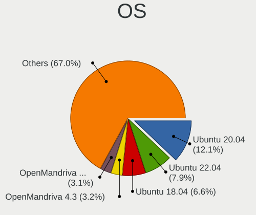

| Name               | Desktops | Percent |
|--------------------|----------|---------|
| Ubuntu 20.04       | 108      | 12.07%  |
| Ubuntu 22.04       | 71       | 7.93%   |
| Ubuntu 18.04       | 59       | 6.59%   |
| OpenMandriva 4.3   | 29       | 3.24%   |
| OpenMandriva 23.03 | 28       | 3.13%   |
| Ubuntu 24.04       | 24       | 2.68%   |
| OpenMandriva 4.2   | 19       | 2.12%   |
| Arch Rolling       | 19       | 2.12%   |
| Xubuntu 20.04      | 17       | 1.9%    |
| Debian 12          | 17       | 1.9%    |
| Debian 11          | 16       | 1.79%   |
| Pop!_OS 22.04      | 14       | 1.56%   |
| OpenMandriva 24.12 | 13       | 1.45%   |
| OpenMandriva 25.90 | 12       | 1.34%   |
| OpenMandriva 23.08 | 11       | 1.23%   |
| Xubuntu 18.04      | 10       | 1.12%   |
| OpenMandriva 24.07 | 10       | 1.12%   |
| OpenMandriva 23.01 | 10       | 1.12%   |
| Ubuntu 21.10       | 9        | 1.01%   |
| Ubuntu 20.10       | 8        | 0.89%   |
| OpenMandriva 5.0   | 8        | 0.89%   |
| Linux Mint 21.1    | 8        | 0.89%   |
| Fedora 42          | 8        | 0.89%   |
| Fedora 41          | 8        | 0.89%   |
| Zorin 17           | 7        | 0.78%   |
| Ubuntu 19.04       | 7        | 0.78%   |
| Manjaro            | 7        | 0.78%   |
| Fedora 40          | 7        | 0.78%   |
| BlackPanther 18.1  | 7        | 0.78%   |
| Zorin 16           | 6        | 0.67%   |
| Ubuntu 22.10       | 6        | 0.67%   |
| Ubuntu 21.04       | 6        | 0.67%   |
| OpenMandriva 4.50  | 6        | 0.67%   |
| OpenMandriva 24.01 | 6        | 0.67%   |
| Fedora 34          | 6        | 0.67%   |
| Debian 13          | 6        | 0.67%   |
| ArcoLinux Rolling  | 6        | 0.67%   |
| Arch               | 6        | 0.67%   |
| Pop!_OS 21.04      | 5        | 0.56%   |
| OpenMandriva 24.09 | 5        | 0.56%   |

OS Family
---------

OS without a version

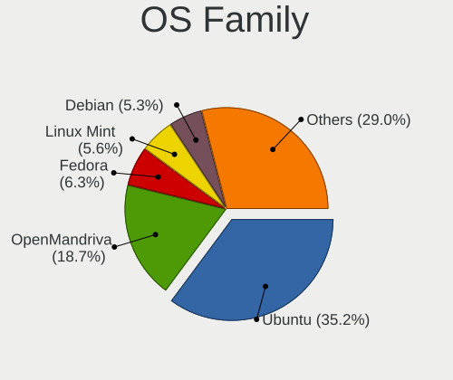

| Name          | Desktops | Percent |
|---------------|----------|---------|
| Ubuntu        | 290      | 35.15%  |
| OpenMandriva  | 154      | 18.67%  |
| Fedora        | 52       | 6.3%    |
| Linux Mint    | 46       | 5.58%   |
| Debian        | 44       | 5.33%   |
| Xubuntu       | 28       | 3.39%   |
| Arch          | 25       | 3.03%   |
| Pop!_OS       | 23       | 2.79%   |
| Zorin         | 18       | 2.18%   |
| Manjaro       | 14       | 1.7%    |
| ROSA          | 9        | 1.09%   |
| Gentoo        | 9        | 1.09%   |
| KDE neon      | 8        | 0.97%   |
| Elementary    | 8        | 0.97%   |
| Bazzite       | 8        | 0.97%   |
| Kubuntu       | 7        | 0.85%   |
| BlackPanther  | 7        | 0.85%   |
| Lubuntu       | 6        | 0.73%   |
| ArcoLinux     | 6        | 0.73%   |
| Ubuntu MATE   | 4        | 0.48%   |
| Slackware     | 4        | 0.48%   |
| openSUSE      | 4        | 0.48%   |
| CachyOS       | 4        | 0.48%   |
| SteamOS       | 3        | 0.36%   |
| NixOS         | 3        | 0.36%   |
| Garuda Linux  | 3        | 0.36%   |
| CentOS        | 3        | 0.36%   |
| Ubuntu Unity  | 2        | 0.24%   |
| Rocky Linux   | 2        | 0.24%   |
| Q4OS          | 2        | 0.24%   |
| Parrot        | 2        | 0.24%   |
| Nobara        | 2        | 0.24%   |
| LMDE          | 2        | 0.24%   |
| Kylin         | 2        | 0.24%   |
| Endless       | 2        | 0.24%   |
| Clear Linux   | 2        | 0.24%   |
| ChimeraOS     | 2        | 0.24%   |
| antiX         | 2        | 0.24%   |
| Ultramarine   | 1        | 0.12%   |
| Ubuntu Budgie | 1        | 0.12%   |

Kernel
------

Version of the Linux kernel

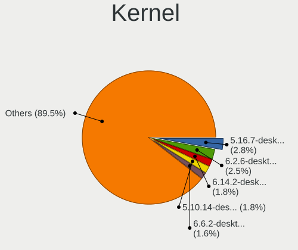

| Version                  | Desktops | Percent |
|--------------------------|----------|---------|
| 5.16.7-desktop-1omv4003  | 28       | 2.81%   |
| 6.2.6-desktop-1omv2390   | 25       | 2.51%   |
| 6.14.2-desktop-3omv2590  | 18       | 1.8%    |
| 5.10.14-desktop-1omv4002 | 18       | 1.8%    |
| 6.6.2-desktop-1omv2390   | 16       | 1.6%    |
| 6.12.1-desktop-1omv2490  | 13       | 1.3%    |
| 6.4.11-desktop-1omv2390  | 11       | 1.1%    |
| 5.4.0-42-generic         | 10       | 1%      |
| 6.1.1-desktop-1omv2290   | 9        | 0.9%    |
| 5.4.0-40-generic         | 9        | 0.9%    |
| 5.4.0-33-generic         | 9        | 0.9%    |
| 6.10.0-desktop-1omv2490  | 8        | 0.8%    |
| 5.4.0-58-generic         | 8        | 0.8%    |
| 5.4.0-37-generic         | 8        | 0.8%    |
| 5.15.0-56-generic        | 8        | 0.8%    |
| 5.4.0-52-generic         | 7        | 0.7%    |
| 4.18.16-desktop-1bP      | 7        | 0.7%    |
| 6.5.0-28-generic         | 6        | 0.6%    |
| 5.4.0-54-generic         | 6        | 0.6%    |
| 6.8.0-48-generic         | 5        | 0.5%    |
| 6.8.0-47-generic         | 5        | 0.5%    |
| 5.4.0-29-generic         | 5        | 0.5%    |
| 5.16.13-desktop-1omv4003 | 5        | 0.5%    |
| 5.13.0-40-generic        | 5        | 0.5%    |
| 5.13.0-30-generic        | 5        | 0.5%    |
| 5.11.0-38-generic        | 5        | 0.5%    |
| 6.9.3-76060903-generic   | 4        | 0.4%    |
| 6.8.0-40-generic         | 4        | 0.4%    |
| 6.5.0-26-generic         | 4        | 0.4%    |
| 6.2.0-35-generic         | 4        | 0.4%    |
| 6.2.0-33-generic         | 4        | 0.4%    |
| 6.11.0-desktop-2omv2490  | 4        | 0.4%    |
| 6.11.0-26-generic        | 4        | 0.4%    |
| 5.4.0-66-generic         | 4        | 0.4%    |
| 5.19.0-41-generic        | 4        | 0.4%    |
| 5.19.0-38-generic        | 4        | 0.4%    |
| 5.15.0-50-generic        | 4        | 0.4%    |
| 5.15.0-46-generic        | 4        | 0.4%    |
| 5.13.0-39-generic        | 4        | 0.4%    |
| 5.10.0-16-amd64          | 4        | 0.4%    |

Kernel Family
-------------

Linux kernel without a distro release

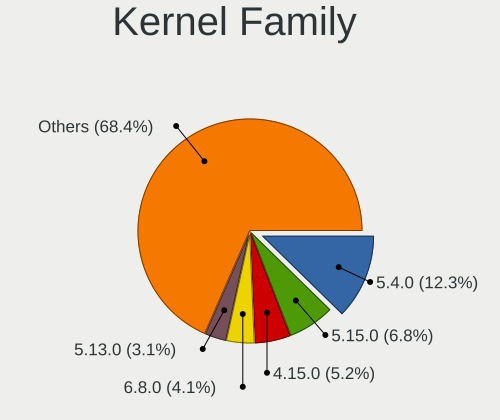

| Version | Desktops | Percent |
|---------|----------|---------|
| 5.4.0   | 114      | 12.32%  |
| 5.15.0  | 63       | 6.81%   |
| 4.15.0  | 48       | 5.19%   |
| 6.8.0   | 38       | 4.11%   |
| 5.13.0  | 29       | 3.14%   |
| 6.2.6   | 28       | 3.03%   |
| 5.16.7  | 28       | 3.03%   |
| 5.8.0   | 27       | 2.92%   |
| 5.11.0  | 27       | 2.92%   |
| 6.5.0   | 24       | 2.59%   |
| 5.19.0  | 24       | 2.59%   |
| 6.14.2  | 20       | 2.16%   |
| 5.10.14 | 19       | 2.05%   |
| 6.2.0   | 18       | 1.95%   |
| 5.10.0  | 18       | 1.95%   |
| 6.11.0  | 17       | 1.84%   |
| 6.1.0   | 17       | 1.84%   |
| 6.6.2   | 16       | 1.73%   |
| 5.3.0   | 16       | 1.73%   |
| 5.0.0   | 16       | 1.73%   |
| 6.12.1  | 13       | 1.41%   |
| 6.4.11  | 12       | 1.3%    |
| 6.14.0  | 12       | 1.3%    |
| 6.1.1   | 10       | 1.08%   |
| 6.10.0  | 8        | 0.86%   |
| 4.18.16 | 7        | 0.76%   |
| 5.16.13 | 6        | 0.65%   |
| 6.8.12  | 5        | 0.54%   |
| 4.18.0  | 5        | 0.54%   |
| 6.9.3   | 4        | 0.43%   |
| 6.5.6   | 4        | 0.43%   |
| 5.14.0  | 4        | 0.43%   |
| 4.4.0   | 4        | 0.43%   |
| 6.6.1   | 3        | 0.32%   |
| 6.13.9  | 3        | 0.32%   |
| 6.12.4  | 3        | 0.32%   |
| 6.12.31 | 3        | 0.32%   |
| 6.0.8   | 3        | 0.32%   |
| 5.3.18  | 3        | 0.32%   |
| 5.12.4  | 3        | 0.32%   |

Kernel Major Ver.
-----------------

Linux kernel major version

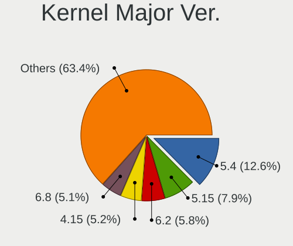

| Version | Desktops | Percent |
|---------|----------|---------|
| 5.4     | 115      | 12.57%  |
| 5.15    | 72       | 7.87%   |
| 6.2     | 53       | 5.79%   |
| 4.15    | 48       | 5.25%   |
| 6.8     | 47       | 5.14%   |
| 5.10    | 45       | 4.92%   |
| 6.14    | 39       | 4.26%   |
| 6.1     | 38       | 4.15%   |
| 5.13    | 34       | 3.72%   |
| 6.5     | 32       | 3.5%    |
| 6.12    | 32       | 3.5%    |
| 5.8     | 31       | 3.39%   |
| 5.16    | 31       | 3.39%   |
| 5.19    | 30       | 3.28%   |
| 5.11    | 29       | 3.17%   |
| 6.6     | 28       | 3.06%   |
| 6.11    | 25       | 2.73%   |
| 5.3     | 19       | 2.08%   |
| 5.0     | 18       | 1.97%   |
| 6.4     | 16       | 1.75%   |
| 6.10    | 14       | 1.53%   |
| 6.0     | 13       | 1.42%   |
| 4.18    | 12       | 1.31%   |
| 6.9     | 8        | 0.87%   |
| 6.17    | 8        | 0.87%   |
| 5.9     | 7        | 0.77%   |
| 6.13    | 6        | 0.66%   |
| 5.14    | 6        | 0.66%   |
| 5.12    | 6        | 0.66%   |
| 6.3     | 5        | 0.55%   |
| 6.15    | 5        | 0.55%   |
| 5.7     | 4        | 0.44%   |
| 5.6     | 4        | 0.44%   |
| 5.2     | 4        | 0.44%   |
| 5.17    | 4        | 0.44%   |
| 4.4     | 4        | 0.44%   |
| 6.7     | 3        | 0.33%   |
| 6.16    | 3        | 0.33%   |
| 5.5     | 3        | 0.33%   |
| 5.18    | 3        | 0.33%   |

Arch
----

OS architecture (x86_64, i586, etc.)

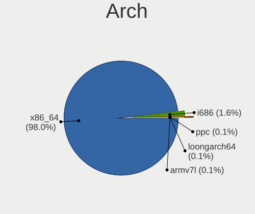

| Name        | Desktops | Percent |
|-------------|----------|---------|
| x86_64      | 796      | 98.03%  |
| i686        | 13       | 1.6%    |
| ppc         | 1        | 0.12%   |
| loongarch64 | 1        | 0.12%   |
| armv7l      | 1        | 0.12%   |

DE
--

Desktop Environment

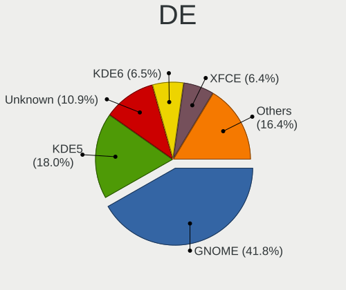

| Name                     | Desktops | Percent |
|--------------------------|----------|---------|
| GNOME                    | 352      | 41.76%  |
| KDE5                     | 152      | 18.03%  |
| Unknown                  | 92       | 10.91%  |
| KDE6                     | 55       | 6.52%   |
| XFCE                     | 54       | 6.41%   |
| X-Cinnamon               | 41       | 4.86%   |
| LXQt                     | 19       | 2.25%   |
| MATE                     | 16       | 1.9%    |
| KDE                      | 9        | 1.07%   |
| Pantheon                 | 8        | 0.95%   |
| KDE4                     | 5        | 0.59%   |
| Budgie                   | 4        | 0.47%   |
| sway                     | 3        | 0.36%   |
| LXDE                     | 3        | 0.36%   |
| i3                       | 3        | 0.36%   |
| Hyprland                 | 3        | 0.36%   |
| Deepin                   | 3        | 0.36%   |
| Cinnamon                 | 3        | 0.36%   |
| Unity                    | 2        | 0.24%   |
| Trinity                  | 2        | 0.24%   |
| GNOME Classic            | 2        | 0.24%   |
| Enlightenment            | 2        | 0.24%   |
| awesome                  | 2        | 0.24%   |
| xterm                    | 1        | 0.12%   |
| XSession                 | 1        | 0.12%   |
| Openbox                  | 1        | 0.12%   |
| icewm                    | 1        | 0.12%   |
| GNOME Flashback          | 1        | 0.12%   |
| fluxbox                  | 1        | 0.12%   |
| BunsenLabs               | 1        | 0.12%   |
| /usr/bin/openbox-session | 1        | 0.12%   |

Display Server
--------------

X11 or Wayland

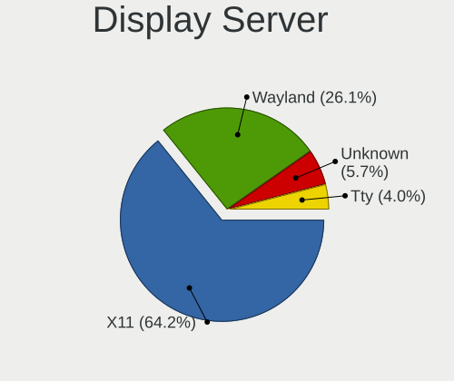

| Name    | Desktops | Percent |
|---------|----------|---------|
| X11     | 542      | 64.22%  |
| Wayland | 220      | 26.07%  |
| Unknown | 48       | 5.69%   |
| Tty     | 34       | 4.03%   |

Display Manager
---------------

SDDM, LightDM, etc.

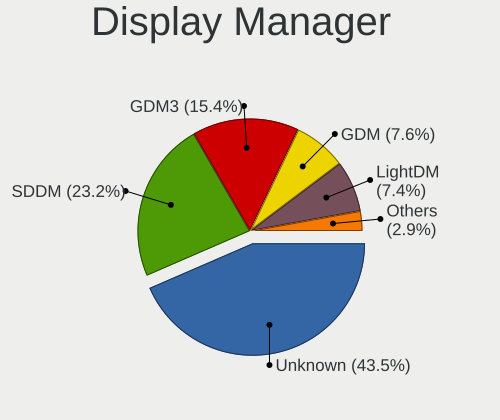

| Name    | Desktops | Percent |
|---------|----------|---------|
| Unknown | 364      | 43.49%  |
| SDDM    | 194      | 23.18%  |
| GDM3    | 129      | 15.41%  |
| GDM     | 64       | 7.65%   |
| LightDM | 62       | 7.41%   |
| TDM     | 10       | 1.19%   |
| KDM     | 3        | 0.36%   |
| GREETD  | 3        | 0.36%   |
| SLiM    | 2        | 0.24%   |
| NODM    | 2        | 0.24%   |
| LXDM    | 2        | 0.24%   |
| XDM     | 1        | 0.12%   |
| SLIMSKI | 1        | 0.12%   |

OS Lang
-------

Language

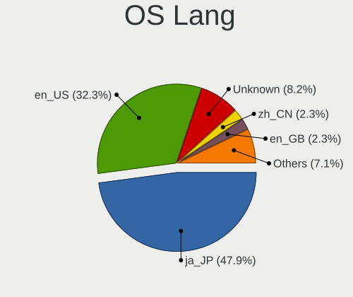

| Lang        | Desktops | Percent |
|-------------|----------|---------|
| ja_JP       | 398      | 47.89%  |
| en_US       | 268      | 32.25%  |
| Unknown     | 68       | 8.18%   |
| zh_CN       | 19       | 2.29%   |
| en_GB       | 19       | 2.29%   |
| pt_BR       | 13       | 1.56%   |
| C           | 9        | 1.08%   |
| en_AU       | 7        | 0.84%   |
| en_AG       | 4        | 0.48%   |
| ru_RU       | 3        | 0.36%   |
| it_IT       | 3        | 0.36%   |
| fr_FR       | 3        | 0.36%   |
| es_ES       | 3        | 0.36%   |
| UTF-8       | 2        | 0.24%   |
| en_IN       | 2        | 0.24%   |
| de_DE       | 2        | 0.24%   |
| tr_TR       | 1        | 0.12%   |
| sr_RS       | 1        | 0.12%   |
| sk_SK       | 1        | 0.12%   |
| ja_JP.utf-8 | 1        | 0.12%   |
| fr_CA       | 1        | 0.12%   |
| es_BO       | 1        | 0.12%   |
| C.UTF8      | 1        | 0.12%   |
| af_ZA       | 1        | 0.12%   |

Boot Mode
---------

EFI or BIOS

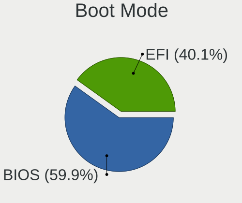

| Mode | Desktops | Percent |
|------|----------|---------|
| BIOS | 495      | 59.93%  |
| EFI  | 331      | 40.07%  |

Filesystem
----------

Type of filesystem

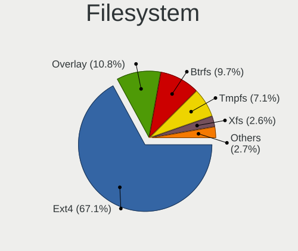

| Type    | Desktops | Percent |
|---------|----------|---------|
| Ext4    | 566      | 67.06%  |
| Overlay | 91       | 10.78%  |
| Btrfs   | 82       | 9.72%   |
| Tmpfs   | 60       | 7.11%   |
| Xfs     | 22       | 2.61%   |
| Unknown | 12       | 1.42%   |
| Zfs     | 6        | 0.71%   |
| Jfs     | 2        | 0.24%   |
| F2fs    | 2        | 0.24%   |
| Ext3    | 1        | 0.12%   |

Part. scheme
------------

Scheme of partitioning

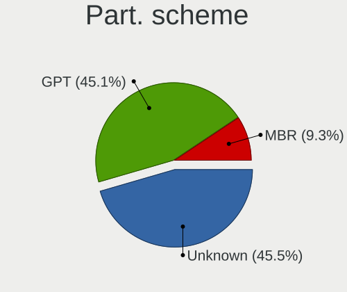

| Type    | Desktops | Percent |
|---------|----------|---------|
| Unknown | 380      | 45.51%  |
| GPT     | 377      | 45.15%  |
| MBR     | 78       | 9.34%   |

Dual Boot with Linux/BSD
------------------------

Hosting more than one Linux/BSD

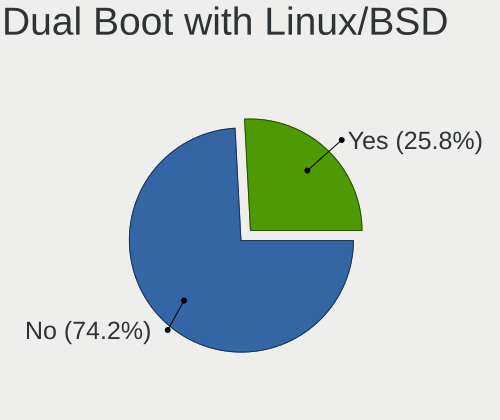

| Dual boot | Desktops | Percent |
|-----------|----------|---------|
| No        | 620      | 74.16%  |
| Yes       | 216      | 25.84%  |

Dual Boot (Win)
---------------

Hosting Linux and Windows

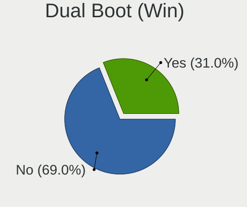

| Dual boot | Desktops | Percent |
|-----------|----------|---------|
| No        | 573      | 68.95%  |
| Yes       | 258      | 31.05%  |

Board
-----

Vendor
------

Motherboard manufacturer

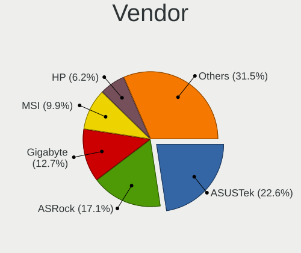

| Name                                 | Desktops | Percent |
|--------------------------------------|----------|---------|
| ASUSTek Computer                     | 183      | 22.62%  |
| ASRock                               | 138      | 17.06%  |
| Gigabyte Technology                  | 103      | 12.73%  |
| MSI                                  | 80       | 9.89%   |
| Hewlett-Packard                      | 50       | 6.18%   |
| Dell                                 | 43       | 5.32%   |
| MouseComputer                        | 23       | 2.84%   |
| NEC Computers                        | 19       | 2.35%   |
| Intel                                | 15       | 1.85%   |
| Fujitsu                              | 15       | 1.85%   |
| Unknown                              | 14       | 1.73%   |
| Lenovo                               | 13       | 1.61%   |
| ECS                                  | 11       | 1.36%   |
| Biostar                              | 11       | 1.36%   |
| Shenzhen Meigao Electronic Equipment | 7        | 0.87%   |
| EPSON DIRECT                         | 7        | 0.87%   |
| Acer                                 | 7        | 0.87%   |
| Wistron                              | 5        | 0.62%   |
| Foxconn                              | 5        | 0.62%   |
| Pegatron                             | 4        | 0.49%   |
| MCJ                                  | 4        | 0.49%   |
| GMKtec                               | 4        | 0.49%   |
| Gateway                              | 4        | 0.49%   |
| Shuttle                              | 3        | 0.37%   |
| AMI                                  | 3        | 0.37%   |
| UGREEN                               | 2        | 0.25%   |
| Trigkey                              | 2        | 0.25%   |
| T-bao                                | 2        | 0.25%   |
| Supermicro                           | 2        | 0.25%   |
| Onkyo                                | 2        | 0.25%   |
| MACHINIST                            | 2        | 0.25%   |
| JGINYUE                              | 2        | 0.25%   |
| XFX                                  | 1        | 0.12%   |
| Win Element                          | 1        | 0.12%   |
| USI                                  | 1        | 0.12%   |
| UNITCOM                              | 1        | 0.12%   |
| Red Hat                              | 1        | 0.12%   |
| ONDA                                 | 1        | 0.12%   |
| Medion                               | 1        | 0.12%   |
| MAXSUN                               | 1        | 0.12%   |

Model
-----

Motherboard model

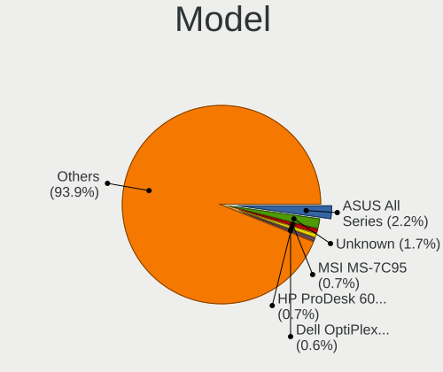

| Name                                                | Desktops | Percent |
|-----------------------------------------------------|----------|---------|
| ASUS All Series                                     | 18       | 2.22%   |
| Unknown                                             | 14       | 1.73%   |
| MSI MS-7C95                                         | 6        | 0.74%   |
| HP ProDesk 600 G1 SFF                               | 6        | 0.74%   |
| Dell OptiPlex 3020                                  | 5        | 0.62%   |
| ASRock B450M Pro4                                   | 5        | 0.62%   |
| MSI MS-7B79                                         | 4        | 0.49%   |
| MSI MS-7A40                                         | 4        | 0.49%   |
| ECS G31T-M                                          | 4        | 0.49%   |
| Dell OptiPlex 3010                                  | 4        | 0.49%   |
| ASUS TUF Gaming B550M-PLUS                          | 4        | 0.49%   |
| ASUS H170-PRO                                       | 4        | 0.49%   |
| ASRock Z87 Killer                                   | 4        | 0.49%   |
| ASRock B550M Pro4                                   | 4        | 0.49%   |
| ASRock B450 Pro4                                    | 4        | 0.49%   |
| ASRock B450 Gaming-ITX/ac                           | 4        | 0.49%   |
| NEC Computers Express5800/S70 [N8100-9021]          | 3        | 0.37%   |
| MSI MS-7D76                                         | 3        | 0.37%   |
| MSI MS-7C94                                         | 3        | 0.37%   |
| MSI MS-7C35                                         | 3        | 0.37%   |
| MSI MS-7865                                         | 3        | 0.37%   |
| HP Z620 Workstation                                 | 3        | 0.37%   |
| Gigabyte B75M-D3H                                   | 3        | 0.37%   |
| Gigabyte B550I AORUS PRO AX                         | 3        | 0.37%   |
| Dell Precision WorkStation T3500                    | 3        | 0.37%   |
| ASUS PRIME H670-PLUS D4                             | 3        | 0.37%   |
| ASUS P8Z77-V PRO                                    | 3        | 0.37%   |
| ASUS P7H55-M                                        | 3        | 0.37%   |
| ASUS H110M-A/M.2                                    | 3        | 0.37%   |
| ASRock Z370 Pro4                                    | 3        | 0.37%   |
| ASRock Prime Series                                 | 3        | 0.37%   |
| ASRock J5005-ITX                                    | 3        | 0.37%   |
| ASRock B660-ITX                                     | 3        | 0.37%   |
| ASRock B460M Pro4                                   | 3        | 0.37%   |
| ASRock A320M-HDV R4.0                               | 3        | 0.37%   |
| ASRock A300M-STX                                    | 3        | 0.37%   |
| UGREEN DXP2800                                      | 2        | 0.25%   |
| T-bao MINI PC                                       | 2        | 0.25%   |
| Shenzhen Meigao Electronic Equipment UM690          | 2        | 0.25%   |
| Shenzhen Meigao Electronic Equipment Mercury series | 2        | 0.25%   |

Model Family
------------

Motherboard model prefix

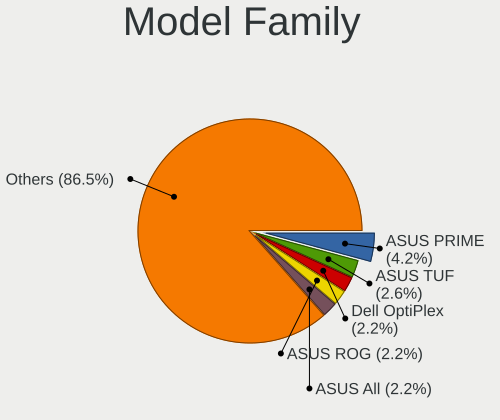

| Name                      | Desktops | Percent |
|---------------------------|----------|---------|
| ASUS PRIME                | 34       | 4.2%    |
| ASUS TUF                  | 21       | 2.6%    |
| Dell OptiPlex             | 18       | 2.22%   |
| ASUS ROG                  | 18       | 2.22%   |
| ASUS All                  | 18       | 2.22%   |
| Unknown                   | 14       | 1.73%   |
| HP ProDesk                | 12       | 1.48%   |
| Dell Vostro               | 12       | 1.48%   |
| HP Compaq                 | 11       | 1.36%   |
| Lenovo ThinkCentre        | 10       | 1.24%   |
| ASRock B450               | 9        | 1.11%   |
| HP EliteDesk              | 7        | 0.87%   |
| EPSON DIRECT Endeavor     | 7        | 0.87%   |
| MSI MS-7C95               | 6        | 0.74%   |
| Dell Precision            | 6        | 0.74%   |
| ASUS P8Z77-V              | 6        | 0.74%   |
| ASRock B550M              | 6        | 0.74%   |
| ASRock B450M              | 6        | 0.74%   |
| ASRock Z87                | 5        | 0.62%   |
| MSI MS-7B79               | 4        | 0.49%   |
| MSI MS-7A40               | 4        | 0.49%   |
| Gigabyte Z390             | 4        | 0.49%   |
| ECS G31T-M                | 4        | 0.49%   |
| ASUS PRO                  | 4        | 0.49%   |
| ASUS H170-PRO             | 4        | 0.49%   |
| ASRock X570               | 4        | 0.49%   |
| ASRock Prime              | 4        | 0.49%   |
| Acer Aspire               | 4        | 0.49%   |
| NEC Computers Express5800 | 3        | 0.37%   |
| MSI MS-7D76               | 3        | 0.37%   |
| MSI MS-7C94               | 3        | 0.37%   |
| MSI MS-7C35               | 3        | 0.37%   |
| MSI MS-7865               | 3        | 0.37%   |
| HP Z620                   | 3        | 0.37%   |
| GMKtec NucBox             | 3        | 0.37%   |
| Gigabyte B75M-D3H         | 3        | 0.37%   |
| Gigabyte B550I            | 3        | 0.37%   |
| Dell Inspiron             | 3        | 0.37%   |
| ASUS P8H77-V              | 3        | 0.37%   |
| ASUS P7H55-M              | 3        | 0.37%   |

MFG Year
--------

Motherboard manufacture year

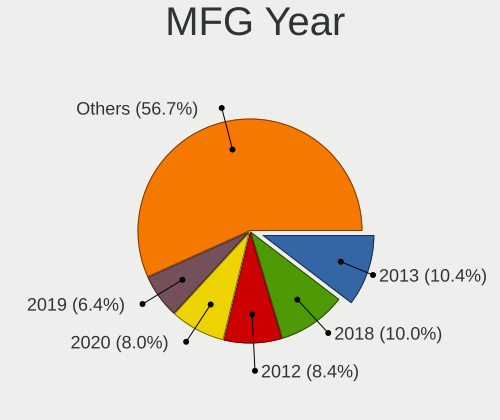

| Year    | Desktops | Percent |
|---------|----------|---------|
| 2013    | 84       | 10.38%  |
| 2018    | 81       | 10.01%  |
| 2012    | 68       | 8.41%   |
| 2020    | 65       | 8.03%   |
| 2019    | 52       | 6.43%   |
| 2016    | 43       | 5.32%   |
| 2011    | 43       | 5.32%   |
| 2021    | 40       | 4.94%   |
| 2014    | 39       | 4.82%   |
| 2010    | 39       | 4.82%   |
| 2017    | 37       | 4.57%   |
| 2015    | 33       | 4.08%   |
| 2009    | 31       | 3.83%   |
| 2024    | 29       | 3.58%   |
| 2023    | 26       | 3.21%   |
| 2022    | 25       | 3.09%   |
| 2008    | 25       | 3.09%   |
| 2007    | 23       | 2.84%   |
| 2006    | 12       | 1.48%   |
| 2005    | 5        | 0.62%   |
| Unknown | 4        | 0.49%   |
| 2025    | 2        | 0.25%   |
| 2004    | 1        | 0.12%   |
| 2003    | 1        | 0.12%   |
| 2001    | 1        | 0.12%   |

Form Factor
-----------

Physical design of the computer

| Name    | Desktops | Percent |
|---------|----------|---------|
| Desktop | 809      | 100%    |

Secure Boot
-----------

Enabled or disabled

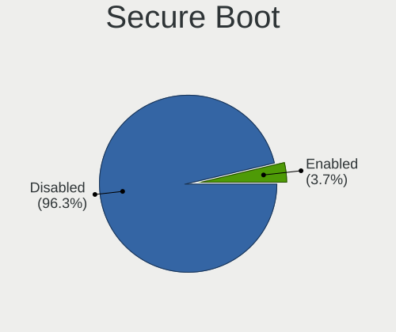

| State    | Desktops | Percent |
|----------|----------|---------|
| Disabled | 780      | 96.3%   |
| Enabled  | 30       | 3.7%    |

Coreboot
--------

Have coreboot on board

| Used | Desktops | Percent |
|------|----------|---------|
| No   | 809      | 100%    |

RAM Size
--------

Total RAM memory

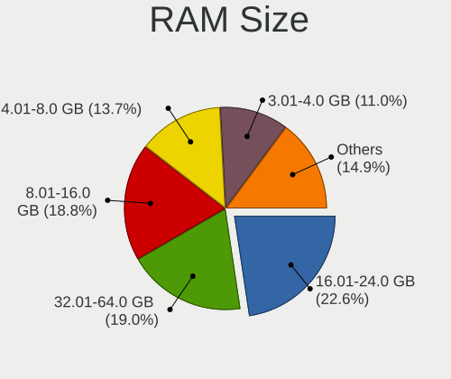

| Size in GB      | Desktops | Percent |
|-----------------|----------|---------|
| 16.01-24.0      | 189      | 22.63%  |
| 32.01-64.0      | 159      | 19.04%  |
| 8.01-16.0       | 157      | 18.8%   |
| 4.01-8.0        | 114      | 13.65%  |
| 3.01-4.0        | 92       | 11.02%  |
| 64.01-256.0     | 54       | 6.47%   |
| 24.01-32.0      | 34       | 4.07%   |
| 1.01-2.0        | 19       | 2.28%   |
| 2.01-3.0        | 12       | 1.44%   |
| More than 256.0 | 3        | 0.36%   |
| 0.51-1.0        | 1        | 0.12%   |
| 0.01-0.5        | 1        | 0.12%   |

RAM Used
--------

Used RAM memory

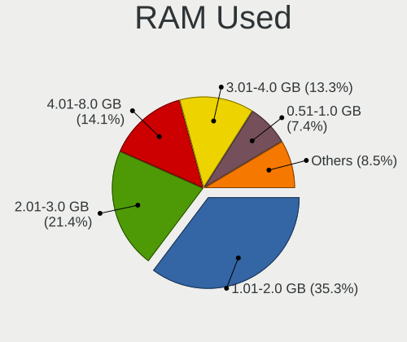

| Used GB    | Desktops | Percent |
|------------|----------|---------|
| 1.01-2.0   | 322      | 35.27%  |
| 2.01-3.0   | 195      | 21.36%  |
| 4.01-8.0   | 129      | 14.13%  |
| 3.01-4.0   | 121      | 13.25%  |
| 0.51-1.0   | 68       | 7.45%   |
| 8.01-16.0  | 40       | 4.38%   |
| 16.01-24.0 | 16       | 1.75%   |
| 0.01-0.5   | 13       | 1.42%   |
| 32.01-64.0 | 4        | 0.44%   |
| 24.01-32.0 | 4        | 0.44%   |
| Unknown    | 1        | 0.11%   |

Total Drives
------------

Number of drives on board

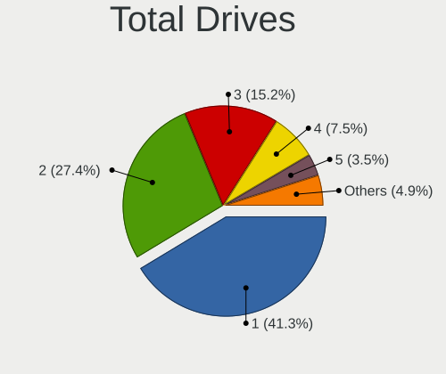

| Drives | Desktops | Percent |
|--------|----------|---------|
| 1      | 351      | 41.34%  |
| 2      | 233      | 27.44%  |
| 3      | 129      | 15.19%  |
| 4      | 64       | 7.54%   |
| 5      | 30       | 3.53%   |
| 6      | 13       | 1.53%   |
| 7      | 10       | 1.18%   |
| 0      | 9        | 1.06%   |
| 11     | 3        | 0.35%   |
| 9      | 3        | 0.35%   |
| 8      | 3        | 0.35%   |
| 10     | 1        | 0.12%   |

Has CD-ROM
----------

Has CD-ROM on board

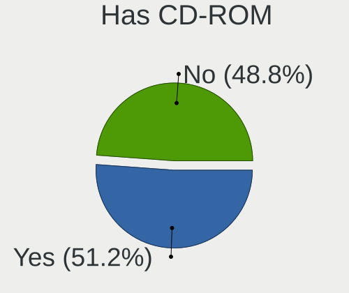

| Presented | Desktops | Percent |
|-----------|----------|---------|
| Yes       | 420      | 51.16%  |
| No        | 401      | 48.84%  |

Has Ethernet
------------

Has Ethernet on board

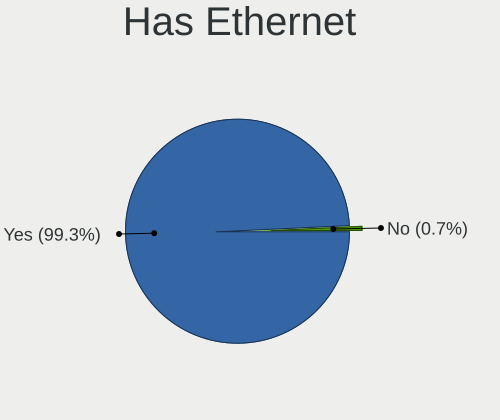

| Presented | Desktops | Percent |
|-----------|----------|---------|
| Yes       | 803      | 99.26%  |
| No        | 6        | 0.74%   |

Has WiFi
--------

Has WiFi module

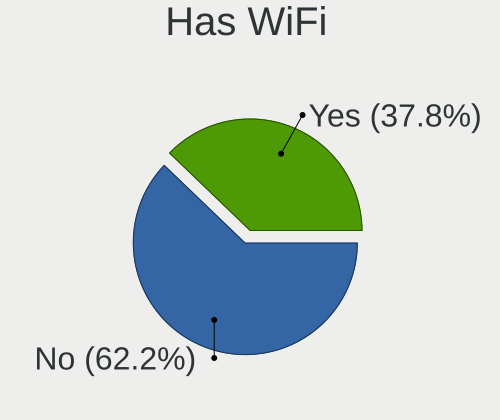

| Presented | Desktops | Percent |
|-----------|----------|---------|
| No        | 508      | 62.18%  |
| Yes       | 309      | 37.82%  |

Has Bluetooth
-------------

Has Bluetooth module

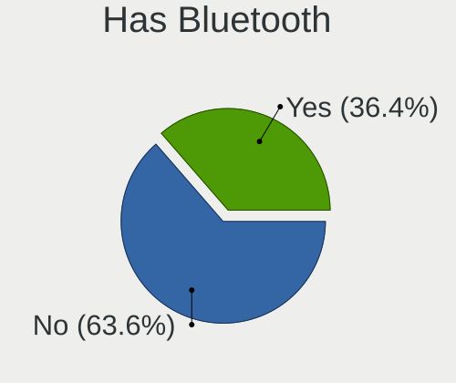

| Presented | Desktops | Percent |
|-----------|----------|---------|
| No        | 528      | 63.61%  |
| Yes       | 302      | 36.39%  |

Location
--------

Country
-------

Geographic location (country)

| Country | Desktops | Percent |
|---------|----------|---------|
| Japan   | 809      | 100%    |

City
----

Geographic location (city)

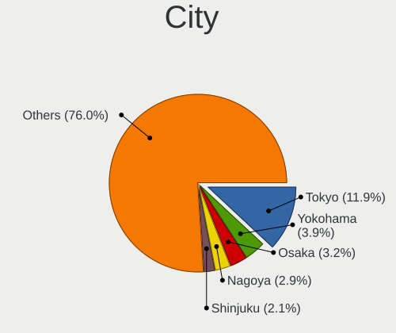

| City        | Desktops | Percent |
|-------------|----------|---------|
| Tokyo       | 104      | 11.93%  |
| Yokohama    | 34       | 3.9%    |
| Osaka       | 28       | 3.21%   |
| Nagoya      | 25       | 2.87%   |
| Shinjuku    | 18       | 2.06%   |
| Minato-ku   | 14       | 1.61%   |
| Tokushima   | 12       | 1.38%   |
| Sapporo     | 11       | 1.26%   |
| Fukuoka     | 11       | 1.26%   |
| Tsukuba     | 10       | 1.15%   |
| Kochi       | 10       | 1.15%   |
| Okayama     | 8        | 0.92%   |
| Minatomirai | 8        | 0.92%   |
| Chiyoda-ku  | 8        | 0.92%   |
| Saitama     | 7        | 0.8%    |
| Niigata     | 7        | 0.8%    |
| Miyazaki    | 7        | 0.8%    |
| Kyoto       | 7        | 0.8%    |
| Kobe        | 7        | 0.8%    |
| Kawasaki    | 7        | 0.8%    |
| Kameido     | 7        | 0.8%    |
| Honcho      | 7        | 0.8%    |
| Toyama      | 6        | 0.69%   |
| Takamatsu   | 6        | 0.69%   |
| Nagano      | 6        | 0.69%   |
| Kagoshima   | 6        | 0.69%   |
| Chiyoda     | 6        | 0.69%   |
| Sasebo      | 5        | 0.57%   |
| Okazaki     | 5        | 0.57%   |
| Naha        | 5        | 0.57%   |
| Meieki      | 5        | 0.57%   |
| Kitakyushu  | 5        | 0.57%   |
| Kawaguchi   | 5        | 0.57%   |
| Kanazawa    | 5        | 0.57%   |
| Hiroshima   | 5        | 0.57%   |
| Himeji      | 5        | 0.57%   |
| Chikusei    | 5        | 0.57%   |
| Utsunomiya  | 4        | 0.46%   |
| Umeda       | 4        | 0.46%   |
| Toyokawa    | 4        | 0.46%   |

Drives
------

Drive Vendor
------------

Hard drive vendors

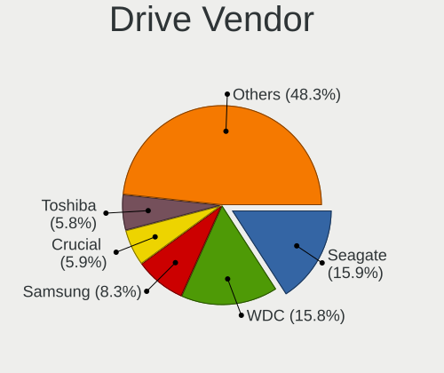

| Vendor                      | Desktops | Drives | Percent |
|-----------------------------|----------|--------|---------|
| Seagate                     | 241      | 382    | 15.88%  |
| WDC                         | 240      | 409    | 15.81%  |
| Samsung Electronics         | 126      | 185    | 8.3%    |
| Crucial                     | 90       | 133    | 5.93%   |
| Toshiba                     | 88       | 123    | 5.8%    |
| Hitachi                     | 87       | 120    | 5.73%   |
| Sandisk                     | 69       | 115    | 4.55%   |
| Intel                       | 56       | 74     | 3.69%   |
| A-DATA Technology           | 38       | 48     | 2.5%    |
| SPCC                        | 30       | 37     | 1.98%   |
| Kingston                    | 25       | 30     | 1.65%   |
| Unknown                     | 20       | 31     | 1.32%   |
| Phison Electronics          | 20       | 34     | 1.32%   |
| Micron/Crucial Technology   | 20       | 29     | 1.32%   |
| MAXIO Technology (Hangzhou) | 17       | 22     | 1.12%   |
| Micron Technology           | 16       | 17     | 1.05%   |
| Unknown                     | 15       | 16     | 0.99%   |
| Phison                      | 14       | 20     | 0.92%   |
| KIOXIA-EXCERIA              | 13       | 13     | 0.86%   |
| HGST                        | 13       | 17     | 0.86%   |
| Transcend                   | 12       | 16     | 0.79%   |
| Silicon Motion              | 12       | 19     | 0.79%   |
| China                       | 12       | 16     | 0.79%   |
| Suneast                     | 11       | 15     | 0.72%   |
| Plextor                     | 10       | 12     | 0.66%   |
| Lexar                       | 9        | 11     | 0.59%   |
| KLEVV                       | 9        | 18     | 0.59%   |
| Team                        | 7        | 8      | 0.46%   |
| Maxtor                      | 7        | 10     | 0.46%   |
| Dogfish                     | 7        | 8      | 0.46%   |
| BUFFALO                     | 7        | 9      | 0.46%   |
| Patriot                     | 6        | 6      | 0.4%    |
| OCZ                         | 6        | 6      | 0.4%    |
| JMicron Technology          | 6        | 7      | 0.4%    |
| SK hynix                    | 5        | 5      | 0.33%   |
| Realtek Semiconductor       | 5        | 6      | 0.33%   |
| KIOXIA                      | 5        | 5      | 0.33%   |
| Green House                 | 5        | 6      | 0.33%   |
| ELECOM                      | 5        | 5      | 0.33%   |
| CFD                         | 5        | 5      | 0.33%   |

Drive Model
-----------

Hard drive models

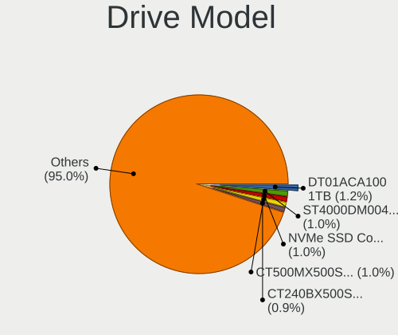

| Model                                             | Desktops | Percent |
|---------------------------------------------------|----------|---------|
| Toshiba DT01ACA100 1TB                            | 20       | 1.16%   |
| Seagate ST4000DM004-2CV104 4TB                    | 18       | 1.04%   |
| Samsung NVMe SSD Controller SM981/PM981/PM983 1TB | 17       | 0.99%   |
| Crucial CT500MX500SSD1 500GB                      | 17       | 0.99%   |
| Crucial CT240BX500SSD1 240GB                      | 15       | 0.87%   |
| Unknown                                           | 15       | 0.87%   |
| Toshiba DT01ACA200 2TB                            | 12       | 0.7%    |
| Seagate ST1000DM010-2EP102 1TB                    | 12       | 0.7%    |
| WDC WD40EZRZ-00GXCB0 4TB                          | 11       | 0.64%   |
| Seagate ST500DM002-1BD142 500GB                   | 11       | 0.64%   |
| Crucial CT1000MX500SSD1 1TB                       | 11       | 0.64%   |
| Seagate ST2000DM001-1CH164 2TB                    | 10       | 0.58%   |
| Seagate ST3500418AS 500GB                         | 9        | 0.52%   |
| Seagate ST2000DM008-2FR102 2TB                    | 9        | 0.52%   |
| MAXIO (Hangzhou) NVMe SSD Controller MAP1202 2TB  | 9        | 0.52%   |
| WDC WD20EZRX-00DC0B0 2TB                          | 8        | 0.46%   |
| Seagate ST2000DM006-2DM164 2TB                    | 8        | 0.46%   |
| Seagate ST2000DM001-1ER164 2TB                    | 8        | 0.46%   |
| Seagate ST1000DM003-1ER162 1TB                    | 8        | 0.46%   |
| WDC WD10EZEX-00BN5A0 1TB                          | 7        | 0.41%   |
| WDC WD10EADS-00L5B1 1TB                           | 7        | 0.41%   |
| Sandisk WD Blue SN550 NVMe SSD 1024GB             | 7        | 0.41%   |
| Samsung SSD 860 EVO 500GB                         | 7        | 0.41%   |
| Micron/Crucial P2 NVMe PCIe SSD 2TB               | 7        | 0.41%   |
| Hitachi HDS721010CLA332 1TB                       | 7        | 0.41%   |
| WDC WD60EZAZ-00ZGHB0 6TB                          | 6        | 0.35%   |
| SPCC Solid State Disk 256GB                       | 6        | 0.35%   |
| Seagate ST8000DM004-2CX188 8TB                    | 6        | 0.35%   |
| Seagate ST3160318AS 160GB                         | 6        | 0.35%   |
| Seagate ST31000528AS 1TB                          | 6        | 0.35%   |
| Seagate ST1000DM003-1CH162 1TB                    | 6        | 0.35%   |
| Samsung SSD 860 EVO 250GB                         | 6        | 0.35%   |
| Phison PS5013 E13 NVMe Controller 500GB           | 6        | 0.35%   |
| Kingston SV300S37A120G 120GB SSD                  | 6        | 0.35%   |
| Hitachi HDP725050GLA360 500GB                     | 6        | 0.35%   |
| Crucial CT525MX300SSD1 528GB                      | 6        | 0.35%   |
| Crucial CT120BX500SSD1 120GB                      | 6        | 0.35%   |
| WDC WD60EZAZ-00SF3B0 6TB                          | 5        | 0.29%   |
| WDC WD30EZRX-00DC0B0 3TB                          | 5        | 0.29%   |
| WDC WD20EZAZ-00GGJB0 2TB                          | 5        | 0.29%   |

HDD Vendor
----------

Hard disk drive vendors

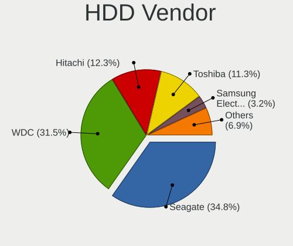

| Vendor              | Desktops | Drives | Percent |
|---------------------|----------|--------|---------|
| Seagate             | 237      | 373    | 34.75%  |
| WDC                 | 215      | 345    | 31.52%  |
| Hitachi             | 84       | 117    | 12.32%  |
| Toshiba             | 77       | 105    | 11.29%  |
| Samsung Electronics | 22       | 28     | 3.23%   |
| HGST                | 13       | 17     | 1.91%   |
| Maxtor              | 7        | 10     | 1.03%   |
| Hewlett-Packard     | 4        | 11     | 0.59%   |
| Fujitsu             | 4        | 4      | 0.59%   |
| MARVELL             | 3        | 5      | 0.44%   |
| JMicron Technology  | 3        | 4      | 0.44%   |
| USB3.0              | 2        | 2      | 0.29%   |
| USB                 | 2        | 2      | 0.29%   |
| External            | 2        | 2      | 0.29%   |
| Unknown             | 1        | 1      | 0.15%   |
| TO Exter            | 1        | 1      | 0.15%   |
| StoreJet            | 1        | 1      | 0.15%   |
| Quantum             | 1        | 1      | 0.15%   |
| KESU                | 1        | 1      | 0.15%   |
| ASMT                | 1        | 2      | 0.15%   |
| Apple               | 1        | 1      | 0.15%   |

SSD Vendor
----------

Solid state drive vendors

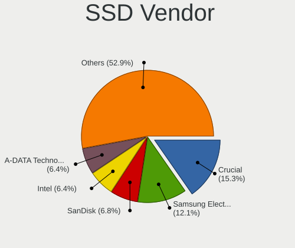

| Vendor              | Desktops | Drives | Percent |
|---------------------|----------|--------|---------|
| Crucial             | 81       | 119    | 15.31%  |
| Samsung Electronics | 64       | 88     | 12.1%   |
| SanDisk             | 36       | 58     | 6.81%   |
| Intel               | 34       | 41     | 6.43%   |
| A-DATA Technology   | 34       | 43     | 6.43%   |
| WDC                 | 27       | 41     | 5.1%    |
| SPCC                | 23       | 29     | 4.35%   |
| Kingston            | 21       | 26     | 3.97%   |
| Transcend           | 11       | 15     | 2.08%   |
| SUNEAST             | 11       | 15     | 2.08%   |
| China               | 11       | 15     | 2.08%   |
| Unknown             | 11       | 12     | 2.08%   |
| Plextor             | 10       | 12     | 1.89%   |
| Toshiba             | 9        | 12     | 1.7%    |
| KLEVV               | 9        | 18     | 1.7%    |
| KIOXIA-EXCERIA      | 9        | 9      | 1.7%    |
| Micron Technology   | 8        | 9      | 1.51%   |
| Team                | 7        | 8      | 1.32%   |
| Dogfish             | 7        | 8      | 1.32%   |
| BUFFALO             | 7        | 9      | 1.32%   |
| OCZ                 | 6        | 6      | 1.13%   |
| Lexar               | 5        | 7      | 0.95%   |
| Green House         | 5        | 6      | 0.95%   |
| CFD                 | 5        | 5      | 0.95%   |
| Zheino              | 4        | 4      | 0.76%   |
| Unknown             | 4        | 4      | 0.76%   |
| LITEON              | 4        | 4      | 0.76%   |
| Apacer              | 4        | 5      | 0.76%   |
| Teclast             | 3        | 4      | 0.57%   |
| Seagate             | 3        | 6      | 0.57%   |
| Hitachi             | 3        | 3      | 0.57%   |
| Corsair             | 3        | 4      | 0.57%   |
| Biostar             | 3        | 4      | 0.57%   |
| PNY                 | 2        | 2      | 0.38%   |
| Patriot             | 2        | 2      | 0.38%   |
| Netac               | 2        | 3      | 0.38%   |
| Lite-On             | 2        | 3      | 0.38%   |
| KingSpec            | 2        | 2      | 0.38%   |
| KingDian            | 2        | 3      | 0.38%   |
| Hanye               | 2        | 3      | 0.38%   |

Drive Kind
----------

HDD or SSD

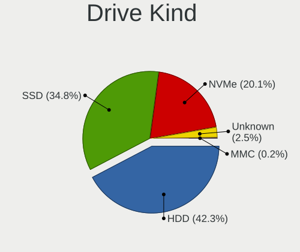

| Kind    | Desktops | Drives | Percent |
|---------|----------|--------|---------|
| HDD     | 518      | 1033   | 42.32%  |
| SSD     | 426      | 703    | 34.8%   |
| NVMe    | 246      | 423    | 20.1%   |
| Unknown | 31       | 46     | 2.53%   |
| MMC     | 3        | 3      | 0.25%   |

Drive Connector
---------------

SATA, SAS, NVMe, etc.

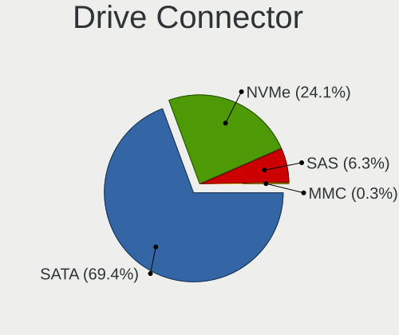

| Type | Desktops | Drives | Percent |
|------|----------|--------|---------|
| SATA | 709      | 1687   | 69.37%  |
| NVMe | 246      | 422    | 24.07%  |
| SAS  | 64       | 96     | 6.26%   |
| MMC  | 3        | 3      | 0.29%   |

Drive Size
----------

Size of hard drive

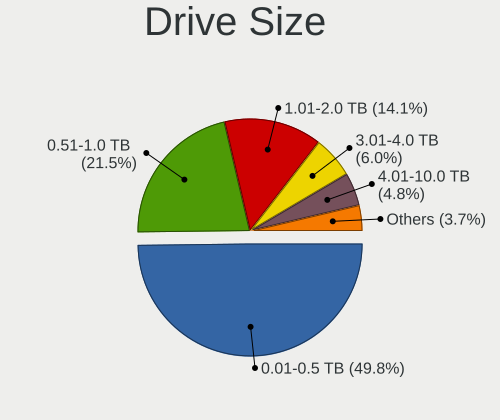

| Size in TB | Desktops | Drives | Percent |
|------------|----------|--------|---------|
| 0.01-0.5   | 511      | 913    | 49.81%  |
| 0.51-1.0   | 221      | 353    | 21.54%  |
| 1.01-2.0   | 145      | 217    | 14.13%  |
| 3.01-4.0   | 62       | 95     | 6.04%   |
| 4.01-10.0  | 49       | 98     | 4.78%   |
| 2.01-3.0   | 33       | 54     | 3.22%   |
| 10.01-20.0 | 5        | 6      | 0.49%   |

Space Total
-----------

Amount of disk space available on the file system

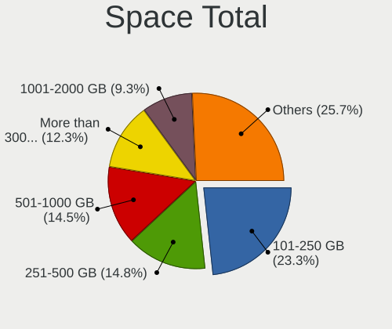

| Size in GB     | Desktops | Percent |
|----------------|----------|---------|
| 101-250        | 202      | 23.3%   |
| 251-500        | 128      | 14.76%  |
| 501-1000       | 126      | 14.53%  |
| More than 3000 | 107      | 12.34%  |
| 1001-2000      | 81       | 9.34%   |
| 1-20           | 70       | 8.07%   |
| 2001-3000      | 49       | 5.65%   |
| 51-100         | 49       | 5.65%   |
| Unknown        | 38       | 4.38%   |
| 21-50          | 17       | 1.96%   |

Space Used
----------

Amount of used disk space

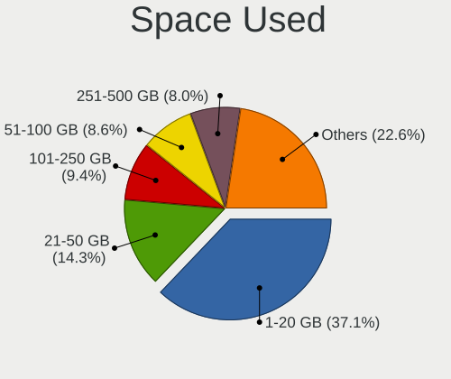

| Used GB        | Desktops | Percent |
|----------------|----------|---------|
| 1-20           | 333      | 37.12%  |
| 21-50          | 128      | 14.27%  |
| 101-250        | 84       | 9.36%   |
| 51-100         | 77       | 8.58%   |
| 251-500        | 72       | 8.03%   |
| 501-1000       | 63       | 7.02%   |
| 1001-2000      | 48       | 5.35%   |
| More than 3000 | 38       | 4.24%   |
| Unknown        | 38       | 4.24%   |
| 2001-3000      | 16       | 1.78%   |

Malfunc. Drives
---------------

Drive models with a malfunction

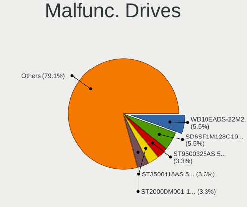

| Model                               | Desktops | Drives | Percent |
|-------------------------------------|----------|--------|---------|
| WDC WD10EADS-22M2B0 1TB             | 5        | 5      | 5.49%   |
| SanDisk SD6SF1M128G1022I 128GB SSD  | 5        | 5      | 5.49%   |
| Seagate ST9500325AS 500GB           | 3        | 4      | 3.3%    |
| Seagate ST3500418AS 500GB           | 3        | 4      | 3.3%    |
| Seagate ST2000DM001-1CH164 2TB      | 3        | 3      | 3.3%    |
| Intel SSDSA2M160G2GC 160GB          | 3        | 3      | 3.3%    |
| WDC WD30EFRX-68EUZN0 3TB            | 2        | 2      | 2.2%    |
| Samsung Electronics SSD 870 EVO 1TB | 2        | 2      | 2.2%    |
| Hitachi HDS721010CLA332 1TB         | 2        | 2      | 2.2%    |
| WDC WDS240G2G0A-00JH30 240GB SSD    | 1        | 1      | 1.1%    |
| WDC WD5000LPLX-66ZNTT0 500GB        | 1        | 1      | 1.1%    |
| WDC WD5000LPCX-08VHA 500GB          | 1        | 1      | 1.1%    |
| WDC WD5000AAKX-75U6AA0 500GB        | 1        | 1      | 1.1%    |
| WDC WD40EZRZ-00GXCB0 4TB            | 1        | 1      | 1.1%    |
| WDC WD3200LPCX-24C6HT0 320GB        | 1        | 1      | 1.1%    |
| WDC WD3200AAJS-00M0A0 320GB         | 1        | 1      | 1.1%    |
| WDC WD30EZRX-00DC0B0 3TB            | 1        | 2      | 1.1%    |
| WDC WD30EZRX-00D8PB0 3TB            | 1        | 1      | 1.1%    |
| WDC WD25EZRX-00MMMB0 2TB            | 1        | 1      | 1.1%    |
| WDC WD20EARS-07MVWB0 2TB            | 1        | 1      | 1.1%    |
| WDC WD10EALX-009BA0 1TB             | 1        | 1      | 1.1%    |
| WDC WD10EADS-00L5B1 1TB             | 1        | 1      | 1.1%    |
| WDC WD10EACS-00D6B0 1TB             | 1        | 2      | 1.1%    |
| Transcend TS240GSSD220S 240GB       | 1        | 1      | 1.1%    |
| Toshiba MQ01ABD100 1TB              | 1        | 1      | 1.1%    |
| Toshiba DT01ACA050 500GB            | 1        | 1      | 1.1%    |
| SUNEAST SE800 SSD 320GB             | 1        | 1      | 1.1%    |
| SPCC Solid State DiskB28 128GB      | 1        | 1      | 1.1%    |
| SPCC Solid State Disk 512GB         | 1        | 2      | 1.1%    |
| Seagate ST9500420AS 500GB           | 1        | 1      | 1.1%    |
| Seagate ST9320320AS 320GB           | 1        | 1      | 1.1%    |
| Seagate ST9160314AS 160GB           | 1        | 1      | 1.1%    |
| Seagate ST3320820AS 320GB           | 1        | 1      | 1.1%    |
| Seagate ST3250310AS 250GB           | 1        | 2      | 1.1%    |
| Seagate ST3120026A 120GB            | 1        | 1      | 1.1%    |
| Seagate ST31000528AS 1TB            | 1        | 1      | 1.1%    |
| Seagate ST31000520AS 1TB            | 1        | 1      | 1.1%    |
| Seagate ST31000333AS 1TB            | 1        | 1      | 1.1%    |
| Seagate ST3000VM002-1ET166 3TB      | 1        | 1      | 1.1%    |
| Seagate ST250DM000-1BD141 250GB     | 1        | 1      | 1.1%    |

Malfunc. Drive Vendor
---------------------

Vendors of faulty drives

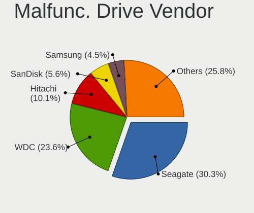

| Vendor              | Desktops | Drives | Percent |
|---------------------|----------|--------|---------|
| Seagate             | 27       | 31     | 30.34%  |
| WDC                 | 21       | 23     | 23.6%   |
| Hitachi             | 9        | 11     | 10.11%  |
| SanDisk             | 5        | 5      | 5.62%   |
| Samsung Electronics | 4        | 4      | 4.49%   |
| Intel               | 4        | 4      | 4.49%   |
| A-DATA Technology   | 4        | 4      | 4.49%   |
| Toshiba             | 2        | 2      | 2.25%   |
| SPCC                | 2        | 3      | 2.25%   |
| Maxtor              | 2        | 3      | 2.25%   |
| Crucial             | 2        | 2      | 2.25%   |
| Transcend           | 1        | 1      | 1.12%   |
| SUNEAST             | 1        | 1      | 1.12%   |
| Plextor             | 1        | 1      | 1.12%   |
| Kingston            | 1        | 1      | 1.12%   |
| Drevo               | 1        | 1      | 1.12%   |
| Corsair             | 1        | 1      | 1.12%   |
| C300-CTF            | 1        | 1      | 1.12%   |

Malfunc. HDD Vendor
-------------------

Vendors of faulty HDD drives

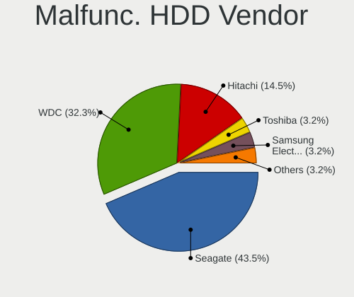

| Vendor              | Desktops | Drives | Percent |
|---------------------|----------|--------|---------|
| Seagate             | 27       | 31     | 43.55%  |
| WDC                 | 20       | 22     | 32.26%  |
| Hitachi             | 9        | 11     | 14.52%  |
| Toshiba             | 2        | 2      | 3.23%   |
| Samsung Electronics | 2        | 2      | 3.23%   |
| Maxtor              | 2        | 3      | 3.23%   |

Malfunc. Drive Kind
-------------------

Kinds of faulty drives

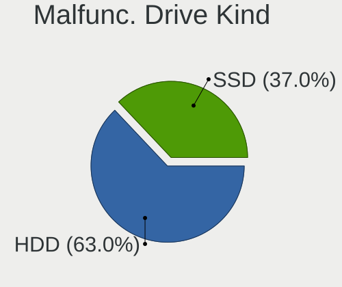

| Kind | Desktops | Drives | Percent |
|------|----------|--------|---------|
| HDD  | 54       | 71     | 66.67%  |
| SSD  | 27       | 28     | 33.33%  |

Failed Drives
-------------

Failed drive models

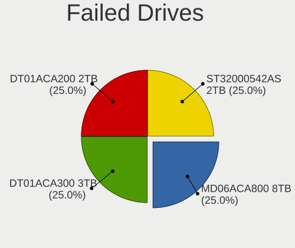

| Model                    | Desktops | Drives | Percent |
|--------------------------|----------|--------|---------|
| Toshiba MD06ACA800 8TB   | 1        | 1      | 25%     |
| Toshiba DT01ACA300 3TB   | 1        | 1      | 25%     |
| Toshiba DT01ACA200 2TB   | 1        | 1      | 25%     |
| Seagate ST32000542AS 2TB | 1        | 1      | 25%     |

Failed Drive Vendor
-------------------

Failed drive vendors

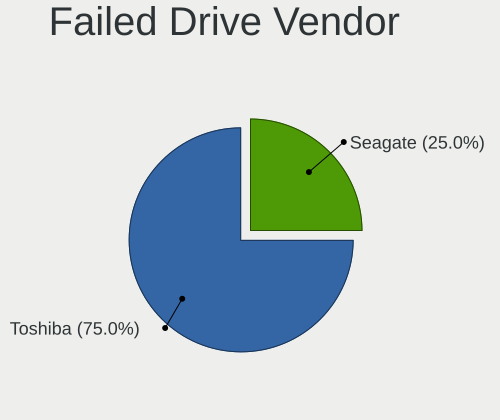

| Vendor  | Desktops | Drives | Percent |
|---------|----------|--------|---------|
| Toshiba | 3        | 3      | 75%     |
| Seagate | 1        | 1      | 25%     |

Drive Status
------------

Number of failed and malfunc. drives

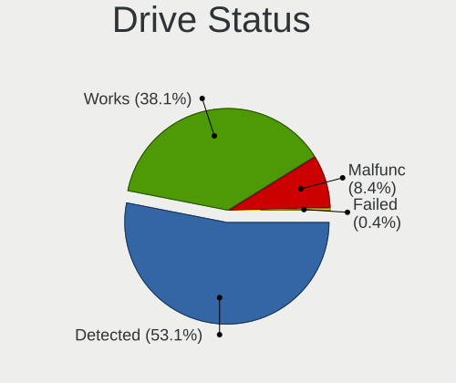

| Status   | Desktops | Drives | Percent |
|----------|----------|--------|---------|
| Detected | 475      | 1340   | 53.07%  |
| Works    | 341      | 765    | 38.1%   |
| Malfunc  | 75       | 99     | 8.38%   |
| Failed   | 4        | 4      | 0.45%   |

Storage controller
------------------

Storage Vendor
--------------

Storage controller vendors

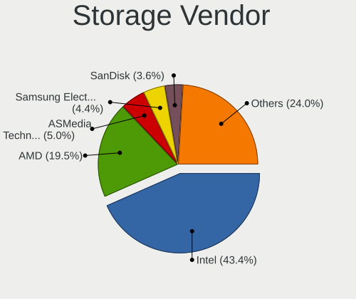

| Vendor                           | Desktops | Percent |
|----------------------------------|----------|---------|
| Intel                            | 538      | 43.39%  |
| AMD                              | 242      | 19.52%  |
| ASMedia Technology               | 62       | 5%      |
| Samsung Electronics              | 55       | 4.44%   |
| SanDisk                          | 45       | 3.63%   |
| Phison Electronics               | 37       | 2.98%   |
| Marvell Technology Group         | 36       | 2.9%    |
| Micron/Crucial Technology        | 30       | 2.42%   |
| JMicron Technology               | 28       | 2.26%   |
| MAXIO Technology (Hangzhou)      | 22       | 1.77%   |
| Silicon Motion                   | 17       | 1.37%   |
| VIA Technologies                 | 12       | 0.97%   |
| Nvidia                           | 11       | 0.89%   |
| Micron Technology                | 9        | 0.73%   |
| KIOXIA                           | 9        | 0.73%   |
| ADATA Technology                 | 9        | 0.73%   |
| Realtek Semiconductor            | 8        | 0.65%   |
| Kingston Technology Company      | 7        | 0.56%   |
| Broadcom / LSI                   | 7        | 0.56%   |
| Toshiba America Info Systems     | 5        | 0.4%    |
| SK hynix                         | 5        | 0.4%    |
| Silicon Image                    | 5        | 0.4%    |
| Shenzhen Longsys Electronics     | 4        | 0.32%   |
| Seagate Technology               | 4        | 0.32%   |
| Yangtze Memory Technologies      | 3        | 0.24%   |
| Solidigm                         | 3        | 0.24%   |
| Adaptec                          | 3        | 0.24%   |
| Transcend                        | 2        | 0.16%   |
| Silicon Integrated Systems [SiS] | 2        | 0.16%   |
| Nextorage                        | 2        | 0.16%   |
| LSI Logic / Symbios Logic        | 2        | 0.16%   |
| Integrated Technology Express    | 2        | 0.16%   |
| INNOGRIT                         | 2        | 0.16%   |
| Hosin Global Electronics         | 2        | 0.16%   |
| HighPoint Technologies           | 2        | 0.16%   |
| Biwin Storage Technology         | 2        | 0.16%   |
| ULi Electronics                  | 1        | 0.08%   |
| Promise Technology               | 1        | 0.08%   |
| Netac Technology                 | 1        | 0.08%   |
| Loongson Technology              | 1        | 0.08%   |

Storage Model
-------------

Storage controller models

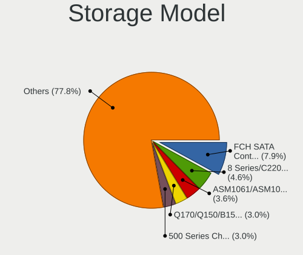

| Model                                                                                   | Desktops | Percent |
|-----------------------------------------------------------------------------------------|----------|---------|
| AMD FCH SATA Controller [AHCI mode]                                                     | 120      | 7.94%   |
| Intel 8 Series/C220 Series Chipset Family 6-port SATA Controller 1 [AHCI mode]          | 70       | 4.63%   |
| ASMedia ASM1061/ASM1062 Serial ATA Controller                                           | 55       | 3.64%   |
| Intel Q170/Q150/B150/H170/H110/Z170/CM236 Chipset SATA Controller [AHCI Mode]           | 45       | 2.98%   |
| AMD 500 Series Chipset SATA Controller                                                  | 45       | 2.98%   |
| AMD 400 Series Chipset SATA Controller                                                  | 43       | 2.85%   |
| Intel 7 Series/C210 Series Chipset Family 6-port SATA Controller [AHCI mode]            | 42       | 2.78%   |
| Intel Cannon Lake PCH SATA AHCI Controller                                              | 37       | 2.45%   |
| Intel 200 Series PCH SATA controller [AHCI mode]                                        | 37       | 2.45%   |
| Samsung NVMe SSD Controller SM981/PM981/PM983                                           | 34       | 2.25%   |
| Intel 6 Series/C200 Series Chipset Family 6 port Desktop SATA AHCI Controller           | 34       | 2.25%   |
| AMD SB7x0/SB8x0/SB9x0 IDE Controller                                                    | 30       | 1.99%   |
| Intel SATA Controller [RAID mode]                                                       | 29       | 1.92%   |
| Intel NM10/ICH7 Family SATA Controller [IDE mode]                                       | 24       | 1.59%   |
| AMD 600 Series Chipset SATA Controller                                                  | 24       | 1.59%   |
| Intel Alder Lake-S PCH SATA Controller [AHCI Mode]                                      | 20       | 1.32%   |
| SanDisk Ultra 3D / WD PC SN530, IX SN530, Blue SN550 NVMe SSD (DRAM-less)               | 19       | 1.26%   |
| AMD SB7x0/SB8x0/SB9x0 SATA Controller [IDE mode]                                        | 19       | 1.26%   |
| JMicron JMB363 SATA/IDE Controller                                                      | 18       | 1.19%   |
| Intel 82801G (ICH7 Family) IDE Controller                                               | 18       | 1.19%   |
| Intel 5 Series/3400 Series Chipset 4 port SATA IDE Controller                           | 15       | 0.99%   |
| Micron/Crucial P2 [Nick P2] / P3 / P3 Plus NVMe PCIe SSD (DRAM-less)                    | 14       | 0.93%   |
| Intel Volume Management Device NVMe RAID Controller                                     | 14       | 0.93%   |
| Intel 5 Series/3400 Series Chipset 2 port SATA IDE Controller                           | 14       | 0.93%   |
| AMD SB7x0/SB8x0/SB9x0 SATA Controller [AHCI mode]                                       | 14       | 0.93%   |
| Silicon Motion SM2263EN/SM2263XT (DRAM-less) NVMe SSD Controllers                       | 13       | 0.86%   |
| Intel 500 Series Chipset Family SATA AHCI Controller                                    | 13       | 0.86%   |
| Marvell Group 88SE9172 SATA 6Gb/s Controller                                            | 12       | 0.79%   |
| Intel 6 Series/C200 Series Chipset Family Desktop SATA Controller (IDE mode, ports 4-5) | 12       | 0.79%   |
| Intel 6 Series/C200 Series Chipset Family Desktop SATA Controller (IDE mode, ports 0-3) | 12       | 0.79%   |
| AMD 300 Series Chipset SATA Controller                                                  | 12       | 0.79%   |
| MAXIO (Hangzhou) NVMe SSD Controller MAP1602 (DRAM-less)                                | 11       | 0.73%   |
| MAXIO (Hangzhou) NVMe SSD Controller MAP1202 (DRAM-less)                                | 11       | 0.73%   |
| Intel 82801I (ICH9 Family) 2 port SATA Controller [IDE mode]                            | 11       | 0.73%   |
| AMD FCH IDE Controller                                                                  | 11       | 0.73%   |
| Phison PS5013-E13 PCIe3 NVMe Controller (DRAM-less)                                     | 10       | 0.66%   |
| Phison E12 NVMe Controller                                                              | 10       | 0.66%   |
| Intel 82801JI (ICH10 Family) SATA AHCI Controller                                       | 10       | 0.66%   |
| Samsung NVMe SSD Controller PM9A1/PM9A3/980PRO                                          | 9        | 0.6%    |
| Intel SSD 660P Series                                                                   | 9        | 0.6%    |

Storage Kind
------------

Kind of storage controller (IDE, SATA, NVMe, SAS, ...)

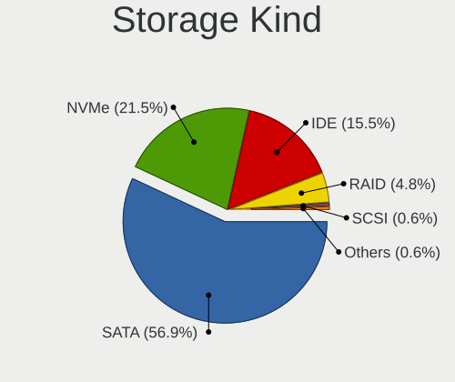

| Kind | Desktops | Percent |
|------|----------|---------|
| SATA | 656      | 56.94%  |
| NVMe | 248      | 21.53%  |
| IDE  | 179      | 15.54%  |
| RAID | 55       | 4.77%   |
| SAS  | 7        | 0.61%   |
| SCSI | 7        | 0.61%   |

Processor
---------

CPU Vendor
----------

Processor vendors

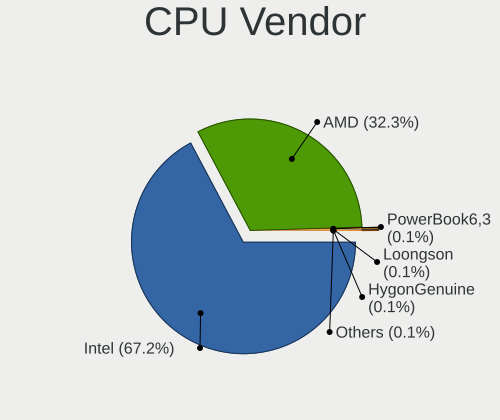

| Vendor       | Desktops | Percent |
|--------------|----------|---------|
| Intel        | 544      | 67.24%  |
| AMD          | 261      | 32.26%  |
| PowerBook6,3 | 1        | 0.12%   |
| Loongson     | 1        | 0.12%   |
| HygonGenuine | 1        | 0.12%   |
| ARM          | 1        | 0.12%   |

CPU Model
---------

Processor models

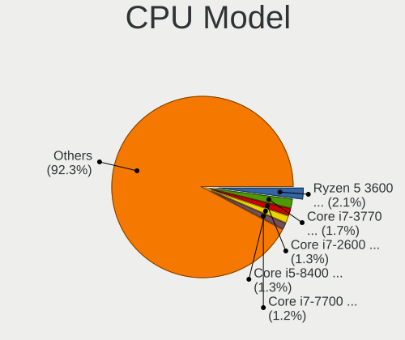

| Model                                       | Desktops | Percent |
|---------------------------------------------|----------|---------|
| AMD Ryzen 5 3600 6-Core Processor           | 17       | 2.09%   |
| Intel Core i7-3770 CPU @ 3.40GHz            | 14       | 1.72%   |
| Intel Core i7-2600 CPU @ 3.40GHz            | 11       | 1.35%   |
| Intel Core i5-8400 CPU @ 2.80GHz            | 11       | 1.35%   |
| Intel Core i7-7700 CPU @ 3.60GHz            | 10       | 1.23%   |
| AMD Ryzen 5 5600X 6-Core Processor          | 10       | 1.23%   |
| Intel Core i7-3770K CPU @ 3.50GHz           | 9        | 1.1%    |
| Intel Core i7-4790 CPU @ 3.60GHz            | 8        | 0.98%   |
| Intel Core i5-3470 CPU @ 3.20GHz            | 8        | 0.98%   |
| Intel Core 2 Duo CPU E8400 @ 3.00GHz        | 8        | 0.98%   |
| AMD Ryzen 7 3700X 8-Core Processor          | 8        | 0.98%   |
| Intel N100                                  | 7        | 0.86%   |
| Intel Core i7-4770K CPU @ 3.50GHz           | 7        | 0.86%   |
| Intel Core i5-6500 CPU @ 3.20GHz            | 7        | 0.86%   |
| Intel Core i5-4590 CPU @ 3.30GHz            | 7        | 0.86%   |
| AMD Ryzen 5 5600G with Radeon Graphics      | 7        | 0.86%   |
| Intel Core i7-8700 CPU @ 3.20GHz            | 6        | 0.74%   |
| Intel Core i7-6700 CPU @ 3.40GHz            | 6        | 0.74%   |
| Intel Core i7-4770 CPU @ 3.40GHz            | 6        | 0.74%   |
| Intel Core i5-4570 CPU @ 3.20GHz            | 6        | 0.74%   |
| Intel Core 2 Duo CPU E7500 @ 2.93GHz        | 6        | 0.74%   |
| AMD Ryzen 9 3950X 16-Core Processor         | 6        | 0.74%   |
| AMD Ryzen 7 5700G with Radeon Graphics      | 6        | 0.74%   |
| AMD Ryzen 7 2700X Eight-Core Processor      | 6        | 0.74%   |
| AMD Ryzen 5 2400G with Radeon Vega Graphics | 6        | 0.74%   |
| Intel Core i9-9900K CPU @ 3.60GHz           | 5        | 0.61%   |
| Intel Core i7-7700K CPU @ 4.20GHz           | 5        | 0.61%   |
| Intel Core i7-6700K CPU @ 4.00GHz           | 5        | 0.61%   |
| Intel Core i5-7400 CPU @ 3.00GHz            | 5        | 0.61%   |
| Intel Core i5-4440 CPU @ 3.10GHz            | 5        | 0.61%   |
| Intel Core i3-6100 CPU @ 3.70GHz            | 5        | 0.61%   |
| Intel Core i3-3220 CPU @ 3.30GHz            | 5        | 0.61%   |
| Intel Core i3-2120 CPU @ 3.30GHz            | 5        | 0.61%   |
| Intel Core 2 CPU 6600 @ 2.40GHz             | 5        | 0.61%   |
| AMD Ryzen 7 5700X 8-Core Processor          | 5        | 0.61%   |
| AMD Athlon 200GE with Radeon Vega Graphics  | 5        | 0.61%   |
| Intel Pentium CPU G3220 @ 3.00GHz           | 4        | 0.49%   |
| Intel Core i7-9700K CPU @ 3.60GHz           | 4        | 0.49%   |
| Intel Core i7 CPU 870 @ 2.93GHz             | 4        | 0.49%   |
| Intel Core i7 CPU 860 @ 2.80GHz             | 4        | 0.49%   |

CPU Model Family
----------------

Processor model prefix

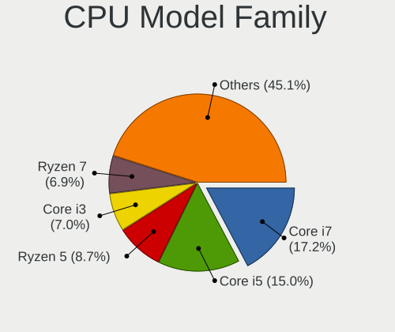

| Model                   | Desktops | Percent |
|-------------------------|----------|---------|
| Intel Core i7           | 140      | 17.24%  |
| Intel Core i5           | 122      | 15.02%  |
| AMD Ryzen 5             | 71       | 8.74%   |
| Intel Core i3           | 57       | 7.02%   |
| AMD Ryzen 7             | 56       | 6.9%    |
| Other                   | 49       | 6.03%   |
| Intel Xeon              | 44       | 5.42%   |
| AMD Ryzen 9             | 33       | 4.06%   |
| Intel Core 2 Duo        | 27       | 3.33%   |
| Intel Celeron           | 27       | 3.33%   |
| Intel Core 2 Quad       | 17       | 2.09%   |
| Intel Pentium           | 13       | 1.6%    |
| Intel Core i9           | 13       | 1.6%    |
| AMD Athlon              | 12       | 1.48%   |
| Intel Core 2            | 11       | 1.35%   |
| AMD A10                 | 11       | 1.35%   |
| AMD FX                  | 9        | 1.11%   |
| AMD Ryzen 3             | 8        | 0.99%   |
| AMD Phenom II X4        | 7        | 0.86%   |
| Intel Pentium Dual-Core | 6        | 0.74%   |
| AMD Athlon 64 X2        | 6        | 0.74%   |
| AMD A8                  | 6        | 0.74%   |
| Intel Pentium 4         | 5        | 0.62%   |
| AMD Phenom II X6        | 5        | 0.62%   |
| Intel Pentium Silver    | 4        | 0.49%   |
| Intel Pentium Gold      | 4        | 0.49%   |
| Intel Atom              | 4        | 0.49%   |
| AMD Athlon 64           | 4        | 0.49%   |
| AMD A4                  | 4        | 0.49%   |
| AMD Ryzen Threadripper  | 3        | 0.37%   |
| AMD Ryzen 5 PRO         | 3        | 0.37%   |
| Intel Core 2 Extreme    | 2        | 0.25%   |
| AMD Sempron             | 2        | 0.25%   |
| AMD Ryzen 7 PRO         | 2        | 0.25%   |
| AMD Phenom              | 2        | 0.25%   |
| AMD E                   | 2        | 0.25%   |
| AMD Athlon II X4        | 2        | 0.25%   |
| AMD Athlon II X2        | 2        | 0.25%   |
| AMD Athlon Dual Core    | 2        | 0.25%   |
| AMD A6                  | 2        | 0.25%   |

CPU Cores
---------

Number of processor cores

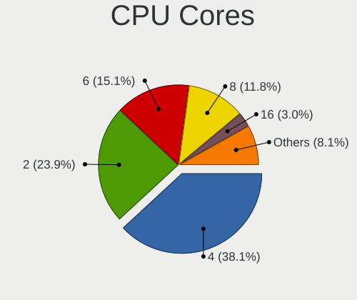

| Number | Desktops | Percent |
|--------|----------|---------|
| 4      | 310      | 38.13%  |
| 2      | 194      | 23.86%  |
| 6      | 123      | 15.13%  |
| 8      | 96       | 11.81%  |
| 16     | 24       | 2.95%   |
| 12     | 22       | 2.71%   |
| 1      | 15       | 1.85%   |
| 10     | 11       | 1.35%   |
| 24     | 5        | 0.62%   |
| 14     | 4        | 0.49%   |
| 3      | 4        | 0.49%   |
| 20     | 3        | 0.37%   |
| 64     | 1        | 0.12%   |
| 32     | 1        | 0.12%   |

CPU Sockets
-----------

Number of sockets

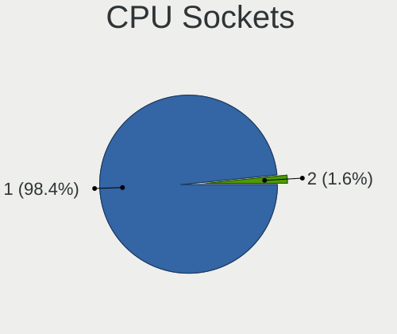

| Number | Desktops | Percent |
|--------|----------|---------|
| 1      | 796      | 98.39%  |
| 2      | 13       | 1.61%   |

CPU Threads
-----------

Threads per core (Hyper-Threading)

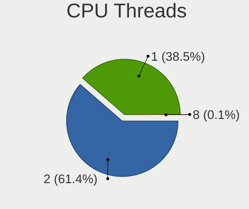

| Number | Desktops | Percent |
|--------|----------|---------|
| 2      | 498      | 61.41%  |
| 1      | 312      | 38.47%  |
| 8      | 1        | 0.12%   |

CPU Op-Modes
------------

CPU Operation Modes (32-bit, 64-bit)

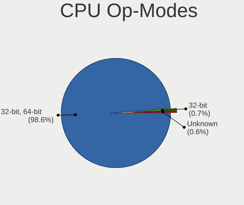

| Op mode        | Desktops | Percent |
|----------------|----------|---------|
| 32-bit, 64-bit | 801      | 98.65%  |
| 32-bit         | 6        | 0.74%   |
| Unknown        | 5        | 0.62%   |

CPU Microcode
-------------

Microcode number

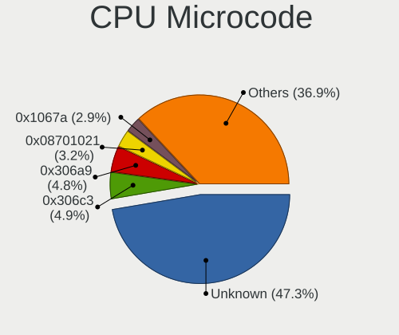

| Number     | Desktops | Percent |
|------------|----------|---------|
| Unknown    | 397      | 47.32%  |
| 0x306c3    | 41       | 4.89%   |
| 0x306a9    | 40       | 4.77%   |
| 0x08701021 | 27       | 3.22%   |
| 0x1067a    | 24       | 2.86%   |
| 0x206a7    | 22       | 2.62%   |
| 0x906ea    | 21       | 2.5%    |
| 0x506e3    | 17       | 2.03%   |
| 0x906e9    | 12       | 1.43%   |
| 0x906ed    | 9        | 1.07%   |
| 0x0800820d | 9        | 1.07%   |
| 0x106e5    | 8        | 0.95%   |
| 0x06003106 | 8        | 0.95%   |
| 0xa0655    | 7        | 0.83%   |
| 0x306f2    | 6        | 0.72%   |
| 0x06001119 | 6        | 0.72%   |
| 0x010000db | 6        | 0.72%   |
| 0x6fb      | 5        | 0.6%    |
| 0x6f6      | 5        | 0.6%    |
| 0x206d7    | 5        | 0.6%    |
| 0x0a50000c | 5        | 0.6%    |
| 0x0a201016 | 5        | 0.6%    |
| 0x08108109 | 5        | 0.6%    |
| 0xa0653    | 4        | 0.48%   |
| 0x706a1    | 4        | 0.48%   |
| 0x50654    | 4        | 0.48%   |
| 0x306e4    | 4        | 0.48%   |
| 0x10676    | 4        | 0.48%   |
| 0x08600106 | 4        | 0.48%   |
| 0x08101016 | 4        | 0.48%   |
| 0x0810100b | 4        | 0.48%   |
| 0x08001138 | 4        | 0.48%   |
| 0x010000dc | 4        | 0.48%   |
| 0x010000c8 | 4        | 0.48%   |
| 0x906eb    | 3        | 0.36%   |
| 0x206c2    | 3        | 0.36%   |
| 0x20655    | 3        | 0.36%   |
| 0x10677    | 3        | 0.36%   |
| 0x0a50000d | 3        | 0.36%   |
| 0x0a20120a | 3        | 0.36%   |

CPU Microarch
-------------

Microarchitecture

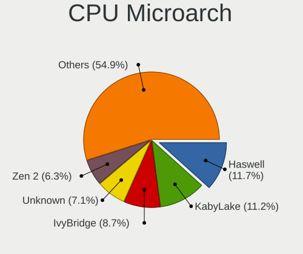

| Name             | Desktops | Percent |
|------------------|----------|---------|
| Haswell          | 95       | 11.7%   |
| KabyLake         | 91       | 11.21%  |
| IvyBridge        | 71       | 8.74%   |
| Unknown          | 58       | 7.14%   |
| Zen 2            | 51       | 6.28%   |
| Zen 3            | 49       | 6.03%   |
| Penryn           | 46       | 5.67%   |
| SandyBridge      | 44       | 5.42%   |
| Skylake          | 42       | 5.17%   |
| Zen              | 29       | 3.57%   |
| Zen+             | 24       | 2.96%   |
| Core             | 22       | 2.71%   |
| K10              | 21       | 2.59%   |
| CometLake        | 20       | 2.46%   |
| Alderlake Hybrid | 19       | 2.34%   |
| Nehalem          | 18       | 2.22%   |
| Westmere         | 14       | 1.72%   |
| K8 Hammer        | 14       | 1.72%   |
| Piledriver       | 13       | 1.6%    |
| Steamroller      | 10       | 1.23%   |
| NetBurst         | 7        | 0.86%   |
| Gracemont        | 7        | 0.86%   |
| Goldmont plus    | 7        | 0.86%   |
| Silvermont       | 6        | 0.74%   |
| K10 Llano        | 4        | 0.49%   |
| Jaguar           | 4        | 0.49%   |
| Icelake          | 4        | 0.49%   |
| Bulldozer        | 4        | 0.49%   |
| Bonnell          | 4        | 0.49%   |
| Excavator        | 3        | 0.37%   |
| Broadwell        | 3        | 0.37%   |
| Bobcat           | 2        | 0.25%   |
| Tremont          | 1        | 0.12%   |
| Puma             | 1        | 0.12%   |
| P6               | 1        | 0.12%   |
| Lunarlake Hybrid | 1        | 0.12%   |
| K6               | 1        | 0.12%   |
| Goldmont         | 1        | 0.12%   |

Graphics
--------

GPU Vendor
----------

Vendors of graphics cards

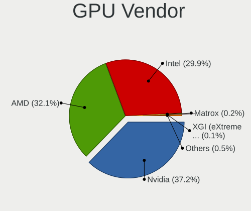

| Vendor                                       | Desktops | Percent |
|----------------------------------------------|----------|---------|
| Nvidia                                       | 324      | 37.24%  |
| AMD                                          | 279      | 32.07%  |
| Intel                                        | 260      | 29.89%  |
| Matrox Electronics Systems                   | 2        | 0.23%   |
| XGI Technology (eXtreme Graphics Innovation) | 1        | 0.11%   |
| VIA Technologies                             | 1        | 0.11%   |
| Red Hat                                      | 1        | 0.11%   |
| Loongson Technology                          | 1        | 0.11%   |
| ASPEED Technology                            | 1        | 0.11%   |

GPU Model
---------

Graphics card models

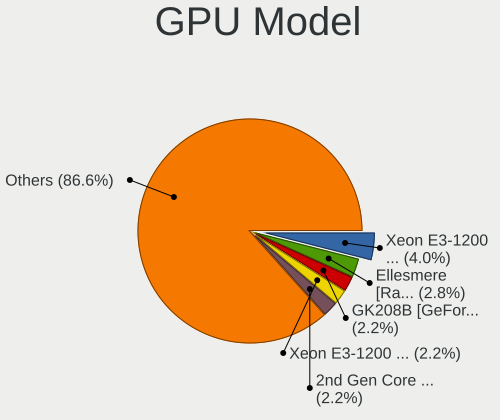

| Model                                                                       | Desktops | Percent |
|-----------------------------------------------------------------------------|----------|---------|
| Intel Xeon E3-1200 v3/4th Gen Core Processor Integrated Graphics Controller | 36       | 3.98%   |
| AMD Ellesmere [Radeon RX 470/480/570/570X/580/580X/590]                     | 25       | 2.76%   |
| Nvidia GK208B [GeForce GT 710]                                              | 20       | 2.21%   |
| Intel Xeon E3-1200 v2/3rd Gen Core processor Graphics Controller            | 20       | 2.21%   |
| Intel 2nd Generation Core Processor Family Integrated Graphics Controller   | 20       | 2.21%   |
| Intel CoffeeLake-S GT2 [UHD Graphics 630]                                   | 19       | 2.1%    |
| Intel Kaby Lake-S GT2 [HD Graphics 630]                                     | 18       | 1.99%   |
| Intel IvyBridge GT2 [HD Graphics 4000]                                      | 18       | 1.99%   |
| AMD Cezanne [Radeon Vega Series / Radeon Vega Mobile Series]                | 18       | 1.99%   |
| Intel Skylake-S GT2 [HD Graphics 530]                                       | 17       | 1.88%   |
| AMD Raven Ridge [Radeon Vega Series / Radeon Vega Mobile Series]            | 16       | 1.77%   |
| Nvidia TU117 [GeForce GTX 1650]                                             | 15       | 1.66%   |
| Nvidia GP107 [GeForce GTX 1050 Ti]                                          | 15       | 1.66%   |
| Intel 4 Series Chipset Integrated Graphics Controller                       | 15       | 1.66%   |
| Nvidia GK208B [GeForce GT 730]                                              | 12       | 1.33%   |
| Nvidia GP104 [GeForce GTX 1080]                                             | 11       | 1.22%   |
| Nvidia TU116 [GeForce GTX 1660 SUPER]                                       | 10       | 1.1%    |
| AMD Granite Ridge [Radeon Graphics]                                         | 10       | 1.1%    |
| Nvidia GP108 [GeForce GT 1030]                                              | 9        | 0.99%   |
| Nvidia GP106 [GeForce GTX 1060 6GB]                                         | 9        | 0.99%   |
| Nvidia GA102 [GeForce RTX 3090]                                             | 9        | 0.99%   |
| Intel CometLake-S GT2 [UHD Graphics 630]                                    | 9        | 0.99%   |
| Intel Alder Lake-N [UHD Graphics]                                           | 9        | 0.99%   |
| AMD RV710 [Radeon HD 4350/4550]                                             | 9        | 0.99%   |
| AMD Navi 10 [Radeon RX 5600 OEM/5600 XT / 5700/5700 XT]                     | 9        | 0.99%   |
| Nvidia GK106 [GeForce GTX 660]                                              | 8        | 0.88%   |
| Intel 4th Generation Core Processor Family Integrated Graphics Controller   | 8        | 0.88%   |
| AMD Raphael                                                                 | 8        | 0.88%   |
| AMD Picasso/Raven 2 [Radeon Vega Series / Radeon Vega Mobile Series]        | 8        | 0.88%   |
| AMD Navi 23 [Radeon RX 6600/6600 XT/6600M]                                  | 8        | 0.88%   |
| AMD Lexa PRO [Radeon 540/540X/550/550X / RX 540X/550/550X]                  | 8        | 0.88%   |
| Nvidia TU116 [GeForce GTX 1660]                                             | 7        | 0.77%   |
| Nvidia GM107 [GeForce GTX 750 Ti]                                           | 7        | 0.77%   |
| AMD Phoenix1                                                                | 7        | 0.77%   |
| AMD Navi 22 [Radeon RX 6700/6700 XT/6750 XT / 6800M/6850M XT]               | 7        | 0.77%   |
| AMD Cedar [Radeon HD 5000/6000/7350/8350 Series]                            | 7        | 0.77%   |
| AMD Caicos [Radeon HD 6450/7450/8450 / R5 230 OEM]                          | 7        | 0.77%   |
| AMD Baffin [Radeon RX 550 640SP / RX 560/560X]                              | 7        | 0.77%   |
| Nvidia TU104 [GeForce RTX 2070 SUPER]                                       | 6        | 0.66%   |
| Nvidia GT218 [GeForce 210]                                                  | 6        | 0.66%   |

GPU Combo
---------

Combinations of graphics cards

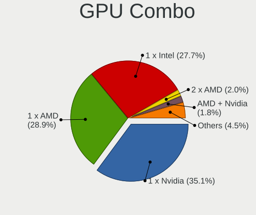

| Name                      | Desktops | Percent |
|---------------------------|----------|---------|
| 1 x Nvidia                | 288      | 35.12%  |
| 1 x AMD                   | 237      | 28.9%   |
| 1 x Intel                 | 227      | 27.68%  |
| 2 x AMD                   | 16       | 1.95%   |
| AMD + Nvidia              | 15       | 1.83%   |
| Intel + Nvidia            | 11       | 1.34%   |
| 2 x Nvidia                | 5        | 0.61%   |
| Other                     | 4        | 0.49%   |
| Intel + AMD               | 4        | 0.49%   |
| 2 x Intel                 | 2        | 0.24%   |
| Intel + 2 x Nvidia        | 2        | 0.24%   |
| 1 x XGI                   | 1        | 0.12%   |
| 1 x VIA                   | 1        | 0.12%   |
| 1 x Red Hat               | 1        | 0.12%   |
| 1 x Matrox                | 1        | 0.12%   |
| Intel + 2 x AMD           | 1        | 0.12%   |
| Intel + AMD + 1 x Nvidia  | 1        | 0.12%   |
| 1 x ASPEED                | 1        | 0.12%   |
| AMD + Matrox              | 1        | 0.12%   |
| AMD + Loongson Technology | 1        | 0.12%   |

GPU Driver
----------

Free vs proprietary

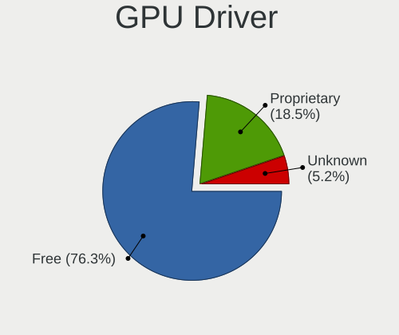

| Driver      | Desktops | Percent |
|-------------|----------|---------|
| Free        | 632      | 76.33%  |
| Proprietary | 153      | 18.48%  |
| Unknown     | 43       | 5.19%   |

GPU Memory
----------

Total video memory

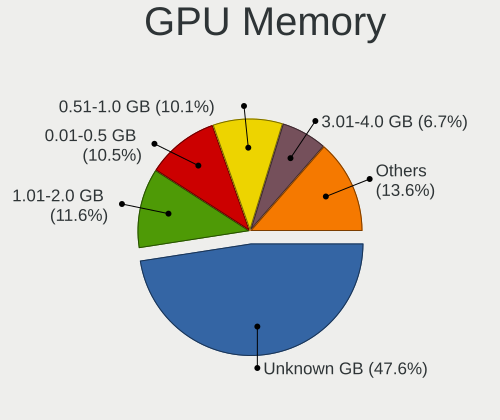

| Size in GB | Desktops | Percent |
|------------|----------|---------|
| Unknown    | 399      | 47.56%  |
| 1.01-2.0   | 97       | 11.56%  |
| 0.01-0.5   | 88       | 10.49%  |
| 0.51-1.0   | 85       | 10.13%  |
| 3.01-4.0   | 56       | 6.67%   |
| 7.01-8.0   | 48       | 5.72%   |
| 8.01-16.0  | 29       | 3.46%   |
| 5.01-6.0   | 22       | 2.62%   |
| 16.01-24.0 | 11       | 1.31%   |
| 2.01-3.0   | 3        | 0.36%   |
| 4.01-5.0   | 1        | 0.12%   |

Monitor
-------

Monitor Vendor
--------------

Monitor vendors

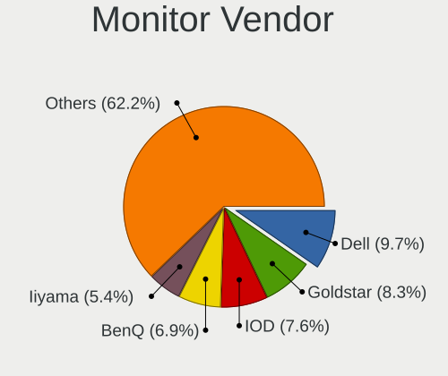

| Vendor               | Desktops | Percent |
|----------------------|----------|---------|
| Dell                 | 84       | 9.66%   |
| Goldstar             | 72       | 8.28%   |
| IOD                  | 66       | 7.59%   |
| BenQ                 | 60       | 6.9%    |
| Iiyama               | 47       | 5.4%    |
| Mitsubishi           | 42       | 4.83%   |
| Acer                 | 41       | 4.71%   |
| Philips              | 34       | 3.91%   |
| Hewlett-Packard      | 33       | 3.79%   |
| Eizo                 | 30       | 3.45%   |
| Sharp                | 27       | 3.1%    |
| NEC Computers        | 25       | 2.87%   |
| Samsung Electronics  | 24       | 2.76%   |
| AOC                  | 21       | 2.41%   |
| Unknown              | 18       | 2.07%   |
| Sony                 | 17       | 1.95%   |
| Ancor Communications | 17       | 1.95%   |
| ViewSonic            | 12       | 1.38%   |
| ASUSTek Computer     | 11       | 1.26%   |
| Panasonic            | 9        | 1.03%   |
| Lenovo               | 9        | 1.03%   |
| Toshiba              | 8        | 0.92%   |
| Fujitsu              | 8        | 0.92%   |
| Unknown              | 8        | 0.92%   |
| RTK                  | 7        | 0.8%    |
| MSI                  | 7        | 0.8%    |
| LG Electronics       | 7        | 0.8%    |
| Idek Iiyama          | 7        | 0.8%    |
| Hitachi              | 5        | 0.57%   |
| PTF                  | 4        | 0.46%   |
| Onkyo                | 4        | 0.46%   |
| ___                  | 3        | 0.34%   |
| Xiaomi               | 3        | 0.34%   |
| Wacom                | 3        | 0.34%   |
| Unknown (XXX)        | 3        | 0.34%   |
| SKY                  | 3        | 0.34%   |
| SKG                  | 3        | 0.34%   |
| Pixio                | 3        | 0.34%   |
| Mi                   | 3        | 0.34%   |
| INNOCN               | 3        | 0.34%   |

Monitor Model
-------------

Monitor models

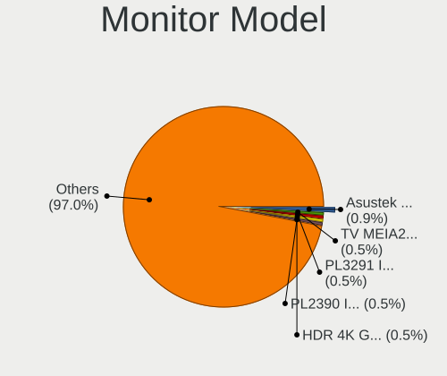

| Model                                                            | Desktops | Percent |
|------------------------------------------------------------------|----------|---------|
| Unknown                                                          | 8        | 0.86%   |
| Panasonic TV MEIA296 1920x1080 698x392mm 31.5-inch               | 5        | 0.54%   |
| Iiyama PL3291 IVM7605 1920x1080 698x393mm 31.5-inch              | 5        | 0.54%   |
| Iiyama PL2390 IVM562D 1920x1080 509x286mm 23.0-inch              | 5        | 0.54%   |
| Goldstar HDR 4K GSM7706 3840x2160 600x340mm 27.2-inch            | 5        | 0.54%   |
| ASUSTek Computer VZ239 AUS23CC 1920x1080 509x286mm 23.0-inch     | 5        | 0.54%   |
| AOC 28E850 AOC0CCD 1920x1080 480x270mm 21.7-inch                 | 5        | 0.54%   |
| Philips PHL 246E7 PHLC107 1920x1080 521x293mm 23.5-inch          | 4        | 0.43%   |
| NEC Computers EA243WM NEC6864 1920x1200 519x324mm 24.1-inch      | 4        | 0.43%   |
| Iiyama PL2888H IVM7106 1920x1080 621x341mm 27.9-inch             | 4        | 0.43%   |
| Iiyama PL2290 IVM562C 1920x1080 476x268mm 21.5-inch              | 4        | 0.43%   |
| Goldstar Ultra HD GSM5B09 3840x2160 600x340mm 27.2-inch          | 4        | 0.43%   |
| ___ LCD TV ___9000 1360x768                                      | 3        | 0.32%   |
| Sony SDMU27M90*30 SNY075A 3840x2160 596x335mm 26.9-inch          | 3        | 0.32%   |
| Sharp HDMI SHP10A0 1920x1080 340x190mm 15.3-inch                 | 3        | 0.32%   |
| RTK 32V3H-H6A RTK4C54 1440x900 697x392mm 31.5-inch               | 3        | 0.32%   |
| Philips PHL 328P6VU PHL0927 3840x2160 698x393mm 31.5-inch        | 3        | 0.32%   |
| NEC Computers AS223WM NEC690A 1920x1080 476x267mm 21.5-inch      | 3        | 0.32%   |
| Mitsubishi MDT241WG MEL478E 1920x1200 520x320mm 24.0-inch        | 3        | 0.32%   |
| IOD LCD-MF221X IOD1685 1920x1080 476x268mm 21.5-inch             | 3        | 0.32%   |
| IOD LCD-MF221X IOD1606 1920x1080 476x268mm 21.5-inch             | 3        | 0.32%   |
| IOD EX-LD2071T IOD150D 1920x1080 458x258mm 20.7-inch             | 3        | 0.32%   |
| Iiyama PL2283H IVM562E 1920x1080 496x292mm 22.7-inch             | 3        | 0.32%   |
| Goldstar ULTRAWIDE GSM76FE 2560x1080 798x334mm 34.1-inch         | 3        | 0.32%   |
| Goldstar LG ULTRAWIDE GSM59F1 2560x1080 670x280mm 28.6-inch      | 3        | 0.32%   |
| Goldstar HDR WQHD GSM7756 3440x1440 820x346mm 35.0-inch          | 3        | 0.32%   |
| Goldstar FULL HD GSM5B55 1920x1080 480x270mm 21.7-inch           | 3        | 0.32%   |
| Fujitsu VL-200SSWL FUJ4911 1600x900 442x249mm 20.0-inch          | 3        | 0.32%   |
| Eizo FS2333 ENC2421 1920x1080 510x287mm 23.0-inch                | 3        | 0.32%   |
| Dell U2410 DELF016 1920x1200 518x324mm 24.1-inch                 | 3        | 0.32%   |
| Dell S2421HS DEL41F4 1920x1080 527x296mm 23.8-inch               | 3        | 0.32%   |
| Dell E177FP DELA023 1280x1024 338x270mm 17.0-inch                | 3        | 0.32%   |
| BenQ GW2765 BNQ78D6 2560x1440 597x336mm 27.0-inch                | 3        | 0.32%   |
| BenQ GW2280 BNQ78E8 1920x1080 476x268mm 21.5-inch                | 3        | 0.32%   |
| BenQ GL2460 BNQ78CE 1920x1080 531x299mm 24.0-inch                | 3        | 0.32%   |
| BenQ EX2710 BNQ7F7E 1920x1080 600x340mm 27.2-inch                | 3        | 0.32%   |
| AOC 24G2W1G3 AOC2402 1920x1080 527x296mm 23.8-inch               | 3        | 0.32%   |
| Ancor Communications VE248 ACI2494 1920x1080 531x299mm 24.0-inch | 3        | 0.32%   |
| Acer KA270H ACR0522 1920x1080 598x336mm 27.0-inch                | 3        | 0.32%   |
| Acer H243H ACR0074 1920x1080 531x298mm 24.0-inch                 | 3        | 0.32%   |

Monitor Resolution
------------------

Monitor screen resolution

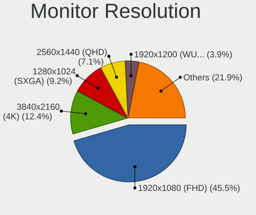

| Resolution         | Desktops | Percent |
|--------------------|----------|---------|
| 1920x1080 (FHD)    | 390      | 45.51%  |
| 3840x2160 (4K)     | 106      | 12.37%  |
| 1280x1024 (SXGA)   | 79       | 9.22%   |
| 2560x1440 (QHD)    | 61       | 7.12%   |
| 1920x1200 (WUXGA)  | 33       | 3.85%   |
| 1680x1050 (WSXGA+) | 23       | 2.68%   |
| Unknown            | 20       | 2.33%   |
| 1440x900 (WXGA+)   | 16       | 1.87%   |
| 1600x900 (HD+)     | 15       | 1.75%   |
| 3440x1440          | 12       | 1.4%    |
| 1920x540           | 12       | 1.4%    |
| 2560x1080          | 10       | 1.17%   |
| 1600x1200          | 10       | 1.17%   |
| 1360x768           | 10       | 1.17%   |
| 1400x1050          | 9        | 1.05%   |
| 3840x1080          | 8        | 0.93%   |
| 1024x768 (XGA)     | 8        | 0.93%   |
| 1366x768 (WXGA)    | 6        | 0.7%    |
| 3520x1080          | 2        | 0.23%   |
| 3200x1200          | 2        | 0.23%   |
| 3200x1080          | 2        | 0.23%   |
| 2560x1600          | 2        | 0.23%   |
| 2560x1024          | 2        | 0.23%   |
| 1360x765           | 2        | 0.23%   |
| 1280x720 (HD)      | 2        | 0.23%   |
| 800x480            | 1        | 0.12%   |
| 7680x2160          | 1        | 0.12%   |
| 7360x1200          | 1        | 0.12%   |
| 640x480            | 1        | 0.12%   |
| 5760x1200          | 1        | 0.12%   |
| 5440x1200          | 1        | 0.12%   |
| 4480x1080          | 1        | 0.12%   |
| 3200x2160          | 1        | 0.12%   |
| 2560x1397          | 1        | 0.12%   |
| 2288x1287          | 1        | 0.12%   |
| 2256x1504          | 1        | 0.12%   |
| 2160x1440          | 1        | 0.12%   |
| 2048x1152          | 1        | 0.12%   |
| 1792x1344          | 1        | 0.12%   |
| 1280x960           | 1        | 0.12%   |

Monitor Diagonal
----------------

Diagonal size in inches

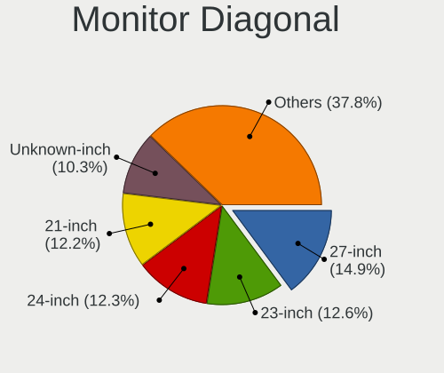

| Inches  | Desktops | Percent |
|---------|----------|---------|
| 27      | 127      | 14.85%  |
| 23      | 108      | 12.63%  |
| 24      | 105      | 12.28%  |
| 21      | 104      | 12.16%  |
| Unknown | 88       | 10.29%  |
| 19      | 55       | 6.43%   |
| 31      | 50       | 5.85%   |
| 17      | 38       | 4.44%   |
| 20      | 28       | 3.27%   |
| 34      | 19       | 2.22%   |
| 22      | 14       | 1.64%   |
| 15      | 11       | 1.29%   |
| 18      | 9        | 1.05%   |
| 84      | 8        | 0.94%   |
| 40      | 8        | 0.94%   |
| 37      | 8        | 0.94%   |
| 32      | 8        | 0.94%   |
| 72      | 7        | 0.82%   |
| 54      | 7        | 0.82%   |
| 26      | 6        | 0.7%    |
| 49      | 4        | 0.47%   |
| 43      | 4        | 0.47%   |
| 42      | 4        | 0.47%   |
| 25      | 4        | 0.47%   |
| 14      | 4        | 0.47%   |
| 63      | 3        | 0.35%   |
| 35      | 3        | 0.35%   |
| 65      | 2        | 0.23%   |
| 64      | 2        | 0.23%   |
| 48      | 2        | 0.23%   |
| 39      | 2        | 0.23%   |
| 30      | 2        | 0.23%   |
| 29      | 2        | 0.23%   |
| 13      | 2        | 0.23%   |
| 142     | 1        | 0.12%   |
| 82      | 1        | 0.12%   |
| 74      | 1        | 0.12%   |
| 52      | 1        | 0.12%   |
| 36      | 1        | 0.12%   |
| 16      | 1        | 0.12%   |

Monitor Width
-------------

Physical width

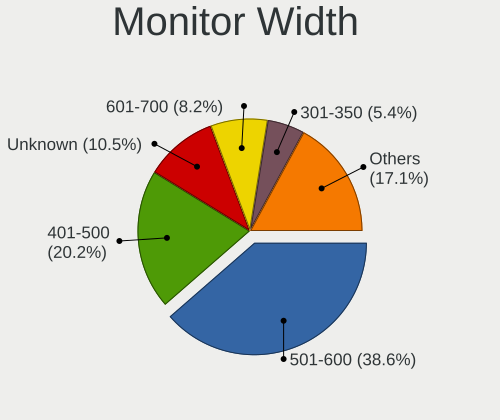

| Width in mm    | Desktops | Percent |
|----------------|----------|---------|
| 501-600        | 323      | 38.59%  |
| 401-500        | 169      | 20.19%  |
| Unknown        | 88       | 10.51%  |
| 601-700        | 69       | 8.24%   |
| 301-350        | 45       | 5.38%   |
| 351-400        | 41       | 4.9%    |
| 701-800        | 25       | 2.99%   |
| 801-900        | 24       | 2.87%   |
| 1001-1500      | 22       | 2.63%   |
| 1501-2000      | 17       | 2.03%   |
| 901-1000       | 7        | 0.84%   |
| 201-300        | 6        | 0.72%   |
| More than 2000 | 1        | 0.12%   |

Aspect Ratio
------------

Proportional relationship between the width and the height

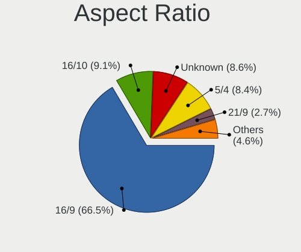

| Ratio   | Desktops | Percent |
|---------|----------|---------|
| 16/9    | 533      | 66.54%  |
| 16/10   | 73       | 9.11%   |
| Unknown | 69       | 8.61%   |
| 5/4     | 67       | 8.36%   |
| 21/9    | 22       | 2.75%   |
| 4/3     | 20       | 2.5%    |
| 32/9    | 10       | 1.25%   |
| 1.00    | 3        | 0.37%   |
| 6/5     | 2        | 0.25%   |
| 3/2     | 1        | 0.12%   |
| 1.96    | 1        | 0.12%   |

Monitor Area
------------

Area in inch²

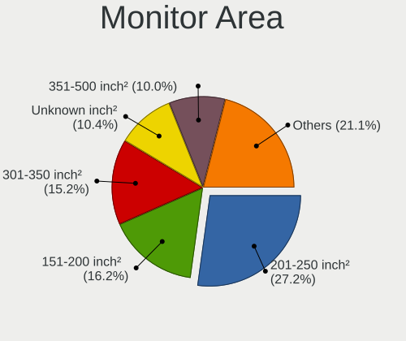

| Area in inch² | Desktops | Percent |
|----------------|----------|---------|
| 201-250        | 231      | 27.18%  |
| 151-200        | 138      | 16.24%  |
| 301-350        | 129      | 15.18%  |
| Unknown        | 88       | 10.35%  |
| 351-500        | 85       | 10%     |
| 251-300        | 53       | 6.24%   |
| 141-150        | 41       | 4.82%   |
| More than 1000 | 35       | 4.12%   |
| 501-1000       | 29       | 3.41%   |
| 101-110        | 11       | 1.29%   |
| 91-100         | 4        | 0.47%   |
| 71-80          | 2        | 0.24%   |
| 41-50          | 1        | 0.12%   |
| 131-140        | 1        | 0.12%   |
| 121-130        | 1        | 0.12%   |
| 111-120        | 1        | 0.12%   |

Pixel Density
-------------

Pixels per inch

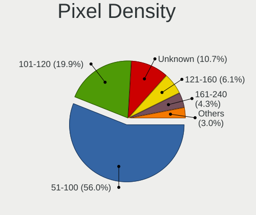

| Density | Desktops | Percent |
|---------|----------|---------|
| 51-100  | 461      | 56.01%  |
| 101-120 | 164      | 19.93%  |
| Unknown | 88       | 10.69%  |
| 121-160 | 50       | 6.08%   |
| 161-240 | 35       | 4.25%   |
| 1-50    | 25       | 3.04%   |

Multiple Monitors
-----------------

Total monitors connected

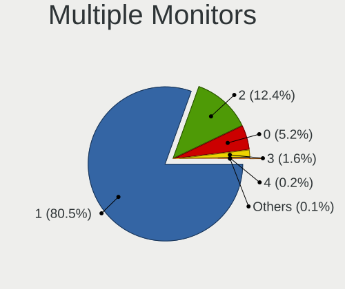

| Total | Desktops | Percent |
|-------|----------|---------|
| 1     | 668      | 80.48%  |
| 2     | 103      | 12.41%  |
| 0     | 43       | 5.18%   |
| 3     | 13       | 1.57%   |
| 4     | 2        | 0.24%   |
| 6     | 1        | 0.12%   |

Network
-------

Net Controller Vendor
---------------------

Controller vendors

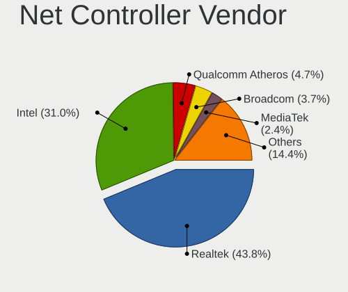

| Vendor                           | Desktops | Percent |
|----------------------------------|----------|---------|
| Realtek Semiconductor            | 488      | 43.77%  |
| Intel                            | 346      | 31.03%  |
| Qualcomm Atheros                 | 52       | 4.66%   |
| Broadcom                         | 41       | 3.68%   |
| MediaTek                         | 27       | 2.42%   |
| BUFFALO                          | 26       | 2.33%   |
| TP-Link                          | 16       | 1.43%   |
| PLANEX                           | 12       | 1.08%   |
| Marvell Technology Group         | 12       | 1.08%   |
| Nvidia                           | 10       | 0.9%    |
| ASIX Electronics                 | 9        | 0.81%   |
| Aquantia                         | 8        | 0.72%   |
| Elecom                           | 6        | 0.54%   |
| Broadcom Limited                 | 6        | 0.54%   |
| Qualcomm Technologies            | 5        | 0.45%   |
| VIA Technologies                 | 4        | 0.36%   |
| Ralink Technology                | 3        | 0.27%   |
| Logitec                          | 3        | 0.27%   |
| Huawei Technologies              | 3        | 0.27%   |
| Silicon Integrated Systems [SiS] | 2        | 0.18%   |
| NEC Computers                    | 2        | 0.18%   |
| Microsoft                        | 2        | 0.18%   |
| Xiaomi                           | 1        | 0.09%   |
| Wilocity                         | 1        | 0.09%   |
| Wacom                            | 1        | 0.09%   |
| vivo                             | 1        | 0.09%   |
| ULi Electronics                  | 1        | 0.09%   |
| U-Blox                           | 1        | 0.09%   |
| Strawberry Linux                 | 1        | 0.09%   |
| SPITAL SANGYO                    | 1        | 0.09%   |
| Sharp                            | 1        | 0.09%   |
| Samsung Electronics              | 1        | 0.09%   |
| Ralink                           | 1        | 0.09%   |
| Qualcomm Atheros Communications  | 1        | 0.09%   |
| Padix (Rockfire)                 | 1        | 0.09%   |
| OPPO Electronics                 | 1        | 0.09%   |
| NetGear                          | 1        | 0.09%   |
| Netchip Technology               | 1        | 0.09%   |
| Microchip Technology             | 1        | 0.09%   |
| LSI                              | 1        | 0.09%   |

Net Controller Model
--------------------

Controller models

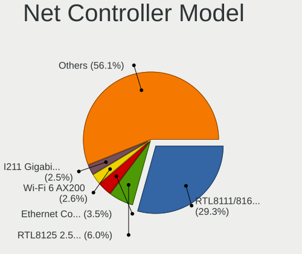

| Model                                                                  | Desktops | Percent |
|------------------------------------------------------------------------|----------|---------|
| Realtek RTL8111/8168/8211/8411 PCI Express Gigabit Ethernet Controller | 372      | 29.34%  |
| Realtek RTL8125 2.5GbE Controller                                      | 76       | 5.99%   |
| Intel Ethernet Connection (2) I219-V                                   | 44       | 3.47%   |
| Intel Wi-Fi 6 AX200                                                    | 33       | 2.6%    |
| Intel I211 Gigabit Network Connection                                  | 32       | 2.52%   |
| Intel Ethernet Connection (7) I219-V                                   | 28       | 2.21%   |
| Intel Ethernet Connection I217-V                                       | 23       | 1.81%   |
| Intel Ethernet Controller I225-V                                       | 21       | 1.66%   |
| Intel Wi-Fi 6E(802.11ax) AX210/AX1675* 2x2 [Typhoon Peak]              | 19       | 1.5%    |
| Intel 82579V Gigabit Network Connection                                | 18       | 1.42%   |
| Realtek RTL88x2bu [AC1200 Techkey]                                     | 17       | 1.34%   |
| Intel 82579LM Gigabit Network Connection (Lewisville)                  | 16       | 1.26%   |
| Intel Ethernet Connection I217-LM                                      | 15       | 1.18%   |
| Intel Dual Band Wireless-AC 3168NGW [Stone Peak]                       | 15       | 1.18%   |
| Realtek RTL8188EUS 802.11n Wireless Network Adapter                    | 14       | 1.1%    |
| Realtek RTL8821CE 802.11ac PCIe Wireless Network Adapter               | 10       | 0.79%   |
| MediaTek MT7922 802.11ax PCI Express Wireless Network Adapter          | 10       | 0.79%   |
| Intel 82574L Gigabit Network Connection                                | 10       | 0.79%   |
| TP-Link AC600 wireless Realtek RTL8811AU [Archer T2U Nano]             | 9        | 0.71%   |
| Qualcomm Atheros Killer E220x Gigabit Ethernet Controller              | 9        | 0.71%   |
| MediaTek MT7921K (RZ608) Wi-Fi 6E 80MHz                                | 9        | 0.71%   |
| ASIX AX88179 Gigabit Ethernet                                          | 9        | 0.71%   |
| Realtek RTL8153 Gigabit Ethernet Adapter                               | 8        | 0.63%   |
| Intel Ethernet Connection (17) I219-V                                  | 8        | 0.63%   |
| BUFFALO 802.11ac WLAN Adapter                                          | 8        | 0.63%   |
| Qualcomm Atheros AR9485 Wireless Network Adapter                       | 7        | 0.55%   |
| Marvell Group 88E8056 PCI-E Gigabit Ethernet Controller                | 7        | 0.55%   |
| Intel I210 Gigabit Network Connection                                  | 7        | 0.55%   |
| Intel Ethernet Connection (2) I219-LM                                  | 7        | 0.55%   |
| Intel Ethernet Connection (2) I218-V                                   | 7        | 0.55%   |
| BUFFALO WLI-UC-GNM Wireless LAN Adapter [Ralink RT8070]                | 7        | 0.55%   |
| Intel Ethernet Controller I226-V                                       | 6        | 0.47%   |
| Intel Cannon Lake PCH CNVi WiFi                                        | 6        | 0.47%   |
| Broadcom NetXtreme BCM5761 Gigabit Ethernet PCIe                       | 6        | 0.47%   |
| Broadcom NetLink BCM57781 Gigabit Ethernet PCIe                        | 6        | 0.47%   |
| Broadcom BCM4360 802.11ac Dual Band Wireless Network Adapter           | 6        | 0.47%   |
| Realtek RTL8169 PCI Gigabit Ethernet Controller                        | 5        | 0.39%   |
| Realtek RTL8126 5GbE Controller                                        | 5        | 0.39%   |
| Realtek RTL-8100/8101L/8139 PCI Fast Ethernet Adapter                  | 5        | 0.39%   |
| Realtek 802.11ac NIC                                                   | 5        | 0.39%   |

Wireless Vendor
---------------

Wireless vendors

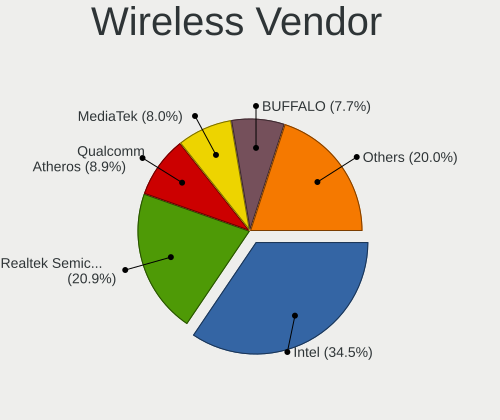

| Vendor                          | Desktops | Percent |
|---------------------------------|----------|---------|
| Intel                           | 112      | 34.46%  |
| Realtek Semiconductor           | 68       | 20.92%  |
| Qualcomm Atheros                | 29       | 8.92%   |
| MediaTek                        | 26       | 8%      |
| BUFFALO                         | 25       | 7.69%   |
| TP-Link                         | 16       | 4.92%   |
| PLANEX                          | 12       | 3.69%   |
| Broadcom                        | 12       | 3.69%   |
| Elecom                          | 5        | 1.54%   |
| Ralink Technology               | 3        | 0.92%   |
| Logitec                         | 3        | 0.92%   |
| Qualcomm Technologies           | 2        | 0.62%   |
| NEC Computers                   | 2        | 0.62%   |
| Microsoft                       | 2        | 0.62%   |
| Wilocity                        | 1        | 0.31%   |
| Wacom                           | 1        | 0.31%   |
| Ralink                          | 1        | 0.31%   |
| Qualcomm Atheros Communications | 1        | 0.31%   |
| NetGear                         | 1        | 0.31%   |
| I-O Data Device                 | 1        | 0.31%   |
| Edimax Technology               | 1        | 0.31%   |
| ASUSTek Computer                | 1        | 0.31%   |

Wireless Model
--------------

Wireless models

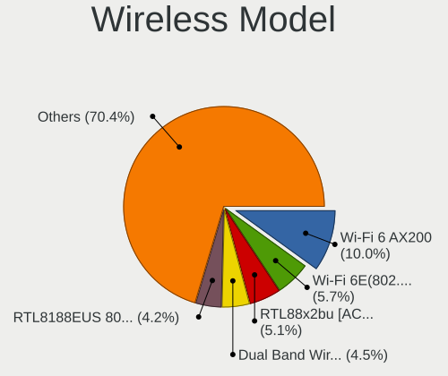

| Model                                                                           | Desktops | Percent |
|---------------------------------------------------------------------------------|----------|---------|
| Intel Wi-Fi 6 AX200                                                             | 33       | 9.97%   |
| Intel Wi-Fi 6E(802.11ax) AX210/AX1675* 2x2 [Typhoon Peak]                       | 19       | 5.74%   |
| Realtek RTL88x2bu [AC1200 Techkey]                                              | 17       | 5.14%   |
| Intel Dual Band Wireless-AC 3168NGW [Stone Peak]                                | 15       | 4.53%   |
| Realtek RTL8188EUS 802.11n Wireless Network Adapter                             | 14       | 4.23%   |
| Realtek RTL8821CE 802.11ac PCIe Wireless Network Adapter                        | 10       | 3.02%   |
| MediaTek MT7922 802.11ax PCI Express Wireless Network Adapter                   | 10       | 3.02%   |
| TP-Link AC600 wireless Realtek RTL8811AU [Archer T2U Nano]                      | 9        | 2.72%   |
| MediaTek MT7921K (RZ608) Wi-Fi 6E 80MHz                                         | 9        | 2.72%   |
| BUFFALO 802.11ac WLAN Adapter                                                   | 8        | 2.42%   |
| Qualcomm Atheros AR9485 Wireless Network Adapter                                | 7        | 2.11%   |
| BUFFALO WLI-UC-GNM Wireless LAN Adapter [Ralink RT8070]                         | 7        | 2.11%   |
| Intel Cannon Lake PCH CNVi WiFi                                                 | 6        | 1.81%   |
| Broadcom BCM4360 802.11ac Dual Band Wireless Network Adapter                    | 6        | 1.81%   |
| Realtek 802.11ac NIC                                                            | 5        | 1.51%   |
| Qualcomm Atheros AR9462 Wireless Network Adapter                                | 5        | 1.51%   |
| Intel 700 Series Chipset CNVi WiFi                                              | 5        | 1.51%   |
| Realtek RTL8192CU 802.11n WLAN Adapter                                          | 4        | 1.21%   |
| Qualcomm Atheros QCA6174 802.11ac Wireless Network Adapter                      | 4        | 1.21%   |
| Intel Wireless 7265                                                             | 4        | 1.21%   |
| Intel Wireless 7260                                                             | 4        | 1.21%   |
| Elecom WDC-150SU2M                                                              | 4        | 1.21%   |
| Realtek RTL8852CE PCIe 802.11ax Wireless Network Controller                     | 3        | 0.91%   |
| Realtek RTL8188CUS 802.11n WLAN Adapter                                         | 3        | 0.91%   |
| Qualcomm Atheros QCA9565 / AR9565 Wireless Network Adapter                      | 3        | 0.91%   |
| Qualcomm Atheros AR9287 Wireless Network Adapter (PCI-Express)                  | 3        | 0.91%   |
| PLANEX GW-USValue-EZ 802.11n Wireless Adapter [Realtek RTL8188CUS]              | 3        | 0.91%   |
| PLANEX GW-USNano2 802.11n Wireless Adapter [Realtek RTL8188CUS]                 | 3        | 0.91%   |
| Intel Wireless 8260                                                             | 3        | 0.91%   |
| Intel Tiger Lake PCH CNVi WiFi                                                  | 3        | 0.91%   |
| Intel Alder Lake-N PCH CNVi WiFi                                                | 3        | 0.91%   |
| BUFFALO 802.11 n WLAN                                                           | 3        | 0.91%   |
| TP-Link TL-WN823N v2/v3 [Realtek RTL8192EU]                                     | 2        | 0.6%    |
| Realtek RTL8188ETV Wireless LAN 802.11n Network Adapter                         | 2        | 0.6%    |
| Qualcomm WCN785x Wi-Fi 7(802.11be) 320MHz 2x2 [FastConnect 7800]                | 2        | 0.6%    |
| Qualcomm Atheros QCA9377 802.11ac Wireless Network Adapter                      | 2        | 0.6%    |
| Qualcomm Atheros AR928X Wireless Network Adapter (PCI-Express)                  | 2        | 0.6%    |
| Qualcomm Atheros AR5212/5213/2414 Wireless Network Adapter                      | 2        | 0.6%    |
| PLANEX GW-900D                                                                  | 2        | 0.6%    |
| MediaTek MT7927 802.11be 320MHz 2x2 PCIe Wireless Network Adapter [Filogic 380] | 2        | 0.6%    |

Ethernet Vendor
---------------

Ethernet vendors

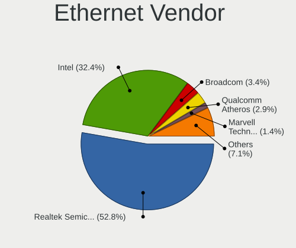

| Vendor                           | Desktops | Percent |
|----------------------------------|----------|---------|
| Realtek Semiconductor            | 466      | 52.77%  |
| Intel                            | 286      | 32.39%  |
| Broadcom                         | 30       | 3.4%    |
| Qualcomm Atheros                 | 26       | 2.94%   |
| Marvell Technology Group         | 12       | 1.36%   |
| Nvidia                           | 10       | 1.13%   |
| ASIX Electronics                 | 9        | 1.02%   |
| Aquantia                         | 8        | 0.91%   |
| Broadcom Limited                 | 6        | 0.68%   |
| VIA Technologies                 | 4        | 0.45%   |
| Qualcomm Technologies            | 3        | 0.34%   |
| Huawei Technologies              | 3        | 0.34%   |
| Silicon Integrated Systems [SiS] | 2        | 0.23%   |
| Xiaomi                           | 1        | 0.11%   |
| vivo                             | 1        | 0.11%   |
| Sharp                            | 1        | 0.11%   |
| Samsung Electronics              | 1        | 0.11%   |
| OPPO Electronics                 | 1        | 0.11%   |
| Netchip Technology               | 1        | 0.11%   |
| MediaTek                         | 1        | 0.11%   |
| Loongson Technology              | 1        | 0.11%   |
| JMicron Technology               | 1        | 0.11%   |
| ICS Advent                       | 1        | 0.11%   |
| Google                           | 1        | 0.11%   |
| Elecom                           | 1        | 0.11%   |
| DisplayLink                      | 1        | 0.11%   |
| Corega K.K.                      | 1        | 0.11%   |
| Apple                            | 1        | 0.11%   |
| Android                          | 1        | 0.11%   |
| ADMtek                           | 1        | 0.11%   |
| 3Com                             | 1        | 0.11%   |

Ethernet Model
--------------

Ethernet models

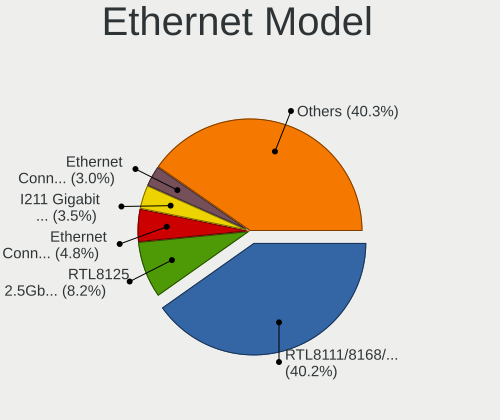

| Model                                                                  | Desktops | Percent |
|------------------------------------------------------------------------|----------|---------|
| Realtek RTL8111/8168/8211/8411 PCI Express Gigabit Ethernet Controller | 372      | 40.22%  |
| Realtek RTL8125 2.5GbE Controller                                      | 76       | 8.22%   |
| Intel Ethernet Connection (2) I219-V                                   | 44       | 4.76%   |
| Intel I211 Gigabit Network Connection                                  | 32       | 3.46%   |
| Intel Ethernet Connection (7) I219-V                                   | 28       | 3.03%   |
| Intel Ethernet Connection I217-V                                       | 23       | 2.49%   |
| Intel Ethernet Controller I225-V                                       | 21       | 2.27%   |
| Intel 82579V Gigabit Network Connection                                | 18       | 1.95%   |
| Intel 82579LM Gigabit Network Connection (Lewisville)                  | 16       | 1.73%   |
| Intel Ethernet Connection I217-LM                                      | 15       | 1.62%   |
| Intel 82574L Gigabit Network Connection                                | 10       | 1.08%   |
| Qualcomm Atheros Killer E220x Gigabit Ethernet Controller              | 9        | 0.97%   |
| ASIX AX88179 Gigabit Ethernet                                          | 9        | 0.97%   |
| Realtek RTL8153 Gigabit Ethernet Adapter                               | 8        | 0.86%   |
| Intel Ethernet Connection (17) I219-V                                  | 8        | 0.86%   |
| Marvell Group 88E8056 PCI-E Gigabit Ethernet Controller                | 7        | 0.76%   |
| Intel I210 Gigabit Network Connection                                  | 7        | 0.76%   |
| Intel Ethernet Connection (2) I219-LM                                  | 7        | 0.76%   |
| Intel Ethernet Connection (2) I218-V                                   | 7        | 0.76%   |
| Intel Ethernet Controller I226-V                                       | 6        | 0.65%   |
| Broadcom NetXtreme BCM5761 Gigabit Ethernet PCIe                       | 6        | 0.65%   |
| Broadcom NetLink BCM57781 Gigabit Ethernet PCIe                        | 6        | 0.65%   |
| Realtek RTL8169 PCI Gigabit Ethernet Controller                        | 5        | 0.54%   |
| Realtek RTL8126 5GbE Controller                                        | 5        | 0.54%   |
| Realtek RTL-8100/8101L/8139 PCI Fast Ethernet Adapter                  | 5        | 0.54%   |
| Qualcomm Atheros AR8161 Gigabit Ethernet                               | 5        | 0.54%   |
| Nvidia MCP55 Ethernet                                                  | 5        | 0.54%   |
| VIA VT6102/VT6103 [Rhine-II]                                           | 4        | 0.43%   |
| Qualcomm Atheros AR8121/AR8113/AR8114 Gigabit or Fast Ethernet         | 4        | 0.43%   |
| Intel Ethernet Connection (5) I219-LM                                  | 4        | 0.43%   |
| Intel Ethernet Connection (12) I219-V                                  | 4        | 0.43%   |
| Intel Ethernet Connection (11) I219-V                                  | 4        | 0.43%   |
| Realtek RTL-8110SC/8169SC Gigabit Ethernet                             | 3        | 0.32%   |
| Realtek Killer E3000 2.5GbE Controller                                 | 3        | 0.32%   |
| Qualcomm WCN785x Wi-Fi 7(802.11be) 320MHz 2x2 [FastConnect 7800]       | 3        | 0.32%   |
| Qualcomm Atheros AR8151 v2.0 Gigabit Ethernet                          | 3        | 0.32%   |
| Marvell Group 88E8057 PCI-E Gigabit Ethernet Controller                | 3        | 0.32%   |
| Intel Ethernet Connection (2) I218-LM                                  | 3        | 0.32%   |
| Intel 82578DM Gigabit Network Connection                               | 3        | 0.32%   |
| Intel 82576 Gigabit Network Connection                                 | 3        | 0.32%   |

Net Controller Kind
-------------------

Ethernet, WiFi or modem

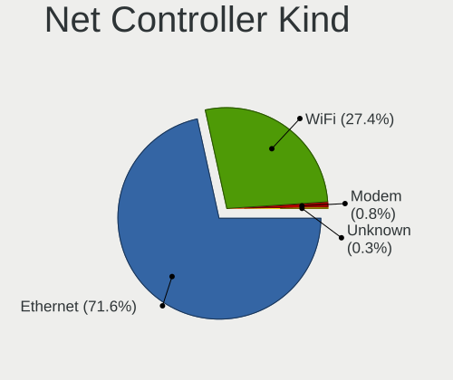

| Kind     | Desktops | Percent |
|----------|----------|---------|
| Ethernet | 803      | 71.57%  |
| WiFi     | 307      | 27.36%  |
| Modem    | 9        | 0.8%    |
| Unknown  | 3        | 0.27%   |

Used Controller
---------------

Currently used network controller

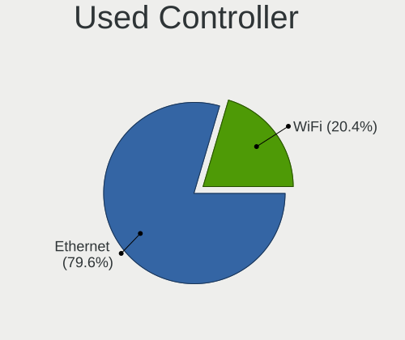

| Kind     | Desktops | Percent |
|----------|----------|---------|
| Ethernet | 673      | 79.55%  |
| WiFi     | 173      | 20.45%  |

NICs
----

Total network controllers on board

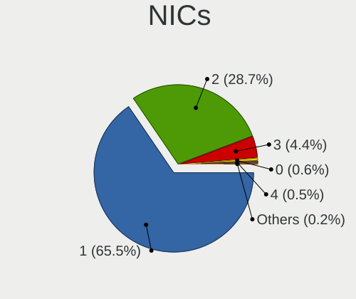

| Total | Desktops | Percent |
|-------|----------|---------|
| 1     | 533      | 65.48%  |
| 2     | 234      | 28.75%  |
| 3     | 36       | 4.42%   |
| 0     | 5        | 0.61%   |
| 4     | 4        | 0.49%   |
| 7     | 1        | 0.12%   |
| 5     | 1        | 0.12%   |

IPv6
----

IPv6 vs IPv4

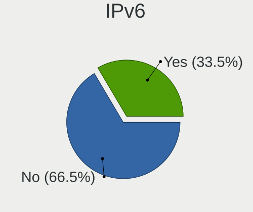

| Used | Desktops | Percent |
|------|----------|---------|
| No   | 550      | 66.51%  |
| Yes  | 277      | 33.49%  |

Bluetooth
---------

Bluetooth Vendor
----------------

Controller vendors

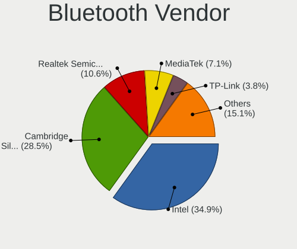

| Vendor                          | Desktops | Percent |
|---------------------------------|----------|---------|
| Intel                           | 109      | 34.94%  |
| Cambridge Silicon Radio         | 89       | 28.53%  |
| Realtek Semiconductor           | 33       | 10.58%  |
| MediaTek                        | 22       | 7.05%   |
| TP-Link                         | 12       | 3.85%   |
| Qualcomm Atheros Communications | 10       | 3.21%   |
| Foxconn / Hon Hai               | 8        | 2.56%   |
| ASUSTek Computer                | 6        | 1.92%   |
| Broadcom                        | 5        | 1.6%    |
| IMC Networks                    | 4        | 1.28%   |
| BUFFALO                         | 3        | 0.96%   |
| Apple                           | 3        | 0.96%   |
| Actions                         | 3        | 0.96%   |
| Realtek                         | 2        | 0.64%   |
| Lite-On Technology              | 2        | 0.64%   |
| Creative Technology             | 1        | 0.32%   |

Bluetooth Model
---------------

Controller models

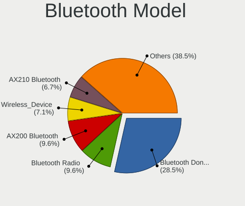

| Model                                               | Desktops | Percent |
|-----------------------------------------------------|----------|---------|
| Cambridge Silicon Radio Bluetooth Dongle (HCI mode) | 89       | 28.53%  |
| Realtek Bluetooth Radio                             | 30       | 9.62%   |
| Intel AX200 Bluetooth                               | 30       | 9.62%   |
| MediaTek Wireless_Device                            | 22       | 7.05%   |
| Intel AX210 Bluetooth                               | 21       | 6.73%   |
| Intel Wireless-AC 3168 Bluetooth                    | 15       | 4.81%   |
| Intel Bluetooth wireless interface                  | 15       | 4.81%   |
| TP-Link TP-T@- UB500 Adapter                        | 12       | 3.85%   |
| Intel AX201 Bluetooth                               | 10       | 3.21%   |
| Intel Bluetooth Device                              | 7        | 2.24%   |
| Intel Bluetooth 9460/9560 Jefferson Peak (JfP)      | 6        | 1.92%   |
| Qualcomm Atheros  Bluetooth Device                  | 5        | 1.6%    |
| Foxconn / Hon Hai Bluetooth Device                  | 5        | 1.6%    |
| Qualcomm Atheros AR3011 Bluetooth                   | 3        | 0.96%   |
| Intel Centrino Bluetooth Wireless Transceiver       | 3        | 0.96%   |
| BUFFALO Bluetooth Radio                             | 3        | 0.96%   |
| Apple Bluetooth Host Controller                     | 3        | 0.96%   |
| Actions general adapter                             | 3        | 0.96%   |
| Realtek Bluetooth Radio                             | 2        | 0.64%   |
| Lite-On Bluetooth Device                            | 2        | 0.64%   |
| Intel Wireless-AC 9260 Bluetooth Adapter            | 2        | 0.64%   |
| IMC Networks Bluetooth Radio                        | 2        | 0.64%   |
| IMC Networks Bluetooth Device                       | 2        | 0.64%   |
| Foxconn / Hon Hai Wireless_Device                   | 2        | 0.64%   |
| Broadcom BCM20702A0 Bluetooth 4.0                   | 2        | 0.64%   |
| ASUS Bluetooth Device                               | 2        | 0.64%   |
| ASUS BCM20702A0                                     | 2        | 0.64%   |
| Realtek RTL8822BE Bluetooth 4.2 Adapter             | 1        | 0.32%   |
| Realtek Bluetooth 5.4 Radio                         | 1        | 0.32%   |
| Realtek Bluetooth 5.3 Radio                         | 1        | 0.32%   |
| Qualcomm Atheros QCA61x4 Bluetooth 4.0              | 1        | 0.32%   |
| Qualcomm Atheros Bluetooth USB Host Controller      | 1        | 0.32%   |
| Foxconn / Hon Hai Bluetooth USB Host Controller     | 1        | 0.32%   |
| Creative Bluetooth Audio W2                         | 1        | 0.32%   |
| Broadcom HP Portable Bumble Bee                     | 1        | 0.32%   |
| Broadcom HP Bluetooth Module                        | 1        | 0.32%   |
| Broadcom Bluetooth V3.0 USB Device                  | 1        | 0.32%   |
| ASUS Qualcomm Bluetooth 4.1                         | 1        | 0.32%   |
| ASUS Bluetooth Radio                                | 1        | 0.32%   |

Sound
-----

Sound Vendor
------------

Sound card vendors

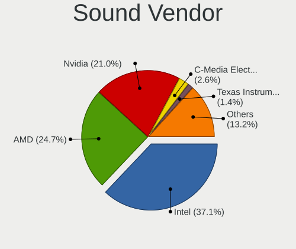

| Vendor                                       | Desktops | Percent |
|----------------------------------------------|----------|---------|
| Intel                                        | 518      | 37.08%  |
| AMD                                          | 345      | 24.7%   |
| Nvidia                                       | 294      | 21.05%  |
| C-Media Electronics                          | 36       | 2.58%   |
| Texas Instruments                            | 19       | 1.36%   |
| Creative Technology                          | 18       | 1.29%   |
| VIA Technologies                             | 15       | 1.07%   |
| Generalplus Technology                       | 10       | 0.72%   |
| Harman                                       | 9        | 0.64%   |
| Micro Star International                     | 8        | 0.57%   |
| JMTek                                        | 8        | 0.57%   |
| Creative Labs                                | 8        | 0.57%   |
| Logitech                                     | 7        | 0.5%    |
| Elitegroup Computer Systems (ECS)            | 6        | 0.43%   |
| Zoran Co. Personal Media Division (Nogatech) | 5        | 0.36%   |
| Yamaha                                       | 5        | 0.36%   |
| ASUSTek Computer                             | 5        | 0.36%   |
| Thesycon Systemsoftware & Consulting         | 4        | 0.29%   |
| Sony                                         | 4        | 0.29%   |
| Roland                                       | 4        | 0.29%   |
| Onkyo                                        | 4        | 0.29%   |
| GN Netcom                                    | 4        | 0.29%   |
| TOWA Electronics                             | 3        | 0.21%   |
| Tenx Technology                              | 3        | 0.21%   |
| Realtek Semiconductor                        | 3        | 0.21%   |
| RATOC System                                 | 3        | 0.21%   |
| ASRock                                       | 3        | 0.21%   |
| XMOS                                         | 2        | 0.14%   |
| Walmart                                      | 2        | 0.14%   |
| SteelSeries ApS                              | 2        | 0.14%   |
| Silicon Integrated Systems [SiS]             | 2        | 0.14%   |
| Razer USA                                    | 2        | 0.14%   |
| Focusrite-Novation                           | 2        | 0.14%   |
| ESI Audiotechnik                             | 2        | 0.14%   |
| Dell                                         | 2        | 0.14%   |
| www.hirestech.com 2012 REV 2.2               | 1        | 0.07%   |
| Valve Software                               | 1        | 0.07%   |
| ULi Electronics                              | 1        | 0.07%   |
| SAVITECH                                     | 1        | 0.07%   |
| RME                                          | 1        | 0.07%   |

Sound Model
-----------

Sound card models

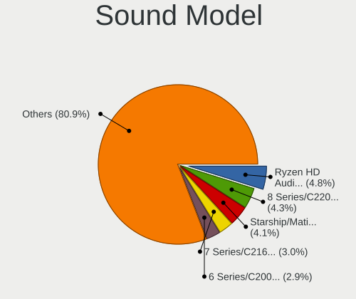

| Model                                                                       | Desktops | Percent |
|-----------------------------------------------------------------------------|----------|---------|
| AMD Ryzen HD Audio Controller                                               | 79       | 4.83%   |
| Intel 8 Series/C220 Series Chipset High Definition Audio Controller         | 70       | 4.28%   |
| AMD Starship/Matisse HD Audio Controller                                    | 67       | 4.1%    |
| Intel 7 Series/C216 Chipset Family High Definition Audio Controller         | 49       | 3%      |
| Intel 6 Series/C200 Series Chipset Family High Definition Audio Controller  | 48       | 2.94%   |
| Intel 100 Series/C230 Series Chipset Family HD Audio Controller             | 46       | 2.81%   |
| Intel 200 Series PCH HD Audio                                               | 45       | 2.75%   |
| Intel Xeon E3-1200 v3/4th Gen Core Processor HD Audio Controller            | 43       | 2.63%   |
| Intel Cannon Lake PCH cAVS                                                  | 39       | 2.39%   |
| AMD SBx00 Azalia (Intel HDA)                                                | 34       | 2.08%   |
| Nvidia GK208 HDMI/DP Audio Controller                                       | 33       | 2.02%   |
| AMD Radeon High Definition Audio Controller                                 | 29       | 1.77%   |
| AMD FCH Azalia Controller                                                   | 28       | 1.71%   |
| AMD Renoir/Cezanne HDMI/DP Audio Controller                                 | 27       | 1.65%   |
| AMD Family 17h (Models 00h-0fh) HD Audio Controller                         | 26       | 1.59%   |
| AMD Navi 21/23 HDMI/DP Audio Controller                                     | 25       | 1.53%   |
| Intel NM10/ICH7 Family High Definition Audio Controller                     | 24       | 1.47%   |
| AMD Raven/Raven2/Fenghuang HDMI/DP Audio Controller                         | 24       | 1.47%   |
| AMD Ellesmere HDMI Audio [Radeon RX 470/480 / 570/580/590]                  | 24       | 1.47%   |
| Intel 5 Series/3400 Series Chipset High Definition Audio                    | 23       | 1.41%   |
| Intel 82801JI (ICH10 Family) HD Audio Controller                            | 21       | 1.28%   |
| AMD Oland/Hainan/Cape Verde/Pitcairn HDMI Audio [Radeon HD 7000 Series]     | 21       | 1.28%   |
| Nvidia TU116 High Definition Audio Controller                               | 20       | 1.22%   |
| Nvidia GP107GL High Definition Audio Controller                             | 19       | 1.16%   |
| Intel Alder Lake-S HD Audio Controller                                      | 19       | 1.16%   |
| Nvidia GP104 High Definition Audio Controller                               | 18       | 1.1%    |
| Nvidia TU107 GeForce GTX 1650 High Definition Audio Controller              | 17       | 1.04%   |
| AMD Baffin HDMI/DP Audio [Radeon RX 550 640SP / RX 560/560X]                | 17       | 1.04%   |
| Nvidia GM107 High Definition Audio Controller [GeForce 940MX]               | 16       | 0.98%   |
| Nvidia GK107 HDMI Audio Controller                                          | 16       | 0.98%   |
| Nvidia GP106 High Definition Audio Controller                               | 14       | 0.86%   |
| Intel 82801I (ICH9 Family) HD Audio Controller                              | 14       | 0.86%   |
| Intel C600/X79 series chipset High Definition Audio Controller              | 13       | 0.8%    |
| AMD Navi 31 HDMI/DP Audio                                                   | 13       | 0.8%    |
| Nvidia GK106 HDMI Audio Controller                                          | 12       | 0.73%   |
| AMD RV710/730 HDMI Audio [Radeon HD 4000 series]                            | 12       | 0.73%   |
| Nvidia TU106 High Definition Audio Controller                               | 11       | 0.67%   |
| Nvidia GA102 High Definition Audio Controller                               | 11       | 0.67%   |
| VIA Technologies VT1720/24 [Envy24PT/HT] PCI Multi-Channel Audio Controller | 10       | 0.61%   |
| Intel Raptor Lake High Definition Audio Controller                          | 10       | 0.61%   |

Memory
------

Memory Vendor
-------------

Memory module vendors

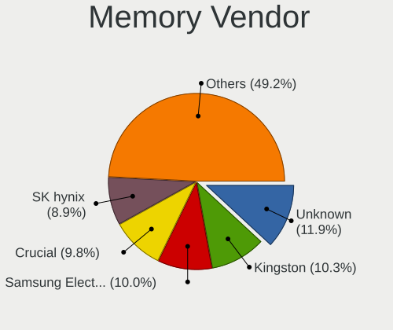

| Vendor                                  | Desktops | Percent |
|-----------------------------------------|----------|---------|
| Unknown                                 | 51       | 11.89%  |
| Kingston                                | 44       | 10.26%  |
| Samsung Electronics                     | 43       | 10.02%  |
| Crucial                                 | 42       | 9.79%   |
| SK hynix                                | 38       | 8.86%   |
| Corsair                                 | 24       | 5.59%   |
| Unknown                                 | 23       | 5.36%   |
| Team                                    | 21       | 4.9%    |
| A-DATA Technology                       | 21       | 4.9%    |
| G.Skill                                 | 19       | 4.43%   |
| Micron Technology                       | 16       | 3.73%   |
| Panram                                  | 12       | 2.8%    |
| Nanya Technology                        | 9        | 2.1%    |
| KLEVV                                   | 8        | 1.86%   |
| Transcend                               | 7        | 1.63%   |
| Silicon Power                           | 7        | 1.63%   |
| Patriot                                 | 4        | 0.93%   |
| Silicon Power Computer & Communications | 3        | 0.7%    |
| SanMax                                  | 3        | 0.7%    |
| Unknown (0x0DEC)                        | 2        | 0.47%   |
| Essencore Limited                       | 2        | 0.47%   |
| Elpida                                  | 2        | 0.47%   |
| Chun Well                               | 2        | 0.47%   |
| V-Color                                 | 1        | 0.23%   |
| Uroad                                   | 1        | 0.23%   |
| Unknown (8AD3)                          | 1        | 0.23%   |
| Unknown (0x7FFF)                        | 1        | 0.23%   |
| Unknown (0x750E)                        | 1        | 0.23%   |
| Unknown (0x0FC4)                        | 1        | 0.23%   |
| Unknown (0x0C46)                        | 1        | 0.23%   |
| Unknown (0x09EE)                        | 1        | 0.23%   |
| Unknown (0DEC)                          | 1        | 0.23%   |
| Unknown (04E9)                          | 1        | 0.23%   |
| UMAX                                    | 1        | 0.23%   |
| Timetec                                 | 1        | 0.23%   |
| Red Hat                                 | 1        | 0.23%   |
| Ramos Technology                        | 1        | 0.23%   |
| Patriot Memory (PDP Systems)            | 1        | 0.23%   |
| Kllisre                                 | 1        | 0.23%   |
| Klic                                    | 1        | 0.23%   |

Memory Model
------------

Memory module models

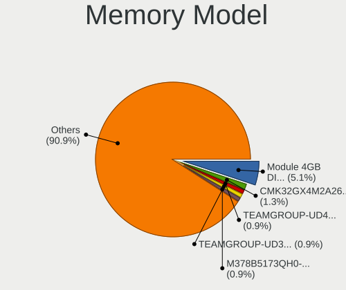

| Model                                                   | Desktops | Percent |
|---------------------------------------------------------|----------|---------|
| Unknown                                                 | 23       | 5.11%   |
| Corsair RAM CMK32GX4M2A2666C16 16GB DIMM DDR4 2667MT/s  | 6        | 1.33%   |
| Team RAM TEAMGROUP-UD4-3200 8GB DIMM DDR4 3800MT/s      | 4        | 0.89%   |
| Team RAM TEAMGROUP-UD3-1600 8GB DIMM DDR3 1866MT/s      | 4        | 0.89%   |
| SK hynix RAM HMT351U6CFR8C-PB 4GB DIMM DDR3 1800MT/s    | 4        | 0.89%   |
| SK hynix RAM HMT325U6CFR8C-PB 2GB DIMM DDR3 1600MT/s    | 4        | 0.89%   |
| Samsung RAM M378B5173QH0-CK0 4GB DIMM DDR3              | 4        | 0.89%   |
| Crucial RAM BLS8G3D1609DS1S00. 8GB DIMM DDR3 1800MT/s   | 4        | 0.89%   |
| A-DATA RAM Module 32GB DIMM DDR4 3200MT/s               | 4        | 0.89%   |
| Unknown RAM Module 4GB DIMM DDR3 1600MT/s               | 3        | 0.67%   |
| Unknown RAM Module 4GB DIMM DDR3 1333MT/s               | 3        | 0.67%   |
| Unknown RAM Module 4GB DIMM 1333MT/s                    | 3        | 0.67%   |
| Unknown RAM Module 2048MB DIMM SDRAM                    | 3        | 0.67%   |
| Team RAM TEAMGROUP-UD4-2666 16GB DIMM DDR4 2667MT/s     | 3        | 0.67%   |
| SK hynix RAM HMT351U6EFR8C-PB 4GB DIMM DDR3 1600MT/s    | 3        | 0.67%   |
| Panram RAM PUD31600C118G2VS 8GB DIMM DDR3 1600MT/s      | 3        | 0.67%   |
| Nanya RAM M2X4G64CB8HG9N-DG 4GB DIMM DDR3 1600MT/s      | 3        | 0.67%   |
| KLEVV RAM KD48GU881-26N190A 8GB DIMM DDR4 2667MT/s      | 3        | 0.67%   |
| Kingston RAM KHX2666C16/16G 16GB DIMM DDR4 3200MT/s     | 3        | 0.67%   |
| Kingston RAM CBD26D4U9S8ME-8 8GB DIMM DDR4 2667MT/s     | 3        | 0.67%   |
| G.Skill RAM F4-2666C19-8GNT 8GB DIMM DDR4 2933MT/s      | 3        | 0.67%   |
| Crucial RAM CT16G4DFRA32A.C8FE 16GB DIMM DDR4 3600MT/s  | 3        | 0.67%   |
| Corsair RAM CMK64GX4M2E3200C16 32GB DIMM DDR4 3600MT/s  | 3        | 0.67%   |
| Corsair RAM CMK32GX4M2E3200C16 16GB DIMM DDR4 3600MT/s  | 3        | 0.67%   |
| Unknown RAM Module 4GB DIMM SDRAM                       | 2        | 0.44%   |
| Unknown RAM Module 4GB DIMM DDR4 2133MT/s               | 2        | 0.44%   |
| Unknown RAM Module 4GB DIMM 1600MT/s                    | 2        | 0.44%   |
| Unknown RAM Module 2GB DIMM SDRAM 533MT/s               | 2        | 0.44%   |
| Unknown RAM Module 2GB DIMM SDRAM                       | 2        | 0.44%   |
| Unknown RAM Module 2GB DIMM DDR2                        | 2        | 0.44%   |
| Unknown RAM Module 2GB DIMM 800MT/s                     | 2        | 0.44%   |
| Unknown RAM Module 1GB DIMM 800MT/s                     | 2        | 0.44%   |
| Transcend RAM JM1600KLH-16GK 8GB DIMM DDR3 1600MT/s     | 2        | 0.44%   |
| Team RAM TEAMGROUP-UD4-3600 16GB DIMM DDR4 3600MT/s     | 2        | 0.44%   |
| Team RAM Elite-1600 8GB DIMM DDR3 1600MT/s              | 2        | 0.44%   |
| SK hynix RAM HMA851U6AFR6N-UH 4GB DIMM DDR4 2400MT/s    | 2        | 0.44%   |
| SK hynix RAM HMA81GS6AFR8N-UH 8GB SODIMM DDR4 2667MT/s  | 2        | 0.44%   |
| SK hynix RAM HMA451S6AFR8N-TF 4GB SODIMM DDR4 2133MT/s  | 2        | 0.44%   |
| Silicon Power RAM DCLT8GN128S 8192MB DIMM DDR3 1600MT/s | 2        | 0.44%   |
| Silicon Power & RAM Module 32GB DIMM DDR4 3200MT/s      | 2        | 0.44%   |

Memory Kind
-----------

Memory module kinds

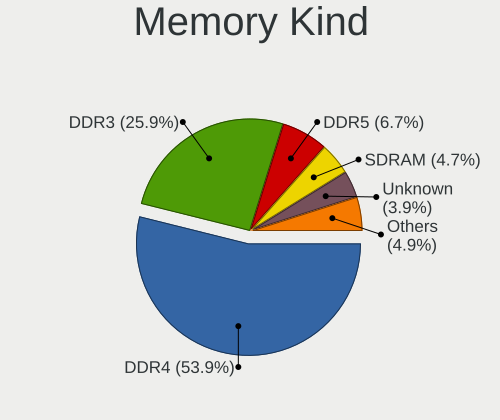

| Kind    | Desktops | Percent |
|---------|----------|---------|
| DDR4    | 208      | 53.89%  |
| DDR3    | 100      | 25.91%  |
| DDR5    | 26       | 6.74%   |
| SDRAM   | 18       | 4.66%   |
| Unknown | 15       | 3.89%   |
| DDR2    | 13       | 3.37%   |
| LPDDR4  | 2        | 0.52%   |
| RAM     | 1        | 0.26%   |
| LPDDR5  | 1        | 0.26%   |
| DRAM    | 1        | 0.26%   |
| DDR     | 1        | 0.26%   |

Memory Form Factor
------------------

Physical design of the memory module

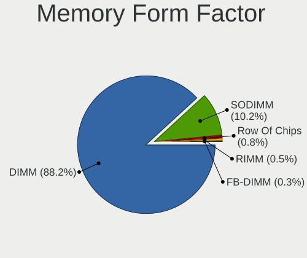

| Name         | Desktops | Percent |
|--------------|----------|---------|
| DIMM         | 336      | 88.19%  |
| SODIMM       | 39       | 10.24%  |
| Row Of Chips | 3        | 0.79%   |
| RIMM         | 2        | 0.52%   |
| FB-DIMM      | 1        | 0.26%   |

Memory Size
-----------

Memory module size

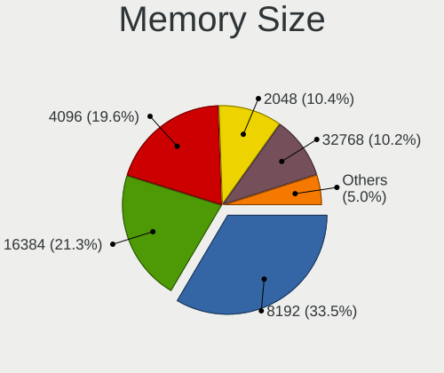

| Size  | Desktops | Percent |
|-------|----------|---------|
| 8192  | 135      | 33.5%   |
| 16384 | 86       | 21.34%  |
| 4096  | 79       | 19.6%   |
| 2048  | 42       | 10.42%  |
| 32768 | 41       | 10.17%  |
| 1024  | 12       | 2.98%   |
| 512   | 3        | 0.74%   |
| 49152 | 2        | 0.5%    |
| 65536 | 1        | 0.25%   |
| 24576 | 1        | 0.25%   |
| 12288 | 1        | 0.25%   |

Memory Speed
------------

Memory module speed

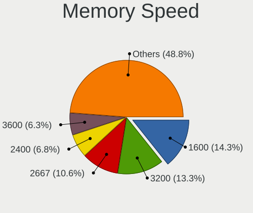

| Speed   | Desktops | Percent |
|---------|----------|---------|
| 1600    | 59       | 14.25%  |
| 3200    | 55       | 13.29%  |
| 2667    | 44       | 10.63%  |
| 2400    | 28       | 6.76%   |
| 3600    | 26       | 6.28%   |
| 2133    | 24       | 5.8%    |
| 1333    | 24       | 5.8%    |
| 2666    | 15       | 3.62%   |
| 5600    | 14       | 3.38%   |
| 800     | 13       | 3.14%   |
| Unknown | 12       | 2.9%    |
| 1800    | 11       | 2.66%   |
| 4800    | 9        | 2.17%   |
| 3800    | 9        | 2.17%   |
| 2933    | 9        | 2.17%   |
| 1866    | 9        | 2.17%   |
| 667     | 7        | 1.69%   |
| 3100    | 6        | 1.45%   |
| 533     | 5        | 1.21%   |
| 6000    | 3        | 0.72%   |
| 3733    | 3        | 0.72%   |
| 3400    | 3        | 0.72%   |
| 3000    | 3        | 0.72%   |
| 1867    | 3        | 0.72%   |
| 1066    | 3        | 0.72%   |
| 3066    | 2        | 0.48%   |
| 6400    | 1        | 0.24%   |
| 5200    | 1        | 0.24%   |
| 4267    | 1        | 0.24%   |
| 4266    | 1        | 0.24%   |
| 4133    | 1        | 0.24%   |
| 4000    | 1        | 0.24%   |
| 3866    | 1        | 0.24%   |
| 3466    | 1        | 0.24%   |
| 3007    | 1        | 0.24%   |
| 2733    | 1        | 0.24%   |
| 2200    | 1        | 0.24%   |
| 2048    | 1        | 0.24%   |
| 2000    | 1        | 0.24%   |
| 1648    | 1        | 0.24%   |

Printers & scanners
-------------------

Printer Vendor
--------------

Printer device vendors

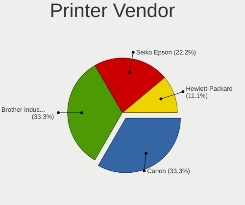

| Vendor             | Desktops | Percent |
|--------------------|----------|---------|
| Brother Industries | 5        | 35.71%  |
| Canon              | 4        | 28.57%  |
| Seiko Epson        | 2        | 14.29%  |
| nemonic            | 1        | 7.14%   |
| Hewlett-Packard    | 1        | 7.14%   |
| Fuji Xerox         | 1        | 7.14%   |

Printer Model
-------------

Printer device models

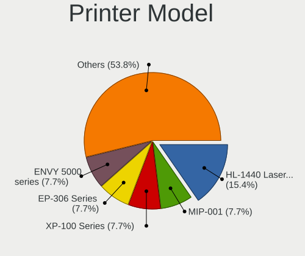

| Model                         | Desktops | Percent |
|-------------------------------|----------|---------|
| Brother HL-1440 Laser Printer | 2        | 14.29%  |
| Seiko Epson XP-102 103 Series | 1        | 7.14%   |
| Seiko Epson EP-306 Series     | 1        | 7.14%   |
| nemonic MIP-001               | 1        | 7.14%   |
| HP ENVY 5000 series           | 1        | 7.14%   |
| Fuji Xerox MultiWriter 5600C  | 1        | 7.14%   |
| Canon TS5300 series           | 1        | 7.14%   |
| Canon PIXMA iX6850 Printer    | 1        | 7.14%   |
| Canon PIXMA iP4600 Printer    | 1        | 7.14%   |
| Canon iP2700 series           | 1        | 7.14%   |
| Brother HL-L2375DW series     | 1        | 7.14%   |
| Brother HL-L2360D series      | 1        | 7.14%   |
| Brother HL-52x0 series        | 1        | 7.14%   |

Scanner Vendor
--------------

Scanner device vendors

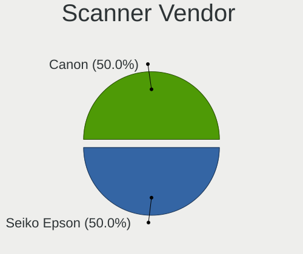

| Vendor      | Desktops | Percent |
|-------------|----------|---------|
| Seiko Epson | 1        | 50%     |
| Canon       | 1        | 50%     |

Scanner Model
-------------

Scanner device models

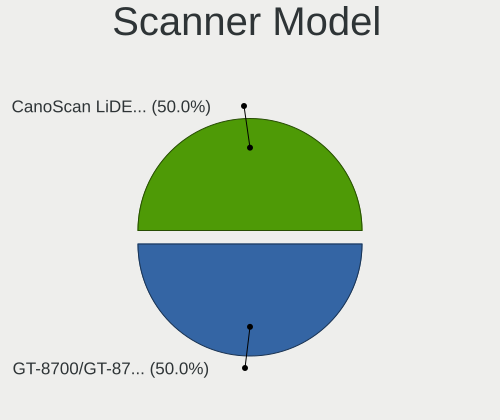

| Model                                                         | Desktops | Percent |
|---------------------------------------------------------------|----------|---------|
| Seiko Epson GT-8700/GT-8700F [Perfection 1640SU/1640SU PHOTO] | 1        | 50%     |
| Canon CanoScan LiDE 100                                       | 1        | 50%     |

Camera
------

Camera Vendor
-------------

Camera device vendors

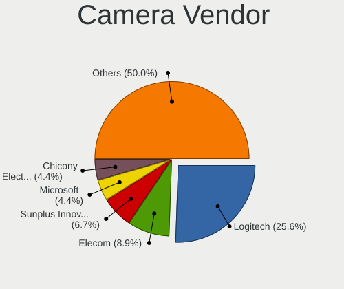

| Vendor                        | Desktops | Percent |
|-------------------------------|----------|---------|
| Logitech                      | 23       | 25.56%  |
| Elecom                        | 8        | 8.89%   |
| Sunplus Innovation Technology | 6        | 6.67%   |
| Microsoft                     | 4        | 4.44%   |
| Chicony Electronics           | 4        | 4.44%   |
| BUFFALO                       | 4        | 4.44%   |
| SHENZHEN EMEET TECHNOLOGY     | 3        | 3.33%   |
| Samsung Electronics           | 3        | 3.33%   |
| Microdia                      | 3        | 3.33%   |
| MacroSilicon                  | 3        | 3.33%   |
| Cubeternet                    | 3        | 3.33%   |
| Generalplus Technology        | 2        | 2.22%   |
| eMeet                         | 2        | 2.22%   |
| Apple                         | 2        | 2.22%   |
| Z-Star Microelectronics       | 1        | 1.11%   |
| WaveRider Communications      | 1        | 1.11%   |
| Valve Software                | 1        | 1.11%   |
| USB CAMERA                    | 1        | 1.11%   |
| Syntek                        | 1        | 1.11%   |
| Ruision                       | 1        | 1.11%   |
| Remo Tech                     | 1        | 1.11%   |
| Realtek Semiconductor         | 1        | 1.11%   |
| Pixart Imaging                | 1        | 1.11%   |
| OmniVision Technologies       | 1        | 1.11%   |
| LG Electronics                | 1        | 1.11%   |
| Jieli Technology              | 1        | 1.11%   |
| Huawei Technologies           | 1        | 1.11%   |
| HD USB Camera                 | 1        | 1.11%   |
| GEMBIRD                       | 1        | 1.11%   |
| ezcap                         | 1        | 1.11%   |
| Etron Technology              | 1        | 1.11%   |
| Bison Electronics             | 1        | 1.11%   |
| Anker PowerConf C200          | 1        | 1.11%   |
| Alcor Micro                   | 1        | 1.11%   |

Camera Model
------------

Camera device models

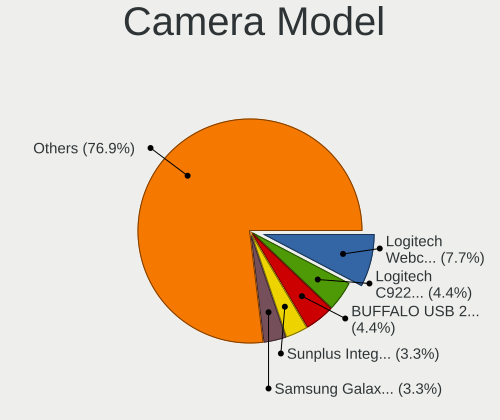

| Model                                          | Desktops | Percent |
|------------------------------------------------|----------|---------|
| Logitech Webcam C270                           | 7        | 7.69%   |
| Logitech C922 Pro Stream Webcam                | 4        | 4.4%    |
| BUFFALO USB 2.0 Camera                         | 4        | 4.4%    |
| Sunplus Integrated Camera                      | 3        | 3.3%    |
| Samsung Galaxy series, misc. (MTP mode)        | 3        | 3.3%    |
| Microdia Webcam Vitade AF                      | 3        | 3.3%    |
| MacroSilicon USB Video                         | 3        | 3.3%    |
| Logitech HD Pro Webcam C920                    | 3        | 3.3%    |
| Chicony FJ Camera                              | 3        | 3.3%    |
| SHENZHEN EMEET TECHNOLOGY HD Webcam eMeet C960 | 2        | 2.2%    |
| Logitech Webcam C310                           | 2        | 2.2%    |
| Logitech HD Webcam C615                        | 2        | 2.2%    |
| Generalplus 808 Camera #9 (web-cam mode)       | 2        | 2.2%    |
| Elecom UCAM-DLE300T                            | 2        | 2.2%    |
| Elecom ELECOM 5MP Webcam                       | 2        | 2.2%    |
| Elecom ELECOM 1MP Webcam                       | 2        | 2.2%    |
| Cubeternet USB2.0 Camera                       | 2        | 2.2%    |
| Apple iPhone 5/5C/5S/6/SE/7/8/X                | 2        | 2.2%    |
| Z-Star Venus USB2.0 Camera                     | 1        | 1.1%    |
| WaveRider USB Live camera                      | 1        | 1.1%    |
| Valve Software 3D Camera                       | 1        | 1.1%    |
| USB CAMERA USB CAMERA                          | 1        | 1.1%    |
| Syntek BUFFALO BSW20K06H USB PC Camera         | 1        | 1.1%    |
| Sunplus SPCA2281 Web Camera                    | 1        | 1.1%    |
| Sunplus SPCA2085 PC Camera                     | 1        | 1.1%    |
| Sunplus AUSDOM FHD Camera                      | 1        | 1.1%    |
| SHENZHEN EMEET TECHNOLOGY eMeet Nova           | 1        | 1.1%    |
| Ruision UVC Camera                             | 1        | 1.1%    |
| Remo Tech OBSBOT Meet 2                        | 1        | 1.1%    |
| Realtek USB Camera                             | 1        | 1.1%    |
| Pixart Imaging GE 1.3 MP MiniCam Pro           | 1        | 1.1%    |
| OmniVision OV511+ Webcam                       | 1        | 1.1%    |
| Microsoft LifeCam VX-2000                      | 1        | 1.1%    |
| Microsoft LifeCam Studio                       | 1        | 1.1%    |
| Microsoft LifeCam HD-3000                      | 1        | 1.1%    |
| Microsoft LifeCam Cinema                       | 1        | 1.1%    |
| Logitech Webcam C300                           | 1        | 1.1%    |
| Logitech QuickCam Orbit/Sphere AF              | 1        | 1.1%    |
| Logitech Logi Group Camera                     | 1        | 1.1%    |
| Logitech HD Webcam C910                        | 1        | 1.1%    |

Security
--------

Fingerprint Vendor
------------------

Fingerprint sensor vendors

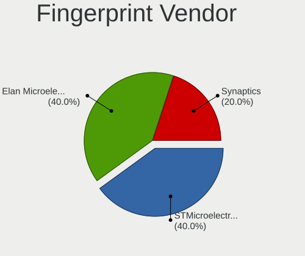

| Vendor                | Desktops | Percent |
|-----------------------|----------|---------|
| STMicroelectronics    | 2        | 33.33%  |
| Elan Microelectronics | 2        | 33.33%  |
| Validity Sensors      | 1        | 16.67%  |
| Synaptics             | 1        | 16.67%  |

Fingerprint Model
-----------------

Fingerprint sensor models

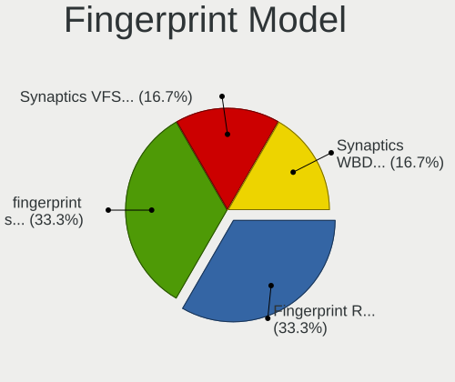

| Model                                                       | Desktops | Percent |
|-------------------------------------------------------------|----------|---------|
| STMicroelectronics Fingerprint Reader                       | 2        | 33.33%  |
| Elan fingerprint sensor [FeinTech FPS00200]                 | 2        | 33.33%  |
| Validity Sensors Synaptics VFS7552 Touch Fingerprint Sensor | 1        | 16.67%  |
| Synaptics  WBDI Fingerprint Reader - USB 052                | 1        | 16.67%  |

Chipcard Vendor
---------------

Chipcard module vendors

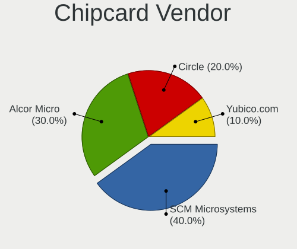

| Vendor           | Desktops | Percent |
|------------------|----------|---------|
| SCM Microsystems | 4        | 40%     |
| Alcor Micro      | 3        | 30%     |
| Circle           | 2        | 20%     |
| Yubico.com       | 1        | 10%     |

Chipcard Model
--------------

Chipcard module models

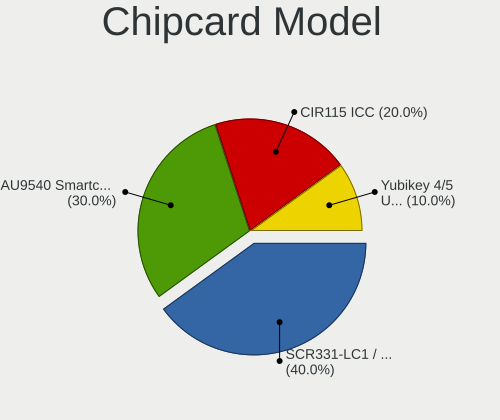

| Model                                                  | Desktops | Percent |
|--------------------------------------------------------|----------|---------|
| SCM Microsystems SCR331-LC1 / SCR3310 SmartCard Reader | 4        | 40%     |
| Alcor Micro AU9540 Smartcard Reader                    | 3        | 30%     |
| Circle CIR115 ICC                                      | 2        | 20%     |
| Yubico.com Yubikey 4/5 U2F+CCID                        | 1        | 10%     |

Unsupported
-----------

Unsupported Devices
-------------------

Total unsupported devices on board

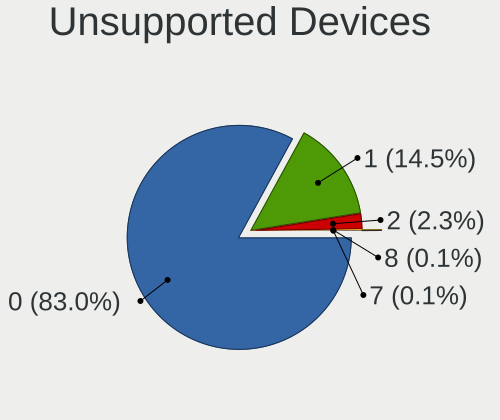

| Total | Desktops | Percent |
|-------|----------|---------|
| 0     | 686      | 82.95%  |
| 1     | 120      | 14.51%  |
| 2     | 19       | 2.3%    |
| 8     | 1        | 0.12%   |
| 7     | 1        | 0.12%   |

Unsupported Device Types
------------------------

Types of unsupported devices

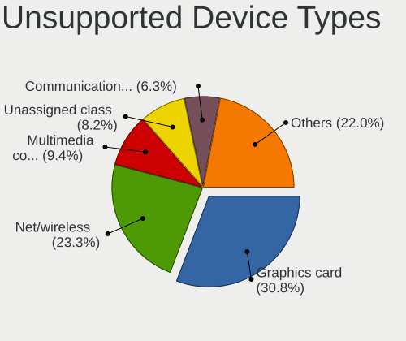

| Type                     | Desktops | Percent |
|--------------------------|----------|---------|
| Graphics card            | 49       | 30.82%  |
| Net/wireless             | 37       | 23.27%  |
| Multimedia controller    | 15       | 9.43%   |
| Unassigned class         | 13       | 8.18%   |
| Communication controller | 10       | 6.29%   |
| Fingerprint reader       | 6        | 3.77%   |
| Chipcard                 | 6        | 3.77%   |
| Sound                    | 4        | 2.52%   |
| Bluetooth                | 4        | 2.52%   |
| Net/ethernet             | 3        | 1.89%   |
| Modem                    | 3        | 1.89%   |
| Storage/raid             | 2        | 1.26%   |
| Network                  | 2        | 1.26%   |
| Storage/nvme             | 1        | 0.63%   |
| Storage/ata              | 1        | 0.63%   |
| Dvb card                 | 1        | 0.63%   |
| Card reader              | 1        | 0.63%   |
| Camera                   | 1        | 0.63%   |

