Linux in Japan - Tested Hardware & Statistics (Desktops)
--------------------------------------------------------

A project to collect tested hardware configurations for Linux in Japan.

Anyone can contribute to this report by the [hw-probe](https://github.com/linuxhw/hw-probe) tool:

    sudo -E hw-probe -all -upload

Please contribute! Especially if your hardware is rare.

Contents
--------

* [ Test Cases ](#test-cases)

* [ System ](#system)
  - [ OS                       ](#os)
  - [ OS Family                ](#os-family)
  - [ Kernel                   ](#kernel)
  - [ Kernel Family            ](#kernel-family)
  - [ Kernel Major Ver.        ](#kernel-major-ver)
  - [ Arch                     ](#arch)
  - [ DE                       ](#de)
  - [ Display Server           ](#display-server)
  - [ Display Manager          ](#display-manager)
  - [ OS Lang                  ](#os-lang)
  - [ Boot Mode                ](#boot-mode)
  - [ Filesystem               ](#filesystem)
  - [ Part. scheme             ](#part-scheme)
  - [ Dual Boot with Linux/BSD ](#dual-boot-with-linuxbsd)
  - [ Dual Boot (Win)          ](#dual-boot-win)

* [ Board ](#board)
  - [ Vendor                   ](#vendor)
  - [ Model                    ](#model)
  - [ Model Family             ](#model-family)
  - [ MFG Year                 ](#mfg-year)
  - [ Form Factor              ](#form-factor)
  - [ Secure Boot              ](#secure-boot)
  - [ Coreboot                 ](#coreboot)
  - [ RAM Size                 ](#ram-size)
  - [ RAM Used                 ](#ram-used)
  - [ Total Drives             ](#total-drives)
  - [ Has CD-ROM               ](#has-cd-rom)
  - [ Has Ethernet             ](#has-ethernet)
  - [ Has WiFi                 ](#has-wifi)
  - [ Has Bluetooth            ](#has-bluetooth)

* [ Location ](#location)
  - [ Country                  ](#country)
  - [ City                     ](#city)

* [ Drives ](#drives)
  - [ Drive Vendor             ](#drive-vendor)
  - [ Drive Model              ](#drive-model)
  - [ HDD Vendor               ](#hdd-vendor)
  - [ SSD Vendor               ](#ssd-vendor)
  - [ Drive Kind               ](#drive-kind)
  - [ Drive Connector          ](#drive-connector)
  - [ Drive Size               ](#drive-size)
  - [ Space Total              ](#space-total)
  - [ Space Used               ](#space-used)
  - [ Malfunc. Drives          ](#malfunc-drives)
  - [ Malfunc. Drive Vendor    ](#malfunc-drive-vendor)
  - [ Malfunc. HDD Vendor      ](#malfunc-hdd-vendor)
  - [ Malfunc. Drive Kind      ](#malfunc-drive-kind)
  - [ Failed Drives            ](#failed-drives)
  - [ Failed Drive Vendor      ](#failed-drive-vendor)
  - [ Drive Status             ](#drive-status)

* [ Storage controller ](#storage-controller)
  - [ Storage Vendor           ](#storage-vendor)
  - [ Storage Model            ](#storage-model)
  - [ Storage Kind             ](#storage-kind)

* [ Processor ](#processor)
  - [ CPU Vendor               ](#cpu-vendor)
  - [ CPU Model                ](#cpu-model)
  - [ CPU Model Family         ](#cpu-model-family)
  - [ CPU Cores                ](#cpu-cores)
  - [ CPU Sockets              ](#cpu-sockets)
  - [ CPU Threads              ](#cpu-threads)
  - [ CPU Op-Modes             ](#cpu-op-modes)
  - [ CPU Microcode            ](#cpu-microcode)
  - [ CPU Microarch            ](#cpu-microarch)

* [ Graphics ](#graphics)
  - [ GPU Vendor               ](#gpu-vendor)
  - [ GPU Model                ](#gpu-model)
  - [ GPU Combo                ](#gpu-combo)
  - [ GPU Driver               ](#gpu-driver)
  - [ GPU Memory               ](#gpu-memory)

* [ Monitor ](#monitor)
  - [ Monitor Vendor           ](#monitor-vendor)
  - [ Monitor Model            ](#monitor-model)
  - [ Monitor Resolution       ](#monitor-resolution)
  - [ Monitor Diagonal         ](#monitor-diagonal)
  - [ Monitor Width            ](#monitor-width)
  - [ Aspect Ratio             ](#aspect-ratio)
  - [ Monitor Area             ](#monitor-area)
  - [ Pixel Density            ](#pixel-density)
  - [ Multiple Monitors        ](#multiple-monitors)

* [ Network ](#network)
  - [ Net Controller Vendor    ](#net-controller-vendor)
  - [ Net Controller Model     ](#net-controller-model)
  - [ Wireless Vendor          ](#wireless-vendor)
  - [ Wireless Model           ](#wireless-model)
  - [ Ethernet Vendor          ](#ethernet-vendor)
  - [ Ethernet Model           ](#ethernet-model)
  - [ Net Controller Kind      ](#net-controller-kind)
  - [ Used Controller          ](#used-controller)
  - [ NICs                     ](#nics)
  - [ IPv6                     ](#ipv6)

* [ Bluetooth ](#bluetooth)
  - [ Bluetooth Vendor         ](#bluetooth-vendor)
  - [ Bluetooth Model          ](#bluetooth-model)

* [ Sound ](#sound)
  - [ Sound Vendor             ](#sound-vendor)
  - [ Sound Model              ](#sound-model)

* [ Memory ](#memory)
  - [ Memory Vendor            ](#memory-vendor)
  - [ Memory Model             ](#memory-model)
  - [ Memory Kind              ](#memory-kind)
  - [ Memory Form Factor       ](#memory-form-factor)
  - [ Memory Size              ](#memory-size)
  - [ Memory Speed             ](#memory-speed)

* [ Printers & scanners ](#printers--scanners)
  - [ Printer Vendor           ](#printer-vendor)
  - [ Printer Model            ](#printer-model)
  - [ Scanner Vendor           ](#scanner-vendor)
  - [ Scanner Model            ](#scanner-model)

* [ Camera ](#camera)
  - [ Camera Vendor            ](#camera-vendor)
  - [ Camera Model             ](#camera-model)

* [ Security ](#security)
  - [ Fingerprint Vendor       ](#fingerprint-vendor)
  - [ Fingerprint Model        ](#fingerprint-model)
  - [ Chipcard Vendor          ](#chipcard-vendor)
  - [ Chipcard Model           ](#chipcard-model)

* [ Unsupported ](#unsupported)
  - [ Unsupported Devices      ](#unsupported-devices)
  - [ Unsupported Device Types ](#unsupported-device-types)

Test Cases
----------

Total: 606

| Vendor        | Model                       | Probe                                                      | Date         |
|---------------|-----------------------------|------------------------------------------------------------|--------------|
| Intel         | D34010WYB H14771-304        | [47d9609ba8](https://linux-hardware.org/?probe=47d9609ba8) | Sep 01, 2022 |
| Intel         | D34010WYB H14771-304        | [fd34481bf8](https://linux-hardware.org/?probe=fd34481bf8) | Sep 01, 2022 |
| HP            | 18E7                        | [613d55d0e9](https://linux-hardware.org/?probe=613d55d0e9) | Aug 27, 2022 |
| Biostar       | B660MX-E                    | [4fa9d132c2](https://linux-hardware.org/?probe=4fa9d132c2) | Aug 26, 2022 |
| Gigabyte      | B365 M AORUS ELITE-CF       | [05a337504b](https://linux-hardware.org/?probe=05a337504b) | Aug 25, 2022 |
| ASUSTek       | PRIME B350M-A               | [1c98247f4c](https://linux-hardware.org/?probe=1c98247f4c) | Aug 25, 2022 |
| ASRock        | B660-ITX                    | [316ae22af8](https://linux-hardware.org/?probe=316ae22af8) | Aug 24, 2022 |
| ASUSTek       | P7H55-M                     | [7596762e80](https://linux-hardware.org/?probe=7596762e80) | Aug 17, 2022 |
| ASUSTek       | P7H55-M                     | [bbcdb246aa](https://linux-hardware.org/?probe=bbcdb246aa) | Aug 16, 2022 |
| Fujitsu       | D3219-A1 S26361-D3219-A1    | [79b28d4c5f](https://linux-hardware.org/?probe=79b28d4c5f) | Aug 16, 2022 |
| ASUSTek       | P7H55-M                     | [5106d4eda8](https://linux-hardware.org/?probe=5106d4eda8) | Aug 15, 2022 |
| Fujitsu       | D3219-A1 S26361-D3219-A1    | [e59ee250ad](https://linux-hardware.org/?probe=e59ee250ad) | Aug 13, 2022 |
| Fujitsu       | D3219-A1 S26361-D3219-A1    | [4ec9a5896d](https://linux-hardware.org/?probe=4ec9a5896d) | Aug 12, 2022 |
| ASRock        | B450 Pro4                   | [b87492e7c7](https://linux-hardware.org/?probe=b87492e7c7) | Aug 08, 2022 |
| Gigabyte      | EP45-UD3R                   | [6c434341ce](https://linux-hardware.org/?probe=6c434341ce) | Aug 07, 2022 |
| Gigabyte      | Z170X-UD3-CF                | [450fee0496](https://linux-hardware.org/?probe=450fee0496) | Aug 03, 2022 |
| ASUSTek       | TUF Gaming B560M-PLUS       | [6b790e8a9b](https://linux-hardware.org/?probe=6b790e8a9b) | Aug 02, 2022 |
| MSI           | MEG X570 UNIFY              | [9be9a3e83b](https://linux-hardware.org/?probe=9be9a3e83b) | Aug 01, 2022 |
| ASUSTek       | M4N78                       | [870702db59](https://linux-hardware.org/?probe=870702db59) | Jul 29, 2022 |
| ASRock        | A88M-ITX/ac                 | [e339941033](https://linux-hardware.org/?probe=e339941033) | Jul 27, 2022 |
| ASRock        | FM2A88X-ITX+                | [24e0844619](https://linux-hardware.org/?probe=24e0844619) | Jul 27, 2022 |
| ASRock        | H470M Pro4                  | [5a709f059c](https://linux-hardware.org/?probe=5a709f059c) | Jul 25, 2022 |
| Gigabyte      | Z97X-UD3H-BK-CF             | [b63e85ff7e](https://linux-hardware.org/?probe=b63e85ff7e) | Jul 25, 2022 |
| ASUSTek       | TUF Gaming H570-PRO         | [36edefbce1](https://linux-hardware.org/?probe=36edefbce1) | Jul 24, 2022 |
| ASUSTek       | TUF Gaming B550-PLUS        | [de6f28d0f7](https://linux-hardware.org/?probe=de6f28d0f7) | Jul 24, 2022 |
| ASRock        | J5005-ITX                   | [8fdd045c35](https://linux-hardware.org/?probe=8fdd045c35) | Jul 24, 2022 |
| ASUSTek       | PRIME Z390-A                | [9a3ffce1a4](https://linux-hardware.org/?probe=9a3ffce1a4) | Jul 24, 2022 |
| GALAX         | H310M-A V2                  | [db46aaa3aa](https://linux-hardware.org/?probe=db46aaa3aa) | Jul 24, 2022 |
| ASUSTek       | SABERTOOTH Z77              | [a09d9de883](https://linux-hardware.org/?probe=a09d9de883) | Jul 23, 2022 |
| ASUSTek       | SABERTOOTH Z77              | [90878188d1](https://linux-hardware.org/?probe=90878188d1) | Jul 23, 2022 |
| Gigabyte      | Z390 DESIGNARE-CF           | [a81e48e206](https://linux-hardware.org/?probe=a81e48e206) | Jul 15, 2022 |
| ASRock        | AMCP7A-ION                  | [339f0e7944](https://linux-hardware.org/?probe=339f0e7944) | Jul 10, 2022 |
| ASRock        | A300M-STX                   | [8cf2a64c6b](https://linux-hardware.org/?probe=8cf2a64c6b) | Jul 10, 2022 |
| HP            | 158A                        | [e1bec79951](https://linux-hardware.org/?probe=e1bec79951) | Jul 10, 2022 |
| MSI           | A520M-A PRO                 | [85fe785be5](https://linux-hardware.org/?probe=85fe785be5) | Jul 10, 2022 |
| ASUSTek       | ROG STRIX B550-F GAMING     | [85dbd84c37](https://linux-hardware.org/?probe=85dbd84c37) | Jul 09, 2022 |
| ASRock        | X399 Taichi                 | [caea75035f](https://linux-hardware.org/?probe=caea75035f) | Jun 30, 2022 |
| ASUSTek       | PRO H410M-C                 | [9f705aea75](https://linux-hardware.org/?probe=9f705aea75) | Jun 29, 2022 |
| MSI           | Creator X299                | [279caedd2f](https://linux-hardware.org/?probe=279caedd2f) | Jun 20, 2022 |
| ASUSTek       | TUF Gaming B550M-PLUS       | [b841edf2b7](https://linux-hardware.org/?probe=b841edf2b7) | Jun 19, 2022 |
| Gigabyte      | GA-MA69G-S3H                | [2dba47edb2](https://linux-hardware.org/?probe=2dba47edb2) | Jun 18, 2022 |
| ASUSTek       | X99-A                       | [2f722cf462](https://linux-hardware.org/?probe=2f722cf462) | Jun 17, 2022 |
| Foxconn       | G41MX/G41MX-K 2.0 1.0       | [f5af934210](https://linux-hardware.org/?probe=f5af934210) | Jun 16, 2022 |
| ASUSTek       | PRO H410M-C                 | [055ed7de1b](https://linux-hardware.org/?probe=055ed7de1b) | Jun 13, 2022 |
| Intel         | DB75EN AAG39650-400         | [5fa7614020](https://linux-hardware.org/?probe=5fa7614020) | Jun 12, 2022 |
| Gigabyte      | GA-MA69GM-S2H               | [a382b54934](https://linux-hardware.org/?probe=a382b54934) | Jun 11, 2022 |
| ASUSTek       | PRO H410M-C                 | [fa1a1d1431](https://linux-hardware.org/?probe=fa1a1d1431) | Jun 07, 2022 |
| MSI           | H510I PRO WIFI              | [7cb5b3fd8a](https://linux-hardware.org/?probe=7cb5b3fd8a) | Jun 06, 2022 |
| ASUSTek       | PRIME B365M-K               | [0cf459f0db](https://linux-hardware.org/?probe=0cf459f0db) | Jun 06, 2022 |
| ASRock        | A520M-HDV                   | [a8ade4e46f](https://linux-hardware.org/?probe=a8ade4e46f) | Jun 06, 2022 |
| ASRock        | B450 Gaming-ITX/ac          | [0d24b53837](https://linux-hardware.org/?probe=0d24b53837) | Jun 02, 2022 |
| ASUSTek       | PRO H410M-C                 | [c40635b66e](https://linux-hardware.org/?probe=c40635b66e) | May 30, 2022 |
| ASUSTek       | P5Q SE                      | [386a88c2b6](https://linux-hardware.org/?probe=386a88c2b6) | May 30, 2022 |
| ASUSTek       | P5Q SE                      | [5a51cc8767](https://linux-hardware.org/?probe=5a51cc8767) | May 30, 2022 |
| ASUSTek       | VM60                        | [57bea34864](https://linux-hardware.org/?probe=57bea34864) | May 30, 2022 |
| ASUSTek       | VM60                        | [bf1dcb2901](https://linux-hardware.org/?probe=bf1dcb2901) | May 30, 2022 |
| ASUSTek       | TUF Gaming B550M-PLUS       | [ca67455f28](https://linux-hardware.org/?probe=ca67455f28) | May 29, 2022 |
| MSI           | H510I PRO WIFI              | [b4b8c3db64](https://linux-hardware.org/?probe=b4b8c3db64) | May 29, 2022 |
| ASUSTek       | PRO H410M-C                 | [bcca466c5e](https://linux-hardware.org/?probe=bcca466c5e) | May 29, 2022 |
| ASUSTek       | PRO H410M-C                 | [b83d80f5d2](https://linux-hardware.org/?probe=b83d80f5d2) | May 29, 2022 |
| Gigabyte      | Z77X-UD3H                   | [0cf6ee749e](https://linux-hardware.org/?probe=0cf6ee749e) | May 27, 2022 |
| ASUSTek       | PRO H410M-C                 | [e38c676047](https://linux-hardware.org/?probe=e38c676047) | May 26, 2022 |
| ASUSTek       | PRO H410M-C                 | [a700df310a](https://linux-hardware.org/?probe=a700df310a) | May 23, 2022 |
| Gigabyte      | Z77X-UP7                    | [8b4b27f72d](https://linux-hardware.org/?probe=8b4b27f72d) | May 20, 2022 |
| MouseCompu... | B360M-ITX                   | [bee48ca0b0](https://linux-hardware.org/?probe=bee48ca0b0) | May 18, 2022 |
| HP            | 158A                        | [dd67e1f8d2](https://linux-hardware.org/?probe=dd67e1f8d2) | May 17, 2022 |
| ASUSTek       | PRO H410M-C                 | [1b0cb5afca](https://linux-hardware.org/?probe=1b0cb5afca) | May 16, 2022 |
| Unknown       | MSL01 Series                | [1c66319969](https://linux-hardware.org/?probe=1c66319969) | May 11, 2022 |
| MouseCompu... | X99-S01                     | [69ac1048e9](https://linux-hardware.org/?probe=69ac1048e9) | May 11, 2022 |
| Gigabyte      | G31M-S2L                    | [78b1868a67](https://linux-hardware.org/?probe=78b1868a67) | May 08, 2022 |
| ASUSTek       | PRIME B365M-A               | [a281b3c075](https://linux-hardware.org/?probe=a281b3c075) | May 07, 2022 |
| ASRock        | QC5000-ITX/WiFi             | [ec48bca283](https://linux-hardware.org/?probe=ec48bca283) | May 05, 2022 |
| HP            | 158A                        | [cb763d6fab](https://linux-hardware.org/?probe=cb763d6fab) | May 04, 2022 |
| ASUSTek       | PRIME H270M-PLUS            | [5498c8b84f](https://linux-hardware.org/?probe=5498c8b84f) | May 01, 2022 |
| Gigabyte      | Z77X-UD3H                   | [f30bbca593](https://linux-hardware.org/?probe=f30bbca593) | May 01, 2022 |
| Gigabyte      | AB350-Gaming 3-CF           | [7b292b972d](https://linux-hardware.org/?probe=7b292b972d) | Apr 29, 2022 |
| ASUSTek       | P8Z77-V                     | [b3506ef75d](https://linux-hardware.org/?probe=b3506ef75d) | Apr 29, 2022 |
| Gigabyte      | Z77X-UD3H                   | [b07e1c97aa](https://linux-hardware.org/?probe=b07e1c97aa) | Apr 29, 2022 |
| MSI           | H510I PRO WIFI              | [5e6c23c3b5](https://linux-hardware.org/?probe=5e6c23c3b5) | Apr 28, 2022 |
| MSI           | H510I PRO WIFI              | [f6df392394](https://linux-hardware.org/?probe=f6df392394) | Apr 27, 2022 |
| Dell          | 0NW73C A01                  | [430f7b0e3a](https://linux-hardware.org/?probe=430f7b0e3a) | Apr 23, 2022 |
| ASRock        | P5B-DE                      | [b9b6d17274](https://linux-hardware.org/?probe=b9b6d17274) | Apr 23, 2022 |
| Dell          | 0KV62T A01                  | [0c6e50ed20](https://linux-hardware.org/?probe=0c6e50ed20) | Apr 17, 2022 |
| Dell          | 0KV62T A01                  | [7bed7782c4](https://linux-hardware.org/?probe=7bed7782c4) | Apr 17, 2022 |
| MSI           | MPG X570 GAMING EDGE WIF... | [0ad6471ecf](https://linux-hardware.org/?probe=0ad6471ecf) | Apr 16, 2022 |
| Gigabyte      | EP45-UD3P                   | [973d2cc2f1](https://linux-hardware.org/?probe=973d2cc2f1) | Apr 15, 2022 |
| ASUSTek       | ROG CROSSHAIR VIII HERO     | [3fade276ac](https://linux-hardware.org/?probe=3fade276ac) | Apr 13, 2022 |
| MSI           | H170A PC MATE               | [404f32fc8a](https://linux-hardware.org/?probe=404f32fc8a) | Apr 11, 2022 |
| MSI           | B350I PRO AC                | [8065d41c05](https://linux-hardware.org/?probe=8065d41c05) | Apr 10, 2022 |
| ASUSTek       | H170 PRO GAMING             | [88d231a24a](https://linux-hardware.org/?probe=88d231a24a) | Apr 08, 2022 |
| Gigabyte      | AX370-Gaming K7             | [2759f18a1f](https://linux-hardware.org/?probe=2759f18a1f) | Apr 04, 2022 |
| ASUSTek       | H170 PRO GAMING             | [f7bc6dd5a3](https://linux-hardware.org/?probe=f7bc6dd5a3) | Apr 03, 2022 |
| ASUSTek       | PB50                        | [32ab9e7da2](https://linux-hardware.org/?probe=32ab9e7da2) | Apr 02, 2022 |
| Gigabyte      | AX370-Gaming K7             | [20aac26c6d](https://linux-hardware.org/?probe=20aac26c6d) | Mar 31, 2022 |
| ASRock        | FM2A88X-ITX+                | [edf21d564c](https://linux-hardware.org/?probe=edf21d564c) | Mar 30, 2022 |
| MouseCompu... | B85H3-M4/2.0                | [3b58b2a122](https://linux-hardware.org/?probe=3b58b2a122) | Mar 30, 2022 |
| Gigabyte      | E350N WIN8                  | [a56241f1a8](https://linux-hardware.org/?probe=a56241f1a8) | Mar 30, 2022 |
| ASRock        | FM2A88X-ITX+                | [dc35b742d2](https://linux-hardware.org/?probe=dc35b742d2) | Mar 26, 2022 |
| MSI           | B350I PRO AC                | [9d5ead8832](https://linux-hardware.org/?probe=9d5ead8832) | Mar 26, 2022 |
| Lenovo        | MAHOBAY NOK                 | [5c3993ef06](https://linux-hardware.org/?probe=5c3993ef06) | Mar 14, 2022 |
| ASUSTek       | PRIME H270M-PLUS            | [b170ce8fbe](https://linux-hardware.org/?probe=b170ce8fbe) | Mar 11, 2022 |
| ASUSTek       | M4A87TD/USB3                | [aa80ded615](https://linux-hardware.org/?probe=aa80ded615) | Mar 04, 2022 |
| ASUSTek       | M4A87TD/USB3                | [3e997c5618](https://linux-hardware.org/?probe=3e997c5618) | Mar 03, 2022 |
| HP            | 18E7                        | [07d0861eff](https://linux-hardware.org/?probe=07d0861eff) | Feb 28, 2022 |
| ASRock        | H77M                        | [e49dce2077](https://linux-hardware.org/?probe=e49dce2077) | Feb 28, 2022 |
| ASUSTek       | M4A87TD/USB3                | [ac9099b0e4](https://linux-hardware.org/?probe=ac9099b0e4) | Feb 28, 2022 |
| ASUSTek       | M5A78L-M PLUS/USB3          | [9483d7b48e](https://linux-hardware.org/?probe=9483d7b48e) | Feb 21, 2022 |
| ASUSTek       | M5A78L-M PLUS/USB3          | [2c1109afb8](https://linux-hardware.org/?probe=2c1109afb8) | Feb 21, 2022 |
| ASRock        | AB350M-HDV                  | [4675d06ffb](https://linux-hardware.org/?probe=4675d06ffb) | Feb 19, 2022 |
| NEC Comput... | IH81M                       | [5e60991665](https://linux-hardware.org/?probe=5e60991665) | Feb 18, 2022 |
| Unknown       | Unknown                     | [15ae5870b9](https://linux-hardware.org/?probe=15ae5870b9) | Feb 16, 2022 |
| Unknown       | Unknown                     | [e55e0df499](https://linux-hardware.org/?probe=e55e0df499) | Feb 16, 2022 |
| ASUSTek       | M4A87TD/USB3                | [041b4e9976](https://linux-hardware.org/?probe=041b4e9976) | Feb 16, 2022 |
| ASUSTek       | P7H55-M                     | [b2414fb6fc](https://linux-hardware.org/?probe=b2414fb6fc) | Feb 15, 2022 |
| ASRock        | B450 Gaming-ITX/ac          | [efcb060233](https://linux-hardware.org/?probe=efcb060233) | Feb 14, 2022 |
| Gigabyte      | GA-MA69G-S3H                | [7e455c0441](https://linux-hardware.org/?probe=7e455c0441) | Feb 13, 2022 |
| Gigabyte      | GA-MA69G-S3H                | [1ee503a497](https://linux-hardware.org/?probe=1ee503a497) | Feb 13, 2022 |
| MSI           | X570-A PRO                  | [976cefe591](https://linux-hardware.org/?probe=976cefe591) | Feb 13, 2022 |
| ASRock        | A320M-HDV R4.0              | [a5d02d3a03](https://linux-hardware.org/?probe=a5d02d3a03) | Feb 13, 2022 |
| MouseCompu... | B75H2-M2                    | [f0199da02b](https://linux-hardware.org/?probe=f0199da02b) | Feb 11, 2022 |
| ASUSTek       | M4A87TD/USB3                | [88768afd55](https://linux-hardware.org/?probe=88768afd55) | Feb 10, 2022 |
| ASUSTek       | P5Q                         | [bc3f44c0b9](https://linux-hardware.org/?probe=bc3f44c0b9) | Feb 10, 2022 |
| ASRock        | B550M Steel Legend          | [0c54ad1557](https://linux-hardware.org/?probe=0c54ad1557) | Feb 10, 2022 |
| ASRock        | B450 Gaming-ITX/ac          | [218f370835](https://linux-hardware.org/?probe=218f370835) | Feb 10, 2022 |
| ASRock        | H55DE3                      | [7d4fb5775f](https://linux-hardware.org/?probe=7d4fb5775f) | Feb 09, 2022 |
| ASRock        | B250M-HDV                   | [fcaddfe60e](https://linux-hardware.org/?probe=fcaddfe60e) | Feb 09, 2022 |
| MCJ           | H67H2-M4                    | [3814208f36](https://linux-hardware.org/?probe=3814208f36) | Feb 08, 2022 |
| MSI           | H510I PRO WIFI              | [b9c77d9df2](https://linux-hardware.org/?probe=b9c77d9df2) | Feb 08, 2022 |
| Dell          | 04YP6J A01                  | [61cc7bdcc2](https://linux-hardware.org/?probe=61cc7bdcc2) | Feb 06, 2022 |
| HP            | ProLiant ML110 G7           | [2e1dcafe6c](https://linux-hardware.org/?probe=2e1dcafe6c) | Feb 03, 2022 |
| ASUSTek       | P8Z77-M                     | [cb5f618a4b](https://linux-hardware.org/?probe=cb5f618a4b) | Jan 31, 2022 |
| ASUSTek       | P8Z77-M                     | [0c1b8480b6](https://linux-hardware.org/?probe=0c1b8480b6) | Jan 31, 2022 |
| Gigabyte      | GA-MA790GP-DS4H             | [ef8894e69d](https://linux-hardware.org/?probe=ef8894e69d) | Jan 28, 2022 |
| HP            | 3048h                       | [829e0c8a9c](https://linux-hardware.org/?probe=829e0c8a9c) | Jan 25, 2022 |
| HP            | 3048h                       | [5fa883113f](https://linux-hardware.org/?probe=5fa883113f) | Jan 24, 2022 |
| ASRock        | B450M Pro4                  | [1ab47f8ff0](https://linux-hardware.org/?probe=1ab47f8ff0) | Jan 20, 2022 |
| Gigabyte      | H81M-S                      | [9418716c6b](https://linux-hardware.org/?probe=9418716c6b) | Jan 14, 2022 |
| ASUSTek       | ROG STRIX B550-F GAMING     | [57fe150494](https://linux-hardware.org/?probe=57fe150494) | Jan 14, 2022 |
| MSI           | B450 TOMAHAWK MAX           | [85543358d3](https://linux-hardware.org/?probe=85543358d3) | Jan 14, 2022 |
| MSI           | H510I PRO WIFI              | [efc8b1b1ff](https://linux-hardware.org/?probe=efc8b1b1ff) | Jan 13, 2022 |
| ASUSTek       | N3150I-C                    | [ae91e3cc7b](https://linux-hardware.org/?probe=ae91e3cc7b) | Jan 13, 2022 |
| Gigabyte      | GA-970A-D3                  | [7539f3648f](https://linux-hardware.org/?probe=7539f3648f) | Jan 09, 2022 |
| ASUSTek       | P8H61-I                     | [261ea10bf8](https://linux-hardware.org/?probe=261ea10bf8) | Jan 08, 2022 |
| XFX           | nForce 780i 3-Way SLI 1     | [b56f576ff8](https://linux-hardware.org/?probe=b56f576ff8) | Jan 05, 2022 |
| XFX           | nForce 780i 3-Way SLI 1     | [36da2e6d4e](https://linux-hardware.org/?probe=36da2e6d4e) | Dec 26, 2021 |
| HP            | 83EE                        | [225f3c4b8d](https://linux-hardware.org/?probe=225f3c4b8d) | Dec 24, 2021 |
| ASUSTek       | ROG STRIX B550-F GAMING     | [526e490544](https://linux-hardware.org/?probe=526e490544) | Dec 17, 2021 |
| ASRock        | AB350 Gaming-ITX/ac         | [7d976b30fc](https://linux-hardware.org/?probe=7d976b30fc) | Dec 17, 2021 |
| ASRock        | B550 TW                     | [83c53ad524](https://linux-hardware.org/?probe=83c53ad524) | Dec 17, 2021 |
| HP            | 8054                        | [454fd4c8c7](https://linux-hardware.org/?probe=454fd4c8c7) | Dec 13, 2021 |
| ASUSTek       | P5Q                         | [dac259cc34](https://linux-hardware.org/?probe=dac259cc34) | Dec 13, 2021 |
| Gigabyte      | GA-78LMT-USB3 x.x           | [3e6b2c12f8](https://linux-hardware.org/?probe=3e6b2c12f8) | Dec 05, 2021 |
| MSI           | X470 GAMING PLUS            | [289027e0cf](https://linux-hardware.org/?probe=289027e0cf) | Nov 26, 2021 |
| MSI           | H510I PRO WIFI              | [1abf510439](https://linux-hardware.org/?probe=1abf510439) | Nov 24, 2021 |
| MSI           | MAG B550M MORTAR WIFI       | [2879c07a24](https://linux-hardware.org/?probe=2879c07a24) | Nov 23, 2021 |
| ASUSTek       | P8H61-I                     | [bb8c25b299](https://linux-hardware.org/?probe=bb8c25b299) | Nov 20, 2021 |
| MouseCompu... | B75M-D3V-JP                 | [161d355bcc](https://linux-hardware.org/?probe=161d355bcc) | Nov 18, 2021 |
| MouseCompu... | B360M                       | [cab585062a](https://linux-hardware.org/?probe=cab585062a) | Nov 13, 2021 |
| ASUSTek       | H97-PRO                     | [99f09523d8](https://linux-hardware.org/?probe=99f09523d8) | Nov 12, 2021 |
| ASUSTek       | H170-PRO                    | [f3a3f86928](https://linux-hardware.org/?probe=f3a3f86928) | Nov 12, 2021 |
| HP            | 3047h                       | [192742e5a6](https://linux-hardware.org/?probe=192742e5a6) | Nov 12, 2021 |
| ASUSTek       | Z170-A                      | [614e3100c1](https://linux-hardware.org/?probe=614e3100c1) | Nov 11, 2021 |
| HP            | 3047h                       | [935aac64ef](https://linux-hardware.org/?probe=935aac64ef) | Nov 11, 2021 |
| ASRock        | X570 Taichi Razer Editio... | [982fbc9995](https://linux-hardware.org/?probe=982fbc9995) | Nov 10, 2021 |
| MouseCompu... | Z490M-S01                   | [bd810f8122](https://linux-hardware.org/?probe=bd810f8122) | Nov 10, 2021 |
| Gigabyte      | B85M-HD3                    | [80a8e89f7e](https://linux-hardware.org/?probe=80a8e89f7e) | Nov 06, 2021 |
| Gigabyte      | B85M-HD3                    | [834bf06329](https://linux-hardware.org/?probe=834bf06329) | Nov 03, 2021 |
| Dell          | 0P301D A02                  | [26462404f4](https://linux-hardware.org/?probe=26462404f4) | Oct 30, 2021 |
| HP            | 3047h                       | [afa4f5c1d0](https://linux-hardware.org/?probe=afa4f5c1d0) | Oct 28, 2021 |
| HP            | 3047h                       | [d5e5504f54](https://linux-hardware.org/?probe=d5e5504f54) | Oct 28, 2021 |
| Unknown       | Unknown                     | [a0bf764d45](https://linux-hardware.org/?probe=a0bf764d45) | Oct 25, 2021 |
| Lenovo        | 36E7 SDK0R32862 WIN 3258... | [1d14b9b944](https://linux-hardware.org/?probe=1d14b9b944) | Oct 24, 2021 |
| Gigabyte      | H87N-WIFI                   | [fb7beb9612](https://linux-hardware.org/?probe=fb7beb9612) | Oct 20, 2021 |
| EPSON DIRE... | ST170E                      | [dfa0ed56ab](https://linux-hardware.org/?probe=dfa0ed56ab) | Oct 18, 2021 |
| Lenovo        | 36E7 SDK0R32862 WIN 3258... | [4efe80812c](https://linux-hardware.org/?probe=4efe80812c) | Oct 16, 2021 |
| ASRock        | B450M Pro4                  | [5ed3b7e62d](https://linux-hardware.org/?probe=5ed3b7e62d) | Oct 13, 2021 |
| ASRock        | H67DE                       | [491ac17e42](https://linux-hardware.org/?probe=491ac17e42) | Oct 10, 2021 |
| ASRock        | FM2A88X-ITX+                | [f6a1aece80](https://linux-hardware.org/?probe=f6a1aece80) | Oct 10, 2021 |
| Gigabyte      | Z77X-UD5H                   | [e1543ea8f8](https://linux-hardware.org/?probe=e1543ea8f8) | Oct 09, 2021 |
| ASUSTek       | M51AC                       | [0d9722a373](https://linux-hardware.org/?probe=0d9722a373) | Oct 05, 2021 |
| ASUSTek       | B85M-G                      | [0d05812341](https://linux-hardware.org/?probe=0d05812341) | Oct 02, 2021 |
| Gigabyte      | GA-MA69GM-S2H               | [b1f14324be](https://linux-hardware.org/?probe=b1f14324be) | Sep 29, 2021 |
| ASRock        | H67DE                       | [296abe4896](https://linux-hardware.org/?probe=296abe4896) | Sep 28, 2021 |
| ASRock        | H67DE                       | [e663e151d6](https://linux-hardware.org/?probe=e663e151d6) | Sep 28, 2021 |
| MSI           | B450I GAMING PLUS AC        | [8b3dfbb8a4](https://linux-hardware.org/?probe=8b3dfbb8a4) | Sep 25, 2021 |
| Gigabyte      | Z77X-UD5H                   | [b613f0c8a9](https://linux-hardware.org/?probe=b613f0c8a9) | Sep 20, 2021 |
| ASUSTek       | ROG STRIX Z390-F GAMING     | [2f9b27ad89](https://linux-hardware.org/?probe=2f9b27ad89) | Sep 16, 2021 |
| Gigabyte      | B75M-D2P                    | [617e5dd237](https://linux-hardware.org/?probe=617e5dd237) | Sep 08, 2021 |
| EPSON DIRE... | ST150E                      | [22d7fff01c](https://linux-hardware.org/?probe=22d7fff01c) | Aug 27, 2021 |
| EPSON DIRE... | ST150E                      | [5736465e27](https://linux-hardware.org/?probe=5736465e27) | Aug 27, 2021 |
| Fujitsu       | D3219-A1 S26361-D3219-A1    | [f26ade88cd](https://linux-hardware.org/?probe=f26ade88cd) | Aug 26, 2021 |
| Biostar       | Hi-Fi A85W                  | [ffb66dafd4](https://linux-hardware.org/?probe=ffb66dafd4) | Aug 25, 2021 |
| EPSON DIRE... | ST150E                      | [797ec7ec81](https://linux-hardware.org/?probe=797ec7ec81) | Aug 24, 2021 |
| ASRock        | B450 Steel Legend           | [8fdfffdbac](https://linux-hardware.org/?probe=8fdfffdbac) | Aug 20, 2021 |
| ASRock        | B550M Steel Legend          | [68496a4cb7](https://linux-hardware.org/?probe=68496a4cb7) | Aug 18, 2021 |
| ASRock        | N3150M                      | [932c7baf1a](https://linux-hardware.org/?probe=932c7baf1a) | Aug 17, 2021 |
| ASUSTek       | GRYPHON Z97 ARMOR EDITIO... | [4f9bb753aa](https://linux-hardware.org/?probe=4f9bb753aa) | Aug 16, 2021 |
| MSI           | Z170A GAMING PRO CARBON     | [ab538f5af7](https://linux-hardware.org/?probe=ab538f5af7) | Aug 15, 2021 |
| ASUSTek       | SABERTOOTH X79              | [5d6732e14c](https://linux-hardware.org/?probe=5d6732e14c) | Aug 09, 2021 |
| Unknown       | Unknown                     | [5b7a8411f5](https://linux-hardware.org/?probe=5b7a8411f5) | Aug 09, 2021 |
| Intel         | D945GNT AAC96315-402        | [a2d256eee3](https://linux-hardware.org/?probe=a2d256eee3) | Aug 08, 2021 |
| ASUSTek       | ROG STRIX Z590-F GAMING ... | [2f7d7bbb1d](https://linux-hardware.org/?probe=2f7d7bbb1d) | Aug 06, 2021 |
| NEC Comput... | MS-7770HH                   | [7ca677a33c](https://linux-hardware.org/?probe=7ca677a33c) | Aug 03, 2021 |
| Gigabyte      | B450M S2H                   | [0401734340](https://linux-hardware.org/?probe=0401734340) | Jul 31, 2021 |
| ASRock        | B550M Steel Legend          | [1e02007526](https://linux-hardware.org/?probe=1e02007526) | Jul 30, 2021 |
| MSI           | H510I PRO WIFI              | [e896a37f1d](https://linux-hardware.org/?probe=e896a37f1d) | Jul 29, 2021 |
| ASRock        | A300M-STX                   | [161a673775](https://linux-hardware.org/?probe=161a673775) | Jul 28, 2021 |
| ASRock        | A300M-STX                   | [264959862d](https://linux-hardware.org/?probe=264959862d) | Jul 28, 2021 |
| ASUSTek       | TUF Gaming B550-PLUS        | [20fd03515f](https://linux-hardware.org/?probe=20fd03515f) | Jul 27, 2021 |
| ASUSTek       | ROG STRIX B550-F GAMING     | [c824226d1e](https://linux-hardware.org/?probe=c824226d1e) | Jul 26, 2021 |
| HP            | 18E7                        | [c0cddf4243](https://linux-hardware.org/?probe=c0cddf4243) | Jul 23, 2021 |
| Unknown       | XH61X000.100                | [6604251e58](https://linux-hardware.org/?probe=6604251e58) | Jul 23, 2021 |
| ASRock        | FM2A88X-ITX+                | [93a813bbba](https://linux-hardware.org/?probe=93a813bbba) | Jul 22, 2021 |
| ASUSTek       | PRIME H370M-PLUS            | [b7a612e4ec](https://linux-hardware.org/?probe=b7a612e4ec) | Jul 20, 2021 |
| HP            | 1906                        | [6cd7c6ec7f](https://linux-hardware.org/?probe=6cd7c6ec7f) | Jul 20, 2021 |
| ASRock        | 880GM-LE                    | [4808dde963](https://linux-hardware.org/?probe=4808dde963) | Jul 18, 2021 |
| ASRock        | X300M-STX                   | [3a35cafb7f](https://linux-hardware.org/?probe=3a35cafb7f) | Jul 17, 2021 |
| HP            | 18E7                        | [03d84525e8](https://linux-hardware.org/?probe=03d84525e8) | Jul 13, 2021 |
| ASUSTek       | P8Z77-V PRO                 | [d6410ac1a0](https://linux-hardware.org/?probe=d6410ac1a0) | Jul 11, 2021 |
| ASUSTek       | P8Z77-V PRO                 | [1b63a19bd1](https://linux-hardware.org/?probe=1b63a19bd1) | Jul 08, 2021 |
| Unknown       | Unknown                     | [673b1c670f](https://linux-hardware.org/?probe=673b1c670f) | Jul 08, 2021 |
| Unknown       | Unknown                     | [14789c0301](https://linux-hardware.org/?probe=14789c0301) | Jul 07, 2021 |
| Gigabyte      | GA-990FXA-UD3               | [cb030b0e9f](https://linux-hardware.org/?probe=cb030b0e9f) | Jul 04, 2021 |
| Intel         | DZ77BH-55K AAG39008-400     | [04692a4293](https://linux-hardware.org/?probe=04692a4293) | Jul 02, 2021 |
| HP            | 1906                        | [95bfd2283b](https://linux-hardware.org/?probe=95bfd2283b) | Jun 29, 2021 |
| Lenovo        | ThinkCentre M57 6062A25     | [e5a404d35c](https://linux-hardware.org/?probe=e5a404d35c) | Jun 29, 2021 |
| ASUSTek       | PRIME H570-PLUS             | [be23e213b9](https://linux-hardware.org/?probe=be23e213b9) | Jun 26, 2021 |
| ASRock        | Z390 Pro4                   | [6c86be2586](https://linux-hardware.org/?probe=6c86be2586) | Jun 24, 2021 |
| MSI           | H510I PRO WIFI              | [06e8d9bce7](https://linux-hardware.org/?probe=06e8d9bce7) | Jun 23, 2021 |
| ASUSTek       | TUF B450-PLUS GAMING        | [c2285d9014](https://linux-hardware.org/?probe=c2285d9014) | Jun 22, 2021 |
| ASRock        | X470 Master SLI             | [76096c0075](https://linux-hardware.org/?probe=76096c0075) | Jun 19, 2021 |
| MSI           | H510I PRO WIFI              | [b2c184af4f](https://linux-hardware.org/?probe=b2c184af4f) | Jun 18, 2021 |
| ASRock        | X470 Master SLI             | [03b329894a](https://linux-hardware.org/?probe=03b329894a) | Jun 18, 2021 |
| ASRock        | X570 Steel Legend           | [b4a11b3e4e](https://linux-hardware.org/?probe=b4a11b3e4e) | Jun 17, 2021 |
| MSI           | MEG X570 GODLIKE            | [11b7f0e8ae](https://linux-hardware.org/?probe=11b7f0e8ae) | Jun 17, 2021 |
| ASUSTek       | M4A87TD/USB3                | [ebcfe7dad0](https://linux-hardware.org/?probe=ebcfe7dad0) | Jun 16, 2021 |
| ASUSTek       | Z170M-PLUS                  | [4c0e4ebaa4](https://linux-hardware.org/?probe=4c0e4ebaa4) | Jun 16, 2021 |
| ASUSTek       | PRIME Z370-A                | [0b50c157fe](https://linux-hardware.org/?probe=0b50c157fe) | Jun 14, 2021 |
| ASRock        | X300M-STX                   | [fd6970af13](https://linux-hardware.org/?probe=fd6970af13) | Jun 12, 2021 |
| MSI           | B450 GAMING PLUS MAX        | [1fe01a8a37](https://linux-hardware.org/?probe=1fe01a8a37) | Jun 05, 2021 |
| ECS           | G41T-M2                     | [3005be6650](https://linux-hardware.org/?probe=3005be6650) | Jun 04, 2021 |
| Intel         | D945GNT AAC96315-402        | [36fb4e2aba](https://linux-hardware.org/?probe=36fb4e2aba) | May 29, 2021 |
| ASRock        | FM2A88X-ITX+                | [2b91e357ca](https://linux-hardware.org/?probe=2b91e357ca) | May 16, 2021 |
| ASUSTek       | PRIME X299-A                | [d5cdc97c3b](https://linux-hardware.org/?probe=d5cdc97c3b) | May 13, 2021 |
| Gigabyte      | EP45-UD3R                   | [25abeee3ef](https://linux-hardware.org/?probe=25abeee3ef) | May 12, 2021 |
| Gigabyte      | EG41MF-US2H                 | [f416a7a6b3](https://linux-hardware.org/?probe=f416a7a6b3) | May 09, 2021 |
| Gigabyte      | B75M-D3H                    | [aa1f42a8a9](https://linux-hardware.org/?probe=aa1f42a8a9) | May 08, 2021 |
| ASRock        | H310CM-HDV/M.2              | [af0ec6cab7](https://linux-hardware.org/?probe=af0ec6cab7) | May 04, 2021 |
| HP            | 3047h                       | [3de6f89fae](https://linux-hardware.org/?probe=3de6f89fae) | May 02, 2021 |
| ASRock        | FM2A88X-ITX+                | [057546c50e](https://linux-hardware.org/?probe=057546c50e) | Apr 30, 2021 |
| ASRock        | X300M-STX                   | [0f15e44442](https://linux-hardware.org/?probe=0f15e44442) | Apr 26, 2021 |
| ASRock        | P5B-DE                      | [04084bd0ef](https://linux-hardware.org/?probe=04084bd0ef) | Apr 24, 2021 |
| ASUSTek       | N3150I-C                    | [4cfbe212a4](https://linux-hardware.org/?probe=4cfbe212a4) | Apr 22, 2021 |
| Gigabyte      | B75M-D3H                    | [af34567550](https://linux-hardware.org/?probe=af34567550) | Apr 17, 2021 |
| MSI           | MAG B550M MORTAR            | [b7991a35ba](https://linux-hardware.org/?probe=b7991a35ba) | Apr 16, 2021 |
| ASUSTek       | P5Q-EM                      | [a7ed7cc477](https://linux-hardware.org/?probe=a7ed7cc477) | Apr 14, 2021 |
| ASUSTek       | P4V800D-X                   | [c469d16946](https://linux-hardware.org/?probe=c469d16946) | Apr 09, 2021 |
| ASUSTek       | PRO H410M-C                 | [a5b2555cc2](https://linux-hardware.org/?probe=a5b2555cc2) | Apr 06, 2021 |
| ASRock        | AB350 Pro4                  | [ba17a463a7](https://linux-hardware.org/?probe=ba17a463a7) | Apr 03, 2021 |
| ASUSTek       | PRIME H270-PLUS             | [a579757204](https://linux-hardware.org/?probe=a579757204) | Apr 03, 2021 |
| ASUSTek       | P7P55D-E                    | [52b2fb4ebb](https://linux-hardware.org/?probe=52b2fb4ebb) | Mar 22, 2021 |
| ASRock        | X300M-STX                   | [d5722fd82b](https://linux-hardware.org/?probe=d5722fd82b) | Mar 22, 2021 |
| ASUSTek       | TUF B450M-PRO GAMING        | [e5ce81269b](https://linux-hardware.org/?probe=e5ce81269b) | Mar 22, 2021 |
| ASRock        | X370 Pro4                   | [6c6d145ad3](https://linux-hardware.org/?probe=6c6d145ad3) | Mar 20, 2021 |
| ASRock        | FM2A88X+ Killer             | [64164ccce2](https://linux-hardware.org/?probe=64164ccce2) | Mar 19, 2021 |
| ASRock        | X300M-STX                   | [b36b41329b](https://linux-hardware.org/?probe=b36b41329b) | Mar 14, 2021 |
| ASUSTek       | P7H55-M                     | [cff1baf251](https://linux-hardware.org/?probe=cff1baf251) | Mar 14, 2021 |
| ASRock        | FM2A88X-ITX+                | [7a38886add](https://linux-hardware.org/?probe=7a38886add) | Mar 14, 2021 |
| HP            | 212B                        | [6afcf12073](https://linux-hardware.org/?probe=6afcf12073) | Mar 12, 2021 |
| Biostar       | Hi-Fi A88ZN                 | [72cff94e15](https://linux-hardware.org/?probe=72cff94e15) | Mar 12, 2021 |
| ASUSTek       | ROG STRIX X470-F GAMING     | [bca1731a58](https://linux-hardware.org/?probe=bca1731a58) | Mar 08, 2021 |
| HP            | 212B                        | [acee068006](https://linux-hardware.org/?probe=acee068006) | Mar 06, 2021 |
| MSI           | C236A WORKSTATION           | [dc9e6c2670](https://linux-hardware.org/?probe=dc9e6c2670) | Mar 03, 2021 |
| MSI           | MEG X570 GODLIKE            | [3d2e576c95](https://linux-hardware.org/?probe=3d2e576c95) | Mar 03, 2021 |
| MSI           | B450I GAMING PLUS AC        | [aa41662477](https://linux-hardware.org/?probe=aa41662477) | Mar 02, 2021 |
| ASUSTek       | M3A78-EM                    | [c08f9a30dc](https://linux-hardware.org/?probe=c08f9a30dc) | Feb 28, 2021 |
| ASUSTek       | Rampage IV GENE             | [16cf45ce16](https://linux-hardware.org/?probe=16cf45ce16) | Feb 28, 2021 |
| Dell          | 0T1D10 A01                  | [3577c78a56](https://linux-hardware.org/?probe=3577c78a56) | Feb 27, 2021 |
| Gigabyte      | H110M-S2PH-CF               | [501d2317f9](https://linux-hardware.org/?probe=501d2317f9) | Feb 26, 2021 |
| ASUSTek       | PRIME X570-P                | [7e4e426453](https://linux-hardware.org/?probe=7e4e426453) | Feb 22, 2021 |
| Biostar       | B450GT3                     | [18e0346ed0](https://linux-hardware.org/?probe=18e0346ed0) | Feb 22, 2021 |
| MSI           | C236A WORKSTATION           | [9e2effbe63](https://linux-hardware.org/?probe=9e2effbe63) | Feb 22, 2021 |
| ASRock        | A300M-STX                   | [5c5b3ce155](https://linux-hardware.org/?probe=5c5b3ce155) | Feb 19, 2021 |
| MSI           | A78M-E35 V2                 | [173e28a6b2](https://linux-hardware.org/?probe=173e28a6b2) | Feb 15, 2021 |
| ASUSTek       | TUF Gaming X570-PLUS        | [a2e399875d](https://linux-hardware.org/?probe=a2e399875d) | Feb 15, 2021 |
| ASRock        | A300M-STX                   | [c364bd22bf](https://linux-hardware.org/?probe=c364bd22bf) | Feb 14, 2021 |
| Biostar       | X470NH                      | [b4ae665275](https://linux-hardware.org/?probe=b4ae665275) | Feb 13, 2021 |
| ASRock        | B75M R2.0                   | [6b1142fdaa](https://linux-hardware.org/?probe=6b1142fdaa) | Feb 13, 2021 |
| Gigabyte      | H67A-D3H-B3                 | [b384cb32dc](https://linux-hardware.org/?probe=b384cb32dc) | Feb 13, 2021 |
| MSI           | H270I GAMING PRO AC         | [dcae892f29](https://linux-hardware.org/?probe=dcae892f29) | Feb 13, 2021 |
| ASUSTek       | TUF Gaming Z490-PLUS        | [168dfeabe8](https://linux-hardware.org/?probe=168dfeabe8) | Feb 08, 2021 |
| ASRock        | X570 Taichi Razer Editio... | [256969ebac](https://linux-hardware.org/?probe=256969ebac) | Feb 07, 2021 |
| ASRock        | A300M-STX                   | [ceda1f734f](https://linux-hardware.org/?probe=ceda1f734f) | Feb 04, 2021 |
| Biostar       | B450GT                      | [2cb5b97972](https://linux-hardware.org/?probe=2cb5b97972) | Feb 02, 2021 |
| ASRock        | B450 Pro4                   | [ebe6b1d494](https://linux-hardware.org/?probe=ebe6b1d494) | Feb 02, 2021 |
| Wistron       | J361Y                       | [347eb6b747](https://linux-hardware.org/?probe=347eb6b747) | Jan 31, 2021 |
| NEC Comput... | IS8XM                       | [5ef77bc965](https://linux-hardware.org/?probe=5ef77bc965) | Jan 25, 2021 |
| HP            | 0A54h                       | [9f8677d69a](https://linux-hardware.org/?probe=9f8677d69a) | Jan 23, 2021 |
| ASRock        | A300M-STX                   | [4f8794ed64](https://linux-hardware.org/?probe=4f8794ed64) | Jan 21, 2021 |
| HP            | 0A54h                       | [6b91501381](https://linux-hardware.org/?probe=6b91501381) | Jan 21, 2021 |
| ASUSTek       | TUF Gaming B550M-PLUS       | [4d2fb6eb87](https://linux-hardware.org/?probe=4d2fb6eb87) | Jan 19, 2021 |
| Acer          | Aspire XC-602 V1.0          | [f9111a7765](https://linux-hardware.org/?probe=f9111a7765) | Jan 16, 2021 |
| Gigabyte      | G33-DS3R                    | [490a799d8b](https://linux-hardware.org/?probe=490a799d8b) | Jan 13, 2021 |
| MSI           | MPG B550 GAMING PLUS        | [c77878fdf4](https://linux-hardware.org/?probe=c77878fdf4) | Jan 12, 2021 |
| Gigabyte      | 970A-D3P                    | [5cea01c3c1](https://linux-hardware.org/?probe=5cea01c3c1) | Jan 12, 2021 |
| MSI           | MPG B550 GAMING PLUS        | [3b66143d43](https://linux-hardware.org/?probe=3b66143d43) | Jan 11, 2021 |
| ASUSTek       | SABERTOOTH Z77              | [293bb6fc26](https://linux-hardware.org/?probe=293bb6fc26) | Jan 10, 2021 |
| Dell          | 0R7935 A03                  | [1d936da792](https://linux-hardware.org/?probe=1d936da792) | Jan 09, 2021 |
| Acer          | Aspire XC-602 V1.0          | [0e8be5137f](https://linux-hardware.org/?probe=0e8be5137f) | Jan 08, 2021 |
| HP            | 158A                        | [0539eeeeb8](https://linux-hardware.org/?probe=0539eeeeb8) | Jan 07, 2021 |
| ASUSTek       | ROG STRIX B550-F GAMING     | [6d67af2066](https://linux-hardware.org/?probe=6d67af2066) | Jan 06, 2021 |
| MSI           | Creator X299                | [b66f2c1d16](https://linux-hardware.org/?probe=b66f2c1d16) | Jan 06, 2021 |
| ASRock        | J5005-ITX                   | [81bba5a535](https://linux-hardware.org/?probe=81bba5a535) | Jan 04, 2021 |
| Unknown       | Unknown                     | [34d77cfa6e](https://linux-hardware.org/?probe=34d77cfa6e) | Jan 03, 2021 |
| Unknown       | Unknown                     | [07fb95c682](https://linux-hardware.org/?probe=07fb95c682) | Jan 03, 2021 |
| Acer          | Aspire XC-602 V1.0          | [bb166b2faa](https://linux-hardware.org/?probe=bb166b2faa) | Jan 03, 2021 |
| ASRock        | H110 Pro BTC+               | [f56caad73c](https://linux-hardware.org/?probe=f56caad73c) | Jan 02, 2021 |
| ASRock        | A300M-STX                   | [bd23fb61ad](https://linux-hardware.org/?probe=bd23fb61ad) | Jan 01, 2021 |
| ASRock        | H470M-ITX/ac                | [c6ea824e48](https://linux-hardware.org/?probe=c6ea824e48) | Dec 31, 2020 |
| ASRock        | B360M-ITX/ac                | [8e0bce5edb](https://linux-hardware.org/?probe=8e0bce5edb) | Dec 30, 2020 |
| Gateway       | G33M05G1 MP                 | [460acf5c52](https://linux-hardware.org/?probe=460acf5c52) | Dec 30, 2020 |
| MSI           | FM2-A75IA-E53               | [ec03bb47a4](https://linux-hardware.org/?probe=ec03bb47a4) | Dec 28, 2020 |
| ASRock        | FM2A85X-ITX                 | [5401d7dd29](https://linux-hardware.org/?probe=5401d7dd29) | Dec 23, 2020 |
| ASRock        | B360M-ITX/ac                | [39d7373b8e](https://linux-hardware.org/?probe=39d7373b8e) | Dec 23, 2020 |
| ASUSTek       | Maximus VIII GENE           | [ca0c3d2795](https://linux-hardware.org/?probe=ca0c3d2795) | Dec 21, 2020 |
| ASUSTek       | Maximus VIII GENE           | [97e9570360](https://linux-hardware.org/?probe=97e9570360) | Dec 21, 2020 |
| HP            | 158A                        | [d48f153026](https://linux-hardware.org/?probe=d48f153026) | Dec 21, 2020 |
| FIC           | PTM33 PCB                   | [0e1437dede](https://linux-hardware.org/?probe=0e1437dede) | Dec 18, 2020 |
| Supermicro    | X9DA7/E                     | [7d84e25468](https://linux-hardware.org/?probe=7d84e25468) | Dec 14, 2020 |
| ASRock        | Z390 Pro4                   | [d988af7e73](https://linux-hardware.org/?probe=d988af7e73) | Dec 13, 2020 |
| Intel         | D945GNT AAC96315-402        | [bf27b4bfee](https://linux-hardware.org/?probe=bf27b4bfee) | Dec 12, 2020 |
| NEC Comput... | MS9666 012                  | [9cc98a743f](https://linux-hardware.org/?probe=9cc98a743f) | Dec 11, 2020 |
| Dell          | 002KVM A01                  | [bee5c78b3b](https://linux-hardware.org/?probe=bee5c78b3b) | Dec 08, 2020 |
| Gigabyte      | Z77X-UD3H                   | [772f864f4e](https://linux-hardware.org/?probe=772f864f4e) | Dec 05, 2020 |
| MSI           | H270 PC MATE                | [35866ce8fb](https://linux-hardware.org/?probe=35866ce8fb) | Dec 02, 2020 |
| ASRock        | B550 Taichi                 | [dd9ebdf6b5](https://linux-hardware.org/?probe=dd9ebdf6b5) | Dec 02, 2020 |
| MSI           | H270 PC MATE                | [3151fefb19](https://linux-hardware.org/?probe=3151fefb19) | Dec 02, 2020 |
| Gateway       | G33M05G1 MP                 | [8ec0050494](https://linux-hardware.org/?probe=8ec0050494) | Dec 01, 2020 |
| Dell          | 0NW73C A01                  | [1ddf8958ef](https://linux-hardware.org/?probe=1ddf8958ef) | Nov 27, 2020 |
| ASUSTek       | P5KPL-CM                    | [ca9077ede2](https://linux-hardware.org/?probe=ca9077ede2) | Nov 27, 2020 |
| ASRock        | B550 Taichi                 | [047af22dea](https://linux-hardware.org/?probe=047af22dea) | Nov 27, 2020 |
| ASUSTek       | P5KPL-CM                    | [9148a1a402](https://linux-hardware.org/?probe=9148a1a402) | Nov 25, 2020 |
| ASUSTek       | P5KPL-CM                    | [054642cdd4](https://linux-hardware.org/?probe=054642cdd4) | Nov 25, 2020 |
| Dell          | 0R7935 A03                  | [92a6a98f06](https://linux-hardware.org/?probe=92a6a98f06) | Nov 23, 2020 |
| Dell          | 0R7935 A03                  | [a826e1045e](https://linux-hardware.org/?probe=a826e1045e) | Nov 22, 2020 |
| ASUSTek       | B85M-E                      | [3a74151cb6](https://linux-hardware.org/?probe=3a74151cb6) | Nov 22, 2020 |
| Gateway       | IPISB-VR                    | [9a9f3b244c](https://linux-hardware.org/?probe=9a9f3b244c) | Nov 21, 2020 |
| Gigabyte      | GA-880GM-USB3               | [8d591fed02](https://linux-hardware.org/?probe=8d591fed02) | Nov 21, 2020 |
| ASRock        | H310CM-HDV/M.2              | [da70709a86](https://linux-hardware.org/?probe=da70709a86) | Nov 20, 2020 |
| Gateway       | SX2370                      | [69a18194ba](https://linux-hardware.org/?probe=69a18194ba) | Nov 19, 2020 |
| ASRock        | B460M Pro4                  | [ac90684a5f](https://linux-hardware.org/?probe=ac90684a5f) | Nov 15, 2020 |
| NEC Comput... | G1BJN A                     | [300e280e8c](https://linux-hardware.org/?probe=300e280e8c) | Nov 15, 2020 |
| NEC Comput... | G1BJN A                     | [7344b2e1a1](https://linux-hardware.org/?probe=7344b2e1a1) | Nov 12, 2020 |
| HP            | 0B4Ch D                     | [64fbbc3a2c](https://linux-hardware.org/?probe=64fbbc3a2c) | Nov 08, 2020 |
| ASRock        | H110 Pro BTC+               | [fa4cc0d2b6](https://linux-hardware.org/?probe=fa4cc0d2b6) | Nov 07, 2020 |
| HP            | 0B4Ch D                     | [595b65bc4b](https://linux-hardware.org/?probe=595b65bc4b) | Nov 07, 2020 |
| ECS           | H77H2-M4                    | [e2dc1539b4](https://linux-hardware.org/?probe=e2dc1539b4) | Nov 06, 2020 |
| ASRock        | H110 Pro BTC+               | [38482fe4b4](https://linux-hardware.org/?probe=38482fe4b4) | Nov 04, 2020 |
| NEC Comput... | IS8XM                       | [ca22c03b0e](https://linux-hardware.org/?probe=ca22c03b0e) | Nov 04, 2020 |
| HP            | 0AECh D                     | [84f95d0a66](https://linux-hardware.org/?probe=84f95d0a66) | Nov 04, 2020 |
| Lenovo        | 30C9 SDK0J40700 WIN 3258... | [7b86aebf60](https://linux-hardware.org/?probe=7b86aebf60) | Nov 03, 2020 |
| Dell          | 0F428D A00                  | [e70707332f](https://linux-hardware.org/?probe=e70707332f) | Nov 01, 2020 |
| Dell          | 0F428D A00                  | [86139a47f6](https://linux-hardware.org/?probe=86139a47f6) | Nov 01, 2020 |
| HP            | 0B4Ch D                     | [5621053db7](https://linux-hardware.org/?probe=5621053db7) | Nov 01, 2020 |
| ASRock        | 939A785GMH/128M             | [e5b7c1b0d3](https://linux-hardware.org/?probe=e5b7c1b0d3) | Oct 30, 2020 |
| Shuttle       | FS61                        | [c8b13a3e56](https://linux-hardware.org/?probe=c8b13a3e56) | Oct 25, 2020 |
| Shuttle       | FS61                        | [0e89874393](https://linux-hardware.org/?probe=0e89874393) | Oct 25, 2020 |
| ASUSTek       | P5Q-EM                      | [2b7dc5564c](https://linux-hardware.org/?probe=2b7dc5564c) | Oct 24, 2020 |
| ASRock        | H110M-ITX                   | [c6e251789a](https://linux-hardware.org/?probe=c6e251789a) | Oct 24, 2020 |
| ASRock        | B460M Pro4                  | [40a43c769a](https://linux-hardware.org/?probe=40a43c769a) | Oct 18, 2020 |
| ASUSTek       | TUF Gaming X570-PLUS        | [70b6395f2f](https://linux-hardware.org/?probe=70b6395f2f) | Oct 17, 2020 |
| ASUSTek       | TUF Gaming X570-PLUS        | [ba5634435e](https://linux-hardware.org/?probe=ba5634435e) | Oct 17, 2020 |
| Supermicro    | C7B75                       | [34cb26f10c](https://linux-hardware.org/?probe=34cb26f10c) | Oct 14, 2020 |
| Pegatron      | IPM41G                      | [fa3b72447f](https://linux-hardware.org/?probe=fa3b72447f) | Oct 12, 2020 |
| Pegatron      | IPM41G                      | [4d26fb41ea](https://linux-hardware.org/?probe=4d26fb41ea) | Oct 12, 2020 |
| Lenovo        | MAHOBAY                     | [467a3d55ed](https://linux-hardware.org/?probe=467a3d55ed) | Oct 09, 2020 |
| ECS           | G43T-3L                     | [7cf090fb8f](https://linux-hardware.org/?probe=7cf090fb8f) | Oct 08, 2020 |
| ECS           | G43T-3L                     | [3533b87774](https://linux-hardware.org/?probe=3533b87774) | Oct 08, 2020 |
| MouseCompu... | Z370-S01                    | [26497a27c8](https://linux-hardware.org/?probe=26497a27c8) | Oct 08, 2020 |
| MouseCompu... | Z370-S01                    | [969cdedc18](https://linux-hardware.org/?probe=969cdedc18) | Oct 08, 2020 |
| Unknown       | Unknown                     | [89eee20d80](https://linux-hardware.org/?probe=89eee20d80) | Oct 05, 2020 |
| ECS           | G43T-3L                     | [b97fcd2011](https://linux-hardware.org/?probe=b97fcd2011) | Oct 02, 2020 |
| Intel         | DG41TX AAE78178-303         | [2ba4c11c35](https://linux-hardware.org/?probe=2ba4c11c35) | Oct 02, 2020 |
| MSI           | H270 PC MATE                | [3c5eb42494](https://linux-hardware.org/?probe=3c5eb42494) | Sep 30, 2020 |
| Gigabyte      | H97-D3H-CF                  | [121f0b68c0](https://linux-hardware.org/?probe=121f0b68c0) | Sep 29, 2020 |
| ASUSTek       | P8H77-V                     | [954984a1e5](https://linux-hardware.org/?probe=954984a1e5) | Sep 23, 2020 |
| MSI           | B450 TOMAHAWK               | [21822dbd0d](https://linux-hardware.org/?probe=21822dbd0d) | Sep 19, 2020 |
| MSI           | B450 TOMAHAWK               | [692295c2b0](https://linux-hardware.org/?probe=692295c2b0) | Sep 19, 2020 |
| ASUSTek       | ROG ZENITH EXTREME          | [988b8ec0f7](https://linux-hardware.org/?probe=988b8ec0f7) | Sep 14, 2020 |
| Foxconn       | A7DA-S/A7DA                 | [7974b8af2f](https://linux-hardware.org/?probe=7974b8af2f) | Sep 11, 2020 |
| HP            | 0AECh D                     | [acc13196ef](https://linux-hardware.org/?probe=acc13196ef) | Sep 11, 2020 |
| Gigabyte      | H67A-D3H-B3                 | [e50977ee7b](https://linux-hardware.org/?probe=e50977ee7b) | Sep 11, 2020 |
| ASRock        | X79 Extreme4                | [7cd6a3625c](https://linux-hardware.org/?probe=7cd6a3625c) | Sep 10, 2020 |
| ECS           | G31T-M                      | [5b10fa37b2](https://linux-hardware.org/?probe=5b10fa37b2) | Sep 09, 2020 |
| ASRock        | Z170 Extreme4               | [688b4a3ae6](https://linux-hardware.org/?probe=688b4a3ae6) | Sep 06, 2020 |
| Shuttle       | B10IE01                     | [b9e6801288](https://linux-hardware.org/?probe=b9e6801288) | Sep 06, 2020 |
| Shuttle       | B10IE01                     | [176ca21f28](https://linux-hardware.org/?probe=176ca21f28) | Sep 06, 2020 |
| Gigabyte      | H67A-D3H-B3                 | [1bc05191d3](https://linux-hardware.org/?probe=1bc05191d3) | Sep 01, 2020 |
| Dell          | 0NW73C A01                  | [6d64ca0ffc](https://linux-hardware.org/?probe=6d64ca0ffc) | Aug 29, 2020 |
| Unknown       | XH61X000.100                | [1173d1c86c](https://linux-hardware.org/?probe=1173d1c86c) | Aug 16, 2020 |
| MSI           | B450M BAZOOKA PLUS          | [abd9798aa8](https://linux-hardware.org/?probe=abd9798aa8) | Aug 15, 2020 |
| Lenovo        | 30C9 SDK0J40700 WIN 3258... | [729d1212fc](https://linux-hardware.org/?probe=729d1212fc) | Aug 09, 2020 |
| Intel         | D945GNT AAC96315-402        | [58a4a2906c](https://linux-hardware.org/?probe=58a4a2906c) | Aug 09, 2020 |
| ASUSTek       | ROG STRIX B550-F GAMING     | [cc14f627f3](https://linux-hardware.org/?probe=cc14f627f3) | Aug 07, 2020 |
| ASUSTek       | ROG STRIX B550-F GAMING     | [d76a630eb2](https://linux-hardware.org/?probe=d76a630eb2) | Aug 07, 2020 |
| Fujitsu       | D3523-Ax S26361-D3523-Ax    | [b5164ce426](https://linux-hardware.org/?probe=b5164ce426) | Aug 06, 2020 |
| Unknown       | Unknown                     | [e94665aec0](https://linux-hardware.org/?probe=e94665aec0) | Jul 31, 2020 |
| Acer          | F690GVM                     | [71f0df745c](https://linux-hardware.org/?probe=71f0df745c) | Jul 30, 2020 |
| ASRock        | H55M-GE                     | [374978dac5](https://linux-hardware.org/?probe=374978dac5) | Jul 29, 2020 |
| ASRock        | H55M-GE                     | [235e00b675](https://linux-hardware.org/?probe=235e00b675) | Jul 29, 2020 |
| Gigabyte      | Z390 AORUS MASTER-CF        | [bb8dec90c6](https://linux-hardware.org/?probe=bb8dec90c6) | Jul 27, 2020 |
| Dell          | 0Y7WYT A00                  | [efc2b837a2](https://linux-hardware.org/?probe=efc2b837a2) | Jul 26, 2020 |
| Dell          | 0WMJ54 A01                  | [0eeeb834c1](https://linux-hardware.org/?probe=0eeeb834c1) | Jul 23, 2020 |
| HP            | 158A                        | [68f61abed8](https://linux-hardware.org/?probe=68f61abed8) | Jul 20, 2020 |
| IBM           | eServer x3105 -[434722J]... | [25f7acc0f7](https://linux-hardware.org/?probe=25f7acc0f7) | Jul 20, 2020 |
| AOpen         | AX4SG-N 918AT10202          | [44e42d5468](https://linux-hardware.org/?probe=44e42d5468) | Jul 19, 2020 |
| ASUSTek       | M3A78-EM                    | [c21bfaa19a](https://linux-hardware.org/?probe=c21bfaa19a) | Jul 18, 2020 |
| Intel         | D510MO AAE76523-403         | [a8297ffb6c](https://linux-hardware.org/?probe=a8297ffb6c) | Jul 17, 2020 |
| Shuttle       | FG41 V20                    | [a714d062a3](https://linux-hardware.org/?probe=a714d062a3) | Jul 15, 2020 |
| Lenovo        | SHARKBAY NOK                | [faca3dbfa3](https://linux-hardware.org/?probe=faca3dbfa3) | Jul 15, 2020 |
| ASRock        | X470 Master SLI             | [efa706ee83](https://linux-hardware.org/?probe=efa706ee83) | Jul 15, 2020 |
| Lenovo        | SHARKBAY NOK                | [4f60404fb3](https://linux-hardware.org/?probe=4f60404fb3) | Jul 15, 2020 |
| ASUSTek       | M4A87TD/USB3                | [7d642bd7dc](https://linux-hardware.org/?probe=7d642bd7dc) | Jul 14, 2020 |
| ASUSTek       | M4A87TD/USB3                | [76752b2d00](https://linux-hardware.org/?probe=76752b2d00) | Jul 13, 2020 |
| ASUSTek       | M4A87TD/USB3                | [8639032305](https://linux-hardware.org/?probe=8639032305) | Jul 13, 2020 |
| HP            | 0A54h                       | [944573af57](https://linux-hardware.org/?probe=944573af57) | Jul 13, 2020 |
| HP            | 158A                        | [f5c2d58594](https://linux-hardware.org/?probe=f5c2d58594) | Jul 13, 2020 |
| HP            | 158A                        | [52e8f357cc](https://linux-hardware.org/?probe=52e8f357cc) | Jul 10, 2020 |
| Foxconn       | 2ADA                        | [004f2e3d8b](https://linux-hardware.org/?probe=004f2e3d8b) | Jul 10, 2020 |
| EPSON DIRE... | ST170E                      | [fa44f643d1](https://linux-hardware.org/?probe=fa44f643d1) | Jul 09, 2020 |
| Lenovo        | SHARKBAY NOK                | [31285675c8](https://linux-hardware.org/?probe=31285675c8) | Jul 09, 2020 |
| ASUSTek       | K8V-X SE                    | [3348cccfcf](https://linux-hardware.org/?probe=3348cccfcf) | Jul 07, 2020 |
| NEC Comput... | MS-7594VH                   | [7bb53810f4](https://linux-hardware.org/?probe=7bb53810f4) | Jul 04, 2020 |
| ASUSTek       | P8Z77-V DELUXE              | [f8d281db4b](https://linux-hardware.org/?probe=f8d281db4b) | Jul 04, 2020 |
| ASRock        | B450M Pro4                  | [96bbacdb7a](https://linux-hardware.org/?probe=96bbacdb7a) | Jul 04, 2020 |
| Dell          | 0MF252                      | [682081179d](https://linux-hardware.org/?probe=682081179d) | Jul 03, 2020 |
| MSI           | AM1I                        | [b67361f132](https://linux-hardware.org/?probe=b67361f132) | Jul 03, 2020 |
| MSI           | AM1I                        | [34352c7324](https://linux-hardware.org/?probe=34352c7324) | Jul 03, 2020 |
| Gigabyte      | Z390 UD                     | [52981221fb](https://linux-hardware.org/?probe=52981221fb) | Jul 02, 2020 |
| ASUSTek       | P8Z77-V DELUXE              | [13aec875c0](https://linux-hardware.org/?probe=13aec875c0) | Jun 28, 2020 |
| Gigabyte      | G33-DS3R                    | [ba90c2bc8a](https://linux-hardware.org/?probe=ba90c2bc8a) | Jun 28, 2020 |
| ASUSTek       | Rampage Formula             | [d6042911d7](https://linux-hardware.org/?probe=d6042911d7) | Jun 26, 2020 |
| ASUSTek       | Rampage Formula             | [0cef269aa8](https://linux-hardware.org/?probe=0cef269aa8) | Jun 26, 2020 |
| Intel         | DH61BE AAG14062-206         | [13043e1664](https://linux-hardware.org/?probe=13043e1664) | Jun 26, 2020 |
| ASRock        | Z87 Extreme4                | [78ee2fc419](https://linux-hardware.org/?probe=78ee2fc419) | Jun 24, 2020 |
| Gigabyte      | 970A-DS3P                   | [7d3ab72cf8](https://linux-hardware.org/?probe=7d3ab72cf8) | Jun 23, 2020 |
| ASUSTek       | P5B-E Plus                  | [03c7fbadbe](https://linux-hardware.org/?probe=03c7fbadbe) | Jun 22, 2020 |
| Gigabyte      | Z390 UD                     | [637edc299c](https://linux-hardware.org/?probe=637edc299c) | Jun 20, 2020 |
| Fujitsu       | FJNB04F                     | [15202a6cae](https://linux-hardware.org/?probe=15202a6cae) | Jun 19, 2020 |
| Fujitsu       | FJNB04F                     | [199eca36a2](https://linux-hardware.org/?probe=199eca36a2) | Jun 19, 2020 |
| ASRock        | B460M Pro4                  | [9b0c21ddaf](https://linux-hardware.org/?probe=9b0c21ddaf) | Jun 19, 2020 |
| ASUSTek       | P8Z77-V PRO                 | [216109b0bf](https://linux-hardware.org/?probe=216109b0bf) | Jun 19, 2020 |
| Pegatron      | IPMSB-H61                   | [6182092aa0](https://linux-hardware.org/?probe=6182092aa0) | Jun 18, 2020 |
| ASRock        | J4105M                      | [a1620f0637](https://linux-hardware.org/?probe=a1620f0637) | Jun 18, 2020 |
| MSI           | H67MA-E45                   | [e54c477ff4](https://linux-hardware.org/?probe=e54c477ff4) | Jun 17, 2020 |
| MSI           | H67MA-E45                   | [7ec2ad02d1](https://linux-hardware.org/?probe=7ec2ad02d1) | Jun 17, 2020 |
| Gigabyte      | G33-DS3R                    | [94cd0685d0](https://linux-hardware.org/?probe=94cd0685d0) | Jun 16, 2020 |
| Dell          | 0T10XW A01                  | [c713e8fe0a](https://linux-hardware.org/?probe=c713e8fe0a) | Jun 16, 2020 |
| Dell          | 0T10XW A01                  | [24ba426f14](https://linux-hardware.org/?probe=24ba426f14) | Jun 16, 2020 |
| Gigabyte      | X570 I AORUS PRO WIFI       | [a01cc45fc9](https://linux-hardware.org/?probe=a01cc45fc9) | Jun 15, 2020 |
| Gigabyte      | G33-DS3R                    | [7608803f5f](https://linux-hardware.org/?probe=7608803f5f) | Jun 14, 2020 |
| ASRock        | H67DE3                      | [7a70672456](https://linux-hardware.org/?probe=7a70672456) | Jun 13, 2020 |
| ASRock        | H67DE3                      | [cc6d5aa5c4](https://linux-hardware.org/?probe=cc6d5aa5c4) | Jun 13, 2020 |
| ASUSTek       | VM42                        | [0e8e6fd4f6](https://linux-hardware.org/?probe=0e8e6fd4f6) | Jun 13, 2020 |
| HP            | 18E7                        | [5d52f06e43](https://linux-hardware.org/?probe=5d52f06e43) | Jun 11, 2020 |
| ASRock        | X370 Gaming K4              | [75f3ae6145](https://linux-hardware.org/?probe=75f3ae6145) | Jun 10, 2020 |
| Foxconn       | A7DA-S/A7DA                 | [0811f5f8ff](https://linux-hardware.org/?probe=0811f5f8ff) | Jun 09, 2020 |
| ASUSTek       | K8V-X SE                    | [8480b7d838](https://linux-hardware.org/?probe=8480b7d838) | Jun 06, 2020 |
| HP            | 805A                        | [ff57395238](https://linux-hardware.org/?probe=ff57395238) | Jun 05, 2020 |
| Gigabyte      | GA-MA69G-S3H                | [09e6763a1e](https://linux-hardware.org/?probe=09e6763a1e) | Jun 04, 2020 |
| Dell          | 0CKCXH A04                  | [0b782c6457](https://linux-hardware.org/?probe=0b782c6457) | Jun 03, 2020 |
| HP            | 18E7                        | [98c9458523](https://linux-hardware.org/?probe=98c9458523) | Jun 02, 2020 |
| Gigabyte      | GA-MA69G-S3H                | [b67c33afab](https://linux-hardware.org/?probe=b67c33afab) | Jun 01, 2020 |
| Gateway       | IPISB-VR                    | [9fcd287a96](https://linux-hardware.org/?probe=9fcd287a96) | May 31, 2020 |
| Gateway       | IPISB-VR                    | [fbb92a7b21](https://linux-hardware.org/?probe=fbb92a7b21) | May 31, 2020 |
| MSI           | H110M GAMING                | [58c02952ac](https://linux-hardware.org/?probe=58c02952ac) | May 31, 2020 |
| ASUSTek       | H87I-PLUS                   | [f830159e63](https://linux-hardware.org/?probe=f830159e63) | May 30, 2020 |
| Apple         | Mac-F60DEB81FF30ACF6 Mac... | [4cdd92c012](https://linux-hardware.org/?probe=4cdd92c012) | May 29, 2020 |
| Supermicro    | X9DA7/E                     | [c1586ca94e](https://linux-hardware.org/?probe=c1586ca94e) | May 27, 2020 |
| HP            | 18E7                        | [e85c8c8c1f](https://linux-hardware.org/?probe=e85c8c8c1f) | May 27, 2020 |
| MouseCompu... | B360M                       | [33e415ae9c](https://linux-hardware.org/?probe=33e415ae9c) | May 25, 2020 |
| Onkyo         | ONKYOPC                     | [cc90a61c2f](https://linux-hardware.org/?probe=cc90a61c2f) | May 24, 2020 |
| ASUSTek       | P8H77-V LE                  | [7b5401d05e](https://linux-hardware.org/?probe=7b5401d05e) | May 22, 2020 |
| ASRock        | J5005-ITX                   | [e3f18b5738](https://linux-hardware.org/?probe=e3f18b5738) | May 21, 2020 |
| Gigabyte      | GA-990FXA-UD3               | [ab3c4986e4](https://linux-hardware.org/?probe=ab3c4986e4) | May 21, 2020 |
| NEC Comput... | MS-7777N1                   | [5cea911946](https://linux-hardware.org/?probe=5cea911946) | May 18, 2020 |
| NEC Comput... | MS-7777N1                   | [0afcb9ba8d](https://linux-hardware.org/?probe=0afcb9ba8d) | May 17, 2020 |
| ASUSTek       | P5E                         | [67df8c58c9](https://linux-hardware.org/?probe=67df8c58c9) | May 16, 2020 |
| ASUSTek       | P6T                         | [90b5a63736](https://linux-hardware.org/?probe=90b5a63736) | May 16, 2020 |
| ASUSTek       | P5E                         | [140c3b0db8](https://linux-hardware.org/?probe=140c3b0db8) | May 11, 2020 |
| HP            | 158A                        | [5af55dbc63](https://linux-hardware.org/?probe=5af55dbc63) | May 09, 2020 |
| MSI           | MEG X570 ACE                | [dc7e369d45](https://linux-hardware.org/?probe=dc7e369d45) | May 08, 2020 |
| ASRock        | B450M Pro4                  | [01445b6224](https://linux-hardware.org/?probe=01445b6224) | May 07, 2020 |
| ASRock        | 970 Extreme3                | [5391547134](https://linux-hardware.org/?probe=5391547134) | May 05, 2020 |
| Supermicro    | X9DA7/E                     | [a36a61fc42](https://linux-hardware.org/?probe=a36a61fc42) | May 05, 2020 |
| ASUSTek       | P8B75-M                     | [64b3255738](https://linux-hardware.org/?probe=64b3255738) | May 05, 2020 |
| Supermicro    | X9DA7/E                     | [0e1b63c36e](https://linux-hardware.org/?probe=0e1b63c36e) | May 05, 2020 |
| ASRock        | X370 Gaming K4              | [9b591e104f](https://linux-hardware.org/?probe=9b591e104f) | May 04, 2020 |
| ASUSTek       | P8B75-M                     | [38669e151b](https://linux-hardware.org/?probe=38669e151b) | Apr 17, 2020 |
| UNITCOM       | B85H3-M4/2.0                | [7e39b26e35](https://linux-hardware.org/?probe=7e39b26e35) | Apr 17, 2020 |
| UNITCOM       | B85H3-M4/2.0                | [a622ca867c](https://linux-hardware.org/?probe=a622ca867c) | Apr 17, 2020 |
| FIC           | PTM33 PCB                   | [a258fe9d3c](https://linux-hardware.org/?probe=a258fe9d3c) | Apr 17, 2020 |
| FIC           | PTM33 PCB                   | [5c757ca851](https://linux-hardware.org/?probe=5c757ca851) | Apr 17, 2020 |
| MouseCompu... | Z170-S01                    | [48ca5fe277](https://linux-hardware.org/?probe=48ca5fe277) | Apr 15, 2020 |
| MouseCompu... | Z170-S01                    | [9157166443](https://linux-hardware.org/?probe=9157166443) | Apr 15, 2020 |
| Gigabyte      | GA-990FXA-UD3               | [6169eb8c91](https://linux-hardware.org/?probe=6169eb8c91) | Apr 14, 2020 |
| ASRock        | H310CM-HDV/M.2              | [253ee15233](https://linux-hardware.org/?probe=253ee15233) | Apr 12, 2020 |
| MCJ           | H55M-P33                    | [cb5e96a31a](https://linux-hardware.org/?probe=cb5e96a31a) | Apr 08, 2020 |
| ASUSTek       | F1A75-V PRO                 | [abe59477d7](https://linux-hardware.org/?probe=abe59477d7) | Apr 05, 2020 |
| ASUSTek       | F1A75-V PRO                 | [41eee8b868](https://linux-hardware.org/?probe=41eee8b868) | Apr 04, 2020 |
| ASRock        | H310M-STX                   | [5fbe6e4ee6](https://linux-hardware.org/?probe=5fbe6e4ee6) | Apr 01, 2020 |
| ASRock        | H310M-STX                   | [4a58d0cf1f](https://linux-hardware.org/?probe=4a58d0cf1f) | Apr 01, 2020 |
| Gigabyte      | Z170X-Gaming 3              | [6fc123427e](https://linux-hardware.org/?probe=6fc123427e) | Mar 21, 2020 |
| Gigabyte      | Z170X-Gaming 3              | [ec5fdd7cf2](https://linux-hardware.org/?probe=ec5fdd7cf2) | Mar 21, 2020 |
| ASUSTek       | P5E-VM HDMI                 | [95d96a6705](https://linux-hardware.org/?probe=95d96a6705) | Mar 14, 2020 |
| ASUSTek       | P8Z77-V LX                  | [edda861710](https://linux-hardware.org/?probe=edda861710) | Mar 01, 2020 |
| ECS           | G31T-M                      | [b765a7fa7f](https://linux-hardware.org/?probe=b765a7fa7f) | Feb 11, 2020 |
| ASRock        | H87M Pro4                   | [ca641865e0](https://linux-hardware.org/?probe=ca641865e0) | Feb 06, 2020 |
| ASUSTek       | PRIME H310M-A               | [2e4119c423](https://linux-hardware.org/?probe=2e4119c423) | Jan 30, 2020 |
| Gigabyte      | Z170X-Gaming 3              | [043ccd92f3](https://linux-hardware.org/?probe=043ccd92f3) | Jan 29, 2020 |
| ASRock        | A88M-G                      | [3949599c5d](https://linux-hardware.org/?probe=3949599c5d) | Jan 28, 2020 |
| HP            | 0A54h                       | [356168fec6](https://linux-hardware.org/?probe=356168fec6) | Jan 28, 2020 |
| ASRock        | A88M-G                      | [bb36145452](https://linux-hardware.org/?probe=bb36145452) | Jan 25, 2020 |
| ASRock        | A88M-G                      | [07e625051c](https://linux-hardware.org/?probe=07e625051c) | Jan 25, 2020 |
| Gateway       | RS780                       | [09cf381b3c](https://linux-hardware.org/?probe=09cf381b3c) | Jan 25, 2020 |
| Gateway       | RS780                       | [3fe382995a](https://linux-hardware.org/?probe=3fe382995a) | Jan 13, 2020 |
| ASUSTek       | X99-A                       | [67389da431](https://linux-hardware.org/?probe=67389da431) | Jan 04, 2020 |
| Gateway       | RS780                       | [3b7741a3a0](https://linux-hardware.org/?probe=3b7741a3a0) | Jan 04, 2020 |
| ASUSTek       | X99-A                       | [8893153b1b](https://linux-hardware.org/?probe=8893153b1b) | Jan 01, 2020 |
| Gigabyte      | 965G-DS3                    | [a7a0b9ab30](https://linux-hardware.org/?probe=a7a0b9ab30) | Dec 28, 2019 |
| ASRock        | J3160DC-ITX                 | [b41206f2fd](https://linux-hardware.org/?probe=b41206f2fd) | Dec 22, 2019 |
| Fujitsu       | JIH61Y3                     | [5a7487a856](https://linux-hardware.org/?probe=5a7487a856) | Dec 21, 2019 |
| Gigabyte      | Z97X-UD3H-CF                | [a66e24484e](https://linux-hardware.org/?probe=a66e24484e) | Dec 19, 2019 |
| Wistron       | JIB65Y                      | [ed496b7bdf](https://linux-hardware.org/?probe=ed496b7bdf) | Dec 19, 2019 |
| ECS           | G31T-M                      | [7052a98f3b](https://linux-hardware.org/?probe=7052a98f3b) | Dec 19, 2019 |
| ASUSTek       | PRIME Z390-A                | [91947835b4](https://linux-hardware.org/?probe=91947835b4) | Dec 04, 2019 |
| Gigabyte      | 970A-D3P                    | [65bd7a0352](https://linux-hardware.org/?probe=65bd7a0352) | Nov 30, 2019 |
| ASRock        | H87M Pro4                   | [54341a6439](https://linux-hardware.org/?probe=54341a6439) | Nov 26, 2019 |
| MSI           | AM1I                        | [e6dcc8ef69](https://linux-hardware.org/?probe=e6dcc8ef69) | Nov 11, 2019 |
| Gigabyte      | Z390 M GAMING-CF            | [91ed990d94](https://linux-hardware.org/?probe=91ed990d94) | Oct 28, 2019 |
| NEC Comput... | MS-7594VH                   | [9ddd905922](https://linux-hardware.org/?probe=9ddd905922) | Oct 27, 2019 |
| ECS           | G31T-M                      | [21dce1ded7](https://linux-hardware.org/?probe=21dce1ded7) | Oct 26, 2019 |
| ASUSTek       | PRIME H370-A                | [7b0b66861a](https://linux-hardware.org/?probe=7b0b66861a) | Oct 12, 2019 |
| HP            | 2ADE                        | [eba5a305b7](https://linux-hardware.org/?probe=eba5a305b7) | Oct 07, 2019 |
| ASUSTek       | PRIME X299-A                | [049af64f1e](https://linux-hardware.org/?probe=049af64f1e) | Oct 04, 2019 |
| ASUSTek       | TUF B450M-PLUS GAMING       | [9db5f37aab](https://linux-hardware.org/?probe=9db5f37aab) | Oct 03, 2019 |
| ASRock        | H77 Pro4/MVP                | [306e5b04f7](https://linux-hardware.org/?probe=306e5b04f7) | Sep 28, 2019 |
| ASRock        | Z87 Killer                  | [ee533a4daf](https://linux-hardware.org/?probe=ee533a4daf) | Sep 26, 2019 |
| ECS           | G31T-M                      | [5cefc9e8d2](https://linux-hardware.org/?probe=5cefc9e8d2) | Sep 24, 2019 |
| Gigabyte      | H81M-DS2                    | [2d44575da5](https://linux-hardware.org/?probe=2d44575da5) | Sep 23, 2019 |
| ASUSTek       | TUF B450M-PLUS GAMING       | [f9ce29fec6](https://linux-hardware.org/?probe=f9ce29fec6) | Sep 19, 2019 |
| ASUSTek       | PRIME Z390-A                | [a9d1c2f51c](https://linux-hardware.org/?probe=a9d1c2f51c) | Sep 18, 2019 |
| ASUSTek       | PRIME Z390-A                | [a6ed7aa983](https://linux-hardware.org/?probe=a6ed7aa983) | Sep 18, 2019 |
| ASUSTek       | M4A78-VM                    | [fc5bd8749b](https://linux-hardware.org/?probe=fc5bd8749b) | Sep 17, 2019 |
| ASRock        | Z87 Killer                  | [3918b7d23a](https://linux-hardware.org/?probe=3918b7d23a) | Sep 14, 2019 |
| ECS           | A75F-M2                     | [f891e8f1d5](https://linux-hardware.org/?probe=f891e8f1d5) | Sep 06, 2019 |
| ASRock        | Z87 Killer                  | [a1d5416305](https://linux-hardware.org/?probe=a1d5416305) | Sep 01, 2019 |
| ECS           | G31T-M                      | [78a1016ee6](https://linux-hardware.org/?probe=78a1016ee6) | Aug 30, 2019 |
| ASUSTek       | PRIME X299-A                | [4ad9989703](https://linux-hardware.org/?probe=4ad9989703) | Aug 28, 2019 |
| ASRock        | Z87 Killer                  | [16e84b9fb7](https://linux-hardware.org/?probe=16e84b9fb7) | Aug 24, 2019 |
| ASUSTek       | GL12CP                      | [0b7ad9054f](https://linux-hardware.org/?probe=0b7ad9054f) | Aug 19, 2019 |
| ASUSTek       | PRIME X299-A                | [1f914d8603](https://linux-hardware.org/?probe=1f914d8603) | Aug 15, 2019 |
| Fujitsu       | JIH61Y3                     | [0bdef2ed89](https://linux-hardware.org/?probe=0bdef2ed89) | Aug 15, 2019 |
| ASUSTek       | GL12CP                      | [314f1278b8](https://linux-hardware.org/?probe=314f1278b8) | Aug 13, 2019 |
| ASUSTek       | GL12CP                      | [7e8a4409ab](https://linux-hardware.org/?probe=7e8a4409ab) | Aug 13, 2019 |
| NEC Comput... | MS9666 012                  | [e0ccec3cb3](https://linux-hardware.org/?probe=e0ccec3cb3) | Aug 08, 2019 |
| HP            | 158B                        | [f588fb7831](https://linux-hardware.org/?probe=f588fb7831) | Aug 05, 2019 |
| Gigabyte      | G41M-Combo                  | [7a7a55bb9f](https://linux-hardware.org/?probe=7a7a55bb9f) | Aug 01, 2019 |
| ASUSTek       | P5SD2-VM                    | [63f518652d](https://linux-hardware.org/?probe=63f518652d) | Aug 01, 2019 |
| ASUSTek       | P5SD2-VM                    | [2985c7f780](https://linux-hardware.org/?probe=2985c7f780) | Jul 27, 2019 |
| HP            | 1589                        | [2eeb0dcbef](https://linux-hardware.org/?probe=2eeb0dcbef) | Jul 18, 2019 |
| ASUSTek       | ROG STRIX B350-F GAMING     | [8d70085277](https://linux-hardware.org/?probe=8d70085277) | Jul 16, 2019 |
| MCJ           | CO.,LTD                     | [0cca59b833](https://linux-hardware.org/?probe=0cca59b833) | Jul 13, 2019 |
| MCJ           | CO.,LTD                     | [262f82967e](https://linux-hardware.org/?probe=262f82967e) | Jul 12, 2019 |
| ASUSTek       | ROG STRIX B350-F GAMING     | [c77e3987e8](https://linux-hardware.org/?probe=c77e3987e8) | Jul 12, 2019 |
| ASUSTek       | ROG STRIX B350-F GAMING     | [03894447bb](https://linux-hardware.org/?probe=03894447bb) | Jul 12, 2019 |
| Fujitsu       | JIH61Y3                     | [ef1765e325](https://linux-hardware.org/?probe=ef1765e325) | Jul 12, 2019 |
| Fujitsu       | JIH61Y3                     | [f457a91893](https://linux-hardware.org/?probe=f457a91893) | Jul 12, 2019 |
| ASUSTek       | M4A88T-I DELUXE             | [7011e7619b](https://linux-hardware.org/?probe=7011e7619b) | Jul 04, 2019 |
| ASRock        | H77 Pro4/MVP                | [3ac82eca46](https://linux-hardware.org/?probe=3ac82eca46) | Jun 29, 2019 |
| NEC Comput... | MS-7594VH                   | [e61c26fd4c](https://linux-hardware.org/?probe=e61c26fd4c) | Jun 25, 2019 |
| ASUSTek       | X99-E-10G WS                | [f7605b7f95](https://linux-hardware.org/?probe=f7605b7f95) | Jun 18, 2019 |
| ASUSTek       | H110M-A/M.2                 | [6e8096d588](https://linux-hardware.org/?probe=6e8096d588) | May 28, 2019 |
| Biostar       | P4M900-M7 FE Ver:1.0        | [4cf90e52e8](https://linux-hardware.org/?probe=4cf90e52e8) | May 28, 2019 |
| Biostar       | P4M900-M7 FE Ver:1.0        | [279621d15c](https://linux-hardware.org/?probe=279621d15c) | May 20, 2019 |
| Dell          | 0XPDFK A01                  | [b545ad5544](https://linux-hardware.org/?probe=b545ad5544) | May 10, 2019 |
| Dell          | 0XPDFK A01                  | [d4c3d2990b](https://linux-hardware.org/?probe=d4c3d2990b) | May 09, 2019 |
| Onkyo         | ONKYOPC 0A                  | [d298e61165](https://linux-hardware.org/?probe=d298e61165) | May 04, 2019 |
| ASRock        | X370 Gaming K4              | [f3883ffe3f](https://linux-hardware.org/?probe=f3883ffe3f) | May 03, 2019 |
| ASUSTek       | PRIME H370M-PLUS            | [d92d4f0666](https://linux-hardware.org/?probe=d92d4f0666) | May 02, 2019 |
| HP            | 3398                        | [915f8eec67](https://linux-hardware.org/?probe=915f8eec67) | Apr 30, 2019 |
| Gigabyte      | A320M-HD2-CF                | [740fc92339](https://linux-hardware.org/?probe=740fc92339) | Apr 26, 2019 |
| Dell          | 09KPNV A00                  | [ac628634d2](https://linux-hardware.org/?probe=ac628634d2) | Mar 30, 2019 |
| MCJ           | H55-S01                     | [24d0907973](https://linux-hardware.org/?probe=24d0907973) | Mar 21, 2019 |
| Dell          | 0J584C A00                  | [7f79951f35](https://linux-hardware.org/?probe=7f79951f35) | Mar 10, 2019 |
| Gigabyte      | M61P-S3                     | [b6505655d3](https://linux-hardware.org/?probe=b6505655d3) | Feb 22, 2019 |
| Gigabyte      | M61P-S3                     | [d1f1dd8c96](https://linux-hardware.org/?probe=d1f1dd8c96) | Feb 19, 2019 |
| ASUSTek       | M3A78-EM                    | [0120bc4801](https://linux-hardware.org/?probe=0120bc4801) | Feb 04, 2019 |
| Pegatron      | 2AB5                        | [c87217d642](https://linux-hardware.org/?probe=c87217d642) | Feb 03, 2019 |
| Intel         | DG965RY AAD41691-205        | [15252dcf05](https://linux-hardware.org/?probe=15252dcf05) | Jan 20, 2019 |
| MCJ           | H55-S01                     | [f694a85c3b](https://linux-hardware.org/?probe=f694a85c3b) | Jan 20, 2019 |
| MCJ           | H55-S01                     | [b72a8388df](https://linux-hardware.org/?probe=b72a8388df) | Jan 20, 2019 |
| Gigabyte      | B450 AORUS M                | [7d4741d740](https://linux-hardware.org/?probe=7d4741d740) | Nov 17, 2018 |
| MSI           | P67A-S40                    | [4104f2eabe](https://linux-hardware.org/?probe=4104f2eabe) | Nov 12, 2018 |
| Dell          | 0WJ771                      | [1a6e39d574](https://linux-hardware.org/?probe=1a6e39d574) | Dec 07, 2017 |
| ASRock        | 990FX Extreme4              | [b1702d4023](https://linux-hardware.org/?probe=b1702d4023) | Apr 21, 2017 |

System
------

OS
--

Installed operating systems

| Name                | Desktops | Percent |
|---------------------|----------|---------|
| Ubuntu 20.04        | 102      | 23.89%  |
| Ubuntu 18.04        | 55       | 12.88%  |
| OpenMandriva 4.3    | 21       | 4.92%   |
| OpenMandriva 4.2    | 17       | 3.98%   |
| Xubuntu 20.04       | 15       | 3.51%   |
| Ubuntu 22.04        | 13       | 3.04%   |
| Debian 11           | 12       | 2.81%   |
| Xubuntu 18.04       | 10       | 2.34%   |
| Ubuntu 21.10        | 9        | 2.11%   |
| Ubuntu 20.10        | 8        | 1.87%   |
| Ubuntu 19.04        | 7        | 1.64%   |
| BlackPanther 18.1   | 7        | 1.64%   |
| Ubuntu 21.04        | 6        | 1.41%   |
| Fedora 34           | 6        | 1.41%   |
| Pop!_OS 21.04       | 5        | 1.17%   |
| Linux Mint 20.3     | 5        | 1.17%   |
| Linux Mint 19.3     | 5        | 1.17%   |
| Arch                | 5        | 1.17%   |
| Ubuntu 16.04        | 4        | 0.94%   |
| ROSA R11            | 4        | 0.94%   |
| Pop!_OS 22.04       | 4        | 0.94%   |
| OpenMandriva 4.50   | 4        | 0.94%   |
| Lubuntu 20.04       | 4        | 0.94%   |
| Linux Mint 20       | 4        | 0.94%   |
| KDE neon 20.04      | 4        | 0.94%   |
| Fedora 33           | 4        | 0.94%   |
| Fedora 32           | 4        | 0.94%   |
| Arch Rolling        | 4        | 0.94%   |
| Zorin 16            | 3        | 0.7%    |
| Zorin 15            | 3        | 0.7%    |
| Ubuntu 19.10        | 3        | 0.7%    |
| Manjaro             | 3        | 0.7%    |
| Kubuntu 20.04       | 3        | 0.7%    |
| Gentoo 2.7          | 3        | 0.7%    |
| Fedora 30           | 3        | 0.7%    |
| Elementary 6.1      | 3        | 0.7%    |
| Ubuntu MATE 20.04   | 2        | 0.47%   |
| Ubuntu 18.10        | 2        | 0.47%   |
| ROSA R11.1          | 2        | 0.47%   |
| ROSA R10            | 2        | 0.47%   |
| Pop!_OS 21.10       | 2        | 0.47%   |
| Pop!_OS 20.04       | 2        | 0.47%   |
| openSUSE Leap-15.3  | 2        | 0.47%   |
| openSUSE Leap-15.2  | 2        | 0.47%   |
| Linux Mint 20.2     | 2        | 0.47%   |
| Fedora 36           | 2        | 0.47%   |
| Fedora 31           | 2        | 0.47%   |
| Debian Unstable     | 2        | 0.47%   |
| Debian 10           | 2        | 0.47%   |
| ArcoLinux Rolling   | 2        | 0.47%   |
| Zorin 12            | 1        | 0.23%   |
| Xubuntu 20.10       | 1        | 0.23%   |
| Ubuntu Budgie 21.04 | 1        | 0.23%   |
| Ubuntu Budgie 20.04 | 1        | 0.23%   |
| Ubuntu              | 1        | 0.23%   |
| Slackware 15.0      | 1        | 0.23%   |
| Slackware 14.2+     | 1        | 0.23%   |
| ROSA R9             | 1        | 0.23%   |
| Rocky Linux 8.5     | 1        | 0.23%   |
| Manjaro 21.3.6      | 1        | 0.23%   |

OS Family
---------

OS without a version

| Name          | Desktops | Percent |
|---------------|----------|---------|
| Ubuntu        | 200      | 50%     |
| OpenMandriva  | 41       | 10.25%  |
| Xubuntu       | 23       | 5.75%   |
| Linux Mint    | 18       | 4.5%    |
| Debian        | 17       | 4.25%   |
| Fedora        | 16       | 4%      |
| Pop!_OS       | 12       | 3%      |
| Arch          | 9        | 2.25%   |
| ROSA          | 8        | 2%      |
| Zorin         | 7        | 1.75%   |
| Manjaro       | 7        | 1.75%   |
| BlackPanther  | 7        | 1.75%   |
| Lubuntu       | 4        | 1%      |
| KDE neon      | 4        | 1%      |
| openSUSE      | 3        | 0.75%   |
| Kubuntu       | 3        | 0.75%   |
| Gentoo        | 3        | 0.75%   |
| Elementary    | 3        | 0.75%   |
| Ubuntu MATE   | 2        | 0.5%    |
| Slackware     | 2        | 0.5%    |
| Endless       | 2        | 0.5%    |
| Clear Linux   | 2        | 0.5%    |
| ArcoLinux     | 2        | 0.5%    |
| Ubuntu Budgie | 1        | 0.25%   |
| Rocky Linux   | 1        | 0.25%   |
| Kali          | 1        | 0.25%   |
| CentOS        | 1        | 0.25%   |
| Artix         | 1        | 0.25%   |

Kernel
------

Version of the Linux kernel

| Version                  | Desktops | Percent |
|--------------------------|----------|---------|
| 5.16.7-desktop-1omv4003  | 20       | 4.22%   |
| 5.10.14-desktop-1omv4002 | 16       | 3.38%   |
| 5.4.0-42-generic         | 10       | 2.11%   |
| 5.4.0-40-generic         | 9        | 1.9%    |
| 5.4.0-33-generic         | 9        | 1.9%    |
| 5.4.0-58-generic         | 8        | 1.69%   |
| 5.4.0-37-generic         | 8        | 1.69%   |
| 5.4.0-52-generic         | 7        | 1.48%   |
| 4.18.16-desktop-1bP      | 7        | 1.48%   |
| 5.4.0-54-generic         | 6        | 1.27%   |
| 5.4.0-29-generic         | 5        | 1.05%   |
| 5.13.0-40-generic        | 5        | 1.05%   |
| 5.13.0-30-generic        | 5        | 1.05%   |
| 5.11.0-38-generic        | 5        | 1.05%   |
| 5.4.0-66-generic         | 4        | 0.84%   |
| 5.15.0-46-generic        | 4        | 0.84%   |
| 5.13.0-39-generic        | 4        | 0.84%   |
| 5.10.0-16-amd64          | 4        | 0.84%   |
| 5.0.0-29-generic         | 4        | 0.84%   |
| 4.15.0-72-generic        | 4        | 0.84%   |
| 4.15.0-48-generic        | 4        | 0.84%   |
| 5.8.0-59-generic         | 3        | 0.63%   |
| 5.8.0-55-generic         | 3        | 0.63%   |
| 5.8.0-50-generic         | 3        | 0.63%   |
| 5.8.0-43-generic         | 3        | 0.63%   |
| 5.4.0-99-generic         | 3        | 0.63%   |
| 5.4.0-67-generic         | 3        | 0.63%   |
| 5.4.0-39-generic         | 3        | 0.63%   |
| 5.4.0-31-generic         | 3        | 0.63%   |
| 5.3.0-28-generic         | 3        | 0.63%   |
| 5.3.0-26-generic         | 3        | 0.63%   |
| 5.13.0-28-generic        | 3        | 0.63%   |
| 5.12.4-desktop-1omv4050  | 3        | 0.63%   |
| 5.11.0-7620-generic      | 3        | 0.63%   |
| 5.11.0-41-generic        | 3        | 0.63%   |
| 5.11.0-37-generic        | 3        | 0.63%   |
| 5.11.0-18-generic        | 3        | 0.63%   |
| 5.10.0-8-amd64           | 3        | 0.63%   |
| 4.15.0-54-generic        | 3        | 0.63%   |
| 5.8.0-49-generic         | 2        | 0.42%   |
| 5.8.0-48-generic         | 2        | 0.42%   |
| 5.8.0-36-generic         | 2        | 0.42%   |
| 5.4.0-96-generic         | 2        | 0.42%   |
| 5.4.0-92-generic         | 2        | 0.42%   |
| 5.4.0-72-generic         | 2        | 0.42%   |
| 5.4.0-56-generic         | 2        | 0.42%   |
| 5.4.0-52-lowlatency      | 2        | 0.42%   |
| 5.4.0-51-generic         | 2        | 0.42%   |
| 5.4.0-48-generic         | 2        | 0.42%   |
| 5.4.0-47-generic         | 2        | 0.42%   |
| 5.4.0-40-lowlatency      | 2        | 0.42%   |
| 5.4.0-26-generic         | 2        | 0.42%   |
| 5.4.0-110-generic        | 2        | 0.42%   |
| 5.4.0-109-generic        | 2        | 0.42%   |
| 5.3.18-lp152.63-default  | 2        | 0.42%   |
| 5.3.0-51-generic         | 2        | 0.42%   |
| 5.3.0-46-generic         | 2        | 0.42%   |
| 5.15.15-76051515-generic | 2        | 0.42%   |
| 5.15.0-43-generic        | 2        | 0.42%   |
| 5.15.0-41-generic        | 2        | 0.42%   |

Kernel Family
-------------

Linux kernel without a distro release

| Version | Desktops | Percent |
|---------|----------|---------|
| 5.4.0   | 108      | 24.66%  |
| 4.15.0  | 47       | 10.73%  |
| 5.13.0  | 29       | 6.62%   |
| 5.8.0   | 27       | 6.16%   |
| 5.11.0  | 27       | 6.16%   |
| 5.16.7  | 20       | 4.57%   |
| 5.15.0  | 18       | 4.11%   |
| 5.10.14 | 17       | 3.88%   |
| 5.3.0   | 16       | 3.65%   |
| 5.0.0   | 16       | 3.65%   |
| 5.10.0  | 14       | 3.2%    |
| 4.18.16 | 7        | 1.6%    |
| 4.18.0  | 5        | 1.14%   |
| 5.3.18  | 3        | 0.68%   |
| 5.12.4  | 3        | 0.68%   |
| 4.4.0   | 3        | 0.68%   |
| 5.9.0   | 2        | 0.46%   |
| 5.7.9   | 2        | 0.46%   |
| 5.16.13 | 2        | 0.46%   |
| 5.15.2  | 2        | 0.46%   |
| 5.15.15 | 2        | 0.46%   |
| 4.9.60  | 2        | 0.46%   |
| 4.19.0  | 2        | 0.46%   |
| 5.9.8   | 1        | 0.23%   |
| 5.9.15  | 1        | 0.23%   |
| 5.9.14  | 1        | 0.23%   |
| 5.9.12  | 1        | 0.23%   |
| 5.9.11  | 1        | 0.23%   |
| 5.8.5   | 1        | 0.23%   |
| 5.8.16  | 1        | 0.23%   |
| 5.8.15  | 1        | 0.23%   |
| 5.8.11  | 1        | 0.23%   |
| 5.7.6   | 1        | 0.23%   |
| 5.7.2   | 1        | 0.23%   |
| 5.6.7   | 1        | 0.23%   |
| 5.6.18  | 1        | 0.23%   |
| 5.6.13  | 1        | 0.23%   |
| 5.6.0   | 1        | 0.23%   |
| 5.5.6   | 1        | 0.23%   |
| 5.5.2   | 1        | 0.23%   |
| 5.5.15  | 1        | 0.23%   |
| 5.4.32  | 1        | 0.23%   |
| 5.2.6   | 1        | 0.23%   |
| 5.2.16  | 1        | 0.23%   |
| 5.2.11  | 1        | 0.23%   |
| 5.19.3  | 1        | 0.23%   |
| 5.19.0  | 1        | 0.23%   |
| 5.18.5  | 1        | 0.23%   |
| 5.18.13 | 1        | 0.23%   |
| 5.18.10 | 1        | 0.23%   |
| 5.18.0  | 1        | 0.23%   |
| 5.17.5  | 1        | 0.23%   |
| 5.17.15 | 1        | 0.23%   |
| 5.17.13 | 1        | 0.23%   |
| 5.17.11 | 1        | 0.23%   |
| 5.16.19 | 1        | 0.23%   |
| 5.15.59 | 1        | 0.23%   |
| 5.15.5  | 1        | 0.23%   |
| 5.15.14 | 1        | 0.23%   |
| 5.15.12 | 1        | 0.23%   |

Kernel Major Ver.
-----------------

Linux kernel major version

| Version | Desktops | Percent |
|---------|----------|---------|
| 5.4     | 109      | 25.17%  |
| 4.15    | 47       | 10.85%  |
| 5.10    | 37       | 8.55%   |
| 5.13    | 34       | 7.85%   |
| 5.8     | 31       | 7.16%   |
| 5.11    | 29       | 6.7%    |
| 5.15    | 26       | 6%      |
| 5.16    | 23       | 5.31%   |
| 5.3     | 19       | 4.39%   |
| 5.0     | 18       | 4.16%   |
| 4.18    | 12       | 2.77%   |
| 5.9     | 7        | 1.62%   |
| 5.12    | 6        | 1.39%   |
| 5.7     | 4        | 0.92%   |
| 5.6     | 4        | 0.92%   |
| 5.17    | 4        | 0.92%   |
| 5.5     | 3        | 0.69%   |
| 5.2     | 3        | 0.69%   |
| 5.18    | 3        | 0.69%   |
| 4.9     | 3        | 0.69%   |
| 4.4     | 3        | 0.69%   |
| 4.19    | 3        | 0.69%   |
| 5.19    | 2        | 0.46%   |
| 5.14    | 2        | 0.46%   |
| 3.10    | 1        | 0.23%   |

Arch
----

OS architecture (x86_64, i586, etc.)

| Name   | Desktops | Percent |
|--------|----------|---------|
| x86_64 | 382      | 97.45%  |
| i686   | 10       | 2.55%   |

DE
--

Desktop Environment

| Name                     | Desktops | Percent |
|--------------------------|----------|---------|
| GNOME                    | 191      | 47.28%  |
| KDE5                     | 65       | 16.09%  |
| Unknown                  | 59       | 14.6%   |
| XFCE                     | 29       | 7.18%   |
| X-Cinnamon               | 18       | 4.46%   |
| KDE                      | 9        | 2.23%   |
| LXQt                     | 6        | 1.49%   |
| MATE                     | 5        | 1.24%   |
| KDE4                     | 4        | 0.99%   |
| Pantheon                 | 3        | 0.74%   |
| Budgie                   | 3        | 0.74%   |
| LXDE                     | 2        | 0.5%    |
| Cinnamon                 | 2        | 0.5%    |
| XSession                 | 1        | 0.25%   |
| Unity                    | 1        | 0.25%   |
| Openbox                  | 1        | 0.25%   |
| i3                       | 1        | 0.25%   |
| GNOME Classic            | 1        | 0.25%   |
| Deepin                   | 1        | 0.25%   |
| awesome                  | 1        | 0.25%   |
| /usr/bin/openbox-session | 1        | 0.25%   |

Display Server
--------------

X11 or Wayland

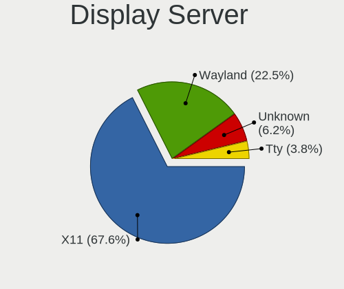

| Name    | Desktops | Percent |
|---------|----------|---------|
| X11     | 313      | 78.45%  |
| Wayland | 37       | 9.27%   |
| Unknown | 37       | 9.27%   |
| Tty     | 12       | 3.01%   |

Display Manager
---------------

SDDM, LightDM, etc.

| Name    | Desktops | Percent |
|---------|----------|---------|
| Unknown | 235      | 57.74%  |
| SDDM    | 64       | 15.72%  |
| GDM3    | 44       | 10.81%  |
| GDM     | 29       | 7.13%   |
| LightDM | 18       | 4.42%   |
| TDM     | 8        | 1.97%   |
| KDM     | 3        | 0.74%   |
| NODM    | 2        | 0.49%   |
| LXDM    | 2        | 0.49%   |
| XDM     | 1        | 0.25%   |
| SLiM    | 1        | 0.25%   |

OS Lang
-------

Language

| Lang        | Desktops | Percent |
|-------------|----------|---------|
| ja_JP       | 216      | 54.55%  |
| en_US       | 87       | 21.97%  |
| Unknown     | 60       | 15.15%  |
| pt_BR       | 12       | 3.03%   |
| zh_CN       | 7        | 1.77%   |
| en_GB       | 4        | 1.01%   |
| C           | 2        | 0.51%   |
| sk_SK       | 1        | 0.25%   |
| ja_JP.utf-8 | 1        | 0.25%   |
| it_IT       | 1        | 0.25%   |
| fr_FR       | 1        | 0.25%   |
| en_AU       | 1        | 0.25%   |
| en_AG       | 1        | 0.25%   |
| de_DE       | 1        | 0.25%   |
| af_ZA       | 1        | 0.25%   |

Boot Mode
---------

EFI or BIOS

| Mode | Desktops | Percent |
|------|----------|---------|
| BIOS | 254      | 64.14%  |
| EFI  | 142      | 35.86%  |

Filesystem
----------

Type of filesystem

| Type    | Desktops | Percent |
|---------|----------|---------|
| Ext4    | 317      | 80.05%  |
| Overlay | 38       | 9.6%    |
| Btrfs   | 13       | 3.28%   |
| Unknown | 12       | 3.03%   |
| Xfs     | 9        | 2.27%   |
| Zfs     | 4        | 1.01%   |
| Jfs     | 1        | 0.25%   |
| F2fs    | 1        | 0.25%   |
| Ext3    | 1        | 0.25%   |

Part. scheme
------------

Scheme of partitioning

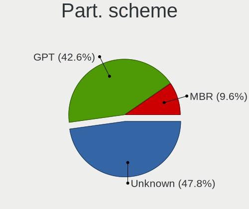

| Type    | Desktops | Percent |
|---------|----------|---------|
| Unknown | 269      | 68.97%  |
| GPT     | 93       | 23.85%  |
| MBR     | 28       | 7.18%   |

Dual Boot with Linux/BSD
------------------------

Hosting more than one Linux/BSD

| Dual boot | Desktops | Percent |
|-----------|----------|---------|
| No        | 305      | 76.25%  |
| Yes       | 95       | 23.75%  |

Dual Boot (Win)
---------------

Hosting Linux and Windows

| Dual boot | Desktops | Percent |
|-----------|----------|---------|
| No        | 261      | 65.09%  |
| Yes       | 140      | 34.91%  |

Board
-----

Vendor
------

Motherboard manufacturer

| Name                | Desktops | Percent |
|---------------------|----------|---------|
| ASUSTek Computer    | 95       | 24.42%  |
| ASRock              | 79       | 20.31%  |
| Gigabyte Technology | 51       | 13.11%  |
| MSI                 | 33       | 8.48%   |
| Hewlett-Packard     | 21       | 5.4%    |
| Dell                | 18       | 4.63%   |
| MouseComputer       | 10       | 2.57%   |
| NEC Computers       | 8        | 2.06%   |
| Intel               | 8        | 2.06%   |
| ECS                 | 7        | 1.8%    |
| Biostar             | 7        | 1.8%    |
| Lenovo              | 6        | 1.54%   |
| Fujitsu             | 6        | 1.54%   |
| Unknown             | 6        | 1.54%   |
| MCJ                 | 4        | 1.03%   |
| Gateway             | 4        | 1.03%   |
| Shuttle             | 3        | 0.77%   |
| Pegatron            | 3        | 0.77%   |
| Foxconn             | 3        | 0.77%   |
| Wistron             | 2        | 0.51%   |
| Supermicro          | 2        | 0.51%   |
| Onkyo               | 2        | 0.51%   |
| EPSON DIRECT        | 2        | 0.51%   |
| Acer                | 2        | 0.51%   |
| XFX                 | 1        | 0.26%   |
| UNITCOM             | 1        | 0.26%   |
| IBM                 | 1        | 0.26%   |
| GALAX               | 1        | 0.26%   |
| FIC                 | 1        | 0.26%   |
| Apple               | 1        | 0.26%   |
| AOpen               | 1        | 0.26%   |

Model
-----

Motherboard model

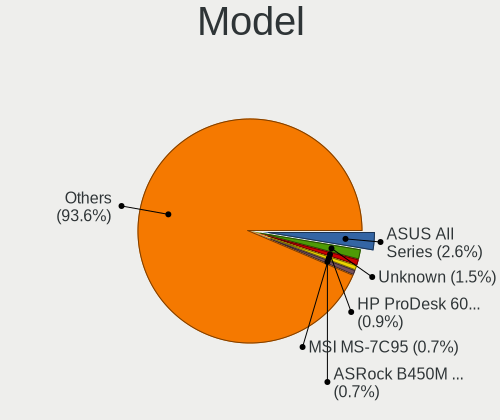

| Name                                       | Desktops | Percent |
|--------------------------------------------|----------|---------|
| ASUS All Series                            | 9        | 2.31%   |
| Unknown                                    | 6        | 1.54%   |
| ASRock Z87 Killer                          | 4        | 1.03%   |
| ASRock B450M Pro4                          | 4        | 1.03%   |
| MSI MS-7A40                                | 3        | 0.77%   |
| HP ProDesk 600 G1 SFF                      | 3        | 0.77%   |
| ECS G31T-M                                 | 3        | 0.77%   |
| Dell Precision WorkStation T3500           | 3        | 0.77%   |
| ASUS P7H55-M                               | 3        | 0.77%   |
| ASRock Prime Series                        | 3        | 0.77%   |
| ASRock J5005-ITX                           | 3        | 0.77%   |
| ASRock A300M-STX                           | 3        | 0.77%   |
| Onkyo ONKYOPC                              | 2        | 0.51%   |
| NEC Computers Express5800/S70 [N8100-9021] | 2        | 0.51%   |
| MSI MS-7D16                                | 2        | 0.51%   |
| MSI MS-7C94                                | 2        | 0.51%   |
| MSI MS-7C37                                | 2        | 0.51%   |
| MSI MS-7C35                                | 2        | 0.51%   |
| MSI MS-7C02                                | 2        | 0.51%   |
| MSI MS-7A72                                | 2        | 0.51%   |
| MSI MS-7865                                | 2        | 0.51%   |
| MouseComputer B360M                        | 2        | 0.51%   |
| HP Z620 Workstation                        | 2        | 0.51%   |
| HP Compaq dc7700p Small Form Factor        | 2        | 0.51%   |
| Gigabyte Z77X-UD3H                         | 2        | 0.51%   |
| Gigabyte Z170X-Gaming 3                    | 2        | 0.51%   |
| Gigabyte H67A-D3H-B3                       | 2        | 0.51%   |
| Gigabyte GA-MA69G-S3H                      | 2        | 0.51%   |
| Gigabyte G33-DS3R                          | 2        | 0.51%   |
| Gigabyte EP45-UD3R                         | 2        | 0.51%   |
| Gigabyte 970A-D3P                          | 2        | 0.51%   |
| Fujitsu PRIMERGY TX1310 M1                 | 2        | 0.51%   |
| Dell OptiPlex 3020                         | 2        | 0.51%   |
| ASUS TUF Gaming B550M-PLUS                 | 2        | 0.51%   |
| ASUS TUF Gaming B550-PLUS                  | 2        | 0.51%   |
| ASUS ROG STRIX B550-F GAMING               | 2        | 0.51%   |
| ASUS PRO H410M-C                           | 2        | 0.51%   |
| ASUS PRIME Z390-A                          | 2        | 0.51%   |
| ASUS PRIME X299-A                          | 2        | 0.51%   |
| ASUS PRIME H370M-PLUS                      | 2        | 0.51%   |
| ASUS PRIME H270M-PLUS                      | 2        | 0.51%   |
| ASUS P8Z77-V PRO                           | 2        | 0.51%   |
| ASUS M3A78-EM                              | 2        | 0.51%   |
| ASRock Z390 Pro4                           | 2        | 0.51%   |
| ASRock X470 Master SLI                     | 2        | 0.51%   |
| ASRock X370 Gaming K4                      | 2        | 0.51%   |
| ASRock H310CM-HDV/M.2                      | 2        | 0.51%   |
| ASRock H110 Pro BTC+                       | 2        | 0.51%   |
| ASRock FM2A88X-ITX+                        | 2        | 0.51%   |
| ASRock B460M Pro4                          | 2        | 0.51%   |
| ASRock B450 Pro4                           | 2        | 0.51%   |
| ASRock B450 Gaming-ITX/ac                  | 2        | 0.51%   |
| XFX nForce 780i 3-Way SLI                  | 1        | 0.26%   |
| Wistron FMVXDBTL2Z                         | 1        | 0.26%   |
| Wistron FMVCE50M7                          | 1        | 0.26%   |
| UNITCOM B85H3-M4                           | 1        | 0.26%   |
| Supermicro X9DA7/E                         | 1        | 0.26%   |
| Supermicro C7B75                           | 1        | 0.26%   |
| Shuttle XS35                               | 1        | 0.26%   |
| Shuttle SG41                               | 1        | 0.26%   |

Model Family
------------

Motherboard model prefix

| Name                      | Desktops | Percent |
|---------------------------|----------|---------|
| ASUS PRIME                | 15       | 3.86%   |
| ASUS TUF                  | 11       | 2.83%   |
| ASUS ROG                  | 9        | 2.31%   |
| ASUS All                  | 9        | 2.31%   |
| HP Compaq                 | 6        | 1.54%   |
| Dell OptiPlex             | 6        | 1.54%   |
| Unknown                   | 6        | 1.54%   |
| Dell Vostro               | 5        | 1.29%   |
| ASUS P8Z77-V              | 5        | 1.29%   |
| ASRock Z87                | 5        | 1.29%   |
| ASRock B450               | 5        | 1.29%   |
| Lenovo ThinkCentre        | 4        | 1.03%   |
| HP ProDesk                | 4        | 1.03%   |
| Gigabyte Z390             | 4        | 1.03%   |
| Dell Precision            | 4        | 1.03%   |
| ASRock Prime              | 4        | 1.03%   |
| ASRock B450M              | 4        | 1.03%   |
| MSI MS-7A40               | 3        | 0.77%   |
| ECS G31T-M                | 3        | 0.77%   |
| ASUS P7H55-M              | 3        | 0.77%   |
| ASRock X370               | 3        | 0.77%   |
| ASRock J5005-ITX          | 3        | 0.77%   |
| ASRock A300M-STX          | 3        | 0.77%   |
| Onkyo ONKYOPC             | 2        | 0.51%   |
| NEC Computers Express5800 | 2        | 0.51%   |
| MSI MS-7D16               | 2        | 0.51%   |
| MSI MS-7C94               | 2        | 0.51%   |
| MSI MS-7C37               | 2        | 0.51%   |
| MSI MS-7C35               | 2        | 0.51%   |
| MSI MS-7C02               | 2        | 0.51%   |
| MSI MS-7A72               | 2        | 0.51%   |
| MSI MS-7865               | 2        | 0.51%   |
| MouseComputer B360M       | 2        | 0.51%   |
| HP Z620                   | 2        | 0.51%   |
| HP EliteDesk              | 2        | 0.51%   |
| Gigabyte Z77X-UD3H        | 2        | 0.51%   |
| Gigabyte Z170X-Gaming     | 2        | 0.51%   |
| Gigabyte H67A-D3H-B3      | 2        | 0.51%   |
| Gigabyte GA-MA69G-S3H     | 2        | 0.51%   |
| Gigabyte G33-DS3R         | 2        | 0.51%   |
| Gigabyte EP45-UD3R        | 2        | 0.51%   |
| Gigabyte 970A-D3P         | 2        | 0.51%   |
| Fujitsu PRIMERGY          | 2        | 0.51%   |
| EPSON DIRECT Endeavor     | 2        | 0.51%   |
| Biostar Hi-Fi             | 2        | 0.51%   |
| ASUS SABERTOOTH           | 2        | 0.51%   |
| ASUS Rampage              | 2        | 0.51%   |
| ASUS PRO                  | 2        | 0.51%   |
| ASUS P8H77-V              | 2        | 0.51%   |
| ASUS P5Q                  | 2        | 0.51%   |
| ASUS M3A78-EM             | 2        | 0.51%   |
| ASRock Z390               | 2        | 0.51%   |
| ASRock X570               | 2        | 0.51%   |
| ASRock X470               | 2        | 0.51%   |
| ASRock H310CM-HDV         | 2        | 0.51%   |
| ASRock H110               | 2        | 0.51%   |
| ASRock FM2A88X-ITX+       | 2        | 0.51%   |
| ASRock B460M              | 2        | 0.51%   |
| ASRock AB350              | 2        | 0.51%   |
| Acer Aspire               | 2        | 0.51%   |

MFG Year
--------

Motherboard manufacture year

| Year | Desktops | Percent |
|------|----------|---------|
| 2018 | 52       | 13.37%  |
| 2012 | 46       | 11.83%  |
| 2013 | 40       | 10.28%  |
| 2020 | 28       | 7.2%    |
| 2019 | 25       | 6.43%   |
| 2010 | 25       | 6.43%   |
| 2009 | 22       | 5.66%   |
| 2016 | 20       | 5.14%   |
| 2011 | 20       | 5.14%   |
| 2014 | 19       | 4.88%   |
| 2007 | 17       | 4.37%   |
| 2017 | 16       | 4.11%   |
| 2015 | 16       | 4.11%   |
| 2008 | 15       | 3.86%   |
| 2021 | 11       | 2.83%   |
| 2006 | 8        | 2.06%   |
| 2005 | 5        | 1.29%   |
| 2022 | 3        | 0.77%   |
| 2003 | 1        | 0.26%   |

Form Factor
-----------

Physical design of the computer

| Name    | Desktops | Percent |
|---------|----------|---------|
| Desktop | 389      | 100%    |

Secure Boot
-----------

Enabled or disabled

| State    | Desktops | Percent |
|----------|----------|---------|
| Disabled | 374      | 95.9%   |
| Enabled  | 16       | 4.1%    |

Coreboot
--------

Have coreboot on board

| Used | Desktops | Percent |
|------|----------|---------|
| No   | 389      | 100%    |

RAM Size
--------

Total RAM memory

| Size in GB      | Desktops | Percent |
|-----------------|----------|---------|
| 16.01-24.0      | 89       | 22.14%  |
| 8.01-16.0       | 87       | 21.64%  |
| 3.01-4.0        | 64       | 15.92%  |
| 4.01-8.0        | 56       | 13.93%  |
| 32.01-64.0      | 51       | 12.69%  |
| 64.01-256.0     | 21       | 5.22%   |
| 1.01-2.0        | 14       | 3.48%   |
| 24.01-32.0      | 13       | 3.23%   |
| 2.01-3.0        | 5        | 1.24%   |
| More than 256.0 | 1        | 0.25%   |
| 0.51-1.0        | 1        | 0.25%   |

RAM Used
--------

Used RAM memory

| Used GB    | Desktops | Percent |
|------------|----------|---------|
| 1.01-2.0   | 189      | 43.05%  |
| 2.01-3.0   | 87       | 19.82%  |
| 3.01-4.0   | 46       | 10.48%  |
| 0.51-1.0   | 44       | 10.02%  |
| 4.01-8.0   | 40       | 9.11%   |
| 8.01-16.0  | 16       | 3.64%   |
| 16.01-24.0 | 8        | 1.82%   |
| 0.01-0.5   | 6        | 1.37%   |
| 24.01-32.0 | 2        | 0.46%   |
| 32.01-64.0 | 1        | 0.23%   |

Total Drives
------------

Number of drives on board

| Drives | Desktops | Percent |
|--------|----------|---------|
| 1      | 170      | 42.08%  |
| 2      | 119      | 29.46%  |
| 3      | 57       | 14.11%  |
| 4      | 29       | 7.18%   |
| 5      | 14       | 3.47%   |
| 6      | 6        | 1.49%   |
| 7      | 5        | 1.24%   |
| 0      | 2        | 0.5%    |
| 11     | 1        | 0.25%   |
| 9      | 1        | 0.25%   |

Has CD-ROM
----------

Has CD-ROM on board

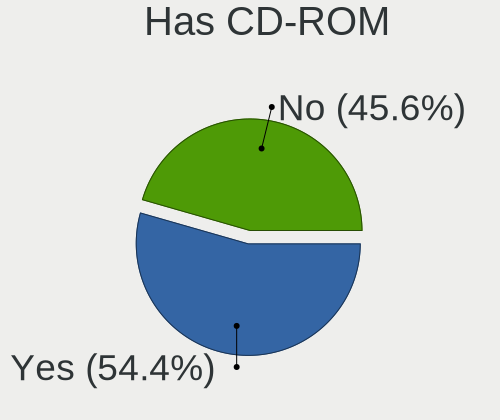

| Presented | Desktops | Percent |
|-----------|----------|---------|
| Yes       | 235      | 59.49%  |
| No        | 160      | 40.51%  |

Has Ethernet
------------

Has Ethernet on board

| Presented | Desktops | Percent |
|-----------|----------|---------|
| Yes       | 389      | 100%    |

Has WiFi
--------

Has WiFi module

| Presented | Desktops | Percent |
|-----------|----------|---------|
| No        | 264      | 67.35%  |
| Yes       | 128      | 32.65%  |

Has Bluetooth
-------------

Has Bluetooth module

| Presented | Desktops | Percent |
|-----------|----------|---------|
| No        | 284      | 71.54%  |
| Yes       | 113      | 28.46%  |

Location
--------

Country
-------

Geographic location (country)

| Country | Desktops | Percent |
|---------|----------|---------|
| Japan   | 389      | 100%    |

City
----

Geographic location (city)

| City        | Desktops | Percent |
|-------------|----------|---------|
| Tokyo       | 26       | 6.31%   |
| Yokohama    | 23       | 5.58%   |
| Osaka       | 18       | 4.37%   |
| Nagoya      | 12       | 2.91%   |
| Shinjuku    | 11       | 2.67%   |
| Fukuoka     | 9        | 2.18%   |
| Tsukuba     | 8        | 1.94%   |
| Sapporo     | 7        | 1.7%    |
| Minato-ku   | 7        | 1.7%    |
| Saitama     | 5        | 1.21%   |
| Okayama     | 5        | 1.21%   |
| Niigata     | 5        | 1.21%   |
| Miyazaki    | 5        | 1.21%   |
| Kobe        | 5        | 1.21%   |
| Kawasaki    | 5        | 1.21%   |
| Toyokawa    | 4        | 0.97%   |
| Minatomirai | 4        | 0.97%   |
| Matsudo     | 4        | 0.97%   |
| Maebashi    | 4        | 0.97%   |
| Koto        | 4        | 0.97%   |
| Kochi       | 4        | 0.97%   |
| Honcho      | 4        | 0.97%   |
| Chiba       | 4        | 0.97%   |
| Tokushima   | 3        | 0.73%   |
| Takamatsu   | 3        | 0.73%   |
| Suita       | 3        | 0.73%   |
| Shibuya     | 3        | 0.73%   |
| Setagaya-ku | 3        | 0.73%   |
| ta-ku     | 3        | 0.73%   |
| Nagasaki    | 3        | 0.73%   |
| Nagano      | 3        | 0.73%   |
| Morioka     | 3        | 0.73%   |
| Mito        | 3        | 0.73%   |
| Kumamoto    | 3        | 0.73%   |
| Kitakyushu  | 3        | 0.73%   |
| Kanazawa    | 3        | 0.73%   |
| Hiroshima   | 3        | 0.73%   |
| Himeji      | 3        | 0.73%   |
| Gifu City   | 3        | 0.73%   |
| Yamaguchi   | 2        | 0.49%   |
| Yamagata    | 2        | 0.49%   |
| Utsunomiya  | 2        | 0.49%   |
| Ushiku      | 2        | 0.49%   |
| Toyohashi   | 2        | 0.49%   |
| Toyama      | 2        | 0.49%   |
| Tokorozawa  | 2        | 0.49%   |
| Tochigi     | 2        | 0.49%   |
| Taito       | 2        | 0.49%   |
| Suzuka      | 2        | 0.49%   |
| Suginami-ku | 2        | 0.49%   |
| Soka Shi    | 2        | 0.49%   |
| Saku        | 2        | 0.49%   |
| tsu       | 2        | 0.49%   |
| Okinawa     | 2        | 0.49%   |
| Okazaki     | 2        | 0.49%   |
| Neyagawa    | 2        | 0.49%   |
| Naha        | 2        | 0.49%   |
| Matsuyama   | 2        | 0.49%   |
| Machida     | 2        | 0.49%   |
| Kyoto       | 2        | 0.49%   |

Drives
------

Drive Vendor
------------

Hard drive vendors

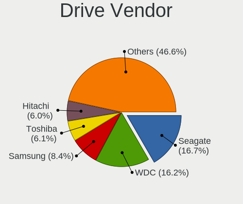

| Vendor                      | Desktops | Drives | Percent |
|-----------------------------|----------|--------|---------|
| Seagate                     | 143      | 228    | 20.69%  |
| WDC                         | 125      | 213    | 18.09%  |
| Samsung Electronics         | 56       | 79     | 8.1%    |
| Hitachi                     | 48       | 64     | 6.95%   |
| Toshiba                     | 42       | 57     | 6.08%   |
| Crucial                     | 41       | 52     | 5.93%   |
| SanDisk                     | 31       | 45     | 4.49%   |
| Intel                       | 30       | 42     | 4.34%   |
| A-DATA Technology           | 18       | 20     | 2.6%    |
| SPCC                        | 14       | 18     | 2.03%   |
| Phison                      | 11       | 16     | 1.59%   |
| Unknown                     | 10       | 13     | 1.45%   |
| Kingston                    | 9        | 11     | 1.3%    |
| HGST                        | 9        | 11     | 1.3%    |
| Transcend                   | 6        | 8      | 0.87%   |
| Plextor                     | 6        | 8      | 0.87%   |
| OCZ                         | 5        | 5      | 0.72%   |
| Dogfish                     | 5        | 5      | 0.72%   |
| China                       | 5        | 6      | 0.72%   |
| Silicon Motion              | 4        | 11     | 0.58%   |
| Micron/Crucial Technology   | 4        | 5      | 0.58%   |
| Maxtor                      | 4        | 6      | 0.58%   |
| Green House                 | 4        | 4      | 0.58%   |
| Patriot                     | 3        | 3      | 0.43%   |
| Micron Technology           | 3        | 4      | 0.43%   |
| KLEVV                       | 3        | 8      | 0.43%   |
| Zheino                      | 2        | 2      | 0.29%   |
| Teclast                     | 2        | 2      | 0.29%   |
| MARVELL                     | 2        | 4      | 0.29%   |
| Lexar                       | 2        | 2      | 0.29%   |
| KIOXIA-EXCERIA              | 2        | 2      | 0.29%   |
| JMicron Technology          | 2        | 2      | 0.29%   |
| Apple                       | 2        | 2      | 0.29%   |
| Apacer                      | 2        | 2      | 0.29%   |
| AEGO                        | 2        | 2      | 0.29%   |
| Unknown                     | 2        | 2      | 0.29%   |
| Yangtze Memory Technologies | 1        | 1      | 0.14%   |
| XSTAR                       | 1        | 1      | 0.14%   |
| Team                        | 1        | 1      | 0.14%   |
| TCSUNBOW                    | 1        | 1      | 0.14%   |
| SK hynix                    | 1        | 1      | 0.14%   |
| SATA3 51                    | 1        | 2      | 0.14%   |
| Realtek Semiconductor       | 1        | 1      | 0.14%   |
| Quantum                     | 1        | 1      | 0.14%   |
| Palit                       | 1        | 1      | 0.14%   |
| Netac                       | 1        | 1      | 0.14%   |
| MIRACLE                     | 1        | 1      | 0.14%   |
| MAXIO Technology (Hangzhou) | 1        | 1      | 0.14%   |
| MARSHAL                     | 1        | 1      | 0.14%   |
| LuminouTek                  | 1        | 1      | 0.14%   |
| Logitec                     | 1        | 1      | 0.14%   |
| Lite-On                     | 1        | 1      | 0.14%   |
| Kingmax                     | 1        | 1      | 0.14%   |
| KingDian                    | 1        | 1      | 0.14%   |
| KESU                        | 1        | 1      | 0.14%   |
| Integral                    | 1        | 1      | 0.14%   |
| HPT                         | 1        | 6      | 0.14%   |
| Hewlett-Packard             | 1        | 1      | 0.14%   |
| Fujitsu                     | 1        | 1      | 0.14%   |
| External                    | 1        | 1      | 0.14%   |

Drive Model
-----------

Hard drive models

| Model                               | Desktops | Percent |
|-------------------------------------|----------|---------|
| Toshiba DT01ACA100 1TB              | 15       | 1.89%   |
| Crucial CT500MX500SSD1 500GB        | 9        | 1.13%   |
| Crucial CT240BX500SSD1 240GB        | 8        | 1.01%   |
| Toshiba DT01ACA200 2TB              | 7        | 0.88%   |
| Seagate ST4000DM004-2CV104 4TB      | 7        | 0.88%   |
| Seagate ST1000DM010-2EP102 1TB      | 7        | 0.88%   |
| WDC WD40EZRZ-00GXCB0 4TB            | 6        | 0.76%   |
| WDC WD20EZRX-00DC0B0 2TB            | 6        | 0.76%   |
| Seagate ST500DM002-1BD142 500GB     | 6        | 0.76%   |
| Seagate ST3500418AS 500GB           | 6        | 0.76%   |
| Seagate ST2000DM008-2FR102 2TB      | 6        | 0.76%   |
| Seagate ST2000DM006-2DM164 2TB      | 6        | 0.76%   |
| SPCC Solid State Disk 256GB         | 5        | 0.63%   |
| Seagate ST2000DM005-2CW102 2TB      | 5        | 0.63%   |
| Seagate ST1000DM003-1CH162 1TB      | 5        | 0.63%   |
| Crucial CT120BX500SSD1 120GB        | 5        | 0.63%   |
| WDC WD20EZAZ-00GGJB0 2TB            | 4        | 0.5%    |
| WDC WD10EZEX-00BN5A0 1TB            | 4        | 0.5%    |
| WDC WD10EADS-22M2B0 1TB             | 4        | 0.5%    |
| WDC WD10EADS-00L5B1 1TB             | 4        | 0.5%    |
| Seagate ST9500325AS 500GB           | 4        | 0.5%    |
| Seagate ST8000DM004-2CX188 8TB      | 4        | 0.5%    |
| Seagate ST2000DM001-1CH164 2TB      | 4        | 0.5%    |
| Seagate Expansion 500GB             | 4        | 0.5%    |
| SanDisk SD6SF1M128G1022I 128GB SSD  | 4        | 0.5%    |
| Hitachi HDS722020ALA330 2TB         | 4        | 0.5%    |
| Hitachi HDS721050CLA362 500GB       | 4        | 0.5%    |
| Hitachi HDS721010CLA332 1TB         | 4        | 0.5%    |
| Crucial CT525MX300SSD1 528GB        | 4        | 0.5%    |
| WDC WD82PURZ-85TEUY0 8TB            | 3        | 0.38%   |
| WDC WD20EZRX-00D8PB0 2TB            | 3        | 0.38%   |
| WDC WD20EFRX-68EUZN0 2TB            | 3        | 0.38%   |
| WDC WD10EADS-00M2B0 1TB             | 3        | 0.38%   |
| Unknown SD/MMC 16GB                 | 3        | 0.38%   |
| SPCC Solid State Disk 512GB         | 3        | 0.38%   |
| SPCC Solid State Disk 240GB         | 3        | 0.38%   |
| Seagate ST8000VN004-2M2101 8TB      | 3        | 0.38%   |
| Seagate ST500DM002-1SB10A 500GB     | 3        | 0.38%   |
| Seagate ST3500413AS 500GB           | 3        | 0.38%   |
| Seagate ST3160815AS 160GB           | 3        | 0.38%   |
| Seagate ST3160318AS 160GB           | 3        | 0.38%   |
| Seagate ST31000528AS 1TB            | 3        | 0.38%   |
| Seagate ST250DM000-1BD141 250GB     | 3        | 0.38%   |
| Seagate ST2000DM001-9YN164 2TB      | 3        | 0.38%   |
| Seagate ST2000DM001-1ER164 2TB      | 3        | 0.38%   |
| Seagate ST2000DL003-9VT166 2TB      | 3        | 0.38%   |
| Seagate ST1000DM003-9YN162 1TB      | 3        | 0.38%   |
| Seagate ST1000DM003-1ER162 1TB      | 3        | 0.38%   |
| SanDisk SDSSDH3 500G                | 3        | 0.38%   |
| SanDisk NVMe SSD Drive 500GB        | 3        | 0.38%   |
| SanDisk NVMe SSD Drive 1TB          | 3        | 0.38%   |
| Samsung SSD 970 EVO Plus 500GB      | 3        | 0.38%   |
| Samsung SSD 860 EVO 500GB           | 3        | 0.38%   |
| Samsung SSD 850 EVO 250GB           | 3        | 0.38%   |
| Samsung SSD 840 Series 120GB        | 3        | 0.38%   |
| Samsung SSD 750 EVO 250GB           | 3        | 0.38%   |
| Samsung SSD 750 EVO 120GB           | 3        | 0.38%   |
| Samsung NVMe SSD Drive 500GB        | 3        | 0.38%   |
| Phison NVMe SSD Drive 2TB           | 3        | 0.38%   |
| Micron/Crucial NVMe SSD Drive 500GB | 3        | 0.38%   |

HDD Vendor
----------

Hard disk drive vendors

| Vendor              | Desktops | Drives | Percent |
|---------------------|----------|--------|---------|
| Seagate             | 140      | 222    | 37.63%  |
| WDC                 | 111      | 174    | 29.84%  |
| Hitachi             | 48       | 64     | 12.9%   |
| Toshiba             | 38       | 52     | 10.22%  |
| Samsung Electronics | 15       | 16     | 4.03%   |
| HGST                | 9        | 11     | 2.42%   |
| Maxtor              | 4        | 6      | 1.08%   |
| MARVELL             | 2        | 4      | 0.54%   |
| Quantum             | 1        | 1      | 0.27%   |
| KESU                | 1        | 1      | 0.27%   |
| Hewlett-Packard     | 1        | 1      | 0.27%   |
| Fujitsu             | 1        | 1      | 0.27%   |
| ASMT                | 1        | 1      | 0.27%   |

SSD Vendor
----------

Solid state drive vendors

| Vendor              | Desktops | Drives | Percent |
|---------------------|----------|--------|---------|
| Crucial             | 40       | 50     | 16.6%   |
| Samsung Electronics | 34       | 42     | 14.11%  |
| SanDisk             | 22       | 29     | 9.13%   |
| Intel               | 17       | 22     | 7.05%   |
| WDC                 | 16       | 23     | 6.64%   |
| A-DATA Technology   | 15       | 17     | 6.22%   |
| SPCC                | 14       | 18     | 5.81%   |
| Kingston            | 9        | 11     | 3.73%   |
| Plextor             | 6        | 8      | 2.49%   |
| Transcend           | 5        | 7      | 2.07%   |
| OCZ                 | 5        | 5      | 2.07%   |
| Dogfish             | 5        | 5      | 2.07%   |
| China               | 5        | 6      | 2.07%   |
| Toshiba             | 4        | 4      | 1.66%   |
| Green House         | 4        | 4      | 1.66%   |
| Unknown             | 3        | 3      | 1.24%   |
| KLEVV               | 3        | 8      | 1.24%   |
| Seagate             | 2        | 4      | 0.83%   |
| Micron Technology   | 2        | 3      | 0.83%   |
| Lexar               | 2        | 2      | 0.83%   |
| Apple               | 2        | 2      | 0.83%   |
| Apacer              | 2        | 2      | 0.83%   |
| AEGO                | 2        | 2      | 0.83%   |
| Unknown             | 2        | 2      | 0.83%   |
| Zheino              | 1        | 1      | 0.41%   |
| XSTAR               | 1        | 1      | 0.41%   |
| Teclast             | 1        | 1      | 0.41%   |
| Team                | 1        | 1      | 0.41%   |
| TCSUNBOW            | 1        | 1      | 0.41%   |
| SATA3 51            | 1        | 2      | 0.41%   |
| Patriot             | 1        | 1      | 0.41%   |
| Palit               | 1        | 1      | 0.41%   |
| MARSHAL             | 1        | 1      | 0.41%   |
| LuminouTek          | 1        | 1      | 0.41%   |
| KIOXIA-EXCERIA      | 1        | 1      | 0.41%   |
| Kingmax             | 1        | 1      | 0.41%   |
| KingDian            | 1        | 1      | 0.41%   |
| JMicron Technology  | 1        | 1      | 0.41%   |
| Integral            | 1        | 1      | 0.41%   |
| DIERYA              | 1        | 1      | 0.41%   |
| Corsair             | 1        | 1      | 0.41%   |
| CFD                 | 1        | 1      | 0.41%   |
| BUFFALO             | 1        | 1      | 0.41%   |
| Biostar             | 1        | 1      | 0.41%   |

Drive Kind
----------

HDD or SSD

| Kind    | Desktops | Drives | Percent |
|---------|----------|--------|---------|
| HDD     | 293      | 554    | 50.17%  |
| SSD     | 207      | 300    | 35.45%  |
| NVMe    | 72       | 127    | 12.33%  |
| Unknown | 11       | 20     | 1.88%   |
| MMC     | 1        | 1      | 0.17%   |

Drive Connector
---------------

SATA, SAS, NVMe, etc.

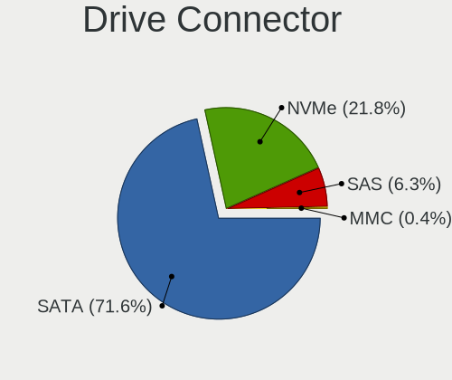

| Type | Desktops | Drives | Percent |
|------|----------|--------|---------|
| SATA | 369      | 839    | 79.7%   |
| NVMe | 72       | 126    | 15.55%  |
| SAS  | 21       | 36     | 4.54%   |
| MMC  | 1        | 1      | 0.22%   |

Drive Size
----------

Size of hard drive

| Size in TB | Desktops | Drives | Percent |
|------------|----------|--------|---------|
| 0.01-0.5   | 281      | 477    | 52.33%  |
| 0.51-1.0   | 109      | 146    | 20.3%   |
| 1.01-2.0   | 76       | 113    | 14.15%  |
| 3.01-4.0   | 29       | 43     | 5.4%    |
| 4.01-10.0  | 22       | 44     | 4.1%    |
| 2.01-3.0   | 19       | 30     | 3.54%   |
| 10.01-20.0 | 1        | 1      | 0.19%   |

Space Total
-----------

Amount of disk space available on the file system

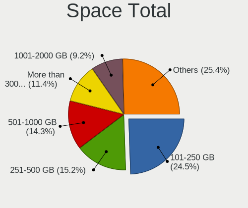

| Size in GB     | Desktops | Percent |
|----------------|----------|---------|
| 101-250        | 116      | 28.09%  |
| 251-500        | 68       | 16.46%  |
| 501-1000       | 53       | 12.83%  |
| More than 3000 | 41       | 9.93%   |
| 1001-2000      | 38       | 9.2%    |
| 2001-3000      | 23       | 5.57%   |
| 51-100         | 23       | 5.57%   |
| 1-20           | 22       | 5.33%   |
| Unknown        | 22       | 5.33%   |
| 21-50          | 7        | 1.69%   |

Space Used
----------

Amount of used disk space

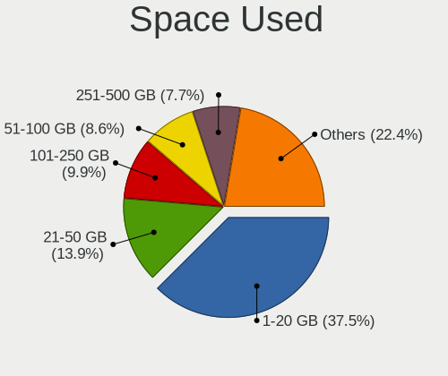

| Used GB        | Desktops | Percent |
|----------------|----------|---------|
| 1-20           | 163      | 37.82%  |
| 21-50          | 69       | 16.01%  |
| 101-250        | 46       | 10.67%  |
| 51-100         | 35       | 8.12%   |
| 251-500        | 28       | 6.5%    |
| 501-1000       | 24       | 5.57%   |
| Unknown        | 22       | 5.1%    |
| 1001-2000      | 21       | 4.87%   |
| More than 3000 | 15       | 3.48%   |
| 2001-3000      | 8        | 1.86%   |

Malfunc. Drives
---------------

Drive models with a malfunction

| Model                              | Desktops | Drives | Percent |
|------------------------------------|----------|--------|---------|
| WDC WD10EADS-22M2B0 1TB            | 4        | 4      | 11.76%  |
| SanDisk SD6SF1M128G1022I 128GB SSD | 4        | 4      | 11.76%  |
| Seagate ST9500325AS 500GB          | 3        | 3      | 8.82%   |
| WDC WD30EZRX-00DC0B0 3TB           | 1        | 2      | 2.94%   |
| WDC WD25EZRX-00MMMB0 2TB           | 1        | 1      | 2.94%   |
| Transcend TS240GSSD220S 240GB      | 1        | 1      | 2.94%   |
| SPCC Solid State DiskB28 128GB     | 1        | 1      | 2.94%   |
| SPCC Solid State Disk 512GB        | 1        | 2      | 2.94%   |
| Seagate ST9320320AS 320GB          | 1        | 1      | 2.94%   |
| Seagate ST3500418AS 500GB          | 1        | 1      | 2.94%   |
| Seagate ST3250310AS 250GB          | 1        | 2      | 2.94%   |
| Seagate ST3120026A 120GB           | 1        | 1      | 2.94%   |
| Seagate ST31000528AS 1TB           | 1        | 1      | 2.94%   |
| Seagate ST31000333AS 1TB           | 1        | 1      | 2.94%   |
| Seagate ST3000VM002-1ET166 3TB     | 1        | 1      | 2.94%   |
| Seagate ST2000DX002-2DV164 2TB     | 1        | 1      | 2.94%   |
| Seagate ST1000LM024 HN-M101MBB 1TB | 1        | 1      | 2.94%   |
| Hitachi HTS727575A9E364 752GB      | 1        | 1      | 2.94%   |
| Hitachi HDT725032VLA360 320GB      | 1        | 1      | 2.94%   |
| Hitachi HDT721032SLA360 320GB      | 1        | 1      | 2.94%   |
| Hitachi HDT721010SLA360 1TB        | 1        | 1      | 2.94%   |
| Hitachi HDS721010DLE630 1TB        | 1        | 1      | 2.94%   |
| Hitachi HDS721010CLA332 1TB        | 1        | 1      | 2.94%   |
| Crucial CT480M500SSD1 480GB        | 1        | 1      | 2.94%   |
| Corsair CSSD-F60GB2 64GB           | 1        | 1      | 2.94%   |
| A-DATA Technology SP900 256GB SSD  | 1        | 1      | 2.94%   |

Malfunc. Drive Vendor
---------------------

Vendors of faulty drives

| Vendor            | Desktops | Drives | Percent |
|-------------------|----------|--------|---------|
| Seagate           | 11       | 13     | 34.38%  |
| WDC               | 6        | 7      | 18.75%  |
| Hitachi           | 5        | 6      | 15.63%  |
| SanDisk           | 4        | 4      | 12.5%   |
| SPCC              | 2        | 3      | 6.25%   |
| Transcend         | 1        | 1      | 3.13%   |
| Crucial           | 1        | 1      | 3.13%   |
| Corsair           | 1        | 1      | 3.13%   |
| A-DATA Technology | 1        | 1      | 3.13%   |

Malfunc. HDD Vendor
-------------------

Vendors of faulty HDD drives

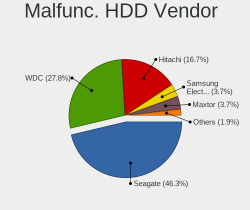

| Vendor  | Desktops | Drives | Percent |
|---------|----------|--------|---------|
| Seagate | 11       | 13     | 50%     |
| WDC     | 6        | 7      | 27.27%  |
| Hitachi | 5        | 6      | 22.73%  |

Malfunc. Drive Kind
-------------------

Kinds of faulty drives

| Kind | Desktops | Drives | Percent |
|------|----------|--------|---------|
| HDD  | 20       | 26     | 66.67%  |
| SSD  | 10       | 11     | 33.33%  |

Failed Drives
-------------

Failed drive models

Zero info for selected period =(

Failed Drive Vendor
-------------------

Failed drive vendors

Zero info for selected period =(

Drive Status
------------

Number of failed and malfunc. drives

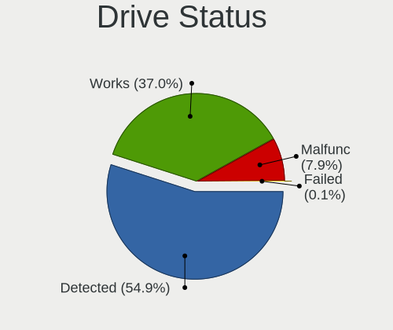

| Status   | Desktops | Drives | Percent |
|----------|----------|--------|---------|
| Detected | 276      | 708    | 66.83%  |
| Works    | 111      | 257    | 26.88%  |
| Malfunc  | 26       | 37     | 6.3%    |

Storage controller
------------------

Storage Vendor
--------------

Storage controller vendors

| Vendor                           | Desktops | Percent |
|----------------------------------|----------|---------|
| Intel                            | 267      | 48.37%  |
| AMD                              | 115      | 20.83%  |
| ASMedia Technology               | 35       | 6.34%   |
| Marvell Technology Group         | 19       | 3.44%   |
| Samsung Electronics              | 16       | 2.9%    |
| JMicron Technology               | 16       | 2.9%    |
| SanDisk                          | 15       | 2.72%   |
| Phison Electronics               | 13       | 2.36%   |
| VIA Technologies                 | 9        | 1.63%   |
| Silicon Motion                   | 7        | 1.27%   |
| Nvidia                           | 6        | 1.09%   |
| Micron/Crucial Technology        | 6        | 1.09%   |
| ADATA Technology                 | 4        | 0.72%   |
| Broadcom / LSI                   | 3        | 0.54%   |
| Adaptec                          | 3        | 0.54%   |
| Silicon Image                    | 2        | 0.36%   |
| Seagate Technology               | 2        | 0.36%   |
| Realtek Semiconductor            | 2        | 0.36%   |
| HighPoint Technologies           | 2        | 0.36%   |
| Yangtze Memory Technologies      | 1        | 0.18%   |
| ULi Electronics                  | 1        | 0.18%   |
| Toshiba America Info Systems     | 1        | 0.18%   |
| SK hynix                         | 1        | 0.18%   |
| Silicon Integrated Systems [SiS] | 1        | 0.18%   |
| Promise Technology               | 1        | 0.18%   |
| Micron Technology                | 1        | 0.18%   |
| MAXIO Technology (Hangzhou)      | 1        | 0.18%   |
| LSI Logic / Symbios Logic        | 1        | 0.18%   |
| KIOXIA                           | 1        | 0.18%   |

Storage Model
-------------

Storage controller models

| Model                                                                                   | Desktops | Percent |
|-----------------------------------------------------------------------------------------|----------|---------|
| AMD FCH SATA Controller [AHCI mode]                                                     | 68       | 9.5%    |
| ASMedia ASM1062 Serial ATA Controller                                                   | 30       | 4.19%   |
| Intel 7 Series/C210 Series Chipset Family 6-port SATA Controller [AHCI mode]            | 29       | 4.05%   |
| AMD 400 Series Chipset SATA Controller                                                  | 27       | 3.77%   |
| Intel 8 Series/C220 Series Chipset Family 6-port SATA Controller 1 [AHCI mode]          | 26       | 3.63%   |
| Intel Q170/Q150/B150/H170/H110/Z170/CM236 Chipset SATA Controller [AHCI Mode]           | 20       | 2.79%   |
| Intel Cannon Lake PCH SATA AHCI Controller                                              | 20       | 2.79%   |
| AMD SB7x0/SB8x0/SB9x0 IDE Controller                                                    | 20       | 2.79%   |
| Intel 6 Series/C200 Series Chipset Family 6 port Desktop SATA AHCI Controller           | 16       | 2.23%   |
| Intel 200 Series PCH SATA controller [AHCI mode]                                        | 16       | 2.23%   |
| AMD SB7x0/SB8x0/SB9x0 SATA Controller [IDE mode]                                        | 15       | 2.09%   |
| Intel NM10/ICH7 Family SATA Controller [IDE mode]                                       | 14       | 1.96%   |
| AMD 500 Series Chipset SATA Controller                                                  | 14       | 1.96%   |
| Intel SATA Controller [RAID mode]                                                       | 13       | 1.82%   |
| SanDisk WD Blue SN550 NVMe SSD                                                          | 11       | 1.54%   |
| Intel 82801G (ICH7 Family) IDE Controller                                               | 11       | 1.54%   |
| Samsung NVMe SSD Controller SM981/PM981/PM983                                           | 10       | 1.4%    |
| JMicron JMB363 SATA/IDE Controller                                                      | 10       | 1.4%    |
| Intel 82801I (ICH9 Family) 2 port SATA Controller [IDE mode]                            | 8        | 1.12%   |
| Intel 5 Series/3400 Series Chipset 4 port SATA IDE Controller                           | 8        | 1.12%   |
| AMD FCH IDE Controller                                                                  | 8        | 1.12%   |
| Intel 82801JI (ICH10 Family) SATA AHCI Controller                                       | 7        | 0.98%   |
| Intel 82801IR/IO/IH (ICH9R/DO/DH) 4 port SATA Controller [IDE mode]                     | 7        | 0.98%   |
| Intel 5 Series/3400 Series Chipset 2 port SATA IDE Controller                           | 7        | 0.98%   |
| AMD SB7x0/SB8x0/SB9x0 SATA Controller [AHCI mode]                                       | 7        | 0.98%   |
| AMD 300 Series Chipset SATA Controller                                                  | 7        | 0.98%   |
| Silicon Motion SM2263EN/SM2263XT SSD Controller                                         | 6        | 0.84%   |
| Marvell Group 88SE9172 SATA 6Gb/s Controller                                            | 6        | 0.84%   |
| JMicron JMB368 IDE controller                                                           | 6        | 0.84%   |
| Intel SSD 660P Series                                                                   | 6        | 0.84%   |
| Intel C600/X79 series chipset SATA RAID Controller                                      | 6        | 0.84%   |
| Intel 82801JI (ICH10 Family) 4 port SATA IDE Controller #1                              | 6        | 0.84%   |
| Intel 82801H (ICH8 Family) 4 port SATA Controller [IDE mode]                            | 6        | 0.84%   |
| Intel 6 Series/C200 Series Chipset Family Desktop SATA Controller (IDE mode, ports 4-5) | 6        | 0.84%   |
| Intel 6 Series/C200 Series Chipset Family Desktop SATA Controller (IDE mode, ports 0-3) | 6        | 0.84%   |
| Intel 500 Series Chipset Family SATA AHCI Controller                                    | 6        | 0.84%   |
| Phison E16 PCIe4 NVMe Controller                                                        | 5        | 0.7%    |
| Intel C602 chipset 4-Port SATA Storage Control Unit                                     | 5        | 0.7%    |
| Intel C600/X79 series chipset 6-Port SATA AHCI Controller                               | 5        | 0.7%    |
| Intel 9 Series Chipset Family SATA Controller [AHCI Mode]                               | 5        | 0.7%    |
| Intel 82801JI (ICH10 Family) 2 port SATA IDE Controller #2                              | 5        | 0.7%    |
| VIA VT6415 PATA IDE Host Controller                                                     | 4        | 0.56%   |
| Phison E12 NVMe Controller                                                              | 4        | 0.56%   |
| Micron/Crucial P1 NVMe PCIe SSD                                                         | 4        | 0.56%   |
| Intel SSD Pro 7600p/760p/E 6100p Series                                                 | 4        | 0.56%   |
| Intel Comet Lake SATA AHCI Controller                                                   | 4        | 0.56%   |
| Intel Celeron/Pentium Silver Processor SATA Controller                                  | 4        | 0.56%   |
| Intel C610/X99 series chipset 6-Port SATA Controller [AHCI mode]                        | 4        | 0.56%   |
| Intel C600/X79 series chipset IDE-r Controller                                          | 4        | 0.56%   |
| Intel Atom/Celeron/Pentium Processor x5-E8000/J3xxx/N3xxx Series SATA Controller        | 4        | 0.56%   |
| Intel 82801IR/IO/IH (ICH9R/DO/DH) 6 port SATA Controller [AHCI mode]                    | 4        | 0.56%   |
| Intel 82801HR/HO/HH (ICH8R/DO/DH) 2 port SATA Controller [IDE mode]                     | 4        | 0.56%   |
| Intel 5 Series/3400 Series Chipset 6 port SATA AHCI Controller                          | 4        | 0.56%   |
| Intel 400 Series Chipset Family SATA AHCI Controller                                    | 4        | 0.56%   |
| AMD X370 Series Chipset SATA Controller                                                 | 4        | 0.56%   |
| AMD SB600 Non-Raid-5 SATA                                                               | 4        | 0.56%   |
| AMD SB600 IDE                                                                           | 4        | 0.56%   |
| AMD FCH SATA Controller [IDE mode]                                                      | 4        | 0.56%   |
| ADATA XPG SX8200 Pro PCIe Gen3x4 M.2 2280 Solid State Drive                             | 4        | 0.56%   |
| VIA VT82C586A/B/VT82C686/A/B/VT823x/A/C PIPC Bus Master IDE                             | 3        | 0.42%   |

Storage Kind
------------

Kind of storage controller (IDE, SATA, NVMe, SAS, ...)

| Kind | Desktops | Percent |
|------|----------|---------|
| SATA | 305      | 57.44%  |
| IDE  | 113      | 21.28%  |
| NVMe | 74       | 13.94%  |
| RAID | 30       | 5.65%   |
| SAS  | 5        | 0.94%   |
| SCSI | 4        | 0.75%   |

Processor
---------

CPU Vendor
----------

Processor vendors

| Vendor | Desktops | Percent |
|--------|----------|---------|
| Intel  | 268      | 68.89%  |
| AMD    | 121      | 31.11%  |

CPU Model
---------

Processor models

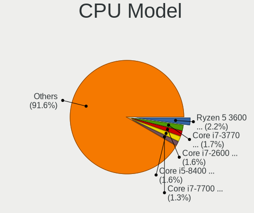

| Model                                           | Desktops | Percent |
|-------------------------------------------------|----------|---------|
| Intel Core i7-3770 CPU @ 3.40GHz                | 10       | 2.56%   |
| AMD Ryzen 5 3600 6-Core Processor               | 10       | 2.56%   |
| Intel Core i7-2600 CPU @ 3.40GHz                | 8        | 2.05%   |
| Intel Core i5-8400 CPU @ 2.80GHz                | 6        | 1.53%   |
| Intel Core 2 Duo CPU E8400 @ 3.00GHz            | 6        | 1.53%   |
| AMD Ryzen 7 3700X 8-Core Processor              | 6        | 1.53%   |
| Intel Core i7-7700 CPU @ 3.60GHz                | 5        | 1.28%   |
| Intel Core i7-6700 CPU @ 3.40GHz                | 5        | 1.28%   |
| Intel Core 2 CPU 6600 @ 2.40GHz                 | 5        | 1.28%   |
| Intel Core i7-8700 CPU @ 3.20GHz                | 4        | 1.02%   |
| Intel Core i7-3770K CPU @ 3.50GHz               | 4        | 1.02%   |
| Intel Core i5-4570TE CPU @ 2.70GHz              | 4        | 1.02%   |
| Intel Core i5-3570K CPU @ 3.40GHz               | 4        | 1.02%   |
| Intel Core i3-3220 CPU @ 3.30GHz                | 4        | 1.02%   |
| Intel Core 2 Duo CPU E7500 @ 2.93GHz            | 4        | 1.02%   |
| Intel Core 2 CPU 6400 @ 2.13GHz                 | 4        | 1.02%   |
| AMD Ryzen 9 3950X 16-Core Processor             | 4        | 1.02%   |
| AMD Ryzen 5 5600X 6-Core Processor              | 4        | 1.02%   |
| AMD Ryzen 5 2400G with Radeon Vega Graphics     | 4        | 1.02%   |
| AMD Athlon 200GE with Radeon Vega Graphics      | 4        | 1.02%   |
| Intel Pentium Silver J5005 CPU @ 1.50GHz        | 3        | 0.77%   |
| Intel Core i9-9900K CPU @ 3.60GHz               | 3        | 0.77%   |
| Intel Core i7-4770 CPU @ 3.40GHz                | 3        | 0.77%   |
| Intel Core i5-4590 CPU @ 3.30GHz                | 3        | 0.77%   |
| Intel Core i3-4130 CPU @ 3.40GHz                | 3        | 0.77%   |
| Intel Core 2 Quad CPU Q9550 @ 2.83GHz           | 3        | 0.77%   |
| Intel Core 2 Duo CPU E7400 @ 2.80GHz            | 3        | 0.77%   |
| AMD Ryzen 7 3800X 8-Core Processor              | 3        | 0.77%   |
| AMD Ryzen 7 2700X Eight-Core Processor          | 3        | 0.77%   |
| AMD Ryzen 7 1700 Eight-Core Processor           | 3        | 0.77%   |
| AMD A10-7870K Radeon R7, 12 Compute Cores 4C+8G | 3        | 0.77%   |
| Intel Xeon CPU W3520 @ 2.67GHz                  | 2        | 0.51%   |
| Intel Pentium CPU G6950 @ 2.80GHz               | 2        | 0.51%   |
| Intel Pentium CPU G4560 @ 3.50GHz               | 2        | 0.51%   |
| Intel Pentium CPU G3220 @ 3.00GHz               | 2        | 0.51%   |
| Intel Pentium 4 CPU 3.40GHz                     | 2        | 0.51%   |
| Intel Pentium 4 CPU 2.80GHz                     | 2        | 0.51%   |
| Intel Core i9-10900 CPU @ 2.80GHz               | 2        | 0.51%   |
| Intel Core i7-8086K CPU @ 4.00GHz               | 2        | 0.51%   |
| Intel Core i7-7700K CPU @ 4.20GHz               | 2        | 0.51%   |
| Intel Core i7-6700K CPU @ 4.00GHz               | 2        | 0.51%   |
| Intel Core i7-5820K CPU @ 3.30GHz               | 2        | 0.51%   |
| Intel Core i7-4790K CPU @ 4.00GHz               | 2        | 0.51%   |
| Intel Core i7-3820 CPU @ 3.60GHz                | 2        | 0.51%   |
| Intel Core i5-9600K CPU @ 3.70GHz               | 2        | 0.51%   |
| Intel Core i5-8500 CPU @ 3.00GHz                | 2        | 0.51%   |
| Intel Core i5-6600K CPU @ 3.50GHz               | 2        | 0.51%   |
| Intel Core i5-6600 CPU @ 3.30GHz                | 2        | 0.51%   |
| Intel Core i5-6500 CPU @ 3.20GHz                | 2        | 0.51%   |
| Intel Core i5-4570 CPU @ 3.20GHz                | 2        | 0.51%   |
| Intel Core i5-4430 CPU @ 3.00GHz                | 2        | 0.51%   |
| Intel Core i5-3570 CPU @ 3.40GHz                | 2        | 0.51%   |
| Intel Core i5-2400 CPU @ 3.10GHz                | 2        | 0.51%   |
| Intel Core i5-10400 CPU @ 2.90GHz               | 2        | 0.51%   |
| Intel Core i5 CPU 750 @ 2.67GHz                 | 2        | 0.51%   |
| Intel Core i3-7100 CPU @ 3.90GHz                | 2        | 0.51%   |
| Intel Core i3-4160 CPU @ 3.60GHz                | 2        | 0.51%   |
| Intel Core i3-3240 CPU @ 3.40GHz                | 2        | 0.51%   |
| Intel Core i3-3225 CPU @ 3.30GHz                | 2        | 0.51%   |
| Intel Core i3-2120 CPU @ 3.30GHz                | 2        | 0.51%   |

CPU Model Family
----------------

Processor model prefix

| Model                   | Desktops | Percent |
|-------------------------|----------|---------|
| Intel Core i7           | 69       | 17.69%  |
| Intel Core i5           | 55       | 14.1%   |
| Intel Core i3           | 30       | 7.69%   |
| AMD Ryzen 5             | 27       | 6.92%   |
| Intel Xeon              | 23       | 5.9%    |
| AMD Ryzen 7             | 22       | 5.64%   |
| Intel Core 2 Duo        | 19       | 4.87%   |
| Intel Celeron           | 14       | 3.59%   |
| Intel Core 2 Quad       | 10       | 2.56%   |
| Intel Core 2            | 9        | 2.31%   |
| Intel Pentium           | 8        | 2.05%   |
| Intel Core i9           | 8        | 2.05%   |
| AMD Athlon              | 8        | 2.05%   |
| AMD Ryzen 9             | 6        | 1.54%   |
| AMD Ryzen 3             | 6        | 1.54%   |
| AMD Phenom II X4        | 6        | 1.54%   |
| AMD FX                  | 6        | 1.54%   |
| AMD A10                 | 6        | 1.54%   |
| Intel Pentium 4         | 5        | 1.28%   |
| AMD Athlon 64 X2        | 5        | 1.28%   |
| Intel Pentium Gold      | 4        | 1.03%   |
| AMD A8                  | 4        | 1.03%   |
| Other                   | 3        | 0.77%   |
| Intel Pentium Silver    | 3        | 0.77%   |
| Intel Pentium Dual-Core | 3        | 0.77%   |
| Intel Atom              | 3        | 0.77%   |
| AMD Sempron             | 2        | 0.51%   |
| AMD Ryzen Threadripper  | 2        | 0.51%   |
| AMD Phenom II X6        | 2        | 0.51%   |
| AMD Phenom              | 2        | 0.51%   |
| AMD Athlon II X4        | 2        | 0.51%   |
| AMD Athlon Dual Core    | 2        | 0.51%   |
| AMD Athlon 64           | 2        | 0.51%   |
| AMD A6                  | 2        | 0.51%   |
| AMD A4                  | 2        | 0.51%   |
| AMD A12                 | 2        | 0.51%   |
| Intel Pentium Dual      | 1        | 0.26%   |
| Intel Pentium D         | 1        | 0.26%   |
| Intel Core 2 Extreme    | 1        | 0.26%   |
| AMD Ryzen 5 PRO         | 1        | 0.26%   |
| AMD Phenom II X2        | 1        | 0.26%   |
| AMD E2                  | 1        | 0.26%   |
| AMD E                   | 1        | 0.26%   |
| AMD Athlon II X2        | 1        | 0.26%   |

CPU Cores
---------

Number of processor cores

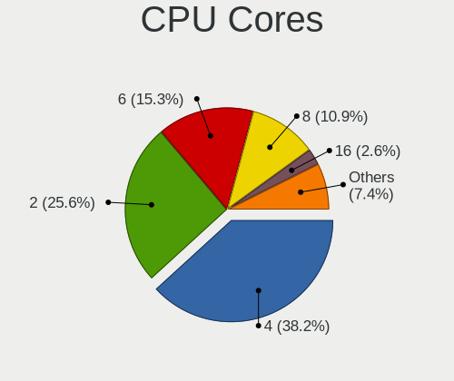

| Number | Desktops | Percent |
|--------|----------|---------|
| 4      | 149      | 38.21%  |
| 2      | 119      | 30.51%  |
| 6      | 56       | 14.36%  |
| 8      | 33       | 8.46%   |
| 1      | 11       | 2.82%   |
| 16     | 9        | 2.31%   |
| 3      | 4        | 1.03%   |
| 12     | 3        | 0.77%   |
| 10     | 3        | 0.77%   |
| 32     | 1        | 0.26%   |
| 20     | 1        | 0.26%   |
| 14     | 1        | 0.26%   |

CPU Sockets
-----------

Number of sockets

| Number | Desktops | Percent |
|--------|----------|---------|
| 1      | 384      | 98.71%  |
| 2      | 5        | 1.29%   |

CPU Threads
-----------

Threads per core (Hyper-Threading)

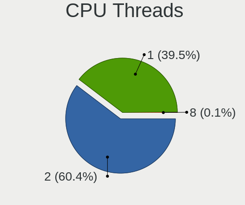

| Number | Desktops | Percent |
|--------|----------|---------|
| 2      | 231      | 59.23%  |
| 1      | 159      | 40.77%  |

CPU Op-Modes
------------

CPU Operation Modes (32-bit, 64-bit)

| Op mode        | Desktops | Percent |
|----------------|----------|---------|
| 32-bit, 64-bit | 384      | 98.21%  |
| Unknown        | 4        | 1.02%   |
| 32-bit         | 3        | 0.77%   |

CPU Microcode
-------------

Microcode number

| Number     | Desktops | Percent |
|------------|----------|---------|
| Unknown    | 78       | 19.16%  |
| 0x306a9    | 31       | 7.62%   |
| 0x306c3    | 28       | 6.88%   |
| 0x1067a    | 22       | 5.41%   |
| 0x206a7    | 19       | 4.67%   |
| 0x08701021 | 18       | 4.42%   |
| 0x906ea    | 15       | 3.69%   |
| 0x506e3    | 15       | 3.69%   |
| 0x906e9    | 10       | 2.46%   |
| 0x906ed    | 7        | 1.72%   |
| 0x0800820d | 6        | 1.47%   |
| 0x06003106 | 6        | 1.47%   |
| 0x010000db | 6        | 1.47%   |
| 0x206d7    | 5        | 1.23%   |
| 0x106e5    | 5        | 1.23%   |
| 0x0a201016 | 5        | 1.23%   |
| 0x06001119 | 5        | 1.23%   |
| 0xa0655    | 4        | 0.98%   |
| 0xa0653    | 4        | 0.98%   |
| 0x706a1    | 4        | 0.98%   |
| 0x6fb      | 4        | 0.98%   |
| 0x6f6      | 4        | 0.98%   |
| 0x50654    | 4        | 0.98%   |
| 0x306f2    | 4        | 0.98%   |
| 0x10676    | 4        | 0.98%   |
| 0x0810100b | 4        | 0.98%   |
| 0x010000c8 | 4        | 0.98%   |
| 0x906eb    | 3        | 0.74%   |
| 0x306e4    | 3        | 0.74%   |
| 0x20655    | 3        | 0.74%   |
| 0x08701013 | 3        | 0.74%   |
| 0x08108109 | 3        | 0.74%   |
| 0x08101016 | 3        | 0.74%   |
| 0x0600063e | 3        | 0.74%   |
| 0x03000027 | 3        | 0.74%   |
| 0xf43      | 2        | 0.49%   |
| 0xf41      | 2        | 0.49%   |
| 0xa0671    | 2        | 0.49%   |
| 0x906ec    | 2        | 0.49%   |
| 0x6f2      | 2        | 0.49%   |
| 0x406c4    | 2        | 0.49%   |
| 0x406c3    | 2        | 0.49%   |
| 0x206c2    | 2        | 0.49%   |
| 0x20652    | 2        | 0.49%   |
| 0x106ca    | 2        | 0.49%   |
| 0x106a5    | 2        | 0.49%   |
| 0x10677    | 2        | 0.49%   |
| 0x0a50000c | 2        | 0.49%   |
| 0x08108102 | 2        | 0.49%   |
| 0x08001138 | 2        | 0.49%   |
| 0x0700010f | 2        | 0.49%   |
| 0x0600611a | 2        | 0.49%   |
| 0x010000dc | 2        | 0.49%   |
| 0x01000083 | 2        | 0.49%   |
| 0xf65      | 1        | 0.25%   |
| 0xf47      | 1        | 0.25%   |
| 0xf33      | 1        | 0.25%   |
| 0x806ec    | 1        | 0.25%   |
| 0x6fd      | 1        | 0.25%   |
| 0x406f1    | 1        | 0.25%   |

CPU Microarch
-------------

Microarchitecture

| Name          | Desktops | Percent |
|---------------|----------|---------|
| KabyLake      | 44       | 11.28%  |
| IvyBridge     | 40       | 10.26%  |
| Haswell       | 39       | 10%     |
| Penryn        | 30       | 7.69%   |
| Zen 2         | 29       | 7.44%   |
| SandyBridge   | 27       | 6.92%   |
| Skylake       | 21       | 5.38%   |
| Zen           | 17       | 4.36%   |
| Zen+          | 15       | 3.85%   |
| K10           | 15       | 3.85%   |
| Core          | 14       | 3.59%   |
| CometLake     | 12       | 3.08%   |
| Zen 3         | 10       | 2.56%   |
| K8 Hammer     | 10       | 2.56%   |
| Westmere      | 9        | 2.31%   |
| Nehalem       | 9        | 2.31%   |
| Piledriver    | 7        | 1.79%   |
| NetBurst      | 7        | 1.79%   |
| Steamroller   | 6        | 1.54%   |
| Silvermont    | 4        | 1.03%   |
| Goldmont plus | 4        | 1.03%   |
| Bulldozer     | 4        | 1.03%   |
| K10 Llano     | 3        | 0.77%   |
| Jaguar        | 3        | 0.77%   |
| Bonnell       | 3        | 0.77%   |
| Unknown       | 3        | 0.77%   |
| Excavator     | 2        | 0.51%   |
| Icelake       | 1        | 0.26%   |
| Broadwell     | 1        | 0.26%   |
| Bobcat        | 1        | 0.26%   |

Graphics
--------

GPU Vendor
----------

Vendors of graphics cards

| Vendor           | Desktops | Percent |
|------------------|----------|---------|
| Nvidia           | 163      | 39.37%  |
| AMD              | 127      | 30.68%  |
| Intel            | 123      | 29.71%  |
| VIA Technologies | 1        | 0.24%   |

GPU Model
---------

Graphics card models

| Model                                                                                    | Desktops | Percent |
|------------------------------------------------------------------------------------------|----------|---------|
| AMD Ellesmere [Radeon RX 470/480/570/570X/580/580X/590]                                  | 16       | 3.71%   |
| Nvidia GP107 [GeForce GTX 1050 Ti]                                                       | 12       | 2.78%   |
| Intel Xeon E3-1200 v3/4th Gen Core Processor Integrated Graphics Controller              | 12       | 2.78%   |
| Nvidia GK208B [GeForce GT 710]                                                           | 11       | 2.55%   |
| Intel Xeon E3-1200 v2/3rd Gen Core processor Graphics Controller                         | 11       | 2.55%   |
| Intel IvyBridge GT2 [HD Graphics 4000]                                                   | 11       | 2.55%   |
| Intel CoffeeLake-S GT2 [UHD Graphics 630]                                                | 11       | 2.55%   |
| Intel 2nd Generation Core Processor Family Integrated Graphics Controller                | 11       | 2.55%   |
| Nvidia TU117 [GeForce GTX 1650]                                                          | 9        | 2.09%   |
| AMD Raven Ridge [Radeon Vega Series / Radeon Vega Mobile Series]                         | 9        | 2.09%   |
| Intel 4 Series Chipset Integrated Graphics Controller                                    | 8        | 1.86%   |
| Nvidia GK208B [GeForce GT 730]                                                           | 7        | 1.62%   |
| AMD RV710 [Radeon HD 4350/4550]                                                          | 7        | 1.62%   |
| Nvidia GP106 [GeForce GTX 1060 6GB]                                                      | 6        | 1.39%   |
| Nvidia GA102 [GeForce RTX 3090]                                                          | 6        | 1.39%   |
| Intel HD Graphics 530                                                                    | 6        | 1.39%   |
| Intel CometLake-S GT2 [UHD Graphics 630]                                                 | 6        | 1.39%   |
| AMD Cedar [Radeon HD 5000/6000/7350/8350 Series]                                         | 6        | 1.39%   |
| Nvidia TU116 [GeForce GTX 1660 SUPER]                                                    | 5        | 1.16%   |
| Nvidia GP108 [GeForce GT 1030]                                                           | 5        | 1.16%   |
| Nvidia GP102 [GeForce GTX 1080 Ti]                                                       | 5        | 1.16%   |
| Nvidia G94 [GeForce 9600 GT]                                                             | 5        | 1.16%   |
| Intel HD Graphics 630                                                                    | 5        | 1.16%   |
| AMD Picasso/Raven 2 [Radeon Vega Series / Radeon Vega Mobile Series]                     | 5        | 1.16%   |
| AMD Navi 10 [Radeon RX 5600 OEM/5600 XT / 5700/5700 XT]                                  | 5        | 1.16%   |
| AMD Curacao PRO [Radeon R7 370 / R9 270/370 OEM]                                         | 5        | 1.16%   |
| AMD Caicos [Radeon HD 6450/7450/8450 / R5 230 OEM]                                       | 5        | 1.16%   |
| Nvidia TU116 [GeForce GTX 1660]                                                          | 4        | 0.93%   |
| Nvidia GT218 [GeForce 210]                                                               | 4        | 0.93%   |
| Nvidia GP104 [GeForce GTX 1080]                                                          | 4        | 0.93%   |
| Nvidia GM107 [GeForce GTX 750 Ti]                                                        | 4        | 0.93%   |
| Intel Atom/Celeron/Pentium Processor x5-E8000/J3xxx/N3xxx Integrated Graphics Controller | 4        | 0.93%   |
| Intel 4th Generation Core Processor Family Integrated Graphics Controller                | 4        | 0.93%   |
| AMD Kaveri [Radeon R7 Graphics]                                                          | 4        | 0.93%   |
| AMD Cape Verde PRO [Radeon HD 7750/8740 / R7 250E]                                       | 4        | 0.93%   |
| Nvidia TU104 [GeForce RTX 2070 SUPER]                                                    | 3        | 0.7%    |
| Nvidia TU102 [GeForce RTX 2080 Ti Rev. A]                                                | 3        | 0.7%    |
| Nvidia GP104 [GeForce GTX 1070]                                                          | 3        | 0.7%    |
| Nvidia GK107 [GeForce GTX 650]                                                           | 3        | 0.7%    |
| Nvidia GK106 [GeForce GTX 660]                                                           | 3        | 0.7%    |
| Intel GeminiLake [UHD Graphics 605]                                                      | 3        | 0.7%    |
| Intel Core Processor Integrated Graphics Controller                                      | 3        | 0.7%    |
| Intel CometLake-S GT1 [UHD Graphics 610]                                                 | 3        | 0.7%    |
| Intel 82G33/G31 Express Integrated Graphics Controller                                   | 3        | 0.7%    |
| Intel 82915G/GV/910GL Integrated Graphics Controller                                     | 3        | 0.7%    |
| AMD Turks XT [Radeon HD 6670/7670]                                                       | 3        | 0.7%    |
| AMD RS780 [Radeon HD 3200]                                                               | 3        | 0.7%    |
| AMD Lexa PRO [Radeon 540/540X/550/550X / RX 540X/550/550X]                               | 3        | 0.7%    |
| AMD Barts PRO [Radeon HD 6850]                                                           | 3        | 0.7%    |
| Nvidia TU106 [GeForce RTX 2070]                                                          | 2        | 0.46%   |
| Nvidia TU102 [GeForce RTX 2080 Ti]                                                       | 2        | 0.46%   |
| Nvidia GT200 [GeForce GTX 260]                                                           | 2        | 0.46%   |
| Nvidia GP107 [GeForce GTX 1050]                                                          | 2        | 0.46%   |
| Nvidia GM200 [GeForce GTX TITAN X]                                                       | 2        | 0.46%   |
| Nvidia GM200 [GeForce GTX 980 Ti]                                                        | 2        | 0.46%   |
| Nvidia GM107GL [Quadro K620]                                                             | 2        | 0.46%   |
| Nvidia GK107GL [Quadro K600]                                                             | 2        | 0.46%   |
| Nvidia GK107 [GeForce GT 640]                                                            | 2        | 0.46%   |
| Nvidia GF119 [GeForce GT 610]                                                            | 2        | 0.46%   |
| Nvidia GF108GL [Quadro 600]                                                              | 2        | 0.46%   |

GPU Combo
---------

Combinations of graphics cards

| Name                     | Desktops | Percent |
|--------------------------|----------|---------|
| 1 x Nvidia               | 147      | 37.4%   |
| 1 x AMD                  | 115      | 29.26%  |
| 1 x Intel                | 107      | 27.23%  |
| 2 x Nvidia               | 5        | 1.27%   |
| 2 x AMD                  | 5        | 1.27%   |
| AMD + Nvidia             | 4        | 1.02%   |
| Intel + Nvidia           | 3        | 0.76%   |
| Intel + 2 x Nvidia       | 2        | 0.51%   |
| Other                    | 1        | 0.25%   |
| 1 x VIA                  | 1        | 0.25%   |
| Intel + 2 x AMD          | 1        | 0.25%   |
| Intel + AMD + 1 x Nvidia | 1        | 0.25%   |
| Intel + AMD              | 1        | 0.25%   |

GPU Driver
----------

Free vs proprietary

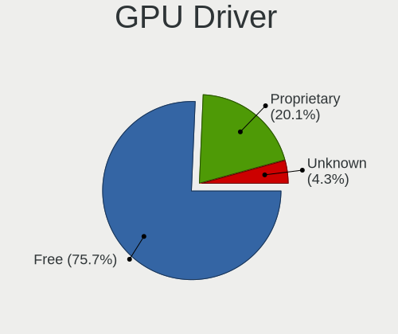

| Driver      | Desktops | Percent |
|-------------|----------|---------|
| Free        | 297      | 74.62%  |
| Proprietary | 90       | 22.61%  |
| Unknown     | 11       | 2.76%   |

GPU Memory
----------

Total video memory

| Size in GB | Desktops | Percent |
|------------|----------|---------|
| Unknown    | 144      | 35.73%  |
| 0.01-0.5   | 64       | 15.88%  |
| 0.51-1.0   | 59       | 14.64%  |
| 1.01-2.0   | 54       | 13.4%   |
| 3.01-4.0   | 32       | 7.94%   |
| 7.01-8.0   | 22       | 5.46%   |
| 5.01-6.0   | 13       | 3.23%   |
| 8.01-16.0  | 9        | 2.23%   |
| 16.01-24.0 | 5        | 1.24%   |
| 2.01-3.0   | 1        | 0.25%   |

Monitor
-------

Monitor Vendor
--------------

Monitor vendors

| Vendor               | Desktops | Percent |
|----------------------|----------|---------|
| IOD                  | 38       | 9.09%   |
| Dell                 | 38       | 9.09%   |
| Goldstar             | 33       | 7.89%   |
| BenQ                 | 29       | 6.94%   |
| Mitsubishi           | 28       | 6.7%    |
| Iiyama               | 25       | 5.98%   |
| Acer                 | 23       | 5.5%    |
| Eizo                 | 18       | 4.31%   |
| Unknown              | 16       | 3.83%   |
| Hewlett-Packard      | 15       | 3.59%   |
| Philips              | 14       | 3.35%   |
| Samsung Electronics  | 13       | 3.11%   |
| AOC                  | 12       | 2.87%   |
| Ancor Communications | 12       | 2.87%   |
| Sharp                | 11       | 2.63%   |
| NEC Computers        | 10       | 2.39%   |
| Sony                 | 7        | 1.67%   |
| Idek Iiyama          | 7        | 1.67%   |
| Panasonic            | 6        | 1.44%   |
| Toshiba              | 5        | 1.2%    |
| LG Electronics       | 5        | 1.2%    |
| Lenovo               | 5        | 1.2%    |
| ASUSTek Computer     | 4        | 0.96%   |
| ViewSonic            | 3        | 0.72%   |
| Unknown (XXX)        | 3        | 0.72%   |
| Fujitsu              | 3        | 0.72%   |
| ___                  | 2        | 0.48%   |
| SKY                  | 2        | 0.48%   |
| PTF                  | 2        | 0.48%   |
| Onkyo                | 2        | 0.48%   |
| LYC                  | 2        | 0.48%   |
| Hitachi              | 2        | 0.48%   |
| BUFFALO              | 2        | 0.48%   |
| Unknown              | 2        | 0.48%   |
| VFV                  | 1        | 0.24%   |
| S2-Tek               | 1        | 0.24%   |
| Pixio                | 1        | 0.24%   |
| OOO                  | 1        | 0.24%   |
| Novatek              | 1        | 0.24%   |
| MPI                  | 1        | 0.24%   |
| Megavision           | 1        | 0.24%   |
| Lenovo Group Limited | 1        | 0.24%   |
| LED                  | 1        | 0.24%   |
| KIG                  | 1        | 0.24%   |
| KAT                  | 1        | 0.24%   |
| InnoLux Display      | 1        | 0.24%   |
| HYO                  | 1        | 0.24%   |
| HPN                  | 1        | 0.24%   |
| Gigabyte Technology  | 1        | 0.24%   |
| Epson                | 1        | 0.24%   |
| Dinner               | 1        | 0.24%   |
| DENON                | 1        | 0.24%   |
| Apple                | 1        | 0.24%   |

Monitor Model
-------------

Monitor models

| Model                                                                | Desktops | Percent |
|----------------------------------------------------------------------|----------|---------|
| AOC 28E850 AOC0CCD 2560x1600 480x270mm 21.7-inch                     | 5        | 1.12%   |
| NEC Computers EA243WM NEC6864 1920x1200 519x324mm 24.1-inch          | 4        | 0.89%   |
| Iiyama PL2290 IVM562C 1920x1080 476x268mm 21.5-inch                  | 4        | 0.89%   |
| Panasonic TV MEIA296 3840x2160 698x392mm 31.5-inch                   | 3        | 0.67%   |
| Mitsubishi MDT241WG MEL478E 1920x1200 518x291mm 23.4-inch            | 3        | 0.67%   |
| Goldstar Ultra HD GSM5B09 3840x2160 600x340mm 27.2-inch              | 3        | 0.67%   |
| Dell U2410 DELF016 1920x1200 518x324mm 24.1-inch                     | 3        | 0.67%   |
| Ancor Communications VE248 ACI2494 1920x1080 531x299mm 24.0-inch     | 3        | 0.67%   |
| Acer KA270H ACR0522 1920x1080 598x336mm 27.0-inch                    | 3        | 0.67%   |
| Acer B193 ACR001D 1280x1024 376x301mm 19.0-inch                      | 3        | 0.67%   |
| ___ LCDTV16 ___9000 1360x768                                         | 2        | 0.45%   |
| Unknown LCD Monitor Mitsubishi RDT233WLM 1920x1080                   | 2        | 0.45%   |
| SKY TV-monitor SKY1901 3840x2160 1210x680mm 54.6-inch                | 2        | 0.45%   |
| Samsung Electronics SyncMaster SAM01AE 1600x1200 408x306mm 20.1-inch | 2        | 0.45%   |
| Samsung Electronics SyncMaster SAM01AD 1600x1200 408x306mm 20.1-inch | 2        | 0.45%   |
| Philips PHL 273V5 PHLC0D2 1920x1080 598x336mm 27.0-inch              | 2        | 0.45%   |
| Mitsubishi RDT234WLM MEL4887 1920x1080 509x286mm 23.0-inch           | 2        | 0.45%   |
| Mitsubishi RDT194S MEL4685 1280x1024 376x301mm 19.0-inch             | 2        | 0.45%   |
| Mitsubishi RDT1714VM MEL4764 1280x1024 338x270mm 17.0-inch           | 2        | 0.45%   |
| LYC L2106 LYC0001 1920x1080 480x260mm 21.5-inch                      | 2        | 0.45%   |
| IOD LCD-RDT242XP IOD1891 1920x1080 527x296mm 23.8-inch               | 2        | 0.45%   |
| IOD KH2750V-UHD IOD1B2A 3840x2160 598x336mm 27.0-inch                | 2        | 0.45%   |
| IOD EX-LD2071T IOD150D 1920x1080 458x258mm 20.7-inch                 | 2        | 0.45%   |
| Iiyama PL3291 IVM7605 1920x1080 698x393mm 31.5-inch                  | 2        | 0.45%   |
| Iiyama PL2875UH IVM710F 3840x2160 621x341mm 27.9-inch                | 2        | 0.45%   |
| Iiyama PL2390 IVM562D 1920x1080 509x286mm 23.0-inch                  | 2        | 0.45%   |
| Hewlett-Packard P223 HPN3392 1920x1080 477x268mm 21.5-inch           | 2        | 0.45%   |
| Goldstar W2753 GSM56F7 1920x1080 598x336mm 27.0-inch                 | 2        | 0.45%   |
| Goldstar W2261 GSM56CE 1920x1080 477x268mm 21.5-inch                 | 2        | 0.45%   |
| Goldstar ULTRAWIDE GSM76FE 2560x1080 798x334mm 34.1-inch             | 2        | 0.45%   |
| Goldstar Ultra HD GSM5B08 3840x2160 600x340mm 27.2-inch              | 2        | 0.45%   |
| Goldstar FULL HD GSM5B55 1920x1080 480x270mm 21.7-inch               | 2        | 0.45%   |
| Eizo SX2262W ENC2161 1920x1200 519x324mm 24.1-inch                   | 2        | 0.45%   |
| Eizo EV2736W ENC2382 2560x1440 597x336mm 27.0-inch                   | 2        | 0.45%   |
| Dell U2711 DELA055 2560x1440 597x336mm 27.0-inch                     | 2        | 0.45%   |
| Dell 2209WA DELF011 1680x1050 474x296mm 22.0-inch                    | 2        | 0.45%   |
| BUFFALO FTD-G722AS2 BUF1719 1280x1024 337x270mm 17.0-inch            | 2        | 0.45%   |
| BenQ FP731 BNQ7659 1280x1024 304x228mm 15.0-inch                     | 2        | 0.45%   |
| BenQ FP71V+ BNQ76A2 1280x1024 376x301mm 19.0-inch                    | 2        | 0.45%   |
| BenQ FP71V+ BNQ76A1 1280x1024 376x301mm 19.0-inch                    | 2        | 0.45%   |
| ASUSTek Computer VZ239 AUS23CC 1920x1080 509x286mm 23.0-inch         | 2        | 0.45%   |
| AOC LCD Monitor 28E850 1920x1080                                     | 2        | 0.45%   |
| Acer KA220HQ ACR0467 1920x1080 477x268mm 21.5-inch                   | 2        | 0.45%   |
| Acer H233H ACR00A0 1920x1080 510x287mm 23.0-inch                     | 2        | 0.45%   |
| Unknown                                                              | 2        | 0.45%   |
| ViewSonic VX3276-QHD VSCE635 2560x1440 698x393mm 31.5-inch           | 1        | 0.22%   |
| ViewSonic VX2363 Series VSC6B2F 1920x1080 509x286mm 23.0-inch        | 1        | 0.22%   |
| ViewSonic VA2446 SERIES VSC732E 1920x1080 521x293mm 23.5-inch        | 1        | 0.22%   |
| VFV VFV VFVBC32 1920x1080 344x193mm 15.5-inch                        | 1        | 0.22%   |
| Unknown LCDTV16 9000 1360x768 1600x900mm 72.3-inch                   | 1        | 0.22%   |
| Unknown LCD TV 9000 1360x768 1600x900mm 72.3-inch                    | 1        | 0.22%   |
| Unknown LCD Monitor XXX TV-monitor 1920x1080                         | 1        | 0.22%   |
| Unknown LCD Monitor XXX GH-JEF223SH 1680x1050                        | 1        | 0.22%   |
| Unknown LCD Monitor XXX AAA 1920x1080                                | 1        | 0.22%   |
| Unknown LCD Monitor XMI Redmi Monitor 1920x1080                      | 1        | 0.22%   |
| Unknown LCD Monitor Sony SDM-HS94P 1280x1024                         | 1        | 0.22%   |
| Unknown LCD Monitor Mitsubishi RDT272WX 1920x1080                    | 1        | 0.22%   |
| Unknown LCD Monitor Mitsubishi RDT1713VM 3200x1200                   | 1        | 0.22%   |
| Unknown LCD Monitor KVM Monitor 1280x1024                            | 1        | 0.22%   |
| Unknown LCD Monitor IODATA LCD-AD222X 1280x1024                      | 1        | 0.22%   |

Monitor Resolution
------------------

Monitor screen resolution

| Resolution         | Desktops | Percent |
|--------------------|----------|---------|
| 1920x1080 (FHD)    | 190      | 45.78%  |
| 1280x1024 (SXGA)   | 47       | 11.33%  |
| 3840x2160 (4K)     | 36       | 8.67%   |
| 2560x1440 (QHD)    | 27       | 6.51%   |
| 1920x1200 (WUXGA)  | 26       | 6.27%   |
| 1680x1050 (WSXGA+) | 15       | 3.61%   |
| Unknown            | 13       | 3.13%   |
| 1440x900 (WXGA+)   | 9        | 2.17%   |
| 1600x1200          | 8        | 1.93%   |
| 1360x768           | 6        | 1.45%   |
| 1920x540           | 5        | 1.2%    |
| 1024x768 (XGA)     | 5        | 1.2%    |
| 3840x1080          | 3        | 0.72%   |
| 2560x1080          | 3        | 0.72%   |
| 1366x768 (WXGA)    | 3        | 0.72%   |
| 3200x1200          | 2        | 0.48%   |
| 1400x1050          | 2        | 0.48%   |
| 800x480            | 1        | 0.24%   |
| 7680x2160          | 1        | 0.24%   |
| 640x480            | 1        | 0.24%   |
| 5760x1200          | 1        | 0.24%   |
| 4480x1080          | 1        | 0.24%   |
| 3520x1080          | 1        | 0.24%   |
| 3440x1440          | 1        | 0.24%   |
| 3200x2160          | 1        | 0.24%   |
| 3200x1080          | 1        | 0.24%   |
| 2560x1024          | 1        | 0.24%   |
| 2048x1152          | 1        | 0.24%   |
| 1792x1344          | 1        | 0.24%   |
| 1600x900 (HD+)     | 1        | 0.24%   |
| 1360x765           | 1        | 0.24%   |
| 1280x960           | 1        | 0.24%   |

Monitor Diagonal
----------------

Diagonal size in inches

| Inches  | Desktops | Percent |
|---------|----------|---------|
| Unknown | 62       | 15.16%  |
| 24      | 54       | 13.2%   |
| 23      | 53       | 12.96%  |
| 21      | 52       | 12.71%  |
| 27      | 51       | 12.47%  |
| 19      | 32       | 7.82%   |
| 17      | 22       | 5.38%   |
| 20      | 15       | 3.67%   |
| 31      | 13       | 3.18%   |
| 22      | 9        | 2.2%    |
| 72      | 5        | 1.22%   |
| 18      | 5        | 1.22%   |
| 15      | 5        | 1.22%   |
| 54      | 4        | 0.98%   |
| 84      | 3        | 0.73%   |
| 42      | 3        | 0.73%   |
| 37      | 3        | 0.73%   |
| 34      | 3        | 0.73%   |
| 43      | 2        | 0.49%   |
| 40      | 2        | 0.49%   |
| 25      | 2        | 0.49%   |
| 14      | 2        | 0.49%   |
| 74      | 1        | 0.24%   |
| 64      | 1        | 0.24%   |
| 49      | 1        | 0.24%   |
| 39      | 1        | 0.24%   |
| 35      | 1        | 0.24%   |
| 32      | 1        | 0.24%   |
| 26      | 1        | 0.24%   |

Monitor Width
-------------

Physical width

| Width in mm | Desktops | Percent |
|-------------|----------|---------|
| 501-600     | 151      | 37.66%  |
| 401-500     | 86       | 21.45%  |
| Unknown     | 62       | 15.46%  |
| 351-400     | 27       | 6.73%   |
| 301-350     | 25       | 6.23%   |
| 601-700     | 17       | 4.24%   |
| 1501-2000   | 9        | 2.24%   |
| 801-900     | 7        | 1.75%   |
| 1001-1500   | 6        | 1.5%    |
| 901-1000    | 5        | 1.25%   |
| 701-800     | 4        | 1%      |
| 201-300     | 2        | 0.5%    |

Aspect Ratio
------------

Proportional relationship between the width and the height

| Ratio   | Desktops | Percent |
|---------|----------|---------|
| 16/9    | 228      | 57.87%  |
| Unknown | 53       | 13.45%  |
| 16/10   | 47       | 11.93%  |
| 5/4     | 42       | 10.66%  |
| 4/3     | 14       | 3.55%   |
| 21/9    | 4        | 1.02%   |
| 32/9    | 3        | 0.76%   |
| 6/5     | 1        | 0.25%   |
| 3/2     | 1        | 0.25%   |
| 1.00    | 1        | 0.25%   |

Monitor Area
------------

Area in inch

| Area in inch | Desktops | Percent |
|----------------|----------|---------|
| 201-250        | 118      | 28.78%  |
| 151-200        | 74       | 18.05%  |
| Unknown        | 62       | 15.12%  |
| 301-350        | 51       | 12.44%  |
| 251-300        | 30       | 7.32%   |
| 141-150        | 24       | 5.85%   |
| 351-500        | 18       | 4.39%   |
| More than 1000 | 15       | 3.66%   |
| 501-1000       | 10       | 2.44%   |
| 101-110        | 6        | 1.46%   |
| 131-140        | 1        | 0.24%   |
| 91-100         | 1        | 0.24%   |

Pixel Density
-------------

Pixels per inch

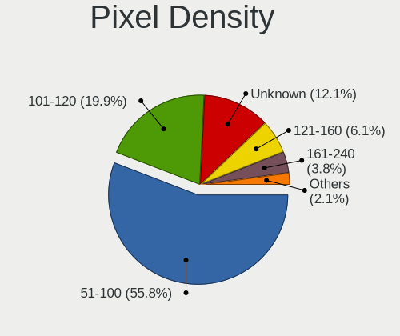

| Density | Desktops | Percent |
|---------|----------|---------|
| 51-100  | 222      | 55.78%  |
| 101-120 | 78       | 19.6%   |
| Unknown | 62       | 15.58%  |
| 121-160 | 19       | 4.77%   |
| 1-50    | 9        | 2.26%   |
| 161-240 | 8        | 2.01%   |

Multiple Monitors
-----------------

Total monitors connected

| Total | Desktops | Percent |
|-------|----------|---------|
| 1     | 330      | 83.33%  |
| 2     | 46       | 11.62%  |
| 0     | 15       | 3.79%   |
| 3     | 3        | 0.76%   |
| 4     | 2        | 0.51%   |

Network
-------

Net Controller Vendor
---------------------

Controller vendors

| Vendor                           | Desktops | Percent |
|----------------------------------|----------|---------|
| Realtek Semiconductor            | 224      | 42.03%  |
| Intel                            | 171      | 32.08%  |
| Qualcomm Atheros                 | 34       | 6.38%   |
| Broadcom                         | 23       | 4.32%   |
| BUFFALO                          | 13       | 2.44%   |
| TP-Link                          | 11       | 2.06%   |
| PLANEX                           | 9        | 1.69%   |
| Marvell Technology Group         | 7        | 1.31%   |
| Nvidia                           | 5        | 0.94%   |
| Elecom                           | 4        | 0.75%   |
| ASIX Electronics                 | 4        | 0.75%   |
| VIA Technologies                 | 3        | 0.56%   |
| Aquantia                         | 3        | 0.56%   |
| Logitec                          | 2        | 0.38%   |
| Huawei Technologies              | 2        | 0.38%   |
| Wilocity                         | 1        | 0.19%   |
| ULi Electronics                  | 1        | 0.19%   |
| U-Blox                           | 1        | 0.19%   |
| Silicon Integrated Systems [SiS] | 1        | 0.19%   |
| Samsung Electronics              | 1        | 0.19%   |
| Ralink Technology                | 1        | 0.19%   |
| Qualcomm Atheros Communications  | 1        | 0.19%   |
| Padix (Rockfire)                 | 1        | 0.19%   |
| NetGear                          | 1        | 0.19%   |
| Netchip Technology               | 1        | 0.19%   |
| NEC Computers                    | 1        | 0.19%   |
| MediaTek                         | 1        | 0.19%   |
| LSI                              | 1        | 0.19%   |
| JMicron Technology               | 1        | 0.19%   |
| Edimax Technology                | 1        | 0.19%   |
| Corega K.K.                      | 1        | 0.19%   |
| Broadcom Limited                 | 1        | 0.19%   |
| ADMtek                           | 1        | 0.19%   |

Net Controller Model
--------------------

Controller models

| Model                                                              | Desktops | Percent |
|--------------------------------------------------------------------|----------|---------|
| Realtek RTL8111/8168/8411 PCI Express Gigabit Ethernet Controller  | 181      | 30.57%  |
| Intel Ethernet Connection (2) I219-V                               | 26       | 4.39%   |
| Intel I211 Gigabit Network Connection                              | 19       | 3.21%   |
| Realtek RTL8125 2.5GbE Controller                                  | 18       | 3.04%   |
| Intel Wi-Fi 6 AX200                                                | 16       | 2.7%    |
| Intel Ethernet Connection (7) I219-V                               | 16       | 2.7%    |
| Intel 82579V Gigabit Network Connection                            | 14       | 2.36%   |
| Intel Ethernet Connection I217-V                                   | 9        | 1.52%   |
| Intel Dual Band Wireless-AC 3168NGW [Stone Peak]                   | 9        | 1.52%   |
| Intel 82579LM Gigabit Network Connection (Lewisville)              | 8        | 1.35%   |
| TP-Link AC600 wireless Realtek RTL8811AU [Archer T2U Nano]         | 7        | 1.18%   |
| Realtek RTL88x2bu [AC1200 Techkey]                                 | 7        | 1.18%   |
| Qualcomm Atheros Killer E220x Gigabit Ethernet Controller          | 7        | 1.18%   |
| Realtek RTL8188EUS 802.11n Wireless Network Adapter                | 6        | 1.01%   |
| Realtek RTL8153 Gigabit Ethernet Adapter                           | 6        | 1.01%   |
| Intel Ethernet Connection I217-LM                                  | 6        | 1.01%   |
| Intel Ethernet Connection (2) I218-V                               | 5        | 0.84%   |
| Intel 82574L Gigabit Network Connection                            | 5        | 0.84%   |
| Realtek RTL-8100/8101L/8139 PCI Fast Ethernet Adapter              | 4        | 0.68%   |
| Qualcomm Atheros AR9485 Wireless Network Adapter                   | 4        | 0.68%   |
| Qualcomm Atheros AR8161 Gigabit Ethernet                           | 4        | 0.68%   |
| Marvell Group 88E8056 PCI-E Gigabit Ethernet Controller            | 4        | 0.68%   |
| Intel Ethernet Controller I225-V                                   | 4        | 0.68%   |
| Intel Ethernet Connection (11) I219-V                              | 4        | 0.68%   |
| BUFFALO 802.11ac WLAN Adapter                                      | 4        | 0.68%   |
| Broadcom NetXtreme BCM5761 Gigabit Ethernet PCIe                   | 4        | 0.68%   |
| ASIX AX88179 Gigabit Ethernet                                      | 4        | 0.68%   |
| VIA VT6102/VT6103 [Rhine-II]                                       | 3        | 0.51%   |
| Realtek RTL8192CU 802.11n WLAN Adapter                             | 3        | 0.51%   |
| Realtek RTL8188CUS 802.11n WLAN Adapter                            | 3        | 0.51%   |
| Realtek RTL8169 PCI Gigabit Ethernet Controller                    | 3        | 0.51%   |
| Realtek RTL-8110SC/8169SC Gigabit Ethernet                         | 3        | 0.51%   |
| Qualcomm Atheros AR9462 Wireless Network Adapter                   | 3        | 0.51%   |
| Qualcomm Atheros AR8151 v2.0 Gigabit Ethernet                      | 3        | 0.51%   |
| Qualcomm Atheros AR8121/AR8113/AR8114 Gigabit or Fast Ethernet     | 3        | 0.51%   |
| PLANEX GW-USValue-EZ 802.11n Wireless Adapter [Realtek RTL8188CUS] | 3        | 0.51%   |
| PLANEX GW-USNano2 802.11n Wireless Adapter [Realtek RTL8188CUS]    | 3        | 0.51%   |
| Intel Wi-Fi 6 AX210/AX211/AX411 160MHz                             | 3        | 0.51%   |
| Intel I210 Gigabit Network Connection                              | 3        | 0.51%   |
| Intel Ethernet Connection (2) I219-LM                              | 3        | 0.51%   |
| Intel Ethernet Connection (12) I219-V                              | 3        | 0.51%   |
| Intel Cannon Lake PCH CNVi WiFi                                    | 3        | 0.51%   |
| Broadcom NetLink BCM57781 Gigabit Ethernet PCIe                    | 3        | 0.51%   |
| Broadcom BCM4360 802.11ac Wireless Network Adapter                 | 3        | 0.51%   |
| Aquantia AQC107 NBase-T/IEEE 802.3bz Ethernet Controller [AQtion]  | 3        | 0.51%   |
| VIA AC'97 Modem Controller                                         | 2        | 0.34%   |
| Realtek Killer E3000 2.5GbE Controller                             | 2        | 0.34%   |
| Realtek 802.11ac NIC                                               | 2        | 0.34%   |
| Qualcomm Atheros QCA9377 802.11ac Wireless Network Adapter         | 2        | 0.34%   |
| Qualcomm Atheros QCA8171 Gigabit Ethernet                          | 2        | 0.34%   |
| Qualcomm Atheros QCA6174 802.11ac Wireless Network Adapter         | 2        | 0.34%   |
| Qualcomm Atheros AR928X Wireless Network Adapter (PCI-Express)     | 2        | 0.34%   |
| Nvidia MCP55 Ethernet                                              | 2        | 0.34%   |
| Intel Wireless-AC 9260                                             | 2        | 0.34%   |
| Intel Wireless 8265 / 8275                                         | 2        | 0.34%   |
| Intel Wireless 7260                                                | 2        | 0.34%   |
| Intel Tiger Lake PCH CNVi WiFi                                     | 2        | 0.34%   |
| Intel NM10/ICH7 Family LAN Controller                              | 2        | 0.34%   |
| Intel Ethernet Connection (17) I219-V                              | 2        | 0.34%   |
| Intel 82578DM Gigabit Network Connection                           | 2        | 0.34%   |

Wireless Vendor
---------------

Wireless vendors

| Vendor                          | Desktops | Percent |
|---------------------------------|----------|---------|
| Intel                           | 44       | 31.88%  |
| Realtek Semiconductor           | 27       | 19.57%  |
| Qualcomm Atheros                | 16       | 11.59%  |
| BUFFALO                         | 13       | 9.42%   |
| TP-Link                         | 11       | 7.97%   |
| PLANEX                          | 9        | 6.52%   |
| Broadcom                        | 6        | 4.35%   |
| Elecom                          | 3        | 2.17%   |
| Logitec                         | 2        | 1.45%   |
| Wilocity                        | 1        | 0.72%   |
| Ralink Technology               | 1        | 0.72%   |
| Qualcomm Atheros Communications | 1        | 0.72%   |
| NetGear                         | 1        | 0.72%   |
| NEC Computers                   | 1        | 0.72%   |
| MediaTek                        | 1        | 0.72%   |
| Edimax Technology               | 1        | 0.72%   |

Wireless Model
--------------

Wireless models

| Model                                                              | Desktops | Percent |
|--------------------------------------------------------------------|----------|---------|
| Intel Wi-Fi 6 AX200                                                | 16       | 11.43%  |
| Intel Dual Band Wireless-AC 3168NGW [Stone Peak]                   | 9        | 6.43%   |
| TP-Link AC600 wireless Realtek RTL8811AU [Archer T2U Nano]         | 7        | 5%      |
| Realtek RTL88x2bu [AC1200 Techkey]                                 | 7        | 5%      |
| Realtek RTL8188EUS 802.11n Wireless Network Adapter                | 6        | 4.29%   |
| Qualcomm Atheros AR9485 Wireless Network Adapter                   | 4        | 2.86%   |
| BUFFALO 802.11ac WLAN Adapter                                      | 4        | 2.86%   |
| Realtek RTL8192CU 802.11n WLAN Adapter                             | 3        | 2.14%   |
| Realtek RTL8188CUS 802.11n WLAN Adapter                            | 3        | 2.14%   |
| Qualcomm Atheros AR9462 Wireless Network Adapter                   | 3        | 2.14%   |
| PLANEX GW-USValue-EZ 802.11n Wireless Adapter [Realtek RTL8188CUS] | 3        | 2.14%   |
| PLANEX GW-USNano2 802.11n Wireless Adapter [Realtek RTL8188CUS]    | 3        | 2.14%   |
| Intel Wi-Fi 6 AX210/AX211/AX411 160MHz                             | 3        | 2.14%   |
| Intel Cannon Lake PCH CNVi WiFi                                    | 3        | 2.14%   |
| Broadcom BCM4360 802.11ac Wireless Network Adapter                 | 3        | 2.14%   |
| Realtek 802.11ac NIC                                               | 2        | 1.43%   |
| Qualcomm Atheros QCA9377 802.11ac Wireless Network Adapter         | 2        | 1.43%   |
| Qualcomm Atheros QCA6174 802.11ac Wireless Network Adapter         | 2        | 1.43%   |
| Qualcomm Atheros AR928X Wireless Network Adapter (PCI-Express)     | 2        | 1.43%   |
| Intel Wireless-AC 9260                                             | 2        | 1.43%   |
| Intel Wireless 8265 / 8275                                         | 2        | 1.43%   |
| Intel Wireless 7260                                                | 2        | 1.43%   |
| Intel Tiger Lake PCH CNVi WiFi                                     | 2        | 1.43%   |
| Elecom WDC-150SU2M                                                 | 2        | 1.43%   |
| BUFFALO WLI-UC-GNM Wireless LAN Adapter [Ralink RT8070]            | 2        | 1.43%   |
| BUFFALO 802.11 n WLAN                                              | 2        | 1.43%   |
| Broadcom BCM43228 802.11a/b/g/n                                    | 2        | 1.43%   |
| Wilocity Wil6200 802.11ad Wireless Network Adapter                 | 1        | 0.71%   |
| TP-Link TL-WN823N v2/v3 [Realtek RTL8192EU]                        | 1        | 0.71%   |
| TP-Link TL-WN722N v2                                               | 1        | 0.71%   |
| TP-Link RTL8812AU Archer T4U 802.11ac                              | 1        | 0.71%   |
| TP-Link Archer T2U PLUS [RTL8821AU]                                | 1        | 0.71%   |
| Realtek RTL8822BE 802.11a/b/g/n/ac WiFi adapter                    | 1        | 0.71%   |
| Realtek RTL8821AE 802.11ac PCIe Wireless Network Adapter           | 1        | 0.71%   |
| Realtek RTL8191SEvA Wireless LAN Controller                        | 1        | 0.71%   |
| Realtek RTL8188ETV Wireless LAN 802.11n Network Adapter            | 1        | 0.71%   |
| Realtek RTL8188EE Wireless Network Adapter                         | 1        | 0.71%   |
| Realtek RTL8187SE Wireless LAN Controller                          | 1        | 0.71%   |
| Ralink RT5370 Wireless Adapter                                     | 1        | 0.71%   |
| Qualcomm Atheros AR9271 802.11n                                    | 1        | 0.71%   |
| Qualcomm Atheros AR93xx Wireless Network Adapter                   | 1        | 0.71%   |
| Qualcomm Atheros AR9287 Wireless Network Adapter (PCI-Express)     | 1        | 0.71%   |
| Qualcomm Atheros AR5212/5213/2414 Wireless Network Adapter         | 1        | 0.71%   |
| PLANEX GW-USNano                                                   | 1        | 0.71%   |
| PLANEX GW-900D                                                     | 1        | 0.71%   |
| PLANEX 802.11n WLAN Adapter                                        | 1        | 0.71%   |
| NetGear WNDA4100 802.11abgn 3x3:3 [Ralink RT3573]                  | 1        | 0.71%   |
| NEC Computers Aterm WL300NU-G                                      | 1        | 0.71%   |
| MediaTek MT7612U 802.11a/b/g/n/ac Wireless Adapter                 | 1        | 0.71%   |
| Logitec LAN-W150N/U2 Wireless LAN Adapter                          | 1        | 0.71%   |
| Logitec 802.11 n WLAN                                              | 1        | 0.71%   |
| Intel Wireless Gigabit 17265                                       | 1        | 0.71%   |
| Intel Wireless 8260                                                | 1        | 0.71%   |
| Intel Wireless 3160                                                | 1        | 0.71%   |
| Intel Centrino Wireless-N 2230                                     | 1        | 0.71%   |
| Intel Centrino Wireless-N 2200                                     | 1        | 0.71%   |
| Elecom 802.11ac WLAN                                               | 1        | 0.71%   |
| Edimax EW-7711UTn nLite Wireless Adapter [Ralink RT3070]           | 1        | 0.71%   |
| BUFFALO WLI-UC-GNM2 Wireless LAN Adapter [Ralink RT3070]           | 1        | 0.71%   |
| BUFFALO WLI-UC-GN Wireless LAN Adapter [Ralink RT3070]             | 1        | 0.71%   |

Ethernet Vendor
---------------

Ethernet vendors

| Vendor                           | Desktops | Percent |
|----------------------------------|----------|---------|
| Realtek Semiconductor            | 212      | 49.3%   |
| Intel                            | 147      | 34.19%  |
| Qualcomm Atheros                 | 21       | 4.88%   |
| Broadcom                         | 18       | 4.19%   |
| Marvell Technology Group         | 7        | 1.63%   |
| Nvidia                           | 5        | 1.16%   |
| ASIX Electronics                 | 4        | 0.93%   |
| VIA Technologies                 | 3        | 0.7%    |
| Aquantia                         | 3        | 0.7%    |
| Huawei Technologies              | 2        | 0.47%   |
| Silicon Integrated Systems [SiS] | 1        | 0.23%   |
| Samsung Electronics              | 1        | 0.23%   |
| Netchip Technology               | 1        | 0.23%   |
| JMicron Technology               | 1        | 0.23%   |
| Elecom                           | 1        | 0.23%   |
| Corega K.K.                      | 1        | 0.23%   |
| Broadcom Limited                 | 1        | 0.23%   |
| ADMtek                           | 1        | 0.23%   |

Ethernet Model
--------------

Ethernet models

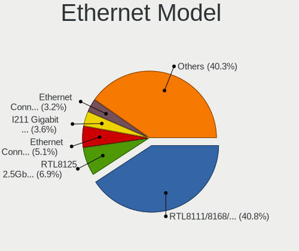

| Model                                                             | Desktops | Percent |
|-------------------------------------------------------------------|----------|---------|
| Realtek RTL8111/8168/8411 PCI Express Gigabit Ethernet Controller | 181      | 40.67%  |
| Intel Ethernet Connection (2) I219-V                              | 26       | 5.84%   |
| Intel I211 Gigabit Network Connection                             | 19       | 4.27%   |
| Realtek RTL8125 2.5GbE Controller                                 | 18       | 4.04%   |
| Intel Ethernet Connection (7) I219-V                              | 16       | 3.6%    |
| Intel 82579V Gigabit Network Connection                           | 14       | 3.15%   |
| Intel Ethernet Connection I217-V                                  | 9        | 2.02%   |
| Intel 82579LM Gigabit Network Connection (Lewisville)             | 8        | 1.8%    |
| Qualcomm Atheros Killer E220x Gigabit Ethernet Controller         | 7        | 1.57%   |
| Realtek RTL8153 Gigabit Ethernet Adapter                          | 6        | 1.35%   |
| Intel Ethernet Connection I217-LM                                 | 6        | 1.35%   |
| Intel Ethernet Connection (2) I218-V                              | 5        | 1.12%   |
| Intel 82574L Gigabit Network Connection                           | 5        | 1.12%   |
| Realtek RTL-8100/8101L/8139 PCI Fast Ethernet Adapter             | 4        | 0.9%    |
| Qualcomm Atheros AR8161 Gigabit Ethernet                          | 4        | 0.9%    |
| Marvell Group 88E8056 PCI-E Gigabit Ethernet Controller           | 4        | 0.9%    |
| Intel Ethernet Controller I225-V                                  | 4        | 0.9%    |
| Intel Ethernet Connection (11) I219-V                             | 4        | 0.9%    |
| Broadcom NetXtreme BCM5761 Gigabit Ethernet PCIe                  | 4        | 0.9%    |
| ASIX AX88179 Gigabit Ethernet                                     | 4        | 0.9%    |
| VIA VT6102/VT6103 [Rhine-II]                                      | 3        | 0.67%   |
| Realtek RTL8169 PCI Gigabit Ethernet Controller                   | 3        | 0.67%   |
| Realtek RTL-8110SC/8169SC Gigabit Ethernet                        | 3        | 0.67%   |
| Qualcomm Atheros AR8151 v2.0 Gigabit Ethernet                     | 3        | 0.67%   |
| Qualcomm Atheros AR8121/AR8113/AR8114 Gigabit or Fast Ethernet    | 3        | 0.67%   |
| Intel I210 Gigabit Network Connection                             | 3        | 0.67%   |
| Intel Ethernet Connection (2) I219-LM                             | 3        | 0.67%   |
| Intel Ethernet Connection (12) I219-V                             | 3        | 0.67%   |
| Broadcom NetLink BCM57781 Gigabit Ethernet PCIe                   | 3        | 0.67%   |
| Aquantia AQC107 NBase-T/IEEE 802.3bz Ethernet Controller [AQtion] | 3        | 0.67%   |
| Realtek Killer E3000 2.5GbE Controller                            | 2        | 0.45%   |
| Qualcomm Atheros QCA8171 Gigabit Ethernet                         | 2        | 0.45%   |
| Nvidia MCP55 Ethernet                                             | 2        | 0.45%   |
| Intel NM10/ICH7 Family LAN Controller                             | 2        | 0.45%   |
| Intel Ethernet Connection (17) I219-V                             | 2        | 0.45%   |
| Intel 82578DM Gigabit Network Connection                          | 2        | 0.45%   |
| Intel 82576 Gigabit Network Connection                            | 2        | 0.45%   |
| Intel 82567LM-3 Gigabit Network Connection                        | 2        | 0.45%   |
| Intel 82566DM-2 Gigabit Network Connection                        | 2        | 0.45%   |
| Intel 82566DM Gigabit Network Connection                          | 2        | 0.45%   |
| Huawei E353/E3131                                                 | 2        | 0.45%   |
| Broadcom NetXtreme BCM5764M Gigabit Ethernet PCIe                 | 2        | 0.45%   |
| Broadcom NetLink BCM5784M Gigabit Ethernet PCIe                   | 2        | 0.45%   |
| Broadcom BCM4401-B0 100Base-TX                                    | 2        | 0.45%   |
| Silicon Integrated Systems [SiS] 191 Gigabit Ethernet Adapter     | 1        | 0.22%   |
| Samsung GT-I9070 (network tethering, USB debugging enabled)       | 1        | 0.22%   |
| Realtek Killer E2600 Gigabit Ethernet Controller                  | 1        | 0.22%   |
| Qualcomm Atheros Killer E2500 Gigabit Ethernet Controller         | 1        | 0.22%   |
| Qualcomm Atheros Attansic L1 Gigabit Ethernet                     | 1        | 0.22%   |
| Nvidia MCP79 Ethernet                                             | 1        | 0.22%   |
| Nvidia MCP77 Ethernet                                             | 1        | 0.22%   |
| Nvidia MCP61 Ethernet                                             | 1        | 0.22%   |
| Netchip Linux-USB Ethernet/RNDIS Gadget                           | 1        | 0.22%   |
| Marvell Group 88E8071 PCI-E Gigabit Ethernet Controller           | 1        | 0.22%   |
| Marvell Group 88E8057 PCI-E Gigabit Ethernet Controller           | 1        | 0.22%   |
| Marvell Group 88E8053 PCI-E Gigabit Ethernet Controller           | 1        | 0.22%   |
| JMicron JMC260 PCI Express Fast Ethernet Controller               | 1        | 0.22%   |
| Intel I350 Gigabit Network Connection                             | 1        | 0.22%   |
| Intel Ethernet Controller X550                                    | 1        | 0.22%   |
| Intel Ethernet Connection I218-V                                  | 1        | 0.22%   |

Net Controller Kind
-------------------

Ethernet, WiFi or modem

| Kind     | Desktops | Percent |
|----------|----------|---------|
| Ethernet | 389      | 74.1%   |
| WiFi     | 129      | 24.57%  |
| Modem    | 6        | 1.14%   |
| Unknown  | 1        | 0.19%   |

Used Controller
---------------

Currently used network controller

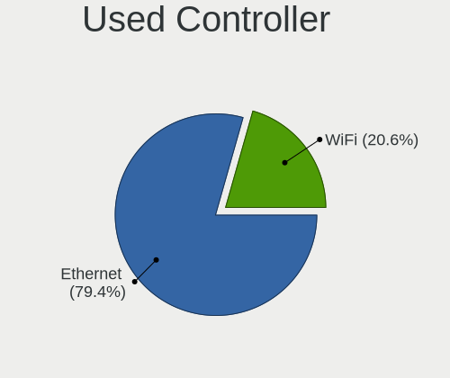

| Kind     | Desktops | Percent |
|----------|----------|---------|
| Ethernet | 338      | 82.24%  |
| WiFi     | 73       | 17.76%  |

NICs
----

Total network controllers on board

| Total | Desktops | Percent |
|-------|----------|---------|
| 1     | 283      | 72.56%  |
| 2     | 90       | 23.08%  |
| 3     | 14       | 3.59%   |
| 4     | 3        | 0.77%   |

IPv6
----

IPv6 vs IPv4

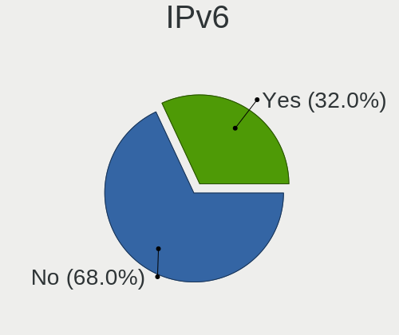

| Used | Desktops | Percent |
|------|----------|---------|
| No   | 312      | 78.39%  |
| Yes  | 86       | 21.61%  |

Bluetooth
---------

Bluetooth Vendor
----------------

Controller vendors

| Vendor                          | Desktops | Percent |
|---------------------------------|----------|---------|
| Cambridge Silicon Radio         | 49       | 42.24%  |
| Intel                           | 41       | 35.34%  |
| Realtek Semiconductor           | 7        | 6.03%   |
| Qualcomm Atheros Communications | 5        | 4.31%   |
| ASUSTek Computer                | 3        | 2.59%   |
| TP-Link                         | 2        | 1.72%   |
| IMC Networks                    | 2        | 1.72%   |
| Broadcom                        | 2        | 1.72%   |
| Apple                           | 2        | 1.72%   |
| Lite-On Technology              | 1        | 0.86%   |
| Foxconn / Hon Hai               | 1        | 0.86%   |
| Creative Technology             | 1        | 0.86%   |

Bluetooth Model
---------------

Controller models

| Model                                               | Desktops | Percent |
|-----------------------------------------------------|----------|---------|
| Cambridge Silicon Radio Bluetooth Dongle (HCI mode) | 49       | 42.24%  |
| Intel AX200 Bluetooth                               | 15       | 12.93%  |
| Intel Wireless-AC 3168 Bluetooth                    | 9        | 7.76%   |
| Realtek Bluetooth Radio                             | 6        | 5.17%   |
| Intel Bluetooth wireless interface                  | 6        | 5.17%   |
| Intel Bluetooth 9460/9560 Jefferson Peak (JfP)      | 3        | 2.59%   |
| Intel AX210 Bluetooth                               | 3        | 2.59%   |
| TP-Link UB500 Adapter                               | 2        | 1.72%   |
| Qualcomm Atheros AR3011 Bluetooth                   | 2        | 1.72%   |
| Intel Wireless-AC 9260 Bluetooth Adapter            | 2        | 1.72%   |
| Intel AX201 Bluetooth                               | 2        | 1.72%   |
| IMC Networks Bluetooth Device                       | 2        | 1.72%   |
| Realtek RTL8822BE Bluetooth 4.2 Adapter             | 1        | 0.86%   |
| Qualcomm Atheros  Bluetooth Device                  | 1        | 0.86%   |
| Qualcomm Atheros QCA61x4 Bluetooth 4.0              | 1        | 0.86%   |
| Qualcomm Atheros Bluetooth USB Host Controller      | 1        | 0.86%   |
| Lite-On Bluetooth Device                            | 1        | 0.86%   |
| Intel Centrino Bluetooth Wireless Transceiver       | 1        | 0.86%   |
| Foxconn / Hon Hai Bluetooth USB Host Controller     | 1        | 0.86%   |
| Creative Bluetooth Audio W2                         | 1        | 0.86%   |
| Broadcom HP Portable Bumble Bee                     | 1        | 0.86%   |
| Broadcom BCM20702A0 Bluetooth 4.0                   | 1        | 0.86%   |
| ASUS Bluetooth Radio                                | 1        | 0.86%   |
| ASUS Bluetooth Device                               | 1        | 0.86%   |
| ASUS BCM20702A0                                     | 1        | 0.86%   |
| Apple Bluetooth USB Host Controller                 | 1        | 0.86%   |
| Apple Bluetooth Host Controller                     | 1        | 0.86%   |

Sound
-----

Sound Vendor
------------

Sound card vendors

| Vendor                                          | Desktops | Percent |
|-------------------------------------------------|----------|---------|
| Intel                                           | 253      | 39.47%  |
| AMD                                             | 160      | 24.96%  |
| Nvidia                                          | 140      | 21.84%  |
| C-Media Electronics                             | 15       | 2.34%   |
| Creative Technology                             | 10       | 1.56%   |
| VIA Technologies                                | 9        | 1.4%    |
| Texas Instruments                               | 7        | 1.09%   |
| Harman                                          | 7        | 1.09%   |
| JMTek                                           | 4        | 0.62%   |
| Creative Labs                                   | 4        | 0.62%   |
| Yamaha                                          | 3        | 0.47%   |
| Generalplus Technology                          | 3        | 0.47%   |
| TOWA Electronics                                | 2        | 0.31%   |
| Sony                                            | 2        | 0.31%   |
| Onkyo                                           | 2        | 0.31%   |
| Elitegroup Computer Systems (ECS)               | 2        | 0.31%   |
| ASUSTek Computer                                | 2        | 0.31%   |
| XMOS                                            | 1        | 0.16%   |
| ULi Electronics                                 | 1        | 0.16%   |
| Thesycon Systemsoftware & Consulting            | 1        | 0.16%   |
| SteelSeries ApS                                 | 1        | 0.16%   |
| Silicon Integrated Systems [SiS]                | 1        | 0.16%   |
| Roland                                          | 1        | 0.16%   |
| RME                                             | 1        | 0.16%   |
| Realtek Semiconductor                           | 1        | 0.16%   |
| RATOC System                                    | 1        | 0.16%   |
| Rasteme                                         | 1        | 0.16%   |
| Philips (or NXP)                                | 1        | 0.16%   |
| Medeli Electronics                              | 1        | 0.16%   |
| Licensed by Sony Computer Entertainment America | 1        | 0.16%   |
| GN Netcom                                       | 1        | 0.16%   |
| Focusrite-Novation                              | 1        | 0.16%   |
| DSEA A/S                                        | 1        | 0.16%   |

Sound Model
-----------

Sound card models

| Model                                                                                             | Desktops | Percent |
|---------------------------------------------------------------------------------------------------|----------|---------|
| AMD Starship/Matisse HD Audio Controller                                                          | 35       | 4.73%   |
| Intel 7 Series/C216 Chipset Family High Definition Audio Controller                               | 33       | 4.46%   |
| Intel 8 Series/C220 Series Chipset High Definition Audio Controller                               | 25       | 3.38%   |
| AMD SBx00 Azalia (Intel HDA)                                                                      | 25       | 3.38%   |
| Intel 6 Series/C200 Series Chipset Family High Definition Audio Controller                        | 22       | 2.97%   |
| Intel Cannon Lake PCH cAVS                                                                        | 21       | 2.84%   |
| Intel 100 Series/C230 Series Chipset Family HD Audio Controller                                   | 21       | 2.84%   |
| Intel 200 Series PCH HD Audio                                                                     | 20       | 2.7%    |
| Nvidia GK208 HDMI/DP Audio Controller                                                             | 18       | 2.43%   |
| AMD Family 17h/19h HD Audio Controller                                                            | 18       | 2.43%   |
| Intel Xeon E3-1200 v3/4th Gen Core Processor HD Audio Controller                                  | 17       | 2.3%    |
| AMD FCH Azalia Controller                                                                         | 17       | 2.3%    |
| AMD Family 17h (Models 00h-0fh) HD Audio Controller                                               | 17       | 2.3%    |
| Intel 82801JI (ICH10 Family) HD Audio Controller                                                  | 16       | 2.16%   |
| AMD Oland/Hainan/Cape Verde/Pitcairn HDMI Audio [Radeon HD 7000 Series]                           | 16       | 2.16%   |
| Nvidia GP107GL High Definition Audio Controller                                                   | 15       | 2.03%   |
| Intel NM10/ICH7 Family High Definition Audio Controller                                           | 15       | 2.03%   |
| AMD Ellesmere HDMI Audio [Radeon RX 470/480 / 570/580/590]                                        | 15       | 2.03%   |
| AMD Raven/Raven2/Fenghuang HDMI/DP Audio Controller                                               | 14       | 1.89%   |
| Intel 82801I (ICH9 Family) HD Audio Controller                                                    | 11       | 1.49%   |
| Intel 5 Series/3400 Series Chipset High Definition Audio                                          | 11       | 1.49%   |
| Nvidia TU107 GeForce GTX 1650 High Definition Audio Controller                                    | 10       | 1.35%   |
| Nvidia TU116 High Definition Audio Controller                                                     | 9        | 1.22%   |
| Nvidia GK107 HDMI Audio Controller                                                                | 9        | 1.22%   |
| Intel C600/X79 series chipset High Definition Audio Controller                                    | 9        | 1.22%   |
| AMD RV710/730 HDMI Audio [Radeon HD 4000 series]                                                  | 8        | 1.08%   |
| AMD Caicos HDMI Audio [Radeon HD 6450 / 7450/8450/8490 OEM / R5 230/235/235X OEM]                 | 8        | 1.08%   |
| Nvidia GP106 High Definition Audio Controller                                                     | 7        | 0.95%   |
| Nvidia GP104 High Definition Audio Controller                                                     | 7        | 0.95%   |
| Nvidia GM107 High Definition Audio Controller [GeForce 940MX]                                     | 7        | 0.95%   |
| Nvidia GA102 High Definition Audio Controller                                                     | 7        | 0.95%   |
| Intel 82801H (ICH8 Family) HD Audio Controller                                                    | 6        | 0.81%   |
| Harman JBL Pebbles                                                                                | 6        | 0.81%   |
| AMD Navi 10 HDMI Audio                                                                            | 6        | 0.81%   |
| AMD Cedar HDMI Audio [Radeon HD 5400/6300/7300 Series]                                            | 6        | 0.81%   |
| VIA Technologies VT1720/24 [Envy24PT/HT] PCI Multi-Channel Audio Controller                       | 5        | 0.68%   |
| Nvidia TU102 High Definition Audio Controller                                                     | 5        | 0.68%   |
| Nvidia High Definition Audio Controller                                                           | 5        | 0.68%   |
| Nvidia GP108 High Definition Audio Controller                                                     | 5        | 0.68%   |
| Nvidia GK106 HDMI Audio Controller                                                                | 5        | 0.68%   |
| Intel C610/X99 series chipset HD Audio Controller                                                 | 5        | 0.68%   |
| Intel 9 Series Chipset Family HD Audio Controller                                                 | 5        | 0.68%   |
| Texas Instruments PCM2704 16-bit stereo audio DAC                                                 | 4        | 0.54%   |
| Nvidia TU104 HD Audio Controller                                                                  | 4        | 0.54%   |
| Nvidia GP102 HDMI Audio Controller                                                                | 4        | 0.54%   |
| Nvidia GM200 High Definition Audio                                                                | 4        | 0.54%   |
| Nvidia GF119 HDMI Audio Controller                                                                | 4        | 0.54%   |
| Nvidia GF108 High Definition Audio Controller                                                     | 4        | 0.54%   |
| JMTek USB PnP Audio Device                                                                        | 4        | 0.54%   |
| Intel Comet Lake PCH-V cAVS                                                                       | 4        | 0.54%   |
| Intel Comet Lake PCH cAVS                                                                         | 4        | 0.54%   |
| Intel Celeron/Pentium Silver Processor High Definition Audio                                      | 4        | 0.54%   |
| Intel Audio device                                                                                | 4        | 0.54%   |
| Intel Atom/Celeron/Pentium Processor x5-E8000/J3xxx/N3xxx Series High Definition Audio Controller | 4        | 0.54%   |
| C-Media Electronics CMI8788 [Oxygen HD Audio]                                                     | 4        | 0.54%   |
| AMD Trinity HDMI Audio Controller                                                                 | 4        | 0.54%   |
| AMD Kaveri HDMI/DP Audio Controller                                                               | 4        | 0.54%   |
| AMD Kabini HDMI/DP Audio                                                                          | 4        | 0.54%   |
| AMD Baffin HDMI/DP Audio [Radeon RX 550 640SP / RX 560/560X]                                      | 4        | 0.54%   |
| Nvidia TU106 High Definition Audio Controller                                                     | 3        | 0.41%   |

Memory
------

Memory Vendor
-------------

Memory module vendors

| Vendor              | Desktops | Percent |
|---------------------|----------|---------|
| Unknown             | 21       | 14.09%  |
| Crucial             | 21       | 14.09%  |
| Kingston            | 20       | 13.42%  |
| Corsair             | 10       | 6.71%   |
| A-DATA Technology   | 10       | 6.71%   |
| Team                | 9        | 6.04%   |
| G.Skill             | 9        | 6.04%   |
| Samsung Electronics | 7        | 4.7%    |
| Micron Technology   | 6        | 4.03%   |
| SK hynix            | 5        | 3.36%   |
| Silicon Power       | 4        | 2.68%   |
| Panram              | 4        | 2.68%   |
| Nanya Technology    | 4        | 2.68%   |
| KLEVV               | 4        | 2.68%   |
| Transcend           | 2        | 1.34%   |
| SanMax              | 2        | 1.34%   |
| Unknown             | 2        | 1.34%   |
| V-Color             | 1        | 0.67%   |
| Unknown (8AD3)      | 1        | 0.67%   |
| Unknown (0x09EE)    | 1        | 0.67%   |
| UMAX                | 1        | 0.67%   |
| Ramos Technology    | 1        | 0.67%   |
| Patriot             | 1        | 0.67%   |
| Kingmax             | 1        | 0.67%   |
| Elpida              | 1        | 0.67%   |
| Century Micro       | 1        | 0.67%   |

Memory Model
------------

Memory module models

| Model                                                        | Desktops | Percent |
|--------------------------------------------------------------|----------|---------|
| Unknown RAM Module 2048MB DIMM SDRAM                         | 3        | 1.96%   |
| KLEVV RAM KD48GU881-26N190A 8GB DIMM DDR4 2667MT/s           | 3        | 1.96%   |
| Kingston RAM KHX2666C16/16G 16GB DIMM DDR4 3200MT/s          | 3        | 1.96%   |
| Crucial RAM BLS8G3D1609DS1S00. 8GB DIMM DDR3 1600MT/s        | 3        | 1.96%   |
| Unknown RAM Module 1GB DIMM 800MT/s                          | 2        | 1.31%   |
| Team RAM TEAMGROUP-UD4-2666 8GB DIMM DDR4 2667MT/s           | 2        | 1.31%   |
| Team RAM TEAMGROUP-UD3-1600 8GB DIMM DDR3 1600MT/s           | 2        | 1.31%   |
| Nanya RAM M2X4G64CB8HG9N-DG 4GB DIMM DDR3 1600MT/s           | 2        | 1.31%   |
| Kingston RAM KHX3600C18D4/32GX 32GB DIMM DDR4 3600MT/s       | 2        | 1.31%   |
| Kingston RAM 9905622-057.A00G 4096MB DIMM DDR4 2133MT/s      | 2        | 1.31%   |
| G.Skill RAM F4-2666C19-8GNT 8GB DIMM DDR4 2667MT/s           | 2        | 1.31%   |
| G.Skill RAM F3-2400C10-4GTX 4GB DIMM DDR3 2400MT/s           | 2        | 1.31%   |
| Crucial RAM CT51264BA160BJ.C8F 4GB DIMM DDR3 1600MT/s        | 2        | 1.31%   |
| Crucial RAM CT16G4DFD8266.C16FD1 16GB DIMM DDR4 2667MT/s     | 2        | 1.31%   |
| Corsair RAM CMK64GX4M2E3200C16 32GB DIMM DDR4 3200MT/s       | 2        | 1.31%   |
| A-DATA RAM Module 8GB DIMM DDR4 3200MT/s                     | 2        | 1.31%   |
| Unknown                                                      | 2        | 1.31%   |
| V-Color RAM TD48G26S819K-VC 8GB DIMM DDR4 2667MT/s           | 1        | 0.65%   |
| Unknown RAM Module 8GB DIMM DDR3 1333MT/s                    | 1        | 0.65%   |
| Unknown RAM Module 4GB DIMM SDRAM                            | 1        | 0.65%   |
| Unknown RAM Module 4GB DIMM DDR3 1600MT/s                    | 1        | 0.65%   |
| Unknown RAM Module 4GB DIMM DDR3 1066MT/s                    | 1        | 0.65%   |
| Unknown RAM Module 4096MB DIMM DDR3 1333MT/s                 | 1        | 0.65%   |
| Unknown RAM Module 4096MB DIMM 1333MT/s                      | 1        | 0.65%   |
| Unknown RAM Module 2GB DIMM SDRAM                            | 1        | 0.65%   |
| Unknown RAM Module 2GB DIMM 800MT/s                          | 1        | 0.65%   |
| Unknown RAM Module 2048MB DIMM SDRAM 800MT/s                 | 1        | 0.65%   |
| Unknown RAM Module 2048MB DIMM DDR3 1333MT/s                 | 1        | 0.65%   |
| Unknown RAM Module 2048MB DIMM DDR2 800MT/s                  | 1        | 0.65%   |
| Unknown RAM Module 2048MB DIMM DDR2                          | 1        | 0.65%   |
| Unknown RAM Module 1GB DIMM SDRAM 533MT/s                    | 1        | 0.65%   |
| Unknown RAM Module 16384MB DIMM DDR3 1866MT/s                | 1        | 0.65%   |
| Unknown RAM Module 1024MB DIMM DDR2 800MT/s                  | 1        | 0.65%   |
| Unknown RAM Module 1024MB DIMM DDR 533MT/s                   | 1        | 0.65%   |
| Unknown RAM Module 1024MB DIMM 667MT/s                       | 1        | 0.65%   |
| Unknown (8AD3) RAM CIR-S4DUSW2616G 16GB DIMM DDR4 2667MT/s   | 1        | 0.65%   |
| Unknown (0x09EE) RAM DDR4 3200 2OZ 8GB DIMM DDR4 2667MT/s    | 1        | 0.65%   |
| UMAX RAM D4-2400-16G-1024X8-L 16GB DIMM DDR4 2400MT/s        | 1        | 0.65%   |
| Transcend RAM JM2666HLH-4G 4096MB DIMM DDR4 2666MT/s         | 1        | 0.65%   |
| Transcend RAM JM1600KSN-4G 4096MB SODIMM DDR3 1600MT/s       | 1        | 0.65%   |
| Team RAM TEAMGROUP-UD4-3200 32GB DIMM DDR4 3200MT/s          | 1        | 0.65%   |
| Team RAM TEAMGROUP-UD4-3000 8GB DIMM DDR4 3067MT/s           | 1        | 0.65%   |
| Team RAM TEAMGROUP-UD4-2400 8GB DIMM DDR4 3007MT/s           | 1        | 0.65%   |
| Team RAM Module 2048MB DIMM DDR2 800MT/s                     | 1        | 0.65%   |
| Team RAM Elite-2400 8192MB DIMM DDR4 2400MT/s                | 1        | 0.65%   |
| SK hynix RAM HMT41GU7BFR8A-PB 8GB DIMM DDR3 1600MT/s         | 1        | 0.65%   |
| SK hynix RAM HMT351U6CFR8C-PB 4GB DIMM DDR3 1800MT/s         | 1        | 0.65%   |
| SK hynix RAM HMT325U6CFR8C-PB 2GB DIMM DDR3 1600MT/s         | 1        | 0.65%   |
| SK hynix RAM HMA81GU6DJR8N-XN 8192MB DIMM DDR4 3200MT/s      | 1        | 0.65%   |
| SK hynix RAM HMA81GR7CJR8N-VK 8192MB DIMM DDR4 2666MT/s      | 1        | 0.65%   |
| Silicon Power RAM SP016GBSFU320F02 16GB SODIMM DDR4 3200MT/s | 1        | 0.65%   |
| Silicon Power RAM SP008GBLFU240B02 8GB DIMM DDR4 2400MT/s    | 1        | 0.65%   |
| Silicon Power RAM Module 8GB DIMM DDR4 2400MT/s              | 1        | 0.65%   |
| Silicon Power RAM DCLT8GN128S 8GB DIMM DDR3 1600MT/s         | 1        | 0.65%   |
| Silicon Power RAM DBLT4GN568S 4GB DIMM DDR3 1333MT/s         | 1        | 0.65%   |
| SanMax RAM SMD-4G68H1P-16K 4GB DIMM DDR3 1600MT/s            | 1        | 0.65%   |
| SanMax RAM Module 8192MB DIMM DDR4 2667MT/s                  | 1        | 0.65%   |
| Samsung RAM Module 8GB DIMM DDR4 2667MT/s                    | 1        | 0.65%   |
| Samsung RAM M471B5273DH0-CK0 4GB SODIMM DDR3 1600MT/s        | 1        | 0.65%   |
| Samsung RAM M471A1G44AB0-CWE 8GB SODIMM DDR4 3200MT/s        | 1        | 0.65%   |

Memory Kind
-----------

Memory module kinds

| Kind    | Desktops | Percent |
|---------|----------|---------|
| DDR4    | 82       | 58.99%  |
| DDR3    | 40       | 28.78%  |
| SDRAM   | 8        | 5.76%   |
| DDR2    | 4        | 2.88%   |
| Unknown | 4        | 2.88%   |
| DDR     | 1        | 0.72%   |

Memory Form Factor
------------------

Physical design of the memory module

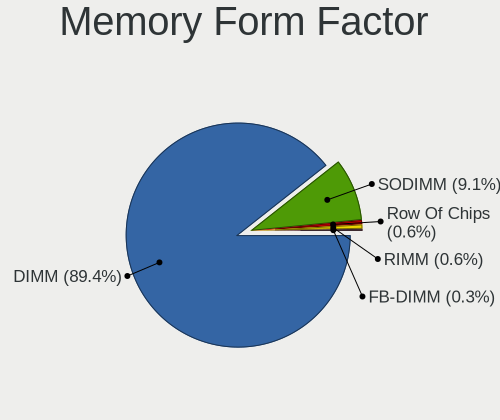

| Name   | Desktops | Percent |
|--------|----------|---------|
| DIMM   | 132      | 95.65%  |
| SODIMM | 5        | 3.62%   |
| RIMM   | 1        | 0.72%   |

Memory Size
-----------

Memory module size

| Size  | Desktops | Percent |
|-------|----------|---------|
| 8192  | 53       | 37.32%  |
| 16384 | 31       | 21.83%  |
| 4096  | 30       | 21.13%  |
| 2048  | 13       | 9.15%   |
| 32768 | 9        | 6.34%   |
| 1024  | 6        | 4.23%   |

Memory Speed
------------

Memory module speed

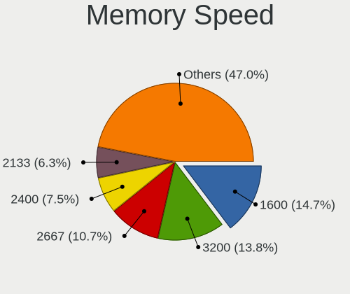

| Speed   | Desktops | Percent |
|---------|----------|---------|
| 2667    | 23       | 15.97%  |
| 1600    | 23       | 15.97%  |
| 3200    | 19       | 13.19%  |
| 2400    | 13       | 9.03%   |
| 2133    | 9        | 6.25%   |
| 3600    | 8        | 5.56%   |
| 2666    | 7        | 4.86%   |
| 1333    | 7        | 4.86%   |
| 800     | 7        | 4.86%   |
| Unknown | 6        | 4.17%   |
| 2933    | 3        | 2.08%   |
| 1800    | 3        | 2.08%   |
| 1866    | 2        | 1.39%   |
| 667     | 2        | 1.39%   |
| 533     | 2        | 1.39%   |
| 4133    | 1        | 0.69%   |
| 3800    | 1        | 0.69%   |
| 3400    | 1        | 0.69%   |
| 3100    | 1        | 0.69%   |
| 3067    | 1        | 0.69%   |
| 3007    | 1        | 0.69%   |
| 3000    | 1        | 0.69%   |
| 2733    | 1        | 0.69%   |
| 1867    | 1        | 0.69%   |
| 1066    | 1        | 0.69%   |

Printers & scanners
-------------------

Printer Vendor
--------------

Printer device vendors

| Vendor             | Desktops | Percent |
|--------------------|----------|---------|
| Canon              | 3        | 37.5%   |
| Seiko Epson        | 2        | 25%     |
| Brother Industries | 2        | 25%     |
| Hewlett-Packard    | 1        | 12.5%   |

Printer Model
-------------

Printer device models

| Model                         | Desktops | Percent |
|-------------------------------|----------|---------|
| Seiko Epson PX-045A Series    | 1        | 12.5%   |
| Seiko Epson EP-306 Series     | 1        | 12.5%   |
| HP ENVY 5000 series           | 1        | 12.5%   |
| Canon PIXMA iX6850 Printer    | 1        | 12.5%   |
| Canon PIXMA iP4600 Printer    | 1        | 12.5%   |
| Canon iP2700 series           | 1        | 12.5%   |
| Brother HL-L2360D series      | 1        | 12.5%   |
| Brother HL-1440 Laser Printer | 1        | 12.5%   |

Scanner Vendor
--------------

Scanner device vendors

| Vendor      | Desktops | Percent |
|-------------|----------|---------|
| Seiko Epson | 1        | 100%    |

Scanner Model
-------------

Scanner device models

| Model                                                         | Desktops | Percent |
|---------------------------------------------------------------|----------|---------|
| Seiko Epson GT-8700/GT-8700F [Perfection 1640SU/1640SU PHOTO] | 1        | 100%    |

Camera
------

Camera Vendor
-------------

Camera device vendors

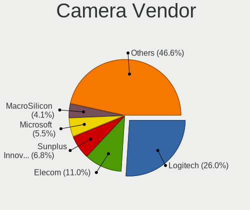

| Vendor                        | Desktops | Percent |
|-------------------------------|----------|---------|
| Logitech                      | 11       | 26.83%  |
| Sunplus Innovation Technology | 3        | 7.32%   |
| Microsoft                     | 3        | 7.32%   |
| Elecom                        | 3        | 7.32%   |
| Microdia                      | 2        | 4.88%   |
| Generalplus Technology        | 2        | 4.88%   |
| WaveRider Communications      | 1        | 2.44%   |
| Syntek                        | 1        | 2.44%   |
| SHENZHEN EMEET TECHNOLOGY     | 1        | 2.44%   |
| Samsung Electronics           | 1        | 2.44%   |
| Ruision                       | 1        | 2.44%   |
| OmniVision Technologies       | 1        | 2.44%   |
| MacroSilicon                  | 1        | 2.44%   |
| Jieli Technology              | 1        | 2.44%   |
| Huawei Technologies           | 1        | 2.44%   |
| HD USB Camera                 | 1        | 2.44%   |
| GEMBIRD                       | 1        | 2.44%   |
| Etron Technology              | 1        | 2.44%   |
| Cubeternet                    | 1        | 2.44%   |
| Chicony Electronics           | 1        | 2.44%   |
| BUFFALO                       | 1        | 2.44%   |
| Apple                         | 1        | 2.44%   |
| Alcor Micro                   | 1        | 2.44%   |

Camera Model
------------

Camera device models

| Model                                          | Desktops | Percent |
|------------------------------------------------|----------|---------|
| Logitech Webcam C270                           | 5        | 11.9%   |
| Microdia Webcam Vitade AF                      | 2        | 4.76%   |
| Generalplus 808 Camera #9 (web-cam mode)       | 2        | 4.76%   |
| Elecom UCAM-DLE300T                            | 2        | 4.76%   |
| WaveRider USB Live camera                      | 1        | 2.38%   |
| Syntek BUFFALO BSW20K06H USB PC Camera         | 1        | 2.38%   |
| Sunplus SPCA2281 Web Camera                    | 1        | 2.38%   |
| Sunplus Depstech webcam MIC                    | 1        | 2.38%   |
| Sunplus AUSDOM FHD Camera                      | 1        | 2.38%   |
| SHENZHEN EMEET TECHNOLOGY HD Webcam eMeet C960 | 1        | 2.38%   |
| Samsung Galaxy series, misc. (MTP mode)        | 1        | 2.38%   |
| Ruision UVC Camera                             | 1        | 2.38%   |
| OmniVision OV511+ Webcam                       | 1        | 2.38%   |
| Microsoft Microsoft LifeCam Studio           | 1        | 2.38%   |
| Microsoft LifeCam HD-3000                      | 1        | 2.38%   |
| Microsoft LifeCam Cinema                       | 1        | 2.38%   |
| MacroSilicon USB Video                         | 1        | 2.38%   |
| Logitech Webcam C310                           | 1        | 2.38%   |
| Logitech QuickCam Orbit/Sphere AF              | 1        | 2.38%   |
| Logitech HD Webcam C910                        | 1        | 2.38%   |
| Logitech HD Webcam C615                        | 1        | 2.38%   |
| Logitech C922 Pro Stream Webcam                | 1        | 2.38%   |
| Logitech BRIO Ultra HD Webcam                  | 1        | 2.38%   |
| Jieli USB PHY 2.0                              | 1        | 2.38%   |
| Huawei UVC Camera                              | 1        | 2.38%   |
| HD USB Camera HD USB Camera                    | 1        | 2.38%   |
| GEMBIRD USB2.0 PC CAMERA                       | 1        | 2.38%   |
| Etron BUFFALO BSW32KM03 USB PC Camera          | 1        | 2.38%   |
| Elecom UCAM-DLB200TA                           | 1        | 2.38%   |
| Cubeternet WebCam                              | 1        | 2.38%   |
| Chicony FJ Camera                              | 1        | 2.38%   |
| BUFFALO USB 2.0 Camera                         | 1        | 2.38%   |
| BUFFALO BUFFALO BSWHD06M USB Camera            | 1        | 2.38%   |
| Apple iPhone 5/5C/5S/6/SE                      | 1        | 2.38%   |
| Alcor Micro USB 2.0 PC Camera                  | 1        | 2.38%   |

Security
--------

Fingerprint Vendor
------------------

Fingerprint sensor vendors

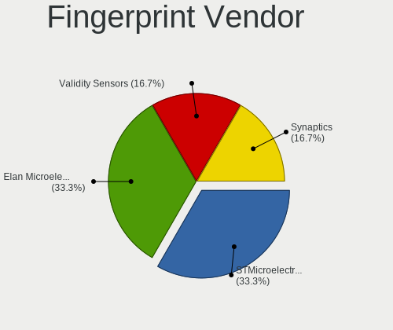

| Vendor                | Desktops | Percent |
|-----------------------|----------|---------|
| STMicroelectronics    | 2        | 50%     |
| Elan Microelectronics | 2        | 50%     |

Fingerprint Model
-----------------

Fingerprint sensor models

| Model                                       | Desktops | Percent |
|---------------------------------------------|----------|---------|
| STMicroelectronics Fingerprint Reader       | 2        | 50%     |
| Elan fingerprint sensor [FeinTech FPS00200] | 2        | 50%     |

Chipcard Vendor
---------------

Chipcard module vendors

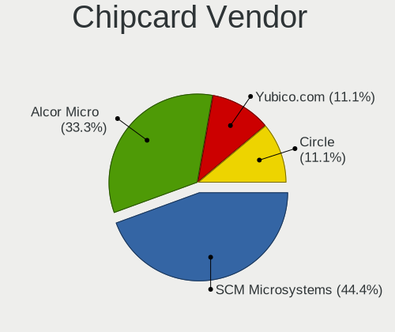

| Vendor           | Desktops | Percent |
|------------------|----------|---------|
| SCM Microsystems | 2        | 50%     |
| Yubico.com       | 1        | 25%     |
| Alcor Micro      | 1        | 25%     |

Chipcard Model
--------------

Chipcard module models

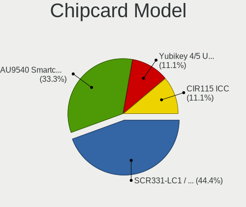

| Model                                                  | Desktops | Percent |
|--------------------------------------------------------|----------|---------|
| SCM Microsystems SCR331-LC1 / SCR3310 SmartCard Reader | 2        | 50%     |
| Yubico.com Yubikey 4 U2F+CCID                          | 1        | 25%     |
| Alcor Micro AU9540 Smartcard Reader                    | 1        | 25%     |

Unsupported
-----------

Unsupported Devices
-------------------

Total unsupported devices on board

| Total | Desktops | Percent |
|-------|----------|---------|
| 0     | 332      | 84.05%  |
| 1     | 56       | 14.18%  |
| 2     | 6        | 1.52%   |
| 8     | 1        | 0.25%   |

Unsupported Device Types
------------------------

Types of unsupported devices

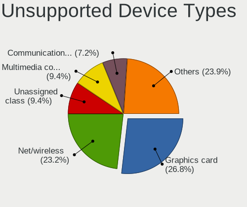

| Type                     | Desktops | Percent |
|--------------------------|----------|---------|
| Net/wireless             | 19       | 26.03%  |
| Graphics card            | 14       | 19.18%  |
| Multimedia controller    | 9        | 12.33%  |
| Unassigned class         | 6        | 8.22%   |
| Communication controller | 6        | 8.22%   |
| Fingerprint reader       | 4        | 5.48%   |
| Sound                    | 3        | 4.11%   |
| Modem                    | 3        | 4.11%   |
| Chipcard                 | 2        | 2.74%   |
| Bluetooth                | 2        | 2.74%   |
| Storage/nvme             | 1        | 1.37%   |
| Storage/ata              | 1        | 1.37%   |
| Network                  | 1        | 1.37%   |
| Net/ethernet             | 1        | 1.37%   |
| Camera                   | 1        | 1.37%   |

