Linux in Japan - Tested Hardware & Statistics (Notebooks)
---------------------------------------------------------

A project to collect tested hardware configurations for Linux in Japan.

Anyone can contribute to this report by the [hw-probe](https://github.com/linuxhw/hw-probe) tool:

    sudo -E hw-probe -all -upload

Please contribute! Especially if your hardware is rare.

Contents
--------

* [ Test Cases ](#test-cases)

* [ System ](#system)
  - [ OS                       ](#os)
  - [ OS Family                ](#os-family)
  - [ Kernel                   ](#kernel)
  - [ Kernel Family            ](#kernel-family)
  - [ Kernel Major Ver.        ](#kernel-major-ver)
  - [ Arch                     ](#arch)
  - [ DE                       ](#de)
  - [ Display Server           ](#display-server)
  - [ Display Manager          ](#display-manager)
  - [ OS Lang                  ](#os-lang)
  - [ Boot Mode                ](#boot-mode)
  - [ Filesystem               ](#filesystem)
  - [ Part. scheme             ](#part-scheme)
  - [ Dual Boot with Linux/BSD ](#dual-boot-with-linuxbsd)
  - [ Dual Boot (Win)          ](#dual-boot-win)

* [ Board ](#board)
  - [ Vendor                   ](#vendor)
  - [ Model                    ](#model)
  - [ Model Family             ](#model-family)
  - [ MFG Year                 ](#mfg-year)
  - [ Form Factor              ](#form-factor)
  - [ Secure Boot              ](#secure-boot)
  - [ Coreboot                 ](#coreboot)
  - [ RAM Size                 ](#ram-size)
  - [ RAM Used                 ](#ram-used)
  - [ Total Drives             ](#total-drives)
  - [ Has CD-ROM               ](#has-cd-rom)
  - [ Has Ethernet             ](#has-ethernet)
  - [ Has WiFi                 ](#has-wifi)
  - [ Has Bluetooth            ](#has-bluetooth)

* [ Location ](#location)
  - [ Country                  ](#country)
  - [ City                     ](#city)

* [ Drives ](#drives)
  - [ Drive Vendor             ](#drive-vendor)
  - [ Drive Model              ](#drive-model)
  - [ HDD Vendor               ](#hdd-vendor)
  - [ SSD Vendor               ](#ssd-vendor)
  - [ Drive Kind               ](#drive-kind)
  - [ Drive Connector          ](#drive-connector)
  - [ Drive Size               ](#drive-size)
  - [ Space Total              ](#space-total)
  - [ Space Used               ](#space-used)
  - [ Malfunc. Drives          ](#malfunc-drives)
  - [ Malfunc. Drive Vendor    ](#malfunc-drive-vendor)
  - [ Malfunc. HDD Vendor      ](#malfunc-hdd-vendor)
  - [ Malfunc. Drive Kind      ](#malfunc-drive-kind)
  - [ Failed Drives            ](#failed-drives)
  - [ Failed Drive Vendor      ](#failed-drive-vendor)
  - [ Drive Status             ](#drive-status)

* [ Storage controller ](#storage-controller)
  - [ Storage Vendor           ](#storage-vendor)
  - [ Storage Model            ](#storage-model)
  - [ Storage Kind             ](#storage-kind)

* [ Processor ](#processor)
  - [ CPU Vendor               ](#cpu-vendor)
  - [ CPU Model                ](#cpu-model)
  - [ CPU Model Family         ](#cpu-model-family)
  - [ CPU Cores                ](#cpu-cores)
  - [ CPU Sockets              ](#cpu-sockets)
  - [ CPU Threads              ](#cpu-threads)
  - [ CPU Op-Modes             ](#cpu-op-modes)
  - [ CPU Microcode            ](#cpu-microcode)
  - [ CPU Microarch            ](#cpu-microarch)

* [ Graphics ](#graphics)
  - [ GPU Vendor               ](#gpu-vendor)
  - [ GPU Model                ](#gpu-model)
  - [ GPU Combo                ](#gpu-combo)
  - [ GPU Driver               ](#gpu-driver)
  - [ GPU Memory               ](#gpu-memory)

* [ Monitor ](#monitor)
  - [ Monitor Vendor           ](#monitor-vendor)
  - [ Monitor Model            ](#monitor-model)
  - [ Monitor Resolution       ](#monitor-resolution)
  - [ Monitor Diagonal         ](#monitor-diagonal)
  - [ Monitor Width            ](#monitor-width)
  - [ Aspect Ratio             ](#aspect-ratio)
  - [ Monitor Area             ](#monitor-area)
  - [ Pixel Density            ](#pixel-density)
  - [ Multiple Monitors        ](#multiple-monitors)

* [ Network ](#network)
  - [ Net Controller Vendor    ](#net-controller-vendor)
  - [ Net Controller Model     ](#net-controller-model)
  - [ Wireless Vendor          ](#wireless-vendor)
  - [ Wireless Model           ](#wireless-model)
  - [ Ethernet Vendor          ](#ethernet-vendor)
  - [ Ethernet Model           ](#ethernet-model)
  - [ Net Controller Kind      ](#net-controller-kind)
  - [ Used Controller          ](#used-controller)
  - [ NICs                     ](#nics)
  - [ IPv6                     ](#ipv6)

* [ Bluetooth ](#bluetooth)
  - [ Bluetooth Vendor         ](#bluetooth-vendor)
  - [ Bluetooth Model          ](#bluetooth-model)

* [ Sound ](#sound)
  - [ Sound Vendor             ](#sound-vendor)
  - [ Sound Model              ](#sound-model)

* [ Memory ](#memory)
  - [ Memory Vendor            ](#memory-vendor)
  - [ Memory Model             ](#memory-model)
  - [ Memory Kind              ](#memory-kind)
  - [ Memory Form Factor       ](#memory-form-factor)
  - [ Memory Size              ](#memory-size)
  - [ Memory Speed             ](#memory-speed)

* [ Printers & scanners ](#printers--scanners)
  - [ Printer Vendor           ](#printer-vendor)
  - [ Printer Model            ](#printer-model)
  - [ Scanner Vendor           ](#scanner-vendor)
  - [ Scanner Model            ](#scanner-model)

* [ Camera ](#camera)
  - [ Camera Vendor            ](#camera-vendor)
  - [ Camera Model             ](#camera-model)

* [ Security ](#security)
  - [ Fingerprint Vendor       ](#fingerprint-vendor)
  - [ Fingerprint Model        ](#fingerprint-model)
  - [ Chipcard Vendor          ](#chipcard-vendor)
  - [ Chipcard Model           ](#chipcard-model)

* [ Unsupported ](#unsupported)
  - [ Unsupported Devices      ](#unsupported-devices)
  - [ Unsupported Device Types ](#unsupported-device-types)

Test Cases
----------

Total: 709

| Vendor        | Model                       | Probe                                                      | Date         |
|---------------|-----------------------------|------------------------------------------------------------|--------------|
| Fujitsu       | LIFEBOOK E744               | [b048f7d3e1](https://linux-hardware.org/?probe=b048f7d3e1) | Feb 01, 2023 |
| Unknown       | Unknown                     | [d780984cf9](https://linux-hardware.org/?probe=d780984cf9) | Jan 30, 2023 |
| Valve         | Jupiter                     | [935a50bce1](https://linux-hardware.org/?probe=935a50bce1) | Jan 30, 2023 |
| Google        | Helios                      | [c8b5d0660b](https://linux-hardware.org/?probe=c8b5d0660b) | Jan 28, 2023 |
| HUAWEI        | KLVL-WXXW                   | [f20e47b9d7](https://linux-hardware.org/?probe=f20e47b9d7) | Jan 28, 2023 |
| NEC Comput... | PC-NS350AAR-KS              | [c4aa0da6f4](https://linux-hardware.org/?probe=c4aa0da6f4) | Jan 27, 2023 |
| HP            | ProBook 440 G5              | [af59cf3cd3](https://linux-hardware.org/?probe=af59cf3cd3) | Jan 26, 2023 |
| Toshiba       | dynabook T653/46JR          | [00cabfbb97](https://linux-hardware.org/?probe=00cabfbb97) | Jan 24, 2023 |
| Purism        | Librem 15 v3                | [fcb1d44df6](https://linux-hardware.org/?probe=fcb1d44df6) | Jan 22, 2023 |
| ASUSTek       | VivoBook_ASUSLaptop X740... | [d999192dbf](https://linux-hardware.org/?probe=d999192dbf) | Jan 22, 2023 |
| Toshiba       | dynabook T653/46JR          | [1acfabc208](https://linux-hardware.org/?probe=1acfabc208) | Jan 22, 2023 |
| Dell          | Inspiron 3585               | [9790dcdef4](https://linux-hardware.org/?probe=9790dcdef4) | Jan 19, 2023 |
| Lenovo        | G550 2958                   | [7b255b7fe7](https://linux-hardware.org/?probe=7b255b7fe7) | Jan 18, 2023 |
| Dell          | XPS 9320                    | [bd7346b7c2](https://linux-hardware.org/?probe=bd7346b7c2) | Jan 17, 2023 |
| HP            | Compaq 6730b (GW687AV)      | [e967b291d5](https://linux-hardware.org/?probe=e967b291d5) | Jan 17, 2023 |
| Dell          | Latitude 3540               | [01688be251](https://linux-hardware.org/?probe=01688be251) | Jan 15, 2023 |
| Acer          | Aspire 5349                 | [c52d3b2b2f](https://linux-hardware.org/?probe=c52d3b2b2f) | Jan 15, 2023 |
| Fujitsu       | FMVNF70YX                   | [2817102c87](https://linux-hardware.org/?probe=2817102c87) | Jan 14, 2023 |
| HONOR         | HLYL-WXX9                   | [e5b02d94cd](https://linux-hardware.org/?probe=e5b02d94cd) | Jan 14, 2023 |
| Panasonic     | CF-SX2JDHYS                 | [fa1ebc0951](https://linux-hardware.org/?probe=fa1ebc0951) | Jan 14, 2023 |
| Apple         | MacBookPro9,2               | [4d89e9dec4](https://linux-hardware.org/?probe=4d89e9dec4) | Jan 14, 2023 |
| Panasonic     | CFSZ6-2                     | [7a9f534294](https://linux-hardware.org/?probe=7a9f534294) | Jan 13, 2023 |
| Lenovo        | ThinkPad T480 20L50000UK    | [05744a666a](https://linux-hardware.org/?probe=05744a666a) | Jan 13, 2023 |
| Lenovo        | ThinkPad X13 Gen 2i 20WL... | [b2965791cb](https://linux-hardware.org/?probe=b2965791cb) | Jan 13, 2023 |
| Lenovo        | ThinkPad X13 Gen 2i 20WL... | [093e5ffc06](https://linux-hardware.org/?probe=093e5ffc06) | Jan 13, 2023 |
| ASUSTek       | E200HA                      | [4d9f4512a6](https://linux-hardware.org/?probe=4d9f4512a6) | Jan 13, 2023 |
| Fujitsu       | FARQ02010                   | [5d3f5fcee2](https://linux-hardware.org/?probe=5d3f5fcee2) | Jan 13, 2023 |
| Dell          | Inspiron 1545               | [20bc38b554](https://linux-hardware.org/?probe=20bc38b554) | Jan 11, 2023 |
| HP            | Pavilion dv6                | [852e84ccaa](https://linux-hardware.org/?probe=852e84ccaa) | Jan 09, 2023 |
| Dell          | Inspiron 14 5420            | [9aaef76c2c](https://linux-hardware.org/?probe=9aaef76c2c) | Jan 09, 2023 |
| Lenovo        | IdeaPadFlex 10 20324        | [1d0cd9b040](https://linux-hardware.org/?probe=1d0cd9b040) | Jan 09, 2023 |
| HP            | ZHAN 66 Pro G1              | [76e588ab0a](https://linux-hardware.org/?probe=76e588ab0a) | Jan 08, 2023 |
| Valve         | Jupiter                     | [73e8740cb9](https://linux-hardware.org/?probe=73e8740cb9) | Jan 08, 2023 |
| Toshiba       | dynabook T653/46JR          | [8fe8187a9e](https://linux-hardware.org/?probe=8fe8187a9e) | Jan 08, 2023 |
| Valve         | Jupiter                     | [75cabfba4d](https://linux-hardware.org/?probe=75cabfba4d) | Jan 03, 2023 |
| Valve         | Jupiter                     | [70b2e771b7](https://linux-hardware.org/?probe=70b2e771b7) | Jan 03, 2023 |
| HUAWEI        | NBLL-WXX9                   | [7e5acbf050](https://linux-hardware.org/?probe=7e5acbf050) | Jan 03, 2023 |
| ASUSTek       | ZenBook UX333FN_U3300FN     | [750a40a3cc](https://linux-hardware.org/?probe=750a40a3cc) | Jan 02, 2023 |
| Toshiba       | dynabook T653/46JR          | [cac689a705](https://linux-hardware.org/?probe=cac689a705) | Jan 02, 2023 |
| Fujitsu       | FMVNS6C3                    | [49d8591166](https://linux-hardware.org/?probe=49d8591166) | Jan 02, 2023 |
| Dell          | XPS 9320                    | [28342f1b5c](https://linux-hardware.org/?probe=28342f1b5c) | Jan 01, 2023 |
| Dell          | XPS 9320                    | [4ef3eb6975](https://linux-hardware.org/?probe=4ef3eb6975) | Jan 01, 2023 |
| Unknown       | Unknown                     | [86dcc5a2ff](https://linux-hardware.org/?probe=86dcc5a2ff) | Dec 30, 2022 |
| Toshiba       | dynabook T653/46JR          | [a1f59f6ff9](https://linux-hardware.org/?probe=a1f59f6ff9) | Dec 29, 2022 |
| Apple         | MacBookPro15,2              | [e5a7b5b5be](https://linux-hardware.org/?probe=e5a7b5b5be) | Dec 28, 2022 |
| Lenovo        | ThinkPad T480 20L50000UK    | [f19e16b1ac](https://linux-hardware.org/?probe=f19e16b1ac) | Dec 28, 2022 |
| Dell          | Inspiron 5370               | [e08cfee8e8](https://linux-hardware.org/?probe=e08cfee8e8) | Dec 27, 2022 |
| Dell          | Inspiron 5370               | [071ff79fc2](https://linux-hardware.org/?probe=071ff79fc2) | Dec 27, 2022 |
| HP            | Victus by Laptop 16-e0xx... | [0069729ebe](https://linux-hardware.org/?probe=0069729ebe) | Dec 25, 2022 |
| HP            | Victus by Laptop 16-e0xx... | [985e965dec](https://linux-hardware.org/?probe=985e965dec) | Dec 25, 2022 |
| Apple         | MacBookPro9,2               | [ef194165fc](https://linux-hardware.org/?probe=ef194165fc) | Dec 24, 2022 |
| Toshiba       | dynabook T653/46JR          | [1f10cd2a64](https://linux-hardware.org/?probe=1f10cd2a64) | Dec 22, 2022 |
| ASUSTek       | VivoBook_ASUSLaptop K650... | [4a1e660e7d](https://linux-hardware.org/?probe=4a1e660e7d) | Dec 21, 2022 |
| Sony          | VJZ13A                      | [748f77bace](https://linux-hardware.org/?probe=748f77bace) | Dec 21, 2022 |
| Toshiba       | dynabook T653/46JR          | [5a05dc8c43](https://linux-hardware.org/?probe=5a05dc8c43) | Dec 17, 2022 |
| Fujitsu       | FMVNS6C3                    | [d7a6961431](https://linux-hardware.org/?probe=d7a6961431) | Dec 15, 2022 |
| Fujitsu       | FMVNS6C3                    | [2cdacbc923](https://linux-hardware.org/?probe=2cdacbc923) | Dec 11, 2022 |
| Unknown       | Unknown                     | [2a7d6d1541](https://linux-hardware.org/?probe=2a7d6d1541) | Dec 08, 2022 |
| Fujitsu       | FMVNS6C3                    | [5b60c9dfd0](https://linux-hardware.org/?probe=5b60c9dfd0) | Dec 06, 2022 |
| HP            | Laptop 15-bs0xx             | [81576caeb1](https://linux-hardware.org/?probe=81576caeb1) | Dec 04, 2022 |
| Toshiba       | dynabook T653/46JR          | [601575b385](https://linux-hardware.org/?probe=601575b385) | Dec 03, 2022 |
| Lenovo        | ThinkPad R500 2716AZJ       | [ecf18761e4](https://linux-hardware.org/?probe=ecf18761e4) | Nov 22, 2022 |
| HP            | Laptop 17-by0xxx            | [4d903aa73b](https://linux-hardware.org/?probe=4d903aa73b) | Nov 21, 2022 |
| Fujitsu       | FMVNQL7PM                   | [28ee68da79](https://linux-hardware.org/?probe=28ee68da79) | Nov 19, 2022 |
| NEC Comput... | PC-VK27MCZDM                | [fce4afe996](https://linux-hardware.org/?probe=fce4afe996) | Nov 19, 2022 |
| KOUZIRO       | KOUZIRONB                   | [5802e3e5d6](https://linux-hardware.org/?probe=5802e3e5d6) | Nov 17, 2022 |
| NEC Comput... | NEC VERSA M160              | [a49b4b95b9](https://linux-hardware.org/?probe=a49b4b95b9) | Nov 17, 2022 |
| Toshiba       | dynabook T653/46JR          | [09569f3154](https://linux-hardware.org/?probe=09569f3154) | Nov 17, 2022 |
| Lenovo        | ThinkPad T490 20RYCTO1WW    | [69f54ed610](https://linux-hardware.org/?probe=69f54ed610) | Nov 16, 2022 |
| Lenovo        | ThinkPad P52 20MAS70500     | [96db8793b2](https://linux-hardware.org/?probe=96db8793b2) | Nov 15, 2022 |
| Lenovo        | ThinkPad P52 20MAS70500     | [c576805c81](https://linux-hardware.org/?probe=c576805c81) | Nov 15, 2022 |
| HP            | Laptop 17-by0xxx            | [ecdad4661a](https://linux-hardware.org/?probe=ecdad4661a) | Nov 15, 2022 |
| Toshiba       | dynabook T653/46JR          | [69d4f912f9](https://linux-hardware.org/?probe=69d4f912f9) | Nov 15, 2022 |
| KOUZIRO       | KOUZIRONB                   | [16bf4c059c](https://linux-hardware.org/?probe=16bf4c059c) | Nov 11, 2022 |
| Toshiba       | dynabook T653/46JR          | [dfa4a8aa7f](https://linux-hardware.org/?probe=dfa4a8aa7f) | Nov 10, 2022 |
| Fujitsu       | FMVXN4MN2Z                  | [7a08a94b1e](https://linux-hardware.org/?probe=7a08a94b1e) | Nov 09, 2022 |
| Lenovo        | ThinkPad X1 Carbon 7th 2... | [972094820e](https://linux-hardware.org/?probe=972094820e) | Nov 07, 2022 |
| Framework     | Laptop (12th Gen Intel C... | [d87e75abbf](https://linux-hardware.org/?probe=d87e75abbf) | Nov 04, 2022 |
| Dell          | Vostro 2520                 | [16239dbee4](https://linux-hardware.org/?probe=16239dbee4) | Oct 17, 2022 |
| Lenovo        | ThinkPad L560 20F1000TJP    | [e9b7a4ffc2](https://linux-hardware.org/?probe=e9b7a4ffc2) | Oct 15, 2022 |
| Lenovo        | G50-70 20351                | [9a17926acb](https://linux-hardware.org/?probe=9a17926acb) | Oct 15, 2022 |
| Lenovo        | ThinkPad E14 Gen 4 21EBC... | [128cccafa6](https://linux-hardware.org/?probe=128cccafa6) | Oct 14, 2022 |
| Lenovo        | ThinkPad X220 42873LJ       | [b96b26c09b](https://linux-hardware.org/?probe=b96b26c09b) | Oct 11, 2022 |
| Toshiba       | dynabook T653/46JR          | [d5f7a80d34](https://linux-hardware.org/?probe=d5f7a80d34) | Oct 06, 2022 |
| GPU Compan... | GWTC116-2                   | [68a9782e38](https://linux-hardware.org/?probe=68a9782e38) | Oct 06, 2022 |
| GPU Compan... | GWTC116-2                   | [53516b2a9d](https://linux-hardware.org/?probe=53516b2a9d) | Oct 06, 2022 |
| Hampoo        | C3W6_AP108_4GB Reserved     | [9b8dc565f9](https://linux-hardware.org/?probe=9b8dc565f9) | Oct 04, 2022 |
| ASUSTek       | VivoBook_ASUSLaptop X515... | [be11beaedd](https://linux-hardware.org/?probe=be11beaedd) | Oct 02, 2022 |
| Hampoo        | C3W6_AP108_4GB Reserved     | [93d3e41339](https://linux-hardware.org/?probe=93d3e41339) | Oct 01, 2022 |
| Dell          | Inspiron 11-3162            | [8cd15b2f0c](https://linux-hardware.org/?probe=8cd15b2f0c) | Sep 30, 2022 |
| NEC Comput... | PC-VRL21FB6S3R7             | [2001e2e28e](https://linux-hardware.org/?probe=2001e2e28e) | Sep 30, 2022 |
| Lenovo        | ThinkPad E14 Gen 4 21EBC... | [d1b6a74f84](https://linux-hardware.org/?probe=d1b6a74f84) | Sep 29, 2022 |
| Toshiba       | dynabook T653/46JR          | [9a613eaf66](https://linux-hardware.org/?probe=9a613eaf66) | Sep 28, 2022 |
| Fujitsu       | FMVA1200G                   | [e91d3af852](https://linux-hardware.org/?probe=e91d3af852) | Sep 27, 2022 |
| Toshiba       | dynabook T653/46JR          | [ee93820bdf](https://linux-hardware.org/?probe=ee93820bdf) | Sep 21, 2022 |
| NEC Comput... | PC-VK26MXZCE                | [db8f5e4181](https://linux-hardware.org/?probe=db8f5e4181) | Sep 18, 2022 |
| Toshiba       | dynabook T653/46JR          | [7f9cf09305](https://linux-hardware.org/?probe=7f9cf09305) | Sep 17, 2022 |
| EPSON DIRE... | Endeavor NJ3100E            | [47cb342ecf](https://linux-hardware.org/?probe=47cb342ecf) | Sep 16, 2022 |
| Lenovo        | ThinkBook 14-IIL 20SL       | [9497f1e17f](https://linux-hardware.org/?probe=9497f1e17f) | Sep 16, 2022 |
| System76      | Lemur Pro                   | [d6682a260a](https://linux-hardware.org/?probe=d6682a260a) | Sep 14, 2022 |
| Dell          | Latitude 7420               | [211c7ab44c](https://linux-hardware.org/?probe=211c7ab44c) | Sep 12, 2022 |
| HUAWEI        | MACHD-WXX9                  | [ba1f911067](https://linux-hardware.org/?probe=ba1f911067) | Sep 10, 2022 |
| Notebook      | NV4XMB,ME,MZ                | [0efc3cb183](https://linux-hardware.org/?probe=0efc3cb183) | Sep 07, 2022 |
| HP            | ZHAN 66 Pro A 14 G3         | [c34e343671](https://linux-hardware.org/?probe=c34e343671) | Sep 05, 2022 |
| Panasonic     | CFSV9-1                     | [c21f59dee9](https://linux-hardware.org/?probe=c21f59dee9) | Sep 04, 2022 |
| Lenovo        | ThinkPad T14s Gen 1 20UH... | [a0b2975bf7](https://linux-hardware.org/?probe=a0b2975bf7) | Sep 04, 2022 |
| Toshiba       | dynabook T653/46JR          | [adfeeb4193](https://linux-hardware.org/?probe=adfeeb4193) | Sep 04, 2022 |
| Toshiba       | dynabook T653/46JR          | [b97366daa0](https://linux-hardware.org/?probe=b97366daa0) | Aug 27, 2022 |
| MSI           | GE70 0NC/GE70 0ND           | [a7c9d17455](https://linux-hardware.org/?probe=a7c9d17455) | Aug 25, 2022 |
| Acer          | Aspire 5740                 | [5652f2c73d](https://linux-hardware.org/?probe=5652f2c73d) | Aug 24, 2022 |
| Fujitsu       | FMVA42CW                    | [f50babde6a](https://linux-hardware.org/?probe=f50babde6a) | Aug 23, 2022 |
| Toshiba       | dynabook T653/46JR          | [decfecaa20](https://linux-hardware.org/?probe=decfecaa20) | Aug 18, 2022 |
| MSI           | Delta 15 A5EFK              | [4b165c8f79](https://linux-hardware.org/?probe=4b165c8f79) | Aug 17, 2022 |
| Toshiba       | dynabook T75/RW             | [ff35aa835d](https://linux-hardware.org/?probe=ff35aa835d) | Aug 15, 2022 |
| HP            | EliteBook 845 14 inch G9... | [4e05ac232c](https://linux-hardware.org/?probe=4e05ac232c) | Aug 15, 2022 |
| System76      | Oryx Pro                    | [87b38f5a99](https://linux-hardware.org/?probe=87b38f5a99) | Aug 12, 2022 |
| Dell          | XPS 15 9500                 | [d8486d3371](https://linux-hardware.org/?probe=d8486d3371) | Aug 07, 2022 |
| Toshiba       | dynabook R732/G             | [82ef8736b3](https://linux-hardware.org/?probe=82ef8736b3) | Aug 07, 2022 |
| Lenovo        | Legion 5 15ARH05H 82B1      | [7151e1746a](https://linux-hardware.org/?probe=7151e1746a) | Aug 05, 2022 |
| Toshiba       | dynabook T653/46JR          | [ea8bb6486b](https://linux-hardware.org/?probe=ea8bb6486b) | Jul 30, 2022 |
| Toshiba       | dynabook B350/22A           | [7a5344db19](https://linux-hardware.org/?probe=7a5344db19) | Jul 28, 2022 |
| Toshiba       | dynabook R734/K             | [a5e7d4c919](https://linux-hardware.org/?probe=a5e7d4c919) | Jul 26, 2022 |
| NEC Comput... | U2                          | [22314f4475](https://linux-hardware.org/?probe=22314f4475) | Jul 25, 2022 |
| Dell          | Latitude 7320               | [83301910d0](https://linux-hardware.org/?probe=83301910d0) | Jul 25, 2022 |
| Apple         | MacBookAir9,1               | [cf4d815653](https://linux-hardware.org/?probe=cf4d815653) | Jul 24, 2022 |
| Alienware     | m17                         | [e14db26b9b](https://linux-hardware.org/?probe=e14db26b9b) | Jul 23, 2022 |
| NEC Comput... | PC-VJ24LLZCB                | [9b0955cfe2](https://linux-hardware.org/?probe=9b0955cfe2) | Jul 23, 2022 |
| Apple         | MacBookPro9,2               | [2ba1ac3ec9](https://linux-hardware.org/?probe=2ba1ac3ec9) | Jul 23, 2022 |
| MouseCompu... | L140MU                      | [5206d679a2](https://linux-hardware.org/?probe=5206d679a2) | Jul 22, 2022 |
| Lenovo        | ThinkPad X13 Gen 2a 20XH... | [8505a7d575](https://linux-hardware.org/?probe=8505a7d575) | Jul 21, 2022 |
| Panasonic     | CF-S10EYADR                 | [1990cd2a08](https://linux-hardware.org/?probe=1990cd2a08) | Jul 13, 2022 |
| Apple         | MacBookPro15,1              | [42d81e0803](https://linux-hardware.org/?probe=42d81e0803) | Jul 13, 2022 |
| Lenovo        | G575 4383                   | [8bd6296a3e](https://linux-hardware.org/?probe=8bd6296a3e) | Jul 12, 2022 |
| Lenovo        | ThinkPad X13 Gen 2a 20XH... | [de4d640168](https://linux-hardware.org/?probe=de4d640168) | Jul 10, 2022 |
| Apple         | MacBookPro14,1              | [aad648ac8d](https://linux-hardware.org/?probe=aad648ac8d) | Jul 02, 2022 |
| ASUSTek       | ROG Strix G733ZX_G733ZX     | [fc3e083086](https://linux-hardware.org/?probe=fc3e083086) | Jun 26, 2022 |
| Panasonic     | CFSV9-1                     | [4b7dd23ccd](https://linux-hardware.org/?probe=4b7dd23ccd) | Jun 20, 2022 |
| HP            | Pavilion Laptop 15-eh1xx... | [fcbbdaf844](https://linux-hardware.org/?probe=fcbbdaf844) | Jun 18, 2022 |
| ASUSTek       | T100HAN                     | [20105d0e64](https://linux-hardware.org/?probe=20105d0e64) | Jun 16, 2022 |
| Lenovo        | ThinkPad X1 Carbon 7th 2... | [cbf5603095](https://linux-hardware.org/?probe=cbf5603095) | Jun 13, 2022 |
| Dell          | XPS 15 9500                 | [197482fd83](https://linux-hardware.org/?probe=197482fd83) | Jun 13, 2022 |
| ASUSTek       | T100HAN                     | [9a5b9400a1](https://linux-hardware.org/?probe=9a5b9400a1) | Jun 12, 2022 |
| Sony          | VGN-Z71JB                   | [95a370d4e4](https://linux-hardware.org/?probe=95a370d4e4) | Jun 08, 2022 |
| Alienware     | 13 R3                       | [1431b0b659](https://linux-hardware.org/?probe=1431b0b659) | Jun 06, 2022 |
| Acer          | Aspire 5740                 | [db6d025d69](https://linux-hardware.org/?probe=db6d025d69) | Jun 01, 2022 |
| MSI           | Delta 15 A5EFK              | [1679888c2c](https://linux-hardware.org/?probe=1679888c2c) | May 29, 2022 |
| ASUSTek       | 900                         | [e50c30c38d](https://linux-hardware.org/?probe=e50c30c38d) | May 28, 2022 |
| ASUSTek       | 900                         | [dfd6af657c](https://linux-hardware.org/?probe=dfd6af657c) | May 28, 2022 |
| Gateway       | NV57H                       | [75c484ec74](https://linux-hardware.org/?probe=75c484ec74) | May 26, 2022 |
| Acer          | Aspire 5740                 | [2c541b20f6](https://linux-hardware.org/?probe=2c541b20f6) | May 26, 2022 |
| MouseCompu... | B5-R5RENASW11               | [35eae81eca](https://linux-hardware.org/?probe=35eae81eca) | May 25, 2022 |
| ASUSTek       | 900                         | [082b51aa29](https://linux-hardware.org/?probe=082b51aa29) | May 21, 2022 |
| HP            | ProBook 430 G7              | [04a6359630](https://linux-hardware.org/?probe=04a6359630) | May 21, 2022 |
| Lenovo        | G550 2958                   | [af5cc85e39](https://linux-hardware.org/?probe=af5cc85e39) | May 20, 2022 |
| Lenovo        | ThinkPad T410 2516CTO       | [e4150ff93b](https://linux-hardware.org/?probe=e4150ff93b) | May 19, 2022 |
| Dell          | XPS 15 9500                 | [671279f960](https://linux-hardware.org/?probe=671279f960) | May 18, 2022 |
| TUXEDO        | P95_HR                      | [05d8136964](https://linux-hardware.org/?probe=05d8136964) | May 15, 2022 |
| Dell          | Inspiron 11-3162            | [d1e811474c](https://linux-hardware.org/?probe=d1e811474c) | May 15, 2022 |
| Lenovo        | ThinkPad X200s 74664SJ      | [65728fda7a](https://linux-hardware.org/?probe=65728fda7a) | May 14, 2022 |
| Alienware     | 17                          | [b9be04342c](https://linux-hardware.org/?probe=b9be04342c) | May 13, 2022 |
| Toshiba       | PORTEGE Z930                | [fff817aea6](https://linux-hardware.org/?probe=fff817aea6) | May 10, 2022 |
| Thirdwave     | DX-T7                       | [b90ec1bf3a](https://linux-hardware.org/?probe=b90ec1bf3a) | May 10, 2022 |
| Fujitsu       | FMVNTCAKB                   | [66083f4e27](https://linux-hardware.org/?probe=66083f4e27) | May 09, 2022 |
| HP            | EliteBook 840 G3            | [ac1853274e](https://linux-hardware.org/?probe=ac1853274e) | May 08, 2022 |
| ASUSTek       | 900                         | [a4dc643c13](https://linux-hardware.org/?probe=a4dc643c13) | May 08, 2022 |
| ASUSTek       | 900                         | [6cbd0391b3](https://linux-hardware.org/?probe=6cbd0391b3) | May 07, 2022 |
| Toshiba       | dynabook R731/37EK          | [10ed6c8741](https://linux-hardware.org/?probe=10ed6c8741) | May 06, 2022 |
| Acer          | Aspire 5740                 | [e754b48e71](https://linux-hardware.org/?probe=e754b48e71) | May 06, 2022 |
| ASUSTek       | 900                         | [70b70a4392](https://linux-hardware.org/?probe=70b70a4392) | May 03, 2022 |
| Acer          | Aspire 5740                 | [6e1a9ce167](https://linux-hardware.org/?probe=6e1a9ce167) | May 01, 2022 |
| Acer          | Aspire 5740                 | [f9e5dd9719](https://linux-hardware.org/?probe=f9e5dd9719) | May 01, 2022 |
| Dell          | Inspiron 15-3565            | [a26578c0fc](https://linux-hardware.org/?probe=a26578c0fc) | Apr 30, 2022 |
| Dell          | Inspiron 15-3565            | [66d159169f](https://linux-hardware.org/?probe=66d159169f) | Apr 28, 2022 |
| Purism        | Librem 15 v3                | [d2a13c9d0a](https://linux-hardware.org/?probe=d2a13c9d0a) | Apr 27, 2022 |
| MouseCompu... | NH55Dx                      | [0a397dd5e7](https://linux-hardware.org/?probe=0a397dd5e7) | Apr 25, 2022 |
| ASUSTek       | ROG Strix G731GT_G731GT     | [9edf97b766](https://linux-hardware.org/?probe=9edf97b766) | Apr 24, 2022 |
| Panasonic     | CF-S10EYADR                 | [efd3e5ce84](https://linux-hardware.org/?probe=efd3e5ce84) | Apr 18, 2022 |
| TUXEDO        | P95_HR                      | [a3996b5033](https://linux-hardware.org/?probe=a3996b5033) | Apr 16, 2022 |
| Lenovo        | Legion 5 15ARH05H 82B1      | [c6f1d1b99b](https://linux-hardware.org/?probe=c6f1d1b99b) | Apr 16, 2022 |
| Thirdwave     | DX-T7                       | [b03707283b](https://linux-hardware.org/?probe=b03707283b) | Apr 16, 2022 |
| Dell          | Vostro 2520                 | [fd8d5ab56a](https://linux-hardware.org/?probe=fd8d5ab56a) | Apr 14, 2022 |
| ASUSTek       | VivoBook_ASUSLaptop M350... | [29c02b0294](https://linux-hardware.org/?probe=29c02b0294) | Apr 12, 2022 |
| Acer          | Swift SF314-54              | [c40cfcc7fe](https://linux-hardware.org/?probe=c40cfcc7fe) | Apr 12, 2022 |
| MSI           | GP76 Leopard 11UG           | [aebd373a66](https://linux-hardware.org/?probe=aebd373a66) | Apr 12, 2022 |
| ASUSTek       | 1000H                       | [725f548eab](https://linux-hardware.org/?probe=725f548eab) | Apr 09, 2022 |
| Lenovo        | ThinkBook 14p Gen 2 20YN    | [5a344e20d6](https://linux-hardware.org/?probe=5a344e20d6) | Apr 06, 2022 |
| Toshiba       | dynabook R73/BN             | [af1ad57286](https://linux-hardware.org/?probe=af1ad57286) | Apr 06, 2022 |
| Lenovo        | ThinkPad X61s 7667DB2       | [34ae68d221](https://linux-hardware.org/?probe=34ae68d221) | Apr 05, 2022 |
| Lenovo        | ThinkPad X230 2306CTO       | [188a7794dd](https://linux-hardware.org/?probe=188a7794dd) | Apr 04, 2022 |
| TUXEDO        | P95_HR                      | [41cd5e79c8](https://linux-hardware.org/?probe=41cd5e79c8) | Apr 03, 2022 |
| MouseCompu... | MB-J370                     | [2c72ea9b17](https://linux-hardware.org/?probe=2c72ea9b17) | Apr 02, 2022 |
| ASUSTek       | ROG Strix G733ZX_G733ZX     | [d17d5e5310](https://linux-hardware.org/?probe=d17d5e5310) | Apr 01, 2022 |
| ASUSTek       | ROG Strix G733ZX_G733ZX     | [04f5858a30](https://linux-hardware.org/?probe=04f5858a30) | Apr 01, 2022 |
| Apple         | MacBookPro15,1              | [0fe3cba205](https://linux-hardware.org/?probe=0fe3cba205) | Mar 23, 2022 |
| System76      | Lemur Pro                   | [cd847b5e6a](https://linux-hardware.org/?probe=cd847b5e6a) | Mar 23, 2022 |
| Apple         | MacBookPro5,5               | [0e17f0194f](https://linux-hardware.org/?probe=0e17f0194f) | Mar 22, 2022 |
| Fujitsu       | FMVA05003                   | [d61a791168](https://linux-hardware.org/?probe=d61a791168) | Mar 19, 2022 |
| HP            | EliteBook 830 G6            | [46f513206b](https://linux-hardware.org/?probe=46f513206b) | Mar 18, 2022 |
| Dell          | G3 3500                     | [9ca3e10f43](https://linux-hardware.org/?probe=9ca3e10f43) | Mar 14, 2022 |
| R.W.C         | RM-A107-SR                  | [ab4bef6a90](https://linux-hardware.org/?probe=ab4bef6a90) | Mar 13, 2022 |
| Dell          | Latitude E5470              | [7fcd9d2c98](https://linux-hardware.org/?probe=7fcd9d2c98) | Mar 11, 2022 |
| Acer          | Aspire 4750                 | [0659469dbe](https://linux-hardware.org/?probe=0659469dbe) | Mar 09, 2022 |
| Toshiba       | dynabook RX3 SN240Y/3HD     | [2f2d99c83f](https://linux-hardware.org/?probe=2f2d99c83f) | Mar 03, 2022 |
| Toshiba       | dynabook RX3 SN240Y/3HD     | [0d0a2bab7a](https://linux-hardware.org/?probe=0d0a2bab7a) | Mar 03, 2022 |
| HP            | Notebook                    | [c8cd62d913](https://linux-hardware.org/?probe=c8cd62d913) | Feb 28, 2022 |
| Fujitsu       | FMVA05007                   | [21c7863329](https://linux-hardware.org/?probe=21c7863329) | Feb 27, 2022 |
| Fujitsu       | FMVA33LB2                   | [2dc30249b7](https://linux-hardware.org/?probe=2dc30249b7) | Feb 26, 2022 |
| Lenovo        | ThinkPad X220 4290LG4       | [bfb13999b0](https://linux-hardware.org/?probe=bfb13999b0) | Feb 26, 2022 |
| Fujitsu       | FMVA42CW                    | [ec10edeb39](https://linux-hardware.org/?probe=ec10edeb39) | Feb 22, 2022 |
| Panasonic     | CFSV9-1                     | [fa3b39bca1](https://linux-hardware.org/?probe=fa3b39bca1) | Feb 21, 2022 |
| Dell          | Vostro 3405                 | [f869338cb0](https://linux-hardware.org/?probe=f869338cb0) | Feb 20, 2022 |
| Apple         | MacBookAir3,2               | [2e812a8de9](https://linux-hardware.org/?probe=2e812a8de9) | Feb 17, 2022 |
| Fujitsu       | FARQ02010                   | [04fbabcfd2](https://linux-hardware.org/?probe=04fbabcfd2) | Feb 15, 2022 |
| Toshiba       | dynabook QOSMIO V65/86LY... | [681aa0b345](https://linux-hardware.org/?probe=681aa0b345) | Feb 13, 2022 |
| Lenovo        | G570 4334                   | [f5cef9fe9b](https://linux-hardware.org/?probe=f5cef9fe9b) | Feb 13, 2022 |
| ASUSTek       | U24A                        | [47e8fc096a](https://linux-hardware.org/?probe=47e8fc096a) | Feb 10, 2022 |
| Dell          | XPS L401X                   | [1db7a71e79](https://linux-hardware.org/?probe=1db7a71e79) | Feb 09, 2022 |
| Lenovo        | ThinkPad X61 76753BJ        | [76a7934681](https://linux-hardware.org/?probe=76a7934681) | Feb 09, 2022 |
| Lenovo        | G505 20240                  | [ed806edbbb](https://linux-hardware.org/?probe=ed806edbbb) | Feb 09, 2022 |
| Lenovo        | ThinkPad X240 20ALCTO1WW    | [1620a85467](https://linux-hardware.org/?probe=1620a85467) | Feb 08, 2022 |
| ASUSTek       | X541SA                      | [afafec99f9](https://linux-hardware.org/?probe=afafec99f9) | Feb 08, 2022 |
| Toshiba       | dynabook Satellite B453/... | [279ff9b0f0](https://linux-hardware.org/?probe=279ff9b0f0) | Feb 08, 2022 |
| ASUSTek       | S101                        | [a850549e73](https://linux-hardware.org/?probe=a850549e73) | Feb 04, 2022 |
| ASUSTek       | U24A                        | [c49e4b9513](https://linux-hardware.org/?probe=c49e4b9513) | Jan 31, 2022 |
| AMI           | Intel                       | [33011a4745](https://linux-hardware.org/?probe=33011a4745) | Jan 31, 2022 |
| AMI           | Intel                       | [f749123fdd](https://linux-hardware.org/?probe=f749123fdd) | Jan 31, 2022 |
| ASUSTek       | U24A                        | [cc19cff1a9](https://linux-hardware.org/?probe=cc19cff1a9) | Jan 30, 2022 |
| Fujitsu       | FMVA42CW                    | [ee9b2f44e9](https://linux-hardware.org/?probe=ee9b2f44e9) | Jan 29, 2022 |
| ASUSTek       | UX303LA                     | [b5e498daf0](https://linux-hardware.org/?probe=b5e498daf0) | Jan 28, 2022 |
| Acer          | Aspire V3-571               | [3d4087dc2a](https://linux-hardware.org/?probe=3d4087dc2a) | Jan 28, 2022 |
| Razer         | Blade Stealth               | [6a4fbb1374](https://linux-hardware.org/?probe=6a4fbb1374) | Jan 27, 2022 |
| Fujitsu       | FMVA42CW                    | [4ba92ab5ea](https://linux-hardware.org/?probe=4ba92ab5ea) | Jan 23, 2022 |
| Dell          | Latitude 3540               | [28339307b2](https://linux-hardware.org/?probe=28339307b2) | Jan 21, 2022 |
| ASUSTek       | 1000H                       | [f88ac2dd3e](https://linux-hardware.org/?probe=f88ac2dd3e) | Jan 19, 2022 |
| ASUSTek       | 1000H                       | [6c56c2c8b3](https://linux-hardware.org/?probe=6c56c2c8b3) | Jan 19, 2022 |
| KOUZIRO       | KOUZIRONB                   | [56b639daeb](https://linux-hardware.org/?probe=56b639daeb) | Jan 14, 2022 |
| Dynabook      | P1-C7MP-BL                  | [268f94787e](https://linux-hardware.org/?probe=268f94787e) | Jan 14, 2022 |
| Lenovo        | ThinkPad X61 76753BJ        | [8f0b1342b0](https://linux-hardware.org/?probe=8f0b1342b0) | Jan 10, 2022 |
| Lenovo        | ThinkPad X61 76753BJ        | [73ff2bcb33](https://linux-hardware.org/?probe=73ff2bcb33) | Jan 10, 2022 |
| Acer          | Predator PH315-53           | [7f928f794b](https://linux-hardware.org/?probe=7f928f794b) | Jan 04, 2022 |
| NEC Comput... | PC-LL550RG                  | [43435578b7](https://linux-hardware.org/?probe=43435578b7) | Jan 04, 2022 |
| Dell          | Inspiron 5557               | [53d769eaf7](https://linux-hardware.org/?probe=53d769eaf7) | Dec 31, 2021 |
| System76      | Lemur Pro                   | [287aa601fe](https://linux-hardware.org/?probe=287aa601fe) | Dec 29, 2021 |
| Toshiba       | dynabook RX3 SN240Y/3HD     | [0b20db823c](https://linux-hardware.org/?probe=0b20db823c) | Dec 29, 2021 |
| Dell          | Latitude 12 Rugged Table... | [13cc8e2abf](https://linux-hardware.org/?probe=13cc8e2abf) | Dec 25, 2021 |
| MSI           | Delta 15 A5EFK              | [68010a3af5](https://linux-hardware.org/?probe=68010a3af5) | Dec 23, 2021 |
| MSI           | Delta 15 A5EFK              | [2d4a0a1823](https://linux-hardware.org/?probe=2d4a0a1823) | Dec 23, 2021 |
| ASUSTek       | ASUS EXPERTBOOK B9450FA_... | [ded54cb08c](https://linux-hardware.org/?probe=ded54cb08c) | Dec 19, 2021 |
| Dell          | Inspiron 13 5310            | [bdad2f1618](https://linux-hardware.org/?probe=bdad2f1618) | Dec 14, 2021 |
| ASUSTek       | X510UQ                      | [1b14f17a6e](https://linux-hardware.org/?probe=1b14f17a6e) | Dec 11, 2021 |
| Apple         | MacBookPro12,1              | [a6e257304d](https://linux-hardware.org/?probe=a6e257304d) | Dec 05, 2021 |
| Toshiba       | dynabook Satellite B552/... | [b3c78d548b](https://linux-hardware.org/?probe=b3c78d548b) | Dec 03, 2021 |
| Apple         | MacBookPro13,2              | [d5c66e036d](https://linux-hardware.org/?probe=d5c66e036d) | Dec 02, 2021 |
| Notebook      | N13_N140ZU                  | [d63f7874c8](https://linux-hardware.org/?probe=d63f7874c8) | Nov 29, 2021 |
| Dell          | G3 3779                     | [cd6dace549](https://linux-hardware.org/?probe=cd6dace549) | Nov 26, 2021 |
| Notebook      | N13_N140ZU                  | [dca6d021bb](https://linux-hardware.org/?probe=dca6d021bb) | Nov 23, 2021 |
| Lenovo        | ThinkPad X220 Tablet 429... | [fdb480d5f4](https://linux-hardware.org/?probe=fdb480d5f4) | Nov 12, 2021 |
| Lenovo        | G580 26897JJ                | [dc2120663a](https://linux-hardware.org/?probe=dc2120663a) | Nov 10, 2021 |
| Dell          | Inspiron M5110              | [4a6d42444c](https://linux-hardware.org/?probe=4a6d42444c) | Nov 10, 2021 |
| System76      | Lemur Pro                   | [92a5e9c183](https://linux-hardware.org/?probe=92a5e9c183) | Nov 09, 2021 |
| Dell          | Inspiron 16 7610            | [34e330ff50](https://linux-hardware.org/?probe=34e330ff50) | Nov 07, 2021 |
| Toshiba       | dynabook QOSMIO V65/86LY... | [0193f0b7a0](https://linux-hardware.org/?probe=0193f0b7a0) | Nov 06, 2021 |
| Timi          | RedmiBook Pro 14S           | [470204d924](https://linux-hardware.org/?probe=470204d924) | Nov 03, 2021 |
| Lenovo        | ThinkPad T14 Gen 1 20S0C... | [f7309ef31a](https://linux-hardware.org/?probe=f7309ef31a) | Oct 30, 2021 |
| Lenovo        | ThinkPad T14 Gen 1 20S0C... | [26adc81160](https://linux-hardware.org/?probe=26adc81160) | Oct 30, 2021 |
| Toshiba       | PORTEGE Z20t-C              | [ed1722174a](https://linux-hardware.org/?probe=ed1722174a) | Oct 27, 2021 |
| Dell          | G5 5500                     | [cf10cd5b99](https://linux-hardware.org/?probe=cf10cd5b99) | Oct 25, 2021 |
| Dell          | XPS 13 9350                 | [1f26867986](https://linux-hardware.org/?probe=1f26867986) | Oct 25, 2021 |
| HP            | Pavilion Gaming Laptop 1... | [6aa4ae0da5](https://linux-hardware.org/?probe=6aa4ae0da5) | Oct 23, 2021 |
| HP            | ProBook 6550b               | [4db59c8489](https://linux-hardware.org/?probe=4db59c8489) | Oct 23, 2021 |
| Dell          | G3 3779                     | [a84248c5d5](https://linux-hardware.org/?probe=a84248c5d5) | Oct 21, 2021 |
| Jumper        | Ezbook X3                   | [fe510b821a](https://linux-hardware.org/?probe=fe510b821a) | Oct 17, 2021 |
| UNITCOM       | W55xEU                      | [ced300109d](https://linux-hardware.org/?probe=ced300109d) | Oct 15, 2021 |
| NEC Comput... | PC-LL550VG6R                | [5879ce1d61](https://linux-hardware.org/?probe=5879ce1d61) | Oct 13, 2021 |
| ASUSTek       | ROG Zephyrus G15 GA503QR... | [f2690f5ec4](https://linux-hardware.org/?probe=f2690f5ec4) | Oct 13, 2021 |
| Toshiba       | dynabook R634/K             | [f0e385cbfb](https://linux-hardware.org/?probe=f0e385cbfb) | Oct 08, 2021 |
| Acer          | Nitro AN515-45              | [6918b927d0](https://linux-hardware.org/?probe=6918b927d0) | Oct 07, 2021 |
| Dell          | XPS 13 9380                 | [0b768f6fac](https://linux-hardware.org/?probe=0b768f6fac) | Oct 04, 2021 |
| HP            | Pavilion Gaming Laptop 1... | [1c920ce007](https://linux-hardware.org/?probe=1c920ce007) | Oct 03, 2021 |
| Fujitsu       | U9311                       | [a76f2fbbe3](https://linux-hardware.org/?probe=a76f2fbbe3) | Sep 30, 2021 |
| Panasonic     | CFSV9-2                     | [05b8edc925](https://linux-hardware.org/?probe=05b8edc925) | Sep 29, 2021 |
| NEC Comput... | PC-GN15B79AA                | [a1046b626e](https://linux-hardware.org/?probe=a1046b626e) | Sep 23, 2021 |
| NEC Comput... | PC-GN15B79AA                | [a1b9f1dc30](https://linux-hardware.org/?probe=a1b9f1dc30) | Sep 23, 2021 |
| Toshiba       | dynabook QOSMIO V65/86LY... | [b0289ef67d](https://linux-hardware.org/?probe=b0289ef67d) | Sep 22, 2021 |
| Apple         | MacBook7,1                  | [5164ba24f6](https://linux-hardware.org/?probe=5164ba24f6) | Sep 21, 2021 |
| Lenovo        | ThinkPad P14s Gen 1 20Y1... | [5dabdbd945](https://linux-hardware.org/?probe=5dabdbd945) | Sep 19, 2021 |
| Lenovo        | ThinkPad E14 Gen 3 20Y70... | [6f52a2ebed](https://linux-hardware.org/?probe=6f52a2ebed) | Sep 18, 2021 |
| Apple         | MacBookPro5,5               | [d7ee29aac3](https://linux-hardware.org/?probe=d7ee29aac3) | Sep 15, 2021 |
| Panasonic     | CF-S10EYTDR                 | [a90d037dcf](https://linux-hardware.org/?probe=a90d037dcf) | Sep 10, 2021 |
| ASUSTek       | G551JM                      | [9f323164cd](https://linux-hardware.org/?probe=9f323164cd) | Sep 09, 2021 |
| Lenovo        | ThinkPad X201 3249CTO       | [7b3432fcf6](https://linux-hardware.org/?probe=7b3432fcf6) | Sep 08, 2021 |
| ASUSTek       | ZenBook UX425IA_U4700IA     | [fa970f7a80](https://linux-hardware.org/?probe=fa970f7a80) | Sep 08, 2021 |
| TUXEDO        | P95_HR                      | [f5d32061ec](https://linux-hardware.org/?probe=f5d32061ec) | Sep 08, 2021 |
| Toshiba       | dynabook T55/PW             | [1ce1b25ad5](https://linux-hardware.org/?probe=1ce1b25ad5) | Sep 04, 2021 |
| Lenovo        | ThinkPad X230 2306A44       | [8f97e284a7](https://linux-hardware.org/?probe=8f97e284a7) | Sep 03, 2021 |
| Toshiba       | dynabook R73/A              | [deb0351e19](https://linux-hardware.org/?probe=deb0351e19) | Sep 03, 2021 |
| Acer          | Aspire V5-571G              | [919b7c1304](https://linux-hardware.org/?probe=919b7c1304) | Sep 01, 2021 |
| Acer          | Aspire V5-471               | [469dc0f2ef](https://linux-hardware.org/?probe=469dc0f2ef) | Aug 31, 2021 |
| Acer          | Aspire V5-471               | [47f44e561f](https://linux-hardware.org/?probe=47f44e561f) | Aug 31, 2021 |
| Lenovo        | ThinkPad X201 3249CTO       | [0a9bdb4827](https://linux-hardware.org/?probe=0a9bdb4827) | Aug 27, 2021 |
| Apple         | MacBookPro11,5              | [814f16635c](https://linux-hardware.org/?probe=814f16635c) | Aug 22, 2021 |
| Sony          | VGN-S55B_S                  | [f8237269e1](https://linux-hardware.org/?probe=f8237269e1) | Aug 22, 2021 |
| HP            | Laptop 15s-eq1xxx           | [90446b95e6](https://linux-hardware.org/?probe=90446b95e6) | Aug 21, 2021 |
| HP            | ProBook 6470b               | [4d338e7f16](https://linux-hardware.org/?probe=4d338e7f16) | Aug 15, 2021 |
| Acer          | Aspire A315-42              | [4a54197130](https://linux-hardware.org/?probe=4a54197130) | Aug 15, 2021 |
| Lenovo        | ThinkPad X201 3249CTO       | [9b9cd9a995](https://linux-hardware.org/?probe=9b9cd9a995) | Aug 10, 2021 |
| HP            | EliteBook Folio 1020 G1 ... | [32e6ec699f](https://linux-hardware.org/?probe=32e6ec699f) | Aug 09, 2021 |
| HP            | EliteBook Folio 1020 G1 ... | [7facd0568b](https://linux-hardware.org/?probe=7facd0568b) | Aug 09, 2021 |
| Lenovo        | ThinkPad X250 20CLS8E700    | [467f177df6](https://linux-hardware.org/?probe=467f177df6) | Aug 09, 2021 |
| NEC Comput... | PC-GN246W3A5                | [dfc05750e3](https://linux-hardware.org/?probe=dfc05750e3) | Aug 09, 2021 |
| Panasonic     | CF-S10EYTDR                 | [b965812f09](https://linux-hardware.org/?probe=b965812f09) | Aug 06, 2021 |
| Lenovo        | ThinkPad L520 5016NU7       | [101a0ca1b3](https://linux-hardware.org/?probe=101a0ca1b3) | Aug 01, 2021 |
| Lenovo        | ThinkPad L520 5016NU7       | [08fe25ec71](https://linux-hardware.org/?probe=08fe25ec71) | Aug 01, 2021 |
| HP            | Pavilion Laptop 13-an0xx... | [ff5bee5ff8](https://linux-hardware.org/?probe=ff5bee5ff8) | Aug 01, 2021 |
| Chuwi         | GemiBook Pro                | [a4ecebc31b](https://linux-hardware.org/?probe=a4ecebc31b) | Jul 27, 2021 |
| Chuwi         | GemiBook Pro                | [63b014e84e](https://linux-hardware.org/?probe=63b014e84e) | Jul 26, 2021 |
| Chuwi         | GemiBook Pro                | [478d06f2df](https://linux-hardware.org/?probe=478d06f2df) | Jul 26, 2021 |
| Acer          | Nitro AN515-45              | [fbf1f240f4](https://linux-hardware.org/?probe=fbf1f240f4) | Jul 24, 2021 |
| Fujitsu       | FMVS03004                   | [0182178989](https://linux-hardware.org/?probe=0182178989) | Jul 24, 2021 |
| HP            | 14                          | [29af89c91b](https://linux-hardware.org/?probe=29af89c91b) | Jul 23, 2021 |
| HP            | 14                          | [345be169ae](https://linux-hardware.org/?probe=345be169ae) | Jul 20, 2021 |
| Fujitsu       | FMVS54CD1                   | [7e6aa1f514](https://linux-hardware.org/?probe=7e6aa1f514) | Jul 18, 2021 |
| Dell          | Inspiron N5110              | [80b10e8187](https://linux-hardware.org/?probe=80b10e8187) | Jul 18, 2021 |
| Fujitsu       | FMVS54CD1                   | [ad9e144c6a](https://linux-hardware.org/?probe=ad9e144c6a) | Jul 15, 2021 |
| Dell          | Latitude E5510              | [2ab8a16c55](https://linux-hardware.org/?probe=2ab8a16c55) | Jul 12, 2021 |
| Toshiba       | dynabook T954/89L           | [176e4906db](https://linux-hardware.org/?probe=176e4906db) | Jul 12, 2021 |
| Dell          | Inspiron 1526               | [515fc96089](https://linux-hardware.org/?probe=515fc96089) | Jul 11, 2021 |
| Lenovo        | ThinkPad X61s 7667DB2       | [c0af3fd295](https://linux-hardware.org/?probe=c0af3fd295) | Jul 05, 2021 |
| Google        | Helios                      | [644f9f9062](https://linux-hardware.org/?probe=644f9f9062) | Jul 02, 2021 |
| Dell          | XPS 15 9500                 | [db7536f5a7](https://linux-hardware.org/?probe=db7536f5a7) | Jun 29, 2021 |
| Dell          | Inspiron 5583               | [a1f0396c8e](https://linux-hardware.org/?probe=a1f0396c8e) | Jun 29, 2021 |
| Lenovo        | ThinkPad X61s 7667DB2       | [32d294ba2a](https://linux-hardware.org/?probe=32d294ba2a) | Jun 23, 2021 |
| Toshiba       | dynabook T954/89L           | [c4b1b8aabb](https://linux-hardware.org/?probe=c4b1b8aabb) | Jun 21, 2021 |
| Toshiba       | dynabook T954/89L           | [b6a5d80f8a](https://linux-hardware.org/?probe=b6a5d80f8a) | Jun 21, 2021 |
| Lenovo        | S10-3                       | [eb48df4717](https://linux-hardware.org/?probe=eb48df4717) | Jun 20, 2021 |
| HP            | Pavilion Laptop 13-an0xx... | [2da9390d91](https://linux-hardware.org/?probe=2da9390d91) | Jun 11, 2021 |
| HP            | Pavilion Laptop 13-an0xx... | [c33921449f](https://linux-hardware.org/?probe=c33921449f) | Jun 10, 2021 |
| Toshiba       | dynabook R73/BN             | [c9cdf2bc57](https://linux-hardware.org/?probe=c9cdf2bc57) | Jun 06, 2021 |
| Lenovo        | IdeaPad 510-15IKB 80SV      | [0860242147](https://linux-hardware.org/?probe=0860242147) | Jun 04, 2021 |
| Biostar       | B350GTN                     | [6ba7f458da](https://linux-hardware.org/?probe=6ba7f458da) | Jun 01, 2021 |
| Lenovo        | ThinkPad T420s 4170CTO      | [74057c8385](https://linux-hardware.org/?probe=74057c8385) | May 30, 2021 |
| Lenovo        | S10-3                       | [8dfadf5edb](https://linux-hardware.org/?probe=8dfadf5edb) | May 27, 2021 |
| NEC Comput... | PC-LL730TG                  | [e4172892e9](https://linux-hardware.org/?probe=e4172892e9) | May 26, 2021 |
| Notebook      | N13_N140ZU                  | [4d1d4e61c3](https://linux-hardware.org/?probe=4d1d4e61c3) | May 25, 2021 |
| NEC Comput... | PC-VK22TGGCN                | [b6a2893c7e](https://linux-hardware.org/?probe=b6a2893c7e) | May 25, 2021 |
| Dell          | Latitude E6420              | [4ef6253092](https://linux-hardware.org/?probe=4ef6253092) | May 22, 2021 |
| Dell          | XPS 13 9360                 | [4ea4747cbf](https://linux-hardware.org/?probe=4ea4747cbf) | May 18, 2021 |
| Lenovo        | IdeaPad 300-15IBR 80M3      | [5d215fafdd](https://linux-hardware.org/?probe=5d215fafdd) | May 15, 2021 |
| Lenovo        | IdeaPad 300-15IBR 80M3      | [fdc8841fca](https://linux-hardware.org/?probe=fdc8841fca) | May 14, 2021 |
| Fujitsu       | FMVWE3AB11                  | [6c767dc0df](https://linux-hardware.org/?probe=6c767dc0df) | May 13, 2021 |
| Fujitsu       | FMVWE3AB11                  | [5ed8fb5a9f](https://linux-hardware.org/?probe=5ed8fb5a9f) | May 13, 2021 |
| Lenovo        | ThinkPad X230 2330A17       | [02280704ba](https://linux-hardware.org/?probe=02280704ba) | May 11, 2021 |
| Dell          | Inspiron 1545               | [c796c57372](https://linux-hardware.org/?probe=c796c57372) | May 10, 2021 |
| Fujitsu       | FMVWE3AB11                  | [e7238c107c](https://linux-hardware.org/?probe=e7238c107c) | May 09, 2021 |
| Fujitsu       | FMVNF40UK                   | [8648b42278](https://linux-hardware.org/?probe=8648b42278) | May 09, 2021 |
| MouseCompu... | W150ERQ                     | [1ccfec5c8f](https://linux-hardware.org/?probe=1ccfec5c8f) | May 07, 2021 |
| Dell          | XPS 13 9360                 | [f001bddea6](https://linux-hardware.org/?probe=f001bddea6) | May 04, 2021 |
| Fujitsu       | FMVWE3AB11                  | [65dce9cf99](https://linux-hardware.org/?probe=65dce9cf99) | May 03, 2021 |
| Dynabook      | P1-T6NP-EG                  | [887c9157d0](https://linux-hardware.org/?probe=887c9157d0) | May 03, 2021 |
| Toshiba       | dynabook Satellite J61 1... | [0b4c4a93f1](https://linux-hardware.org/?probe=0b4c4a93f1) | Apr 29, 2021 |
| Maibenben     | S431                        | [a4db49a83f](https://linux-hardware.org/?probe=a4db49a83f) | Apr 29, 2021 |
| NEC Comput... | PC-VY25AACZ9                | [dc22e810b4](https://linux-hardware.org/?probe=dc22e810b4) | Apr 29, 2021 |
| KOUZIRO       | KOUZIRONB                   | [c64bf46d8b](https://linux-hardware.org/?probe=c64bf46d8b) | Apr 24, 2021 |
| HP            | Laptop 15-db0xxx            | [7a4d236e06](https://linux-hardware.org/?probe=7a4d236e06) | Apr 24, 2021 |
| Dell          | XPS 13 9360                 | [dae1fdda5f](https://linux-hardware.org/?probe=dae1fdda5f) | Apr 23, 2021 |
| Lenovo        | ThinkBook 15p 20V3          | [fff82cb538](https://linux-hardware.org/?probe=fff82cb538) | Apr 22, 2021 |
| ASUSTek       | ZenBook UX331FA_UX331FA     | [d8340c053a](https://linux-hardware.org/?probe=d8340c053a) | Apr 22, 2021 |
| Lenovo        | ThinkPad T430s 23533KJ      | [39aa120e47](https://linux-hardware.org/?probe=39aa120e47) | Apr 21, 2021 |
| TUXEDO        | P95_HR                      | [4afc76cdbe](https://linux-hardware.org/?probe=4afc76cdbe) | Apr 17, 2021 |
| Lenovo        | ThinkPad T14s Gen 1 20T1... | [3ee0cc7c18](https://linux-hardware.org/?probe=3ee0cc7c18) | Apr 13, 2021 |
| Dell          | Precision M4800             | [7a2924ab2a](https://linux-hardware.org/?probe=7a2924ab2a) | Apr 13, 2021 |
| HP            | Pavilion dv4                | [c5ed691eb7](https://linux-hardware.org/?probe=c5ed691eb7) | Apr 13, 2021 |
| KOUZIRO       | KOUZIRONB                   | [18adf344fe](https://linux-hardware.org/?probe=18adf344fe) | Apr 11, 2021 |
| NEC Comput... | PC-VY25AACZ9                | [24f7a90612](https://linux-hardware.org/?probe=24f7a90612) | Apr 10, 2021 |
| Dell          | Inspiron N5110              | [122641cd7e](https://linux-hardware.org/?probe=122641cd7e) | Apr 08, 2021 |
| NEC Comput... | PC-VK25TXZCE                | [e6acc84298](https://linux-hardware.org/?probe=e6acc84298) | Apr 07, 2021 |
| Toshiba       | dynabook BX/33M             | [06580ff422](https://linux-hardware.org/?probe=06580ff422) | Apr 06, 2021 |
| Lenovo        | ThinkPad X230 23245Y1       | [83430b3adf](https://linux-hardware.org/?probe=83430b3adf) | Apr 06, 2021 |
| Dynabook      | P1-T6NP-EG                  | [3f0b2d7c1d](https://linux-hardware.org/?probe=3f0b2d7c1d) | Apr 05, 2021 |
| Toshiba       | dynabook CX/48F             | [d32bf9dced](https://linux-hardware.org/?probe=d32bf9dced) | Apr 02, 2021 |
| ASUSTek       | ROG Strix G712LV_G712LV     | [a82050e3ae](https://linux-hardware.org/?probe=a82050e3ae) | Apr 01, 2021 |
| Toshiba       | dynabook Satellite B552/... | [0a547ba59a](https://linux-hardware.org/?probe=0a547ba59a) | Mar 31, 2021 |
| Dell          | Latitude E6320              | [2c01829c5b](https://linux-hardware.org/?probe=2c01829c5b) | Mar 28, 2021 |
| Dell          | G3 3500                     | [83f2a24875](https://linux-hardware.org/?probe=83f2a24875) | Mar 27, 2021 |
| ASUSTek       | ROG Strix G712LV_G712LV     | [22b865b40a](https://linux-hardware.org/?probe=22b865b40a) | Mar 26, 2021 |
| ASUSTek       | ROG Strix G712LV_G712LV     | [43c49d259d](https://linux-hardware.org/?probe=43c49d259d) | Mar 26, 2021 |
| HP            | G60                         | [a97ca105eb](https://linux-hardware.org/?probe=a97ca105eb) | Mar 25, 2021 |
| HP            | G60                         | [e8cc7247c7](https://linux-hardware.org/?probe=e8cc7247c7) | Mar 23, 2021 |
| TUXEDO        | P95_HR                      | [22b092fe80](https://linux-hardware.org/?probe=22b092fe80) | Mar 23, 2021 |
| Unknown       | Unknown                     | [a4b57558c3](https://linux-hardware.org/?probe=a4b57558c3) | Mar 22, 2021 |
| HP            | ProBook 430 G7              | [fbf317133b](https://linux-hardware.org/?probe=fbf317133b) | Mar 21, 2021 |
| Toshiba       | dynabook Satellite B552/... | [56a39af725](https://linux-hardware.org/?probe=56a39af725) | Mar 20, 2021 |
| Lenovo        | ThinkBook 14 G2 ARE 20VF    | [2d9b9381bd](https://linux-hardware.org/?probe=2d9b9381bd) | Mar 16, 2021 |
| Lenovo        | ThinkBook 14 G2 ARE 20VF    | [aac20e8dce](https://linux-hardware.org/?probe=aac20e8dce) | Mar 15, 2021 |
| Fujitsu       | FMVA05007                   | [707f6a3ea5](https://linux-hardware.org/?probe=707f6a3ea5) | Mar 14, 2021 |
| Lenovo        | ThinkPad X13 Gen 1 20T3C... | [7cda624782](https://linux-hardware.org/?probe=7cda624782) | Mar 12, 2021 |
| Dynabook      | GCX83/PLE                   | [2ef2ac3448](https://linux-hardware.org/?probe=2ef2ac3448) | Mar 12, 2021 |
| Fujitsu       | FMVS54EB                    | [f01ca3644f](https://linux-hardware.org/?probe=f01ca3644f) | Mar 11, 2021 |
| Dell          | Inspiron N5110              | [3feff6616d](https://linux-hardware.org/?probe=3feff6616d) | Mar 07, 2021 |
| Dell          | Latitude 7280               | [64e390d0d6](https://linux-hardware.org/?probe=64e390d0d6) | Mar 07, 2021 |
| ASUSTek       | VivoBook_ASUSLaptop X512... | [24088afc25](https://linux-hardware.org/?probe=24088afc25) | Mar 06, 2021 |
| Timi          | RedmiBook 16                | [7139d19a98](https://linux-hardware.org/?probe=7139d19a98) | Mar 04, 2021 |
| ASUSTek       | VivoBook_ASUSLaptop X509... | [e840817785](https://linux-hardware.org/?probe=e840817785) | Mar 03, 2021 |
| Lenovo        | ThinkPad X1 Carbon 6th 2... | [5f5d47e737](https://linux-hardware.org/?probe=5f5d47e737) | Feb 26, 2021 |
| Lenovo        | Yoga 3 14 80JH              | [b1a878b7d0](https://linux-hardware.org/?probe=b1a878b7d0) | Feb 26, 2021 |
| Lenovo        | IdeaPad 710S-13ISK 80SW     | [55b2402c28](https://linux-hardware.org/?probe=55b2402c28) | Feb 25, 2021 |
| Apple         | MacBookPro9,2               | [3e009dec2f](https://linux-hardware.org/?probe=3e009dec2f) | Feb 23, 2021 |
| NEC Comput... | PC-LL750FS6R                | [2708ba9972](https://linux-hardware.org/?probe=2708ba9972) | Feb 23, 2021 |
| NEC Comput... | PC-VY22GXZ7A                | [fa1eb2a97a](https://linux-hardware.org/?probe=fa1eb2a97a) | Feb 23, 2021 |
| NEC Comput... | PC-VY22GXZ7A                | [cf754cecc4](https://linux-hardware.org/?probe=cf754cecc4) | Feb 23, 2021 |
| Toshiba       | dynabook Satellite TXW/6... | [51128d9716](https://linux-hardware.org/?probe=51128d9716) | Feb 19, 2021 |
| Toshiba       | dynabook EX/35KWH           | [c52a95f06c](https://linux-hardware.org/?probe=c52a95f06c) | Feb 18, 2021 |
| Lenovo        | ThinkBook 14-IML 20RV       | [e8e114704d](https://linux-hardware.org/?probe=e8e114704d) | Feb 16, 2021 |
| ASUSTek       | VivoBook 15 ASUS Laptop ... | [977e293baa](https://linux-hardware.org/?probe=977e293baa) | Feb 16, 2021 |
| Fujitsu       | FMVNFB40J                   | [8a3d6bcc89](https://linux-hardware.org/?probe=8a3d6bcc89) | Feb 15, 2021 |
| Fujitsu       | FMVA05002                   | [a758e3201d](https://linux-hardware.org/?probe=a758e3201d) | Feb 14, 2021 |
| Lenovo        | ThinkPad T61 7659D92        | [8d9f56460d](https://linux-hardware.org/?probe=8d9f56460d) | Feb 13, 2021 |
| Fujitsu       | FMVA56GBX                   | [bdc337bd04](https://linux-hardware.org/?probe=bdc337bd04) | Feb 13, 2021 |
| HP            | Pavilion g6                 | [a45a89930f](https://linux-hardware.org/?probe=a45a89930f) | Feb 13, 2021 |
| Fujitsu       | FMVA05002                   | [db95456803](https://linux-hardware.org/?probe=db95456803) | Feb 12, 2021 |
| Panasonic     | CF-SX3EDHCS                 | [3f7a156241](https://linux-hardware.org/?probe=3f7a156241) | Feb 11, 2021 |
| NEC Comput... | PC-VK19SGZDF                | [624a2eee47](https://linux-hardware.org/?probe=624a2eee47) | Feb 10, 2021 |
| NEC Comput... | PC-VY12FBHEW                | [e507fdbcf5](https://linux-hardware.org/?probe=e507fdbcf5) | Feb 08, 2021 |
| NEC Comput... | PC-VY12FBHEW                | [c65bc992c6](https://linux-hardware.org/?probe=c65bc992c6) | Feb 08, 2021 |
| Unknown       | Unknown                     | [0c6628ea31](https://linux-hardware.org/?probe=0c6628ea31) | Jan 23, 2021 |
| NEC Comput... | PC-LL750SG6R                | [7c9081a73a](https://linux-hardware.org/?probe=7c9081a73a) | Jan 16, 2021 |
| Sony          | VGN-TZ73B                   | [735d00e026](https://linux-hardware.org/?probe=735d00e026) | Jan 13, 2021 |
| Sony          | VGN-TZ73B                   | [5df5433a1c](https://linux-hardware.org/?probe=5df5433a1c) | Jan 13, 2021 |
| Hampoo        | C3W6_AP108_4GB Reserved     | [1d6691dffe](https://linux-hardware.org/?probe=1d6691dffe) | Jan 12, 2021 |
| Hampoo        | C3W6_AP108_4GB Reserved     | [d033697e79](https://linux-hardware.org/?probe=d033697e79) | Jan 12, 2021 |
| Hampoo        | C3W6_AP108_4GB Reserved     | [6173e9c6e9](https://linux-hardware.org/?probe=6173e9c6e9) | Jan 12, 2021 |
| UNITCOM       | W55xEU                      | [8c2793a502](https://linux-hardware.org/?probe=8c2793a502) | Jan 10, 2021 |
| UNITCOM       | W55xEU                      | [44b1f16e92](https://linux-hardware.org/?probe=44b1f16e92) | Jan 10, 2021 |
| HUAWEI        | MRC-WX0                     | [f650998a3d](https://linux-hardware.org/?probe=f650998a3d) | Jan 02, 2021 |
| Fujitsu       | FMVLCE50B                   | [03569af3cb](https://linux-hardware.org/?probe=03569af3cb) | Dec 31, 2020 |
| MSI           | Modern 14 B4MW              | [ec110ae347](https://linux-hardware.org/?probe=ec110ae347) | Dec 28, 2020 |
| Lenovo        | ThinkPad X250 20CLA3TPJP    | [fbc4b89320](https://linux-hardware.org/?probe=fbc4b89320) | Dec 28, 2020 |
| Dell          | Inspiron 5490               | [25dadb6466](https://linux-hardware.org/?probe=25dadb6466) | Dec 26, 2020 |
| Dell          | Inspiron 5490               | [72bfd374e3](https://linux-hardware.org/?probe=72bfd374e3) | Dec 26, 2020 |
| Lenovo        | ThinkPad X230 23069FJ       | [84b2b1cba7](https://linux-hardware.org/?probe=84b2b1cba7) | Dec 26, 2020 |
| Thirdwave     | Diginnos PC                 | [4573bf9eeb](https://linux-hardware.org/?probe=4573bf9eeb) | Dec 25, 2020 |
| Toshiba       | dynabook Satellite TXW/6... | [f4fe782260](https://linux-hardware.org/?probe=f4fe782260) | Dec 25, 2020 |
| Lenovo        | ThinkPad X220 Tablet 429... | [fcc97d1fdb](https://linux-hardware.org/?probe=fcc97d1fdb) | Dec 25, 2020 |
| Toshiba       | dynabook Satellite TXW/6... | [21e571b40f](https://linux-hardware.org/?probe=21e571b40f) | Dec 25, 2020 |
| Dynabook      | P1-T6NP-EG                  | [9f6b496aaf](https://linux-hardware.org/?probe=9f6b496aaf) | Dec 25, 2020 |
| Fujitsu       | FMVNFA50                    | [27b2b3f4de](https://linux-hardware.org/?probe=27b2b3f4de) | Dec 22, 2020 |
| Dell          | Inspiron 13-5378            | [d236c778e1](https://linux-hardware.org/?probe=d236c778e1) | Dec 21, 2020 |
| Lenovo        | ThinkPad T490s 20NYS7K90... | [6a74695399](https://linux-hardware.org/?probe=6a74695399) | Dec 21, 2020 |
| Lenovo        | ThinkPad T60 1951CJ4        | [15c45c1a66](https://linux-hardware.org/?probe=15c45c1a66) | Dec 20, 2020 |
| Lenovo        | ThinkPad T60 1951CJ4        | [0f67c598b9](https://linux-hardware.org/?probe=0f67c598b9) | Dec 20, 2020 |
| Dell          | Latitude E6230              | [c0f67befa0](https://linux-hardware.org/?probe=c0f67befa0) | Dec 18, 2020 |
| Dell          | Latitude E6230              | [9dd587de7a](https://linux-hardware.org/?probe=9dd587de7a) | Dec 18, 2020 |
| Dell          | Inspiron 13-5378            | [52b0b77ef7](https://linux-hardware.org/?probe=52b0b77ef7) | Dec 17, 2020 |
| NEC Comput... | PC-LL750SG6R                | [867c1b37b1](https://linux-hardware.org/?probe=867c1b37b1) | Dec 14, 2020 |
| Dell          | Inspiron 5370               | [9cf5fbfe60](https://linux-hardware.org/?probe=9cf5fbfe60) | Dec 09, 2020 |
| Toshiba       | dynabook Satellite B552/... | [575c848b52](https://linux-hardware.org/?probe=575c848b52) | Dec 07, 2020 |
| Toshiba       | dynabook Satellite B552/... | [58cf889053](https://linux-hardware.org/?probe=58cf889053) | Dec 07, 2020 |
| Lenovo        | ThinkPad T480 20L5CTO1WW    | [1190e2392c](https://linux-hardware.org/?probe=1190e2392c) | Dec 02, 2020 |
| HP            | G7000                       | [9596f449f8](https://linux-hardware.org/?probe=9596f449f8) | Nov 30, 2020 |
| HP            | G7000                       | [ae575e12ab](https://linux-hardware.org/?probe=ae575e12ab) | Nov 30, 2020 |
| Lenovo        | ThinkPad X230 23069FJ       | [e8e9e6770b](https://linux-hardware.org/?probe=e8e9e6770b) | Nov 29, 2020 |
| SLIMBOOK      | PROX14-AMD                  | [5fd1f62125](https://linux-hardware.org/?probe=5fd1f62125) | Nov 21, 2020 |
| SLIMBOOK      | PROX14-AMD                  | [593013a504](https://linux-hardware.org/?probe=593013a504) | Nov 20, 2020 |
| Lenovo        | ThinkPad T460 20FMS0QM00    | [f34c508c5a](https://linux-hardware.org/?probe=f34c508c5a) | Nov 19, 2020 |
| SLIMBOOK      | PROX14-AMD                  | [8d4468ec71](https://linux-hardware.org/?probe=8d4468ec71) | Nov 16, 2020 |
| Lenovo        | ThinkPad T460 20FMS0QM00    | [f827ecc142](https://linux-hardware.org/?probe=f827ecc142) | Nov 16, 2020 |
| SLIMBOOK      | PROX14-AMD                  | [adbf017e43](https://linux-hardware.org/?probe=adbf017e43) | Nov 13, 2020 |
| SLIMBOOK      | PROX14-AMD                  | [3d8a88a6dd](https://linux-hardware.org/?probe=3d8a88a6dd) | Nov 08, 2020 |
| SLIMBOOK      | PROX14-AMD                  | [d746af6cfd](https://linux-hardware.org/?probe=d746af6cfd) | Nov 07, 2020 |
| MouseCompu... | N252JU                      | [32a742ccd5](https://linux-hardware.org/?probe=32a742ccd5) | Nov 07, 2020 |
| MouseCompu... | N252JU                      | [497c61e3d1](https://linux-hardware.org/?probe=497c61e3d1) | Nov 07, 2020 |
| Panasonic     | CF-SX1GDHYS                 | [e8f3a6867e](https://linux-hardware.org/?probe=e8f3a6867e) | Nov 06, 2020 |
| Fujitsu       | FMVNF70W                    | [aedfc24e7e](https://linux-hardware.org/?probe=aedfc24e7e) | Nov 05, 2020 |
| Fujitsu       | FMVNF70W                    | [6039056d5c](https://linux-hardware.org/?probe=6039056d5c) | Nov 05, 2020 |
| Apple         | MacBookAir6,1               | [102aa409db](https://linux-hardware.org/?probe=102aa409db) | Nov 03, 2020 |
| MSI           | GS66 Stealth 10SF           | [c885924d12](https://linux-hardware.org/?probe=c885924d12) | Nov 02, 2020 |
| Lenovo        | ThinkPad X250 20CLA3TPJP    | [51449a174d](https://linux-hardware.org/?probe=51449a174d) | Nov 01, 2020 |
| HUAWEI        | MRC-WX0                     | [57608acdc4](https://linux-hardware.org/?probe=57608acdc4) | Oct 31, 2020 |
| Dell          | Vostro 2520                 | [196d3c6a8d](https://linux-hardware.org/?probe=196d3c6a8d) | Oct 30, 2020 |
| HP            | ENVY 15                     | [7e0fd3abbc](https://linux-hardware.org/?probe=7e0fd3abbc) | Oct 28, 2020 |
| Lenovo        | ThinkPad X230 2325SSF       | [d4b681e245](https://linux-hardware.org/?probe=d4b681e245) | Oct 28, 2020 |
| Dell          | Vostro 2520                 | [b660b39908](https://linux-hardware.org/?probe=b660b39908) | Oct 25, 2020 |
| HP            | ProBook 4525s               | [157a86205d](https://linux-hardware.org/?probe=157a86205d) | Oct 24, 2020 |
| Unknown       | Unknown                     | [046bfed81f](https://linux-hardware.org/?probe=046bfed81f) | Oct 23, 2020 |
| Sony          | VPCEB49FJ                   | [a7b30aea08](https://linux-hardware.org/?probe=a7b30aea08) | Oct 21, 2020 |
| EPSON DIRE... | Endeavor NJ7000E            | [fd0992fec0](https://linux-hardware.org/?probe=fd0992fec0) | Oct 21, 2020 |
| MouseCompu... | NG-N-i5730                  | [7748ae5522](https://linux-hardware.org/?probe=7748ae5522) | Oct 19, 2020 |
| ASUSTek       | E200HA                      | [01f02e3868](https://linux-hardware.org/?probe=01f02e3868) | Oct 19, 2020 |
| Fujitsu       | FMVNF70W                    | [af9ba22806](https://linux-hardware.org/?probe=af9ba22806) | Oct 17, 2020 |
| ASUSTek       | VivoBook 15 ASUS Laptop ... | [d7c4496b69](https://linux-hardware.org/?probe=d7c4496b69) | Oct 17, 2020 |
| HP            | ProBook 4525s               | [67efc6e80a](https://linux-hardware.org/?probe=67efc6e80a) | Oct 16, 2020 |
| UNITCOM       | W35_37ET                    | [13ddafa560](https://linux-hardware.org/?probe=13ddafa560) | Oct 16, 2020 |
| NEC Comput... | PC-LL750F26C                | [7b9dc13b94](https://linux-hardware.org/?probe=7b9dc13b94) | Oct 10, 2020 |
| NEC Comput... | PC-LL750F26C                | [eb148db6e7](https://linux-hardware.org/?probe=eb148db6e7) | Oct 09, 2020 |
| Sony          | VPCS129FJ                   | [ababc3caff](https://linux-hardware.org/?probe=ababc3caff) | Oct 07, 2020 |
| Lenovo        | ThinkPad X230 2325SSF       | [e4b06fc3af](https://linux-hardware.org/?probe=e4b06fc3af) | Oct 07, 2020 |
| HP            | ENVY 15                     | [096683ec03](https://linux-hardware.org/?probe=096683ec03) | Oct 06, 2020 |
| Fujitsu       | FMVWW11W                    | [e1a03b47aa](https://linux-hardware.org/?probe=e1a03b47aa) | Oct 06, 2020 |
| Lenovo        | ThinkPad X61 76753BJ        | [ebe29c2e8c](https://linux-hardware.org/?probe=ebe29c2e8c) | Oct 06, 2020 |
| Lenovo        | ThinkPad X61 76753BJ        | [4c90a49a16](https://linux-hardware.org/?probe=4c90a49a16) | Oct 05, 2020 |
| HP            | ProBook 6560b               | [4f60a7aca9](https://linux-hardware.org/?probe=4f60a7aca9) | Oct 05, 2020 |
| Lenovo        | ThinkPad X61 76753BJ        | [117567ed8a](https://linux-hardware.org/?probe=117567ed8a) | Oct 02, 2020 |
| Lenovo        | ThinkPad X61 76753BJ        | [c1729c7402](https://linux-hardware.org/?probe=c1729c7402) | Oct 02, 2020 |
| HUAWEI        | BOHK-WAX9X                  | [51fb8f3cad](https://linux-hardware.org/?probe=51fb8f3cad) | Oct 02, 2020 |
| Lenovo        | M4450 20302                 | [0614174763](https://linux-hardware.org/?probe=0614174763) | Sep 29, 2020 |
| Samsung       | 905S3G/906S3G/915S3G/930... | [2ebce35736](https://linux-hardware.org/?probe=2ebce35736) | Sep 29, 2020 |
| ASUSTek       | VivoBook E14 E402YA_E402... | [84913584dc](https://linux-hardware.org/?probe=84913584dc) | Sep 27, 2020 |
| Sharp         | PC-WE/WT Series             | [91e9663e3a](https://linux-hardware.org/?probe=91e9663e3a) | Sep 22, 2020 |
| HP            | ProBook 6550b               | [58aeb4c973](https://linux-hardware.org/?probe=58aeb4c973) | Sep 19, 2020 |
| Lenovo        | ThinkPad X230 2325SSF       | [087fa4f531](https://linux-hardware.org/?probe=087fa4f531) | Sep 17, 2020 |
| HP            | ProBook 6570b               | [db08cfd499](https://linux-hardware.org/?probe=db08cfd499) | Sep 17, 2020 |
| Lenovo        | ThinkPad X200s 74664SJ      | [d58a689a0b](https://linux-hardware.org/?probe=d58a689a0b) | Sep 13, 2020 |
| Sony          | VGN-NW50JB                  | [f5115778c1](https://linux-hardware.org/?probe=f5115778c1) | Sep 11, 2020 |
| HP            | EliteBook 820 G2            | [37e43e92e5](https://linux-hardware.org/?probe=37e43e92e5) | Sep 07, 2020 |
| HP            | ENVY Notebook               | [4da75a6d49](https://linux-hardware.org/?probe=4da75a6d49) | Sep 07, 2020 |
| Toshiba       | dynabook T554/56KW          | [03f3e6b816](https://linux-hardware.org/?probe=03f3e6b816) | Sep 04, 2020 |
| Samsung       | 940X3G/930X3G               | [d63abb12ee](https://linux-hardware.org/?probe=d63abb12ee) | Sep 03, 2020 |
| Toshiba       | dynabook SS MX/25AE         | [8d195475bf](https://linux-hardware.org/?probe=8d195475bf) | Sep 02, 2020 |
| Fujitsu       | FMVNF70W                    | [b782fe1564](https://linux-hardware.org/?probe=b782fe1564) | Aug 31, 2020 |
| Fujitsu       | FMVNF70W                    | [7451d691b9](https://linux-hardware.org/?probe=7451d691b9) | Aug 31, 2020 |
| Lenovo        | ThinkPad X200s 74664SJ      | [efd7cd5751](https://linux-hardware.org/?probe=efd7cd5751) | Aug 29, 2020 |
| Lenovo        | IdeaPad 120S-14IAP 81A5     | [a2c94f7fdd](https://linux-hardware.org/?probe=a2c94f7fdd) | Aug 29, 2020 |
| Acer          | Aspire V3-571               | [8b32c068dc](https://linux-hardware.org/?probe=8b32c068dc) | Aug 24, 2020 |
| UNITCOM       | W35_37ET                    | [221322a11d](https://linux-hardware.org/?probe=221322a11d) | Aug 18, 2020 |
| Lenovo        | G500 20236                  | [28aacac404](https://linux-hardware.org/?probe=28aacac404) | Aug 16, 2020 |
| Fujitsu       | FMVNF70W                    | [ea2752e5b3](https://linux-hardware.org/?probe=ea2752e5b3) | Aug 14, 2020 |
| Sony          | SVE14A18FJW                 | [0868a90d93](https://linux-hardware.org/?probe=0868a90d93) | Aug 11, 2020 |
| Sony          | SVE14A18FJW                 | [dcd00b5fdc](https://linux-hardware.org/?probe=dcd00b5fdc) | Aug 11, 2020 |
| Lenovo        | ThinkPad T400 6475F99       | [83366b7e92](https://linux-hardware.org/?probe=83366b7e92) | Aug 10, 2020 |
| Dell          | XPS 15 9570                 | [7b17868903](https://linux-hardware.org/?probe=7b17868903) | Aug 07, 2020 |
| Lenovo        | ThinkPad T430s 2352CTO      | [1ae67d880c](https://linux-hardware.org/?probe=1ae67d880c) | Aug 02, 2020 |
| Thirdwave     | Diginnos PC                 | [edad55d12d](https://linux-hardware.org/?probe=edad55d12d) | Aug 02, 2020 |
| Thirdwave     | Diginnos PC                 | [e1fd71a4b1](https://linux-hardware.org/?probe=e1fd71a4b1) | Aug 02, 2020 |
| Panasonic     | CF-N9LYDKDS                 | [8f3337d6ad](https://linux-hardware.org/?probe=8f3337d6ad) | Jul 31, 2020 |
| Fujitsu       | FMVU2400AD                  | [3353544fa3](https://linux-hardware.org/?probe=3353544fa3) | Jul 31, 2020 |
| HP            | ProBook 430 G3              | [7d3e5091ef](https://linux-hardware.org/?probe=7d3e5091ef) | Jul 29, 2020 |
| Sony          | VGN-S55B_S                  | [2643feee17](https://linux-hardware.org/?probe=2643feee17) | Jul 24, 2020 |
| Toshiba       | dynabook T554/56KW          | [a6edb6db3c](https://linux-hardware.org/?probe=a6edb6db3c) | Jul 23, 2020 |
| Lenovo        | ThinkPad E520 1143RD9       | [8947a114a1](https://linux-hardware.org/?probe=8947a114a1) | Jul 20, 2020 |
| NEC Comput... | PC-GN246W3A5                | [b95df976ea](https://linux-hardware.org/?probe=b95df976ea) | Jul 19, 2020 |
| Fujitsu       | FMVA705BW                   | [0985e32752](https://linux-hardware.org/?probe=0985e32752) | Jul 18, 2020 |
| Toshiba       | dynabook EX/66MRD           | [e3a6da6bcc](https://linux-hardware.org/?probe=e3a6da6bcc) | Jul 16, 2020 |
| ASUSTek       | TUF Gaming FA506IU_TUF50... | [51c975b932](https://linux-hardware.org/?probe=51c975b932) | Jul 12, 2020 |
| NEC Comput... | PC-VJ19SGHDWLTF             | [b99df50393](https://linux-hardware.org/?probe=b99df50393) | Jul 12, 2020 |
| Acer          | Aspire 3810T                | [bc217e9435](https://linux-hardware.org/?probe=bc217e9435) | Jul 12, 2020 |
| Acer          | Aspire 3810T                | [9b2e49ccd8](https://linux-hardware.org/?probe=9b2e49ccd8) | Jul 12, 2020 |
| Lenovo        | ThinkPad T495s 20QJCTO1W... | [7cf0424b3b](https://linux-hardware.org/?probe=7cf0424b3b) | Jul 10, 2020 |
| Lenovo        | ThinkPad T450 20BUS0G500    | [439f2ff831](https://linux-hardware.org/?probe=439f2ff831) | Jul 07, 2020 |
| Lenovo        | ThinkPad T450 20BUS0G500    | [770f2f3b0b](https://linux-hardware.org/?probe=770f2f3b0b) | Jul 07, 2020 |
| HP            | ProBook 470 G1              | [7e2ba71d87](https://linux-hardware.org/?probe=7e2ba71d87) | Jul 06, 2020 |
| Fujitsu       | FMVNF70W                    | [5b28cc735f](https://linux-hardware.org/?probe=5b28cc735f) | Jul 02, 2020 |
| Fujitsu       | FMVNF70W                    | [28307d3d6c](https://linux-hardware.org/?probe=28307d3d6c) | Jul 02, 2020 |
| ASUSTek       | K53SK                       | [2003676ccf](https://linux-hardware.org/?probe=2003676ccf) | Jul 01, 2020 |
| ASUSTek       | TUF Gaming FX505DT_FX505... | [6457099b06](https://linux-hardware.org/?probe=6457099b06) | Jun 27, 2020 |
| Apple         | MacBookPro11,1              | [8754b0ae46](https://linux-hardware.org/?probe=8754b0ae46) | Jun 27, 2020 |
| MSI           | GS63 7RE                    | [31dfc658d7](https://linux-hardware.org/?probe=31dfc658d7) | Jun 26, 2020 |
| Apple         | MacBookPro11,1              | [2a32b846c5](https://linux-hardware.org/?probe=2a32b846c5) | Jun 24, 2020 |
| Lenovo        | ThinkPad T500 208843J       | [a12d551827](https://linux-hardware.org/?probe=a12d551827) | Jun 21, 2020 |
| Sony          | VGN-S55B_S                  | [1943134c38](https://linux-hardware.org/?probe=1943134c38) | Jun 21, 2020 |
| Lenovo        | IdeaPad U300s 1080          | [dca0b5baa2](https://linux-hardware.org/?probe=dca0b5baa2) | Jun 21, 2020 |
| Lenovo        | IdeaPad U300s 1080          | [198cec29f3](https://linux-hardware.org/?probe=198cec29f3) | Jun 21, 2020 |
| Lenovo        | ThinkPad X1 Extreme Gen ... | [acbdac722c](https://linux-hardware.org/?probe=acbdac722c) | Jun 19, 2020 |
| Dell          | Inspiron 15-3565            | [696dea86af](https://linux-hardware.org/?probe=696dea86af) | Jun 15, 2020 |
| Apple         | MacBookPro16,1              | [8b4c1f4506](https://linux-hardware.org/?probe=8b4c1f4506) | Jun 15, 2020 |
| Apple         | MacBookPro9,2               | [5cedae8b83](https://linux-hardware.org/?probe=5cedae8b83) | Jun 12, 2020 |
| Gateway       | NE56R                       | [45934f9b2c](https://linux-hardware.org/?probe=45934f9b2c) | Jun 12, 2020 |
| ASUSTek       | K53SK                       | [ec6ff61a8c](https://linux-hardware.org/?probe=ec6ff61a8c) | Jun 12, 2020 |
| Fujitsu       | FMVNFG60TC                  | [b6bad717fa](https://linux-hardware.org/?probe=b6bad717fa) | Jun 10, 2020 |
| Fujitsu       | FMVNFG60TC                  | [1b3a040711](https://linux-hardware.org/?probe=1b3a040711) | Jun 10, 2020 |
| Fujitsu       | FMVA77JW                    | [ce5b1dbbcb](https://linux-hardware.org/?probe=ce5b1dbbcb) | Jun 10, 2020 |
| Dell          | Inspiron 15-3565            | [91540b6b55](https://linux-hardware.org/?probe=91540b6b55) | Jun 10, 2020 |
| Lenovo        | ThinkPad X230 232425J       | [2ebe6149b7](https://linux-hardware.org/?probe=2ebe6149b7) | Jun 06, 2020 |
| Lenovo        | ThinkPad X1 Extreme 2nd ... | [c4d2595650](https://linux-hardware.org/?probe=c4d2595650) | Jun 04, 2020 |
| HUAWEI        | HN-WX9X                     | [7c56c01092](https://linux-hardware.org/?probe=7c56c01092) | May 30, 2020 |
| Dell          | Inspiron 7590               | [18895b4469](https://linux-hardware.org/?probe=18895b4469) | May 27, 2020 |
| Panasonic     | CF-195W1ACS                 | [5ee3c1d71e](https://linux-hardware.org/?probe=5ee3c1d71e) | May 27, 2020 |
| Dell          | Inspiron 7590               | [e219e1df90](https://linux-hardware.org/?probe=e219e1df90) | May 25, 2020 |
| Dell          | Inspiron 7590               | [46683fd696](https://linux-hardware.org/?probe=46683fd696) | May 25, 2020 |
| Dell          | Inspiron 7590               | [208561b660](https://linux-hardware.org/?probe=208561b660) | May 25, 2020 |
| Lenovo        | Z51-70 80K6                 | [7b25fce04c](https://linux-hardware.org/?probe=7b25fce04c) | May 24, 2020 |
| Acer          | Aspire 8940G                | [186821b722](https://linux-hardware.org/?probe=186821b722) | May 23, 2020 |
| Unknown       | Unknown                     | [d163d86dcb](https://linux-hardware.org/?probe=d163d86dcb) | May 19, 2020 |
| Toshiba       | dynabook T45/VRS            | [ddae801625](https://linux-hardware.org/?probe=ddae801625) | May 18, 2020 |
| Toshiba       | dynabook T45/VRS            | [efafbf544b](https://linux-hardware.org/?probe=efafbf544b) | May 18, 2020 |
| Panasonic     | CFSX4-1L                    | [54b56291de](https://linux-hardware.org/?probe=54b56291de) | May 18, 2020 |
| HP            | ProBook 6560b               | [72808d19a6](https://linux-hardware.org/?probe=72808d19a6) | May 15, 2020 |
| HP            | ProBook 6560b               | [f88ec1bc1d](https://linux-hardware.org/?probe=f88ec1bc1d) | May 15, 2020 |
| Lenovo        | G570 4334                   | [54ff12939f](https://linux-hardware.org/?probe=54ff12939f) | May 11, 2020 |
| Toshiba       | dynabook CX/45J             | [98a1bae5fd](https://linux-hardware.org/?probe=98a1bae5fd) | May 06, 2020 |
| HP            | Pavilion dv4                | [ea93ee2d08](https://linux-hardware.org/?probe=ea93ee2d08) | May 06, 2020 |
| Apple         | MacBookPro9,2               | [593c0984df](https://linux-hardware.org/?probe=593c0984df) | May 05, 2020 |
| Apple         | MacBookPro9,2               | [02d47ceb31](https://linux-hardware.org/?probe=02d47ceb31) | May 05, 2020 |
| Gateway       | NE56R                       | [6d4a0dd1b6](https://linux-hardware.org/?probe=6d4a0dd1b6) | May 04, 2020 |
| Gateway       | NE56R                       | [2910284c56](https://linux-hardware.org/?probe=2910284c56) | May 03, 2020 |
| Notebook      | N15_17RF                    | [3ec814dabd](https://linux-hardware.org/?probe=3ec814dabd) | May 01, 2020 |
| Toshiba       | dynabook Satellite B551/... | [b0ec3775c4](https://linux-hardware.org/?probe=b0ec3775c4) | Apr 29, 2020 |
| Lenovo        | ThinkPad Edge E130 3358C... | [2bc6ee441e](https://linux-hardware.org/?probe=2bc6ee441e) | Apr 29, 2020 |
| HP            | EliteBook 2570p             | [8481b529ee](https://linux-hardware.org/?probe=8481b529ee) | Apr 28, 2020 |
| HP            | Pavilion dv7                | [12f72e240a](https://linux-hardware.org/?probe=12f72e240a) | Apr 28, 2020 |
| Toshiba       | dynabook BX/571KW           | [9ba95d923c](https://linux-hardware.org/?probe=9ba95d923c) | Apr 22, 2020 |
| ASUSTek       | X45U                        | [0ce069357c](https://linux-hardware.org/?probe=0ce069357c) | Apr 18, 2020 |
| Acer          | Aspire A515-43              | [4eda844896](https://linux-hardware.org/?probe=4eda844896) | Apr 15, 2020 |
| Toshiba       | dynabook BX/571KW           | [b8dba9c83d](https://linux-hardware.org/?probe=b8dba9c83d) | Apr 13, 2020 |
| Intel         | CAPELL VALLEY CRB           | [2d21b4d154](https://linux-hardware.org/?probe=2d21b4d154) | Apr 12, 2020 |
| Dell          | Inspiron 3541               | [a1569c7977](https://linux-hardware.org/?probe=a1569c7977) | Apr 09, 2020 |
| Dell          | Inspiron 3541               | [6c900e8ddf](https://linux-hardware.org/?probe=6c900e8ddf) | Apr 09, 2020 |
| NEC Comput... | PC-LL550KG6GN               | [bc1a12a76f](https://linux-hardware.org/?probe=bc1a12a76f) | Mar 26, 2020 |
| Fujitsu       | FARQ06012Z                  | [6d19311f7e](https://linux-hardware.org/?probe=6d19311f7e) | Mar 23, 2020 |
| Lenovo        | ThinkPad T500 208843J       | [f221fcd053](https://linux-hardware.org/?probe=f221fcd053) | Mar 19, 2020 |
| Dell          | Inspiron 1545               | [cd22cce33d](https://linux-hardware.org/?probe=cd22cce33d) | Mar 12, 2020 |
| Dell          | Inspiron 1545               | [1cd8601a1e](https://linux-hardware.org/?probe=1cd8601a1e) | Mar 12, 2020 |
| HP            | ProBook 4320s               | [92478c20d5](https://linux-hardware.org/?probe=92478c20d5) | Mar 11, 2020 |
| Acer          | Aspire V3-571               | [82955eaaa3](https://linux-hardware.org/?probe=82955eaaa3) | Mar 10, 2020 |
| HP            | ProBook 4320s               | [96b40c5d0e](https://linux-hardware.org/?probe=96b40c5d0e) | Mar 05, 2020 |
| Acer          | Aspire V3-571               | [218d6c9bea](https://linux-hardware.org/?probe=218d6c9bea) | Mar 04, 2020 |
| HP            | Pavilion dv4                | [1e248b227a](https://linux-hardware.org/?probe=1e248b227a) | Feb 24, 2020 |
| Dell          | Inspiron 7380               | [2f37de4f3d](https://linux-hardware.org/?probe=2f37de4f3d) | Feb 23, 2020 |
| Dell          | Inspiron 7380               | [82f783a4d6](https://linux-hardware.org/?probe=82f783a4d6) | Feb 23, 2020 |
| ASUSTek       | 1005HA                      | [f668a6c2b8](https://linux-hardware.org/?probe=f668a6c2b8) | Feb 23, 2020 |
| Dell          | Inspiron 7380               | [a82beef9a1](https://linux-hardware.org/?probe=a82beef9a1) | Feb 23, 2020 |
| ASUSTek       | UX301LAA                    | [e994e96768](https://linux-hardware.org/?probe=e994e96768) | Feb 21, 2020 |
| ASUSTek       | UX301LAA                    | [4babc87322](https://linux-hardware.org/?probe=4babc87322) | Feb 21, 2020 |
| ASUSTek       | UX301LAA                    | [da5b70c7c6](https://linux-hardware.org/?probe=da5b70c7c6) | Feb 21, 2020 |
| HP            | Pavilion dv4                | [45555d85c3](https://linux-hardware.org/?probe=45555d85c3) | Feb 20, 2020 |
| Toshiba       | dynabook EX/55LWH           | [8da363dbd2](https://linux-hardware.org/?probe=8da363dbd2) | Feb 20, 2020 |
| HP            | ENVY Laptop 13-ah0xxx       | [d19eb25691](https://linux-hardware.org/?probe=d19eb25691) | Feb 15, 2020 |
| NEC Comput... | PC-VY25AACZ9                | [87e4d3dd9a](https://linux-hardware.org/?probe=87e4d3dd9a) | Feb 14, 2020 |
| Sharp         | PC-WE/WT Series             | [6d4ad9101d](https://linux-hardware.org/?probe=6d4ad9101d) | Feb 11, 2020 |
| Lenovo        | ThinkPad T450s 20BXCTO1W... | [1ca6b6f436](https://linux-hardware.org/?probe=1ca6b6f436) | Jan 20, 2020 |
| Dell          | Inspiron 5485               | [fe8b986757](https://linux-hardware.org/?probe=fe8b986757) | Jan 19, 2020 |
| Dell          | XPS 13 7390                 | [b7f175312b](https://linux-hardware.org/?probe=b7f175312b) | Jan 15, 2020 |
| Dell          | XPS 13 7390                 | [430e5271de](https://linux-hardware.org/?probe=430e5271de) | Jan 15, 2020 |
| Toshiba       | dynabook CX/47H             | [f9cf94b130](https://linux-hardware.org/?probe=f9cf94b130) | Jan 14, 2020 |
| Toshiba       | dynabook CX/47H             | [15ce1a1178](https://linux-hardware.org/?probe=15ce1a1178) | Jan 14, 2020 |
| MSI           | GF72 8RE                    | [11ba6c28b8](https://linux-hardware.org/?probe=11ba6c28b8) | Jan 13, 2020 |
| Lenovo        | ThinkPad X395 20NLCTO1WW    | [1a78f67963](https://linux-hardware.org/?probe=1a78f67963) | Jan 05, 2020 |
| Lenovo        | ThinkPad X395 20NLCTO1WW    | [d8e43b34cc](https://linux-hardware.org/?probe=d8e43b34cc) | Jan 01, 2020 |
| Sony          | SVP1121A1J                  | [588b4f5ea9](https://linux-hardware.org/?probe=588b4f5ea9) | Dec 31, 2019 |
| Fujitsu       | FMVNFB40J                   | [0bfe715962](https://linux-hardware.org/?probe=0bfe715962) | Dec 30, 2019 |
| Dell          | Inspiron MM061              | [ab555162c8](https://linux-hardware.org/?probe=ab555162c8) | Dec 22, 2019 |
| NEC Comput... | PC-VY25AACZ9                | [67db0cd3e1](https://linux-hardware.org/?probe=67db0cd3e1) | Dec 12, 2019 |
| HP            | ProBook 6570b               | [567e5e5444](https://linux-hardware.org/?probe=567e5e5444) | Dec 06, 2019 |
| HP            | ProBook 6570b               | [12e166c17a](https://linux-hardware.org/?probe=12e166c17a) | Dec 06, 2019 |
| HP            | ProBook 4310s               | [d67761b5c2](https://linux-hardware.org/?probe=d67761b5c2) | Dec 04, 2019 |
| Novastar      | KL55                        | [277007d50c](https://linux-hardware.org/?probe=277007d50c) | Dec 03, 2019 |
| Novastar      | KL55                        | [d390f7576c](https://linux-hardware.org/?probe=d390f7576c) | Nov 20, 2019 |
| Novastar      | KL55                        | [9d09caf5c5](https://linux-hardware.org/?probe=9d09caf5c5) | Nov 19, 2019 |
| Novastar      | KL55                        | [3a8b42421b](https://linux-hardware.org/?probe=3a8b42421b) | Nov 18, 2019 |
| Novastar      | KL55                        | [e293c143c1](https://linux-hardware.org/?probe=e293c143c1) | Nov 18, 2019 |
| ASUSTek       | E203NA                      | [103ca8741c](https://linux-hardware.org/?probe=103ca8741c) | Nov 03, 2019 |
| HP            | ProBook 4530s               | [d6f9cecdc5](https://linux-hardware.org/?probe=d6f9cecdc5) | Nov 03, 2019 |
| Clevo         | W240HU/W250HUQ              | [c38e15b8e9](https://linux-hardware.org/?probe=c38e15b8e9) | Oct 15, 2019 |
| ASUSTek       | E203NA                      | [1e18143757](https://linux-hardware.org/?probe=1e18143757) | Oct 07, 2019 |
| ASUSTek       | X200MA                      | [d41d8e1f91](https://linux-hardware.org/?probe=d41d8e1f91) | Oct 07, 2019 |
| HASEE Comp... | P65xRP                      | [343291949a](https://linux-hardware.org/?probe=343291949a) | Oct 03, 2019 |
| Panasonic     | CF-J10YYBHR                 | [e00043a374](https://linux-hardware.org/?probe=e00043a374) | Sep 27, 2019 |
| Dell          | Inspiron 15-3565            | [6ebeac4bcd](https://linux-hardware.org/?probe=6ebeac4bcd) | Sep 27, 2019 |
| Dell          | Inspiron 15-3565            | [55ae5ff063](https://linux-hardware.org/?probe=55ae5ff063) | Sep 25, 2019 |
| Dell          | Inspiron 15-3565            | [90d49c8abd](https://linux-hardware.org/?probe=90d49c8abd) | Sep 25, 2019 |
| Lenovo        | G570 4334                   | [eefedc7e75](https://linux-hardware.org/?probe=eefedc7e75) | Sep 06, 2019 |
| Lenovo        | G570 4334                   | [66750ab32f](https://linux-hardware.org/?probe=66750ab32f) | Sep 04, 2019 |
| Lenovo        | G570 4334                   | [4a4a5fe410](https://linux-hardware.org/?probe=4a4a5fe410) | Sep 04, 2019 |
| ASUSTek       | X200MA                      | [aec3d01ee9](https://linux-hardware.org/?probe=aec3d01ee9) | Aug 28, 2019 |
| ASUSTek       | E203NA                      | [187729d926](https://linux-hardware.org/?probe=187729d926) | Aug 27, 2019 |
| Panasonic     | CF-J10YYBHR                 | [0005e1a411](https://linux-hardware.org/?probe=0005e1a411) | Aug 21, 2019 |
| ASUSTek       | E203NA                      | [eb4b2d2e3e](https://linux-hardware.org/?probe=eb4b2d2e3e) | Aug 15, 2019 |
| Dell          | Latitude E6500              | [cb9f268650](https://linux-hardware.org/?probe=cb9f268650) | Aug 12, 2019 |
| Fujitsu       | FMVNC6BE3                   | [24f8a2b045](https://linux-hardware.org/?probe=24f8a2b045) | Aug 10, 2019 |
| Fujitsu       | FMVNC6BE3                   | [b2a7c69d92](https://linux-hardware.org/?probe=b2a7c69d92) | Jul 25, 2019 |
| Lenovo        | ThinkPad X121e 30456FJ      | [974cf0c5c6](https://linux-hardware.org/?probe=974cf0c5c6) | Jul 24, 2019 |
| Dell          | Inspiron 15-3552            | [ce847df44a](https://linux-hardware.org/?probe=ce847df44a) | Jul 21, 2019 |
| HP            | Compaq 6720s                | [48ee31d6e9](https://linux-hardware.org/?probe=48ee31d6e9) | Jul 16, 2019 |
| Dell          | Latitude E6320              | [a45c07429f](https://linux-hardware.org/?probe=a45c07429f) | Jun 24, 2019 |
| Toshiba       | dynabook Satellite B552/... | [5d0ae356dd](https://linux-hardware.org/?probe=5d0ae356dd) | Jun 17, 2019 |
| SLIMBOOK      | PRO                         | [741aadd99e](https://linux-hardware.org/?probe=741aadd99e) | Jun 12, 2019 |
| Alienware     | 17 R5                       | [8b270d4228](https://linux-hardware.org/?probe=8b270d4228) | May 30, 2019 |
| Lenovo        | ThinkPad Edge E530 32599... | [23f78cf853](https://linux-hardware.org/?probe=23f78cf853) | May 28, 2019 |
| Acer          | Swift SF314-54              | [e682a05a1f](https://linux-hardware.org/?probe=e682a05a1f) | May 27, 2019 |
| Acer          | Swift SF314-54              | [167c038742](https://linux-hardware.org/?probe=167c038742) | May 27, 2019 |
| Fujitsu       | FMVWW11W                    | [2462f0f0bb](https://linux-hardware.org/?probe=2462f0f0bb) | May 25, 2019 |
| Toshiba       | Satellite A135              | [bc24647b76](https://linux-hardware.org/?probe=bc24647b76) | May 18, 2019 |
| Toshiba       | Satellite A135              | [fa5218ef36](https://linux-hardware.org/?probe=fa5218ef36) | May 16, 2019 |
| Apple         | MacBookPro9,2               | [e4d60349c2](https://linux-hardware.org/?probe=e4d60349c2) | May 01, 2019 |
| Lenovo        | 41872PU                     | [61cd8222cf](https://linux-hardware.org/?probe=61cd8222cf) | Apr 15, 2019 |
| Apple         | MacBookPro9,2               | [0c238b6751](https://linux-hardware.org/?probe=0c238b6751) | Apr 07, 2019 |
| Dell          | Inspiron 1210               | [7d4473a4a5](https://linux-hardware.org/?probe=7d4473a4a5) | Apr 07, 2019 |
| Dell          | G7 7588                     | [d38fee8e21](https://linux-hardware.org/?probe=d38fee8e21) | Mar 29, 2019 |
| HP            | Mini 5103                   | [266d78e723](https://linux-hardware.org/?probe=266d78e723) | Mar 25, 2019 |
| HP            | Laptop 15-db0xxx            | [c5c58d8655](https://linux-hardware.org/?probe=c5c58d8655) | Mar 23, 2019 |
| HP            | Laptop 15-db0xxx            | [c4d37bac1a](https://linux-hardware.org/?probe=c4d37bac1a) | Mar 17, 2019 |
| HP            | Laptop 15-db0xxx            | [3159028860](https://linux-hardware.org/?probe=3159028860) | Mar 17, 2019 |
| Teclast       | F6 Pro                      | [afaad4db96](https://linux-hardware.org/?probe=afaad4db96) | Mar 15, 2019 |
| Lenovo        | ThinkPad SL410 2842CTO      | [f577d3875e](https://linux-hardware.org/?probe=f577d3875e) | Mar 04, 2019 |
| NEC Comput... | PC-LL750RG                  | [f3208d8466](https://linux-hardware.org/?probe=f3208d8466) | Mar 03, 2019 |
| Dell          | Latitude E6320              | [04f301dc20](https://linux-hardware.org/?probe=04f301dc20) | Feb 27, 2019 |
| Panasonic     | CF-S9JWECPS                 | [fd3dd464f1](https://linux-hardware.org/?probe=fd3dd464f1) | Feb 11, 2019 |
| Lenovo        | ThinkPad E450c 20EHA00NC... | [deac2364d1](https://linux-hardware.org/?probe=deac2364d1) | Jan 30, 2019 |
| Fujitsu       | FMVU93B3BZ                  | [974550aea3](https://linux-hardware.org/?probe=974550aea3) | Jan 30, 2019 |
| Lenovo        | ThinkPad E450c 20EHA00NC... | [1629601591](https://linux-hardware.org/?probe=1629601591) | Jan 30, 2019 |
| Acer          | TravelMate 5730             | [3f204613cc](https://linux-hardware.org/?probe=3f204613cc) | Jan 13, 2019 |
| Fujitsu       | FMVNE4N1E                   | [8e2c99692b](https://linux-hardware.org/?probe=8e2c99692b) | Dec 29, 2018 |
| HP            | Notebook                    | [b73435f113](https://linux-hardware.org/?probe=b73435f113) | Dec 24, 2018 |
| HP            | Notebook                    | [5f943855ce](https://linux-hardware.org/?probe=5f943855ce) | Dec 24, 2018 |
| NEC Comput... | PC-LL550LG1K                | [004a3c19de](https://linux-hardware.org/?probe=004a3c19de) | Dec 09, 2018 |
| NEC Comput... | PC-LL550LG1K                | [80d5cca3f0](https://linux-hardware.org/?probe=80d5cca3f0) | Dec 09, 2018 |
| Sony          | VGN-FT31B                   | [7f0bb0cc92](https://linux-hardware.org/?probe=7f0bb0cc92) | Dec 06, 2018 |
| Sony          | VGN-N50HB                   | [8938dd9a9e](https://linux-hardware.org/?probe=8938dd9a9e) | Nov 11, 2018 |
| ASUSTek       | X551MA                      | [5806ab1f9f](https://linux-hardware.org/?probe=5806ab1f9f) | Oct 24, 2018 |
| Dell          | Latitude E6500              | [d3c051f562](https://linux-hardware.org/?probe=d3c051f562) | Feb 26, 2018 |

...

See full list of test cases in the file [Test_Cases.md](</Location/Japan/Notebook/Test_Cases.md>).

System
------

OS
--

Installed operating systems

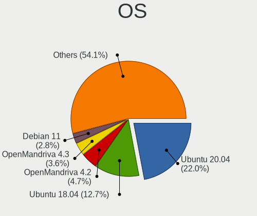

| Name               | Notebooks | Percent |
|--------------------|-----------|---------|
| Ubuntu 20.04       | 87        | 17.23%  |
| Ubuntu 18.04       | 47        | 9.31%   |
| OpenMandriva 4.3   | 24        | 4.75%   |
| OpenMandriva 4.90  | 23        | 4.55%   |
| OpenMandriva 4.2   | 18        | 3.56%   |
| Ubuntu 22.04       | 15        | 2.97%   |
| Debian 11          | 13        | 2.57%   |
| Zorin 16           | 11        | 2.18%   |
| BlackPanther 18.1  | 11        | 2.18%   |
| Arch               | 11        | 2.18%   |
| Arch Rolling       | 10        | 1.98%   |
| OpenMandriva 23.01 | 9         | 1.78%   |
| Xubuntu 20.04      | 8         | 1.58%   |
| Zorin 15           | 7         | 1.39%   |
| Xubuntu 18.04      | 7         | 1.39%   |
| Ubuntu 21.04       | 7         | 1.39%   |
| Pop!_OS 20.10      | 7         | 1.39%   |
| Manjaro            | 7         | 1.39%   |
| Linux Mint 19.3    | 7         | 1.39%   |
| Fedora 35          | 6         | 1.19%   |
| Ubuntu 19.10       | 5         | 0.99%   |
| OpenMandriva 4.50  | 5         | 0.99%   |
| Fedora 36          | 5         | 0.99%   |
| Fedora 32          | 5         | 0.99%   |
| Ubuntu Unity 16.04 | 4         | 0.79%   |
| Ubuntu 21.10       | 4         | 0.79%   |
| Ubuntu 20.10       | 4         | 0.79%   |
| Ubuntu 19.04       | 4         | 0.79%   |
| Ubuntu 16.04       | 4         | 0.79%   |
| Pop!_OS 22.04      | 4         | 0.79%   |
| Linux Mint 20.2    | 4         | 0.79%   |
| Fedora 37          | 4         | 0.79%   |
| Ubuntu Unity 18.04 | 3         | 0.59%   |
| Ubuntu 22.10       | 3         | 0.59%   |
| SteamOS 3.4.4      | 3         | 0.59%   |
| Pop!_OS 21.04      | 3         | 0.59%   |
| Peppermint 10      | 3         | 0.59%   |
| Linux Mint 21.1    | 3         | 0.59%   |
| Linux Mint 20.3    | 3         | 0.59%   |
| KDE neon 20.04     | 3         | 0.59%   |

OS Family
---------

OS without a version

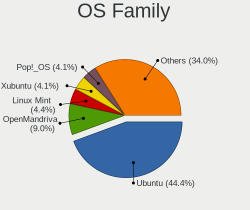

| Name          | Notebooks | Percent |
|---------------|-----------|---------|
| Ubuntu        | 177       | 35.83%  |
| OpenMandriva  | 78        | 15.79%  |
| Fedora        | 24        | 4.86%   |
| Linux Mint    | 22        | 4.45%   |
| Debian        | 21        | 4.25%   |
| Arch          | 21        | 4.25%   |
| Zorin         | 18        | 3.64%   |
| Pop!_OS       | 18        | 3.64%   |
| Xubuntu       | 16        | 3.24%   |
| Manjaro       | 13        | 2.63%   |
| BlackPanther  | 11        | 2.23%   |
| Ubuntu Unity  | 7         | 1.42%   |
| Gentoo        | 7         | 1.42%   |
| Kubuntu       | 5         | 1.01%   |
| SteamOS       | 4         | 0.81%   |
| Kali          | 4         | 0.81%   |
| Slackware     | 3         | 0.61%   |
| ROSA          | 3         | 0.61%   |
| Peppermint    | 3         | 0.61%   |
| Lubuntu       | 3         | 0.61%   |
| KDE neon      | 3         | 0.61%   |
| Guix          | 3         | 0.61%   |
| Deepin        | 3         | 0.61%   |
| ArcoLinux     | 3         | 0.61%   |
| Ubuntu Budgie | 2         | 0.4%    |
| RHEL          | 2         | 0.4%    |
| openSUSE      | 2         | 0.4%    |
| LMDE          | 2         | 0.4%    |
| Endless       | 2         | 0.4%    |
| Elementary    | 2         | 0.4%    |
| CentOS        | 2         | 0.4%    |
| antiX         | 2         | 0.4%    |
| Ubuntu MATE   | 1         | 0.2%    |
| SystemRescue  | 1         | 0.2%    |
| Sparky        | 1         | 0.2%    |
| Solus         | 1         | 0.2%    |
| Plamo         | 1         | 0.2%    |
| Garuda Linux  | 1         | 0.2%    |
| Feren OS      | 1         | 0.2%    |
| BunsenLabs    | 1         | 0.2%    |

Kernel
------

Version of the Linux kernel

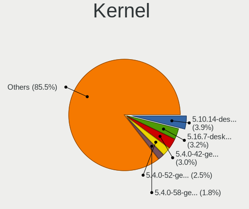

| Version                  | Notebooks | Percent |
|--------------------------|-----------|---------|
| 5.16.7-desktop-1omv4003  | 23        | 4.09%   |
| 5.10.14-desktop-1omv4002 | 17        | 3.02%   |
| 5.4.0-42-generic         | 13        | 2.31%   |
| 6.0.2-desktop-1omv4090   | 11        | 1.96%   |
| 5.4.0-52-generic         | 11        | 1.96%   |
| 6.1.1-desktop-1omv2290   | 9         | 1.6%    |
| 5.4.0-58-generic         | 8         | 1.42%   |
| 4.18.16-desktop-1bP      | 8         | 1.42%   |
| 5.4.0-48-generic         | 7         | 1.25%   |
| 5.8.0-48-generic         | 6         | 1.07%   |
| 5.0.0-37-generic         | 6         | 1.07%   |
| 5.8.0-7642-generic       | 5         | 0.89%   |
| 5.8.0-43-generic         | 5         | 0.89%   |
| 5.3.0-40-generic         | 5         | 0.89%   |
| 5.19.1-desktop-1omv4090  | 5         | 0.89%   |
| 5.15.0-58-generic        | 5         | 0.89%   |
| 5.13.0-27-generic        | 5         | 0.89%   |
| 5.8.0-50-generic         | 4         | 0.71%   |
| 5.6.14-desktop-2bP       | 4         | 0.71%   |
| 5.4.0-40-generic         | 4         | 0.71%   |
| 5.18.12-desktop-3omv4090 | 4         | 0.71%   |
| 5.15.0-56-generic        | 4         | 0.71%   |
| 5.12.4-desktop-1omv4050  | 4         | 0.71%   |
| 5.11.0-37-generic        | 4         | 0.71%   |
| 5.11.0-27-generic        | 4         | 0.71%   |
| 4.18.0-25-generic        | 4         | 0.71%   |
| 6.0.12-76060006-generic  | 3         | 0.53%   |
| 5.8.0-45-generic         | 3         | 0.53%   |
| 5.4.0-73-generic         | 3         | 0.53%   |
| 5.4.0-65-generic         | 3         | 0.53%   |
| 5.4.0-51-generic         | 3         | 0.53%   |
| 5.4.0-47-generic         | 3         | 0.53%   |
| 5.4.0-39-generic         | 3         | 0.53%   |
| 5.4.0-31-generic         | 3         | 0.53%   |
| 5.4.0-28-generic         | 3         | 0.53%   |
| 5.3.0-28-generic         | 3         | 0.53%   |
| 5.16.11-76051611-generic | 3         | 0.53%   |
| 5.13.0-valve36-1-neptune | 3         | 0.53%   |
| 5.13.0-41-generic        | 3         | 0.53%   |
| 5.11.0-40-generic        | 3         | 0.53%   |

Kernel Family
-------------

Linux kernel without a distro release

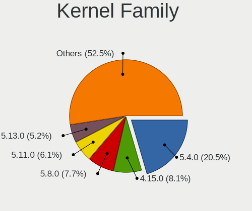

| Version | Notebooks | Percent |
|---------|-----------|---------|
| 5.4.0   | 92        | 17.2%   |
| 4.15.0  | 36        | 6.73%   |
| 5.8.0   | 34        | 6.36%   |
| 5.13.0  | 27        | 5.05%   |
| 5.11.0  | 27        | 5.05%   |
| 5.16.7  | 24        | 4.49%   |
| 5.15.0  | 24        | 4.49%   |
| 5.3.0   | 20        | 3.74%   |
| 5.10.14 | 17        | 3.18%   |
| 5.0.0   | 17        | 3.18%   |
| 5.10.0  | 15        | 2.8%    |
| 6.0.2   | 11        | 2.06%   |
| 6.1.1   | 10        | 1.87%   |
| 4.18.0  | 9         | 1.68%   |
| 4.18.16 | 8         | 1.5%    |
| 5.19.0  | 7         | 1.31%   |
| 5.19.1  | 6         | 1.12%   |
| 4.4.0   | 5         | 0.93%   |
| 5.6.14  | 4         | 0.75%   |
| 5.19.11 | 4         | 0.75%   |
| 5.18.12 | 4         | 0.75%   |
| 5.16.11 | 4         | 0.75%   |
| 5.12.4  | 4         | 0.75%   |
| 4.19.0  | 4         | 0.75%   |
| 6.0.12  | 3         | 0.56%   |
| 6.0.0   | 3         | 0.56%   |
| 5.8.13  | 3         | 0.56%   |
| 5.19.8  | 3         | 0.56%   |
| 5.18.0  | 3         | 0.56%   |
| 5.14.0  | 3         | 0.56%   |
| 6.0.8   | 2         | 0.37%   |
| 5.9.0   | 2         | 0.37%   |
| 5.19.5  | 2         | 0.37%   |
| 5.18.5  | 2         | 0.37%   |
| 5.18.13 | 2         | 0.37%   |
| 5.16.18 | 2         | 0.37%   |
| 5.15.10 | 2         | 0.37%   |
| 5.14.10 | 2         | 0.37%   |
| 5.13.19 | 2         | 0.37%   |
| 4.9.60  | 2         | 0.37%   |

Kernel Major Ver.
-----------------

Linux kernel major version

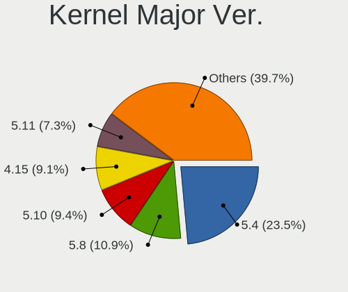

| Version | Notebooks | Percent |
|---------|-----------|---------|
| 5.4     | 99        | 18.64%  |
| 5.8     | 41        | 7.72%   |
| 5.10    | 41        | 7.72%   |
| 4.15    | 36        | 6.78%   |
| 5.16    | 35        | 6.59%   |
| 5.13    | 34        | 6.4%    |
| 5.15    | 32        | 6.03%   |
| 5.11    | 30        | 5.65%   |
| 5.19    | 24        | 4.52%   |
| 6.0     | 21        | 3.95%   |
| 5.3     | 21        | 3.95%   |
| 5.0     | 18        | 3.39%   |
| 5.18    | 17        | 3.2%    |
| 4.18    | 17        | 3.2%    |
| 6.1     | 13        | 2.45%   |
| 5.14    | 10        | 1.88%   |
| 5.6     | 8         | 1.51%   |
| 5.12    | 8         | 1.51%   |
| 5.17    | 5         | 0.94%   |
| 4.4     | 5         | 0.94%   |
| 4.19    | 5         | 0.94%   |
| 5.9     | 4         | 0.75%   |
| 4.9     | 4         | 0.75%   |
| 5.7     | 2         | 0.38%   |
| 3.10    | 1         | 0.19%   |

Arch
----

OS architecture (x86_64, i586, etc.)

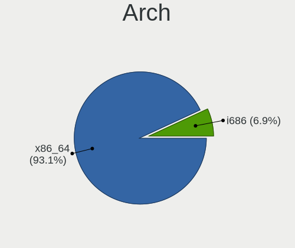

| Name   | Notebooks | Percent |
|--------|-----------|---------|
| x86_64 | 456       | 94.41%  |
| i686   | 27        | 5.59%   |

DE
--

Desktop Environment

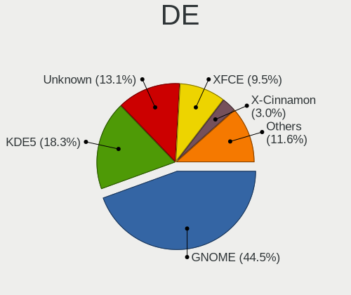

| Name       | Notebooks | Percent |
|------------|-----------|---------|
| GNOME      | 206       | 42.04%  |
| KDE5       | 117       | 23.88%  |
| Unknown    | 55        | 11.22%  |
| XFCE       | 44        | 8.98%   |
| X-Cinnamon | 15        | 3.06%   |
| MATE       | 9         | 1.84%   |
| Unity      | 7         | 1.43%   |
| LXDE       | 6         | 1.22%   |
| KDE        | 6         | 1.22%   |
| sway       | 4         | 0.82%   |
| Deepin     | 3         | 0.61%   |
| Cinnamon   | 3         | 0.61%   |
| Budgie     | 3         | 0.61%   |
| Pantheon   | 2         | 0.41%   |
| LXQt       | 2         | 0.41%   |
| icewm      | 2         | 0.41%   |
| awesome    | 2         | 0.41%   |
| XSession   | 1         | 0.2%    |
| xmonad     | 1         | 0.2%    |
| KDE4       | 1         | 0.2%    |
| i3         | 1         | 0.2%    |

Display Server
--------------

X11 or Wayland

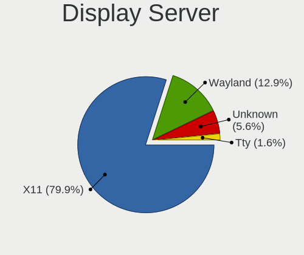

| Name    | Notebooks | Percent |
|---------|-----------|---------|
| X11     | 395       | 80.45%  |
| Wayland | 61        | 12.42%  |
| Unknown | 28        | 5.7%    |
| Tty     | 7         | 1.43%   |

Display Manager
---------------

SDDM, LightDM, etc.

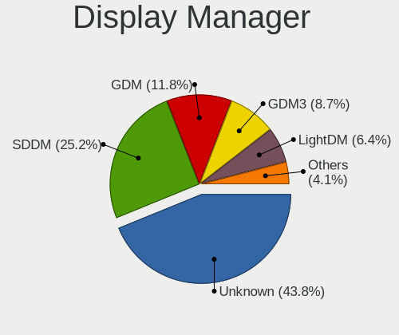

| Name    | Notebooks | Percent |
|---------|-----------|---------|
| Unknown | 232       | 46.87%  |
| SDDM    | 114       | 23.03%  |
| GDM     | 57        | 11.52%  |
| GDM3    | 40        | 8.08%   |
| LightDM | 30        | 6.06%   |
| TDM     | 14        | 2.83%   |
| XDM     | 4         | 0.81%   |
| LXDM    | 1         | 0.2%    |
| KDM     | 1         | 0.2%    |
| GREETD  | 1         | 0.2%    |
| EMPTTY  | 1         | 0.2%    |

OS Lang
-------

Language

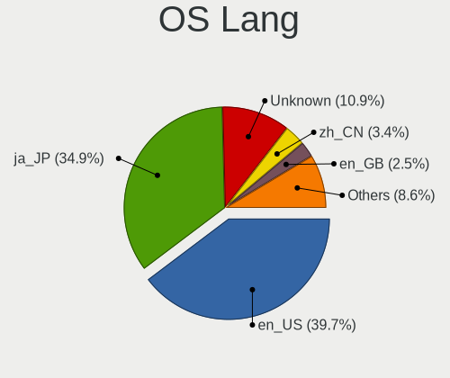

| Lang    | Notebooks | Percent |
|---------|-----------|---------|
| en_US   | 189       | 38.18%  |
| ja_JP   | 182       | 36.77%  |
| Unknown | 61        | 12.32%  |
| zh_CN   | 12        | 2.42%   |
| en_GB   | 12        | 2.42%   |
| pt_BR   | 11        | 2.22%   |
| C       | 7         | 1.41%   |
| fr_FR   | 4         | 0.81%   |
| zh_TW   | 2         | 0.4%    |
| ru_RU   | 2         | 0.4%    |
| sv_SE   | 1         | 0.2%    |
| sr_RS   | 1         | 0.2%    |
| sk_SK   | 1         | 0.2%    |
| pl_PL   | 1         | 0.2%    |
| nb_NO   | 1         | 0.2%    |
| fi_FI   | 1         | 0.2%    |
| es_GT   | 1         | 0.2%    |
| es_ES   | 1         | 0.2%    |
| en_SG   | 1         | 0.2%    |
| en_PH   | 1         | 0.2%    |
| en_NL   | 1         | 0.2%    |
| en_AU   | 1         | 0.2%    |
| en_AG   | 1         | 0.2%    |

Boot Mode
---------

EFI or BIOS

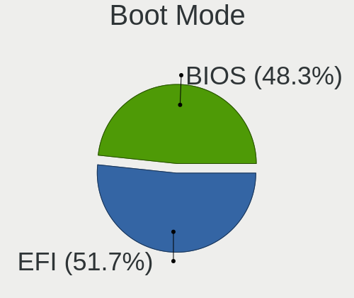

| Mode | Notebooks | Percent |
|------|-----------|---------|
| EFI  | 252       | 51.53%  |
| BIOS | 237       | 48.47%  |

Filesystem
----------

Type of filesystem

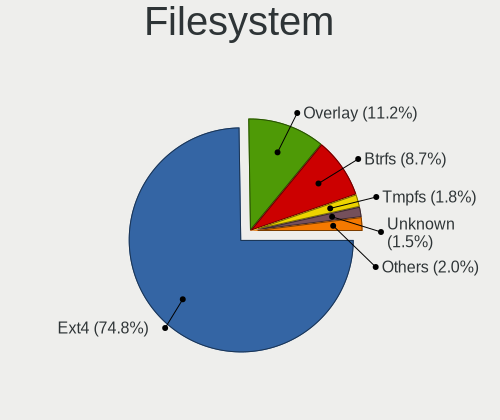

| Type    | Notebooks | Percent |
|---------|-----------|---------|
| Ext4    | 372       | 76.39%  |
| Overlay | 57        | 11.7%   |
| Btrfs   | 40        | 8.21%   |
| Unknown | 9         | 1.85%   |
| Xfs     | 4         | 0.82%   |
| Zfs     | 3         | 0.62%   |
| Ntfs    | 1         | 0.21%   |
| F2fs    | 1         | 0.21%   |

Part. scheme
------------

Scheme of partitioning

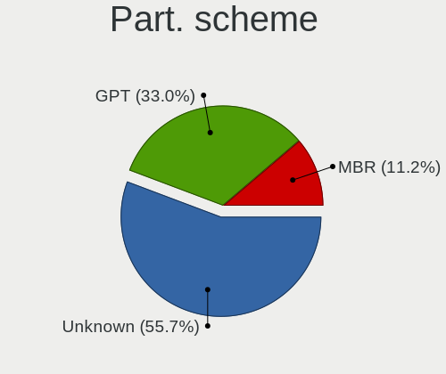

| Type    | Notebooks | Percent |
|---------|-----------|---------|
| Unknown | 247       | 49.7%   |
| GPT     | 195       | 39.24%  |
| MBR     | 55        | 11.07%  |

Dual Boot with Linux/BSD
------------------------

Hosting more than one Linux/BSD

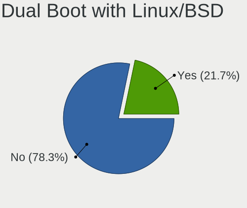

| Dual boot | Notebooks | Percent |
|-----------|-----------|---------|
| No        | 387       | 78.5%   |
| Yes       | 106       | 21.5%   |

Dual Boot (Win)
---------------

Hosting Linux and Windows

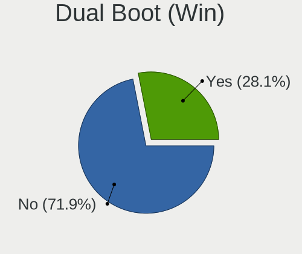

| Dual boot | Notebooks | Percent |
|-----------|-----------|---------|
| No        | 353       | 72.48%  |
| Yes       | 134       | 27.52%  |

Board
-----

Vendor
------

Motherboard manufacturer

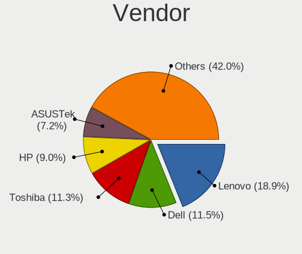

| Name                | Notebooks | Percent |
|---------------------|-----------|---------|
| Lenovo              | 86        | 17.81%  |
| Dell                | 58        | 12.01%  |
| Toshiba             | 55        | 11.39%  |
| Hewlett-Packard     | 47        | 9.73%   |
| ASUSTek Computer    | 36        | 7.45%   |
| Fujitsu             | 34        | 7.04%   |
| NEC Computers       | 25        | 5.18%   |
| Apple               | 19        | 3.93%   |
| Acer                | 16        | 3.31%   |
| Panasonic           | 14        | 2.9%    |
| Sony                | 11        | 2.28%   |
| MouseComputer       | 7         | 1.45%   |
| Unknown             | 7         | 1.45%   |
| HUAWEI              | 6         | 1.24%   |
| MSI                 | 5         | 1.04%   |
| Novastar            | 4         | 0.83%   |
| Alienware           | 4         | 0.83%   |
| Valve               | 3         | 0.62%   |
| System76            | 3         | 0.62%   |
| Notebook            | 3         | 0.62%   |
| Gateway             | 3         | 0.62%   |
| Dynabook            | 3         | 0.62%   |
| UNITCOM             | 2         | 0.41%   |
| Timi                | 2         | 0.41%   |
| Thirdwave           | 2         | 0.41%   |
| SLIMBOOK            | 2         | 0.41%   |
| Samsung Electronics | 2         | 0.41%   |
| KOUZIRO             | 2         | 0.41%   |
| Hampoo              | 2         | 0.41%   |
| EPSON DIRECT        | 2         | 0.41%   |
| TUXEDO              | 1         | 0.21%   |
| Teclast             | 1         | 0.21%   |
| Sharp               | 1         | 0.21%   |
| Razer               | 1         | 0.21%   |
| R.W.C               | 1         | 0.21%   |
| Purism              | 1         | 0.21%   |
| Maibenben           | 1         | 0.21%   |
| Jumper              | 1         | 0.21%   |
| Intel               | 1         | 0.21%   |
| HONOR               | 1         | 0.21%   |

Model
-----

Motherboard model

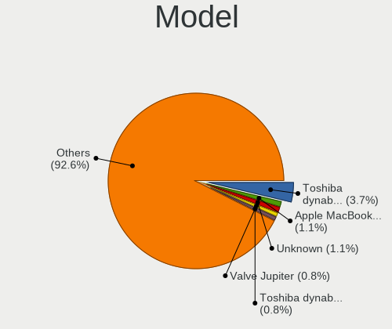

| Name                              | Notebooks | Percent |
|-----------------------------------|-----------|---------|
| Toshiba dynabook T653/46JR        | 19        | 3.93%   |
| Unknown                           | 7         | 1.45%   |
| Toshiba dynabook Satellite B552/G | 5         | 1.04%   |
| Novastar KL55                     | 4         | 0.83%   |
| Apple MacBookPro9,2               | 4         | 0.83%   |
| Valve Jupiter                     | 3         | 0.62%   |
| Lenovo G570 4334                  | 3         | 0.62%   |
| Dell Inspiron 1545                | 3         | 0.62%   |
| Toshiba dynabook R73/BN           | 2         | 0.41%   |
| System76 Lemur Pro                | 2         | 0.41%   |
| Panasonic CF-S10EYADR             | 2         | 0.41%   |
| Lenovo ThinkPad X230 2325SSF      | 2         | 0.41%   |
| Lenovo G550 2958                  | 2         | 0.41%   |
| KOUZIRO KOUZIRONB                 | 2         | 0.41%   |
| HP ProBook 6570b                  | 2         | 0.41%   |
| HP ProBook 6560b                  | 2         | 0.41%   |
| HP ProBook 6550b                  | 2         | 0.41%   |
| HP Pavilion dv4                   | 2         | 0.41%   |
| HP Notebook                       | 2         | 0.41%   |
| HP Laptop 15-db0xxx               | 2         | 0.41%   |
| Hampoo C3W6_AP108_4GB             | 2         | 0.41%   |
| Gateway NE56R                     | 2         | 0.41%   |
| Fujitsu FARQ02010                 | 2         | 0.41%   |
| Dell XPS 9320                     | 2         | 0.41%   |
| Dell XPS 15 9500                  | 2         | 0.41%   |
| Dell XPS 13 9360                  | 2         | 0.41%   |
| Dell Latitude E6320               | 2         | 0.41%   |
| Dell Latitude 3540                | 2         | 0.41%   |
| Dell Inspiron 5370                | 2         | 0.41%   |
| Dell Inspiron 11-3162             | 2         | 0.41%   |
| Dell G3 3500                      | 2         | 0.41%   |
| ASUS ROG Strix G733ZX_G733ZX      | 2         | 0.41%   |
| ASUS E200HA                       | 2         | 0.41%   |
| Apple MacBookPro5,5               | 2         | 0.41%   |
| Apple MacBookPro15,1              | 2         | 0.41%   |
| Acer Swift SF314-54               | 2         | 0.41%   |
| Acer Aspire V3-571                | 2         | 0.41%   |
| UNITCOM W55xEU                    | 1         | 0.21%   |
| UNITCOM W35_37ET                  | 1         | 0.21%   |
| TUXEDO P95_HR                     | 1         | 0.21%   |

Model Family
------------

Motherboard model prefix

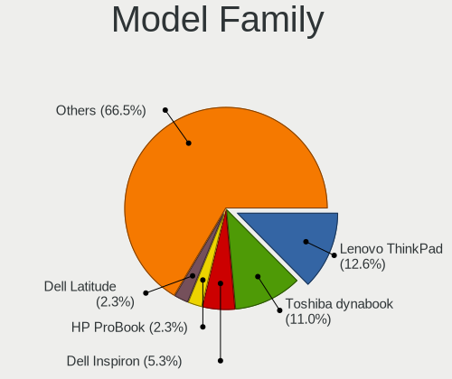

| Name                  | Notebooks | Percent |
|-----------------------|-----------|---------|
| Lenovo ThinkPad       | 60        | 12.42%  |
| Toshiba dynabook      | 52        | 10.77%  |
| Dell Inspiron         | 26        | 5.38%   |
| HP ProBook            | 15        | 3.11%   |
| Dell Latitude         | 13        | 2.69%   |
| Dell XPS              | 11        | 2.28%   |
| Acer Aspire           | 11        | 2.28%   |
| HP Pavilion           | 8         | 1.66%   |
| ASUS VivoBook         | 8         | 1.66%   |
| Unknown               | 7         | 1.45%   |
| Lenovo ThinkBook      | 5         | 1.04%   |
| HP Laptop             | 5         | 1.04%   |
| HP EliteBook          | 5         | 1.04%   |
| ASUS ROG              | 5         | 1.04%   |
| Novastar KL55         | 4         | 0.83%   |
| Lenovo IdeaPad        | 4         | 0.83%   |
| Apple MacBookPro9     | 4         | 0.83%   |
| Valve Jupiter         | 3         | 0.62%   |
| Lenovo G570           | 3         | 0.62%   |
| HP ENVY               | 3         | 0.62%   |
| Dell G3               | 3         | 0.62%   |
| ASUS ZenBook          | 3         | 0.62%   |
| Apple MacBookPro15    | 3         | 0.62%   |
| Toshiba PORTEGE       | 2         | 0.41%   |
| Timi RedmiBook        | 2         | 0.41%   |
| System76 Lemur        | 2         | 0.41%   |
| Panasonic CF-S10EYADR | 2         | 0.41%   |
| Lenovo G550           | 2         | 0.41%   |
| KOUZIRO KOUZIRONB     | 2         | 0.41%   |
| HP ZHAN               | 2         | 0.41%   |
| HP Notebook           | 2         | 0.41%   |
| HP Compaq             | 2         | 0.41%   |
| Hampoo C3W6           | 2         | 0.41%   |
| Gateway NE56R         | 2         | 0.41%   |
| Fujitsu FARQ02010     | 2         | 0.41%   |
| EPSON DIRECT Endeavor | 2         | 0.41%   |
| Dell Vostro           | 2         | 0.41%   |
| ASUS TUF              | 2         | 0.41%   |
| ASUS E200HA           | 2         | 0.41%   |
| Apple MacBookPro5     | 2         | 0.41%   |

MFG Year
--------

Motherboard manufacture year

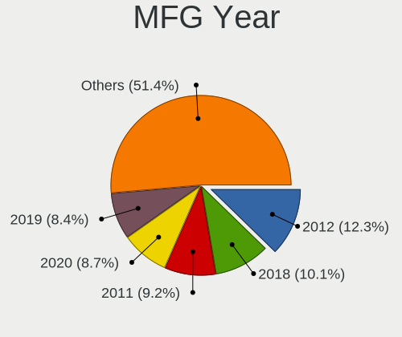

| Year    | Notebooks | Percent |
|---------|-----------|---------|
| 2012    | 50        | 10.35%  |
| 2018    | 49        | 10.14%  |
| 2020    | 41        | 8.49%   |
| 2011    | 40        | 8.28%   |
| 2013    | 39        | 8.07%   |
| 2019    | 38        | 7.87%   |
| 2021    | 36        | 7.45%   |
| 2010    | 26        | 5.38%   |
| 2009    | 26        | 5.38%   |
| 2016    | 25        | 5.18%   |
| 2015    | 22        | 4.55%   |
| 2008    | 22        | 4.55%   |
| 2017    | 17        | 3.52%   |
| 2007    | 16        | 3.31%   |
| 2014    | 14        | 2.9%    |
| 2022    | 13        | 2.69%   |
| 2006    | 7         | 1.45%   |
| 2005    | 1         | 0.21%   |
| Unknown | 1         | 0.21%   |

Form Factor
-----------

Physical design of the computer

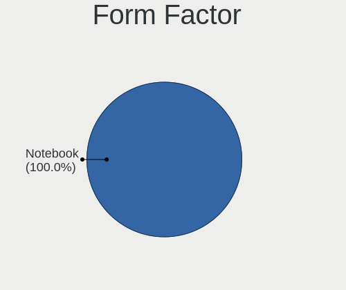

| Name     | Notebooks | Percent |
|----------|-----------|---------|
| Notebook | 483       | 100%    |

Secure Boot
-----------

Enabled or disabled

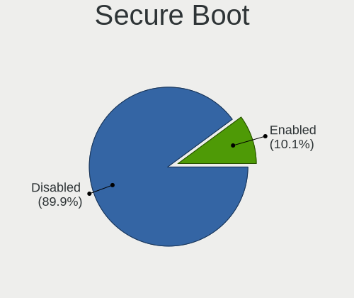

| State    | Notebooks | Percent |
|----------|-----------|---------|
| Disabled | 440       | 89.98%  |
| Enabled  | 49        | 10.02%  |

Coreboot
--------

Have coreboot on board

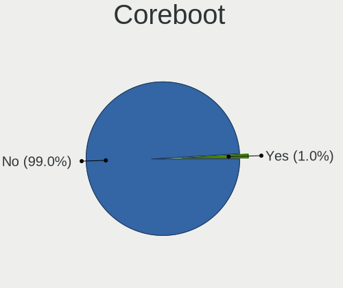

| Used | Notebooks | Percent |
|------|-----------|---------|
| No   | 478       | 98.96%  |
| Yes  | 5         | 1.04%   |

RAM Size
--------

Total RAM memory

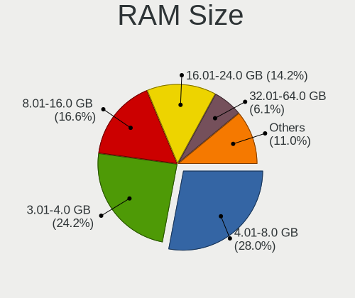

| Size in GB  | Notebooks | Percent |
|-------------|-----------|---------|
| 3.01-4.0    | 133       | 27.42%  |
| 4.01-8.0    | 129       | 26.6%   |
| 8.01-16.0   | 75        | 15.46%  |
| 16.01-24.0  | 63        | 12.99%  |
| 1.01-2.0    | 30        | 6.19%   |
| 32.01-64.0  | 26        | 5.36%   |
| 2.01-3.0    | 9         | 1.86%   |
| 24.01-32.0  | 7         | 1.44%   |
| 64.01-256.0 | 7         | 1.44%   |
| 0.51-1.0    | 6         | 1.24%   |

RAM Used
--------

Used RAM memory

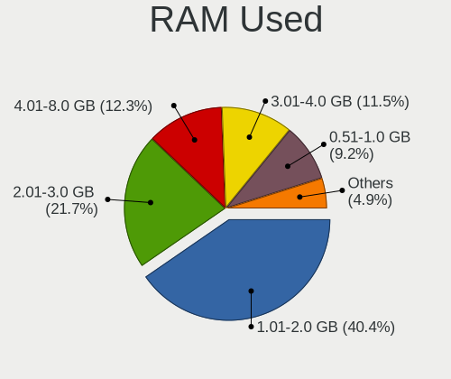

| Used GB    | Notebooks | Percent |
|------------|-----------|---------|
| 1.01-2.0   | 219       | 41.87%  |
| 2.01-3.0   | 117       | 22.37%  |
| 0.51-1.0   | 61        | 11.66%  |
| 3.01-4.0   | 57        | 10.9%   |
| 4.01-8.0   | 46        | 8.8%    |
| 8.01-16.0  | 12        | 2.29%   |
| 0.01-0.5   | 10        | 1.91%   |
| 16.01-24.0 | 1         | 0.19%   |

Total Drives
------------

Number of drives on board

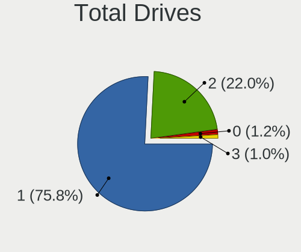

| Drives | Notebooks | Percent |
|--------|-----------|---------|
| 1      | 371       | 75.41%  |
| 2      | 110       | 22.36%  |
| 0      | 6         | 1.22%   |
| 3      | 5         | 1.02%   |

Has CD-ROM
----------

Has CD-ROM on board

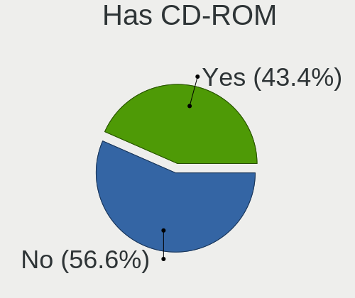

| Presented | Notebooks | Percent |
|-----------|-----------|---------|
| No        | 277       | 57.23%  |
| Yes       | 207       | 42.77%  |

Has Ethernet
------------

Has Ethernet on board

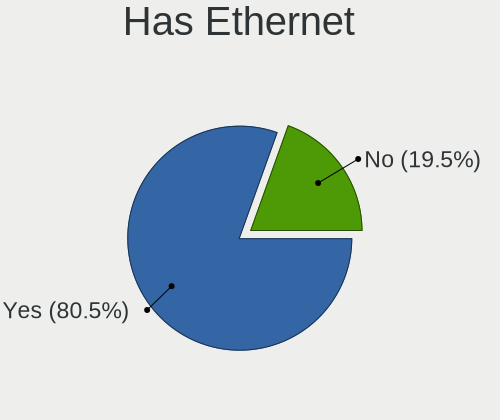

| Presented | Notebooks | Percent |
|-----------|-----------|---------|
| Yes       | 388       | 80.33%  |
| No        | 95        | 19.67%  |

Has WiFi
--------

Has WiFi module

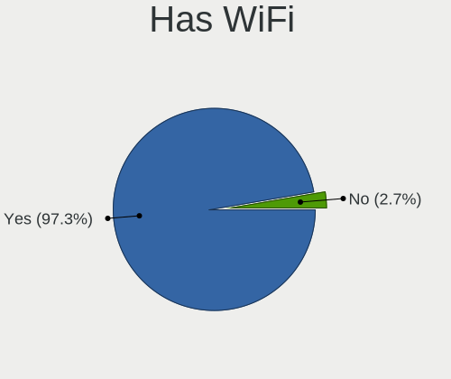

| Presented | Notebooks | Percent |
|-----------|-----------|---------|
| Yes       | 467       | 96.69%  |
| No        | 16        | 3.31%   |

Has Bluetooth
-------------

Has Bluetooth module

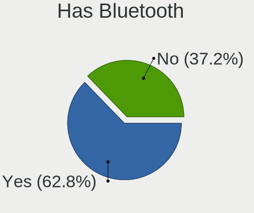

| Presented | Notebooks | Percent |
|-----------|-----------|---------|
| Yes       | 304       | 62.55%  |
| No        | 182       | 37.45%  |

Location
--------

Country
-------

Geographic location (country)

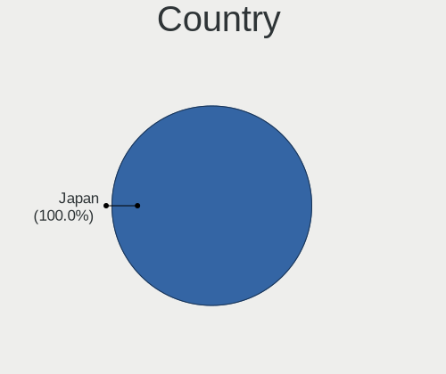

| Country | Notebooks | Percent |
|---------|-----------|---------|
| Japan   | 483       | 100%    |

City
----

Geographic location (city)

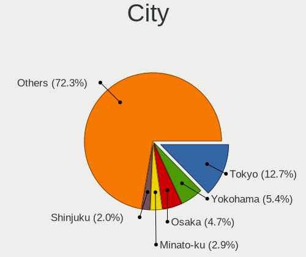

| City          | Notebooks | Percent |
|---------------|-----------|---------|
| Tokyo         | 53        | 10.23%  |
| Yokohama      | 27        | 5.21%   |
| Osaka         | 26        | 5.02%   |
| Minato-ku     | 17        | 3.28%   |
| Shinjuku      | 12        | 2.32%   |
| Saitama       | 12        | 2.32%   |
| Shibuya       | 11        | 2.12%   |
| Setagaya-ku   | 11        | 2.12%   |
| Chiyoda       | 11        | 2.12%   |
| Nagoya        | 9         | 1.74%   |
| Kyoto         | 9         | 1.74%   |
| Shinagawa     | 8         | 1.54%   |
| Honcho        | 8         | 1.54%   |
| Sapporo       | 7         | 1.35%   |
| Niigata       | 6         | 1.16%   |
| Kobe          | 6         | 1.16%   |
| Adachi        | 6         | 1.16%   |
| Ōtsu         | 5         | 0.97%   |
| Kagoshima     | 5         | 0.97%   |
| Ichikawa      | 5         | 0.97%   |
| Shizuoka      | 4         | 0.77%   |
| Mito          | 4         | 0.77%   |
| Kitakyushu    | 4         | 0.77%   |
| Hitachi       | 4         | 0.77%   |
| Hiratsuka     | 4         | 0.77%   |
| Himeji        | 4         | 0.77%   |
| Bunkyo-ku     | 4         | 0.77%   |
| Utsunomiya    | 3         | 0.58%   |
| Takamatsu     | 3         | 0.58%   |
| Narashino-shi | 3         | 0.58%   |
| Nagasaki      | 3         | 0.58%   |
| Morioka       | 3         | 0.58%   |
| Meguro-ku     | 3         | 0.58%   |
| Matsudo       | 3         | 0.58%   |
| Koto          | 3         | 0.58%   |
| Kodaira       | 3         | 0.58%   |
| Kawaguchi     | 3         | 0.58%   |
| Karasawa      | 3         | 0.58%   |
| Inagi-shi     | 3         | 0.58%   |
| Chiba         | 3         | 0.58%   |

Drives
------

Drive Vendor
------------

Hard drive vendors

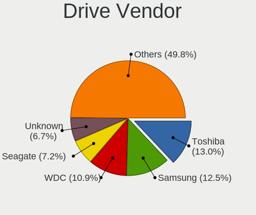

| Vendor                    | Notebooks | Drives | Percent |
|---------------------------|-----------|--------|---------|
| Toshiba                   | 74        | 81     | 12.98%  |
| Samsung Electronics       | 71        | 97     | 12.46%  |
| WDC                       | 62        | 72     | 10.88%  |
| Seagate                   | 41        | 50     | 7.19%   |
| Unknown                   | 38        | 50     | 6.67%   |
| SanDisk                   | 31        | 37     | 5.44%   |
| Crucial                   | 28        | 34     | 4.91%   |
| Hitachi                   | 23        | 25     | 4.04%   |
| Kingston                  | 18        | 20     | 3.16%   |
| SK hynix                  | 17        | 18     | 2.98%   |
| Micron Technology         | 14        | 22     | 2.46%   |
| Intel                     | 14        | 15     | 2.46%   |
| Apple                     | 12        | 13     | 2.11%   |
| SPCC                      | 9         | 12     | 1.58%   |
| HGST                      | 9         | 10     | 1.58%   |
| A-DATA Technology         | 9         | 11     | 1.58%   |
| KIOXIA                    | 7         | 9      | 1.23%   |
| Fujitsu                   | 7         | 8      | 1.23%   |
| SUNEAST                   | 6         | 7      | 1.05%   |
| Transcend                 | 5         | 7      | 0.88%   |
| Plextor                   | 5         | 7      | 0.88%   |
| Zheino                    | 4         | 5      | 0.7%    |
| Silicon Motion            | 3         | 3      | 0.53%   |
| KIOXIA-EXCERIA            | 3         | 4      | 0.53%   |
| China                     | 3         | 4      | 0.53%   |
| Unknown                   | 3         | 3      | 0.53%   |
| Teclast                   | 2         | 2      | 0.35%   |
| Team                      | 2         | 3      | 0.35%   |
| Ramaxel Technology        | 2         | 2      | 0.35%   |
| QC-FT-D                   | 2         | 2      | 0.35%   |
| Phison Electronics        | 2         | 2      | 0.35%   |
| Phison                    | 2         | 2      | 0.35%   |
| Patriot                   | 2         | 3      | 0.35%   |
| OCZ                       | 2         | 2      | 0.35%   |
| Micron/Crucial Technology | 2         | 2      | 0.35%   |
| Hewlett-Packard           | 2         | 2      | 0.35%   |
| Green House               | 2         | 4      | 0.35%   |
| Apacer                    | 2         | 4      | 0.35%   |
| TCSUNBOW                  | 1         | 1      | 0.18%   |
| SSSTC                     | 1         | 1      | 0.18%   |

Drive Model
-----------

Hard drive models

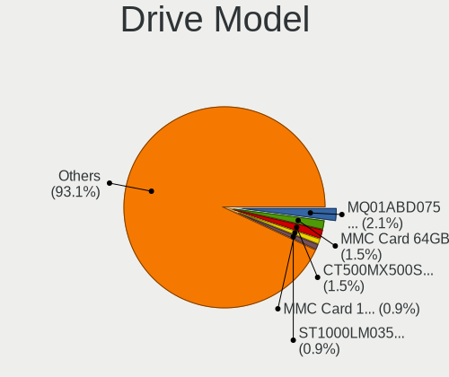

| Model                                  | Notebooks | Percent |
|----------------------------------------|-----------|---------|
| Toshiba MQ01ABD075 752GB               | 19        | 3.21%   |
| Unknown MMC Card  64GB                 | 9         | 1.52%   |
| Crucial CT500MX500SSD1 500GB           | 8         | 1.35%   |
| Unknown MMC Card  128GB                | 5         | 0.84%   |
| Seagate ST1000LM035-1RK172 1TB         | 5         | 0.84%   |
| Samsung SM963 2.5" NVMe PCIe SSD 256GB | 5         | 0.84%   |
| Toshiba MQ01ABF050 500GB               | 4         | 0.68%   |
| Toshiba MQ01ABD100 1TB                 | 4         | 0.68%   |
| Seagate ST9500325AS 500GB              | 4         | 0.68%   |
| Seagate ST500LT012-1DG142 500GB        | 4         | 0.68%   |
| Samsung NVMe SSD Drive 1TB             | 4         | 0.68%   |
| Kingston RBUSNS4180S3256GJ 256GB SSD   | 4         | 0.68%   |
| WDC WDS500G2B0B-00YS70 500GB SSD       | 3         | 0.51%   |
| Unknown SD/MMC/MS PRO 2GB              | 3         | 0.51%   |
| Unknown NVMe SSD Drive 512GB           | 3         | 0.51%   |
| Unknown MMC Card  32GB                 | 3         | 0.51%   |
| Unknown ASP550SS7-240GM-MI-B 240GB     | 3         | 0.51%   |
| Toshiba MQ01ABD100H 1TB                | 3         | 0.51%   |
| SPCC Solid State Disk 256GB            | 3         | 0.51%   |
| Seagate ST500LM012 HN-M500MBB 500GB    | 3         | 0.51%   |
| SanDisk NVMe SSD Drive 256GB           | 3         | 0.51%   |
| SanDisk Extreme SSD 500GB              | 3         | 0.51%   |
| Samsung SSD 860 QVO 1TB                | 3         | 0.51%   |
| Kingston OM8PCP3512F-AB 512GB          | 3         | 0.51%   |
| Intel NVMe SSD Drive 512GB             | 3         | 0.51%   |
| Crucial CT250MX500SSD1 250GB           | 3         | 0.51%   |
| Crucial CT240BX500SSD1 240GB           | 3         | 0.51%   |
| Apple NVMe SSD Drive 256GB             | 3         | 0.51%   |
| Unknown                                | 3         | 0.51%   |
| WDC WDS100T2B0A-00SM50 1TB SSD         | 2         | 0.34%   |
| WDC WD5000LPVX-08V0TT5 500GB           | 2         | 0.34%   |
| WDC WD2500BPVT-26JJ5T0 250GB           | 2         | 0.34%   |
| WDC WD2500BEKT-60PVMT0 250GB           | 2         | 0.34%   |
| WDC WD10SPZX-22Z10T0 1TB               | 2         | 0.34%   |
| WDC WD10JPVX-22JC3T0 1TB               | 2         | 0.34%   |
| Toshiba THNSNJ128GCSU 128GB SSD        | 2         | 0.34%   |
| Toshiba THNSN9480GESG 480GB SSD        | 2         | 0.34%   |
| Toshiba NVMe SSD Drive 512GB           | 2         | 0.34%   |
| Toshiba MQ04ABF100 1TB                 | 2         | 0.34%   |
| Toshiba MQ01ABF032 320GB               | 2         | 0.34%   |

HDD Vendor
----------

Hard disk drive vendors

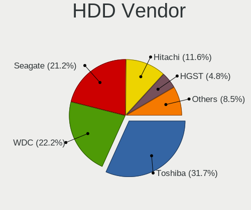

| Vendor              | Notebooks | Drives | Percent |
|---------------------|-----------|--------|---------|
| Toshiba             | 60        | 64     | 31.75%  |
| WDC                 | 42        | 48     | 22.22%  |
| Seagate             | 40        | 49     | 21.16%  |
| Hitachi             | 22        | 24     | 11.64%  |
| HGST                | 9         | 10     | 4.76%   |
| Fujitsu             | 7         | 8      | 3.7%    |
| Unknown             | 3         | 3      | 1.59%   |
| QC-FT-D             | 2         | 2      | 1.06%   |
| Samsung Electronics | 1         | 3      | 0.53%   |
| SABRENT             | 1         | 1      | 0.53%   |
| MARSHAL             | 1         | 2      | 0.53%   |
| Apple               | 1         | 1      | 0.53%   |

SSD Vendor
----------

Solid state drive vendors

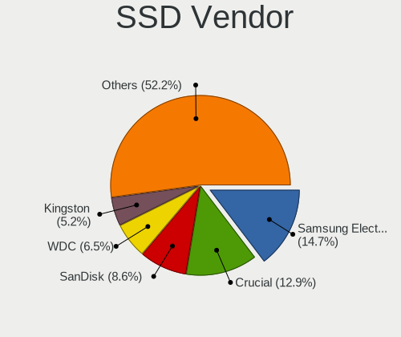

| Vendor              | Notebooks | Drives | Percent |
|---------------------|-----------|--------|---------|
| Samsung Electronics | 30        | 43     | 14.85%  |
| Crucial             | 27        | 33     | 13.37%  |
| SanDisk             | 18        | 22     | 8.91%   |
| WDC                 | 14        | 16     | 6.93%   |
| Kingston            | 11        | 12     | 5.45%   |
| A-DATA Technology   | 9         | 11     | 4.46%   |
| Toshiba             | 8         | 9      | 3.96%   |
| SPCC                | 7         | 10     | 3.47%   |
| SUNEAST             | 6         | 7      | 2.97%   |
| Intel               | 6         | 6      | 2.97%   |
| Transcend           | 5         | 7      | 2.48%   |
| Plextor             | 5         | 7      | 2.48%   |
| Micron Technology   | 5         | 7      | 2.48%   |
| Apple               | 5         | 5      | 2.48%   |
| China               | 3         | 4      | 1.49%   |
| Zheino              | 2         | 2      | 0.99%   |
| Unknown             | 2         | 2      | 0.99%   |
| Teclast             | 2         | 2      | 0.99%   |
| Team                | 2         | 3      | 0.99%   |
| Patriot             | 2         | 3      | 0.99%   |
| OCZ                 | 2         | 2      | 0.99%   |
| KIOXIA-EXCERIA      | 2         | 3      | 0.99%   |
| Green House         | 2         | 4      | 0.99%   |
| Apacer              | 2         | 4      | 0.99%   |
| TCSUNBOW            | 1         | 1      | 0.5%    |
| SK hynix            | 1         | 1      | 0.5%    |
| Seagate             | 1         | 1      | 0.5%    |
| RX7                 | 1         | 1      | 0.5%    |
| Ramaxel Technology  | 1         | 1      | 0.5%    |
| PNY                 | 1         | 1      | 0.5%    |
| OASDX               | 1         | 2      | 0.5%    |
| Netac               | 1         | 1      | 0.5%    |
| LITEON              | 1         | 2      | 0.5%    |
| Lexar               | 1         | 1      | 0.5%    |
| Kingmax             | 1         | 1      | 0.5%    |
| Intenso             | 1         | 1      | 0.5%    |
| Hitachi             | 1         | 1      | 0.5%    |
| Hewlett-Packard     | 1         | 1      | 0.5%    |
| FATTYDOVE           | 1         | 1      | 0.5%    |
| Dogfish             | 1         | 1      | 0.5%    |

Drive Kind
----------

HDD or SSD

| Kind    | Notebooks | Drives | Percent |
|---------|-----------|--------|---------|
| SSD     | 188       | 251    | 34.81%  |
| HDD     | 182       | 215    | 33.7%   |
| NVMe    | 128       | 166    | 23.7%   |
| MMC     | 30        | 43     | 5.56%   |
| Unknown | 12        | 12     | 2.22%   |

Drive Connector
---------------

SATA, SAS, NVMe, etc.

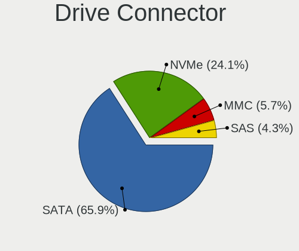

| Type | Notebooks | Drives | Percent |
|------|-----------|--------|---------|
| SATA | 350       | 457    | 66.16%  |
| NVMe | 128       | 165    | 24.2%   |
| MMC  | 30        | 43     | 5.67%   |
| SAS  | 21        | 22     | 3.97%   |

Drive Size
----------

Size of hard drive

| Size in TB | Notebooks | Drives | Percent |
|------------|-----------|--------|---------|
| 0.01-0.5   | 274       | 350    | 74.46%  |
| 0.51-1.0   | 85        | 105    | 23.1%   |
| 1.01-2.0   | 8         | 10     | 2.17%   |
| 3.01-4.0   | 1         | 1      | 0.27%   |

Space Total
-----------

Amount of disk space available on the file system

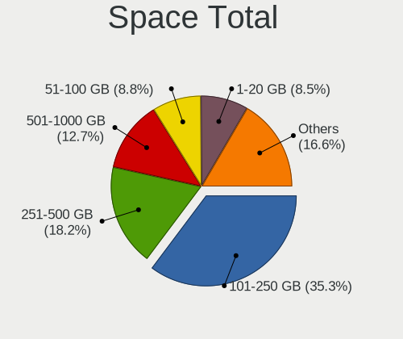

| Size in GB     | Notebooks | Percent |
|----------------|-----------|---------|
| 101-250        | 181       | 36.06%  |
| 251-500        | 90        | 17.93%  |
| 501-1000       | 61        | 12.15%  |
| 1-20           | 47        | 9.36%   |
| 51-100         | 44        | 8.76%   |
| 21-50          | 26        | 5.18%   |
| 1001-2000      | 22        | 4.38%   |
| Unknown        | 18        | 3.59%   |
| 2001-3000      | 9         | 1.79%   |
| More than 3000 | 4         | 0.8%    |

Space Used
----------

Amount of used disk space

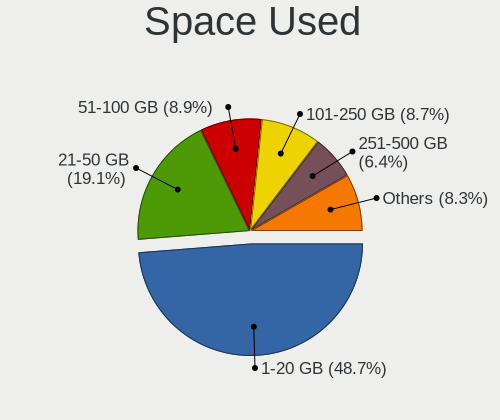

| Used GB   | Notebooks | Percent |
|-----------|-----------|---------|
| 1-20      | 253       | 48.75%  |
| 21-50     | 99        | 19.08%  |
| 51-100    | 46        | 8.86%   |
| 101-250   | 45        | 8.67%   |
| 251-500   | 33        | 6.36%   |
| 501-1000  | 18        | 3.47%   |
| Unknown   | 18        | 3.47%   |
| 1001-2000 | 5         | 0.96%   |
| 2001-3000 | 2         | 0.39%   |

Malfunc. Drives
---------------

Drive models with a malfunction

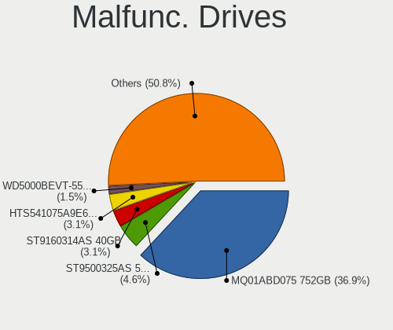

| Model                                            | Notebooks | Drives | Percent |
|--------------------------------------------------|-----------|--------|---------|
| Toshiba MQ01ABD075 752GB                         | 19        | 19     | 43.18%  |
| Seagate ST9500325AS 500GB                        | 3         | 3      | 6.82%   |
| Seagate ST9160314AS 160GB                        | 2         | 2      | 4.55%   |
| WDC WD1600BEVS-26RST0 160GB                      | 1         | 1      | 2.27%   |
| Toshiba MK5055GSX 500GB                          | 1         | 1      | 2.27%   |
| Toshiba MK1255GSX H 120GB                        | 1         | 1      | 2.27%   |
| Teclast 240GB SSD                                | 1         | 1      | 2.27%   |
| Seagate ST500LT012-1DG142 500GB                  | 1         | 1      | 2.27%   |
| Seagate ST500LM021-1KJ152 500GB                  | 1         | 1      | 2.27%   |
| Seagate ST1000LM035-1RK172 1TB                   | 1         | 1      | 2.27%   |
| SanDisk SSD PLUS 1000GB                          | 1         | 2      | 2.27%   |
| SanDisk SSD P4 32GB                              | 1         | 1      | 2.27%   |
| Samsung Electronics MZHPV256HDGL-00000 256GB SSD | 1         | 1      | 2.27%   |
| Samsung Electronics HM641JI 640GB                | 1         | 2      | 2.27%   |
| MARSHAL MAL2020SA 80 20GB                        | 1         | 1      | 2.27%   |
| LITEON CV8-8E128-HP 128GB SSD                    | 1         | 2      | 2.27%   |
| Hitachi HTS723232A7A364 320GB                    | 1         | 1      | 2.27%   |
| Hitachi HTS545050B9A300 500GB                    | 1         | 1      | 2.27%   |
| Hitachi HTS545025B9SA02 250GB                    | 1         | 1      | 2.27%   |
| HGST HTS545050A7E380 500GB                       | 1         | 1      | 2.27%   |
| HGST HTS541075A9E680 752GB                       | 1         | 1      | 2.27%   |
| Crucial C300-CTFDDAC064MAG 64GB SSD              | 1         | 2      | 2.27%   |
| A-DATA Technology AXM21S3-24GM-B 24GB SSD        | 1         | 1      | 2.27%   |

Malfunc. Drive Vendor
---------------------

Vendors of faulty drives

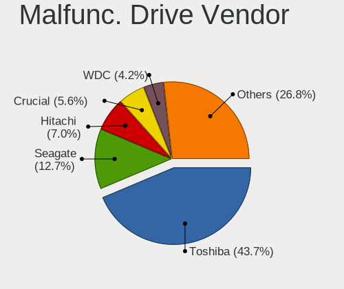

| Vendor              | Notebooks | Drives | Percent |
|---------------------|-----------|--------|---------|
| Toshiba             | 21        | 21     | 47.73%  |
| Seagate             | 8         | 8      | 18.18%  |
| Hitachi             | 3         | 3      | 6.82%   |
| SanDisk             | 2         | 3      | 4.55%   |
| Samsung Electronics | 2         | 3      | 4.55%   |
| HGST                | 2         | 2      | 4.55%   |
| WDC                 | 1         | 1      | 2.27%   |
| Teclast             | 1         | 1      | 2.27%   |
| MARSHAL             | 1         | 1      | 2.27%   |
| LITEON              | 1         | 2      | 2.27%   |
| Crucial             | 1         | 2      | 2.27%   |
| A-DATA Technology   | 1         | 1      | 2.27%   |

Malfunc. HDD Vendor
-------------------

Vendors of faulty HDD drives

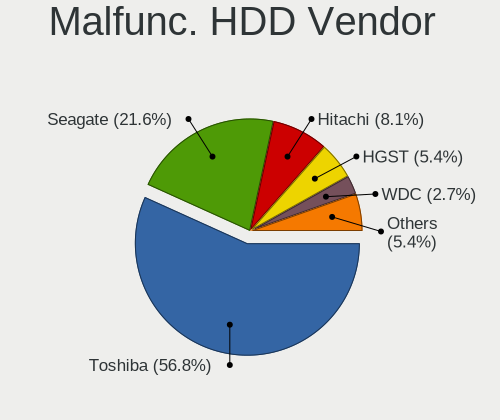

| Vendor              | Notebooks | Drives | Percent |
|---------------------|-----------|--------|---------|
| Toshiba             | 21        | 21     | 56.76%  |
| Seagate             | 8         | 8      | 21.62%  |
| Hitachi             | 3         | 3      | 8.11%   |
| HGST                | 2         | 2      | 5.41%   |
| WDC                 | 1         | 1      | 2.7%    |
| Samsung Electronics | 1         | 2      | 2.7%    |
| MARSHAL             | 1         | 1      | 2.7%    |

Malfunc. Drive Kind
-------------------

Kinds of faulty drives

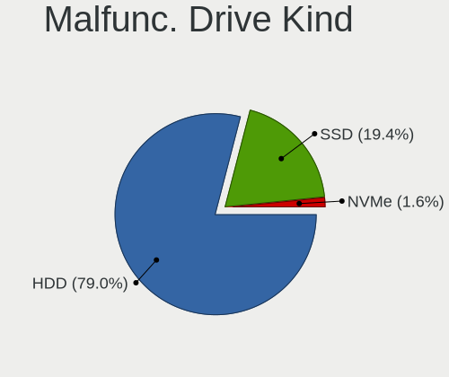

| Kind | Notebooks | Drives | Percent |
|------|-----------|--------|---------|
| HDD  | 37        | 38     | 84.09%  |
| SSD  | 7         | 10     | 15.91%  |

Failed Drives
-------------

Failed drive models

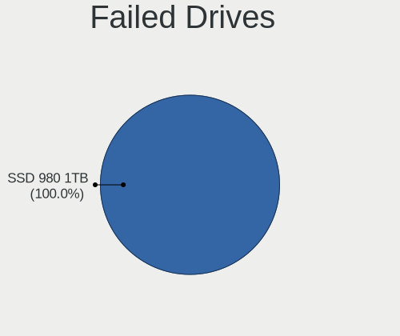

| Model                           | Notebooks | Drives | Percent |
|---------------------------------|-----------|--------|---------|
| Samsung Electronics SSD 980 1TB | 1         | 1      | 100%    |

Failed Drive Vendor
-------------------

Failed drive vendors

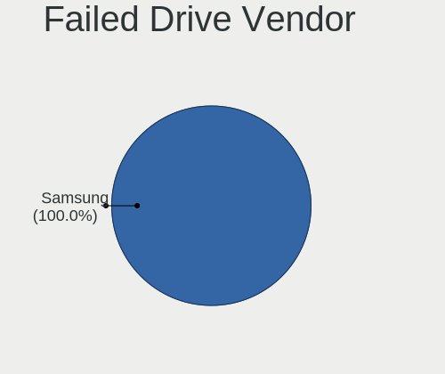

| Vendor              | Notebooks | Drives | Percent |
|---------------------|-----------|--------|---------|
| Samsung Electronics | 1         | 1      | 100%    |

Drive Status
------------

Number of failed and malfunc. drives

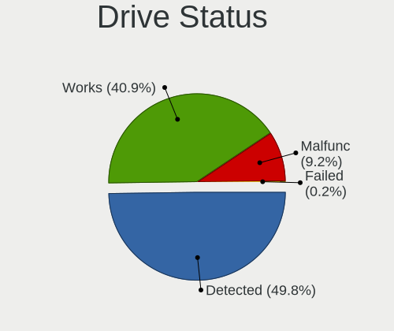

| Status   | Notebooks | Drives | Percent |
|----------|-----------|--------|---------|
| Detected | 277       | 395    | 54.74%  |
| Works    | 185       | 243    | 36.56%  |
| Malfunc  | 43        | 48     | 8.5%    |
| Failed   | 1         | 1      | 0.2%    |

Storage controller
------------------

Storage Vendor
--------------

Storage controller vendors

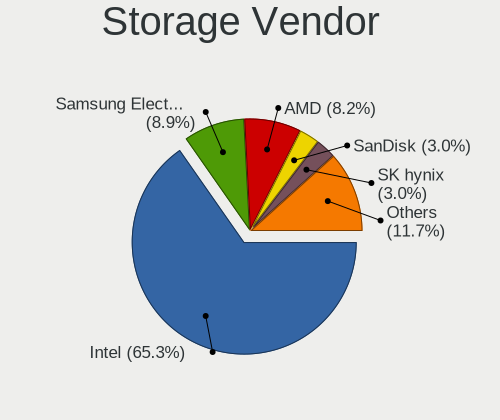

| Vendor                         | Notebooks | Percent |
|--------------------------------|-----------|---------|
| Intel                          | 353       | 65.74%  |
| AMD                            | 47        | 8.75%   |
| Samsung Electronics            | 46        | 8.57%   |
| SK hynix                       | 17        | 3.17%   |
| SanDisk                        | 17        | 3.17%   |
| Micron Technology              | 9         | 1.68%   |
| KIOXIA                         | 8         | 1.49%   |
| Kingston Technology Company    | 8         | 1.49%   |
| Toshiba America Info Systems   | 6         | 1.12%   |
| Silicon Motion                 | 6         | 1.12%   |
| Apple                          | 6         | 1.12%   |
| Phison Electronics             | 5         | 0.93%   |
| Nvidia                         | 4         | 0.74%   |
| Micron/Crucial Technology      | 2         | 0.37%   |
| Solid State Storage Technology | 1         | 0.19%   |
| ADATA Technology               | 1         | 0.19%   |
| Unknown                        | 1         | 0.19%   |

Storage Model
-------------

Storage controller models

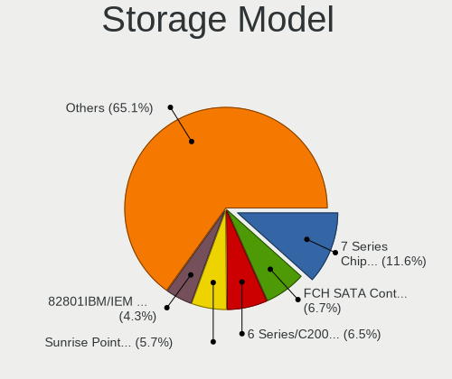

| Model                                                                                  | Notebooks | Percent |
|----------------------------------------------------------------------------------------|-----------|---------|
| Intel 7 Series Chipset Family 6-port SATA Controller [AHCI mode]                       | 73        | 12.52%  |
| Intel 6 Series/C200 Series Chipset Family 6 port Mobile SATA AHCI Controller           | 37        | 6.35%   |
| AMD FCH SATA Controller [AHCI mode]                                                    | 36        | 6.17%   |
| Intel Sunrise Point-LP SATA Controller [AHCI mode]                                     | 33        | 5.66%   |
| Intel 82801IBM/IEM (ICH9M/ICH9M-E) 4 port SATA Controller [AHCI mode]                  | 26        | 4.46%   |
| Intel Wildcat Point-LP SATA Controller [AHCI Mode]                                     | 19        | 3.26%   |
| Samsung NVMe SSD Controller SM981/PM981/PM983                                          | 18        | 3.09%   |
| Intel 5 Series/3400 Series Chipset 4 port SATA AHCI Controller                         | 17        | 2.92%   |
| Intel 82801 Mobile SATA Controller [RAID mode]                                         | 16        | 2.74%   |
| Samsung NVMe SSD Controller 980                                                        | 12        | 2.06%   |
| Intel 82801GBM/GHM (ICH7-M Family) SATA Controller [IDE mode]                          | 12        | 2.06%   |
| Intel 8 Series SATA Controller 1 [AHCI mode]                                           | 12        | 2.06%   |
| Intel 82801HM/HEM (ICH8M/ICH8M-E) SATA Controller [AHCI mode]                          | 11        | 1.89%   |
| Intel 82801HM/HEM (ICH8M/ICH8M-E) IDE Controller                                       | 11        | 1.89%   |
| Intel 82801G (ICH7 Family) IDE Controller                                              | 11        | 1.89%   |
| Micron Non-Volatile memory controller                                                  | 9         | 1.54%   |
| Intel Volume Management Device NVMe RAID Controller                                    | 9         | 1.54%   |
| Intel 5 Series/3400 Series Chipset 6 port SATA AHCI Controller                         | 9         | 1.54%   |
| SK hynix Gold P31/PC711 NVMe Solid State Drive                                         | 7         | 1.2%    |
| KIOXIA NVMe SSD Controller BG4                                                         | 7         | 1.2%    |
| Intel Cannon Point-LP SATA Controller [AHCI Mode]                                      | 7         | 1.2%    |
| Intel 8 Series/C220 Series Chipset Family 6-port SATA Controller 1 [AHCI mode]         | 7         | 1.2%    |
| SanDisk Non-Volatile memory controller                                                 | 6         | 1.03%   |
| Samsung NVMe SSD Controller PM9A1/PM9A3/980PRO                                         | 6         | 1.03%   |
| Intel Comet Lake SATA AHCI Controller                                                  | 6         | 1.03%   |
| Intel Cannon Lake Mobile PCH SATA AHCI Controller                                      | 6         | 1.03%   |
| Silicon Motion SM2263EN/SM2263XT SSD Controller                                        | 5         | 0.86%   |
| Intel SSD 660P Series                                                                  | 5         | 0.86%   |
| Intel HM170/QM170 Chipset SATA Controller [AHCI Mode]                                  | 5         | 0.86%   |
| Intel Celeron/Pentium Silver Processor SATA Controller                                 | 5         | 0.86%   |
| Intel Celeron N3350/Pentium N4200/Atom E3900 Series SATA AHCI Controller               | 5         | 0.86%   |
| Intel 400 Series Chipset Family SATA AHCI Controller                                   | 5         | 0.86%   |
| Apple ANS2 NVMe Controller                                                             | 5         | 0.86%   |
| SK hynix BC501 NVMe Solid State Drive                                                  | 4         | 0.69%   |
| Samsung NVMe SSD Controller SM961/PM961/SM963                                          | 4         | 0.69%   |
| Intel Atom/Celeron/Pentium Processor x5-E8000/J3xxx/N3xxx Series SATA Controller       | 4         | 0.69%   |
| Intel Atom Processor E3800 Series SATA AHCI Controller                                 | 4         | 0.69%   |
| Intel 82801GBM/GHM (ICH7-M Family) SATA Controller [AHCI mode]                         | 4         | 0.69%   |
| Intel 6 Series/C200 Series Chipset Family Mobile SATA Controller (IDE mode, ports 4-5) | 4         | 0.69%   |
| Intel 6 Series/C200 Series Chipset Family Mobile SATA Controller (IDE mode, ports 0-3) | 4         | 0.69%   |

Storage Kind
------------

Kind of storage controller (IDE, SATA, NVMe, SAS, ...)

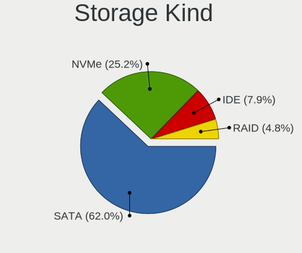

| Kind | Notebooks | Percent |
|------|-----------|---------|
| SATA | 352       | 63.2%   |
| NVMe | 129       | 23.16%  |
| IDE  | 49        | 8.8%    |
| RAID | 27        | 4.85%   |

Processor
---------

CPU Vendor
----------

Processor vendors

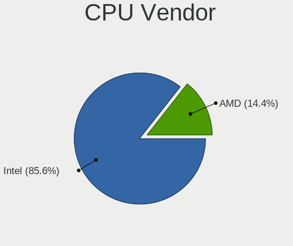

| Vendor | Notebooks | Percent |
|--------|-----------|---------|
| Intel  | 417       | 86.34%  |
| AMD    | 66        | 13.66%  |

CPU Model
---------

Processor models

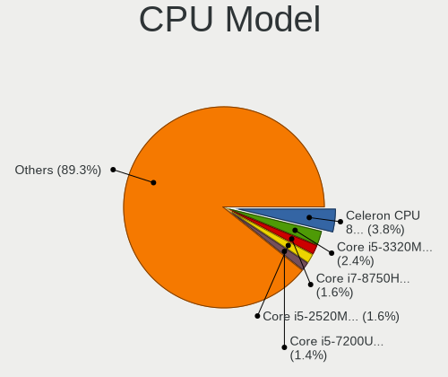

| Model                                         | Notebooks | Percent |
|-----------------------------------------------|-----------|---------|
| Intel Celeron CPU 847 @ 1.10GHz               | 19        | 3.93%   |
| Intel Core i5-3320M CPU @ 2.60GHz             | 12        | 2.48%   |
| Intel Core i5-7200U CPU @ 2.50GHz             | 9         | 1.86%   |
| Intel Core i7-8750H CPU @ 2.20GHz             | 8         | 1.66%   |
| Intel Core i7-8550U CPU @ 1.80GHz             | 8         | 1.66%   |
| Intel Core i5-8250U CPU @ 1.60GHz             | 8         | 1.66%   |
| Intel Core i5-3210M CPU @ 2.50GHz             | 8         | 1.66%   |
| Intel Core i5-2520M CPU @ 2.50GHz             | 8         | 1.66%   |
| Intel Core i7-10750H CPU @ 2.60GHz            | 7         | 1.45%   |
| Intel Core 2 Duo CPU P8700 @ 2.53GHz          | 7         | 1.45%   |
| Intel Core 2 Duo CPU P8600 @ 2.40GHz          | 7         | 1.45%   |
| Intel Core i5-8265U CPU @ 1.60GHz             | 6         | 1.24%   |
| Intel Core i5-2540M CPU @ 2.60GHz             | 6         | 1.24%   |
| Intel Core i5-2410M CPU @ 2.30GHz             | 6         | 1.24%   |
| Intel Core i5-10210U CPU @ 1.60GHz            | 6         | 1.24%   |
| Intel Core i7-5500U CPU @ 2.40GHz             | 5         | 1.04%   |
| Intel Core i7-3520M CPU @ 2.90GHz             | 5         | 1.04%   |
| Intel Core i7-10510U CPU @ 1.80GHz            | 5         | 1.04%   |
| Intel Core i5-5200U CPU @ 2.20GHz             | 5         | 1.04%   |
| Intel 11th Gen Core i7-1165G7 @ 2.80GHz       | 5         | 1.04%   |
| Intel Core i7-9750H CPU @ 2.60GHz             | 4         | 0.83%   |
| Intel Core i7-8565U CPU @ 1.80GHz             | 4         | 0.83%   |
| Intel Core i7-2670QM CPU @ 2.20GHz            | 4         | 0.83%   |
| Intel Core i5-6200U CPU @ 2.30GHz             | 4         | 0.83%   |
| Intel Core i5-2450M CPU @ 2.50GHz             | 4         | 0.83%   |
| Intel Core 2 Duo CPU P8400 @ 2.26GHz          | 4         | 0.83%   |
| Intel Core 2 CPU T7200 @ 2.00GHz              | 4         | 0.83%   |
| Intel Celeron CPU N3060 @ 1.60GHz             | 4         | 0.83%   |
| Intel Atom CPU N270 @ 1.60GHz                 | 4         | 0.83%   |
| AMD Ryzen 7 4800H with Radeon Graphics        | 4         | 0.83%   |
| AMD Ryzen 5 4500U with Radeon Graphics        | 4         | 0.83%   |
| AMD Ryzen 5 3500U with Radeon Vega Mobile Gfx | 4         | 0.83%   |
| Intel Core i7-7700HQ CPU @ 2.80GHz            | 3         | 0.62%   |
| Intel Core i7-6500U CPU @ 2.50GHz             | 3         | 0.62%   |
| Intel Core i5-6300U CPU @ 2.40GHz             | 3         | 0.62%   |
| Intel Core i5-5300U CPU @ 2.30GHz             | 3         | 0.62%   |
| Intel Core i5-4300M CPU @ 2.60GHz             | 3         | 0.62%   |
| Intel Core i5-4210U CPU @ 1.70GHz             | 3         | 0.62%   |
| Intel Core i5 CPU M 560 @ 2.67GHz             | 3         | 0.62%   |
| Intel Core i5 CPU M 480 @ 2.67GHz             | 3         | 0.62%   |

CPU Model Family
----------------

Processor model prefix

| Model                   | Notebooks | Percent |
|-------------------------|-----------|---------|
| Intel Core i5           | 140       | 28.99%  |
| Intel Core i7           | 85        | 17.6%   |
| Intel Celeron           | 58        | 12.01%  |
| Intel Core 2 Duo        | 35        | 7.25%   |
| Intel Core i3           | 30        | 6.21%   |
| Other                   | 26        | 5.38%   |
| AMD Ryzen 5             | 17        | 3.52%   |
| Intel Atom              | 16        | 3.31%   |
| AMD Ryzen 7             | 12        | 2.48%   |
| Intel Core 2            | 7         | 1.45%   |
| Intel Celeron M         | 5         | 1.04%   |
| Intel Pentium           | 4         | 0.83%   |
| Intel Celeron Dual-Core | 4         | 0.83%   |
| AMD Ryzen 3             | 4         | 0.83%   |
| AMD Ryzen 7 PRO         | 3         | 0.62%   |
| AMD Athlon              | 3         | 0.62%   |
| AMD A6                  | 3         | 0.62%   |
| Intel Pentium M         | 2         | 0.41%   |
| Intel Genuine           | 2         | 0.41%   |
| Intel Core M            | 2         | 0.41%   |
| Intel Core i9           | 2         | 0.41%   |
| AMD Ryzen 9             | 2         | 0.41%   |
| AMD Ryzen 5 PRO         | 2         | 0.41%   |
| AMD Mobile Sempron      | 2         | 0.41%   |
| AMD E2                  | 2         | 0.41%   |
| AMD E1                  | 2         | 0.41%   |
| Intel Pentium Dual-Core | 1         | 0.21%   |
| Intel Core m5           | 1         | 0.21%   |
| Intel Core m3           | 1         | 0.21%   |
| AMD V120                | 1         | 0.21%   |
| AMD Turion 64 X2 Mobile | 1         | 0.21%   |
| AMD Sempron             | 1         | 0.21%   |
| AMD Quad-Core           | 1         | 0.21%   |
| AMD E                   | 1         | 0.21%   |
| AMD C-60                | 1         | 0.21%   |
| AMD Athlon X2           | 1         | 0.21%   |
| AMD Athlon II           | 1         | 0.21%   |
| AMD Athlon 64 X2        | 1         | 0.21%   |
| AMD A8                  | 1         | 0.21%   |

CPU Cores
---------

Number of processor cores

| Number | Notebooks | Percent |
|--------|-----------|---------|
| 2      | 292       | 60.46%  |
| 4      | 109       | 22.57%  |
| 6      | 32        | 6.63%   |
| 8      | 21        | 4.35%   |
| 1      | 21        | 4.35%   |
| 12     | 4         | 0.83%   |
| 14     | 3         | 0.62%   |
| 10     | 1         | 0.21%   |

CPU Sockets
-----------

Number of sockets

| Number | Notebooks | Percent |
|--------|-----------|---------|
| 1      | 483       | 100%    |

CPU Threads
-----------

Threads per core (Hyper-Threading)

| Number | Notebooks | Percent |
|--------|-----------|---------|
| 2      | 326       | 67.49%  |
| 1      | 157       | 32.51%  |

CPU Op-Modes
------------

CPU Operation Modes (32-bit, 64-bit)

| Op mode        | Notebooks | Percent |
|----------------|-----------|---------|
| 32-bit, 64-bit | 463       | 95.86%  |
| 32-bit         | 14        | 2.9%    |
| Unknown        | 6         | 1.24%   |

CPU Microcode
-------------

Microcode number

| Number     | Notebooks | Percent |
|------------|-----------|---------|
| Unknown    | 77        | 15.65%  |
| 0x206a7    | 58        | 11.79%  |
| 0x306a9    | 46        | 9.35%   |
| 0x1067a    | 24        | 4.88%   |
| 0x306d4    | 20        | 4.07%   |
| 0x806ec    | 18        | 3.66%   |
| 0x20655    | 15        | 3.05%   |
| 0x806ea    | 14        | 2.85%   |
| 0x806e9    | 13        | 2.64%   |
| 0x40651    | 12        | 2.44%   |
| 0x306c3    | 11        | 2.24%   |
| 0xa0652    | 9         | 1.83%   |
| 0x806c1    | 9         | 1.83%   |
| 0x10676    | 9         | 1.83%   |
| 0x406e3    | 8         | 1.63%   |
| 0x20652    | 8         | 1.63%   |
| 0x906ea    | 7         | 1.42%   |
| 0x806eb    | 7         | 1.42%   |
| 0x406c4    | 7         | 1.42%   |
| 0x0a50000c | 7         | 1.42%   |
| 0x906a3    | 6         | 1.22%   |
| 0x6f6      | 6         | 1.22%   |
| 0x106c2    | 6         | 1.22%   |
| 0x08600106 | 6         | 1.22%   |
| 0x08108102 | 6         | 1.22%   |
| 0x506c9    | 5         | 1.02%   |
| 0x6fd      | 4         | 0.81%   |
| 0x6e8      | 4         | 0.81%   |
| 0x506e3    | 4         | 0.81%   |
| 0x406c3    | 4         | 0.81%   |
| 0x30678    | 4         | 0.81%   |
| 0x08608103 | 4         | 0.81%   |
| 0x08108109 | 4         | 0.81%   |
| 0x906e9    | 3         | 0.61%   |
| 0x706a8    | 3         | 0.61%   |
| 0x6d8      | 3         | 0.61%   |
| 0x806d1    | 2         | 0.41%   |
| 0x706e5    | 2         | 0.41%   |
| 0x106ca    | 2         | 0.41%   |
| 0x08600104 | 2         | 0.41%   |

CPU Microarch
-------------

Microarchitecture

| Name             | Notebooks | Percent |
|------------------|-----------|---------|
| KabyLake         | 79        | 16.36%  |
| SandyBridge      | 66        | 13.66%  |
| IvyBridge        | 50        | 10.35%  |
| Penryn           | 37        | 7.66%   |
| Haswell          | 26        | 5.38%   |
| Westmere         | 25        | 5.18%   |
| Broadwell        | 22        | 4.55%   |
| Silvermont       | 18        | 3.73%   |
| Skylake          | 17        | 3.52%   |
| Core             | 14        | 2.9%    |
| Zen 2            | 13        | 2.69%   |
| Zen+             | 12        | 2.48%   |
| TigerLake        | 12        | 2.48%   |
| CometLake        | 12        | 2.48%   |
| Zen 3            | 9         | 1.86%   |
| Unknown          | 9         | 1.86%   |
| P6               | 8         | 1.66%   |
| Bonnell          | 8         | 1.66%   |
| Alderlake Hybrid | 7         | 1.45%   |
| Zen              | 5         | 1.04%   |
| Goldmont plus    | 5         | 1.04%   |
| Goldmont         | 5         | 1.04%   |
| K8 Hammer        | 4         | 0.83%   |
| Icelake          | 4         | 0.83%   |
| Puma             | 3         | 0.62%   |
| Jaguar           | 3         | 0.62%   |
| K8 & K10 hybrid  | 2         | 0.41%   |
| K10              | 2         | 0.41%   |
| Bobcat           | 2         | 0.41%   |
| Piledriver       | 1         | 0.21%   |
| Nehalem          | 1         | 0.21%   |
| K10 Llano        | 1         | 0.21%   |
| Excavator        | 1         | 0.21%   |

Graphics
--------

GPU Vendor
----------

Vendors of graphics cards

| Vendor | Notebooks | Percent |
|--------|-----------|---------|
| Intel  | 403       | 73.27%  |
| AMD    | 80        | 14.55%  |
| Nvidia | 67        | 12.18%  |

GPU Model
---------

Graphics card models

| Model                                                                                    | Notebooks | Percent |
|------------------------------------------------------------------------------------------|-----------|---------|
| Intel 2nd Generation Core Processor Family Integrated Graphics Controller                | 65        | 11.21%  |
| Intel 3rd Gen Core processor Graphics Controller                                         | 50        | 8.62%   |
| Intel Mobile 4 Series Chipset Integrated Graphics Controller                             | 28        | 4.83%   |
| Intel Core Processor Integrated Graphics Controller                                      | 25        | 4.31%   |
| Intel UHD Graphics 620                                                                   | 16        | 2.76%   |
| Intel Mobile 945GM/GMS/GME, 943/940GML Express Integrated Graphics Controller            | 16        | 2.76%   |
| Intel WhiskeyLake-U GT2 [UHD Graphics 620]                                               | 15        | 2.59%   |
| Intel HD Graphics 5500                                                                   | 15        | 2.59%   |
| Intel Haswell-ULT Integrated Graphics Controller                                         | 14        | 2.41%   |
| Intel CometLake-U GT2 [UHD Graphics]                                                     | 14        | 2.41%   |
| AMD Picasso/Raven 2 [Radeon Vega Series / Radeon Vega Mobile Series]                     | 13        | 2.24%   |
| Intel HD Graphics 620                                                                    | 12        | 2.07%   |
| Intel Atom/Celeron/Pentium Processor x5-E8000/J3xxx/N3xxx Integrated Graphics Controller | 12        | 2.07%   |
| AMD Renoir                                                                               | 12        | 2.07%   |
| Intel TigerLake-LP GT2 [Iris Xe Graphics]                                                | 11        | 1.9%    |
| Intel Skylake GT2 [HD Graphics 520]                                                      | 11        | 1.9%    |
| Intel Mobile 945GM/GMS, 943/940GML Express Integrated Graphics Controller                | 11        | 1.9%    |
| Intel Mobile GM965/GL960 Integrated Graphics Controller (secondary)                      | 10        | 1.72%   |
| Intel Mobile GM965/GL960 Integrated Graphics Controller (primary)                        | 10        | 1.72%   |
| Intel CometLake-H GT2 [UHD Graphics]                                                     | 10        | 1.72%   |
| Intel CoffeeLake-H GT2 [UHD Graphics 630]                                                | 10        | 1.72%   |
| Intel 4th Gen Core Processor Integrated Graphics Controller                              | 10        | 1.72%   |
| AMD Cezanne [Radeon Vega Series / Radeon Vega Mobile Series]                             | 8         | 1.38%   |
| Intel Alder Lake-P Integrated Graphics Controller                                        | 7         | 1.21%   |
| Nvidia TU117M [GeForce GTX 1650 Mobile / Max-Q]                                          | 6         | 1.03%   |
| Intel Atom Processor Z36xxx/Z37xxx Series Graphics & Display                             | 6         | 1.03%   |
| Nvidia TU117M [GeForce GTX 1650 Ti Mobile]                                               | 5         | 0.86%   |
| Nvidia TU106M [GeForce RTX 2060 Mobile]                                                  | 5         | 0.86%   |
| Intel Mobile 945GSE Express Integrated Graphics Controller                               | 5         | 0.86%   |
| Intel HD Graphics 500                                                                    | 5         | 0.86%   |
| Intel GeminiLake [UHD Graphics 600]                                                      | 5         | 0.86%   |
| AMD Lucienne                                                                             | 5         | 0.86%   |
| Nvidia GP108M [GeForce MX150]                                                            | 4         | 0.69%   |
| Intel HD Graphics 530                                                                    | 4         | 0.69%   |
| AMD Topaz XT [Radeon R7 M260/M265 / M340/M360 / M440/M445 / 530/535 / 620/625 Mobile]    | 4         | 0.69%   |
| Nvidia TU116M [GeForce GTX 1660 Ti Mobile]                                               | 3         | 0.52%   |
| Nvidia GP106M [GeForce GTX 1060 Mobile]                                                  | 3         | 0.52%   |
| Nvidia GA107M [GeForce RTX 3050 Mobile]                                                  | 3         | 0.52%   |
| Intel Mobile 915GM/GMS/910GML Express Graphics Controller                                | 3         | 0.52%   |
| Intel HD Graphics 630                                                                    | 3         | 0.52%   |

GPU Combo
---------

Combinations of graphics cards

| Name           | Notebooks | Percent |
|----------------|-----------|---------|
| 1 x Intel      | 339       | 70.04%  |
| 1 x AMD        | 60        | 12.4%   |
| Intel + Nvidia | 49        | 10.12%  |
| 1 x Nvidia     | 12        | 2.48%   |
| Intel + AMD    | 10        | 2.07%   |
| AMD + Nvidia   | 6         | 1.24%   |
| 2 x AMD        | 4         | 0.83%   |
| 2 x Intel      | 3         | 0.62%   |
| Other          | 1         | 0.21%   |

GPU Driver
----------

Free vs proprietary

| Driver      | Notebooks | Percent |
|-------------|-----------|---------|
| Free        | 437       | 90.29%  |
| Proprietary | 37        | 7.64%   |
| Unknown     | 10        | 2.07%   |

GPU Memory
----------

Total video memory

| Size in GB | Notebooks | Percent |
|------------|-----------|---------|
| Unknown    | 355       | 72.15%  |
| 0.01-0.5   | 52        | 10.57%  |
| 1.01-2.0   | 43        | 8.74%   |
| 3.01-4.0   | 16        | 3.25%   |
| 0.51-1.0   | 13        | 2.64%   |
| 5.01-6.0   | 6         | 1.22%   |
| 7.01-8.0   | 5         | 1.02%   |
| 8.01-16.0  | 2         | 0.41%   |

Monitor
-------

Monitor Vendor
--------------

Monitor vendors

| Vendor                  | Notebooks | Percent |
|-------------------------|-----------|---------|
| LG Display              | 105       | 22.06%  |
| AU Optronics            | 79        | 16.6%   |
| Samsung Electronics     | 46        | 9.66%   |
| Chimei Innolux          | 44        | 9.24%   |
| BOE                     | 36        | 7.56%   |
| Sharp                   | 28        | 5.88%   |
| Apple                   | 17        | 3.57%   |
| Chi Mei Optoelectronics | 16        | 3.36%   |
| Lenovo                  | 14        | 2.94%   |
| Dell                    | 10        | 2.1%    |
| Goldstar                | 9         | 1.89%   |
| PANDA                   | 8         | 1.68%   |
| Panasonic               | 6         | 1.26%   |
| NOV                     | 4         | 0.84%   |
| InfoVision              | 4         | 0.84%   |
| Valve                   | 3         | 0.63%   |
| Philips                 | 3         | 0.63%   |
| LG Philips              | 3         | 0.63%   |
| IOD                     | 3         | 0.63%   |
| Hewlett-Packard         | 3         | 0.63%   |
| CSO                     | 3         | 0.63%   |
| CPT                     | 3         | 0.63%   |
| Ancor Communications    | 3         | 0.63%   |
| Acer                    | 3         | 0.63%   |
| Toshiba                 | 2         | 0.42%   |
| Iiyama                  | 2         | 0.42%   |
| BenQ                    | 2         | 0.42%   |
| ASUSTek Computer        | 2         | 0.42%   |
| AOC                     | 2         | 0.42%   |
| Yamaha                  | 1         | 0.21%   |
| Sony                    | 1         | 0.21%   |
| Quanta Display          | 1         | 0.21%   |
| Orion                   | 1         | 0.21%   |
| OOO                     | 1         | 0.21%   |
| Mitsubishi              | 1         | 0.21%   |
| InnoLux Display         | 1         | 0.21%   |
| IBM                     | 1         | 0.21%   |
| HYD                     | 1         | 0.21%   |
| Hitachi                 | 1         | 0.21%   |
| HannStar                | 1         | 0.21%   |

Monitor Model
-------------

Monitor models

| Model                                                                    | Notebooks | Percent |
|--------------------------------------------------------------------------|-----------|---------|
| LG Display LCD Monitor LGD039F 1366x768 345x194mm 15.6-inch              | 19        | 3.97%   |
| AU Optronics LCD Monitor AUO106C 1366x768 276x155mm 12.5-inch            | 6         | 1.26%   |
| LG Display LCD Monitor LGD02DC 1366x768 344x194mm 15.5-inch              | 5         | 1.05%   |
| Chi Mei Optoelectronics LCD Monitor CMO15A7 1366x768 344x193mm 15.5-inch | 5         | 1.05%   |
| NOV NOVA HD CARD NOV0405 1920x1080 459x296mm 21.5-inch                   | 4         | 0.84%   |
| LG Display LCD Monitor LGD02D8 1366x768 277x156mm 12.5-inch              | 4         | 0.84%   |
| LG Display LCD Monitor LGD02CB 1366x768 344x194mm 15.5-inch              | 4         | 0.84%   |
| AU Optronics LCD Monitor AUO38ED 1920x1080 344x193mm 15.5-inch           | 4         | 0.84%   |
| AU Optronics LCD Monitor AUO22EC 1366x768 344x193mm 15.5-inch            | 4         | 0.84%   |
| Valve ANX7530 U VLV3001 800x1280 100x150mm 7.1-inch                      | 3         | 0.63%   |
| Samsung Electronics LCD Monitor SEC5441 1366x768 344x194mm 15.5-inch     | 3         | 0.63%   |
| Panasonic VVX14P048M00 MEI96A2 3000x2000 285x190mm 13.5-inch             | 3         | 0.63%   |
| Chimei Innolux LCD Monitor CMN14D5 1920x1080 309x173mm 13.9-inch         | 3         | 0.63%   |
| AU Optronics LCD Monitor AUO26EC 1366x768 344x193mm 15.5-inch            | 3         | 0.63%   |
| AU Optronics LCD Monitor AUO1068 1920x1200 264x166mm 12.3-inch           | 3         | 0.63%   |
| Sharp LQ133T1JW22 SHP1422 2560x1440 294x165mm 13.3-inch                  | 2         | 0.42%   |
| Sharp LCD Monitor SHP14D0 3840x2400 336x210mm 15.6-inch                  | 2         | 0.42%   |
| Sharp LCD Monitor SHP1449 1920x1080 294x165mm 13.3-inch                  | 2         | 0.42%   |
| Sharp HDMI SHP0FDB 1360x768 820x460mm 37.0-inch                          | 2         | 0.42%   |
| Samsung Electronics LCD Monitor SEC5541 1366x768 344x193mm 15.5-inch     | 2         | 0.42%   |
| Samsung Electronics LCD Monitor SEC5341 1366x768 344x193mm 15.5-inch     | 2         | 0.42%   |
| Samsung Electronics LCD Monitor SEC5033 1280x800 331x207mm 15.4-inch     | 2         | 0.42%   |
| Samsung Electronics LCD Monitor SEC3047 1366x768 277x156mm 12.5-inch     | 2         | 0.42%   |
| Samsung Electronics LCD Monitor SDCA029 3840x2160 344x194mm 15.5-inch    | 2         | 0.42%   |
| Samsung Electronics LCD Monitor SDC424A 3200x1800 293x165mm 13.2-inch    | 2         | 0.42%   |
| PANDA LCD Monitor NCP0054 1920x1080 344x194mm 15.5-inch                  | 2         | 0.42%   |
| Panasonic LCD Monitor MEI4100 1920x1200 216x135mm 10.0-inch              | 2         | 0.42%   |
| LG Display LCD Monitor LGD6302 1366x768 344x194mm 15.5-inch              | 2         | 0.42%   |
| LG Display LCD Monitor LGD0563 1920x1080 344x194mm 15.5-inch             | 2         | 0.42%   |
| LG Display LCD Monitor LGD0521 1920x1080 309x174mm 14.0-inch             | 2         | 0.42%   |
| LG Display LCD Monitor LGD04B2 1920x1080 309x175mm 14.0-inch             | 2         | 0.42%   |
| LG Display LCD Monitor LGD0437 1920x1080 276x156mm 12.5-inch             | 2         | 0.42%   |
| LG Display LCD Monitor LGD033B 1366x768 344x194mm 15.5-inch              | 2         | 0.42%   |
| LG Display LCD Monitor LGD033A 1366x768 344x194mm 15.5-inch              | 2         | 0.42%   |
| LG Display LCD Monitor LGD02F1 1366x768 344x194mm 15.5-inch              | 2         | 0.42%   |
| LG Display LCD Monitor LGD01E9 1920x1080 345x194mm 15.6-inch             | 2         | 0.42%   |
| LG Display LCD Monitor LGD01DA 1366x768 294x166mm 13.3-inch              | 2         | 0.42%   |
| LG Display LCD Monitor LGD0171 1366x768 344x194mm 15.5-inch              | 2         | 0.42%   |
| Lenovo LCD Monitor LEN40B0 1366x768 344x194mm 15.5-inch                  | 2         | 0.42%   |
| Lenovo LCD Monitor LEN4033 1440x900 303x190mm 14.1-inch                  | 2         | 0.42%   |

Monitor Resolution
------------------

Monitor screen resolution

| Resolution         | Notebooks | Percent |
|--------------------|-----------|---------|
| 1366x768 (WXGA)    | 166       | 35.62%  |
| 1920x1080 (FHD)    | 160       | 34.33%  |
| 1280x800 (WXGA)    | 26        | 5.58%   |
| 3840x2160 (4K)     | 24        | 5.15%   |
| 1600x900 (HD+)     | 14        | 3%      |
| 2560x1440 (QHD)    | 11        | 2.36%   |
| 1920x1200 (WUXGA)  | 11        | 2.36%   |
| 1440x900 (WXGA+)   | 7         | 1.5%    |
| 2880x1800          | 6         | 1.29%   |
| 2560x1600          | 6         | 1.29%   |
| 800x1280           | 3         | 0.64%   |
| 3840x2400          | 3         | 0.64%   |
| 3200x1800 (QHD+)   | 3         | 0.64%   |
| 2160x1440          | 3         | 0.64%   |
| 1920x540           | 3         | 0.64%   |
| 1024x600           | 3         | 0.64%   |
| 3072x1920          | 2         | 0.43%   |
| 2560x1080          | 2         | 0.43%   |
| 1360x768           | 2         | 0.43%   |
| 1280x1024 (SXGA)   | 2         | 0.43%   |
| 1024x768 (XGA)     | 2         | 0.43%   |
| 3000x2000          | 1         | 0.21%   |
| 2880x1620          | 1         | 0.21%   |
| 2256x1504          | 1         | 0.21%   |
| 2240x1400          | 1         | 0.21%   |
| 1680x1050 (WSXGA+) | 1         | 0.21%   |
| 1400x1050          | 1         | 0.21%   |
| 1024x576           | 1         | 0.21%   |

Monitor Diagonal
----------------

Diagonal size in inches

| Inches  | Notebooks | Percent |
|---------|-----------|---------|
| 15      | 188       | 39.33%  |
| 13      | 94        | 19.67%  |
| 14      | 44        | 9.21%   |
| 12      | 29        | 6.07%   |
| 17      | 21        | 4.39%   |
| 11      | 14        | 2.93%   |
| 23      | 12        | 2.51%   |
| 21      | 12        | 2.51%   |
| 27      | 10        | 2.09%   |
| 24      | 9         | 1.88%   |
| 10      | 8         | 1.67%   |
| 31      | 7         | 1.46%   |
| 16      | 5         | 1.05%   |
| 72      | 4         | 0.84%   |
| 18      | 4         | 0.84%   |
| Unknown | 4         | 0.84%   |
| 37      | 3         | 0.63%   |
| 7       | 3         | 0.63%   |
| 34      | 2         | 0.42%   |
| 32      | 2         | 0.42%   |
| 84      | 1         | 0.21%   |
| 52      | 1         | 0.21%   |
| 19      | 1         | 0.21%   |

Monitor Width
-------------

Physical width

| Width in mm | Notebooks | Percent |
|-------------|-----------|---------|
| 301-350     | 249       | 52.31%  |
| 201-300     | 124       | 26.05%  |
| 501-600     | 30        | 6.3%    |
| 351-400     | 29        | 6.09%   |
| 401-500     | 17        | 3.57%   |
| 601-700     | 7         | 1.47%   |
| 1501-2000   | 5         | 1.05%   |
| 701-800     | 4         | 0.84%   |
| Unknown     | 4         | 0.84%   |
| 801-900     | 3         | 0.63%   |
| 1-100       | 3         | 0.63%   |
| 1001-1500   | 1         | 0.21%   |

Aspect Ratio
------------

Proportional relationship between the width and the height

| Ratio   | Notebooks | Percent |
|---------|-----------|---------|
| 16/9    | 353       | 80.96%  |
| 16/10   | 64        | 14.68%  |
| 3/2     | 7         | 1.61%   |
| 0.67    | 3         | 0.69%   |
| 5/4     | 2         | 0.46%   |
| 4/3     | 2         | 0.46%   |
| 21/9    | 2         | 0.46%   |
| Unknown | 2         | 0.46%   |
| 32/9    | 1         | 0.23%   |

Monitor Area
------------

Area in inch²

| Area in inch² | Notebooks | Percent |
|----------------|-----------|---------|
| 101-110        | 190       | 39.75%  |
| 81-90          | 74        | 15.48%  |
| 71-80          | 63        | 13.18%  |
| 201-250        | 30        | 6.28%   |
| 61-70          | 29        | 6.07%   |
| 121-130        | 17        | 3.56%   |
| 51-60          | 14        | 2.93%   |
| 351-500        | 11        | 2.3%    |
| 301-350        | 10        | 2.09%   |
| 41-50          | 8         | 1.67%   |
| More than 1000 | 6         | 1.26%   |
| 141-150        | 5         | 1.05%   |
| 151-200        | 4         | 0.84%   |
| Unknown        | 4         | 0.84%   |
| 1-40           | 3         | 0.63%   |
| 111-120        | 3         | 0.63%   |
| 501-1000       | 3         | 0.63%   |
| 131-140        | 2         | 0.42%   |
| 251-300        | 1         | 0.21%   |
| 91-100         | 1         | 0.21%   |

Pixel Density
-------------

Pixels per inch

| Density       | Notebooks | Percent |
|---------------|-----------|---------|
| 121-160       | 142       | 30.21%  |
| 101-120       | 125       | 26.6%   |
| 51-100        | 95        | 20.21%  |
| 161-240       | 74        | 15.74%  |
| More than 240 | 23        | 4.89%   |
| 1-50          | 7         | 1.49%   |
| Unknown       | 4         | 0.85%   |

Multiple Monitors
-----------------

Total monitors connected

| Total | Notebooks | Percent |
|-------|-----------|---------|
| 1     | 420       | 86.42%  |
| 2     | 51        | 10.49%  |
| 0     | 13        | 2.67%   |
| 3     | 2         | 0.41%   |

Network
-------

Net Controller Vendor
---------------------

Controller vendors

| Vendor                                 | Notebooks | Percent |
|----------------------------------------|-----------|---------|
| Intel                                  | 253       | 34.38%  |
| Realtek Semiconductor                  | 195       | 26.49%  |
| Qualcomm Atheros                       | 129       | 17.53%  |
| Broadcom                               | 63        | 8.56%   |
| Marvell Technology Group               | 19        | 2.58%   |
| Broadcom Limited                       | 13        | 1.77%   |
| MediaTek                               | 8         | 1.09%   |
| ASIX Electronics                       | 8         | 1.09%   |
| Ralink                                 | 6         | 0.82%   |
| BUFFALO                                | 5         | 0.68%   |
| Huawei Technologies                    | 4         | 0.54%   |
| TP-Link                                | 3         | 0.41%   |
| Ralink Technology                      | 3         | 0.41%   |
| Nvidia                                 | 3         | 0.41%   |
| Apple                                  | 3         | 0.41%   |
| PLANEX                                 | 2         | 0.27%   |
| Lenovo                                 | 2         | 0.27%   |
| D-Link                                 | 2         | 0.27%   |
| Xiaomi                                 | 1         | 0.14%   |
| U-Blox                                 | 1         | 0.14%   |
| Sony Ericsson Mobile Communications AB | 1         | 0.14%   |
| Sierra Wireless                        | 1         | 0.14%   |
| Samsung Electronics                    | 1         | 0.14%   |
| Qualcomm Atheros Communications        | 1         | 0.14%   |
| NEC Computers                          | 1         | 0.14%   |
| Logitec                                | 1         | 0.14%   |
| JMicron Technology                     | 1         | 0.14%   |
| I-O Data Device                        | 1         | 0.14%   |
| Google                                 | 1         | 0.14%   |
| Gemtek                                 | 1         | 0.14%   |
| Elecom                                 | 1         | 0.14%   |
| Dell                                   | 1         | 0.14%   |
| Aquantia                               | 1         | 0.14%   |

Net Controller Model
--------------------

Controller models

| Model                                                                   | Notebooks | Percent |
|-------------------------------------------------------------------------|-----------|---------|
| Realtek RTL8111/8168/8411 PCI Express Gigabit Ethernet Controller       | 108       | 11.82%  |
| Intel 82579LM Gigabit Network Connection (Lewisville)                   | 29        | 3.17%   |
| Realtek RTL810xE PCI Express Fast Ethernet controller                   | 27        | 2.95%   |
| Qualcomm Atheros QCA9565 / AR9565 Wireless Network Adapter              | 25        | 2.74%   |
| Qualcomm Atheros AR8162 Fast Ethernet                                   | 21        | 2.3%    |
| Intel Wireless 7265                                                     | 18        | 1.97%   |
| Intel Wi-Fi 6 AX200                                                     | 16        | 1.75%   |
| Intel Centrino Advanced-N 6205 [Taylor Peak]                            | 16        | 1.75%   |
| Intel 82579V Gigabit Network Connection                                 | 16        | 1.75%   |
| Realtek RTL8822CE 802.11ac PCIe Wireless Network Adapter                | 15        | 1.64%   |
| Intel Wireless 8265 / 8275                                              | 15        | 1.64%   |
| Intel Wireless 7260                                                     | 14        | 1.53%   |
| Realtek RTL8153 Gigabit Ethernet Adapter                                | 13        | 1.42%   |
| Qualcomm Atheros AR242x / AR542x Wireless Network Adapter (PCI-Express) | 13        | 1.42%   |
| Qualcomm Atheros QCA9377 802.11ac Wireless Network Adapter              | 12        | 1.31%   |
| Qualcomm Atheros AR9285 Wireless Network Adapter (PCI-Express)          | 11        | 1.2%    |
| Intel Wireless 3165                                                     | 11        | 1.2%    |
| Intel Comet Lake PCH-LP CNVi WiFi                                       | 11        | 1.2%    |
| Intel Wi-Fi 6 AX201                                                     | 10        | 1.09%   |
| Intel Comet Lake PCH CNVi WiFi                                          | 10        | 1.09%   |
| Intel Centrino Advanced-N + WiMAX 6250 [Kilmer Peak]                    | 10        | 1.09%   |
| Realtek RTL8821CE 802.11ac PCIe Wireless Network Adapter                | 9         | 0.98%   |
| Realtek RTL8191SEvB Wireless LAN Controller                             | 9         | 0.98%   |
| Qualcomm Atheros AR9462 Wireless Network Adapter                        | 9         | 0.98%   |
| Qualcomm Atheros AR93xx Wireless Network Adapter                        | 9         | 0.98%   |
| Qualcomm Atheros AR928X Wireless Network Adapter (PCI-Express)          | 9         | 0.98%   |
| Broadcom BCM4313 802.11bgn Wireless Network Adapter                     | 9         | 0.98%   |
| Qualcomm Atheros QCA6174 802.11ac Wireless Network Adapter              | 8         | 0.88%   |
| Realtek RTL8188CE 802.11b/g/n WiFi Adapter                              | 7         | 0.77%   |
| Intel Wireless 8260                                                     | 7         | 0.77%   |
| Intel Wireless 3160                                                     | 7         | 0.77%   |
| Intel WiMAX Connection 2400m                                            | 7         | 0.77%   |
| Intel WiFi Link 5100                                                    | 7         | 0.77%   |
| Intel Ethernet Connection (3) I218-LM                                   | 7         | 0.77%   |
| Intel Cannon Point-LP CNVi [Wireless-AC]                                | 7         | 0.77%   |
| Realtek RTL8723BE PCIe Wireless Network Adapter                         | 6         | 0.66%   |
| Marvell Group 88E8055 PCI-E Gigabit Ethernet Controller                 | 6         | 0.66%   |
| Intel Wireless-AC 9260                                                  | 6         | 0.66%   |
| Intel Wi-Fi 6 AX210/AX211/AX411 160MHz                                  | 6         | 0.66%   |
| Intel PRO/Wireless 4965 AG or AGN [Kedron] Network Connection           | 6         | 0.66%   |

Wireless Vendor
---------------

Wireless vendors

| Vendor                          | Notebooks | Percent |
|---------------------------------|-----------|---------|
| Intel                           | 224       | 45.9%   |
| Qualcomm Atheros                | 107       | 21.93%  |
| Realtek Semiconductor           | 70        | 14.34%  |
| Broadcom                        | 42        | 8.61%   |
| Broadcom Limited                | 10        | 2.05%   |
| MediaTek                        | 8         | 1.64%   |
| Ralink                          | 6         | 1.23%   |
| BUFFALO                         | 5         | 1.02%   |
| TP-Link                         | 3         | 0.61%   |
| Ralink Technology               | 3         | 0.61%   |
| PLANEX                          | 2         | 0.41%   |
| D-Link                          | 2         | 0.41%   |
| Sierra Wireless                 | 1         | 0.2%    |
| Qualcomm Atheros Communications | 1         | 0.2%    |
| Logitec                         | 1         | 0.2%    |
| I-O Data Device                 | 1         | 0.2%    |
| Elecom                          | 1         | 0.2%    |
| Dell                            | 1         | 0.2%    |

Wireless Model
--------------

Wireless models

| Model                                                                   | Notebooks | Percent |
|-------------------------------------------------------------------------|-----------|---------|
| Qualcomm Atheros QCA9565 / AR9565 Wireless Network Adapter              | 25        | 5.1%    |
| Intel Wireless 7265                                                     | 18        | 3.67%   |
| Intel Wi-Fi 6 AX200                                                     | 16        | 3.27%   |
| Intel Centrino Advanced-N 6205 [Taylor Peak]                            | 16        | 3.27%   |
| Realtek RTL8822CE 802.11ac PCIe Wireless Network Adapter                | 15        | 3.06%   |
| Intel Wireless 8265 / 8275                                              | 15        | 3.06%   |
| Intel Wireless 7260                                                     | 14        | 2.86%   |
| Qualcomm Atheros AR242x / AR542x Wireless Network Adapter (PCI-Express) | 13        | 2.65%   |
| Qualcomm Atheros QCA9377 802.11ac Wireless Network Adapter              | 12        | 2.45%   |
| Qualcomm Atheros AR9285 Wireless Network Adapter (PCI-Express)          | 11        | 2.24%   |
| Intel Wireless 3165                                                     | 11        | 2.24%   |
| Intel Comet Lake PCH-LP CNVi WiFi                                       | 11        | 2.24%   |
| Intel Wi-Fi 6 AX201                                                     | 10        | 2.04%   |
| Intel Comet Lake PCH CNVi WiFi                                          | 10        | 2.04%   |
| Intel Centrino Advanced-N + WiMAX 6250 [Kilmer Peak]                    | 10        | 2.04%   |
| Realtek RTL8821CE 802.11ac PCIe Wireless Network Adapter                | 9         | 1.84%   |
| Realtek RTL8191SEvB Wireless LAN Controller                             | 9         | 1.84%   |
| Qualcomm Atheros AR9462 Wireless Network Adapter                        | 9         | 1.84%   |
| Qualcomm Atheros AR93xx Wireless Network Adapter                        | 9         | 1.84%   |
| Qualcomm Atheros AR928X Wireless Network Adapter (PCI-Express)          | 9         | 1.84%   |
| Broadcom BCM4313 802.11bgn Wireless Network Adapter                     | 9         | 1.84%   |
| Qualcomm Atheros QCA6174 802.11ac Wireless Network Adapter              | 8         | 1.63%   |
| Realtek RTL8188CE 802.11b/g/n WiFi Adapter                              | 7         | 1.43%   |
| Intel Wireless 8260                                                     | 7         | 1.43%   |
| Intel Wireless 3160                                                     | 7         | 1.43%   |
| Intel WiFi Link 5100                                                    | 7         | 1.43%   |
| Intel Cannon Point-LP CNVi [Wireless-AC]                                | 7         | 1.43%   |
| Realtek RTL8723BE PCIe Wireless Network Adapter                         | 6         | 1.22%   |
| Intel Wireless-AC 9260                                                  | 6         | 1.22%   |
| Intel Wi-Fi 6 AX210/AX211/AX411 160MHz                                  | 6         | 1.22%   |
| Intel PRO/Wireless 4965 AG or AGN [Kedron] Network Connection           | 6         | 1.22%   |
| Intel Centrino Wireless-N 1000 [Condor Peak]                            | 6         | 1.22%   |
| Realtek RTL8852AE 802.11ax PCIe Wireless Network Adapter                | 5         | 1.02%   |
| Qualcomm Atheros AR9485 Wireless Network Adapter                        | 5         | 1.02%   |
| MediaTek MT7921 802.11ax PCI Express Wireless Network Adapter           | 5         | 1.02%   |
| Intel PRO/Wireless 3945ABG [Golan] Network Connection                   | 5         | 1.02%   |
| Intel Centrino Advanced-N 6235                                          | 5         | 1.02%   |
| Intel Cannon Lake PCH CNVi WiFi                                         | 5         | 1.02%   |
| Intel Alder Lake-P PCH CNVi WiFi                                        | 5         | 1.02%   |
| Qualcomm Atheros AR9287 Wireless Network Adapter (PCI-Express)          | 4         | 0.82%   |

Ethernet Vendor
---------------

Ethernet vendors

| Vendor                   | Notebooks | Percent |
|--------------------------|-----------|---------|
| Realtek Semiconductor    | 158       | 38.73%  |
| Intel                    | 125       | 30.64%  |
| Qualcomm Atheros         | 48        | 11.76%  |
| Broadcom                 | 29        | 7.11%   |
| Marvell Technology Group | 19        | 4.66%   |
| ASIX Electronics         | 8         | 1.96%   |
| Huawei Technologies      | 4         | 0.98%   |
| Nvidia                   | 3         | 0.74%   |
| Broadcom Limited         | 3         | 0.74%   |
| Apple                    | 3         | 0.74%   |
| Lenovo                   | 2         | 0.49%   |
| Xiaomi                   | 1         | 0.25%   |
| Samsung Electronics      | 1         | 0.25%   |
| JMicron Technology       | 1         | 0.25%   |
| Google                   | 1         | 0.25%   |
| Gemtek                   | 1         | 0.25%   |
| Aquantia                 | 1         | 0.25%   |

Ethernet Model
--------------

Ethernet models

| Model                                                             | Notebooks | Percent |
|-------------------------------------------------------------------|-----------|---------|
| Realtek RTL8111/8168/8411 PCI Express Gigabit Ethernet Controller | 108       | 25.78%  |
| Intel 82579LM Gigabit Network Connection (Lewisville)             | 29        | 6.92%   |
| Realtek RTL810xE PCI Express Fast Ethernet controller             | 27        | 6.44%   |
| Qualcomm Atheros AR8162 Fast Ethernet                             | 21        | 5.01%   |
| Intel 82579V Gigabit Network Connection                           | 16        | 3.82%   |
| Realtek RTL8153 Gigabit Ethernet Adapter                          | 13        | 3.1%    |
| Intel WiMAX Connection 2400m                                      | 7         | 1.67%   |
| Intel Ethernet Connection (3) I218-LM                             | 7         | 1.67%   |
| Marvell Group 88E8055 PCI-E Gigabit Ethernet Controller           | 6         | 1.43%   |
| Intel Ethernet Connection (4) I219-V                              | 6         | 1.43%   |
| Intel Ethernet Connection (10) I219-V                             | 6         | 1.43%   |
| Broadcom NetLink BCM57785 Gigabit Ethernet PCIe                   | 6         | 1.43%   |
| ASIX AX88179 Gigabit Ethernet                                     | 6         | 1.43%   |
| Qualcomm Atheros AR8152 v2.0 Fast Ethernet                        | 5         | 1.19%   |
| Marvell Group 88E8040 PCI-E Fast Ethernet Controller              | 5         | 1.19%   |
| Intel 82577LC Gigabit Network Connection                          | 5         | 1.19%   |
| Intel 82567LM Gigabit Network Connection                          | 5         | 1.19%   |
| Broadcom NetLink BCM5784M Gigabit Ethernet PCIe                   | 5         | 1.19%   |
| Realtek RTL-8100/8101L/8139 PCI Fast Ethernet Adapter             | 4         | 0.95%   |
| Qualcomm Atheros AR8151 v2.0 Gigabit Ethernet                     | 4         | 0.95%   |
| Intel I211 Gigabit Network Connection                             | 4         | 0.95%   |
| Intel Ethernet Connection (6) I219-V                              | 4         | 0.95%   |
| Intel 82577LM Gigabit Network Connection                          | 4         | 0.95%   |
| Huawei E353/E3131                                                 | 4         | 0.95%   |
| Broadcom NetXtreme BCM57765 Gigabit Ethernet PCIe                 | 4         | 0.95%   |
| Realtek RTL8125 2.5GbE Controller                                 | 3         | 0.72%   |
| Qualcomm Atheros Killer E2500 Gigabit Ethernet Controller         | 3         | 0.72%   |
| Marvell Group 88E8040T PCI-E Fast Ethernet Controller             | 3         | 0.72%   |
| Intel Ethernet Connection I219-LM                                 | 3         | 0.72%   |
| Intel Ethernet Connection (6) I219-LM                             | 3         | 0.72%   |
| Intel 82566MM Gigabit Network Connection                          | 3         | 0.72%   |
| Broadcom NetLink BCM5906M Fast Ethernet PCI Express               | 3         | 0.72%   |
| Broadcom NetLink BCM57780 Gigabit Ethernet PCIe                   | 3         | 0.72%   |
| Apple iBridge                                                     | 3         | 0.72%   |
| Realtek RTL8152 Fast Ethernet Adapter                             | 2         | 0.48%   |
| Realtek Killer E2600 Gigabit Ethernet Controller                  | 2         | 0.48%   |
| Qualcomm Atheros QCA8172 Fast Ethernet                            | 2         | 0.48%   |
| Qualcomm Atheros AR8152 v1.1 Fast Ethernet                        | 2         | 0.48%   |
| Qualcomm Atheros AR8131 Gigabit Ethernet                          | 2         | 0.48%   |
| Qualcomm Atheros AR8121/AR8113/AR8114 Gigabit or Fast Ethernet    | 2         | 0.48%   |

Net Controller Kind
-------------------

Ethernet, WiFi or modem

| Kind     | Notebooks | Percent |
|----------|-----------|---------|
| WiFi     | 468       | 54.36%  |
| Ethernet | 388       | 45.06%  |
| Unknown  | 3         | 0.35%   |
| Modem    | 2         | 0.23%   |

Used Controller
---------------

Currently used network controller

| Kind     | Notebooks | Percent |
|----------|-----------|---------|
| WiFi     | 357       | 70.97%  |
| Ethernet | 146       | 29.03%  |

NICs
----

Total network controllers on board

| Total | Notebooks | Percent |
|-------|-----------|---------|
| 2     | 352       | 72.88%  |
| 1     | 119       | 24.64%  |
| 0     | 9         | 1.86%   |
| 3     | 3         | 0.62%   |

IPv6
----

IPv6 vs IPv4

| Used | Notebooks | Percent |
|------|-----------|---------|
| No   | 400       | 80.32%  |
| Yes  | 98        | 19.68%  |

Bluetooth
---------

Bluetooth Vendor
----------------

Controller vendors

| Vendor                          | Notebooks | Percent |
|---------------------------------|-----------|---------|
| Intel                           | 150       | 48.86%  |
| Broadcom                        | 25        | 8.14%   |
| Realtek Semiconductor           | 24        | 7.82%   |
| Qualcomm Atheros Communications | 22        | 7.17%   |
| IMC Networks                    | 20        | 6.51%   |
| Cambridge Silicon Radio         | 13        | 4.23%   |
| Apple                           | 12        | 3.91%   |
| Foxconn / Hon Hai               | 7         | 2.28%   |
| Realtek                         | 6         | 1.95%   |
| Fujitsu                         | 6         | 1.95%   |
| Alps Electric                   | 6         | 1.95%   |
| ASUSTek Computer                | 4         | 1.3%    |
| Lite-On Technology              | 3         | 0.98%   |
| Toshiba                         | 2         | 0.65%   |
| Ralink                          | 2         | 0.65%   |
| Ralink Technology               | 1         | 0.33%   |
| Opticis                         | 1         | 0.33%   |
| Hewlett-Packard                 | 1         | 0.33%   |
| Dell                            | 1         | 0.33%   |
| Askey Computer                  | 1         | 0.33%   |

Bluetooth Model
---------------

Controller models

| Model                                               | Notebooks | Percent |
|-----------------------------------------------------|-----------|---------|
| Intel Bluetooth wireless interface                  | 69        | 22.48%  |
| Intel Bluetooth Device                              | 33        | 10.75%  |
| Realtek Bluetooth Radio                             | 17        | 5.54%   |
| Intel AX200 Bluetooth                               | 16        | 5.21%   |
| Intel Bluetooth 9460/9560 Jefferson Peak (JfP)      | 15        | 4.89%   |
| Cambridge Silicon Radio Bluetooth Dongle (HCI mode) | 13        | 4.23%   |
| Qualcomm Atheros  Bluetooth Device                  | 10        | 3.26%   |
| IMC Networks Bluetooth Radio                        | 9         | 2.93%   |
| Broadcom BCM20702 Bluetooth 4.0 [ThinkPad]          | 7         | 2.28%   |
| Realtek Bluetooth Radio                             | 6         | 1.95%   |
| Qualcomm Atheros QCA61x4 Bluetooth 4.0              | 6         | 1.95%   |
| Intel Wireless-AC 9260 Bluetooth Adapter            | 6         | 1.95%   |
| Intel AX210 Bluetooth                               | 6         | 1.95%   |
| Apple Bluetooth USB Host Controller                 | 6         | 1.95%   |
| Apple Bluetooth Host Controller                     | 6         | 1.95%   |
| IMC Networks Wireless_Device                        | 5         | 1.63%   |
| IMC Networks Bluetooth Device                       | 5         | 1.63%   |
| Fujitsu Bluetooth Device                            | 5         | 1.63%   |
| Realtek  Bluetooth 4.2 Adapter                      | 4         | 1.3%    |
| Qualcomm Atheros AR3012 Bluetooth 4.0               | 3         | 0.98%   |
| Intel Centrino Bluetooth Wireless Transceiver       | 3         | 0.98%   |
| Broadcom BCM2045B (BDC-2.1)                         | 3         | 0.98%   |
| Broadcom BCM2045B (BDC-2) [Bluetooth Controller]    | 3         | 0.98%   |
| ASUS Broadcom Bluetooth 2.1                         | 3         | 0.98%   |
| Toshiba Atheros AR3012 Bluetooth                    | 2         | 0.65%   |
| Realtek RTL8723B Bluetooth                          | 2         | 0.65%   |
| Ralink RT3290 Bluetooth                             | 2         | 0.65%   |
| Qualcomm Atheros AR9462 Bluetooth                   | 2         | 0.65%   |
| Intel Wireless-AC 3168 Bluetooth                    | 2         | 0.65%   |
| Foxconn / Hon Hai Bluetooth Device                  | 2         | 0.65%   |
| Foxconn / Hon Hai BCM20702A0                        | 2         | 0.65%   |
| Broadcom HP Portable SoftSailing                    | 2         | 0.65%   |
| Broadcom BCM20702A0                                 | 2         | 0.65%   |
| Broadcom BCM2070 Bluetooth 2.1 + EDR                | 2         | 0.65%   |
| Broadcom BCM2045B (BDC-2.1) [Bluetooth Controller]  | 2         | 0.65%   |
| Alps Electric Bluetooth Controller (ALPS/UGPZ6)     | 2         | 0.65%   |
| Alps Electric BCM2046 Bluetooth Device              | 2         | 0.65%   |
| Realtek RTL8821A Bluetooth                          | 1         | 0.33%   |
| Ralink Motorola BC4 Bluetooth 3.0+HS Adapter        | 1         | 0.33%   |
| Qualcomm Atheros AR3011 Bluetooth                   | 1         | 0.33%   |

Sound
-----

Sound Vendor
------------

Sound card vendors

| Vendor                            | Notebooks | Percent |
|-----------------------------------|-----------|---------|
| Intel                             | 400       | 74.35%  |
| AMD                               | 74        | 13.75%  |
| Nvidia                            | 41        | 7.62%   |
| Apple                             | 5         | 0.93%   |
| C-Media Electronics               | 3         | 0.56%   |
| Lenovo                            | 2         | 0.37%   |
| Elitegroup Computer Systems (ECS) | 2         | 0.37%   |
| Creative Technology               | 2         | 0.37%   |
| Xiaomi                            | 1         | 0.19%   |
| Realtek Semiconductor             | 1         | 0.19%   |
| M2Tech                            | 1         | 0.19%   |
| JMTek                             | 1         | 0.19%   |
| JAVS                              | 1         | 0.19%   |
| iCreate Technologies              | 1         | 0.19%   |
| Corsair                           | 1         | 0.19%   |
| CMX Systems                       | 1         | 0.19%   |
| Cambridge Silicon Radio           | 1         | 0.19%   |

Sound Model
-----------

Sound card models

| Model                                                                                             | Notebooks | Percent |
|---------------------------------------------------------------------------------------------------|-----------|---------|
| Intel 7 Series/C216 Chipset Family High Definition Audio Controller                               | 76        | 11.95%  |
| Intel Sunrise Point-LP HD Audio                                                                   | 45        | 7.08%   |
| AMD Family 17h/19h HD Audio Controller                                                            | 42        | 6.6%    |
| Intel 6 Series/C200 Series Chipset Family High Definition Audio Controller                        | 40        | 6.29%   |
| Intel 82801I (ICH9 Family) HD Audio Controller                                                    | 28        | 4.4%    |
| Intel 5 Series/3400 Series Chipset High Definition Audio                                          | 26        | 4.09%   |
| AMD Renoir Radeon High Definition Audio Controller                                                | 24        | 3.77%   |
| Intel Wildcat Point-LP High Definition Audio Controller                                           | 22        | 3.46%   |
| Intel Broadwell-U Audio Controller                                                                | 22        | 3.46%   |
| Intel NM10/ICH7 Family High Definition Audio Controller                                           | 19        | 2.99%   |
| Intel Cannon Point-LP High Definition Audio Controller                                            | 16        | 2.52%   |
| Intel Comet Lake PCH-LP cAVS                                                                      | 15        | 2.36%   |
| AMD Raven/Raven2/Fenghuang HDMI/DP Audio Controller                                               | 15        | 2.36%   |
| Intel 8 Series HD Audio Controller                                                                | 13        | 2.04%   |
| Intel Tiger Lake-LP Smart Sound Technology Audio Controller                                       | 12        | 1.89%   |
| Intel Haswell-ULT HD Audio Controller                                                             | 12        | 1.89%   |
| Intel 8 Series/C220 Series Chipset High Definition Audio Controller                               | 12        | 1.89%   |
| Intel Comet Lake PCH cAVS                                                                         | 11        | 1.73%   |
| Intel 82801H (ICH8 Family) HD Audio Controller                                                    | 11        | 1.73%   |
| Intel Xeon E3-1200 v3/4th Gen Core Processor HD Audio Controller                                  | 10        | 1.57%   |
| Intel Cannon Lake PCH cAVS                                                                        | 10        | 1.57%   |
| Nvidia TU107 GeForce GTX 1650 High Definition Audio Controller                                    | 9         | 1.42%   |
| AMD FCH Azalia Controller                                                                         | 9         | 1.42%   |
| Intel Alder Lake PCH-P High Definition Audio Controller                                           | 8         | 1.26%   |
| AMD SBx00 Azalia (Intel HDA)                                                                      | 8         | 1.26%   |
| Nvidia TU106 High Definition Audio Controller                                                     | 6         | 0.94%   |
| Intel Atom/Celeron/Pentium Processor x5-E8000/J3xxx/N3xxx Series High Definition Audio Controller | 6         | 0.94%   |
| AMD Kabini HDMI/DP Audio                                                                          | 6         | 0.94%   |
| Intel Celeron/Pentium Silver Processor High Definition Audio                                      | 5         | 0.79%   |
| Intel Celeron N3350/Pentium N4200/Atom E3900 Series Audio Cluster                                 | 5         | 0.79%   |
| Apple Audio Device                                                                                | 5         | 0.79%   |
| Nvidia Audio device                                                                               | 4         | 0.63%   |
| Intel Atom Processor Z36xxx/Z37xxx Series High Definition Audio Controller                        | 4         | 0.63%   |
| Intel 100 Series/C230 Series Chipset Family HD Audio Controller                                   | 4         | 0.63%   |
| Nvidia TU116 High Definition Audio Controller                                                     | 3         | 0.47%   |
| Nvidia GA104 High Definition Audio Controller                                                     | 3         | 0.47%   |
| Intel CM238 HD Audio Controller                                                                   | 3         | 0.47%   |
| AMD Rembrandt Radeon High Definition Audio Controller                                             | 3         | 0.47%   |
| Nvidia MCP89 High Definition Audio                                                                | 2         | 0.31%   |
| Nvidia MCP79 High Definition Audio                                                                | 2         | 0.31%   |

Memory
------

Memory Vendor
-------------

Memory module vendors

| Vendor              | Notebooks | Percent |
|---------------------|-----------|---------|
| Samsung Electronics | 99        | 33.11%  |
| SK hynix            | 58        | 19.4%   |
| Micron Technology   | 36        | 12.04%  |
| Unknown             | 30        | 10.03%  |
| Kingston            | 13        | 4.35%   |
| Crucial             | 9         | 3.01%   |
| Elpida              | 8         | 2.68%   |
| A-DATA Technology   | 6         | 2.01%   |
| Unknown (ABCD)      | 5         | 1.67%   |
| Nanya Technology    | 5         | 1.67%   |
| SanMax              | 4         | 1.34%   |
| Ramaxel Technology  | 4         | 1.34%   |
| Unknown             | 3         | 1%      |
| Team                | 2         | 0.67%   |
| Silicon Power       | 2         | 0.67%   |
| Corsair             | 2         | 0.67%   |
| ASint Technology    | 2         | 0.67%   |
| Transcend           | 1         | 0.33%   |
| Toshiba             | 1         | 0.33%   |
| Patriot             | 1         | 0.33%   |
| Neo Forza           | 1         | 0.33%   |
| Goldkey             | 1         | 0.33%   |
| G.Skill             | 1         | 0.33%   |
| EUDAR               | 1         | 0.33%   |
| Essencore           | 1         | 0.33%   |
| ChangXin Memory     | 1         | 0.33%   |
| CFD                 | 1         | 0.33%   |
| Advantech           | 1         | 0.33%   |

Memory Model
------------

Memory module models

| Model                                                            | Notebooks | Percent |
|------------------------------------------------------------------|-----------|---------|
| Samsung RAM M471B5273CH0-CK0 4096MB SODIMM DDR3 1600MT/s         | 20        | 6.31%   |
| SK hynix RAM HMA81GS6DJR8N-XN 8GB SODIMM DDR4 3200MT/s           | 6         | 1.89%   |
| Samsung RAM M471B5173QH0-YK0 4GB SODIMM DDR3 1600MT/s            | 5         | 1.58%   |
| Samsung RAM M471A1G44AB0-CWE 8GB SODIMM DDR4 3200MT/s            | 5         | 1.58%   |
| SK hynix RAM HMT325S6CFR8C-PB 2GB SODIMM DDR3 1600MT/s           | 4         | 1.26%   |
| Samsung RAM M471B5773CHS-CH9 2GB SODIMM DDR3 4199MT/s            | 4         | 1.26%   |
| Samsung RAM M471B5273DH0-CH9 4GB SODIMM DDR3 1334MT/s            | 4         | 1.26%   |
| Samsung RAM M471B5273CH0-CH9 4GB SODIMM DDR3 1334MT/s            | 4         | 1.26%   |
| Unknown RAM Module 2048MB SODIMM DDR2 667MT/s                    | 3         | 0.95%   |
| Unknown (ABCD) RAM 123456789012345678 4GB DIMM DDR4 2400MT/s     | 3         | 0.95%   |
| SK hynix RAM HMT451S6BFR8A-PB 4096MB SODIMM DDR3 1600MT/s        | 3         | 0.95%   |
| SK hynix RAM HMT351S6CFR8C-PB 4GB SODIMM DDR3 1600MT/s           | 3         | 0.95%   |
| SK hynix RAM HMA81GS6JJR8N-VK 8GB SODIMM DDR4 2667MT/s           | 3         | 0.95%   |
| Samsung RAM M471B5173DB0-YK0 4GB SODIMM DDR3 1600MT/s            | 3         | 0.95%   |
| Unknown                                                          | 3         | 0.95%   |
| Unknown (ABCD) RAM 123456789012345678 2GB SODIMM LPDDR4 2400MT/s | 2         | 0.63%   |
| SK hynix RAM Module 8GB SODIMM DDR4 2400MT/s                     | 2         | 0.63%   |
| SK hynix RAM Module 8GB Row Of Chips LPDDR3 2133MT/s             | 2         | 0.63%   |
| SK hynix RAM HMT125S6BFR8C-G7 2GB SODIMM DDR3 1067MT/s           | 2         | 0.63%   |
| SK hynix RAM HMA851S6JJR6N-VK 4GB SODIMM DDR4 2667MT/s           | 2         | 0.63%   |
| Samsung RAM M471B5673FH0-CF8 2GB SODIMM 1067MT/s                 | 2         | 0.63%   |
| Samsung RAM M471B5673EH1-CF8 2GB SODIMM 4199MT/s                 | 2         | 0.63%   |
| Samsung RAM M471B5273DH0-CK0 4GB SODIMM DDR3 1600MT/s            | 2         | 0.63%   |
| Samsung RAM M471B1G73DB0-YK0 8GB SODIMM DDR3 1600MT/s            | 2         | 0.63%   |
| Samsung RAM M471A5244CB0-CTD 4GB SODIMM DDR4 3266MT/s            | 2         | 0.63%   |
| Samsung RAM M471A2K43DB1-CWE 16GB SODIMM DDR4 3200MT/s           | 2         | 0.63%   |
| Samsung RAM M471A2K43CB1-CRC 16GB SODIMM DDR4 2667MT/s           | 2         | 0.63%   |
| Samsung RAM M471A1K43DB1-CWE 8GB SODIMM DDR4 3200MT/s            | 2         | 0.63%   |
| Samsung RAM M471A1K43CB1-CRC 8GB SODIMM DDR4 2667MT/s            | 2         | 0.63%   |
| Samsung RAM M471A1K43BB1-CRC 8GB SODIMM DDR4 2667MT/s            | 2         | 0.63%   |
| Samsung RAM K4E6E304EC-EGCG 4GB Row Of Chips LPDDR3 2133MT/s     | 2         | 0.63%   |
| Micron RAM MT52L512M32D2PF-09 4GB Row Of Chips LPDDR3 2133MT/s   | 2         | 0.63%   |
| Micron RAM 8KTF51264HZ-1G6E1 4GB SODIMM DDR3 1600MT/s            | 2         | 0.63%   |
| Micron RAM 8ATF1G64HZ-3G2J1 8GB SODIMM DDR4 3200MT/s             | 2         | 0.63%   |
| Micron RAM 4KTF51264HZ-1G6A1A 4GB SODIMM DDR3 1600MT/s           | 2         | 0.63%   |
| Micron RAM 4ATS1G64HZ-2G6E1 8GB SODIMM DDR4 2667MT/s             | 2         | 0.63%   |
| Micron RAM 4ATF51264HZ-2G6E1 4GB SODIMM DDR4 2667MT/s            | 2         | 0.63%   |
| Micron RAM 4ATF1G64HZ-3G2E1 8GB SODIMM DDR4 3200MT/s             | 2         | 0.63%   |
| Micron RAM 16ATF2G64HZ-2G6E1 16GB SODIMM DDR4 2667MT/s           | 2         | 0.63%   |
| Kingston RAM CBD24D4S7S8ME-8 8GB SODIMM DDR4 2400MT/s            | 2         | 0.63%   |

Memory Kind
-----------

Memory module kinds

| Kind    | Notebooks | Percent |
|---------|-----------|---------|
| DDR3    | 109       | 41.6%   |
| DDR4    | 90        | 34.35%  |
| LPDDR3  | 19        | 7.25%   |
| DDR2    | 17        | 6.49%   |
| LPDDR4  | 11        | 4.2%    |
| SDRAM   | 7         | 2.67%   |
| Unknown | 4         | 1.53%   |
| LPDDR5  | 2         | 0.76%   |
| DDR5    | 2         | 0.76%   |
| DDR     | 1         | 0.38%   |

Memory Form Factor
------------------

Physical design of the memory module

| Name         | Notebooks | Percent |
|--------------|-----------|---------|
| SODIMM       | 227       | 86.64%  |
| Row Of Chips | 26        | 9.92%   |
| Unknown      | 5         | 1.91%   |
| DIMM         | 3         | 1.15%   |
| Chip         | 1         | 0.38%   |

Memory Size
-----------

Memory module size

| Size  | Notebooks | Percent |
|-------|-----------|---------|
| 4096  | 104       | 37.55%  |
| 8192  | 83        | 29.96%  |
| 2048  | 44        | 15.88%  |
| 16384 | 29        | 10.47%  |
| 1024  | 11        | 3.97%   |
| 32768 | 5         | 1.81%   |
| 256   | 1         | 0.36%   |

Memory Speed
------------

Memory module speed

| Speed   | Notebooks | Percent |
|---------|-----------|---------|
| 1600    | 82        | 29.6%   |
| 3200    | 41        | 14.8%   |
| 2667    | 38        | 13.72%  |
| 2400    | 20        | 7.22%   |
| 1334    | 15        | 5.42%   |
| 2133    | 14        | 5.05%   |
| 1067    | 11        | 3.97%   |
| 1333    | 8         | 2.89%   |
| 4199    | 6         | 2.17%   |
| 1066    | 5         | 1.81%   |
| 667     | 5         | 1.81%   |
| 1867    | 4         | 1.44%   |
| Unknown | 4         | 1.44%   |
| 975     | 3         | 1.08%   |
| 6400    | 2         | 0.72%   |
| 4800    | 2         | 0.72%   |
| 4267    | 2         | 0.72%   |
| 3733    | 2         | 0.72%   |
| 3266    | 2         | 0.72%   |
| 1866    | 2         | 0.72%   |
| 400     | 2         | 0.72%   |
| 333     | 2         | 0.72%   |
| 4266    | 1         | 0.36%   |
| 2933    | 1         | 0.36%   |
| 533     | 1         | 0.36%   |
| 266     | 1         | 0.36%   |
| 100     | 1         | 0.36%   |

Printers & scanners
-------------------

Printer Vendor
--------------

Printer device vendors

| Vendor              | Notebooks | Percent |
|---------------------|-----------|---------|
| Seiko Epson         | 1         | 25%     |
| Samsung Electronics | 1         | 25%     |
| Canon               | 1         | 25%     |
| Brother Industries  | 1         | 25%     |

Printer Model
-------------

Printer device models

| Model                      | Notebooks | Percent |
|----------------------------|-----------|---------|
| Seiko Epson WF-2010 Series | 1         | 25%     |
| Samsung SCX-3200 Series    | 1         | 25%     |
| Canon PIXMA MG3600 Series  | 1         | 25%     |
| Brother HL-2130 series     | 1         | 25%     |

Scanner Vendor
--------------

Scanner device vendors

Zero info for selected period =(

Scanner Model
-------------

Scanner device models

Zero info for selected period =(

Camera
------

Camera Vendor
-------------

Camera device vendors

| Vendor                                 | Notebooks | Percent |
|----------------------------------------|-----------|---------|
| Chicony Electronics                    | 78        | 25.24%  |
| IMC Networks                           | 34        | 11%     |
| Acer                                   | 32        | 10.36%  |
| Microdia                               | 28        | 9.06%   |
| Sunplus Innovation Technology          | 24        | 7.77%   |
| Realtek Semiconductor                  | 21        | 6.8%    |
| Quanta                                 | 12        | 3.88%   |
| Cheng Uei Precision Industry (Foxlink) | 12        | 3.88%   |
| Apple                                  | 12        | 3.88%   |
| Suyin                                  | 9         | 2.91%   |
| Syntek                                 | 6         | 1.94%   |
| Alcor Micro                            | 6         | 1.94%   |
| Lite-On Technology                     | 5         | 1.62%   |
| Silicon Motion                         | 4         | 1.29%   |
| Ricoh                                  | 3         | 0.97%   |
| Samsung Electronics                    | 2         | 0.65%   |
| Luxvisions Innotech Limited            | 2         | 0.65%   |
| Lenovo                                 | 2         | 0.65%   |
| Importek                               | 2         | 0.65%   |
| Genesys Logic                          | 2         | 0.65%   |
| Z-Star Microelectronics                | 1         | 0.32%   |
| SunplusIT                              | 1         | 0.32%   |
| Sunplus Technology                     | 1         | 0.32%   |
| Sonix Technology                       | 1         | 0.32%   |
| Primax Electronics                     | 1         | 0.32%   |
| Omnivision                             | 1         | 0.32%   |
| Oculus VR                              | 1         | 0.32%   |
| Logitech                               | 1         | 0.32%   |
| Intel                                  | 1         | 0.32%   |
| Etron Technology                       | 1         | 0.32%   |
| Cubeternet                             | 1         | 0.32%   |
| BUFFALO                                | 1         | 0.32%   |
| 2M UVC CAMERA                          | 1         | 0.32%   |

Camera Model
------------

Camera device models

| Model                                                   | Notebooks | Percent |
|---------------------------------------------------------|-----------|---------|
| Microdia Integrated_Webcam_HD                           | 14        | 4.52%   |
| IMC Networks Integrated Camera                          | 13        | 4.19%   |
| Chicony FJ Camera                                       | 12        | 3.87%   |
| Realtek Integrated_Webcam_HD                            | 9         | 2.9%    |
| Chicony Integrated Camera                               | 9         | 2.9%    |
| Chicony USB2.0 Camera                                   | 8         | 2.58%   |
| IMC Networks USB2.0 VGA UVC WebCam                      | 6         | 1.94%   |
| IMC Networks USB2.0 HD UVC WebCam                       | 6         | 1.94%   |
| Acer USB HD Webcam                                      | 6         | 1.94%   |
| Chicony Web Camera - HD                                 | 5         | 1.61%   |
| Sunplus HD WebCam                                       | 4         | 1.29%   |
| Lite-On Integrated Camera                               | 4         | 1.29%   |
| Chicony HP HD Camera                                    | 4         | 1.29%   |
| Chicony HD WebCam                                       | 4         | 1.29%   |
| Apple FaceTime HD Camera                                | 4         | 1.29%   |
| Acer BisonCam, NB Pro                                   | 4         | 1.29%   |
| Sunplus Integrated_Webcam_HD                            | 3         | 0.97%   |
| Sunplus Integrated_Webcam_FHD                           | 3         | 0.97%   |
| Realtek Lenovo EasyCamera                               | 3         | 0.97%   |
| Quanta HD User Facing                                   | 3         | 0.97%   |
| Microdia Integrated Webcam HD                           | 3         | 0.97%   |
| Chicony USB 2.0 Camera                                  | 3         | 0.97%   |
| Chicony Lenovo Integrated Camera (0.3MP)                | 3         | 0.97%   |
| Chicony Lenovo EasyCamera                               | 3         | 0.97%   |
| Chicony HP TrueVision HD Camera                         | 3         | 0.97%   |
| Cheng Uei Precision Industry (Foxlink) HP TrueVision HD | 3         | 0.97%   |
| Apple FaceTime HD Camera (Built-in)                     | 3         | 0.97%   |
| Apple Built-in iSight                                   | 3         | 0.97%   |
| Acer Integrated Camera                                  | 3         | 0.97%   |
| Acer HD Webcam                                          | 3         | 0.97%   |
| Acer BisonCam,NB Pro                                    | 3         | 0.97%   |
| Syntek Integrated Camera                                | 2         | 0.65%   |
| Syntek HD WebCam                                        | 2         | 0.65%   |
| Suyin NEC HD WebCam                                     | 2         | 0.65%   |
| Suyin HP Webcam                                         | 2         | 0.65%   |
| Sunplus Dell HD Webcam                                  | 2         | 0.65%   |
| Sunplus Asus Webcam                                     | 2         | 0.65%   |
| Samsung Galaxy A5 (MTP)                                 | 2         | 0.65%   |
| Realtek USB2.0 VGA UVC WebCam                           | 2         | 0.65%   |
| Realtek Integrated Webcam HD                            | 2         | 0.65%   |

Security
--------

Fingerprint Vendor
------------------

Fingerprint sensor vendors

| Vendor                             | Notebooks | Percent |
|------------------------------------|-----------|---------|
| Validity Sensors                   | 25        | 27.47%  |
| Synaptics                          | 16        | 17.58%  |
| Shenzhen Goodix Technology         | 15        | 16.48%  |
| AuthenTec                          | 14        | 15.38%  |
| Upek                               | 7         | 7.69%   |
| LighTuning Technology              | 5         | 5.49%   |
| STMicroelectronics                 | 4         | 4.4%    |
| Elan Microelectronics              | 3         | 3.3%    |
| Realtek USB2.0 Finger Print Bridge | 1         | 1.1%    |
| Focal-systems.Corp                 | 1         | 1.1%    |

Fingerprint Model
-----------------

Fingerprint sensor models

| Model                                                           | Notebooks | Percent |
|-----------------------------------------------------------------|-----------|---------|
| Synaptics Prometheus MIS Touch Fingerprint Reader               | 10        | 10.99%  |
| Validity Sensors VFS495 Fingerprint Reader                      | 7         | 7.69%   |
| Shenzhen Goodix  Fingerprint Device                             | 7         | 7.69%   |
| Upek Biometric Touchchip/Touchstrip Fingerprint Sensor          | 6         | 6.59%   |
| Shenzhen Goodix Fingerprint Reader                              | 6         | 6.59%   |
| Validity Sensors VFS 5011 fingerprint sensor                    | 4         | 4.4%    |
| Validity Sensors Swipe Fingerprint Sensor                       | 4         | 4.4%    |
| STMicroelectronics Fingerprint Reader                           | 4         | 4.4%    |
| AuthenTec Fingerprint Sensor                                    | 4         | 4.4%    |
| Validity Sensors VFS471 Fingerprint Reader                      | 3         | 3.3%    |
| Synaptics Metallica MIS Touch Fingerprint Reader                | 3         | 3.3%    |
| AuthenTec AES2810                                               | 3         | 3.3%    |
| AuthenTec AES2501 Fingerprint Sensor                            | 3         | 3.3%    |
| AuthenTec AES1600                                               | 3         | 3.3%    |
| Validity Sensors VFS7552 Touch Fingerprint Sensor               | 2         | 2.2%    |
| Validity Sensors VFS491                                         | 2         | 2.2%    |
| Shenzhen Goodix FingerPrint                                     | 2         | 2.2%    |
| LighTuning ES603 Swipe Fingerprint Sensor                       | 2         | 2.2%    |
| LighTuning EgisTec Touch Fingerprint Sensor                     | 2         | 2.2%    |
| Elan ELAN:Fingerprint                                           | 2         | 2.2%    |
| Unknown                                                         | 2         | 2.2%    |
| Validity Sensors VFS5011 Fingerprint Reader                     | 1         | 1.1%    |
| Validity Sensors VFS451 Fingerprint Reader                      | 1         | 1.1%    |
| Validity Sensors VFS301 Fingerprint Reader                      | 1         | 1.1%    |
| Upek TCS5B Fingerprint sensor                                   | 1         | 1.1%    |
| Synaptics WBDI Device                                           | 1         | 1.1%    |
| Realtek USB2.0 Finger Print Bridge FocalTech Fingerprint Device | 1         | 1.1%    |
| LighTuning Fingerprint Reader                                   | 1         | 1.1%    |
| Focal-systems.Corp FT9201Fingerprint.                           | 1         | 1.1%    |
| Elan ELAN:ARM-M4                                                | 1         | 1.1%    |
| AuthenTec AES2660 Fingerprint Sensor                            | 1         | 1.1%    |

Chipcard Vendor
---------------

Chipcard module vendors

| Vendor      | Notebooks | Percent |
|-------------|-----------|---------|
| Broadcom    | 8         | 34.78%  |
| Upek        | 7         | 30.43%  |
| O2 Micro    | 4         | 17.39%  |
| Alcor Micro | 4         | 17.39%  |

Chipcard Model
--------------

Chipcard module models

| Model                                                                        | Notebooks | Percent |
|------------------------------------------------------------------------------|-----------|---------|
| Upek TouchChip Fingerprint Coprocessor (WBF advanced mode)                   | 7         | 30.43%  |
| O2 Micro OZ776 CCID Smartcard Reader                                         | 4         | 17.39%  |
| Broadcom BCM5880 Secure Applications Processor                               | 4         | 17.39%  |
| Alcor Micro AU9540 Smartcard Reader                                          | 4         | 17.39%  |
| Broadcom 58200                                                               | 2         | 8.7%    |
| Broadcom BCM5880 Secure Applications Processor with fingerprint swipe sensor | 1         | 4.35%   |
| Broadcom 5880                                                                | 1         | 4.35%   |

Unsupported
-----------

Unsupported Devices
-------------------

Total unsupported devices on board

| Total | Notebooks | Percent |
|-------|-----------|---------|
| 0     | 305       | 61.87%  |
| 1     | 155       | 31.44%  |
| 2     | 26        | 5.27%   |
| 3     | 5         | 1.01%   |
| 6     | 2         | 0.41%   |

Unsupported Device Types
------------------------

Types of unsupported devices

| Type                     | Notebooks | Percent |
|--------------------------|-----------|---------|
| Fingerprint reader       | 89        | 39.04%  |
| Graphics card            | 35        | 15.35%  |
| Chipcard                 | 22        | 9.65%   |
| Net/wireless             | 20        | 8.77%   |
| Multimedia controller    | 18        | 7.89%   |
| Storage                  | 12        | 5.26%   |
| Communication controller | 8         | 3.51%   |
| Bluetooth                | 6         | 2.63%   |
| Camera                   | 5         | 2.19%   |
| Sound                    | 4         | 1.75%   |
| Storage/ata              | 2         | 0.88%   |
| Network                  | 2         | 0.88%   |
| Net/ethernet             | 2         | 0.88%   |
| Modem                    | 2         | 0.88%   |
| Tv card                  | 1         | 0.44%   |

