Linux in Japan - Tested Hardware & Statistics (Notebooks)
---------------------------------------------------------

A project to collect tested hardware configurations for Linux in Japan.

Anyone can contribute to this report by the [hw-probe](https://github.com/linuxhw/hw-probe) tool:

    sudo -E hw-probe -all -upload

Please contribute! Especially if your hardware is rare.

Contents
--------

* [ Test Cases ](#test-cases)

* [ System ](#system)
  - [ OS                       ](#os)
  - [ OS Family                ](#os-family)
  - [ Kernel                   ](#kernel)
  - [ Kernel Family            ](#kernel-family)
  - [ Kernel Major Ver.        ](#kernel-major-ver)
  - [ Arch                     ](#arch)
  - [ DE                       ](#de)
  - [ Display Server           ](#display-server)
  - [ Display Manager          ](#display-manager)
  - [ OS Lang                  ](#os-lang)
  - [ Boot Mode                ](#boot-mode)
  - [ Filesystem               ](#filesystem)
  - [ Part. scheme             ](#part-scheme)
  - [ Dual Boot with Linux/BSD ](#dual-boot-with-linuxbsd)
  - [ Dual Boot (Win)          ](#dual-boot-win)

* [ Board ](#board)
  - [ Vendor                   ](#vendor)
  - [ Model                    ](#model)
  - [ Model Family             ](#model-family)
  - [ MFG Year                 ](#mfg-year)
  - [ Form Factor              ](#form-factor)
  - [ Secure Boot              ](#secure-boot)
  - [ Coreboot                 ](#coreboot)
  - [ RAM Size                 ](#ram-size)
  - [ RAM Used                 ](#ram-used)
  - [ Total Drives             ](#total-drives)
  - [ Has CD-ROM               ](#has-cd-rom)
  - [ Has Ethernet             ](#has-ethernet)
  - [ Has WiFi                 ](#has-wifi)
  - [ Has Bluetooth            ](#has-bluetooth)

* [ Location ](#location)
  - [ Country                  ](#country)
  - [ City                     ](#city)

* [ Drives ](#drives)
  - [ Drive Vendor             ](#drive-vendor)
  - [ Drive Model              ](#drive-model)
  - [ HDD Vendor               ](#hdd-vendor)
  - [ SSD Vendor               ](#ssd-vendor)
  - [ Drive Kind               ](#drive-kind)
  - [ Drive Connector          ](#drive-connector)
  - [ Drive Size               ](#drive-size)
  - [ Space Total              ](#space-total)
  - [ Space Used               ](#space-used)
  - [ Malfunc. Drives          ](#malfunc-drives)
  - [ Malfunc. Drive Vendor    ](#malfunc-drive-vendor)
  - [ Malfunc. HDD Vendor      ](#malfunc-hdd-vendor)
  - [ Malfunc. Drive Kind      ](#malfunc-drive-kind)
  - [ Failed Drives            ](#failed-drives)
  - [ Failed Drive Vendor      ](#failed-drive-vendor)
  - [ Drive Status             ](#drive-status)

* [ Storage controller ](#storage-controller)
  - [ Storage Vendor           ](#storage-vendor)
  - [ Storage Model            ](#storage-model)
  - [ Storage Kind             ](#storage-kind)

* [ Processor ](#processor)
  - [ CPU Vendor               ](#cpu-vendor)
  - [ CPU Model                ](#cpu-model)
  - [ CPU Model Family         ](#cpu-model-family)
  - [ CPU Cores                ](#cpu-cores)
  - [ CPU Sockets              ](#cpu-sockets)
  - [ CPU Threads              ](#cpu-threads)
  - [ CPU Op-Modes             ](#cpu-op-modes)
  - [ CPU Microcode            ](#cpu-microcode)
  - [ CPU Microarch            ](#cpu-microarch)

* [ Graphics ](#graphics)
  - [ GPU Vendor               ](#gpu-vendor)
  - [ GPU Model                ](#gpu-model)
  - [ GPU Combo                ](#gpu-combo)
  - [ GPU Driver               ](#gpu-driver)
  - [ GPU Memory               ](#gpu-memory)

* [ Monitor ](#monitor)
  - [ Monitor Vendor           ](#monitor-vendor)
  - [ Monitor Model            ](#monitor-model)
  - [ Monitor Resolution       ](#monitor-resolution)
  - [ Monitor Diagonal         ](#monitor-diagonal)
  - [ Monitor Width            ](#monitor-width)
  - [ Aspect Ratio             ](#aspect-ratio)
  - [ Monitor Area             ](#monitor-area)
  - [ Pixel Density            ](#pixel-density)
  - [ Multiple Monitors        ](#multiple-monitors)

* [ Network ](#network)
  - [ Net Controller Vendor    ](#net-controller-vendor)
  - [ Net Controller Model     ](#net-controller-model)
  - [ Wireless Vendor          ](#wireless-vendor)
  - [ Wireless Model           ](#wireless-model)
  - [ Ethernet Vendor          ](#ethernet-vendor)
  - [ Ethernet Model           ](#ethernet-model)
  - [ Net Controller Kind      ](#net-controller-kind)
  - [ Used Controller          ](#used-controller)
  - [ NICs                     ](#nics)
  - [ IPv6                     ](#ipv6)

* [ Bluetooth ](#bluetooth)
  - [ Bluetooth Vendor         ](#bluetooth-vendor)
  - [ Bluetooth Model          ](#bluetooth-model)

* [ Sound ](#sound)
  - [ Sound Vendor             ](#sound-vendor)
  - [ Sound Model              ](#sound-model)

* [ Memory ](#memory)
  - [ Memory Vendor            ](#memory-vendor)
  - [ Memory Model             ](#memory-model)
  - [ Memory Kind              ](#memory-kind)
  - [ Memory Form Factor       ](#memory-form-factor)
  - [ Memory Size              ](#memory-size)
  - [ Memory Speed             ](#memory-speed)

* [ Printers & scanners ](#printers--scanners)
  - [ Printer Vendor           ](#printer-vendor)
  - [ Printer Model            ](#printer-model)
  - [ Scanner Vendor           ](#scanner-vendor)
  - [ Scanner Model            ](#scanner-model)

* [ Camera ](#camera)
  - [ Camera Vendor            ](#camera-vendor)
  - [ Camera Model             ](#camera-model)

* [ Security ](#security)
  - [ Fingerprint Vendor       ](#fingerprint-vendor)
  - [ Fingerprint Model        ](#fingerprint-model)
  - [ Chipcard Vendor          ](#chipcard-vendor)
  - [ Chipcard Model           ](#chipcard-model)

* [ Unsupported ](#unsupported)
  - [ Unsupported Devices      ](#unsupported-devices)
  - [ Unsupported Device Types ](#unsupported-device-types)

Test Cases
----------

Total: 1343

| Vendor        | Model                       | Probe                                                      | Date         |
|---------------|-----------------------------|------------------------------------------------------------|--------------|
| Dell          | Latitude 7430               | [87f6c23d12](https://linux-hardware.org/?probe=87f6c23d12) | Jan 01, 2026 |
| HP            | 15 Notebook PC              | [15a218e733](https://linux-hardware.org/?probe=15a218e733) | Dec 31, 2025 |
| Dell          | G15 5520                    | [6afdba77b2](https://linux-hardware.org/?probe=6afdba77b2) | Dec 31, 2025 |
| ASUSTek       | ASUS Zenbook S 16 UM5606... | [aefe0014ce](https://linux-hardware.org/?probe=aefe0014ce) | Dec 30, 2025 |
| Thirdwave     | Prime Series/GT70 0NC       | [fbb3a8d31d](https://linux-hardware.org/?probe=fbb3a8d31d) | Dec 30, 2025 |
| NEC Comput... | PC-LL750MSW                 | [e9484e4a95](https://linux-hardware.org/?probe=e9484e4a95) | Dec 29, 2025 |
| Lenovo        | ThinkBook 16 G8 IRL 21SH    | [520c507496](https://linux-hardware.org/?probe=520c507496) | Dec 29, 2025 |
| YKMF_Yukyu... | YKMD_S5 PRES(JPN)           | [e43a1c3cb2](https://linux-hardware.org/?probe=e43a1c3cb2) | Dec 27, 2025 |
| ASUSTek       | TUF Gaming FX705GM_FX705... | [e4c53d1a01](https://linux-hardware.org/?probe=e4c53d1a01) | Dec 27, 2025 |
| Lenovo        | ThinkPad T14 Gen 4 21K3C... | [4f90185a1b](https://linux-hardware.org/?probe=4f90185a1b) | Dec 20, 2025 |
| Dynabook      | TECRA A50-EC                | [7eecb4e11a](https://linux-hardware.org/?probe=7eecb4e11a) | Dec 18, 2025 |
| Dell          | Latitude E7240              | [e759961b95](https://linux-hardware.org/?probe=e759961b95) | Dec 16, 2025 |
| NEC Comput... | PC-VK25LANFN                | [c608adc37a](https://linux-hardware.org/?probe=c608adc37a) | Dec 09, 2025 |
| Lenovo        | ThinkPad X280 20KF001UUS    | [4e3360b87c](https://linux-hardware.org/?probe=4e3360b87c) | Dec 05, 2025 |
| Dynabook      | S73/HU                      | [338c6b8206](https://linux-hardware.org/?probe=338c6b8206) | Dec 03, 2025 |
| Panasonic     | CFRZ4-2                     | [6ea90d444b](https://linux-hardware.org/?probe=6ea90d444b) | Dec 03, 2025 |
| Lenovo        | G50-70 20351                | [9fe4019788](https://linux-hardware.org/?probe=9fe4019788) | Dec 02, 2025 |
| ASUSTek       | ASUS Zenbook S 16 UM5606... | [142ae8b244](https://linux-hardware.org/?probe=142ae8b244) | Dec 01, 2025 |
| HP            | ProBook 445 14 inch G10 ... | [37e2606c8a](https://linux-hardware.org/?probe=37e2606c8a) | Dec 01, 2025 |
| MECHREVO      | WUJIE14XA                   | [f24e2a0b9e](https://linux-hardware.org/?probe=f24e2a0b9e) | Nov 29, 2025 |
| Fujitsu       | FMVNA7SE                    | [3e9482ed4c](https://linux-hardware.org/?probe=3e9482ed4c) | Nov 27, 2025 |
| Lenovo        | ThinkPad X280 20KF001UUS    | [663c98ee2e](https://linux-hardware.org/?probe=663c98ee2e) | Nov 26, 2025 |
| Lenovo        | ThinkPad X280 20KF001UUS    | [080d675834](https://linux-hardware.org/?probe=080d675834) | Nov 26, 2025 |
| MouseCompu... | N252LU                      | [8c012937e1](https://linux-hardware.org/?probe=8c012937e1) | Nov 20, 2025 |
| Lenovo        | G580 2689D6J                | [17928f8f53](https://linux-hardware.org/?probe=17928f8f53) | Nov 19, 2025 |
| Lenovo        | G580 2689D6J                | [716473d438](https://linux-hardware.org/?probe=716473d438) | Nov 19, 2025 |
| Dell          | G15 5515                    | [04a0690493](https://linux-hardware.org/?probe=04a0690493) | Nov 18, 2025 |
| Clevo         | W24xCZ                      | [4231df0d37](https://linux-hardware.org/?probe=4231df0d37) | Nov 17, 2025 |
| Lenovo        | LOQ 15AHP10 83JG            | [c0068fd6bc](https://linux-hardware.org/?probe=c0068fd6bc) | Nov 17, 2025 |
| Toshiba       | dynabook R82/D              | [0e0b301a0b](https://linux-hardware.org/?probe=0e0b301a0b) | Nov 15, 2025 |
| Dell          | G15 5515                    | [ed38877bd2](https://linux-hardware.org/?probe=ed38877bd2) | Nov 14, 2025 |
| Lenovo        | G50-80 80E5                 | [70a8e74302](https://linux-hardware.org/?probe=70a8e74302) | Nov 11, 2025 |
| Panasonic     | CFRZ4-2                     | [04b9fc9a31](https://linux-hardware.org/?probe=04b9fc9a31) | Nov 08, 2025 |
| HUAWEI        | NBLK-WAX9X                  | [14cd4ff028](https://linux-hardware.org/?probe=14cd4ff028) | Nov 03, 2025 |
| Google        | Candy                       | [0d070e9cdc](https://linux-hardware.org/?probe=0d070e9cdc) | Nov 03, 2025 |
| ASUSTek       | Zenbook S 13 UX5304VA_UX... | [24674c57ae](https://linux-hardware.org/?probe=24674c57ae) | Oct 31, 2025 |
| Lenovo        | ThinkPad SL510 28754GJ      | [51d7ab6a8d](https://linux-hardware.org/?probe=51d7ab6a8d) | Oct 31, 2025 |
| Lenovo        | ThinkPad P1 Gen 4i 20Y3X... | [a6a74fc311](https://linux-hardware.org/?probe=a6a74fc311) | Oct 31, 2025 |
| MouseCompu... | NGN17HKM8S2H2X5TW           | [f3acfda222](https://linux-hardware.org/?probe=f3acfda222) | Oct 30, 2025 |
| Razer         | Blade 15 Advanced Model ... | [29fda943eb](https://linux-hardware.org/?probe=29fda943eb) | Oct 29, 2025 |
| NEC Comput... | PC-NS150AAR                 | [bb0cf6fe1f](https://linux-hardware.org/?probe=bb0cf6fe1f) | Oct 28, 2025 |
| MouseCompu... | NGN17HKM8S2H2X5TW           | [3ac707014b](https://linux-hardware.org/?probe=3ac707014b) | Oct 25, 2025 |
| HUAWEI        | MDG-XX                      | [31b93ba27d](https://linux-hardware.org/?probe=31b93ba27d) | Oct 24, 2025 |
| Dell          | XPS 9320                    | [8d15801c29](https://linux-hardware.org/?probe=8d15801c29) | Oct 22, 2025 |
| Dell          | XPS 9320                    | [2e806f33a7](https://linux-hardware.org/?probe=2e806f33a7) | Oct 22, 2025 |
| Acer          | Swift SFG14-64              | [c3ec1d2be8](https://linux-hardware.org/?probe=c3ec1d2be8) | Oct 21, 2025 |
| Lenovo        | G500 20236                  | [35a5085b6e](https://linux-hardware.org/?probe=35a5085b6e) | Oct 19, 2025 |
| Dell          | Latitude 7390               | [f978087477](https://linux-hardware.org/?probe=f978087477) | Oct 17, 2025 |
| Dell          | G3 3500                     | [ae0b29409e](https://linux-hardware.org/?probe=ae0b29409e) | Oct 17, 2025 |
| Lenovo        | ThinkPad X1 Carbon Gen 1... | [4e828982c9](https://linux-hardware.org/?probe=4e828982c9) | Oct 15, 2025 |
| Lenovo        | ThinkPad X1 Carbon Gen 1... | [39923e202a](https://linux-hardware.org/?probe=39923e202a) | Oct 15, 2025 |
| Timi          | Mi NoteBook 14              | [6acbebf7c2](https://linux-hardware.org/?probe=6acbebf7c2) | Oct 13, 2025 |
| HUAWEI        | VGHH-XX                     | [fd64e58a18](https://linux-hardware.org/?probe=fd64e58a18) | Oct 06, 2025 |
| Dell          | Inspiron 14 5445            | [92933942f0](https://linux-hardware.org/?probe=92933942f0) | Oct 06, 2025 |
| Dell          | Inspiron 5409               | [ae98b40c76](https://linux-hardware.org/?probe=ae98b40c76) | Oct 04, 2025 |
| NEC Comput... | PC-VK13EBBCE                | [248d7a5239](https://linux-hardware.org/?probe=248d7a5239) | Oct 04, 2025 |
| ASUSTek       | Zenbook S 13 UX5304VA_UX... | [e29d050b71](https://linux-hardware.org/?probe=e29d050b71) | Oct 02, 2025 |
| Dell          | Inspiron 5555               | [6e638bfba7](https://linux-hardware.org/?probe=6e638bfba7) | Sep 29, 2025 |
| Dell          | Latitude E7240              | [a81c6da240](https://linux-hardware.org/?probe=a81c6da240) | Sep 28, 2025 |
| Apple         | MacBookAir9,1               | [392bfab795](https://linux-hardware.org/?probe=392bfab795) | Sep 26, 2025 |
| Dell          | Inspiron 14 5445            | [befef1430d](https://linux-hardware.org/?probe=befef1430d) | Sep 24, 2025 |
| ASUSTek       | Zenbook S 13 UX5304VA_UX... | [25c0a817aa](https://linux-hardware.org/?probe=25c0a817aa) | Sep 24, 2025 |
| Dynabook      | S73/HU                      | [6f49ad2a15](https://linux-hardware.org/?probe=6f49ad2a15) | Sep 23, 2025 |
| Dynabook      | S73/HU                      | [ae68607832](https://linux-hardware.org/?probe=ae68607832) | Sep 23, 2025 |
| Fujitsu       | FMVU14003                   | [c4f12c67b0](https://linux-hardware.org/?probe=c4f12c67b0) | Sep 23, 2025 |
| Fujitsu       | FMVU14003                   | [0211c065b8](https://linux-hardware.org/?probe=0211c065b8) | Sep 23, 2025 |
| Lenovo        | ThinkPad T14p Gen 3 21RU... | [0f21bb9c5c](https://linux-hardware.org/?probe=0f21bb9c5c) | Sep 21, 2025 |
| Google        | Candy                       | [ebc549c163](https://linux-hardware.org/?probe=ebc549c163) | Sep 20, 2025 |
| Acer          | Aspire 5750                 | [1ad1a8b09e](https://linux-hardware.org/?probe=1ad1a8b09e) | Sep 20, 2025 |
| Lenovo        | ThinkBook X G2 IAH 21TU     | [bfa7deab73](https://linux-hardware.org/?probe=bfa7deab73) | Sep 17, 2025 |
| Lenovo        | ThinkBook X G2 IAH 21TU     | [4bed9eb477](https://linux-hardware.org/?probe=4bed9eb477) | Sep 16, 2025 |
| NEC Comput... | PC-VK26MXZCE                | [7ef8bab0c1](https://linux-hardware.org/?probe=7ef8bab0c1) | Sep 16, 2025 |
| Fujitsu       | FMVNS2TE                    | [3852e7f38b](https://linux-hardware.org/?probe=3852e7f38b) | Sep 15, 2025 |
| Apple         | MacBookPro15,1              | [d775f59a34](https://linux-hardware.org/?probe=d775f59a34) | Sep 13, 2025 |
| Lenovo        | G560e 1050                  | [7a4f71c175](https://linux-hardware.org/?probe=7a4f71c175) | Sep 10, 2025 |
| Dell          | Latitude E6420              | [af83dd94a5](https://linux-hardware.org/?probe=af83dd94a5) | Sep 06, 2025 |
| MSI           | Cyborg 14 A13VF             | [9c1b8d2ec0](https://linux-hardware.org/?probe=9c1b8d2ec0) | Sep 06, 2025 |
| Dell          | Latitude E6420              | [4c1bda74d5](https://linux-hardware.org/?probe=4c1bda74d5) | Sep 04, 2025 |
| Lenovo        | G500 20236                  | [337bc7289e](https://linux-hardware.org/?probe=337bc7289e) | Aug 31, 2025 |
| HP            | ProBook 430 G7              | [b2e06ad0d4](https://linux-hardware.org/?probe=b2e06ad0d4) | Aug 25, 2025 |
| HP            | ProBook 430 G7              | [8530198967](https://linux-hardware.org/?probe=8530198967) | Aug 25, 2025 |
| Toshiba       | dynabook Satellite B550/... | [1a9dd336a5](https://linux-hardware.org/?probe=1a9dd336a5) | Aug 21, 2025 |
| Lenovo        | ThinkPad E14 Gen 6 21M3C... | [486c2ba754](https://linux-hardware.org/?probe=486c2ba754) | Aug 20, 2025 |
| Shenzhen W... | Alder Lake N                | [64ba3c84cd](https://linux-hardware.org/?probe=64ba3c84cd) | Aug 18, 2025 |
| Dell          | Inspiron 7375               | [142677a69b](https://linux-hardware.org/?probe=142677a69b) | Aug 17, 2025 |
| Fujitsu       | FMVN90D2B                   | [81661d3663](https://linux-hardware.org/?probe=81661d3663) | Aug 17, 2025 |
| Toshiba       | dynabook Satellite B552/... | [369bd41c30](https://linux-hardware.org/?probe=369bd41c30) | Aug 17, 2025 |
| Apple         | MacBookPro10,1              | [d26b8c1e5c](https://linux-hardware.org/?probe=d26b8c1e5c) | Aug 09, 2025 |
| Dell          | Latitude E4300              | [0a0b59b76c](https://linux-hardware.org/?probe=0a0b59b76c) | Aug 07, 2025 |
| ASUSTek       | Zenbook S 13 UX5304VA_UX... | [265b2f2087](https://linux-hardware.org/?probe=265b2f2087) | Aug 02, 2025 |
| ASUSTek       | VivoBook_ASUSLaptop X415... | [0fc45e48a6](https://linux-hardware.org/?probe=0fc45e48a6) | Aug 01, 2025 |
| HP            | 470 G7 Notebook PC          | [85f9cf3efa](https://linux-hardware.org/?probe=85f9cf3efa) | Jul 31, 2025 |
| HP            | 470 G7 Notebook PC          | [75f607c1d9](https://linux-hardware.org/?probe=75f607c1d9) | Jul 31, 2025 |
| Panasonic     | CF-SX1WEVHR                 | [2e0813494e](https://linux-hardware.org/?probe=2e0813494e) | Jul 29, 2025 |
| Dell          | XPS 15 9520                 | [5747c93b9f](https://linux-hardware.org/?probe=5747c93b9f) | Jul 28, 2025 |
| Lenovo        | ThinkPad E590 20NB001HUS    | [ed39a867f8](https://linux-hardware.org/?probe=ed39a867f8) | Jul 23, 2025 |
| Lenovo        | ThinkPad T14 Gen 2a 20XK... | [5ceced75d6](https://linux-hardware.org/?probe=5ceced75d6) | Jul 22, 2025 |
| Toshiba       | dynabook R734/M             | [5dbe3a8468](https://linux-hardware.org/?probe=5dbe3a8468) | Jul 16, 2025 |
| NEC Comput... | PC-LL750FS6C                | [7f75935fe8](https://linux-hardware.org/?probe=7f75935fe8) | Jul 12, 2025 |
| MECHREVO      | WUJIE14XA                   | [1131e76e30](https://linux-hardware.org/?probe=1131e76e30) | Jul 10, 2025 |
| Dell          | G15 5515                    | [0e8bba5246](https://linux-hardware.org/?probe=0e8bba5246) | Jul 08, 2025 |
| Compaq(Int... | Unknown                     | [70258d60d8](https://linux-hardware.org/?probe=70258d60d8) | Jul 06, 2025 |
| Lenovo        | ThinkPad X1 Carbon Gen 8... | [7d1c57ebbe](https://linux-hardware.org/?probe=7d1c57ebbe) | Jul 05, 2025 |
| Fujitsu       | FMVU49022                   | [a2f8473c69](https://linux-hardware.org/?probe=a2f8473c69) | Jul 02, 2025 |
| Sony          | SVE14A29CJS                 | [6de989b41e](https://linux-hardware.org/?probe=6de989b41e) | Jul 01, 2025 |
| Dell          | Inspiron 3180               | [e48071d295](https://linux-hardware.org/?probe=e48071d295) | Jul 01, 2025 |
| ASUSTek       | Zenbook S 13 UX5304VA_UX... | [d3684b6b47](https://linux-hardware.org/?probe=d3684b6b47) | Jun 30, 2025 |
| Panasonic     | CFSX4-1L                    | [b9e6070def](https://linux-hardware.org/?probe=b9e6070def) | Jun 29, 2025 |
| Panasonic     | CFSX4-1L                    | [3d133a6d15](https://linux-hardware.org/?probe=3d133a6d15) | Jun 29, 2025 |
| Lenovo        | ThinkPad L540 20AVA05CJP    | [96a5324d59](https://linux-hardware.org/?probe=96a5324d59) | Jun 28, 2025 |
| Apple         | MacBookPro12,1              | [0dc2a6a01a](https://linux-hardware.org/?probe=0dc2a6a01a) | Jun 27, 2025 |
| NEC Comput... | PC-VK23LAAGT                | [04959725fc](https://linux-hardware.org/?probe=04959725fc) | Jun 25, 2025 |
| Dell          | Latitude 7410               | [4e33216d4c](https://linux-hardware.org/?probe=4e33216d4c) | Jun 24, 2025 |
| HUAWEI        | NBLB-WAX9N                  | [bd468d8cbf](https://linux-hardware.org/?probe=bd468d8cbf) | Jun 23, 2025 |
| Toshiba       | dynabook B65/DN             | [34a83fb429](https://linux-hardware.org/?probe=34a83fb429) | Jun 22, 2025 |
| MECHREVO      | XINGYAO Series              | [8b64d0dd2b](https://linux-hardware.org/?probe=8b64d0dd2b) | Jun 17, 2025 |
| Apple         | MacBookPro13,2              | [0aacba7d22](https://linux-hardware.org/?probe=0aacba7d22) | Jun 16, 2025 |
| Toshiba       | dynabook R734/K             | [919db21550](https://linux-hardware.org/?probe=919db21550) | Jun 16, 2025 |
| HP            | ENVY Laptop 13-ah1xxx       | [714434dda8](https://linux-hardware.org/?probe=714434dda8) | Jun 14, 2025 |
| Lenovo        | V14 G2 ALC 82KC             | [b8ed909af6](https://linux-hardware.org/?probe=b8ed909af6) | Jun 14, 2025 |
| Fujitsu       | FMVA05007                   | [2f49695ed6](https://linux-hardware.org/?probe=2f49695ed6) | Jun 10, 2025 |
| Fujitsu       | FMVA05004                   | [99ba1b4760](https://linux-hardware.org/?probe=99ba1b4760) | Jun 08, 2025 |
| Toshiba       | dynabook T552/47FW          | [4985948d65](https://linux-hardware.org/?probe=4985948d65) | Jun 03, 2025 |
| Dynabook      | S73/HU                      | [2a3342d9e6](https://linux-hardware.org/?probe=2a3342d9e6) | Jun 01, 2025 |
| Lenovo        | G500 20236                  | [4bde224cab](https://linux-hardware.org/?probe=4bde224cab) | May 30, 2025 |
| HP            | EliteBook 845 G7 Noteboo... | [f1fa5568cf](https://linux-hardware.org/?probe=f1fa5568cf) | May 29, 2025 |
| Lenovo        | ThinkPad T14s Gen 4 21F8... | [e83cd00959](https://linux-hardware.org/?probe=e83cd00959) | May 29, 2025 |
| Lenovo        | ThinkPad T14 Gen 5 21MCC... | [caee7f9599](https://linux-hardware.org/?probe=caee7f9599) | May 29, 2025 |
| Lenovo        | ThinkPad X13 Gen 1 20UGS... | [ad7a57f220](https://linux-hardware.org/?probe=ad7a57f220) | May 27, 2025 |
| GreatWall     | GW-XXXXXX-XXX               | [a16873ab1f](https://linux-hardware.org/?probe=a16873ab1f) | May 25, 2025 |
| Lenovo        | XiaoXinAir-14ARE 2020 81... | [597f187c2d](https://linux-hardware.org/?probe=597f187c2d) | May 25, 2025 |
| ASUSTek       | ROG Strix G512LU_G512LU     | [ffa181c6de](https://linux-hardware.org/?probe=ffa181c6de) | May 23, 2025 |
| Dynabook      | S73/HU                      | [335e0744d4](https://linux-hardware.org/?probe=335e0744d4) | May 18, 2025 |
| Fujitsu       | FMVNE4NE                    | [fcaceaf278](https://linux-hardware.org/?probe=fcaceaf278) | May 17, 2025 |
| Valve         | Galileo                     | [5d1228b712](https://linux-hardware.org/?probe=5d1228b712) | May 10, 2025 |
| GreatWall     | GW-XXXXXX-XXX               | [340b109272](https://linux-hardware.org/?probe=340b109272) | May 10, 2025 |
| HP            | mt245                       | [52deea93d5](https://linux-hardware.org/?probe=52deea93d5) | May 10, 2025 |
| GreatWall     | GW-XXXXXX-XXX               | [aaedfb3a5d](https://linux-hardware.org/?probe=aaedfb3a5d) | May 06, 2025 |
| Apple         | MacBook10,1                 | [bb7b73695f](https://linux-hardware.org/?probe=bb7b73695f) | May 05, 2025 |
| Panasonic     | CFRZ4-2                     | [f60b725790](https://linux-hardware.org/?probe=f60b725790) | May 05, 2025 |
| Lenovo        | ThinkPad L560 20F1000HJP    | [377666f992](https://linux-hardware.org/?probe=377666f992) | May 04, 2025 |
| Sony          | VPCEH39FJ                   | [8f051fa68f](https://linux-hardware.org/?probe=8f051fa68f) | May 03, 2025 |
| Sony          | VJZ13A                      | [396e642f61](https://linux-hardware.org/?probe=396e642f61) | May 02, 2025 |
| ASUSTek       | VivoBook_ASUSLaptop K650... | [9e4b571751](https://linux-hardware.org/?probe=9e4b571751) | Apr 29, 2025 |
| NEC Comput... | PC-VKT12HZG1                | [0dfa9dccbc](https://linux-hardware.org/?probe=0dfa9dccbc) | Apr 29, 2025 |
| Toshiba       | dynabook B45/A              | [39c6da91eb](https://linux-hardware.org/?probe=39c6da91eb) | Apr 27, 2025 |
| Toshiba       | dynabook B25/31BB           | [bdc2a53207](https://linux-hardware.org/?probe=bdc2a53207) | Apr 27, 2025 |
| Fujitsu       | FMVA42B1W                   | [28b3546476](https://linux-hardware.org/?probe=28b3546476) | Apr 26, 2025 |
| Lenovo        | G50-80 80E5                 | [1e400ef304](https://linux-hardware.org/?probe=1e400ef304) | Apr 26, 2025 |
| Toshiba       | dynabook G83/DN             | [0dd4c4911f](https://linux-hardware.org/?probe=0dd4c4911f) | Apr 25, 2025 |
| Apple         | MacBook5,2                  | [ab86997de9](https://linux-hardware.org/?probe=ab86997de9) | Apr 25, 2025 |
| Dell          | Inspiron 1501               | [9100897c37](https://linux-hardware.org/?probe=9100897c37) | Apr 24, 2025 |
| ASUSTek       | T100TA                      | [f33d362d08](https://linux-hardware.org/?probe=f33d362d08) | Apr 23, 2025 |
| MSI           | GE70 0NC/GE70 0ND           | [6cdd096ed8](https://linux-hardware.org/?probe=6cdd096ed8) | Apr 23, 2025 |
| Lenovo        | IdeaPad 5 14ABA7 82SE       | [a256142d3f](https://linux-hardware.org/?probe=a256142d3f) | Apr 22, 2025 |
| Sony          | VJPF11C11N                  | [f5d611280a](https://linux-hardware.org/?probe=f5d611280a) | Apr 21, 2025 |
| Lenovo        | ThinkPad T470s 20HFCTO1W... | [d0d4f90158](https://linux-hardware.org/?probe=d0d4f90158) | Apr 20, 2025 |
| Lenovo        | B50-10 80QR                 | [841b34c169](https://linux-hardware.org/?probe=841b34c169) | Apr 19, 2025 |
| Lenovo        | ThinkPad T14 Gen 5 21MC0... | [566d23b04b](https://linux-hardware.org/?probe=566d23b04b) | Apr 17, 2025 |
| Dell          | XPS 9320                    | [4dd9a09f7e](https://linux-hardware.org/?probe=4dd9a09f7e) | Apr 16, 2025 |
| Lenovo        | Legion Y9000P IAH7H 82RF    | [4b8b704586](https://linux-hardware.org/?probe=4b8b704586) | Apr 15, 2025 |
| HP            | ZBook 17 G3                 | [42287104d0](https://linux-hardware.org/?probe=42287104d0) | Apr 14, 2025 |
| NEC Comput... | PC-LL550WG6P                | [a6c9d75191](https://linux-hardware.org/?probe=a6c9d75191) | Apr 14, 2025 |
| Razer         | Blade 14 - RZ09-0482        | [f86005f258](https://linux-hardware.org/?probe=f86005f258) | Apr 11, 2025 |
| HP            | ProBook 450 G2              | [105a5244be](https://linux-hardware.org/?probe=105a5244be) | Apr 06, 2025 |
| HP            | Laptop 14-dk1xxx            | [764876d0a0](https://linux-hardware.org/?probe=764876d0a0) | Apr 04, 2025 |
| Apple         | MacBookAir7,2               | [7d63738f3c](https://linux-hardware.org/?probe=7d63738f3c) | Apr 04, 2025 |
| Lenovo        | ThinkPad P16v Gen 1 21FE... | [27defadeb7](https://linux-hardware.org/?probe=27defadeb7) | Mar 29, 2025 |
| MSI           | Katana GF76 11UE            | [760d2959b2](https://linux-hardware.org/?probe=760d2959b2) | Mar 26, 2025 |
| ASUSTek       | N53SV                       | [5e20bb29a7](https://linux-hardware.org/?probe=5e20bb29a7) | Mar 24, 2025 |
| ASUSTek       | N53SV                       | [c4820a01b4](https://linux-hardware.org/?probe=c4820a01b4) | Mar 24, 2025 |
| Fujitsu       | FMVA555BB                   | [871d97555d](https://linux-hardware.org/?probe=871d97555d) | Mar 24, 2025 |
| Dell          | Latitude 5320               | [38d0e2826d](https://linux-hardware.org/?probe=38d0e2826d) | Mar 22, 2025 |
| Lenovo        | Legion Y9000X IAH7 82TF     | [758de65a05](https://linux-hardware.org/?probe=758de65a05) | Mar 22, 2025 |
| Lenovo        | ThinkBook 14 G4+ ARA 21D... | [b244ac27cd](https://linux-hardware.org/?probe=b244ac27cd) | Mar 18, 2025 |
| Panasonic     | CF-N10CWGDS                 | [c6f8204c93](https://linux-hardware.org/?probe=c6f8204c93) | Mar 17, 2025 |
| Dell          | Latitude 5320               | [64faed4d82](https://linux-hardware.org/?probe=64faed4d82) | Mar 15, 2025 |
| MSI           | Alpha 17 C7VG               | [34e5ee12d3](https://linux-hardware.org/?probe=34e5ee12d3) | Mar 14, 2025 |
| MouseCompu... | TWS                         | [f3c3e5d0af](https://linux-hardware.org/?probe=f3c3e5d0af) | Mar 14, 2025 |
| Lenovo        | ThinkPad L520 5016NU7       | [2ec9519988](https://linux-hardware.org/?probe=2ec9519988) | Mar 13, 2025 |
| Dell          | Inspiron 3583               | [3e624e1094](https://linux-hardware.org/?probe=3e624e1094) | Mar 13, 2025 |
| Lenovo        | ThinkPad X390 20Q1S4E300    | [2aa3bf9a22](https://linux-hardware.org/?probe=2aa3bf9a22) | Mar 11, 2025 |
| Lenovo        | IdeaPad Y580                | [8deecd49ae](https://linux-hardware.org/?probe=8deecd49ae) | Mar 10, 2025 |
| Acer          | Aspire E5-575G              | [e2da27ff23](https://linux-hardware.org/?probe=e2da27ff23) | Mar 09, 2025 |
| NEC Comput... | PC-GN187BEDC                | [4b23aea1ad](https://linux-hardware.org/?probe=4b23aea1ad) | Mar 09, 2025 |
| Dell          | Latitude 5320               | [4e99647865](https://linux-hardware.org/?probe=4e99647865) | Mar 09, 2025 |
| Lenovo        | IdeaPad Y580                | [206c445526](https://linux-hardware.org/?probe=206c445526) | Mar 08, 2025 |
| Lenovo        | ThinkPad T14 Gen 5 21MC0... | [dae9aef25b](https://linux-hardware.org/?probe=dae9aef25b) | Mar 04, 2025 |
| Lenovo        | ThinkPad T14 Gen 5 21MC0... | [5a5e93daa3](https://linux-hardware.org/?probe=5a5e93daa3) | Mar 04, 2025 |
| Dell          | Latitude 5320               | [23e765b417](https://linux-hardware.org/?probe=23e765b417) | Feb 25, 2025 |
| MSI           | Alpha 17 C7VG               | [c84d2f4f1f](https://linux-hardware.org/?probe=c84d2f4f1f) | Feb 24, 2025 |
| Panasonic     | CF-S10EYADR                 | [eb780d6940](https://linux-hardware.org/?probe=eb780d6940) | Feb 23, 2025 |
| ASUSTek       | ASUS TUF Gaming F16 FX60... | [9d376d79c5](https://linux-hardware.org/?probe=9d376d79c5) | Feb 20, 2025 |
| Lenovo        | ThinkPad L380 20M50028JP    | [81c3c3baed](https://linux-hardware.org/?probe=81c3c3baed) | Feb 17, 2025 |
| HP            | ProBook 4510s               | [623b9bf333](https://linux-hardware.org/?probe=623b9bf333) | Feb 17, 2025 |
| Lenovo        | IdeaPad 330S-14AST 81F8     | [ae21c15b0a](https://linux-hardware.org/?probe=ae21c15b0a) | Feb 16, 2025 |
| Fujitsu       | FMVNE4N1E                   | [cd59edb27b](https://linux-hardware.org/?probe=cd59edb27b) | Feb 15, 2025 |
| Sony          | VPCF237FJ                   | [31b310e23f](https://linux-hardware.org/?probe=31b310e23f) | Feb 15, 2025 |
| HP            | EliteBook 840 G8 Noteboo... | [37f7c1ce45](https://linux-hardware.org/?probe=37f7c1ce45) | Feb 10, 2025 |
| Lenovo        | ThinkPad X201 3249PJ2       | [4f11732833](https://linux-hardware.org/?probe=4f11732833) | Feb 10, 2025 |
| Lenovo        | ThinkPad X201 3249PJ2       | [7abf14106c](https://linux-hardware.org/?probe=7abf14106c) | Feb 10, 2025 |
| Acer          | Aspire V3-571               | [dbf7c86dde](https://linux-hardware.org/?probe=dbf7c86dde) | Feb 06, 2025 |
| Dell          | Inspiron 7460               | [12f4dc9bb5](https://linux-hardware.org/?probe=12f4dc9bb5) | Feb 05, 2025 |
| Dynabook      | SZ/LSB                      | [e3fd312c56](https://linux-hardware.org/?probe=e3fd312c56) | Feb 02, 2025 |
| HP            | EliteBook 840 G3            | [051f2e3af5](https://linux-hardware.org/?probe=051f2e3af5) | Feb 01, 2025 |
| Unknown       | Unknown                     | [1f837aa240](https://linux-hardware.org/?probe=1f837aa240) | Feb 01, 2025 |
| INVERSENET    | XNC200                      | [023f46cf70](https://linux-hardware.org/?probe=023f46cf70) | Jan 30, 2025 |
| HP            | EliteBook 840 G3            | [faf7692b21](https://linux-hardware.org/?probe=faf7692b21) | Jan 26, 2025 |
| Acer          | Aspire A315-59              | [8862aec9f5](https://linux-hardware.org/?probe=8862aec9f5) | Jan 24, 2025 |
| Dell          | Latitude 5530               | [da0916d629](https://linux-hardware.org/?probe=da0916d629) | Jan 21, 2025 |
| Gateway       | NE572                       | [8a423380a8](https://linux-hardware.org/?probe=8a423380a8) | Jan 21, 2025 |
| Fujitsu       | FMVA42CW                    | [e238dcfaf7](https://linux-hardware.org/?probe=e238dcfaf7) | Jan 19, 2025 |
| Dell          | G3 3590                     | [190b252a1c](https://linux-hardware.org/?probe=190b252a1c) | Jan 19, 2025 |
| Sony          | VPCZ13ADZ                   | [287d68b289](https://linux-hardware.org/?probe=287d68b289) | Jan 18, 2025 |
| Dell          | Inspiron 7460               | [e729143925](https://linux-hardware.org/?probe=e729143925) | Jan 16, 2025 |
| GPD           | G1628-04                    | [7419ac8d1c](https://linux-hardware.org/?probe=7419ac8d1c) | Jan 16, 2025 |
| Lenovo        | ThinkPad T530 R9WL7ZD       | [56f279dfc5](https://linux-hardware.org/?probe=56f279dfc5) | Jan 11, 2025 |
| Lenovo        | ThinkPad X220 4290LP2       | [d5238e0588](https://linux-hardware.org/?probe=d5238e0588) | Jan 11, 2025 |
| Dynabook      | S73/HS                      | [1474115e9a](https://linux-hardware.org/?probe=1474115e9a) | Jan 09, 2025 |
| Panasonic     | CF-SX1WEVHR                 | [73563fa71e](https://linux-hardware.org/?probe=73563fa71e) | Jan 09, 2025 |
| HP            | Laptop 17-bs0xx             | [642d5c1d87](https://linux-hardware.org/?probe=642d5c1d87) | Jan 07, 2025 |
| MSI           | Sword 15 A11UD              | [d0dce2f4fe](https://linux-hardware.org/?probe=d0dce2f4fe) | Jan 06, 2025 |
| Panasonic     | CF-NX2AWLCS                 | [e3ead6c710](https://linux-hardware.org/?probe=e3ead6c710) | Jan 05, 2025 |
| Lenovo        | IdeaPad Slim 5 14IMH9 83... | [455af071a7](https://linux-hardware.org/?probe=455af071a7) | Jan 04, 2025 |
| Dell          | Latitude 5300               | [d3d6e520f5](https://linux-hardware.org/?probe=d3d6e520f5) | Jan 03, 2025 |
| ASUSTek       | Zenbook UX3402ZA_UX3402Z... | [06b6bc85d9](https://linux-hardware.org/?probe=06b6bc85d9) | Dec 29, 2024 |
| MSI           | Prestige 13 AI+ Evo A2VM... | [c973dc57a1](https://linux-hardware.org/?probe=c973dc57a1) | Dec 28, 2024 |
| NEC Comput... | PC-LL750MSW                 | [55d20a7230](https://linux-hardware.org/?probe=55d20a7230) | Dec 27, 2024 |
| ASUSTek       | ROG Zephyrus G14 GA402RJ    | [39f2b622bf](https://linux-hardware.org/?probe=39f2b622bf) | Dec 26, 2024 |
| ASUSTek       | ROG Zephyrus G14 GA401QM... | [b163061b61](https://linux-hardware.org/?probe=b163061b61) | Dec 25, 2024 |
| Valve         | Jupiter                     | [61b4cfc7d9](https://linux-hardware.org/?probe=61b4cfc7d9) | Dec 24, 2024 |
| Lenovo        | ThinkPad E15 Gen 3 20YG0... | [32f125d899](https://linux-hardware.org/?probe=32f125d899) | Dec 22, 2024 |
| NEC Comput... | PC-VK15EBZCG                | [cda3177d46](https://linux-hardware.org/?probe=cda3177d46) | Dec 22, 2024 |
| NEC Comput... | PC-VJ22MAN5HJR9             | [7b6a88a981](https://linux-hardware.org/?probe=7b6a88a981) | Dec 21, 2024 |
| Sony          | VPCEH39FJ                   | [f0627de40e](https://linux-hardware.org/?probe=f0627de40e) | Dec 16, 2024 |
| Panasonic     | CFLX5-3L                    | [a63e171786](https://linux-hardware.org/?probe=a63e171786) | Dec 15, 2024 |
| Fujitsu       | FMVA30DN                    | [b859d288a9](https://linux-hardware.org/?probe=b859d288a9) | Dec 10, 2024 |
| ASUSTek       | VivoBook_ASUSLaptop M540... | [43ae490d8a](https://linux-hardware.org/?probe=43ae490d8a) | Dec 07, 2024 |
| NEC Comput... | PC-GN174FAAU                | [c90b112e13](https://linux-hardware.org/?probe=c90b112e13) | Dec 06, 2024 |
| Fujitsu       | FMVA42MW2                   | [a5a7a4a6f1](https://linux-hardware.org/?probe=a5a7a4a6f1) | Dec 03, 2024 |
| Lenovo        | ThinkBook 14 G6+ AHP 21L... | [481811d3d1](https://linux-hardware.org/?probe=481811d3d1) | Dec 02, 2024 |
| Framework     | Laptop 13 (AMD Ryzen 704... | [42386d1cbc](https://linux-hardware.org/?probe=42386d1cbc) | Dec 01, 2024 |
| Timi          | RedmiBook Pro 14S           | [6512821d69](https://linux-hardware.org/?probe=6512821d69) | Nov 29, 2024 |
| Panasonic     | CF-W8FWDAJS                 | [b07a63717b](https://linux-hardware.org/?probe=b07a63717b) | Nov 28, 2024 |
| Lenovo        | ThinkPad E15 Gen 4 21E60... | [15258f1ad9](https://linux-hardware.org/?probe=15258f1ad9) | Nov 27, 2024 |
| Lenovo        | ThinkPad X1 Carbon Gen 1... | [4da22094eb](https://linux-hardware.org/?probe=4da22094eb) | Nov 25, 2024 |
| Apple         | MacBookPro8,1               | [5a3f525db9](https://linux-hardware.org/?probe=5a3f525db9) | Nov 21, 2024 |
| Acer          | Aspire A315-51              | [291ffae1d7](https://linux-hardware.org/?probe=291ffae1d7) | Nov 20, 2024 |
| Acer          | Predator PHN16-71           | [6bcd55ded7](https://linux-hardware.org/?probe=6bcd55ded7) | Nov 18, 2024 |
| ASUSTek       | Zenbook UM3402YAR_UM3402... | [b3e2e79950](https://linux-hardware.org/?probe=b3e2e79950) | Nov 15, 2024 |
| ASUSTek       | ROG Zephyrus G14 GA401IH... | [e89ff25201](https://linux-hardware.org/?probe=e89ff25201) | Nov 13, 2024 |
| Apple         | MacBook10,1                 | [ec28f65d6a](https://linux-hardware.org/?probe=ec28f65d6a) | Nov 13, 2024 |
| Lenovo        | Yoga Pro 14s ASP9 83HN      | [59d0ece152](https://linux-hardware.org/?probe=59d0ece152) | Nov 11, 2024 |
| Lenovo        | ThinkPad P16s Gen 2 21K9... | [7a8258de47](https://linux-hardware.org/?probe=7a8258de47) | Nov 10, 2024 |
| Fujitsu       | FMVC07003                   | [9fe5e42140](https://linux-hardware.org/?probe=9fe5e42140) | Nov 10, 2024 |
| Dell          | XPS 13 9380                 | [a4c9bc1cdc](https://linux-hardware.org/?probe=a4c9bc1cdc) | Nov 02, 2024 |
| HUAWEI        | HKFG-XX                     | [af1fb5aee3](https://linux-hardware.org/?probe=af1fb5aee3) | Nov 02, 2024 |
| Lenovo        | ThinkPad X1 Carbon 6th 2... | [212b448485](https://linux-hardware.org/?probe=212b448485) | Nov 01, 2024 |
| Dell          | Precision M4600             | [80d81a4a86](https://linux-hardware.org/?probe=80d81a4a86) | Oct 30, 2024 |
| Dell          | Inspiron 13-7378            | [bef26cea2c](https://linux-hardware.org/?probe=bef26cea2c) | Oct 29, 2024 |
| Dynabook      | B65/ER                      | [8febbfeb09](https://linux-hardware.org/?probe=8febbfeb09) | Oct 29, 2024 |
| Lenovo        | LOQ 15IRX9 83DV             | [f64e78ab22](https://linux-hardware.org/?probe=f64e78ab22) | Oct 27, 2024 |
| Lenovo        | ThinkPad X240 20ALA0NCJP    | [da905b3fdf](https://linux-hardware.org/?probe=da905b3fdf) | Oct 25, 2024 |
| Lenovo        | ThinkPad X240 20ALA0NCJP    | [ca3a28a903](https://linux-hardware.org/?probe=ca3a28a903) | Oct 23, 2024 |
| HP            | ProBook 4525s               | [1d0a0e4c65](https://linux-hardware.org/?probe=1d0a0e4c65) | Oct 22, 2024 |
| Lenovo        | ThinkPad X260 20F5A13P00    | [4ac4d50f73](https://linux-hardware.org/?probe=4ac4d50f73) | Oct 17, 2024 |
| Dell          | Inspiron 14 5420            | [d8efb3a203](https://linux-hardware.org/?probe=d8efb3a203) | Oct 07, 2024 |
| Dynabook      | B65/ER                      | [bd458a3336](https://linux-hardware.org/?probe=bd458a3336) | Oct 05, 2024 |
| Dell          | Inspiron 5409               | [4ba6e16ff2](https://linux-hardware.org/?probe=4ba6e16ff2) | Oct 04, 2024 |
| Fujitsu       | FMVA12001                   | [fda024f87c](https://linux-hardware.org/?probe=fda024f87c) | Oct 02, 2024 |
| MSI           | Prestige 13 AI+ Evo A2VM... | [f8edffb3f0](https://linux-hardware.org/?probe=f8edffb3f0) | Oct 01, 2024 |
| MSI           | Prestige 13 AI+ Evo A2VM... | [9be89b2454](https://linux-hardware.org/?probe=9be89b2454) | Sep 30, 2024 |
| MSI           | Prestige 13 AI+ Evo A2VM... | [6c955086d2](https://linux-hardware.org/?probe=6c955086d2) | Sep 30, 2024 |
| Toshiba       | dynabook T552/36HR          | [89711f38a1](https://linux-hardware.org/?probe=89711f38a1) | Sep 30, 2024 |
| Lenovo        | ThinkPad X1 Carbon 5th 2... | [cffa867b9e](https://linux-hardware.org/?probe=cffa867b9e) | Sep 29, 2024 |
| Toshiba       | dynabook T451/46DB          | [f6a932816b](https://linux-hardware.org/?probe=f6a932816b) | Sep 29, 2024 |
| Lenovo        | ThinkPad X230 2330A17       | [ce28e0de6c](https://linux-hardware.org/?probe=ce28e0de6c) | Sep 27, 2024 |
| Lenovo        | ThinkPad L570 20J8S01L00    | [4dc13bc8ce](https://linux-hardware.org/?probe=4dc13bc8ce) | Sep 25, 2024 |
| Toshiba       | dynabook T451/46DB          | [e07c4b3693](https://linux-hardware.org/?probe=e07c4b3693) | Sep 25, 2024 |
| Dell          | Latitude E6520              | [7bc7db0af4](https://linux-hardware.org/?probe=7bc7db0af4) | Sep 25, 2024 |
| Lenovo        | ThinkPad X201 3249MJJ       | [04987f2d0e](https://linux-hardware.org/?probe=04987f2d0e) | Sep 23, 2024 |
| Lenovo        | ThinkPad X230 2330A17       | [4c04674392](https://linux-hardware.org/?probe=4c04674392) | Sep 23, 2024 |
| Dell          | Inspiron 5767               | [79a423c743](https://linux-hardware.org/?probe=79a423c743) | Sep 22, 2024 |
| MouseCompu... | W110ER                      | [8ec07c61c5](https://linux-hardware.org/?probe=8ec07c61c5) | Sep 22, 2024 |
| Fujitsu       | FARR01002                   | [496acfd8d9](https://linux-hardware.org/?probe=496acfd8d9) | Sep 17, 2024 |
| Acer          | Aspire 5750                 | [d030037b8b](https://linux-hardware.org/?probe=d030037b8b) | Sep 14, 2024 |
| ASUSTek       | UX390UAK                    | [470d1f4a43](https://linux-hardware.org/?probe=470d1f4a43) | Sep 12, 2024 |
| ASUSTek       | UX390UAK                    | [284c1bc958](https://linux-hardware.org/?probe=284c1bc958) | Sep 12, 2024 |
| ASUSTek       | ASUS TUF Gaming A16 FA60... | [e12ee6b7f5](https://linux-hardware.org/?probe=e12ee6b7f5) | Sep 10, 2024 |
| ASUSTek       | ASUS TUF Gaming A16 FA60... | [b8ad436c0d](https://linux-hardware.org/?probe=b8ad436c0d) | Sep 10, 2024 |
| HP            | EliteBook 2170p             | [8b5d0ed681](https://linux-hardware.org/?probe=8b5d0ed681) | Sep 02, 2024 |
| Valve         | Jupiter                     | [60fa984831](https://linux-hardware.org/?probe=60fa984831) | Sep 01, 2024 |
| NEC Comput... | PC-LL750MG                  | [474e27a830](https://linux-hardware.org/?probe=474e27a830) | Sep 01, 2024 |
| Lenovo        | ThinkPad X390 20Q1S4E300    | [4e8088ef1a](https://linux-hardware.org/?probe=4e8088ef1a) | Sep 01, 2024 |
| ShenZhen Z... | NA08H                       | [9b814ce223](https://linux-hardware.org/?probe=9b814ce223) | Aug 26, 2024 |
| Toshiba       | dynabook TX/66JBL           | [ee2b9fdb4c](https://linux-hardware.org/?probe=ee2b9fdb4c) | Aug 20, 2024 |
| Toshiba       | dynabook TX/66JBL           | [167feb9699](https://linux-hardware.org/?probe=167feb9699) | Aug 19, 2024 |
| Apple         | MacBookAir7,2               | [ba6e6e37a9](https://linux-hardware.org/?probe=ba6e6e37a9) | Aug 16, 2024 |
| Toshiba       | dynabook Satellite B654/... | [67a37011ca](https://linux-hardware.org/?probe=67a37011ca) | Aug 15, 2024 |
| Lenovo        | ThinkPad T14 Gen 1 20UDA... | [2d97d245a2](https://linux-hardware.org/?probe=2d97d245a2) | Aug 10, 2024 |
| HP            | Pavilion Laptop 15-eh1xx... | [9465561e04](https://linux-hardware.org/?probe=9465561e04) | Aug 08, 2024 |
| NEC Comput... | PC-VK19SGZDF                | [1a1c85aa6c](https://linux-hardware.org/?probe=1a1c85aa6c) | Aug 04, 2024 |
| Lenovo        | ThinkPad E14 Gen 5 21JRC... | [b3dc8b802c](https://linux-hardware.org/?probe=b3dc8b802c) | Aug 04, 2024 |
| UNICOMPUTE    | UltiBook 14 i044            | [7655465774](https://linux-hardware.org/?probe=7655465774) | Aug 03, 2024 |
| Google        | Cyan                        | [58bc969283](https://linux-hardware.org/?probe=58bc969283) | Aug 02, 2024 |
| Lenovo        | Yoga Pro 14s ARH7 82TL      | [c6cbaa3a37](https://linux-hardware.org/?probe=c6cbaa3a37) | Aug 02, 2024 |
| Fujitsu       | FMVNFA40J                   | [0dc6a87a7e](https://linux-hardware.org/?probe=0dc6a87a7e) | Jul 25, 2024 |
| Lenovo        | ThinkPad X1 Carbon Gen 1... | [7ddcc47c13](https://linux-hardware.org/?probe=7ddcc47c13) | Jul 24, 2024 |
| Lenovo        | ThinkPad X1 Carbon Gen 1... | [4c5754c4b3](https://linux-hardware.org/?probe=4c5754c4b3) | Jul 24, 2024 |
| Toshiba       | dynabook R734/M             | [74f02e03a1](https://linux-hardware.org/?probe=74f02e03a1) | Jul 23, 2024 |
| Sony          | VPCEH29FJ                   | [5ddbf63438](https://linux-hardware.org/?probe=5ddbf63438) | Jul 22, 2024 |
| Lenovo        | ThinkPad L13 20R4S2F900     | [02b2e03991](https://linux-hardware.org/?probe=02b2e03991) | Jul 20, 2024 |
| Acer          | Predator PH16-71            | [edc46c2a54](https://linux-hardware.org/?probe=edc46c2a54) | Jul 20, 2024 |
| Fujitsu       | FMVA42CW                    | [5ee0019cae](https://linux-hardware.org/?probe=5ee0019cae) | Jul 18, 2024 |
| Lenovo        | Legion Y7000 81FW           | [828ea2e910](https://linux-hardware.org/?probe=828ea2e910) | Jul 13, 2024 |
| Toshiba       | dynabook B25/24TB           | [cf2fb6e9e0](https://linux-hardware.org/?probe=cf2fb6e9e0) | Jul 09, 2024 |
| Toshiba       | dynabook R732/G             | [192a335e2c](https://linux-hardware.org/?probe=192a335e2c) | Jul 07, 2024 |
| HP            | EliteBook 840 14 inch G1... | [c8da56a38d](https://linux-hardware.org/?probe=c8da56a38d) | Jul 06, 2024 |
| HONOR         | HYM-WXX                     | [ed3de23258](https://linux-hardware.org/?probe=ed3de23258) | Jul 04, 2024 |
| HONOR         | HYM-WXX                     | [351857a4f4](https://linux-hardware.org/?probe=351857a4f4) | Jul 04, 2024 |
| NEC Comput... | PC-VY10ACZ75                | [076287df6c](https://linux-hardware.org/?probe=076287df6c) | Jul 03, 2024 |
| Lenovo        | ThinkPad X1 Carbon Gen 1... | [2d6c568d03](https://linux-hardware.org/?probe=2d6c568d03) | Jun 27, 2024 |
| RWC           | DA-T118-SR                  | [05f141e671](https://linux-hardware.org/?probe=05f141e671) | Jun 26, 2024 |
| NEC Comput... | PC-VJ26MBZCF                | [8ba01f3c6c](https://linux-hardware.org/?probe=8ba01f3c6c) | Jun 25, 2024 |
| Valve         | Jupiter                     | [ae5ea1127e](https://linux-hardware.org/?probe=ae5ea1127e) | Jun 22, 2024 |
| Valve         | Jupiter                     | [cc34802c81](https://linux-hardware.org/?probe=cc34802c81) | Jun 19, 2024 |
| Alienware     | m18 R2                      | [8045c4dbfa](https://linux-hardware.org/?probe=8045c4dbfa) | Jun 17, 2024 |
| Fujitsu       | LIFEBOOK U7510              | [740b1dcc5b](https://linux-hardware.org/?probe=740b1dcc5b) | Jun 16, 2024 |
| Alienware     | m18 R2                      | [a53ab85d27](https://linux-hardware.org/?probe=a53ab85d27) | Jun 16, 2024 |
| Panasonic     | CF-SX2LDHTS                 | [1881299053](https://linux-hardware.org/?probe=1881299053) | Jun 10, 2024 |
| Panasonic     | CFSZ6-2                     | [ed31738fc4](https://linux-hardware.org/?probe=ed31738fc4) | Jun 10, 2024 |
| HP            | ZBook Fury 17.3 inch G8 ... | [2dfed2a45a](https://linux-hardware.org/?probe=2dfed2a45a) | Jun 03, 2024 |
| MouseCompu... | MPro-NB391                  | [2bc650d69e](https://linux-hardware.org/?probe=2bc650d69e) | May 28, 2024 |
| MouseCompu... | MPro-NB391                  | [d2353efdcc](https://linux-hardware.org/?probe=d2353efdcc) | May 24, 2024 |
| Dell          | Inspiron 13 5330            | [bf22ef091a](https://linux-hardware.org/?probe=bf22ef091a) | May 23, 2024 |
| Sony          | VPCEE47FJ                   | [33e7fc3dcf](https://linux-hardware.org/?probe=33e7fc3dcf) | May 22, 2024 |
| Apple         | MacBook10,1                 | [a682dc5b4c](https://linux-hardware.org/?probe=a682dc5b4c) | May 22, 2024 |
| Lenovo        | ThinkPad L13 Gen 2 20VJS... | [05cb61a4e3](https://linux-hardware.org/?probe=05cb61a4e3) | May 19, 2024 |
| Toshiba       | dynabook T451/34DW          | [87ede60d59](https://linux-hardware.org/?probe=87ede60d59) | May 10, 2024 |
| Dynabook      | G83/HS                      | [df87d8cd42](https://linux-hardware.org/?probe=df87d8cd42) | May 09, 2024 |
| Dell          | Inspiron 14-3467            | [0a3d23b4a1](https://linux-hardware.org/?probe=0a3d23b4a1) | May 09, 2024 |
| Dell          | Inspiron N5040              | [5fae884a07](https://linux-hardware.org/?probe=5fae884a07) | May 08, 2024 |
| Intel         | STCK1A32WFC H67490-302      | [51c75f3848](https://linux-hardware.org/?probe=51c75f3848) | May 08, 2024 |
| Apple         | MacBookPro11,2              | [0ff911f7ac](https://linux-hardware.org/?probe=0ff911f7ac) | May 08, 2024 |
| Fujitsu       | FMVNR1PE                    | [95504ca73e](https://linux-hardware.org/?probe=95504ca73e) | May 08, 2024 |
| NEC Comput... | PC-LS350SSB                 | [530b3713dd](https://linux-hardware.org/?probe=530b3713dd) | May 08, 2024 |
| Apple         | MacBookPro16,2              | [fe05b165fb](https://linux-hardware.org/?probe=fe05b165fb) | May 04, 2024 |
| Google        | Elemi                       | [a6ea033cf0](https://linux-hardware.org/?probe=a6ea033cf0) | May 03, 2024 |
| Lenovo        | ThinkPad T14 Gen 4 21K4S... | [8cd1bfd7aa](https://linux-hardware.org/?probe=8cd1bfd7aa) | Apr 30, 2024 |
| Lenovo        | ThinkPad T16 Gen 2 21K7C... | [29f2579a02](https://linux-hardware.org/?probe=29f2579a02) | Apr 27, 2024 |
| NEC Comput... | PC-LS350SSW                 | [a0abb6c6a6](https://linux-hardware.org/?probe=a0abb6c6a6) | Apr 24, 2024 |
| Lenovo        | ThinkPad P1 Gen 4i 20Y4S... | [334a6f0385](https://linux-hardware.org/?probe=334a6f0385) | Apr 24, 2024 |
| Fujitsu       | FMVA40B1RJ                  | [b0d3f0b365](https://linux-hardware.org/?probe=b0d3f0b365) | Apr 20, 2024 |
| HP            | Pavilion Gaming Laptop 1... | [59aceeb367](https://linux-hardware.org/?probe=59aceeb367) | Apr 18, 2024 |
| Dell          | Latitude E5470              | [f286256e09](https://linux-hardware.org/?probe=f286256e09) | Apr 17, 2024 |
| Lenovo        | ThinkPad X1 Carbon 6th 2... | [8d0c1cd8eb](https://linux-hardware.org/?probe=8d0c1cd8eb) | Apr 12, 2024 |
| Lenovo        | G510 20238                  | [db4d2ebd4f](https://linux-hardware.org/?probe=db4d2ebd4f) | Apr 12, 2024 |
| Apple         | MacBookPro11,5              | [d48fd50ca7](https://linux-hardware.org/?probe=d48fd50ca7) | Apr 11, 2024 |
| Dell          | Latitude 3190               | [4f2b2351b3](https://linux-hardware.org/?probe=4f2b2351b3) | Apr 09, 2024 |
| Toshiba       | dynabook T554/45LB          | [da72e21681](https://linux-hardware.org/?probe=da72e21681) | Apr 07, 2024 |
| MSI           | Prestige 16 AI Studio B1... | [03e388324a](https://linux-hardware.org/?probe=03e388324a) | Apr 07, 2024 |
| HP            | Notebook                    | [7ed4d5435b](https://linux-hardware.org/?probe=7ed4d5435b) | Apr 03, 2024 |
| HP            | Notebook                    | [cefd396a65](https://linux-hardware.org/?probe=cefd396a65) | Apr 02, 2024 |
| ASUSTek       | K53TA                       | [d27da7dcab](https://linux-hardware.org/?probe=d27da7dcab) | Apr 01, 2024 |
| Toshiba       | dynabook R63/F              | [953540775e](https://linux-hardware.org/?probe=953540775e) | Mar 29, 2024 |
| Apple         | MacBookPro9,2               | [fdfc1584b0](https://linux-hardware.org/?probe=fdfc1584b0) | Mar 23, 2024 |
| NEC Comput... | PC-LE150C2                  | [3cbfa07c97](https://linux-hardware.org/?probe=3cbfa07c97) | Mar 21, 2024 |
| Lenovo        | IdeaPad 100-15IBD 80QQ      | [fe203f4b3c](https://linux-hardware.org/?probe=fe203f4b3c) | Mar 20, 2024 |
| HUAWEI        | CREM-WXX9                   | [38269c9b67](https://linux-hardware.org/?probe=38269c9b67) | Mar 20, 2024 |
| HP            | ProBook 430 G7              | [05be2ac277](https://linux-hardware.org/?probe=05be2ac277) | Mar 17, 2024 |
| NEC Comput... | PC-VK23LBZDU                | [24b87183b2](https://linux-hardware.org/?probe=24b87183b2) | Mar 16, 2024 |
| Fujitsu       | FARQ10003                   | [85d8b675fc](https://linux-hardware.org/?probe=85d8b675fc) | Mar 14, 2024 |
| Toshiba       | dynabook T552/36GB          | [9da00148f4](https://linux-hardware.org/?probe=9da00148f4) | Mar 14, 2024 |
| Fujitsu       | FARQ10003                   | [c65688098c](https://linux-hardware.org/?probe=c65688098c) | Mar 13, 2024 |
| Lenovo        | ThinkPad L540 20AVA05CJP    | [ac69dd4e65](https://linux-hardware.org/?probe=ac69dd4e65) | Mar 12, 2024 |
| Panasonic ... | FZ55-3                      | [f26a0e6fd3](https://linux-hardware.org/?probe=f26a0e6fd3) | Mar 12, 2024 |
| Lenovo        | ThinkPad L540 20AVA05CJP    | [b38dfb0116](https://linux-hardware.org/?probe=b38dfb0116) | Mar 11, 2024 |
| HP            | 2133                        | [262c68f9a7](https://linux-hardware.org/?probe=262c68f9a7) | Mar 08, 2024 |
| HP            | EliteBook 845 G8 Noteboo... | [599ee90001](https://linux-hardware.org/?probe=599ee90001) | Mar 01, 2024 |
| NEC Comput... | PC-VK19SGZDF                | [ac1b71e600](https://linux-hardware.org/?probe=ac1b71e600) | Feb 24, 2024 |
| Lenovo        | IdeaPad 320-15IKB 80XL      | [65fb12c93f](https://linux-hardware.org/?probe=65fb12c93f) | Feb 22, 2024 |
| MouseCompu... | IStNX3-15HP038              | [84f30f4e97](https://linux-hardware.org/?probe=84f30f4e97) | Feb 17, 2024 |
| ASUSTek       | K95VJ                       | [c82a491d01](https://linux-hardware.org/?probe=c82a491d01) | Feb 16, 2024 |
| ASUSTek       | ASUS EXPERTBOOK B9450FA_... | [32f752641f](https://linux-hardware.org/?probe=32f752641f) | Feb 14, 2024 |
| Toshiba       | dynabook EX/45CW            | [15397b8cd4](https://linux-hardware.org/?probe=15397b8cd4) | Feb 14, 2024 |
| Toshiba       | dynabook R730/B             | [5de02dedf5](https://linux-hardware.org/?probe=5de02dedf5) | Feb 12, 2024 |
| Lenovo        | ThinkBook 14 G6 ABP 21KJ    | [09aed6b1df](https://linux-hardware.org/?probe=09aed6b1df) | Feb 12, 2024 |
| Google        | Lindar                      | [e3a071ae43](https://linux-hardware.org/?probe=e3a071ae43) | Feb 10, 2024 |
| Sony          | VPCEB38FJ                   | [25e917a912](https://linux-hardware.org/?probe=25e917a912) | Feb 07, 2024 |
| Apple         | MacBookAir9,1               | [8aec869c33](https://linux-hardware.org/?probe=8aec869c33) | Feb 05, 2024 |
| Fujitsu       | FMVMG70WNV                  | [0b1aa48770](https://linux-hardware.org/?probe=0b1aa48770) | Feb 04, 2024 |
| Apple         | MacBookAir4,2               | [2952e00ccb](https://linux-hardware.org/?probe=2952e00ccb) | Feb 02, 2024 |
| Apple         | MacBookAir4,2               | [3173c9ba14](https://linux-hardware.org/?probe=3173c9ba14) | Feb 02, 2024 |
| Dell          | Inspiron 15 7000 Gaming     | [8689e993e3](https://linux-hardware.org/?probe=8689e993e3) | Feb 01, 2024 |
| Dell          | Inspiron 15 7000 Gaming     | [01332b7a24](https://linux-hardware.org/?probe=01332b7a24) | Feb 01, 2024 |
| Toshiba       | dynabook Satellite B552/... | [9c1f52e62f](https://linux-hardware.org/?probe=9c1f52e62f) | Jan 29, 2024 |
| Fujitsu       | FMVWG2U47                   | [3d23440c14](https://linux-hardware.org/?probe=3d23440c14) | Jan 23, 2024 |
| Lenovo        | ThinkPad T430 2347A81       | [7209687602](https://linux-hardware.org/?probe=7209687602) | Jan 22, 2024 |
| HP            | ProBook 4340s               | [45354af236](https://linux-hardware.org/?probe=45354af236) | Jan 14, 2024 |
| HP            | ProBook 4340s               | [aea3678636](https://linux-hardware.org/?probe=aea3678636) | Jan 14, 2024 |
| Valve         | Jupiter                     | [4b71896940](https://linux-hardware.org/?probe=4b71896940) | Jan 13, 2024 |
| Sony          | VPCS12AFJ                   | [b46e630517](https://linux-hardware.org/?probe=b46e630517) | Jan 05, 2024 |
| Dell          | Inspiron 5583               | [1c3475390d](https://linux-hardware.org/?probe=1c3475390d) | Jan 04, 2024 |
| NEC Comput... | PC-VK26TXZCJ                | [3e752c1012](https://linux-hardware.org/?probe=3e752c1012) | Jan 04, 2024 |
| NEC Comput... | PC-VY10ACZ75                | [0a50a9d9ad](https://linux-hardware.org/?probe=0a50a9d9ad) | Jan 03, 2024 |
| MouseCompu... | EGPN711R307                 | [fc34633537](https://linux-hardware.org/?probe=fc34633537) | Jan 02, 2024 |
| Apple         | MacBookAir9,1               | [5a511e238e](https://linux-hardware.org/?probe=5a511e238e) | Jan 01, 2024 |
| Lenovo        | ThinkPad P1 20MDCTO1WW      | [b66d7c38c1](https://linux-hardware.org/?probe=b66d7c38c1) | Dec 31, 2023 |
| Thirdwave     | Prime Series                | [dc3d167b01](https://linux-hardware.org/?probe=dc3d167b01) | Dec 31, 2023 |
| NEC Comput... | PC-VK19SGZDF                | [aa9f420488](https://linux-hardware.org/?probe=aa9f420488) | Dec 31, 2023 |
| Chuwi         | GemiBook Plus               | [acb06bb39a](https://linux-hardware.org/?probe=acb06bb39a) | Dec 29, 2023 |
| Toshiba       | dynabook Satellite B552/... | [544ae58a40](https://linux-hardware.org/?probe=544ae58a40) | Dec 27, 2023 |
| Panasonic     | CFSZ5-3                     | [73265b056e](https://linux-hardware.org/?probe=73265b056e) | Dec 19, 2023 |
| Fujitsu       | FMVNF70W                    | [cbeca4d4e8](https://linux-hardware.org/?probe=cbeca4d4e8) | Dec 19, 2023 |
| Dell          | Inspiron 3580               | [1daafa6278](https://linux-hardware.org/?probe=1daafa6278) | Dec 17, 2023 |
| Lenovo        | Legion Y7000 81FW           | [71c27a1bf6](https://linux-hardware.org/?probe=71c27a1bf6) | Dec 17, 2023 |
| Apple         | MacBookAir9,1               | [73f451cbe0](https://linux-hardware.org/?probe=73f451cbe0) | Dec 17, 2023 |
| Dell          | Inspiron 3580               | [16097eb9c4](https://linux-hardware.org/?probe=16097eb9c4) | Dec 17, 2023 |
| Lenovo        | ThinkPad X260 20F5A0XWJP    | [7aede5c549](https://linux-hardware.org/?probe=7aede5c549) | Dec 16, 2023 |
| Lenovo        | ThinkPad X1 Carbon Gen 1... | [e7ca2f3a6e](https://linux-hardware.org/?probe=e7ca2f3a6e) | Dec 14, 2023 |
| Dell          | Inspiron 1501               | [c4103f9e5c](https://linux-hardware.org/?probe=c4103f9e5c) | Dec 13, 2023 |
| Dell          | Inspiron 3580               | [47f1e44c7d](https://linux-hardware.org/?probe=47f1e44c7d) | Dec 09, 2023 |
| ASUSTek       | B121                        | [25eda5a74a](https://linux-hardware.org/?probe=25eda5a74a) | Dec 04, 2023 |
| Lenovo        | IdeaPad 100-15IBD 80QQ      | [3316107191](https://linux-hardware.org/?probe=3316107191) | Dec 02, 2023 |
| Sony          | VJS153C11N                  | [eb8f061cb3](https://linux-hardware.org/?probe=eb8f061cb3) | Dec 02, 2023 |
| Lenovo        | IdeaPad 100-15IBD 80QQ      | [20ad6cbe8e](https://linux-hardware.org/?probe=20ad6cbe8e) | Dec 01, 2023 |
| NEC Comput... | PC-LS150BS6R                | [ffb64219bf](https://linux-hardware.org/?probe=ffb64219bf) | Dec 01, 2023 |
| Toshiba       | dynabook T552/36HR          | [1e3171aa0a](https://linux-hardware.org/?probe=1e3171aa0a) | Nov 30, 2023 |
| Fujitsu       | FMVNS6HE                    | [df459431eb](https://linux-hardware.org/?probe=df459431eb) | Nov 29, 2023 |
| Lenovo        | IdeaPad 3 15ABA7 82RN       | [c37b719fb5](https://linux-hardware.org/?probe=c37b719fb5) | Nov 27, 2023 |
| NEC Comput... | PC-NS100C1W-P2              | [10175626ab](https://linux-hardware.org/?probe=10175626ab) | Nov 23, 2023 |
| HP            | ENVY dv6                    | [f86a52da6d](https://linux-hardware.org/?probe=f86a52da6d) | Nov 14, 2023 |
| Acer          | Aspire 5740                 | [7deb21f5d9](https://linux-hardware.org/?probe=7deb21f5d9) | Nov 13, 2023 |
| NEC Comput... | PC-NS100C1W-P2              | [3f3c22657c](https://linux-hardware.org/?probe=3f3c22657c) | Nov 12, 2023 |
| NEC Comput... | PC-NS100C1W-P2              | [d1ccec297d](https://linux-hardware.org/?probe=d1ccec297d) | Nov 12, 2023 |
| Lenovo        | ThinkPad T14 Gen 2a 20XK... | [594257aca2](https://linux-hardware.org/?probe=594257aca2) | Nov 03, 2023 |
| Toshiba       | dynabook T350/56ARK         | [802dacc8cc](https://linux-hardware.org/?probe=802dacc8cc) | Oct 27, 2023 |
| HP            | Pavilion dv7                | [15526c62b8](https://linux-hardware.org/?probe=15526c62b8) | Oct 26, 2023 |
| NEC Comput... | PC-VJ22LFWZHSRF             | [b229c83a28](https://linux-hardware.org/?probe=b229c83a28) | Oct 25, 2023 |
| Dell          | Inspiron 15 3511            | [8d2894b3d1](https://linux-hardware.org/?probe=8d2894b3d1) | Oct 24, 2023 |
| Acer          | Aspire 5740                 | [78702b9deb](https://linux-hardware.org/?probe=78702b9deb) | Oct 23, 2023 |
| Panasonic     | CFSZ5-3                     | [a70e21055d](https://linux-hardware.org/?probe=a70e21055d) | Oct 23, 2023 |
| Dell          | G15 5515                    | [16754901cb](https://linux-hardware.org/?probe=16754901cb) | Oct 23, 2023 |
| NEC Comput... | PC-VK26TLNZ39ZJ             | [86f3d9bdbe](https://linux-hardware.org/?probe=86f3d9bdbe) | Oct 19, 2023 |
| GMKtec        | NucBox5                     | [4b4319490d](https://linux-hardware.org/?probe=4b4319490d) | Oct 17, 2023 |
| MouseCompu... | GTN83G15H19C                | [39e86c5be4](https://linux-hardware.org/?probe=39e86c5be4) | Oct 17, 2023 |
| NEC Comput... | PC-VK27MDZDN                | [052e2dbcc2](https://linux-hardware.org/?probe=052e2dbcc2) | Oct 16, 2023 |
| GLM           | 14-Z8350-C                  | [2db6571799](https://linux-hardware.org/?probe=2db6571799) | Oct 15, 2023 |
| Dynabook      | B65/ER                      | [2bda5e79a4](https://linux-hardware.org/?probe=2bda5e79a4) | Oct 14, 2023 |
| Dynabook      | B65/ER                      | [4bc1c4e1b6](https://linux-hardware.org/?probe=4bc1c4e1b6) | Oct 14, 2023 |
| Fujitsu       | FMVNS7HE                    | [2408a69be7](https://linux-hardware.org/?probe=2408a69be7) | Oct 13, 2023 |
| Toshiba       | dynabook B452/22F           | [61777cd92a](https://linux-hardware.org/?probe=61777cd92a) | Oct 10, 2023 |
| Lenovo        | ThinkPad E14 Gen 3 20Y7C... | [d739639932](https://linux-hardware.org/?probe=d739639932) | Oct 09, 2023 |
| Dell          | System Vostro 3750          | [1cbdc082a8](https://linux-hardware.org/?probe=1cbdc082a8) | Oct 08, 2023 |
| Fujitsu       | FMVA05007                   | [265b66f904](https://linux-hardware.org/?probe=265b66f904) | Oct 05, 2023 |
| Timi          | A30                         | [36d352fb7f](https://linux-hardware.org/?probe=36d352fb7f) | Oct 04, 2023 |
| Panasonic     | CFSZ5-3                     | [9d0b849593](https://linux-hardware.org/?probe=9d0b849593) | Oct 01, 2023 |
| Panasonic     | CFSZ5-3                     | [f2c369cb00](https://linux-hardware.org/?probe=f2c369cb00) | Oct 01, 2023 |
| Dell          | Latitude 7390               | [93e22b6fc4](https://linux-hardware.org/?probe=93e22b6fc4) | Sep 27, 2023 |
| Dell          | Latitude 7390               | [a7bfa2e285](https://linux-hardware.org/?probe=a7bfa2e285) | Sep 27, 2023 |
| Fujitsu       | FMVA42CW                    | [48a8e36d5f](https://linux-hardware.org/?probe=48a8e36d5f) | Sep 25, 2023 |
| Fujitsu       | FMVA42CW                    | [8427efde7d](https://linux-hardware.org/?probe=8427efde7d) | Sep 25, 2023 |
| Toshiba       | dynabook Satellite B552/... | [7aea90703a](https://linux-hardware.org/?probe=7aea90703a) | Sep 24, 2023 |
| Panasonic     | CF-SX1WEVHR                 | [be07169f5c](https://linux-hardware.org/?probe=be07169f5c) | Sep 22, 2023 |
| ASUSTek       | X551CAP                     | [b90045e0f9](https://linux-hardware.org/?probe=b90045e0f9) | Sep 22, 2023 |
| ASUSTek       | TP550LAB                    | [3e07304aa5](https://linux-hardware.org/?probe=3e07304aa5) | Sep 20, 2023 |
| Dell          | Latitude 3540               | [3f1c99de44](https://linux-hardware.org/?probe=3f1c99de44) | Sep 20, 2023 |
| Lenovo        | ThinkPad X240 20AMA1S702    | [5be3b8fc11](https://linux-hardware.org/?probe=5be3b8fc11) | Sep 19, 2023 |
| Lenovo        | IdeaPad 100-15IBD 80QQ      | [c26fb8a8da](https://linux-hardware.org/?probe=c26fb8a8da) | Sep 18, 2023 |
| Acer          | Aspire E5-575G              | [0f0607d7e4](https://linux-hardware.org/?probe=0f0607d7e4) | Sep 18, 2023 |
| Apple         | MacBookAir4,2               | [1e61961aef](https://linux-hardware.org/?probe=1e61961aef) | Sep 17, 2023 |
| Lenovo        | ThinkPad X270 W10DG 20K6... | [1a5acc2c10](https://linux-hardware.org/?probe=1a5acc2c10) | Sep 17, 2023 |
| NEC Comput... | PC-VK15EBZDG                | [83d74c1e9d](https://linux-hardware.org/?probe=83d74c1e9d) | Sep 17, 2023 |
| HP            | Pavilion dv2                | [ee227b3d35](https://linux-hardware.org/?probe=ee227b3d35) | Sep 16, 2023 |
| Lenovo        | IdeaPad 100-15IBD 80QQ      | [8c529cfaa8](https://linux-hardware.org/?probe=8c529cfaa8) | Sep 11, 2023 |
| Lenovo        | ThinkPad E16 Gen 1 21JT0... | [586c1fab43](https://linux-hardware.org/?probe=586c1fab43) | Sep 06, 2023 |
| ASUSTek       | K53TA                       | [b173b156f9](https://linux-hardware.org/?probe=b173b156f9) | Sep 04, 2023 |
| Dynabook      | G83/HS                      | [9db149b715](https://linux-hardware.org/?probe=9db149b715) | Sep 04, 2023 |
| ASUSTek       | ASUS TUF Gaming F15 FX50... | [1211fca3e2](https://linux-hardware.org/?probe=1211fca3e2) | Sep 03, 2023 |
| Toshiba       | dynabook R73/J              | [c63c97e4a8](https://linux-hardware.org/?probe=c63c97e4a8) | Sep 03, 2023 |
| Dell          | Inspiron 3585               | [a8bdd5bcca](https://linux-hardware.org/?probe=a8bdd5bcca) | Sep 02, 2023 |
| Lenovo        | G570 4334                   | [60c351e038](https://linux-hardware.org/?probe=60c351e038) | Sep 01, 2023 |
| Lenovo        | ThinkPad X61 76753BJ        | [f90ed18892](https://linux-hardware.org/?probe=f90ed18892) | Sep 01, 2023 |
| Lenovo        | G550 2958                   | [033a5ccf76](https://linux-hardware.org/?probe=033a5ccf76) | Sep 01, 2023 |
| System76      | Lemur Pro                   | [c04af9751f](https://linux-hardware.org/?probe=c04af9751f) | Aug 31, 2023 |
| Panasonic     | CF-SX2JDHYS                 | [fab320d1d5](https://linux-hardware.org/?probe=fab320d1d5) | Aug 31, 2023 |
| Intel Clie... | LAPAC71H                    | [67d6ffca34](https://linux-hardware.org/?probe=67d6ffca34) | Aug 30, 2023 |
| Intel Clie... | LAPAC71H                    | [e5a008be38](https://linux-hardware.org/?probe=e5a008be38) | Aug 30, 2023 |
| Apple         | MacBookPro15,2              | [3bee4c1b45](https://linux-hardware.org/?probe=3bee4c1b45) | Aug 30, 2023 |
| Apple         | MacBookPro11,5              | [643e8194ea](https://linux-hardware.org/?probe=643e8194ea) | Aug 30, 2023 |
| Dell          | Inspiron 3580               | [0cda85fdd1](https://linux-hardware.org/?probe=0cda85fdd1) | Aug 28, 2023 |
| Timi          | A35                         | [50e380e876](https://linux-hardware.org/?probe=50e380e876) | Aug 24, 2023 |
| HP            | ProBook 430 G7              | [b8a468626b](https://linux-hardware.org/?probe=b8a468626b) | Aug 24, 2023 |
| Dell          | Inspiron 5559               | [310e1f561c](https://linux-hardware.org/?probe=310e1f561c) | Aug 22, 2023 |
| Toshiba       | dynabook B350/22A           | [80ad4cd1ff](https://linux-hardware.org/?probe=80ad4cd1ff) | Aug 21, 2023 |
| Alienware     | 17                          | [9e7015d530](https://linux-hardware.org/?probe=9e7015d530) | Aug 20, 2023 |
| HP            | EliteBook 865 16 inch G9... | [5ed6b3612a](https://linux-hardware.org/?probe=5ed6b3612a) | Aug 17, 2023 |
| MSI           | Stealth 14Studio A13VG      | [a8035775f2](https://linux-hardware.org/?probe=a8035775f2) | Aug 14, 2023 |
| Panasonic     | CF-SX1WEVHR                 | [9a680df78d](https://linux-hardware.org/?probe=9a680df78d) | Aug 14, 2023 |
| Fujitsu       | FMVA42CW                    | [453329dbff](https://linux-hardware.org/?probe=453329dbff) | Aug 12, 2023 |
| Panasonic     | CF-SX1WEVHR                 | [8abafe1b65](https://linux-hardware.org/?probe=8abafe1b65) | Aug 12, 2023 |
| Gateway       | MD7309U                     | [18dbacfdab](https://linux-hardware.org/?probe=18dbacfdab) | Aug 10, 2023 |
| Fujitsu       | FMVA42CW                    | [ffb5c4343b](https://linux-hardware.org/?probe=ffb5c4343b) | Aug 10, 2023 |
| NEC Comput... | PC-GN246W3A5                | [2f37664ebd](https://linux-hardware.org/?probe=2f37664ebd) | Aug 10, 2023 |
| Sony          | VJF151                      | [b2768a0abf](https://linux-hardware.org/?probe=b2768a0abf) | Aug 09, 2023 |
| Fujitsu       | FMVA42CW                    | [83d5950b7a](https://linux-hardware.org/?probe=83d5950b7a) | Aug 08, 2023 |
| Lenovo        | ThinkPad X230 2324BV7       | [e1f092d38b](https://linux-hardware.org/?probe=e1f092d38b) | Aug 08, 2023 |
| Panasonic     | CF-SX1WEVHR                 | [4bd753037a](https://linux-hardware.org/?probe=4bd753037a) | Aug 06, 2023 |
| Dell          | Latitude 5290 2-in-1        | [b4cc5c436c](https://linux-hardware.org/?probe=b4cc5c436c) | Aug 06, 2023 |
| Panasonic     | CF-SX1WEVHR                 | [4d0d3b78e7](https://linux-hardware.org/?probe=4d0d3b78e7) | Aug 02, 2023 |
| Apple         | MacBookAir9,1               | [2e59618067](https://linux-hardware.org/?probe=2e59618067) | Aug 01, 2023 |
| NEC Comput... | PC-VY22GXZCA                | [180d6cf97d](https://linux-hardware.org/?probe=180d6cf97d) | Jul 31, 2023 |
| Dell          | XPS 15 9500                 | [151b7d8d31](https://linux-hardware.org/?probe=151b7d8d31) | Jul 29, 2023 |
| Dell          | Inspiron 15-3565            | [3d41743a5d](https://linux-hardware.org/?probe=3d41743a5d) | Jul 23, 2023 |
| Lenovo        | ThinkPad X13 Gen 4 21EXC... | [5777fd52c6](https://linux-hardware.org/?probe=5777fd52c6) | Jul 22, 2023 |
| Sony          | VPCEB48FJ                   | [95cab43ae1](https://linux-hardware.org/?probe=95cab43ae1) | Jul 21, 2023 |
| Panasonic     | CFSZ5-3                     | [9eb560d292](https://linux-hardware.org/?probe=9eb560d292) | Jul 20, 2023 |
| HP            | Laptop 14s-dk0xxx           | [3cf00d1f89](https://linux-hardware.org/?probe=3cf00d1f89) | Jul 16, 2023 |
| Dell          | Inspiron 3580               | [e46543841d](https://linux-hardware.org/?probe=e46543841d) | Jul 16, 2023 |
| Lenovo        | G50-70 20351                | [46a3598028](https://linux-hardware.org/?probe=46a3598028) | Jul 16, 2023 |
| Apple         | MacBookPro15,1              | [cf0f0d0820](https://linux-hardware.org/?probe=cf0f0d0820) | Jul 15, 2023 |
| Lenovo        | ThinkPad Edge E535 3260C... | [9ff1a61e2a](https://linux-hardware.org/?probe=9ff1a61e2a) | Jul 14, 2023 |
| MSI           | GF63 Thin 9SCSR             | [835e924f6d](https://linux-hardware.org/?probe=835e924f6d) | Jul 12, 2023 |
| MSI           | GF63 Thin 9SCSR             | [7bf81133fc](https://linux-hardware.org/?probe=7bf81133fc) | Jul 12, 2023 |
| Apple         | MacBookAir9,1               | [c952cab7d7](https://linux-hardware.org/?probe=c952cab7d7) | Jul 11, 2023 |
| ASUSTek       | VivoBook_ASUSLaptop M650... | [2c690e981a](https://linux-hardware.org/?probe=2c690e981a) | Jul 11, 2023 |
| Apple         | MacBookAir9,1               | [703f4fd012](https://linux-hardware.org/?probe=703f4fd012) | Jul 10, 2023 |
| Lenovo        | G50-70 20351                | [2349cf550c](https://linux-hardware.org/?probe=2349cf550c) | Jul 08, 2023 |
| Lenovo        | G50-70 20351                | [a5267b5818](https://linux-hardware.org/?probe=a5267b5818) | Jul 08, 2023 |
| Toshiba       | dynabook R73/Y              | [37e3897f65](https://linux-hardware.org/?probe=37e3897f65) | Jul 08, 2023 |
| Toshiba       | dynabook Satellite B552/... | [f459621198](https://linux-hardware.org/?probe=f459621198) | Jul 06, 2023 |
| Dell          | Inspiron 15-3565            | [69d01e9a98](https://linux-hardware.org/?probe=69d01e9a98) | Jul 05, 2023 |
| Gigabyte      | AERO 16 OLED BSF            | [1148bd3952](https://linux-hardware.org/?probe=1148bd3952) | Jul 04, 2023 |
| Lenovo        | ThinkPad L520 5015A12       | [0cb85712d9](https://linux-hardware.org/?probe=0cb85712d9) | Jul 04, 2023 |
| HP            | Pavilion Aero Laptop 13-... | [b025249305](https://linux-hardware.org/?probe=b025249305) | Jul 03, 2023 |
| Dynabook      | B65/ER                      | [8f6f243e98](https://linux-hardware.org/?probe=8f6f243e98) | Jul 01, 2023 |
| ASUSTek       | ROG Strix G513QY_G513QY     | [a77c825995](https://linux-hardware.org/?probe=a77c825995) | Jun 29, 2023 |
| Lenovo        | ThinkPad L520 50153CJ       | [1793064ee5](https://linux-hardware.org/?probe=1793064ee5) | Jun 29, 2023 |
| HP            | Laptop 15s-eq2xxx           | [7497c404d4](https://linux-hardware.org/?probe=7497c404d4) | Jun 27, 2023 |
| Sony          | VGN-AR74DB                  | [c51cc05c0a](https://linux-hardware.org/?probe=c51cc05c0a) | Jun 25, 2023 |
| Lenovo        | Yoga 14sARE 2020 82A8       | [fa79d9b26d](https://linux-hardware.org/?probe=fa79d9b26d) | Jun 17, 2023 |
| Fujitsu       | FMVA42CW                    | [673cf6831d](https://linux-hardware.org/?probe=673cf6831d) | Jun 16, 2023 |
| Acer          | Aspire V3-571               | [75c2da2c37](https://linux-hardware.org/?probe=75c2da2c37) | Jun 15, 2023 |
| Dell          | Inspiron 15-3565            | [32069bc39d](https://linux-hardware.org/?probe=32069bc39d) | Jun 13, 2023 |
| Lenovo        | Legion R9000P2021H 82JQ     | [7a081b66af](https://linux-hardware.org/?probe=7a081b66af) | Jun 11, 2023 |
| ASUSTek       | ZenBook UX331FA_UX331FA     | [8c4d9c62b5](https://linux-hardware.org/?probe=8c4d9c62b5) | Jun 10, 2023 |
| Toshiba       | dynabook Satellite B552/... | [46c70e6e33](https://linux-hardware.org/?probe=46c70e6e33) | Jun 10, 2023 |
| Apple         | MacBookAir9,1               | [de1d4d9d23](https://linux-hardware.org/?probe=de1d4d9d23) | Jun 05, 2023 |
| Valve         | Jupiter                     | [3aa6cf6780](https://linux-hardware.org/?probe=3aa6cf6780) | Jun 03, 2023 |
| Panasonic     | CF-SX2JDHYS                 | [2bcfc48199](https://linux-hardware.org/?probe=2bcfc48199) | Jun 02, 2023 |
| Apple         | MacBookAir9,1               | [b3e3a95a06](https://linux-hardware.org/?probe=b3e3a95a06) | Jun 01, 2023 |
| Lenovo        | ThinkPad X1 Carbon 4th 2... | [8002face48](https://linux-hardware.org/?probe=8002face48) | May 30, 2023 |
| Apple         | MacBookAir8,1               | [47b2ee3c0d](https://linux-hardware.org/?probe=47b2ee3c0d) | May 28, 2023 |
| Samsung       | 270E5G/270E5U               | [affdf49716](https://linux-hardware.org/?probe=affdf49716) | May 27, 2023 |
| Samsung       | 270E5G/270E5U               | [106bd355da](https://linux-hardware.org/?probe=106bd355da) | May 27, 2023 |
| Fujitsu       | FMVA42ERKS                  | [91fa73184c](https://linux-hardware.org/?probe=91fa73184c) | May 26, 2023 |
| Intel Clie... | LAPBC510                    | [fe45f8ba3c](https://linux-hardware.org/?probe=fe45f8ba3c) | May 26, 2023 |
| HUAWEI        | BOHB-WAX9                   | [da701ce37f](https://linux-hardware.org/?probe=da701ce37f) | May 23, 2023 |
| Lenovo        | YangTian V340-15-IML 81V... | [cedb6136dc](https://linux-hardware.org/?probe=cedb6136dc) | May 12, 2023 |
| Lenovo        | IdeaPad 3 15ADA05 81W1      | [d567c1f954](https://linux-hardware.org/?probe=d567c1f954) | May 10, 2023 |
| Fujitsu       | FMVA0500TP                  | [61061bd78d](https://linux-hardware.org/?probe=61061bd78d) | May 09, 2023 |
| Apple         | MacBookPro11,4              | [83f86e5727](https://linux-hardware.org/?probe=83f86e5727) | May 09, 2023 |
| Lenovo        | IdeaPad 3 15ADA05 81W1      | [cbafd29abc](https://linux-hardware.org/?probe=cbafd29abc) | May 08, 2023 |
| Apple         | MacBookAir9,1               | [a0073c6ff3](https://linux-hardware.org/?probe=a0073c6ff3) | May 08, 2023 |
| ASUSTek       | X202E                       | [6039408aaf](https://linux-hardware.org/?probe=6039408aaf) | May 08, 2023 |
| Lenovo        | ThinkPad T460s 20F9CTO1W... | [4229be0afa](https://linux-hardware.org/?probe=4229be0afa) | May 07, 2023 |
| Fujitsu       | FMVA42CW                    | [893d6b37e8](https://linux-hardware.org/?probe=893d6b37e8) | May 05, 2023 |
| Fujitsu       | FMVA705ABS                  | [99cb877cba](https://linux-hardware.org/?probe=99cb877cba) | May 04, 2023 |
| Toshiba       | dynabook SS M42 210E/3W     | [ad7f7da4e4](https://linux-hardware.org/?probe=ad7f7da4e4) | May 04, 2023 |
| Lenovo        | 4068AGJ                     | [6a2c3207b5](https://linux-hardware.org/?probe=6a2c3207b5) | May 01, 2023 |
| NEC Comput... | PC-LE150C2                  | [a8e48f9686](https://linux-hardware.org/?probe=a8e48f9686) | Apr 27, 2023 |
| Lenovo        | ThinkPad L512 4444PS9       | [78cf80b13b](https://linux-hardware.org/?probe=78cf80b13b) | Apr 26, 2023 |
| Fujitsu       | FMVA05004                   | [c494a8453d](https://linux-hardware.org/?probe=c494a8453d) | Apr 26, 2023 |
| Toshiba       | dynabook TV/68KBL           | [19c59e3701](https://linux-hardware.org/?probe=19c59e3701) | Apr 26, 2023 |
| Lenovo        | ThinkPad SL500 2746CTO      | [7283a0f4d9](https://linux-hardware.org/?probe=7283a0f4d9) | Apr 25, 2023 |
| Dell          | XPS 15 9500                 | [861431db35](https://linux-hardware.org/?probe=861431db35) | Apr 25, 2023 |
| Toshiba       | dynabook BX/67TG            | [5349d462cd](https://linux-hardware.org/?probe=5349d462cd) | Apr 23, 2023 |
| Fujitsu       | FMVA42CW                    | [4fb1ab7ab8](https://linux-hardware.org/?probe=4fb1ab7ab8) | Apr 22, 2023 |
| HP            | Pavilion dv6                | [b3613186fa](https://linux-hardware.org/?probe=b3613186fa) | Apr 21, 2023 |
| Lenovo        | IdeaPad 300-15IBR 80M3      | [da51714544](https://linux-hardware.org/?probe=da51714544) | Apr 21, 2023 |
| Toshiba       | dynabook T451/46EW          | [e45702b9aa](https://linux-hardware.org/?probe=e45702b9aa) | Apr 20, 2023 |
| Apple         | MacBookPro8,1               | [4e95dc284c](https://linux-hardware.org/?probe=4e95dc284c) | Apr 19, 2023 |
| Fujitsu       | FMVNA6HE                    | [609572e6f7](https://linux-hardware.org/?probe=609572e6f7) | Apr 18, 2023 |
| LG Electro... | P530-KE6BK                  | [b1f0863c79](https://linux-hardware.org/?probe=b1f0863c79) | Apr 17, 2023 |
| HP            | Laptop 15s-eq3xxx           | [3455570853](https://linux-hardware.org/?probe=3455570853) | Apr 16, 2023 |
| MSI           | Stealth 14Studio A13VF      | [b6cd64a19b](https://linux-hardware.org/?probe=b6cd64a19b) | Apr 13, 2023 |
| Lenovo        | ThinkPad X200s 74664SJ      | [54088fa2e9](https://linux-hardware.org/?probe=54088fa2e9) | Apr 13, 2023 |
| Lenovo        | ThinkPad E14 Gen 4 21EBC... | [63035ef97f](https://linux-hardware.org/?probe=63035ef97f) | Apr 12, 2023 |
| Dell          | G7 7700                     | [9552c2ecc0](https://linux-hardware.org/?probe=9552c2ecc0) | Apr 09, 2023 |
| Toshiba       | dynabook R732/H             | [ff99abe105](https://linux-hardware.org/?probe=ff99abe105) | Apr 08, 2023 |
| Lenovo        | 3000 N200 0769DQJ           | [db1539e64a](https://linux-hardware.org/?probe=db1539e64a) | Apr 06, 2023 |
| MSI           | Delta 15 A5EFK              | [d3066bb3d4](https://linux-hardware.org/?probe=d3066bb3d4) | Apr 06, 2023 |
| Fujitsu       | FMVA45MRP2                  | [80b1f5983b](https://linux-hardware.org/?probe=80b1f5983b) | Apr 05, 2023 |
| Lenovo        | G500 20236                  | [4bbe18183a](https://linux-hardware.org/?probe=4bbe18183a) | Apr 04, 2023 |
| Toshiba       | dynabook T653/46JR          | [7f0e2d07b5](https://linux-hardware.org/?probe=7f0e2d07b5) | Apr 01, 2023 |
| Dell          | Vostro 15 3515              | [eea311b1bb](https://linux-hardware.org/?probe=eea311b1bb) | Apr 01, 2023 |
| Acer          | Aspire 1410                 | [58be80ea51](https://linux-hardware.org/?probe=58be80ea51) | Mar 31, 2023 |
| Toshiba       | dynabook T653/46JR          | [94a37d865e](https://linux-hardware.org/?probe=94a37d865e) | Mar 30, 2023 |
| MSI           | GT70 2PE                    | [be727f6f39](https://linux-hardware.org/?probe=be727f6f39) | Mar 27, 2023 |
| Apple         | MacBookPro16,2              | [cf7ab8adb4](https://linux-hardware.org/?probe=cf7ab8adb4) | Mar 26, 2023 |
| Lenovo        | ThinkPad X230 2306A44       | [e948a25ef6](https://linux-hardware.org/?probe=e948a25ef6) | Mar 26, 2023 |
| Dell          | Inspiron N5110              | [f8fc6c74da](https://linux-hardware.org/?probe=f8fc6c74da) | Mar 25, 2023 |
| MSI           | Alpha 15 B5EEK              | [03f3f846eb](https://linux-hardware.org/?probe=03f3f846eb) | Mar 24, 2023 |
| Dell          | Inspiron 3442               | [33137a049e](https://linux-hardware.org/?probe=33137a049e) | Mar 20, 2023 |
| HUAWEI        | FRD-WX9                     | [b5a517c552](https://linux-hardware.org/?probe=b5a517c552) | Mar 20, 2023 |
| ASUSTek       | X55U                        | [b06bd51348](https://linux-hardware.org/?probe=b06bd51348) | Mar 11, 2023 |
| Google        | Bobba                       | [01d8f57c7e](https://linux-hardware.org/?probe=01d8f57c7e) | Mar 08, 2023 |
| Dell          | Inspiron 14 5420            | [cb6ec54195](https://linux-hardware.org/?probe=cb6ec54195) | Mar 08, 2023 |
| ASUSTek       | ASUS EXPERTBOOK B9450FA_... | [ca566e314e](https://linux-hardware.org/?probe=ca566e314e) | Mar 05, 2023 |
| Dell          | XPS 15 9500                 | [47df9846bb](https://linux-hardware.org/?probe=47df9846bb) | Mar 04, 2023 |
| Dell          | Latitude 5300               | [a77b29e10d](https://linux-hardware.org/?probe=a77b29e10d) | Mar 04, 2023 |
| Toshiba       | dynabook R73/BN             | [1d81bb5f08](https://linux-hardware.org/?probe=1d81bb5f08) | Mar 03, 2023 |
| HP            | EliteBook 2740p             | [dee37a9bd9](https://linux-hardware.org/?probe=dee37a9bd9) | Mar 01, 2023 |
| Acer          | Aspire 5740                 | [de0d12baa4](https://linux-hardware.org/?probe=de0d12baa4) | Feb 27, 2023 |
| Lenovo        | G500 20236                  | [93f09b28d6](https://linux-hardware.org/?probe=93f09b28d6) | Feb 26, 2023 |
| Lenovo        | G500 20236                  | [51bd5c9f21](https://linux-hardware.org/?probe=51bd5c9f21) | Feb 26, 2023 |
| Toshiba       | dynabook T653/46JR          | [ac156d2c80](https://linux-hardware.org/?probe=ac156d2c80) | Feb 22, 2023 |
| Lenovo        | ThinkPad X1 Extreme Gen ... | [5d62c279d2](https://linux-hardware.org/?probe=5d62c279d2) | Feb 21, 2023 |
| HUAWEI        | KPR-WX9                     | [1f44fd5a86](https://linux-hardware.org/?probe=1f44fd5a86) | Feb 18, 2023 |
| Dell          | Latitude 5300               | [371d693177](https://linux-hardware.org/?probe=371d693177) | Feb 17, 2023 |
| Dell          | Latitude 5300               | [323f21bb1e](https://linux-hardware.org/?probe=323f21bb1e) | Feb 17, 2023 |
| Dell          | Latitude 5300               | [ca02606bea](https://linux-hardware.org/?probe=ca02606bea) | Feb 17, 2023 |
| Toshiba       | dynabook R73/BN             | [df7e69c5c4](https://linux-hardware.org/?probe=df7e69c5c4) | Feb 16, 2023 |
| EPSON DIRE... | Endeavor NY2200S            | [2be0a1a8a0](https://linux-hardware.org/?probe=2be0a1a8a0) | Feb 14, 2023 |
| EPSON DIRE... | Endeavor NY2200S            | [29b669f143](https://linux-hardware.org/?probe=29b669f143) | Feb 14, 2023 |
| Dell          | Inspiron 14 5420            | [7fc3c03910](https://linux-hardware.org/?probe=7fc3c03910) | Feb 13, 2023 |
| Compaq        | 420                         | [2028e7c97c](https://linux-hardware.org/?probe=2028e7c97c) | Feb 12, 2023 |
| Lenovo        | ThinkPad L512 4444PV3       | [8965eee02f](https://linux-hardware.org/?probe=8965eee02f) | Feb 09, 2023 |
| Lenovo        | ThinkPad T440p 20AWA1MDJ... | [cc5f5375d2](https://linux-hardware.org/?probe=cc5f5375d2) | Feb 09, 2023 |
| Toshiba       | dynabook T653/46JR          | [2422c70d2e](https://linux-hardware.org/?probe=2422c70d2e) | Feb 09, 2023 |
| HP            | Notebook                    | [7d4a89adea](https://linux-hardware.org/?probe=7d4a89adea) | Feb 08, 2023 |
| ASUSTek       | ASUS TUF Gaming A15 FA50... | [c5bdedaf17](https://linux-hardware.org/?probe=c5bdedaf17) | Feb 04, 2023 |
| Toshiba       | dynabook T653/46JR          | [6c1119bb00](https://linux-hardware.org/?probe=6c1119bb00) | Feb 04, 2023 |
| Unknown       | Unknown                     | [5505a27d5e](https://linux-hardware.org/?probe=5505a27d5e) | Feb 03, 2023 |
| Dell          | Inspiron 14 5420            | [deec906907](https://linux-hardware.org/?probe=deec906907) | Feb 02, 2023 |
| Fujitsu       | LIFEBOOK E744               | [b048f7d3e1](https://linux-hardware.org/?probe=b048f7d3e1) | Feb 01, 2023 |
| Unknown       | Unknown                     | [d780984cf9](https://linux-hardware.org/?probe=d780984cf9) | Jan 30, 2023 |
| Valve         | Jupiter                     | [935a50bce1](https://linux-hardware.org/?probe=935a50bce1) | Jan 30, 2023 |
| Google        | Helios                      | [c8b5d0660b](https://linux-hardware.org/?probe=c8b5d0660b) | Jan 28, 2023 |
| HUAWEI        | KLVL-WXXW                   | [f20e47b9d7](https://linux-hardware.org/?probe=f20e47b9d7) | Jan 28, 2023 |
| NEC Comput... | PC-NS350AAR-KS              | [c4aa0da6f4](https://linux-hardware.org/?probe=c4aa0da6f4) | Jan 27, 2023 |
| HP            | ProBook 440 G5              | [af59cf3cd3](https://linux-hardware.org/?probe=af59cf3cd3) | Jan 26, 2023 |
| Toshiba       | dynabook T653/46JR          | [00cabfbb97](https://linux-hardware.org/?probe=00cabfbb97) | Jan 24, 2023 |
| Purism        | Librem 15 v3                | [fcb1d44df6](https://linux-hardware.org/?probe=fcb1d44df6) | Jan 22, 2023 |
| ASUSTek       | VivoBook_ASUSLaptop X740... | [d999192dbf](https://linux-hardware.org/?probe=d999192dbf) | Jan 22, 2023 |
| Toshiba       | dynabook T653/46JR          | [1acfabc208](https://linux-hardware.org/?probe=1acfabc208) | Jan 22, 2023 |
| Dell          | Inspiron 3585               | [9790dcdef4](https://linux-hardware.org/?probe=9790dcdef4) | Jan 19, 2023 |
| Lenovo        | G550 2958                   | [7b255b7fe7](https://linux-hardware.org/?probe=7b255b7fe7) | Jan 18, 2023 |
| Dell          | XPS 9320                    | [bd7346b7c2](https://linux-hardware.org/?probe=bd7346b7c2) | Jan 17, 2023 |
| HP            | Compaq 6730b (GW687AV)      | [e967b291d5](https://linux-hardware.org/?probe=e967b291d5) | Jan 17, 2023 |
| Dell          | Latitude 3540               | [01688be251](https://linux-hardware.org/?probe=01688be251) | Jan 15, 2023 |
| Acer          | Aspire 5349                 | [c52d3b2b2f](https://linux-hardware.org/?probe=c52d3b2b2f) | Jan 15, 2023 |
| Fujitsu       | FMVNF70YX                   | [2817102c87](https://linux-hardware.org/?probe=2817102c87) | Jan 14, 2023 |
| HONOR         | HLYL-WXX9                   | [e5b02d94cd](https://linux-hardware.org/?probe=e5b02d94cd) | Jan 14, 2023 |
| Panasonic     | CF-SX2JDHYS                 | [fa1ebc0951](https://linux-hardware.org/?probe=fa1ebc0951) | Jan 14, 2023 |
| Apple         | MacBookPro9,2               | [4d89e9dec4](https://linux-hardware.org/?probe=4d89e9dec4) | Jan 14, 2023 |
| Panasonic     | CFSZ6-2                     | [7a9f534294](https://linux-hardware.org/?probe=7a9f534294) | Jan 13, 2023 |
| Lenovo        | ThinkPad T480 20L50000UK    | [05744a666a](https://linux-hardware.org/?probe=05744a666a) | Jan 13, 2023 |
| Lenovo        | ThinkPad X13 Gen 2i 20WL... | [b2965791cb](https://linux-hardware.org/?probe=b2965791cb) | Jan 13, 2023 |
| Lenovo        | ThinkPad X13 Gen 2i 20WL... | [093e5ffc06](https://linux-hardware.org/?probe=093e5ffc06) | Jan 13, 2023 |
| ASUSTek       | E200HA                      | [4d9f4512a6](https://linux-hardware.org/?probe=4d9f4512a6) | Jan 13, 2023 |
| Fujitsu       | FARQ02010                   | [5d3f5fcee2](https://linux-hardware.org/?probe=5d3f5fcee2) | Jan 13, 2023 |
| Dell          | Inspiron 1545               | [20bc38b554](https://linux-hardware.org/?probe=20bc38b554) | Jan 11, 2023 |
| HP            | Pavilion dv6                | [852e84ccaa](https://linux-hardware.org/?probe=852e84ccaa) | Jan 09, 2023 |
| Dell          | Inspiron 14 5420            | [9aaef76c2c](https://linux-hardware.org/?probe=9aaef76c2c) | Jan 09, 2023 |
| Lenovo        | IdeaPadFlex 10 20324        | [1d0cd9b040](https://linux-hardware.org/?probe=1d0cd9b040) | Jan 09, 2023 |
| HP            | ZHAN 66 Pro G1              | [76e588ab0a](https://linux-hardware.org/?probe=76e588ab0a) | Jan 08, 2023 |
| Valve         | Jupiter                     | [73e8740cb9](https://linux-hardware.org/?probe=73e8740cb9) | Jan 08, 2023 |
| Toshiba       | dynabook T653/46JR          | [8fe8187a9e](https://linux-hardware.org/?probe=8fe8187a9e) | Jan 08, 2023 |
| Valve         | Jupiter                     | [75cabfba4d](https://linux-hardware.org/?probe=75cabfba4d) | Jan 03, 2023 |
| Valve         | Jupiter                     | [70b2e771b7](https://linux-hardware.org/?probe=70b2e771b7) | Jan 03, 2023 |
| HUAWEI        | NBLL-WXX9                   | [7e5acbf050](https://linux-hardware.org/?probe=7e5acbf050) | Jan 03, 2023 |
| ASUSTek       | ZenBook UX333FN_U3300FN     | [750a40a3cc](https://linux-hardware.org/?probe=750a40a3cc) | Jan 02, 2023 |
| Toshiba       | dynabook T653/46JR          | [cac689a705](https://linux-hardware.org/?probe=cac689a705) | Jan 02, 2023 |
| Fujitsu       | FMVNS6C3                    | [49d8591166](https://linux-hardware.org/?probe=49d8591166) | Jan 02, 2023 |
| Dell          | XPS 9320                    | [28342f1b5c](https://linux-hardware.org/?probe=28342f1b5c) | Jan 01, 2023 |
| Dell          | XPS 9320                    | [4ef3eb6975](https://linux-hardware.org/?probe=4ef3eb6975) | Jan 01, 2023 |
| Unknown       | Unknown                     | [86dcc5a2ff](https://linux-hardware.org/?probe=86dcc5a2ff) | Dec 30, 2022 |
| Toshiba       | dynabook T653/46JR          | [a1f59f6ff9](https://linux-hardware.org/?probe=a1f59f6ff9) | Dec 29, 2022 |
| Apple         | MacBookPro15,2              | [e5a7b5b5be](https://linux-hardware.org/?probe=e5a7b5b5be) | Dec 28, 2022 |
| Lenovo        | ThinkPad T480 20L50000UK    | [f19e16b1ac](https://linux-hardware.org/?probe=f19e16b1ac) | Dec 28, 2022 |
| Dell          | Inspiron 5370               | [e08cfee8e8](https://linux-hardware.org/?probe=e08cfee8e8) | Dec 27, 2022 |
| Dell          | Inspiron 5370               | [071ff79fc2](https://linux-hardware.org/?probe=071ff79fc2) | Dec 27, 2022 |
| HP            | Victus by Laptop 16-e0xx... | [0069729ebe](https://linux-hardware.org/?probe=0069729ebe) | Dec 25, 2022 |
| HP            | Victus by Laptop 16-e0xx... | [985e965dec](https://linux-hardware.org/?probe=985e965dec) | Dec 25, 2022 |
| Apple         | MacBookPro9,2               | [ef194165fc](https://linux-hardware.org/?probe=ef194165fc) | Dec 24, 2022 |
| Toshiba       | dynabook T653/46JR          | [1f10cd2a64](https://linux-hardware.org/?probe=1f10cd2a64) | Dec 22, 2022 |
| ASUSTek       | VivoBook_ASUSLaptop K650... | [4a1e660e7d](https://linux-hardware.org/?probe=4a1e660e7d) | Dec 21, 2022 |
| Sony          | VJZ13A                      | [748f77bace](https://linux-hardware.org/?probe=748f77bace) | Dec 21, 2022 |
| Toshiba       | dynabook T653/46JR          | [5a05dc8c43](https://linux-hardware.org/?probe=5a05dc8c43) | Dec 17, 2022 |
| Fujitsu       | FMVNS6C3                    | [d7a6961431](https://linux-hardware.org/?probe=d7a6961431) | Dec 15, 2022 |
| Fujitsu       | FMVNS6C3                    | [2cdacbc923](https://linux-hardware.org/?probe=2cdacbc923) | Dec 11, 2022 |
| Unknown       | Unknown                     | [2a7d6d1541](https://linux-hardware.org/?probe=2a7d6d1541) | Dec 08, 2022 |
| Fujitsu       | FMVNS6C3                    | [5b60c9dfd0](https://linux-hardware.org/?probe=5b60c9dfd0) | Dec 06, 2022 |
| HP            | Laptop 15-bs0xx             | [81576caeb1](https://linux-hardware.org/?probe=81576caeb1) | Dec 04, 2022 |
| Toshiba       | dynabook T653/46JR          | [601575b385](https://linux-hardware.org/?probe=601575b385) | Dec 03, 2022 |
| Lenovo        | ThinkPad R500 2716AZJ       | [ecf18761e4](https://linux-hardware.org/?probe=ecf18761e4) | Nov 22, 2022 |
| HP            | Laptop 17-by0xxx            | [4d903aa73b](https://linux-hardware.org/?probe=4d903aa73b) | Nov 21, 2022 |
| Fujitsu       | FMVNQL7PM                   | [28ee68da79](https://linux-hardware.org/?probe=28ee68da79) | Nov 19, 2022 |
| NEC Comput... | PC-VK27MCZDM                | [fce4afe996](https://linux-hardware.org/?probe=fce4afe996) | Nov 19, 2022 |
| KOUZIRO       | KOUZIRONB                   | [5802e3e5d6](https://linux-hardware.org/?probe=5802e3e5d6) | Nov 17, 2022 |
| NEC Comput... | NEC VERSA M160              | [a49b4b95b9](https://linux-hardware.org/?probe=a49b4b95b9) | Nov 17, 2022 |
| Toshiba       | dynabook T653/46JR          | [09569f3154](https://linux-hardware.org/?probe=09569f3154) | Nov 17, 2022 |
| Lenovo        | ThinkPad T490 20RYCTO1WW    | [69f54ed610](https://linux-hardware.org/?probe=69f54ed610) | Nov 16, 2022 |
| Lenovo        | ThinkPad P52 20MAS70500     | [96db8793b2](https://linux-hardware.org/?probe=96db8793b2) | Nov 15, 2022 |
| Lenovo        | ThinkPad P52 20MAS70500     | [c576805c81](https://linux-hardware.org/?probe=c576805c81) | Nov 15, 2022 |
| HP            | Laptop 17-by0xxx            | [ecdad4661a](https://linux-hardware.org/?probe=ecdad4661a) | Nov 15, 2022 |
| Toshiba       | dynabook T653/46JR          | [69d4f912f9](https://linux-hardware.org/?probe=69d4f912f9) | Nov 15, 2022 |
| KOUZIRO       | KOUZIRONB                   | [16bf4c059c](https://linux-hardware.org/?probe=16bf4c059c) | Nov 11, 2022 |
| Toshiba       | dynabook T653/46JR          | [dfa4a8aa7f](https://linux-hardware.org/?probe=dfa4a8aa7f) | Nov 10, 2022 |
| Fujitsu       | FMVXN4MN2Z                  | [7a08a94b1e](https://linux-hardware.org/?probe=7a08a94b1e) | Nov 09, 2022 |
| Lenovo        | ThinkPad X1 Carbon 7th 2... | [972094820e](https://linux-hardware.org/?probe=972094820e) | Nov 07, 2022 |
| Framework     | Laptop (12th Gen Intel C... | [d87e75abbf](https://linux-hardware.org/?probe=d87e75abbf) | Nov 04, 2022 |
| Dell          | Vostro 2520                 | [16239dbee4](https://linux-hardware.org/?probe=16239dbee4) | Oct 17, 2022 |
| Lenovo        | ThinkPad L560 20F1000TJP    | [e9b7a4ffc2](https://linux-hardware.org/?probe=e9b7a4ffc2) | Oct 15, 2022 |
| Lenovo        | G50-70 20351                | [9a17926acb](https://linux-hardware.org/?probe=9a17926acb) | Oct 15, 2022 |
| Lenovo        | ThinkPad E14 Gen 4 21EBC... | [128cccafa6](https://linux-hardware.org/?probe=128cccafa6) | Oct 14, 2022 |
| Lenovo        | ThinkPad X220 42873LJ       | [b96b26c09b](https://linux-hardware.org/?probe=b96b26c09b) | Oct 11, 2022 |
| Toshiba       | dynabook T653/46JR          | [d5f7a80d34](https://linux-hardware.org/?probe=d5f7a80d34) | Oct 06, 2022 |
| GPU Compan... | GWTC116-2                   | [68a9782e38](https://linux-hardware.org/?probe=68a9782e38) | Oct 06, 2022 |
| GPU Compan... | GWTC116-2                   | [53516b2a9d](https://linux-hardware.org/?probe=53516b2a9d) | Oct 06, 2022 |
| Hampoo        | C3W6_AP108_4GB Reserved     | [9b8dc565f9](https://linux-hardware.org/?probe=9b8dc565f9) | Oct 04, 2022 |
| ASUSTek       | VivoBook_ASUSLaptop X515... | [be11beaedd](https://linux-hardware.org/?probe=be11beaedd) | Oct 02, 2022 |
| Hampoo        | C3W6_AP108_4GB Reserved     | [93d3e41339](https://linux-hardware.org/?probe=93d3e41339) | Oct 01, 2022 |
| Dell          | Inspiron 11-3162            | [8cd15b2f0c](https://linux-hardware.org/?probe=8cd15b2f0c) | Sep 30, 2022 |
| NEC Comput... | PC-VRL21FB6S3R7             | [2001e2e28e](https://linux-hardware.org/?probe=2001e2e28e) | Sep 30, 2022 |
| Lenovo        | ThinkPad E14 Gen 4 21EBC... | [d1b6a74f84](https://linux-hardware.org/?probe=d1b6a74f84) | Sep 29, 2022 |
| Toshiba       | dynabook T653/46JR          | [9a613eaf66](https://linux-hardware.org/?probe=9a613eaf66) | Sep 28, 2022 |
| Fujitsu       | FMVA1200G                   | [e91d3af852](https://linux-hardware.org/?probe=e91d3af852) | Sep 27, 2022 |
| Toshiba       | dynabook T653/46JR          | [ee93820bdf](https://linux-hardware.org/?probe=ee93820bdf) | Sep 21, 2022 |
| NEC Comput... | PC-VK26MXZCE                | [db8f5e4181](https://linux-hardware.org/?probe=db8f5e4181) | Sep 18, 2022 |
| Toshiba       | dynabook T653/46JR          | [7f9cf09305](https://linux-hardware.org/?probe=7f9cf09305) | Sep 17, 2022 |
| EPSON DIRE... | Endeavor NJ3100E            | [47cb342ecf](https://linux-hardware.org/?probe=47cb342ecf) | Sep 16, 2022 |
| Lenovo        | ThinkBook 14-IIL 20SL       | [9497f1e17f](https://linux-hardware.org/?probe=9497f1e17f) | Sep 16, 2022 |
| System76      | Lemur Pro                   | [d6682a260a](https://linux-hardware.org/?probe=d6682a260a) | Sep 14, 2022 |
| Dell          | Latitude 7420               | [211c7ab44c](https://linux-hardware.org/?probe=211c7ab44c) | Sep 12, 2022 |
| HUAWEI        | MACHD-WXX9                  | [ba1f911067](https://linux-hardware.org/?probe=ba1f911067) | Sep 10, 2022 |
| Notebook      | NV4XMB,ME,MZ                | [0efc3cb183](https://linux-hardware.org/?probe=0efc3cb183) | Sep 07, 2022 |
| HP            | ZHAN 66 Pro A 14 G3         | [c34e343671](https://linux-hardware.org/?probe=c34e343671) | Sep 05, 2022 |
| Panasonic     | CFSV9-1                     | [c21f59dee9](https://linux-hardware.org/?probe=c21f59dee9) | Sep 04, 2022 |
| Lenovo        | ThinkPad T14s Gen 1 20UH... | [a0b2975bf7](https://linux-hardware.org/?probe=a0b2975bf7) | Sep 04, 2022 |
| Toshiba       | dynabook T653/46JR          | [adfeeb4193](https://linux-hardware.org/?probe=adfeeb4193) | Sep 04, 2022 |
| Toshiba       | dynabook T653/46JR          | [b97366daa0](https://linux-hardware.org/?probe=b97366daa0) | Aug 27, 2022 |
| MSI           | GE70 0NC/GE70 0ND           | [a7c9d17455](https://linux-hardware.org/?probe=a7c9d17455) | Aug 25, 2022 |
| Acer          | Aspire 5740                 | [5652f2c73d](https://linux-hardware.org/?probe=5652f2c73d) | Aug 24, 2022 |
| Fujitsu       | FMVA42CW                    | [f50babde6a](https://linux-hardware.org/?probe=f50babde6a) | Aug 23, 2022 |
| Toshiba       | dynabook T653/46JR          | [decfecaa20](https://linux-hardware.org/?probe=decfecaa20) | Aug 18, 2022 |
| MSI           | Delta 15 A5EFK              | [4b165c8f79](https://linux-hardware.org/?probe=4b165c8f79) | Aug 17, 2022 |
| Toshiba       | dynabook T75/RW             | [ff35aa835d](https://linux-hardware.org/?probe=ff35aa835d) | Aug 15, 2022 |
| HP            | EliteBook 845 14 inch G9... | [4e05ac232c](https://linux-hardware.org/?probe=4e05ac232c) | Aug 15, 2022 |
| System76      | Oryx Pro                    | [87b38f5a99](https://linux-hardware.org/?probe=87b38f5a99) | Aug 12, 2022 |
| Dell          | XPS 15 9500                 | [d8486d3371](https://linux-hardware.org/?probe=d8486d3371) | Aug 07, 2022 |
| Toshiba       | dynabook R732/G             | [82ef8736b3](https://linux-hardware.org/?probe=82ef8736b3) | Aug 07, 2022 |
| Lenovo        | Legion 5 15ARH05H 82B1      | [7151e1746a](https://linux-hardware.org/?probe=7151e1746a) | Aug 05, 2022 |
| Toshiba       | dynabook T653/46JR          | [ea8bb6486b](https://linux-hardware.org/?probe=ea8bb6486b) | Jul 30, 2022 |
| Toshiba       | dynabook B350/22A           | [7a5344db19](https://linux-hardware.org/?probe=7a5344db19) | Jul 28, 2022 |
| Toshiba       | dynabook R734/K             | [a5e7d4c919](https://linux-hardware.org/?probe=a5e7d4c919) | Jul 26, 2022 |
| NEC Comput... | U2                          | [22314f4475](https://linux-hardware.org/?probe=22314f4475) | Jul 25, 2022 |
| Dell          | Latitude 7320               | [83301910d0](https://linux-hardware.org/?probe=83301910d0) | Jul 25, 2022 |
| Apple         | MacBookAir9,1               | [cf4d815653](https://linux-hardware.org/?probe=cf4d815653) | Jul 24, 2022 |
| Alienware     | m17                         | [e14db26b9b](https://linux-hardware.org/?probe=e14db26b9b) | Jul 23, 2022 |
| NEC Comput... | PC-VJ24LLZCB                | [9b0955cfe2](https://linux-hardware.org/?probe=9b0955cfe2) | Jul 23, 2022 |
| Apple         | MacBookPro9,2               | [2ba1ac3ec9](https://linux-hardware.org/?probe=2ba1ac3ec9) | Jul 23, 2022 |
| MouseCompu... | L140MU                      | [5206d679a2](https://linux-hardware.org/?probe=5206d679a2) | Jul 22, 2022 |
| Lenovo        | ThinkPad X13 Gen 2a 20XH... | [8505a7d575](https://linux-hardware.org/?probe=8505a7d575) | Jul 21, 2022 |
| Panasonic     | CF-S10EYADR                 | [1990cd2a08](https://linux-hardware.org/?probe=1990cd2a08) | Jul 13, 2022 |
| Apple         | MacBookPro15,1              | [42d81e0803](https://linux-hardware.org/?probe=42d81e0803) | Jul 13, 2022 |
| Lenovo        | G575 4383                   | [8bd6296a3e](https://linux-hardware.org/?probe=8bd6296a3e) | Jul 12, 2022 |
| Lenovo        | ThinkPad X13 Gen 2a 20XH... | [de4d640168](https://linux-hardware.org/?probe=de4d640168) | Jul 10, 2022 |
| Apple         | MacBookPro14,1              | [aad648ac8d](https://linux-hardware.org/?probe=aad648ac8d) | Jul 02, 2022 |
| ASUSTek       | ROG Strix G733ZX_G733ZX     | [fc3e083086](https://linux-hardware.org/?probe=fc3e083086) | Jun 26, 2022 |
| Panasonic     | CFSV9-1                     | [4b7dd23ccd](https://linux-hardware.org/?probe=4b7dd23ccd) | Jun 20, 2022 |
| HP            | Pavilion Laptop 15-eh1xx... | [fcbbdaf844](https://linux-hardware.org/?probe=fcbbdaf844) | Jun 18, 2022 |
| ASUSTek       | T100HAN                     | [20105d0e64](https://linux-hardware.org/?probe=20105d0e64) | Jun 16, 2022 |
| Lenovo        | ThinkPad X1 Carbon 7th 2... | [cbf5603095](https://linux-hardware.org/?probe=cbf5603095) | Jun 13, 2022 |
| Dell          | XPS 15 9500                 | [197482fd83](https://linux-hardware.org/?probe=197482fd83) | Jun 13, 2022 |
| ASUSTek       | T100HAN                     | [9a5b9400a1](https://linux-hardware.org/?probe=9a5b9400a1) | Jun 12, 2022 |
| Sony          | VGN-Z71JB                   | [95a370d4e4](https://linux-hardware.org/?probe=95a370d4e4) | Jun 08, 2022 |
| Alienware     | 13 R3                       | [1431b0b659](https://linux-hardware.org/?probe=1431b0b659) | Jun 06, 2022 |
| Acer          | Aspire 5740                 | [db6d025d69](https://linux-hardware.org/?probe=db6d025d69) | Jun 01, 2022 |
| MSI           | Delta 15 A5EFK              | [1679888c2c](https://linux-hardware.org/?probe=1679888c2c) | May 29, 2022 |
| ASUSTek       | 900                         | [e50c30c38d](https://linux-hardware.org/?probe=e50c30c38d) | May 28, 2022 |
| ASUSTek       | 900                         | [dfd6af657c](https://linux-hardware.org/?probe=dfd6af657c) | May 28, 2022 |
| Gateway       | NV57H                       | [75c484ec74](https://linux-hardware.org/?probe=75c484ec74) | May 26, 2022 |
| Acer          | Aspire 5740                 | [2c541b20f6](https://linux-hardware.org/?probe=2c541b20f6) | May 26, 2022 |
| MouseCompu... | B5-R5RENASW11               | [35eae81eca](https://linux-hardware.org/?probe=35eae81eca) | May 25, 2022 |
| ASUSTek       | 900                         | [082b51aa29](https://linux-hardware.org/?probe=082b51aa29) | May 21, 2022 |
| HP            | ProBook 430 G7              | [04a6359630](https://linux-hardware.org/?probe=04a6359630) | May 21, 2022 |
| Lenovo        | G550 2958                   | [af5cc85e39](https://linux-hardware.org/?probe=af5cc85e39) | May 20, 2022 |
| Lenovo        | ThinkPad T410 2516CTO       | [e4150ff93b](https://linux-hardware.org/?probe=e4150ff93b) | May 19, 2022 |
| Dell          | XPS 15 9500                 | [671279f960](https://linux-hardware.org/?probe=671279f960) | May 18, 2022 |
| TUXEDO        | P95_HR                      | [05d8136964](https://linux-hardware.org/?probe=05d8136964) | May 15, 2022 |
| Dell          | Inspiron 11-3162            | [d1e811474c](https://linux-hardware.org/?probe=d1e811474c) | May 15, 2022 |
| Lenovo        | ThinkPad X200s 74664SJ      | [65728fda7a](https://linux-hardware.org/?probe=65728fda7a) | May 14, 2022 |
| Alienware     | 17                          | [b9be04342c](https://linux-hardware.org/?probe=b9be04342c) | May 13, 2022 |
| Toshiba       | PORTEGE Z930                | [fff817aea6](https://linux-hardware.org/?probe=fff817aea6) | May 10, 2022 |
| Thirdwave     | DX-T7                       | [b90ec1bf3a](https://linux-hardware.org/?probe=b90ec1bf3a) | May 10, 2022 |
| Fujitsu       | FMVNTCAKB                   | [66083f4e27](https://linux-hardware.org/?probe=66083f4e27) | May 09, 2022 |
| HP            | EliteBook 840 G3            | [ac1853274e](https://linux-hardware.org/?probe=ac1853274e) | May 08, 2022 |
| ASUSTek       | 900                         | [a4dc643c13](https://linux-hardware.org/?probe=a4dc643c13) | May 08, 2022 |
| ASUSTek       | 900                         | [6cbd0391b3](https://linux-hardware.org/?probe=6cbd0391b3) | May 07, 2022 |
| Toshiba       | dynabook R731/37EK          | [10ed6c8741](https://linux-hardware.org/?probe=10ed6c8741) | May 06, 2022 |
| Acer          | Aspire 5740                 | [e754b48e71](https://linux-hardware.org/?probe=e754b48e71) | May 06, 2022 |
| ASUSTek       | 900                         | [70b70a4392](https://linux-hardware.org/?probe=70b70a4392) | May 03, 2022 |
| Acer          | Aspire 5740                 | [6e1a9ce167](https://linux-hardware.org/?probe=6e1a9ce167) | May 01, 2022 |
| Acer          | Aspire 5740                 | [f9e5dd9719](https://linux-hardware.org/?probe=f9e5dd9719) | May 01, 2022 |
| Dell          | Inspiron 15-3565            | [a26578c0fc](https://linux-hardware.org/?probe=a26578c0fc) | Apr 30, 2022 |
| Dell          | Inspiron 15-3565            | [66d159169f](https://linux-hardware.org/?probe=66d159169f) | Apr 28, 2022 |
| Purism        | Librem 15 v3                | [d2a13c9d0a](https://linux-hardware.org/?probe=d2a13c9d0a) | Apr 27, 2022 |
| MouseCompu... | NH55Dx                      | [0a397dd5e7](https://linux-hardware.org/?probe=0a397dd5e7) | Apr 25, 2022 |
| ASUSTek       | ROG Strix G731GT_G731GT     | [9edf97b766](https://linux-hardware.org/?probe=9edf97b766) | Apr 24, 2022 |
| Panasonic     | CF-S10EYADR                 | [efd3e5ce84](https://linux-hardware.org/?probe=efd3e5ce84) | Apr 18, 2022 |
| TUXEDO        | P95_HR                      | [a3996b5033](https://linux-hardware.org/?probe=a3996b5033) | Apr 16, 2022 |
| Lenovo        | Legion 5 15ARH05H 82B1      | [c6f1d1b99b](https://linux-hardware.org/?probe=c6f1d1b99b) | Apr 16, 2022 |
| Thirdwave     | DX-T7                       | [b03707283b](https://linux-hardware.org/?probe=b03707283b) | Apr 16, 2022 |
| Dell          | Vostro 2520                 | [fd8d5ab56a](https://linux-hardware.org/?probe=fd8d5ab56a) | Apr 14, 2022 |
| ASUSTek       | VivoBook_ASUSLaptop M350... | [29c02b0294](https://linux-hardware.org/?probe=29c02b0294) | Apr 12, 2022 |
| Acer          | Swift SF314-54              | [c40cfcc7fe](https://linux-hardware.org/?probe=c40cfcc7fe) | Apr 12, 2022 |
| MSI           | GP76 Leopard 11UG           | [aebd373a66](https://linux-hardware.org/?probe=aebd373a66) | Apr 12, 2022 |
| ASUSTek       | 1000H                       | [725f548eab](https://linux-hardware.org/?probe=725f548eab) | Apr 09, 2022 |
| Lenovo        | ThinkBook 14p Gen 2 20YN    | [5a344e20d6](https://linux-hardware.org/?probe=5a344e20d6) | Apr 06, 2022 |
| Toshiba       | dynabook R73/BN             | [af1ad57286](https://linux-hardware.org/?probe=af1ad57286) | Apr 06, 2022 |
| Lenovo        | ThinkPad X61s 7667DB2       | [34ae68d221](https://linux-hardware.org/?probe=34ae68d221) | Apr 05, 2022 |
| Lenovo        | ThinkPad X230 2306CTO       | [188a7794dd](https://linux-hardware.org/?probe=188a7794dd) | Apr 04, 2022 |
| TUXEDO        | P95_HR                      | [41cd5e79c8](https://linux-hardware.org/?probe=41cd5e79c8) | Apr 03, 2022 |
| MouseCompu... | MB-J370                     | [2c72ea9b17](https://linux-hardware.org/?probe=2c72ea9b17) | Apr 02, 2022 |
| ASUSTek       | ROG Strix G733ZX_G733ZX     | [d17d5e5310](https://linux-hardware.org/?probe=d17d5e5310) | Apr 01, 2022 |
| ASUSTek       | ROG Strix G733ZX_G733ZX     | [04f5858a30](https://linux-hardware.org/?probe=04f5858a30) | Apr 01, 2022 |
| Apple         | MacBookPro15,1              | [0fe3cba205](https://linux-hardware.org/?probe=0fe3cba205) | Mar 23, 2022 |
| System76      | Lemur Pro                   | [cd847b5e6a](https://linux-hardware.org/?probe=cd847b5e6a) | Mar 23, 2022 |
| Apple         | MacBookPro5,5               | [0e17f0194f](https://linux-hardware.org/?probe=0e17f0194f) | Mar 22, 2022 |
| Fujitsu       | FMVA05003                   | [d61a791168](https://linux-hardware.org/?probe=d61a791168) | Mar 19, 2022 |
| HP            | EliteBook 830 G6            | [46f513206b](https://linux-hardware.org/?probe=46f513206b) | Mar 18, 2022 |
| Dell          | G3 3500                     | [9ca3e10f43](https://linux-hardware.org/?probe=9ca3e10f43) | Mar 14, 2022 |
| R.W.C         | RM-A107-SR                  | [ab4bef6a90](https://linux-hardware.org/?probe=ab4bef6a90) | Mar 13, 2022 |
| Dell          | Latitude E5470              | [7fcd9d2c98](https://linux-hardware.org/?probe=7fcd9d2c98) | Mar 11, 2022 |
| Acer          | Aspire 4750                 | [0659469dbe](https://linux-hardware.org/?probe=0659469dbe) | Mar 09, 2022 |
| Toshiba       | dynabook RX3 SN240Y/3HD     | [2f2d99c83f](https://linux-hardware.org/?probe=2f2d99c83f) | Mar 03, 2022 |
| Toshiba       | dynabook RX3 SN240Y/3HD     | [0d0a2bab7a](https://linux-hardware.org/?probe=0d0a2bab7a) | Mar 03, 2022 |
| HP            | Notebook                    | [c8cd62d913](https://linux-hardware.org/?probe=c8cd62d913) | Feb 28, 2022 |
| Fujitsu       | FMVA05007                   | [21c7863329](https://linux-hardware.org/?probe=21c7863329) | Feb 27, 2022 |
| Fujitsu       | FMVA33LB2                   | [2dc30249b7](https://linux-hardware.org/?probe=2dc30249b7) | Feb 26, 2022 |
| Lenovo        | ThinkPad X220 4290LG4       | [bfb13999b0](https://linux-hardware.org/?probe=bfb13999b0) | Feb 26, 2022 |
| Fujitsu       | FMVA42CW                    | [ec10edeb39](https://linux-hardware.org/?probe=ec10edeb39) | Feb 22, 2022 |
| Panasonic     | CFSV9-1                     | [fa3b39bca1](https://linux-hardware.org/?probe=fa3b39bca1) | Feb 21, 2022 |
| Dell          | Vostro 3405                 | [f869338cb0](https://linux-hardware.org/?probe=f869338cb0) | Feb 20, 2022 |
| Apple         | MacBookAir3,2               | [2e812a8de9](https://linux-hardware.org/?probe=2e812a8de9) | Feb 17, 2022 |
| Fujitsu       | FARQ02010                   | [04fbabcfd2](https://linux-hardware.org/?probe=04fbabcfd2) | Feb 15, 2022 |
| Toshiba       | dynabook QOSMIO V65/86LY... | [681aa0b345](https://linux-hardware.org/?probe=681aa0b345) | Feb 13, 2022 |
| Lenovo        | G570 4334                   | [f5cef9fe9b](https://linux-hardware.org/?probe=f5cef9fe9b) | Feb 13, 2022 |
| ASUSTek       | U24A                        | [47e8fc096a](https://linux-hardware.org/?probe=47e8fc096a) | Feb 10, 2022 |
| Dell          | XPS L401X                   | [1db7a71e79](https://linux-hardware.org/?probe=1db7a71e79) | Feb 09, 2022 |
| Lenovo        | ThinkPad X61 76753BJ        | [76a7934681](https://linux-hardware.org/?probe=76a7934681) | Feb 09, 2022 |
| Lenovo        | G505 20240                  | [ed806edbbb](https://linux-hardware.org/?probe=ed806edbbb) | Feb 09, 2022 |
| Lenovo        | ThinkPad X240 20ALCTO1WW    | [1620a85467](https://linux-hardware.org/?probe=1620a85467) | Feb 08, 2022 |
| ASUSTek       | X541SA                      | [afafec99f9](https://linux-hardware.org/?probe=afafec99f9) | Feb 08, 2022 |
| Toshiba       | dynabook Satellite B453/... | [279ff9b0f0](https://linux-hardware.org/?probe=279ff9b0f0) | Feb 08, 2022 |
| ASUSTek       | S101                        | [a850549e73](https://linux-hardware.org/?probe=a850549e73) | Feb 04, 2022 |
| ASUSTek       | U24A                        | [c49e4b9513](https://linux-hardware.org/?probe=c49e4b9513) | Jan 31, 2022 |
| AMI           | Intel                       | [33011a4745](https://linux-hardware.org/?probe=33011a4745) | Jan 31, 2022 |
| AMI           | Intel                       | [f749123fdd](https://linux-hardware.org/?probe=f749123fdd) | Jan 31, 2022 |
| ASUSTek       | U24A                        | [cc19cff1a9](https://linux-hardware.org/?probe=cc19cff1a9) | Jan 30, 2022 |
| Fujitsu       | FMVA42CW                    | [ee9b2f44e9](https://linux-hardware.org/?probe=ee9b2f44e9) | Jan 29, 2022 |
| ASUSTek       | UX303LA                     | [b5e498daf0](https://linux-hardware.org/?probe=b5e498daf0) | Jan 28, 2022 |
| Acer          | Aspire V3-571               | [3d4087dc2a](https://linux-hardware.org/?probe=3d4087dc2a) | Jan 28, 2022 |
| Razer         | Blade Stealth               | [6a4fbb1374](https://linux-hardware.org/?probe=6a4fbb1374) | Jan 27, 2022 |
| Fujitsu       | FMVA42CW                    | [4ba92ab5ea](https://linux-hardware.org/?probe=4ba92ab5ea) | Jan 23, 2022 |
| Dell          | Latitude 3540               | [28339307b2](https://linux-hardware.org/?probe=28339307b2) | Jan 21, 2022 |
| ASUSTek       | 1000H                       | [f88ac2dd3e](https://linux-hardware.org/?probe=f88ac2dd3e) | Jan 19, 2022 |
| ASUSTek       | 1000H                       | [6c56c2c8b3](https://linux-hardware.org/?probe=6c56c2c8b3) | Jan 19, 2022 |
| KOUZIRO       | KOUZIRONB                   | [56b639daeb](https://linux-hardware.org/?probe=56b639daeb) | Jan 14, 2022 |
| Dynabook      | P1-C7MP-BL                  | [268f94787e](https://linux-hardware.org/?probe=268f94787e) | Jan 14, 2022 |
| Lenovo        | ThinkPad X61 76753BJ        | [8f0b1342b0](https://linux-hardware.org/?probe=8f0b1342b0) | Jan 10, 2022 |
| Lenovo        | ThinkPad X61 76753BJ        | [73ff2bcb33](https://linux-hardware.org/?probe=73ff2bcb33) | Jan 10, 2022 |
| Acer          | Predator PH315-53           | [7f928f794b](https://linux-hardware.org/?probe=7f928f794b) | Jan 04, 2022 |
| NEC Comput... | PC-LL550RG                  | [43435578b7](https://linux-hardware.org/?probe=43435578b7) | Jan 04, 2022 |
| Dell          | Inspiron 5557               | [53d769eaf7](https://linux-hardware.org/?probe=53d769eaf7) | Dec 31, 2021 |
| System76      | Lemur Pro                   | [287aa601fe](https://linux-hardware.org/?probe=287aa601fe) | Dec 29, 2021 |
| Toshiba       | dynabook RX3 SN240Y/3HD     | [0b20db823c](https://linux-hardware.org/?probe=0b20db823c) | Dec 29, 2021 |
| Dell          | Latitude 12 Rugged Table... | [13cc8e2abf](https://linux-hardware.org/?probe=13cc8e2abf) | Dec 25, 2021 |
| MSI           | Delta 15 A5EFK              | [68010a3af5](https://linux-hardware.org/?probe=68010a3af5) | Dec 23, 2021 |
| MSI           | Delta 15 A5EFK              | [2d4a0a1823](https://linux-hardware.org/?probe=2d4a0a1823) | Dec 23, 2021 |
| ASUSTek       | ASUS EXPERTBOOK B9450FA_... | [ded54cb08c](https://linux-hardware.org/?probe=ded54cb08c) | Dec 19, 2021 |
| Dell          | Inspiron 13 5310            | [bdad2f1618](https://linux-hardware.org/?probe=bdad2f1618) | Dec 14, 2021 |
| ASUSTek       | X510UQ                      | [1b14f17a6e](https://linux-hardware.org/?probe=1b14f17a6e) | Dec 11, 2021 |
| Apple         | MacBookPro12,1              | [a6e257304d](https://linux-hardware.org/?probe=a6e257304d) | Dec 05, 2021 |
| Toshiba       | dynabook Satellite B552/... | [b3c78d548b](https://linux-hardware.org/?probe=b3c78d548b) | Dec 03, 2021 |
| Apple         | MacBookPro13,2              | [d5c66e036d](https://linux-hardware.org/?probe=d5c66e036d) | Dec 02, 2021 |
| Notebook      | N13_N140ZU                  | [d63f7874c8](https://linux-hardware.org/?probe=d63f7874c8) | Nov 29, 2021 |
| Dell          | G3 3779                     | [cd6dace549](https://linux-hardware.org/?probe=cd6dace549) | Nov 26, 2021 |
| Notebook      | N13_N140ZU                  | [dca6d021bb](https://linux-hardware.org/?probe=dca6d021bb) | Nov 23, 2021 |
| Lenovo        | ThinkPad X220 Tablet 429... | [fdb480d5f4](https://linux-hardware.org/?probe=fdb480d5f4) | Nov 12, 2021 |
| Lenovo        | G580 26897JJ                | [dc2120663a](https://linux-hardware.org/?probe=dc2120663a) | Nov 10, 2021 |
| Dell          | Inspiron M5110              | [4a6d42444c](https://linux-hardware.org/?probe=4a6d42444c) | Nov 10, 2021 |
| System76      | Lemur Pro                   | [92a5e9c183](https://linux-hardware.org/?probe=92a5e9c183) | Nov 09, 2021 |
| Dell          | Inspiron 16 7610            | [34e330ff50](https://linux-hardware.org/?probe=34e330ff50) | Nov 07, 2021 |
| Toshiba       | dynabook QOSMIO V65/86LY... | [0193f0b7a0](https://linux-hardware.org/?probe=0193f0b7a0) | Nov 06, 2021 |
| Timi          | RedmiBook Pro 14S           | [470204d924](https://linux-hardware.org/?probe=470204d924) | Nov 03, 2021 |
| Lenovo        | ThinkPad T14 Gen 1 20S0C... | [f7309ef31a](https://linux-hardware.org/?probe=f7309ef31a) | Oct 30, 2021 |
| Lenovo        | ThinkPad T14 Gen 1 20S0C... | [26adc81160](https://linux-hardware.org/?probe=26adc81160) | Oct 30, 2021 |
| Toshiba       | PORTEGE Z20t-C              | [ed1722174a](https://linux-hardware.org/?probe=ed1722174a) | Oct 27, 2021 |
| Dell          | G5 5500                     | [cf10cd5b99](https://linux-hardware.org/?probe=cf10cd5b99) | Oct 25, 2021 |
| Dell          | XPS 13 9350                 | [1f26867986](https://linux-hardware.org/?probe=1f26867986) | Oct 25, 2021 |
| HP            | Pavilion Gaming Laptop 1... | [6aa4ae0da5](https://linux-hardware.org/?probe=6aa4ae0da5) | Oct 23, 2021 |
| HP            | ProBook 6550b               | [4db59c8489](https://linux-hardware.org/?probe=4db59c8489) | Oct 23, 2021 |
| Dell          | G3 3779                     | [a84248c5d5](https://linux-hardware.org/?probe=a84248c5d5) | Oct 21, 2021 |
| Jumper        | Ezbook X3                   | [fe510b821a](https://linux-hardware.org/?probe=fe510b821a) | Oct 17, 2021 |
| UNITCOM       | W55xEU                      | [ced300109d](https://linux-hardware.org/?probe=ced300109d) | Oct 15, 2021 |
| NEC Comput... | PC-LL550VG6R                | [5879ce1d61](https://linux-hardware.org/?probe=5879ce1d61) | Oct 13, 2021 |
| ASUSTek       | ROG Zephyrus G15 GA503QR... | [f2690f5ec4](https://linux-hardware.org/?probe=f2690f5ec4) | Oct 13, 2021 |
| Toshiba       | dynabook R634/K             | [f0e385cbfb](https://linux-hardware.org/?probe=f0e385cbfb) | Oct 08, 2021 |
| Acer          | Nitro AN515-45              | [6918b927d0](https://linux-hardware.org/?probe=6918b927d0) | Oct 07, 2021 |
| Dell          | XPS 13 9380                 | [0b768f6fac](https://linux-hardware.org/?probe=0b768f6fac) | Oct 04, 2021 |
| HP            | Pavilion Gaming Laptop 1... | [1c920ce007](https://linux-hardware.org/?probe=1c920ce007) | Oct 03, 2021 |
| Fujitsu       | U9311                       | [a76f2fbbe3](https://linux-hardware.org/?probe=a76f2fbbe3) | Sep 30, 2021 |
| Panasonic     | CFSV9-2                     | [05b8edc925](https://linux-hardware.org/?probe=05b8edc925) | Sep 29, 2021 |
| NEC Comput... | PC-GN15B79AA                | [a1046b626e](https://linux-hardware.org/?probe=a1046b626e) | Sep 23, 2021 |
| NEC Comput... | PC-GN15B79AA                | [a1b9f1dc30](https://linux-hardware.org/?probe=a1b9f1dc30) | Sep 23, 2021 |
| Toshiba       | dynabook QOSMIO V65/86LY... | [b0289ef67d](https://linux-hardware.org/?probe=b0289ef67d) | Sep 22, 2021 |
| Apple         | MacBook7,1                  | [5164ba24f6](https://linux-hardware.org/?probe=5164ba24f6) | Sep 21, 2021 |
| Lenovo        | ThinkPad P14s Gen 1 20Y1... | [5dabdbd945](https://linux-hardware.org/?probe=5dabdbd945) | Sep 19, 2021 |
| Lenovo        | ThinkPad E14 Gen 3 20Y70... | [6f52a2ebed](https://linux-hardware.org/?probe=6f52a2ebed) | Sep 18, 2021 |
| Apple         | MacBookPro5,5               | [d7ee29aac3](https://linux-hardware.org/?probe=d7ee29aac3) | Sep 15, 2021 |
| Panasonic     | CF-S10EYTDR                 | [a90d037dcf](https://linux-hardware.org/?probe=a90d037dcf) | Sep 10, 2021 |
| ASUSTek       | G551JM                      | [9f323164cd](https://linux-hardware.org/?probe=9f323164cd) | Sep 09, 2021 |
| Lenovo        | ThinkPad X201 3249CTO       | [7b3432fcf6](https://linux-hardware.org/?probe=7b3432fcf6) | Sep 08, 2021 |
| ASUSTek       | ZenBook UX425IA_U4700IA     | [fa970f7a80](https://linux-hardware.org/?probe=fa970f7a80) | Sep 08, 2021 |
| TUXEDO        | P95_HR                      | [f5d32061ec](https://linux-hardware.org/?probe=f5d32061ec) | Sep 08, 2021 |
| Toshiba       | dynabook T55/PW             | [1ce1b25ad5](https://linux-hardware.org/?probe=1ce1b25ad5) | Sep 04, 2021 |
| Lenovo        | ThinkPad X230 2306A44       | [8f97e284a7](https://linux-hardware.org/?probe=8f97e284a7) | Sep 03, 2021 |
| Toshiba       | dynabook R73/A              | [deb0351e19](https://linux-hardware.org/?probe=deb0351e19) | Sep 03, 2021 |
| Acer          | Aspire V5-571G              | [919b7c1304](https://linux-hardware.org/?probe=919b7c1304) | Sep 01, 2021 |
| Acer          | Aspire V5-471               | [469dc0f2ef](https://linux-hardware.org/?probe=469dc0f2ef) | Aug 31, 2021 |
| Acer          | Aspire V5-471               | [47f44e561f](https://linux-hardware.org/?probe=47f44e561f) | Aug 31, 2021 |
| Lenovo        | ThinkPad X201 3249CTO       | [0a9bdb4827](https://linux-hardware.org/?probe=0a9bdb4827) | Aug 27, 2021 |
| Apple         | MacBookPro11,5              | [814f16635c](https://linux-hardware.org/?probe=814f16635c) | Aug 22, 2021 |
| Sony          | VGN-S55B_S                  | [f8237269e1](https://linux-hardware.org/?probe=f8237269e1) | Aug 22, 2021 |
| HP            | Laptop 15s-eq1xxx           | [90446b95e6](https://linux-hardware.org/?probe=90446b95e6) | Aug 21, 2021 |
| HP            | ProBook 6470b               | [4d338e7f16](https://linux-hardware.org/?probe=4d338e7f16) | Aug 15, 2021 |
| Acer          | Aspire A315-42              | [4a54197130](https://linux-hardware.org/?probe=4a54197130) | Aug 15, 2021 |
| Lenovo        | ThinkPad X201 3249CTO       | [9b9cd9a995](https://linux-hardware.org/?probe=9b9cd9a995) | Aug 10, 2021 |
| HP            | EliteBook Folio 1020 G1 ... | [32e6ec699f](https://linux-hardware.org/?probe=32e6ec699f) | Aug 09, 2021 |
| HP            | EliteBook Folio 1020 G1 ... | [7facd0568b](https://linux-hardware.org/?probe=7facd0568b) | Aug 09, 2021 |
| Lenovo        | ThinkPad X250 20CLS8E700    | [467f177df6](https://linux-hardware.org/?probe=467f177df6) | Aug 09, 2021 |
| NEC Comput... | PC-GN246W3A5                | [dfc05750e3](https://linux-hardware.org/?probe=dfc05750e3) | Aug 09, 2021 |
| Panasonic     | CF-S10EYTDR                 | [b965812f09](https://linux-hardware.org/?probe=b965812f09) | Aug 06, 2021 |
| Lenovo        | ThinkPad L520 5016NU7       | [101a0ca1b3](https://linux-hardware.org/?probe=101a0ca1b3) | Aug 01, 2021 |
| Lenovo        | ThinkPad L520 5016NU7       | [08fe25ec71](https://linux-hardware.org/?probe=08fe25ec71) | Aug 01, 2021 |
| HP            | Pavilion Laptop 13-an0xx... | [ff5bee5ff8](https://linux-hardware.org/?probe=ff5bee5ff8) | Aug 01, 2021 |
| Chuwi         | GemiBook Pro                | [a4ecebc31b](https://linux-hardware.org/?probe=a4ecebc31b) | Jul 27, 2021 |
| Chuwi         | GemiBook Pro                | [63b014e84e](https://linux-hardware.org/?probe=63b014e84e) | Jul 26, 2021 |
| Chuwi         | GemiBook Pro                | [478d06f2df](https://linux-hardware.org/?probe=478d06f2df) | Jul 26, 2021 |
| Acer          | Nitro AN515-45              | [fbf1f240f4](https://linux-hardware.org/?probe=fbf1f240f4) | Jul 24, 2021 |
| Fujitsu       | FMVS03004                   | [0182178989](https://linux-hardware.org/?probe=0182178989) | Jul 24, 2021 |
| HP            | 14                          | [29af89c91b](https://linux-hardware.org/?probe=29af89c91b) | Jul 23, 2021 |
| HP            | 14                          | [345be169ae](https://linux-hardware.org/?probe=345be169ae) | Jul 20, 2021 |
| Fujitsu       | FMVS54CD1                   | [7e6aa1f514](https://linux-hardware.org/?probe=7e6aa1f514) | Jul 18, 2021 |
| Dell          | Inspiron N5110              | [80b10e8187](https://linux-hardware.org/?probe=80b10e8187) | Jul 18, 2021 |
| Fujitsu       | FMVS54CD1                   | [ad9e144c6a](https://linux-hardware.org/?probe=ad9e144c6a) | Jul 15, 2021 |
| Dell          | Latitude E5510              | [2ab8a16c55](https://linux-hardware.org/?probe=2ab8a16c55) | Jul 12, 2021 |
| Toshiba       | dynabook T954/89L           | [176e4906db](https://linux-hardware.org/?probe=176e4906db) | Jul 12, 2021 |
| Dell          | Inspiron 1526               | [515fc96089](https://linux-hardware.org/?probe=515fc96089) | Jul 11, 2021 |
| Lenovo        | ThinkPad X61s 7667DB2       | [c0af3fd295](https://linux-hardware.org/?probe=c0af3fd295) | Jul 05, 2021 |
| Google        | Helios                      | [644f9f9062](https://linux-hardware.org/?probe=644f9f9062) | Jul 02, 2021 |
| Dell          | XPS 15 9500                 | [db7536f5a7](https://linux-hardware.org/?probe=db7536f5a7) | Jun 29, 2021 |
| Dell          | Inspiron 5583               | [a1f0396c8e](https://linux-hardware.org/?probe=a1f0396c8e) | Jun 29, 2021 |
| Lenovo        | ThinkPad X61s 7667DB2       | [32d294ba2a](https://linux-hardware.org/?probe=32d294ba2a) | Jun 23, 2021 |
| Toshiba       | dynabook T954/89L           | [c4b1b8aabb](https://linux-hardware.org/?probe=c4b1b8aabb) | Jun 21, 2021 |
| Toshiba       | dynabook T954/89L           | [b6a5d80f8a](https://linux-hardware.org/?probe=b6a5d80f8a) | Jun 21, 2021 |
| Lenovo        | S10-3                       | [eb48df4717](https://linux-hardware.org/?probe=eb48df4717) | Jun 20, 2021 |
| HP            | Pavilion Laptop 13-an0xx... | [2da9390d91](https://linux-hardware.org/?probe=2da9390d91) | Jun 11, 2021 |
| HP            | Pavilion Laptop 13-an0xx... | [c33921449f](https://linux-hardware.org/?probe=c33921449f) | Jun 10, 2021 |
| Toshiba       | dynabook R73/BN             | [c9cdf2bc57](https://linux-hardware.org/?probe=c9cdf2bc57) | Jun 06, 2021 |
| Lenovo        | IdeaPad 510-15IKB 80SV      | [0860242147](https://linux-hardware.org/?probe=0860242147) | Jun 04, 2021 |
| Lenovo        | ThinkPad T420s 4170CTO      | [74057c8385](https://linux-hardware.org/?probe=74057c8385) | May 30, 2021 |
| Lenovo        | S10-3                       | [8dfadf5edb](https://linux-hardware.org/?probe=8dfadf5edb) | May 27, 2021 |
| NEC Comput... | PC-LL730TG                  | [e4172892e9](https://linux-hardware.org/?probe=e4172892e9) | May 26, 2021 |
| Notebook      | N13_N140ZU                  | [4d1d4e61c3](https://linux-hardware.org/?probe=4d1d4e61c3) | May 25, 2021 |
| NEC Comput... | PC-VK22TGGCN                | [b6a2893c7e](https://linux-hardware.org/?probe=b6a2893c7e) | May 25, 2021 |
| Dell          | Latitude E6420              | [4ef6253092](https://linux-hardware.org/?probe=4ef6253092) | May 22, 2021 |
| Dell          | XPS 13 9360                 | [4ea4747cbf](https://linux-hardware.org/?probe=4ea4747cbf) | May 18, 2021 |
| Lenovo        | IdeaPad 300-15IBR 80M3      | [5d215fafdd](https://linux-hardware.org/?probe=5d215fafdd) | May 15, 2021 |
| Lenovo        | IdeaPad 300-15IBR 80M3      | [fdc8841fca](https://linux-hardware.org/?probe=fdc8841fca) | May 14, 2021 |
| Fujitsu       | FMVWE3AB11                  | [6c767dc0df](https://linux-hardware.org/?probe=6c767dc0df) | May 13, 2021 |
| Fujitsu       | FMVWE3AB11                  | [5ed8fb5a9f](https://linux-hardware.org/?probe=5ed8fb5a9f) | May 13, 2021 |
| Lenovo        | ThinkPad X230 2330A17       | [02280704ba](https://linux-hardware.org/?probe=02280704ba) | May 11, 2021 |
| Dell          | Inspiron 1545               | [c796c57372](https://linux-hardware.org/?probe=c796c57372) | May 10, 2021 |
| Fujitsu       | FMVWE3AB11                  | [e7238c107c](https://linux-hardware.org/?probe=e7238c107c) | May 09, 2021 |
| Fujitsu       | FMVNF40UK                   | [8648b42278](https://linux-hardware.org/?probe=8648b42278) | May 09, 2021 |
| MouseCompu... | W150ERQ                     | [1ccfec5c8f](https://linux-hardware.org/?probe=1ccfec5c8f) | May 07, 2021 |
| Dell          | XPS 13 9360                 | [f001bddea6](https://linux-hardware.org/?probe=f001bddea6) | May 04, 2021 |
| Fujitsu       | FMVWE3AB11                  | [65dce9cf99](https://linux-hardware.org/?probe=65dce9cf99) | May 03, 2021 |
| Dynabook      | P1-T6NP-EG                  | [887c9157d0](https://linux-hardware.org/?probe=887c9157d0) | May 03, 2021 |
| Toshiba       | dynabook Satellite J61 1... | [0b4c4a93f1](https://linux-hardware.org/?probe=0b4c4a93f1) | Apr 29, 2021 |
| Maibenben     | S431                        | [a4db49a83f](https://linux-hardware.org/?probe=a4db49a83f) | Apr 29, 2021 |
| NEC Comput... | PC-VY25AACZ9                | [dc22e810b4](https://linux-hardware.org/?probe=dc22e810b4) | Apr 29, 2021 |
| KOUZIRO       | KOUZIRONB                   | [c64bf46d8b](https://linux-hardware.org/?probe=c64bf46d8b) | Apr 24, 2021 |
| HP            | Laptop 15-db0xxx            | [7a4d236e06](https://linux-hardware.org/?probe=7a4d236e06) | Apr 24, 2021 |
| Dell          | XPS 13 9360                 | [dae1fdda5f](https://linux-hardware.org/?probe=dae1fdda5f) | Apr 23, 2021 |
| Lenovo        | ThinkBook 15p 20V3          | [fff82cb538](https://linux-hardware.org/?probe=fff82cb538) | Apr 22, 2021 |
| ASUSTek       | ZenBook UX331FA_UX331FA     | [d8340c053a](https://linux-hardware.org/?probe=d8340c053a) | Apr 22, 2021 |

...

See full list of test cases in the file [Test_Cases.md](</Location/Japan/Notebook/Test_Cases.md>).

System
------

OS
--

Installed operating systems

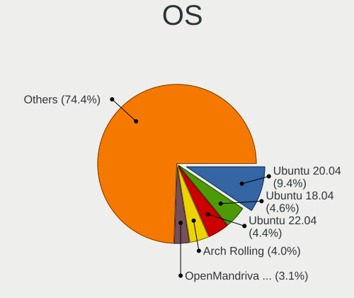

| Name                         | Notebooks | Percent |
|------------------------------|-----------|---------|
| Ubuntu 20.04                 | 96        | 9.41%   |
| Ubuntu 18.04                 | 47        | 4.61%   |
| Ubuntu 22.04                 | 45        | 4.41%   |
| Arch Rolling                 | 41        | 4.02%   |
| OpenMandriva 23.03           | 32        | 3.14%   |
| OpenMandriva 4.3             | 29        | 2.84%   |
| OpenMandriva 4.90            | 26        | 2.55%   |
| OpenMandriva 4.2             | 21        | 2.06%   |
| OpenMandriva 25.90           | 19        | 1.86%   |
| OpenMandriva 24.12           | 17        | 1.67%   |
| Ubuntu 24.04                 | 16        | 1.57%   |
| OpenMandriva 23.08           | 16        | 1.57%   |
| Debian 11                    | 15        | 1.47%   |
| Zorin 16                     | 14        | 1.37%   |
| Pop!_OS 22.04                | 14        | 1.37%   |
| OpenMandriva 5.0             | 14        | 1.37%   |
| OpenMandriva 23.01           | 14        | 1.37%   |
| Manjaro                      | 14        | 1.37%   |
| Debian 12                    | 13        | 1.27%   |
| Zorin 17                     | 12        | 1.18%   |
| Fedora 42                    | 12        | 1.18%   |
| OpenMandriva 6.0             | 11        | 1.08%   |
| BlackPanther 18.1            | 11        | 1.08%   |
| Arch                         | 11        | 1.08%   |
| openSUSE Tumbleweed-XXXXXXXX | 10        | 0.98%   |
| Linux Mint 22                | 10        | 0.98%   |
| Zorin 15                     | 8         | 0.78%   |
| Xubuntu 20.04                | 8         | 0.78%   |
| Fedora 37                    | 8         | 0.78%   |
| Xubuntu 18.04                | 7         | 0.69%   |
| Ubuntu 23.04                 | 7         | 0.69%   |
| Ubuntu 21.04                 | 7         | 0.69%   |
| Pop!_OS 20.10                | 7         | 0.69%   |
| OpenMandriva 25.06           | 7         | 0.69%   |
| OpenMandriva 24.07           | 7         | 0.69%   |
| Linux Mint 19.3              | 7         | 0.69%   |
| Fedora 39                    | 7         | 0.69%   |
| Fedora 38                    | 7         | 0.69%   |
| Fedora 35                    | 7         | 0.69%   |
| Xubuntu 22.04                | 6         | 0.59%   |

OS Family
---------

OS without a version

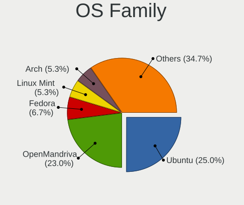

| Name          | Notebooks | Percent |
|---------------|-----------|---------|
| Ubuntu        | 244       | 25.03%  |
| OpenMandriva  | 224       | 22.97%  |
| Fedora        | 65        | 6.67%   |
| Linux Mint    | 52        | 5.33%   |
| Arch          | 52        | 5.33%   |
| Debian        | 40        | 4.1%    |
| Zorin         | 39        | 4%      |
| Pop!_OS       | 28        | 2.87%   |
| Manjaro       | 24        | 2.46%   |
| Xubuntu       | 20        | 2.05%   |
| openSUSE      | 15        | 1.54%   |
| Kubuntu       | 13        | 1.33%   |
| Kali          | 12        | 1.23%   |
| NixOS         | 11        | 1.13%   |
| BlackPanther  | 11        | 1.13%   |
| LMDE          | 9         | 0.92%   |
| Gentoo        | 9         | 0.92%   |
| SteamOS       | 8         | 0.82%   |
| Ubuntu Unity  | 7         | 0.72%   |
| Lubuntu       | 7         | 0.72%   |
| ArcoLinux     | 6         | 0.62%   |
| Slackware     | 5         | 0.51%   |
| KDE neon      | 5         | 0.51%   |
| antiX         | 5         | 0.51%   |
| Ubuntu MATE   | 4         | 0.41%   |
| Guix          | 4         | 0.41%   |
| Elementary    | 4         | 0.41%   |
| CachyOS       | 4         | 0.41%   |
| Ubuntu Budgie | 3         | 0.31%   |
| ROSA          | 3         | 0.31%   |
| Q4OS          | 3         | 0.31%   |
| Peppermint    | 3         | 0.31%   |
| MX            | 3         | 0.31%   |
| Deepin        | 3         | 0.31%   |
| CentOS        | 3         | 0.31%   |
| RHEL          | 2         | 0.21%   |
| Parrot        | 2         | 0.21%   |
| Garuda Linux  | 2         | 0.21%   |
| Endless       | 2         | 0.21%   |
| EndeavourOS   | 2         | 0.21%   |

Kernel
------

Version of the Linux kernel

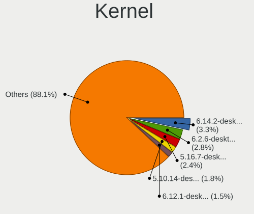

| Version                  | Notebooks | Percent |
|--------------------------|-----------|---------|
| 6.14.2-desktop-3omv2590  | 37        | 3.34%   |
| 6.2.6-desktop-1omv2390   | 31        | 2.8%    |
| 5.16.7-desktop-1omv4003  | 27        | 2.44%   |
| 5.10.14-desktop-1omv4002 | 20        | 1.81%   |
| 6.12.1-desktop-1omv2490  | 17        | 1.54%   |
| 6.6.2-desktop-1omv2390   | 16        | 1.45%   |
| 6.4.11-desktop-1omv2390  | 15        | 1.36%   |
| 6.1.1-desktop-1omv2290   | 15        | 1.36%   |
| 6.0.2-desktop-1omv4090   | 14        | 1.26%   |
| 5.4.0-42-generic         | 13        | 1.17%   |
| 5.4.0-52-generic         | 11        | 0.99%   |
| 6.8.0-45-generic         | 8         | 0.72%   |
| 5.4.0-58-generic         | 8         | 0.72%   |
| 4.18.16-desktop-1bP      | 8         | 0.72%   |
| 6.10.0-desktop-1omv2490  | 7         | 0.63%   |
| 5.4.0-48-generic         | 7         | 0.63%   |
| 5.15.0-58-generic        | 6         | 0.54%   |
| 5.0.0-37-generic         | 6         | 0.54%   |
| 6.8.0-51-generic         | 5         | 0.45%   |
| 6.12.10-76061203-generic | 5         | 0.45%   |
| 6.1.0-37-amd64           | 5         | 0.45%   |
| 5.8.0-7642-generic       | 5         | 0.45%   |
| 5.8.0-50-generic         | 5         | 0.45%   |
| 5.8.0-48-generic         | 5         | 0.45%   |
| 5.8.0-43-generic         | 5         | 0.45%   |
| 5.3.0-40-generic         | 5         | 0.45%   |
| 5.19.1-desktop-1omv4090  | 5         | 0.45%   |
| 5.13.0-27-generic        | 5         | 0.45%   |
| 6.8.0-47-generic         | 4         | 0.36%   |
| 6.8.0-31-generic         | 4         | 0.36%   |
| 6.5.0-28-generic         | 4         | 0.36%   |
| 6.2.0-33-generic         | 4         | 0.36%   |
| 5.6.14-desktop-2bP       | 4         | 0.36%   |
| 5.4.0-40-generic         | 4         | 0.36%   |
| 5.18.12-desktop-3omv4090 | 4         | 0.36%   |
| 5.16.13-desktop-1omv4003 | 4         | 0.36%   |
| 5.15.0-56-generic        | 4         | 0.36%   |
| 5.12.4-desktop-1omv4050  | 4         | 0.36%   |
| 5.11.0-37-generic        | 4         | 0.36%   |
| 5.11.0-27-generic        | 4         | 0.36%   |

Kernel Family
-------------

Linux kernel without a distro release

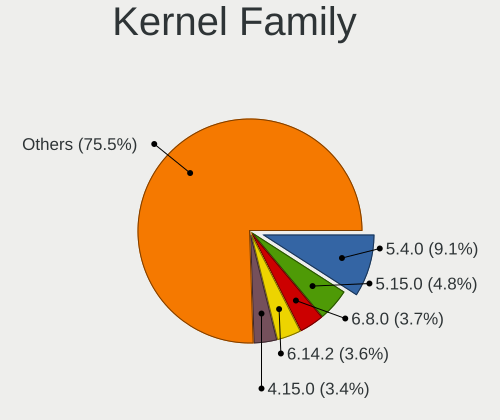

| Version | Notebooks | Percent |
|---------|-----------|---------|
| 5.4.0   | 97        | 9.1%    |
| 5.15.0  | 51        | 4.78%   |
| 6.8.0   | 39        | 3.66%   |
| 6.14.2  | 38        | 3.56%   |
| 4.15.0  | 36        | 3.38%   |
| 5.8.0   | 34        | 3.19%   |
| 6.2.6   | 32        | 3%      |
| 6.5.0   | 30        | 2.81%   |
| 5.16.7  | 28        | 2.63%   |
| 5.13.0  | 27        | 2.53%   |
| 5.11.0  | 27        | 2.53%   |
| 6.1.0   | 24        | 2.25%   |
| 5.10.0  | 22        | 2.06%   |
| 6.12.1  | 21        | 1.97%   |
| 5.3.0   | 20        | 1.88%   |
| 5.10.14 | 20        | 1.88%   |
| 6.2.0   | 18        | 1.69%   |
| 5.19.0  | 18        | 1.69%   |
| 5.0.0   | 17        | 1.59%   |
| 6.6.2   | 16        | 1.5%    |
| 6.4.11  | 16        | 1.5%    |
| 6.1.1   | 16        | 1.5%    |
| 6.14.0  | 14        | 1.31%   |
| 6.0.2   | 14        | 1.31%   |
| 6.11.0  | 10        | 0.94%   |
| 6.10.0  | 9         | 0.84%   |
| 4.18.0  | 9         | 0.84%   |
| 4.18.16 | 8         | 0.75%   |
| 6.4.0   | 6         | 0.56%   |
| 6.12.10 | 6         | 0.56%   |
| 5.19.1  | 6         | 0.56%   |
| 5.14.0  | 5         | 0.47%   |
| 4.4.0   | 5         | 0.47%   |
| 6.4.12  | 4         | 0.38%   |
| 6.12.9  | 4         | 0.38%   |
| 6.0.12  | 4         | 0.38%   |
| 6.0.0   | 4         | 0.38%   |
| 5.6.14  | 4         | 0.38%   |
| 5.19.11 | 4         | 0.38%   |
| 5.18.12 | 4         | 0.38%   |

Kernel Major Ver.
-----------------

Linux kernel major version

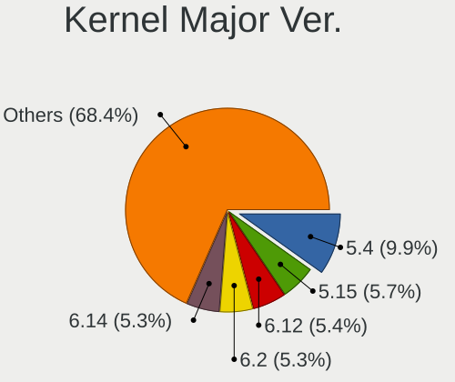

| Version | Notebooks | Percent |
|---------|-----------|---------|
| 5.4     | 104       | 9.86%   |
| 5.15    | 60        | 5.69%   |
| 6.12    | 57        | 5.4%    |
| 6.2     | 56        | 5.31%   |
| 6.14    | 56        | 5.31%   |
| 6.1     | 55        | 5.21%   |
| 5.10    | 53        | 5.02%   |
| 6.8     | 46        | 4.36%   |
| 5.8     | 41        | 3.89%   |
| 6.5     | 40        | 3.79%   |
| 5.16    | 40        | 3.79%   |
| 4.15    | 36        | 3.41%   |
| 5.19    | 35        | 3.32%   |
| 5.13    | 34        | 3.22%   |
| 6.4     | 30        | 2.84%   |
| 5.11    | 30        | 2.84%   |
| 6.6     | 26        | 2.46%   |
| 6.0     | 26        | 2.46%   |
| 6.10    | 21        | 1.99%   |
| 5.3     | 21        | 1.99%   |
| 5.0     | 18        | 1.71%   |
| 5.18    | 17        | 1.61%   |
| 4.18    | 17        | 1.61%   |
| 6.11    | 16        | 1.52%   |
| 5.14    | 13        | 1.23%   |
| 6.3     | 12        | 1.14%   |
| 6.15    | 11        | 1.04%   |
| 6.17    | 9         | 0.85%   |
| 6.13    | 9         | 0.85%   |
| 6.9     | 8         | 0.76%   |
| 5.6     | 8         | 0.76%   |
| 5.12    | 8         | 0.76%   |
| 6.16    | 7         | 0.66%   |
| 6.7     | 6         | 0.57%   |
| 5.17    | 5         | 0.47%   |
| 4.4     | 5         | 0.47%   |
| 4.19    | 5         | 0.47%   |
| 5.9     | 4         | 0.38%   |
| 4.9     | 4         | 0.38%   |
| 6.18    | 2         | 0.19%   |

Arch
----

OS architecture (x86_64, i586, etc.)

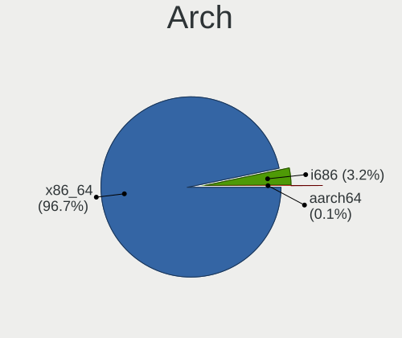

| Name    | Notebooks | Percent |
|---------|-----------|---------|
| x86_64  | 918       | 96.73%  |
| i686    | 30        | 3.16%   |
| aarch64 | 1         | 0.11%   |

DE
--

Desktop Environment

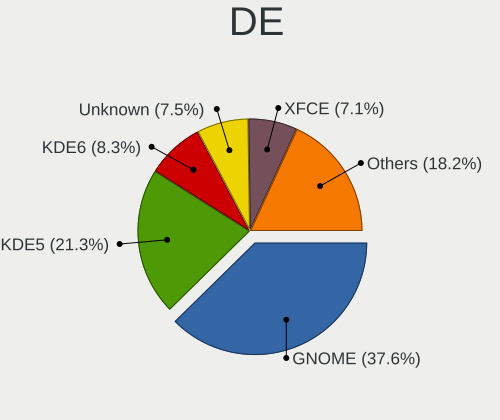

| Name            | Notebooks | Percent |
|-----------------|-----------|---------|
| GNOME           | 367       | 37.64%  |
| KDE5            | 208       | 21.33%  |
| KDE6            | 81        | 8.31%   |
| Unknown         | 73        | 7.49%   |
| XFCE            | 69        | 7.08%   |
| X-Cinnamon      | 46        | 4.72%   |
| LXQt            | 20        | 2.05%   |
| MATE            | 17        | 1.74%   |
| KDE             | 12        | 1.23%   |
| sway            | 11        | 1.13%   |
| Hyprland        | 10        | 1.03%   |
| Cinnamon        | 9         | 0.92%   |
| i3              | 8         | 0.82%   |
| Unity           | 7         | 0.72%   |
| LXDE            | 6         | 0.62%   |
| Budgie          | 5         | 0.51%   |
| Pantheon        | 4         | 0.41%   |
| GNOME Classic   | 4         | 0.41%   |
| icewm           | 3         | 0.31%   |
| Deepin          | 3         | 0.31%   |
| Trinity         | 2         | 0.21%   |
| awesome         | 2         | 0.21%   |
| XSession        | 1         | 0.1%    |
| xmonad          | 1         | 0.1%    |
| niri            | 1         | 0.1%    |
| KDE4            | 1         | 0.1%    |
| JWM             | 1         | 0.1%    |
| GNOME Flashback | 1         | 0.1%    |
| dwm             | 1         | 0.1%    |
| COSMIC          | 1         | 0.1%    |

Display Server
--------------

X11 or Wayland

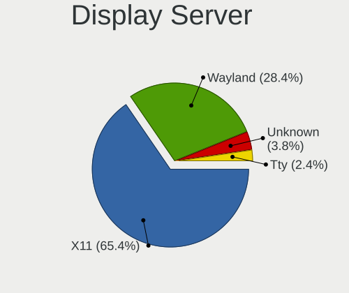

| Name    | Notebooks | Percent |
|---------|-----------|---------|
| X11     | 640       | 65.44%  |
| Wayland | 278       | 28.43%  |
| Unknown | 37        | 3.78%   |
| Tty     | 23        | 2.35%   |

Display Manager
---------------

SDDM, LightDM, etc.

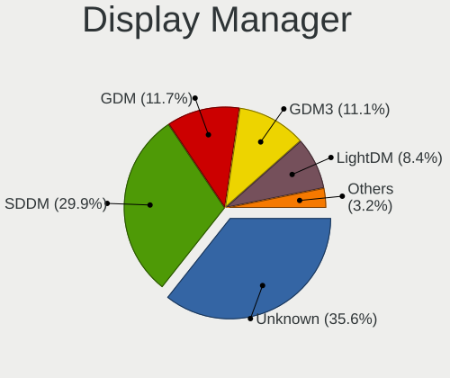

| Name    | Notebooks | Percent |
|---------|-----------|---------|
| Unknown | 349       | 35.65%  |
| SDDM    | 293       | 29.93%  |
| GDM     | 115       | 11.75%  |
| GDM3    | 109       | 11.13%  |
| LightDM | 82        | 8.38%   |
| TDM     | 15        | 1.53%   |
| XDM     | 5         | 0.51%   |
| GREETD  | 5         | 0.51%   |
| SLIMSKI | 2         | 0.2%    |
| LXDM    | 2         | 0.2%    |
| KDM     | 1         | 0.1%    |
| EMPTTY  | 1         | 0.1%    |

OS Lang
-------

Language

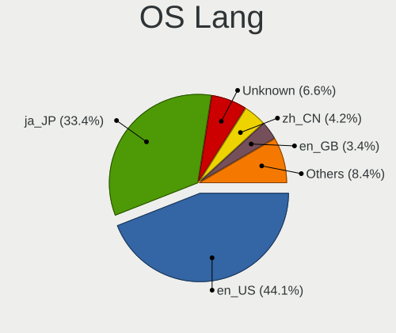

| Lang       | Notebooks | Percent |
|------------|-----------|---------|
| en_US      | 430       | 44.06%  |
| ja_JP      | 326       | 33.4%   |
| Unknown    | 64        | 6.56%   |
| zh_CN      | 41        | 4.2%    |
| en_GB      | 33        | 3.38%   |
| pt_BR      | 19        | 1.95%   |
| C          | 13        | 1.33%   |
| fr_FR      | 11        | 1.13%   |
| en_AU      | 5         | 0.51%   |
| ru_RU      | 3         | 0.31%   |
| es_ES      | 3         | 0.31%   |
| en_CA      | 3         | 0.31%   |
| zh_TW      | 2         | 0.2%    |
| UTF-8      | 2         | 0.2%    |
| en_SG      | 2         | 0.2%    |
| en_AG      | 2         | 0.2%    |
| sv_SE      | 1         | 0.1%    |
| sr_RS      | 1         | 0.1%    |
| sk_SK      | 1         | 0.1%    |
| pl_PL      | 1         | 0.1%    |
| nb_NO      | 1         | 0.1%    |
| jp_JP      | 1         | 0.1%    |
| ja_JP.UTF8 | 1         | 0.1%    |
| it_IT      | 1         | 0.1%    |
| fi_FI      | 1         | 0.1%    |
| es_HN      | 1         | 0.1%    |
| es_GT      | 1         | 0.1%    |
| en_PH      | 1         | 0.1%    |
| en_NL      | 1         | 0.1%    |
| en_IN      | 1         | 0.1%    |
| en_DK      | 1         | 0.1%    |
| el_GR      | 1         | 0.1%    |
| de_DE      | 1         | 0.1%    |

Boot Mode
---------

EFI or BIOS

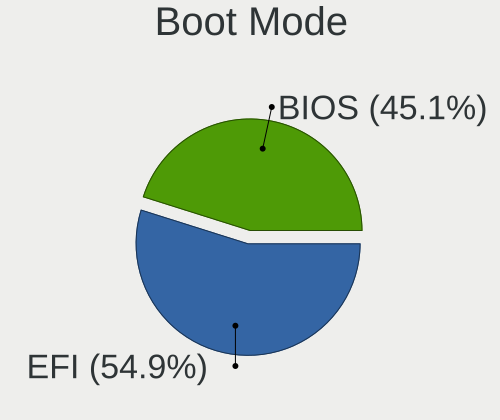

| Mode | Notebooks | Percent |
|------|-----------|---------|
| EFI  | 530       | 54.87%  |
| BIOS | 436       | 45.13%  |

Filesystem
----------

Type of filesystem

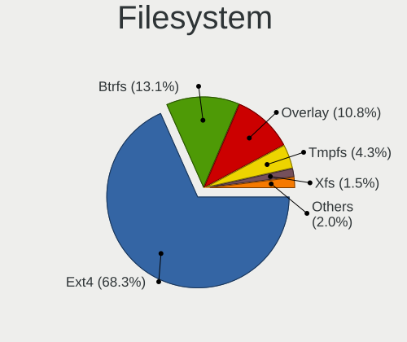

| Type     | Notebooks | Percent |
|----------|-----------|---------|
| Ext4     | 665       | 68.35%  |
| Btrfs    | 127       | 13.05%  |
| Overlay  | 105       | 10.79%  |
| Tmpfs    | 42        | 4.32%   |
| Xfs      | 15        | 1.54%   |
| Unknown  | 9         | 0.92%   |
| Zfs      | 3         | 0.31%   |
| F2fs     | 2         | 0.21%   |
| Bcachefs | 2         | 0.21%   |
| Ntfs     | 1         | 0.1%    |
| Ext3     | 1         | 0.1%    |
| Ext2     | 1         | 0.1%    |

Part. scheme
------------

Scheme of partitioning

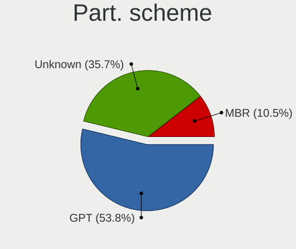

| Type    | Notebooks | Percent |
|---------|-----------|---------|
| GPT     | 528       | 53.77%  |
| Unknown | 351       | 35.74%  |
| MBR     | 103       | 10.49%  |

Dual Boot with Linux/BSD
------------------------

Hosting more than one Linux/BSD

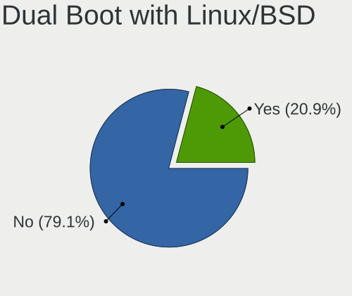

| Dual boot | Notebooks | Percent |
|-----------|-----------|---------|
| No        | 768       | 79.09%  |
| Yes       | 203       | 20.91%  |

Dual Boot (Win)
---------------

Hosting Linux and Windows

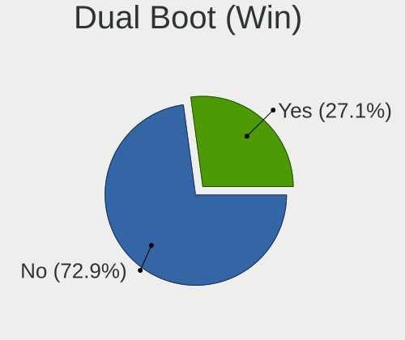

| Dual boot | Notebooks | Percent |
|-----------|-----------|---------|
| No        | 701       | 72.87%  |
| Yes       | 261       | 27.13%  |

Board
-----

Vendor
------

Motherboard manufacturer

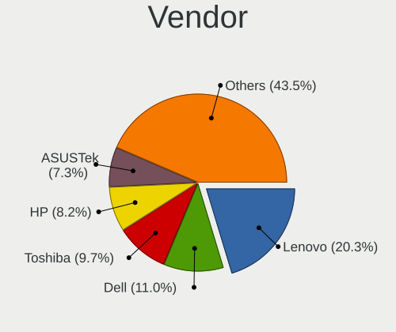

| Name                 | Notebooks | Percent |
|----------------------|-----------|---------|
| Lenovo               | 193       | 20.34%  |
| Dell                 | 104       | 10.96%  |
| Toshiba              | 92        | 9.69%   |
| Hewlett-Packard      | 78        | 8.22%   |
| ASUSTek Computer     | 69        | 7.27%   |
| Fujitsu              | 64        | 6.74%   |
| NEC Computers        | 53        | 5.58%   |
| Apple                | 50        | 5.27%   |
| Panasonic            | 27        | 2.85%   |
| Sony                 | 26        | 2.74%   |
| Acer                 | 24        | 2.53%   |
| MSI                  | 17        | 1.79%   |
| HUAWEI               | 15        | 1.58%   |
| MouseComputer        | 14        | 1.48%   |
| Dynabook             | 10        | 1.05%   |
| Valve                | 9         | 0.95%   |
| Unknown              | 8         | 0.84%   |
| Google               | 7         | 0.74%   |
| Timi                 | 6         | 0.63%   |
| Alienware            | 6         | 0.63%   |
| Gateway              | 5         | 0.53%   |
| Thirdwave            | 4         | 0.42%   |
| Novastar             | 4         | 0.42%   |
| System76             | 3         | 0.32%   |
| Samsung Electronics  | 3         | 0.32%   |
| Razer                | 3         | 0.32%   |
| Notebook             | 3         | 0.32%   |
| MECHREVO             | 3         | 0.32%   |
| EPSON DIRECT         | 3         | 0.32%   |
| UNITCOM              | 2         | 0.21%   |
| SLIMBOOK             | 2         | 0.21%   |
| KOUZIRO              | 2         | 0.21%   |
| Intel Client Systems | 2         | 0.21%   |
| Intel                | 2         | 0.21%   |
| HONOR                | 2         | 0.21%   |
| Hampoo               | 2         | 0.21%   |
| Framework            | 2         | 0.21%   |
| Clevo                | 2         | 0.21%   |
| Chuwi                | 2         | 0.21%   |
| YKMF_Yukyung         | 1         | 0.11%   |

Model
-----

Motherboard model

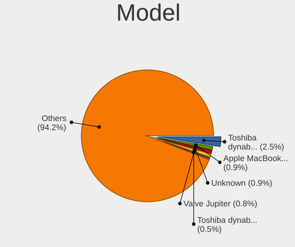

| Name                                        | Notebooks | Percent |
|---------------------------------------------|-----------|---------|
| Toshiba dynabook T653/46JR                  | 24        | 2.53%   |
| Apple MacBookAir9,1                         | 9         | 0.95%   |
| Unknown                                     | 9         | 0.95%   |
| Valve Jupiter                               | 8         | 0.84%   |
| Toshiba dynabook Satellite B552/G           | 5         | 0.53%   |
| Lenovo G500 20236                           | 5         | 0.53%   |
| ASUS Zenbook S 13 UX5304VA_UX5304VA         | 5         | 0.53%   |
| Apple MacBookPro9,2                         | 5         | 0.53%   |
| Novastar KL55                               | 4         | 0.42%   |
| Lenovo G570 4334                            | 4         | 0.42%   |
| Apple MacBookPro15,1                        | 4         | 0.42%   |
| Toshiba dynabook Satellite B552/H           | 3         | 0.32%   |
| Panasonic CFRZ4-2                           | 3         | 0.32%   |
| Lenovo G550 2958                            | 3         | 0.32%   |
| Lenovo G50-70 20351                         | 3         | 0.32%   |
| HP Notebook                                 | 3         | 0.32%   |
| Dell XPS 9320                               | 3         | 0.32%   |
| Dell Inspiron 1545                          | 3         | 0.32%   |
| Dell Inspiron 14 5420                       | 3         | 0.32%   |
| Dell G3 3500                                | 3         | 0.32%   |
| Apple MacBookPro11,5                        | 3         | 0.32%   |
| Apple MacBook10,1                           | 3         | 0.32%   |
| Toshiba dynabook R732/G                     | 2         | 0.21%   |
| Toshiba dynabook R73/BN                     | 2         | 0.21%   |
| Timi RedmiBook Pro 14S                      | 2         | 0.21%   |
| System76 Lemur Pro                          | 2         | 0.21%   |
| Sony VPCEH39FJ                              | 2         | 0.21%   |
| Sony VJZ13A                                 | 2         | 0.21%   |
| Panasonic CFSZ6-2                           | 2         | 0.21%   |
| Panasonic CFSZ5-3                           | 2         | 0.21%   |
| Panasonic CFSX4-1L                          | 2         | 0.21%   |
| Panasonic CF-S10EYADR                       | 2         | 0.21%   |
| NEC Computers PC-LL750MSW                   | 2         | 0.21%   |
| MSI Prestige 13 AI+ Evo A2VMG               | 2         | 0.21%   |
| MECHREVO WUJIE14XA                          | 2         | 0.21%   |
| Lenovo ThinkPad X230 2330A17                | 2         | 0.21%   |
| Lenovo ThinkPad X230 2325SSF                | 2         | 0.21%   |
| Lenovo ThinkPad X1 Carbon Gen 12 21KCCTO1WW | 2         | 0.21%   |
| Lenovo IdeaPad 300-15IBR 80M3               | 2         | 0.21%   |
| Lenovo G50-80 80E5                          | 2         | 0.21%   |

Model Family
------------

Motherboard model prefix

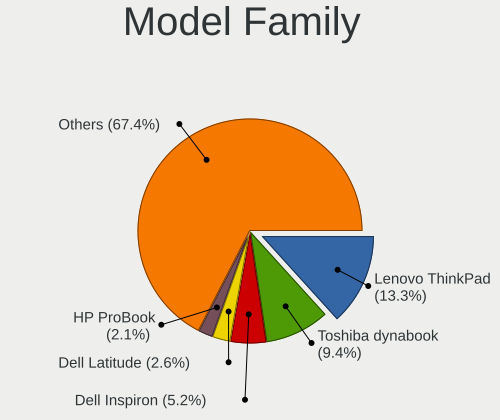

| Name                  | Notebooks | Percent |
|-----------------------|-----------|---------|
| Lenovo ThinkPad       | 126       | 13.28%  |
| Toshiba dynabook      | 89        | 9.38%   |
| Dell Inspiron         | 49        | 5.16%   |
| Dell Latitude         | 25        | 2.63%   |
| HP ProBook            | 20        | 2.11%   |
| Acer Aspire           | 16        | 1.69%   |
| HP Pavilion           | 14        | 1.48%   |
| Dell XPS              | 14        | 1.48%   |
| Lenovo IdeaPad        | 13        | 1.37%   |
| ASUS VivoBook         | 12        | 1.26%   |
| HP EliteBook          | 11        | 1.16%   |
| Lenovo ThinkBook      | 10        | 1.05%   |
| HP Laptop             | 10        | 1.05%   |
| ASUS Zenbook          | 10        | 1.05%   |
| ASUS ROG              | 10        | 1.05%   |
| Apple MacBookAir9     | 9         | 0.95%   |
| Unknown               | 9         | 0.95%   |
| Valve Jupiter         | 8         | 0.84%   |
| ASUS ASUS             | 7         | 0.74%   |
| Apple MacBookPro15    | 6         | 0.63%   |
| Apple MacBookPro11    | 6         | 0.63%   |
| Lenovo Legion         | 5         | 0.53%   |
| Lenovo G500           | 5         | 0.53%   |
| HP ENVY               | 5         | 0.53%   |
| Dell G3               | 5         | 0.53%   |
| Apple MacBookPro9     | 5         | 0.53%   |
| Novastar KL55         | 4         | 0.42%   |
| Lenovo Yoga           | 4         | 0.42%   |
| Lenovo G570           | 4         | 0.42%   |
| Timi RedmiBook        | 3         | 0.32%   |
| Razer Blade           | 3         | 0.32%   |
| Panasonic CFRZ4-2     | 3         | 0.32%   |
| MSI Prestige          | 3         | 0.32%   |
| Lenovo G550           | 3         | 0.32%   |
| Lenovo G50-70         | 3         | 0.32%   |
| HP Notebook           | 3         | 0.32%   |
| EPSON DIRECT Endeavor | 3         | 0.32%   |
| Dynabook S73          | 3         | 0.32%   |
| Dell Vostro           | 3         | 0.32%   |
| ASUS TUF              | 3         | 0.32%   |

MFG Year
--------

Motherboard manufacture year

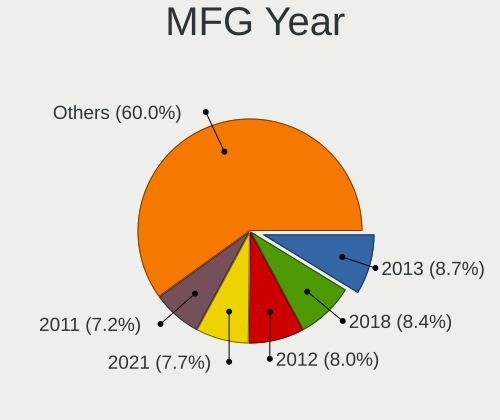

| Year    | Notebooks | Percent |
|---------|-----------|---------|
| 2013    | 83        | 8.75%   |
| 2018    | 80        | 8.43%   |
| 2012    | 76        | 8.01%   |
| 2021    | 73        | 7.69%   |
| 2011    | 68        | 7.17%   |
| 2020    | 62        | 6.53%   |
| 2019    | 59        | 6.22%   |
| 2023    | 50        | 5.27%   |
| 2010    | 46        | 4.85%   |
| 2022    | 43        | 4.53%   |
| 2016    | 43        | 4.53%   |
| 2008    | 41        | 4.32%   |
| 2015    | 39        | 4.11%   |
| 2017    | 38        | 4%      |
| 2009    | 36        | 3.79%   |
| 2024    | 32        | 3.37%   |
| 2014    | 31        | 3.27%   |
| 2007    | 28        | 2.95%   |
| 2006    | 11        | 1.16%   |
| 2025    | 7         | 0.74%   |
| 2005    | 1         | 0.11%   |
| 2004    | 1         | 0.11%   |
| Unknown | 1         | 0.11%   |

Form Factor
-----------

Physical design of the computer

| Name     | Notebooks | Percent |
|----------|-----------|---------|
| Notebook | 949       | 100%    |

Secure Boot
-----------

Enabled or disabled

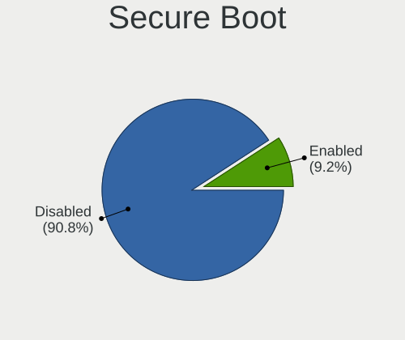

| State    | Notebooks | Percent |
|----------|-----------|---------|
| Disabled | 872       | 90.83%  |
| Enabled  | 88        | 9.17%   |

Coreboot
--------

Have coreboot on board

| Used | Notebooks | Percent |
|------|-----------|---------|
| No   | 938       | 98.84%  |
| Yes  | 11        | 1.16%   |

RAM Size
--------

Total RAM memory

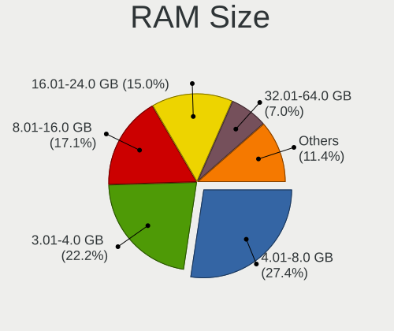

| Size in GB  | Notebooks | Percent |
|-------------|-----------|---------|
| 4.01-8.0    | 263       | 27.37%  |
| 3.01-4.0    | 213       | 22.16%  |
| 8.01-16.0   | 164       | 17.07%  |
| 16.01-24.0  | 144       | 14.98%  |
| 32.01-64.0  | 67        | 6.97%   |
| 1.01-2.0    | 39        | 4.06%   |
| 24.01-32.0  | 30        | 3.12%   |
| 64.01-256.0 | 20        | 2.08%   |
| 2.01-3.0    | 14        | 1.46%   |
| 0.51-1.0    | 7         | 0.73%   |

RAM Used
--------

Used RAM memory

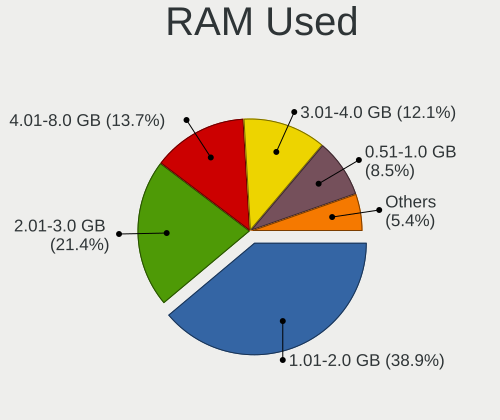

| Used GB    | Notebooks | Percent |
|------------|-----------|---------|
| 1.01-2.0   | 399       | 38.89%  |
| 2.01-3.0   | 220       | 21.44%  |
| 4.01-8.0   | 141       | 13.74%  |
| 3.01-4.0   | 124       | 12.09%  |
| 0.51-1.0   | 87        | 8.48%   |
| 8.01-16.0  | 37        | 3.61%   |
| 0.01-0.5   | 13        | 1.27%   |
| 16.01-24.0 | 5         | 0.49%   |

Total Drives
------------

Number of drives on board

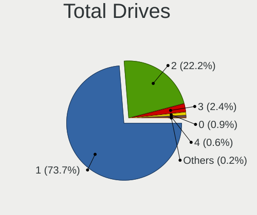

| Drives | Notebooks | Percent |
|--------|-----------|---------|
| 1      | 715       | 73.71%  |
| 2      | 215       | 22.16%  |
| 3      | 23        | 2.37%   |
| 0      | 9         | 0.93%   |
| 4      | 6         | 0.62%   |
| 7      | 2         | 0.21%   |

Has CD-ROM
----------

Has CD-ROM on board

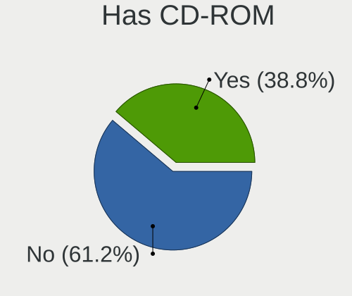

| Presented | Notebooks | Percent |
|-----------|-----------|---------|
| No        | 583       | 61.18%  |
| Yes       | 370       | 38.82%  |

Has Ethernet
------------

Has Ethernet on board

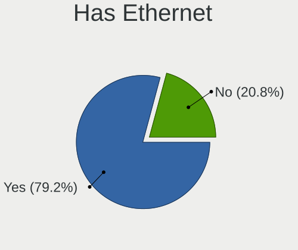

| Presented | Notebooks | Percent |
|-----------|-----------|---------|
| Yes       | 753       | 79.18%  |
| No        | 198       | 20.82%  |

Has WiFi
--------

Has WiFi module

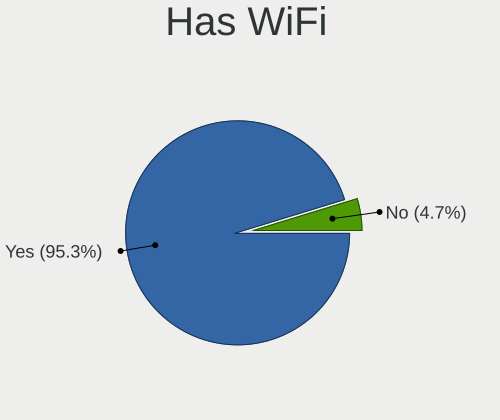

| Presented | Notebooks | Percent |
|-----------|-----------|---------|
| Yes       | 905       | 95.26%  |
| No        | 45        | 4.74%   |

Has Bluetooth
-------------

Has Bluetooth module

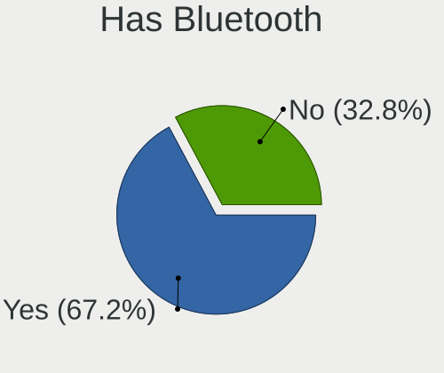

| Presented | Notebooks | Percent |
|-----------|-----------|---------|
| Yes       | 643       | 67.19%  |
| No        | 314       | 32.81%  |

Location
--------

Country
-------

Geographic location (country)

| Country | Notebooks | Percent |
|---------|-----------|---------|
| Japan   | 949       | 100%    |

City
----

Geographic location (city)

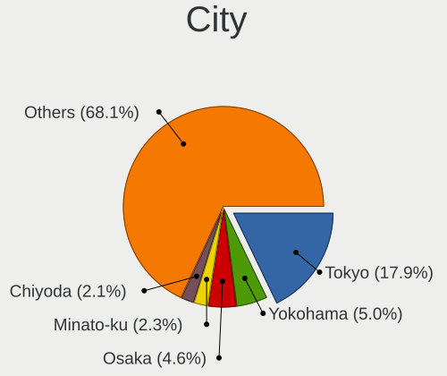

| City          | Notebooks | Percent |
|---------------|-----------|---------|
| Tokyo         | 184       | 17.86%  |
| Yokohama      | 52        | 5.05%   |
| Osaka         | 47        | 4.56%   |
| Minato-ku     | 24        | 2.33%   |
| Chiyoda       | 22        | 2.14%   |
| Niigata       | 16        | 1.55%   |
| Kyoto         | 16        | 1.55%   |
| Nagoya        | 15        | 1.46%   |
| Shibuya       | 13        | 1.26%   |
| Shinjuku      | 12        | 1.17%   |
| Setagaya-ku   | 12        | 1.17%   |
| Saitama       | 12        | 1.17%   |
| Sapporo       | 11        | 1.07%   |
| Honcho        | 11        | 1.07%   |
| Takasago      | 9         | 0.87%   |
| Shinagawa     | 8         | 0.78%   |
| Miura         | 8         | 0.78%   |
| Chiyoda-ku    | 8         | 0.78%   |
| Kobe          | 7         | 0.68%   |
| Kagoshima     | 7         | 0.68%   |
| Adachi        | 7         | 0.68%   |
| Yamanashi     | 6         | 0.58%   |
| Umeda         | 6         | 0.58%   |
| Takamatsu     | 6         | 0.58%   |
| Shizuoka      | 6         | 0.58%   |
| Ōtsu         | 6         | 0.58%   |
| Hiratsuka     | 6         | 0.58%   |
| Tsukuba       | 5         | 0.49%   |
| Nakano        | 5         | 0.49%   |
| Machiya       | 5         | 0.49%   |
| Ichikawa      | 5         | 0.49%   |
| Hiroshima     | 5         | 0.49%   |
| Himeji        | 5         | 0.49%   |
| Sakai         | 4         | 0.39%   |
| Okayama       | 4         | 0.39%   |
| Narashino-shi | 4         | 0.39%   |
| Nagasaki      | 4         | 0.39%   |
| Mito          | 4         | 0.39%   |
| Matsudo       | 4         | 0.39%   |
| Kitakyushu    | 4         | 0.39%   |

Drives
------

Drive Vendor
------------

Hard drive vendors

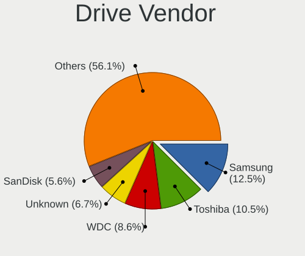

| Vendor                      | Notebooks | Drives | Percent |
|-----------------------------|-----------|--------|---------|
| Samsung Electronics         | 148       | 194    | 12.47%  |
| Toshiba                     | 125       | 143    | 10.53%  |
| WDC                         | 102       | 115    | 8.59%   |
| Unknown                     | 79        | 103    | 6.66%   |
| SanDisk                     | 67        | 82     | 5.64%   |
| Seagate                     | 65        | 89     | 5.48%   |
| Micron Technology           | 46        | 61     | 3.88%   |
| Crucial                     | 44        | 54     | 3.71%   |
| Apple                       | 38        | 46     | 3.2%    |
| Hitachi                     | 35        | 38     | 2.95%   |
| SK hynix                    | 33        | 39     | 2.78%   |
| Kingston                    | 30        | 32     | 2.53%   |
| Intel                       | 29        | 32     | 2.44%   |
| KIOXIA                      | 25        | 28     | 2.11%   |
| Unknown                     | 20        | 21     | 1.68%   |
| A-DATA Technology           | 19        | 25     | 1.6%    |
| HGST                        | 18        | 20     | 1.52%   |
| SPCC                        | 16        | 20     | 1.35%   |
| SUNEAST                     | 12        | 13     | 1.01%   |
| Fujitsu                     | 12        | 14     | 1.01%   |
| China                       | 12        | 16     | 1.01%   |
| Transcend                   | 10        | 14     | 0.84%   |
| Phison Electronics          | 10        | 12     | 0.84%   |
| Silicon Motion              | 8         | 8      | 0.67%   |
| Micron/Crucial Technology   | 8         | 8      | 0.67%   |
| JMicron Technology          | 8         | 8      | 0.67%   |
| Plextor                     | 7         | 9      | 0.59%   |
| Seagate Technology          | 6         | 6      | 0.51%   |
| Zheino                      | 5         | 6      | 0.42%   |
| Union Memory (Shenzhen)     | 5         | 5      | 0.42%   |
| Teclast                     | 5         | 5      | 0.42%   |
| MAXIO Technology (Hangzhou) | 5         | 7      | 0.42%   |
| Kingston Technology Company | 5         | 6      | 0.42%   |
| BUFFALO                     | 5         | 5      | 0.42%   |
| Patriot                     | 4         | 5      | 0.34%   |
| Lexar                       | 4         | 5      | 0.34%   |
| ELECOM                      | 4         | 4      | 0.34%   |
| Dogfish                     | 4         | 5      | 0.34%   |
| Yangtze Memory Technologies | 3         | 3      | 0.25%   |
| SSK                         | 3         | 3      | 0.25%   |

Drive Model
-----------

Hard drive models

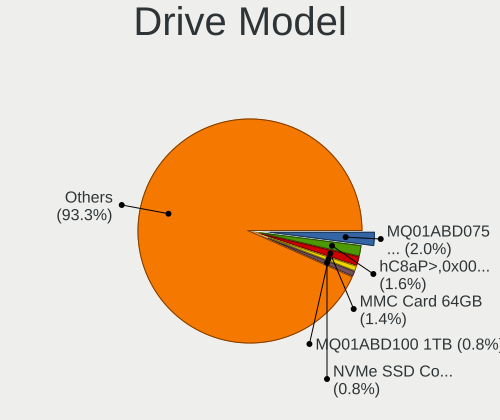

| Model                                                 | Notebooks | Percent |
|-------------------------------------------------------|-----------|---------|
| Toshiba MQ01ABD075 752GB                              | 25        | 2.03%   |
| Unknown                                               | 20        | 1.62%   |
| Unknown MMC Card  64GB                                | 17        | 1.38%   |
| Toshiba MQ01ABD100 1TB                                | 10        | 0.81%   |
| Samsung NVMe SSD Controller PM9A1/PM9A3/980PRO 1TB    | 10        | 0.81%   |
| Crucial CT500MX500SSD1 500GB                          | 10        | 0.81%   |
| Toshiba MQ01ABF050 500GB                              | 9         | 0.73%   |
| Seagate ST1000LM035-1RK172 1TB                        | 8         | 0.65%   |
| Samsung NVMe SSD Controller SM981/PM981/PM983 1TB     | 8         | 0.65%   |
| Apple SSD AP0256N 256GB                               | 8         | 0.65%   |
| Unknown MMC Card  32GB                                | 7         | 0.57%   |
| Unknown MMC Card  128GB                               | 7         | 0.57%   |
| Seagate ST9500325AS 500GB                             | 6         | 0.49%   |
| Seagate ST500LT012-1DG142 500GB                       | 6         | 0.49%   |
| SanDisk NVMe SSD Drive 1TB                            | 6         | 0.49%   |
| Crucial CT240BX500SSD1 240GB                          | 6         | 0.49%   |
| Unknown SD/MMC/MS PRO 2GB                             | 5         | 0.41%   |
| Toshiba MQ01ABF032 320GB                              | 5         | 0.41%   |
| SPCC Solid State Disk 256GB                           | 5         | 0.41%   |
| Seagate FireCuda 520 SSD 500GB                        | 5         | 0.41%   |
| Samsung NVMe SSD Drive 256GB                          | 5         | 0.41%   |
| Phison PS5013 E13 NVMe Controller 500GB               | 5         | 0.41%   |
| WDC WDS500G2B0B-00YS70 500GB SSD                      | 4         | 0.32%   |
| Toshiba MQ01ABD100H 1TB                               | 4         | 0.32%   |
| SK hynix BC501 NVMe Solid State Drive 512GB           | 4         | 0.32%   |
| Silicon Motion SM2263EN/SM2263XT SSD Controller 512GB | 4         | 0.32%   |
| Sandisk WD Blue SN550 NVMe SSD 1024GB                 | 4         | 0.32%   |
| Samsung SSD 860 EVO 500GB                             | 4         | 0.32%   |
| Samsung NVMe SSD Drive 1TB                            | 4         | 0.32%   |
| Samsung MZVLQ256HAJD-00000 256GB                      | 4         | 0.32%   |
| Micron/Crucial P2 NVMe PCIe SSD 2TB                   | 4         | 0.32%   |
| Micron 3400_MTFDKBA1T0TFH 1024GB                      | 4         | 0.32%   |
| KIOXIA KBG40ZNS512G NVMe 512GB                        | 4         | 0.32%   |
| Kingston RBUSNS4180S3256GJ 256GB SSD                  | 4         | 0.32%   |
| JMicron Tech 250GB                                    | 4         | 0.32%   |
| Apple SSD SM0256G 256GB                               | 4         | 0.32%   |
| A-DATA SU650 240GB SSD                                | 4         | 0.32%   |
| WDC WD5000LPVX-08V0TT5 500GB                          | 3         | 0.24%   |
| WDC WD2500BPVT-26JJ5T0 250GB                          | 3         | 0.24%   |
| WDC WD1600BEVT-22ZCT0 160GB                           | 3         | 0.24%   |

HDD Vendor
----------

Hard disk drive vendors

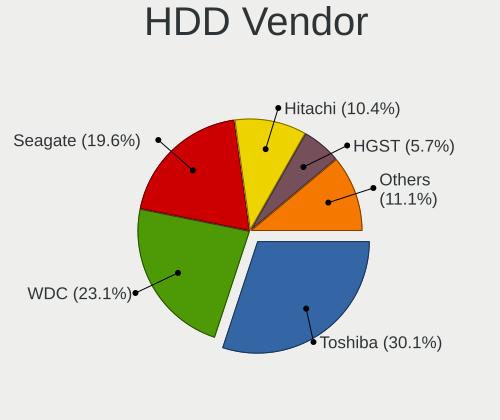

| Vendor              | Notebooks | Drives | Percent |
|---------------------|-----------|--------|---------|
| Toshiba             | 95        | 103    | 30.06%  |
| WDC                 | 73        | 81     | 23.1%   |
| Seagate             | 62        | 86     | 19.62%  |
| Hitachi             | 33        | 36     | 10.44%  |
| HGST                | 18        | 20     | 5.7%    |
| Fujitsu             | 12        | 14     | 3.8%    |
| Unknown             | 5         | 7      | 1.58%   |
| SSK                 | 3         | 3      | 0.95%   |
| JMicron Technology  | 3         | 3      | 0.95%   |
| Samsung Electronics | 2         | 4      | 0.63%   |
| QC-FT-D             | 2         | 2      | 0.63%   |
| PASOUL 2            | 2         | 2      | 0.63%   |
| USB                 | 1         | 1      | 0.32%   |
| SILICONMOTION       | 1         | 1      | 0.32%   |
| MARSHAL             | 1         | 2      | 0.32%   |
| KIOXIA              | 1         | 1      | 0.32%   |
| Apple               | 1         | 1      | 0.32%   |
| Unknown             | 1         | 1      | 0.32%   |

SSD Vendor
----------

Solid state drive vendors

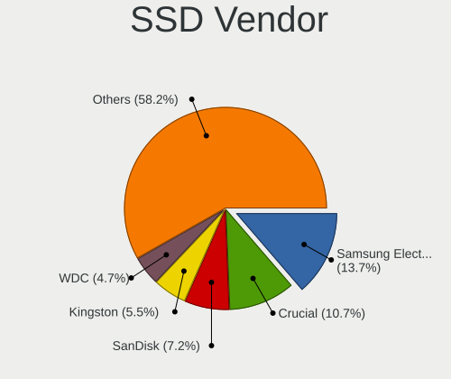

| Vendor              | Notebooks | Drives | Percent |
|---------------------|-----------|--------|---------|
| Samsung Electronics | 55        | 76     | 13.68%  |
| Crucial             | 43        | 53     | 10.7%   |
| SanDisk             | 29        | 40     | 7.21%   |
| Kingston            | 22        | 23     | 5.47%   |
| WDC                 | 19        | 21     | 4.73%   |
| Toshiba             | 19        | 25     | 4.73%   |
| A-DATA Technology   | 18        | 24     | 4.48%   |
| SPCC                | 14        | 17     | 3.48%   |
| Apple               | 14        | 14     | 3.48%   |
| Intel               | 12        | 12     | 2.99%   |
| China               | 12        | 16     | 2.99%   |
| SUNEAST             | 11        | 12     | 2.74%   |
| Micron Technology   | 10        | 12     | 2.49%   |
| Transcend           | 9         | 13     | 2.24%   |
| Unknown             | 9         | 9      | 2.24%   |
| Plextor             | 7         | 9      | 1.74%   |
| Unknown             | 5         | 5      | 1.24%   |
| SK hynix            | 5         | 5      | 1.24%   |
| BUFFALO             | 5         | 5      | 1.24%   |
| Zheino              | 4         | 4      | 1%      |
| Teclast             | 4         | 4      | 1%      |
| Lexar               | 4         | 5      | 1%      |
| Dogfish             | 4         | 5      | 1%      |
| Seagate             | 3         | 3      | 0.75%   |
| PNY                 | 3         | 4      | 0.75%   |
| Patriot             | 3         | 4      | 0.75%   |
| Green House         | 3         | 5      | 0.75%   |
| Apacer              | 3         | 5      | 0.75%   |
| Team                | 2         | 3      | 0.5%    |
| OCZ                 | 2         | 2      | 0.5%    |
| Netac               | 2         | 2      | 0.5%    |
| LITEONIT            | 2         | 3      | 0.5%    |
| LITEON              | 2         | 6      | 0.5%    |
| KIOXIA-EXCERIA      | 2         | 3      | 0.5%    |
| Kingmax             | 2         | 2      | 0.5%    |
| Intenso             | 2         | 3      | 0.5%    |
| Hitachi             | 2         | 2      | 0.5%    |
| Hanye               | 2         | 2      | 0.5%    |
| Fanxiang            | 2         | 2      | 0.5%    |
| CFD                 | 2         | 3      | 0.5%    |

Drive Kind
----------

HDD or SSD

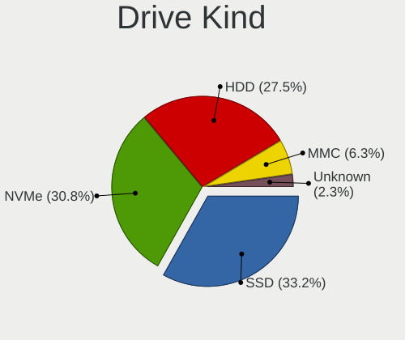

| Kind    | Notebooks | Drives | Percent |
|---------|-----------|--------|---------|
| SSD     | 364       | 494    | 33.15%  |
| NVMe    | 338       | 447    | 30.78%  |
| HDD     | 302       | 368    | 27.5%   |
| MMC     | 69        | 90     | 6.28%   |
| Unknown | 25        | 31     | 2.28%   |

Drive Connector
---------------

SATA, SAS, NVMe, etc.

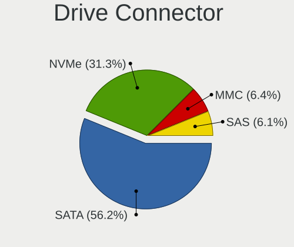

| Type | Notebooks | Drives | Percent |
|------|-----------|--------|---------|
| SATA | 606       | 808    | 56.16%  |
| NVMe | 338       | 445    | 31.33%  |
| MMC  | 69        | 90     | 6.39%   |
| SAS  | 66        | 87     | 6.12%   |

Drive Size
----------

Size of hard drive

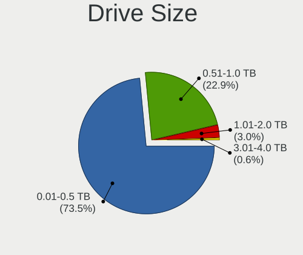

| Size in TB | Notebooks | Drives | Percent |
|------------|-----------|--------|---------|
| 0.01-0.5   | 482       | 646    | 73.48%  |
| 0.51-1.0   | 150       | 189    | 22.87%  |
| 1.01-2.0   | 20        | 22     | 3.05%   |
| 3.01-4.0   | 4         | 5      | 0.61%   |

Space Total
-----------

Amount of disk space available on the file system

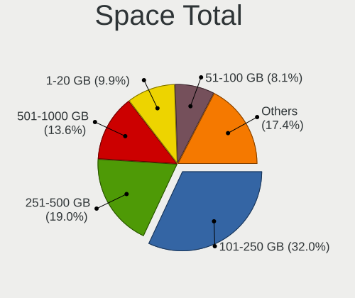

| Size in GB     | Notebooks | Percent |
|----------------|-----------|---------|
| 101-250        | 323       | 31.98%  |
| 251-500        | 192       | 19.01%  |
| 501-1000       | 137       | 13.56%  |
| 1-20           | 100       | 9.9%    |
| 51-100         | 82        | 8.12%   |
| 1001-2000      | 51        | 5.05%   |
| 21-50          | 44        | 4.36%   |
| Unknown        | 36        | 3.56%   |
| More than 3000 | 23        | 2.28%   |
| 2001-3000      | 22        | 2.18%   |

Space Used
----------

Amount of used disk space

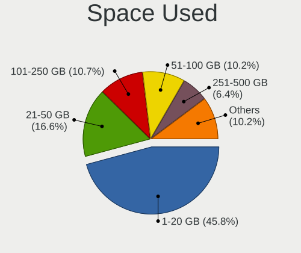

| Used GB        | Notebooks | Percent |
|----------------|-----------|---------|
| 1-20           | 470       | 45.81%  |
| 21-50          | 170       | 16.57%  |
| 101-250        | 110       | 10.72%  |
| 51-100         | 105       | 10.23%  |
| 251-500        | 66        | 6.43%   |
| 501-1000       | 41        | 4%      |
| Unknown        | 36        | 3.51%   |
| 1001-2000      | 17        | 1.66%   |
| More than 3000 | 5         | 0.49%   |
| 2001-3000      | 5         | 0.49%   |
| 0              | 1         | 0.1%    |

Malfunc. Drives
---------------

Drive models with a malfunction

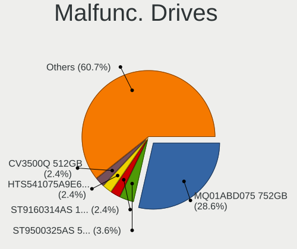

| Model                                            | Notebooks | Drives | Percent |
|--------------------------------------------------|-----------|--------|---------|
| Toshiba MQ01ABD075 752GB                         | 24        | 24     | 28.57%  |
| Seagate ST9500325AS 500GB                        | 3         | 3      | 3.57%   |
| Seagate ST9160314AS 160GB                        | 2         | 2      | 2.38%   |
| HGST HTS541075A9E680 752GB                       | 2         | 3      | 2.38%   |
| CUSU CV3500Q 512GB                               | 2         | 3      | 2.38%   |
| Zheino CHN 25SATAA3 240 240GB SSD                | 1         | 1      | 1.19%   |
| WDC WD7500BPKT-22PK4T0 752GB                     | 1         | 1      | 1.19%   |
| WDC WD5000BEVT-55A0RT0 500GB                     | 1         | 1      | 1.19%   |
| WDC WD3200BEVT-08A23T1 320GB                     | 1         | 1      | 1.19%   |
| WDC WD1600BEVS-26RST0 160GB                      | 1         | 1      | 1.19%   |
| WDC PC SN520 NVMe 512GB                          | 1         | 1      | 1.19%   |
| Transcend TS128GMSA720 128GB SSD                 | 1         | 1      | 1.19%   |
| Toshiba MQ01ABD100 1TB                           | 1         | 1      | 1.19%   |
| Toshiba MK8037GSX 80GB                           | 1         | 1      | 1.19%   |
| Toshiba MK5055GSX 500GB                          | 1         | 1      | 1.19%   |
| Toshiba MK2561GSYN 250GB                         | 1         | 1      | 1.19%   |
| Toshiba MK2555GSX 250GB                          | 1         | 1      | 1.19%   |
| Toshiba MK2552GSX 250GB                          | 1         | 1      | 1.19%   |
| Toshiba MK1652GSX 160GB                          | 1         | 1      | 1.19%   |
| Toshiba MK1255GSX H 120GB                        | 1         | 1      | 1.19%   |
| Teclast 240GB SSD                                | 1         | 1      | 1.19%   |
| Teclast 128GB SSD                                | 1         | 1      | 1.19%   |
| SSSTC CL1-4D128 128GB                            | 1         | 1      | 1.19%   |
| Seagate ST9120817AS 120GB                        | 1         | 1      | 1.19%   |
| Seagate ST500LT012-1DG142 500GB                  | 1         | 1      | 1.19%   |
| Seagate ST500LM021-1KJ152 500GB                  | 1         | 1      | 1.19%   |
| Seagate ST1000LM035-1RK172 1TB                   | 1         | 1      | 1.19%   |
| SanDisk SSD PLUS 1000GB                          | 1         | 2      | 1.19%   |
| SanDisk SSD P4 64GB                              | 1         | 1      | 1.19%   |
| SanDisk SSD P4 32GB                              | 1         | 1      | 1.19%   |
| Samsung Electronics MZHPV256HDGL-00000 256GB SSD | 1         | 1      | 1.19%   |
| Samsung Electronics HM641JI 640GB                | 1         | 2      | 1.19%   |
| Netac SSD 240GB                                  | 1         | 1      | 1.19%   |
| Micron Technology MTFDDAK128MAM-1J1 128GB SSD    | 1         | 1      | 1.19%   |
| MARSHAL MAL2020SA 80 20GB                        | 1         | 1      | 1.19%   |
| LITEON CV8-8E128-HP 128GB SSD                    | 1         | 5      | 1.19%   |
| Lite-On PH3-CE240 240GB                          | 1         | 1      | 1.19%   |
| Kingston SUV400S37120G 120GB SSD                 | 1         | 1      | 1.19%   |
| Kingston RBUSNS4180DS3128GH 128GB SSD            | 1         | 1      | 1.19%   |
| Intel SSDSC2CT180A3 180GB                        | 1         | 1      | 1.19%   |

Malfunc. Drive Vendor
---------------------

Vendors of faulty drives

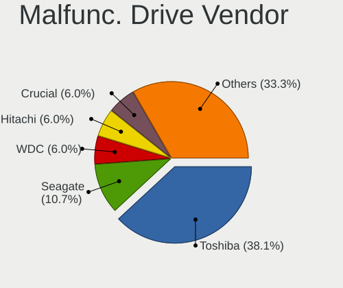

| Vendor              | Notebooks | Drives | Percent |
|---------------------|-----------|--------|---------|
| Toshiba             | 32        | 32     | 38.1%   |
| Seagate             | 9         | 9      | 10.71%  |
| WDC                 | 5         | 5      | 5.95%   |
| Hitachi             | 5         | 5      | 5.95%   |
| Crucial             | 5         | 7      | 5.95%   |
| HGST                | 4         | 5      | 4.76%   |
| SanDisk             | 3         | 4      | 3.57%   |
| Teclast             | 2         | 2      | 2.38%   |
| Samsung Electronics | 2         | 3      | 2.38%   |
| Kingston            | 2         | 2      | 2.38%   |
| Intel               | 2         | 2      | 2.38%   |
| CUSU                | 2         | 3      | 2.38%   |
| Zheino              | 1         | 1      | 1.19%   |
| Transcend           | 1         | 1      | 1.19%   |
| SSSTC               | 1         | 1      | 1.19%   |
| Netac               | 1         | 1      | 1.19%   |
| Micron Technology   | 1         | 1      | 1.19%   |
| MARSHAL             | 1         | 1      | 1.19%   |
| LITEON              | 1         | 5      | 1.19%   |
| Lite-On             | 1         | 1      | 1.19%   |
| AGI                 | 1         | 1      | 1.19%   |
| ADATA Technology    | 1         | 1      | 1.19%   |
| A-DATA Technology   | 1         | 1      | 1.19%   |

Malfunc. HDD Vendor
-------------------

Vendors of faulty HDD drives

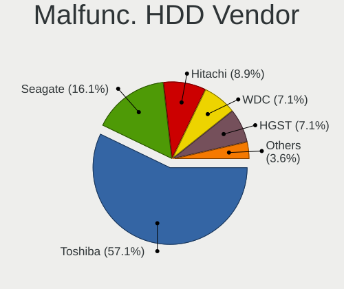

| Vendor              | Notebooks | Drives | Percent |
|---------------------|-----------|--------|---------|
| Toshiba             | 32        | 32     | 57.14%  |
| Seagate             | 9         | 9      | 16.07%  |
| Hitachi             | 5         | 5      | 8.93%   |
| WDC                 | 4         | 4      | 7.14%   |
| HGST                | 4         | 5      | 7.14%   |
| Samsung Electronics | 1         | 2      | 1.79%   |
| MARSHAL             | 1         | 1      | 1.79%   |

Malfunc. Drive Kind
-------------------

Kinds of faulty drives

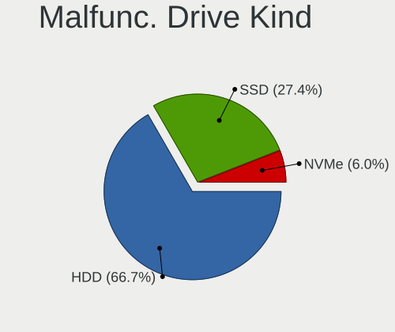

| Kind | Notebooks | Drives | Percent |
|------|-----------|--------|---------|
| HDD  | 56        | 58     | 66.67%  |
| SSD  | 23        | 30     | 27.38%  |
| NVMe | 5         | 6      | 5.95%   |

Failed Drives
-------------

Failed drive models

| Model                           | Notebooks | Drives | Percent |
|---------------------------------|-----------|--------|---------|
| Samsung Electronics SSD 980 1TB | 1         | 1      | 100%    |

Failed Drive Vendor
-------------------

Failed drive vendors

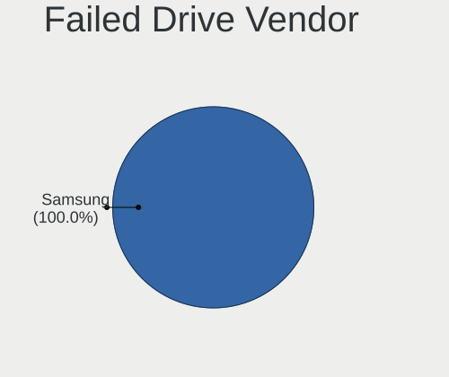

| Vendor              | Notebooks | Drives | Percent |
|---------------------|-----------|--------|---------|
| Samsung Electronics | 1         | 1      | 100%    |

Drive Status
------------

Number of failed and malfunc. drives

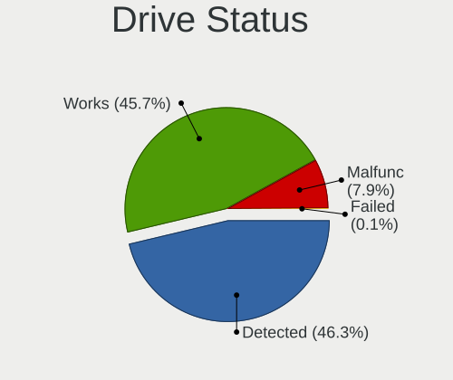

| Status   | Notebooks | Drives | Percent |
|----------|-----------|--------|---------|
| Detected | 479       | 710    | 46.28%  |
| Works    | 473       | 625    | 45.7%   |
| Malfunc  | 82        | 94     | 7.92%   |
| Failed   | 1         | 1      | 0.1%    |

Storage controller
------------------

Storage Vendor
--------------

Storage controller vendors

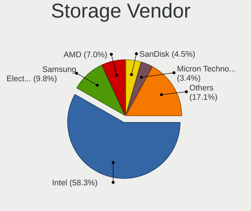

| Vendor                                  | Notebooks | Percent |
|-----------------------------------------|-----------|---------|
| Intel                                   | 628       | 58.26%  |
| Samsung Electronics                     | 106       | 9.83%   |
| AMD                                     | 75        | 6.96%   |
| SanDisk                                 | 48        | 4.45%   |
| Micron Technology                       | 37        | 3.43%   |
| SK hynix                                | 29        | 2.69%   |
| KIOXIA                                  | 27        | 2.5%    |
| Apple                                   | 23        | 2.13%   |
| Phison Electronics                      | 15        | 1.39%   |
| Kingston Technology Company             | 13        | 1.21%   |
| Silicon Motion                          | 12        | 1.11%   |
| Toshiba America Info Systems            | 11        | 1.02%   |
| MAXIO Technology (Hangzhou)             | 10        | 0.93%   |
| Micron/Crucial Technology               | 8         | 0.74%   |
| Shenzhen Unionmemory Information System | 6         | 0.56%   |
| Seagate Technology                      | 6         | 0.56%   |
| Nvidia                                  | 5         | 0.46%   |
| Solid State Storage Technology          | 4         | 0.37%   |
| ADATA Technology                        | 4         | 0.37%   |
| Yangtze Memory Technologies             | 3         | 0.28%   |
| VIA Technologies                        | 1         | 0.09%   |
| Shenzhen Techwinsemi Technology         | 1         | 0.09%   |
| Shenzhen Longsys Electronics            | 1         | 0.09%   |
| Realtek Semiconductor                   | 1         | 0.09%   |
| O2 Micro                                | 1         | 0.09%   |
| Marvell Technology Group                | 1         | 0.09%   |
| INNOGRIT                                | 1         | 0.09%   |
| Unknown                                 | 1         | 0.09%   |

Storage Model
-------------

Storage controller models

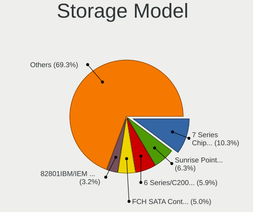

| Model                                                                            | Notebooks | Percent |
|----------------------------------------------------------------------------------|-----------|---------|
| Intel 7 Series Chipset Family 6-port SATA Controller [AHCI mode]                 | 118       | 10.26%  |
| Intel Sunrise Point-LP SATA Controller [AHCI mode]                               | 72        | 6.26%   |
| Intel 6 Series/C200 Series Chipset Family 6 port Mobile SATA AHCI Controller     | 68        | 5.91%   |
| AMD FCH SATA Controller [AHCI mode]                                              | 58        | 5.04%   |
| Intel 82801IBM/IEM (ICH9M/ICH9M-E) 4 port SATA Controller [AHCI mode]            | 37        | 3.22%   |
| Intel 5 Series/3400 Series Chipset 4 port SATA AHCI Controller                   | 33        | 2.87%   |
| Samsung NVMe SSD Controller SM981/PM981/PM983                                    | 32        | 2.78%   |
| Intel Wildcat Point-LP SATA Controller [AHCI Mode]                               | 31        | 2.7%    |
| Intel 82801 Mobile SATA Controller [RAID mode]                                   | 31        | 2.7%    |
| Samsung NVMe SSD Controller 980 (DRAM-less)                                      | 26        | 2.26%   |
| Intel 8 Series SATA Controller 1 [AHCI mode]                                     | 24        | 2.09%   |
| Samsung NVMe SSD Controller PM9A1/PM9A3/980PRO                                   | 22        | 1.91%   |
| Intel Volume Management Device NVMe RAID Controller                              | 20        | 1.74%   |
| Intel 8 Series/C220 Series Chipset Family 6-port SATA Controller 1 [AHCI mode]   | 20        | 1.74%   |
| Apple ANS2 NVMe Controller                                                       | 19        | 1.65%   |
| Intel 82801HM/HEM (ICH8M/ICH8M-E) IDE Controller                                 | 17        | 1.48%   |
| Intel 82801HM/HEM (ICH8M/ICH8M-E) SATA Controller [AHCI mode]                    | 16        | 1.39%   |
| KIOXIA NVMe SSD Controller BG4 (DRAM-less)                                       | 14        | 1.22%   |
| Intel 82801GBM/GHM (ICH7-M Family) SATA Controller [IDE mode]                    | 13        | 1.13%   |
| Intel 82801G (ICH7 Family) IDE Controller                                        | 13        | 1.13%   |
| Intel 5 Series/3400 Series Chipset 6 port SATA AHCI Controller                   | 13        | 1.13%   |
| Intel RST Volume Management Device Controller                                    | 12        | 1.04%   |
| Intel Cannon Lake Mobile PCH SATA AHCI Controller                                | 12        | 1.04%   |
| SanDisk WD SN560/SN740/SN770/SN5000 NVMe SSD                                     | 11        | 0.96%   |
| Intel Cannon Point-LP SATA Controller [AHCI Mode]                                | 11        | 0.96%   |
| SK hynix Gold P31/BC711/PC711 NVMe Solid State Drive                             | 10        | 0.87%   |
| Samsung S4LN058A01[SSUBX] AHCI SSD Controller (Apple slot)                       | 10        | 0.87%   |
| Intel Comet Lake SATA AHCI Controller                                            | 10        | 0.87%   |
| Silicon Motion SM2263EN/SM2263XT (DRAM-less) NVMe SSD Controllers                | 9         | 0.78%   |
| Intel 400 Series Chipset Family SATA AHCI Controller                             | 9         | 0.78%   |
| Micron 3400 NVMe SSD [Hendrix]                                                   | 8         | 0.7%    |
| Intel Atom/Celeron/Pentium Processor x5-E8000/J3xxx/N3xxx Series SATA Controller | 8         | 0.7%    |
| Phison PS5013-E13 PCIe3 NVMe Controller (DRAM-less)                              | 7         | 0.61%   |
| MAXIO (Hangzhou) NVMe SSD Controller MAP1202 (DRAM-less)                         | 7         | 0.61%   |
| Intel SSD 660P Series                                                            | 7         | 0.61%   |
| Intel Celeron N3350/Pentium N4200/Atom E3900 Series SATA AHCI Controller         | 7         | 0.61%   |
| AMD SB7x0/SB8x0/SB9x0 SATA Controller [AHCI mode]                                | 7         | 0.61%   |
| Toshiba America Info Systems XG6 NVMe SSD Controller                             | 6         | 0.52%   |
| SK hynix Platinum P41/PC801 NVMe Solid State Drive                               | 6         | 0.52%   |
| SK hynix BC501 NVMe Solid State Drive                                            | 6         | 0.52%   |

Storage Kind
------------

Kind of storage controller (IDE, SATA, NVMe, SAS, ...)

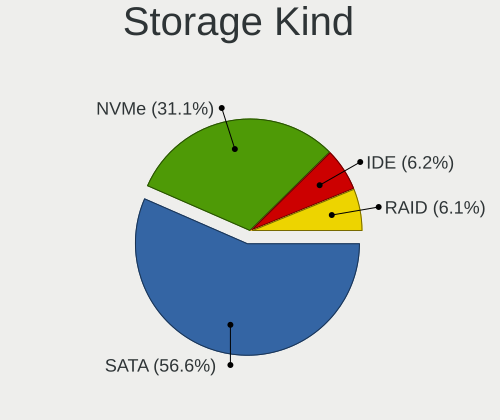

| Kind | Notebooks | Percent |
|------|-----------|---------|
| SATA | 617       | 56.55%  |
| NVMe | 339       | 31.07%  |
| IDE  | 68        | 6.23%   |
| RAID | 67        | 6.14%   |

Processor
---------

CPU Vendor
----------

Processor vendors

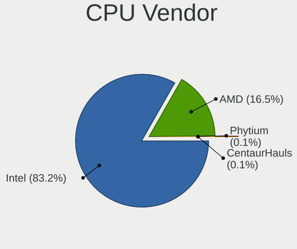

| Vendor       | Notebooks | Percent |
|--------------|-----------|---------|
| Intel        | 790       | 83.25%  |
| AMD          | 157       | 16.54%  |
| Phytium      | 1         | 0.11%   |
| CentaurHauls | 1         | 0.11%   |

CPU Model
---------

Processor models

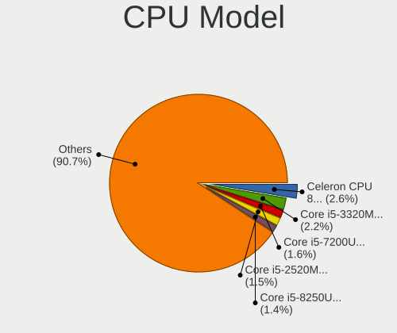

| Model                                   | Notebooks | Percent |
|-----------------------------------------|-----------|---------|
| Intel Celeron CPU 847 @ 1.10GHz         | 25        | 2.63%   |
| Intel Core i5-3320M CPU @ 2.60GHz       | 21        | 2.21%   |
| Intel Core i5-7200U CPU @ 2.50GHz       | 15        | 1.58%   |
| Intel Core i5-2520M CPU @ 2.50GHz       | 14        | 1.47%   |
| Intel Core i5-8250U CPU @ 1.60GHz       | 13        | 1.37%   |
| Intel Core i7-8750H CPU @ 2.20GHz       | 12        | 1.26%   |
| Intel Core i5-3210M CPU @ 2.50GHz       | 12        | 1.26%   |
| Intel Core i5-10210U CPU @ 1.60GHz      | 12        | 1.26%   |
| Intel Core i7-10750H CPU @ 2.60GHz      | 11        | 1.16%   |
| Intel Core i5-8265U CPU @ 1.60GHz       | 11        | 1.16%   |
| Intel Core i5-2450M CPU @ 2.50GHz       | 10        | 1.05%   |
| Intel 11th Gen Core i5-1135G7 @ 2.40GHz | 10        | 1.05%   |
| Intel Core i7-8550U CPU @ 1.80GHz       | 9         | 0.95%   |
| Intel Core i5-6300U CPU @ 2.40GHz       | 9         | 0.95%   |
| Intel Core i3-1000NG4 CPU @ 1.10GHz     | 9         | 0.95%   |
| Intel Core 2 Duo CPU P8600 @ 2.40GHz    | 9         | 0.95%   |
| AMD Ryzen 7 5800H with Radeon Graphics  | 9         | 0.95%   |
| Intel Core i5-6200U CPU @ 2.30GHz       | 8         | 0.84%   |
| Intel Core i5-5200U CPU @ 2.20GHz       | 8         | 0.84%   |
| Intel Core i5 CPU M 560 @ 2.67GHz       | 8         | 0.84%   |
| Intel Core 2 Duo CPU P8700 @ 2.53GHz    | 8         | 0.84%   |
| AMD Custom APU 0405                     | 8         | 0.84%   |
| Intel Core i7-9750H CPU @ 2.60GHz       | 7         | 0.74%   |
| Intel Core i7-2670QM CPU @ 2.20GHz      | 7         | 0.74%   |
| Intel Core i7-10510U CPU @ 1.80GHz      | 7         | 0.74%   |
| Intel Core i5-2430M CPU @ 2.40GHz       | 7         | 0.74%   |
| Intel Core i5-2410M CPU @ 2.30GHz       | 7         | 0.74%   |
| AMD Ryzen 5 5500U with Radeon Graphics  | 7         | 0.74%   |
| Intel Core i7-3520M CPU @ 2.90GHz       | 6         | 0.63%   |
| Intel Core i5-2540M CPU @ 2.60GHz       | 6         | 0.63%   |
| Intel Celeron CPU 1005M @ 1.90GHz       | 6         | 0.63%   |
| Intel 11th Gen Core i7-11800H @ 2.30GHz | 6         | 0.63%   |
| Intel 11th Gen Core i7-1165G7 @ 2.80GHz | 6         | 0.63%   |
| Intel Core i7-8565U CPU @ 1.80GHz       | 5         | 0.53%   |
| Intel Core i7-7700HQ CPU @ 2.80GHz      | 5         | 0.53%   |
| Intel Core i7-5500U CPU @ 2.40GHz       | 5         | 0.53%   |
| Intel Core i5-7300U CPU @ 2.60GHz       | 5         | 0.53%   |
| Intel Core i5-4300M CPU @ 2.60GHz       | 5         | 0.53%   |
| Intel Core i5-4210U CPU @ 1.70GHz       | 5         | 0.53%   |
| Intel Core i5-3230M CPU @ 2.60GHz       | 5         | 0.53%   |

CPU Model Family
----------------

Processor model prefix

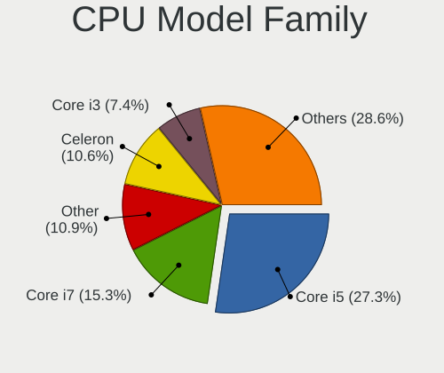

| Model                   | Notebooks | Percent |
|-------------------------|-----------|---------|
| Intel Core i5           | 259       | 27.29%  |
| Intel Core i7           | 145       | 15.28%  |
| Other                   | 103       | 10.85%  |
| Intel Celeron           | 101       | 10.64%  |
| Intel Core i3           | 70        | 7.38%   |
| Intel Core 2 Duo        | 47        | 4.95%   |
| AMD Ryzen 7             | 38        | 4%      |
| AMD Ryzen 5             | 30        | 3.16%   |
| Intel Atom              | 21        | 2.21%   |
| AMD Ryzen 7 PRO         | 15        | 1.58%   |
| Intel Core              | 13        | 1.37%   |
| AMD Ryzen 9             | 8         | 0.84%   |
| Intel Pentium           | 7         | 0.74%   |
| Intel Core 2            | 7         | 0.74%   |
| Intel Celeron Dual-Core | 7         | 0.74%   |
| AMD Ryzen 3             | 7         | 0.74%   |
| AMD A6                  | 7         | 0.74%   |
| Intel Core M            | 5         | 0.53%   |
| Intel Celeron M         | 5         | 0.53%   |
| AMD E2                  | 5         | 0.53%   |
| Intel Core i9           | 4         | 0.42%   |
| AMD Ryzen 5 PRO         | 4         | 0.42%   |
| Intel Genuine           | 3         | 0.32%   |
| AMD E1                  | 3         | 0.32%   |
| AMD Athlon              | 3         | 0.32%   |
| Intel Pentium M         | 2         | 0.21%   |
| Intel Pentium Dual-Core | 2         | 0.21%   |
| Intel Core m5           | 2         | 0.21%   |
| AMD Turion 64 X2 Mobile | 2         | 0.21%   |
| AMD Mobile Sempron      | 2         | 0.21%   |
| AMD Athlon II           | 2         | 0.21%   |
| AMD Athlon 64 X2        | 2         | 0.21%   |
| AMD A8                  | 2         | 0.21%   |
| Intel Xeon              | 1         | 0.11%   |
| Intel Core m3           | 1         | 0.11%   |
| Intel Core 2 Extreme    | 1         | 0.11%   |
| CentaurHauls VIA C7     | 1         | 0.11%   |
| AMD V140                | 1         | 0.11%   |
| AMD V120                | 1         | 0.11%   |
| AMD Turion Neo X2       | 1         | 0.11%   |

CPU Cores
---------

Number of processor cores

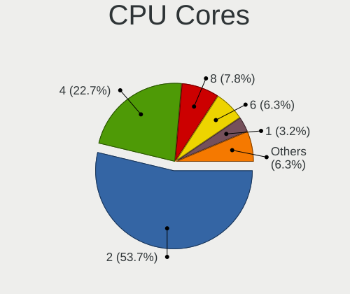

| Number | Notebooks | Percent |
|--------|-----------|---------|
| 2      | 510       | 53.74%  |
| 4      | 215       | 22.66%  |
| 8      | 74        | 7.8%    |
| 6      | 60        | 6.32%   |
| 1      | 30        | 3.16%   |
| 14     | 16        | 1.69%   |
| 12     | 16        | 1.69%   |
| 10     | 16        | 1.69%   |
| 16     | 9         | 0.95%   |
| 24     | 3         | 0.32%   |

CPU Sockets
-----------

Number of sockets

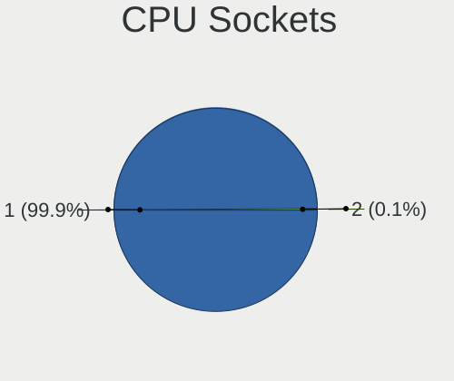

| Number | Notebooks | Percent |
|--------|-----------|---------|
| 1      | 948       | 99.89%  |
| 2      | 1         | 0.11%   |

CPU Threads
-----------

Threads per core (Hyper-Threading)

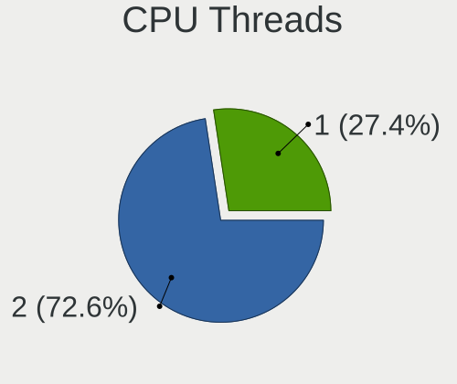

| Number | Notebooks | Percent |
|--------|-----------|---------|
| 2      | 689       | 72.6%   |
| 1      | 260       | 27.4%   |

CPU Op-Modes
------------

CPU Operation Modes (32-bit, 64-bit)

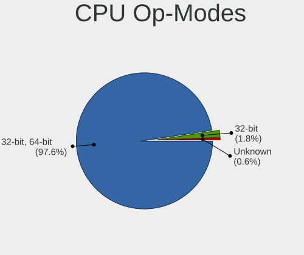

| Op mode        | Notebooks | Percent |
|----------------|-----------|---------|
| 32-bit, 64-bit | 926       | 97.58%  |
| 32-bit         | 17        | 1.79%   |
| Unknown        | 6         | 0.63%   |

CPU Microcode
-------------

Microcode number

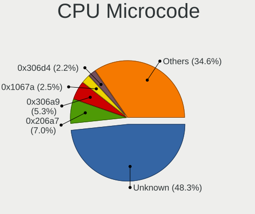

| Number     | Notebooks | Percent |
|------------|-----------|---------|
| Unknown    | 475       | 48.32%  |
| 0x206a7    | 69        | 7.02%   |
| 0x306a9    | 52        | 5.29%   |
| 0x1067a    | 25        | 2.54%   |
| 0x306d4    | 22        | 2.24%   |
| 0x20655    | 20        | 2.03%   |
| 0x806ec    | 19        | 1.93%   |
| 0x806ea    | 16        | 1.63%   |
| 0x306c3    | 15        | 1.53%   |
| 0x806e9    | 13        | 1.32%   |
| 0x806c1    | 13        | 1.32%   |
| 0x40651    | 13        | 1.32%   |
| 0x0a50000c | 12        | 1.22%   |
| 0xa0652    | 11        | 1.12%   |
| 0x20652    | 11        | 1.12%   |
| 0x10676    | 11        | 1.12%   |
| 0x406e3    | 10        | 1.02%   |
| 0x906ea    | 8         | 0.81%   |
| 0x406c4    | 8         | 0.81%   |
| 0x106c2    | 8         | 0.81%   |
| 0x806eb    | 7         | 0.71%   |
| 0x08600106 | 7         | 0.71%   |
| 0x08108102 | 7         | 0.71%   |
| 0x906a3    | 6         | 0.61%   |
| 0x6f6      | 6         | 0.61%   |
| 0x406c3    | 6         | 0.61%   |
| 0x08108109 | 6         | 0.61%   |
| 0x506c9    | 5         | 0.51%   |
| 0x30678    | 5         | 0.51%   |
| 0x08608103 | 5         | 0.51%   |
| 0x010000c8 | 5         | 0.51%   |
| 0x806d1    | 4         | 0.41%   |
| 0x6fd      | 4         | 0.41%   |
| 0x6e8      | 4         | 0.41%   |
| 0x506e3    | 4         | 0.41%   |
| 0x0a50000d | 4         | 0.41%   |
| 0xb06a2    | 3         | 0.31%   |
| 0x906e9    | 3         | 0.31%   |
| 0x706a8    | 3         | 0.31%   |
| 0x6d8      | 3         | 0.31%   |

CPU Microarch
-------------

Microarchitecture

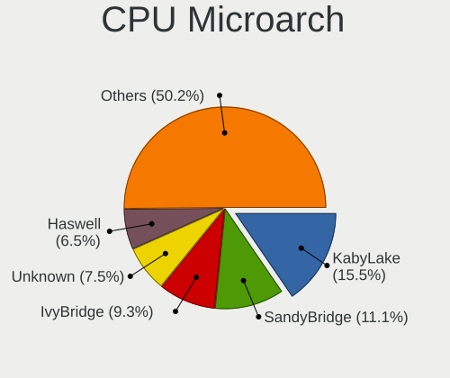

| Name               | Notebooks | Percent |
|--------------------|-----------|---------|
| KabyLake           | 147       | 15.46%  |
| SandyBridge        | 106       | 11.15%  |
| IvyBridge          | 88        | 9.25%   |
| Unknown            | 71        | 7.47%   |
| Haswell            | 62        | 6.52%   |
| Penryn             | 54        | 5.68%   |
| Westmere           | 46        | 4.84%   |
| Broadwell          | 38        | 4%      |
| Alderlake Hybrid   | 38        | 4%      |
| Skylake            | 35        | 3.68%   |
| Zen 3              | 29        | 3.05%   |
| TigerLake          | 29        | 3.05%   |
| Silvermont         | 28        | 2.94%   |
| Zen 2              | 19        | 2%      |
| IceLake            | 19        | 2%      |
| Core               | 19        | 2%      |
| CometLake          | 19        | 2%      |
| Zen+               | 18        | 1.89%   |
| Bonnell            | 10        | 1.05%   |
| P6                 | 8         | 0.84%   |
| Puma               | 7         | 0.74%   |
| K8 Hammer          | 7         | 0.74%   |
| Goldmont           | 7         | 0.74%   |
| Meteorlake Hybrid  | 6         | 0.63%   |
| Goldmont plus      | 6         | 0.63%   |
| Zen                | 5         | 0.53%   |
| K10                | 5         | 0.53%   |
| Excavator          | 5         | 0.53%   |
| Jaguar             | 3         | 0.32%   |
| Bobcat             | 3         | 0.32%   |
| ArrowLake-H Hybrid | 3         | 0.32%   |
| Piledriver         | 2         | 0.21%   |
| Nehalem            | 2         | 0.21%   |
| K8 & K10 hybrid    | 2         | 0.21%   |
| K10 Llano          | 2         | 0.21%   |
| Gracemont          | 2         | 0.21%   |
| Lunarlake Hybrid   | 1         | 0.11%   |

Graphics
--------

GPU Vendor
----------

Vendors of graphics cards

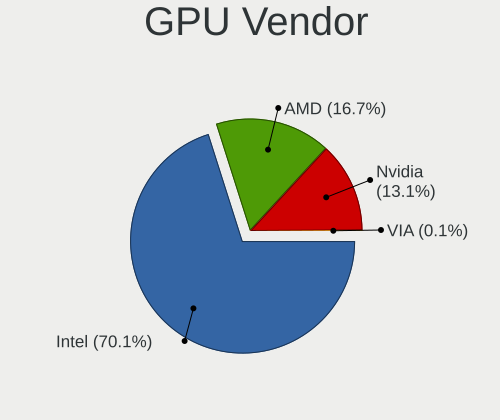

| Vendor           | Notebooks | Percent |
|------------------|-----------|---------|
| Intel            | 762       | 70.1%   |
| AMD              | 182       | 16.74%  |
| Nvidia           | 142       | 13.06%  |
| VIA Technologies | 1         | 0.09%   |

GPU Model
---------

Graphics card models

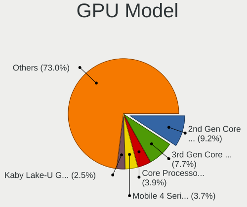

| Model                                                                                    | Notebooks | Percent |
|------------------------------------------------------------------------------------------|-----------|---------|
| Intel 2nd Generation Core Processor Family Integrated Graphics Controller                | 104       | 9.2%    |
| Intel 3rd Gen Core processor Graphics Controller                                         | 87        | 7.7%    |
| Intel Core Processor Integrated Graphics Controller                                      | 44        | 3.89%   |
| Intel Mobile 4 Series Chipset Integrated Graphics Controller                             | 42        | 3.72%   |
| Intel Kaby Lake-U GT2 [HD Graphics 620]                                                  | 28        | 2.48%   |
| Intel Kaby Lake-R GT2 [UHD Graphics 620]                                                 | 28        | 2.48%   |
| Intel 4th Gen Core Processor Integrated Graphics Controller                              | 28        | 2.48%   |
| Intel Haswell-ULT Integrated Graphics Controller                                         | 27        | 2.39%   |
| Intel TigerLake-LP GT2 [Iris Xe Graphics]                                                | 26        | 2.3%    |
| Intel Skylake-U GT2 [HD Graphics 520]                                                    | 26        | 2.3%    |
| Intel CometLake-U GT2 [UHD Graphics]                                                     | 24        | 2.12%   |
| Intel WhiskeyLake-U GT2 [UHD Graphics 620]                                               | 22        | 1.95%   |
| Intel Broadwell-U GT2 [HD Graphics 5500]                                                 | 20        | 1.77%   |
| Intel CoffeeLake-H GT2 [UHD Graphics 630]                                                | 19        | 1.68%   |
| AMD Picasso/Raven 2 [Radeon Vega Series / Radeon Vega Mobile Series]                     | 19        | 1.68%   |
| AMD Cezanne [Radeon Vega Series / Radeon Vega Mobile Series]                             | 19        | 1.68%   |
| Intel Mobile 945GM/GMS/GME, 943/940GML Express Integrated Graphics Controller            | 18        | 1.59%   |
| Intel Atom/Celeron/Pentium Processor x5-E8000/J3xxx/N3xxx Integrated Graphics Controller | 18        | 1.59%   |
| AMD Renoir [Radeon Vega Series / Radeon Vega Mobile Series]                              | 18        | 1.59%   |
| Intel Alder Lake-P GT2 [Iris Xe Graphics]                                                | 17        | 1.5%    |
| Intel CometLake-H GT2 [UHD Graphics]                                                     | 16        | 1.42%   |
| Intel Mobile GM965/GL960 Integrated Graphics Controller (secondary)                      | 15        | 1.33%   |
| Intel Mobile GM965/GL960 Integrated Graphics Controller (primary)                        | 15        | 1.33%   |
| Intel Raptor Lake-P [Iris Xe Graphics]                                                   | 14        | 1.24%   |
| Intel Mobile 945GM/GMS, 943/940GML Express Integrated Graphics Controller                | 12        | 1.06%   |
| Intel Atom Processor Z36xxx/Z37xxx Series Graphics & Display                             | 11        | 0.97%   |
| AMD Lucienne                                                                             | 11        | 0.97%   |
| Nvidia TU117M [GeForce GTX 1650 Mobile / Max-Q]                                          | 10        | 0.88%   |
| Intel Iris Plus Graphics G4 (Ice Lake)                                                   | 9         | 0.8%    |
| AMD Barcelo                                                                              | 9         | 0.8%    |
| Nvidia TU117M [GeForce GTX 1650 Ti Mobile]                                               | 8         | 0.71%   |
| AMD VanGogh [AMD Custom GPU 0405]                                                        | 8         | 0.71%   |
| AMD Rembrandt [Radeon 680M]                                                              | 8         | 0.71%   |
| AMD Phoenix1                                                                             | 8         | 0.71%   |
| AMD HawkPoint1                                                                           | 8         | 0.71%   |
| Intel TigerLake-H GT1 [UHD Graphics]                                                     | 7         | 0.62%   |
| Intel Apollo Lake GT1 [HD Graphics 500]                                                  | 7         | 0.62%   |
| AMD Topaz XT [Radeon R7 M260/M265 / M340/M360 / M440/M445 / 530/535 / 620/625 Mobile]    | 7         | 0.62%   |
| Nvidia TU116M [GeForce GTX 1660 Ti Mobile]                                               | 6         | 0.53%   |
| Nvidia TU106M [GeForce RTX 2060 Mobile]                                                  | 6         | 0.53%   |

GPU Combo
---------

Combinations of graphics cards

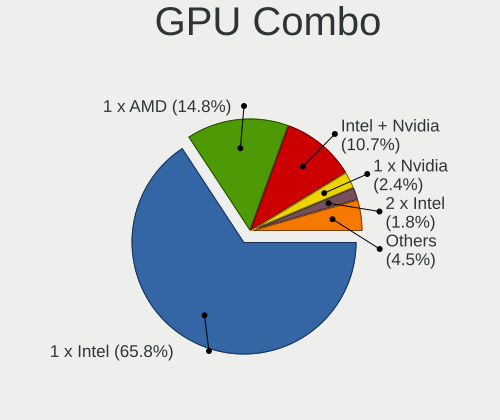

| Name           | Notebooks | Percent |
|----------------|-----------|---------|
| 1 x Intel      | 626       | 65.76%  |
| 1 x AMD        | 141       | 14.81%  |
| Intel + Nvidia | 102       | 10.71%  |
| 1 x Nvidia     | 23        | 2.42%   |
| 2 x Intel      | 17        | 1.79%   |
| AMD + Nvidia   | 17        | 1.79%   |
| Intel + AMD    | 15        | 1.58%   |
| 2 x AMD        | 8         | 0.84%   |
| Other          | 2         | 0.21%   |
| 1 x VIA        | 1         | 0.11%   |

GPU Driver
----------

Free vs proprietary

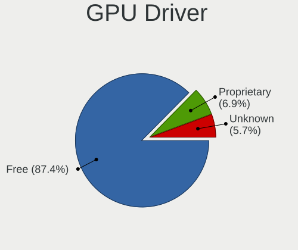

| Driver      | Notebooks | Percent |
|-------------|-----------|---------|
| Free        | 832       | 87.39%  |
| Proprietary | 66        | 6.93%   |
| Unknown     | 54        | 5.67%   |

GPU Memory
----------

Total video memory

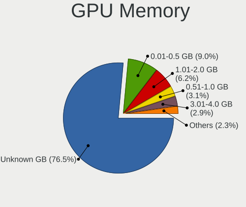

| Size in GB | Notebooks | Percent |
|------------|-----------|---------|
| Unknown    | 734       | 76.46%  |
| 0.01-0.5   | 86        | 8.96%   |
| 1.01-2.0   | 60        | 6.25%   |
| 0.51-1.0   | 30        | 3.13%   |
| 3.01-4.0   | 28        | 2.92%   |
| 7.01-8.0   | 10        | 1.04%   |
| 5.01-6.0   | 8         | 0.83%   |
| 8.01-16.0  | 4         | 0.42%   |

Monitor
-------

Monitor Vendor
--------------

Monitor vendors

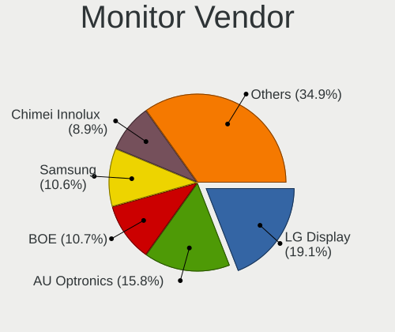

| Vendor                  | Notebooks | Percent |
|-------------------------|-----------|---------|
| LG Display              | 181       | 19.07%  |
| AU Optronics            | 150       | 15.81%  |
| BOE                     | 102       | 10.75%  |
| Samsung Electronics     | 101       | 10.64%  |
| Chimei Innolux          | 84        | 8.85%   |
| Apple                   | 47        | 4.95%   |
| Sharp                   | 44        | 4.64%   |
| Lenovo                  | 27        | 2.85%   |
| Chi Mei Optoelectronics | 27        | 2.85%   |
| PANDA                   | 14        | 1.48%   |
| Dell                    | 13        | 1.37%   |
| Panasonic               | 12        | 1.26%   |
| Goldstar                | 12        | 1.26%   |
| Valve                   | 9         | 0.95%   |
| InfoVision              | 9         | 0.95%   |
| Philips                 | 6         | 0.63%   |
| BenQ                    | 6         | 0.63%   |
| ASUSTek Computer        | 6         | 0.63%   |
| Toshiba                 | 5         | 0.53%   |
| Sony                    | 5         | 0.53%   |
| CSO                     | 5         | 0.53%   |
| CPT                     | 5         | 0.53%   |
| Acer                    | 5         | 0.53%   |
| NOV                     | 4         | 0.42%   |
| Mitsubishi              | 4         | 0.42%   |
| LG Philips              | 4         | 0.42%   |
| IOD                     | 4         | 0.42%   |
| Hewlett-Packard         | 4         | 0.42%   |
| Ancor Communications    | 4         | 0.42%   |
| Iiyama                  | 3         | 0.32%   |
| CSOT                    | 3         | 0.32%   |
| AOC                     | 3         | 0.32%   |
| TMX                     | 2         | 0.21%   |
| TMA                     | 2         | 0.21%   |
| SAC                     | 2         | 0.21%   |
| RTK                     | 2         | 0.21%   |
| OOO                     | 2         | 0.21%   |
| Mi                      | 2         | 0.21%   |
| Denver                  | 2         | 0.21%   |
| Unknown                 | 2         | 0.21%   |

Monitor Model
-------------

Monitor models

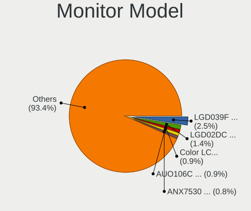

| Model                                                                    | Notebooks | Percent |
|--------------------------------------------------------------------------|-----------|---------|
| LG Display LCD Monitor LGD039F 1366x768 345x194mm 15.6-inch              | 24        | 2.51%   |
| LG Display LCD Monitor LGD02DC 1366x768 344x194mm 15.5-inch              | 13        | 1.36%   |
| AU Optronics LCD Monitor AUO106C 1366x768 276x155mm 12.5-inch            | 9         | 0.94%   |
| Apple Color LCD APPA041 2560x1600 286x179mm 13.3-inch                    | 9         | 0.94%   |
| Valve ANX7530 U VLV3001 800x1280 100x150mm 7.1-inch                      | 8         | 0.84%   |
| Chi Mei Optoelectronics LCD Monitor CMO15A7 1366x768 344x193mm 15.5-inch | 6         | 0.63%   |
| AU Optronics LCD Monitor AUO38ED 1920x1080 344x193mm 15.5-inch           | 6         | 0.63%   |
| Apple Cinema HD APP9223 1920x1200 495x310mm 23.0-inch                    | 6         | 0.63%   |
| Samsung Electronics LCD Monitor SDC417B 2880x1800 289x186mm 13.5-inch    | 5         | 0.52%   |
| Panasonic LCD Monitor MEI4100 1920x1200 216x135mm 10.0-inch              | 5         | 0.52%   |
| LG Display LCD Monitor LGD033A 1366x768 344x194mm 15.5-inch              | 5         | 0.52%   |
| Lenovo LCD Monitor LEN40B0 1366x768 344x194mm 15.5-inch                  | 5         | 0.52%   |
| Sharp LCD Monitor SHP14B8 1920x1080 294x165mm 13.3-inch                  | 4         | 0.42%   |
| Samsung Electronics LCD Monitor SEC5541 1366x768 344x193mm 15.5-inch     | 4         | 0.42%   |
| Samsung Electronics LCD Monitor SEC5441 1280x800 331x207mm 15.4-inch     | 4         | 0.42%   |
| Samsung Electronics LCD Monitor SEC5341 1366x768 344x193mm 15.5-inch     | 4         | 0.42%   |
| Panasonic VVX11F009G00 MEI96A2 1920x1080 344x193mm 15.5-inch             | 4         | 0.42%   |
| NOV NOVA HD CARD NOV0405 1920x1080 459x296mm 21.5-inch                   | 4         | 0.42%   |
| LG Display LCD Monitor LGD033B 1366x768 344x194mm 15.5-inch              | 4         | 0.42%   |
| LG Display LCD Monitor LGD02D8 1366x768 277x156mm 12.5-inch              | 4         | 0.42%   |
| LG Display LCD Monitor LGD02CB 1366x768 344x194mm 15.5-inch              | 4         | 0.42%   |
| LG Display LCD Monitor LGD01DA 1366x768 294x166mm 13.3-inch              | 4         | 0.42%   |
| Lenovo LCD Monitor LEN4011 1280x800 261x163mm 12.1-inch                  | 4         | 0.42%   |
| Chimei Innolux LCD Monitor CMN1738 1920x1080 381x214mm 17.2-inch         | 4         | 0.42%   |
| Chimei Innolux LCD Monitor CMN14D5 1920x1080 309x173mm 13.9-inch         | 4         | 0.42%   |
| AU Optronics LCD Monitor AUO45EC 1366x768 344x193mm 15.5-inch            | 4         | 0.42%   |
| AU Optronics LCD Monitor AUO26EC 1366x768 344x193mm 15.5-inch            | 4         | 0.42%   |
| AU Optronics LCD Monitor AUO22EC 1366x768 344x193mm 15.5-inch            | 4         | 0.42%   |
| AU Optronics LCD Monitor AUO1068 1920x1200 264x166mm 12.3-inch           | 4         | 0.42%   |
| Apple Color LCD APPA040 2880x1800 331x207mm 15.4-inch                    | 4         | 0.42%   |
| Apple Color LCD APPA02E 2880x1800 331x207mm 15.4-inch                    | 4         | 0.42%   |
| Sharp LQ133M1JW28 SHP1483 1920x1080 294x165mm 13.3-inch                  | 3         | 0.31%   |
| Sharp LCD Monitor SHP14D5 1920x1080 294x165mm 13.3-inch                  | 3         | 0.31%   |
| Samsung Electronics LCD Monitor SEC3041 1366x768 353x198mm 15.9-inch     | 3         | 0.31%   |
| Samsung Electronics LCD Monitor SDC4752 1366x768 344x194mm 15.5-inch     | 3         | 0.31%   |
| Samsung Electronics LCD Monitor SDC419F 2880x1800 302x189mm 14.0-inch    | 3         | 0.31%   |
| LG Display LCD Monitor LGD0521 1920x1080 309x174mm 14.0-inch             | 3         | 0.31%   |
| LG Display LCD Monitor LGD0456 1366x768 344x194mm 15.5-inch              | 3         | 0.31%   |
| LG Display LCD Monitor LGD03E7 1366x768 345x194mm 15.6-inch              | 3         | 0.31%   |
| LG Display LCD Monitor LGD032E 1366x768 345x194mm 15.6-inch              | 3         | 0.31%   |

Monitor Resolution
------------------

Monitor screen resolution

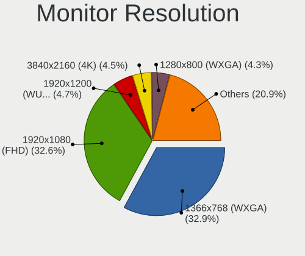

| Resolution         | Notebooks | Percent |
|--------------------|-----------|---------|
| 1366x768 (WXGA)    | 305       | 32.9%   |
| 1920x1080 (FHD)    | 302       | 32.58%  |
| 1920x1200 (WUXGA)  | 44        | 4.75%   |
| 3840x2160 (4K)     | 42        | 4.53%   |
| 1280x800 (WXGA)    | 40        | 4.31%   |
| 2560x1600          | 32        | 3.45%   |
| 2880x1800          | 30        | 3.24%   |
| 1600x900 (HD+)     | 22        | 2.37%   |
| 2560x1440 (QHD)    | 18        | 1.94%   |
| 1440x900 (WXGA+)   | 13        | 1.4%    |
| 800x1280           | 9         | 0.97%   |
| 3840x2400          | 7         | 0.76%   |
| 3072x1920          | 6         | 0.65%   |
| 2560x1080          | 5         | 0.54%   |
| 1920x540           | 5         | 0.54%   |
| 1280x1024 (SXGA)   | 5         | 0.54%   |
| 3456x2160          | 3         | 0.32%   |
| 3200x1800 (QHD+)   | 3         | 0.32%   |
| 2304x1440          | 3         | 0.32%   |
| 2160x1440          | 3         | 0.32%   |
| 1680x1050 (WSXGA+) | 3         | 0.32%   |
| 1360x768           | 3         | 0.32%   |
| 1024x768 (XGA)     | 3         | 0.32%   |
| 1024x600           | 3         | 0.32%   |
| Unknown            | 3         | 0.32%   |
| 2880x1920          | 2         | 0.22%   |
| 2880x1620          | 2         | 0.22%   |
| 2520x1680          | 2         | 0.22%   |
| 2240x1400          | 2         | 0.22%   |
| 1024x576           | 2         | 0.22%   |
| 3000x2000          | 1         | 0.11%   |
| 2256x1504          | 1         | 0.11%   |
| 1920x1280          | 1         | 0.11%   |
| 1600x2560          | 1         | 0.11%   |
| 1400x1050          | 1         | 0.11%   |

Monitor Diagonal
----------------

Diagonal size in inches

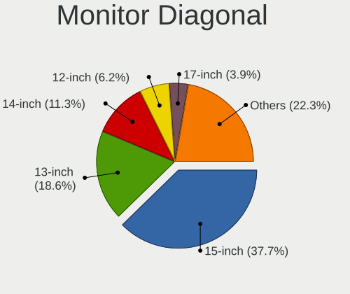

| Inches  | Notebooks | Percent |
|---------|-----------|---------|
| 15      | 360       | 37.7%   |
| 13      | 178       | 18.64%  |
| 14      | 108       | 11.31%  |
| 12      | 59        | 6.18%   |
| 17      | 37        | 3.87%   |
| 16      | 25        | 2.62%   |
| 11      | 24        | 2.51%   |
| 23      | 22        | 2.3%    |
| 24      | 19        | 1.99%   |
| 21      | 17        | 1.78%   |
| 31      | 15        | 1.57%   |
| 27      | 15        | 1.57%   |
| 10      | 12        | 1.26%   |
| Unknown | 11        | 1.15%   |
| 7       | 9         | 0.94%   |
| 18      | 7         | 0.73%   |
| 72      | 5         | 0.52%   |
| 32      | 5         | 0.52%   |
| 19      | 5         | 0.52%   |
| 63      | 3         | 0.31%   |
| 37      | 3         | 0.31%   |
| 52      | 2         | 0.21%   |
| 49      | 2         | 0.21%   |
| 22      | 2         | 0.21%   |
| 84      | 1         | 0.1%    |
| 39      | 1         | 0.1%    |
| 38      | 1         | 0.1%    |
| 36      | 1         | 0.1%    |
| 34      | 1         | 0.1%    |
| 29      | 1         | 0.1%    |
| 26      | 1         | 0.1%    |
| 25      | 1         | 0.1%    |
| 20      | 1         | 0.1%    |
| 8       | 1         | 0.1%    |

Monitor Width
-------------

Physical width

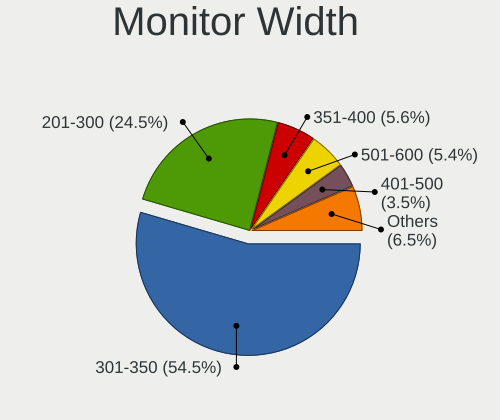

| Width in mm | Notebooks | Percent |
|-------------|-----------|---------|
| 301-350     | 517       | 54.54%  |
| 201-300     | 232       | 24.47%  |
| 351-400     | 53        | 5.59%   |
| 501-600     | 51        | 5.38%   |
| 401-500     | 33        | 3.48%   |
| 601-700     | 16        | 1.69%   |
| Unknown     | 11        | 1.16%   |
| 1-100       | 9         | 0.95%   |
| 701-800     | 7         | 0.74%   |
| 1001-1500   | 7         | 0.74%   |
| 1501-2000   | 6         | 0.63%   |
| 801-900     | 5         | 0.53%   |
| 101-200     | 1         | 0.11%   |

Aspect Ratio
------------

Proportional relationship between the width and the height

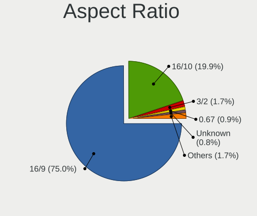

| Ratio   | Notebooks | Percent |
|---------|-----------|---------|
| 16/9    | 659       | 74.97%  |
| 16/10   | 175       | 19.91%  |
| 3/2     | 15        | 1.71%   |
| 0.67    | 8         | 0.91%   |
| Unknown | 7         | 0.8%    |
| 5/4     | 5         | 0.57%   |
| 4/3     | 3         | 0.34%   |
| 32/9    | 3         | 0.34%   |
| 21/9    | 2         | 0.23%   |
| 0.63    | 1         | 0.11%   |
| 0.62    | 1         | 0.11%   |

Monitor Area
------------

Area in inch²

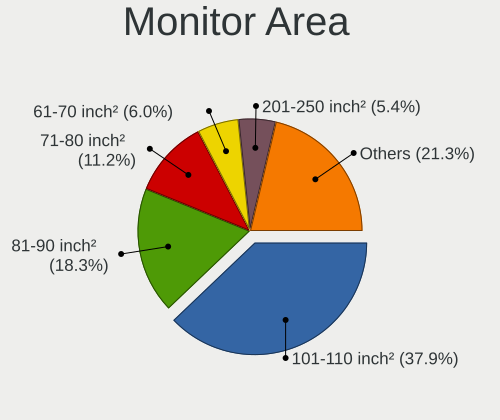

| Area in inch² | Notebooks | Percent |
|----------------|-----------|---------|
| 101-110        | 361       | 37.88%  |
| 81-90          | 174       | 18.26%  |
| 71-80          | 107       | 11.23%  |
| 61-70          | 57        | 5.98%   |
| 201-250        | 51        | 5.35%   |
| 121-130        | 32        | 3.36%   |
| 51-60          | 24        | 2.52%   |
| 111-120        | 22        | 2.31%   |
| 351-500        | 21        | 2.2%    |
| 301-350        | 17        | 1.78%   |
| 41-50          | 12        | 1.26%   |
| More than 1000 | 11        | 1.15%   |
| 151-200        | 11        | 1.15%   |
| Unknown        | 11        | 1.15%   |
| 1-40           | 10        | 1.05%   |
| 141-150        | 9         | 0.94%   |
| 501-1000       | 8         | 0.84%   |
| 91-100         | 8         | 0.84%   |
| 251-300        | 4         | 0.42%   |
| 131-140        | 3         | 0.31%   |

Pixel Density
-------------

Pixels per inch

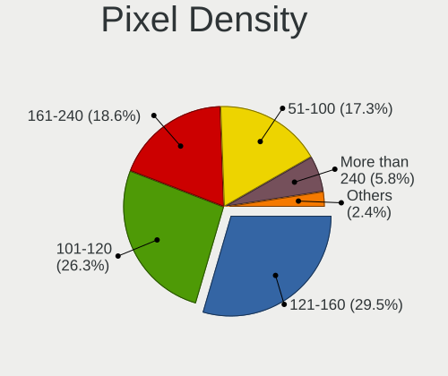

| Density       | Notebooks | Percent |
|---------------|-----------|---------|
| 121-160       | 278       | 29.51%  |
| 101-120       | 248       | 26.33%  |
| 161-240       | 175       | 18.58%  |
| 51-100        | 163       | 17.3%   |
| More than 240 | 55        | 5.84%   |
| 1-50          | 12        | 1.27%   |
| Unknown       | 11        | 1.17%   |

Multiple Monitors
-----------------

Total monitors connected

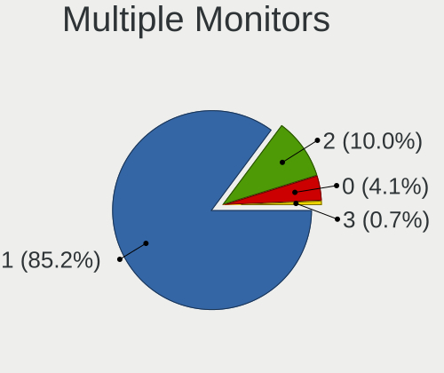

| Total | Notebooks | Percent |
|-------|-----------|---------|
| 1     | 816       | 85.18%  |
| 2     | 96        | 10.02%  |
| 0     | 39        | 4.07%   |
| 3     | 7         | 0.73%   |

Network
-------

Net Controller Vendor
---------------------

Controller vendors

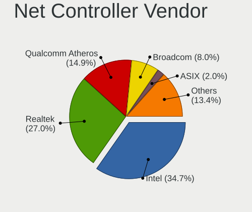

| Vendor                                 | Notebooks | Percent |
|----------------------------------------|-----------|---------|
| Intel                                  | 509       | 34.74%  |
| Realtek Semiconductor                  | 395       | 26.96%  |
| Qualcomm Atheros                       | 218       | 14.88%  |
| Broadcom                               | 117       | 7.99%   |
| ASIX Electronics                       | 30        | 2.05%   |
| MediaTek                               | 29        | 1.98%   |
| Marvell Technology Group               | 27        | 1.84%   |
| Broadcom Limited                       | 19        | 1.3%    |
| Qualcomm                               | 13        | 0.89%   |
| Apple                                  | 12        | 0.82%   |
| TP-Link                                | 8         | 0.55%   |
| Ralink                                 | 8         | 0.55%   |
| Sierra Wireless                        | 7         | 0.48%   |
| Shenzhen Goodix Technology             | 7         | 0.48%   |
| BUFFALO                                | 7         | 0.48%   |
| Elecom                                 | 6         | 0.41%   |
| PLANEX                                 | 5         | 0.34%   |
| Nvidia                                 | 4         | 0.27%   |
| Huawei Technologies                    | 4         | 0.27%   |
| Ralink Technology                      | 3         | 0.2%    |
| Lenovo                                 | 3         | 0.2%    |
| Xiaomi                                 | 2         | 0.14%   |
| U-Blox                                 | 2         | 0.14%   |
| Suzhou Motorcomm Electronic Technology | 2         | 0.14%   |
| Quectel Wireless Solutions             | 2         | 0.14%   |
| Qualcomm Technologies                  | 2         | 0.14%   |
| Qualcomm Atheros Communications        | 2         | 0.14%   |
| Google                                 | 2         | 0.14%   |
| DisplayLink                            | 2         | 0.14%   |
| D-Link                                 | 2         | 0.14%   |
| ZTE WCDMA Technologies MSM             | 1         | 0.07%   |
| Sony Ericsson Mobile Communications AB | 1         | 0.07%   |
| Samsung Electronics                    | 1         | 0.07%   |
| QNAP System                            | 1         | 0.07%   |
| OPPO Electronics                       | 1         | 0.07%   |
| Nordic Semiconductor ASA               | 1         | 0.07%   |
| NetGear                                | 1         | 0.07%   |
| NEC Computers                          | 1         | 0.07%   |
| Logitec                                | 1         | 0.07%   |
| Keil Software                          | 1         | 0.07%   |

Net Controller Model
--------------------

Controller models

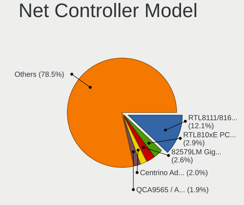

| Model                                                                   | Notebooks | Percent |
|-------------------------------------------------------------------------|-----------|---------|
| Realtek RTL8111/8168/8211/8411 PCI Express Gigabit Ethernet Controller  | 219       | 12.05%  |
| Realtek RTL810xE PCI Express Fast Ethernet controller                   | 52        | 2.86%   |
| Intel 82579LM Gigabit Network Connection (Lewisville)                   | 47        | 2.59%   |
| Intel Centrino Advanced-N 6205 [Taylor Peak]                            | 37        | 2.04%   |
| Qualcomm Atheros QCA9565 / AR9565 Wireless Network Adapter              | 35        | 1.93%   |
| Realtek RTL8153 Gigabit Ethernet Adapter                                | 34        | 1.87%   |
| Intel Wireless 8265 / 8275                                              | 33        | 1.82%   |
| Qualcomm Atheros AR8162 Fast Ethernet                                   | 31        | 1.71%   |
| Intel Wireless 7265                                                     | 29        | 1.6%    |
| Realtek RTL8822CE 802.11ac PCIe Wireless Network Adapter                | 28        | 1.54%   |
| Qualcomm Atheros AR9285 Wireless Network Adapter (PCI-Express)          | 28        | 1.54%   |
| Intel Wireless 7260                                                     | 27        | 1.49%   |
| Intel Wi-Fi 6 AX201                                                     | 25        | 1.38%   |
| Intel Wi-Fi 6 AX200                                                     | 25        | 1.38%   |
| ASIX AX88179 Gigabit Ethernet                                           | 24        | 1.32%   |
| Intel 82579V Gigabit Network Connection                                 | 23        | 1.27%   |
| Intel Wireless 8260                                                     | 22        | 1.21%   |
| Intel Alder Lake-P PCH CNVi WiFi                                        | 22        | 1.21%   |
| Qualcomm Atheros QCA9377 802.11ac Wireless Network Adapter              | 21        | 1.16%   |
| Intel Comet Lake PCH-LP CNVi WiFi                                       | 20        | 1.1%    |
| Intel Wireless 3165                                                     | 18        | 0.99%   |
| Realtek RTL8821CE 802.11ac PCIe Wireless Network Adapter                | 17        | 0.94%   |
| Intel Wireless 3160                                                     | 16        | 0.88%   |
| Intel Raptor Lake PCH CNVi WiFi                                         | 16        | 0.88%   |
| Intel Comet Lake PCH CNVi WiFi                                          | 16        | 0.88%   |
| Qualcomm Atheros QCA6174 802.11ac Wireless Network Adapter              | 15        | 0.83%   |
| Qualcomm Atheros AR9462 Wireless Network Adapter                        | 15        | 0.83%   |
| Qualcomm Atheros AR242x / AR542x Wireless Network Adapter (PCI-Express) | 15        | 0.83%   |
| Intel Wi-Fi 6E(802.11ax) AX210/AX1675* 2x2 [Typhoon Peak]               | 15        | 0.83%   |
| Broadcom BCM4313 802.11bgn Wireless Network Adapter                     | 14        | 0.77%   |
| Realtek RTL8188CE 802.11b/g/n WiFi Adapter                              | 13        | 0.72%   |
| Qualcomm QCNFA765 Wireless Network Adapter                              | 13        | 0.72%   |
| MediaTek MT7922 802.11ax PCI Express Wireless Network Adapter           | 13        | 0.72%   |
| MediaTek MT7921 802.11ax PCIe Wireless Network Adapter [Filogic 330]    | 13        | 0.72%   |
| Intel Ethernet Connection (4) I219-V                                    | 13        | 0.72%   |
| Qualcomm Atheros AR9485 Wireless Network Adapter                        | 12        | 0.66%   |
| Qualcomm Atheros AR928X Wireless Network Adapter (PCI-Express)          | 12        | 0.66%   |
| Intel Ethernet Connection I219-V                                        | 12        | 0.66%   |
| Intel Centrino Advanced-N + WiMAX 6250 [Kilmer Peak]                    | 12        | 0.66%   |
| Realtek RTL8852BE PCIe 802.11ax Wireless Network Controller             | 11        | 0.61%   |

Wireless Vendor
---------------

Wireless vendors

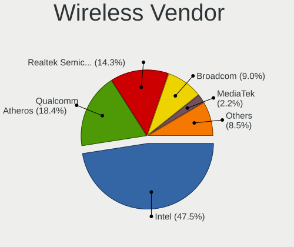

| Vendor                          | Notebooks | Percent |
|---------------------------------|-----------|---------|
| Intel                           | 454       | 47.54%  |
| Qualcomm Atheros                | 176       | 18.43%  |
| Realtek Semiconductor           | 137       | 14.35%  |
| Broadcom                        | 86        | 9.01%   |
| MediaTek                        | 21        | 2.2%    |
| Broadcom Limited                | 14        | 1.47%   |
| Qualcomm                        | 13        | 1.36%   |
| TP-Link                         | 8         | 0.84%   |
| Ralink                          | 8         | 0.84%   |
| Sierra Wireless                 | 7         | 0.73%   |
| BUFFALO                         | 7         | 0.73%   |
| PLANEX                          | 5         | 0.52%   |
| Elecom                          | 5         | 0.52%   |
| Ralink Technology               | 3         | 0.31%   |
| Quectel Wireless Solutions      | 2         | 0.21%   |
| Qualcomm Atheros Communications | 2         | 0.21%   |
| D-Link                          | 2         | 0.21%   |
| Qualcomm Technologies           | 1         | 0.1%    |
| NetGear                         | 1         | 0.1%    |
| Logitec                         | 1         | 0.1%    |
| I-O Data Device                 | 1         | 0.1%    |
| Dell                            | 1         | 0.1%    |

Wireless Model
--------------

Wireless models

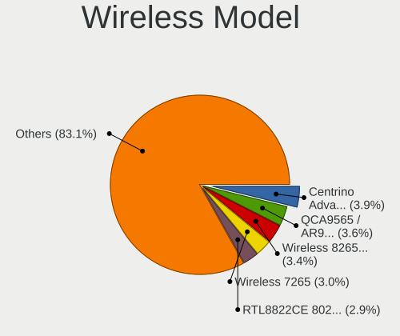

| Model                                                                   | Notebooks | Percent |
|-------------------------------------------------------------------------|-----------|---------|
| Intel Centrino Advanced-N 6205 [Taylor Peak]                            | 37        | 3.85%   |
| Qualcomm Atheros QCA9565 / AR9565 Wireless Network Adapter              | 35        | 3.65%   |
| Intel Wireless 8265 / 8275                                              | 33        | 3.44%   |
| Intel Wireless 7265                                                     | 29        | 3.02%   |
| Realtek RTL8822CE 802.11ac PCIe Wireless Network Adapter                | 28        | 2.92%   |
| Qualcomm Atheros AR9285 Wireless Network Adapter (PCI-Express)          | 28        | 2.92%   |
| Intel Wireless 7260                                                     | 27        | 2.81%   |
| Intel Wi-Fi 6 AX201                                                     | 25        | 2.6%    |
| Intel Wi-Fi 6 AX200                                                     | 25        | 2.6%    |
| Intel Wireless 8260                                                     | 22        | 2.29%   |
| Qualcomm Atheros QCA9377 802.11ac Wireless Network Adapter              | 21        | 2.19%   |
| Intel Comet Lake PCH-LP CNVi WiFi                                       | 20        | 2.08%   |
| Intel Wireless 3165                                                     | 18        | 1.88%   |
| Intel Alder Lake-P PCH CNVi WiFi                                        | 18        | 1.88%   |
| Realtek RTL8821CE 802.11ac PCIe Wireless Network Adapter                | 17        | 1.77%   |
| Intel Wireless 3160                                                     | 16        | 1.67%   |
| Intel Comet Lake PCH CNVi WiFi                                          | 16        | 1.67%   |
| Qualcomm Atheros QCA6174 802.11ac Wireless Network Adapter              | 15        | 1.56%   |
| Qualcomm Atheros AR9462 Wireless Network Adapter                        | 15        | 1.56%   |
| Qualcomm Atheros AR242x / AR542x Wireless Network Adapter (PCI-Express) | 15        | 1.56%   |
| Intel Wi-Fi 6E(802.11ax) AX210/AX1675* 2x2 [Typhoon Peak]               | 15        | 1.56%   |
| Intel Raptor Lake PCH CNVi WiFi                                         | 14        | 1.46%   |
| Broadcom BCM4313 802.11bgn Wireless Network Adapter                     | 14        | 1.46%   |
| Realtek RTL8188CE 802.11b/g/n WiFi Adapter                              | 13        | 1.35%   |
| Qualcomm QCNFA765 Wireless Network Adapter                              | 13        | 1.35%   |
| MediaTek MT7921 802.11ax PCIe Wireless Network Adapter [Filogic 330]    | 13        | 1.35%   |
| Qualcomm Atheros AR9485 Wireless Network Adapter                        | 12        | 1.25%   |
| Qualcomm Atheros AR928X Wireless Network Adapter (PCI-Express)          | 12        | 1.25%   |
| Intel Centrino Advanced-N + WiMAX 6250 [Kilmer Peak]                    | 12        | 1.25%   |
| Realtek RTL8852BE PCIe 802.11ax Wireless Network Controller             | 11        | 1.15%   |
| Realtek RTL8723BE PCIe Wireless Network Adapter                         | 11        | 1.15%   |
| Qualcomm Atheros AR93xx Wireless Network Adapter                        | 11        | 1.15%   |
| Intel Cannon Point-LP CNVi [Wireless-AC]                                | 11        | 1.15%   |
| Realtek RTL8191SEvB Wireless LAN Controller                             | 10        | 1.04%   |
| Intel Centrino Wireless-N 1000 [Condor Peak]                            | 10        | 1.04%   |
| Intel Cannon Lake PCH CNVi WiFi                                         | 10        | 1.04%   |
| Qualcomm Atheros AR9287 Wireless Network Adapter (PCI-Express)          | 9         | 0.94%   |
| Broadcom BCM4377b Wireless Network Adapter                              | 9         | 0.94%   |
| Broadcom BCM4364 802.11ac Wireless Network Adapter                      | 9         | 0.94%   |
| Intel WiFi Link 5100                                                    | 8         | 0.83%   |

Ethernet Vendor
---------------

Ethernet vendors

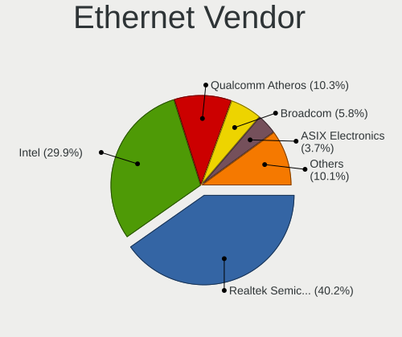

| Vendor                                 | Notebooks | Percent |
|----------------------------------------|-----------|---------|
| Realtek Semiconductor                  | 328       | 40.25%  |
| Intel                                  | 244       | 29.94%  |
| Qualcomm Atheros                       | 84        | 10.31%  |
| Broadcom                               | 47        | 5.77%   |
| ASIX Electronics                       | 30        | 3.68%   |
| Marvell Technology Group               | 27        | 3.31%   |
| Apple                                  | 12        | 1.47%   |
| MediaTek                               | 8         | 0.98%   |
| Broadcom Limited                       | 5         | 0.61%   |
| Nvidia                                 | 4         | 0.49%   |
| Huawei Technologies                    | 4         | 0.49%   |
| Lenovo                                 | 3         | 0.37%   |
| Xiaomi                                 | 2         | 0.25%   |
| Suzhou Motorcomm Electronic Technology | 2         | 0.25%   |
| Google                                 | 2         | 0.25%   |
| DisplayLink                            | 2         | 0.25%   |
| ZTE WCDMA Technologies MSM             | 1         | 0.12%   |
| Sony Ericsson Mobile Communications AB | 1         | 0.12%   |
| Samsung Electronics                    | 1         | 0.12%   |
| Qualcomm Technologies                  | 1         | 0.12%   |
| QNAP System                            | 1         | 0.12%   |
| OPPO Electronics                       | 1         | 0.12%   |
| JMicron Technology                     | 1         | 0.12%   |
| ICS Advent                             | 1         | 0.12%   |
| Gemtek                                 | 1         | 0.12%   |
| Elecom                                 | 1         | 0.12%   |
| Aquantia                               | 1         | 0.12%   |

Ethernet Model
--------------

Ethernet models

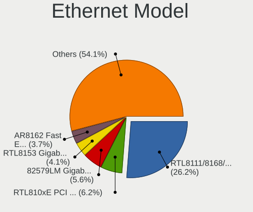

| Model                                                                  | Notebooks | Percent |
|------------------------------------------------------------------------|-----------|---------|
| Realtek RTL8111/8168/8211/8411 PCI Express Gigabit Ethernet Controller | 219       | 26.23%  |
| Realtek RTL810xE PCI Express Fast Ethernet controller                  | 52        | 6.23%   |
| Intel 82579LM Gigabit Network Connection (Lewisville)                  | 47        | 5.63%   |
| Realtek RTL8153 Gigabit Ethernet Adapter                               | 34        | 4.07%   |
| Qualcomm Atheros AR8162 Fast Ethernet                                  | 31        | 3.71%   |
| ASIX AX88179 Gigabit Ethernet                                          | 24        | 2.87%   |
| Intel 82579V Gigabit Network Connection                                | 23        | 2.75%   |
| Intel Ethernet Connection (4) I219-V                                   | 13        | 1.56%   |
| Intel Ethernet Connection I219-V                                       | 12        | 1.44%   |
| Intel Ethernet Connection (3) I218-LM                                  | 11        | 1.32%   |
| Apple iBridge                                                          | 11        | 1.32%   |
| Qualcomm Atheros AR8152 v2.0 Fast Ethernet                             | 10        | 1.2%    |
| Intel Ethernet Connection (4) I219-LM                                  | 10        | 1.2%    |
| Intel 82577LC Gigabit Network Connection                               | 10        | 1.2%    |
| Qualcomm Atheros AR8151 v2.0 Gigabit Ethernet                          | 9         | 1.08%   |
| Intel Ethernet Connection I219-LM                                      | 9         | 1.08%   |
| MediaTek MT7922 802.11ax PCI Express Wireless Network Adapter          | 8         | 0.96%   |
| Marvell Group 88E8055 PCI-E Gigabit Ethernet Controller                | 8         | 0.96%   |
| Intel WiMAX Connection 2400m                                           | 8         | 0.96%   |
| Intel Ethernet Connection (13) I219-V                                  | 8         | 0.96%   |
| Intel Ethernet Connection (10) I219-V                                  | 8         | 0.96%   |
| Realtek RTL8125 2.5GbE Controller                                      | 7         | 0.84%   |
| Qualcomm Atheros QCA8172 Fast Ethernet                                 | 7         | 0.84%   |
| Marvell Group 88E8040 PCI-E Fast Ethernet Controller                   | 7         | 0.84%   |
| Intel Ethernet Connection I217-V                                       | 7         | 0.84%   |
| Intel Ethernet Connection (6) I219-V                                   | 7         | 0.84%   |
| Intel 82577LM Gigabit Network Connection                               | 7         | 0.84%   |
| Intel 82567LM Gigabit Network Connection                               | 7         | 0.84%   |
| Broadcom NetXtreme BCM57765 Gigabit Ethernet PCIe                      | 7         | 0.84%   |
| Broadcom NetLink BCM57785 Gigabit Ethernet PCIe                        | 7         | 0.84%   |
| Broadcom NetLink BCM5784M Gigabit Ethernet PCIe                        | 6         | 0.72%   |
| Broadcom NetLink BCM57780 Gigabit Ethernet PCIe                        | 6         | 0.72%   |
| ASIX AX88772                                                           | 6         | 0.72%   |
| Realtek RTL8152 Fast Ethernet Adapter                                  | 5         | 0.6%    |
| Realtek Killer E2600 GbE Controller                                    | 5         | 0.6%    |
| Qualcomm Atheros AR8161 Gigabit Ethernet                               | 5         | 0.6%    |
| Intel Ethernet Connection I218-LM                                      | 5         | 0.6%    |
| Broadcom NetLink BCM5906M Fast Ethernet PCI Express                    | 5         | 0.6%    |
| Realtek RTL-8100/8101L/8139 PCI Fast Ethernet Adapter                  | 4         | 0.48%   |
| Qualcomm Atheros Killer E220x Gigabit Ethernet Controller              | 4         | 0.48%   |

Net Controller Kind
-------------------

Ethernet, WiFi or modem

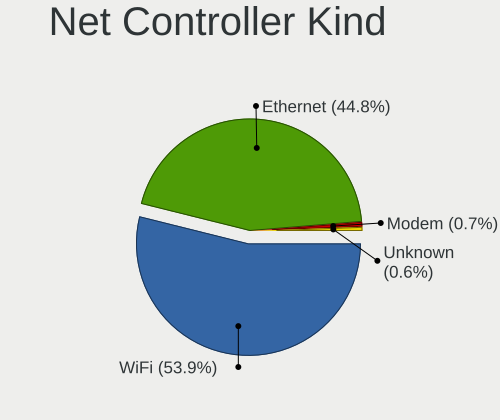

| Kind     | Notebooks | Percent |
|----------|-----------|---------|
| WiFi     | 908       | 53.89%  |
| Ethernet | 755       | 44.81%  |
| Modem    | 12        | 0.71%   |
| Unknown  | 10        | 0.59%   |

Used Controller
---------------

Currently used network controller

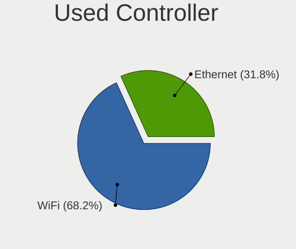

| Kind     | Notebooks | Percent |
|----------|-----------|---------|
| WiFi     | 679       | 68.24%  |
| Ethernet | 316       | 31.76%  |

NICs
----

Total network controllers on board

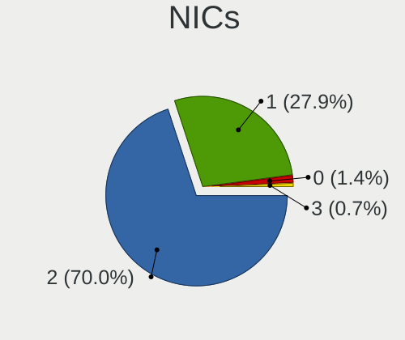

| Total | Notebooks | Percent |
|-------|-----------|---------|
| 2     | 666       | 69.96%  |
| 1     | 266       | 27.94%  |
| 0     | 13        | 1.37%   |
| 3     | 7         | 0.74%   |

IPv6
----

IPv6 vs IPv4

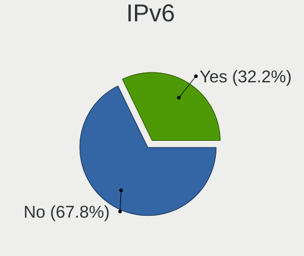

| Used | Notebooks | Percent |
|------|-----------|---------|
| No   | 661       | 67.79%  |
| Yes  | 314       | 32.21%  |

Bluetooth
---------

Bluetooth Vendor
----------------

Controller vendors

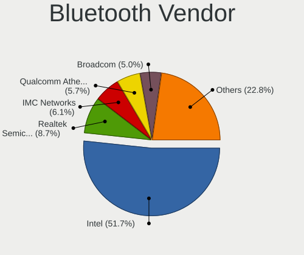

| Vendor                          | Notebooks | Percent |
|---------------------------------|-----------|---------|
| Intel                           | 338       | 51.68%  |
| Realtek Semiconductor           | 57        | 8.72%   |
| IMC Networks                    | 40        | 6.12%   |
| Qualcomm Atheros Communications | 37        | 5.66%   |
| Broadcom                        | 33        | 5.05%   |
| Foxconn / Hon Hai               | 30        | 4.59%   |
| Apple                           | 26        | 3.98%   |
| Cambridge Silicon Radio         | 20        | 3.06%   |
| Fujitsu                         | 11        | 1.68%   |
| USI                             | 9         | 1.38%   |
| Lite-On Technology              | 9         | 1.38%   |
| Realtek                         | 7         | 1.07%   |
| Alps Electric                   | 7         | 1.07%   |
| Toshiba                         | 5         | 0.76%   |
| MediaTek                        | 4         | 0.61%   |
| Hewlett-Packard                 | 4         | 0.61%   |
| ASUSTek Computer                | 4         | 0.61%   |
| Ralink                          | 2         | 0.31%   |
| Opticis                         | 2         | 0.31%   |
| Dell                            | 2         | 0.31%   |
| TP-Link                         | 1         | 0.15%   |
| Taiyo Yuden                     | 1         | 0.15%   |
| Ralink Technology               | 1         | 0.15%   |
| Chicony Electronics             | 1         | 0.15%   |
| BUFFALO                         | 1         | 0.15%   |
| Askey Computer                  | 1         | 0.15%   |
| 8BitDo                          | 1         | 0.15%   |

Bluetooth Model
---------------

Controller models

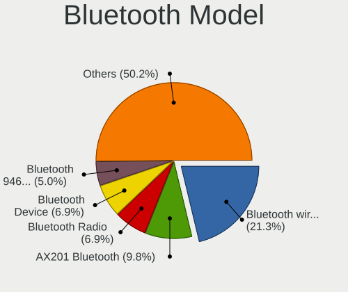

| Model                                                                               | Notebooks | Percent |
|-------------------------------------------------------------------------------------|-----------|---------|
| Intel Bluetooth wireless interface                                                  | 139       | 21.25%  |
| Intel AX201 Bluetooth                                                               | 64        | 9.79%   |
| Realtek Bluetooth Radio                                                             | 45        | 6.88%   |
| Intel Bluetooth Device                                                              | 45        | 6.88%   |
| Intel Bluetooth 9460/9560 Jefferson Peak (JfP)                                      | 33        | 5.05%   |
| Intel AX200 Bluetooth                                                               | 24        | 3.67%   |
| Cambridge Silicon Radio Bluetooth Dongle (HCI mode)                                 | 20        | 3.06%   |
| Qualcomm Atheros  Bluetooth Device                                                  | 18        | 2.75%   |
| IMC Networks Bluetooth Radio                                                        | 16        | 2.45%   |
| Intel AX210 Bluetooth                                                               | 14        | 2.14%   |
| IMC Networks Wireless_Device                                                        | 14        | 2.14%   |
| Apple Bluetooth Host Controller                                                     | 14        | 2.14%   |
| Broadcom BCM20702 Bluetooth 4.0 [ThinkPad]                                          | 10        | 1.53%   |
| USI Bluetooth Device                                                                | 9         | 1.38%   |
| Fujitsu Bluetooth Device                                                            | 9         | 1.38%   |
| Apple Bluetooth USB Host Controller                                                 | 9         | 1.38%   |
| Foxconn / Hon Hai Bluetooth Device                                                  | 8         | 1.22%   |
| Realtek Bluetooth Radio                                                             | 7         | 1.07%   |
| Qualcomm Atheros QCA61x4 Bluetooth 4.0                                              | 7         | 1.07%   |
| IMC Networks Bluetooth Device                                                       | 7         | 1.07%   |
| Intel Wireless-AC 9260 Bluetooth Adapter                                            | 6         | 0.92%   |
| Intel Wireless-AC 3168 Bluetooth                                                    | 6         | 0.92%   |
| Foxconn / Hon Hai Wireless_Device                                                   | 6         | 0.92%   |
| Broadcom BCM2045B (BDC-2.1)                                                         | 6         | 0.92%   |
| Realtek  Bluetooth 4.2 Adapter                                                      | 5         | 0.76%   |
| Qualcomm Atheros AR3012 Bluetooth 4.0                                               | 5         | 0.76%   |
| Intel Centrino Bluetooth Wireless Transceiver                                       | 5         | 0.76%   |
| Foxconn / Hon Hai MediaTek Bluetooth Adapter                                        | 5         | 0.76%   |
| Foxconn / Hon Hai Foxconn T77H114 BCM2070 [Single-Chip Bluetooth 2.1 + EDR Adapter] | 5         | 0.76%   |
| Toshiba Atheros AR3012 Bluetooth                                                    | 4         | 0.61%   |
| Realtek RTL8723B Bluetooth                                                          | 4         | 0.61%   |
| Qualcomm Atheros AR3011 Bluetooth                                                   | 4         | 0.61%   |
| MediaTek Wireless_Device                                                            | 4         | 0.61%   |
| Qualcomm Atheros AR9462 Bluetooth                                                   | 3         | 0.46%   |
| Lite-On Qualcomm Atheros QCA9377 Bluetooth                                          | 3         | 0.46%   |
| HP Broadcom 2070 Bluetooth Combo                                                    | 3         | 0.46%   |
| Broadcom BCM2070 Bluetooth 2.1 + EDR                                                | 3         | 0.46%   |
| Broadcom BCM2045B (BDC-2.1) [Bluetooth Controller]                                  | 3         | 0.46%   |
| Broadcom BCM2045B (BDC-2) [Bluetooth Controller]                                    | 3         | 0.46%   |
| ASUS Broadcom Bluetooth 2.1                                                         | 3         | 0.46%   |

Sound
-----

Sound Vendor
------------

Sound card vendors

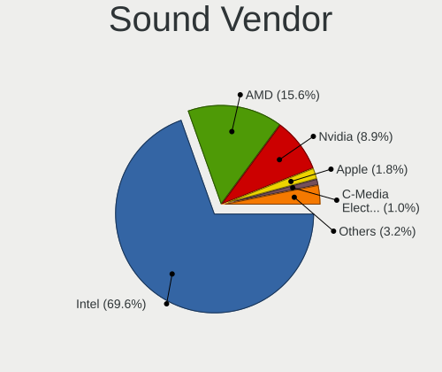

| Vendor                                       | Notebooks | Percent |
|----------------------------------------------|-----------|---------|
| Intel                                        | 768       | 69.57%  |
| AMD                                          | 172       | 15.58%  |
| Nvidia                                       | 98        | 8.88%   |
| Apple                                        | 20        | 1.81%   |
| C-Media Electronics                          | 11        | 1%      |
| Creative Technology                          | 4         | 0.36%   |
| Lenovo                                       | 3         | 0.27%   |
| Yamaha                                       | 2         | 0.18%   |
| VIA Technologies                             | 2         | 0.18%   |
| Sony                                         | 2         | 0.18%   |
| Realtek Semiconductor                        | 2         | 0.18%   |
| Elitegroup Computer Systems (ECS)            | 2         | 0.18%   |
| Zoran Co. Personal Media Division (Nogatech) | 1         | 0.09%   |
| Xiaomi                                       | 1         | 0.09%   |
| Texas Instruments                            | 1         | 0.09%   |
| Roland                                       | 1         | 0.09%   |
| PC Mic                                       | 1         | 0.09%   |
| M2Tech                                       | 1         | 0.09%   |
| M-Audio                                      | 1         | 0.09%   |
| KTMICRO                                      | 1         | 0.09%   |
| JMTek                                        | 1         | 0.09%   |
| iCreate Technologies                         | 1         | 0.09%   |
| HECATE G4 TE GAMING HEADSET                  | 1         | 0.09%   |
| Generalplus Technology                       | 1         | 0.09%   |
| ESI Audiotechnik                             | 1         | 0.09%   |
| Corsair                                      | 1         | 0.09%   |
| CMX Systems                                  | 1         | 0.09%   |
| Cambridge Silicon Radio                      | 1         | 0.09%   |
| Arturia                                      | 1         | 0.09%   |
| Unknown                                      | 1         | 0.09%   |

Sound Model
-----------

Sound card models

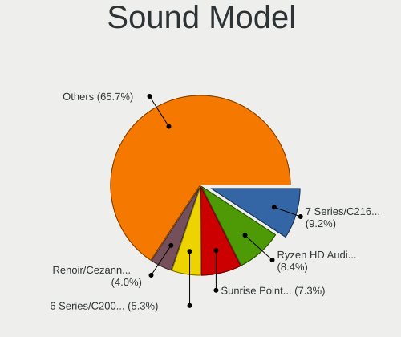

| Model                                                                                             | Notebooks | Percent |
|---------------------------------------------------------------------------------------------------|-----------|---------|
| Intel 7 Series/C216 Chipset Family High Definition Audio Controller                               | 123       | 9.21%   |
| AMD Ryzen HD Audio Controller                                                                     | 112       | 8.38%   |
| Intel Sunrise Point-LP HD Audio                                                                   | 98        | 7.34%   |
| Intel 6 Series/C200 Series Chipset Family High Definition Audio Controller                        | 71        | 5.31%   |
| AMD Renoir/Cezanne HDMI/DP Audio Controller                                                       | 54        | 4.04%   |
| Intel 5 Series/3400 Series Chipset High Definition Audio                                          | 48        | 3.59%   |
| Intel 82801I (ICH9 Family) HD Audio Controller                                                    | 42        | 3.14%   |
| AMD Radeon High Definition Audio Controller                                                       | 39        | 2.92%   |
| Intel Wildcat Point-LP High Definition Audio Controller                                           | 38        | 2.84%   |
| Intel Broadwell-U Audio Controller                                                                | 38        | 2.84%   |
| Intel 8 Series/C220 Series Chipset High Definition Audio Controller                               | 35        | 2.62%   |
| Intel Tiger Lake-LP Smart Sound Technology Audio Controller                                       | 29        | 2.17%   |
| Intel Xeon E3-1200 v3/4th Gen Core Processor HD Audio Controller                                  | 27        | 2.02%   |
| Intel Cannon Point-LP High Definition Audio Controller                                            | 26        | 1.95%   |
| Intel 8 Series HD Audio Controller                                                                | 26        | 1.95%   |
| Intel Haswell-ULT HD Audio Controller                                                             | 25        | 1.87%   |
| Intel Comet Lake PCH-LP cAVS                                                                      | 25        | 1.87%   |
| Intel Alder Lake PCH-P High Definition Audio Controller                                           | 25        | 1.87%   |
| AMD Raven/Raven2/Fenghuang HDMI/DP Audio Controller                                               | 22        | 1.65%   |
| Intel NM10/ICH7 Family High Definition Audio Controller                                           | 21        | 1.57%   |
| Apple Audio Device                                                                                | 19        | 1.42%   |
| Intel Comet Lake PCH cAVS                                                                         | 18        | 1.35%   |
| Intel Cannon Lake PCH cAVS                                                                        | 18        | 1.35%   |
| Intel Raptor Lake-P/U/H cAVS                                                                      | 17        | 1.27%   |
| Intel 82801H (ICH8 Family) HD Audio Controller                                                    | 17        | 1.27%   |
| AMD FCH Azalia Controller                                                                         | 16        | 1.2%    |
| Nvidia TU107 GeForce GTX 1650 High Definition Audio Controller                                    | 14        | 1.05%   |
| AMD SBx00 Azalia (Intel HDA)                                                                      | 14        | 1.05%   |
| Intel Ice Lake-LP Smart Sound Technology Audio Controller                                         | 12        | 0.9%    |
| Intel Atom/Celeron/Pentium Processor x5-E8000/J3xxx/N3xxx Series High Definition Audio Controller | 11        | 0.82%   |
| AMD Kabini HDMI/DP Audio                                                                          | 11        | 0.82%   |
| Nvidia GA104 High Definition Audio Controller                                                     | 10        | 0.75%   |
| Intel Tiger Lake-H HD Audio Controller                                                            | 9         | 0.67%   |
| Nvidia TU106 High Definition Audio Controller                                                     | 8         | 0.6%    |
| Nvidia GA107 High Definition Audio Controller                                                     | 7         | 0.52%   |
| Intel Meteor Lake-P HD Audio Controller                                                           | 7         | 0.52%   |
| Intel Celeron N3350/Pentium N4200/Atom E3900 Series Audio Cluster                                 | 7         | 0.52%   |
| Intel Atom Processor Z36xxx/Z37xxx Series High Definition Audio Controller                        | 7         | 0.52%   |
| Nvidia TU116 High Definition Audio Controller                                                     | 6         | 0.45%   |
| Nvidia AD107 High Definition Audio Controller                                                     | 6         | 0.45%   |

Memory
------

Memory Vendor
-------------

Memory module vendors

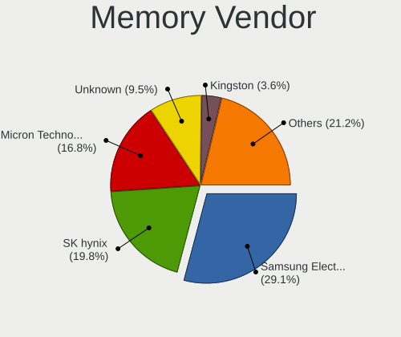

| Vendor                     | Notebooks | Percent |
|----------------------------|-----------|---------|
| Samsung Electronics        | 203       | 29.12%  |
| SK hynix                   | 138       | 19.8%   |
| Micron Technology          | 117       | 16.79%  |
| Unknown                    | 66        | 9.47%   |
| Kingston                   | 25        | 3.59%   |
| Crucial                    | 25        | 3.59%   |
| Unknown                    | 15        | 2.15%   |
| A-DATA Technology          | 12        | 1.72%   |
| Elpida                     | 11        | 1.58%   |
| Ramaxel Technology         | 10        | 1.43%   |
| Nanya Technology           | 10        | 1.43%   |
| Unknown (ABCD)             | 7         | 1%      |
| Team                       | 7         | 1%      |
| Silicon Power              | 7         | 1%      |
| SanMax                     | 5         | 0.72%   |
| Transcend                  | 4         | 0.57%   |
| Patriot                    | 3         | 0.43%   |
| Corsair                    | 3         | 0.43%   |
| CFD                        | 3         | 0.43%   |
| Unknown (0x0DEC)           | 2         | 0.29%   |
| Toshiba                    | 2         | 0.29%   |
| ASint Technology           | 2         | 0.29%   |
| Unknown (0xD306)           | 1         | 0.14%   |
| Unknown (0x0E2A)           | 1         | 0.14%   |
| Unknown (08C8)             | 1         | 0.14%   |
| Shenzhen Jinge Information | 1         | 0.14%   |
| SHARETRONIC                | 1         | 0.14%   |
| Neo Forza                  | 1         | 0.14%   |
| Melco                      | 1         | 0.14%   |
| Lexar                      | 1         | 0.14%   |
| KLEVV                      | 1         | 0.14%   |
| Gowe                       | 1         | 0.14%   |
| Goldkey                    | 1         | 0.14%   |
| G.Skill                    | 1         | 0.14%   |
| EUDAR                      | 1         | 0.14%   |
| Essencore                  | 1         | 0.14%   |
| CUSO                       | 1         | 0.14%   |
| ChangXin Memory            | 1         | 0.14%   |
| BUFFALO                    | 1         | 0.14%   |
| Advantech                  | 1         | 0.14%   |

Memory Model
------------

Memory module models

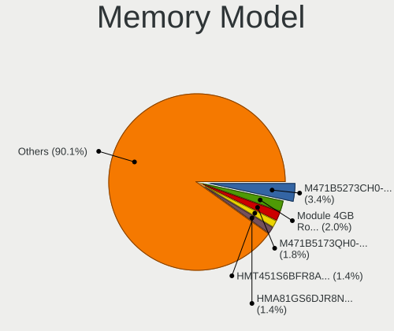

| Model                                                            | Notebooks | Percent |
|------------------------------------------------------------------|-----------|---------|
| Samsung RAM M471B5273CH0-CK0 4GB SODIMM DDR3 1600MT/s            | 25        | 3.39%   |
| Unknown                                                          | 15        | 2.04%   |
| Samsung RAM M471B5173QH0-YK0 4GB SODIMM DDR3 1600MT/s            | 13        | 1.76%   |
| SK hynix RAM HMT451S6BFR8A-PB 4GB SODIMM DDR3 1600MT/s           | 10        | 1.36%   |
| SK hynix RAM HMA81GS6DJR8N-XN 8GB SODIMM DDR4 3200MT/s           | 10        | 1.36%   |
| Samsung RAM M471B5273DH0-CH9 4GB SODIMM DDR3 1600MT/s            | 9         | 1.22%   |
| Micron RAM MT53E512M64D4NW-053 4GB Row Of Chips LPDDR4 3733MT/s  | 9         | 1.22%   |
| Samsung RAM M471B5173EB0-YK0 4GB SODIMM DDR3 1600MT/s            | 8         | 1.09%   |
| Samsung RAM M471B5273CH0-CH9 4GB SODIMM DDR3 1334MT/s            | 7         | 0.95%   |
| SK hynix RAM HMT451S6AFR8A-PB 4GB SODIMM DDR3 1600MT/s           | 5         | 0.68%   |
| SK hynix RAM HMT351S6CFR8C-PB 4GB SODIMM DDR3 1600MT/s           | 5         | 0.68%   |
| SK hynix RAM HMAA1GS6CJR6N-XN 8GB SODIMM DDR4 3200MT/s           | 5         | 0.68%   |
| Samsung RAM M471B5773CHS-CH9 2GB SODIMM DDR3 4199MT/s            | 5         | 0.68%   |
| Samsung RAM M471B1G73DB0-YK0 8GB SODIMM DDR3 1600MT/s            | 5         | 0.68%   |
| Samsung RAM M471A2K43DB1-CWE 16GB SODIMM DDR4 3200MT/s           | 5         | 0.68%   |
| Samsung RAM M471A1K43CB1-CRC 8GB SODIMM DDR4 8400MT/s            | 5         | 0.68%   |
| Samsung RAM M471A1G44AB0-CWE 8GiB SODIMM DDR4 3200MT/s           | 5         | 0.68%   |
| Micron RAM MT62F1G32D4DR-031B 2GB Row Of Chips LPDDR5 6400MT/s   | 5         | 0.68%   |
| Micron RAM 8KTF51264HZ-1G6E1 4GB SODIMM DDR3 1600MT/s            | 5         | 0.68%   |
| Micron RAM 8ATF1G64HZ-3G2J1 8GB SODIMM DDR4 3200MT/s             | 5         | 0.68%   |
| Unknown RAM Module 4GB SODIMM DDR3                               | 4         | 0.54%   |
| Unknown (ABCD) RAM 123456789012345678 2GB DIMM LPDDR4 2133MT/s   | 4         | 0.54%   |
| Team RAM TEAMGROUP-SD3-1600 8GB SODIMM DDR3 1600MT/s             | 4         | 0.54%   |
| SK hynix RAM HMT325S6CFR8C-PB 2GB SODIMM DDR3 1600MT/s           | 4         | 0.54%   |
| SK hynix RAM HMCG78AGBSA095N 16GB SODIMM DDR5 5600MT/s           | 4         | 0.54%   |
| SK hynix RAM HMA851S6JJR6N-VK 4GB SODIMM DDR4 2667MT/s           | 4         | 0.54%   |
| Samsung RAM M471B5173DB0-YK0 4GB SODIMM DDR3 1600MT/s            | 4         | 0.54%   |
| Samsung RAM M471A1G44AB0-CWE 8GB Row Of Chips DDR4 3200MT/s      | 4         | 0.54%   |
| Samsung RAM M471A1G44AB0-CTD 8GB SODIMM DDR4 2667MT/s            | 4         | 0.54%   |
| Micron RAM MT62F2G32D4DS-026 WT 8GiB SODIMM LPDDR5 7500MT/s      | 4         | 0.54%   |
| Micron RAM 4ATF51264HZ-2G6E1 4GB SODIMM DDR4 2667MT/s            | 4         | 0.54%   |
| Micron RAM 4ATF1G64HZ-3G2E1 8GB SODIMM DDR4 3200MT/s             | 4         | 0.54%   |
| Unknown RAM Module 8GB SODIMM DDR4 3200MT/s                      | 3         | 0.41%   |
| Unknown RAM Module 4GB SODIMM DDR3 1600MT/s                      | 3         | 0.41%   |
| Unknown RAM Module 2GB SODIMM DDR2 667MT/s                       | 3         | 0.41%   |
| Unknown RAM Module 2GB SODIMM DDR2 333MT/s                       | 3         | 0.41%   |
| Unknown RAM Module 2GB SODIMM DDR2                               | 3         | 0.41%   |
| Unknown RAM Module 2048MB SODIMM DDR2 667MT/s                    | 3         | 0.41%   |
| Unknown (ABCD) RAM 123456789012345678 2GB SODIMM LPDDR4 2400MT/s | 3         | 0.41%   |
| SK hynix RAM Module 4GB SODIMM DDR3 1600MT/s                     | 3         | 0.41%   |

Memory Kind
-----------

Memory module kinds

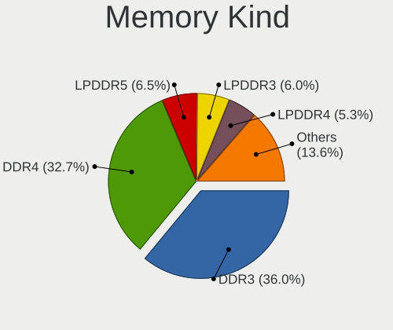

| Kind    | Notebooks | Percent |
|---------|-----------|---------|
| DDR3    | 217       | 35.99%  |
| DDR4    | 197       | 32.67%  |
| LPDDR5  | 39        | 6.47%   |
| LPDDR3  | 36        | 5.97%   |
| LPDDR4  | 32        | 5.31%   |
| DDR2    | 30        | 4.98%   |
| DDR5    | 29        | 4.81%   |
| SDRAM   | 12        | 1.99%   |
| Unknown | 8         | 1.33%   |
| DRAM    | 2         | 0.33%   |
| DDR     | 1         | 0.17%   |

Memory Form Factor
------------------

Physical design of the memory module

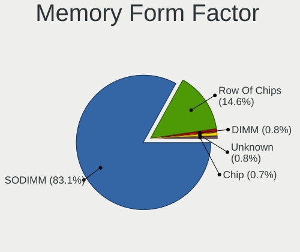

| Name         | Notebooks | Percent |
|--------------|-----------|---------|
| SODIMM       | 500       | 83.06%  |
| Row Of Chips | 88        | 14.62%  |
| DIMM         | 5         | 0.83%   |
| Unknown      | 5         | 0.83%   |
| Chip         | 4         | 0.66%   |

Memory Size
-----------

Memory module size

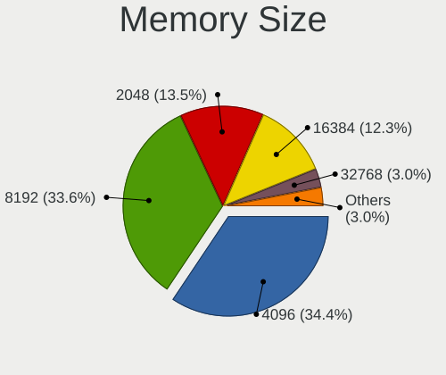

| Size  | Notebooks | Percent |
|-------|-----------|---------|
| 4096  | 226       | 34.4%   |
| 8192  | 221       | 33.64%  |
| 2048  | 89        | 13.55%  |
| 16384 | 81        | 12.33%  |
| 32768 | 20        | 3.04%   |
| 1024  | 18        | 2.74%   |
| 512   | 1         | 0.15%   |
| 256   | 1         | 0.15%   |

Memory Speed
------------

Memory module speed

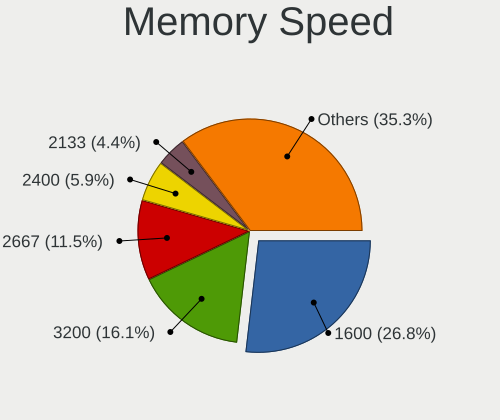

| Speed   | Notebooks | Percent |
|---------|-----------|---------|
| 1600    | 172       | 26.83%  |
| 3200    | 103       | 16.07%  |
| 2667    | 74        | 11.54%  |
| 2400    | 38        | 5.93%   |
| 2133    | 28        | 4.37%   |
| 1334    | 23        | 3.59%   |
| 6400    | 20        | 3.12%   |
| 5600    | 18        | 2.81%   |
| 1067    | 18        | 2.81%   |
| Unknown | 15        | 2.34%   |
| 4800    | 14        | 2.18%   |
| 1333    | 14        | 2.18%   |
| 4199    | 11        | 1.72%   |
| 3733    | 11        | 1.72%   |
| 7500    | 10        | 1.56%   |
| 1867    | 9         | 1.4%    |
| 4267    | 8         | 1.25%   |
| 667     | 8         | 1.25%   |
| 1066    | 7         | 1.09%   |
| 8533    | 5         | 0.78%   |
| 8400    | 5         | 0.78%   |
| 800     | 5         | 0.78%   |
| 7467    | 3         | 0.47%   |
| 975     | 3         | 0.47%   |
| 533     | 3         | 0.47%   |
| 333     | 3         | 0.47%   |
| 4266    | 2         | 0.31%   |
| 3266    | 2         | 0.31%   |
| 1866    | 2         | 0.31%   |
| 400     | 2         | 0.31%   |
| 266     | 2         | 0.31%   |
| 8000    | 1         | 0.16%   |
| 2933    | 1         | 0.16%   |
| 100     | 1         | 0.16%   |

Printers & scanners
-------------------

Printer Vendor
--------------

Printer device vendors

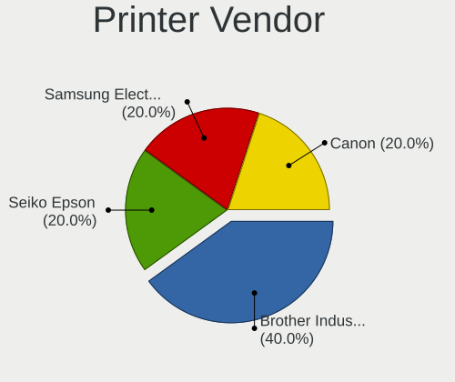

| Vendor              | Notebooks | Percent |
|---------------------|-----------|---------|
| Brother Industries  | 2         | 40%     |
| Seiko Epson         | 1         | 20%     |
| Samsung Electronics | 1         | 20%     |
| Canon               | 1         | 20%     |

Printer Model
-------------

Printer device models

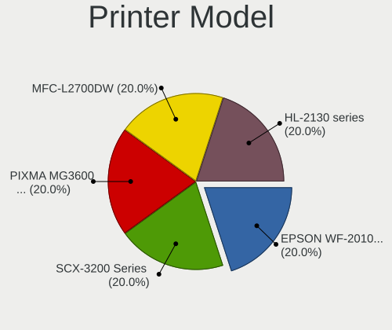

| Model                            | Notebooks | Percent |
|----------------------------------|-----------|---------|
| Seiko Epson EPSON WF-2010 Series | 1         | 20%     |
| Samsung SCX-3200 Series          | 1         | 20%     |
| Canon PIXMA MG3600 Series        | 1         | 20%     |
| Brother MFC-L2700DW              | 1         | 20%     |
| Brother HL-2130 series           | 1         | 20%     |

Scanner Vendor
--------------

Scanner device vendors

Zero info for selected period =(

Scanner Model
-------------

Scanner device models

Zero info for selected period =(

Camera
------

Camera Vendor
-------------

Camera device vendors

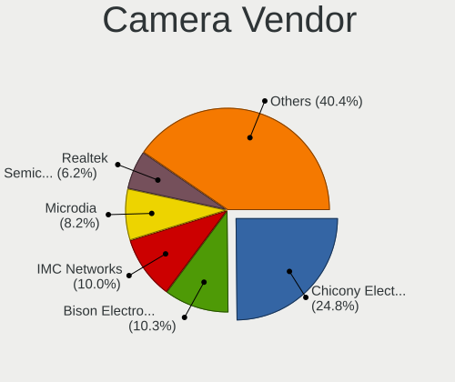

| Vendor                                 | Notebooks | Percent |
|----------------------------------------|-----------|---------|
| Chicony Electronics                    | 161       | 24.85%  |
| Bison Electronics                      | 67        | 10.34%  |
| IMC Networks                           | 65        | 10.03%  |
| Microdia                               | 53        | 8.18%   |
| Realtek Semiconductor                  | 40        | 6.17%   |
| Sunplus Innovation Technology          | 36        | 5.56%   |
| Apple                                  | 26        | 4.01%   |
| Quanta                                 | 23        | 3.55%   |
| Cheng Uei Precision Industry (Foxlink) | 21        | 3.24%   |
| Suyin                                  | 20        | 3.09%   |
| Syntek                                 | 18        | 2.78%   |
| Luxvisions Innotech Limited            | 15        | 2.31%   |
| Acer                                   | 12        | 1.85%   |
| Lite-On Technology                     | 9         | 1.39%   |
| Ricoh                                  | 8         | 1.23%   |
| Importek                               | 7         | 1.08%   |
| Alcor Micro                            | 7         | 1.08%   |
| Sonix Technology                       | 6         | 0.93%   |
| Silicon Motion                         | 6         | 0.93%   |
| Shinetech                              | 6         | 0.93%   |
| SunplusIT                              | 5         | 0.77%   |
| BUFFALO                                | 5         | 0.77%   |
| Logitech                               | 4         | 0.62%   |
| Genesys Logic                          | 3         | 0.46%   |
| Shine-optics                           | 2         | 0.31%   |
| Samsung Electronics                    | 2         | 0.31%   |
| Oculus VR                              | 2         | 0.31%   |
| Lenovo                                 | 2         | 0.31%   |
| icSpring                               | 2         | 0.31%   |
| Z-Star Microelectronics                | 1         | 0.15%   |
| webcam                                 | 1         | 0.15%   |
| Unknown (3730304231393831325530)       | 1         | 0.15%   |
| Sunplus Technology                     | 1         | 0.15%   |
| Sony Ericsson Mobile Communications AB | 1         | 0.15%   |
| SenseTek                               | 1         | 0.15%   |
| Primax Electronics                     | 1         | 0.15%   |
| Omnivision                             | 1         | 0.15%   |
| Microsoft                              | 1         | 0.15%   |
| Intel                                  | 1         | 0.15%   |
| Hopewin Electronic Material            | 1         | 0.15%   |

Camera Model
------------

Camera device models

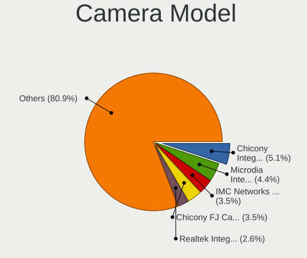

| Model                                         | Notebooks | Percent |
|-----------------------------------------------|-----------|---------|
| Chicony Integrated Camera                     | 33        | 5.05%   |
| Microdia Integrated_Webcam_HD                 | 29        | 4.44%   |
| IMC Networks Integrated Camera                | 23        | 3.52%   |
| Chicony FJ Camera                             | 23        | 3.52%   |
| Realtek Integrated_Webcam_HD                  | 17        | 2.6%    |
| Chicony TOSHIBA Web Camera - HD               | 13        | 1.99%   |
| Bison Integrated Camera                       | 12        | 1.84%   |
| Apple FaceTime HD Camera (Built-in)           | 12        | 1.84%   |
| IMC Networks USB2.0 HD UVC WebCam             | 10        | 1.53%   |
| Syntek Integrated Camera                      | 8         | 1.23%   |
| IMC Networks USB2.0 VGA UVC WebCam            | 8         | 1.23%   |
| Bison USB HD Webcam                           | 8         | 1.23%   |
| Acer USB HD Webcam                            | 8         | 1.23%   |
| Sunplus Integrated_Webcam_HD                  | 7         | 1.07%   |
| Lite-On Integrated Camera                     | 7         | 1.07%   |
| Apple FaceTime HD Camera                      | 7         | 1.07%   |
| Syntek Lenovo EasyCamera                      | 6         | 0.92%   |
| Luxvisions Innotech Limited Integrated Camera | 6         | 0.92%   |
| Chicony USB2.0 Camera                         | 6         | 0.92%   |
| Chicony NEC HD WebCam                         | 6         | 0.92%   |
| Chicony Chicony USB2.0 Camera                 | 6         | 0.92%   |
| Bison Lenovo EasyCamera                       | 6         | 0.92%   |
| Bison HD Webcam                               | 6         | 0.92%   |
| Sunplus HD WebCam                             | 5         | 0.77%   |
| Shinetech USB2.0 FHD UVC WebCam               | 5         | 0.77%   |
| Realtek Lenovo EasyCamera                     | 5         | 0.77%   |
| IMC Networks ov9734_azurewave_camera          | 5         | 0.77%   |
| Chicony USB 2.0 Camera                        | 5         | 0.77%   |
| Chicony HD WebCam                             | 5         | 0.77%   |
| BUFFALO USB 2.0 Camera                        | 5         | 0.77%   |
| Bison ThinkPad Integrated Camera              | 5         | 0.77%   |
| Bison SunplusIT Integrated Camera             | 5         | 0.77%   |
| Bison Lenovo Integrated Webcam                | 5         | 0.77%   |
| Suyin Integrated_Webcam_HD                    | 4         | 0.61%   |
| Sunplus Integrated_Webcam_FHD                 | 4         | 0.61%   |
| Sonix USB2.0 FHD UVC WebCam                   | 4         | 0.61%   |
| Quanta HD User Facing                         | 4         | 0.61%   |
| Microdia USB 2.0 Camera                       | 4         | 0.61%   |
| Microdia Integrated_Webcam_FHD                | 4         | 0.61%   |
| Microdia Integrated Webcam HD                 | 4         | 0.61%   |

Security
--------

Fingerprint Vendor
------------------

Fingerprint sensor vendors

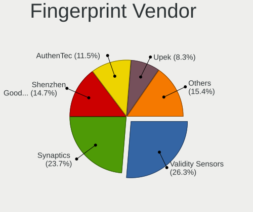

| Vendor                             | Notebooks | Percent |
|------------------------------------|-----------|---------|
| Validity Sensors                   | 41        | 26.28%  |
| Synaptics                          | 37        | 23.72%  |
| Shenzhen Goodix Technology         | 23        | 14.74%  |
| AuthenTec                          | 18        | 11.54%  |
| Upek                               | 13        | 8.33%   |
| Elan Microelectronics              | 9         | 5.77%   |
| STMicroelectronics                 | 5         | 3.21%   |
| LighTuning Technology              | 5         | 3.21%   |
| Realtek USB2.0 Finger Print Bridge | 3         | 1.92%   |
| HOLTEK                             | 1         | 0.64%   |
| Focal-systems.Corp                 | 1         | 0.64%   |

Fingerprint Model
-----------------

Fingerprint sensor models

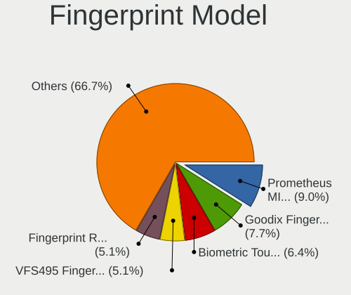

| Model                                                           | Notebooks | Percent |
|-----------------------------------------------------------------|-----------|---------|
| Synaptics Prometheus MIS Touch Fingerprint Reader               | 14        | 8.97%   |
| Shenzhen Goodix  Fingerprint Device                             | 12        | 7.69%   |
| Upek Biometric Touchchip/Touchstrip Fingerprint Sensor          | 10        | 6.41%   |
| Validity Sensors VFS495 Fingerprint Reader                      | 8         | 5.13%   |
| Shenzhen Goodix Fingerprint Reader                              | 8         | 5.13%   |
| Validity Sensors VFS 5011 fingerprint sensor                    | 7         | 4.49%   |
| Synaptics UWP WBDI Device                                       | 6         | 3.85%   |
| Synaptics Metallica MIS Touch Fingerprint Reader                | 6         | 3.85%   |
| AuthenTec Fingerprint Sensor                                    | 6         | 3.85%   |
| Validity Sensors Swipe Fingerprint Sensor                       | 5         | 3.21%   |
| Synaptics FS7604 Touch Fingerprint Sensor with PurePrint        | 5         | 3.21%   |
| STMicroelectronics Fingerprint Reader                           | 5         | 3.21%   |
| Elan ELAN:ARM-M4                                                | 5         | 3.21%   |
| AuthenTec AES2501 Fingerprint Sensor                            | 4         | 2.56%   |
| Validity Sensors VFS491                                         | 3         | 1.92%   |
| Validity Sensors VFS471 Fingerprint Reader                      | 3         | 1.92%   |
| Validity Sensors Synaptics WBDI                                 | 3         | 1.92%   |
| Upek TCS5B Fingerprint sensor                                   | 3         | 1.92%   |
| Shenzhen Goodix FingerPrint                                     | 3         | 1.92%   |
| Realtek USB2.0 Finger Print Bridge FocalTech Fingerprint Device | 3         | 1.92%   |
| Elan ELAN:Fingerprint                                           | 3         | 1.92%   |
| AuthenTec AES2810                                               | 3         | 1.92%   |
| AuthenTec AES1600                                               | 3         | 1.92%   |
| Validity Sensors VFS7552 Touch Fingerprint Sensor               | 2         | 1.28%   |
| Validity Sensors VFS7500 Touch Fingerprint Sensor               | 2         | 1.28%   |
| Validity Sensors VFS5011 Fingerprint Reader                     | 2         | 1.28%   |
| Validity Sensors VFS451 Fingerprint Reader                      | 2         | 1.28%   |
| Validity Sensors VFS301 Fingerprint Reader                      | 2         | 1.28%   |
| LighTuning ES603 Swipe Fingerprint Sensor                       | 2         | 1.28%   |
| LighTuning EgisTec Touch Fingerprint Sensor                     | 2         | 1.28%   |
| Validity Sensors VFS Fingerprint sensor                         | 1         | 0.64%   |
| Validity Sensors Fingerprint scanner                            | 1         | 0.64%   |
| Synaptics WBDI Device                                           | 1         | 0.64%   |
| Synaptics WBDI                                                  | 1         | 0.64%   |
| Synaptics  FS7604 Touch Fingerprint Sensor with PurePrint       | 1         | 0.64%   |
| Synaptics Prometheus Fingerprint Reader                         | 1         | 0.64%   |
| Synaptics Metallica MOH Touch Fingerprint Reader                | 1         | 0.64%   |
| LighTuning Fingerprint Reader                                   | 1         | 0.64%   |
| HOLTEK FocalTech Fingerprint Device                             | 1         | 0.64%   |
| Focal-systems.Corp FT9201Fingerprint.                           | 1         | 0.64%   |

Chipcard Vendor
---------------

Chipcard module vendors

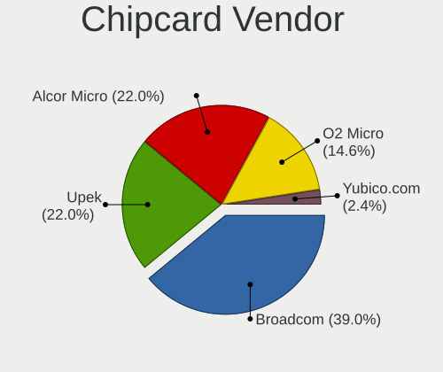

| Vendor      | Notebooks | Percent |
|-------------|-----------|---------|
| Broadcom    | 16        | 39.02%  |
| Upek        | 9         | 21.95%  |
| Alcor Micro | 9         | 21.95%  |
| O2 Micro    | 6         | 14.63%  |
| Yubico.com  | 1         | 2.44%   |

Chipcard Model
--------------

Chipcard module models

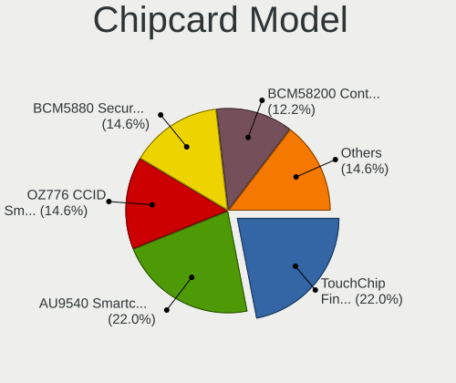

| Model                                                                        | Notebooks | Percent |
|------------------------------------------------------------------------------|-----------|---------|
| Upek TouchChip Fingerprint Coprocessor (WBF advanced mode)                   | 9         | 21.95%  |
| Alcor Micro AU9540 Smartcard Reader                                          | 9         | 21.95%  |
| O2 Micro OZ776 CCID Smartcard Reader                                         | 6         | 14.63%  |
| Broadcom BCM5880 Secure Applications Processor                               | 6         | 14.63%  |
| Broadcom BCM58200 ControlVault 3 (FingerPrint sensor + Contacted SmartCard)  | 5         | 12.2%   |
| Broadcom 5880                                                                | 3         | 7.32%   |
| Broadcom BCM5880 Secure Applications Processor with fingerprint swipe sensor | 2         | 4.88%   |
| Yubico.com Yubikey 4/5 U2F+CCID                                              | 1         | 2.44%   |

Unsupported
-----------

Unsupported Devices
-------------------

Total unsupported devices on board

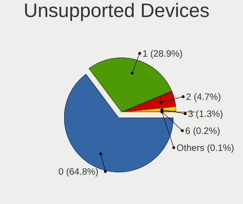

| Total | Notebooks | Percent |
|-------|-----------|---------|
| 0     | 625       | 64.77%  |
| 1     | 279       | 28.91%  |
| 2     | 45        | 4.66%   |
| 3     | 13        | 1.35%   |
| 6     | 2         | 0.21%   |
| 4     | 1         | 0.1%    |

Unsupported Device Types
------------------------

Types of unsupported devices

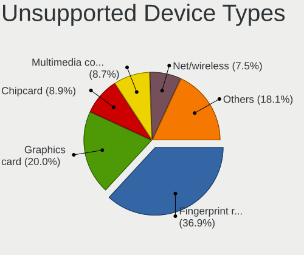

| Type                     | Notebooks | Percent |
|--------------------------|-----------|---------|
| Fingerprint reader       | 153       | 36.87%  |
| Graphics card            | 83        | 20%     |
| Chipcard                 | 37        | 8.92%   |
| Multimedia controller    | 36        | 8.67%   |
| Net/wireless             | 31        | 7.47%   |
| Storage                  | 20        | 4.82%   |
| Communication controller | 12        | 2.89%   |
| Sound                    | 9         | 2.17%   |
| Camera                   | 9         | 2.17%   |
| Bluetooth                | 7         | 1.69%   |
| Net/ethernet             | 6         | 1.45%   |
| Network                  | 3         | 0.72%   |
| Card reader              | 3         | 0.72%   |
| Storage/ata              | 2         | 0.48%   |
| Modem                    | 2         | 0.48%   |
| Tv card                  | 1         | 0.24%   |
| Firewire controller      | 1         | 0.24%   |

