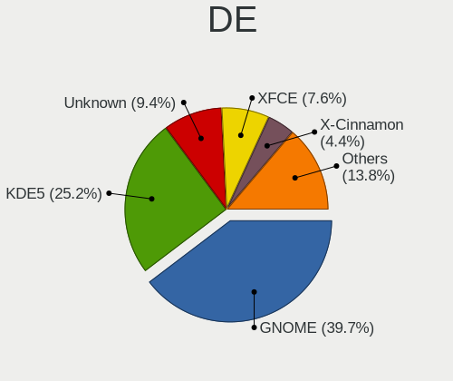
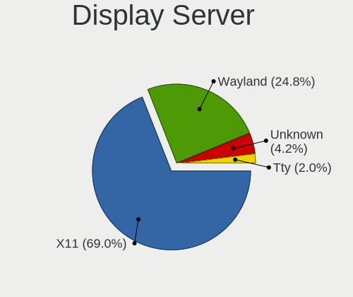
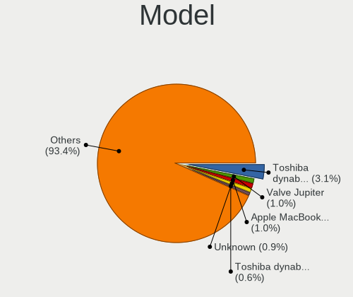
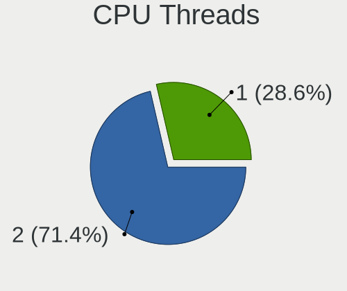
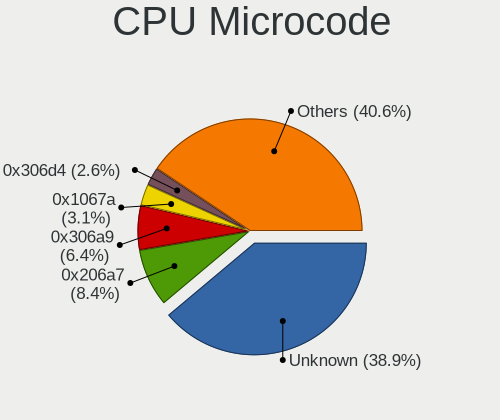
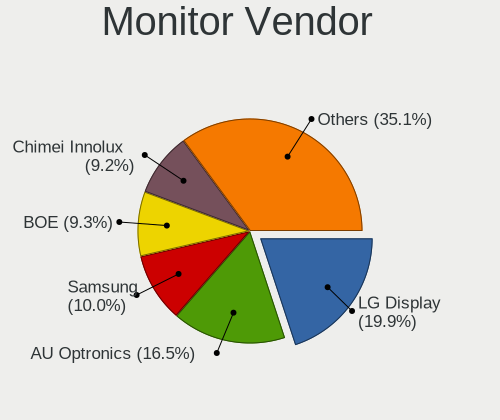
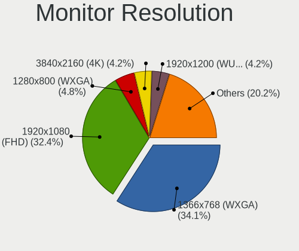
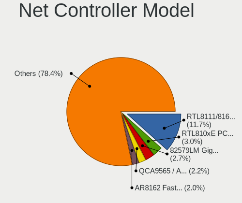
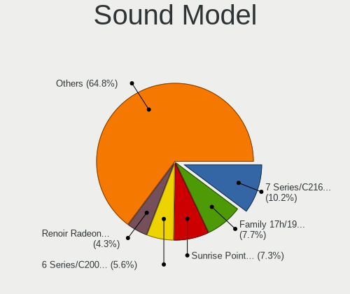

Linux in Japan - Tested Hardware & Statistics (Notebooks)
---------------------------------------------------------

A project to collect tested hardware configurations for Linux in Japan.

Anyone can contribute to this report by the [hw-probe](https://github.com/linuxhw/hw-probe) tool:

    sudo -E hw-probe -all -upload

Please contribute! Especially if your hardware is rare.

Contents
--------

* [ Test Cases ](#test-cases)

* [ System ](#system)
  - [ OS                       ](#os)
  - [ OS Family                ](#os-family)
  - [ Kernel                   ](#kernel)
  - [ Kernel Family            ](#kernel-family)
  - [ Kernel Major Ver.        ](#kernel-major-ver)
  - [ Arch                     ](#arch)
  - [ DE                       ](#de)
  - [ Display Server           ](#display-server)
  - [ Display Manager          ](#display-manager)
  - [ OS Lang                  ](#os-lang)
  - [ Boot Mode                ](#boot-mode)
  - [ Filesystem               ](#filesystem)
  - [ Part. scheme             ](#part-scheme)
  - [ Dual Boot with Linux/BSD ](#dual-boot-with-linuxbsd)
  - [ Dual Boot (Win)          ](#dual-boot-win)

* [ Board ](#board)
  - [ Vendor                   ](#vendor)
  - [ Model                    ](#model)
  - [ Model Family             ](#model-family)
  - [ MFG Year                 ](#mfg-year)
  - [ Form Factor              ](#form-factor)
  - [ Secure Boot              ](#secure-boot)
  - [ Coreboot                 ](#coreboot)
  - [ RAM Size                 ](#ram-size)
  - [ RAM Used                 ](#ram-used)
  - [ Total Drives             ](#total-drives)
  - [ Has CD-ROM               ](#has-cd-rom)
  - [ Has Ethernet             ](#has-ethernet)
  - [ Has WiFi                 ](#has-wifi)
  - [ Has Bluetooth            ](#has-bluetooth)

* [ Location ](#location)
  - [ Country                  ](#country)
  - [ City                     ](#city)

* [ Drives ](#drives)
  - [ Drive Vendor             ](#drive-vendor)
  - [ Drive Model              ](#drive-model)
  - [ HDD Vendor               ](#hdd-vendor)
  - [ SSD Vendor               ](#ssd-vendor)
  - [ Drive Kind               ](#drive-kind)
  - [ Drive Connector          ](#drive-connector)
  - [ Drive Size               ](#drive-size)
  - [ Space Total              ](#space-total)
  - [ Space Used               ](#space-used)
  - [ Malfunc. Drives          ](#malfunc-drives)
  - [ Malfunc. Drive Vendor    ](#malfunc-drive-vendor)
  - [ Malfunc. HDD Vendor      ](#malfunc-hdd-vendor)
  - [ Malfunc. Drive Kind      ](#malfunc-drive-kind)
  - [ Failed Drives            ](#failed-drives)
  - [ Failed Drive Vendor      ](#failed-drive-vendor)
  - [ Drive Status             ](#drive-status)

* [ Storage controller ](#storage-controller)
  - [ Storage Vendor           ](#storage-vendor)
  - [ Storage Model            ](#storage-model)
  - [ Storage Kind             ](#storage-kind)

* [ Processor ](#processor)
  - [ CPU Vendor               ](#cpu-vendor)
  - [ CPU Model                ](#cpu-model)
  - [ CPU Model Family         ](#cpu-model-family)
  - [ CPU Cores                ](#cpu-cores)
  - [ CPU Sockets              ](#cpu-sockets)
  - [ CPU Threads              ](#cpu-threads)
  - [ CPU Op-Modes             ](#cpu-op-modes)
  - [ CPU Microcode            ](#cpu-microcode)
  - [ CPU Microarch            ](#cpu-microarch)

* [ Graphics ](#graphics)
  - [ GPU Vendor               ](#gpu-vendor)
  - [ GPU Model                ](#gpu-model)
  - [ GPU Combo                ](#gpu-combo)
  - [ GPU Driver               ](#gpu-driver)
  - [ GPU Memory               ](#gpu-memory)

* [ Monitor ](#monitor)
  - [ Monitor Vendor           ](#monitor-vendor)
  - [ Monitor Model            ](#monitor-model)
  - [ Monitor Resolution       ](#monitor-resolution)
  - [ Monitor Diagonal         ](#monitor-diagonal)
  - [ Monitor Width            ](#monitor-width)
  - [ Aspect Ratio             ](#aspect-ratio)
  - [ Monitor Area             ](#monitor-area)
  - [ Pixel Density            ](#pixel-density)
  - [ Multiple Monitors        ](#multiple-monitors)

* [ Network ](#network)
  - [ Net Controller Vendor    ](#net-controller-vendor)
  - [ Net Controller Model     ](#net-controller-model)
  - [ Wireless Vendor          ](#wireless-vendor)
  - [ Wireless Model           ](#wireless-model)
  - [ Ethernet Vendor          ](#ethernet-vendor)
  - [ Ethernet Model           ](#ethernet-model)
  - [ Net Controller Kind      ](#net-controller-kind)
  - [ Used Controller          ](#used-controller)
  - [ NICs                     ](#nics)
  - [ IPv6                     ](#ipv6)

* [ Bluetooth ](#bluetooth)
  - [ Bluetooth Vendor         ](#bluetooth-vendor)
  - [ Bluetooth Model          ](#bluetooth-model)

* [ Sound ](#sound)
  - [ Sound Vendor             ](#sound-vendor)
  - [ Sound Model              ](#sound-model)

* [ Memory ](#memory)
  - [ Memory Vendor            ](#memory-vendor)
  - [ Memory Model             ](#memory-model)
  - [ Memory Kind              ](#memory-kind)
  - [ Memory Form Factor       ](#memory-form-factor)
  - [ Memory Size              ](#memory-size)
  - [ Memory Speed             ](#memory-speed)

* [ Printers & scanners ](#printers--scanners)
  - [ Printer Vendor           ](#printer-vendor)
  - [ Printer Model            ](#printer-model)
  - [ Scanner Vendor           ](#scanner-vendor)
  - [ Scanner Model            ](#scanner-model)

* [ Camera ](#camera)
  - [ Camera Vendor            ](#camera-vendor)
  - [ Camera Model             ](#camera-model)

* [ Security ](#security)
  - [ Fingerprint Vendor       ](#fingerprint-vendor)
  - [ Fingerprint Model        ](#fingerprint-model)
  - [ Chipcard Vendor          ](#chipcard-vendor)
  - [ Chipcard Model           ](#chipcard-model)

* [ Unsupported ](#unsupported)
  - [ Unsupported Devices      ](#unsupported-devices)
  - [ Unsupported Device Types ](#unsupported-device-types)

Test Cases
----------

Total: 605

| Vendor        | Model                       | Probe                                                      | Date         |
|---------------|-----------------------------|------------------------------------------------------------|--------------|
| Toshiba       | dynabook R731/37EK          | [10ed6c8741](https://linux-hardware.org/?probe=10ed6c8741) | May 06, 2022 |
| Acer          | Aspire 5740                 | [e754b48e71](https://linux-hardware.org/?probe=e754b48e71) | May 06, 2022 |
| ASUSTek       | 900                         | [70b70a4392](https://linux-hardware.org/?probe=70b70a4392) | May 03, 2022 |
| Acer          | Aspire 5740                 | [6e1a9ce167](https://linux-hardware.org/?probe=6e1a9ce167) | May 01, 2022 |
| Acer          | Aspire 5740                 | [f9e5dd9719](https://linux-hardware.org/?probe=f9e5dd9719) | May 01, 2022 |
| Dell          | Inspiron 15-3565            | [a26578c0fc](https://linux-hardware.org/?probe=a26578c0fc) | Apr 30, 2022 |
| Dell          | Inspiron 15-3565            | [66d159169f](https://linux-hardware.org/?probe=66d159169f) | Apr 28, 2022 |
| Purism        | Librem 15 v3                | [d2a13c9d0a](https://linux-hardware.org/?probe=d2a13c9d0a) | Apr 27, 2022 |
| MouseCompu... | NH55Dx                      | [0a397dd5e7](https://linux-hardware.org/?probe=0a397dd5e7) | Apr 25, 2022 |
| ASUSTek       | ROG Strix G731GT_G731GT     | [32eee9be32](https://linux-hardware.org/?probe=32eee9be32) | Apr 24, 2022 |
| ASUSTek       | ROG Strix G731GT_G731GT     | [9edf97b766](https://linux-hardware.org/?probe=9edf97b766) | Apr 24, 2022 |
| Panasonic     | CF-S10EYADR                 | [efd3e5ce84](https://linux-hardware.org/?probe=efd3e5ce84) | Apr 18, 2022 |
| TUXEDO        | P95_HR                      | [a3996b5033](https://linux-hardware.org/?probe=a3996b5033) | Apr 16, 2022 |
| Lenovo        | Legion 5 15ARH05H 82B1      | [c6f1d1b99b](https://linux-hardware.org/?probe=c6f1d1b99b) | Apr 16, 2022 |
| Thirdwave     | DX-T7                       | [b03707283b](https://linux-hardware.org/?probe=b03707283b) | Apr 16, 2022 |
| Dell          | Vostro 2520                 | [fd8d5ab56a](https://linux-hardware.org/?probe=fd8d5ab56a) | Apr 14, 2022 |
| ASUSTek       | VivoBook_ASUSLaptop M350... | [29c02b0294](https://linux-hardware.org/?probe=29c02b0294) | Apr 12, 2022 |
| Acer          | Swift SF314-54              | [c40cfcc7fe](https://linux-hardware.org/?probe=c40cfcc7fe) | Apr 12, 2022 |
| MSI           | GP76 Leopard 11UG           | [aebd373a66](https://linux-hardware.org/?probe=aebd373a66) | Apr 12, 2022 |
| ASUSTek       | 1000H                       | [725f548eab](https://linux-hardware.org/?probe=725f548eab) | Apr 09, 2022 |
| Lenovo        | ThinkBook 14p Gen 2 20YN    | [5a344e20d6](https://linux-hardware.org/?probe=5a344e20d6) | Apr 06, 2022 |
| Toshiba       | dynabook R73/BN             | [af1ad57286](https://linux-hardware.org/?probe=af1ad57286) | Apr 06, 2022 |
| Lenovo        | ThinkPad X61s 7667DB2       | [34ae68d221](https://linux-hardware.org/?probe=34ae68d221) | Apr 05, 2022 |
| Lenovo        | ThinkPad X230 2306CTO       | [188a7794dd](https://linux-hardware.org/?probe=188a7794dd) | Apr 04, 2022 |
| TUXEDO        | P95_HR                      | [41cd5e79c8](https://linux-hardware.org/?probe=41cd5e79c8) | Apr 03, 2022 |
| MouseCompu... | MB-J370                     | [2c72ea9b17](https://linux-hardware.org/?probe=2c72ea9b17) | Apr 02, 2022 |
| Lenovo        | ThinkPad X61s 7667DB2       | [71fc8f3bad](https://linux-hardware.org/?probe=71fc8f3bad) | Apr 01, 2022 |
| ASUSTek       | ROG Strix G733ZX_G733ZX     | [d17d5e5310](https://linux-hardware.org/?probe=d17d5e5310) | Apr 01, 2022 |
| ASUSTek       | ROG Strix G733ZX_G733ZX     | [04f5858a30](https://linux-hardware.org/?probe=04f5858a30) | Apr 01, 2022 |
| Apple         | MacBookPro15,1              | [0fe3cba205](https://linux-hardware.org/?probe=0fe3cba205) | Mar 23, 2022 |
| System76      | Lemur Pro                   | [cd847b5e6a](https://linux-hardware.org/?probe=cd847b5e6a) | Mar 23, 2022 |
| Apple         | MacBookPro5,5               | [0e17f0194f](https://linux-hardware.org/?probe=0e17f0194f) | Mar 22, 2022 |
| TUXEDO        | P95_HR                      | [47d54558ad](https://linux-hardware.org/?probe=47d54558ad) | Mar 21, 2022 |
| Fujitsu       | FMVA05003                   | [d61a791168](https://linux-hardware.org/?probe=d61a791168) | Mar 19, 2022 |
| HP            | EliteBook 830 G6            | [46f513206b](https://linux-hardware.org/?probe=46f513206b) | Mar 18, 2022 |
| Dell          | G3 3500                     | [9ca3e10f43](https://linux-hardware.org/?probe=9ca3e10f43) | Mar 14, 2022 |
| R.W.C         | RM-A107-SR                  | [ab4bef6a90](https://linux-hardware.org/?probe=ab4bef6a90) | Mar 13, 2022 |
| Dell          | Latitude E5470              | [7fcd9d2c98](https://linux-hardware.org/?probe=7fcd9d2c98) | Mar 11, 2022 |
| Acer          | Aspire 4750                 | [0659469dbe](https://linux-hardware.org/?probe=0659469dbe) | Mar 09, 2022 |
| Toshiba       | dynabook RX3 SN240Y/3HD     | [2f2d99c83f](https://linux-hardware.org/?probe=2f2d99c83f) | Mar 03, 2022 |
| Toshiba       | dynabook RX3 SN240Y/3HD     | [0d0a2bab7a](https://linux-hardware.org/?probe=0d0a2bab7a) | Mar 03, 2022 |
| HP            | Notebook                    | [c8cd62d913](https://linux-hardware.org/?probe=c8cd62d913) | Feb 28, 2022 |
| Fujitsu       | FMVA05007                   | [21c7863329](https://linux-hardware.org/?probe=21c7863329) | Feb 27, 2022 |
| Fujitsu       | FMVA33LB2                   | [2dc30249b7](https://linux-hardware.org/?probe=2dc30249b7) | Feb 26, 2022 |
| Lenovo        | ThinkPad X220 4290LG4       | [bfb13999b0](https://linux-hardware.org/?probe=bfb13999b0) | Feb 26, 2022 |
| Fujitsu       | FMVA42CW                    | [ec10edeb39](https://linux-hardware.org/?probe=ec10edeb39) | Feb 22, 2022 |
| Fujitsu       | FMVA42CW                    | [002020453c](https://linux-hardware.org/?probe=002020453c) | Feb 22, 2022 |
| Panasonic     | CFSV9-1                     | [fa3b39bca1](https://linux-hardware.org/?probe=fa3b39bca1) | Feb 21, 2022 |
| Dell          | Vostro 3405                 | [f869338cb0](https://linux-hardware.org/?probe=f869338cb0) | Feb 20, 2022 |
| Apple         | MacBookAir3,2               | [2e812a8de9](https://linux-hardware.org/?probe=2e812a8de9) | Feb 17, 2022 |
| Fujitsu       | FMVA42CW                    | [fdc52a7464](https://linux-hardware.org/?probe=fdc52a7464) | Feb 15, 2022 |
| Fujitsu       | FARQ02010                   | [04fbabcfd2](https://linux-hardware.org/?probe=04fbabcfd2) | Feb 15, 2022 |
| Toshiba       | dynabook QOSMIO V65/86LY... | [681aa0b345](https://linux-hardware.org/?probe=681aa0b345) | Feb 13, 2022 |
| Lenovo        | G570 4334                   | [f5cef9fe9b](https://linux-hardware.org/?probe=f5cef9fe9b) | Feb 13, 2022 |
| ASUSTek       | U24A                        | [47e8fc096a](https://linux-hardware.org/?probe=47e8fc096a) | Feb 10, 2022 |
| Dell          | XPS L401X                   | [1db7a71e79](https://linux-hardware.org/?probe=1db7a71e79) | Feb 09, 2022 |
| Lenovo        | ThinkPad X61 76753BJ        | [76a7934681](https://linux-hardware.org/?probe=76a7934681) | Feb 09, 2022 |
| Lenovo        | G505 20240                  | [ed806edbbb](https://linux-hardware.org/?probe=ed806edbbb) | Feb 09, 2022 |
| Lenovo        | ThinkPad X240 20ALCTO1WW    | [1620a85467](https://linux-hardware.org/?probe=1620a85467) | Feb 08, 2022 |
| ASUSTek       | X541SA                      | [afafec99f9](https://linux-hardware.org/?probe=afafec99f9) | Feb 08, 2022 |
| Toshiba       | dynabook Satellite B453/... | [279ff9b0f0](https://linux-hardware.org/?probe=279ff9b0f0) | Feb 08, 2022 |
| ASUSTek       | U24A                        | [938ccde5eb](https://linux-hardware.org/?probe=938ccde5eb) | Feb 07, 2022 |
| ASUSTek       | S101                        | [a850549e73](https://linux-hardware.org/?probe=a850549e73) | Feb 04, 2022 |
| ASUSTek       | U24A                        | [c49e4b9513](https://linux-hardware.org/?probe=c49e4b9513) | Jan 31, 2022 |
| AMI           | Intel                       | [33011a4745](https://linux-hardware.org/?probe=33011a4745) | Jan 31, 2022 |
| AMI           | Intel                       | [f749123fdd](https://linux-hardware.org/?probe=f749123fdd) | Jan 31, 2022 |
| ASUSTek       | U24A                        | [cc19cff1a9](https://linux-hardware.org/?probe=cc19cff1a9) | Jan 30, 2022 |
| Toshiba       | dynabook QOSMIO V65/86LY... | [6658fec6b4](https://linux-hardware.org/?probe=6658fec6b4) | Jan 29, 2022 |
| Toshiba       | dynabook QOSMIO V65/86LY... | [116f29b876](https://linux-hardware.org/?probe=116f29b876) | Jan 29, 2022 |
| Fujitsu       | FMVA42CW                    | [ee9b2f44e9](https://linux-hardware.org/?probe=ee9b2f44e9) | Jan 29, 2022 |
| ASUSTek       | UX303LA                     | [b5e498daf0](https://linux-hardware.org/?probe=b5e498daf0) | Jan 28, 2022 |
| Acer          | Aspire V3-571               | [3d4087dc2a](https://linux-hardware.org/?probe=3d4087dc2a) | Jan 28, 2022 |
| Razer         | Blade Stealth               | [6a4fbb1374](https://linux-hardware.org/?probe=6a4fbb1374) | Jan 27, 2022 |
| HP            | ProBook 430 G7              | [f0d96ec1ea](https://linux-hardware.org/?probe=f0d96ec1ea) | Jan 26, 2022 |
| Fujitsu       | FMVA42CW                    | [d6e6220eee](https://linux-hardware.org/?probe=d6e6220eee) | Jan 24, 2022 |
| Fujitsu       | FMVA42CW                    | [4ba92ab5ea](https://linux-hardware.org/?probe=4ba92ab5ea) | Jan 23, 2022 |
| Dell          | Latitude 3540               | [28339307b2](https://linux-hardware.org/?probe=28339307b2) | Jan 21, 2022 |
| ASUSTek       | 1000H                       | [f88ac2dd3e](https://linux-hardware.org/?probe=f88ac2dd3e) | Jan 19, 2022 |
| ASUSTek       | 1000H                       | [6c56c2c8b3](https://linux-hardware.org/?probe=6c56c2c8b3) | Jan 19, 2022 |
| KOUZIRO       | KOUZIRONB                   | [56b639daeb](https://linux-hardware.org/?probe=56b639daeb) | Jan 14, 2022 |
| Dynabook      | P1-C7MP-BL                  | [268f94787e](https://linux-hardware.org/?probe=268f94787e) | Jan 14, 2022 |
| Lenovo        | ThinkPad X61 76753BJ        | [8f0b1342b0](https://linux-hardware.org/?probe=8f0b1342b0) | Jan 10, 2022 |
| Lenovo        | ThinkPad X61 76753BJ        | [73ff2bcb33](https://linux-hardware.org/?probe=73ff2bcb33) | Jan 10, 2022 |
| Acer          | Predator PH315-53           | [7f928f794b](https://linux-hardware.org/?probe=7f928f794b) | Jan 04, 2022 |
| NEC Comput... | PC-LL550RG                  | [43435578b7](https://linux-hardware.org/?probe=43435578b7) | Jan 04, 2022 |
| Dell          | Inspiron 5557               | [53d769eaf7](https://linux-hardware.org/?probe=53d769eaf7) | Dec 31, 2021 |
| Toshiba       | dynabook RX3 SN240Y/3HD     | [e2dfc36d9e](https://linux-hardware.org/?probe=e2dfc36d9e) | Dec 29, 2021 |
| System76      | Lemur Pro                   | [287aa601fe](https://linux-hardware.org/?probe=287aa601fe) | Dec 29, 2021 |
| Toshiba       | dynabook RX3 SN240Y/3HD     | [0b20db823c](https://linux-hardware.org/?probe=0b20db823c) | Dec 29, 2021 |
| Dell          | Latitude 12 Rugged Table... | [13cc8e2abf](https://linux-hardware.org/?probe=13cc8e2abf) | Dec 25, 2021 |
| MSI           | Delta 15 A5EFK              | [68010a3af5](https://linux-hardware.org/?probe=68010a3af5) | Dec 23, 2021 |
| MSI           | Delta 15 A5EFK              | [2d4a0a1823](https://linux-hardware.org/?probe=2d4a0a1823) | Dec 23, 2021 |
| ASUSTek       | ASUS EXPERTBOOK B9450FA_... | [ded54cb08c](https://linux-hardware.org/?probe=ded54cb08c) | Dec 19, 2021 |
| Dell          | Inspiron 13 5310            | [bdad2f1618](https://linux-hardware.org/?probe=bdad2f1618) | Dec 14, 2021 |
| ASUSTek       | X510UQ                      | [1b14f17a6e](https://linux-hardware.org/?probe=1b14f17a6e) | Dec 11, 2021 |
| Apple         | MacBookPro12,1              | [a6e257304d](https://linux-hardware.org/?probe=a6e257304d) | Dec 05, 2021 |
| Toshiba       | dynabook Satellite B552/... | [b3c78d548b](https://linux-hardware.org/?probe=b3c78d548b) | Dec 03, 2021 |
| Apple         | MacBookPro13,2              | [d5c66e036d](https://linux-hardware.org/?probe=d5c66e036d) | Dec 02, 2021 |
| Notebook      | N13_N140ZU                  | [d63f7874c8](https://linux-hardware.org/?probe=d63f7874c8) | Nov 29, 2021 |
| Dell          | G3 3779                     | [cd6dace549](https://linux-hardware.org/?probe=cd6dace549) | Nov 26, 2021 |
| Notebook      | N13_N140ZU                  | [dca6d021bb](https://linux-hardware.org/?probe=dca6d021bb) | Nov 23, 2021 |
| Lenovo        | ThinkPad X220 Tablet 429... | [fdb480d5f4](https://linux-hardware.org/?probe=fdb480d5f4) | Nov 12, 2021 |
| Lenovo        | G580 26897JJ                | [dc2120663a](https://linux-hardware.org/?probe=dc2120663a) | Nov 10, 2021 |
| Dell          | Inspiron M5110              | [4a6d42444c](https://linux-hardware.org/?probe=4a6d42444c) | Nov 10, 2021 |
| System76      | Lemur Pro                   | [92a5e9c183](https://linux-hardware.org/?probe=92a5e9c183) | Nov 09, 2021 |
| Dell          | Inspiron 16 7610            | [34e330ff50](https://linux-hardware.org/?probe=34e330ff50) | Nov 07, 2021 |
| Toshiba       | dynabook QOSMIO V65/86LY... | [0193f0b7a0](https://linux-hardware.org/?probe=0193f0b7a0) | Nov 06, 2021 |
| Timi          | RedmiBook Pro 14S           | [470204d924](https://linux-hardware.org/?probe=470204d924) | Nov 03, 2021 |
| Lenovo        | ThinkPad T14 Gen 1 20S0C... | [f7309ef31a](https://linux-hardware.org/?probe=f7309ef31a) | Oct 30, 2021 |
| Lenovo        | ThinkPad T14 Gen 1 20S0C... | [26adc81160](https://linux-hardware.org/?probe=26adc81160) | Oct 30, 2021 |
| Toshiba       | PORTEGE Z20t-C              | [ed1722174a](https://linux-hardware.org/?probe=ed1722174a) | Oct 27, 2021 |
| Dell          | G5 5500                     | [cf10cd5b99](https://linux-hardware.org/?probe=cf10cd5b99) | Oct 25, 2021 |
| Dell          | XPS 13 9350                 | [1f26867986](https://linux-hardware.org/?probe=1f26867986) | Oct 25, 2021 |
| HP            | Pavilion Gaming Laptop 1... | [6aa4ae0da5](https://linux-hardware.org/?probe=6aa4ae0da5) | Oct 23, 2021 |
| HP            | ProBook 6550b               | [4db59c8489](https://linux-hardware.org/?probe=4db59c8489) | Oct 23, 2021 |
| Dell          | G3 3779                     | [a84248c5d5](https://linux-hardware.org/?probe=a84248c5d5) | Oct 21, 2021 |
| Jumper        | Ezbook X3                   | [fe510b821a](https://linux-hardware.org/?probe=fe510b821a) | Oct 17, 2021 |
| Toshiba       | dynabook QOSMIO V65/86LY... | [4ded546c9c](https://linux-hardware.org/?probe=4ded546c9c) | Oct 17, 2021 |
| UNITCOM       | W55xEU                      | [ced300109d](https://linux-hardware.org/?probe=ced300109d) | Oct 15, 2021 |
| NEC Comput... | PC-LL550VG6R                | [5879ce1d61](https://linux-hardware.org/?probe=5879ce1d61) | Oct 13, 2021 |
| ASUSTek       | ROG Zephyrus G15 GA503QR... | [f2690f5ec4](https://linux-hardware.org/?probe=f2690f5ec4) | Oct 13, 2021 |
| Toshiba       | dynabook R634/K             | [f0e385cbfb](https://linux-hardware.org/?probe=f0e385cbfb) | Oct 08, 2021 |
| Acer          | Nitro AN515-45              | [6918b927d0](https://linux-hardware.org/?probe=6918b927d0) | Oct 07, 2021 |
| Dell          | XPS 13 9380                 | [0b768f6fac](https://linux-hardware.org/?probe=0b768f6fac) | Oct 04, 2021 |
| HP            | Pavilion Gaming Laptop 1... | [1c920ce007](https://linux-hardware.org/?probe=1c920ce007) | Oct 03, 2021 |
| FUJITSU CL... | U9311                       | [a76f2fbbe3](https://linux-hardware.org/?probe=a76f2fbbe3) | Sep 30, 2021 |
| Panasonic     | CFSV9-2                     | [05b8edc925](https://linux-hardware.org/?probe=05b8edc925) | Sep 29, 2021 |
| Toshiba       | dynabook QOSMIO V65/86LY... | [0c128353bf](https://linux-hardware.org/?probe=0c128353bf) | Sep 29, 2021 |
| NEC Comput... | PC-GN15B79AA                | [a1046b626e](https://linux-hardware.org/?probe=a1046b626e) | Sep 23, 2021 |
| NEC Comput... | PC-GN15B79AA                | [a1b9f1dc30](https://linux-hardware.org/?probe=a1b9f1dc30) | Sep 23, 2021 |
| Toshiba       | dynabook QOSMIO V65/86LY... | [07f3c78fea](https://linux-hardware.org/?probe=07f3c78fea) | Sep 22, 2021 |
| Toshiba       | dynabook QOSMIO V65/86LY... | [b0289ef67d](https://linux-hardware.org/?probe=b0289ef67d) | Sep 22, 2021 |
| Apple         | MacBook7,1                  | [5164ba24f6](https://linux-hardware.org/?probe=5164ba24f6) | Sep 21, 2021 |
| Lenovo        | ThinkPad P14s Gen 1 20Y1... | [5dabdbd945](https://linux-hardware.org/?probe=5dabdbd945) | Sep 19, 2021 |
| Lenovo        | ThinkPad E14 Gen 3 20Y70... | [6f52a2ebed](https://linux-hardware.org/?probe=6f52a2ebed) | Sep 18, 2021 |
| Apple         | MacBookPro5,5               | [d7ee29aac3](https://linux-hardware.org/?probe=d7ee29aac3) | Sep 15, 2021 |
| Panasonic     | CF-S10EYTDR                 | [a90d037dcf](https://linux-hardware.org/?probe=a90d037dcf) | Sep 10, 2021 |
| ASUSTek       | G551JM                      | [9f323164cd](https://linux-hardware.org/?probe=9f323164cd) | Sep 09, 2021 |
| Lenovo        | ThinkPad X201 3249CTO       | [7b3432fcf6](https://linux-hardware.org/?probe=7b3432fcf6) | Sep 08, 2021 |
| ASUSTek       | ZenBook UX425IA_U4700IA     | [fa970f7a80](https://linux-hardware.org/?probe=fa970f7a80) | Sep 08, 2021 |
| TUXEDO        | P95_HR                      | [f5d32061ec](https://linux-hardware.org/?probe=f5d32061ec) | Sep 08, 2021 |
| TUXEDO        | P95_HR                      | [c2fb4aa043](https://linux-hardware.org/?probe=c2fb4aa043) | Sep 07, 2021 |
| Toshiba       | dynabook T55/PW             | [1ce1b25ad5](https://linux-hardware.org/?probe=1ce1b25ad5) | Sep 04, 2021 |
| Lenovo        | ThinkPad X230 2306A44       | [8f97e284a7](https://linux-hardware.org/?probe=8f97e284a7) | Sep 03, 2021 |
| Toshiba       | dynabook R73/A              | [deb0351e19](https://linux-hardware.org/?probe=deb0351e19) | Sep 03, 2021 |
| Acer          | Aspire V5-571G              | [919b7c1304](https://linux-hardware.org/?probe=919b7c1304) | Sep 01, 2021 |
| Acer          | Aspire V5-471               | [469dc0f2ef](https://linux-hardware.org/?probe=469dc0f2ef) | Aug 31, 2021 |
| Acer          | Aspire V5-471               | [47f44e561f](https://linux-hardware.org/?probe=47f44e561f) | Aug 31, 2021 |
| Lenovo        | ThinkPad X201 3249CTO       | [0a9bdb4827](https://linux-hardware.org/?probe=0a9bdb4827) | Aug 27, 2021 |
| Apple         | MacBookPro11,5              | [814f16635c](https://linux-hardware.org/?probe=814f16635c) | Aug 22, 2021 |
| Sony          | VGN-S55B_S                  | [f8237269e1](https://linux-hardware.org/?probe=f8237269e1) | Aug 22, 2021 |
| HP            | Laptop 15s-eq1xxx           | [90446b95e6](https://linux-hardware.org/?probe=90446b95e6) | Aug 21, 2021 |
| HP            | ProBook 6470b               | [4d338e7f16](https://linux-hardware.org/?probe=4d338e7f16) | Aug 15, 2021 |
| Acer          | Aspire A315-42              | [4a54197130](https://linux-hardware.org/?probe=4a54197130) | Aug 15, 2021 |
| Sony          | VGN-S55B_S                  | [e531cd57e6](https://linux-hardware.org/?probe=e531cd57e6) | Aug 15, 2021 |
| Lenovo        | ThinkPad X201 3249CTO       | [9b9cd9a995](https://linux-hardware.org/?probe=9b9cd9a995) | Aug 10, 2021 |
| HP            | EliteBook Folio 1020 G1 ... | [32e6ec699f](https://linux-hardware.org/?probe=32e6ec699f) | Aug 09, 2021 |
| HP            | EliteBook Folio 1020 G1 ... | [7facd0568b](https://linux-hardware.org/?probe=7facd0568b) | Aug 09, 2021 |
| Lenovo        | ThinkPad X250 20CLS8E700    | [467f177df6](https://linux-hardware.org/?probe=467f177df6) | Aug 09, 2021 |
| NEC Comput... | PC-GN246W3A5                | [dfc05750e3](https://linux-hardware.org/?probe=dfc05750e3) | Aug 09, 2021 |
| Panasonic     | CF-S10EYTDR                 | [b965812f09](https://linux-hardware.org/?probe=b965812f09) | Aug 06, 2021 |
| NEC Comput... | PC-GN246W3A5                | [447a158806](https://linux-hardware.org/?probe=447a158806) | Aug 03, 2021 |
| Lenovo        | ThinkPad L520 5016NU7       | [101a0ca1b3](https://linux-hardware.org/?probe=101a0ca1b3) | Aug 01, 2021 |
| Lenovo        | ThinkPad L520 5016NU7       | [08fe25ec71](https://linux-hardware.org/?probe=08fe25ec71) | Aug 01, 2021 |
| HP            | Pavilion Laptop 13-an0xx... | [ff5bee5ff8](https://linux-hardware.org/?probe=ff5bee5ff8) | Aug 01, 2021 |
| Chuwi         | GemiBook Pro                | [a4ecebc31b](https://linux-hardware.org/?probe=a4ecebc31b) | Jul 27, 2021 |
| Chuwi         | GemiBook Pro                | [63b014e84e](https://linux-hardware.org/?probe=63b014e84e) | Jul 26, 2021 |
| Chuwi         | GemiBook Pro                | [478d06f2df](https://linux-hardware.org/?probe=478d06f2df) | Jul 26, 2021 |
| Acer          | Nitro AN515-45              | [fbf1f240f4](https://linux-hardware.org/?probe=fbf1f240f4) | Jul 24, 2021 |
| Fujitsu       | FMVS03004                   | [0182178989](https://linux-hardware.org/?probe=0182178989) | Jul 24, 2021 |
| HP            | 14                          | [29af89c91b](https://linux-hardware.org/?probe=29af89c91b) | Jul 23, 2021 |
| HP            | 14                          | [345be169ae](https://linux-hardware.org/?probe=345be169ae) | Jul 20, 2021 |
| Fujitsu       | FMVS54CD1                   | [7e6aa1f514](https://linux-hardware.org/?probe=7e6aa1f514) | Jul 18, 2021 |
| Dell          | Inspiron N5110              | [80b10e8187](https://linux-hardware.org/?probe=80b10e8187) | Jul 18, 2021 |
| Fujitsu       | FMVS54CD1                   | [ad9e144c6a](https://linux-hardware.org/?probe=ad9e144c6a) | Jul 15, 2021 |
| Dell          | Latitude E5510              | [2ab8a16c55](https://linux-hardware.org/?probe=2ab8a16c55) | Jul 12, 2021 |
| Toshiba       | dynabook T954/89L           | [176e4906db](https://linux-hardware.org/?probe=176e4906db) | Jul 12, 2021 |
| Dell          | Inspiron 1526               | [515fc96089](https://linux-hardware.org/?probe=515fc96089) | Jul 11, 2021 |
| Lenovo        | ThinkPad X61s 7667DB2       | [c0af3fd295](https://linux-hardware.org/?probe=c0af3fd295) | Jul 05, 2021 |
| Google        | Helios                      | [644f9f9062](https://linux-hardware.org/?probe=644f9f9062) | Jul 02, 2021 |
| Dell          | XPS 15 9500                 | [db7536f5a7](https://linux-hardware.org/?probe=db7536f5a7) | Jun 29, 2021 |
| Dell          | Inspiron 5583               | [a1f0396c8e](https://linux-hardware.org/?probe=a1f0396c8e) | Jun 29, 2021 |
| Lenovo        | ThinkPad X61s 7667DB2       | [70929dad4d](https://linux-hardware.org/?probe=70929dad4d) | Jun 24, 2021 |
| Lenovo        | ThinkPad X61s 7667DB2       | [32d294ba2a](https://linux-hardware.org/?probe=32d294ba2a) | Jun 23, 2021 |
| Toshiba       | dynabook T954/89L           | [c4b1b8aabb](https://linux-hardware.org/?probe=c4b1b8aabb) | Jun 21, 2021 |
| Toshiba       | dynabook T954/89L           | [b6a5d80f8a](https://linux-hardware.org/?probe=b6a5d80f8a) | Jun 21, 2021 |
| Lenovo        | S10-3                       | [eb48df4717](https://linux-hardware.org/?probe=eb48df4717) | Jun 20, 2021 |
| HP            | Pavilion Laptop 13-an0xx... | [2da9390d91](https://linux-hardware.org/?probe=2da9390d91) | Jun 11, 2021 |
| HP            | Pavilion Laptop 13-an0xx... | [c33921449f](https://linux-hardware.org/?probe=c33921449f) | Jun 10, 2021 |
| Toshiba       | dynabook R73/BN             | [c9cdf2bc57](https://linux-hardware.org/?probe=c9cdf2bc57) | Jun 06, 2021 |
| Lenovo        | IdeaPad 510-15IKB 80SV      | [0860242147](https://linux-hardware.org/?probe=0860242147) | Jun 04, 2021 |
| Biostar       | B350GTN                     | [6ba7f458da](https://linux-hardware.org/?probe=6ba7f458da) | Jun 01, 2021 |
| Lenovo        | ThinkPad T420s 4170CTO      | [74057c8385](https://linux-hardware.org/?probe=74057c8385) | May 30, 2021 |
| Lenovo        | S10-3                       | [8dfadf5edb](https://linux-hardware.org/?probe=8dfadf5edb) | May 27, 2021 |
| NEC Comput... | PC-LL730TG                  | [e4172892e9](https://linux-hardware.org/?probe=e4172892e9) | May 26, 2021 |
| Notebook      | N13_N140ZU                  | [4d1d4e61c3](https://linux-hardware.org/?probe=4d1d4e61c3) | May 25, 2021 |
| NEC Comput... | PC-VK22TGGCN                | [b6a2893c7e](https://linux-hardware.org/?probe=b6a2893c7e) | May 25, 2021 |
| Dell          | Latitude E6420              | [4ef6253092](https://linux-hardware.org/?probe=4ef6253092) | May 22, 2021 |
| Dell          | XPS 13 9360                 | [4ea4747cbf](https://linux-hardware.org/?probe=4ea4747cbf) | May 18, 2021 |
| Lenovo        | IdeaPad 300-15IBR 80M3      | [5d215fafdd](https://linux-hardware.org/?probe=5d215fafdd) | May 15, 2021 |
| Lenovo        | IdeaPad 300-15IBR 80M3      | [2bbaf8e0b6](https://linux-hardware.org/?probe=2bbaf8e0b6) | May 14, 2021 |
| Lenovo        | IdeaPad 300-15IBR 80M3      | [fdc8841fca](https://linux-hardware.org/?probe=fdc8841fca) | May 14, 2021 |
| FUJITSU CL... | FMVWE3AB11                  | [6c767dc0df](https://linux-hardware.org/?probe=6c767dc0df) | May 13, 2021 |
| FUJITSU CL... | FMVWE3AB11                  | [5ed8fb5a9f](https://linux-hardware.org/?probe=5ed8fb5a9f) | May 13, 2021 |
| Lenovo        | ThinkPad X230 2330A17       | [02280704ba](https://linux-hardware.org/?probe=02280704ba) | May 11, 2021 |
| Dell          | Inspiron 1545               | [c796c57372](https://linux-hardware.org/?probe=c796c57372) | May 10, 2021 |
| FUJITSU CL... | FMVWE3AB11                  | [42dcb3b8c9](https://linux-hardware.org/?probe=42dcb3b8c9) | May 09, 2021 |
| FUJITSU CL... | FMVWE3AB11                  | [e7238c107c](https://linux-hardware.org/?probe=e7238c107c) | May 09, 2021 |
| Fujitsu       | FMVNF40UK                   | [8648b42278](https://linux-hardware.org/?probe=8648b42278) | May 09, 2021 |
| MouseCompu... | W150ERQ                     | [1ccfec5c8f](https://linux-hardware.org/?probe=1ccfec5c8f) | May 07, 2021 |
| Sony          | VGN-S55B_S                  | [a874601f76](https://linux-hardware.org/?probe=a874601f76) | May 05, 2021 |
| Dell          | XPS 13 9360                 | [f001bddea6](https://linux-hardware.org/?probe=f001bddea6) | May 04, 2021 |
| FUJITSU CL... | FMVWE3AB11                  | [65dce9cf99](https://linux-hardware.org/?probe=65dce9cf99) | May 03, 2021 |
| Dynabook      | P1-T6NP-EG                  | [887c9157d0](https://linux-hardware.org/?probe=887c9157d0) | May 03, 2021 |
| Toshiba       | dynabook Satellite J61 1... | [0b4c4a93f1](https://linux-hardware.org/?probe=0b4c4a93f1) | Apr 29, 2021 |
| Maibenben     | S431                        | [a4db49a83f](https://linux-hardware.org/?probe=a4db49a83f) | Apr 29, 2021 |
| NEC Comput... | PC-VY25AACZ9                | [dc22e810b4](https://linux-hardware.org/?probe=dc22e810b4) | Apr 29, 2021 |
| KOUZIRO       | KOUZIRONB                   | [c64bf46d8b](https://linux-hardware.org/?probe=c64bf46d8b) | Apr 24, 2021 |
| HP            | Laptop 15-db0xxx            | [7a4d236e06](https://linux-hardware.org/?probe=7a4d236e06) | Apr 24, 2021 |
| Dell          | XPS 13 9360                 | [dae1fdda5f](https://linux-hardware.org/?probe=dae1fdda5f) | Apr 23, 2021 |
| Lenovo        | ThinkBook 15p 20V3          | [fff82cb538](https://linux-hardware.org/?probe=fff82cb538) | Apr 22, 2021 |
| ASUSTek       | ZenBook UX331FA_UX331FA     | [d8340c053a](https://linux-hardware.org/?probe=d8340c053a) | Apr 22, 2021 |
| Lenovo        | ThinkPad T430s 23533KJ      | [39aa120e47](https://linux-hardware.org/?probe=39aa120e47) | Apr 21, 2021 |
| TUXEDO        | P95_HR                      | [adfe862f36](https://linux-hardware.org/?probe=adfe862f36) | Apr 19, 2021 |
| TUXEDO        | P95_HR                      | [4afc76cdbe](https://linux-hardware.org/?probe=4afc76cdbe) | Apr 17, 2021 |
| Lenovo        | ThinkPad T14s Gen 1 20T1... | [3ee0cc7c18](https://linux-hardware.org/?probe=3ee0cc7c18) | Apr 13, 2021 |
| Dell          | Precision M4800             | [7a2924ab2a](https://linux-hardware.org/?probe=7a2924ab2a) | Apr 13, 2021 |
| HP            | Pavilion dv4                | [c5ed691eb7](https://linux-hardware.org/?probe=c5ed691eb7) | Apr 13, 2021 |
| KOUZIRO       | KOUZIRONB                   | [18adf344fe](https://linux-hardware.org/?probe=18adf344fe) | Apr 11, 2021 |
| NEC Comput... | PC-VY25AACZ9                | [24f7a90612](https://linux-hardware.org/?probe=24f7a90612) | Apr 10, 2021 |
| Dell          | Inspiron N5110              | [122641cd7e](https://linux-hardware.org/?probe=122641cd7e) | Apr 08, 2021 |
| NEC Comput... | PC-VK25TXZCE                | [e6acc84298](https://linux-hardware.org/?probe=e6acc84298) | Apr 07, 2021 |
| Toshiba       | dynabook BX/33M             | [06580ff422](https://linux-hardware.org/?probe=06580ff422) | Apr 06, 2021 |
| Lenovo        | ThinkPad X230 23245Y1       | [83430b3adf](https://linux-hardware.org/?probe=83430b3adf) | Apr 06, 2021 |
| Dynabook      | P1-T6NP-EG                  | [3f0b2d7c1d](https://linux-hardware.org/?probe=3f0b2d7c1d) | Apr 05, 2021 |
| Toshiba       | dynabook CX/48F             | [d32bf9dced](https://linux-hardware.org/?probe=d32bf9dced) | Apr 02, 2021 |
| ASUSTek       | ROG Strix G712LV_G712LV     | [a82050e3ae](https://linux-hardware.org/?probe=a82050e3ae) | Apr 01, 2021 |
| ASUSTek       | ROG Strix G712LV_G712LV     | [e905f6462c](https://linux-hardware.org/?probe=e905f6462c) | Apr 01, 2021 |
| Toshiba       | dynabook Satellite B552/... | [0a547ba59a](https://linux-hardware.org/?probe=0a547ba59a) | Mar 31, 2021 |
| Dell          | Latitude E6320              | [2c01829c5b](https://linux-hardware.org/?probe=2c01829c5b) | Mar 28, 2021 |
| Dell          | G3 3500                     | [83f2a24875](https://linux-hardware.org/?probe=83f2a24875) | Mar 27, 2021 |
| ASUSTek       | ROG Strix G712LV_G712LV     | [22b865b40a](https://linux-hardware.org/?probe=22b865b40a) | Mar 26, 2021 |
| ASUSTek       | ROG Strix G712LV_G712LV     | [43c49d259d](https://linux-hardware.org/?probe=43c49d259d) | Mar 26, 2021 |
| HP            | G60                         | [a97ca105eb](https://linux-hardware.org/?probe=a97ca105eb) | Mar 25, 2021 |
| NEC Comput... | PC-VY25AACZ9                | [729ef4d91f](https://linux-hardware.org/?probe=729ef4d91f) | Mar 25, 2021 |
| NEC Comput... | PC-VY25AACZ9                | [a092c49f22](https://linux-hardware.org/?probe=a092c49f22) | Mar 25, 2021 |
| HP            | G60                         | [e8cc7247c7](https://linux-hardware.org/?probe=e8cc7247c7) | Mar 23, 2021 |
| TUXEDO        | P95_HR                      | [22b092fe80](https://linux-hardware.org/?probe=22b092fe80) | Mar 23, 2021 |
| Unknown       | Unknown                     | [a4b57558c3](https://linux-hardware.org/?probe=a4b57558c3) | Mar 22, 2021 |
| HP            | ProBook 430 G7              | [fbf317133b](https://linux-hardware.org/?probe=fbf317133b) | Mar 21, 2021 |
| Toshiba       | dynabook Satellite B552/... | [56a39af725](https://linux-hardware.org/?probe=56a39af725) | Mar 20, 2021 |
| Lenovo        | ThinkBook 14 G2 ARE 20VF    | [2d9b9381bd](https://linux-hardware.org/?probe=2d9b9381bd) | Mar 16, 2021 |
| Lenovo        | ThinkBook 14 G2 ARE 20VF    | [aac20e8dce](https://linux-hardware.org/?probe=aac20e8dce) | Mar 15, 2021 |
| NEC Comput... | PC-VY25AACZ9                | [fd9fa3feec](https://linux-hardware.org/?probe=fd9fa3feec) | Mar 15, 2021 |
| NEC Comput... | PC-VY25AACZ9                | [65dc37550e](https://linux-hardware.org/?probe=65dc37550e) | Mar 15, 2021 |
| Fujitsu       | FMVA05007                   | [707f6a3ea5](https://linux-hardware.org/?probe=707f6a3ea5) | Mar 14, 2021 |
| Lenovo        | ThinkPad X13 Gen 1 20T3C... | [7cda624782](https://linux-hardware.org/?probe=7cda624782) | Mar 12, 2021 |
| Dynabook      | dynabook GCX83/PLE          | [2ef2ac3448](https://linux-hardware.org/?probe=2ef2ac3448) | Mar 12, 2021 |
| Fujitsu       | FMVS54EB                    | [f01ca3644f](https://linux-hardware.org/?probe=f01ca3644f) | Mar 11, 2021 |
| Dell          | Inspiron N5110              | [3feff6616d](https://linux-hardware.org/?probe=3feff6616d) | Mar 07, 2021 |
| Dell          | Latitude 7280               | [64e390d0d6](https://linux-hardware.org/?probe=64e390d0d6) | Mar 07, 2021 |
| ASUSTek       | VivoBook_ASUSLaptop X512... | [24088afc25](https://linux-hardware.org/?probe=24088afc25) | Mar 06, 2021 |
| Timi          | RedmiBook 16                | [7139d19a98](https://linux-hardware.org/?probe=7139d19a98) | Mar 04, 2021 |
| ASUSTek       | VivoBook_ASUSLaptop X509... | [e840817785](https://linux-hardware.org/?probe=e840817785) | Mar 03, 2021 |
| Dell          | Precision 5530              | [49f1ccca14](https://linux-hardware.org/?probe=49f1ccca14) | Feb 28, 2021 |
| Lenovo        | ThinkPad X1 Carbon 6th 2... | [5f5d47e737](https://linux-hardware.org/?probe=5f5d47e737) | Feb 26, 2021 |
| Lenovo        | Yoga 3 14 80JH              | [b1a878b7d0](https://linux-hardware.org/?probe=b1a878b7d0) | Feb 26, 2021 |
| Lenovo        | IdeaPad 710S-13ISK 80SW     | [55b2402c28](https://linux-hardware.org/?probe=55b2402c28) | Feb 25, 2021 |
| Apple         | MacBookPro9,2               | [3e009dec2f](https://linux-hardware.org/?probe=3e009dec2f) | Feb 23, 2021 |
| NEC Comput... | PC-LL750FS6R                | [2708ba9972](https://linux-hardware.org/?probe=2708ba9972) | Feb 23, 2021 |
| NEC Comput... | PC-VY22GXZ7A                | [fa1eb2a97a](https://linux-hardware.org/?probe=fa1eb2a97a) | Feb 23, 2021 |
| NEC Comput... | PC-VY22GXZ7A                | [cf754cecc4](https://linux-hardware.org/?probe=cf754cecc4) | Feb 23, 2021 |
| Toshiba       | dynabook Satellite TXW/6... | [51128d9716](https://linux-hardware.org/?probe=51128d9716) | Feb 19, 2021 |
| Toshiba       | dynabook EX/35KWH           | [c52a95f06c](https://linux-hardware.org/?probe=c52a95f06c) | Feb 18, 2021 |
| Lenovo        | ThinkBook 14-IML 20RV       | [e8e114704d](https://linux-hardware.org/?probe=e8e114704d) | Feb 16, 2021 |
| ASUSTek       | VivoBook 15 ASUS Laptop ... | [977e293baa](https://linux-hardware.org/?probe=977e293baa) | Feb 16, 2021 |
| Fujitsu       | FMVNFB40J                   | [8a3d6bcc89](https://linux-hardware.org/?probe=8a3d6bcc89) | Feb 15, 2021 |
| Fujitsu       | FMVA05002                   | [a758e3201d](https://linux-hardware.org/?probe=a758e3201d) | Feb 14, 2021 |
| Lenovo        | ThinkPad T61 7659D92        | [8d9f56460d](https://linux-hardware.org/?probe=8d9f56460d) | Feb 13, 2021 |
| Fujitsu       | FMVA56GBX                   | [bdc337bd04](https://linux-hardware.org/?probe=bdc337bd04) | Feb 13, 2021 |
| HP            | Pavilion g6                 | [a45a89930f](https://linux-hardware.org/?probe=a45a89930f) | Feb 13, 2021 |
| Fujitsu       | FMVA05002                   | [db95456803](https://linux-hardware.org/?probe=db95456803) | Feb 12, 2021 |
| Panasonic     | CF-SX3EDHCS                 | [3f7a156241](https://linux-hardware.org/?probe=3f7a156241) | Feb 11, 2021 |
| NEC Comput... | PC-VK19SGZDF                | [624a2eee47](https://linux-hardware.org/?probe=624a2eee47) | Feb 10, 2021 |
| NEC Comput... | PC-VY12FBHEW                | [e507fdbcf5](https://linux-hardware.org/?probe=e507fdbcf5) | Feb 08, 2021 |
| NEC Comput... | PC-VY12FBHEW                | [c65bc992c6](https://linux-hardware.org/?probe=c65bc992c6) | Feb 08, 2021 |
| Unknown       | Unknown                     | [0c6628ea31](https://linux-hardware.org/?probe=0c6628ea31) | Jan 23, 2021 |
| Lenovo        | ThinkPad X200s 74664SJ      | [2f71936f2d](https://linux-hardware.org/?probe=2f71936f2d) | Jan 18, 2021 |
| NEC Comput... | PC-LL750SG6R                | [7c9081a73a](https://linux-hardware.org/?probe=7c9081a73a) | Jan 16, 2021 |
| Sony          | VGN-TZ73B                   | [735d00e026](https://linux-hardware.org/?probe=735d00e026) | Jan 13, 2021 |
| Sony          | VGN-TZ73B                   | [5df5433a1c](https://linux-hardware.org/?probe=5df5433a1c) | Jan 13, 2021 |
| Hampoo        | C3W6_AP108_4GB Reserved     | [1d6691dffe](https://linux-hardware.org/?probe=1d6691dffe) | Jan 12, 2021 |
| Hampoo        | C3W6_AP108_4GB Reserved     | [d033697e79](https://linux-hardware.org/?probe=d033697e79) | Jan 12, 2021 |
| Hampoo        | C3W6_AP108_4GB Reserved     | [6173e9c6e9](https://linux-hardware.org/?probe=6173e9c6e9) | Jan 12, 2021 |
| UNITCOM       | W55xEU                      | [8c2793a502](https://linux-hardware.org/?probe=8c2793a502) | Jan 10, 2021 |
| UNITCOM       | W55xEU                      | [44b1f16e92](https://linux-hardware.org/?probe=44b1f16e92) | Jan 10, 2021 |
| HUAWEI        | MRC-WX0                     | [f650998a3d](https://linux-hardware.org/?probe=f650998a3d) | Jan 02, 2021 |
| Fujitsu       | FMVLCE50B                   | [03569af3cb](https://linux-hardware.org/?probe=03569af3cb) | Dec 31, 2020 |
| MSI           | Modern 14 B4MW              | [ec110ae347](https://linux-hardware.org/?probe=ec110ae347) | Dec 28, 2020 |
| Lenovo        | ThinkPad X250 20CLA3TPJP    | [fbc4b89320](https://linux-hardware.org/?probe=fbc4b89320) | Dec 28, 2020 |
| Dell          | Inspiron 5490               | [25dadb6466](https://linux-hardware.org/?probe=25dadb6466) | Dec 26, 2020 |
| Dell          | Inspiron 5490               | [72bfd374e3](https://linux-hardware.org/?probe=72bfd374e3) | Dec 26, 2020 |
| Lenovo        | ThinkPad X230 23069FJ       | [84b2b1cba7](https://linux-hardware.org/?probe=84b2b1cba7) | Dec 26, 2020 |
| Thirdwave     | Diginnos PC                 | [4573bf9eeb](https://linux-hardware.org/?probe=4573bf9eeb) | Dec 25, 2020 |
| Toshiba       | dynabook Satellite TXW/6... | [f4fe782260](https://linux-hardware.org/?probe=f4fe782260) | Dec 25, 2020 |
| Lenovo        | ThinkPad X220 Tablet 429... | [fcc97d1fdb](https://linux-hardware.org/?probe=fcc97d1fdb) | Dec 25, 2020 |
| Toshiba       | dynabook Satellite TXW/6... | [21e571b40f](https://linux-hardware.org/?probe=21e571b40f) | Dec 25, 2020 |
| Dynabook      | P1-T6NP-EG                  | [9f6b496aaf](https://linux-hardware.org/?probe=9f6b496aaf) | Dec 25, 2020 |
| NEC Comput... | PC-VY25AACZ9                | [67aa607a3e](https://linux-hardware.org/?probe=67aa607a3e) | Dec 23, 2020 |
| Fujitsu       | FMVNFA50                    | [27b2b3f4de](https://linux-hardware.org/?probe=27b2b3f4de) | Dec 22, 2020 |
| Lenovo        | ThinkPad T490s 20NYS7K90... | [6a74695399](https://linux-hardware.org/?probe=6a74695399) | Dec 21, 2020 |
| Lenovo        | ThinkPad T60 1951CJ4        | [15c45c1a66](https://linux-hardware.org/?probe=15c45c1a66) | Dec 20, 2020 |
| Lenovo        | ThinkPad T60 1951CJ4        | [0f67c598b9](https://linux-hardware.org/?probe=0f67c598b9) | Dec 20, 2020 |
| Dell          | Latitude E6230              | [c0f67befa0](https://linux-hardware.org/?probe=c0f67befa0) | Dec 18, 2020 |
| Dell          | Latitude E6230              | [9dd587de7a](https://linux-hardware.org/?probe=9dd587de7a) | Dec 18, 2020 |
| NEC Comput... | PC-LL750SG6R                | [867c1b37b1](https://linux-hardware.org/?probe=867c1b37b1) | Dec 14, 2020 |
| Thirdwave     | Diginnos PC                 | [e5389a65c8](https://linux-hardware.org/?probe=e5389a65c8) | Dec 12, 2020 |
| Dell          | Inspiron 5370               | [9cf5fbfe60](https://linux-hardware.org/?probe=9cf5fbfe60) | Dec 09, 2020 |
| Thirdwave     | Diginnos PC                 | [e604fb51a2](https://linux-hardware.org/?probe=e604fb51a2) | Dec 08, 2020 |
| Thirdwave     | Diginnos PC                 | [3cbaf8377d](https://linux-hardware.org/?probe=3cbaf8377d) | Dec 08, 2020 |
| Toshiba       | dynabook Satellite B552/... | [575c848b52](https://linux-hardware.org/?probe=575c848b52) | Dec 07, 2020 |
| Toshiba       | dynabook Satellite B552/... | [58cf889053](https://linux-hardware.org/?probe=58cf889053) | Dec 07, 2020 |
| NEC Comput... | PC-VY25AACZ9                | [bb6425b804](https://linux-hardware.org/?probe=bb6425b804) | Dec 06, 2020 |
| Thirdwave     | Diginnos PC                 | [d5e8111d45](https://linux-hardware.org/?probe=d5e8111d45) | Dec 06, 2020 |
| Thirdwave     | Diginnos PC                 | [194a3f6c84](https://linux-hardware.org/?probe=194a3f6c84) | Dec 06, 2020 |
| Lenovo        | ThinkPad T480 20L5CTO1WW    | [1190e2392c](https://linux-hardware.org/?probe=1190e2392c) | Dec 02, 2020 |
| HP            | G7000                       | [9596f449f8](https://linux-hardware.org/?probe=9596f449f8) | Nov 30, 2020 |
| HP            | G7000                       | [ae575e12ab](https://linux-hardware.org/?probe=ae575e12ab) | Nov 30, 2020 |
| Lenovo        | ThinkPad X230 23069FJ       | [e8e9e6770b](https://linux-hardware.org/?probe=e8e9e6770b) | Nov 29, 2020 |
| SLIMBOOK      | PROX14-AMD                  | [5fd1f62125](https://linux-hardware.org/?probe=5fd1f62125) | Nov 21, 2020 |
| SLIMBOOK      | PROX14-AMD                  | [593013a504](https://linux-hardware.org/?probe=593013a504) | Nov 20, 2020 |
| Lenovo        | ThinkPad T460 20FMS0QM00    | [f34c508c5a](https://linux-hardware.org/?probe=f34c508c5a) | Nov 19, 2020 |
| SLIMBOOK      | PROX14-AMD                  | [8d4468ec71](https://linux-hardware.org/?probe=8d4468ec71) | Nov 16, 2020 |
| Lenovo        | ThinkPad T460 20FMS0QM00    | [f827ecc142](https://linux-hardware.org/?probe=f827ecc142) | Nov 16, 2020 |
| SLIMBOOK      | PROX14-AMD                  | [adbf017e43](https://linux-hardware.org/?probe=adbf017e43) | Nov 13, 2020 |
| SLIMBOOK      | PROX14-AMD                  | [3d8a88a6dd](https://linux-hardware.org/?probe=3d8a88a6dd) | Nov 08, 2020 |
| Sony          | VGN-S55B_S                  | [534a526520](https://linux-hardware.org/?probe=534a526520) | Nov 08, 2020 |
| SLIMBOOK      | PROX14-AMD                  | [d746af6cfd](https://linux-hardware.org/?probe=d746af6cfd) | Nov 07, 2020 |
| MouseCompu... | N252JU                      | [32a742ccd5](https://linux-hardware.org/?probe=32a742ccd5) | Nov 07, 2020 |
| MouseCompu... | N252JU                      | [497c61e3d1](https://linux-hardware.org/?probe=497c61e3d1) | Nov 07, 2020 |
| Panasonic     | CF-SX1GDHYS                 | [e8f3a6867e](https://linux-hardware.org/?probe=e8f3a6867e) | Nov 06, 2020 |
| Fujitsu       | FMVNF70W                    | [aedfc24e7e](https://linux-hardware.org/?probe=aedfc24e7e) | Nov 05, 2020 |
| Fujitsu       | FMVNF70W                    | [6039056d5c](https://linux-hardware.org/?probe=6039056d5c) | Nov 05, 2020 |
| Apple         | MacBookAir6,1               | [102aa409db](https://linux-hardware.org/?probe=102aa409db) | Nov 03, 2020 |
| Lenovo        | ThinkPad X200s 74664SJ      | [a44d727393](https://linux-hardware.org/?probe=a44d727393) | Nov 03, 2020 |
| MSI           | GS66 Stealth 10SF           | [c885924d12](https://linux-hardware.org/?probe=c885924d12) | Nov 02, 2020 |
| Lenovo        | ThinkPad X250 20CLA3TPJP    | [51449a174d](https://linux-hardware.org/?probe=51449a174d) | Nov 01, 2020 |
| HUAWEI        | MRC-WX0                     | [57608acdc4](https://linux-hardware.org/?probe=57608acdc4) | Oct 31, 2020 |
| Dell          | Vostro 2520                 | [196d3c6a8d](https://linux-hardware.org/?probe=196d3c6a8d) | Oct 30, 2020 |
| HP            | ENVY 15                     | [7e0fd3abbc](https://linux-hardware.org/?probe=7e0fd3abbc) | Oct 28, 2020 |
| Lenovo        | ThinkPad X230 2325SSF       | [d4b681e245](https://linux-hardware.org/?probe=d4b681e245) | Oct 28, 2020 |
| Dell          | Vostro 2520                 | [b660b39908](https://linux-hardware.org/?probe=b660b39908) | Oct 25, 2020 |
| HP            | ProBook 4525s               | [157a86205d](https://linux-hardware.org/?probe=157a86205d) | Oct 24, 2020 |
| Unknown       | Unknown                     | [046bfed81f](https://linux-hardware.org/?probe=046bfed81f) | Oct 23, 2020 |
| Sony          | VPCEB49FJ                   | [a7b30aea08](https://linux-hardware.org/?probe=a7b30aea08) | Oct 21, 2020 |
| EPSON DIRE... | Endeavor NJ7000E            | [fd0992fec0](https://linux-hardware.org/?probe=fd0992fec0) | Oct 21, 2020 |
| MouseCompu... | NG-N-i5730                  | [7748ae5522](https://linux-hardware.org/?probe=7748ae5522) | Oct 19, 2020 |
| ASUSTek       | E200HA                      | [01f02e3868](https://linux-hardware.org/?probe=01f02e3868) | Oct 19, 2020 |
| Fujitsu       | FMVNF70W                    | [af9ba22806](https://linux-hardware.org/?probe=af9ba22806) | Oct 17, 2020 |
| ASUSTek       | VivoBook 15 ASUS Laptop ... | [d7c4496b69](https://linux-hardware.org/?probe=d7c4496b69) | Oct 17, 2020 |
| HP            | ProBook 4525s               | [67efc6e80a](https://linux-hardware.org/?probe=67efc6e80a) | Oct 16, 2020 |
| UNITCOM       | W35_37ET                    | [13ddafa560](https://linux-hardware.org/?probe=13ddafa560) | Oct 16, 2020 |
| NEC Comput... | PC-LL750F26C                | [7b9dc13b94](https://linux-hardware.org/?probe=7b9dc13b94) | Oct 10, 2020 |
| NEC Comput... | PC-LL750F26C                | [eb148db6e7](https://linux-hardware.org/?probe=eb148db6e7) | Oct 09, 2020 |
| Sony          | VPCS129FJ                   | [ababc3caff](https://linux-hardware.org/?probe=ababc3caff) | Oct 07, 2020 |
| Lenovo        | ThinkPad X230 2325SSF       | [e4b06fc3af](https://linux-hardware.org/?probe=e4b06fc3af) | Oct 07, 2020 |
| HP            | ENVY 15                     | [096683ec03](https://linux-hardware.org/?probe=096683ec03) | Oct 06, 2020 |
| Fujitsu       | FMVWW11W                    | [e1a03b47aa](https://linux-hardware.org/?probe=e1a03b47aa) | Oct 06, 2020 |
| Lenovo        | ThinkPad X61 76753BJ        | [ebe29c2e8c](https://linux-hardware.org/?probe=ebe29c2e8c) | Oct 06, 2020 |
| Lenovo        | ThinkPad X61 76753BJ        | [4c90a49a16](https://linux-hardware.org/?probe=4c90a49a16) | Oct 05, 2020 |
| HP            | ProBook 6560b               | [4f60a7aca9](https://linux-hardware.org/?probe=4f60a7aca9) | Oct 05, 2020 |
| Lenovo        | ThinkPad X61 76753BJ        | [117567ed8a](https://linux-hardware.org/?probe=117567ed8a) | Oct 02, 2020 |
| Lenovo        | ThinkPad X61 76753BJ        | [c1729c7402](https://linux-hardware.org/?probe=c1729c7402) | Oct 02, 2020 |
| HUAWEI        | BOHK-WAX9X                  | [51fb8f3cad](https://linux-hardware.org/?probe=51fb8f3cad) | Oct 02, 2020 |
| Lenovo        | M4450 20302                 | [0614174763](https://linux-hardware.org/?probe=0614174763) | Sep 29, 2020 |
| Samsung       | 905S3G/906S3G/915S3G/930... | [2ebce35736](https://linux-hardware.org/?probe=2ebce35736) | Sep 29, 2020 |
| ASUSTek       | VivoBook E14 E402YA_E402... | [84913584dc](https://linux-hardware.org/?probe=84913584dc) | Sep 27, 2020 |
| Lenovo        | ThinkPad X200s 74664SJ      | [0495038a53](https://linux-hardware.org/?probe=0495038a53) | Sep 26, 2020 |
| SHARP         | PC-WE/WT Series             | [91e9663e3a](https://linux-hardware.org/?probe=91e9663e3a) | Sep 22, 2020 |
| HP            | ProBook 6550b               | [58aeb4c973](https://linux-hardware.org/?probe=58aeb4c973) | Sep 19, 2020 |
| Lenovo        | ThinkPad X230 2325SSF       | [087fa4f531](https://linux-hardware.org/?probe=087fa4f531) | Sep 17, 2020 |
| HP            | ProBook 6570b               | [db08cfd499](https://linux-hardware.org/?probe=db08cfd499) | Sep 17, 2020 |
| Lenovo        | ThinkPad X200s 74664SJ      | [d58a689a0b](https://linux-hardware.org/?probe=d58a689a0b) | Sep 13, 2020 |
| Sony          | VGN-NW50JB                  | [f5115778c1](https://linux-hardware.org/?probe=f5115778c1) | Sep 11, 2020 |
| HP            | EliteBook 820 G2            | [37e43e92e5](https://linux-hardware.org/?probe=37e43e92e5) | Sep 07, 2020 |
| HP            | ENVY Notebook               | [4da75a6d49](https://linux-hardware.org/?probe=4da75a6d49) | Sep 07, 2020 |
| Toshiba       | dynabook T554/56KW          | [03f3e6b816](https://linux-hardware.org/?probe=03f3e6b816) | Sep 04, 2020 |
| Samsung       | 940X3G/930X3G               | [d63abb12ee](https://linux-hardware.org/?probe=d63abb12ee) | Sep 03, 2020 |
| Toshiba       | dynabook SS MX/25AE         | [8d195475bf](https://linux-hardware.org/?probe=8d195475bf) | Sep 02, 2020 |
| Fujitsu       | FMVNF70W                    | [b782fe1564](https://linux-hardware.org/?probe=b782fe1564) | Aug 31, 2020 |
| Fujitsu       | FMVNF70W                    | [7451d691b9](https://linux-hardware.org/?probe=7451d691b9) | Aug 31, 2020 |
| Fujitsu       | FMVNF70W                    | [be3a6a4b95](https://linux-hardware.org/?probe=be3a6a4b95) | Aug 31, 2020 |
| Lenovo        | ThinkPad X200s 74664SJ      | [efd7cd5751](https://linux-hardware.org/?probe=efd7cd5751) | Aug 29, 2020 |
| Lenovo        | IdeaPad 120S-14IAP 81A5     | [a2c94f7fdd](https://linux-hardware.org/?probe=a2c94f7fdd) | Aug 29, 2020 |
| Acer          | Aspire V3-571               | [8b32c068dc](https://linux-hardware.org/?probe=8b32c068dc) | Aug 24, 2020 |
| UNITCOM       | W35_37ET                    | [221322a11d](https://linux-hardware.org/?probe=221322a11d) | Aug 18, 2020 |
| Lenovo        | G500 20236                  | [28aacac404](https://linux-hardware.org/?probe=28aacac404) | Aug 16, 2020 |
| Fujitsu       | FMVNF70W                    | [ea2752e5b3](https://linux-hardware.org/?probe=ea2752e5b3) | Aug 14, 2020 |
| NEC Comput... | PC-VY25AACZ9                | [7aa50f99e0](https://linux-hardware.org/?probe=7aa50f99e0) | Aug 13, 2020 |
| Sony          | SVE14A18FJW                 | [0868a90d93](https://linux-hardware.org/?probe=0868a90d93) | Aug 11, 2020 |
| Sony          | SVE14A18FJW                 | [dcd00b5fdc](https://linux-hardware.org/?probe=dcd00b5fdc) | Aug 11, 2020 |
| NEC Comput... | PC-VY25AACZ9                | [a95dcd9354](https://linux-hardware.org/?probe=a95dcd9354) | Aug 11, 2020 |
| Thirdwave     | Diginnos PC                 | [6329a7a83f](https://linux-hardware.org/?probe=6329a7a83f) | Aug 10, 2020 |
| Lenovo        | ThinkPad T400 6475F99       | [83366b7e92](https://linux-hardware.org/?probe=83366b7e92) | Aug 10, 2020 |
| Dell          | XPS 15 9570                 | [7b17868903](https://linux-hardware.org/?probe=7b17868903) | Aug 07, 2020 |
| Toshiba       | dynabook T554/56KW          | [6797cb2f36](https://linux-hardware.org/?probe=6797cb2f36) | Aug 03, 2020 |
| Lenovo        | ThinkPad T430s 2352CTO      | [1ae67d880c](https://linux-hardware.org/?probe=1ae67d880c) | Aug 02, 2020 |
| Thirdwave     | Diginnos PC                 | [edad55d12d](https://linux-hardware.org/?probe=edad55d12d) | Aug 02, 2020 |
| Thirdwave     | Diginnos PC                 | [e1fd71a4b1](https://linux-hardware.org/?probe=e1fd71a4b1) | Aug 02, 2020 |
| NEC Comput... | PC-VY25AACZ9                | [f70de4a51f](https://linux-hardware.org/?probe=f70de4a51f) | Aug 01, 2020 |
| Panasonic     | CF-N9LYDKDS                 | [8f3337d6ad](https://linux-hardware.org/?probe=8f3337d6ad) | Jul 31, 2020 |
| FUJITSU CL... | FMVU2400AD                  | [3353544fa3](https://linux-hardware.org/?probe=3353544fa3) | Jul 31, 2020 |
| HP            | ProBook 430 G3              | [7d3e5091ef](https://linux-hardware.org/?probe=7d3e5091ef) | Jul 29, 2020 |
| Sony          | VGN-S55B_S                  | [2643feee17](https://linux-hardware.org/?probe=2643feee17) | Jul 24, 2020 |
| Toshiba       | dynabook T554/56KW          | [a6edb6db3c](https://linux-hardware.org/?probe=a6edb6db3c) | Jul 23, 2020 |
| Lenovo        | ThinkPad E520 1143RD9       | [8947a114a1](https://linux-hardware.org/?probe=8947a114a1) | Jul 20, 2020 |
| NEC Comput... | PC-GN246W3A5                | [b95df976ea](https://linux-hardware.org/?probe=b95df976ea) | Jul 19, 2020 |
| Fujitsu       | FMVA705BW                   | [0985e32752](https://linux-hardware.org/?probe=0985e32752) | Jul 18, 2020 |
| Toshiba       | dynabook EX/66MRD           | [e3a6da6bcc](https://linux-hardware.org/?probe=e3a6da6bcc) | Jul 16, 2020 |
| ASUSTek       | TUF Gaming FA506IU_TUF50... | [51c975b932](https://linux-hardware.org/?probe=51c975b932) | Jul 12, 2020 |
| NEC Comput... | PC-VJ19SGHDWLTF             | [b99df50393](https://linux-hardware.org/?probe=b99df50393) | Jul 12, 2020 |
| Acer          | Aspire 3810T                | [bc217e9435](https://linux-hardware.org/?probe=bc217e9435) | Jul 12, 2020 |
| Acer          | Aspire 3810T                | [9b2e49ccd8](https://linux-hardware.org/?probe=9b2e49ccd8) | Jul 12, 2020 |
| Lenovo        | ThinkPad T495s 20QJCTO1W... | [7cf0424b3b](https://linux-hardware.org/?probe=7cf0424b3b) | Jul 10, 2020 |
| Lenovo        | ThinkPad T450 20BUS0G500    | [439f2ff831](https://linux-hardware.org/?probe=439f2ff831) | Jul 07, 2020 |
| Lenovo        | ThinkPad T450 20BUS0G500    | [770f2f3b0b](https://linux-hardware.org/?probe=770f2f3b0b) | Jul 07, 2020 |
| HP            | ProBook 470 G1              | [7e2ba71d87](https://linux-hardware.org/?probe=7e2ba71d87) | Jul 06, 2020 |
| Fujitsu       | FMVNF70W                    | [5b28cc735f](https://linux-hardware.org/?probe=5b28cc735f) | Jul 02, 2020 |
| Fujitsu       | FMVNF70W                    | [28307d3d6c](https://linux-hardware.org/?probe=28307d3d6c) | Jul 02, 2020 |
| ASUSTek       | K53SK                       | [2003676ccf](https://linux-hardware.org/?probe=2003676ccf) | Jul 01, 2020 |
| ASUSTek       | TUF Gaming FX505DT_FX505... | [6457099b06](https://linux-hardware.org/?probe=6457099b06) | Jun 27, 2020 |
| Apple         | MacBookPro11,1              | [8754b0ae46](https://linux-hardware.org/?probe=8754b0ae46) | Jun 27, 2020 |
| Apple         | MacBookPro11,1              | [2a32b846c5](https://linux-hardware.org/?probe=2a32b846c5) | Jun 24, 2020 |
| Lenovo        | ThinkPad T500 208843J       | [a12d551827](https://linux-hardware.org/?probe=a12d551827) | Jun 21, 2020 |
| Sony          | VGN-S55B_S                  | [1943134c38](https://linux-hardware.org/?probe=1943134c38) | Jun 21, 2020 |
| Lenovo        | IdeaPad U300s 1080          | [dca0b5baa2](https://linux-hardware.org/?probe=dca0b5baa2) | Jun 21, 2020 |
| Lenovo        | IdeaPad U300s 1080          | [198cec29f3](https://linux-hardware.org/?probe=198cec29f3) | Jun 21, 2020 |
| Lenovo        | ThinkPad X1 Extreme Gen ... | [acbdac722c](https://linux-hardware.org/?probe=acbdac722c) | Jun 19, 2020 |
| NEC Comput... | PC-VY25AACZ9                | [006200c0c0](https://linux-hardware.org/?probe=006200c0c0) | Jun 16, 2020 |
| NEC Comput... | PC-VY25AACZ9                | [e93673aae9](https://linux-hardware.org/?probe=e93673aae9) | Jun 15, 2020 |
| Dell          | Inspiron 15-3565            | [696dea86af](https://linux-hardware.org/?probe=696dea86af) | Jun 15, 2020 |
| Apple         | MacBookPro16,1              | [8b4c1f4506](https://linux-hardware.org/?probe=8b4c1f4506) | Jun 15, 2020 |
| Lenovo        | ThinkPad T500 208843J       | [1be612fac5](https://linux-hardware.org/?probe=1be612fac5) | Jun 13, 2020 |
| Apple         | MacBookPro9,2               | [5cedae8b83](https://linux-hardware.org/?probe=5cedae8b83) | Jun 12, 2020 |
| Gateway       | NE56R                       | [45934f9b2c](https://linux-hardware.org/?probe=45934f9b2c) | Jun 12, 2020 |
| ASUSTek       | K53SK                       | [ec6ff61a8c](https://linux-hardware.org/?probe=ec6ff61a8c) | Jun 12, 2020 |
| ASUSTek       | K53SK                       | [3e5b0a3a61](https://linux-hardware.org/?probe=3e5b0a3a61) | Jun 12, 2020 |
| Fujitsu       | FMVNFG60TC                  | [b6bad717fa](https://linux-hardware.org/?probe=b6bad717fa) | Jun 10, 2020 |
| Fujitsu       | FMVNFG60TC                  | [1b3a040711](https://linux-hardware.org/?probe=1b3a040711) | Jun 10, 2020 |
| Fujitsu       | FMVA77JW                    | [ce5b1dbbcb](https://linux-hardware.org/?probe=ce5b1dbbcb) | Jun 10, 2020 |
| Dell          | Inspiron 15-3565            | [91540b6b55](https://linux-hardware.org/?probe=91540b6b55) | Jun 10, 2020 |
| NEC Comput... | PC-VY25AACZ9                | [16396354a6](https://linux-hardware.org/?probe=16396354a6) | Jun 10, 2020 |
| Lenovo        | ThinkPad X230 232425J       | [2ebe6149b7](https://linux-hardware.org/?probe=2ebe6149b7) | Jun 06, 2020 |
| Lenovo        | ThinkPad X1 Extreme 2nd ... | [c4d2595650](https://linux-hardware.org/?probe=c4d2595650) | Jun 04, 2020 |
| HUAWEI        | HN-WX9X                     | [7c56c01092](https://linux-hardware.org/?probe=7c56c01092) | May 30, 2020 |
| Dell          | Inspiron 7590               | [18895b4469](https://linux-hardware.org/?probe=18895b4469) | May 27, 2020 |
| Panasonic     | CF-195W1ACS                 | [5ee3c1d71e](https://linux-hardware.org/?probe=5ee3c1d71e) | May 27, 2020 |
| Dell          | Inspiron 7590               | [e219e1df90](https://linux-hardware.org/?probe=e219e1df90) | May 25, 2020 |
| Dell          | Inspiron 7590               | [46683fd696](https://linux-hardware.org/?probe=46683fd696) | May 25, 2020 |
| Dell          | Inspiron 7590               | [208561b660](https://linux-hardware.org/?probe=208561b660) | May 25, 2020 |
| Lenovo        | Z51-70 80K6                 | [7b25fce04c](https://linux-hardware.org/?probe=7b25fce04c) | May 24, 2020 |
| Acer          | Aspire 8940G                | [186821b722](https://linux-hardware.org/?probe=186821b722) | May 23, 2020 |
| Unknown       | Unknown                     | [d163d86dcb](https://linux-hardware.org/?probe=d163d86dcb) | May 19, 2020 |
| Toshiba       | dynabook T45/VRS            | [ddae801625](https://linux-hardware.org/?probe=ddae801625) | May 18, 2020 |
| Toshiba       | dynabook T45/VRS            | [efafbf544b](https://linux-hardware.org/?probe=efafbf544b) | May 18, 2020 |
| Panasonic     | CFSX4-1L                    | [54b56291de](https://linux-hardware.org/?probe=54b56291de) | May 18, 2020 |
| HP            | ProBook 6560b               | [72808d19a6](https://linux-hardware.org/?probe=72808d19a6) | May 15, 2020 |
| HP            | ProBook 6560b               | [f88ec1bc1d](https://linux-hardware.org/?probe=f88ec1bc1d) | May 15, 2020 |
| Lenovo        | G570 4334                   | [54ff12939f](https://linux-hardware.org/?probe=54ff12939f) | May 11, 2020 |
| Toshiba       | dynabook CX/45J             | [98a1bae5fd](https://linux-hardware.org/?probe=98a1bae5fd) | May 06, 2020 |
| HP            | Pavilion dv4                | [ea93ee2d08](https://linux-hardware.org/?probe=ea93ee2d08) | May 06, 2020 |
| Apple         | MacBookPro9,2               | [593c0984df](https://linux-hardware.org/?probe=593c0984df) | May 05, 2020 |
| Apple         | MacBookPro9,2               | [02d47ceb31](https://linux-hardware.org/?probe=02d47ceb31) | May 05, 2020 |
| Gateway       | NE56R                       | [6d4a0dd1b6](https://linux-hardware.org/?probe=6d4a0dd1b6) | May 04, 2020 |
| Gateway       | NE56R                       | [2910284c56](https://linux-hardware.org/?probe=2910284c56) | May 03, 2020 |
| Notebook      | N15_17RF                    | [3ec814dabd](https://linux-hardware.org/?probe=3ec814dabd) | May 01, 2020 |
| Toshiba       | dynabook Satellite B551/... | [b0ec3775c4](https://linux-hardware.org/?probe=b0ec3775c4) | Apr 29, 2020 |
| Lenovo        | ThinkPad Edge E130 3358C... | [2bc6ee441e](https://linux-hardware.org/?probe=2bc6ee441e) | Apr 29, 2020 |
| HP            | EliteBook 2570p             | [8481b529ee](https://linux-hardware.org/?probe=8481b529ee) | Apr 28, 2020 |
| HP            | Pavilion dv7                | [12f72e240a](https://linux-hardware.org/?probe=12f72e240a) | Apr 28, 2020 |
| Lenovo        | ThinkPad T480 20L5S1S100    | [ebec1c9cdd](https://linux-hardware.org/?probe=ebec1c9cdd) | Apr 25, 2020 |
| Toshiba       | dynabook BX/571KW           | [9ba95d923c](https://linux-hardware.org/?probe=9ba95d923c) | Apr 22, 2020 |
| ASUSTek       | X45U                        | [0ce069357c](https://linux-hardware.org/?probe=0ce069357c) | Apr 18, 2020 |
| Toshiba       | dynabook BX/571KW           | [b8dba9c83d](https://linux-hardware.org/?probe=b8dba9c83d) | Apr 13, 2020 |
| ONKYO         | ONKYOPC                     | [2d21b4d154](https://linux-hardware.org/?probe=2d21b4d154) | Apr 12, 2020 |
| Dell          | Inspiron 3541               | [a1569c7977](https://linux-hardware.org/?probe=a1569c7977) | Apr 09, 2020 |
| Dell          | Inspiron 3541               | [6c900e8ddf](https://linux-hardware.org/?probe=6c900e8ddf) | Apr 09, 2020 |
| NEC Comput... | PC-LL550KG6GN               | [bc1a12a76f](https://linux-hardware.org/?probe=bc1a12a76f) | Mar 26, 2020 |
| Fujitsu       | FARQ06012Z                  | [6d19311f7e](https://linux-hardware.org/?probe=6d19311f7e) | Mar 23, 2020 |
| Lenovo        | ThinkPad T500 208843J       | [f221fcd053](https://linux-hardware.org/?probe=f221fcd053) | Mar 19, 2020 |
| Dell          | Inspiron 1545               | [cd22cce33d](https://linux-hardware.org/?probe=cd22cce33d) | Mar 12, 2020 |
| Dell          | Inspiron 1545               | [1cd8601a1e](https://linux-hardware.org/?probe=1cd8601a1e) | Mar 12, 2020 |
| HP            | ProBook 4320s               | [92478c20d5](https://linux-hardware.org/?probe=92478c20d5) | Mar 11, 2020 |
| Acer          | Aspire V3-571               | [82955eaaa3](https://linux-hardware.org/?probe=82955eaaa3) | Mar 10, 2020 |
| HP            | ProBook 4320s               | [96b40c5d0e](https://linux-hardware.org/?probe=96b40c5d0e) | Mar 05, 2020 |
| Acer          | Aspire V3-571               | [218d6c9bea](https://linux-hardware.org/?probe=218d6c9bea) | Mar 04, 2020 |
| HP            | Pavilion dv4                | [1e248b227a](https://linux-hardware.org/?probe=1e248b227a) | Feb 24, 2020 |
| Dell          | Inspiron 7380               | [2f37de4f3d](https://linux-hardware.org/?probe=2f37de4f3d) | Feb 23, 2020 |
| Dell          | Inspiron 7380               | [82f783a4d6](https://linux-hardware.org/?probe=82f783a4d6) | Feb 23, 2020 |
| ASUSTek       | 1005HA                      | [f668a6c2b8](https://linux-hardware.org/?probe=f668a6c2b8) | Feb 23, 2020 |
| Dell          | Inspiron 7380               | [a82beef9a1](https://linux-hardware.org/?probe=a82beef9a1) | Feb 23, 2020 |
| ASUSTek       | UX301LAA                    | [e994e96768](https://linux-hardware.org/?probe=e994e96768) | Feb 21, 2020 |
| ASUSTek       | UX301LAA                    | [4babc87322](https://linux-hardware.org/?probe=4babc87322) | Feb 21, 2020 |
| ASUSTek       | UX301LAA                    | [da5b70c7c6](https://linux-hardware.org/?probe=da5b70c7c6) | Feb 21, 2020 |
| HP            | Pavilion dv4                | [45555d85c3](https://linux-hardware.org/?probe=45555d85c3) | Feb 20, 2020 |
| Dell          | XPS 13 7390                 | [637dceb5d8](https://linux-hardware.org/?probe=637dceb5d8) | Feb 20, 2020 |
| Toshiba       | dynabook EX/55LWH           | [8da363dbd2](https://linux-hardware.org/?probe=8da363dbd2) | Feb 20, 2020 |
| HP            | ENVY Laptop 13-ah0xxx       | [d19eb25691](https://linux-hardware.org/?probe=d19eb25691) | Feb 15, 2020 |
| NEC Comput... | PC-VY25AACZ9                | [87e4d3dd9a](https://linux-hardware.org/?probe=87e4d3dd9a) | Feb 14, 2020 |
| SHARP         | PC-WE/WT Series             | [6d4ad9101d](https://linux-hardware.org/?probe=6d4ad9101d) | Feb 11, 2020 |
| Lenovo        | ThinkPad T450s 20BXCTO1W... | [1ca6b6f436](https://linux-hardware.org/?probe=1ca6b6f436) | Jan 20, 2020 |
| Dell          | Inspiron 5485               | [fe8b986757](https://linux-hardware.org/?probe=fe8b986757) | Jan 19, 2020 |
| Dell          | XPS 13 7390                 | [b7f175312b](https://linux-hardware.org/?probe=b7f175312b) | Jan 15, 2020 |
| Dell          | XPS 13 7390                 | [430e5271de](https://linux-hardware.org/?probe=430e5271de) | Jan 15, 2020 |
| Toshiba       | dynabook CX/47H             | [f9cf94b130](https://linux-hardware.org/?probe=f9cf94b130) | Jan 14, 2020 |
| Toshiba       | dynabook CX/47H             | [15ce1a1178](https://linux-hardware.org/?probe=15ce1a1178) | Jan 14, 2020 |
| MSI           | GF72 8RE                    | [11ba6c28b8](https://linux-hardware.org/?probe=11ba6c28b8) | Jan 13, 2020 |
| Lenovo        | ThinkPad X395 20NLCTO1WW    | [1a78f67963](https://linux-hardware.org/?probe=1a78f67963) | Jan 05, 2020 |
| Lenovo        | ThinkPad X395 20NLCTO1WW    | [d8e43b34cc](https://linux-hardware.org/?probe=d8e43b34cc) | Jan 01, 2020 |
| Sony          | SVP1121A1J                  | [588b4f5ea9](https://linux-hardware.org/?probe=588b4f5ea9) | Dec 31, 2019 |
| Fujitsu       | FMVNFB40J                   | [0bfe715962](https://linux-hardware.org/?probe=0bfe715962) | Dec 30, 2019 |
| Dell          | Inspiron MM061              | [ab555162c8](https://linux-hardware.org/?probe=ab555162c8) | Dec 22, 2019 |
| NEC Comput... | PC-VY25AACZ9                | [67db0cd3e1](https://linux-hardware.org/?probe=67db0cd3e1) | Dec 12, 2019 |
| HP            | ProBook 6570b               | [567e5e5444](https://linux-hardware.org/?probe=567e5e5444) | Dec 06, 2019 |
| HP            | ProBook 6570b               | [12e166c17a](https://linux-hardware.org/?probe=12e166c17a) | Dec 06, 2019 |
| HP            | ProBook 4310s               | [d67761b5c2](https://linux-hardware.org/?probe=d67761b5c2) | Dec 04, 2019 |
| Novastar      | KL55                        | [277007d50c](https://linux-hardware.org/?probe=277007d50c) | Dec 03, 2019 |
| Novastar      | KL55                        | [d390f7576c](https://linux-hardware.org/?probe=d390f7576c) | Nov 20, 2019 |
| Novastar      | KL55                        | [9d09caf5c5](https://linux-hardware.org/?probe=9d09caf5c5) | Nov 19, 2019 |
| Novastar      | KL55                        | [3a8b42421b](https://linux-hardware.org/?probe=3a8b42421b) | Nov 18, 2019 |
| Novastar      | KL55                        | [e293c143c1](https://linux-hardware.org/?probe=e293c143c1) | Nov 18, 2019 |
| ASUSTek       | E203NA                      | [103ca8741c](https://linux-hardware.org/?probe=103ca8741c) | Nov 03, 2019 |
| HP            | ProBook 4530s               | [d6f9cecdc5](https://linux-hardware.org/?probe=d6f9cecdc5) | Nov 03, 2019 |
| ASUSTek       | E203NA                      | [d327616c13](https://linux-hardware.org/?probe=d327616c13) | Oct 24, 2019 |
| ASUSTek       | E203NA                      | [56f2ed7e47](https://linux-hardware.org/?probe=56f2ed7e47) | Oct 23, 2019 |
| ASUSTek       | E203NA                      | [1b1ff458f7](https://linux-hardware.org/?probe=1b1ff458f7) | Oct 22, 2019 |
| Clevo         | W240HU/W250HUQ              | [c38e15b8e9](https://linux-hardware.org/?probe=c38e15b8e9) | Oct 15, 2019 |
| ASUSTek       | E203NA                      | [1e18143757](https://linux-hardware.org/?probe=1e18143757) | Oct 07, 2019 |
| ASUSTek       | X200MA                      | [d41d8e1f91](https://linux-hardware.org/?probe=d41d8e1f91) | Oct 07, 2019 |
| ASUSTek       | X200MA                      | [b29d60ab56](https://linux-hardware.org/?probe=b29d60ab56) | Oct 07, 2019 |
| ASUSTek       | E203NA                      | [2db2bd70c5](https://linux-hardware.org/?probe=2db2bd70c5) | Oct 06, 2019 |
| ASUSTek       | E203NA                      | [3885bfb32d](https://linux-hardware.org/?probe=3885bfb32d) | Oct 06, 2019 |
| HASEE Comp... | P65xRP                      | [343291949a](https://linux-hardware.org/?probe=343291949a) | Oct 03, 2019 |
| ASUSTek       | E203NA                      | [0b71a51fde](https://linux-hardware.org/?probe=0b71a51fde) | Sep 29, 2019 |
| Panasonic     | CF-J10YYBHR                 | [e00043a374](https://linux-hardware.org/?probe=e00043a374) | Sep 27, 2019 |
| Dell          | Inspiron 15-3565            | [6ebeac4bcd](https://linux-hardware.org/?probe=6ebeac4bcd) | Sep 27, 2019 |
| Dell          | Inspiron 15-3565            | [458d434f28](https://linux-hardware.org/?probe=458d434f28) | Sep 26, 2019 |
| Dell          | Inspiron 15-3565            | [55ae5ff063](https://linux-hardware.org/?probe=55ae5ff063) | Sep 25, 2019 |
| Dell          | Inspiron 15-3565            | [90d49c8abd](https://linux-hardware.org/?probe=90d49c8abd) | Sep 25, 2019 |
| ASUSTek       | E203NA                      | [7c15de51f1](https://linux-hardware.org/?probe=7c15de51f1) | Sep 11, 2019 |
| Lenovo        | G570 4334                   | [eefedc7e75](https://linux-hardware.org/?probe=eefedc7e75) | Sep 06, 2019 |
| Lenovo        | G570 4334                   | [88409682dd](https://linux-hardware.org/?probe=88409682dd) | Sep 05, 2019 |
| Lenovo        | G570 4334                   | [66750ab32f](https://linux-hardware.org/?probe=66750ab32f) | Sep 04, 2019 |
| Lenovo        | G570 4334                   | [4a4a5fe410](https://linux-hardware.org/?probe=4a4a5fe410) | Sep 04, 2019 |
| ASUSTek       | X200MA                      | [aec3d01ee9](https://linux-hardware.org/?probe=aec3d01ee9) | Aug 28, 2019 |
| ASUSTek       | E203NA                      | [f613417c1e](https://linux-hardware.org/?probe=f613417c1e) | Aug 28, 2019 |
| ASUSTek       | E203NA                      | [187729d926](https://linux-hardware.org/?probe=187729d926) | Aug 27, 2019 |
| Panasonic     | CF-J10YYBHR                 | [0005e1a411](https://linux-hardware.org/?probe=0005e1a411) | Aug 21, 2019 |
| ASUSTek       | E203NA                      | [04430bf686](https://linux-hardware.org/?probe=04430bf686) | Aug 16, 2019 |
| ASUSTek       | E203NA                      | [eb4b2d2e3e](https://linux-hardware.org/?probe=eb4b2d2e3e) | Aug 15, 2019 |
| Dell          | Latitude E6500              | [cb9f268650](https://linux-hardware.org/?probe=cb9f268650) | Aug 12, 2019 |
| Fujitsu       | FMVNC6BE3                   | [24f8a2b045](https://linux-hardware.org/?probe=24f8a2b045) | Aug 10, 2019 |
| Fujitsu       | FMVNC6BE3                   | [b2a7c69d92](https://linux-hardware.org/?probe=b2a7c69d92) | Jul 25, 2019 |
| Lenovo        | ThinkPad X121e 30456FJ      | [974cf0c5c6](https://linux-hardware.org/?probe=974cf0c5c6) | Jul 24, 2019 |
| Dell          | Inspiron 15-3552            | [ce847df44a](https://linux-hardware.org/?probe=ce847df44a) | Jul 21, 2019 |
| HP            | Compaq 6720s                | [48ee31d6e9](https://linux-hardware.org/?probe=48ee31d6e9) | Jul 16, 2019 |
| Dell          | Latitude E6320              | [a45c07429f](https://linux-hardware.org/?probe=a45c07429f) | Jun 24, 2019 |
| Toshiba       | dynabook Satellite B552/... | [5d0ae356dd](https://linux-hardware.org/?probe=5d0ae356dd) | Jun 17, 2019 |
| SLIMBOOK      | PRO                         | [741aadd99e](https://linux-hardware.org/?probe=741aadd99e) | Jun 12, 2019 |
| Alienware     | 17 R5                       | [8b270d4228](https://linux-hardware.org/?probe=8b270d4228) | May 30, 2019 |
| Lenovo        | ThinkPad Edge E530 32599... | [23f78cf853](https://linux-hardware.org/?probe=23f78cf853) | May 28, 2019 |
| Acer          | Swift SF314-54              | [e682a05a1f](https://linux-hardware.org/?probe=e682a05a1f) | May 27, 2019 |
| Acer          | Swift SF314-54              | [167c038742](https://linux-hardware.org/?probe=167c038742) | May 27, 2019 |
| Fujitsu       | FMVWW11W                    | [2462f0f0bb](https://linux-hardware.org/?probe=2462f0f0bb) | May 25, 2019 |
| Acer          | Swift SF314-54              | [f242443e10](https://linux-hardware.org/?probe=f242443e10) | May 19, 2019 |
| Toshiba       | Satellite A135              | [bc24647b76](https://linux-hardware.org/?probe=bc24647b76) | May 18, 2019 |
| Toshiba       | Satellite A135              | [fa5218ef36](https://linux-hardware.org/?probe=fa5218ef36) | May 16, 2019 |
| Apple         | MacBookPro9,2               | [e4d60349c2](https://linux-hardware.org/?probe=e4d60349c2) | May 01, 2019 |
| Lenovo        | 41872PU                     | [61cd8222cf](https://linux-hardware.org/?probe=61cd8222cf) | Apr 15, 2019 |
| Apple         | MacBookPro9,2               | [0c238b6751](https://linux-hardware.org/?probe=0c238b6751) | Apr 07, 2019 |
| Dell          | Inspiron 1210               | [7d4473a4a5](https://linux-hardware.org/?probe=7d4473a4a5) | Apr 07, 2019 |
| Dell          | G7 7588                     | [d38fee8e21](https://linux-hardware.org/?probe=d38fee8e21) | Mar 29, 2019 |
| HP            | Mini 5103                   | [266d78e723](https://linux-hardware.org/?probe=266d78e723) | Mar 25, 2019 |
| HP            | Laptop 15-db0xxx            | [c5c58d8655](https://linux-hardware.org/?probe=c5c58d8655) | Mar 23, 2019 |
| HP            | Laptop 15-db0xxx            | [c4d37bac1a](https://linux-hardware.org/?probe=c4d37bac1a) | Mar 17, 2019 |
| HP            | Laptop 15-db0xxx            | [3159028860](https://linux-hardware.org/?probe=3159028860) | Mar 17, 2019 |
| Teclast       | F6 Pro                      | [afaad4db96](https://linux-hardware.org/?probe=afaad4db96) | Mar 15, 2019 |
| Lenovo        | ThinkPad SL410 2842CTO      | [f577d3875e](https://linux-hardware.org/?probe=f577d3875e) | Mar 04, 2019 |
| NEC Comput... | PC-LL750RG                  | [f3208d8466](https://linux-hardware.org/?probe=f3208d8466) | Mar 03, 2019 |
| Dell          | Latitude E6320              | [61fbd0dfa1](https://linux-hardware.org/?probe=61fbd0dfa1) | Feb 27, 2019 |
| Dell          | Latitude E6320              | [04f301dc20](https://linux-hardware.org/?probe=04f301dc20) | Feb 27, 2019 |
| Panasonic     | CF-S9JWECPS                 | [fd3dd464f1](https://linux-hardware.org/?probe=fd3dd464f1) | Feb 11, 2019 |
| Lenovo        | ThinkPad E450c 20EHA00NC... | [deac2364d1](https://linux-hardware.org/?probe=deac2364d1) | Jan 30, 2019 |
| Fujitsu       | FMVU93B3BZ                  | [974550aea3](https://linux-hardware.org/?probe=974550aea3) | Jan 30, 2019 |
| Lenovo        | ThinkPad E450c 20EHA00NC... | [1629601591](https://linux-hardware.org/?probe=1629601591) | Jan 30, 2019 |
| Acer          | TravelMate 5730             | [3f204613cc](https://linux-hardware.org/?probe=3f204613cc) | Jan 13, 2019 |
| Fujitsu       | FMVNE4N1E                   | [8e2c99692b](https://linux-hardware.org/?probe=8e2c99692b) | Dec 29, 2018 |
| HP            | Notebook                    | [b73435f113](https://linux-hardware.org/?probe=b73435f113) | Dec 24, 2018 |
| HP            | Notebook                    | [5f943855ce](https://linux-hardware.org/?probe=5f943855ce) | Dec 24, 2018 |
| NEC Comput... | PC-LL550LG1K                | [004a3c19de](https://linux-hardware.org/?probe=004a3c19de) | Dec 09, 2018 |
| NEC Comput... | PC-LL550LG1K                | [80d5cca3f0](https://linux-hardware.org/?probe=80d5cca3f0) | Dec 09, 2018 |
| Sony          | VGN-FT31B                   | [7f0bb0cc92](https://linux-hardware.org/?probe=7f0bb0cc92) | Dec 06, 2018 |
| Sony          | VGN-N50HB                   | [8938dd9a9e](https://linux-hardware.org/?probe=8938dd9a9e) | Nov 11, 2018 |
| ASUSTek       | X551MA                      | [5806ab1f9f](https://linux-hardware.org/?probe=5806ab1f9f) | Oct 24, 2018 |
| Dell          | Latitude E6500              | [d3c051f562](https://linux-hardware.org/?probe=d3c051f562) | Feb 26, 2018 |

System
------

OS
--

Installed operating systems

| Name                | Notebooks | Percent |
|---------------------|-----------|---------|
| Ubuntu 20.04        | 82        | 22.04%  |
| Ubuntu 18.04        | 50        | 13.44%  |
| OpenMandriva 4.2    | 18        | 4.84%   |
| OpenMandriva 4.3    | 12        | 3.23%   |
| BlackPanther 18.1   | 11        | 2.96%   |
| Debian 11           | 10        | 2.69%   |
| Arch                | 8         | 2.15%   |
| Zorin 15            | 7         | 1.88%   |
| Xubuntu 20.04       | 7         | 1.88%   |
| Xubuntu 18.04       | 7         | 1.88%   |
| Ubuntu 21.04        | 7         | 1.88%   |
| Ubuntu 16.04        | 7         | 1.88%   |
| Pop!_OS 20.10       | 7         | 1.88%   |
| Manjaro             | 7         | 1.88%   |
| Zorin 16            | 6         | 1.61%   |
| Linux Mint 19.3     | 6         | 1.61%   |
| Arch Rolling        | 6         | 1.61%   |
| Ubuntu 19.10        | 5         | 1.34%   |
| Fedora 35           | 5         | 1.34%   |
| Fedora 32           | 5         | 1.34%   |
| Ubuntu 21.10        | 4         | 1.08%   |
| Ubuntu 20.10        | 4         | 1.08%   |
| Ubuntu 19.04        | 4         | 1.08%   |
| OpenMandriva 4.50   | 4         | 1.08%   |
| Linux Mint 20.2     | 4         | 1.08%   |
| Pop!_OS 21.04       | 3         | 0.81%   |
| Peppermint 10       | 3         | 0.81%   |
| KDE neon 20.04      | 3         | 0.81%   |
| Gentoo 2.7          | 3         | 0.81%   |
| Ubuntu Budgie 20.04 | 2         | 0.54%   |
| Slackware 15.0      | 2         | 0.54%   |
| ROSA R10            | 2         | 0.54%   |
| RHEL 8              | 2         | 0.54%   |
| Pop!_OS 21.10       | 2         | 0.54%   |
| Pop!_OS 20.04       | 2         | 0.54%   |
| Manjaro 21.1.6      | 2         | 0.54%   |
| Lubuntu 18.04       | 2         | 0.54%   |
| LMDE 4              | 2         | 0.54%   |
| Linux Mint 20       | 2         | 0.54%   |
| Linux Mint 19.1     | 2         | 0.54%   |
| Kubuntu 20.04       | 2         | 0.54%   |
| Gentoo 2.6          | 2         | 0.54%   |
| Fedora 34           | 2         | 0.54%   |
| Fedora 33           | 2         | 0.54%   |
| Fedora 31           | 2         | 0.54%   |
| Debian Unstable     | 2         | 0.54%   |
| Debian 10           | 2         | 0.54%   |
| CentOS 7            | 2         | 0.54%   |
| ArcoLinux Rolling   | 2         | 0.54%   |
| Xubuntu 21.10       | 1         | 0.27%   |
| Ubuntu 22.04        | 1         | 0.27%   |
| Ubuntu 18.10        | 1         | 0.27%   |
| SystemRescue 9.01   | 1         | 0.27%   |
| Sparky 6.1          | 1         | 0.27%   |
| Solus 4.1           | 1         | 0.27%   |
| Slackware 14.2+     | 1         | 0.27%   |
| ROSA R11            | 1         | 0.27%   |
| Pop!_OS 22.04       | 1         | 0.27%   |
| Pop!_OS 19.04       | 1         | 0.27%   |
| Plamo 7.3           | 1         | 0.27%   |

OS Family
---------

OS without a version

| Name          | Notebooks | Percent |
|---------------|-----------|---------|
| Ubuntu        | 162       | 44.38%  |
| OpenMandriva  | 33        | 9.04%   |
| Linux Mint    | 16        | 4.38%   |
| Xubuntu       | 15        | 4.11%   |
| Pop!_OS       | 15        | 4.11%   |
| Fedora        | 15        | 4.11%   |
| Debian        | 14        | 3.84%   |
| Arch          | 14        | 3.84%   |
| Zorin         | 13        | 3.56%   |
| BlackPanther  | 11        | 3.01%   |
| Manjaro       | 10        | 2.74%   |
| Gentoo        | 5         | 1.37%   |
| Slackware     | 3         | 0.82%   |
| ROSA          | 3         | 0.82%   |
| Peppermint    | 3         | 0.82%   |
| Lubuntu       | 3         | 0.82%   |
| Kubuntu       | 3         | 0.82%   |
| KDE neon      | 3         | 0.82%   |
| Ubuntu Budgie | 2         | 0.55%   |
| RHEL          | 2         | 0.55%   |
| LMDE          | 2         | 0.55%   |
| Kali          | 2         | 0.55%   |
| Endless       | 2         | 0.55%   |
| Elementary    | 2         | 0.55%   |
| Deepin        | 2         | 0.55%   |
| CentOS        | 2         | 0.55%   |
| ArcoLinux     | 2         | 0.55%   |
| SystemRescue  | 1         | 0.27%   |
| Sparky        | 1         | 0.27%   |
| Solus         | 1         | 0.27%   |
| Plamo         | 1         | 0.27%   |
| openSUSE      | 1         | 0.27%   |
| antiX         | 1         | 0.27%   |

Kernel
------

Version of the Linux kernel

| Version                  | Notebooks | Percent |
|--------------------------|-----------|---------|
| 5.10.14-desktop-1omv4002 | 17        | 3.95%   |
| 5.4.0-42-generic         | 15        | 3.49%   |
| 5.4.0-52-generic         | 12        | 2.79%   |
| 5.16.7-desktop-1omv4003  | 12        | 2.79%   |
| 4.18.16-desktop-1bP      | 8         | 1.86%   |
| 5.4.0-58-generic         | 7         | 1.63%   |
| 5.4.0-48-generic         | 7         | 1.63%   |
| 5.8.0-48-generic         | 6         | 1.4%    |
| 5.13.0-27-generic        | 6         | 1.4%    |
| 5.0.0-37-generic         | 6         | 1.4%    |
| 5.8.0-7642-generic       | 5         | 1.16%   |
| 5.8.0-43-generic         | 5         | 1.16%   |
| 5.3.0-40-generic         | 5         | 1.16%   |
| 5.11.0-37-generic        | 5         | 1.16%   |
| 5.8.0-50-generic         | 4         | 0.93%   |
| 5.6.14-desktop-2bP       | 4         | 0.93%   |
| 5.4.0-40-generic         | 4         | 0.93%   |
| 5.12.4-desktop-1omv4050  | 4         | 0.93%   |
| 5.11.0-27-generic        | 4         | 0.93%   |
| 4.18.0-25-generic        | 4         | 0.93%   |
| 5.8.0-45-generic         | 3         | 0.7%    |
| 5.4.0-73-generic         | 3         | 0.7%    |
| 5.4.0-65-generic         | 3         | 0.7%    |
| 5.4.0-51-generic         | 3         | 0.7%    |
| 5.4.0-47-generic         | 3         | 0.7%    |
| 5.4.0-39-generic         | 3         | 0.7%    |
| 5.4.0-31-generic         | 3         | 0.7%    |
| 5.4.0-28-generic         | 3         | 0.7%    |
| 5.3.0-53-generic         | 3         | 0.7%    |
| 5.3.0-28-generic         | 3         | 0.7%    |
| 5.16.11-76051611-generic | 3         | 0.7%    |
| 5.13.0-40-generic        | 3         | 0.7%    |
| 5.11.0-40-generic        | 3         | 0.7%    |
| 5.11.0-38-generic        | 3         | 0.7%    |
| 5.10.0-13-amd64          | 3         | 0.7%    |
| 5.0.0-25-generic         | 3         | 0.7%    |
| 5.0.0-15-generic         | 3         | 0.7%    |
| 4.15.0-55-generic        | 3         | 0.7%    |
| 4.15.0-45-generic        | 3         | 0.7%    |
| 4.15.0-20-generic        | 3         | 0.7%    |
| 5.8.13-arch1-1           | 2         | 0.47%   |
| 5.8.0-63-generic         | 2         | 0.47%   |
| 5.8.0-59-generic         | 2         | 0.47%   |
| 5.8.0-41-generic         | 2         | 0.47%   |
| 5.8.0-33-generic         | 2         | 0.47%   |
| 5.4.0-72-generic         | 2         | 0.47%   |
| 5.4.0-66-generic         | 2         | 0.47%   |
| 5.4.0-56-generic         | 2         | 0.47%   |
| 5.4.0-54-generic         | 2         | 0.47%   |
| 5.4.0-37-generic         | 2         | 0.47%   |
| 5.4.0-29-generic         | 2         | 0.47%   |
| 5.4.0-28-lowlatency      | 2         | 0.47%   |
| 5.4.0-26-generic         | 2         | 0.47%   |
| 5.4.0-21-lowlatency      | 2         | 0.47%   |
| 5.3.0-62-generic         | 2         | 0.47%   |
| 5.3.0-59-generic         | 2         | 0.47%   |
| 5.3.0-51-generic         | 2         | 0.47%   |
| 5.13.0-7620-generic      | 2         | 0.47%   |
| 5.13.0-7614-generic      | 2         | 0.47%   |
| 5.13.0-28-generic        | 2         | 0.47%   |

Kernel Family
-------------

Linux kernel without a distro release

| Version | Notebooks | Percent |
|---------|-----------|---------|
| 5.4.0   | 86        | 21.61%  |
| 5.8.0   | 36        | 9.05%   |
| 4.15.0  | 36        | 9.05%   |
| 5.11.0  | 26        | 6.53%   |
| 5.3.0   | 20        | 5.03%   |
| 5.13.0  | 20        | 5.03%   |
| 5.10.14 | 17        | 4.27%   |
| 5.0.0   | 17        | 4.27%   |
| 5.16.7  | 13        | 3.27%   |
| 5.10.0  | 12        | 3.02%   |
| 4.18.0  | 9         | 2.26%   |
| 4.18.16 | 8         | 2.01%   |
| 5.6.14  | 4         | 1.01%   |
| 5.16.11 | 4         | 1.01%   |
| 5.12.4  | 4         | 1.01%   |
| 4.4.0   | 4         | 1.01%   |
| 4.19.0  | 4         | 1.01%   |
| 5.8.13  | 3         | 0.75%   |
| 5.14.0  | 3         | 0.75%   |
| 5.9.0   | 2         | 0.5%    |
| 5.16.18 | 2         | 0.5%    |
| 5.14.10 | 2         | 0.5%    |
| 5.13.19 | 2         | 0.5%    |
| 4.9.60  | 2         | 0.5%    |
| 5.9.16  | 1         | 0.25%   |
| 5.9.12  | 1         | 0.25%   |
| 5.8.9   | 1         | 0.25%   |
| 5.8.4   | 1         | 0.25%   |
| 5.8.18  | 1         | 0.25%   |
| 5.8.16  | 1         | 0.25%   |
| 5.8.11  | 1         | 0.25%   |
| 5.7.7   | 1         | 0.25%   |
| 5.7.0   | 1         | 0.25%   |
| 5.6.8   | 1         | 0.25%   |
| 5.6.18  | 1         | 0.25%   |
| 5.6.17  | 1         | 0.25%   |
| 5.6.13  | 1         | 0.25%   |
| 5.4.97  | 1         | 0.25%   |
| 5.4.8   | 1         | 0.25%   |
| 5.4.6   | 1         | 0.25%   |
| 5.4.20  | 1         | 0.25%   |
| 5.4.18  | 1         | 0.25%   |
| 5.4.139 | 1         | 0.25%   |
| 5.4.125 | 1         | 0.25%   |
| 5.4.121 | 1         | 0.25%   |
| 5.4.12  | 1         | 0.25%   |
| 5.17.4  | 1         | 0.25%   |
| 5.16.9  | 1         | 0.25%   |
| 5.16.19 | 1         | 0.25%   |
| 5.16.14 | 1         | 0.25%   |
| 5.16.0  | 1         | 0.25%   |
| 5.15.8  | 1         | 0.25%   |
| 5.15.5  | 1         | 0.25%   |
| 5.15.27 | 1         | 0.25%   |
| 5.15.22 | 1         | 0.25%   |
| 5.15.16 | 1         | 0.25%   |
| 5.15.10 | 1         | 0.25%   |
| 5.15.0  | 1         | 0.25%   |
| 5.14.9  | 1         | 0.25%   |
| 5.14.8  | 1         | 0.25%   |

Kernel Major Ver.
-----------------

Linux kernel major version

| Version | Notebooks | Percent |
|---------|-----------|---------|
| 5.4     | 93        | 23.54%  |
| 5.8     | 43        | 10.89%  |
| 5.10    | 37        | 9.37%   |
| 4.15    | 36        | 9.11%   |
| 5.11    | 29        | 7.34%   |
| 5.13    | 27        | 6.84%   |
| 5.16    | 23        | 5.82%   |
| 5.3     | 20        | 5.06%   |
| 5.0     | 18        | 4.56%   |
| 4.18    | 17        | 4.3%    |
| 5.14    | 9         | 2.28%   |
| 5.6     | 8         | 2.03%   |
| 5.12    | 8         | 2.03%   |
| 5.15    | 7         | 1.77%   |
| 4.19    | 5         | 1.27%   |
| 5.9     | 4         | 1.01%   |
| 4.4     | 4         | 1.01%   |
| 4.9     | 3         | 0.76%   |
| 5.7     | 2         | 0.51%   |
| 5.17    | 1         | 0.25%   |
| 3.10    | 1         | 0.25%   |

Arch
----

OS architecture (x86_64, i586, etc.)

| Name   | Notebooks | Percent |
|--------|-----------|---------|
| x86_64 | 333       | 93.02%  |
| i686   | 25        | 6.98%   |

DE
--

Desktop Environment

| Name       | Notebooks | Percent |
|------------|-----------|---------|
| GNOME      | 160       | 43.96%  |
| KDE5       | 61        | 16.76%  |
| Unknown    | 52        | 14.29%  |
| XFCE       | 35        | 9.62%   |
| X-Cinnamon | 12        | 3.3%    |
| MATE       | 7         | 1.92%   |
| Unity      | 6         | 1.65%   |
| LXDE       | 6         | 1.65%   |
| KDE        | 6         | 1.65%   |
| Cinnamon   | 3         | 0.82%   |
| Budgie     | 3         | 0.82%   |
| Pantheon   | 2         | 0.55%   |
| Deepin     | 2         | 0.55%   |
| awesome    | 2         | 0.55%   |
| XSession   | 1         | 0.27%   |
| xmonad     | 1         | 0.27%   |
| sway       | 1         | 0.27%   |
| LXQt       | 1         | 0.27%   |
| KDE4       | 1         | 0.27%   |
| icewm      | 1         | 0.27%   |
| i3         | 1         | 0.27%   |

Display Server
--------------

X11 or Wayland

| Name    | Notebooks | Percent |
|---------|-----------|---------|
| X11     | 299       | 82.14%  |
| Wayland | 34        | 9.34%   |
| Unknown | 25        | 6.87%   |
| Tty     | 6         | 1.65%   |

Display Manager
---------------

SDDM, LightDM, etc.

| Name    | Notebooks | Percent |
|---------|-----------|---------|
| Unknown | 207       | 56.25%  |
| SDDM    | 60        | 16.3%   |
| GDM     | 45        | 12.23%  |
| LightDM | 20        | 5.43%   |
| GDM3    | 17        | 4.62%   |
| TDM     | 14        | 3.8%    |
| XDM     | 3         | 0.82%   |
| LXDM    | 1         | 0.27%   |
| KDM     | 1         | 0.27%   |

OS Lang
-------

Language

| Lang    | Notebooks | Percent |
|---------|-----------|---------|
| ja_JP   | 150       | 40.65%  |
| en_US   | 116       | 31.44%  |
| Unknown | 61        | 16.53%  |
| pt_BR   | 9         | 2.44%   |
| en_GB   | 8         | 2.17%   |
| zh_CN   | 6         | 1.63%   |
| C       | 5         | 1.36%   |
| zh_TW   | 2         | 0.54%   |
| ru_RU   | 2         | 0.54%   |
| sv_SE   | 1         | 0.27%   |
| pl_PL   | 1         | 0.27%   |
| nb_NO   | 1         | 0.27%   |
| fr_FR   | 1         | 0.27%   |
| fi_FI   | 1         | 0.27%   |
| es_ES   | 1         | 0.27%   |
| en_SG   | 1         | 0.27%   |
| en_PH   | 1         | 0.27%   |
| en_NL   | 1         | 0.27%   |
| en_AU   | 1         | 0.27%   |

Boot Mode
---------

EFI or BIOS

| Mode | Notebooks | Percent |
|------|-----------|---------|
| BIOS | 187       | 51.8%   |
| EFI  | 174       | 48.2%   |

Filesystem
----------

Type of filesystem

| Type    | Notebooks | Percent |
|---------|-----------|---------|
| Ext4    | 283       | 78.61%  |
| Overlay | 34        | 9.44%   |
| Btrfs   | 25        | 6.94%   |
| Unknown | 9         | 2.5%    |
| Xfs     | 4         | 1.11%   |
| Zfs     | 3         | 0.83%   |
| Ntfs    | 1         | 0.28%   |
| F2fs    | 1         | 0.28%   |

Part. scheme
------------

Scheme of partitioning

| Type    | Notebooks | Percent |
|---------|-----------|---------|
| Unknown | 220       | 60.11%  |
| GPT     | 105       | 28.69%  |
| MBR     | 41        | 11.2%   |

Dual Boot with Linux/BSD
------------------------

Hosting more than one Linux/BSD

| Dual boot | Notebooks | Percent |
|-----------|-----------|---------|
| No        | 305       | 83.11%  |
| Yes       | 62        | 16.89%  |

Dual Boot (Win)
---------------

Hosting Linux and Windows

| Dual boot | Notebooks | Percent |
|-----------|-----------|---------|
| No        | 275       | 76.39%  |
| Yes       | 85        | 23.61%  |

Board
-----

Vendor
------

Motherboard manufacturer

| Name                             | Notebooks | Percent |
|----------------------------------|-----------|---------|
| Lenovo                           | 67        | 18.72%  |
| Dell                             | 45        | 12.57%  |
| Hewlett-Packard                  | 37        | 10.34%  |
| Toshiba                          | 31        | 8.66%   |
| ASUSTek Computer                 | 29        | 8.1%    |
| Fujitsu                          | 23        | 6.42%   |
| NEC Computers                    | 18        | 5.03%   |
| Apple                            | 14        | 3.91%   |
| Acer                             | 14        | 3.91%   |
| Panasonic                        | 11        | 3.07%   |
| Sony                             | 9         | 2.51%   |
| MouseComputer                    | 5         | 1.4%    |
| Novastar                         | 4         | 1.12%   |
| MSI                              | 4         | 1.12%   |
| Unknown                          | 4         | 1.12%   |
| HUAWEI                           | 3         | 0.84%   |
| FUJITSU CLIENT COMPUTING LIMITED | 3         | 0.84%   |
| Dynabook                         | 3         | 0.84%   |
| UNITCOM                          | 2         | 0.56%   |
| Timi                             | 2         | 0.56%   |
| Thirdwave                        | 2         | 0.56%   |
| SLIMBOOK                         | 2         | 0.56%   |
| Samsung Electronics              | 2         | 0.56%   |
| Notebook                         | 2         | 0.56%   |
| Gateway                          | 2         | 0.56%   |
| TUXEDO                           | 1         | 0.28%   |
| Teclast                          | 1         | 0.28%   |
| System76                         | 1         | 0.28%   |
| SHARP                            | 1         | 0.28%   |
| Razer                            | 1         | 0.28%   |
| R.W.C                            | 1         | 0.28%   |
| Purism                           | 1         | 0.28%   |
| ONKYO                            | 1         | 0.28%   |
| Maibenben                        | 1         | 0.28%   |
| KOUZIRO                          | 1         | 0.28%   |
| Jumper                           | 1         | 0.28%   |
| HASEE Computer                   | 1         | 0.28%   |
| Hampoo                           | 1         | 0.28%   |
| Google                           | 1         | 0.28%   |
| EPSON DIRECT                     | 1         | 0.28%   |
| Clevo                            | 1         | 0.28%   |
| Chuwi                            | 1         | 0.28%   |
| Biostar                          | 1         | 0.28%   |
| AMI                              | 1         | 0.28%   |
| Alienware                        | 1         | 0.28%   |

Model
-----

Motherboard model

| Name                                  | Notebooks | Percent |
|---------------------------------------|-----------|---------|
| Toshiba dynabook Satellite B552/G     | 5         | 1.4%    |
| Novastar KL55                         | 4         | 1.12%   |
| Unknown                               | 4         | 1.12%   |
| Lenovo G570 4334                      | 3         | 0.84%   |
| Apple MacBookPro9,2                   | 3         | 0.84%   |
| Toshiba dynabook R73/BN               | 2         | 0.56%   |
| Lenovo ThinkPad X230 2325SSF          | 2         | 0.56%   |
| HP ProBook 6570b                      | 2         | 0.56%   |
| HP ProBook 6560b                      | 2         | 0.56%   |
| HP ProBook 6550b                      | 2         | 0.56%   |
| HP Pavilion dv4                       | 2         | 0.56%   |
| HP Notebook                           | 2         | 0.56%   |
| HP Laptop 15-db0xxx                   | 2         | 0.56%   |
| Gateway NE56R                         | 2         | 0.56%   |
| Dell XPS 13 9360                      | 2         | 0.56%   |
| Dell Latitude E6320                   | 2         | 0.56%   |
| Dell Inspiron 1545                    | 2         | 0.56%   |
| Dell G3 3500                          | 2         | 0.56%   |
| Apple MacBookPro5,5                   | 2         | 0.56%   |
| Acer Swift SF314-54                   | 2         | 0.56%   |
| Acer Aspire V3-571                    | 2         | 0.56%   |
| UNITCOM W55xEU                        | 1         | 0.28%   |
| UNITCOM W35_37ET                      | 1         | 0.28%   |
| TUXEDO P95_HR                         | 1         | 0.28%   |
| Toshiba Satellite A135                | 1         | 0.28%   |
| Toshiba PORTEGE Z20t-C                | 1         | 0.28%   |
| Toshiba dynabook T954/89L             | 1         | 0.28%   |
| Toshiba dynabook T554/56KW            | 1         | 0.28%   |
| Toshiba dynabook T55/PW               | 1         | 0.28%   |
| Toshiba dynabook T45/VRS              | 1         | 0.28%   |
| Toshiba dynabook SS MX/25AE           | 1         | 0.28%   |
| Toshiba dynabook Satellite TXW/69AW   | 1         | 0.28%   |
| Toshiba dynabook Satellite J61 173C/5 | 1         | 0.28%   |
| Toshiba dynabook Satellite B551/C     | 1         | 0.28%   |
| Toshiba dynabook Satellite B453/L     | 1         | 0.28%   |
| Toshiba dynabook RX3 SN240Y/3HD       | 1         | 0.28%   |
| Toshiba dynabook R731/37EK            | 1         | 0.28%   |
| Toshiba dynabook R73/A                | 1         | 0.28%   |
| Toshiba dynabook R634/K               | 1         | 0.28%   |
| Toshiba dynabook QOSMIO V65/86LYD     | 1         | 0.28%   |
| Toshiba dynabook EX/66MRD             | 1         | 0.28%   |
| Toshiba dynabook EX/55LWH             | 1         | 0.28%   |
| Toshiba dynabook EX/35KWH             | 1         | 0.28%   |
| Toshiba dynabook CX/48F               | 1         | 0.28%   |
| Toshiba dynabook CX/47H               | 1         | 0.28%   |
| Toshiba dynabook CX/45J               | 1         | 0.28%   |
| Toshiba dynabook BX/571KW             | 1         | 0.28%   |
| Toshiba dynabook BX/33M               | 1         | 0.28%   |
| Timi RedmiBook Pro 14S                | 1         | 0.28%   |
| Timi RedmiBook 16                     | 1         | 0.28%   |
| Thirdwave DX-T7                       | 1         | 0.28%   |
| Thirdwave Diginnos PC                 | 1         | 0.28%   |
| Teclast F6 Pro                        | 1         | 0.28%   |
| System76 Lemur Pro                    | 1         | 0.28%   |
| Sony VPCS129FJ                        | 1         | 0.28%   |
| Sony VPCEB49FJ                        | 1         | 0.28%   |
| Sony VGN-TZ73B                        | 1         | 0.28%   |
| Sony VGN-S55B_S                       | 1         | 0.28%   |
| Sony VGN-NW50JB                       | 1         | 0.28%   |
| Sony VGN-N50HB                        | 1         | 0.28%   |

Model Family
------------

Motherboard model prefix

| Name                  | Notebooks | Percent |
|-----------------------|-----------|---------|
| Lenovo ThinkPad       | 47        | 13.13%  |
| Toshiba dynabook      | 29        | 8.1%    |
| Dell Inspiron         | 19        | 5.31%   |
| HP ProBook            | 14        | 3.91%   |
| Dell Latitude         | 10        | 2.79%   |
| Acer Aspire           | 9         | 2.51%   |
| Dell XPS              | 8         | 2.23%   |
| HP Pavilion           | 6         | 1.68%   |
| ASUS VivoBook         | 5         | 1.4%    |
| Novastar KL55         | 4         | 1.12%   |
| Lenovo ThinkBook      | 4         | 1.12%   |
| Lenovo IdeaPad        | 4         | 1.12%   |
| HP EliteBook          | 4         | 1.12%   |
| ASUS ROG              | 4         | 1.12%   |
| Unknown               | 4         | 1.12%   |
| Lenovo G570           | 3         | 0.84%   |
| HP Laptop             | 3         | 0.84%   |
| HP ENVY               | 3         | 0.84%   |
| Dell G3               | 3         | 0.84%   |
| Apple MacBookPro9     | 3         | 0.84%   |
| Timi RedmiBook        | 2         | 0.56%   |
| HP Notebook           | 2         | 0.56%   |
| Gateway NE56R         | 2         | 0.56%   |
| Dell Vostro           | 2         | 0.56%   |
| ASUS ZenBook          | 2         | 0.56%   |
| ASUS TUF              | 2         | 0.56%   |
| Apple MacBookPro5     | 2         | 0.56%   |
| Apple MacBookPro11    | 2         | 0.56%   |
| Acer Swift            | 2         | 0.56%   |
| UNITCOM W55xEU        | 1         | 0.28%   |
| UNITCOM W35           | 1         | 0.28%   |
| TUXEDO P95            | 1         | 0.28%   |
| Toshiba Satellite     | 1         | 0.28%   |
| Toshiba PORTEGE       | 1         | 0.28%   |
| Thirdwave DX-T7       | 1         | 0.28%   |
| Thirdwave Diginnos    | 1         | 0.28%   |
| Teclast F6            | 1         | 0.28%   |
| System76 Lemur        | 1         | 0.28%   |
| Sony VPCS129FJ        | 1         | 0.28%   |
| Sony VPCEB49FJ        | 1         | 0.28%   |
| Sony VGN-TZ73B        | 1         | 0.28%   |
| Sony VGN-S55B         | 1         | 0.28%   |
| Sony VGN-NW50JB       | 1         | 0.28%   |
| Sony VGN-N50HB        | 1         | 0.28%   |
| Sony VGN-FT31B        | 1         | 0.28%   |
| Sony SVP1121A1J       | 1         | 0.28%   |
| Sony SVE14A18FJW      | 1         | 0.28%   |
| SLIMBOOK PROX14-AMD   | 1         | 0.28%   |
| SLIMBOOK PRO          | 1         | 0.28%   |
| SHARP PC-WE           | 1         | 0.28%   |
| Samsung 940X3G        | 1         | 0.28%   |
| Samsung 905S3G        | 1         | 0.28%   |
| Razer Blade           | 1         | 0.28%   |
| R.W.C RM-A107-SR      | 1         | 0.28%   |
| Purism Librem         | 1         | 0.28%   |
| Panasonic CFSX4-1L    | 1         | 0.28%   |
| Panasonic CFSV9-2     | 1         | 0.28%   |
| Panasonic CFSV9-1     | 1         | 0.28%   |
| Panasonic CF-SX3EDHCS | 1         | 0.28%   |
| Panasonic CF-SX1GDHYS | 1         | 0.28%   |

MFG Year
--------

Motherboard manufacture year

| Year    | Notebooks | Percent |
|---------|-----------|---------|
| 2012    | 44        | 12.29%  |
| 2018    | 36        | 10.06%  |
| 2011    | 33        | 9.22%   |
| 2020    | 31        | 8.66%   |
| 2019    | 30        | 8.38%   |
| 2010    | 25        | 6.98%   |
| 2021    | 21        | 5.87%   |
| 2016    | 19        | 5.31%   |
| 2009    | 19        | 5.31%   |
| 2008    | 19        | 5.31%   |
| 2015    | 18        | 5.03%   |
| 2013    | 15        | 4.19%   |
| 2007    | 14        | 3.91%   |
| 2014    | 13        | 3.63%   |
| 2017    | 12        | 3.35%   |
| 2006    | 6         | 1.68%   |
| 2022    | 1         | 0.28%   |
| 2005    | 1         | 0.28%   |
| Unknown | 1         | 0.28%   |

Form Factor
-----------

Physical design of the computer

| Name     | Notebooks | Percent |
|----------|-----------|---------|
| Notebook | 358       | 100%    |

Secure Boot
-----------

Enabled or disabled

| State    | Notebooks | Percent |
|----------|-----------|---------|
| Disabled | 325       | 89.53%  |
| Enabled  | 38        | 10.47%  |

Coreboot
--------

Have coreboot on board

| Used | Notebooks | Percent |
|------|-----------|---------|
| No   | 355       | 99.16%  |
| Yes  | 3         | 0.84%   |

RAM Size
--------

Total RAM memory

| Size in GB  | Notebooks | Percent |
|-------------|-----------|---------|
| 4.01-8.0    | 101       | 28.13%  |
| 3.01-4.0    | 88        | 24.51%  |
| 8.01-16.0   | 54        | 15.04%  |
| 16.01-24.0  | 45        | 12.53%  |
| 1.01-2.0    | 30        | 8.36%   |
| 32.01-64.0  | 18        | 5.01%   |
| 2.01-3.0    | 8         | 2.23%   |
| 64.01-256.0 | 6         | 1.67%   |
| 0.51-1.0    | 5         | 1.39%   |
| 24.01-32.0  | 4         | 1.11%   |

RAM Used
--------

Used RAM memory

| Used GB    | Notebooks | Percent |
|------------|-----------|---------|
| 1.01-2.0   | 159       | 41.09%  |
| 2.01-3.0   | 86        | 22.22%  |
| 0.51-1.0   | 55        | 14.21%  |
| 3.01-4.0   | 35        | 9.04%   |
| 4.01-8.0   | 30        | 7.75%   |
| 0.01-0.5   | 11        | 2.84%   |
| 8.01-16.0  | 10        | 2.58%   |
| 16.01-24.0 | 1         | 0.26%   |

Total Drives
------------

Number of drives on board

| Drives | Notebooks | Percent |
|--------|-----------|---------|
| 1      | 272       | 74.11%  |
| 2      | 85        | 23.16%  |
| 0      | 6         | 1.63%   |
| 3      | 4         | 1.09%   |

Has CD-ROM
----------

Has CD-ROM on board

| Presented | Notebooks | Percent |
|-----------|-----------|---------|
| No        | 205       | 57.1%   |
| Yes       | 154       | 42.9%   |

Has Ethernet
------------

Has Ethernet on board

| Presented | Notebooks | Percent |
|-----------|-----------|---------|
| Yes       | 297       | 82.96%  |
| No        | 61        | 17.04%  |

Has WiFi
--------

Has WiFi module

| Presented | Notebooks | Percent |
|-----------|-----------|---------|
| Yes       | 345       | 96.37%  |
| No        | 13        | 3.63%   |

Has Bluetooth
-------------

Has Bluetooth module

| Presented | Notebooks | Percent |
|-----------|-----------|---------|
| Yes       | 232       | 64.27%  |
| No        | 129       | 35.73%  |

Location
--------

Country
-------

Geographic location (country)

| Country | Notebooks | Percent |
|---------|-----------|---------|
| Japan   | 358       | 100%    |

City
----

Geographic location (city)

| City           | Notebooks | Percent |
|----------------|-----------|---------|
| Tokyo          | 27        | 6.89%   |
| Osaka          | 18        | 4.59%   |
| Yokohama       | 15        | 3.83%   |
| Nagoya         | 9         | 2.3%    |
| Kyoto          | 9         | 2.3%    |
| Chiyoda        | 9         | 2.3%    |
| Saitama        | 8         | 2.04%   |
| Nerima         | 8         | 2.04%   |
| Shinjuku       | 6         | 1.53%   |
| Shinagawa      | 6         | 1.53%   |
| Koto           | 6         | 1.53%   |
| Setagaya-ku    | 5         | 1.28%   |
| Sapporo        | 5         | 1.28%   |
| Kobe           | 5         | 1.28%   |
| Funabashi      | 5         | 1.28%   |
| Takarazuka     | 4         | 1.02%   |
| Shibuya        | 4         | 1.02%   |
| Shibakoen      | 4         | 1.02%   |
| Noda           | 4         | 1.02%   |
| Niigata        | 4         | 1.02%   |
| Musashino      | 4         | 1.02%   |
| Minato-ku      | 4         | 1.02%   |
| Yamagata       | 3         | 0.77%   |
| Tochigi        | 3         | 0.77%   |
| Soka Shi       | 3         | 0.77%   |
| Shizuoka       | 3         | 0.77%   |
| Sagamihara     | 3         | 0.77%   |
| Nakaochiai     | 3         | 0.77%   |
| Meguro-ku      | 3         | 0.77%   |
| Koganei        | 3         | 0.77%   |
| Kitakyushu     | 3         | 0.77%   |
| Kisarazu       | 3         | 0.77%   |
| Itabashi-ku    | 3         | 0.77%   |
| Ginowan        | 3         | 0.77%   |
| Fuchu          | 3         | 0.77%   |
| Anjo           | 3         | 0.77%   |
| Adachi         | 3         | 0.77%   |
| Utsunomiya     | 2         | 0.51%   |
| Tsuruoka       | 2         | 0.51%   |
| Tsu            | 2         | 0.51%   |
| Toyota         | 2         | 0.51%   |
| Toyama         | 2         | 0.51%   |
| Tottori-shi    | 2         | 0.51%   |
| Tangocho-taiza | 2         | 0.51%   |
| Sumida         | 2         | 0.51%   |
| Shirokanedai   | 2         | 0.51%   |
| Sendai         | 2         | 0.51%   |
| Sasebo         | 2         | 0.51%   |
| Oshu           | 2         | 0.51%   |
| Okazaki        | 2         | 0.51%   |
| Okayama        | 2         | 0.51%   |
| Nagasaki       | 2         | 0.51%   |
| Morioka        | 2         | 0.51%   |
| Moriguchi      | 2         | 0.51%   |
| Miyazaki       | 2         | 0.51%   |
| Miyauchi       | 2         | 0.51%   |
| Matsumoto      | 2         | 0.51%   |
| Matsudo        | 2         | 0.51%   |
| Kawaguchi      | 2         | 0.51%   |
| Kakogawa       | 2         | 0.51%   |

Drives
------

Drive Vendor
------------

Hard drive vendors

| Vendor                    | Notebooks | Drives | Percent |
|---------------------------|-----------|--------|---------|
| Samsung Electronics       | 53        | 74     | 12.62%  |
| WDC                       | 47        | 58     | 11.19%  |
| Toshiba                   | 47        | 53     | 11.19%  |
| Seagate                   | 35        | 43     | 8.33%   |
| Unknown                   | 28        | 39     | 6.67%   |
| Crucial                   | 22        | 29     | 5.24%   |
| Hitachi                   | 19        | 20     | 4.52%   |
| SanDisk                   | 18        | 23     | 4.29%   |
| Kingston                  | 15        | 17     | 3.57%   |
| SK Hynix                  | 12        | 12     | 2.86%   |
| Intel                     | 9         | 9      | 2.14%   |
| HGST                      | 9         | 10     | 2.14%   |
| Apple                     | 9         | 10     | 2.14%   |
| A-DATA Technology         | 9         | 9      | 2.14%   |
| SPCC                      | 7         | 10     | 1.67%   |
| Micron Technology         | 7         | 10     | 1.67%   |
| Fujitsu                   | 7         | 8      | 1.67%   |
| KIOXIA                    | 6         | 8      | 1.43%   |
| SUNEAST                   | 5         | 6      | 1.19%   |
| PLEXTOR                   | 4         | 6      | 0.95%   |
| Zheino                    | 3         | 4      | 0.71%   |
| Transcend                 | 3         | 9      | 0.71%   |
| China                     | 3         | 4      | 0.71%   |
| Team                      | 2         | 3      | 0.48%   |
| Ramaxel Technology        | 2         | 2      | 0.48%   |
| Phison                    | 2         | 2      | 0.48%   |
| Patriot                   | 2         | 3      | 0.48%   |
| OCZ                       | 2         | 2      | 0.48%   |
| Micron/Crucial Technology | 2         | 2      | 0.48%   |
| KIOXIA-EXCERIA            | 2         | 2      | 0.48%   |
| Hewlett-Packard           | 2         | 2      | 0.48%   |
| Green House               | 2         | 4      | 0.48%   |
| Apacer                    | 2         | 6      | 0.48%   |
| Unknown                   | 2         | 2      | 0.48%   |
| Teclast                   | 1         | 1      | 0.24%   |
| TCSUNBOW                  | 1         | 1      | 0.24%   |
| Silicon Motion            | 1         | 1      | 0.24%   |
| QC-FT-D                   | 1         | 1      | 0.24%   |
| PNY                       | 1         | 1      | 0.24%   |
| OASDX                     | 1         | 2      | 0.24%   |
| Netac                     | 1         | 1      | 0.24%   |
| MARSHAL                   | 1         | 2      | 0.24%   |
| LITEON                    | 1         | 2      | 0.24%   |
| KingSpec                  | 1         | 1      | 0.24%   |
| JMicron                   | 1         | 1      | 0.24%   |
| Intenso                   | 1         | 1      | 0.24%   |
| INTEL SS                  | 1         | 1      | 0.24%   |
| HP SSD E                  | 1         | 1      | 0.24%   |
| HECTRON                   | 1         | 1      | 0.24%   |
| FATTYDOVE                 | 1         | 1      | 0.24%   |
| Colorful                  | 1         | 1      | 0.24%   |
| BUFFALO                   | 1         | 1      | 0.24%   |
| Biostar                   | 1         | 1      | 0.24%   |
| ASUS-PHISON               | 1         | 1      | 0.24%   |
| ASUS-JM                   | 1         | 1      | 0.24%   |

Drive Model
-----------

Hard drive models

| Model                                | Notebooks | Percent |
|--------------------------------------|-----------|---------|
| Unknown MMC Card  64GB               | 7         | 1.61%   |
| Crucial CT500MX500SSD1 500GB         | 6         | 1.38%   |
| Seagate ST1000LM035-1RK172 1TB       | 5         | 1.15%   |
| Samsung NVMe SSD Drive 256GB         | 5         | 1.15%   |
| Unknown MMC Card  128GB              | 4         | 0.92%   |
| Toshiba MQ01ABD100 1TB               | 4         | 0.92%   |
| Kingston RBUSNS4180S3256GJ 256GB SSD | 4         | 0.92%   |
| WDC WDS500G2B0B-00YS70 500GB SSD     | 3         | 0.69%   |
| Unknown MMC Card  32GB               | 3         | 0.69%   |
| Unknown ASP550SS7-240GM-MI-B 240GB   | 3         | 0.69%   |
| Toshiba MQ01ABF050 500GB             | 3         | 0.69%   |
| Toshiba MQ01ABD100H 1TB              | 3         | 0.69%   |
| Seagate ST9500325AS 500GB            | 3         | 0.69%   |
| Seagate ST500LT012-1DG142 500GB      | 3         | 0.69%   |
| Seagate ST500LM012 HN-M500MBB 500GB  | 3         | 0.69%   |
| SanDisk Extreme SSD 1TB              | 3         | 0.69%   |
| Samsung SSD 860 QVO 1TB              | 3         | 0.69%   |
| Samsung NVMe SSD Drive 1TB           | 3         | 0.69%   |
| Kingston OM8PCP3512F-AB 512GB        | 3         | 0.69%   |
| WDC WD2500BEKT-60PVMT0 250GB         | 2         | 0.46%   |
| WDC WD10SPZX-22Z10T0 1TB             | 2         | 0.46%   |
| WDC WD10JPVX-22JC3T0 1TB             | 2         | 0.46%   |
| Toshiba THNSNJ128GCSU 128GB SSD      | 2         | 0.46%   |
| Toshiba THNSN9480GESG 480GB SSD      | 2         | 0.46%   |
| Toshiba MQ04ABF100 1TB               | 2         | 0.46%   |
| Toshiba MQ01ABF032 320GB             | 2         | 0.46%   |
| Toshiba MQ01ABD050 500GB             | 2         | 0.46%   |
| Toshiba MK7575GSX 752GB              | 2         | 0.46%   |
| SUNEAST SSD SE800 512GB              | 2         | 0.46%   |
| SPCC Solid State Disk 256GB          | 2         | 0.46%   |
| SPCC Solid State Disk 240GB          | 2         | 0.46%   |
| SK Hynix HFM001TD3JX013N 1TB         | 2         | 0.46%   |
| Seagate ST9250315AS 250GB            | 2         | 0.46%   |
| Seagate ST320LT012-1DG14C 320GB      | 2         | 0.46%   |
| Sandisk NVMe SSD Drive 256GB         | 2         | 0.46%   |
| Samsung SSD 860 EVO 500GB            | 2         | 0.46%   |
| Samsung MZVLB512HBJQ-000L7 512GB     | 2         | 0.46%   |
| Samsung MZVLB1T0HBLR-000L7 1TB       | 2         | 0.46%   |
| Samsung MZNLN256HAJQ-00000 256GB SSD | 2         | 0.46%   |
| Samsung MZMPC128HBFU-000L1 128GB SSD | 2         | 0.46%   |
| Samsung MZ7TD128HAFV-000L1 128GB SSD | 2         | 0.46%   |
| Phison NVMe SSD Drive 1024GB         | 2         | 0.46%   |
| OCZ AGILITY3 64GB SSD                | 2         | 0.46%   |
| Micron/Crucial NVMe SSD Drive 1TB    | 2         | 0.46%   |
| KIOXIA-EXCERIA SATA SSD 480GB        | 2         | 0.46%   |
| KIOXIA KBG40ZNS512G NVMe 512GB       | 2         | 0.46%   |
| Intel SSDPEKNW512G8 512GB            | 2         | 0.46%   |
| Hitachi HTS545032B9A300 320GB        | 2         | 0.46%   |
| Hitachi HTS543225L9A300 250GB        | 2         | 0.46%   |
| Hitachi HTS543225A7A384 250GB        | 2         | 0.46%   |
| Hitachi HTS542516K9SA00 160GB        | 2         | 0.46%   |
| HGST HTS545050A7E380 500GB           | 2         | 0.46%   |
| HGST HTS541075A9E680 752GB           | 2         | 0.46%   |
| Fujitsu MJA2500BH G2 500GB           | 2         | 0.46%   |
| Crucial CT525MX300SSD1 528GB         | 2         | 0.46%   |
| Crucial CT250MX500SSD1 250GB         | 2         | 0.46%   |
| Crucial CT240BX500SSD1 240GB         | 2         | 0.46%   |
| Apple NVMe SSD Drive 256GB           | 2         | 0.46%   |
| Apacer AS340 120GB SSD               | 2         | 0.46%   |
| A-DATA SU650 240GB SSD               | 2         | 0.46%   |

HDD Vendor
----------

Hard disk drive vendors

| Vendor              | Notebooks | Drives | Percent |
|---------------------|-----------|--------|---------|
| Toshiba             | 37        | 41     | 26.24%  |
| Seagate             | 34        | 42     | 24.11%  |
| WDC                 | 31        | 38     | 21.99%  |
| Hitachi             | 18        | 19     | 12.77%  |
| HGST                | 9         | 10     | 6.38%   |
| Fujitsu             | 7         | 8      | 4.96%   |
| Unknown             | 1         | 1      | 0.71%   |
| Samsung Electronics | 1         | 3      | 0.71%   |
| QC-FT-D             | 1         | 1      | 0.71%   |
| MARSHAL             | 1         | 2      | 0.71%   |
| Apple               | 1         | 1      | 0.71%   |

SSD Vendor
----------

Solid state drive vendors

| Vendor              | Notebooks | Drives | Percent |
|---------------------|-----------|--------|---------|
| Samsung Electronics | 26        | 38     | 15.95%  |
| Crucial             | 21        | 28     | 12.88%  |
| SanDisk             | 12        | 16     | 7.36%   |
| WDC                 | 11        | 13     | 6.75%   |
| Kingston            | 9         | 10     | 5.52%   |
| A-DATA Technology   | 9         | 9      | 5.52%   |
| Toshiba             | 6         | 7      | 3.68%   |
| SPCC                | 6         | 9      | 3.68%   |
| SUNEAST             | 5         | 6      | 3.07%   |
| Intel               | 5         | 5      | 3.07%   |
| Apple               | 5         | 5      | 3.07%   |
| PLEXTOR             | 4         | 6      | 2.45%   |
| Transcend           | 3         | 9      | 1.84%   |
| Micron Technology   | 3         | 5      | 1.84%   |
| China               | 3         | 4      | 1.84%   |
| Unknown             | 2         | 2      | 1.23%   |
| Team                | 2         | 3      | 1.23%   |
| Patriot             | 2         | 3      | 1.23%   |
| OCZ                 | 2         | 2      | 1.23%   |
| KIOXIA-EXCERIA      | 2         | 2      | 1.23%   |
| Green House         | 2         | 4      | 1.23%   |
| Apacer              | 2         | 6      | 1.23%   |
| Zheino              | 1         | 1      | 0.61%   |
| Teclast             | 1         | 1      | 0.61%   |
| TCSUNBOW            | 1         | 1      | 0.61%   |
| SK Hynix            | 1         | 1      | 0.61%   |
| Seagate             | 1         | 1      | 0.61%   |
| Ramaxel Technology  | 1         | 1      | 0.61%   |
| PNY                 | 1         | 1      | 0.61%   |
| OASDX               | 1         | 2      | 0.61%   |
| Netac               | 1         | 1      | 0.61%   |
| LITEON              | 1         | 2      | 0.61%   |
| Intenso             | 1         | 1      | 0.61%   |
| INTEL SS            | 1         | 1      | 0.61%   |
| Hitachi             | 1         | 1      | 0.61%   |
| Hewlett-Packard     | 1         | 1      | 0.61%   |
| FATTYDOVE           | 1         | 1      | 0.61%   |
| Colorful            | 1         | 1      | 0.61%   |
| BUFFALO             | 1         | 1      | 0.61%   |
| Biostar             | 1         | 1      | 0.61%   |
| ASUS-PHISON         | 1         | 1      | 0.61%   |
| ASUS-JM             | 1         | 1      | 0.61%   |
| Unknown             | 1         | 1      | 0.61%   |

Drive Kind
----------

HDD or SSD

| Kind    | Notebooks | Drives | Percent |
|---------|-----------|--------|---------|
| SSD     | 152       | 215    | 37.91%  |
| HDD     | 135       | 166    | 33.67%  |
| NVMe    | 83        | 102    | 20.7%   |
| MMC     | 21        | 32     | 5.24%   |
| Unknown | 10        | 10     | 2.49%   |

Drive Connector
---------------

SATA, SAS, NVMe, etc.

| Type | Notebooks | Drives | Percent |
|------|-----------|--------|---------|
| SATA | 272       | 377    | 69.92%  |
| NVMe | 83        | 102    | 21.34%  |
| MMC  | 21        | 32     | 5.4%    |
| SAS  | 13        | 14     | 3.34%   |

Drive Size
----------

Size of hard drive

| Size in TB | Notebooks | Drives | Percent |
|------------|-----------|--------|---------|
| 0.01-0.5   | 222       | 298    | 78.45%  |
| 0.51-1.0   | 54        | 74     | 19.08%  |
| 1.01-2.0   | 7         | 9      | 2.47%   |

Space Total
-----------

Amount of disk space available on the file system

| Size in GB     | Notebooks | Percent |
|----------------|-----------|---------|
| 101-250        | 133       | 35.66%  |
| 251-500        | 70        | 18.77%  |
| 501-1000       | 44        | 11.8%   |
| 51-100         | 34        | 9.12%   |
| 1-20           | 29        | 7.77%   |
| 21-50          | 23        | 6.17%   |
| Unknown        | 17        | 4.56%   |
| 1001-2000      | 13        | 3.49%   |
| 2001-3000      | 8         | 2.14%   |
| More than 3000 | 2         | 0.54%   |

Space Used
----------

Amount of used disk space

| Used GB   | Notebooks | Percent |
|-----------|-----------|---------|
| 1-20      | 199       | 51.29%  |
| 21-50     | 76        | 19.59%  |
| 51-100    | 29        | 7.47%   |
| 101-250   | 28        | 7.22%   |
| 251-500   | 23        | 5.93%   |
| Unknown   | 17        | 4.38%   |
| 501-1000  | 10        | 2.58%   |
| 1001-2000 | 5         | 1.29%   |
| 2001-3000 | 1         | 0.26%   |

Malfunc. Drives
---------------

Drive models with a malfunction

| Model                                     | Notebooks | Drives | Percent |
|-------------------------------------------|-----------|--------|---------|
| Seagate ST9500325AS 500GB                 | 2         | 2      | 10.53%  |
| Toshiba MK5055GSX 500GB                   | 1         | 1      | 5.26%   |
| Toshiba MK1255GSX H 120GB                 | 1         | 1      | 5.26%   |
| Seagate ST9160314AS 160GB                 | 1         | 1      | 5.26%   |
| Seagate ST500LT012-1DG142 500GB           | 1         | 1      | 5.26%   |
| Seagate ST1000LM035-1RK172 1TB            | 1         | 1      | 5.26%   |
| SanDisk SSD PLUS 1000GB                   | 1         | 2      | 5.26%   |
| SanDisk SSD P4 32GB                       | 1         | 1      | 5.26%   |
| Samsung Electronics HM641JI 640GB         | 1         | 2      | 5.26%   |
| MARSHAL MAL2020SA 80 20GB                 | 1         | 1      | 5.26%   |
| LITEON CV8-8E128-HP 128GB SSD             | 1         | 2      | 5.26%   |
| Hitachi HTS723232A7A364 320GB             | 1         | 1      | 5.26%   |
| Hitachi HTS545050B9A300 500GB             | 1         | 1      | 5.26%   |
| Hitachi HTS545025B9SA02 250GB             | 1         | 1      | 5.26%   |
| HGST HTS545050A7E380 500GB                | 1         | 1      | 5.26%   |
| HGST HTS541075A9E680 752GB                | 1         | 1      | 5.26%   |
| Crucial C300-CTFDDAC064MAG 64GB SSD       | 1         | 2      | 5.26%   |
| A-DATA Technology AXM21S3-24GM-B 24GB SSD | 1         | 1      | 5.26%   |

Malfunc. Drive Vendor
---------------------

Vendors of faulty drives

| Vendor              | Notebooks | Drives | Percent |
|---------------------|-----------|--------|---------|
| Seagate             | 5         | 5      | 26.32%  |
| Hitachi             | 3         | 3      | 15.79%  |
| Toshiba             | 2         | 2      | 10.53%  |
| SanDisk             | 2         | 3      | 10.53%  |
| HGST                | 2         | 2      | 10.53%  |
| Samsung Electronics | 1         | 2      | 5.26%   |
| MARSHAL             | 1         | 1      | 5.26%   |
| LITEON              | 1         | 2      | 5.26%   |
| Crucial             | 1         | 2      | 5.26%   |
| A-DATA Technology   | 1         | 1      | 5.26%   |

Malfunc. HDD Vendor
-------------------

Vendors of faulty HDD drives

| Vendor              | Notebooks | Drives | Percent |
|---------------------|-----------|--------|---------|
| Seagate             | 5         | 5      | 35.71%  |
| Hitachi             | 3         | 3      | 21.43%  |
| Toshiba             | 2         | 2      | 14.29%  |
| HGST                | 2         | 2      | 14.29%  |
| Samsung Electronics | 1         | 2      | 7.14%   |
| MARSHAL             | 1         | 1      | 7.14%   |

Malfunc. Drive Kind
-------------------

Kinds of faulty drives

| Kind | Notebooks | Drives | Percent |
|------|-----------|--------|---------|
| HDD  | 14        | 15     | 73.68%  |
| SSD  | 5         | 8      | 26.32%  |

Failed Drives
-------------

Failed drive models

Zero info for selected period =(

Failed Drive Vendor
-------------------

Failed drive vendors

Zero info for selected period =(

Drive Status
------------

Number of failed and malfunc. drives

| Status   | Notebooks | Drives | Percent |
|----------|-----------|--------|---------|
| Detected | 228       | 334    | 61.46%  |
| Works    | 125       | 168    | 33.69%  |
| Malfunc  | 18        | 23     | 4.85%   |

Storage controller
------------------

Storage Vendor
--------------

Storage controller vendors

| Vendor                       | Notebooks | Percent |
|------------------------------|-----------|---------|
| Intel                        | 270       | 67.5%   |
| AMD                          | 39        | 9.75%   |
| Samsung Electronics          | 33        | 8.25%   |
| SK Hynix                     | 12        | 3%      |
| Sandisk                      | 11        | 2.75%   |
| KIOXIA                       | 6         | 1.5%    |
| Kingston Technology Company  | 6         | 1.5%    |
| Toshiba America Info Systems | 4         | 1%      |
| Silicon Motion               | 4         | 1%      |
| Nvidia                       | 4         | 1%      |
| Micron Technology            | 4         | 1%      |
| Apple                        | 3         | 0.75%   |
| Phison Electronics           | 2         | 0.5%    |
| Micron/Crucial Technology    | 2         | 0.5%    |

Storage Model
-------------

Storage controller models

| Model                                                                                  | Notebooks | Percent |
|----------------------------------------------------------------------------------------|-----------|---------|
| Intel 7 Series Chipset Family 6-port SATA Controller [AHCI mode]                       | 46        | 10.45%  |
| Intel 6 Series/C200 Series Chipset Family 6 port Mobile SATA AHCI Controller           | 31        | 7.05%   |
| AMD FCH SATA Controller [AHCI mode]                                                    | 30        | 6.82%   |
| Intel Sunrise Point-LP SATA Controller [AHCI mode]                                     | 26        | 5.91%   |
| Intel 82801IBM/IEM (ICH9M/ICH9M-E) 4 port SATA Controller [AHCI mode]                  | 18        | 4.09%   |
| Intel Wildcat Point-LP SATA Controller [AHCI Mode]                                     | 17        | 3.86%   |
| Intel 5 Series/3400 Series Chipset 4 port SATA AHCI Controller                         | 15        | 3.41%   |
| Samsung NVMe SSD Controller SM981/PM981/PM983                                          | 14        | 3.18%   |
| Intel 82801GBM/GHM (ICH7-M Family) SATA Controller [IDE mode]                          | 11        | 2.5%    |
| Intel 82801 Mobile SATA Controller [RAID mode]                                         | 11        | 2.5%    |
| Intel 82801G (ICH7 Family) IDE Controller                                              | 10        | 2.27%   |
| Intel 8 Series SATA Controller 1 [AHCI mode]                                           | 10        | 2.27%   |
| Intel 82801HM/HEM (ICH8M/ICH8M-E) SATA Controller [AHCI mode]                          | 9         | 2.05%   |
| Intel 82801HM/HEM (ICH8M/ICH8M-E) IDE Controller                                       | 9         | 2.05%   |
| Intel 5 Series/3400 Series Chipset 6 port SATA AHCI Controller                         | 8         | 1.82%   |
| Samsung NVMe SSD Controller 980                                                        | 7         | 1.59%   |
| KIOXIA Non-Volatile memory controller                                                  | 6         | 1.36%   |
| Intel Comet Lake SATA AHCI Controller                                                  | 6         | 1.36%   |
| Intel Cannon Point-LP SATA Controller [AHCI Mode]                                      | 6         | 1.36%   |
| Intel Cannon Lake Mobile PCH SATA AHCI Controller                                      | 5         | 1.14%   |
| Intel 400 Series Chipset Family SATA AHCI Controller                                   | 5         | 1.14%   |
| SK Hynix Gold P31 SSD                                                                  | 4         | 0.91%   |
| SK Hynix BC501 NVMe Solid State Drive                                                  | 4         | 0.91%   |
| Samsung NVMe SSD Controller PM9A1/PM9A3/980PRO                                         | 4         | 0.91%   |
| Micron Non-Volatile memory controller                                                  | 4         | 0.91%   |
| Intel HM170/QM170 Chipset SATA Controller [AHCI Mode]                                  | 4         | 0.91%   |
| Intel Celeron N3350/Pentium N4200/Atom E3900 Series SATA AHCI Controller               | 4         | 0.91%   |
| Intel Atom/Celeron/Pentium Processor x5-E8000/J3xxx/N3xxx Series SATA Controller       | 4         | 0.91%   |
| Intel 82801GBM/GHM (ICH7-M Family) SATA Controller [AHCI mode]                         | 4         | 0.91%   |
| Intel 8 Series/C220 Series Chipset Family 6-port SATA Controller 1 [AHCI mode]         | 4         | 0.91%   |
| Intel 6 Series/C200 Series Chipset Family Mobile SATA Controller (IDE mode, ports 4-5) | 4         | 0.91%   |
| Intel 6 Series/C200 Series Chipset Family Mobile SATA Controller (IDE mode, ports 0-3) | 4         | 0.91%   |
| Silicon Motion SM2263EN/SM2263XT SSD Controller                                        | 3         | 0.68%   |
| Sandisk Non-Volatile memory controller                                                 | 3         | 0.68%   |
| Samsung NVMe SSD Controller SM961/PM961/SM963                                          | 3         | 0.68%   |
| Kingston Company Company Non-Volatile memory controller                                | 3         | 0.68%   |
| Intel Volume Management Device NVMe RAID Controller                                    | 3         | 0.68%   |
| Intel SSD 660P Series                                                                  | 3         | 0.68%   |
| Intel Atom Processor E3800 Series SATA AHCI Controller                                 | 3         | 0.68%   |
| AMD SB600 Non-Raid-5 SATA                                                              | 3         | 0.68%   |
| AMD SB600 IDE                                                                          | 3         | 0.68%   |
| Toshiba America Info Systems XG6 NVMe SSD Controller                                   | 2         | 0.45%   |
| SK Hynix PC401 NVMe Solid State Drive 256GB                                            | 2         | 0.45%   |
| Sandisk WD Blue SN500 / PC SN520 NVMe SSD                                              | 2         | 0.45%   |
| Sandisk WD Black SN750 / PC SN730 NVMe SSD                                             | 2         | 0.45%   |
| Sandisk PC SN520 NVMe SSD                                                              | 2         | 0.45%   |
| Samsung Electronics SATA controller                                                    | 2         | 0.45%   |
| Samsung Apple PCIe SSD                                                                 | 2         | 0.45%   |
| Phison E12 NVMe Controller                                                             | 2         | 0.45%   |
| Nvidia MCP89 SATA Controller (AHCI mode)                                               | 2         | 0.45%   |
| Micron/Crucial P1 NVMe PCIe SSD                                                        | 2         | 0.45%   |
| Kingston Company OM3PDP3 NVMe SSD                                                      | 2         | 0.45%   |
| Intel NM10/ICH7 Family SATA Controller [AHCI mode]                                     | 2         | 0.45%   |
| Intel Celeron/Pentium Silver Processor SATA Controller                                 | 2         | 0.45%   |
| Intel 82801IBM/IEM (ICH9M/ICH9M-E) 2 port SATA Controller [IDE mode]                   | 2         | 0.45%   |
| Intel 82801FBM (ICH6M) SATA Controller                                                 | 2         | 0.45%   |
| Intel 82801FB/FBM/FR/FW/FRW (ICH6 Family) IDE Controller                               | 2         | 0.45%   |
| Apple ANS2 NVMe Controller                                                             | 2         | 0.45%   |
| AMD SB7x0/SB8x0/SB9x0 SATA Controller [AHCI mode]                                      | 2         | 0.45%   |
| AMD SB7x0/SB8x0/SB9x0 IDE Controller                                                   | 2         | 0.45%   |

Storage Kind
------------

Kind of storage controller (IDE, SATA, NVMe, SAS, ...)

| Kind | Notebooks | Percent |
|------|-----------|---------|
| SATA | 275       | 65.32%  |
| NVMe | 85        | 20.19%  |
| IDE  | 46        | 10.93%  |
| RAID | 15        | 3.56%   |

Processor
---------

CPU Vendor
----------

Processor vendors

| Vendor | Notebooks | Percent |
|--------|-----------|---------|
| Intel  | 310       | 86.59%  |
| AMD    | 48        | 13.41%  |

CPU Model
---------

Processor models

| Model                                         | Notebooks | Percent |
|-----------------------------------------------|-----------|---------|
| Intel Core i5-3320M CPU @ 2.60GHz             | 9         | 2.51%   |
| Intel Core i5-7200U CPU @ 2.50GHz             | 8         | 2.23%   |
| Intel Core i5-3210M CPU @ 2.50GHz             | 8         | 2.23%   |
| Intel Core i7-8550U CPU @ 1.80GHz             | 6         | 1.68%   |
| Intel Core i7-10750H CPU @ 2.60GHz            | 6         | 1.68%   |
| Intel Core i5-8250U CPU @ 1.60GHz             | 6         | 1.68%   |
| Intel Core i5-2520M CPU @ 2.50GHz             | 6         | 1.68%   |
| Intel Core i7-8750H CPU @ 2.20GHz             | 5         | 1.4%    |
| Intel Core i5-8265U CPU @ 1.60GHz             | 5         | 1.4%    |
| Intel Core i5-5200U CPU @ 2.20GHz             | 5         | 1.4%    |
| Intel Core i5-2540M CPU @ 2.60GHz             | 5         | 1.4%    |
| Intel Core 2 Duo CPU P8700 @ 2.53GHz          | 5         | 1.4%    |
| Intel Core 2 Duo CPU P8600 @ 2.40GHz          | 5         | 1.4%    |
| Intel Core i7-9750H CPU @ 2.60GHz             | 4         | 1.12%   |
| Intel Core i7-5500U CPU @ 2.40GHz             | 4         | 1.12%   |
| Intel Core i7-3520M CPU @ 2.90GHz             | 4         | 1.12%   |
| Intel Core i7-10510U CPU @ 1.80GHz            | 4         | 1.12%   |
| Intel Core i5-2450M CPU @ 2.50GHz             | 4         | 1.12%   |
| Intel Core i5-2410M CPU @ 2.30GHz             | 4         | 1.12%   |
| Intel Core i5-10210U CPU @ 1.60GHz            | 4         | 1.12%   |
| Intel Core 2 Duo CPU P8400 @ 2.26GHz          | 4         | 1.12%   |
| Intel Core 2 CPU T7200 @ 2.00GHz              | 4         | 1.12%   |
| Intel Atom CPU N270 @ 1.60GHz                 | 4         | 1.12%   |
| AMD Ryzen 5 3500U with Radeon Vega Mobile Gfx | 4         | 1.12%   |
| Intel Core i7-8565U CPU @ 1.80GHz             | 3         | 0.84%   |
| Intel Core i7-6500U CPU @ 2.50GHz             | 3         | 0.84%   |
| Intel Core i7-2670QM CPU @ 2.20GHz            | 3         | 0.84%   |
| Intel Core i5-6200U CPU @ 2.30GHz             | 3         | 0.84%   |
| Intel Core i5-5300U CPU @ 2.30GHz             | 3         | 0.84%   |
| Intel Core i5 CPU M 560 @ 2.67GHz             | 3         | 0.84%   |
| Intel Core i5 CPU M 480 @ 2.67GHz             | 3         | 0.84%   |
| Intel Core i3-3110M CPU @ 2.40GHz             | 3         | 0.84%   |
| Intel Core i3 CPU M 330 @ 2.13GHz             | 3         | 0.84%   |
| Intel Core 2 Duo CPU T8100 @ 2.10GHz          | 3         | 0.84%   |
| Intel Celeron CPU N3350 @ 1.10GHz             | 3         | 0.84%   |
| Intel Celeron CPU B800 @ 1.50GHz              | 3         | 0.84%   |
| AMD Ryzen 7 5800H with Radeon Graphics        | 3         | 0.84%   |
| AMD Ryzen 7 4800H with Radeon Graphics        | 3         | 0.84%   |
| Intel Core i7-8665U CPU @ 1.90GHz             | 2         | 0.56%   |
| Intel Core i7-7700HQ CPU @ 2.80GHz            | 2         | 0.56%   |
| Intel Core i7-3632QM CPU @ 2.20GHz            | 2         | 0.56%   |
| Intel Core i7-3517U CPU @ 1.90GHz             | 2         | 0.56%   |
| Intel Core i7-2640M CPU @ 2.80GHz             | 2         | 0.56%   |
| Intel Core i5-6300U CPU @ 2.40GHz             | 2         | 0.56%   |
| Intel Core i5-6300HQ CPU @ 2.30GHz            | 2         | 0.56%   |
| Intel Core i5-4300U CPU @ 1.90GHz             | 2         | 0.56%   |
| Intel Core i5-4300M CPU @ 2.60GHz             | 2         | 0.56%   |
| Intel Core i5-4210U CPU @ 1.70GHz             | 2         | 0.56%   |
| Intel Core i5-4200U CPU @ 1.60GHz             | 2         | 0.56%   |
| Intel Core i5-4200M CPU @ 2.50GHz             | 2         | 0.56%   |
| Intel Core i5-3360M CPU @ 2.80GHz             | 2         | 0.56%   |
| Intel Core i5-3337U CPU @ 1.80GHz             | 2         | 0.56%   |
| Intel Core i5-3230M CPU @ 2.60GHz             | 2         | 0.56%   |
| Intel Core i5-2430M CPU @ 2.40GHz             | 2         | 0.56%   |
| Intel Core i5 CPU M 520 @ 2.40GHz             | 2         | 0.56%   |
| Intel Core i3-3120M CPU @ 2.50GHz             | 2         | 0.56%   |
| Intel Core i3-2367M CPU @ 1.40GHz             | 2         | 0.56%   |
| Intel Core i3-10110U CPU @ 2.10GHz            | 2         | 0.56%   |
| Intel Core i3 CPU M 380 @ 2.53GHz             | 2         | 0.56%   |
| Intel Core i3 CPU M 350 @ 2.27GHz             | 2         | 0.56%   |

CPU Model Family
----------------

Processor model prefix

| Model                   | Notebooks | Percent |
|-------------------------|-----------|---------|
| Intel Core i5           | 112       | 31.28%  |
| Intel Core i7           | 71        | 19.83%  |
| Intel Celeron           | 31        | 8.66%   |
| Intel Core 2 Duo        | 28        | 7.82%   |
| Intel Core i3           | 21        | 5.87%   |
| Intel Atom              | 13        | 3.63%   |
| AMD Ryzen 5             | 13        | 3.63%   |
| Other                   | 9         | 2.51%   |
| Intel Core 2            | 7         | 1.96%   |
| AMD Ryzen 7             | 7         | 1.96%   |
| Intel Celeron M         | 4         | 1.12%   |
| Intel Pentium           | 3         | 0.84%   |
| AMD Athlon              | 3         | 0.84%   |
| AMD A6                  | 3         | 0.84%   |
| Intel Pentium M         | 2         | 0.56%   |
| Intel Genuine           | 2         | 0.56%   |
| Intel Core M            | 2         | 0.56%   |
| Intel Core i9           | 2         | 0.56%   |
| AMD Ryzen 9             | 2         | 0.56%   |
| AMD Ryzen 7 PRO         | 2         | 0.56%   |
| AMD Ryzen 3             | 2         | 0.56%   |
| AMD Mobile Sempron      | 2         | 0.56%   |
| AMD E2                  | 2         | 0.56%   |
| AMD E1                  | 2         | 0.56%   |
| Intel Pentium Dual-Core | 1         | 0.28%   |
| Intel Core m5           | 1         | 0.28%   |
| Intel Core m3           | 1         | 0.28%   |
| Intel Celeron Dual-Core | 1         | 0.28%   |
| AMD V120                | 1         | 0.28%   |
| AMD Turion 64 X2 Mobile | 1         | 0.28%   |
| AMD Sempron             | 1         | 0.28%   |
| AMD Ryzen 5 PRO         | 1         | 0.28%   |
| AMD Quad-Core           | 1         | 0.28%   |
| AMD C-60                | 1         | 0.28%   |
| AMD Athlon X2           | 1         | 0.28%   |
| AMD Athlon 64 X2        | 1         | 0.28%   |
| AMD A8                  | 1         | 0.28%   |

CPU Cores
---------

Number of processor cores

| Number | Notebooks | Percent |
|--------|-----------|---------|
| 2      | 222       | 62.01%  |
| 4      | 77        | 21.51%  |
| 6      | 23        | 6.42%   |
| 1      | 20        | 5.59%   |
| 8      | 15        | 4.19%   |
| 14     | 1         | 0.28%   |

CPU Sockets
-----------

Number of sockets

| Number | Notebooks | Percent |
|--------|-----------|---------|
| 1      | 358       | 100%    |

CPU Threads
-----------

Threads per core (Hyper-Threading)

| Number | Notebooks | Percent |
|--------|-----------|---------|
| 2      | 250       | 69.83%  |
| 1      | 108       | 30.17%  |

CPU Op-Modes
------------

CPU Operation Modes (32-bit, 64-bit)

| Op mode        | Notebooks | Percent |
|----------------|-----------|---------|
| 32-bit, 64-bit | 339       | 94.69%  |
| 32-bit         | 13        | 3.63%   |
| Unknown        | 6         | 1.68%   |

CPU Microcode
-------------

Microcode number

| Number     | Notebooks | Percent |
|------------|-----------|---------|
| Unknown    | 58        | 15.89%  |
| 0x306a9    | 39        | 10.68%  |
| 0x206a7    | 32        | 8.77%   |
| 0x306d4    | 17        | 4.66%   |
| 0x1067a    | 16        | 4.38%   |
| 0x806ec    | 14        | 3.84%   |
| 0x20655    | 13        | 3.56%   |
| 0x806e9    | 11        | 3.01%   |
| 0x40651    | 11        | 3.01%   |
| 0x10676    | 9         | 2.47%   |
| 0xa0652    | 8         | 2.19%   |
| 0x806ea    | 8         | 2.19%   |
| 0x306c3    | 7         | 1.92%   |
| 0x20652    | 7         | 1.92%   |
| 0x906ea    | 6         | 1.64%   |
| 0x806eb    | 6         | 1.64%   |
| 0x6f6      | 6         | 1.64%   |
| 0x406e3    | 6         | 1.64%   |
| 0x106c2    | 6         | 1.64%   |
| 0x0a50000c | 6         | 1.64%   |
| 0x08108102 | 5         | 1.37%   |
| 0x806c1    | 4         | 1.1%    |
| 0x506c9    | 4         | 1.1%    |
| 0x406c4    | 4         | 1.1%    |
| 0x406c3    | 4         | 1.1%    |
| 0x08108109 | 4         | 1.1%    |
| 0x6fd      | 3         | 0.82%   |
| 0x6e8      | 3         | 0.82%   |
| 0x6d8      | 3         | 0.82%   |
| 0x506e3    | 3         | 0.82%   |
| 0x906e9    | 2         | 0.55%   |
| 0x806d1    | 2         | 0.55%   |
| 0x30678    | 2         | 0.55%   |
| 0x106ca    | 2         | 0.55%   |
| 0x08608103 | 2         | 0.55%   |
| 0x08600106 | 2         | 0.55%   |
| 0x0810100b | 2         | 0.55%   |
| 0x07030106 | 2         | 0.55%   |
| 0x0700010f | 2         | 0.55%   |
| 0xa0660    | 1         | 0.27%   |
| 0x906ed    | 1         | 0.27%   |
| 0x906a3    | 1         | 0.27%   |
| 0x706a8    | 1         | 0.27%   |
| 0x6fb      | 1         | 0.27%   |
| 0x6f2      | 1         | 0.27%   |
| 0x6ec      | 1         | 0.27%   |
| 0x40661    | 1         | 0.27%   |
| 0x106e5    | 1         | 0.27%   |
| 0x10661    | 1         | 0.27%   |
| 0x08600104 | 1         | 0.27%   |
| 0x08600103 | 1         | 0.27%   |
| 0x08600102 | 1         | 0.27%   |
| 0x08200103 | 1         | 0.27%   |
| 0x0800111c | 1         | 0.27%   |
| 0x07030105 | 1         | 0.27%   |
| 0x0700010b | 1         | 0.27%   |
| 0x06006704 | 1         | 0.27%   |
| 0x06001119 | 1         | 0.27%   |
| 0x05000119 | 1         | 0.27%   |
| 0x03000027 | 1         | 0.27%   |

CPU Microarch
-------------

Microarchitecture

| Name             | Notebooks | Percent |
|------------------|-----------|---------|
| KabyLake         | 59        | 16.48%  |
| IvyBridge        | 43        | 12.01%  |
| SandyBridge      | 40        | 11.17%  |
| Penryn           | 28        | 7.82%   |
| Westmere         | 22        | 6.15%   |
| Haswell          | 20        | 5.59%   |
| Broadwell        | 19        | 5.31%   |
| Skylake          | 13        | 3.63%   |
| Core             | 13        | 3.63%   |
| Silvermont       | 12        | 3.35%   |
| Zen+             | 11        | 3.07%   |
| CometLake        | 11        | 3.07%   |
| Zen 2            | 8         | 2.23%   |
| Bonnell          | 8         | 2.23%   |
| P6               | 7         | 1.96%   |
| Zen 3            | 6         | 1.68%   |
| TigerLake        | 5         | 1.4%    |
| Zen              | 4         | 1.12%   |
| K8 Hammer        | 4         | 1.12%   |
| Goldmont         | 4         | 1.12%   |
| Puma             | 3         | 0.84%   |
| Jaguar           | 3         | 0.84%   |
| K8 & K10 hybrid  | 2         | 0.56%   |
| Icelake          | 2         | 0.56%   |
| Goldmont plus    | 2         | 0.56%   |
| Unknown          | 2         | 0.56%   |
| Piledriver       | 1         | 0.28%   |
| Nehalem          | 1         | 0.28%   |
| K10 Llano        | 1         | 0.28%   |
| K10              | 1         | 0.28%   |
| Excavator        | 1         | 0.28%   |
| Bobcat           | 1         | 0.28%   |
| Alderlake Hybrid | 1         | 0.28%   |

Graphics
--------

GPU Vendor
----------

Vendors of graphics cards

| Vendor | Notebooks | Percent |
|--------|-----------|---------|
| Intel  | 298       | 72.51%  |
| AMD    | 60        | 14.6%   |
| Nvidia | 53        | 12.9%   |

GPU Model
---------

Graphics card models

| Model                                                                                    | Notebooks | Percent |
|------------------------------------------------------------------------------------------|-----------|---------|
| Intel 3rd Gen Core processor Graphics Controller                                         | 43        | 9.84%   |
| Intel 2nd Generation Core Processor Family Integrated Graphics Controller                | 39        | 8.92%   |
| Intel Core Processor Integrated Graphics Controller                                      | 22        | 5.03%   |
| Intel Mobile 4 Series Chipset Integrated Graphics Controller                             | 20        | 4.58%   |
| Intel Mobile 945GM/GMS/GME, 943/940GML Express Integrated Graphics Controller            | 15        | 3.43%   |
| Intel HD Graphics 5500                                                                   | 13        | 2.97%   |
| Intel WhiskeyLake-U GT2 [UHD Graphics 620]                                               | 12        | 2.75%   |
| Intel UHD Graphics 620                                                                   | 12        | 2.75%   |
| Intel Haswell-ULT Integrated Graphics Controller                                         | 12        | 2.75%   |
| AMD Picasso/Raven 2 [Radeon Vega Series / Radeon Vega Mobile Series]                     | 12        | 2.75%   |
| Intel CometLake-U GT2 [UHD Graphics]                                                     | 11        | 2.52%   |
| Intel Mobile 945GM/GMS, 943/940GML Express Integrated Graphics Controller                | 10        | 2.29%   |
| Intel HD Graphics 620                                                                    | 9         | 2.06%   |
| Intel CometLake-H GT2 [UHD Graphics]                                                     | 9         | 2.06%   |
| Intel Skylake GT2 [HD Graphics 520]                                                      | 8         | 1.83%   |
| Intel Mobile GM965/GL960 Integrated Graphics Controller (secondary)                      | 8         | 1.83%   |
| Intel Mobile GM965/GL960 Integrated Graphics Controller (primary)                        | 8         | 1.83%   |
| Intel CoffeeLake-H GT2 [UHD Graphics 630]                                                | 8         | 1.83%   |
| Intel Atom/Celeron/Pentium Processor x5-E8000/J3xxx/N3xxx Integrated Graphics Controller | 8         | 1.83%   |
| Intel 4th Gen Core Processor Integrated Graphics Controller                              | 7         | 1.6%    |
| AMD Renoir                                                                               | 7         | 1.6%    |
| AMD Cezanne                                                                              | 6         | 1.37%   |
| Nvidia TU117M [GeForce GTX 1650 Mobile / Max-Q]                                          | 5         | 1.14%   |
| Intel Mobile 945GSE Express Integrated Graphics Controller                               | 5         | 1.14%   |
| Nvidia TU117M [GeForce GTX 1650 Ti Mobile]                                               | 4         | 0.92%   |
| Nvidia TU106M [GeForce RTX 2060 Mobile]                                                  | 4         | 0.92%   |
| Intel TigerLake-LP GT2 [Iris Xe Graphics]                                                | 4         | 0.92%   |
| Intel HD Graphics 500                                                                    | 4         | 0.92%   |
| Intel Atom Processor Z36xxx/Z37xxx Series Graphics & Display                             | 4         | 0.92%   |
| Nvidia TU116M [GeForce GTX 1660 Ti Mobile]                                               | 3         | 0.69%   |
| Intel Mobile 915GM/GMS/910GML Express Graphics Controller                                | 3         | 0.69%   |
| Intel HD Graphics 530                                                                    | 3         | 0.69%   |
| AMD Topaz XT [Radeon R7 M260/M265 / M340/M360 / M440/M445 / 530/535 / 620/625 Mobile]    | 3         | 0.69%   |
| AMD RS690M [Radeon Xpress 1200/1250/1270]                                                | 3         | 0.69%   |
| Nvidia MCP89 [GeForce 320M]                                                              | 2         | 0.46%   |
| Nvidia GP108M [GeForce MX150]                                                            | 2         | 0.46%   |
| Nvidia GP107M [GeForce GTX 1050 Ti Mobile]                                               | 2         | 0.46%   |
| Nvidia GP106M [GeForce GTX 1060 Mobile]                                                  | 2         | 0.46%   |
| Nvidia GP104M [GeForce GTX 1070 Mobile]                                                  | 2         | 0.46%   |
| Nvidia GF119M [NVS 4200M]                                                                | 2         | 0.46%   |
| Nvidia GF117M [GeForce 610M/710M/810M/820M / GT 620M/625M/630M/720M]                     | 2         | 0.46%   |
| Nvidia GA104M [GeForce RTX 3070 Mobile / Max-Q]                                          | 2         | 0.46%   |
| Nvidia C79 [GeForce 9400M]                                                               | 2         | 0.46%   |
| Intel TigerLake-H GT1 [UHD Graphics]                                                     | 2         | 0.46%   |
| Intel HD Graphics 630                                                                    | 2         | 0.46%   |
| Intel HD Graphics 615                                                                    | 2         | 0.46%   |
| Intel HD Graphics 5300                                                                   | 2         | 0.46%   |
| Intel HD Graphics                                                                        | 2         | 0.46%   |
| Intel GeminiLake [UHD Graphics 600]                                                      | 2         | 0.46%   |
| Intel Atom Processor D4xx/D5xx/N4xx/N5xx Integrated Graphics Controller                  | 2         | 0.46%   |
| AMD Venus XT [Radeon HD 8870M / R9 M270X/M370X]                                          | 2         | 0.46%   |
| AMD Seymour [Radeon HD 6400M/7400M Series]                                               | 2         | 0.46%   |
| AMD RS780M [Mobility Radeon HD 3200]                                                     | 2         | 0.46%   |
| AMD Raven Ridge [Radeon Vega Series / Radeon Vega Mobile Series]                         | 2         | 0.46%   |
| AMD Mullins [Radeon R4/R5 Graphics]                                                      | 2         | 0.46%   |
| AMD Lucienne                                                                             | 2         | 0.46%   |
| Nvidia TU117M                                                                            | 1         | 0.23%   |
| Nvidia TU106M [GeForce RTX 2070 Mobile / Max-Q Refresh]                                  | 1         | 0.23%   |
| Nvidia GT215M [GeForce GTS 250M]                                                         | 1         | 0.23%   |
| Nvidia GP107M [GeForce GTX 1050 Mobile]                                                  | 1         | 0.23%   |

GPU Combo
---------

Combinations of graphics cards

| Name           | Notebooks | Percent |
|----------------|-----------|---------|
| 1 x Intel      | 250       | 69.64%  |
| 1 x AMD        | 43        | 11.98%  |
| Intel + Nvidia | 38        | 10.58%  |
| 1 x Nvidia     | 10        | 2.79%   |
| Intel + AMD    | 9         | 2.51%   |
| AMD + Nvidia   | 5         | 1.39%   |
| 2 x AMD        | 3         | 0.84%   |
| Other          | 1         | 0.28%   |

GPU Driver
----------

Free vs proprietary

| Driver      | Notebooks | Percent |
|-------------|-----------|---------|
| Free        | 320       | 89.14%  |
| Proprietary | 30        | 8.36%   |
| Unknown     | 9         | 2.51%   |

GPU Memory
----------

Total video memory

| Size in GB | Notebooks | Percent |
|------------|-----------|---------|
| Unknown    | 250       | 68.68%  |
| 0.01-0.5   | 42        | 11.54%  |
| 1.01-2.0   | 38        | 10.44%  |
| 3.01-4.0   | 14        | 3.85%   |
| 0.51-1.0   | 11        | 3.02%   |
| 5.01-6.0   | 5         | 1.37%   |
| 7.01-8.0   | 4         | 1.1%    |

Monitor
-------

Monitor Vendor
--------------

Monitor vendors

| Vendor                  | Notebooks | Percent |
|-------------------------|-----------|---------|
| AU Optronics            | 67        | 19.2%   |
| LG Display              | 66        | 18.91%  |
| Chimei Innolux          | 34        | 9.74%   |
| Samsung Electronics     | 33        | 9.46%   |
| Sharp                   | 25        | 7.16%   |
| BOE                     | 18        | 5.16%   |
| Chi Mei Optoelectronics | 15        | 4.3%    |
| Apple                   | 12        | 3.44%   |
| Lenovo                  | 10        | 2.87%   |
| PANDA                   | 8         | 2.29%   |
| Dell                    | 8         | 2.29%   |
| Goldstar                | 7         | 2.01%   |
| NOV                     | 4         | 1.15%   |
| Philips                 | 3         | 0.86%   |
| Panasonic               | 3         | 0.86%   |
| LG Philips              | 3         | 0.86%   |
| IOD                     | 3         | 0.86%   |
| Hewlett-Packard         | 3         | 0.86%   |
| CPT                     | 3         | 0.86%   |
| Ancor Communications    | 3         | 0.86%   |
| Toshiba                 | 2         | 0.57%   |
| InfoVision              | 2         | 0.57%   |
| ASUSTek Computer        | 2         | 0.57%   |
| Yamaha                  | 1         | 0.29%   |
| Sony                    | 1         | 0.29%   |
| Quanta Display          | 1         | 0.29%   |
| OOO                     | 1         | 0.29%   |
| Mitsubishi              | 1         | 0.29%   |
| InnoLux Display         | 1         | 0.29%   |
| Iiyama                  | 1         | 0.29%   |
| IBM                     | 1         | 0.29%   |
| Hitachi                 | 1         | 0.29%   |
| HannStar                | 1         | 0.29%   |
| Green House             | 1         | 0.29%   |
| CSO                     | 1         | 0.29%   |
| BenQ                    | 1         | 0.29%   |
| AOC                     | 1         | 0.29%   |
| Acer                    | 1         | 0.29%   |

Monitor Model
-------------

Monitor models

| Model                                                                    | Notebooks | Percent |
|--------------------------------------------------------------------------|-----------|---------|
| AU Optronics LCD Monitor AUO106C 1366x768 277x156mm 12.5-inch            | 6         | 1.71%   |
| Chi Mei Optoelectronics LCD Monitor CMO15A7 1366x768 344x193mm 15.5-inch | 5         | 1.43%   |
| NOV NOVA HD CARD NOV0405 1920x1080 459x296mm 21.5-inch                   | 4         | 1.14%   |
| LG Display LCD Monitor LGD02D8 1366x768 277x156mm 12.5-inch              | 4         | 1.14%   |
| LG Display LCD Monitor LGD02CB 1366x768 344x194mm 15.5-inch              | 4         | 1.14%   |
| LG Display LCD Monitor LGD02DC 1366x768 344x194mm 15.5-inch              | 3         | 0.86%   |
| AU Optronics LCD Monitor AUO38ED 1920x1080 344x193mm 15.5-inch           | 3         | 0.86%   |
| Sharp LQ133T1JW22 SHP1422 2560x1440 294x165mm 13.3-inch                  | 2         | 0.57%   |
| Sharp LCD Monitor SHP1449 1920x1080 294x165mm 13.3-inch                  | 2         | 0.57%   |
| Samsung Electronics LCD Monitor SEC5541 1366x768 344x193mm 15.5-inch     | 2         | 0.57%   |
| Samsung Electronics LCD Monitor SEC5441 1366x768 309x174mm 14.0-inch     | 2         | 0.57%   |
| Samsung Electronics LCD Monitor SEC5033 1280x800 331x207mm 15.4-inch     | 2         | 0.57%   |
| Samsung Electronics LCD Monitor SDC424A 3200x1800 293x165mm 13.2-inch    | 2         | 0.57%   |
| PANDA LCD Monitor NCP0054 1920x1080 344x194mm 15.5-inch                  | 2         | 0.57%   |
| LG Display LCD Monitor LGD6302 1366x768 344x194mm 15.5-inch              | 2         | 0.57%   |
| LG Display LCD Monitor LGD0437 1920x1080 276x156mm 12.5-inch             | 2         | 0.57%   |
| LG Display LCD Monitor LGD033A 1366x768 344x194mm 15.5-inch              | 2         | 0.57%   |
| LG Display LCD Monitor LGD02F1 1366x768 344x194mm 15.5-inch              | 2         | 0.57%   |
| LG Display LCD Monitor LGD01E9 1920x1080 345x194mm 15.6-inch             | 2         | 0.57%   |
| LG Display LCD Monitor LGD01DA 1366x768 294x166mm 13.3-inch              | 2         | 0.57%   |
| LG Display LCD Monitor LGD0171 1366x768 344x194mm 15.5-inch              | 2         | 0.57%   |
| Lenovo LCD Monitor LEN40B0 1366x768 345x194mm 15.6-inch                  | 2         | 0.57%   |
| Lenovo LCD Monitor LEN4033 1440x900 304x190mm 14.1-inch                  | 2         | 0.57%   |
| Lenovo LCD Monitor LEN4011 1280x800 261x163mm 12.1-inch                  | 2         | 0.57%   |
| Lenovo LCD Monitor LEN4000 1024x768 246x185mm 12.1-inch                  | 2         | 0.57%   |
| Hewlett-Packard 27f 4k HPN363B 3840x2160 597x336mm 27.0-inch             | 2         | 0.57%   |
| Goldstar HDR WFHD GSM7714 2560x1080 798x334mm 34.1-inch                  | 2         | 0.57%   |
| CPT LCD Monitor COR17DB 1600x900 293x164mm 13.2-inch                     | 2         | 0.57%   |
| Chimei Innolux P130ZFA-BA1 CMN8201 2160x1440 275x183mm 13.0-inch         | 2         | 0.57%   |
| Chimei Innolux LCD Monitor CMN14D5 1920x1080 309x173mm 13.9-inch         | 2         | 0.57%   |
| Chimei Innolux LCD Monitor CMN14D4 1920x1080 309x173mm 13.9-inch         | 2         | 0.57%   |
| Chimei Innolux LCD Monitor CMN1393 1366x768 293x165mm 13.2-inch          | 2         | 0.57%   |
| Chi Mei Optoelectronics LCD Monitor CMO1592 1366x768 344x193mm 15.5-inch | 2         | 0.57%   |
| BOE LCD Monitor BOE0687 1920x1080 344x193mm 15.5-inch                    | 2         | 0.57%   |
| BOE LCD Monitor BOE065E 1920x1080 344x194mm 15.5-inch                    | 2         | 0.57%   |
| AU Optronics LCD Monitor AUO623D 1920x1080 309x174mm 14.0-inch           | 2         | 0.57%   |
| AU Optronics LCD Monitor AUO61ED 1920x1080 344x194mm 15.5-inch           | 2         | 0.57%   |
| AU Optronics LCD Monitor AUO45EC 1366x768 344x193mm 15.5-inch            | 2         | 0.57%   |
| AU Optronics LCD Monitor AUO403D 1920x1080 309x173mm 13.9-inch           | 2         | 0.57%   |
| AU Optronics LCD Monitor AUO26EC 1366x768 344x193mm 15.5-inch            | 2         | 0.57%   |
| AU Optronics LCD Monitor AUO22EC 1366x768 344x193mm 15.5-inch            | 2         | 0.57%   |
| AU Optronics LCD Monitor AUO1068 1920x1200 264x166mm 12.3-inch           | 2         | 0.57%   |
| AU Optronics LCD Monitor 1920x1080                                       | 2         | 0.57%   |
| Ancor Communications ASUS VX239 ACI23E1 1920x1080 509x286mm 23.0-inch    | 2         | 0.57%   |
| Yamaha YSP-2700 YMH331D 1920x540                                         | 1         | 0.29%   |
| Toshiba TV TSB020A 1920x1080                                             | 1         | 0.29%   |
| Toshiba TV TSB0209 1920x1080 1594x900mm 72.1-inch                        | 1         | 0.29%   |
| Sony TV SNYE801 1920x1080 1600x900mm 72.3-inch                           | 1         | 0.29%   |
| Sharp LQ173M1JW05 SHP14EC 1920x1080 380x210mm 17.1-inch                  | 1         | 0.29%   |
| Sharp LQ156M1JX82 SHP14CA 1920x1080 344x194mm 15.5-inch                  | 1         | 0.29%   |
| Sharp LQ156M1JW03 SHP155D 1920x1080 344x194mm 15.5-inch                  | 1         | 0.29%   |
| Sharp LQ156M1JW01 SHP14C3 1920x1080 344x194mm 15.5-inch                  | 1         | 0.29%   |
| Sharp LQ156D1JX01 SHP1414 3840x2160 346x194mm 15.6-inch                  | 1         | 0.29%   |
| Sharp LQ133T1JW14 SHP1406 2560x1440 294x165mm 13.3-inch                  | 1         | 0.29%   |
| Sharp LQ133M1JW48A SHP1531 1920x1080 294x165mm 13.3-inch                 | 1         | 0.29%   |
| Sharp LQ133M1JW28 SHP1483 1920x1080 294x165mm 13.3-inch                  | 1         | 0.29%   |
| Sharp LQ125T1JW02 SHP142F 2560x1440 277x155mm 12.5-inch                  | 1         | 0.29%   |
| Sharp LQ116M1JX06 SHP147A 1920x1080 256x144mm 11.6-inch                  | 1         | 0.29%   |
| Sharp LCD Monitor SHP14D5 1920x1080 294x165mm 13.3-inch                  | 1         | 0.29%   |
| Sharp LCD Monitor SHP14D0 3840x2400 336x210mm 15.6-inch                  | 1         | 0.29%   |

Monitor Resolution
------------------

Monitor screen resolution

| Resolution         | Notebooks | Percent |
|--------------------|-----------|---------|
| 1920x1080 (FHD)    | 124       | 36.36%  |
| 1366x768 (WXGA)    | 122       | 35.78%  |
| 1280x800 (WXGA)    | 20        | 5.87%   |
| 3840x2160 (4K)     | 17        | 4.99%   |
| 1600x900 (HD+)     | 10        | 2.93%   |
| 2560x1440 (QHD)    | 7         | 2.05%   |
| 1440x900 (WXGA+)   | 7         | 2.05%   |
| 3200x1800 (QHD+)   | 4         | 1.17%   |
| 1920x1200 (WUXGA)  | 4         | 1.17%   |
| 2880x1800          | 3         | 0.88%   |
| 2560x1600          | 3         | 0.88%   |
| 1024x600           | 3         | 0.88%   |
| 3072x1920          | 2         | 0.59%   |
| 2560x1080          | 2         | 0.59%   |
| 2160x1440          | 2         | 0.59%   |
| 1920x540           | 2         | 0.59%   |
| 1280x1024 (SXGA)   | 2         | 0.59%   |
| 3840x2400          | 1         | 0.29%   |
| 2240x1400          | 1         | 0.29%   |
| 1680x1050 (WSXGA+) | 1         | 0.29%   |
| 1400x1050          | 1         | 0.29%   |
| 1360x768           | 1         | 0.29%   |
| 1024x768 (XGA)     | 1         | 0.29%   |
| 1024x576           | 1         | 0.29%   |

Monitor Diagonal
----------------

Diagonal size in inches

| Inches  | Notebooks | Percent |
|---------|-----------|---------|
| 15      | 136       | 38.86%  |
| 13      | 73        | 20.86%  |
| 14      | 29        | 8.29%   |
| 12      | 25        | 7.14%   |
| 21      | 12        | 3.43%   |
| 17      | 12        | 3.43%   |
| 11      | 10        | 2.86%   |
| 23      | 9         | 2.57%   |
| 27      | 6         | 1.71%   |
| 24      | 6         | 1.71%   |
| 10      | 6         | 1.71%   |
| 31      | 5         | 1.43%   |
| 18      | 4         | 1.14%   |
| 72      | 3         | 0.86%   |
| 16      | 3         | 0.86%   |
| Unknown | 3         | 0.86%   |
| 37      | 2         | 0.57%   |
| 34      | 2         | 0.57%   |
| 84      | 1         | 0.29%   |
| 52      | 1         | 0.29%   |
| 32      | 1         | 0.29%   |
| 19      | 1         | 0.29%   |

Monitor Width
-------------

Physical width

| Width in mm | Notebooks | Percent |
|-------------|-----------|---------|
| 301-350     | 178       | 51.15%  |
| 201-300     | 99        | 28.45%  |
| 501-600     | 21        | 6.03%   |
| 401-500     | 16        | 4.6%    |
| 351-400     | 16        | 4.6%    |
| 601-700     | 5         | 1.44%   |
| 1501-2000   | 4         | 1.15%   |
| 701-800     | 3         | 0.86%   |
| Unknown     | 3         | 0.86%   |
| 801-900     | 2         | 0.57%   |
| 1001-1500   | 1         | 0.29%   |

Aspect Ratio
------------

Proportional relationship between the width and the height

| Ratio   | Notebooks | Percent |
|---------|-----------|---------|
| 16/9    | 263       | 82.45%  |
| 16/10   | 44        | 13.79%  |
| 3/2     | 4         | 1.25%   |
| 5/4     | 2         | 0.63%   |
| 21/9    | 2         | 0.63%   |
| Unknown | 2         | 0.63%   |
| 4/3     | 1         | 0.31%   |
| 32/9    | 1         | 0.31%   |

Monitor Area
------------

Area in inch

| Area in inch | Notebooks | Percent |
|----------------|-----------|---------|
| 101-110        | 136       | 38.86%  |
| 71-80          | 52        | 14.86%  |
| 81-90          | 49        | 14%     |
| 61-70          | 25        | 7.14%   |
| 201-250        | 25        | 7.14%   |
| 51-60          | 10        | 2.86%   |
| 351-500        | 8         | 2.29%   |
| 121-130        | 8         | 2.29%   |
| 41-50          | 6         | 1.71%   |
| 301-350        | 6         | 1.71%   |
| More than 1000 | 5         | 1.43%   |
| 141-150        | 5         | 1.43%   |
| 151-200        | 4         | 1.14%   |
| 111-120        | 3         | 0.86%   |
| Unknown        | 3         | 0.86%   |
| 131-140        | 2         | 0.57%   |
| 501-1000       | 2         | 0.57%   |
| 91-100         | 1         | 0.29%   |

Pixel Density
-------------

Pixels per inch

| Density       | Notebooks | Percent |
|---------------|-----------|---------|
| 121-160       | 108       | 31.4%   |
| 101-120       | 102       | 29.65%  |
| 51-100        | 62        | 18.02%  |
| 161-240       | 50        | 14.53%  |
| More than 240 | 14        | 4.07%   |
| 1-50          | 5         | 1.45%   |
| Unknown       | 3         | 0.87%   |

Multiple Monitors
-----------------

Total monitors connected

| Total | Notebooks | Percent |
|-------|-----------|---------|
| 1     | 312       | 86.43%  |
| 2     | 37        | 10.25%  |
| 0     | 10        | 2.77%   |
| 3     | 2         | 0.55%   |

Network
-------

Net Controller Vendor
---------------------

Controller vendors

| Vendor                          | Notebooks | Percent |
|---------------------------------|-----------|---------|
| Intel                           | 199       | 35.6%   |
| Realtek Semiconductor           | 148       | 26.48%  |
| Qualcomm Atheros                | 85        | 15.21%  |
| Broadcom                        | 51        | 9.12%   |
| Marvell Technology Group        | 16        | 2.86%   |
| Broadcom Limited                | 12        | 2.15%   |
| ASIX Electronics                | 8         | 1.43%   |
| Ralink                          | 6         | 1.07%   |
| BUFFALO                         | 5         | 0.89%   |
| MEDIATEK                        | 4         | 0.72%   |
| Huawei Technologies             | 4         | 0.72%   |
| Nvidia                          | 3         | 0.54%   |
| TP-Link                         | 2         | 0.36%   |
| Ralink Technology               | 2         | 0.36%   |
| PLANEX                          | 2         | 0.36%   |
| Lenovo                          | 2         | 0.36%   |
| Apple                           | 2         | 0.36%   |
| Samsung Electronics             | 1         | 0.18%   |
| Qualcomm Atheros Communications | 1         | 0.18%   |
| NEC Computers                   | 1         | 0.18%   |
| JMicron Technology              | 1         | 0.18%   |
| Google                          | 1         | 0.18%   |
| Dell                            | 1         | 0.18%   |
| D-Link                          | 1         | 0.18%   |
| Aquantia                        | 1         | 0.18%   |

Net Controller Model
--------------------

Controller models

| Model                                                                   | Notebooks | Percent |
|-------------------------------------------------------------------------|-----------|---------|
| Realtek RTL8111/8168/8411 PCI Express Gigabit Ethernet Controller       | 84        | 12.33%  |
| Realtek RTL810xE PCI Express Fast Ethernet controller                   | 25        | 3.67%   |
| Intel 82579LM Gigabit Network Connection (Lewisville)                   | 25        | 3.67%   |
| Intel Wireless 7265                                                     | 16        | 2.35%   |
| Intel Centrino Advanced-N 6205 [Taylor Peak]                            | 14        | 2.06%   |
| Qualcomm Atheros AR242x / AR542x Wireless Network Adapter (PCI-Express) | 13        | 1.91%   |
| Intel 82579V Gigabit Network Connection                                 | 13        | 1.91%   |
| Intel Wireless 8265 / 8275                                              | 12        | 1.76%   |
| Intel Wireless 7260                                                     | 12        | 1.76%   |
| Intel Wi-Fi 6 AX200                                                     | 12        | 1.76%   |
| Realtek RTL8822CE 802.11ac PCIe Wireless Network Adapter                | 9         | 1.32%   |
| Qualcomm Atheros QCA9377 802.11ac Wireless Network Adapter              | 9         | 1.32%   |
| Qualcomm Atheros AR9285 Wireless Network Adapter (PCI-Express)          | 9         | 1.32%   |
| Intel Wireless 3165                                                     | 9         | 1.32%   |
| Intel Comet Lake PCH-LP CNVi WiFi                                       | 9         | 1.32%   |
| Intel Comet Lake PCH CNVi WiFi                                          | 9         | 1.32%   |
| Realtek RTL8191SEvB Wireless LAN Controller                             | 8         | 1.17%   |
| Intel Centrino Advanced-N + WiMAX 6250 [Kilmer Peak]                    | 8         | 1.17%   |
| Broadcom BCM4313 802.11bgn Wireless Network Adapter                     | 8         | 1.17%   |
| Realtek RTL8821CE 802.11ac PCIe Wireless Network Adapter                | 7         | 1.03%   |
| Qualcomm Atheros AR9462 Wireless Network Adapter                        | 7         | 1.03%   |
| Qualcomm Atheros AR928X Wireless Network Adapter (PCI-Express)          | 7         | 1.03%   |
| Intel Ethernet Connection (3) I218-LM                                   | 7         | 1.03%   |
| Realtek RTL8188CE 802.11b/g/n WiFi Adapter                              | 6         | 0.88%   |
| Realtek RTL8153 Gigabit Ethernet Adapter                                | 6         | 0.88%   |
| Qualcomm Atheros QCA6174 802.11ac Wireless Network Adapter              | 6         | 0.88%   |
| Intel Wireless-AC 9260                                                  | 6         | 0.88%   |
| Intel Wireless 3160                                                     | 6         | 0.88%   |
| Intel WiMAX Connection 2400m                                            | 6         | 0.88%   |
| Intel WiFi Link 5100                                                    | 6         | 0.88%   |
| Intel PRO/Wireless 4965 AG or AGN [Kedron] Network Connection           | 6         | 0.88%   |
| Intel Centrino Wireless-N 1000 [Condor Peak]                            | 6         | 0.88%   |
| ASIX AX88179 Gigabit Ethernet                                           | 6         | 0.88%   |
| Realtek RTL8723BE PCIe Wireless Network Adapter                         | 5         | 0.73%   |
| Qualcomm Atheros AR93xx Wireless Network Adapter                        | 5         | 0.73%   |
| Intel Wi-Fi 6 AX201                                                     | 5         | 0.73%   |
| Intel Ethernet Connection (4) I219-V                                    | 5         | 0.73%   |
| Intel Ethernet Connection (10) I219-V                                   | 5         | 0.73%   |
| Broadcom NetLink BCM57785 Gigabit Ethernet PCIe                         | 5         | 0.73%   |
| Qualcomm Atheros AR9485 Wireless Network Adapter                        | 4         | 0.59%   |
| MEDIATEK MT7921 802.11ax PCI Express Wireless Network Adapter           | 4         | 0.59%   |
| Marvell Group 88E8055 PCI-E Gigabit Ethernet Controller                 | 4         | 0.59%   |
| Marvell Group 88E8040 PCI-E Fast Ethernet Controller                    | 4         | 0.59%   |
| Intel Wireless 8260                                                     | 4         | 0.59%   |
| Intel PRO/Wireless 3945ABG [Golan] Network Connection                   | 4         | 0.59%   |
| Intel I211 Gigabit Network Connection                                   | 4         | 0.59%   |
| Intel Centrino Advanced-N 6235                                          | 4         | 0.59%   |
| Intel Cannon Point-LP CNVi [Wireless-AC]                                | 4         | 0.59%   |
| Intel Cannon Lake PCH CNVi WiFi                                         | 4         | 0.59%   |
| Intel 82577LC Gigabit Network Connection                                | 4         | 0.59%   |
| Intel 82567LM Gigabit Network Connection                                | 4         | 0.59%   |
| Huawei E353/E3131                                                       | 4         | 0.59%   |
| Broadcom NetLink BCM5784M Gigabit Ethernet PCIe                         | 4         | 0.59%   |
| Broadcom BCM43228 802.11a/b/g/n                                         | 4         | 0.59%   |
| Realtek RTL-8100/8101L/8139 PCI Fast Ethernet Adapter                   | 3         | 0.44%   |
| Qualcomm Atheros QCA9565 / AR9565 Wireless Network Adapter              | 3         | 0.44%   |
| Qualcomm Atheros AR9287 Wireless Network Adapter (PCI-Express)          | 3         | 0.44%   |
| Qualcomm Atheros AR8152 v2.0 Fast Ethernet                              | 3         | 0.44%   |
| Qualcomm Atheros AR8151 v2.0 Gigabit Ethernet                           | 3         | 0.44%   |
| Marvell Group 88E8040T PCI-E Fast Ethernet Controller                   | 3         | 0.44%   |

Wireless Vendor
---------------

Wireless vendors

| Vendor                          | Notebooks | Percent |
|---------------------------------|-----------|---------|
| Intel                           | 176       | 49.03%  |
| Qualcomm Atheros                | 66        | 18.38%  |
| Realtek Semiconductor           | 50        | 13.93%  |
| Broadcom                        | 33        | 9.19%   |
| Broadcom Limited                | 10        | 2.79%   |
| Ralink                          | 6         | 1.67%   |
| BUFFALO                         | 5         | 1.39%   |
| MEDIATEK                        | 4         | 1.11%   |
| TP-Link                         | 2         | 0.56%   |
| Ralink Technology               | 2         | 0.56%   |
| PLANEX                          | 2         | 0.56%   |
| Qualcomm Atheros Communications | 1         | 0.28%   |
| Dell                            | 1         | 0.28%   |
| D-Link                          | 1         | 0.28%   |

Wireless Model
--------------

Wireless models

| Model                                                                   | Notebooks | Percent |
|-------------------------------------------------------------------------|-----------|---------|
| Intel Wireless 7265                                                     | 16        | 4.43%   |
| Intel Centrino Advanced-N 6205 [Taylor Peak]                            | 14        | 3.88%   |
| Qualcomm Atheros AR242x / AR542x Wireless Network Adapter (PCI-Express) | 13        | 3.6%    |
| Intel Wireless 8265 / 8275                                              | 12        | 3.32%   |
| Intel Wireless 7260                                                     | 12        | 3.32%   |
| Intel Wi-Fi 6 AX200                                                     | 12        | 3.32%   |
| Realtek RTL8822CE 802.11ac PCIe Wireless Network Adapter                | 9         | 2.49%   |
| Qualcomm Atheros QCA9377 802.11ac Wireless Network Adapter              | 9         | 2.49%   |
| Qualcomm Atheros AR9285 Wireless Network Adapter (PCI-Express)          | 9         | 2.49%   |
| Intel Wireless 3165                                                     | 9         | 2.49%   |
| Intel Comet Lake PCH-LP CNVi WiFi                                       | 9         | 2.49%   |
| Intel Comet Lake PCH CNVi WiFi                                          | 9         | 2.49%   |
| Realtek RTL8191SEvB Wireless LAN Controller                             | 8         | 2.22%   |
| Intel Centrino Advanced-N + WiMAX 6250 [Kilmer Peak]                    | 8         | 2.22%   |
| Broadcom BCM4313 802.11bgn Wireless Network Adapter                     | 8         | 2.22%   |
| Realtek RTL8821CE 802.11ac PCIe Wireless Network Adapter                | 7         | 1.94%   |
| Qualcomm Atheros AR9462 Wireless Network Adapter                        | 7         | 1.94%   |
| Qualcomm Atheros AR928X Wireless Network Adapter (PCI-Express)          | 7         | 1.94%   |
| Realtek RTL8188CE 802.11b/g/n WiFi Adapter                              | 6         | 1.66%   |
| Qualcomm Atheros QCA6174 802.11ac Wireless Network Adapter              | 6         | 1.66%   |
| Intel Wireless-AC 9260                                                  | 6         | 1.66%   |
| Intel Wireless 3160                                                     | 6         | 1.66%   |
| Intel WiFi Link 5100                                                    | 6         | 1.66%   |
| Intel PRO/Wireless 4965 AG or AGN [Kedron] Network Connection           | 6         | 1.66%   |
| Intel Centrino Wireless-N 1000 [Condor Peak]                            | 6         | 1.66%   |
| Realtek RTL8723BE PCIe Wireless Network Adapter                         | 5         | 1.39%   |
| Qualcomm Atheros AR93xx Wireless Network Adapter                        | 5         | 1.39%   |
| Intel Wi-Fi 6 AX201                                                     | 5         | 1.39%   |
| Qualcomm Atheros AR9485 Wireless Network Adapter                        | 4         | 1.11%   |
| MEDIATEK MT7921 802.11ax PCI Express Wireless Network Adapter           | 4         | 1.11%   |
| Intel Wireless 8260                                                     | 4         | 1.11%   |
| Intel PRO/Wireless 3945ABG [Golan] Network Connection                   | 4         | 1.11%   |
| Intel Centrino Advanced-N 6235                                          | 4         | 1.11%   |
| Intel Cannon Point-LP CNVi [Wireless-AC]                                | 4         | 1.11%   |
| Intel Cannon Lake PCH CNVi WiFi                                         | 4         | 1.11%   |
| Broadcom BCM43228 802.11a/b/g/n                                         | 4         | 1.11%   |
| Qualcomm Atheros QCA9565 / AR9565 Wireless Network Adapter              | 3         | 0.83%   |
| Qualcomm Atheros AR9287 Wireless Network Adapter (PCI-Express)          | 3         | 0.83%   |
| Intel Wi-Fi 6 AX210/AX211/AX411 160MHz                                  | 3         | 0.83%   |
| Broadcom BCM43602 802.11ac Wireless LAN SoC                             | 3         | 0.83%   |
| Broadcom BCM4331 802.11a/b/g/n                                          | 3         | 0.83%   |
| Broadcom BCM43224 802.11a/b/g/n                                         | 3         | 0.83%   |
| Broadcom BCM4322 802.11a/b/g/n Wireless LAN Controller                  | 3         | 0.83%   |
| TP-Link AC600 wireless Realtek RTL8811AU [Archer T2U Nano]              | 2         | 0.55%   |
| Realtek RTL88x2bu [AC1200 Techkey]                                      | 2         | 0.55%   |
| Realtek RTL8852AE 802.11ax PCIe Wireless Network Adapter                | 2         | 0.55%   |
| Realtek RTL8188EE Wireless Network Adapter                              | 2         | 0.55%   |
| Realtek 802.11ac NIC                                                    | 2         | 0.55%   |
| Ralink RT3290 Wireless 802.11n 1T/1R PCIe                               | 2         | 0.55%   |
| Ralink RT3090 Wireless 802.11n 1T/1R PCIe                               | 2         | 0.55%   |
| PLANEX GW-USNano2 802.11n Wireless Adapter [Realtek RTL8188CUS]         | 2         | 0.55%   |
| Intel Ultimate N WiFi Link 5300                                         | 2         | 0.55%   |
| Intel PRO/Wireless 5100 AGN [Shiloh] Network Connection                 | 2         | 0.55%   |
| Intel Centrino Wireless-N 6150                                          | 2         | 0.55%   |
| Intel Centrino Wireless-N + WiMAX 6150                                  | 2         | 0.55%   |
| Intel Centrino Ultimate-N 6300                                          | 2         | 0.55%   |
| Intel Centrino Advanced-N 6200                                          | 2         | 0.55%   |
| BUFFALO WLI-UC-GNM Wireless LAN Adapter [Ralink RT8070]                 | 2         | 0.55%   |
| BUFFALO 802.11ac WLAN Adapter                                           | 2         | 0.55%   |
| Broadcom Limited BCM4360 802.11ac Wireless Network Adapter              | 2         | 0.55%   |

Ethernet Vendor
---------------

Ethernet vendors

| Vendor                   | Notebooks | Percent |
|--------------------------|-----------|---------|
| Realtek Semiconductor    | 124       | 39.74%  |
| Intel                    | 102       | 32.69%  |
| Broadcom                 | 23        | 7.37%   |
| Qualcomm Atheros         | 22        | 7.05%   |
| Marvell Technology Group | 16        | 5.13%   |
| ASIX Electronics         | 8         | 2.56%   |
| Huawei Technologies      | 4         | 1.28%   |
| Nvidia                   | 3         | 0.96%   |
| Lenovo                   | 2         | 0.64%   |
| Broadcom Limited         | 2         | 0.64%   |
| Apple                    | 2         | 0.64%   |
| Samsung Electronics      | 1         | 0.32%   |
| JMicron Technology       | 1         | 0.32%   |
| Google                   | 1         | 0.32%   |
| Aquantia                 | 1         | 0.32%   |

Ethernet Model
--------------

Ethernet models

| Model                                                                          | Notebooks | Percent |
|--------------------------------------------------------------------------------|-----------|---------|
| Realtek RTL8111/8168/8411 PCI Express Gigabit Ethernet Controller              | 84        | 26.42%  |
| Realtek RTL810xE PCI Express Fast Ethernet controller                          | 25        | 7.86%   |
| Intel 82579LM Gigabit Network Connection (Lewisville)                          | 25        | 7.86%   |
| Intel 82579V Gigabit Network Connection                                        | 13        | 4.09%   |
| Intel Ethernet Connection (3) I218-LM                                          | 7         | 2.2%    |
| Realtek RTL8153 Gigabit Ethernet Adapter                                       | 6         | 1.89%   |
| Intel WiMAX Connection 2400m                                                   | 6         | 1.89%   |
| ASIX AX88179 Gigabit Ethernet                                                  | 6         | 1.89%   |
| Intel Ethernet Connection (4) I219-V                                           | 5         | 1.57%   |
| Intel Ethernet Connection (10) I219-V                                          | 5         | 1.57%   |
| Broadcom NetLink BCM57785 Gigabit Ethernet PCIe                                | 5         | 1.57%   |
| Marvell Group 88E8055 PCI-E Gigabit Ethernet Controller                        | 4         | 1.26%   |
| Marvell Group 88E8040 PCI-E Fast Ethernet Controller                           | 4         | 1.26%   |
| Intel I211 Gigabit Network Connection                                          | 4         | 1.26%   |
| Intel 82577LC Gigabit Network Connection                                       | 4         | 1.26%   |
| Intel 82567LM Gigabit Network Connection                                       | 4         | 1.26%   |
| Huawei E353/E3131                                                              | 4         | 1.26%   |
| Broadcom NetLink BCM5784M Gigabit Ethernet PCIe                                | 4         | 1.26%   |
| Realtek RTL-8100/8101L/8139 PCI Fast Ethernet Adapter                          | 3         | 0.94%   |
| Qualcomm Atheros AR8152 v2.0 Fast Ethernet                                     | 3         | 0.94%   |
| Qualcomm Atheros AR8151 v2.0 Gigabit Ethernet                                  | 3         | 0.94%   |
| Marvell Group 88E8040T PCI-E Fast Ethernet Controller                          | 3         | 0.94%   |
| Intel Ethernet Connection (6) I219-LM                                          | 3         | 0.94%   |
| Intel 82577LM Gigabit Network Connection                                       | 3         | 0.94%   |
| Intel 82566MM Gigabit Network Connection                                       | 3         | 0.94%   |
| Broadcom NetXtreme BCM57765 Gigabit Ethernet PCIe                              | 3         | 0.94%   |
| Broadcom NetLink BCM57780 Gigabit Ethernet PCIe                                | 3         | 0.94%   |
| Realtek RTL8125 2.5GbE Controller                                              | 2         | 0.63%   |
| Realtek Killer E2600 Gigabit Ethernet Controller                               | 2         | 0.63%   |
| Qualcomm Atheros QCA8172 Fast Ethernet                                         | 2         | 0.63%   |
| Qualcomm Atheros AR8162 Fast Ethernet                                          | 2         | 0.63%   |
| Qualcomm Atheros AR8131 Gigabit Ethernet                                       | 2         | 0.63%   |
| Qualcomm Atheros AR8121/AR8113/AR8114 Gigabit or Fast Ethernet                 | 2         | 0.63%   |
| Nvidia MCP79 Ethernet                                                          | 2         | 0.63%   |
| Marvell Group Yukon Optima 88E8059 [PCIe Gigabit Ethernet Controller with AVB] | 2         | 0.63%   |
| Lenovo ThinkPad TBT 3 Dock                                                     | 2         | 0.63%   |
| Intel PRO/100 VE Network Connection                                            | 2         | 0.63%   |
| Intel Ethernet Connection I219-LM                                              | 2         | 0.63%   |
| Intel Ethernet Connection I218-V                                               | 2         | 0.63%   |
| Intel Ethernet Connection I218-LM                                              | 2         | 0.63%   |
| Intel 82573L Gigabit Ethernet Controller                                       | 2         | 0.63%   |
| Broadcom NetLink BCM57781 Gigabit Ethernet PCIe                                | 2         | 0.63%   |
| ASIX AX88772                                                                   | 2         | 0.63%   |
| Apple T2 Controller                                                            | 2         | 0.63%   |
| Samsung Galaxy series, misc. (tethering mode)                                  | 1         | 0.31%   |
| Realtek RTL8152 Fast Ethernet Adapter                                          | 1         | 0.31%   |
| Realtek Realtek Ethernet controller                                            | 1         | 0.31%   |
| Realtek Killer E2500 Gigabit Ethernet Controller                               | 1         | 0.31%   |
| Qualcomm Atheros QCA8171 Gigabit Ethernet                                      | 1         | 0.31%   |
| Qualcomm Atheros Killer E2500 Gigabit Ethernet Controller                      | 1         | 0.31%   |
| Qualcomm Atheros Killer E2400 Gigabit Ethernet Controller                      | 1         | 0.31%   |
| Qualcomm Atheros Attansic L2 Fast Ethernet                                     | 1         | 0.31%   |
| Qualcomm Atheros AR8161 Gigabit Ethernet                                       | 1         | 0.31%   |
| Qualcomm Atheros AR8152 v1.1 Fast Ethernet                                     | 1         | 0.31%   |
| Qualcomm Atheros AR8151 v1.0 Gigabit Ethernet                                  | 1         | 0.31%   |
| Qualcomm Atheros AR8132 Fast Ethernet                                          | 1         | 0.31%   |
| Nvidia MCP89 Ethernet                                                          | 1         | 0.31%   |
| Marvell Group 88E8072 PCI-E Gigabit Ethernet Controller                        | 1         | 0.31%   |
| Marvell Group 88E8057 PCI-E Gigabit Ethernet Controller                        | 1         | 0.31%   |
| Marvell Group 88E8036 PCI-E Fast Ethernet Controller                           | 1         | 0.31%   |

Net Controller Kind
-------------------

Ethernet, WiFi or modem

| Kind     | Notebooks | Percent |
|----------|-----------|---------|
| WiFi     | 346       | 53.64%  |
| Ethernet | 297       | 46.05%  |
| Modem    | 1         | 0.16%   |
| Unknown  | 1         | 0.16%   |

Used Controller
---------------

Currently used network controller

| Kind     | Notebooks | Percent |
|----------|-----------|---------|
| WiFi     | 288       | 65.16%  |
| Ethernet | 154       | 34.84%  |

NICs
----

Total network controllers on board

| Total | Notebooks | Percent |
|-------|-----------|---------|
| 2     | 267       | 74.58%  |
| 1     | 82        | 22.91%  |
| 0     | 6         | 1.68%   |
| 3     | 3         | 0.84%   |

IPv6
----

IPv6 vs IPv4

| Used | Notebooks | Percent |
|------|-----------|---------|
| No   | 306       | 82.93%  |
| Yes  | 63        | 17.07%  |

Bluetooth
---------

Bluetooth Vendor
----------------

Controller vendors

| Vendor                          | Notebooks | Percent |
|---------------------------------|-----------|---------|
| Intel                           | 113       | 48.5%   |
| Broadcom                        | 24        | 10.3%   |
| Realtek Semiconductor           | 15        | 6.44%   |
| Qualcomm Atheros Communications | 13        | 5.58%   |
| IMC Networks                    | 12        | 5.15%   |
| Cambridge Silicon Radio         | 12        | 5.15%   |
| Apple                           | 11        | 4.72%   |
| Foxconn / Hon Hai               | 7         | 3%      |
| Fujitsu                         | 5         | 2.15%   |
| Alps Electric                   | 4         | 1.72%   |
| Realtek                         | 3         | 1.29%   |
| Lite-On Technology              | 3         | 1.29%   |
| ASUSTek Computer                | 3         | 1.29%   |
| Ralink                          | 2         | 0.86%   |
| Toshiba                         | 1         | 0.43%   |
| Ralink Technology               | 1         | 0.43%   |
| Opticis                         | 1         | 0.43%   |
| Hewlett-Packard                 | 1         | 0.43%   |
| Dell                            | 1         | 0.43%   |
| Askey Computer                  | 1         | 0.43%   |

Bluetooth Model
---------------

Controller models

| Model                                                                               | Notebooks | Percent |
|-------------------------------------------------------------------------------------|-----------|---------|
| Intel Bluetooth wireless interface                                                  | 57        | 24.46%  |
| Intel AX201 Bluetooth                                                               | 21        | 9.01%   |
| Intel AX200 Bluetooth                                                               | 12        | 5.15%   |
| Cambridge Silicon Radio Bluetooth Dongle (HCI mode)                                 | 12        | 5.15%   |
| Realtek Bluetooth Radio                                                             | 10        | 4.29%   |
| Intel Bluetooth 9460/9560 Jefferson Peak (JfP)                                      | 10        | 4.29%   |
| Qualcomm Atheros  Bluetooth Device                                                  | 7         | 3%      |
| Broadcom BCM20702 Bluetooth 4.0 [ThinkPad]                                          | 7         | 3%      |
| Intel Wireless-AC 9260 Bluetooth Adapter                                            | 6         | 2.58%   |
| IMC Networks Bluetooth Radio                                                        | 6         | 2.58%   |
| Apple Bluetooth Host Controller                                                     | 6         | 2.58%   |
| Apple Bluetooth USB Host Controller                                                 | 5         | 2.15%   |
| IMC Networks Bluetooth Device                                                       | 4         | 1.72%   |
| Fujitsu Bluetooth Device                                                            | 4         | 1.72%   |
| Realtek Bluetooth Radio                                                             | 3         | 1.29%   |
| Qualcomm Atheros QCA61x4 Bluetooth 4.0                                              | 3         | 1.29%   |
| Intel AX210 Bluetooth                                                               | 3         | 1.29%   |
| Broadcom BCM2045B (BDC-2) [Bluetooth Controller]                                    | 3         | 1.29%   |
| ASUS Broadcom Bluetooth 2.1                                                         | 3         | 1.29%   |
| Realtek RTL8723B Bluetooth                                                          | 2         | 0.86%   |
| Realtek  Bluetooth 4.2 Adapter                                                      | 2         | 0.86%   |
| Ralink RT3290 Bluetooth                                                             | 2         | 0.86%   |
| Intel Centrino Bluetooth Wireless Transceiver                                       | 2         | 0.86%   |
| IMC Networks Wireless_Device                                                        | 2         | 0.86%   |
| Foxconn / Hon Hai Bluetooth Device                                                  | 2         | 0.86%   |
| Foxconn / Hon Hai BCM20702A0                                                        | 2         | 0.86%   |
| Broadcom HP Portable SoftSailing                                                    | 2         | 0.86%   |
| Broadcom BCM20702A0                                                                 | 2         | 0.86%   |
| Broadcom BCM2070 Bluetooth 2.1 + EDR                                                | 2         | 0.86%   |
| Broadcom BCM2045B (BDC-2.1) [Bluetooth Controller]                                  | 2         | 0.86%   |
| Broadcom BCM2045B (BDC-2.1)                                                         | 2         | 0.86%   |
| Alps Electric Bluetooth Controller (ALPS/UGPZ6)                                     | 2         | 0.86%   |
| Toshiba Atheros AR3012 Bluetooth                                                    | 1         | 0.43%   |
| Realtek RTL8821A Bluetooth                                                          | 1         | 0.43%   |
| Ralink Motorola BC4 Bluetooth 3.0+HS Adapter                                        | 1         | 0.43%   |
| Qualcomm Atheros AR9462 Bluetooth                                                   | 1         | 0.43%   |
| Qualcomm Atheros AR3012 Bluetooth 4.0                                               | 1         | 0.43%   |
| Qualcomm Atheros AR3011 Bluetooth                                                   | 1         | 0.43%   |
| Opticis Bluetooth Radio                                                             | 1         | 0.43%   |
| Lite-On Wireless_Device                                                             | 1         | 0.43%   |
| Lite-On Qualcomm Atheros QCA9377 Bluetooth                                          | 1         | 0.43%   |
| Lite-On Atheros AR3012 Bluetooth                                                    | 1         | 0.43%   |
| Intel Wireless-AC 3168 Bluetooth                                                    | 1         | 0.43%   |
| Intel Bluetooth Device                                                              | 1         | 0.43%   |
| HP Broadcom 2070 Bluetooth Combo                                                    | 1         | 0.43%   |
| Fujitsu Bluetooth Radio                                                             | 1         | 0.43%   |
| Foxconn / Hon Hai Wireless_Device                                                   | 1         | 0.43%   |
| Foxconn / Hon Hai Foxconn T77H114 BCM2070 [Single-Chip Bluetooth 2.1 + EDR Adapter] | 1         | 0.43%   |
| Foxconn / Hon Hai Acer Bluetooth module                                             | 1         | 0.43%   |
| Dell BCM2046 Bluetooth Device                                                       | 1         | 0.43%   |
| Broadcom HP Portable Valentine                                                      | 1         | 0.43%   |
| Broadcom BCM43142A0 Bluetooth 4.0                                                   | 1         | 0.43%   |
| Broadcom BCM43142 Bluetooth 4.0                                                     | 1         | 0.43%   |
| Broadcom BCM2045A0                                                                  | 1         | 0.43%   |
| Askey Bluetooth Device                                                              | 1         | 0.43%   |
| Alps Electric UGTZ4 Bluetooth                                                       | 1         | 0.43%   |
| Alps Electric BCM2046 Bluetooth Device                                              | 1         | 0.43%   |

Sound
-----

Sound Vendor
------------

Sound card vendors

| Vendor                            | Notebooks | Percent |
|-----------------------------------|-----------|---------|
| Intel                             | 297       | 73.88%  |
| AMD                               | 55        | 13.68%  |
| Nvidia                            | 33        | 8.21%   |
| Lenovo                            | 2         | 0.5%    |
| Elitegroup Computer Systems (ECS) | 2         | 0.5%    |
| Creative Technology               | 2         | 0.5%    |
| C-Media Electronics               | 2         | 0.5%    |
| Apple                             | 2         | 0.5%    |
| Realtek Semiconductor             | 1         | 0.25%   |
| M2Tech                            | 1         | 0.25%   |
| JAVS                              | 1         | 0.25%   |
| iCreate Technologies              | 1         | 0.25%   |
| Corsair                           | 1         | 0.25%   |
| CMX Systems                       | 1         | 0.25%   |
| Cambridge Silicon Radio           | 1         | 0.25%   |

Sound Model
-----------

Sound card models

| Model                                                                                             | Notebooks | Percent |
|---------------------------------------------------------------------------------------------------|-----------|---------|
| Intel 7 Series/C216 Chipset Family High Definition Audio Controller                               | 49        | 10.23%  |
| Intel 6 Series/C200 Series Chipset Family High Definition Audio Controller                        | 34        | 7.1%    |
| Intel Sunrise Point-LP HD Audio                                                                   | 33        | 6.89%   |
| AMD Family 17h/19h HD Audio Controller                                                            | 30        | 6.26%   |
| Intel 5 Series/3400 Series Chipset High Definition Audio                                          | 23        | 4.8%    |
| Intel 82801I (ICH9 Family) HD Audio Controller                                                    | 20        | 4.18%   |
| Intel Wildcat Point-LP High Definition Audio Controller                                           | 19        | 3.97%   |
| Intel Broadwell-U Audio Controller                                                                | 19        | 3.97%   |
| Intel NM10/ICH7 Family High Definition Audio Controller                                           | 18        | 3.76%   |
| AMD Renoir Radeon High Definition Audio Controller                                                | 13        | 2.71%   |
| AMD Raven/Raven2/Fenghuang HDMI/DP Audio Controller                                               | 13        | 2.71%   |
| Intel Comet Lake PCH-LP cAVS                                                                      | 12        | 2.51%   |
| Intel Cannon Point-LP High Definition Audio Controller                                            | 12        | 2.51%   |
| Intel Haswell-ULT HD Audio Controller                                                             | 11        | 2.3%    |
| Intel 8 Series HD Audio Controller                                                                | 11        | 2.3%    |
| Intel Comet Lake PCH cAVS                                                                         | 10        | 2.09%   |
| Intel 82801H (ICH8 Family) HD Audio Controller                                                    | 9         | 1.88%   |
| AMD FCH Azalia Controller                                                                         | 9         | 1.88%   |
| Nvidia TU107 GeForce GTX 1650 High Definition Audio Controller                                    | 8         | 1.67%   |
| Intel Cannon Lake PCH cAVS                                                                        | 8         | 1.67%   |
| Intel 8 Series/C220 Series Chipset High Definition Audio Controller                               | 8         | 1.67%   |
| Intel Xeon E3-1200 v3/4th Gen Core Processor HD Audio Controller                                  | 7         | 1.46%   |
| AMD SBx00 Azalia (Intel HDA)                                                                      | 6         | 1.25%   |
| AMD Kabini HDMI/DP Audio                                                                          | 6         | 1.25%   |
| Nvidia TU106 High Definition Audio Controller                                                     | 5         | 1.04%   |
| Intel Tiger Lake-LP Smart Sound Technology Audio Controller                                       | 5         | 1.04%   |
| Intel Celeron N3350/Pentium N4200/Atom E3900 Series Audio Cluster                                 | 4         | 0.84%   |
| Intel Atom/Celeron/Pentium Processor x5-E8000/J3xxx/N3xxx Series High Definition Audio Controller | 4         | 0.84%   |
| Nvidia TU116 High Definition Audio Controller                                                     | 3         | 0.63%   |
| Intel Atom Processor Z36xxx/Z37xxx Series High Definition Audio Controller                        | 3         | 0.63%   |
| Intel 100 Series/C230 Series Chipset Family HD Audio Controller                                   | 3         | 0.63%   |
| Nvidia MCP89 High Definition Audio                                                                | 2         | 0.42%   |
| Nvidia MCP79 High Definition Audio                                                                | 2         | 0.42%   |
| Nvidia GP104 High Definition Audio Controller                                                     | 2         | 0.42%   |
| Nvidia GF119 HDMI Audio Controller                                                                | 2         | 0.42%   |
| Nvidia GA104 High Definition Audio Controller                                                     | 2         | 0.42%   |
| Nvidia Audio device                                                                               | 2         | 0.42%   |
| Lenovo ThinkPad Thunderbolt 3 Dock USB Audio                                                      | 2         | 0.42%   |
| Intel Tiger Lake-H HD Audio Controller                                                            | 2         | 0.42%   |
| Intel CM238 HD Audio Controller                                                                   | 2         | 0.42%   |
| Intel Celeron/Pentium Silver Processor High Definition Audio                                      | 2         | 0.42%   |
| Intel 82801FB/FBM/FR/FW/FRW (ICH6 Family) High Definition Audio Controller                        | 2         | 0.42%   |
| Apple Audio Device                                                                                | 2         | 0.42%   |
| AMD RS780 HDMI Audio [Radeon 3000/3100 / HD 3200/3300]                                            | 2         | 0.42%   |
| AMD Oland/Hainan/Cape Verde/Pitcairn HDMI Audio [Radeon HD 7000 Series]                           | 2         | 0.42%   |
| AMD IXP SB4x0 High Definition Audio Controller                                                    | 2         | 0.42%   |
| Realtek Semiconductor USB Audio                                                                   | 1         | 0.21%   |
| Nvidia High Definition Audio Controller                                                           | 1         | 0.21%   |
| Nvidia GP107GL High Definition Audio Controller                                                   | 1         | 0.21%   |
| Nvidia GP106 High Definition Audio Controller                                                     | 1         | 0.21%   |
| Nvidia GM206 High Definition Audio Controller                                                     | 1         | 0.21%   |
| Nvidia GF108 High Definition Audio Controller                                                     | 1         | 0.21%   |
| M2Tech hiFaceTWO UAC2                                                                             | 1         | 0.21%   |
| JAVS USB Audio 2.0                                                                                | 1         | 0.21%   |
| Intel US15W/US15X/US15L/UL11L SCH [Poulsbo] HD Audio Controller                                   | 1         | 0.21%   |
| Intel Alder Lake PCH-P High Definition Audio Controller                                           | 1         | 0.21%   |
| Intel 82801FB/FBM/FR/FW/FRW (ICH6 Family) AC'97 Audio Controller                                  | 1         | 0.21%   |
| iCreate Technologies Xonar U7                                                                     | 1         | 0.21%   |
| Elitegroup Computer Systems (ECS) VOLUME CONTROLLER                                               | 1         | 0.21%   |
| Elitegroup Computer Systems (ECS) 32bit DAC                                                       | 1         | 0.21%   |

Memory
------

Memory Vendor
-------------

Memory module vendors

| Vendor              | Notebooks | Percent |
|---------------------|-----------|---------|
| Samsung Electronics | 55        | 29.26%  |
| SK Hynix            | 41        | 21.81%  |
| Micron Technology   | 26        | 13.83%  |
| Unknown             | 23        | 12.23%  |
| Crucial             | 7         | 3.72%   |
| Kingston            | 6         | 3.19%   |
| Elpida              | 6         | 3.19%   |
| A-DATA Technology   | 5         | 2.66%   |
| SanMax              | 4         | 2.13%   |
| Ramaxel Technology  | 3         | 1.6%    |
| Unknown (ABCD)      | 2         | 1.06%   |
| Silicon Power       | 2         | 1.06%   |
| Nanya Technology    | 2         | 1.06%   |
| Toshiba             | 1         | 0.53%   |
| Team                | 1         | 0.53%   |
| EUDAR               | 1         | 0.53%   |
| Essencore           | 1         | 0.53%   |
| Corsair             | 1         | 0.53%   |
| CFD                 | 1         | 0.53%   |

Memory Model
------------

Memory module models

| Model                                                               | Notebooks | Percent |
|---------------------------------------------------------------------|-----------|---------|
| SK Hynix RAM HMA81GS6DJR8N-XN 8GB SODIMM DDR4 3200MT/s              | 4         | 1.99%   |
| Samsung RAM M471B5773CHS-CH9 2GB SODIMM DDR3 4199MT/s               | 4         | 1.99%   |
| Unknown RAM Module 2048MB SODIMM DDR2 667MT/s                       | 3         | 1.49%   |
| SK Hynix RAM HMT351S6CFR8C-PB 4GB SODIMM DDR3 1600MT/s              | 3         | 1.49%   |
| Samsung RAM M471B5273CH0-CH9 4096MB SODIMM DDR3 1334MT/s            | 3         | 1.49%   |
| Samsung RAM M471B5173QH0-YK0 4GB SODIMM DDR3 1600MT/s               | 3         | 1.49%   |
| Samsung RAM M471A1G44AB0-CWE 8GB SODIMM DDR4 3200MT/s               | 3         | 1.49%   |
| SK Hynix RAM HMT451S6BFR8A-PB 4GB SODIMM DDR3 1600MT/s              | 2         | 1%      |
| SK Hynix RAM HMT325S6CFR8C-PB 2GB SODIMM DDR3 1600MT/s              | 2         | 1%      |
| SK Hynix RAM HMA851S6JJR6N-VK 4GB SODIMM DDR4 2667MT/s              | 2         | 1%      |
| SK Hynix RAM HMA81GS6JJR8N-VK 8GB SODIMM DDR4 2667MT/s              | 2         | 1%      |
| Samsung RAM M471B5273DH0-CH9 4GB SODIMM DDR3 1334MT/s               | 2         | 1%      |
| Samsung RAM M471B5173DB0-YK0 4096MB SODIMM DDR3 1600MT/s            | 2         | 1%      |
| Samsung RAM M471B1G73DB0-YK0 8GB SODIMM DDR3 1600MT/s               | 2         | 1%      |
| Samsung RAM M471A5244CB0-CTD 4GB SODIMM DDR4 3266MT/s               | 2         | 1%      |
| Samsung RAM M471A2K43DB1-CWE 16GB SODIMM DDR4 3200MT/s              | 2         | 1%      |
| Samsung RAM M471A1K43CB1-CRC 8GB SODIMM DDR4 2667MT/s               | 2         | 1%      |
| Samsung RAM K4E6E304EC-EGCG 4GB Row Of Chips LPDDR3 2133MT/s        | 2         | 1%      |
| Micron RAM 8KTF51264HZ-1G6E1 4GB SODIMM DDR3 1600MT/s               | 2         | 1%      |
| Micron RAM 8ATF1G64HZ-3G2J1 8192MB SODIMM DDR4 3200MT/s             | 2         | 1%      |
| Micron RAM 4ATS1G64HZ-2G6E1 8GB SODIMM DDR4 2667MT/s                | 2         | 1%      |
| Micron RAM 4ATF51264HZ-2G6E1 4096MB SODIMM DDR4 2667MT/s            | 2         | 1%      |
| Kingston RAM CBD24D4S7S8ME-8 8192MB SODIMM DDR4 2400MT/s            | 2         | 1%      |
| Elpida RAM EBJ40UG8EFU0-GN-F 4GB SODIMM DDR3 1600MT/s               | 2         | 1%      |
| Unknown RAM Module 8192MB SODIMM DDR4 3200MT/s                      | 1         | 0.5%    |
| Unknown RAM Module 8192MB SODIMM DDR3 1600MT/s                      | 1         | 0.5%    |
| Unknown RAM Module 8192MB Row Of Chips LPDDR4 4267MT/s              | 1         | 0.5%    |
| Unknown RAM Module 4GB SODIMM DDR3 1333MT/s                         | 1         | 0.5%    |
| Unknown RAM Module 4GB SODIMM DDR3 1067MT/s                         | 1         | 0.5%    |
| Unknown RAM Module 4GB SODIMM DDR2 667MT/s                          | 1         | 0.5%    |
| Unknown RAM Module 4GB LPDDR3 2133MT/s                              | 1         | 0.5%    |
| Unknown RAM Module 4096MB SODIMM DDR3 1866MT/s                      | 1         | 0.5%    |
| Unknown RAM Module 2GB SODIMM SDRAM                                 | 1         | 0.5%    |
| Unknown RAM Module 2GB SODIMM DDR2 667MT/s                          | 1         | 0.5%    |
| Unknown RAM Module 2GB SODIMM DDR2 400MT/s                          | 1         | 0.5%    |
| Unknown RAM Module 256MB 400MT/s                                    | 1         | 0.5%    |
| Unknown RAM Module 2048MB SODIMM LPDDR3 1600MT/s                    | 1         | 0.5%    |
| Unknown RAM Module 2048MB SODIMM DDR3 1600MT/s                      | 1         | 0.5%    |
| Unknown RAM Module 2048MB SODIMM DDR2 333MT/s                       | 1         | 0.5%    |
| Unknown RAM Module 2048MB SODIMM DDR2                               | 1         | 0.5%    |
| Unknown RAM Module 1GB SODIMM DDR2 667MT/s                          | 1         | 0.5%    |
| Unknown RAM Module 1GB SODIMM DDR2 266MT/s                          | 1         | 0.5%    |
| Unknown RAM Module 1GB SODIMM 400MT/s                               | 1         | 0.5%    |
| Unknown RAM Module 1024MB SODIMM DDR2 266MT/s                       | 1         | 0.5%    |
| Unknown RAM Module 1024MB SODIMM DDR2                               | 1         | 0.5%    |
| Unknown RAM Module 1024MB SODIMM DDR 100MT/s                        | 1         | 0.5%    |
| Unknown RAM Module 1024MB SODIMM 400MT/s                            | 1         | 0.5%    |
| Unknown RAM EE73I1B1674EU 2GB SODIMM DDR3 1334MT/s                  | 1         | 0.5%    |
| Unknown (ABCD) RAM 123456789012345678 8GB DIMM DDR4 2400MT/s        | 1         | 0.5%    |
| Unknown (ABCD) RAM 123456789012345678 2048MB SODIMM LPDDR4 2400MT/s | 1         | 0.5%    |
| Toshiba RAM 8HTF12864HDY-800G1 2GB SODIMM 1066MT/s                  | 1         | 0.5%    |
| Toshiba RAM 64T128020EDL2.5C2 4GB SODIMM 1066MT/s                   | 1         | 0.5%    |
| Team RAM TEAMGROUP-SD4-2666 16GB SODIMM DDR4 2667MT/s               | 1         | 0.5%    |
| SK Hynix RAM Module 8GB SODIMM DDR4 2667MT/s                        | 1         | 0.5%    |
| SK Hynix RAM Module 8192MB SODIMM DDR4 2667MT/s                     | 1         | 0.5%    |
| SK Hynix RAM Module 4GB SODIMM DDR3 1600MT/s                        | 1         | 0.5%    |
| SK Hynix RAM Module 4096MB SODIMM DDR3 1066MT/s                     | 1         | 0.5%    |
| SK Hynix RAM Module 16GB SODIMM DDR4 2400MT/s                       | 1         | 0.5%    |
| SK Hynix RAM HYMP125S64CP8-S6 2GB SODIMM DDR 975MT/s                | 1         | 0.5%    |
| SK Hynix RAM HYMP112S64CP6-S6 1GB SODIMM DDR 975MT/s                | 1         | 0.5%    |

Memory Kind
-----------

Memory module kinds

| Kind    | Notebooks | Percent |
|---------|-----------|---------|
| DDR4    | 62        | 37.35%  |
| DDR3    | 60        | 36.14%  |
| LPDDR3  | 15        | 9.04%   |
| DDR2    | 14        | 8.43%   |
| LPDDR4  | 6         | 3.61%   |
| SDRAM   | 5         | 3.01%   |
| Unknown | 3         | 1.81%   |
| DDR     | 1         | 0.6%    |

Memory Form Factor
------------------

Physical design of the memory module

| Name         | Notebooks | Percent |
|--------------|-----------|---------|
| SODIMM       | 144       | 87.27%  |
| Row Of Chips | 15        | 9.09%   |
| Unknown      | 4         | 2.42%   |
| DIMM         | 1         | 0.61%   |
| Chip         | 1         | 0.61%   |

Memory Size
-----------

Memory module size

| Size  | Notebooks | Percent |
|-------|-----------|---------|
| 4096  | 62        | 36.26%  |
| 8192  | 49        | 28.65%  |
| 2048  | 29        | 16.96%  |
| 16384 | 17        | 9.94%   |
| 1024  | 10        | 5.85%   |
| 32768 | 3         | 1.75%   |
| 256   | 1         | 0.58%   |

Memory Speed
------------

Memory module speed

| Speed   | Notebooks | Percent |
|---------|-----------|---------|
| 1600    | 47        | 26.86%  |
| 2667    | 28        | 16%     |
| 3200    | 26        | 14.86%  |
| 2400    | 13        | 7.43%   |
| 2133    | 9         | 5.14%   |
| 1334    | 9         | 5.14%   |
| 1067    | 6         | 3.43%   |
| 667     | 5         | 2.86%   |
| 4199    | 4         | 2.29%   |
| 1867    | 4         | 2.29%   |
| 1333    | 3         | 1.71%   |
| Unknown | 3         | 1.71%   |
| 4267    | 2         | 1.14%   |
| 3266    | 2         | 1.14%   |
| 1866    | 2         | 1.14%   |
| 1066    | 2         | 1.14%   |
| 975     | 2         | 1.14%   |
| 400     | 2         | 1.14%   |
| 4800    | 1         | 0.57%   |
| 4266    | 1         | 0.57%   |
| 533     | 1         | 0.57%   |
| 333     | 1         | 0.57%   |
| 266     | 1         | 0.57%   |
| 100     | 1         | 0.57%   |

Printers & scanners
-------------------

Printer Vendor
--------------

Printer device vendors

| Vendor              | Notebooks | Percent |
|---------------------|-----------|---------|
| Seiko Epson         | 1         | 33.33%  |
| Samsung Electronics | 1         | 33.33%  |
| Brother Industries  | 1         | 33.33%  |

Printer Model
-------------

Printer device models

| Model                      | Notebooks | Percent |
|----------------------------|-----------|---------|
| Seiko Epson WF-2010 Series | 1         | 33.33%  |
| Samsung SCX-3200 Series    | 1         | 33.33%  |
| Brother HL-2130 series     | 1         | 33.33%  |

Scanner Vendor
--------------

Scanner device vendors

Zero info for selected period =(

Scanner Model
-------------

Scanner device models

Zero info for selected period =(

Camera
------

Camera Vendor
-------------

Camera device vendors

| Vendor                                 | Notebooks | Percent |
|----------------------------------------|-----------|---------|
| Chicony Electronics                    | 59        | 25.11%  |
| IMC Networks                           | 26        | 11.06%  |
| Acer                                   | 25        | 10.64%  |
| Microdia                               | 23        | 9.79%   |
| Sunplus Innovation Technology          | 19        | 8.09%   |
| Realtek Semiconductor                  | 13        | 5.53%   |
| Cheng Uei Precision Industry (Foxlink) | 10        | 4.26%   |
| Apple                                  | 10        | 4.26%   |
| Suyin                                  | 8         | 3.4%    |
| Quanta                                 | 7         | 2.98%   |
| Alcor Micro                            | 6         | 2.55%   |
| Silicon Motion                         | 4         | 1.7%    |
| Syntek                                 | 3         | 1.28%   |
| Samsung Electronics                    | 2         | 0.85%   |
| Ricoh                                  | 2         | 0.85%   |
| Luxvisions Innotech Limited            | 2         | 0.85%   |
| Lite-On Technology                     | 2         | 0.85%   |
| Lenovo                                 | 2         | 0.85%   |
| Importek                               | 2         | 0.85%   |
| Genesys Logic                          | 2         | 0.85%   |
| Z-Star Microelectronics                | 1         | 0.43%   |
| webcam                                 | 1         | 0.43%   |
| Primax Electronics                     | 1         | 0.43%   |
| Omnivision                             | 1         | 0.43%   |
| Oculus VR                              | 1         | 0.43%   |
| Logitech                               | 1         | 0.43%   |
| Intel                                  | 1         | 0.43%   |
| Cubeternet                             | 1         | 0.43%   |

Camera Model
------------

Camera device models

| Model                                                   | Notebooks | Percent |
|---------------------------------------------------------|-----------|---------|
| Microdia Integrated_Webcam_HD                           | 11        | 4.66%   |
| Chicony FJ Camera                                       | 11        | 4.66%   |
| IMC Networks Integrated Camera                          | 10        | 4.24%   |
| Realtek Integrated_Webcam_HD                            | 6         | 2.54%   |
| Chicony Integrated Camera                               | 6         | 2.54%   |
| IMC Networks USB2.0 VGA UVC WebCam                      | 5         | 2.12%   |
| IMC Networks USB2.0 HD UVC WebCam                       | 5         | 2.12%   |
| Chicony USB2.0 Camera                                   | 5         | 2.12%   |
| Sunplus Integrated_Webcam_HD                            | 4         | 1.69%   |
| Sunplus HD WebCam                                       | 4         | 1.69%   |
| Chicony HD WebCam                                       | 4         | 1.69%   |
| Acer USB HD Webcam                                      | 4         | 1.69%   |
| Acer BisonCam, NB Pro                                   | 4         | 1.69%   |
| Microdia Integrated Webcam HD                           | 3         | 1.27%   |
| Chicony USB 2.0 Camera                                  | 3         | 1.27%   |
| Chicony TOSHIBA Web Camera - HD                         | 3         | 1.27%   |
| Cheng Uei Precision Industry (Foxlink) HP TrueVision HD | 3         | 1.27%   |
| Apple FaceTime HD Camera                                | 3         | 1.27%   |
| Apple Built-in iSight                                   | 3         | 1.27%   |
| Acer Integrated Camera                                  | 3         | 1.27%   |
| Acer HD Webcam                                          | 3         | 1.27%   |
| Syntek Integrated Camera                                | 2         | 0.85%   |
| Suyin NEC HD WebCam                                     | 2         | 0.85%   |
| Sunplus Dell HD Webcam                                  | 2         | 0.85%   |
| Sunplus ASUS USB2.0 Webcam                              | 2         | 0.85%   |
| Samsung Galaxy A5 (MTP)                                 | 2         | 0.85%   |
| Realtek USB2.0 VGA UVC WebCam                           | 2         | 0.85%   |
| Realtek Lenovo EasyCamera                               | 2         | 0.85%   |
| Quanta HD User Facing                                   | 2         | 0.85%   |
| Microdia Webcam Vitade AF                               | 2         | 0.85%   |
| Microdia USB 2.0 Camera                                 | 2         | 0.85%   |
| Microdia Integrated Webcam                              | 2         | 0.85%   |
| Lite-On Integrated Camera                               | 2         | 0.85%   |
| Chicony TOSHIBA Web Camera - FHD                        | 2         | 0.85%   |
| Chicony Lenovo Integrated Camera (0.3MP)                | 2         | 0.85%   |
| Chicony Lenovo EasyCamera                               | 2         | 0.85%   |
| Chicony Integrated HP HD Webcam                         | 2         | 0.85%   |
| Chicony HP TrueVision HD Camera                         | 2         | 0.85%   |
| Chicony HP HD Webcam                                    | 2         | 0.85%   |
| Chicony HP HD Camera                                    | 2         | 0.85%   |
| Cheng Uei Precision Industry (Foxlink) Webcam           | 2         | 0.85%   |
| Apple FaceTime HD Camera (Built-in)                     | 2         | 0.85%   |
| Alcor Micro USB 2.0 Camera                              | 2         | 0.85%   |
| Acer ThinkPad Integrated Camera                         | 2         | 0.85%   |
| Acer Lenovo Integrated Webcam                           | 2         | 0.85%   |
| Acer EasyCamera                                         | 2         | 0.85%   |
| Z-Star Venus USB2.0 Camera                              | 1         | 0.42%   |
| webcam webcam                                           | 1         | 0.42%   |
| Syntek Lenovo EasyCamera                                | 1         | 0.42%   |
| Suyin Integrated Camera                                 | 1         | 0.42%   |
| Suyin HP Webcam                                         | 1         | 0.42%   |
| Suyin HP Truevision HD                                  | 1         | 0.42%   |
| Suyin Asus Integrated Webcam                            | 1         | 0.42%   |
| Suyin Acer HD Crystal Eye webcam                        | 1         | 0.42%   |
| Suyin 1.3M HD WebCam                                    | 1         | 0.42%   |
| Sunplus XiaoMi USB 2.0 Webcam                           | 1         | 0.42%   |
| Sunplus UHD Capture                                     | 1         | 0.42%   |
| Sunplus TOSHIBA Web Camera - HD                         | 1         | 0.42%   |
| Sunplus Laptop Integrated Webcam FHD                    | 1         | 0.42%   |
| Sunplus Integrated Webcam                               | 1         | 0.42%   |

Security
--------

Fingerprint Vendor
------------------

Fingerprint sensor vendors

| Vendor                     | Notebooks | Percent |
|----------------------------|-----------|---------|
| Validity Sensors           | 22        | 32.35%  |
| AuthenTec                  | 11        | 16.18%  |
| Synaptics                  | 9         | 13.24%  |
| Shenzhen Goodix Technology | 9         | 13.24%  |
| Upek                       | 5         | 7.35%   |
| LighTuning Technology      | 5         | 7.35%   |
| STMicroelectronics         | 4         | 5.88%   |
| Elan Microelectronics      | 2         | 2.94%   |
| Focal-systems.Corp         | 1         | 1.47%   |

Fingerprint Model
-----------------

Fingerprint sensor models

| Model                                                  | Notebooks | Percent |
|--------------------------------------------------------|-----------|---------|
| Synaptics Prometheus MIS Touch Fingerprint Reader      | 6         | 8.82%   |
| Shenzhen Goodix Fingerprint Reader                     | 5         | 7.35%   |
| Validity Sensors VFS495 Fingerprint Reader             | 4         | 5.88%   |
| Validity Sensors VFS 5011 fingerprint sensor           | 4         | 5.88%   |
| Validity Sensors Swipe Fingerprint Sensor              | 4         | 5.88%   |
| Upek Biometric Touchchip/Touchstrip Fingerprint Sensor | 4         | 5.88%   |
| STMicroelectronics Fingerprint Reader                  | 4         | 5.88%   |
| Validity Sensors VFS471 Fingerprint Reader             | 3         | 4.41%   |
| Shenzhen Goodix  FingerPrint Device                    | 3         | 4.41%   |
| AuthenTec AES2810                                      | 3         | 4.41%   |
| AuthenTec AES1600                                      | 3         | 4.41%   |
| Validity Sensors VFS7552 Touch Fingerprint Sensor      | 2         | 2.94%   |
| Validity Sensors VFS491                                | 2         | 2.94%   |
| LighTuning ES603 Swipe Fingerprint Sensor              | 2         | 2.94%   |
| LighTuning EgisTec Touch Fingerprint Sensor            | 2         | 2.94%   |
| Elan ELAN:Fingerprint                                  | 2         | 2.94%   |
| AuthenTec Fingerprint Sensor                           | 2         | 2.94%   |
| AuthenTec AES2501 Fingerprint Sensor                   | 2         | 2.94%   |
| Validity Sensors VFS5011 Fingerprint Reader            | 1         | 1.47%   |
| Validity Sensors VFS451 Fingerprint Reader             | 1         | 1.47%   |
| Validity Sensors VFS301 Fingerprint Reader             | 1         | 1.47%   |
| Upek TCS5B Fingerprint sensor                          | 1         | 1.47%   |
| Synaptics WBDI Device                                  | 1         | 1.47%   |
| Synaptics Metallica MIS Touch Fingerprint Reader       | 1         | 1.47%   |
| Shenzhen Goodix FingerPrint                            | 1         | 1.47%   |
| LighTuning Fingerprint Reader                          | 1         | 1.47%   |
| Focal-systems.Corp FT9201Fingerprint.                  | 1         | 1.47%   |
| AuthenTec AES2660 Fingerprint Sensor                   | 1         | 1.47%   |
| Unknown                                                | 1         | 1.47%   |

Chipcard Vendor
---------------

Chipcard module vendors

| Vendor      | Notebooks | Percent |
|-------------|-----------|---------|
| Upek        | 7         | 43.75%  |
| Broadcom    | 6         | 37.5%   |
| O2 Micro    | 2         | 12.5%   |
| Alcor Micro | 1         | 6.25%   |

Chipcard Model
--------------

Chipcard module models

| Model                                                                        | Notebooks | Percent |
|------------------------------------------------------------------------------|-----------|---------|
| Upek TouchChip Fingerprint Coprocessor (WBF advanced mode)                   | 7         | 43.75%  |
| Broadcom BCM5880 Secure Applications Processor                               | 4         | 25%     |
| O2 Micro OZ776 CCID Smartcard Reader                                         | 2         | 12.5%   |
| Broadcom BCM5880 Secure Applications Processor with fingerprint swipe sensor | 1         | 6.25%   |
| Broadcom 5880                                                                | 1         | 6.25%   |
| Alcor Micro AU9540 Smartcard Reader                                          | 1         | 6.25%   |

Unsupported
-----------

Unsupported Devices
-------------------

Total unsupported devices on board

| Total | Notebooks | Percent |
|-------|-----------|---------|
| 0     | 230       | 63.36%  |
| 1     | 109       | 30.03%  |
| 2     | 19        | 5.23%   |
| 3     | 3         | 0.83%   |
| 6     | 2         | 0.55%   |

Unsupported Device Types
------------------------

Types of unsupported devices

| Type                     | Notebooks | Percent |
|--------------------------|-----------|---------|
| Fingerprint reader       | 66        | 40.49%  |
| Graphics card            | 18        | 11.04%  |
| Chipcard                 | 16        | 9.82%   |
| Net/wireless             | 15        | 9.2%    |
| Multimedia controller    | 13        | 7.98%   |
| Storage                  | 11        | 6.75%   |
| Communication controller | 6         | 3.68%   |
| Bluetooth                | 6         | 3.68%   |
| Camera                   | 3         | 1.84%   |
| Storage/ata              | 2         | 1.23%   |
| Sound                    | 2         | 1.23%   |
| Net/ethernet             | 2         | 1.23%   |
| Modem                    | 2         | 1.23%   |
| Tv card                  | 1         | 0.61%   |

