Linux in Japan - Tested Hardware & Statistics
---------------------------------------------

A project to collect tested hardware configurations for Linux in Japan.

Anyone can contribute to this report by the [hw-probe](https://github.com/linuxhw/hw-probe) tool:

    sudo -E hw-probe -all -upload

Please contribute! Especially if your hardware is rare.

This is a report for all computer types. See also reports for [desktops](/Location/Japan/Desktop/README.md) and [notebooks](/Location/Japan/Notebook/README.md).

Contents
--------

* [ Test Cases ](#test-cases)

* [ System ](#system)
  - [ OS                       ](#os)
  - [ OS Family                ](#os-family)
  - [ Kernel                   ](#kernel)
  - [ Kernel Family            ](#kernel-family)
  - [ Kernel Major Ver.        ](#kernel-major-ver)
  - [ Arch                     ](#arch)
  - [ DE                       ](#de)
  - [ Display Server           ](#display-server)
  - [ Display Manager          ](#display-manager)
  - [ OS Lang                  ](#os-lang)
  - [ Boot Mode                ](#boot-mode)
  - [ Filesystem               ](#filesystem)
  - [ Part. scheme             ](#part-scheme)
  - [ Dual Boot with Linux/BSD ](#dual-boot-with-linuxbsd)
  - [ Dual Boot (Win)          ](#dual-boot-win)

* [ Board ](#board)
  - [ Vendor                   ](#vendor)
  - [ Model                    ](#model)
  - [ Model Family             ](#model-family)
  - [ MFG Year                 ](#mfg-year)
  - [ Form Factor              ](#form-factor)
  - [ Secure Boot              ](#secure-boot)
  - [ Coreboot                 ](#coreboot)
  - [ RAM Size                 ](#ram-size)
  - [ RAM Used                 ](#ram-used)
  - [ Total Drives             ](#total-drives)
  - [ Has CD-ROM               ](#has-cd-rom)
  - [ Has Ethernet             ](#has-ethernet)
  - [ Has WiFi                 ](#has-wifi)
  - [ Has Bluetooth            ](#has-bluetooth)

* [ Location ](#location)
  - [ Country                  ](#country)
  - [ City                     ](#city)

* [ Drives ](#drives)
  - [ Drive Vendor             ](#drive-vendor)
  - [ Drive Model              ](#drive-model)
  - [ HDD Vendor               ](#hdd-vendor)
  - [ SSD Vendor               ](#ssd-vendor)
  - [ Drive Kind               ](#drive-kind)
  - [ Drive Connector          ](#drive-connector)
  - [ Drive Size               ](#drive-size)
  - [ Space Total              ](#space-total)
  - [ Space Used               ](#space-used)
  - [ Malfunc. Drives          ](#malfunc-drives)
  - [ Malfunc. Drive Vendor    ](#malfunc-drive-vendor)
  - [ Malfunc. HDD Vendor      ](#malfunc-hdd-vendor)
  - [ Malfunc. Drive Kind      ](#malfunc-drive-kind)
  - [ Failed Drives            ](#failed-drives)
  - [ Failed Drive Vendor      ](#failed-drive-vendor)
  - [ Drive Status             ](#drive-status)

* [ Storage controller ](#storage-controller)
  - [ Storage Vendor           ](#storage-vendor)
  - [ Storage Model            ](#storage-model)
  - [ Storage Kind             ](#storage-kind)

* [ Processor ](#processor)
  - [ CPU Vendor               ](#cpu-vendor)
  - [ CPU Model                ](#cpu-model)
  - [ CPU Model Family         ](#cpu-model-family)
  - [ CPU Cores                ](#cpu-cores)
  - [ CPU Sockets              ](#cpu-sockets)
  - [ CPU Threads              ](#cpu-threads)
  - [ CPU Op-Modes             ](#cpu-op-modes)
  - [ CPU Microcode            ](#cpu-microcode)
  - [ CPU Microarch            ](#cpu-microarch)

* [ Graphics ](#graphics)
  - [ GPU Vendor               ](#gpu-vendor)
  - [ GPU Model                ](#gpu-model)
  - [ GPU Combo                ](#gpu-combo)
  - [ GPU Driver               ](#gpu-driver)
  - [ GPU Memory               ](#gpu-memory)

* [ Monitor ](#monitor)
  - [ Monitor Vendor           ](#monitor-vendor)
  - [ Monitor Model            ](#monitor-model)
  - [ Monitor Resolution       ](#monitor-resolution)
  - [ Monitor Diagonal         ](#monitor-diagonal)
  - [ Monitor Width            ](#monitor-width)
  - [ Aspect Ratio             ](#aspect-ratio)
  - [ Monitor Area             ](#monitor-area)
  - [ Pixel Density            ](#pixel-density)
  - [ Multiple Monitors        ](#multiple-monitors)

* [ Network ](#network)
  - [ Net Controller Vendor    ](#net-controller-vendor)
  - [ Net Controller Model     ](#net-controller-model)
  - [ Wireless Vendor          ](#wireless-vendor)
  - [ Wireless Model           ](#wireless-model)
  - [ Ethernet Vendor          ](#ethernet-vendor)
  - [ Ethernet Model           ](#ethernet-model)
  - [ Net Controller Kind      ](#net-controller-kind)
  - [ Used Controller          ](#used-controller)
  - [ NICs                     ](#nics)
  - [ IPv6                     ](#ipv6)

* [ Bluetooth ](#bluetooth)
  - [ Bluetooth Vendor         ](#bluetooth-vendor)
  - [ Bluetooth Model          ](#bluetooth-model)

* [ Sound ](#sound)
  - [ Sound Vendor             ](#sound-vendor)
  - [ Sound Model              ](#sound-model)

* [ Memory ](#memory)
  - [ Memory Vendor            ](#memory-vendor)
  - [ Memory Model             ](#memory-model)
  - [ Memory Kind              ](#memory-kind)
  - [ Memory Form Factor       ](#memory-form-factor)
  - [ Memory Size              ](#memory-size)
  - [ Memory Speed             ](#memory-speed)

* [ Printers & scanners ](#printers--scanners)
  - [ Printer Vendor           ](#printer-vendor)
  - [ Printer Model            ](#printer-model)
  - [ Scanner Vendor           ](#scanner-vendor)
  - [ Scanner Model            ](#scanner-model)

* [ Camera ](#camera)
  - [ Camera Vendor            ](#camera-vendor)
  - [ Camera Model             ](#camera-model)

* [ Security ](#security)
  - [ Fingerprint Vendor       ](#fingerprint-vendor)
  - [ Fingerprint Model        ](#fingerprint-model)
  - [ Chipcard Vendor          ](#chipcard-vendor)
  - [ Chipcard Model           ](#chipcard-model)

* [ Unsupported ](#unsupported)
  - [ Unsupported Devices      ](#unsupported-devices)
  - [ Unsupported Device Types ](#unsupported-device-types)

Test Cases
----------

Total: 2826

| Vendor        | Model                       | Form-Factor | Probe                                                      | Date         |
|---------------|-----------------------------|-------------|------------------------------------------------------------|--------------|
| Unknown       | Unknown                     | Desktop     | [1a5e59050e](https://linux-hardware.org/?probe=1a5e59050e) | Jan 02, 2026 |
| American M... | K7S41GX                     | Desktop     | [1e5ee9ad40](https://linux-hardware.org/?probe=1e5ee9ad40) | Jan 01, 2026 |
| ASUSTek       | ROG Ally X RC72LA_RC72LA    | Tablet      | [75054fc3e4](https://linux-hardware.org/?probe=75054fc3e4) | Jan 01, 2026 |
| Dell          | Latitude 7430               | Notebook    | [87f6c23d12](https://linux-hardware.org/?probe=87f6c23d12) | Jan 01, 2026 |
| Fujitsu       | FMVUH08002                  | Convertible | [e620022282](https://linux-hardware.org/?probe=e620022282) | Dec 31, 2025 |
| ASUSTek       | A68HM-K                     | Desktop     | [727b0ea931](https://linux-hardware.org/?probe=727b0ea931) | Dec 31, 2025 |
| ASUSTek       | A68HM-K                     | Desktop     | [7396e506dc](https://linux-hardware.org/?probe=7396e506dc) | Dec 31, 2025 |
| HP            | 15 Notebook PC              | Notebook    | [15a218e733](https://linux-hardware.org/?probe=15a218e733) | Dec 31, 2025 |
| Dell          | G15 5520                    | Notebook    | [6afdba77b2](https://linux-hardware.org/?probe=6afdba77b2) | Dec 31, 2025 |
| ASUSTek       | ASUS Zenbook S 16 UM5606... | Notebook    | [aefe0014ce](https://linux-hardware.org/?probe=aefe0014ce) | Dec 30, 2025 |
| Thirdwave     | Prime Series/GT70 0NC       | Notebook    | [fbb3a8d31d](https://linux-hardware.org/?probe=fbb3a8d31d) | Dec 30, 2025 |
| NEC Comput... | PC-LL750MSW                 | Notebook    | [e9484e4a95](https://linux-hardware.org/?probe=e9484e4a95) | Dec 29, 2025 |
| Lenovo        | ThinkBook 16 G8 IRL 21SH    | Notebook    | [520c507496](https://linux-hardware.org/?probe=520c507496) | Dec 29, 2025 |
| MSI           | Claw A1M                    | Tablet      | [5501d3f531](https://linux-hardware.org/?probe=5501d3f531) | Dec 27, 2025 |
| YKMF_Yukyu... | YKMD_S5 PRES(JPN)           | Notebook    | [e43a1c3cb2](https://linux-hardware.org/?probe=e43a1c3cb2) | Dec 27, 2025 |
| GMKtec        | NucBox K6                   | Desktop     | [969b86f65b](https://linux-hardware.org/?probe=969b86f65b) | Dec 27, 2025 |
| Toshiba       | All In One PC               | All in one  | [af134e9ed4](https://linux-hardware.org/?probe=af134e9ed4) | Dec 27, 2025 |
| ASUSTek       | TUF Gaming FX705GM_FX705... | Notebook    | [e4c53d1a01](https://linux-hardware.org/?probe=e4c53d1a01) | Dec 27, 2025 |
| AMI           | Intel                       | Desktop     | [ffd40388c4](https://linux-hardware.org/?probe=ffd40388c4) | Dec 26, 2025 |
| ASUSTek       | L1N64-SLI WS                | Desktop     | [cb8e0c63e0](https://linux-hardware.org/?probe=cb8e0c63e0) | Dec 26, 2025 |
| ASUSTek       | L1N64-SLI WS                | Desktop     | [609c7ef70f](https://linux-hardware.org/?probe=609c7ef70f) | Dec 26, 2025 |
| ASUSTek       | L1N64-SLI WS                | Desktop     | [68a8fcbc78](https://linux-hardware.org/?probe=68a8fcbc78) | Dec 25, 2025 |
| Framework     | Laptop 12 (13th Gen Inte... | Convertible | [c740bbf0e5](https://linux-hardware.org/?probe=c740bbf0e5) | Dec 24, 2025 |
| Microsoft     | Surface Pro 3               | Tablet      | [aae40af55f](https://linux-hardware.org/?probe=aae40af55f) | Dec 22, 2025 |
| ASUSTek       | P8Z68-V                     | Desktop     | [5137397d34](https://linux-hardware.org/?probe=5137397d34) | Dec 21, 2025 |
| UGREEN        | DXP2800                     | Desktop     | [38e18f8298](https://linux-hardware.org/?probe=38e18f8298) | Dec 20, 2025 |
| Lenovo        | ThinkPad T14 Gen 4 21K3C... | Notebook    | [4f90185a1b](https://linux-hardware.org/?probe=4f90185a1b) | Dec 20, 2025 |
| Arima Comp... | SDVIA-100 Series            | Desktop     | [db7df04c12](https://linux-hardware.org/?probe=db7df04c12) | Dec 20, 2025 |
| Arima Comp... | SDVIA-100 Series            | Desktop     | [4e1efda613](https://linux-hardware.org/?probe=4e1efda613) | Dec 20, 2025 |
| HP            | 8299                        | Desktop     | [8fe19e6f2e](https://linux-hardware.org/?probe=8fe19e6f2e) | Dec 19, 2025 |
| Dynabook      | TECRA A50-EC                | Notebook    | [7eecb4e11a](https://linux-hardware.org/?probe=7eecb4e11a) | Dec 18, 2025 |
| NEC Comput... | G1BVR2 A                    | All in one  | [6a2210fb28](https://linux-hardware.org/?probe=6a2210fb28) | Dec 18, 2025 |
| Dell          | Latitude E7240              | Notebook    | [e759961b95](https://linux-hardware.org/?probe=e759961b95) | Dec 16, 2025 |
| ASRock        | B550M Pro4                  | Desktop     | [c3d0f2cc72](https://linux-hardware.org/?probe=c3d0f2cc72) | Dec 13, 2025 |
| Dell          | 0N5G27 A00                  | Desktop     | [e9ee119acc](https://linux-hardware.org/?probe=e9ee119acc) | Dec 13, 2025 |
| NEC Comput... | PC-VK25LANFN                | Notebook    | [c608adc37a](https://linux-hardware.org/?probe=c608adc37a) | Dec 09, 2025 |
| JGINYUE       | B760I Snow Dream D5 V1.0    | Desktop     | [3c3d6f048b](https://linux-hardware.org/?probe=3c3d6f048b) | Dec 08, 2025 |
| Lenovo        | ThinkPad X280 20KF001UUS    | Notebook    | [4e3360b87c](https://linux-hardware.org/?probe=4e3360b87c) | Dec 05, 2025 |
| ASUSTek       | PRIME B450M-A               | Desktop     | [985bb99e1e](https://linux-hardware.org/?probe=985bb99e1e) | Dec 05, 2025 |
| MSI           | MAG X870E TOMAHAWK WIFI     | Desktop     | [c3e4a489d1](https://linux-hardware.org/?probe=c3e4a489d1) | Dec 05, 2025 |
| Dynabook      | S73/HU                      | Notebook    | [338c6b8206](https://linux-hardware.org/?probe=338c6b8206) | Dec 03, 2025 |
| Panasonic     | CFRZ4-2                     | Notebook    | [6ea90d444b](https://linux-hardware.org/?probe=6ea90d444b) | Dec 03, 2025 |
| Lenovo        | G50-70 20351                | Notebook    | [9fe4019788](https://linux-hardware.org/?probe=9fe4019788) | Dec 02, 2025 |
| ASUSTek       | ASUS Zenbook S 16 UM5606... | Notebook    | [142ae8b244](https://linux-hardware.org/?probe=142ae8b244) | Dec 01, 2025 |
| HP            | ProBook 445 14 inch G10 ... | Notebook    | [37e2606c8a](https://linux-hardware.org/?probe=37e2606c8a) | Dec 01, 2025 |
| NEC Comput... | MS-AE231                    | All in one  | [1d607d3bee](https://linux-hardware.org/?probe=1d607d3bee) | Dec 01, 2025 |
| ASUSTek       | T305CA                      | Tablet      | [6a1b3dcc00](https://linux-hardware.org/?probe=6a1b3dcc00) | Nov 30, 2025 |
| MECHREVO      | WUJIE14XA                   | Notebook    | [f24e2a0b9e](https://linux-hardware.org/?probe=f24e2a0b9e) | Nov 29, 2025 |
| Fujitsu       | FMVNA7SE                    | Notebook    | [3e9482ed4c](https://linux-hardware.org/?probe=3e9482ed4c) | Nov 27, 2025 |
| Lenovo        | ThinkPad X280 20KF001UUS    | Notebook    | [663c98ee2e](https://linux-hardware.org/?probe=663c98ee2e) | Nov 26, 2025 |
| Lenovo        | ThinkPad X280 20KF001UUS    | Notebook    | [080d675834](https://linux-hardware.org/?probe=080d675834) | Nov 26, 2025 |
| ASRock        | X570S PG Riptide            | Desktop     | [dbda02e3a8](https://linux-hardware.org/?probe=dbda02e3a8) | Nov 26, 2025 |
| Microsoft     | Surface Pro 3               | Tablet      | [c3cd264945](https://linux-hardware.org/?probe=c3cd264945) | Nov 23, 2025 |
| ASUSTek       | ROG Maximus XI HERO         | Desktop     | [2c498f5351](https://linux-hardware.org/?probe=2c498f5351) | Nov 23, 2025 |
| Intel         | NUC7i5BNB J31144-304        | Mini pc     | [ff81aa8bb5](https://linux-hardware.org/?probe=ff81aa8bb5) | Nov 21, 2025 |
| HP            | 8299                        | Desktop     | [5e58f8d705](https://linux-hardware.org/?probe=5e58f8d705) | Nov 20, 2025 |
| MouseCompu... | N252LU                      | Notebook    | [8c012937e1](https://linux-hardware.org/?probe=8c012937e1) | Nov 20, 2025 |
| Lenovo        | G580 2689D6J                | Notebook    | [17928f8f53](https://linux-hardware.org/?probe=17928f8f53) | Nov 19, 2025 |
| Lenovo        | G580 2689D6J                | Notebook    | [716473d438](https://linux-hardware.org/?probe=716473d438) | Nov 19, 2025 |
| ASUSTek       | PRIME H670-PLUS D4          | Desktop     | [312925c839](https://linux-hardware.org/?probe=312925c839) | Nov 19, 2025 |
| Dell          | G15 5515                    | Notebook    | [04a0690493](https://linux-hardware.org/?probe=04a0690493) | Nov 18, 2025 |
| Clevo         | W24xCZ                      | Notebook    | [4231df0d37](https://linux-hardware.org/?probe=4231df0d37) | Nov 17, 2025 |
| ASUSTek       | PRIME B550M-K               | Desktop     | [ccded39534](https://linux-hardware.org/?probe=ccded39534) | Nov 17, 2025 |
| Lenovo        | LOQ 15AHP10 83JG            | Notebook    | [c0068fd6bc](https://linux-hardware.org/?probe=c0068fd6bc) | Nov 17, 2025 |
| Toshiba       | dynabook R82/D              | Notebook    | [0e0b301a0b](https://linux-hardware.org/?probe=0e0b301a0b) | Nov 15, 2025 |
| Gigabyte      | H170M-D3H-CF                | Desktop     | [b50af00d52](https://linux-hardware.org/?probe=b50af00d52) | Nov 15, 2025 |
| Intel         | NUC7i5BNB J31144-304        | Mini pc     | [6de0659de5](https://linux-hardware.org/?probe=6de0659de5) | Nov 14, 2025 |
| Dell          | G15 5515                    | Notebook    | [ed38877bd2](https://linux-hardware.org/?probe=ed38877bd2) | Nov 14, 2025 |
| Dell          | 0KWVT8 A03                  | Desktop     | [805ff70bce](https://linux-hardware.org/?probe=805ff70bce) | Nov 13, 2025 |
| Lenovo        | G50-80 80E5                 | Notebook    | [70a8e74302](https://linux-hardware.org/?probe=70a8e74302) | Nov 11, 2025 |
| ASUSTek       | H110M-A/M.2                 | Desktop     | [3fdcf576e2](https://linux-hardware.org/?probe=3fdcf576e2) | Nov 09, 2025 |
| Panasonic     | CFRZ4-2                     | Notebook    | [04b9fc9a31](https://linux-hardware.org/?probe=04b9fc9a31) | Nov 08, 2025 |
| MSI           | B860M GAMING PLUS WIFI      | Desktop     | [916c613be3](https://linux-hardware.org/?probe=916c613be3) | Nov 07, 2025 |
| Mellanox T... | VMOD0005 A1                 | Server      | [bdc22d5625](https://linux-hardware.org/?probe=bdc22d5625) | Nov 07, 2025 |
| HP            | 3646h                       | Desktop     | [b50d13bcf3](https://linux-hardware.org/?probe=b50d13bcf3) | Nov 07, 2025 |
| HP            | 3646h                       | Desktop     | [4e4f2ff457](https://linux-hardware.org/?probe=4e4f2ff457) | Nov 07, 2025 |
| HUAWEI        | NBLK-WAX9X                  | Notebook    | [14cd4ff028](https://linux-hardware.org/?probe=14cd4ff028) | Nov 03, 2025 |
| Google        | Candy                       | Notebook    | [0d070e9cdc](https://linux-hardware.org/?probe=0d070e9cdc) | Nov 03, 2025 |
| ASUSTek       | ROG STRIX B550-I GAMING     | Desktop     | [814008aa67](https://linux-hardware.org/?probe=814008aa67) | Nov 01, 2025 |
| ASUSTek       | Zenbook S 13 UX5304VA_UX... | Notebook    | [24674c57ae](https://linux-hardware.org/?probe=24674c57ae) | Oct 31, 2025 |
| Lenovo        | ThinkPad SL510 28754GJ      | Notebook    | [51d7ab6a8d](https://linux-hardware.org/?probe=51d7ab6a8d) | Oct 31, 2025 |
| Lenovo        | ThinkPad P1 Gen 4i 20Y3X... | Notebook    | [a6a74fc311](https://linux-hardware.org/?probe=a6a74fc311) | Oct 31, 2025 |
| MouseCompu... | NGN17HKM8S2H2X5TW           | Notebook    | [f3acfda222](https://linux-hardware.org/?probe=f3acfda222) | Oct 30, 2025 |
| Razer         | Blade 15 Advanced Model ... | Notebook    | [29fda943eb](https://linux-hardware.org/?probe=29fda943eb) | Oct 29, 2025 |
| Gigabyte      | Z68P-DS3                    | Desktop     | [7e17d7d58d](https://linux-hardware.org/?probe=7e17d7d58d) | Oct 28, 2025 |
| NEC Comput... | PC-NS150AAR                 | Notebook    | [bb0cf6fe1f](https://linux-hardware.org/?probe=bb0cf6fe1f) | Oct 28, 2025 |
| Dell          | 0WMJ54 A01                  | Desktop     | [4752209902](https://linux-hardware.org/?probe=4752209902) | Oct 26, 2025 |
| MouseCompu... | NGN17HKM8S2H2X5TW           | Notebook    | [3ac707014b](https://linux-hardware.org/?probe=3ac707014b) | Oct 25, 2025 |
| HUAWEI        | MDG-XX                      | Notebook    | [31b93ba27d](https://linux-hardware.org/?probe=31b93ba27d) | Oct 24, 2025 |
| Dell          | XPS 9320                    | Notebook    | [8d15801c29](https://linux-hardware.org/?probe=8d15801c29) | Oct 22, 2025 |
| Dell          | XPS 9320                    | Notebook    | [2e806f33a7](https://linux-hardware.org/?probe=2e806f33a7) | Oct 22, 2025 |
| Acer          | Swift SFG14-64              | Notebook    | [c3ec1d2be8](https://linux-hardware.org/?probe=c3ec1d2be8) | Oct 21, 2025 |
| ASRock        | X870E Nova WiFi             | Desktop     | [a0c509ca9c](https://linux-hardware.org/?probe=a0c509ca9c) | Oct 21, 2025 |
| Lenovo        | G500 20236                  | Notebook    | [35a5085b6e](https://linux-hardware.org/?probe=35a5085b6e) | Oct 19, 2025 |
| Dell          | Latitude 7390               | Notebook    | [f978087477](https://linux-hardware.org/?probe=f978087477) | Oct 17, 2025 |
| Dell          | G3 3500                     | Notebook    | [ae0b29409e](https://linux-hardware.org/?probe=ae0b29409e) | Oct 17, 2025 |
| Lenovo        | ThinkPad X1 Carbon Gen 1... | Notebook    | [4e828982c9](https://linux-hardware.org/?probe=4e828982c9) | Oct 15, 2025 |
| Lenovo        | ThinkPad X1 Carbon Gen 1... | Notebook    | [39923e202a](https://linux-hardware.org/?probe=39923e202a) | Oct 15, 2025 |
| Timi          | Mi NoteBook 14              | Notebook    | [6acbebf7c2](https://linux-hardware.org/?probe=6acbebf7c2) | Oct 13, 2025 |
| HUAWEI        | VGHH-XX                     | Notebook    | [fd64e58a18](https://linux-hardware.org/?probe=fd64e58a18) | Oct 06, 2025 |
| Dell          | Inspiron 14 5445            | Notebook    | [92933942f0](https://linux-hardware.org/?probe=92933942f0) | Oct 06, 2025 |
| ONDA          | H61N                        | Desktop     | [0f766bcca6](https://linux-hardware.org/?probe=0f766bcca6) | Oct 05, 2025 |
| ONDA          | H61N                        | Desktop     | [a8f42d544b](https://linux-hardware.org/?probe=a8f42d544b) | Oct 05, 2025 |
| Dell          | Inspiron 5409               | Notebook    | [ae98b40c76](https://linux-hardware.org/?probe=ae98b40c76) | Oct 04, 2025 |
| NEC Comput... | PC-VK13EBBCE                | Notebook    | [248d7a5239](https://linux-hardware.org/?probe=248d7a5239) | Oct 04, 2025 |
| AMI           | AMD                         | Desktop     | [076aa3f826](https://linux-hardware.org/?probe=076aa3f826) | Oct 03, 2025 |
| MouseCompu... | H97M-S01                    | Desktop     | [f3b4b95fd4](https://linux-hardware.org/?probe=f3b4b95fd4) | Oct 03, 2025 |
| ASUSTek       | Zenbook S 13 UX5304VA_UX... | Notebook    | [e29d050b71](https://linux-hardware.org/?probe=e29d050b71) | Oct 02, 2025 |
| ASUSTek       | P9D-I Series                | Server      | [e6d65c9009](https://linux-hardware.org/?probe=e6d65c9009) | Sep 29, 2025 |
| Dell          | Inspiron 5555               | Notebook    | [6e638bfba7](https://linux-hardware.org/?probe=6e638bfba7) | Sep 29, 2025 |
| Dell          | Latitude E7240              | Notebook    | [a81c6da240](https://linux-hardware.org/?probe=a81c6da240) | Sep 28, 2025 |
| Apple         | MacBookAir9,1               | Notebook    | [392bfab795](https://linux-hardware.org/?probe=392bfab795) | Sep 26, 2025 |
| Acer          | Aspire X1900                | Desktop     | [2585d098af](https://linux-hardware.org/?probe=2585d098af) | Sep 25, 2025 |
| Dell          | Inspiron 14 5445            | Notebook    | [befef1430d](https://linux-hardware.org/?probe=befef1430d) | Sep 24, 2025 |
| ASUSTek       | Zenbook S 13 UX5304VA_UX... | Notebook    | [25c0a817aa](https://linux-hardware.org/?probe=25c0a817aa) | Sep 24, 2025 |
| AMI           | AMD                         | Desktop     | [6b8fc06cb5](https://linux-hardware.org/?probe=6b8fc06cb5) | Sep 23, 2025 |
| Dynabook      | S73/HU                      | Notebook    | [6f49ad2a15](https://linux-hardware.org/?probe=6f49ad2a15) | Sep 23, 2025 |
| Dynabook      | S73/HU                      | Notebook    | [ae68607832](https://linux-hardware.org/?probe=ae68607832) | Sep 23, 2025 |
| Fujitsu       | FMVU14003                   | Notebook    | [c4f12c67b0](https://linux-hardware.org/?probe=c4f12c67b0) | Sep 23, 2025 |
| Fujitsu       | FMVU14003                   | Notebook    | [0211c065b8](https://linux-hardware.org/?probe=0211c065b8) | Sep 23, 2025 |
| Lenovo        | ThinkPad T14p Gen 3 21RU... | Notebook    | [0f21bb9c5c](https://linux-hardware.org/?probe=0f21bb9c5c) | Sep 21, 2025 |
| Google        | Candy                       | Notebook    | [ebc549c163](https://linux-hardware.org/?probe=ebc549c163) | Sep 20, 2025 |
| Acer          | Aspire 5750                 | Notebook    | [1ad1a8b09e](https://linux-hardware.org/?probe=1ad1a8b09e) | Sep 20, 2025 |
| Lenovo        | ThinkBook X G2 IAH 21TU     | Notebook    | [bfa7deab73](https://linux-hardware.org/?probe=bfa7deab73) | Sep 17, 2025 |
| Lenovo        | ThinkBook X G2 IAH 21TU     | Notebook    | [4bed9eb477](https://linux-hardware.org/?probe=4bed9eb477) | Sep 16, 2025 |
| NEC Comput... | PC-VK26MXZCE                | Notebook    | [7ef8bab0c1](https://linux-hardware.org/?probe=7ef8bab0c1) | Sep 16, 2025 |
| Fujitsu       | FMVNS2TE                    | Notebook    | [3852e7f38b](https://linux-hardware.org/?probe=3852e7f38b) | Sep 15, 2025 |
| Gigabyte      | A520I AC                    | Desktop     | [aea7b67ef7](https://linux-hardware.org/?probe=aea7b67ef7) | Sep 14, 2025 |
| Apple         | MacBookPro15,1              | Notebook    | [d775f59a34](https://linux-hardware.org/?probe=d775f59a34) | Sep 13, 2025 |
| Gigabyte      | X79-UP4                     | Desktop     | [1cdb0abaf7](https://linux-hardware.org/?probe=1cdb0abaf7) | Sep 13, 2025 |
| ASRock        | 970M Pro3                   | Desktop     | [977c07efac](https://linux-hardware.org/?probe=977c07efac) | Sep 13, 2025 |
| MSI           | MAG B650M MORTAR WIFI       | Desktop     | [c5e23c4c58](https://linux-hardware.org/?probe=c5e23c4c58) | Sep 12, 2025 |
| Lenovo        | G560e 1050                  | Notebook    | [7a4f71c175](https://linux-hardware.org/?probe=7a4f71c175) | Sep 10, 2025 |
| Dell          | 0NV0M7 A02                  | Desktop     | [09fe545147](https://linux-hardware.org/?probe=09fe545147) | Sep 09, 2025 |
| Dell          | Latitude E6420              | Notebook    | [af83dd94a5](https://linux-hardware.org/?probe=af83dd94a5) | Sep 06, 2025 |
| MSI           | Cyborg 14 A13VF             | Notebook    | [9c1b8d2ec0](https://linux-hardware.org/?probe=9c1b8d2ec0) | Sep 06, 2025 |
| Dell          | Latitude E6420              | Notebook    | [4c1bda74d5](https://linux-hardware.org/?probe=4c1bda74d5) | Sep 04, 2025 |
| Gigabyte      | A520I AC                    | Desktop     | [888c2fb423](https://linux-hardware.org/?probe=888c2fb423) | Sep 02, 2025 |
| MSI           | X470 GAMING PLUS            | Desktop     | [c52ba965cf](https://linux-hardware.org/?probe=c52ba965cf) | Aug 31, 2025 |
| MSI           | H87-G43 GAMING              | Desktop     | [d0647089f9](https://linux-hardware.org/?probe=d0647089f9) | Aug 31, 2025 |
| Lenovo        | G500 20236                  | Notebook    | [337bc7289e](https://linux-hardware.org/?probe=337bc7289e) | Aug 31, 2025 |
| HP            | ProBook 430 G7              | Notebook    | [b2e06ad0d4](https://linux-hardware.org/?probe=b2e06ad0d4) | Aug 25, 2025 |
| HP            | ProBook 430 G7              | Notebook    | [8530198967](https://linux-hardware.org/?probe=8530198967) | Aug 25, 2025 |
| Dell          | OptiPlex 9010               | Desktop     | [f0a3b7b674](https://linux-hardware.org/?probe=f0a3b7b674) | Aug 21, 2025 |
| Toshiba       | dynabook Satellite B550/... | Notebook    | [1a9dd336a5](https://linux-hardware.org/?probe=1a9dd336a5) | Aug 21, 2025 |
| Fujitsu       | FMVP02001                   | Convertible | [13b220cff7](https://linux-hardware.org/?probe=13b220cff7) | Aug 20, 2025 |
| Lenovo        | ThinkPad E14 Gen 6 21M3C... | Notebook    | [486c2ba754](https://linux-hardware.org/?probe=486c2ba754) | Aug 20, 2025 |
| Dell          | 0CXR46 A01                  | Desktop     | [eb254dc6b2](https://linux-hardware.org/?probe=eb254dc6b2) | Aug 19, 2025 |
| Shenzhen W... | Alder Lake N                | Notebook    | [64ba3c84cd](https://linux-hardware.org/?probe=64ba3c84cd) | Aug 18, 2025 |
| Dell          | Inspiron 7375               | Notebook    | [142677a69b](https://linux-hardware.org/?probe=142677a69b) | Aug 17, 2025 |
| Fujitsu       | FMVN90D2B                   | Notebook    | [81661d3663](https://linux-hardware.org/?probe=81661d3663) | Aug 17, 2025 |
| Toshiba       | dynabook Satellite B552/... | Notebook    | [369bd41c30](https://linux-hardware.org/?probe=369bd41c30) | Aug 17, 2025 |
| ASUSTek       | H170-PRO                    | Desktop     | [c5feda8b47](https://linux-hardware.org/?probe=c5feda8b47) | Aug 14, 2025 |
| ASUSTek       | H170-PRO                    | Desktop     | [def3cc8a74](https://linux-hardware.org/?probe=def3cc8a74) | Aug 14, 2025 |
| ASUSTek       | PRIME B250M-A               | Desktop     | [14e66e7506](https://linux-hardware.org/?probe=14e66e7506) | Aug 10, 2025 |
| Framework     | FRANMFCP06 86               | Mini pc     | [6cace57e50](https://linux-hardware.org/?probe=6cace57e50) | Aug 09, 2025 |
| Apple         | MacBookPro10,1              | Notebook    | [d26b8c1e5c](https://linux-hardware.org/?probe=d26b8c1e5c) | Aug 09, 2025 |
| Dell          | Latitude E4300              | Notebook    | [0a0b59b76c](https://linux-hardware.org/?probe=0a0b59b76c) | Aug 07, 2025 |
| Gigabyte      | B365M D3H-CF                | Desktop     | [56435397f8](https://linux-hardware.org/?probe=56435397f8) | Aug 07, 2025 |
| HP            | 158B                        | Desktop     | [790774b590](https://linux-hardware.org/?probe=790774b590) | Aug 06, 2025 |
| Gigabyte      | B560M DS3H                  | Desktop     | [2fbb40e75d](https://linux-hardware.org/?probe=2fbb40e75d) | Aug 06, 2025 |
| MSI           | MEG X570 UNIFY              | Desktop     | [c92ccfb9df](https://linux-hardware.org/?probe=c92ccfb9df) | Aug 04, 2025 |
| Gigabyte      | GA-E6010N                   | Desktop     | [4fa4edbcca](https://linux-hardware.org/?probe=4fa4edbcca) | Aug 04, 2025 |
| Gigabyte      | X870 AORUS ELITE WIFI7 I... | Desktop     | [abb0751b0b](https://linux-hardware.org/?probe=abb0751b0b) | Aug 02, 2025 |
| ASUSTek       | Zenbook S 13 UX5304VA_UX... | Notebook    | [265b2f2087](https://linux-hardware.org/?probe=265b2f2087) | Aug 02, 2025 |
| ASUSTek       | VivoBook_ASUSLaptop X415... | Notebook    | [0fc45e48a6](https://linux-hardware.org/?probe=0fc45e48a6) | Aug 01, 2025 |
| ASUSTek       | PRO H410M-C                 | Desktop     | [5000eccbd0](https://linux-hardware.org/?probe=5000eccbd0) | Jul 31, 2025 |
| HP            | 470 G7 Notebook PC          | Notebook    | [85f9cf3efa](https://linux-hardware.org/?probe=85f9cf3efa) | Jul 31, 2025 |
| HP            | 470 G7 Notebook PC          | Notebook    | [75f607c1d9](https://linux-hardware.org/?probe=75f607c1d9) | Jul 31, 2025 |
| Panasonic     | CF-SX1WEVHR                 | Notebook    | [2e0813494e](https://linux-hardware.org/?probe=2e0813494e) | Jul 29, 2025 |
| ASUSTek       | CROSSBLADE RANGER           | Desktop     | [4b021c9517](https://linux-hardware.org/?probe=4b021c9517) | Jul 28, 2025 |
| Dell          | XPS 15 9520                 | Notebook    | [5747c93b9f](https://linux-hardware.org/?probe=5747c93b9f) | Jul 28, 2025 |
| Lenovo        | ThinkPad E590 20NB001HUS    | Notebook    | [ed39a867f8](https://linux-hardware.org/?probe=ed39a867f8) | Jul 23, 2025 |
| Lenovo        | ThinkPad T14 Gen 2a 20XK... | Notebook    | [5ceced75d6](https://linux-hardware.org/?probe=5ceced75d6) | Jul 22, 2025 |
| ASUSTek       | PRIME A520M-E               | Desktop     | [6f1d1c0eae](https://linux-hardware.org/?probe=6f1d1c0eae) | Jul 22, 2025 |
| MSI           | MAG B650 TOMAHAWK WIFI      | Desktop     | [42113a9cf9](https://linux-hardware.org/?probe=42113a9cf9) | Jul 20, 2025 |
| Dell          | OptiPlex 9010               | Desktop     | [a66757e39e](https://linux-hardware.org/?probe=a66757e39e) | Jul 18, 2025 |
| UGREEN        | DXP2800                     | Desktop     | [cb18d03d32](https://linux-hardware.org/?probe=cb18d03d32) | Jul 17, 2025 |
| Gigabyte      | GA-E6010N                   | Desktop     | [679c72edba](https://linux-hardware.org/?probe=679c72edba) | Jul 16, 2025 |
| Toshiba       | dynabook R734/M             | Notebook    | [5dbe3a8468](https://linux-hardware.org/?probe=5dbe3a8468) | Jul 16, 2025 |
| Unknown       | Unknown                     | Desktop     | [6c43748eda](https://linux-hardware.org/?probe=6c43748eda) | Jul 13, 2025 |
| HP            | 0AA4h                       | Desktop     | [f9c28917d3](https://linux-hardware.org/?probe=f9c28917d3) | Jul 13, 2025 |
| NEC Comput... | PC-LL750FS6C                | Notebook    | [7f75935fe8](https://linux-hardware.org/?probe=7f75935fe8) | Jul 12, 2025 |
| MECHREVO      | WUJIE14XA                   | Notebook    | [1131e76e30](https://linux-hardware.org/?probe=1131e76e30) | Jul 10, 2025 |
| Dell          | G15 5515                    | Notebook    | [0e8bba5246](https://linux-hardware.org/?probe=0e8bba5246) | Jul 08, 2025 |
| Medion        | P2A4-EM                     | Desktop     | [4c5985287e](https://linux-hardware.org/?probe=4c5985287e) | Jul 06, 2025 |
| Compaq(Int... | Unknown                     | Notebook    | [70258d60d8](https://linux-hardware.org/?probe=70258d60d8) | Jul 06, 2025 |
| ASUSTek       | TUF Gaming B760M-PLUS WI... | Desktop     | [b5eeeea292](https://linux-hardware.org/?probe=b5eeeea292) | Jul 05, 2025 |
| Lenovo        | ThinkPad X1 Carbon Gen 8... | Notebook    | [7d1c57ebbe](https://linux-hardware.org/?probe=7d1c57ebbe) | Jul 05, 2025 |
| Gigabyte      | H87-HD3                     | Desktop     | [d83ba54429](https://linux-hardware.org/?probe=d83ba54429) | Jul 05, 2025 |
| ASUSTek       | ProArt X870E-CREATOR WIF... | Desktop     | [31fe7a5845](https://linux-hardware.org/?probe=31fe7a5845) | Jul 02, 2025 |
| Fujitsu       | FMVU49022                   | Notebook    | [a2f8473c69](https://linux-hardware.org/?probe=a2f8473c69) | Jul 02, 2025 |
| Sony          | SVE14A29CJS                 | Notebook    | [6de989b41e](https://linux-hardware.org/?probe=6de989b41e) | Jul 01, 2025 |
| Dell          | Inspiron 3180               | Notebook    | [e48071d295](https://linux-hardware.org/?probe=e48071d295) | Jul 01, 2025 |
| ASUSTek       | Zenbook S 13 UX5304VA_UX... | Notebook    | [d3684b6b47](https://linux-hardware.org/?probe=d3684b6b47) | Jun 30, 2025 |
| HP            | 0AA4h                       | Desktop     | [de4e1809c4](https://linux-hardware.org/?probe=de4e1809c4) | Jun 30, 2025 |
| ASUSTek       | P5B                         | Desktop     | [7245c1dd87](https://linux-hardware.org/?probe=7245c1dd87) | Jun 30, 2025 |
| Panasonic     | CFSX4-1L                    | Notebook    | [b9e6070def](https://linux-hardware.org/?probe=b9e6070def) | Jun 29, 2025 |
| Panasonic     | CFSX4-1L                    | Notebook    | [3d133a6d15](https://linux-hardware.org/?probe=3d133a6d15) | Jun 29, 2025 |
| Lenovo        | ThinkPad L540 20AVA05CJP    | Notebook    | [96a5324d59](https://linux-hardware.org/?probe=96a5324d59) | Jun 28, 2025 |
| Apple         | MacBookPro12,1              | Notebook    | [0dc2a6a01a](https://linux-hardware.org/?probe=0dc2a6a01a) | Jun 27, 2025 |
| ASUSTek       | TUF Gaming B550M-PLUS       | Desktop     | [6886817be1](https://linux-hardware.org/?probe=6886817be1) | Jun 26, 2025 |
| NEC Comput... | PC-VK23LAAGT                | Notebook    | [04959725fc](https://linux-hardware.org/?probe=04959725fc) | Jun 25, 2025 |
| Dell          | Latitude 7410               | Notebook    | [4e33216d4c](https://linux-hardware.org/?probe=4e33216d4c) | Jun 24, 2025 |
| HUAWEI        | NBLB-WAX9N                  | Notebook    | [bd468d8cbf](https://linux-hardware.org/?probe=bd468d8cbf) | Jun 23, 2025 |
| ASRock        | X570 Taichi                 | Desktop     | [ef58226398](https://linux-hardware.org/?probe=ef58226398) | Jun 23, 2025 |
| Intel         | CRESCENTBAY                 | Desktop     | [ebfcb246e7](https://linux-hardware.org/?probe=ebfcb246e7) | Jun 23, 2025 |
| MSI           | B550M PRO-VDH WIFI          | Desktop     | [de01514b34](https://linux-hardware.org/?probe=de01514b34) | Jun 23, 2025 |
| Toshiba       | dynabook B65/DN             | Notebook    | [34a83fb429](https://linux-hardware.org/?probe=34a83fb429) | Jun 22, 2025 |
| HP            | 18E7                        | Desktop     | [7bfc94e98c](https://linux-hardware.org/?probe=7bfc94e98c) | Jun 21, 2025 |
| Trigkey       | Green G4 10                 | Desktop     | [65ffbdb59d](https://linux-hardware.org/?probe=65ffbdb59d) | Jun 20, 2025 |
| ASUSTek       | Pro H610M-C D4              | Desktop     | [fa3489b79a](https://linux-hardware.org/?probe=fa3489b79a) | Jun 18, 2025 |
| HUAWEI        | W515 PGUV-WBY0              | Soc         | [e50b70a628](https://linux-hardware.org/?probe=e50b70a628) | Jun 18, 2025 |
| Gigabyte      | X870 AORUS ELITE WIFI7 I... | Desktop     | [500c588293](https://linux-hardware.org/?probe=500c588293) | Jun 17, 2025 |
| MECHREVO      | XINGYAO Series              | Notebook    | [8b64d0dd2b](https://linux-hardware.org/?probe=8b64d0dd2b) | Jun 17, 2025 |
| Apple         | MacBookPro13,2              | Notebook    | [0aacba7d22](https://linux-hardware.org/?probe=0aacba7d22) | Jun 16, 2025 |
| Toshiba       | dynabook R734/K             | Notebook    | [919db21550](https://linux-hardware.org/?probe=919db21550) | Jun 16, 2025 |
| MouseCompu... | H110M-S01                   | Desktop     | [9775a061b4](https://linux-hardware.org/?probe=9775a061b4) | Jun 16, 2025 |
| EPSON DIRE... | AT992E                      | Desktop     | [8880eb9397](https://linux-hardware.org/?probe=8880eb9397) | Jun 15, 2025 |
| Unknown       | Unknown                     | Desktop     | [cd5a296616](https://linux-hardware.org/?probe=cd5a296616) | Jun 15, 2025 |
| HP            | ENVY Laptop 13-ah1xxx       | Notebook    | [714434dda8](https://linux-hardware.org/?probe=714434dda8) | Jun 14, 2025 |
| Lenovo        | V14 G2 ALC 82KC             | Notebook    | [b8ed909af6](https://linux-hardware.org/?probe=b8ed909af6) | Jun 14, 2025 |
| Fujitsu       | FMVA05007                   | Notebook    | [2f49695ed6](https://linux-hardware.org/?probe=2f49695ed6) | Jun 10, 2025 |
| Shenzhen M... | F7BSI                       | Mini pc     | [394d30693a](https://linux-hardware.org/?probe=394d30693a) | Jun 09, 2025 |
| Acer          | Veriton M2630G V:1.0        | Desktop     | [b46528e66b](https://linux-hardware.org/?probe=b46528e66b) | Jun 08, 2025 |
| Fujitsu       | FMVA05004                   | Notebook    | [99ba1b4760](https://linux-hardware.org/?probe=99ba1b4760) | Jun 08, 2025 |
| Gigabyte      | B550M K                     | Desktop     | [689fbb5b42](https://linux-hardware.org/?probe=689fbb5b42) | Jun 07, 2025 |
| Lenovo        | ThinkPad X13 Gen 3 JX3C5... | Convertible | [844d233704](https://linux-hardware.org/?probe=844d233704) | Jun 03, 2025 |
| ASRock        | A520M-ITX/ac                | Desktop     | [f09517e968](https://linux-hardware.org/?probe=f09517e968) | Jun 03, 2025 |
| Toshiba       | dynabook T552/47FW          | Notebook    | [4985948d65](https://linux-hardware.org/?probe=4985948d65) | Jun 03, 2025 |
| MouseCompu... | Z87-S01                     | Desktop     | [b61e8f71ee](https://linux-hardware.org/?probe=b61e8f71ee) | Jun 03, 2025 |
| Lenovo        | ThinkPad X13 Gen 3 JX3C5... | Convertible | [872688d625](https://linux-hardware.org/?probe=872688d625) | Jun 02, 2025 |
| MSI           | MAG X670E TOMAHAWK WIFI     | Desktop     | [872b70ce14](https://linux-hardware.org/?probe=872b70ce14) | Jun 01, 2025 |
| Dynabook      | S73/HU                      | Notebook    | [2a3342d9e6](https://linux-hardware.org/?probe=2a3342d9e6) | Jun 01, 2025 |
| MSI           | Z390-A PRO                  | Desktop     | [6353bbffb5](https://linux-hardware.org/?probe=6353bbffb5) | Jun 01, 2025 |
| NEC Comput... | SK12 3A3B                   | All in one  | [2f63f9076a](https://linux-hardware.org/?probe=2f63f9076a) | May 31, 2025 |
| Lenovo        | G500 20236                  | Notebook    | [4bde224cab](https://linux-hardware.org/?probe=4bde224cab) | May 30, 2025 |
| Acer          | Aspire M3970                | Desktop     | [c968f3f0c9](https://linux-hardware.org/?probe=c968f3f0c9) | May 30, 2025 |
| HP            | EliteBook 845 G7 Noteboo... | Notebook    | [f1fa5568cf](https://linux-hardware.org/?probe=f1fa5568cf) | May 29, 2025 |
| Lenovo        | ThinkPad T14s Gen 4 21F8... | Notebook    | [e83cd00959](https://linux-hardware.org/?probe=e83cd00959) | May 29, 2025 |
| ASRock        | Z790 PG-ITX/TB4             | Desktop     | [d61f6050e0](https://linux-hardware.org/?probe=d61f6050e0) | May 29, 2025 |
| ASRock        | Z790 PG-ITX/TB4             | Desktop     | [4387e2a9a7](https://linux-hardware.org/?probe=4387e2a9a7) | May 29, 2025 |
| Lenovo        | ThinkPad T14 Gen 5 21MCC... | Notebook    | [caee7f9599](https://linux-hardware.org/?probe=caee7f9599) | May 29, 2025 |
| NEC Comput... | L-DA211-3YH                 | All in one  | [de09b6ee40](https://linux-hardware.org/?probe=de09b6ee40) | May 28, 2025 |
| Lenovo        | ThinkPad X13 Gen 1 20UGS... | Notebook    | [ad7a57f220](https://linux-hardware.org/?probe=ad7a57f220) | May 27, 2025 |
| GreatWall     | GW-XXXXXX-XXX               | Notebook    | [a16873ab1f](https://linux-hardware.org/?probe=a16873ab1f) | May 25, 2025 |
| Lenovo        | XiaoXinAir-14ARE 2020 81... | Notebook    | [597f187c2d](https://linux-hardware.org/?probe=597f187c2d) | May 25, 2025 |
| ASRock        | H110M-HDV                   | Desktop     | [9260164729](https://linux-hardware.org/?probe=9260164729) | May 23, 2025 |
| ASUSTek       | ROG Strix G512LU_G512LU     | Notebook    | [ffa181c6de](https://linux-hardware.org/?probe=ffa181c6de) | May 23, 2025 |
| NEC Comput... | 30D4                        | Desktop     | [78f644651a](https://linux-hardware.org/?probe=78f644651a) | May 21, 2025 |
| Dynabook      | S73/HU                      | Notebook    | [335e0744d4](https://linux-hardware.org/?probe=335e0744d4) | May 18, 2025 |
| Fujitsu       | FMVNE4NE                    | Notebook    | [fcaceaf278](https://linux-hardware.org/?probe=fcaceaf278) | May 17, 2025 |
| Gigabyte      | B650M AORUS ELITE AX        | Desktop     | [475489067d](https://linux-hardware.org/?probe=475489067d) | May 14, 2025 |
| HP            | 83E8                        | Desktop     | [dfbbc8a499](https://linux-hardware.org/?probe=dfbbc8a499) | May 12, 2025 |
| Wistron       | JIB75Y2                     | Desktop     | [d5e1b44496](https://linux-hardware.org/?probe=d5e1b44496) | May 12, 2025 |
| Valve         | Galileo                     | Notebook    | [5d1228b712](https://linux-hardware.org/?probe=5d1228b712) | May 10, 2025 |
| GreatWall     | GW-XXXXXX-XXX               | Notebook    | [340b109272](https://linux-hardware.org/?probe=340b109272) | May 10, 2025 |
| HP            | mt245                       | Notebook    | [52deea93d5](https://linux-hardware.org/?probe=52deea93d5) | May 10, 2025 |
| ASUSTek       | P8Z68-M PRO                 | Desktop     | [e6e629d52d](https://linux-hardware.org/?probe=e6e629d52d) | May 09, 2025 |
| Gigabyte      | Z690M AORUS ELITE DDR4      | Desktop     | [784fa5e30f](https://linux-hardware.org/?probe=784fa5e30f) | May 07, 2025 |
| GreatWall     | GW-XXXXXX-XXX               | Notebook    | [aaedfb3a5d](https://linux-hardware.org/?probe=aaedfb3a5d) | May 06, 2025 |
| Apple         | MacBook10,1                 | Notebook    | [bb7b73695f](https://linux-hardware.org/?probe=bb7b73695f) | May 05, 2025 |
| ASRock        | B760 Pro RS/D4              | Desktop     | [ab03322e3d](https://linux-hardware.org/?probe=ab03322e3d) | May 05, 2025 |
| Panasonic     | CFRZ4-2                     | Notebook    | [f60b725790](https://linux-hardware.org/?probe=f60b725790) | May 05, 2025 |
| Gigabyte      | A620I AX                    | Desktop     | [9646d0f4ee](https://linux-hardware.org/?probe=9646d0f4ee) | May 05, 2025 |
| Gigabyte      | B650 AORUS ELITE AX V2      | Desktop     | [bf8335d0a7](https://linux-hardware.org/?probe=bf8335d0a7) | May 04, 2025 |
| Lenovo        | ThinkPad L560 20F1000HJP    | Notebook    | [377666f992](https://linux-hardware.org/?probe=377666f992) | May 04, 2025 |
| ASUSTek       | ROG STRIX X870E-E GAMING... | Desktop     | [68a927fab5](https://linux-hardware.org/?probe=68a927fab5) | May 04, 2025 |
| Sony          | VPCEH39FJ                   | Notebook    | [8f051fa68f](https://linux-hardware.org/?probe=8f051fa68f) | May 03, 2025 |
| ASRock        | X870E Nova WiFi             | Desktop     | [75291d53a4](https://linux-hardware.org/?probe=75291d53a4) | May 02, 2025 |
| T-bao         | MINI PC V1.0                | Desktop     | [648bae811b](https://linux-hardware.org/?probe=648bae811b) | May 02, 2025 |
| Sony          | VJZ13A                      | Notebook    | [396e642f61](https://linux-hardware.org/?probe=396e642f61) | May 02, 2025 |
| ASRock        | B550M Pro4                  | Desktop     | [7058d685df](https://linux-hardware.org/?probe=7058d685df) | Apr 30, 2025 |
| ASUSTek       | VivoBook_ASUSLaptop K650... | Notebook    | [9e4b571751](https://linux-hardware.org/?probe=9e4b571751) | Apr 29, 2025 |
| NEC Comput... | PC-VKT12HZG1                | Notebook    | [0dfa9dccbc](https://linux-hardware.org/?probe=0dfa9dccbc) | Apr 29, 2025 |
| Dell          | 02GDWG A00                  | Desktop     | [84201ddcb8](https://linux-hardware.org/?probe=84201ddcb8) | Apr 29, 2025 |
| ASRock        | Z270 Pro4                   | Desktop     | [dc00a6b878](https://linux-hardware.org/?probe=dc00a6b878) | Apr 28, 2025 |
| ASUSTek       | TUF Gaming X870-PLUS WIF... | Desktop     | [5d769f9f59](https://linux-hardware.org/?probe=5d769f9f59) | Apr 27, 2025 |
| Toshiba       | dynabook B45/A              | Notebook    | [39c6da91eb](https://linux-hardware.org/?probe=39c6da91eb) | Apr 27, 2025 |
| Toshiba       | dynabook B25/31BB           | Notebook    | [bdc2a53207](https://linux-hardware.org/?probe=bdc2a53207) | Apr 27, 2025 |
| ASRock        | B550M Pro4                  | Desktop     | [97cab0ad9f](https://linux-hardware.org/?probe=97cab0ad9f) | Apr 27, 2025 |
| ASUSTek       | PRIME H670-PLUS D4          | Desktop     | [10e56ce116](https://linux-hardware.org/?probe=10e56ce116) | Apr 26, 2025 |
| Fujitsu       | FMVA42B1W                   | Notebook    | [28b3546476](https://linux-hardware.org/?probe=28b3546476) | Apr 26, 2025 |
| Lenovo        | G50-80 80E5                 | Notebook    | [1e400ef304](https://linux-hardware.org/?probe=1e400ef304) | Apr 26, 2025 |
| NEC Comput... | MS-7479MH                   | Desktop     | [2263a0ef49](https://linux-hardware.org/?probe=2263a0ef49) | Apr 26, 2025 |
| Toshiba       | dynabook G83/DN             | Notebook    | [0dd4c4911f](https://linux-hardware.org/?probe=0dd4c4911f) | Apr 25, 2025 |
| Apple         | MacBook5,2                  | Notebook    | [ab86997de9](https://linux-hardware.org/?probe=ab86997de9) | Apr 25, 2025 |
| ASUSTek       | TUF Gaming B550M-PLUS       | Desktop     | [3c978cb5b5](https://linux-hardware.org/?probe=3c978cb5b5) | Apr 24, 2025 |
| Dell          | Inspiron 1501               | Notebook    | [9100897c37](https://linux-hardware.org/?probe=9100897c37) | Apr 24, 2025 |
| ASUSTek       | T100TA                      | Notebook    | [f33d362d08](https://linux-hardware.org/?probe=f33d362d08) | Apr 23, 2025 |
| Gigabyte      | Z590I AORUS ULTRA           | Desktop     | [fc808fe2ac](https://linux-hardware.org/?probe=fc808fe2ac) | Apr 23, 2025 |
| Acer          | Aspire M3970                | Desktop     | [a2934646ce](https://linux-hardware.org/?probe=a2934646ce) | Apr 23, 2025 |
| MSI           | GE70 0NC/GE70 0ND           | Notebook    | [6cdd096ed8](https://linux-hardware.org/?probe=6cdd096ed8) | Apr 23, 2025 |
| Lenovo        | IdeaPad 5 14ABA7 82SE       | Notebook    | [a256142d3f](https://linux-hardware.org/?probe=a256142d3f) | Apr 22, 2025 |
| Shenzhen M... | F7BSC                       | Mini pc     | [8d967552ac](https://linux-hardware.org/?probe=8d967552ac) | Apr 22, 2025 |
| MSI           | B450M PRO-M2 V2             | Desktop     | [e3c814f506](https://linux-hardware.org/?probe=e3c814f506) | Apr 21, 2025 |
| ASUSTek       | PRIME B760M-AJ D4           | Desktop     | [e9f4177ebc](https://linux-hardware.org/?probe=e9f4177ebc) | Apr 21, 2025 |
| Sony          | VJPF11C11N                  | Notebook    | [f5d611280a](https://linux-hardware.org/?probe=f5d611280a) | Apr 21, 2025 |
| NEC Comput... | 30C4                        | Desktop     | [83cdb39710](https://linux-hardware.org/?probe=83cdb39710) | Apr 20, 2025 |
| Lenovo        | ThinkPad T470s 20HFCTO1W... | Notebook    | [d0d4f90158](https://linux-hardware.org/?probe=d0d4f90158) | Apr 20, 2025 |
| Lenovo        | B50-10 80QR                 | Notebook    | [841b34c169](https://linux-hardware.org/?probe=841b34c169) | Apr 19, 2025 |
| Lenovo        | ThinkPad T14 Gen 5 21MC0... | Notebook    | [566d23b04b](https://linux-hardware.org/?probe=566d23b04b) | Apr 17, 2025 |
| ASUSTek       | PRIME Z490-P                | Desktop     | [c21c7bfb62](https://linux-hardware.org/?probe=c21c7bfb62) | Apr 17, 2025 |
| Dell          | XPS 9320                    | Notebook    | [4dd9a09f7e](https://linux-hardware.org/?probe=4dd9a09f7e) | Apr 16, 2025 |
| Lenovo        | Legion Y9000P IAH7H 82RF    | Notebook    | [4b8b704586](https://linux-hardware.org/?probe=4b8b704586) | Apr 15, 2025 |
| HP            | ZBook 17 G3                 | Notebook    | [42287104d0](https://linux-hardware.org/?probe=42287104d0) | Apr 14, 2025 |
| Raspberry ... | Raspberry Pi 4 Model B R... | Soc         | [5dccedd65a](https://linux-hardware.org/?probe=5dccedd65a) | Apr 14, 2025 |
| NEC Comput... | PC-LL550WG6P                | Notebook    | [a6c9d75191](https://linux-hardware.org/?probe=a6c9d75191) | Apr 14, 2025 |
| Dell          | 084J0R A00                  | Desktop     | [2092227450](https://linux-hardware.org/?probe=2092227450) | Apr 14, 2025 |
| Razer         | Blade 14 - RZ09-0482        | Notebook    | [f86005f258](https://linux-hardware.org/?probe=f86005f258) | Apr 11, 2025 |
| Acer          | Aspire M3970                | Desktop     | [55134265c5](https://linux-hardware.org/?probe=55134265c5) | Apr 09, 2025 |
| MouseCompu... | H110M-S01                   | Desktop     | [d8ccfc944d](https://linux-hardware.org/?probe=d8ccfc944d) | Apr 09, 2025 |
| MouseCompu... | H61MU-S01                   | Desktop     | [24071a5fb2](https://linux-hardware.org/?probe=24071a5fb2) | Apr 07, 2025 |
| HP            | ProBook 450 G2              | Notebook    | [105a5244be](https://linux-hardware.org/?probe=105a5244be) | Apr 06, 2025 |
| MSI           | B360M WIND                  | Desktop     | [21713363e3](https://linux-hardware.org/?probe=21713363e3) | Apr 05, 2025 |
| HP            | 8B1D 11                     | Desktop     | [bcce157971](https://linux-hardware.org/?probe=bcce157971) | Apr 05, 2025 |
| ASRock        | B660-ITX                    | Desktop     | [ebc6ebb1cf](https://linux-hardware.org/?probe=ebc6ebb1cf) | Apr 05, 2025 |
| Dell          | 084J0R A00                  | Desktop     | [9bcd0e3916](https://linux-hardware.org/?probe=9bcd0e3916) | Apr 04, 2025 |
| HP            | Laptop 14-dk1xxx            | Notebook    | [764876d0a0](https://linux-hardware.org/?probe=764876d0a0) | Apr 04, 2025 |
| Apple         | MacBookAir7,2               | Notebook    | [7d63738f3c](https://linux-hardware.org/?probe=7d63738f3c) | Apr 04, 2025 |
| FriendlyEl... | NanoPi NEO3                 | Soc         | [dfd78d3cc1](https://linux-hardware.org/?probe=dfd78d3cc1) | Apr 03, 2025 |
| ASUSTek       | TUF Gaming X570-PRO         | Desktop     | [50cc729da0](https://linux-hardware.org/?probe=50cc729da0) | Apr 01, 2025 |
| Panasonic     | CFRZ6-1L                    | Convertible | [4ff63bf4b1](https://linux-hardware.org/?probe=4ff63bf4b1) | Apr 01, 2025 |
| MSI           | B360M WIND                  | Desktop     | [8245a57ec6](https://linux-hardware.org/?probe=8245a57ec6) | Mar 30, 2025 |
| HP            | ENVY x360 Convertible 15... | Convertible | [a237c02d99](https://linux-hardware.org/?probe=a237c02d99) | Mar 30, 2025 |
| Lenovo        | ThinkPad P16v Gen 1 21FE... | Notebook    | [27defadeb7](https://linux-hardware.org/?probe=27defadeb7) | Mar 29, 2025 |
| T-bao         | MINI PC V1.0                | Desktop     | [b6f038338d](https://linux-hardware.org/?probe=b6f038338d) | Mar 27, 2025 |
| Apple         | Mac-35C5E08120C7EEAF Mac... | Mini pc     | [f28791221d](https://linux-hardware.org/?probe=f28791221d) | Mar 27, 2025 |
| MSI           | Katana GF76 11UE            | Notebook    | [760d2959b2](https://linux-hardware.org/?probe=760d2959b2) | Mar 26, 2025 |
| GMKtec        | NucBox M3 PLUS              | Desktop     | [91126c21f2](https://linux-hardware.org/?probe=91126c21f2) | Mar 25, 2025 |
| ASUSTek       | N53SV                       | Notebook    | [5e20bb29a7](https://linux-hardware.org/?probe=5e20bb29a7) | Mar 24, 2025 |
| Raspberry ... | Raspberry Pi 5 Model B R... | Soc         | [d18fed0362](https://linux-hardware.org/?probe=d18fed0362) | Mar 24, 2025 |
| ASUSTek       | N53SV                       | Notebook    | [c4820a01b4](https://linux-hardware.org/?probe=c4820a01b4) | Mar 24, 2025 |
| Fujitsu       | FMVA555BB                   | Notebook    | [871d97555d](https://linux-hardware.org/?probe=871d97555d) | Mar 24, 2025 |
| Fujitsu       | JIB75Y3                     | Desktop     | [fcd70f6f63](https://linux-hardware.org/?probe=fcd70f6f63) | Mar 24, 2025 |
| Apple         | Mac-031B6874CF7F642A iMa... | All in one  | [e5fbf3073c](https://linux-hardware.org/?probe=e5fbf3073c) | Mar 22, 2025 |
| Dell          | Latitude 5320               | Notebook    | [38d0e2826d](https://linux-hardware.org/?probe=38d0e2826d) | Mar 22, 2025 |
| Lenovo        | Legion Y9000X IAH7 82TF     | Notebook    | [758de65a05](https://linux-hardware.org/?probe=758de65a05) | Mar 22, 2025 |
| NEC Comput... | L-DA211-3YH                 | All in one  | [a4b7b795df](https://linux-hardware.org/?probe=a4b7b795df) | Mar 21, 2025 |
| HP            | ENVY x360 Convertible 15... | Convertible | [cc593dda98](https://linux-hardware.org/?probe=cc593dda98) | Mar 20, 2025 |
| ASUSTek       | PRIME H670-PLUS D4          | Desktop     | [97e097062a](https://linux-hardware.org/?probe=97e097062a) | Mar 19, 2025 |
| Lenovo        | ThinkBook 14 G4+ ARA 21D... | Notebook    | [b244ac27cd](https://linux-hardware.org/?probe=b244ac27cd) | Mar 18, 2025 |
| ASUSTek       | P9D-I Series                | Server      | [2d9837a264](https://linux-hardware.org/?probe=2d9837a264) | Mar 17, 2025 |
| ASUSTek       | P9D-I Series                | Server      | [a67c20717f](https://linux-hardware.org/?probe=a67c20717f) | Mar 17, 2025 |
| Panasonic     | CF-N10CWGDS                 | Notebook    | [c6f8204c93](https://linux-hardware.org/?probe=c6f8204c93) | Mar 17, 2025 |
| Dell          | Latitude 5320               | Notebook    | [64faed4d82](https://linux-hardware.org/?probe=64faed4d82) | Mar 15, 2025 |
| MSI           | Alpha 17 C7VG               | Notebook    | [34e5ee12d3](https://linux-hardware.org/?probe=34e5ee12d3) | Mar 14, 2025 |
| MouseCompu... | TWS                         | Notebook    | [f3c3e5d0af](https://linux-hardware.org/?probe=f3c3e5d0af) | Mar 14, 2025 |
| Lenovo        | ThinkPad L520 5016NU7       | Notebook    | [2ec9519988](https://linux-hardware.org/?probe=2ec9519988) | Mar 13, 2025 |
| Dell          | Inspiron 3583               | Notebook    | [3e624e1094](https://linux-hardware.org/?probe=3e624e1094) | Mar 13, 2025 |
| Lenovo        | ThinkPad X390 20Q1S4E300    | Notebook    | [2aa3bf9a22](https://linux-hardware.org/?probe=2aa3bf9a22) | Mar 11, 2025 |
| Lenovo        | IdeaPad Y580                | Notebook    | [8deecd49ae](https://linux-hardware.org/?probe=8deecd49ae) | Mar 10, 2025 |
| Panasonic     | CFXZ6-1                     | Tablet      | [d63e9ededb](https://linux-hardware.org/?probe=d63e9ededb) | Mar 10, 2025 |
| Acer          | Aspire E5-575G              | Notebook    | [e2da27ff23](https://linux-hardware.org/?probe=e2da27ff23) | Mar 09, 2025 |
| NEC Comput... | PC-GN187BEDC                | Notebook    | [4b23aea1ad](https://linux-hardware.org/?probe=4b23aea1ad) | Mar 09, 2025 |
| Dell          | Latitude 5320               | Notebook    | [4e99647865](https://linux-hardware.org/?probe=4e99647865) | Mar 09, 2025 |
| Lenovo        | IdeaPad Y580                | Notebook    | [206c445526](https://linux-hardware.org/?probe=206c445526) | Mar 08, 2025 |
| MSI           | AM1I                        | Desktop     | [9ac07ef6f4](https://linux-hardware.org/?probe=9ac07ef6f4) | Mar 08, 2025 |
| MSI           | AM1I                        | Desktop     | [f706570d70](https://linux-hardware.org/?probe=f706570d70) | Mar 08, 2025 |
| Fujitsu       | FJNB04F                     | Desktop     | [9a5a30fd94](https://linux-hardware.org/?probe=9a5a30fd94) | Mar 08, 2025 |
| ASRock        | B450M Steel Legend          | Desktop     | [80d0232b75](https://linux-hardware.org/?probe=80d0232b75) | Mar 08, 2025 |
| MouseCompu... | B360M-ITX                   | Desktop     | [6f300edc59](https://linux-hardware.org/?probe=6f300edc59) | Mar 08, 2025 |
| ASUSTek       | PRIME H670-PLUS D4          | Desktop     | [a7a80f7881](https://linux-hardware.org/?probe=a7a80f7881) | Mar 06, 2025 |
| Lenovo        | ThinkPad T14 Gen 5 21MC0... | Notebook    | [dae9aef25b](https://linux-hardware.org/?probe=dae9aef25b) | Mar 04, 2025 |
| Unknown       | Unknown                     | Desktop     | [7ce46e0977](https://linux-hardware.org/?probe=7ce46e0977) | Mar 04, 2025 |
| Lenovo        | ThinkPad T14 Gen 5 21MC0... | Notebook    | [5a5e93daa3](https://linux-hardware.org/?probe=5a5e93daa3) | Mar 04, 2025 |
| Shenzhen M... | F7BSI                       | Mini pc     | [36a21f13b7](https://linux-hardware.org/?probe=36a21f13b7) | Mar 03, 2025 |
| ASUSTek       | P8B75-M                     | Desktop     | [8e13b13353](https://linux-hardware.org/?probe=8e13b13353) | Feb 27, 2025 |
| ASUSTek       | P8B75-M                     | Desktop     | [9929989998](https://linux-hardware.org/?probe=9929989998) | Feb 27, 2025 |
| MSI           | Z87-G41 PC Mate             | Desktop     | [a28479d0dd](https://linux-hardware.org/?probe=a28479d0dd) | Feb 27, 2025 |
| Intel         | NUC8BEB J72693-304          | Mini pc     | [27057f0eeb](https://linux-hardware.org/?probe=27057f0eeb) | Feb 25, 2025 |
| Dell          | Latitude 5320               | Notebook    | [23e765b417](https://linux-hardware.org/?probe=23e765b417) | Feb 25, 2025 |
| MSI           | Alpha 17 C7VG               | Notebook    | [c84d2f4f1f](https://linux-hardware.org/?probe=c84d2f4f1f) | Feb 24, 2025 |
| ZOTAC         | ZBOX-EN374070C              | Mini pc     | [65be6bb8cf](https://linux-hardware.org/?probe=65be6bb8cf) | Feb 24, 2025 |
| ASRock        | X570 Steel Legend           | Desktop     | [4a29523f9e](https://linux-hardware.org/?probe=4a29523f9e) | Feb 24, 2025 |
| Panasonic     | CF-S10EYADR                 | Notebook    | [eb780d6940](https://linux-hardware.org/?probe=eb780d6940) | Feb 23, 2025 |
| ASUSTek       | ASUS TUF Gaming F16 FX60... | Notebook    | [9d376d79c5](https://linux-hardware.org/?probe=9d376d79c5) | Feb 20, 2025 |
| Lenovo        | ThinkPad L380 20M50028JP    | Notebook    | [81c3c3baed](https://linux-hardware.org/?probe=81c3c3baed) | Feb 17, 2025 |
| HP            | ProBook 4510s               | Notebook    | [623b9bf333](https://linux-hardware.org/?probe=623b9bf333) | Feb 17, 2025 |
| Lenovo        | IdeaPad 330S-14AST 81F8     | Notebook    | [ae21c15b0a](https://linux-hardware.org/?probe=ae21c15b0a) | Feb 16, 2025 |
| Fujitsu       | FMVNE4N1E                   | Notebook    | [cd59edb27b](https://linux-hardware.org/?probe=cd59edb27b) | Feb 15, 2025 |
| Sony          | VPCF237FJ                   | Notebook    | [31b310e23f](https://linux-hardware.org/?probe=31b310e23f) | Feb 15, 2025 |
| Shenzhen M... | F7BFC                       | Desktop     | [33047b63bf](https://linux-hardware.org/?probe=33047b63bf) | Feb 12, 2025 |
| ASUSTek       | PRIME H670-PLUS D4          | Desktop     | [c1d0483654](https://linux-hardware.org/?probe=c1d0483654) | Feb 11, 2025 |
| HIKVISION     | 22D4-US B01                 | Desktop     | [bfebaeef8d](https://linux-hardware.org/?probe=bfebaeef8d) | Feb 11, 2025 |
| HP            | EliteBook 840 G8 Noteboo... | Notebook    | [37f7c1ce45](https://linux-hardware.org/?probe=37f7c1ce45) | Feb 10, 2025 |
| Lenovo        | ThinkPad X201 3249PJ2       | Notebook    | [4f11732833](https://linux-hardware.org/?probe=4f11732833) | Feb 10, 2025 |
| Lenovo        | ThinkPad X201 3249PJ2       | Notebook    | [7abf14106c](https://linux-hardware.org/?probe=7abf14106c) | Feb 10, 2025 |
| Acer          | Aspire V3-571               | Notebook    | [dbf7c86dde](https://linux-hardware.org/?probe=dbf7c86dde) | Feb 06, 2025 |
| Dell          | Inspiron 7460               | Notebook    | [12f4dc9bb5](https://linux-hardware.org/?probe=12f4dc9bb5) | Feb 05, 2025 |
| ASRock        | AB350M-HDV R3.0             | Desktop     | [ed028711a5](https://linux-hardware.org/?probe=ed028711a5) | Feb 04, 2025 |
| Dynabook      | SZ/LSB                      | Notebook    | [e3fd312c56](https://linux-hardware.org/?probe=e3fd312c56) | Feb 02, 2025 |
| ASRock        | AB350M-HDV R3.0             | Desktop     | [4cdaef61ed](https://linux-hardware.org/?probe=4cdaef61ed) | Feb 02, 2025 |
| HP            | 18E7                        | Desktop     | [44d4774e9d](https://linux-hardware.org/?probe=44d4774e9d) | Feb 02, 2025 |
| Microsoft     | Surface Pro 4               | Tablet      | [137b02d196](https://linux-hardware.org/?probe=137b02d196) | Feb 02, 2025 |
| Microsoft     | Surface Pro 4               | Tablet      | [371de9045b](https://linux-hardware.org/?probe=371de9045b) | Feb 02, 2025 |
| HP            | EliteBook 840 G3            | Notebook    | [051f2e3af5](https://linux-hardware.org/?probe=051f2e3af5) | Feb 01, 2025 |
| Unknown       | Unknown                     | Notebook    | [1f837aa240](https://linux-hardware.org/?probe=1f837aa240) | Feb 01, 2025 |
| EPSON DIRE... | AT980E                      | Desktop     | [f72b076e0a](https://linux-hardware.org/?probe=f72b076e0a) | Jan 31, 2025 |
| EPSON DIRE... | AT980E                      | Desktop     | [4a168b17c0](https://linux-hardware.org/?probe=4a168b17c0) | Jan 30, 2025 |
| INVERSENET    | XNC200                      | Notebook    | [023f46cf70](https://linux-hardware.org/?probe=023f46cf70) | Jan 30, 2025 |
| ASUSTek       | F1A75-M LE                  | Desktop     | [777ecf40c8](https://linux-hardware.org/?probe=777ecf40c8) | Jan 28, 2025 |
| ASUSTek       | P5N32-E SLI                 | Desktop     | [41245cce4e](https://linux-hardware.org/?probe=41245cce4e) | Jan 27, 2025 |
| HP            | EliteBook 840 G3            | Notebook    | [faf7692b21](https://linux-hardware.org/?probe=faf7692b21) | Jan 26, 2025 |
| Acer          | Aspire A315-59              | Notebook    | [8862aec9f5](https://linux-hardware.org/?probe=8862aec9f5) | Jan 24, 2025 |
| HP            | 802E                        | Desktop     | [df16de6cb8](https://linux-hardware.org/?probe=df16de6cb8) | Jan 23, 2025 |
| NEC Comput... | 3098                        | Desktop     | [dbd299f12e](https://linux-hardware.org/?probe=dbd299f12e) | Jan 22, 2025 |
| Dell          | Latitude 5530               | Notebook    | [da0916d629](https://linux-hardware.org/?probe=da0916d629) | Jan 21, 2025 |
| Gateway       | NE572                       | Notebook    | [8a423380a8](https://linux-hardware.org/?probe=8a423380a8) | Jan 21, 2025 |
| Raspberry ... | Raspberry Pi 3 Model B P... | Soc         | [94a7de139b](https://linux-hardware.org/?probe=94a7de139b) | Jan 20, 2025 |
| eMachines     | EL1850                      | Desktop     | [052719a78c](https://linux-hardware.org/?probe=052719a78c) | Jan 20, 2025 |
| Fujitsu       | FMVA42CW                    | Notebook    | [e238dcfaf7](https://linux-hardware.org/?probe=e238dcfaf7) | Jan 19, 2025 |
| Dell          | G3 3590                     | Notebook    | [190b252a1c](https://linux-hardware.org/?probe=190b252a1c) | Jan 19, 2025 |
| Sony          | VPCZ13ADZ                   | Notebook    | [287d68b289](https://linux-hardware.org/?probe=287d68b289) | Jan 18, 2025 |
| Dell          | Latitude 7320               | Convertible | [a241c4cc46](https://linux-hardware.org/?probe=a241c4cc46) | Jan 17, 2025 |
| Dell          | Inspiron 7460               | Notebook    | [e729143925](https://linux-hardware.org/?probe=e729143925) | Jan 16, 2025 |
| GPD           | G1628-04                    | Notebook    | [7419ac8d1c](https://linux-hardware.org/?probe=7419ac8d1c) | Jan 16, 2025 |
| ASUSTek       | ROG STRIX X570-I GAMING     | Desktop     | [c9dcbe7d77](https://linux-hardware.org/?probe=c9dcbe7d77) | Jan 16, 2025 |
| NEC Comput... | QBA00 10E2A                 | All in one  | [89d864278a](https://linux-hardware.org/?probe=89d864278a) | Jan 13, 2025 |
| Lenovo        | ThinkPad T530 R9WL7ZD       | Notebook    | [56f279dfc5](https://linux-hardware.org/?probe=56f279dfc5) | Jan 11, 2025 |
| Lenovo        | ThinkPad X220 4290LP2       | Notebook    | [d5238e0588](https://linux-hardware.org/?probe=d5238e0588) | Jan 11, 2025 |
| MSI           | B550M PRO-VDH WIFI          | Desktop     | [d4f62109b8](https://linux-hardware.org/?probe=d4f62109b8) | Jan 10, 2025 |
| Lenovo        | 312D SDK0J40697 WIN 3305... | Mini pc     | [80ba0a2f39](https://linux-hardware.org/?probe=80ba0a2f39) | Jan 10, 2025 |
| ONE-NETBOO... | ONEXPLAYER F1               | Tablet      | [6722bf9770](https://linux-hardware.org/?probe=6722bf9770) | Jan 10, 2025 |
| Dynabook      | S73/HS                      | Notebook    | [1474115e9a](https://linux-hardware.org/?probe=1474115e9a) | Jan 09, 2025 |
| Panasonic     | CF-SX1WEVHR                 | Notebook    | [73563fa71e](https://linux-hardware.org/?probe=73563fa71e) | Jan 09, 2025 |
| ASUSTek       | TUF Gaming X670E-PLUS       | Desktop     | [20d101a487](https://linux-hardware.org/?probe=20d101a487) | Jan 08, 2025 |
| MSI           | B550M PRO-VDH WIFI          | Desktop     | [3043c449ae](https://linux-hardware.org/?probe=3043c449ae) | Jan 07, 2025 |
| HP            | Laptop 17-bs0xx             | Notebook    | [642d5c1d87](https://linux-hardware.org/?probe=642d5c1d87) | Jan 07, 2025 |
| ASUSTek       | B75M-PLUS                   | Desktop     | [d2e3a47f3b](https://linux-hardware.org/?probe=d2e3a47f3b) | Jan 07, 2025 |
| Fujitsu       | FARQ16011                   | Tablet      | [cf0a931bc4](https://linux-hardware.org/?probe=cf0a931bc4) | Jan 06, 2025 |
| MSI           | Sword 15 A11UD              | Notebook    | [d0dce2f4fe](https://linux-hardware.org/?probe=d0dce2f4fe) | Jan 06, 2025 |
| Panasonic     | CF-NX2AWLCS                 | Notebook    | [e3ead6c710](https://linux-hardware.org/?probe=e3ead6c710) | Jan 05, 2025 |
| Lenovo        | IdeaPad Slim 5 14IMH9 83... | Notebook    | [455af071a7](https://linux-hardware.org/?probe=455af071a7) | Jan 04, 2025 |
| MSI           | B550M PRO-VDH WIFI          | Desktop     | [a3c4d34290](https://linux-hardware.org/?probe=a3c4d34290) | Jan 04, 2025 |
| Dell          | Latitude 5300               | Notebook    | [d3d6e520f5](https://linux-hardware.org/?probe=d3d6e520f5) | Jan 03, 2025 |
| HP            | 0A9Ch                       | Desktop     | [d05c412a3b](https://linux-hardware.org/?probe=d05c412a3b) | Jan 02, 2025 |
| HP            | 212B                        | Desktop     | [3cb08b6d4f](https://linux-hardware.org/?probe=3cb08b6d4f) | Dec 30, 2024 |
| ASUSTek       | Zenbook UX3402ZA_UX3402Z... | Notebook    | [06b6bc85d9](https://linux-hardware.org/?probe=06b6bc85d9) | Dec 29, 2024 |
| MSI           | 970 GAMING                  | Desktop     | [25058a0a6c](https://linux-hardware.org/?probe=25058a0a6c) | Dec 29, 2024 |
| MSI           | Prestige 13 AI+ Evo A2VM... | Notebook    | [c973dc57a1](https://linux-hardware.org/?probe=c973dc57a1) | Dec 28, 2024 |
| NEC Comput... | PC-LL750MSW                 | Notebook    | [55d20a7230](https://linux-hardware.org/?probe=55d20a7230) | Dec 27, 2024 |
| Lenovo        | 3317 SDK0T76463 WIN 3422... | Desktop     | [05481678ba](https://linux-hardware.org/?probe=05481678ba) | Dec 27, 2024 |
| ASUSTek       | ROG Zephyrus G14 GA402RJ    | Notebook    | [39f2b622bf](https://linux-hardware.org/?probe=39f2b622bf) | Dec 26, 2024 |
| HP            | 1998                        | Desktop     | [35ce2043be](https://linux-hardware.org/?probe=35ce2043be) | Dec 26, 2024 |
| ASRock        | 990FX Extreme4              | Desktop     | [597783d573](https://linux-hardware.org/?probe=597783d573) | Dec 25, 2024 |
| ASUSTek       | ROG Zephyrus G14 GA401QM... | Notebook    | [b163061b61](https://linux-hardware.org/?probe=b163061b61) | Dec 25, 2024 |
| Valve         | Jupiter                     | Notebook    | [61b4cfc7d9](https://linux-hardware.org/?probe=61b4cfc7d9) | Dec 24, 2024 |
| HP            | 1497                        | Desktop     | [9b71f5f802](https://linux-hardware.org/?probe=9b71f5f802) | Dec 23, 2024 |
| ASUSTek       | P8Z68-M PRO                 | Desktop     | [d7826b9a59](https://linux-hardware.org/?probe=d7826b9a59) | Dec 22, 2024 |
| Lenovo        | ThinkPad E15 Gen 3 20YG0... | Notebook    | [32f125d899](https://linux-hardware.org/?probe=32f125d899) | Dec 22, 2024 |
| NEC Comput... | PC-VK15EBZCG                | Notebook    | [cda3177d46](https://linux-hardware.org/?probe=cda3177d46) | Dec 22, 2024 |
| NEC Comput... | PC-VJ22MAN5HJR9             | Notebook    | [7b6a88a981](https://linux-hardware.org/?probe=7b6a88a981) | Dec 21, 2024 |
| Gigabyte      | X870E AORUS PRO             | Desktop     | [830132d35c](https://linux-hardware.org/?probe=830132d35c) | Dec 20, 2024 |
| T-bao         | MINI PC V1.0                | Desktop     | [abcfbdcc04](https://linux-hardware.org/?probe=abcfbdcc04) | Dec 18, 2024 |
| Sony          | VPCEH39FJ                   | Notebook    | [f0627de40e](https://linux-hardware.org/?probe=f0627de40e) | Dec 16, 2024 |
| GMKtec        | NucBox M6                   | Desktop     | [db441fd218](https://linux-hardware.org/?probe=db441fd218) | Dec 15, 2024 |
| Panasonic     | CFLX5-3L                    | Notebook    | [a63e171786](https://linux-hardware.org/?probe=a63e171786) | Dec 15, 2024 |
| MSI           | B550M PRO-VDH WIFI          | Desktop     | [99bbee3d81](https://linux-hardware.org/?probe=99bbee3d81) | Dec 13, 2024 |
| MSI           | B550M PRO-VDH WIFI          | Desktop     | [4629709a7a](https://linux-hardware.org/?probe=4629709a7a) | Dec 11, 2024 |
| HP            | 8396                        | Desktop     | [eef8330bfa](https://linux-hardware.org/?probe=eef8330bfa) | Dec 10, 2024 |
| Fujitsu       | FMVA30DN                    | Notebook    | [b859d288a9](https://linux-hardware.org/?probe=b859d288a9) | Dec 10, 2024 |
| NEC Comput... | MS-7479VS                   | Desktop     | [9d1c2d403f](https://linux-hardware.org/?probe=9d1c2d403f) | Dec 09, 2024 |
| Intel         | NUC11DBBi9 M17026-402       | Mini pc     | [82b4880445](https://linux-hardware.org/?probe=82b4880445) | Dec 09, 2024 |
| ASUSTek       | P9D-I Series                | Server      | [236c9198c6](https://linux-hardware.org/?probe=236c9198c6) | Dec 08, 2024 |
| ASUSTek       | VivoBook_ASUSLaptop M540... | Notebook    | [43ae490d8a](https://linux-hardware.org/?probe=43ae490d8a) | Dec 07, 2024 |
| NEC Comput... | PC-GN174FAAU                | Notebook    | [c90b112e13](https://linux-hardware.org/?probe=c90b112e13) | Dec 06, 2024 |
| ASRock        | H81M-HDS                    | Desktop     | [a6bc6848cb](https://linux-hardware.org/?probe=a6bc6848cb) | Dec 06, 2024 |
| ASUSTek       | Z87-PRO                     | Desktop     | [029f1c1e1b](https://linux-hardware.org/?probe=029f1c1e1b) | Dec 03, 2024 |
| Fujitsu       | FMVA42MW2                   | Notebook    | [a5a7a4a6f1](https://linux-hardware.org/?probe=a5a7a4a6f1) | Dec 03, 2024 |
| Lenovo        | ThinkBook 14 G6+ AHP 21L... | Notebook    | [481811d3d1](https://linux-hardware.org/?probe=481811d3d1) | Dec 02, 2024 |
| Framework     | Laptop 13 (AMD Ryzen 704... | Notebook    | [42386d1cbc](https://linux-hardware.org/?probe=42386d1cbc) | Dec 01, 2024 |
| MSI           | PRO B650M-A WIFI            | Desktop     | [0b6eff9251](https://linux-hardware.org/?probe=0b6eff9251) | Dec 01, 2024 |
| Timi          | RedmiBook Pro 14S           | Notebook    | [6512821d69](https://linux-hardware.org/?probe=6512821d69) | Nov 29, 2024 |
| ASRock        | H81M-HDS                    | Desktop     | [632566b3d9](https://linux-hardware.org/?probe=632566b3d9) | Nov 29, 2024 |
| Dell          | 042P49 A02                  | Desktop     | [6c4c6577ac](https://linux-hardware.org/?probe=6c4c6577ac) | Nov 29, 2024 |
| Panasonic     | CF-W8FWDAJS                 | Notebook    | [b07a63717b](https://linux-hardware.org/?probe=b07a63717b) | Nov 28, 2024 |
| Panasonic     | CFXZ6-1                     | Tablet      | [0adce1d7c2](https://linux-hardware.org/?probe=0adce1d7c2) | Nov 27, 2024 |
| Lenovo        | ThinkPad E15 Gen 4 21E60... | Notebook    | [15258f1ad9](https://linux-hardware.org/?probe=15258f1ad9) | Nov 27, 2024 |
| Lenovo        | ThinkPad X1 Carbon Gen 1... | Notebook    | [4da22094eb](https://linux-hardware.org/?probe=4da22094eb) | Nov 25, 2024 |
| Lenovo        | 30D5 NOK                    | All in one  | [264f4a2e67](https://linux-hardware.org/?probe=264f4a2e67) | Nov 22, 2024 |
| Apple         | MacBookPro8,1               | Notebook    | [5a3f525db9](https://linux-hardware.org/?probe=5a3f525db9) | Nov 21, 2024 |
| Acer          | Aspire A315-51              | Notebook    | [291ffae1d7](https://linux-hardware.org/?probe=291ffae1d7) | Nov 20, 2024 |
| MSI           | MPG X870E CARBON WIFI       | Desktop     | [48363822b7](https://linux-hardware.org/?probe=48363822b7) | Nov 19, 2024 |
| MSI           | X470 GAMING PLUS            | Desktop     | [94e52a0420](https://linux-hardware.org/?probe=94e52a0420) | Nov 19, 2024 |
| ECS           | G31T-M                      | Desktop     | [9714673328](https://linux-hardware.org/?probe=9714673328) | Nov 19, 2024 |
| HP            | 158B                        | Desktop     | [5af010ad69](https://linux-hardware.org/?probe=5af010ad69) | Nov 19, 2024 |
| Acer          | Predator PHN16-71           | Notebook    | [6bcd55ded7](https://linux-hardware.org/?probe=6bcd55ded7) | Nov 18, 2024 |
| ASRock        | H310CM-HDV/M.2              | Desktop     | [65268bc04c](https://linux-hardware.org/?probe=65268bc04c) | Nov 17, 2024 |
| Pegatron      | 2A9A                        | Desktop     | [f28e0b8f3d](https://linux-hardware.org/?probe=f28e0b8f3d) | Nov 16, 2024 |
| ASUSTek       | Zenbook UM3402YAR_UM3402... | Notebook    | [b3e2e79950](https://linux-hardware.org/?probe=b3e2e79950) | Nov 15, 2024 |
| ASUSTek       | ROG Zephyrus G14 GA401IH... | Notebook    | [e89ff25201](https://linux-hardware.org/?probe=e89ff25201) | Nov 13, 2024 |
| Apple         | MacBook10,1                 | Notebook    | [ec28f65d6a](https://linux-hardware.org/?probe=ec28f65d6a) | Nov 13, 2024 |
| MSI           | B550M PRO-VDH WIFI          | Desktop     | [280fdbebe9](https://linux-hardware.org/?probe=280fdbebe9) | Nov 13, 2024 |
| Foxconn       | H61MXT1/F2/-S/-V            | Desktop     | [a45a575296](https://linux-hardware.org/?probe=a45a575296) | Nov 12, 2024 |
| Lenovo        | Yoga Pro 14s ASP9 83HN      | Notebook    | [59d0ece152](https://linux-hardware.org/?probe=59d0ece152) | Nov 11, 2024 |
| ASRock        | E3C226D2I                   | Desktop     | [300bd153e3](https://linux-hardware.org/?probe=300bd153e3) | Nov 11, 2024 |
| ASUSTek       | PRIME H670-PLUS D4          | Desktop     | [fbfd923c5c](https://linux-hardware.org/?probe=fbfd923c5c) | Nov 11, 2024 |
| Lenovo        | SHARKBAY 0B98401 PRO        | Desktop     | [10ec5abb10](https://linux-hardware.org/?probe=10ec5abb10) | Nov 11, 2024 |
| Lenovo        | ThinkPad P16s Gen 2 21K9... | Notebook    | [7a8258de47](https://linux-hardware.org/?probe=7a8258de47) | Nov 10, 2024 |
| Fujitsu       | FMVC07003                   | Notebook    | [9fe5e42140](https://linux-hardware.org/?probe=9fe5e42140) | Nov 10, 2024 |
| ASUSTek       | ROG STRIX Z690-F GAMING ... | Desktop     | [fa99db20aa](https://linux-hardware.org/?probe=fa99db20aa) | Nov 10, 2024 |
| ASRock        | B660-ITX                    | Desktop     | [4f6485a182](https://linux-hardware.org/?probe=4f6485a182) | Nov 08, 2024 |
| ASRock        | H310CM-HDV/M.2              | Desktop     | [31b44d52d7](https://linux-hardware.org/?probe=31b44d52d7) | Nov 07, 2024 |
| Lenovo        | ThinkCentre M91p 7005AD4    | Desktop     | [87a6f941f8](https://linux-hardware.org/?probe=87a6f941f8) | Nov 07, 2024 |
| ASRock        | X600M-STX                   | Desktop     | [c0977924f9](https://linux-hardware.org/?probe=c0977924f9) | Nov 06, 2024 |
| ASRock        | E3C226D2I                   | Desktop     | [fedc08339f](https://linux-hardware.org/?probe=fedc08339f) | Nov 05, 2024 |
| Wistron       | JIG41Y2                     | Desktop     | [8f0c980990](https://linux-hardware.org/?probe=8f0c980990) | Nov 04, 2024 |
| Acer          | EG43M                       | Desktop     | [481ae677a2](https://linux-hardware.org/?probe=481ae677a2) | Nov 02, 2024 |
| Dell          | XPS 13 9380                 | Notebook    | [a4c9bc1cdc](https://linux-hardware.org/?probe=a4c9bc1cdc) | Nov 02, 2024 |
| HUAWEI        | HKFG-XX                     | Notebook    | [af1fb5aee3](https://linux-hardware.org/?probe=af1fb5aee3) | Nov 02, 2024 |
| ASRock        | 990FX Extreme4              | Desktop     | [06e781c23c](https://linux-hardware.org/?probe=06e781c23c) | Nov 02, 2024 |
| Lenovo        | ThinkPad X1 Carbon 6th 2... | Notebook    | [212b448485](https://linux-hardware.org/?probe=212b448485) | Nov 01, 2024 |
| Acer          | Aspire M3970                | Desktop     | [3fd50d4be6](https://linux-hardware.org/?probe=3fd50d4be6) | Nov 01, 2024 |
| Dell          | Precision M4600             | Notebook    | [80d81a4a86](https://linux-hardware.org/?probe=80d81a4a86) | Oct 30, 2024 |
| Dell          | Inspiron 13-7378            | Notebook    | [bef26cea2c](https://linux-hardware.org/?probe=bef26cea2c) | Oct 29, 2024 |
| Dynabook      | B65/ER                      | Notebook    | [8febbfeb09](https://linux-hardware.org/?probe=8febbfeb09) | Oct 29, 2024 |
| Lenovo        | LOQ 15IRX9 83DV             | Notebook    | [f64e78ab22](https://linux-hardware.org/?probe=f64e78ab22) | Oct 27, 2024 |
| ASRock        | B450M Pro4                  | Desktop     | [0e1c4eff0c](https://linux-hardware.org/?probe=0e1c4eff0c) | Oct 27, 2024 |
| ASRock        | 990FX Killer                | Desktop     | [f8fbe6083a](https://linux-hardware.org/?probe=f8fbe6083a) | Oct 25, 2024 |
| Lenovo        | ThinkPad X240 20ALA0NCJP    | Notebook    | [da905b3fdf](https://linux-hardware.org/?probe=da905b3fdf) | Oct 25, 2024 |
| ASRock        | B450M Pro4                  | Desktop     | [7c278df68f](https://linux-hardware.org/?probe=7c278df68f) | Oct 24, 2024 |
| Lenovo        | ThinkPad X240 20ALA0NCJP    | Notebook    | [ca3a28a903](https://linux-hardware.org/?probe=ca3a28a903) | Oct 23, 2024 |
| HP            | ProBook 4525s               | Notebook    | [1d0a0e4c65](https://linux-hardware.org/?probe=1d0a0e4c65) | Oct 22, 2024 |
| Intel         | X99 V1.0                    | Desktop     | [e479bd7415](https://linux-hardware.org/?probe=e479bd7415) | Oct 20, 2024 |
| ASUSTek       | PRO H410M-C                 | Desktop     | [b9547d0951](https://linux-hardware.org/?probe=b9547d0951) | Oct 20, 2024 |
| ASRock        | B550M Pro4                  | Desktop     | [63658311d5](https://linux-hardware.org/?probe=63658311d5) | Oct 19, 2024 |
| Dell          | 0T1D10 A01                  | Desktop     | [78623fc138](https://linux-hardware.org/?probe=78623fc138) | Oct 18, 2024 |
| ASUSTek       | PRIME B250M-A               | Desktop     | [6039ce3756](https://linux-hardware.org/?probe=6039ce3756) | Oct 17, 2024 |
| Lenovo        | ThinkPad X260 20F5A13P00    | Notebook    | [4ac4d50f73](https://linux-hardware.org/?probe=4ac4d50f73) | Oct 17, 2024 |
| Lenovo        | YB1-X91L                    | Convertible | [122e573f13](https://linux-hardware.org/?probe=122e573f13) | Oct 16, 2024 |
| Lenovo        | YB1-X91L                    | Convertible | [5a561e06f4](https://linux-hardware.org/?probe=5a561e06f4) | Oct 16, 2024 |
| AYANEO        | 2                           | Tablet      | [fecab89283](https://linux-hardware.org/?probe=fecab89283) | Oct 15, 2024 |
| ASUSTek       | PRIME H670-PLUS D4          | Desktop     | [313e850ec5](https://linux-hardware.org/?probe=313e850ec5) | Oct 14, 2024 |
| ASRock        | 990FX Extreme4              | Desktop     | [b6ac399c00](https://linux-hardware.org/?probe=b6ac399c00) | Oct 13, 2024 |
| Unknown       | Unknown                     | Desktop     | [5f66268b4a](https://linux-hardware.org/?probe=5f66268b4a) | Oct 13, 2024 |
| HP            | ProLiant MicroServer        | Desktop     | [318bfb0ac5](https://linux-hardware.org/?probe=318bfb0ac5) | Oct 11, 2024 |
| Dell          | Inspiron 14 5420            | Notebook    | [d8efb3a203](https://linux-hardware.org/?probe=d8efb3a203) | Oct 07, 2024 |
| ASUSTek       | PRIME H370-A                | Desktop     | [24ed3d9fde](https://linux-hardware.org/?probe=24ed3d9fde) | Oct 06, 2024 |
| Dynabook      | B65/ER                      | Notebook    | [bd458a3336](https://linux-hardware.org/?probe=bd458a3336) | Oct 05, 2024 |
| Dell          | Inspiron 5409               | Notebook    | [4ba6e16ff2](https://linux-hardware.org/?probe=4ba6e16ff2) | Oct 04, 2024 |
| Trigkey       | Green G5                    | Desktop     | [7363b46604](https://linux-hardware.org/?probe=7363b46604) | Oct 04, 2024 |
| MSI           | X670E GAMING PLUS WIFI      | Desktop     | [e81efc4773](https://linux-hardware.org/?probe=e81efc4773) | Oct 03, 2024 |
| Fujitsu       | FMVA12001                   | Notebook    | [fda024f87c](https://linux-hardware.org/?probe=fda024f87c) | Oct 02, 2024 |
| ASUSTek       | F2A55-M LK PLUS             | Desktop     | [2fdfd4a0ca](https://linux-hardware.org/?probe=2fdfd4a0ca) | Oct 01, 2024 |
| MSI           | Prestige 13 AI+ Evo A2VM... | Notebook    | [f8edffb3f0](https://linux-hardware.org/?probe=f8edffb3f0) | Oct 01, 2024 |
| MSI           | Prestige 13 AI+ Evo A2VM... | Notebook    | [9be89b2454](https://linux-hardware.org/?probe=9be89b2454) | Sep 30, 2024 |
| MSI           | Prestige 13 AI+ Evo A2VM... | Notebook    | [6c955086d2](https://linux-hardware.org/?probe=6c955086d2) | Sep 30, 2024 |
| Toshiba       | dynabook T552/36HR          | Notebook    | [89711f38a1](https://linux-hardware.org/?probe=89711f38a1) | Sep 30, 2024 |
| T-bao         | MINI PC V1.0                | Desktop     | [a6e5d88fad](https://linux-hardware.org/?probe=a6e5d88fad) | Sep 30, 2024 |
| AMI           | Intel                       | Desktop     | [69a3119f10](https://linux-hardware.org/?probe=69a3119f10) | Sep 30, 2024 |
| Lenovo        | ThinkPad X1 Carbon 5th 2... | Notebook    | [cffa867b9e](https://linux-hardware.org/?probe=cffa867b9e) | Sep 29, 2024 |
| Toshiba       | dynabook T451/46DB          | Notebook    | [f6a932816b](https://linux-hardware.org/?probe=f6a932816b) | Sep 29, 2024 |
| Lenovo        | ThinkPad X230 2330A17       | Notebook    | [ce28e0de6c](https://linux-hardware.org/?probe=ce28e0de6c) | Sep 27, 2024 |
| Lenovo        | ThinkPad L570 20J8S01L00    | Notebook    | [4dc13bc8ce](https://linux-hardware.org/?probe=4dc13bc8ce) | Sep 25, 2024 |
| Toshiba       | dynabook T451/46DB          | Notebook    | [e07c4b3693](https://linux-hardware.org/?probe=e07c4b3693) | Sep 25, 2024 |
| Dell          | Latitude E6520              | Notebook    | [7bc7db0af4](https://linux-hardware.org/?probe=7bc7db0af4) | Sep 25, 2024 |
| MACHINIST     | X99-MR9A PRO MAX V5.1       | Desktop     | [2a4a609a7c](https://linux-hardware.org/?probe=2a4a609a7c) | Sep 23, 2024 |
| Lenovo        | ThinkPad X201 3249MJJ       | Notebook    | [04987f2d0e](https://linux-hardware.org/?probe=04987f2d0e) | Sep 23, 2024 |
| ASUSTek       | M3A79-T DELUXE              | Desktop     | [1777d7b016](https://linux-hardware.org/?probe=1777d7b016) | Sep 23, 2024 |
| ASRock        | A320M-HDV R4.0              | Desktop     | [e9f25fa551](https://linux-hardware.org/?probe=e9f25fa551) | Sep 23, 2024 |
| Lenovo        | ThinkPad X230 2330A17       | Notebook    | [4c04674392](https://linux-hardware.org/?probe=4c04674392) | Sep 23, 2024 |
| Dell          | Inspiron 5767               | Notebook    | [79a423c743](https://linux-hardware.org/?probe=79a423c743) | Sep 22, 2024 |
| MouseCompu... | W110ER                      | Notebook    | [8ec07c61c5](https://linux-hardware.org/?probe=8ec07c61c5) | Sep 22, 2024 |
| MouseCompu... | A78M-S01                    | Desktop     | [71c3b987a8](https://linux-hardware.org/?probe=71c3b987a8) | Sep 22, 2024 |
| NEC Comput... | QBA00 10E2A                 | All in one  | [87cd8e5f0a](https://linux-hardware.org/?probe=87cd8e5f0a) | Sep 21, 2024 |
| Fujitsu       | FARR01002                   | Notebook    | [496acfd8d9](https://linux-hardware.org/?probe=496acfd8d9) | Sep 17, 2024 |
| Gigabyte      | X570 AORUS PRO              | Desktop     | [0aa85b388a](https://linux-hardware.org/?probe=0aa85b388a) | Sep 17, 2024 |
| MouseCompu... | A78M-S01                    | Desktop     | [c95e2b829c](https://linux-hardware.org/?probe=c95e2b829c) | Sep 17, 2024 |
| HP            | 82B4                        | Desktop     | [6eeffa7867](https://linux-hardware.org/?probe=6eeffa7867) | Sep 17, 2024 |
| HP            | 83C3 A01                    | Mini pc     | [ec89883ef7](https://linux-hardware.org/?probe=ec89883ef7) | Sep 16, 2024 |
| ASUSTek       | GR8 II-K                    | Desktop     | [d7a4d66200](https://linux-hardware.org/?probe=d7a4d66200) | Sep 16, 2024 |
| Apple         | Mac-B809C3757DA9BB8D iMa... | All in one  | [f6f40bbae2](https://linux-hardware.org/?probe=f6f40bbae2) | Sep 16, 2024 |
| ASUSTek       | SABERTOOTH Z77              | Desktop     | [b31586905a](https://linux-hardware.org/?probe=b31586905a) | Sep 15, 2024 |
| ASRock        | B85M Pro4                   | Desktop     | [756c8199e5](https://linux-hardware.org/?probe=756c8199e5) | Sep 15, 2024 |
| Gigabyte      | Z170X-Gaming 3              | Desktop     | [5d2671c2f6](https://linux-hardware.org/?probe=5d2671c2f6) | Sep 15, 2024 |
| T-bao         | MINI PC V1.0                | Desktop     | [f02a2deeda](https://linux-hardware.org/?probe=f02a2deeda) | Sep 15, 2024 |
| Acer          | Aspire 5750                 | Notebook    | [d030037b8b](https://linux-hardware.org/?probe=d030037b8b) | Sep 14, 2024 |
| ASUSTek       | UX390UAK                    | Notebook    | [470d1f4a43](https://linux-hardware.org/?probe=470d1f4a43) | Sep 12, 2024 |
| ASUSTek       | UX390UAK                    | Notebook    | [284c1bc958](https://linux-hardware.org/?probe=284c1bc958) | Sep 12, 2024 |
| ASUSTek       | ASUS TUF Gaming A16 FA60... | Notebook    | [e12ee6b7f5](https://linux-hardware.org/?probe=e12ee6b7f5) | Sep 10, 2024 |
| ASUSTek       | ASUS TUF Gaming A16 FA60... | Notebook    | [b8ad436c0d](https://linux-hardware.org/?probe=b8ad436c0d) | Sep 10, 2024 |
| MouseCompu... | Z390-S01                    | Desktop     | [0946a3613d](https://linux-hardware.org/?probe=0946a3613d) | Sep 09, 2024 |
| Shenzhen M... | F7BSC                       | Desktop     | [8caa2707df](https://linux-hardware.org/?probe=8caa2707df) | Sep 03, 2024 |
| XFX           | nForce 780i 3-Way SLI 1     | Desktop     | [9841360cc1](https://linux-hardware.org/?probe=9841360cc1) | Sep 02, 2024 |
| HP            | EliteBook 2170p             | Notebook    | [8b5d0ed681](https://linux-hardware.org/?probe=8b5d0ed681) | Sep 02, 2024 |
| ASRock        | J5040-ITX                   | Desktop     | [fcfa738334](https://linux-hardware.org/?probe=fcfa738334) | Sep 01, 2024 |
| Valve         | Jupiter                     | Notebook    | [60fa984831](https://linux-hardware.org/?probe=60fa984831) | Sep 01, 2024 |
| NEC Comput... | PC-LL750MG                  | Notebook    | [474e27a830](https://linux-hardware.org/?probe=474e27a830) | Sep 01, 2024 |
| Lenovo        | ThinkPad X390 20Q1S4E300    | Notebook    | [4e8088ef1a](https://linux-hardware.org/?probe=4e8088ef1a) | Sep 01, 2024 |
| ASRock        | X600M-STX                   | Desktop     | [86b4ecf63c](https://linux-hardware.org/?probe=86b4ecf63c) | Aug 30, 2024 |
| ASUSTek       | Pro H610M-C D4              | Desktop     | [1b20c180f0](https://linux-hardware.org/?probe=1b20c180f0) | Aug 29, 2024 |
| ShenZhen Z... | NA08H                       | Notebook    | [9b814ce223](https://linux-hardware.org/?probe=9b814ce223) | Aug 26, 2024 |
| JGINYUE       | B550i-GAMING                | Desktop     | [21385ab790](https://linux-hardware.org/?probe=21385ab790) | Aug 24, 2024 |
| Red Hat       | RHEL RHEL-9.4.0 PC          | Desktop     | [e5b92fc048](https://linux-hardware.org/?probe=e5b92fc048) | Aug 23, 2024 |
| Raspberry ... | Raspberry Pi 5 Model B R... | Soc         | [8a777bbe2a](https://linux-hardware.org/?probe=8a777bbe2a) | Aug 20, 2024 |
| Toshiba       | dynabook TX/66JBL           | Notebook    | [ee2b9fdb4c](https://linux-hardware.org/?probe=ee2b9fdb4c) | Aug 20, 2024 |
| Toshiba       | dynabook TX/66JBL           | Notebook    | [167feb9699](https://linux-hardware.org/?probe=167feb9699) | Aug 19, 2024 |
| ASRock        | B85M Pro4                   | Desktop     | [83964b6fd5](https://linux-hardware.org/?probe=83964b6fd5) | Aug 18, 2024 |
| Apple         | MacBookAir7,2               | Notebook    | [ba6e6e37a9](https://linux-hardware.org/?probe=ba6e6e37a9) | Aug 16, 2024 |
| ASRock        | 970 Pro3 R2.0               | Desktop     | [e4d80ec38a](https://linux-hardware.org/?probe=e4d80ec38a) | Aug 15, 2024 |
| Toshiba       | dynabook Satellite B654/... | Notebook    | [67a37011ca](https://linux-hardware.org/?probe=67a37011ca) | Aug 15, 2024 |
| Lenovo        | ThinkPad T14 Gen 1 20UDA... | Notebook    | [2d97d245a2](https://linux-hardware.org/?probe=2d97d245a2) | Aug 10, 2024 |
| HP            | Pavilion Laptop 15-eh1xx... | Notebook    | [9465561e04](https://linux-hardware.org/?probe=9465561e04) | Aug 08, 2024 |
| MSI           | H110M PRO-VH                | Desktop     | [6237021269](https://linux-hardware.org/?probe=6237021269) | Aug 04, 2024 |
| NEC Comput... | PC-VK19SGZDF                | Notebook    | [1a1c85aa6c](https://linux-hardware.org/?probe=1a1c85aa6c) | Aug 04, 2024 |
| Lenovo        | ThinkPad E14 Gen 5 21JRC... | Notebook    | [b3dc8b802c](https://linux-hardware.org/?probe=b3dc8b802c) | Aug 04, 2024 |
| UNICOMPUTE    | UltiBook 14 i044            | Notebook    | [7655465774](https://linux-hardware.org/?probe=7655465774) | Aug 03, 2024 |
| Google        | Cyan                        | Notebook    | [58bc969283](https://linux-hardware.org/?probe=58bc969283) | Aug 02, 2024 |
| Lenovo        | Yoga Pro 14s ARH7 82TL      | Notebook    | [c6cbaa3a37](https://linux-hardware.org/?probe=c6cbaa3a37) | Aug 02, 2024 |
| ASUSTek       | ROG Flow X13 GV302XV_GV3... | Convertible | [903acf711e](https://linux-hardware.org/?probe=903acf711e) | Jul 30, 2024 |
| ASUSTek       | PRIME X299-A                | Desktop     | [860a944117](https://linux-hardware.org/?probe=860a944117) | Jul 26, 2024 |
| MACHINIST     | E5-RS9 V1.11                | Desktop     | [6b4c3e0c10](https://linux-hardware.org/?probe=6b4c3e0c10) | Jul 26, 2024 |
| Fujitsu       | FMVNFA40J                   | Notebook    | [0dc6a87a7e](https://linux-hardware.org/?probe=0dc6a87a7e) | Jul 25, 2024 |
| Lenovo        | ThinkPad X1 Carbon Gen 1... | Notebook    | [7ddcc47c13](https://linux-hardware.org/?probe=7ddcc47c13) | Jul 24, 2024 |
| Lenovo        | ThinkPad X1 Carbon Gen 1... | Notebook    | [4c5754c4b3](https://linux-hardware.org/?probe=4c5754c4b3) | Jul 24, 2024 |
| Toshiba       | dynabook R734/M             | Notebook    | [74f02e03a1](https://linux-hardware.org/?probe=74f02e03a1) | Jul 23, 2024 |
| Gigabyte      | B75M-D3H                    | Desktop     | [6bfee437e7](https://linux-hardware.org/?probe=6bfee437e7) | Jul 23, 2024 |
| Sony          | VPCEH29FJ                   | Notebook    | [5ddbf63438](https://linux-hardware.org/?probe=5ddbf63438) | Jul 22, 2024 |
| Lenovo        | ThinkPad L13 20R4S2F900     | Notebook    | [02b2e03991](https://linux-hardware.org/?probe=02b2e03991) | Jul 20, 2024 |
| Acer          | Predator PH16-71            | Notebook    | [edc46c2a54](https://linux-hardware.org/?probe=edc46c2a54) | Jul 20, 2024 |
| Fujitsu       | FMVA42CW                    | Notebook    | [5ee0019cae](https://linux-hardware.org/?probe=5ee0019cae) | Jul 18, 2024 |
| ASUSTek       | PRIME H670-PLUS D4          | Desktop     | [03405c1729](https://linux-hardware.org/?probe=03405c1729) | Jul 17, 2024 |
| JGINYUE       | B550i-GAMING                | Desktop     | [facf752650](https://linux-hardware.org/?probe=facf752650) | Jul 15, 2024 |
| ASUSTek       | P8Z77-V PRO                 | Desktop     | [6744d65ebf](https://linux-hardware.org/?probe=6744d65ebf) | Jul 15, 2024 |
| Lenovo        | Legion Y7000 81FW           | Notebook    | [828ea2e910](https://linux-hardware.org/?probe=828ea2e910) | Jul 13, 2024 |
| ASRock        | X300-ITX                    | Desktop     | [e2f74f8346](https://linux-hardware.org/?probe=e2f74f8346) | Jul 13, 2024 |
| AZW           | S5 V1.3                     | Mini pc     | [50e2d5c114](https://linux-hardware.org/?probe=50e2d5c114) | Jul 10, 2024 |
| AZW           | S5 V1.3                     | Mini pc     | [1bd8075e89](https://linux-hardware.org/?probe=1bd8075e89) | Jul 10, 2024 |
| Toshiba       | dynabook B25/24TB           | Notebook    | [cf2fb6e9e0](https://linux-hardware.org/?probe=cf2fb6e9e0) | Jul 09, 2024 |
| Toshiba       | dynabook R732/G             | Notebook    | [192a335e2c](https://linux-hardware.org/?probe=192a335e2c) | Jul 07, 2024 |
| HP            | 0A54h                       | Desktop     | [fd9a2c9f64](https://linux-hardware.org/?probe=fd9a2c9f64) | Jul 07, 2024 |
| ASUSTek       | H110M-A/M.2                 | Desktop     | [ddec5f335f](https://linux-hardware.org/?probe=ddec5f335f) | Jul 07, 2024 |
| HP            | EliteBook 840 14 inch G1... | Notebook    | [c8da56a38d](https://linux-hardware.org/?probe=c8da56a38d) | Jul 06, 2024 |
| HONOR         | HYM-WXX                     | Notebook    | [ed3de23258](https://linux-hardware.org/?probe=ed3de23258) | Jul 04, 2024 |
| HONOR         | HYM-WXX                     | Notebook    | [351857a4f4](https://linux-hardware.org/?probe=351857a4f4) | Jul 04, 2024 |
| NEC Comput... | PC-VY10ACZ75                | Notebook    | [076287df6c](https://linux-hardware.org/?probe=076287df6c) | Jul 03, 2024 |
| HP            | 18E7                        | Desktop     | [d7e6718daf](https://linux-hardware.org/?probe=d7e6718daf) | Jul 01, 2024 |
| HP            | 18E7                        | Desktop     | [afd21565ec](https://linux-hardware.org/?probe=afd21565ec) | Jun 28, 2024 |
| Lenovo        | ThinkPad X1 Carbon Gen 1... | Notebook    | [2d6c568d03](https://linux-hardware.org/?probe=2d6c568d03) | Jun 27, 2024 |
| Win Elemen... | M9                          | Desktop     | [573c35a501](https://linux-hardware.org/?probe=573c35a501) | Jun 27, 2024 |
| RWC           | DA-T118-SR                  | Notebook    | [05f141e671](https://linux-hardware.org/?probe=05f141e671) | Jun 26, 2024 |
| NEC Comput... | PC-VJ26MBZCF                | Notebook    | [8ba01f3c6c](https://linux-hardware.org/?probe=8ba01f3c6c) | Jun 25, 2024 |
| TENKU         | Mobile S10                  | Convertible | [5f7f6903cd](https://linux-hardware.org/?probe=5f7f6903cd) | Jun 24, 2024 |
| GEEKOM        | Mini IT12                   | Desktop     | [31bd93719f](https://linux-hardware.org/?probe=31bd93719f) | Jun 23, 2024 |
| ASRock        | B550M Phantom Gaming 4      | Desktop     | [55cfe8a68f](https://linux-hardware.org/?probe=55cfe8a68f) | Jun 23, 2024 |
| Valve         | Jupiter                     | Notebook    | [ae5ea1127e](https://linux-hardware.org/?probe=ae5ea1127e) | Jun 22, 2024 |
| Valve         | Jupiter                     | Notebook    | [cc34802c81](https://linux-hardware.org/?probe=cc34802c81) | Jun 19, 2024 |
| USI           | SUGI                        | Desktop     | [759ee09716](https://linux-hardware.org/?probe=759ee09716) | Jun 17, 2024 |
| Unknown       | Unknown                     | Desktop     | [28c7c72aa1](https://linux-hardware.org/?probe=28c7c72aa1) | Jun 17, 2024 |
| Alienware     | m18 R2                      | Notebook    | [8045c4dbfa](https://linux-hardware.org/?probe=8045c4dbfa) | Jun 17, 2024 |
| Fujitsu       | LIFEBOOK U7510              | Notebook    | [740b1dcc5b](https://linux-hardware.org/?probe=740b1dcc5b) | Jun 16, 2024 |
| Alienware     | m18 R2                      | Notebook    | [a53ab85d27](https://linux-hardware.org/?probe=a53ab85d27) | Jun 16, 2024 |
| Gigabyte      | B550M AORUS ELITE           | Desktop     | [d2f2894a0c](https://linux-hardware.org/?probe=d2f2894a0c) | Jun 14, 2024 |
| Gigabyte      | TRX50 AERO D                | Desktop     | [bd0ceaa990](https://linux-hardware.org/?probe=bd0ceaa990) | Jun 13, 2024 |
| Panasonic     | CF-SX2LDHTS                 | Notebook    | [1881299053](https://linux-hardware.org/?probe=1881299053) | Jun 10, 2024 |
| Panasonic     | CFSZ6-2                     | Notebook    | [ed31738fc4](https://linux-hardware.org/?probe=ed31738fc4) | Jun 10, 2024 |
| HP            | ZBook Fury 17.3 inch G8 ... | Notebook    | [2dfed2a45a](https://linux-hardware.org/?probe=2dfed2a45a) | Jun 03, 2024 |
| HP            | 158B                        | Desktop     | [c6bfd0a777](https://linux-hardware.org/?probe=c6bfd0a777) | Jun 03, 2024 |
| TENKU         | Mobile S10                  | Convertible | [e9016f6223](https://linux-hardware.org/?probe=e9016f6223) | Jun 02, 2024 |
| ASUSTek       | P8H77-V                     | Desktop     | [958f0db117](https://linux-hardware.org/?probe=958f0db117) | Jun 01, 2024 |
| NEC Comput... | QBA00 10E2A                 | All in one  | [61fae01f8e](https://linux-hardware.org/?probe=61fae01f8e) | May 28, 2024 |
| Lenovo        | 310C SDK0J48107 WIN 3305... | Mini pc     | [1aa81c257f](https://linux-hardware.org/?probe=1aa81c257f) | May 28, 2024 |
| Lenovo        | 310C SDK0J48107 WIN 3305... | Mini pc     | [27648c19a5](https://linux-hardware.org/?probe=27648c19a5) | May 28, 2024 |
| MSI           | MPG X570S EDGE MAX WIFI     | Desktop     | [5201ae534c](https://linux-hardware.org/?probe=5201ae534c) | May 28, 2024 |
| MouseCompu... | MPro-NB391                  | Notebook    | [2bc650d69e](https://linux-hardware.org/?probe=2bc650d69e) | May 28, 2024 |
| ASUSTek       | PRIME H610M-A D4            | Desktop     | [d9be047d24](https://linux-hardware.org/?probe=d9be047d24) | May 26, 2024 |
| HP            | ENVY x360 2-in-1 Laptop ... | Convertible | [b370734e7d](https://linux-hardware.org/?probe=b370734e7d) | May 25, 2024 |
| Lenovo        | Yoga 6 13ABR8 83B2          | Convertible | [db24ee42b0](https://linux-hardware.org/?probe=db24ee42b0) | May 25, 2024 |
| MouseCompu... | MPro-NB391                  | Notebook    | [d2353efdcc](https://linux-hardware.org/?probe=d2353efdcc) | May 24, 2024 |
| Dell          | Inspiron 13 5330            | Notebook    | [bf22ef091a](https://linux-hardware.org/?probe=bf22ef091a) | May 23, 2024 |
| Shenzhen M... | ANSVK                       | Desktop     | [9d7782cbb6](https://linux-hardware.org/?probe=9d7782cbb6) | May 22, 2024 |
| Shenzhen M... | ANSVK                       | Desktop     | [70f87ebe01](https://linux-hardware.org/?probe=70f87ebe01) | May 22, 2024 |
| Sony          | VPCEE47FJ                   | Notebook    | [33e7fc3dcf](https://linux-hardware.org/?probe=33e7fc3dcf) | May 22, 2024 |
| Apple         | MacBook10,1                 | Notebook    | [a682dc5b4c](https://linux-hardware.org/?probe=a682dc5b4c) | May 22, 2024 |
| ASUSTek       | P8H77-V                     | Desktop     | [7db025d532](https://linux-hardware.org/?probe=7db025d532) | May 21, 2024 |
| Apple         | Mac-35C5E08120C7EEAF Mac... | Mini pc     | [e4b67a87ae](https://linux-hardware.org/?probe=e4b67a87ae) | May 19, 2024 |
| Lenovo        | ThinkPad L13 Gen 2 20VJS... | Notebook    | [05cb61a4e3](https://linux-hardware.org/?probe=05cb61a4e3) | May 19, 2024 |
| ASUSTek       | P5Q-EM                      | Desktop     | [281a5c3880](https://linux-hardware.org/?probe=281a5c3880) | May 15, 2024 |
| Shenzhen M... | F7BSH                       | Mini pc     | [17e23f1ec4](https://linux-hardware.org/?probe=17e23f1ec4) | May 12, 2024 |
| Raspberry ... | Raspberry Pi 4 Model B R... | Soc         | [aed5c67be3](https://linux-hardware.org/?probe=aed5c67be3) | May 12, 2024 |
| ASUSTek       | ROG STRIX Z590-F GAMING ... | Desktop     | [2e284b3d40](https://linux-hardware.org/?probe=2e284b3d40) | May 11, 2024 |
| ASUSTek       | M5A78L-M PLUS/USB3          | Desktop     | [63e6db28a2](https://linux-hardware.org/?probe=63e6db28a2) | May 11, 2024 |
| Toshiba       | dynabook T451/34DW          | Notebook    | [87ede60d59](https://linux-hardware.org/?probe=87ede60d59) | May 10, 2024 |
| Dynabook      | G83/HS                      | Notebook    | [df87d8cd42](https://linux-hardware.org/?probe=df87d8cd42) | May 09, 2024 |
| Dell          | Inspiron 14-3467            | Notebook    | [0a3d23b4a1](https://linux-hardware.org/?probe=0a3d23b4a1) | May 09, 2024 |
| Dell          | Inspiron N5040              | Notebook    | [5fae884a07](https://linux-hardware.org/?probe=5fae884a07) | May 08, 2024 |
| Intel         | STCK1A32WFC H67490-302      | Notebook    | [51c75f3848](https://linux-hardware.org/?probe=51c75f3848) | May 08, 2024 |
| Apple         | MacBookPro11,2              | Notebook    | [0ff911f7ac](https://linux-hardware.org/?probe=0ff911f7ac) | May 08, 2024 |
| Fujitsu       | FMVNR1PE                    | Notebook    | [95504ca73e](https://linux-hardware.org/?probe=95504ca73e) | May 08, 2024 |
| NEC Comput... | PC-LS350SSB                 | Notebook    | [530b3713dd](https://linux-hardware.org/?probe=530b3713dd) | May 08, 2024 |
| Gigabyte      | B75M-D3H                    | Desktop     | [a10be2227c](https://linux-hardware.org/?probe=a10be2227c) | May 07, 2024 |
| Apple         | MacBookPro16,2              | Notebook    | [fe05b165fb](https://linux-hardware.org/?probe=fe05b165fb) | May 04, 2024 |
| MouseCompu... | H61MU-S01                   | Desktop     | [9ab7d4b6e9](https://linux-hardware.org/?probe=9ab7d4b6e9) | May 04, 2024 |
| MouseCompu... | Z170-S01                    | Desktop     | [013d513bf9](https://linux-hardware.org/?probe=013d513bf9) | May 04, 2024 |
| AYANEO        | AIR 1S                      | Tablet      | [cd4a0f8fdb](https://linux-hardware.org/?probe=cd4a0f8fdb) | May 03, 2024 |
| Google        | Elemi                       | Notebook    | [a6ea033cf0](https://linux-hardware.org/?probe=a6ea033cf0) | May 03, 2024 |
| Dell          | 0GPD72 A00                  | Desktop     | [09c386e20d](https://linux-hardware.org/?probe=09c386e20d) | May 02, 2024 |
| ONE-NETBOO... | ONE XPLAYER                 | Tablet      | [68cb77a084](https://linux-hardware.org/?probe=68cb77a084) | May 01, 2024 |
| Lenovo        | ThinkPad T14 Gen 4 21K4S... | Notebook    | [8cd1bfd7aa](https://linux-hardware.org/?probe=8cd1bfd7aa) | Apr 30, 2024 |
| Lenovo        | ThinkPad T16 Gen 2 21K7C... | Notebook    | [29f2579a02](https://linux-hardware.org/?probe=29f2579a02) | Apr 27, 2024 |
| MSI           | PRO Z690-P DDR4             | Desktop     | [c43d04d511](https://linux-hardware.org/?probe=c43d04d511) | Apr 27, 2024 |
| NEC Comput... | PC-LS350SSW                 | Notebook    | [a0abb6c6a6](https://linux-hardware.org/?probe=a0abb6c6a6) | Apr 24, 2024 |
| Lenovo        | ThinkPad P1 Gen 4i 20Y4S... | Notebook    | [334a6f0385](https://linux-hardware.org/?probe=334a6f0385) | Apr 24, 2024 |
| ASUSTek       | P8H67-I                     | Desktop     | [0d76590ae1](https://linux-hardware.org/?probe=0d76590ae1) | Apr 24, 2024 |
| ASUSTek       | TUF Gaming B560-PLUS WIF... | Desktop     | [db930d4d95](https://linux-hardware.org/?probe=db930d4d95) | Apr 23, 2024 |
| Microsoft     | Surface with Windows RT     | Tablet      | [58ac42af4b](https://linux-hardware.org/?probe=58ac42af4b) | Apr 23, 2024 |
| Microsoft     | Surface with Windows RT     | Tablet      | [199b4429bc](https://linux-hardware.org/?probe=199b4429bc) | Apr 23, 2024 |
| Dynabook      | P1-K2XP-TB                  | Tablet      | [a59b175278](https://linux-hardware.org/?probe=a59b175278) | Apr 21, 2024 |
| Fujitsu       | FMVA40B1RJ                  | Notebook    | [b0d3f0b365](https://linux-hardware.org/?probe=b0d3f0b365) | Apr 20, 2024 |
| Chuwi         | UBook X                     | Convertible | [1b5a7adcb3](https://linux-hardware.org/?probe=1b5a7adcb3) | Apr 20, 2024 |
| HP            | Elite x2 G8 Tablet          | Tablet      | [eded3eb6dd](https://linux-hardware.org/?probe=eded3eb6dd) | Apr 19, 2024 |
| HP            | Pavilion Gaming Laptop 1... | Notebook    | [59aceeb367](https://linux-hardware.org/?probe=59aceeb367) | Apr 18, 2024 |
| Dell          | Latitude E5470              | Notebook    | [f286256e09](https://linux-hardware.org/?probe=f286256e09) | Apr 17, 2024 |
| Lenovo        | ThinkPad X1 Tablet Gen 3... | Tablet      | [e89f34332b](https://linux-hardware.org/?probe=e89f34332b) | Apr 15, 2024 |
| HP            | 83C3 A01                    | Mini pc     | [b877d49ea4](https://linux-hardware.org/?probe=b877d49ea4) | Apr 14, 2024 |
| Lenovo        | ThinkPad X1 Carbon 6th 2... | Notebook    | [8d0c1cd8eb](https://linux-hardware.org/?probe=8d0c1cd8eb) | Apr 12, 2024 |
| Lenovo        | G510 20238                  | Notebook    | [db4d2ebd4f](https://linux-hardware.org/?probe=db4d2ebd4f) | Apr 12, 2024 |
| Apple         | MacBookPro11,5              | Notebook    | [d48fd50ca7](https://linux-hardware.org/?probe=d48fd50ca7) | Apr 11, 2024 |
| Dell          | Latitude 3190               | Notebook    | [4f2b2351b3](https://linux-hardware.org/?probe=4f2b2351b3) | Apr 09, 2024 |
| Gigabyte      | H370 HD3-CF                 | Desktop     | [adc440db7b](https://linux-hardware.org/?probe=adc440db7b) | Apr 09, 2024 |
| Apple         | Mac-F2268DAE                | All in one  | [abc57ed409](https://linux-hardware.org/?probe=abc57ed409) | Apr 08, 2024 |
| Toshiba       | dynabook T554/45LB          | Notebook    | [da72e21681](https://linux-hardware.org/?probe=da72e21681) | Apr 07, 2024 |
| MSI           | Prestige 16 AI Studio B1... | Notebook    | [03e388324a](https://linux-hardware.org/?probe=03e388324a) | Apr 07, 2024 |
| Biostar       | TB250-BTC PRO               | Desktop     | [3fceee8ca7](https://linux-hardware.org/?probe=3fceee8ca7) | Apr 06, 2024 |
| ECS           | H110M4-C2H                  | Desktop     | [925c280360](https://linux-hardware.org/?probe=925c280360) | Apr 04, 2024 |
| Gigabyte      | Z87X-UD3H-CF                | Desktop     | [14c3c359f7](https://linux-hardware.org/?probe=14c3c359f7) | Apr 04, 2024 |
| HP            | Notebook                    | Notebook    | [7ed4d5435b](https://linux-hardware.org/?probe=7ed4d5435b) | Apr 03, 2024 |
| HP            | Notebook                    | Notebook    | [cefd396a65](https://linux-hardware.org/?probe=cefd396a65) | Apr 02, 2024 |
| Intel         | NUC7i5BNB J31144-312        | Mini pc     | [5fca055ea9](https://linux-hardware.org/?probe=5fca055ea9) | Apr 02, 2024 |
| NEC Comput... | QBA00 10E2A                 | All in one  | [6180aadd95](https://linux-hardware.org/?probe=6180aadd95) | Apr 02, 2024 |
| NEC Comput... | QBA00 10E2A                 | All in one  | [65d58bd98a](https://linux-hardware.org/?probe=65d58bd98a) | Apr 02, 2024 |
| Fujitsu       | FARQ1801LZ                  | Tablet      | [ba34c56bb1](https://linux-hardware.org/?probe=ba34c56bb1) | Apr 02, 2024 |
| ASUSTek       | K53TA                       | Notebook    | [d27da7dcab](https://linux-hardware.org/?probe=d27da7dcab) | Apr 01, 2024 |
| ASUSTek       | PRIME Q270M-C               | Desktop     | [608007e987](https://linux-hardware.org/?probe=608007e987) | Apr 01, 2024 |
| ASUSTek       | PRO H410M-C                 | Desktop     | [fb6a80a325](https://linux-hardware.org/?probe=fb6a80a325) | Apr 01, 2024 |
| ASUSTek       | M5A78L-M PLUS/USB3          | Desktop     | [943b90560f](https://linux-hardware.org/?probe=943b90560f) | Mar 31, 2024 |
| MouseCompu... | B85H3-M4/2.0                | Desktop     | [0318e0dbfb](https://linux-hardware.org/?probe=0318e0dbfb) | Mar 31, 2024 |
| Toshiba       | dynabook R63/F              | Notebook    | [953540775e](https://linux-hardware.org/?probe=953540775e) | Mar 29, 2024 |
| Dell          | 0T10XW A01                  | Desktop     | [64d0600046](https://linux-hardware.org/?probe=64d0600046) | Mar 26, 2024 |
| NEC Comput... | 310F                        | Mini pc     | [6d2f0a335b](https://linux-hardware.org/?probe=6d2f0a335b) | Mar 25, 2024 |
| Intel         | DH55TC AAE70932-302         | Desktop     | [67b164f712](https://linux-hardware.org/?probe=67b164f712) | Mar 24, 2024 |
| Gigabyte      | B85M-DS3H                   | Desktop     | [36eeb06901](https://linux-hardware.org/?probe=36eeb06901) | Mar 23, 2024 |
| NEC Comput... | 30C4                        | Desktop     | [ad2735fc3a](https://linux-hardware.org/?probe=ad2735fc3a) | Mar 23, 2024 |
| Apple         | MacBookPro9,2               | Notebook    | [fdfc1584b0](https://linux-hardware.org/?probe=fdfc1584b0) | Mar 23, 2024 |
| NEC Comput... | PC-LE150C2                  | Notebook    | [3cbfa07c97](https://linux-hardware.org/?probe=3cbfa07c97) | Mar 21, 2024 |
| Lenovo        | IdeaPad 100-15IBD 80QQ      | Notebook    | [fe203f4b3c](https://linux-hardware.org/?probe=fe203f4b3c) | Mar 20, 2024 |
| HUAWEI        | CREM-WXX9                   | Notebook    | [38269c9b67](https://linux-hardware.org/?probe=38269c9b67) | Mar 20, 2024 |
| HP            | ProBook 430 G7              | Notebook    | [05be2ac277](https://linux-hardware.org/?probe=05be2ac277) | Mar 17, 2024 |
| NEC Comput... | PC-VK23LBZDU                | Notebook    | [24b87183b2](https://linux-hardware.org/?probe=24b87183b2) | Mar 16, 2024 |
| Gigabyte      | B760 AORUS ELITE            | Desktop     | [ee0981094e](https://linux-hardware.org/?probe=ee0981094e) | Mar 14, 2024 |
| Fujitsu       | FARQ10003                   | Notebook    | [85d8b675fc](https://linux-hardware.org/?probe=85d8b675fc) | Mar 14, 2024 |
| Toshiba       | dynabook T552/36GB          | Notebook    | [9da00148f4](https://linux-hardware.org/?probe=9da00148f4) | Mar 14, 2024 |
| Toshiba       | All In One PC MP            | All in one  | [540c821d0f](https://linux-hardware.org/?probe=540c821d0f) | Mar 14, 2024 |
| Fujitsu       | FARQ10003                   | Notebook    | [c65688098c](https://linux-hardware.org/?probe=c65688098c) | Mar 13, 2024 |
| Lenovo        | ThinkPad L540 20AVA05CJP    | Notebook    | [ac69dd4e65](https://linux-hardware.org/?probe=ac69dd4e65) | Mar 12, 2024 |
| Panasonic ... | FZ55-3                      | Notebook    | [f26a0e6fd3](https://linux-hardware.org/?probe=f26a0e6fd3) | Mar 12, 2024 |
| Lenovo        | ThinkPad L540 20AVA05CJP    | Notebook    | [b38dfb0116](https://linux-hardware.org/?probe=b38dfb0116) | Mar 11, 2024 |
| Raspberry ... | Raspberry Pi 5 Model B R... | Soc         | [f18d080090](https://linux-hardware.org/?probe=f18d080090) | Mar 11, 2024 |
| Apple         | Mac-F2268DAE                | All in one  | [9c96c50d47](https://linux-hardware.org/?probe=9c96c50d47) | Mar 10, 2024 |
| HP            | 2133                        | Notebook    | [262c68f9a7](https://linux-hardware.org/?probe=262c68f9a7) | Mar 08, 2024 |
| Microsoft     | Surface Pro                 | Tablet      | [4ad3023cbe](https://linux-hardware.org/?probe=4ad3023cbe) | Mar 08, 2024 |
| Raspberry ... | Raspberry Pi Zero 2 W Re... | Soc         | [859506cebd](https://linux-hardware.org/?probe=859506cebd) | Mar 07, 2024 |
| HP            | EliteBook 845 G8 Noteboo... | Notebook    | [599ee90001](https://linux-hardware.org/?probe=599ee90001) | Mar 01, 2024 |
| Fujitsu       | FARQ17011                   | Tablet      | [e64bf53ad2](https://linux-hardware.org/?probe=e64bf53ad2) | Feb 28, 2024 |
| Fujitsu       | FARQ17011                   | Tablet      | [6a1a8e7c70](https://linux-hardware.org/?probe=6a1a8e7c70) | Feb 28, 2024 |
| Dell          | 0VNM11 A00                  | Desktop     | [95e41a9f38](https://linux-hardware.org/?probe=95e41a9f38) | Feb 28, 2024 |
| Dell          | 0VNM11 A00                  | Desktop     | [61cc610862](https://linux-hardware.org/?probe=61cc610862) | Feb 28, 2024 |
| Fujitsu       | FARQ18011                   | Tablet      | [4f80675711](https://linux-hardware.org/?probe=4f80675711) | Feb 26, 2024 |
| MSI           | MPG Z790 EDGE TI MAX WIF... | Desktop     | [db87415493](https://linux-hardware.org/?probe=db87415493) | Feb 25, 2024 |
| NEC Comput... | PC-VK19SGZDF                | Notebook    | [ac1b71e600](https://linux-hardware.org/?probe=ac1b71e600) | Feb 24, 2024 |
| Gigabyte      | P55A-UD3R                   | Desktop     | [a88836eaad](https://linux-hardware.org/?probe=a88836eaad) | Feb 22, 2024 |
| Lenovo        | IdeaPad 320-15IKB 80XL      | Notebook    | [65fb12c93f](https://linux-hardware.org/?probe=65fb12c93f) | Feb 22, 2024 |
| HP            | ENVY x360 2-in-1 Laptop ... | Convertible | [ba7a920447](https://linux-hardware.org/?probe=ba7a920447) | Feb 21, 2024 |
| Foxconn       | G45M04                      | Desktop     | [41eddd38b0](https://linux-hardware.org/?probe=41eddd38b0) | Feb 18, 2024 |
| ASUSTek       | H97M-E                      | Desktop     | [aaf4ef0813](https://linux-hardware.org/?probe=aaf4ef0813) | Feb 18, 2024 |
| Gigabyte      | GA-890GPA-UD3H              | Desktop     | [c5e5fa98bf](https://linux-hardware.org/?probe=c5e5fa98bf) | Feb 17, 2024 |
| MouseCompu... | IStNX3-15HP038              | Notebook    | [84f30f4e97](https://linux-hardware.org/?probe=84f30f4e97) | Feb 17, 2024 |
| ASUSTek       | K95VJ                       | Notebook    | [c82a491d01](https://linux-hardware.org/?probe=c82a491d01) | Feb 16, 2024 |
| MSI           | MAG B650M MORTAR WIFI       | Desktop     | [2ed279c40d](https://linux-hardware.org/?probe=2ed279c40d) | Feb 16, 2024 |
| Gigabyte      | H55-UD3H                    | Desktop     | [87165c913f](https://linux-hardware.org/?probe=87165c913f) | Feb 15, 2024 |
| ASUSTek       | ASUS EXPERTBOOK B9450FA_... | Notebook    | [32f752641f](https://linux-hardware.org/?probe=32f752641f) | Feb 14, 2024 |
| ASUSTek       | STRIX B250I GAMING          | Desktop     | [2ecbe02c6d](https://linux-hardware.org/?probe=2ecbe02c6d) | Feb 14, 2024 |
| Toshiba       | dynabook EX/45CW            | Notebook    | [15397b8cd4](https://linux-hardware.org/?probe=15397b8cd4) | Feb 14, 2024 |
| Pegatron      | IPM41G                      | Desktop     | [a9a2ccae14](https://linux-hardware.org/?probe=a9a2ccae14) | Feb 12, 2024 |
| Toshiba       | dynabook R730/B             | Notebook    | [5de02dedf5](https://linux-hardware.org/?probe=5de02dedf5) | Feb 12, 2024 |
| Lenovo        | ThinkBook 14 G6 ABP 21KJ    | Notebook    | [09aed6b1df](https://linux-hardware.org/?probe=09aed6b1df) | Feb 12, 2024 |
| ASUSTek       | STRIX B250I GAMING          | Desktop     | [0f2f5e53e3](https://linux-hardware.org/?probe=0f2f5e53e3) | Feb 11, 2024 |
| Google        | Lindar                      | Notebook    | [e3a071ae43](https://linux-hardware.org/?probe=e3a071ae43) | Feb 10, 2024 |
| NEC Comput... | PC-HZ350GAB                 | Convertible | [b6fca31f9b](https://linux-hardware.org/?probe=b6fca31f9b) | Feb 08, 2024 |
| ASRock        | B760 Pro RS/D4              | Desktop     | [924b3da655](https://linux-hardware.org/?probe=924b3da655) | Feb 08, 2024 |
| Sony          | VPCEB38FJ                   | Notebook    | [25e917a912](https://linux-hardware.org/?probe=25e917a912) | Feb 07, 2024 |
| Apple         | MacBookAir9,1               | Notebook    | [8aec869c33](https://linux-hardware.org/?probe=8aec869c33) | Feb 05, 2024 |
| Fujitsu       | FMVMG70WNV                  | Notebook    | [0b1aa48770](https://linux-hardware.org/?probe=0b1aa48770) | Feb 04, 2024 |
| Apple         | MacBookAir4,2               | Notebook    | [2952e00ccb](https://linux-hardware.org/?probe=2952e00ccb) | Feb 02, 2024 |
| Apple         | MacBookAir4,2               | Notebook    | [3173c9ba14](https://linux-hardware.org/?probe=3173c9ba14) | Feb 02, 2024 |
| Fujitsu       | D3523-Ax S26361-D3523-Ax    | Desktop     | [fefabce2b4](https://linux-hardware.org/?probe=fefabce2b4) | Feb 02, 2024 |
| Dell          | Inspiron 15 7000 Gaming     | Notebook    | [8689e993e3](https://linux-hardware.org/?probe=8689e993e3) | Feb 01, 2024 |
| Dell          | Inspiron 15 7000 Gaming     | Notebook    | [01332b7a24](https://linux-hardware.org/?probe=01332b7a24) | Feb 01, 2024 |
| ASUSTek       | PRO H410M-C                 | Desktop     | [ab001c7490](https://linux-hardware.org/?probe=ab001c7490) | Jan 31, 2024 |
| Toshiba       | dynabook Satellite B552/... | Notebook    | [9c1f52e62f](https://linux-hardware.org/?probe=9c1f52e62f) | Jan 29, 2024 |
| ASRock        | B75M R2.0                   | Desktop     | [7a7e12dca2](https://linux-hardware.org/?probe=7a7e12dca2) | Jan 27, 2024 |
| Lenovo        | SKYBAY SDK0J40697 WIN 33... | Desktop     | [a0c6f84300](https://linux-hardware.org/?probe=a0c6f84300) | Jan 27, 2024 |
| MSI           | MAG B650M MORTAR WIFI       | Desktop     | [f536b283c6](https://linux-hardware.org/?probe=f536b283c6) | Jan 27, 2024 |
| ASRock        | B450M Pro4                  | Desktop     | [e44bf066a4](https://linux-hardware.org/?probe=e44bf066a4) | Jan 25, 2024 |
| Fujitsu       | FMVWG2U47                   | Notebook    | [3d23440c14](https://linux-hardware.org/?probe=3d23440c14) | Jan 23, 2024 |
| ASRock        | B450M Pro4                  | Desktop     | [3566eaf43c](https://linux-hardware.org/?probe=3566eaf43c) | Jan 22, 2024 |
| Lenovo        | ThinkPad T430 2347A81       | Notebook    | [7209687602](https://linux-hardware.org/?probe=7209687602) | Jan 22, 2024 |
| ASUSTek       | PRIME H670-PLUS D4          | Desktop     | [5a711c0ff0](https://linux-hardware.org/?probe=5a711c0ff0) | Jan 20, 2024 |
| ASRock        | H670 PG Riptide             | Desktop     | [d1a75ad00a](https://linux-hardware.org/?probe=d1a75ad00a) | Jan 18, 2024 |
| Apple         | Mac-F2268CC8                | All in one  | [76a074b730](https://linux-hardware.org/?probe=76a074b730) | Jan 16, 2024 |
| MSI           | MAG B650M MORTAR WIFI       | Desktop     | [5dcf737641](https://linux-hardware.org/?probe=5dcf737641) | Jan 15, 2024 |
| ASUSTek       | ROG STRIX Z390-F GAMING     | Desktop     | [4532c646e7](https://linux-hardware.org/?probe=4532c646e7) | Jan 15, 2024 |
| HP            | ProBook 4340s               | Notebook    | [45354af236](https://linux-hardware.org/?probe=45354af236) | Jan 14, 2024 |
| HP            | ProBook 4340s               | Notebook    | [aea3678636](https://linux-hardware.org/?probe=aea3678636) | Jan 14, 2024 |
| ASRock        | Z68 Extreme3 Gen3           | Desktop     | [9bc7ba0294](https://linux-hardware.org/?probe=9bc7ba0294) | Jan 14, 2024 |
| Valve         | Jupiter                     | Notebook    | [4b71896940](https://linux-hardware.org/?probe=4b71896940) | Jan 13, 2024 |
| MSI           | Z390-A PRO                  | Desktop     | [2fc8c692c0](https://linux-hardware.org/?probe=2fc8c692c0) | Jan 12, 2024 |
| Apple         | Mac-F2268CC8                | All in one  | [ff20490847](https://linux-hardware.org/?probe=ff20490847) | Jan 10, 2024 |
| KEIAN         | KI8-BK                      | Tablet      | [aaf299df58](https://linux-hardware.org/?probe=aaf299df58) | Jan 08, 2024 |
| Gigabyte      | GA-E350N-USB3               | Desktop     | [222f3e6908](https://linux-hardware.org/?probe=222f3e6908) | Jan 08, 2024 |
| NEC Comput... | 30D4                        | Desktop     | [7dbd07f1f7](https://linux-hardware.org/?probe=7dbd07f1f7) | Jan 07, 2024 |
| Intel         | S2600CP G50768-511          | Server      | [48f56b1871](https://linux-hardware.org/?probe=48f56b1871) | Jan 06, 2024 |
| Sony          | VPCS12AFJ                   | Notebook    | [b46e630517](https://linux-hardware.org/?probe=b46e630517) | Jan 05, 2024 |
| Gigabyte      | P55-UD3R                    | Desktop     | [44658131d3](https://linux-hardware.org/?probe=44658131d3) | Jan 05, 2024 |
| Dell          | Inspiron 5583               | Notebook    | [1c3475390d](https://linux-hardware.org/?probe=1c3475390d) | Jan 04, 2024 |
| NEC Comput... | PC-VK26TXZCJ                | Notebook    | [3e752c1012](https://linux-hardware.org/?probe=3e752c1012) | Jan 04, 2024 |
| Gigabyte      | GA-890GPA-UD3H              | Desktop     | [1272096f12](https://linux-hardware.org/?probe=1272096f12) | Jan 03, 2024 |
| NEC Comput... | PC-VY10ACZ75                | Notebook    | [0a50a9d9ad](https://linux-hardware.org/?probe=0a50a9d9ad) | Jan 03, 2024 |
| Gigabyte      | GA-890GPA-UD3H              | Desktop     | [ee1c1bbe4a](https://linux-hardware.org/?probe=ee1c1bbe4a) | Jan 02, 2024 |
| MouseCompu... | EGPN711R307                 | Notebook    | [fc34633537](https://linux-hardware.org/?probe=fc34633537) | Jan 02, 2024 |
| HP            | 0A54h                       | Desktop     | [6db4931db4](https://linux-hardware.org/?probe=6db4931db4) | Jan 02, 2024 |
| HP            | 0A54h                       | Desktop     | [cbf6bc2e02](https://linux-hardware.org/?probe=cbf6bc2e02) | Jan 02, 2024 |
| Apple         | MacBookAir9,1               | Notebook    | [5a511e238e](https://linux-hardware.org/?probe=5a511e238e) | Jan 01, 2024 |
| Lenovo        | ThinkPad P1 20MDCTO1WW      | Notebook    | [b66d7c38c1](https://linux-hardware.org/?probe=b66d7c38c1) | Dec 31, 2023 |
| Thirdwave     | Prime Series                | Notebook    | [dc3d167b01](https://linux-hardware.org/?probe=dc3d167b01) | Dec 31, 2023 |
| NEC Comput... | PC-VK19SGZDF                | Notebook    | [aa9f420488](https://linux-hardware.org/?probe=aa9f420488) | Dec 31, 2023 |
| Chuwi         | GemiBook Plus               | Notebook    | [acb06bb39a](https://linux-hardware.org/?probe=acb06bb39a) | Dec 29, 2023 |
| Toshiba       | dynabook Satellite B552/... | Notebook    | [544ae58a40](https://linux-hardware.org/?probe=544ae58a40) | Dec 27, 2023 |
| MAXSUN        | MS-Terminator B550M         | Desktop     | [57ce047c4c](https://linux-hardware.org/?probe=57ce047c4c) | Dec 24, 2023 |
| Unknown       | FastRhino R66S              | Soc         | [a9cd767c91](https://linux-hardware.org/?probe=a9cd767c91) | Dec 23, 2023 |
| MSI           | MAG B650M MORTAR WIFI       | Desktop     | [7e506254e0](https://linux-hardware.org/?probe=7e506254e0) | Dec 22, 2023 |
| Microsoft     | Surface Pro 7               | Tablet      | [3fe6ce1b31](https://linux-hardware.org/?probe=3fe6ce1b31) | Dec 22, 2023 |
| Microsoft     | Surface Pro 7               | Tablet      | [b8dcef4553](https://linux-hardware.org/?probe=b8dcef4553) | Dec 22, 2023 |
| Dell          | 0WMJ54 A01                  | Desktop     | [6cacd38012](https://linux-hardware.org/?probe=6cacd38012) | Dec 21, 2023 |
| ASRock        | B760 Pro RS/D4              | Desktop     | [4b020f53e1](https://linux-hardware.org/?probe=4b020f53e1) | Dec 21, 2023 |
| Apple         | Mac-F2268CC8                | All in one  | [2b49349cf8](https://linux-hardware.org/?probe=2b49349cf8) | Dec 19, 2023 |
| Panasonic     | CFSZ5-3                     | Notebook    | [73265b056e](https://linux-hardware.org/?probe=73265b056e) | Dec 19, 2023 |
| ASUSTek       | P5B                         | Desktop     | [a700c11a65](https://linux-hardware.org/?probe=a700c11a65) | Dec 19, 2023 |
| Gigabyte      | Z77X-UP5 TH-CF              | Desktop     | [ee9b8f604a](https://linux-hardware.org/?probe=ee9b8f604a) | Dec 19, 2023 |
| Apple         | Mac-F2268CC8                | All in one  | [808c135dea](https://linux-hardware.org/?probe=808c135dea) | Dec 19, 2023 |
| Fujitsu       | FMVNF70W                    | Notebook    | [cbeca4d4e8](https://linux-hardware.org/?probe=cbeca4d4e8) | Dec 19, 2023 |
| Dell          | 06FW8P A02                  | Desktop     | [7b66e504eb](https://linux-hardware.org/?probe=7b66e504eb) | Dec 18, 2023 |
| MSI           | X470 GAMING PRO             | Desktop     | [64d4715e81](https://linux-hardware.org/?probe=64d4715e81) | Dec 18, 2023 |
| Dell          | Inspiron 3580               | Notebook    | [1daafa6278](https://linux-hardware.org/?probe=1daafa6278) | Dec 17, 2023 |
| Lenovo        | Legion Y7000 81FW           | Notebook    | [71c27a1bf6](https://linux-hardware.org/?probe=71c27a1bf6) | Dec 17, 2023 |
| Apple         | MacBookAir9,1               | Notebook    | [73f451cbe0](https://linux-hardware.org/?probe=73f451cbe0) | Dec 17, 2023 |
| Dell          | Inspiron 3580               | Notebook    | [16097eb9c4](https://linux-hardware.org/?probe=16097eb9c4) | Dec 17, 2023 |
| Lenovo        | ThinkPad X260 20F5A0XWJP    | Notebook    | [7aede5c549](https://linux-hardware.org/?probe=7aede5c549) | Dec 16, 2023 |
| Gigabyte      | Z87X-UD3H-CF                | Desktop     | [bb3e11a8bf](https://linux-hardware.org/?probe=bb3e11a8bf) | Dec 16, 2023 |
| Lenovo        | ThinkPad X1 Carbon Gen 1... | Notebook    | [e7ca2f3a6e](https://linux-hardware.org/?probe=e7ca2f3a6e) | Dec 14, 2023 |
| ASUSTek       | PRIME H670-PLUS D4          | Desktop     | [e8965075d3](https://linux-hardware.org/?probe=e8965075d3) | Dec 14, 2023 |
| ASUSTek       | PRIME H270-PRO              | Desktop     | [b701b34038](https://linux-hardware.org/?probe=b701b34038) | Dec 14, 2023 |
| MouseCompu... | B360M                       | Desktop     | [83fa126717](https://linux-hardware.org/?probe=83fa126717) | Dec 14, 2023 |
| Dell          | Inspiron 1501               | Notebook    | [c4103f9e5c](https://linux-hardware.org/?probe=c4103f9e5c) | Dec 13, 2023 |
| Fujitsu       | JIH61Y3                     | Desktop     | [cb566e2fd0](https://linux-hardware.org/?probe=cb566e2fd0) | Dec 12, 2023 |
| Dell          | 0Y2YM6 A01                  | Desktop     | [c3fee04c74](https://linux-hardware.org/?probe=c3fee04c74) | Dec 11, 2023 |
| ASRock        | B650 PG Lightning           | Desktop     | [7b2a48d751](https://linux-hardware.org/?probe=7b2a48d751) | Dec 11, 2023 |
| AZW           | SER V1.0                    | Mini pc     | [4afc28a0da](https://linux-hardware.org/?probe=4afc28a0da) | Dec 11, 2023 |
| ASUSTek       | PRIME H670-PLUS D4          | Desktop     | [e9e5956d89](https://linux-hardware.org/?probe=e9e5956d89) | Dec 10, 2023 |
| Dell          | Inspiron 3580               | Notebook    | [47f1e44c7d](https://linux-hardware.org/?probe=47f1e44c7d) | Dec 09, 2023 |
| Fujitsu       | JIH61Y3                     | Desktop     | [8aa3f5fa84](https://linux-hardware.org/?probe=8aa3f5fa84) | Dec 05, 2023 |
| ASUSTek       | B121                        | Notebook    | [25eda5a74a](https://linux-hardware.org/?probe=25eda5a74a) | Dec 04, 2023 |
| ASRock        | H97 Performance             | Desktop     | [dc36b5ee77](https://linux-hardware.org/?probe=dc36b5ee77) | Dec 04, 2023 |
| Lenovo        | IdeaPad 100-15IBD 80QQ      | Notebook    | [3316107191](https://linux-hardware.org/?probe=3316107191) | Dec 02, 2023 |
| Sony          | VJS153C11N                  | Notebook    | [eb8f061cb3](https://linux-hardware.org/?probe=eb8f061cb3) | Dec 02, 2023 |
| Lenovo        | IdeaPad 100-15IBD 80QQ      | Notebook    | [20ad6cbe8e](https://linux-hardware.org/?probe=20ad6cbe8e) | Dec 01, 2023 |
| NEC Comput... | PC-LS150BS6R                | Notebook    | [ffb64219bf](https://linux-hardware.org/?probe=ffb64219bf) | Dec 01, 2023 |
| Toshiba       | dynabook T552/36HR          | Notebook    | [1e3171aa0a](https://linux-hardware.org/?probe=1e3171aa0a) | Nov 30, 2023 |
| Lenovo        | 1048 SDK0J40697 WIN 3305... | Desktop     | [af727ea890](https://linux-hardware.org/?probe=af727ea890) | Nov 29, 2023 |
| Fujitsu       | FMVNS6HE                    | Notebook    | [df459431eb](https://linux-hardware.org/?probe=df459431eb) | Nov 29, 2023 |
| ASUSTek       | PRIME A320M-K               | Desktop     | [ee22e39495](https://linux-hardware.org/?probe=ee22e39495) | Nov 27, 2023 |
| Lenovo        | IdeaPad 3 15ABA7 82RN       | Notebook    | [c37b719fb5](https://linux-hardware.org/?probe=c37b719fb5) | Nov 27, 2023 |
| NEC Comput... | PC-NS100C1W-P2              | Notebook    | [10175626ab](https://linux-hardware.org/?probe=10175626ab) | Nov 23, 2023 |
| Gigabyte      | B550I AORUS PRO AX          | Desktop     | [ce3c79e275](https://linux-hardware.org/?probe=ce3c79e275) | Nov 22, 2023 |
| Gigabyte      | GA-MA78G-DS3H               | Desktop     | [8047aac511](https://linux-hardware.org/?probe=8047aac511) | Nov 20, 2023 |
| ASUSTek       | PRIME H310M-F R2.0          | Desktop     | [4b4560a9ba](https://linux-hardware.org/?probe=4b4560a9ba) | Nov 20, 2023 |
| ASUSTek       | PRIME H310M-F R2.0          | Desktop     | [6ff3a21e4e](https://linux-hardware.org/?probe=6ff3a21e4e) | Nov 20, 2023 |
| HP            | ENVY dv6                    | Notebook    | [f86a52da6d](https://linux-hardware.org/?probe=f86a52da6d) | Nov 14, 2023 |
| HP            | 0AA0h                       | Desktop     | [6d11e8b4d5](https://linux-hardware.org/?probe=6d11e8b4d5) | Nov 13, 2023 |
| Acer          | Aspire 5740                 | Notebook    | [7deb21f5d9](https://linux-hardware.org/?probe=7deb21f5d9) | Nov 13, 2023 |
| NEC Comput... | PC-NS100C1W-P2              | Notebook    | [3f3c22657c](https://linux-hardware.org/?probe=3f3c22657c) | Nov 12, 2023 |
| NEC Comput... | PC-NS100C1W-P2              | Notebook    | [d1ccec297d](https://linux-hardware.org/?probe=d1ccec297d) | Nov 12, 2023 |
| Gigabyte      | F2A85XN-WIFI                | Desktop     | [5be4ed3aba](https://linux-hardware.org/?probe=5be4ed3aba) | Nov 11, 2023 |
| MouseCompu... | H61MU-S01                   | Desktop     | [f887cc4eb6](https://linux-hardware.org/?probe=f887cc4eb6) | Nov 10, 2023 |
| Shenzhen M... | F6CQW                       | Desktop     | [ebdc114f90](https://linux-hardware.org/?probe=ebdc114f90) | Nov 09, 2023 |
| MouseCompu... | H110M4-M01                  | Desktop     | [6ed3e6042e](https://linux-hardware.org/?probe=6ed3e6042e) | Nov 07, 2023 |
| Lenovo        | Yoga 14cACN 2021 82N7       | Convertible | [4f7bb0e30b](https://linux-hardware.org/?probe=4f7bb0e30b) | Nov 06, 2023 |
| Lenovo        | ThinkPad T14 Gen 2a 20XK... | Notebook    | [594257aca2](https://linux-hardware.org/?probe=594257aca2) | Nov 03, 2023 |
| ASUSTek       | PRIME H370M-PLUS            | Desktop     | [328a40f6fe](https://linux-hardware.org/?probe=328a40f6fe) | Nov 03, 2023 |
| NEC Comput... | MS-7770MH                   | Desktop     | [9d2ab645d4](https://linux-hardware.org/?probe=9d2ab645d4) | Nov 03, 2023 |
| ASUSTek       | H81I-PLUS                   | Desktop     | [28c1330071](https://linux-hardware.org/?probe=28c1330071) | Nov 01, 2023 |
| MSI           | MAG Z490 TOMAHAWK           | Desktop     | [771ada77a7](https://linux-hardware.org/?probe=771ada77a7) | Oct 30, 2023 |
| Toshiba       | dynabook T350/56ARK         | Notebook    | [802dacc8cc](https://linux-hardware.org/?probe=802dacc8cc) | Oct 27, 2023 |
| ASUSTek       | Pro WS X570-ACE             | Desktop     | [2021aa6173](https://linux-hardware.org/?probe=2021aa6173) | Oct 27, 2023 |
| HP            | 3397                        | Desktop     | [50b7d4272d](https://linux-hardware.org/?probe=50b7d4272d) | Oct 26, 2023 |
| MSI           | MAG Z490 TOMAHAWK           | Desktop     | [f3802ecf63](https://linux-hardware.org/?probe=f3802ecf63) | Oct 26, 2023 |
| HP            | Pavilion dv7                | Notebook    | [15526c62b8](https://linux-hardware.org/?probe=15526c62b8) | Oct 26, 2023 |
| MSI           | MAG Z490 TOMAHAWK           | Desktop     | [1ad6c144a3](https://linux-hardware.org/?probe=1ad6c144a3) | Oct 26, 2023 |
| NEC Comput... | PC-VJ22LFWZHSRF             | Notebook    | [b229c83a28](https://linux-hardware.org/?probe=b229c83a28) | Oct 25, 2023 |
| Dell          | 06FW8P A02                  | Desktop     | [4efc493619](https://linux-hardware.org/?probe=4efc493619) | Oct 24, 2023 |
| ASUSTek       | Z170-A                      | Desktop     | [480f22e1b7](https://linux-hardware.org/?probe=480f22e1b7) | Oct 24, 2023 |
| EPSON DIRE... | AT992E                      | Desktop     | [b61468f9c5](https://linux-hardware.org/?probe=b61468f9c5) | Oct 24, 2023 |
| Dell          | Inspiron 15 3511            | Notebook    | [8d2894b3d1](https://linux-hardware.org/?probe=8d2894b3d1) | Oct 24, 2023 |
| MSI           | PRO Z690-P DDR4             | Desktop     | [35e54833e8](https://linux-hardware.org/?probe=35e54833e8) | Oct 23, 2023 |
| Acer          | Aspire 5740                 | Notebook    | [78702b9deb](https://linux-hardware.org/?probe=78702b9deb) | Oct 23, 2023 |
| Panasonic     | CFSZ5-3                     | Notebook    | [a70e21055d](https://linux-hardware.org/?probe=a70e21055d) | Oct 23, 2023 |
| Dell          | G15 5515                    | Notebook    | [16754901cb](https://linux-hardware.org/?probe=16754901cb) | Oct 23, 2023 |
| Shenzhen M... | F7BRC                       | Desktop     | [f61616bfcb](https://linux-hardware.org/?probe=f61616bfcb) | Oct 22, 2023 |
| MSI           | MS-7309                     | Desktop     | [b747d8e3a3](https://linux-hardware.org/?probe=b747d8e3a3) | Oct 22, 2023 |
| Fujitsu       | FARQ1801LZ                  | Tablet      | [e03dce2361](https://linux-hardware.org/?probe=e03dce2361) | Oct 21, 2023 |
| ASUSTek       | B85M-G                      | Desktop     | [2682d3f618](https://linux-hardware.org/?probe=2682d3f618) | Oct 21, 2023 |
| ASUSTek       | B85M-G                      | Desktop     | [8765923ff6](https://linux-hardware.org/?probe=8765923ff6) | Oct 21, 2023 |
| HP            | 0AA0h                       | Desktop     | [4175b0f530](https://linux-hardware.org/?probe=4175b0f530) | Oct 20, 2023 |
| NEC Comput... | PC-VK26TLNZ39ZJ             | Notebook    | [86f3d9bdbe](https://linux-hardware.org/?probe=86f3d9bdbe) | Oct 19, 2023 |
| Gigabyte      | X79-UP4                     | Desktop     | [9c4b6341e0](https://linux-hardware.org/?probe=9c4b6341e0) | Oct 18, 2023 |
| EPSON DIRE... | MR4400E                     | Desktop     | [3c07bfb5a0](https://linux-hardware.org/?probe=3c07bfb5a0) | Oct 18, 2023 |
| EPSON DIRE... | MR4400E                     | Desktop     | [8559cb634e](https://linux-hardware.org/?probe=8559cb634e) | Oct 17, 2023 |
| GMKtec        | NucBox5                     | Notebook    | [4b4319490d](https://linux-hardware.org/?probe=4b4319490d) | Oct 17, 2023 |
| ASRock        | B460M Pro4                  | Desktop     | [bc01f51395](https://linux-hardware.org/?probe=bc01f51395) | Oct 17, 2023 |
| MouseCompu... | GTN83G15H19C                | Notebook    | [39e86c5be4](https://linux-hardware.org/?probe=39e86c5be4) | Oct 17, 2023 |
| NEC Comput... | PC-VK27MDZDN                | Notebook    | [052e2dbcc2](https://linux-hardware.org/?probe=052e2dbcc2) | Oct 16, 2023 |
| GLM           | 14-Z8350-C                  | Notebook    | [2db6571799](https://linux-hardware.org/?probe=2db6571799) | Oct 15, 2023 |
| Dynabook      | B65/ER                      | Notebook    | [2bda5e79a4](https://linux-hardware.org/?probe=2bda5e79a4) | Oct 14, 2023 |
| Dynabook      | B65/ER                      | Notebook    | [4bc1c4e1b6](https://linux-hardware.org/?probe=4bc1c4e1b6) | Oct 14, 2023 |
| Fujitsu       | FMVNS7HE                    | Notebook    | [2408a69be7](https://linux-hardware.org/?probe=2408a69be7) | Oct 13, 2023 |
| HP            | 8714                        | Desktop     | [ab691c5017](https://linux-hardware.org/?probe=ab691c5017) | Oct 11, 2023 |
| Toshiba       | dynabook B452/22F           | Notebook    | [61777cd92a](https://linux-hardware.org/?probe=61777cd92a) | Oct 10, 2023 |
| Lenovo        | ThinkPad E14 Gen 3 20Y7C... | Notebook    | [d739639932](https://linux-hardware.org/?probe=d739639932) | Oct 09, 2023 |
| Gigabyte      | Z87MX-D3H-CF                | Desktop     | [e95641d18d](https://linux-hardware.org/?probe=e95641d18d) | Oct 08, 2023 |
| MSI           | MAG B550M MORTAR            | Desktop     | [3d6601e877](https://linux-hardware.org/?probe=3d6601e877) | Oct 08, 2023 |
| Dell          | System Vostro 3750          | Notebook    | [1cbdc082a8](https://linux-hardware.org/?probe=1cbdc082a8) | Oct 08, 2023 |
| Intel         | NUC6CAYB J26842-405         | Mini pc     | [b5bbc87f1b](https://linux-hardware.org/?probe=b5bbc87f1b) | Oct 07, 2023 |
| AZW           | Green G4 10                 | Desktop     | [d8fb758dec](https://linux-hardware.org/?probe=d8fb758dec) | Oct 07, 2023 |
| MSI           | B550M PRO-VDH WIFI          | Desktop     | [0aa9a5ddc3](https://linux-hardware.org/?probe=0aa9a5ddc3) | Oct 05, 2023 |
| Fujitsu       | FMVA05007                   | Notebook    | [265b66f904](https://linux-hardware.org/?probe=265b66f904) | Oct 05, 2023 |
| Timi          | A30                         | Notebook    | [36d352fb7f](https://linux-hardware.org/?probe=36d352fb7f) | Oct 04, 2023 |
| Gigabyte      | 5MMSV-RHD                   | Desktop     | [ec5e1c9b31](https://linux-hardware.org/?probe=ec5e1c9b31) | Oct 03, 2023 |
| Panasonic     | CFSZ5-3                     | Notebook    | [9d0b849593](https://linux-hardware.org/?probe=9d0b849593) | Oct 01, 2023 |
| Panasonic     | CFSZ5-3                     | Notebook    | [f2c369cb00](https://linux-hardware.org/?probe=f2c369cb00) | Oct 01, 2023 |
| ASUSTek       | P5B-E Plus                  | Desktop     | [78c413cac5](https://linux-hardware.org/?probe=78c413cac5) | Sep 30, 2023 |
| Unknown       | TB-5000                     | Desktop     | [9c67baa34f](https://linux-hardware.org/?probe=9c67baa34f) | Sep 29, 2023 |
| GMKtec        | NucBox3                     | Desktop     | [c99750febd](https://linux-hardware.org/?probe=c99750febd) | Sep 28, 2023 |
| ASRock        | Z370 Pro4                   | Desktop     | [a70543ae67](https://linux-hardware.org/?probe=a70543ae67) | Sep 28, 2023 |
| Dell          | Latitude 7390               | Notebook    | [93e22b6fc4](https://linux-hardware.org/?probe=93e22b6fc4) | Sep 27, 2023 |
| Dell          | Latitude 7390               | Notebook    | [a7bfa2e285](https://linux-hardware.org/?probe=a7bfa2e285) | Sep 27, 2023 |
| ASUSTek       | PRO H410M-C                 | Desktop     | [6554d255c3](https://linux-hardware.org/?probe=6554d255c3) | Sep 27, 2023 |
| AAEON         | MIX-H310D1 V1.0             | Desktop     | [7a3b3d3b2d](https://linux-hardware.org/?probe=7a3b3d3b2d) | Sep 27, 2023 |
| Fujitsu       | FMVA42CW                    | Notebook    | [48a8e36d5f](https://linux-hardware.org/?probe=48a8e36d5f) | Sep 25, 2023 |
| Fujitsu       | FMVA42CW                    | Notebook    | [8427efde7d](https://linux-hardware.org/?probe=8427efde7d) | Sep 25, 2023 |
| Toshiba       | dynabook Satellite B552/... | Notebook    | [7aea90703a](https://linux-hardware.org/?probe=7aea90703a) | Sep 24, 2023 |
| Apple         | Mac-BE088AF8C5EB4FA2 iMa... | All in one  | [7e03b87e4b](https://linux-hardware.org/?probe=7e03b87e4b) | Sep 23, 2023 |
| Panasonic     | CF-SX1WEVHR                 | Notebook    | [be07169f5c](https://linux-hardware.org/?probe=be07169f5c) | Sep 22, 2023 |
| ASUSTek       | X551CAP                     | Notebook    | [b90045e0f9](https://linux-hardware.org/?probe=b90045e0f9) | Sep 22, 2023 |
| ASUSTek       | TP550LAB                    | Notebook    | [3e07304aa5](https://linux-hardware.org/?probe=3e07304aa5) | Sep 20, 2023 |
| Dell          | Latitude 3540               | Notebook    | [3f1c99de44](https://linux-hardware.org/?probe=3f1c99de44) | Sep 20, 2023 |
| Lenovo        | ThinkPad X240 20AMA1S702    | Notebook    | [5be3b8fc11](https://linux-hardware.org/?probe=5be3b8fc11) | Sep 19, 2023 |
| Lenovo        | IdeaPad 100-15IBD 80QQ      | Notebook    | [c26fb8a8da](https://linux-hardware.org/?probe=c26fb8a8da) | Sep 18, 2023 |
| Acer          | Aspire E5-575G              | Notebook    | [0f0607d7e4](https://linux-hardware.org/?probe=0f0607d7e4) | Sep 18, 2023 |
| ASUSTek       | PRIME H270M-PLUS            | Desktop     | [fa9b30f699](https://linux-hardware.org/?probe=fa9b30f699) | Sep 18, 2023 |
| Apple         | MacBookAir4,2               | Notebook    | [1e61961aef](https://linux-hardware.org/?probe=1e61961aef) | Sep 17, 2023 |
| Lenovo        | ThinkPad X270 W10DG 20K6... | Notebook    | [1a5acc2c10](https://linux-hardware.org/?probe=1a5acc2c10) | Sep 17, 2023 |
| NEC Comput... | PC-VK15EBZDG                | Notebook    | [83d74c1e9d](https://linux-hardware.org/?probe=83d74c1e9d) | Sep 17, 2023 |
| MSI           | H510I PRO WIFI              | Desktop     | [e8f9c86131](https://linux-hardware.org/?probe=e8f9c86131) | Sep 16, 2023 |
| HP            | Pavilion dv2                | Notebook    | [ee227b3d35](https://linux-hardware.org/?probe=ee227b3d35) | Sep 16, 2023 |
| ASRock        | B450 Pro4                   | Desktop     | [b3d56132ec](https://linux-hardware.org/?probe=b3d56132ec) | Sep 15, 2023 |
| Lenovo        | IdeaPad 100-15IBD 80QQ      | Notebook    | [8c529cfaa8](https://linux-hardware.org/?probe=8c529cfaa8) | Sep 11, 2023 |
| Intel         | DG41TY AAE47335-202         | Desktop     | [cd00ffcda2](https://linux-hardware.org/?probe=cd00ffcda2) | Sep 09, 2023 |
| Intel         | DG41TY AAE47335-202         | Desktop     | [4cdbce3b75](https://linux-hardware.org/?probe=4cdbce3b75) | Sep 09, 2023 |
| Qualcomm T... | MSM 8996 v3 + PMI8994 MT... | Phone       | [3e988cbaf9](https://linux-hardware.org/?probe=3e988cbaf9) | Sep 09, 2023 |
| Lenovo        | ThinkPad E16 Gen 1 21JT0... | Notebook    | [586c1fab43](https://linux-hardware.org/?probe=586c1fab43) | Sep 06, 2023 |
| ASUSTek       | K53TA                       | Notebook    | [b173b156f9](https://linux-hardware.org/?probe=b173b156f9) | Sep 04, 2023 |
| Dynabook      | G83/HS                      | Notebook    | [9db149b715](https://linux-hardware.org/?probe=9db149b715) | Sep 04, 2023 |
| Toshiba       | dynabook VC72/M             | Convertible | [988d354b55](https://linux-hardware.org/?probe=988d354b55) | Sep 04, 2023 |
| ASUSTek       | ASUS TUF Gaming F15 FX50... | Notebook    | [1211fca3e2](https://linux-hardware.org/?probe=1211fca3e2) | Sep 03, 2023 |
| NEC Comput... | MS-7451MA                   | Desktop     | [963dde730a](https://linux-hardware.org/?probe=963dde730a) | Sep 03, 2023 |
| Toshiba       | dynabook R73/J              | Notebook    | [c63c97e4a8](https://linux-hardware.org/?probe=c63c97e4a8) | Sep 03, 2023 |
| Apple         | Mac-F2268CC8                | All in one  | [1c82c8d8b5](https://linux-hardware.org/?probe=1c82c8d8b5) | Sep 02, 2023 |
| Dell          | Inspiron 3585               | Notebook    | [a8bdd5bcca](https://linux-hardware.org/?probe=a8bdd5bcca) | Sep 02, 2023 |
| Lenovo        | G570 4334                   | Notebook    | [60c351e038](https://linux-hardware.org/?probe=60c351e038) | Sep 01, 2023 |
| Lenovo        | ThinkPad X61 76753BJ        | Notebook    | [f90ed18892](https://linux-hardware.org/?probe=f90ed18892) | Sep 01, 2023 |
| Lenovo        | G550 2958                   | Notebook    | [033a5ccf76](https://linux-hardware.org/?probe=033a5ccf76) | Sep 01, 2023 |
| MSI           | X99A WORKSTATION            | Desktop     | [46d1af7083](https://linux-hardware.org/?probe=46d1af7083) | Sep 01, 2023 |
| HP            | 806A                        | Desktop     | [638dfe4edc](https://linux-hardware.org/?probe=638dfe4edc) | Aug 31, 2023 |
| System76      | Lemur Pro                   | Notebook    | [c04af9751f](https://linux-hardware.org/?probe=c04af9751f) | Aug 31, 2023 |
| Panasonic     | CF-SX2JDHYS                 | Notebook    | [fab320d1d5](https://linux-hardware.org/?probe=fab320d1d5) | Aug 31, 2023 |
| Intel Clie... | LAPAC71H                    | Notebook    | [67d6ffca34](https://linux-hardware.org/?probe=67d6ffca34) | Aug 30, 2023 |
| Intel Clie... | LAPAC71H                    | Notebook    | [e5a008be38](https://linux-hardware.org/?probe=e5a008be38) | Aug 30, 2023 |
| Apple         | MacBookPro15,2              | Notebook    | [3bee4c1b45](https://linux-hardware.org/?probe=3bee4c1b45) | Aug 30, 2023 |
| ASRock        | B450 Gaming-ITX/ac          | Desktop     | [c95eb85e58](https://linux-hardware.org/?probe=c95eb85e58) | Aug 30, 2023 |
| Apple         | MacBookPro11,5              | Notebook    | [643e8194ea](https://linux-hardware.org/?probe=643e8194ea) | Aug 30, 2023 |

...

See full list of test cases in the file [Test_Cases.md](</Location/Japan/All/Test_Cases.md>).

System
------

OS
--

Installed operating systems

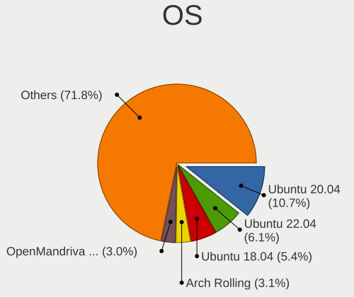

| Name                         | Computers | Percent |
|------------------------------|-----------|---------|
| Ubuntu 20.04                 | 228       | 10.72%  |
| Ubuntu 22.04                 | 130       | 6.11%   |
| Ubuntu 18.04                 | 114       | 5.36%   |
| Arch Rolling                 | 65        | 3.06%   |
| OpenMandriva 23.03           | 63        | 2.96%   |
| OpenMandriva 4.3             | 61        | 2.87%   |
| Ubuntu 24.04                 | 42        | 1.98%   |
| Debian 12                    | 42        | 1.98%   |
| OpenMandriva 4.2             | 41        | 1.93%   |
| Debian 11                    | 37        | 1.74%   |
| Pop!_OS 22.04                | 36        | 1.69%   |
| OpenMandriva 25.90           | 33        | 1.55%   |
| OpenMandriva 24.12           | 30        | 1.41%   |
| OpenMandriva 23.08           | 29        | 1.36%   |
| Zorin 17                     | 27        | 1.27%   |
| Xubuntu 20.04                | 27        | 1.27%   |
| OpenMandriva 4.90            | 27        | 1.27%   |
| OpenMandriva 23.01           | 26        | 1.22%   |
| Manjaro                      | 24        | 1.13%   |
| Zorin 16                     | 23        | 1.08%   |
| OpenMandriva 5.0             | 23        | 1.08%   |
| Fedora 42                    | 21        | 0.99%   |
| Arch                         | 21        | 0.99%   |
| OpenMandriva 24.07           | 18        | 0.85%   |
| BlackPanther 18.1            | 18        | 0.85%   |
| Xubuntu 18.04                | 17        | 0.8%    |
| Ubuntu 21.04                 | 17        | 0.8%    |
| Ubuntu 20.10                 | 17        | 0.8%    |
| OpenMandriva 6.0             | 17        | 0.8%    |
| Fedora 40                    | 16        | 0.75%   |
| Fedora 41                    | 15        | 0.71%   |
| Fedora 39                    | 15        | 0.71%   |
| ArcoLinux Rolling            | 15        | 0.71%   |
| Ubuntu 19.04                 | 14        | 0.66%   |
| Fedora 37                    | 14        | 0.66%   |
| Ubuntu 21.10                 | 13        | 0.61%   |
| Linux Mint 21.1              | 13        | 0.61%   |
| openSUSE Tumbleweed-XXXXXXXX | 12        | 0.56%   |
| Linux Mint 19.3              | 12        | 0.56%   |
| Zorin 15                     | 11        | 0.52%   |

OS Family
---------

OS without a version

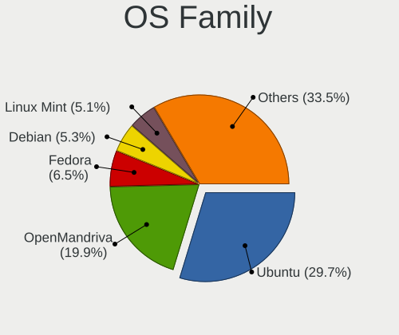

| Name          | Computers | Percent |
|---------------|-----------|---------|
| Ubuntu        | 595       | 29.71%  |
| OpenMandriva  | 398       | 19.87%  |
| Fedora        | 131       | 6.54%   |
| Debian        | 106       | 5.29%   |
| Linux Mint    | 102       | 5.09%   |
| Arch          | 86        | 4.29%   |
| Zorin         | 69        | 3.44%   |
| Pop!_OS       | 62        | 3.1%    |
| Xubuntu       | 50        | 2.5%    |
| Manjaro       | 43        | 2.15%   |
| Kubuntu       | 22        | 1.1%    |
| openSUSE      | 21        | 1.05%   |
| Gentoo        | 19        | 0.95%   |
| BlackPanther  | 18        | 0.9%    |
| Kali          | 16        | 0.8%    |
| KDE neon      | 15        | 0.75%   |
| ArcoLinux     | 15        | 0.75%   |
| NixOS         | 14        | 0.7%    |
| Lubuntu       | 13        | 0.65%   |
| LMDE          | 13        | 0.65%   |
| SteamOS       | 12        | 0.6%    |
| Slackware     | 12        | 0.6%    |
| ROSA          | 12        | 0.6%    |
| Elementary    | 12        | 0.6%    |
| Bazzite       | 11        | 0.55%   |
| Ubuntu Unity  | 10        | 0.5%    |
| CachyOS       | 10        | 0.5%    |
| Ubuntu MATE   | 9         | 0.45%   |
| antiX         | 8         | 0.4%    |
| Ubuntu Budgie | 6         | 0.3%    |
| CentOS        | 6         | 0.3%    |
| Q4OS          | 5         | 0.25%   |
| MX            | 5         | 0.25%   |
| Kylin         | 5         | 0.25%   |
| Garuda Linux  | 5         | 0.25%   |
| Deepin        | 5         | 0.25%   |
| Raspbian      | 4         | 0.2%    |
| Parrot        | 4         | 0.2%    |
| Guix          | 4         | 0.2%    |
| Endless       | 4         | 0.2%    |

Kernel
------

Version of the Linux kernel

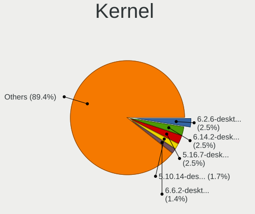

| Version                  | Computers | Percent |
|--------------------------|-----------|---------|
| 6.2.6-desktop-1omv2390   | 59        | 2.53%   |
| 6.14.2-desktop-3omv2590  | 59        | 2.53%   |
| 5.16.7-desktop-1omv4003  | 58        | 2.49%   |
| 5.10.14-desktop-1omv4002 | 39        | 1.67%   |
| 6.6.2-desktop-1omv2390   | 33        | 1.41%   |
| 6.12.1-desktop-1omv2490  | 30        | 1.29%   |
| 6.4.11-desktop-1omv2390  | 28        | 1.2%    |
| 6.1.1-desktop-1omv2290   | 26        | 1.11%   |
| 5.4.0-42-generic         | 24        | 1.03%   |
| 5.4.0-52-generic         | 18        | 0.77%   |
| 5.4.0-58-generic         | 17        | 0.73%   |
| 6.10.0-desktop-1omv2490  | 16        | 0.69%   |
| 4.18.16-desktop-1bP      | 15        | 0.64%   |
| 6.0.2-desktop-1omv4090   | 14        | 0.6%    |
| 5.4.0-40-generic         | 13        | 0.56%   |
| 5.15.0-56-generic        | 13        | 0.56%   |
| 6.8.0-45-generic         | 12        | 0.51%   |
| 5.4.0-33-generic         | 12        | 0.51%   |
| 6.5.0-28-generic         | 10        | 0.43%   |
| 5.4.0-48-generic         | 10        | 0.43%   |
| 5.4.0-37-generic         | 10        | 0.43%   |
| 5.16.13-desktop-1omv4003 | 10        | 0.43%   |
| 6.8.0-51-generic         | 9         | 0.39%   |
| 6.8.0-47-generic         | 9         | 0.39%   |
| 6.5.0-35-generic         | 8         | 0.34%   |
| 6.2.6-76060206-generic   | 8         | 0.34%   |
| 6.2.0-33-generic         | 8         | 0.34%   |
| 5.8.0-50-generic         | 8         | 0.34%   |
| 5.8.0-48-generic         | 8         | 0.34%   |
| 5.8.0-43-generic         | 8         | 0.34%   |
| 5.4.0-54-generic         | 8         | 0.34%   |
| 5.4.0-31-generic         | 8         | 0.34%   |
| 5.11.0-38-generic        | 8         | 0.34%   |
| 6.9.3-76060903-generic   | 7         | 0.3%    |
| 6.8.0-40-generic         | 7         | 0.3%    |
| 6.2.0-39-generic         | 7         | 0.3%    |
| 5.4.0-29-generic         | 7         | 0.3%    |
| 5.19.0-38-generic        | 7         | 0.3%    |
| 5.15.0-58-generic        | 7         | 0.3%    |
| 5.15.0-52-generic        | 7         | 0.3%    |

Kernel Family
-------------

Linux kernel without a distro release

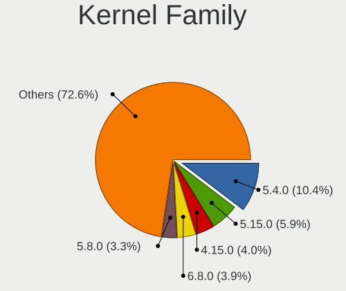

| Version | Computers | Percent |
|---------|-----------|---------|
| 5.4.0   | 229       | 10.35%  |
| 5.15.0  | 130       | 5.88%   |
| 4.15.0  | 88        | 3.98%   |
| 6.8.0   | 87        | 3.93%   |
| 5.8.0   | 72        | 3.25%   |
| 6.2.6   | 67        | 3.03%   |
| 6.14.2  | 62        | 2.8%    |
| 5.11.0  | 61        | 2.76%   |
| 6.5.0   | 59        | 2.67%   |
| 5.16.7  | 59        | 2.67%   |
| 5.13.0  | 58        | 2.62%   |
| 6.1.0   | 54        | 2.44%   |
| 5.19.0  | 44        | 1.99%   |
| 5.10.0  | 42        | 1.9%    |
| 5.3.0   | 41        | 1.85%   |
| 6.2.0   | 40        | 1.81%   |
| 5.10.14 | 40        | 1.81%   |
| 5.0.0   | 36        | 1.63%   |
| 6.12.1  | 34        | 1.54%   |
| 6.6.2   | 33        | 1.49%   |
| 6.4.11  | 31        | 1.4%    |
| 6.14.0  | 31        | 1.4%    |
| 6.1.1   | 28        | 1.27%   |
| 6.11.0  | 27        | 1.22%   |
| 6.10.0  | 18        | 0.81%   |
| 6.0.2   | 15        | 0.68%   |
| 4.18.16 | 15        | 0.68%   |
| 4.18.0  | 14        | 0.63%   |
| 5.16.13 | 11        | 0.5%    |
| 5.14.0  | 11        | 0.5%    |
| 4.4.0   | 10        | 0.45%   |
| 5.12.4  | 8         | 0.36%   |
| 6.9.3   | 7         | 0.32%   |
| 6.4.0   | 7         | 0.32%   |
| 6.3.5   | 7         | 0.32%   |
| 6.12.10 | 7         | 0.32%   |
| 6.0.12  | 7         | 0.32%   |
| 4.19.0  | 7         | 0.32%   |
| 6.8.12  | 6         | 0.27%   |
| 6.5.6   | 6         | 0.27%   |

Kernel Major Ver.
-----------------

Linux kernel major version

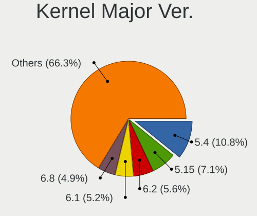

| Version | Computers | Percent |
|---------|-----------|---------|
| 5.4     | 237       | 10.84%  |
| 5.15    | 156       | 7.13%   |
| 6.2     | 123       | 5.62%   |
| 6.1     | 113       | 5.17%   |
| 6.8     | 108       | 4.94%   |
| 5.10    | 108       | 4.94%   |
| 6.14    | 105       | 4.8%    |
| 6.12    | 94        | 4.3%    |
| 4.15    | 88        | 4.02%   |
| 5.8     | 83        | 3.8%    |
| 5.16    | 79        | 3.61%   |
| 6.5     | 77        | 3.52%   |
| 5.13    | 73        | 3.34%   |
| 5.19    | 67        | 3.06%   |
| 5.11    | 66        | 3.02%   |
| 6.6     | 65        | 2.97%   |
| 6.4     | 51        | 2.33%   |
| 5.3     | 46        | 2.1%    |
| 6.0     | 43        | 1.97%   |
| 6.11    | 41        | 1.87%   |
| 5.0     | 39        | 1.78%   |
| 6.10    | 37        | 1.69%   |
| 4.18    | 29        | 1.33%   |
| 5.14    | 23        | 1.05%   |
| 5.18    | 21        | 0.96%   |
| 6.3     | 19        | 0.87%   |
| 6.9     | 18        | 0.82%   |
| 6.17    | 17        | 0.78%   |
| 6.15    | 16        | 0.73%   |
| 6.13    | 16        | 0.73%   |
| 5.12    | 16        | 0.73%   |
| 6.7     | 12        | 0.55%   |
| 5.9     | 12        | 0.55%   |
| 5.6     | 12        | 0.55%   |
| 6.16    | 11        | 0.5%    |
| 5.17    | 11        | 0.5%    |
| 4.19    | 11        | 0.5%    |
| 4.4     | 10        | 0.46%   |
| 4.9     | 8         | 0.37%   |
| 6.18    | 6         | 0.27%   |

Arch
----

OS architecture (x86_64, i586, etc.)

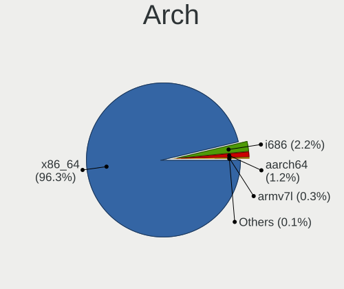

| Name        | Computers | Percent |
|-------------|-----------|---------|
| x86_64      | 1885      | 96.27%  |
| i686        | 43        | 2.2%    |
| aarch64     | 23        | 1.17%   |
| armv7l      | 5         | 0.26%   |
| ppc         | 1         | 0.05%   |
| loongarch64 | 1         | 0.05%   |

DE
--

Desktop Environment

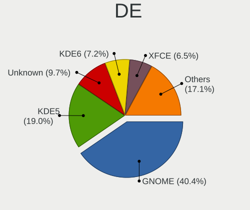

| Name                     | Computers | Percent |
|--------------------------|-----------|---------|
| GNOME                    | 816       | 40.44%  |
| KDE5                     | 384       | 19.03%  |
| Unknown                  | 196       | 9.71%   |
| KDE6                     | 145       | 7.19%   |
| XFCE                     | 132       | 6.54%   |
| X-Cinnamon               | 93        | 4.61%   |
| LXQt                     | 41        | 2.03%   |
| MATE                     | 35        | 1.73%   |
| KDE                      | 21        | 1.04%   |
| sway                     | 15        | 0.74%   |
| Cinnamon                 | 14        | 0.69%   |
| Hyprland                 | 13        | 0.64%   |
| Pantheon                 | 12        | 0.59%   |
| Unity                    | 11        | 0.55%   |
| LXDE                     | 11        | 0.55%   |
| i3                       | 11        | 0.55%   |
| Budgie                   | 11        | 0.55%   |
| Deepin                   | 8         | 0.4%    |
| KDE4                     | 6         | 0.3%    |
| GNOME Classic            | 6         | 0.3%    |
| Trinity                  | 4         | 0.2%    |
| Openbox                  | 4         | 0.2%    |
| icewm                    | 4         | 0.2%    |
| awesome                  | 4         | 0.2%    |
| GNOME Flashback          | 3         | 0.15%   |
| XSession                 | 2         | 0.1%    |
| fluxbox                  | 2         | 0.1%    |
| Enlightenment            | 2         | 0.1%    |
| BunsenLabs               | 2         | 0.1%    |
| xwmconfig                | 1         | 0.05%   |
| xterm                    | 1         | 0.05%   |
| xmonad                   | 1         | 0.05%   |
| UKUI                     | 1         | 0.05%   |
| qtile                    | 1         | 0.05%   |
| niri                     | 1         | 0.05%   |
| JWM                      | 1         | 0.05%   |
| dwm                      | 1         | 0.05%   |
| COSMIC                   | 1         | 0.05%   |
| /usr/bin/openbox-session | 1         | 0.05%   |

Display Server
--------------

X11 or Wayland

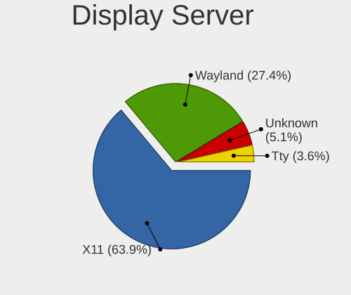

| Name    | Computers | Percent |
|---------|-----------|---------|
| X11     | 1295      | 63.92%  |
| Wayland | 556       | 27.44%  |
| Unknown | 103       | 5.08%   |
| Tty     | 72        | 3.55%   |

Display Manager
---------------

SDDM, LightDM, etc.

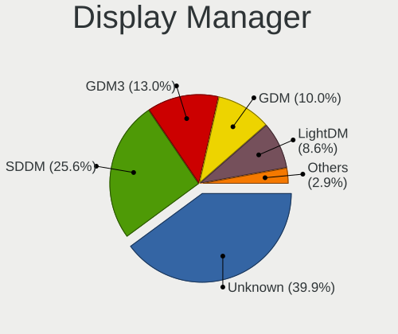

| Name    | Computers | Percent |
|---------|-----------|---------|
| Unknown | 805       | 39.89%  |
| SDDM    | 517       | 25.62%  |
| GDM3    | 263       | 13.03%  |
| GDM     | 202       | 10.01%  |
| LightDM | 173       | 8.57%   |
| TDM     | 26        | 1.29%   |
| GREETD  | 9         | 0.45%   |
| XDM     | 6         | 0.3%    |
| LXDM    | 4         | 0.2%    |
| KDM     | 4         | 0.2%    |
| SLIMSKI | 3         | 0.15%   |
| NODM    | 3         | 0.15%   |
| SLiM    | 2         | 0.1%    |
| EMPTTY  | 1         | 0.05%   |

OS Lang
-------

Language

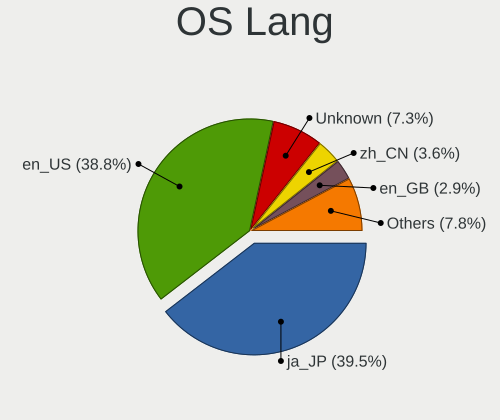

| Lang        | Computers | Percent |
|-------------|-----------|---------|
| ja_JP       | 794       | 39.54%  |
| en_US       | 780       | 38.84%  |
| Unknown     | 147       | 7.32%   |
| zh_CN       | 72        | 3.59%   |
| en_GB       | 59        | 2.94%   |
| pt_BR       | 36        | 1.79%   |
| C           | 26        | 1.29%   |
| fr_FR       | 16        | 0.8%    |
| en_AU       | 13        | 0.65%   |
| en_AG       | 7         | 0.35%   |
| ru_RU       | 6         | 0.3%    |
| es_ES       | 6         | 0.3%    |
| it_IT       | 5         | 0.25%   |
| de_DE       | 5         | 0.25%   |
| UTF-8       | 4         | 0.2%    |
| en_IN       | 3         | 0.15%   |
| en_CA       | 3         | 0.15%   |
| zh_TW       | 2         | 0.1%    |
| sr_RS       | 2         | 0.1%    |
| sk_SK       | 2         | 0.1%    |
| en_SG       | 2         | 0.1%    |
| tr_TR       | 1         | 0.05%   |
| sv_SE       | 1         | 0.05%   |
| pl_PL       | 1         | 0.05%   |
| nb_NO       | 1         | 0.05%   |
| jp_JP       | 1         | 0.05%   |
| ja_JP.UTF8  | 1         | 0.05%   |
| ja_JP.utf-8 | 1         | 0.05%   |
| fr_CA       | 1         | 0.05%   |
| fi_FI       | 1         | 0.05%   |
| es_HN       | 1         | 0.05%   |
| es_GT       | 1         | 0.05%   |
| es_BO       | 1         | 0.05%   |
| en_PH       | 1         | 0.05%   |
| en_NL       | 1         | 0.05%   |
| en_DK       | 1         | 0.05%   |
| el_GR       | 1         | 0.05%   |
| C.UTF8      | 1         | 0.05%   |
| af_ZA       | 1         | 0.05%   |

Boot Mode
---------

EFI or BIOS

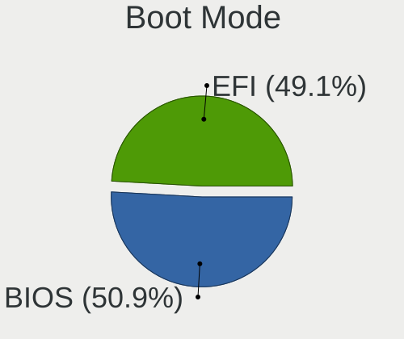

| Mode | Computers | Percent |
|------|-----------|---------|
| BIOS | 1015      | 50.88%  |
| EFI  | 980       | 49.12%  |

Filesystem
----------

Type of filesystem

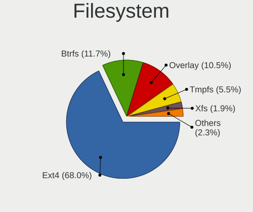

| Type     | Computers | Percent |
|----------|-----------|---------|
| Ext4     | 1373      | 68%     |
| Btrfs    | 237       | 11.74%  |
| Overlay  | 212       | 10.5%   |
| Tmpfs    | 112       | 5.55%   |
| Xfs      | 38        | 1.88%   |
| Unknown  | 24        | 1.19%   |
| Zfs      | 10        | 0.5%    |
| F2fs     | 4         | 0.2%    |
| Jfs      | 2         | 0.1%    |
| Ext3     | 2         | 0.1%    |
| Bcachefs | 2         | 0.1%    |
| Rootfs   | 1         | 0.05%   |
| Ntfs     | 1         | 0.05%   |
| Ext2     | 1         | 0.05%   |

Part. scheme
------------

Scheme of partitioning

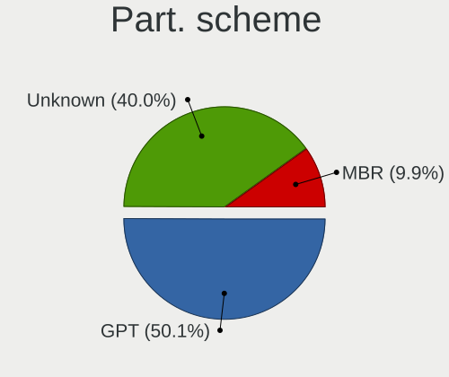

| Type    | Computers | Percent |
|---------|-----------|---------|
| GPT     | 1010      | 50.07%  |
| Unknown | 807       | 40.01%  |
| MBR     | 200       | 9.92%   |

Dual Boot with Linux/BSD
------------------------

Hosting more than one Linux/BSD

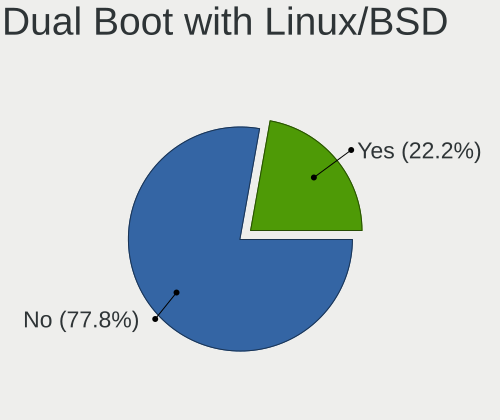

| Dual boot | Computers | Percent |
|-----------|-----------|---------|
| No        | 1560      | 77.81%  |
| Yes       | 445       | 22.19%  |

Dual Boot (Win)
---------------

Hosting Linux and Windows

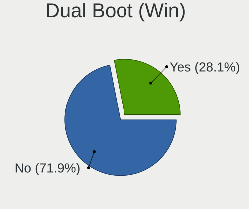

| Dual boot | Computers | Percent |
|-----------|-----------|---------|
| No        | 1433      | 71.94%  |
| Yes       | 559       | 28.06%  |

Board
-----

Vendor
------

Motherboard manufacturer

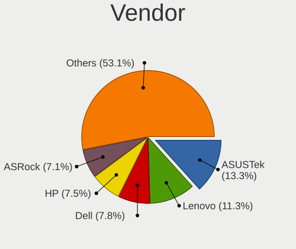

| Name                                 | Computers | Percent |
|--------------------------------------|-----------|---------|
| ASUSTek Computer                     | 260       | 13.3%   |
| Lenovo                               | 220       | 11.25%  |
| Dell                                 | 152       | 7.77%   |
| Hewlett-Packard                      | 147       | 7.52%   |
| ASRock                               | 138       | 7.06%   |
| Gigabyte Technology                  | 105       | 5.37%   |
| Toshiba                              | 98        | 5.01%   |
| MSI                                  | 98        | 5.01%   |
| Fujitsu                              | 88        | 4.5%    |
| NEC Computers                        | 87        | 4.45%   |
| Apple                                | 67        | 3.43%   |
| Intel                                | 39        | 1.99%   |
| MouseComputer                        | 38        | 1.94%   |
| Sony                                 | 33        | 1.69%   |
| Acer                                 | 31        | 1.59%   |
| Panasonic                            | 30        | 1.53%   |
| Unknown                              | 23        | 1.18%   |
| Raspberry Pi Foundation              | 19        | 0.97%   |
| HUAWEI                               | 16        | 0.82%   |
| Microsoft                            | 12        | 0.61%   |
| Shenzhen Meigao Electronic Equipment | 11        | 0.56%   |
| ECS                                  | 11        | 0.56%   |
| Dynabook                             | 11        | 0.56%   |
| Biostar                              | 11        | 0.56%   |
| EPSON DIRECT                         | 10        | 0.51%   |
| Valve                                | 9         | 0.46%   |
| Gateway                              | 9         | 0.46%   |
| Google                               | 7         | 0.36%   |
| Timi                                 | 6         | 0.31%   |
| Supermicro                           | 6         | 0.31%   |
| Alienware                            | 6         | 0.31%   |
| Wistron                              | 5         | 0.26%   |
| GMKtec                               | 5         | 0.26%   |
| Foxconn                              | 5         | 0.26%   |
| Thirdwave                            | 4         | 0.2%    |
| Pegatron                             | 4         | 0.2%    |
| Novastar                             | 4         | 0.2%    |
| MCJ                                  | 4         | 0.2%    |
| Framework                            | 4         | 0.2%    |
| AZW                                  | 4         | 0.2%    |

Model
-----

Motherboard model

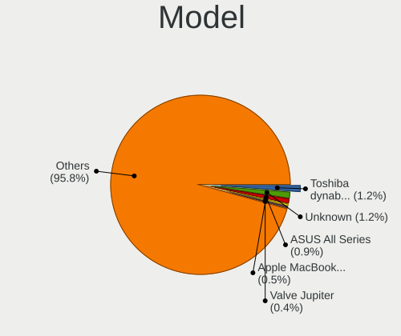

| Name                                       | Computers | Percent |
|--------------------------------------------|-----------|---------|
| Toshiba dynabook T653/46JR                 | 24        | 1.23%   |
| Unknown                                    | 24        | 1.23%   |
| ASUS All Series                            | 18        | 0.92%   |
| Apple MacBookAir9,1                        | 9         | 0.46%   |
| Valve Jupiter                              | 8         | 0.41%   |
| RPi Raspberry Pi                           | 6         | 0.31%   |
| MSI MS-7C95                                | 6         | 0.31%   |
| HP ProDesk 600 G1 SFF                      | 6         | 0.31%   |
| Toshiba dynabook Satellite B552/G          | 5         | 0.26%   |
| Lenovo G500 20236                          | 5         | 0.26%   |
| Dell OptiPlex 3020                         | 5         | 0.26%   |
| ASUS Zenbook S 13 UX5304VA_UX5304VA        | 5         | 0.26%   |
| ASRock B450M Pro4                          | 5         | 0.26%   |
| Apple MacBookPro9,2                        | 5         | 0.26%   |
| RPi Raspberry Pi 4 Model B Rev 1.4         | 4         | 0.2%    |
| RPi Raspberry Pi 4 Model B Rev 1.2         | 4         | 0.2%    |
| Novastar KL55                              | 4         | 0.2%    |
| MSI MS-7B79                                | 4         | 0.2%    |
| MSI MS-7A40                                | 4         | 0.2%    |
| Lenovo G570 4334                           | 4         | 0.2%    |
| ECS G31T-M                                 | 4         | 0.2%    |
| Dell OptiPlex 3010                         | 4         | 0.2%    |
| ASUS TUF Gaming B550M-PLUS                 | 4         | 0.2%    |
| ASUS H170-PRO                              | 4         | 0.2%    |
| ASRock Z87 Killer                          | 4         | 0.2%    |
| ASRock B550M Pro4                          | 4         | 0.2%    |
| ASRock B450 Pro4                           | 4         | 0.2%    |
| ASRock B450 Gaming-ITX/ac                  | 4         | 0.2%    |
| Apple MacBookPro15,1                       | 4         | 0.2%    |
| Toshiba dynabook Satellite B552/H          | 3         | 0.15%   |
| Toshiba dynabook REGZA PC D712/T3FWD       | 3         | 0.15%   |
| Supermicro Super Server                    | 3         | 0.15%   |
| RPi Raspberry Pi 5 Model B Rev 1.0         | 3         | 0.15%   |
| Panasonic CFRZ4-2                          | 3         | 0.15%   |
| NEC Computers Express5800/S70 [N8100-9021] | 3         | 0.15%   |
| MSI MS-7D76                                | 3         | 0.15%   |
| MSI MS-7C94                                | 3         | 0.15%   |
| MSI MS-7C35                                | 3         | 0.15%   |
| MSI MS-7865                                | 3         | 0.15%   |
| Lenovo G550 2958                           | 3         | 0.15%   |

Model Family
------------

Motherboard model prefix

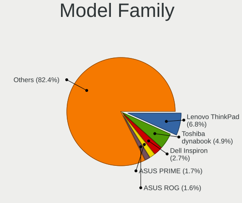

| Name                  | Computers | Percent |
|-----------------------|-----------|---------|
| Lenovo ThinkPad       | 132       | 6.75%   |
| Toshiba dynabook      | 95        | 4.86%   |
| Dell Inspiron         | 53        | 2.71%   |
| ASUS PRIME            | 34        | 1.74%   |
| ASUS ROG              | 31        | 1.59%   |
| Dell Latitude         | 26        | 1.33%   |
| ASUS TUF              | 24        | 1.23%   |
| Unknown               | 24        | 1.23%   |
| HP ProBook            | 20        | 1.02%   |
| Acer Aspire           | 20        | 1.02%   |
| RPi Raspberry         | 19        | 0.97%   |
| Dell OptiPlex         | 18        | 0.92%   |
| ASUS All              | 18        | 0.92%   |
| Dell XPS              | 16        | 0.82%   |
| Dell Vostro           | 15        | 0.77%   |
| HP ProDesk            | 14        | 0.72%   |
| HP Pavilion           | 14        | 0.72%   |
| HP Compaq             | 14        | 0.72%   |
| Lenovo IdeaPad        | 13        | 0.66%   |
| Microsoft Surface     | 12        | 0.61%   |
| Lenovo ThinkCentre    | 12        | 0.61%   |
| ASUS VivoBook         | 12        | 0.61%   |
| HP ENVY               | 11        | 0.56%   |
| HP EliteBook          | 11        | 0.56%   |
| Lenovo ThinkBook      | 10        | 0.51%   |
| HP Laptop             | 10        | 0.51%   |
| EPSON DIRECT Endeavor | 10        | 0.51%   |
| ASUS Zenbook          | 10        | 0.51%   |
| ASRock B450           | 9         | 0.46%   |
| Apple MacBookAir9     | 9         | 0.46%   |
| Valve Jupiter         | 8         | 0.41%   |
| Lenovo Yoga           | 8         | 0.41%   |
| Dell Precision        | 8         | 0.41%   |
| HP EliteDesk          | 7         | 0.36%   |
| ASUS ASUS             | 7         | 0.36%   |
| MSI MS-7C95           | 6         | 0.31%   |
| Lenovo Legion         | 6         | 0.31%   |
| ASUS P8Z77-V          | 6         | 0.31%   |
| ASRock B550M          | 6         | 0.31%   |
| ASRock B450M          | 6         | 0.31%   |

MFG Year
--------

Motherboard manufacture year

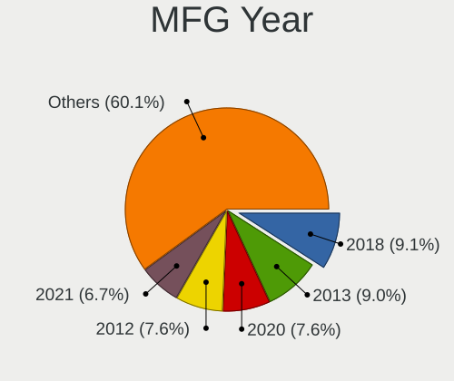

| Year    | Computers | Percent |
|---------|-----------|---------|
| 2018    | 178       | 9.1%    |
| 2013    | 176       | 9%      |
| 2020    | 148       | 7.57%   |
| 2012    | 148       | 7.57%   |
| 2021    | 131       | 6.7%    |
| 2019    | 125       | 6.39%   |
| 2011    | 116       | 5.93%   |
| 2016    | 96        | 4.91%   |
| 2010    | 89        | 4.55%   |
| 2023    | 88        | 4.5%    |
| 2017    | 83        | 4.25%   |
| 2022    | 81        | 4.14%   |
| 2015    | 81        | 4.14%   |
| 2014    | 80        | 4.09%   |
| 2009    | 77        | 3.94%   |
| 2024    | 69        | 3.53%   |
| 2008    | 67        | 3.43%   |
| 2007    | 53        | 2.71%   |
| Unknown | 24        | 1.23%   |
| 2006    | 23        | 1.18%   |
| 2025    | 12        | 0.61%   |
| 2005    | 6         | 0.31%   |
| 2004    | 2         | 0.1%    |
| 2003    | 1         | 0.05%   |
| 2001    | 1         | 0.05%   |

Form Factor
-----------

Physical design of the computer

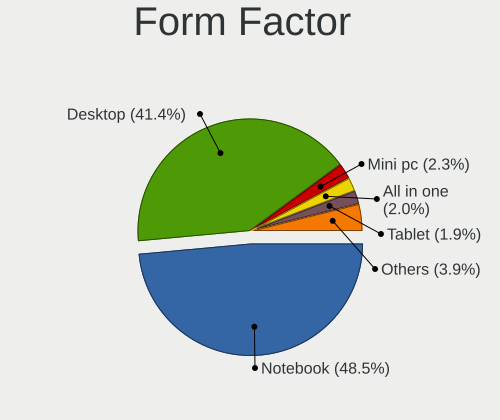

| Name           | Computers | Percent |
|----------------|-----------|---------|
| Notebook       | 949       | 48.54%  |
| Desktop        | 809       | 41.38%  |
| Mini pc        | 44        | 2.25%   |
| All in one     | 39        | 1.99%   |
| Tablet         | 38        | 1.94%   |
| Convertible    | 31        | 1.59%   |
| System on chip | 24        | 1.23%   |
| Server         | 20        | 1.02%   |
| Phone          | 1         | 0.05%   |

Secure Boot
-----------

Enabled or disabled

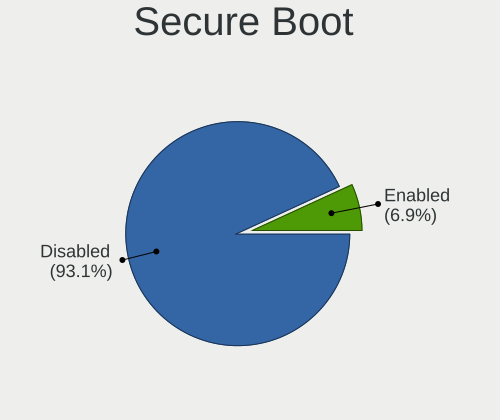

| State    | Computers | Percent |
|----------|-----------|---------|
| Disabled | 1832      | 93.14%  |
| Enabled  | 135       | 6.86%   |

Coreboot
--------

Have coreboot on board

| Used | Computers | Percent |
|------|-----------|---------|
| No   | 1944      | 99.44%  |
| Yes  | 11        | 0.56%   |

RAM Size
--------

Total RAM memory

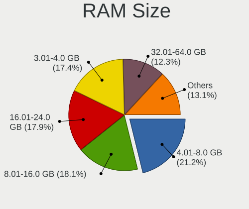

| Size in GB      | Computers | Percent |
|-----------------|-----------|---------|
| 4.01-8.0        | 422       | 21.16%  |
| 8.01-16.0       | 361       | 18.1%   |
| 16.01-24.0      | 357       | 17.9%   |
| 3.01-4.0        | 347       | 17.4%   |
| 32.01-64.0      | 245       | 12.29%  |
| 64.01-256.0     | 83        | 4.16%   |
| 24.01-32.0      | 72        | 3.61%   |
| 1.01-2.0        | 65        | 3.26%   |
| 2.01-3.0        | 27        | 1.35%   |
| 0.51-1.0        | 9         | 0.45%   |
| More than 256.0 | 3         | 0.15%   |
| 0.01-0.5        | 3         | 0.15%   |

RAM Used
--------

Used RAM memory

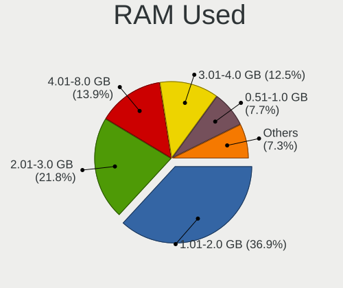

| Used GB    | Computers | Percent |
|------------|-----------|---------|
| 1.01-2.0   | 792       | 36.85%  |
| 2.01-3.0   | 468       | 21.78%  |
| 4.01-8.0   | 299       | 13.91%  |
| 3.01-4.0   | 268       | 12.47%  |
| 0.51-1.0   | 165       | 7.68%   |
| 8.01-16.0  | 89        | 4.14%   |
| 0.01-0.5   | 36        | 1.68%   |
| 16.01-24.0 | 21        | 0.98%   |
| 24.01-32.0 | 6         | 0.28%   |
| 32.01-64.0 | 4         | 0.19%   |
| Unknown    | 1         | 0.05%   |

Total Drives
------------

Number of drives on board

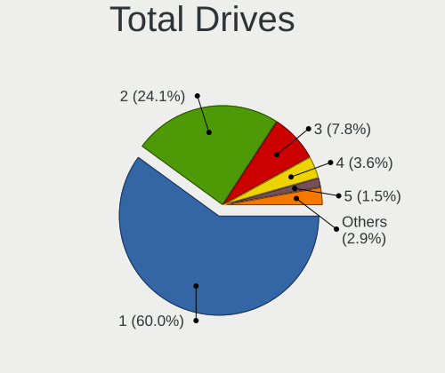

| Drives | Computers | Percent |
|--------|-----------|---------|
| 1      | 1212      | 60.03%  |
| 2      | 487       | 24.12%  |
| 3      | 158       | 7.83%   |
| 4      | 73        | 3.62%   |
| 5      | 31        | 1.54%   |
| 0      | 21        | 1.04%   |
| 6      | 13        | 0.64%   |
| 7      | 12        | 0.59%   |
| 8      | 4         | 0.2%    |
| 11     | 3         | 0.15%   |
| 9      | 3         | 0.15%   |
| 26     | 1         | 0.05%   |
| 10     | 1         | 0.05%   |

Has CD-ROM
----------

Has CD-ROM on board

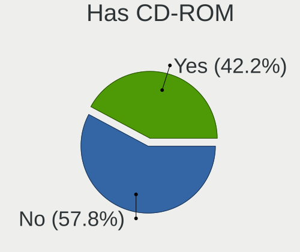

| Presented | Computers | Percent |
|-----------|-----------|---------|
| No        | 1140      | 57.81%  |
| Yes       | 832       | 42.19%  |

Has Ethernet
------------

Has Ethernet on board

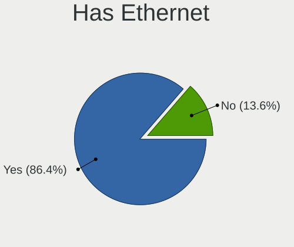

| Presented | Computers | Percent |
|-----------|-----------|---------|
| Yes       | 1692      | 86.37%  |
| No        | 267       | 13.63%  |

Has WiFi
--------

Has WiFi module

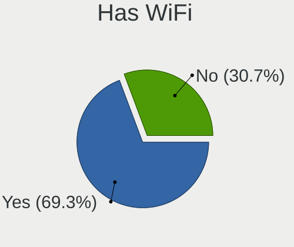

| Presented | Computers | Percent |
|-----------|-----------|---------|
| Yes       | 1361      | 69.3%   |
| No        | 603       | 30.7%   |

Has Bluetooth
-------------

Has Bluetooth module

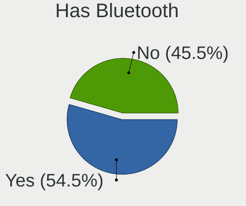

| Presented | Computers | Percent |
|-----------|-----------|---------|
| Yes       | 1081      | 54.46%  |
| No        | 904       | 45.54%  |

Location
--------

Country
-------

Geographic location (country)

| Country | Computers | Percent |
|---------|-----------|---------|
| Japan   | 1955      | 100%    |

City
----

Geographic location (city)

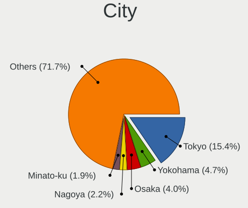

| City        | Computers | Percent |
|-------------|-----------|---------|
| Tokyo       | 325       | 15.43%  |
| Yokohama    | 98        | 4.65%   |
| Osaka       | 85        | 4.04%   |
| Nagoya      | 46        | 2.18%   |
| Minato-ku   | 41        | 1.95%   |
| Shinjuku    | 33        | 1.57%   |
| Chiyoda     | 33        | 1.57%   |
| Niigata     | 26        | 1.23%   |
| Kyoto       | 25        | 1.19%   |
| Sapporo     | 23        | 1.09%   |
| Saitama     | 21        | 1%      |
| Shibuya     | 19        | 0.9%    |
| Honcho      | 19        | 0.9%    |
| Tsukuba     | 18        | 0.85%   |
| Setagaya-ku | 17        | 0.81%   |
| Kobe        | 17        | 0.81%   |
| Fukuoka     | 17        | 0.81%   |
| Chiyoda-ku  | 16        | 0.76%   |
| Tokushima   | 14        | 0.66%   |
| Kagoshima   | 14        | 0.66%   |
| Takasago    | 13        | 0.62%   |
| Umeda       | 12        | 0.57%   |
| Takamatsu   | 12        | 0.57%   |
| Okayama     | 12        | 0.57%   |
| Hiroshima   | 12        | 0.57%   |
| Adachi      | 12        | 0.57%   |
| Nakano      | 11        | 0.52%   |
| Miura       | 11        | 0.52%   |
| Kochi       | 11        | 0.52%   |
| Shinagawa   | 10        | 0.47%   |
| Nagano      | 10        | 0.47%   |
| Miyazaki    | 10        | 0.47%   |
| Minatomirai | 10        | 0.47%   |
| Kawasaki    | 10        | 0.47%   |
| Ichikawa    | 10        | 0.47%   |
| Himeji      | 10        | 0.47%   |
| Kitakyushu  | 9         | 0.43%   |
| Kawaguchi   | 9         | 0.43%   |
| Hamamatsu   | 9         | 0.43%   |
| Utsunomiya  | 8         | 0.38%   |

Drives
------

Drive Vendor
------------

Hard drive vendors

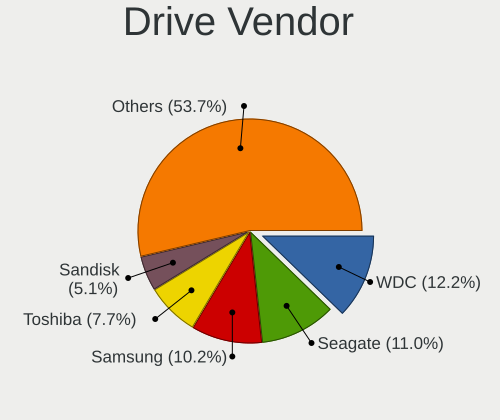

| Vendor                      | Computers | Drives | Percent |
|-----------------------------|-----------|--------|---------|
| WDC                         | 361       | 546    | 12.25%  |
| Seagate                     | 325       | 496    | 11.03%  |
| Samsung Electronics         | 302       | 415    | 10.25%  |
| Toshiba                     | 228       | 289    | 7.74%   |
| Sandisk                     | 149       | 211    | 5.06%   |
| Crucial                     | 139       | 192    | 4.72%   |
| Unknown                     | 138       | 178    | 4.68%   |
| Hitachi                     | 129       | 187    | 4.38%   |
| Intel                       | 92        | 119    | 3.12%   |
| Micron Technology           | 68        | 85     | 2.31%   |
| A-DATA Technology           | 59        | 76     | 2%      |
| Kingston                    | 58        | 65     | 1.97%   |
| SPCC                        | 49        | 60     | 1.66%   |
| Apple                       | 48        | 60     | 1.63%   |
| SK hynix                    | 46        | 55     | 1.56%   |
| Unknown                     | 41        | 43     | 1.39%   |
| Phison Electronics          | 34        | 50     | 1.15%   |
| KIOXIA                      | 34        | 38     | 1.15%   |
| HGST                        | 31        | 37     | 1.05%   |
| Micron/Crucial Technology   | 30        | 41     | 1.02%   |
| MAXIO Technology (Hangzhou) | 26        | 33     | 0.88%   |
| China                       | 26        | 35     | 0.88%   |
| Transcend                   | 24        | 32     | 0.81%   |
| SUNEAST                     | 23        | 28     | 0.78%   |
| Silicon Motion              | 22        | 29     | 0.75%   |
| Plextor                     | 18        | 22     | 0.61%   |
| KIOXIA-EXCERIA              | 18        | 20     | 0.61%   |
| Phison                      | 17        | 23     | 0.58%   |
| Fujitsu                     | 16        | 18     | 0.54%   |
| JMicron Technology          | 15        | 16     | 0.51%   |
| BUFFALO                     | 14        | 16     | 0.48%   |
| Lexar                       | 13        | 16     | 0.44%   |
| Dogfish                     | 11        | 13     | 0.37%   |
| Teclast                     | 10        | 11     | 0.34%   |
| Team                        | 10        | 12     | 0.34%   |
| Patriot                     | 10        | 11     | 0.34%   |
| KLEVV                       | 10        | 19     | 0.34%   |
| Kingston Technology Company | 10        | 11     | 0.34%   |
| Zheino                      | 9         | 10     | 0.31%   |
| ELECOM                      | 9         | 9      | 0.31%   |

Drive Model
-----------

Hard drive models

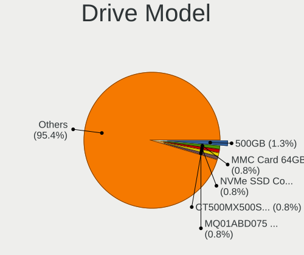

| Model                                                 | Computers | Percent |
|-------------------------------------------------------|-----------|---------|
| Unknown                                               | 41        | 1.28%   |
| Unknown MMC Card  64GB                                | 27        | 0.84%   |
| Samsung NVMe SSD Controller SM981/PM981/PM983 1TB     | 27        | 0.84%   |
| Crucial CT500MX500SSD1 500GB                          | 27        | 0.84%   |
| Toshiba MQ01ABD075 752GB                              | 25        | 0.78%   |
| Crucial CT240BX500SSD1 240GB                          | 22        | 0.69%   |
| Toshiba DT01ACA100 1TB                                | 21        | 0.65%   |
| Seagate ST4000DM004-2CV104 4TB                        | 18        | 0.56%   |
| Unknown MMC Card  32GB                                | 17        | 0.53%   |
| Toshiba MQ01ABD100 1TB                                | 15        | 0.47%   |
| Samsung NVMe SSD Controller PM9A1/PM9A3/980PRO 1TB    | 14        | 0.44%   |
| Crucial CT1000MX500SSD1 1TB                           | 14        | 0.44%   |
| Toshiba DT01ACA200 2TB                                | 13        | 0.4%    |
| Seagate ST1000DM010-2EP102 1TB                        | 13        | 0.4%    |
| Micron/Crucial P2 NVMe PCIe SSD 2TB                   | 13        | 0.4%    |
| MAXIO (Hangzhou) NVMe SSD Controller MAP1202 2TB      | 13        | 0.4%    |
| WDC WD40EZRZ-00GXCB0 4TB                              | 12        | 0.37%   |
| Toshiba MQ01ABF050 500GB                              | 12        | 0.37%   |
| Phison PS5013 E13 NVMe Controller 500GB               | 12        | 0.37%   |
| Unknown MMC Card  128GB                               | 11        | 0.34%   |
| SPCC Solid State Disk 256GB                           | 11        | 0.34%   |
| Seagate ST500DM002-1BD142 500GB                       | 11        | 0.34%   |
| Seagate ST3500418AS 500GB                             | 11        | 0.34%   |
| Sandisk WD Blue SN550 NVMe SSD 1024GB                 | 11        | 0.34%   |
| Samsung SSD 860 EVO 500GB                             | 11        | 0.34%   |
| Seagate ST9500325AS 500GB                             | 10        | 0.31%   |
| Seagate ST2000DM001-1CH164 2TB                        | 10        | 0.31%   |
| SanDisk NVMe SSD Drive 1TB                            | 10        | 0.31%   |
| Toshiba MQ01ABF032 320GB                              | 9         | 0.28%   |
| Seagate ST2000DM008-2FR102 2TB                        | 9         | 0.28%   |
| Kingston SV300S37A120G 120GB SSD                      | 9         | 0.28%   |
| A-DATA SU650 240GB SSD                                | 9         | 0.28%   |
| WDC WD20EZRX-00DC0B0 2TB                              | 8         | 0.25%   |
| Silicon Motion SM2263EN/SM2263XT SSD Controller 512GB | 8         | 0.25%   |
| Seagate ST2000DM006-2DM164 2TB                        | 8         | 0.25%   |
| Seagate ST2000DM001-1ER164 2TB                        | 8         | 0.25%   |
| Seagate ST1000LM035-1RK172 1TB                        | 8         | 0.25%   |
| Seagate ST1000DM003-1ER162 1TB                        | 8         | 0.25%   |
| JMicron Tech 250GB                                    | 8         | 0.25%   |
| Crucial CT525MX300SSD1 528GB                          | 8         | 0.25%   |

HDD Vendor
----------

Hard disk drive vendors

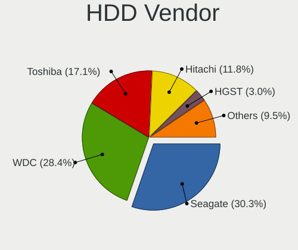

| Vendor              | Computers | Drives | Percent |
|---------------------|-----------|--------|---------|
| Seagate             | 317       | 481    | 30.28%  |
| WDC                 | 297       | 436    | 28.37%  |
| Toshiba             | 179       | 218    | 17.1%   |
| Hitachi             | 124       | 182    | 11.84%  |
| HGST                | 31        | 37     | 2.96%   |
| Samsung Electronics | 25        | 33     | 2.39%   |
| Fujitsu             | 16        | 18     | 1.53%   |
| Unknown             | 7         | 9      | 0.67%   |
| Maxtor              | 7         | 10     | 0.67%   |
| Apple               | 7         | 8      | 0.67%   |
| JMicron Technology  | 6         | 7      | 0.57%   |
| USB                 | 4         | 4      | 0.38%   |
| Hewlett-Packard     | 4         | 11     | 0.38%   |
| SSK                 | 3         | 3      | 0.29%   |
| MARVELL             | 3         | 5      | 0.29%   |
| USB3.0              | 2         | 2      | 0.19%   |
| QC-FT-D             | 2         | 2      | 0.19%   |
| PASOUL 2            | 2         | 2      | 0.19%   |
| External            | 2         | 2      | 0.19%   |
| TO Exter            | 1         | 1      | 0.1%    |
| StoreJet            | 1         | 1      | 0.1%    |
| SILICONMOTION       | 1         | 1      | 0.1%    |
| Quantum             | 1         | 1      | 0.1%    |
| MARSHAL             | 1         | 2      | 0.1%    |
| KIOXIA              | 1         | 1      | 0.1%    |
| KESU                | 1         | 1      | 0.1%    |
| ASMT                | 1         | 2      | 0.1%    |
| Unknown             | 1         | 1      | 0.1%    |

SSD Vendor
----------

Solid state drive vendors

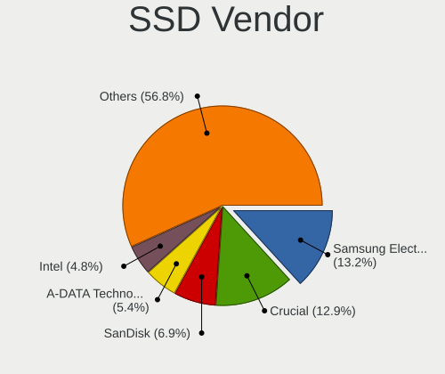

| Vendor              | Computers | Drives | Percent |
|---------------------|-----------|--------|---------|
| Samsung Electronics | 131       | 181    | 13.21%  |
| Crucial             | 128       | 176    | 12.9%   |
| SanDisk             | 68        | 101    | 6.85%   |
| A-DATA Technology   | 54        | 70     | 5.44%   |
| Intel               | 48        | 55     | 4.84%   |
| WDC                 | 46        | 62     | 4.64%   |
| Kingston            | 44        | 50     | 4.44%   |
| SPCC                | 38        | 47     | 3.83%   |
| Toshiba             | 33        | 42     | 3.33%   |
| China               | 25        | 34     | 2.52%   |
| Micron Technology   | 23        | 27     | 2.32%   |
| Transcend           | 22        | 30     | 2.22%   |
| SUNEAST             | 22        | 27     | 2.22%   |
| Unknown             | 20        | 21     | 2.02%   |
| Plextor             | 18        | 22     | 1.81%   |
| Apple               | 18        | 20     | 1.81%   |
| BUFFALO             | 14        | 16     | 1.41%   |
| KIOXIA-EXCERIA      | 12        | 13     | 1.21%   |
| Dogfish             | 11        | 13     | 1.11%   |
| Team                | 10        | 12     | 1.01%   |
| KLEVV               | 10        | 19     | 1.01%   |
| Unknown             | 9         | 9      | 0.91%   |
| Lexar               | 9         | 12     | 0.91%   |
| Zheino              | 8         | 8      | 0.81%   |
| Teclast             | 8         | 9      | 0.81%   |
| OCZ                 | 8         | 8      | 0.81%   |
| Green House         | 8         | 11     | 0.81%   |
| LITEON              | 7         | 11     | 0.71%   |
| CFD                 | 7         | 8      | 0.71%   |
| Apacer              | 7         | 10     | 0.71%   |
| SK hynix            | 6         | 9      | 0.6%    |
| Seagate             | 6         | 9      | 0.6%    |
| PNY                 | 6         | 7      | 0.6%    |
| Patriot             | 5         | 6      | 0.5%    |
| Hitachi             | 5         | 5      | 0.5%    |
| Netac               | 4         | 5      | 0.4%    |
| LITEONIT            | 4         | 7      | 0.4%    |
| Kingmax             | 4         | 4      | 0.4%    |
| Hanye               | 4         | 5      | 0.4%    |
| Biostar             | 4         | 5      | 0.4%    |

Drive Kind
----------

HDD or SSD

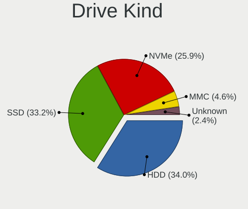

| Kind    | Computers | Drives | Percent |
|---------|-----------|--------|---------|
| HDD     | 867       | 1481   | 33.97%  |
| SSD     | 846       | 1280   | 33.15%  |
| NVMe    | 660       | 970    | 25.86%  |
| MMC     | 118       | 146    | 4.62%   |
| Unknown | 61        | 93     | 2.39%   |

Drive Connector
---------------

SATA, SAS, NVMe, etc.

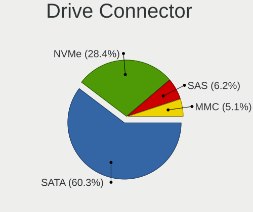

| Type | Computers | Drives | Percent |
|------|-----------|--------|---------|
| SATA | 1401      | 2625   | 60.34%  |
| NVMe | 660       | 967    | 28.42%  |
| SAS  | 143       | 232    | 6.16%   |
| MMC  | 118       | 146    | 5.08%   |

Drive Size
----------

Size of hard drive

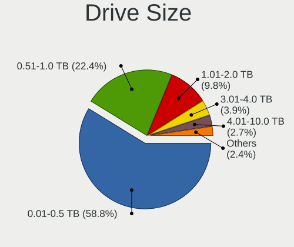

| Size in TB | Computers | Drives | Percent |
|------------|-----------|--------|---------|
| 0.01-0.5   | 1050      | 1640   | 58.76%  |
| 0.51-1.0   | 401       | 597    | 22.44%  |
| 1.01-2.0   | 176       | 252    | 9.85%   |
| 3.01-4.0   | 69        | 109    | 3.86%   |
| 4.01-10.0  | 49        | 98     | 2.74%   |
| 2.01-3.0   | 36        | 57     | 2.01%   |
| 10.01-20.0 | 6         | 8      | 0.34%   |

Space Total
-----------

Amount of disk space available on the file system

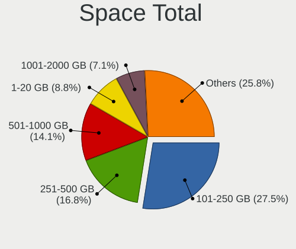

| Size in GB     | Computers | Percent |
|----------------|-----------|---------|
| 101-250        | 574       | 27.49%  |
| 251-500        | 350       | 16.76%  |
| 501-1000       | 294       | 14.08%  |
| 1-20           | 183       | 8.76%   |
| 1001-2000      | 148       | 7.09%   |
| 51-100         | 148       | 7.09%   |
| More than 3000 | 141       | 6.75%   |
| 21-50          | 89        | 4.26%   |
| Unknown        | 83        | 3.98%   |
| 2001-3000      | 78        | 3.74%   |

Space Used
----------

Amount of used disk space

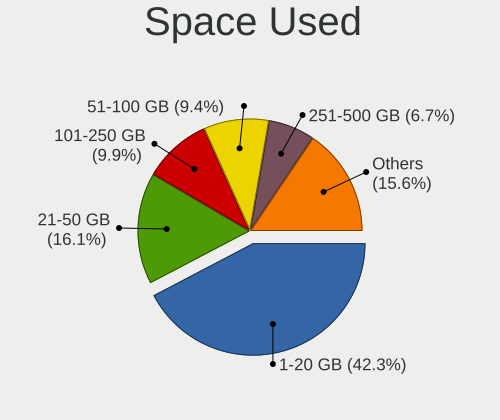

| Used GB        | Computers | Percent |
|----------------|-----------|---------|
| 1-20           | 906       | 42.32%  |
| 21-50          | 345       | 16.11%  |
| 101-250        | 211       | 9.86%   |
| 51-100         | 202       | 9.43%   |
| 251-500        | 144       | 6.73%   |
| 501-1000       | 113       | 5.28%   |
| Unknown        | 83        | 3.88%   |
| 1001-2000      | 66        | 3.08%   |
| More than 3000 | 47        | 2.2%    |
| 2001-3000      | 23        | 1.07%   |
| 0              | 1         | 0.05%   |

Malfunc. Drives
---------------

Drive models with a malfunction

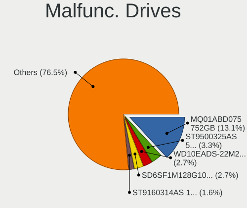

| Model                               | Computers | Drives | Percent |
|-------------------------------------|-----------|--------|---------|
| Toshiba MQ01ABD075 752GB            | 24        | 24     | 13.11%  |
| Seagate ST9500325AS 500GB           | 6         | 7      | 3.28%   |
| WDC WD10EADS-22M2B0 1TB             | 5         | 5      | 2.73%   |
| SanDisk SD6SF1M128G1022I 128GB SSD  | 5         | 5      | 2.73%   |
| Seagate ST9160314AS 160GB           | 3         | 3      | 1.64%   |
| Seagate ST3500418AS 500GB           | 3         | 4      | 1.64%   |
| Seagate ST2000DM001-1CH164 2TB      | 3         | 3      | 1.64%   |
| Intel SSDSA2M160G2GC 160GB          | 3         | 3      | 1.64%   |
| WDC WD30EFRX-68EUZN0 3TB            | 2         | 2      | 1.09%   |
| Toshiba MQ01ABD100 1TB              | 2         | 2      | 1.09%   |
| Samsung Electronics SSD 870 EVO 1TB | 2         | 2      | 1.09%   |
| Hitachi HDS721010CLA332 1TB         | 2         | 2      | 1.09%   |
| HGST HTS541075A9E680 752GB          | 2         | 3      | 1.09%   |
| CUSU CV3500Q 512GB                  | 2         | 3      | 1.09%   |
| Zheino CHN 25SATAA3 240 240GB SSD   | 1         | 1      | 0.55%   |
| WDC WDS240G2G0A-00JH30 240GB SSD    | 1         | 1      | 0.55%   |
| WDC WD7500BPKT-22PK4T0 752GB        | 1         | 1      | 0.55%   |
| WDC WD5000LPLX-66ZNTT0 500GB        | 1         | 1      | 0.55%   |
| WDC WD5000LPCX-08VHA 500GB          | 1         | 1      | 0.55%   |
| WDC WD5000BEVT-55A0RT0 500GB        | 1         | 1      | 0.55%   |
| WDC WD5000AAKX-75U6AA0 500GB        | 1         | 1      | 0.55%   |
| WDC WD40EZRZ-00GXCB0 4TB            | 1         | 1      | 0.55%   |
| WDC WD3200LPCX-24C6HT0 320GB        | 1         | 1      | 0.55%   |
| WDC WD3200BEVT-08A23T1 320GB        | 1         | 1      | 0.55%   |
| WDC WD3200AAJS-00M0A0 320GB         | 1         | 1      | 0.55%   |
| WDC WD30EZRX-19D8PB0 3TB            | 1         | 1      | 0.55%   |
| WDC WD30EZRX-00DC0B0 3TB            | 1         | 2      | 0.55%   |
| WDC WD30EZRX-00D8PB0 3TB            | 1         | 1      | 0.55%   |
| WDC WD25EZRX-00MMMB0 2TB            | 1         | 1      | 0.55%   |
| WDC WD20EARS-07MVWB0 2TB            | 1         | 1      | 0.55%   |
| WDC WD1600BEVS-26RST0 160GB         | 1         | 1      | 0.55%   |
| WDC WD10JPCX-24UE4T0 1TB            | 1         | 1      | 0.55%   |
| WDC WD10EALX-009BA0 1TB             | 1         | 1      | 0.55%   |
| WDC WD10EADS-00L5B1 1TB             | 1         | 1      | 0.55%   |
| WDC WD10EACS-00D6B0 1TB             | 1         | 2      | 0.55%   |
| WDC PC SN520 NVMe 512GB             | 1         | 1      | 0.55%   |
| Transcend TS240GSSD220S 240GB       | 1         | 1      | 0.55%   |
| Transcend TS128GMSA720 128GB SSD    | 1         | 1      | 0.55%   |
| Toshiba MK8037GSX 80GB              | 1         | 1      | 0.55%   |
| Toshiba MK5055GSX 500GB             | 1         | 1      | 0.55%   |

Malfunc. Drive Vendor
---------------------

Vendors of faulty drives

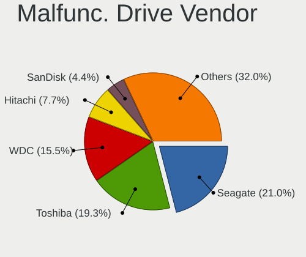

| Vendor              | Computers | Drives | Percent |
|---------------------|-----------|--------|---------|
| Seagate             | 38        | 42     | 20.99%  |
| Toshiba             | 35        | 35     | 19.34%  |
| WDC                 | 28        | 30     | 15.47%  |
| Hitachi             | 14        | 16     | 7.73%   |
| SanDisk             | 8         | 9      | 4.42%   |
| Intel               | 7         | 7      | 3.87%   |
| Crucial             | 7         | 9      | 3.87%   |
| Samsung Electronics | 6         | 7      | 3.31%   |
| A-DATA Technology   | 5         | 5      | 2.76%   |
| HGST                | 4         | 5      | 2.21%   |
| Kingston            | 3         | 3      | 1.66%   |
| Transcend           | 2         | 2      | 1.1%    |
| Teclast             | 2         | 2      | 1.1%    |
| SPCC                | 2         | 3      | 1.1%    |
| Maxtor              | 2         | 3      | 1.1%    |
| CUSU                | 2         | 3      | 1.1%    |
| Zheino              | 1         | 1      | 0.55%   |
| SUNEAST             | 1         | 1      | 0.55%   |
| SSSTC               | 1         | 1      | 0.55%   |
| Plextor             | 1         | 1      | 0.55%   |
| Netac               | 1         | 1      | 0.55%   |
| Micron Technology   | 1         | 1      | 0.55%   |
| MARSHAL             | 1         | 1      | 0.55%   |
| LITEON              | 1         | 5      | 0.55%   |
| Lite-On             | 1         | 1      | 0.55%   |
| INNOGRIT            | 1         | 1      | 0.55%   |
| Drevo               | 1         | 1      | 0.55%   |
| Corsair             | 1         | 1      | 0.55%   |
| China               | 1         | 1      | 0.55%   |
| C300-CTF            | 1         | 1      | 0.55%   |
| AGI                 | 1         | 1      | 0.55%   |
| ADATA Technology    | 1         | 1      | 0.55%   |

Malfunc. HDD Vendor
-------------------

Vendors of faulty HDD drives

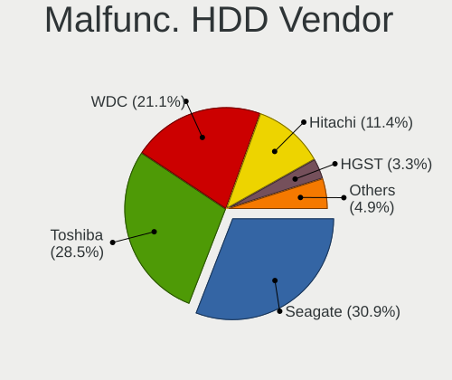

| Vendor              | Computers | Drives | Percent |
|---------------------|-----------|--------|---------|
| Seagate             | 38        | 42     | 30.89%  |
| Toshiba             | 35        | 35     | 28.46%  |
| WDC                 | 26        | 28     | 21.14%  |
| Hitachi             | 14        | 16     | 11.38%  |
| HGST                | 4         | 5      | 3.25%   |
| Samsung Electronics | 3         | 4      | 2.44%   |
| Maxtor              | 2         | 3      | 1.63%   |
| MARSHAL             | 1         | 1      | 0.81%   |

Malfunc. Drive Kind
-------------------

Kinds of faulty drives

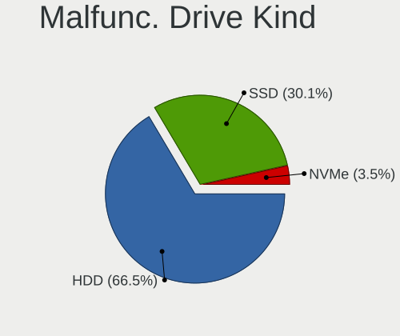

| Kind | Computers | Drives | Percent |
|------|-----------|--------|---------|
| HDD  | 115       | 134    | 66.47%  |
| SSD  | 52        | 60     | 30.06%  |
| NVMe | 6         | 7      | 3.47%   |

Failed Drives
-------------

Failed drive models

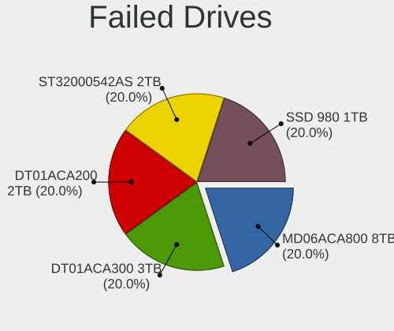

| Model                           | Computers | Drives | Percent |
|---------------------------------|-----------|--------|---------|
| Toshiba MD06ACA800 8TB          | 1         | 1      | 20%     |
| Toshiba DT01ACA300 3TB          | 1         | 1      | 20%     |
| Toshiba DT01ACA200 2TB          | 1         | 1      | 20%     |
| Seagate ST32000542AS 2TB        | 1         | 1      | 20%     |
| Samsung Electronics SSD 980 1TB | 1         | 1      | 20%     |

Failed Drive Vendor
-------------------

Failed drive vendors

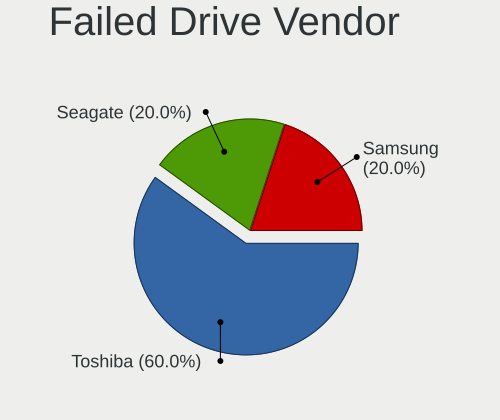

| Vendor              | Computers | Drives | Percent |
|---------------------|-----------|--------|---------|
| Toshiba             | 3         | 3      | 60%     |
| Seagate             | 1         | 1      | 20%     |
| Samsung Electronics | 1         | 1      | 20%     |

Drive Status
------------

Number of failed and malfunc. drives

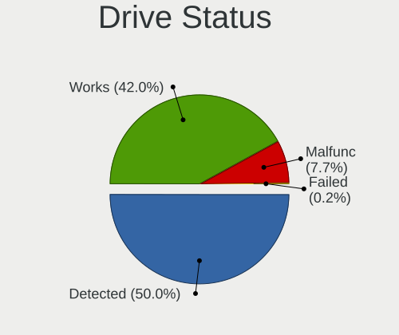

| Status   | Computers | Drives | Percent |
|----------|-----------|--------|---------|
| Detected | 1069      | 2259   | 50.02%  |
| Works    | 898       | 1505   | 42.02%  |
| Malfunc  | 165       | 201    | 7.72%   |
| Failed   | 5         | 5      | 0.23%   |

Storage controller
------------------

Storage Vendor
--------------

Storage controller vendors

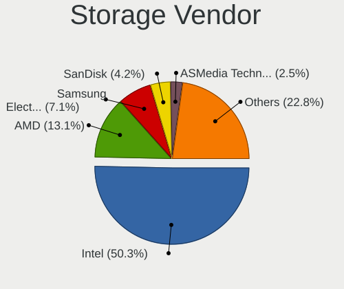

| Vendor                                  | Computers | Percent |
|-----------------------------------------|-----------|---------|
| Intel                                   | 1269      | 50.34%  |
| AMD                                     | 329       | 13.05%  |
| Samsung Electronics                     | 178       | 7.06%   |
| SanDisk                                 | 107       | 4.24%   |
| ASMedia Technology                      | 63        | 2.5%    |
| Phison Electronics                      | 57        | 2.26%   |
| Micron Technology                       | 47        | 1.86%   |
| SK hynix                                | 41        | 1.63%   |
| Micron/Crucial Technology               | 41        | 1.63%   |
| KIOXIA                                  | 41        | 1.63%   |
| MAXIO Technology (Hangzhou)             | 38        | 1.51%   |
| Marvell Technology Group                | 37        | 1.47%   |
| Silicon Motion                          | 32        | 1.27%   |
| JMicron Technology                      | 28        | 1.11%   |
| Kingston Technology Company             | 24        | 0.95%   |
| Apple                                   | 24        | 0.95%   |
| Toshiba America Info Systems            | 20        | 0.79%   |
| Nvidia                                  | 20        | 0.79%   |
| VIA Technologies                        | 13        | 0.52%   |
| ADATA Technology                        | 13        | 0.52%   |
| Broadcom / LSI                          | 12        | 0.48%   |
| Realtek Semiconductor                   | 11        | 0.44%   |
| Seagate Technology                      | 10        | 0.4%    |
| Yangtze Memory Technologies             | 7         | 0.28%   |
| Shenzhen Unionmemory Information System | 6         | 0.24%   |
| Shenzhen Longsys Electronics            | 6         | 0.24%   |
| Silicon Image                           | 5         | 0.2%    |
| INNOGRIT                                | 5         | 0.2%    |
| Solid State Storage Technology          | 4         | 0.16%   |
| Solidigm                                | 3         | 0.12%   |
| LSI Logic / Symbios Logic               | 3         | 0.12%   |
| Adaptec                                 | 3         | 0.12%   |
| Transcend                               | 2         | 0.08%   |
| Silicon Integrated Systems [SiS]        | 2         | 0.08%   |
| Nextorage                               | 2         | 0.08%   |
| Integrated Technology Express           | 2         | 0.08%   |
| Hosin Global Electronics                | 2         | 0.08%   |
| HighPoint Technologies                  | 2         | 0.08%   |
| Biwin Storage Technology                | 2         | 0.08%   |
| ULi Electronics                         | 1         | 0.04%   |

Storage Model
-------------

Storage controller models

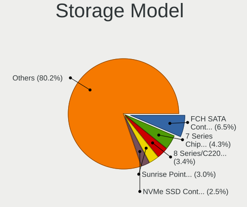

| Model                                                                          | Computers | Percent |
|--------------------------------------------------------------------------------|-----------|---------|
| AMD FCH SATA Controller [AHCI mode]                                            | 186       | 6.47%   |
| Intel 7 Series Chipset Family 6-port SATA Controller [AHCI mode]               | 125       | 4.34%   |
| Intel 8 Series/C220 Series Chipset Family 6-port SATA Controller 1 [AHCI mode] | 98        | 3.41%   |
| Intel Sunrise Point-LP SATA Controller [AHCI mode]                             | 87        | 3.02%   |
| Samsung NVMe SSD Controller SM981/PM981/PM983                                  | 73        | 2.54%   |
| Intel 6 Series/C200 Series Chipset Family 6 port Mobile SATA AHCI Controller   | 73        | 2.54%   |
| ASMedia ASM1061/ASM1062 Serial ATA Controller                                  | 55        | 1.91%   |
| Intel Q170/Q150/B150/H170/H110/Z170/CM236 Chipset SATA Controller [AHCI Mode]  | 49        | 1.7%    |
| AMD 500 Series Chipset SATA Controller                                         | 47        | 1.63%   |
| Intel 7 Series/C210 Series Chipset Family 6-port SATA Controller [AHCI mode]   | 43        | 1.49%   |
| AMD 400 Series Chipset SATA Controller                                         | 43        | 1.49%   |
| Intel Cannon Lake PCH SATA AHCI Controller                                     | 40        | 1.39%   |
| Intel 200 Series PCH SATA controller [AHCI mode]                               | 38        | 1.32%   |
| Intel Volume Management Device NVMe RAID Controller                            | 37        | 1.29%   |
| Intel 82801IBM/IEM (ICH9M/ICH9M-E) 4 port SATA Controller [AHCI mode]          | 37        | 1.29%   |
| Intel 6 Series/C200 Series Chipset Family 6 port Desktop SATA AHCI Controller  | 36        | 1.25%   |
| Intel 5 Series/3400 Series Chipset 4 port SATA AHCI Controller                 | 36        | 1.25%   |
| Intel Wildcat Point-LP SATA Controller [AHCI Mode]                             | 34        | 1.18%   |
| Intel 82801 Mobile SATA Controller [RAID mode]                                 | 33        | 1.15%   |
| AMD SB7x0/SB8x0/SB9x0 IDE Controller                                           | 33        | 1.15%   |
| Samsung NVMe SSD Controller PM9A1/PM9A3/980PRO                                 | 32        | 1.11%   |
| Samsung NVMe SSD Controller 980 (DRAM-less)                                    | 32        | 1.11%   |
| Intel 8 Series SATA Controller 1 [AHCI mode]                                   | 32        | 1.11%   |
| Intel 82801G (ICH7 Family) IDE Controller                                      | 31        | 1.08%   |
| Intel SATA Controller [RAID mode]                                              | 30        | 1.04%   |
| Intel Comet Lake SATA AHCI Controller                                          | 25        | 0.87%   |
| Silicon Motion SM2263EN/SM2263XT (DRAM-less) NVMe SSD Controllers              | 24        | 0.83%   |
| SanDisk Ultra 3D / WD PC SN530, IX SN530, Blue SN550 NVMe SSD (DRAM-less)      | 24        | 0.83%   |
| Intel NM10/ICH7 Family SATA Controller [IDE mode]                              | 24        | 0.83%   |
| AMD 600 Series Chipset SATA Controller                                         | 24        | 0.83%   |
| Intel Alder Lake-S PCH SATA Controller [AHCI Mode]                             | 22        | 0.76%   |
| Intel 5 Series/3400 Series Chipset 6 port SATA AHCI Controller                 | 22        | 0.76%   |
| AMD SB7x0/SB8x0/SB9x0 SATA Controller [AHCI mode]                              | 22        | 0.76%   |
| Micron/Crucial P2 [Nick P2] / P3 / P3 Plus NVMe PCIe SSD (DRAM-less)           | 21        | 0.73%   |
| MAXIO (Hangzhou) NVMe SSD Controller MAP1202 (DRAM-less)                       | 20        | 0.7%    |
| Apple ANS2 NVMe Controller                                                     | 20        | 0.7%    |
| AMD SB7x0/SB8x0/SB9x0 SATA Controller [IDE mode]                               | 20        | 0.7%    |
| Phison PS5013-E13 PCIe3 NVMe Controller (DRAM-less)                            | 18        | 0.63%   |
| MAXIO (Hangzhou) NVMe SSD Controller MAP1602 (DRAM-less)                       | 18        | 0.63%   |
| JMicron JMB363 SATA/IDE Controller                                             | 18        | 0.63%   |

Storage Kind
------------

Kind of storage controller (IDE, SATA, NVMe, SAS, ...)

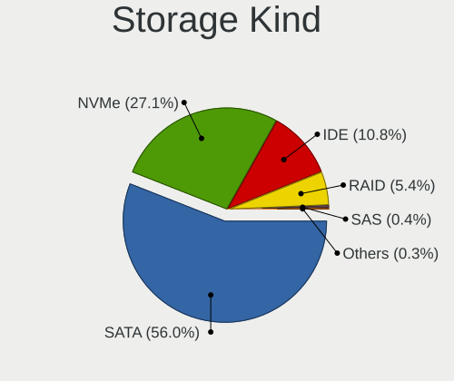

| Kind | Computers | Percent |
|------|-----------|---------|
| SATA | 1368      | 55.97%  |
| NVMe | 663       | 27.13%  |
| IDE  | 265       | 10.84%  |
| RAID | 131       | 5.36%   |
| SAS  | 10        | 0.41%   |
| SCSI | 7         | 0.29%   |

Processor
---------

CPU Vendor
----------

Processor vendors

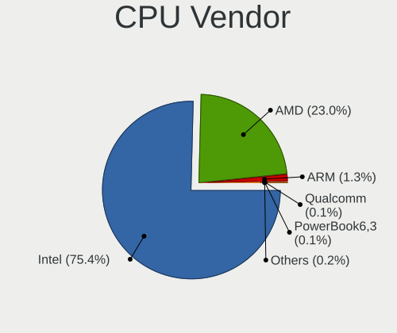

| Vendor       | Computers | Percent |
|--------------|-----------|---------|
| Intel        | 1474      | 75.4%   |
| AMD          | 449       | 22.97%  |
| ARM          | 26        | 1.33%   |
| Qualcomm     | 1         | 0.05%   |
| PowerBook6,3 | 1         | 0.05%   |
| Phytium      | 1         | 0.05%   |
| Loongson     | 1         | 0.05%   |
| HygonGenuine | 1         | 0.05%   |
| CentaurHauls | 1         | 0.05%   |

CPU Model
---------

Processor models

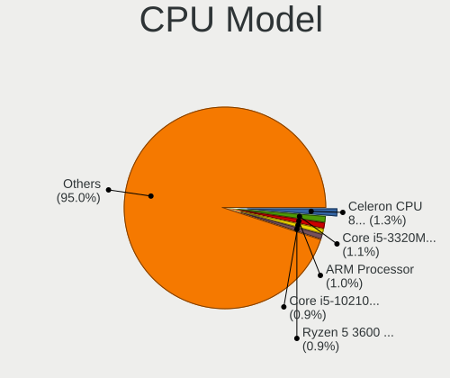

| Model                                   | Computers | Percent |
|-----------------------------------------|-----------|---------|
| Intel Celeron CPU 847 @ 1.10GHz         | 25        | 1.27%   |
| Intel Core i5-3320M CPU @ 2.60GHz       | 21        | 1.07%   |
| ARM Processor                           | 19        | 0.97%   |
| Intel Core i5-10210U CPU @ 1.60GHz      | 17        | 0.87%   |
| AMD Ryzen 5 3600 6-Core Processor       | 17        | 0.87%   |
| Intel Core i5-2520M CPU @ 2.50GHz       | 16        | 0.82%   |
| Intel Core i7-3770 CPU @ 3.40GHz        | 15        | 0.76%   |
| Intel Core i5-7200U CPU @ 2.50GHz       | 15        | 0.76%   |
| Intel Core i5-8250U CPU @ 1.60GHz       | 13        | 0.66%   |
| Intel Core i7-8750H CPU @ 2.20GHz       | 12        | 0.61%   |
| Intel Core i5-8265U CPU @ 1.60GHz       | 12        | 0.61%   |
| Intel Core i5-3210M CPU @ 2.50GHz       | 12        | 0.61%   |
| Intel N100                              | 11        | 0.56%   |
| Intel Core i7-2600 CPU @ 3.40GHz        | 11        | 0.56%   |
| Intel Core i7-10750H CPU @ 2.60GHz      | 11        | 0.56%   |
| Intel Core i5-8400 CPU @ 2.80GHz        | 11        | 0.56%   |
| Intel 11th Gen Core i5-1135G7 @ 2.40GHz | 11        | 0.56%   |
| Intel Core i7-8550U CPU @ 1.80GHz       | 10        | 0.51%   |
| Intel Core i7-7700 CPU @ 3.60GHz        | 10        | 0.51%   |
| Intel Core i5-6300U CPU @ 2.40GHz       | 10        | 0.51%   |
| Intel Core i5-2450M CPU @ 2.50GHz       | 10        | 0.51%   |
| Intel Core i3-1000NG4 CPU @ 1.10GHz     | 10        | 0.51%   |
| AMD Ryzen 7 5800H with Radeon Graphics  | 10        | 0.51%   |
| AMD Ryzen 5 5600X 6-Core Processor      | 10        | 0.51%   |
| Intel Core i7-3770K CPU @ 3.50GHz       | 9         | 0.46%   |
| Intel Core i5-7300U CPU @ 2.60GHz       | 9         | 0.46%   |
| Intel Core i5-6200U CPU @ 2.30GHz       | 9         | 0.46%   |
| Intel Core i5-5200U CPU @ 2.20GHz       | 9         | 0.46%   |
| Intel Core i5 CPU M 560 @ 2.67GHz       | 9         | 0.46%   |
| Intel Core 2 Duo CPU P8600 @ 2.40GHz    | 9         | 0.46%   |
| Intel Core 2 Duo CPU E8400 @ 3.00GHz    | 9         | 0.46%   |
| Intel Core i7-4790 CPU @ 3.60GHz        | 8         | 0.41%   |
| Intel Core i7-2670QM CPU @ 2.20GHz      | 8         | 0.41%   |
| Intel Core i5-3470 CPU @ 3.20GHz        | 8         | 0.41%   |
| Intel Core i5-2430M CPU @ 2.40GHz       | 8         | 0.41%   |
| Intel Core 2 Duo CPU P8700 @ 2.53GHz    | 8         | 0.41%   |
| Intel Core 2 Duo CPU E7500 @ 2.93GHz    | 8         | 0.41%   |
| AMD Ryzen 7 3700X 8-Core Processor      | 8         | 0.41%   |
| AMD Ryzen 5 5500U with Radeon Graphics  | 8         | 0.41%   |
| AMD Custom APU 0405                     | 8         | 0.41%   |

CPU Model Family
----------------

Processor model prefix

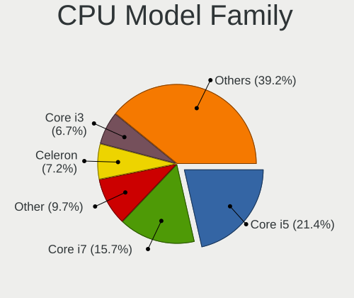

| Model                   | Computers | Percent |
|-------------------------|-----------|---------|
| Intel Core i5           | 420       | 21.44%  |
| Intel Core i7           | 307       | 15.67%  |
| Other                   | 191       | 9.75%   |
| Intel Celeron           | 142       | 7.25%   |
| Intel Core i3           | 132       | 6.74%   |
| AMD Ryzen 7             | 109       | 5.56%   |
| AMD Ryzen 5             | 106       | 5.41%   |
| Intel Core 2 Duo        | 84        | 4.29%   |
| Intel Xeon              | 58        | 2.96%   |
| AMD Ryzen 9             | 44        | 2.25%   |
| Intel Atom              | 34        | 1.74%   |
| Intel Pentium           | 24        | 1.23%   |
| Intel Core i9           | 18        | 0.92%   |
| Intel Core 2            | 18        | 0.92%   |
| Intel Core 2 Quad       | 17        | 0.87%   |
| AMD Ryzen 7 PRO         | 17        | 0.87%   |
| Intel Core              | 16        | 0.82%   |
| AMD Ryzen 3             | 15        | 0.77%   |
| AMD Athlon              | 15        | 0.77%   |
| AMD A10                 | 12        | 0.61%   |
| Intel Pentium Dual-Core | 9         | 0.46%   |
| AMD FX                  | 9         | 0.46%   |
| AMD A6                  | 9         | 0.46%   |
| AMD Ryzen 5 PRO         | 8         | 0.41%   |
| AMD Athlon 64 X2        | 8         | 0.41%   |
| AMD A8                  | 8         | 0.41%   |
| Intel Celeron Dual-Core | 7         | 0.36%   |
| AMD Phenom II X4        | 7         | 0.36%   |
| AMD E2                  | 6         | 0.31%   |
| Intel Pentium 4         | 5         | 0.26%   |
| Intel Core M            | 5         | 0.26%   |
| Intel Celeron M         | 5         | 0.26%   |
| AMD Phenom II X6        | 5         | 0.26%   |
| AMD A4                  | 5         | 0.26%   |
| Intel Pentium Silver    | 4         | 0.2%    |
| Intel Pentium Gold      | 4         | 0.2%    |
| Intel Core m3           | 4         | 0.2%    |
| ARM BCM                 | 4         | 0.2%    |
| AMD E1                  | 4         | 0.2%    |
| AMD Athlon 64           | 4         | 0.2%    |

CPU Cores
---------

Number of processor cores

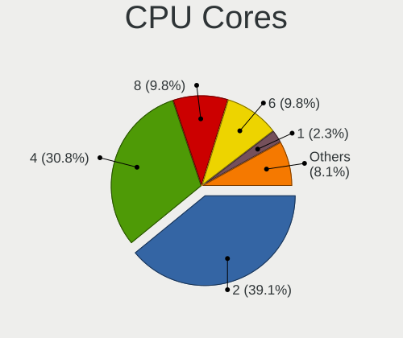

| Number  | Computers | Percent |
|---------|-----------|---------|
| 2       | 766       | 39.08%  |
| 4       | 604       | 30.82%  |
| 8       | 193       | 9.85%   |
| 6       | 193       | 9.85%   |
| 1       | 46        | 2.35%   |
| 16      | 41        | 2.09%   |
| 12      | 40        | 2.04%   |
| 10      | 30        | 1.53%   |
| 14      | 22        | 1.12%   |
| 24      | 9         | 0.46%   |
| Unknown | 6         | 0.31%   |
| 3       | 4         | 0.2%    |
| 20      | 3         | 0.15%   |
| 64      | 1         | 0.05%   |
| 56      | 1         | 0.05%   |
| 32      | 1         | 0.05%   |

CPU Sockets
-----------

Number of sockets

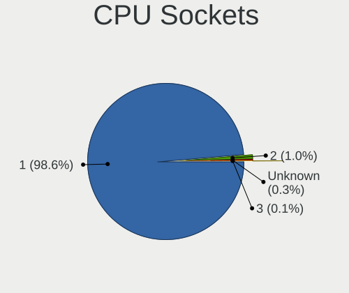

| Number  | Computers | Percent |
|---------|-----------|---------|
| 1       | 1928      | 98.62%  |
| 2       | 19        | 0.97%   |
| Unknown | 6         | 0.31%   |
| 3       | 2         | 0.1%    |

CPU Threads
-----------

Threads per core (Hyper-Threading)

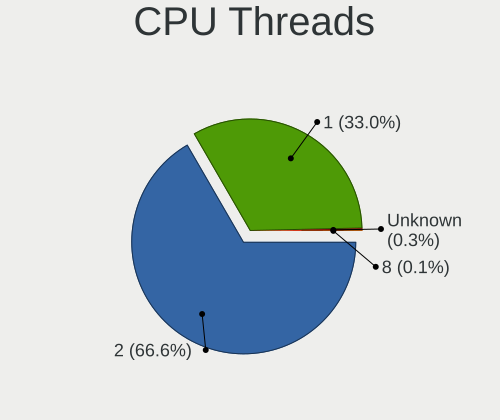

| Number  | Computers | Percent |
|---------|-----------|---------|
| 2       | 1305      | 66.65%  |
| 1       | 646       | 32.99%  |
| Unknown | 6         | 0.31%   |
| 8       | 1         | 0.05%   |

CPU Op-Modes
------------

CPU Operation Modes (32-bit, 64-bit)

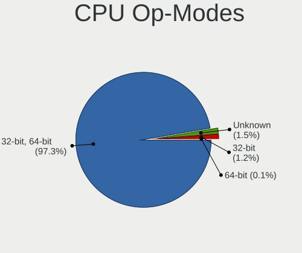

| Op mode        | Computers | Percent |
|----------------|-----------|---------|
| 32-bit, 64-bit | 1905      | 97.29%  |
| Unknown        | 29        | 1.48%   |
| 32-bit         | 23        | 1.17%   |
| 64-bit         | 1         | 0.05%   |

CPU Microcode
-------------

Microcode number

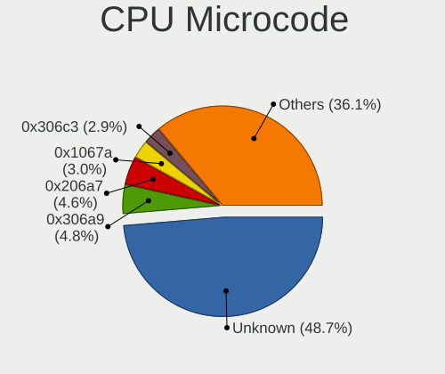

| Number     | Computers | Percent |
|------------|-----------|---------|
| Unknown    | 985       | 48.67%  |
| 0x306a9    | 97        | 4.79%   |
| 0x206a7    | 94        | 4.64%   |
| 0x1067a    | 60        | 2.96%   |
| 0x306c3    | 58        | 2.87%   |
| 0x906ea    | 29        | 1.43%   |
| 0x08701021 | 27        | 1.33%   |
| 0x20655    | 26        | 1.28%   |
| 0x806ec    | 24        | 1.19%   |
| 0x306d4    | 23        | 1.14%   |
| 0x506e3    | 21        | 1.04%   |
| 0x806ea    | 19        | 0.94%   |
| 0x0a50000c | 19        | 0.94%   |
| 0x806e9    | 18        | 0.89%   |
| 0x906e9    | 16        | 0.79%   |
| 0x806c1    | 16        | 0.79%   |
| 0x10676    | 16        | 0.79%   |
| 0x406c4    | 15        | 0.74%   |
| 0x40651    | 15        | 0.74%   |
| 0x406e3    | 13        | 0.64%   |
| 0x20652    | 13        | 0.64%   |
| 0x906ed    | 12        | 0.59%   |
| 0xa0652    | 11        | 0.54%   |
| 0x6f6      | 11        | 0.54%   |
| 0x106e5    | 11        | 0.54%   |
| 0x08600106 | 11        | 0.54%   |
| 0x08108109 | 11        | 0.54%   |
| 0x08108102 | 10        | 0.49%   |
| 0x406c3    | 9         | 0.44%   |
| 0x106c2    | 9         | 0.44%   |
| 0x0a50000d | 9         | 0.44%   |
| 0x0800820d | 9         | 0.44%   |
| 0x010000c8 | 9         | 0.44%   |
| 0xa0655    | 8         | 0.4%    |
| 0x906a3    | 8         | 0.4%    |
| 0x06003106 | 8         | 0.4%    |
| 0x806eb    | 7         | 0.35%   |
| 0x30678    | 7         | 0.35%   |
| 0x08608103 | 7         | 0.35%   |
| 0x0810100b | 7         | 0.35%   |

CPU Microarch
-------------

Microarchitecture

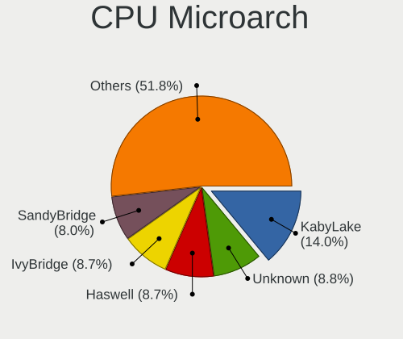

| Name               | Computers | Percent |
|--------------------|-----------|---------|
| KabyLake           | 274       | 13.98%  |
| Unknown            | 173       | 8.83%   |
| Haswell            | 171       | 8.72%   |
| IvyBridge          | 170       | 8.67%   |
| SandyBridge        | 157       | 8.01%   |
| Penryn             | 112       | 5.71%   |
| Zen 3              | 85        | 4.34%   |
| Skylake            | 85        | 4.34%   |
| Zen 2              | 75        | 3.83%   |
| Westmere           | 63        | 3.21%   |
| Alderlake Hybrid   | 61        | 3.11%   |
| Silvermont         | 45        | 2.3%    |
| Zen+               | 44        | 2.24%   |
| Broadwell          | 44        | 2.24%   |
| CometLake          | 43        | 2.19%   |
| Core               | 41        | 2.09%   |
| Zen                | 35        | 1.79%   |
| TigerLake          | 35        | 1.79%   |
| K10                | 26        | 1.33%   |
| IceLake            | 25        | 1.28%   |
| Nehalem            | 23        | 1.17%   |
| K8 Hammer          | 22        | 1.12%   |
| Goldmont plus      | 20        | 1.02%   |
| Piledriver         | 16        | 0.82%   |
| Bonnell            | 14        | 0.71%   |
| Gracemont          | 11        | 0.56%   |
| Steamroller        | 10        | 0.51%   |
| P6                 | 9         | 0.46%   |
| Goldmont           | 9         | 0.46%   |
| Puma               | 8         | 0.41%   |
| Excavator          | 8         | 0.41%   |
| NetBurst           | 7         | 0.36%   |
| Meteorlake Hybrid  | 7         | 0.36%   |
| Jaguar             | 7         | 0.36%   |
| K10 Llano          | 6         | 0.31%   |
| Bobcat             | 5         | 0.26%   |
| Bulldozer          | 4         | 0.2%    |
| ArrowLake-H Hybrid | 3         | 0.15%   |
| Tremont            | 2         | 0.1%    |
| Lunarlake Hybrid   | 2         | 0.1%    |

Graphics
--------

GPU Vendor
----------

Vendors of graphics cards

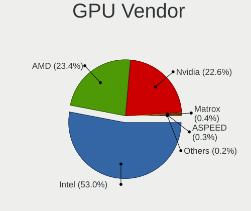

| Vendor                                       | Computers | Percent |
|----------------------------------------------|-----------|---------|
| Intel                                        | 1133      | 53.02%  |
| AMD                                          | 500       | 23.4%   |
| Nvidia                                       | 484       | 22.65%  |
| Matrox Electronics Systems                   | 8         | 0.37%   |
| ASPEED Technology                            | 7         | 0.33%   |
| VIA Technologies                             | 2         | 0.09%   |
| XGI Technology (eXtreme Graphics Innovation) | 1         | 0.05%   |
| Red Hat                                      | 1         | 0.05%   |
| Loongson Technology                          | 1         | 0.05%   |

GPU Model
---------

Graphics card models

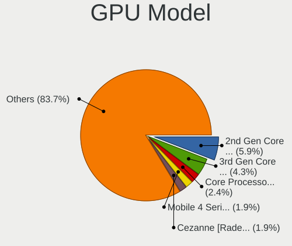

| Model                                                                                    | Computers | Percent |
|------------------------------------------------------------------------------------------|-----------|---------|
| Intel 2nd Generation Core Processor Family Integrated Graphics Controller                | 130       | 5.87%   |
| Intel 3rd Gen Core processor Graphics Controller                                         | 95        | 4.29%   |
| Intel Core Processor Integrated Graphics Controller                                      | 53        | 2.39%   |
| Intel Mobile 4 Series Chipset Integrated Graphics Controller                             | 42        | 1.9%    |
| AMD Cezanne [Radeon Vega Series / Radeon Vega Mobile Series]                             | 41        | 1.85%   |
| Intel Xeon E3-1200 v3/4th Gen Core Processor Integrated Graphics Controller              | 36        | 1.62%   |
| Intel Kaby Lake-U GT2 [HD Graphics 620]                                                  | 35        | 1.58%   |
| Intel Haswell-ULT Integrated Graphics Controller                                         | 35        | 1.58%   |
| Intel Atom/Celeron/Pentium Processor x5-E8000/J3xxx/N3xxx Integrated Graphics Controller | 33        | 1.49%   |
| Intel Kaby Lake-R GT2 [UHD Graphics 620]                                                 | 32        | 1.44%   |
| Intel TigerLake-LP GT2 [Iris Xe Graphics]                                                | 31        | 1.4%    |
| Intel 4th Gen Core Processor Integrated Graphics Controller                              | 31        | 1.4%    |
| Intel Skylake-U GT2 [HD Graphics 520]                                                    | 29        | 1.31%   |
| Intel CometLake-U GT2 [UHD Graphics]                                                     | 29        | 1.31%   |
| AMD Picasso/Raven 2 [Radeon Vega Series / Radeon Vega Mobile Series]                     | 29        | 1.31%   |
| AMD Renoir [Radeon Vega Series / Radeon Vega Mobile Series]                              | 27        | 1.22%   |
| AMD Ellesmere [Radeon RX 470/480/570/570X/580/580X/590]                                  | 26        | 1.17%   |
| Intel WhiskeyLake-U GT2 [UHD Graphics 620]                                               | 24        | 1.08%   |
| Intel CoffeeLake-S GT2 [UHD Graphics 630]                                                | 22        | 0.99%   |
| Intel Broadwell-U GT2 [HD Graphics 5500]                                                 | 22        | 0.99%   |
| Nvidia GK208B [GeForce GT 710]                                                           | 21        | 0.95%   |
| AMD Raven Ridge [Radeon Vega Series / Radeon Vega Mobile Series]                         | 21        | 0.95%   |
| Intel Xeon E3-1200 v2/3rd Gen Core processor Graphics Controller                         | 20        | 0.9%    |
| Intel CoffeeLake-H GT2 [UHD Graphics 630]                                                | 20        | 0.9%    |
| Intel Alder Lake-P GT2 [Iris Xe Graphics]                                                | 20        | 0.9%    |
| AMD Phoenix1                                                                             | 20        | 0.9%    |
| Intel Kaby Lake-S GT2 [HD Graphics 630]                                                  | 19        | 0.86%   |
| Intel 4 Series Chipset Integrated Graphics Controller                                    | 19        | 0.86%   |
| Intel Mobile 945GM/GMS/GME, 943/940GML Express Integrated Graphics Controller            | 18        | 0.81%   |
| Intel IvyBridge GT2 [HD Graphics 4000]                                                   | 18        | 0.81%   |
| Intel Skylake-S GT2 [HD Graphics 530]                                                    | 17        | 0.77%   |
| Intel GeminiLake [UHD Graphics 600]                                                      | 16        | 0.72%   |
| Intel CometLake-H GT2 [UHD Graphics]                                                     | 16        | 0.72%   |
| AMD Rembrandt [Radeon 680M]                                                              | 16        | 0.72%   |
| Nvidia TU117 [GeForce GTX 1650]                                                          | 15        | 0.68%   |
| Nvidia GP107 [GeForce GTX 1050 Ti]                                                       | 15        | 0.68%   |
| Intel Mobile GM965/GL960 Integrated Graphics Controller (secondary)                      | 15        | 0.68%   |
| Intel Mobile GM965/GL960 Integrated Graphics Controller (primary)                        | 15        | 0.68%   |
| Intel Alder Lake-N [UHD Graphics]                                                        | 15        | 0.68%   |
| Intel Raptor Lake-P [Iris Xe Graphics]                                                   | 14        | 0.63%   |

GPU Combo
---------

Combinations of graphics cards

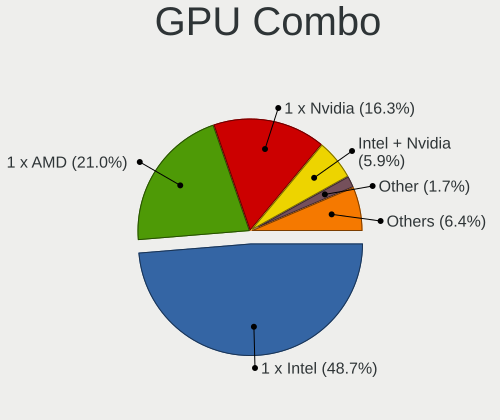

| Name                      | Computers | Percent |
|---------------------------|-----------|---------|
| 1 x Intel                 | 959       | 48.7%   |
| 1 x AMD                   | 414       | 21.03%  |
| 1 x Nvidia                | 321       | 16.3%   |
| Intel + Nvidia            | 116       | 5.89%   |
| Other                     | 33        | 1.68%   |
| AMD + Nvidia              | 33        | 1.68%   |
| 2 x AMD                   | 24        | 1.22%   |
| Intel + AMD               | 20        | 1.02%   |
| 2 x Intel                 | 19        | 0.96%   |
| 2 x Nvidia                | 6         | 0.3%    |
| 1 x Matrox                | 6         | 0.3%    |
| 1 x ASPEED                | 4         | 0.2%    |
| Nvidia + ASPEED           | 3         | 0.15%   |
| 1 x VIA                   | 2         | 0.1%    |
| Intel + 2 x Nvidia        | 2         | 0.1%    |
| AMD + Matrox              | 2         | 0.1%    |
| 1 x XGI                   | 1         | 0.05%   |
| 1 x Red Hat               | 1         | 0.05%   |
| Intel + 2 x AMD           | 1         | 0.05%   |
| Intel + AMD + 1 x Nvidia  | 1         | 0.05%   |
| AMD + Loongson Technology | 1         | 0.05%   |

GPU Driver
----------

Free vs proprietary

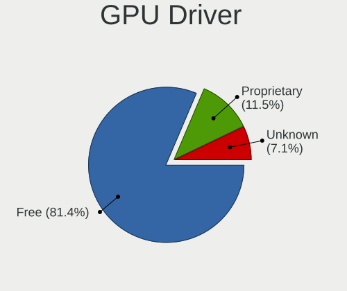

| Driver      | Computers | Percent |
|-------------|-----------|---------|
| Free        | 1610      | 81.4%   |
| Proprietary | 227       | 11.48%  |
| Unknown     | 141       | 7.13%   |

GPU Memory
----------

Total video memory

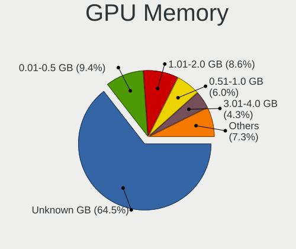

| Size in GB | Computers | Percent |
|------------|-----------|---------|
| Unknown    | 1288      | 64.46%  |
| 0.01-0.5   | 188       | 9.41%   |
| 1.01-2.0   | 171       | 8.56%   |
| 0.51-1.0   | 119       | 5.96%   |
| 3.01-4.0   | 86        | 4.3%    |
| 7.01-8.0   | 62        | 3.1%    |
| 8.01-16.0  | 35        | 1.75%   |
| 5.01-6.0   | 31        | 1.55%   |
| 16.01-24.0 | 11        | 0.55%   |
| 2.01-3.0   | 5         | 0.25%   |
| 4.01-5.0   | 1         | 0.05%   |
| 24.01-32.0 | 1         | 0.05%   |

Monitor
-------

Monitor Vendor
--------------

Monitor vendors

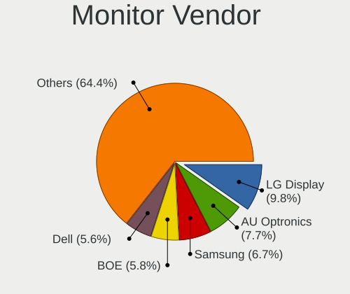

| Vendor                  | Computers | Percent |
|-------------------------|-----------|---------|
| LG Display              | 193       | 9.75%   |
| AU Optronics            | 153       | 7.73%   |
| Samsung Electronics     | 132       | 6.67%   |
| BOE                     | 115       | 5.81%   |
| Dell                    | 111       | 5.61%   |
| Goldstar                | 96        | 4.85%   |
| Chimei Innolux          | 89        | 4.5%    |
| Sharp                   | 77        | 3.89%   |
| IOD                     | 76        | 3.84%   |
| BenQ                    | 70        | 3.54%   |
| Apple                   | 58        | 2.93%   |
| Iiyama                  | 52        | 2.63%   |
| Mitsubishi              | 49        | 2.48%   |
| Acer                    | 49        | 2.48%   |
| Philips                 | 44        | 2.22%   |
| Hewlett-Packard         | 42        | 2.12%   |
| Lenovo                  | 38        | 1.92%   |
| Eizo                    | 33        | 1.67%   |
| Chi Mei Optoelectronics | 27        | 1.36%   |
| NEC Computers           | 25        | 1.26%   |
| Sony                    | 24        | 1.21%   |
| AOC                     | 24        | 1.21%   |
| Panasonic               | 23        | 1.16%   |
| Ancor Communications    | 22        | 1.11%   |
| ASUSTek Computer        | 21        | 1.06%   |
| Toshiba                 | 19        | 0.96%   |
| Unknown                 | 18        | 0.91%   |
| ViewSonic               | 14        | 0.71%   |
| PANDA                   | 14        | 0.71%   |
| InfoVision              | 12        | 0.61%   |
| RTK                     | 10        | 0.51%   |
| Unknown                 | 10        | 0.51%   |
| Valve                   | 9         | 0.45%   |
| Fujitsu                 | 9         | 0.45%   |
| LG Electronics          | 8         | 0.4%    |
| MSI                     | 7         | 0.35%   |
| Idek Iiyama             | 7         | 0.35%   |
| Mi                      | 6         | 0.3%    |
| Hitachi                 | 6         | 0.3%    |
| CSO                     | 6         | 0.3%    |

Monitor Model
-------------

Monitor models

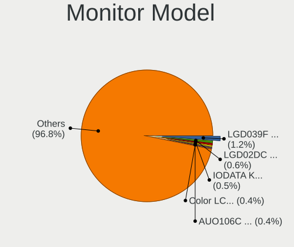

| Model                                                                    | Computers | Percent |
|--------------------------------------------------------------------------|-----------|---------|
| LG Display LCD Monitor LGD039F 1366x768 345x194mm 15.6-inch              | 24        | 1.17%   |
| LG Display LCD Monitor LGD02DC 1366x768 344x194mm 15.5-inch              | 13        | 0.63%   |
| Unknown                                                                  | 10        | 0.49%   |
| AU Optronics LCD Monitor AUO106C 1366x768 276x155mm 12.5-inch            | 9         | 0.44%   |
| Apple Color LCD APPA041 2560x1600 286x179mm 13.3-inch                    | 9         | 0.44%   |
| Valve ANX7530 U VLV3001 800x1280 100x150mm 7.1-inch                      | 8         | 0.39%   |
| Iiyama PL3291 IVM7605 1920x1080 698x393mm 31.5-inch                      | 7         | 0.34%   |
| Panasonic LCD Monitor MEI4100 1920x1200 216x135mm 10.0-inch              | 6         | 0.29%   |
| Goldstar HDR 4K GSM7706 3840x2160 600x340mm 27.2-inch                    | 6         | 0.29%   |
| Chi Mei Optoelectronics LCD Monitor CMO15A7 1366x768 344x193mm 15.5-inch | 6         | 0.29%   |
| AU Optronics LCD Monitor AUO38ED 1920x1080 344x193mm 15.5-inch           | 6         | 0.29%   |
| ASUSTek Computer VZ239 AUS23CC 1920x1080 509x286mm 23.0-inch             | 6         | 0.29%   |
| Apple Cinema HD APP9223 1920x1200 495x310mm 23.0-inch                    | 6         | 0.29%   |
| Samsung Electronics LCD Monitor SDC417B 2880x1800 289x186mm 13.5-inch    | 5         | 0.24%   |
| Philips PHL 246E7 PHLC107 1920x1080 521x293mm 23.5-inch                  | 5         | 0.24%   |
| Panasonic TV MEIA296 1920x1080 698x392mm 31.5-inch                       | 5         | 0.24%   |
| Mitsubishi RDT195LM MEL478A 1280x1024 376x301mm 19.0-inch                | 5         | 0.24%   |
| LG Display LCD Monitor LGD033A 1366x768 344x194mm 15.5-inch              | 5         | 0.24%   |
| Lenovo LCD Monitor LEN40B0 1366x768 344x194mm 15.5-inch                  | 5         | 0.24%   |
| Iiyama PL2390 IVM562D 1920x1080 509x286mm 23.0-inch                      | 5         | 0.24%   |
| Iiyama PL2290 IVM562C 1920x1080 476x268mm 21.5-inch                      | 5         | 0.24%   |
| Goldstar 32inch FHD GSM76F5 1920x1080 698x392mm 31.5-inch                | 5         | 0.24%   |
| AOC 28E850 AOC0CCD 1920x1080 480x270mm 21.7-inch                         | 5         | 0.24%   |
| Toshiba LCD Monitor TOS508F 1920x1080 509x286mm 23.0-inch                | 4         | 0.2%    |
| Sharp LCD Monitor SHP14B8 1920x1080 294x165mm 13.3-inch                  | 4         | 0.2%    |
| Sharp HDMI SHP10A0 1920x1080 340x190mm 15.3-inch                         | 4         | 0.2%    |
| Sharp HDMI SHP0FDB 1360x768 820x460mm 37.0-inch                          | 4         | 0.2%    |
| Samsung Electronics LCD Monitor SEC5541 1366x768 344x193mm 15.5-inch     | 4         | 0.2%    |
| Samsung Electronics LCD Monitor SEC5441 1280x800 331x207mm 15.4-inch     | 4         | 0.2%    |
| Samsung Electronics LCD Monitor SEC5341 1366x768 344x193mm 15.5-inch     | 4         | 0.2%    |
| Panasonic VVX11F009G00 MEI96A2 1920x1080 344x193mm 15.5-inch             | 4         | 0.2%    |
| NOV NOVA HD CARD NOV0405 1920x1080 459x296mm 21.5-inch                   | 4         | 0.2%    |
| NEC Computers EA243WM NEC6864 1920x1200 519x324mm 24.1-inch              | 4         | 0.2%    |
| LG Display LCD Monitor LGD033B 1366x768 344x194mm 15.5-inch              | 4         | 0.2%    |
| LG Display LCD Monitor LGD02D8 1366x768 277x156mm 12.5-inch              | 4         | 0.2%    |
| LG Display LCD Monitor LGD02CB 1366x768 344x194mm 15.5-inch              | 4         | 0.2%    |
| LG Display LCD Monitor LGD01DA 1366x768 294x166mm 13.3-inch              | 4         | 0.2%    |
| Lenovo LCD Monitor LEN4011 1280x800 261x163mm 12.1-inch                  | 4         | 0.2%    |
| IOD EX-LD2071T IOD150D 1920x1080 458x258mm 20.7-inch                     | 4         | 0.2%    |
| Iiyama PL2888H IVM7106 1920x1080 621x341mm 27.9-inch                     | 4         | 0.2%    |

Monitor Resolution
------------------

Monitor screen resolution

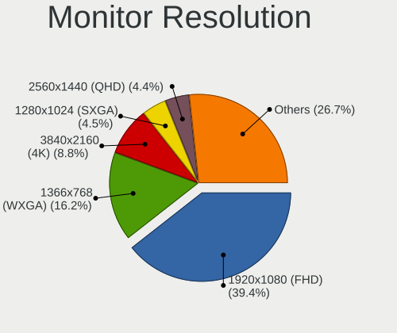

| Resolution         | Computers | Percent |
|--------------------|-----------|---------|
| 1920x1080 (FHD)    | 763       | 39.41%  |
| 1366x768 (WXGA)    | 314       | 16.22%  |
| 3840x2160 (4K)     | 170       | 8.78%   |
| 1280x1024 (SXGA)   | 87        | 4.49%   |
| 2560x1440 (QHD)    | 85        | 4.39%   |
| 1920x1200 (WUXGA)  | 85        | 4.39%   |
| 1280x800 (WXGA)    | 40        | 2.07%   |
| 1600x900 (HD+)     | 37        | 1.91%   |
| 2560x1600          | 35        | 1.81%   |
| 1440x900 (WXGA+)   | 31        | 1.6%    |
| 2880x1800          | 30        | 1.55%   |
| 1680x1050 (WSXGA+) | 27        | 1.39%   |
| Unknown            | 24        | 1.24%   |
| 1920x540           | 19        | 0.98%   |
| 2560x1080          | 17        | 0.88%   |
| 3440x1440          | 15        | 0.77%   |
| 1360x768           | 14        | 0.72%   |
| 2160x1440          | 11        | 0.57%   |
| 1400x1050          | 11        | 0.57%   |
| 1024x768 (XGA)     | 11        | 0.57%   |
| 1600x1200          | 10        | 0.52%   |
| 800x1280           | 9         | 0.46%   |
| 3840x1080          | 8         | 0.41%   |
| 2880x1920          | 8         | 0.41%   |
| 3840x2400          | 7         | 0.36%   |
| 3072x1920          | 7         | 0.36%   |
| 1920x1280          | 4         | 0.21%   |
| 3456x2160          | 3         | 0.15%   |
| 3200x1800 (QHD+)   | 3         | 0.15%   |
| 2304x1440          | 3         | 0.15%   |
| 1024x600           | 3         | 0.15%   |
| 3520x1080          | 2         | 0.1%    |
| 3200x1200          | 2         | 0.1%    |
| 3200x1080          | 2         | 0.1%    |
| 2880x1620          | 2         | 0.1%    |
| 2560x1024          | 2         | 0.1%    |
| 2520x1680          | 2         | 0.1%    |
| 2256x1504          | 2         | 0.1%    |
| 2240x1400          | 2         | 0.1%    |
| 1600x2560          | 2         | 0.1%    |

Monitor Diagonal
----------------

Diagonal size in inches

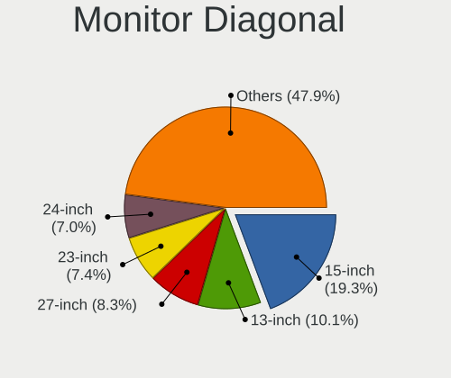

| Inches  | Computers | Percent |
|---------|-----------|---------|
| 15      | 380       | 19.31%  |
| 13      | 199       | 10.11%  |
| 27      | 164       | 8.33%   |
| 23      | 146       | 7.42%   |
| 24      | 137       | 6.96%   |
| 21      | 134       | 6.81%   |
| 14      | 117       | 5.95%   |
| Unknown | 109       | 5.54%   |
| 17      | 77        | 3.91%   |
| 31      | 72        | 3.66%   |
| 12      | 72        | 3.66%   |
| 19      | 63        | 3.2%    |
| 20      | 31        | 1.58%   |
| 16      | 27        | 1.37%   |
| 11      | 25        | 1.27%   |
| 34      | 24        | 1.22%   |
| 22      | 17        | 0.86%   |
| 18      | 17        | 0.86%   |
| 10      | 17        | 0.86%   |
| 32      | 14        | 0.71%   |
| 72      | 13        | 0.66%   |
| 37      | 12        | 0.61%   |
| 7       | 11        | 0.56%   |
| 84      | 9         | 0.46%   |
| 40      | 9         | 0.46%   |
| 54      | 7         | 0.36%   |
| 26      | 7         | 0.36%   |
| 63      | 6         | 0.3%    |
| 49      | 6         | 0.3%    |
| 43      | 5         | 0.25%   |
| 25      | 5         | 0.25%   |
| 52      | 4         | 0.2%    |
| 42      | 4         | 0.2%    |
| 29      | 4         | 0.2%    |
| 39      | 3         | 0.15%   |
| 35      | 3         | 0.15%   |
| 65      | 2         | 0.1%    |
| 64      | 2         | 0.1%    |
| 48      | 2         | 0.1%    |
| 36      | 2         | 0.1%    |

Monitor Width
-------------

Physical width

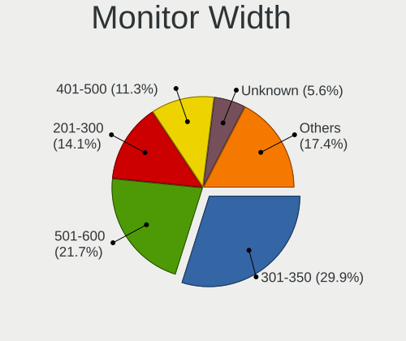

| Width in mm    | Computers | Percent |
|----------------|-----------|---------|
| 301-350        | 580       | 29.87%  |
| 501-600        | 422       | 21.73%  |
| 201-300        | 273       | 14.06%  |
| 401-500        | 220       | 11.33%  |
| Unknown        | 109       | 5.61%   |
| 351-400        | 97        | 4.99%   |
| 601-700        | 96        | 4.94%   |
| 701-800        | 36        | 1.85%   |
| 801-900        | 32        | 1.65%   |
| 1001-1500      | 31        | 1.6%    |
| 1501-2000      | 24        | 1.24%   |
| 1-100          | 9         | 0.46%   |
| 901-1000       | 8         | 0.41%   |
| 101-200        | 4         | 0.21%   |
| More than 2000 | 1         | 0.05%   |

Aspect Ratio
------------

Proportional relationship between the width and the height

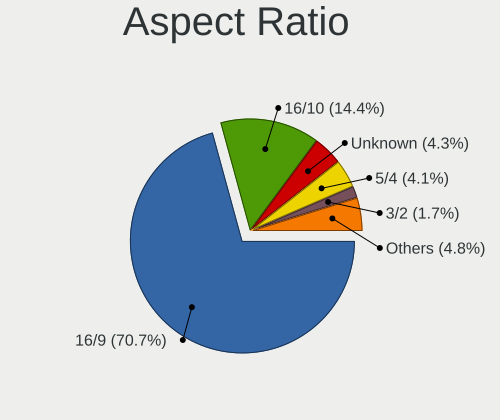

| Ratio   | Computers | Percent |
|---------|-----------|---------|
| 16/9    | 1294      | 70.75%  |
| 16/10   | 263       | 14.38%  |
| Unknown | 78        | 4.26%   |
| 5/4     | 75        | 4.1%    |
| 3/2     | 31        | 1.69%   |
| 21/9    | 29        | 1.59%   |
| 4/3     | 24        | 1.31%   |
| 32/9    | 14        | 0.77%   |
| 0.67    | 8         | 0.44%   |
| 1.00    | 3         | 0.16%   |
| 6/5     | 2         | 0.11%   |
| 0.62    | 2         | 0.11%   |
| 0.56    | 2         | 0.11%   |
| 2.00    | 1         | 0.05%   |
| 1.96    | 1         | 0.05%   |
| 0.63    | 1         | 0.05%   |
| 0.58    | 1         | 0.05%   |

Monitor Area
------------

Area in inch²

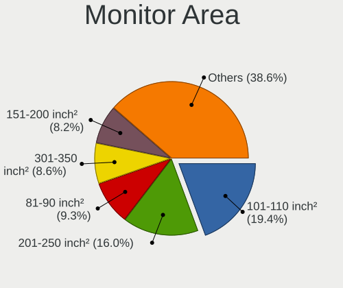

| Area in inch² | Computers | Percent |
|----------------|-----------|---------|
| 101-110        | 380       | 19.38%  |
| 201-250        | 314       | 16.01%  |
| 81-90          | 182       | 9.28%   |
| 301-350        | 168       | 8.57%   |
| 151-200        | 160       | 8.16%   |
| 71-80          | 128       | 6.53%   |
| 351-500        | 119       | 6.07%   |
| Unknown        | 109       | 5.56%   |
| 61-70          | 68        | 3.47%   |
| 251-300        | 62        | 3.16%   |
| 141-150        | 52        | 2.65%   |
| More than 1000 | 48        | 2.45%   |
| 501-1000       | 41        | 2.09%   |
| 121-130        | 33        | 1.68%   |
| 51-60          | 26        | 1.33%   |
| 111-120        | 24        | 1.22%   |
| 41-50          | 16        | 0.82%   |
| 1-40           | 13        | 0.66%   |
| 91-100         | 13        | 0.66%   |
| 131-140        | 5         | 0.25%   |

Pixel Density
-------------

Pixels per inch

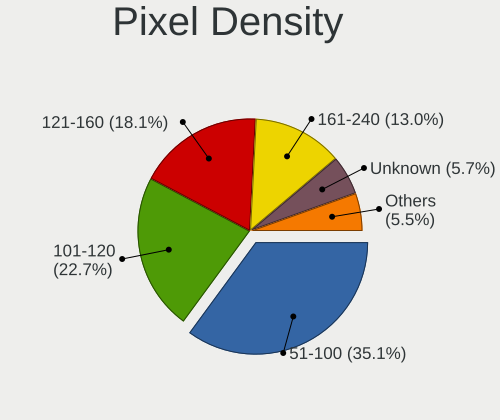

| Density       | Computers | Percent |
|---------------|-----------|---------|
| 51-100        | 673       | 35.07%  |
| 101-120       | 435       | 22.67%  |
| 121-160       | 347       | 18.08%  |
| 161-240       | 250       | 13.03%  |
| Unknown       | 109       | 5.68%   |
| More than 240 | 64        | 3.34%   |
| 1-50          | 41        | 2.14%   |

Multiple Monitors
-----------------

Total monitors connected

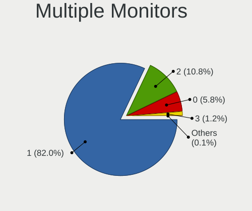

| Total | Computers | Percent |
|-------|-----------|---------|
| 1     | 1631      | 82.04%  |
| 2     | 215       | 10.81%  |
| 0     | 115       | 5.78%   |
| 3     | 24        | 1.21%   |
| 4     | 2         | 0.1%    |
| 6     | 1         | 0.05%   |

Network
-------

Net Controller Vendor
---------------------

Controller vendors

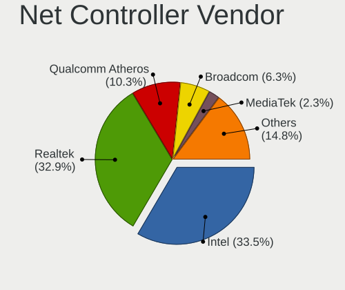

| Vendor                                 | Computers | Percent |
|----------------------------------------|-----------|---------|
| Intel                                  | 956       | 33.46%  |
| Realtek Semiconductor                  | 941       | 32.94%  |
| Qualcomm Atheros                       | 293       | 10.26%  |
| Broadcom                               | 179       | 6.27%   |
| MediaTek                               | 66        | 2.31%   |
| ASIX Electronics                       | 51        | 1.79%   |
| Marvell Technology Group               | 48        | 1.68%   |
| BUFFALO                                | 36        | 1.26%   |
| Broadcom Limited                       | 35        | 1.23%   |
| TP-Link                                | 25        | 0.88%   |
| PLANEX                                 | 17        | 0.6%    |
| Nvidia                                 | 17        | 0.6%    |
| Qualcomm                               | 14        | 0.49%   |
| Elecom                                 | 14        | 0.49%   |
| Apple                                  | 13        | 0.46%   |
| Aquantia                               | 11        | 0.39%   |
| Sierra Wireless                        | 10        | 0.35%   |
| Ralink                                 | 9         | 0.32%   |
| Huawei Technologies                    | 8         | 0.28%   |
| Shenzhen Goodix Technology             | 7         | 0.25%   |
| Ralink Technology                      | 7         | 0.25%   |
| Qualcomm Technologies                  | 7         | 0.25%   |
| VIA Technologies                       | 4         | 0.14%   |
| NEC Computers                          | 4         | 0.14%   |
| Logitec                                | 4         | 0.14%   |
| Lenovo                                 | 4         | 0.14%   |
| DisplayLink                            | 4         | 0.14%   |
| Xiaomi                                 | 3         | 0.11%   |
| U-Blox                                 | 3         | 0.11%   |
| Raspberry Pi                           | 3         | 0.11%   |
| Qualcomm Atheros Communications        | 3         | 0.11%   |
| Google                                 | 3         | 0.11%   |
| Suzhou Motorcomm Electronic Technology | 2         | 0.07%   |
| Silicon Integrated Systems [SiS]       | 2         | 0.07%   |
| Samsung Electronics                    | 2         | 0.07%   |
| Quectel Wireless Solutions             | 2         | 0.07%   |
| Prolific Technology                    | 2         | 0.07%   |
| OPPO Electronics                       | 2         | 0.07%   |
| NetGear                                | 2         | 0.07%   |
| Microsoft                              | 2         | 0.07%   |

Net Controller Model
--------------------

Controller models

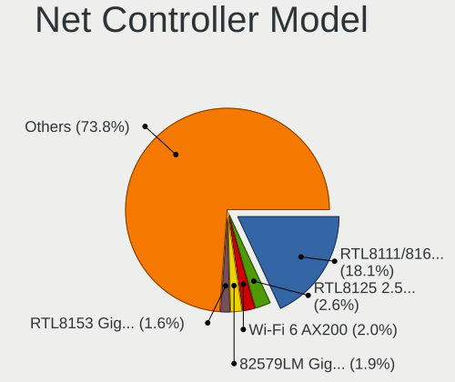

| Model                                                                  | Computers | Percent |
|------------------------------------------------------------------------|-----------|---------|
| Realtek RTL8111/8168/8211/8411 PCI Express Gigabit Ethernet Controller | 615       | 18.06%  |
| Realtek RTL8125 2.5GbE Controller                                      | 88        | 2.58%   |
| Intel Wi-Fi 6 AX200                                                    | 69        | 2.03%   |
| Intel 82579LM Gigabit Network Connection (Lewisville)                  | 65        | 1.91%   |
| Realtek RTL8153 Gigabit Ethernet Adapter                               | 54        | 1.59%   |
| Realtek RTL810xE PCI Express Fast Ethernet controller                  | 53        | 1.56%   |
| Intel Wireless 8265 / 8275                                             | 47        | 1.38%   |
| Intel Ethernet Connection (2) I219-V                                   | 45        | 1.32%   |
| ASIX AX88179 Gigabit Ethernet                                          | 43        | 1.26%   |
| Intel Wi-Fi 6E(802.11ax) AX210/AX1675* 2x2 [Typhoon Peak]              | 41        | 1.2%    |
| Intel 82579V Gigabit Network Connection                                | 41        | 1.2%    |
| Qualcomm Atheros QCA9565 / AR9565 Wireless Network Adapter             | 39        | 1.15%   |
| Intel Wireless 7265                                                    | 39        | 1.15%   |
| Intel Centrino Advanced-N 6205 [Taylor Peak]                           | 39        | 1.15%   |
| Intel I211 Gigabit Network Connection                                  | 37        | 1.09%   |
| Qualcomm Atheros AR9285 Wireless Network Adapter (PCI-Express)         | 31        | 0.91%   |
| Qualcomm Atheros AR8162 Fast Ethernet                                  | 31        | 0.91%   |
| Intel Wireless 7260                                                    | 31        | 0.91%   |
| Intel Wi-Fi 6 AX201                                                    | 31        | 0.91%   |
| Intel Ethernet Connection I217-V                                       | 30        | 0.88%   |
| Intel Ethernet Connection (7) I219-V                                   | 30        | 0.88%   |
| Realtek RTL8822CE 802.11ac PCIe Wireless Network Adapter               | 29        | 0.85%   |
| Realtek RTL8821CE 802.11ac PCIe Wireless Network Adapter               | 29        | 0.85%   |
| Intel Wireless 8260                                                    | 29        | 0.85%   |
| Intel Comet Lake PCH-LP CNVi WiFi                                      | 27        | 0.79%   |
| Realtek RTL88x2bu [AC1200 Techkey]                                     | 25        | 0.73%   |
| Qualcomm Atheros QCA9377 802.11ac Wireless Network Adapter             | 25        | 0.73%   |
| MediaTek MT7922 802.11ax PCI Express Wireless Network Adapter          | 25        | 0.73%   |
| Intel Alder Lake-P PCH CNVi WiFi                                       | 25        | 0.73%   |
| Intel Wireless 3165                                                    | 24        | 0.7%    |
| Intel Ethernet Controller I225-V                                       | 23        | 0.68%   |
| Qualcomm Atheros QCA6174 802.11ac Wireless Network Adapter             | 22        | 0.65%   |
| Qualcomm Atheros AR928X Wireless Network Adapter (PCI-Express)         | 22        | 0.65%   |
| Intel Dual Band Wireless-AC 3168NGW [Stone Peak]                       | 22        | 0.65%   |
| Qualcomm Atheros AR9462 Wireless Network Adapter                       | 21        | 0.62%   |
| Realtek RTL8188EUS 802.11n Wireless Network Adapter                    | 20        | 0.59%   |
| Intel Wireless 3160                                                    | 20        | 0.59%   |
| Intel Ethernet Connection I217-LM                                      | 20        | 0.59%   |
| Qualcomm Atheros AR9485 Wireless Network Adapter                       | 19        | 0.56%   |
| Realtek RTL8188CE 802.11b/g/n WiFi Adapter                             | 17        | 0.5%    |

Wireless Vendor
---------------

Wireless vendors

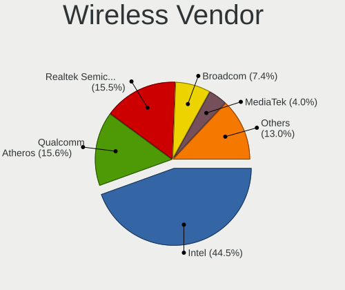

| Vendor                          | Computers | Percent |
|---------------------------------|-----------|---------|
| Intel                           | 640       | 44.51%  |
| Qualcomm Atheros                | 224       | 15.58%  |
| Realtek Semiconductor           | 223       | 15.51%  |
| Broadcom                        | 107       | 7.44%   |
| MediaTek                        | 57        | 3.96%   |
| BUFFALO                         | 35        | 2.43%   |
| TP-Link                         | 25        | 1.74%   |
| Broadcom Limited                | 24        | 1.67%   |
| PLANEX                          | 17        | 1.18%   |
| Qualcomm                        | 14        | 0.97%   |
| Elecom                          | 12        | 0.83%   |
| Sierra Wireless                 | 10        | 0.7%    |
| Ralink                          | 9         | 0.63%   |
| Ralink Technology               | 7         | 0.49%   |
| Marvell Technology Group        | 6         | 0.42%   |
| Logitec                         | 4         | 0.28%   |
| Qualcomm Technologies           | 3         | 0.21%   |
| Qualcomm Atheros Communications | 3         | 0.21%   |
| Quectel Wireless Solutions      | 2         | 0.14%   |
| NetGear                         | 2         | 0.14%   |
| NEC Computers                   | 2         | 0.14%   |
| Microsoft                       | 2         | 0.14%   |
| I-O Data Device                 | 2         | 0.14%   |
| Edimax Technology               | 2         | 0.14%   |
| D-Link                          | 2         | 0.14%   |
| Wilocity                        | 1         | 0.07%   |
| Wacom                           | 1         | 0.07%   |
| Dell                            | 1         | 0.07%   |
| ASUSTek Computer                | 1         | 0.07%   |

Wireless Model
--------------

Wireless models

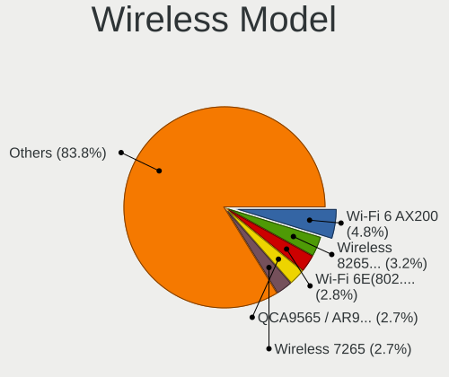

| Model                                                                   | Computers | Percent |
|-------------------------------------------------------------------------|-----------|---------|
| Intel Wi-Fi 6 AX200                                                     | 69        | 4.76%   |
| Intel Wireless 8265 / 8275                                              | 47        | 3.24%   |
| Intel Wi-Fi 6E(802.11ax) AX210/AX1675* 2x2 [Typhoon Peak]               | 41        | 2.83%   |
| Qualcomm Atheros QCA9565 / AR9565 Wireless Network Adapter              | 39        | 2.69%   |
| Intel Wireless 7265                                                     | 39        | 2.69%   |
| Intel Centrino Advanced-N 6205 [Taylor Peak]                            | 39        | 2.69%   |
| Qualcomm Atheros AR9285 Wireless Network Adapter (PCI-Express)          | 31        | 2.14%   |
| Intel Wireless 7260                                                     | 31        | 2.14%   |
| Intel Wi-Fi 6 AX201                                                     | 31        | 2.14%   |
| Realtek RTL8822CE 802.11ac PCIe Wireless Network Adapter                | 29        | 2%      |
| Realtek RTL8821CE 802.11ac PCIe Wireless Network Adapter                | 29        | 2%      |
| Intel Wireless 8260                                                     | 29        | 2%      |
| Intel Comet Lake PCH-LP CNVi WiFi                                       | 27        | 1.86%   |
| Realtek RTL88x2bu [AC1200 Techkey]                                      | 25        | 1.73%   |
| Qualcomm Atheros QCA9377 802.11ac Wireless Network Adapter              | 25        | 1.73%   |
| Intel Wireless 3165                                                     | 24        | 1.66%   |
| Qualcomm Atheros QCA6174 802.11ac Wireless Network Adapter              | 22        | 1.52%   |
| Qualcomm Atheros AR928X Wireless Network Adapter (PCI-Express)          | 22        | 1.52%   |
| Intel Dual Band Wireless-AC 3168NGW [Stone Peak]                        | 22        | 1.52%   |
| Qualcomm Atheros AR9462 Wireless Network Adapter                        | 21        | 1.45%   |
| Intel Alder Lake-P PCH CNVi WiFi                                        | 21        | 1.45%   |
| Realtek RTL8188EUS 802.11n Wireless Network Adapter                     | 20        | 1.38%   |
| Intel Wireless 3160                                                     | 20        | 1.38%   |
| Qualcomm Atheros AR9485 Wireless Network Adapter                        | 19        | 1.31%   |
| Realtek RTL8188CE 802.11b/g/n WiFi Adapter                              | 17        | 1.17%   |
| MediaTek MT7922 802.11ax PCI Express Wireless Network Adapter           | 17        | 1.17%   |
| MediaTek MT7921 802.11ax PCIe Wireless Network Adapter [Filogic 330]    | 17        | 1.17%   |
| Intel Comet Lake PCH CNVi WiFi                                          | 17        | 1.17%   |
| Qualcomm Atheros AR242x / AR542x Wireless Network Adapter (PCI-Express) | 16        | 1.1%    |
| Intel Cannon Lake PCH CNVi WiFi                                         | 16        | 1.1%    |
| Intel Raptor Lake PCH CNVi WiFi                                         | 15        | 1.04%   |
| Qualcomm QCNFA765 Wireless Network Adapter                              | 14        | 0.97%   |
| Intel Cannon Point-LP CNVi [Wireless-AC]                                | 14        | 0.97%   |
| Broadcom BCM4313 802.11bgn Wireless Network Adapter                     | 14        | 0.97%   |
| TP-Link AC600 wireless Realtek RTL8811AU [Archer T2U Nano]              | 13        | 0.9%    |
| Realtek RTL8852BE PCIe 802.11ax Wireless Network Controller             | 12        | 0.83%   |
| Realtek RTL8723BE PCIe Wireless Network Adapter                         | 12        | 0.83%   |
| Qualcomm Atheros AR93xx Wireless Network Adapter                        | 12        | 0.83%   |
| Qualcomm Atheros AR9287 Wireless Network Adapter (PCI-Express)          | 12        | 0.83%   |
| MediaTek MT7921K (RZ608) Wi-Fi 6E 80MHz                                 | 12        | 0.83%   |

Ethernet Vendor
---------------

Ethernet vendors

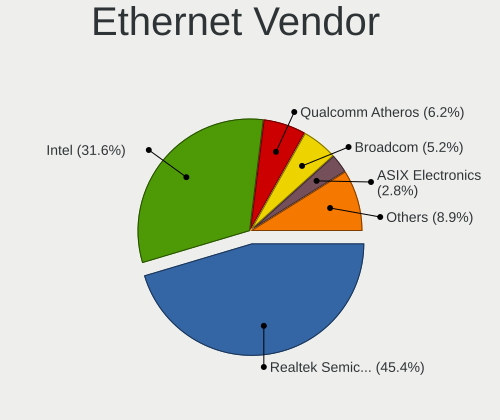

| Vendor                                 | Computers | Percent |
|----------------------------------------|-----------|---------|
| Realtek Semiconductor                  | 837       | 45.39%  |
| Intel                                  | 582       | 31.56%  |
| Qualcomm Atheros                       | 114       | 6.18%   |
| Broadcom                               | 96        | 5.21%   |
| ASIX Electronics                       | 51        | 2.77%   |
| Marvell Technology Group               | 42        | 2.28%   |
| Nvidia                                 | 17        | 0.92%   |
| Apple                                  | 13        | 0.7%    |
| Broadcom Limited                       | 11        | 0.6%    |
| Aquantia                               | 11        | 0.6%    |
| MediaTek                               | 9         | 0.49%   |
| Huawei Technologies                    | 8         | 0.43%   |
| VIA Technologies                       | 4         | 0.22%   |
| Qualcomm Technologies                  | 4         | 0.22%   |
| Lenovo                                 | 4         | 0.22%   |
| DisplayLink                            | 4         | 0.22%   |
| Xiaomi                                 | 3         | 0.16%   |
| Raspberry Pi                           | 3         | 0.16%   |
| Google                                 | 3         | 0.16%   |
| Suzhou Motorcomm Electronic Technology | 2         | 0.11%   |
| Silicon Integrated Systems [SiS]       | 2         | 0.11%   |
| Samsung Electronics                    | 2         | 0.11%   |
| OPPO Electronics                       | 2         | 0.11%   |
| JMicron Technology                     | 2         | 0.11%   |
| ICS Advent                             | 2         | 0.11%   |
| Gemtek                                 | 2         | 0.11%   |
| Elecom                                 | 2         | 0.11%   |
| ZTE WCDMA Technologies MSM             | 1         | 0.05%   |
| vivo                                   | 1         | 0.05%   |
| Sony Ericsson Mobile Communications AB | 1         | 0.05%   |
| Sharp                                  | 1         | 0.05%   |
| QNAP System                            | 1         | 0.05%   |
| Netchip Technology                     | 1         | 0.05%   |
| Microchip Technology                   | 1         | 0.05%   |
| Loongson Technology                    | 1         | 0.05%   |
| Corega K.K.                            | 1         | 0.05%   |
| Android                                | 1         | 0.05%   |
| ADMtek                                 | 1         | 0.05%   |
| 3Com                                   | 1         | 0.05%   |

Ethernet Model
--------------

Ethernet models

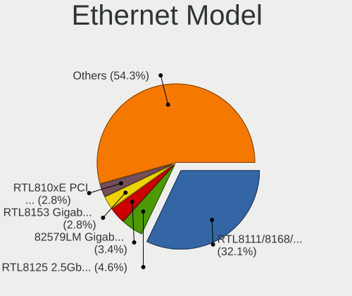

| Model                                                                  | Computers | Percent |
|------------------------------------------------------------------------|-----------|---------|
| Realtek RTL8111/8168/8211/8411 PCI Express Gigabit Ethernet Controller | 615       | 32.11%  |
| Realtek RTL8125 2.5GbE Controller                                      | 88        | 4.6%    |
| Intel 82579LM Gigabit Network Connection (Lewisville)                  | 65        | 3.39%   |
| Realtek RTL8153 Gigabit Ethernet Adapter                               | 54        | 2.82%   |
| Realtek RTL810xE PCI Express Fast Ethernet controller                  | 53        | 2.77%   |
| Intel Ethernet Connection (2) I219-V                                   | 45        | 2.35%   |
| ASIX AX88179 Gigabit Ethernet                                          | 43        | 2.25%   |
| Intel 82579V Gigabit Network Connection                                | 41        | 2.14%   |
| Intel I211 Gigabit Network Connection                                  | 37        | 1.93%   |
| Qualcomm Atheros AR8162 Fast Ethernet                                  | 31        | 1.62%   |
| Intel Ethernet Connection I217-V                                       | 30        | 1.57%   |
| Intel Ethernet Connection (7) I219-V                                   | 30        | 1.57%   |
| Intel Ethernet Controller I225-V                                       | 23        | 1.2%    |
| Intel Ethernet Connection I217-LM                                      | 20        | 1.04%   |
| Intel I210 Gigabit Network Connection                                  | 16        | 0.84%   |
| Intel Ethernet Connection (4) I219-V                                   | 15        | 0.78%   |
| Intel Ethernet Connection (4) I219-LM                                  | 15        | 0.78%   |
| Intel Ethernet Connection (10) I219-V                                  | 15        | 0.78%   |
| Intel Ethernet Connection I219-V                                       | 14        | 0.73%   |
| Qualcomm Atheros Killer E220x Gigabit Ethernet Controller              | 13        | 0.68%   |
| Qualcomm Atheros AR8161 Gigabit Ethernet                               | 13        | 0.68%   |
| Qualcomm Atheros AR8151 v2.0 Gigabit Ethernet                          | 13        | 0.68%   |
| Intel 82574L Gigabit Network Connection                                | 13        | 0.68%   |
| Intel Ethernet Connection (2) I219-LM                                  | 12        | 0.63%   |
| Intel Ethernet Connection (3) I218-LM                                  | 11        | 0.57%   |
| Intel 82577LC Gigabit Network Connection                               | 11        | 0.57%   |
| Broadcom NetLink BCM57781 Gigabit Ethernet PCIe                        | 11        | 0.57%   |
| Apple iBridge                                                          | 11        | 0.57%   |
| Qualcomm Atheros AR8152 v2.0 Fast Ethernet                             | 10        | 0.52%   |
| Intel Ethernet Connection (6) I219-V                                   | 10        | 0.52%   |
| Broadcom NetLink BCM57780 Gigabit Ethernet PCIe                        | 10        | 0.52%   |
| Realtek RTL-8100/8101L/8139 PCI Fast Ethernet Adapter                  | 9         | 0.47%   |
| Intel Ethernet Connection I219-LM                                      | 9         | 0.47%   |
| Broadcom NetXtreme BCM57766 Gigabit Ethernet PCIe                      | 9         | 0.47%   |
| Broadcom NetXtreme BCM57765 Gigabit Ethernet PCIe                      | 9         | 0.47%   |
| Broadcom NetLink BCM5784M Gigabit Ethernet PCIe                        | 9         | 0.47%   |
| Realtek RTL8152 Fast Ethernet Adapter                                  | 8         | 0.42%   |
| Nvidia MCP79 Ethernet                                                  | 8         | 0.42%   |
| MediaTek MT7922 802.11ax PCI Express Wireless Network Adapter          | 8         | 0.42%   |
| Marvell Group 88E8055 PCI-E Gigabit Ethernet Controller                | 8         | 0.42%   |

Net Controller Kind
-------------------

Ethernet, WiFi or modem

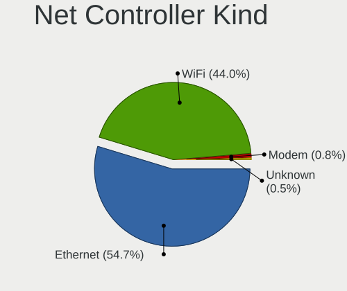

| Kind     | Computers | Percent |
|----------|-----------|---------|
| Ethernet | 1694      | 54.7%   |
| WiFi     | 1362      | 43.98%  |
| Modem    | 26        | 0.84%   |
| Unknown  | 15        | 0.48%   |

Used Controller
---------------

Currently used network controller

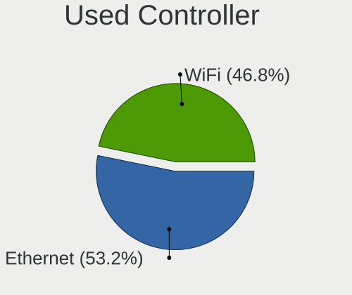

| Kind     | Computers | Percent |
|----------|-----------|---------|
| Ethernet | 1076      | 53.21%  |
| WiFi     | 946       | 46.79%  |

NICs
----

Total network controllers on board

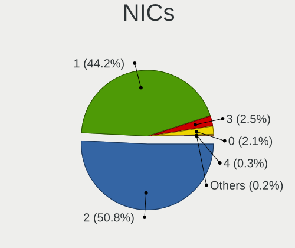

| Total | Computers | Percent |
|-------|-----------|---------|
| 2     | 997       | 50.79%  |
| 1     | 867       | 44.17%  |
| 3     | 49        | 2.5%    |
| 0     | 41        | 2.09%   |
| 4     | 5         | 0.25%   |
| 8     | 1         | 0.05%   |
| 7     | 1         | 0.05%   |
| 6     | 1         | 0.05%   |
| 5     | 1         | 0.05%   |

IPv6
----

IPv6 vs IPv4

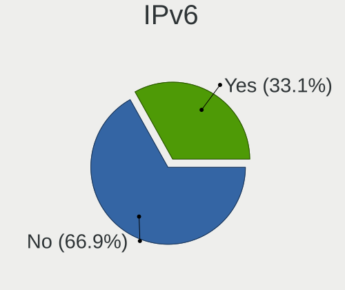

| Used | Computers | Percent |
|------|-----------|---------|
| No   | 1339      | 66.88%  |
| Yes  | 663       | 33.12%  |

Bluetooth
---------

Bluetooth Vendor
----------------

Controller vendors

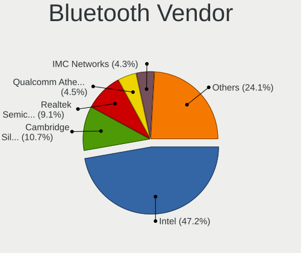

| Vendor                          | Computers | Percent |
|---------------------------------|-----------|---------|
| Intel                           | 522       | 47.24%  |
| Cambridge Silicon Radio         | 118       | 10.68%  |
| Realtek Semiconductor           | 101       | 9.14%   |
| Qualcomm Atheros Communications | 50        | 4.52%   |
| IMC Networks                    | 48        | 4.34%   |
| Apple                           | 44        | 3.98%   |
| Foxconn / Hon Hai               | 43        | 3.89%   |
| Broadcom                        | 38        | 3.44%   |
| MediaTek                        | 31        | 2.81%   |
| TP-Link                         | 13        | 1.18%   |
| Lite-On Technology              | 11        | 1%      |
| Fujitsu                         | 11        | 1%      |
| USI                             | 10        | 0.9%    |
| ASUSTek Computer                | 10        | 0.9%    |
| Alps Electric                   | 10        | 0.9%    |
| Realtek                         | 9         | 0.81%   |
| Marvell Semiconductor           | 7         | 0.63%   |
| Toshiba                         | 6         | 0.54%   |
| Hewlett-Packard                 | 4         | 0.36%   |
| BUFFALO                         | 4         | 0.36%   |
| Actions                         | 3         | 0.27%   |
| Ralink                          | 2         | 0.18%   |
| Opticis                         | 2         | 0.18%   |
| Dell                            | 2         | 0.18%   |
| Taiyo Yuden                     | 1         | 0.09%   |
| Ralink Technology               | 1         | 0.09%   |
| Creative Technology             | 1         | 0.09%   |
| Chicony Electronics             | 1         | 0.09%   |
| Askey Computer                  | 1         | 0.09%   |
| 8BitDo                          | 1         | 0.09%   |

Bluetooth Model
---------------

Controller models

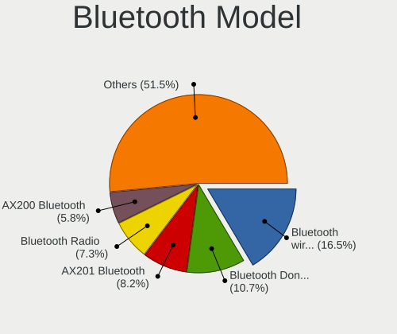

| Model                                                                               | Computers | Percent |
|-------------------------------------------------------------------------------------|-----------|---------|
| Intel Bluetooth wireless interface                                                  | 182       | 16.47%  |
| Cambridge Silicon Radio Bluetooth Dongle (HCI mode)                                 | 118       | 10.68%  |
| Intel AX201 Bluetooth                                                               | 91        | 8.24%   |
| Realtek Bluetooth Radio                                                             | 81        | 7.33%   |
| Intel AX200 Bluetooth                                                               | 64        | 5.79%   |
| Intel Bluetooth Device                                                              | 59        | 5.34%   |
| Intel Bluetooth 9460/9560 Jefferson Peak (JfP)                                      | 43        | 3.89%   |
| Intel AX210 Bluetooth                                                               | 42        | 3.8%    |
| MediaTek Wireless_Device                                                            | 31        | 2.81%   |
| Qualcomm Atheros  Bluetooth Device                                                  | 24        | 2.17%   |
| Apple Bluetooth Host Controller                                                     | 24        | 2.17%   |
| Intel Wireless-AC 3168 Bluetooth                                                    | 22        | 1.99%   |
| IMC Networks Bluetooth Radio                                                        | 19        | 1.72%   |
| IMC Networks Wireless_Device                                                        | 15        | 1.36%   |
| TP-Link TP-T@- UB500 Adapter                                                        | 13        | 1.18%   |
| Foxconn / Hon Hai Bluetooth Device                                                  | 13        | 1.18%   |
| Apple Bluetooth USB Host Controller                                                 | 12        | 1.09%   |
| IMC Networks Bluetooth Device                                                       | 11        | 1%      |
| USI Bluetooth Device                                                                | 10        | 0.9%    |
| Foxconn / Hon Hai Wireless_Device                                                   | 10        | 0.9%    |
| Broadcom BCM20702 Bluetooth 4.0 [ThinkPad]                                          | 10        | 0.9%    |
| Realtek  Bluetooth 4.2 Adapter                                                      | 9         | 0.81%   |
| Realtek Bluetooth Radio                                                             | 9         | 0.81%   |
| Qualcomm Atheros QCA61x4 Bluetooth 4.0                                              | 9         | 0.81%   |
| Intel Wireless-AC 9260 Bluetooth Adapter                                            | 9         | 0.81%   |
| Fujitsu Bluetooth Device                                                            | 9         | 0.81%   |
| Intel Centrino Bluetooth Wireless Transceiver                                       | 8         | 0.72%   |
| Qualcomm Atheros AR3011 Bluetooth                                                   | 7         | 0.63%   |
| Foxconn / Hon Hai MediaTek Bluetooth Adapter                                        | 7         | 0.63%   |
| Apple Built-in Bluetooth 2.0+EDR HCI                                                | 7         | 0.63%   |
| Foxconn / Hon Hai Foxconn T77H114 BCM2070 [Single-Chip Bluetooth 2.1 + EDR Adapter] | 6         | 0.54%   |
| Broadcom BCM2045B (BDC-2.1)                                                         | 6         | 0.54%   |
| Toshiba Atheros AR3012 Bluetooth                                                    | 5         | 0.45%   |
| Realtek RTL8723B Bluetooth                                                          | 5         | 0.45%   |
| Qualcomm Atheros AR3012 Bluetooth 4.0                                               | 5         | 0.45%   |
| Alps Electric BCM2046 Bluetooth Device                                              | 5         | 0.45%   |
| Qualcomm Atheros AR9462 Bluetooth                                                   | 4         | 0.36%   |
| Marvell Bluetooth and Wireless LAN Composite                                        | 4         | 0.36%   |
| Lite-On Bluetooth Device                                                            | 4         | 0.36%   |
| BUFFALO Bluetooth Radio                                                             | 4         | 0.36%   |

Sound
-----

Sound Vendor
------------

Sound card vendors

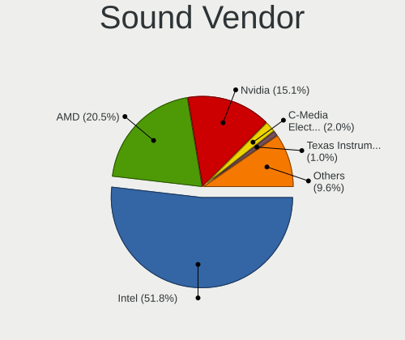

| Vendor                                       | Computers | Percent |
|----------------------------------------------|-----------|---------|
| Intel                                        | 1398      | 51.84%  |
| AMD                                          | 554       | 20.54%  |
| Nvidia                                       | 407       | 15.09%  |
| C-Media Electronics                          | 53        | 1.97%   |
| Texas Instruments                            | 26        | 0.96%   |
| Creative Technology                          | 23        | 0.85%   |
| Apple                                        | 21        | 0.78%   |
| VIA Technologies                             | 18        | 0.67%   |
| Generalplus Technology                       | 11        | 0.41%   |
| JMTek                                        | 10        | 0.37%   |
| Harman                                       | 10        | 0.37%   |
| Yamaha                                       | 9         | 0.33%   |
| Creative Labs                                | 9         | 0.33%   |
| Micro Star International                     | 8         | 0.3%    |
| Elitegroup Computer Systems (ECS)            | 8         | 0.3%    |
| Sony                                         | 7         | 0.26%   |
| Realtek Semiconductor                        | 7         | 0.26%   |
| Logitech                                     | 7         | 0.26%   |
| GN Netcom                                    | 7         | 0.26%   |
| Zoran Co. Personal Media Division (Nogatech) | 6         | 0.22%   |
| Roland                                       | 5         | 0.19%   |
| ASUSTek Computer                             | 5         | 0.19%   |
| Thesycon Systemsoftware & Consulting         | 4         | 0.15%   |
| Onkyo                                        | 4         | 0.15%   |
| Lenovo                                       | 4         | 0.15%   |
| TOWA Electronics                             | 3         | 0.11%   |
| Tenx Technology                              | 3         | 0.11%   |
| RATOC System                                 | 3         | 0.11%   |
| Focusrite-Novation                           | 3         | 0.11%   |
| ESI Audiotechnik                             | 3         | 0.11%   |
| ASRock                                       | 3         | 0.11%   |
| XMOS                                         | 2         | 0.07%   |
| Walmart                                      | 2         | 0.07%   |
| SteelSeries ApS                              | 2         | 0.07%   |
| Silicon Integrated Systems [SiS]             | 2         | 0.07%   |
| Razer USA                                    | 2         | 0.07%   |
| KTMICRO                                      | 2         | 0.07%   |
| iCreate Technologies                         | 2         | 0.07%   |
| FiiO Electronics Technology                  | 2         | 0.07%   |
| DSEA A/S                                     | 2         | 0.07%   |

Sound Model
-----------

Sound card models

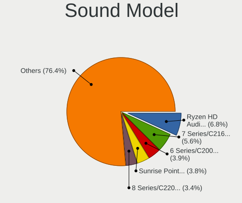

| Model                                                                      | Computers | Percent |
|----------------------------------------------------------------------------|-----------|---------|
| AMD Ryzen HD Audio Controller                                              | 219       | 6.84%   |
| Intel 7 Series/C216 Chipset Family High Definition Audio Controller        | 180       | 5.62%   |
| Intel 6 Series/C200 Series Chipset Family High Definition Audio Controller | 124       | 3.87%   |
| Intel Sunrise Point-LP HD Audio                                            | 122       | 3.81%   |
| Intel 8 Series/C220 Series Chipset High Definition Audio Controller        | 110       | 3.43%   |
| AMD Renoir/Cezanne HDMI/DP Audio Controller                                | 95        | 2.97%   |
| AMD Radeon High Definition Audio Controller                                | 79        | 2.47%   |
| Intel 5 Series/3400 Series Chipset High Definition Audio                   | 75        | 2.34%   |
| Intel Xeon E3-1200 v3/4th Gen Core Processor HD Audio Controller           | 71        | 2.22%   |
| AMD Starship/Matisse HD Audio Controller                                   | 67        | 2.09%   |
| Intel Cannon Lake PCH cAVS                                                 | 60        | 1.87%   |
| Intel 82801I (ICH9 Family) HD Audio Controller                             | 56        | 1.75%   |
| Intel 100 Series/C230 Series Chipset Family HD Audio Controller            | 53        | 1.65%   |
| AMD SBx00 Azalia (Intel HDA)                                               | 49        | 1.53%   |
| AMD Raven/Raven2/Fenghuang HDMI/DP Audio Controller                        | 49        | 1.53%   |
| Intel 200 Series PCH HD Audio                                              | 47        | 1.47%   |
| Intel NM10/ICH7 Family High Definition Audio Controller                    | 45        | 1.4%    |
| AMD FCH Azalia Controller                                                  | 44        | 1.37%   |
| Intel Wildcat Point-LP High Definition Audio Controller                    | 41        | 1.28%   |
| Intel Broadwell-U Audio Controller                                         | 40        | 1.25%   |
| Intel Tiger Lake-LP Smart Sound Technology Audio Controller                | 35        | 1.09%   |
| Nvidia GK208 HDMI/DP Audio Controller                                      | 34        | 1.06%   |
| Intel 8 Series HD Audio Controller                                         | 33        | 1.03%   |
| Intel Haswell-ULT HD Audio Controller                                      | 32        | 1%      |
| Intel Comet Lake PCH-LP cAVS                                               | 32        | 1%      |
| Nvidia TU107 GeForce GTX 1650 High Definition Audio Controller             | 31        | 0.97%   |
| Intel Cannon Point-LP High Definition Audio Controller                     | 31        | 0.97%   |
| Intel Alder Lake PCH-P High Definition Audio Controller                    | 30        | 0.94%   |
| AMD Navi 21/23 HDMI/DP Audio Controller                                    | 29        | 0.91%   |
| Intel Comet Lake PCH cAVS                                                  | 27        | 0.84%   |
| Intel 82801H (ICH8 Family) HD Audio Controller                             | 27        | 0.84%   |
| Nvidia TU116 High Definition Audio Controller                              | 26        | 0.81%   |
| Intel 82801JI (ICH10 Family) HD Audio Controller                           | 26        | 0.81%   |
| AMD Family 17h (Models 00h-0fh) HD Audio Controller                        | 26        | 0.81%   |
| Nvidia GP107GL High Definition Audio Controller                            | 25        | 0.78%   |
| AMD Oland/Hainan/Cape Verde/Pitcairn HDMI Audio [Radeon HD 7000 Series]    | 25        | 0.78%   |
| AMD Ellesmere HDMI Audio [Radeon RX 470/480 / 570/580/590]                 | 25        | 0.78%   |
| AMD Baffin HDMI/DP Audio [Radeon RX 550 640SP / RX 560/560X]               | 23        | 0.72%   |
| Nvidia GP104 High Definition Audio Controller                              | 21        | 0.66%   |
| Intel Alder Lake-S HD Audio Controller                                     | 21        | 0.66%   |

Memory
------

Memory Vendor
-------------

Memory module vendors

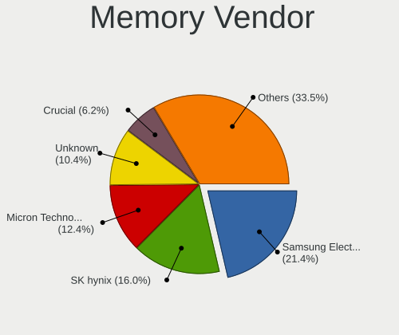

| Vendor                                  | Computers | Percent |
|-----------------------------------------|-----------|---------|
| Samsung Electronics                     | 265       | 21.37%  |
| SK hynix                                | 199       | 16.05%  |
| Micron Technology                       | 154       | 12.42%  |
| Unknown                                 | 129       | 10.4%   |
| Crucial                                 | 77        | 6.21%   |
| Kingston                                | 74        | 5.97%   |
| Unknown                                 | 42        | 3.39%   |
| A-DATA Technology                       | 34        | 2.74%   |
| Team                                    | 29        | 2.34%   |
| Corsair                                 | 27        | 2.18%   |
| Nanya Technology                        | 22        | 1.77%   |
| G.Skill                                 | 20        | 1.61%   |
| Silicon Power                           | 16        | 1.29%   |
| Transcend                               | 13        | 1.05%   |
| Elpida                                  | 13        | 1.05%   |
| Panram                                  | 12        | 0.97%   |
| Ramaxel Technology                      | 11        | 0.89%   |
| Unknown (ABCD)                          | 10        | 0.81%   |
| KLEVV                                   | 9         | 0.73%   |
| SanMax                                  | 8         | 0.65%   |
| Patriot                                 | 7         | 0.56%   |
| Unknown (0x0DEC)                        | 4         | 0.32%   |
| CFD                                     | 4         | 0.32%   |
| Silicon Power Computer & Communications | 3         | 0.24%   |
| ASint Technology                        | 3         | 0.24%   |
| Toshiba                                 | 2         | 0.16%   |
| Innodisk                                | 2         | 0.16%   |
| Essencore Limited                       | 2         | 0.16%   |
| Essencore                               | 2         | 0.16%   |
| Chun Well                               | 2         | 0.16%   |
| V-Color                                 | 1         | 0.08%   |
| Uroad                                   | 1         | 0.08%   |
| Unknown (8AD3)                          | 1         | 0.08%   |
| Unknown (8A91)                          | 1         | 0.08%   |
| Unknown (0xD306)                        | 1         | 0.08%   |
| Unknown (0x7FFF)                        | 1         | 0.08%   |
| Unknown (0x750E)                        | 1         | 0.08%   |
| Unknown (0x0FC4)                        | 1         | 0.08%   |
| Unknown (0x0E2A)                        | 1         | 0.08%   |
| Unknown (0x0C46)                        | 1         | 0.08%   |

Memory Model
------------

Memory module models

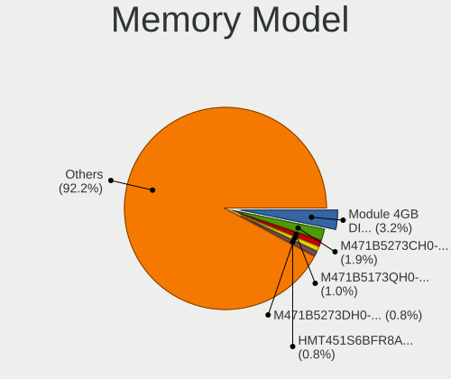

| Model                                                            | Computers | Percent |
|------------------------------------------------------------------|-----------|---------|
| Unknown                                                          | 42        | 3.22%   |
| Samsung RAM M471B5273CH0-CK0 4GB SODIMM DDR3 1600MT/s            | 25        | 1.92%   |
| Samsung RAM M471B5173QH0-YK0 4GB SODIMM DDR3 1600MT/s            | 13        | 1%      |
| SK hynix RAM HMT451S6BFR8A-PB 4GB SODIMM DDR3 1600MT/s           | 11        | 0.84%   |
| Samsung RAM M471B5273DH0-CH9 4GB SODIMM DDR3 1600MT/s            | 11        | 0.84%   |
| SK hynix RAM HMA81GS6DJR8N-XN 8GB SODIMM DDR4 3200MT/s           | 10        | 0.77%   |
| Samsung RAM M471B5273CH0-CH9 4GB SODIMM DDR3 1334MT/s            | 10        | 0.77%   |
| Micron RAM MT53E512M64D4NW-053 4GB Row Of Chips LPDDR4 3733MT/s  | 9         | 0.69%   |
| Samsung RAM M471B5173EB0-YK0 4GB SODIMM DDR3 1600MT/s            | 8         | 0.61%   |
| Unknown (ABCD) RAM 123456789012345678 2GB DIMM LPDDR4 2133MT/s   | 6         | 0.46%   |
| SK hynix RAM HMT451S6AFR8A-PB 4GB SODIMM DDR3 1600MT/s           | 6         | 0.46%   |
| Samsung RAM M471A1G44AB0-CWE 8GiB SODIMM DDR4 3200MT/s           | 6         | 0.46%   |
| Corsair RAM CMK32GX4M2A2666C16 16GB DIMM DDR4 2667MT/s           | 6         | 0.46%   |
| Unknown RAM Module 4GB SODIMM DDR3 1333MT/s                      | 5         | 0.38%   |
| Unknown RAM Module 2GB SODIMM DDR2                               | 5         | 0.38%   |
| SK hynix RAM HMT351S6CFR8C-PB 4GB SODIMM DDR3 1600MT/s           | 5         | 0.38%   |
| SK hynix RAM HMAA1GS6CJR6N-XN 8GB SODIMM DDR4 3200MT/s           | 5         | 0.38%   |
| SK hynix RAM HMA851S6JJR6N-VK 4GB SODIMM DDR4 2667MT/s           | 5         | 0.38%   |
| SK hynix RAM HMA81GS6AFR8N-UH 8GB SODIMM DDR4 2667MT/s           | 5         | 0.38%   |
| Samsung RAM M471B5773CHS-CH9 2GB SODIMM DDR3 4199MT/s            | 5         | 0.38%   |
| Samsung RAM M471B5173DB0-YK0 4GB SODIMM DDR3 1600MT/s            | 5         | 0.38%   |
| Samsung RAM M471B1G73DB0-YK0 8GB SODIMM DDR3 1600MT/s            | 5         | 0.38%   |
| Samsung RAM M471A2K43DB1-CWE 16GB SODIMM DDR4 3200MT/s           | 5         | 0.38%   |
| Samsung RAM M471A1K43CB1-CRC 8GB SODIMM DDR4 8400MT/s            | 5         | 0.38%   |
| Micron RAM MT62F2G32D4DS-026 WT 8GiB SODIMM LPDDR5 7500MT/s      | 5         | 0.38%   |
| Micron RAM MT62F1G32D4DR-031B 2GB Row Of Chips LPDDR5 6400MT/s   | 5         | 0.38%   |
| Micron RAM MT62F1G32D4DR-031 WT 4GB SODIMM LPDDR5 6400MT/s       | 5         | 0.38%   |
| Micron RAM 8KTF51264HZ-1G6E1 4GB SODIMM DDR3 1600MT/s            | 5         | 0.38%   |
| Micron RAM 8ATF1G64HZ-3G2J1 8GB SODIMM DDR4 3200MT/s             | 5         | 0.38%   |
| Unknown RAM Module 4GB SODIMM DDR3 1600MT/s                      | 4         | 0.31%   |
| Unknown RAM Module 4GB SODIMM DDR3                               | 4         | 0.31%   |
| Unknown (ABCD) RAM 123456789012345678 2GB SODIMM LPDDR4 2400MT/s | 4         | 0.31%   |
| Team RAM TEAMGROUP-UD4-3200 8GB DIMM DDR4 3800MT/s               | 4         | 0.31%   |
| Team RAM TEAMGROUP-UD3-1600 8GB DIMM DDR3 1866MT/s               | 4         | 0.31%   |
| Team RAM TEAMGROUP-SD3-1600 8GB SODIMM DDR3 1600MT/s             | 4         | 0.31%   |
| SK hynix RAM Module 4GB SODIMM DDR3 1600MT/s                     | 4         | 0.31%   |
| SK hynix RAM HMT41GS6AFR8A-PB 8GB SODIMM DDR3 1600MT/s           | 4         | 0.31%   |
| SK hynix RAM HMT351U6CFR8C-PB 4GB DIMM DDR3 1800MT/s             | 4         | 0.31%   |
| SK hynix RAM HMT325U6CFR8C-PB 2GB DIMM DDR3 1600MT/s             | 4         | 0.31%   |
| SK hynix RAM HMT325S6CFR8C-PB 2GB SODIMM DDR3 1600MT/s           | 4         | 0.31%   |

Memory Kind
-----------

Memory module kinds

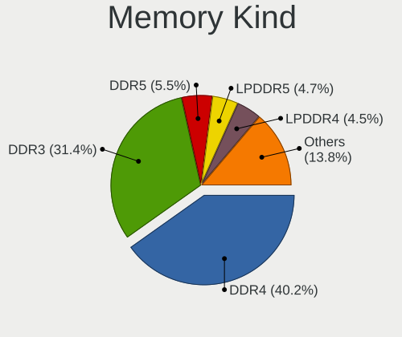

| Kind    | Computers | Percent |
|---------|-----------|---------|
| DDR4    | 439       | 40.16%  |
| DDR3    | 343       | 31.38%  |
| DDR5    | 60        | 5.49%   |
| LPDDR5  | 51        | 4.67%   |
| LPDDR4  | 49        | 4.48%   |
| DDR2    | 47        | 4.3%    |
| LPDDR3  | 45        | 4.12%   |
| SDRAM   | 30        | 2.74%   |
| Unknown | 23        | 2.1%    |
| DRAM    | 3         | 0.27%   |
| DDR     | 2         | 0.18%   |
| RAM     | 1         | 0.09%   |

Memory Form Factor
------------------

Physical design of the memory module

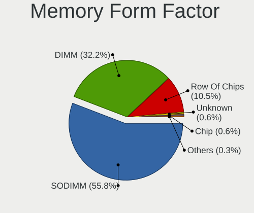

| Name         | Computers | Percent |
|--------------|-----------|---------|
| SODIMM       | 607       | 55.84%  |
| DIMM         | 350       | 32.2%   |
| Row Of Chips | 114       | 10.49%  |
| Unknown      | 7         | 0.64%   |
| Chip         | 6         | 0.55%   |
| RIMM         | 2         | 0.18%   |
| FB-DIMM      | 1         | 0.09%   |

Memory Size
-----------

Memory module size

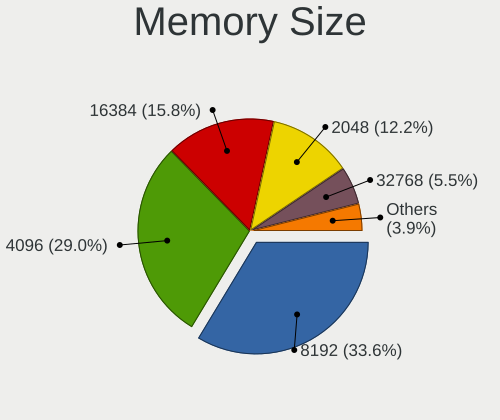

| Size  | Computers | Percent |
|-------|-----------|---------|
| 8192  | 393       | 33.65%  |
| 4096  | 339       | 29.02%  |
| 16384 | 184       | 15.75%  |
| 2048  | 142       | 12.16%  |
| 32768 | 64        | 5.48%   |
| 1024  | 32        | 2.74%   |
| 49152 | 4         | 0.34%   |
| 512   | 4         | 0.34%   |
| 65536 | 2         | 0.17%   |
| 24576 | 1         | 0.09%   |
| 12288 | 1         | 0.09%   |
| 6144  | 1         | 0.09%   |
| 256   | 1         | 0.09%   |

Memory Speed
------------

Memory module speed

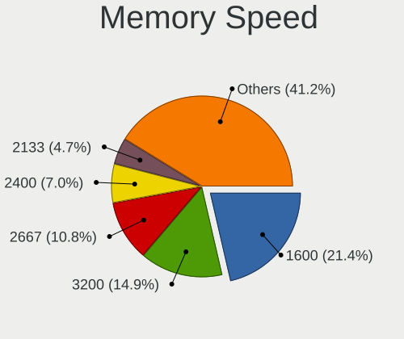

| Speed   | Computers | Percent |
|---------|-----------|---------|
| 1600    | 249       | 21.39%  |
| 3200    | 173       | 14.86%  |
| 2667    | 126       | 10.82%  |
| 2400    | 81        | 6.96%   |
| 2133    | 55        | 4.73%   |
| 1333    | 44        | 3.78%   |
| 5600    | 35        | 3.01%   |
| Unknown | 29        | 2.49%   |
| 6400    | 28        | 2.41%   |
| 3600    | 27        | 2.32%   |
| 1334    | 26        | 2.23%   |
| 4800    | 25        | 2.15%   |
| 1067    | 21        | 1.8%    |
| 800     | 20        | 1.72%   |
| 1867    | 17        | 1.46%   |
| 4267    | 16        | 1.37%   |
| 3733    | 15        | 1.29%   |
| 2666    | 15        | 1.29%   |
| 667     | 15        | 1.29%   |
| 7500    | 12        | 1.03%   |
| 4199    | 11        | 0.95%   |
| 1866    | 11        | 0.95%   |
| 1800    | 11        | 0.95%   |
| 1066    | 11        | 0.95%   |
| 2933    | 10        | 0.86%   |
| 3800    | 9         | 0.77%   |
| 533     | 8         | 0.69%   |
| 8533    | 6         | 0.52%   |
| 3100    | 6         | 0.52%   |
| 8400    | 5         | 0.43%   |
| 4266    | 5         | 0.43%   |
| 333     | 4         | 0.34%   |
| 7467    | 3         | 0.26%   |
| 6000    | 3         | 0.26%   |
| 3400    | 3         | 0.26%   |
| 3266    | 3         | 0.26%   |
| 3000    | 3         | 0.26%   |
| 975     | 3         | 0.26%   |
| 3066    | 2         | 0.17%   |
| 400     | 2         | 0.17%   |

Printers & scanners
-------------------

Printer Vendor
--------------

Printer device vendors

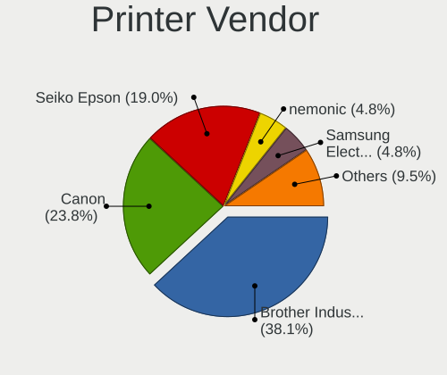

| Vendor              | Computers | Percent |
|---------------------|-----------|---------|
| Brother Industries  | 8         | 38.1%   |
| Canon               | 5         | 23.81%  |
| Seiko Epson         | 4         | 19.05%  |
| Samsung Electronics | 1         | 4.76%   |
| nemonic             | 1         | 4.76%   |
| Hewlett-Packard     | 1         | 4.76%   |
| Fuji Xerox          | 1         | 4.76%   |

Printer Model
-------------

Printer device models

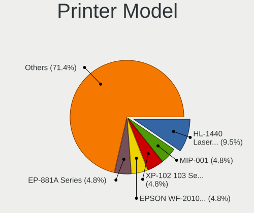

| Model                            | Computers | Percent |
|----------------------------------|-----------|---------|
| Brother HL-1440 Laser Printer    | 2         | 9.52%   |
| Seiko Epson XP-102 103 Series    | 1         | 4.76%   |
| Seiko Epson EPSON WF-2010 Series | 1         | 4.76%   |
| Seiko Epson EP-881A Series       | 1         | 4.76%   |
| Seiko Epson EP-306 Series        | 1         | 4.76%   |
| Samsung SCX-3200 Series          | 1         | 4.76%   |
| nemonic MIP-001                  | 1         | 4.76%   |
| HP ENVY 5000 series              | 1         | 4.76%   |
| Fuji Xerox MultiWriter 5600C     | 1         | 4.76%   |
| Canon TS5300 series              | 1         | 4.76%   |
| Canon PIXMA MG3600 Series        | 1         | 4.76%   |
| Canon PIXMA iX6850 Printer       | 1         | 4.76%   |
| Canon PIXMA iP4600 Printer       | 1         | 4.76%   |
| Canon iP2700 series              | 1         | 4.76%   |
| Brother MFC-L2700DW              | 1         | 4.76%   |
| Brother HL-L3230CDW series       | 1         | 4.76%   |
| Brother HL-L2375DW series        | 1         | 4.76%   |
| Brother HL-L2360D series         | 1         | 4.76%   |
| Brother HL-52x0 series           | 1         | 4.76%   |
| Brother HL-2130 series           | 1         | 4.76%   |

Scanner Vendor
--------------

Scanner device vendors

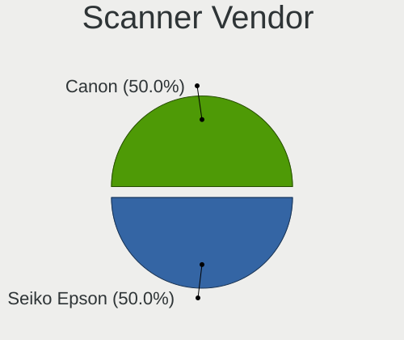

| Vendor      | Computers | Percent |
|-------------|-----------|---------|
| Seiko Epson | 1         | 50%     |
| Canon       | 1         | 50%     |

Scanner Model
-------------

Scanner device models

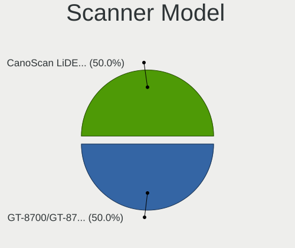

| Model                                                         | Computers | Percent |
|---------------------------------------------------------------|-----------|---------|
| Seiko Epson GT-8700/GT-8700F [Perfection 1640SU/1640SU PHOTO] | 1         | 50%     |
| Canon CanoScan LiDE 100                                       | 1         | 50%     |

Camera
------

Camera Vendor
-------------

Camera device vendors

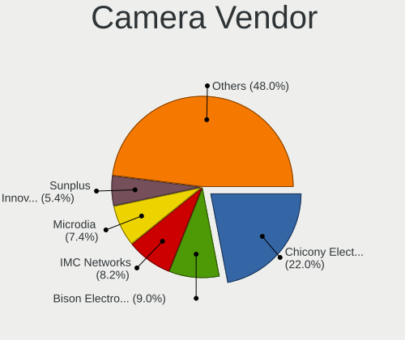

| Vendor                                 | Computers | Percent |
|----------------------------------------|-----------|---------|
| Chicony Electronics                    | 180       | 21.98%  |
| Bison Electronics                      | 74        | 9.04%   |
| IMC Networks                           | 67        | 8.18%   |
| Microdia                               | 61        | 7.45%   |
| Sunplus Innovation Technology          | 44        | 5.37%   |
| Realtek Semiconductor                  | 44        | 5.37%   |
| Apple                                  | 40        | 4.88%   |
| Logitech                               | 30        | 3.66%   |
| Quanta                                 | 24        | 2.93%   |
| Cheng Uei Precision Industry (Foxlink) | 24        | 2.93%   |
| Syntek                                 | 22        | 2.69%   |
| Suyin                                  | 20        | 2.44%   |
| Luxvisions Innotech Limited            | 16        | 1.95%   |
| Ricoh                                  | 13        | 1.59%   |
| Importek                               | 12        | 1.47%   |
| Acer                                   | 12        | 1.47%   |
| BUFFALO                                | 11        | 1.34%   |
| Lite-On Technology                     | 9         | 1.1%    |
| Elecom                                 | 8         | 0.98%   |
| Alcor Micro                            | 8         | 0.98%   |
| Sonix Technology                       | 7         | 0.85%   |
| Microsoft                              | 7         | 0.85%   |
| SunplusIT                              | 6         | 0.73%   |
| Silicon Motion                         | 6         | 0.73%   |
| Shinetech                              | 6         | 0.73%   |
| Samsung Electronics                    | 5         | 0.61%   |
| Cubeternet                             | 4         | 0.49%   |
| SHENZHEN EMEET TECHNOLOGY              | 3         | 0.37%   |
| MacroSilicon                           | 3         | 0.37%   |
| Genesys Logic                          | 3         | 0.37%   |
| Generalplus Technology                 | 3         | 0.37%   |
| ARC International                      | 3         | 0.37%   |
| Z-Star Microelectronics                | 2         | 0.24%   |
| Shine-optics                           | 2         | 0.24%   |
| Oculus VR                              | 2         | 0.24%   |
| Lenovo                                 | 2         | 0.24%   |
| icSpring                               | 2         | 0.24%   |
| HYGD-220831-A                          | 2         | 0.24%   |
| Huawei Technologies                    | 2         | 0.24%   |
| GEMBIRD                                | 2         | 0.24%   |

Camera Model
------------

Camera device models

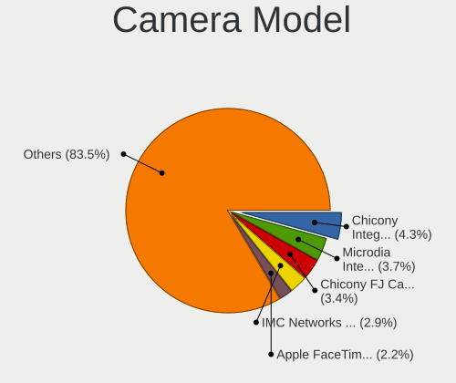

| Model                                         | Computers | Percent |
|-----------------------------------------------|-----------|---------|
| Chicony Integrated Camera                     | 36        | 4.33%   |
| Microdia Integrated_Webcam_HD                 | 31        | 3.73%   |
| Chicony FJ Camera                             | 28        | 3.37%   |
| IMC Networks Integrated Camera                | 24        | 2.89%   |
| Apple FaceTime HD Camera (Built-in)           | 18        | 2.17%   |
| Realtek Integrated_Webcam_HD                  | 17        | 2.05%   |
| Chicony TOSHIBA Web Camera - HD               | 14        | 1.68%   |
| Bison Integrated Camera                       | 14        | 1.68%   |
| IMC Networks USB2.0 HD UVC WebCam             | 11        | 1.32%   |
| BUFFALO USB 2.0 Camera                        | 11        | 1.32%   |
| Bison USB HD Webcam                           | 11        | 1.32%   |
| Syntek Integrated Camera                      | 10        | 1.2%    |
| Logitech Webcam C270                          | 9         | 1.08%   |
| Chicony NEC HD WebCam                         | 9         | 1.08%   |
| Importek TOSHIBA Web Camera - HD              | 8         | 0.96%   |
| IMC Networks USB2.0 VGA UVC WebCam            | 8         | 0.96%   |
| Apple Built-in iSight                         | 8         | 0.96%   |
| Acer USB HD Webcam                            | 8         | 0.96%   |
| Sunplus Integrated_Webcam_HD                  | 7         | 0.84%   |
| Lite-On Integrated Camera                     | 7         | 0.84%   |
| Bison HD Webcam                               | 7         | 0.84%   |
| Apple FaceTime HD Camera                      | 7         | 0.84%   |
| Syntek Lenovo EasyCamera                      | 6         | 0.72%   |
| Luxvisions Innotech Limited Integrated Camera | 6         | 0.72%   |
| Chicony USB2.0 Camera                         | 6         | 0.72%   |
| Chicony USB 2.0 Camera                        | 6         | 0.72%   |
| Chicony Chicony USB2.0 Camera                 | 6         | 0.72%   |
| Bison Lenovo EasyCamera                       | 6         | 0.72%   |
| Sunplus HD WebCam                             | 5         | 0.6%    |
| Sonix USB2.0 FHD UVC WebCam                   | 5         | 0.6%    |
| Shinetech USB2.0 FHD UVC WebCam               | 5         | 0.6%    |
| Samsung Galaxy series, misc. (MTP mode)       | 5         | 0.6%    |
| Ricoh Sony Visual Communication Camera        | 5         | 0.6%    |
| Realtek Lenovo EasyCamera                     | 5         | 0.6%    |
| Microdia Webcam Vitade AF                     | 5         | 0.6%    |
| Microdia USB 2.0 Camera                       | 5         | 0.6%    |
| Microdia Integrated_Webcam_FHD                | 5         | 0.6%    |
| IMC Networks ov9734_azurewave_camera          | 5         | 0.6%    |
| Chicony HP Wide Vision HD Camera              | 5         | 0.6%    |
| Chicony HD WebCam                             | 5         | 0.6%    |

Security
--------

Fingerprint Vendor
------------------

Fingerprint sensor vendors

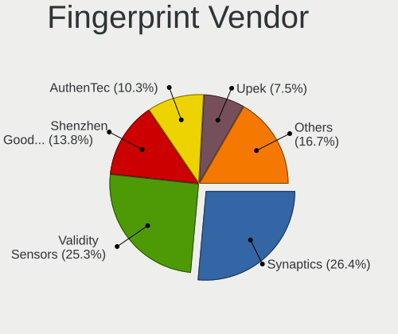

| Vendor                             | Computers | Percent |
|------------------------------------|-----------|---------|
| Synaptics                          | 46        | 26.44%  |
| Validity Sensors                   | 44        | 25.29%  |
| Shenzhen Goodix Technology         | 24        | 13.79%  |
| AuthenTec                          | 18        | 10.34%  |
| Upek                               | 13        | 7.47%   |
| Elan Microelectronics              | 12        | 6.9%    |
| STMicroelectronics                 | 7         | 4.02%   |
| LighTuning Technology              | 5         | 2.87%   |
| Realtek USB2.0 Finger Print Bridge | 3         | 1.72%   |
| HOLTEK                             | 1         | 0.57%   |
| Focal-systems.Corp                 | 1         | 0.57%   |

Fingerprint Model
-----------------

Fingerprint sensor models

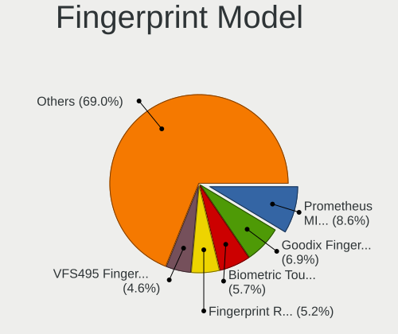

| Model                                                           | Computers | Percent |
|-----------------------------------------------------------------|-----------|---------|
| Synaptics Prometheus MIS Touch Fingerprint Reader               | 15        | 8.62%   |
| Shenzhen Goodix  Fingerprint Device                             | 12        | 6.9%    |
| Upek Biometric Touchchip/Touchstrip Fingerprint Sensor          | 10        | 5.75%   |
| Shenzhen Goodix Fingerprint Reader                              | 9         | 5.17%   |
| Validity Sensors VFS495 Fingerprint Reader                      | 8         | 4.6%    |
| Validity Sensors VFS 5011 fingerprint sensor                    | 7         | 4.02%   |
| Synaptics UWP WBDI Device                                       | 7         | 4.02%   |
| STMicroelectronics Fingerprint Reader                           | 7         | 4.02%   |
| Validity Sensors Swipe Fingerprint Sensor                       | 6         | 3.45%   |
| Synaptics Metallica MIS Touch Fingerprint Reader                | 6         | 3.45%   |
| Synaptics FS7604 Touch Fingerprint Sensor with PurePrint        | 6         | 3.45%   |
| AuthenTec Fingerprint Sensor                                    | 6         | 3.45%   |
| Elan ELAN:ARM-M4                                                | 5         | 2.87%   |
| Validity Sensors Synaptics WBDI                                 | 4         | 2.3%    |
| Synaptics UWP WBDI                                              | 4         | 2.3%    |
| Elan ELAN:Fingerprint                                           | 4         | 2.3%    |
| AuthenTec AES2501 Fingerprint Sensor                            | 4         | 2.3%    |
| Validity Sensors VFS491                                         | 3         | 1.72%   |
| Validity Sensors VFS471 Fingerprint Reader                      | 3         | 1.72%   |
| Upek TCS5B Fingerprint sensor                                   | 3         | 1.72%   |
| Shenzhen Goodix FingerPrint                                     | 3         | 1.72%   |
| Realtek USB2.0 Finger Print Bridge FocalTech Fingerprint Device | 3         | 1.72%   |
| Elan fingerprint sensor [FeinTech FPS00200]                     | 3         | 1.72%   |
| AuthenTec AES2810                                               | 3         | 1.72%   |
| AuthenTec AES1600                                               | 3         | 1.72%   |
| Validity Sensors VFS7552 Touch Fingerprint Sensor               | 2         | 1.15%   |
| Validity Sensors VFS7500 Touch Fingerprint Sensor               | 2         | 1.15%   |
| Validity Sensors VFS5011 Fingerprint Reader                     | 2         | 1.15%   |
| Validity Sensors VFS451 Fingerprint Reader                      | 2         | 1.15%   |
| Validity Sensors VFS301 Fingerprint Reader                      | 2         | 1.15%   |
| Synaptics WBDI                                                  | 2         | 1.15%   |
| LighTuning ES603 Swipe Fingerprint Sensor                       | 2         | 1.15%   |
| LighTuning EgisTec Touch Fingerprint Sensor                     | 2         | 1.15%   |
| Validity Sensors VFS Fingerprint sensor                         | 1         | 0.57%   |
| Validity Sensors Synaptics VFS7552 Touch Fingerprint Sensor     | 1         | 0.57%   |
| Validity Sensors Fingerprint scanner                            | 1         | 0.57%   |
| Synaptics WBDI Device                                           | 1         | 0.57%   |
| Synaptics  WBDI Fingerprint Reader - USB 052                    | 1         | 0.57%   |
| Synaptics  FS7604 Touch Fingerprint Sensor with PurePrint       | 1         | 0.57%   |
| Synaptics Prometheus Fingerprint Reader                         | 1         | 0.57%   |

Chipcard Vendor
---------------

Chipcard module vendors

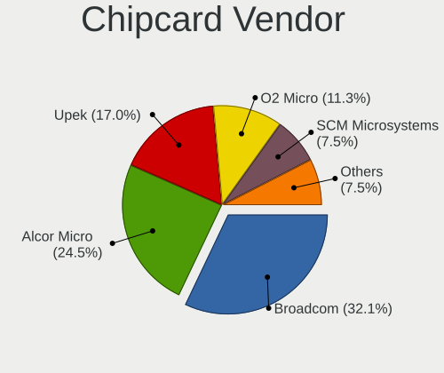

| Vendor           | Computers | Percent |
|------------------|-----------|---------|
| Broadcom         | 17        | 32.08%  |
| Alcor Micro      | 13        | 24.53%  |
| Upek             | 9         | 16.98%  |
| O2 Micro         | 6         | 11.32%  |
| SCM Microsystems | 4         | 7.55%   |
| Yubico.com       | 2         | 3.77%   |
| Circle           | 2         | 3.77%   |

Chipcard Model
--------------

Chipcard module models

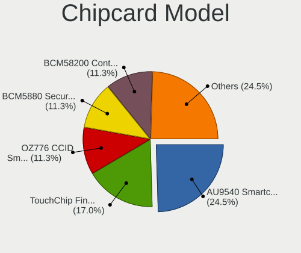

| Model                                                                        | Computers | Percent |
|------------------------------------------------------------------------------|-----------|---------|
| Alcor Micro AU9540 Smartcard Reader                                          | 13        | 24.53%  |
| Upek TouchChip Fingerprint Coprocessor (WBF advanced mode)                   | 9         | 16.98%  |
| O2 Micro OZ776 CCID Smartcard Reader                                         | 6         | 11.32%  |
| Broadcom BCM5880 Secure Applications Processor                               | 6         | 11.32%  |
| Broadcom BCM58200 ControlVault 3 (FingerPrint sensor + Contacted SmartCard)  | 6         | 11.32%  |
| SCM Microsystems SCR331-LC1 / SCR3310 SmartCard Reader                       | 4         | 7.55%   |
| Broadcom 5880                                                                | 3         | 5.66%   |
| Yubico.com Yubikey 4/5 U2F+CCID                                              | 2         | 3.77%   |
| Circle CIR115 ICC                                                            | 2         | 3.77%   |
| Broadcom BCM5880 Secure Applications Processor with fingerprint swipe sensor | 2         | 3.77%   |

Unsupported
-----------

Unsupported Devices
-------------------

Total unsupported devices on board

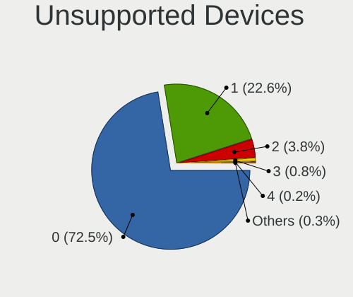

| Total | Computers | Percent |
|-------|-----------|---------|
| 0     | 1442      | 72.46%  |
| 1     | 449       | 22.56%  |
| 2     | 76        | 3.82%   |
| 3     | 15        | 0.75%   |
| 4     | 3         | 0.15%   |
| 6     | 2         | 0.1%    |
| 8     | 1         | 0.05%   |
| 7     | 1         | 0.05%   |
| 5     | 1         | 0.05%   |

Unsupported Device Types
------------------------

Types of unsupported devices

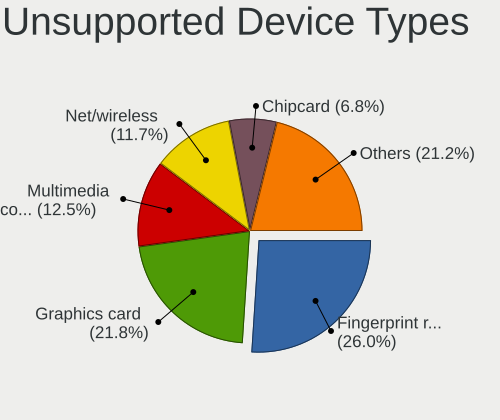

| Type                     | Computers | Percent |
|--------------------------|-----------|---------|
| Fingerprint reader       | 171       | 26.03%  |
| Graphics card            | 143       | 21.77%  |
| Multimedia controller    | 82        | 12.48%  |
| Net/wireless             | 77        | 11.72%  |
| Chipcard                 | 45        | 6.85%   |
| Communication controller | 28        | 4.26%   |
| Storage                  | 23        | 3.5%    |
| Unassigned class         | 18        | 2.74%   |
| Sound                    | 15        | 2.28%   |
| Bluetooth                | 12        | 1.83%   |
| Camera                   | 11        | 1.67%   |
| Net/ethernet             | 9         | 1.37%   |
| Network                  | 5         | 0.76%   |
| Modem                    | 5         | 0.76%   |
| Card reader              | 4         | 0.61%   |
| Storage/ata              | 3         | 0.46%   |
| Storage/raid             | 2         | 0.3%    |
| Tv card                  | 1         | 0.15%   |
| Storage/nvme             | 1         | 0.15%   |
| Firewire controller      | 1         | 0.15%   |
| Dvb card                 | 1         | 0.15%   |

