Linux in Japan - Tested Hardware & Statistics
---------------------------------------------

A project to collect tested hardware configurations for Linux in Japan.

Anyone can contribute to this report by the [hw-probe](https://github.com/linuxhw/hw-probe) tool:

    sudo -E hw-probe -all -upload

Please contribute! Especially if your hardware is rare.

This is a report for all computer types. See also reports for [desktops](/Location/Japan/Desktop/README.md) and [notebooks](/Location/Japan/Notebook/README.md).

Contents
--------

* [ Test Cases ](#test-cases)

* [ System ](#system)
  - [ OS                       ](#os)
  - [ OS Family                ](#os-family)
  - [ Kernel                   ](#kernel)
  - [ Kernel Family            ](#kernel-family)
  - [ Kernel Major Ver.        ](#kernel-major-ver)
  - [ Arch                     ](#arch)
  - [ DE                       ](#de)
  - [ Display Server           ](#display-server)
  - [ Display Manager          ](#display-manager)
  - [ OS Lang                  ](#os-lang)
  - [ Boot Mode                ](#boot-mode)
  - [ Filesystem               ](#filesystem)
  - [ Part. scheme             ](#part-scheme)
  - [ Dual Boot with Linux/BSD ](#dual-boot-with-linuxbsd)
  - [ Dual Boot (Win)          ](#dual-boot-win)

* [ Board ](#board)
  - [ Vendor                   ](#vendor)
  - [ Model                    ](#model)
  - [ Model Family             ](#model-family)
  - [ MFG Year                 ](#mfg-year)
  - [ Form Factor              ](#form-factor)
  - [ Secure Boot              ](#secure-boot)
  - [ Coreboot                 ](#coreboot)
  - [ RAM Size                 ](#ram-size)
  - [ RAM Used                 ](#ram-used)
  - [ Total Drives             ](#total-drives)
  - [ Has CD-ROM               ](#has-cd-rom)
  - [ Has Ethernet             ](#has-ethernet)
  - [ Has WiFi                 ](#has-wifi)
  - [ Has Bluetooth            ](#has-bluetooth)

* [ Location ](#location)
  - [ Country                  ](#country)
  - [ City                     ](#city)

* [ Drives ](#drives)
  - [ Drive Vendor             ](#drive-vendor)
  - [ Drive Model              ](#drive-model)
  - [ HDD Vendor               ](#hdd-vendor)
  - [ SSD Vendor               ](#ssd-vendor)
  - [ Drive Kind               ](#drive-kind)
  - [ Drive Connector          ](#drive-connector)
  - [ Drive Size               ](#drive-size)
  - [ Space Total              ](#space-total)
  - [ Space Used               ](#space-used)
  - [ Malfunc. Drives          ](#malfunc-drives)
  - [ Malfunc. Drive Vendor    ](#malfunc-drive-vendor)
  - [ Malfunc. HDD Vendor      ](#malfunc-hdd-vendor)
  - [ Malfunc. Drive Kind      ](#malfunc-drive-kind)
  - [ Failed Drives            ](#failed-drives)
  - [ Failed Drive Vendor      ](#failed-drive-vendor)
  - [ Drive Status             ](#drive-status)

* [ Storage controller ](#storage-controller)
  - [ Storage Vendor           ](#storage-vendor)
  - [ Storage Model            ](#storage-model)
  - [ Storage Kind             ](#storage-kind)

* [ Processor ](#processor)
  - [ CPU Vendor               ](#cpu-vendor)
  - [ CPU Model                ](#cpu-model)
  - [ CPU Model Family         ](#cpu-model-family)
  - [ CPU Cores                ](#cpu-cores)
  - [ CPU Sockets              ](#cpu-sockets)
  - [ CPU Threads              ](#cpu-threads)
  - [ CPU Op-Modes             ](#cpu-op-modes)
  - [ CPU Microcode            ](#cpu-microcode)
  - [ CPU Microarch            ](#cpu-microarch)

* [ Graphics ](#graphics)
  - [ GPU Vendor               ](#gpu-vendor)
  - [ GPU Model                ](#gpu-model)
  - [ GPU Combo                ](#gpu-combo)
  - [ GPU Driver               ](#gpu-driver)
  - [ GPU Memory               ](#gpu-memory)

* [ Monitor ](#monitor)
  - [ Monitor Vendor           ](#monitor-vendor)
  - [ Monitor Model            ](#monitor-model)
  - [ Monitor Resolution       ](#monitor-resolution)
  - [ Monitor Diagonal         ](#monitor-diagonal)
  - [ Monitor Width            ](#monitor-width)
  - [ Aspect Ratio             ](#aspect-ratio)
  - [ Monitor Area             ](#monitor-area)
  - [ Pixel Density            ](#pixel-density)
  - [ Multiple Monitors        ](#multiple-monitors)

* [ Network ](#network)
  - [ Net Controller Vendor    ](#net-controller-vendor)
  - [ Net Controller Model     ](#net-controller-model)
  - [ Wireless Vendor          ](#wireless-vendor)
  - [ Wireless Model           ](#wireless-model)
  - [ Ethernet Vendor          ](#ethernet-vendor)
  - [ Ethernet Model           ](#ethernet-model)
  - [ Net Controller Kind      ](#net-controller-kind)
  - [ Used Controller          ](#used-controller)
  - [ NICs                     ](#nics)
  - [ IPv6                     ](#ipv6)

* [ Bluetooth ](#bluetooth)
  - [ Bluetooth Vendor         ](#bluetooth-vendor)
  - [ Bluetooth Model          ](#bluetooth-model)

* [ Sound ](#sound)
  - [ Sound Vendor             ](#sound-vendor)
  - [ Sound Model              ](#sound-model)

* [ Memory ](#memory)
  - [ Memory Vendor            ](#memory-vendor)
  - [ Memory Model             ](#memory-model)
  - [ Memory Kind              ](#memory-kind)
  - [ Memory Form Factor       ](#memory-form-factor)
  - [ Memory Size              ](#memory-size)
  - [ Memory Speed             ](#memory-speed)

* [ Printers & scanners ](#printers--scanners)
  - [ Printer Vendor           ](#printer-vendor)
  - [ Printer Model            ](#printer-model)
  - [ Scanner Vendor           ](#scanner-vendor)
  - [ Scanner Model            ](#scanner-model)

* [ Camera ](#camera)
  - [ Camera Vendor            ](#camera-vendor)
  - [ Camera Model             ](#camera-model)

* [ Security ](#security)
  - [ Fingerprint Vendor       ](#fingerprint-vendor)
  - [ Fingerprint Model        ](#fingerprint-model)
  - [ Chipcard Vendor          ](#chipcard-vendor)
  - [ Chipcard Model           ](#chipcard-model)

* [ Unsupported ](#unsupported)
  - [ Unsupported Devices      ](#unsupported-devices)
  - [ Unsupported Device Types ](#unsupported-device-types)

Test Cases
----------

Total: 1665

| Vendor        | Model                       | Form-Factor | Probe                                                      | Date         |
|---------------|-----------------------------|-------------|------------------------------------------------------------|--------------|
| Lenovo        | 4068AGJ                     | Notebook    | [6a2c3207b5](https://linux-hardware.org/?probe=6a2c3207b5) | May 01, 2023 |
| Dell          | 0P4T42 A01                  | All in one  | [323e28fded](https://linux-hardware.org/?probe=323e28fded) | Apr 29, 2023 |
| HP            | 158A                        | Desktop     | [fb7aef7883](https://linux-hardware.org/?probe=fb7aef7883) | Apr 28, 2023 |
| MSI           | A78M-E35 V2                 | Desktop     | [5eb0f9d104](https://linux-hardware.org/?probe=5eb0f9d104) | Apr 27, 2023 |
| NEC Comput... | PC-LE150C2                  | Notebook    | [a8e48f9686](https://linux-hardware.org/?probe=a8e48f9686) | Apr 27, 2023 |
| HP            | 158A                        | Desktop     | [c3189bccb1](https://linux-hardware.org/?probe=c3189bccb1) | Apr 26, 2023 |
| Lenovo        | ThinkPad L512 4444PS9       | Notebook    | [78cf80b13b](https://linux-hardware.org/?probe=78cf80b13b) | Apr 26, 2023 |
| Fujitsu       | FMVA05004                   | Notebook    | [c494a8453d](https://linux-hardware.org/?probe=c494a8453d) | Apr 26, 2023 |
| Toshiba       | dynabook TV/68KBL           | Notebook    | [19c59e3701](https://linux-hardware.org/?probe=19c59e3701) | Apr 26, 2023 |
| Lenovo        | ThinkPad SL500 2746CTO      | Notebook    | [7283a0f4d9](https://linux-hardware.org/?probe=7283a0f4d9) | Apr 25, 2023 |
| Dell          | XPS 15 9500                 | Notebook    | [861431db35](https://linux-hardware.org/?probe=861431db35) | Apr 25, 2023 |
| Microsoft     | Surface Pro 8               | Tablet      | [3c50d5d61c](https://linux-hardware.org/?probe=3c50d5d61c) | Apr 24, 2023 |
| ASUSTek       | STRIX B250I GAMING          | Desktop     | [beabf00341](https://linux-hardware.org/?probe=beabf00341) | Apr 24, 2023 |
| ASUSTek       | STRIX B250I GAMING          | Desktop     | [0e96ee4471](https://linux-hardware.org/?probe=0e96ee4471) | Apr 23, 2023 |
| Shenzhen M... | F6CQW                       | Desktop     | [c2be3dd62b](https://linux-hardware.org/?probe=c2be3dd62b) | Apr 23, 2023 |
| MSI           | B450 GAMING PLUS MAX        | Desktop     | [cc80f06375](https://linux-hardware.org/?probe=cc80f06375) | Apr 23, 2023 |
| Toshiba       | dynabook BX/67TG            | Notebook    | [5349d462cd](https://linux-hardware.org/?probe=5349d462cd) | Apr 23, 2023 |
| ASUSTek       | Z87-PRO                     | Desktop     | [08ebdd71ab](https://linux-hardware.org/?probe=08ebdd71ab) | Apr 23, 2023 |
| Fujitsu       | FJNB037                     | Desktop     | [00e5e30f9b](https://linux-hardware.org/?probe=00e5e30f9b) | Apr 22, 2023 |
| Dell          | 0K240Y A02                  | Desktop     | [2d1b73d846](https://linux-hardware.org/?probe=2d1b73d846) | Apr 22, 2023 |
| Fujitsu       | FMVA42CW                    | Notebook    | [4fb1ab7ab8](https://linux-hardware.org/?probe=4fb1ab7ab8) | Apr 22, 2023 |
| ECS           | APLD-MINI                   | Desktop     | [8f3546722b](https://linux-hardware.org/?probe=8f3546722b) | Apr 22, 2023 |
| HP            | Pavilion dv6                | Notebook    | [b3613186fa](https://linux-hardware.org/?probe=b3613186fa) | Apr 21, 2023 |
| MouseCompu... | Z87-S01                     | Desktop     | [8caff0d2f2](https://linux-hardware.org/?probe=8caff0d2f2) | Apr 21, 2023 |
| Lenovo        | IdeaPad 300-15IBR 80M3      | Notebook    | [da51714544](https://linux-hardware.org/?probe=da51714544) | Apr 21, 2023 |
| ASRock        | Z270 Taichi                 | Desktop     | [faf3402431](https://linux-hardware.org/?probe=faf3402431) | Apr 21, 2023 |
| Toshiba       | dynabook T451/46EW          | Notebook    | [e45702b9aa](https://linux-hardware.org/?probe=e45702b9aa) | Apr 20, 2023 |
| ECS           | BSW-MINI                    | Desktop     | [5d3161092f](https://linux-hardware.org/?probe=5d3161092f) | Apr 19, 2023 |
| ASRock        | B550M Pro4                  | Desktop     | [5fa6c74be4](https://linux-hardware.org/?probe=5fa6c74be4) | Apr 19, 2023 |
| ASUSTek       | Z87-PRO                     | Desktop     | [7981ad8440](https://linux-hardware.org/?probe=7981ad8440) | Apr 19, 2023 |
| Apple         | MacBookPro8,1               | Notebook    | [4e95dc284c](https://linux-hardware.org/?probe=4e95dc284c) | Apr 19, 2023 |
| NEC Comput... | MS-7451VM                   | Desktop     | [dc094ceba3](https://linux-hardware.org/?probe=dc094ceba3) | Apr 18, 2023 |
| ASRock        | B450M Pro4                  | Desktop     | [4c6abc2653](https://linux-hardware.org/?probe=4c6abc2653) | Apr 18, 2023 |
| ASRock        | Z270 Taichi                 | Desktop     | [5f3eb929b7](https://linux-hardware.org/?probe=5f3eb929b7) | Apr 18, 2023 |
| ASUSTek       | P8H67-M PRO                 | Desktop     | [9eb59318e2](https://linux-hardware.org/?probe=9eb59318e2) | Apr 18, 2023 |
| ASRock        | B450M Pro4                  | Desktop     | [eb66896af3](https://linux-hardware.org/?probe=eb66896af3) | Apr 18, 2023 |
| Fujitsu       | FMVNA6HE                    | Notebook    | [609572e6f7](https://linux-hardware.org/?probe=609572e6f7) | Apr 18, 2023 |
| ASUSTek       | B85M-G                      | Desktop     | [8f5803697f](https://linux-hardware.org/?probe=8f5803697f) | Apr 17, 2023 |
| ASRock        | A520M TW                    | Desktop     | [0fc8e9ca06](https://linux-hardware.org/?probe=0fc8e9ca06) | Apr 17, 2023 |
| LG Electro... | P530-KE6BK                  | Notebook    | [b1f0863c79](https://linux-hardware.org/?probe=b1f0863c79) | Apr 17, 2023 |
| HP            | Laptop 15s-eq3xxx           | Notebook    | [3455570853](https://linux-hardware.org/?probe=3455570853) | Apr 16, 2023 |
| ASUSTek       | PRIME A320M-K               | Desktop     | [a2596e8d06](https://linux-hardware.org/?probe=a2596e8d06) | Apr 16, 2023 |
| Gigabyte      | F2A85XN-WIFI                | Desktop     | [80a8d69a06](https://linux-hardware.org/?probe=80a8d69a06) | Apr 15, 2023 |
| Intel         | Alder Lake-H PCH E1.0G      | Desktop     | [0ec41c7bd8](https://linux-hardware.org/?probe=0ec41c7bd8) | Apr 14, 2023 |
| Intel         | Alder Lake-H PCH E1.0G      | Desktop     | [9cf22928fb](https://linux-hardware.org/?probe=9cf22928fb) | Apr 13, 2023 |
| MSI           | Stealth 14Studio A13VF      | Notebook    | [b6cd64a19b](https://linux-hardware.org/?probe=b6cd64a19b) | Apr 13, 2023 |
| Lenovo        | ThinkPad X200s 74664SJ      | Notebook    | [54088fa2e9](https://linux-hardware.org/?probe=54088fa2e9) | Apr 13, 2023 |
| Lenovo        | ThinkPad E14 Gen 4 21EBC... | Notebook    | [63035ef97f](https://linux-hardware.org/?probe=63035ef97f) | Apr 12, 2023 |
| BESSTAR Te... | GB1B                        | Mini pc     | [dc66113388](https://linux-hardware.org/?probe=dc66113388) | Apr 11, 2023 |
| Intel         | NUC10i5FNB K61361-302       | Mini pc     | [03c7dc63da](https://linux-hardware.org/?probe=03c7dc63da) | Apr 09, 2023 |
| Dell          | G7 7700                     | Notebook    | [9552c2ecc0](https://linux-hardware.org/?probe=9552c2ecc0) | Apr 09, 2023 |
| Toshiba       | dynabook R732/H             | Notebook    | [ff99abe105](https://linux-hardware.org/?probe=ff99abe105) | Apr 08, 2023 |
| MSI           | B450I GAMING PLUS AC        | Desktop     | [e34683f5f0](https://linux-hardware.org/?probe=e34683f5f0) | Apr 07, 2023 |
| Lenovo        | 3000 N200 0769DQJ           | Notebook    | [db1539e64a](https://linux-hardware.org/?probe=db1539e64a) | Apr 06, 2023 |
| MSI           | Delta 15 A5EFK              | Notebook    | [d3066bb3d4](https://linux-hardware.org/?probe=d3066bb3d4) | Apr 06, 2023 |
| MSI           | B450M MORTAR MAX            | Desktop     | [0077b88576](https://linux-hardware.org/?probe=0077b88576) | Apr 06, 2023 |
| ASUSTek       | P5KPL-CM                    | Desktop     | [78c525b19b](https://linux-hardware.org/?probe=78c525b19b) | Apr 05, 2023 |
| Fujitsu       | FMVA45MRP2                  | Notebook    | [80b1f5983b](https://linux-hardware.org/?probe=80b1f5983b) | Apr 05, 2023 |
| Lenovo        | G500 20236                  | Notebook    | [4bbe18183a](https://linux-hardware.org/?probe=4bbe18183a) | Apr 04, 2023 |
| ASRock        | B450M Pro4                  | Desktop     | [6bf9bb58c5](https://linux-hardware.org/?probe=6bf9bb58c5) | Apr 04, 2023 |
| Toshiba       | dynabook T653/46JR          | Notebook    | [7f0e2d07b5](https://linux-hardware.org/?probe=7f0e2d07b5) | Apr 01, 2023 |
| ASRock        | B460M Pro4                  | Desktop     | [1f3b96d1a0](https://linux-hardware.org/?probe=1f3b96d1a0) | Apr 01, 2023 |
| Dell          | Vostro 15 3515              | Notebook    | [eea311b1bb](https://linux-hardware.org/?probe=eea311b1bb) | Apr 01, 2023 |
| Acer          | Aspire 1410                 | Notebook    | [58be80ea51](https://linux-hardware.org/?probe=58be80ea51) | Mar 31, 2023 |
| Toshiba       | dynabook T653/46JR          | Notebook    | [94a37d865e](https://linux-hardware.org/?probe=94a37d865e) | Mar 30, 2023 |
| Gigabyte      | GA-880GA-UD3H               | Desktop     | [393fc00a5d](https://linux-hardware.org/?probe=393fc00a5d) | Mar 30, 2023 |
| MSI           | MPG B550I GAMING EDGE WI... | Desktop     | [f0540604bc](https://linux-hardware.org/?probe=f0540604bc) | Mar 30, 2023 |
| MSI           | MPG B550I GAMING EDGE WI... | Desktop     | [1c575e8cb6](https://linux-hardware.org/?probe=1c575e8cb6) | Mar 30, 2023 |
| ASUSTek       | A88XM-A                     | Desktop     | [405e95a907](https://linux-hardware.org/?probe=405e95a907) | Mar 28, 2023 |
| ASUSTek       | ROG Flow Z13 GZ301ZC_GZ3... | Tablet      | [e5644591de](https://linux-hardware.org/?probe=e5644591de) | Mar 28, 2023 |
| MSI           | B450M MORTAR MAX            | Desktop     | [29c85678af](https://linux-hardware.org/?probe=29c85678af) | Mar 28, 2023 |
| MSI           | GT70 2PE                    | Notebook    | [be727f6f39](https://linux-hardware.org/?probe=be727f6f39) | Mar 27, 2023 |
| Huanan        | X99-F8 GAMING V5.0          | Desktop     | [922d8a7941](https://linux-hardware.org/?probe=922d8a7941) | Mar 26, 2023 |
| MSI           | MEG B550 UNIFY              | Desktop     | [492a70f1c3](https://linux-hardware.org/?probe=492a70f1c3) | Mar 26, 2023 |
| Apple         | MacBookPro16,2              | Notebook    | [cf7ab8adb4](https://linux-hardware.org/?probe=cf7ab8adb4) | Mar 26, 2023 |
| Lenovo        | ThinkPad X230 2306A44       | Notebook    | [e948a25ef6](https://linux-hardware.org/?probe=e948a25ef6) | Mar 26, 2023 |
| Dell          | Inspiron N5110              | Notebook    | [f8fc6c74da](https://linux-hardware.org/?probe=f8fc6c74da) | Mar 25, 2023 |
| HP            | 158A                        | Desktop     | [9ed0f8f65f](https://linux-hardware.org/?probe=9ed0f8f65f) | Mar 25, 2023 |
| Microsoft     | Surface Go                  | Tablet      | [e6ecf47eda](https://linux-hardware.org/?probe=e6ecf47eda) | Mar 24, 2023 |
| MSI           | Alpha 15 B5EEK              | Notebook    | [03f3f846eb](https://linux-hardware.org/?probe=03f3f846eb) | Mar 24, 2023 |
| MSI           | B450M MORTAR MAX            | Desktop     | [641481dd1d](https://linux-hardware.org/?probe=641481dd1d) | Mar 21, 2023 |
| HP            | 158A                        | Desktop     | [033f7a5abd](https://linux-hardware.org/?probe=033f7a5abd) | Mar 21, 2023 |
| Dell          | Inspiron 3442               | Notebook    | [33137a049e](https://linux-hardware.org/?probe=33137a049e) | Mar 20, 2023 |
| MSI           | B450M MORTAR MAX            | Desktop     | [9d859cb8bd](https://linux-hardware.org/?probe=9d859cb8bd) | Mar 20, 2023 |
| ASUSTek       | PRIME B350M-A               | Desktop     | [9ee81ffe32](https://linux-hardware.org/?probe=9ee81ffe32) | Mar 20, 2023 |
| HUAWEI        | FRD-WX9                     | Notebook    | [b5a517c552](https://linux-hardware.org/?probe=b5a517c552) | Mar 20, 2023 |
| ASRock        | 4X4-4000 Series             | Desktop     | [3718d345ca](https://linux-hardware.org/?probe=3718d345ca) | Mar 18, 2023 |
| Lenovo        | ThinkCentre A58 7522M4J     | Desktop     | [ba0a303be5](https://linux-hardware.org/?probe=ba0a303be5) | Mar 17, 2023 |
| HP            | 806A                        | Desktop     | [2203b83131](https://linux-hardware.org/?probe=2203b83131) | Mar 13, 2023 |
| ASUSTek       | X55U                        | Notebook    | [b06bd51348](https://linux-hardware.org/?probe=b06bd51348) | Mar 11, 2023 |
| Unknown       | HX90                        | Desktop     | [51aca581e4](https://linux-hardware.org/?probe=51aca581e4) | Mar 11, 2023 |
| Gigabyte      | P55-UD3R                    | Desktop     | [e720741a00](https://linux-hardware.org/?probe=e720741a00) | Mar 11, 2023 |
| Toshiba       | All In One PC MP            | All in one  | [2a3a0b15f8](https://linux-hardware.org/?probe=2a3a0b15f8) | Mar 11, 2023 |
| ASUSTek       | B85M-G                      | Desktop     | [70f4bed81b](https://linux-hardware.org/?probe=70f4bed81b) | Mar 08, 2023 |
| ASUSTek       | PRO H410M-C                 | Desktop     | [a97c12b513](https://linux-hardware.org/?probe=a97c12b513) | Mar 08, 2023 |
| Google        | Bobba                       | Notebook    | [01d8f57c7e](https://linux-hardware.org/?probe=01d8f57c7e) | Mar 08, 2023 |
| Lenovo        | ThinkPad X1 Tablet Gen 2... | Tablet      | [149c782883](https://linux-hardware.org/?probe=149c782883) | Mar 08, 2023 |
| Dell          | Inspiron 14 5420            | Notebook    | [cb6ec54195](https://linux-hardware.org/?probe=cb6ec54195) | Mar 08, 2023 |
| ASUSTek       | P9D-I Series                | Server      | [e2cebc5f47](https://linux-hardware.org/?probe=e2cebc5f47) | Mar 07, 2023 |
| Wistron       | ProLiant ML110 G5           | Desktop     | [a36361538b](https://linux-hardware.org/?probe=a36361538b) | Mar 07, 2023 |
| ASUSTek       | SABERTOOTH Z77              | Desktop     | [f85824345a](https://linux-hardware.org/?probe=f85824345a) | Mar 06, 2023 |
| ASUSTek       | ASUS EXPERTBOOK B9450FA_... | Notebook    | [ca566e314e](https://linux-hardware.org/?probe=ca566e314e) | Mar 05, 2023 |
| Dell          | XPS 15 9500                 | Notebook    | [47df9846bb](https://linux-hardware.org/?probe=47df9846bb) | Mar 04, 2023 |
| Dell          | Latitude 5300               | Notebook    | [a77b29e10d](https://linux-hardware.org/?probe=a77b29e10d) | Mar 04, 2023 |
| Gigabyte      | GA-E7AUM-DS2H               | Desktop     | [825b26708c](https://linux-hardware.org/?probe=825b26708c) | Mar 04, 2023 |
| NEC Comput... | MS-AE211                    | All in one  | [6f4a2d24c1](https://linux-hardware.org/?probe=6f4a2d24c1) | Mar 04, 2023 |
| Microsoft     | Surface Pro 6               | Tablet      | [82ecc9ac72](https://linux-hardware.org/?probe=82ecc9ac72) | Mar 03, 2023 |
| ASUSTek       | PRO H410M-C                 | Desktop     | [b0076c9250](https://linux-hardware.org/?probe=b0076c9250) | Mar 03, 2023 |
| Toshiba       | dynabook R73/BN             | Notebook    | [1d81bb5f08](https://linux-hardware.org/?probe=1d81bb5f08) | Mar 03, 2023 |
| MSI           | B550M PRO-VDH WIFI          | Desktop     | [ed5432e979](https://linux-hardware.org/?probe=ed5432e979) | Mar 01, 2023 |
| HP            | EliteBook 2740p             | Notebook    | [dee37a9bd9](https://linux-hardware.org/?probe=dee37a9bd9) | Mar 01, 2023 |
| Acer          | Aspire 5740                 | Notebook    | [de0d12baa4](https://linux-hardware.org/?probe=de0d12baa4) | Feb 27, 2023 |
| ASUSTek       | PRIME H670-PLUS D4          | Desktop     | [3887cb1418](https://linux-hardware.org/?probe=3887cb1418) | Feb 26, 2023 |
| Lenovo        | G500 20236                  | Notebook    | [93f09b28d6](https://linux-hardware.org/?probe=93f09b28d6) | Feb 26, 2023 |
| Lenovo        | G500 20236                  | Notebook    | [51bd5c9f21](https://linux-hardware.org/?probe=51bd5c9f21) | Feb 26, 2023 |
| Gigabyte      | B85N PHOENIX                | Desktop     | [5fe00f35c4](https://linux-hardware.org/?probe=5fe00f35c4) | Feb 25, 2023 |
| Lenovo        | 30D2 SDK0J40697 WIN 3305... | Desktop     | [7864921f8d](https://linux-hardware.org/?probe=7864921f8d) | Feb 25, 2023 |
| Toshiba       | dynabook T653/46JR          | Notebook    | [ac156d2c80](https://linux-hardware.org/?probe=ac156d2c80) | Feb 22, 2023 |
| ASUSTek       | PRO H410M-C                 | Desktop     | [d6edc5401d](https://linux-hardware.org/?probe=d6edc5401d) | Feb 22, 2023 |
| Lenovo        | ThinkPad X1 Extreme Gen ... | Notebook    | [5d62c279d2](https://linux-hardware.org/?probe=5d62c279d2) | Feb 21, 2023 |
| ASUSTek       | PRIME H670-PLUS D4          | Desktop     | [a7270cf962](https://linux-hardware.org/?probe=a7270cf962) | Feb 19, 2023 |
| ASUSTek       | SABERTOOTH Z77              | Desktop     | [b8b41b7a6e](https://linux-hardware.org/?probe=b8b41b7a6e) | Feb 19, 2023 |
| HP            | 158A                        | Desktop     | [ce217224ba](https://linux-hardware.org/?probe=ce217224ba) | Feb 19, 2023 |
| HUAWEI        | KPR-WX9                     | Notebook    | [1f44fd5a86](https://linux-hardware.org/?probe=1f44fd5a86) | Feb 18, 2023 |
| Dell          | Latitude 5300               | Notebook    | [371d693177](https://linux-hardware.org/?probe=371d693177) | Feb 17, 2023 |
| Dell          | Latitude 5300               | Notebook    | [323f21bb1e](https://linux-hardware.org/?probe=323f21bb1e) | Feb 17, 2023 |
| Dell          | Latitude 5300               | Notebook    | [ca02606bea](https://linux-hardware.org/?probe=ca02606bea) | Feb 17, 2023 |
| Toshiba       | dynabook R73/BN             | Notebook    | [df7e69c5c4](https://linux-hardware.org/?probe=df7e69c5c4) | Feb 16, 2023 |
| Gigabyte      | B450M S2H                   | Desktop     | [eb04bfdc84](https://linux-hardware.org/?probe=eb04bfdc84) | Feb 14, 2023 |
| EPSON DIRE... | Endeavor NY2200S            | Notebook    | [2be0a1a8a0](https://linux-hardware.org/?probe=2be0a1a8a0) | Feb 14, 2023 |
| EPSON DIRE... | Endeavor NY2200S            | Notebook    | [29b669f143](https://linux-hardware.org/?probe=29b669f143) | Feb 14, 2023 |
| Dell          | Inspiron 14 5420            | Notebook    | [7fc3c03910](https://linux-hardware.org/?probe=7fc3c03910) | Feb 13, 2023 |
| Compaq        | 420                         | Notebook    | [2028e7c97c](https://linux-hardware.org/?probe=2028e7c97c) | Feb 12, 2023 |
| ASUSTek       | H110M-A/M.2                 | Desktop     | [76711a4e32](https://linux-hardware.org/?probe=76711a4e32) | Feb 10, 2023 |
| Lenovo        | ThinkPad L512 4444PV3       | Notebook    | [8965eee02f](https://linux-hardware.org/?probe=8965eee02f) | Feb 09, 2023 |
| Lenovo        | ThinkPad T440p 20AWA1MDJ... | Notebook    | [cc5f5375d2](https://linux-hardware.org/?probe=cc5f5375d2) | Feb 09, 2023 |
| Toshiba       | dynabook T653/46JR          | Notebook    | [2422c70d2e](https://linux-hardware.org/?probe=2422c70d2e) | Feb 09, 2023 |
| HP            | Notebook                    | Notebook    | [7d4a89adea](https://linux-hardware.org/?probe=7d4a89adea) | Feb 08, 2023 |
| ASUSTek       | H110M-A/M.2                 | Desktop     | [73b3c1c661](https://linux-hardware.org/?probe=73b3c1c661) | Feb 06, 2023 |
| NEC Comput... | Artemis3 3A3B               | All in one  | [6f613e9791](https://linux-hardware.org/?probe=6f613e9791) | Feb 05, 2023 |
| ASUSTek       | ASUS TUF Gaming A15 FA50... | Notebook    | [c5bdedaf17](https://linux-hardware.org/?probe=c5bdedaf17) | Feb 04, 2023 |
| ASUSTek       | PRIME A320M-A               | Desktop     | [9de02793ea](https://linux-hardware.org/?probe=9de02793ea) | Feb 04, 2023 |
| Toshiba       | dynabook T653/46JR          | Notebook    | [6c1119bb00](https://linux-hardware.org/?probe=6c1119bb00) | Feb 04, 2023 |
| ASRock        | Z87M Extreme4               | Desktop     | [8821f128c8](https://linux-hardware.org/?probe=8821f128c8) | Feb 03, 2023 |
| Unknown       | Unknown                     | Notebook    | [5505a27d5e](https://linux-hardware.org/?probe=5505a27d5e) | Feb 03, 2023 |
| Dell          | Inspiron 14 5420            | Notebook    | [deec906907](https://linux-hardware.org/?probe=deec906907) | Feb 02, 2023 |
| NEC Comput... | MS9666 011                  | Desktop     | [26a38770fe](https://linux-hardware.org/?probe=26a38770fe) | Feb 02, 2023 |
| Wistron       | ProLiant ML110 G5           | Desktop     | [4af666d5b3](https://linux-hardware.org/?probe=4af666d5b3) | Feb 02, 2023 |
| BESSTAR Te... | HM90                        | Desktop     | [3f958de9bb](https://linux-hardware.org/?probe=3f958de9bb) | Feb 01, 2023 |
| Fujitsu       | LIFEBOOK E744               | Notebook    | [b048f7d3e1](https://linux-hardware.org/?probe=b048f7d3e1) | Feb 01, 2023 |
| ASUSTek       | PRIME B350M-A               | Desktop     | [e2721d08d6](https://linux-hardware.org/?probe=e2721d08d6) | Jan 30, 2023 |
| Unknown       | Unknown                     | Notebook    | [d780984cf9](https://linux-hardware.org/?probe=d780984cf9) | Jan 30, 2023 |
| Valve         | Jupiter                     | Notebook    | [935a50bce1](https://linux-hardware.org/?probe=935a50bce1) | Jan 30, 2023 |
| Google        | Helios                      | Notebook    | [c8b5d0660b](https://linux-hardware.org/?probe=c8b5d0660b) | Jan 28, 2023 |
| HUAWEI        | KLVL-WXXW                   | Notebook    | [f20e47b9d7](https://linux-hardware.org/?probe=f20e47b9d7) | Jan 28, 2023 |
| NEC Comput... | PC-NS350AAR-KS              | Notebook    | [c4aa0da6f4](https://linux-hardware.org/?probe=c4aa0da6f4) | Jan 27, 2023 |
| HP            | ProBook 440 G5              | Notebook    | [af59cf3cd3](https://linux-hardware.org/?probe=af59cf3cd3) | Jan 26, 2023 |
| ASUSTek       | PRIME Z270-P                | Desktop     | [15644c39de](https://linux-hardware.org/?probe=15644c39de) | Jan 25, 2023 |
| Toshiba       | dynabook T653/46JR          | Notebook    | [00cabfbb97](https://linux-hardware.org/?probe=00cabfbb97) | Jan 24, 2023 |
| Neousys Te... | NVS-7000 Rev. A2            | Server      | [196c8eb317](https://linux-hardware.org/?probe=196c8eb317) | Jan 23, 2023 |
| Purism        | Librem 15 v3                | Notebook    | [fcb1d44df6](https://linux-hardware.org/?probe=fcb1d44df6) | Jan 22, 2023 |
| ASUSTek       | VivoBook_ASUSLaptop X740... | Notebook    | [d999192dbf](https://linux-hardware.org/?probe=d999192dbf) | Jan 22, 2023 |
| Toshiba       | dynabook T653/46JR          | Notebook    | [1acfabc208](https://linux-hardware.org/?probe=1acfabc208) | Jan 22, 2023 |
| MSI           | H110M PRO-VH                | Desktop     | [7068e861ba](https://linux-hardware.org/?probe=7068e861ba) | Jan 21, 2023 |
| Dell          | Inspiron 3585               | Notebook    | [9790dcdef4](https://linux-hardware.org/?probe=9790dcdef4) | Jan 19, 2023 |
| Unknown       | HX90                        | Desktop     | [2b034e44e2](https://linux-hardware.org/?probe=2b034e44e2) | Jan 18, 2023 |
| Lenovo        | G550 2958                   | Notebook    | [7b255b7fe7](https://linux-hardware.org/?probe=7b255b7fe7) | Jan 18, 2023 |
| Intel         | NUC12EDBi9 M27907-302       | Mini pc     | [b43c8a95b7](https://linux-hardware.org/?probe=b43c8a95b7) | Jan 18, 2023 |
| ASRock        | B550M Pro4                  | Desktop     | [b781eb32d2](https://linux-hardware.org/?probe=b781eb32d2) | Jan 18, 2023 |
| Dell          | XPS 9320                    | Notebook    | [bd7346b7c2](https://linux-hardware.org/?probe=bd7346b7c2) | Jan 17, 2023 |
| HP            | Compaq 6730b (GW687AV)      | Notebook    | [e967b291d5](https://linux-hardware.org/?probe=e967b291d5) | Jan 17, 2023 |
| HC            | HCAR357-MI V1.0             | Desktop     | [ef934af180](https://linux-hardware.org/?probe=ef934af180) | Jan 16, 2023 |
| Dell          | Latitude 3540               | Notebook    | [01688be251](https://linux-hardware.org/?probe=01688be251) | Jan 15, 2023 |
| Acer          | Aspire 5349                 | Notebook    | [c52d3b2b2f](https://linux-hardware.org/?probe=c52d3b2b2f) | Jan 15, 2023 |
| Fujitsu       | FMVNF70YX                   | Notebook    | [2817102c87](https://linux-hardware.org/?probe=2817102c87) | Jan 14, 2023 |
| HONOR         | HLYL-WXX9                   | Notebook    | [e5b02d94cd](https://linux-hardware.org/?probe=e5b02d94cd) | Jan 14, 2023 |
| Panasonic     | CF-SX2JDHYS                 | Notebook    | [fa1ebc0951](https://linux-hardware.org/?probe=fa1ebc0951) | Jan 14, 2023 |
| Apple         | MacBookPro9,2               | Notebook    | [4d89e9dec4](https://linux-hardware.org/?probe=4d89e9dec4) | Jan 14, 2023 |
| Panasonic     | CFSZ6-2                     | Notebook    | [7a9f534294](https://linux-hardware.org/?probe=7a9f534294) | Jan 13, 2023 |
| Lenovo        | ThinkPad T480 20L50000UK    | Notebook    | [05744a666a](https://linux-hardware.org/?probe=05744a666a) | Jan 13, 2023 |
| Lenovo        | ThinkPad X13 Gen 2i 20WL... | Notebook    | [b2965791cb](https://linux-hardware.org/?probe=b2965791cb) | Jan 13, 2023 |
| Lenovo        | ThinkPad X13 Gen 2i 20WL... | Notebook    | [093e5ffc06](https://linux-hardware.org/?probe=093e5ffc06) | Jan 13, 2023 |
| ASUSTek       | E200HA                      | Notebook    | [4d9f4512a6](https://linux-hardware.org/?probe=4d9f4512a6) | Jan 13, 2023 |
| Fujitsu       | FARQ02010                   | Notebook    | [5d3f5fcee2](https://linux-hardware.org/?probe=5d3f5fcee2) | Jan 13, 2023 |
| Dell          | Inspiron 1545               | Notebook    | [20bc38b554](https://linux-hardware.org/?probe=20bc38b554) | Jan 11, 2023 |
| HP            | Pavilion dv6                | Notebook    | [852e84ccaa](https://linux-hardware.org/?probe=852e84ccaa) | Jan 09, 2023 |
| Dell          | Inspiron 14 5420            | Notebook    | [9aaef76c2c](https://linux-hardware.org/?probe=9aaef76c2c) | Jan 09, 2023 |
| Lenovo        | IdeaPadFlex 10 20324        | Notebook    | [1d0cd9b040](https://linux-hardware.org/?probe=1d0cd9b040) | Jan 09, 2023 |
| ASUSTek       | J1900I-C                    | Desktop     | [6a2ef2080d](https://linux-hardware.org/?probe=6a2ef2080d) | Jan 09, 2023 |
| HP            | ZHAN 66 Pro G1              | Notebook    | [76e588ab0a](https://linux-hardware.org/?probe=76e588ab0a) | Jan 08, 2023 |
| Valve         | Jupiter                     | Notebook    | [73e8740cb9](https://linux-hardware.org/?probe=73e8740cb9) | Jan 08, 2023 |
| Toshiba       | dynabook T653/46JR          | Notebook    | [8fe8187a9e](https://linux-hardware.org/?probe=8fe8187a9e) | Jan 08, 2023 |
| Gigabyte      | B550I AORUS PRO AX          | Desktop     | [99e2769927](https://linux-hardware.org/?probe=99e2769927) | Jan 07, 2023 |
| Valve         | Jupiter                     | Notebook    | [75cabfba4d](https://linux-hardware.org/?probe=75cabfba4d) | Jan 03, 2023 |
| Valve         | Jupiter                     | Notebook    | [70b2e771b7](https://linux-hardware.org/?probe=70b2e771b7) | Jan 03, 2023 |
| HUAWEI        | NBLL-WXX9                   | Notebook    | [7e5acbf050](https://linux-hardware.org/?probe=7e5acbf050) | Jan 03, 2023 |
| ASUSTek       | ZenBook UX333FN_U3300FN     | Notebook    | [750a40a3cc](https://linux-hardware.org/?probe=750a40a3cc) | Jan 02, 2023 |
| ASUSTek       | PRIME B365-PLUS             | Desktop     | [d3bab9b69b](https://linux-hardware.org/?probe=d3bab9b69b) | Jan 02, 2023 |
| Toshiba       | dynabook T653/46JR          | Notebook    | [cac689a705](https://linux-hardware.org/?probe=cac689a705) | Jan 02, 2023 |
| Fujitsu       | FMVNS6C3                    | Notebook    | [49d8591166](https://linux-hardware.org/?probe=49d8591166) | Jan 02, 2023 |
| Dell          | XPS 9320                    | Notebook    | [28342f1b5c](https://linux-hardware.org/?probe=28342f1b5c) | Jan 01, 2023 |
| Dell          | XPS 9320                    | Notebook    | [4ef3eb6975](https://linux-hardware.org/?probe=4ef3eb6975) | Jan 01, 2023 |
| Unknown       | Unknown                     | Notebook    | [86dcc5a2ff](https://linux-hardware.org/?probe=86dcc5a2ff) | Dec 30, 2022 |
| HP            | 2B36                        | Desktop     | [4b363628a9](https://linux-hardware.org/?probe=4b363628a9) | Dec 30, 2022 |
| HP            | 2B36                        | Desktop     | [be6670b1ad](https://linux-hardware.org/?probe=be6670b1ad) | Dec 30, 2022 |
| Toshiba       | dynabook T653/46JR          | Notebook    | [a1f59f6ff9](https://linux-hardware.org/?probe=a1f59f6ff9) | Dec 29, 2022 |
| ASUSTek       | P6T DELUXE V2               | Desktop     | [0d8d6061d7](https://linux-hardware.org/?probe=0d8d6061d7) | Dec 29, 2022 |
| ASUSTek       | P6T DELUXE V2               | Desktop     | [4bda137e99](https://linux-hardware.org/?probe=4bda137e99) | Dec 29, 2022 |
| Apple         | MacBookPro15,2              | Notebook    | [e5a7b5b5be](https://linux-hardware.org/?probe=e5a7b5b5be) | Dec 28, 2022 |
| Lenovo        | ThinkPad T480 20L50000UK    | Notebook    | [f19e16b1ac](https://linux-hardware.org/?probe=f19e16b1ac) | Dec 28, 2022 |
| ASRock        | X570M Pro4                  | Desktop     | [71d2c76079](https://linux-hardware.org/?probe=71d2c76079) | Dec 28, 2022 |
| Dell          | Inspiron 5370               | Notebook    | [e08cfee8e8](https://linux-hardware.org/?probe=e08cfee8e8) | Dec 27, 2022 |
| Dell          | Inspiron 5370               | Notebook    | [071ff79fc2](https://linux-hardware.org/?probe=071ff79fc2) | Dec 27, 2022 |
| HP            | Spectre x360 2-in-1 Lapt... | Convertible | [2df0678d78](https://linux-hardware.org/?probe=2df0678d78) | Dec 25, 2022 |
| HP            | Victus by Laptop 16-e0xx... | Notebook    | [0069729ebe](https://linux-hardware.org/?probe=0069729ebe) | Dec 25, 2022 |
| HP            | Victus by Laptop 16-e0xx... | Notebook    | [985e965dec](https://linux-hardware.org/?probe=985e965dec) | Dec 25, 2022 |
| HP            | 18E7                        | Desktop     | [260119e159](https://linux-hardware.org/?probe=260119e159) | Dec 25, 2022 |
| Apple         | MacBookPro9,2               | Notebook    | [ef194165fc](https://linux-hardware.org/?probe=ef194165fc) | Dec 24, 2022 |
| Dell          | 0C2KJT A00                  | Desktop     | [08a8cc75ac](https://linux-hardware.org/?probe=08a8cc75ac) | Dec 23, 2022 |
| Dell          | 0C2KJT A00                  | Desktop     | [bd8a5003e8](https://linux-hardware.org/?probe=bd8a5003e8) | Dec 23, 2022 |
| Toshiba       | dynabook T653/46JR          | Notebook    | [1f10cd2a64](https://linux-hardware.org/?probe=1f10cd2a64) | Dec 22, 2022 |
| ASUSTek       | PRIME H670-PLUS D4          | Desktop     | [117f4c04d6](https://linux-hardware.org/?probe=117f4c04d6) | Dec 21, 2022 |
| ASUSTek       | VivoBook_ASUSLaptop K650... | Notebook    | [4a1e660e7d](https://linux-hardware.org/?probe=4a1e660e7d) | Dec 21, 2022 |
| Sony          | VJZ13A                      | Notebook    | [748f77bace](https://linux-hardware.org/?probe=748f77bace) | Dec 21, 2022 |
| ASUSTek       | H170-PRO                    | Desktop     | [3d866a7ec8](https://linux-hardware.org/?probe=3d866a7ec8) | Dec 19, 2022 |
| ASRock        | B450 Gaming-ITX/ac          | Desktop     | [17618a8281](https://linux-hardware.org/?probe=17618a8281) | Dec 18, 2022 |
| HP            | 8054                        | Desktop     | [98d0f316b3](https://linux-hardware.org/?probe=98d0f316b3) | Dec 18, 2022 |
| MSI           | MS-7360                     | Desktop     | [2f5a9baf11](https://linux-hardware.org/?probe=2f5a9baf11) | Dec 18, 2022 |
| Toshiba       | dynabook T653/46JR          | Notebook    | [5a05dc8c43](https://linux-hardware.org/?probe=5a05dc8c43) | Dec 17, 2022 |
| Fujitsu       | FMVNS6C3                    | Notebook    | [d7a6961431](https://linux-hardware.org/?probe=d7a6961431) | Dec 15, 2022 |
| Dell          | 042P49 A02                  | Desktop     | [8b97211b80](https://linux-hardware.org/?probe=8b97211b80) | Dec 11, 2022 |
| Fujitsu       | FMVNS6C3                    | Notebook    | [2cdacbc923](https://linux-hardware.org/?probe=2cdacbc923) | Dec 11, 2022 |
| Gigabyte      | F2A88XM-D3H                 | Desktop     | [7d6b3699e7](https://linux-hardware.org/?probe=7d6b3699e7) | Dec 10, 2022 |
| MSI           | MAG Z490 TOMAHAWK           | Desktop     | [c22c7dfa5c](https://linux-hardware.org/?probe=c22c7dfa5c) | Dec 09, 2022 |
| Unknown       | Unknown                     | Notebook    | [2a7d6d1541](https://linux-hardware.org/?probe=2a7d6d1541) | Dec 08, 2022 |
| Fujitsu       | FMVNS6C3                    | Notebook    | [5b60c9dfd0](https://linux-hardware.org/?probe=5b60c9dfd0) | Dec 06, 2022 |
| ASRock        | Z370 Pro4                   | Desktop     | [769fed352d](https://linux-hardware.org/?probe=769fed352d) | Dec 06, 2022 |
| ASRock        | A320M-HDV R4.0              | Desktop     | [eeb0795100](https://linux-hardware.org/?probe=eeb0795100) | Dec 05, 2022 |
| HP            | Laptop 15-bs0xx             | Notebook    | [81576caeb1](https://linux-hardware.org/?probe=81576caeb1) | Dec 04, 2022 |
| Toshiba       | dynabook T653/46JR          | Notebook    | [601575b385](https://linux-hardware.org/?probe=601575b385) | Dec 03, 2022 |
| HP            | Spectre x360 Convertible... | Convertible | [ecfe0cfab0](https://linux-hardware.org/?probe=ecfe0cfab0) | Nov 25, 2022 |
| ASUSTek       | X99-PRO                     | Desktop     | [6906303697](https://linux-hardware.org/?probe=6906303697) | Nov 25, 2022 |
| Biostar       | X470GTA                     | Desktop     | [83dcb407ba](https://linux-hardware.org/?probe=83dcb407ba) | Nov 23, 2022 |
| Lenovo        | IdeaPadFlex 5 14ALC05 82... | Convertible | [4dbcde603b](https://linux-hardware.org/?probe=4dbcde603b) | Nov 23, 2022 |
| Lenovo        | IdeaPadFlex 5 14ALC05 82... | Convertible | [b52fed6965](https://linux-hardware.org/?probe=b52fed6965) | Nov 23, 2022 |
| ASRock        | Z370 Pro4                   | Desktop     | [ced8851dc3](https://linux-hardware.org/?probe=ced8851dc3) | Nov 23, 2022 |
| Lenovo        | ThinkPad R500 2716AZJ       | Notebook    | [ecf18761e4](https://linux-hardware.org/?probe=ecf18761e4) | Nov 22, 2022 |
| HP            | Laptop 17-by0xxx            | Notebook    | [4d903aa73b](https://linux-hardware.org/?probe=4d903aa73b) | Nov 21, 2022 |
| Gigabyte      | B660M DS3H DDR4             | Desktop     | [4956957df8](https://linux-hardware.org/?probe=4956957df8) | Nov 19, 2022 |
| Fujitsu       | FMVNQL7PM                   | Notebook    | [28ee68da79](https://linux-hardware.org/?probe=28ee68da79) | Nov 19, 2022 |
| NEC Comput... | PC-VK27MCZDM                | Notebook    | [fce4afe996](https://linux-hardware.org/?probe=fce4afe996) | Nov 19, 2022 |
| ASUSTek       | PRIME B365-PLUS             | Desktop     | [14318910c1](https://linux-hardware.org/?probe=14318910c1) | Nov 18, 2022 |
| ASUSTek       | PRIME B365-PLUS             | Desktop     | [c4bf12a3e5](https://linux-hardware.org/?probe=c4bf12a3e5) | Nov 18, 2022 |
| KOUZIRO       | KOUZIRONB                   | Notebook    | [5802e3e5d6](https://linux-hardware.org/?probe=5802e3e5d6) | Nov 17, 2022 |
| NEC Comput... | NEC VERSA M160              | Notebook    | [a49b4b95b9](https://linux-hardware.org/?probe=a49b4b95b9) | Nov 17, 2022 |
| Toshiba       | dynabook T653/46JR          | Notebook    | [09569f3154](https://linux-hardware.org/?probe=09569f3154) | Nov 17, 2022 |
| Fujitsu       | D3219-A1 S26361-D3219-A1    | Desktop     | [4ba72d9f3b](https://linux-hardware.org/?probe=4ba72d9f3b) | Nov 16, 2022 |
| Lenovo        | ThinkPad T490 20RYCTO1WW    | Notebook    | [69f54ed610](https://linux-hardware.org/?probe=69f54ed610) | Nov 16, 2022 |
| MSI           | Z590 PRO WIFI               | Desktop     | [c53f301391](https://linux-hardware.org/?probe=c53f301391) | Nov 16, 2022 |
| HP            | 83EE                        | Desktop     | [182682b17c](https://linux-hardware.org/?probe=182682b17c) | Nov 16, 2022 |
| HP            | 83EE                        | Desktop     | [65d7bade6e](https://linux-hardware.org/?probe=65d7bade6e) | Nov 16, 2022 |
| Lenovo        | ThinkPad P52 20MAS70500     | Notebook    | [96db8793b2](https://linux-hardware.org/?probe=96db8793b2) | Nov 15, 2022 |
| Lenovo        | ThinkPad P52 20MAS70500     | Notebook    | [c576805c81](https://linux-hardware.org/?probe=c576805c81) | Nov 15, 2022 |
| HP            | Laptop 17-by0xxx            | Notebook    | [ecdad4661a](https://linux-hardware.org/?probe=ecdad4661a) | Nov 15, 2022 |
| Toshiba       | dynabook T653/46JR          | Notebook    | [69d4f912f9](https://linux-hardware.org/?probe=69d4f912f9) | Nov 15, 2022 |
| Dell          | 0P4T42 A01                  | All in one  | [c6cc7b7785](https://linux-hardware.org/?probe=c6cc7b7785) | Nov 12, 2022 |
| KOUZIRO       | KOUZIRONB                   | Notebook    | [16bf4c059c](https://linux-hardware.org/?probe=16bf4c059c) | Nov 11, 2022 |
| Gigabyte      | H61M-DS2 x.x                | Desktop     | [4488e0a71a](https://linux-hardware.org/?probe=4488e0a71a) | Nov 10, 2022 |
| Toshiba       | dynabook T653/46JR          | Notebook    | [dfa4a8aa7f](https://linux-hardware.org/?probe=dfa4a8aa7f) | Nov 10, 2022 |
| MSI           | MAG Z490 TOMAHAWK           | Desktop     | [07a9b0efe0](https://linux-hardware.org/?probe=07a9b0efe0) | Nov 10, 2022 |
| Fujitsu       | FMVXN4MN2Z                  | Notebook    | [7a08a94b1e](https://linux-hardware.org/?probe=7a08a94b1e) | Nov 09, 2022 |
| Lenovo        | ThinkPad X1 Carbon 7th 2... | Notebook    | [972094820e](https://linux-hardware.org/?probe=972094820e) | Nov 07, 2022 |
| Gigabyte      | Z68MA-D2H-B3                | Desktop     | [09c5b6e39e](https://linux-hardware.org/?probe=09c5b6e39e) | Nov 06, 2022 |
| Framework     | Laptop (12th Gen Intel C... | Notebook    | [d87e75abbf](https://linux-hardware.org/?probe=d87e75abbf) | Nov 04, 2022 |
| ASUSTek       | PRIME H670-PLUS D4          | Desktop     | [8ee7171b61](https://linux-hardware.org/?probe=8ee7171b61) | Nov 03, 2022 |
| ASUSTek       | TUF Gaming H570-PRO         | Desktop     | [573a028791](https://linux-hardware.org/?probe=573a028791) | Nov 03, 2022 |
| Dell          | 0WMJ54 A01                  | Desktop     | [41e9e7aba7](https://linux-hardware.org/?probe=41e9e7aba7) | Oct 28, 2022 |
| Apple         | Mac-81E3E92DD6088272 iMa... | All in one  | [0a42c1156c](https://linux-hardware.org/?probe=0a42c1156c) | Oct 28, 2022 |
| MSI           | MPG Z390I GAMING EDGE AC    | Desktop     | [1627ad94ef](https://linux-hardware.org/?probe=1627ad94ef) | Oct 27, 2022 |
| ASUSTek       | PRO H410M-C                 | Desktop     | [00e64f6075](https://linux-hardware.org/?probe=00e64f6075) | Oct 25, 2022 |
| ASUSTek       | PRIME H610M-A D4            | Desktop     | [daa76e4b78](https://linux-hardware.org/?probe=daa76e4b78) | Oct 25, 2022 |
| Supermicro    | X11SPL-F                    | Server      | [f1841f9564](https://linux-hardware.org/?probe=f1841f9564) | Oct 24, 2022 |
| ASRock        | Z370 Pro4                   | Desktop     | [cd2e9dd7af](https://linux-hardware.org/?probe=cd2e9dd7af) | Oct 23, 2022 |
| ASRock        | Z370 Pro4                   | Desktop     | [5962a98f24](https://linux-hardware.org/?probe=5962a98f24) | Oct 23, 2022 |
| Microsoft     | Surface Pro 3               | Tablet      | [fed2714893](https://linux-hardware.org/?probe=fed2714893) | Oct 19, 2022 |
| HP            | 18E7                        | Desktop     | [db33d9c2c2](https://linux-hardware.org/?probe=db33d9c2c2) | Oct 18, 2022 |
| ASUSTek       | PRIME B365M-K               | Desktop     | [5fb0a15135](https://linux-hardware.org/?probe=5fb0a15135) | Oct 18, 2022 |
| ASRock        | X300-ITX                    | Desktop     | [a391ce99bf](https://linux-hardware.org/?probe=a391ce99bf) | Oct 17, 2022 |
| Dell          | Vostro 2520                 | Notebook    | [16239dbee4](https://linux-hardware.org/?probe=16239dbee4) | Oct 17, 2022 |
| ASUSTek       | PRIME B560M-K               | Desktop     | [8d9bc873e4](https://linux-hardware.org/?probe=8d9bc873e4) | Oct 17, 2022 |
| Lenovo        | ThinkPad L560 20F1000TJP    | Notebook    | [e9b7a4ffc2](https://linux-hardware.org/?probe=e9b7a4ffc2) | Oct 15, 2022 |
| Lenovo        | G50-70 20351                | Notebook    | [9a17926acb](https://linux-hardware.org/?probe=9a17926acb) | Oct 15, 2022 |
| HP            | 2AF7                        | Desktop     | [e5cd1d0cce](https://linux-hardware.org/?probe=e5cd1d0cce) | Oct 15, 2022 |
| Lenovo        | ThinkPad E14 Gen 4 21EBC... | Notebook    | [128cccafa6](https://linux-hardware.org/?probe=128cccafa6) | Oct 14, 2022 |
| ASUSTek       | PRO H410M-C                 | Desktop     | [13581dc0a2](https://linux-hardware.org/?probe=13581dc0a2) | Oct 13, 2022 |
| Dell          | 0Y2MRG A00                  | Desktop     | [2e8206e823](https://linux-hardware.org/?probe=2e8206e823) | Oct 12, 2022 |
| Dell          | 0Y2MRG A00                  | Desktop     | [5eab8a8351](https://linux-hardware.org/?probe=5eab8a8351) | Oct 12, 2022 |
| Gigabyte      | B450 AORUS PRO WIFI-CF      | Desktop     | [55bb52409c](https://linux-hardware.org/?probe=55bb52409c) | Oct 12, 2022 |
| Lenovo        | ThinkPad X220 42873LJ       | Notebook    | [b96b26c09b](https://linux-hardware.org/?probe=b96b26c09b) | Oct 11, 2022 |
| MSI           | B550M PRO-VDH WIFI          | Desktop     | [dd3d3724d6](https://linux-hardware.org/?probe=dd3d3724d6) | Oct 10, 2022 |
| Toshiba       | dynabook T653/46JR          | Notebook    | [d5f7a80d34](https://linux-hardware.org/?probe=d5f7a80d34) | Oct 06, 2022 |
| GPU Compan... | GWTC116-2                   | Notebook    | [68a9782e38](https://linux-hardware.org/?probe=68a9782e38) | Oct 06, 2022 |
| GPU Compan... | GWTC116-2                   | Notebook    | [53516b2a9d](https://linux-hardware.org/?probe=53516b2a9d) | Oct 06, 2022 |
| Hampoo        | C3W6_AP108_4GB Reserved     | Notebook    | [9b8dc565f9](https://linux-hardware.org/?probe=9b8dc565f9) | Oct 04, 2022 |
| Raspberry ... | Raspberry Pi 4 Model B R... | Soc         | [5a1df518da](https://linux-hardware.org/?probe=5a1df518da) | Oct 04, 2022 |
| ASUSTek       | VivoBook_ASUSLaptop X515... | Notebook    | [be11beaedd](https://linux-hardware.org/?probe=be11beaedd) | Oct 02, 2022 |
| Hampoo        | C3W6_AP108_4GB Reserved     | Notebook    | [93d3e41339](https://linux-hardware.org/?probe=93d3e41339) | Oct 01, 2022 |
| Dell          | Inspiron 11-3162            | Notebook    | [8cd15b2f0c](https://linux-hardware.org/?probe=8cd15b2f0c) | Sep 30, 2022 |
| NEC Comput... | PC-VRL21FB6S3R7             | Notebook    | [2001e2e28e](https://linux-hardware.org/?probe=2001e2e28e) | Sep 30, 2022 |
| Lenovo        | ThinkPad E14 Gen 4 21EBC... | Notebook    | [d1b6a74f84](https://linux-hardware.org/?probe=d1b6a74f84) | Sep 29, 2022 |
| ASUSTek       | F2A85-M PRO                 | Desktop     | [571cb4bb05](https://linux-hardware.org/?probe=571cb4bb05) | Sep 28, 2022 |
| Apple         | Mac-031B6874CF7F642A iMa... | All in one  | [3052bded51](https://linux-hardware.org/?probe=3052bded51) | Sep 28, 2022 |
| Toshiba       | dynabook T653/46JR          | Notebook    | [9a613eaf66](https://linux-hardware.org/?probe=9a613eaf66) | Sep 28, 2022 |
| Fujitsu       | FMVA1200G                   | Notebook    | [e91d3af852](https://linux-hardware.org/?probe=e91d3af852) | Sep 27, 2022 |
| ASUSTek       | TUF Gaming B660M-PLUS D4    | Desktop     | [82b73270ca](https://linux-hardware.org/?probe=82b73270ca) | Sep 25, 2022 |
| ASUSTek       | TUF Gaming B660M-PLUS D4    | Desktop     | [a1f261d09d](https://linux-hardware.org/?probe=a1f261d09d) | Sep 25, 2022 |
| MSI           | X470 GAMING PLUS            | Desktop     | [efe1609ac0](https://linux-hardware.org/?probe=efe1609ac0) | Sep 24, 2022 |
| Gigabyte      | Z68X-UD3H-B3                | Desktop     | [11ea16f0d6](https://linux-hardware.org/?probe=11ea16f0d6) | Sep 22, 2022 |
| Toshiba       | dynabook T653/46JR          | Notebook    | [ee93820bdf](https://linux-hardware.org/?probe=ee93820bdf) | Sep 21, 2022 |
| ASUSTek       | TUF Gaming B660M-PLUS D4    | Desktop     | [b48eda0e37](https://linux-hardware.org/?probe=b48eda0e37) | Sep 18, 2022 |
| NEC Comput... | PC-VK26MXZCE                | Notebook    | [db8f5e4181](https://linux-hardware.org/?probe=db8f5e4181) | Sep 18, 2022 |
| Gigabyte      | G31M-ES2L                   | Desktop     | [e074efb108](https://linux-hardware.org/?probe=e074efb108) | Sep 18, 2022 |
| Gigabyte      | G31M-ES2L                   | Desktop     | [4b8841b706](https://linux-hardware.org/?probe=4b8841b706) | Sep 18, 2022 |
| Toshiba       | dynabook T653/46JR          | Notebook    | [7f9cf09305](https://linux-hardware.org/?probe=7f9cf09305) | Sep 17, 2022 |
| EPSON DIRE... | Endeavor NJ3100E            | Notebook    | [47cb342ecf](https://linux-hardware.org/?probe=47cb342ecf) | Sep 16, 2022 |
| Lenovo        | ThinkBook 14-IIL 20SL       | Notebook    | [9497f1e17f](https://linux-hardware.org/?probe=9497f1e17f) | Sep 16, 2022 |
| Sony          | VAIO                        | All in one  | [71ae1045da](https://linux-hardware.org/?probe=71ae1045da) | Sep 15, 2022 |
| ASUSTek       | TUF Gaming B660M-PLUS D4    | Desktop     | [e633838a51](https://linux-hardware.org/?probe=e633838a51) | Sep 15, 2022 |
| System76      | Lemur Pro                   | Notebook    | [d6682a260a](https://linux-hardware.org/?probe=d6682a260a) | Sep 14, 2022 |
| Dell          | Latitude 7420               | Notebook    | [211c7ab44c](https://linux-hardware.org/?probe=211c7ab44c) | Sep 12, 2022 |
| Gigabyte      | Z77X-UP7                    | Desktop     | [3bdc70035e](https://linux-hardware.org/?probe=3bdc70035e) | Sep 11, 2022 |
| Apple         | Mac-031B6874CF7F642A iMa... | All in one  | [e6bf2b7f3f](https://linux-hardware.org/?probe=e6bf2b7f3f) | Sep 10, 2022 |
| HUAWEI        | MACHD-WXX9                  | Notebook    | [ba1f911067](https://linux-hardware.org/?probe=ba1f911067) | Sep 10, 2022 |
| Dell          | 0P4T42 A01                  | All in one  | [21db941a5b](https://linux-hardware.org/?probe=21db941a5b) | Sep 10, 2022 |
| ASRock        | H370 Pro4                   | Desktop     | [f6b34cb2b6](https://linux-hardware.org/?probe=f6b34cb2b6) | Sep 10, 2022 |
| Apple         | Mac-031B6874CF7F642A iMa... | All in one  | [678759289b](https://linux-hardware.org/?probe=678759289b) | Sep 09, 2022 |
| Notebook      | NV4XMB,ME,MZ                | Notebook    | [0efc3cb183](https://linux-hardware.org/?probe=0efc3cb183) | Sep 07, 2022 |
| HP            | ZHAN 66 Pro A 14 G3         | Notebook    | [c34e343671](https://linux-hardware.org/?probe=c34e343671) | Sep 05, 2022 |
| ASRock        | B450 Pro4                   | Desktop     | [4d5b865aed](https://linux-hardware.org/?probe=4d5b865aed) | Sep 05, 2022 |
| Panasonic     | CFSV9-1                     | Notebook    | [c21f59dee9](https://linux-hardware.org/?probe=c21f59dee9) | Sep 04, 2022 |
| Lenovo        | ThinkPad T14s Gen 1 20UH... | Notebook    | [a0b2975bf7](https://linux-hardware.org/?probe=a0b2975bf7) | Sep 04, 2022 |
| Toshiba       | dynabook T653/46JR          | Notebook    | [adfeeb4193](https://linux-hardware.org/?probe=adfeeb4193) | Sep 04, 2022 |
| Apple         | Mac-031B6874CF7F642A iMa... | All in one  | [57a4b23951](https://linux-hardware.org/?probe=57a4b23951) | Sep 03, 2022 |
| Apple         | Mac-031B6874CF7F642A iMa... | All in one  | [9f5dc24fa0](https://linux-hardware.org/?probe=9f5dc24fa0) | Sep 02, 2022 |
| Intel         | D34010WYB H14771-304        | Desktop     | [47d9609ba8](https://linux-hardware.org/?probe=47d9609ba8) | Sep 01, 2022 |
| Intel         | D34010WYB H14771-304        | Desktop     | [fd34481bf8](https://linux-hardware.org/?probe=fd34481bf8) | Sep 01, 2022 |
| HP            | 18E7                        | Desktop     | [613d55d0e9](https://linux-hardware.org/?probe=613d55d0e9) | Aug 27, 2022 |
| Toshiba       | dynabook T653/46JR          | Notebook    | [b97366daa0](https://linux-hardware.org/?probe=b97366daa0) | Aug 27, 2022 |
| Biostar       | B660MX-E                    | Desktop     | [4fa9d132c2](https://linux-hardware.org/?probe=4fa9d132c2) | Aug 26, 2022 |
| Gigabyte      | B365 M AORUS ELITE-CF       | Desktop     | [05a337504b](https://linux-hardware.org/?probe=05a337504b) | Aug 25, 2022 |
| ASUSTek       | PRIME B350M-A               | Desktop     | [1c98247f4c](https://linux-hardware.org/?probe=1c98247f4c) | Aug 25, 2022 |
| MSI           | GE70 0NC/GE70 0ND           | Notebook    | [a7c9d17455](https://linux-hardware.org/?probe=a7c9d17455) | Aug 25, 2022 |
| Sony          | VAIO                        | All in one  | [3ed1ad79e4](https://linux-hardware.org/?probe=3ed1ad79e4) | Aug 24, 2022 |
| Acer          | Aspire 5740                 | Notebook    | [5652f2c73d](https://linux-hardware.org/?probe=5652f2c73d) | Aug 24, 2022 |
| ASRock        | B660-ITX                    | Desktop     | [316ae22af8](https://linux-hardware.org/?probe=316ae22af8) | Aug 24, 2022 |
| Fujitsu       | FMVA42CW                    | Notebook    | [f50babde6a](https://linux-hardware.org/?probe=f50babde6a) | Aug 23, 2022 |
| Toshiba       | dynabook T653/46JR          | Notebook    | [decfecaa20](https://linux-hardware.org/?probe=decfecaa20) | Aug 18, 2022 |
| ASUSTek       | P7H55-M                     | Desktop     | [7596762e80](https://linux-hardware.org/?probe=7596762e80) | Aug 17, 2022 |
| MSI           | Delta 15 A5EFK              | Notebook    | [4b165c8f79](https://linux-hardware.org/?probe=4b165c8f79) | Aug 17, 2022 |
| ASUSTek       | P7H55-M                     | Desktop     | [bbcdb246aa](https://linux-hardware.org/?probe=bbcdb246aa) | Aug 16, 2022 |
| Fujitsu       | D3219-A1 S26361-D3219-A1    | Desktop     | [79b28d4c5f](https://linux-hardware.org/?probe=79b28d4c5f) | Aug 16, 2022 |
| Toshiba       | dynabook T75/RW             | Notebook    | [ff35aa835d](https://linux-hardware.org/?probe=ff35aa835d) | Aug 15, 2022 |
| ASUSTek       | P7H55-M                     | Desktop     | [5106d4eda8](https://linux-hardware.org/?probe=5106d4eda8) | Aug 15, 2022 |
| HP            | EliteBook 845 14 inch G9... | Notebook    | [4e05ac232c](https://linux-hardware.org/?probe=4e05ac232c) | Aug 15, 2022 |
| Dell          | 0978PJ A03                  | Server      | [382f999542](https://linux-hardware.org/?probe=382f999542) | Aug 14, 2022 |
| Fujitsu       | D3219-A1 S26361-D3219-A1    | Desktop     | [e59ee250ad](https://linux-hardware.org/?probe=e59ee250ad) | Aug 13, 2022 |
| System76      | Oryx Pro                    | Notebook    | [87b38f5a99](https://linux-hardware.org/?probe=87b38f5a99) | Aug 12, 2022 |
| Fujitsu       | D3219-A1 S26361-D3219-A1    | Desktop     | [4ec9a5896d](https://linux-hardware.org/?probe=4ec9a5896d) | Aug 12, 2022 |
| Sony          | VAIO                        | All in one  | [2defaa2f88](https://linux-hardware.org/?probe=2defaa2f88) | Aug 10, 2022 |
| ASRock        | B450 Pro4                   | Desktop     | [b87492e7c7](https://linux-hardware.org/?probe=b87492e7c7) | Aug 08, 2022 |
| Dell          | XPS 15 9500                 | Notebook    | [d8486d3371](https://linux-hardware.org/?probe=d8486d3371) | Aug 07, 2022 |
| Gigabyte      | EP45-UD3R                   | Desktop     | [6c434341ce](https://linux-hardware.org/?probe=6c434341ce) | Aug 07, 2022 |
| Sony          | VAIO                        | All in one  | [dd9f2633fe](https://linux-hardware.org/?probe=dd9f2633fe) | Aug 07, 2022 |
| Toshiba       | dynabook R732/G             | Notebook    | [82ef8736b3](https://linux-hardware.org/?probe=82ef8736b3) | Aug 07, 2022 |
| Lenovo        | Legion 5 15ARH05H 82B1      | Notebook    | [7151e1746a](https://linux-hardware.org/?probe=7151e1746a) | Aug 05, 2022 |
| Gigabyte      | Z170X-UD3-CF                | Desktop     | [450fee0496](https://linux-hardware.org/?probe=450fee0496) | Aug 03, 2022 |
| ASUSTek       | TUF Gaming B560M-PLUS       | Desktop     | [6b790e8a9b](https://linux-hardware.org/?probe=6b790e8a9b) | Aug 02, 2022 |
| MSI           | MEG X570 UNIFY              | Desktop     | [9be9a3e83b](https://linux-hardware.org/?probe=9be9a3e83b) | Aug 01, 2022 |
| Toshiba       | All In One PC MP            | All in one  | [4d493ab3df](https://linux-hardware.org/?probe=4d493ab3df) | Jul 31, 2022 |
| Toshiba       | dynabook T653/46JR          | Notebook    | [ea8bb6486b](https://linux-hardware.org/?probe=ea8bb6486b) | Jul 30, 2022 |
| ASUSTek       | M4N78                       | Desktop     | [870702db59](https://linux-hardware.org/?probe=870702db59) | Jul 29, 2022 |
| Toshiba       | dynabook B350/22A           | Notebook    | [7a5344db19](https://linux-hardware.org/?probe=7a5344db19) | Jul 28, 2022 |
| ASRock        | A88M-ITX/ac                 | Desktop     | [e339941033](https://linux-hardware.org/?probe=e339941033) | Jul 27, 2022 |
| ASRock        | FM2A88X-ITX+                | Desktop     | [24e0844619](https://linux-hardware.org/?probe=24e0844619) | Jul 27, 2022 |
| Toshiba       | dynabook R734/K             | Notebook    | [a5e7d4c919](https://linux-hardware.org/?probe=a5e7d4c919) | Jul 26, 2022 |
| NEC Comput... | U2                          | Notebook    | [22314f4475](https://linux-hardware.org/?probe=22314f4475) | Jul 25, 2022 |
| Dell          | Latitude 7320               | Notebook    | [83301910d0](https://linux-hardware.org/?probe=83301910d0) | Jul 25, 2022 |
| ASRock        | H470M Pro4                  | Desktop     | [5a709f059c](https://linux-hardware.org/?probe=5a709f059c) | Jul 25, 2022 |
| Gigabyte      | Z97X-UD3H-BK-CF             | Desktop     | [b63e85ff7e](https://linux-hardware.org/?probe=b63e85ff7e) | Jul 25, 2022 |
| ASUSTek       | TUF Gaming H570-PRO         | Desktop     | [36edefbce1](https://linux-hardware.org/?probe=36edefbce1) | Jul 24, 2022 |
| ASUSTek       | TUF Gaming B550-PLUS        | Desktop     | [de6f28d0f7](https://linux-hardware.org/?probe=de6f28d0f7) | Jul 24, 2022 |
| ASRock        | J5005-ITX                   | Desktop     | [8fdd045c35](https://linux-hardware.org/?probe=8fdd045c35) | Jul 24, 2022 |
| ASUSTek       | PRIME Z390-A                | Desktop     | [9a3ffce1a4](https://linux-hardware.org/?probe=9a3ffce1a4) | Jul 24, 2022 |
| Apple         | MacBookAir9,1               | Notebook    | [cf4d815653](https://linux-hardware.org/?probe=cf4d815653) | Jul 24, 2022 |
| GALAX         | H310M-A V2                  | Desktop     | [db46aaa3aa](https://linux-hardware.org/?probe=db46aaa3aa) | Jul 24, 2022 |
| Alienware     | m17                         | Notebook    | [e14db26b9b](https://linux-hardware.org/?probe=e14db26b9b) | Jul 23, 2022 |
| ASUSTek       | SABERTOOTH Z77              | Desktop     | [a09d9de883](https://linux-hardware.org/?probe=a09d9de883) | Jul 23, 2022 |
| NEC Comput... | PC-VJ24LLZCB                | Notebook    | [9b0955cfe2](https://linux-hardware.org/?probe=9b0955cfe2) | Jul 23, 2022 |
| Apple         | MacBookPro9,2               | Notebook    | [2ba1ac3ec9](https://linux-hardware.org/?probe=2ba1ac3ec9) | Jul 23, 2022 |
| MouseCompu... | L140MU                      | Notebook    | [5206d679a2](https://linux-hardware.org/?probe=5206d679a2) | Jul 22, 2022 |
| Lenovo        | ThinkPad X13 Gen 2a 20XH... | Notebook    | [8505a7d575](https://linux-hardware.org/?probe=8505a7d575) | Jul 21, 2022 |
| Gigabyte      | Z390 DESIGNARE-CF           | Desktop     | [a81e48e206](https://linux-hardware.org/?probe=a81e48e206) | Jul 15, 2022 |
| Panasonic     | CF-S10EYADR                 | Notebook    | [1990cd2a08](https://linux-hardware.org/?probe=1990cd2a08) | Jul 13, 2022 |
| Nvidia        | Tegra                       | Soc         | [08b3f5414e](https://linux-hardware.org/?probe=08b3f5414e) | Jul 13, 2022 |
| Apple         | MacBookPro15,1              | Notebook    | [42d81e0803](https://linux-hardware.org/?probe=42d81e0803) | Jul 13, 2022 |
| Lenovo        | G575 4383                   | Notebook    | [8bd6296a3e](https://linux-hardware.org/?probe=8bd6296a3e) | Jul 12, 2022 |
| ASRock        | AMCP7A-ION                  | Desktop     | [339f0e7944](https://linux-hardware.org/?probe=339f0e7944) | Jul 10, 2022 |
| ASRock        | A300M-STX                   | Desktop     | [8cf2a64c6b](https://linux-hardware.org/?probe=8cf2a64c6b) | Jul 10, 2022 |
| HP            | 158A                        | Desktop     | [e1bec79951](https://linux-hardware.org/?probe=e1bec79951) | Jul 10, 2022 |
| Lenovo        | ThinkPad X13 Gen 2a 20XH... | Notebook    | [de4d640168](https://linux-hardware.org/?probe=de4d640168) | Jul 10, 2022 |
| MSI           | A520M-A PRO                 | Desktop     | [85fe785be5](https://linux-hardware.org/?probe=85fe785be5) | Jul 10, 2022 |
| ASUSTek       | ROG STRIX B550-F GAMING     | Desktop     | [85dbd84c37](https://linux-hardware.org/?probe=85dbd84c37) | Jul 09, 2022 |
| Raspberry ... | Raspberry Pi                | Soc         | [27c1dae829](https://linux-hardware.org/?probe=27c1dae829) | Jul 08, 2022 |
| Apple         | MacBookPro14,1              | Notebook    | [aad648ac8d](https://linux-hardware.org/?probe=aad648ac8d) | Jul 02, 2022 |
| ASRock        | X399 Taichi                 | Desktop     | [caea75035f](https://linux-hardware.org/?probe=caea75035f) | Jun 30, 2022 |
| ASUSTek       | PRO H410M-C                 | Desktop     | [9f705aea75](https://linux-hardware.org/?probe=9f705aea75) | Jun 29, 2022 |
| Apple         | Mac-031B6874CF7F642A iMa... | All in one  | [6d403c021c](https://linux-hardware.org/?probe=6d403c021c) | Jun 29, 2022 |
| Apple         | Mac-031B6874CF7F642A iMa... | All in one  | [ba68b99167](https://linux-hardware.org/?probe=ba68b99167) | Jun 27, 2022 |
| ASUSTek       | ROG Strix G733ZX_G733ZX     | Notebook    | [fc3e083086](https://linux-hardware.org/?probe=fc3e083086) | Jun 26, 2022 |
| MSI           | Creator X299                | Desktop     | [279caedd2f](https://linux-hardware.org/?probe=279caedd2f) | Jun 20, 2022 |
| Panasonic     | CFSV9-1                     | Notebook    | [4b7dd23ccd](https://linux-hardware.org/?probe=4b7dd23ccd) | Jun 20, 2022 |
| ASUSTek       | TUF Gaming B550M-PLUS       | Desktop     | [b841edf2b7](https://linux-hardware.org/?probe=b841edf2b7) | Jun 19, 2022 |
| HP            | Pavilion Laptop 15-eh1xx... | Notebook    | [fcbbdaf844](https://linux-hardware.org/?probe=fcbbdaf844) | Jun 18, 2022 |
| Gigabyte      | GA-MA69G-S3H                | Desktop     | [2dba47edb2](https://linux-hardware.org/?probe=2dba47edb2) | Jun 18, 2022 |
| ASUSTek       | X99-A                       | Desktop     | [2f722cf462](https://linux-hardware.org/?probe=2f722cf462) | Jun 17, 2022 |
| ASUSTek       | T100HAN                     | Notebook    | [20105d0e64](https://linux-hardware.org/?probe=20105d0e64) | Jun 16, 2022 |
| Foxconn       | G41MX/G41MX-K 2.0 1.0       | Desktop     | [f5af934210](https://linux-hardware.org/?probe=f5af934210) | Jun 16, 2022 |
| Lenovo        | ThinkPad X1 Carbon 7th 2... | Notebook    | [cbf5603095](https://linux-hardware.org/?probe=cbf5603095) | Jun 13, 2022 |
| Dell          | XPS 15 9500                 | Notebook    | [197482fd83](https://linux-hardware.org/?probe=197482fd83) | Jun 13, 2022 |
| Nvidia        | Tegra                       | Soc         | [1ae160fee2](https://linux-hardware.org/?probe=1ae160fee2) | Jun 13, 2022 |
| Intel         | DB75EN AAG39650-400         | Desktop     | [5fa7614020](https://linux-hardware.org/?probe=5fa7614020) | Jun 12, 2022 |
| ASUSTek       | T100HAN                     | Notebook    | [9a5b9400a1](https://linux-hardware.org/?probe=9a5b9400a1) | Jun 12, 2022 |
| Gigabyte      | GA-MA69GM-S2H               | Desktop     | [a382b54934](https://linux-hardware.org/?probe=a382b54934) | Jun 11, 2022 |
| Raspberry ... | Raspberry Pi 4 Model B R... | Soc         | [9de5875af1](https://linux-hardware.org/?probe=9de5875af1) | Jun 08, 2022 |
| Sony          | VGN-Z71JB                   | Notebook    | [95a370d4e4](https://linux-hardware.org/?probe=95a370d4e4) | Jun 08, 2022 |
| Intel         | NUC12EDBi9 M27907-302       | Mini pc     | [d4a2222ff7](https://linux-hardware.org/?probe=d4a2222ff7) | Jun 07, 2022 |
| MSI           | H510I PRO WIFI              | Desktop     | [7cb5b3fd8a](https://linux-hardware.org/?probe=7cb5b3fd8a) | Jun 06, 2022 |
| ASUSTek       | PRIME B365M-K               | Desktop     | [0cf459f0db](https://linux-hardware.org/?probe=0cf459f0db) | Jun 06, 2022 |
| Alienware     | 13 R3                       | Notebook    | [1431b0b659](https://linux-hardware.org/?probe=1431b0b659) | Jun 06, 2022 |
| ASRock        | A520M-HDV                   | Desktop     | [a8ade4e46f](https://linux-hardware.org/?probe=a8ade4e46f) | Jun 06, 2022 |
| ASRock        | B450 Gaming-ITX/ac          | Desktop     | [0d24b53837](https://linux-hardware.org/?probe=0d24b53837) | Jun 02, 2022 |
| Acer          | Aspire 5740                 | Notebook    | [db6d025d69](https://linux-hardware.org/?probe=db6d025d69) | Jun 01, 2022 |
| ASUSTek       | P5Q SE                      | Desktop     | [386a88c2b6](https://linux-hardware.org/?probe=386a88c2b6) | May 30, 2022 |
| ASUSTek       | P5Q SE                      | Desktop     | [5a51cc8767](https://linux-hardware.org/?probe=5a51cc8767) | May 30, 2022 |
| ASUSTek       | VM60                        | Desktop     | [57bea34864](https://linux-hardware.org/?probe=57bea34864) | May 30, 2022 |
| ASUSTek       | VM60                        | Desktop     | [bf1dcb2901](https://linux-hardware.org/?probe=bf1dcb2901) | May 30, 2022 |
| ASUSTek       | TUF Gaming B550M-PLUS       | Desktop     | [ca67455f28](https://linux-hardware.org/?probe=ca67455f28) | May 29, 2022 |
| MSI           | H510I PRO WIFI              | Desktop     | [b4b8c3db64](https://linux-hardware.org/?probe=b4b8c3db64) | May 29, 2022 |
| MSI           | Delta 15 A5EFK              | Notebook    | [1679888c2c](https://linux-hardware.org/?probe=1679888c2c) | May 29, 2022 |
| Teclast       | X16                         | Tablet      | [f896e98656](https://linux-hardware.org/?probe=f896e98656) | May 28, 2022 |
| ASUSTek       | 900                         | Notebook    | [e50c30c38d](https://linux-hardware.org/?probe=e50c30c38d) | May 28, 2022 |
| ASUSTek       | 900                         | Notebook    | [dfd6af657c](https://linux-hardware.org/?probe=dfd6af657c) | May 28, 2022 |
| Gigabyte      | Z77X-UD3H                   | Desktop     | [0cf6ee749e](https://linux-hardware.org/?probe=0cf6ee749e) | May 27, 2022 |
| Gateway       | NV57H                       | Notebook    | [75c484ec74](https://linux-hardware.org/?probe=75c484ec74) | May 26, 2022 |
| Dell          | XPS 13 9310 2-in-1          | Convertible | [515c374814](https://linux-hardware.org/?probe=515c374814) | May 26, 2022 |
| Acer          | Aspire 5740                 | Notebook    | [2c541b20f6](https://linux-hardware.org/?probe=2c541b20f6) | May 26, 2022 |
| MouseCompu... | B5-R5RENASW11               | Notebook    | [35eae81eca](https://linux-hardware.org/?probe=35eae81eca) | May 25, 2022 |
| ASUSTek       | 900                         | Notebook    | [082b51aa29](https://linux-hardware.org/?probe=082b51aa29) | May 21, 2022 |
| HP            | ProBook 430 G7              | Notebook    | [04a6359630](https://linux-hardware.org/?probe=04a6359630) | May 21, 2022 |
| Lenovo        | G550 2958                   | Notebook    | [af5cc85e39](https://linux-hardware.org/?probe=af5cc85e39) | May 20, 2022 |
| Gigabyte      | Z77X-UP7                    | Desktop     | [8b4b27f72d](https://linux-hardware.org/?probe=8b4b27f72d) | May 20, 2022 |
| Lenovo        | ThinkPad T410 2516CTO       | Notebook    | [e4150ff93b](https://linux-hardware.org/?probe=e4150ff93b) | May 19, 2022 |
| MouseCompu... | B360M-ITX                   | Desktop     | [bee48ca0b0](https://linux-hardware.org/?probe=bee48ca0b0) | May 18, 2022 |
| Dell          | XPS 15 9500                 | Notebook    | [671279f960](https://linux-hardware.org/?probe=671279f960) | May 18, 2022 |
| HP            | 158A                        | Desktop     | [dd67e1f8d2](https://linux-hardware.org/?probe=dd67e1f8d2) | May 17, 2022 |
| ASUSTek       | PRO H410M-C                 | Desktop     | [1b0cb5afca](https://linux-hardware.org/?probe=1b0cb5afca) | May 16, 2022 |
| TUXEDO        | P95_HR                      | Notebook    | [05d8136964](https://linux-hardware.org/?probe=05d8136964) | May 15, 2022 |
| Dell          | Inspiron 11-3162            | Notebook    | [d1e811474c](https://linux-hardware.org/?probe=d1e811474c) | May 15, 2022 |
| Lenovo        | ThinkPad X200s 74664SJ      | Notebook    | [65728fda7a](https://linux-hardware.org/?probe=65728fda7a) | May 14, 2022 |
| Alienware     | 17                          | Notebook    | [b9be04342c](https://linux-hardware.org/?probe=b9be04342c) | May 13, 2022 |
| Intel         | NUC12EDBi9 M27907-302       | Mini pc     | [95339de38e](https://linux-hardware.org/?probe=95339de38e) | May 13, 2022 |
| Unknown       | MSL01 Series                | Desktop     | [1c66319969](https://linux-hardware.org/?probe=1c66319969) | May 11, 2022 |
| MouseCompu... | X99-S01                     | Desktop     | [69ac1048e9](https://linux-hardware.org/?probe=69ac1048e9) | May 11, 2022 |
| Toshiba       | PORTEGE Z930                | Notebook    | [fff817aea6](https://linux-hardware.org/?probe=fff817aea6) | May 10, 2022 |
| Thirdwave     | DX-T7                       | Notebook    | [b90ec1bf3a](https://linux-hardware.org/?probe=b90ec1bf3a) | May 10, 2022 |
| Fujitsu       | FMVNTCAKB                   | Notebook    | [66083f4e27](https://linux-hardware.org/?probe=66083f4e27) | May 09, 2022 |
| HP            | EliteBook 840 G3            | Notebook    | [ac1853274e](https://linux-hardware.org/?probe=ac1853274e) | May 08, 2022 |
| ASUSTek       | 900                         | Notebook    | [a4dc643c13](https://linux-hardware.org/?probe=a4dc643c13) | May 08, 2022 |
| Gigabyte      | G31M-S2L                    | Desktop     | [78b1868a67](https://linux-hardware.org/?probe=78b1868a67) | May 08, 2022 |
| ASUSTek       | 900                         | Notebook    | [6cbd0391b3](https://linux-hardware.org/?probe=6cbd0391b3) | May 07, 2022 |
| ASUSTek       | PRIME B365M-A               | Desktop     | [a281b3c075](https://linux-hardware.org/?probe=a281b3c075) | May 07, 2022 |
| Toshiba       | dynabook R731/37EK          | Notebook    | [10ed6c8741](https://linux-hardware.org/?probe=10ed6c8741) | May 06, 2022 |
| Acer          | Aspire 5740                 | Notebook    | [e754b48e71](https://linux-hardware.org/?probe=e754b48e71) | May 06, 2022 |
| ASRock        | QC5000-ITX/WiFi             | Desktop     | [ec48bca283](https://linux-hardware.org/?probe=ec48bca283) | May 05, 2022 |
| AZW           | GK mini                     | Mini pc     | [9d00f58b53](https://linux-hardware.org/?probe=9d00f58b53) | May 04, 2022 |
| AZW           | GK mini                     | Mini pc     | [d474b9b330](https://linux-hardware.org/?probe=d474b9b330) | May 04, 2022 |
| HP            | 158A                        | Desktop     | [cb763d6fab](https://linux-hardware.org/?probe=cb763d6fab) | May 04, 2022 |
| ASUSTek       | 900                         | Notebook    | [70b70a4392](https://linux-hardware.org/?probe=70b70a4392) | May 03, 2022 |
| Acer          | Aspire 5740                 | Notebook    | [6e1a9ce167](https://linux-hardware.org/?probe=6e1a9ce167) | May 01, 2022 |
| ASUSTek       | PRIME H270M-PLUS            | Desktop     | [5498c8b84f](https://linux-hardware.org/?probe=5498c8b84f) | May 01, 2022 |
| Gigabyte      | Z77X-UD3H                   | Desktop     | [f30bbca593](https://linux-hardware.org/?probe=f30bbca593) | May 01, 2022 |
| Acer          | Aspire 5740                 | Notebook    | [f9e5dd9719](https://linux-hardware.org/?probe=f9e5dd9719) | May 01, 2022 |
| Dell          | Inspiron 15-3565            | Notebook    | [a26578c0fc](https://linux-hardware.org/?probe=a26578c0fc) | Apr 30, 2022 |
| Gigabyte      | AB350-Gaming 3-CF           | Desktop     | [7b292b972d](https://linux-hardware.org/?probe=7b292b972d) | Apr 29, 2022 |
| ASUSTek       | P8Z77-V                     | Desktop     | [b3506ef75d](https://linux-hardware.org/?probe=b3506ef75d) | Apr 29, 2022 |
| Gigabyte      | Z77X-UD3H                   | Desktop     | [b07e1c97aa](https://linux-hardware.org/?probe=b07e1c97aa) | Apr 29, 2022 |
| MSI           | H510I PRO WIFI              | Desktop     | [5e6c23c3b5](https://linux-hardware.org/?probe=5e6c23c3b5) | Apr 28, 2022 |
| Dell          | Inspiron 15-3565            | Notebook    | [66d159169f](https://linux-hardware.org/?probe=66d159169f) | Apr 28, 2022 |
| MSI           | H510I PRO WIFI              | Desktop     | [f6df392394](https://linux-hardware.org/?probe=f6df392394) | Apr 27, 2022 |
| HP            | Spectre x360 Convertible... | Convertible | [c9fb277b57](https://linux-hardware.org/?probe=c9fb277b57) | Apr 27, 2022 |
| Purism        | Librem 15 v3                | Notebook    | [d2a13c9d0a](https://linux-hardware.org/?probe=d2a13c9d0a) | Apr 27, 2022 |
| HP            | Spectre x360 Convertible... | Convertible | [bbb524450f](https://linux-hardware.org/?probe=bbb524450f) | Apr 27, 2022 |
| Supermicro    | X11SPL-F                    | Server      | [34f6e28125](https://linux-hardware.org/?probe=34f6e28125) | Apr 26, 2022 |
| MouseCompu... | NH55Dx                      | Notebook    | [0a397dd5e7](https://linux-hardware.org/?probe=0a397dd5e7) | Apr 25, 2022 |
| ASUSTek       | ROG Strix G731GT_G731GT     | Notebook    | [9edf97b766](https://linux-hardware.org/?probe=9edf97b766) | Apr 24, 2022 |
| Dell          | 0NW73C A01                  | Desktop     | [430f7b0e3a](https://linux-hardware.org/?probe=430f7b0e3a) | Apr 23, 2022 |
| ASRock        | P5B-DE                      | Desktop     | [b9b6d17274](https://linux-hardware.org/?probe=b9b6d17274) | Apr 23, 2022 |
| Intel         | NUC12EDBi9 M27907-302       | Mini pc     | [589bc2d17a](https://linux-hardware.org/?probe=589bc2d17a) | Apr 20, 2022 |
| Panasonic     | CF-S10EYADR                 | Notebook    | [efd3e5ce84](https://linux-hardware.org/?probe=efd3e5ce84) | Apr 18, 2022 |
| Dell          | 0KV62T A01                  | Desktop     | [0c6e50ed20](https://linux-hardware.org/?probe=0c6e50ed20) | Apr 17, 2022 |
| Dell          | 0KV62T A01                  | Desktop     | [7bed7782c4](https://linux-hardware.org/?probe=7bed7782c4) | Apr 17, 2022 |
| TUXEDO        | P95_HR                      | Notebook    | [a3996b5033](https://linux-hardware.org/?probe=a3996b5033) | Apr 16, 2022 |
| Lenovo        | Legion 5 15ARH05H 82B1      | Notebook    | [c6f1d1b99b](https://linux-hardware.org/?probe=c6f1d1b99b) | Apr 16, 2022 |
| Thirdwave     | DX-T7                       | Notebook    | [b03707283b](https://linux-hardware.org/?probe=b03707283b) | Apr 16, 2022 |
| MSI           | MPG X570 GAMING EDGE WIF... | Desktop     | [0ad6471ecf](https://linux-hardware.org/?probe=0ad6471ecf) | Apr 16, 2022 |
| Gigabyte      | EP45-UD3P                   | Desktop     | [973d2cc2f1](https://linux-hardware.org/?probe=973d2cc2f1) | Apr 15, 2022 |
| Dell          | Vostro 2520                 | Notebook    | [fd8d5ab56a](https://linux-hardware.org/?probe=fd8d5ab56a) | Apr 14, 2022 |
| ASUSTek       | ROG CROSSHAIR VIII HERO     | Desktop     | [3fade276ac](https://linux-hardware.org/?probe=3fade276ac) | Apr 13, 2022 |
| ASUSTek       | VivoBook_ASUSLaptop M350... | Notebook    | [29c02b0294](https://linux-hardware.org/?probe=29c02b0294) | Apr 12, 2022 |
| Acer          | Swift SF314-54              | Notebook    | [c40cfcc7fe](https://linux-hardware.org/?probe=c40cfcc7fe) | Apr 12, 2022 |
| MSI           | GP76 Leopard 11UG           | Notebook    | [aebd373a66](https://linux-hardware.org/?probe=aebd373a66) | Apr 12, 2022 |
| MSI           | H170A PC MATE               | Desktop     | [404f32fc8a](https://linux-hardware.org/?probe=404f32fc8a) | Apr 11, 2022 |
| MSI           | B350I PRO AC                | Desktop     | [8065d41c05](https://linux-hardware.org/?probe=8065d41c05) | Apr 10, 2022 |
| ASUSTek       | 1000H                       | Notebook    | [725f548eab](https://linux-hardware.org/?probe=725f548eab) | Apr 09, 2022 |
| ASUSTek       | H170 PRO GAMING             | Desktop     | [88d231a24a](https://linux-hardware.org/?probe=88d231a24a) | Apr 08, 2022 |
| Lenovo        | ThinkBook 14p Gen 2 20YN    | Notebook    | [5a344e20d6](https://linux-hardware.org/?probe=5a344e20d6) | Apr 06, 2022 |
| Toshiba       | dynabook R73/BN             | Notebook    | [af1ad57286](https://linux-hardware.org/?probe=af1ad57286) | Apr 06, 2022 |
| Lenovo        | ThinkPad X61s 7667DB2       | Notebook    | [34ae68d221](https://linux-hardware.org/?probe=34ae68d221) | Apr 05, 2022 |
| Lenovo        | ThinkPad X230 2306CTO       | Notebook    | [188a7794dd](https://linux-hardware.org/?probe=188a7794dd) | Apr 04, 2022 |
| BESSTAR Te... | ATB15                       | Server      | [b7c7776f50](https://linux-hardware.org/?probe=b7c7776f50) | Apr 04, 2022 |
| Gigabyte      | AX370-Gaming K7             | Desktop     | [2759f18a1f](https://linux-hardware.org/?probe=2759f18a1f) | Apr 04, 2022 |
| ASUSTek       | H170 PRO GAMING             | Desktop     | [f7bc6dd5a3](https://linux-hardware.org/?probe=f7bc6dd5a3) | Apr 03, 2022 |
| TUXEDO        | P95_HR                      | Notebook    | [41cd5e79c8](https://linux-hardware.org/?probe=41cd5e79c8) | Apr 03, 2022 |
| MouseCompu... | MB-J370                     | Notebook    | [2c72ea9b17](https://linux-hardware.org/?probe=2c72ea9b17) | Apr 02, 2022 |
| ASUSTek       | PB50                        | Desktop     | [32ab9e7da2](https://linux-hardware.org/?probe=32ab9e7da2) | Apr 02, 2022 |
| ASUSTek       | ROG Strix G733ZX_G733ZX     | Notebook    | [d17d5e5310](https://linux-hardware.org/?probe=d17d5e5310) | Apr 01, 2022 |
| ASUSTek       | ROG Strix G733ZX_G733ZX     | Notebook    | [04f5858a30](https://linux-hardware.org/?probe=04f5858a30) | Apr 01, 2022 |
| Gigabyte      | AX370-Gaming K7             | Desktop     | [20aac26c6d](https://linux-hardware.org/?probe=20aac26c6d) | Mar 31, 2022 |
| ASRock        | FM2A88X-ITX+                | Desktop     | [edf21d564c](https://linux-hardware.org/?probe=edf21d564c) | Mar 30, 2022 |
| MouseCompu... | B85H3-M4/2.0                | Desktop     | [3b58b2a122](https://linux-hardware.org/?probe=3b58b2a122) | Mar 30, 2022 |
| Gigabyte      | E350N WIN8                  | Desktop     | [a56241f1a8](https://linux-hardware.org/?probe=a56241f1a8) | Mar 30, 2022 |
| ASUSTek       | T103HAF                     | Tablet      | [fd9c463d07](https://linux-hardware.org/?probe=fd9c463d07) | Mar 28, 2022 |
| ASUSTek       | T103HAF                     | Tablet      | [a3ac6c88a7](https://linux-hardware.org/?probe=a3ac6c88a7) | Mar 27, 2022 |
| ASRock        | FM2A88X-ITX+                | Desktop     | [dc35b742d2](https://linux-hardware.org/?probe=dc35b742d2) | Mar 26, 2022 |
| MSI           | B350I PRO AC                | Desktop     | [9d5ead8832](https://linux-hardware.org/?probe=9d5ead8832) | Mar 26, 2022 |
| Apple         | MacBookPro15,1              | Notebook    | [0fe3cba205](https://linux-hardware.org/?probe=0fe3cba205) | Mar 23, 2022 |
| System76      | Lemur Pro                   | Notebook    | [cd847b5e6a](https://linux-hardware.org/?probe=cd847b5e6a) | Mar 23, 2022 |
| Apple         | MacBookPro5,5               | Notebook    | [0e17f0194f](https://linux-hardware.org/?probe=0e17f0194f) | Mar 22, 2022 |
| Fujitsu       | FMVA05003                   | Notebook    | [d61a791168](https://linux-hardware.org/?probe=d61a791168) | Mar 19, 2022 |
| HP            | EliteBook 830 G6            | Notebook    | [46f513206b](https://linux-hardware.org/?probe=46f513206b) | Mar 18, 2022 |
| Dell          | G3 3500                     | Notebook    | [9ca3e10f43](https://linux-hardware.org/?probe=9ca3e10f43) | Mar 14, 2022 |
| Lenovo        | MAHOBAY NOK                 | Desktop     | [5c3993ef06](https://linux-hardware.org/?probe=5c3993ef06) | Mar 14, 2022 |
| R.W.C         | RM-A107-SR                  | Notebook    | [ab4bef6a90](https://linux-hardware.org/?probe=ab4bef6a90) | Mar 13, 2022 |
| ASUSTek       | PRIME H270M-PLUS            | Desktop     | [b170ce8fbe](https://linux-hardware.org/?probe=b170ce8fbe) | Mar 11, 2022 |
| Dell          | Latitude E5470              | Notebook    | [7fcd9d2c98](https://linux-hardware.org/?probe=7fcd9d2c98) | Mar 11, 2022 |
| Acer          | Aspire 4750                 | Notebook    | [0659469dbe](https://linux-hardware.org/?probe=0659469dbe) | Mar 09, 2022 |
| Microsoft     | Surface with Windows 8 P... | Tablet      | [f1d0d25b44](https://linux-hardware.org/?probe=f1d0d25b44) | Mar 06, 2022 |
| ASUSTek       | M4A87TD/USB3                | Desktop     | [aa80ded615](https://linux-hardware.org/?probe=aa80ded615) | Mar 04, 2022 |
| Toshiba       | dynabook RX3 SN240Y/3HD     | Notebook    | [2f2d99c83f](https://linux-hardware.org/?probe=2f2d99c83f) | Mar 03, 2022 |
| Toshiba       | dynabook RX3 SN240Y/3HD     | Notebook    | [0d0a2bab7a](https://linux-hardware.org/?probe=0d0a2bab7a) | Mar 03, 2022 |
| ASUSTek       | M4A87TD/USB3                | Desktop     | [3e997c5618](https://linux-hardware.org/?probe=3e997c5618) | Mar 03, 2022 |
| HP            | Notebook                    | Notebook    | [c8cd62d913](https://linux-hardware.org/?probe=c8cd62d913) | Feb 28, 2022 |
| HP            | 18E7                        | Desktop     | [07d0861eff](https://linux-hardware.org/?probe=07d0861eff) | Feb 28, 2022 |
| ASRock        | H77M                        | Desktop     | [e49dce2077](https://linux-hardware.org/?probe=e49dce2077) | Feb 28, 2022 |
| ASUSTek       | M4A87TD/USB3                | Desktop     | [ac9099b0e4](https://linux-hardware.org/?probe=ac9099b0e4) | Feb 28, 2022 |
| Fujitsu       | FMVA05007                   | Notebook    | [21c7863329](https://linux-hardware.org/?probe=21c7863329) | Feb 27, 2022 |
| Fujitsu       | FMVA33LB2                   | Notebook    | [2dc30249b7](https://linux-hardware.org/?probe=2dc30249b7) | Feb 26, 2022 |
| Lenovo        | ThinkPad X220 4290LG4       | Notebook    | [bfb13999b0](https://linux-hardware.org/?probe=bfb13999b0) | Feb 26, 2022 |
| IP3 Tech      | GB3                         | Mini pc     | [0fadf2b0fa](https://linux-hardware.org/?probe=0fadf2b0fa) | Feb 23, 2022 |
| Fujitsu       | FMVA42CW                    | Notebook    | [ec10edeb39](https://linux-hardware.org/?probe=ec10edeb39) | Feb 22, 2022 |
| Panasonic     | CFSV9-1                     | Notebook    | [fa3b39bca1](https://linux-hardware.org/?probe=fa3b39bca1) | Feb 21, 2022 |
| ASUSTek       | M5A78L-M PLUS/USB3          | Desktop     | [9483d7b48e](https://linux-hardware.org/?probe=9483d7b48e) | Feb 21, 2022 |
| ASUSTek       | M5A78L-M PLUS/USB3          | Desktop     | [2c1109afb8](https://linux-hardware.org/?probe=2c1109afb8) | Feb 21, 2022 |
| Dell          | Vostro 3405                 | Notebook    | [f869338cb0](https://linux-hardware.org/?probe=f869338cb0) | Feb 20, 2022 |
| ASRock        | AB350M-HDV                  | Desktop     | [4675d06ffb](https://linux-hardware.org/?probe=4675d06ffb) | Feb 19, 2022 |
| NEC Comput... | IH81M                       | Desktop     | [5e60991665](https://linux-hardware.org/?probe=5e60991665) | Feb 18, 2022 |
| Apple         | MacBookAir3,2               | Notebook    | [2e812a8de9](https://linux-hardware.org/?probe=2e812a8de9) | Feb 17, 2022 |
| Unknown       | Unknown                     | Desktop     | [15ae5870b9](https://linux-hardware.org/?probe=15ae5870b9) | Feb 16, 2022 |
| Unknown       | Unknown                     | Desktop     | [e55e0df499](https://linux-hardware.org/?probe=e55e0df499) | Feb 16, 2022 |
| ASUSTek       | M4A87TD/USB3                | Desktop     | [041b4e9976](https://linux-hardware.org/?probe=041b4e9976) | Feb 16, 2022 |
| ASUSTek       | P7H55-M                     | Desktop     | [b2414fb6fc](https://linux-hardware.org/?probe=b2414fb6fc) | Feb 15, 2022 |
| Fujitsu       | FARQ02010                   | Notebook    | [04fbabcfd2](https://linux-hardware.org/?probe=04fbabcfd2) | Feb 15, 2022 |
| ASRock        | B450 Gaming-ITX/ac          | Desktop     | [efcb060233](https://linux-hardware.org/?probe=efcb060233) | Feb 14, 2022 |
| Toshiba       | dynabook QOSMIO V65/86LY... | Notebook    | [681aa0b345](https://linux-hardware.org/?probe=681aa0b345) | Feb 13, 2022 |
| Gigabyte      | GA-MA69G-S3H                | Desktop     | [7e455c0441](https://linux-hardware.org/?probe=7e455c0441) | Feb 13, 2022 |
| Gigabyte      | GA-MA69G-S3H                | Desktop     | [1ee503a497](https://linux-hardware.org/?probe=1ee503a497) | Feb 13, 2022 |
| MSI           | X570-A PRO                  | Desktop     | [976cefe591](https://linux-hardware.org/?probe=976cefe591) | Feb 13, 2022 |
| ASRock        | A320M-HDV R4.0              | Desktop     | [a5d02d3a03](https://linux-hardware.org/?probe=a5d02d3a03) | Feb 13, 2022 |
| Lenovo        | G570 4334                   | Notebook    | [f5cef9fe9b](https://linux-hardware.org/?probe=f5cef9fe9b) | Feb 13, 2022 |
| Intel         | NUC8BEB J72692-305          | Mini pc     | [c39feb563d](https://linux-hardware.org/?probe=c39feb563d) | Feb 12, 2022 |
| MouseCompu... | B75H2-M2                    | Desktop     | [f0199da02b](https://linux-hardware.org/?probe=f0199da02b) | Feb 11, 2022 |
| ASUSTek       | M4A87TD/USB3                | Desktop     | [88768afd55](https://linux-hardware.org/?probe=88768afd55) | Feb 10, 2022 |
| ASUSTek       | P5Q                         | Desktop     | [bc3f44c0b9](https://linux-hardware.org/?probe=bc3f44c0b9) | Feb 10, 2022 |
| ASRock        | B550M Steel Legend          | Desktop     | [0c54ad1557](https://linux-hardware.org/?probe=0c54ad1557) | Feb 10, 2022 |
| ASUSTek       | U24A                        | Notebook    | [47e8fc096a](https://linux-hardware.org/?probe=47e8fc096a) | Feb 10, 2022 |
| ASRock        | B450 Gaming-ITX/ac          | Desktop     | [218f370835](https://linux-hardware.org/?probe=218f370835) | Feb 10, 2022 |
| Dell          | XPS L401X                   | Notebook    | [1db7a71e79](https://linux-hardware.org/?probe=1db7a71e79) | Feb 09, 2022 |
| Lenovo        | ThinkPad X61 76753BJ        | Notebook    | [76a7934681](https://linux-hardware.org/?probe=76a7934681) | Feb 09, 2022 |
| Lenovo        | G505 20240                  | Notebook    | [ed806edbbb](https://linux-hardware.org/?probe=ed806edbbb) | Feb 09, 2022 |
| ASRock        | H55DE3                      | Desktop     | [7d4fb5775f](https://linux-hardware.org/?probe=7d4fb5775f) | Feb 09, 2022 |
| ASRock        | B250M-HDV                   | Desktop     | [fcaddfe60e](https://linux-hardware.org/?probe=fcaddfe60e) | Feb 09, 2022 |
| MCJ           | H67H2-M4                    | Desktop     | [3814208f36](https://linux-hardware.org/?probe=3814208f36) | Feb 08, 2022 |
| MSI           | H510I PRO WIFI              | Desktop     | [b9c77d9df2](https://linux-hardware.org/?probe=b9c77d9df2) | Feb 08, 2022 |
| Lenovo        | ThinkPad X240 20ALCTO1WW    | Notebook    | [1620a85467](https://linux-hardware.org/?probe=1620a85467) | Feb 08, 2022 |
| ASUSTek       | X541SA                      | Notebook    | [afafec99f9](https://linux-hardware.org/?probe=afafec99f9) | Feb 08, 2022 |
| Toshiba       | dynabook Satellite B453/... | Notebook    | [279ff9b0f0](https://linux-hardware.org/?probe=279ff9b0f0) | Feb 08, 2022 |
| Dell          | 04YP6J A01                  | Desktop     | [61cc7bdcc2](https://linux-hardware.org/?probe=61cc7bdcc2) | Feb 06, 2022 |
| ASUSTek       | S101                        | Notebook    | [a850549e73](https://linux-hardware.org/?probe=a850549e73) | Feb 04, 2022 |
| Supermicro    | H8DG6/H8DGi                 | Server      | [aa1c79ab75](https://linux-hardware.org/?probe=aa1c79ab75) | Feb 03, 2022 |
| Supermicro    | H8DG6/H8DGi                 | Server      | [7f27062e48](https://linux-hardware.org/?probe=7f27062e48) | Feb 03, 2022 |
| HP            | ProLiant ML110 G7           | Desktop     | [2e1dcafe6c](https://linux-hardware.org/?probe=2e1dcafe6c) | Feb 03, 2022 |
| ASUSTek       | P8Z77-M                     | Desktop     | [cb5f618a4b](https://linux-hardware.org/?probe=cb5f618a4b) | Jan 31, 2022 |
| ASUSTek       | P8Z77-M                     | Desktop     | [0c1b8480b6](https://linux-hardware.org/?probe=0c1b8480b6) | Jan 31, 2022 |
| ASUSTek       | U24A                        | Notebook    | [c49e4b9513](https://linux-hardware.org/?probe=c49e4b9513) | Jan 31, 2022 |
| AMI           | Intel                       | Notebook    | [33011a4745](https://linux-hardware.org/?probe=33011a4745) | Jan 31, 2022 |
| AMI           | Intel                       | Notebook    | [f749123fdd](https://linux-hardware.org/?probe=f749123fdd) | Jan 31, 2022 |
| ASUSTek       | U24A                        | Notebook    | [cc19cff1a9](https://linux-hardware.org/?probe=cc19cff1a9) | Jan 30, 2022 |
| Fujitsu       | FMVA42CW                    | Notebook    | [ee9b2f44e9](https://linux-hardware.org/?probe=ee9b2f44e9) | Jan 29, 2022 |
| Gigabyte      | GA-MA790GP-DS4H             | Desktop     | [ef8894e69d](https://linux-hardware.org/?probe=ef8894e69d) | Jan 28, 2022 |
| ASUSTek       | UX303LA                     | Notebook    | [b5e498daf0](https://linux-hardware.org/?probe=b5e498daf0) | Jan 28, 2022 |
| Acer          | Aspire V3-571               | Notebook    | [3d4087dc2a](https://linux-hardware.org/?probe=3d4087dc2a) | Jan 28, 2022 |
| Razer         | Blade Stealth               | Notebook    | [6a4fbb1374](https://linux-hardware.org/?probe=6a4fbb1374) | Jan 27, 2022 |
| HP            | 3048h                       | Desktop     | [829e0c8a9c](https://linux-hardware.org/?probe=829e0c8a9c) | Jan 25, 2022 |
| HP            | 3048h                       | Desktop     | [5fa883113f](https://linux-hardware.org/?probe=5fa883113f) | Jan 24, 2022 |
| Fujitsu       | FMVA42CW                    | Notebook    | [4ba92ab5ea](https://linux-hardware.org/?probe=4ba92ab5ea) | Jan 23, 2022 |
| Dell          | Latitude 3540               | Notebook    | [28339307b2](https://linux-hardware.org/?probe=28339307b2) | Jan 21, 2022 |
| ASRock        | B450M Pro4                  | Desktop     | [1ab47f8ff0](https://linux-hardware.org/?probe=1ab47f8ff0) | Jan 20, 2022 |
| ASUSTek       | 1000H                       | Notebook    | [f88ac2dd3e](https://linux-hardware.org/?probe=f88ac2dd3e) | Jan 19, 2022 |
| ASUSTek       | 1000H                       | Notebook    | [6c56c2c8b3](https://linux-hardware.org/?probe=6c56c2c8b3) | Jan 19, 2022 |
| Gigabyte      | H81M-S                      | Desktop     | [9418716c6b](https://linux-hardware.org/?probe=9418716c6b) | Jan 14, 2022 |
| ASUSTek       | ROG STRIX B550-F GAMING     | Desktop     | [57fe150494](https://linux-hardware.org/?probe=57fe150494) | Jan 14, 2022 |
| KOUZIRO       | KOUZIRONB                   | Notebook    | [56b639daeb](https://linux-hardware.org/?probe=56b639daeb) | Jan 14, 2022 |
| MSI           | B450 TOMAHAWK MAX           | Desktop     | [85543358d3](https://linux-hardware.org/?probe=85543358d3) | Jan 14, 2022 |
| Dynabook      | P1-C7MP-BL                  | Notebook    | [268f94787e](https://linux-hardware.org/?probe=268f94787e) | Jan 14, 2022 |
| MSI           | H510I PRO WIFI              | Desktop     | [efc8b1b1ff](https://linux-hardware.org/?probe=efc8b1b1ff) | Jan 13, 2022 |
| ASUSTek       | N3150I-C                    | Desktop     | [ae91e3cc7b](https://linux-hardware.org/?probe=ae91e3cc7b) | Jan 13, 2022 |
| Lenovo        | ThinkPad X61 76753BJ        | Notebook    | [8f0b1342b0](https://linux-hardware.org/?probe=8f0b1342b0) | Jan 10, 2022 |
| Lenovo        | ThinkPad X61 76753BJ        | Notebook    | [73ff2bcb33](https://linux-hardware.org/?probe=73ff2bcb33) | Jan 10, 2022 |
| Gigabyte      | GA-970A-D3                  | Desktop     | [7539f3648f](https://linux-hardware.org/?probe=7539f3648f) | Jan 09, 2022 |
| ASUSTek       | P8H61-I                     | Desktop     | [261ea10bf8](https://linux-hardware.org/?probe=261ea10bf8) | Jan 08, 2022 |
| XFX           | nForce 780i 3-Way SLI 1     | Desktop     | [b56f576ff8](https://linux-hardware.org/?probe=b56f576ff8) | Jan 05, 2022 |
| Acer          | Predator PH315-53           | Notebook    | [7f928f794b](https://linux-hardware.org/?probe=7f928f794b) | Jan 04, 2022 |
| NEC Comput... | PC-LL550RG                  | Notebook    | [43435578b7](https://linux-hardware.org/?probe=43435578b7) | Jan 04, 2022 |
| HP            | Spectre x360 Convertible... | Convertible | [9a29b00ea8](https://linux-hardware.org/?probe=9a29b00ea8) | Jan 01, 2022 |
| HP            | Spectre x360 Convertible... | Convertible | [618b37e477](https://linux-hardware.org/?probe=618b37e477) | Jan 01, 2022 |
| Dell          | Inspiron 5557               | Notebook    | [53d769eaf7](https://linux-hardware.org/?probe=53d769eaf7) | Dec 31, 2021 |
| System76      | Lemur Pro                   | Notebook    | [287aa601fe](https://linux-hardware.org/?probe=287aa601fe) | Dec 29, 2021 |
| Toshiba       | dynabook RX3 SN240Y/3HD     | Notebook    | [0b20db823c](https://linux-hardware.org/?probe=0b20db823c) | Dec 29, 2021 |
| XFX           | nForce 780i 3-Way SLI 1     | Desktop     | [36da2e6d4e](https://linux-hardware.org/?probe=36da2e6d4e) | Dec 26, 2021 |
| Dell          | Latitude 12 Rugged Table... | Notebook    | [13cc8e2abf](https://linux-hardware.org/?probe=13cc8e2abf) | Dec 25, 2021 |
| HP            | 83EE                        | Desktop     | [225f3c4b8d](https://linux-hardware.org/?probe=225f3c4b8d) | Dec 24, 2021 |
| MSI           | Delta 15 A5EFK              | Notebook    | [68010a3af5](https://linux-hardware.org/?probe=68010a3af5) | Dec 23, 2021 |
| MSI           | Delta 15 A5EFK              | Notebook    | [2d4a0a1823](https://linux-hardware.org/?probe=2d4a0a1823) | Dec 23, 2021 |
| ASUSTek       | ASUS EXPERTBOOK B9450FA_... | Notebook    | [ded54cb08c](https://linux-hardware.org/?probe=ded54cb08c) | Dec 19, 2021 |
| Intel         | NUC7JYB J67967-405          | Mini pc     | [d6850cd8f7](https://linux-hardware.org/?probe=d6850cd8f7) | Dec 19, 2021 |
| ASUSTek       | ROG STRIX B550-F GAMING     | Desktop     | [526e490544](https://linux-hardware.org/?probe=526e490544) | Dec 17, 2021 |
| ASRock        | AB350 Gaming-ITX/ac         | Desktop     | [7d976b30fc](https://linux-hardware.org/?probe=7d976b30fc) | Dec 17, 2021 |
| ASRock        | B550 TW                     | Desktop     | [83c53ad524](https://linux-hardware.org/?probe=83c53ad524) | Dec 17, 2021 |
| Dell          | Inspiron 13 5310            | Notebook    | [bdad2f1618](https://linux-hardware.org/?probe=bdad2f1618) | Dec 14, 2021 |
| HP            | 8054                        | Desktop     | [454fd4c8c7](https://linux-hardware.org/?probe=454fd4c8c7) | Dec 13, 2021 |
| ASUSTek       | P5Q                         | Desktop     | [dac259cc34](https://linux-hardware.org/?probe=dac259cc34) | Dec 13, 2021 |
| ASUSTek       | X510UQ                      | Notebook    | [1b14f17a6e](https://linux-hardware.org/?probe=1b14f17a6e) | Dec 11, 2021 |
| NEC Comput... | PC-TW508CAS                 | Tablet      | [06fe78096e](https://linux-hardware.org/?probe=06fe78096e) | Dec 09, 2021 |
| NEC Comput... | PC-TW508CAS                 | Tablet      | [7e305e10d6](https://linux-hardware.org/?probe=7e305e10d6) | Dec 09, 2021 |
| sunxi         | FriendlyARM NanoPi NEO      | Soc         | [031d844c3a](https://linux-hardware.org/?probe=031d844c3a) | Dec 05, 2021 |
| Gigabyte      | GA-78LMT-USB3 x.x           | Desktop     | [3e6b2c12f8](https://linux-hardware.org/?probe=3e6b2c12f8) | Dec 05, 2021 |
| Apple         | MacBookPro12,1              | Notebook    | [a6e257304d](https://linux-hardware.org/?probe=a6e257304d) | Dec 05, 2021 |
| Toshiba       | dynabook Satellite B552/... | Notebook    | [b3c78d548b](https://linux-hardware.org/?probe=b3c78d548b) | Dec 03, 2021 |
| Apple         | MacBookPro13,2              | Notebook    | [d5c66e036d](https://linux-hardware.org/?probe=d5c66e036d) | Dec 02, 2021 |
| Notebook      | N13_N140ZU                  | Notebook    | [d63f7874c8](https://linux-hardware.org/?probe=d63f7874c8) | Nov 29, 2021 |
| Dell          | G3 3779                     | Notebook    | [cd6dace549](https://linux-hardware.org/?probe=cd6dace549) | Nov 26, 2021 |
| MSI           | X470 GAMING PLUS            | Desktop     | [289027e0cf](https://linux-hardware.org/?probe=289027e0cf) | Nov 26, 2021 |
| MSI           | H510I PRO WIFI              | Desktop     | [1abf510439](https://linux-hardware.org/?probe=1abf510439) | Nov 24, 2021 |
| Notebook      | N13_N140ZU                  | Notebook    | [dca6d021bb](https://linux-hardware.org/?probe=dca6d021bb) | Nov 23, 2021 |
| MSI           | MAG B550M MORTAR WIFI       | Desktop     | [2879c07a24](https://linux-hardware.org/?probe=2879c07a24) | Nov 23, 2021 |
| ASUSTek       | P8H61-I                     | Desktop     | [bb8c25b299](https://linux-hardware.org/?probe=bb8c25b299) | Nov 20, 2021 |
| MouseCompu... | B75M-D3V-JP                 | Desktop     | [161d355bcc](https://linux-hardware.org/?probe=161d355bcc) | Nov 18, 2021 |
| Dell          | XPS 13 9310 2-in-1          | Convertible | [268e60a948](https://linux-hardware.org/?probe=268e60a948) | Nov 17, 2021 |
| MouseCompu... | B360M                       | Desktop     | [cab585062a](https://linux-hardware.org/?probe=cab585062a) | Nov 13, 2021 |
| ASUSTek       | H97-PRO                     | Desktop     | [99f09523d8](https://linux-hardware.org/?probe=99f09523d8) | Nov 12, 2021 |
| ASUSTek       | H170-PRO                    | Desktop     | [f3a3f86928](https://linux-hardware.org/?probe=f3a3f86928) | Nov 12, 2021 |
| HP            | 3047h                       | Desktop     | [192742e5a6](https://linux-hardware.org/?probe=192742e5a6) | Nov 12, 2021 |
| Lenovo        | ThinkPad X220 Tablet 429... | Notebook    | [fdb480d5f4](https://linux-hardware.org/?probe=fdb480d5f4) | Nov 12, 2021 |
| ASUSTek       | Z170-A                      | Desktop     | [614e3100c1](https://linux-hardware.org/?probe=614e3100c1) | Nov 11, 2021 |
| HP            | 3047h                       | Desktop     | [935aac64ef](https://linux-hardware.org/?probe=935aac64ef) | Nov 11, 2021 |
| ASRock        | X570 Taichi Razer Editio... | Desktop     | [982fbc9995](https://linux-hardware.org/?probe=982fbc9995) | Nov 10, 2021 |
| Lenovo        | G580 26897JJ                | Notebook    | [dc2120663a](https://linux-hardware.org/?probe=dc2120663a) | Nov 10, 2021 |
| MouseCompu... | Z490M-S01                   | Desktop     | [bd810f8122](https://linux-hardware.org/?probe=bd810f8122) | Nov 10, 2021 |
| Dell          | Inspiron M5110              | Notebook    | [4a6d42444c](https://linux-hardware.org/?probe=4a6d42444c) | Nov 10, 2021 |
| System76      | Lemur Pro                   | Notebook    | [92a5e9c183](https://linux-hardware.org/?probe=92a5e9c183) | Nov 09, 2021 |
| Dell          | Inspiron 16 7610            | Notebook    | [34e330ff50](https://linux-hardware.org/?probe=34e330ff50) | Nov 07, 2021 |
| Toshiba       | dynabook QOSMIO V65/86LY... | Notebook    | [0193f0b7a0](https://linux-hardware.org/?probe=0193f0b7a0) | Nov 06, 2021 |
| Gigabyte      | B85M-HD3                    | Desktop     | [80a8e89f7e](https://linux-hardware.org/?probe=80a8e89f7e) | Nov 06, 2021 |
| Timi          | RedmiBook Pro 14S           | Notebook    | [470204d924](https://linux-hardware.org/?probe=470204d924) | Nov 03, 2021 |
| Raspberry ... | Raspberry Pi                | Soc         | [d62808ad60](https://linux-hardware.org/?probe=d62808ad60) | Nov 03, 2021 |
| Raspberry ... | Raspberry Pi                | Soc         | [6321f2a677](https://linux-hardware.org/?probe=6321f2a677) | Nov 03, 2021 |
| Gigabyte      | B85M-HD3                    | Desktop     | [834bf06329](https://linux-hardware.org/?probe=834bf06329) | Nov 03, 2021 |
| Dell          | 0P301D A02                  | Desktop     | [26462404f4](https://linux-hardware.org/?probe=26462404f4) | Oct 30, 2021 |
| Lenovo        | ThinkPad T14 Gen 1 20S0C... | Notebook    | [f7309ef31a](https://linux-hardware.org/?probe=f7309ef31a) | Oct 30, 2021 |
| Lenovo        | ThinkPad T14 Gen 1 20S0C... | Notebook    | [26adc81160](https://linux-hardware.org/?probe=26adc81160) | Oct 30, 2021 |
| HP            | 3047h                       | Desktop     | [afa4f5c1d0](https://linux-hardware.org/?probe=afa4f5c1d0) | Oct 28, 2021 |
| HP            | 3047h                       | Desktop     | [d5e5504f54](https://linux-hardware.org/?probe=d5e5504f54) | Oct 28, 2021 |
| Toshiba       | PORTEGE Z20t-C              | Notebook    | [ed1722174a](https://linux-hardware.org/?probe=ed1722174a) | Oct 27, 2021 |
| Dell          | G5 5500                     | Notebook    | [cf10cd5b99](https://linux-hardware.org/?probe=cf10cd5b99) | Oct 25, 2021 |
| ASRock        | Z370 Pro4                   | Desktop     | [a0bf764d45](https://linux-hardware.org/?probe=a0bf764d45) | Oct 25, 2021 |
| Dell          | XPS 13 9350                 | Notebook    | [1f26867986](https://linux-hardware.org/?probe=1f26867986) | Oct 25, 2021 |
| Lenovo        | 36E7 SDK0R32862 WIN 3258... | Desktop     | [1d14b9b944](https://linux-hardware.org/?probe=1d14b9b944) | Oct 24, 2021 |
| HP            | Pavilion Gaming Laptop 1... | Notebook    | [6aa4ae0da5](https://linux-hardware.org/?probe=6aa4ae0da5) | Oct 23, 2021 |
| HP            | ProBook 6550b               | Notebook    | [4db59c8489](https://linux-hardware.org/?probe=4db59c8489) | Oct 23, 2021 |
| Dell          | G3 3779                     | Notebook    | [a84248c5d5](https://linux-hardware.org/?probe=a84248c5d5) | Oct 21, 2021 |
| Gigabyte      | H87N-WIFI                   | Desktop     | [fb7beb9612](https://linux-hardware.org/?probe=fb7beb9612) | Oct 20, 2021 |
| EPSON DIRE... | ST170E                      | Desktop     | [dfa0ed56ab](https://linux-hardware.org/?probe=dfa0ed56ab) | Oct 18, 2021 |
| Jumper        | Ezbook X3                   | Notebook    | [fe510b821a](https://linux-hardware.org/?probe=fe510b821a) | Oct 17, 2021 |
| Lenovo        | 36E7 SDK0R32862 WIN 3258... | Desktop     | [4efe80812c](https://linux-hardware.org/?probe=4efe80812c) | Oct 16, 2021 |
| Lenovo        | Yoga 7 14ACN6 82N7          | Convertible | [e7ab53c038](https://linux-hardware.org/?probe=e7ab53c038) | Oct 15, 2021 |
| Lenovo        | Yoga 7 14ACN6 82N7          | Convertible | [42b4e70ef9](https://linux-hardware.org/?probe=42b4e70ef9) | Oct 15, 2021 |
| UNITCOM       | W55xEU                      | Notebook    | [ced300109d](https://linux-hardware.org/?probe=ced300109d) | Oct 15, 2021 |
| NEC Comput... | PC-LL550VG6R                | Notebook    | [5879ce1d61](https://linux-hardware.org/?probe=5879ce1d61) | Oct 13, 2021 |
| ASRock        | B450M Pro4                  | Desktop     | [5ed3b7e62d](https://linux-hardware.org/?probe=5ed3b7e62d) | Oct 13, 2021 |
| ASUSTek       | ROG Zephyrus G15 GA503QR... | Notebook    | [f2690f5ec4](https://linux-hardware.org/?probe=f2690f5ec4) | Oct 13, 2021 |
| ASRock        | H67DE                       | Desktop     | [491ac17e42](https://linux-hardware.org/?probe=491ac17e42) | Oct 10, 2021 |
| ASRock        | FM2A88X-ITX+                | Desktop     | [f6a1aece80](https://linux-hardware.org/?probe=f6a1aece80) | Oct 10, 2021 |
| Gigabyte      | Z77X-UD5H                   | Desktop     | [e1543ea8f8](https://linux-hardware.org/?probe=e1543ea8f8) | Oct 09, 2021 |
| Toshiba       | dynabook R634/K             | Notebook    | [f0e385cbfb](https://linux-hardware.org/?probe=f0e385cbfb) | Oct 08, 2021 |
| Acer          | Nitro AN515-45              | Notebook    | [6918b927d0](https://linux-hardware.org/?probe=6918b927d0) | Oct 07, 2021 |
| ASUSTek       | M51AC                       | Desktop     | [0d9722a373](https://linux-hardware.org/?probe=0d9722a373) | Oct 05, 2021 |
| Dell          | XPS 13 9380                 | Notebook    | [0b768f6fac](https://linux-hardware.org/?probe=0b768f6fac) | Oct 04, 2021 |
| HP            | Pavilion Gaming Laptop 1... | Notebook    | [1c920ce007](https://linux-hardware.org/?probe=1c920ce007) | Oct 03, 2021 |
| ASUSTek       | B85M-G                      | Desktop     | [0d05812341](https://linux-hardware.org/?probe=0d05812341) | Oct 02, 2021 |
| Fujitsu       | U9311                       | Notebook    | [a76f2fbbe3](https://linux-hardware.org/?probe=a76f2fbbe3) | Sep 30, 2021 |
| Gigabyte      | GA-MA69GM-S2H               | Desktop     | [b1f14324be](https://linux-hardware.org/?probe=b1f14324be) | Sep 29, 2021 |
| Panasonic     | CFSV9-2                     | Notebook    | [05b8edc925](https://linux-hardware.org/?probe=05b8edc925) | Sep 29, 2021 |
| ASRock        | H67DE                       | Desktop     | [296abe4896](https://linux-hardware.org/?probe=296abe4896) | Sep 28, 2021 |
| ASRock        | H67DE                       | Desktop     | [e663e151d6](https://linux-hardware.org/?probe=e663e151d6) | Sep 28, 2021 |
| MSI           | B450I GAMING PLUS AC        | Desktop     | [8b3dfbb8a4](https://linux-hardware.org/?probe=8b3dfbb8a4) | Sep 25, 2021 |
| NEC Comput... | PC-GN15B79AA                | Notebook    | [a1046b626e](https://linux-hardware.org/?probe=a1046b626e) | Sep 23, 2021 |
| NEC Comput... | PC-GN15B79AA                | Notebook    | [a1b9f1dc30](https://linux-hardware.org/?probe=a1b9f1dc30) | Sep 23, 2021 |
| Toshiba       | dynabook QOSMIO V65/86LY... | Notebook    | [b0289ef67d](https://linux-hardware.org/?probe=b0289ef67d) | Sep 22, 2021 |
| Apple         | MacBook7,1                  | Notebook    | [5164ba24f6](https://linux-hardware.org/?probe=5164ba24f6) | Sep 21, 2021 |
| Gigabyte      | Z77X-UD5H                   | Desktop     | [b613f0c8a9](https://linux-hardware.org/?probe=b613f0c8a9) | Sep 20, 2021 |
| Lenovo        | ThinkPad P14s Gen 1 20Y1... | Notebook    | [5dabdbd945](https://linux-hardware.org/?probe=5dabdbd945) | Sep 19, 2021 |
| Lenovo        | ThinkPad E14 Gen 3 20Y70... | Notebook    | [6f52a2ebed](https://linux-hardware.org/?probe=6f52a2ebed) | Sep 18, 2021 |
| Lenovo        | Yoga DuetITL 2021 82MA      | Tablet      | [19173612af](https://linux-hardware.org/?probe=19173612af) | Sep 18, 2021 |
| Apple         | Mac-F2268CC8                | All in one  | [06d99f6a80](https://linux-hardware.org/?probe=06d99f6a80) | Sep 17, 2021 |
| Lenovo        | Yoga DuetITL 2021 82MA      | Tablet      | [34aff1f974](https://linux-hardware.org/?probe=34aff1f974) | Sep 17, 2021 |
| Lenovo        | Yoga DuetITL 2021 82MA      | Tablet      | [8c9476bcae](https://linux-hardware.org/?probe=8c9476bcae) | Sep 17, 2021 |
| ASUSTek       | ROG STRIX Z390-F GAMING     | Desktop     | [2f9b27ad89](https://linux-hardware.org/?probe=2f9b27ad89) | Sep 16, 2021 |
| Apple         | MacBookPro5,5               | Notebook    | [d7ee29aac3](https://linux-hardware.org/?probe=d7ee29aac3) | Sep 15, 2021 |
| Apple         | Mac-4BC72D62AD45599E Mac... | Mini pc     | [0ab25d0365](https://linux-hardware.org/?probe=0ab25d0365) | Sep 14, 2021 |
| Raspberry ... | Raspberry Pi                | Soc         | [3534d3e5f1](https://linux-hardware.org/?probe=3534d3e5f1) | Sep 13, 2021 |
| Panasonic     | CF-S10EYTDR                 | Notebook    | [a90d037dcf](https://linux-hardware.org/?probe=a90d037dcf) | Sep 10, 2021 |
| ASUSTek       | G551JM                      | Notebook    | [9f323164cd](https://linux-hardware.org/?probe=9f323164cd) | Sep 09, 2021 |
| Lenovo        | ThinkPad X201 3249CTO       | Notebook    | [7b3432fcf6](https://linux-hardware.org/?probe=7b3432fcf6) | Sep 08, 2021 |
| Gigabyte      | B75M-D2P                    | Desktop     | [617e5dd237](https://linux-hardware.org/?probe=617e5dd237) | Sep 08, 2021 |
| ASUSTek       | ZenBook UX425IA_U4700IA     | Notebook    | [fa970f7a80](https://linux-hardware.org/?probe=fa970f7a80) | Sep 08, 2021 |
| TUXEDO        | P95_HR                      | Notebook    | [f5d32061ec](https://linux-hardware.org/?probe=f5d32061ec) | Sep 08, 2021 |
| Dell          | 02P9X9 A05                  | Server      | [2a289951de](https://linux-hardware.org/?probe=2a289951de) | Sep 07, 2021 |
| Toshiba       | dynabook T55/PW             | Notebook    | [1ce1b25ad5](https://linux-hardware.org/?probe=1ce1b25ad5) | Sep 04, 2021 |
| Lenovo        | ThinkPad X230 2306A44       | Notebook    | [8f97e284a7](https://linux-hardware.org/?probe=8f97e284a7) | Sep 03, 2021 |
| Toshiba       | dynabook R73/A              | Notebook    | [deb0351e19](https://linux-hardware.org/?probe=deb0351e19) | Sep 03, 2021 |
| Acer          | Aspire V5-571G              | Notebook    | [919b7c1304](https://linux-hardware.org/?probe=919b7c1304) | Sep 01, 2021 |
| Acer          | Aspire V5-471               | Notebook    | [469dc0f2ef](https://linux-hardware.org/?probe=469dc0f2ef) | Aug 31, 2021 |
| Acer          | Aspire V5-471               | Notebook    | [47f44e561f](https://linux-hardware.org/?probe=47f44e561f) | Aug 31, 2021 |
| Lenovo        | ThinkPad X201 3249CTO       | Notebook    | [0a9bdb4827](https://linux-hardware.org/?probe=0a9bdb4827) | Aug 27, 2021 |
| EPSON DIRE... | ST150E                      | Desktop     | [22d7fff01c](https://linux-hardware.org/?probe=22d7fff01c) | Aug 27, 2021 |
| EPSON DIRE... | ST150E                      | Desktop     | [5736465e27](https://linux-hardware.org/?probe=5736465e27) | Aug 27, 2021 |
| Fujitsu       | D3219-A1 S26361-D3219-A1    | Desktop     | [f26ade88cd](https://linux-hardware.org/?probe=f26ade88cd) | Aug 26, 2021 |
| Biostar       | Hi-Fi A85W                  | Desktop     | [ffb66dafd4](https://linux-hardware.org/?probe=ffb66dafd4) | Aug 25, 2021 |
| EPSON DIRE... | ST150E                      | Desktop     | [797ec7ec81](https://linux-hardware.org/?probe=797ec7ec81) | Aug 24, 2021 |
| Apple         | MacBookPro11,5              | Notebook    | [814f16635c](https://linux-hardware.org/?probe=814f16635c) | Aug 22, 2021 |
| Sony          | VGN-S55B_S                  | Notebook    | [f8237269e1](https://linux-hardware.org/?probe=f8237269e1) | Aug 22, 2021 |
| HP            | Laptop 15s-eq1xxx           | Notebook    | [90446b95e6](https://linux-hardware.org/?probe=90446b95e6) | Aug 21, 2021 |
| ASRock        | B450 Steel Legend           | Desktop     | [8fdfffdbac](https://linux-hardware.org/?probe=8fdfffdbac) | Aug 20, 2021 |
| HP            | ENVY x360 Convertible 13... | Convertible | [85b8505955](https://linux-hardware.org/?probe=85b8505955) | Aug 20, 2021 |
| ASRock        | B550M Steel Legend          | Desktop     | [68496a4cb7](https://linux-hardware.org/?probe=68496a4cb7) | Aug 18, 2021 |
| ASRock        | N3150M                      | Desktop     | [932c7baf1a](https://linux-hardware.org/?probe=932c7baf1a) | Aug 17, 2021 |
| ASUSTek       | GRYPHON Z97 ARMOR EDITIO... | Desktop     | [4f9bb753aa](https://linux-hardware.org/?probe=4f9bb753aa) | Aug 16, 2021 |
| HP            | ProBook 6470b               | Notebook    | [4d338e7f16](https://linux-hardware.org/?probe=4d338e7f16) | Aug 15, 2021 |
| Acer          | Aspire A315-42              | Notebook    | [4a54197130](https://linux-hardware.org/?probe=4a54197130) | Aug 15, 2021 |
| MSI           | Z170A GAMING PRO CARBON     | Desktop     | [ab538f5af7](https://linux-hardware.org/?probe=ab538f5af7) | Aug 15, 2021 |
| Raspberry ... | Raspberry Pi 4 Model B R... | Soc         | [53a8be279f](https://linux-hardware.org/?probe=53a8be279f) | Aug 12, 2021 |
| Lenovo        | ThinkPad X201 3249CTO       | Notebook    | [9b9cd9a995](https://linux-hardware.org/?probe=9b9cd9a995) | Aug 10, 2021 |
| HP            | EliteBook Folio 1020 G1 ... | Notebook    | [32e6ec699f](https://linux-hardware.org/?probe=32e6ec699f) | Aug 09, 2021 |
| HP            | EliteBook Folio 1020 G1 ... | Notebook    | [7facd0568b](https://linux-hardware.org/?probe=7facd0568b) | Aug 09, 2021 |
| ASUSTek       | SABERTOOTH X79              | Desktop     | [5d6732e14c](https://linux-hardware.org/?probe=5d6732e14c) | Aug 09, 2021 |
| Lenovo        | ThinkPad X250 20CLS8E700    | Notebook    | [467f177df6](https://linux-hardware.org/?probe=467f177df6) | Aug 09, 2021 |
| ASRock        | Z370 Pro4                   | Desktop     | [5b7a8411f5](https://linux-hardware.org/?probe=5b7a8411f5) | Aug 09, 2021 |
| THD           | RX2                         | Mini pc     | [f7f9324872](https://linux-hardware.org/?probe=f7f9324872) | Aug 09, 2021 |
| NEC Comput... | PC-GN246W3A5                | Notebook    | [dfc05750e3](https://linux-hardware.org/?probe=dfc05750e3) | Aug 09, 2021 |
| Intel         | D945GNT AAC96315-402        | Desktop     | [a2d256eee3](https://linux-hardware.org/?probe=a2d256eee3) | Aug 08, 2021 |
| Teclast       | X6 Pro                      | Tablet      | [ed972212e1](https://linux-hardware.org/?probe=ed972212e1) | Aug 07, 2021 |
| ASUSTek       | ROG STRIX Z590-F GAMING ... | Desktop     | [2f7d7bbb1d](https://linux-hardware.org/?probe=2f7d7bbb1d) | Aug 06, 2021 |
| Panasonic     | CF-S10EYTDR                 | Notebook    | [b965812f09](https://linux-hardware.org/?probe=b965812f09) | Aug 06, 2021 |
| NEC Comput... | MS-7770HH                   | Desktop     | [7ca677a33c](https://linux-hardware.org/?probe=7ca677a33c) | Aug 03, 2021 |
| Lenovo        | ThinkPad L520 5016NU7       | Notebook    | [101a0ca1b3](https://linux-hardware.org/?probe=101a0ca1b3) | Aug 01, 2021 |
| Lenovo        | ThinkPad L520 5016NU7       | Notebook    | [08fe25ec71](https://linux-hardware.org/?probe=08fe25ec71) | Aug 01, 2021 |
| HP            | Pavilion Laptop 13-an0xx... | Notebook    | [ff5bee5ff8](https://linux-hardware.org/?probe=ff5bee5ff8) | Aug 01, 2021 |
| Gigabyte      | B450M S2H                   | Desktop     | [0401734340](https://linux-hardware.org/?probe=0401734340) | Jul 31, 2021 |
| ASRock        | B550M Steel Legend          | Desktop     | [1e02007526](https://linux-hardware.org/?probe=1e02007526) | Jul 30, 2021 |
| MSI           | H510I PRO WIFI              | Desktop     | [e896a37f1d](https://linux-hardware.org/?probe=e896a37f1d) | Jul 29, 2021 |
| ASRock        | A300M-STX                   | Desktop     | [161a673775](https://linux-hardware.org/?probe=161a673775) | Jul 28, 2021 |
| ASRock        | A300M-STX                   | Desktop     | [264959862d](https://linux-hardware.org/?probe=264959862d) | Jul 28, 2021 |
| Chuwi         | GemiBook Pro                | Notebook    | [a4ecebc31b](https://linux-hardware.org/?probe=a4ecebc31b) | Jul 27, 2021 |
| ASUSTek       | TUF Gaming B550-PLUS        | Desktop     | [20fd03515f](https://linux-hardware.org/?probe=20fd03515f) | Jul 27, 2021 |
| ASUSTek       | ROG STRIX B550-F GAMING     | Desktop     | [c824226d1e](https://linux-hardware.org/?probe=c824226d1e) | Jul 26, 2021 |
| Chuwi         | GemiBook Pro                | Notebook    | [63b014e84e](https://linux-hardware.org/?probe=63b014e84e) | Jul 26, 2021 |
| Chuwi         | GemiBook Pro                | Notebook    | [478d06f2df](https://linux-hardware.org/?probe=478d06f2df) | Jul 26, 2021 |
| Acer          | Nitro AN515-45              | Notebook    | [fbf1f240f4](https://linux-hardware.org/?probe=fbf1f240f4) | Jul 24, 2021 |
| Fujitsu       | FMVS03004                   | Notebook    | [0182178989](https://linux-hardware.org/?probe=0182178989) | Jul 24, 2021 |
| HP            | 18E7                        | Desktop     | [c0cddf4243](https://linux-hardware.org/?probe=c0cddf4243) | Jul 23, 2021 |
| Unknown       | XH61X000.100                | Desktop     | [6604251e58](https://linux-hardware.org/?probe=6604251e58) | Jul 23, 2021 |
| HP            | 14                          | Notebook    | [29af89c91b](https://linux-hardware.org/?probe=29af89c91b) | Jul 23, 2021 |
| ASRock        | FM2A88X-ITX+                | Desktop     | [93a813bbba](https://linux-hardware.org/?probe=93a813bbba) | Jul 22, 2021 |
| ASUSTek       | PRIME H370M-PLUS            | Desktop     | [b7a612e4ec](https://linux-hardware.org/?probe=b7a612e4ec) | Jul 20, 2021 |
| HP            | 1906                        | Desktop     | [6cd7c6ec7f](https://linux-hardware.org/?probe=6cd7c6ec7f) | Jul 20, 2021 |
| HP            | 14                          | Notebook    | [345be169ae](https://linux-hardware.org/?probe=345be169ae) | Jul 20, 2021 |
| ASRock        | 880GM-LE                    | Desktop     | [4808dde963](https://linux-hardware.org/?probe=4808dde963) | Jul 18, 2021 |
| Fujitsu       | FMVS54CD1                   | Notebook    | [7e6aa1f514](https://linux-hardware.org/?probe=7e6aa1f514) | Jul 18, 2021 |
| Dell          | Inspiron N5110              | Notebook    | [80b10e8187](https://linux-hardware.org/?probe=80b10e8187) | Jul 18, 2021 |
| ASRock        | X300M-STX                   | Desktop     | [3a35cafb7f](https://linux-hardware.org/?probe=3a35cafb7f) | Jul 17, 2021 |
| Fujitsu       | FMVS54CD1                   | Notebook    | [ad9e144c6a](https://linux-hardware.org/?probe=ad9e144c6a) | Jul 15, 2021 |
| HP            | 18E7                        | Desktop     | [03d84525e8](https://linux-hardware.org/?probe=03d84525e8) | Jul 13, 2021 |
| Dell          | Latitude E5510              | Notebook    | [2ab8a16c55](https://linux-hardware.org/?probe=2ab8a16c55) | Jul 12, 2021 |
| Toshiba       | dynabook T954/89L           | Notebook    | [176e4906db](https://linux-hardware.org/?probe=176e4906db) | Jul 12, 2021 |
| ASUSTek       | P8Z77-V PRO                 | Desktop     | [d6410ac1a0](https://linux-hardware.org/?probe=d6410ac1a0) | Jul 11, 2021 |
| Dell          | Inspiron 1526               | Notebook    | [515fc96089](https://linux-hardware.org/?probe=515fc96089) | Jul 11, 2021 |
| Raspberry ... | Raspberry Pi                | Soc         | [3df3921e13](https://linux-hardware.org/?probe=3df3921e13) | Jul 10, 2021 |
| HP            | 872E                        | Mini pc     | [b1de952c4e](https://linux-hardware.org/?probe=b1de952c4e) | Jul 09, 2021 |
| ASUSTek       | P8Z77-V PRO                 | Desktop     | [1b63a19bd1](https://linux-hardware.org/?probe=1b63a19bd1) | Jul 08, 2021 |
| ASRock        | Z370 Pro4                   | Desktop     | [673b1c670f](https://linux-hardware.org/?probe=673b1c670f) | Jul 08, 2021 |
| ASRock        | Z370 Pro4                   | Desktop     | [14789c0301](https://linux-hardware.org/?probe=14789c0301) | Jul 07, 2021 |
| Lenovo        | ThinkPad X61s 7667DB2       | Notebook    | [c0af3fd295](https://linux-hardware.org/?probe=c0af3fd295) | Jul 05, 2021 |
| Gigabyte      | GA-990FXA-UD3               | Desktop     | [cb030b0e9f](https://linux-hardware.org/?probe=cb030b0e9f) | Jul 04, 2021 |
| HP            | 872E                        | Mini pc     | [1cacfccdb9](https://linux-hardware.org/?probe=1cacfccdb9) | Jul 03, 2021 |
| Google        | Helios                      | Notebook    | [644f9f9062](https://linux-hardware.org/?probe=644f9f9062) | Jul 02, 2021 |
| Intel         | DZ77BH-55K AAG39008-400     | Desktop     | [04692a4293](https://linux-hardware.org/?probe=04692a4293) | Jul 02, 2021 |
| Dell          | XPS 15 9500                 | Notebook    | [db7536f5a7](https://linux-hardware.org/?probe=db7536f5a7) | Jun 29, 2021 |
| HP            | 1906                        | Desktop     | [95bfd2283b](https://linux-hardware.org/?probe=95bfd2283b) | Jun 29, 2021 |
| Dell          | Inspiron 5583               | Notebook    | [a1f0396c8e](https://linux-hardware.org/?probe=a1f0396c8e) | Jun 29, 2021 |
| Lenovo        | ThinkCentre M57 6062A25     | Desktop     | [e5a404d35c](https://linux-hardware.org/?probe=e5a404d35c) | Jun 29, 2021 |
| ASUSTek       | PRIME H570-PLUS             | Desktop     | [be23e213b9](https://linux-hardware.org/?probe=be23e213b9) | Jun 26, 2021 |
| ASRock        | Z390 Pro4                   | Desktop     | [6c86be2586](https://linux-hardware.org/?probe=6c86be2586) | Jun 24, 2021 |
| MSI           | H510I PRO WIFI              | Desktop     | [06e8d9bce7](https://linux-hardware.org/?probe=06e8d9bce7) | Jun 23, 2021 |
| Lenovo        | ThinkPad X61s 7667DB2       | Notebook    | [32d294ba2a](https://linux-hardware.org/?probe=32d294ba2a) | Jun 23, 2021 |
| ASUSTek       | TUF B450-PLUS GAMING        | Desktop     | [c2285d9014](https://linux-hardware.org/?probe=c2285d9014) | Jun 22, 2021 |
| Toshiba       | dynabook T954/89L           | Notebook    | [c4b1b8aabb](https://linux-hardware.org/?probe=c4b1b8aabb) | Jun 21, 2021 |
| Toshiba       | dynabook T954/89L           | Notebook    | [b6a5d80f8a](https://linux-hardware.org/?probe=b6a5d80f8a) | Jun 21, 2021 |
| Lenovo        | S10-3                       | Notebook    | [eb48df4717](https://linux-hardware.org/?probe=eb48df4717) | Jun 20, 2021 |
| ASRock        | X470 Master SLI             | Desktop     | [76096c0075](https://linux-hardware.org/?probe=76096c0075) | Jun 19, 2021 |
| MSI           | H510I PRO WIFI              | Desktop     | [b2c184af4f](https://linux-hardware.org/?probe=b2c184af4f) | Jun 18, 2021 |
| ASRock        | X470 Master SLI             | Desktop     | [03b329894a](https://linux-hardware.org/?probe=03b329894a) | Jun 18, 2021 |
| ASRock        | X570 Steel Legend           | Desktop     | [b4a11b3e4e](https://linux-hardware.org/?probe=b4a11b3e4e) | Jun 17, 2021 |
| MSI           | MEG X570 GODLIKE            | Desktop     | [11b7f0e8ae](https://linux-hardware.org/?probe=11b7f0e8ae) | Jun 17, 2021 |
| ASUSTek       | M4A87TD/USB3                | Desktop     | [ebcfe7dad0](https://linux-hardware.org/?probe=ebcfe7dad0) | Jun 16, 2021 |
| ASUSTek       | Z170M-PLUS                  | Desktop     | [4c0e4ebaa4](https://linux-hardware.org/?probe=4c0e4ebaa4) | Jun 16, 2021 |
| ASUSTek       | PRIME Z370-A                | Desktop     | [0b50c157fe](https://linux-hardware.org/?probe=0b50c157fe) | Jun 14, 2021 |
| ASRock        | X300M-STX                   | Desktop     | [fd6970af13](https://linux-hardware.org/?probe=fd6970af13) | Jun 12, 2021 |
| HP            | Pavilion Laptop 13-an0xx... | Notebook    | [2da9390d91](https://linux-hardware.org/?probe=2da9390d91) | Jun 11, 2021 |
| HP            | Pavilion Laptop 13-an0xx... | Notebook    | [c33921449f](https://linux-hardware.org/?probe=c33921449f) | Jun 10, 2021 |
| Toshiba       | dynabook R73/BN             | Notebook    | [c9cdf2bc57](https://linux-hardware.org/?probe=c9cdf2bc57) | Jun 06, 2021 |
| MSI           | B450 GAMING PLUS MAX        | Desktop     | [1fe01a8a37](https://linux-hardware.org/?probe=1fe01a8a37) | Jun 05, 2021 |
| ECS           | G41T-M2                     | Desktop     | [3005be6650](https://linux-hardware.org/?probe=3005be6650) | Jun 04, 2021 |
| Lenovo        | IdeaPad 510-15IKB 80SV      | Notebook    | [0860242147](https://linux-hardware.org/?probe=0860242147) | Jun 04, 2021 |
| Sony          | VAIO                        | All in one  | [afa509714d](https://linux-hardware.org/?probe=afa509714d) | Jun 03, 2021 |
| Biostar       | B350GTN                     | Notebook    | [6ba7f458da](https://linux-hardware.org/?probe=6ba7f458da) | Jun 01, 2021 |
| Lenovo        | ThinkPad T420s 4170CTO      | Notebook    | [74057c8385](https://linux-hardware.org/?probe=74057c8385) | May 30, 2021 |
| Intel         | D945GNT AAC96315-402        | Desktop     | [36fb4e2aba](https://linux-hardware.org/?probe=36fb4e2aba) | May 29, 2021 |
| Lenovo        | S10-3                       | Notebook    | [8dfadf5edb](https://linux-hardware.org/?probe=8dfadf5edb) | May 27, 2021 |
| NEC Comput... | PC-LL730TG                  | Notebook    | [e4172892e9](https://linux-hardware.org/?probe=e4172892e9) | May 26, 2021 |
| Notebook      | N13_N140ZU                  | Notebook    | [4d1d4e61c3](https://linux-hardware.org/?probe=4d1d4e61c3) | May 25, 2021 |
| NEC Comput... | PC-VK22TGGCN                | Notebook    | [b6a2893c7e](https://linux-hardware.org/?probe=b6a2893c7e) | May 25, 2021 |
| Dell          | Latitude E6420              | Notebook    | [4ef6253092](https://linux-hardware.org/?probe=4ef6253092) | May 22, 2021 |
| Dell          | XPS 13 9360                 | Notebook    | [4ea4747cbf](https://linux-hardware.org/?probe=4ea4747cbf) | May 18, 2021 |
| Lenovo        | ThinkPad Yoga 260 20FEA0... | Convertible | [2a0eca4670](https://linux-hardware.org/?probe=2a0eca4670) | May 17, 2021 |
| ASRock        | FM2A88X-ITX+                | Desktop     | [2b91e357ca](https://linux-hardware.org/?probe=2b91e357ca) | May 16, 2021 |
| Lenovo        | IdeaPad 300-15IBR 80M3      | Notebook    | [5d215fafdd](https://linux-hardware.org/?probe=5d215fafdd) | May 15, 2021 |
| Lenovo        | IdeaPad 300-15IBR 80M3      | Notebook    | [fdc8841fca](https://linux-hardware.org/?probe=fdc8841fca) | May 14, 2021 |
| ASUSTek       | PRIME X299-A                | Desktop     | [d5cdc97c3b](https://linux-hardware.org/?probe=d5cdc97c3b) | May 13, 2021 |
| Fujitsu       | FMVWE3AB11                  | Notebook    | [6c767dc0df](https://linux-hardware.org/?probe=6c767dc0df) | May 13, 2021 |
| Fujitsu       | FMVWE3AB11                  | Notebook    | [5ed8fb5a9f](https://linux-hardware.org/?probe=5ed8fb5a9f) | May 13, 2021 |
| Gigabyte      | EP45-UD3R                   | Desktop     | [25abeee3ef](https://linux-hardware.org/?probe=25abeee3ef) | May 12, 2021 |
| Apple         | Mac-CFF7D910A743CAAF iMa... | All in one  | [0e4daa1de2](https://linux-hardware.org/?probe=0e4daa1de2) | May 11, 2021 |
| Lenovo        | ThinkPad X230 2330A17       | Notebook    | [02280704ba](https://linux-hardware.org/?probe=02280704ba) | May 11, 2021 |
| Intel         | NUC10i5FNB K61361-306       | Mini pc     | [232c90ce25](https://linux-hardware.org/?probe=232c90ce25) | May 10, 2021 |
| Dell          | Inspiron 1545               | Notebook    | [c796c57372](https://linux-hardware.org/?probe=c796c57372) | May 10, 2021 |
| Fujitsu       | FMVWE3AB11                  | Notebook    | [e7238c107c](https://linux-hardware.org/?probe=e7238c107c) | May 09, 2021 |
| Fujitsu       | FMVNF40UK                   | Notebook    | [8648b42278](https://linux-hardware.org/?probe=8648b42278) | May 09, 2021 |
| Gigabyte      | EG41MF-US2H                 | Desktop     | [f416a7a6b3](https://linux-hardware.org/?probe=f416a7a6b3) | May 09, 2021 |
| Gigabyte      | B75M-D3H                    | Desktop     | [aa1f42a8a9](https://linux-hardware.org/?probe=aa1f42a8a9) | May 08, 2021 |
| MouseCompu... | W150ERQ                     | Notebook    | [1ccfec5c8f](https://linux-hardware.org/?probe=1ccfec5c8f) | May 07, 2021 |
| Dell          | XPS 13 9360                 | Notebook    | [f001bddea6](https://linux-hardware.org/?probe=f001bddea6) | May 04, 2021 |
| ASRock        | H310CM-HDV/M.2              | Desktop     | [af0ec6cab7](https://linux-hardware.org/?probe=af0ec6cab7) | May 04, 2021 |
| Fujitsu       | FMVWE3AB11                  | Notebook    | [65dce9cf99](https://linux-hardware.org/?probe=65dce9cf99) | May 03, 2021 |
| Dynabook      | P1-T6NP-EG                  | Notebook    | [887c9157d0](https://linux-hardware.org/?probe=887c9157d0) | May 03, 2021 |
| HP            | 3047h                       | Desktop     | [3de6f89fae](https://linux-hardware.org/?probe=3de6f89fae) | May 02, 2021 |
| ASRock        | FM2A88X-ITX+                | Desktop     | [057546c50e](https://linux-hardware.org/?probe=057546c50e) | Apr 30, 2021 |
| Toshiba       | dynabook Satellite J61 1... | Notebook    | [0b4c4a93f1](https://linux-hardware.org/?probe=0b4c4a93f1) | Apr 29, 2021 |
| Maibenben     | S431                        | Notebook    | [a4db49a83f](https://linux-hardware.org/?probe=a4db49a83f) | Apr 29, 2021 |
| NEC Comput... | PC-VY25AACZ9                | Notebook    | [dc22e810b4](https://linux-hardware.org/?probe=dc22e810b4) | Apr 29, 2021 |
| ASRock        | X300M-STX                   | Desktop     | [0f15e44442](https://linux-hardware.org/?probe=0f15e44442) | Apr 26, 2021 |
| KOUZIRO       | KOUZIRONB                   | Notebook    | [c64bf46d8b](https://linux-hardware.org/?probe=c64bf46d8b) | Apr 24, 2021 |
| ASRock        | P5B-DE                      | Desktop     | [04084bd0ef](https://linux-hardware.org/?probe=04084bd0ef) | Apr 24, 2021 |
| HP            | Laptop 15-db0xxx            | Notebook    | [7a4d236e06](https://linux-hardware.org/?probe=7a4d236e06) | Apr 24, 2021 |
| Dell          | XPS 13 9360                 | Notebook    | [dae1fdda5f](https://linux-hardware.org/?probe=dae1fdda5f) | Apr 23, 2021 |
| Lenovo        | ThinkBook 15p 20V3          | Notebook    | [fff82cb538](https://linux-hardware.org/?probe=fff82cb538) | Apr 22, 2021 |
| ASUSTek       | N3150I-C                    | Desktop     | [4cfbe212a4](https://linux-hardware.org/?probe=4cfbe212a4) | Apr 22, 2021 |
| ASUSTek       | ZenBook UX331FA_UX331FA     | Notebook    | [d8340c053a](https://linux-hardware.org/?probe=d8340c053a) | Apr 22, 2021 |
| Lenovo        | ThinkPad T430s 23533KJ      | Notebook    | [39aa120e47](https://linux-hardware.org/?probe=39aa120e47) | Apr 21, 2021 |
| Gigabyte      | B75M-D3H                    | Desktop     | [af34567550](https://linux-hardware.org/?probe=af34567550) | Apr 17, 2021 |
| TUXEDO        | P95_HR                      | Notebook    | [4afc76cdbe](https://linux-hardware.org/?probe=4afc76cdbe) | Apr 17, 2021 |
| MSI           | MAG B550M MORTAR            | Desktop     | [b7991a35ba](https://linux-hardware.org/?probe=b7991a35ba) | Apr 16, 2021 |
| ASUSTek       | P5Q-EM                      | Desktop     | [a7ed7cc477](https://linux-hardware.org/?probe=a7ed7cc477) | Apr 14, 2021 |
| Lenovo        | ThinkPad T14s Gen 1 20T1... | Notebook    | [3ee0cc7c18](https://linux-hardware.org/?probe=3ee0cc7c18) | Apr 13, 2021 |
| Dell          | Precision M4800             | Notebook    | [7a2924ab2a](https://linux-hardware.org/?probe=7a2924ab2a) | Apr 13, 2021 |
| HP            | Pavilion dv4                | Notebook    | [c5ed691eb7](https://linux-hardware.org/?probe=c5ed691eb7) | Apr 13, 2021 |
| KOUZIRO       | KOUZIRONB                   | Notebook    | [18adf344fe](https://linux-hardware.org/?probe=18adf344fe) | Apr 11, 2021 |
| NEC Comput... | PC-VY25AACZ9                | Notebook    | [24f7a90612](https://linux-hardware.org/?probe=24f7a90612) | Apr 10, 2021 |
| ASUSTek       | P4V800D-X                   | Desktop     | [c469d16946](https://linux-hardware.org/?probe=c469d16946) | Apr 09, 2021 |
| Dell          | Inspiron N5110              | Notebook    | [122641cd7e](https://linux-hardware.org/?probe=122641cd7e) | Apr 08, 2021 |
| NEC Comput... | PC-VK25TXZCE                | Notebook    | [e6acc84298](https://linux-hardware.org/?probe=e6acc84298) | Apr 07, 2021 |
| Toshiba       | dynabook BX/33M             | Notebook    | [06580ff422](https://linux-hardware.org/?probe=06580ff422) | Apr 06, 2021 |
| Lenovo        | ThinkPad X230 23245Y1       | Notebook    | [83430b3adf](https://linux-hardware.org/?probe=83430b3adf) | Apr 06, 2021 |
| ASUSTek       | PRO H410M-C                 | Desktop     | [a5b2555cc2](https://linux-hardware.org/?probe=a5b2555cc2) | Apr 06, 2021 |
| Dynabook      | P1-T6NP-EG                  | Notebook    | [3f0b2d7c1d](https://linux-hardware.org/?probe=3f0b2d7c1d) | Apr 05, 2021 |
| ASRock        | AB350 Pro4                  | Desktop     | [ba17a463a7](https://linux-hardware.org/?probe=ba17a463a7) | Apr 03, 2021 |
| ASUSTek       | PRIME H270-PLUS             | Desktop     | [a579757204](https://linux-hardware.org/?probe=a579757204) | Apr 03, 2021 |
| Toshiba       | dynabook CX/48F             | Notebook    | [d32bf9dced](https://linux-hardware.org/?probe=d32bf9dced) | Apr 02, 2021 |
| ASUSTek       | ROG Strix G712LV_G712LV     | Notebook    | [a82050e3ae](https://linux-hardware.org/?probe=a82050e3ae) | Apr 01, 2021 |
| NEC Comput... | MILO2-H 3A3B                | All in one  | [1494683bb9](https://linux-hardware.org/?probe=1494683bb9) | Apr 01, 2021 |
| Toshiba       | dynabook Satellite B552/... | Notebook    | [0a547ba59a](https://linux-hardware.org/?probe=0a547ba59a) | Mar 31, 2021 |
| Dell          | Latitude E6320              | Notebook    | [2c01829c5b](https://linux-hardware.org/?probe=2c01829c5b) | Mar 28, 2021 |
| Dell          | G3 3500                     | Notebook    | [83f2a24875](https://linux-hardware.org/?probe=83f2a24875) | Mar 27, 2021 |
| ASUSTek       | ROG Strix G712LV_G712LV     | Notebook    | [22b865b40a](https://linux-hardware.org/?probe=22b865b40a) | Mar 26, 2021 |
| ASUSTek       | ROG Strix G712LV_G712LV     | Notebook    | [43c49d259d](https://linux-hardware.org/?probe=43c49d259d) | Mar 26, 2021 |
| HP            | G60                         | Notebook    | [a97ca105eb](https://linux-hardware.org/?probe=a97ca105eb) | Mar 25, 2021 |
| HP            | G60                         | Notebook    | [e8cc7247c7](https://linux-hardware.org/?probe=e8cc7247c7) | Mar 23, 2021 |
| TUXEDO        | P95_HR                      | Notebook    | [22b092fe80](https://linux-hardware.org/?probe=22b092fe80) | Mar 23, 2021 |
| Unknown       | Unknown                     | Notebook    | [a4b57558c3](https://linux-hardware.org/?probe=a4b57558c3) | Mar 22, 2021 |
| ASUSTek       | P7P55D-E                    | Desktop     | [52b2fb4ebb](https://linux-hardware.org/?probe=52b2fb4ebb) | Mar 22, 2021 |
| ASRock        | X300M-STX                   | Desktop     | [d5722fd82b](https://linux-hardware.org/?probe=d5722fd82b) | Mar 22, 2021 |
| ASUSTek       | TUF B450M-PRO GAMING        | Desktop     | [e5ce81269b](https://linux-hardware.org/?probe=e5ce81269b) | Mar 22, 2021 |
| HP            | ProBook 430 G7              | Notebook    | [fbf317133b](https://linux-hardware.org/?probe=fbf317133b) | Mar 21, 2021 |
| ASRock        | X370 Pro4                   | Desktop     | [6c6d145ad3](https://linux-hardware.org/?probe=6c6d145ad3) | Mar 20, 2021 |
| Toshiba       | dynabook Satellite B552/... | Notebook    | [56a39af725](https://linux-hardware.org/?probe=56a39af725) | Mar 20, 2021 |
| ASRock        | FM2A88X+ Killer             | Desktop     | [64164ccce2](https://linux-hardware.org/?probe=64164ccce2) | Mar 19, 2021 |
| Lenovo        | ThinkBook 14 G2 ARE 20VF    | Notebook    | [2d9b9381bd](https://linux-hardware.org/?probe=2d9b9381bd) | Mar 16, 2021 |
| Lenovo        | ThinkBook 14 G2 ARE 20VF    | Notebook    | [aac20e8dce](https://linux-hardware.org/?probe=aac20e8dce) | Mar 15, 2021 |
| Fujitsu       | FMVA05007                   | Notebook    | [707f6a3ea5](https://linux-hardware.org/?probe=707f6a3ea5) | Mar 14, 2021 |
| ASRock        | X300M-STX                   | Desktop     | [b36b41329b](https://linux-hardware.org/?probe=b36b41329b) | Mar 14, 2021 |
| ASUSTek       | P7H55-M                     | Desktop     | [cff1baf251](https://linux-hardware.org/?probe=cff1baf251) | Mar 14, 2021 |
| ASRock        | FM2A88X-ITX+                | Desktop     | [7a38886add](https://linux-hardware.org/?probe=7a38886add) | Mar 14, 2021 |
| Lenovo        | ThinkPad X12 Detachable ... | Tablet      | [aac22af3a1](https://linux-hardware.org/?probe=aac22af3a1) | Mar 13, 2021 |
| HP            | 212B                        | Desktop     | [6afcf12073](https://linux-hardware.org/?probe=6afcf12073) | Mar 12, 2021 |
| Lenovo        | ThinkPad X13 Gen 1 20T3C... | Notebook    | [7cda624782](https://linux-hardware.org/?probe=7cda624782) | Mar 12, 2021 |
| Biostar       | Hi-Fi A88ZN                 | Desktop     | [72cff94e15](https://linux-hardware.org/?probe=72cff94e15) | Mar 12, 2021 |
| Dynabook      | GCX83/PLE                   | Notebook    | [2ef2ac3448](https://linux-hardware.org/?probe=2ef2ac3448) | Mar 12, 2021 |
| Fujitsu       | FMVS54EB                    | Notebook    | [f01ca3644f](https://linux-hardware.org/?probe=f01ca3644f) | Mar 11, 2021 |
| HP            | 8446                        | All in one  | [2cdf1fd3be](https://linux-hardware.org/?probe=2cdf1fd3be) | Mar 08, 2021 |
| ASUSTek       | ROG STRIX X470-F GAMING     | Desktop     | [bca1731a58](https://linux-hardware.org/?probe=bca1731a58) | Mar 08, 2021 |
| Dell          | Inspiron N5110              | Notebook    | [3feff6616d](https://linux-hardware.org/?probe=3feff6616d) | Mar 07, 2021 |
| Dell          | Latitude 7280               | Notebook    | [64e390d0d6](https://linux-hardware.org/?probe=64e390d0d6) | Mar 07, 2021 |
| ASUSTek       | VivoBook_ASUSLaptop X512... | Notebook    | [24088afc25](https://linux-hardware.org/?probe=24088afc25) | Mar 06, 2021 |
| HP            | 212B                        | Desktop     | [acee068006](https://linux-hardware.org/?probe=acee068006) | Mar 06, 2021 |
| Timi          | RedmiBook 16                | Notebook    | [7139d19a98](https://linux-hardware.org/?probe=7139d19a98) | Mar 04, 2021 |
| ASUSTek       | VivoBook_ASUSLaptop X509... | Notebook    | [e840817785](https://linux-hardware.org/?probe=e840817785) | Mar 03, 2021 |
| MSI           | C236A WORKSTATION           | Desktop     | [dc9e6c2670](https://linux-hardware.org/?probe=dc9e6c2670) | Mar 03, 2021 |
| MSI           | MEG X570 GODLIKE            | Desktop     | [3d2e576c95](https://linux-hardware.org/?probe=3d2e576c95) | Mar 03, 2021 |
| MSI           | B450I GAMING PLUS AC        | Desktop     | [aa41662477](https://linux-hardware.org/?probe=aa41662477) | Mar 02, 2021 |
| ASUSTek       | M3A78-EM                    | Desktop     | [c08f9a30dc](https://linux-hardware.org/?probe=c08f9a30dc) | Feb 28, 2021 |
| ASUSTek       | Rampage IV GENE             | Desktop     | [16cf45ce16](https://linux-hardware.org/?probe=16cf45ce16) | Feb 28, 2021 |
| Dell          | 0T1D10 A01                  | Desktop     | [3577c78a56](https://linux-hardware.org/?probe=3577c78a56) | Feb 27, 2021 |
| Raspberry ... | Raspberry Pi                | Soc         | [65a5a31ae8](https://linux-hardware.org/?probe=65a5a31ae8) | Feb 26, 2021 |
| Gigabyte      | H110M-S2PH-CF               | Desktop     | [501d2317f9](https://linux-hardware.org/?probe=501d2317f9) | Feb 26, 2021 |
| Lenovo        | ThinkPad X1 Carbon 6th 2... | Notebook    | [5f5d47e737](https://linux-hardware.org/?probe=5f5d47e737) | Feb 26, 2021 |
| Lenovo        | Yoga 3 14 80JH              | Notebook    | [b1a878b7d0](https://linux-hardware.org/?probe=b1a878b7d0) | Feb 26, 2021 |
| Apple         | Mac-F226BEC8 PVT            | All in one  | [f4ea5b4b7e](https://linux-hardware.org/?probe=f4ea5b4b7e) | Feb 25, 2021 |
| Lenovo        | IdeaPad 710S-13ISK 80SW     | Notebook    | [55b2402c28](https://linux-hardware.org/?probe=55b2402c28) | Feb 25, 2021 |
| Apple         | MacBookPro9,2               | Notebook    | [3e009dec2f](https://linux-hardware.org/?probe=3e009dec2f) | Feb 23, 2021 |
| NEC Comput... | PC-LL750FS6R                | Notebook    | [2708ba9972](https://linux-hardware.org/?probe=2708ba9972) | Feb 23, 2021 |
| NEC Comput... | PC-VY22GXZ7A                | Notebook    | [fa1eb2a97a](https://linux-hardware.org/?probe=fa1eb2a97a) | Feb 23, 2021 |
| NEC Comput... | PC-VY22GXZ7A                | Notebook    | [cf754cecc4](https://linux-hardware.org/?probe=cf754cecc4) | Feb 23, 2021 |
| ASUSTek       | PRIME X570-P                | Desktop     | [7e4e426453](https://linux-hardware.org/?probe=7e4e426453) | Feb 22, 2021 |
| Biostar       | B450GT3                     | Desktop     | [18e0346ed0](https://linux-hardware.org/?probe=18e0346ed0) | Feb 22, 2021 |
| MSI           | C236A WORKSTATION           | Desktop     | [9e2effbe63](https://linux-hardware.org/?probe=9e2effbe63) | Feb 22, 2021 |
| Toshiba       | dynabook Satellite TXW/6... | Notebook    | [51128d9716](https://linux-hardware.org/?probe=51128d9716) | Feb 19, 2021 |
| ASRock        | A300M-STX                   | Desktop     | [5c5b3ce155](https://linux-hardware.org/?probe=5c5b3ce155) | Feb 19, 2021 |
| Toshiba       | dynabook EX/35KWH           | Notebook    | [c52a95f06c](https://linux-hardware.org/?probe=c52a95f06c) | Feb 18, 2021 |
| Lenovo        | ThinkBook 14-IML 20RV       | Notebook    | [e8e114704d](https://linux-hardware.org/?probe=e8e114704d) | Feb 16, 2021 |
| ASUSTek       | VivoBook 15 ASUS Laptop ... | Notebook    | [977e293baa](https://linux-hardware.org/?probe=977e293baa) | Feb 16, 2021 |
| MSI           | A78M-E35 V2                 | Desktop     | [173e28a6b2](https://linux-hardware.org/?probe=173e28a6b2) | Feb 15, 2021 |
| ASUSTek       | TUF Gaming X570-PLUS        | Desktop     | [a2e399875d](https://linux-hardware.org/?probe=a2e399875d) | Feb 15, 2021 |
| Fujitsu       | FMVNFB40J                   | Notebook    | [8a3d6bcc89](https://linux-hardware.org/?probe=8a3d6bcc89) | Feb 15, 2021 |
| ASRock        | A300M-STX                   | Desktop     | [c364bd22bf](https://linux-hardware.org/?probe=c364bd22bf) | Feb 14, 2021 |
| Fujitsu       | FMVA05002                   | Notebook    | [a758e3201d](https://linux-hardware.org/?probe=a758e3201d) | Feb 14, 2021 |
| Biostar       | X470NH                      | Desktop     | [b4ae665275](https://linux-hardware.org/?probe=b4ae665275) | Feb 13, 2021 |
| ASRock        | B75M R2.0                   | Desktop     | [6b1142fdaa](https://linux-hardware.org/?probe=6b1142fdaa) | Feb 13, 2021 |
| Lenovo        | ThinkPad T61 7659D92        | Notebook    | [8d9f56460d](https://linux-hardware.org/?probe=8d9f56460d) | Feb 13, 2021 |
| Gigabyte      | H67A-D3H-B3                 | Desktop     | [b384cb32dc](https://linux-hardware.org/?probe=b384cb32dc) | Feb 13, 2021 |
| MSI           | H270I GAMING PRO AC         | Desktop     | [dcae892f29](https://linux-hardware.org/?probe=dcae892f29) | Feb 13, 2021 |
| Fujitsu       | FMVA56GBX                   | Notebook    | [bdc337bd04](https://linux-hardware.org/?probe=bdc337bd04) | Feb 13, 2021 |
| HP            | Pavilion g6                 | Notebook    | [a45a89930f](https://linux-hardware.org/?probe=a45a89930f) | Feb 13, 2021 |

...

See full list of test cases in the file [Test_Cases.md](</Location/Japan/All/Test_Cases.md>).

System
------

OS
--

Installed operating systems

| Name               | Computers | Percent |
|--------------------|-----------|---------|
| Ubuntu 20.04       | 215       | 17.99%  |
| Ubuntu 18.04       | 112       | 9.37%   |
| Ubuntu 22.04       | 58        | 4.85%   |
| OpenMandriva 4.3   | 58        | 4.85%   |
| OpenMandriva 4.2   | 36        | 3.01%   |
| OpenMandriva 23.03 | 31        | 2.59%   |
| Debian 11          | 31        | 2.59%   |
| OpenMandriva 4.90  | 27        | 2.26%   |
| Xubuntu 20.04      | 26        | 2.18%   |
| OpenMandriva 23.01 | 26        | 2.18%   |
| Arch               | 21        | 1.76%   |
| Arch Rolling       | 20        | 1.67%   |
| Zorin 16           | 18        | 1.51%   |
| BlackPanther 18.1  | 18        | 1.51%   |
| Xubuntu 18.04      | 17        | 1.42%   |
| Ubuntu 21.04       | 17        | 1.42%   |
| Ubuntu 20.10       | 17        | 1.42%   |
| Pop!_OS 22.04      | 15        | 1.26%   |
| Ubuntu 19.04       | 14        | 1.17%   |
| Ubuntu 21.10       | 13        | 1.09%   |
| Manjaro            | 13        | 1.09%   |
| Linux Mint 19.3    | 12        | 1%      |
| OpenMandriva 4.50  | 11        | 0.92%   |
| Zorin 15           | 10        | 0.84%   |
| Fedora 37          | 10        | 0.84%   |
| Fedora 36          | 10        | 0.84%   |
| Ubuntu 19.10       | 9         | 0.75%   |
| KDE neon 20.04     | 9         | 0.75%   |
| Fedora 34          | 9         | 0.75%   |
| Fedora 32          | 9         | 0.75%   |
| ArcoLinux Rolling  | 9         | 0.75%   |
| Ubuntu 22.10       | 8         | 0.67%   |
| Pop!_OS 21.04      | 8         | 0.67%   |
| Pop!_OS 20.10      | 8         | 0.67%   |
| Linux Mint 21.1    | 8         | 0.67%   |
| Linux Mint 20.3    | 8         | 0.67%   |
| Fedora 35          | 8         | 0.67%   |
| Ubuntu 16.04       | 7         | 0.59%   |
| Gentoo 2.7         | 7         | 0.59%   |
| Fedora 33          | 7         | 0.59%   |

OS Family
---------

OS without a version

| Name          | Computers | Percent |
|---------------|-----------|---------|
| Ubuntu        | 456       | 40.04%  |
| OpenMandriva  | 182       | 15.98%  |
| Fedora        | 53        | 4.65%   |
| Debian        | 48        | 4.21%   |
| Linux Mint    | 47        | 4.13%   |
| Xubuntu       | 43        | 3.78%   |
| Arch          | 41        | 3.6%    |
| Pop!_OS       | 40        | 3.51%   |
| Zorin         | 29        | 2.55%   |
| Manjaro       | 24        | 2.11%   |
| BlackPanther  | 18        | 1.58%   |
| ROSA          | 11        | 0.97%   |
| Gentoo        | 11        | 0.97%   |
| Kubuntu       | 10        | 0.88%   |
| Ubuntu Unity  | 9         | 0.79%   |
| KDE neon      | 9         | 0.79%   |
| ArcoLinux     | 9         | 0.79%   |
| Kali          | 8         | 0.7%    |
| openSUSE      | 7         | 0.61%   |
| Lubuntu       | 7         | 0.61%   |
| Ubuntu Budgie | 6         | 0.53%   |
| Elementary    | 6         | 0.53%   |
| Slackware     | 5         | 0.44%   |
| Ubuntu MATE   | 4         | 0.35%   |
| SteamOS       | 4         | 0.35%   |
| LMDE          | 4         | 0.35%   |
| Endless       | 4         | 0.35%   |
| CentOS        | 4         | 0.35%   |
| RHEL          | 3         | 0.26%   |
| Peppermint    | 3         | 0.26%   |
| Guix          | 3         | 0.26%   |
| Deepin        | 3         | 0.26%   |
| antiX         | 3         | 0.26%   |
| Raspbian      | 2         | 0.18%   |
| Parrot        | 2         | 0.18%   |
| Clear Linux   | 2         | 0.18%   |
| BunsenLabs    | 2         | 0.18%   |
| Artix         | 2         | 0.18%   |
| SystemRescue  | 1         | 0.09%   |
| Sparky        | 1         | 0.09%   |

Kernel
------

Version of the Linux kernel

| Version                  | Computers | Percent |
|--------------------------|-----------|---------|
| 5.16.7-desktop-1omv4003  | 55        | 4.14%   |
| 5.10.14-desktop-1omv4002 | 34        | 2.56%   |
| 6.2.6-desktop-1omv2390   | 28        | 2.11%   |
| 6.1.1-desktop-1omv2290   | 26        | 1.96%   |
| 5.4.0-42-generic         | 24        | 1.81%   |
| 5.4.0-52-generic         | 18        | 1.36%   |
| 5.4.0-58-generic         | 17        | 1.28%   |
| 4.18.16-desktop-1bP      | 15        | 1.13%   |
| 6.0.2-desktop-1omv4090   | 14        | 1.06%   |
| 5.4.0-40-generic         | 13        | 0.98%   |
| 5.4.0-33-generic         | 12        | 0.9%    |
| 5.15.0-56-generic        | 12        | 0.9%    |
| 5.4.0-48-generic         | 10        | 0.75%   |
| 5.4.0-37-generic         | 10        | 0.75%   |
| 5.8.0-48-generic         | 9         | 0.68%   |
| 5.8.0-43-generic         | 8         | 0.6%    |
| 5.4.0-54-generic         | 8         | 0.6%    |
| 5.4.0-31-generic         | 8         | 0.6%    |
| 5.11.0-38-generic        | 8         | 0.6%    |
| 5.8.0-50-generic         | 7         | 0.53%   |
| 5.4.0-29-generic         | 7         | 0.53%   |
| 5.15.0-58-generic        | 7         | 0.53%   |
| 5.15.0-52-generic        | 7         | 0.53%   |
| 5.13.0-40-generic        | 7         | 0.53%   |
| 5.13.0-30-generic        | 7         | 0.53%   |
| 5.12.4-desktop-1omv4050  | 7         | 0.53%   |
| 5.11.0-37-generic        | 7         | 0.53%   |
| 5.11.0-27-generic        | 7         | 0.53%   |
| 5.0.0-37-generic         | 7         | 0.53%   |
| 5.0.0-29-generic         | 7         | 0.53%   |
| 5.8.0-59-generic         | 6         | 0.45%   |
| 5.4.0-51-generic         | 6         | 0.45%   |
| 5.4.0-47-generic         | 6         | 0.45%   |
| 5.4.0-39-generic         | 6         | 0.45%   |
| 5.3.0-40-generic         | 6         | 0.45%   |
| 5.3.0-28-generic         | 6         | 0.45%   |
| 5.19.0-38-generic        | 6         | 0.45%   |
| 5.15.0-46-generic        | 6         | 0.45%   |
| 5.13.0-39-generic        | 6         | 0.45%   |
| 5.13.0-27-generic        | 6         | 0.45%   |

Kernel Family
-------------

Linux kernel without a distro release

| Version | Computers | Percent |
|---------|-----------|---------|
| 5.4.0   | 222       | 17.82%  |
| 4.15.0  | 88        | 7.06%   |
| 5.15.0  | 77        | 6.18%   |
| 5.8.0   | 72        | 5.78%   |
| 5.11.0  | 61        | 4.9%    |
| 5.13.0  | 58        | 4.65%   |
| 5.16.7  | 56        | 4.49%   |
| 5.3.0   | 41        | 3.29%   |
| 5.10.0  | 37        | 2.97%   |
| 5.0.0   | 36        | 2.89%   |
| 5.10.14 | 35        | 2.81%   |
| 6.2.6   | 30        | 2.41%   |
| 5.19.0  | 29        | 2.33%   |
| 6.1.1   | 28        | 2.25%   |
| 6.0.2   | 15        | 1.2%    |
| 4.18.16 | 15        | 1.2%    |
| 4.18.0  | 14        | 1.12%   |
| 5.12.4  | 8         | 0.64%   |
| 4.4.0   | 8         | 0.64%   |
| 4.19.0  | 7         | 0.56%   |
| 6.0.0   | 6         | 0.48%   |
| 5.19.1  | 6         | 0.48%   |
| 5.16.13 | 6         | 0.48%   |
| 5.14.0  | 6         | 0.48%   |
| 6.1.0   | 5         | 0.4%    |
| 6.0.8   | 5         | 0.4%    |
| 6.0.6   | 5         | 0.4%    |
| 6.0.12  | 5         | 0.4%    |
| 5.18.12 | 5         | 0.4%    |
| 5.9.0   | 4         | 0.32%   |
| 5.6.14  | 4         | 0.32%   |
| 5.3.18  | 4         | 0.32%   |
| 5.19.11 | 4         | 0.32%   |
| 5.18.0  | 4         | 0.32%   |
| 5.16.11 | 4         | 0.32%   |
| 4.9.60  | 4         | 0.32%   |
| 6.2.2   | 3         | 0.24%   |
| 6.1.4   | 3         | 0.24%   |
| 5.8.13  | 3         | 0.24%   |
| 5.19.8  | 3         | 0.24%   |

Kernel Major Ver.
-----------------

Linux kernel major version

| Version | Computers | Percent |
|---------|-----------|---------|
| 5.4     | 230       | 18.67%  |
| 5.15    | 99        | 8.04%   |
| 5.10    | 93        | 7.55%   |
| 4.15    | 88        | 7.14%   |
| 5.8     | 83        | 6.74%   |
| 5.16    | 76        | 6.17%   |
| 5.13    | 73        | 5.93%   |
| 5.11    | 66        | 5.36%   |
| 5.19    | 52        | 4.22%   |
| 5.3     | 46        | 3.73%   |
| 6.2     | 43        | 3.49%   |
| 6.1     | 43        | 3.49%   |
| 6.0     | 41        | 3.33%   |
| 5.0     | 39        | 3.17%   |
| 4.18    | 29        | 2.35%   |
| 5.18    | 21        | 1.7%    |
| 5.14    | 17        | 1.38%   |
| 5.12    | 16        | 1.3%    |
| 5.9     | 12        | 0.97%   |
| 5.6     | 12        | 0.97%   |
| 5.17    | 11        | 0.89%   |
| 4.19    | 10        | 0.81%   |
| 4.9     | 8         | 0.65%   |
| 4.4     | 8         | 0.65%   |
| 5.7     | 6         | 0.49%   |
| 5.5     | 4         | 0.32%   |
| 5.2     | 3         | 0.24%   |
| 3.10    | 2         | 0.16%   |
| 6.3     | 1         | 0.08%   |

Arch
----

OS architecture (x86_64, i586, etc.)

| Name    | Computers | Percent |
|---------|-----------|---------|
| x86_64  | 1062      | 95.33%  |
| i686    | 38        | 3.41%   |
| aarch64 | 12        | 1.08%   |
| armv7l  | 2         | 0.18%   |

DE
--

Desktop Environment

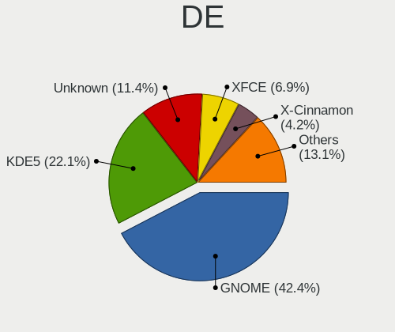

| Name                     | Computers | Percent |
|--------------------------|-----------|---------|
| GNOME                    | 503       | 44.24%  |
| KDE5                     | 252       | 22.16%  |
| Unknown                  | 132       | 11.61%  |
| XFCE                     | 87        | 7.65%   |
| X-Cinnamon               | 40        | 3.52%   |
| MATE                     | 18        | 1.58%   |
| KDE                      | 15        | 1.32%   |
| LXQt                     | 11        | 0.97%   |
| LXDE                     | 10        | 0.88%   |
| Budgie                   | 10        | 0.88%   |
| Unity                    | 9         | 0.79%   |
| sway                     | 7         | 0.62%   |
| Cinnamon                 | 7         | 0.62%   |
| Pantheon                 | 6         | 0.53%   |
| KDE4                     | 5         | 0.44%   |
| Deepin                   | 5         | 0.44%   |
| awesome                  | 4         | 0.35%   |
| i3                       | 3         | 0.26%   |
| XSession                 | 2         | 0.18%   |
| Openbox                  | 2         | 0.18%   |
| icewm                    | 2         | 0.18%   |
| GNOME Classic            | 2         | 0.18%   |
| xmonad                   | 1         | 0.09%   |
| qtile                    | 1         | 0.09%   |
| GNOME Flashback          | 1         | 0.09%   |
| BunsenLabs               | 1         | 0.09%   |
| /usr/bin/openbox-session | 1         | 0.09%   |

Display Server
--------------

X11 or Wayland

| Name    | Computers | Percent |
|---------|-----------|---------|
| X11     | 873       | 76.65%  |
| Wayland | 158       | 13.87%  |
| Unknown | 81        | 7.11%   |
| Tty     | 27        | 2.37%   |

Display Manager
---------------

SDDM, LightDM, etc.

| Name    | Computers | Percent |
|---------|-----------|---------|
| Unknown | 548       | 47.74%  |
| SDDM    | 246       | 21.43%  |
| GDM3    | 121       | 10.54%  |
| GDM     | 120       | 10.45%  |
| LightDM | 70        | 6.1%    |
| TDM     | 23        | 2%      |
| XDM     | 5         | 0.44%   |
| KDM     | 4         | 0.35%   |
| GREETD  | 4         | 0.35%   |
| LXDM    | 3         | 0.26%   |
| NODM    | 2         | 0.17%   |
| SLiM    | 1         | 0.09%   |
| EMPTTY  | 1         | 0.09%   |

OS Lang
-------

Language

| Lang        | Computers | Percent |
|-------------|-----------|---------|
| ja_JP       | 491       | 43.3%   |
| en_US       | 373       | 32.89%  |
| Unknown     | 135       | 11.9%   |
| zh_CN       | 28        | 2.47%   |
| pt_BR       | 26        | 2.29%   |
| en_GB       | 24        | 2.12%   |
| C           | 12        | 1.06%   |
| fr_FR       | 8         | 0.71%   |
| en_AU       | 4         | 0.35%   |
| ru_RU       | 3         | 0.26%   |
| en_AG       | 3         | 0.26%   |
| zh_TW       | 2         | 0.18%   |
| UTF-8       | 2         | 0.18%   |
| sr_RS       | 2         | 0.18%   |
| sk_SK       | 2         | 0.18%   |
| it_IT       | 2         | 0.18%   |
| es_ES       | 2         | 0.18%   |
| sv_SE       | 1         | 0.09%   |
| pl_PL       | 1         | 0.09%   |
| nb_NO       | 1         | 0.09%   |
| ja_JP.utf-8 | 1         | 0.09%   |
| fr_CA       | 1         | 0.09%   |
| fi_FI       | 1         | 0.09%   |
| es_GT       | 1         | 0.09%   |
| en_SG       | 1         | 0.09%   |
| en_PH       | 1         | 0.09%   |
| en_NL       | 1         | 0.09%   |
| en_IN       | 1         | 0.09%   |
| en_DK       | 1         | 0.09%   |
| en_CA       | 1         | 0.09%   |
| de_DE       | 1         | 0.09%   |
| af_ZA       | 1         | 0.09%   |

Boot Mode
---------

EFI or BIOS

| Mode | Computers | Percent |
|------|-----------|---------|
| BIOS | 601       | 53.09%  |
| EFI  | 531       | 46.91%  |

Filesystem
----------

Type of filesystem

| Type    | Computers | Percent |
|---------|-----------|---------|
| Ext4    | 862       | 76.15%  |
| Overlay | 128       | 11.31%  |
| Btrfs   | 80        | 7.07%   |
| Unknown | 22        | 1.94%   |
| Xfs     | 20        | 1.77%   |
| Zfs     | 8         | 0.71%   |
| Tmpfs   | 5         | 0.44%   |
| F2fs    | 3         | 0.27%   |
| Jfs     | 2         | 0.18%   |
| Ntfs    | 1         | 0.09%   |
| Ext3    | 1         | 0.09%   |

Part. scheme
------------

Scheme of partitioning

| Type    | Computers | Percent |
|---------|-----------|---------|
| Unknown | 592       | 51.75%  |
| GPT     | 439       | 38.37%  |
| MBR     | 113       | 9.88%   |

Dual Boot with Linux/BSD
------------------------

Hosting more than one Linux/BSD

| Dual boot | Computers | Percent |
|-----------|-----------|---------|
| No        | 869       | 76.43%  |
| Yes       | 268       | 23.57%  |

Dual Boot (Win)
---------------

Hosting Linux and Windows

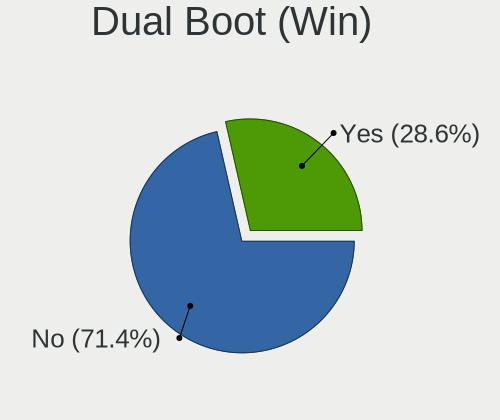

| Dual boot | Computers | Percent |
|-----------|-----------|---------|
| No        | 787       | 69.58%  |
| Yes       | 344       | 30.42%  |

Board
-----

Vendor
------

Motherboard manufacturer

| Name                    | Computers | Percent |
|-------------------------|-----------|---------|
| ASUSTek Computer        | 161       | 14.49%  |
| Lenovo                  | 110       | 9.9%    |
| ASRock                  | 96        | 8.64%   |
| Dell                    | 91        | 8.19%   |
| Hewlett-Packard         | 89        | 8.01%   |
| Toshiba                 | 65        | 5.85%   |
| Gigabyte Technology     | 64        | 5.76%   |
| MSI                     | 54        | 4.86%   |
| Fujitsu                 | 47        | 4.23%   |
| NEC Computers           | 42        | 3.78%   |
| Apple                   | 29        | 2.61%   |
| Intel                   | 26        | 2.34%   |
| Acer                    | 19        | 1.71%   |
| Sony                    | 18        | 1.62%   |
| MouseComputer           | 18        | 1.62%   |
| Panasonic               | 14        | 1.26%   |
| Unknown                 | 14        | 1.26%   |
| Raspberry Pi Foundation | 12        | 1.08%   |
| ECS                     | 9         | 0.81%   |
| Biostar                 | 9         | 0.81%   |
| HUAWEI                  | 8         | 0.72%   |
| Gateway                 | 7         | 0.63%   |
| Supermicro              | 6         | 0.54%   |
| Microsoft               | 6         | 0.54%   |
| EPSON DIRECT            | 5         | 0.45%   |
| Novastar                | 4         | 0.36%   |
| MCJ                     | 4         | 0.36%   |
| Alienware               | 4         | 0.36%   |
| Wistron                 | 3         | 0.27%   |
| Valve                   | 3         | 0.27%   |
| UNITCOM                 | 3         | 0.27%   |
| Teclast                 | 3         | 0.27%   |
| System76                | 3         | 0.27%   |
| Shuttle                 | 3         | 0.27%   |
| Pegatron                | 3         | 0.27%   |
| Notebook                | 3         | 0.27%   |
| Foxconn                 | 3         | 0.27%   |
| Dynabook                | 3         | 0.27%   |
| BESSTAR Tech            | 3         | 0.27%   |
| Timi                    | 2         | 0.18%   |

Model
-----

Motherboard model

| Name                                       | Computers | Percent |
|--------------------------------------------|-----------|---------|
| Toshiba dynabook T653/46JR                 | 24        | 2.16%   |
| Unknown                                    | 14        | 1.26%   |
| ASUS All Series                            | 13        | 1.17%   |
| RPi Raspberry Pi                           | 6         | 0.54%   |
| Toshiba dynabook Satellite B552/G          | 5         | 0.45%   |
| HP ProDesk 600 G1 SFF                      | 5         | 0.45%   |
| ASRock B450M Pro4                          | 5         | 0.45%   |
| Novastar KL55                              | 4         | 0.36%   |
| MSI MS-7A40                                | 4         | 0.36%   |
| ASRock Z87 Killer                          | 4         | 0.36%   |
| Apple MacBookPro9,2                        | 4         | 0.36%   |
| Valve Jupiter                              | 3         | 0.27%   |
| Supermicro Super Server                    | 3         | 0.27%   |
| RPi Raspberry Pi 4 Model B Rev 1.4         | 3         | 0.27%   |
| RPi Raspberry Pi 4 Model B Rev 1.2         | 3         | 0.27%   |
| NEC Computers Express5800/S70 [N8100-9021] | 3         | 0.27%   |
| Lenovo G570 4334                           | 3         | 0.27%   |
| Intel NUC10i7FNH                           | 3         | 0.27%   |
| Intel NUC10i5FNH                           | 3         | 0.27%   |
| HP Z620 Workstation                        | 3         | 0.27%   |
| ECS G31T-M                                 | 3         | 0.27%   |
| Dell Precision WorkStation T3500           | 3         | 0.27%   |
| Dell OptiPlex 3020                         | 3         | 0.27%   |
| Dell Inspiron 1545                         | 3         | 0.27%   |
| ASUS P7H55-M                               | 3         | 0.27%   |
| ASRock Prime Series                        | 3         | 0.27%   |
| ASRock J5005-ITX                           | 3         | 0.27%   |
| ASRock B460M Pro4                          | 3         | 0.27%   |
| ASRock B450 Pro4                           | 3         | 0.27%   |
| ASRock B450 Gaming-ITX/ac                  | 3         | 0.27%   |
| ASRock A300M-STX                           | 3         | 0.27%   |
| Toshiba dynabook R73/BN                    | 2         | 0.18%   |
| System76 Lemur Pro                         | 2         | 0.18%   |
| Panasonic CF-S10EYADR                      | 2         | 0.18%   |
| Onkyo ONKYOPC                              | 2         | 0.18%   |
| MSI MS-7D16                                | 2         | 0.18%   |
| MSI MS-7C95                                | 2         | 0.18%   |
| MSI MS-7C94                                | 2         | 0.18%   |
| MSI MS-7C37                                | 2         | 0.18%   |
| MSI MS-7C35                                | 2         | 0.18%   |

Model Family
------------

Motherboard model prefix

| Name                  | Computers | Percent |
|-----------------------|-----------|---------|
| Lenovo ThinkPad       | 69        | 6.21%   |
| Toshiba dynabook      | 62        | 5.58%   |
| Dell Inspiron         | 31        | 2.79%   |
| ASUS PRIME            | 24        | 2.16%   |
| HP ProBook            | 15        | 1.35%   |
| ASUS TUF              | 15        | 1.35%   |
| ASUS ROG              | 15        | 1.35%   |
| Dell Latitude         | 14        | 1.26%   |
| Acer Aspire           | 14        | 1.26%   |
| Unknown               | 14        | 1.26%   |
| ASUS All              | 13        | 1.17%   |
| RPi Raspberry         | 12        | 1.08%   |
| Dell XPS              | 12        | 1.08%   |
| HP ProDesk            | 10        | 0.9%    |
| HP Pavilion           | 9         | 0.81%   |
| HP Compaq             | 9         | 0.81%   |
| Dell Vostro           | 9         | 0.81%   |
| Dell OptiPlex         | 8         | 0.72%   |
| ASUS VivoBook         | 8         | 0.72%   |
| ASRock B450           | 7         | 0.63%   |
| Microsoft Surface     | 6         | 0.54%   |
| Lenovo ThinkCentre    | 6         | 0.54%   |
| HP Laptop             | 6         | 0.54%   |
| HP EliteBook          | 6         | 0.54%   |
| Dell Precision        | 6         | 0.54%   |
| Lenovo ThinkBook      | 5         | 0.45%   |
| Lenovo IdeaPad        | 5         | 0.45%   |
| HP ENVY               | 5         | 0.45%   |
| Fujitsu PRIMERGY      | 5         | 0.45%   |
| EPSON DIRECT Endeavor | 5         | 0.45%   |
| ASUS P8Z77-V          | 5         | 0.45%   |
| ASRock Z87            | 5         | 0.45%   |
| ASRock B450M          | 5         | 0.45%   |
| Novastar KL55         | 4         | 0.36%   |
| MSI MS-7A40           | 4         | 0.36%   |
| HP Spectre            | 4         | 0.36%   |
| Gigabyte Z390         | 4         | 0.36%   |
| ASRock Prime          | 4         | 0.36%   |
| Apple MacBookPro9     | 4         | 0.36%   |
| Valve Jupiter         | 3         | 0.27%   |

MFG Year
--------

Motherboard manufacture year

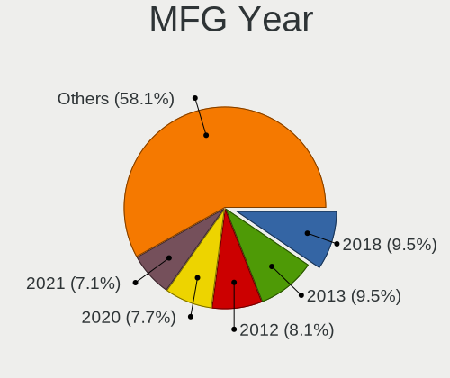

| Year    | Computers | Percent |
|---------|-----------|---------|
| 2018    | 116       | 10.44%  |
| 2012    | 106       | 9.54%   |
| 2013    | 104       | 9.36%   |
| 2020    | 100       | 9%      |
| 2021    | 78        | 7.02%   |
| 2019    | 78        | 7.02%   |
| 2011    | 69        | 6.21%   |
| 2010    | 65        | 5.85%   |
| 2009    | 58        | 5.22%   |
| 2016    | 57        | 5.13%   |
| 2015    | 50        | 4.5%    |
| 2017    | 45        | 4.05%   |
| 2008    | 44        | 3.96%   |
| 2014    | 41        | 3.69%   |
| 2007    | 37        | 3.33%   |
| 2022    | 24        | 2.16%   |
| 2006    | 15        | 1.35%   |
| Unknown | 12        | 1.08%   |
| 2005    | 6         | 0.54%   |
| 2023    | 4         | 0.36%   |
| 2004    | 1         | 0.09%   |
| 2003    | 1         | 0.09%   |

Form Factor
-----------

Physical design of the computer

| Name           | Computers | Percent |
|----------------|-----------|---------|
| Notebook       | 528       | 47.52%  |
| Desktop        | 484       | 43.56%  |
| Mini pc        | 23        | 2.07%   |
| All in one     | 20        | 1.8%    |
| Tablet         | 15        | 1.35%   |
| Server         | 15        | 1.35%   |
| System on chip | 14        | 1.26%   |
| Convertible    | 12        | 1.08%   |

Secure Boot
-----------

Enabled or disabled

| State    | Computers | Percent |
|----------|-----------|---------|
| Disabled | 1041      | 93.11%  |
| Enabled  | 77        | 6.89%   |

Coreboot
--------

Have coreboot on board

| Used | Computers | Percent |
|------|-----------|---------|
| No   | 1105      | 99.46%  |
| Yes  | 6         | 0.54%   |

RAM Size
--------

Total RAM memory

| Size in GB      | Computers | Percent |
|-----------------|-----------|---------|
| 3.01-4.0        | 246       | 21.77%  |
| 4.01-8.0        | 229       | 20.27%  |
| 8.01-16.0       | 209       | 18.5%   |
| 16.01-24.0      | 194       | 17.17%  |
| 32.01-64.0      | 116       | 10.27%  |
| 1.01-2.0        | 48        | 4.25%   |
| 64.01-256.0     | 36        | 3.19%   |
| 24.01-32.0      | 26        | 2.3%    |
| 2.01-3.0        | 16        | 1.42%   |
| 0.51-1.0        | 7         | 0.62%   |
| More than 256.0 | 2         | 0.18%   |
| 0.01-0.5        | 1         | 0.09%   |

RAM Used
--------

Used RAM memory

| Used GB    | Computers | Percent |
|------------|-----------|---------|
| 1.01-2.0   | 521       | 42.22%  |
| 2.01-3.0   | 260       | 21.07%  |
| 3.01-4.0   | 132       | 10.7%   |
| 4.01-8.0   | 127       | 10.29%  |
| 0.51-1.0   | 119       | 9.64%   |
| 8.01-16.0  | 42        | 3.4%    |
| 0.01-0.5   | 18        | 1.46%   |
| 16.01-24.0 | 10        | 0.81%   |
| 24.01-32.0 | 4         | 0.32%   |
| 32.01-64.0 | 1         | 0.08%   |

Total Drives
------------

Number of drives on board

| Drives | Computers | Percent |
|--------|-----------|---------|
| 1      | 684       | 59.79%  |
| 2      | 286       | 25%     |
| 3      | 88        | 7.69%   |
| 4      | 43        | 3.76%   |
| 5      | 19        | 1.66%   |
| 0      | 10        | 0.87%   |
| 6      | 7         | 0.61%   |
| 7      | 5         | 0.44%   |
| 11     | 1         | 0.09%   |
| 9      | 1         | 0.09%   |

Has CD-ROM
----------

Has CD-ROM on board

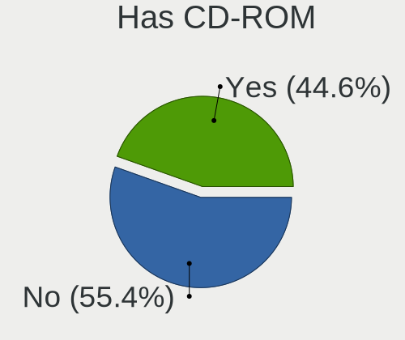

| Presented | Computers | Percent |
|-----------|-----------|---------|
| No        | 574       | 51.16%  |
| Yes       | 548       | 48.84%  |

Has Ethernet
------------

Has Ethernet on board

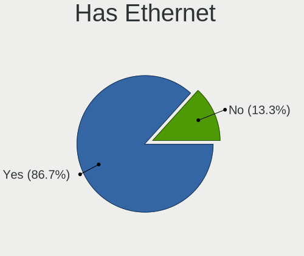

| Presented | Computers | Percent |
|-----------|-----------|---------|
| Yes       | 975       | 87.68%  |
| No        | 137       | 12.32%  |

Has WiFi
--------

Has WiFi module

| Presented | Computers | Percent |
|-----------|-----------|---------|
| Yes       | 755       | 67.59%  |
| No        | 362       | 32.41%  |

Has Bluetooth
-------------

Has Bluetooth module

| Presented | Computers | Percent |
|-----------|-----------|---------|
| No        | 576       | 51.15%  |
| Yes       | 550       | 48.85%  |

Location
--------

Country
-------

Geographic location (country)

| Country | Computers | Percent |
|---------|-----------|---------|
| Japan   | 1111      | 100%    |

City
----

Geographic location (city)

| City        | Computers | Percent |
|-------------|-----------|---------|
| Tokyo       | 110       | 9.26%   |
| Yokohama    | 63        | 5.3%    |
| Osaka       | 56        | 4.71%   |
| Shinjuku    | 32        | 2.69%   |
| Nagoya      | 30        | 2.53%   |
| Minato-ku   | 30        | 2.53%   |
| Saitama     | 22        | 1.85%   |
| Shibuya     | 18        | 1.52%   |
| Setagaya-ku | 16        | 1.35%   |
| Sapporo     | 16        | 1.35%   |
| Chiyoda     | 16        | 1.35%   |
| Kyoto       | 14        | 1.18%   |
| Niigata     | 13        | 1.09%   |
| Kobe        | 13        | 1.09%   |
| Honcho      | 13        | 1.09%   |
| Fukuoka     | 11        | 0.93%   |
| Tsukuba     | 10        | 0.84%   |
| Shinagawa   | 10        | 0.84%   |
| Nagasaki    | 9         | 0.76%   |
| Mito        | 9         | 0.76%   |
| Minatomirai | 9         | 0.76%   |
| Ichikawa    | 9         | 0.76%   |
| Adachi      | 9         | 0.76%   |
| Morioka     | 8         | 0.67%   |
| Koto        | 8         | 0.67%   |
| Kagoshima   | 8         | 0.67%   |
| Hiroshima   | 8         | 0.67%   |
| Chiyoda-ku  | 8         | 0.67%   |
| Takamatsu   | 7         | 0.59%   |
| tsu       | 7         | 0.59%   |
| Okayama     | 7         | 0.59%   |
| Miyazaki    | 7         | 0.59%   |
| Meguro-ku   | 7         | 0.59%   |
| Matsudo     | 7         | 0.59%   |
| Kumamoto    | 7         | 0.59%   |
| Kitakyushu  | 7         | 0.59%   |
| Himeji      | 7         | 0.59%   |
| Gifu City   | 7         | 0.59%   |
| Chiba       | 7         | 0.59%   |
| Okazaki     | 6         | 0.51%   |

Drives
------

Drive Vendor
------------

Hard drive vendors

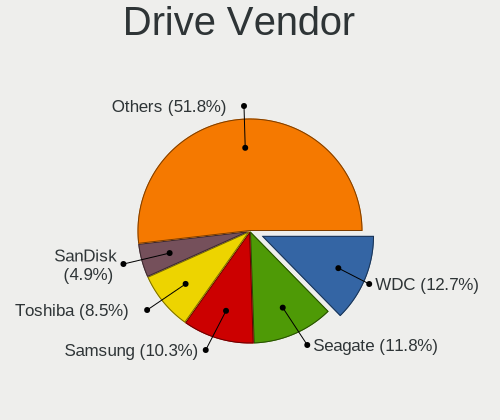

| Vendor                    | Computers | Drives | Percent |
|---------------------------|-----------|--------|---------|
| WDC                       | 235       | 359    | 14.47%  |
| Seagate                   | 223       | 335    | 13.73%  |
| Samsung Electronics       | 169       | 240    | 10.41%  |
| Toshiba                   | 146       | 180    | 8.99%   |
| Crucial                   | 87        | 114    | 5.36%   |
| Hitachi                   | 86        | 106    | 5.3%    |
| SanDisk                   | 78        | 105    | 4.8%    |
| Unknown                   | 72        | 89     | 4.43%   |
| Intel                     | 55        | 75     | 3.39%   |
| A-DATA Technology         | 34        | 39     | 2.09%   |
| Kingston                  | 32        | 36     | 1.97%   |
| SPCC                      | 31        | 39     | 1.91%   |
| SK hynix                  | 24        | 25     | 1.48%   |
| Micron Technology         | 23        | 37     | 1.42%   |
| HGST                      | 20        | 23     | 1.23%   |
| Apple                     | 19        | 23     | 1.17%   |
| Transcend                 | 18        | 22     | 1.11%   |
| Phison                    | 15        | 20     | 0.92%   |
| Plextor                   | 12        | 16     | 0.74%   |
| Silicon Motion            | 11        | 18     | 0.68%   |
| China                     | 11        | 16     | 0.68%   |
| Unknown                   | 11        | 12     | 0.68%   |
| KIOXIA-EXCERIA            | 10        | 12     | 0.62%   |
| Micron/Crucial Technology | 9         | 13     | 0.55%   |
| Fujitsu                   | 9         | 10     | 0.55%   |
| Teclast                   | 8         | 8      | 0.49%   |
| OCZ                       | 8         | 8      | 0.49%   |
| KIOXIA                    | 8         | 11     | 0.49%   |
| SUNEAST                   | 7         | 8      | 0.43%   |
| Phison Electronics        | 7         | 8      | 0.43%   |
| Dogfish                   | 7         | 8      | 0.43%   |
| Zheino                    | 6         | 7      | 0.37%   |
| Patriot                   | 6         | 7      | 0.37%   |
| Green House               | 6         | 9      | 0.37%   |
| JMicron Technology        | 5         | 5      | 0.31%   |
| Hewlett-Packard           | 5         | 8      | 0.31%   |
| BUFFALO                   | 5         | 6      | 0.31%   |
| Team                      | 4         | 5      | 0.25%   |
| Maxtor                    | 4         | 6      | 0.25%   |
| Lexar                     | 4         | 5      | 0.25%   |

Drive Model
-----------

Hard drive models

| Model                                             | Computers | Percent |
|---------------------------------------------------|-----------|---------|
| Toshiba MQ01ABD075 752GB                          | 25        | 1.41%   |
| Crucial CT500MX500SSD1 500GB                      | 19        | 1.07%   |
| Toshiba DT01ACA100 1TB                            | 18        | 1.01%   |
| Unknown MMC Card  64GB                            | 17        | 0.96%   |
| Crucial CT240BX500SSD1 240GB                      | 15        | 0.84%   |
| Unknown MMC Card  32GB                            | 12        | 0.68%   |
| Unknown                                           | 11        | 0.62%   |
| Seagate ST4000DM004-2CV104 4TB                    | 10        | 0.56%   |
| WDC WD40EZRZ-00GXCB0 4TB                          | 8         | 0.45%   |
| Toshiba MQ01ABD100 1TB                            | 8         | 0.45%   |
| Toshiba DT01ACA200 2TB                            | 8         | 0.45%   |
| SPCC Solid State Disk 256GB                       | 8         | 0.45%   |
| Seagate ST9500325AS 500GB                         | 8         | 0.45%   |
| Seagate ST3500418AS 500GB                         | 8         | 0.45%   |
| Seagate ST2000DM001-1CH164 2TB                    | 8         | 0.45%   |
| Seagate ST1000DM010-2EP102 1TB                    | 8         | 0.45%   |
| WDC WD20EZRX-00DC0B0 2TB                          | 7         | 0.39%   |
| Toshiba MQ01ABF050 500GB                          | 7         | 0.39%   |
| Seagate ST500DM002-1BD142 500GB                   | 7         | 0.39%   |
| Seagate ST2000DM008-2FR102 2TB                    | 7         | 0.39%   |
| Samsung SSD 970 EVO Plus 500GB                    | 7         | 0.39%   |
| Samsung NVMe SSD Controller SM981/PM981/PM983 1TB | 7         | 0.39%   |
| Crucial CT525MX300SSD1 528GB                      | 7         | 0.39%   |
| WDC WDS500G2B0B-00YS70 500GB SSD                  | 6         | 0.34%   |
| Unknown MMC Card  128GB                           | 6         | 0.34%   |
| SPCC Solid State Disk 240GB                       | 6         | 0.34%   |
| Seagate ST2000DM006-2DM164 2TB                    | 6         | 0.34%   |
| Seagate ST2000DM005-2CW102 2TB                    | 6         | 0.34%   |
| Seagate ST1000DM003-1ER162 1TB                    | 6         | 0.34%   |
| Samsung SSD 860 EVO 500GB                         | 6         | 0.34%   |
| Samsung SSD 860 EVO 250GB                         | 6         | 0.34%   |
| Samsung SM963 2.5" NVMe PCIe SSD 250GB            | 6         | 0.34%   |
| Intel NVMe SSD Drive 512GB                        | 6         | 0.34%   |
| Crucial CT120BX500SSD1 120GB                      | 6         | 0.34%   |
| Crucial CT1000MX500SSD1 1TB                       | 6         | 0.34%   |
| WDC WD10EZEX-00BN5A0 1TB                          | 5         | 0.28%   |
| WDC WD10EADS-22M2B0 1TB                           | 5         | 0.28%   |
| WDC WD10EADS-00L5B1 1TB                           | 5         | 0.28%   |
| Toshiba MQ01ABF032 320GB                          | 5         | 0.28%   |
| SPCC Solid State Disk 512GB                       | 5         | 0.28%   |

HDD Vendor
----------

Hard disk drive vendors

| Vendor              | Computers | Drives | Percent |
|---------------------|-----------|--------|---------|
| Seagate             | 217       | 325    | 31.73%  |
| WDC                 | 188       | 279    | 27.49%  |
| Toshiba             | 121       | 144    | 17.69%  |
| Hitachi             | 85        | 105    | 12.43%  |
| HGST                | 20        | 23     | 2.92%   |
| Samsung Electronics | 19        | 23     | 2.78%   |
| Fujitsu             | 9         | 10     | 1.32%   |
| Unknown             | 4         | 4      | 0.58%   |
| Maxtor              | 4         | 6      | 0.58%   |
| Hewlett-Packard     | 3         | 6      | 0.44%   |
| Apple               | 3         | 4      | 0.44%   |
| QC-FT-D             | 2         | 2      | 0.29%   |
| MARVELL             | 2         | 4      | 0.29%   |
| JMicron Technology  | 2         | 2      | 0.29%   |
| USB3.0              | 1         | 1      | 0.15%   |
| StoreJet            | 1         | 1      | 0.15%   |
| Quantum             | 1         | 1      | 0.15%   |
| MARSHAL             | 1         | 2      | 0.15%   |
| KESU                | 1         | 1      | 0.15%   |

SSD Vendor
----------

Solid state drive vendors

| Vendor              | Computers | Drives | Percent |
|---------------------|-----------|--------|---------|
| Crucial             | 82        | 107    | 14.51%  |
| Samsung Electronics | 81        | 115    | 14.34%  |
| SanDisk             | 50        | 64     | 8.85%   |
| WDC                 | 33        | 44     | 5.84%   |
| A-DATA Technology   | 31        | 36     | 5.49%   |
| Intel               | 28        | 33     | 4.96%   |
| SPCC                | 26        | 34     | 4.6%    |
| Kingston            | 23        | 26     | 4.07%   |
| Transcend           | 16        | 20     | 2.83%   |
| Toshiba             | 15        | 19     | 2.65%   |
| Plextor             | 12        | 16     | 2.12%   |
| China               | 11        | 16     | 1.95%   |
| Micron Technology   | 10        | 14     | 1.77%   |
| OCZ                 | 8         | 8      | 1.42%   |
| Apple               | 8         | 10     | 1.42%   |
| Unknown             | 8         | 9      | 1.42%   |
| SUNEAST             | 7         | 8      | 1.24%   |
| Dogfish             | 7         | 8      | 1.24%   |
| Teclast             | 6         | 6      | 1.06%   |
| Green House         | 6         | 9      | 1.06%   |
| Unknown             | 5         | 5      | 0.88%   |
| Seagate             | 5         | 7      | 0.88%   |
| KIOXIA-EXCERIA      | 5         | 6      | 0.88%   |
| BUFFALO             | 5         | 6      | 0.88%   |
| Team                | 4         | 5      | 0.71%   |
| Patriot             | 4         | 5      | 0.71%   |
| Lexar               | 4         | 5      | 0.71%   |
| KLEVV               | 4         | 9      | 0.71%   |
| Apacer              | 4         | 6      | 0.71%   |
| Zheino              | 3         | 3      | 0.53%   |
| Kingmax             | 3         | 3      | 0.53%   |
| ASMT                | 3         | 4      | 0.53%   |
| TCSUNBOW            | 2         | 2      | 0.35%   |
| PNY                 | 2         | 2      | 0.35%   |
| Palit               | 2         | 4      | 0.35%   |
| Netac               | 2         | 2      | 0.35%   |
| LITEONIT            | 2         | 4      | 0.35%   |
| Lite-On             | 2         | 2      | 0.35%   |
| KingDian            | 2         | 2      | 0.35%   |
| Hanye               | 2         | 2      | 0.35%   |

Drive Kind
----------

HDD or SSD

| Kind    | Computers | Drives | Percent |
|---------|-----------|--------|---------|
| HDD     | 577       | 943    | 40.27%  |
| SSD     | 490       | 722    | 34.19%  |
| NVMe    | 284       | 424    | 19.82%  |
| MMC     | 57        | 72     | 3.98%   |
| Unknown | 25        | 34     | 1.74%   |

Drive Connector
---------------

SATA, SAS, NVMe, etc.

| Type | Computers | Drives | Percent |
|------|-----------|--------|---------|
| SATA | 880       | 1624   | 68.86%  |
| NVMe | 283       | 419    | 22.14%  |
| SAS  | 58        | 80     | 4.54%   |
| MMC  | 57        | 72     | 4.46%   |

Drive Size
----------

Size of hard drive

| Size in TB | Computers | Drives | Percent |
|------------|-----------|--------|---------|
| 0.01-0.5   | 660       | 1004   | 58.98%  |
| 0.51-1.0   | 257       | 350    | 22.97%  |
| 1.01-2.0   | 103       | 147    | 9.2%    |
| 3.01-4.0   | 42        | 64     | 3.75%   |
| 4.01-10.0  | 30        | 60     | 2.68%   |
| 2.01-3.0   | 24        | 36     | 2.14%   |
| 10.01-20.0 | 3         | 4      | 0.27%   |

Space Total
-----------

Amount of disk space available on the file system

| Size in GB     | Computers | Percent |
|----------------|-----------|---------|
| 101-250        | 358       | 30.57%  |
| 251-500        | 205       | 17.51%  |
| 501-1000       | 146       | 12.47%  |
| 1-20           | 97        | 8.28%   |
| 51-100         | 84        | 7.17%   |
| 1001-2000      | 75        | 6.4%    |
| More than 3000 | 61        | 5.21%   |
| 21-50          | 52        | 4.44%   |
| Unknown        | 50        | 4.27%   |
| 2001-3000      | 43        | 3.67%   |

Space Used
----------

Amount of used disk space

| Used GB        | Computers | Percent |
|----------------|-----------|---------|
| 1-20           | 539       | 44.18%  |
| 21-50          | 210       | 17.21%  |
| 101-250        | 114       | 9.34%   |
| 51-100         | 111       | 9.1%    |
| 251-500        | 71        | 5.82%   |
| 501-1000       | 60        | 4.92%   |
| Unknown        | 50        | 4.1%    |
| 1001-2000      | 30        | 2.46%   |
| More than 3000 | 22        | 1.8%    |
| 2001-3000      | 13        | 1.07%   |

Malfunc. Drives
---------------

Drive models with a malfunction

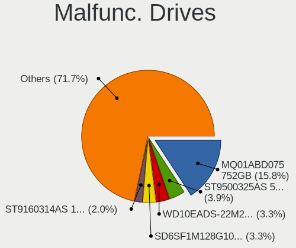

| Model                              | Computers | Drives | Percent |
|------------------------------------|-----------|--------|---------|
| Toshiba MQ01ABD075 752GB           | 24        | 24     | 20.87%  |
| Seagate ST9500325AS 500GB          | 6         | 7      | 5.22%   |
| WDC WD10EADS-22M2B0 1TB            | 5         | 5      | 4.35%   |
| SanDisk SD6SF1M128G1022I 128GB SSD | 5         | 5      | 4.35%   |
| Seagate ST9160314AS 160GB          | 2         | 2      | 1.74%   |
| Seagate ST2000DM001-1CH164 2TB     | 2         | 2      | 1.74%   |
| Hitachi HDS721010CLA332 1TB        | 2         | 2      | 1.74%   |
| WDC WD5000LPLX-66ZNTT0 500GB       | 1         | 1      | 0.87%   |
| WDC WD40EZRZ-00GXCB0 4TB           | 1         | 1      | 0.87%   |
| WDC WD3200BEVT-08A23T1 320GB       | 1         | 1      | 0.87%   |
| WDC WD30EZRX-00DC0B0 3TB           | 1         | 2      | 0.87%   |
| WDC WD30EZRX-00D8PB0 3TB           | 1         | 1      | 0.87%   |
| WDC WD25EZRX-00MMMB0 2TB           | 1         | 1      | 0.87%   |
| WDC WD1600BEVS-26RST0 160GB        | 1         | 1      | 0.87%   |
| WDC WD10JPCX-24UE4T0 1TB           | 1         | 1      | 0.87%   |
| WDC WD10EALX-009BA0 1TB            | 1         | 1      | 0.87%   |
| WDC WD10EACS-00D6B0 1TB            | 1         | 2      | 0.87%   |
| Transcend TS240GSSD220S 240GB      | 1         | 1      | 0.87%   |
| Toshiba MK5055GSX 500GB            | 1         | 1      | 0.87%   |
| Toshiba MK2555GSX 250GB            | 1         | 1      | 0.87%   |
| Toshiba MK1255GSX H 120GB          | 1         | 1      | 0.87%   |
| Teclast 240GB SSD                  | 1         | 1      | 0.87%   |
| Teclast 128GB SSD                  | 1         | 1      | 0.87%   |
| SPCC Solid State DiskB28 128GB     | 1         | 1      | 0.87%   |
| SPCC Solid State Disk 512GB        | 1         | 2      | 0.87%   |
| Seagate ST9320320AS 320GB          | 1         | 1      | 0.87%   |
| Seagate ST9120817AS 120GB          | 1         | 1      | 0.87%   |
| Seagate ST500LT012-1DG142 500GB    | 1         | 1      | 0.87%   |
| Seagate ST500LM021-1KJ152 500GB    | 1         | 1      | 0.87%   |
| Seagate ST3500418AS 500GB          | 1         | 1      | 0.87%   |
| Seagate ST3320820AS 320GB          | 1         | 1      | 0.87%   |
| Seagate ST3250310AS 250GB          | 1         | 2      | 0.87%   |
| Seagate ST3120026A 120GB           | 1         | 1      | 0.87%   |
| Seagate ST31000528AS 1TB           | 1         | 1      | 0.87%   |
| Seagate ST31000333AS 1TB           | 1         | 1      | 0.87%   |
| Seagate ST3000VM002-1ET166 3TB     | 1         | 1      | 0.87%   |
| Seagate ST250DM000-1BD141 250GB    | 1         | 1      | 0.87%   |
| Seagate ST2000LX001-1RG174 2TB     | 1         | 1      | 0.87%   |
| Seagate ST2000LM003 HN-M201RAD 2TB | 1         | 1      | 0.87%   |
| Seagate ST2000DX002-2DV164 2TB     | 1         | 1      | 0.87%   |

Malfunc. Drive Vendor
---------------------

Vendors of faulty drives

| Vendor              | Computers | Drives | Percent |
|---------------------|-----------|--------|---------|
| Seagate             | 28        | 31     | 24.78%  |
| Toshiba             | 27        | 27     | 23.89%  |
| WDC                 | 15        | 17     | 13.27%  |
| Hitachi             | 12        | 13     | 10.62%  |
| SanDisk             | 7         | 8      | 6.19%   |
| Intel               | 3         | 3      | 2.65%   |
| A-DATA Technology   | 3         | 3      | 2.65%   |
| Teclast             | 2         | 2      | 1.77%   |
| SPCC                | 2         | 3      | 1.77%   |
| Samsung Electronics | 2         | 3      | 1.77%   |
| HGST                | 2         | 2      | 1.77%   |
| Crucial             | 2         | 3      | 1.77%   |
| Transcend           | 1         | 1      | 0.88%   |
| Micron Technology   | 1         | 1      | 0.88%   |
| MARSHAL             | 1         | 1      | 0.88%   |
| LITEON              | 1         | 2      | 0.88%   |
| Lite-On             | 1         | 1      | 0.88%   |
| Kingston            | 1         | 1      | 0.88%   |
| Corsair             | 1         | 1      | 0.88%   |
| China               | 1         | 1      | 0.88%   |

Malfunc. HDD Vendor
-------------------

Vendors of faulty HDD drives

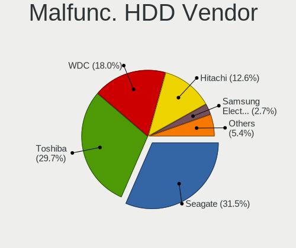

| Vendor              | Computers | Drives | Percent |
|---------------------|-----------|--------|---------|
| Seagate             | 28        | 31     | 32.56%  |
| Toshiba             | 27        | 27     | 31.4%   |
| WDC                 | 15        | 17     | 17.44%  |
| Hitachi             | 12        | 13     | 13.95%  |
| HGST                | 2         | 2      | 2.33%   |
| Samsung Electronics | 1         | 2      | 1.16%   |
| MARSHAL             | 1         | 1      | 1.16%   |

Malfunc. Drive Kind
-------------------

Kinds of faulty drives

| Kind | Computers | Drives | Percent |
|------|-----------|--------|---------|
| HDD  | 81        | 93     | 75%     |
| SSD  | 27        | 31     | 25%     |

Failed Drives
-------------

Failed drive models

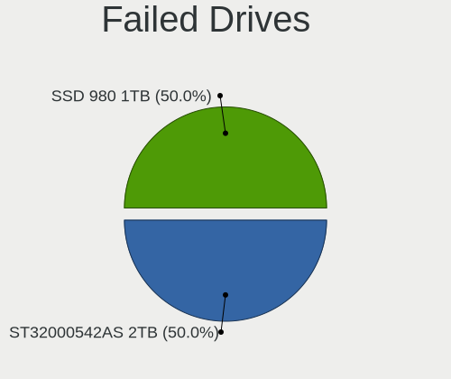

| Model                           | Computers | Drives | Percent |
|---------------------------------|-----------|--------|---------|
| Samsung Electronics SSD 980 1TB | 1         | 1      | 100%    |

Failed Drive Vendor
-------------------

Failed drive vendors

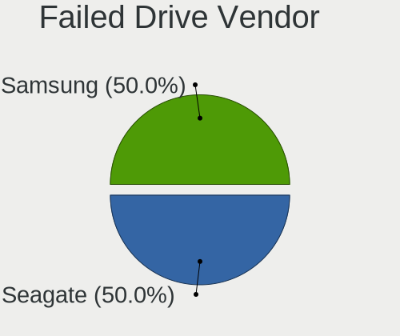

| Vendor              | Computers | Drives | Percent |
|---------------------|-----------|--------|---------|
| Samsung Electronics | 1         | 1      | 100%    |

Drive Status
------------

Number of failed and malfunc. drives

| Status   | Computers | Drives | Percent |
|----------|-----------|--------|---------|
| Detected | 664       | 1356   | 56.18%  |
| Works    | 415       | 714    | 35.11%  |
| Malfunc  | 102       | 124    | 8.63%   |
| Failed   | 1         | 1      | 0.08%   |

Storage controller
------------------

Storage Vendor
--------------

Storage controller vendors

| Vendor                           | Computers | Percent |
|----------------------------------|-----------|---------|
| Intel                            | 773       | 55.45%  |
| AMD                              | 207       | 14.85%  |
| Samsung Electronics              | 86        | 6.17%   |
| SanDisk                          | 46        | 3.3%    |
| ASMedia Technology               | 41        | 2.94%   |
| Phison Electronics               | 26        | 1.87%   |
| SK hynix                         | 24        | 1.72%   |
| Marvell Technology Group         | 22        | 1.58%   |
| Silicon Motion                   | 19        | 1.36%   |
| JMicron Technology               | 19        | 1.36%   |
| Micron/Crucial Technology        | 14        | 1%      |
| Micron Technology                | 14        | 1%      |
| KIOXIA                           | 14        | 1%      |
| Nvidia                           | 12        | 0.86%   |
| Kingston Technology Company      | 11        | 0.79%   |
| VIA Technologies                 | 10        | 0.72%   |
| Toshiba America Info Systems     | 10        | 0.72%   |
| Broadcom / LSI                   | 8         | 0.57%   |
| Apple                            | 8         | 0.57%   |
| ADATA Technology                 | 6         | 0.43%   |
| Seagate Technology               | 3         | 0.22%   |
| MAXIO Technology (Hangzhou)      | 3         | 0.22%   |
| Adaptec                          | 3         | 0.22%   |
| Silicon Image                    | 2         | 0.14%   |
| Realtek Semiconductor            | 2         | 0.14%   |
| LSI Logic / Symbios Logic        | 2         | 0.14%   |
| HighPoint Technologies           | 2         | 0.14%   |
| Yangtze Memory Technologies      | 1         | 0.07%   |
| ULi Electronics                  | 1         | 0.07%   |
| Solid State Storage Technology   | 1         | 0.07%   |
| Silicon Integrated Systems [SiS] | 1         | 0.07%   |
| Promise Technology               | 1         | 0.07%   |
| Lenovo                           | 1         | 0.07%   |
| Unknown                          | 1         | 0.07%   |

Storage Model
-------------

Storage controller models

| Model                                                                            | Computers | Percent |
|----------------------------------------------------------------------------------|-----------|---------|
| AMD FCH SATA Controller [AHCI mode]                                              | 127       | 7.73%   |
| Intel 7 Series Chipset Family 6-port SATA Controller [AHCI mode]                 | 85        | 5.17%   |
| Intel 8 Series/C220 Series Chipset Family 6-port SATA Controller 1 [AHCI mode]   | 46        | 2.8%    |
| Intel 6 Series/C200 Series Chipset Family 6 port Mobile SATA AHCI Controller     | 45        | 2.74%   |
| Samsung NVMe SSD Controller SM981/PM981/PM983                                    | 43        | 2.62%   |
| Intel Sunrise Point-LP SATA Controller [AHCI mode]                               | 37        | 2.25%   |
| ASMedia ASM1062 Serial ATA Controller                                            | 36        | 2.19%   |
| AMD 400 Series Chipset SATA Controller                                           | 36        | 2.19%   |
| Intel 82801IBM/IEM (ICH9M/ICH9M-E) 4 port SATA Controller [AHCI mode]            | 29        | 1.76%   |
| Intel 7 Series/C210 Series Chipset Family 6-port SATA Controller [AHCI mode]     | 29        | 1.76%   |
| Intel Q170/Q150/B150/H170/H110/Z170/CM236 Chipset SATA Controller [AHCI Mode]    | 26        | 1.58%   |
| Intel Cannon Lake PCH SATA AHCI Controller                                       | 25        | 1.52%   |
| Intel 82801G (ICH7 Family) IDE Controller                                        | 25        | 1.52%   |
| AMD 500 Series Chipset SATA Controller                                           | 24        | 1.46%   |
| Intel 5 Series/3400 Series Chipset 4 port SATA AHCI Controller                   | 23        | 1.4%    |
| AMD SB7x0/SB8x0/SB9x0 IDE Controller                                             | 23        | 1.4%    |
| Intel 6 Series/C200 Series Chipset Family 6 port Desktop SATA AHCI Controller    | 22        | 1.34%   |
| Intel Wildcat Point-LP SATA Controller [AHCI Mode]                               | 21        | 1.28%   |
| Intel 200 Series PCH SATA controller [AHCI mode]                                 | 21        | 1.28%   |
| Intel 82801 Mobile SATA Controller [RAID mode]                                   | 19        | 1.16%   |
| Intel Comet Lake SATA AHCI Controller                                            | 18        | 1.09%   |
| Intel 8 Series SATA Controller 1 [AHCI mode]                                     | 18        | 1.09%   |
| Intel Volume Management Device NVMe RAID Controller                              | 17        | 1.03%   |
| Intel SATA Controller [RAID mode]                                                | 17        | 1.03%   |
| Intel NM10/ICH7 Family SATA Controller [IDE mode]                                | 17        | 1.03%   |
| AMD SB7x0/SB8x0/SB9x0 SATA Controller [IDE mode]                                 | 17        | 1.03%   |
| Samsung NVMe SSD Controller 980                                                  | 16        | 0.97%   |
| Intel 5 Series/3400 Series Chipset 6 port SATA AHCI Controller                   | 15        | 0.91%   |
| SanDisk WD Blue SN550 NVMe SSD                                                   | 14        | 0.85%   |
| Intel Celeron/Pentium Silver Processor SATA Controller                           | 14        | 0.85%   |
| Silicon Motion SM2263EN/SM2263XT SSD Controller                                  | 13        | 0.79%   |
| Micron NVMe Storage Controller                                                   | 13        | 0.79%   |
| Intel SSD 660P Series                                                            | 13        | 0.79%   |
| Intel 82801HM/HEM (ICH8M/ICH8M-E) IDE Controller                                 | 13        | 0.79%   |
| Intel 82801GBM/GHM (ICH7-M Family) SATA Controller [IDE mode]                    | 13        | 0.79%   |
| Intel 5 Series/3400 Series Chipset 4 port SATA IDE Controller                    | 13        | 0.79%   |
| AMD SB7x0/SB8x0/SB9x0 SATA Controller [AHCI mode]                                | 13        | 0.79%   |
| JMicron JMB363 SATA/IDE Controller                                               | 12        | 0.73%   |
| Intel Atom/Celeron/Pentium Processor x5-E8000/J3xxx/N3xxx Series SATA Controller | 12        | 0.73%   |
| Intel 82801JI (ICH10 Family) 4 port SATA IDE Controller #1                       | 12        | 0.73%   |

Storage Kind
------------

Kind of storage controller (IDE, SATA, NVMe, SAS, ...)

| Kind | Computers | Percent |
|------|-----------|---------|
| SATA | 821       | 59.24%  |
| NVMe | 286       | 20.63%  |
| IDE  | 193       | 13.92%  |
| RAID | 74        | 5.34%   |
| SAS  | 7         | 0.51%   |
| SCSI | 5         | 0.36%   |

Processor
---------

CPU Vendor
----------

Processor vendors

| Vendor | Computers | Percent |
|--------|-----------|---------|
| Intel  | 858       | 77.23%  |
| AMD    | 239       | 21.51%  |
| ARM    | 14        | 1.26%   |

CPU Model
---------

Processor models

| Model                                   | Computers | Percent |
|-----------------------------------------|-----------|---------|
| Intel Celeron CPU 847 @ 1.10GHz         | 24        | 2.15%   |
| Intel Core i5-3320M CPU @ 2.60GHz       | 13        | 1.17%   |
| AMD Ryzen 5 3600 6-Core Processor       | 13        | 1.17%   |
| ARM Processor                           | 11        | 0.99%   |
| Intel Core i7-3770 CPU @ 3.40GHz        | 10        | 0.9%    |
| Intel Core i5-10210U CPU @ 1.60GHz      | 10        | 0.9%    |
| Intel Core i7-8550U CPU @ 1.80GHz       | 9         | 0.81%   |
| Intel Core i7-2600 CPU @ 3.40GHz        | 9         | 0.81%   |
| Intel Core i5-7200U CPU @ 2.50GHz       | 9         | 0.81%   |
| Intel Core i5-2520M CPU @ 2.50GHz       | 9         | 0.81%   |
| Intel Core i7-8750H CPU @ 2.20GHz       | 8         | 0.72%   |
| Intel Core i7-10750H CPU @ 2.60GHz      | 8         | 0.72%   |
| Intel Core i5-8250U CPU @ 1.60GHz       | 8         | 0.72%   |
| Intel Core i5-3210M CPU @ 2.50GHz       | 8         | 0.72%   |
| Intel Core 2 Duo CPU P8700 @ 2.53GHz    | 8         | 0.72%   |
| Intel Core 2 Duo CPU P8600 @ 2.40GHz    | 8         | 0.72%   |
| AMD Ryzen 7 3700X 8-Core Processor      | 8         | 0.72%   |
| Intel Core i5-8400 CPU @ 2.80GHz        | 7         | 0.63%   |
| Intel Core 2 Duo CPU E8400 @ 3.00GHz    | 7         | 0.63%   |
| Intel Core i7-2670QM CPU @ 2.20GHz      | 6         | 0.54%   |
| Intel Core i5-8265U CPU @ 1.60GHz       | 6         | 0.54%   |
| Intel Core i5-2540M CPU @ 2.60GHz       | 6         | 0.54%   |
| Intel Core i5-2410M CPU @ 2.30GHz       | 6         | 0.54%   |
| Intel Core i5 CPU M 560 @ 2.67GHz       | 6         | 0.54%   |
| Intel Core 2 Duo CPU E7500 @ 2.93GHz    | 6         | 0.54%   |
| Intel Celeron CPU N3060 @ 1.60GHz       | 6         | 0.54%   |
| Intel 11th Gen Core i7-1165G7 @ 2.80GHz | 6         | 0.54%   |
| Intel Core i7-8700 CPU @ 3.20GHz        | 5         | 0.45%   |
| Intel Core i7-7700 CPU @ 3.60GHz        | 5         | 0.45%   |
| Intel Core i7-6700 CPU @ 3.40GHz        | 5         | 0.45%   |
| Intel Core i7-5500U CPU @ 2.40GHz       | 5         | 0.45%   |
| Intel Core i7-3770K CPU @ 3.50GHz       | 5         | 0.45%   |
| Intel Core i7-3520M CPU @ 2.90GHz       | 5         | 0.45%   |
| Intel Core i7-10510U CPU @ 1.80GHz      | 5         | 0.45%   |
| Intel Core i5-6200U CPU @ 2.30GHz       | 5         | 0.45%   |
| Intel Core i5-5200U CPU @ 2.20GHz       | 5         | 0.45%   |
| Intel Core i5-2450M CPU @ 2.50GHz       | 5         | 0.45%   |
| Intel Core 2 Duo CPU E7400 @ 2.80GHz    | 5         | 0.45%   |
| Intel Core 2 CPU 6600 @ 2.40GHz         | 5         | 0.45%   |
| Intel Celeron N4020 CPU @ 1.10GHz       | 5         | 0.45%   |

CPU Model Family
----------------

Processor model prefix

| Model                   | Computers | Percent |
|-------------------------|-----------|---------|
| Intel Core i5           | 238       | 21.4%   |
| Intel Core i7           | 192       | 17.27%  |
| Intel Celeron           | 93        | 8.36%   |
| Intel Core i3           | 68        | 6.12%   |
| Intel Core 2 Duo        | 64        | 5.76%   |
| Other                   | 59        | 5.31%   |
| AMD Ryzen 5             | 59        | 5.31%   |
| AMD Ryzen 7             | 52        | 4.68%   |
| Intel Xeon              | 36        | 3.24%   |
| Intel Atom              | 24        | 2.16%   |
| Intel Pentium           | 18        | 1.62%   |
| Intel Core 2            | 16        | 1.44%   |
| Intel Core 2 Quad       | 13        | 1.17%   |
| AMD Athlon              | 13        | 1.17%   |
| AMD Ryzen 9             | 12        | 1.08%   |
| Intel Core i9           | 11        | 0.99%   |
| AMD Ryzen 3             | 11        | 0.99%   |
| AMD A10                 | 9         | 0.81%   |
| Intel Pentium Dual-Core | 6         | 0.54%   |
| AMD Phenom II X4        | 6         | 0.54%   |
| AMD FX                  | 6         | 0.54%   |
| AMD Athlon 64 X2        | 6         | 0.54%   |
| AMD A8                  | 6         | 0.54%   |
| Intel Pentium 4         | 5         | 0.45%   |
| Intel Celeron M         | 5         | 0.45%   |
| AMD A6                  | 5         | 0.45%   |
| Intel Pentium Gold      | 4         | 0.36%   |
| Intel Celeron Dual-Core | 4         | 0.36%   |
| AMD E2                  | 4         | 0.36%   |
| Intel Pentium Silver    | 3         | 0.27%   |
| Intel Genuine           | 3         | 0.27%   |
| AMD Sempron             | 3         | 0.27%   |
| AMD Ryzen 7 PRO         | 3         | 0.27%   |
| AMD Ryzen 5 PRO         | 3         | 0.27%   |
| Intel Pentium M         | 2         | 0.18%   |
| Intel Core m3           | 2         | 0.18%   |
| Intel Core M            | 2         | 0.18%   |
| ARM BCM                 | 2         | 0.18%   |
| AMD Turion 64 X2 Mobile | 2         | 0.18%   |
| AMD Ryzen Threadripper  | 2         | 0.18%   |

CPU Cores
---------

Number of processor cores

| Number | Computers | Percent |
|--------|-----------|---------|
| 2      | 490       | 43.99%  |
| 4      | 340       | 30.52%  |
| 6      | 117       | 10.5%   |
| 8      | 80        | 7.18%   |
| 1      | 36        | 3.23%   |
| 16     | 14        | 1.26%   |
| 12     | 12        | 1.08%   |
| 10     | 8         | 0.72%   |
| 14     | 7         | 0.63%   |
| 3      | 4         | 0.36%   |
| 24     | 2         | 0.18%   |
| 20     | 2         | 0.18%   |
| 56     | 1         | 0.09%   |
| 32     | 1         | 0.09%   |

CPU Sockets
-----------

Number of sockets

| Number | Computers | Percent |
|--------|-----------|---------|
| 1      | 1100      | 99.01%  |
| 2      | 10        | 0.9%    |
| 3      | 1         | 0.09%   |

CPU Threads
-----------

Threads per core (Hyper-Threading)

| Number | Computers | Percent |
|--------|-----------|---------|
| 2      | 708       | 63.67%  |
| 1      | 404       | 36.33%  |

CPU Op-Modes
------------

CPU Operation Modes (32-bit, 64-bit)

| Op mode        | Computers | Percent |
|----------------|-----------|---------|
| 32-bit, 64-bit | 1071      | 96.23%  |
| Unknown        | 24        | 2.16%   |
| 32-bit         | 18        | 1.62%   |

CPU Microcode
-------------

Microcode number

| Number     | Computers | Percent |
|------------|-----------|---------|
| Unknown    | 247       | 21.53%  |
| 0x206a7    | 90        | 7.85%   |
| 0x306a9    | 86        | 7.5%    |
| 0x1067a    | 56        | 4.88%   |
| 0x306c3    | 49        | 4.27%   |
| 0x906ea    | 25        | 2.18%   |
| 0x08701021 | 25        | 2.18%   |
| 0x806ec    | 24        | 2.09%   |
| 0x20655    | 23        | 2.01%   |
| 0x506e3    | 21        | 1.83%   |
| 0x306d4    | 21        | 1.83%   |
| 0x806ea    | 17        | 1.48%   |
| 0x906e9    | 15        | 1.31%   |
| 0x806e9    | 15        | 1.31%   |
| 0x40651    | 14        | 1.22%   |
| 0x10676    | 14        | 1.22%   |
| 0x406c4    | 13        | 1.13%   |
| 0x806c1    | 12        | 1.05%   |
| 0x0a50000c | 12        | 1.05%   |
| 0xa0652    | 11        | 0.96%   |
| 0x406e3    | 11        | 0.96%   |
| 0x906ed    | 10        | 0.87%   |
| 0x6f6      | 10        | 0.87%   |
| 0x20652    | 10        | 0.87%   |
| 0x106e5    | 10        | 0.87%   |
| 0x08108109 | 10        | 0.87%   |
| 0x08600106 | 9         | 0.78%   |
| 0x08108102 | 9         | 0.78%   |
| 0x906a3    | 8         | 0.7%    |
| 0x406c3    | 8         | 0.7%    |
| 0x106c2    | 8         | 0.7%    |
| 0x06003106 | 8         | 0.7%    |
| 0x806eb    | 7         | 0.61%   |
| 0x0810100b | 7         | 0.61%   |
| 0x0800820d | 7         | 0.61%   |
| 0x06001119 | 7         | 0.61%   |
| 0x010000c8 | 7         | 0.61%   |
| 0xa0655    | 6         | 0.52%   |
| 0x6fb      | 6         | 0.52%   |
| 0x306f2    | 6         | 0.52%   |

CPU Microarch
-------------

Microarchitecture

| Name             | Computers | Percent |
|------------------|-----------|---------|
| KabyLake         | 149       | 13.39%  |
| SandyBridge      | 109       | 9.79%   |
| IvyBridge        | 103       | 9.25%   |
| Haswell          | 88        | 7.91%   |
| Penryn           | 82        | 7.37%   |
| Zen 2            | 57        | 5.12%   |
| Skylake          | 49        | 4.4%    |
| Westmere         | 44        | 3.95%   |
| Zen+             | 34        | 3.05%   |
| Zen 3            | 34        | 3.05%   |
| CometLake        | 34        | 3.05%   |
| Unknown          | 34        | 3.05%   |
| Silvermont       | 32        | 2.88%   |
| Core             | 32        | 2.88%   |
| Zen              | 27        | 2.43%   |
| Broadwell        | 25        | 2.25%   |
| K10              | 19        | 1.71%   |
| TigerLake        | 16        | 1.44%   |
| Nehalem          | 15        | 1.35%   |
| K8 Hammer        | 15        | 1.35%   |
| Goldmont plus    | 15        | 1.35%   |
| Alderlake Hybrid | 15        | 1.35%   |
| Bonnell          | 12        | 1.08%   |
| Piledriver       | 11        | 0.99%   |
| Steamroller      | 8         | 0.72%   |
| P6               | 8         | 0.72%   |
| NetBurst         | 7         | 0.63%   |
| IceLake          | 7         | 0.63%   |
| Jaguar           | 6         | 0.54%   |
| Goldmont         | 6         | 0.54%   |
| K10 Llano        | 4         | 0.36%   |
| Bulldozer        | 4         | 0.36%   |
| Bobcat           | 4         | 0.36%   |
| Puma             | 3         | 0.27%   |
| Excavator        | 3         | 0.27%   |
| K8 & K10 hybrid  | 2         | 0.18%   |

Graphics
--------

GPU Vendor
----------

Vendors of graphics cards

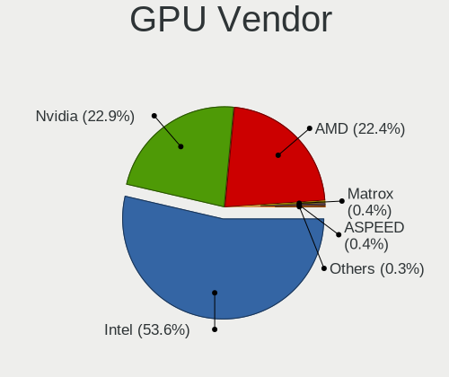

| Vendor                     | Computers | Percent |
|----------------------------|-----------|---------|
| Intel                      | 645       | 53.35%  |
| Nvidia                     | 283       | 23.41%  |
| AMD                        | 271       | 22.42%  |
| Matrox Electronics Systems | 5         | 0.41%   |
| ASPEED Technology          | 4         | 0.33%   |
| VIA Technologies           | 1         | 0.08%   |

GPU Model
---------

Graphics card models

| Model                                                                                    | Computers | Percent |
|------------------------------------------------------------------------------------------|-----------|---------|
| Intel 2nd Generation Core Processor Family Integrated Graphics Controller                | 91        | 7.2%    |
| Intel 3rd Gen Core processor Graphics Controller                                         | 58        | 4.59%   |
| Intel Core Processor Integrated Graphics Controller                                      | 37        | 2.93%   |
| Intel Mobile 4 Series Chipset Integrated Graphics Controller                             | 31        | 2.45%   |
| Intel Atom/Celeron/Pentium Processor x5-E8000/J3xxx/N3xxx Integrated Graphics Controller | 24        | 1.9%    |
| AMD Picasso/Raven 2 [Radeon Vega Series / Radeon Vega Mobile Series]                     | 22        | 1.74%   |
| AMD Cezanne [Radeon Vega Series / Radeon Vega Mobile Series]                             | 22        | 1.74%   |
| Intel Haswell-ULT Integrated Graphics Controller                                         | 20        | 1.58%   |
| AMD Renoir                                                                               | 19        | 1.5%    |
| Intel Xeon E3-1200 v3/4th Gen Core Processor Integrated Graphics Controller              | 18        | 1.42%   |
| Intel UHD Graphics 620                                                                   | 18        | 1.42%   |
| Intel CometLake-U GT2 [UHD Graphics]                                                     | 18        | 1.42%   |
| AMD Ellesmere [Radeon RX 470/480/570/570X/580/580X/590]                                  | 18        | 1.42%   |
| Intel WhiskeyLake-U GT2 [UHD Graphics 620]                                               | 17        | 1.34%   |
| Intel Mobile 945GM/GMS/GME, 943/940GML Express Integrated Graphics Controller            | 17        | 1.34%   |
| Intel HD Graphics 5500                                                                   | 16        | 1.27%   |
| AMD Raven Ridge [Radeon Vega Series / Radeon Vega Mobile Series]                         | 16        | 1.27%   |
| Intel 4th Gen Core Processor Integrated Graphics Controller                              | 15        | 1.19%   |
| Nvidia GK208B [GeForce GT 710]                                                           | 14        | 1.11%   |
| Intel TigerLake-LP GT2 [Iris Xe Graphics]                                                | 14        | 1.11%   |
| Nvidia TU117 [GeForce GTX 1650]                                                          | 13        | 1.03%   |
| Intel Skylake GT2 [HD Graphics 520]                                                      | 13        | 1.03%   |
| Intel HD Graphics 620                                                                    | 13        | 1.03%   |
| Intel CoffeeLake-S GT2 [UHD Graphics 630]                                                | 13        | 1.03%   |
| Intel 4 Series Chipset Integrated Graphics Controller                                    | 13        | 1.03%   |
| Nvidia GP107 [GeForce GTX 1050 Ti]                                                       | 12        | 0.95%   |
| Intel GeminiLake [UHD Graphics 600]                                                      | 12        | 0.95%   |
| Intel CometLake-H GT2 [UHD Graphics]                                                     | 12        | 0.95%   |
| Nvidia GK208B [GeForce GT 730]                                                           | 11        | 0.87%   |
| Intel Xeon E3-1200 v2/3rd Gen Core processor Graphics Controller                         | 11        | 0.87%   |
| Intel Mobile GM965/GL960 Integrated Graphics Controller (secondary)                      | 11        | 0.87%   |
| Intel Mobile GM965/GL960 Integrated Graphics Controller (primary)                        | 11        | 0.87%   |
| Intel Mobile 945GM/GMS, 943/940GML Express Integrated Graphics Controller                | 11        | 0.87%   |
| Intel IvyBridge GT2 [HD Graphics 4000]                                                   | 11        | 0.87%   |
| Intel HD Graphics 530                                                                    | 11        | 0.87%   |
| Intel HD Graphics 630                                                                    | 10        | 0.79%   |
| Intel CoffeeLake-H GT2 [UHD Graphics 630]                                                | 10        | 0.79%   |
| Intel Alder Lake-P Integrated Graphics Controller                                        | 10        | 0.79%   |
| AMD RV710 [Radeon HD 4350/4550]                                                          | 9         | 0.71%   |
| Nvidia TU116 [GeForce GTX 1660 SUPER]                                                    | 8         | 0.63%   |

GPU Combo
---------

Combinations of graphics cards

| Name                     | Computers | Percent |
|--------------------------|-----------|---------|
| 1 x Intel                | 548       | 49.1%   |
| 1 x AMD                  | 232       | 20.79%  |
| 1 x Nvidia               | 196       | 17.56%  |
| Intel + Nvidia           | 62        | 5.56%   |
| Other                    | 17        | 1.52%   |
| Intel + AMD              | 12        | 1.08%   |
| AMD + Nvidia             | 12        | 1.08%   |
| 2 x AMD                  | 11        | 0.99%   |
| 2 x Nvidia               | 6         | 0.54%   |
| 2 x Intel                | 6         | 0.54%   |
| 1 x Matrox               | 3         | 0.27%   |
| Nvidia + ASPEED          | 2         | 0.18%   |
| Intel + 2 x Nvidia       | 2         | 0.18%   |
| 1 x ASPEED               | 2         | 0.18%   |
| AMD + Matrox             | 2         | 0.18%   |
| 1 x VIA                  | 1         | 0.09%   |
| Intel + 2 x AMD          | 1         | 0.09%   |
| Intel + AMD + 1 x Nvidia | 1         | 0.09%   |

GPU Driver
----------

Free vs proprietary

| Driver      | Computers | Percent |
|-------------|-----------|---------|
| Free        | 929       | 82.72%  |
| Proprietary | 149       | 13.27%  |
| Unknown     | 45        | 4.01%   |

GPU Memory
----------

Total video memory

| Size in GB | Computers | Percent |
|------------|-----------|---------|
| Unknown    | 660       | 57.89%  |
| 0.01-0.5   | 140       | 12.28%  |
| 1.01-2.0   | 116       | 10.18%  |
| 0.51-1.0   | 85        | 7.46%   |
| 3.01-4.0   | 59        | 5.18%   |
| 7.01-8.0   | 37        | 3.25%   |
| 5.01-6.0   | 23        | 2.02%   |
| 8.01-16.0  | 12        | 1.05%   |
| 16.01-24.0 | 5         | 0.44%   |
| 2.01-3.0   | 2         | 0.18%   |
| 24.01-32.0 | 1         | 0.09%   |

Monitor
-------

Monitor Vendor
--------------

Monitor vendors

| Vendor                  | Computers | Percent |
|-------------------------|-----------|---------|
| LG Display              | 127       | 11.42%  |
| AU Optronics            | 82        | 7.37%   |
| Samsung Electronics     | 68        | 6.12%   |
| Dell                    | 65        | 5.85%   |
| Goldstar                | 57        | 5.13%   |
| Chimei Innolux          | 50        | 4.5%    |
| IOD                     | 49        | 4.41%   |
| Sharp                   | 47        | 4.23%   |
| BOE                     | 42        | 3.78%   |
| BenQ                    | 38        | 3.42%   |
| Mitsubishi              | 34        | 3.06%   |
| Iiyama                  | 34        | 3.06%   |
| Acer                    | 32        | 2.88%   |
| Hewlett-Packard         | 29        | 2.61%   |
| Philips                 | 25        | 2.25%   |
| Lenovo                  | 25        | 2.25%   |
| Eizo                    | 25        | 2.25%   |
| Apple                   | 23        | 2.07%   |
| Chi Mei Optoelectronics | 18        | 1.62%   |
| Ancor Communications    | 18        | 1.62%   |
| Unknown                 | 16        | 1.44%   |
| AOC                     | 15        | 1.35%   |
| Panasonic               | 14        | 1.26%   |
| Sony                    | 12        | 1.08%   |
| NEC Computers           | 11        | 0.99%   |
| ASUSTek Computer        | 11        | 0.99%   |
| Toshiba                 | 9         | 0.81%   |
| PANDA                   | 8         | 0.72%   |
| ViewSonic               | 7         | 0.63%   |
| LG Electronics          | 7         | 0.63%   |
| Idek Iiyama             | 7         | 0.63%   |
| Fujitsu                 | 6         | 0.54%   |
| InfoVision              | 5         | 0.45%   |
| Hitachi                 | 5         | 0.45%   |
| Onkyo                   | 4         | 0.36%   |
| NOV                     | 4         | 0.36%   |
| LG Philips              | 4         | 0.36%   |
| CSO                     | 4         | 0.36%   |
| Unknown                 | 4         | 0.36%   |
| Valve                   | 3         | 0.27%   |

Monitor Model
-------------

Monitor models

| Model                                                                    | Computers | Percent |
|--------------------------------------------------------------------------|-----------|---------|
| LG Display LCD Monitor LGD039F 1366x768 345x194mm 15.6-inch              | 24        | 2.07%   |
| LG Display LCD Monitor LGD02DC 1366x768 344x194mm 15.5-inch              | 6         | 0.52%   |
| AU Optronics LCD Monitor AUO106C 1366x768 277x156mm 12.5-inch            | 6         | 0.52%   |
| Iiyama PL2290 IVM562C 1920x1080 476x268mm 21.5-inch                      | 5         | 0.43%   |
| Chi Mei Optoelectronics LCD Monitor CMO15A7 1366x768 344x193mm 15.5-inch | 5         | 0.43%   |
| AOC 28E850 AOC0CCD 2560x1440 480x270mm 21.7-inch                         | 5         | 0.43%   |
| Samsung Electronics LCD Monitor SEC5441 1366x768 344x194mm 15.5-inch     | 4         | 0.35%   |
| NOV NOVA HD CARD NOV0405 1920x1080 459x296mm 21.5-inch                   | 4         | 0.35%   |
| NEC Computers EA243WM NEC6864 1920x1200 519x324mm 24.1-inch              | 4         | 0.35%   |
| LG Display LCD Monitor LGD02D8 1366x768 277x156mm 12.5-inch              | 4         | 0.35%   |
| LG Display LCD Monitor LGD02CB 1366x768 344x194mm 15.5-inch              | 4         | 0.35%   |
| Lenovo LCD Monitor LEN40B0 1366x768 345x194mm 15.6-inch                  | 4         | 0.35%   |
| Goldstar Ultra HD GSM5B09 3840x2160 600x340mm 27.2-inch                  | 4         | 0.35%   |
| Goldstar Ultra HD GSM5B08 3840x2160 600x340mm 27.2-inch                  | 4         | 0.35%   |
| Goldstar HDR 4K GSM7706 3840x2160 600x340mm 27.2-inch                    | 4         | 0.35%   |
| AU Optronics LCD Monitor AUO38ED 1920x1080 344x193mm 15.5-inch           | 4         | 0.35%   |
| AU Optronics LCD Monitor AUO22EC 1366x768 344x193mm 15.5-inch            | 4         | 0.35%   |
| ASUSTek Computer VZ239 AUS23CC 1920x1080 509x286mm 23.0-inch             | 4         | 0.35%   |
| Acer KA270H ACR0522 1920x1080 598x336mm 27.0-inch                        | 4         | 0.35%   |
| Unknown                                                                  | 4         | 0.35%   |
| ViewSonic VX3276-QHD VSCE635 2560x1440 698x393mm 31.5-inch               | 3         | 0.26%   |
| Valve ANX7530 U VLV3001 800x1280 100x150mm 7.1-inch                      | 3         | 0.26%   |
| Toshiba TV TSB020A 1920x1080                                             | 3         | 0.26%   |
| Sharp HDMI SHP0FDB 1360x768 820x460mm 37.0-inch                          | 3         | 0.26%   |
| Panasonic VVY13F001G10 MEI96A2 1920x1080 344x193mm 15.5-inch             | 3         | 0.26%   |
| Panasonic TV MEIA296 1280x1024 698x392mm 31.5-inch                       | 3         | 0.26%   |
| Mitsubishi RDT1714VM MEL4764 1280x1024 338x270mm 17.0-inch               | 3         | 0.26%   |
| Mitsubishi MDT241WG MEL478E 1920x1200 520x320mm 24.0-inch                | 3         | 0.26%   |
| LG Display LCD Monitor LGD033B 1366x768 344x194mm 15.5-inch              | 3         | 0.26%   |
| LG Display LCD Monitor LGD033A 1366x768 344x194mm 15.5-inch              | 3         | 0.26%   |
| IOD EX-LD2071T IOD150D 1920x1080 458x258mm 20.7-inch                     | 3         | 0.26%   |
| Iiyama PL3291 IVM7605 1920x1080 698x393mm 31.5-inch                      | 3         | 0.26%   |
| Iiyama PL2390 IVM562D 1920x1080 509x286mm 23.0-inch                      | 3         | 0.26%   |
| Iiyama PL2283H IVM562E 1920x1080 496x292mm 22.7-inch                     | 3         | 0.26%   |
| Goldstar HDR WFHD GSM7714 2560x1080 798x334mm 34.1-inch                  | 3         | 0.26%   |
| Goldstar 32inch FHD GSM76F5 1920x1080 698x392mm 31.5-inch                | 3         | 0.26%   |
| Fujitsu VL-200SSWL FUJ4911 1600x900 442x249mm 20.0-inch                  | 3         | 0.26%   |
| Dell U3219Q DELA120 3840x2160 697x392mm 31.5-inch                        | 3         | 0.26%   |
| Dell U2410 DELF016 1920x1200 518x324mm 24.1-inch                         | 3         | 0.26%   |
| Dell S2421HS DEL41F4 1920x1080 527x296mm 23.8-inch                       | 3         | 0.26%   |

Monitor Resolution
------------------

Monitor screen resolution

| Resolution         | Computers | Percent |
|--------------------|-----------|---------|
| 1920x1080 (FHD)    | 440       | 40%     |
| 1366x768 (WXGA)    | 194       | 17.64%  |
| 3840x2160 (4K)     | 85        | 7.73%   |
| 1280x1024 (SXGA)   | 54        | 4.91%   |
| 2560x1440 (QHD)    | 45        | 4.09%   |
| 1920x1200 (WUXGA)  | 43        | 3.91%   |
| 1280x800 (WXGA)    | 30        | 2.73%   |
| 1600x900 (HD+)     | 20        | 1.82%   |
| 1440x900 (WXGA+)   | 20        | 1.82%   |
| 1680x1050 (WSXGA+) | 19        | 1.73%   |
| Unknown            | 17        | 1.55%   |
| 1920x540           | 14        | 1.27%   |
| 2560x1600          | 9         | 0.82%   |
| 2560x1080          | 9         | 0.82%   |
| 1360x768           | 9         | 0.82%   |
| 1600x1200          | 8         | 0.73%   |
| 1024x768 (XGA)     | 8         | 0.73%   |
| 3440x1440          | 6         | 0.55%   |
| 2880x1800          | 6         | 0.55%   |
| 2160x1440          | 5         | 0.45%   |
| 1400x1050          | 5         | 0.45%   |
| 3840x1080          | 4         | 0.36%   |
| 800x1280           | 3         | 0.27%   |
| 3840x2400          | 3         | 0.27%   |
| 3200x1800 (QHD+)   | 3         | 0.27%   |
| 3072x1920          | 3         | 0.27%   |
| 1280x720 (HD)      | 3         | 0.27%   |
| 1024x600           | 3         | 0.27%   |
| 3520x1080          | 2         | 0.18%   |
| 3200x1200          | 2         | 0.18%   |
| 2880x1920          | 2         | 0.18%   |
| 1360x765           | 2         | 0.18%   |
| 1280x960           | 2         | 0.18%   |
| 1024x576           | 2         | 0.18%   |
| 800x480            | 1         | 0.09%   |
| 7680x2160          | 1         | 0.09%   |
| 7360x1200          | 1         | 0.09%   |
| 640x480            | 1         | 0.09%   |
| 5760x1200          | 1         | 0.09%   |
| 5440x1200          | 1         | 0.09%   |

Monitor Diagonal
----------------

Diagonal size in inches

| Inches  | Computers | Percent |
|---------|-----------|---------|
| 15      | 220       | 19.87%  |
| 13      | 109       | 9.85%   |
| 27      | 92        | 8.31%   |
| 23      | 88        | 7.95%   |
| 21      | 86        | 7.77%   |
| 24      | 83        | 7.5%    |
| Unknown | 78        | 7.05%   |
| 14      | 54        | 4.88%   |
| 17      | 52        | 4.7%    |
| 19      | 36        | 3.25%   |
| 12      | 34        | 3.07%   |
| 31      | 30        | 2.71%   |
| 20      | 21        | 1.9%    |
| 11      | 17        | 1.54%   |
| 34      | 12        | 1.08%   |
| 10      | 11        | 0.99%   |
| 72      | 10        | 0.9%    |
| 18      | 10        | 0.9%    |
| 22      | 9         | 0.81%   |
| 37      | 8         | 0.72%   |
| 16      | 6         | 0.54%   |
| 54      | 5         | 0.45%   |
| 84      | 4         | 0.36%   |
| 42      | 4         | 0.36%   |
| 32      | 4         | 0.36%   |
| 40      | 3         | 0.27%   |
| 7       | 3         | 0.27%   |
| 43      | 2         | 0.18%   |
| 30      | 2         | 0.18%   |
| 26      | 2         | 0.18%   |
| 25      | 2         | 0.18%   |
| 74      | 1         | 0.09%   |
| 64      | 1         | 0.09%   |
| 52      | 1         | 0.09%   |
| 49      | 1         | 0.09%   |
| 48      | 1         | 0.09%   |
| 46      | 1         | 0.09%   |
| 39      | 1         | 0.09%   |
| 38      | 1         | 0.09%   |
| 35      | 1         | 0.09%   |

Monitor Width
-------------

Physical width

| Width in mm | Computers | Percent |
|-------------|-----------|---------|
| 301-350     | 316       | 28.81%  |
| 501-600     | 251       | 22.88%  |
| 201-300     | 148       | 13.49%  |
| 401-500     | 135       | 12.31%  |
| Unknown     | 78        | 7.11%   |
| 351-400     | 63        | 5.74%   |
| 601-700     | 42        | 3.83%   |
| 801-900     | 15        | 1.37%   |
| 701-800     | 15        | 1.37%   |
| 1501-2000   | 15        | 1.37%   |
| 1001-1500   | 10        | 0.91%   |
| 901-1000    | 6         | 0.55%   |
| 1-100       | 3         | 0.27%   |

Aspect Ratio
------------

Proportional relationship between the width and the height

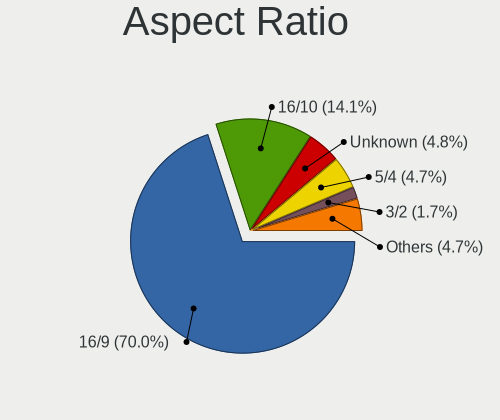

| Ratio   | Computers | Percent |
|---------|-----------|---------|
| 16/9    | 735       | 70.81%  |
| 16/10   | 133       | 12.81%  |
| Unknown | 63        | 6.07%   |
| 5/4     | 48        | 4.62%   |
| 4/3     | 19        | 1.83%   |
| 21/9    | 14        | 1.35%   |
| 3/2     | 13        | 1.25%   |
| 32/9    | 6         | 0.58%   |
| 0.67    | 3         | 0.29%   |
| 1.00    | 2         | 0.19%   |
| 6/5     | 1         | 0.1%    |
| 1.96    | 1         | 0.1%    |

Monitor Area
------------

Area in inch

| Area in inch | Computers | Percent |
|----------------|-----------|---------|
| 101-110        | 222       | 20.11%  |
| 201-250        | 191       | 17.3%   |
| 151-200        | 98        | 8.88%   |
| 301-350        | 92        | 8.33%   |
| 81-90          | 86        | 7.79%   |
| Unknown        | 78        | 7.07%   |
| 71-80          | 74        | 6.7%    |
| 351-500        | 49        | 4.44%   |
| 251-300        | 40        | 3.62%   |
| 141-150        | 34        | 3.08%   |
| 61-70          | 33        | 2.99%   |
| More than 1000 | 23        | 2.08%   |
| 121-130        | 21        | 1.9%    |
| 501-1000       | 20        | 1.81%   |
| 51-60          | 17        | 1.54%   |
| 41-50          | 11        | 1%      |
| 131-140        | 4         | 0.36%   |
| 111-120        | 4         | 0.36%   |
| 91-100         | 4         | 0.36%   |
| 1-40           | 3         | 0.27%   |

Pixel Density
-------------

Pixels per inch

| Density       | Computers | Percent |
|---------------|-----------|---------|
| 51-100        | 411       | 38.06%  |
| 101-120       | 253       | 23.43%  |
| 121-160       | 188       | 17.41%  |
| 161-240       | 104       | 9.63%   |
| Unknown       | 78        | 7.22%   |
| More than 240 | 25        | 2.31%   |
| 1-50          | 21        | 1.94%   |

Multiple Monitors
-----------------

Total monitors connected

| Total | Computers | Percent |
|-------|-----------|---------|
| 1     | 949       | 84.21%  |
| 2     | 121       | 10.74%  |
| 0     | 45        | 3.99%   |
| 3     | 9         | 0.8%    |
| 4     | 2         | 0.18%   |
| 6     | 1         | 0.09%   |

Network
-------

Net Controller Vendor
---------------------

Controller vendors

| Vendor                                 | Computers | Percent |
|----------------------------------------|-----------|---------|
| Intel                                  | 541       | 33.67%  |
| Realtek Semiconductor                  | 524       | 32.61%  |
| Qualcomm Atheros                       | 200       | 12.45%  |
| Broadcom                               | 106       | 6.6%    |
| Marvell Technology Group               | 34        | 2.12%   |
| BUFFALO                                | 22        | 1.37%   |
| Broadcom Limited                       | 22        | 1.37%   |
| TP-Link                                | 18        | 1.12%   |
| MediaTek                               | 17        | 1.06%   |
| PLANEX                                 | 15        | 0.93%   |
| ASIX Electronics                       | 15        | 0.93%   |
| Nvidia                                 | 10        | 0.62%   |
| Ralink                                 | 7         | 0.44%   |
| Huawei Technologies                    | 7         | 0.44%   |
| Elecom                                 | 7         | 0.44%   |
| Aquantia                               | 6         | 0.37%   |
| VIA Technologies                       | 4         | 0.25%   |
| Ralink Technology                      | 4         | 0.25%   |
| Logitec                                | 3         | 0.19%   |
| Lenovo                                 | 3         | 0.19%   |
| Apple                                  | 3         | 0.19%   |
| U-Blox                                 | 2         | 0.12%   |
| Sierra Wireless                        | 2         | 0.12%   |
| Samsung Electronics                    | 2         | 0.12%   |
| Qualcomm Atheros Communications        | 2         | 0.12%   |
| Prolific Technology                    | 2         | 0.12%   |
| NEC Computers                          | 2         | 0.12%   |
| JMicron Technology                     | 2         | 0.12%   |
| Gemtek                                 | 2         | 0.12%   |
| D-Link                                 | 2         | 0.12%   |
| Xiaomi                                 | 1         | 0.06%   |
| Wilocity                               | 1         | 0.06%   |
| Wacom                                  | 1         | 0.06%   |
| ULi Electronics                        | 1         | 0.06%   |
| Sony Ericsson Mobile Communications AB | 1         | 0.06%   |
| Silicon Integrated Systems [SiS]       | 1         | 0.06%   |
| Padix (Rockfire)                       | 1         | 0.06%   |
| OPPO Electronics                       | 1         | 0.06%   |
| NetGear                                | 1         | 0.06%   |
| Netchip Technology                     | 1         | 0.06%   |

Net Controller Model
--------------------

Controller models

| Model                                                                   | Computers | Percent |
|-------------------------------------------------------------------------|-----------|---------|
| Realtek RTL8111/8168/8411 PCI Express Gigabit Ethernet Controller       | 364       | 19.1%   |
| Intel Wi-Fi 6 AX200                                                     | 42        | 2.2%    |
| Intel 82579LM Gigabit Network Connection (Lewisville)                   | 40        | 2.1%    |
| Realtek RTL8125 2.5GbE Controller                                       | 32        | 1.68%   |
| Qualcomm Atheros QCA9565 / AR9565 Wireless Network Adapter              | 32        | 1.68%   |
| Intel Ethernet Connection (2) I219-V                                    | 32        | 1.68%   |
| Intel 82579V Gigabit Network Connection                                 | 31        | 1.63%   |
| Realtek RTL810xE PCI Express Fast Ethernet controller                   | 30        | 1.57%   |
| Intel I211 Gigabit Network Connection                                   | 29        | 1.52%   |
| Qualcomm Atheros AR8162 Fast Ethernet                                   | 26        | 1.36%   |
| Realtek RTL8153 Gigabit Ethernet Adapter                                | 24        | 1.26%   |
| Intel Wireless 7265                                                     | 22        | 1.15%   |
| Intel Wireless 8265 / 8275                                              | 21        | 1.1%    |
| Intel Wireless 7260                                                     | 19        | 1%      |
| Intel Ethernet Connection (7) I219-V                                    | 19        | 1%      |
| Intel Comet Lake PCH-LP CNVi WiFi                                       | 18        | 0.94%   |
| Intel Wireless 3165                                                     | 17        | 0.89%   |
| Intel Centrino Advanced-N 6205 [Taylor Peak]                            | 17        | 0.89%   |
| Realtek RTL88x2bu [AC1200 Techkey]                                      | 16        | 0.84%   |
| Realtek RTL8822CE 802.11ac PCIe Wireless Network Adapter                | 16        | 0.84%   |
| Qualcomm Atheros QCA9377 802.11ac Wireless Network Adapter              | 16        | 0.84%   |
| Qualcomm Atheros AR928X Wireless Network Adapter (PCI-Express)          | 16        | 0.84%   |
| Qualcomm Atheros AR9285 Wireless Network Adapter (PCI-Express)          | 16        | 0.84%   |
| Qualcomm Atheros AR9462 Wireless Network Adapter                        | 15        | 0.79%   |
| Qualcomm Atheros AR242x / AR542x Wireless Network Adapter (PCI-Express) | 14        | 0.73%   |
| Intel Wi-Fi 6 AX201                                                     | 14        | 0.73%   |
| Intel Ethernet Connection I217-V                                        | 14        | 0.73%   |
| Intel Dual Band Wireless-AC 3168NGW [Stone Peak]                        | 14        | 0.73%   |
| Qualcomm Atheros QCA6174 802.11ac Wireless Network Adapter              | 13        | 0.68%   |
| Intel Ethernet Connection (10) I219-V                                   | 13        | 0.68%   |
| Intel Comet Lake PCH CNVi WiFi                                          | 13        | 0.68%   |
| ASIX AX88179 Gigabit Ethernet                                           | 13        | 0.68%   |
| Realtek RTL8821CE 802.11ac PCIe Wireless Network Adapter                | 12        | 0.63%   |
| Intel Wireless 3160                                                     | 12        | 0.63%   |
| Intel Wi-Fi 6 AX210/AX211/AX411 160MHz                                  | 12        | 0.63%   |
| Intel Wireless 8260                                                     | 11        | 0.58%   |
| Intel Ethernet Connection I217-LM                                       | 11        | 0.58%   |
| TP-Link AC600 wireless Realtek RTL8811AU [Archer T2U Nano]              | 10        | 0.52%   |
| Qualcomm Atheros AR9485 Wireless Network Adapter                        | 10        | 0.52%   |
| Qualcomm Atheros AR93xx Wireless Network Adapter                        | 10        | 0.52%   |

Wireless Vendor
---------------

Wireless vendors

| Vendor                          | Computers | Percent |
|---------------------------------|-----------|---------|
| Intel                           | 347       | 43.48%  |
| Qualcomm Atheros                | 153       | 19.17%  |
| Realtek Semiconductor           | 117       | 14.66%  |
| Broadcom                        | 58        | 7.27%   |
| BUFFALO                         | 22        | 2.76%   |
| TP-Link                         | 18        | 2.26%   |
| MediaTek                        | 17        | 2.13%   |
| PLANEX                          | 15        | 1.88%   |
| Broadcom Limited                | 14        | 1.75%   |
| Ralink                          | 7         | 0.88%   |
| Elecom                          | 6         | 0.75%   |
| Ralink Technology               | 4         | 0.5%    |
| Marvell Technology Group        | 3         | 0.38%   |
| Logitec                         | 3         | 0.38%   |
| Sierra Wireless                 | 2         | 0.25%   |
| Qualcomm Atheros Communications | 2         | 0.25%   |
| D-Link                          | 2         | 0.25%   |
| Wilocity                        | 1         | 0.13%   |
| Wacom                           | 1         | 0.13%   |
| NetGear                         | 1         | 0.13%   |
| NEC Computers                   | 1         | 0.13%   |
| I-O Data Device                 | 1         | 0.13%   |
| Edimax Technology               | 1         | 0.13%   |
| Dell                            | 1         | 0.13%   |
| ASUSTek Computer                | 1         | 0.13%   |

Wireless Model
--------------

Wireless models

| Model                                                                   | Computers | Percent |
|-------------------------------------------------------------------------|-----------|---------|
| Intel Wi-Fi 6 AX200                                                     | 42        | 5.23%   |
| Qualcomm Atheros QCA9565 / AR9565 Wireless Network Adapter              | 32        | 3.99%   |
| Intel Wireless 7265                                                     | 22        | 2.74%   |
| Intel Wireless 8265 / 8275                                              | 21        | 2.62%   |
| Intel Wireless 7260                                                     | 19        | 2.37%   |
| Intel Comet Lake PCH-LP CNVi WiFi                                       | 18        | 2.24%   |
| Intel Wireless 3165                                                     | 17        | 2.12%   |
| Intel Centrino Advanced-N 6205 [Taylor Peak]                            | 17        | 2.12%   |
| Realtek RTL88x2bu [AC1200 Techkey]                                      | 16        | 1.99%   |
| Realtek RTL8822CE 802.11ac PCIe Wireless Network Adapter                | 16        | 1.99%   |
| Qualcomm Atheros QCA9377 802.11ac Wireless Network Adapter              | 16        | 1.99%   |
| Qualcomm Atheros AR928X Wireless Network Adapter (PCI-Express)          | 16        | 1.99%   |
| Qualcomm Atheros AR9285 Wireless Network Adapter (PCI-Express)          | 16        | 1.99%   |
| Qualcomm Atheros AR9462 Wireless Network Adapter                        | 15        | 1.87%   |
| Qualcomm Atheros AR242x / AR542x Wireless Network Adapter (PCI-Express) | 14        | 1.74%   |
| Intel Wi-Fi 6 AX201                                                     | 14        | 1.74%   |
| Intel Dual Band Wireless-AC 3168NGW [Stone Peak]                        | 14        | 1.74%   |
| Qualcomm Atheros QCA6174 802.11ac Wireless Network Adapter              | 13        | 1.62%   |
| Intel Comet Lake PCH CNVi WiFi                                          | 13        | 1.62%   |
| Realtek RTL8821CE 802.11ac PCIe Wireless Network Adapter                | 12        | 1.49%   |
| Intel Wireless 3160                                                     | 12        | 1.49%   |
| Intel Wi-Fi 6 AX210/AX211/AX411 160MHz                                  | 12        | 1.49%   |
| Intel Wireless 8260                                                     | 11        | 1.37%   |
| TP-Link AC600 wireless Realtek RTL8811AU [Archer T2U Nano]              | 10        | 1.25%   |
| Qualcomm Atheros AR9485 Wireless Network Adapter                        | 10        | 1.25%   |
| Qualcomm Atheros AR93xx Wireless Network Adapter                        | 10        | 1.25%   |
| Intel Centrino Advanced-N + WiMAX 6250 [Kilmer Peak]                    | 10        | 1.25%   |
| Intel Cannon Point-LP CNVi [Wireless-AC]                                | 10        | 1.25%   |
| Realtek RTL8191SEvB Wireless LAN Controller                             | 9         | 1.12%   |
| Realtek RTL8188EUS 802.11n Wireless Network Adapter                     | 9         | 1.12%   |
| Intel Wireless-AC 9260                                                  | 9         | 1.12%   |
| Intel Cannon Lake PCH CNVi WiFi                                         | 9         | 1.12%   |
| Broadcom BCM4313 802.11bgn Wireless Network Adapter                     | 9         | 1.12%   |
| Realtek RTL8188CE 802.11b/g/n WiFi Adapter                              | 8         | 1%      |
| Intel Centrino Wireless-N 1000 [Condor Peak]                            | 8         | 1%      |
| Intel Alder Lake-P PCH CNVi WiFi                                        | 8         | 1%      |
| Qualcomm Atheros AR9287 Wireless Network Adapter (PCI-Express)          | 7         | 0.87%   |
| MediaTek MT7921K (RZ608) Wi-Fi 6E 80MHz                                 | 7         | 0.87%   |
| Intel WiFi Link 5100                                                    | 7         | 0.87%   |
| BUFFALO 802.11ac WLAN Adapter                                           | 7         | 0.87%   |

Ethernet Vendor
---------------

Ethernet vendors

| Vendor                           | Computers | Percent |
|----------------------------------|-----------|---------|
| Realtek Semiconductor            | 464       | 44.19%  |
| Intel                            | 338       | 32.19%  |
| Qualcomm Atheros                 | 83        | 7.9%    |
| Broadcom                         | 63        | 6%      |
| Marvell Technology Group         | 31        | 2.95%   |
| ASIX Electronics                 | 15        | 1.43%   |
| Nvidia                           | 10        | 0.95%   |
| Broadcom Limited                 | 8         | 0.76%   |
| Huawei Technologies              | 7         | 0.67%   |
| Aquantia                         | 6         | 0.57%   |
| VIA Technologies                 | 4         | 0.38%   |
| Lenovo                           | 3         | 0.29%   |
| Apple                            | 3         | 0.29%   |
| JMicron Technology               | 2         | 0.19%   |
| Gemtek                           | 2         | 0.19%   |
| Xiaomi                           | 1         | 0.1%    |
| Silicon Integrated Systems [SiS] | 1         | 0.1%    |
| Samsung Electronics              | 1         | 0.1%    |
| OPPO Electronics                 | 1         | 0.1%    |
| Netchip Technology               | 1         | 0.1%    |
| Google                           | 1         | 0.1%    |
| Elecom                           | 1         | 0.1%    |
| DisplayLink                      | 1         | 0.1%    |
| Corega K.K.                      | 1         | 0.1%    |
| ADMtek                           | 1         | 0.1%    |
| 3Com                             | 1         | 0.1%    |

Ethernet Model
--------------

Ethernet models

| Model                                                             | Computers | Percent |
|-------------------------------------------------------------------|-----------|---------|
| Realtek RTL8111/8168/8411 PCI Express Gigabit Ethernet Controller | 364       | 33.49%  |
| Intel 82579LM Gigabit Network Connection (Lewisville)             | 40        | 3.68%   |
| Realtek RTL8125 2.5GbE Controller                                 | 32        | 2.94%   |
| Intel Ethernet Connection (2) I219-V                              | 32        | 2.94%   |
| Intel 82579V Gigabit Network Connection                           | 31        | 2.85%   |
| Realtek RTL810xE PCI Express Fast Ethernet controller             | 30        | 2.76%   |
| Intel I211 Gigabit Network Connection                             | 29        | 2.67%   |
| Qualcomm Atheros AR8162 Fast Ethernet                             | 26        | 2.39%   |
| Realtek RTL8153 Gigabit Ethernet Adapter                          | 24        | 2.21%   |
| Intel Ethernet Connection (7) I219-V                              | 19        | 1.75%   |
| Intel Ethernet Connection I217-V                                  | 14        | 1.29%   |
| Intel Ethernet Connection (10) I219-V                             | 13        | 1.2%    |
| ASIX AX88179 Gigabit Ethernet                                     | 13        | 1.2%    |
| Intel Ethernet Connection I217-LM                                 | 11        | 1.01%   |
| Intel 82574L Gigabit Network Connection                           | 10        | 0.92%   |
| Qualcomm Atheros Killer E220x Gigabit Ethernet Controller         | 9         | 0.83%   |
| Realtek RTL-8100/8101L/8139 PCI Fast Ethernet Adapter             | 8         | 0.74%   |
| Qualcomm Atheros AR8151 v2.0 Gigabit Ethernet                     | 8         | 0.74%   |
| Intel I210 Gigabit Network Connection                             | 8         | 0.74%   |
| Intel Ethernet Controller I225-V                                  | 8         | 0.74%   |
| Qualcomm Atheros AR8161 Gigabit Ethernet                          | 7         | 0.64%   |
| Intel WiMAX Connection 2400m                                      | 7         | 0.64%   |
| Intel Ethernet Connection (3) I218-LM                             | 7         | 0.64%   |
| Huawei E353/E3131                                                 | 7         | 0.64%   |
| Broadcom NetXtreme BCM57765 Gigabit Ethernet PCIe                 | 7         | 0.64%   |
| Broadcom NetLink BCM5784M Gigabit Ethernet PCIe                   | 7         | 0.64%   |
| Qualcomm Atheros AR8152 v2.0 Fast Ethernet                        | 6         | 0.55%   |
| Qualcomm Atheros AR8121/AR8113/AR8114 Gigabit or Fast Ethernet    | 6         | 0.55%   |
| Marvell Group 88E8055 PCI-E Gigabit Ethernet Controller           | 6         | 0.55%   |
| Intel Ethernet Connection (6) I219-V                              | 6         | 0.55%   |
| Intel Ethernet Connection (4) I219-V                              | 6         | 0.55%   |
| Intel Ethernet Connection (2) I219-LM                             | 6         | 0.55%   |
| Intel Ethernet Connection (2) I218-V                              | 6         | 0.55%   |
| Intel 82577LC Gigabit Network Connection                          | 6         | 0.55%   |
| Intel 82567V-2 Gigabit Network Connection                         | 6         | 0.55%   |
| Broadcom NetLink BCM57785 Gigabit Ethernet PCIe                   | 6         | 0.55%   |
| Broadcom NetLink BCM57781 Gigabit Ethernet PCIe                   | 6         | 0.55%   |
| Broadcom NetLink BCM57780 Gigabit Ethernet PCIe                   | 6         | 0.55%   |
| Nvidia MCP79 Ethernet                                             | 5         | 0.46%   |
| Marvell Group 88E8056 PCI-E Gigabit Ethernet Controller           | 5         | 0.46%   |

Net Controller Kind
-------------------

Ethernet, WiFi or modem

| Kind     | Computers | Percent |
|----------|-----------|---------|
| Ethernet | 975       | 55.81%  |
| WiFi     | 756       | 43.27%  |
| Modem    | 11        | 0.63%   |
| Unknown  | 5         | 0.29%   |

Used Controller
---------------

Currently used network controller

| Kind     | Computers | Percent |
|----------|-----------|---------|
| Ethernet | 615       | 53.62%  |
| WiFi     | 532       | 46.38%  |

NICs
----

Total network controllers on board

| Total | Computers | Percent |
|-------|-----------|---------|
| 2     | 558       | 50.18%  |
| 1     | 494       | 44.42%  |
| 3     | 29        | 2.61%   |
| 0     | 26        | 2.34%   |
| 4     | 3         | 0.27%   |
| 7     | 1         | 0.09%   |
| 6     | 1         | 0.09%   |

IPv6
----

IPv6 vs IPv4

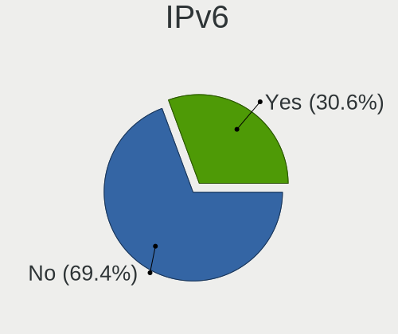

| Used | Computers | Percent |
|------|-----------|---------|
| No   | 873       | 76.58%  |
| Yes  | 267       | 23.42%  |

Bluetooth
---------

Bluetooth Vendor
----------------

Controller vendors

| Vendor                          | Computers | Percent |
|---------------------------------|-----------|---------|
| Intel                           | 258       | 46.07%  |
| Cambridge Silicon Radio         | 79        | 14.11%  |
| Realtek Semiconductor           | 38        | 6.79%   |
| Qualcomm Atheros Communications | 31        | 5.54%   |
| Broadcom                        | 29        | 5.18%   |
| IMC Networks                    | 27        | 4.82%   |
| Apple                           | 21        | 3.75%   |
| Foxconn / Hon Hai               | 10        | 1.79%   |
| ASUSTek Computer                | 9         | 1.61%   |
| Alps Electric                   | 9         | 1.61%   |
| Realtek                         | 7         | 1.25%   |
| MediaTek                        | 7         | 1.25%   |
| Fujitsu                         | 7         | 1.25%   |
| TP-Link                         | 5         | 0.89%   |
| Lite-On Technology              | 5         | 0.89%   |
| Marvell Semiconductor           | 4         | 0.71%   |
| Toshiba                         | 3         | 0.54%   |
| Ralink                          | 2         | 0.36%   |
| Hewlett-Packard                 | 2         | 0.36%   |
| Ralink Technology               | 1         | 0.18%   |
| Opticis                         | 1         | 0.18%   |
| Dell                            | 1         | 0.18%   |
| Creative Technology             | 1         | 0.18%   |
| BUFFALO                         | 1         | 0.18%   |
| Askey Computer                  | 1         | 0.18%   |
| Actions                         | 1         | 0.18%   |

Bluetooth Model
---------------

Controller models

| Model                                                                               | Computers | Percent |
|-------------------------------------------------------------------------------------|-----------|---------|
| Intel Bluetooth wireless interface                                                  | 98        | 17.5%   |
| Cambridge Silicon Radio Bluetooth Dongle (HCI mode)                                 | 79        | 14.11%  |
| Intel AX201 Bluetooth                                                               | 45        | 8.04%   |
| Intel AX200 Bluetooth                                                               | 39        | 6.96%   |
| Realtek Bluetooth Radio                                                             | 28        | 5%      |
| Intel Bluetooth 9460/9560 Jefferson Peak (JfP)                                      | 24        | 4.29%   |
| Qualcomm Atheros  Bluetooth Device                                                  | 20        | 3.57%   |
| Intel Wireless-AC 3168 Bluetooth                                                    | 14        | 2.5%    |
| Apple Bluetooth Host Controller                                                     | 13        | 2.32%   |
| Intel AX210 Bluetooth                                                               | 12        | 2.14%   |
| Intel Bluetooth Device                                                              | 11        | 1.96%   |
| IMC Networks Bluetooth Radio                                                        | 10        | 1.79%   |
| IMC Networks Bluetooth Device                                                       | 10        | 1.79%   |
| Intel Wireless-AC 9260 Bluetooth Adapter                                            | 9         | 1.61%   |
| MediaTek Wireless_Device                                                            | 7         | 1.25%   |
| Broadcom BCM20702 Bluetooth 4.0 [ThinkPad]                                          | 7         | 1.25%   |
| Realtek  Bluetooth 4.2 Adapter                                                      | 6         | 1.07%   |
| IMC Networks Wireless_Device                                                        | 6         | 1.07%   |
| Fujitsu Bluetooth Device                                                            | 6         | 1.07%   |
| Apple Bluetooth USB Host Controller                                                 | 6         | 1.07%   |
| TP-Link UB500 Adapter                                                               | 5         | 0.89%   |
| Realtek 802.11ac WLAN Adapter                                                       | 5         | 0.89%   |
| Intel Centrino Bluetooth Wireless Transceiver                                       | 5         | 0.89%   |
| Alps Electric BCM2046 Bluetooth Device                                              | 5         | 0.89%   |
| Qualcomm Atheros AR9462 Bluetooth                                                   | 4         | 0.71%   |
| Broadcom BCM2045B (BDC-2.1)                                                         | 4         | 0.71%   |
| Toshiba Atheros AR3012 Bluetooth                                                    | 3         | 0.54%   |
| Qualcomm Atheros AR3012 Bluetooth 4.0                                               | 3         | 0.54%   |
| Qualcomm Atheros AR3011 Bluetooth                                                   | 3         | 0.54%   |
| Broadcom BCM2045B (BDC-2.1) [Bluetooth Controller]                                  | 3         | 0.54%   |
| Broadcom BCM2045B (BDC-2) [Bluetooth Controller]                                    | 3         | 0.54%   |
| ASUS Broadcom Bluetooth 2.1                                                         | 3         | 0.54%   |
| Realtek RTL8723B Bluetooth                                                          | 2         | 0.36%   |
| Realtek Bluetooth Radio                                                             | 2         | 0.36%   |
| Ralink RT3290 Bluetooth                                                             | 2         | 0.36%   |
| Marvell Bluetooth and Wireless LAN Composite Device                                 | 2         | 0.36%   |
| Marvell Bluetooth and Wireless LAN Composite                                        | 2         | 0.36%   |
| Lite-On Bluetooth Device                                                            | 2         | 0.36%   |
| HP Broadcom 2070 Bluetooth Combo                                                    | 2         | 0.36%   |
| Foxconn / Hon Hai Foxconn T77H114 BCM2070 [Single-Chip Bluetooth 2.1 + EDR Adapter] | 2         | 0.36%   |

Sound
-----

Sound Vendor
------------

Sound card vendors

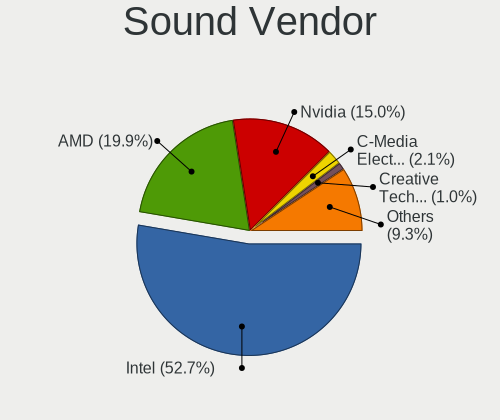

| Vendor                                          | Computers | Percent |
|-------------------------------------------------|-----------|---------|
| Intel                                           | 808       | 53.51%  |
| AMD                                             | 306       | 20.26%  |
| Nvidia                                          | 226       | 14.97%  |
| C-Media Electronics                             | 30        | 1.99%   |
| Texas Instruments                               | 18        | 1.19%   |
| Creative Technology                             | 16        | 1.06%   |
| VIA Technologies                                | 12        | 0.79%   |
| Harman                                          | 10        | 0.66%   |
| JMTek                                           | 7         | 0.46%   |
| Creative Labs                                   | 7         | 0.46%   |
| Apple                                           | 7         | 0.46%   |
| Yamaha                                          | 5         | 0.33%   |
| Sony                                            | 4         | 0.26%   |
| Realtek Semiconductor                           | 4         | 0.26%   |
| Lenovo                                          | 4         | 0.26%   |
| Elitegroup Computer Systems (ECS)               | 4         | 0.26%   |
| TOWA Electronics                                | 3         | 0.2%    |
| Roland                                          | 3         | 0.2%    |
| GN Netcom                                       | 3         | 0.2%    |
| Generalplus Technology                          | 3         | 0.2%    |
| XMOS                                            | 2         | 0.13%   |
| Onkyo                                           | 2         | 0.13%   |
| ASUSTek Computer                                | 2         | 0.13%   |
| Xiaomi                                          | 1         | 0.07%   |
| ULi Electronics                                 | 1         | 0.07%   |
| Thesycon Systemsoftware & Consulting            | 1         | 0.07%   |
| Tenx Technology                                 | 1         | 0.07%   |
| SteelSeries ApS                                 | 1         | 0.07%   |
| Silicon Integrated Systems [SiS]                | 1         | 0.07%   |
| RME                                             | 1         | 0.07%   |
| Razer USA                                       | 1         | 0.07%   |
| RATOC System                                    | 1         | 0.07%   |
| Rasteme                                         | 1         | 0.07%   |
| Philips (or NXP)                                | 1         | 0.07%   |
| Medeli Electronics                              | 1         | 0.07%   |
| M2Tech                                          | 1         | 0.07%   |
| Licensed by Sony Computer Entertainment America | 1         | 0.07%   |
| JAVS                                            | 1         | 0.07%   |
| iCreate Technologies                            | 1         | 0.07%   |
| Focusrite-Novation                              | 1         | 0.07%   |

Sound Model
-----------

Sound card models

| Model                                                                                             | Computers | Percent |
|---------------------------------------------------------------------------------------------------|-----------|---------|
| Intel 7 Series/C216 Chipset Family High Definition Audio Controller                               | 120       | 6.79%   |
| AMD Family 17h/19h HD Audio Controller                                                            | 87        | 4.92%   |
| Intel 6 Series/C200 Series Chipset Family High Definition Audio Controller                        | 76        | 4.3%    |
| Intel Sunrise Point-LP HD Audio                                                                   | 54        | 3.06%   |
| Intel 8 Series/C220 Series Chipset High Definition Audio Controller                               | 50        | 2.83%   |
| Intel 5 Series/3400 Series Chipset High Definition Audio                                          | 49        | 2.77%   |
| AMD Renoir Radeon High Definition Audio Controller                                                | 49        | 2.77%   |
| AMD Starship/Matisse HD Audio Controller                                                          | 44        | 2.49%   |
| Intel 82801I (ICH9 Family) HD Audio Controller                                                    | 43        | 2.43%   |
| Intel NM10/ICH7 Family High Definition Audio Controller                                           | 38        | 2.15%   |
| AMD Raven/Raven2/Fenghuang HDMI/DP Audio Controller                                               | 37        | 2.09%   |
| Intel Xeon E3-1200 v3/4th Gen Core Processor HD Audio Controller                                  | 36        | 2.04%   |
| Intel Cannon Lake PCH cAVS                                                                        | 36        | 2.04%   |
| AMD SBx00 Azalia (Intel HDA)                                                                      | 36        | 2.04%   |
| AMD FCH Azalia Controller                                                                         | 31        | 1.75%   |
| Intel 100 Series/C230 Series Chipset Family HD Audio Controller                                   | 30        | 1.7%    |
| Intel 200 Series PCH HD Audio                                                                     | 27        | 1.53%   |
| Nvidia TU107 GeForce GTX 1650 High Definition Audio Controller                                    | 25        | 1.41%   |
| Nvidia GK208 HDMI/DP Audio Controller                                                             | 25        | 1.41%   |
| Intel Wildcat Point-LP High Definition Audio Controller                                           | 24        | 1.36%   |
| Intel Broadwell-U Audio Controller                                                                | 24        | 1.36%   |
| Intel 82801JI (ICH10 Family) HD Audio Controller                                                  | 22        | 1.25%   |
| AMD Family 17h (Models 00h-0fh) HD Audio Controller                                               | 22        | 1.25%   |
| Intel Comet Lake PCH-LP cAVS                                                                      | 21        | 1.19%   |
| Intel Comet Lake PCH cAVS                                                                         | 20        | 1.13%   |
| Intel Cannon Point-LP High Definition Audio Controller                                            | 20        | 1.13%   |
| AMD Oland/Hainan/Cape Verde/Pitcairn HDMI Audio [Radeon HD 7000 Series]                           | 20        | 1.13%   |
| Intel 82801H (ICH8 Family) HD Audio Controller                                                    | 19        | 1.08%   |
| Nvidia GP107GL High Definition Audio Controller                                                   | 18        | 1.02%   |
| Intel Haswell-ULT HD Audio Controller                                                             | 18        | 1.02%   |
| Intel 8 Series HD Audio Controller                                                                | 18        | 1.02%   |
| Nvidia TU116 High Definition Audio Controller                                                     | 17        | 0.96%   |
| AMD Ellesmere HDMI Audio [Radeon RX 470/480 / 570/580/590]                                        | 17        | 0.96%   |
| Intel Tiger Lake-LP Smart Sound Technology Audio Controller                                       | 16        | 0.91%   |
| Intel Celeron/Pentium Silver Processor High Definition Audio                                      | 15        | 0.85%   |
| Intel Atom/Celeron/Pentium Processor x5-E8000/J3xxx/N3xxx Series High Definition Audio Controller | 15        | 0.85%   |
| Intel Alder Lake PCH-P High Definition Audio Controller                                           | 12        | 0.68%   |
| AMD RV710/730 HDMI Audio [Radeon HD 4000 series]                                                  | 12        | 0.68%   |
| Nvidia GP104 High Definition Audio Controller                                                     | 11        | 0.62%   |
| Nvidia GK107 HDMI Audio Controller                                                                | 11        | 0.62%   |

Memory
------

Memory Vendor
-------------

Memory module vendors

| Vendor                       | Computers | Percent |
|------------------------------|-----------|---------|
| Samsung Electronics          | 135       | 21.95%  |
| SK hynix                     | 91        | 14.8%   |
| Unknown                      | 72        | 11.71%  |
| Micron Technology            | 57        | 9.27%   |
| Kingston                     | 44        | 7.15%   |
| Crucial                      | 41        | 6.67%   |
| Team                         | 20        | 3.25%   |
| A-DATA Technology            | 20        | 3.25%   |
| Corsair                      | 15        | 2.44%   |
| Nanya Technology             | 13        | 2.11%   |
| G.Skill                      | 12        | 1.95%   |
| Elpida                       | 11        | 1.79%   |
| Silicon Power                | 9         | 1.46%   |
| Unknown (ABCD)               | 8         | 1.3%    |
| Panram                       | 8         | 1.3%    |
| Unknown                      | 8         | 1.3%    |
| Transcend                    | 7         | 1.14%   |
| SanMax                       | 6         | 0.98%   |
| Ramaxel Technology           | 5         | 0.81%   |
| KLEVV                        | 5         | 0.81%   |
| Toshiba                      | 2         | 0.33%   |
| Patriot                      | 2         | 0.33%   |
| CFD                          | 2         | 0.33%   |
| ASint Technology             | 2         | 0.33%   |
| V-Color                      | 1         | 0.16%   |
| Unknown (8AD3)               | 1         | 0.16%   |
| Unknown (0x09EE)             | 1         | 0.16%   |
| UMAX                         | 1         | 0.16%   |
| SHARETRONIC                  | 1         | 0.16%   |
| Ramos Technology             | 1         | 0.16%   |
| Patriot Memory (PDP Systems) | 1         | 0.16%   |
| Neo Forza                    | 1         | 0.16%   |
| Melco                        | 1         | 0.16%   |
| Kingmax                      | 1         | 0.16%   |
| Goldkey                      | 1         | 0.16%   |
| GeIL                         | 1         | 0.16%   |
| G-Alantic                    | 1         | 0.16%   |
| EUDAR                        | 1         | 0.16%   |
| Essencore Limited            | 1         | 0.16%   |
| Essencore                    | 1         | 0.16%   |

Memory Model
------------

Memory module models

| Model                                                            | Computers | Percent |
|------------------------------------------------------------------|-----------|---------|
| Samsung RAM M471B5273CH0-CK0 4GB SODIMM DDR3 1600MT/s            | 25        | 3.86%   |
| Unknown                                                          | 8         | 1.24%   |
| SK hynix RAM HMA81GS6DJR8N-XN 8GB SODIMM DDR4 3200MT/s           | 7         | 1.08%   |
| Samsung RAM M471B5273DH0-CH9 4GB SODIMM DDR3 1334MT/s            | 6         | 0.93%   |
| Samsung RAM M471A1G44AB0-CWE 8GB SODIMM DDR4 3200MT/s            | 6         | 0.93%   |
| Unknown (ABCD) RAM 123456789012345678 2GB DIMM LPDDR4 2400MT/s   | 5         | 0.77%   |
| SK hynix RAM HMT451S6BFR8A-PB 4GB SODIMM DDR3 1600MT/s           | 5         | 0.77%   |
| SK hynix RAM HMT351S6CFR8C-PB 4GB SODIMM DDR3 1600MT/s           | 5         | 0.77%   |
| Samsung RAM M471B5273CH0-CH9 4GB SODIMM DDR3 1334MT/s            | 5         | 0.77%   |
| Samsung RAM M471B5173QH0-YK0 4GB SODIMM DDR3 1600MT/s            | 5         | 0.77%   |
| Samsung RAM M471B5773CHS-CH9 2GB SODIMM DDR3 4199MT/s            | 4         | 0.62%   |
| Samsung RAM M471A2K43DB1-CWE 16GB SODIMM DDR4 3200MT/s           | 4         | 0.62%   |
| Crucial RAM BLS8G3D1609DS1S00. 8GB DIMM DDR3 1600MT/s            | 4         | 0.62%   |
| Unknown RAM Module 4GB SODIMM DDR3 1600MT/s                      | 3         | 0.46%   |
| Unknown RAM Module 2GB SODIMM DDR2                               | 3         | 0.46%   |
| Unknown RAM Module 2048MB SODIMM DDR2 667MT/s                    | 3         | 0.46%   |
| Unknown RAM Module 2048MB DIMM SDRAM                             | 3         | 0.46%   |
| Unknown (ABCD) RAM 123456789012345678 3GB SODIMM LPDDR4 2400MT/s | 3         | 0.46%   |
| Team RAM TEAMGROUP-UD4-3200 8GB DIMM DDR4 3800MT/s               | 3         | 0.46%   |
| Team RAM TEAMGROUP-UD4-2666 16GB DIMM DDR4 2933MT/s              | 3         | 0.46%   |
| SK hynix RAM HMA81GS6JJR8N-VK 8GB SODIMM DDR4 2667MT/s           | 3         | 0.46%   |
| Samsung RAM M471B5273DH0-CK0 4GB SODIMM DDR3 1600MT/s            | 3         | 0.46%   |
| Samsung RAM M471B5173DB0-YK0 4GB SODIMM DDR3 1600MT/s            | 3         | 0.46%   |
| Samsung RAM M471A5244CB0-CTD 4GB SODIMM DDR4 3266MT/s            | 3         | 0.46%   |
| Nanya RAM M2X4G64CB8HG9N-DG 4GB DIMM DDR3 1600MT/s               | 3         | 0.46%   |
| Micron RAM 8ATF1G64HZ-3G2J1 8GB SODIMM DDR4 3200MT/s             | 3         | 0.46%   |
| KLEVV RAM KD48GU881-26N190A 8GB DIMM DDR4 2667MT/s               | 3         | 0.46%   |
| Kingston RAM KHX2666C16/16G 16GB DIMM DDR4 3200MT/s              | 3         | 0.46%   |
| G.Skill RAM F4-2666C19-8GNT 8GB DIMM DDR4 2667MT/s               | 3         | 0.46%   |
| Elpida RAM EBJ40UG8EFU0-GN-F 4GB SODIMM DDR3 1600MT/s            | 3         | 0.46%   |
| Crucial RAM CT16G4DFRA32A.C8FE 16GB DIMM DDR4 3200MT/s           | 3         | 0.46%   |
| Corsair RAM CMK64GX4M2E3200C16 32GB DIMM DDR4 3200MT/s           | 3         | 0.46%   |
| Unknown RAM Module 4GB SODIMM DDR3 1333MT/s                      | 2         | 0.31%   |
| Unknown RAM Module 4GB SODIMM DDR3 1067MT/s                      | 2         | 0.31%   |
| Unknown RAM Module 2GB SODIMM DDR2 667MT/s                       | 2         | 0.31%   |
| Unknown RAM Module 2GB DIMM 800MT/s                              | 2         | 0.31%   |
| Unknown RAM Module 1GB DIMM 800MT/s                              | 2         | 0.31%   |
| Toshiba RAM 8HTF12864HDY-800G1 4GB SODIMM 1066MT/s               | 2         | 0.31%   |
| Toshiba RAM 64T128020EDL2.5C2 1GB SODIMM 1066MT/s                | 2         | 0.31%   |
| Team RAM TEAMGROUP-UD4-3600 8GB DIMM DDR4 3600MT/s               | 2         | 0.31%   |

Memory Kind
-----------

Memory module kinds

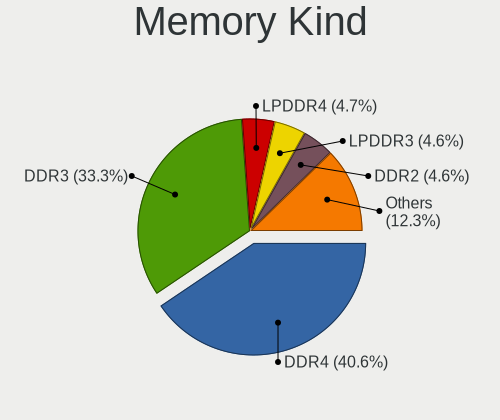

| Kind    | Computers | Percent |
|---------|-----------|---------|
| DDR4    | 242       | 43.76%  |
| DDR3    | 200       | 36.17%  |
| DDR2    | 31        | 5.61%   |
| LPDDR3  | 24        | 4.34%   |
| LPDDR4  | 18        | 3.25%   |
| SDRAM   | 17        | 3.07%   |
| Unknown | 13        | 2.35%   |
| LPDDR5  | 3         | 0.54%   |
| DDR5    | 3         | 0.54%   |
| DDR     | 2         | 0.36%   |

Memory Form Factor
------------------

Physical design of the memory module

| Name         | Computers | Percent |
|--------------|-----------|---------|
| SODIMM       | 302       | 54.91%  |
| DIMM         | 199       | 36.18%  |
| Row Of Chips | 40        | 7.27%   |
| Unknown      | 5         | 0.91%   |
| RIMM         | 2         | 0.36%   |
| Chip         | 2         | 0.36%   |

Memory Size
-----------

Memory module size

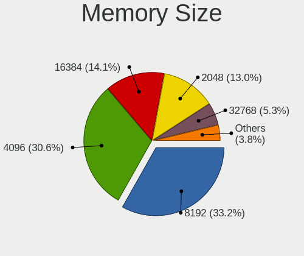

| Size  | Computers | Percent |
|-------|-----------|---------|
| 8192  | 184       | 31.83%  |
| 4096  | 177       | 30.62%  |
| 16384 | 86        | 14.88%  |
| 2048  | 80        | 13.84%  |
| 32768 | 27        | 4.67%   |
| 1024  | 21        | 3.63%   |
| 65536 | 1         | 0.17%   |
| 512   | 1         | 0.17%   |
| 256   | 1         | 0.17%   |

Memory Speed
------------

Memory module speed

| Speed   | Computers | Percent |
|---------|-----------|---------|
| 1600    | 143       | 24.74%  |
| 3200    | 90        | 15.57%  |
| 2667    | 74        | 12.8%   |
| 2400    | 44        | 7.61%   |
| 2133    | 28        | 4.84%   |
| 1333    | 22        | 3.81%   |
| 1334    | 21        | 3.63%   |
| 1067    | 13        | 2.25%   |
| 3600    | 12        | 2.08%   |
| Unknown | 12        | 2.08%   |
| 667     | 11        | 1.9%    |
| 2666    | 10        | 1.73%   |
| 1066    | 10        | 1.73%   |
| 800     | 10        | 1.73%   |
| 1867    | 8         | 1.38%   |
| 4199    | 7         | 1.21%   |
| 2933    | 7         | 1.21%   |
| 4267    | 5         | 0.87%   |
| 3800    | 5         | 0.87%   |
| 1866    | 5         | 0.87%   |
| 533     | 5         | 0.87%   |
| 6400    | 3         | 0.52%   |
| 3733    | 3         | 0.52%   |
| 3400    | 3         | 0.52%   |
| 3266    | 3         | 0.52%   |
| 1800    | 3         | 0.52%   |
| 975     | 3         | 0.52%   |
| 4800    | 2         | 0.35%   |
| 3000    | 2         | 0.35%   |
| 400     | 2         | 0.35%   |
| 333     | 2         | 0.35%   |
| 5600    | 1         | 0.17%   |
| 4266    | 1         | 0.17%   |
| 4133    | 1         | 0.17%   |
| 3534    | 1         | 0.17%   |
| 3100    | 1         | 0.17%   |
| 3007    | 1         | 0.17%   |
| 2733    | 1         | 0.17%   |
| 2000    | 1         | 0.17%   |
| 266     | 1         | 0.17%   |

Printers & scanners
-------------------

Printer Vendor
--------------

Printer device vendors

| Vendor              | Computers | Percent |
|---------------------|-----------|---------|
| Canon               | 5         | 33.33%  |
| Brother Industries  | 5         | 33.33%  |
| Seiko Epson         | 3         | 20%     |
| Samsung Electronics | 1         | 6.67%   |
| Hewlett-Packard     | 1         | 6.67%   |

Printer Model
-------------

Printer device models

| Model                         | Computers | Percent |
|-------------------------------|-----------|---------|
| Brother HL-1440 Laser Printer | 2         | 13.33%  |
| Seiko Epson XP-100 Series     | 1         | 6.67%   |
| Seiko Epson WF-2010 Series    | 1         | 6.67%   |
| Seiko Epson EP-306 Series     | 1         | 6.67%   |
| Samsung SCX-3200 Series       | 1         | 6.67%   |
| HP ENVY 5000 series           | 1         | 6.67%   |
| Canon TS5300 series           | 1         | 6.67%   |
| Canon PIXMA MG3600 Series     | 1         | 6.67%   |
| Canon PIXMA iX6850 Printer    | 1         | 6.67%   |
| Canon PIXMA iP4600 Printer    | 1         | 6.67%   |
| Canon iP2700 series           | 1         | 6.67%   |
| Brother HL-L2360D series      | 1         | 6.67%   |
| Brother HL-52x0 series        | 1         | 6.67%   |
| Brother HL-2130 series        | 1         | 6.67%   |

Scanner Vendor
--------------

Scanner device vendors

| Vendor      | Computers | Percent |
|-------------|-----------|---------|
| Seiko Epson | 1         | 50%     |
| Canon       | 1         | 50%     |

Scanner Model
-------------

Scanner device models

| Model                                                         | Computers | Percent |
|---------------------------------------------------------------|-----------|---------|
| Seiko Epson GT-8700/GT-8700F [Perfection 1640SU/1640SU PHOTO] | 1         | 50%     |
| Canon CanoScan LiDE 100                                       | 1         | 50%     |

Camera
------

Camera Vendor
-------------

Camera device vendors

| Vendor                                 | Computers | Percent |
|----------------------------------------|-----------|---------|
| Chicony Electronics                    | 87        | 20.19%  |
| IMC Networks                           | 37        | 8.58%   |
| Microdia                               | 35        | 8.12%   |
| Sunplus Innovation Technology          | 32        | 7.42%   |
| Realtek Semiconductor                  | 26        | 6.03%   |
| Apple                                  | 19        | 4.41%   |
| Acer                                   | 19        | 4.41%   |
| Logitech                               | 18        | 4.18%   |
| Bison Electronics                      | 17        | 3.94%   |
| Quanta                                 | 16        | 3.71%   |
| Cheng Uei Precision Industry (Foxlink) | 15        | 3.48%   |
| Suyin                                  | 12        | 2.78%   |
| Syntek                                 | 10        | 2.32%   |
| Ricoh                                  | 8         | 1.86%   |
| Alcor Micro                            | 7         | 1.62%   |
| Elecom                                 | 6         | 1.39%   |
| Microsoft                              | 5         | 1.16%   |
| Lite-On Technology                     | 5         | 1.16%   |
| Silicon Motion                         | 4         | 0.93%   |
| Importek                               | 4         | 0.93%   |
| BUFFALO                                | 4         | 0.93%   |
| Samsung Electronics                    | 3         | 0.7%    |
| MacroSilicon                           | 3         | 0.7%    |
| Luxvisions Innotech Limited            | 3         | 0.7%    |
| Generalplus Technology                 | 3         | 0.7%    |
| Cubeternet                             | 3         | 0.7%    |
| Z-Star Microelectronics                | 2         | 0.46%   |
| Sonix Technology                       | 2         | 0.46%   |
| Lenovo                                 | 2         | 0.46%   |
| Huawei Technologies                    | 2         | 0.46%   |
| Genesys Logic                          | 2         | 0.46%   |
| GEMBIRD                                | 2         | 0.46%   |
| Etron Technology                       | 2         | 0.46%   |
| WaveRider Communications               | 1         | 0.23%   |
| SunplusIT                              | 1         | 0.23%   |
| Sunplus Technology                     | 1         | 0.23%   |
| Sunplus IT                             | 1         | 0.23%   |
| SHENZHEN EMEET TECHNOLOGY              | 1         | 0.23%   |
| Ruision                                | 1         | 0.23%   |
| Primax Electronics                     | 1         | 0.23%   |

Camera Model
------------

Camera device models

| Model                                    | Computers | Percent |
|------------------------------------------|-----------|---------|
| Microdia Integrated_Webcam_HD            | 16        | 3.65%   |
| IMC Networks Integrated Camera           | 14        | 3.2%    |
| Chicony FJ Camera                        | 14        | 3.2%    |
| Chicony Integrated Camera                | 12        | 2.74%   |
| Realtek Integrated_Webcam_HD             | 11        | 2.51%   |
| Chicony USB2.0 Camera                    | 8         | 1.83%   |
| Logitech Webcam C270                     | 7         | 1.6%    |
| IMC Networks USB2.0 HD UVC WebCam        | 7         | 1.6%    |
| IMC Networks USB2.0 VGA UVC WebCam       | 6         | 1.37%   |
| Acer USB HD Webcam                       | 6         | 1.37%   |
| Chicony TOSHIBA Web Camera - HD          | 5         | 1.14%   |
| Apple FaceTime HD Camera (Built-in)      | 5         | 1.14%   |
| Apple FaceTime HD Camera                 | 5         | 1.14%   |
| Apple Built-in iSight                    | 5         | 1.14%   |
| Sunplus HD WebCam                        | 4         | 0.91%   |
| Ricoh Sony Vaio Integrated Webcam        | 4         | 0.91%   |
| Quanta HD User Facing                    | 4         | 0.91%   |
| Microdia Webcam Vitade AF                | 4         | 0.91%   |
| Lite-On Integrated Camera                | 4         | 0.91%   |
| Chicony HP HD Camera                     | 4         | 0.91%   |
| Chicony HD WebCam                        | 4         | 0.91%   |
| BUFFALO USB 2.0 Camera                   | 4         | 0.91%   |
| Apple iPhone 5/5C/5S/6/SE/7/8/X          | 4         | 0.91%   |
| Syntek Integrated Camera                 | 3         | 0.68%   |
| Suyin HP Webcam                          | 3         | 0.68%   |
| Sunplus Integrated_Webcam_HD             | 3         | 0.68%   |
| Sunplus Integrated_Webcam_FHD            | 3         | 0.68%   |
| Sunplus Dell HD Webcam                   | 3         | 0.68%   |
| Samsung Galaxy series, misc. (MTP mode)  | 3         | 0.68%   |
| Ricoh Sony Visual Communication Camera   | 3         | 0.68%   |
| Realtek Lenovo EasyCamera                | 3         | 0.68%   |
| Microdia Integrated_Webcam_FHD           | 3         | 0.68%   |
| Microdia Integrated Webcam HD            | 3         | 0.68%   |
| MacroSilicon USB Video                   | 3         | 0.68%   |
| Logitech HD Pro Webcam C920              | 3         | 0.68%   |
| Chicony USB 2.0 Camera                   | 3         | 0.68%   |
| Chicony Lenovo Integrated Camera (0.3MP) | 3         | 0.68%   |
| Chicony Lenovo EasyCamera                | 3         | 0.68%   |
| Chicony HP Wide Vision HD Camera         | 3         | 0.68%   |
| Chicony HP TrueVision HD Camera          | 3         | 0.68%   |

Security
--------

Fingerprint Vendor
------------------

Fingerprint sensor vendors

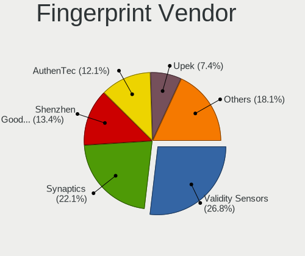

| Vendor                             | Computers | Percent |
|------------------------------------|-----------|---------|
| Validity Sensors                   | 27        | 25.23%  |
| Synaptics                          | 22        | 20.56%  |
| Shenzhen Goodix Technology         | 16        | 14.95%  |
| AuthenTec                          | 15        | 14.02%  |
| Upek                               | 8         | 7.48%   |
| STMicroelectronics                 | 6         | 5.61%   |
| Elan Microelectronics              | 6         | 5.61%   |
| LighTuning Technology              | 5         | 4.67%   |
| Realtek USB2.0 Finger Print Bridge | 1         | 0.93%   |
| Focal-systems.Corp                 | 1         | 0.93%   |

Fingerprint Model
-----------------

Fingerprint sensor models

| Model                                                           | Computers | Percent |
|-----------------------------------------------------------------|-----------|---------|
| Synaptics Prometheus MIS Touch Fingerprint Reader               | 12        | 11.21%  |
| Validity Sensors VFS495 Fingerprint Reader                      | 7         | 6.54%   |
| Shenzhen Goodix  Fingerprint Device                             | 7         | 6.54%   |
| Shenzhen Goodix Fingerprint Reader                              | 7         | 6.54%   |
| Upek Biometric Touchchip/Touchstrip Fingerprint Sensor          | 6         | 5.61%   |
| STMicroelectronics Fingerprint Reader                           | 6         | 5.61%   |
| AuthenTec Fingerprint Sensor                                    | 5         | 4.67%   |
| Validity Sensors VFS 5011 fingerprint sensor                    | 4         | 3.74%   |
| Validity Sensors Swipe Fingerprint Sensor                       | 4         | 3.74%   |
| Validity Sensors VFS471 Fingerprint Reader                      | 3         | 2.8%    |
| Synaptics Metallica MIS Touch Fingerprint Reader                | 3         | 2.8%    |
| AuthenTec AES2810                                               | 3         | 2.8%    |
| AuthenTec AES2501 Fingerprint Sensor                            | 3         | 2.8%    |
| AuthenTec AES1600                                               | 3         | 2.8%    |
| Validity Sensors VFS7552 Touch Fingerprint Sensor               | 2         | 1.87%   |
| Validity Sensors VFS491                                         | 2         | 1.87%   |
| Validity Sensors VFS451 Fingerprint Reader                      | 2         | 1.87%   |
| Upek TCS5B Fingerprint sensor                                   | 2         | 1.87%   |
| Synaptics UWP WBDI                                              | 2         | 1.87%   |
| Shenzhen Goodix FingerPrint                                     | 2         | 1.87%   |
| LighTuning ES603 Swipe Fingerprint Sensor                       | 2         | 1.87%   |
| LighTuning EgisTec Touch Fingerprint Sensor                     | 2         | 1.87%   |
| Elan fingerprint sensor [FeinTech FPS00200]                     | 2         | 1.87%   |
| Elan ELAN:Fingerprint                                           | 2         | 1.87%   |
| Elan ELAN:ARM-M4                                                | 2         | 1.87%   |
| Validity Sensors VFS5011 Fingerprint Reader                     | 1         | 0.93%   |
| Validity Sensors VFS301 Fingerprint Reader                      | 1         | 0.93%   |
| Validity Sensors Synaptics WBDI                                 | 1         | 0.93%   |
| Synaptics WBDI Device                                           | 1         | 0.93%   |
| Synaptics WBDI                                                  | 1         | 0.93%   |
| Synaptics UWP WBDI Device                                       | 1         | 0.93%   |
| Synaptics  WBDI Fingerprint Reader - USB 052                    | 1         | 0.93%   |
| Realtek USB2.0 Finger Print Bridge FocalTech Fingerprint Device | 1         | 0.93%   |
| LighTuning Fingerprint Reader                                   | 1         | 0.93%   |
| Focal-systems.Corp FT9201Fingerprint.                           | 1         | 0.93%   |
| AuthenTec AES2660 Fingerprint Sensor                            | 1         | 0.93%   |
| Unknown                                                         | 1         | 0.93%   |

Chipcard Vendor
---------------

Chipcard module vendors

| Vendor           | Computers | Percent |
|------------------|-----------|---------|
| Broadcom         | 9         | 31.03%  |
| Upek             | 7         | 24.14%  |
| Alcor Micro      | 6         | 20.69%  |
| O2 Micro         | 4         | 13.79%  |
| SCM Microsystems | 2         | 6.9%    |
| Yubico.com       | 1         | 3.45%   |

Chipcard Model
--------------

Chipcard module models

| Model                                                                        | Computers | Percent |
|------------------------------------------------------------------------------|-----------|---------|
| Upek TouchChip Fingerprint Coprocessor (WBF advanced mode)                   | 7         | 24.14%  |
| Alcor Micro AU9540 Smartcard Reader                                          | 6         | 20.69%  |
| O2 Micro OZ776 CCID Smartcard Reader                                         | 4         | 13.79%  |
| Broadcom BCM5880 Secure Applications Processor                               | 4         | 13.79%  |
| Broadcom 58200                                                               | 3         | 10.34%  |
| SCM Microsystems SCR331-LC1 / SCR3310 SmartCard Reader                       | 2         | 6.9%    |
| Yubico.com Yubikey 4 U2F+CCID                                                | 1         | 3.45%   |
| Broadcom BCM5880 Secure Applications Processor with fingerprint swipe sensor | 1         | 3.45%   |
| Broadcom 5880                                                                | 1         | 3.45%   |

Unsupported
-----------

Unsupported Devices
-------------------

Total unsupported devices on board

| Total | Computers | Percent |
|-------|-----------|---------|
| 0     | 804       | 71.02%  |
| 1     | 272       | 24.03%  |
| 2     | 41        | 3.62%   |
| 3     | 8         | 0.71%   |
| 6     | 2         | 0.18%   |
| 4     | 2         | 0.18%   |
| 8     | 1         | 0.09%   |
| 7     | 1         | 0.09%   |
| 5     | 1         | 0.09%   |

Unsupported Device Types
------------------------

Types of unsupported devices

| Type                     | Computers | Percent |
|--------------------------|-----------|---------|
| Fingerprint reader       | 105       | 26.79%  |
| Graphics card            | 72        | 18.37%  |
| Net/wireless             | 52        | 13.27%  |
| Multimedia controller    | 47        | 11.99%  |
| Chipcard                 | 25        | 6.38%   |
| Communication controller | 20        | 5.1%    |
| Unassigned class         | 14        | 3.57%   |
| Storage                  | 14        | 3.57%   |
| Sound                    | 10        | 2.55%   |
| Bluetooth                | 9         | 2.3%    |
| Camera                   | 7         | 1.79%   |
| Modem                    | 5         | 1.28%   |
| Storage/ata              | 3         | 0.77%   |
| Network                  | 3         | 0.77%   |
| Net/ethernet             | 3         | 0.77%   |
| Tv card                  | 1         | 0.26%   |
| Storage/raid             | 1         | 0.26%   |
| Storage/nvme             | 1         | 0.26%   |

