Linux in Japan - Tested Hardware & Statistics
---------------------------------------------

A project to collect tested hardware configurations for Linux in Japan.

Anyone can contribute to this report by the [hw-probe](https://github.com/linuxhw/hw-probe) tool:

    sudo -E hw-probe -all -upload

Please contribute! Especially if your hardware is rare.

This is a report for all computer types. See also reports for [desktops](/Location/Japan/Desktop/README.md) and [notebooks](/Location/Japan/Notebook/README.md).

Contents
--------

* [ Test Cases ](#test-cases)

* [ System ](#system)
  - [ OS                       ](#os)
  - [ OS Family                ](#os-family)
  - [ Kernel                   ](#kernel)
  - [ Kernel Family            ](#kernel-family)
  - [ Kernel Major Ver.        ](#kernel-major-ver)
  - [ Arch                     ](#arch)
  - [ DE                       ](#de)
  - [ Display Server           ](#display-server)
  - [ Display Manager          ](#display-manager)
  - [ OS Lang                  ](#os-lang)
  - [ Boot Mode                ](#boot-mode)
  - [ Filesystem               ](#filesystem)
  - [ Part. scheme             ](#part-scheme)
  - [ Dual Boot with Linux/BSD ](#dual-boot-with-linuxbsd)
  - [ Dual Boot (Win)          ](#dual-boot-win)

* [ Board ](#board)
  - [ Vendor                   ](#vendor)
  - [ Model                    ](#model)
  - [ Model Family             ](#model-family)
  - [ MFG Year                 ](#mfg-year)
  - [ Form Factor              ](#form-factor)
  - [ Secure Boot              ](#secure-boot)
  - [ Coreboot                 ](#coreboot)
  - [ RAM Size                 ](#ram-size)
  - [ RAM Used                 ](#ram-used)
  - [ Total Drives             ](#total-drives)
  - [ Has CD-ROM               ](#has-cd-rom)
  - [ Has Ethernet             ](#has-ethernet)
  - [ Has WiFi                 ](#has-wifi)
  - [ Has Bluetooth            ](#has-bluetooth)

* [ Location ](#location)
  - [ Country                  ](#country)
  - [ City                     ](#city)

* [ Drives ](#drives)
  - [ Drive Vendor             ](#drive-vendor)
  - [ Drive Model              ](#drive-model)
  - [ HDD Vendor               ](#hdd-vendor)
  - [ SSD Vendor               ](#ssd-vendor)
  - [ Drive Kind               ](#drive-kind)
  - [ Drive Connector          ](#drive-connector)
  - [ Drive Size               ](#drive-size)
  - [ Space Total              ](#space-total)
  - [ Space Used               ](#space-used)
  - [ Malfunc. Drives          ](#malfunc-drives)
  - [ Malfunc. Drive Vendor    ](#malfunc-drive-vendor)
  - [ Malfunc. HDD Vendor      ](#malfunc-hdd-vendor)
  - [ Malfunc. Drive Kind      ](#malfunc-drive-kind)
  - [ Failed Drives            ](#failed-drives)
  - [ Failed Drive Vendor      ](#failed-drive-vendor)
  - [ Drive Status             ](#drive-status)

* [ Storage controller ](#storage-controller)
  - [ Storage Vendor           ](#storage-vendor)
  - [ Storage Model            ](#storage-model)
  - [ Storage Kind             ](#storage-kind)

* [ Processor ](#processor)
  - [ CPU Vendor               ](#cpu-vendor)
  - [ CPU Model                ](#cpu-model)
  - [ CPU Model Family         ](#cpu-model-family)
  - [ CPU Cores                ](#cpu-cores)
  - [ CPU Sockets              ](#cpu-sockets)
  - [ CPU Threads              ](#cpu-threads)
  - [ CPU Op-Modes             ](#cpu-op-modes)
  - [ CPU Microcode            ](#cpu-microcode)
  - [ CPU Microarch            ](#cpu-microarch)

* [ Graphics ](#graphics)
  - [ GPU Vendor               ](#gpu-vendor)
  - [ GPU Model                ](#gpu-model)
  - [ GPU Combo                ](#gpu-combo)
  - [ GPU Driver               ](#gpu-driver)
  - [ GPU Memory               ](#gpu-memory)

* [ Monitor ](#monitor)
  - [ Monitor Vendor           ](#monitor-vendor)
  - [ Monitor Model            ](#monitor-model)
  - [ Monitor Resolution       ](#monitor-resolution)
  - [ Monitor Diagonal         ](#monitor-diagonal)
  - [ Monitor Width            ](#monitor-width)
  - [ Aspect Ratio             ](#aspect-ratio)
  - [ Monitor Area             ](#monitor-area)
  - [ Pixel Density            ](#pixel-density)
  - [ Multiple Monitors        ](#multiple-monitors)

* [ Network ](#network)
  - [ Net Controller Vendor    ](#net-controller-vendor)
  - [ Net Controller Model     ](#net-controller-model)
  - [ Wireless Vendor          ](#wireless-vendor)
  - [ Wireless Model           ](#wireless-model)
  - [ Ethernet Vendor          ](#ethernet-vendor)
  - [ Ethernet Model           ](#ethernet-model)
  - [ Net Controller Kind      ](#net-controller-kind)
  - [ Used Controller          ](#used-controller)
  - [ NICs                     ](#nics)
  - [ IPv6                     ](#ipv6)

* [ Bluetooth ](#bluetooth)
  - [ Bluetooth Vendor         ](#bluetooth-vendor)
  - [ Bluetooth Model          ](#bluetooth-model)

* [ Sound ](#sound)
  - [ Sound Vendor             ](#sound-vendor)
  - [ Sound Model              ](#sound-model)

* [ Memory ](#memory)
  - [ Memory Vendor            ](#memory-vendor)
  - [ Memory Model             ](#memory-model)
  - [ Memory Kind              ](#memory-kind)
  - [ Memory Form Factor       ](#memory-form-factor)
  - [ Memory Size              ](#memory-size)
  - [ Memory Speed             ](#memory-speed)

* [ Printers & scanners ](#printers--scanners)
  - [ Printer Vendor           ](#printer-vendor)
  - [ Printer Model            ](#printer-model)
  - [ Scanner Vendor           ](#scanner-vendor)
  - [ Scanner Model            ](#scanner-model)

* [ Camera ](#camera)
  - [ Camera Vendor            ](#camera-vendor)
  - [ Camera Model             ](#camera-model)

* [ Security ](#security)
  - [ Fingerprint Vendor       ](#fingerprint-vendor)
  - [ Fingerprint Model        ](#fingerprint-model)
  - [ Chipcard Vendor          ](#chipcard-vendor)
  - [ Chipcard Model           ](#chipcard-model)

* [ Unsupported ](#unsupported)
  - [ Unsupported Devices      ](#unsupported-devices)
  - [ Unsupported Device Types ](#unsupported-device-types)

Test Cases
----------

Total: 2396

| Vendor        | Model                       | Form-Factor | Probe                                                      | Date         |
|---------------|-----------------------------|-------------|------------------------------------------------------------|--------------|
| Fujitsu       | FARQ16011                   | Tablet      | [cf0a931bc4](https://linux-hardware.org/?probe=cf0a931bc4) | Jan 06, 2025 |
| MSI           | Sword 15 A11UD              | Notebook    | [d0dce2f4fe](https://linux-hardware.org/?probe=d0dce2f4fe) | Jan 06, 2025 |
| Panasonic     | CF-NX2AWLCS                 | Notebook    | [e3ead6c710](https://linux-hardware.org/?probe=e3ead6c710) | Jan 05, 2025 |
| Lenovo        | IdeaPad Slim 5 14IMH9 83... | Notebook    | [455af071a7](https://linux-hardware.org/?probe=455af071a7) | Jan 04, 2025 |
| MSI           | B550M PRO-VDH WIFI          | Desktop     | [a3c4d34290](https://linux-hardware.org/?probe=a3c4d34290) | Jan 04, 2025 |
| Dell          | Latitude 5300               | Notebook    | [d3d6e520f5](https://linux-hardware.org/?probe=d3d6e520f5) | Jan 03, 2025 |
| HP            | 0A9Ch                       | Desktop     | [d05c412a3b](https://linux-hardware.org/?probe=d05c412a3b) | Jan 02, 2025 |
| HP            | 212B                        | Desktop     | [3cb08b6d4f](https://linux-hardware.org/?probe=3cb08b6d4f) | Dec 30, 2024 |
| ASUSTek       | Zenbook UX3402ZA_UX3402Z... | Notebook    | [06b6bc85d9](https://linux-hardware.org/?probe=06b6bc85d9) | Dec 29, 2024 |
| MSI           | 970 GAMING                  | Desktop     | [25058a0a6c](https://linux-hardware.org/?probe=25058a0a6c) | Dec 29, 2024 |
| MSI           | Prestige 13 AI+ Evo A2VM... | Notebook    | [c973dc57a1](https://linux-hardware.org/?probe=c973dc57a1) | Dec 28, 2024 |
| NEC Comput... | PC-LL750MSW                 | Notebook    | [55d20a7230](https://linux-hardware.org/?probe=55d20a7230) | Dec 27, 2024 |
| Lenovo        | 3317 SDK0T76463 WIN 3422... | Desktop     | [05481678ba](https://linux-hardware.org/?probe=05481678ba) | Dec 27, 2024 |
| ASUSTek       | ROG Zephyrus G14 GA402RJ    | Notebook    | [39f2b622bf](https://linux-hardware.org/?probe=39f2b622bf) | Dec 26, 2024 |
| HP            | 1998                        | Desktop     | [35ce2043be](https://linux-hardware.org/?probe=35ce2043be) | Dec 26, 2024 |
| ASRock        | 990FX Extreme4              | Desktop     | [597783d573](https://linux-hardware.org/?probe=597783d573) | Dec 25, 2024 |
| ASUSTek       | ROG Zephyrus G14 GA401QM... | Notebook    | [b163061b61](https://linux-hardware.org/?probe=b163061b61) | Dec 25, 2024 |
| Valve         | Jupiter                     | Notebook    | [61b4cfc7d9](https://linux-hardware.org/?probe=61b4cfc7d9) | Dec 24, 2024 |
| HP            | 1497                        | Desktop     | [9b71f5f802](https://linux-hardware.org/?probe=9b71f5f802) | Dec 23, 2024 |
| ASUSTek       | P8Z68-M PRO                 | Desktop     | [d7826b9a59](https://linux-hardware.org/?probe=d7826b9a59) | Dec 22, 2024 |
| Lenovo        | ThinkPad E15 Gen 3 20YG0... | Notebook    | [32f125d899](https://linux-hardware.org/?probe=32f125d899) | Dec 22, 2024 |
| NEC Comput... | PC-VK15EBZCG                | Notebook    | [cda3177d46](https://linux-hardware.org/?probe=cda3177d46) | Dec 22, 2024 |
| NEC Comput... | PC-VJ22MAN5HJR9             | Notebook    | [7b6a88a981](https://linux-hardware.org/?probe=7b6a88a981) | Dec 21, 2024 |
| Gigabyte      | X870E AORUS PRO             | Desktop     | [830132d35c](https://linux-hardware.org/?probe=830132d35c) | Dec 20, 2024 |
| T-bao         | MINI PC V1.0                | Desktop     | [abcfbdcc04](https://linux-hardware.org/?probe=abcfbdcc04) | Dec 18, 2024 |
| Sony          | VPCEH39FJ                   | Notebook    | [f0627de40e](https://linux-hardware.org/?probe=f0627de40e) | Dec 16, 2024 |
| GMKtec        | NucBox M6                   | Desktop     | [db441fd218](https://linux-hardware.org/?probe=db441fd218) | Dec 15, 2024 |
| Panasonic     | CFLX5-3L                    | Notebook    | [a63e171786](https://linux-hardware.org/?probe=a63e171786) | Dec 15, 2024 |
| MSI           | B550M PRO-VDH WIFI          | Desktop     | [99bbee3d81](https://linux-hardware.org/?probe=99bbee3d81) | Dec 13, 2024 |
| MSI           | B550M PRO-VDH WIFI          | Desktop     | [4629709a7a](https://linux-hardware.org/?probe=4629709a7a) | Dec 11, 2024 |
| HP            | 8396                        | Desktop     | [eef8330bfa](https://linux-hardware.org/?probe=eef8330bfa) | Dec 10, 2024 |
| Fujitsu       | FMVA30DN                    | Notebook    | [b859d288a9](https://linux-hardware.org/?probe=b859d288a9) | Dec 10, 2024 |
| NEC Comput... | MS-7479VS                   | Desktop     | [9d1c2d403f](https://linux-hardware.org/?probe=9d1c2d403f) | Dec 09, 2024 |
| Intel         | NUC11DBBi9 M17026-402       | Mini pc     | [82b4880445](https://linux-hardware.org/?probe=82b4880445) | Dec 09, 2024 |
| ASUSTek       | P9D-I Series                | Server      | [236c9198c6](https://linux-hardware.org/?probe=236c9198c6) | Dec 08, 2024 |
| ASUSTek       | VivoBook_ASUSLaptop M540... | Notebook    | [43ae490d8a](https://linux-hardware.org/?probe=43ae490d8a) | Dec 07, 2024 |
| NEC Comput... | PC-GN174FAAU                | Notebook    | [c90b112e13](https://linux-hardware.org/?probe=c90b112e13) | Dec 06, 2024 |
| ASRock        | H81M-HDS                    | Desktop     | [a6bc6848cb](https://linux-hardware.org/?probe=a6bc6848cb) | Dec 06, 2024 |
| ASUSTek       | Z87-PRO                     | Desktop     | [029f1c1e1b](https://linux-hardware.org/?probe=029f1c1e1b) | Dec 03, 2024 |
| Fujitsu       | FMVA42MW2                   | Notebook    | [a5a7a4a6f1](https://linux-hardware.org/?probe=a5a7a4a6f1) | Dec 03, 2024 |
| Lenovo        | ThinkBook 14 G6+ AHP 21L... | Notebook    | [481811d3d1](https://linux-hardware.org/?probe=481811d3d1) | Dec 02, 2024 |
| Framework     | Laptop 13 (AMD Ryzen 704... | Notebook    | [42386d1cbc](https://linux-hardware.org/?probe=42386d1cbc) | Dec 01, 2024 |
| MSI           | PRO B650M-A WIFI            | Desktop     | [0b6eff9251](https://linux-hardware.org/?probe=0b6eff9251) | Dec 01, 2024 |
| Timi          | RedmiBook Pro 14S           | Notebook    | [6512821d69](https://linux-hardware.org/?probe=6512821d69) | Nov 29, 2024 |
| ASRock        | H81M-HDS                    | Desktop     | [632566b3d9](https://linux-hardware.org/?probe=632566b3d9) | Nov 29, 2024 |
| Dell          | 042P49 A02                  | Desktop     | [6c4c6577ac](https://linux-hardware.org/?probe=6c4c6577ac) | Nov 29, 2024 |
| Panasonic     | CF-W8FWDAJS                 | Notebook    | [b07a63717b](https://linux-hardware.org/?probe=b07a63717b) | Nov 28, 2024 |
| Panasonic     | CFXZ6-1                     | Tablet      | [0adce1d7c2](https://linux-hardware.org/?probe=0adce1d7c2) | Nov 27, 2024 |
| Lenovo        | ThinkPad E15 Gen 4 21E60... | Notebook    | [15258f1ad9](https://linux-hardware.org/?probe=15258f1ad9) | Nov 27, 2024 |
| Lenovo        | ThinkPad X1 Carbon Gen 1... | Notebook    | [4da22094eb](https://linux-hardware.org/?probe=4da22094eb) | Nov 25, 2024 |
| Lenovo        | 30D5 NOK                    | All in one  | [264f4a2e67](https://linux-hardware.org/?probe=264f4a2e67) | Nov 22, 2024 |
| Apple         | MacBookPro8,1               | Notebook    | [5a3f525db9](https://linux-hardware.org/?probe=5a3f525db9) | Nov 21, 2024 |
| Acer          | Aspire A315-51              | Notebook    | [291ffae1d7](https://linux-hardware.org/?probe=291ffae1d7) | Nov 20, 2024 |
| MSI           | MPG X870E CARBON WIFI       | Desktop     | [48363822b7](https://linux-hardware.org/?probe=48363822b7) | Nov 19, 2024 |
| MSI           | X470 GAMING PLUS            | Desktop     | [94e52a0420](https://linux-hardware.org/?probe=94e52a0420) | Nov 19, 2024 |
| ECS           | G31T-M                      | Desktop     | [9714673328](https://linux-hardware.org/?probe=9714673328) | Nov 19, 2024 |
| HP            | 158B                        | Desktop     | [5af010ad69](https://linux-hardware.org/?probe=5af010ad69) | Nov 19, 2024 |
| Acer          | Predator PHN16-71           | Notebook    | [6bcd55ded7](https://linux-hardware.org/?probe=6bcd55ded7) | Nov 18, 2024 |
| ASRock        | H310CM-HDV/M.2              | Desktop     | [65268bc04c](https://linux-hardware.org/?probe=65268bc04c) | Nov 17, 2024 |
| Pegatron      | 2A9A                        | Desktop     | [f28e0b8f3d](https://linux-hardware.org/?probe=f28e0b8f3d) | Nov 16, 2024 |
| ASUSTek       | Zenbook UM3402YAR_UM3402... | Notebook    | [b3e2e79950](https://linux-hardware.org/?probe=b3e2e79950) | Nov 15, 2024 |
| ASUSTek       | ROG Zephyrus G14 GA401IH... | Notebook    | [e89ff25201](https://linux-hardware.org/?probe=e89ff25201) | Nov 13, 2024 |
| Apple         | MacBook10,1                 | Notebook    | [ec28f65d6a](https://linux-hardware.org/?probe=ec28f65d6a) | Nov 13, 2024 |
| MSI           | B550M PRO-VDH WIFI          | Desktop     | [280fdbebe9](https://linux-hardware.org/?probe=280fdbebe9) | Nov 13, 2024 |
| Foxconn       | H61MXT1/F2/-S/-V            | Desktop     | [a45a575296](https://linux-hardware.org/?probe=a45a575296) | Nov 12, 2024 |
| Lenovo        | Yoga Pro 14s ASP9 83HN      | Notebook    | [59d0ece152](https://linux-hardware.org/?probe=59d0ece152) | Nov 11, 2024 |
| ASRock        | E3C226D2I                   | Desktop     | [300bd153e3](https://linux-hardware.org/?probe=300bd153e3) | Nov 11, 2024 |
| ASUSTek       | PRIME H670-PLUS D4          | Desktop     | [fbfd923c5c](https://linux-hardware.org/?probe=fbfd923c5c) | Nov 11, 2024 |
| Lenovo        | SHARKBAY 0B98401 PRO        | Desktop     | [10ec5abb10](https://linux-hardware.org/?probe=10ec5abb10) | Nov 11, 2024 |
| Lenovo        | ThinkPad P16s Gen 2 21K9... | Notebook    | [7a8258de47](https://linux-hardware.org/?probe=7a8258de47) | Nov 10, 2024 |
| Fujitsu       | FMVC07003                   | Notebook    | [9fe5e42140](https://linux-hardware.org/?probe=9fe5e42140) | Nov 10, 2024 |
| ASUSTek       | ROG STRIX Z690-F GAMING ... | Desktop     | [fa99db20aa](https://linux-hardware.org/?probe=fa99db20aa) | Nov 10, 2024 |
| ASRock        | B660-ITX                    | Desktop     | [4f6485a182](https://linux-hardware.org/?probe=4f6485a182) | Nov 08, 2024 |
| ASRock        | H310CM-HDV/M.2              | Desktop     | [31b44d52d7](https://linux-hardware.org/?probe=31b44d52d7) | Nov 07, 2024 |
| Lenovo        | ThinkCentre M91p 7005AD4    | Desktop     | [87a6f941f8](https://linux-hardware.org/?probe=87a6f941f8) | Nov 07, 2024 |
| ASRock        | X600M-STX                   | Desktop     | [c0977924f9](https://linux-hardware.org/?probe=c0977924f9) | Nov 06, 2024 |
| ASRock        | E3C226D2I                   | Desktop     | [fedc08339f](https://linux-hardware.org/?probe=fedc08339f) | Nov 05, 2024 |
| Wistron       | JIG41Y2                     | Desktop     | [8f0c980990](https://linux-hardware.org/?probe=8f0c980990) | Nov 04, 2024 |
| Acer          | EG43M                       | Desktop     | [481ae677a2](https://linux-hardware.org/?probe=481ae677a2) | Nov 02, 2024 |
| Dell          | XPS 13 9380                 | Notebook    | [a4c9bc1cdc](https://linux-hardware.org/?probe=a4c9bc1cdc) | Nov 02, 2024 |
| HUAWEI        | HKFG-XX                     | Notebook    | [af1fb5aee3](https://linux-hardware.org/?probe=af1fb5aee3) | Nov 02, 2024 |
| ASRock        | 990FX Extreme4              | Desktop     | [06e781c23c](https://linux-hardware.org/?probe=06e781c23c) | Nov 02, 2024 |
| Lenovo        | ThinkPad X1 Carbon 6th 2... | Notebook    | [212b448485](https://linux-hardware.org/?probe=212b448485) | Nov 01, 2024 |
| Acer          | Aspire M3970                | Desktop     | [3fd50d4be6](https://linux-hardware.org/?probe=3fd50d4be6) | Nov 01, 2024 |
| Dell          | Precision M4600             | Notebook    | [80d81a4a86](https://linux-hardware.org/?probe=80d81a4a86) | Oct 30, 2024 |
| Dell          | Inspiron 13-7378            | Notebook    | [bef26cea2c](https://linux-hardware.org/?probe=bef26cea2c) | Oct 29, 2024 |
| Dynabook      | B65/ER                      | Notebook    | [8febbfeb09](https://linux-hardware.org/?probe=8febbfeb09) | Oct 29, 2024 |
| Lenovo        | LOQ 15IRX9 83DV             | Notebook    | [f64e78ab22](https://linux-hardware.org/?probe=f64e78ab22) | Oct 27, 2024 |
| ASRock        | B450M Pro4                  | Desktop     | [0e1c4eff0c](https://linux-hardware.org/?probe=0e1c4eff0c) | Oct 27, 2024 |
| ASRock        | 990FX Killer                | Desktop     | [f8fbe6083a](https://linux-hardware.org/?probe=f8fbe6083a) | Oct 25, 2024 |
| Lenovo        | ThinkPad X240 20ALA0NCJP    | Notebook    | [da905b3fdf](https://linux-hardware.org/?probe=da905b3fdf) | Oct 25, 2024 |
| ASRock        | B450M Pro4                  | Desktop     | [7c278df68f](https://linux-hardware.org/?probe=7c278df68f) | Oct 24, 2024 |
| Lenovo        | ThinkPad X240 20ALA0NCJP    | Notebook    | [ca3a28a903](https://linux-hardware.org/?probe=ca3a28a903) | Oct 23, 2024 |
| HP            | ProBook 4525s               | Notebook    | [1d0a0e4c65](https://linux-hardware.org/?probe=1d0a0e4c65) | Oct 22, 2024 |
| Intel         | X99 V1.0                    | Desktop     | [e479bd7415](https://linux-hardware.org/?probe=e479bd7415) | Oct 20, 2024 |
| ASUSTek       | PRO H410M-C                 | Desktop     | [b9547d0951](https://linux-hardware.org/?probe=b9547d0951) | Oct 20, 2024 |
| ASRock        | B550M Pro4                  | Desktop     | [63658311d5](https://linux-hardware.org/?probe=63658311d5) | Oct 19, 2024 |
| Dell          | 0T1D10 A01                  | Desktop     | [78623fc138](https://linux-hardware.org/?probe=78623fc138) | Oct 18, 2024 |
| ASUSTek       | PRIME B250M-A               | Desktop     | [6039ce3756](https://linux-hardware.org/?probe=6039ce3756) | Oct 17, 2024 |
| Lenovo        | ThinkPad X260 20F5A13P00    | Notebook    | [4ac4d50f73](https://linux-hardware.org/?probe=4ac4d50f73) | Oct 17, 2024 |
| Lenovo        | YB1-X91L                    | Convertible | [122e573f13](https://linux-hardware.org/?probe=122e573f13) | Oct 16, 2024 |
| Lenovo        | YB1-X91L                    | Convertible | [5a561e06f4](https://linux-hardware.org/?probe=5a561e06f4) | Oct 16, 2024 |
| AYANEO        | 2                           | Tablet      | [fecab89283](https://linux-hardware.org/?probe=fecab89283) | Oct 15, 2024 |
| ASUSTek       | PRIME H670-PLUS D4          | Desktop     | [313e850ec5](https://linux-hardware.org/?probe=313e850ec5) | Oct 14, 2024 |
| ASRock        | 990FX Extreme4              | Desktop     | [b6ac399c00](https://linux-hardware.org/?probe=b6ac399c00) | Oct 13, 2024 |
| Unknown       | Unknown                     | Desktop     | [5f66268b4a](https://linux-hardware.org/?probe=5f66268b4a) | Oct 13, 2024 |
| HP            | ProLiant MicroServer        | Desktop     | [318bfb0ac5](https://linux-hardware.org/?probe=318bfb0ac5) | Oct 11, 2024 |
| Dell          | Inspiron 14 5420            | Notebook    | [d8efb3a203](https://linux-hardware.org/?probe=d8efb3a203) | Oct 07, 2024 |
| ASUSTek       | PRIME H370-A                | Desktop     | [24ed3d9fde](https://linux-hardware.org/?probe=24ed3d9fde) | Oct 06, 2024 |
| Dynabook      | B65/ER                      | Notebook    | [bd458a3336](https://linux-hardware.org/?probe=bd458a3336) | Oct 05, 2024 |
| Dell          | Inspiron 5409               | Notebook    | [4ba6e16ff2](https://linux-hardware.org/?probe=4ba6e16ff2) | Oct 04, 2024 |
| Trigkey       | Green G5                    | Desktop     | [7363b46604](https://linux-hardware.org/?probe=7363b46604) | Oct 04, 2024 |
| MSI           | X670E GAMING PLUS WIFI      | Desktop     | [e81efc4773](https://linux-hardware.org/?probe=e81efc4773) | Oct 03, 2024 |
| Fujitsu       | FMVA12001                   | Notebook    | [fda024f87c](https://linux-hardware.org/?probe=fda024f87c) | Oct 02, 2024 |
| ASUSTek       | F2A55-M LK PLUS             | Desktop     | [2fdfd4a0ca](https://linux-hardware.org/?probe=2fdfd4a0ca) | Oct 01, 2024 |
| MSI           | Prestige 13 AI+ Evo A2VM... | Notebook    | [f8edffb3f0](https://linux-hardware.org/?probe=f8edffb3f0) | Oct 01, 2024 |
| MSI           | Prestige 13 AI+ Evo A2VM... | Notebook    | [9be89b2454](https://linux-hardware.org/?probe=9be89b2454) | Sep 30, 2024 |
| MSI           | Prestige 13 AI+ Evo A2VM... | Notebook    | [6c955086d2](https://linux-hardware.org/?probe=6c955086d2) | Sep 30, 2024 |
| Toshiba       | dynabook T552/36HR          | Notebook    | [89711f38a1](https://linux-hardware.org/?probe=89711f38a1) | Sep 30, 2024 |
| T-bao         | MINI PC V1.0                | Desktop     | [a6e5d88fad](https://linux-hardware.org/?probe=a6e5d88fad) | Sep 30, 2024 |
| AMI           | Intel                       | Desktop     | [69a3119f10](https://linux-hardware.org/?probe=69a3119f10) | Sep 30, 2024 |
| Lenovo        | ThinkPad X1 Carbon 5th 2... | Notebook    | [cffa867b9e](https://linux-hardware.org/?probe=cffa867b9e) | Sep 29, 2024 |
| Toshiba       | dynabook T451/46DB          | Notebook    | [f6a932816b](https://linux-hardware.org/?probe=f6a932816b) | Sep 29, 2024 |
| Lenovo        | ThinkPad X230 2330A17       | Notebook    | [ce28e0de6c](https://linux-hardware.org/?probe=ce28e0de6c) | Sep 27, 2024 |
| Lenovo        | ThinkPad L570 20J8S01L00    | Notebook    | [4dc13bc8ce](https://linux-hardware.org/?probe=4dc13bc8ce) | Sep 25, 2024 |
| Toshiba       | dynabook T451/46DB          | Notebook    | [e07c4b3693](https://linux-hardware.org/?probe=e07c4b3693) | Sep 25, 2024 |
| Dell          | Latitude E6520              | Notebook    | [7bc7db0af4](https://linux-hardware.org/?probe=7bc7db0af4) | Sep 25, 2024 |
| MACHINIST     | X99-MR9A PRO MAX V5.1       | Desktop     | [2a4a609a7c](https://linux-hardware.org/?probe=2a4a609a7c) | Sep 23, 2024 |
| Lenovo        | ThinkPad X201 3249MJJ       | Notebook    | [04987f2d0e](https://linux-hardware.org/?probe=04987f2d0e) | Sep 23, 2024 |
| ASUSTek       | M3A79-T DELUXE              | Desktop     | [1777d7b016](https://linux-hardware.org/?probe=1777d7b016) | Sep 23, 2024 |
| ASRock        | A320M-HDV R4.0              | Desktop     | [e9f25fa551](https://linux-hardware.org/?probe=e9f25fa551) | Sep 23, 2024 |
| Lenovo        | ThinkPad X230 2330A17       | Notebook    | [4c04674392](https://linux-hardware.org/?probe=4c04674392) | Sep 23, 2024 |
| Dell          | Inspiron 5767               | Notebook    | [79a423c743](https://linux-hardware.org/?probe=79a423c743) | Sep 22, 2024 |
| MouseCompu... | W110ER                      | Notebook    | [8ec07c61c5](https://linux-hardware.org/?probe=8ec07c61c5) | Sep 22, 2024 |
| MouseCompu... | A78M-S01                    | Desktop     | [71c3b987a8](https://linux-hardware.org/?probe=71c3b987a8) | Sep 22, 2024 |
| NEC Comput... | QBA00 10E2A                 | All in one  | [87cd8e5f0a](https://linux-hardware.org/?probe=87cd8e5f0a) | Sep 21, 2024 |
| Fujitsu       | FARR01002                   | Notebook    | [496acfd8d9](https://linux-hardware.org/?probe=496acfd8d9) | Sep 17, 2024 |
| Gigabyte      | X570 AORUS PRO              | Desktop     | [0aa85b388a](https://linux-hardware.org/?probe=0aa85b388a) | Sep 17, 2024 |
| MouseCompu... | A78M-S01                    | Desktop     | [c95e2b829c](https://linux-hardware.org/?probe=c95e2b829c) | Sep 17, 2024 |
| HP            | 82B4                        | Desktop     | [6eeffa7867](https://linux-hardware.org/?probe=6eeffa7867) | Sep 17, 2024 |
| HP            | 83C3 A01                    | Mini pc     | [ec89883ef7](https://linux-hardware.org/?probe=ec89883ef7) | Sep 16, 2024 |
| ASUSTek       | GR8 II-K                    | Desktop     | [d7a4d66200](https://linux-hardware.org/?probe=d7a4d66200) | Sep 16, 2024 |
| Apple         | Mac-B809C3757DA9BB8D iMa... | All in one  | [f6f40bbae2](https://linux-hardware.org/?probe=f6f40bbae2) | Sep 16, 2024 |
| ASUSTek       | SABERTOOTH Z77              | Desktop     | [b31586905a](https://linux-hardware.org/?probe=b31586905a) | Sep 15, 2024 |
| ASRock        | B85M Pro4                   | Desktop     | [756c8199e5](https://linux-hardware.org/?probe=756c8199e5) | Sep 15, 2024 |
| Gigabyte      | Z170X-Gaming 3              | Desktop     | [5d2671c2f6](https://linux-hardware.org/?probe=5d2671c2f6) | Sep 15, 2024 |
| T-bao         | MINI PC V1.0                | Desktop     | [f02a2deeda](https://linux-hardware.org/?probe=f02a2deeda) | Sep 15, 2024 |
| Acer          | Aspire 5750                 | Notebook    | [d030037b8b](https://linux-hardware.org/?probe=d030037b8b) | Sep 14, 2024 |
| ASUSTek       | UX390UAK                    | Notebook    | [470d1f4a43](https://linux-hardware.org/?probe=470d1f4a43) | Sep 12, 2024 |
| ASUSTek       | UX390UAK                    | Notebook    | [284c1bc958](https://linux-hardware.org/?probe=284c1bc958) | Sep 12, 2024 |
| ASUSTek       | ASUS TUF Gaming A16 FA60... | Notebook    | [e12ee6b7f5](https://linux-hardware.org/?probe=e12ee6b7f5) | Sep 10, 2024 |
| ASUSTek       | ASUS TUF Gaming A16 FA60... | Notebook    | [b8ad436c0d](https://linux-hardware.org/?probe=b8ad436c0d) | Sep 10, 2024 |
| MouseCompu... | Z390-S01                    | Desktop     | [0946a3613d](https://linux-hardware.org/?probe=0946a3613d) | Sep 09, 2024 |
| Shenzhen M... | F7BSC                       | Desktop     | [8caa2707df](https://linux-hardware.org/?probe=8caa2707df) | Sep 03, 2024 |
| XFX           | nForce 780i 3-Way SLI 1     | Desktop     | [9841360cc1](https://linux-hardware.org/?probe=9841360cc1) | Sep 02, 2024 |
| HP            | EliteBook 2170p             | Notebook    | [8b5d0ed681](https://linux-hardware.org/?probe=8b5d0ed681) | Sep 02, 2024 |
| ASRock        | J5040-ITX                   | Desktop     | [fcfa738334](https://linux-hardware.org/?probe=fcfa738334) | Sep 01, 2024 |
| Valve         | Jupiter                     | Notebook    | [60fa984831](https://linux-hardware.org/?probe=60fa984831) | Sep 01, 2024 |
| NEC Comput... | PC-LL750MG                  | Notebook    | [474e27a830](https://linux-hardware.org/?probe=474e27a830) | Sep 01, 2024 |
| Lenovo        | ThinkPad X390 20Q1S4E300    | Notebook    | [4e8088ef1a](https://linux-hardware.org/?probe=4e8088ef1a) | Sep 01, 2024 |
| ASRock        | X600M-STX                   | Desktop     | [86b4ecf63c](https://linux-hardware.org/?probe=86b4ecf63c) | Aug 30, 2024 |
| ASUSTek       | Pro H610M-C D4              | Desktop     | [1b20c180f0](https://linux-hardware.org/?probe=1b20c180f0) | Aug 29, 2024 |
| ShenZhen Z... | NA08H                       | Notebook    | [9b814ce223](https://linux-hardware.org/?probe=9b814ce223) | Aug 26, 2024 |
| JGINYUE       | B550i-GAMING                | Desktop     | [21385ab790](https://linux-hardware.org/?probe=21385ab790) | Aug 24, 2024 |
| Red Hat       | RHEL RHEL-9.4.0 PC          | Desktop     | [e5b92fc048](https://linux-hardware.org/?probe=e5b92fc048) | Aug 23, 2024 |
| Raspberry ... | Raspberry Pi 5 Model B R... | Soc         | [8a777bbe2a](https://linux-hardware.org/?probe=8a777bbe2a) | Aug 20, 2024 |
| Toshiba       | dynabook TX/66JBL           | Notebook    | [ee2b9fdb4c](https://linux-hardware.org/?probe=ee2b9fdb4c) | Aug 20, 2024 |
| Toshiba       | dynabook TX/66JBL           | Notebook    | [167feb9699](https://linux-hardware.org/?probe=167feb9699) | Aug 19, 2024 |
| ASRock        | B85M Pro4                   | Desktop     | [83964b6fd5](https://linux-hardware.org/?probe=83964b6fd5) | Aug 18, 2024 |
| Apple         | MacBookAir7,2               | Notebook    | [ba6e6e37a9](https://linux-hardware.org/?probe=ba6e6e37a9) | Aug 16, 2024 |
| ASRock        | 970 Pro3 R2.0               | Desktop     | [e4d80ec38a](https://linux-hardware.org/?probe=e4d80ec38a) | Aug 15, 2024 |
| Toshiba       | dynabook Satellite B654/... | Notebook    | [67a37011ca](https://linux-hardware.org/?probe=67a37011ca) | Aug 15, 2024 |
| Lenovo        | ThinkPad T14 Gen 1 20UDA... | Notebook    | [2d97d245a2](https://linux-hardware.org/?probe=2d97d245a2) | Aug 10, 2024 |
| HP            | Pavilion Laptop 15-eh1xx... | Notebook    | [9465561e04](https://linux-hardware.org/?probe=9465561e04) | Aug 08, 2024 |
| MSI           | H110M PRO-VH                | Desktop     | [6237021269](https://linux-hardware.org/?probe=6237021269) | Aug 04, 2024 |
| NEC Comput... | PC-VK19SGZDF                | Notebook    | [1a1c85aa6c](https://linux-hardware.org/?probe=1a1c85aa6c) | Aug 04, 2024 |
| Lenovo        | ThinkPad E14 Gen 5 21JRC... | Notebook    | [b3dc8b802c](https://linux-hardware.org/?probe=b3dc8b802c) | Aug 04, 2024 |
| UNICOMPUTE    | UltiBook 14 i044            | Notebook    | [7655465774](https://linux-hardware.org/?probe=7655465774) | Aug 03, 2024 |
| Google        | Cyan                        | Notebook    | [58bc969283](https://linux-hardware.org/?probe=58bc969283) | Aug 02, 2024 |
| Lenovo        | Yoga Pro 14s ARH7 82TL      | Notebook    | [c6cbaa3a37](https://linux-hardware.org/?probe=c6cbaa3a37) | Aug 02, 2024 |
| ASUSTek       | ROG Flow X13 GV302XV_GV3... | Convertible | [903acf711e](https://linux-hardware.org/?probe=903acf711e) | Jul 30, 2024 |
| ASUSTek       | PRIME X299-A                | Desktop     | [860a944117](https://linux-hardware.org/?probe=860a944117) | Jul 26, 2024 |
| MACHINIST     | E5-RS9 V1.11                | Desktop     | [6b4c3e0c10](https://linux-hardware.org/?probe=6b4c3e0c10) | Jul 26, 2024 |
| Fujitsu       | FMVNFA40J                   | Notebook    | [0dc6a87a7e](https://linux-hardware.org/?probe=0dc6a87a7e) | Jul 25, 2024 |
| Lenovo        | ThinkPad X1 Carbon Gen 1... | Notebook    | [7ddcc47c13](https://linux-hardware.org/?probe=7ddcc47c13) | Jul 24, 2024 |
| Lenovo        | ThinkPad X1 Carbon Gen 1... | Notebook    | [4c5754c4b3](https://linux-hardware.org/?probe=4c5754c4b3) | Jul 24, 2024 |
| Toshiba       | dynabook R734/M             | Notebook    | [74f02e03a1](https://linux-hardware.org/?probe=74f02e03a1) | Jul 23, 2024 |
| Gigabyte      | B75M-D3H                    | Desktop     | [6bfee437e7](https://linux-hardware.org/?probe=6bfee437e7) | Jul 23, 2024 |
| Sony          | VPCEH29FJ                   | Notebook    | [5ddbf63438](https://linux-hardware.org/?probe=5ddbf63438) | Jul 22, 2024 |
| Lenovo        | ThinkPad L13 20R4S2F900     | Notebook    | [02b2e03991](https://linux-hardware.org/?probe=02b2e03991) | Jul 20, 2024 |
| Acer          | Predator PH16-71            | Notebook    | [edc46c2a54](https://linux-hardware.org/?probe=edc46c2a54) | Jul 20, 2024 |
| Fujitsu       | FMVA42CW                    | Notebook    | [5ee0019cae](https://linux-hardware.org/?probe=5ee0019cae) | Jul 18, 2024 |
| ASUSTek       | PRIME H670-PLUS D4          | Desktop     | [03405c1729](https://linux-hardware.org/?probe=03405c1729) | Jul 17, 2024 |
| JGINYUE       | B550i-GAMING                | Desktop     | [facf752650](https://linux-hardware.org/?probe=facf752650) | Jul 15, 2024 |
| ASUSTek       | P8Z77-V PRO                 | Desktop     | [6744d65ebf](https://linux-hardware.org/?probe=6744d65ebf) | Jul 15, 2024 |
| Lenovo        | Legion Y7000 81FW           | Notebook    | [828ea2e910](https://linux-hardware.org/?probe=828ea2e910) | Jul 13, 2024 |
| ASRock        | X300-ITX                    | Desktop     | [e2f74f8346](https://linux-hardware.org/?probe=e2f74f8346) | Jul 13, 2024 |
| AZW           | S5 V1.3                     | Mini pc     | [50e2d5c114](https://linux-hardware.org/?probe=50e2d5c114) | Jul 10, 2024 |
| AZW           | S5 V1.3                     | Mini pc     | [1bd8075e89](https://linux-hardware.org/?probe=1bd8075e89) | Jul 10, 2024 |
| Toshiba       | dynabook B25/24TB           | Notebook    | [cf2fb6e9e0](https://linux-hardware.org/?probe=cf2fb6e9e0) | Jul 09, 2024 |
| Toshiba       | dynabook R732/G             | Notebook    | [192a335e2c](https://linux-hardware.org/?probe=192a335e2c) | Jul 07, 2024 |
| HP            | 0A54h                       | Desktop     | [fd9a2c9f64](https://linux-hardware.org/?probe=fd9a2c9f64) | Jul 07, 2024 |
| ASUSTek       | H110M-A/M.2                 | Desktop     | [ddec5f335f](https://linux-hardware.org/?probe=ddec5f335f) | Jul 07, 2024 |
| HP            | EliteBook 840 14 inch G1... | Notebook    | [c8da56a38d](https://linux-hardware.org/?probe=c8da56a38d) | Jul 06, 2024 |
| HONOR         | HYM-WXX                     | Notebook    | [ed3de23258](https://linux-hardware.org/?probe=ed3de23258) | Jul 04, 2024 |
| HONOR         | HYM-WXX                     | Notebook    | [351857a4f4](https://linux-hardware.org/?probe=351857a4f4) | Jul 04, 2024 |
| NEC Comput... | PC-VY10ACZ75                | Notebook    | [076287df6c](https://linux-hardware.org/?probe=076287df6c) | Jul 03, 2024 |
| HP            | 18E7                        | Desktop     | [d7e6718daf](https://linux-hardware.org/?probe=d7e6718daf) | Jul 01, 2024 |
| HP            | 18E7                        | Desktop     | [afd21565ec](https://linux-hardware.org/?probe=afd21565ec) | Jun 28, 2024 |
| Lenovo        | ThinkPad X1 Carbon Gen 1... | Notebook    | [2d6c568d03](https://linux-hardware.org/?probe=2d6c568d03) | Jun 27, 2024 |
| Win Elemen... | M9                          | Desktop     | [573c35a501](https://linux-hardware.org/?probe=573c35a501) | Jun 27, 2024 |
| RWC           | DA-T118-SR                  | Notebook    | [05f141e671](https://linux-hardware.org/?probe=05f141e671) | Jun 26, 2024 |
| NEC Comput... | PC-VJ26MBZCF                | Notebook    | [8ba01f3c6c](https://linux-hardware.org/?probe=8ba01f3c6c) | Jun 25, 2024 |
| TENKU         | Mobile S10                  | Convertible | [5f7f6903cd](https://linux-hardware.org/?probe=5f7f6903cd) | Jun 24, 2024 |
| GEEKOM        | Mini IT12                   | Desktop     | [31bd93719f](https://linux-hardware.org/?probe=31bd93719f) | Jun 23, 2024 |
| ASRock        | B550M Phantom Gaming 4      | Desktop     | [55cfe8a68f](https://linux-hardware.org/?probe=55cfe8a68f) | Jun 23, 2024 |
| Valve         | Jupiter                     | Notebook    | [ae5ea1127e](https://linux-hardware.org/?probe=ae5ea1127e) | Jun 22, 2024 |
| Valve         | Jupiter                     | Notebook    | [cc34802c81](https://linux-hardware.org/?probe=cc34802c81) | Jun 19, 2024 |
| USI           | SUGI                        | Desktop     | [759ee09716](https://linux-hardware.org/?probe=759ee09716) | Jun 17, 2024 |
| Unknown       | Unknown                     | Desktop     | [28c7c72aa1](https://linux-hardware.org/?probe=28c7c72aa1) | Jun 17, 2024 |
| Alienware     | m18 R2                      | Notebook    | [8045c4dbfa](https://linux-hardware.org/?probe=8045c4dbfa) | Jun 17, 2024 |
| Fujitsu       | LIFEBOOK U7510              | Notebook    | [740b1dcc5b](https://linux-hardware.org/?probe=740b1dcc5b) | Jun 16, 2024 |
| Alienware     | m18 R2                      | Notebook    | [a53ab85d27](https://linux-hardware.org/?probe=a53ab85d27) | Jun 16, 2024 |
| Gigabyte      | B550M AORUS ELITE           | Desktop     | [d2f2894a0c](https://linux-hardware.org/?probe=d2f2894a0c) | Jun 14, 2024 |
| Gigabyte      | TRX50 AERO D                | Desktop     | [bd0ceaa990](https://linux-hardware.org/?probe=bd0ceaa990) | Jun 13, 2024 |
| Panasonic     | CF-SX2LDHTS                 | Notebook    | [1881299053](https://linux-hardware.org/?probe=1881299053) | Jun 10, 2024 |
| Panasonic     | CFSZ6-2                     | Notebook    | [ed31738fc4](https://linux-hardware.org/?probe=ed31738fc4) | Jun 10, 2024 |
| HP            | ZBook Fury 17.3 inch G8 ... | Notebook    | [2dfed2a45a](https://linux-hardware.org/?probe=2dfed2a45a) | Jun 03, 2024 |
| HP            | 158B                        | Desktop     | [c6bfd0a777](https://linux-hardware.org/?probe=c6bfd0a777) | Jun 03, 2024 |
| TENKU         | Mobile S10                  | Convertible | [e9016f6223](https://linux-hardware.org/?probe=e9016f6223) | Jun 02, 2024 |
| ASUSTek       | P8H77-V                     | Desktop     | [958f0db117](https://linux-hardware.org/?probe=958f0db117) | Jun 01, 2024 |
| NEC Comput... | QBA00 10E2A                 | All in one  | [61fae01f8e](https://linux-hardware.org/?probe=61fae01f8e) | May 28, 2024 |
| Lenovo        | 310C SDK0J48107 WIN 3305... | Mini pc     | [1aa81c257f](https://linux-hardware.org/?probe=1aa81c257f) | May 28, 2024 |
| Lenovo        | 310C SDK0J48107 WIN 3305... | Mini pc     | [27648c19a5](https://linux-hardware.org/?probe=27648c19a5) | May 28, 2024 |
| MSI           | MPG X570S EDGE MAX WIFI     | Desktop     | [5201ae534c](https://linux-hardware.org/?probe=5201ae534c) | May 28, 2024 |
| MouseCompu... | MPro-NB391                  | Notebook    | [2bc650d69e](https://linux-hardware.org/?probe=2bc650d69e) | May 28, 2024 |
| ASUSTek       | PRIME H610M-A D4            | Desktop     | [d9be047d24](https://linux-hardware.org/?probe=d9be047d24) | May 26, 2024 |
| HP            | ENVY x360 2-in-1 Laptop ... | Convertible | [b370734e7d](https://linux-hardware.org/?probe=b370734e7d) | May 25, 2024 |
| Lenovo        | Yoga 6 13ABR8 83B2          | Convertible | [db24ee42b0](https://linux-hardware.org/?probe=db24ee42b0) | May 25, 2024 |
| MouseCompu... | MPro-NB391                  | Notebook    | [d2353efdcc](https://linux-hardware.org/?probe=d2353efdcc) | May 24, 2024 |
| Dell          | Inspiron 13 5330            | Notebook    | [bf22ef091a](https://linux-hardware.org/?probe=bf22ef091a) | May 23, 2024 |
| Shenzhen M... | ANSVK                       | Desktop     | [9d7782cbb6](https://linux-hardware.org/?probe=9d7782cbb6) | May 22, 2024 |
| Shenzhen M... | ANSVK                       | Desktop     | [70f87ebe01](https://linux-hardware.org/?probe=70f87ebe01) | May 22, 2024 |
| Sony          | VPCEE47FJ                   | Notebook    | [33e7fc3dcf](https://linux-hardware.org/?probe=33e7fc3dcf) | May 22, 2024 |
| Apple         | MacBook10,1                 | Notebook    | [a682dc5b4c](https://linux-hardware.org/?probe=a682dc5b4c) | May 22, 2024 |
| ASUSTek       | P8H77-V                     | Desktop     | [7db025d532](https://linux-hardware.org/?probe=7db025d532) | May 21, 2024 |
| Apple         | Mac-35C5E08120C7EEAF Mac... | Mini pc     | [e4b67a87ae](https://linux-hardware.org/?probe=e4b67a87ae) | May 19, 2024 |
| Lenovo        | ThinkPad L13 Gen 2 20VJS... | Notebook    | [05cb61a4e3](https://linux-hardware.org/?probe=05cb61a4e3) | May 19, 2024 |
| ASUSTek       | P5Q-EM                      | Desktop     | [281a5c3880](https://linux-hardware.org/?probe=281a5c3880) | May 15, 2024 |
| Shenzhen M... | F7BSH                       | Mini pc     | [17e23f1ec4](https://linux-hardware.org/?probe=17e23f1ec4) | May 12, 2024 |
| Raspberry ... | Raspberry Pi 4 Model B R... | Soc         | [aed5c67be3](https://linux-hardware.org/?probe=aed5c67be3) | May 12, 2024 |
| ASUSTek       | ROG STRIX Z590-F GAMING ... | Desktop     | [2e284b3d40](https://linux-hardware.org/?probe=2e284b3d40) | May 11, 2024 |
| ASUSTek       | M5A78L-M PLUS/USB3          | Desktop     | [63e6db28a2](https://linux-hardware.org/?probe=63e6db28a2) | May 11, 2024 |
| Toshiba       | dynabook T451/34DW          | Notebook    | [87ede60d59](https://linux-hardware.org/?probe=87ede60d59) | May 10, 2024 |
| Dynabook      | G83/HS                      | Notebook    | [df87d8cd42](https://linux-hardware.org/?probe=df87d8cd42) | May 09, 2024 |
| Dell          | Inspiron 14-3467            | Notebook    | [0a3d23b4a1](https://linux-hardware.org/?probe=0a3d23b4a1) | May 09, 2024 |
| Dell          | Inspiron N5040              | Notebook    | [5fae884a07](https://linux-hardware.org/?probe=5fae884a07) | May 08, 2024 |
| Intel         | STCK1A32WFC H67490-302      | Notebook    | [51c75f3848](https://linux-hardware.org/?probe=51c75f3848) | May 08, 2024 |
| Apple         | MacBookPro11,2              | Notebook    | [0ff911f7ac](https://linux-hardware.org/?probe=0ff911f7ac) | May 08, 2024 |
| Fujitsu       | FMVNR1PE                    | Notebook    | [95504ca73e](https://linux-hardware.org/?probe=95504ca73e) | May 08, 2024 |
| NEC Comput... | PC-LS350SSB                 | Notebook    | [530b3713dd](https://linux-hardware.org/?probe=530b3713dd) | May 08, 2024 |
| Gigabyte      | B75M-D3H                    | Desktop     | [a10be2227c](https://linux-hardware.org/?probe=a10be2227c) | May 07, 2024 |
| Apple         | MacBookPro16,2              | Notebook    | [fe05b165fb](https://linux-hardware.org/?probe=fe05b165fb) | May 04, 2024 |
| MouseCompu... | H61MU-S01                   | Desktop     | [9ab7d4b6e9](https://linux-hardware.org/?probe=9ab7d4b6e9) | May 04, 2024 |
| MouseCompu... | Z170-S01                    | Desktop     | [013d513bf9](https://linux-hardware.org/?probe=013d513bf9) | May 04, 2024 |
| AYANEO        | AIR 1S                      | Tablet      | [cd4a0f8fdb](https://linux-hardware.org/?probe=cd4a0f8fdb) | May 03, 2024 |
| Google        | Elemi                       | Notebook    | [a6ea033cf0](https://linux-hardware.org/?probe=a6ea033cf0) | May 03, 2024 |
| Dell          | 0GPD72 A00                  | Desktop     | [09c386e20d](https://linux-hardware.org/?probe=09c386e20d) | May 02, 2024 |
| ONE-NETBOO... | ONE XPLAYER                 | Tablet      | [68cb77a084](https://linux-hardware.org/?probe=68cb77a084) | May 01, 2024 |
| Lenovo        | ThinkPad T14 Gen 4 21K4S... | Notebook    | [8cd1bfd7aa](https://linux-hardware.org/?probe=8cd1bfd7aa) | Apr 30, 2024 |
| Lenovo        | ThinkPad T16 Gen 2 21K7C... | Notebook    | [29f2579a02](https://linux-hardware.org/?probe=29f2579a02) | Apr 27, 2024 |
| MSI           | PRO Z690-P DDR4             | Desktop     | [c43d04d511](https://linux-hardware.org/?probe=c43d04d511) | Apr 27, 2024 |
| NEC Comput... | PC-LS350SSW                 | Notebook    | [a0abb6c6a6](https://linux-hardware.org/?probe=a0abb6c6a6) | Apr 24, 2024 |
| Lenovo        | ThinkPad P1 Gen 4i 20Y4S... | Notebook    | [334a6f0385](https://linux-hardware.org/?probe=334a6f0385) | Apr 24, 2024 |
| ASUSTek       | P8H67-I                     | Desktop     | [0d76590ae1](https://linux-hardware.org/?probe=0d76590ae1) | Apr 24, 2024 |
| ASUSTek       | TUF Gaming B560-PLUS WIF... | Desktop     | [db930d4d95](https://linux-hardware.org/?probe=db930d4d95) | Apr 23, 2024 |
| Microsoft     | Surface with Windows RT     | Tablet      | [58ac42af4b](https://linux-hardware.org/?probe=58ac42af4b) | Apr 23, 2024 |
| Microsoft     | Surface with Windows RT     | Tablet      | [199b4429bc](https://linux-hardware.org/?probe=199b4429bc) | Apr 23, 2024 |
| Dynabook      | P1-K2XP-TB                  | Tablet      | [a59b175278](https://linux-hardware.org/?probe=a59b175278) | Apr 21, 2024 |
| Fujitsu       | FMVA40B1RJ                  | Notebook    | [b0d3f0b365](https://linux-hardware.org/?probe=b0d3f0b365) | Apr 20, 2024 |
| Chuwi         | UBook X                     | Convertible | [1b5a7adcb3](https://linux-hardware.org/?probe=1b5a7adcb3) | Apr 20, 2024 |
| HP            | Elite x2 G8 Tablet          | Tablet      | [eded3eb6dd](https://linux-hardware.org/?probe=eded3eb6dd) | Apr 19, 2024 |
| HP            | Pavilion Gaming Laptop 1... | Notebook    | [59aceeb367](https://linux-hardware.org/?probe=59aceeb367) | Apr 18, 2024 |
| Dell          | Latitude E5470              | Notebook    | [f286256e09](https://linux-hardware.org/?probe=f286256e09) | Apr 17, 2024 |
| Lenovo        | ThinkPad X1 Tablet Gen 3... | Tablet      | [e89f34332b](https://linux-hardware.org/?probe=e89f34332b) | Apr 15, 2024 |
| HP            | 83C3 A01                    | Mini pc     | [b877d49ea4](https://linux-hardware.org/?probe=b877d49ea4) | Apr 14, 2024 |
| Lenovo        | ThinkPad X1 Carbon 6th 2... | Notebook    | [8d0c1cd8eb](https://linux-hardware.org/?probe=8d0c1cd8eb) | Apr 12, 2024 |
| Lenovo        | G510 20238                  | Notebook    | [db4d2ebd4f](https://linux-hardware.org/?probe=db4d2ebd4f) | Apr 12, 2024 |
| Apple         | MacBookPro11,5              | Notebook    | [d48fd50ca7](https://linux-hardware.org/?probe=d48fd50ca7) | Apr 11, 2024 |
| Dell          | Latitude 3190               | Notebook    | [4f2b2351b3](https://linux-hardware.org/?probe=4f2b2351b3) | Apr 09, 2024 |
| Gigabyte      | H370 HD3-CF                 | Desktop     | [adc440db7b](https://linux-hardware.org/?probe=adc440db7b) | Apr 09, 2024 |
| Apple         | Mac-F2268DAE                | All in one  | [abc57ed409](https://linux-hardware.org/?probe=abc57ed409) | Apr 08, 2024 |
| Toshiba       | dynabook T554/45LB          | Notebook    | [da72e21681](https://linux-hardware.org/?probe=da72e21681) | Apr 07, 2024 |
| MSI           | Prestige 16 AI Studio B1... | Notebook    | [03e388324a](https://linux-hardware.org/?probe=03e388324a) | Apr 07, 2024 |
| Biostar       | TB250-BTC PRO               | Desktop     | [3fceee8ca7](https://linux-hardware.org/?probe=3fceee8ca7) | Apr 06, 2024 |
| ECS           | H110M4-C2H                  | Desktop     | [925c280360](https://linux-hardware.org/?probe=925c280360) | Apr 04, 2024 |
| Gigabyte      | Z87X-UD3H-CF                | Desktop     | [14c3c359f7](https://linux-hardware.org/?probe=14c3c359f7) | Apr 04, 2024 |
| HP            | Notebook                    | Notebook    | [7ed4d5435b](https://linux-hardware.org/?probe=7ed4d5435b) | Apr 03, 2024 |
| HP            | Notebook                    | Notebook    | [cefd396a65](https://linux-hardware.org/?probe=cefd396a65) | Apr 02, 2024 |
| Intel         | NUC7i5BNB J31144-312        | Mini pc     | [5fca055ea9](https://linux-hardware.org/?probe=5fca055ea9) | Apr 02, 2024 |
| NEC Comput... | QBA00 10E2A                 | All in one  | [6180aadd95](https://linux-hardware.org/?probe=6180aadd95) | Apr 02, 2024 |
| NEC Comput... | QBA00 10E2A                 | All in one  | [65d58bd98a](https://linux-hardware.org/?probe=65d58bd98a) | Apr 02, 2024 |
| Fujitsu       | FARQ1801LZ                  | Tablet      | [ba34c56bb1](https://linux-hardware.org/?probe=ba34c56bb1) | Apr 02, 2024 |
| ASUSTek       | K53TA                       | Notebook    | [d27da7dcab](https://linux-hardware.org/?probe=d27da7dcab) | Apr 01, 2024 |
| ASUSTek       | PRIME Q270M-C               | Desktop     | [608007e987](https://linux-hardware.org/?probe=608007e987) | Apr 01, 2024 |
| ASUSTek       | PRO H410M-C                 | Desktop     | [fb6a80a325](https://linux-hardware.org/?probe=fb6a80a325) | Apr 01, 2024 |
| ASUSTek       | M5A78L-M PLUS/USB3          | Desktop     | [943b90560f](https://linux-hardware.org/?probe=943b90560f) | Mar 31, 2024 |
| MouseCompu... | B85H3-M4/2.0                | Desktop     | [0318e0dbfb](https://linux-hardware.org/?probe=0318e0dbfb) | Mar 31, 2024 |
| Toshiba       | dynabook R63/F              | Notebook    | [953540775e](https://linux-hardware.org/?probe=953540775e) | Mar 29, 2024 |
| Dell          | 0T10XW A01                  | Desktop     | [64d0600046](https://linux-hardware.org/?probe=64d0600046) | Mar 26, 2024 |
| NEC Comput... | 310F                        | Mini pc     | [6d2f0a335b](https://linux-hardware.org/?probe=6d2f0a335b) | Mar 25, 2024 |
| Intel         | DH55TC AAE70932-302         | Desktop     | [67b164f712](https://linux-hardware.org/?probe=67b164f712) | Mar 24, 2024 |
| Gigabyte      | B85M-DS3H                   | Desktop     | [36eeb06901](https://linux-hardware.org/?probe=36eeb06901) | Mar 23, 2024 |
| NEC Comput... | 30C4                        | Desktop     | [ad2735fc3a](https://linux-hardware.org/?probe=ad2735fc3a) | Mar 23, 2024 |
| Apple         | MacBookPro9,2               | Notebook    | [fdfc1584b0](https://linux-hardware.org/?probe=fdfc1584b0) | Mar 23, 2024 |
| NEC Comput... | PC-LE150C2                  | Notebook    | [3cbfa07c97](https://linux-hardware.org/?probe=3cbfa07c97) | Mar 21, 2024 |
| Lenovo        | IdeaPad 100-15IBD 80QQ      | Notebook    | [fe203f4b3c](https://linux-hardware.org/?probe=fe203f4b3c) | Mar 20, 2024 |
| HUAWEI        | CREM-WXX9                   | Notebook    | [38269c9b67](https://linux-hardware.org/?probe=38269c9b67) | Mar 20, 2024 |
| HP            | ProBook 430 G7              | Notebook    | [05be2ac277](https://linux-hardware.org/?probe=05be2ac277) | Mar 17, 2024 |
| NEC Comput... | PC-VK23LBZDU                | Notebook    | [24b87183b2](https://linux-hardware.org/?probe=24b87183b2) | Mar 16, 2024 |
| Gigabyte      | B760 AORUS ELITE            | Desktop     | [ee0981094e](https://linux-hardware.org/?probe=ee0981094e) | Mar 14, 2024 |
| Fujitsu       | FARQ10003                   | Notebook    | [85d8b675fc](https://linux-hardware.org/?probe=85d8b675fc) | Mar 14, 2024 |
| Toshiba       | dynabook T552/36GB          | Notebook    | [9da00148f4](https://linux-hardware.org/?probe=9da00148f4) | Mar 14, 2024 |
| Toshiba       | All In One PC MP            | All in one  | [540c821d0f](https://linux-hardware.org/?probe=540c821d0f) | Mar 14, 2024 |
| Fujitsu       | FARQ10003                   | Notebook    | [c65688098c](https://linux-hardware.org/?probe=c65688098c) | Mar 13, 2024 |
| Lenovo        | ThinkPad L540 20AVA05CJP    | Notebook    | [ac69dd4e65](https://linux-hardware.org/?probe=ac69dd4e65) | Mar 12, 2024 |
| Panasonic ... | FZ55-3                      | Notebook    | [f26a0e6fd3](https://linux-hardware.org/?probe=f26a0e6fd3) | Mar 12, 2024 |
| Lenovo        | ThinkPad L540 20AVA05CJP    | Notebook    | [b38dfb0116](https://linux-hardware.org/?probe=b38dfb0116) | Mar 11, 2024 |
| Raspberry ... | Raspberry Pi 5 Model B R... | Soc         | [f18d080090](https://linux-hardware.org/?probe=f18d080090) | Mar 11, 2024 |
| Apple         | Mac-F2268DAE                | All in one  | [9c96c50d47](https://linux-hardware.org/?probe=9c96c50d47) | Mar 10, 2024 |
| HP            | 2133                        | Notebook    | [262c68f9a7](https://linux-hardware.org/?probe=262c68f9a7) | Mar 08, 2024 |
| Microsoft     | Surface Pro                 | Tablet      | [4ad3023cbe](https://linux-hardware.org/?probe=4ad3023cbe) | Mar 08, 2024 |
| Raspberry ... | Raspberry Pi Zero 2 W Re... | Soc         | [859506cebd](https://linux-hardware.org/?probe=859506cebd) | Mar 07, 2024 |
| HP            | EliteBook 845 G8 Noteboo... | Notebook    | [599ee90001](https://linux-hardware.org/?probe=599ee90001) | Mar 01, 2024 |
| Fujitsu       | FARQ17011                   | Tablet      | [e64bf53ad2](https://linux-hardware.org/?probe=e64bf53ad2) | Feb 28, 2024 |
| Fujitsu       | FARQ17011                   | Tablet      | [6a1a8e7c70](https://linux-hardware.org/?probe=6a1a8e7c70) | Feb 28, 2024 |
| Dell          | 0VNM11 A00                  | Desktop     | [95e41a9f38](https://linux-hardware.org/?probe=95e41a9f38) | Feb 28, 2024 |
| Dell          | 0VNM11 A00                  | Desktop     | [61cc610862](https://linux-hardware.org/?probe=61cc610862) | Feb 28, 2024 |
| Fujitsu       | FARQ18011                   | Tablet      | [4f80675711](https://linux-hardware.org/?probe=4f80675711) | Feb 26, 2024 |
| MSI           | MPG Z790 EDGE TI MAX WIF... | Desktop     | [db87415493](https://linux-hardware.org/?probe=db87415493) | Feb 25, 2024 |
| NEC Comput... | PC-VK19SGZDF                | Notebook    | [ac1b71e600](https://linux-hardware.org/?probe=ac1b71e600) | Feb 24, 2024 |
| Gigabyte      | P55A-UD3R                   | Desktop     | [a88836eaad](https://linux-hardware.org/?probe=a88836eaad) | Feb 22, 2024 |
| Lenovo        | IdeaPad 320-15IKB 80XL      | Notebook    | [65fb12c93f](https://linux-hardware.org/?probe=65fb12c93f) | Feb 22, 2024 |
| HP            | ENVY x360 2-in-1 Laptop ... | Convertible | [ba7a920447](https://linux-hardware.org/?probe=ba7a920447) | Feb 21, 2024 |
| Foxconn       | G45M04                      | Desktop     | [41eddd38b0](https://linux-hardware.org/?probe=41eddd38b0) | Feb 18, 2024 |
| ASUSTek       | H97M-E                      | Desktop     | [aaf4ef0813](https://linux-hardware.org/?probe=aaf4ef0813) | Feb 18, 2024 |
| Gigabyte      | GA-890GPA-UD3H              | Desktop     | [c5e5fa98bf](https://linux-hardware.org/?probe=c5e5fa98bf) | Feb 17, 2024 |
| MouseCompu... | IStNX3-15HP038              | Notebook    | [84f30f4e97](https://linux-hardware.org/?probe=84f30f4e97) | Feb 17, 2024 |
| ASUSTek       | K95VJ                       | Notebook    | [c82a491d01](https://linux-hardware.org/?probe=c82a491d01) | Feb 16, 2024 |
| MSI           | MAG B650M MORTAR WIFI       | Desktop     | [2ed279c40d](https://linux-hardware.org/?probe=2ed279c40d) | Feb 16, 2024 |
| Gigabyte      | H55-UD3H                    | Desktop     | [87165c913f](https://linux-hardware.org/?probe=87165c913f) | Feb 15, 2024 |
| ASUSTek       | ASUS EXPERTBOOK B9450FA_... | Notebook    | [32f752641f](https://linux-hardware.org/?probe=32f752641f) | Feb 14, 2024 |
| ASUSTek       | STRIX B250I GAMING          | Desktop     | [2ecbe02c6d](https://linux-hardware.org/?probe=2ecbe02c6d) | Feb 14, 2024 |
| Toshiba       | dynabook EX/45CW            | Notebook    | [15397b8cd4](https://linux-hardware.org/?probe=15397b8cd4) | Feb 14, 2024 |
| Pegatron      | IPM41G                      | Desktop     | [a9a2ccae14](https://linux-hardware.org/?probe=a9a2ccae14) | Feb 12, 2024 |
| Toshiba       | dynabook R730/B             | Notebook    | [5de02dedf5](https://linux-hardware.org/?probe=5de02dedf5) | Feb 12, 2024 |
| Lenovo        | ThinkBook 14 G6 ABP 21KJ    | Notebook    | [09aed6b1df](https://linux-hardware.org/?probe=09aed6b1df) | Feb 12, 2024 |
| ASUSTek       | STRIX B250I GAMING          | Desktop     | [0f2f5e53e3](https://linux-hardware.org/?probe=0f2f5e53e3) | Feb 11, 2024 |
| Google        | Lindar                      | Notebook    | [e3a071ae43](https://linux-hardware.org/?probe=e3a071ae43) | Feb 10, 2024 |
| NEC Comput... | PC-HZ350GAB                 | Convertible | [b6fca31f9b](https://linux-hardware.org/?probe=b6fca31f9b) | Feb 08, 2024 |
| ASRock        | B760 Pro RS/D4              | Desktop     | [924b3da655](https://linux-hardware.org/?probe=924b3da655) | Feb 08, 2024 |
| Sony          | VPCEB38FJ                   | Notebook    | [25e917a912](https://linux-hardware.org/?probe=25e917a912) | Feb 07, 2024 |
| Apple         | MacBookAir9,1               | Notebook    | [8aec869c33](https://linux-hardware.org/?probe=8aec869c33) | Feb 05, 2024 |
| Fujitsu       | FMVMG70WNV                  | Notebook    | [0b1aa48770](https://linux-hardware.org/?probe=0b1aa48770) | Feb 04, 2024 |
| Apple         | MacBookAir4,2               | Notebook    | [2952e00ccb](https://linux-hardware.org/?probe=2952e00ccb) | Feb 02, 2024 |
| Apple         | MacBookAir4,2               | Notebook    | [3173c9ba14](https://linux-hardware.org/?probe=3173c9ba14) | Feb 02, 2024 |
| Fujitsu       | D3523-Ax S26361-D3523-Ax    | Desktop     | [fefabce2b4](https://linux-hardware.org/?probe=fefabce2b4) | Feb 02, 2024 |
| Dell          | Inspiron 15 7000 Gaming     | Notebook    | [8689e993e3](https://linux-hardware.org/?probe=8689e993e3) | Feb 01, 2024 |
| Dell          | Inspiron 15 7000 Gaming     | Notebook    | [01332b7a24](https://linux-hardware.org/?probe=01332b7a24) | Feb 01, 2024 |
| ASUSTek       | PRO H410M-C                 | Desktop     | [ab001c7490](https://linux-hardware.org/?probe=ab001c7490) | Jan 31, 2024 |
| Toshiba       | dynabook Satellite B552/... | Notebook    | [9c1f52e62f](https://linux-hardware.org/?probe=9c1f52e62f) | Jan 29, 2024 |
| ASRock        | B75M R2.0                   | Desktop     | [7a7e12dca2](https://linux-hardware.org/?probe=7a7e12dca2) | Jan 27, 2024 |
| Lenovo        | SKYBAY SDK0J40697 WIN 33... | Desktop     | [a0c6f84300](https://linux-hardware.org/?probe=a0c6f84300) | Jan 27, 2024 |
| MSI           | MAG B650M MORTAR WIFI       | Desktop     | [f536b283c6](https://linux-hardware.org/?probe=f536b283c6) | Jan 27, 2024 |
| ASRock        | B450M Pro4                  | Desktop     | [e44bf066a4](https://linux-hardware.org/?probe=e44bf066a4) | Jan 25, 2024 |
| Fujitsu       | FMVWG2U47                   | Notebook    | [3d23440c14](https://linux-hardware.org/?probe=3d23440c14) | Jan 23, 2024 |
| ASRock        | B450M Pro4                  | Desktop     | [3566eaf43c](https://linux-hardware.org/?probe=3566eaf43c) | Jan 22, 2024 |
| Lenovo        | ThinkPad T430 2347A81       | Notebook    | [7209687602](https://linux-hardware.org/?probe=7209687602) | Jan 22, 2024 |
| ASUSTek       | PRIME H670-PLUS D4          | Desktop     | [5a711c0ff0](https://linux-hardware.org/?probe=5a711c0ff0) | Jan 20, 2024 |
| ASRock        | H670 PG Riptide             | Desktop     | [d1a75ad00a](https://linux-hardware.org/?probe=d1a75ad00a) | Jan 18, 2024 |
| Apple         | Mac-F2268CC8                | All in one  | [76a074b730](https://linux-hardware.org/?probe=76a074b730) | Jan 16, 2024 |
| MSI           | MAG B650M MORTAR WIFI       | Desktop     | [5dcf737641](https://linux-hardware.org/?probe=5dcf737641) | Jan 15, 2024 |
| ASUSTek       | ROG STRIX Z390-F GAMING     | Desktop     | [4532c646e7](https://linux-hardware.org/?probe=4532c646e7) | Jan 15, 2024 |
| HP            | ProBook 4340s               | Notebook    | [45354af236](https://linux-hardware.org/?probe=45354af236) | Jan 14, 2024 |
| HP            | ProBook 4340s               | Notebook    | [aea3678636](https://linux-hardware.org/?probe=aea3678636) | Jan 14, 2024 |
| ASRock        | Z68 Extreme3 Gen3           | Desktop     | [9bc7ba0294](https://linux-hardware.org/?probe=9bc7ba0294) | Jan 14, 2024 |
| Valve         | Jupiter                     | Notebook    | [4b71896940](https://linux-hardware.org/?probe=4b71896940) | Jan 13, 2024 |
| MSI           | Z390-A PRO                  | Desktop     | [2fc8c692c0](https://linux-hardware.org/?probe=2fc8c692c0) | Jan 12, 2024 |
| Apple         | Mac-F2268CC8                | All in one  | [ff20490847](https://linux-hardware.org/?probe=ff20490847) | Jan 10, 2024 |
| KEIAN         | KI8-BK                      | Tablet      | [aaf299df58](https://linux-hardware.org/?probe=aaf299df58) | Jan 08, 2024 |
| Gigabyte      | GA-E350N-USB3               | Desktop     | [222f3e6908](https://linux-hardware.org/?probe=222f3e6908) | Jan 08, 2024 |
| NEC Comput... | 30D4                        | Desktop     | [7dbd07f1f7](https://linux-hardware.org/?probe=7dbd07f1f7) | Jan 07, 2024 |
| Intel         | S2600CP G50768-511          | Server      | [48f56b1871](https://linux-hardware.org/?probe=48f56b1871) | Jan 06, 2024 |
| Sony          | VPCS12AFJ                   | Notebook    | [b46e630517](https://linux-hardware.org/?probe=b46e630517) | Jan 05, 2024 |
| Gigabyte      | P55-UD3R                    | Desktop     | [44658131d3](https://linux-hardware.org/?probe=44658131d3) | Jan 05, 2024 |
| Dell          | Inspiron 5583               | Notebook    | [1c3475390d](https://linux-hardware.org/?probe=1c3475390d) | Jan 04, 2024 |
| NEC Comput... | PC-VK26TXZCJ                | Notebook    | [3e752c1012](https://linux-hardware.org/?probe=3e752c1012) | Jan 04, 2024 |
| Gigabyte      | GA-890GPA-UD3H              | Desktop     | [1272096f12](https://linux-hardware.org/?probe=1272096f12) | Jan 03, 2024 |
| NEC Comput... | PC-VY10ACZ75                | Notebook    | [0a50a9d9ad](https://linux-hardware.org/?probe=0a50a9d9ad) | Jan 03, 2024 |
| Gigabyte      | GA-890GPA-UD3H              | Desktop     | [ee1c1bbe4a](https://linux-hardware.org/?probe=ee1c1bbe4a) | Jan 02, 2024 |
| MouseCompu... | EGPN711R307                 | Notebook    | [fc34633537](https://linux-hardware.org/?probe=fc34633537) | Jan 02, 2024 |
| HP            | 0A54h                       | Desktop     | [6db4931db4](https://linux-hardware.org/?probe=6db4931db4) | Jan 02, 2024 |
| HP            | 0A54h                       | Desktop     | [cbf6bc2e02](https://linux-hardware.org/?probe=cbf6bc2e02) | Jan 02, 2024 |
| Apple         | MacBookAir9,1               | Notebook    | [5a511e238e](https://linux-hardware.org/?probe=5a511e238e) | Jan 01, 2024 |
| Lenovo        | ThinkPad P1 20MDCTO1WW      | Notebook    | [b66d7c38c1](https://linux-hardware.org/?probe=b66d7c38c1) | Dec 31, 2023 |
| Thirdwave     | Prime Series                | Notebook    | [dc3d167b01](https://linux-hardware.org/?probe=dc3d167b01) | Dec 31, 2023 |
| NEC Comput... | PC-VK19SGZDF                | Notebook    | [aa9f420488](https://linux-hardware.org/?probe=aa9f420488) | Dec 31, 2023 |
| Chuwi         | GemiBook Plus               | Notebook    | [acb06bb39a](https://linux-hardware.org/?probe=acb06bb39a) | Dec 29, 2023 |
| Toshiba       | dynabook Satellite B552/... | Notebook    | [544ae58a40](https://linux-hardware.org/?probe=544ae58a40) | Dec 27, 2023 |
| MAXSUN        | MS-Terminator B550M         | Desktop     | [57ce047c4c](https://linux-hardware.org/?probe=57ce047c4c) | Dec 24, 2023 |
| Unknown       | FastRhino R66S              | Soc         | [a9cd767c91](https://linux-hardware.org/?probe=a9cd767c91) | Dec 23, 2023 |
| MSI           | MAG B650M MORTAR WIFI       | Desktop     | [7e506254e0](https://linux-hardware.org/?probe=7e506254e0) | Dec 22, 2023 |
| Microsoft     | Surface Pro 7               | Tablet      | [3fe6ce1b31](https://linux-hardware.org/?probe=3fe6ce1b31) | Dec 22, 2023 |
| Microsoft     | Surface Pro 7               | Tablet      | [b8dcef4553](https://linux-hardware.org/?probe=b8dcef4553) | Dec 22, 2023 |
| Dell          | 0WMJ54 A01                  | Desktop     | [6cacd38012](https://linux-hardware.org/?probe=6cacd38012) | Dec 21, 2023 |
| ASRock        | B760 Pro RS/D4              | Desktop     | [4b020f53e1](https://linux-hardware.org/?probe=4b020f53e1) | Dec 21, 2023 |
| Apple         | Mac-F2268CC8                | All in one  | [2b49349cf8](https://linux-hardware.org/?probe=2b49349cf8) | Dec 19, 2023 |
| Panasonic     | CFSZ5-3                     | Notebook    | [73265b056e](https://linux-hardware.org/?probe=73265b056e) | Dec 19, 2023 |
| ASUSTek       | P5B                         | Desktop     | [a700c11a65](https://linux-hardware.org/?probe=a700c11a65) | Dec 19, 2023 |
| Gigabyte      | Z77X-UP5 TH-CF              | Desktop     | [ee9b8f604a](https://linux-hardware.org/?probe=ee9b8f604a) | Dec 19, 2023 |
| Apple         | Mac-F2268CC8                | All in one  | [808c135dea](https://linux-hardware.org/?probe=808c135dea) | Dec 19, 2023 |
| Fujitsu       | FMVNF70W                    | Notebook    | [cbeca4d4e8](https://linux-hardware.org/?probe=cbeca4d4e8) | Dec 19, 2023 |
| Dell          | 06FW8P A02                  | Desktop     | [7b66e504eb](https://linux-hardware.org/?probe=7b66e504eb) | Dec 18, 2023 |
| MSI           | X470 GAMING PRO             | Desktop     | [64d4715e81](https://linux-hardware.org/?probe=64d4715e81) | Dec 18, 2023 |
| Dell          | Inspiron 3580               | Notebook    | [1daafa6278](https://linux-hardware.org/?probe=1daafa6278) | Dec 17, 2023 |
| Lenovo        | Legion Y7000 81FW           | Notebook    | [71c27a1bf6](https://linux-hardware.org/?probe=71c27a1bf6) | Dec 17, 2023 |
| Apple         | MacBookAir9,1               | Notebook    | [73f451cbe0](https://linux-hardware.org/?probe=73f451cbe0) | Dec 17, 2023 |
| Dell          | Inspiron 3580               | Notebook    | [16097eb9c4](https://linux-hardware.org/?probe=16097eb9c4) | Dec 17, 2023 |
| Lenovo        | ThinkPad X260 20F5A0XWJP    | Notebook    | [7aede5c549](https://linux-hardware.org/?probe=7aede5c549) | Dec 16, 2023 |
| Gigabyte      | Z87X-UD3H-CF                | Desktop     | [bb3e11a8bf](https://linux-hardware.org/?probe=bb3e11a8bf) | Dec 16, 2023 |
| Lenovo        | ThinkPad X1 Carbon Gen 1... | Notebook    | [e7ca2f3a6e](https://linux-hardware.org/?probe=e7ca2f3a6e) | Dec 14, 2023 |
| ASUSTek       | PRIME H670-PLUS D4          | Desktop     | [e8965075d3](https://linux-hardware.org/?probe=e8965075d3) | Dec 14, 2023 |
| ASUSTek       | PRIME H270-PRO              | Desktop     | [b701b34038](https://linux-hardware.org/?probe=b701b34038) | Dec 14, 2023 |
| MouseCompu... | B360M                       | Desktop     | [83fa126717](https://linux-hardware.org/?probe=83fa126717) | Dec 14, 2023 |
| Dell          | Inspiron 1501               | Notebook    | [c4103f9e5c](https://linux-hardware.org/?probe=c4103f9e5c) | Dec 13, 2023 |
| Fujitsu       | JIH61Y3                     | Desktop     | [cb566e2fd0](https://linux-hardware.org/?probe=cb566e2fd0) | Dec 12, 2023 |
| Dell          | 0Y2YM6 A01                  | Desktop     | [c3fee04c74](https://linux-hardware.org/?probe=c3fee04c74) | Dec 11, 2023 |
| ASRock        | B650 PG Lightning           | Desktop     | [7b2a48d751](https://linux-hardware.org/?probe=7b2a48d751) | Dec 11, 2023 |
| AZW           | SER V1.0                    | Mini pc     | [4afc28a0da](https://linux-hardware.org/?probe=4afc28a0da) | Dec 11, 2023 |
| ASUSTek       | PRIME H670-PLUS D4          | Desktop     | [e9e5956d89](https://linux-hardware.org/?probe=e9e5956d89) | Dec 10, 2023 |
| Dell          | Inspiron 3580               | Notebook    | [47f1e44c7d](https://linux-hardware.org/?probe=47f1e44c7d) | Dec 09, 2023 |
| Fujitsu       | JIH61Y3                     | Desktop     | [8aa3f5fa84](https://linux-hardware.org/?probe=8aa3f5fa84) | Dec 05, 2023 |
| ASUSTek       | B121                        | Notebook    | [25eda5a74a](https://linux-hardware.org/?probe=25eda5a74a) | Dec 04, 2023 |
| ASRock        | H97 Performance             | Desktop     | [dc36b5ee77](https://linux-hardware.org/?probe=dc36b5ee77) | Dec 04, 2023 |
| Lenovo        | IdeaPad 100-15IBD 80QQ      | Notebook    | [3316107191](https://linux-hardware.org/?probe=3316107191) | Dec 02, 2023 |
| Sony          | VJS153C11N                  | Notebook    | [eb8f061cb3](https://linux-hardware.org/?probe=eb8f061cb3) | Dec 02, 2023 |
| Lenovo        | IdeaPad 100-15IBD 80QQ      | Notebook    | [20ad6cbe8e](https://linux-hardware.org/?probe=20ad6cbe8e) | Dec 01, 2023 |
| NEC Comput... | PC-LS150BS6R                | Notebook    | [ffb64219bf](https://linux-hardware.org/?probe=ffb64219bf) | Dec 01, 2023 |
| Toshiba       | dynabook T552/36HR          | Notebook    | [1e3171aa0a](https://linux-hardware.org/?probe=1e3171aa0a) | Nov 30, 2023 |
| Lenovo        | 1048 SDK0J40697 WIN 3305... | Desktop     | [af727ea890](https://linux-hardware.org/?probe=af727ea890) | Nov 29, 2023 |
| Fujitsu       | FMVNS6HE                    | Notebook    | [df459431eb](https://linux-hardware.org/?probe=df459431eb) | Nov 29, 2023 |
| ASUSTek       | PRIME A320M-K               | Desktop     | [ee22e39495](https://linux-hardware.org/?probe=ee22e39495) | Nov 27, 2023 |
| Lenovo        | IdeaPad 3 15ABA7 82RN       | Notebook    | [c37b719fb5](https://linux-hardware.org/?probe=c37b719fb5) | Nov 27, 2023 |
| NEC Comput... | PC-NS100C1W-P2              | Notebook    | [10175626ab](https://linux-hardware.org/?probe=10175626ab) | Nov 23, 2023 |
| Gigabyte      | B550I AORUS PRO AX          | Desktop     | [ce3c79e275](https://linux-hardware.org/?probe=ce3c79e275) | Nov 22, 2023 |
| Gigabyte      | GA-MA78G-DS3H               | Desktop     | [8047aac511](https://linux-hardware.org/?probe=8047aac511) | Nov 20, 2023 |
| ASUSTek       | PRIME H310M-F R2.0          | Desktop     | [4b4560a9ba](https://linux-hardware.org/?probe=4b4560a9ba) | Nov 20, 2023 |
| ASUSTek       | PRIME H310M-F R2.0          | Desktop     | [6ff3a21e4e](https://linux-hardware.org/?probe=6ff3a21e4e) | Nov 20, 2023 |
| HP            | ENVY dv6                    | Notebook    | [f86a52da6d](https://linux-hardware.org/?probe=f86a52da6d) | Nov 14, 2023 |
| HP            | 0AA0h                       | Desktop     | [6d11e8b4d5](https://linux-hardware.org/?probe=6d11e8b4d5) | Nov 13, 2023 |
| Acer          | Aspire 5740                 | Notebook    | [7deb21f5d9](https://linux-hardware.org/?probe=7deb21f5d9) | Nov 13, 2023 |
| NEC Comput... | PC-NS100C1W-P2              | Notebook    | [3f3c22657c](https://linux-hardware.org/?probe=3f3c22657c) | Nov 12, 2023 |
| NEC Comput... | PC-NS100C1W-P2              | Notebook    | [d1ccec297d](https://linux-hardware.org/?probe=d1ccec297d) | Nov 12, 2023 |
| Gigabyte      | F2A85XN-WIFI                | Desktop     | [5be4ed3aba](https://linux-hardware.org/?probe=5be4ed3aba) | Nov 11, 2023 |
| MouseCompu... | H61MU-S01                   | Desktop     | [f887cc4eb6](https://linux-hardware.org/?probe=f887cc4eb6) | Nov 10, 2023 |
| Shenzhen M... | F6CQW                       | Desktop     | [ebdc114f90](https://linux-hardware.org/?probe=ebdc114f90) | Nov 09, 2023 |
| MouseCompu... | H110M4-M01                  | Desktop     | [6ed3e6042e](https://linux-hardware.org/?probe=6ed3e6042e) | Nov 07, 2023 |
| Lenovo        | Yoga 14cACN 2021 82N7       | Convertible | [4f7bb0e30b](https://linux-hardware.org/?probe=4f7bb0e30b) | Nov 06, 2023 |
| Lenovo        | ThinkPad T14 Gen 2a 20XK... | Notebook    | [594257aca2](https://linux-hardware.org/?probe=594257aca2) | Nov 03, 2023 |
| ASUSTek       | PRIME H370M-PLUS            | Desktop     | [328a40f6fe](https://linux-hardware.org/?probe=328a40f6fe) | Nov 03, 2023 |
| NEC Comput... | MS-7770MH                   | Desktop     | [9d2ab645d4](https://linux-hardware.org/?probe=9d2ab645d4) | Nov 03, 2023 |
| ASUSTek       | H81I-PLUS                   | Desktop     | [28c1330071](https://linux-hardware.org/?probe=28c1330071) | Nov 01, 2023 |
| MSI           | MAG Z490 TOMAHAWK           | Desktop     | [771ada77a7](https://linux-hardware.org/?probe=771ada77a7) | Oct 30, 2023 |
| Toshiba       | dynabook T350/56ARK         | Notebook    | [802dacc8cc](https://linux-hardware.org/?probe=802dacc8cc) | Oct 27, 2023 |
| ASUSTek       | Pro WS X570-ACE             | Desktop     | [2021aa6173](https://linux-hardware.org/?probe=2021aa6173) | Oct 27, 2023 |
| HP            | 3397                        | Desktop     | [50b7d4272d](https://linux-hardware.org/?probe=50b7d4272d) | Oct 26, 2023 |
| MSI           | MAG Z490 TOMAHAWK           | Desktop     | [f3802ecf63](https://linux-hardware.org/?probe=f3802ecf63) | Oct 26, 2023 |
| HP            | Pavilion dv7                | Notebook    | [15526c62b8](https://linux-hardware.org/?probe=15526c62b8) | Oct 26, 2023 |
| MSI           | MAG Z490 TOMAHAWK           | Desktop     | [1ad6c144a3](https://linux-hardware.org/?probe=1ad6c144a3) | Oct 26, 2023 |
| NEC Comput... | PC-VJ22LFWZHSRF             | Notebook    | [b229c83a28](https://linux-hardware.org/?probe=b229c83a28) | Oct 25, 2023 |
| Dell          | 06FW8P A02                  | Desktop     | [4efc493619](https://linux-hardware.org/?probe=4efc493619) | Oct 24, 2023 |
| ASUSTek       | Z170-A                      | Desktop     | [480f22e1b7](https://linux-hardware.org/?probe=480f22e1b7) | Oct 24, 2023 |
| EPSON DIRE... | AT992E                      | Desktop     | [b61468f9c5](https://linux-hardware.org/?probe=b61468f9c5) | Oct 24, 2023 |
| Dell          | Inspiron 15 3511            | Notebook    | [8d2894b3d1](https://linux-hardware.org/?probe=8d2894b3d1) | Oct 24, 2023 |
| MSI           | PRO Z690-P DDR4             | Desktop     | [35e54833e8](https://linux-hardware.org/?probe=35e54833e8) | Oct 23, 2023 |
| Acer          | Aspire 5740                 | Notebook    | [78702b9deb](https://linux-hardware.org/?probe=78702b9deb) | Oct 23, 2023 |
| Panasonic     | CFSZ5-3                     | Notebook    | [a70e21055d](https://linux-hardware.org/?probe=a70e21055d) | Oct 23, 2023 |
| Dell          | G15 5515                    | Notebook    | [16754901cb](https://linux-hardware.org/?probe=16754901cb) | Oct 23, 2023 |
| Shenzhen M... | F7BRC                       | Desktop     | [f61616bfcb](https://linux-hardware.org/?probe=f61616bfcb) | Oct 22, 2023 |
| MSI           | MS-7309                     | Desktop     | [b747d8e3a3](https://linux-hardware.org/?probe=b747d8e3a3) | Oct 22, 2023 |
| Fujitsu       | FARQ1801LZ                  | Tablet      | [e03dce2361](https://linux-hardware.org/?probe=e03dce2361) | Oct 21, 2023 |
| ASUSTek       | B85M-G                      | Desktop     | [2682d3f618](https://linux-hardware.org/?probe=2682d3f618) | Oct 21, 2023 |
| ASUSTek       | B85M-G                      | Desktop     | [8765923ff6](https://linux-hardware.org/?probe=8765923ff6) | Oct 21, 2023 |
| HP            | 0AA0h                       | Desktop     | [4175b0f530](https://linux-hardware.org/?probe=4175b0f530) | Oct 20, 2023 |
| NEC Comput... | PC-VK26TLNZ39ZJ             | Notebook    | [86f3d9bdbe](https://linux-hardware.org/?probe=86f3d9bdbe) | Oct 19, 2023 |
| Gigabyte      | X79-UP4                     | Desktop     | [9c4b6341e0](https://linux-hardware.org/?probe=9c4b6341e0) | Oct 18, 2023 |
| EPSON DIRE... | MR4400E                     | Desktop     | [3c07bfb5a0](https://linux-hardware.org/?probe=3c07bfb5a0) | Oct 18, 2023 |
| EPSON DIRE... | MR4400E                     | Desktop     | [8559cb634e](https://linux-hardware.org/?probe=8559cb634e) | Oct 17, 2023 |
| GMKtec        | NucBox5                     | Notebook    | [4b4319490d](https://linux-hardware.org/?probe=4b4319490d) | Oct 17, 2023 |
| ASRock        | B460M Pro4                  | Desktop     | [bc01f51395](https://linux-hardware.org/?probe=bc01f51395) | Oct 17, 2023 |
| MouseCompu... | GTN83G15H19C                | Notebook    | [39e86c5be4](https://linux-hardware.org/?probe=39e86c5be4) | Oct 17, 2023 |
| NEC Comput... | PC-VK27MDZDN                | Notebook    | [052e2dbcc2](https://linux-hardware.org/?probe=052e2dbcc2) | Oct 16, 2023 |
| GLM           | 14-Z8350-C                  | Notebook    | [2db6571799](https://linux-hardware.org/?probe=2db6571799) | Oct 15, 2023 |
| Dynabook      | B65/ER                      | Notebook    | [2bda5e79a4](https://linux-hardware.org/?probe=2bda5e79a4) | Oct 14, 2023 |
| Dynabook      | B65/ER                      | Notebook    | [4bc1c4e1b6](https://linux-hardware.org/?probe=4bc1c4e1b6) | Oct 14, 2023 |
| Fujitsu       | FMVNS7HE                    | Notebook    | [2408a69be7](https://linux-hardware.org/?probe=2408a69be7) | Oct 13, 2023 |
| HP            | 8714                        | Desktop     | [ab691c5017](https://linux-hardware.org/?probe=ab691c5017) | Oct 11, 2023 |
| Toshiba       | dynabook B452/22F           | Notebook    | [61777cd92a](https://linux-hardware.org/?probe=61777cd92a) | Oct 10, 2023 |
| Lenovo        | ThinkPad E14 Gen 3 20Y7C... | Notebook    | [d739639932](https://linux-hardware.org/?probe=d739639932) | Oct 09, 2023 |
| Gigabyte      | Z87MX-D3H-CF                | Desktop     | [e95641d18d](https://linux-hardware.org/?probe=e95641d18d) | Oct 08, 2023 |
| MSI           | MAG B550M MORTAR            | Desktop     | [3d6601e877](https://linux-hardware.org/?probe=3d6601e877) | Oct 08, 2023 |
| Dell          | System Vostro 3750          | Notebook    | [1cbdc082a8](https://linux-hardware.org/?probe=1cbdc082a8) | Oct 08, 2023 |
| Intel         | NUC6CAYB J26842-405         | Mini pc     | [b5bbc87f1b](https://linux-hardware.org/?probe=b5bbc87f1b) | Oct 07, 2023 |
| AZW           | Green G4 10                 | Desktop     | [d8fb758dec](https://linux-hardware.org/?probe=d8fb758dec) | Oct 07, 2023 |
| MSI           | B550M PRO-VDH WIFI          | Desktop     | [0aa9a5ddc3](https://linux-hardware.org/?probe=0aa9a5ddc3) | Oct 05, 2023 |
| Fujitsu       | FMVA05007                   | Notebook    | [265b66f904](https://linux-hardware.org/?probe=265b66f904) | Oct 05, 2023 |
| Timi          | A30                         | Notebook    | [36d352fb7f](https://linux-hardware.org/?probe=36d352fb7f) | Oct 04, 2023 |
| Gigabyte      | 5MMSV-RHD                   | Desktop     | [ec5e1c9b31](https://linux-hardware.org/?probe=ec5e1c9b31) | Oct 03, 2023 |
| Panasonic     | CFSZ5-3                     | Notebook    | [9d0b849593](https://linux-hardware.org/?probe=9d0b849593) | Oct 01, 2023 |
| Panasonic     | CFSZ5-3                     | Notebook    | [f2c369cb00](https://linux-hardware.org/?probe=f2c369cb00) | Oct 01, 2023 |
| ASUSTek       | P5B-E Plus                  | Desktop     | [78c413cac5](https://linux-hardware.org/?probe=78c413cac5) | Sep 30, 2023 |
| Unknown       | TB-5000                     | Desktop     | [9c67baa34f](https://linux-hardware.org/?probe=9c67baa34f) | Sep 29, 2023 |
| GMKtec        | NucBox3                     | Desktop     | [c99750febd](https://linux-hardware.org/?probe=c99750febd) | Sep 28, 2023 |
| ASRock        | Z370 Pro4                   | Desktop     | [a70543ae67](https://linux-hardware.org/?probe=a70543ae67) | Sep 28, 2023 |
| Dell          | Latitude 7390               | Notebook    | [93e22b6fc4](https://linux-hardware.org/?probe=93e22b6fc4) | Sep 27, 2023 |
| Dell          | Latitude 7390               | Notebook    | [a7bfa2e285](https://linux-hardware.org/?probe=a7bfa2e285) | Sep 27, 2023 |
| ASUSTek       | PRO H410M-C                 | Desktop     | [6554d255c3](https://linux-hardware.org/?probe=6554d255c3) | Sep 27, 2023 |
| AAEON         | MIX-H310D1 V1.0             | Desktop     | [7a3b3d3b2d](https://linux-hardware.org/?probe=7a3b3d3b2d) | Sep 27, 2023 |
| Fujitsu       | FMVA42CW                    | Notebook    | [48a8e36d5f](https://linux-hardware.org/?probe=48a8e36d5f) | Sep 25, 2023 |
| Fujitsu       | FMVA42CW                    | Notebook    | [8427efde7d](https://linux-hardware.org/?probe=8427efde7d) | Sep 25, 2023 |
| Toshiba       | dynabook Satellite B552/... | Notebook    | [7aea90703a](https://linux-hardware.org/?probe=7aea90703a) | Sep 24, 2023 |
| Apple         | Mac-BE088AF8C5EB4FA2 iMa... | All in one  | [7e03b87e4b](https://linux-hardware.org/?probe=7e03b87e4b) | Sep 23, 2023 |
| Panasonic     | CF-SX1WEVHR                 | Notebook    | [be07169f5c](https://linux-hardware.org/?probe=be07169f5c) | Sep 22, 2023 |
| ASUSTek       | X551CAP                     | Notebook    | [b90045e0f9](https://linux-hardware.org/?probe=b90045e0f9) | Sep 22, 2023 |
| ASUSTek       | TP550LAB                    | Notebook    | [3e07304aa5](https://linux-hardware.org/?probe=3e07304aa5) | Sep 20, 2023 |
| Dell          | Latitude 3540               | Notebook    | [3f1c99de44](https://linux-hardware.org/?probe=3f1c99de44) | Sep 20, 2023 |
| Lenovo        | ThinkPad X240 20AMA1S702    | Notebook    | [5be3b8fc11](https://linux-hardware.org/?probe=5be3b8fc11) | Sep 19, 2023 |
| Lenovo        | IdeaPad 100-15IBD 80QQ      | Notebook    | [c26fb8a8da](https://linux-hardware.org/?probe=c26fb8a8da) | Sep 18, 2023 |
| Acer          | Aspire E5-575G              | Notebook    | [0f0607d7e4](https://linux-hardware.org/?probe=0f0607d7e4) | Sep 18, 2023 |
| ASUSTek       | PRIME H270M-PLUS            | Desktop     | [fa9b30f699](https://linux-hardware.org/?probe=fa9b30f699) | Sep 18, 2023 |
| Apple         | MacBookAir4,2               | Notebook    | [1e61961aef](https://linux-hardware.org/?probe=1e61961aef) | Sep 17, 2023 |
| Lenovo        | ThinkPad X270 W10DG 20K6... | Notebook    | [1a5acc2c10](https://linux-hardware.org/?probe=1a5acc2c10) | Sep 17, 2023 |
| NEC Comput... | PC-VK15EBZDG                | Notebook    | [83d74c1e9d](https://linux-hardware.org/?probe=83d74c1e9d) | Sep 17, 2023 |
| MSI           | H510I PRO WIFI              | Desktop     | [e8f9c86131](https://linux-hardware.org/?probe=e8f9c86131) | Sep 16, 2023 |
| HP            | Pavilion dv2                | Notebook    | [ee227b3d35](https://linux-hardware.org/?probe=ee227b3d35) | Sep 16, 2023 |
| ASRock        | B450 Pro4                   | Desktop     | [b3d56132ec](https://linux-hardware.org/?probe=b3d56132ec) | Sep 15, 2023 |
| Lenovo        | IdeaPad 100-15IBD 80QQ      | Notebook    | [8c529cfaa8](https://linux-hardware.org/?probe=8c529cfaa8) | Sep 11, 2023 |
| Intel         | DG41TY AAE47335-202         | Desktop     | [cd00ffcda2](https://linux-hardware.org/?probe=cd00ffcda2) | Sep 09, 2023 |
| Intel         | DG41TY AAE47335-202         | Desktop     | [4cdbce3b75](https://linux-hardware.org/?probe=4cdbce3b75) | Sep 09, 2023 |
| Qualcomm T... | MSM 8996 v3 + PMI8994 MT... | Phone       | [3e988cbaf9](https://linux-hardware.org/?probe=3e988cbaf9) | Sep 09, 2023 |
| Lenovo        | ThinkPad E16 Gen 1 21JT0... | Notebook    | [586c1fab43](https://linux-hardware.org/?probe=586c1fab43) | Sep 06, 2023 |
| ASUSTek       | K53TA                       | Notebook    | [b173b156f9](https://linux-hardware.org/?probe=b173b156f9) | Sep 04, 2023 |
| Dynabook      | G83/HS                      | Notebook    | [9db149b715](https://linux-hardware.org/?probe=9db149b715) | Sep 04, 2023 |
| Toshiba       | dynabook VC72/M             | Convertible | [988d354b55](https://linux-hardware.org/?probe=988d354b55) | Sep 04, 2023 |
| ASUSTek       | ASUS TUF Gaming F15 FX50... | Notebook    | [1211fca3e2](https://linux-hardware.org/?probe=1211fca3e2) | Sep 03, 2023 |
| NEC Comput... | MS-7451MA                   | Desktop     | [963dde730a](https://linux-hardware.org/?probe=963dde730a) | Sep 03, 2023 |
| Toshiba       | dynabook R73/J              | Notebook    | [c63c97e4a8](https://linux-hardware.org/?probe=c63c97e4a8) | Sep 03, 2023 |
| Apple         | Mac-F2268CC8                | All in one  | [1c82c8d8b5](https://linux-hardware.org/?probe=1c82c8d8b5) | Sep 02, 2023 |
| Dell          | Inspiron 3585               | Notebook    | [a8bdd5bcca](https://linux-hardware.org/?probe=a8bdd5bcca) | Sep 02, 2023 |
| Lenovo        | G570 4334                   | Notebook    | [60c351e038](https://linux-hardware.org/?probe=60c351e038) | Sep 01, 2023 |
| Lenovo        | ThinkPad X61 76753BJ        | Notebook    | [f90ed18892](https://linux-hardware.org/?probe=f90ed18892) | Sep 01, 2023 |
| Lenovo        | G550 2958                   | Notebook    | [033a5ccf76](https://linux-hardware.org/?probe=033a5ccf76) | Sep 01, 2023 |
| MSI           | X99A WORKSTATION            | Desktop     | [46d1af7083](https://linux-hardware.org/?probe=46d1af7083) | Sep 01, 2023 |
| HP            | 806A                        | Desktop     | [638dfe4edc](https://linux-hardware.org/?probe=638dfe4edc) | Aug 31, 2023 |
| System76      | Lemur Pro                   | Notebook    | [c04af9751f](https://linux-hardware.org/?probe=c04af9751f) | Aug 31, 2023 |
| Panasonic     | CF-SX2JDHYS                 | Notebook    | [fab320d1d5](https://linux-hardware.org/?probe=fab320d1d5) | Aug 31, 2023 |
| Intel Clie... | LAPAC71H                    | Notebook    | [67d6ffca34](https://linux-hardware.org/?probe=67d6ffca34) | Aug 30, 2023 |
| Intel Clie... | LAPAC71H                    | Notebook    | [e5a008be38](https://linux-hardware.org/?probe=e5a008be38) | Aug 30, 2023 |
| Apple         | MacBookPro15,2              | Notebook    | [3bee4c1b45](https://linux-hardware.org/?probe=3bee4c1b45) | Aug 30, 2023 |
| ASRock        | B450 Gaming-ITX/ac          | Desktop     | [c95eb85e58](https://linux-hardware.org/?probe=c95eb85e58) | Aug 30, 2023 |
| Apple         | MacBookPro11,5              | Notebook    | [643e8194ea](https://linux-hardware.org/?probe=643e8194ea) | Aug 30, 2023 |
| Loongson      | 3C6000-7A2000-2w-EVB-V1.... | Desktop     | [ad154077da](https://linux-hardware.org/?probe=ad154077da) | Aug 28, 2023 |
| Dell          | Inspiron 3580               | Notebook    | [0cda85fdd1](https://linux-hardware.org/?probe=0cda85fdd1) | Aug 28, 2023 |
| ASRock        | A320M-HDV R4.0              | Desktop     | [ccc34d5a51](https://linux-hardware.org/?probe=ccc34d5a51) | Aug 25, 2023 |
| MSI           | A320M-A PRO                 | Desktop     | [25dc707bff](https://linux-hardware.org/?probe=25dc707bff) | Aug 24, 2023 |
| Timi          | A35                         | Notebook    | [50e380e876](https://linux-hardware.org/?probe=50e380e876) | Aug 24, 2023 |
| HP            | ProBook 430 G7              | Notebook    | [b8a468626b](https://linux-hardware.org/?probe=b8a468626b) | Aug 24, 2023 |
| ASUSTek       | SABERTOOTH Z87              | Desktop     | [62ac8a7715](https://linux-hardware.org/?probe=62ac8a7715) | Aug 23, 2023 |
| Dell          | Inspiron 5559               | Notebook    | [310e1f561c](https://linux-hardware.org/?probe=310e1f561c) | Aug 22, 2023 |
| HP            | 18E7                        | Desktop     | [7c200916bf](https://linux-hardware.org/?probe=7c200916bf) | Aug 22, 2023 |
| HP            | 18E7                        | Desktop     | [6cd6ef6396](https://linux-hardware.org/?probe=6cd6ef6396) | Aug 22, 2023 |
| Toshiba       | dynabook B350/22A           | Notebook    | [80ad4cd1ff](https://linux-hardware.org/?probe=80ad4cd1ff) | Aug 21, 2023 |
| AZW           | SER V1.0                    | Mini pc     | [9d07a3d5c7](https://linux-hardware.org/?probe=9d07a3d5c7) | Aug 21, 2023 |
| Alienware     | 17                          | Notebook    | [9e7015d530](https://linux-hardware.org/?probe=9e7015d530) | Aug 20, 2023 |
| Shenzhen M... | F7BSC                       | Desktop     | [94b9b057b4](https://linux-hardware.org/?probe=94b9b057b4) | Aug 17, 2023 |
| Dell          | 0XFWHV A00                  | Desktop     | [0ddde115f9](https://linux-hardware.org/?probe=0ddde115f9) | Aug 17, 2023 |
| HP            | EliteBook 865 16 inch G9... | Notebook    | [5ed6b3612a](https://linux-hardware.org/?probe=5ed6b3612a) | Aug 17, 2023 |
| ASUSTek       | H170-PRO                    | Desktop     | [a5086e207e](https://linux-hardware.org/?probe=a5086e207e) | Aug 15, 2023 |
| ASUSTek       | TUF Gaming B550-PLUS        | Desktop     | [c5ad691377](https://linux-hardware.org/?probe=c5ad691377) | Aug 14, 2023 |
| MSI           | Stealth 14Studio A13VG      | Notebook    | [a8035775f2](https://linux-hardware.org/?probe=a8035775f2) | Aug 14, 2023 |
| Panasonic     | CF-SX1WEVHR                 | Notebook    | [9a680df78d](https://linux-hardware.org/?probe=9a680df78d) | Aug 14, 2023 |
| Fujitsu       | FMVA42CW                    | Notebook    | [453329dbff](https://linux-hardware.org/?probe=453329dbff) | Aug 12, 2023 |
| ASUSTek       | Rampage IV GENE             | Desktop     | [2a494a04b5](https://linux-hardware.org/?probe=2a494a04b5) | Aug 12, 2023 |
| Panasonic     | CF-SX1WEVHR                 | Notebook    | [8abafe1b65](https://linux-hardware.org/?probe=8abafe1b65) | Aug 12, 2023 |
| Fujitsu       | JIQ87Y                      | Desktop     | [b11d99014e](https://linux-hardware.org/?probe=b11d99014e) | Aug 12, 2023 |
| Gateway       | MD7309U                     | Notebook    | [18dbacfdab](https://linux-hardware.org/?probe=18dbacfdab) | Aug 10, 2023 |
| NEC Comput... | 312C                        | Desktop     | [770ffcfcf5](https://linux-hardware.org/?probe=770ffcfcf5) | Aug 10, 2023 |
| Fujitsu       | FMVA42CW                    | Notebook    | [ffb5c4343b](https://linux-hardware.org/?probe=ffb5c4343b) | Aug 10, 2023 |
| NEC Comput... | PC-GN246W3A5                | Notebook    | [2f37664ebd](https://linux-hardware.org/?probe=2f37664ebd) | Aug 10, 2023 |
| Sony          | VJF151                      | Notebook    | [b2768a0abf](https://linux-hardware.org/?probe=b2768a0abf) | Aug 09, 2023 |
| Fujitsu       | FMVA42CW                    | Notebook    | [83d5950b7a](https://linux-hardware.org/?probe=83d5950b7a) | Aug 08, 2023 |
| Lenovo        | ThinkPad X230 2324BV7       | Notebook    | [e1f092d38b](https://linux-hardware.org/?probe=e1f092d38b) | Aug 08, 2023 |
| Panasonic     | CF-SX1WEVHR                 | Notebook    | [4bd753037a](https://linux-hardware.org/?probe=4bd753037a) | Aug 06, 2023 |
| Dell          | Latitude 5290 2-in-1        | Notebook    | [b4cc5c436c](https://linux-hardware.org/?probe=b4cc5c436c) | Aug 06, 2023 |
| Biostar       | B350GTN                     | Desktop     | [5ae18cae6c](https://linux-hardware.org/?probe=5ae18cae6c) | Aug 04, 2023 |
| MouseCompu... | WHLD4-P1                    | Mini pc     | [3006496f16](https://linux-hardware.org/?probe=3006496f16) | Aug 03, 2023 |
| Dell          | 07PR60 A00                  | Desktop     | [590695e09f](https://linux-hardware.org/?probe=590695e09f) | Aug 02, 2023 |
| Panasonic     | CF-SX1WEVHR                 | Notebook    | [4d0d3b78e7](https://linux-hardware.org/?probe=4d0d3b78e7) | Aug 02, 2023 |
| ASUSTek       | PRIME H670-PLUS D4          | Desktop     | [993a10a30b](https://linux-hardware.org/?probe=993a10a30b) | Aug 01, 2023 |
| Apple         | MacBookAir9,1               | Notebook    | [2e59618067](https://linux-hardware.org/?probe=2e59618067) | Aug 01, 2023 |
| AZW           | SER V1.0                    | Mini pc     | [8559f3826b](https://linux-hardware.org/?probe=8559f3826b) | Jul 31, 2023 |
| NEC Comput... | PC-VY22GXZCA                | Notebook    | [180d6cf97d](https://linux-hardware.org/?probe=180d6cf97d) | Jul 31, 2023 |
| MSI           | MAG B760M MORTAR WIFI       | Desktop     | [44937ea360](https://linux-hardware.org/?probe=44937ea360) | Jul 30, 2023 |
| Dell          | XPS 15 9500                 | Notebook    | [151b7d8d31](https://linux-hardware.org/?probe=151b7d8d31) | Jul 29, 2023 |
| ASRock        | H270 Pro4                   | Desktop     | [52cefaf6dd](https://linux-hardware.org/?probe=52cefaf6dd) | Jul 28, 2023 |
| Dell          | 07PR60 A00                  | Desktop     | [67ef05bdd5](https://linux-hardware.org/?probe=67ef05bdd5) | Jul 27, 2023 |
| Biostar       | H81MHV3 5.0                 | Desktop     | [06e3fae658](https://linux-hardware.org/?probe=06e3fae658) | Jul 24, 2023 |
| Dell          | Inspiron 15-3565            | Notebook    | [3d41743a5d](https://linux-hardware.org/?probe=3d41743a5d) | Jul 23, 2023 |
| MSI           | Z87-G43                     | Desktop     | [f153badd8c](https://linux-hardware.org/?probe=f153badd8c) | Jul 23, 2023 |
| Lenovo        | ThinkPad X13 Gen 4 21EXC... | Notebook    | [5777fd52c6](https://linux-hardware.org/?probe=5777fd52c6) | Jul 22, 2023 |
| Shenzhen M... | F7BFC                       | Desktop     | [a9639fb963](https://linux-hardware.org/?probe=a9639fb963) | Jul 22, 2023 |
| HP            | 158A                        | Desktop     | [a2a4176353](https://linux-hardware.org/?probe=a2a4176353) | Jul 22, 2023 |
| Intel         | JSL MRD                     | Desktop     | [4c9c765884](https://linux-hardware.org/?probe=4c9c765884) | Jul 21, 2023 |
| Sony          | VPCEB48FJ                   | Notebook    | [95cab43ae1](https://linux-hardware.org/?probe=95cab43ae1) | Jul 21, 2023 |
| Panasonic     | CFSZ5-3                     | Notebook    | [9eb560d292](https://linux-hardware.org/?probe=9eb560d292) | Jul 20, 2023 |
| Pegatron      | IPM41G                      | Desktop     | [9d29cf9820](https://linux-hardware.org/?probe=9d29cf9820) | Jul 18, 2023 |
| HP            | Laptop 14s-dk0xxx           | Notebook    | [3cf00d1f89](https://linux-hardware.org/?probe=3cf00d1f89) | Jul 16, 2023 |
| Apple         | Mac-FC02E91DDD3FA6A4 iMa... | All in one  | [71e33b92ad](https://linux-hardware.org/?probe=71e33b92ad) | Jul 16, 2023 |
| Dell          | Inspiron 3580               | Notebook    | [e46543841d](https://linux-hardware.org/?probe=e46543841d) | Jul 16, 2023 |
| Lenovo        | G50-70 20351                | Notebook    | [46a3598028](https://linux-hardware.org/?probe=46a3598028) | Jul 16, 2023 |
| Apple         | MacBookPro15,1              | Notebook    | [cf0f0d0820](https://linux-hardware.org/?probe=cf0f0d0820) | Jul 15, 2023 |
| MSI           | PRO Z690-A WIFI             | Desktop     | [d20f9ee7a7](https://linux-hardware.org/?probe=d20f9ee7a7) | Jul 14, 2023 |
| Lenovo        | ThinkPad Edge E535 3260C... | Notebook    | [9ff1a61e2a](https://linux-hardware.org/?probe=9ff1a61e2a) | Jul 14, 2023 |
| MSI           | GF63 Thin 9SCSR             | Notebook    | [835e924f6d](https://linux-hardware.org/?probe=835e924f6d) | Jul 12, 2023 |
| MSI           | GF63 Thin 9SCSR             | Notebook    | [7bf81133fc](https://linux-hardware.org/?probe=7bf81133fc) | Jul 12, 2023 |
| Apple         | MacBookAir9,1               | Notebook    | [c952cab7d7](https://linux-hardware.org/?probe=c952cab7d7) | Jul 11, 2023 |
| ASUSTek       | VivoBook_ASUSLaptop M650... | Notebook    | [2c690e981a](https://linux-hardware.org/?probe=2c690e981a) | Jul 11, 2023 |
| Gigabyte      | B550I AORUS PRO AX          | Desktop     | [00e22b8fa7](https://linux-hardware.org/?probe=00e22b8fa7) | Jul 10, 2023 |
| Apple         | MacBookAir9,1               | Notebook    | [703f4fd012](https://linux-hardware.org/?probe=703f4fd012) | Jul 10, 2023 |
| Pegatron      | IPM41G                      | Desktop     | [be1f42c658](https://linux-hardware.org/?probe=be1f42c658) | Jul 09, 2023 |
| Lenovo        | G50-70 20351                | Notebook    | [2349cf550c](https://linux-hardware.org/?probe=2349cf550c) | Jul 08, 2023 |
| Lenovo        | G50-70 20351                | Notebook    | [a5267b5818](https://linux-hardware.org/?probe=a5267b5818) | Jul 08, 2023 |
| Toshiba       | dynabook R73/Y              | Notebook    | [37e3897f65](https://linux-hardware.org/?probe=37e3897f65) | Jul 08, 2023 |
| Toshiba       | dynabook Satellite B552/... | Notebook    | [f459621198](https://linux-hardware.org/?probe=f459621198) | Jul 06, 2023 |
| Dell          | Inspiron 15-3565            | Notebook    | [69d01e9a98](https://linux-hardware.org/?probe=69d01e9a98) | Jul 05, 2023 |
| Gigabyte      | AERO 16 OLED BSF            | Notebook    | [1148bd3952](https://linux-hardware.org/?probe=1148bd3952) | Jul 04, 2023 |
| Lenovo        | ThinkPad L520 5015A12       | Notebook    | [0cb85712d9](https://linux-hardware.org/?probe=0cb85712d9) | Jul 04, 2023 |
| HP            | Pavilion Aero Laptop 13-... | Notebook    | [b025249305](https://linux-hardware.org/?probe=b025249305) | Jul 03, 2023 |
| ASUSTek       | PRIME B550-PLUS             | Desktop     | [13195d7ff3](https://linux-hardware.org/?probe=13195d7ff3) | Jul 02, 2023 |
| Dynabook      | B65/ER                      | Notebook    | [8f6f243e98](https://linux-hardware.org/?probe=8f6f243e98) | Jul 01, 2023 |
| Dell          | 08NPPY A00                  | Desktop     | [9f1aec7e08](https://linux-hardware.org/?probe=9f1aec7e08) | Jul 01, 2023 |
| Toshiba       | All In One PC MP            | All in one  | [d9f55bbac6](https://linux-hardware.org/?probe=d9f55bbac6) | Jun 30, 2023 |
| ASUSTek       | ROG Strix G513QY_G513QY     | Notebook    | [a77c825995](https://linux-hardware.org/?probe=a77c825995) | Jun 29, 2023 |
| Lenovo        | ThinkPad L520 50153CJ       | Notebook    | [1793064ee5](https://linux-hardware.org/?probe=1793064ee5) | Jun 29, 2023 |
| HP            | Laptop 15s-eq2xxx           | Notebook    | [7497c404d4](https://linux-hardware.org/?probe=7497c404d4) | Jun 27, 2023 |
| Sony          | VGN-AR74DB                  | Notebook    | [c51cc05c0a](https://linux-hardware.org/?probe=c51cc05c0a) | Jun 25, 2023 |
| HP            | 0A54h                       | Desktop     | [7383b90fc8](https://linux-hardware.org/?probe=7383b90fc8) | Jun 24, 2023 |
| HP            | 0A54h                       | Desktop     | [8cf79bc35e](https://linux-hardware.org/?probe=8cf79bc35e) | Jun 23, 2023 |
| ASUSTek       | PRIME B365M-A               | Desktop     | [4e877b9c8d](https://linux-hardware.org/?probe=4e877b9c8d) | Jun 22, 2023 |
| Acidanther... | Mac-77EB7D7DAF985301 iMa... | All in one  | [1b2f8eb529](https://linux-hardware.org/?probe=1b2f8eb529) | Jun 22, 2023 |
| ASRock        | B760 Pro RS/D4              | Desktop     | [bf19dd1c4b](https://linux-hardware.org/?probe=bf19dd1c4b) | Jun 20, 2023 |
| ASUSTek       | ROG STRIX B360-I GAMING     | Desktop     | [2e14ad6bce](https://linux-hardware.org/?probe=2e14ad6bce) | Jun 20, 2023 |
| ASRock        | H270 Pro4                   | Desktop     | [e3b13a5c7f](https://linux-hardware.org/?probe=e3b13a5c7f) | Jun 20, 2023 |
| Lenovo        | Yoga 14sARE 2020 82A8       | Notebook    | [fa79d9b26d](https://linux-hardware.org/?probe=fa79d9b26d) | Jun 17, 2023 |
| Fujitsu       | FMVA42CW                    | Notebook    | [673cf6831d](https://linux-hardware.org/?probe=673cf6831d) | Jun 16, 2023 |
| ASRock        | B760 Pro RS/D4              | Desktop     | [6767dd6968](https://linux-hardware.org/?probe=6767dd6968) | Jun 16, 2023 |
| HP            | ProLiant DL360e Gen8        | Server      | [689a7f3ca3](https://linux-hardware.org/?probe=689a7f3ca3) | Jun 16, 2023 |
| Acer          | Aspire V3-571               | Notebook    | [75c2da2c37](https://linux-hardware.org/?probe=75c2da2c37) | Jun 15, 2023 |
| ASRock        | B450 Gaming-ITX/ac          | Desktop     | [09b0f43143](https://linux-hardware.org/?probe=09b0f43143) | Jun 14, 2023 |
| Dell          | Inspiron 15-3565            | Notebook    | [32069bc39d](https://linux-hardware.org/?probe=32069bc39d) | Jun 13, 2023 |
| MouseCompu... | B360M                       | Desktop     | [6a7f26bdae](https://linux-hardware.org/?probe=6a7f26bdae) | Jun 12, 2023 |
| Lenovo        | Legion R9000P2021H 82JQ     | Notebook    | [7a081b66af](https://linux-hardware.org/?probe=7a081b66af) | Jun 11, 2023 |
| Toshiba       | All In One PC MP            | All in one  | [8d7e520fef](https://linux-hardware.org/?probe=8d7e520fef) | Jun 11, 2023 |
| ASUSTek       | ZenBook UX331FA_UX331FA     | Notebook    | [8c4d9c62b5](https://linux-hardware.org/?probe=8c4d9c62b5) | Jun 10, 2023 |
| Toshiba       | dynabook Satellite B552/... | Notebook    | [46c70e6e33](https://linux-hardware.org/?probe=46c70e6e33) | Jun 10, 2023 |
| ASRock        | G41C-GS R2.0                | Desktop     | [6e4835c7bc](https://linux-hardware.org/?probe=6e4835c7bc) | Jun 06, 2023 |
| Apple         | Mac-F2268CC8                | All in one  | [d48dc73993](https://linux-hardware.org/?probe=d48dc73993) | Jun 06, 2023 |
| Apple         | Mac-F2268CC8                | All in one  | [374a3fef00](https://linux-hardware.org/?probe=374a3fef00) | Jun 05, 2023 |
| Apple         | Mac-F2268CC8                | All in one  | [413d6e5373](https://linux-hardware.org/?probe=413d6e5373) | Jun 05, 2023 |
| NEC Comput... | MS-AD611                    | All in one  | [219795e31d](https://linux-hardware.org/?probe=219795e31d) | Jun 05, 2023 |
| Apple         | MacBookAir9,1               | Notebook    | [de1d4d9d23](https://linux-hardware.org/?probe=de1d4d9d23) | Jun 05, 2023 |
| Acer          | Veriton X4630G V:1.0        | Desktop     | [5106e40f32](https://linux-hardware.org/?probe=5106e40f32) | Jun 04, 2023 |
| Valve         | Jupiter                     | Notebook    | [3aa6cf6780](https://linux-hardware.org/?probe=3aa6cf6780) | Jun 03, 2023 |
| Panasonic     | CF-SX2JDHYS                 | Notebook    | [2bcfc48199](https://linux-hardware.org/?probe=2bcfc48199) | Jun 02, 2023 |
| Apple         | MacBookAir9,1               | Notebook    | [b3e3a95a06](https://linux-hardware.org/?probe=b3e3a95a06) | Jun 01, 2023 |
| Lenovo        | ThinkPad X1 Carbon 4th 2... | Notebook    | [8002face48](https://linux-hardware.org/?probe=8002face48) | May 30, 2023 |
| Gigabyte      | H61M-DS2 x.x                | Desktop     | [e58b7bfc92](https://linux-hardware.org/?probe=e58b7bfc92) | May 29, 2023 |
| Apple         | MacBookAir8,1               | Notebook    | [47b2ee3c0d](https://linux-hardware.org/?probe=47b2ee3c0d) | May 28, 2023 |
| Samsung       | 270E5G/270E5U               | Notebook    | [affdf49716](https://linux-hardware.org/?probe=affdf49716) | May 27, 2023 |
| Samsung       | 270E5G/270E5U               | Notebook    | [106bd355da](https://linux-hardware.org/?probe=106bd355da) | May 27, 2023 |
| ASUSTek       | ROG STRIX X570-F GAMING     | Desktop     | [ea5ba11b48](https://linux-hardware.org/?probe=ea5ba11b48) | May 27, 2023 |
| Fujitsu       | FMVA42ERKS                  | Notebook    | [91fa73184c](https://linux-hardware.org/?probe=91fa73184c) | May 26, 2023 |
| Intel Clie... | LAPBC510                    | Notebook    | [fe45f8ba3c](https://linux-hardware.org/?probe=fe45f8ba3c) | May 26, 2023 |
| Fujitsu       | D3227-A1 S26361-D3227-A1    | Desktop     | [769f5c0d23](https://linux-hardware.org/?probe=769f5c0d23) | May 25, 2023 |
| EPSON DIRE... | MR7200E-L                   | Desktop     | [a436b49a11](https://linux-hardware.org/?probe=a436b49a11) | May 24, 2023 |
| ASUSTek       | ROG STRIX X570-F GAMING     | Desktop     | [31ea0c4ab8](https://linux-hardware.org/?probe=31ea0c4ab8) | May 24, 2023 |
| HUAWEI        | BOHB-WAX9                   | Notebook    | [da701ce37f](https://linux-hardware.org/?probe=da701ce37f) | May 23, 2023 |
| Gigabyte      | B75M-D3H                    | Desktop     | [00a6f60d75](https://linux-hardware.org/?probe=00a6f60d75) | May 23, 2023 |
| ASRock        | H77M                        | Desktop     | [7f173e0b75](https://linux-hardware.org/?probe=7f173e0b75) | May 22, 2023 |
| ASRock        | H310M-STX                   | Desktop     | [c5d385dd80](https://linux-hardware.org/?probe=c5d385dd80) | May 22, 2023 |
| ASRock        | B550M-ITX/ac                | Desktop     | [b03cb56dfa](https://linux-hardware.org/?probe=b03cb56dfa) | May 21, 2023 |
| Microsoft     | Surface Go 3                | Tablet      | [90b4889055](https://linux-hardware.org/?probe=90b4889055) | May 21, 2023 |
| Gigabyte      | GA-6LASL 01234567           | Server      | [13eb4e7266](https://linux-hardware.org/?probe=13eb4e7266) | May 19, 2023 |
| Fujitsu       | D3420-U1 S26361-D3420-U1    | Desktop     | [958b2ab1f9](https://linux-hardware.org/?probe=958b2ab1f9) | May 17, 2023 |
| EPSON DIRE... | MR7200E-L                   | Desktop     | [fed1ba2b90](https://linux-hardware.org/?probe=fed1ba2b90) | May 17, 2023 |
| NEC Comput... | SK15 3A3B                   | All in one  | [80a4b43ab9](https://linux-hardware.org/?probe=80a4b43ab9) | May 17, 2023 |
| EPSON DIRE... | MR7200E-L                   | Desktop     | [b0710623f7](https://linux-hardware.org/?probe=b0710623f7) | May 17, 2023 |
| ASUSTek       | TUF Gaming B660M-PLUS D4    | Desktop     | [35990f19da](https://linux-hardware.org/?probe=35990f19da) | May 12, 2023 |
| Lenovo        | YangTian V340-15-IML 81V... | Notebook    | [cedb6136dc](https://linux-hardware.org/?probe=cedb6136dc) | May 12, 2023 |
| Lenovo        | IdeaPad 3 15ADA05 81W1      | Notebook    | [d567c1f954](https://linux-hardware.org/?probe=d567c1f954) | May 10, 2023 |
| ASUSTek       | H170-PRO                    | Desktop     | [8f41b17a9b](https://linux-hardware.org/?probe=8f41b17a9b) | May 10, 2023 |
| Fujitsu       | FMVA0500TP                  | Notebook    | [61061bd78d](https://linux-hardware.org/?probe=61061bd78d) | May 09, 2023 |
| Acer          | EG43M                       | Desktop     | [01704e814c](https://linux-hardware.org/?probe=01704e814c) | May 09, 2023 |
| Apple         | MacBookPro11,4              | Notebook    | [83f86e5727](https://linux-hardware.org/?probe=83f86e5727) | May 09, 2023 |
| ASRock        | B760 Pro RS/D4              | Desktop     | [cf7cf903c0](https://linux-hardware.org/?probe=cf7cf903c0) | May 08, 2023 |
| Lenovo        | IdeaPad 3 15ADA05 81W1      | Notebook    | [cbafd29abc](https://linux-hardware.org/?probe=cbafd29abc) | May 08, 2023 |
| Gigabyte      | Z68MA-D2H-B3                | Desktop     | [e7b77f5cf0](https://linux-hardware.org/?probe=e7b77f5cf0) | May 08, 2023 |
| Gigabyte      | Z87X-UD3H-CF                | Desktop     | [22bd54d6d1](https://linux-hardware.org/?probe=22bd54d6d1) | May 08, 2023 |
| Apple         | MacBookAir9,1               | Notebook    | [a0073c6ff3](https://linux-hardware.org/?probe=a0073c6ff3) | May 08, 2023 |
| ASUSTek       | X202E                       | Notebook    | [6039408aaf](https://linux-hardware.org/?probe=6039408aaf) | May 08, 2023 |
| NEC Comput... | IH81M                       | Desktop     | [407098c17f](https://linux-hardware.org/?probe=407098c17f) | May 07, 2023 |
| ASUSTek       | STRIX B250I GAMING          | Desktop     | [536e6e7cc9](https://linux-hardware.org/?probe=536e6e7cc9) | May 07, 2023 |
| Lenovo        | ThinkPad T460s 20F9CTO1W... | Notebook    | [4229be0afa](https://linux-hardware.org/?probe=4229be0afa) | May 07, 2023 |
| HP            | 1998                        | Desktop     | [92772a7c11](https://linux-hardware.org/?probe=92772a7c11) | May 06, 2023 |
| Fujitsu       | FMVA42CW                    | Notebook    | [893d6b37e8](https://linux-hardware.org/?probe=893d6b37e8) | May 05, 2023 |
| MouseCompu... | B75M-D3V-JP                 | Desktop     | [a72531bd2d](https://linux-hardware.org/?probe=a72531bd2d) | May 04, 2023 |
| Fujitsu       | FMVA705ABS                  | Notebook    | [99cb877cba](https://linux-hardware.org/?probe=99cb877cba) | May 04, 2023 |
| Toshiba       | dynabook SS M42 210E/3W     | Notebook    | [ad7f7da4e4](https://linux-hardware.org/?probe=ad7f7da4e4) | May 04, 2023 |
| ASRock        | B760 Pro RS/D4              | Desktop     | [78dbd4cfb6](https://linux-hardware.org/?probe=78dbd4cfb6) | May 04, 2023 |
| Intel         | PH10LU E13069-531           | Desktop     | [432b5e380d](https://linux-hardware.org/?probe=432b5e380d) | May 03, 2023 |
| Intel         | PH10LU E13069-531           | Desktop     | [f34e545b00](https://linux-hardware.org/?probe=f34e545b00) | May 03, 2023 |
| Lenovo        | 4068AGJ                     | Notebook    | [6a2c3207b5](https://linux-hardware.org/?probe=6a2c3207b5) | May 01, 2023 |
| Dell          | 0P4T42 A01                  | All in one  | [323e28fded](https://linux-hardware.org/?probe=323e28fded) | Apr 29, 2023 |
| HP            | 158A                        | Desktop     | [fb7aef7883](https://linux-hardware.org/?probe=fb7aef7883) | Apr 28, 2023 |
| MSI           | A78M-E35 V2                 | Desktop     | [5eb0f9d104](https://linux-hardware.org/?probe=5eb0f9d104) | Apr 27, 2023 |
| NEC Comput... | PC-LE150C2                  | Notebook    | [a8e48f9686](https://linux-hardware.org/?probe=a8e48f9686) | Apr 27, 2023 |
| HP            | 158A                        | Desktop     | [c3189bccb1](https://linux-hardware.org/?probe=c3189bccb1) | Apr 26, 2023 |
| Lenovo        | ThinkPad L512 4444PS9       | Notebook    | [78cf80b13b](https://linux-hardware.org/?probe=78cf80b13b) | Apr 26, 2023 |
| Fujitsu       | FMVA05004                   | Notebook    | [c494a8453d](https://linux-hardware.org/?probe=c494a8453d) | Apr 26, 2023 |
| Toshiba       | dynabook TV/68KBL           | Notebook    | [19c59e3701](https://linux-hardware.org/?probe=19c59e3701) | Apr 26, 2023 |
| Lenovo        | ThinkPad SL500 2746CTO      | Notebook    | [7283a0f4d9](https://linux-hardware.org/?probe=7283a0f4d9) | Apr 25, 2023 |
| Dell          | XPS 15 9500                 | Notebook    | [861431db35](https://linux-hardware.org/?probe=861431db35) | Apr 25, 2023 |
| Microsoft     | Surface Pro 8               | Tablet      | [3c50d5d61c](https://linux-hardware.org/?probe=3c50d5d61c) | Apr 24, 2023 |
| ASUSTek       | STRIX B250I GAMING          | Desktop     | [beabf00341](https://linux-hardware.org/?probe=beabf00341) | Apr 24, 2023 |
| ASUSTek       | STRIX B250I GAMING          | Desktop     | [0e96ee4471](https://linux-hardware.org/?probe=0e96ee4471) | Apr 23, 2023 |
| Shenzhen M... | F6CQW                       | Desktop     | [c2be3dd62b](https://linux-hardware.org/?probe=c2be3dd62b) | Apr 23, 2023 |
| MSI           | B450 GAMING PLUS MAX        | Desktop     | [cc80f06375](https://linux-hardware.org/?probe=cc80f06375) | Apr 23, 2023 |
| Toshiba       | dynabook BX/67TG            | Notebook    | [5349d462cd](https://linux-hardware.org/?probe=5349d462cd) | Apr 23, 2023 |
| ASUSTek       | Z87-PRO                     | Desktop     | [08ebdd71ab](https://linux-hardware.org/?probe=08ebdd71ab) | Apr 23, 2023 |
| Fujitsu       | FJNB037                     | Desktop     | [00e5e30f9b](https://linux-hardware.org/?probe=00e5e30f9b) | Apr 22, 2023 |
| Dell          | 0K240Y A02                  | Desktop     | [2d1b73d846](https://linux-hardware.org/?probe=2d1b73d846) | Apr 22, 2023 |
| Fujitsu       | FMVA42CW                    | Notebook    | [4fb1ab7ab8](https://linux-hardware.org/?probe=4fb1ab7ab8) | Apr 22, 2023 |
| ECS           | APLD-MINI                   | Desktop     | [8f3546722b](https://linux-hardware.org/?probe=8f3546722b) | Apr 22, 2023 |
| HP            | Pavilion dv6                | Notebook    | [b3613186fa](https://linux-hardware.org/?probe=b3613186fa) | Apr 21, 2023 |
| MouseCompu... | Z87-S01                     | Desktop     | [8caff0d2f2](https://linux-hardware.org/?probe=8caff0d2f2) | Apr 21, 2023 |
| Lenovo        | IdeaPad 300-15IBR 80M3      | Notebook    | [da51714544](https://linux-hardware.org/?probe=da51714544) | Apr 21, 2023 |
| ASRock        | Z270 Taichi                 | Desktop     | [faf3402431](https://linux-hardware.org/?probe=faf3402431) | Apr 21, 2023 |
| Toshiba       | dynabook T451/46EW          | Notebook    | [e45702b9aa](https://linux-hardware.org/?probe=e45702b9aa) | Apr 20, 2023 |
| ECS           | BSW-MINI                    | Desktop     | [5d3161092f](https://linux-hardware.org/?probe=5d3161092f) | Apr 19, 2023 |
| ASRock        | B550M Pro4                  | Desktop     | [5fa6c74be4](https://linux-hardware.org/?probe=5fa6c74be4) | Apr 19, 2023 |
| ASUSTek       | Z87-PRO                     | Desktop     | [7981ad8440](https://linux-hardware.org/?probe=7981ad8440) | Apr 19, 2023 |
| Apple         | MacBookPro8,1               | Notebook    | [4e95dc284c](https://linux-hardware.org/?probe=4e95dc284c) | Apr 19, 2023 |
| NEC Comput... | MS-7451VM                   | Desktop     | [dc094ceba3](https://linux-hardware.org/?probe=dc094ceba3) | Apr 18, 2023 |
| ASRock        | B450M Pro4                  | Desktop     | [4c6abc2653](https://linux-hardware.org/?probe=4c6abc2653) | Apr 18, 2023 |
| ASRock        | Z270 Taichi                 | Desktop     | [5f3eb929b7](https://linux-hardware.org/?probe=5f3eb929b7) | Apr 18, 2023 |
| ASUSTek       | P8H67-M PRO                 | Desktop     | [9eb59318e2](https://linux-hardware.org/?probe=9eb59318e2) | Apr 18, 2023 |
| ASRock        | B450M Pro4                  | Desktop     | [eb66896af3](https://linux-hardware.org/?probe=eb66896af3) | Apr 18, 2023 |
| Fujitsu       | FMVNA6HE                    | Notebook    | [609572e6f7](https://linux-hardware.org/?probe=609572e6f7) | Apr 18, 2023 |
| ASUSTek       | B85M-G                      | Desktop     | [8f5803697f](https://linux-hardware.org/?probe=8f5803697f) | Apr 17, 2023 |
| ASRock        | A520M TW                    | Desktop     | [0fc8e9ca06](https://linux-hardware.org/?probe=0fc8e9ca06) | Apr 17, 2023 |
| LG Electro... | P530-KE6BK                  | Notebook    | [b1f0863c79](https://linux-hardware.org/?probe=b1f0863c79) | Apr 17, 2023 |
| HP            | Laptop 15s-eq3xxx           | Notebook    | [3455570853](https://linux-hardware.org/?probe=3455570853) | Apr 16, 2023 |
| ASUSTek       | PRIME A320M-K               | Desktop     | [a2596e8d06](https://linux-hardware.org/?probe=a2596e8d06) | Apr 16, 2023 |
| Gigabyte      | F2A85XN-WIFI                | Desktop     | [80a8d69a06](https://linux-hardware.org/?probe=80a8d69a06) | Apr 15, 2023 |
| Intel         | Alder Lake-H PCH E1.0G      | Desktop     | [0ec41c7bd8](https://linux-hardware.org/?probe=0ec41c7bd8) | Apr 14, 2023 |
| Intel         | Alder Lake-H PCH E1.0G      | Desktop     | [9cf22928fb](https://linux-hardware.org/?probe=9cf22928fb) | Apr 13, 2023 |
| MSI           | Stealth 14Studio A13VF      | Notebook    | [b6cd64a19b](https://linux-hardware.org/?probe=b6cd64a19b) | Apr 13, 2023 |
| Lenovo        | ThinkPad X200s 74664SJ      | Notebook    | [54088fa2e9](https://linux-hardware.org/?probe=54088fa2e9) | Apr 13, 2023 |
| Lenovo        | ThinkPad E14 Gen 4 21EBC... | Notebook    | [63035ef97f](https://linux-hardware.org/?probe=63035ef97f) | Apr 12, 2023 |
| BESSTAR Te... | GB1B                        | Mini pc     | [dc66113388](https://linux-hardware.org/?probe=dc66113388) | Apr 11, 2023 |
| Intel         | NUC10i5FNB K61361-302       | Mini pc     | [03c7dc63da](https://linux-hardware.org/?probe=03c7dc63da) | Apr 09, 2023 |
| Dell          | G7 7700                     | Notebook    | [9552c2ecc0](https://linux-hardware.org/?probe=9552c2ecc0) | Apr 09, 2023 |
| Toshiba       | dynabook R732/H             | Notebook    | [ff99abe105](https://linux-hardware.org/?probe=ff99abe105) | Apr 08, 2023 |
| MSI           | B450I GAMING PLUS AC        | Desktop     | [e34683f5f0](https://linux-hardware.org/?probe=e34683f5f0) | Apr 07, 2023 |
| Lenovo        | 3000 N200 0769DQJ           | Notebook    | [db1539e64a](https://linux-hardware.org/?probe=db1539e64a) | Apr 06, 2023 |
| MSI           | Delta 15 A5EFK              | Notebook    | [d3066bb3d4](https://linux-hardware.org/?probe=d3066bb3d4) | Apr 06, 2023 |
| MSI           | B450M MORTAR MAX            | Desktop     | [0077b88576](https://linux-hardware.org/?probe=0077b88576) | Apr 06, 2023 |
| ASUSTek       | P5KPL-CM                    | Desktop     | [78c525b19b](https://linux-hardware.org/?probe=78c525b19b) | Apr 05, 2023 |
| Fujitsu       | FMVA45MRP2                  | Notebook    | [80b1f5983b](https://linux-hardware.org/?probe=80b1f5983b) | Apr 05, 2023 |
| Lenovo        | G500 20236                  | Notebook    | [4bbe18183a](https://linux-hardware.org/?probe=4bbe18183a) | Apr 04, 2023 |
| ASRock        | B450M Pro4                  | Desktop     | [6bf9bb58c5](https://linux-hardware.org/?probe=6bf9bb58c5) | Apr 04, 2023 |
| Toshiba       | dynabook T653/46JR          | Notebook    | [7f0e2d07b5](https://linux-hardware.org/?probe=7f0e2d07b5) | Apr 01, 2023 |
| ASRock        | B460M Pro4                  | Desktop     | [1f3b96d1a0](https://linux-hardware.org/?probe=1f3b96d1a0) | Apr 01, 2023 |
| Dell          | Vostro 15 3515              | Notebook    | [eea311b1bb](https://linux-hardware.org/?probe=eea311b1bb) | Apr 01, 2023 |
| Acer          | Aspire 1410                 | Notebook    | [58be80ea51](https://linux-hardware.org/?probe=58be80ea51) | Mar 31, 2023 |
| Toshiba       | dynabook T653/46JR          | Notebook    | [94a37d865e](https://linux-hardware.org/?probe=94a37d865e) | Mar 30, 2023 |
| Gigabyte      | GA-880GA-UD3H               | Desktop     | [393fc00a5d](https://linux-hardware.org/?probe=393fc00a5d) | Mar 30, 2023 |
| MSI           | MPG B550I GAMING EDGE WI... | Desktop     | [f0540604bc](https://linux-hardware.org/?probe=f0540604bc) | Mar 30, 2023 |
| MSI           | MPG B550I GAMING EDGE WI... | Desktop     | [1c575e8cb6](https://linux-hardware.org/?probe=1c575e8cb6) | Mar 30, 2023 |
| ASUSTek       | A88XM-A                     | Desktop     | [405e95a907](https://linux-hardware.org/?probe=405e95a907) | Mar 28, 2023 |
| ASUSTek       | ROG Flow Z13 GZ301ZC_GZ3... | Tablet      | [e5644591de](https://linux-hardware.org/?probe=e5644591de) | Mar 28, 2023 |
| MSI           | B450M MORTAR MAX            | Desktop     | [29c85678af](https://linux-hardware.org/?probe=29c85678af) | Mar 28, 2023 |
| MSI           | GT70 2PE                    | Notebook    | [be727f6f39](https://linux-hardware.org/?probe=be727f6f39) | Mar 27, 2023 |
| Huanan        | X99-F8 V2.0                 | Desktop     | [922d8a7941](https://linux-hardware.org/?probe=922d8a7941) | Mar 26, 2023 |
| MSI           | MEG B550 UNIFY              | Desktop     | [492a70f1c3](https://linux-hardware.org/?probe=492a70f1c3) | Mar 26, 2023 |
| Apple         | MacBookPro16,2              | Notebook    | [cf7ab8adb4](https://linux-hardware.org/?probe=cf7ab8adb4) | Mar 26, 2023 |
| Lenovo        | ThinkPad X230 2306A44       | Notebook    | [e948a25ef6](https://linux-hardware.org/?probe=e948a25ef6) | Mar 26, 2023 |
| Dell          | Inspiron N5110              | Notebook    | [f8fc6c74da](https://linux-hardware.org/?probe=f8fc6c74da) | Mar 25, 2023 |
| HP            | 158A                        | Desktop     | [9ed0f8f65f](https://linux-hardware.org/?probe=9ed0f8f65f) | Mar 25, 2023 |
| Microsoft     | Surface Go                  | Tablet      | [e6ecf47eda](https://linux-hardware.org/?probe=e6ecf47eda) | Mar 24, 2023 |
| MSI           | Alpha 15 B5EEK              | Notebook    | [03f3f846eb](https://linux-hardware.org/?probe=03f3f846eb) | Mar 24, 2023 |
| MSI           | B450M MORTAR MAX            | Desktop     | [641481dd1d](https://linux-hardware.org/?probe=641481dd1d) | Mar 21, 2023 |
| HP            | 158A                        | Desktop     | [033f7a5abd](https://linux-hardware.org/?probe=033f7a5abd) | Mar 21, 2023 |
| Dell          | Inspiron 3442               | Notebook    | [33137a049e](https://linux-hardware.org/?probe=33137a049e) | Mar 20, 2023 |
| MSI           | B450M MORTAR MAX            | Desktop     | [9d859cb8bd](https://linux-hardware.org/?probe=9d859cb8bd) | Mar 20, 2023 |
| ASUSTek       | PRIME B350M-A               | Desktop     | [9ee81ffe32](https://linux-hardware.org/?probe=9ee81ffe32) | Mar 20, 2023 |
| HUAWEI        | FRD-WX9                     | Notebook    | [b5a517c552](https://linux-hardware.org/?probe=b5a517c552) | Mar 20, 2023 |
| ASRock        | 4X4-4000 Series             | Desktop     | [3718d345ca](https://linux-hardware.org/?probe=3718d345ca) | Mar 18, 2023 |
| Lenovo        | ThinkCentre A58 7522M4J     | Desktop     | [ba0a303be5](https://linux-hardware.org/?probe=ba0a303be5) | Mar 17, 2023 |
| HP            | 806A                        | Desktop     | [2203b83131](https://linux-hardware.org/?probe=2203b83131) | Mar 13, 2023 |
| ASUSTek       | X55U                        | Notebook    | [b06bd51348](https://linux-hardware.org/?probe=b06bd51348) | Mar 11, 2023 |
| Unknown       | HX90                        | Desktop     | [51aca581e4](https://linux-hardware.org/?probe=51aca581e4) | Mar 11, 2023 |
| Gigabyte      | P55-UD3R                    | Desktop     | [e720741a00](https://linux-hardware.org/?probe=e720741a00) | Mar 11, 2023 |
| Toshiba       | All In One PC MP            | All in one  | [2a3a0b15f8](https://linux-hardware.org/?probe=2a3a0b15f8) | Mar 11, 2023 |
| ASUSTek       | B85M-G                      | Desktop     | [70f4bed81b](https://linux-hardware.org/?probe=70f4bed81b) | Mar 08, 2023 |
| ASUSTek       | PRO H410M-C                 | Desktop     | [a97c12b513](https://linux-hardware.org/?probe=a97c12b513) | Mar 08, 2023 |
| Google        | Bobba                       | Notebook    | [01d8f57c7e](https://linux-hardware.org/?probe=01d8f57c7e) | Mar 08, 2023 |
| Lenovo        | ThinkPad X1 Tablet Gen 2... | Tablet      | [149c782883](https://linux-hardware.org/?probe=149c782883) | Mar 08, 2023 |
| Dell          | Inspiron 14 5420            | Notebook    | [cb6ec54195](https://linux-hardware.org/?probe=cb6ec54195) | Mar 08, 2023 |
| ASUSTek       | P9D-I Series                | Server      | [e2cebc5f47](https://linux-hardware.org/?probe=e2cebc5f47) | Mar 07, 2023 |
| Wistron       | ProLiant ML110 G5           | Desktop     | [a36361538b](https://linux-hardware.org/?probe=a36361538b) | Mar 07, 2023 |
| ASUSTek       | SABERTOOTH Z77              | Desktop     | [f85824345a](https://linux-hardware.org/?probe=f85824345a) | Mar 06, 2023 |
| ASUSTek       | ASUS EXPERTBOOK B9450FA_... | Notebook    | [ca566e314e](https://linux-hardware.org/?probe=ca566e314e) | Mar 05, 2023 |
| Dell          | XPS 15 9500                 | Notebook    | [47df9846bb](https://linux-hardware.org/?probe=47df9846bb) | Mar 04, 2023 |
| Dell          | Latitude 5300               | Notebook    | [a77b29e10d](https://linux-hardware.org/?probe=a77b29e10d) | Mar 04, 2023 |
| Gigabyte      | GA-E7AUM-DS2H               | Desktop     | [825b26708c](https://linux-hardware.org/?probe=825b26708c) | Mar 04, 2023 |
| NEC Comput... | MS-AE211                    | All in one  | [6f4a2d24c1](https://linux-hardware.org/?probe=6f4a2d24c1) | Mar 04, 2023 |
| Microsoft     | Surface Pro 6               | Tablet      | [82ecc9ac72](https://linux-hardware.org/?probe=82ecc9ac72) | Mar 03, 2023 |
| ASUSTek       | PRO H410M-C                 | Desktop     | [b0076c9250](https://linux-hardware.org/?probe=b0076c9250) | Mar 03, 2023 |
| Toshiba       | dynabook R73/BN             | Notebook    | [1d81bb5f08](https://linux-hardware.org/?probe=1d81bb5f08) | Mar 03, 2023 |
| MSI           | B550M PRO-VDH WIFI          | Desktop     | [ed5432e979](https://linux-hardware.org/?probe=ed5432e979) | Mar 01, 2023 |
| HP            | EliteBook 2740p             | Notebook    | [dee37a9bd9](https://linux-hardware.org/?probe=dee37a9bd9) | Mar 01, 2023 |
| Acer          | Aspire 5740                 | Notebook    | [de0d12baa4](https://linux-hardware.org/?probe=de0d12baa4) | Feb 27, 2023 |
| ASUSTek       | PRIME H670-PLUS D4          | Desktop     | [3887cb1418](https://linux-hardware.org/?probe=3887cb1418) | Feb 26, 2023 |
| Lenovo        | G500 20236                  | Notebook    | [93f09b28d6](https://linux-hardware.org/?probe=93f09b28d6) | Feb 26, 2023 |
| Lenovo        | G500 20236                  | Notebook    | [51bd5c9f21](https://linux-hardware.org/?probe=51bd5c9f21) | Feb 26, 2023 |
| Gigabyte      | B85N PHOENIX                | Desktop     | [5fe00f35c4](https://linux-hardware.org/?probe=5fe00f35c4) | Feb 25, 2023 |
| Lenovo        | 30D2 SDK0J40697 WIN 3305... | Desktop     | [7864921f8d](https://linux-hardware.org/?probe=7864921f8d) | Feb 25, 2023 |
| Toshiba       | dynabook T653/46JR          | Notebook    | [ac156d2c80](https://linux-hardware.org/?probe=ac156d2c80) | Feb 22, 2023 |
| ASUSTek       | PRO H410M-C                 | Desktop     | [d6edc5401d](https://linux-hardware.org/?probe=d6edc5401d) | Feb 22, 2023 |
| Lenovo        | ThinkPad X1 Extreme Gen ... | Notebook    | [5d62c279d2](https://linux-hardware.org/?probe=5d62c279d2) | Feb 21, 2023 |
| ASUSTek       | PRIME H670-PLUS D4          | Desktop     | [a7270cf962](https://linux-hardware.org/?probe=a7270cf962) | Feb 19, 2023 |
| ASUSTek       | SABERTOOTH Z77              | Desktop     | [b8b41b7a6e](https://linux-hardware.org/?probe=b8b41b7a6e) | Feb 19, 2023 |
| HP            | 158A                        | Desktop     | [ce217224ba](https://linux-hardware.org/?probe=ce217224ba) | Feb 19, 2023 |
| HUAWEI        | KPR-WX9                     | Notebook    | [1f44fd5a86](https://linux-hardware.org/?probe=1f44fd5a86) | Feb 18, 2023 |
| Dell          | Latitude 5300               | Notebook    | [371d693177](https://linux-hardware.org/?probe=371d693177) | Feb 17, 2023 |
| Dell          | Latitude 5300               | Notebook    | [323f21bb1e](https://linux-hardware.org/?probe=323f21bb1e) | Feb 17, 2023 |
| Dell          | Latitude 5300               | Notebook    | [ca02606bea](https://linux-hardware.org/?probe=ca02606bea) | Feb 17, 2023 |
| Toshiba       | dynabook R73/BN             | Notebook    | [df7e69c5c4](https://linux-hardware.org/?probe=df7e69c5c4) | Feb 16, 2023 |
| Gigabyte      | B450M S2H                   | Desktop     | [eb04bfdc84](https://linux-hardware.org/?probe=eb04bfdc84) | Feb 14, 2023 |
| EPSON DIRE... | Endeavor NY2200S            | Notebook    | [2be0a1a8a0](https://linux-hardware.org/?probe=2be0a1a8a0) | Feb 14, 2023 |
| EPSON DIRE... | Endeavor NY2200S            | Notebook    | [29b669f143](https://linux-hardware.org/?probe=29b669f143) | Feb 14, 2023 |
| Dell          | Inspiron 14 5420            | Notebook    | [7fc3c03910](https://linux-hardware.org/?probe=7fc3c03910) | Feb 13, 2023 |
| Compaq        | 420                         | Notebook    | [2028e7c97c](https://linux-hardware.org/?probe=2028e7c97c) | Feb 12, 2023 |
| ASUSTek       | H110M-A/M.2                 | Desktop     | [76711a4e32](https://linux-hardware.org/?probe=76711a4e32) | Feb 10, 2023 |
| Lenovo        | ThinkPad L512 4444PV3       | Notebook    | [8965eee02f](https://linux-hardware.org/?probe=8965eee02f) | Feb 09, 2023 |
| Lenovo        | ThinkPad T440p 20AWA1MDJ... | Notebook    | [cc5f5375d2](https://linux-hardware.org/?probe=cc5f5375d2) | Feb 09, 2023 |
| Toshiba       | dynabook T653/46JR          | Notebook    | [2422c70d2e](https://linux-hardware.org/?probe=2422c70d2e) | Feb 09, 2023 |
| HP            | Notebook                    | Notebook    | [7d4a89adea](https://linux-hardware.org/?probe=7d4a89adea) | Feb 08, 2023 |
| ASUSTek       | H110M-A/M.2                 | Desktop     | [73b3c1c661](https://linux-hardware.org/?probe=73b3c1c661) | Feb 06, 2023 |
| NEC Comput... | Artemis3 3A3B               | All in one  | [6f613e9791](https://linux-hardware.org/?probe=6f613e9791) | Feb 05, 2023 |
| ASUSTek       | ASUS TUF Gaming A15 FA50... | Notebook    | [c5bdedaf17](https://linux-hardware.org/?probe=c5bdedaf17) | Feb 04, 2023 |
| ASUSTek       | PRIME A320M-A               | Desktop     | [9de02793ea](https://linux-hardware.org/?probe=9de02793ea) | Feb 04, 2023 |
| Toshiba       | dynabook T653/46JR          | Notebook    | [6c1119bb00](https://linux-hardware.org/?probe=6c1119bb00) | Feb 04, 2023 |
| ASRock        | Z87M Extreme4               | Desktop     | [8821f128c8](https://linux-hardware.org/?probe=8821f128c8) | Feb 03, 2023 |
| Unknown       | Unknown                     | Notebook    | [5505a27d5e](https://linux-hardware.org/?probe=5505a27d5e) | Feb 03, 2023 |
| Dell          | Inspiron 14 5420            | Notebook    | [deec906907](https://linux-hardware.org/?probe=deec906907) | Feb 02, 2023 |
| NEC Comput... | MS9666 011                  | Desktop     | [26a38770fe](https://linux-hardware.org/?probe=26a38770fe) | Feb 02, 2023 |
| Wistron       | ProLiant ML110 G5           | Desktop     | [4af666d5b3](https://linux-hardware.org/?probe=4af666d5b3) | Feb 02, 2023 |
| BESSTAR Te... | HM90                        | Desktop     | [3f958de9bb](https://linux-hardware.org/?probe=3f958de9bb) | Feb 01, 2023 |
| Fujitsu       | LIFEBOOK E744               | Notebook    | [b048f7d3e1](https://linux-hardware.org/?probe=b048f7d3e1) | Feb 01, 2023 |
| ASUSTek       | PRIME B350M-A               | Desktop     | [e2721d08d6](https://linux-hardware.org/?probe=e2721d08d6) | Jan 30, 2023 |
| Unknown       | Unknown                     | Notebook    | [d780984cf9](https://linux-hardware.org/?probe=d780984cf9) | Jan 30, 2023 |
| Valve         | Jupiter                     | Notebook    | [935a50bce1](https://linux-hardware.org/?probe=935a50bce1) | Jan 30, 2023 |
| Google        | Helios                      | Notebook    | [c8b5d0660b](https://linux-hardware.org/?probe=c8b5d0660b) | Jan 28, 2023 |
| HUAWEI        | KLVL-WXXW                   | Notebook    | [f20e47b9d7](https://linux-hardware.org/?probe=f20e47b9d7) | Jan 28, 2023 |
| NEC Comput... | PC-NS350AAR-KS              | Notebook    | [c4aa0da6f4](https://linux-hardware.org/?probe=c4aa0da6f4) | Jan 27, 2023 |
| HP            | ProBook 440 G5              | Notebook    | [af59cf3cd3](https://linux-hardware.org/?probe=af59cf3cd3) | Jan 26, 2023 |
| ASUSTek       | PRIME Z270-P                | Desktop     | [15644c39de](https://linux-hardware.org/?probe=15644c39de) | Jan 25, 2023 |
| Toshiba       | dynabook T653/46JR          | Notebook    | [00cabfbb97](https://linux-hardware.org/?probe=00cabfbb97) | Jan 24, 2023 |
| Neousys Te... | NVS-7000 Rev. A2            | Server      | [196c8eb317](https://linux-hardware.org/?probe=196c8eb317) | Jan 23, 2023 |
| Purism        | Librem 15 v3                | Notebook    | [fcb1d44df6](https://linux-hardware.org/?probe=fcb1d44df6) | Jan 22, 2023 |
| ASUSTek       | VivoBook_ASUSLaptop X740... | Notebook    | [d999192dbf](https://linux-hardware.org/?probe=d999192dbf) | Jan 22, 2023 |
| Toshiba       | dynabook T653/46JR          | Notebook    | [1acfabc208](https://linux-hardware.org/?probe=1acfabc208) | Jan 22, 2023 |
| MSI           | H110M PRO-VH                | Desktop     | [7068e861ba](https://linux-hardware.org/?probe=7068e861ba) | Jan 21, 2023 |
| Dell          | Inspiron 3585               | Notebook    | [9790dcdef4](https://linux-hardware.org/?probe=9790dcdef4) | Jan 19, 2023 |
| Unknown       | HX90                        | Desktop     | [2b034e44e2](https://linux-hardware.org/?probe=2b034e44e2) | Jan 18, 2023 |
| Lenovo        | G550 2958                   | Notebook    | [7b255b7fe7](https://linux-hardware.org/?probe=7b255b7fe7) | Jan 18, 2023 |
| Intel         | NUC12EDBi9 M27907-302       | Mini pc     | [b43c8a95b7](https://linux-hardware.org/?probe=b43c8a95b7) | Jan 18, 2023 |
| ASRock        | B550M Pro4                  | Desktop     | [b781eb32d2](https://linux-hardware.org/?probe=b781eb32d2) | Jan 18, 2023 |
| Dell          | XPS 9320                    | Notebook    | [bd7346b7c2](https://linux-hardware.org/?probe=bd7346b7c2) | Jan 17, 2023 |
| HP            | Compaq 6730b (GW687AV)      | Notebook    | [e967b291d5](https://linux-hardware.org/?probe=e967b291d5) | Jan 17, 2023 |
| HC            | HCAR357-MI V1.0             | Desktop     | [ef934af180](https://linux-hardware.org/?probe=ef934af180) | Jan 16, 2023 |
| Dell          | Latitude 3540               | Notebook    | [01688be251](https://linux-hardware.org/?probe=01688be251) | Jan 15, 2023 |
| Acer          | Aspire 5349                 | Notebook    | [c52d3b2b2f](https://linux-hardware.org/?probe=c52d3b2b2f) | Jan 15, 2023 |
| Fujitsu       | FMVNF70YX                   | Notebook    | [2817102c87](https://linux-hardware.org/?probe=2817102c87) | Jan 14, 2023 |
| HONOR         | HLYL-WXX9                   | Notebook    | [e5b02d94cd](https://linux-hardware.org/?probe=e5b02d94cd) | Jan 14, 2023 |
| Panasonic     | CF-SX2JDHYS                 | Notebook    | [fa1ebc0951](https://linux-hardware.org/?probe=fa1ebc0951) | Jan 14, 2023 |
| Apple         | MacBookPro9,2               | Notebook    | [4d89e9dec4](https://linux-hardware.org/?probe=4d89e9dec4) | Jan 14, 2023 |
| Panasonic     | CFSZ6-2                     | Notebook    | [7a9f534294](https://linux-hardware.org/?probe=7a9f534294) | Jan 13, 2023 |
| Lenovo        | ThinkPad T480 20L50000UK    | Notebook    | [05744a666a](https://linux-hardware.org/?probe=05744a666a) | Jan 13, 2023 |
| Lenovo        | ThinkPad X13 Gen 2i 20WL... | Notebook    | [b2965791cb](https://linux-hardware.org/?probe=b2965791cb) | Jan 13, 2023 |
| Lenovo        | ThinkPad X13 Gen 2i 20WL... | Notebook    | [093e5ffc06](https://linux-hardware.org/?probe=093e5ffc06) | Jan 13, 2023 |
| ASUSTek       | E200HA                      | Notebook    | [4d9f4512a6](https://linux-hardware.org/?probe=4d9f4512a6) | Jan 13, 2023 |
| Fujitsu       | FARQ02010                   | Notebook    | [5d3f5fcee2](https://linux-hardware.org/?probe=5d3f5fcee2) | Jan 13, 2023 |
| Dell          | Inspiron 1545               | Notebook    | [20bc38b554](https://linux-hardware.org/?probe=20bc38b554) | Jan 11, 2023 |
| HP            | Pavilion dv6                | Notebook    | [852e84ccaa](https://linux-hardware.org/?probe=852e84ccaa) | Jan 09, 2023 |
| Dell          | Inspiron 14 5420            | Notebook    | [9aaef76c2c](https://linux-hardware.org/?probe=9aaef76c2c) | Jan 09, 2023 |
| Lenovo        | IdeaPadFlex 10 20324        | Notebook    | [1d0cd9b040](https://linux-hardware.org/?probe=1d0cd9b040) | Jan 09, 2023 |
| ASUSTek       | J1900I-C                    | Desktop     | [6a2ef2080d](https://linux-hardware.org/?probe=6a2ef2080d) | Jan 09, 2023 |
| HP            | ZHAN 66 Pro G1              | Notebook    | [76e588ab0a](https://linux-hardware.org/?probe=76e588ab0a) | Jan 08, 2023 |
| Valve         | Jupiter                     | Notebook    | [73e8740cb9](https://linux-hardware.org/?probe=73e8740cb9) | Jan 08, 2023 |
| Toshiba       | dynabook T653/46JR          | Notebook    | [8fe8187a9e](https://linux-hardware.org/?probe=8fe8187a9e) | Jan 08, 2023 |
| Gigabyte      | B550I AORUS PRO AX          | Desktop     | [99e2769927](https://linux-hardware.org/?probe=99e2769927) | Jan 07, 2023 |
| Valve         | Jupiter                     | Notebook    | [75cabfba4d](https://linux-hardware.org/?probe=75cabfba4d) | Jan 03, 2023 |
| Valve         | Jupiter                     | Notebook    | [70b2e771b7](https://linux-hardware.org/?probe=70b2e771b7) | Jan 03, 2023 |
| HUAWEI        | NBLL-WXX9                   | Notebook    | [7e5acbf050](https://linux-hardware.org/?probe=7e5acbf050) | Jan 03, 2023 |
| ASUSTek       | ZenBook UX333FN_U3300FN     | Notebook    | [750a40a3cc](https://linux-hardware.org/?probe=750a40a3cc) | Jan 02, 2023 |
| ASUSTek       | PRIME B365-PLUS             | Desktop     | [d3bab9b69b](https://linux-hardware.org/?probe=d3bab9b69b) | Jan 02, 2023 |
| Toshiba       | dynabook T653/46JR          | Notebook    | [cac689a705](https://linux-hardware.org/?probe=cac689a705) | Jan 02, 2023 |
| Fujitsu       | FMVNS6C3                    | Notebook    | [49d8591166](https://linux-hardware.org/?probe=49d8591166) | Jan 02, 2023 |
| Dell          | XPS 9320                    | Notebook    | [28342f1b5c](https://linux-hardware.org/?probe=28342f1b5c) | Jan 01, 2023 |
| Dell          | XPS 9320                    | Notebook    | [4ef3eb6975](https://linux-hardware.org/?probe=4ef3eb6975) | Jan 01, 2023 |
| Unknown       | Unknown                     | Notebook    | [86dcc5a2ff](https://linux-hardware.org/?probe=86dcc5a2ff) | Dec 30, 2022 |
| HP            | 2B36                        | Desktop     | [4b363628a9](https://linux-hardware.org/?probe=4b363628a9) | Dec 30, 2022 |
| HP            | 2B36                        | Desktop     | [be6670b1ad](https://linux-hardware.org/?probe=be6670b1ad) | Dec 30, 2022 |
| Toshiba       | dynabook T653/46JR          | Notebook    | [a1f59f6ff9](https://linux-hardware.org/?probe=a1f59f6ff9) | Dec 29, 2022 |
| ASUSTek       | P6T DELUXE V2               | Desktop     | [0d8d6061d7](https://linux-hardware.org/?probe=0d8d6061d7) | Dec 29, 2022 |
| ASUSTek       | P6T DELUXE V2               | Desktop     | [4bda137e99](https://linux-hardware.org/?probe=4bda137e99) | Dec 29, 2022 |
| Apple         | MacBookPro15,2              | Notebook    | [e5a7b5b5be](https://linux-hardware.org/?probe=e5a7b5b5be) | Dec 28, 2022 |
| Lenovo        | ThinkPad T480 20L50000UK    | Notebook    | [f19e16b1ac](https://linux-hardware.org/?probe=f19e16b1ac) | Dec 28, 2022 |
| ASRock        | X570M Pro4                  | Desktop     | [71d2c76079](https://linux-hardware.org/?probe=71d2c76079) | Dec 28, 2022 |
| Dell          | Inspiron 5370               | Notebook    | [e08cfee8e8](https://linux-hardware.org/?probe=e08cfee8e8) | Dec 27, 2022 |
| Dell          | Inspiron 5370               | Notebook    | [071ff79fc2](https://linux-hardware.org/?probe=071ff79fc2) | Dec 27, 2022 |
| HP            | Spectre x360 2-in-1 Lapt... | Convertible | [2df0678d78](https://linux-hardware.org/?probe=2df0678d78) | Dec 25, 2022 |
| HP            | Victus by Laptop 16-e0xx... | Notebook    | [0069729ebe](https://linux-hardware.org/?probe=0069729ebe) | Dec 25, 2022 |
| HP            | Victus by Laptop 16-e0xx... | Notebook    | [985e965dec](https://linux-hardware.org/?probe=985e965dec) | Dec 25, 2022 |
| HP            | 18E7                        | Desktop     | [260119e159](https://linux-hardware.org/?probe=260119e159) | Dec 25, 2022 |
| Apple         | MacBookPro9,2               | Notebook    | [ef194165fc](https://linux-hardware.org/?probe=ef194165fc) | Dec 24, 2022 |
| Dell          | 0C2KJT A00                  | Desktop     | [08a8cc75ac](https://linux-hardware.org/?probe=08a8cc75ac) | Dec 23, 2022 |
| Dell          | 0C2KJT A00                  | Desktop     | [bd8a5003e8](https://linux-hardware.org/?probe=bd8a5003e8) | Dec 23, 2022 |
| Toshiba       | dynabook T653/46JR          | Notebook    | [1f10cd2a64](https://linux-hardware.org/?probe=1f10cd2a64) | Dec 22, 2022 |
| ASUSTek       | PRIME H670-PLUS D4          | Desktop     | [117f4c04d6](https://linux-hardware.org/?probe=117f4c04d6) | Dec 21, 2022 |
| ASUSTek       | VivoBook_ASUSLaptop K650... | Notebook    | [4a1e660e7d](https://linux-hardware.org/?probe=4a1e660e7d) | Dec 21, 2022 |
| Sony          | VJZ13A                      | Notebook    | [748f77bace](https://linux-hardware.org/?probe=748f77bace) | Dec 21, 2022 |
| ASUSTek       | H170-PRO                    | Desktop     | [3d866a7ec8](https://linux-hardware.org/?probe=3d866a7ec8) | Dec 19, 2022 |
| ASRock        | B450 Gaming-ITX/ac          | Desktop     | [17618a8281](https://linux-hardware.org/?probe=17618a8281) | Dec 18, 2022 |
| HP            | 8054                        | Desktop     | [98d0f316b3](https://linux-hardware.org/?probe=98d0f316b3) | Dec 18, 2022 |
| MSI           | MS-7360                     | Desktop     | [2f5a9baf11](https://linux-hardware.org/?probe=2f5a9baf11) | Dec 18, 2022 |
| Toshiba       | dynabook T653/46JR          | Notebook    | [5a05dc8c43](https://linux-hardware.org/?probe=5a05dc8c43) | Dec 17, 2022 |
| Fujitsu       | FMVNS6C3                    | Notebook    | [d7a6961431](https://linux-hardware.org/?probe=d7a6961431) | Dec 15, 2022 |
| Dell          | 042P49 A02                  | Desktop     | [8b97211b80](https://linux-hardware.org/?probe=8b97211b80) | Dec 11, 2022 |
| Fujitsu       | FMVNS6C3                    | Notebook    | [2cdacbc923](https://linux-hardware.org/?probe=2cdacbc923) | Dec 11, 2022 |
| Gigabyte      | F2A88XM-D3H                 | Desktop     | [7d6b3699e7](https://linux-hardware.org/?probe=7d6b3699e7) | Dec 10, 2022 |
| MSI           | MAG Z490 TOMAHAWK           | Desktop     | [c22c7dfa5c](https://linux-hardware.org/?probe=c22c7dfa5c) | Dec 09, 2022 |
| Unknown       | Unknown                     | Notebook    | [2a7d6d1541](https://linux-hardware.org/?probe=2a7d6d1541) | Dec 08, 2022 |
| Fujitsu       | FMVNS6C3                    | Notebook    | [5b60c9dfd0](https://linux-hardware.org/?probe=5b60c9dfd0) | Dec 06, 2022 |
| ASRock        | Z370 Pro4                   | Desktop     | [769fed352d](https://linux-hardware.org/?probe=769fed352d) | Dec 06, 2022 |
| ASRock        | A320M-HDV R4.0              | Desktop     | [eeb0795100](https://linux-hardware.org/?probe=eeb0795100) | Dec 05, 2022 |
| HP            | Laptop 15-bs0xx             | Notebook    | [81576caeb1](https://linux-hardware.org/?probe=81576caeb1) | Dec 04, 2022 |
| Toshiba       | dynabook T653/46JR          | Notebook    | [601575b385](https://linux-hardware.org/?probe=601575b385) | Dec 03, 2022 |
| HP            | Spectre x360 Convertible... | Convertible | [ecfe0cfab0](https://linux-hardware.org/?probe=ecfe0cfab0) | Nov 25, 2022 |
| ASUSTek       | X99-PRO                     | Desktop     | [6906303697](https://linux-hardware.org/?probe=6906303697) | Nov 25, 2022 |
| Biostar       | X470GTA                     | Desktop     | [83dcb407ba](https://linux-hardware.org/?probe=83dcb407ba) | Nov 23, 2022 |
| Lenovo        | IdeaPadFlex 5 14ALC05 82... | Convertible | [4dbcde603b](https://linux-hardware.org/?probe=4dbcde603b) | Nov 23, 2022 |
| Lenovo        | IdeaPadFlex 5 14ALC05 82... | Convertible | [b52fed6965](https://linux-hardware.org/?probe=b52fed6965) | Nov 23, 2022 |
| ASRock        | Z370 Pro4                   | Desktop     | [ced8851dc3](https://linux-hardware.org/?probe=ced8851dc3) | Nov 23, 2022 |
| Lenovo        | ThinkPad R500 2716AZJ       | Notebook    | [ecf18761e4](https://linux-hardware.org/?probe=ecf18761e4) | Nov 22, 2022 |
| HP            | Laptop 17-by0xxx            | Notebook    | [4d903aa73b](https://linux-hardware.org/?probe=4d903aa73b) | Nov 21, 2022 |
| Gigabyte      | B660M DS3H DDR4             | Desktop     | [4956957df8](https://linux-hardware.org/?probe=4956957df8) | Nov 19, 2022 |
| Fujitsu       | FMVNQL7PM                   | Notebook    | [28ee68da79](https://linux-hardware.org/?probe=28ee68da79) | Nov 19, 2022 |
| NEC Comput... | PC-VK27MCZDM                | Notebook    | [fce4afe996](https://linux-hardware.org/?probe=fce4afe996) | Nov 19, 2022 |
| ASUSTek       | PRIME B365-PLUS             | Desktop     | [14318910c1](https://linux-hardware.org/?probe=14318910c1) | Nov 18, 2022 |
| ASUSTek       | PRIME B365-PLUS             | Desktop     | [c4bf12a3e5](https://linux-hardware.org/?probe=c4bf12a3e5) | Nov 18, 2022 |
| KOUZIRO       | KOUZIRONB                   | Notebook    | [5802e3e5d6](https://linux-hardware.org/?probe=5802e3e5d6) | Nov 17, 2022 |
| NEC Comput... | NEC VERSA M160              | Notebook    | [a49b4b95b9](https://linux-hardware.org/?probe=a49b4b95b9) | Nov 17, 2022 |
| Toshiba       | dynabook T653/46JR          | Notebook    | [09569f3154](https://linux-hardware.org/?probe=09569f3154) | Nov 17, 2022 |
| Fujitsu       | D3219-A1 S26361-D3219-A1    | Desktop     | [4ba72d9f3b](https://linux-hardware.org/?probe=4ba72d9f3b) | Nov 16, 2022 |
| Lenovo        | ThinkPad T490 20RYCTO1WW    | Notebook    | [69f54ed610](https://linux-hardware.org/?probe=69f54ed610) | Nov 16, 2022 |
| MSI           | Z590 PRO WIFI               | Desktop     | [c53f301391](https://linux-hardware.org/?probe=c53f301391) | Nov 16, 2022 |
| HP            | 83EE                        | Desktop     | [182682b17c](https://linux-hardware.org/?probe=182682b17c) | Nov 16, 2022 |
| HP            | 83EE                        | Desktop     | [65d7bade6e](https://linux-hardware.org/?probe=65d7bade6e) | Nov 16, 2022 |
| Lenovo        | ThinkPad P52 20MAS70500     | Notebook    | [96db8793b2](https://linux-hardware.org/?probe=96db8793b2) | Nov 15, 2022 |
| Lenovo        | ThinkPad P52 20MAS70500     | Notebook    | [c576805c81](https://linux-hardware.org/?probe=c576805c81) | Nov 15, 2022 |
| HP            | Laptop 17-by0xxx            | Notebook    | [ecdad4661a](https://linux-hardware.org/?probe=ecdad4661a) | Nov 15, 2022 |
| Toshiba       | dynabook T653/46JR          | Notebook    | [69d4f912f9](https://linux-hardware.org/?probe=69d4f912f9) | Nov 15, 2022 |
| Dell          | 0P4T42 A01                  | All in one  | [c6cc7b7785](https://linux-hardware.org/?probe=c6cc7b7785) | Nov 12, 2022 |
| KOUZIRO       | KOUZIRONB                   | Notebook    | [16bf4c059c](https://linux-hardware.org/?probe=16bf4c059c) | Nov 11, 2022 |
| Gigabyte      | H61M-DS2 x.x                | Desktop     | [4488e0a71a](https://linux-hardware.org/?probe=4488e0a71a) | Nov 10, 2022 |
| Toshiba       | dynabook T653/46JR          | Notebook    | [dfa4a8aa7f](https://linux-hardware.org/?probe=dfa4a8aa7f) | Nov 10, 2022 |
| MSI           | MAG Z490 TOMAHAWK           | Desktop     | [07a9b0efe0](https://linux-hardware.org/?probe=07a9b0efe0) | Nov 10, 2022 |

...

See full list of test cases in the file [Test_Cases.md](</Location/Japan/All/Test_Cases.md>).

System
------

OS
--

Installed operating systems

| Name               | Computers | Percent |
|--------------------|-----------|---------|
| Ubuntu 20.04       | 221       | 12.49%  |
| Ubuntu 22.04       | 122       | 6.89%   |
| Ubuntu 18.04       | 114       | 6.44%   |
| OpenMandriva 23.03 | 62        | 3.5%    |
| OpenMandriva 4.3   | 61        | 3.45%   |
| Arch Rolling       | 49        | 2.77%   |
| OpenMandriva 4.2   | 41        | 2.32%   |
| Debian 11          | 36        | 2.03%   |
| Pop!_OS 22.04      | 28        | 1.58%   |
| OpenMandriva 23.08 | 28        | 1.58%   |
| Xubuntu 20.04      | 27        | 1.53%   |
| OpenMandriva 4.90  | 27        | 1.53%   |
| OpenMandriva 23.01 | 26        | 1.47%   |
| Debian 12          | 24        | 1.36%   |
| Zorin 16           | 23        | 1.3%    |
| Arch               | 21        | 1.19%   |
| OpenMandriva 5.0   | 20        | 1.13%   |
| Ubuntu 24.04       | 19        | 1.07%   |
| Manjaro            | 19        | 1.07%   |
| BlackPanther 18.1  | 18        | 1.02%   |
| Xubuntu 18.04      | 17        | 0.96%   |
| Ubuntu 21.04       | 17        | 0.96%   |
| Ubuntu 20.10       | 17        | 0.96%   |
| OpenMandriva 24.07 | 17        | 0.96%   |
| Zorin 17           | 16        | 0.9%    |
| Fedora 40          | 16        | 0.9%    |
| Fedora 39          | 15        | 0.85%   |
| Ubuntu 19.04       | 14        | 0.79%   |
| Fedora 37          | 14        | 0.79%   |
| ArcoLinux Rolling  | 14        | 0.79%   |
| Ubuntu 21.10       | 13        | 0.73%   |
| Linux Mint 21.1    | 13        | 0.73%   |
| Linux Mint 19.3    | 12        | 0.68%   |
| Zorin 15           | 11        | 0.62%   |
| OpenMandriva 4.50  | 11        | 0.62%   |
| Slackware 15.0     | 10        | 0.56%   |
| OpenMandriva 24.12 | 10        | 0.56%   |
| Fedora 38          | 10        | 0.56%   |
| Fedora 36          | 10        | 0.56%   |
| Ubuntu 23.04       | 9         | 0.51%   |

OS Family
---------

OS without a version

| Name          | Computers | Percent |
|---------------|-----------|---------|
| Ubuntu        | 557       | 33.31%  |
| OpenMandriva  | 311       | 18.6%   |
| Fedora        | 104       | 6.22%   |
| Linux Mint    | 80        | 4.78%   |
| Debian        | 79        | 4.72%   |
| Arch          | 70        | 4.19%   |
| Pop!_OS       | 54        | 3.23%   |
| Zorin         | 51        | 3.05%   |
| Xubuntu       | 50        | 2.99%   |
| Manjaro       | 37        | 2.21%   |
| Kubuntu       | 18        | 1.08%   |
| BlackPanther  | 18        | 1.08%   |
| openSUSE      | 16        | 0.96%   |
| Gentoo        | 15        | 0.9%    |
| ArcoLinux     | 14        | 0.84%   |
| KDE neon      | 13        | 0.78%   |
| Kali          | 13        | 0.78%   |
| Slackware     | 12        | 0.72%   |
| Lubuntu       | 12        | 0.72%   |
| ROSA          | 11        | 0.66%   |
| Ubuntu Unity  | 10        | 0.6%    |
| SteamOS       | 10        | 0.6%    |
| Ubuntu MATE   | 8         | 0.48%   |
| NixOS         | 8         | 0.48%   |
| Elementary    | 8         | 0.48%   |
| Ubuntu Budgie | 6         | 0.36%   |
| LMDE          | 6         | 0.36%   |
| CentOS        | 6         | 0.36%   |
| antiX         | 6         | 0.36%   |
| Parrot        | 4         | 0.24%   |
| Kylin         | 4         | 0.24%   |
| Garuda Linux  | 4         | 0.24%   |
| Endless       | 4         | 0.24%   |
| Deepin        | 4         | 0.24%   |
| RHEL          | 3         | 0.18%   |
| Raspbian      | 3         | 0.18%   |
| Q4OS          | 3         | 0.18%   |
| Peppermint    | 3         | 0.18%   |
| MX            | 3         | 0.18%   |
| Guix          | 3         | 0.18%   |

Kernel
------

Version of the Linux kernel

| Version                  | Computers | Percent |
|--------------------------|-----------|---------|
| 6.2.6-desktop-1omv2390   | 58        | 2.97%   |
| 5.16.7-desktop-1omv4003  | 58        | 2.97%   |
| 5.10.14-desktop-1omv4002 | 39        | 1.99%   |
| 6.6.2-desktop-1omv2390   | 30        | 1.53%   |
| 6.4.11-desktop-1omv2390  | 27        | 1.38%   |
| 6.1.1-desktop-1omv2290   | 26        | 1.33%   |
| 5.4.0-42-generic         | 24        | 1.23%   |
| 5.4.0-52-generic         | 18        | 0.92%   |
| 5.4.0-58-generic         | 17        | 0.87%   |
| 6.10.0-desktop-1omv2490  | 15        | 0.77%   |
| 4.18.16-desktop-1bP      | 15        | 0.77%   |
| 6.0.2-desktop-1omv4090   | 14        | 0.72%   |
| 5.4.0-40-generic         | 13        | 0.66%   |
| 5.15.0-56-generic        | 13        | 0.66%   |
| 5.4.0-33-generic         | 12        | 0.61%   |
| 6.8.0-45-generic         | 11        | 0.56%   |
| 6.5.0-28-generic         | 10        | 0.51%   |
| 6.12.1-desktop-1omv2490  | 10        | 0.51%   |
| 5.4.0-48-generic         | 10        | 0.51%   |
| 5.4.0-37-generic         | 10        | 0.51%   |
| 5.16.13-desktop-1omv4003 | 10        | 0.51%   |
| 6.8.0-47-generic         | 8         | 0.41%   |
| 6.5.0-35-generic         | 8         | 0.41%   |
| 6.2.6-76060206-generic   | 8         | 0.41%   |
| 6.2.0-33-generic         | 8         | 0.41%   |
| 5.8.0-50-generic         | 8         | 0.41%   |
| 5.8.0-48-generic         | 8         | 0.41%   |
| 5.8.0-43-generic         | 8         | 0.41%   |
| 5.4.0-54-generic         | 8         | 0.41%   |
| 5.4.0-31-generic         | 8         | 0.41%   |
| 5.11.0-38-generic        | 8         | 0.41%   |
| 5.4.0-29-generic         | 7         | 0.36%   |
| 5.19.0-38-generic        | 7         | 0.36%   |
| 5.15.0-58-generic        | 7         | 0.36%   |
| 5.15.0-52-generic        | 7         | 0.36%   |
| 5.13.0-40-generic        | 7         | 0.36%   |
| 5.13.0-30-generic        | 7         | 0.36%   |
| 5.12.4-desktop-1omv4050  | 7         | 0.36%   |
| 5.11.0-37-generic        | 7         | 0.36%   |
| 5.11.0-27-generic        | 7         | 0.36%   |

Kernel Family
-------------

Linux kernel without a distro release

| Version | Computers | Percent |
|---------|-----------|---------|
| 5.4.0   | 228       | 12.36%  |
| 5.15.0  | 120       | 6.5%    |
| 4.15.0  | 88        | 4.77%   |
| 5.8.0   | 72        | 3.9%    |
| 6.2.6   | 66        | 3.58%   |
| 5.11.0  | 61        | 3.31%   |
| 5.16.7  | 59        | 3.2%    |
| 5.13.0  | 58        | 3.14%   |
| 6.5.0   | 57        | 3.09%   |
| 6.8.0   | 47        | 2.55%   |
| 5.19.0  | 44        | 2.38%   |
| 5.3.0   | 41        | 2.22%   |
| 5.10.14 | 40        | 2.17%   |
| 5.10.0  | 40        | 2.17%   |
| 6.2.0   | 39        | 2.11%   |
| 5.0.0   | 36        | 1.95%   |
| 6.1.0   | 35        | 1.9%    |
| 6.6.2   | 30        | 1.63%   |
| 6.4.11  | 30        | 1.63%   |
| 6.1.1   | 28        | 1.52%   |
| 6.10.0  | 17        | 0.92%   |
| 6.0.2   | 15        | 0.81%   |
| 4.18.16 | 15        | 0.81%   |
| 6.12.1  | 14        | 0.76%   |
| 4.18.0  | 14        | 0.76%   |
| 5.16.13 | 11        | 0.6%    |
| 6.11.0  | 10        | 0.54%   |
| 4.4.0   | 9         | 0.49%   |
| 5.14.0  | 8         | 0.43%   |
| 5.12.4  | 8         | 0.43%   |
| 6.3.5   | 7         | 0.38%   |
| 6.0.12  | 7         | 0.38%   |
| 4.19.0  | 7         | 0.38%   |
| 6.5.6   | 6         | 0.33%   |
| 6.4.0   | 6         | 0.33%   |
| 6.0.0   | 6         | 0.33%   |
| 5.19.1  | 6         | 0.33%   |
| 6.4.12  | 5         | 0.27%   |
| 6.1.52  | 5         | 0.27%   |
| 6.0.8   | 5         | 0.27%   |

Kernel Major Ver.
-----------------

Linux kernel major version

| Version | Computers | Percent |
|---------|-----------|---------|
| 5.4     | 236       | 12.95%  |
| 5.15    | 145       | 7.96%   |
| 6.2     | 121       | 6.64%   |
| 5.10    | 104       | 5.71%   |
| 6.1     | 91        | 4.99%   |
| 4.15    | 88        | 4.83%   |
| 5.8     | 83        | 4.56%   |
| 5.16    | 79        | 4.34%   |
| 6.5     | 74        | 4.06%   |
| 5.13    | 73        | 4.01%   |
| 5.19    | 67        | 3.68%   |
| 5.11    | 66        | 3.62%   |
| 6.8     | 64        | 3.51%   |
| 6.6     | 60        | 3.29%   |
| 6.4     | 49        | 2.69%   |
| 5.3     | 46        | 2.52%   |
| 6.0     | 43        | 2.36%   |
| 5.0     | 39        | 2.14%   |
| 6.10    | 36        | 1.98%   |
| 4.18    | 29        | 1.59%   |
| 6.11    | 23        | 1.26%   |
| 6.12    | 21        | 1.15%   |
| 5.18    | 21        | 1.15%   |
| 5.14    | 20        | 1.1%    |
| 6.3     | 19        | 1.04%   |
| 5.12    | 16        | 0.88%   |
| 6.9     | 15        | 0.82%   |
| 6.7     | 12        | 0.66%   |
| 5.9     | 12        | 0.66%   |
| 5.6     | 12        | 0.66%   |
| 5.17    | 11        | 0.6%    |
| 4.19    | 10        | 0.55%   |
| 4.4     | 9         | 0.49%   |
| 4.9     | 8         | 0.44%   |
| 5.7     | 6         | 0.33%   |
| 5.5     | 4         | 0.22%   |
| 5.2     | 3         | 0.16%   |
| 3.10    | 3         | 0.16%   |
| 6.13    | 1         | 0.05%   |
| 4.8     | 1         | 0.05%   |

Arch
----

OS architecture (x86_64, i586, etc.)

| Name        | Computers | Percent |
|-------------|-----------|---------|
| x86_64      | 1572      | 96.21%  |
| i686        | 39        | 2.39%   |
| aarch64     | 17        | 1.04%   |
| armv7l      | 5         | 0.31%   |
| loongarch64 | 1         | 0.06%   |

DE
--

Desktop Environment

| Name                     | Computers | Percent |
|--------------------------|-----------|---------|
| GNOME                    | 711       | 42.37%  |
| KDE5                     | 371       | 22.11%  |
| Unknown                  | 191       | 11.38%  |
| XFCE                     | 115       | 6.85%   |
| X-Cinnamon               | 70        | 4.17%   |
| LXQt                     | 36        | 2.15%   |
| MATE                     | 28        | 1.67%   |
| KDE                      | 18        | 1.07%   |
| sway                     | 14        | 0.83%   |
| KDE6                     | 14        | 0.83%   |
| Cinnamon                 | 13        | 0.77%   |
| Unity                    | 11        | 0.66%   |
| LXDE                     | 11        | 0.66%   |
| Budgie                   | 10        | 0.6%    |
| i3                       | 9         | 0.54%   |
| Pantheon                 | 8         | 0.48%   |
| Deepin                   | 7         | 0.42%   |
| KDE4                     | 5         | 0.3%    |
| Hyprland                 | 5         | 0.3%    |
| GNOME Classic            | 4         | 0.24%   |
| awesome                  | 4         | 0.24%   |
| Trinity                  | 3         | 0.18%   |
| Openbox                  | 3         | 0.18%   |
| XSession                 | 2         | 0.12%   |
| icewm                    | 2         | 0.12%   |
| GNOME Flashback          | 2         | 0.12%   |
| Enlightenment            | 2         | 0.12%   |
| BunsenLabs               | 2         | 0.12%   |
| xwmconfig                | 1         | 0.06%   |
| xmonad                   | 1         | 0.06%   |
| qtile                    | 1         | 0.06%   |
| JWM                      | 1         | 0.06%   |
| fluxbox                  | 1         | 0.06%   |
| dwm                      | 1         | 0.06%   |
| /usr/bin/openbox-session | 1         | 0.06%   |

Display Server
--------------

X11 or Wayland

| Name    | Computers | Percent |
|---------|-----------|---------|
| X11     | 1134      | 67.22%  |
| Wayland | 406       | 24.07%  |
| Unknown | 94        | 5.57%   |
| Tty     | 53        | 3.14%   |

Display Manager
---------------

SDDM, LightDM, etc.

| Name    | Computers | Percent |
|---------|-----------|---------|
| Unknown | 696       | 41.31%  |
| SDDM    | 409       | 24.27%  |
| GDM3    | 225       | 13.35%  |
| GDM     | 169       | 10.03%  |
| LightDM | 132       | 7.83%   |
| TDM     | 26        | 1.54%   |
| GREETD  | 7         | 0.42%   |
| XDM     | 6         | 0.36%   |
| LXDM    | 4         | 0.24%   |
| KDM     | 4         | 0.24%   |
| NODM    | 3         | 0.18%   |
| SLiM    | 2         | 0.12%   |
| SLIMSKI | 1         | 0.06%   |
| EMPTTY  | 1         | 0.06%   |

OS Lang
-------

Language

| Lang        | Computers | Percent |
|-------------|-----------|---------|
| ja_JP       | 692       | 41.26%  |
| en_US       | 631       | 37.63%  |
| Unknown     | 143       | 8.53%   |
| zh_CN       | 49        | 2.92%   |
| en_GB       | 39        | 2.33%   |
| pt_BR       | 30        | 1.79%   |
| C           | 21        | 1.25%   |
| fr_FR       | 15        | 0.89%   |
| en_AU       | 7         | 0.42%   |
| es_ES       | 5         | 0.3%    |
| ru_RU       | 4         | 0.24%   |
| it_IT       | 4         | 0.24%   |
| en_AG       | 4         | 0.24%   |
| de_DE       | 4         | 0.24%   |
| UTF-8       | 3         | 0.18%   |
| en_IN       | 3         | 0.18%   |
| zh_TW       | 2         | 0.12%   |
| sr_RS       | 2         | 0.12%   |
| sk_SK       | 2         | 0.12%   |
| tr_TR       | 1         | 0.06%   |
| sv_SE       | 1         | 0.06%   |
| pl_PL       | 1         | 0.06%   |
| nb_NO       | 1         | 0.06%   |
| ja_JP.UTF8  | 1         | 0.06%   |
| ja_JP.utf-8 | 1         | 0.06%   |
| fr_CA       | 1         | 0.06%   |
| fi_FI       | 1         | 0.06%   |
| es_GT       | 1         | 0.06%   |
| en_SG       | 1         | 0.06%   |
| en_PH       | 1         | 0.06%   |
| en_NL       | 1         | 0.06%   |
| en_DK       | 1         | 0.06%   |
| en_CA       | 1         | 0.06%   |
| el_GR       | 1         | 0.06%   |
| C.UTF8      | 1         | 0.06%   |
| af_ZA       | 1         | 0.06%   |

Boot Mode
---------

EFI or BIOS

| Mode | Computers | Percent |
|------|-----------|---------|
| BIOS | 858       | 51.53%  |
| EFI  | 807       | 48.47%  |

Filesystem
----------

Type of filesystem

| Type    | Computers | Percent |
|---------|-----------|---------|
| Ext4    | 1181      | 70.13%  |
| Overlay | 184       | 10.93%  |
| Btrfs   | 165       | 9.8%    |
| Tmpfs   | 80        | 4.75%   |
| Xfs     | 31        | 1.84%   |
| Unknown | 24        | 1.43%   |
| Zfs     | 9         | 0.53%   |
| F2fs    | 4         | 0.24%   |
| Jfs     | 2         | 0.12%   |
| Rootfs  | 1         | 0.06%   |
| Ntfs    | 1         | 0.06%   |
| Ext3    | 1         | 0.06%   |
| Ext2    | 1         | 0.06%   |

Part. scheme
------------

Scheme of partitioning

| Type    | Computers | Percent |
|---------|-----------|---------|
| GPT     | 798       | 47.5%   |
| Unknown | 714       | 42.5%   |
| MBR     | 168       | 10%     |

Dual Boot with Linux/BSD
------------------------

Hosting more than one Linux/BSD

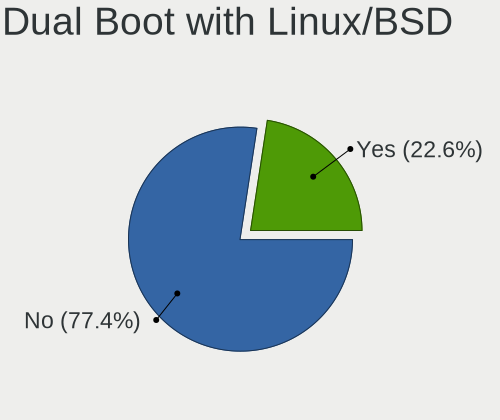

| Dual boot | Computers | Percent |
|-----------|-----------|---------|
| No        | 1295      | 77.41%  |
| Yes       | 378       | 22.59%  |

Dual Boot (Win)
---------------

Hosting Linux and Windows

| Dual boot | Computers | Percent |
|-----------|-----------|---------|
| No        | 1188      | 71.44%  |
| Yes       | 475       | 28.56%  |

Board
-----

Vendor
------

Motherboard manufacturer

| Name                                 | Computers | Percent |
|--------------------------------------|-----------|---------|
| ASUSTek Computer                     | 217       | 13.3%   |
| Lenovo                               | 177       | 10.85%  |
| Hewlett-Packard                      | 126       | 7.73%   |
| Dell                                 | 123       | 7.54%   |
| ASRock                               | 123       | 7.54%   |
| Toshiba                              | 90        | 5.52%   |
| Gigabyte Technology                  | 89        | 5.46%   |
| MSI                                  | 81        | 4.97%   |
| Fujitsu                              | 74        | 4.54%   |
| NEC Computers                        | 72        | 4.41%   |
| Apple                                | 58        | 3.56%   |
| Intel                                | 36        | 2.21%   |
| MouseComputer                        | 32        | 1.96%   |
| Sony                                 | 27        | 1.66%   |
| Acer                                 | 25        | 1.53%   |
| Panasonic                            | 23        | 1.41%   |
| Unknown                              | 18        | 1.1%    |
| Raspberry Pi Foundation              | 16        | 0.98%   |
| HUAWEI                               | 11        | 0.67%   |
| ECS                                  | 11        | 0.67%   |
| Biostar                              | 11        | 0.67%   |
| Microsoft                            | 10        | 0.61%   |
| Valve                                | 8         | 0.49%   |
| Gateway                              | 8         | 0.49%   |
| EPSON DIRECT                         | 8         | 0.49%   |
| Shenzhen Meigao Electronic Equipment | 7         | 0.43%   |
| Dynabook                             | 7         | 0.43%   |
| Supermicro                           | 6         | 0.37%   |
| Alienware                            | 6         | 0.37%   |
| Timi                                 | 5         | 0.31%   |
| Google                               | 5         | 0.31%   |
| Foxconn                              | 5         | 0.31%   |
| Wistron                              | 4         | 0.25%   |
| Pegatron                             | 4         | 0.25%   |
| Novastar                             | 4         | 0.25%   |
| MCJ                                  | 4         | 0.25%   |
| AZW                                  | 4         | 0.25%   |
| UNITCOM                              | 3         | 0.18%   |
| Thirdwave                            | 3         | 0.18%   |
| Teclast                              | 3         | 0.18%   |

Model
-----

Motherboard model

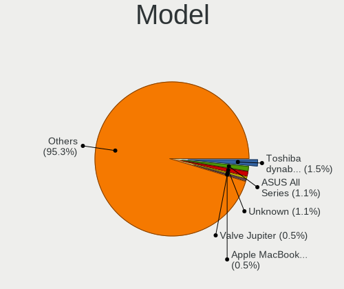

| Name                                       | Computers | Percent |
|--------------------------------------------|-----------|---------|
| Toshiba dynabook T653/46JR                 | 24        | 1.47%   |
| ASUS All Series                            | 18        | 1.1%    |
| Unknown                                    | 18        | 1.1%    |
| Valve Jupiter                              | 8         | 0.49%   |
| Apple MacBookAir9,1                        | 8         | 0.49%   |
| RPi Raspberry Pi                           | 6         | 0.37%   |
| HP ProDesk 600 G1 SFF                      | 6         | 0.37%   |
| Toshiba dynabook Satellite B552/G          | 5         | 0.31%   |
| MSI MS-7C95                                | 5         | 0.31%   |
| ASRock B450M Pro4                          | 5         | 0.31%   |
| Apple MacBookPro9,2                        | 5         | 0.31%   |
| RPi Raspberry Pi 4 Model B Rev 1.4         | 4         | 0.25%   |
| Novastar KL55                              | 4         | 0.25%   |
| MSI MS-7B79                                | 4         | 0.25%   |
| MSI MS-7A40                                | 4         | 0.25%   |
| Lenovo G570 4334                           | 4         | 0.25%   |
| ECS G31T-M                                 | 4         | 0.25%   |
| Dell OptiPlex 3020                         | 4         | 0.25%   |
| Dell OptiPlex 3010                         | 4         | 0.25%   |
| ASRock Z87 Killer                          | 4         | 0.25%   |
| ASRock B450 Pro4                           | 4         | 0.25%   |
| ASRock B450 Gaming-ITX/ac                  | 4         | 0.25%   |
| Toshiba dynabook Satellite B552/H          | 3         | 0.18%   |
| Toshiba dynabook REGZA PC D712/T3FWD       | 3         | 0.18%   |
| Supermicro Super Server                    | 3         | 0.18%   |
| RPi Raspberry Pi 4 Model B Rev 1.2         | 3         | 0.18%   |
| NEC Computers Express5800/S70 [N8100-9021] | 3         | 0.18%   |
| MSI MS-7C94                                | 3         | 0.18%   |
| Lenovo G550 2958                           | 3         | 0.18%   |
| Intel NUC10i7FNH                           | 3         | 0.18%   |
| Intel NUC10i5FNH                           | 3         | 0.18%   |
| HP Z620 Workstation                        | 3         | 0.18%   |
| HP Notebook                                | 3         | 0.18%   |
| Gigabyte B75M-D3H                          | 3         | 0.18%   |
| Gigabyte B550I AORUS PRO AX                | 3         | 0.18%   |
| Dell Precision WorkStation T3500           | 3         | 0.18%   |
| Dell Inspiron 1545                         | 3         | 0.18%   |
| Dell Inspiron 14 5420                      | 3         | 0.18%   |
| ASUS PRIME H670-PLUS D4                    | 3         | 0.18%   |
| ASUS P8Z77-V PRO                           | 3         | 0.18%   |

Model Family
------------

Motherboard model prefix

| Name                  | Computers | Percent |
|-----------------------|-----------|---------|
| Lenovo ThinkPad       | 109       | 6.68%   |
| Toshiba dynabook      | 87        | 5.33%   |
| Dell Inspiron         | 45        | 2.76%   |
| ASUS PRIME            | 29        | 1.78%   |
| ASUS ROG              | 25        | 1.53%   |
| Dell Latitude         | 18        | 1.1%    |
| ASUS All              | 18        | 1.1%    |
| Unknown               | 18        | 1.1%    |
| HP ProBook            | 17        | 1.04%   |
| ASUS TUF              | 17        | 1.04%   |
| RPi Raspberry         | 16        | 0.98%   |
| Acer Aspire           | 16        | 0.98%   |
| HP ProDesk            | 14        | 0.86%   |
| HP Pavilion           | 14        | 0.86%   |
| Dell XPS              | 13        | 0.8%    |
| Dell Vostro           | 13        | 0.8%    |
| Dell OptiPlex         | 13        | 0.8%    |
| HP Compaq             | 12        | 0.74%   |
| Lenovo ThinkCentre    | 11        | 0.67%   |
| Microsoft Surface     | 10        | 0.61%   |
| Lenovo IdeaPad        | 10        | 0.61%   |
| ASUS VivoBook         | 10        | 0.61%   |
| HP EliteBook          | 9         | 0.55%   |
| ASRock B450           | 9         | 0.55%   |
| Valve Jupiter         | 8         | 0.49%   |
| Lenovo Yoga           | 8         | 0.49%   |
| HP Laptop             | 8         | 0.49%   |
| HP ENVY               | 8         | 0.49%   |
| EPSON DIRECT Endeavor | 8         | 0.49%   |
| Dell Precision        | 8         | 0.49%   |
| Apple MacBookAir9     | 8         | 0.49%   |
| Lenovo ThinkBook      | 7         | 0.43%   |
| ASUS P8Z77-V          | 6         | 0.37%   |
| Apple MacBookPro11    | 6         | 0.37%   |
| MSI MS-7C95           | 5         | 0.31%   |
| Fujitsu PRIMERGY      | 5         | 0.31%   |
| ASUS ZenBook          | 5         | 0.31%   |
| ASUS ASUS             | 5         | 0.31%   |
| ASRock Z87            | 5         | 0.31%   |
| ASRock B550M          | 5         | 0.31%   |

MFG Year
--------

Motherboard manufacture year

| Year    | Computers | Percent |
|---------|-----------|---------|
| 2018    | 155       | 9.5%    |
| 2013    | 155       | 9.5%    |
| 2012    | 132       | 8.09%   |
| 2020    | 126       | 7.73%   |
| 2021    | 116       | 7.11%   |
| 2019    | 103       | 6.32%   |
| 2011    | 99        | 6.07%   |
| 2010    | 82        | 5.03%   |
| 2016    | 79        | 4.84%   |
| 2017    | 77        | 4.72%   |
| 2009    | 70        | 4.29%   |
| 2014    | 66        | 4.05%   |
| 2008    | 65        | 3.99%   |
| 2015    | 64        | 3.92%   |
| 2023    | 63        | 3.86%   |
| 2022    | 59        | 3.62%   |
| 2007    | 50        | 3.07%   |
| 2024    | 24        | 1.47%   |
| 2006    | 20        | 1.23%   |
| Unknown | 18        | 1.1%    |
| 2005    | 6         | 0.37%   |
| 2004    | 1         | 0.06%   |
| 2003    | 1         | 0.06%   |

Form Factor
-----------

Physical design of the computer

| Name           | Computers | Percent |
|----------------|-----------|---------|
| Notebook       | 783       | 48.01%  |
| Desktop        | 687       | 42.12%  |
| Mini pc        | 35        | 2.15%   |
| All in one     | 33        | 2.02%   |
| Tablet         | 31        | 1.9%    |
| Convertible    | 23        | 1.41%   |
| System on chip | 19        | 1.16%   |
| Server         | 19        | 1.16%   |
| Phone          | 1         | 0.06%   |

Secure Boot
-----------

Enabled or disabled

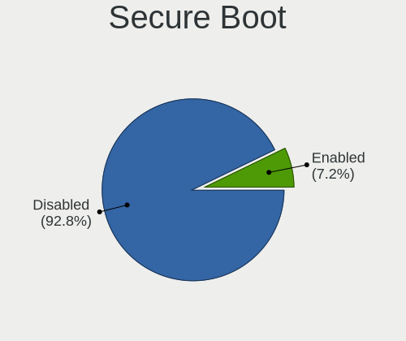

| State    | Computers | Percent |
|----------|-----------|---------|
| Disabled | 1524      | 92.81%  |
| Enabled  | 118       | 7.19%   |

Coreboot
--------

Have coreboot on board

| Used | Computers | Percent |
|------|-----------|---------|
| No   | 1622      | 99.45%  |
| Yes  | 9         | 0.55%   |

RAM Size
--------

Total RAM memory

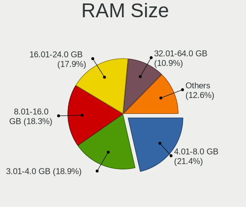

| Size in GB      | Computers | Percent |
|-----------------|-----------|---------|
| 4.01-8.0        | 356       | 21.42%  |
| 3.01-4.0        | 314       | 18.89%  |
| 8.01-16.0       | 304       | 18.29%  |
| 16.01-24.0      | 297       | 17.87%  |
| 32.01-64.0      | 181       | 10.89%  |
| 64.01-256.0     | 66        | 3.97%   |
| 1.01-2.0        | 60        | 3.61%   |
| 24.01-32.0      | 51        | 3.07%   |
| 2.01-3.0        | 20        | 1.2%    |
| 0.51-1.0        | 7         | 0.42%   |
| More than 256.0 | 3         | 0.18%   |
| 0.01-0.5        | 3         | 0.18%   |

RAM Used
--------

Used RAM memory

| Used GB    | Computers | Percent |
|------------|-----------|---------|
| 1.01-2.0   | 699       | 38.85%  |
| 2.01-3.0   | 384       | 21.35%  |
| 4.01-8.0   | 230       | 12.78%  |
| 3.01-4.0   | 214       | 11.9%   |
| 0.51-1.0   | 149       | 8.28%   |
| 8.01-16.0  | 68        | 3.78%   |
| 0.01-0.5   | 30        | 1.67%   |
| 16.01-24.0 | 15        | 0.83%   |
| 24.01-32.0 | 6         | 0.33%   |
| 32.01-64.0 | 3         | 0.17%   |
| Unknown    | 1         | 0.06%   |

Total Drives
------------

Number of drives on board

| Drives | Computers | Percent |
|--------|-----------|---------|
| 1      | 1009      | 59.81%  |
| 2      | 421       | 24.96%  |
| 3      | 128       | 7.59%   |
| 4      | 63        | 3.73%   |
| 5      | 25        | 1.48%   |
| 0      | 15        | 0.89%   |
| 6      | 11        | 0.65%   |
| 7      | 7         | 0.41%   |
| 8      | 3         | 0.18%   |
| 9      | 2         | 0.12%   |
| 26     | 1         | 0.06%   |
| 11     | 1         | 0.06%   |
| 10     | 1         | 0.06%   |

Has CD-ROM
----------

Has CD-ROM on board

| Presented | Computers | Percent |
|-----------|-----------|---------|
| No        | 913       | 55.43%  |
| Yes       | 734       | 44.57%  |

Has Ethernet
------------

Has Ethernet on board

| Presented | Computers | Percent |
|-----------|-----------|---------|
| Yes       | 1417      | 86.72%  |
| No        | 217       | 13.28%  |

Has WiFi
--------

Has WiFi module

| Presented | Computers | Percent |
|-----------|-----------|---------|
| Yes       | 1129      | 68.88%  |
| No        | 510       | 31.12%  |

Has Bluetooth
-------------

Has Bluetooth module

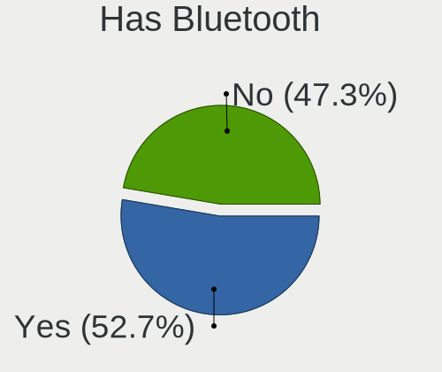

| Presented | Computers | Percent |
|-----------|-----------|---------|
| Yes       | 873       | 52.65%  |
| No        | 785       | 47.35%  |

Location
--------

Country
-------

Geographic location (country)

| Country | Computers | Percent |
|---------|-----------|---------|
| Japan   | 1631      | 100%    |

City
----

Geographic location (city)

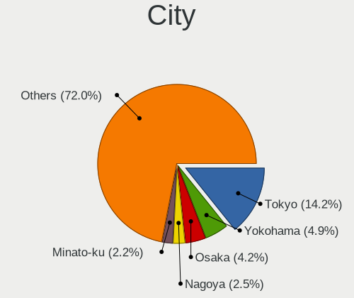

| City        | Computers | Percent |
|-------------|-----------|---------|
| Tokyo       | 250       | 14.22%  |
| Yokohama    | 86        | 4.89%   |
| Osaka       | 74        | 4.21%   |
| Nagoya      | 44        | 2.5%    |
| Minato-ku   | 39        | 2.22%   |
| Shinjuku    | 31        | 1.76%   |
| Chiyoda     | 31        | 1.76%   |
| Niigata     | 24        | 1.37%   |
| Saitama     | 21        | 1.19%   |
| Kyoto       | 21        | 1.19%   |
| Honcho      | 19        | 1.08%   |
| Tsukuba     | 17        | 0.97%   |
| Shibuya     | 17        | 0.97%   |
| Setagaya-ku | 17        | 0.97%   |
| Sapporo     | 17        | 0.97%   |
| Kobe        | 17        | 0.97%   |
| Fukuoka     | 14        | 0.8%    |
| Takamatsu   | 11        | 0.63%   |
| Nakano      | 11        | 0.63%   |
| Miura       | 11        | 0.63%   |
| Kagoshima   | 11        | 0.63%   |
| Shinagawa   | 10        | 0.57%   |
| Okayama     | 10        | 0.57%   |
| Kochi       | 10        | 0.57%   |
| Ichikawa    | 10        | 0.57%   |
| Chiyoda-ku  | 10        | 0.57%   |
| Adachi      | 10        | 0.57%   |
| Umeda       | 9         | 0.51%   |
| Minatomirai | 9         | 0.51%   |
| Kawaguchi   | 9         | 0.51%   |
| Hiroshima   | 9         | 0.51%   |
| Himeji      | 9         | 0.51%   |
| Utsunomiya  | 8         | 0.46%   |
| Takasago    | 8         | 0.46%   |
| tsu       | 8         | 0.46%   |
| Nagasaki    | 8         | 0.46%   |
| Morioka     | 8         | 0.46%   |
| Miyazaki    | 8         | 0.46%   |
| Mito        | 8         | 0.46%   |
| Kumamoto    | 8         | 0.46%   |

Drives
------

Drive Vendor
------------

Hard drive vendors

| Vendor                      | Computers | Drives | Percent |
|-----------------------------|-----------|--------|---------|
| WDC                         | 309       | 472    | 12.67%  |
| Seagate                     | 288       | 440    | 11.81%  |
| Samsung Electronics         | 252       | 348    | 10.33%  |
| Toshiba                     | 207       | 249    | 8.49%   |
| SanDisk                     | 119       | 166    | 4.88%   |
| Unknown                     | 118       | 149    | 4.84%   |
| Hitachi                     | 117       | 170    | 4.8%    |
| Crucial                     | 117       | 163    | 4.8%    |
| Intel                       | 71        | 94     | 2.91%   |
| A-DATA Technology           | 56        | 71     | 2.3%    |
| SPCC                        | 45        | 56     | 1.85%   |
| Kingston                    | 45        | 51     | 1.85%   |
| Micron Technology           | 43        | 60     | 1.76%   |
| Apple                       | 42        | 51     | 1.72%   |
| SK hynix                    | 36        | 38     | 1.48%   |
| Unknown                     | 31        | 33     | 1.27%   |
| HGST                        | 27        | 32     | 1.11%   |
| Micron/Crucial Technology   | 24        | 33     | 0.98%   |
| Transcend                   | 22        | 29     | 0.9%    |
| KIOXIA                      | 21        | 24     | 0.86%   |
| SUNEAST                     | 20        | 24     | 0.82%   |
| Phison Electronics          | 20        | 31     | 0.82%   |
| China                       | 20        | 29     | 0.82%   |
| MAXIO Technology (Hangzhou) | 19        | 21     | 0.78%   |
| Silicon Motion              | 17        | 24     | 0.7%    |
| Phison                      | 17        | 23     | 0.7%    |
| Plextor                     | 14        | 18     | 0.57%   |
| KIOXIA-EXCERIA              | 14        | 16     | 0.57%   |
| Fujitsu                     | 13        | 15     | 0.53%   |
| Lexar                       | 12        | 15     | 0.49%   |
| Dogfish                     | 10        | 12     | 0.41%   |
| BUFFALO                     | 10        | 12     | 0.41%   |
| Teclast                     | 9         | 10     | 0.37%   |
| JMicron Technology          | 9         | 10     | 0.37%   |
| Team                        | 8         | 9      | 0.33%   |
| Patriot                     | 8         | 9      | 0.33%   |
| OCZ                         | 8         | 8      | 0.33%   |
| KLEVV                       | 8         | 17     | 0.33%   |
| Kingston Technology Company | 8         | 9      | 0.33%   |
| Green House                 | 7         | 10     | 0.29%   |

Drive Model
-----------

Hard drive models

| Model                                                | Computers | Percent |
|------------------------------------------------------|-----------|---------|
| Unknown                                              | 31        | 1.17%   |
| Toshiba MQ01ABD075 752GB                             | 25        | 0.94%   |
| Unknown MMC Card  64GB                               | 24        | 0.91%   |
| Crucial CT500MX500SSD1 500GB                         | 24        | 0.91%   |
| Toshiba DT01ACA100 1TB                               | 21        | 0.79%   |
| Crucial CT240BX500SSD1 240GB                         | 21        | 0.79%   |
| Samsung NVMe SSD Controller SM981/PM981/PM983 512GB  | 19        | 0.72%   |
| Unknown MMC Card  32GB                               | 16        | 0.6%    |
| Toshiba MQ01ABD100 1TB                               | 14        | 0.53%   |
| Seagate ST4000DM004-2CV104 4TB                       | 14        | 0.53%   |
| Seagate ST1000DM010-2EP102 1TB                       | 12        | 0.45%   |
| Unknown MMC Card  128GB                              | 11        | 0.42%   |
| Toshiba DT01ACA200 2TB                               | 11        | 0.42%   |
| SPCC Solid State Disk 256GB                          | 11        | 0.42%   |
| Seagate ST3500418AS 500GB                            | 11        | 0.42%   |
| Phison PS5013 E13 NVMe Controller 512GB              | 11        | 0.42%   |
| Micron/Crucial P2 NVMe PCIe SSD 500GB                | 11        | 0.42%   |
| WDC WD40EZRZ-00GXCB0 4TB                             | 10        | 0.38%   |
| Toshiba MQ01ABF050 500GB                             | 10        | 0.38%   |
| Seagate ST500DM002-1BD142 500GB                      | 10        | 0.38%   |
| Samsung SSD 860 EVO 500GB                            | 10        | 0.38%   |
| Samsung NVMe SSD Controller PM9A1/PM9A3/980PRO 512GB | 10        | 0.38%   |
| Seagate ST9500325AS 500GB                            | 9         | 0.34%   |
| Seagate ST2000DM001-1CH164 2TB                       | 9         | 0.34%   |
| Crucial CT1000MX500SSD1 1TB                          | 9         | 0.34%   |
| WDC WD20EZRX-00DC0B0 2TB                             | 8         | 0.3%    |
| Seagate ST2000DM008-2FR102 2TB                       | 8         | 0.3%    |
| Seagate ST1000DM003-1ER162 1TB                       | 8         | 0.3%    |
| Sandisk WD Blue SN550 NVMe SSD 256GB                 | 8         | 0.3%    |
| SanDisk NVMe SSD Drive 1TB                           | 8         | 0.3%    |
| Kingston SV300S37A120G 120GB SSD                     | 8         | 0.3%    |
| Crucial CT525MX300SSD1 528GB                         | 8         | 0.3%    |
| Apple SSD AP0256N 256GB                              | 8         | 0.3%    |
| A-DATA SU650 240GB SSD                               | 8         | 0.3%    |
| WDC WD10EZEX-00BN5A0 1TB                             | 7         | 0.26%   |
| WDC WD10EADS-00L5B1 1TB                              | 7         | 0.26%   |
| Toshiba MQ01ABF032 320GB                             | 7         | 0.26%   |
| Seagate ST31000528AS 1TB                             | 7         | 0.26%   |
| Seagate ST2000DM006-2DM164 2TB                       | 7         | 0.26%   |
| Seagate ST1000LM035-1RK172 1TB                       | 7         | 0.26%   |

HDD Vendor
----------

Hard disk drive vendors

| Vendor              | Computers | Drives | Percent |
|---------------------|-----------|--------|---------|
| Seagate             | 280       | 425    | 30.5%   |
| WDC                 | 252       | 373    | 27.45%  |
| Toshiba             | 162       | 189    | 17.65%  |
| Hitachi             | 112       | 165    | 12.2%   |
| HGST                | 27        | 32     | 2.94%   |
| Samsung Electronics | 24        | 32     | 2.61%   |
| Fujitsu             | 13        | 15     | 1.42%   |
| Apple               | 7         | 8      | 0.76%   |
| Unknown             | 6         | 8      | 0.65%   |
| Maxtor              | 6         | 8      | 0.65%   |
| JMicron Technology  | 5         | 6      | 0.54%   |
| USB                 | 4         | 4      | 0.44%   |
| SABRENT             | 3         | 5      | 0.33%   |
| Hewlett-Packard     | 3         | 9      | 0.33%   |
| ASMT                | 3         | 4      | 0.33%   |
| QC-FT-D             | 2         | 2      | 0.22%   |
| MARVELL             | 2         | 4      | 0.22%   |
| External            | 2         | 2      | 0.22%   |
| TO Exter            | 1         | 1      | 0.11%   |
| StoreJet            | 1         | 1      | 0.11%   |
| Quantum             | 1         | 1      | 0.11%   |
| MARSHAL             | 1         | 2      | 0.11%   |
| KESU                | 1         | 1      | 0.11%   |

SSD Vendor
----------

Solid state drive vendors

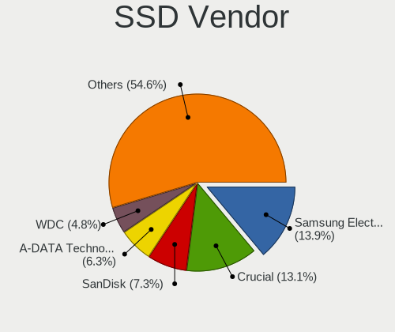

| Vendor              | Computers | Drives | Percent |
|---------------------|-----------|--------|---------|
| Samsung Electronics | 115       | 158    | 13.92%  |
| Crucial             | 108       | 149    | 13.08%  |
| SanDisk             | 60        | 84     | 7.26%   |
| A-DATA Technology   | 52        | 66     | 6.3%    |
| WDC                 | 40        | 55     | 4.84%   |
| Intel               | 36        | 41     | 4.36%   |
| SPCC                | 35        | 44     | 4.24%   |
| Kingston            | 33        | 38     | 4%      |
| Toshiba             | 30        | 36     | 3.63%   |
| Transcend           | 20        | 27     | 2.42%   |
| China               | 20        | 29     | 2.42%   |
| SUNEAST             | 19        | 23     | 2.3%    |
| Unknown             | 16        | 17     | 1.94%   |
| Micron Technology   | 15        | 19     | 1.82%   |
| Apple               | 15        | 17     | 1.82%   |
| Plextor             | 14        | 18     | 1.69%   |
| Dogfish             | 10        | 12     | 1.21%   |
| BUFFALO             | 10        | 12     | 1.21%   |
| Unknown             | 9         | 9      | 1.09%   |
| KIOXIA-EXCERIA      | 9         | 10     | 1.09%   |
| Team                | 8         | 9      | 0.97%   |
| OCZ                 | 8         | 8      | 0.97%   |
| Lexar               | 8         | 11     | 0.97%   |
| KLEVV               | 8         | 17     | 0.97%   |
| Teclast             | 7         | 8      | 0.85%   |
| Green House         | 7         | 10     | 0.85%   |
| Seagate             | 6         | 9      | 0.73%   |
| CFD                 | 6         | 6      | 0.73%   |
| Apacer              | 6         | 9      | 0.73%   |
| PNY                 | 5         | 5      | 0.61%   |
| Hitachi             | 5         | 5      | 0.61%   |
| SK hynix            | 4         | 4      | 0.48%   |
| Patriot             | 4         | 5      | 0.48%   |
| Biostar             | 4         | 4      | 0.48%   |
| Zheino              | 3         | 3      | 0.36%   |
| Netac               | 3         | 4      | 0.36%   |
| LITEONIT            | 3         | 5      | 0.36%   |
| Lite-On             | 3         | 4      | 0.36%   |
| Kingmax             | 3         | 3      | 0.36%   |
| Hanye               | 3         | 4      | 0.36%   |

Drive Kind
----------

HDD or SSD

| Kind    | Computers | Drives | Percent |
|---------|-----------|--------|---------|
| HDD     | 766       | 1297   | 36.1%   |
| SSD     | 708       | 1065   | 33.36%  |
| NVMe    | 500       | 742    | 23.56%  |
| MMC     | 102       | 127    | 4.81%   |
| Unknown | 46        | 70     | 2.17%   |

Drive Connector
---------------

SATA, SAS, NVMe, etc.

| Type | Computers | Drives | Percent |
|------|-----------|--------|---------|
| SATA | 1205      | 2253   | 62.79%  |
| NVMe | 498       | 736    | 25.95%  |
| SAS  | 114       | 185    | 5.94%   |
| MMC  | 102       | 127    | 5.32%   |

Drive Size
----------

Size of hard drive

| Size in TB | Computers | Drives | Percent |
|------------|-----------|--------|---------|
| 0.01-0.5   | 916       | 1432   | 60.03%  |
| 0.51-1.0   | 341       | 507    | 22.35%  |
| 1.01-2.0   | 146       | 210    | 9.57%   |
| 3.01-4.0   | 49        | 84     | 3.21%   |
| 2.01-3.0   | 33        | 50     | 2.16%   |
| 4.01-10.0  | 33        | 67     | 2.16%   |
| 10.01-20.0 | 8         | 12     | 0.52%   |

Space Total
-----------

Amount of disk space available on the file system

| Size in GB     | Computers | Percent |
|----------------|-----------|---------|
| 101-250        | 500       | 28.8%   |
| 251-500        | 287       | 16.53%  |
| 501-1000       | 232       | 13.36%  |
| 1-20           | 150       | 8.64%   |
| 51-100         | 132       | 7.6%    |
| 1001-2000      | 119       | 6.85%   |
| More than 3000 | 109       | 6.28%   |
| 21-50          | 78        | 4.49%   |
| Unknown        | 69        | 3.97%   |
| 2001-3000      | 60        | 3.46%   |

Space Used
----------

Amount of used disk space

| Used GB        | Computers | Percent |
|----------------|-----------|---------|
| 1-20           | 777       | 43.43%  |
| 21-50          | 283       | 15.82%  |
| 101-250        | 173       | 9.67%   |
| 51-100         | 171       | 9.56%   |
| 251-500        | 118       | 6.6%    |
| 501-1000       | 96        | 5.37%   |
| Unknown        | 69        | 3.86%   |
| 1001-2000      | 45        | 2.52%   |
| More than 3000 | 36        | 2.01%   |
| 2001-3000      | 21        | 1.17%   |

Malfunc. Drives
---------------

Drive models with a malfunction

| Model                              | Computers | Drives | Percent |
|------------------------------------|-----------|--------|---------|
| Toshiba MQ01ABD075 752GB           | 24        | 24     | 15.79%  |
| Seagate ST9500325AS 500GB          | 6         | 7      | 3.95%   |
| WDC WD10EADS-22M2B0 1TB            | 5         | 5      | 3.29%   |
| SanDisk SD6SF1M128G1022I 128GB SSD | 5         | 5      | 3.29%   |
| Seagate ST9160314AS 160GB          | 3         | 3      | 1.97%   |
| Seagate ST3500418AS 500GB          | 3         | 4      | 1.97%   |
| Seagate ST2000DM001-1CH164 2TB     | 3         | 3      | 1.97%   |
| Toshiba MQ01ABD100 1TB             | 2         | 2      | 1.32%   |
| Hitachi HDS721010CLA332 1TB        | 2         | 2      | 1.32%   |
| HGST HTS541075A9E680 752GB         | 2         | 3      | 1.32%   |
| WDC WD5000LPLX-66ZNTT0 500GB       | 1         | 1      | 0.66%   |
| WDC WD5000BEVT-55A0RT0 500GB       | 1         | 1      | 0.66%   |
| WDC WD5000AAKX-75U6AA0 500GB       | 1         | 1      | 0.66%   |
| WDC WD40EZRZ-00GXCB0 4TB           | 1         | 1      | 0.66%   |
| WDC WD3200LPCX-24C6HT0 320GB       | 1         | 1      | 0.66%   |
| WDC WD3200BEVT-08A23T1 320GB       | 1         | 1      | 0.66%   |
| WDC WD30EZRX-19D8PB0 3TB           | 1         | 1      | 0.66%   |
| WDC WD30EZRX-00DC0B0 3TB           | 1         | 2      | 0.66%   |
| WDC WD30EZRX-00D8PB0 3TB           | 1         | 1      | 0.66%   |
| WDC WD25EZRX-00MMMB0 2TB           | 1         | 1      | 0.66%   |
| WDC WD1600BEVS-26RST0 160GB        | 1         | 1      | 0.66%   |
| WDC WD10JPCX-24UE4T0 1TB           | 1         | 1      | 0.66%   |
| WDC WD10EALX-009BA0 1TB            | 1         | 1      | 0.66%   |
| WDC WD10EADS-00L5B1 1TB            | 1         | 1      | 0.66%   |
| WDC WD10EACS-00D6B0 1TB            | 1         | 2      | 0.66%   |
| Transcend TS240GSSD220S 240GB      | 1         | 1      | 0.66%   |
| Toshiba MK5055GSX 500GB            | 1         | 1      | 0.66%   |
| Toshiba MK2561GSYN 250GB           | 1         | 1      | 0.66%   |
| Toshiba MK2555GSX 250GB            | 1         | 1      | 0.66%   |
| Toshiba MK2552GSX 250GB            | 1         | 1      | 0.66%   |
| Toshiba MK1652GSX 160GB            | 1         | 1      | 0.66%   |
| Toshiba MK1255GSX H 120GB          | 1         | 1      | 0.66%   |
| Toshiba DT01ACA200 2TB             | 1         | 1      | 0.66%   |
| Teclast 240GB SSD                  | 1         | 1      | 0.66%   |
| Teclast 128GB SSD                  | 1         | 1      | 0.66%   |
| SUNEAST SE800 SSD 320GB            | 1         | 1      | 0.66%   |
| SSSTC CL1-4D128 128GB              | 1         | 1      | 0.66%   |
| SPCC Solid State DiskB28 128GB     | 1         | 1      | 0.66%   |
| SPCC Solid State Disk 512GB        | 1         | 2      | 0.66%   |
| Seagate ST9320320AS 320GB          | 1         | 1      | 0.66%   |

Malfunc. Drive Vendor
---------------------

Vendors of faulty drives

| Vendor              | Computers | Drives | Percent |
|---------------------|-----------|--------|---------|
| Seagate             | 35        | 39     | 23.33%  |
| Toshiba             | 33        | 33     | 22%     |
| WDC                 | 20        | 22     | 13.33%  |
| Hitachi             | 14        | 16     | 9.33%   |
| SanDisk             | 8         | 9      | 5.33%   |
| Samsung Electronics | 5         | 6      | 3.33%   |
| Crucial             | 5         | 7      | 3.33%   |
| A-DATA Technology   | 4         | 4      | 2.67%   |
| Intel               | 3         | 3      | 2%      |
| HGST                | 3         | 4      | 2%      |
| Teclast             | 2         | 2      | 1.33%   |
| SPCC                | 2         | 3      | 1.33%   |
| Maxtor              | 2         | 2      | 1.33%   |
| Kingston            | 2         | 2      | 1.33%   |
| Transcend           | 1         | 1      | 0.67%   |
| SUNEAST             | 1         | 1      | 0.67%   |
| SSSTC               | 1         | 1      | 0.67%   |
| Netac               | 1         | 1      | 0.67%   |
| Micron Technology   | 1         | 1      | 0.67%   |
| MARSHAL             | 1         | 1      | 0.67%   |
| LITEON              | 1         | 4      | 0.67%   |
| Lite-On             | 1         | 1      | 0.67%   |
| Drevo               | 1         | 1      | 0.67%   |
| Corsair             | 1         | 1      | 0.67%   |
| China               | 1         | 1      | 0.67%   |
| C300-CTF            | 1         | 1      | 0.67%   |

Malfunc. HDD Vendor
-------------------

Vendors of faulty HDD drives

| Vendor              | Computers | Drives | Percent |
|---------------------|-----------|--------|---------|
| Seagate             | 35        | 39     | 31.53%  |
| Toshiba             | 33        | 33     | 29.73%  |
| WDC                 | 20        | 22     | 18.02%  |
| Hitachi             | 14        | 16     | 12.61%  |
| Samsung Electronics | 3         | 4      | 2.7%    |
| HGST                | 3         | 4      | 2.7%    |
| Maxtor              | 2         | 2      | 1.8%    |
| MARSHAL             | 1         | 1      | 0.9%    |

Malfunc. Drive Kind
-------------------

Kinds of faulty drives

| Kind | Computers | Drives | Percent |
|------|-----------|--------|---------|
| HDD  | 104       | 121    | 72.73%  |
| SSD  | 38        | 45     | 26.57%  |
| NVMe | 1         | 1      | 0.7%    |

Failed Drives
-------------

Failed drive models

| Model                           | Computers | Drives | Percent |
|---------------------------------|-----------|--------|---------|
| Seagate ST32000542AS 2TB        | 1         | 1      | 50%     |
| Samsung Electronics SSD 980 1TB | 1         | 1      | 50%     |

Failed Drive Vendor
-------------------

Failed drive vendors

| Vendor              | Computers | Drives | Percent |
|---------------------|-----------|--------|---------|
| Seagate             | 1         | 1      | 50%     |
| Samsung Electronics | 1         | 1      | 50%     |

Drive Status
------------

Number of failed and malfunc. drives

| Status   | Computers | Drives | Percent |
|----------|-----------|--------|---------|
| Detected | 921       | 1932   | 51.92%  |
| Works    | 715       | 1200   | 40.3%   |
| Malfunc  | 136       | 167    | 7.67%   |
| Failed   | 2         | 2      | 0.11%   |

Storage controller
------------------

Storage Vendor
--------------

Storage controller vendors

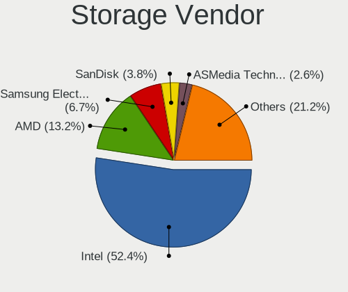

| Vendor                                  | Computers | Percent |
|-----------------------------------------|-----------|---------|
| Intel                                   | 1091      | 52.43%  |
| AMD                                     | 274       | 13.17%  |
| Samsung Electronics                     | 140       | 6.73%   |
| SanDisk                                 | 79        | 3.8%    |
| ASMedia Technology                      | 55        | 2.64%   |
| Phison Electronics                      | 42        | 2.02%   |
| SK hynix                                | 33        | 1.59%   |
| Micron/Crucial Technology               | 33        | 1.59%   |
| Marvell Technology Group                | 33        | 1.59%   |
| Micron Technology                       | 30        | 1.44%   |
| MAXIO Technology (Hangzhou)             | 28        | 1.35%   |
| Silicon Motion                          | 27        | 1.3%    |
| KIOXIA                                  | 27        | 1.3%    |
| JMicron Technology                      | 26        | 1.25%   |
| Apple                                   | 21        | 1.01%   |
| Kingston Technology Company             | 20        | 0.96%   |
| Toshiba America Info Systems            | 17        | 0.82%   |
| Nvidia                                  | 15        | 0.72%   |
| VIA Technologies                        | 12        | 0.58%   |
| Broadcom / LSI                          | 12        | 0.58%   |
| ADATA Technology                        | 9         | 0.43%   |
| Realtek Semiconductor                   | 8         | 0.38%   |
| Yangtze Memory Technologies             | 5         | 0.24%   |
| Seagate Technology                      | 5         | 0.24%   |
| INNOGRIT                                | 4         | 0.19%   |
| Solid State Storage Technology          | 3         | 0.14%   |
| Shenzhen Unionmemory Information System | 3         | 0.14%   |
| Shenzhen Longsys Electronics            | 3         | 0.14%   |
| LSI Logic / Symbios Logic               | 3         | 0.14%   |
| Adaptec                                 | 3         | 0.14%   |
| Transcend                               | 2         | 0.1%    |
| Silicon Image                           | 2         | 0.1%    |
| Nextorage                               | 2         | 0.1%    |
| Integrated Technology Express           | 2         | 0.1%    |
| HighPoint Technologies                  | 2         | 0.1%    |
| ULi Electronics                         | 1         | 0.05%   |
| Solidigm                                | 1         | 0.05%   |
| Silicon Integrated Systems [SiS]        | 1         | 0.05%   |
| Promise Technology                      | 1         | 0.05%   |
| O2 Micro                                | 1         | 0.05%   |

Storage Model
-------------

Storage controller models

| Model                                                                          | Computers | Percent |
|--------------------------------------------------------------------------------|-----------|---------|
| AMD FCH SATA Controller [AHCI mode]                                            | 159       | 6.63%   |
| Intel 7 Series Chipset Family 6-port SATA Controller [AHCI mode]               | 113       | 4.71%   |
| Intel 8 Series/C220 Series Chipset Family 6-port SATA Controller 1 [AHCI mode] | 85        | 3.54%   |
| Intel Sunrise Point-LP SATA Controller [AHCI mode]                             | 68        | 2.83%   |
| Samsung NVMe SSD Controller SM981/PM981/PM983                                  | 61        | 2.54%   |
| Intel 6 Series/C200 Series Chipset Family 6 port Mobile SATA AHCI Controller   | 61        | 2.54%   |
| ASMedia ASM1061/ASM1062 Serial ATA Controller                                  | 50        | 2.08%   |
| Intel Q170/Q150/B150/H170/H110/Z170/CM236 Chipset SATA Controller [AHCI Mode]  | 42        | 1.75%   |
| AMD 400 Series Chipset SATA Controller                                         | 40        | 1.67%   |
| Intel 7 Series/C210 Series Chipset Family 6-port SATA Controller [AHCI mode]   | 38        | 1.58%   |
| AMD 500 Series Chipset SATA Controller                                         | 37        | 1.54%   |
| Intel Cannon Lake PCH SATA AHCI Controller                                     | 35        | 1.46%   |
| Intel 82801IBM/IEM (ICH9M/ICH9M-E) 4 port SATA Controller [AHCI mode]          | 35        | 1.46%   |
| Intel 6 Series/C200 Series Chipset Family 6 port Desktop SATA AHCI Controller  | 33        | 1.38%   |
| Intel 5 Series/3400 Series Chipset 4 port SATA AHCI Controller                 | 32        | 1.33%   |
| Intel 200 Series PCH SATA controller [AHCI mode]                               | 32        | 1.33%   |
| AMD SB7x0/SB8x0/SB9x0 IDE Controller                                           | 32        | 1.33%   |
| Intel SATA Controller [RAID Mode]                                              | 29        | 1.21%   |
| Intel 82801G (ICH7 Family) IDE Controller                                      | 29        | 1.21%   |
| Intel Volume Management Device NVMe RAID Controller                            | 28        | 1.17%   |
| Intel 82801 Mobile SATA Controller [RAID mode]                                 | 28        | 1.17%   |
| Samsung NVMe SSD Controller 980 (DRAM-less)                                    | 27        | 1.13%   |
| Samsung NVMe SSD Controller PM9A1/PM9A3/980PRO                                 | 26        | 1.08%   |
| Intel 8 Series SATA Controller 1 [AHCI mode]                                   | 26        | 1.08%   |
| Intel Wildcat Point-LP SATA Controller [AHCI Mode]                             | 25        | 1.04%   |
| Intel NM10/ICH7 Family SATA Controller [IDE mode]                              | 22        | 0.92%   |
| Intel Comet Lake SATA AHCI Controller                                          | 22        | 0.92%   |
| AMD SB7x0/SB8x0/SB9x0 SATA Controller [AHCI mode]                              | 21        | 0.88%   |
| SanDisk Ultra 3D / WD PC SN530, IX SN530, Blue SN550 NVMe SSD (DRAM-less)      | 20        | 0.83%   |
| Intel 5 Series/3400 Series Chipset 6 port SATA AHCI Controller                 | 20        | 0.83%   |
| AMD SB7x0/SB8x0/SB9x0 SATA Controller [IDE mode]                               | 20        | 0.83%   |
| Silicon Motion SM2263EN/SM2263XT (DRAM-less) NVMe SSD Controllers              | 19        | 0.79%   |
| Intel Alder Lake-S PCH SATA Controller [AHCI Mode]                             | 19        | 0.79%   |
| JMicron JMB363 SATA/IDE Controller                                             | 18        | 0.75%   |
| Intel 82801HM/HEM (ICH8M/ICH8M-E) IDE Controller                               | 18        | 0.75%   |
| Intel 5 Series/3400 Series Chipset 4 port SATA IDE Controller                  | 18        | 0.75%   |
| Apple ANS2 NVMe Controller                                                     | 18        | 0.75%   |
| Micron/Crucial P2 [Nick P2] / P3 / P3 Plus NVMe PCIe SSD (DRAM-less)           | 17        | 0.71%   |
| Intel Celeron/Pentium Silver Processor SATA Controller                         | 17        | 0.71%   |
| Intel 5 Series/3400 Series Chipset 2 port SATA IDE Controller                  | 17        | 0.71%   |

Storage Kind
------------

Kind of storage controller (IDE, SATA, NVMe, SAS, ...)

| Kind | Computers | Percent |
|------|-----------|---------|
| SATA | 1160      | 57.26%  |
| NVMe | 501       | 24.73%  |
| IDE  | 243       | 11.99%  |
| RAID | 105       | 5.18%   |
| SAS  | 10        | 0.49%   |
| SCSI | 7         | 0.35%   |

Processor
---------

CPU Vendor
----------

Processor vendors

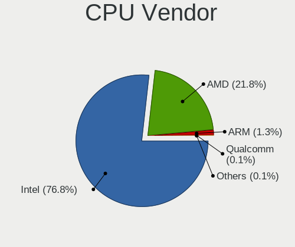

| Vendor       | Computers | Percent |
|--------------|-----------|---------|
| Intel        | 1252      | 76.76%  |
| AMD          | 355       | 21.77%  |
| ARM          | 21        | 1.29%   |
| Qualcomm     | 1         | 0.06%   |
| Loongson     | 1         | 0.06%   |
| CentaurHauls | 1         | 0.06%   |

CPU Model
---------

Processor models

| Model                                   | Computers | Percent |
|-----------------------------------------|-----------|---------|
| Intel Celeron CPU 847 @ 1.10GHz         | 24        | 1.47%   |
| Intel Core i5-3320M CPU @ 2.60GHz       | 20        | 1.22%   |
| ARM Processor                           | 15        | 0.92%   |
| AMD Ryzen 5 3600 6-Core Processor       | 15        | 0.92%   |
| Intel Core i5-10210U CPU @ 1.60GHz      | 14        | 0.86%   |
| Intel Core i7-3770 CPU @ 3.40GHz        | 13        | 0.79%   |
| Intel Core i5-7200U CPU @ 2.50GHz       | 13        | 0.79%   |
| Intel Core i7-2600 CPU @ 3.40GHz        | 11        | 0.67%   |
| Intel Core i5-8400 CPU @ 2.80GHz        | 11        | 0.67%   |
| Intel Core i5-8265U CPU @ 1.60GHz       | 11        | 0.67%   |
| Intel Core i5-2520M CPU @ 2.50GHz       | 11        | 0.67%   |
| Intel Core i7-8750H CPU @ 2.20GHz       | 10        | 0.61%   |
| Intel Core i5-8250U CPU @ 1.60GHz       | 10        | 0.61%   |
| AMD Ryzen 7 5800H with Radeon Graphics  | 10        | 0.61%   |
| Intel Core i7-8550U CPU @ 1.80GHz       | 9         | 0.55%   |
| Intel Core i7-7700 CPU @ 3.60GHz        | 9         | 0.55%   |
| Intel Core i7-3770K CPU @ 3.50GHz       | 9         | 0.55%   |
| Intel Core i5-6300U CPU @ 2.40GHz       | 9         | 0.55%   |
| Intel Core i5-6200U CPU @ 2.30GHz       | 9         | 0.55%   |
| Intel Core i5-3210M CPU @ 2.50GHz       | 9         | 0.55%   |
| Intel Core 2 Duo CPU P8600 @ 2.40GHz    | 9         | 0.55%   |
| Intel Core 2 Duo CPU E8400 @ 3.00GHz    | 9         | 0.55%   |
| Intel Core i7-10750H CPU @ 2.60GHz      | 8         | 0.49%   |
| Intel Core i5-2450M CPU @ 2.50GHz       | 8         | 0.49%   |
| Intel Core i3-1000NG4 CPU @ 1.10GHz     | 8         | 0.49%   |
| Intel Core 2 Duo CPU P8700 @ 2.53GHz    | 8         | 0.49%   |
| Intel 11th Gen Core i5-1135G7 @ 2.40GHz | 8         | 0.49%   |
| AMD Ryzen 7 3700X 8-Core Processor      | 8         | 0.49%   |
| AMD Ryzen 5 5600X 6-Core Processor      | 8         | 0.49%   |
| AMD Custom APU 0405                     | 8         | 0.49%   |
| Intel N100                              | 7         | 0.43%   |
| Intel Core i7-2670QM CPU @ 2.20GHz      | 7         | 0.43%   |
| Intel Core i5-4590 CPU @ 3.30GHz        | 7         | 0.43%   |
| Intel Core i5-2410M CPU @ 2.30GHz       | 7         | 0.43%   |
| Intel Core i5 CPU M 560 @ 2.67GHz       | 7         | 0.43%   |
| Intel Core 2 Duo CPU E7500 @ 2.93GHz    | 7         | 0.43%   |
| Intel 11th Gen Core i7-1165G7 @ 2.80GHz | 7         | 0.43%   |
| AMD Ryzen 5 5500U with Radeon Graphics  | 7         | 0.43%   |
| Intel Core i7-6700 CPU @ 3.40GHz        | 6         | 0.37%   |
| Intel Core i7-4770K CPU @ 3.50GHz       | 6         | 0.37%   |

CPU Model Family
----------------

Processor model prefix

| Model                   | Computers | Percent |
|-------------------------|-----------|---------|
| Intel Core i5           | 354       | 21.66%  |
| Intel Core i7           | 268       | 16.4%   |
| Other                   | 128       | 7.83%   |
| Intel Celeron           | 126       | 7.71%   |
| Intel Core i3           | 115       | 7.04%   |
| AMD Ryzen 5             | 87        | 5.32%   |
| AMD Ryzen 7             | 84        | 5.14%   |
| Intel Core 2 Duo        | 79        | 4.83%   |
| Intel Xeon              | 52        | 3.18%   |
| Intel Atom              | 32        | 1.96%   |
| AMD Ryzen 9             | 30        | 1.84%   |
| Intel Pentium           | 23        | 1.41%   |
| Intel Core 2            | 18        | 1.1%    |
| Intel Core i9           | 17        | 1.04%   |
| Intel Core 2 Quad       | 17        | 1.04%   |
| AMD Athlon              | 14        | 0.86%   |
| AMD Ryzen 3             | 13        | 0.8%    |
| AMD A10                 | 10        | 0.61%   |
| AMD Ryzen 7 PRO         | 9         | 0.55%   |
| Intel Core              | 8         | 0.49%   |
| AMD FX                  | 8         | 0.49%   |
| Intel Pentium Dual-Core | 7         | 0.43%   |
| AMD Phenom II X4        | 7         | 0.43%   |
| AMD Athlon 64 X2        | 7         | 0.43%   |
| AMD E2                  | 6         | 0.37%   |
| AMD A8                  | 6         | 0.37%   |
| AMD A6                  | 6         | 0.37%   |
| Intel Pentium 4         | 5         | 0.31%   |
| Intel Celeron M         | 5         | 0.31%   |
| AMD Phenom II X6        | 5         | 0.31%   |
| Intel Pentium Silver    | 4         | 0.24%   |
| Intel Pentium Gold      | 4         | 0.24%   |
| Intel Celeron Dual-Core | 4         | 0.24%   |
| AMD Ryzen 5 PRO         | 4         | 0.24%   |
| AMD A4                  | 4         | 0.24%   |
| Intel Genuine           | 3         | 0.18%   |
| ARM BCM                 | 3         | 0.18%   |
| AMD Turion 64 X2 Mobile | 3         | 0.18%   |
| AMD Sempron             | 3         | 0.18%   |
| AMD Ryzen Threadripper  | 3         | 0.18%   |

CPU Cores
---------

Number of processor cores

| Number  | Computers | Percent |
|---------|-----------|---------|
| 2       | 670       | 40.98%  |
| 4       | 509       | 31.13%  |
| 6       | 161       | 9.85%   |
| 8       | 146       | 8.93%   |
| 1       | 42        | 2.57%   |
| 12      | 30        | 1.83%   |
| 16      | 27        | 1.65%   |
| 10      | 16        | 0.98%   |
| 14      | 14        | 0.86%   |
| 24      | 7         | 0.43%   |
| 3       | 4         | 0.24%   |
| Unknown | 4         | 0.24%   |
| 20      | 2         | 0.12%   |
| 64      | 1         | 0.06%   |
| 56      | 1         | 0.06%   |
| 32      | 1         | 0.06%   |

CPU Sockets
-----------

Number of sockets

| Number  | Computers | Percent |
|---------|-----------|---------|
| 1       | 1612      | 98.84%  |
| 2       | 14        | 0.86%   |
| Unknown | 4         | 0.25%   |
| 3       | 1         | 0.06%   |

CPU Threads
-----------

Threads per core (Hyper-Threading)

| Number  | Computers | Percent |
|---------|-----------|---------|
| 2       | 1067      | 65.34%  |
| 1       | 561       | 34.35%  |
| Unknown | 4         | 0.24%   |
| 8       | 1         | 0.06%   |

CPU Op-Modes
------------

CPU Operation Modes (32-bit, 64-bit)

| Op mode        | Computers | Percent |
|----------------|-----------|---------|
| 32-bit, 64-bit | 1587      | 97.12%  |
| Unknown        | 27        | 1.65%   |
| 32-bit         | 19        | 1.16%   |
| 64-bit         | 1         | 0.06%   |

CPU Microcode
-------------

Microcode number

| Number     | Computers | Percent |
|------------|-----------|---------|
| Unknown    | 675       | 39.89%  |
| 0x306a9    | 97        | 5.73%   |
| 0x206a7    | 92        | 5.44%   |
| 0x1067a    | 59        | 3.49%   |
| 0x306c3    | 58        | 3.43%   |
| 0x906ea    | 28        | 1.65%   |
| 0x08701021 | 27        | 1.6%    |
| 0x20655    | 26        | 1.54%   |
| 0x806ec    | 24        | 1.42%   |
| 0x306d4    | 22        | 1.3%    |
| 0x506e3    | 21        | 1.24%   |
| 0x806ea    | 19        | 1.12%   |
| 0x0a50000c | 19        | 1.12%   |
| 0x806e9    | 18        | 1.06%   |
| 0x906e9    | 16        | 0.95%   |
| 0x10676    | 16        | 0.95%   |
| 0x406c4    | 15        | 0.89%   |
| 0x40651    | 15        | 0.89%   |
| 0x806c1    | 14        | 0.83%   |
| 0x406e3    | 13        | 0.77%   |
| 0x906ed    | 12        | 0.71%   |
| 0x20652    | 12        | 0.71%   |
| 0xa0652    | 11        | 0.65%   |
| 0x6f6      | 11        | 0.65%   |
| 0x106e5    | 11        | 0.65%   |
| 0x08600106 | 11        | 0.65%   |
| 0x08108109 | 11        | 0.65%   |
| 0x406c3    | 9         | 0.53%   |
| 0x0a50000d | 9         | 0.53%   |
| 0x08108102 | 9         | 0.53%   |
| 0x0800820d | 9         | 0.53%   |
| 0x010000c8 | 9         | 0.53%   |
| 0x906a3    | 8         | 0.47%   |
| 0x106c2    | 8         | 0.47%   |
| 0x06003106 | 8         | 0.47%   |
| 0xa0655    | 7         | 0.41%   |
| 0x806eb    | 7         | 0.41%   |
| 0x30678    | 7         | 0.41%   |
| 0x08608103 | 7         | 0.41%   |
| 0x0810100b | 7         | 0.41%   |

CPU Microarch
-------------

Microarchitecture

| Name              | Computers | Percent |
|-------------------|-----------|---------|
| KabyLake          | 227       | 13.88%  |
| Haswell           | 149       | 9.11%   |
| IvyBridge         | 148       | 9.05%   |
| SandyBridge       | 140       | 8.56%   |
| Unknown           | 109       | 6.67%   |
| Penryn            | 102       | 6.24%   |
| Skylake           | 73        | 4.46%   |
| Zen 3             | 68        | 4.16%   |
| Zen 2             | 68        | 4.16%   |
| Westmere          | 56        | 3.43%   |
| Silvermont        | 41        | 2.51%   |
| Core              | 40        | 2.45%   |
| CometLake         | 39        | 2.39%   |
| Zen+              | 38        | 2.32%   |
| Alderlake Hybrid  | 37        | 2.26%   |
| Broadwell         | 31        | 1.9%    |
| Zen               | 30        | 1.83%   |
| TigerLake         | 27        | 1.65%   |
| K10               | 26        | 1.59%   |
| Nehalem           | 23        | 1.41%   |
| Goldmont plus     | 20        | 1.22%   |
| K8 Hammer         | 19        | 1.16%   |
| IceLake           | 18        | 1.1%    |
| Piledriver        | 15        | 0.92%   |
| Bonnell           | 13        | 0.8%    |
| Steamroller       | 9         | 0.55%   |
| Goldmont          | 9         | 0.55%   |
| P6                | 8         | 0.49%   |
| NetBurst          | 7         | 0.43%   |
| Jaguar            | 6         | 0.37%   |
| Gracemont         | 6         | 0.37%   |
| Puma              | 5         | 0.31%   |
| Meteorlake Hybrid | 5         | 0.31%   |
| K10 Llano         | 5         | 0.31%   |
| Bobcat            | 5         | 0.31%   |
| Excavator         | 4         | 0.24%   |
| Bulldozer         | 4         | 0.24%   |
| Tremont           | 2         | 0.12%   |
| K8 & K10 hybrid   | 2         | 0.12%   |
| Lunarlake Hybrid  | 1         | 0.06%   |

Graphics
--------

GPU Vendor
----------

Vendors of graphics cards

| Vendor                                       | Computers | Percent |
|----------------------------------------------|-----------|---------|
| Intel                                        | 953       | 53.63%  |
| Nvidia                                       | 407       | 22.9%   |
| AMD                                          | 398       | 22.4%   |
| Matrox Electronics Systems                   | 7         | 0.39%   |
| ASPEED Technology                            | 7         | 0.39%   |
| VIA Technologies                             | 2         | 0.11%   |
| XGI Technology (eXtreme Graphics Innovation) | 1         | 0.06%   |
| Red Hat                                      | 1         | 0.06%   |
| Loongson Technology                          | 1         | 0.06%   |

GPU Model
---------

Graphics card models

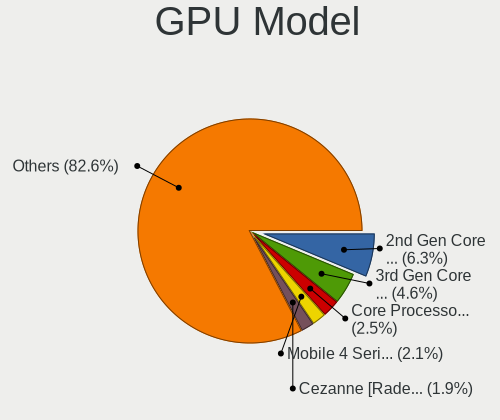

| Model                                                                                    | Computers | Percent |
|------------------------------------------------------------------------------------------|-----------|---------|
| Intel 2nd Generation Core Processor Family Integrated Graphics Controller                | 116       | 6.27%   |
| Intel 3rd Gen Core processor Graphics Controller                                         | 85        | 4.6%    |
| Intel Core Processor Integrated Graphics Controller                                      | 47        | 2.54%   |
| Intel Mobile 4 Series Chipset Integrated Graphics Controller                             | 38        | 2.06%   |
| AMD Cezanne [Radeon Vega Series / Radeon Vega Mobile Series]                             | 35        | 1.89%   |
| Intel Xeon E3-1200 v3/4th Gen Core Processor Integrated Graphics Controller              | 32        | 1.73%   |
| Intel Atom/Celeron/Pentium Processor x5-E8000/J3xxx/N3xxx Integrated Graphics Controller | 32        | 1.73%   |
| Intel HD Graphics 620                                                                    | 28        | 1.51%   |
| Intel Haswell-ULT Integrated Graphics Controller                                         | 28        | 1.51%   |
| Intel 4th Gen Core Processor Integrated Graphics Controller                              | 27        | 1.46%   |
| Intel UHD Graphics 620                                                                   | 26        | 1.41%   |
| Intel Skylake GT2 [HD Graphics 520]                                                      | 26        | 1.41%   |
| Intel TigerLake-LP GT2 [Iris Xe Graphics]                                                | 25        | 1.35%   |
| AMD Renoir [Radeon Vega Series / Radeon Vega Mobile Series]                              | 24        | 1.3%    |
| AMD Picasso/Raven 2 [Radeon Vega Series / Radeon Vega Mobile Series]                     | 24        | 1.3%    |
| AMD Ellesmere [Radeon RX 470/480/570/570X/580/580X/590]                                  | 24        | 1.3%    |
| Intel CometLake-U GT2 [UHD Graphics]                                                     | 23        | 1.24%   |
| Intel WhiskeyLake-U GT2 [UHD Graphics 620]                                               | 22        | 1.19%   |
| Intel HD Graphics 630                                                                    | 21        | 1.14%   |
| Intel CoffeeLake-S GT2 [UHD Graphics 630]                                                | 19        | 1.03%   |
| Nvidia GK208B [GeForce GT 710]                                                           | 18        | 0.97%   |
| Intel Xeon E3-1200 v2/3rd Gen Core processor Graphics Controller                         | 18        | 0.97%   |
| Intel Mobile 945GM/GMS/GME, 943/940GML Express Integrated Graphics Controller            | 18        | 0.97%   |
| Intel HD Graphics 5500                                                                   | 18        | 0.97%   |
| AMD Raven Ridge [Radeon Vega Series / Radeon Vega Mobile Series]                         | 18        | 0.97%   |
| Intel 4 Series Chipset Integrated Graphics Controller                                    | 17        | 0.92%   |
| Intel IvyBridge GT2 [HD Graphics 4000]                                                   | 16        | 0.87%   |
| Intel HD Graphics 530                                                                    | 16        | 0.87%   |
| Intel GeminiLake [UHD Graphics 600]                                                      | 16        | 0.87%   |
| Intel CoffeeLake-H GT2 [UHD Graphics 630]                                                | 16        | 0.87%   |
| Nvidia TU117 [GeForce GTX 1650]                                                          | 15        | 0.81%   |
| Nvidia GP107 [GeForce GTX 1050 Ti]                                                       | 15        | 0.81%   |
| Intel Mobile GM965/GL960 Integrated Graphics Controller (secondary)                      | 15        | 0.81%   |
| Intel Mobile GM965/GL960 Integrated Graphics Controller (primary)                        | 15        | 0.81%   |
| Intel Alder Lake-P GT2 [Iris Xe Graphics]                                                | 14        | 0.76%   |
| Intel CometLake-H GT2 [UHD Graphics]                                                     | 13        | 0.7%    |
| Nvidia GK208B [GeForce GT 730]                                                           | 12        | 0.65%   |
| Intel Mobile 945GM/GMS, 943/940GML Express Integrated Graphics Controller                | 12        | 0.65%   |
| AMD Lucienne                                                                             | 12        | 0.65%   |
| AMD Rembrandt [Radeon 680M]                                                              | 11        | 0.59%   |

GPU Combo
---------

Combinations of graphics cards

| Name                      | Computers | Percent |
|---------------------------|-----------|---------|
| 1 x Intel                 | 810       | 49.39%  |
| 1 x AMD                   | 331       | 20.18%  |
| 1 x Nvidia                | 278       | 16.95%  |
| Intel + Nvidia            | 93        | 5.67%   |
| Other                     | 25        | 1.52%   |
| AMD + Nvidia              | 23        | 1.4%    |
| 2 x AMD                   | 19        | 1.16%   |
| Intel + AMD               | 18        | 1.1%    |
| 2 x Intel                 | 14        | 0.85%   |
| 2 x Nvidia                | 6         | 0.37%   |
| 1 x Matrox                | 5         | 0.3%    |
| 1 x ASPEED                | 4         | 0.24%   |
| Nvidia + ASPEED           | 3         | 0.18%   |
| 1 x VIA                   | 2         | 0.12%   |
| Intel + 2 x Nvidia        | 2         | 0.12%   |
| AMD + Matrox              | 2         | 0.12%   |
| 1 x XGI                   | 1         | 0.06%   |
| 1 x Red Hat               | 1         | 0.06%   |
| Intel + 2 x AMD           | 1         | 0.06%   |
| Intel + AMD + 1 x Nvidia  | 1         | 0.06%   |
| AMD + Loongson Technology | 1         | 0.06%   |

GPU Driver
----------

Free vs proprietary

| Driver      | Computers | Percent |
|-------------|-----------|---------|
| Free        | 1346      | 81.63%  |
| Proprietary | 208       | 12.61%  |
| Unknown     | 95        | 5.76%   |

GPU Memory
----------

Total video memory

| Size in GB | Computers | Percent |
|------------|-----------|---------|
| Unknown    | 1037      | 62.1%   |
| 0.01-0.5   | 167       | 10%     |
| 1.01-2.0   | 156       | 9.34%   |
| 0.51-1.0   | 106       | 6.35%   |
| 3.01-4.0   | 80        | 4.79%   |
| 7.01-8.0   | 52        | 3.11%   |
| 5.01-6.0   | 29        | 1.74%   |
| 8.01-16.0  | 26        | 1.56%   |
| 16.01-24.0 | 10        | 0.6%    |
| 2.01-3.0   | 5         | 0.3%    |
| 4.01-5.0   | 1         | 0.06%   |
| 24.01-32.0 | 1         | 0.06%   |

Monitor
-------

Monitor Vendor
--------------

Monitor vendors

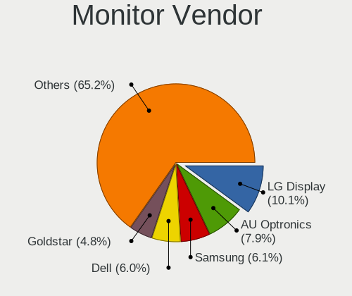

| Vendor                  | Computers | Percent |
|-------------------------|-----------|---------|
| LG Display              | 164       | 10.06%  |
| AU Optronics            | 129       | 7.91%   |
| Samsung Electronics     | 99        | 6.07%   |
| Dell                    | 97        | 5.95%   |
| Goldstar                | 78        | 4.79%   |
| BOE                     | 78        | 4.79%   |
| Chimei Innolux          | 76        | 4.66%   |
| Sharp                   | 64        | 3.93%   |
| IOD                     | 64        | 3.93%   |
| BenQ                    | 58        | 3.56%   |
| Apple                   | 49        | 3.01%   |
| Acer                    | 46        | 2.82%   |
| Mitsubishi              | 45        | 2.76%   |
| Iiyama                  | 45        | 2.76%   |
| Hewlett-Packard         | 38        | 2.33%   |
| Philips                 | 36        | 2.21%   |
| Lenovo                  | 30        | 1.84%   |
| Eizo                    | 30        | 1.84%   |
| Chi Mei Optoelectronics | 26        | 1.6%    |
| NEC Computers           | 21        | 1.29%   |
| Ancor Communications    | 20        | 1.23%   |
| Sony                    | 19        | 1.17%   |
| AOC                     | 19        | 1.17%   |
| ASUSTek Computer        | 18        | 1.1%    |
| Unknown                 | 17        | 1.04%   |
| Panasonic               | 17        | 1.04%   |
| Toshiba                 | 14        | 0.86%   |
| PANDA                   | 13        | 0.8%    |
| ViewSonic               | 11        | 0.67%   |
| InfoVision              | 9         | 0.55%   |
| Unknown                 | 9         | 0.55%   |
| Valve                   | 8         | 0.49%   |
| LG Electronics          | 8         | 0.49%   |
| Idek Iiyama             | 7         | 0.43%   |
| Fujitsu                 | 7         | 0.43%   |
| RTK                     | 6         | 0.37%   |
| Hitachi                 | 6         | 0.37%   |
| CSO                     | 6         | 0.37%   |
| MSI                     | 5         | 0.31%   |
| CPT                     | 5         | 0.31%   |

Monitor Model
-------------

Monitor models

| Model                                                                    | Computers | Percent |
|--------------------------------------------------------------------------|-----------|---------|
| LG Display LCD Monitor LGD039F 1366x768 345x194mm 15.6-inch              | 24        | 1.42%   |
| LG Display LCD Monitor LGD02DC 1366x768 344x194mm 15.5-inch              | 10        | 0.59%   |
| AU Optronics LCD Monitor AUO106C 1366x768 277x156mm 12.5-inch            | 9         | 0.53%   |
| Unknown                                                                  | 9         | 0.53%   |
| Valve ANX7530 U VLV3001 800x1280 100x150mm 7.1-inch                      | 8         | 0.47%   |
| Apple Color LCD APPA041 2560x1600 286x179mm 13.3-inch                    | 8         | 0.47%   |
| Iiyama PL3291 IVM7605 1920x1080 698x393mm 31.5-inch                      | 7         | 0.41%   |
| Chi Mei Optoelectronics LCD Monitor CMO15A7 1366x768 344x193mm 15.5-inch | 6         | 0.35%   |
| ASUSTek Computer VZ239 AUS23CC 1920x1080 509x286mm 23.0-inch             | 6         | 0.35%   |
| Apple Cinema HD APP9223 1920x1200 495x310mm 23.0-inch                    | 6         | 0.35%   |
| Mitsubishi RDT195LM MEL478A 1280x1024 376x301mm 19.0-inch                | 5         | 0.3%    |
| Iiyama PL2290 IVM562C 1920x1080 476x268mm 21.5-inch                      | 5         | 0.3%    |
| Goldstar HDR 4K GSM7706 3840x2160 600x340mm 27.2-inch                    | 5         | 0.3%    |
| AU Optronics LCD Monitor AUO38ED 1920x1080 344x193mm 15.5-inch           | 5         | 0.3%    |
| AOC 28E850 AOC0CCD 2560x1440 480x270mm 21.7-inch                         | 5         | 0.3%    |
| Sharp HDMI SHP0FDB 1360x768 820x460mm 37.0-inch                          | 4         | 0.24%   |
| Samsung Electronics LCD Monitor SEC5541 1366x768 344x193mm 15.5-inch     | 4         | 0.24%   |
| Samsung Electronics LCD Monitor SEC5441 1280x800 286x179mm 13.3-inch     | 4         | 0.24%   |
| Philips PHL 246E7 PHLC107 1920x1080 521x293mm 23.5-inch                  | 4         | 0.24%   |
| Panasonic TV MEIA296 1920x1080 698x392mm 31.5-inch                       | 4         | 0.24%   |
| NOV NOVA HD CARD NOV0405 1920x1080 459x296mm 21.5-inch                   | 4         | 0.24%   |
| NEC Computers EA243WM NEC6864 1920x1200 519x324mm 24.1-inch              | 4         | 0.24%   |
| LG Display LCD Monitor LGD033B 1366x768 344x194mm 15.5-inch              | 4         | 0.24%   |
| LG Display LCD Monitor LGD02D8 1366x768 277x156mm 12.5-inch              | 4         | 0.24%   |
| LG Display LCD Monitor LGD02CB 1366x768 344x194mm 15.5-inch              | 4         | 0.24%   |
| LG Display LCD Monitor LGD01DA 1366x768 294x166mm 13.3-inch              | 4         | 0.24%   |
| Lenovo LCD Monitor LEN40B0 1366x768 345x194mm 15.6-inch                  | 4         | 0.24%   |
| Goldstar ULTRAWIDE GSM59F1 2560x1080 677x290mm 29.0-inch                 | 4         | 0.24%   |
| Goldstar Ultra HD GSM5B09 3840x2160 600x340mm 27.2-inch                  | 4         | 0.24%   |
| Goldstar Ultra HD GSM5B08 3840x2160 600x340mm 27.2-inch                  | 4         | 0.24%   |
| Goldstar HDR WFHD GSM7714 2560x1080 798x334mm 34.1-inch                  | 4         | 0.24%   |
| Chimei Innolux LCD Monitor CMN14D5 1920x1080 309x173mm 13.9-inch         | 4         | 0.24%   |
| AU Optronics LCD Monitor AUO22EC 1366x768 344x193mm 15.5-inch            | 4         | 0.24%   |
| AU Optronics LCD Monitor AUO1068 1920x1200 264x166mm 12.3-inch           | 4         | 0.24%   |
| Apple Color LCD APPA02E 2880x1800 331x207mm 15.4-inch                    | 4         | 0.24%   |
| Acer KA270H ACR0522 1920x1080 598x336mm 27.0-inch                        | 4         | 0.24%   |
| ___ LCD TV ___9000 1360x768                                              | 3         | 0.18%   |
| ViewSonic VX3276-QHD VSCE635 2560x1440 698x393mm 31.5-inch               | 3         | 0.18%   |
| Toshiba TV TSB020A 1920x1080                                             | 3         | 0.18%   |
| Toshiba LCD Monitor TOS508F 1920x1080 476x268mm 21.5-inch                | 3         | 0.18%   |

Monitor Resolution
------------------

Monitor screen resolution

| Resolution         | Computers | Percent |
|--------------------|-----------|---------|
| 1920x1080 (FHD)    | 635       | 39.71%  |
| 1366x768 (WXGA)    | 265       | 16.57%  |
| 3840x2160 (4K)     | 131       | 8.19%   |
| 1280x1024 (SXGA)   | 80        | 5%      |
| 1920x1200 (WUXGA)  | 67        | 4.19%   |
| 2560x1440 (QHD)    | 64        | 4%      |
| 1280x800 (WXGA)    | 36        | 2.25%   |
| 2560x1600          | 29        | 1.81%   |
| 1600x900 (HD+)     | 28        | 1.75%   |
| 1440x900 (WXGA+)   | 26        | 1.63%   |
| 1680x1050 (WSXGA+) | 25        | 1.56%   |
| 1920x540           | 19        | 1.19%   |
| Unknown            | 19        | 1.19%   |
| 2880x1800          | 17        | 1.06%   |
| 2560x1080          | 13        | 0.81%   |
| 1360x768           | 13        | 0.81%   |
| 3440x1440          | 10        | 0.63%   |
| 1024x768 (XGA)     | 10        | 0.63%   |
| 1600x1200          | 9         | 0.56%   |
| 1400x1050          | 9         | 0.56%   |
| 800x1280           | 8         | 0.5%    |
| 2160x1440          | 8         | 0.5%    |
| 3840x2400          | 6         | 0.38%   |
| 3072x1920          | 6         | 0.38%   |
| 2880x1920          | 6         | 0.38%   |
| 3840x1080          | 5         | 0.31%   |
| 1920x1280          | 4         | 0.25%   |
| 3200x1800 (QHD+)   | 3         | 0.19%   |
| 1280x720 (HD)      | 3         | 0.19%   |
| 1024x600           | 3         | 0.19%   |
| 3520x1080          | 2         | 0.13%   |
| 3456x2160          | 2         | 0.13%   |
| 3200x1200          | 2         | 0.13%   |
| 3200x1080          | 2         | 0.13%   |
| 2880x1620          | 2         | 0.13%   |
| 2560x1024          | 2         | 0.13%   |
| 2520x1680          | 2         | 0.13%   |
| 2304x1440          | 2         | 0.13%   |
| 2256x1504          | 2         | 0.13%   |
| 2048x1152          | 2         | 0.13%   |

Monitor Diagonal
----------------

Diagonal size in inches

| Inches  | Computers | Percent |
|---------|-----------|---------|
| 15      | 322       | 19.8%   |
| 13      | 160       | 9.84%   |
| 27      | 135       | 8.3%    |
| 23      | 122       | 7.5%    |
| 24      | 120       | 7.38%   |
| 21      | 119       | 7.32%   |
| Unknown | 99        | 6.09%   |
| 14      | 90        | 5.54%   |
| 17      | 64        | 3.94%   |
| 31      | 59        | 3.63%   |
| 12      | 58        | 3.57%   |
| 19      | 55        | 3.38%   |
| 20      | 26        | 1.6%    |
| 11      | 21        | 1.29%   |
| 16      | 19        | 1.17%   |
| 34      | 18        | 1.11%   |
| 18      | 16        | 0.98%   |
| 22      | 13        | 0.8%    |
| 10      | 13        | 0.8%    |
| 72      | 11        | 0.68%   |
| 37      | 11        | 0.68%   |
| 84      | 8         | 0.49%   |
| 32      | 8         | 0.49%   |
| 7       | 8         | 0.49%   |
| 54      | 6         | 0.37%   |
| 40      | 5         | 0.31%   |
| 26      | 5         | 0.31%   |
| 43      | 4         | 0.25%   |
| 42      | 4         | 0.25%   |
| 25      | 4         | 0.25%   |
| 49      | 3         | 0.18%   |
| 35      | 3         | 0.18%   |
| 29      | 3         | 0.18%   |
| 52      | 2         | 0.12%   |
| 39      | 2         | 0.12%   |
| 30      | 2         | 0.12%   |
| 74      | 1         | 0.06%   |
| 65      | 1         | 0.06%   |
| 64      | 1         | 0.06%   |
| 48      | 1         | 0.06%   |

Monitor Width
-------------

Physical width

| Width in mm | Computers | Percent |
|-------------|-----------|---------|
| 301-350     | 479       | 29.79%  |
| 501-600     | 357       | 22.2%   |
| 201-300     | 221       | 13.74%  |
| 401-500     | 191       | 11.88%  |
| Unknown     | 99        | 6.16%   |
| 351-400     | 81        | 5.04%   |
| 601-700     | 80        | 4.98%   |
| 701-800     | 25        | 1.55%   |
| 801-900     | 23        | 1.43%   |
| 1501-2000   | 20        | 1.24%   |
| 1001-1500   | 16        | 1%      |
| 1-100       | 8         | 0.5%    |
| 901-1000    | 7         | 0.44%   |
| 101-200     | 1         | 0.06%   |

Aspect Ratio
------------

Proportional relationship between the width and the height

| Ratio   | Computers | Percent |
|---------|-----------|---------|
| 16/9    | 1061      | 70.03%  |
| 16/10   | 213       | 14.06%  |
| Unknown | 73        | 4.82%   |
| 5/4     | 71        | 4.69%   |
| 3/2     | 26        | 1.72%   |
| 21/9    | 23        | 1.52%   |
| 4/3     | 22        | 1.45%   |
| 32/9    | 10        | 0.66%   |
| 0.67    | 8         | 0.53%   |
| 6/5     | 2         | 0.13%   |
| 1.00    | 2         | 0.13%   |
| 1.96    | 1         | 0.07%   |
| 0.62    | 1         | 0.07%   |
| 0.58    | 1         | 0.07%   |
| 0.56    | 1         | 0.07%   |

Monitor Area
------------

Area in inch

| Area in inch | Computers | Percent |
|----------------|-----------|---------|
| 101-110        | 324       | 19.99%  |
| 201-250        | 268       | 16.53%  |
| 151-200        | 141       | 8.7%    |
| 301-350        | 138       | 8.51%   |
| 81-90          | 136       | 8.39%   |
| 71-80          | 107       | 6.6%    |
| Unknown        | 99        | 6.11%   |
| 351-500        | 93        | 5.74%   |
| 61-70          | 56        | 3.45%   |
| 251-300        | 55        | 3.39%   |
| 141-150        | 49        | 3.02%   |
| More than 1000 | 32        | 1.97%   |
| 501-1000       | 28        | 1.73%   |
| 51-60          | 22        | 1.36%   |
| 121-130        | 22        | 1.36%   |
| 111-120        | 16        | 0.99%   |
| 41-50          | 12        | 0.74%   |
| 91-100         | 10        | 0.62%   |
| 1-40           | 9         | 0.56%   |
| 131-140        | 4         | 0.25%   |

Pixel Density
-------------

Pixels per inch

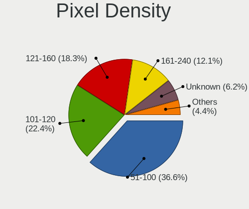

| Density       | Computers | Percent |
|---------------|-----------|---------|
| 51-100        | 581       | 36.63%  |
| 101-120       | 355       | 22.38%  |
| 121-160       | 290       | 18.28%  |
| 161-240       | 192       | 12.11%  |
| Unknown       | 99        | 6.24%   |
| More than 240 | 42        | 2.65%   |
| 1-50          | 27        | 1.7%    |

Multiple Monitors
-----------------

Total monitors connected

| Total | Computers | Percent |
|-------|-----------|---------|
| 1     | 1369      | 82.62%  |
| 2     | 177       | 10.68%  |
| 0     | 92        | 5.55%   |
| 3     | 16        | 0.97%   |
| 4     | 2         | 0.12%   |
| 6     | 1         | 0.06%   |

Network
-------

Net Controller Vendor
---------------------

Controller vendors

| Vendor                          | Computers | Percent |
|---------------------------------|-----------|---------|
| Intel                           | 801       | 33.81%  |
| Realtek Semiconductor           | 765       | 32.29%  |
| Qualcomm Atheros                | 263       | 11.1%   |
| Broadcom                        | 155       | 6.54%   |
| MediaTek                        | 48        | 2.03%   |
| Marvell Technology Group        | 45        | 1.9%    |
| ASIX Electronics                | 39        | 1.65%   |
| BUFFALO                         | 31        | 1.31%   |
| Broadcom Limited                | 29        | 1.22%   |
| TP-Link                         | 23        | 0.97%   |
| PLANEX                          | 16        | 0.68%   |
| Nvidia                          | 13        | 0.55%   |
| Elecom                          | 11        | 0.46%   |
| Sierra Wireless                 | 9         | 0.38%   |
| Ralink                          | 9         | 0.38%   |
| Apple                           | 9         | 0.38%   |
| Huawei Technologies             | 8         | 0.34%   |
| Aquantia                        | 8         | 0.34%   |
| Qualcomm Technologies           | 5         | 0.21%   |
| Qualcomm                        | 5         | 0.21%   |
| VIA Technologies                | 4         | 0.17%   |
| Ralink Technology               | 4         | 0.17%   |
| Logitec                         | 4         | 0.17%   |
| Lenovo                          | 4         | 0.17%   |
| Xiaomi                          | 3         | 0.13%   |
| U-Blox                          | 3         | 0.13%   |
| Qualcomm Atheros Communications | 3         | 0.13%   |
| NEC Computers                   | 3         | 0.13%   |
| DisplayLink                     | 3         | 0.13%   |
| Samsung Electronics             | 2         | 0.08%   |
| Raspberry Pi                    | 2         | 0.08%   |
| Prolific Technology             | 2         | 0.08%   |
| OPPO Electronics                | 2         | 0.08%   |
| NetGear                         | 2         | 0.08%   |
| JMicron Technology              | 2         | 0.08%   |
| ICS Advent                      | 2         | 0.08%   |
| Google                          | 2         | 0.08%   |
| Gemtek                          | 2         | 0.08%   |
| Edimax Technology               | 2         | 0.08%   |
| D-Link                          | 2         | 0.08%   |

Net Controller Model
--------------------

Controller models

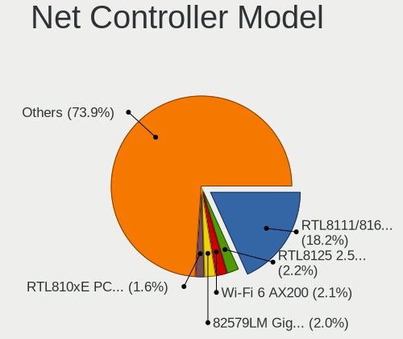

| Model                                                                   | Computers | Percent |
|-------------------------------------------------------------------------|-----------|---------|
| Realtek RTL8111/8168/8211/8411 PCI Express Gigabit Ethernet Controller  | 513       | 18.24%  |
| Realtek RTL8125 2.5GbE Controller                                       | 61        | 2.17%   |
| Intel Wi-Fi 6 AX200                                                     | 58        | 2.06%   |
| Intel 82579LM Gigabit Network Connection (Lewisville)                   | 57        | 2.03%   |
| Realtek RTL810xE PCI Express Fast Ethernet controller                   | 45        | 1.6%    |
| Intel Ethernet Connection (2) I219-V                                    | 41        | 1.46%   |
| Realtek RTL8153 Gigabit Ethernet Adapter                                | 40        | 1.42%   |
| Intel 82579V Gigabit Network Connection                                 | 40        | 1.42%   |
| Qualcomm Atheros QCA9565 / AR9565 Wireless Network Adapter              | 36        | 1.28%   |
| Intel Wireless 8265 / 8275                                              | 36        | 1.28%   |
| Intel Wireless 7265                                                     | 34        | 1.21%   |
| ASIX AX88179 Gigabit Ethernet                                           | 34        | 1.21%   |
| Intel Wi-Fi 6E(802.11ax) AX210/AX1675* 2x2 [Typhoon Peak]               | 33        | 1.17%   |
| Intel I211 Gigabit Network Connection                                   | 33        | 1.17%   |
| Intel Centrino Advanced-N 6205 [Taylor Peak]                            | 31        | 1.1%    |
| Qualcomm Atheros AR8162 Fast Ethernet                                   | 30        | 1.07%   |
| Qualcomm Atheros AR9285 Wireless Network Adapter (PCI-Express)          | 28        | 1%      |
| Intel Ethernet Connection I217-V                                        | 28        | 1%      |
| Intel Wireless 7260                                                     | 27        | 0.96%   |
| Intel Ethernet Connection (7) I219-V                                    | 26        | 0.92%   |
| Realtek RTL8822CE 802.11ac PCIe Wireless Network Adapter                | 25        | 0.89%   |
| Intel Wireless 8260                                                     | 25        | 0.89%   |
| Intel Wi-Fi 6 AX201                                                     | 23        | 0.82%   |
| Intel Comet Lake PCH-LP CNVi WiFi                                       | 23        | 0.82%   |
| Qualcomm Atheros AR9462 Wireless Network Adapter                        | 21        | 0.75%   |
| Qualcomm Atheros AR928X Wireless Network Adapter (PCI-Express)          | 21        | 0.75%   |
| Intel Wireless 3165                                                     | 21        | 0.75%   |
| Realtek RTL88x2bu [AC1200 Techkey]                                      | 20        | 0.71%   |
| Qualcomm Atheros QCA9377 802.11ac Wireless Network Adapter              | 20        | 0.71%   |
| Qualcomm Atheros QCA6174 802.11ac Wireless Network Adapter              | 20        | 0.71%   |
| Intel Ethernet Controller I225-V                                        | 20        | 0.71%   |
| Intel Ethernet Connection I217-LM                                       | 20        | 0.71%   |
| Realtek RTL8821CE 802.11ac PCIe Wireless Network Adapter                | 19        | 0.68%   |
| MediaTek MT7922 802.11ax PCI Express Wireless Network Adapter           | 19        | 0.68%   |
| Intel Dual Band Wireless-AC 3168NGW [Stone Peak]                        | 19        | 0.68%   |
| Realtek RTL8188EUS 802.11n Wireless Network Adapter                     | 18        | 0.64%   |
| Qualcomm Atheros AR242x / AR542x Wireless Network Adapter (PCI-Express) | 16        | 0.57%   |
| Intel Wireless 3160                                                     | 16        | 0.57%   |
| Intel Alder Lake-P PCH CNVi WiFi                                        | 16        | 0.57%   |
| Realtek RTL8188CE 802.11b/g/n WiFi Adapter                              | 15        | 0.53%   |

Wireless Vendor
---------------

Wireless vendors

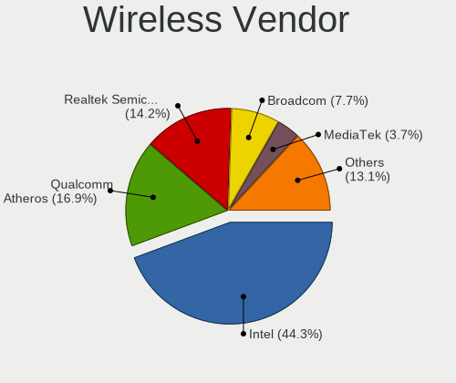

| Vendor                          | Computers | Percent |
|---------------------------------|-----------|---------|
| Intel                           | 529       | 44.34%  |
| Qualcomm Atheros                | 202       | 16.93%  |
| Realtek Semiconductor           | 170       | 14.25%  |
| Broadcom                        | 92        | 7.71%   |
| MediaTek                        | 44        | 3.69%   |
| BUFFALO                         | 31        | 2.6%    |
| TP-Link                         | 23        | 1.93%   |
| Broadcom Limited                | 19        | 1.59%   |
| PLANEX                          | 16        | 1.34%   |
| Elecom                          | 10        | 0.84%   |
| Sierra Wireless                 | 9         | 0.75%   |
| Ralink                          | 9         | 0.75%   |
| Qualcomm Technologies           | 5         | 0.42%   |
| Qualcomm                        | 5         | 0.42%   |
| Ralink Technology               | 4         | 0.34%   |
| Marvell Technology Group        | 4         | 0.34%   |
| Logitec                         | 4         | 0.34%   |
| Qualcomm Atheros Communications | 3         | 0.25%   |
| NetGear                         | 2         | 0.17%   |
| NEC Computers                   | 2         | 0.17%   |
| Edimax Technology               | 2         | 0.17%   |
| D-Link                          | 2         | 0.17%   |
| Wilocity                        | 1         | 0.08%   |
| Wacom                           | 1         | 0.08%   |
| Quectel Wireless Solutions      | 1         | 0.08%   |
| I-O Data Device                 | 1         | 0.08%   |
| Dell                            | 1         | 0.08%   |
| ASUSTek Computer                | 1         | 0.08%   |

Wireless Model
--------------

Wireless models

| Model                                                                   | Computers | Percent |
|-------------------------------------------------------------------------|-----------|---------|
| Intel Wi-Fi 6 AX200                                                     | 58        | 4.83%   |
| Qualcomm Atheros QCA9565 / AR9565 Wireless Network Adapter              | 36        | 3%      |
| Intel Wireless 8265 / 8275                                              | 36        | 3%      |
| Intel Wireless 7265                                                     | 34        | 2.83%   |
| Intel Wi-Fi 6E(802.11ax) AX210/AX1675* 2x2 [Typhoon Peak]               | 33        | 2.75%   |
| Intel Centrino Advanced-N 6205 [Taylor Peak]                            | 31        | 2.58%   |
| Qualcomm Atheros AR9285 Wireless Network Adapter (PCI-Express)          | 28        | 2.33%   |
| Intel Wireless 7260                                                     | 27        | 2.25%   |
| Realtek RTL8822CE 802.11ac PCIe Wireless Network Adapter                | 25        | 2.08%   |
| Intel Wireless 8260                                                     | 25        | 2.08%   |
| Intel Wi-Fi 6 AX201                                                     | 23        | 1.91%   |
| Intel Comet Lake PCH-LP CNVi WiFi                                       | 23        | 1.91%   |
| Qualcomm Atheros AR9462 Wireless Network Adapter                        | 21        | 1.75%   |
| Qualcomm Atheros AR928X Wireless Network Adapter (PCI-Express)          | 21        | 1.75%   |
| Intel Wireless 3165                                                     | 21        | 1.75%   |
| Realtek RTL88x2bu [AC1200 Techkey]                                      | 20        | 1.66%   |
| Qualcomm Atheros QCA9377 802.11ac Wireless Network Adapter              | 20        | 1.66%   |
| Qualcomm Atheros QCA6174 802.11ac Wireless Network Adapter              | 20        | 1.66%   |
| Realtek RTL8821CE 802.11ac PCIe Wireless Network Adapter                | 19        | 1.58%   |
| Intel Dual Band Wireless-AC 3168NGW [Stone Peak]                        | 19        | 1.58%   |
| Realtek RTL8188EUS 802.11n Wireless Network Adapter                     | 18        | 1.5%    |
| Qualcomm Atheros AR242x / AR542x Wireless Network Adapter (PCI-Express) | 16        | 1.33%   |
| Intel Wireless 3160                                                     | 16        | 1.33%   |
| Intel Alder Lake-P PCH CNVi WiFi                                        | 16        | 1.33%   |
| Realtek RTL8188CE 802.11b/g/n WiFi Adapter                              | 15        | 1.25%   |
| Qualcomm Atheros AR9485 Wireless Network Adapter                        | 15        | 1.25%   |
| MediaTek MT7922 802.11ax PCI Express Wireless Network Adapter           | 15        | 1.25%   |
| MediaTek MT7921 802.11ax PCI Express Wireless Network Adapter           | 15        | 1.25%   |
| Intel Comet Lake PCH CNVi WiFi                                          | 14        | 1.16%   |
| Intel Cannon Lake PCH CNVi WiFi                                         | 14        | 1.16%   |
| TP-Link AC600 wireless Realtek RTL8811AU [Archer T2U Nano]              | 13        | 1.08%   |
| MediaTek MT7921K (RZ608) Wi-Fi 6E 80MHz                                 | 12        | 1%      |
| Intel Centrino Advanced-N + WiMAX 6250 [Kilmer Peak]                    | 12        | 1%      |
| Intel Cannon Point-LP CNVi [Wireless-AC]                                | 12        | 1%      |
| Qualcomm Atheros AR93xx Wireless Network Adapter                        | 11        | 0.92%   |
| BUFFALO 802.11ac WLAN Adapter                                           | 10        | 0.83%   |
| Broadcom BCM4313 802.11bgn Wireless Network Adapter                     | 10        | 0.83%   |
| Realtek RTL8191SEvB Wireless LAN Controller                             | 9         | 0.75%   |
| Qualcomm Atheros AR9287 Wireless Network Adapter (PCI-Express)          | 9         | 0.75%   |
| Intel Wi-Fi 5(802.11ac) Wireless-AC 9x6x [Thunder Peak]                 | 9         | 0.75%   |

Ethernet Vendor
---------------

Ethernet vendors

| Vendor                                 | Computers | Percent |
|----------------------------------------|-----------|---------|
| Realtek Semiconductor                  | 678       | 44.23%  |
| Intel                                  | 498       | 32.49%  |
| Qualcomm Atheros                       | 103       | 6.72%   |
| Broadcom                               | 83        | 5.41%   |
| Marvell Technology Group               | 41        | 2.67%   |
| ASIX Electronics                       | 39        | 2.54%   |
| Nvidia                                 | 13        | 0.85%   |
| Broadcom Limited                       | 10        | 0.65%   |
| Apple                                  | 9         | 0.59%   |
| Huawei Technologies                    | 8         | 0.52%   |
| Aquantia                               | 8         | 0.52%   |
| VIA Technologies                       | 4         | 0.26%   |
| MediaTek                               | 4         | 0.26%   |
| Lenovo                                 | 4         | 0.26%   |
| Xiaomi                                 | 3         | 0.2%    |
| DisplayLink                            | 3         | 0.2%    |
| Raspberry Pi                           | 2         | 0.13%   |
| OPPO Electronics                       | 2         | 0.13%   |
| JMicron Technology                     | 2         | 0.13%   |
| ICS Advent                             | 2         | 0.13%   |
| Google                                 | 2         | 0.13%   |
| Gemtek                                 | 2         | 0.13%   |
| vivo                                   | 1         | 0.07%   |
| Sony Ericsson Mobile Communications AB | 1         | 0.07%   |
| Silicon Integrated Systems [SiS]       | 1         | 0.07%   |
| Sharp                                  | 1         | 0.07%   |
| Samsung Electronics                    | 1         | 0.07%   |
| QNAP System                            | 1         | 0.07%   |
| Netchip Technology                     | 1         | 0.07%   |
| Loongson Technology                    | 1         | 0.07%   |
| Elecom                                 | 1         | 0.07%   |
| Corega K.K.                            | 1         | 0.07%   |
| Android                                | 1         | 0.07%   |
| ADMtek                                 | 1         | 0.07%   |
| 3Com                                   | 1         | 0.07%   |

Ethernet Model
--------------

Ethernet models

| Model                                                                  | Computers | Percent |
|------------------------------------------------------------------------|-----------|---------|
| Realtek RTL8111/8168/8211/8411 PCI Express Gigabit Ethernet Controller | 513       | 32.37%  |
| Realtek RTL8125 2.5GbE Controller                                      | 61        | 3.85%   |
| Intel 82579LM Gigabit Network Connection (Lewisville)                  | 57        | 3.6%    |
| Realtek RTL810xE PCI Express Fast Ethernet controller                  | 45        | 2.84%   |
| Intel Ethernet Connection (2) I219-V                                   | 41        | 2.59%   |
| Realtek RTL8153 Gigabit Ethernet Adapter                               | 40        | 2.52%   |
| Intel 82579V Gigabit Network Connection                                | 40        | 2.52%   |
| ASIX AX88179 Gigabit Ethernet                                          | 34        | 2.15%   |
| Intel I211 Gigabit Network Connection                                  | 33        | 2.08%   |
| Qualcomm Atheros AR8162 Fast Ethernet                                  | 30        | 1.89%   |
| Intel Ethernet Connection I217-V                                       | 28        | 1.77%   |
| Intel Ethernet Connection (7) I219-V                                   | 26        | 1.64%   |
| Intel Ethernet Controller I225-V                                       | 20        | 1.26%   |
| Intel Ethernet Connection I217-LM                                      | 20        | 1.26%   |
| Intel Ethernet Connection (10) I219-V                                  | 15        | 0.95%   |
| Intel I210 Gigabit Network Connection                                  | 14        | 0.88%   |
| Intel 82574L Gigabit Network Connection                                | 12        | 0.76%   |
| Qualcomm Atheros Killer E220x Gigabit Ethernet Controller              | 11        | 0.69%   |
| Qualcomm Atheros AR8161 Gigabit Ethernet                               | 11        | 0.69%   |
| Qualcomm Atheros AR8151 v2.0 Gigabit Ethernet                          | 11        | 0.69%   |
| Intel Ethernet Connection (4) I219-V                                   | 11        | 0.69%   |
| Intel Ethernet Connection (2) I219-LM                                  | 10        | 0.63%   |
| Realtek RTL-8100/8101L/8139 PCI Fast Ethernet Adapter                  | 9         | 0.57%   |
| Qualcomm Atheros AR8152 v2.0 Fast Ethernet                             | 9         | 0.57%   |
| Intel Ethernet Connection I219-V                                       | 9         | 0.57%   |
| Intel Ethernet Connection I219-LM                                      | 9         | 0.57%   |
| Intel Ethernet Connection (6) I219-V                                   | 9         | 0.57%   |
| Intel Ethernet Connection (4) I219-LM                                  | 9         | 0.57%   |
| Broadcom NetXtreme BCM57765 Gigabit Ethernet PCIe                      | 9         | 0.57%   |
| Broadcom NetLink BCM57780 Gigabit Ethernet PCIe                        | 9         | 0.57%   |
| Apple iBridge                                                          | 9         | 0.57%   |
| Realtek RTL8152 Fast Ethernet Adapter                                  | 8         | 0.5%    |
| Marvell Group 88E8055 PCI-E Gigabit Ethernet Controller                | 8         | 0.5%    |
| Intel WiMAX Connection 2400m                                           | 8         | 0.5%    |
| Intel 82577LC Gigabit Network Connection                               | 8         | 0.5%    |
| Broadcom NetLink BCM5784M Gigabit Ethernet PCIe                        | 8         | 0.5%    |
| Broadcom NetLink BCM57781 Gigabit Ethernet PCIe                        | 8         | 0.5%    |
| Nvidia MCP79 Ethernet                                                  | 7         | 0.44%   |
| Marvell Group 88E8056 PCI-E Gigabit Ethernet Controller                | 7         | 0.44%   |
| Marvell Group 88E8040 PCI-E Fast Ethernet Controller                   | 7         | 0.44%   |

Net Controller Kind
-------------------

Ethernet, WiFi or modem

| Kind     | Computers | Percent |
|----------|-----------|---------|
| Ethernet | 1418      | 55.09%  |
| WiFi     | 1130      | 43.9%   |
| Modem    | 15        | 0.58%   |
| Unknown  | 11        | 0.43%   |

Used Controller
---------------

Currently used network controller

| Kind     | Computers | Percent |
|----------|-----------|---------|
| Ethernet | 897       | 52.98%  |
| WiFi     | 796       | 47.02%  |

NICs
----

Total network controllers on board

| Total | Computers | Percent |
|-------|-----------|---------|
| 2     | 823       | 50.27%  |
| 1     | 734       | 44.84%  |
| 3     | 39        | 2.38%   |
| 0     | 34        | 2.08%   |
| 4     | 4         | 0.24%   |
| 8     | 1         | 0.06%   |
| 7     | 1         | 0.06%   |
| 6     | 1         | 0.06%   |

IPv6
----

IPv6 vs IPv4

| Used | Computers | Percent |
|------|-----------|---------|
| No   | 1157      | 69.36%  |
| Yes  | 511       | 30.64%  |

Bluetooth
---------

Bluetooth Vendor
----------------

Controller vendors

| Vendor                          | Computers | Percent |
|---------------------------------|-----------|---------|
| Intel                           | 422       | 47.36%  |
| Cambridge Silicon Radio         | 110       | 12.35%  |
| Realtek Semiconductor           | 64        | 7.18%   |
| Qualcomm Atheros Communications | 43        | 4.83%   |
| IMC Networks                    | 42        | 4.71%   |
| Apple                           | 38        | 4.26%   |
| Broadcom                        | 35        | 3.93%   |
| Foxconn / Hon Hai               | 32        | 3.59%   |
| MediaTek                        | 20        | 2.24%   |
| ASUSTek Computer                | 10        | 1.12%   |
| Alps Electric                   | 10        | 1.12%   |
| Fujitsu                         | 9         | 1.01%   |
| TP-Link                         | 8         | 0.9%    |
| Realtek                         | 8         | 0.9%    |
| Lite-On Technology              | 8         | 0.9%    |
| Toshiba                         | 6         | 0.67%   |
| Marvell Semiconductor           | 5         | 0.56%   |
| Hewlett-Packard                 | 4         | 0.45%   |
| USI                             | 3         | 0.34%   |
| Ralink                          | 2         | 0.22%   |
| Opticis                         | 2         | 0.22%   |
| BUFFALO                         | 2         | 0.22%   |
| Actions                         | 2         | 0.22%   |
| Taiyo Yuden                     | 1         | 0.11%   |
| Ralink Technology               | 1         | 0.11%   |
| Dell                            | 1         | 0.11%   |
| Creative Technology             | 1         | 0.11%   |
| Askey Computer                  | 1         | 0.11%   |
| 8BitDo                          | 1         | 0.11%   |

Bluetooth Model
---------------

Controller models

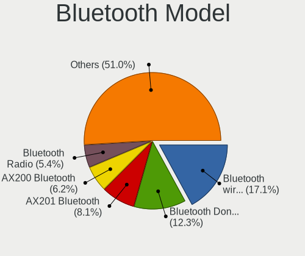

| Model                                                                               | Computers | Percent |
|-------------------------------------------------------------------------------------|-----------|---------|
| Intel Bluetooth wireless interface                                                  | 152       | 17.06%  |
| Cambridge Silicon Radio Bluetooth Dongle (HCI mode)                                 | 110       | 12.35%  |
| Intel AX201 Bluetooth                                                               | 72        | 8.08%   |
| Intel AX200 Bluetooth                                                               | 55        | 6.17%   |
| Realtek Bluetooth Radio                                                             | 48        | 5.39%   |
| Intel Bluetooth 9460/9560 Jefferson Peak (JfP)                                      | 35        | 3.93%   |
| Intel AX210 Bluetooth                                                               | 35        | 3.93%   |
| Intel AX211 Bluetooth                                                               | 32        | 3.59%   |
| MediaTek Wireless_Device                                                            | 20        | 2.24%   |
| Apple Bluetooth Host Controller                                                     | 20        | 2.24%   |
| Qualcomm Atheros  Bluetooth Device                                                  | 19        | 2.13%   |
| Intel Wireless-AC 3168 Bluetooth                                                    | 19        | 2.13%   |
| IMC Networks Bluetooth Radio                                                        | 17        | 1.91%   |
| IMC Networks Wireless_Device                                                        | 12        | 1.35%   |
| Apple Bluetooth USB Host Controller                                                 | 11        | 1.23%   |
| IMC Networks Bluetooth Device                                                       | 10        | 1.12%   |
| Foxconn / Hon Hai Bluetooth Device                                                  | 10        | 1.12%   |
| Broadcom BCM20702 Bluetooth 4.0 [ThinkPad]                                          | 10        | 1.12%   |
| Qualcomm Atheros QCA61x4 Bluetooth 4.0                                              | 9         | 1.01%   |
| Intel Wireless-AC 9260 Bluetooth Adapter                                            | 9         | 1.01%   |
| TP-Link TP-Link Bluetooth USB Adapter                                               | 8         | 0.9%    |
| Realtek Bluetooth Radio                                                             | 8         | 0.9%    |
| Fujitsu Bluetooth Device                                                            | 8         | 0.9%    |
| Intel Centrino Bluetooth Wireless Transceiver                                       | 7         | 0.79%   |
| Realtek  Bluetooth 4.2 Adapter                                                      | 6         | 0.67%   |
| Foxconn / Hon Hai Wireless_Device                                                   | 6         | 0.67%   |
| Foxconn / Hon Hai MediaTek Bluetooth Adapter                                        | 6         | 0.67%   |
| Apple Built-in Bluetooth 2.0+EDR HCI                                                | 6         | 0.67%   |
| Toshiba Atheros AR3012 Bluetooth                                                    | 5         | 0.56%   |
| Qualcomm Atheros AR3012 Bluetooth 4.0                                               | 5         | 0.56%   |
| Qualcomm Atheros AR3011 Bluetooth                                                   | 5         | 0.56%   |
| Foxconn / Hon Hai Foxconn T77H114 BCM2070 [Single-Chip Bluetooth 2.1 + EDR Adapter] | 5         | 0.56%   |
| Alps Electric BCM2046 Bluetooth Device                                              | 5         | 0.56%   |
| Realtek 802.11ac WLAN Adapter                                                       | 4         | 0.45%   |
| Qualcomm Atheros AR9462 Bluetooth                                                   | 4         | 0.45%   |
| Intel Bluetooth Device                                                              | 4         | 0.45%   |
| Broadcom BCM2045B (BDC-2.1)                                                         | 4         | 0.45%   |
| USI Bluetooth Device                                                                | 3         | 0.34%   |
| Realtek RTL8723B Bluetooth                                                          | 3         | 0.34%   |
| Marvell Bluetooth and Wireless LAN Composite                                        | 3         | 0.34%   |

Sound
-----

Sound Vendor
------------

Sound card vendors

| Vendor                                       | Computers | Percent |
|----------------------------------------------|-----------|---------|
| Intel                                        | 1183      | 52.69%  |
| AMD                                          | 446       | 19.87%  |
| Nvidia                                       | 336       | 14.97%  |
| C-Media Electronics                          | 48        | 2.14%   |
| Creative Technology                          | 23        | 1.02%   |
| Texas Instruments                            | 22        | 0.98%   |
| Apple                                        | 18        | 0.8%    |
| VIA Technologies                             | 17        | 0.76%   |
| JMTek                                        | 10        | 0.45%   |
| Harman                                       | 10        | 0.45%   |
| Yamaha                                       | 8         | 0.36%   |
| Generalplus Technology                       | 8         | 0.36%   |
| Elitegroup Computer Systems (ECS)            | 8         | 0.36%   |
| Creative Labs                                | 8         | 0.36%   |
| Sony                                         | 5         | 0.22%   |
| Roland                                       | 5         | 0.22%   |
| Micro Star International                     | 5         | 0.22%   |
| GN Netcom                                    | 5         | 0.22%   |
| Realtek Semiconductor                        | 4         | 0.18%   |
| Lenovo                                       | 4         | 0.18%   |
| ASUSTek Computer                             | 4         | 0.18%   |
| Zoran Co. Personal Media Division (Nogatech) | 3         | 0.13%   |
| TOWA Electronics                             | 3         | 0.13%   |
| Thesycon Systemsoftware & Consulting         | 3         | 0.13%   |
| Tenx Technology                              | 3         | 0.13%   |
| RATOC System                                 | 3         | 0.13%   |
| Logitech                                     | 3         | 0.13%   |
| XMOS                                         | 2         | 0.09%   |
| Walmart                                      | 2         | 0.09%   |
| SteelSeries ApS                              | 2         | 0.09%   |
| Razer USA                                    | 2         | 0.09%   |
| Onkyo                                        | 2         | 0.09%   |
| iCreate Technologies                         | 2         | 0.09%   |
| ESI Audiotechnik                             | 2         | 0.09%   |
| DSEA A/S                                     | 2         | 0.09%   |
| Dell                                         | 2         | 0.09%   |
| Corsair                                      | 2         | 0.09%   |
| Xiaomi                                       | 1         | 0.04%   |
| www.hirestech.com 2012 REV 2.1               | 1         | 0.04%   |
| ULi Electronics                              | 1         | 0.04%   |

Sound Model
-----------

Sound card models

| Model                                                                      | Computers | Percent |
|----------------------------------------------------------------------------|-----------|---------|
| Intel 7 Series/C216 Chipset Family High Definition Audio Controller        | 161       | 6.09%   |
| AMD Family 17h/19h/1ah HD Audio Controller                                 | 157       | 5.94%   |
| Intel 6 Series/C200 Series Chipset Family High Definition Audio Controller | 106       | 4.01%   |
| Intel Sunrise Point-LP HD Audio                                            | 97        | 3.67%   |
| Intel 8 Series/C220 Series Chipset High Definition Audio Controller        | 96        | 3.63%   |
| AMD Renoir Radeon High Definition Audio Controller                         | 82        | 3.1%    |
| Intel 5 Series/3400 Series Chipset High Definition Audio                   | 68        | 2.57%   |
| Intel Xeon E3-1200 v3/4th Gen Core Processor HD Audio Controller           | 62        | 2.35%   |
| AMD Starship/Matisse HD Audio Controller                                   | 59        | 2.23%   |
| Intel Cannon Lake PCH cAVS                                                 | 51        | 1.93%   |
| Intel 82801I (ICH9 Family) HD Audio Controller                             | 51        | 1.93%   |
| AMD SBx00 Azalia (Intel HDA)                                               | 47        | 1.78%   |
| Intel 100 Series/C230 Series Chipset Family HD Audio Controller            | 46        | 1.74%   |
| Intel NM10/ICH7 Family High Definition Audio Controller                    | 43        | 1.63%   |
| Intel 200 Series PCH HD Audio                                              | 41        | 1.55%   |
| AMD Raven/Raven2/Fenghuang HDMI/DP Audio Controller                        | 41        | 1.55%   |
| AMD Rembrandt Radeon High Definition Audio Controller                      | 39        | 1.48%   |
| AMD FCH Azalia Controller                                                  | 37        | 1.4%    |
| Nvidia GK208 HDMI/DP Audio Controller                                      | 31        | 1.17%   |
| Nvidia TU107 GeForce GTX 1650 High Definition Audio Controller             | 30        | 1.14%   |
| Intel Wildcat Point-LP High Definition Audio Controller                    | 29        | 1.1%    |
| Intel Broadwell-U Audio Controller                                         | 28        | 1.06%   |
| Intel Tiger Lake-LP Smart Sound Technology Audio Controller                | 27        | 1.02%   |
| Intel Cannon Point-LP High Definition Audio Controller                     | 27        | 1.02%   |
| Intel 82801H (ICH8 Family) HD Audio Controller                             | 27        | 1.02%   |
| Intel Haswell-ULT HD Audio Controller                                      | 26        | 0.98%   |
| Intel Comet Lake PCH-LP cAVS                                               | 26        | 0.98%   |
| Intel 82801JI (ICH10 Family) HD Audio Controller                           | 26        | 0.98%   |
| Intel 8 Series HD Audio Controller                                         | 26        | 0.98%   |
| Nvidia GP107GL High Definition Audio Controller                            | 24        | 0.91%   |
| AMD Family 17h (Models 00h-0fh) HD Audio Controller                        | 24        | 0.91%   |
| Nvidia TU116 High Definition Audio Controller                              | 23        | 0.87%   |
| Intel Comet Lake PCH cAVS                                                  | 23        | 0.87%   |
| AMD Oland/Hainan/Cape Verde/Pitcairn HDMI Audio [Radeon HD 7000 Series]    | 23        | 0.87%   |
| AMD Ellesmere HDMI Audio [Radeon RX 470/480 / 570/580/590]                 | 23        | 0.87%   |
| Intel Celeron/Pentium Silver Processor High Definition Audio               | 20        | 0.76%   |
| Intel Alder Lake PCH-P High Definition Audio Controller                    | 20        | 0.76%   |
| Intel Alder Lake-S HD Audio Controller                                     | 18        | 0.68%   |
| Apple Audio Device                                                         | 18        | 0.68%   |
| AMD Navi 21/23 HDMI/DP Audio Controller                                    | 18        | 0.68%   |

Memory
------

Memory Vendor
-------------

Memory module vendors

| Vendor                                  | Computers | Percent |
|-----------------------------------------|-----------|---------|
| Samsung Electronics                     | 226       | 22.22%  |
| SK hynix                                | 162       | 15.93%  |
| Unknown                                 | 111       | 10.91%  |
| Micron Technology                       | 108       | 10.62%  |
| Kingston                                | 64        | 6.29%   |
| Crucial                                 | 61        | 6%      |
| A-DATA Technology                       | 31        | 3.05%   |
| Unknown                                 | 27        | 2.65%   |
| Team                                    | 25        | 2.46%   |
| Corsair                                 | 22        | 2.16%   |
| Nanya Technology                        | 19        | 1.87%   |
| G.Skill                                 | 16        | 1.57%   |
| Transcend                               | 13        | 1.28%   |
| Elpida                                  | 13        | 1.28%   |
| Silicon Power                           | 12        | 1.18%   |
| Panram                                  | 12        | 1.18%   |
| Unknown (ABCD)                          | 10        | 0.98%   |
| Ramaxel Technology                      | 9         | 0.88%   |
| SanMax                                  | 7         | 0.69%   |
| Patriot                                 | 7         | 0.69%   |
| KLEVV                                   | 7         | 0.69%   |
| CFD                                     | 4         | 0.39%   |
| Silicon Power Computer & Communications | 3         | 0.29%   |
| ASint Technology                        | 3         | 0.29%   |
| Unknown (0x0DEC)                        | 2         | 0.2%    |
| Toshiba                                 | 2         | 0.2%    |
| Innodisk                                | 2         | 0.2%    |
| Essencore Limited                       | 2         | 0.2%    |
| Essencore                               | 2         | 0.2%    |
| Chun Well                               | 2         | 0.2%    |
| V-Color                                 | 1         | 0.1%    |
| Unknown (8AD3)                          | 1         | 0.1%    |
| Unknown (0xD306)                        | 1         | 0.1%    |
| Unknown (0x7FFF)                        | 1         | 0.1%    |
| Unknown (0x0C46)                        | 1         | 0.1%    |
| Unknown (0x09EE)                        | 1         | 0.1%    |
| Unknown (08C8)                          | 1         | 0.1%    |
| Unknown (04E9)                          | 1         | 0.1%    |
| UMAX                                    | 1         | 0.1%    |
| Timetec                                 | 1         | 0.1%    |

Memory Model
------------

Memory module models

| Model                                                            | Computers | Percent |
|------------------------------------------------------------------|-----------|---------|
| Unknown                                                          | 27        | 2.53%   |
| Samsung RAM M471B5273CH0-CK0 4GB SODIMM DDR3 1600MT/s            | 25        | 2.35%   |
| Samsung RAM M471B5273CH0-CH9 4GB SODIMM DDR3 1334MT/s            | 10        | 0.94%   |
| Samsung RAM M471B5173QH0-YK0 4GB SODIMM DDR3 1600MT/s            | 10        | 0.94%   |
| Samsung RAM M471B5273DH0-CH9 4GB SODIMM DDR3 1334MT/s            | 9         | 0.84%   |
| SK hynix RAM HMA81GS6DJR8N-XN 8GB SODIMM DDR4 3200MT/s           | 8         | 0.75%   |
| Micron RAM MT53E512M64D4NW-053 4GB Row Of Chips LPDDR4 3733MT/s  | 8         | 0.75%   |
| Unknown (ABCD) RAM 123456789012345678 2GB DIMM DDR3 2400MT/s     | 6         | 0.56%   |
| SK hynix RAM HMT351S6CFR8C-PB 4GB SODIMM DDR3 1600MT/s           | 6         | 0.56%   |
| Samsung RAM M471A1G44AB0-CWE 8GB SODIMM DDR4 3200MT/s            | 6         | 0.56%   |
| Unknown RAM Module 2GB SODIMM DDR2                               | 5         | 0.47%   |
| SK hynix RAM HMT451S6BFR8A-PB 4096MB SODIMM DDR3 1600MT/s        | 5         | 0.47%   |
| SK hynix RAM HMAA1GS6CJR6N-XN 8GB SODIMM DDR4 3200MT/s           | 5         | 0.47%   |
| Samsung RAM M471B5173EB0-YK0 4GB SODIMM DDR3 1600MT/s            | 5         | 0.47%   |
| Samsung RAM M471B5173DB0-YK0 4GB SODIMM DDR3 1600MT/s            | 5         | 0.47%   |
| Corsair RAM CMK32GX4M2A2666C16 16GB DIMM DDR4 3100MT/s           | 5         | 0.47%   |
| Unknown RAM Module 4GB SODIMM DDR3 1600MT/s                      | 4         | 0.38%   |
| Unknown RAM Module 4GB SODIMM DDR3 1333MT/s                      | 4         | 0.38%   |
| Unknown (ABCD) RAM 123456789012345678 2GB SODIMM LPDDR3 2400MT/s | 4         | 0.38%   |
| Team RAM TEAMGROUP-UD4-3200 8GB DIMM DDR4 3800MT/s               | 4         | 0.38%   |
| SK hynix RAM HMT451S6AFR8A-PB 4GB SODIMM DDR3 1600MT/s           | 4         | 0.38%   |
| SK hynix RAM HMT351U6CFR8C-PB 4GB DIMM DDR3 1800MT/s             | 4         | 0.38%   |
| SK hynix RAM HMT325U6CFR8C-PB 2GB DIMM DDR3 1600MT/s             | 4         | 0.38%   |
| Samsung RAM M471B5773CHS-CH9 2GB SODIMM DDR3 4199MT/s            | 4         | 0.38%   |
| Samsung RAM M471B5273DH0-CK0 4GB SODIMM DDR3 2400MT/s            | 4         | 0.38%   |
| Samsung RAM M471A2K43DB1-CWE 16GB SODIMM DDR4 3200MT/s           | 4         | 0.38%   |
| Samsung RAM M471A1K43CB1-CRC 8GB SODIMM DDR4 2667MT/s            | 4         | 0.38%   |
| Samsung RAM M471A1G44AB0-CWE 8GB Row Of Chips DDR4 3200MT/s      | 4         | 0.38%   |
| Samsung RAM M378B5173QH0-CK0 4GB DIMM DDR3 1600MT/s              | 4         | 0.38%   |
| Micron RAM MT62F1G32D4DR-031 WT 4GB SODIMM LPDDR5 6400MT/s       | 4         | 0.38%   |
| Micron RAM 8ATF1G64HZ-3G2J1 8GB SODIMM DDR4 3200MT/s             | 4         | 0.38%   |
| Crucial RAM BLS8G3D1609DS1S00. 8GB DIMM DDR3 1800MT/s            | 4         | 0.38%   |
| A-DATA RAM Module 32GB DIMM DDR4 3200MT/s                        | 4         | 0.38%   |
| Unknown RAM Module 8GB SODIMM DDR3 1600MT/s                      | 3         | 0.28%   |
| Unknown RAM Module 4GB DIMM DDR3 1600MT/s                        | 3         | 0.28%   |
| Unknown RAM Module 4GB DIMM 1333MT/s                             | 3         | 0.28%   |
| Unknown RAM Module 2GB SODIMM DDR2 667MT/s                       | 3         | 0.28%   |
| Unknown RAM Module 2GB SODIMM DDR2 333MT/s                       | 3         | 0.28%   |
| Unknown RAM Module 2048MB SODIMM DDR2 667MT/s                    | 3         | 0.28%   |
| Unknown RAM Module 2048MB DIMM SDRAM                             | 3         | 0.28%   |

Memory Kind
-----------

Memory module kinds

| Kind    | Computers | Percent |
|---------|-----------|---------|
| DDR4    | 363       | 40.56%  |
| DDR3    | 298       | 33.3%   |
| LPDDR4  | 42        | 4.69%   |
| LPDDR3  | 41        | 4.58%   |
| DDR2    | 41        | 4.58%   |
| LPDDR5  | 30        | 3.35%   |
| DDR5    | 29        | 3.24%   |
| SDRAM   | 25        | 2.79%   |
| Unknown | 21        | 2.35%   |
| DRAM    | 2         | 0.22%   |
| DDR     | 2         | 0.22%   |
| RAM     | 1         | 0.11%   |

Memory Form Factor
------------------

Physical design of the memory module

| Name         | Computers | Percent |
|--------------|-----------|---------|
| SODIMM       | 483       | 54.33%  |
| DIMM         | 299       | 33.63%  |
| Row Of Chips | 92        | 10.35%  |
| Unknown      | 7         | 0.79%   |
| Chip         | 5         | 0.56%   |
| RIMM         | 2         | 0.22%   |
| FB-DIMM      | 1         | 0.11%   |

Memory Size
-----------

Memory module size

| Size  | Computers | Percent |
|-------|-----------|---------|
| 8192  | 317       | 33.19%  |
| 4096  | 292       | 30.58%  |
| 16384 | 135       | 14.14%  |
| 2048  | 124       | 12.98%  |
| 32768 | 51        | 5.34%   |
| 1024  | 27        | 2.83%   |
| 512   | 3         | 0.31%   |
| 65536 | 2         | 0.21%   |
| 49152 | 1         | 0.1%    |
| 24576 | 1         | 0.1%    |
| 12288 | 1         | 0.1%    |
| 256   | 1         | 0.1%    |

Memory Speed
------------

Memory module speed

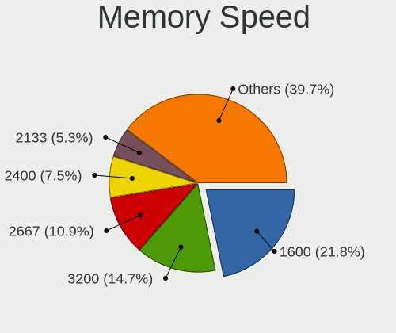

| Speed   | Computers | Percent |
|---------|-----------|---------|
| 1600    | 208       | 21.8%   |
| 3200    | 140       | 14.68%  |
| 2667    | 104       | 10.9%   |
| 2400    | 72        | 7.55%   |
| 2133    | 51        | 5.35%   |
| 1333    | 39        | 4.09%   |
| 1334    | 32        | 3.35%   |
| Unknown | 20        | 2.1%    |
| 4800    | 19        | 1.99%   |
| 1067    | 19        | 1.99%   |
| 6400    | 18        | 1.89%   |
| 3600    | 17        | 1.78%   |
| 1867    | 15        | 1.57%   |
| 800     | 15        | 1.57%   |
| 1800    | 14        | 1.47%   |
| 667     | 14        | 1.47%   |
| 5600    | 13        | 1.36%   |
| 4267    | 13        | 1.36%   |
| 3733    | 11        | 1.15%   |
| 2666    | 11        | 1.15%   |
| 1066    | 11        | 1.15%   |
| 4199    | 10        | 1.05%   |
| 2933    | 10        | 1.05%   |
| 533     | 8         | 0.84%   |
| 7500    | 7         | 0.73%   |
| 1866    | 7         | 0.73%   |
| 3800    | 6         | 0.63%   |
| 4266    | 5         | 0.52%   |
| 3100    | 5         | 0.52%   |
| 333     | 4         | 0.42%   |
| 3400    | 3         | 0.31%   |
| 3266    | 3         | 0.31%   |
| 3000    | 3         | 0.31%   |
| 975     | 3         | 0.31%   |
| 8533    | 2         | 0.21%   |
| 7467    | 2         | 0.21%   |
| 3534    | 2         | 0.21%   |
| 3066    | 2         | 0.21%   |
| 400     | 2         | 0.21%   |
| 266     | 2         | 0.21%   |

Printers & scanners
-------------------

Printer Vendor
--------------

Printer device vendors

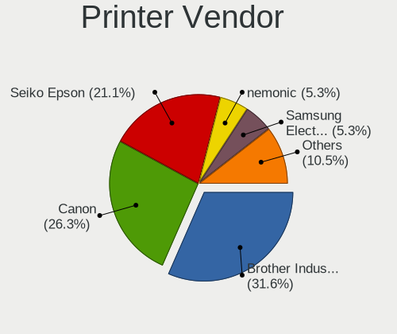

| Vendor              | Computers | Percent |
|---------------------|-----------|---------|
| Brother Industries  | 6         | 31.58%  |
| Canon               | 5         | 26.32%  |
| Seiko Epson         | 4         | 21.05%  |
| Samsung Electronics | 1         | 5.26%   |
| nemonic             | 1         | 5.26%   |
| Hewlett-Packard     | 1         | 5.26%   |
| Fuji Xerox          | 1         | 5.26%   |

Printer Model
-------------

Printer device models

| Model                         | Computers | Percent |
|-------------------------------|-----------|---------|
| Brother HL-1440 Laser Printer | 2         | 10.53%  |
| Seiko Epson XP-102 103 Series | 1         | 5.26%   |
| Seiko Epson WF-2010 Series    | 1         | 5.26%   |
| Seiko Epson EP-881A Series    | 1         | 5.26%   |
| Seiko Epson EP-306 Series     | 1         | 5.26%   |
| Samsung SCX-3200 Series       | 1         | 5.26%   |
| nemonic MIP-001               | 1         | 5.26%   |
| HP ENVY 5000 series           | 1         | 5.26%   |
| Fuji Xerox MultiWriter 5600C  | 1         | 5.26%   |
| Canon TS5300 series           | 1         | 5.26%   |
| Canon PIXMA MG3600 Series     | 1         | 5.26%   |
| Canon PIXMA iX6850 Printer    | 1         | 5.26%   |
| Canon PIXMA iP4600 Printer    | 1         | 5.26%   |
| Canon iP2700 series           | 1         | 5.26%   |
| Brother HL-L2375DW series     | 1         | 5.26%   |
| Brother HL-L2360D series      | 1         | 5.26%   |
| Brother HL-52x0 series        | 1         | 5.26%   |
| Brother HL-2130 series        | 1         | 5.26%   |

Scanner Vendor
--------------

Scanner device vendors

| Vendor      | Computers | Percent |
|-------------|-----------|---------|
| Seiko Epson | 1         | 50%     |
| Canon       | 1         | 50%     |

Scanner Model
-------------

Scanner device models

| Model                                                         | Computers | Percent |
|---------------------------------------------------------------|-----------|---------|
| Seiko Epson GT-8700/GT-8700F [Perfection 1640SU/1640SU PHOTO] | 1         | 50%     |
| Canon CanoScan LiDE 100                                       | 1         | 50%     |

Camera
------

Camera Vendor
-------------

Camera device vendors

| Vendor                                 | Computers | Percent |
|----------------------------------------|-----------|---------|
| Chicony Electronics                    | 142       | 21.58%  |
| Bison Electronics                      | 57        | 8.66%   |
| IMC Networks                           | 53        | 8.05%   |
| Microdia                               | 46        | 6.99%   |
| Sunplus Innovation Technology          | 38        | 5.78%   |
| Realtek Semiconductor                  | 37        | 5.62%   |
| Apple                                  | 36        | 5.47%   |
| Logitech                               | 26        | 3.95%   |
| Quanta                                 | 21        | 3.19%   |
| Cheng Uei Precision Industry (Foxlink) | 19        | 2.89%   |
| Suyin                                  | 17        | 2.58%   |
| Luxvisions Innotech Limited            | 14        | 2.13%   |
| Acer                                   | 14        | 2.13%   |
| Syntek                                 | 13        | 1.98%   |
| Ricoh                                  | 11        | 1.67%   |
| Importek                               | 10        | 1.52%   |
| BUFFALO                                | 10        | 1.52%   |
| Elecom                                 | 8         | 1.22%   |
| Alcor Micro                            | 8         | 1.22%   |
| Lite-On Technology                     | 7         | 1.06%   |
| Sonix Technology                       | 6         | 0.91%   |
| Microsoft                              | 6         | 0.91%   |
| Silicon Motion                         | 5         | 0.76%   |
| SunplusIT                              | 4         | 0.61%   |
| Samsung Electronics                    | 4         | 0.61%   |
| Cubeternet                             | 4         | 0.61%   |
| MacroSilicon                           | 3         | 0.46%   |
| Genesys Logic                          | 3         | 0.46%   |
| Generalplus Technology                 | 3         | 0.46%   |
| Z-Star Microelectronics                | 2         | 0.3%    |
| SHENZHEN EMEET TECHNOLOGY              | 2         | 0.3%    |
| Lenovo                                 | 2         | 0.3%    |
| HYGD-220831-A                          | 2         | 0.3%    |
| Huawei Technologies                    | 2         | 0.3%    |
| GEMBIRD                                | 2         | 0.3%    |
| Etron Technology                       | 2         | 0.3%    |
| WaveRider Communications               | 1         | 0.15%   |
| Sunplus Technology                     | 1         | 0.15%   |
| Sony Ericsson Mobile Communications AB | 1         | 0.15%   |
| Shine-optics                           | 1         | 0.15%   |

Camera Model
------------

Camera device models

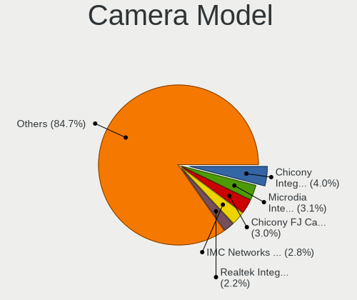

| Model                                             | Computers | Percent |
|---------------------------------------------------|-----------|---------|
| Chicony Integrated Camera                         | 27        | 4.04%   |
| Microdia Integrated_Webcam_HD                     | 21        | 3.14%   |
| Chicony FJ Camera                                 | 20        | 2.99%   |
| IMC Networks Integrated Camera                    | 19        | 2.84%   |
| Realtek Integrated_Webcam_HD                      | 15        | 2.25%   |
| Bison Integrated Camera                           | 14        | 2.1%    |
| Apple FaceTime HD Camera (Built-in)               | 14        | 2.1%    |
| IMC Networks USB2.0 HD UVC WebCam                 | 10        | 1.5%    |
| Chicony USB2.0 Camera                             | 10        | 1.5%    |
| BUFFALO USB 2.0 Camera                            | 10        | 1.5%    |
| Chicony TOSHIBA Web Camera - HD                   | 9         | 1.35%   |
| Logitech Webcam C270                              | 8         | 1.2%    |
| Apple Built-in iSight                             | 8         | 1.2%    |
| Importek TOSHIBA Web Camera - HD                  | 7         | 1.05%   |
| IMC Networks USB2.0 VGA UVC WebCam                | 7         | 1.05%   |
| Apple FaceTime HD Camera                          | 7         | 1.05%   |
| Acer USB HD Webcam                                | 7         | 1.05%   |
| Lite-On Integrated Camera                         | 6         | 0.9%    |
| Chicony NEC HD WebCam                             | 6         | 0.9%    |
| Bison USB HD Webcam                               | 6         | 0.9%    |
| Bison BisonCam, NB Pro                            | 6         | 0.9%    |
| Syntek Integrated Camera                          | 5         | 0.75%   |
| Sunplus Integrated_Webcam_HD                      | 5         | 0.75%   |
| Microdia USB 2.0 Camera                           | 5         | 0.75%   |
| Bison ThinkPad Integrated Camera                  | 5         | 0.75%   |
| Apple iPhone 5/5C/5S/6/SE/7/8/X/XR                | 5         | 0.75%   |
| Sunplus Integrated_Webcam_FHD                     | 4         | 0.6%    |
| Sunplus HD WebCam                                 | 4         | 0.6%    |
| Samsung Galaxy series, misc. (MTP mode)           | 4         | 0.6%    |
| Ricoh Sony Visual Communication Camera            | 4         | 0.6%    |
| Ricoh Sony Vaio Integrated Webcam                 | 4         | 0.6%    |
| Quanta HD User Facing                             | 4         | 0.6%    |
| Microdia Webcam Vitade AF                         | 4         | 0.6%    |
| Microdia Integrated_Webcam_FHD                    | 4         | 0.6%    |
| Luxvisions Innotech Limited Integrated RGB Camera | 4         | 0.6%    |
| Luxvisions Innotech Limited Integrated Camera     | 4         | 0.6%    |
| IMC Networks ov9734_azurewave_camera              | 4         | 0.6%    |
| Chicony USB 2.0 Camera                            | 4         | 0.6%    |
| Chicony Lenovo EasyCamera                         | 4         | 0.6%    |
| Chicony HP Wide Vision HD Camera                  | 4         | 0.6%    |

Security
--------

Fingerprint Vendor
------------------

Fingerprint sensor vendors

| Vendor                             | Computers | Percent |
|------------------------------------|-----------|---------|
| Validity Sensors                   | 40        | 26.85%  |
| Synaptics                          | 33        | 22.15%  |
| Shenzhen Goodix Technology         | 20        | 13.42%  |
| AuthenTec                          | 18        | 12.08%  |
| Upek                               | 11        | 7.38%   |
| Elan Microelectronics              | 11        | 7.38%   |
| STMicroelectronics                 | 7         | 4.7%    |
| LighTuning Technology              | 5         | 3.36%   |
| Realtek USB2.0 Finger Print Bridge | 3         | 2.01%   |
| Focal-systems.Corp                 | 1         | 0.67%   |

Fingerprint Model
-----------------

Fingerprint sensor models

| Model                                                           | Computers | Percent |
|-----------------------------------------------------------------|-----------|---------|
| Synaptics Prometheus MIS Touch Fingerprint Reader               | 13        | 8.72%   |
| Shenzhen Goodix  Fingerprint Device                             | 10        | 6.71%   |
| Upek Biometric Touchchip/Touchstrip Fingerprint Sensor          | 8         | 5.37%   |
| Shenzhen Goodix Fingerprint Reader                              | 8         | 5.37%   |
| Validity Sensors VFS495 Fingerprint Reader                      | 7         | 4.7%    |
| Validity Sensors VFS 5011 fingerprint sensor                    | 7         | 4.7%    |
| STMicroelectronics Fingerprint Reader                           | 7         | 4.7%    |
| AuthenTec Fingerprint Sensor                                    | 6         | 4.03%   |
| Synaptics Metallica MIS Touch Fingerprint Reader                | 5         | 3.36%   |
| Synaptics FS7604 Touch Fingerprint Sensor with PurePrint        | 5         | 3.36%   |
| Elan ELAN:ARM-M4                                                | 5         | 3.36%   |
| Validity Sensors Swipe Fingerprint Sensor                       | 4         | 2.68%   |
| AuthenTec AES2501 Fingerprint Sensor                            | 4         | 2.68%   |
| Validity Sensors VFS491                                         | 3         | 2.01%   |
| Validity Sensors VFS471 Fingerprint Reader                      | 3         | 2.01%   |
| Validity Sensors Synaptics WBDI                                 | 3         | 2.01%   |
| Upek TCS5B Fingerprint sensor                                   | 3         | 2.01%   |
| Realtek USB2.0 Finger Print Bridge FocalTech Fingerprint Device | 3         | 2.01%   |
| Elan fingerprint sensor [FeinTech FPS00200]                     | 3         | 2.01%   |
| Elan ELAN:Fingerprint                                           | 3         | 2.01%   |
| AuthenTec AES2810                                               | 3         | 2.01%   |
| AuthenTec AES1600                                               | 3         | 2.01%   |
| Validity Sensors VFS7552 Touch Fingerprint Sensor               | 2         | 1.34%   |
| Validity Sensors VFS7500 Touch Fingerprint Sensor               | 2         | 1.34%   |
| Validity Sensors VFS5011 Fingerprint Reader                     | 2         | 1.34%   |
| Validity Sensors VFS451 Fingerprint Reader                      | 2         | 1.34%   |
| Validity Sensors VFS301 Fingerprint Reader                      | 2         | 1.34%   |
| Synaptics WBDI                                                  | 2         | 1.34%   |
| Synaptics UWP WBDI Device                                       | 2         | 1.34%   |
| Synaptics UWP WBDI                                              | 2         | 1.34%   |
| Shenzhen Goodix FingerPrint                                     | 2         | 1.34%   |
| LighTuning ES603 Swipe Fingerprint Sensor                       | 2         | 1.34%   |
| LighTuning EgisTec Touch Fingerprint Sensor                     | 2         | 1.34%   |
| Validity Sensors VFS Fingerprint sensor                         | 1         | 0.67%   |
| Validity Sensors Synaptics VFS7552 Touch Fingerprint Sensor     | 1         | 0.67%   |
| Validity Sensors Fingerprint scanner                            | 1         | 0.67%   |
| Synaptics WBDI Device                                           | 1         | 0.67%   |
| Synaptics  WBDI Fingerprint Reader - USB 052                    | 1         | 0.67%   |
| Synaptics Prometheus Fingerprint Reader                         | 1         | 0.67%   |
| LighTuning Fingerprint Reader                                   | 1         | 0.67%   |

Chipcard Vendor
---------------

Chipcard module vendors

| Vendor           | Computers | Percent |
|------------------|-----------|---------|
| Broadcom         | 12        | 28.57%  |
| Alcor Micro      | 11        | 26.19%  |
| Upek             | 9         | 21.43%  |
| SCM Microsystems | 4         | 9.52%   |
| O2 Micro         | 4         | 9.52%   |
| Yubico.com       | 1         | 2.38%   |
| Circle           | 1         | 2.38%   |

Chipcard Model
--------------

Chipcard module models

| Model                                                                        | Computers | Percent |
|------------------------------------------------------------------------------|-----------|---------|
| Alcor Micro AU9540 Smartcard Reader                                          | 11        | 26.19%  |
| Upek TouchChip Fingerprint Coprocessor (WBF advanced mode)                   | 9         | 21.43%  |
| Broadcom BCM5880 Secure Applications Processor                               | 6         | 14.29%  |
| SCM Microsystems SCR331-LC1 / SCR3310 SmartCard Reader                       | 4         | 9.52%   |
| O2 Micro OZ776 CCID Smartcard Reader                                         | 4         | 9.52%   |
| Broadcom 58200                                                               | 3         | 7.14%   |
| Broadcom 5880                                                                | 2         | 4.76%   |
| Yubico.com Yubikey 4/5 U2F+CCID                                              | 1         | 2.38%   |
| Circle CIR115 ICC                                                            | 1         | 2.38%   |
| Broadcom BCM5880 Secure Applications Processor with fingerprint swipe sensor | 1         | 2.38%   |

Unsupported
-----------

Unsupported Devices
-------------------

Total unsupported devices on board

| Total | Computers | Percent |
|-------|-----------|---------|
| 0     | 1188      | 71.44%  |
| 1     | 386       | 23.21%  |
| 2     | 69        | 4.15%   |
| 3     | 12        | 0.72%   |
| 4     | 3         | 0.18%   |
| 6     | 2         | 0.12%   |
| 8     | 1         | 0.06%   |
| 7     | 1         | 0.06%   |
| 5     | 1         | 0.06%   |

Unsupported Device Types
------------------------

Types of unsupported devices

| Type                     | Computers | Percent |
|--------------------------|-----------|---------|
| Fingerprint reader       | 147       | 25.74%  |
| Graphics card            | 119       | 20.84%  |
| Multimedia controller    | 73        | 12.78%  |
| Net/wireless             | 66        | 11.56%  |
| Chipcard                 | 37        | 6.48%   |
| Communication controller | 28        | 4.9%    |
| Storage                  | 20        | 3.5%    |
| Unassigned class         | 18        | 3.15%   |
| Sound                    | 15        | 2.63%   |
| Bluetooth                | 12        | 2.1%    |
| Camera                   | 11        | 1.93%   |
| Net/ethernet             | 6         | 1.05%   |
| Network                  | 5         | 0.88%   |
| Modem                    | 5         | 0.88%   |
| Storage/ata              | 3         | 0.53%   |
| Storage/raid             | 2         | 0.35%   |
| Tv card                  | 1         | 0.18%   |
| Storage/nvme             | 1         | 0.18%   |
| Dvb card                 | 1         | 0.18%   |
| Card reader              | 1         | 0.18%   |

