Linux in Kazakhstan - Tested Hardware & Statistics
--------------------------------------------------

A project to collect tested hardware configurations for Linux in Kazakhstan.

Anyone can contribute to this report by the [hw-probe](https://github.com/linuxhw/hw-probe) tool:

    sudo -E hw-probe -all -upload

Please contribute! Especially if your hardware is rare.

This is a report for all computer types. See also reports for [desktops](/Location/Kazakhstan/Desktop/README.md) and [notebooks](/Location/Kazakhstan/Notebook/README.md).

Contents
--------

* [ Test Cases ](#test-cases)

* [ System ](#system)
  - [ OS                       ](#os)
  - [ OS Family                ](#os-family)
  - [ Kernel                   ](#kernel)
  - [ Kernel Family            ](#kernel-family)
  - [ Kernel Major Ver.        ](#kernel-major-ver)
  - [ Arch                     ](#arch)
  - [ DE                       ](#de)
  - [ Display Server           ](#display-server)
  - [ Display Manager          ](#display-manager)
  - [ OS Lang                  ](#os-lang)
  - [ Boot Mode                ](#boot-mode)
  - [ Filesystem               ](#filesystem)
  - [ Part. scheme             ](#part-scheme)
  - [ Dual Boot with Linux/BSD ](#dual-boot-with-linuxbsd)
  - [ Dual Boot (Win)          ](#dual-boot-win)

* [ Board ](#board)
  - [ Vendor                   ](#vendor)
  - [ Model                    ](#model)
  - [ Model Family             ](#model-family)
  - [ MFG Year                 ](#mfg-year)
  - [ Form Factor              ](#form-factor)
  - [ Secure Boot              ](#secure-boot)
  - [ Coreboot                 ](#coreboot)
  - [ RAM Size                 ](#ram-size)
  - [ RAM Used                 ](#ram-used)
  - [ Total Drives             ](#total-drives)
  - [ Has CD-ROM               ](#has-cd-rom)
  - [ Has Ethernet             ](#has-ethernet)
  - [ Has WiFi                 ](#has-wifi)
  - [ Has Bluetooth            ](#has-bluetooth)

* [ Location ](#location)
  - [ Country                  ](#country)
  - [ City                     ](#city)

* [ Drives ](#drives)
  - [ Drive Vendor             ](#drive-vendor)
  - [ Drive Model              ](#drive-model)
  - [ HDD Vendor               ](#hdd-vendor)
  - [ SSD Vendor               ](#ssd-vendor)
  - [ Drive Kind               ](#drive-kind)
  - [ Drive Connector          ](#drive-connector)
  - [ Drive Size               ](#drive-size)
  - [ Space Total              ](#space-total)
  - [ Space Used               ](#space-used)
  - [ Malfunc. Drives          ](#malfunc-drives)
  - [ Malfunc. Drive Vendor    ](#malfunc-drive-vendor)
  - [ Malfunc. HDD Vendor      ](#malfunc-hdd-vendor)
  - [ Malfunc. Drive Kind      ](#malfunc-drive-kind)
  - [ Failed Drives            ](#failed-drives)
  - [ Failed Drive Vendor      ](#failed-drive-vendor)
  - [ Drive Status             ](#drive-status)

* [ Storage controller ](#storage-controller)
  - [ Storage Vendor           ](#storage-vendor)
  - [ Storage Model            ](#storage-model)
  - [ Storage Kind             ](#storage-kind)

* [ Processor ](#processor)
  - [ CPU Vendor               ](#cpu-vendor)
  - [ CPU Model                ](#cpu-model)
  - [ CPU Model Family         ](#cpu-model-family)
  - [ CPU Cores                ](#cpu-cores)
  - [ CPU Sockets              ](#cpu-sockets)
  - [ CPU Threads              ](#cpu-threads)
  - [ CPU Op-Modes             ](#cpu-op-modes)
  - [ CPU Microcode            ](#cpu-microcode)
  - [ CPU Microarch            ](#cpu-microarch)

* [ Graphics ](#graphics)
  - [ GPU Vendor               ](#gpu-vendor)
  - [ GPU Model                ](#gpu-model)
  - [ GPU Combo                ](#gpu-combo)
  - [ GPU Driver               ](#gpu-driver)
  - [ GPU Memory               ](#gpu-memory)

* [ Monitor ](#monitor)
  - [ Monitor Vendor           ](#monitor-vendor)
  - [ Monitor Model            ](#monitor-model)
  - [ Monitor Resolution       ](#monitor-resolution)
  - [ Monitor Diagonal         ](#monitor-diagonal)
  - [ Monitor Width            ](#monitor-width)
  - [ Aspect Ratio             ](#aspect-ratio)
  - [ Monitor Area             ](#monitor-area)
  - [ Pixel Density            ](#pixel-density)
  - [ Multiple Monitors        ](#multiple-monitors)

* [ Network ](#network)
  - [ Net Controller Vendor    ](#net-controller-vendor)
  - [ Net Controller Model     ](#net-controller-model)
  - [ Wireless Vendor          ](#wireless-vendor)
  - [ Wireless Model           ](#wireless-model)
  - [ Ethernet Vendor          ](#ethernet-vendor)
  - [ Ethernet Model           ](#ethernet-model)
  - [ Net Controller Kind      ](#net-controller-kind)
  - [ Used Controller          ](#used-controller)
  - [ NICs                     ](#nics)
  - [ IPv6                     ](#ipv6)

* [ Bluetooth ](#bluetooth)
  - [ Bluetooth Vendor         ](#bluetooth-vendor)
  - [ Bluetooth Model          ](#bluetooth-model)

* [ Sound ](#sound)
  - [ Sound Vendor             ](#sound-vendor)
  - [ Sound Model              ](#sound-model)

* [ Memory ](#memory)
  - [ Memory Vendor            ](#memory-vendor)
  - [ Memory Model             ](#memory-model)
  - [ Memory Kind              ](#memory-kind)
  - [ Memory Form Factor       ](#memory-form-factor)
  - [ Memory Size              ](#memory-size)
  - [ Memory Speed             ](#memory-speed)

* [ Printers & scanners ](#printers--scanners)
  - [ Printer Vendor           ](#printer-vendor)
  - [ Printer Model            ](#printer-model)
  - [ Scanner Vendor           ](#scanner-vendor)
  - [ Scanner Model            ](#scanner-model)

* [ Camera ](#camera)
  - [ Camera Vendor            ](#camera-vendor)
  - [ Camera Model             ](#camera-model)

* [ Security ](#security)
  - [ Fingerprint Vendor       ](#fingerprint-vendor)
  - [ Fingerprint Model        ](#fingerprint-model)
  - [ Chipcard Vendor          ](#chipcard-vendor)
  - [ Chipcard Model           ](#chipcard-model)

* [ Unsupported ](#unsupported)
  - [ Unsupported Devices      ](#unsupported-devices)
  - [ Unsupported Device Types ](#unsupported-device-types)

Test Cases
----------

Total: 805

| Vendor        | Model                       | Form-Factor | Probe                                                      | Date         |
|---------------|-----------------------------|-------------|------------------------------------------------------------|--------------|
| MSI           | H310M PRO-VDH PLUS          | Desktop     | [624a99186e](https://linux-hardware.org/?probe=624a99186e) | Oct 30, 2023 |
| MSI           | MAG B760 TOMAHAWK WIFI      | Desktop     | [42e6514c85](https://linux-hardware.org/?probe=42e6514c85) | Oct 29, 2023 |
| MSI           | H310M PRO-VDH PLUS          | Desktop     | [b18bbae606](https://linux-hardware.org/?probe=b18bbae606) | Oct 27, 2023 |
| Dell          | Latitude E7270              | Notebook    | [07d72d2a9d](https://linux-hardware.org/?probe=07d72d2a9d) | Oct 24, 2023 |
| ASUSTek       | VivoBook_ASUSLaptop X150... | Notebook    | [1bd81ebf81](https://linux-hardware.org/?probe=1bd81ebf81) | Oct 24, 2023 |
| HP            | Pavilion Laptop 15-eh3xx... | Notebook    | [d2a1f0ba6e](https://linux-hardware.org/?probe=d2a1f0ba6e) | Oct 24, 2023 |
| HP            | Pavilion Notebook           | Notebook    | [ffeaa7da2f](https://linux-hardware.org/?probe=ffeaa7da2f) | Oct 21, 2023 |
| HONOR         | NBR-WAX9                    | Notebook    | [5966a36809](https://linux-hardware.org/?probe=5966a36809) | Oct 21, 2023 |
| HP            | Pavilion Notebook           | Notebook    | [9d49844572](https://linux-hardware.org/?probe=9d49844572) | Oct 20, 2023 |
| ASRock        | Z370 Taichi                 | Desktop     | [ca57155c40](https://linux-hardware.org/?probe=ca57155c40) | Oct 19, 2023 |
| Acer          | Aspire 5750G                | Notebook    | [ae0eccc095](https://linux-hardware.org/?probe=ae0eccc095) | Oct 18, 2023 |
| Chuwi         | M01ALWR310-ADA90B           | Mini pc     | [4dbcbacf46](https://linux-hardware.org/?probe=4dbcbacf46) | Oct 18, 2023 |
| MSI           | G31M3-F V2                  | Desktop     | [9a26b22114](https://linux-hardware.org/?probe=9a26b22114) | Oct 14, 2023 |
| Acer          | Predator PH317-56           | Notebook    | [2089e200d9](https://linux-hardware.org/?probe=2089e200d9) | Oct 12, 2023 |
| Acer          | Aspire 5750G                | Notebook    | [56bdc382d5](https://linux-hardware.org/?probe=56bdc382d5) | Oct 10, 2023 |
| Lenovo        | Legion 5 15IAH7H 82RB       | Notebook    | [30b0879baa](https://linux-hardware.org/?probe=30b0879baa) | Oct 07, 2023 |
| Acer          | Predator PH317-56           | Notebook    | [3adaae9e9e](https://linux-hardware.org/?probe=3adaae9e9e) | Oct 06, 2023 |
| Acer          | Predator PH317-54           | Notebook    | [8745400c59](https://linux-hardware.org/?probe=8745400c59) | Oct 06, 2023 |
| HP            | 3031h                       | Desktop     | [a05ac19b87](https://linux-hardware.org/?probe=a05ac19b87) | Oct 03, 2023 |
| HP            | Notebook                    | Notebook    | [02403b0967](https://linux-hardware.org/?probe=02403b0967) | Oct 02, 2023 |
| ASUSTek       | VivoBook_ASUSLaptop X150... | Notebook    | [7ebc133bf7](https://linux-hardware.org/?probe=7ebc133bf7) | Oct 02, 2023 |
| Lenovo        | IdeaPad 5 Pro 16ACH6 82L... | Notebook    | [b8ace5a2d6](https://linux-hardware.org/?probe=b8ace5a2d6) | Oct 02, 2023 |
| Lenovo        | IdeaPad 5 Pro 16ACH6 82L... | Notebook    | [11cbffaee6](https://linux-hardware.org/?probe=11cbffaee6) | Oct 02, 2023 |
| Gigabyte      | H61M-S1                     | Desktop     | [64e8a0bcc2](https://linux-hardware.org/?probe=64e8a0bcc2) | Sep 30, 2023 |
| ASUSTek       | ROG Strix G713QM_G713QM     | Notebook    | [ec1384a424](https://linux-hardware.org/?probe=ec1384a424) | Sep 29, 2023 |
| ASUSTek       | ROG Strix G713QM_G713QM     | Notebook    | [d958b4e16a](https://linux-hardware.org/?probe=d958b4e16a) | Sep 29, 2023 |
| HP            | ENVY x360 Convertible 15... | Convertible | [13a2717815](https://linux-hardware.org/?probe=13a2717815) | Sep 27, 2023 |
| HONOR         | NBR-WAX9                    | Notebook    | [68556b1e09](https://linux-hardware.org/?probe=68556b1e09) | Sep 27, 2023 |
| HONOR         | NBR-WAX9                    | Notebook    | [056de6b9b3](https://linux-hardware.org/?probe=056de6b9b3) | Sep 27, 2023 |
| Lenovo        | IdeaPad S340-14API 81NB     | Notebook    | [14d87bfb5d](https://linux-hardware.org/?probe=14d87bfb5d) | Sep 22, 2023 |
| ASUSTek       | VivoBook_ASUSLaptop K660... | Notebook    | [6f676cd559](https://linux-hardware.org/?probe=6f676cd559) | Sep 18, 2023 |
| Dell          | Inspiron 5520               | Notebook    | [91404ec81d](https://linux-hardware.org/?probe=91404ec81d) | Sep 17, 2023 |
| ASUSTek       | VivoBook_ASUSLaptop X150... | Notebook    | [83021c4304](https://linux-hardware.org/?probe=83021c4304) | Sep 11, 2023 |
| ASUSTek       | VivoBook_ASUSLaptop N760... | Notebook    | [9ea0aa4b28](https://linux-hardware.org/?probe=9ea0aa4b28) | Sep 10, 2023 |
| Acer          | Nitro N50-610               | Desktop     | [1c695a40ca](https://linux-hardware.org/?probe=1c695a40ca) | Sep 09, 2023 |
| Acer          | Nitro N50-610               | Desktop     | [b002674315](https://linux-hardware.org/?probe=b002674315) | Sep 09, 2023 |
| MSI           | MAG B560 TORPEDO            | Desktop     | [b3a181910f](https://linux-hardware.org/?probe=b3a181910f) | Sep 08, 2023 |
| Acer          | Nitro N50-610               | Desktop     | [3a6cb86551](https://linux-hardware.org/?probe=3a6cb86551) | Sep 07, 2023 |
| Acer          | Nitro N50-610               | Desktop     | [6ba5f1b344](https://linux-hardware.org/?probe=6ba5f1b344) | Sep 07, 2023 |
| ASUSTek       | VivoBook_ASUSLaptop M160... | Notebook    | [ea096b699b](https://linux-hardware.org/?probe=ea096b699b) | Sep 04, 2023 |
| Lenovo        | IdeaPad Z570 HuronRiver ... | Notebook    | [f92734bf2b](https://linux-hardware.org/?probe=f92734bf2b) | Sep 03, 2023 |
| ASRock        | B450 Steel Legend           | Desktop     | [29a4025447](https://linux-hardware.org/?probe=29a4025447) | Sep 02, 2023 |
| ASRock        | N68-S3 UCC                  | Desktop     | [53cd38e0c5](https://linux-hardware.org/?probe=53cd38e0c5) | Sep 02, 2023 |
| ASRock        | B450 Steel Legend           | Desktop     | [7aa770bf00](https://linux-hardware.org/?probe=7aa770bf00) | Aug 30, 2023 |
| Supermicro    | X11DPG-QTA                  | Server      | [f2f86694d8](https://linux-hardware.org/?probe=f2f86694d8) | Aug 29, 2023 |
| Kobian        | PI945GCM ECS                | Desktop     | [85683b5fa3](https://linux-hardware.org/?probe=85683b5fa3) | Aug 29, 2023 |
| ASRock        | Z68 Extreme3 Gen3           | Desktop     | [a2f18f43e4](https://linux-hardware.org/?probe=a2f18f43e4) | Aug 29, 2023 |
| Lenovo        | IdeaPad 3 15ITL6 82H8       | Notebook    | [0140ea0642](https://linux-hardware.org/?probe=0140ea0642) | Aug 26, 2023 |
| MSI           | MAG B560 TORPEDO            | Desktop     | [a3ec958f0c](https://linux-hardware.org/?probe=a3ec958f0c) | Aug 23, 2023 |
| ASUSTek       | X541SA                      | Notebook    | [109de7a1ae](https://linux-hardware.org/?probe=109de7a1ae) | Aug 23, 2023 |
| MSI           | MAG B560 TORPEDO            | Desktop     | [79db65495a](https://linux-hardware.org/?probe=79db65495a) | Aug 23, 2023 |
| Lenovo        | IdeaPad Gaming 3 15ARH7 ... | Notebook    | [fdd24243bf](https://linux-hardware.org/?probe=fdd24243bf) | Aug 22, 2023 |
| Lenovo        | 0B98401 PRO                 | Desktop     | [58afba6baf](https://linux-hardware.org/?probe=58afba6baf) | Aug 17, 2023 |
| ASUSTek       | ASUS TUF Gaming A15 FA50... | Notebook    | [49662a8ac9](https://linux-hardware.org/?probe=49662a8ac9) | Aug 12, 2023 |
| ASUSTek       | ASUS TUF Gaming A15 FA50... | Notebook    | [c946b79f5a](https://linux-hardware.org/?probe=c946b79f5a) | Aug 12, 2023 |
| ASUSTek       | VivoBook_ASUSLaptop X412... | Notebook    | [d8caf086ad](https://linux-hardware.org/?probe=d8caf086ad) | Aug 04, 2023 |
| Dell          | Vostro 3500                 | Notebook    | [5f63621af2](https://linux-hardware.org/?probe=5f63621af2) | Aug 04, 2023 |
| Acer          | Aspire A515-57              | Notebook    | [87c4730d07](https://linux-hardware.org/?probe=87c4730d07) | Aug 03, 2023 |
| ASRock        | Z68 Pro3 Gen3               | Desktop     | [7d262746c9](https://linux-hardware.org/?probe=7d262746c9) | Jul 30, 2023 |
| Acer          | Aspire 5560                 | Notebook    | [86868232f0](https://linux-hardware.org/?probe=86868232f0) | Jul 27, 2023 |
| ECS           | P43T-A2                     | Desktop     | [a25280247b](https://linux-hardware.org/?probe=a25280247b) | Jul 25, 2023 |
| Dell          | Vostro 3500                 | Notebook    | [69cc1eb6f6](https://linux-hardware.org/?probe=69cc1eb6f6) | Jul 18, 2023 |
| Acer          | Aspire A315-51              | Notebook    | [9d3efe2fa2](https://linux-hardware.org/?probe=9d3efe2fa2) | Jul 18, 2023 |
| Acer          | Aspire E1-531               | Notebook    | [77e5715691](https://linux-hardware.org/?probe=77e5715691) | Jul 12, 2023 |
| MSI           | MAG B560 TORPEDO            | Desktop     | [4b611c264e](https://linux-hardware.org/?probe=4b611c264e) | Jul 08, 2023 |
| MSI           | MAG B560 TORPEDO            | Desktop     | [1327fb98ac](https://linux-hardware.org/?probe=1327fb98ac) | Jul 04, 2023 |
| Lenovo        | G505s 20255                 | Notebook    | [4ec56be6a5](https://linux-hardware.org/?probe=4ec56be6a5) | Jul 03, 2023 |
| Lenovo        | G505s 20255                 | Notebook    | [107c99d5ee](https://linux-hardware.org/?probe=107c99d5ee) | Jul 03, 2023 |
| Lenovo        | G505s 20255                 | Notebook    | [0617f8b2f0](https://linux-hardware.org/?probe=0617f8b2f0) | Jul 02, 2023 |
| ECS           | P67H2-A3                    | Desktop     | [d23f1fda24](https://linux-hardware.org/?probe=d23f1fda24) | Jul 02, 2023 |
| Lenovo        | G505s 20255                 | Notebook    | [2940c0be7d](https://linux-hardware.org/?probe=2940c0be7d) | Jul 01, 2023 |
| ECS           | P67H2-A3                    | Desktop     | [f35a6b0a66](https://linux-hardware.org/?probe=f35a6b0a66) | Jun 25, 2023 |
| ASUSTek       | VivoBook_ASUSLaptop K650... | Notebook    | [8a833d8c52](https://linux-hardware.org/?probe=8a833d8c52) | Jun 25, 2023 |
| Acer          | Aspire A315-51              | Notebook    | [0e6960c76b](https://linux-hardware.org/?probe=0e6960c76b) | Jun 22, 2023 |
| Acer          | Aspire A315-51              | Notebook    | [981385c200](https://linux-hardware.org/?probe=981385c200) | Jun 22, 2023 |
| HP            | Laptop 15-rb0xx             | Notebook    | [067eeb10e5](https://linux-hardware.org/?probe=067eeb10e5) | Jun 19, 2023 |
| HP            | ENVY x360 Convertible 15... | Convertible | [7d66d312d2](https://linux-hardware.org/?probe=7d66d312d2) | Jun 16, 2023 |
| HUAWEI        | BOM-WXX9                    | Notebook    | [130605379e](https://linux-hardware.org/?probe=130605379e) | Jun 15, 2023 |
| HP            | Victus by Laptop 16-e0xx... | Notebook    | [dd2a8a9559](https://linux-hardware.org/?probe=dd2a8a9559) | Jun 15, 2023 |
| ASUSTek       | VivoBook_ASUSLaptop K650... | Notebook    | [a6d6fdfe4f](https://linux-hardware.org/?probe=a6d6fdfe4f) | Jun 02, 2023 |
| Acer          | Aspire ES1-523              | Notebook    | [bd06482a4e](https://linux-hardware.org/?probe=bd06482a4e) | May 27, 2023 |
| HP            | ENVY x360 Convertible 15... | Convertible | [c73e482b69](https://linux-hardware.org/?probe=c73e482b69) | May 18, 2023 |
| HP            | Notebook                    | Notebook    | [3467291a26](https://linux-hardware.org/?probe=3467291a26) | May 07, 2023 |
| ASUSTek       | VivoBook_ASUSLaptop X513... | Notebook    | [02df3a407e](https://linux-hardware.org/?probe=02df3a407e) | May 03, 2023 |
| HP            | ENVY x360 Convertible 15... | Convertible | [8b36611a25](https://linux-hardware.org/?probe=8b36611a25) | May 02, 2023 |
| ASUSTek       | ROG STRIX X670E-A GAMING... | Desktop     | [a1b8584d65](https://linux-hardware.org/?probe=a1b8584d65) | May 01, 2023 |
| ASRock        | H110M-DGS R3.0              | Desktop     | [88e7444fa5](https://linux-hardware.org/?probe=88e7444fa5) | Apr 30, 2023 |
| ASRock        | H110M-DGS R3.0              | Desktop     | [763e7fa1b6](https://linux-hardware.org/?probe=763e7fa1b6) | Apr 30, 2023 |
| HP            | Pavilion Notebook           | Notebook    | [168b3cf595](https://linux-hardware.org/?probe=168b3cf595) | Apr 29, 2023 |
| ASUSTek       | X55VD                       | Notebook    | [16ef8c0549](https://linux-hardware.org/?probe=16ef8c0549) | Apr 27, 2023 |
| Lenovo        | Legion 5P 15IMH05H 82AW     | Notebook    | [61408603be](https://linux-hardware.org/?probe=61408603be) | Apr 21, 2023 |
| HP            | Pavilion Gaming Laptop 1... | Notebook    | [0187ac7a0c](https://linux-hardware.org/?probe=0187ac7a0c) | Apr 19, 2023 |
| Lenovo        | 374B No DPK                 | All in one  | [c87417466c](https://linux-hardware.org/?probe=c87417466c) | Apr 18, 2023 |
| Lenovo        | 374B No DPK                 | All in one  | [4a7133799c](https://linux-hardware.org/?probe=4a7133799c) | Apr 18, 2023 |
| ASUSTek       | GR6                         | Desktop     | [9cccf46449](https://linux-hardware.org/?probe=9cccf46449) | Apr 15, 2023 |
| Acer          | Aspire A515-57              | Notebook    | [ea0055d848](https://linux-hardware.org/?probe=ea0055d848) | Apr 14, 2023 |
| Gigabyte      | A320M-H-CF                  | Desktop     | [99f214269f](https://linux-hardware.org/?probe=99f214269f) | Apr 13, 2023 |
| Gigabyte      | A320M-H-CF                  | Desktop     | [c961550658](https://linux-hardware.org/?probe=c961550658) | Apr 13, 2023 |
| Dell          | G5 5590                     | Notebook    | [9c1f2f432b](https://linux-hardware.org/?probe=9c1f2f432b) | Apr 11, 2023 |
| HP            | Notebook                    | Notebook    | [41f9931a45](https://linux-hardware.org/?probe=41f9931a45) | Apr 07, 2023 |
| HP            | Notebook                    | Notebook    | [a344d6edef](https://linux-hardware.org/?probe=a344d6edef) | Apr 05, 2023 |
| Biostar       | H61MLV                      | Desktop     | [db9714357e](https://linux-hardware.org/?probe=db9714357e) | Apr 01, 2023 |
| GPD           | G1621-02                    | Notebook    | [7d000ab41b](https://linux-hardware.org/?probe=7d000ab41b) | Mar 31, 2023 |
| Dell          | 072T6D A01                  | Server      | [be75097d0f](https://linux-hardware.org/?probe=be75097d0f) | Mar 30, 2023 |
| HP            | Pavilion Gaming Laptop 1... | Notebook    | [252d340923](https://linux-hardware.org/?probe=252d340923) | Mar 30, 2023 |
| Lenovo        | ThinkBook 14-IIL 20SL       | Notebook    | [3173dc99b6](https://linux-hardware.org/?probe=3173dc99b6) | Mar 27, 2023 |
| Lenovo        | G570 20079                  | Notebook    | [8657b8d645](https://linux-hardware.org/?probe=8657b8d645) | Mar 21, 2023 |
| ASUSTek       | X55VDR                      | Notebook    | [b4eb9dbf58](https://linux-hardware.org/?probe=b4eb9dbf58) | Mar 20, 2023 |
| ASUSTek       | N56DP                       | Notebook    | [c49dee996b](https://linux-hardware.org/?probe=c49dee996b) | Mar 19, 2023 |
| Lenovo        | IdeaPad 320-15AST 80XV      | Notebook    | [f7727e4bcb](https://linux-hardware.org/?probe=f7727e4bcb) | Mar 17, 2023 |
| HP            | 245 14 inch G9 Notebook ... | Notebook    | [03edff3e6f](https://linux-hardware.org/?probe=03edff3e6f) | Mar 16, 2023 |
| GoWin Solu... | R86S                        | Desktop     | [495614211e](https://linux-hardware.org/?probe=495614211e) | Mar 09, 2023 |
| Gigabyte      | P35-DS3L                    | Desktop     | [31aeecfcb9](https://linux-hardware.org/?probe=31aeecfcb9) | Mar 06, 2023 |
| Intel         | H61                         | Desktop     | [7bc298c53d](https://linux-hardware.org/?probe=7bc298c53d) | Mar 02, 2023 |
| HP            | Laptop 15s-eq3xxx           | Notebook    | [a08a3c36ab](https://linux-hardware.org/?probe=a08a3c36ab) | Feb 28, 2023 |
| ASUSTek       | ROG Strix G712LW_G712LW     | Notebook    | [ed67c567d2](https://linux-hardware.org/?probe=ed67c567d2) | Feb 28, 2023 |
| HP            | ENVY x360 Convertible 15... | Convertible | [169294f95f](https://linux-hardware.org/?probe=169294f95f) | Feb 28, 2023 |
| HP            | 1497                        | Desktop     | [bd24913452](https://linux-hardware.org/?probe=bd24913452) | Feb 24, 2023 |
| HP            | ENVY x360 Convertible 15... | Convertible | [aa1fb72fa5](https://linux-hardware.org/?probe=aa1fb72fa5) | Feb 15, 2023 |
| GPD           | G1621-02                    | Notebook    | [5d584fa1cf](https://linux-hardware.org/?probe=5d584fa1cf) | Feb 14, 2023 |
| Intel         | NUC11PHBi7 M26151-404       | Mini pc     | [77e13c5748](https://linux-hardware.org/?probe=77e13c5748) | Feb 14, 2023 |
| Gigabyte      | B450M S2H                   | Desktop     | [20bcead0e8](https://linux-hardware.org/?probe=20bcead0e8) | Feb 11, 2023 |
| HP            | Laptop 15s-eq3xxx           | Notebook    | [36dd5f42fc](https://linux-hardware.org/?probe=36dd5f42fc) | Feb 11, 2023 |
| Acer          | Aspire A315-51              | Notebook    | [b644932b49](https://linux-hardware.org/?probe=b644932b49) | Feb 06, 2023 |
| Acer          | Aspire E5-575G              | Notebook    | [30e2a88930](https://linux-hardware.org/?probe=30e2a88930) | Feb 05, 2023 |
| HP            | Laptop 15s-eq3xxx           | Notebook    | [ba7531b9db](https://linux-hardware.org/?probe=ba7531b9db) | Feb 05, 2023 |
| HP            | Laptop 15s-eq3xxx           | Notebook    | [72228118bb](https://linux-hardware.org/?probe=72228118bb) | Feb 05, 2023 |
| Lenovo        | ThinkBook 14-IIL 20SL       | Notebook    | [bd19e14a45](https://linux-hardware.org/?probe=bd19e14a45) | Feb 02, 2023 |
| Gigabyte      | Z690 GAMING X DDR4          | Desktop     | [96847498e3](https://linux-hardware.org/?probe=96847498e3) | Feb 02, 2023 |
| Gigabyte      | Z690 GAMING X DDR4          | Desktop     | [21ce876854](https://linux-hardware.org/?probe=21ce876854) | Feb 01, 2023 |
| Gigabyte      | Z690 GAMING X DDR4          | Desktop     | [de7f0840d1](https://linux-hardware.org/?probe=de7f0840d1) | Feb 01, 2023 |
| Gigabyte      | Z690 GAMING X DDR4          | Desktop     | [f2636de53b](https://linux-hardware.org/?probe=f2636de53b) | Jan 31, 2023 |
| HP            | Laptop 15s-eq3xxx           | Notebook    | [e9525c9a86](https://linux-hardware.org/?probe=e9525c9a86) | Jan 31, 2023 |
| HP            | Laptop 15s-eq3xxx           | Notebook    | [e6cb9d8296](https://linux-hardware.org/?probe=e6cb9d8296) | Jan 31, 2023 |
| Gigabyte      | B85M-D3H                    | Desktop     | [8512c1d0cc](https://linux-hardware.org/?probe=8512c1d0cc) | Jan 31, 2023 |
| Gigabyte      | Z690 GAMING X DDR4          | Desktop     | [6bf8eb9c73](https://linux-hardware.org/?probe=6bf8eb9c73) | Jan 30, 2023 |
| Lenovo        | IdeaPad 320-15AST 80XV      | Notebook    | [a732875be3](https://linux-hardware.org/?probe=a732875be3) | Jan 29, 2023 |
| Gigabyte      | GA-73PVM-S2                 | Desktop     | [fcf91f09b4](https://linux-hardware.org/?probe=fcf91f09b4) | Jan 28, 2023 |
| ASUSTek       | N56DP                       | Notebook    | [a746d3fd78](https://linux-hardware.org/?probe=a746d3fd78) | Jan 27, 2023 |
| HP            | Laptop 15s-eq3xxx           | Notebook    | [b00e46e17f](https://linux-hardware.org/?probe=b00e46e17f) | Jan 23, 2023 |
| AMI           | Aptio CRB                   | Mini pc     | [52a02b4c4f](https://linux-hardware.org/?probe=52a02b4c4f) | Jan 23, 2023 |
| HP            | Laptop 15s-eq3xxx           | Notebook    | [1a9aaa1cb2](https://linux-hardware.org/?probe=1a9aaa1cb2) | Jan 22, 2023 |
| HP            | Laptop 15s-eq3xxx           | Notebook    | [4ed27b0b56](https://linux-hardware.org/?probe=4ed27b0b56) | Jan 22, 2023 |
| HP            | Laptop 15s-eq3xxx           | Notebook    | [0ba680dd8f](https://linux-hardware.org/?probe=0ba680dd8f) | Jan 22, 2023 |
| HP            | Laptop 15s-eq3xxx           | Notebook    | [d2d30c8d6f](https://linux-hardware.org/?probe=d2d30c8d6f) | Jan 21, 2023 |
| HP            | Laptop 15s-eq3xxx           | Notebook    | [07cf342b4f](https://linux-hardware.org/?probe=07cf342b4f) | Jan 20, 2023 |
| HP            | Laptop 15s-eq3xxx           | Notebook    | [78791e5b9e](https://linux-hardware.org/?probe=78791e5b9e) | Jan 20, 2023 |
| ECS           | G41T-M7                     | Desktop     | [e6be57e3c3](https://linux-hardware.org/?probe=e6be57e3c3) | Jan 20, 2023 |
| ECS           | G41T-M7                     | Desktop     | [51a45a431a](https://linux-hardware.org/?probe=51a45a431a) | Jan 16, 2023 |
| Acer          | Swift SF113-31              | Notebook    | [de76cee99a](https://linux-hardware.org/?probe=de76cee99a) | Jan 16, 2023 |
| ASRock        | Z68 Pro3 Gen3               | Desktop     | [242329daf8](https://linux-hardware.org/?probe=242329daf8) | Jan 15, 2023 |
| HP            | 84EE 1100                   | All in one  | [79c81fcfb5](https://linux-hardware.org/?probe=79c81fcfb5) | Jan 14, 2023 |
| Lenovo        | IdeaPad Z510 20287          | Notebook    | [71f6d9b711](https://linux-hardware.org/?probe=71f6d9b711) | Jan 12, 2023 |
| Lenovo        | G500 20236                  | Notebook    | [6a873e3df8](https://linux-hardware.org/?probe=6a873e3df8) | Jan 12, 2023 |
| Unknown       | Unknown                     | Notebook    | [cbd401e3c6](https://linux-hardware.org/?probe=cbd401e3c6) | Jan 11, 2023 |
| HP            | 87F9 A00                    | All in one  | [433fd99d94](https://linux-hardware.org/?probe=433fd99d94) | Jan 09, 2023 |
| ASUSTek       | Zenbook UM3402YA_UM3402Y... | Notebook    | [70d5242ad0](https://linux-hardware.org/?probe=70d5242ad0) | Jan 01, 2023 |
| HP            | OMEN by Laptop 16-c0xxx     | Notebook    | [3111141139](https://linux-hardware.org/?probe=3111141139) | Dec 26, 2022 |
| Acer          | Aspire A315-51              | Notebook    | [b53beddded](https://linux-hardware.org/?probe=b53beddded) | Dec 23, 2022 |
| Acer          | Aspire A315-51              | Notebook    | [4fc8630d91](https://linux-hardware.org/?probe=4fc8630d91) | Dec 22, 2022 |
| Lenovo        | Legion R9000P ARH7H 82RG    | Notebook    | [bbc48ee483](https://linux-hardware.org/?probe=bbc48ee483) | Dec 20, 2022 |
| Acer          | Aspire A315-51              | Notebook    | [8777d682b0](https://linux-hardware.org/?probe=8777d682b0) | Dec 20, 2022 |
| Acer          | Aspire A315-51              | Notebook    | [faf7ad4c29](https://linux-hardware.org/?probe=faf7ad4c29) | Dec 19, 2022 |
| Acer          | Aspire A315-51              | Notebook    | [116b321e68](https://linux-hardware.org/?probe=116b321e68) | Dec 16, 2022 |
| Lenovo        | ThinkPad X240 20AL007AMZ    | Notebook    | [8290c7e597](https://linux-hardware.org/?probe=8290c7e597) | Dec 16, 2022 |
| Acer          | Aspire A315-51              | Notebook    | [5f2e420614](https://linux-hardware.org/?probe=5f2e420614) | Dec 15, 2022 |
| Gigabyte      | B460M DS3H                  | Desktop     | [8a381fe525](https://linux-hardware.org/?probe=8a381fe525) | Dec 14, 2022 |
| Gigabyte      | B460M DS3H                  | Desktop     | [90b4e5f1b2](https://linux-hardware.org/?probe=90b4e5f1b2) | Dec 14, 2022 |
| HP            | ENVY x360 Convertible 15... | Convertible | [11b83fa996](https://linux-hardware.org/?probe=11b83fa996) | Dec 14, 2022 |
| Gigabyte      | H370M DS3H-CF               | Desktop     | [8c1901e5d6](https://linux-hardware.org/?probe=8c1901e5d6) | Dec 11, 2022 |
| Lenovo        | ThinkBook 15 G3 ACL 21A4    | Notebook    | [6ae6d710b7](https://linux-hardware.org/?probe=6ae6d710b7) | Dec 10, 2022 |
| Lenovo        | ThinkBook 15 G3 ACL 21A4    | Notebook    | [b56f450d6d](https://linux-hardware.org/?probe=b56f450d6d) | Dec 10, 2022 |
| Acer          | Aspire A315-51              | Notebook    | [1b1e1ae174](https://linux-hardware.org/?probe=1b1e1ae174) | Dec 08, 2022 |
| Acer          | Aspire A315-51              | Notebook    | [26828f578e](https://linux-hardware.org/?probe=26828f578e) | Dec 05, 2022 |
| ASRock        | B450M Pro4                  | Desktop     | [36ef5b0deb](https://linux-hardware.org/?probe=36ef5b0deb) | Dec 04, 2022 |
| Toshiba       | TECRA S11                   | Notebook    | [3d2414e47b](https://linux-hardware.org/?probe=3d2414e47b) | Nov 30, 2022 |
| ASRock        | N68-S3 UCC                  | Desktop     | [1d20e4ba6d](https://linux-hardware.org/?probe=1d20e4ba6d) | Nov 30, 2022 |
| Lenovo        | ThinkBook 15 G3 ACL 21A4    | Notebook    | [ef6247e6fd](https://linux-hardware.org/?probe=ef6247e6fd) | Nov 28, 2022 |
| Dell          | Precision M6400             | Notebook    | [05f69c6917](https://linux-hardware.org/?probe=05f69c6917) | Nov 28, 2022 |
| ASUSTek       | PRIME X570-PRO              | Desktop     | [c218724cb4](https://linux-hardware.org/?probe=c218724cb4) | Nov 27, 2022 |
| MSI           | Z77MA-G45                   | Desktop     | [feb165c344](https://linux-hardware.org/?probe=feb165c344) | Nov 27, 2022 |
| GPD           | G1621-02                    | Notebook    | [d6b679024c](https://linux-hardware.org/?probe=d6b679024c) | Nov 26, 2022 |
| GPD           | G1621-02                    | Notebook    | [f0e9e8442c](https://linux-hardware.org/?probe=f0e9e8442c) | Nov 26, 2022 |
| Acer          | Aspire A315-51              | Notebook    | [e08bf40900](https://linux-hardware.org/?probe=e08bf40900) | Nov 25, 2022 |
| Acer          | Aspire A315-51              | Notebook    | [a636cfb9ff](https://linux-hardware.org/?probe=a636cfb9ff) | Nov 24, 2022 |
| ASUSTek       | Z97M-PLUS                   | Desktop     | [7ad1a412ae](https://linux-hardware.org/?probe=7ad1a412ae) | Nov 20, 2022 |
| Acer          | Swift SF314-58G             | Notebook    | [9e729e43a7](https://linux-hardware.org/?probe=9e729e43a7) | Nov 20, 2022 |
| ASUSTek       | Z97M-PLUS                   | Desktop     | [be2b867450](https://linux-hardware.org/?probe=be2b867450) | Nov 20, 2022 |
| Dell          | Latitude 5520               | Notebook    | [c658158f10](https://linux-hardware.org/?probe=c658158f10) | Nov 15, 2022 |
| Dell          | Latitude 5520               | Notebook    | [6e0490d1bf](https://linux-hardware.org/?probe=6e0490d1bf) | Nov 14, 2022 |
| Lenovo        | Legion R9000P ARH7H 82RG    | Notebook    | [d584008808](https://linux-hardware.org/?probe=d584008808) | Nov 14, 2022 |
| ASUSTek       | H81M-K                      | Desktop     | [d7ae86ad73](https://linux-hardware.org/?probe=d7ae86ad73) | Nov 13, 2022 |
| Foxconn       | H77M/H77M-S                 | Desktop     | [bebf7f53f8](https://linux-hardware.org/?probe=bebf7f53f8) | Nov 12, 2022 |
| Lenovo        | G500 20236                  | Notebook    | [b156c32896](https://linux-hardware.org/?probe=b156c32896) | Nov 12, 2022 |
| Chuwi         | CoreBook XPro               | Notebook    | [0a0932246f](https://linux-hardware.org/?probe=0a0932246f) | Nov 09, 2022 |
| Acer          | Aspire A315-51              | Notebook    | [d5c179046a](https://linux-hardware.org/?probe=d5c179046a) | Nov 07, 2022 |
| Lenovo        | G500 20236                  | Notebook    | [76d6e74fad](https://linux-hardware.org/?probe=76d6e74fad) | Nov 07, 2022 |
| ASUSTek       | P8B75-M LE                  | Desktop     | [65ac5d12c7](https://linux-hardware.org/?probe=65ac5d12c7) | Nov 06, 2022 |
| ASUSTek       | P8B75-M LE                  | Desktop     | [3ffeb18e56](https://linux-hardware.org/?probe=3ffeb18e56) | Nov 06, 2022 |
| ASRock        | B85M Pro4                   | Desktop     | [55da31d807](https://linux-hardware.org/?probe=55da31d807) | Nov 04, 2022 |
| Acer          | Aspire A315-51              | Notebook    | [eaa9bcaadb](https://linux-hardware.org/?probe=eaa9bcaadb) | Oct 31, 2022 |
| Acer          | Aspire A315-51              | Notebook    | [7b016c85d8](https://linux-hardware.org/?probe=7b016c85d8) | Oct 31, 2022 |
| Acer          | Aspire A315-51              | Notebook    | [17faa0d40a](https://linux-hardware.org/?probe=17faa0d40a) | Oct 27, 2022 |
| ASUSTek       | VivoBook_ASUSLaptop M350... | Notebook    | [8b68d25121](https://linux-hardware.org/?probe=8b68d25121) | Oct 26, 2022 |
| Acer          | Aspire A315-51              | Notebook    | [244d93ab06](https://linux-hardware.org/?probe=244d93ab06) | Oct 21, 2022 |
| Acer          | Aspire A315-51              | Notebook    | [dc26121480](https://linux-hardware.org/?probe=dc26121480) | Oct 21, 2022 |
| ASUSTek       | VivoBook_ASUSLaptop M350... | Notebook    | [4c95f64c92](https://linux-hardware.org/?probe=4c95f64c92) | Oct 20, 2022 |
| HP            | ENVY x360 Convertible 15... | Convertible | [c8bb32147f](https://linux-hardware.org/?probe=c8bb32147f) | Oct 20, 2022 |
| ASUSTek       | VivoBook_ASUSLaptop M350... | Notebook    | [2740d3c96e](https://linux-hardware.org/?probe=2740d3c96e) | Oct 16, 2022 |
| Lenovo        | ThinkPad X230 23257BG       | Notebook    | [6c8a42718a](https://linux-hardware.org/?probe=6c8a42718a) | Oct 16, 2022 |
| ASUSTek       | VivoBook_ASUSLaptop M350... | Notebook    | [54d1a0ebb2](https://linux-hardware.org/?probe=54d1a0ebb2) | Oct 13, 2022 |
| ASUSTek       | VivoBook_ASUSLaptop M350... | Notebook    | [7969631063](https://linux-hardware.org/?probe=7969631063) | Oct 11, 2022 |
| ASUSTek       | H61M-K                      | Desktop     | [f6d2b67f4a](https://linux-hardware.org/?probe=f6d2b67f4a) | Oct 10, 2022 |
| ASUSTek       | VivoBook_ASUSLaptop M350... | Notebook    | [f5e933eaac](https://linux-hardware.org/?probe=f5e933eaac) | Oct 10, 2022 |
| Acer          | Swift SF314-511             | Notebook    | [6270245e93](https://linux-hardware.org/?probe=6270245e93) | Oct 08, 2022 |
| ASUSTek       | VivoBook_ASUSLaptop M350... | Notebook    | [2ac8b7a157](https://linux-hardware.org/?probe=2ac8b7a157) | Oct 03, 2022 |
| ASUSTek       | X550CL                      | Notebook    | [ded047597e](https://linux-hardware.org/?probe=ded047597e) | Sep 28, 2022 |
| Gigabyte      | A320M-H-CF                  | Desktop     | [a3e30957c7](https://linux-hardware.org/?probe=a3e30957c7) | Sep 19, 2022 |
| Sony          | VGN-FW245J                  | Notebook    | [ab3391f43e](https://linux-hardware.org/?probe=ab3391f43e) | Sep 18, 2022 |
| Chuwi         | UBook XPro                  | Notebook    | [b695b65d86](https://linux-hardware.org/?probe=b695b65d86) | Sep 10, 2022 |
| HP            | ProBook 640 G4              | Notebook    | [b76e5a62e8](https://linux-hardware.org/?probe=b76e5a62e8) | Sep 06, 2022 |
| HP            | ENVY x360 Convertible 15... | Convertible | [b592ce837a](https://linux-hardware.org/?probe=b592ce837a) | Aug 27, 2022 |
| ASRock        | Z68 Pro3 Gen3               | Desktop     | [186a63fa9e](https://linux-hardware.org/?probe=186a63fa9e) | Aug 27, 2022 |
| HONOR         | NBR-WAX9                    | Notebook    | [7e2c842043](https://linux-hardware.org/?probe=7e2c842043) | Aug 25, 2022 |
| MSI           | H81M-P33                    | Desktop     | [d47bac5d9d](https://linux-hardware.org/?probe=d47bac5d9d) | Jul 26, 2022 |
| Foxconn       | 2ABF                        | Desktop     | [46876a159f](https://linux-hardware.org/?probe=46876a159f) | Jul 26, 2022 |
| Gigabyte      | Z68P-DS3                    | Desktop     | [b03f1fee53](https://linux-hardware.org/?probe=b03f1fee53) | Jul 24, 2022 |
| Lenovo        | ThinkPad E470 20H1006HRT    | Notebook    | [ff4adb2f7d](https://linux-hardware.org/?probe=ff4adb2f7d) | Jul 20, 2022 |
| Sony          | VPCEA3M1R                   | Notebook    | [0bdfc50874](https://linux-hardware.org/?probe=0bdfc50874) | Jul 16, 2022 |
| Gigabyte      | G31M-ES2L                   | Desktop     | [3e417753cb](https://linux-hardware.org/?probe=3e417753cb) | Jul 16, 2022 |
| Gigabyte      | G31M-ES2L                   | Desktop     | [24b5ba412b](https://linux-hardware.org/?probe=24b5ba412b) | Jul 16, 2022 |
| HP            | 871B                        | All in one  | [eb4b572a21](https://linux-hardware.org/?probe=eb4b572a21) | Jul 13, 2022 |
| Gigabyte      | P35-DS3L                    | Desktop     | [67182580cc](https://linux-hardware.org/?probe=67182580cc) | Jul 10, 2022 |
| HP            | ProBook 645 G3              | Notebook    | [5c37a32531](https://linux-hardware.org/?probe=5c37a32531) | Jul 04, 2022 |
| ASRock        | H310CM-HDV                  | Desktop     | [4e6539bf57](https://linux-hardware.org/?probe=4e6539bf57) | Jul 01, 2022 |
| Acer          | Aspire A315-55KG            | Notebook    | [223d853d4e](https://linux-hardware.org/?probe=223d853d4e) | Jun 29, 2022 |
| HP            | ENVY x360 Convertible 15... | Convertible | [7877597b47](https://linux-hardware.org/?probe=7877597b47) | Jun 28, 2022 |
| HP            | ProBook 430 G4              | Notebook    | [4b4944017c](https://linux-hardware.org/?probe=4b4944017c) | Jun 25, 2022 |
| Lenovo        | IdeaPad Z570 HuronRiver ... | Notebook    | [83c0821672](https://linux-hardware.org/?probe=83c0821672) | Jun 25, 2022 |
| Lenovo        | IdeaPad 330-15ARR 81D2      | Notebook    | [822554f0be](https://linux-hardware.org/?probe=822554f0be) | Jun 23, 2022 |
| Lenovo        | IdeaPad S510p 20298         | Notebook    | [3ddae75872](https://linux-hardware.org/?probe=3ddae75872) | Jun 22, 2022 |
| Lenovo        | IdeaPad 330-15ARR 81D2      | Notebook    | [47b04cd99f](https://linux-hardware.org/?probe=47b04cd99f) | Jun 21, 2022 |
| ASRock        | H110M-HDV R3.0              | Desktop     | [6b7dd54165](https://linux-hardware.org/?probe=6b7dd54165) | Jun 13, 2022 |
| Gigabyte      | Z68P-DS3                    | Desktop     | [03554389d5](https://linux-hardware.org/?probe=03554389d5) | Jun 11, 2022 |
| Lenovo        | ThinkPad T430 2349NM8       | Notebook    | [44e08ed5c6](https://linux-hardware.org/?probe=44e08ed5c6) | Jun 04, 2022 |
| MSI           | G41M-SP20                   | Desktop     | [214a83fb6b](https://linux-hardware.org/?probe=214a83fb6b) | Jun 04, 2022 |
| Foxconn       | H77M/H77M-S                 | Desktop     | [eb5f9f873a](https://linux-hardware.org/?probe=eb5f9f873a) | Jun 03, 2022 |
| Dell          | Inspiron 7577               | Notebook    | [3709bf11a9](https://linux-hardware.org/?probe=3709bf11a9) | Jun 01, 2022 |
| ASUSTek       | H110M-K                     | Desktop     | [58566ab4b6](https://linux-hardware.org/?probe=58566ab4b6) | May 30, 2022 |
| ASRock        | H110M-HDV R3.0              | Desktop     | [2540080e55](https://linux-hardware.org/?probe=2540080e55) | May 28, 2022 |
| ASUSTek       | H110M-K                     | Desktop     | [9c2c8025ed](https://linux-hardware.org/?probe=9c2c8025ed) | May 26, 2022 |
| Acer          | Aspire 5750G                | Notebook    | [e04f02de57](https://linux-hardware.org/?probe=e04f02de57) | May 23, 2022 |
| ASUSTek       | H110M-K                     | Desktop     | [d0d6870830](https://linux-hardware.org/?probe=d0d6870830) | May 23, 2022 |
| Acer          | Aspire 5750G                | Notebook    | [eb1685b47e](https://linux-hardware.org/?probe=eb1685b47e) | May 22, 2022 |
| Lenovo        | Legion 7 15IMH05 81YT       | Notebook    | [a44f38fd50](https://linux-hardware.org/?probe=a44f38fd50) | May 21, 2022 |
| Acer          | Aspire 5750G                | Notebook    | [910cae5e1e](https://linux-hardware.org/?probe=910cae5e1e) | May 21, 2022 |
| IBM           | ThinkPad T43 2668F5G        | Notebook    | [af59841e31](https://linux-hardware.org/?probe=af59841e31) | May 18, 2022 |
| Lenovo        | V14-ADA 82C6                | Notebook    | [5f3fea62ab](https://linux-hardware.org/?probe=5f3fea62ab) | May 16, 2022 |
| Acer          | Aspire 5750G                | Notebook    | [d60d62217c](https://linux-hardware.org/?probe=d60d62217c) | May 10, 2022 |
| Acer          | Aspire 5750G                | Notebook    | [1c49000609](https://linux-hardware.org/?probe=1c49000609) | May 09, 2022 |
| ASUSTek       | PRIME B450M-K II            | Desktop     | [f115d870eb](https://linux-hardware.org/?probe=f115d870eb) | May 07, 2022 |
| Acer          | Aspire 5750G                | Notebook    | [7e229f1bb3](https://linux-hardware.org/?probe=7e229f1bb3) | May 06, 2022 |
| ASUSTek       | VivoBook_ASUSLaptop X530... | Notebook    | [20420f0426](https://linux-hardware.org/?probe=20420f0426) | May 02, 2022 |
| HP            | ENVY x360 Convertible 15... | Convertible | [62b044e6e7](https://linux-hardware.org/?probe=62b044e6e7) | Apr 29, 2022 |
| Gigabyte      | Z390 UD                     | Desktop     | [f7290e5680](https://linux-hardware.org/?probe=f7290e5680) | Apr 25, 2022 |
| Fujitsu       | LIFEBOOK AH531              | Notebook    | [f0f822fa1b](https://linux-hardware.org/?probe=f0f822fa1b) | Apr 25, 2022 |
| Gigabyte      | H61M-S1                     | Desktop     | [0ca4241f02](https://linux-hardware.org/?probe=0ca4241f02) | Apr 23, 2022 |
| Fujitsu       | LIFEBOOK AH531              | Notebook    | [0324fe4cc6](https://linux-hardware.org/?probe=0324fe4cc6) | Apr 23, 2022 |
| Acer          | Aspire 5750G                | Notebook    | [37a57a968f](https://linux-hardware.org/?probe=37a57a968f) | Apr 19, 2022 |
| Gigabyte      | Z390 UD                     | Desktop     | [5f4832051e](https://linux-hardware.org/?probe=5f4832051e) | Apr 14, 2022 |
| ASRock        | B250 Pro4                   | Desktop     | [cb77fb75b5](https://linux-hardware.org/?probe=cb77fb75b5) | Apr 14, 2022 |
| Lenovo        | Legion Y540-15IRH-PG0 81... | Notebook    | [32371c52a6](https://linux-hardware.org/?probe=32371c52a6) | Apr 13, 2022 |
| Gigabyte      | Z390 UD                     | Desktop     | [ef0b36db62](https://linux-hardware.org/?probe=ef0b36db62) | Apr 11, 2022 |
| MSI           | MS-7365                     | Desktop     | [8948dea4de](https://linux-hardware.org/?probe=8948dea4de) | Apr 07, 2022 |
| Unknown       | X79-P3                      | Desktop     | [40e38e9a8d](https://linux-hardware.org/?probe=40e38e9a8d) | Apr 07, 2022 |
| Dell          | Latitude 3520               | Notebook    | [4398aa2a03](https://linux-hardware.org/?probe=4398aa2a03) | Apr 06, 2022 |
| HP            | ProBook 6570b               | Notebook    | [cf1305eacc](https://linux-hardware.org/?probe=cf1305eacc) | Apr 06, 2022 |
| HP            | 0A08h                       | Desktop     | [4df5b0832f](https://linux-hardware.org/?probe=4df5b0832f) | Apr 06, 2022 |
| Lenovo        | IdeaPad 310-15ISK 80SM      | Notebook    | [d406cb4819](https://linux-hardware.org/?probe=d406cb4819) | Apr 05, 2022 |
| HP            | Pavilion 17                 | Notebook    | [e3071e1f70](https://linux-hardware.org/?probe=e3071e1f70) | Apr 02, 2022 |
| ASRock        | H61M-VS                     | Desktop     | [609849a9e7](https://linux-hardware.org/?probe=609849a9e7) | Apr 02, 2022 |
| MSI           | MS-7346                     | Desktop     | [207eda5f34](https://linux-hardware.org/?probe=207eda5f34) | Mar 30, 2022 |
| HP            | ENVY x360 Convertible 15... | Convertible | [9acdb9482d](https://linux-hardware.org/?probe=9acdb9482d) | Mar 29, 2022 |
| HP            | ENVY x360 Convertible 15... | Convertible | [d941ebafc6](https://linux-hardware.org/?probe=d941ebafc6) | Mar 28, 2022 |
| ASUSTek       | PRIME B450M-K II            | Desktop     | [27b65f8212](https://linux-hardware.org/?probe=27b65f8212) | Mar 23, 2022 |
| ASRock        | 890GX Extreme4              | Desktop     | [3c57e1ac31](https://linux-hardware.org/?probe=3c57e1ac31) | Mar 20, 2022 |
| ASRock        | 890GX Extreme4              | Desktop     | [8c38c582bf](https://linux-hardware.org/?probe=8c38c582bf) | Mar 20, 2022 |
| ASUSTek       | PRIME B450M-K II            | Desktop     | [406c69d7cd](https://linux-hardware.org/?probe=406c69d7cd) | Mar 18, 2022 |
| MSI           | MS-7346                     | Desktop     | [2c94f0863d](https://linux-hardware.org/?probe=2c94f0863d) | Mar 16, 2022 |
| Dell          | 0V6XGW A01                  | Desktop     | [7b091c2035](https://linux-hardware.org/?probe=7b091c2035) | Mar 13, 2022 |
| MSI           | MS-7346                     | Desktop     | [0be963d491](https://linux-hardware.org/?probe=0be963d491) | Mar 13, 2022 |
| ASUSTek       | P5Q                         | Desktop     | [59a21d0aa2](https://linux-hardware.org/?probe=59a21d0aa2) | Mar 11, 2022 |
| Acer          | Aspire A315-34              | Notebook    | [6f53445c9d](https://linux-hardware.org/?probe=6f53445c9d) | Mar 05, 2022 |
| MSI           | MS-7346                     | Desktop     | [369821f3f9](https://linux-hardware.org/?probe=369821f3f9) | Feb 26, 2022 |
| Acer          | Aspire A315-41G             | Notebook    | [565ef5309f](https://linux-hardware.org/?probe=565ef5309f) | Feb 19, 2022 |
| ASUSTek       | VivoBook 15_ASUS Laptop ... | Notebook    | [823e19e6d3](https://linux-hardware.org/?probe=823e19e6d3) | Feb 19, 2022 |
| Acer          | Aspire A315-41G             | Notebook    | [21e91da000](https://linux-hardware.org/?probe=21e91da000) | Feb 19, 2022 |
| ASUSTek       | ROG STRIX B550-E GAMING     | Desktop     | [38d5887ae2](https://linux-hardware.org/?probe=38d5887ae2) | Feb 19, 2022 |
| ASUSTek       | VivoBook 15_ASUS Laptop ... | Notebook    | [ed75c609e4](https://linux-hardware.org/?probe=ed75c609e4) | Feb 16, 2022 |
| ASUSTek       | VivoBook 15_ASUS Laptop ... | Notebook    | [470a550d41](https://linux-hardware.org/?probe=470a550d41) | Feb 16, 2022 |
| ECS           | G41T-R3                     | Desktop     | [ad4ba21957](https://linux-hardware.org/?probe=ad4ba21957) | Feb 13, 2022 |
| Lenovo        | ThinkPad T460 20FMS2TG0D    | Notebook    | [f51933de6d](https://linux-hardware.org/?probe=f51933de6d) | Feb 10, 2022 |
| Biostar       | H61MLV                      | Desktop     | [675b0c3faf](https://linux-hardware.org/?probe=675b0c3faf) | Feb 07, 2022 |
| ASUSTek       | P8H77-V LE                  | Desktop     | [cd91d445e6](https://linux-hardware.org/?probe=cd91d445e6) | Jan 30, 2022 |
| ASUSTek       | P8H77-V LE                  | Desktop     | [c1703ee8ee](https://linux-hardware.org/?probe=c1703ee8ee) | Jan 30, 2022 |
| Lenovo        | ThinkPad T490 20N20009RT    | Notebook    | [538c4fb88c](https://linux-hardware.org/?probe=538c4fb88c) | Jan 30, 2022 |
| Lenovo        | IdeaPad Gaming 3 15ACH6 ... | Notebook    | [a6a7106d83](https://linux-hardware.org/?probe=a6a7106d83) | Jan 26, 2022 |
| ASRock        | G31M-VS                     | Desktop     | [d456869dd7](https://linux-hardware.org/?probe=d456869dd7) | Jan 14, 2022 |
| Samsung       | N100SP                      | Notebook    | [47ec2e67d9](https://linux-hardware.org/?probe=47ec2e67d9) | Jan 11, 2022 |
| ASUSTek       | VivoBook_ASUSLaptop X515... | Notebook    | [0b4b86fd4d](https://linux-hardware.org/?probe=0b4b86fd4d) | Dec 30, 2021 |
| Acer          | Predator PO3-620            | Desktop     | [d33f608e2e](https://linux-hardware.org/?probe=d33f608e2e) | Dec 27, 2021 |
| HP            | Pavilion 15                 | Notebook    | [7248fa574f](https://linux-hardware.org/?probe=7248fa574f) | Dec 20, 2021 |
| eMachines     | ET1850                      | Desktop     | [cffccff919](https://linux-hardware.org/?probe=cffccff919) | Dec 20, 2021 |
| Lenovo        | MAHOBAY No DPK              | All in one  | [968b139684](https://linux-hardware.org/?probe=968b139684) | Dec 15, 2021 |
| Fujitsu       | LIFEBOOK AH531              | Notebook    | [b294d0719f](https://linux-hardware.org/?probe=b294d0719f) | Dec 14, 2021 |
| Dell          | XPS 13 9310                 | Notebook    | [38cf5730b3](https://linux-hardware.org/?probe=38cf5730b3) | Dec 08, 2021 |
| Dell          | XPS 13 9310                 | Notebook    | [4501078e9a](https://linux-hardware.org/?probe=4501078e9a) | Dec 08, 2021 |
| ASUSTek       | K50IE                       | Notebook    | [985ed9e52c](https://linux-hardware.org/?probe=985ed9e52c) | Dec 05, 2021 |
| HP            | ENVY x360 Convertible 15... | Convertible | [16586b274a](https://linux-hardware.org/?probe=16586b274a) | Nov 20, 2021 |
| ASUSTek       | X51RL                       | Notebook    | [0aeee18806](https://linux-hardware.org/?probe=0aeee18806) | Nov 19, 2021 |
| Gigabyte      | H370M DS3H-CF               | Desktop     | [c69f79e654](https://linux-hardware.org/?probe=c69f79e654) | Nov 17, 2021 |
| HP            | Pavilion 15                 | Notebook    | [d6caf6dd12](https://linux-hardware.org/?probe=d6caf6dd12) | Nov 17, 2021 |
| HP            | Pavilion 15                 | Notebook    | [581a56e963](https://linux-hardware.org/?probe=581a56e963) | Nov 17, 2021 |
| HP            | ProBook 450 G8 Notebook ... | Notebook    | [924d961707](https://linux-hardware.org/?probe=924d961707) | Nov 12, 2021 |
| HP            | Laptop 17-ca1xxx            | Notebook    | [61fe4e654d](https://linux-hardware.org/?probe=61fe4e654d) | Nov 09, 2021 |
| ASUSTek       | VivoBook_ASUSLaptop X513... | Notebook    | [67a9ba5988](https://linux-hardware.org/?probe=67a9ba5988) | Oct 30, 2021 |
| ASUSTek       | VivoBook_ASUSLaptop X415... | Notebook    | [9145964032](https://linux-hardware.org/?probe=9145964032) | Oct 30, 2021 |
| Gigabyte      | B460M DS3H V2               | Desktop     | [83857e3215](https://linux-hardware.org/?probe=83857e3215) | Oct 29, 2021 |
| ASUSTek       | N56DP                       | Notebook    | [7332da68ec](https://linux-hardware.org/?probe=7332da68ec) | Oct 25, 2021 |
| Biostar       | H61MLV2                     | Desktop     | [118f61b356](https://linux-hardware.org/?probe=118f61b356) | Oct 23, 2021 |
| Gigabyte      | H370M DS3H-CF               | Desktop     | [1c2a383c4f](https://linux-hardware.org/?probe=1c2a383c4f) | Oct 20, 2021 |
| Gigabyte      | EP45-DS3L                   | Desktop     | [e7abad8af5](https://linux-hardware.org/?probe=e7abad8af5) | Oct 20, 2021 |
| HP            | Pavilion Sleekbook 15 PC    | Notebook    | [10a67c9e23](https://linux-hardware.org/?probe=10a67c9e23) | Oct 16, 2021 |
| Acer          | Aspire A315-55KG            | Notebook    | [79534f4c8c](https://linux-hardware.org/?probe=79534f4c8c) | Oct 10, 2021 |
| Lenovo        | ThinkBook 14 G2 ITL 20VD    | Notebook    | [1103bd0a01](https://linux-hardware.org/?probe=1103bd0a01) | Oct 08, 2021 |
| ASUSTek       | VivoBook_ASUSLaptop X415... | Notebook    | [008072f061](https://linux-hardware.org/?probe=008072f061) | Oct 05, 2021 |
| Athermiter... | X99 Beta vk.com/@2485616    | Desktop     | [6006da0a12](https://linux-hardware.org/?probe=6006da0a12) | Oct 01, 2021 |
| ASRock        | G31M-VS                     | Desktop     | [79a5ef3dad](https://linux-hardware.org/?probe=79a5ef3dad) | Sep 22, 2021 |
| Lenovo        | ThinkBook 14 G2 ITL 20VD    | Notebook    | [96463d6903](https://linux-hardware.org/?probe=96463d6903) | Sep 16, 2021 |
| Lenovo        | ThinkPad T480 20L6SBGK00    | Notebook    | [fc6636e0b5](https://linux-hardware.org/?probe=fc6636e0b5) | Sep 09, 2021 |
| HP            | ProBook 4320s               | Notebook    | [94f189cea1](https://linux-hardware.org/?probe=94f189cea1) | Aug 29, 2021 |
| ASRock        | G31M-VS                     | Desktop     | [ea71d93f96](https://linux-hardware.org/?probe=ea71d93f96) | Aug 26, 2021 |
| HP            | ProBook 450 G8 Notebook ... | Notebook    | [45ec27282a](https://linux-hardware.org/?probe=45ec27282a) | Aug 23, 2021 |
| Unknown       | Unknown                     | Desktop     | [d35224de9f](https://linux-hardware.org/?probe=d35224de9f) | Aug 07, 2021 |
| HP            | Pavilion dm1                | Notebook    | [ac0e534d86](https://linux-hardware.org/?probe=ac0e534d86) | Aug 01, 2021 |
| ASUSTek       | H61M-E                      | Desktop     | [d312398917](https://linux-hardware.org/?probe=d312398917) | Jul 29, 2021 |
| HP            | ProBook 450 G8 Notebook ... | Notebook    | [2a645d9cba](https://linux-hardware.org/?probe=2a645d9cba) | Jul 27, 2021 |
| HP            | Laptop 15s-fq2xxx           | Notebook    | [2f259b4ae2](https://linux-hardware.org/?probe=2f259b4ae2) | Jul 26, 2021 |
| HP            | EliteBook 8470p             | Notebook    | [8bfc663f48](https://linux-hardware.org/?probe=8bfc663f48) | Jul 26, 2021 |
| HP            | 635                         | Notebook    | [06f1ff97b5](https://linux-hardware.org/?probe=06f1ff97b5) | Jul 24, 2021 |
| Elenberg      | EL_T1011                    | Notebook    | [c2e05805b1](https://linux-hardware.org/?probe=c2e05805b1) | Jul 23, 2021 |
| Acer          | Aspire A715-72G             | Notebook    | [b436023dda](https://linux-hardware.org/?probe=b436023dda) | Jul 23, 2021 |
| Acer          | Aspire A715-72G             | Notebook    | [d977beba9e](https://linux-hardware.org/?probe=d977beba9e) | Jul 22, 2021 |
| HP            | 15                          | Notebook    | [fcc367258f](https://linux-hardware.org/?probe=fcc367258f) | Jul 17, 2021 |
| Unknown       | Unknown                     | Notebook    | [b7fe3d0d08](https://linux-hardware.org/?probe=b7fe3d0d08) | Jul 16, 2021 |
| Lenovo        | ThinkPad T580 20L9S0D100    | Notebook    | [e7f9397916](https://linux-hardware.org/?probe=e7f9397916) | Jul 02, 2021 |
| Acer          | Aspire A715-75G             | Notebook    | [1d185733d4](https://linux-hardware.org/?probe=1d185733d4) | Jun 24, 2021 |
| Lenovo        | 0x36BF SDK0J40688 WIN 34... | All in one  | [5ee73859b3](https://linux-hardware.org/?probe=5ee73859b3) | Jun 21, 2021 |
| Lenovo        | 0x36BF SDK0J40688 WIN 34... | All in one  | [001cc3458f](https://linux-hardware.org/?probe=001cc3458f) | Jun 21, 2021 |
| ASUSTek       | P8B75-M LE                  | Desktop     | [ad17a21f6e](https://linux-hardware.org/?probe=ad17a21f6e) | Jun 16, 2021 |
| Acer          | Mandolin                    | Notebook    | [c5a4b06851](https://linux-hardware.org/?probe=c5a4b06851) | Jun 13, 2021 |
| Biostar       | H81MHV3                     | Desktop     | [0a593d3966](https://linux-hardware.org/?probe=0a593d3966) | Jun 01, 2021 |
| ASUSTek       | TUF Gaming FX504GM_FX80G... | Notebook    | [6b37e8a34b](https://linux-hardware.org/?probe=6b37e8a34b) | May 25, 2021 |
| HP            | 8245 001                    | All in one  | [40434f824a](https://linux-hardware.org/?probe=40434f824a) | May 24, 2021 |
| ASUSTek       | PRIME B450M-K II            | Desktop     | [1b292e7e77](https://linux-hardware.org/?probe=1b292e7e77) | May 21, 2021 |
| HP            | Pavilion Gaming Laptop 1... | Notebook    | [e74c6f6436](https://linux-hardware.org/?probe=e74c6f6436) | May 16, 2021 |
| Lenovo        | ThinkPad Edge E530 3259C... | Notebook    | [b79dcdb648](https://linux-hardware.org/?probe=b79dcdb648) | May 03, 2021 |
| Lenovo        | ThinkPad Edge E530 3259C... | Notebook    | [b02527f8e5](https://linux-hardware.org/?probe=b02527f8e5) | May 03, 2021 |
| Intel         | DB65AL AAG12530-306         | Desktop     | [8cf2183901](https://linux-hardware.org/?probe=8cf2183901) | May 03, 2021 |
| Lenovo        | Legion Y540-15IRH-PG0 81... | Notebook    | [1a6e48b6a6](https://linux-hardware.org/?probe=1a6e48b6a6) | Apr 29, 2021 |
| MSI           | P55-GD65                    | Desktop     | [773fc40103](https://linux-hardware.org/?probe=773fc40103) | Apr 24, 2021 |
| ASUSTek       | GL553VE                     | Notebook    | [b4f123b6df](https://linux-hardware.org/?probe=b4f123b6df) | Apr 20, 2021 |
| Acer          | AO722                       | Notebook    | [6d09f4a364](https://linux-hardware.org/?probe=6d09f4a364) | Apr 20, 2021 |
| ASUSTek       | X550LA                      | Notebook    | [69647941af](https://linux-hardware.org/?probe=69647941af) | Apr 20, 2021 |
| Acer          | AOHAPPY2                    | Notebook    | [1ab9a823ac](https://linux-hardware.org/?probe=1ab9a823ac) | Apr 16, 2021 |
| ASUSTek       | VivoBook_ASUSLaptop X515... | Notebook    | [895cfbdea8](https://linux-hardware.org/?probe=895cfbdea8) | Mar 31, 2021 |
| HP            | ENVY m6                     | Notebook    | [1f794c0fc3](https://linux-hardware.org/?probe=1f794c0fc3) | Mar 29, 2021 |
| Dell          | Inspiron 3793               | Notebook    | [324235179d](https://linux-hardware.org/?probe=324235179d) | Mar 19, 2021 |
| HP            | ENVY x360 Convertible 15... | Convertible | [e373906f4c](https://linux-hardware.org/?probe=e373906f4c) | Mar 17, 2021 |
| ASUSTek       | S301LA                      | Notebook    | [c8c4934145](https://linux-hardware.org/?probe=c8c4934145) | Mar 17, 2021 |
| HP            | ENVY x360 Convertible 15... | Convertible | [af8d6ec07e](https://linux-hardware.org/?probe=af8d6ec07e) | Mar 17, 2021 |
| ASUSTek       | TUF Z270 MARK 1             | Desktop     | [003b473b29](https://linux-hardware.org/?probe=003b473b29) | Mar 17, 2021 |
| ASUSTek       | PRIME B250-PRO              | Desktop     | [c62af0239b](https://linux-hardware.org/?probe=c62af0239b) | Mar 17, 2021 |
| Acer          | Predator PH317-54           | Notebook    | [0e97801264](https://linux-hardware.org/?probe=0e97801264) | Mar 12, 2021 |
| Acer          | Nitro AN515-44              | Notebook    | [c58e02d129](https://linux-hardware.org/?probe=c58e02d129) | Mar 07, 2021 |
| Intel         | DG965RY AAD41691-301        | Desktop     | [d08f840a09](https://linux-hardware.org/?probe=d08f840a09) | Mar 07, 2021 |
| Gigabyte      | B450M S2H                   | Desktop     | [676848c0ea](https://linux-hardware.org/?probe=676848c0ea) | Mar 01, 2021 |
| Lenovo        | IdeaPad 100S-11IBY 80R2     | Notebook    | [9924631e4c](https://linux-hardware.org/?probe=9924631e4c) | Feb 23, 2021 |
| Lenovo        | IdeaPad 100S-11IBY 80R2     | Notebook    | [fb1f894d4f](https://linux-hardware.org/?probe=fb1f894d4f) | Feb 22, 2021 |
| Acer          | Aspire A715-75G             | Notebook    | [4e22c88014](https://linux-hardware.org/?probe=4e22c88014) | Feb 18, 2021 |
| Gigabyte      | G41MT-S2PT                  | Desktop     | [7b39e6bd46](https://linux-hardware.org/?probe=7b39e6bd46) | Feb 15, 2021 |
| ASUSTek       | PRIME A320M-K               | Desktop     | [19b6410050](https://linux-hardware.org/?probe=19b6410050) | Feb 12, 2021 |
| Unknown       | Unknown                     | Soc         | [15a8630182](https://linux-hardware.org/?probe=15a8630182) | Feb 06, 2021 |
| Sony          | VGN-NR430E                  | Notebook    | [62beb0a340](https://linux-hardware.org/?probe=62beb0a340) | Feb 04, 2021 |
| Lenovo        | Legion Y540-15IRH-PG0 81... | Notebook    | [e5c078c0d7](https://linux-hardware.org/?probe=e5c078c0d7) | Jan 23, 2021 |
| Acer          | Aspire A315-55KG            | Notebook    | [c62e2ea4ae](https://linux-hardware.org/?probe=c62e2ea4ae) | Jan 22, 2021 |
| ASUSTek       | TUF B450-PLUS GAMING        | Desktop     | [5a8bae0bc9](https://linux-hardware.org/?probe=5a8bae0bc9) | Jan 17, 2021 |
| Acer          | Aspire V3-551G              | Notebook    | [16932ea052](https://linux-hardware.org/?probe=16932ea052) | Jan 13, 2021 |
| Acer          | Aspire V3-551G              | Notebook    | [b697976568](https://linux-hardware.org/?probe=b697976568) | Jan 13, 2021 |
| Fujitsu       | D3062-A1 S26361-D3062-A1    | Desktop     | [80552a83cd](https://linux-hardware.org/?probe=80552a83cd) | Jan 11, 2021 |
| Fujitsu       | D3062-A1 S26361-D3062-A1    | Desktop     | [e99dbcff3b](https://linux-hardware.org/?probe=e99dbcff3b) | Jan 11, 2021 |
| ASRock        | H110M-DVS R3.0              | Desktop     | [07ee20e1ca](https://linux-hardware.org/?probe=07ee20e1ca) | Jan 02, 2021 |
| ASUSTek       | M5A99X EVO R2.0             | Desktop     | [a673d3a8c7](https://linux-hardware.org/?probe=a673d3a8c7) | Dec 23, 2020 |
| Acer          | Extensa 2519                | Notebook    | [bc19a19f7c](https://linux-hardware.org/?probe=bc19a19f7c) | Dec 22, 2020 |
| eMachines     | ET1850                      | Desktop     | [c50ea84e0d](https://linux-hardware.org/?probe=c50ea84e0d) | Dec 18, 2020 |
| ASRock        | N68-S                       | Desktop     | [3533e8dac5](https://linux-hardware.org/?probe=3533e8dac5) | Dec 16, 2020 |
| Lenovo        | IdeaPad Gaming 3 15ARH05... | Notebook    | [cd5bccf387](https://linux-hardware.org/?probe=cd5bccf387) | Dec 13, 2020 |
| Lenovo        | IdeaPad Gaming 3 15ARH05... | Notebook    | [f6edf147c0](https://linux-hardware.org/?probe=f6edf147c0) | Dec 13, 2020 |
| Gigabyte      | Z87M-HD3                    | Desktop     | [42b04fe8bb](https://linux-hardware.org/?probe=42b04fe8bb) | Dec 06, 2020 |
| ASUSTek       | P5P43TD PRO                 | Desktop     | [874d67029b](https://linux-hardware.org/?probe=874d67029b) | Dec 02, 2020 |
| Acer          | Nitro AN515-52              | Notebook    | [7041c80e3b](https://linux-hardware.org/?probe=7041c80e3b) | Nov 28, 2020 |
| ASUSTek       | VivoBook 15_ASUS Laptop ... | Notebook    | [d081baf21f](https://linux-hardware.org/?probe=d081baf21f) | Nov 22, 2020 |
| ASUSTek       | VivoBook 15_ASUS Laptop ... | Notebook    | [f149c45438](https://linux-hardware.org/?probe=f149c45438) | Nov 21, 2020 |
| MSI           | X58 Pro-E                   | Desktop     | [d85b89db2e](https://linux-hardware.org/?probe=d85b89db2e) | Nov 11, 2020 |
| Dell          | G3 3500                     | Notebook    | [d6386ecea5](https://linux-hardware.org/?probe=d6386ecea5) | Nov 07, 2020 |
| Lenovo        | G580 20157                  | Notebook    | [29bf11dd7c](https://linux-hardware.org/?probe=29bf11dd7c) | Nov 03, 2020 |
| MSI           | MS-7346                     | Desktop     | [b297f8721b](https://linux-hardware.org/?probe=b297f8721b) | Oct 31, 2020 |
| ASUSTek       | ROG Strix G512LV_G512LV     | Notebook    | [fec4f6d683](https://linux-hardware.org/?probe=fec4f6d683) | Oct 31, 2020 |
| ASUSTek       | P5P43TD PRO                 | Desktop     | [2c2ff12670](https://linux-hardware.org/?probe=2c2ff12670) | Oct 31, 2020 |
| ASRock        | B450 Gaming K4              | Desktop     | [42aa2abab3](https://linux-hardware.org/?probe=42aa2abab3) | Oct 26, 2020 |
| Acer          | Nitro AN515-52              | Notebook    | [f6e1215c02](https://linux-hardware.org/?probe=f6e1215c02) | Oct 22, 2020 |
| ASUSTek       | U47A                        | Notebook    | [b7c3bb57cf](https://linux-hardware.org/?probe=b7c3bb57cf) | Oct 20, 2020 |
| HP            | Pavilion 17                 | Notebook    | [d016742bce](https://linux-hardware.org/?probe=d016742bce) | Oct 20, 2020 |
| HP            | 250 G3                      | Notebook    | [100536aea2](https://linux-hardware.org/?probe=100536aea2) | Oct 17, 2020 |
| Lenovo        | Y720-15IKB 80VR             | Notebook    | [3ec85a9391](https://linux-hardware.org/?probe=3ec85a9391) | Oct 15, 2020 |
| ASRock        | H61iCafe                    | Desktop     | [a44ad4ab39](https://linux-hardware.org/?probe=a44ad4ab39) | Oct 08, 2020 |
| Gigabyte      | P55A-UD3R                   | Desktop     | [be3a1d8c92](https://linux-hardware.org/?probe=be3a1d8c92) | Oct 05, 2020 |
| ASUSTek       | PRIME Z370-A                | Desktop     | [1ad6b7a819](https://linux-hardware.org/?probe=1ad6b7a819) | Oct 01, 2020 |
| ASUSTek       | X540SA                      | Notebook    | [1f6a3f87d7](https://linux-hardware.org/?probe=1f6a3f87d7) | Sep 29, 2020 |
| Dell          | Inspiron 3521               | Notebook    | [e9482aee87](https://linux-hardware.org/?probe=e9482aee87) | Sep 28, 2020 |
| Gigabyte      | Z370 HD3P-CF                | Desktop     | [5c317250db](https://linux-hardware.org/?probe=5c317250db) | Sep 27, 2020 |
| HP            | 250 G3                      | Notebook    | [c0207d3878](https://linux-hardware.org/?probe=c0207d3878) | Sep 24, 2020 |
| HP            | 250 G6 Notebook PC          | Notebook    | [71b1302861](https://linux-hardware.org/?probe=71b1302861) | Sep 24, 2020 |
| Quanta        | 2AC5                        | All in one  | [55450c73c0](https://linux-hardware.org/?probe=55450c73c0) | Sep 13, 2020 |
| Dell          | Inspiron 1420               | Notebook    | [4b713d932f](https://linux-hardware.org/?probe=4b713d932f) | Sep 10, 2020 |
| Lenovo        | ThinkPad E580 20KS004GRK    | Notebook    | [0a7dbcc4b4](https://linux-hardware.org/?probe=0a7dbcc4b4) | Sep 09, 2020 |
| HP            | Pavilion 17                 | Notebook    | [994f18c32f](https://linux-hardware.org/?probe=994f18c32f) | Sep 09, 2020 |
| HP            | ProLiant DL360 G5           | Server      | [b3175c4255](https://linux-hardware.org/?probe=b3175c4255) | Sep 05, 2020 |
| Acer          | Aspire ES1-523              | Notebook    | [e335200dd8](https://linux-hardware.org/?probe=e335200dd8) | Sep 04, 2020 |
| ASUSTek       | VivoBook 15_ASUS Laptop ... | Notebook    | [9968af0598](https://linux-hardware.org/?probe=9968af0598) | Aug 25, 2020 |
| ASUSTek       | 1001HA                      | Notebook    | [7935f0bc4a](https://linux-hardware.org/?probe=7935f0bc4a) | Aug 23, 2020 |
| MSI           | Prestige 14 A10SC           | Notebook    | [b6c1db4e4f](https://linux-hardware.org/?probe=b6c1db4e4f) | Aug 23, 2020 |
| MSI           | Prestige 14 A10SC           | Notebook    | [5b434b68bf](https://linux-hardware.org/?probe=5b434b68bf) | Aug 23, 2020 |
| Lenovo        | G580 20157                  | Notebook    | [db44f2aca3](https://linux-hardware.org/?probe=db44f2aca3) | Aug 22, 2020 |
| Biostar       | G41-M7                      | Desktop     | [a50a75af2a](https://linux-hardware.org/?probe=a50a75af2a) | Aug 11, 2020 |
| Packard Be... | EasyNote TE11HC             | Notebook    | [81c427fc6a](https://linux-hardware.org/?probe=81c427fc6a) | Aug 09, 2020 |
| Dell          | Latitude E6440              | Notebook    | [a023894374](https://linux-hardware.org/?probe=a023894374) | Aug 01, 2020 |
| MSI           | Prestige 14 A10SC           | Notebook    | [790a29d708](https://linux-hardware.org/?probe=790a29d708) | Jul 28, 2020 |
| HP            | ProBook 450 G7              | Notebook    | [10566660a8](https://linux-hardware.org/?probe=10566660a8) | Jul 17, 2020 |
| Intel         | DB65AL AAG12530-306         | Desktop     | [03daa1b244](https://linux-hardware.org/?probe=03daa1b244) | Jul 09, 2020 |
| ASUSTek       | VivoBook_ASUSLaptop X509... | Notebook    | [b762726155](https://linux-hardware.org/?probe=b762726155) | Jul 08, 2020 |
| Intel         | DB65AL AAG12530-306         | Desktop     | [c64ad86725](https://linux-hardware.org/?probe=c64ad86725) | Jul 07, 2020 |
| Intel         | DB65AL AAG12530-306         | Desktop     | [c2c3f83b11](https://linux-hardware.org/?probe=c2c3f83b11) | Jul 07, 2020 |
| Dell          | Inspiron 5567               | Notebook    | [812155ca3b](https://linux-hardware.org/?probe=812155ca3b) | Jun 29, 2020 |
| HP            | ProLiant DL360 G5           | Server      | [2af0fad914](https://linux-hardware.org/?probe=2af0fad914) | Jun 19, 2020 |
| HP            | ProLiant DL360 G5           | Server      | [908a5e8c78](https://linux-hardware.org/?probe=908a5e8c78) | Jun 19, 2020 |
| Acidanther... | Mac-FC02E91DDD3FA6A4 iMa... | All in one  | [30536633cf](https://linux-hardware.org/?probe=30536633cf) | Jun 10, 2020 |
| ASUSTek       | H61M-K                      | Desktop     | [955b5a5e27](https://linux-hardware.org/?probe=955b5a5e27) | Jun 08, 2020 |
| Acer          | Aspire A315-51              | Notebook    | [61c053a60a](https://linux-hardware.org/?probe=61c053a60a) | May 31, 2020 |
| Acer          | Aspire A315-51              | Notebook    | [b524806f7a](https://linux-hardware.org/?probe=b524806f7a) | May 31, 2020 |
| Acer          | Aspire A315-51              | Notebook    | [1509883885](https://linux-hardware.org/?probe=1509883885) | May 31, 2020 |
| Acer          | Aspire A315-51              | Notebook    | [5d042bc26a](https://linux-hardware.org/?probe=5d042bc26a) | May 31, 2020 |
| Acer          | Aspire A315-51              | Notebook    | [5c70b2f02d](https://linux-hardware.org/?probe=5c70b2f02d) | May 31, 2020 |
| Intel         | DH61WW AAG23116-204         | Desktop     | [c0fc07b2e3](https://linux-hardware.org/?probe=c0fc07b2e3) | May 27, 2020 |
| Dell          | Inspiron N5110              | Notebook    | [d2c4164b1c](https://linux-hardware.org/?probe=d2c4164b1c) | May 24, 2020 |
| Intel         | DH61WW AAG23116-204         | Desktop     | [a34ec38bca](https://linux-hardware.org/?probe=a34ec38bca) | May 22, 2020 |
| ASRock        | Q1900M                      | Desktop     | [5998519fca](https://linux-hardware.org/?probe=5998519fca) | May 18, 2020 |
| HP            | Pavilion g6                 | Notebook    | [470074b671](https://linux-hardware.org/?probe=470074b671) | May 14, 2020 |
| Acidanther... | Mac-FC02E91DDD3FA6A4 iMa... | All in one  | [38f55a1a22](https://linux-hardware.org/?probe=38f55a1a22) | May 10, 2020 |
| Acer          | TravelMate 5742G            | Notebook    | [3b5409d855](https://linux-hardware.org/?probe=3b5409d855) | May 08, 2020 |
| HP            | Pavilion g6                 | Notebook    | [c2f0ff23ad](https://linux-hardware.org/?probe=c2f0ff23ad) | May 02, 2020 |
| Gigabyte      | EP43-S3L                    | Desktop     | [ce53a132ad](https://linux-hardware.org/?probe=ce53a132ad) | Apr 22, 2020 |
| ASUSTek       | U47A                        | Notebook    | [3b85d1aeb4](https://linux-hardware.org/?probe=3b85d1aeb4) | Apr 20, 2020 |
| HPE           | ProLiant DL360 Gen10        | Server      | [326e6f0067](https://linux-hardware.org/?probe=326e6f0067) | Apr 12, 2020 |
| HP            | Compaq 6510b (GB867EA#AC... | Notebook    | [ebb74b0be7](https://linux-hardware.org/?probe=ebb74b0be7) | Apr 06, 2020 |
| Lenovo        | Y520-15IKBN 80WK            | Notebook    | [b44935169f](https://linux-hardware.org/?probe=b44935169f) | Mar 31, 2020 |
| ASUSTek       | PRIME B250-PRO              | Desktop     | [8dddac7046](https://linux-hardware.org/?probe=8dddac7046) | Mar 25, 2020 |
| Intel         | DB65AL AAG12530-306         | Desktop     | [37eadd87d7](https://linux-hardware.org/?probe=37eadd87d7) | Mar 24, 2020 |
| Fujitsu Si... | ESPRIMO Mobile V5505        | Notebook    | [57ade58668](https://linux-hardware.org/?probe=57ade58668) | Mar 22, 2020 |
| Lenovo        | V330-14IKB 81B0             | Notebook    | [7ad6b7b58b](https://linux-hardware.org/?probe=7ad6b7b58b) | Mar 22, 2020 |
| ASRock        | H61M-VG3                    | Desktop     | [13be5c5114](https://linux-hardware.org/?probe=13be5c5114) | Mar 14, 2020 |
| HP            | Laptop 15-da0xxx            | Notebook    | [d2ab3b608a](https://linux-hardware.org/?probe=d2ab3b608a) | Mar 07, 2020 |
| HP            | Laptop 15-bs0xx             | Notebook    | [c219a39d00](https://linux-hardware.org/?probe=c219a39d00) | Mar 05, 2020 |
| HP            | Laptop 15-bs0xx             | Notebook    | [6f409ce91c](https://linux-hardware.org/?probe=6f409ce91c) | Mar 05, 2020 |
| Dell          | Inspiron 5770               | Notebook    | [fd882c0a0a](https://linux-hardware.org/?probe=fd882c0a0a) | Mar 04, 2020 |
| ASUSTek       | VivoBook_ASUSLaptop X509... | Notebook    | [dc2a796221](https://linux-hardware.org/?probe=dc2a796221) | Mar 01, 2020 |
| HP            | Presario CQ57               | Notebook    | [3de9f386b3](https://linux-hardware.org/?probe=3de9f386b3) | Feb 19, 2020 |
| Acer          | Aspire V5-572P              | Notebook    | [e87893d9ae](https://linux-hardware.org/?probe=e87893d9ae) | Feb 17, 2020 |
| HP            | ProBook 430 G5              | Notebook    | [1a22c7e1bd](https://linux-hardware.org/?probe=1a22c7e1bd) | Feb 16, 2020 |
| HP            | Presario CQ57               | Notebook    | [e89b7e8846](https://linux-hardware.org/?probe=e89b7e8846) | Feb 14, 2020 |
| Acer          | Aspire XXXX                 | Notebook    | [ce7f974b21](https://linux-hardware.org/?probe=ce7f974b21) | Feb 11, 2020 |
| Foxconn       | G31MXP/G31MXP-K FAB:1.0     | Desktop     | [bdd6336c5c](https://linux-hardware.org/?probe=bdd6336c5c) | Feb 10, 2020 |
| ASUSTek       | H81-GAMER                   | Desktop     | [d8091352aa](https://linux-hardware.org/?probe=d8091352aa) | Feb 09, 2020 |
| Packard Be... | EasyNote TE11HC             | Notebook    | [fc9249082d](https://linux-hardware.org/?probe=fc9249082d) | Feb 08, 2020 |
| HP            | Laptop 15-bw0xx             | Notebook    | [52e1f3b9aa](https://linux-hardware.org/?probe=52e1f3b9aa) | Feb 07, 2020 |
| Biostar       | B75MU3B                     | Desktop     | [78def272e2](https://linux-hardware.org/?probe=78def272e2) | Feb 06, 2020 |
| Biostar       | B75MU3B                     | Desktop     | [41f7bff636](https://linux-hardware.org/?probe=41f7bff636) | Feb 04, 2020 |
| Biostar       | B75MU3B                     | Desktop     | [9f8d0c9af4](https://linux-hardware.org/?probe=9f8d0c9af4) | Feb 04, 2020 |
| Gigabyte      | B360M D3H-CF                | Desktop     | [4d8aed3739](https://linux-hardware.org/?probe=4d8aed3739) | Jan 31, 2020 |
| HP            | Compaq nx6310 (EY512ES#A... | Notebook    | [7131bc7839](https://linux-hardware.org/?probe=7131bc7839) | Jan 29, 2020 |
| Fujitsu       | LIFEBOOK AH531              | Notebook    | [d48f36b5c1](https://linux-hardware.org/?probe=d48f36b5c1) | Jan 28, 2020 |
| HP            | Mini 110-3500               | Notebook    | [70d6715873](https://linux-hardware.org/?probe=70d6715873) | Jan 28, 2020 |
| Gigabyte      | H61M-DS2 DVI                | Desktop     | [016eb3ca52](https://linux-hardware.org/?probe=016eb3ca52) | Jan 22, 2020 |
| HP            | Compaq nx6310 (EY512ES#A... | Notebook    | [5aa6704ff1](https://linux-hardware.org/?probe=5aa6704ff1) | Jan 16, 2020 |
| OEM           | Unknown                     | Desktop     | [0df2000649](https://linux-hardware.org/?probe=0df2000649) | Jan 12, 2020 |
| Lenovo        | IdeaPad L340-17IRH Gamin... | Notebook    | [76fd2a40e6](https://linux-hardware.org/?probe=76fd2a40e6) | Jan 10, 2020 |
| ASUSTek       | G46VW                       | Notebook    | [17b6106770](https://linux-hardware.org/?probe=17b6106770) | Dec 27, 2019 |
| ASUSTek       | G46VW                       | Notebook    | [d589eb2b88](https://linux-hardware.org/?probe=d589eb2b88) | Dec 27, 2019 |
| Dell          | Inspiron 3521               | Notebook    | [a0554a7e66](https://linux-hardware.org/?probe=a0554a7e66) | Dec 25, 2019 |
| Intel         | DH55PJ AAE93812-302         | Desktop     | [a57dcf32aa](https://linux-hardware.org/?probe=a57dcf32aa) | Dec 20, 2019 |
| ASRock        | Q1900M                      | Desktop     | [5eb2001292](https://linux-hardware.org/?probe=5eb2001292) | Dec 20, 2019 |
| HP            | Pavilion g6                 | Notebook    | [2b1a415af5](https://linux-hardware.org/?probe=2b1a415af5) | Dec 12, 2019 |
| Lenovo        | V580c 20160                 | Notebook    | [a90c5bff19](https://linux-hardware.org/?probe=a90c5bff19) | Dec 11, 2019 |
| ASRock        | Q1900M                      | Desktop     | [aa067c312b](https://linux-hardware.org/?probe=aa067c312b) | Dec 08, 2019 |
| ASRock        | Q1900M                      | Desktop     | [d0137a63e9](https://linux-hardware.org/?probe=d0137a63e9) | Dec 08, 2019 |
| MSI           | B75A-G43                    | Desktop     | [6dd3e491f5](https://linux-hardware.org/?probe=6dd3e491f5) | Dec 04, 2019 |
| Gigabyte      | Z68P-DS3                    | Desktop     | [8444d1b8a5](https://linux-hardware.org/?probe=8444d1b8a5) | Dec 02, 2019 |
| Acer          | Aspire A517-51G             | Notebook    | [73dafbb15e](https://linux-hardware.org/?probe=73dafbb15e) | Nov 25, 2019 |
| Acer          | Aspire A517-51G             | Notebook    | [73d25e486f](https://linux-hardware.org/?probe=73d25e486f) | Nov 25, 2019 |
| Lenovo        | G505s 20255                 | Notebook    | [f50938f6b5](https://linux-hardware.org/?probe=f50938f6b5) | Nov 24, 2019 |
| Dell          | Latitude 7280               | Notebook    | [d18e59c26a](https://linux-hardware.org/?probe=d18e59c26a) | Nov 23, 2019 |
| Dell          | Latitude 7280               | Notebook    | [53190bc040](https://linux-hardware.org/?probe=53190bc040) | Nov 23, 2019 |
| Lenovo        | G505s 20255                 | Notebook    | [d93b73ac97](https://linux-hardware.org/?probe=d93b73ac97) | Nov 22, 2019 |
| Acer          | TravelMate 7750G            | Notebook    | [51f6c04c3c](https://linux-hardware.org/?probe=51f6c04c3c) | Oct 30, 2019 |
| Sony          | VPCEH2M1R                   | Notebook    | [7f2ba2a282](https://linux-hardware.org/?probe=7f2ba2a282) | Oct 22, 2019 |
| HP            | Presario CQ57               | Notebook    | [fee13f8ed2](https://linux-hardware.org/?probe=fee13f8ed2) | Oct 08, 2019 |
| Fujitsu       | LIFEBOOK AH531              | Notebook    | [0aea361308](https://linux-hardware.org/?probe=0aea361308) | Sep 09, 2019 |
| Fujitsu       | LIFEBOOK AH531              | Notebook    | [65b6a535e2](https://linux-hardware.org/?probe=65b6a535e2) | Sep 09, 2019 |
| ASUSTek       | X540SA                      | Notebook    | [90108d8974](https://linux-hardware.org/?probe=90108d8974) | Sep 08, 2019 |
| ASUSTek       | PRIME Z390M-PLUS            | Desktop     | [c8c1a01026](https://linux-hardware.org/?probe=c8c1a01026) | Sep 04, 2019 |
| ASUSTek       | P8Z77-M                     | Desktop     | [988203ee61](https://linux-hardware.org/?probe=988203ee61) | Aug 31, 2019 |
| ASUSTek       | VivoBook_ASUSLaptop X705... | Notebook    | [60161c7891](https://linux-hardware.org/?probe=60161c7891) | Aug 28, 2019 |
| ASUSTek       | VivoBook_ASUSLaptop X705... | Notebook    | [e79b69efe5](https://linux-hardware.org/?probe=e79b69efe5) | Aug 20, 2019 |
| EPoX Compu... | nForce4 DDR: 8NPA7I / 8N... | Desktop     | [3912cd3c3a](https://linux-hardware.org/?probe=3912cd3c3a) | Aug 15, 2019 |
| Dell          | 0GDG8Y A00                  | Desktop     | [201fe8de92](https://linux-hardware.org/?probe=201fe8de92) | Aug 10, 2019 |
| MSI           | X470 GAMING PRO             | Desktop     | [01eb97a943](https://linux-hardware.org/?probe=01eb97a943) | Jul 26, 2019 |
| MSI           | X470 GAMING PRO             | Desktop     | [868720add8](https://linux-hardware.org/?probe=868720add8) | Jul 26, 2019 |
| Gigabyte      | P35-DS3L                    | Desktop     | [54231260ff](https://linux-hardware.org/?probe=54231260ff) | Jul 26, 2019 |
| Gigabyte      | P35-DS3L                    | Desktop     | [6db0f0b43c](https://linux-hardware.org/?probe=6db0f0b43c) | Jul 26, 2019 |
| ASUSTek       | X541SC                      | Notebook    | [6458c4f07b](https://linux-hardware.org/?probe=6458c4f07b) | Jul 22, 2019 |
| HP            | Compaq nc6320 (ES479EA#A... | Notebook    | [cf41ab5f1a](https://linux-hardware.org/?probe=cf41ab5f1a) | Jul 15, 2019 |
| Acer          | Aspire E5-575G              | Notebook    | [e4b342382f](https://linux-hardware.org/?probe=e4b342382f) | Jul 06, 2019 |
| Lenovo        | G500 20236                  | Notebook    | [166081ce08](https://linux-hardware.org/?probe=166081ce08) | Jul 04, 2019 |
| Acer          | Aspire E5-575G              | Notebook    | [0446579039](https://linux-hardware.org/?probe=0446579039) | Jun 26, 2019 |
| MSI           | G31M3-F V2                  | Desktop     | [3f04b83dfd](https://linux-hardware.org/?probe=3f04b83dfd) | Jun 25, 2019 |
| MSI           | G31M3-F V2                  | Desktop     | [70820eed2b](https://linux-hardware.org/?probe=70820eed2b) | Jun 23, 2019 |
| Dell          | Inspiron 3521               | Notebook    | [03073baad2](https://linux-hardware.org/?probe=03073baad2) | Jun 21, 2019 |
| ASUSTek       | VivoBook 15_ASUS Laptop ... | Notebook    | [13304c8b21](https://linux-hardware.org/?probe=13304c8b21) | Jun 20, 2019 |
| ASUSTek       | VivoBook 15_ASUS Laptop ... | Notebook    | [78913150c4](https://linux-hardware.org/?probe=78913150c4) | Jun 20, 2019 |
| HPE           | ProLiant BL460c Gen10       | Server      | [9e91d0ed19](https://linux-hardware.org/?probe=9e91d0ed19) | Jun 14, 2019 |
| HP            | 09F0h                       | Desktop     | [59817a0992](https://linux-hardware.org/?probe=59817a0992) | Jun 09, 2019 |
| ASUSTek       | X541SC                      | Notebook    | [021030c4a5](https://linux-hardware.org/?probe=021030c4a5) | May 26, 2019 |
| HP            | Pavilion dv6                | Notebook    | [7a702bbcca](https://linux-hardware.org/?probe=7a702bbcca) | May 18, 2019 |
| ASUSTek       | H97-PLUS                    | Desktop     | [f72a33f2be](https://linux-hardware.org/?probe=f72a33f2be) | May 17, 2019 |
| Gigabyte      | H77-DS3H                    | Desktop     | [5cecb224c0](https://linux-hardware.org/?probe=5cecb224c0) | May 13, 2019 |
| Acer          | Aspire E5-575G              | Notebook    | [933bd023a3](https://linux-hardware.org/?probe=933bd023a3) | May 07, 2019 |
| ASUSTek       | X550CA                      | Notebook    | [bee231aa07](https://linux-hardware.org/?probe=bee231aa07) | May 07, 2019 |
| MSI           | MS-7346                     | Desktop     | [f9012833e0](https://linux-hardware.org/?probe=f9012833e0) | May 05, 2019 |
| Lenovo        | G500 20236                  | Notebook    | [780fb49d18](https://linux-hardware.org/?probe=780fb49d18) | May 04, 2019 |
| Gigabyte      | H110-D3-CF                  | Desktop     | [e3e358c6c5](https://linux-hardware.org/?probe=e3e358c6c5) | May 02, 2019 |
| Gigabyte      | H110-D3-CF                  | Desktop     | [0f667174d7](https://linux-hardware.org/?probe=0f667174d7) | May 02, 2019 |
| ASUSTek       | X102BA                      | Notebook    | [a7f7276e3d](https://linux-hardware.org/?probe=a7f7276e3d) | May 02, 2019 |
| Dell          | Inspiron 3521               | Notebook    | [d8da30496e](https://linux-hardware.org/?probe=d8da30496e) | May 01, 2019 |
| Dell          | Inspiron 3521               | Notebook    | [4030941deb](https://linux-hardware.org/?probe=4030941deb) | Apr 29, 2019 |
| ASUSTek       | P5B-VM SE                   | Desktop     | [5ac945fc44](https://linux-hardware.org/?probe=5ac945fc44) | Apr 24, 2019 |
| ASUSTek       | X751LN                      | Notebook    | [9cf06d20fa](https://linux-hardware.org/?probe=9cf06d20fa) | Apr 24, 2019 |
| ASUSTek       | X541SC                      | Notebook    | [0837a78e1f](https://linux-hardware.org/?probe=0837a78e1f) | Apr 24, 2019 |
| Dell          | Inspiron 3521               | Notebook    | [5c7abc670f](https://linux-hardware.org/?probe=5c7abc670f) | Apr 22, 2019 |
| ASUSTek       | X751LN                      | Notebook    | [5ca452f41e](https://linux-hardware.org/?probe=5ca452f41e) | Apr 22, 2019 |
| Biostar       | B75MU3B                     | Desktop     | [263bae9f6d](https://linux-hardware.org/?probe=263bae9f6d) | Apr 21, 2019 |
| ASUSTek       | P8B75-M LX                  | Desktop     | [0fc0eb1dfe](https://linux-hardware.org/?probe=0fc0eb1dfe) | Apr 14, 2019 |
| ASUSTek       | P8B75-M LX                  | Desktop     | [a8c17634fa](https://linux-hardware.org/?probe=a8c17634fa) | Apr 13, 2019 |
| HP            | ProBook 470 G4              | Notebook    | [5e83946400](https://linux-hardware.org/?probe=5e83946400) | Apr 12, 2019 |
| Fujitsu Si... | AMILO Li 1818               | Notebook    | [9a3017958a](https://linux-hardware.org/?probe=9a3017958a) | Apr 03, 2019 |
| Biostar       | H81MLC                      | Desktop     | [21b0c1af4d](https://linux-hardware.org/?probe=21b0c1af4d) | Mar 26, 2019 |
| Gigabyte      | H61M-S1                     | Desktop     | [1471f5c744](https://linux-hardware.org/?probe=1471f5c744) | Mar 26, 2019 |
| Gigabyte      | G1.Sniper 3                 | Desktop     | [700fc16ac3](https://linux-hardware.org/?probe=700fc16ac3) | Mar 23, 2019 |
| Gigabyte      | G1.Sniper 3                 | Desktop     | [98718d3ebc](https://linux-hardware.org/?probe=98718d3ebc) | Mar 20, 2019 |
| Gigabyte      | G1.Sniper 3                 | Desktop     | [7302d607c3](https://linux-hardware.org/?probe=7302d607c3) | Mar 19, 2019 |
| ASRock        | B85 Pro4                    | Desktop     | [8c2f28bdd7](https://linux-hardware.org/?probe=8c2f28bdd7) | Mar 14, 2019 |
| ASRock        | B85 Pro4                    | Desktop     | [9cf5db3af5](https://linux-hardware.org/?probe=9cf5db3af5) | Mar 11, 2019 |
| Toshiba       | Satellite P105              | Notebook    | [fed8975477](https://linux-hardware.org/?probe=fed8975477) | Mar 04, 2019 |
| ASRock        | B85 Pro4                    | Desktop     | [6193a4e4db](https://linux-hardware.org/?probe=6193a4e4db) | Mar 02, 2019 |
| Intel         | DG965RY AAD41691-205        | Desktop     | [9e17250cd3](https://linux-hardware.org/?probe=9e17250cd3) | Feb 25, 2019 |
| Lenovo        | IdeaPad Z500 20202          | Notebook    | [f100f0f205](https://linux-hardware.org/?probe=f100f0f205) | Feb 24, 2019 |
| ASUSTek       | H170 PRO GAMING             | Desktop     | [7de51a6093](https://linux-hardware.org/?probe=7de51a6093) | Feb 18, 2019 |
| HP            | 21D0                        | Desktop     | [e12ecb452a](https://linux-hardware.org/?probe=e12ecb452a) | Feb 15, 2019 |
| ECS           | P4M800PRO-M                 | Desktop     | [9b79e448af](https://linux-hardware.org/?probe=9b79e448af) | Feb 10, 2019 |
| eMachines     | ET1850                      | Desktop     | [49d2d34eb5](https://linux-hardware.org/?probe=49d2d34eb5) | Feb 09, 2019 |
| ECS           | P4M800PRO-M                 | Desktop     | [4fa72ec332](https://linux-hardware.org/?probe=4fa72ec332) | Jan 22, 2019 |
| Toshiba       | Satellite C660              | Notebook    | [6badaf723c](https://linux-hardware.org/?probe=6badaf723c) | Jan 20, 2019 |
| Toshiba       | Satellite C660              | Notebook    | [aa10ea857e](https://linux-hardware.org/?probe=aa10ea857e) | Jan 15, 2019 |
| ASUSTek       | K50IE                       | Notebook    | [82bb70f126](https://linux-hardware.org/?probe=82bb70f126) | Jan 02, 2019 |
| HP            | Pavilion g6                 | Notebook    | [dfee480fdd](https://linux-hardware.org/?probe=dfee480fdd) | Jan 01, 2019 |
| HP            | Pavilion g6                 | Notebook    | [00e7757462](https://linux-hardware.org/?probe=00e7757462) | Jan 01, 2019 |
| ASUSTek       | VivoBook 15_ASUS Laptop ... | Notebook    | [88c4e3862d](https://linux-hardware.org/?probe=88c4e3862d) | Dec 27, 2018 |
| Acer          | Aspire E5-575G              | Notebook    | [7d028bb762](https://linux-hardware.org/?probe=7d028bb762) | Dec 25, 2018 |
| ASRock        | B75M R2.0                   | Desktop     | [6e1297e003](https://linux-hardware.org/?probe=6e1297e003) | Dec 19, 2018 |
| ASRock        | B75M-DGS R2.0               | Desktop     | [b54d9c9c47](https://linux-hardware.org/?probe=b54d9c9c47) | Dec 19, 2018 |
| Biostar       | B75MU3B                     | Desktop     | [aebd92ed4e](https://linux-hardware.org/?probe=aebd92ed4e) | Dec 18, 2018 |
| Biostar       | B75MU3B                     | Desktop     | [76612a774a](https://linux-hardware.org/?probe=76612a774a) | Dec 16, 2018 |
| Biostar       | P4M89-M7A Ver:1.0           | Desktop     | [cfcedc1f4f](https://linux-hardware.org/?probe=cfcedc1f4f) | Dec 15, 2018 |
| Acer          | Aspire E5-575G              | Notebook    | [14806ac400](https://linux-hardware.org/?probe=14806ac400) | Dec 14, 2018 |
| MSI           | H61M-P20                    | Desktop     | [805bef206c](https://linux-hardware.org/?probe=805bef206c) | Dec 06, 2018 |
| ASUSTek       | P8H61-M LX3 R2.0            | Desktop     | [17cd747f59](https://linux-hardware.org/?probe=17cd747f59) | Nov 27, 2018 |
| Packard Be... | DOT S                       | Notebook    | [a0fe87d229](https://linux-hardware.org/?probe=a0fe87d229) | Nov 24, 2018 |
| Packard Be... | DOT S                       | Notebook    | [6267c7c58d](https://linux-hardware.org/?probe=6267c7c58d) | Nov 24, 2018 |
| ASUSTek       | X540SA                      | Notebook    | [9f31b05c88](https://linux-hardware.org/?probe=9f31b05c88) | Nov 23, 2018 |
| Lenovo        | Yoga 300-11IBR 80M1         | Notebook    | [d07d21914f](https://linux-hardware.org/?probe=d07d21914f) | Oct 27, 2018 |
| ASUSTek       | U47A                        | Notebook    | [0d064a18d0](https://linux-hardware.org/?probe=0d064a18d0) | Oct 24, 2018 |
| ASUSTek       | U47A                        | Notebook    | [5171edd107](https://linux-hardware.org/?probe=5171edd107) | Oct 24, 2018 |
| Gigabyte      | Z68P-DS3                    | Desktop     | [d6841f0c9f](https://linux-hardware.org/?probe=d6841f0c9f) | Oct 24, 2018 |
| HP            | EliteBook 6930p             | Notebook    | [3a9c8124dd](https://linux-hardware.org/?probe=3a9c8124dd) | Oct 23, 2018 |
| HP            | EliteBook 8530p             | Notebook    | [51ba7cee66](https://linux-hardware.org/?probe=51ba7cee66) | Oct 17, 2018 |
| Gigabyte      | EP45-DS3L                   | Desktop     | [120f3b30db](https://linux-hardware.org/?probe=120f3b30db) | Oct 13, 2018 |
| Gigabyte      | EX58-UD3R                   | Desktop     | [ad2e1e8a9c](https://linux-hardware.org/?probe=ad2e1e8a9c) | Oct 12, 2018 |
| Gigabyte      | H97-HD3                     | Desktop     | [57811990c6](https://linux-hardware.org/?probe=57811990c6) | Oct 09, 2018 |
| HP            | Pavilion g6                 | Notebook    | [ffb346f134](https://linux-hardware.org/?probe=ffb346f134) | Sep 24, 2018 |
| HP            | Pavilion dv6                | Notebook    | [884d5eb5ec](https://linux-hardware.org/?probe=884d5eb5ec) | Sep 16, 2018 |
| HP            | Pavilion dv6                | Notebook    | [622662ba7d](https://linux-hardware.org/?probe=622662ba7d) | Sep 14, 2018 |
| ECS           | G31T-M7                     | Desktop     | [9524260856](https://linux-hardware.org/?probe=9524260856) | Sep 11, 2018 |
| Unknown       | Unknown                     | Notebook    | [f45f9ee7ff](https://linux-hardware.org/?probe=f45f9ee7ff) | Sep 05, 2018 |
| ASUSTek       | P5K-E                       | Desktop     | [2bf1f5cd4d](https://linux-hardware.org/?probe=2bf1f5cd4d) | Sep 02, 2018 |
| Unknown       | Unknown                     | Notebook    | [07345cdc85](https://linux-hardware.org/?probe=07345cdc85) | Aug 29, 2018 |
| Lenovo        | B50-70 20384                | Notebook    | [b89c577552](https://linux-hardware.org/?probe=b89c577552) | Aug 26, 2018 |
| HP            | ProBook 450 G5              | Notebook    | [8252f20153](https://linux-hardware.org/?probe=8252f20153) | Aug 18, 2018 |
| Dell          | Inspiron 3520               | Notebook    | [84a1a01ff9](https://linux-hardware.org/?probe=84a1a01ff9) | Aug 12, 2018 |
| Lenovo        | G580 20157                  | Notebook    | [b70545cbac](https://linux-hardware.org/?probe=b70545cbac) | Aug 02, 2018 |
| Toshiba       | Portable PC                 | Notebook    | [3f35fe94d9](https://linux-hardware.org/?probe=3f35fe94d9) | Jul 30, 2018 |
| Foxconn       | 45CMX/45GMX/45CMX-K         | Desktop     | [91a4bc2623](https://linux-hardware.org/?probe=91a4bc2623) | Jul 23, 2018 |
| Lenovo        | G510 20238                  | Notebook    | [71278987a9](https://linux-hardware.org/?probe=71278987a9) | Jul 20, 2018 |
| HP            | Compaq CQ58                 | Notebook    | [19369b35ae](https://linux-hardware.org/?probe=19369b35ae) | Jul 20, 2018 |
| Lenovo        | Y50-70 20378                | Notebook    | [62a23cd320](https://linux-hardware.org/?probe=62a23cd320) | Jul 11, 2018 |
| Lenovo        | ThinkCentre M58p 6138A89    | Desktop     | [5dabc0431a](https://linux-hardware.org/?probe=5dabc0431a) | Jul 08, 2018 |
| Lenovo        | ThinkCentre M58p 6138A89    | Desktop     | [b40472e4ff](https://linux-hardware.org/?probe=b40472e4ff) | Jul 08, 2018 |
| AMI           | Cherry Trail CR             | Desktop     | [f8d107c1d6](https://linux-hardware.org/?probe=f8d107c1d6) | Jul 05, 2018 |
| HP            | Compaq CQ58                 | Notebook    | [99fa20eba0](https://linux-hardware.org/?probe=99fa20eba0) | Jun 21, 2018 |
| Lenovo        | G580 20157                  | Notebook    | [a202b59883](https://linux-hardware.org/?probe=a202b59883) | Jun 19, 2018 |
| HP            | Compaq CQ58                 | Notebook    | [cb1791cebb](https://linux-hardware.org/?probe=cb1791cebb) | Jun 16, 2018 |
| Digma         | CITI E400                   | Tablet      | [33fcf91ce0](https://linux-hardware.org/?probe=33fcf91ce0) | Jun 15, 2018 |
| Sony          | VPCEB1E1R                   | Notebook    | [a75927fc48](https://linux-hardware.org/?probe=a75927fc48) | Jun 03, 2018 |
| Sony          | VPCEB1E1R                   | Notebook    | [37813189cc](https://linux-hardware.org/?probe=37813189cc) | Jun 02, 2018 |
| Sony          | VPCEB1E1R                   | Notebook    | [408dcf71ce](https://linux-hardware.org/?probe=408dcf71ce) | May 25, 2018 |
| Lenovo        | B50-70 20384                | Notebook    | [c35dc55ced](https://linux-hardware.org/?probe=c35dc55ced) | May 22, 2018 |
| ASRock        | G31M-GS                     | Desktop     | [e7ad4e06b0](https://linux-hardware.org/?probe=e7ad4e06b0) | May 21, 2018 |
| Gigabyte      | H97-HD3                     | Desktop     | [bc90c9abeb](https://linux-hardware.org/?probe=bc90c9abeb) | May 19, 2018 |
| Samsung       | R518                        | Notebook    | [0e9bb77f12](https://linux-hardware.org/?probe=0e9bb77f12) | May 17, 2018 |
| ASRock        | G31M-GS                     | Desktop     | [33e42cb4a1](https://linux-hardware.org/?probe=33e42cb4a1) | May 17, 2018 |
| ASUSTek       | P5K SE                      | Desktop     | [758aa13be2](https://linux-hardware.org/?probe=758aa13be2) | May 15, 2018 |
| Gigabyte      | H110M-S2V-CF                | Desktop     | [258a87c77e](https://linux-hardware.org/?probe=258a87c77e) | Apr 18, 2018 |
| Acer          | TravelMate 7750G            | Notebook    | [0d5442243c](https://linux-hardware.org/?probe=0d5442243c) | Apr 13, 2018 |
| Colorful T... | C.G31T Ver2.3               | Desktop     | [fa66706236](https://linux-hardware.org/?probe=fa66706236) | Apr 05, 2018 |
| MSI           | D2415 S26361-D2415-A21      | Desktop     | [4252f362f3](https://linux-hardware.org/?probe=4252f362f3) | Apr 04, 2018 |
| MSI           | D2415 S26361-D2415-A21      | Desktop     | [5b42126fde](https://linux-hardware.org/?probe=5b42126fde) | Apr 04, 2018 |
| HP            | EliteBook 2560p             | Notebook    | [2674660d30](https://linux-hardware.org/?probe=2674660d30) | Mar 18, 2018 |
| MSI           | D2415 S26361-D2415-A21      | Desktop     | [12aefd0226](https://linux-hardware.org/?probe=12aefd0226) | Mar 08, 2018 |
| ECS           | H61H2-M12                   | Desktop     | [9245ae30a0](https://linux-hardware.org/?probe=9245ae30a0) | Mar 05, 2018 |
| Gigabyte      | Z68XP-UD5                   | Desktop     | [5fed078696](https://linux-hardware.org/?probe=5fed078696) | Mar 02, 2018 |
| Gigabyte      | Z68XP-UD5                   | Desktop     | [a5edee18e6](https://linux-hardware.org/?probe=a5edee18e6) | Mar 02, 2018 |
| Acer          | Predator G3-572             | Notebook    | [c888fc259c](https://linux-hardware.org/?probe=c888fc259c) | Feb 28, 2018 |
| Gigabyte      | 965G-DS3                    | Desktop     | [a18c3642c1](https://linux-hardware.org/?probe=a18c3642c1) | Feb 27, 2018 |
| Acer          | Aspire E1-571G              | Notebook    | [ff7067b051](https://linux-hardware.org/?probe=ff7067b051) | Feb 24, 2018 |
| Intel         | DP45SG AAE27733-407         | Desktop     | [a12c16610a](https://linux-hardware.org/?probe=a12c16610a) | Feb 21, 2018 |
| Intel         | DP45SG AAE27733-407         | Desktop     | [01f1eb1b43](https://linux-hardware.org/?probe=01f1eb1b43) | Feb 21, 2018 |
| Gigabyte      | P35-DS3L                    | Desktop     | [b53697cdde](https://linux-hardware.org/?probe=b53697cdde) | Feb 17, 2018 |
| Foxconn       | G31MXP FAB:1.1              | Desktop     | [7e932c8df9](https://linux-hardware.org/?probe=7e932c8df9) | Feb 14, 2018 |
| ASUSTek       | X550LA                      | Notebook    | [f416c6d195](https://linux-hardware.org/?probe=f416c6d195) | Feb 11, 2018 |
| Lenovo        | IdeaPad Y580                | Notebook    | [e648c1db32](https://linux-hardware.org/?probe=e648c1db32) | Feb 10, 2018 |
| Gigabyte      | EG45M-DS2H                  | Desktop     | [5765dec2f5](https://linux-hardware.org/?probe=5765dec2f5) | Feb 07, 2018 |
| ASRock        | N68-S                       | Desktop     | [938b758f5d](https://linux-hardware.org/?probe=938b758f5d) | Feb 05, 2018 |
| ECS           | H61H2-M12                   | Desktop     | [ccb76d8296](https://linux-hardware.org/?probe=ccb76d8296) | Feb 04, 2018 |
| ASRock        | N68-S                       | Desktop     | [64632c3151](https://linux-hardware.org/?probe=64632c3151) | Feb 03, 2018 |
| Sony          | VGN-NW320F                  | Notebook    | [5b4a5cecc3](https://linux-hardware.org/?probe=5b4a5cecc3) | Jan 24, 2018 |
| Sony          | VGN-NW320F                  | Notebook    | [8d00903b16](https://linux-hardware.org/?probe=8d00903b16) | Jan 24, 2018 |
| Lenovo        | IdeaPad 100-15IBD 80QQ      | Notebook    | [d9f6c2c974](https://linux-hardware.org/?probe=d9f6c2c974) | Jan 21, 2018 |
| HP            | EliteBook 8440p             | Notebook    | [0358601780](https://linux-hardware.org/?probe=0358601780) | Jan 18, 2018 |
| ASRock        | G31M-GS                     | Desktop     | [8b178b91b5](https://linux-hardware.org/?probe=8b178b91b5) | Jan 16, 2018 |
| ASRock        | B150M Pro4S/D3              | Desktop     | [3d61c8f1b1](https://linux-hardware.org/?probe=3d61c8f1b1) | Jan 16, 2018 |
| Lenovo        | V580c 20160                 | Notebook    | [4bc6c74b55](https://linux-hardware.org/?probe=4bc6c74b55) | Jan 13, 2018 |
| Acer          | Aspire E1-571G              | Notebook    | [b60cd6ffc3](https://linux-hardware.org/?probe=b60cd6ffc3) | Jan 12, 2018 |
| Gigabyte      | P55-US3L                    | Desktop     | [31d2b07ed0](https://linux-hardware.org/?probe=31d2b07ed0) | Jan 09, 2018 |
| Gigabyte      | P55-US3L                    | Desktop     | [557edddbbb](https://linux-hardware.org/?probe=557edddbbb) | Jan 09, 2018 |
| ECS           | G31T-M7                     | Desktop     | [a3440d0458](https://linux-hardware.org/?probe=a3440d0458) | Jan 09, 2018 |
| Fujitsu Si... | D2750-A1 S26361-D2750-A1    | Desktop     | [e3d1272ce6](https://linux-hardware.org/?probe=e3d1272ce6) | Jan 08, 2018 |
| Dell          | Inspiron M5110              | Notebook    | [bbf43310e5](https://linux-hardware.org/?probe=bbf43310e5) | Jan 05, 2018 |
| Lenovo        | G510 20238                  | Notebook    | [e84d800dfe](https://linux-hardware.org/?probe=e84d800dfe) | Jan 03, 2018 |
| Lenovo        | G510 20238                  | Notebook    | [b322595c10](https://linux-hardware.org/?probe=b322595c10) | Jan 03, 2018 |
| Lenovo        | IdeaCentre B320             | Desktop     | [f744394a1c](https://linux-hardware.org/?probe=f744394a1c) | Dec 29, 2017 |
| Lenovo        | B590 20208                  | Notebook    | [519ce95e23](https://linux-hardware.org/?probe=519ce95e23) | Dec 27, 2017 |
| ASUSTek       | K52Jc                       | Notebook    | [ae0972b81d](https://linux-hardware.org/?probe=ae0972b81d) | Dec 27, 2017 |
| Lenovo        | V580c 20160                 | Notebook    | [973d383d71](https://linux-hardware.org/?probe=973d383d71) | Dec 27, 2017 |
| ASUSTek       | K52Jc                       | Notebook    | [ee5e52dede](https://linux-hardware.org/?probe=ee5e52dede) | Dec 26, 2017 |
| Dell          | Inspiron N5110              | Notebook    | [2045f82e75](https://linux-hardware.org/?probe=2045f82e75) | Dec 24, 2017 |
| ASUSTek       | Crosshair III Formula       | Desktop     | [dc9bba3d36](https://linux-hardware.org/?probe=dc9bba3d36) | Dec 23, 2017 |
| Lenovo        | V580c 20160                 | Notebook    | [8b68d694a7](https://linux-hardware.org/?probe=8b68d694a7) | Dec 21, 2017 |
| MSI           | H61M-P20                    | Desktop     | [98d085f592](https://linux-hardware.org/?probe=98d085f592) | Dec 17, 2017 |
| Biostar       | G31-M7 TE                   | Desktop     | [6b7be109df](https://linux-hardware.org/?probe=6b7be109df) | Dec 10, 2017 |
| Biostar       | G31-M7 TE                   | Desktop     | [ff359217e3](https://linux-hardware.org/?probe=ff359217e3) | Dec 10, 2017 |
| HP            | ProBook 4720s               | Notebook    | [ab0b647716](https://linux-hardware.org/?probe=ab0b647716) | Dec 09, 2017 |
| MSI           | H61M-P20                    | Desktop     | [b9e07ffbc6](https://linux-hardware.org/?probe=b9e07ffbc6) | Dec 07, 2017 |
| ECS           | G31T-M7                     | Desktop     | [ab2cc3b591](https://linux-hardware.org/?probe=ab2cc3b591) | Dec 05, 2017 |
| Lenovo        | IdeaPad 100-15IBD 80QQ      | Notebook    | [f2eec3b185](https://linux-hardware.org/?probe=f2eec3b185) | Dec 03, 2017 |
| MSI           | H61M-P20                    | Desktop     | [c8f3683dd7](https://linux-hardware.org/?probe=c8f3683dd7) | Dec 03, 2017 |
| ASUSTek       | X51RL                       | Notebook    | [701211da24](https://linux-hardware.org/?probe=701211da24) | Dec 02, 2017 |
| Dell          | Inspiron M5110              | Notebook    | [ee88f09ebb](https://linux-hardware.org/?probe=ee88f09ebb) | Nov 30, 2017 |
| ASUSTek       | H170 PRO GAMING             | Desktop     | [2930095950](https://linux-hardware.org/?probe=2930095950) | Nov 26, 2017 |
| Acer          | Aspire 5750G                | Notebook    | [9d18d205df](https://linux-hardware.org/?probe=9d18d205df) | Nov 11, 2017 |
| MSI           | G41M4                       | Desktop     | [5b263ddccb](https://linux-hardware.org/?probe=5b263ddccb) | Oct 26, 2017 |
| ASUSTek       | X58L                        | Notebook    | [de2da19087](https://linux-hardware.org/?probe=de2da19087) | Oct 20, 2017 |
| MSI           | MS-7360                     | Desktop     | [74b442872c](https://linux-hardware.org/?probe=74b442872c) | Oct 14, 2017 |
| MSI           | MS-7360                     | Desktop     | [e3fea5c9f7](https://linux-hardware.org/?probe=e3fea5c9f7) | Oct 13, 2017 |
| ASRock        | G31M-S                      | Desktop     | [d686d9a6b4](https://linux-hardware.org/?probe=d686d9a6b4) | Oct 09, 2017 |
| ASRock        | G31M-S                      | Desktop     | [a6c7d89da8](https://linux-hardware.org/?probe=a6c7d89da8) | Oct 09, 2017 |
| ECS           | P33T-A                      | Desktop     | [b333446a6e](https://linux-hardware.org/?probe=b333446a6e) | Oct 07, 2017 |
| ASUSTek       | P8H61-M LX2                 | Desktop     | [3bf184ba53](https://linux-hardware.org/?probe=3bf184ba53) | Oct 01, 2017 |
| ASUSTek       | K55VD                       | Notebook    | [295b4e18de](https://linux-hardware.org/?probe=295b4e18de) | Sep 24, 2017 |
| Dell          | Inspiron N5050              | Notebook    | [072cf329f6](https://linux-hardware.org/?probe=072cf329f6) | Sep 22, 2017 |
| HP            | Pavilion 17                 | Notebook    | [5226a4b68c](https://linux-hardware.org/?probe=5226a4b68c) | Sep 12, 2017 |
| Dell          | Inspiron 3558               | Notebook    | [a10105f81f](https://linux-hardware.org/?probe=a10105f81f) | Sep 12, 2017 |
| ECS           | P33T-A                      | Desktop     | [370e48dea3](https://linux-hardware.org/?probe=370e48dea3) | Sep 02, 2017 |
| MSI           | P45-C51                     | Desktop     | [3c7abe4dbb](https://linux-hardware.org/?probe=3c7abe4dbb) | Sep 01, 2017 |
| Unknown       | Unknown                     | Desktop     | [5593f71ea9](https://linux-hardware.org/?probe=5593f71ea9) | Aug 31, 2017 |
| MSI           | P45-C51                     | Desktop     | [3605717bc8](https://linux-hardware.org/?probe=3605717bc8) | Aug 24, 2017 |
| Gigabyte      | G41MT-S2                    | Desktop     | [60027a3248](https://linux-hardware.org/?probe=60027a3248) | Aug 24, 2017 |
| Unknown       | Unknown                     | Desktop     | [729dbae58e](https://linux-hardware.org/?probe=729dbae58e) | Aug 18, 2017 |
| MSI           | P45-C51                     | Desktop     | [f19a281f67](https://linux-hardware.org/?probe=f19a281f67) | Aug 17, 2017 |
| Gigabyte      | P55-UD3L                    | Desktop     | [b3c7478840](https://linux-hardware.org/?probe=b3c7478840) | Aug 17, 2017 |
| Gigabyte      | G41M-Combo                  | Desktop     | [46eadd3692](https://linux-hardware.org/?probe=46eadd3692) | Aug 14, 2017 |
| ASUSTek       | K52JV                       | Notebook    | [786ab76c2d](https://linux-hardware.org/?probe=786ab76c2d) | Aug 09, 2017 |
| Sony          | VPCCB2S1R                   | Notebook    | [b5723ad5f5](https://linux-hardware.org/?probe=b5723ad5f5) | Aug 08, 2017 |
| Lenovo        | G580 20157                  | Notebook    | [a1a09287ab](https://linux-hardware.org/?probe=a1a09287ab) | Aug 06, 2017 |
| Lenovo        | IdeaPad Y580                | Notebook    | [258ed6aea6](https://linux-hardware.org/?probe=258ed6aea6) | Jul 27, 2017 |
| Lenovo        | IdeaPad Y580                | Notebook    | [493ba2eb0c](https://linux-hardware.org/?probe=493ba2eb0c) | Jul 27, 2017 |
| MSI           | P45-C51                     | Desktop     | [55eb7a334a](https://linux-hardware.org/?probe=55eb7a334a) | Jul 26, 2017 |
| Lenovo        | G510 20238                  | Notebook    | [2613154d7e](https://linux-hardware.org/?probe=2613154d7e) | Jul 24, 2017 |
| eMachines     | E725                        | Notebook    | [05bce34fc0](https://linux-hardware.org/?probe=05bce34fc0) | Jul 23, 2017 |
| Acer          | Aspire V3-551G              | Notebook    | [92da3895dc](https://linux-hardware.org/?probe=92da3895dc) | Jul 18, 2017 |
| Gigabyte      | EP45-DS3L                   | Desktop     | [bdc06eff0a](https://linux-hardware.org/?probe=bdc06eff0a) | Jul 18, 2017 |
| Dell          | Inspiron 5559               | Notebook    | [3753d1a422](https://linux-hardware.org/?probe=3753d1a422) | Jul 18, 2017 |
| Fujitsu       | LIFEBOOK AH531/GFO          | Notebook    | [a62f8e0f39](https://linux-hardware.org/?probe=a62f8e0f39) | Jul 15, 2017 |
| Fujitsu       | LIFEBOOK AH531/GFO          | Notebook    | [0a1ff9ae9c](https://linux-hardware.org/?probe=0a1ff9ae9c) | Jul 14, 2017 |
| Dell          | Inspiron 5759               | Notebook    | [40852e37a5](https://linux-hardware.org/?probe=40852e37a5) | Jul 12, 2017 |
| MSI           | G41M4                       | Desktop     | [42ac99dafe](https://linux-hardware.org/?probe=42ac99dafe) | Jul 12, 2017 |
| MSI           | G41M4                       | Desktop     | [95c6901677](https://linux-hardware.org/?probe=95c6901677) | Jul 12, 2017 |
| Foxconn       | G41MX/G41MX-K 2.0 1.0       | Desktop     | [bf8c80ba08](https://linux-hardware.org/?probe=bf8c80ba08) | Jul 09, 2017 |
| ASUSTek       | H81M-R                      | Desktop     | [1ab9b8b9b0](https://linux-hardware.org/?probe=1ab9b8b9b0) | Jul 01, 2017 |
| ECS           | H61H2-MV                    | Desktop     | [5e3381ae2b](https://linux-hardware.org/?probe=5e3381ae2b) | Jul 01, 2017 |
| Foxconn       | G43M01                      | Desktop     | [5baa8deeea](https://linux-hardware.org/?probe=5baa8deeea) | Jun 17, 2017 |
| Gigabyte      | P31-S3G                     | Desktop     | [7db5b169da](https://linux-hardware.org/?probe=7db5b169da) | Jun 12, 2017 |
| HP            | Pavilion dm3                | Notebook    | [008097ceb1](https://linux-hardware.org/?probe=008097ceb1) | May 30, 2017 |
| ECS           | P33T-A                      | Desktop     | [a226d451b0](https://linux-hardware.org/?probe=a226d451b0) | May 29, 2017 |
| Dell          | Inspiron 3558               | Notebook    | [c7a96bfff1](https://linux-hardware.org/?probe=c7a96bfff1) | May 28, 2017 |
| Dell          | Inspiron 3558               | Notebook    | [11b4a60b6b](https://linux-hardware.org/?probe=11b4a60b6b) | May 28, 2017 |
| Lenovo        | G500 20236                  | Notebook    | [60a1eab059](https://linux-hardware.org/?probe=60a1eab059) | May 26, 2017 |
| ECS           | P33T-A                      | Desktop     | [17dbb18609](https://linux-hardware.org/?probe=17dbb18609) | May 26, 2017 |
| Gigabyte      | P35-DS3L                    | Desktop     | [ed899cd88b](https://linux-hardware.org/?probe=ed899cd88b) | May 25, 2017 |
| HP            | Compaq 6710b (KE120EA#AC... | Notebook    | [278110b61f](https://linux-hardware.org/?probe=278110b61f) | May 22, 2017 |
| Foxconn       | G31MXP FAB:1.1              | Desktop     | [06e5d46798](https://linux-hardware.org/?probe=06e5d46798) | May 21, 2017 |
| Gigabyte      | EP35-DS3L                   | Desktop     | [fdbccdc938](https://linux-hardware.org/?probe=fdbccdc938) | May 13, 2017 |
| Intel         | DN2820FYK H24582-201        | Desktop     | [ff2477ab47](https://linux-hardware.org/?probe=ff2477ab47) | May 11, 2017 |
| Fujitsu Si... | AMILO Pi 3540               | Notebook    | [e8829d83b4](https://linux-hardware.org/?probe=e8829d83b4) | May 05, 2017 |
| Fujitsu Si... | AMILO Pi 3540               | Notebook    | [dd2f72474b](https://linux-hardware.org/?probe=dd2f72474b) | May 02, 2017 |
| Acer          | Aspire E5-511G              | Notebook    | [0110e34364](https://linux-hardware.org/?probe=0110e34364) | May 01, 2017 |
| Gigabyte      | M57SLI-S4                   | Desktop     | [43e1a4811a](https://linux-hardware.org/?probe=43e1a4811a) | May 01, 2017 |
| HP            | ENVY TS 17                  | Notebook    | [74e650e784](https://linux-hardware.org/?probe=74e650e784) | Apr 30, 2017 |
| Unknown       | Unknown                     | Notebook    | [f5351462b1](https://linux-hardware.org/?probe=f5351462b1) | Apr 28, 2017 |
| ASUSTek       | M4N98TD EVO                 | Desktop     | [97b83f48df](https://linux-hardware.org/?probe=97b83f48df) | Apr 26, 2017 |
| ASRock        | G31M-VS                     | Desktop     | [a3dd026e80](https://linux-hardware.org/?probe=a3dd026e80) | Apr 18, 2017 |
| Dell          | Inspiron 5521               | Notebook    | [92a991bcec](https://linux-hardware.org/?probe=92a991bcec) | Apr 17, 2017 |
| Dell          | Inspiron 5521               | Notebook    | [534d340a7a](https://linux-hardware.org/?probe=534d340a7a) | Apr 17, 2017 |
| Dell          | Inspiron 5521               | Notebook    | [add5384359](https://linux-hardware.org/?probe=add5384359) | Apr 16, 2017 |
| Dell          | Inspiron M5110              | Notebook    | [331bda6305](https://linux-hardware.org/?probe=331bda6305) | Apr 01, 2017 |
| Dell          | Inspiron M5110              | Notebook    | [6d2fc341c7](https://linux-hardware.org/?probe=6d2fc341c7) | Apr 01, 2017 |
| ASUSTek       | M2N4-SLI                    | Desktop     | [1699021b8f](https://linux-hardware.org/?probe=1699021b8f) | Mar 31, 2017 |
| ASUSTek       | M2N4-SLI                    | Desktop     | [a712e10b97](https://linux-hardware.org/?probe=a712e10b97) | Mar 28, 2017 |
| ASUSTek       | P8Z77-V LX                  | Desktop     | [fb7fc9c78e](https://linux-hardware.org/?probe=fb7fc9c78e) | Mar 13, 2017 |
| Biostar       | Hi-Fi Z87W                  | Desktop     | [8e13c3fba7](https://linux-hardware.org/?probe=8e13c3fba7) | Mar 11, 2017 |
| MSI           | MS-7346                     | Desktop     | [1f97ef92e1](https://linux-hardware.org/?probe=1f97ef92e1) | Mar 11, 2017 |
| ASUSTek       | H81M-K                      | Desktop     | [0f9345171a](https://linux-hardware.org/?probe=0f9345171a) | Mar 10, 2017 |
| MSI           | MS-7346                     | Desktop     | [b83af770d0](https://linux-hardware.org/?probe=b83af770d0) | Mar 09, 2017 |
| ASUSTek       | N56DP                       | Notebook    | [c4a63674e5](https://linux-hardware.org/?probe=c4a63674e5) | Feb 18, 2017 |
| ASRock        | H61M-HVS                    | Desktop     | [bab5245e0a](https://linux-hardware.org/?probe=bab5245e0a) | Feb 17, 2017 |
| Fujitsu       | LIFEBOOK A530               | Notebook    | [a03d8130fe](https://linux-hardware.org/?probe=a03d8130fe) | Feb 06, 2017 |
| ASUSTek       | H61M-K                      | Desktop     | [6c7cca8bcd](https://linux-hardware.org/?probe=6c7cca8bcd) | Feb 05, 2017 |
| Samsung       | 350V5C/350V5X/350V4C/350... | Notebook    | [c288b514d5](https://linux-hardware.org/?probe=c288b514d5) | Jan 22, 2017 |
| ASUSTek       | N53SM                       | Notebook    | [26849207d6](https://linux-hardware.org/?probe=26849207d6) | Jan 19, 2017 |
| Intel         | DN2820FYK H24582-201        | Desktop     | [0756a69391](https://linux-hardware.org/?probe=0756a69391) | Jan 07, 2017 |
| Dell          | Inspiron 7720               | Notebook    | [7dff83e247](https://linux-hardware.org/?probe=7dff83e247) | Jan 04, 2017 |
| Lenovo        | ThinkPad Edge E530 3259C... | Notebook    | [58cb3c3ef1](https://linux-hardware.org/?probe=58cb3c3ef1) | Dec 23, 2016 |
| Lenovo        | ThinkPad Edge E530 3259C... | Notebook    | [8af0bb111e](https://linux-hardware.org/?probe=8af0bb111e) | Dec 20, 2016 |
| Fujitsu Si... | D2156-A1 S26361-D2156-A1    | Desktop     | [2313e5ca24](https://linux-hardware.org/?probe=2313e5ca24) | Dec 19, 2016 |
| Lenovo        | G565 20071                  | Notebook    | [e6972d050f](https://linux-hardware.org/?probe=e6972d050f) | Dec 16, 2016 |
| Toshiba       | TECRA M5                    | Notebook    | [b4743ce437](https://linux-hardware.org/?probe=b4743ce437) | Dec 12, 2016 |
| ASUSTek       | P5P43TD                     | Desktop     | [6455128f71](https://linux-hardware.org/?probe=6455128f71) | Dec 05, 2016 |
| Packard Be... | DOT S                       | Notebook    | [815f65352b](https://linux-hardware.org/?probe=815f65352b) | Dec 01, 2016 |
| Toshiba       | Satellite C650              | Notebook    | [06c50a161c](https://linux-hardware.org/?probe=06c50a161c) | Nov 29, 2016 |
| ASUSTek       | 1225C                       | Notebook    | [57787e36c2](https://linux-hardware.org/?probe=57787e36c2) | Nov 28, 2016 |
| Samsung       | 350V5C/350V5X/350V4C/350... | Notebook    | [1ed00b7813](https://linux-hardware.org/?probe=1ed00b7813) | Nov 27, 2016 |
| Samsung       | 350V5C/350V5X/350V4C/350... | Notebook    | [45b5c7374e](https://linux-hardware.org/?probe=45b5c7374e) | Nov 27, 2016 |
| Lenovo        | ThinkPad X201 3626MJ5       | Notebook    | [e13b0d2ee7](https://linux-hardware.org/?probe=e13b0d2ee7) | Nov 25, 2016 |
| HP            | 530                         | Notebook    | [b4ade385fd](https://linux-hardware.org/?probe=b4ade385fd) | Nov 24, 2016 |
| Toshiba       | Satellite 5200              | Notebook    | [a79789524b](https://linux-hardware.org/?probe=a79789524b) | Nov 02, 2016 |
| ASUSTek       | H81-PLUS                    | Desktop     | [35990fe890](https://linux-hardware.org/?probe=35990fe890) | Nov 01, 2016 |
| Gigabyte      | G31M-S2L                    | Desktop     | [9b1ec63eb3](https://linux-hardware.org/?probe=9b1ec63eb3) | Oct 28, 2016 |
| ASRock        | H170M Pro4                  | Desktop     | [c5125f0040](https://linux-hardware.org/?probe=c5125f0040) | Sep 30, 2016 |

...

See full list of test cases in the file [Test_Cases.md](</Location/Kazakhstan/All/Test_Cases.md>).

System
------

OS
--

Installed operating systems

| Name                | Computers | Percent |
|---------------------|-----------|---------|
| ROSA R10            | 56        | 9.88%   |
| ROSA R8.1           | 55        | 9.7%    |
| ROSA R11            | 50        | 8.82%   |
| ROSA R9             | 31        | 5.47%   |
| ROSA R11.1          | 25        | 4.41%   |
| Ubuntu 20.04        | 23        | 4.06%   |
| ROSA R8             | 22        | 3.88%   |
| Ubuntu 22.04        | 20        | 3.53%   |
| Debian 11           | 15        | 2.65%   |
| ROSA 12.2           | 14        | 2.47%   |
| KDE neon 20.04      | 11        | 1.94%   |
| Arch Rolling        | 10        | 1.76%   |
| Ubuntu 18.04        | 9         | 1.59%   |
| ROSA 12.3           | 9         | 1.59%   |
| OpenMandriva 4.2    | 9         | 1.59%   |
| ROSA 12.4           | 7         | 1.23%   |
| OpenMandriva 4.3    | 7         | 1.23%   |
| Slackware 15.0      | 6         | 1.06%   |
| Fedora 38           | 5         | 0.88%   |
| Arch                | 5         | 0.88%   |
| OpenMandriva 23.08  | 4         | 0.71%   |
| OpenMandriva 23.03  | 4         | 0.71%   |
| Manjaro             | 4         | 0.71%   |
| Linux Mint 21.1     | 4         | 0.71%   |
| Fedora 37           | 4         | 0.71%   |
| Ubuntu 23.04        | 3         | 0.53%   |
| Ubuntu 18.10        | 3         | 0.53%   |
| ROSA 12.1           | 3         | 0.53%   |
| Pop!_OS 22.04       | 3         | 0.53%   |
| OpenMandriva 23.01  | 3         | 0.53%   |
| Manjaro 22.0.0      | 3         | 0.53%   |
| Linux Mint 20.1     | 3         | 0.53%   |
| Kubuntu 22.04       | 3         | 0.53%   |
| KDE neon 22.04      | 3         | 0.53%   |
| Fedora 36           | 3         | 0.53%   |
| Fedora 35           | 3         | 0.53%   |
| Fedora 34           | 3         | 0.53%   |
| EndeavourOS Rolling | 3         | 0.53%   |
| Debian 10           | 3         | 0.53%   |
| Ubuntu 23.10        | 2         | 0.35%   |

OS Family
---------

OS without a version

| Name         | Computers | Percent |
|--------------|-----------|---------|
| ROSA         | 248       | 46.97%  |
| Ubuntu       | 65        | 12.31%  |
| OpenMandriva | 31        | 5.87%   |
| Debian       | 21        | 3.98%   |
| Fedora       | 18        | 3.41%   |
| Endless      | 18        | 3.41%   |
| Manjaro      | 17        | 3.22%   |
| Linux Mint   | 17        | 3.22%   |
| KDE neon     | 16        | 3.03%   |
| Kubuntu      | 14        | 2.65%   |
| Arch         | 13        | 2.46%   |
| Slackware    | 6         | 1.14%   |
| Pop!_OS      | 5         | 0.95%   |
| CentOS       | 5         | 0.95%   |
| openSUSE     | 3         | 0.57%   |
| Gentoo       | 3         | 0.57%   |
| EndeavourOS  | 3         | 0.57%   |
| Elementary   | 3         | 0.57%   |
| Xubuntu      | 2         | 0.38%   |
| Ubuntu Unity | 2         | 0.38%   |
| LMDE         | 2         | 0.38%   |
| Clear Linux  | 2         | 0.38%   |
| Zorin        | 1         | 0.19%   |
| Solus        | 1         | 0.19%   |
| Rocky Linux  | 1         | 0.19%   |
| PureOS       | 1         | 0.19%   |
| Peppermint   | 1         | 0.19%   |
| Parrot       | 1         | 0.19%   |
| Oracle Linux | 1         | 0.19%   |
| Lubuntu      | 1         | 0.19%   |
| Finnix       | 1         | 0.19%   |
| Ctlos        | 1         | 0.19%   |
| BlackPanther | 1         | 0.19%   |
| antiX        | 1         | 0.19%   |
| ALT Linux    | 1         | 0.19%   |
| AlmaLinux    | 1         | 0.19%   |

Kernel
------

Version of the Linux kernel

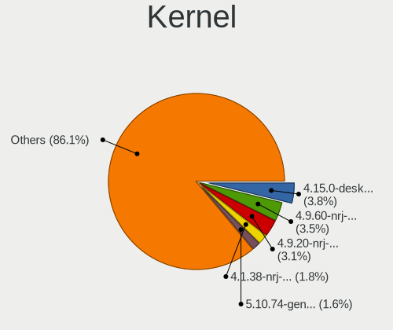

| Version                             | Computers | Percent |
|-------------------------------------|-----------|---------|
| 4.9.60-nrj-desktop-1rosa-x86_64     | 29        | 4.78%   |
| 4.15.0-desktop-45.1rosa-x86_64      | 28        | 4.61%   |
| 4.9.20-nrj-desktop-1rosa-x86_64     | 26        | 4.28%   |
| 4.1.38-nrj-desktop-2rosa-x86_64     | 14        | 2.31%   |
| 5.10.74-generic-2rosa2021.1-x86_64  | 13        | 2.14%   |
| 4.9.9-nrj-desktop-1rosa-x86_64      | 10        | 1.65%   |
| 4.1.34-nrj-desktop-2rosa-x86_64     | 10        | 1.65%   |
| 5.10.14-desktop-1omv4002            | 9         | 1.48%   |
| 4.9.20-nrj-desktop-1rosa-i586       | 9         | 1.48%   |
| 4.9.155-nrj-desktop-1rosa-x86_64    | 9         | 1.48%   |
| 4.15.0-desktop-122.124.1rosa-x86_64 | 9         | 1.48%   |
| 4.9.9-nrj-desktop-1rosa-i586        | 8         | 1.32%   |
| 4.9.60-nrj-desktop-1rosa-i586       | 8         | 1.32%   |
| 4.9.124-nrj-desktop-1rosa-x86_64    | 8         | 1.32%   |
| 5.16.7-desktop-1omv4003             | 7         | 1.15%   |
| 4.1.34-nrj-desktop-2rosa-i586       | 7         | 1.15%   |
| 5.4.32-generic-2rosa-x86_64         | 6         | 0.99%   |
| 4.9.41-nrj-desktop-1rosa-x86_64     | 6         | 0.99%   |
| 4.15.0-desktop-45.1rosa-i586        | 6         | 0.99%   |
| 4.9.76-nrj-desktop-1rosa-x86_64     | 5         | 0.82%   |
| 4.9.111-nrj-desktop-2rosa-x86_64    | 5         | 0.82%   |
| 4.15.0-desktop-68.5rosa-x86_64      | 5         | 0.82%   |
| 6.4.11-desktop-1omv2390             | 4         | 0.66%   |
| 6.2.6-desktop-1omv2390              | 4         | 0.66%   |
| 5.4.83-generic-2rosa-x86_64         | 4         | 0.66%   |
| 5.15.79-generic-1rosa2021.1-x86_64  | 4         | 0.66%   |
| 5.15.19                             | 4         | 0.66%   |
| 5.10.0-8-amd64                      | 4         | 0.66%   |
| 5.10.0-21-amd64                     | 4         | 0.66%   |
| 4.9.95-nrj-desktop-2rosa-x86_64     | 4         | 0.66%   |
| 4.15.0-desktop-47.2rosa-x86_64      | 4         | 0.66%   |
| 6.3.5-desktop-3omv2390              | 3         | 0.49%   |
| 6.2.0-26-generic                    | 3         | 0.49%   |
| 6.1.20-generic-2rosa2021.1-x86_64   | 3         | 0.49%   |
| 6.1.1-desktop-1omv2290              | 3         | 0.49%   |
| 5.8.6-1-MANJARO                     | 3         | 0.49%   |
| 5.4.0-52-generic                    | 3         | 0.49%   |
| 5.15.75-generic-1rosa2021.1-x86_64  | 3         | 0.49%   |
| 5.15.0-43-generic                   | 3         | 0.49%   |
| 5.11.0-35-generic                   | 3         | 0.49%   |

Kernel Family
-------------

Linux kernel without a distro release

| Version | Computers | Percent |
|---------|-----------|---------|
| 4.15.0  | 63        | 10.47%  |
| 4.9.60  | 37        | 6.15%   |
| 4.9.20  | 35        | 5.81%   |
| 5.4.0   | 27        | 4.49%   |
| 5.15.0  | 21        | 3.49%   |
| 4.9.9   | 17        | 2.82%   |
| 4.1.38  | 17        | 2.82%   |
| 4.1.34  | 17        | 2.82%   |
| 5.10.0  | 16        | 2.66%   |
| 5.10.74 | 13        | 2.16%   |
| 5.11.0  | 12        | 1.99%   |
| 4.9.155 | 11        | 1.83%   |
| 6.2.0   | 9         | 1.5%    |
| 5.19.0  | 9         | 1.5%    |
| 5.10.14 | 9         | 1.5%    |
| 5.0.0   | 9         | 1.5%    |
| 4.9.124 | 9         | 1.5%    |
| 5.4.32  | 8         | 1.33%   |
| 5.3.0   | 8         | 1.33%   |
| 5.16.7  | 8         | 1.33%   |
| 5.13.0  | 8         | 1.33%   |
| 4.9.41  | 7         | 1.16%   |
| 4.9.111 | 7         | 1.16%   |
| 5.8.0   | 6         | 1%      |
| 4.9.76  | 6         | 1%      |
| 4.18.0  | 6         | 1%      |
| 6.2.6   | 5         | 0.83%   |
| 6.1.0   | 5         | 0.83%   |
| 6.5.0   | 4         | 0.66%   |
| 6.4.11  | 4         | 0.66%   |
| 6.1.1   | 4         | 0.66%   |
| 5.4.83  | 4         | 0.66%   |
| 5.15.79 | 4         | 0.66%   |
| 5.15.19 | 4         | 0.66%   |
| 4.9.95  | 4         | 0.66%   |
| 4.9.34  | 4         | 0.66%   |
| 4.19.0  | 4         | 0.66%   |
| 4.13.0  | 4         | 0.66%   |
| 6.3.5   | 3         | 0.5%    |
| 6.1.20  | 3         | 0.5%    |

Kernel Major Ver.
-----------------

Linux kernel major version

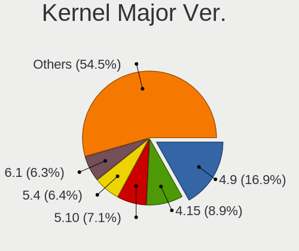

| Version | Computers | Percent |
|---------|-----------|---------|
| 4.9     | 121       | 21.23%  |
| 4.15    | 63        | 11.05%  |
| 5.10    | 48        | 8.42%   |
| 5.4     | 44        | 7.72%   |
| 5.15    | 39        | 6.84%   |
| 4.1     | 36        | 6.32%   |
| 6.1     | 24        | 4.21%   |
| 6.2     | 20        | 3.51%   |
| 5.8     | 13        | 2.28%   |
| 5.19    | 13        | 2.28%   |
| 6.5     | 12        | 2.11%   |
| 5.11    | 12        | 2.11%   |
| 4.18    | 11        | 1.93%   |
| 5.13    | 10        | 1.75%   |
| 5.0     | 10        | 1.75%   |
| 5.3     | 9         | 1.58%   |
| 5.16    | 9         | 1.58%   |
| 6.4     | 8         | 1.4%    |
| 5.14    | 8         | 1.4%    |
| 6.3     | 7         | 1.23%   |
| 6.0     | 6         | 1.05%   |
| 5.17    | 6         | 1.05%   |
| 4.19    | 6         | 1.05%   |
| 5.18    | 4         | 0.7%    |
| 4.13    | 4         | 0.7%    |
| 5.9     | 3         | 0.53%   |
| 2.6     | 3         | 0.53%   |
| 5.7     | 2         | 0.35%   |
| 5.6     | 2         | 0.35%   |
| 5.12    | 2         | 0.35%   |
| 4.4     | 2         | 0.35%   |
| 4.16    | 2         | 0.35%   |
| 4.12    | 2         | 0.35%   |
| 3.14    | 2         | 0.35%   |
| 3.10    | 2         | 0.35%   |
| 5.1     | 1         | 0.18%   |
| 4.20    | 1         | 0.18%   |
| 4.17    | 1         | 0.18%   |
| 4.14    | 1         | 0.18%   |
| Unknown | 1         | 0.18%   |

Arch
----

OS architecture (x86_64, i586, etc.)

| Name    | Computers | Percent |
|---------|-----------|---------|
| x86_64  | 461       | 88.65%  |
| i686    | 57        | 10.96%  |
| aarch64 | 1         | 0.19%   |
| Unknown | 1         | 0.19%   |

DE
--

Desktop Environment

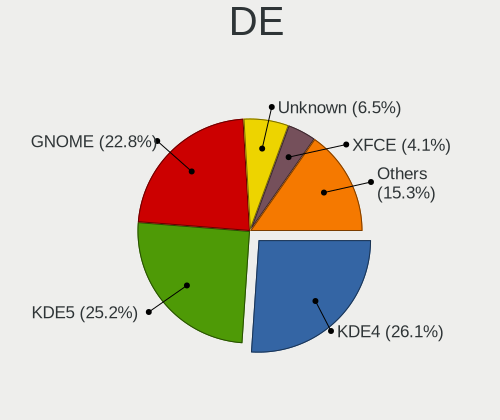

| Name            | Computers | Percent |
|-----------------|-----------|---------|
| KDE4            | 173       | 31.8%   |
| KDE5            | 141       | 25.92%  |
| GNOME           | 115       | 21.14%  |
| Unknown         | 33        | 6.07%   |
| KDE             | 18        | 3.31%   |
| XFCE            | 17        | 3.13%   |
| X-Cinnamon      | 13        | 2.39%   |
| LXQt            | 8         | 1.47%   |
| Cinnamon        | 6         | 1.1%    |
| MATE            | 5         | 0.92%   |
| LXDE            | 3         | 0.55%   |
| Unity           | 2         | 0.37%   |
| sway            | 2         | 0.37%   |
| Pantheon        | 2         | 0.37%   |
| i3              | 2         | 0.37%   |
| Openbox         | 1         | 0.18%   |
| GNOME Flashback | 1         | 0.18%   |
| GNOME Classic   | 1         | 0.18%   |
| awesome         | 1         | 0.18%   |

Display Server
--------------

X11 or Wayland

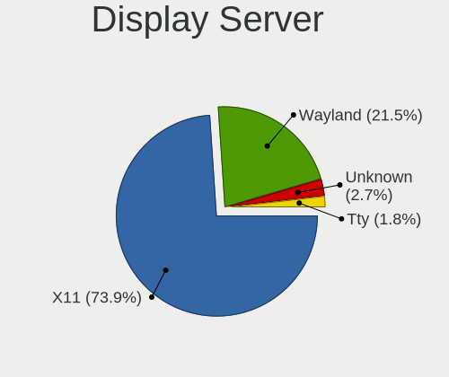

| Name    | Computers | Percent |
|---------|-----------|---------|
| X11     | 430       | 81.29%  |
| Wayland | 79        | 14.93%  |
| Unknown | 15        | 2.84%   |
| Tty     | 5         | 0.95%   |

Display Manager
---------------

SDDM, LightDM, etc.

| Name    | Computers | Percent |
|---------|-----------|---------|
| KDM     | 175       | 32.17%  |
| SDDM    | 145       | 26.65%  |
| Unknown | 109       | 20.04%  |
| GDM     | 47        | 8.64%   |
| GDM3    | 31        | 5.7%    |
| LightDM | 25        | 4.6%    |
| TDM     | 10        | 1.84%   |
| XDM     | 1         | 0.18%   |
| SLiM    | 1         | 0.18%   |

OS Lang
-------

Language

| Lang        | Computers | Percent |
|-------------|-----------|---------|
| Unknown     | 232       | 43.2%   |
| ru_RU       | 167       | 31.1%   |
| en_US       | 119       | 22.16%  |
| C           | 8         | 1.49%   |
| ru_RU.UTF_8 | 4         | 0.74%   |
| en_GB       | 3         | 0.56%   |
| ru_KZ       | 2         | 0.37%   |
| en_IN       | 1         | 0.19%   |
| en_IL       | 1         | 0.19%   |

Boot Mode
---------

EFI or BIOS

| Mode | Computers | Percent |
|------|-----------|---------|
| BIOS | 310       | 58.6%   |
| EFI  | 219       | 41.4%   |

Filesystem
----------

Type of filesystem

| Type    | Computers | Percent |
|---------|-----------|---------|
| Ext4    | 319       | 58.96%  |
| Unknown | 144       | 26.62%  |
| Overlay | 35        | 6.47%   |
| Btrfs   | 31        | 5.73%   |
| Xfs     | 5         | 0.92%   |
| Tmpfs   | 4         | 0.74%   |
| Ext3    | 2         | 0.37%   |
| Zfs     | 1         | 0.18%   |

Part. scheme
------------

Scheme of partitioning

| Type    | Computers | Percent |
|---------|-----------|---------|
| GPT     | 186       | 34.77%  |
| MBR     | 178       | 33.27%  |
| Unknown | 171       | 31.96%  |

Dual Boot with Linux/BSD
------------------------

Hosting more than one Linux/BSD

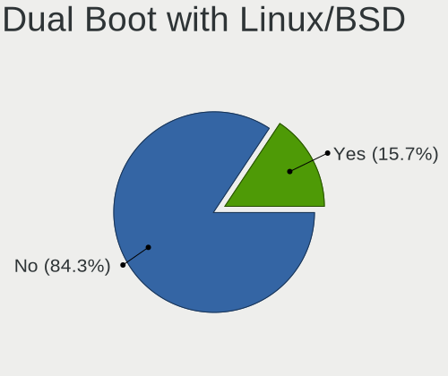

| Dual boot | Computers | Percent |
|-----------|-----------|---------|
| No        | 454       | 85.34%  |
| Yes       | 78        | 14.66%  |

Dual Boot (Win)
---------------

Hosting Linux and Windows

| Dual boot | Computers | Percent |
|-----------|-----------|---------|
| No        | 361       | 67.48%  |
| Yes       | 174       | 32.52%  |

Board
-----

Vendor
------

Motherboard manufacturer

| Name                | Computers | Percent |
|---------------------|-----------|---------|
| ASUSTek Computer    | 96        | 18.71%  |
| Hewlett-Packard     | 74        | 14.42%  |
| Lenovo              | 70        | 13.65%  |
| Gigabyte Technology | 44        | 8.58%   |
| Acer                | 43        | 8.38%   |
| ASRock              | 31        | 6.04%   |
| Dell                | 30        | 5.85%   |
| MSI                 | 21        | 4.09%   |
| ECS                 | 12        | 2.34%   |
| Biostar             | 10        | 1.95%   |
| Intel               | 9         | 1.75%   |
| Unknown             | 9         | 1.75%   |
| Foxconn             | 8         | 1.56%   |
| Toshiba             | 7         | 1.36%   |
| Sony                | 7         | 1.36%   |
| Fujitsu             | 6         | 1.17%   |
| Fujitsu Siemens     | 5         | 0.97%   |
| Samsung Electronics | 3         | 0.58%   |
| Packard Bell        | 3         | 0.58%   |
| Chuwi               | 3         | 0.58%   |
| HPE                 | 2         | 0.39%   |
| eMachines           | 2         | 0.39%   |
| AMI                 | 2         | 0.39%   |
| Acidanthera         | 2         | 0.39%   |
| Supermicro          | 1         | 0.19%   |
| Quanta              | 1         | 0.19%   |
| OEM                 | 1         | 0.19%   |
| Kobian              | 1         | 0.19%   |
| IBM                 | 1         | 0.19%   |
| HUAWEI              | 1         | 0.19%   |
| HONOR               | 1         | 0.19%   |
| GPD                 | 1         | 0.19%   |
| GoWin Solution      | 1         | 0.19%   |
| EPoX Computer       | 1         | 0.19%   |
| Elenberg            | 1         | 0.19%   |
| Digma               | 1         | 0.19%   |
| Colorful Technology | 1         | 0.19%   |
| Athermiter/PlexHD   | 1         | 0.19%   |

Model
-----

Motherboard model

| Name                                     | Computers | Percent |
|------------------------------------------|-----------|---------|
| Unknown                                  | 10        | 1.95%   |
| ASUS All Series                          | 7         | 1.36%   |
| Lenovo G500 20236                        | 6         | 1.17%   |
| HP Pavilion g6                           | 5         | 0.97%   |
| Acer Aspire E5-575G                      | 4         | 0.78%   |
| Lenovo G510 20238                        | 3         | 0.58%   |
| Gigabyte P35-DS3L                        | 3         | 0.58%   |
| Fujitsu LIFEBOOK AH531                   | 3         | 0.58%   |
| ASUS VivoBook_ASUSLaptop X1505VA_X1505VA | 3         | 0.58%   |
| ASUS VivoBook 15_ASUS Laptop X540UAR     | 3         | 0.58%   |
| ASUS H61M-K                              | 3         | 0.58%   |
| Acer Aspire 5750G                        | 3         | 0.58%   |
| Packard Bell DOT S                       | 2         | 0.39%   |
| MSI MS-7788                              | 2         | 0.39%   |
| MSI MS-7592                              | 2         | 0.39%   |
| MSI MS-7529                              | 2         | 0.39%   |
| Lenovo ThinkPad Edge E530 3259CEG        | 2         | 0.39%   |
| Lenovo ThinkBook 15 G3 ACL 21A4          | 2         | 0.39%   |
| Lenovo ThinkBook 14 G2 ITL 20VD          | 2         | 0.39%   |
| Lenovo Legion Y540-15IRH-PG0 81SY        | 2         | 0.39%   |
| Lenovo IdeaPad Z570 HuronRiver Platform  | 2         | 0.39%   |
| Lenovo G505s 20255                       | 2         | 0.39%   |
| HP ProLiant DL360 G5                     | 2         | 0.39%   |
| HP Presario CQ57                         | 2         | 0.39%   |
| HP Pavilion Gaming Laptop 15-cx0xxx      | 2         | 0.39%   |
| HP Pavilion dv6                          | 2         | 0.39%   |
| HP ENVY x360 Convertible 15-eu0xxx       | 2         | 0.39%   |
| HP Compaq CQ58                           | 2         | 0.39%   |
| Gigabyte H61M-S1                         | 2         | 0.39%   |
| Gigabyte EP45-DS3L                       | 2         | 0.39%   |
| Gigabyte B450M S2H                       | 2         | 0.39%   |
| Gigabyte A320M-H                         | 2         | 0.39%   |
| Foxconn G31MXP FAB:1.1                   | 2         | 0.39%   |
| ECS P67H2-A3                             | 2         | 0.39%   |
| ECS H61H2-M12                            | 2         | 0.39%   |
| ECS G31T-M7                              | 2         | 0.39%   |
| Dell Inspiron N5110                      | 2         | 0.39%   |
| Biostar B75MU3B                          | 2         | 0.39%   |
| ASUS X51RL                               | 2         | 0.39%   |
| ASUS VivoBook_ASUSLaptop K6500ZC_K6500ZC | 2         | 0.39%   |

Model Family
------------

Motherboard model prefix

| Name               | Computers | Percent |
|--------------------|-----------|---------|
| Acer Aspire        | 27        | 5.26%   |
| ASUS VivoBook      | 25        | 4.87%   |
| Lenovo IdeaPad     | 18        | 3.51%   |
| HP Pavilion        | 18        | 3.51%   |
| Dell Inspiron      | 17        | 3.31%   |
| Lenovo ThinkPad    | 12        | 2.34%   |
| HP ProBook         | 11        | 2.14%   |
| Unknown            | 10        | 1.95%   |
| HP Compaq          | 9         | 1.75%   |
| HP Laptop          | 7         | 1.36%   |
| ASUS All           | 7         | 1.36%   |
| Lenovo Legion      | 6         | 1.17%   |
| Lenovo G500        | 6         | 1.17%   |
| ASUS PRIME         | 6         | 1.17%   |
| Lenovo ThinkBook   | 5         | 0.97%   |
| HP ENVY            | 5         | 0.97%   |
| HP EliteBook       | 5         | 0.97%   |
| Fujitsu LIFEBOOK   | 5         | 0.97%   |
| Dell Latitude      | 5         | 0.97%   |
| ASUS ROG           | 5         | 0.97%   |
| Toshiba Satellite  | 4         | 0.78%   |
| Acer Predator      | 4         | 0.78%   |
| Lenovo IdeaCentre  | 3         | 0.58%   |
| Lenovo G510        | 3         | 0.58%   |
| Gigabyte P35-DS3L  | 3         | 0.58%   |
| Foxconn G31MXP     | 3         | 0.58%   |
| ASUS TUF           | 3         | 0.58%   |
| ASUS H61M-K        | 3         | 0.58%   |
| Acer Swift         | 3         | 0.58%   |
| Acer Nitro         | 3         | 0.58%   |
| Toshiba TECRA      | 2         | 0.39%   |
| Packard Bell DOT   | 2         | 0.39%   |
| MSI MS-7788        | 2         | 0.39%   |
| MSI MS-7592        | 2         | 0.39%   |
| MSI MS-7529        | 2         | 0.39%   |
| Lenovo ThinkCentre | 2         | 0.39%   |
| Lenovo G505s       | 2         | 0.39%   |
| Intel DG965RY      | 2         | 0.39%   |
| HPE ProLiant       | 2         | 0.39%   |
| HP ProLiant        | 2         | 0.39%   |

MFG Year
--------

Motherboard manufacture year

| Year    | Computers | Percent |
|---------|-----------|---------|
| 2012    | 65        | 12.67%  |
| 2011    | 57        | 11.11%  |
| 2013    | 39        | 7.6%    |
| 2008    | 35        | 6.82%   |
| 2020    | 32        | 6.24%   |
| 2018    | 32        | 6.24%   |
| 2017    | 30        | 5.85%   |
| 2019    | 28        | 5.46%   |
| 2009    | 28        | 5.46%   |
| 2010    | 25        | 4.87%   |
| 2016    | 24        | 4.68%   |
| 2007    | 24        | 4.68%   |
| 2021    | 23        | 4.48%   |
| 2022    | 18        | 3.51%   |
| 2015    | 16        | 3.12%   |
| 2014    | 16        | 3.12%   |
| 2023    | 7         | 1.36%   |
| 2006    | 6         | 1.17%   |
| 2005    | 4         | 0.78%   |
| Unknown | 3         | 0.58%   |
| 2003    | 1         | 0.19%   |

Form Factor
-----------

Physical design of the computer

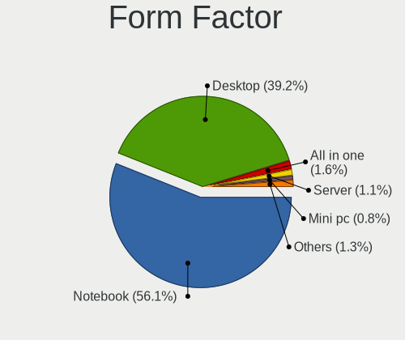

| Name           | Computers | Percent |
|----------------|-----------|---------|
| Notebook       | 288       | 56.14%  |
| Desktop        | 201       | 39.18%  |
| All in one     | 10        | 1.95%   |
| Server         | 6         | 1.17%   |
| Convertible    | 3         | 0.58%   |
| Mini pc        | 3         | 0.58%   |
| System on chip | 1         | 0.19%   |
| Tablet         | 1         | 0.19%   |

Secure Boot
-----------

Enabled or disabled

| State    | Computers | Percent |
|----------|-----------|---------|
| Disabled | 491       | 95.34%  |
| Enabled  | 24        | 4.66%   |

Coreboot
--------

Have coreboot on board

| Used | Computers | Percent |
|------|-----------|---------|
| No   | 513       | 100%    |

RAM Size
--------

Total RAM memory

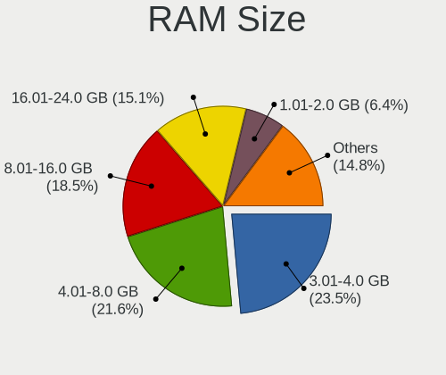

| Size in GB      | Computers | Percent |
|-----------------|-----------|---------|
| 3.01-4.0        | 138       | 26.09%  |
| 4.01-8.0        | 120       | 22.68%  |
| 8.01-16.0       | 94        | 17.77%  |
| 16.01-24.0      | 71        | 13.42%  |
| 1.01-2.0        | 36        | 6.81%   |
| 2.01-3.0        | 27        | 5.1%    |
| 32.01-64.0      | 20        | 3.78%   |
| 0.51-1.0        | 9         | 1.7%    |
| 24.01-32.0      | 7         | 1.32%   |
| 64.01-256.0     | 5         | 0.95%   |
| More than 256.0 | 1         | 0.19%   |
| Unknown         | 1         | 0.19%   |

RAM Used
--------

Used RAM memory

| Used GB         | Computers | Percent |
|-----------------|-----------|---------|
| 1.01-2.0        | 216       | 37.7%   |
| 0.51-1.0        | 133       | 23.21%  |
| 2.01-3.0        | 98        | 17.1%   |
| 3.01-4.0        | 54        | 9.42%   |
| 4.01-8.0        | 42        | 7.33%   |
| 8.01-16.0       | 15        | 2.62%   |
| 0.01-0.5        | 7         | 1.22%   |
| Unknown         | 4         | 0.7%    |
| 16.01-24.0      | 2         | 0.35%   |
| More than 256.0 | 1         | 0.17%   |
| 32.01-64.0      | 1         | 0.17%   |

Total Drives
------------

Number of drives on board

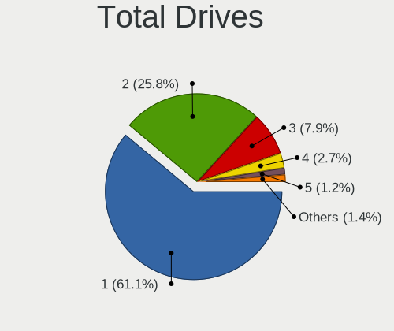

| Drives | Computers | Percent |
|--------|-----------|---------|
| 1      | 338       | 63.53%  |
| 2      | 131       | 24.62%  |
| 3      | 37        | 6.95%   |
| 4      | 14        | 2.63%   |
| 5      | 4         | 0.75%   |
| 6      | 3         | 0.56%   |
| 0      | 3         | 0.56%   |
| 27     | 1         | 0.19%   |
| 8      | 1         | 0.19%   |

Has CD-ROM
----------

Has CD-ROM on board

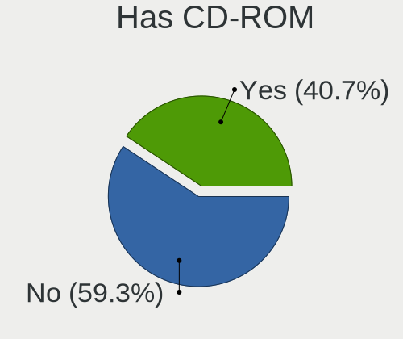

| Presented | Computers | Percent |
|-----------|-----------|---------|
| No        | 285       | 54.91%  |
| Yes       | 234       | 45.09%  |

Has Ethernet
------------

Has Ethernet on board

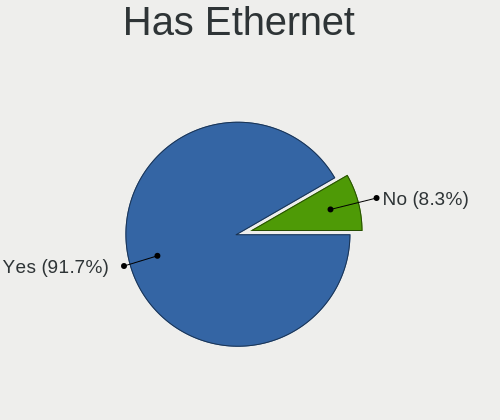

| Presented | Computers | Percent |
|-----------|-----------|---------|
| Yes       | 475       | 92.41%  |
| No        | 39        | 7.59%   |

Has WiFi
--------

Has WiFi module

| Presented | Computers | Percent |
|-----------|-----------|---------|
| Yes       | 357       | 69.19%  |
| No        | 159       | 30.81%  |

Has Bluetooth
-------------

Has Bluetooth module

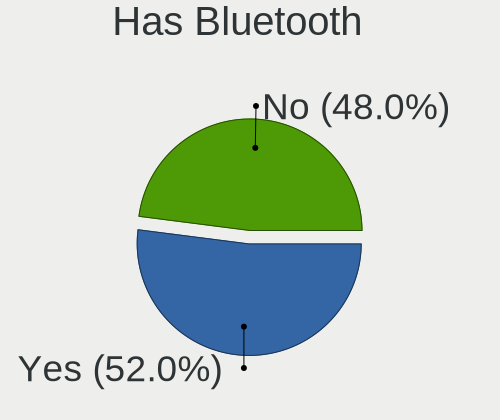

| Presented | Computers | Percent |
|-----------|-----------|---------|
| Yes       | 262       | 50.38%  |
| No        | 258       | 49.62%  |

Location
--------

Country
-------

Geographic location (country)

| Country    | Computers | Percent |
|------------|-----------|---------|
| Kazakhstan | 513       | 100%    |

City
----

Geographic location (city)

| City            | Computers | Percent |
|-----------------|-----------|---------|
| Almaty          | 167       | 29.98%  |
| Nur-Sultan      | 78        | 14%     |
| Kostanay        | 33        | 5.92%   |
| Karaganda       | 32        | 5.75%   |
| Ust-Kamenogorsk | 28        | 5.03%   |
| Pavlodar        | 27        | 4.85%   |
| Taraz           | 22        | 3.95%   |
| Aktobe          | 20        | 3.59%   |
| Astana          | 16        | 2.87%   |
| Petropavl       | 14        | 2.51%   |
| Semey           | 12        | 2.15%   |
| Rudnyy          | 11        | 1.97%   |
| Shymkent        | 10        | 1.8%    |
| Atyrau          | 10        | 1.8%    |
| Aktau           | 10        | 1.8%    |
| Ridder          | 7         | 1.26%   |
| Oral            | 7         | 1.26%   |
| Kyzylorda       | 7         | 1.26%   |
| Temirtau        | 6         | 1.08%   |
| Soran           | 3         | 0.54%   |
| Shchchnsk   | 3         | 0.54%   |
| Kokshetau       | 3         | 0.54%   |
| Ekibastuz       | 3         | 0.54%   |
| Balqash         | 3         | 0.54%   |
| Tekeli          | 2         | 0.36%   |
| Taldykorgan     | 2         | 0.36%   |
| Taiynsha        | 2         | 0.36%   |
| Stepnogorsk     | 2         | 0.36%   |
| Sarkand         | 2         | 0.36%   |
| Makhambet       | 2         | 0.36%   |
| Lsakovsk      | 2         | 0.36%   |
| Urzhar          | 1         | 0.18%   |
| Tobol           | 1         | 0.18%   |
| Kaskelen        | 1         | 0.18%   |
| Karatau         | 1         | 0.18%   |
| Karagandy       | 1         | 0.18%   |
| Kapshagay       | 1         | 0.18%   |
| Glshat      | 1         | 0.18%   |
| Dzhezkazgan     | 1         | 0.18%   |
| Chiili          | 1         | 0.18%   |

Drives
------

Drive Vendor
------------

Hard drive vendors

| Vendor                  | Computers | Drives | Percent |
|-------------------------|-----------|--------|---------|
| Seagate                 | 165       | 249    | 22.48%  |
| WDC                     | 112       | 145    | 15.26%  |
| Samsung Electronics     | 84        | 124    | 11.44%  |
| Toshiba                 | 72        | 89     | 9.81%   |
| Kingston                | 47        | 67     | 6.4%    |
| Hitachi                 | 29        | 33     | 3.95%   |
| Unknown                 | 19        | 23     | 2.59%   |
| HGST                    | 19        | 21     | 2.59%   |
| Transcend               | 16        | 18     | 2.18%   |
| SK hynix                | 15        | 16     | 2.04%   |
| Intel                   | 15        | 18     | 2.04%   |
| SanDisk                 | 13        | 14     | 1.77%   |
| Apacer                  | 13        | 18     | 1.77%   |
| Micron Technology       | 11        | 22     | 1.5%    |
| A-DATA Technology       | 10        | 13     | 1.36%   |
| Team                    | 7         | 9      | 0.95%   |
| Gigabyte Technology     | 7         | 8      | 0.95%   |
| Plextor                 | 6         | 6      | 0.82%   |
| KIOXIA                  | 6         | 8      | 0.82%   |
| GeIL                    | 6         | 6      | 0.82%   |
| Crucial                 | 5         | 5      | 0.68%   |
| China                   | 5         | 5      | 0.68%   |
| Netac                   | 4         | 6      | 0.54%   |
| Fujitsu                 | 4         | 5      | 0.54%   |
| HUAWEI                  | 3         | 3      | 0.41%   |
| Hewlett-Packard         | 3         | 14     | 0.41%   |
| Phison                  | 2         | 2      | 0.27%   |
| Patriot                 | 2         | 2      | 0.27%   |
| KingSpec                | 2         | 2      | 0.27%   |
| HPE                     | 2         | 2      | 0.27%   |
| Hikvision               | 2         | 2      | 0.27%   |
| BIWIN                   | 2         | 2      | 0.27%   |
| AMD                     | 2         | 2      | 0.27%   |
| ADATA Technology        | 2         | 3      | 0.27%   |
| Unknown                 | 2         | 2      | 0.27%   |
| Union Memory (Shenzhen) | 1         | 1      | 0.14%   |
| TEKET                   | 1         | 2      | 0.14%   |
| SPCC                    | 1         | 1      | 0.14%   |
| Smartbuy                | 1         | 1      | 0.14%   |
| Silicon Motion          | 1         | 1      | 0.14%   |

Drive Model
-----------

Hard drive models

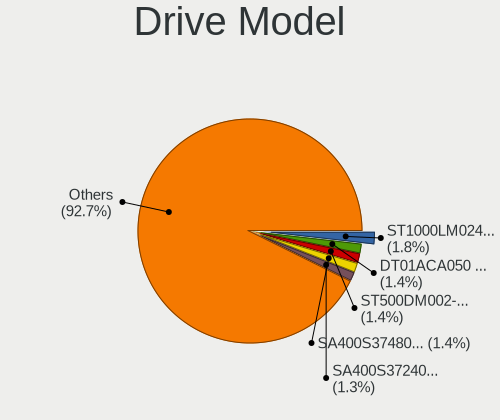

| Model                                | Computers | Percent |
|--------------------------------------|-----------|---------|
| Seagate ST1000LM024 HN-M101MBB 1TB   | 17        | 2.15%   |
| Toshiba DT01ACA050 500GB             | 14        | 1.77%   |
| Seagate ST500DM002-1BD142 500GB      | 13        | 1.64%   |
| Seagate ST1000LM035-1RK172 1TB       | 11        | 1.39%   |
| Seagate ST3500418AS 500GB            | 8         | 1.01%   |
| WDC WD5000AAKX-001CA0 500GB          | 7         | 0.88%   |
| Toshiba MQ04ABF100 1TB               | 7         | 0.88%   |
| Toshiba MQ01ABD100 1TB               | 7         | 0.88%   |
| Seagate ST3500413AS 500GB            | 7         | 0.88%   |
| Kingston SA400S37480G 480GB SSD      | 7         | 0.88%   |
| Kingston SA400S37240G 240GB SSD      | 7         | 0.88%   |
| Kingston SA400S37120G 120GB SSD      | 7         | 0.88%   |
| Toshiba MQ01ABF050 500GB             | 6         | 0.76%   |
| Toshiba DT01ACA100 1TB               | 6         | 0.76%   |
| Seagate ST500LM012 HN-M500MBB 500GB  | 6         | 0.76%   |
| Seagate ST3250310AS 250GB            | 6         | 0.76%   |
| HGST HTS541010A9E680 1TB             | 6         | 0.76%   |
| Toshiba HDWD110 1TB                  | 5         | 0.63%   |
| Seagate ST3320620AS 320GB            | 5         | 0.63%   |
| Samsung HD502HJ 500GB                | 5         | 0.63%   |
| Intel SSDPEKNU512GZ 512GB            | 5         | 0.63%   |
| Gigabyte GP-GSTFS31120GNTD 120GB SSD | 5         | 0.63%   |
| WDC WD3200BPVT-22JJ5T0 320GB         | 4         | 0.51%   |
| WDC WD10SPZX-21Z10T0 1TB             | 4         | 0.51%   |
| Transcend TS120GSSD220S 120GB        | 4         | 0.51%   |
| Toshiba DT01ACA200 2TB               | 4         | 0.51%   |
| Seagate ST9320325AS 320GB            | 4         | 0.51%   |
| Seagate ST500LT012-1DG142 500GB      | 4         | 0.51%   |
| Seagate ST380011A 80GB               | 4         | 0.51%   |
| Seagate ST3250820AS 250GB            | 4         | 0.51%   |
| Seagate ST3160815AS 160GB            | 4         | 0.51%   |
| Seagate ST1000DM003-1CH162 1TB       | 4         | 0.51%   |
| Samsung SSD 860 EVO 250GB            | 4         | 0.51%   |
| Samsung HD322HJ 320GB                | 4         | 0.51%   |
| Intel NVMe SSD Drive 512GB           | 4         | 0.51%   |
| WDC WD5000LPLX-00ZNTT0 500GB         | 3         | 0.38%   |
| Transcend TS240GSSD220S 240GB        | 3         | 0.38%   |
| Toshiba HDWD105 500GB                | 3         | 0.38%   |
| SK hynix NVMe SSD Drive 512GB        | 3         | 0.38%   |
| Seagate ST500LT012-9WS142 500GB      | 3         | 0.38%   |

HDD Vendor
----------

Hard disk drive vendors

| Vendor              | Computers | Drives | Percent |
|---------------------|-----------|--------|---------|
| Seagate             | 163       | 247    | 37.82%  |
| WDC                 | 104       | 136    | 24.13%  |
| Toshiba             | 69        | 84     | 16.01%  |
| Samsung Electronics | 38        | 59     | 8.82%   |
| Hitachi             | 29        | 33     | 6.73%   |
| HGST                | 19        | 21     | 4.41%   |
| Fujitsu             | 4         | 5      | 0.93%   |
| Hewlett-Packard     | 2         | 2      | 0.46%   |
| Unknown             | 1         | 1      | 0.23%   |
| Maxtor              | 1         | 1      | 0.23%   |
| HGST HTS            | 1         | 1      | 0.23%   |

SSD Vendor
----------

Solid state drive vendors

| Vendor              | Computers | Drives | Percent |
|---------------------|-----------|--------|---------|
| Kingston            | 42        | 58     | 25.61%  |
| Samsung Electronics | 18        | 24     | 10.98%  |
| Transcend           | 16        | 18     | 9.76%   |
| Apacer              | 12        | 17     | 7.32%   |
| Team                | 7         | 9      | 4.27%   |
| Gigabyte Technology | 7         | 8      | 4.27%   |
| Plextor             | 6         | 6      | 3.66%   |
| SanDisk             | 5         | 5      | 3.05%   |
| Crucial             | 5         | 5      | 3.05%   |
| China               | 5         | 5      | 3.05%   |
| GeIL                | 4         | 4      | 2.44%   |
| SK hynix            | 3         | 3      | 1.83%   |
| Netac               | 3         | 5      | 1.83%   |
| Intel               | 3         | 6      | 1.83%   |
| A-DATA Technology   | 3         | 4      | 1.83%   |
| WDC                 | 2         | 2      | 1.22%   |
| Patriot             | 2         | 2      | 1.22%   |
| Micron Technology   | 2         | 2      | 1.22%   |
| KingSpec            | 2         | 2      | 1.22%   |
| HPE                 | 2         | 2      | 1.22%   |
| AMD                 | 2         | 2      | 1.22%   |
| Unknown             | 1         | 1      | 0.61%   |
| TEKET               | 1         | 2      | 0.61%   |
| SPCC                | 1         | 1      | 0.61%   |
| Smartbuy            | 1         | 1      | 0.61%   |
| Qumo                | 1         | 1      | 0.61%   |
| LVCARDS             | 1         | 1      | 0.61%   |
| Kingmax             | 1         | 1      | 0.61%   |
| KingFast            | 1         | 1      | 0.61%   |
| KingDian            | 1         | 1      | 0.61%   |
| Kingchuxing         | 1         | 2      | 0.61%   |
| BIWIN               | 1         | 1      | 0.61%   |
| AFOX                | 1         | 1      | 0.61%   |
| Unknown             | 1         | 1      | 0.61%   |

Drive Kind
----------

HDD or SSD

| Kind    | Computers | Drives | Percent |
|---------|-----------|--------|---------|
| HDD     | 364       | 590    | 56.7%   |
| SSD     | 143       | 204    | 22.27%  |
| NVMe    | 107       | 150    | 16.67%  |
| MMC     | 18        | 22     | 2.8%    |
| Unknown | 10        | 21     | 1.56%   |

Drive Connector
---------------

SATA, SAS, NVMe, etc.

| Type | Computers | Drives | Percent |
|------|-----------|--------|---------|
| SATA | 426       | 783    | 75.13%  |
| NVMe | 107       | 149    | 18.87%  |
| MMC  | 18        | 22     | 3.17%   |
| SAS  | 16        | 33     | 2.82%   |

Drive Size
----------

Size of hard drive

| Size in TB | Computers | Drives | Percent |
|------------|-----------|--------|---------|
| 0.01-0.5   | 343       | 555    | 67.25%  |
| 0.51-1.0   | 142       | 206    | 27.84%  |
| 1.01-2.0   | 17        | 25     | 3.33%   |
| 3.01-4.0   | 3         | 3      | 0.59%   |
| 2.01-3.0   | 3         | 3      | 0.59%   |
| 4.01-10.0  | 2         | 2      | 0.39%   |

Space Total
-----------

Amount of disk space available on the file system

| Size in GB     | Computers | Percent |
|----------------|-----------|---------|
| 251-500        | 139       | 24.56%  |
| 101-250        | 132       | 23.32%  |
| 501-1000       | 80        | 14.13%  |
| 1-20           | 66        | 11.66%  |
| 51-100         | 56        | 9.89%   |
| 1001-2000      | 40        | 7.07%   |
| 21-50          | 33        | 5.83%   |
| Unknown        | 9         | 1.59%   |
| More than 3000 | 6         | 1.06%   |
| 2001-3000      | 5         | 0.88%   |

Space Used
----------

Amount of used disk space

| Used GB        | Computers | Percent |
|----------------|-----------|---------|
| 1-20           | 301       | 52.81%  |
| 21-50          | 74        | 12.98%  |
| 101-250        | 66        | 11.58%  |
| 51-100         | 44        | 7.72%   |
| 251-500        | 34        | 5.96%   |
| 501-1000       | 28        | 4.91%   |
| 1001-2000      | 11        | 1.93%   |
| Unknown        | 9         | 1.58%   |
| 2001-3000      | 2         | 0.35%   |
| More than 3000 | 1         | 0.18%   |

Malfunc. Drives
---------------

Drive models with a malfunction

| Model                               | Computers | Drives | Percent |
|-------------------------------------|-----------|--------|---------|
| Seagate ST500DM002-1BD142 500GB     | 6         | 8      | 3.51%   |
| WDC WD5000AAKX-001CA0 500GB         | 5         | 5      | 2.92%   |
| Seagate ST3250310AS 250GB           | 5         | 5      | 2.92%   |
| Toshiba DT01ACA050 500GB            | 3         | 4      | 1.75%   |
| Seagate ST3802110A 80GB             | 3         | 4      | 1.75%   |
| Seagate ST3500413AS 500GB           | 3         | 3      | 1.75%   |
| Seagate ST3500320AS 500GB           | 3         | 3      | 1.75%   |
| Seagate ST3320613AS 320GB           | 3         | 3      | 1.75%   |
| Seagate ST3250820AS 250GB           | 3         | 3      | 1.75%   |
| Seagate ST3160215AS 160GB           | 3         | 3      | 1.75%   |
| Seagate ST1000LM024 HN-M101MBB 1TB  | 3         | 3      | 1.75%   |
| Hitachi HTS543232A7A384 320GB       | 3         | 3      | 1.75%   |
| WDC WD800JD-60LSA0 80GB             | 2         | 2      | 1.17%   |
| WDC WD5000LPVX-00V0TT0 500GB        | 2         | 4      | 1.17%   |
| WDC WD2000JS-60NCB1 200GB           | 2         | 3      | 1.17%   |
| Toshiba MQ01ABF050 500GB            | 2         | 2      | 1.17%   |
| Toshiba MQ01ABD100 1TB              | 2         | 2      | 1.17%   |
| Toshiba MK5059GSXP 500GB            | 2         | 3      | 1.17%   |
| Seagate ST9500325AS 500GB           | 2         | 2      | 1.17%   |
| Seagate ST500LT012-9WS142 500GB     | 2         | 9      | 1.17%   |
| Seagate ST500LT012-1DG142 500GB     | 2         | 4      | 1.17%   |
| Seagate ST500LM012 HN-M500MBB 500GB | 2         | 2      | 1.17%   |
| Seagate ST380215AS 80GB             | 2         | 2      | 1.17%   |
| Seagate ST3500418AS 500GB           | 2         | 4      | 1.17%   |
| Seagate ST340014A 40GB              | 2         | 2      | 1.17%   |
| Seagate ST3320620AS 320GB           | 2         | 4      | 1.17%   |
| Seagate ST3320418AS 320GB           | 2         | 2      | 1.17%   |
| Seagate ST3160815AS 160GB           | 2         | 2      | 1.17%   |
| Samsung Electronics HM321HI 320GB   | 2         | 2      | 1.17%   |
| Samsung Electronics HD642JJ 640GB   | 2         | 4      | 1.17%   |
| Samsung Electronics HD502HI 500GB   | 2         | 3      | 1.17%   |
| Hitachi HTS547550A9E384 500GB       | 2         | 3      | 1.17%   |
| Hitachi HTS543216L9SA00 160GB       | 2         | 2      | 1.17%   |
| HGST HTS725050A7E630 500GB          | 2         | 2      | 1.17%   |
| HGST HTS541010A9E680 1TB            | 2         | 3      | 1.17%   |
| Hewlett-Packard FB160C4081 160GB    | 2         | 2      | 1.17%   |
| WDC WD7500BPVT-24HXZT3 752GB        | 1         | 2      | 0.58%   |
| WDC WD7500BPVT-08HXZT3 752GB        | 1         | 1      | 0.58%   |
| WDC WD5000LPLX-00ZNTT0 500GB        | 1         | 1      | 0.58%   |
| WDC WD5000LPCX-21VHAT0 500GB        | 1         | 6      | 0.58%   |

Malfunc. Drive Vendor
---------------------

Vendors of faulty drives

| Vendor              | Computers | Drives | Percent |
|---------------------|-----------|--------|---------|
| Seagate             | 72        | 97     | 44.17%  |
| WDC                 | 33        | 44     | 20.25%  |
| Toshiba             | 15        | 17     | 9.2%    |
| Hitachi             | 15        | 18     | 9.2%    |
| Samsung Electronics | 12        | 16     | 7.36%   |
| HGST                | 7         | 8      | 4.29%   |
| Kingston            | 2         | 2      | 1.23%   |
| Hewlett-Packard     | 2         | 2      | 1.23%   |
| Team                | 1         | 1      | 0.61%   |
| Plextor             | 1         | 1      | 0.61%   |
| Maxtor              | 1         | 1      | 0.61%   |
| China               | 1         | 1      | 0.61%   |
| AFOX                | 1         | 1      | 0.61%   |

Malfunc. HDD Vendor
-------------------

Vendors of faulty HDD drives

| Vendor              | Computers | Drives | Percent |
|---------------------|-----------|--------|---------|
| Seagate             | 72        | 97     | 46.15%  |
| WDC                 | 33        | 44     | 21.15%  |
| Toshiba             | 15        | 17     | 9.62%   |
| Hitachi             | 15        | 18     | 9.62%   |
| Samsung Electronics | 11        | 15     | 7.05%   |
| HGST                | 7         | 8      | 4.49%   |
| Hewlett-Packard     | 2         | 2      | 1.28%   |
| Maxtor              | 1         | 1      | 0.64%   |

Malfunc. Drive Kind
-------------------

Kinds of faulty drives

| Kind | Computers | Drives | Percent |
|------|-----------|--------|---------|
| HDD  | 141       | 202    | 95.27%  |
| SSD  | 6         | 6      | 4.05%   |
| NVMe | 1         | 1      | 0.68%   |

Failed Drives
-------------

Failed drive models

| Model                             | Computers | Drives | Percent |
|-----------------------------------|-----------|--------|---------|
| Samsung Electronics HD322GJ 320GB | 2         | 2      | 50%     |
| WDC WD3200BPVT-24ZEST0 320GB      | 1         | 1      | 25%     |
| Seagate ST3250318AS 250GB         | 1         | 2      | 25%     |

Failed Drive Vendor
-------------------

Failed drive vendors

| Vendor              | Computers | Drives | Percent |
|---------------------|-----------|--------|---------|
| Samsung Electronics | 2         | 2      | 50%     |
| WDC                 | 1         | 1      | 25%     |
| Seagate             | 1         | 2      | 25%     |

Drive Status
------------

Number of failed and malfunc. drives

| Status   | Computers | Drives | Percent |
|----------|-----------|--------|---------|
| Works    | 306       | 541    | 51.34%  |
| Malfunc  | 146       | 209    | 24.5%   |
| Detected | 140       | 232    | 23.49%  |
| Failed   | 4         | 5      | 0.67%   |

Storage controller
------------------

Storage Vendor
--------------

Storage controller vendors

| Vendor                        | Computers | Percent |
|-------------------------------|-----------|---------|
| Intel                         | 409       | 65.02%  |
| AMD                           | 59        | 9.38%   |
| Samsung Electronics           | 33        | 5.25%   |
| JMicron Technology            | 21        | 3.34%   |
| SK hynix                      | 12        | 1.91%   |
| SanDisk                       | 12        | 1.91%   |
| Marvell Technology Group      | 10        | 1.59%   |
| Nvidia                        | 9         | 1.43%   |
| Micron Technology             | 9         | 1.43%   |
| Kingston Technology Company   | 8         | 1.27%   |
| ASMedia Technology            | 6         | 0.95%   |
| ADATA Technology              | 6         | 0.95%   |
| KIOXIA                        | 5         | 0.79%   |
| Toshiba America Info Systems  | 4         | 0.64%   |
| Realtek Semiconductor         | 3         | 0.48%   |
| Phison Electronics            | 3         | 0.48%   |
| MAXIO Technology (Hangzhou)   | 3         | 0.48%   |
| VIA Technologies              | 2         | 0.32%   |
| Union Memory (Shenzhen)       | 2         | 0.32%   |
| Integrated Technology Express | 2         | 0.32%   |
| Hewlett-Packard               | 2         | 0.32%   |
| Adaptec                       | 2         | 0.32%   |
| ULi Electronics               | 1         | 0.16%   |
| Solidigm                      | 1         | 0.16%   |
| Silicon Motion                | 1         | 0.16%   |
| Shenzhen Longsys Electronics  | 1         | 0.16%   |
| Netac Technology              | 1         | 0.16%   |
| LSI Logic / Symbios Logic     | 1         | 0.16%   |
| Biwin Storage Technology      | 1         | 0.16%   |

Storage Model
-------------

Storage controller models

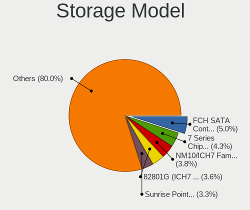

| Model                                                                                   | Computers | Percent |
|-----------------------------------------------------------------------------------------|-----------|---------|
| AMD FCH SATA Controller [AHCI mode]                                                     | 44        | 5.69%   |
| Intel 7 Series Chipset Family 6-port SATA Controller [AHCI mode]                        | 35        | 4.53%   |
| Intel NM10/ICH7 Family SATA Controller [IDE mode]                                       | 33        | 4.27%   |
| Intel 82801G (ICH7 Family) IDE Controller                                               | 30        | 3.88%   |
| Intel Sunrise Point-LP SATA Controller [AHCI mode]                                      | 29        | 3.75%   |
| Intel 8 Series/C220 Series Chipset Family 6-port SATA Controller 1 [AHCI mode]          | 20        | 2.59%   |
| Intel 6 Series/C200 Series Chipset Family 6 port Desktop SATA AHCI Controller           | 20        | 2.59%   |
| Intel 6 Series/C200 Series Chipset Family 6 port Mobile SATA AHCI Controller            | 19        | 2.46%   |
| Samsung NVMe SSD Controller SM981/PM981/PM983                                           | 18        | 2.33%   |
| Intel 6 Series/C200 Series Chipset Family Desktop SATA Controller (IDE mode, ports 4-5) | 17        | 2.2%    |
| Intel 6 Series/C200 Series Chipset Family Desktop SATA Controller (IDE mode, ports 0-3) | 17        | 2.2%    |
| Intel Volume Management Device NVMe RAID Controller                                     | 14        | 1.81%   |
| Intel 82801 Mobile SATA Controller [RAID mode]                                          | 13        | 1.68%   |
| JMicron JMB368 IDE controller                                                           | 12        | 1.55%   |
| Intel 82801JI (ICH10 Family) 4 port SATA IDE Controller #1                              | 11        | 1.42%   |
| Intel 82801JI (ICH10 Family) 2 port SATA IDE Controller #2                              | 11        | 1.42%   |
| Samsung NVMe SSD Controller 980 (DRAM-less)                                             | 9         | 1.16%   |
| Intel Q170/Q150/B150/H170/H110/Z170/CM236 Chipset SATA Controller [AHCI Mode]           | 9         | 1.16%   |
| Intel 82801IBM/IEM (ICH9M/ICH9M-E) 4 port SATA Controller [AHCI mode]                   | 9         | 1.16%   |
| Intel 200 Series PCH SATA controller [AHCI mode]                                        | 9         | 1.16%   |
| JMicron JMB363 SATA/IDE Controller                                                      | 8         | 1.03%   |
| Intel Tiger Lake-LP SATA Controller                                                     | 8         | 1.03%   |
| Intel Cannon Lake Mobile PCH SATA AHCI Controller                                       | 8         | 1.03%   |
| Intel 82801I (ICH9 Family) 2 port SATA Controller [IDE mode]                            | 8         | 1.03%   |
| Intel 8 Series SATA Controller 1 [AHCI mode]                                            | 8         | 1.03%   |
| Intel 7 Series/C210 Series Chipset Family 6-port SATA Controller [AHCI mode]            | 8         | 1.03%   |
| AMD 400 Series Chipset SATA Controller                                                  | 8         | 1.03%   |
| SK hynix Gold P31/BC711/PC711 NVMe Solid State Drive                                    | 7         | 0.91%   |
| Intel Comet Lake SATA AHCI Controller                                                   | 7         | 0.91%   |
| Intel Atom/Celeron/Pentium Processor x5-E8000/J3xxx/N3xxx Series SATA Controller        | 7         | 0.91%   |
| Intel 82801IB (ICH9) 2 port SATA Controller [IDE mode]                                  | 7         | 0.91%   |
| Intel 7 Series/C210 Series Chipset Family 4-port SATA Controller [IDE mode]             | 7         | 0.91%   |
| Intel 7 Series/C210 Series Chipset Family 2-port SATA Controller [IDE mode]             | 7         | 0.91%   |
| Intel 5 Series/3400 Series Chipset 4 port SATA AHCI Controller                          | 7         | 0.91%   |
| Samsung NVMe SSD Controller PM9A1/PM9A3/980PRO                                          | 6         | 0.78%   |
| Intel SSD 670p Series [Keystone Harbor]                                                 | 6         | 0.78%   |
| Intel NM10/ICH7 Family SATA Controller [AHCI mode]                                      | 6         | 0.78%   |
| Intel Celeron/Pentium Silver Processor SATA Controller                                  | 6         | 0.78%   |
| Intel Atom Processor E3800 Series SATA AHCI Controller                                  | 6         | 0.78%   |
| Intel 82801HM/HEM (ICH8M/ICH8M-E) IDE Controller                                        | 6         | 0.78%   |

Storage Kind
------------

Kind of storage controller (IDE, SATA, NVMe, SAS, ...)

| Kind | Computers | Percent |
|------|-----------|---------|
| SATA | 341       | 55.09%  |
| IDE  | 133       | 21.49%  |
| NVMe | 108       | 17.45%  |
| RAID | 34        | 5.49%   |
| SAS  | 3         | 0.48%   |

Processor
---------

CPU Vendor
----------

Processor vendors

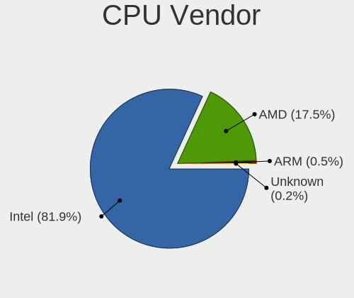

| Vendor | Computers | Percent |
|--------|-----------|---------|
| Intel  | 431       | 84.02%  |
| AMD    | 81        | 15.79%  |
| ARM    | 1         | 0.19%   |

CPU Model
---------

Processor models

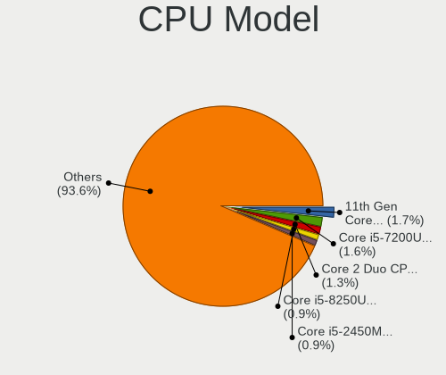

| Model                                       | Computers | Percent |
|---------------------------------------------|-----------|---------|
| Intel Core i5-7200U CPU @ 2.50GHz           | 8         | 1.55%   |
| Intel 11th Gen Core i5-1135G7 @ 2.40GHz     | 7         | 1.36%   |
| Intel Core i5-2450M CPU @ 2.50GHz           | 6         | 1.17%   |
| Intel Pentium CPU G630 @ 2.70GHz            | 5         | 0.97%   |
| Intel Core i5-8300H CPU @ 2.30GHz           | 5         | 0.97%   |
| Intel Core i5-8250U CPU @ 1.60GHz           | 5         | 0.97%   |
| Intel Core i3-3110M CPU @ 2.40GHz           | 5         | 0.97%   |
| Intel Core i7-9750H CPU @ 2.60GHz           | 4         | 0.78%   |
| Intel Core i7-10750H CPU @ 2.60GHz          | 4         | 0.78%   |
| Intel Core i5-8265U CPU @ 1.60GHz           | 4         | 0.78%   |
| Intel Core i5-4460 CPU @ 3.20GHz            | 4         | 0.78%   |
| Intel Core i5-3210M CPU @ 2.50GHz           | 4         | 0.78%   |
| Intel Core i3-7020U CPU @ 2.30GHz           | 4         | 0.78%   |
| Intel Core i3-2120 CPU @ 3.30GHz            | 4         | 0.78%   |
| Intel Core 2 Duo CPU E8400 @ 3.00GHz        | 4         | 0.78%   |
| Intel Core 2 Duo CPU E7400 @ 2.80GHz        | 4         | 0.78%   |
| Intel Celeron CPU N3060 @ 1.60GHz           | 4         | 0.78%   |
| AMD Ryzen 7 5700U with Radeon Graphics      | 4         | 0.78%   |
| Intel Pentium Dual-Core CPU E5700 @ 3.00GHz | 3         | 0.58%   |
| Intel Pentium 4 CPU 3.00GHz                 | 3         | 0.58%   |
| Intel Core i7-7700 CPU @ 3.60GHz            | 3         | 0.58%   |
| Intel Core i7-3770 CPU @ 3.40GHz            | 3         | 0.58%   |
| Intel Core i5-6200U CPU @ 2.30GHz           | 3         | 0.58%   |
| Intel Core i5-3470 CPU @ 3.20GHz            | 3         | 0.58%   |
| Intel Core i5-3230M CPU @ 2.60GHz           | 3         | 0.58%   |
| Intel Core i5-2400 CPU @ 3.10GHz            | 3         | 0.58%   |
| Intel Core i5-10400F CPU @ 2.90GHz          | 3         | 0.58%   |
| Intel Core i5-10210U CPU @ 1.60GHz          | 3         | 0.58%   |
| Intel Core i3-3240 CPU @ 3.40GHz            | 3         | 0.58%   |
| Intel Core i3-2310M CPU @ 2.10GHz           | 3         | 0.58%   |
| Intel Core i3-2100 CPU @ 3.10GHz            | 3         | 0.58%   |
| Intel Core i3-1005G1 CPU @ 1.20GHz          | 3         | 0.58%   |
| Intel Core 2 Quad CPU Q8400 @ 2.66GHz       | 3         | 0.58%   |
| Intel Core 2 Duo CPU E7500 @ 2.93GHz        | 3         | 0.58%   |
| Intel Core 2 Duo CPU E6750 @ 2.66GHz        | 3         | 0.58%   |
| Intel Celeron CPU J1900 @ 1.99GHz           | 3         | 0.58%   |
| Intel Celeron CPU G530 @ 2.40GHz            | 3         | 0.58%   |
| Intel Celeron CPU G1610 @ 2.60GHz           | 3         | 0.58%   |
| Intel 13th Gen Core i5-13500H               | 3         | 0.58%   |
| Intel 12th Gen Core i7-12700KF              | 3         | 0.58%   |

CPU Model Family
----------------

Processor model prefix

| Model                   | Computers | Percent |
|-------------------------|-----------|---------|
| Intel Core i5           | 111       | 21.55%  |
| Intel Core i7           | 60        | 11.65%  |
| Intel Core i3           | 58        | 11.26%  |
| Intel Celeron           | 36        | 6.99%   |
| Intel Core 2 Duo        | 33        | 6.41%   |
| Other                   | 30        | 5.83%   |
| Intel Pentium           | 26        | 5.05%   |
| AMD Ryzen 5             | 18        | 3.5%    |
| AMD Ryzen 7             | 17        | 3.3%    |
| Intel Pentium Dual-Core | 16        | 3.11%   |
| Intel Xeon              | 12        | 2.33%   |
| Intel Atom              | 11        | 2.14%   |
| Intel Core 2 Quad       | 9         | 1.75%   |
| Intel Pentium 4         | 6         | 1.17%   |
| Intel Pentium Dual      | 5         | 0.97%   |
| Intel Genuine           | 5         | 0.97%   |
| AMD Ryzen 3             | 5         | 0.97%   |
| AMD A8                  | 5         | 0.97%   |
| Intel Core 2            | 4         | 0.78%   |
| AMD Ryzen 9             | 4         | 0.78%   |
| AMD E                   | 4         | 0.78%   |
| AMD A10                 | 4         | 0.78%   |
| Intel Pentium Gold      | 3         | 0.58%   |
| AMD A6                  | 3         | 0.58%   |
| AMD A4                  | 3         | 0.58%   |
| Intel Xeon Silver       | 2         | 0.39%   |
| Intel Pentium Silver    | 2         | 0.39%   |
| AMD Phenom II X4        | 2         | 0.39%   |
| AMD E1                  | 2         | 0.39%   |
| AMD Athlon II X2        | 2         | 0.39%   |
| AMD Athlon 64 X2        | 2         | 0.39%   |
| Intel Xeon Gold         | 1         | 0.19%   |
| Intel Pentium M         | 1         | 0.19%   |
| Intel Mobile Pentium 4  | 1         | 0.19%   |
| Intel Core i9           | 1         | 0.19%   |
| Intel Core Duo          | 1         | 0.19%   |
| Intel Core 2 Extreme    | 1         | 0.19%   |
| AMD PRO A8              | 1         | 0.19%   |
| AMD Phenom II X6        | 1         | 0.19%   |
| AMD FX                  | 1         | 0.19%   |

CPU Cores
---------

Number of processor cores

| Number  | Computers | Percent |
|---------|-----------|---------|
| 2       | 252       | 48.84%  |
| 4       | 146       | 28.29%  |
| 6       | 31        | 6.01%   |
| 8       | 27        | 5.23%   |
| Unknown | 21        | 4.07%   |
| 1       | 18        | 3.49%   |
| 12      | 10        | 1.94%   |
| 10      | 3         | 0.58%   |
| 24      | 2         | 0.39%   |
| 20      | 2         | 0.39%   |
| 36      | 1         | 0.19%   |
| 16      | 1         | 0.19%   |
| 14      | 1         | 0.19%   |
| 3       | 1         | 0.19%   |

CPU Sockets
-----------

Number of sockets

| Number  | Computers | Percent |
|---------|-----------|---------|
| 1       | 503       | 98.05%  |
| 2       | 9         | 1.75%   |
| Unknown | 1         | 0.19%   |

CPU Threads
-----------

Threads per core (Hyper-Threading)

| Number  | Computers | Percent |
|---------|-----------|---------|
| 2       | 293       | 57%     |
| 1       | 200       | 38.91%  |
| Unknown | 21        | 4.09%   |

CPU Op-Modes
------------

CPU Operation Modes (32-bit, 64-bit)

| Op mode        | Computers | Percent |
|----------------|-----------|---------|
| 32-bit, 64-bit | 495       | 96.49%  |
| Unknown        | 10        | 1.95%   |
| 32-bit         | 8         | 1.56%   |

CPU Microcode
-------------

Microcode number

| Number     | Computers | Percent |
|------------|-----------|---------|
| Unknown    | 82        | 15.56%  |
| 0x306a9    | 52        | 9.87%   |
| 0x206a7    | 50        | 9.49%   |
| 0x1067a    | 42        | 7.97%   |
| 0x306c3    | 23        | 4.36%   |
| 0x806e9    | 13        | 2.47%   |
| 0x906ea    | 12        | 2.28%   |
| 0x806c1    | 12        | 2.28%   |
| 0x906e9    | 11        | 2.09%   |
| 0x6fd      | 11        | 2.09%   |
| 0x806ea    | 9         | 1.71%   |
| 0x20655    | 9         | 1.71%   |
| 0x10676    | 9         | 1.71%   |
| 0x06001119 | 9         | 1.71%   |
| 0x40651    | 8         | 1.52%   |
| 0x20652    | 8         | 1.52%   |
| 0x806ec    | 6         | 1.14%   |
| 0x406e3    | 6         | 1.14%   |
| 0x406c4    | 6         | 1.14%   |
| 0x30678    | 6         | 1.14%   |
| 0x0a50000c | 6         | 1.14%   |
| 0x08608103 | 6         | 1.14%   |
| 0xa0652    | 5         | 0.95%   |
| 0x6fb      | 5         | 0.95%   |
| 0xa0653    | 4         | 0.76%   |
| 0x706a1    | 4         | 0.76%   |
| 0x30661    | 4         | 0.76%   |
| 0xf49      | 3         | 0.57%   |
| 0x906ed    | 3         | 0.57%   |
| 0x906a3    | 3         | 0.57%   |
| 0x706e5    | 3         | 0.57%   |
| 0x6e8      | 3         | 0.57%   |
| 0x506e3    | 3         | 0.57%   |
| 0x306d4    | 3         | 0.57%   |
| 0x10661    | 3         | 0.57%   |
| 0x0a50000d | 3         | 0.57%   |
| 0x08701021 | 3         | 0.57%   |
| 0x08108109 | 3         | 0.57%   |
| 0x08108102 | 3         | 0.57%   |
| 0x07030105 | 3         | 0.57%   |

CPU Microarch
-------------

Microarchitecture

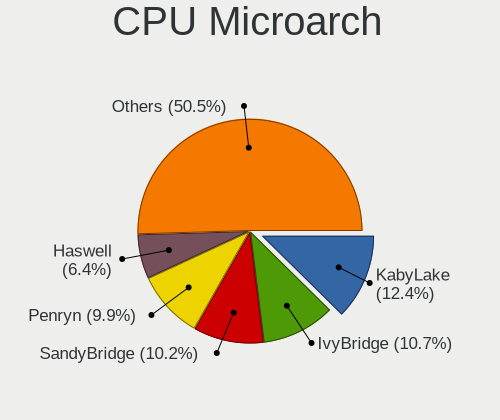

| Name             | Computers | Percent |
|------------------|-----------|---------|
| KabyLake         | 69        | 13.4%   |
| IvyBridge        | 59        | 11.46%  |
| Penryn           | 56        | 10.87%  |
| SandyBridge      | 55        | 10.68%  |
| Haswell          | 34        | 6.6%    |
| Core             | 29        | 5.63%   |
| Westmere         | 17        | 3.3%    |
| Silvermont       | 17        | 3.3%    |
| Skylake          | 16        | 3.11%   |
| Unknown          | 16        | 3.11%   |
| TigerLake        | 15        | 2.91%   |
| Zen 3            | 13        | 2.52%   |
| CometLake        | 12        | 2.33%   |
| Zen+             | 11        | 2.14%   |
| Piledriver       | 10        | 1.94%   |
| Alderlake Hybrid | 10        | 1.94%   |
| Zen 2            | 7         | 1.36%   |
| NetBurst         | 7         | 1.36%   |
| Bonnell          | 7         | 1.36%   |
| P6               | 6         | 1.17%   |
| K10              | 6         | 1.17%   |
| Goldmont plus    | 6         | 1.17%   |
| IceLake          | 5         | 0.97%   |
| Bobcat           | 5         | 0.97%   |
| Excavator        | 4         | 0.78%   |
| Broadwell        | 4         | 0.78%   |
| Zen              | 3         | 0.58%   |
| Puma             | 3         | 0.58%   |
| Nehalem          | 3         | 0.58%   |
| K8 Hammer        | 3         | 0.58%   |
| K10 Llano        | 3         | 0.58%   |
| Jaguar           | 2         | 0.39%   |
| Tremont          | 1         | 0.19%   |
| Goldmont         | 1         | 0.19%   |

Graphics
--------

GPU Vendor
----------

Vendors of graphics cards

| Vendor                     | Computers | Percent |
|----------------------------|-----------|---------|
| Intel                      | 274       | 42.55%  |
| Nvidia                     | 246       | 38.2%   |
| AMD                        | 120       | 18.63%  |
| Matrox Electronics Systems | 3         | 0.47%   |
| ASPEED Technology          | 1         | 0.16%   |

GPU Model
---------

Graphics card models

| Model                                                                                    | Computers | Percent |
|------------------------------------------------------------------------------------------|-----------|---------|
| Intel 2nd Generation Core Processor Family Integrated Graphics Controller                | 38        | 5.61%   |
| Intel 3rd Gen Core processor Graphics Controller                                         | 29        | 4.28%   |
| Intel HD Graphics 620                                                                    | 14        | 2.07%   |
| Intel TigerLake-LP GT2 [Iris Xe Graphics]                                                | 13        | 1.92%   |
| Intel CoffeeLake-H GT2 [UHD Graphics 630]                                                | 11        | 1.62%   |
| Intel UHD Graphics 620                                                                   | 10        | 1.48%   |
| Nvidia TU117M [GeForce GTX 1650 Mobile / Max-Q]                                          | 9         | 1.33%   |
| Intel Skylake GT2 [HD Graphics 520]                                                      | 9         | 1.33%   |
| Intel Atom/Celeron/Pentium Processor x5-E8000/J3xxx/N3xxx Integrated Graphics Controller | 9         | 1.33%   |
| Nvidia GT218 [GeForce 210]                                                               | 8         | 1.18%   |
| Intel HD Graphics 630                                                                    | 8         | 1.18%   |
| Intel 4th Gen Core Processor Integrated Graphics Controller                              | 8         | 1.18%   |
| AMD Cezanne [Radeon Vega Series / Radeon Vega Mobile Series]                             | 8         | 1.18%   |
| Nvidia GF117M [GeForce 610M/710M/810M/820M / GT 620M/625M/630M/720M]                     | 7         | 1.03%   |
| Nvidia GF108 [GeForce GT 440]                                                            | 7         | 1.03%   |
| Intel Mobile 4 Series Chipset Integrated Graphics Controller                             | 7         | 1.03%   |
| Intel Haswell-ULT Integrated Graphics Controller                                         | 7         | 1.03%   |
| Intel Core Processor Integrated Graphics Controller                                      | 7         | 1.03%   |
| Intel Atom Processor Z36xxx/Z37xxx Series Graphics & Display                             | 7         | 1.03%   |
| AMD Thames [Radeon HD 7500M/7600M Series]                                                | 7         | 1.03%   |
| Nvidia GF114 [GeForce GTX 560 Ti]                                                        | 6         | 0.89%   |
| Nvidia GF108 [GeForce GT 730]                                                            | 6         | 0.89%   |
| Nvidia G94 [GeForce 9600 GT]                                                             | 6         | 0.89%   |
| Intel Xeon E3-1200 v2/3rd Gen Core processor Graphics Controller                         | 6         | 0.89%   |
| Intel Mobile 945GM/GMS/GME, 943/940GML Express Integrated Graphics Controller            | 6         | 0.89%   |
| AMD Picasso/Raven 2 [Radeon Vega Series / Radeon Vega Mobile Series]                     | 6         | 0.89%   |
| AMD Lucienne                                                                             | 6         | 0.89%   |
| Nvidia GP106M [GeForce GTX 1060 Mobile]                                                  | 5         | 0.74%   |
| Nvidia GK107 [GeForce GTX 650]                                                           | 5         | 0.74%   |
| Nvidia GF119M [GeForce 610M]                                                             | 5         | 0.74%   |
| Nvidia GF108M [GeForce GT 620M/630M/635M/640M LE]                                        | 5         | 0.74%   |
| Nvidia GF108 [GeForce GT 430]                                                            | 5         | 0.74%   |
| Intel Xeon E3-1200 v3/4th Gen Core Processor Integrated Graphics Controller              | 5         | 0.74%   |
| Intel Mobile GM965/GL960 Integrated Graphics Controller (secondary)                      | 5         | 0.74%   |
| Intel Mobile GM965/GL960 Integrated Graphics Controller (primary)                        | 5         | 0.74%   |
| Intel Iris Plus Graphics G1 (Ice Lake)                                                   | 5         | 0.74%   |
| Intel GeminiLake [UHD Graphics 600]                                                      | 5         | 0.74%   |
| Intel CometLake-U GT2 [UHD Graphics]                                                     | 5         | 0.74%   |
| Intel CometLake-H GT2 [UHD Graphics]                                                     | 5         | 0.74%   |
| Intel 82G33/G31 Express Integrated Graphics Controller                                   | 5         | 0.74%   |

GPU Combo
---------

Combinations of graphics cards

| Name                    | Computers | Percent |
|-------------------------|-----------|---------|
| 1 x Intel               | 161       | 31.02%  |
| 1 x Nvidia              | 150       | 28.9%   |
| Intel + Nvidia          | 84        | 16.18%  |
| 1 x AMD                 | 70        | 13.49%  |
| Intel + AMD             | 22        | 4.24%   |
| 2 x AMD                 | 15        | 2.89%   |
| AMD + Nvidia            | 12        | 2.31%   |
| 1 x Matrox              | 2         | 0.39%   |
| Other                   | 1         | 0.19%   |
| 2 x Nvidia + 1 x ASPEED | 1         | 0.19%   |
| Nvidia + Matrox         | 1         | 0.19%   |

GPU Driver
----------

Free vs proprietary

| Driver      | Computers | Percent |
|-------------|-----------|---------|
| Free        | 400       | 76.05%  |
| Proprietary | 108       | 20.53%  |
| Unknown     | 18        | 3.42%   |

GPU Memory
----------

Total video memory

| Size in GB | Computers | Percent |
|------------|-----------|---------|
| Unknown    | 174       | 32.89%  |
| 1.01-2.0   | 136       | 25.71%  |
| 0.01-0.5   | 83        | 15.69%  |
| 0.51-1.0   | 78        | 14.74%  |
| 3.01-4.0   | 32        | 6.05%   |
| 7.01-8.0   | 13        | 2.46%   |
| 5.01-6.0   | 9         | 1.7%    |
| 8.01-16.0  | 2         | 0.38%   |
| 2.01-3.0   | 1         | 0.19%   |
| 16.01-24.0 | 1         | 0.19%   |

Monitor
-------

Monitor Vendor
--------------

Monitor vendors

| Vendor                  | Computers | Percent |
|-------------------------|-----------|---------|
| Samsung Electronics     | 97        | 18.37%  |
| AU Optronics            | 69        | 13.07%  |
| LG Display              | 57        | 10.8%   |
| BOE                     | 40        | 7.58%   |
| Chimei Innolux          | 37        | 7.01%   |
| Goldstar                | 33        | 6.25%   |
| Hewlett-Packard         | 28        | 5.3%    |
| Acer                    | 24        | 4.55%   |
| Philips                 | 19        | 3.6%    |
| BenQ                    | 17        | 3.22%   |
| Chi Mei Optoelectronics | 16        | 3.03%   |
| AOC                     | 11        | 2.08%   |
| Lenovo                  | 9         | 1.7%    |
| Dell                    | 9         | 1.7%    |
| ViewSonic               | 4         | 0.76%   |
| PANDA                   | 4         | 0.76%   |
| Toshiba                 | 3         | 0.57%   |
| Sony                    | 3         | 0.57%   |
| SAC                     | 3         | 0.57%   |
| LG Philips              | 3         | 0.57%   |
| Iiyama                  | 3         | 0.57%   |
| Gigabyte Technology     | 3         | 0.57%   |
| Fujitsu Siemens         | 3         | 0.57%   |
| Arnos Instruments       | 3         | 0.57%   |
| VIE                     | 2         | 0.38%   |
| Unknown (XXX)           | 2         | 0.38%   |
| Quanta Display          | 2         | 0.38%   |
| Panasonic               | 2         | 0.38%   |
| LG Electronics          | 2         | 0.38%   |
| InfoVision              | 2         | 0.38%   |
| HannStar                | 2         | 0.38%   |
| CPT                     | 2         | 0.38%   |
| WY@                     | 1         | 0.19%   |
| Unknown                 | 1         | 0.19%   |
| TPU                     | 1         | 0.19%   |
| SKY                     | 1         | 0.19%   |
| Sharp                   | 1         | 0.19%   |
| Seiko/Epson             | 1         | 0.19%   |
| Packard Bell            | 1         | 0.19%   |
| KDC                     | 1         | 0.19%   |

Monitor Model
-------------

Monitor models

| Model                                                                    | Computers | Percent |
|--------------------------------------------------------------------------|-----------|---------|
| LG Display LCD Monitor LGD02DC 1366x768 344x194mm 15.5-inch              | 8         | 1.48%   |
| Samsung Electronics SyncMaster SAM018F 1280x1024 338x270mm 17.0-inch     | 5         | 0.93%   |
| Samsung Electronics LCD Monitor SDC4752 1366x768 344x194mm 15.5-inch     | 5         | 0.93%   |
| Chimei Innolux LCD Monitor CMN15DB 1366x768 344x193mm 15.5-inch          | 5         | 0.93%   |
| AU Optronics LCD Monitor AUO26EC 1366x768 344x193mm 15.5-inch            | 5         | 0.93%   |
| LG Display LCD Monitor LGD033A 1366x768 344x194mm 15.5-inch              | 4         | 0.74%   |
| Chi Mei Optoelectronics LCD Monitor CMO15A7 1366x768 344x193mm 15.5-inch | 4         | 0.74%   |
| AU Optronics LCD Monitor AUO38ED 1920x1080 344x193mm 15.5-inch           | 4         | 0.74%   |
| AU Optronics LCD Monitor AUO22EC 1366x768 344x193mm 15.5-inch            | 4         | 0.74%   |
| AU Optronics LCD Monitor AUO21ED 1920x1080 344x194mm 15.5-inch           | 4         | 0.74%   |
| Samsung Electronics SyncMaster SAM0285 1440x900 410x257mm 19.1-inch      | 3         | 0.56%   |
| Samsung Electronics SMS19A100 SAM0867 1366x768 410x230mm 18.5-inch       | 3         | 0.56%   |
| Hewlett-Packard L1740 HWP2648 1280x1024 338x270mm 17.0-inch              | 3         | 0.56%   |
| Hewlett-Packard 2011 HWP2934 1600x900 443x249mm 20.0-inch                | 3         | 0.56%   |
| Goldstar W1943 GSM4BAD 1360x768 406x229mm 18.4-inch                      | 3         | 0.56%   |
| Chimei Innolux LCD Monitor CMN15F5 1920x1080 344x193mm 15.5-inch         | 3         | 0.56%   |
| Chimei Innolux LCD Monitor CMN15D5 1920x1080 344x193mm 15.5-inch         | 3         | 0.56%   |
| BOE LCD Monitor BOE0675 1366x768 344x194mm 15.5-inch                     | 3         | 0.56%   |
| BenQ E900W BNQ7905 1440x900 410x256mm 19.0-inch                          | 3         | 0.56%   |
| AU Optronics LCD Monitor AUO45EC 1366x768 344x193mm 15.5-inch            | 3         | 0.56%   |
| Arnos Instruments '' AIC0400 1280x1024                                   | 3         | 0.56%   |
| Acer V193HQ ACR006D 1366x768 410x230mm 18.5-inch                         | 3         | 0.56%   |
| Sony Nvidia Defaul t Flat Panel SNY05FA 1366x768 309x174mm 14.0-inch     | 2         | 0.37%   |
| Samsung Electronics SyncMaster SAM0564 1360x768 410x230mm 18.5-inch      | 2         | 0.37%   |
| Samsung Electronics SyncMaster SAM037C 1680x1050 474x296mm 22.0-inch     | 2         | 0.37%   |
| Samsung Electronics SyncMaster SAM0248 1280x1024 376x301mm 19.0-inch     | 2         | 0.37%   |
| Samsung Electronics SMB1930N SAM0632 1366x768 410x230mm 18.5-inch        | 2         | 0.37%   |
| Samsung Electronics S22F350 SAM0D1A 1920x1080 477x268mm 21.5-inch        | 2         | 0.37%   |
| Samsung Electronics S22C150 SAM0AE5 1920x1080 477x268mm 21.5-inch        | 2         | 0.37%   |
| Samsung Electronics S20B300 SAM08A7 1600x900 443x249mm 20.0-inch         | 2         | 0.37%   |
| Samsung Electronics LF27T450F SAM7097 1920x1080 597x336mm 27.0-inch      | 2         | 0.37%   |
| Samsung Electronics LCD Monitor SEC4251 1366x768 344x194mm 15.5-inch     | 2         | 0.37%   |
| Samsung Electronics LCD Monitor SEC3642 1366x768 344x194mm 15.5-inch     | 2         | 0.37%   |
| Samsung Electronics LCD Monitor SEC3253 1366x768 344x194mm 15.5-inch     | 2         | 0.37%   |
| Samsung Electronics LCD Monitor SEC315A 1366x768 344x194mm 15.5-inch     | 2         | 0.37%   |
| Samsung Electronics LCD Monitor SDC416E 2880x1620 344x194mm 15.5-inch    | 2         | 0.37%   |
| Samsung Electronics LCD Monitor SDC4161 1920x1080 344x194mm 15.5-inch    | 2         | 0.37%   |
| Samsung Electronics LCD Monitor SDC3654 1600x900 382x215mm 17.3-inch     | 2         | 0.37%   |
| Samsung Electronics LCD Monitor SAM0A7A 1920x1080 410x230mm 18.5-inch    | 2         | 0.37%   |
| Samsung Electronics LCD Monitor SAM0669 1920x1080                        | 2         | 0.37%   |

Monitor Resolution
------------------

Monitor screen resolution

| Resolution         | Computers | Percent |
|--------------------|-----------|---------|
| 1920x1080 (FHD)    | 192       | 37.35%  |
| 1366x768 (WXGA)    | 149       | 28.99%  |
| 1280x1024 (SXGA)   | 46        | 8.95%   |
| 1600x900 (HD+)     | 27        | 5.25%   |
| 1680x1050 (WSXGA+) | 15        | 2.92%   |
| 1440x900 (WXGA+)   | 15        | 2.92%   |
| 1280x800 (WXGA)    | 11        | 2.14%   |
| 3840x2160 (4K)     | 10        | 1.95%   |
| 2560x1440 (QHD)    | 9         | 1.75%   |
| 1360x768           | 5         | 0.97%   |
| 1024x600           | 5         | 0.97%   |
| 2560x1600          | 4         | 0.78%   |
| 2880x1620          | 3         | 0.58%   |
| 2560x1080          | 3         | 0.58%   |
| 1920x1200 (WUXGA)  | 3         | 0.58%   |
| Unknown            | 3         | 0.58%   |
| 1400x1050          | 2         | 0.39%   |
| 3840x1080          | 1         | 0.19%   |
| 3600x1080          | 1         | 0.19%   |
| 3520x1080          | 1         | 0.19%   |
| 3440x1440          | 1         | 0.19%   |
| 3200x2000          | 1         | 0.19%   |
| 3200x1080          | 1         | 0.19%   |
| 2288x1287          | 1         | 0.19%   |
| 2160x1440          | 1         | 0.19%   |
| 1920x540           | 1         | 0.19%   |
| 1280x960           | 1         | 0.19%   |
| 1280x720 (HD)      | 1         | 0.19%   |
| 1024x768 (XGA)     | 1         | 0.19%   |

Monitor Diagonal
----------------

Diagonal size in inches

| Inches  | Computers | Percent |
|---------|-----------|---------|
| 15      | 190       | 35.85%  |
| 17      | 49        | 9.25%   |
| 21      | 38        | 7.17%   |
| 19      | 32        | 6.04%   |
| 18      | 28        | 5.28%   |
| 27      | 21        | 3.96%   |
| 23      | 21        | 3.96%   |
| 14      | 20        | 3.77%   |
| 13      | 20        | 3.77%   |
| Unknown | 17        | 3.21%   |
| 24      | 16        | 3.02%   |
| 20      | 14        | 2.64%   |
| 22      | 10        | 1.89%   |
| 31      | 8         | 1.51%   |
| 16      | 8         | 1.51%   |
| 10      | 6         | 1.13%   |
| 12      | 5         | 0.94%   |
| 54      | 3         | 0.57%   |
| 48      | 3         | 0.57%   |
| 40      | 3         | 0.57%   |
| 34      | 3         | 0.57%   |
| 11      | 3         | 0.57%   |
| 84      | 2         | 0.38%   |
| 72      | 2         | 0.38%   |
| 43      | 2         | 0.38%   |
| 26      | 2         | 0.38%   |
| 142     | 1         | 0.19%   |
| 64      | 1         | 0.19%   |
| 46      | 1         | 0.19%   |
| 32      | 1         | 0.19%   |

Monitor Width
-------------

Physical width

| Width in mm    | Computers | Percent |
|----------------|-----------|---------|
| 301-350        | 253       | 48.1%   |
| 401-500        | 102       | 19.39%  |
| 501-600        | 54        | 10.27%  |
| 351-400        | 46        | 8.75%   |
| 201-300        | 23        | 4.37%   |
| Unknown        | 17        | 3.23%   |
| 601-700        | 9         | 1.71%   |
| 1001-1500      | 8         | 1.52%   |
| 801-900        | 4         | 0.76%   |
| 701-800        | 4         | 0.76%   |
| 1501-2000      | 4         | 0.76%   |
| More than 2000 | 1         | 0.19%   |
| 901-1000       | 1         | 0.19%   |

Aspect Ratio
------------

Proportional relationship between the width and the height

| Ratio   | Computers | Percent |
|---------|-----------|---------|
| 16/9    | 380       | 76.46%  |
| 5/4     | 46        | 9.26%   |
| 16/10   | 44        | 8.85%   |
| Unknown | 12        | 2.41%   |
| 4/3     | 5         | 1.01%   |
| 3/2     | 4         | 0.8%    |
| 21/9    | 3         | 0.6%    |
| 6/5     | 1         | 0.2%    |
| 32/9    | 1         | 0.2%    |
| 1.00    | 1         | 0.2%    |

Monitor Area
------------

Area in inch

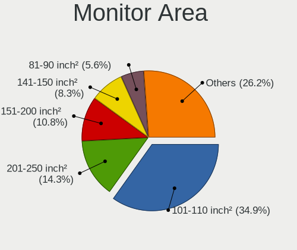

| Area in inch | Computers | Percent |
|----------------|-----------|---------|
| 101-110        | 190       | 36.05%  |
| 201-250        | 71        | 13.47%  |
| 151-200        | 56        | 10.63%  |
| 141-150        | 52        | 9.87%   |
| 81-90          | 31        | 5.88%   |
| 301-350        | 23        | 4.36%   |
| 121-130        | 20        | 3.8%    |
| Unknown        | 17        | 3.23%   |
| More than 1000 | 12        | 2.28%   |
| 351-500        | 12        | 2.28%   |
| 71-80          | 9         | 1.71%   |
| 41-50          | 6         | 1.14%   |
| 501-1000       | 6         | 1.14%   |
| 111-120        | 5         | 0.95%   |
| 61-70          | 4         | 0.76%   |
| 251-300        | 4         | 0.76%   |
| 51-60          | 3         | 0.57%   |
| 131-140        | 3         | 0.57%   |
| 91-100         | 3         | 0.57%   |

Pixel Density
-------------

Pixels per inch

| Density | Computers | Percent |
|---------|-----------|---------|
| 51-100  | 198       | 37.93%  |
| 101-120 | 165       | 31.61%  |
| 121-160 | 114       | 21.84%  |
| Unknown | 17        | 3.26%   |
| 1-50    | 14        | 2.68%   |
| 161-240 | 14        | 2.68%   |

Multiple Monitors
-----------------

Total monitors connected

| Total | Computers | Percent |
|-------|-----------|---------|
| 1     | 450       | 86.04%  |
| 2     | 50        | 9.56%   |
| 0     | 20        | 3.82%   |
| 3     | 3         | 0.57%   |

Network
-------

Net Controller Vendor
---------------------

Controller vendors

| Vendor                            | Computers | Percent |
|-----------------------------------|-----------|---------|
| Realtek Semiconductor             | 340       | 43.04%  |
| Intel                             | 163       | 20.63%  |
| Qualcomm Atheros                  | 117       | 14.81%  |
| Broadcom                          | 34        | 4.3%    |
| MediaTek                          | 21        | 2.66%   |
| Broadcom Limited                  | 16        | 2.03%   |
| Ralink                            | 13        | 1.65%   |
| Ralink Technology                 | 12        | 1.52%   |
| Marvell Technology Group          | 9         | 1.14%   |
| Xiaomi                            | 8         | 1.01%   |
| Qualcomm Atheros Communications   | 7         | 0.89%   |
| Nvidia                            | 7         | 0.89%   |
| Huawei Technologies               | 7         | 0.89%   |
| VIA Technologies                  | 4         | 0.51%   |
| Samsung Electronics               | 3         | 0.38%   |
| JMicron Technology                | 3         | 0.38%   |
| Hewlett-Packard                   | 3         | 0.38%   |
| D-Link                            | 3         | 0.38%   |
| TP-Link                           | 2         | 0.25%   |
| HTC (High Tech Computer)          | 2         | 0.25%   |
| DisplayLink                       | 2         | 0.25%   |
| ZTE WCDMA Technologies MSM        | 1         | 0.13%   |
| STMicroelectronics                | 1         | 0.13%   |
| Philips (or NXP)                  | 1         | 0.13%   |
| OPPO Electronics                  | 1         | 0.13%   |
| Mellanox Technologies             | 1         | 0.13%   |
| Linux 2.6.38.8+ with at91_udc     | 1         | 0.13%   |
| ICS Advent                        | 1         | 0.13%   |
| Fujitsu Siemens Computers         | 1         | 0.13%   |
| Ericsson Business Mobile Networks | 1         | 0.13%   |
| Edimax Technology                 | 1         | 0.13%   |
| Dell                              | 1         | 0.13%   |
| ASIX Electronics                  | 1         | 0.13%   |
| Android                           | 1         | 0.13%   |
| Accton Technology                 | 1         | 0.13%   |

Net Controller Model
--------------------

Controller models

| Model                                                                   | Computers | Percent |
|-------------------------------------------------------------------------|-----------|---------|
| Realtek RTL8111/8168/8411 PCI Express Gigabit Ethernet Controller       | 222       | 25.06%  |
| Realtek RTL810xE PCI Express Fast Ethernet controller                   | 67        | 7.56%   |
| Qualcomm Atheros AR9285 Wireless Network Adapter (PCI-Express)          | 22        | 2.48%   |
| Qualcomm Atheros AR9485 Wireless Network Adapter                        | 21        | 2.37%   |
| Qualcomm Atheros QCA9377 802.11ac Wireless Network Adapter              | 17        | 1.92%   |
| Broadcom BCM4313 802.11bgn Wireless Network Adapter                     | 16        | 1.81%   |
| Realtek RTL8821CE 802.11ac PCIe Wireless Network Adapter                | 15        | 1.69%   |
| Intel Wi-Fi 6 AX201                                                     | 12        | 1.35%   |
| Qualcomm Atheros QCA9565 / AR9565 Wireless Network Adapter              | 11        | 1.24%   |
| Qualcomm Atheros QCA8172 Fast Ethernet                                  | 11        | 1.24%   |
| Intel Wireless 8265 / 8275                                              | 11        | 1.24%   |
| Realtek RTL-8100/8101L/8139 PCI Fast Ethernet Adapter                   | 9         | 1.02%   |
| Qualcomm Atheros AR8151 v2.0 Gigabit Ethernet                           | 9         | 1.02%   |
| Intel Comet Lake PCH CNVi WiFi                                          | 9         | 1.02%   |
| Realtek RTL8188EUS 802.11n Wireless Network Adapter                     | 8         | 0.9%    |
| Ralink RT3290 Wireless 802.11n 1T/1R PCIe                               | 8         | 0.9%    |
| MediaTek MT7921 802.11ax PCI Express Wireless Network Adapter           | 8         | 0.9%    |
| Intel PRO/Wireless 3945ABG [Golan] Network Connection                   | 8         | 0.9%    |
| Intel Ethernet Connection (2) I219-V                                    | 8         | 0.9%    |
| Intel 82579LM Gigabit Network Connection (Lewisville)                   | 8         | 0.9%    |
| Realtek RTL8822CE 802.11ac PCIe Wireless Network Adapter                | 6         | 0.68%   |
| Realtek RTL8125 2.5GbE Controller                                       | 6         | 0.68%   |
| Qualcomm Atheros AR8152 v2.0 Fast Ethernet                              | 6         | 0.68%   |
| MediaTek MT7922 802.11ax PCI Express Wireless Network Adapter           | 6         | 0.68%   |
| Intel Centrino Wireless-N 2230                                          | 6         | 0.68%   |
| Intel Centrino Advanced-N 6205 [Taylor Peak]                            | 6         | 0.68%   |
| Broadcom NetLink BCM57785 Gigabit Ethernet PCIe                         | 6         | 0.68%   |
| Realtek RTL8723DE Wireless Network Adapter                              | 5         | 0.56%   |
| Realtek RTL8723BE PCIe Wireless Network Adapter                         | 5         | 0.56%   |
| Ralink RT5370 Wireless Adapter                                          | 5         | 0.56%   |
| Ralink MT7601U Wireless Adapter                                         | 5         | 0.56%   |
| Qualcomm Atheros AR9271 802.11n                                         | 5         | 0.56%   |
| Qualcomm Atheros AR242x / AR542x Wireless Network Adapter (PCI-Express) | 5         | 0.56%   |
| Intel Wi-Fi 6 AX200                                                     | 5         | 0.56%   |
| Intel Dual Band Wireless-AC 3168NGW [Stone Peak]                        | 5         | 0.56%   |
| Intel Comet Lake PCH-LP CNVi WiFi                                       | 5         | 0.56%   |
| Intel Cannon Lake PCH CNVi WiFi                                         | 5         | 0.56%   |
| Huawei E353/E3131                                                       | 5         | 0.56%   |
| Broadcom BCM43227 802.11b/g/n                                           | 5         | 0.56%   |
| Xiaomi Mi/Redmi series (RNDIS)                                          | 4         | 0.45%   |

Wireless Vendor
---------------

Wireless vendors

| Vendor                            | Computers | Percent |
|-----------------------------------|-----------|---------|
| Intel                             | 123       | 33.7%   |
| Qualcomm Atheros                  | 89        | 24.38%  |
| Realtek Semiconductor             | 62        | 16.99%  |
| Broadcom                          | 26        | 7.12%   |
| MediaTek                          | 18        | 4.93%   |
| Ralink                            | 13        | 3.56%   |
| Ralink Technology                 | 12        | 3.29%   |
| Qualcomm Atheros Communications   | 7         | 1.92%   |
| Broadcom Limited                  | 6         | 1.64%   |
| D-Link                            | 3         | 0.82%   |
| TP-Link                           | 1         | 0.27%   |
| Philips (or NXP)                  | 1         | 0.27%   |
| Fujitsu Siemens Computers         | 1         | 0.27%   |
| Ericsson Business Mobile Networks | 1         | 0.27%   |
| Edimax Technology                 | 1         | 0.27%   |
| Accton Technology                 | 1         | 0.27%   |

Wireless Model
--------------

Wireless models

| Model                                                                   | Computers | Percent |
|-------------------------------------------------------------------------|-----------|---------|
| Qualcomm Atheros AR9285 Wireless Network Adapter (PCI-Express)          | 22        | 6.03%   |
| Qualcomm Atheros AR9485 Wireless Network Adapter                        | 21        | 5.75%   |
| Qualcomm Atheros QCA9377 802.11ac Wireless Network Adapter              | 17        | 4.66%   |
| Broadcom BCM4313 802.11bgn Wireless Network Adapter                     | 16        | 4.38%   |
| Realtek RTL8821CE 802.11ac PCIe Wireless Network Adapter                | 15        | 4.11%   |
| Intel Wi-Fi 6 AX201                                                     | 12        | 3.29%   |
| Qualcomm Atheros QCA9565 / AR9565 Wireless Network Adapter              | 11        | 3.01%   |
| Intel Wireless 8265 / 8275                                              | 11        | 3.01%   |
| Intel Comet Lake PCH CNVi WiFi                                          | 9         | 2.47%   |
| Realtek RTL8188EUS 802.11n Wireless Network Adapter                     | 8         | 2.19%   |
| Ralink RT3290 Wireless 802.11n 1T/1R PCIe                               | 8         | 2.19%   |
| MediaTek MT7921 802.11ax PCI Express Wireless Network Adapter           | 8         | 2.19%   |
| Intel PRO/Wireless 3945ABG [Golan] Network Connection                   | 8         | 2.19%   |
| Realtek RTL8822CE 802.11ac PCIe Wireless Network Adapter                | 6         | 1.64%   |
| MediaTek MT7922 802.11ax PCI Express Wireless Network Adapter           | 6         | 1.64%   |
| Intel Centrino Wireless-N 2230                                          | 6         | 1.64%   |
| Intel Centrino Advanced-N 6205 [Taylor Peak]                            | 6         | 1.64%   |
| Realtek RTL8723DE Wireless Network Adapter                              | 5         | 1.37%   |
| Realtek RTL8723BE PCIe Wireless Network Adapter                         | 5         | 1.37%   |
| Ralink RT5370 Wireless Adapter                                          | 5         | 1.37%   |
| Ralink MT7601U Wireless Adapter                                         | 5         | 1.37%   |
| Qualcomm Atheros AR9271 802.11n                                         | 5         | 1.37%   |
| Qualcomm Atheros AR242x / AR542x Wireless Network Adapter (PCI-Express) | 5         | 1.37%   |
| Intel Wi-Fi 6 AX200                                                     | 5         | 1.37%   |
| Intel Dual Band Wireless-AC 3168NGW [Stone Peak]                        | 5         | 1.37%   |
| Intel Comet Lake PCH-LP CNVi WiFi                                       | 5         | 1.37%   |
| Intel Cannon Lake PCH CNVi WiFi                                         | 5         | 1.37%   |
| Broadcom BCM43227 802.11b/g/n                                           | 5         | 1.37%   |
| Realtek RTL8852AE 802.11ax PCIe Wireless Network Adapter                | 4         | 1.1%    |
| Realtek RTL8188EE Wireless Network Adapter                              | 4         | 1.1%    |
| MediaTek Wi-Fi 6E MT7902 Wireless Network Adapter                       | 4         | 1.1%    |
| Intel Wireless 7265                                                     | 4         | 1.1%    |
| Intel Wireless 7260                                                     | 4         | 1.1%    |
| Intel Wireless 3160                                                     | 4         | 1.1%    |
| Intel WiFi Link 5100                                                    | 4         | 1.1%    |
| Intel Centrino Wireless-N 1030 [Rainbow Peak]                           | 4         | 1.1%    |
| Broadcom Limited BCM4313 802.11bgn Wireless Network Adapter             | 4         | 1.1%    |
| Realtek RTL8852BE PCIe 802.11ax Wireless Network Controller             | 3         | 0.82%   |
| Realtek RTL8822BE 802.11a/b/g/n/ac WiFi adapter                         | 3         | 0.82%   |
| Qualcomm Atheros QCA6174 802.11ac Wireless Network Adapter              | 3         | 0.82%   |

Ethernet Vendor
---------------

Ethernet vendors

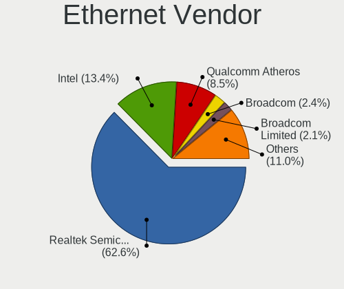

| Vendor                     | Computers | Percent |
|----------------------------|-----------|---------|
| Realtek Semiconductor      | 315       | 62.5%   |
| Intel                      | 69        | 13.69%  |
| Qualcomm Atheros           | 45        | 8.93%   |
| Broadcom Limited           | 11        | 2.18%   |
| Broadcom                   | 11        | 2.18%   |
| Marvell Technology Group   | 9         | 1.79%   |
| Xiaomi                     | 8         | 1.59%   |
| Nvidia                     | 7         | 1.39%   |
| Huawei Technologies        | 5         | 0.99%   |
| VIA Technologies           | 4         | 0.79%   |
| Samsung Electronics        | 3         | 0.6%    |
| MediaTek                   | 3         | 0.6%    |
| JMicron Technology         | 3         | 0.6%    |
| HTC (High Tech Computer)   | 2         | 0.4%    |
| DisplayLink                | 2         | 0.4%    |
| ZTE WCDMA Technologies MSM | 1         | 0.2%    |
| TP-Link                    | 1         | 0.2%    |
| OPPO Electronics           | 1         | 0.2%    |
| ICS Advent                 | 1         | 0.2%    |
| Dell                       | 1         | 0.2%    |
| ASIX Electronics           | 1         | 0.2%    |
| Android                    | 1         | 0.2%    |

Ethernet Model
--------------

Ethernet models

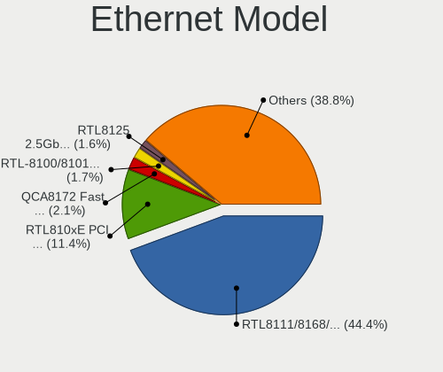

| Model                                                                          | Computers | Percent |
|--------------------------------------------------------------------------------|-----------|---------|
| Realtek RTL8111/8168/8411 PCI Express Gigabit Ethernet Controller              | 222       | 43.44%  |
| Realtek RTL810xE PCI Express Fast Ethernet controller                          | 67        | 13.11%  |
| Qualcomm Atheros QCA8172 Fast Ethernet                                         | 11        | 2.15%   |
| Realtek RTL-8100/8101L/8139 PCI Fast Ethernet Adapter                          | 9         | 1.76%   |
| Qualcomm Atheros AR8151 v2.0 Gigabit Ethernet                                  | 9         | 1.76%   |
| Intel Ethernet Connection (2) I219-V                                           | 8         | 1.57%   |
| Intel 82579LM Gigabit Network Connection (Lewisville)                          | 8         | 1.57%   |
| Realtek RTL8125 2.5GbE Controller                                              | 6         | 1.17%   |
| Qualcomm Atheros AR8152 v2.0 Fast Ethernet                                     | 6         | 1.17%   |
| Broadcom NetLink BCM57785 Gigabit Ethernet PCIe                                | 6         | 1.17%   |
| Huawei E353/E3131                                                              | 5         | 0.98%   |
| Xiaomi Mi/Redmi series (RNDIS)                                                 | 4         | 0.78%   |
| Xiaomi Mi/Redmi series (RNDIS + ADB)                                           | 4         | 0.78%   |
| Realtek RTL8169 PCI Gigabit Ethernet Controller                                | 4         | 0.78%   |
| Qualcomm Atheros AR8161 Gigabit Ethernet                                       | 4         | 0.78%   |
| Qualcomm Atheros AR8121/AR8113/AR8114 Gigabit or Fast Ethernet                 | 4         | 0.78%   |
| Intel 82579V Gigabit Network Connection                                        | 4         | 0.78%   |
| Realtek RTL8153 Gigabit Ethernet Adapter                                       | 3         | 0.59%   |
| Realtek Killer E2600 Gigabit Ethernet Controller                               | 3         | 0.59%   |
| MediaTek Wiko U316AT                                                           | 3         | 0.59%   |
| Intel I211 Gigabit Network Connection                                          | 3         | 0.59%   |
| Intel Ethernet Controller I225-V                                               | 3         | 0.59%   |
| Intel Ethernet Connection (7) I219-V                                           | 3         | 0.59%   |
| Intel Ethernet Connection (4) I219-LM                                          | 3         | 0.59%   |
| Intel 82577LM Gigabit Network Connection                                       | 3         | 0.59%   |
| Intel 82573L Gigabit Ethernet Controller                                       | 3         | 0.59%   |
| Intel 82557/8/9/0/1 Ethernet Pro 100                                           | 3         | 0.59%   |
| VIA VT6105/VT6106S [Rhine-III]                                                 | 2         | 0.39%   |
| VIA VT6102/VT6103 [Rhine-II]                                                   | 2         | 0.39%   |
| Samsung Galaxy series, misc. (tethering mode)                                  | 2         | 0.39%   |
| Qualcomm Atheros AR8162 Fast Ethernet                                          | 2         | 0.39%   |
| Qualcomm Atheros AR8152 v1.1 Fast Ethernet                                     | 2         | 0.39%   |
| Qualcomm Atheros AR8132 Fast Ethernet                                          | 2         | 0.39%   |
| Nvidia CK804 Ethernet Controller                                               | 2         | 0.39%   |
| Marvell Group Yukon Optima 88E8059 [PCIe Gigabit Ethernet Controller with AVB] | 2         | 0.39%   |
| Marvell Group 88E8057 PCI-E Gigabit Ethernet Controller                        | 2         | 0.39%   |
| JMicron JMC250 PCI Express Gigabit Ethernet Controller                         | 2         | 0.39%   |
| Intel Ethernet Connection I219-LM                                              | 2         | 0.39%   |
| Intel Ethernet Connection I217-V                                               | 2         | 0.39%   |
| Intel Ethernet Connection I217-LM                                              | 2         | 0.39%   |

Net Controller Kind
-------------------

Ethernet, WiFi or modem

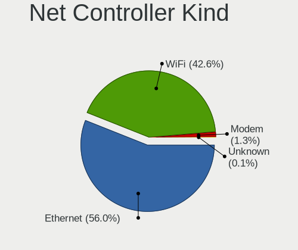

| Kind     | Computers | Percent |
|----------|-----------|---------|
| Ethernet | 474       | 56.36%  |
| WiFi     | 357       | 42.45%  |
| Modem    | 9         | 1.07%   |
| Unknown  | 1         | 0.12%   |

Used Controller
---------------

Currently used network controller

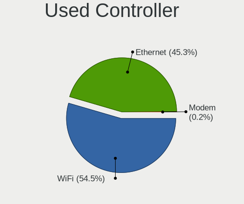

| Kind     | Computers | Percent |
|----------|-----------|---------|
| WiFi     | 285       | 54.91%  |
| Ethernet | 234       | 45.09%  |

NICs
----

Total network controllers on board

| Total | Computers | Percent |
|-------|-----------|---------|
| 2     | 288       | 56.14%  |
| 1     | 214       | 41.72%  |
| 4     | 4         | 0.78%   |
| 0     | 4         | 0.78%   |
| 3     | 2         | 0.39%   |
| 5     | 1         | 0.19%   |

IPv6
----

IPv6 vs IPv4

| Used | Computers | Percent |
|------|-----------|---------|
| No   | 506       | 98.44%  |
| Yes  | 8         | 1.56%   |

Bluetooth
---------

Bluetooth Vendor
----------------

Controller vendors

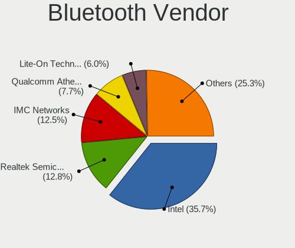

| Vendor                          | Computers | Percent |
|---------------------------------|-----------|---------|
| Intel                           | 90        | 34.35%  |
| Realtek Semiconductor           | 35        | 13.36%  |
| IMC Networks                    | 31        | 11.83%  |
| Qualcomm Atheros Communications | 22        | 8.4%    |
| Lite-On Technology              | 17        | 6.49%   |
| Broadcom                        | 16        | 6.11%   |
| Foxconn / Hon Hai               | 10        | 3.82%   |
| Cambridge Silicon Radio         | 9         | 3.44%   |
| Ralink                          | 8         | 3.05%   |
| Hewlett-Packard                 | 7         | 2.67%   |
| Toshiba                         | 6         | 2.29%   |
| Foxconn International           | 3         | 1.15%   |
| Integrated System Solution      | 2         | 0.76%   |
| ASUSTek Computer                | 2         | 0.76%   |
| Realtek                         | 1         | 0.38%   |
| Ralink Technology               | 1         | 0.38%   |
| Logitech                        | 1         | 0.38%   |
| Askey Computer                  | 1         | 0.38%   |

Bluetooth Model
---------------

Controller models

| Model                                               | Computers | Percent |
|-----------------------------------------------------|-----------|---------|
| Intel Bluetooth wireless interface                  | 29        | 11.07%  |
| Realtek Bluetooth Radio                             | 25        | 9.54%   |
| Intel AX201 Bluetooth                               | 20        | 7.63%   |
| Intel Bluetooth 9460/9560 Jefferson Peak (JfP)      | 15        | 5.73%   |
| IMC Networks Wireless_Device                        | 13        | 4.96%   |
| Lite-On Qualcomm Atheros QCA9377 Bluetooth          | 12        | 4.58%   |
| Intel Centrino Bluetooth Wireless Transceiver       | 9         | 3.44%   |
| IMC Networks Bluetooth Radio                        | 9         | 3.44%   |
| Cambridge Silicon Radio Bluetooth Dongle (HCI mode) | 9         | 3.44%   |
| Realtek  Bluetooth 4.2 Adapter                      | 8         | 3.05%   |
| Ralink RT3290 Bluetooth                             | 8         | 3.05%   |
| Qualcomm Atheros AR3011 Bluetooth                   | 6         | 2.29%   |
| Intel Bluetooth Device                              | 6         | 2.29%   |
| Qualcomm Atheros  Bluetooth Device                  | 5         | 1.91%   |
| Qualcomm Atheros AR3012 Bluetooth 4.0               | 5         | 1.91%   |
| Intel Wireless-AC 3168 Bluetooth                    | 5         | 1.91%   |
| Intel AX200 Bluetooth                               | 5         | 1.91%   |
| HP Bluetooth 2.0 Interface [Broadcom BCM2045]       | 5         | 1.91%   |
| Broadcom HP Portable Valentine                      | 5         | 1.91%   |
| IMC Networks Atheros AR3012 Bluetooth 4.0 Adapter   | 4         | 1.53%   |
| Foxconn / Hon Hai Wireless_Device                   | 4         | 1.53%   |
| Broadcom BCM2070 Bluetooth 2.1 + EDR                | 4         | 1.53%   |
| Toshiba Integrated Bluetooth HCI                    | 3         | 1.15%   |
| Qualcomm Atheros Bluetooth                          | 3         | 1.15%   |
| IMC Networks Bluetooth Device                       | 3         | 1.15%   |
| Foxconn International BCM43142A0 Bluetooth module   | 3         | 1.15%   |
| Realtek RTL8821A Bluetooth                          | 2         | 0.76%   |
| Lite-On Bluetooth Device                            | 2         | 0.76%   |
| Lite-On Atheros AR3012 Bluetooth                    | 2         | 0.76%   |
| Integrated System Solution Bluetooth Device         | 2         | 0.76%   |
| HP Broadcom 2070 Bluetooth Combo                    | 2         | 0.76%   |
| Foxconn / Hon Hai Bluetooth Device                  | 2         | 0.76%   |
| Broadcom HP Portable SoftSailing                    | 2         | 0.76%   |
| Broadcom BCM20702A0                                 | 2         | 0.76%   |
| ASUS BT-270 Bluetooth Adapter                       | 2         | 0.76%   |
| Toshiba RT Bluetooth Radio                          | 1         | 0.38%   |
| Toshiba Integrated Bluetooth                        | 1         | 0.38%   |
| Toshiba Askey Bluetooth Module                      | 1         | 0.38%   |
| Realtek Bluetooth Radio                             | 1         | 0.38%   |
| Ralink Motorola BC4 Bluetooth 3.0+HS Adapter        | 1         | 0.38%   |

Sound
-----

Sound Vendor
------------

Sound card vendors

| Vendor                   | Computers | Percent |
|--------------------------|-----------|---------|
| Intel                    | 413       | 57.36%  |
| Nvidia                   | 158       | 21.94%  |
| AMD                      | 104       | 14.44%  |
| C-Media Electronics      | 12        | 1.67%   |
| Focusrite-Novation       | 3         | 0.42%   |
| ASUSTek Computer         | 3         | 0.42%   |
| VIA Technologies         | 2         | 0.28%   |
| Sony                     | 2         | 0.28%   |
| Razer USA                | 2         | 0.28%   |
| Generalplus Technology   | 2         | 0.28%   |
| Creative Labs            | 2         | 0.28%   |
| Xilinx                   | 1         | 0.14%   |
| ULi Electronics          | 1         | 0.14%   |
| SAVITECH                 | 1         | 0.14%   |
| Realtek Semiconductor    | 1         | 0.14%   |
| Plantronics              | 1         | 0.14%   |
| Pixart Imaging           | 1         | 0.14%   |
| Logitech                 | 1         | 0.14%   |
| JMTek                    | 1         | 0.14%   |
| Huawei Technologies      | 1         | 0.14%   |
| Hewlett-Packard          | 1         | 0.14%   |
| GYROCOM C&C              | 1         | 0.14%   |
| ELMCU                    | 1         | 0.14%   |
| Elgato Systems           | 1         | 0.14%   |
| Blue Microphones         | 1         | 0.14%   |
| BEHRINGER International  | 1         | 0.14%   |
| Asahi Kasei Microsystems | 1         | 0.14%   |
| Unknown                  | 1         | 0.14%   |

Sound Model
-----------

Sound card models

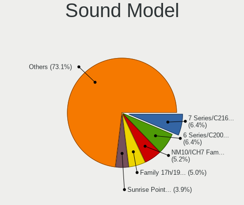

| Model                                                                                             | Computers | Percent |
|---------------------------------------------------------------------------------------------------|-----------|---------|
| Intel 6 Series/C200 Series Chipset Family High Definition Audio Controller                        | 56        | 6.92%   |
| Intel 7 Series/C216 Chipset Family High Definition Audio Controller                               | 55        | 6.8%    |
| Intel NM10/ICH7 Family High Definition Audio Controller                                           | 47        | 5.81%   |
| Intel Sunrise Point-LP HD Audio                                                                   | 35        | 4.33%   |
| AMD Family 17h/19h HD Audio Controller                                                            | 32        | 3.96%   |
| Nvidia GF108 High Definition Audio Controller                                                     | 31        | 3.83%   |
| Intel 8 Series/C220 Series Chipset High Definition Audio Controller                               | 22        | 2.72%   |
| AMD Renoir Radeon High Definition Audio Controller                                                | 19        | 2.35%   |
| Intel 82801I (ICH9 Family) HD Audio Controller                                                    | 18        | 2.22%   |
| Intel 5 Series/3400 Series Chipset High Definition Audio                                          | 18        | 2.22%   |
| AMD FCH Azalia Controller                                                                         | 17        | 2.1%    |
| Intel Cannon Lake PCH cAVS                                                                        | 16        | 1.98%   |
| Nvidia High Definition Audio Controller                                                           | 15        | 1.85%   |
| Intel Tiger Lake-LP Smart Sound Technology Audio Controller                                       | 15        | 1.85%   |
| Intel 82801JI (ICH10 Family) HD Audio Controller                                                  | 15        | 1.85%   |
| Nvidia GK107 HDMI Audio Controller                                                                | 13        | 1.61%   |
| Intel Xeon E3-1200 v3/4th Gen Core Processor HD Audio Controller                                  | 12        | 1.48%   |
| AMD SBx00 Azalia (Intel HDA)                                                                      | 11        | 1.36%   |
| Intel Comet Lake PCH cAVS                                                                         | 10        | 1.24%   |
| Intel 82801H (ICH8 Family) HD Audio Controller                                                    | 10        | 1.24%   |
| Intel 200 Series PCH HD Audio                                                                     | 9         | 1.11%   |
| Intel 100 Series/C230 Series Chipset Family HD Audio Controller                                   | 9         | 1.11%   |
| AMD Trinity HDMI Audio Controller                                                                 | 9         | 1.11%   |
| Nvidia TU107 GeForce GTX 1650 High Definition Audio Controller                                    | 8         | 0.99%   |
| Nvidia TU106 High Definition Audio Controller                                                     | 8         | 0.99%   |
| Nvidia GA106 High Definition Audio Controller                                                     | 8         | 0.99%   |
| Intel Haswell-ULT HD Audio Controller                                                             | 8         | 0.99%   |
| Intel 8 Series HD Audio Controller                                                                | 8         | 0.99%   |
| Nvidia GP104 High Definition Audio Controller                                                     | 7         | 0.87%   |
| Nvidia GK208 HDMI/DP Audio Controller                                                             | 7         | 0.87%   |
| Nvidia GF114 HDMI Audio Controller                                                                | 7         | 0.87%   |
| Intel Atom/Celeron/Pentium Processor x5-E8000/J3xxx/N3xxx Series High Definition Audio Controller | 7         | 0.87%   |
| Intel Alder Lake PCH-P High Definition Audio Controller                                           | 7         | 0.87%   |
| AMD Raven/Raven2/Fenghuang HDMI/DP Audio Controller                                               | 7         | 0.87%   |
| AMD Kabini HDMI/DP Audio                                                                          | 7         | 0.87%   |
| Nvidia GF119 HDMI Audio Controller                                                                | 6         | 0.74%   |
| Nvidia Audio device                                                                               | 6         | 0.74%   |
| Intel Celeron/Pentium Silver Processor High Definition Audio                                      | 6         | 0.74%   |
| Intel Atom Processor Z36xxx/Z37xxx Series High Definition Audio Controller                        | 6         | 0.74%   |
| AMD Family 17h (Models 00h-0fh) HD Audio Controller                                               | 6         | 0.74%   |

Memory
------

Memory Vendor
-------------

Memory module vendors

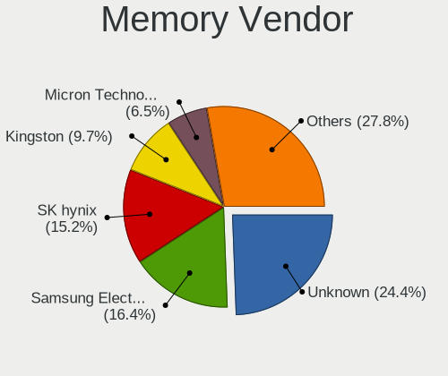

| Vendor                       | Computers | Percent |
|------------------------------|-----------|---------|
| Unknown                      | 122       | 24.8%   |
| SK hynix                     | 79        | 16.06%  |
| Samsung Electronics          | 77        | 15.65%  |
| Kingston                     | 49        | 9.96%   |
| Micron Technology            | 32        | 6.5%    |
| Transcend                    | 17        | 3.46%   |
| A-DATA Technology            | 14        | 2.85%   |
| Ramaxel Technology           | 13        | 2.64%   |
| Crucial                      | 10        | 2.03%   |
| GeIL                         | 8         | 1.63%   |
| Apacer                       | 8         | 1.63%   |
| G.Skill                      | 7         | 1.42%   |
| Team                         | 6         | 1.22%   |
| Silicon Power                | 6         | 1.22%   |
| Nanya Technology             | 6         | 1.22%   |
| Patriot                      | 4         | 0.81%   |
| Elpida                       | 4         | 0.81%   |
| Unknown (ABCD)               | 2         | 0.41%   |
| Super Talent                 | 2         | 0.41%   |
| SUPER KINGSTEK               | 2         | 0.41%   |
| Qimonda                      | 2         | 0.41%   |
| Patriot Memory (PDP Systems) | 2         | 0.41%   |
| HPE                          | 2         | 0.41%   |
| GOODRAM                      | 2         | 0.41%   |
| ASint Technology             | 2         | 0.41%   |
| V-Color                      | 1         | 0.2%    |
| Unknown (D386)               | 1         | 0.2%    |
| Unknown (8CAB)               | 1         | 0.2%    |
| Toshiba                      | 1         | 0.2%    |
| SHARETRONIC                  | 1         | 0.2%    |
| Qumo                         | 1         | 0.2%    |
| ProMos/Mosel Vitelic         | 1         | 0.2%    |
| Kllisre                      | 1         | 0.2%    |
| Kingmax                      | 1         | 0.2%    |
| KANMEIQi                     | 1         | 0.2%    |
| Goldkey                      | 1         | 0.2%    |
| Corsair                      | 1         | 0.2%    |
| Atermiter                    | 1         | 0.2%    |
| Unknown                      | 1         | 0.2%    |

Memory Model
------------

Memory module models

| Model                                                   | Computers | Percent |
|---------------------------------------------------------|-----------|---------|
| Unknown RAM Module 2048MB DIMM SDRAM                    | 13        | 2.45%   |
| Unknown RAM Module 1024MB DIMM SDRAM                    | 11        | 2.07%   |
| Unknown RAM Module 1024MB DIMM 800MT/s                  | 7         | 1.32%   |
| Unknown RAM Module 4096MB DIMM DDR3 1333MT/s            | 6         | 1.13%   |
| Samsung RAM M471B5173QH0-YK0 4GB SODIMM DDR3 1600MT/s   | 6         | 1.13%   |
| Unknown RAM Module 2048MB DIMM 800MT/s                  | 5         | 0.94%   |
| SK hynix RAM HMT351S6CFR8C-PB 4GB SODIMM DDR3 1600MT/s  | 5         | 0.94%   |
| Samsung RAM M471B5273DH0-CK0 4GB SODIMM DDR3 1600MT/s   | 5         | 0.94%   |
| Samsung RAM M471B5273DH0-CH9 4GB SODIMM DDR3 1334MT/s   | 5         | 0.94%   |
| Micron RAM 16KTF51264HZ-1G6M1 4GB SODIMM DDR3 1600MT/s  | 5         | 0.94%   |
| Unknown RAM Module 2GB DIMM 800MT/s                     | 4         | 0.75%   |
| Unknown RAM Module 2048MB DIMM DDR2 800MT/s             | 4         | 0.75%   |
| Transcend RAM JM1333KLU-2G 2GB DIMM DDR3 1333MT/s       | 4         | 0.75%   |
| SK hynix RAM HMT451S6BFR8A-PB 4GB SODIMM DDR3 1600MT/s  | 4         | 0.75%   |
| SK hynix RAM HMA81GS6DJR8N-XN 8GB SODIMM DDR4 3200MT/s  | 4         | 0.75%   |
| Samsung RAM M471B5173EB0-YK0 4GB SODIMM DDR3 1600MT/s   | 4         | 0.75%   |
| Samsung RAM M471A1K43EB1-CWE 8GB SODIMM DDR4 3200MT/s   | 4         | 0.75%   |
| Ramaxel RAM RMT3160ED58E9W1600 4GB SODIMM DDR3 1600MT/s | 4         | 0.75%   |
| Nanya RAM NT2GC64B88B0NS-CG 2GB SODIMM DDR3 1334MT/s    | 4         | 0.75%   |
| GeIL RAM CL9-9-9 D3-1333 8GB DIMM DDR3 1333MT/s         | 4         | 0.75%   |
| Unknown RAM Module 4GB DIMM DDR3 1333MT/s               | 3         | 0.56%   |
| Unknown RAM Module 2GB DIMM DDR2 800MT/s                | 3         | 0.56%   |
| Unknown RAM Module 2048MB DIMM 1333MT/s                 | 3         | 0.56%   |
| Unknown RAM Module 1024MB DIMM 667MT/s                  | 3         | 0.56%   |
| SK hynix RAM HMT325S6BFR8C-H9 2GB SODIMM DDR3 1600MT/s  | 3         | 0.56%   |
| SK hynix RAM HMAG68EXNSA051N 8GB SODIMM DDR4 3200MT/s   | 3         | 0.56%   |
| SK hynix RAM HMAA1GS6CJR6N-XN 8GB SODIMM DDR4 3200MT/s  | 3         | 0.56%   |
| SK hynix RAM HMA81GS6AFR8N-UH 8GB SODIMM DDR4 2667MT/s  | 3         | 0.56%   |
| Samsung RAM M471A5244CB0-CTD 4GB SODIMM DDR4 3266MT/s   | 3         | 0.56%   |
| Samsung RAM M471A1K43DB1-CWE 8GB SODIMM DDR4 3200MT/s   | 3         | 0.56%   |
| Samsung RAM M471A1K43DB1-CTD 8GB SODIMM DDR4 2667MT/s   | 3         | 0.56%   |
| Samsung RAM M471A1G44BB0-CWE 8GB SODIMM DDR4 3200MT/s   | 3         | 0.56%   |
| Samsung RAM M471A1G44AB0-CWE 8GB SODIMM DDR4 3200MT/s   | 3         | 0.56%   |
| Samsung RAM M4 70T5663QZ3-CF7 2GB SODIMM DDR2 2048MT/s  | 3         | 0.56%   |
| Ramaxel RAM RMT3170EB68F9W1600 4GB SODIMM DDR3 1600MT/s | 3         | 0.56%   |
| A-DATA RAM AD73I1C1674EV 4GB SODIMM DDR3 1334MT/s       | 3         | 0.56%   |
| Unknown RAM Module 4096MB SODIMM DDR3                   | 2         | 0.38%   |
| Unknown RAM Module 4096MB FB-DIMM DDR2 667MT/s          | 2         | 0.38%   |
| Unknown RAM Module 4096MB DIMM DDR3 1067MT/s            | 2         | 0.38%   |
| Unknown RAM Module 4096MB DIMM 1333MT/s                 | 2         | 0.38%   |

Memory Kind
-----------

Memory module kinds

| Kind    | Computers | Percent |
|---------|-----------|---------|
| DDR3    | 183       | 44.42%  |
| DDR4    | 102       | 24.76%  |
| Unknown | 35        | 8.5%    |
| SDRAM   | 33        | 8.01%   |
| DDR2    | 33        | 8.01%   |
| DDR5    | 8         | 1.94%   |
| DDR     | 7         | 1.7%    |
| LPDDR4  | 6         | 1.46%   |
| LPDDR5  | 3         | 0.73%   |
| LPDDR3  | 2         | 0.49%   |

Memory Form Factor
------------------

Physical design of the memory module

| Name         | Computers | Percent |
|--------------|-----------|---------|
| SODIMM       | 219       | 53.03%  |
| DIMM         | 176       | 42.62%  |
| Row Of Chips | 15        | 3.63%   |
| FB-DIMM      | 3         | 0.73%   |

Memory Size
-----------

Memory module size

| Size  | Computers | Percent |
|-------|-----------|---------|
| 4096  | 136       | 28.51%  |
| 2048  | 128       | 26.83%  |
| 8192  | 120       | 25.16%  |
| 1024  | 53        | 11.11%  |
| 16384 | 25        | 5.24%   |
| 32768 | 8         | 1.68%   |
| 512   | 6         | 1.26%   |
| 256   | 1         | 0.21%   |

Memory Speed
------------

Memory module speed

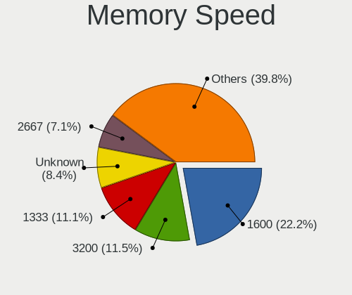

| Speed   | Computers | Percent |
|---------|-----------|---------|
| 1600    | 111       | 24.24%  |
| 1333    | 55        | 12.01%  |
| Unknown | 43        | 9.39%   |
| 3200    | 41        | 8.95%   |
| 2667    | 32        | 6.99%   |
| 1334    | 26        | 5.68%   |
| 800     | 25        | 5.46%   |
| 2400    | 19        | 4.15%   |
| 667     | 19        | 4.15%   |
| 2133    | 8         | 1.75%   |
| 1067    | 8         | 1.75%   |
| 4800    | 7         | 1.53%   |
| 533     | 6         | 1.31%   |
| 2666    | 5         | 1.09%   |
| 1066    | 5         | 1.09%   |
| 3600    | 4         | 0.87%   |
| 3266    | 4         | 0.87%   |
| 400     | 4         | 0.87%   |
| 6400    | 3         | 0.66%   |
| 2048    | 3         | 0.66%   |
| 1867    | 3         | 0.66%   |
| 5354    | 2         | 0.44%   |
| 4267    | 2         | 0.44%   |
| 4199    | 2         | 0.44%   |
| 3800    | 2         | 0.44%   |
| 3733    | 2         | 0.44%   |
| 2933    | 2         | 0.44%   |
| 975     | 2         | 0.44%   |
| 8400    | 1         | 0.22%   |
| 5200    | 1         | 0.22%   |
| 4266    | 1         | 0.22%   |
| 3334    | 1         | 0.22%   |
| 3000    | 1         | 0.22%   |
| 2448    | 1         | 0.22%   |
| 2020    | 1         | 0.22%   |
| 1800    | 1         | 0.22%   |
| 1666    | 1         | 0.22%   |
| 1400    | 1         | 0.22%   |
| 1258    | 1         | 0.22%   |
| 666     | 1         | 0.22%   |

Printers & scanners
-------------------

Printer Vendor
--------------

Printer device vendors

| Vendor                 | Computers | Percent |
|------------------------|-----------|---------|
| Hewlett-Packard        | 7         | 36.84%  |
| Samsung Electronics    | 4         | 21.05%  |
| Xerox                  | 3         | 15.79%  |
| Canon                  | 3         | 15.79%  |
| Seiko Epson            | 1         | 5.26%   |
| Panasonic (Matsushita) | 1         | 5.26%   |

Printer Model
-------------

Printer device models

| Model                                   | Computers | Percent |
|-----------------------------------------|-----------|---------|
| HP LaserJet 1018                        | 2         | 10.53%  |
| Xerox WorkCentre 6015B                  | 1         | 5.26%   |
| Xerox Phaser 3160                       | 1         | 5.26%   |
| Xerox Phaser 3020                       | 1         | 5.26%   |
| Seiko Epson L805 Series                 | 1         | 5.26%   |
| Samsung Xerox Phaser 3117 Laser Printer | 1         | 5.26%   |
| Samsung ML-1640 Series Laser Printer    | 1         | 5.26%   |
| Samsung M2020 Series                    | 1         | 5.26%   |
| Samsung CLX-3180 Series                 | 1         | 5.26%   |
| Panasonic (Matsushita) KX-MB1500RU      | 1         | 5.26%   |
| HP LaserJet P1102                       | 1         | 5.26%   |
| HP LaserJet 1020                        | 1         | 5.26%   |
| HP LaserJet 1010                        | 1         | 5.26%   |
| HP DeskJet 5650c                        | 1         | 5.26%   |
| HP Deskjet 2520 series                  | 1         | 5.26%   |
| Canon LBP810                            | 1         | 5.26%   |
| Canon LBP6000                           | 1         | 5.26%   |
| Canon LBP2900                           | 1         | 5.26%   |

Scanner Vendor
--------------

Scanner device vendors

| Vendor          | Computers | Percent |
|-----------------|-----------|---------|
| Hewlett-Packard | 1         | 100%    |

Scanner Model
-------------

Scanner device models

| Model          | Computers | Percent |
|----------------|-----------|---------|
| HP Scanjet 200 | 1         | 100%    |

Camera
------

Camera Vendor
-------------

Camera device vendors

| Vendor                                 | Computers | Percent |
|----------------------------------------|-----------|---------|
| Chicony Electronics                    | 62        | 19.68%  |
| IMC Networks                           | 35        | 11.11%  |
| Quanta                                 | 31        | 9.84%   |
| Realtek Semiconductor                  | 24        | 7.62%   |
| Cheng Uei Precision Industry (Foxlink) | 15        | 4.76%   |
| Suyin                                  | 14        | 4.44%   |
| Sunplus Innovation Technology          | 14        | 4.44%   |
| Microdia                               | 12        | 3.81%   |
| Logitech                               | 12        | 3.81%   |
| Bison Electronics                      | 12        | 3.81%   |
| Z-Star Microelectronics                | 11        | 3.49%   |
| Syntek                                 | 9         | 2.86%   |
| KYE Systems (Mouse Systems)            | 9         | 2.86%   |
| Sonix Technology                       | 5         | 1.59%   |
| Samsung Electronics                    | 5         | 1.59%   |
| Lite-On Technology                     | 5         | 1.59%   |
| Alcor Micro                            | 4         | 1.27%   |
| SiGma Micro                            | 3         | 0.95%   |
| Ricoh                                  | 3         | 0.95%   |
| Pixart Imaging                         | 3         | 0.95%   |
| GEMBIRD                                | 3         | 0.95%   |
| Silicon Motion                         | 2         | 0.63%   |
| Primax Electronics                     | 2         | 0.63%   |
| Luxvisions Innotech Limited            | 2         | 0.63%   |
| Hewlett-Packard                        | 2         | 0.63%   |
| Generalplus Technology                 | 2         | 0.63%   |
| Apple                                  | 2         | 0.63%   |
| ALi                                    | 2         | 0.63%   |
| Acer                                   | 2         | 0.63%   |
| OPPO Electronics                       | 1         | 0.32%   |
| Nebraska Furniture Mart                | 1         | 0.32%   |
| Lenovo                                 | 1         | 0.32%   |
| Jieli Technology                       | 1         | 0.32%   |
| Importek                               | 1         | 0.32%   |
| Creative Technology                    | 1         | 0.32%   |
| Aveo Technology                        | 1         | 0.32%   |
| A4Tech                                 | 1         | 0.32%   |

Camera Model
------------

Camera device models

| Model                                        | Computers | Percent |
|----------------------------------------------|-----------|---------|
| IMC Networks USB2.0 VGA UVC WebCam           | 10        | 3.16%   |
| IMC Networks USB2.0 HD UVC WebCam            | 9         | 2.85%   |
| Z-Star Venus USB2.0 Camera                   | 6         | 1.9%    |
| Quanta VGA WebCam                            | 6         | 1.9%    |
| Chicony Integrated Camera                    | 6         | 1.9%    |
| Samsung Galaxy series, misc. (MTP mode)      | 5         | 1.58%   |
| Realtek Lenovo EasyCamera                    | 5         | 1.58%   |
| Quanta HP Wide Vision HD Camera              | 5         | 1.58%   |
| Quanta HD User Facing                        | 5         | 1.58%   |
| IMC Networks Integrated Camera               | 5         | 1.58%   |
| Chicony HD WebCam                            | 5         | 1.58%   |
| Syntek Lenovo EasyCamera                     | 4         | 1.27%   |
| Syntek Integrated Camera                     | 4         | 1.27%   |
| Suyin 1.3M HD WebCam                         | 4         | 1.27%   |
| Sunplus HD WebCam                            | 4         | 1.27%   |
| Sonix USB2.0 FHD UVC WebCam                  | 4         | 1.27%   |
| Quanta HD Webcam                             | 4         | 1.27%   |
| Logitech Webcam C270                         | 4         | 1.27%   |
| Chicony Lenovo EasyCamera                    | 4         | 1.27%   |
| Chicony Integrated Camera (1280x720@30)      | 4         | 1.27%   |
| Chicony HP Truevision HD                     | 4         | 1.27%   |
| Chicony Fujitsu Integrated Camera            | 4         | 1.27%   |
| Bison Lenovo Integrated Webcam               | 4         | 1.27%   |
| Suyin HP Truevision HD                       | 3         | 0.95%   |
| Sunplus Asus Webcam                          | 3         | 0.95%   |
| SiGma Micro WebCam SiGma Micro               | 3         | 0.95%   |
| Realtek Integrated_Webcam_HD                 | 3         | 0.95%   |
| Realtek Acer 640 x 480 laptop camera         | 3         | 0.95%   |
| Pixart Imaging GE 1.3 MP MiniCam Pro         | 3         | 0.95%   |
| Microdia Laptop_Integrated_Webcam_HD         | 3         | 0.95%   |
| Microdia Integrated_Webcam_HD                | 3         | 0.95%   |
| Logitech Webcam C170                         | 3         | 0.95%   |
| Lite-On Integrated Camera                    | 3         | 0.95%   |
| KYE Systems (Mouse Systems) Genius iSlim 330 | 3         | 0.95%   |
| IMC Networks Lenovo EasyCamera               | 3         | 0.95%   |
| Chicony VGA WebCam                           | 3         | 0.95%   |
| Chicony USB2.0 VGA UVC WebCam                | 3         | 0.95%   |
| Chicony USB2.0 HD UVC WebCam                 | 3         | 0.95%   |
| Chicony USB2.0 0.3M UVC WebCam               | 3         | 0.95%   |
| Chicony EasyCamera                           | 3         | 0.95%   |

Security
--------

Fingerprint Vendor
------------------

Fingerprint sensor vendors

| Vendor                             | Computers | Percent |
|------------------------------------|-----------|---------|
| Validity Sensors                   | 14        | 26.42%  |
| Synaptics                          | 7         | 13.21%  |
| Shenzhen Goodix Technology         | 7         | 13.21%  |
| AuthenTec                          | 6         | 11.32%  |
| Upek                               | 5         | 9.43%   |
| Elan Microelectronics              | 5         | 9.43%   |
| STMicroelectronics                 | 4         | 7.55%   |
| Realtek USB2.0 Finger Print Bridge | 3         | 5.66%   |
| LighTuning Technology              | 2         | 3.77%   |

Fingerprint Model
-----------------

Fingerprint sensor models

| Model                                                           | Computers | Percent |
|-----------------------------------------------------------------|-----------|---------|
| Validity Sensors VFS495 Fingerprint Reader                      | 6         | 11.32%  |
| Upek Biometric Touchchip/Touchstrip Fingerprint Sensor          | 5         | 9.43%   |
| STMicroelectronics Fingerprint Reader                           | 4         | 7.55%   |
| Shenzhen Goodix  Fingerprint Device                             | 4         | 7.55%   |
| Realtek USB2.0 Finger Print Bridge FocalTech Fingerprint Device | 3         | 5.66%   |
| Elan ELAN:Fingerprint                                           | 3         | 5.66%   |
| AuthenTec AES2501 Fingerprint Sensor                            | 3         | 5.66%   |
| Validity Sensors VFS5011 Fingerprint Reader                     | 2         | 3.77%   |
| Validity Sensors Swipe Fingerprint Sensor                       | 2         | 3.77%   |
| Validity Sensors Fingerprint scanner                            | 2         | 3.77%   |
| Synaptics Metallica MIS Touch Fingerprint Reader                | 2         | 3.77%   |
| Shenzhen Goodix Fingerprint Reader                              | 2         | 3.77%   |
| LighTuning EgisTec Touch Fingerprint Sensor                     | 2         | 3.77%   |
| Elan ELAN:ARM-M4                                                | 2         | 3.77%   |
| AuthenTec AES2810                                               | 2         | 3.77%   |
| Validity Sensors VFS471 Fingerprint Reader                      | 1         | 1.89%   |
| Validity Sensors VFS 5011 fingerprint sensor                    | 1         | 1.89%   |
| Synaptics WBDI Fingerprint Reader USB 086                       | 1         | 1.89%   |
| Synaptics  WBDI                                                 | 1         | 1.89%   |
| Synaptics  FS7604 Touch Fingerprint Sensor with PurePrint       | 1         | 1.89%   |
| Synaptics Prometheus MIS Touch Fingerprint Reader               | 1         | 1.89%   |
| Synaptics Metallica MOH Touch Fingerprint Reader                | 1         | 1.89%   |
| Shenzhen Goodix FingerPrint                                     | 1         | 1.89%   |
| AuthenTec Fingerprint Sensor                                    | 1         | 1.89%   |

Chipcard Vendor
---------------

Chipcard module vendors

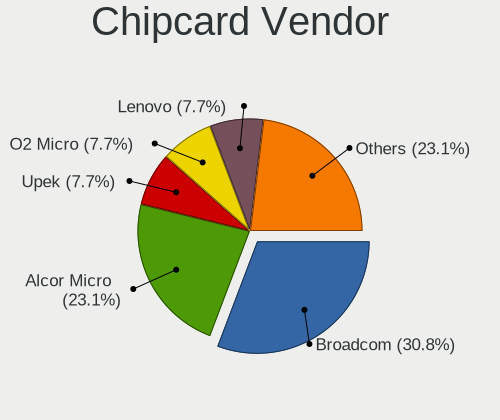

| Vendor                | Computers | Percent |
|-----------------------|-----------|---------|
| Broadcom              | 3         | 30%     |
| Alcor Micro           | 2         | 20%     |
| Upek                  | 1         | 10%     |
| O2 Micro              | 1         | 10%     |
| Lenovo                | 1         | 10%     |
| Aktiv                 | 1         | 10%     |
| Advanced Card Systems | 1         | 10%     |

Chipcard Model
--------------

Chipcard module models

| Model                                                      | Computers | Percent |
|------------------------------------------------------------|-----------|---------|
| Alcor Micro AU9540 Smartcard Reader                        | 2         | 20%     |
| Upek TouchChip Fingerprint Coprocessor (WBF advanced mode) | 1         | 10%     |
| O2 Micro OZ776 CCID Smartcard Reader                       | 1         | 10%     |
| Lenovo Integrated Smart Card Reader                        | 1         | 10%     |
| Broadcom BCM5880 Secure Applications Processor             | 1         | 10%     |
| Broadcom 5880                                              | 1         | 10%     |
| Broadcom 58200                                             | 1         | 10%     |
| Aktiv KAZTOKEN                                             | 1         | 10%     |
| Advanced Card Systems ACR38 SmartCard Reader               | 1         | 10%     |

Unsupported
-----------

Unsupported Devices
-------------------

Total unsupported devices on board

| Total | Computers | Percent |
|-------|-----------|---------|
| 0     | 388       | 73.07%  |
| 1     | 112       | 21.09%  |
| 2     | 23        | 4.33%   |
| 3     | 7         | 1.32%   |
| 4     | 1         | 0.19%   |

Unsupported Device Types
------------------------

Types of unsupported devices

| Type                     | Computers | Percent |
|--------------------------|-----------|---------|
| Graphics card            | 53        | 30.81%  |
| Fingerprint reader       | 53        | 30.81%  |
| Net/wireless             | 17        | 9.88%   |
| Communication controller | 11        | 6.4%    |
| Bluetooth                | 9         | 5.23%   |
| Chipcard                 | 8         | 4.65%   |
| Camera                   | 7         | 4.07%   |
| Unassigned class         | 5         | 2.91%   |
| Multimedia controller    | 5         | 2.91%   |
| Wireless                 | 1         | 0.58%   |
| Net/ethernet             | 1         | 0.58%   |
| Modem                    | 1         | 0.58%   |
| Card reader              | 1         | 0.58%   |

