Linux in Kazakhstan - Tested Hardware & Statistics
--------------------------------------------------

A project to collect tested hardware configurations for Linux in Kazakhstan.

Anyone can contribute to this report by the [hw-probe](https://github.com/linuxhw/hw-probe) tool:

    sudo -E hw-probe -all -upload

Please contribute! Especially if your hardware is rare.

This is a report for all computer types. See also reports for [desktops](/Location/Kazakhstan/Desktop/README.md) and [notebooks](/Location/Kazakhstan/Notebook/README.md).

Contents
--------

* [ Test Cases ](#test-cases)

* [ System ](#system)
  - [ OS                       ](#os)
  - [ OS Family                ](#os-family)
  - [ Kernel                   ](#kernel)
  - [ Kernel Family            ](#kernel-family)
  - [ Kernel Major Ver.        ](#kernel-major-ver)
  - [ Arch                     ](#arch)
  - [ DE                       ](#de)
  - [ Display Server           ](#display-server)
  - [ Display Manager          ](#display-manager)
  - [ OS Lang                  ](#os-lang)
  - [ Boot Mode                ](#boot-mode)
  - [ Filesystem               ](#filesystem)
  - [ Part. scheme             ](#part-scheme)
  - [ Dual Boot with Linux/BSD ](#dual-boot-with-linuxbsd)
  - [ Dual Boot (Win)          ](#dual-boot-win)

* [ Board ](#board)
  - [ Vendor                   ](#vendor)
  - [ Model                    ](#model)
  - [ Model Family             ](#model-family)
  - [ MFG Year                 ](#mfg-year)
  - [ Form Factor              ](#form-factor)
  - [ Secure Boot              ](#secure-boot)
  - [ Coreboot                 ](#coreboot)
  - [ RAM Size                 ](#ram-size)
  - [ RAM Used                 ](#ram-used)
  - [ Total Drives             ](#total-drives)
  - [ Has CD-ROM               ](#has-cd-rom)
  - [ Has Ethernet             ](#has-ethernet)
  - [ Has WiFi                 ](#has-wifi)
  - [ Has Bluetooth            ](#has-bluetooth)

* [ Location ](#location)
  - [ Country                  ](#country)
  - [ City                     ](#city)

* [ Drives ](#drives)
  - [ Drive Vendor             ](#drive-vendor)
  - [ Drive Model              ](#drive-model)
  - [ HDD Vendor               ](#hdd-vendor)
  - [ SSD Vendor               ](#ssd-vendor)
  - [ Drive Kind               ](#drive-kind)
  - [ Drive Connector          ](#drive-connector)
  - [ Drive Size               ](#drive-size)
  - [ Space Total              ](#space-total)
  - [ Space Used               ](#space-used)
  - [ Malfunc. Drives          ](#malfunc-drives)
  - [ Malfunc. Drive Vendor    ](#malfunc-drive-vendor)
  - [ Malfunc. HDD Vendor      ](#malfunc-hdd-vendor)
  - [ Malfunc. Drive Kind      ](#malfunc-drive-kind)
  - [ Failed Drives            ](#failed-drives)
  - [ Failed Drive Vendor      ](#failed-drive-vendor)
  - [ Drive Status             ](#drive-status)

* [ Storage controller ](#storage-controller)
  - [ Storage Vendor           ](#storage-vendor)
  - [ Storage Model            ](#storage-model)
  - [ Storage Kind             ](#storage-kind)

* [ Processor ](#processor)
  - [ CPU Vendor               ](#cpu-vendor)
  - [ CPU Model                ](#cpu-model)
  - [ CPU Model Family         ](#cpu-model-family)
  - [ CPU Cores                ](#cpu-cores)
  - [ CPU Sockets              ](#cpu-sockets)
  - [ CPU Threads              ](#cpu-threads)
  - [ CPU Op-Modes             ](#cpu-op-modes)
  - [ CPU Microcode            ](#cpu-microcode)
  - [ CPU Microarch            ](#cpu-microarch)

* [ Graphics ](#graphics)
  - [ GPU Vendor               ](#gpu-vendor)
  - [ GPU Model                ](#gpu-model)
  - [ GPU Combo                ](#gpu-combo)
  - [ GPU Driver               ](#gpu-driver)
  - [ GPU Memory               ](#gpu-memory)

* [ Monitor ](#monitor)
  - [ Monitor Vendor           ](#monitor-vendor)
  - [ Monitor Model            ](#monitor-model)
  - [ Monitor Resolution       ](#monitor-resolution)
  - [ Monitor Diagonal         ](#monitor-diagonal)
  - [ Monitor Width            ](#monitor-width)
  - [ Aspect Ratio             ](#aspect-ratio)
  - [ Monitor Area             ](#monitor-area)
  - [ Pixel Density            ](#pixel-density)
  - [ Multiple Monitors        ](#multiple-monitors)

* [ Network ](#network)
  - [ Net Controller Vendor    ](#net-controller-vendor)
  - [ Net Controller Model     ](#net-controller-model)
  - [ Wireless Vendor          ](#wireless-vendor)
  - [ Wireless Model           ](#wireless-model)
  - [ Ethernet Vendor          ](#ethernet-vendor)
  - [ Ethernet Model           ](#ethernet-model)
  - [ Net Controller Kind      ](#net-controller-kind)
  - [ Used Controller          ](#used-controller)
  - [ NICs                     ](#nics)
  - [ IPv6                     ](#ipv6)

* [ Bluetooth ](#bluetooth)
  - [ Bluetooth Vendor         ](#bluetooth-vendor)
  - [ Bluetooth Model          ](#bluetooth-model)

* [ Sound ](#sound)
  - [ Sound Vendor             ](#sound-vendor)
  - [ Sound Model              ](#sound-model)

* [ Memory ](#memory)
  - [ Memory Vendor            ](#memory-vendor)
  - [ Memory Model             ](#memory-model)
  - [ Memory Kind              ](#memory-kind)
  - [ Memory Form Factor       ](#memory-form-factor)
  - [ Memory Size              ](#memory-size)
  - [ Memory Speed             ](#memory-speed)

* [ Printers & scanners ](#printers--scanners)
  - [ Printer Vendor           ](#printer-vendor)
  - [ Printer Model            ](#printer-model)
  - [ Scanner Vendor           ](#scanner-vendor)
  - [ Scanner Model            ](#scanner-model)

* [ Camera ](#camera)
  - [ Camera Vendor            ](#camera-vendor)
  - [ Camera Model             ](#camera-model)

* [ Security ](#security)
  - [ Fingerprint Vendor       ](#fingerprint-vendor)
  - [ Fingerprint Model        ](#fingerprint-model)
  - [ Chipcard Vendor          ](#chipcard-vendor)
  - [ Chipcard Model           ](#chipcard-model)

* [ Unsupported ](#unsupported)
  - [ Unsupported Devices      ](#unsupported-devices)
  - [ Unsupported Device Types ](#unsupported-device-types)

Test Cases
----------

Total: 676

| Vendor        | Model                       | Form-Factor | Probe                                                      | Date         |
|---------------|-----------------------------|-------------|------------------------------------------------------------|--------------|
| Gigabyte      | Z690 GAMING X DDR4          | Desktop     | [21ce876854](https://linux-hardware.org/?probe=21ce876854) | Feb 01, 2023 |
| Gigabyte      | Z690 GAMING X DDR4          | Desktop     | [de7f0840d1](https://linux-hardware.org/?probe=de7f0840d1) | Feb 01, 2023 |
| Gigabyte      | Z690 GAMING X DDR4          | Desktop     | [f2636de53b](https://linux-hardware.org/?probe=f2636de53b) | Jan 31, 2023 |
| HP            | Laptop 15s-eq3xxx           | Notebook    | [e9525c9a86](https://linux-hardware.org/?probe=e9525c9a86) | Jan 31, 2023 |
| HP            | Laptop 15s-eq3xxx           | Notebook    | [e6cb9d8296](https://linux-hardware.org/?probe=e6cb9d8296) | Jan 31, 2023 |
| Gigabyte      | Z690 GAMING X DDR4          | Desktop     | [8512c1d0cc](https://linux-hardware.org/?probe=8512c1d0cc) | Jan 31, 2023 |
| Gigabyte      | Z690 GAMING X DDR4          | Desktop     | [6bf8eb9c73](https://linux-hardware.org/?probe=6bf8eb9c73) | Jan 30, 2023 |
| Lenovo        | IdeaPad 320-15AST 80XV      | Notebook    | [a732875be3](https://linux-hardware.org/?probe=a732875be3) | Jan 29, 2023 |
| Gigabyte      | GA-73PVM-S2                 | Desktop     | [fcf91f09b4](https://linux-hardware.org/?probe=fcf91f09b4) | Jan 28, 2023 |
| ASUSTek       | N56DP                       | Notebook    | [a746d3fd78](https://linux-hardware.org/?probe=a746d3fd78) | Jan 27, 2023 |
| HP            | Laptop 15s-eq3xxx           | Notebook    | [b00e46e17f](https://linux-hardware.org/?probe=b00e46e17f) | Jan 23, 2023 |
| AMI           | Aptio CRB                   | Mini pc     | [52a02b4c4f](https://linux-hardware.org/?probe=52a02b4c4f) | Jan 23, 2023 |
| HP            | Laptop 15s-eq3xxx           | Notebook    | [1a9aaa1cb2](https://linux-hardware.org/?probe=1a9aaa1cb2) | Jan 22, 2023 |
| HP            | Laptop 15s-eq3xxx           | Notebook    | [4ed27b0b56](https://linux-hardware.org/?probe=4ed27b0b56) | Jan 22, 2023 |
| HP            | Laptop 15s-eq3xxx           | Notebook    | [0ba680dd8f](https://linux-hardware.org/?probe=0ba680dd8f) | Jan 22, 2023 |
| HP            | Laptop 15s-eq3xxx           | Notebook    | [d2d30c8d6f](https://linux-hardware.org/?probe=d2d30c8d6f) | Jan 21, 2023 |
| HP            | Laptop 15s-eq3xxx           | Notebook    | [07cf342b4f](https://linux-hardware.org/?probe=07cf342b4f) | Jan 20, 2023 |
| HP            | Laptop 15s-eq3xxx           | Notebook    | [78791e5b9e](https://linux-hardware.org/?probe=78791e5b9e) | Jan 20, 2023 |
| ECS           | G41T-M7                     | Desktop     | [e6be57e3c3](https://linux-hardware.org/?probe=e6be57e3c3) | Jan 20, 2023 |
| ECS           | G41T-M7                     | Desktop     | [51a45a431a](https://linux-hardware.org/?probe=51a45a431a) | Jan 16, 2023 |
| Acer          | Swift SF113-31              | Notebook    | [de76cee99a](https://linux-hardware.org/?probe=de76cee99a) | Jan 16, 2023 |
| ASRock        | Z68 Pro3 Gen3               | Desktop     | [242329daf8](https://linux-hardware.org/?probe=242329daf8) | Jan 15, 2023 |
| HP            | 84EE 1100                   | All in one  | [79c81fcfb5](https://linux-hardware.org/?probe=79c81fcfb5) | Jan 14, 2023 |
| Lenovo        | IdeaPad Z510 20287          | Notebook    | [71f6d9b711](https://linux-hardware.org/?probe=71f6d9b711) | Jan 12, 2023 |
| Lenovo        | G500 20236                  | Notebook    | [6a873e3df8](https://linux-hardware.org/?probe=6a873e3df8) | Jan 12, 2023 |
| Unknown       | Unknown                     | Notebook    | [cbd401e3c6](https://linux-hardware.org/?probe=cbd401e3c6) | Jan 11, 2023 |
| HP            | 87F9 A00                    | All in one  | [433fd99d94](https://linux-hardware.org/?probe=433fd99d94) | Jan 09, 2023 |
| ASUSTek       | Zenbook UM3402YA_UM3402Y... | Notebook    | [70d5242ad0](https://linux-hardware.org/?probe=70d5242ad0) | Jan 01, 2023 |
| HP            | OMEN by Laptop 16-c0xxx     | Notebook    | [3111141139](https://linux-hardware.org/?probe=3111141139) | Dec 26, 2022 |
| Acer          | Aspire A315-51              | Notebook    | [b53beddded](https://linux-hardware.org/?probe=b53beddded) | Dec 23, 2022 |
| Acer          | Aspire A315-51              | Notebook    | [4fc8630d91](https://linux-hardware.org/?probe=4fc8630d91) | Dec 22, 2022 |
| Lenovo        | Legion R9000P ARH7H 82RG    | Notebook    | [bbc48ee483](https://linux-hardware.org/?probe=bbc48ee483) | Dec 20, 2022 |
| Acer          | Aspire A315-51              | Notebook    | [8777d682b0](https://linux-hardware.org/?probe=8777d682b0) | Dec 20, 2022 |
| Acer          | Aspire A315-51              | Notebook    | [faf7ad4c29](https://linux-hardware.org/?probe=faf7ad4c29) | Dec 19, 2022 |
| Acer          | Aspire A315-51              | Notebook    | [116b321e68](https://linux-hardware.org/?probe=116b321e68) | Dec 16, 2022 |
| Lenovo        | ThinkPad X240 20AL007AMZ    | Notebook    | [8290c7e597](https://linux-hardware.org/?probe=8290c7e597) | Dec 16, 2022 |
| Acer          | Aspire A315-51              | Notebook    | [5f2e420614](https://linux-hardware.org/?probe=5f2e420614) | Dec 15, 2022 |
| Gigabyte      | B460M DS3H                  | Desktop     | [8a381fe525](https://linux-hardware.org/?probe=8a381fe525) | Dec 14, 2022 |
| Gigabyte      | B460M DS3H                  | Desktop     | [90b4e5f1b2](https://linux-hardware.org/?probe=90b4e5f1b2) | Dec 14, 2022 |
| HP            | ENVY x360 Convertible 15... | Convertible | [11b83fa996](https://linux-hardware.org/?probe=11b83fa996) | Dec 14, 2022 |
| Gigabyte      | H370M DS3H-CF               | Desktop     | [8c1901e5d6](https://linux-hardware.org/?probe=8c1901e5d6) | Dec 11, 2022 |
| Lenovo        | ThinkBook 15 G3 ACL 21A4    | Notebook    | [6ae6d710b7](https://linux-hardware.org/?probe=6ae6d710b7) | Dec 10, 2022 |
| Lenovo        | ThinkBook 15 G3 ACL 21A4    | Notebook    | [b56f450d6d](https://linux-hardware.org/?probe=b56f450d6d) | Dec 10, 2022 |
| Acer          | Aspire A315-51              | Notebook    | [1b1e1ae174](https://linux-hardware.org/?probe=1b1e1ae174) | Dec 08, 2022 |
| Acer          | Aspire A315-51              | Notebook    | [26828f578e](https://linux-hardware.org/?probe=26828f578e) | Dec 05, 2022 |
| ASRock        | B450M Pro4                  | Desktop     | [36ef5b0deb](https://linux-hardware.org/?probe=36ef5b0deb) | Dec 04, 2022 |
| Toshiba       | TECRA S11                   | Notebook    | [3d2414e47b](https://linux-hardware.org/?probe=3d2414e47b) | Nov 30, 2022 |
| ASRock        | N68-S3 UCC                  | Desktop     | [1d20e4ba6d](https://linux-hardware.org/?probe=1d20e4ba6d) | Nov 30, 2022 |
| Lenovo        | ThinkBook 15 G3 ACL 21A4    | Notebook    | [ef6247e6fd](https://linux-hardware.org/?probe=ef6247e6fd) | Nov 28, 2022 |
| Dell          | Precision M6400             | Notebook    | [05f69c6917](https://linux-hardware.org/?probe=05f69c6917) | Nov 28, 2022 |
| ASUSTek       | PRIME X570-PRO              | Desktop     | [c218724cb4](https://linux-hardware.org/?probe=c218724cb4) | Nov 27, 2022 |
| MSI           | Z77MA-G45                   | Desktop     | [feb165c344](https://linux-hardware.org/?probe=feb165c344) | Nov 27, 2022 |
| GPD           | G1621-02                    | Notebook    | [d6b679024c](https://linux-hardware.org/?probe=d6b679024c) | Nov 26, 2022 |
| GPD           | G1621-02                    | Notebook    | [f0e9e8442c](https://linux-hardware.org/?probe=f0e9e8442c) | Nov 26, 2022 |
| Acer          | Aspire A315-51              | Notebook    | [e08bf40900](https://linux-hardware.org/?probe=e08bf40900) | Nov 25, 2022 |
| Acer          | Aspire A315-51              | Notebook    | [a636cfb9ff](https://linux-hardware.org/?probe=a636cfb9ff) | Nov 24, 2022 |
| ASUSTek       | Z97M-PLUS                   | Desktop     | [7ad1a412ae](https://linux-hardware.org/?probe=7ad1a412ae) | Nov 20, 2022 |
| Acer          | Swift SF314-58G             | Notebook    | [9e729e43a7](https://linux-hardware.org/?probe=9e729e43a7) | Nov 20, 2022 |
| ASUSTek       | Z97M-PLUS                   | Desktop     | [be2b867450](https://linux-hardware.org/?probe=be2b867450) | Nov 20, 2022 |
| Dell          | Latitude 5520               | Notebook    | [c658158f10](https://linux-hardware.org/?probe=c658158f10) | Nov 15, 2022 |
| Dell          | Latitude 5520               | Notebook    | [6e0490d1bf](https://linux-hardware.org/?probe=6e0490d1bf) | Nov 14, 2022 |
| Lenovo        | Legion R9000P ARH7H 82RG    | Notebook    | [d584008808](https://linux-hardware.org/?probe=d584008808) | Nov 14, 2022 |
| ASUSTek       | H81M-K                      | Desktop     | [d7ae86ad73](https://linux-hardware.org/?probe=d7ae86ad73) | Nov 13, 2022 |
| Foxconn       | H77M/H77M-S                 | Desktop     | [bebf7f53f8](https://linux-hardware.org/?probe=bebf7f53f8) | Nov 12, 2022 |
| Lenovo        | G500 20236                  | Notebook    | [b156c32896](https://linux-hardware.org/?probe=b156c32896) | Nov 12, 2022 |
| Chuwi         | CoreBook XPro               | Notebook    | [0a0932246f](https://linux-hardware.org/?probe=0a0932246f) | Nov 09, 2022 |
| Acer          | Aspire A315-51              | Notebook    | [d5c179046a](https://linux-hardware.org/?probe=d5c179046a) | Nov 07, 2022 |
| Lenovo        | G500 20236                  | Notebook    | [76d6e74fad](https://linux-hardware.org/?probe=76d6e74fad) | Nov 07, 2022 |
| ASUSTek       | P8B75-M LE                  | Desktop     | [65ac5d12c7](https://linux-hardware.org/?probe=65ac5d12c7) | Nov 06, 2022 |
| ASUSTek       | P8B75-M LE                  | Desktop     | [3ffeb18e56](https://linux-hardware.org/?probe=3ffeb18e56) | Nov 06, 2022 |
| ASRock        | B85M Pro4                   | Desktop     | [55da31d807](https://linux-hardware.org/?probe=55da31d807) | Nov 04, 2022 |
| Acer          | Aspire A315-51              | Notebook    | [eaa9bcaadb](https://linux-hardware.org/?probe=eaa9bcaadb) | Oct 31, 2022 |
| Acer          | Aspire A315-51              | Notebook    | [7b016c85d8](https://linux-hardware.org/?probe=7b016c85d8) | Oct 31, 2022 |
| Acer          | Aspire A315-51              | Notebook    | [17faa0d40a](https://linux-hardware.org/?probe=17faa0d40a) | Oct 27, 2022 |
| ASUSTek       | VivoBook_ASUSLaptop M350... | Notebook    | [8b68d25121](https://linux-hardware.org/?probe=8b68d25121) | Oct 26, 2022 |
| Acer          | Aspire A315-51              | Notebook    | [244d93ab06](https://linux-hardware.org/?probe=244d93ab06) | Oct 21, 2022 |
| Acer          | Aspire A315-51              | Notebook    | [dc26121480](https://linux-hardware.org/?probe=dc26121480) | Oct 21, 2022 |
| ASUSTek       | VivoBook_ASUSLaptop M350... | Notebook    | [4c95f64c92](https://linux-hardware.org/?probe=4c95f64c92) | Oct 20, 2022 |
| HP            | ENVY x360 Convertible 15... | Convertible | [c8bb32147f](https://linux-hardware.org/?probe=c8bb32147f) | Oct 20, 2022 |
| ASUSTek       | VivoBook_ASUSLaptop M350... | Notebook    | [2740d3c96e](https://linux-hardware.org/?probe=2740d3c96e) | Oct 16, 2022 |
| Lenovo        | ThinkPad X230 23257BG       | Notebook    | [6c8a42718a](https://linux-hardware.org/?probe=6c8a42718a) | Oct 16, 2022 |
| ASUSTek       | VivoBook_ASUSLaptop M350... | Notebook    | [54d1a0ebb2](https://linux-hardware.org/?probe=54d1a0ebb2) | Oct 13, 2022 |
| ASUSTek       | VivoBook_ASUSLaptop M350... | Notebook    | [7969631063](https://linux-hardware.org/?probe=7969631063) | Oct 11, 2022 |
| ASUSTek       | H61M-K                      | Desktop     | [f6d2b67f4a](https://linux-hardware.org/?probe=f6d2b67f4a) | Oct 10, 2022 |
| ASUSTek       | VivoBook_ASUSLaptop M350... | Notebook    | [f5e933eaac](https://linux-hardware.org/?probe=f5e933eaac) | Oct 10, 2022 |
| Acer          | Swift SF314-511             | Notebook    | [6270245e93](https://linux-hardware.org/?probe=6270245e93) | Oct 08, 2022 |
| ASUSTek       | VivoBook_ASUSLaptop M350... | Notebook    | [2ac8b7a157](https://linux-hardware.org/?probe=2ac8b7a157) | Oct 03, 2022 |
| ASUSTek       | X550CL                      | Notebook    | [ded047597e](https://linux-hardware.org/?probe=ded047597e) | Sep 28, 2022 |
| Gigabyte      | A320M-H-CF                  | Desktop     | [a3e30957c7](https://linux-hardware.org/?probe=a3e30957c7) | Sep 19, 2022 |
| Sony          | VGN-FW245J                  | Notebook    | [ab3391f43e](https://linux-hardware.org/?probe=ab3391f43e) | Sep 18, 2022 |
| Chuwi         | UBook XPro                  | Notebook    | [b695b65d86](https://linux-hardware.org/?probe=b695b65d86) | Sep 10, 2022 |
| HP            | ProBook 640 G4              | Notebook    | [b76e5a62e8](https://linux-hardware.org/?probe=b76e5a62e8) | Sep 06, 2022 |
| HP            | ENVY x360 Convertible 15... | Convertible | [b592ce837a](https://linux-hardware.org/?probe=b592ce837a) | Aug 27, 2022 |
| ASRock        | Z68 Pro3 Gen3               | Desktop     | [186a63fa9e](https://linux-hardware.org/?probe=186a63fa9e) | Aug 27, 2022 |
| HONOR         | NBR-WAX9                    | Notebook    | [7e2c842043](https://linux-hardware.org/?probe=7e2c842043) | Aug 25, 2022 |
| MSI           | H81M-P33                    | Desktop     | [d47bac5d9d](https://linux-hardware.org/?probe=d47bac5d9d) | Jul 26, 2022 |
| Foxconn       | 2ABF                        | Desktop     | [46876a159f](https://linux-hardware.org/?probe=46876a159f) | Jul 26, 2022 |
| Gigabyte      | Z68P-DS3                    | Desktop     | [b03f1fee53](https://linux-hardware.org/?probe=b03f1fee53) | Jul 24, 2022 |
| Lenovo        | ThinkPad E470 20H1006HRT    | Notebook    | [ff4adb2f7d](https://linux-hardware.org/?probe=ff4adb2f7d) | Jul 20, 2022 |
| Sony          | VPCEA3M1R                   | Notebook    | [0bdfc50874](https://linux-hardware.org/?probe=0bdfc50874) | Jul 16, 2022 |
| Gigabyte      | G31M-ES2L                   | Desktop     | [3e417753cb](https://linux-hardware.org/?probe=3e417753cb) | Jul 16, 2022 |
| Gigabyte      | G31M-ES2L                   | Desktop     | [24b5ba412b](https://linux-hardware.org/?probe=24b5ba412b) | Jul 16, 2022 |
| HP            | 871B                        | All in one  | [eb4b572a21](https://linux-hardware.org/?probe=eb4b572a21) | Jul 13, 2022 |
| Gigabyte      | P35-DS3L                    | Desktop     | [67182580cc](https://linux-hardware.org/?probe=67182580cc) | Jul 10, 2022 |
| HP            | ProBook 645 G3              | Notebook    | [5c37a32531](https://linux-hardware.org/?probe=5c37a32531) | Jul 04, 2022 |
| ASRock        | H310CM-HDV                  | Desktop     | [4e6539bf57](https://linux-hardware.org/?probe=4e6539bf57) | Jul 01, 2022 |
| Acer          | Aspire A315-55KG            | Notebook    | [223d853d4e](https://linux-hardware.org/?probe=223d853d4e) | Jun 29, 2022 |
| HP            | ENVY x360 Convertible 15... | Convertible | [7877597b47](https://linux-hardware.org/?probe=7877597b47) | Jun 28, 2022 |
| HP            | ProBook 430 G4              | Notebook    | [4b4944017c](https://linux-hardware.org/?probe=4b4944017c) | Jun 25, 2022 |
| Lenovo        | IdeaPad Z570 HuronRiver ... | Notebook    | [83c0821672](https://linux-hardware.org/?probe=83c0821672) | Jun 25, 2022 |
| Lenovo        | IdeaPad 330-15ARR 81D2      | Notebook    | [822554f0be](https://linux-hardware.org/?probe=822554f0be) | Jun 23, 2022 |
| Lenovo        | IdeaPad S510p 20298         | Notebook    | [3ddae75872](https://linux-hardware.org/?probe=3ddae75872) | Jun 22, 2022 |
| Lenovo        | IdeaPad 330-15ARR 81D2      | Notebook    | [47b04cd99f](https://linux-hardware.org/?probe=47b04cd99f) | Jun 21, 2022 |
| ASRock        | H110M-HDV R3.0              | Desktop     | [6b7dd54165](https://linux-hardware.org/?probe=6b7dd54165) | Jun 13, 2022 |
| Gigabyte      | Z68P-DS3                    | Desktop     | [03554389d5](https://linux-hardware.org/?probe=03554389d5) | Jun 11, 2022 |
| Lenovo        | ThinkPad T430 2349NM8       | Notebook    | [44e08ed5c6](https://linux-hardware.org/?probe=44e08ed5c6) | Jun 04, 2022 |
| MSI           | G41M-SP20                   | Desktop     | [214a83fb6b](https://linux-hardware.org/?probe=214a83fb6b) | Jun 04, 2022 |
| Foxconn       | H77M/H77M-S                 | Desktop     | [eb5f9f873a](https://linux-hardware.org/?probe=eb5f9f873a) | Jun 03, 2022 |
| Dell          | Inspiron 7577               | Notebook    | [3709bf11a9](https://linux-hardware.org/?probe=3709bf11a9) | Jun 01, 2022 |
| ASUSTek       | H110M-K                     | Desktop     | [58566ab4b6](https://linux-hardware.org/?probe=58566ab4b6) | May 30, 2022 |
| ASRock        | H110M-HDV R3.0              | Desktop     | [2540080e55](https://linux-hardware.org/?probe=2540080e55) | May 28, 2022 |
| ASUSTek       | H110M-K                     | Desktop     | [9c2c8025ed](https://linux-hardware.org/?probe=9c2c8025ed) | May 26, 2022 |
| Acer          | Aspire 5750G                | Notebook    | [e04f02de57](https://linux-hardware.org/?probe=e04f02de57) | May 23, 2022 |
| ASUSTek       | H110M-K                     | Desktop     | [d0d6870830](https://linux-hardware.org/?probe=d0d6870830) | May 23, 2022 |
| Acer          | Aspire 5750G                | Notebook    | [eb1685b47e](https://linux-hardware.org/?probe=eb1685b47e) | May 22, 2022 |
| Lenovo        | Legion 7 15IMH05 81YT       | Notebook    | [a44f38fd50](https://linux-hardware.org/?probe=a44f38fd50) | May 21, 2022 |
| Acer          | Aspire 5750G                | Notebook    | [910cae5e1e](https://linux-hardware.org/?probe=910cae5e1e) | May 21, 2022 |
| IBM           | ThinkPad T43 2668F5G        | Notebook    | [af59841e31](https://linux-hardware.org/?probe=af59841e31) | May 18, 2022 |
| Lenovo        | V14-ADA 82C6                | Notebook    | [5f3fea62ab](https://linux-hardware.org/?probe=5f3fea62ab) | May 16, 2022 |
| Acer          | Aspire 5750G                | Notebook    | [d60d62217c](https://linux-hardware.org/?probe=d60d62217c) | May 10, 2022 |
| Acer          | Aspire 5750G                | Notebook    | [1c49000609](https://linux-hardware.org/?probe=1c49000609) | May 09, 2022 |
| ASUSTek       | PRIME B450M-K II            | Desktop     | [f115d870eb](https://linux-hardware.org/?probe=f115d870eb) | May 07, 2022 |
| Acer          | Aspire 5750G                | Notebook    | [7e229f1bb3](https://linux-hardware.org/?probe=7e229f1bb3) | May 06, 2022 |
| ASUSTek       | VivoBook_ASUSLaptop X530... | Notebook    | [20420f0426](https://linux-hardware.org/?probe=20420f0426) | May 02, 2022 |
| HP            | ENVY x360 Convertible 15... | Convertible | [62b044e6e7](https://linux-hardware.org/?probe=62b044e6e7) | Apr 29, 2022 |
| Gigabyte      | Z390 UD                     | Desktop     | [f7290e5680](https://linux-hardware.org/?probe=f7290e5680) | Apr 25, 2022 |
| Fujitsu       | LIFEBOOK AH531              | Notebook    | [f0f822fa1b](https://linux-hardware.org/?probe=f0f822fa1b) | Apr 25, 2022 |
| Gigabyte      | H61M-S1                     | Desktop     | [0ca4241f02](https://linux-hardware.org/?probe=0ca4241f02) | Apr 23, 2022 |
| Fujitsu       | LIFEBOOK AH531              | Notebook    | [0324fe4cc6](https://linux-hardware.org/?probe=0324fe4cc6) | Apr 23, 2022 |
| Acer          | Aspire 5750G                | Notebook    | [37a57a968f](https://linux-hardware.org/?probe=37a57a968f) | Apr 19, 2022 |
| Gigabyte      | Z390 UD                     | Desktop     | [5f4832051e](https://linux-hardware.org/?probe=5f4832051e) | Apr 14, 2022 |
| ASRock        | B250 Pro4                   | Desktop     | [cb77fb75b5](https://linux-hardware.org/?probe=cb77fb75b5) | Apr 14, 2022 |
| Lenovo        | Legion Y540-15IRH-PG0 81... | Notebook    | [32371c52a6](https://linux-hardware.org/?probe=32371c52a6) | Apr 13, 2022 |
| Gigabyte      | Z390 UD                     | Desktop     | [ef0b36db62](https://linux-hardware.org/?probe=ef0b36db62) | Apr 11, 2022 |
| MSI           | MS-7365                     | Desktop     | [8948dea4de](https://linux-hardware.org/?probe=8948dea4de) | Apr 07, 2022 |
| Unknown       | X79-P3                      | Desktop     | [40e38e9a8d](https://linux-hardware.org/?probe=40e38e9a8d) | Apr 07, 2022 |
| Dell          | Latitude 3520               | Notebook    | [4398aa2a03](https://linux-hardware.org/?probe=4398aa2a03) | Apr 06, 2022 |
| HP            | ProBook 6570b               | Notebook    | [cf1305eacc](https://linux-hardware.org/?probe=cf1305eacc) | Apr 06, 2022 |
| HP            | 0A08h                       | Desktop     | [4df5b0832f](https://linux-hardware.org/?probe=4df5b0832f) | Apr 06, 2022 |
| Lenovo        | IdeaPad 310-15ISK 80SM      | Notebook    | [d406cb4819](https://linux-hardware.org/?probe=d406cb4819) | Apr 05, 2022 |
| HP            | Pavilion 17                 | Notebook    | [e3071e1f70](https://linux-hardware.org/?probe=e3071e1f70) | Apr 02, 2022 |
| ASRock        | H61M-VS                     | Desktop     | [609849a9e7](https://linux-hardware.org/?probe=609849a9e7) | Apr 02, 2022 |
| MSI           | MS-7346                     | Desktop     | [207eda5f34](https://linux-hardware.org/?probe=207eda5f34) | Mar 30, 2022 |
| HP            | ENVY x360 Convertible 15... | Convertible | [9acdb9482d](https://linux-hardware.org/?probe=9acdb9482d) | Mar 29, 2022 |
| HP            | ENVY x360 Convertible 15... | Convertible | [d941ebafc6](https://linux-hardware.org/?probe=d941ebafc6) | Mar 28, 2022 |
| ASUSTek       | PRIME B450M-K II            | Desktop     | [27b65f8212](https://linux-hardware.org/?probe=27b65f8212) | Mar 23, 2022 |
| ASRock        | 890GX Extreme4              | Desktop     | [3c57e1ac31](https://linux-hardware.org/?probe=3c57e1ac31) | Mar 20, 2022 |
| ASRock        | 890GX Extreme4              | Desktop     | [8c38c582bf](https://linux-hardware.org/?probe=8c38c582bf) | Mar 20, 2022 |
| ASUSTek       | PRIME B450M-K II            | Desktop     | [406c69d7cd](https://linux-hardware.org/?probe=406c69d7cd) | Mar 18, 2022 |
| MSI           | MS-7346                     | Desktop     | [2c94f0863d](https://linux-hardware.org/?probe=2c94f0863d) | Mar 16, 2022 |
| Dell          | 0V6XGW A01                  | Desktop     | [7b091c2035](https://linux-hardware.org/?probe=7b091c2035) | Mar 13, 2022 |
| MSI           | MS-7346                     | Desktop     | [0be963d491](https://linux-hardware.org/?probe=0be963d491) | Mar 13, 2022 |
| ASUSTek       | P5Q                         | Desktop     | [59a21d0aa2](https://linux-hardware.org/?probe=59a21d0aa2) | Mar 11, 2022 |
| Acer          | Aspire A315-34              | Notebook    | [6f53445c9d](https://linux-hardware.org/?probe=6f53445c9d) | Mar 05, 2022 |
| MSI           | MS-7346                     | Desktop     | [369821f3f9](https://linux-hardware.org/?probe=369821f3f9) | Feb 26, 2022 |
| Acer          | Aspire A315-41G             | Notebook    | [565ef5309f](https://linux-hardware.org/?probe=565ef5309f) | Feb 19, 2022 |
| ASUSTek       | VivoBook 15_ASUS Laptop ... | Notebook    | [823e19e6d3](https://linux-hardware.org/?probe=823e19e6d3) | Feb 19, 2022 |
| Acer          | Aspire A315-41G             | Notebook    | [21e91da000](https://linux-hardware.org/?probe=21e91da000) | Feb 19, 2022 |
| ASUSTek       | ROG STRIX B550-E GAMING     | Desktop     | [38d5887ae2](https://linux-hardware.org/?probe=38d5887ae2) | Feb 19, 2022 |
| ASUSTek       | VivoBook 15_ASUS Laptop ... | Notebook    | [ed75c609e4](https://linux-hardware.org/?probe=ed75c609e4) | Feb 16, 2022 |
| ASUSTek       | VivoBook 15_ASUS Laptop ... | Notebook    | [470a550d41](https://linux-hardware.org/?probe=470a550d41) | Feb 16, 2022 |
| ECS           | G41T-R3                     | Desktop     | [ad4ba21957](https://linux-hardware.org/?probe=ad4ba21957) | Feb 13, 2022 |
| Lenovo        | ThinkPad T460 20FMS2TG0D    | Notebook    | [f51933de6d](https://linux-hardware.org/?probe=f51933de6d) | Feb 10, 2022 |
| Biostar       | H61MLV                      | Desktop     | [675b0c3faf](https://linux-hardware.org/?probe=675b0c3faf) | Feb 07, 2022 |
| ASUSTek       | P8H77-V LE                  | Desktop     | [cd91d445e6](https://linux-hardware.org/?probe=cd91d445e6) | Jan 30, 2022 |
| ASUSTek       | P8H77-V LE                  | Desktop     | [c1703ee8ee](https://linux-hardware.org/?probe=c1703ee8ee) | Jan 30, 2022 |
| Lenovo        | ThinkPad T490 20N20009RT    | Notebook    | [538c4fb88c](https://linux-hardware.org/?probe=538c4fb88c) | Jan 30, 2022 |
| Lenovo        | IdeaPad Gaming 3 15ACH6 ... | Notebook    | [a6a7106d83](https://linux-hardware.org/?probe=a6a7106d83) | Jan 26, 2022 |
| ASRock        | G31M-VS                     | Desktop     | [d456869dd7](https://linux-hardware.org/?probe=d456869dd7) | Jan 14, 2022 |
| Samsung       | N100SP                      | Notebook    | [47ec2e67d9](https://linux-hardware.org/?probe=47ec2e67d9) | Jan 11, 2022 |
| ASUSTek       | VivoBook_ASUSLaptop X515... | Notebook    | [0b4b86fd4d](https://linux-hardware.org/?probe=0b4b86fd4d) | Dec 30, 2021 |
| Acer          | Predator PO3-620            | Desktop     | [d33f608e2e](https://linux-hardware.org/?probe=d33f608e2e) | Dec 27, 2021 |
| HP            | Pavilion 15                 | Notebook    | [7248fa574f](https://linux-hardware.org/?probe=7248fa574f) | Dec 20, 2021 |
| eMachines     | ET1850                      | Desktop     | [cffccff919](https://linux-hardware.org/?probe=cffccff919) | Dec 20, 2021 |
| Lenovo        | MAHOBAY No DPK              | All in one  | [968b139684](https://linux-hardware.org/?probe=968b139684) | Dec 15, 2021 |
| Fujitsu       | LIFEBOOK AH531              | Notebook    | [b294d0719f](https://linux-hardware.org/?probe=b294d0719f) | Dec 14, 2021 |
| Dell          | XPS 13 9310                 | Notebook    | [38cf5730b3](https://linux-hardware.org/?probe=38cf5730b3) | Dec 08, 2021 |
| Dell          | XPS 13 9310                 | Notebook    | [4501078e9a](https://linux-hardware.org/?probe=4501078e9a) | Dec 08, 2021 |
| ASUSTek       | K50IE                       | Notebook    | [985ed9e52c](https://linux-hardware.org/?probe=985ed9e52c) | Dec 05, 2021 |
| HP            | ENVY x360 Convertible 15... | Convertible | [16586b274a](https://linux-hardware.org/?probe=16586b274a) | Nov 20, 2021 |
| ASUSTek       | X51RL                       | Notebook    | [0aeee18806](https://linux-hardware.org/?probe=0aeee18806) | Nov 19, 2021 |
| Gigabyte      | H370M DS3H-CF               | Desktop     | [c69f79e654](https://linux-hardware.org/?probe=c69f79e654) | Nov 17, 2021 |
| HP            | Pavilion 15                 | Notebook    | [d6caf6dd12](https://linux-hardware.org/?probe=d6caf6dd12) | Nov 17, 2021 |
| HP            | Pavilion 15                 | Notebook    | [581a56e963](https://linux-hardware.org/?probe=581a56e963) | Nov 17, 2021 |
| HP            | ProBook 450 G8 Notebook ... | Notebook    | [924d961707](https://linux-hardware.org/?probe=924d961707) | Nov 12, 2021 |
| HP            | Laptop 17-ca1xxx            | Notebook    | [61fe4e654d](https://linux-hardware.org/?probe=61fe4e654d) | Nov 09, 2021 |
| ASUSTek       | VivoBook_ASUSLaptop X513... | Notebook    | [67a9ba5988](https://linux-hardware.org/?probe=67a9ba5988) | Oct 30, 2021 |
| ASUSTek       | VivoBook_ASUSLaptop X415... | Notebook    | [9145964032](https://linux-hardware.org/?probe=9145964032) | Oct 30, 2021 |
| Gigabyte      | B460M DS3H V2               | Desktop     | [83857e3215](https://linux-hardware.org/?probe=83857e3215) | Oct 29, 2021 |
| ASUSTek       | N56DP                       | Notebook    | [7332da68ec](https://linux-hardware.org/?probe=7332da68ec) | Oct 25, 2021 |
| Biostar       | H61MLV2                     | Desktop     | [118f61b356](https://linux-hardware.org/?probe=118f61b356) | Oct 23, 2021 |
| Gigabyte      | H370M DS3H-CF               | Desktop     | [1c2a383c4f](https://linux-hardware.org/?probe=1c2a383c4f) | Oct 20, 2021 |
| Gigabyte      | EP45-DS3L                   | Desktop     | [e7abad8af5](https://linux-hardware.org/?probe=e7abad8af5) | Oct 20, 2021 |
| HP            | Pavilion Sleekbook 15 PC    | Notebook    | [10a67c9e23](https://linux-hardware.org/?probe=10a67c9e23) | Oct 16, 2021 |
| Acer          | Aspire A315-55KG            | Notebook    | [79534f4c8c](https://linux-hardware.org/?probe=79534f4c8c) | Oct 10, 2021 |
| Lenovo        | ThinkBook 14 G2 ITL 20VD    | Notebook    | [1103bd0a01](https://linux-hardware.org/?probe=1103bd0a01) | Oct 08, 2021 |
| ASUSTek       | VivoBook_ASUSLaptop X415... | Notebook    | [008072f061](https://linux-hardware.org/?probe=008072f061) | Oct 05, 2021 |
| Athermiter... | X99 Beta vk.com/@2485616    | Desktop     | [6006da0a12](https://linux-hardware.org/?probe=6006da0a12) | Oct 01, 2021 |
| ASRock        | G31M-VS                     | Desktop     | [79a5ef3dad](https://linux-hardware.org/?probe=79a5ef3dad) | Sep 22, 2021 |
| Lenovo        | ThinkBook 14 G2 ITL 20VD    | Notebook    | [96463d6903](https://linux-hardware.org/?probe=96463d6903) | Sep 16, 2021 |
| Lenovo        | ThinkPad T480 20L6SBGK00    | Notebook    | [fc6636e0b5](https://linux-hardware.org/?probe=fc6636e0b5) | Sep 09, 2021 |
| HP            | ProBook 4320s               | Notebook    | [94f189cea1](https://linux-hardware.org/?probe=94f189cea1) | Aug 29, 2021 |
| ASRock        | G31M-VS                     | Desktop     | [ea71d93f96](https://linux-hardware.org/?probe=ea71d93f96) | Aug 26, 2021 |
| HP            | ProBook 450 G8 Notebook ... | Notebook    | [45ec27282a](https://linux-hardware.org/?probe=45ec27282a) | Aug 23, 2021 |
| Unknown       | Unknown                     | Desktop     | [d35224de9f](https://linux-hardware.org/?probe=d35224de9f) | Aug 07, 2021 |
| HP            | Pavilion dm1                | Notebook    | [ac0e534d86](https://linux-hardware.org/?probe=ac0e534d86) | Aug 01, 2021 |
| ASUSTek       | H61M-E                      | Desktop     | [d312398917](https://linux-hardware.org/?probe=d312398917) | Jul 29, 2021 |
| HP            | ProBook 450 G8 Notebook ... | Notebook    | [2a645d9cba](https://linux-hardware.org/?probe=2a645d9cba) | Jul 27, 2021 |
| HP            | Laptop 15s-fq2xxx           | Notebook    | [2f259b4ae2](https://linux-hardware.org/?probe=2f259b4ae2) | Jul 26, 2021 |
| HP            | EliteBook 8470p             | Notebook    | [8bfc663f48](https://linux-hardware.org/?probe=8bfc663f48) | Jul 26, 2021 |
| HP            | 635                         | Notebook    | [06f1ff97b5](https://linux-hardware.org/?probe=06f1ff97b5) | Jul 24, 2021 |
| Elenberg      | EL_T1011                    | Notebook    | [c2e05805b1](https://linux-hardware.org/?probe=c2e05805b1) | Jul 23, 2021 |
| Acer          | Aspire A715-72G             | Notebook    | [b436023dda](https://linux-hardware.org/?probe=b436023dda) | Jul 23, 2021 |
| Acer          | Aspire A715-72G             | Notebook    | [d977beba9e](https://linux-hardware.org/?probe=d977beba9e) | Jul 22, 2021 |
| HP            | 15                          | Notebook    | [fcc367258f](https://linux-hardware.org/?probe=fcc367258f) | Jul 17, 2021 |
| Unknown       | Unknown                     | Notebook    | [b7fe3d0d08](https://linux-hardware.org/?probe=b7fe3d0d08) | Jul 16, 2021 |
| Lenovo        | ThinkPad T580 20L9S0D100    | Notebook    | [e7f9397916](https://linux-hardware.org/?probe=e7f9397916) | Jul 02, 2021 |
| Acer          | Aspire A715-75G             | Notebook    | [1d185733d4](https://linux-hardware.org/?probe=1d185733d4) | Jun 24, 2021 |
| Lenovo        | 0x36BF SDK0J40688 WIN 34... | All in one  | [5ee73859b3](https://linux-hardware.org/?probe=5ee73859b3) | Jun 21, 2021 |
| Lenovo        | 0x36BF SDK0J40688 WIN 34... | All in one  | [001cc3458f](https://linux-hardware.org/?probe=001cc3458f) | Jun 21, 2021 |
| ASUSTek       | P8B75-M LE                  | Desktop     | [ad17a21f6e](https://linux-hardware.org/?probe=ad17a21f6e) | Jun 16, 2021 |
| Acer          | Mandolin                    | Notebook    | [c5a4b06851](https://linux-hardware.org/?probe=c5a4b06851) | Jun 13, 2021 |
| Biostar       | H81MHV3                     | Desktop     | [0a593d3966](https://linux-hardware.org/?probe=0a593d3966) | Jun 01, 2021 |
| ASUSTek       | TUF Gaming FX504GM_FX80G... | Notebook    | [6b37e8a34b](https://linux-hardware.org/?probe=6b37e8a34b) | May 25, 2021 |
| HP            | 8245 001                    | All in one  | [40434f824a](https://linux-hardware.org/?probe=40434f824a) | May 24, 2021 |
| ASUSTek       | PRIME B450M-K II            | Desktop     | [1b292e7e77](https://linux-hardware.org/?probe=1b292e7e77) | May 21, 2021 |
| HP            | Pavilion Gaming Laptop 1... | Notebook    | [e74c6f6436](https://linux-hardware.org/?probe=e74c6f6436) | May 16, 2021 |
| Lenovo        | ThinkPad Edge E530 3259C... | Notebook    | [b79dcdb648](https://linux-hardware.org/?probe=b79dcdb648) | May 03, 2021 |
| Lenovo        | ThinkPad Edge E530 3259C... | Notebook    | [b02527f8e5](https://linux-hardware.org/?probe=b02527f8e5) | May 03, 2021 |
| Intel         | DB65AL AAG12530-306         | Desktop     | [8cf2183901](https://linux-hardware.org/?probe=8cf2183901) | May 03, 2021 |
| Lenovo        | Legion Y540-15IRH-PG0 81... | Notebook    | [1a6e48b6a6](https://linux-hardware.org/?probe=1a6e48b6a6) | Apr 29, 2021 |
| MSI           | P55-GD65                    | Desktop     | [773fc40103](https://linux-hardware.org/?probe=773fc40103) | Apr 24, 2021 |
| ASUSTek       | GL553VE                     | Notebook    | [b4f123b6df](https://linux-hardware.org/?probe=b4f123b6df) | Apr 20, 2021 |
| Acer          | AO722                       | Notebook    | [6d09f4a364](https://linux-hardware.org/?probe=6d09f4a364) | Apr 20, 2021 |
| ASUSTek       | X550LA                      | Notebook    | [69647941af](https://linux-hardware.org/?probe=69647941af) | Apr 20, 2021 |
| Acer          | AOHAPPY2                    | Notebook    | [1ab9a823ac](https://linux-hardware.org/?probe=1ab9a823ac) | Apr 16, 2021 |
| ASUSTek       | VivoBook_ASUSLaptop X515... | Notebook    | [895cfbdea8](https://linux-hardware.org/?probe=895cfbdea8) | Mar 31, 2021 |
| HP            | ENVY m6                     | Notebook    | [1f794c0fc3](https://linux-hardware.org/?probe=1f794c0fc3) | Mar 29, 2021 |
| Dell          | Inspiron 3793               | Notebook    | [324235179d](https://linux-hardware.org/?probe=324235179d) | Mar 19, 2021 |
| HP            | ENVY x360 Convertible 15... | Convertible | [e373906f4c](https://linux-hardware.org/?probe=e373906f4c) | Mar 17, 2021 |
| ASUSTek       | S301LA                      | Notebook    | [c8c4934145](https://linux-hardware.org/?probe=c8c4934145) | Mar 17, 2021 |
| HP            | ENVY x360 Convertible 15... | Convertible | [af8d6ec07e](https://linux-hardware.org/?probe=af8d6ec07e) | Mar 17, 2021 |
| ASUSTek       | TUF Z270 MARK 1             | Desktop     | [003b473b29](https://linux-hardware.org/?probe=003b473b29) | Mar 17, 2021 |
| ASUSTek       | PRIME B250-PRO              | Desktop     | [c62af0239b](https://linux-hardware.org/?probe=c62af0239b) | Mar 17, 2021 |
| Acer          | Predator PH317-54           | Notebook    | [0e97801264](https://linux-hardware.org/?probe=0e97801264) | Mar 12, 2021 |
| Acer          | Nitro AN515-44              | Notebook    | [c58e02d129](https://linux-hardware.org/?probe=c58e02d129) | Mar 07, 2021 |
| Intel         | DG965RY AAD41691-301        | Desktop     | [d08f840a09](https://linux-hardware.org/?probe=d08f840a09) | Mar 07, 2021 |
| Gigabyte      | B450M S2H                   | Desktop     | [676848c0ea](https://linux-hardware.org/?probe=676848c0ea) | Mar 01, 2021 |
| Lenovo        | IdeaPad 100S-11IBY 80R2     | Notebook    | [9924631e4c](https://linux-hardware.org/?probe=9924631e4c) | Feb 23, 2021 |
| Lenovo        | IdeaPad 100S-11IBY 80R2     | Notebook    | [fb1f894d4f](https://linux-hardware.org/?probe=fb1f894d4f) | Feb 22, 2021 |
| Acer          | Aspire A715-75G             | Notebook    | [4e22c88014](https://linux-hardware.org/?probe=4e22c88014) | Feb 18, 2021 |
| Gigabyte      | G41MT-S2PT                  | Desktop     | [7b39e6bd46](https://linux-hardware.org/?probe=7b39e6bd46) | Feb 15, 2021 |
| ASUSTek       | PRIME A320M-K               | Desktop     | [19b6410050](https://linux-hardware.org/?probe=19b6410050) | Feb 12, 2021 |
| Unknown       | Unknown                     | Soc         | [15a8630182](https://linux-hardware.org/?probe=15a8630182) | Feb 06, 2021 |
| Sony          | VGN-NR430E                  | Notebook    | [62beb0a340](https://linux-hardware.org/?probe=62beb0a340) | Feb 04, 2021 |
| Lenovo        | Legion Y540-15IRH-PG0 81... | Notebook    | [e5c078c0d7](https://linux-hardware.org/?probe=e5c078c0d7) | Jan 23, 2021 |
| Acer          | Aspire A315-55KG            | Notebook    | [c62e2ea4ae](https://linux-hardware.org/?probe=c62e2ea4ae) | Jan 22, 2021 |
| ASUSTek       | TUF B450-PLUS GAMING        | Desktop     | [5a8bae0bc9](https://linux-hardware.org/?probe=5a8bae0bc9) | Jan 17, 2021 |
| Acer          | Aspire V3-551G              | Notebook    | [16932ea052](https://linux-hardware.org/?probe=16932ea052) | Jan 13, 2021 |
| Acer          | Aspire V3-551G              | Notebook    | [b697976568](https://linux-hardware.org/?probe=b697976568) | Jan 13, 2021 |
| Fujitsu       | D3062-A1 S26361-D3062-A1    | Desktop     | [80552a83cd](https://linux-hardware.org/?probe=80552a83cd) | Jan 11, 2021 |
| Fujitsu       | D3062-A1 S26361-D3062-A1    | Desktop     | [e99dbcff3b](https://linux-hardware.org/?probe=e99dbcff3b) | Jan 11, 2021 |
| ASRock        | H110M-DVS R3.0              | Desktop     | [07ee20e1ca](https://linux-hardware.org/?probe=07ee20e1ca) | Jan 02, 2021 |
| ASUSTek       | M5A99X EVO R2.0             | Desktop     | [a673d3a8c7](https://linux-hardware.org/?probe=a673d3a8c7) | Dec 23, 2020 |
| Acer          | Extensa 2519                | Notebook    | [bc19a19f7c](https://linux-hardware.org/?probe=bc19a19f7c) | Dec 22, 2020 |
| eMachines     | ET1850                      | Desktop     | [c50ea84e0d](https://linux-hardware.org/?probe=c50ea84e0d) | Dec 18, 2020 |
| ASRock        | N68-S                       | Desktop     | [3533e8dac5](https://linux-hardware.org/?probe=3533e8dac5) | Dec 16, 2020 |
| Lenovo        | IdeaPad Gaming 3 15ARH05... | Notebook    | [cd5bccf387](https://linux-hardware.org/?probe=cd5bccf387) | Dec 13, 2020 |
| Lenovo        | IdeaPad Gaming 3 15ARH05... | Notebook    | [f6edf147c0](https://linux-hardware.org/?probe=f6edf147c0) | Dec 13, 2020 |
| Gigabyte      | Z87M-HD3                    | Desktop     | [42b04fe8bb](https://linux-hardware.org/?probe=42b04fe8bb) | Dec 06, 2020 |
| ASUSTek       | P5P43TD PRO                 | Desktop     | [874d67029b](https://linux-hardware.org/?probe=874d67029b) | Dec 02, 2020 |
| Acer          | Nitro AN515-52              | Notebook    | [7041c80e3b](https://linux-hardware.org/?probe=7041c80e3b) | Nov 28, 2020 |
| ASUSTek       | VivoBook 15_ASUS Laptop ... | Notebook    | [d081baf21f](https://linux-hardware.org/?probe=d081baf21f) | Nov 22, 2020 |
| ASUSTek       | VivoBook 15_ASUS Laptop ... | Notebook    | [f149c45438](https://linux-hardware.org/?probe=f149c45438) | Nov 21, 2020 |
| MSI           | X58 Pro-E                   | Desktop     | [d85b89db2e](https://linux-hardware.org/?probe=d85b89db2e) | Nov 11, 2020 |
| Dell          | G3 3500                     | Notebook    | [d6386ecea5](https://linux-hardware.org/?probe=d6386ecea5) | Nov 07, 2020 |
| Lenovo        | G580 20157                  | Notebook    | [29bf11dd7c](https://linux-hardware.org/?probe=29bf11dd7c) | Nov 03, 2020 |
| MSI           | MS-7346                     | Desktop     | [b297f8721b](https://linux-hardware.org/?probe=b297f8721b) | Oct 31, 2020 |
| ASUSTek       | ROG Strix G512LV_G512LV     | Notebook    | [fec4f6d683](https://linux-hardware.org/?probe=fec4f6d683) | Oct 31, 2020 |
| ASUSTek       | P5P43TD PRO                 | Desktop     | [2c2ff12670](https://linux-hardware.org/?probe=2c2ff12670) | Oct 31, 2020 |
| ASRock        | B450 Gaming K4              | Desktop     | [42aa2abab3](https://linux-hardware.org/?probe=42aa2abab3) | Oct 26, 2020 |
| Acer          | Nitro AN515-52              | Notebook    | [f6e1215c02](https://linux-hardware.org/?probe=f6e1215c02) | Oct 22, 2020 |
| ASUSTek       | U47A                        | Notebook    | [b7c3bb57cf](https://linux-hardware.org/?probe=b7c3bb57cf) | Oct 20, 2020 |
| HP            | Pavilion 17                 | Notebook    | [d016742bce](https://linux-hardware.org/?probe=d016742bce) | Oct 20, 2020 |
| HP            | 250 G3                      | Notebook    | [100536aea2](https://linux-hardware.org/?probe=100536aea2) | Oct 17, 2020 |
| Lenovo        | Y720-15IKB 80VR             | Notebook    | [3ec85a9391](https://linux-hardware.org/?probe=3ec85a9391) | Oct 15, 2020 |
| ASRock        | H61iCafe                    | Desktop     | [a44ad4ab39](https://linux-hardware.org/?probe=a44ad4ab39) | Oct 08, 2020 |
| Gigabyte      | P55A-UD3R                   | Desktop     | [be3a1d8c92](https://linux-hardware.org/?probe=be3a1d8c92) | Oct 05, 2020 |
| ASUSTek       | PRIME Z370-A                | Desktop     | [1ad6b7a819](https://linux-hardware.org/?probe=1ad6b7a819) | Oct 01, 2020 |
| ASUSTek       | X540SA                      | Notebook    | [1f6a3f87d7](https://linux-hardware.org/?probe=1f6a3f87d7) | Sep 29, 2020 |
| Dell          | Inspiron 3521               | Notebook    | [e9482aee87](https://linux-hardware.org/?probe=e9482aee87) | Sep 28, 2020 |
| Gigabyte      | Z370 HD3P-CF                | Desktop     | [5c317250db](https://linux-hardware.org/?probe=5c317250db) | Sep 27, 2020 |
| HP            | 250 G3                      | Notebook    | [c0207d3878](https://linux-hardware.org/?probe=c0207d3878) | Sep 24, 2020 |
| HP            | 250 G6 Notebook PC          | Notebook    | [71b1302861](https://linux-hardware.org/?probe=71b1302861) | Sep 24, 2020 |
| Quanta        | 2AC5                        | All in one  | [55450c73c0](https://linux-hardware.org/?probe=55450c73c0) | Sep 13, 2020 |
| Dell          | Inspiron 1420               | Notebook    | [4b713d932f](https://linux-hardware.org/?probe=4b713d932f) | Sep 10, 2020 |
| Lenovo        | ThinkPad E580 20KS004GRK    | Notebook    | [0a7dbcc4b4](https://linux-hardware.org/?probe=0a7dbcc4b4) | Sep 09, 2020 |
| HP            | Pavilion 17                 | Notebook    | [994f18c32f](https://linux-hardware.org/?probe=994f18c32f) | Sep 09, 2020 |
| HP            | ProLiant DL360 G5           | Server      | [b3175c4255](https://linux-hardware.org/?probe=b3175c4255) | Sep 05, 2020 |
| Acer          | Aspire ES1-523              | Notebook    | [e335200dd8](https://linux-hardware.org/?probe=e335200dd8) | Sep 04, 2020 |
| ASUSTek       | VivoBook 15_ASUS Laptop ... | Notebook    | [9968af0598](https://linux-hardware.org/?probe=9968af0598) | Aug 25, 2020 |
| ASUSTek       | 1001HA                      | Notebook    | [7935f0bc4a](https://linux-hardware.org/?probe=7935f0bc4a) | Aug 23, 2020 |
| MSI           | Prestige 14 A10SC           | Notebook    | [b6c1db4e4f](https://linux-hardware.org/?probe=b6c1db4e4f) | Aug 23, 2020 |
| MSI           | Prestige 14 A10SC           | Notebook    | [5b434b68bf](https://linux-hardware.org/?probe=5b434b68bf) | Aug 23, 2020 |
| Lenovo        | G580 20157                  | Notebook    | [db44f2aca3](https://linux-hardware.org/?probe=db44f2aca3) | Aug 22, 2020 |
| Biostar       | G41-M7                      | Desktop     | [a50a75af2a](https://linux-hardware.org/?probe=a50a75af2a) | Aug 11, 2020 |
| Packard Be... | EasyNote TE11HC             | Notebook    | [81c427fc6a](https://linux-hardware.org/?probe=81c427fc6a) | Aug 09, 2020 |
| Dell          | Latitude E6440              | Notebook    | [a023894374](https://linux-hardware.org/?probe=a023894374) | Aug 01, 2020 |
| MSI           | Prestige 14 A10SC           | Notebook    | [790a29d708](https://linux-hardware.org/?probe=790a29d708) | Jul 28, 2020 |
| HP            | ProBook 450 G7              | Notebook    | [10566660a8](https://linux-hardware.org/?probe=10566660a8) | Jul 17, 2020 |
| Intel         | DB65AL AAG12530-306         | Desktop     | [03daa1b244](https://linux-hardware.org/?probe=03daa1b244) | Jul 09, 2020 |
| ASUSTek       | VivoBook_ASUSLaptop X509... | Notebook    | [b762726155](https://linux-hardware.org/?probe=b762726155) | Jul 08, 2020 |
| Intel         | DB65AL AAG12530-306         | Desktop     | [c64ad86725](https://linux-hardware.org/?probe=c64ad86725) | Jul 07, 2020 |
| Intel         | DB65AL AAG12530-306         | Desktop     | [c2c3f83b11](https://linux-hardware.org/?probe=c2c3f83b11) | Jul 07, 2020 |
| Dell          | Inspiron 5567               | Notebook    | [812155ca3b](https://linux-hardware.org/?probe=812155ca3b) | Jun 29, 2020 |
| HP            | ProLiant DL360 G5           | Server      | [2af0fad914](https://linux-hardware.org/?probe=2af0fad914) | Jun 19, 2020 |
| HP            | ProLiant DL360 G5           | Server      | [908a5e8c78](https://linux-hardware.org/?probe=908a5e8c78) | Jun 19, 2020 |
| Acidanther... | Mac-FC02E91DDD3FA6A4 iMa... | All in one  | [30536633cf](https://linux-hardware.org/?probe=30536633cf) | Jun 10, 2020 |
| ASUSTek       | H61M-K                      | Desktop     | [955b5a5e27](https://linux-hardware.org/?probe=955b5a5e27) | Jun 08, 2020 |
| Acer          | Aspire A315-51              | Notebook    | [61c053a60a](https://linux-hardware.org/?probe=61c053a60a) | May 31, 2020 |
| Acer          | Aspire A315-51              | Notebook    | [b524806f7a](https://linux-hardware.org/?probe=b524806f7a) | May 31, 2020 |
| Acer          | Aspire A315-51              | Notebook    | [1509883885](https://linux-hardware.org/?probe=1509883885) | May 31, 2020 |
| Acer          | Aspire A315-51              | Notebook    | [5d042bc26a](https://linux-hardware.org/?probe=5d042bc26a) | May 31, 2020 |
| Acer          | Aspire A315-51              | Notebook    | [5c70b2f02d](https://linux-hardware.org/?probe=5c70b2f02d) | May 31, 2020 |
| Intel         | DH61WW AAG23116-204         | Desktop     | [c0fc07b2e3](https://linux-hardware.org/?probe=c0fc07b2e3) | May 27, 2020 |
| Dell          | Inspiron N5110              | Notebook    | [d2c4164b1c](https://linux-hardware.org/?probe=d2c4164b1c) | May 24, 2020 |
| Intel         | DH61WW AAG23116-204         | Desktop     | [a34ec38bca](https://linux-hardware.org/?probe=a34ec38bca) | May 22, 2020 |
| ASRock        | Q1900M                      | Desktop     | [5998519fca](https://linux-hardware.org/?probe=5998519fca) | May 18, 2020 |
| HP            | Pavilion g6                 | Notebook    | [470074b671](https://linux-hardware.org/?probe=470074b671) | May 14, 2020 |
| Acidanther... | Mac-FC02E91DDD3FA6A4 iMa... | All in one  | [38f55a1a22](https://linux-hardware.org/?probe=38f55a1a22) | May 10, 2020 |
| Acer          | TravelMate 5742G            | Notebook    | [3b5409d855](https://linux-hardware.org/?probe=3b5409d855) | May 08, 2020 |
| HP            | Pavilion g6                 | Notebook    | [c2f0ff23ad](https://linux-hardware.org/?probe=c2f0ff23ad) | May 02, 2020 |
| Gigabyte      | EP43-S3L                    | Desktop     | [ce53a132ad](https://linux-hardware.org/?probe=ce53a132ad) | Apr 22, 2020 |
| ASUSTek       | U47A                        | Notebook    | [3b85d1aeb4](https://linux-hardware.org/?probe=3b85d1aeb4) | Apr 20, 2020 |
| HPE           | ProLiant DL360 Gen10        | Server      | [326e6f0067](https://linux-hardware.org/?probe=326e6f0067) | Apr 12, 2020 |
| HP            | Compaq 6510b (GB867EA#AC... | Notebook    | [ebb74b0be7](https://linux-hardware.org/?probe=ebb74b0be7) | Apr 06, 2020 |
| Lenovo        | Y520-15IKBN 80WK            | Notebook    | [b44935169f](https://linux-hardware.org/?probe=b44935169f) | Mar 31, 2020 |
| ASUSTek       | PRIME B250-PRO              | Desktop     | [8dddac7046](https://linux-hardware.org/?probe=8dddac7046) | Mar 25, 2020 |
| Intel         | DB65AL AAG12530-306         | Desktop     | [37eadd87d7](https://linux-hardware.org/?probe=37eadd87d7) | Mar 24, 2020 |
| Fujitsu Si... | ESPRIMO Mobile V5505        | Notebook    | [57ade58668](https://linux-hardware.org/?probe=57ade58668) | Mar 22, 2020 |
| Lenovo        | V330-14IKB 81B0             | Notebook    | [7ad6b7b58b](https://linux-hardware.org/?probe=7ad6b7b58b) | Mar 22, 2020 |
| ASRock        | H61M-VG3                    | Desktop     | [13be5c5114](https://linux-hardware.org/?probe=13be5c5114) | Mar 14, 2020 |
| HP            | Laptop 15-da0xxx            | Notebook    | [d2ab3b608a](https://linux-hardware.org/?probe=d2ab3b608a) | Mar 07, 2020 |
| HP            | Laptop 15-bs0xx             | Notebook    | [c219a39d00](https://linux-hardware.org/?probe=c219a39d00) | Mar 05, 2020 |
| HP            | Laptop 15-bs0xx             | Notebook    | [6f409ce91c](https://linux-hardware.org/?probe=6f409ce91c) | Mar 05, 2020 |
| Dell          | Inspiron 5770               | Notebook    | [fd882c0a0a](https://linux-hardware.org/?probe=fd882c0a0a) | Mar 04, 2020 |
| ASUSTek       | VivoBook_ASUSLaptop X509... | Notebook    | [dc2a796221](https://linux-hardware.org/?probe=dc2a796221) | Mar 01, 2020 |
| HP            | Presario CQ57               | Notebook    | [3de9f386b3](https://linux-hardware.org/?probe=3de9f386b3) | Feb 19, 2020 |
| Acer          | Aspire V5-572P              | Notebook    | [e87893d9ae](https://linux-hardware.org/?probe=e87893d9ae) | Feb 17, 2020 |
| HP            | ProBook 430 G5              | Notebook    | [1a22c7e1bd](https://linux-hardware.org/?probe=1a22c7e1bd) | Feb 16, 2020 |
| HP            | Presario CQ57               | Notebook    | [e89b7e8846](https://linux-hardware.org/?probe=e89b7e8846) | Feb 14, 2020 |
| Acer          | Aspire XXXX                 | Notebook    | [ce7f974b21](https://linux-hardware.org/?probe=ce7f974b21) | Feb 11, 2020 |
| Foxconn       | G31MXP/G31MXP-K FAB:1.0     | Desktop     | [bdd6336c5c](https://linux-hardware.org/?probe=bdd6336c5c) | Feb 10, 2020 |
| ASUSTek       | H81-GAMER                   | Desktop     | [d8091352aa](https://linux-hardware.org/?probe=d8091352aa) | Feb 09, 2020 |
| Packard Be... | EasyNote TE11HC             | Notebook    | [fc9249082d](https://linux-hardware.org/?probe=fc9249082d) | Feb 08, 2020 |
| HP            | Laptop 15-bw0xx             | Notebook    | [52e1f3b9aa](https://linux-hardware.org/?probe=52e1f3b9aa) | Feb 07, 2020 |
| Biostar       | B75MU3B                     | Desktop     | [78def272e2](https://linux-hardware.org/?probe=78def272e2) | Feb 06, 2020 |
| Biostar       | B75MU3B                     | Desktop     | [41f7bff636](https://linux-hardware.org/?probe=41f7bff636) | Feb 04, 2020 |
| Biostar       | B75MU3B                     | Desktop     | [9f8d0c9af4](https://linux-hardware.org/?probe=9f8d0c9af4) | Feb 04, 2020 |
| Gigabyte      | B360M D3H-CF                | Desktop     | [4d8aed3739](https://linux-hardware.org/?probe=4d8aed3739) | Jan 31, 2020 |
| HP            | Compaq nx6310 (EY512ES#A... | Notebook    | [7131bc7839](https://linux-hardware.org/?probe=7131bc7839) | Jan 29, 2020 |
| Fujitsu       | LIFEBOOK AH531              | Notebook    | [d48f36b5c1](https://linux-hardware.org/?probe=d48f36b5c1) | Jan 28, 2020 |
| HP            | Mini 110-3500               | Notebook    | [70d6715873](https://linux-hardware.org/?probe=70d6715873) | Jan 28, 2020 |
| Gigabyte      | H61M-DS2 DVI                | Desktop     | [016eb3ca52](https://linux-hardware.org/?probe=016eb3ca52) | Jan 22, 2020 |
| HP            | Compaq nx6310 (EY512ES#A... | Notebook    | [5aa6704ff1](https://linux-hardware.org/?probe=5aa6704ff1) | Jan 16, 2020 |
| OEM           | Unknown                     | Desktop     | [0df2000649](https://linux-hardware.org/?probe=0df2000649) | Jan 12, 2020 |
| Lenovo        | IdeaPad L340-17IRH Gamin... | Notebook    | [76fd2a40e6](https://linux-hardware.org/?probe=76fd2a40e6) | Jan 10, 2020 |
| ASUSTek       | G46VW                       | Notebook    | [17b6106770](https://linux-hardware.org/?probe=17b6106770) | Dec 27, 2019 |
| ASUSTek       | G46VW                       | Notebook    | [d589eb2b88](https://linux-hardware.org/?probe=d589eb2b88) | Dec 27, 2019 |
| Dell          | Inspiron 3521               | Notebook    | [a0554a7e66](https://linux-hardware.org/?probe=a0554a7e66) | Dec 25, 2019 |
| Intel         | DH55PJ AAE93812-302         | Desktop     | [a57dcf32aa](https://linux-hardware.org/?probe=a57dcf32aa) | Dec 20, 2019 |
| ASRock        | Q1900M                      | Desktop     | [5eb2001292](https://linux-hardware.org/?probe=5eb2001292) | Dec 20, 2019 |
| HP            | Pavilion g6                 | Notebook    | [2b1a415af5](https://linux-hardware.org/?probe=2b1a415af5) | Dec 12, 2019 |
| Lenovo        | V580c 20160                 | Notebook    | [a90c5bff19](https://linux-hardware.org/?probe=a90c5bff19) | Dec 11, 2019 |
| ASRock        | Q1900M                      | Desktop     | [aa067c312b](https://linux-hardware.org/?probe=aa067c312b) | Dec 08, 2019 |
| ASRock        | Q1900M                      | Desktop     | [d0137a63e9](https://linux-hardware.org/?probe=d0137a63e9) | Dec 08, 2019 |
| MSI           | B75A-G43                    | Desktop     | [6dd3e491f5](https://linux-hardware.org/?probe=6dd3e491f5) | Dec 04, 2019 |
| Gigabyte      | Z68P-DS3                    | Desktop     | [8444d1b8a5](https://linux-hardware.org/?probe=8444d1b8a5) | Dec 02, 2019 |
| Acer          | Aspire A517-51G             | Notebook    | [73dafbb15e](https://linux-hardware.org/?probe=73dafbb15e) | Nov 25, 2019 |
| Acer          | Aspire A517-51G             | Notebook    | [73d25e486f](https://linux-hardware.org/?probe=73d25e486f) | Nov 25, 2019 |
| Lenovo        | G505s 20255                 | Notebook    | [f50938f6b5](https://linux-hardware.org/?probe=f50938f6b5) | Nov 24, 2019 |
| Dell          | Latitude 7280               | Notebook    | [d18e59c26a](https://linux-hardware.org/?probe=d18e59c26a) | Nov 23, 2019 |
| Dell          | Latitude 7280               | Notebook    | [53190bc040](https://linux-hardware.org/?probe=53190bc040) | Nov 23, 2019 |
| Lenovo        | G505s 20255                 | Notebook    | [d93b73ac97](https://linux-hardware.org/?probe=d93b73ac97) | Nov 22, 2019 |
| Acer          | TravelMate 7750G            | Notebook    | [51f6c04c3c](https://linux-hardware.org/?probe=51f6c04c3c) | Oct 30, 2019 |
| Sony          | VPCEH2M1R                   | Notebook    | [7f2ba2a282](https://linux-hardware.org/?probe=7f2ba2a282) | Oct 22, 2019 |
| HP            | Presario CQ57               | Notebook    | [fee13f8ed2](https://linux-hardware.org/?probe=fee13f8ed2) | Oct 08, 2019 |
| Fujitsu       | LIFEBOOK AH531              | Notebook    | [0aea361308](https://linux-hardware.org/?probe=0aea361308) | Sep 09, 2019 |
| Fujitsu       | LIFEBOOK AH531              | Notebook    | [65b6a535e2](https://linux-hardware.org/?probe=65b6a535e2) | Sep 09, 2019 |
| ASUSTek       | X540SA                      | Notebook    | [90108d8974](https://linux-hardware.org/?probe=90108d8974) | Sep 08, 2019 |
| ASUSTek       | PRIME Z390M-PLUS            | Desktop     | [c8c1a01026](https://linux-hardware.org/?probe=c8c1a01026) | Sep 04, 2019 |
| ASUSTek       | P8Z77-M                     | Desktop     | [988203ee61](https://linux-hardware.org/?probe=988203ee61) | Aug 31, 2019 |
| ASUSTek       | VivoBook_ASUSLaptop X705... | Notebook    | [60161c7891](https://linux-hardware.org/?probe=60161c7891) | Aug 28, 2019 |
| ASUSTek       | VivoBook_ASUSLaptop X705... | Notebook    | [e79b69efe5](https://linux-hardware.org/?probe=e79b69efe5) | Aug 20, 2019 |
| EPoX Compu... | nForce4 DDR: 8NPA7I / 8N... | Desktop     | [3912cd3c3a](https://linux-hardware.org/?probe=3912cd3c3a) | Aug 15, 2019 |
| Dell          | 0GDG8Y A00                  | Desktop     | [201fe8de92](https://linux-hardware.org/?probe=201fe8de92) | Aug 10, 2019 |
| MSI           | X470 GAMING PRO             | Desktop     | [01eb97a943](https://linux-hardware.org/?probe=01eb97a943) | Jul 26, 2019 |
| MSI           | X470 GAMING PRO             | Desktop     | [868720add8](https://linux-hardware.org/?probe=868720add8) | Jul 26, 2019 |
| Gigabyte      | P35-DS3L                    | Desktop     | [54231260ff](https://linux-hardware.org/?probe=54231260ff) | Jul 26, 2019 |
| Gigabyte      | P35-DS3L                    | Desktop     | [6db0f0b43c](https://linux-hardware.org/?probe=6db0f0b43c) | Jul 26, 2019 |
| ASUSTek       | X541SC                      | Notebook    | [6458c4f07b](https://linux-hardware.org/?probe=6458c4f07b) | Jul 22, 2019 |
| HP            | Compaq nc6320 (ES479EA#A... | Notebook    | [cf41ab5f1a](https://linux-hardware.org/?probe=cf41ab5f1a) | Jul 15, 2019 |
| Acer          | Aspire E5-575G              | Notebook    | [e4b342382f](https://linux-hardware.org/?probe=e4b342382f) | Jul 06, 2019 |
| Lenovo        | G500 20236                  | Notebook    | [166081ce08](https://linux-hardware.org/?probe=166081ce08) | Jul 04, 2019 |
| Acer          | Aspire E5-575G              | Notebook    | [0446579039](https://linux-hardware.org/?probe=0446579039) | Jun 26, 2019 |
| MSI           | G31M3-F V2                  | Desktop     | [3f04b83dfd](https://linux-hardware.org/?probe=3f04b83dfd) | Jun 25, 2019 |
| MSI           | G31M3-F V2                  | Desktop     | [70820eed2b](https://linux-hardware.org/?probe=70820eed2b) | Jun 23, 2019 |
| Dell          | Inspiron 3521               | Notebook    | [03073baad2](https://linux-hardware.org/?probe=03073baad2) | Jun 21, 2019 |
| ASUSTek       | VivoBook 15_ASUS Laptop ... | Notebook    | [13304c8b21](https://linux-hardware.org/?probe=13304c8b21) | Jun 20, 2019 |
| ASUSTek       | VivoBook 15_ASUS Laptop ... | Notebook    | [78913150c4](https://linux-hardware.org/?probe=78913150c4) | Jun 20, 2019 |
| HPE           | ProLiant BL460c Gen10       | Server      | [9e91d0ed19](https://linux-hardware.org/?probe=9e91d0ed19) | Jun 14, 2019 |
| HP            | 09F0h                       | Desktop     | [59817a0992](https://linux-hardware.org/?probe=59817a0992) | Jun 09, 2019 |
| ASUSTek       | X541SC                      | Notebook    | [021030c4a5](https://linux-hardware.org/?probe=021030c4a5) | May 26, 2019 |
| HP            | Pavilion dv6                | Notebook    | [7a702bbcca](https://linux-hardware.org/?probe=7a702bbcca) | May 18, 2019 |
| ASUSTek       | H97-PLUS                    | Desktop     | [f72a33f2be](https://linux-hardware.org/?probe=f72a33f2be) | May 17, 2019 |
| Gigabyte      | H77-DS3H                    | Desktop     | [5cecb224c0](https://linux-hardware.org/?probe=5cecb224c0) | May 13, 2019 |
| Acer          | Aspire E5-575G              | Notebook    | [933bd023a3](https://linux-hardware.org/?probe=933bd023a3) | May 07, 2019 |
| ASUSTek       | X550CA                      | Notebook    | [bee231aa07](https://linux-hardware.org/?probe=bee231aa07) | May 07, 2019 |
| MSI           | MS-7346                     | Desktop     | [f9012833e0](https://linux-hardware.org/?probe=f9012833e0) | May 05, 2019 |
| Lenovo        | G500 20236                  | Notebook    | [780fb49d18](https://linux-hardware.org/?probe=780fb49d18) | May 04, 2019 |
| Gigabyte      | H110-D3-CF                  | Desktop     | [e3e358c6c5](https://linux-hardware.org/?probe=e3e358c6c5) | May 02, 2019 |
| Gigabyte      | H110-D3-CF                  | Desktop     | [0f667174d7](https://linux-hardware.org/?probe=0f667174d7) | May 02, 2019 |
| ASUSTek       | X102BA                      | Notebook    | [a7f7276e3d](https://linux-hardware.org/?probe=a7f7276e3d) | May 02, 2019 |
| Dell          | Inspiron 3521               | Notebook    | [d8da30496e](https://linux-hardware.org/?probe=d8da30496e) | May 01, 2019 |
| Dell          | Inspiron 3521               | Notebook    | [4030941deb](https://linux-hardware.org/?probe=4030941deb) | Apr 29, 2019 |
| ASUSTek       | P5B-VM SE                   | Desktop     | [5ac945fc44](https://linux-hardware.org/?probe=5ac945fc44) | Apr 24, 2019 |
| ASUSTek       | X751LN                      | Notebook    | [9cf06d20fa](https://linux-hardware.org/?probe=9cf06d20fa) | Apr 24, 2019 |
| ASUSTek       | X541SC                      | Notebook    | [0837a78e1f](https://linux-hardware.org/?probe=0837a78e1f) | Apr 24, 2019 |
| Dell          | Inspiron 3521               | Notebook    | [5c7abc670f](https://linux-hardware.org/?probe=5c7abc670f) | Apr 22, 2019 |
| ASUSTek       | X751LN                      | Notebook    | [5ca452f41e](https://linux-hardware.org/?probe=5ca452f41e) | Apr 22, 2019 |
| Biostar       | B75MU3B                     | Desktop     | [263bae9f6d](https://linux-hardware.org/?probe=263bae9f6d) | Apr 21, 2019 |
| ASUSTek       | P8B75-M LX                  | Desktop     | [0fc0eb1dfe](https://linux-hardware.org/?probe=0fc0eb1dfe) | Apr 14, 2019 |
| ASUSTek       | P8B75-M LX                  | Desktop     | [a8c17634fa](https://linux-hardware.org/?probe=a8c17634fa) | Apr 13, 2019 |
| HP            | ProBook 470 G4              | Notebook    | [5e83946400](https://linux-hardware.org/?probe=5e83946400) | Apr 12, 2019 |
| Fujitsu Si... | AMILO Li 1818               | Notebook    | [9a3017958a](https://linux-hardware.org/?probe=9a3017958a) | Apr 03, 2019 |
| Biostar       | H81MLC                      | Desktop     | [21b0c1af4d](https://linux-hardware.org/?probe=21b0c1af4d) | Mar 26, 2019 |
| Gigabyte      | H61M-S1                     | Desktop     | [1471f5c744](https://linux-hardware.org/?probe=1471f5c744) | Mar 26, 2019 |
| Gigabyte      | G1.Sniper 3                 | Desktop     | [700fc16ac3](https://linux-hardware.org/?probe=700fc16ac3) | Mar 23, 2019 |
| Gigabyte      | G1.Sniper 3                 | Desktop     | [98718d3ebc](https://linux-hardware.org/?probe=98718d3ebc) | Mar 20, 2019 |
| Gigabyte      | G1.Sniper 3                 | Desktop     | [7302d607c3](https://linux-hardware.org/?probe=7302d607c3) | Mar 19, 2019 |
| ASRock        | B85 Pro4                    | Desktop     | [8c2f28bdd7](https://linux-hardware.org/?probe=8c2f28bdd7) | Mar 14, 2019 |
| ASRock        | B85 Pro4                    | Desktop     | [9cf5db3af5](https://linux-hardware.org/?probe=9cf5db3af5) | Mar 11, 2019 |
| Toshiba       | Satellite P105              | Notebook    | [fed8975477](https://linux-hardware.org/?probe=fed8975477) | Mar 04, 2019 |
| ASRock        | B85 Pro4                    | Desktop     | [6193a4e4db](https://linux-hardware.org/?probe=6193a4e4db) | Mar 02, 2019 |
| Intel         | DG965RY AAD41691-205        | Desktop     | [9e17250cd3](https://linux-hardware.org/?probe=9e17250cd3) | Feb 25, 2019 |
| Lenovo        | IdeaPad Z500 20202          | Notebook    | [f100f0f205](https://linux-hardware.org/?probe=f100f0f205) | Feb 24, 2019 |
| ASUSTek       | H170 PRO GAMING             | Desktop     | [7de51a6093](https://linux-hardware.org/?probe=7de51a6093) | Feb 18, 2019 |
| HP            | 21D0                        | Desktop     | [e12ecb452a](https://linux-hardware.org/?probe=e12ecb452a) | Feb 15, 2019 |
| ECS           | P4M800PRO-M                 | Desktop     | [9b79e448af](https://linux-hardware.org/?probe=9b79e448af) | Feb 10, 2019 |
| eMachines     | ET1850                      | Desktop     | [49d2d34eb5](https://linux-hardware.org/?probe=49d2d34eb5) | Feb 09, 2019 |
| ECS           | P4M800PRO-M                 | Desktop     | [4fa72ec332](https://linux-hardware.org/?probe=4fa72ec332) | Jan 22, 2019 |
| Toshiba       | Satellite C660              | Notebook    | [6badaf723c](https://linux-hardware.org/?probe=6badaf723c) | Jan 20, 2019 |
| Toshiba       | Satellite C660              | Notebook    | [aa10ea857e](https://linux-hardware.org/?probe=aa10ea857e) | Jan 15, 2019 |
| ASUSTek       | K50IE                       | Notebook    | [82bb70f126](https://linux-hardware.org/?probe=82bb70f126) | Jan 02, 2019 |
| HP            | Pavilion g6                 | Notebook    | [dfee480fdd](https://linux-hardware.org/?probe=dfee480fdd) | Jan 01, 2019 |
| HP            | Pavilion g6                 | Notebook    | [00e7757462](https://linux-hardware.org/?probe=00e7757462) | Jan 01, 2019 |
| ASUSTek       | VivoBook 15_ASUS Laptop ... | Notebook    | [88c4e3862d](https://linux-hardware.org/?probe=88c4e3862d) | Dec 27, 2018 |
| Acer          | Aspire E5-575G              | Notebook    | [7d028bb762](https://linux-hardware.org/?probe=7d028bb762) | Dec 25, 2018 |
| ASRock        | B75M R2.0                   | Desktop     | [6e1297e003](https://linux-hardware.org/?probe=6e1297e003) | Dec 19, 2018 |
| ASRock        | B75M-DGS R2.0               | Desktop     | [b54d9c9c47](https://linux-hardware.org/?probe=b54d9c9c47) | Dec 19, 2018 |
| Biostar       | B75MU3B                     | Desktop     | [aebd92ed4e](https://linux-hardware.org/?probe=aebd92ed4e) | Dec 18, 2018 |
| Biostar       | B75MU3B                     | Desktop     | [76612a774a](https://linux-hardware.org/?probe=76612a774a) | Dec 16, 2018 |
| Biostar       | P4M89-M7A Ver:1.0           | Desktop     | [cfcedc1f4f](https://linux-hardware.org/?probe=cfcedc1f4f) | Dec 15, 2018 |
| Acer          | Aspire E5-575G              | Notebook    | [14806ac400](https://linux-hardware.org/?probe=14806ac400) | Dec 14, 2018 |
| MSI           | H61M-P20                    | Desktop     | [805bef206c](https://linux-hardware.org/?probe=805bef206c) | Dec 06, 2018 |
| ASUSTek       | P8H61-M LX3 R2.0            | Desktop     | [17cd747f59](https://linux-hardware.org/?probe=17cd747f59) | Nov 27, 2018 |
| Packard Be... | DOT S                       | Notebook    | [a0fe87d229](https://linux-hardware.org/?probe=a0fe87d229) | Nov 24, 2018 |
| Packard Be... | DOT S                       | Notebook    | [6267c7c58d](https://linux-hardware.org/?probe=6267c7c58d) | Nov 24, 2018 |
| ASUSTek       | X540SA                      | Notebook    | [9f31b05c88](https://linux-hardware.org/?probe=9f31b05c88) | Nov 23, 2018 |
| Lenovo        | Yoga 300-11IBR 80M1         | Notebook    | [d07d21914f](https://linux-hardware.org/?probe=d07d21914f) | Oct 27, 2018 |
| ASUSTek       | U47A                        | Notebook    | [0d064a18d0](https://linux-hardware.org/?probe=0d064a18d0) | Oct 24, 2018 |
| ASUSTek       | U47A                        | Notebook    | [5171edd107](https://linux-hardware.org/?probe=5171edd107) | Oct 24, 2018 |
| Gigabyte      | Z68P-DS3                    | Desktop     | [d6841f0c9f](https://linux-hardware.org/?probe=d6841f0c9f) | Oct 24, 2018 |
| HP            | EliteBook 6930p             | Notebook    | [3a9c8124dd](https://linux-hardware.org/?probe=3a9c8124dd) | Oct 23, 2018 |
| HP            | EliteBook 8530p             | Notebook    | [51ba7cee66](https://linux-hardware.org/?probe=51ba7cee66) | Oct 17, 2018 |
| Gigabyte      | EP45-DS3L                   | Desktop     | [120f3b30db](https://linux-hardware.org/?probe=120f3b30db) | Oct 13, 2018 |
| Gigabyte      | EX58-UD3R                   | Desktop     | [ad2e1e8a9c](https://linux-hardware.org/?probe=ad2e1e8a9c) | Oct 12, 2018 |
| Gigabyte      | H97-HD3                     | Desktop     | [57811990c6](https://linux-hardware.org/?probe=57811990c6) | Oct 09, 2018 |
| HP            | Pavilion g6                 | Notebook    | [ffb346f134](https://linux-hardware.org/?probe=ffb346f134) | Sep 24, 2018 |
| HP            | Pavilion dv6                | Notebook    | [884d5eb5ec](https://linux-hardware.org/?probe=884d5eb5ec) | Sep 16, 2018 |
| HP            | Pavilion dv6                | Notebook    | [622662ba7d](https://linux-hardware.org/?probe=622662ba7d) | Sep 14, 2018 |
| ECS           | G31T-M7                     | Desktop     | [9524260856](https://linux-hardware.org/?probe=9524260856) | Sep 11, 2018 |
| Unknown       | Unknown                     | Notebook    | [f45f9ee7ff](https://linux-hardware.org/?probe=f45f9ee7ff) | Sep 05, 2018 |
| ASUSTek       | P5K-E                       | Desktop     | [2bf1f5cd4d](https://linux-hardware.org/?probe=2bf1f5cd4d) | Sep 02, 2018 |
| Unknown       | Unknown                     | Notebook    | [07345cdc85](https://linux-hardware.org/?probe=07345cdc85) | Aug 29, 2018 |
| Lenovo        | B50-70 20384                | Notebook    | [b89c577552](https://linux-hardware.org/?probe=b89c577552) | Aug 26, 2018 |
| HP            | ProBook 450 G5              | Notebook    | [8252f20153](https://linux-hardware.org/?probe=8252f20153) | Aug 18, 2018 |
| Dell          | Inspiron 3520               | Notebook    | [84a1a01ff9](https://linux-hardware.org/?probe=84a1a01ff9) | Aug 12, 2018 |
| Lenovo        | G580 20157                  | Notebook    | [b70545cbac](https://linux-hardware.org/?probe=b70545cbac) | Aug 02, 2018 |
| Toshiba       | Portable PC                 | Notebook    | [3f35fe94d9](https://linux-hardware.org/?probe=3f35fe94d9) | Jul 30, 2018 |
| Foxconn       | 45CMX/45GMX/45CMX-K         | Desktop     | [91a4bc2623](https://linux-hardware.org/?probe=91a4bc2623) | Jul 23, 2018 |
| Lenovo        | G510 20238                  | Notebook    | [71278987a9](https://linux-hardware.org/?probe=71278987a9) | Jul 20, 2018 |
| HP            | Compaq CQ58                 | Notebook    | [19369b35ae](https://linux-hardware.org/?probe=19369b35ae) | Jul 20, 2018 |
| Lenovo        | Y50-70 20378                | Notebook    | [62a23cd320](https://linux-hardware.org/?probe=62a23cd320) | Jul 11, 2018 |
| Lenovo        | ThinkCentre M58p 6138A89    | Desktop     | [5dabc0431a](https://linux-hardware.org/?probe=5dabc0431a) | Jul 08, 2018 |
| Lenovo        | ThinkCentre M58p 6138A89    | Desktop     | [b40472e4ff](https://linux-hardware.org/?probe=b40472e4ff) | Jul 08, 2018 |
| AMI           | Cherry Trail CR             | Desktop     | [f8d107c1d6](https://linux-hardware.org/?probe=f8d107c1d6) | Jul 05, 2018 |
| HP            | Compaq CQ58                 | Notebook    | [99fa20eba0](https://linux-hardware.org/?probe=99fa20eba0) | Jun 21, 2018 |
| Lenovo        | G580 20157                  | Notebook    | [a202b59883](https://linux-hardware.org/?probe=a202b59883) | Jun 19, 2018 |
| HP            | Compaq CQ58                 | Notebook    | [cb1791cebb](https://linux-hardware.org/?probe=cb1791cebb) | Jun 16, 2018 |
| Digma         | CITI E400                   | Tablet      | [33fcf91ce0](https://linux-hardware.org/?probe=33fcf91ce0) | Jun 15, 2018 |
| Sony          | VPCEB1E1R                   | Notebook    | [a75927fc48](https://linux-hardware.org/?probe=a75927fc48) | Jun 03, 2018 |
| Sony          | VPCEB1E1R                   | Notebook    | [37813189cc](https://linux-hardware.org/?probe=37813189cc) | Jun 02, 2018 |
| Sony          | VPCEB1E1R                   | Notebook    | [408dcf71ce](https://linux-hardware.org/?probe=408dcf71ce) | May 25, 2018 |
| Lenovo        | B50-70 20384                | Notebook    | [c35dc55ced](https://linux-hardware.org/?probe=c35dc55ced) | May 22, 2018 |
| ASRock        | G31M-GS                     | Desktop     | [e7ad4e06b0](https://linux-hardware.org/?probe=e7ad4e06b0) | May 21, 2018 |
| Gigabyte      | H97-HD3                     | Desktop     | [bc90c9abeb](https://linux-hardware.org/?probe=bc90c9abeb) | May 19, 2018 |
| Samsung       | R518                        | Notebook    | [0e9bb77f12](https://linux-hardware.org/?probe=0e9bb77f12) | May 17, 2018 |
| ASRock        | G31M-GS                     | Desktop     | [33e42cb4a1](https://linux-hardware.org/?probe=33e42cb4a1) | May 17, 2018 |
| ASUSTek       | P5K SE                      | Desktop     | [758aa13be2](https://linux-hardware.org/?probe=758aa13be2) | May 15, 2018 |
| Gigabyte      | H110M-S2V-CF                | Desktop     | [258a87c77e](https://linux-hardware.org/?probe=258a87c77e) | Apr 18, 2018 |
| Acer          | TravelMate 7750G            | Notebook    | [0d5442243c](https://linux-hardware.org/?probe=0d5442243c) | Apr 13, 2018 |
| Colorful T... | C.G31T Ver2.3               | Desktop     | [fa66706236](https://linux-hardware.org/?probe=fa66706236) | Apr 05, 2018 |
| MSI           | D2415 S26361-D2415-A21      | Desktop     | [4252f362f3](https://linux-hardware.org/?probe=4252f362f3) | Apr 04, 2018 |
| MSI           | D2415 S26361-D2415-A21      | Desktop     | [5b42126fde](https://linux-hardware.org/?probe=5b42126fde) | Apr 04, 2018 |
| HP            | EliteBook 2560p             | Notebook    | [2674660d30](https://linux-hardware.org/?probe=2674660d30) | Mar 18, 2018 |
| MSI           | D2415 S26361-D2415-A21      | Desktop     | [12aefd0226](https://linux-hardware.org/?probe=12aefd0226) | Mar 08, 2018 |
| ECS           | H61H2-M12                   | Desktop     | [9245ae30a0](https://linux-hardware.org/?probe=9245ae30a0) | Mar 05, 2018 |
| Gigabyte      | Z68XP-UD5                   | Desktop     | [5fed078696](https://linux-hardware.org/?probe=5fed078696) | Mar 02, 2018 |
| Gigabyte      | Z68XP-UD5                   | Desktop     | [a5edee18e6](https://linux-hardware.org/?probe=a5edee18e6) | Mar 02, 2018 |
| Acer          | Predator G3-572             | Notebook    | [c888fc259c](https://linux-hardware.org/?probe=c888fc259c) | Feb 28, 2018 |
| Gigabyte      | 965G-DS3                    | Desktop     | [a18c3642c1](https://linux-hardware.org/?probe=a18c3642c1) | Feb 27, 2018 |
| Acer          | Aspire E1-571G              | Notebook    | [ff7067b051](https://linux-hardware.org/?probe=ff7067b051) | Feb 24, 2018 |
| Intel         | DP45SG AAE27733-407         | Desktop     | [a12c16610a](https://linux-hardware.org/?probe=a12c16610a) | Feb 21, 2018 |
| Intel         | DP45SG AAE27733-407         | Desktop     | [01f1eb1b43](https://linux-hardware.org/?probe=01f1eb1b43) | Feb 21, 2018 |
| Gigabyte      | P35-DS3L                    | Desktop     | [b53697cdde](https://linux-hardware.org/?probe=b53697cdde) | Feb 17, 2018 |
| Foxconn       | G31MXP FAB:1.1              | Desktop     | [7e932c8df9](https://linux-hardware.org/?probe=7e932c8df9) | Feb 14, 2018 |
| ASUSTek       | X550LA                      | Notebook    | [f416c6d195](https://linux-hardware.org/?probe=f416c6d195) | Feb 11, 2018 |
| Lenovo        | IdeaPad Y580                | Notebook    | [e648c1db32](https://linux-hardware.org/?probe=e648c1db32) | Feb 10, 2018 |
| Gigabyte      | EG45M-DS2H                  | Desktop     | [5765dec2f5](https://linux-hardware.org/?probe=5765dec2f5) | Feb 07, 2018 |
| ASRock        | N68-S                       | Desktop     | [938b758f5d](https://linux-hardware.org/?probe=938b758f5d) | Feb 05, 2018 |
| ECS           | H61H2-M12                   | Desktop     | [ccb76d8296](https://linux-hardware.org/?probe=ccb76d8296) | Feb 04, 2018 |
| ASRock        | N68-S                       | Desktop     | [64632c3151](https://linux-hardware.org/?probe=64632c3151) | Feb 03, 2018 |
| Sony          | VGN-NW320F                  | Notebook    | [5b4a5cecc3](https://linux-hardware.org/?probe=5b4a5cecc3) | Jan 24, 2018 |
| Sony          | VGN-NW320F                  | Notebook    | [8d00903b16](https://linux-hardware.org/?probe=8d00903b16) | Jan 24, 2018 |
| Lenovo        | IdeaPad 100-15IBD 80QQ      | Notebook    | [d9f6c2c974](https://linux-hardware.org/?probe=d9f6c2c974) | Jan 21, 2018 |
| HP            | EliteBook 8440p             | Notebook    | [0358601780](https://linux-hardware.org/?probe=0358601780) | Jan 18, 2018 |
| ASRock        | G31M-GS                     | Desktop     | [8b178b91b5](https://linux-hardware.org/?probe=8b178b91b5) | Jan 16, 2018 |
| ASRock        | B150M Pro4S/D3              | Desktop     | [3d61c8f1b1](https://linux-hardware.org/?probe=3d61c8f1b1) | Jan 16, 2018 |
| Lenovo        | V580c 20160                 | Notebook    | [4bc6c74b55](https://linux-hardware.org/?probe=4bc6c74b55) | Jan 13, 2018 |
| Acer          | Aspire E1-571G              | Notebook    | [b60cd6ffc3](https://linux-hardware.org/?probe=b60cd6ffc3) | Jan 12, 2018 |
| Gigabyte      | P55-US3L                    | Desktop     | [31d2b07ed0](https://linux-hardware.org/?probe=31d2b07ed0) | Jan 09, 2018 |
| Gigabyte      | P55-US3L                    | Desktop     | [557edddbbb](https://linux-hardware.org/?probe=557edddbbb) | Jan 09, 2018 |
| ECS           | G31T-M7                     | Desktop     | [a3440d0458](https://linux-hardware.org/?probe=a3440d0458) | Jan 09, 2018 |
| Fujitsu Si... | D2750-A1 S26361-D2750-A1    | Desktop     | [e3d1272ce6](https://linux-hardware.org/?probe=e3d1272ce6) | Jan 08, 2018 |
| Dell          | Inspiron M5110              | Notebook    | [bbf43310e5](https://linux-hardware.org/?probe=bbf43310e5) | Jan 05, 2018 |
| Lenovo        | G510 20238                  | Notebook    | [e84d800dfe](https://linux-hardware.org/?probe=e84d800dfe) | Jan 03, 2018 |
| Lenovo        | G510 20238                  | Notebook    | [b322595c10](https://linux-hardware.org/?probe=b322595c10) | Jan 03, 2018 |
| Lenovo        | IdeaCentre B320             | Desktop     | [f744394a1c](https://linux-hardware.org/?probe=f744394a1c) | Dec 29, 2017 |
| Lenovo        | B590 20208                  | Notebook    | [519ce95e23](https://linux-hardware.org/?probe=519ce95e23) | Dec 27, 2017 |
| ASUSTek       | K52Jc                       | Notebook    | [ae0972b81d](https://linux-hardware.org/?probe=ae0972b81d) | Dec 27, 2017 |
| Lenovo        | V580c 20160                 | Notebook    | [973d383d71](https://linux-hardware.org/?probe=973d383d71) | Dec 27, 2017 |
| ASUSTek       | K52Jc                       | Notebook    | [ee5e52dede](https://linux-hardware.org/?probe=ee5e52dede) | Dec 26, 2017 |
| Dell          | Inspiron N5110              | Notebook    | [2045f82e75](https://linux-hardware.org/?probe=2045f82e75) | Dec 24, 2017 |
| ASUSTek       | Crosshair III Formula       | Desktop     | [dc9bba3d36](https://linux-hardware.org/?probe=dc9bba3d36) | Dec 23, 2017 |
| Lenovo        | V580c 20160                 | Notebook    | [8b68d694a7](https://linux-hardware.org/?probe=8b68d694a7) | Dec 21, 2017 |
| MSI           | H61M-P20                    | Desktop     | [98d085f592](https://linux-hardware.org/?probe=98d085f592) | Dec 17, 2017 |
| Biostar       | G31-M7 TE                   | Desktop     | [6b7be109df](https://linux-hardware.org/?probe=6b7be109df) | Dec 10, 2017 |
| Biostar       | G31-M7 TE                   | Desktop     | [ff359217e3](https://linux-hardware.org/?probe=ff359217e3) | Dec 10, 2017 |
| HP            | ProBook 4720s               | Notebook    | [ab0b647716](https://linux-hardware.org/?probe=ab0b647716) | Dec 09, 2017 |
| MSI           | H61M-P20                    | Desktop     | [b9e07ffbc6](https://linux-hardware.org/?probe=b9e07ffbc6) | Dec 07, 2017 |
| ECS           | G31T-M7                     | Desktop     | [ab2cc3b591](https://linux-hardware.org/?probe=ab2cc3b591) | Dec 05, 2017 |
| Lenovo        | IdeaPad 100-15IBD 80QQ      | Notebook    | [f2eec3b185](https://linux-hardware.org/?probe=f2eec3b185) | Dec 03, 2017 |
| MSI           | H61M-P20                    | Desktop     | [c8f3683dd7](https://linux-hardware.org/?probe=c8f3683dd7) | Dec 03, 2017 |
| ASUSTek       | X51RL                       | Notebook    | [701211da24](https://linux-hardware.org/?probe=701211da24) | Dec 02, 2017 |
| Dell          | Inspiron M5110              | Notebook    | [ee88f09ebb](https://linux-hardware.org/?probe=ee88f09ebb) | Nov 30, 2017 |
| ASUSTek       | H170 PRO GAMING             | Desktop     | [2930095950](https://linux-hardware.org/?probe=2930095950) | Nov 26, 2017 |
| Acer          | Aspire 5750G                | Notebook    | [9d18d205df](https://linux-hardware.org/?probe=9d18d205df) | Nov 11, 2017 |
| MSI           | G41M4                       | Desktop     | [5b263ddccb](https://linux-hardware.org/?probe=5b263ddccb) | Oct 26, 2017 |
| ASUSTek       | X58L                        | Notebook    | [de2da19087](https://linux-hardware.org/?probe=de2da19087) | Oct 20, 2017 |
| MSI           | MS-7360                     | Desktop     | [74b442872c](https://linux-hardware.org/?probe=74b442872c) | Oct 14, 2017 |
| MSI           | MS-7360                     | Desktop     | [e3fea5c9f7](https://linux-hardware.org/?probe=e3fea5c9f7) | Oct 13, 2017 |
| ASRock        | G31M-S                      | Desktop     | [d686d9a6b4](https://linux-hardware.org/?probe=d686d9a6b4) | Oct 09, 2017 |
| ASRock        | G31M-S                      | Desktop     | [a6c7d89da8](https://linux-hardware.org/?probe=a6c7d89da8) | Oct 09, 2017 |
| ECS           | P33T-A                      | Desktop     | [b333446a6e](https://linux-hardware.org/?probe=b333446a6e) | Oct 07, 2017 |
| ASUSTek       | P8H61-M LX2                 | Desktop     | [3bf184ba53](https://linux-hardware.org/?probe=3bf184ba53) | Oct 01, 2017 |
| ASUSTek       | K55VD                       | Notebook    | [295b4e18de](https://linux-hardware.org/?probe=295b4e18de) | Sep 24, 2017 |
| Dell          | Inspiron N5050              | Notebook    | [072cf329f6](https://linux-hardware.org/?probe=072cf329f6) | Sep 22, 2017 |
| HP            | Pavilion 17                 | Notebook    | [5226a4b68c](https://linux-hardware.org/?probe=5226a4b68c) | Sep 12, 2017 |
| Dell          | Inspiron 3558               | Notebook    | [a10105f81f](https://linux-hardware.org/?probe=a10105f81f) | Sep 12, 2017 |
| ECS           | P33T-A                      | Desktop     | [370e48dea3](https://linux-hardware.org/?probe=370e48dea3) | Sep 02, 2017 |
| MSI           | P45-C51                     | Desktop     | [3c7abe4dbb](https://linux-hardware.org/?probe=3c7abe4dbb) | Sep 01, 2017 |
| Unknown       | Unknown                     | Desktop     | [5593f71ea9](https://linux-hardware.org/?probe=5593f71ea9) | Aug 31, 2017 |
| MSI           | P45-C51                     | Desktop     | [3605717bc8](https://linux-hardware.org/?probe=3605717bc8) | Aug 24, 2017 |
| Gigabyte      | G41MT-S2                    | Desktop     | [60027a3248](https://linux-hardware.org/?probe=60027a3248) | Aug 24, 2017 |
| Unknown       | Unknown                     | Desktop     | [729dbae58e](https://linux-hardware.org/?probe=729dbae58e) | Aug 18, 2017 |
| MSI           | P45-C51                     | Desktop     | [f19a281f67](https://linux-hardware.org/?probe=f19a281f67) | Aug 17, 2017 |
| Gigabyte      | P55-UD3L                    | Desktop     | [b3c7478840](https://linux-hardware.org/?probe=b3c7478840) | Aug 17, 2017 |
| Gigabyte      | G41M-Combo                  | Desktop     | [46eadd3692](https://linux-hardware.org/?probe=46eadd3692) | Aug 14, 2017 |
| ASUSTek       | K52JV                       | Notebook    | [786ab76c2d](https://linux-hardware.org/?probe=786ab76c2d) | Aug 09, 2017 |
| Sony          | VPCCB2S1R                   | Notebook    | [b5723ad5f5](https://linux-hardware.org/?probe=b5723ad5f5) | Aug 08, 2017 |
| Lenovo        | G580 20157                  | Notebook    | [a1a09287ab](https://linux-hardware.org/?probe=a1a09287ab) | Aug 06, 2017 |
| Lenovo        | IdeaPad Y580                | Notebook    | [258ed6aea6](https://linux-hardware.org/?probe=258ed6aea6) | Jul 27, 2017 |
| Lenovo        | IdeaPad Y580                | Notebook    | [493ba2eb0c](https://linux-hardware.org/?probe=493ba2eb0c) | Jul 27, 2017 |
| MSI           | P45-C51                     | Desktop     | [55eb7a334a](https://linux-hardware.org/?probe=55eb7a334a) | Jul 26, 2017 |
| Lenovo        | G510 20238                  | Notebook    | [2613154d7e](https://linux-hardware.org/?probe=2613154d7e) | Jul 24, 2017 |
| eMachines     | E725                        | Notebook    | [05bce34fc0](https://linux-hardware.org/?probe=05bce34fc0) | Jul 23, 2017 |
| Acer          | Aspire V3-551G              | Notebook    | [92da3895dc](https://linux-hardware.org/?probe=92da3895dc) | Jul 18, 2017 |
| Gigabyte      | EP45-DS3L                   | Desktop     | [bdc06eff0a](https://linux-hardware.org/?probe=bdc06eff0a) | Jul 18, 2017 |
| Dell          | Inspiron 5559               | Notebook    | [3753d1a422](https://linux-hardware.org/?probe=3753d1a422) | Jul 18, 2017 |
| Fujitsu       | LIFEBOOK AH531/GFO          | Notebook    | [a62f8e0f39](https://linux-hardware.org/?probe=a62f8e0f39) | Jul 15, 2017 |
| Fujitsu       | LIFEBOOK AH531/GFO          | Notebook    | [0a1ff9ae9c](https://linux-hardware.org/?probe=0a1ff9ae9c) | Jul 14, 2017 |
| Dell          | Inspiron 5759               | Notebook    | [40852e37a5](https://linux-hardware.org/?probe=40852e37a5) | Jul 12, 2017 |
| MSI           | G41M4                       | Desktop     | [42ac99dafe](https://linux-hardware.org/?probe=42ac99dafe) | Jul 12, 2017 |
| MSI           | G41M4                       | Desktop     | [95c6901677](https://linux-hardware.org/?probe=95c6901677) | Jul 12, 2017 |
| Foxconn       | G41MX/G41MX-K 2.0 1.0       | Desktop     | [bf8c80ba08](https://linux-hardware.org/?probe=bf8c80ba08) | Jul 09, 2017 |
| ASUSTek       | H81M-R                      | Desktop     | [1ab9b8b9b0](https://linux-hardware.org/?probe=1ab9b8b9b0) | Jul 01, 2017 |
| ECS           | H61H2-MV                    | Desktop     | [5e3381ae2b](https://linux-hardware.org/?probe=5e3381ae2b) | Jul 01, 2017 |
| Foxconn       | G43M01                      | Desktop     | [5baa8deeea](https://linux-hardware.org/?probe=5baa8deeea) | Jun 17, 2017 |
| Gigabyte      | P31-S3G                     | Desktop     | [7db5b169da](https://linux-hardware.org/?probe=7db5b169da) | Jun 12, 2017 |
| HP            | Pavilion dm3                | Notebook    | [008097ceb1](https://linux-hardware.org/?probe=008097ceb1) | May 30, 2017 |
| ECS           | P33T-A                      | Desktop     | [a226d451b0](https://linux-hardware.org/?probe=a226d451b0) | May 29, 2017 |
| Dell          | Inspiron 3558               | Notebook    | [c7a96bfff1](https://linux-hardware.org/?probe=c7a96bfff1) | May 28, 2017 |
| Dell          | Inspiron 3558               | Notebook    | [11b4a60b6b](https://linux-hardware.org/?probe=11b4a60b6b) | May 28, 2017 |
| Lenovo        | G500 20236                  | Notebook    | [60a1eab059](https://linux-hardware.org/?probe=60a1eab059) | May 26, 2017 |
| ECS           | P33T-A                      | Desktop     | [17dbb18609](https://linux-hardware.org/?probe=17dbb18609) | May 26, 2017 |
| Gigabyte      | P35-DS3L                    | Desktop     | [ed899cd88b](https://linux-hardware.org/?probe=ed899cd88b) | May 25, 2017 |
| HP            | Compaq 6710b (KE120EA#AC... | Notebook    | [278110b61f](https://linux-hardware.org/?probe=278110b61f) | May 22, 2017 |
| Foxconn       | G31MXP FAB:1.1              | Desktop     | [06e5d46798](https://linux-hardware.org/?probe=06e5d46798) | May 21, 2017 |
| Gigabyte      | EP35-DS3L                   | Desktop     | [fdbccdc938](https://linux-hardware.org/?probe=fdbccdc938) | May 13, 2017 |
| Intel         | DN2820FYK H24582-201        | Desktop     | [ff2477ab47](https://linux-hardware.org/?probe=ff2477ab47) | May 11, 2017 |
| Fujitsu Si... | AMILO Pi 3540               | Notebook    | [e8829d83b4](https://linux-hardware.org/?probe=e8829d83b4) | May 05, 2017 |
| Fujitsu Si... | AMILO Pi 3540               | Notebook    | [dd2f72474b](https://linux-hardware.org/?probe=dd2f72474b) | May 02, 2017 |
| Acer          | Aspire E5-511G              | Notebook    | [0110e34364](https://linux-hardware.org/?probe=0110e34364) | May 01, 2017 |
| Gigabyte      | M57SLI-S4                   | Desktop     | [43e1a4811a](https://linux-hardware.org/?probe=43e1a4811a) | May 01, 2017 |
| HP            | ENVY TS 17                  | Notebook    | [74e650e784](https://linux-hardware.org/?probe=74e650e784) | Apr 30, 2017 |
| Unknown       | Unknown                     | Notebook    | [f5351462b1](https://linux-hardware.org/?probe=f5351462b1) | Apr 28, 2017 |
| ASUSTek       | M4N98TD EVO                 | Desktop     | [97b83f48df](https://linux-hardware.org/?probe=97b83f48df) | Apr 26, 2017 |
| ASRock        | G31M-VS                     | Desktop     | [a3dd026e80](https://linux-hardware.org/?probe=a3dd026e80) | Apr 18, 2017 |
| Dell          | Inspiron 5521               | Notebook    | [92a991bcec](https://linux-hardware.org/?probe=92a991bcec) | Apr 17, 2017 |
| Dell          | Inspiron 5521               | Notebook    | [534d340a7a](https://linux-hardware.org/?probe=534d340a7a) | Apr 17, 2017 |
| Dell          | Inspiron 5521               | Notebook    | [add5384359](https://linux-hardware.org/?probe=add5384359) | Apr 16, 2017 |
| Dell          | Inspiron M5110              | Notebook    | [331bda6305](https://linux-hardware.org/?probe=331bda6305) | Apr 01, 2017 |
| Dell          | Inspiron M5110              | Notebook    | [6d2fc341c7](https://linux-hardware.org/?probe=6d2fc341c7) | Apr 01, 2017 |
| ASUSTek       | M2N4-SLI                    | Desktop     | [1699021b8f](https://linux-hardware.org/?probe=1699021b8f) | Mar 31, 2017 |
| ASUSTek       | M2N4-SLI                    | Desktop     | [a712e10b97](https://linux-hardware.org/?probe=a712e10b97) | Mar 28, 2017 |
| ASUSTek       | P8Z77-V LX                  | Desktop     | [fb7fc9c78e](https://linux-hardware.org/?probe=fb7fc9c78e) | Mar 13, 2017 |
| Biostar       | Hi-Fi Z87W                  | Desktop     | [8e13c3fba7](https://linux-hardware.org/?probe=8e13c3fba7) | Mar 11, 2017 |
| MSI           | MS-7346                     | Desktop     | [1f97ef92e1](https://linux-hardware.org/?probe=1f97ef92e1) | Mar 11, 2017 |
| ASUSTek       | H81M-K                      | Desktop     | [0f9345171a](https://linux-hardware.org/?probe=0f9345171a) | Mar 10, 2017 |
| MSI           | MS-7346                     | Desktop     | [b83af770d0](https://linux-hardware.org/?probe=b83af770d0) | Mar 09, 2017 |
| ASUSTek       | N56DP                       | Notebook    | [c4a63674e5](https://linux-hardware.org/?probe=c4a63674e5) | Feb 18, 2017 |
| ASRock        | H61M-HVS                    | Desktop     | [bab5245e0a](https://linux-hardware.org/?probe=bab5245e0a) | Feb 17, 2017 |
| Fujitsu       | LIFEBOOK A530               | Notebook    | [a03d8130fe](https://linux-hardware.org/?probe=a03d8130fe) | Feb 06, 2017 |
| ASUSTek       | H61M-K                      | Desktop     | [6c7cca8bcd](https://linux-hardware.org/?probe=6c7cca8bcd) | Feb 05, 2017 |
| Samsung       | 350V5C/350V5X/350V4C/350... | Notebook    | [c288b514d5](https://linux-hardware.org/?probe=c288b514d5) | Jan 22, 2017 |
| ASUSTek       | N53SM                       | Notebook    | [26849207d6](https://linux-hardware.org/?probe=26849207d6) | Jan 19, 2017 |
| Intel         | DN2820FYK H24582-201        | Desktop     | [0756a69391](https://linux-hardware.org/?probe=0756a69391) | Jan 07, 2017 |
| Dell          | Inspiron 7720               | Notebook    | [7dff83e247](https://linux-hardware.org/?probe=7dff83e247) | Jan 04, 2017 |
| Lenovo        | ThinkPad Edge E530 3259C... | Notebook    | [58cb3c3ef1](https://linux-hardware.org/?probe=58cb3c3ef1) | Dec 23, 2016 |
| Lenovo        | ThinkPad Edge E530 3259C... | Notebook    | [8af0bb111e](https://linux-hardware.org/?probe=8af0bb111e) | Dec 20, 2016 |
| Fujitsu Si... | D2156-A1 S26361-D2156-A1    | Desktop     | [2313e5ca24](https://linux-hardware.org/?probe=2313e5ca24) | Dec 19, 2016 |
| Lenovo        | G565 20071                  | Notebook    | [e6972d050f](https://linux-hardware.org/?probe=e6972d050f) | Dec 16, 2016 |
| Toshiba       | TECRA M5                    | Notebook    | [b4743ce437](https://linux-hardware.org/?probe=b4743ce437) | Dec 12, 2016 |
| ASUSTek       | P5P43TD                     | Desktop     | [6455128f71](https://linux-hardware.org/?probe=6455128f71) | Dec 05, 2016 |
| Packard Be... | DOT S                       | Notebook    | [815f65352b](https://linux-hardware.org/?probe=815f65352b) | Dec 01, 2016 |
| Toshiba       | Satellite C650              | Notebook    | [06c50a161c](https://linux-hardware.org/?probe=06c50a161c) | Nov 29, 2016 |
| ASUSTek       | 1225C                       | Notebook    | [57787e36c2](https://linux-hardware.org/?probe=57787e36c2) | Nov 28, 2016 |
| Samsung       | 350V5C/350V5X/350V4C/350... | Notebook    | [1ed00b7813](https://linux-hardware.org/?probe=1ed00b7813) | Nov 27, 2016 |
| Samsung       | 350V5C/350V5X/350V4C/350... | Notebook    | [45b5c7374e](https://linux-hardware.org/?probe=45b5c7374e) | Nov 27, 2016 |
| Lenovo        | ThinkPad X201 3626MJ5       | Notebook    | [e13b0d2ee7](https://linux-hardware.org/?probe=e13b0d2ee7) | Nov 25, 2016 |
| HP            | 530                         | Notebook    | [b4ade385fd](https://linux-hardware.org/?probe=b4ade385fd) | Nov 24, 2016 |
| Toshiba       | Satellite 5200              | Notebook    | [a79789524b](https://linux-hardware.org/?probe=a79789524b) | Nov 02, 2016 |
| ASUSTek       | H81-PLUS                    | Desktop     | [35990fe890](https://linux-hardware.org/?probe=35990fe890) | Nov 01, 2016 |
| Gigabyte      | G31M-S2L                    | Desktop     | [9b1ec63eb3](https://linux-hardware.org/?probe=9b1ec63eb3) | Oct 28, 2016 |
| ASRock        | H170M Pro4                  | Desktop     | [c5125f0040](https://linux-hardware.org/?probe=c5125f0040) | Sep 30, 2016 |

...

See full list of test cases in the file [Test_Cases.md](</Location/Kazakhstan/All/Test_Cases.md>).

System
------

OS
--

Installed operating systems

| Name               | Computers | Percent |
|--------------------|-----------|---------|
| ROSA R10           | 56        | 11.59%  |
| ROSA R8.1          | 55        | 11.39%  |
| ROSA R11           | 50        | 10.35%  |
| ROSA R9            | 31        | 6.42%   |
| Ubuntu 20.04       | 23        | 4.76%   |
| ROSA R8            | 22        | 4.55%   |
| ROSA R11.1         | 22        | 4.55%   |
| ROSA 12.2          | 14        | 2.9%    |
| Debian 11          | 12        | 2.48%   |
| KDE neon 20.04     | 11        | 2.28%   |
| Ubuntu 22.04       | 9         | 1.86%   |
| Ubuntu 18.04       | 9         | 1.86%   |
| OpenMandriva 4.2   | 9         | 1.86%   |
| ROSA 12.3          | 7         | 1.45%   |
| OpenMandriva 4.3   | 7         | 1.45%   |
| Slackware 15.0     | 6         | 1.24%   |
| Arch Rolling       | 5         | 1.04%   |
| Arch               | 4         | 0.83%   |
| Ubuntu 18.10       | 3         | 0.62%   |
| ROSA 12.1          | 3         | 0.62%   |
| OpenMandriva 23.01 | 3         | 0.62%   |
| Manjaro 22.0.0     | 3         | 0.62%   |
| Manjaro            | 3         | 0.62%   |
| Linux Mint 20.1    | 3         | 0.62%   |
| Fedora 36          | 3         | 0.62%   |
| Fedora 35          | 3         | 0.62%   |
| Fedora 34          | 3         | 0.62%   |
| Debian 10          | 3         | 0.62%   |
| ROSA 12            | 2         | 0.41%   |
| OpenMandriva 22.12 | 2         | 0.41%   |
| Manjaro 18.0.0-rc  | 2         | 0.41%   |
| Linux Mint 20.3    | 2         | 0.41%   |
| Linux Mint 19.3    | 2         | 0.41%   |
| Linux Mint 18.3    | 2         | 0.41%   |
| Kubuntu 22.10      | 2         | 0.41%   |
| Kubuntu 22.04      | 2         | 0.41%   |
| Kubuntu 19.10      | 2         | 0.41%   |
| KDE neon 18.04     | 2         | 0.41%   |
| Gentoo 2.6         | 2         | 0.41%   |
| Fedora 37          | 2         | 0.41%   |

OS Family
---------

OS without a version

| Name                     | Computers | Percent |
|--------------------------|-----------|---------|
| ROSA                     | 237       | 52.78%  |
| Ubuntu                   | 49        | 10.91%  |
| OpenMandriva             | 22        | 4.9%    |
| Endless                  | 18        | 4.01%   |
| Debian                   | 16        | 3.56%   |
| Manjaro                  | 14        | 3.12%   |
| KDE neon                 | 14        | 3.12%   |
| Linux Mint               | 12        | 2.67%   |
| Fedora                   | 11        | 2.45%   |
| Kubuntu                  | 8         | 1.78%   |
| Arch                     | 7         | 1.56%   |
| Slackware                | 6         | 1.34%   |
| CentOS                   | 4         | 0.89%   |
| Pop!_OS                  | 3         | 0.67%   |
| openSUSE                 | 3         | 0.67%   |
| Xubuntu                  | 2         | 0.45%   |
| Ubuntu Unity             | 2         | 0.45%   |
| Gentoo                   | 2         | 0.45%   |
| Elementary               | 2         | 0.45%   |
| Clear Linux              | 2         | 0.45%   |
| Zorin                    | 1         | 0.22%   |
| Solus                    | 1         | 0.22%   |
| Rocky Linux              | 1         | 0.22%   |
| Peppermint               | 1         | 0.22%   |
| Oracle Linux             | 1         | 0.22%   |
| Lubuntu                  | 1         | 0.22%   |
| LMDE                     | 1         | 0.22%   |
| Finnix                   | 1         | 0.22%   |
| EndeavourOS              | 1         | 0.22%   |
| Ctlos                    | 1         | 0.22%   |
| BlackPanther             | 1         | 0.22%   |
| Arch-template_version_id | 1         | 0.22%   |
| antiX                    | 1         | 0.22%   |
| ALT Linux                | 1         | 0.22%   |
| AlmaLinux                | 1         | 0.22%   |

Kernel
------

Version of the Linux kernel

| Version                             | Computers | Percent |
|-------------------------------------|-----------|---------|
| 4.9.60-nrj-desktop-1rosa-x86_64     | 29        | 5.68%   |
| 4.15.0-desktop-45.1rosa-x86_64      | 28        | 5.48%   |
| 4.9.20-nrj-desktop-1rosa-x86_64     | 26        | 5.09%   |
| 4.1.38-nrj-desktop-2rosa-x86_64     | 14        | 2.74%   |
| 5.10.74-generic-2rosa2021.1-x86_64  | 13        | 2.54%   |
| 4.9.9-nrj-desktop-1rosa-x86_64      | 10        | 1.96%   |
| 4.1.34-nrj-desktop-2rosa-x86_64     | 10        | 1.96%   |
| 5.10.14-desktop-1omv4002            | 9         | 1.76%   |
| 4.9.20-nrj-desktop-1rosa-i586       | 9         | 1.76%   |
| 4.9.155-nrj-desktop-1rosa-x86_64    | 9         | 1.76%   |
| 4.9.9-nrj-desktop-1rosa-i586        | 8         | 1.57%   |
| 4.9.60-nrj-desktop-1rosa-i586       | 8         | 1.57%   |
| 4.9.124-nrj-desktop-1rosa-x86_64    | 8         | 1.57%   |
| 4.15.0-desktop-122.124.1rosa-x86_64 | 8         | 1.57%   |
| 5.16.7-desktop-1omv4003             | 7         | 1.37%   |
| 4.1.34-nrj-desktop-2rosa-i586       | 7         | 1.37%   |
| 5.4.32-generic-2rosa-x86_64         | 6         | 1.17%   |
| 4.9.41-nrj-desktop-1rosa-x86_64     | 6         | 1.17%   |
| 4.15.0-desktop-45.1rosa-i586        | 6         | 1.17%   |
| 4.9.76-nrj-desktop-1rosa-x86_64     | 5         | 0.98%   |
| 4.9.111-nrj-desktop-2rosa-x86_64    | 5         | 0.98%   |
| 4.15.0-desktop-68.5rosa-x86_64      | 5         | 0.98%   |
| 5.15.19                             | 4         | 0.78%   |
| 5.10.0-8-amd64                      | 4         | 0.78%   |
| 4.9.95-nrj-desktop-2rosa-x86_64     | 4         | 0.78%   |
| 4.15.0-desktop-47.2rosa-x86_64      | 4         | 0.78%   |
| 6.1.1-desktop-1omv2290              | 3         | 0.59%   |
| 5.8.6-1-MANJARO                     | 3         | 0.59%   |
| 5.4.0-52-generic                    | 3         | 0.59%   |
| 5.15.75-generic-1rosa2021.1-x86_64  | 3         | 0.59%   |
| 5.15.0-43-generic                   | 3         | 0.59%   |
| 5.11.0-35-generic                   | 3         | 0.59%   |
| 5.10.118-generic-2rosa2021.1-x86_64 | 3         | 0.59%   |
| 5.0.0-37-generic                    | 3         | 0.59%   |
| 4.9.34-nrj-desktop-1rosa-x86_64     | 3         | 0.59%   |
| 6.0.10-desktop-2omv22090            | 2         | 0.39%   |
| 5.8.0-44-generic                    | 2         | 0.39%   |
| 5.8.0-14-generic                    | 2         | 0.39%   |
| 5.4.83-generic-2rosa-x86_64         | 2         | 0.39%   |
| 5.4.32-generic-2rosa-i586           | 2         | 0.39%   |

Kernel Family
-------------

Linux kernel without a distro release

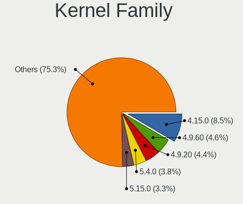

| Version  | Computers | Percent |
|----------|-----------|---------|
| 4.15.0   | 62        | 12.25%  |
| 4.9.60   | 37        | 7.31%   |
| 4.9.20   | 35        | 6.92%   |
| 5.4.0    | 27        | 5.34%   |
| 4.9.9    | 17        | 3.36%   |
| 4.1.38   | 17        | 3.36%   |
| 4.1.34   | 17        | 3.36%   |
| 5.15.0   | 13        | 2.57%   |
| 5.10.74  | 13        | 2.57%   |
| 5.11.0   | 12        | 2.37%   |
| 5.10.0   | 12        | 2.37%   |
| 4.9.155  | 11        | 2.17%   |
| 5.10.14  | 9         | 1.78%   |
| 5.0.0    | 9         | 1.78%   |
| 4.9.124  | 9         | 1.78%   |
| 5.4.32   | 8         | 1.58%   |
| 5.3.0    | 8         | 1.58%   |
| 5.16.7   | 8         | 1.58%   |
| 5.13.0   | 8         | 1.58%   |
| 4.9.41   | 7         | 1.38%   |
| 4.9.111  | 7         | 1.38%   |
| 5.8.0    | 6         | 1.19%   |
| 4.9.76   | 6         | 1.19%   |
| 4.18.0   | 6         | 1.19%   |
| 6.1.1    | 4         | 0.79%   |
| 5.15.19  | 4         | 0.79%   |
| 4.9.95   | 4         | 0.79%   |
| 4.9.34   | 4         | 0.79%   |
| 4.19.0   | 4         | 0.79%   |
| 4.13.0   | 4         | 0.79%   |
| 5.8.6    | 3         | 0.59%   |
| 5.19.0   | 3         | 0.59%   |
| 5.15.75  | 3         | 0.59%   |
| 5.10.118 | 3         | 0.59%   |
| 4.18.16  | 3         | 0.59%   |
| 4.1.25   | 3         | 0.59%   |
| 6.1.0    | 2         | 0.4%    |
| 6.0.10   | 2         | 0.4%    |
| 5.4.83   | 2         | 0.4%    |
| 5.19.7   | 2         | 0.4%    |

Kernel Major Ver.
-----------------

Linux kernel major version

| Version | Computers | Percent |
|---------|-----------|---------|
| 4.9     | 121       | 25.31%  |
| 4.15    | 62        | 12.97%  |
| 5.4     | 42        | 8.79%   |
| 5.10    | 42        | 8.79%   |
| 4.1     | 36        | 7.53%   |
| 5.15    | 28        | 5.86%   |
| 5.8     | 13        | 2.72%   |
| 5.11    | 12        | 2.51%   |
| 4.18    | 11        | 2.3%    |
| 5.13    | 10        | 2.09%   |
| 5.0     | 10        | 2.09%   |
| 5.3     | 9         | 1.88%   |
| 5.16    | 9         | 1.88%   |
| 6.1     | 7         | 1.46%   |
| 5.19    | 7         | 1.46%   |
| 5.14    | 7         | 1.46%   |
| 5.17    | 6         | 1.26%   |
| 4.19    | 6         | 1.26%   |
| 6.0     | 5         | 1.05%   |
| 5.18    | 4         | 0.84%   |
| 4.13    | 4         | 0.84%   |
| 5.9     | 3         | 0.63%   |
| 2.6     | 3         | 0.63%   |
| 5.7     | 2         | 0.42%   |
| 5.6     | 2         | 0.42%   |
| 5.12    | 2         | 0.42%   |
| 4.4     | 2         | 0.42%   |
| 4.16    | 2         | 0.42%   |
| 4.12    | 2         | 0.42%   |
| 3.14    | 2         | 0.42%   |
| 3.10    | 2         | 0.42%   |
| 5.1     | 1         | 0.21%   |
| 4.20    | 1         | 0.21%   |
| 4.17    | 1         | 0.21%   |
| 4.14    | 1         | 0.21%   |
| Unknown | 1         | 0.21%   |

Arch
----

OS architecture (x86_64, i586, etc.)

| Name    | Computers | Percent |
|---------|-----------|---------|
| x86_64  | 387       | 86.77%  |
| i686    | 57        | 12.78%  |
| aarch64 | 1         | 0.22%   |
| Unknown | 1         | 0.22%   |

DE
--

Desktop Environment

| Name            | Computers | Percent |
|-----------------|-----------|---------|
| KDE4            | 172       | 37.07%  |
| KDE5            | 107       | 23.06%  |
| GNOME           | 84        | 18.1%   |
| Unknown         | 31        | 6.68%   |
| KDE             | 18        | 3.88%   |
| XFCE            | 16        | 3.45%   |
| X-Cinnamon      | 9         | 1.94%   |
| Cinnamon        | 6         | 1.29%   |
| LXQt            | 5         | 1.08%   |
| MATE            | 4         | 0.86%   |
| LXDE            | 3         | 0.65%   |
| Unity           | 2         | 0.43%   |
| i3              | 2         | 0.43%   |
| sway            | 1         | 0.22%   |
| Pantheon        | 1         | 0.22%   |
| GNOME Flashback | 1         | 0.22%   |
| GNOME Classic   | 1         | 0.22%   |
| awesome         | 1         | 0.22%   |

Display Server
--------------

X11 or Wayland

| Name    | Computers | Percent |
|---------|-----------|---------|
| X11     | 388       | 86.22%  |
| Wayland | 43        | 9.56%   |
| Unknown | 15        | 3.33%   |
| Tty     | 4         | 0.89%   |

Display Manager
---------------

SDDM, LightDM, etc.

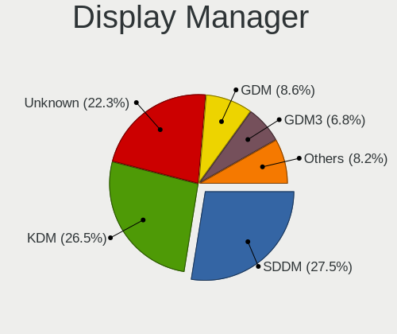

| Name    | Computers | Percent |
|---------|-----------|---------|
| KDM     | 174       | 37.58%  |
| SDDM    | 116       | 25.05%  |
| Unknown | 95        | 20.52%  |
| GDM     | 36        | 7.78%   |
| LightDM | 17        | 3.67%   |
| GDM3    | 13        | 2.81%   |
| TDM     | 10        | 2.16%   |
| XDM     | 1         | 0.22%   |
| SLiM    | 1         | 0.22%   |

OS Lang
-------

Language

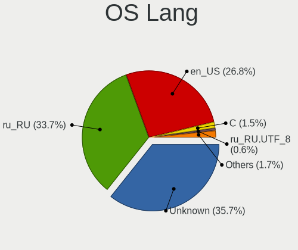

| Lang        | Computers | Percent |
|-------------|-----------|---------|
| Unknown     | 229       | 50.22%  |
| ru_RU       | 130       | 28.51%  |
| en_US       | 82        | 17.98%  |
| C           | 5         | 1.1%    |
| ru_RU.UTF_8 | 4         | 0.88%   |
| en_GB       | 3         | 0.66%   |
| ru_KZ       | 1         | 0.22%   |
| en_IN       | 1         | 0.22%   |
| en_IL       | 1         | 0.22%   |

Boot Mode
---------

EFI or BIOS

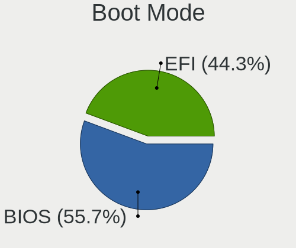

| Mode | Computers | Percent |
|------|-----------|---------|
| BIOS | 279       | 61.73%  |
| EFI  | 173       | 38.27%  |

Filesystem
----------

Type of filesystem

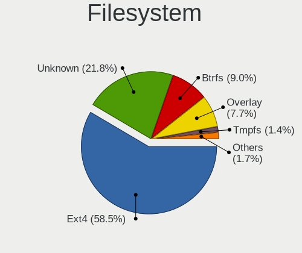

| Type    | Computers | Percent |
|---------|-----------|---------|
| Ext4    | 257       | 55.75%  |
| Unknown | 144       | 31.24%  |
| Overlay | 31        | 6.72%   |
| Btrfs   | 22        | 4.77%   |
| Xfs     | 4         | 0.87%   |
| Ext3    | 2         | 0.43%   |
| Zfs     | 1         | 0.22%   |

Part. scheme
------------

Scheme of partitioning

| Type    | Computers | Percent |
|---------|-----------|---------|
| MBR     | 169       | 36.9%   |
| Unknown | 158       | 34.5%   |
| GPT     | 131       | 28.6%   |

Dual Boot with Linux/BSD
------------------------

Hosting more than one Linux/BSD

| Dual boot | Computers | Percent |
|-----------|-----------|---------|
| No        | 388       | 85.65%  |
| Yes       | 65        | 14.35%  |

Dual Boot (Win)
---------------

Hosting Linux and Windows

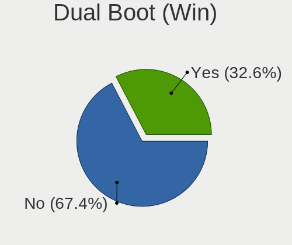

| Dual boot | Computers | Percent |
|-----------|-----------|---------|
| No        | 317       | 69.37%  |
| Yes       | 140       | 30.63%  |

Board
-----

Vendor
------

Motherboard manufacturer

| Name                | Computers | Percent |
|---------------------|-----------|---------|
| ASUSTek Computer    | 78        | 17.77%  |
| Hewlett-Packard     | 64        | 14.58%  |
| Lenovo              | 58        | 13.21%  |
| Gigabyte Technology | 41        | 9.34%   |
| Acer                | 35        | 7.97%   |
| ASRock              | 27        | 6.15%   |
| Dell                | 25        | 5.69%   |
| MSI                 | 17        | 3.87%   |
| Biostar             | 10        | 2.28%   |
| ECS                 | 9         | 2.05%   |
| Unknown             | 9         | 2.05%   |
| Foxconn             | 8         | 1.82%   |
| Toshiba             | 7         | 1.59%   |
| Sony                | 7         | 1.59%   |
| Intel               | 7         | 1.59%   |
| Fujitsu             | 6         | 1.37%   |
| Fujitsu Siemens     | 5         | 1.14%   |
| Samsung Electronics | 3         | 0.68%   |
| Packard Bell        | 3         | 0.68%   |
| HPE                 | 2         | 0.46%   |
| eMachines           | 2         | 0.46%   |
| Chuwi               | 2         | 0.46%   |
| AMI                 | 2         | 0.46%   |
| Acidanthera         | 2         | 0.46%   |
| Quanta              | 1         | 0.23%   |
| OEM                 | 1         | 0.23%   |
| IBM                 | 1         | 0.23%   |
| HONOR               | 1         | 0.23%   |
| GPD                 | 1         | 0.23%   |
| EPoX Computer       | 1         | 0.23%   |
| Elenberg            | 1         | 0.23%   |
| Digma               | 1         | 0.23%   |
| Colorful Technology | 1         | 0.23%   |
| Athermiter/PlexHD   | 1         | 0.23%   |

Model
-----

Motherboard model

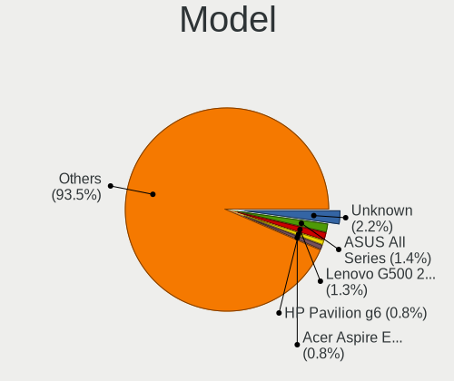

| Name                                 | Computers | Percent |
|--------------------------------------|-----------|---------|
| Unknown                              | 10        | 2.28%   |
| ASUS All Series                      | 7         | 1.59%   |
| Lenovo G500 20236                    | 6         | 1.37%   |
| HP Pavilion g6                       | 5         | 1.14%   |
| Lenovo G510 20238                    | 3         | 0.68%   |
| Gigabyte P35-DS3L                    | 3         | 0.68%   |
| Fujitsu LIFEBOOK AH531               | 3         | 0.68%   |
| ASUS VivoBook 15_ASUS Laptop X540UAR | 3         | 0.68%   |
| ASUS H61M-K                          | 3         | 0.68%   |
| Acer Aspire E5-575G                  | 3         | 0.68%   |
| Packard Bell DOT S                   | 2         | 0.46%   |
| MSI MS-7788                          | 2         | 0.46%   |
| MSI MS-7592                          | 2         | 0.46%   |
| Lenovo ThinkPad Edge E530 3259CEG    | 2         | 0.46%   |
| Lenovo ThinkBook 15 G3 ACL 21A4      | 2         | 0.46%   |
| Lenovo ThinkBook 14 G2 ITL 20VD      | 2         | 0.46%   |
| Lenovo Legion Y540-15IRH-PG0 81SY    | 2         | 0.46%   |
| HP ProLiant DL360 G5                 | 2         | 0.46%   |
| HP Presario CQ57                     | 2         | 0.46%   |
| HP Pavilion dv6                      | 2         | 0.46%   |
| HP ENVY x360 Convertible 15-eu0xxx   | 2         | 0.46%   |
| HP Compaq CQ58                       | 2         | 0.46%   |
| Gigabyte Z690 GAMING X DDR4          | 2         | 0.46%   |
| Gigabyte EP45-DS3L                   | 2         | 0.46%   |
| Foxconn G31MXP FAB:1.1               | 2         | 0.46%   |
| ECS H61H2-M12                        | 2         | 0.46%   |
| ECS G31T-M7                          | 2         | 0.46%   |
| Dell Inspiron N5110                  | 2         | 0.46%   |
| Biostar B75MU3B                      | 2         | 0.46%   |
| ASUS X51RL                           | 2         | 0.46%   |
| ASRock Q1900M                        | 2         | 0.46%   |
| ASRock G31M-VS                       | 2         | 0.46%   |
| ASRock G31M-GS                       | 2         | 0.46%   |
| Acidanthera iMac13,2                 | 2         | 0.46%   |
| Acer Aspire V3-551G                  | 2         | 0.46%   |
| Acer Aspire A715-75G                 | 2         | 0.46%   |
| Acer Aspire A315-51                  | 2         | 0.46%   |
| Acer Aspire 5750G                    | 2         | 0.46%   |
| Toshiba TECRA S11                    | 1         | 0.23%   |
| Toshiba TECRA M5                     | 1         | 0.23%   |

Model Family
------------

Motherboard model prefix

| Name                    | Computers | Percent |
|-------------------------|-----------|---------|
| Acer Aspire             | 21        | 4.78%   |
| Dell Inspiron           | 16        | 3.64%   |
| ASUS VivoBook           | 15        | 3.42%   |
| HP Pavilion             | 14        | 3.19%   |
| Lenovo IdeaPad          | 13        | 2.96%   |
| Lenovo ThinkPad         | 12        | 2.73%   |
| HP ProBook              | 11        | 2.51%   |
| Unknown                 | 10        | 2.28%   |
| HP Compaq               | 7         | 1.59%   |
| ASUS All                | 7         | 1.59%   |
| Lenovo G500             | 6         | 1.37%   |
| HP Laptop               | 6         | 1.37%   |
| ASUS PRIME              | 6         | 1.37%   |
| HP ENVY                 | 5         | 1.14%   |
| HP EliteBook            | 5         | 1.14%   |
| Fujitsu LIFEBOOK        | 5         | 1.14%   |
| Toshiba Satellite       | 4         | 0.91%   |
| Lenovo ThinkBook        | 4         | 0.91%   |
| Lenovo Legion           | 4         | 0.91%   |
| Dell Latitude           | 4         | 0.91%   |
| Lenovo G510             | 3         | 0.68%   |
| Gigabyte P35-DS3L       | 3         | 0.68%   |
| Foxconn G31MXP          | 3         | 0.68%   |
| ASUS TUF                | 3         | 0.68%   |
| ASUS H61M-K             | 3         | 0.68%   |
| Acer Swift              | 3         | 0.68%   |
| Acer Predator           | 3         | 0.68%   |
| Toshiba TECRA           | 2         | 0.46%   |
| Packard Bell DOT        | 2         | 0.46%   |
| MSI MS-7788             | 2         | 0.46%   |
| MSI MS-7592             | 2         | 0.46%   |
| Lenovo IdeaCentre       | 2         | 0.46%   |
| Intel DG965RY           | 2         | 0.46%   |
| HPE ProLiant            | 2         | 0.46%   |
| HP ProLiant             | 2         | 0.46%   |
| HP Presario             | 2         | 0.46%   |
| HP 250                  | 2         | 0.46%   |
| Gigabyte Z690           | 2         | 0.46%   |
| Gigabyte EP45-DS3L      | 2         | 0.46%   |
| Fujitsu Siemens ESPRIMO | 2         | 0.46%   |

MFG Year
--------

Motherboard manufacture year

| Year    | Computers | Percent |
|---------|-----------|---------|
| 2012    | 58        | 13.21%  |
| 2011    | 49        | 11.16%  |
| 2013    | 36        | 8.2%    |
| 2008    | 33        | 7.52%   |
| 2020    | 29        | 6.61%   |
| 2018    | 28        | 6.38%   |
| 2017    | 28        | 6.38%   |
| 2009    | 27        | 6.15%   |
| 2010    | 24        | 5.47%   |
| 2007    | 23        | 5.24%   |
| 2019    | 21        | 4.78%   |
| 2016    | 18        | 4.1%    |
| 2021    | 17        | 3.87%   |
| 2014    | 17        | 3.87%   |
| 2015    | 13        | 2.96%   |
| 2006    | 6         | 1.37%   |
| 2022    | 4         | 0.91%   |
| 2005    | 4         | 0.91%   |
| Unknown | 3         | 0.68%   |
| 2003    | 1         | 0.23%   |

Form Factor
-----------

Physical design of the computer

| Name           | Computers | Percent |
|----------------|-----------|---------|
| Notebook       | 242       | 55.13%  |
| Desktop        | 178       | 40.55%  |
| All in one     | 9         | 2.05%   |
| Server         | 4         | 0.91%   |
| Convertible    | 3         | 0.68%   |
| System on chip | 1         | 0.23%   |
| Tablet         | 1         | 0.23%   |
| Mini pc        | 1         | 0.23%   |

Secure Boot
-----------

Enabled or disabled

| State    | Computers | Percent |
|----------|-----------|---------|
| Disabled | 421       | 95.46%  |
| Enabled  | 20        | 4.54%   |

Coreboot
--------

Have coreboot on board

| Used | Computers | Percent |
|------|-----------|---------|
| No   | 439       | 100%    |

RAM Size
--------

Total RAM memory

| Size in GB  | Computers | Percent |
|-------------|-----------|---------|
| 3.01-4.0    | 127       | 27.97%  |
| 4.01-8.0    | 107       | 23.57%  |
| 8.01-16.0   | 71        | 15.64%  |
| 16.01-24.0  | 56        | 12.33%  |
| 1.01-2.0    | 32        | 7.05%   |
| 2.01-3.0    | 27        | 5.95%   |
| 32.01-64.0  | 15        | 3.3%    |
| 0.51-1.0    | 9         | 1.98%   |
| 24.01-32.0  | 6         | 1.32%   |
| 64.01-256.0 | 3         | 0.66%   |
| Unknown     | 1         | 0.22%   |

RAM Used
--------

Used RAM memory

| Used GB    | Computers | Percent |
|------------|-----------|---------|
| 1.01-2.0   | 195       | 40.04%  |
| 0.51-1.0   | 128       | 26.28%  |
| 2.01-3.0   | 76        | 15.61%  |
| 3.01-4.0   | 39        | 8.01%   |
| 4.01-8.0   | 26        | 5.34%   |
| 8.01-16.0  | 9         | 1.85%   |
| 0.01-0.5   | 7         | 1.44%   |
| Unknown    | 4         | 0.82%   |
| 16.01-24.0 | 2         | 0.41%   |
| 32.01-64.0 | 1         | 0.21%   |

Total Drives
------------

Number of drives on board

| Drives | Computers | Percent |
|--------|-----------|---------|
| 1      | 286       | 62.86%  |
| 2      | 116       | 25.49%  |
| 3      | 31        | 6.81%   |
| 4      | 11        | 2.42%   |
| 5      | 4         | 0.88%   |
| 6      | 3         | 0.66%   |
| 0      | 3         | 0.66%   |
| 8      | 1         | 0.22%   |

Has CD-ROM
----------

Has CD-ROM on board

| Presented | Computers | Percent |
|-----------|-----------|---------|
| No        | 229       | 51.58%  |
| Yes       | 215       | 48.42%  |

Has Ethernet
------------

Has Ethernet on board

| Presented | Computers | Percent |
|-----------|-----------|---------|
| Yes       | 409       | 92.95%  |
| No        | 31        | 7.05%   |

Has WiFi
--------

Has WiFi module

| Presented | Computers | Percent |
|-----------|-----------|---------|
| Yes       | 291       | 65.84%  |
| No        | 151       | 34.16%  |

Has Bluetooth
-------------

Has Bluetooth module

| Presented | Computers | Percent |
|-----------|-----------|---------|
| No        | 233       | 52.36%  |
| Yes       | 212       | 47.64%  |

Location
--------

Country
-------

Geographic location (country)

| Country    | Computers | Percent |
|------------|-----------|---------|
| Kazakhstan | 439       | 100%    |

City
----

Geographic location (city)

| City            | Computers | Percent |
|-----------------|-----------|---------|
| Almaty          | 132       | 27.56%  |
| Nur-Sultan      | 78        | 16.28%  |
| Kostanay        | 32        | 6.68%   |
| Karaganda       | 26        | 5.43%   |
| Ust-Kamenogorsk | 25        | 5.22%   |
| Pavlodar        | 23        | 4.8%    |
| Taraz           | 21        | 4.38%   |
| Aktobe          | 18        | 3.76%   |
| Semey           | 12        | 2.51%   |
| Petropavl       | 12        | 2.51%   |
| Rudnyy          | 10        | 2.09%   |
| Shymkent        | 9         | 1.88%   |
| Atyrau          | 9         | 1.88%   |
| Aktau           | 8         | 1.67%   |
| Ridder          | 7         | 1.46%   |
| Temirtau        | 6         | 1.25%   |
| Oral            | 6         | 1.25%   |
| Astana          | 6         | 1.25%   |
| Kyzylorda       | 4         | 0.84%   |
| Soran           | 3         | 0.63%   |
| Shchchnsk   | 3         | 0.63%   |
| Balqash         | 3         | 0.63%   |
| Tekeli          | 2         | 0.42%   |
| Taiynsha        | 2         | 0.42%   |
| Stepnogorsk     | 2         | 0.42%   |
| Sarkand         | 2         | 0.42%   |
| Makhambet       | 2         | 0.42%   |
| Ekibastuz       | 2         | 0.42%   |
| Urzhar          | 1         | 0.21%   |
| Tobol           | 1         | 0.21%   |
| Taldykorgan     | 1         | 0.21%   |
| Lsakovsk      | 1         | 0.21%   |
| Kokshetau       | 1         | 0.21%   |
| Kaskelen        | 1         | 0.21%   |
| Karatau         | 1         | 0.21%   |
| Karagandy       | 1         | 0.21%   |
| Kapshagay       | 1         | 0.21%   |
| Glshat      | 1         | 0.21%   |
| Dzhezkazgan     | 1         | 0.21%   |
| Chiili          | 1         | 0.21%   |

Drives
------

Drive Vendor
------------

Hard drive vendors

| Vendor              | Computers | Drives | Percent |
|---------------------|-----------|--------|---------|
| Seagate             | 154       | 228    | 24.56%  |
| WDC                 | 101       | 128    | 16.11%  |
| Samsung Electronics | 68        | 101    | 10.85%  |
| Toshiba             | 63        | 78     | 10.05%  |
| Kingston            | 37        | 46     | 5.9%    |
| Hitachi             | 27        | 30     | 4.31%   |
| Unknown             | 18        | 22     | 2.87%   |
| HGST                | 17        | 19     | 2.71%   |
| Transcend           | 15        | 16     | 2.39%   |
| SK hynix            | 11        | 11     | 1.75%   |
| Apacer              | 11        | 14     | 1.75%   |
| SanDisk             | 10        | 11     | 1.59%   |
| Intel               | 10        | 13     | 1.59%   |
| A-DATA Technology   | 9         | 12     | 1.44%   |
| Team                | 6         | 8      | 0.96%   |
| Plextor             | 6         | 6      | 0.96%   |
| Micron Technology   | 6         | 12     | 0.96%   |
| KIOXIA              | 6         | 8      | 0.96%   |
| Gigabyte Technology | 6         | 7      | 0.96%   |
| GeIL                | 5         | 5      | 0.8%    |
| China               | 5         | 5      | 0.8%    |
| Fujitsu             | 4         | 5      | 0.64%   |
| Crucial             | 4         | 4      | 0.64%   |
| HUAWEI              | 3         | 3      | 0.48%   |
| KingSpec            | 2         | 2      | 0.32%   |
| HPE                 | 2         | 2      | 0.32%   |
| Hikvision           | 2         | 2      | 0.32%   |
| BIWIN               | 2         | 2      | 0.32%   |
| AMD                 | 2         | 2      | 0.32%   |
| TEKET               | 1         | 2      | 0.16%   |
| SPCC                | 1         | 1      | 0.16%   |
| Smartbuy            | 1         | 1      | 0.16%   |
| Phison              | 1         | 1      | 0.16%   |
| Patriot             | 1         | 1      | 0.16%   |
| Netac               | 1         | 1      | 0.16%   |
| Maxtor              | 1         | 1      | 0.16%   |
| LVCARDS             | 1         | 1      | 0.16%   |
| Kingmax             | 1         | 1      | 0.16%   |
| KingDian            | 1         | 1      | 0.16%   |
| Kingchuxing         | 1         | 2      | 0.16%   |

Drive Model
-----------

Hard drive models

| Model                                | Computers | Percent |
|--------------------------------------|-----------|---------|
| Seagate ST1000LM024 HN-M101MBB 1TB   | 16        | 2.37%   |
| Toshiba DT01ACA050 500GB             | 13        | 1.92%   |
| Seagate ST500DM002-1BD142 500GB      | 13        | 1.92%   |
| Seagate ST1000LM035-1RK172 1TB       | 11        | 1.63%   |
| Seagate ST3500418AS 500GB            | 8         | 1.18%   |
| Seagate ST3500413AS 500GB            | 7         | 1.04%   |
| Kingston SA400S37120G 120GB SSD      | 7         | 1.04%   |
| WDC WD5000AAKX-001CA0 500GB          | 6         | 0.89%   |
| Toshiba MQ04ABF100 1TB               | 6         | 0.89%   |
| Toshiba DT01ACA100 1TB               | 6         | 0.89%   |
| Seagate ST3250310AS 250GB            | 6         | 0.89%   |
| HGST HTS541010A9E680 1TB             | 6         | 0.89%   |
| Toshiba MQ01ABD100 1TB               | 5         | 0.74%   |
| Toshiba HDWD110 1TB                  | 5         | 0.74%   |
| Seagate ST500LM012 HN-M500MBB 500GB  | 5         | 0.74%   |
| Samsung HD502HJ 500GB                | 5         | 0.74%   |
| Kingston SA400S37240G 240GB SSD      | 5         | 0.74%   |
| WDC WD3200BPVT-22JJ5T0 320GB         | 4         | 0.59%   |
| WDC WD10SPZX-21Z10T0 1TB             | 4         | 0.59%   |
| Transcend TS120GSSD220S 120GB        | 4         | 0.59%   |
| Toshiba MQ01ABF050 500GB             | 4         | 0.59%   |
| Seagate ST9320325AS 320GB            | 4         | 0.59%   |
| Seagate ST500LT012-1DG142 500GB      | 4         | 0.59%   |
| Seagate ST380011A 80GB               | 4         | 0.59%   |
| Seagate ST3320620AS 320GB            | 4         | 0.59%   |
| Seagate ST3250820AS 250GB            | 4         | 0.59%   |
| Seagate ST3160815AS 160GB            | 4         | 0.59%   |
| Seagate ST1000DM003-1CH162 1TB       | 4         | 0.59%   |
| Samsung SSD 860 EVO 250GB            | 4         | 0.59%   |
| Samsung HD322HJ 320GB                | 4         | 0.59%   |
| Kingston SA400S37480G 480GB SSD      | 4         | 0.59%   |
| Intel NVMe SSD Drive 512GB           | 4         | 0.59%   |
| Gigabyte GP-GSTFS31120GNTD 120GB SSD | 4         | 0.59%   |
| Transcend TS240GSSD220S 240GB        | 3         | 0.44%   |
| Toshiba HDWD105 500GB                | 3         | 0.44%   |
| Toshiba DT01ACA200 2TB               | 3         | 0.44%   |
| SK hynix NVMe SSD Drive 512GB        | 3         | 0.44%   |
| Seagate ST500LT012-9WS142 500GB      | 3         | 0.44%   |
| Seagate ST380215AS 80GB              | 3         | 0.44%   |
| Seagate ST3802110A 80GB              | 3         | 0.44%   |

HDD Vendor
----------

Hard disk drive vendors

| Vendor              | Computers | Drives | Percent |
|---------------------|-----------|--------|---------|
| Seagate             | 152       | 226    | 38.29%  |
| WDC                 | 96        | 123    | 24.18%  |
| Toshiba             | 60        | 75     | 15.11%  |
| Samsung Electronics | 37        | 57     | 9.32%   |
| Hitachi             | 27        | 30     | 6.8%    |
| HGST                | 17        | 19     | 4.28%   |
| Fujitsu             | 4         | 5      | 1.01%   |
| HPE                 | 2         | 2      | 0.5%    |
| Unknown             | 1         | 1      | 0.25%   |
| Maxtor              | 1         | 1      | 0.25%   |

SSD Vendor
----------

Solid state drive vendors

| Vendor              | Computers | Drives | Percent |
|---------------------|-----------|--------|---------|
| Kingston            | 34        | 40     | 23.94%  |
| Samsung Electronics | 17        | 22     | 11.97%  |
| Transcend           | 15        | 16     | 10.56%  |
| Apacer              | 10        | 13     | 7.04%   |
| Team                | 6         | 8      | 4.23%   |
| Plextor             | 6         | 6      | 4.23%   |
| Gigabyte Technology | 6         | 7      | 4.23%   |
| SanDisk             | 5         | 5      | 3.52%   |
| China               | 5         | 5      | 3.52%   |
| GeIL                | 4         | 4      | 2.82%   |
| Crucial             | 4         | 4      | 2.82%   |
| SK hynix            | 3         | 3      | 2.11%   |
| Intel               | 3         | 6      | 2.11%   |
| A-DATA Technology   | 3         | 4      | 2.11%   |
| WDC                 | 2         | 2      | 1.41%   |
| Micron Technology   | 2         | 2      | 1.41%   |
| KingSpec            | 2         | 2      | 1.41%   |
| AMD                 | 2         | 2      | 1.41%   |
| Unknown             | 1         | 1      | 0.7%    |
| TEKET               | 1         | 2      | 0.7%    |
| SPCC                | 1         | 1      | 0.7%    |
| Smartbuy            | 1         | 1      | 0.7%    |
| Patriot             | 1         | 1      | 0.7%    |
| Netac               | 1         | 1      | 0.7%    |
| LVCARDS             | 1         | 1      | 0.7%    |
| Kingmax             | 1         | 1      | 0.7%    |
| KingDian            | 1         | 1      | 0.7%    |
| Kingchuxing         | 1         | 2      | 0.7%    |
| JMicron Technology  | 1         | 1      | 0.7%    |
| BIWIN               | 1         | 1      | 0.7%    |
| Unknown             | 1         | 1      | 0.7%    |

Drive Kind
----------

HDD or SSD

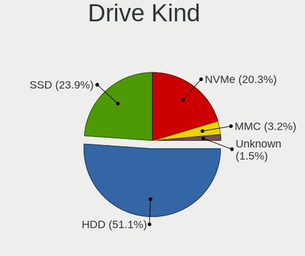

| Kind    | Computers | Drives | Percent |
|---------|-----------|--------|---------|
| HDD     | 335       | 539    | 61.47%  |
| SSD     | 121       | 166    | 22.2%   |
| NVMe    | 65        | 86     | 11.93%  |
| MMC     | 17        | 21     | 3.12%   |
| Unknown | 7         | 7      | 1.28%   |

Drive Connector
---------------

SATA, SAS, NVMe, etc.

| Type | Computers | Drives | Percent |
|------|-----------|--------|---------|
| SATA | 384       | 694    | 80%     |
| NVMe | 65        | 86     | 13.54%  |
| MMC  | 17        | 21     | 3.54%   |
| SAS  | 14        | 18     | 2.92%   |

Drive Size
----------

Size of hard drive

| Size in TB | Computers | Drives | Percent |
|------------|-----------|--------|---------|
| 0.01-0.5   | 312       | 500    | 67.97%  |
| 0.51-1.0   | 126       | 180    | 27.45%  |
| 1.01-2.0   | 15        | 19     | 3.27%   |
| 3.01-4.0   | 2         | 2      | 0.44%   |
| 2.01-3.0   | 2         | 2      | 0.44%   |
| 4.01-10.0  | 2         | 2      | 0.44%   |

Space Total
-----------

Amount of disk space available on the file system

| Size in GB     | Computers | Percent |
|----------------|-----------|---------|
| 251-500        | 119       | 24.69%  |
| 101-250        | 102       | 21.16%  |
| 501-1000       | 72        | 14.94%  |
| 1-20           | 62        | 12.86%  |
| 51-100         | 51        | 10.58%  |
| 21-50          | 31        | 6.43%   |
| 1001-2000      | 31        | 6.43%   |
| Unknown        | 7         | 1.45%   |
| 2001-3000      | 4         | 0.83%   |
| More than 3000 | 3         | 0.62%   |

Space Used
----------

Amount of used disk space

| Used GB   | Computers | Percent |
|-----------|-----------|---------|
| 1-20      | 262       | 54.36%  |
| 21-50     | 61        | 12.66%  |
| 101-250   | 52        | 10.79%  |
| 51-100    | 34        | 7.05%   |
| 251-500   | 32        | 6.64%   |
| 501-1000  | 24        | 4.98%   |
| 1001-2000 | 8         | 1.66%   |
| Unknown   | 7         | 1.45%   |
| 2001-3000 | 2         | 0.41%   |

Malfunc. Drives
---------------

Drive models with a malfunction

| Model                              | Computers | Drives | Percent |
|------------------------------------|-----------|--------|---------|
| Seagate ST500DM002-1BD142 500GB    | 6         | 8      | 3.9%    |
| WDC WD5000AAKX-001CA0 500GB        | 5         | 5      | 3.25%   |
| Seagate ST3250310AS 250GB          | 5         | 5      | 3.25%   |
| Toshiba DT01ACA050 500GB           | 3         | 4      | 1.95%   |
| Seagate ST3802110A 80GB            | 3         | 4      | 1.95%   |
| Seagate ST3500413AS 500GB          | 3         | 3      | 1.95%   |
| Seagate ST3500320AS 500GB          | 3         | 3      | 1.95%   |
| Seagate ST3320613AS 320GB          | 3         | 3      | 1.95%   |
| Seagate ST3250820AS 250GB          | 3         | 3      | 1.95%   |
| Seagate ST3160215AS 160GB          | 3         | 3      | 1.95%   |
| Seagate ST1000LM024 HN-M101MBB 1TB | 3         | 3      | 1.95%   |
| Hitachi HTS543232A7A384 320GB      | 3         | 3      | 1.95%   |
| WDC WD800JD-60LSA0 80GB            | 2         | 2      | 1.3%    |
| WDC WD5000LPVX-00V0TT0 500GB       | 2         | 4      | 1.3%    |
| WDC WD2000JS-60NCB1 200GB          | 2         | 3      | 1.3%    |
| Toshiba MQ01ABF050 500GB           | 2         | 2      | 1.3%    |
| Toshiba MK5059GSXP 500GB           | 2         | 3      | 1.3%    |
| Seagate ST9500325AS 500GB          | 2         | 2      | 1.3%    |
| Seagate ST500LT012-9WS142 500GB    | 2         | 9      | 1.3%    |
| Seagate ST500LT012-1DG142 500GB    | 2         | 4      | 1.3%    |
| Seagate ST380215AS 80GB            | 2         | 2      | 1.3%    |
| Seagate ST3500418AS 500GB          | 2         | 4      | 1.3%    |
| Seagate ST340014A 40GB             | 2         | 2      | 1.3%    |
| Seagate ST3320620AS 320GB          | 2         | 3      | 1.3%    |
| Seagate ST3320418AS 320GB          | 2         | 2      | 1.3%    |
| Seagate ST3160815AS 160GB          | 2         | 2      | 1.3%    |
| Samsung Electronics HD642JJ 640GB  | 2         | 4      | 1.3%    |
| Samsung Electronics HD502HI 500GB  | 2         | 3      | 1.3%    |
| Hitachi HTS547550A9E384 500GB      | 2         | 3      | 1.3%    |
| Hitachi HTS543216L9SA00 160GB      | 2         | 2      | 1.3%    |
| HGST HTS725050A7E630 500GB         | 2         | 2      | 1.3%    |
| HGST HTS541010A9E680 1TB           | 2         | 3      | 1.3%    |
| WDC WD7500BPVT-24HXZT3 752GB       | 1         | 2      | 0.65%   |
| WDC WD7500BPVT-08HXZT3 752GB       | 1         | 1      | 0.65%   |
| WDC WD5000LPCX-21VHAT0 500GB       | 1         | 3      | 0.65%   |
| WDC WD5000AVDS-73U7B1 500GB        | 1         | 1      | 0.65%   |
| WDC WD5000AAKX-003CA0 500GB        | 1         | 1      | 0.65%   |
| WDC WD5000AAKS-00A7B2 500GB        | 1         | 1      | 0.65%   |
| WDC WD3200BPVT-75ZEST0 320GB       | 1         | 1      | 0.65%   |
| WDC WD3200BPVT-22ZEST0 320GB       | 1         | 1      | 0.65%   |

Malfunc. Drive Vendor
---------------------

Vendors of faulty drives

| Vendor              | Computers | Drives | Percent |
|---------------------|-----------|--------|---------|
| Seagate             | 67        | 91     | 45.89%  |
| WDC                 | 31        | 39     | 21.23%  |
| Hitachi             | 15        | 17     | 10.27%  |
| Toshiba             | 12        | 14     | 8.22%   |
| Samsung Electronics | 10        | 14     | 6.85%   |
| HGST                | 7         | 8      | 4.79%   |
| Plextor             | 1         | 1      | 0.68%   |
| Maxtor              | 1         | 1      | 0.68%   |
| Kingston            | 1         | 1      | 0.68%   |
| China               | 1         | 1      | 0.68%   |

Malfunc. HDD Vendor
-------------------

Vendors of faulty HDD drives

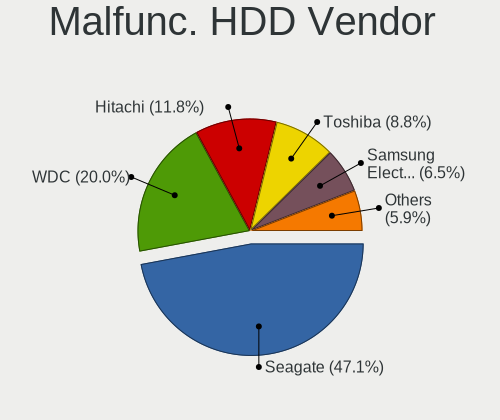

| Vendor              | Computers | Drives | Percent |
|---------------------|-----------|--------|---------|
| Seagate             | 67        | 91     | 46.85%  |
| WDC                 | 31        | 39     | 21.68%  |
| Hitachi             | 15        | 17     | 10.49%  |
| Toshiba             | 12        | 14     | 8.39%   |
| Samsung Electronics | 10        | 14     | 6.99%   |
| HGST                | 7         | 8      | 4.9%    |
| Maxtor              | 1         | 1      | 0.7%    |

Malfunc. Drive Kind
-------------------

Kinds of faulty drives

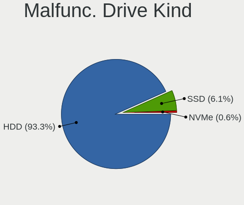

| Kind | Computers | Drives | Percent |
|------|-----------|--------|---------|
| HDD  | 130       | 184    | 97.74%  |
| SSD  | 3         | 3      | 2.26%   |

Failed Drives
-------------

Failed drive models

| Model                             | Computers | Drives | Percent |
|-----------------------------------|-----------|--------|---------|
| Samsung Electronics HD322GJ 320GB | 2         | 2      | 50%     |
| WDC WD3200BPVT-24ZEST0 320GB      | 1         | 1      | 25%     |
| Seagate ST3250318AS 249GB         | 1         | 2      | 25%     |

Failed Drive Vendor
-------------------

Failed drive vendors

| Vendor              | Computers | Drives | Percent |
|---------------------|-----------|--------|---------|
| Samsung Electronics | 2         | 2      | 50%     |
| WDC                 | 1         | 1      | 25%     |
| Seagate             | 1         | 2      | 25%     |

Drive Status
------------

Number of failed and malfunc. drives

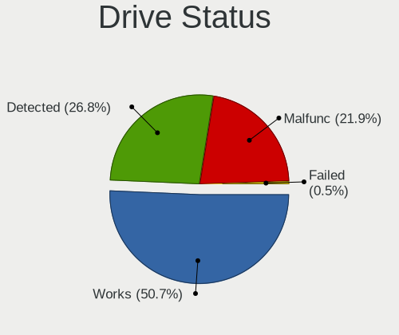

| Status   | Computers | Drives | Percent |
|----------|-----------|--------|---------|
| Works    | 259       | 449    | 50.29%  |
| Malfunc  | 132       | 187    | 25.63%  |
| Detected | 120       | 178    | 23.3%   |
| Failed   | 4         | 5      | 0.78%   |

Storage controller
------------------

Storage Vendor
--------------

Storage controller vendors

| Vendor                        | Computers | Percent |
|-------------------------------|-----------|---------|
| Intel                         | 359       | 69.04%  |
| AMD                           | 47        | 9.04%   |
| JMicron Technology            | 20        | 3.85%   |
| Samsung Electronics           | 18        | 3.46%   |
| Marvell Technology Group      | 10        | 1.92%   |
| Nvidia                        | 9         | 1.73%   |
| SK hynix                      | 8         | 1.54%   |
| SanDisk                       | 6         | 1.15%   |
| KIOXIA                        | 5         | 0.96%   |
| Kingston Technology Company   | 5         | 0.96%   |
| Toshiba America Info Systems  | 4         | 0.77%   |
| Micron Technology             | 4         | 0.77%   |
| ASMedia Technology            | 4         | 0.77%   |
| Realtek Semiconductor         | 3         | 0.58%   |
| ADATA Technology              | 3         | 0.58%   |
| VIA Technologies              | 2         | 0.38%   |
| Phison Electronics            | 2         | 0.38%   |
| MAXIO Technology (Hangzhou)   | 2         | 0.38%   |
| Integrated Technology Express | 2         | 0.38%   |
| Hewlett-Packard               | 2         | 0.38%   |
| Adaptec                       | 2         | 0.38%   |
| Union Memory (Shenzhen)       | 1         | 0.19%   |
| ULi Electronics               | 1         | 0.19%   |
| Biwin Storage Technology      | 1         | 0.19%   |

Storage Model
-------------

Storage controller models

| Model                                                                                   | Computers | Percent |
|-----------------------------------------------------------------------------------------|-----------|---------|
| AMD FCH SATA Controller [AHCI mode]                                                     | 33        | 5.12%   |
| Intel NM10/ICH7 Family SATA Controller [IDE mode]                                       | 31        | 4.81%   |
| Intel 7 Series Chipset Family 6-port SATA Controller [AHCI mode]                        | 31        | 4.81%   |
| Intel 82801G (ICH7 Family) IDE Controller                                               | 28        | 4.35%   |
| Intel Sunrise Point-LP SATA Controller [AHCI mode]                                      | 26        | 4.04%   |
| Intel 8 Series/C220 Series Chipset Family 6-port SATA Controller 1 [AHCI mode]          | 19        | 2.95%   |
| Intel 6 Series/C200 Series Chipset Family 6 port Desktop SATA AHCI Controller           | 19        | 2.95%   |
| Intel 6 Series/C200 Series Chipset Family 6 port Mobile SATA AHCI Controller            | 16        | 2.48%   |
| Intel 82801 Mobile SATA Controller [RAID mode]                                          | 13        | 2.02%   |
| Intel 6 Series/C200 Series Chipset Family Desktop SATA Controller (IDE mode, ports 4-5) | 12        | 1.86%   |
| Intel 6 Series/C200 Series Chipset Family Desktop SATA Controller (IDE mode, ports 0-3) | 12        | 1.86%   |
| Samsung NVMe SSD Controller SM981/PM981/PM983                                           | 11        | 1.71%   |
| JMicron JMB368 IDE controller                                                           | 11        | 1.71%   |
| Intel 82801JI (ICH10 Family) 4 port SATA IDE Controller #1                              | 10        | 1.55%   |
| Intel 82801JI (ICH10 Family) 2 port SATA IDE Controller #2                              | 10        | 1.55%   |
| Intel 82801IBM/IEM (ICH9M/ICH9M-E) 4 port SATA Controller [AHCI mode]                   | 9         | 1.4%    |
| JMicron JMB363 SATA/IDE Controller                                                      | 8         | 1.24%   |
| Intel Volume Management Device NVMe RAID Controller                                     | 8         | 1.24%   |
| Intel Q170/Q150/B150/H170/H110/Z170/CM236 Chipset SATA Controller [AHCI Mode]           | 8         | 1.24%   |
| Intel 82801I (ICH9 Family) 2 port SATA Controller [IDE mode]                            | 8         | 1.24%   |
| Intel 8 Series SATA Controller 1 [AHCI mode]                                            | 8         | 1.24%   |
| Intel 7 Series/C210 Series Chipset Family 6-port SATA Controller [AHCI mode]            | 8         | 1.24%   |
| Intel 82801IB (ICH9) 2 port SATA Controller [IDE mode]                                  | 7         | 1.09%   |
| Intel 7 Series/C210 Series Chipset Family 4-port SATA Controller [IDE mode]             | 7         | 1.09%   |
| Intel 7 Series/C210 Series Chipset Family 2-port SATA Controller [IDE mode]             | 7         | 1.09%   |
| Intel 5 Series/3400 Series Chipset 4 port SATA AHCI Controller                          | 7         | 1.09%   |
| Intel 200 Series PCH SATA controller [AHCI mode]                                        | 7         | 1.09%   |
| Intel NM10/ICH7 Family SATA Controller [AHCI mode]                                      | 6         | 0.93%   |
| Intel Comet Lake SATA AHCI Controller                                                   | 6         | 0.93%   |
| Intel Celeron/Pentium Silver Processor SATA Controller                                  | 6         | 0.93%   |
| Intel Cannon Lake Mobile PCH SATA AHCI Controller                                       | 6         | 0.93%   |
| Intel Atom Processor E3800 Series SATA AHCI Controller                                  | 6         | 0.93%   |
| Intel 82801HM/HEM (ICH8M/ICH8M-E) IDE Controller                                        | 6         | 0.93%   |
| Intel 5 Series/3400 Series Chipset 4 port SATA IDE Controller                           | 6         | 0.93%   |
| Intel 5 Series/3400 Series Chipset 2 port SATA IDE Controller                           | 6         | 0.93%   |
| AMD SB7x0/SB8x0/SB9x0 SATA Controller [AHCI mode]                                       | 6         | 0.93%   |
| AMD 400 Series Chipset SATA Controller                                                  | 6         | 0.93%   |
| Samsung NVMe SSD Controller 980                                                         | 5         | 0.78%   |
| KIOXIA NVMe SSD Controller BG4                                                          | 5         | 0.78%   |
| Intel Tiger Lake-LP SATA Controller                                                     | 5         | 0.78%   |

Storage Kind
------------

Kind of storage controller (IDE, SATA, NVMe, SAS, ...)

| Kind | Computers | Percent |
|------|-----------|---------|
| SATA | 298       | 57.42%  |
| IDE  | 124       | 23.89%  |
| NVMe | 66        | 12.72%  |
| RAID | 28        | 5.39%   |
| SAS  | 3         | 0.58%   |

Processor
---------

CPU Vendor
----------

Processor vendors

| Vendor | Computers | Percent |
|--------|-----------|---------|
| Intel  | 377       | 85.88%  |
| AMD    | 61        | 13.9%   |
| ARM    | 1         | 0.23%   |

CPU Model
---------

Processor models

| Model                                         | Computers | Percent |
|-----------------------------------------------|-----------|---------|
| Intel Core i5-7200U CPU @ 2.50GHz             | 7         | 1.59%   |
| Intel Pentium CPU G630 @ 2.70GHz              | 5         | 1.13%   |
| Intel Core i5-8250U CPU @ 1.60GHz             | 5         | 1.13%   |
| Intel Core i5-2450M CPU @ 2.50GHz             | 5         | 1.13%   |
| Intel Core i5-8300H CPU @ 2.30GHz             | 4         | 0.91%   |
| Intel Core i5-4460 CPU @ 3.20GHz              | 4         | 0.91%   |
| Intel Core i5-3210M CPU @ 2.50GHz             | 4         | 0.91%   |
| Intel Core i3-7020U CPU @ 2.30GHz             | 4         | 0.91%   |
| Intel Core i3-3110M CPU @ 2.40GHz             | 4         | 0.91%   |
| Intel Core 2 Duo CPU E8400 @ 3.00GHz          | 4         | 0.91%   |
| Intel 11th Gen Core i5-1135G7 @ 2.40GHz       | 4         | 0.91%   |
| Intel Pentium Dual-Core CPU E5700 @ 3.00GHz   | 3         | 0.68%   |
| Intel Pentium 4 CPU 3.00GHz                   | 3         | 0.68%   |
| Intel Core i7-9750H CPU @ 2.60GHz             | 3         | 0.68%   |
| Intel Core i7-7700 CPU @ 3.60GHz              | 3         | 0.68%   |
| Intel Core i7-3770 CPU @ 3.40GHz              | 3         | 0.68%   |
| Intel Core i5-8265U CPU @ 1.60GHz             | 3         | 0.68%   |
| Intel Core i5-3470 CPU @ 3.20GHz              | 3         | 0.68%   |
| Intel Core i5-3230M CPU @ 2.60GHz             | 3         | 0.68%   |
| Intel Core i5-10210U CPU @ 1.60GHz            | 3         | 0.68%   |
| Intel Core i3-3240 CPU @ 3.40GHz              | 3         | 0.68%   |
| Intel Core i3-2310M CPU @ 2.10GHz             | 3         | 0.68%   |
| Intel Core i3-2120 CPU @ 3.30GHz              | 3         | 0.68%   |
| Intel Core i3-2100 CPU @ 3.10GHz              | 3         | 0.68%   |
| Intel Core i3-1005G1 CPU @ 1.20GHz            | 3         | 0.68%   |
| Intel Core 2 Duo CPU E7500 @ 2.93GHz          | 3         | 0.68%   |
| Intel Core 2 Duo CPU E7400 @ 2.80GHz          | 3         | 0.68%   |
| Intel Core 2 Duo CPU E6750 @ 2.66GHz          | 3         | 0.68%   |
| Intel Celeron CPU J1900 @ 1.99GHz             | 3         | 0.68%   |
| Intel Celeron CPU G530 @ 2.40GHz              | 3         | 0.68%   |
| AMD Ryzen 7 5700U with Radeon Graphics        | 3         | 0.68%   |
| AMD Ryzen 3 3200U with Radeon Vega Mobile Gfx | 3         | 0.68%   |
| AMD A8-4500M APU with Radeon HD Graphics      | 3         | 0.68%   |
| AMD A10-4600M APU with Radeon HD Graphics     | 3         | 0.68%   |
| Intel Xeon Silver 4114 CPU @ 2.20GHz          | 2         | 0.45%   |
| Intel Xeon CPU E5450 @ 3.00GHz                | 2         | 0.45%   |
| Intel Xeon CPU E5420 @ 2.50GHz                | 2         | 0.45%   |
| Intel Pentium Dual-Core CPU E6500 @ 2.93GHz   | 2         | 0.45%   |
| Intel Pentium Dual-Core CPU E5300 @ 2.60GHz   | 2         | 0.45%   |
| Intel Pentium Dual-Core CPU E5200 @ 2.50GHz   | 2         | 0.45%   |

CPU Model Family
----------------

Processor model prefix

| Model                   | Computers | Percent |
|-------------------------|-----------|---------|
| Intel Core i5           | 99        | 22.45%  |
| Intel Core i3           | 54        | 12.24%  |
| Intel Core i7           | 53        | 12.02%  |
| Intel Celeron           | 32        | 7.26%   |
| Intel Core 2 Duo        | 30        | 6.8%    |
| Intel Pentium           | 23        | 5.22%   |
| Intel Pentium Dual-Core | 16        | 3.63%   |
| Other                   | 14        | 3.17%   |
| AMD Ryzen 5             | 12        | 2.72%   |
| Intel Xeon              | 11        | 2.49%   |
| Intel Atom              | 11        | 2.49%   |
| AMD Ryzen 7             | 10        | 2.27%   |
| Intel Core 2 Quad       | 8         | 1.81%   |
| Intel Pentium 4         | 6         | 1.36%   |
| Intel Pentium Dual      | 5         | 1.13%   |
| Intel Genuine           | 5         | 1.13%   |
| Intel Core 2            | 4         | 0.91%   |
| AMD Ryzen 3             | 4         | 0.91%   |
| AMD E                   | 4         | 0.91%   |
| AMD A8                  | 4         | 0.91%   |
| AMD A10                 | 4         | 0.91%   |
| AMD A4                  | 3         | 0.68%   |
| Intel Xeon Silver       | 2         | 0.45%   |
| Intel Pentium Gold      | 2         | 0.45%   |
| AMD Ryzen 9             | 2         | 0.45%   |
| AMD Phenom II X4        | 2         | 0.45%   |
| AMD Athlon II X2        | 2         | 0.45%   |
| AMD Athlon 64 X2        | 2         | 0.45%   |
| AMD A6                  | 2         | 0.45%   |
| Intel Pentium Silver    | 1         | 0.23%   |
| Intel Pentium M         | 1         | 0.23%   |
| Intel Mobile Pentium 4  | 1         | 0.23%   |
| Intel Core i9           | 1         | 0.23%   |
| Intel Core Duo          | 1         | 0.23%   |
| Intel Core 2 Extreme    | 1         | 0.23%   |
| AMD PRO A8              | 1         | 0.23%   |
| AMD Phenom II X6        | 1         | 0.23%   |
| AMD FX                  | 1         | 0.23%   |
| AMD E1                  | 1         | 0.23%   |
| AMD C-60                | 1         | 0.23%   |

CPU Cores
---------

Number of processor cores

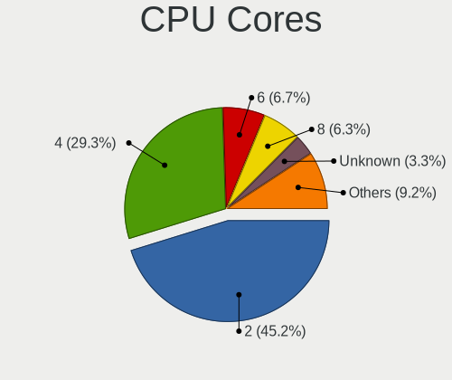

| Number  | Computers | Percent |
|---------|-----------|---------|
| 2       | 229       | 51.81%  |
| 4       | 129       | 29.19%  |
| Unknown | 21        | 4.75%   |
| 6       | 20        | 4.52%   |
| 8       | 18        | 4.07%   |
| 1       | 18        | 4.07%   |
| 12      | 3         | 0.68%   |
| 20      | 2         | 0.45%   |
| 16      | 1         | 0.23%   |
| 3       | 1         | 0.23%   |

CPU Sockets
-----------

Number of sockets

| Number  | Computers | Percent |
|---------|-----------|---------|
| 1       | 431       | 98.18%  |
| 2       | 7         | 1.59%   |
| Unknown | 1         | 0.23%   |

CPU Threads
-----------

Threads per core (Hyper-Threading)

| Number  | Computers | Percent |
|---------|-----------|---------|
| 2       | 239       | 54.32%  |
| 1       | 180       | 40.91%  |
| Unknown | 21        | 4.77%   |

CPU Op-Modes
------------

CPU Operation Modes (32-bit, 64-bit)

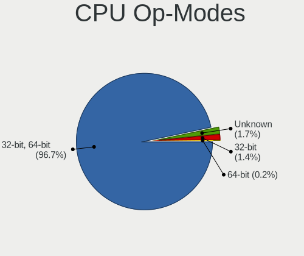

| Op mode        | Computers | Percent |
|----------------|-----------|---------|
| 32-bit, 64-bit | 421       | 95.9%   |
| Unknown        | 10        | 2.28%   |
| 32-bit         | 8         | 1.82%   |

CPU Microcode
-------------

Microcode number

| Number     | Computers | Percent |
|------------|-----------|---------|
| 0x306a9    | 51        | 11.38%  |
| Unknown    | 48        | 10.71%  |
| 0x206a7    | 45        | 10.04%  |
| 0x1067a    | 40        | 8.93%   |
| 0x306c3    | 22        | 4.91%   |
| 0x806e9    | 13        | 2.9%    |
| 0x906ea    | 11        | 2.46%   |
| 0x6fd      | 11        | 2.46%   |
| 0x906e9    | 10        | 2.23%   |
| 0x806ea    | 9         | 2.01%   |
| 0x806c1    | 9         | 2.01%   |
| 0x20655    | 9         | 2.01%   |
| 0x10676    | 9         | 2.01%   |
| 0x40651    | 8         | 1.79%   |
| 0x20652    | 8         | 1.79%   |
| 0x06001119 | 8         | 1.79%   |
| 0x806ec    | 6         | 1.34%   |
| 0x406e3    | 6         | 1.34%   |
| 0x30678    | 6         | 1.34%   |
| 0x6fb      | 5         | 1.12%   |
| 0x406c4    | 5         | 1.12%   |
| 0x706a1    | 4         | 0.89%   |
| 0x30661    | 4         | 0.89%   |
| 0x0a50000c | 4         | 0.89%   |
| 0x08608103 | 4         | 0.89%   |
| 0xf49      | 3         | 0.67%   |
| 0xa0653    | 3         | 0.67%   |
| 0xa0652    | 3         | 0.67%   |
| 0x906ed    | 3         | 0.67%   |
| 0x6e8      | 3         | 0.67%   |
| 0x506e3    | 3         | 0.67%   |
| 0x10661    | 3         | 0.67%   |
| 0x08701021 | 3         | 0.67%   |
| 0x08108109 | 3         | 0.67%   |
| 0x08108102 | 3         | 0.67%   |
| 0x806eb    | 2         | 0.45%   |
| 0x706e5    | 2         | 0.45%   |
| 0x6f6      | 2         | 0.45%   |
| 0x6f2      | 2         | 0.45%   |
| 0x6ec      | 2         | 0.45%   |

CPU Microarch
-------------

Microarchitecture

| Name             | Computers | Percent |
|------------------|-----------|---------|
| KabyLake         | 62        | 14.06%  |
| IvyBridge        | 54        | 12.24%  |
| Penryn           | 53        | 12.02%  |
| SandyBridge      | 47        | 10.66%  |
| Haswell          | 33        | 7.48%   |
| Core             | 28        | 6.35%   |
| Westmere         | 17        | 3.85%   |
| Silvermont       | 15        | 3.4%    |
| Skylake          | 13        | 2.95%   |
| TigerLake        | 11        | 2.49%   |
| Zen+             | 9         | 2.04%   |
| Piledriver       | 9         | 2.04%   |
| CometLake        | 8         | 1.81%   |
| Unknown          | 8         | 1.81%   |
| NetBurst         | 7         | 1.59%   |
| Bonnell          | 7         | 1.59%   |
| Zen 2            | 6         | 1.36%   |
| P6               | 6         | 1.36%   |
| K10              | 6         | 1.36%   |
| Goldmont plus    | 6         | 1.36%   |
| Zen 3            | 5         | 1.13%   |
| Bobcat           | 5         | 1.13%   |
| IceLake          | 4         | 0.91%   |
| Zen              | 3         | 0.68%   |
| Nehalem          | 3         | 0.68%   |
| K8 Hammer        | 3         | 0.68%   |
| Excavator        | 3         | 0.68%   |
| Puma             | 2         | 0.45%   |
| K10 Llano        | 2         | 0.45%   |
| Jaguar           | 2         | 0.45%   |
| Broadwell        | 2         | 0.45%   |
| Goldmont         | 1         | 0.23%   |
| Alderlake Hybrid | 1         | 0.23%   |

Graphics
--------

GPU Vendor
----------

Vendors of graphics cards

| Vendor                     | Computers | Percent |
|----------------------------|-----------|---------|
| Intel                      | 236       | 43.54%  |
| Nvidia                     | 206       | 38.01%  |
| AMD                        | 98        | 18.08%  |
| Matrox Electronics Systems | 2         | 0.37%   |

GPU Model
---------

Graphics card models

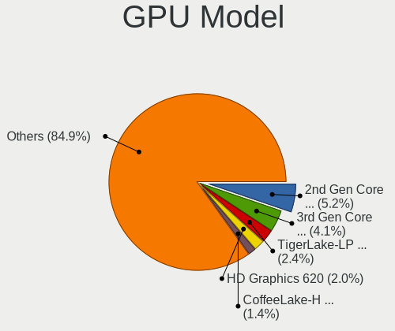

| Model                                                                                    | Computers | Percent |
|------------------------------------------------------------------------------------------|-----------|---------|
| Intel 2nd Generation Core Processor Family Integrated Graphics Controller                | 32        | 5.59%   |
| Intel 3rd Gen Core processor Graphics Controller                                         | 27        | 4.72%   |
| Intel HD Graphics 620                                                                    | 13        | 2.27%   |
| Intel UHD Graphics 620                                                                   | 10        | 1.75%   |
| Intel TigerLake-LP GT2 [Iris Xe Graphics]                                                | 9         | 1.57%   |
| Intel CoffeeLake-H GT2 [UHD Graphics 630]                                                | 9         | 1.57%   |
| Nvidia GT218 [GeForce 210]                                                               | 8         | 1.4%    |
| Intel HD Graphics 630                                                                    | 8         | 1.4%    |
| Intel 4th Gen Core Processor Integrated Graphics Controller                              | 8         | 1.4%    |
| Nvidia GF117M [GeForce 610M/710M/810M/820M / GT 620M/625M/630M/720M]                     | 7         | 1.22%   |
| Intel Skylake GT2 [HD Graphics 520]                                                      | 7         | 1.22%   |
| Intel Mobile 4 Series Chipset Integrated Graphics Controller                             | 7         | 1.22%   |
| Intel Haswell-ULT Integrated Graphics Controller                                         | 7         | 1.22%   |
| Intel Core Processor Integrated Graphics Controller                                      | 7         | 1.22%   |
| Intel Atom/Celeron/Pentium Processor x5-E8000/J3xxx/N3xxx Integrated Graphics Controller | 7         | 1.22%   |
| Intel Atom Processor Z36xxx/Z37xxx Series Graphics & Display                             | 7         | 1.22%   |
| Nvidia GF114 [GeForce GTX 560 Ti]                                                        | 6         | 1.05%   |
| Nvidia GF108 [GeForce GT 730]                                                            | 6         | 1.05%   |
| Intel Xeon E3-1200 v2/3rd Gen Core processor Graphics Controller                         | 6         | 1.05%   |
| Intel Mobile 945GM/GMS/GME, 943/940GML Express Integrated Graphics Controller            | 6         | 1.05%   |
| AMD Thames [Radeon HD 7500M/7600M Series]                                                | 6         | 1.05%   |
| Nvidia GK107 [GeForce GTX 650]                                                           | 5         | 0.87%   |
| Nvidia GF108M [GeForce GT 620M/630M/635M/640M LE]                                        | 5         | 0.87%   |
| Nvidia GF108 [GeForce GT 440]                                                            | 5         | 0.87%   |
| Nvidia G94 [GeForce 9600 GT]                                                             | 5         | 0.87%   |
| Intel Xeon E3-1200 v3/4th Gen Core Processor Integrated Graphics Controller              | 5         | 0.87%   |
| Intel Mobile GM965/GL960 Integrated Graphics Controller (secondary)                      | 5         | 0.87%   |
| Intel Mobile GM965/GL960 Integrated Graphics Controller (primary)                        | 5         | 0.87%   |
| Intel GeminiLake [UHD Graphics 600]                                                      | 5         | 0.87%   |
| Intel CometLake-U GT2 [UHD Graphics]                                                     | 5         | 0.87%   |
| AMD Topaz XT [Radeon R7 M260/M265 / M340/M360 / M440/M445 / 530/535 / 620/625 Mobile]    | 5         | 0.87%   |
| AMD Sun PRO [Radeon HD 8570A/8570M]                                                      | 5         | 0.87%   |
| AMD Seymour [Radeon HD 6400M/7400M Series]                                               | 5         | 0.87%   |
| AMD Picasso/Raven 2 [Radeon Vega Series / Radeon Vega Mobile Series]                     | 5         | 0.87%   |
| Nvidia TU117M                                                                            | 4         | 0.7%    |
| Nvidia GP107M [GeForce GTX 1050 Mobile]                                                  | 4         | 0.7%    |
| Nvidia GP106M [GeForce GTX 1060 Mobile]                                                  | 4         | 0.7%    |
| Nvidia GF116 [GeForce GTX 550 Ti]                                                        | 4         | 0.7%    |
| Nvidia GF108 [GeForce GT 430]                                                            | 4         | 0.7%    |
| Intel Mobile 945GM/GMS, 943/940GML Express Integrated Graphics Controller                | 4         | 0.7%    |

GPU Combo
---------

Combinations of graphics cards

| Name           | Computers | Percent |
|----------------|-----------|---------|
| 1 x Intel      | 143       | 32.13%  |
| 1 x Nvidia     | 136       | 30.56%  |
| Intel + Nvidia | 66        | 14.83%  |
| 1 x AMD        | 57        | 12.81%  |
| Intel + AMD    | 21        | 4.72%   |
| 2 x AMD        | 13        | 2.92%   |
| AMD + Nvidia   | 6         | 1.35%   |
| 1 x Matrox     | 2         | 0.45%   |
| Other          | 1         | 0.22%   |

GPU Driver
----------

Free vs proprietary

| Driver      | Computers | Percent |
|-------------|-----------|---------|
| Free        | 353       | 78.44%  |
| Proprietary | 84        | 18.67%  |
| Unknown     | 13        | 2.89%   |

GPU Memory
----------

Total video memory

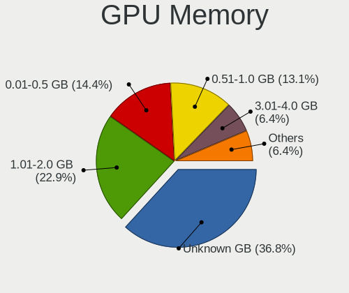

| Size in GB | Computers | Percent |
|------------|-----------|---------|
| Unknown    | 136       | 30.02%  |
| 1.01-2.0   | 131       | 28.92%  |
| 0.51-1.0   | 71        | 15.67%  |
| 0.01-0.5   | 71        | 15.67%  |
| 3.01-4.0   | 27        | 5.96%   |
| 7.01-8.0   | 8         | 1.77%   |
| 5.01-6.0   | 6         | 1.32%   |
| 8.01-16.0  | 2         | 0.44%   |
| 2.01-3.0   | 1         | 0.22%   |

Monitor
-------

Monitor Vendor
--------------

Monitor vendors

| Vendor                  | Computers | Percent |
|-------------------------|-----------|---------|
| Samsung Electronics     | 82        | 18.39%  |
| AU Optronics            | 61        | 13.68%  |
| LG Display              | 49        | 10.99%  |
| BOE                     | 32        | 7.17%   |
| Chimei Innolux          | 30        | 6.73%   |
| Goldstar                | 29        | 6.5%    |
| Hewlett-Packard         | 25        | 5.61%   |
| Acer                    | 18        | 4.04%   |
| BenQ                    | 17        | 3.81%   |
| Philips                 | 16        | 3.59%   |
| Chi Mei Optoelectronics | 15        | 3.36%   |
| AOC                     | 10        | 2.24%   |
| Lenovo                  | 8         | 1.79%   |
| Dell                    | 8         | 1.79%   |
| ViewSonic               | 3         | 0.67%   |
| Toshiba                 | 3         | 0.67%   |
| Sony                    | 3         | 0.67%   |
| PANDA                   | 3         | 0.67%   |
| LG Philips              | 3         | 0.67%   |
| Unknown (XXX)           | 2         | 0.45%   |
| Quanta Display          | 2         | 0.45%   |
| Panasonic               | 2         | 0.45%   |
| LG Electronics          | 2         | 0.45%   |
| InfoVision              | 2         | 0.45%   |
| Iiyama                  | 2         | 0.45%   |
| HannStar                | 2         | 0.45%   |
| Fujitsu Siemens         | 2         | 0.45%   |
| CPT                     | 2         | 0.45%   |
| WY@                     | 1         | 0.22%   |
| VIE                     | 1         | 0.22%   |
| TPU                     | 1         | 0.22%   |
| SKY                     | 1         | 0.22%   |
| Sharp                   | 1         | 0.22%   |
| Seiko/Epson             | 1         | 0.22%   |
| SAC                     | 1         | 0.22%   |
| Packard Bell            | 1         | 0.22%   |
| KDC                     | 1         | 0.22%   |
| HJW                     | 1         | 0.22%   |
| Gigabyte Technology     | 1         | 0.22%   |
| CTX                     | 1         | 0.22%   |

Monitor Model
-------------

Monitor models

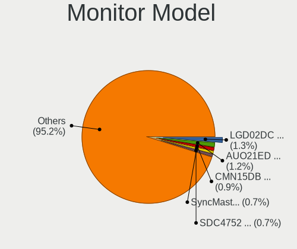

| Model                                                                    | Computers | Percent |
|--------------------------------------------------------------------------|-----------|---------|
| LG Display LCD Monitor LGD02DC 1366x768 344x194mm 15.5-inch              | 6         | 1.32%   |
| Samsung Electronics SyncMaster SAM018F 1280x1024 338x270mm 17.0-inch     | 5         | 1.1%    |
| Samsung Electronics LCD Monitor SDC4752 1366x768 344x194mm 15.5-inch     | 5         | 1.1%    |
| Chimei Innolux LCD Monitor CMN15DB 1366x768 344x193mm 15.5-inch          | 5         | 1.1%    |
| Chi Mei Optoelectronics LCD Monitor CMO15A7 1366x768 344x193mm 15.5-inch | 4         | 0.88%   |
| AU Optronics LCD Monitor AUO38ED 1920x1080 344x193mm 15.5-inch           | 4         | 0.88%   |
| AU Optronics LCD Monitor AUO22EC 1366x768 344x193mm 15.5-inch            | 4         | 0.88%   |
| AU Optronics LCD Monitor AUO21ED 1920x1080 344x194mm 15.5-inch           | 4         | 0.88%   |
| Samsung Electronics SyncMaster SAM0285 1440x900 410x257mm 19.1-inch      | 3         | 0.66%   |
| LG Display LCD Monitor LGD033A 1366x768 344x194mm 15.5-inch              | 3         | 0.66%   |
| Hewlett-Packard L1740 HWP2648 1280x1024 338x270mm 17.0-inch              | 3         | 0.66%   |
| Hewlett-Packard 2011 HWP2934 1600x900 443x249mm 20.0-inch                | 3         | 0.66%   |
| Goldstar W1943 GSM4BAD 1360x768 406x229mm 18.4-inch                      | 3         | 0.66%   |
| Chimei Innolux LCD Monitor CMN15D5 1920x1080 344x193mm 15.5-inch         | 3         | 0.66%   |
| BenQ E900W BNQ7905 1440x900 408x255mm 18.9-inch                          | 3         | 0.66%   |
| AU Optronics LCD Monitor AUO45EC 1366x768 344x193mm 15.5-inch            | 3         | 0.66%   |
| AU Optronics LCD Monitor AUO26EC 1366x768 344x193mm 15.5-inch            | 3         | 0.66%   |
| Acer V193HQ ACR006D 1366x768 410x230mm 18.5-inch                         | 3         | 0.66%   |
| Sony Nvidia Defaul t Flat Panel SNY05FA 1366x768 309x174mm 14.0-inch     | 2         | 0.44%   |
| Samsung Electronics SyncMaster SAM0564 1360x768 410x230mm 18.5-inch      | 2         | 0.44%   |
| Samsung Electronics SyncMaster SAM037C 1680x1050 470x300mm 22.0-inch     | 2         | 0.44%   |
| Samsung Electronics SyncMaster SAM0248 1280x1024 380x300mm 19.1-inch     | 2         | 0.44%   |
| Samsung Electronics SMS19A100 SAM0867 1366x768 410x230mm 18.5-inch       | 2         | 0.44%   |
| Samsung Electronics SMB1930N SAM0632 1360x768 410x230mm 18.5-inch        | 2         | 0.44%   |
| Samsung Electronics S20B300 SAM08A7 1600x900 443x249mm 20.0-inch         | 2         | 0.44%   |
| Samsung Electronics LCD Monitor SEC4251 1366x768 344x194mm 15.5-inch     | 2         | 0.44%   |
| Samsung Electronics LCD Monitor SEC3642 1366x768 344x194mm 15.5-inch     | 2         | 0.44%   |
| Samsung Electronics LCD Monitor SEC315A 1366x768 344x194mm 15.5-inch     | 2         | 0.44%   |
| Samsung Electronics LCD Monitor SAM0A7A 1920x1080 1060x626mm 48.5-inch   | 2         | 0.44%   |
| Samsung Electronics LCD Monitor SAM0669 1920x1080                        | 2         | 0.44%   |
| Samsung Electronics F27G3xTF SAM710D 1920x1080 600x330mm 27.0-inch       | 2         | 0.44%   |
| Philips 226VL PHLC081 1920x1080 480x268mm 21.6-inch                      | 2         | 0.44%   |
| PANDA LCD Monitor NCP004D 1920x1080 344x194mm 15.5-inch                  | 2         | 0.44%   |
| Panasonic TV MEIA296 1920x1080 1280x720mm 57.8-inch                      | 2         | 0.44%   |
| LG Display LCD Monitor LGD064C 1920x1080 344x194mm 15.5-inch             | 2         | 0.44%   |
| LG Display LCD Monitor LGD038E 1366x768 344x194mm 15.5-inch              | 2         | 0.44%   |
| LG Display LCD Monitor LGD0384 1366x768 344x194mm 15.5-inch              | 2         | 0.44%   |
| LG Display LCD Monitor LGD033B 1366x768 344x194mm 15.5-inch              | 2         | 0.44%   |
| LG Display LCD Monitor LGD02F2 1366x768 344x194mm 15.5-inch              | 2         | 0.44%   |
| Hewlett-Packard 22w HPN342E 1920x1080 476x268mm 21.5-inch                | 2         | 0.44%   |

Monitor Resolution
------------------

Monitor screen resolution

| Resolution         | Computers | Percent |
|--------------------|-----------|---------|
| 1920x1080 (FHD)    | 156       | 35.62%  |
| 1366x768 (WXGA)    | 132       | 30.14%  |
| 1280x1024 (SXGA)   | 40        | 9.13%   |
| 1600x900 (HD+)     | 26        | 5.94%   |
| 1440x900 (WXGA+)   | 15        | 3.42%   |
| 1680x1050 (WSXGA+) | 13        | 2.97%   |
| 1280x800 (WXGA)    | 11        | 2.51%   |
| 3840x2160 (4K)     | 8         | 1.83%   |
| 2560x1440 (QHD)    | 6         | 1.37%   |
| 1360x768           | 5         | 1.14%   |
| 1024x600           | 5         | 1.14%   |
| 1920x1200 (WUXGA)  | 3         | 0.68%   |
| Unknown            | 3         | 0.68%   |
| 2560x1600          | 2         | 0.46%   |
| 2560x1080          | 2         | 0.46%   |
| 1400x1050          | 2         | 0.46%   |
| 3840x1080          | 1         | 0.23%   |
| 3600x1080          | 1         | 0.23%   |
| 3520x1080          | 1         | 0.23%   |
| 3200x1080          | 1         | 0.23%   |
| 2160x1440          | 1         | 0.23%   |
| 1920x540           | 1         | 0.23%   |
| 1280x960           | 1         | 0.23%   |
| 1280x720 (HD)      | 1         | 0.23%   |
| 1024x768 (XGA)     | 1         | 0.23%   |

Monitor Diagonal
----------------

Diagonal size in inches

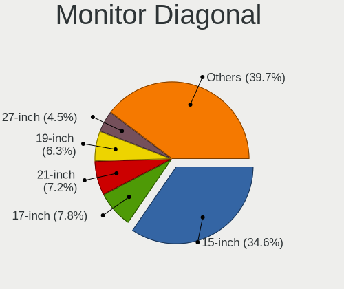

| Inches  | Computers | Percent |
|---------|-----------|---------|
| 15      | 162       | 36.24%  |
| 17      | 42        | 9.4%    |
| 21      | 31        | 6.94%   |
| 19      | 28        | 6.26%   |
| 18      | 27        | 6.04%   |
| 13      | 19        | 4.25%   |
| 27      | 17        | 3.8%    |
| 23      | 17        | 3.8%    |
| 14      | 17        | 3.8%    |
| Unknown | 16        | 3.58%   |
| 20      | 14        | 3.13%   |
| 24      | 11        | 2.46%   |
| 22      | 8         | 1.79%   |
| 10      | 6         | 1.34%   |
| 12      | 4         | 0.89%   |
| 48      | 3         | 0.67%   |
| 31      | 3         | 0.67%   |
| 16      | 3         | 0.67%   |
| 11      | 3         | 0.67%   |
| 84      | 2         | 0.45%   |
| 72      | 2         | 0.45%   |
| 54      | 2         | 0.45%   |
| 43      | 2         | 0.45%   |
| 40      | 2         | 0.45%   |
| 64      | 1         | 0.22%   |
| 47      | 1         | 0.22%   |
| 46      | 1         | 0.22%   |
| 34      | 1         | 0.22%   |
| 32      | 1         | 0.22%   |
| 26      | 1         | 0.22%   |

Monitor Width
-------------

Physical width

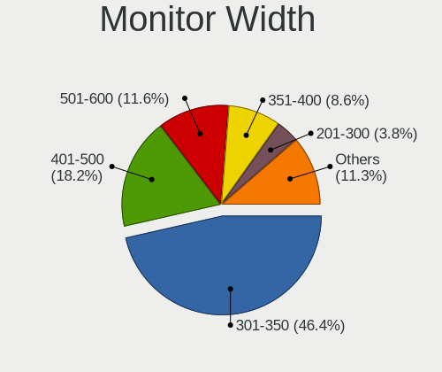

| Width in mm | Computers | Percent |
|-------------|-----------|---------|
| 301-350     | 214       | 48.2%   |
| 401-500     | 92        | 20.72%  |
| 501-600     | 42        | 9.46%   |
| 351-400     | 37        | 8.33%   |
| 201-300     | 22        | 4.95%   |
| Unknown     | 16        | 3.6%    |
| 1001-1500   | 8         | 1.8%    |
| 1501-2000   | 4         | 0.9%    |
| 801-900     | 3         | 0.68%   |
| 601-700     | 3         | 0.68%   |
| 701-800     | 2         | 0.45%   |
| 901-1000    | 1         | 0.23%   |

Aspect Ratio
------------

Proportional relationship between the width and the height

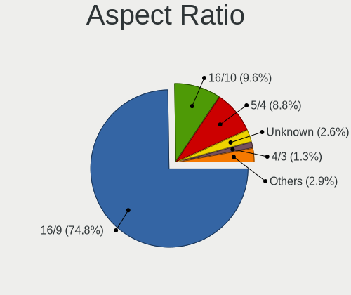

| Ratio   | Computers | Percent |
|---------|-----------|---------|
| 16/9    | 324       | 76.06%  |
| 5/4     | 40        | 9.39%   |
| 16/10   | 39        | 9.15%   |
| Unknown | 11        | 2.58%   |
| 4/3     | 5         | 1.17%   |
| 3/2     | 4         | 0.94%   |
| 6/5     | 1         | 0.23%   |
| 32/9    | 1         | 0.23%   |
| 21/9    | 1         | 0.23%   |

Monitor Area
------------

Area in inch

| Area in inch | Computers | Percent |
|----------------|-----------|---------|
| 101-110        | 161       | 36.1%   |
| 201-250        | 56        | 12.56%  |
| 151-200        | 52        | 11.66%  |
| 141-150        | 48        | 10.76%  |
| 81-90          | 27        | 6.05%   |
| 301-350        | 18        | 4.04%   |
| 121-130        | 16        | 3.59%   |
| Unknown        | 16        | 3.59%   |
| More than 1000 | 10        | 2.24%   |
| 71-80          | 9         | 2.02%   |
| 41-50          | 6         | 1.35%   |
| 501-1000       | 6         | 1.35%   |
| 351-500        | 5         | 1.12%   |
| 61-70          | 3         | 0.67%   |
| 51-60          | 3         | 0.67%   |
| 251-300        | 3         | 0.67%   |
| 131-140        | 3         | 0.67%   |
| 91-100         | 3         | 0.67%   |
| 111-120        | 1         | 0.22%   |

Pixel Density
-------------

Pixels per inch

| Density | Computers | Percent |
|---------|-----------|---------|
| 51-100  | 169       | 38.24%  |
| 101-120 | 143       | 32.35%  |
| 121-160 | 92        | 20.81%  |
| Unknown | 16        | 3.62%   |
| 1-50    | 13        | 2.94%   |
| 161-240 | 9         | 2.04%   |

Multiple Monitors
-----------------

Total monitors connected

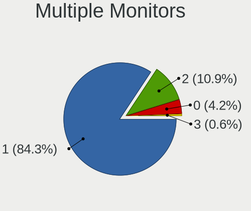

| Total | Computers | Percent |
|-------|-----------|---------|
| 1     | 396       | 88.59%  |
| 2     | 35        | 7.83%   |
| 0     | 14        | 3.13%   |
| 3     | 2         | 0.45%   |

Network
-------

Net Controller Vendor
---------------------

Controller vendors

| Vendor                            | Computers | Percent |
|-----------------------------------|-----------|---------|
| Realtek Semiconductor             | 290       | 43.41%  |
| Intel                             | 138       | 20.66%  |
| Qualcomm Atheros                  | 104       | 15.57%  |
| Broadcom                          | 31        | 4.64%   |
| Broadcom Limited                  | 15        | 2.25%   |
| Ralink Technology                 | 11        | 1.65%   |
| Ralink                            | 11        | 1.65%   |
| Marvell Technology Group          | 9         | 1.35%   |
| MediaTek                          | 8         | 1.2%    |
| Nvidia                            | 7         | 1.05%   |
| Huawei Technologies               | 7         | 1.05%   |
| Qualcomm Atheros Communications   | 6         | 0.9%    |
| Xiaomi                            | 4         | 0.6%    |
| VIA Technologies                  | 4         | 0.6%    |
| JMicron Technology                | 3         | 0.45%   |
| Hewlett-Packard                   | 3         | 0.45%   |
| D-Link                            | 3         | 0.45%   |
| Samsung Electronics               | 2         | 0.3%    |
| HTC (High Tech Computer)          | 2         | 0.3%    |
| TP-Link                           | 1         | 0.15%   |
| STMicroelectronics                | 1         | 0.15%   |
| Philips (or NXP)                  | 1         | 0.15%   |
| ICS Advent                        | 1         | 0.15%   |
| Fujitsu Siemens Computers         | 1         | 0.15%   |
| Ericsson Business Mobile Networks | 1         | 0.15%   |
| Edimax Technology                 | 1         | 0.15%   |
| DisplayLink                       | 1         | 0.15%   |
| Android                           | 1         | 0.15%   |
| Accton Technology                 | 1         | 0.15%   |

Net Controller Model
--------------------

Controller models

| Model                                                                   | Computers | Percent |
|-------------------------------------------------------------------------|-----------|---------|
| Realtek RTL8111/8168/8411 PCI Express Gigabit Ethernet Controller       | 191       | 25.74%  |
| Realtek RTL810xE PCI Express Fast Ethernet controller                   | 61        | 8.22%   |
| Qualcomm Atheros AR9285 Wireless Network Adapter (PCI-Express)          | 20        | 2.7%    |
| Qualcomm Atheros AR9485 Wireless Network Adapter                        | 17        | 2.29%   |
| Broadcom BCM4313 802.11bgn Wireless Network Adapter                     | 16        | 2.16%   |
| Realtek RTL8821CE 802.11ac PCIe Wireless Network Adapter                | 14        | 1.89%   |
| Qualcomm Atheros QCA9377 802.11ac Wireless Network Adapter              | 14        | 1.89%   |
| Intel Wireless 8265 / 8275                                              | 11        | 1.48%   |
| Qualcomm Atheros QCA9565 / AR9565 Wireless Network Adapter              | 10        | 1.35%   |
| Qualcomm Atheros QCA8172 Fast Ethernet                                  | 10        | 1.35%   |
| Qualcomm Atheros AR8151 v2.0 Gigabit Ethernet                           | 9         | 1.21%   |
| Realtek RTL-8100/8101L/8139 PCI Fast Ethernet Adapter                   | 8         | 1.08%   |
| Ralink RT3290 Wireless 802.11n 1T/1R PCIe                               | 8         | 1.08%   |
| Intel Wi-Fi 6 AX201                                                     | 8         | 1.08%   |
| Intel PRO/Wireless 3945ABG [Golan] Network Connection                   | 8         | 1.08%   |
| Intel Ethernet Connection (2) I219-V                                    | 7         | 0.94%   |
| Intel 82579LM Gigabit Network Connection (Lewisville)                   | 7         | 0.94%   |
| Realtek RTL8188EUS 802.11n Wireless Network Adapter                     | 6         | 0.81%   |
| Intel Comet Lake PCH CNVi WiFi                                          | 6         | 0.81%   |
| Intel Centrino Advanced-N 6205 [Taylor Peak]                            | 6         | 0.81%   |
| Ralink MT7601U Wireless Adapter                                         | 5         | 0.67%   |
| Qualcomm Atheros AR9271 802.11n                                         | 5         | 0.67%   |
| Qualcomm Atheros AR8152 v2.0 Fast Ethernet                              | 5         | 0.67%   |
| Qualcomm Atheros AR242x / AR542x Wireless Network Adapter (PCI-Express) | 5         | 0.67%   |
| Intel Wi-Fi 6 AX200                                                     | 5         | 0.67%   |
| Intel Comet Lake PCH-LP CNVi WiFi                                       | 5         | 0.67%   |
| Intel Centrino Wireless-N 2230                                          | 5         | 0.67%   |
| Huawei E353/E3131                                                       | 5         | 0.67%   |
| Realtek RTL8822CE 802.11ac PCIe Wireless Network Adapter                | 4         | 0.54%   |
| Realtek RTL8723DE Wireless Network Adapter                              | 4         | 0.54%   |
| Realtek RTL8169 PCI Gigabit Ethernet Controller                         | 4         | 0.54%   |
| Ralink RT5370 Wireless Adapter                                          | 4         | 0.54%   |
| Intel Wireless 7265                                                     | 4         | 0.54%   |
| Intel Wireless 7260                                                     | 4         | 0.54%   |
| Intel Wireless 3160                                                     | 4         | 0.54%   |
| Intel WiFi Link 5100                                                    | 4         | 0.54%   |
| Intel Centrino Wireless-N 1030 [Rainbow Peak]                           | 4         | 0.54%   |
| Intel Cannon Lake PCH CNVi WiFi                                         | 4         | 0.54%   |
| Intel 82579V Gigabit Network Connection                                 | 4         | 0.54%   |
| Broadcom NetLink BCM57785 Gigabit Ethernet PCIe                         | 4         | 0.54%   |

Wireless Vendor
---------------

Wireless vendors

| Vendor                            | Computers | Percent |
|-----------------------------------|-----------|---------|
| Intel                             | 104       | 34.9%   |
| Qualcomm Atheros                  | 77        | 25.84%  |
| Realtek Semiconductor             | 44        | 14.77%  |
| Broadcom                          | 25        | 8.39%   |
| Ralink Technology                 | 11        | 3.69%   |
| Ralink                            | 11        | 3.69%   |
| Qualcomm Atheros Communications   | 6         | 2.01%   |
| Broadcom Limited                  | 6         | 2.01%   |
| MediaTek                          | 5         | 1.68%   |
| D-Link                            | 3         | 1.01%   |
| TP-Link                           | 1         | 0.34%   |
| Philips (or NXP)                  | 1         | 0.34%   |
| Fujitsu Siemens Computers         | 1         | 0.34%   |
| Ericsson Business Mobile Networks | 1         | 0.34%   |
| Edimax Technology                 | 1         | 0.34%   |
| Accton Technology                 | 1         | 0.34%   |

Wireless Model
--------------

Wireless models

| Model                                                                   | Computers | Percent |
|-------------------------------------------------------------------------|-----------|---------|
| Qualcomm Atheros AR9285 Wireless Network Adapter (PCI-Express)          | 20        | 6.71%   |
| Qualcomm Atheros AR9485 Wireless Network Adapter                        | 17        | 5.7%    |
| Broadcom BCM4313 802.11bgn Wireless Network Adapter                     | 16        | 5.37%   |
| Realtek RTL8821CE 802.11ac PCIe Wireless Network Adapter                | 14        | 4.7%    |
| Qualcomm Atheros QCA9377 802.11ac Wireless Network Adapter              | 14        | 4.7%    |
| Intel Wireless 8265 / 8275                                              | 11        | 3.69%   |
| Qualcomm Atheros QCA9565 / AR9565 Wireless Network Adapter              | 10        | 3.36%   |
| Ralink RT3290 Wireless 802.11n 1T/1R PCIe                               | 8         | 2.68%   |
| Intel Wi-Fi 6 AX201                                                     | 8         | 2.68%   |
| Intel PRO/Wireless 3945ABG [Golan] Network Connection                   | 8         | 2.68%   |
| Realtek RTL8188EUS 802.11n Wireless Network Adapter                     | 6         | 2.01%   |
| Intel Comet Lake PCH CNVi WiFi                                          | 6         | 2.01%   |
| Intel Centrino Advanced-N 6205 [Taylor Peak]                            | 6         | 2.01%   |
| Ralink MT7601U Wireless Adapter                                         | 5         | 1.68%   |
| Qualcomm Atheros AR9271 802.11n                                         | 5         | 1.68%   |
| Qualcomm Atheros AR242x / AR542x Wireless Network Adapter (PCI-Express) | 5         | 1.68%   |
| Intel Wi-Fi 6 AX200                                                     | 5         | 1.68%   |
| Intel Comet Lake PCH-LP CNVi WiFi                                       | 5         | 1.68%   |
| Intel Centrino Wireless-N 2230                                          | 5         | 1.68%   |
| Realtek RTL8822CE 802.11ac PCIe Wireless Network Adapter                | 4         | 1.34%   |
| Realtek RTL8723DE Wireless Network Adapter                              | 4         | 1.34%   |
| Ralink RT5370 Wireless Adapter                                          | 4         | 1.34%   |
| Intel Wireless 7265                                                     | 4         | 1.34%   |
| Intel Wireless 7260                                                     | 4         | 1.34%   |
| Intel Wireless 3160                                                     | 4         | 1.34%   |
| Intel WiFi Link 5100                                                    | 4         | 1.34%   |
| Intel Centrino Wireless-N 1030 [Rainbow Peak]                           | 4         | 1.34%   |
| Intel Cannon Lake PCH CNVi WiFi                                         | 4         | 1.34%   |
| Broadcom Limited BCM4313 802.11bgn Wireless Network Adapter             | 4         | 1.34%   |
| Broadcom BCM43227 802.11b/g/n                                           | 4         | 1.34%   |
| Realtek RTL8852AE 802.11ax PCIe Wireless Network Adapter                | 3         | 1.01%   |
| Realtek RTL8723BE PCIe Wireless Network Adapter                         | 3         | 1.01%   |
| Realtek RTL8188EE Wireless Network Adapter                              | 3         | 1.01%   |
| Qualcomm Atheros QCA6174 802.11ac Wireless Network Adapter              | 3         | 1.01%   |
| MediaTek MT7921 802.11ax PCI Express Wireless Network Adapter           | 3         | 1.01%   |
| Intel Dual Band Wireless-AC 3168NGW [Stone Peak]                        | 3         | 1.01%   |
| Intel Centrino Wireless-N 135                                           | 3         | 1.01%   |
| Broadcom BCM43142 802.11b/g/n                                           | 3         | 1.01%   |
| Realtek RTL8821AE 802.11ac PCIe Wireless Network Adapter                | 2         | 0.67%   |
| Ralink RT5390 Wireless 802.11n 1T/1R PCIe                               | 2         | 0.67%   |

Ethernet Vendor
---------------

Ethernet vendors

| Vendor                   | Computers | Percent |
|--------------------------|-----------|---------|
| Realtek Semiconductor    | 271       | 63.02%  |
| Intel                    | 58        | 13.49%  |
| Qualcomm Atheros         | 40        | 9.3%    |
| Broadcom Limited         | 10        | 2.33%   |
| Marvell Technology Group | 9         | 2.09%   |
| Broadcom                 | 9         | 2.09%   |
| Nvidia                   | 7         | 1.63%   |
| Huawei Technologies      | 5         | 1.16%   |
| Xiaomi                   | 4         | 0.93%   |
| VIA Technologies         | 4         | 0.93%   |
| MediaTek                 | 3         | 0.7%    |
| JMicron Technology       | 3         | 0.7%    |
| Samsung Electronics      | 2         | 0.47%   |
| HTC (High Tech Computer) | 2         | 0.47%   |
| ICS Advent               | 1         | 0.23%   |
| DisplayLink              | 1         | 0.23%   |
| Android                  | 1         | 0.23%   |

Ethernet Model
--------------

Ethernet models

| Model                                                                          | Computers | Percent |
|--------------------------------------------------------------------------------|-----------|---------|
| Realtek RTL8111/8168/8411 PCI Express Gigabit Ethernet Controller              | 191       | 43.81%  |
| Realtek RTL810xE PCI Express Fast Ethernet controller                          | 61        | 13.99%  |
| Qualcomm Atheros QCA8172 Fast Ethernet                                         | 10        | 2.29%   |
| Qualcomm Atheros AR8151 v2.0 Gigabit Ethernet                                  | 9         | 2.06%   |
| Realtek RTL-8100/8101L/8139 PCI Fast Ethernet Adapter                          | 8         | 1.83%   |
| Intel Ethernet Connection (2) I219-V                                           | 7         | 1.61%   |
| Intel 82579LM Gigabit Network Connection (Lewisville)                          | 7         | 1.61%   |
| Qualcomm Atheros AR8152 v2.0 Fast Ethernet                                     | 5         | 1.15%   |
| Huawei E353/E3131                                                              | 5         | 1.15%   |
| Realtek RTL8169 PCI Gigabit Ethernet Controller                                | 4         | 0.92%   |
| Intel 82579V Gigabit Network Connection                                        | 4         | 0.92%   |
| Broadcom NetLink BCM57785 Gigabit Ethernet PCIe                                | 4         | 0.92%   |
| Xiaomi Mi/Redmi series (RNDIS)                                                 | 3         | 0.69%   |
| Realtek RTL8125 2.5GbE Controller                                              | 3         | 0.69%   |
| Qualcomm Atheros AR8121/AR8113/AR8114 Gigabit or Fast Ethernet                 | 3         | 0.69%   |
| MediaTek File-CD Gadget                                                        | 3         | 0.69%   |
| Intel Ethernet Connection (7) I219-V                                           | 3         | 0.69%   |
| Intel Ethernet Connection (4) I219-LM                                          | 3         | 0.69%   |
| Intel 82577LM Gigabit Network Connection                                       | 3         | 0.69%   |
| Intel 82573L Gigabit Ethernet Controller                                       | 3         | 0.69%   |
| Intel 82557/8/9/0/1 Ethernet Pro 100                                           | 3         | 0.69%   |
| VIA VT6105/VT6106S [Rhine-III]                                                 | 2         | 0.46%   |
| VIA VT6102/VT6103 [Rhine-II]                                                   | 2         | 0.46%   |
| Realtek RTL8153 Gigabit Ethernet Adapter                                       | 2         | 0.46%   |
| Realtek Killer E2600 Gigabit Ethernet Controller                               | 2         | 0.46%   |
| Qualcomm Atheros AR8162 Fast Ethernet                                          | 2         | 0.46%   |
| Qualcomm Atheros AR8161 Gigabit Ethernet                                       | 2         | 0.46%   |
| Qualcomm Atheros AR8152 v1.1 Fast Ethernet                                     | 2         | 0.46%   |
| Qualcomm Atheros AR8132 Fast Ethernet                                          | 2         | 0.46%   |
| Nvidia CK804 Ethernet Controller                                               | 2         | 0.46%   |
| Marvell Group Yukon Optima 88E8059 [PCIe Gigabit Ethernet Controller with AVB] | 2         | 0.46%   |
| Marvell Group 88E8057 PCI-E Gigabit Ethernet Controller                        | 2         | 0.46%   |
| JMicron JMC250 PCI Express Gigabit Ethernet Controller                         | 2         | 0.46%   |
| Intel I211 Gigabit Network Connection                                          | 2         | 0.46%   |
| Intel Ethernet Connection I217-V                                               | 2         | 0.46%   |
| Intel Ethernet Connection I217-LM                                              | 2         | 0.46%   |
| Intel Ethernet Connection (2) I218-V                                           | 2         | 0.46%   |
| Intel 82567LM Gigabit Network Connection                                       | 2         | 0.46%   |
| Intel 82566DC Gigabit Network Connection                                       | 2         | 0.46%   |
| HTC (High Tech Computer) L-EMENT 350                                           | 2         | 0.46%   |

Net Controller Kind
-------------------

Ethernet, WiFi or modem

| Kind     | Computers | Percent |
|----------|-----------|---------|
| Ethernet | 408       | 57.71%  |
| WiFi     | 291       | 41.16%  |
| Modem    | 8         | 1.13%   |

Used Controller
---------------

Currently used network controller

| Kind     | Computers | Percent |
|----------|-----------|---------|
| WiFi     | 236       | 52.8%   |
| Ethernet | 211       | 47.2%   |

NICs
----

Total network controllers on board

| Total | Computers | Percent |
|-------|-----------|---------|
| 2     | 242       | 55.13%  |
| 1     | 190       | 43.28%  |
| 0     | 4         | 0.91%   |
| 4     | 3         | 0.68%   |

IPv6
----

IPv6 vs IPv4

| Used | Computers | Percent |
|------|-----------|---------|
| No   | 437       | 99.32%  |
| Yes  | 3         | 0.68%   |

Bluetooth
---------

Bluetooth Vendor
----------------

Controller vendors

| Vendor                          | Computers | Percent |
|---------------------------------|-----------|---------|
| Intel                           | 72        | 33.96%  |
| Realtek Semiconductor           | 26        | 12.26%  |
| Qualcomm Atheros Communications | 19        | 8.96%   |
| IMC Networks                    | 18        | 8.49%   |
| Broadcom                        | 16        | 7.55%   |
| Lite-On Technology              | 14        | 6.6%    |
| Cambridge Silicon Radio         | 9         | 4.25%   |
| Ralink                          | 8         | 3.77%   |
| Hewlett-Packard                 | 7         | 3.3%    |
| Foxconn / Hon Hai               | 7         | 3.3%    |
| Toshiba                         | 6         | 2.83%   |
| Foxconn International           | 3         | 1.42%   |
| Integrated System Solution      | 2         | 0.94%   |
| ASUSTek Computer                | 2         | 0.94%   |
| Ralink Technology               | 1         | 0.47%   |
| Logitech                        | 1         | 0.47%   |
| Askey Computer                  | 1         | 0.47%   |

Bluetooth Model
---------------

Controller models

| Model                                               | Computers | Percent |
|-----------------------------------------------------|-----------|---------|
| Intel Bluetooth wireless interface                  | 28        | 13.21%  |
| Realtek Bluetooth Radio                             | 18        | 8.49%   |
| Intel Bluetooth Device                              | 13        | 6.13%   |
| Lite-On Bluetooth Device                            | 12        | 5.66%   |
| Intel Bluetooth 9460/9560 Jefferson Peak (JfP)      | 11        | 5.19%   |
| Cambridge Silicon Radio Bluetooth Dongle (HCI mode) | 9         | 4.25%   |
| Ralink RT3290 Bluetooth                             | 8         | 3.77%   |
| Intel Centrino Bluetooth Wireless Transceiver       | 8         | 3.77%   |
| IMC Networks Bluetooth Radio                        | 7         | 3.3%    |
| Realtek  Bluetooth 4.2 Adapter                      | 6         | 2.83%   |
| Qualcomm Atheros AR3011 Bluetooth                   | 6         | 2.83%   |
| Intel AX200 Bluetooth                               | 5         | 2.36%   |
| HP Bluetooth 2.0 Interface [Broadcom BCM2045]       | 5         | 2.36%   |
| Broadcom HP Portable Valentine                      | 5         | 2.36%   |
| Qualcomm Atheros  Bluetooth Device                  | 4         | 1.89%   |
| Qualcomm Atheros AR3012 Bluetooth 4.0               | 4         | 1.89%   |
| Broadcom BCM2070 Bluetooth 2.1 + EDR                | 4         | 1.89%   |
| Toshiba Integrated Bluetooth HCI                    | 3         | 1.42%   |
| Intel Wireless-AC 3168 Bluetooth                    | 3         | 1.42%   |
| Intel Centrino Advanced-N 6230 Bluetooth adapter    | 3         | 1.42%   |
| IMC Networks Wireless_Device                        | 3         | 1.42%   |
| IMC Networks Bluetooth Device                       | 3         | 1.42%   |
| IMC Networks Atheros AR3012 Bluetooth 4.0 Adapter   | 3         | 1.42%   |
| Foxconn International BCM43142A0 Bluetooth module   | 3         | 1.42%   |
| Realtek RTL8821A Bluetooth                          | 2         | 0.94%   |
| Qualcomm Atheros Bluetooth                          | 2         | 0.94%   |
| Lite-On Atheros AR3012 Bluetooth                    | 2         | 0.94%   |
| Integrated System Solution Bluetooth Device         | 2         | 0.94%   |
| HP Broadcom 2070 Bluetooth Combo                    | 2         | 0.94%   |
| Foxconn / Hon Hai Wireless_Device                   | 2         | 0.94%   |
| Foxconn / Hon Hai Bluetooth Device                  | 2         | 0.94%   |
| Broadcom HP Portable SoftSailing                    | 2         | 0.94%   |
| Broadcom BCM20702A0                                 | 2         | 0.94%   |
| ASUS BT-270 Bluetooth Adapter                       | 2         | 0.94%   |
| Toshiba RT Bluetooth Radio                          | 1         | 0.47%   |
| Toshiba Integrated Bluetooth                        | 1         | 0.47%   |
| Toshiba Askey Bluetooth Module                      | 1         | 0.47%   |
| Ralink Motorola BC4 Bluetooth 3.0+HS Adapter        | 1         | 0.47%   |
| Qualcomm Atheros QCA61x4 Bluetooth 4.0              | 1         | 0.47%   |
| Qualcomm Atheros Bluetooth USB Host Controller      | 1         | 0.47%   |

Sound
-----

Sound Vendor
------------

Sound card vendors

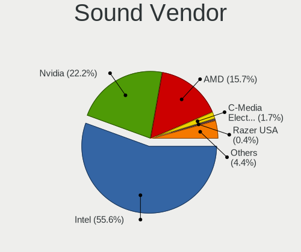

| Vendor                   | Computers | Percent |
|--------------------------|-----------|---------|
| Intel                    | 360       | 59.9%   |
| Nvidia                   | 126       | 20.97%  |
| AMD                      | 81        | 13.48%  |
| C-Media Electronics      | 10        | 1.66%   |
| VIA Technologies         | 2         | 0.33%   |
| Focusrite-Novation       | 2         | 0.33%   |
| Creative Labs            | 2         | 0.33%   |
| ASUSTek Computer         | 2         | 0.33%   |
| Xilinx                   | 1         | 0.17%   |
| ULi Electronics          | 1         | 0.17%   |
| Sony                     | 1         | 0.17%   |
| SG.Ltd                   | 1         | 0.17%   |
| SAVITECH                 | 1         | 0.17%   |
| Plantronics              | 1         | 0.17%   |
| Pixart Imaging           | 1         | 0.17%   |
| Logitech                 | 1         | 0.17%   |
| JMTek                    | 1         | 0.17%   |
| Huawei Technologies      | 1         | 0.17%   |
| Hewlett-Packard          | 1         | 0.17%   |
| GYROCOM C&C              | 1         | 0.17%   |
| Generalplus Technology   | 1         | 0.17%   |
| Blue Microphones         | 1         | 0.17%   |
| BEHRINGER International  | 1         | 0.17%   |
| Asahi Kasei Microsystems | 1         | 0.17%   |

Sound Model
-----------

Sound card models

| Model                                                                                             | Computers | Percent |
|---------------------------------------------------------------------------------------------------|-----------|---------|
| Intel 7 Series/C216 Chipset Family High Definition Audio Controller                               | 51        | 7.59%   |
| Intel 6 Series/C200 Series Chipset Family High Definition Audio Controller                        | 47        | 6.99%   |
| Intel NM10/ICH7 Family High Definition Audio Controller                                           | 45        | 6.7%    |
| Intel Sunrise Point-LP HD Audio                                                                   | 32        | 4.76%   |
| Nvidia GF108 High Definition Audio Controller                                                     | 27        | 4.02%   |
| Intel 8 Series/C220 Series Chipset High Definition Audio Controller                               | 21        | 3.13%   |
| AMD Family 17h/19h HD Audio Controller                                                            | 20        | 2.98%   |
| Intel 82801I (ICH9 Family) HD Audio Controller                                                    | 18        | 2.68%   |
| Intel 5 Series/3400 Series Chipset High Definition Audio                                          | 18        | 2.68%   |
| Nvidia High Definition Audio Controller                                                           | 15        | 2.23%   |
| Intel Cannon Lake PCH cAVS                                                                        | 14        | 2.08%   |
| Intel 82801JI (ICH10 Family) HD Audio Controller                                                  | 14        | 2.08%   |
| AMD FCH Azalia Controller                                                                         | 14        | 2.08%   |
| Nvidia GK107 HDMI Audio Controller                                                                | 13        | 1.93%   |
| Intel Xeon E3-1200 v3/4th Gen Core Processor HD Audio Controller                                  | 11        | 1.64%   |
| Intel Tiger Lake-LP Smart Sound Technology Audio Controller                                       | 11        | 1.64%   |
| AMD SBx00 Azalia (Intel HDA)                                                                      | 11        | 1.64%   |
| Intel 82801H (ICH8 Family) HD Audio Controller                                                    | 10        | 1.49%   |
| AMD Renoir Radeon High Definition Audio Controller                                                | 10        | 1.49%   |
| Intel Haswell-ULT HD Audio Controller                                                             | 8         | 1.19%   |
| Intel 8 Series HD Audio Controller                                                                | 8         | 1.19%   |
| Intel 100 Series/C230 Series Chipset Family HD Audio Controller                                   | 8         | 1.19%   |
| AMD Trinity HDMI Audio Controller                                                                 | 8         | 1.19%   |
| Nvidia GF114 HDMI Audio Controller                                                                | 7         | 1.04%   |
| Intel Comet Lake PCH cAVS                                                                         | 7         | 1.04%   |
| Intel 200 Series PCH HD Audio                                                                     | 7         | 1.04%   |
| Intel Celeron/Pentium Silver Processor High Definition Audio                                      | 6         | 0.89%   |
| Intel Atom Processor Z36xxx/Z37xxx Series High Definition Audio Controller                        | 6         | 0.89%   |
| AMD Raven/Raven2/Fenghuang HDMI/DP Audio Controller                                               | 6         | 0.89%   |
| AMD Kabini HDMI/DP Audio                                                                          | 6         | 0.89%   |
| Nvidia TU107 GeForce GTX 1650 High Definition Audio Controller                                    | 5         | 0.74%   |
| Nvidia GP107GL High Definition Audio Controller                                                   | 5         | 0.74%   |
| Nvidia GK208 HDMI/DP Audio Controller                                                             | 5         | 0.74%   |
| Nvidia GF119 HDMI Audio Controller                                                                | 5         | 0.74%   |
| Nvidia GF116 High Definition Audio Controller                                                     | 5         | 0.74%   |
| Intel Comet Lake PCH-LP cAVS                                                                      | 5         | 0.74%   |
| Intel Atom/Celeron/Pentium Processor x5-E8000/J3xxx/N3xxx Series High Definition Audio Controller | 5         | 0.74%   |
| AMD Juniper HDMI Audio [Radeon HD 5700 Series]                                                    | 5         | 0.74%   |
| AMD Family 17h (Models 00h-0fh) HD Audio Controller                                               | 5         | 0.74%   |
| AMD Cedar HDMI Audio [Radeon HD 5400/6300/7300 Series]                                            | 5         | 0.74%   |

Memory
------

Memory Vendor
-------------

Memory module vendors

| Vendor               | Computers | Percent |
|----------------------|-----------|---------|
| Unknown              | 116       | 27.62%  |
| SK hynix             | 62        | 14.76%  |
| Samsung Electronics  | 60        | 14.29%  |
| Kingston             | 42        | 10%     |
| Micron Technology    | 23        | 5.48%   |
| Transcend            | 16        | 3.81%   |
| A-DATA Technology    | 13        | 3.1%    |
| Ramaxel Technology   | 10        | 2.38%   |
| Crucial              | 9         | 2.14%   |
| Apacer               | 8         | 1.9%    |
| GeIL                 | 7         | 1.67%   |
| Team                 | 6         | 1.43%   |
| Silicon Power        | 6         | 1.43%   |
| Nanya Technology     | 5         | 1.19%   |
| Patriot              | 4         | 0.95%   |
| G.Skill              | 3         | 0.71%   |
| Elpida               | 3         | 0.71%   |
| Unknown (ABCD)       | 2         | 0.48%   |
| Super Talent         | 2         | 0.48%   |
| SUPER KINGSTEK       | 2         | 0.48%   |
| Qimonda              | 2         | 0.48%   |
| HPE                  | 2         | 0.48%   |
| GOODRAM              | 2         | 0.48%   |
| ASint Technology     | 2         | 0.48%   |
| V-Color              | 1         | 0.24%   |
| Unknown (D386)       | 1         | 0.24%   |
| Unknown (8CAB)       | 1         | 0.24%   |
| Toshiba              | 1         | 0.24%   |
| SHARETRONIC          | 1         | 0.24%   |
| Qumo                 | 1         | 0.24%   |
| ProMos/Mosel Vitelic | 1         | 0.24%   |
| Kllisre              | 1         | 0.24%   |
| Kingmax              | 1         | 0.24%   |
| KANMEIQi             | 1         | 0.24%   |
| Goldkey              | 1         | 0.24%   |
| Corsair              | 1         | 0.24%   |
| Atermiter            | 1         | 0.24%   |

Memory Model
------------

Memory module models

| Model                                                     | Computers | Percent |
|-----------------------------------------------------------|-----------|---------|
| Unknown RAM Module 2048MB DIMM SDRAM                      | 12        | 2.62%   |
| Unknown RAM Module 1024MB DIMM SDRAM                      | 10        | 2.18%   |
| Unknown RAM Module 1024MB DIMM 800MT/s                    | 7         | 1.53%   |
| Unknown RAM Module 4096MB DIMM DDR3 1333MT/s              | 6         | 1.31%   |
| Samsung RAM M471B5173QH0-YK0 4GB SODIMM DDR3 1600MT/s     | 6         | 1.31%   |
| Unknown RAM Module 2048MB DIMM 800MT/s                    | 5         | 1.09%   |
| Samsung RAM M471B5273DH0-CK0 4GB SODIMM DDR3 1600MT/s     | 5         | 1.09%   |
| Micron RAM 16KTF51264HZ-1G6M1 4GB SODIMM DDR3 1600MT/s    | 5         | 1.09%   |
| Unknown RAM Module 2GB DIMM 800MT/s                       | 4         | 0.87%   |
| Unknown RAM Module 2048MB DIMM DDR2 800MT/s               | 4         | 0.87%   |
| Transcend RAM JM1333KLU-2G 2GB DIMM DDR3 1333MT/s         | 4         | 0.87%   |
| Samsung RAM M471B5273DH0-CH9 4GB SODIMM DDR3 1334MT/s     | 4         | 0.87%   |
| Ramaxel RAM RMT3160ED58E9W1600 4GB SODIMM DDR3 1600MT/s   | 4         | 0.87%   |
| Nanya RAM NT2GC64B88B0NS-CG 2GB SODIMM DDR3 1334MT/s      | 4         | 0.87%   |
| Unknown RAM Module 2048MB DIMM 1333MT/s                   | 3         | 0.66%   |
| Unknown RAM Module 1024MB DIMM 667MT/s                    | 3         | 0.66%   |
| SK hynix RAM HMT451S6BFR8A-PB 4096MB SODIMM DDR3 1600MT/s | 3         | 0.66%   |
| SK hynix RAM HMT351S6CFR8C-PB 4GB SODIMM DDR3 1600MT/s    | 3         | 0.66%   |
| SK hynix RAM HMT325S6BFR8C-H9 2GB SODIMM DDR3 1600MT/s    | 3         | 0.66%   |
| SK hynix RAM HMA81GS6AFR8N-UH 8192MB SODIMM DDR4 2667MT/s | 3         | 0.66%   |
| Samsung RAM M471B5173EB0-YK0 4GB SODIMM DDR3 1600MT/s     | 3         | 0.66%   |
| Samsung RAM M471A5244CB0-CTD 4GB SODIMM DDR4 3266MT/s     | 3         | 0.66%   |
| Samsung RAM M4 70T5663QZ3-CF7 2GB SODIMM SDRAM 2048MT/s   | 3         | 0.66%   |
| Ramaxel RAM RMT3170EB68F9W1600 4GB SODIMM DDR3 1600MT/s   | 3         | 0.66%   |
| GeIL RAM CL9-9-9 D3-1333 8GB DIMM DDR3 1333MT/s           | 3         | 0.66%   |
| A-DATA RAM AD73I1C1674EV 4GB SODIMM DDR3 1334MT/s         | 3         | 0.66%   |
| Unknown RAM Module 4096MB SODIMM DDR3                     | 2         | 0.44%   |
| Unknown RAM Module 4096MB FB-DIMM DDR2 667MT/s            | 2         | 0.44%   |
| Unknown RAM Module 4096MB DIMM DDR3 1067MT/s              | 2         | 0.44%   |
| Unknown RAM Module 4096MB DIMM 1333MT/s                   | 2         | 0.44%   |
| Unknown RAM Module 2GB DIMM DDR2 800MT/s                  | 2         | 0.44%   |
| Unknown RAM Module 2GB DIMM 400MT/s                       | 2         | 0.44%   |
| Unknown RAM Module 2048MB SODIMM DDR2                     | 2         | 0.44%   |
| Unknown RAM Module 2048MB DIMM DDR3 1067MT/s              | 2         | 0.44%   |
| Unknown RAM Module 2048MB DIMM DDR2 667MT/s               | 2         | 0.44%   |
| Unknown RAM Module 2048MB DIMM DDR 667MT/s                | 2         | 0.44%   |
| Unknown RAM Module 2048MB DIMM DDR 1333MT/s               | 2         | 0.44%   |
| Unknown RAM Module 2048MB DIMM 5354MT/s                   | 2         | 0.44%   |
| Unknown RAM Module 1024MB SODIMM DDR2                     | 2         | 0.44%   |
| Unknown RAM Module 1024MB SODIMM DDR                      | 2         | 0.44%   |

Memory Kind
-----------

Memory module kinds

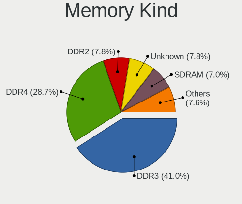

| Kind    | Computers | Percent |
|---------|-----------|---------|
| DDR3    | 164       | 46.72%  |
| DDR4    | 77        | 21.94%  |
| Unknown | 35        | 9.97%   |
| DDR2    | 31        | 8.83%   |
| SDRAM   | 29        | 8.26%   |
| DDR     | 7         | 1.99%   |
| LPDDR4  | 5         | 1.42%   |
| LPDDR3  | 2         | 0.57%   |
| DDR5    | 1         | 0.28%   |

Memory Form Factor
------------------

Physical design of the memory module

| Name         | Computers | Percent |
|--------------|-----------|---------|
| SODIMM       | 181       | 51.42%  |
| DIMM         | 159       | 45.17%  |
| Row Of Chips | 9         | 2.56%   |
| FB-DIMM      | 3         | 0.85%   |

Memory Size
-----------

Memory module size

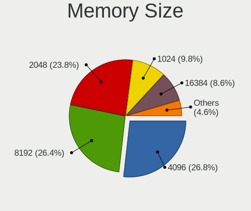

| Size  | Computers | Percent |
|-------|-----------|---------|
| 4096  | 133       | 32.2%   |
| 2048  | 116       | 28.09%  |
| 8192  | 82        | 19.85%  |
| 1024  | 50        | 12.11%  |
| 16384 | 20        | 4.84%   |
| 512   | 6         | 1.45%   |
| 32768 | 5         | 1.21%   |
| 256   | 1         | 0.24%   |

Memory Speed
------------

Memory module speed

| Speed   | Computers | Percent |
|---------|-----------|---------|
| 1600    | 100       | 25.25%  |
| 1333    | 51        | 12.88%  |
| Unknown | 39        | 9.85%   |
| 2667    | 26        | 6.57%   |
| 3200    | 23        | 5.81%   |
| 1334    | 23        | 5.81%   |
| 800     | 23        | 5.81%   |
| 2400    | 19        | 4.8%    |
| 667     | 19        | 4.8%    |
| 2133    | 9         | 2.27%   |
| 1067    | 8         | 2.02%   |
| 533     | 6         | 1.52%   |
| 2666    | 5         | 1.26%   |
| 1066    | 5         | 1.26%   |
| 3266    | 4         | 1.01%   |
| 400     | 4         | 1.01%   |
| 2048    | 3         | 0.76%   |
| 1867    | 3         | 0.76%   |
| 5354    | 2         | 0.51%   |
| 4267    | 2         | 0.51%   |
| 4199    | 2         | 0.51%   |
| 3800    | 2         | 0.51%   |
| 3600    | 2         | 0.51%   |
| 975     | 2         | 0.51%   |
| 8400    | 1         | 0.25%   |
| 4800    | 1         | 0.25%   |
| 4266    | 1         | 0.25%   |
| 3733    | 1         | 0.25%   |
| 3334    | 1         | 0.25%   |
| 3000    | 1         | 0.25%   |
| 2933    | 1         | 0.25%   |
| 2020    | 1         | 0.25%   |
| 1800    | 1         | 0.25%   |
| 1666    | 1         | 0.25%   |
| 1400    | 1         | 0.25%   |
| 1258    | 1         | 0.25%   |
| 666     | 1         | 0.25%   |
| 66      | 1         | 0.25%   |

Printers & scanners
-------------------

Printer Vendor
--------------

Printer device vendors

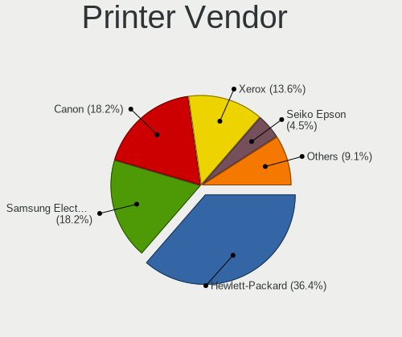

| Vendor                 | Computers | Percent |
|------------------------|-----------|---------|
| Hewlett-Packard        | 7         | 38.89%  |
| Samsung Electronics    | 4         | 22.22%  |
| Xerox                  | 3         | 16.67%  |
| Canon                  | 2         | 11.11%  |
| Seiko Epson            | 1         | 5.56%   |
| Panasonic (Matsushita) | 1         | 5.56%   |

Printer Model
-------------

Printer device models

| Model                                   | Computers | Percent |
|-----------------------------------------|-----------|---------|
| HP LaserJet 1018                        | 2         | 11.11%  |
| Xerox WorkCentre 6015B                  | 1         | 5.56%   |
| Xerox Phaser 3160                       | 1         | 5.56%   |
| Xerox Phaser 3020                       | 1         | 5.56%   |
| Seiko Epson L805 Series                 | 1         | 5.56%   |
| Samsung Xerox Phaser 3117 Laser Printer | 1         | 5.56%   |
| Samsung ML-1640 Series Laser Printer    | 1         | 5.56%   |
| Samsung M2020 Series                    | 1         | 5.56%   |
| Samsung CLX-3180 Series                 | 1         | 5.56%   |
| Panasonic (Matsushita) KX-MB1500RU      | 1         | 5.56%   |
| HP LaserJet P1102                       | 1         | 5.56%   |
| HP LaserJet 1020                        | 1         | 5.56%   |
| HP LaserJet 1010                        | 1         | 5.56%   |
| HP DeskJet 5650c                        | 1         | 5.56%   |
| HP Deskjet 2520 series                  | 1         | 5.56%   |
| Canon LBP810                            | 1         | 5.56%   |
| Canon LBP6000                           | 1         | 5.56%   |

Scanner Vendor
--------------

Scanner device vendors

| Vendor          | Computers | Percent |
|-----------------|-----------|---------|
| Hewlett-Packard | 1         | 100%    |

Scanner Model
-------------

Scanner device models

| Model          | Computers | Percent |
|----------------|-----------|---------|
| HP Scanjet 200 | 1         | 100%    |

Camera
------

Camera Vendor
-------------

Camera device vendors

| Vendor                                 | Computers | Percent |
|----------------------------------------|-----------|---------|
| Chicony Electronics                    | 56        | 20.74%  |
| IMC Networks                           | 29        | 10.74%  |
| Quanta                                 | 24        | 8.89%   |
| Realtek Semiconductor                  | 19        | 7.04%   |
| Cheng Uei Precision Industry (Foxlink) | 14        | 5.19%   |
| Acer                                   | 13        | 4.81%   |
| Microdia                               | 12        | 4.44%   |
| Z-Star Microelectronics                | 11        | 4.07%   |
| Suyin                                  | 11        | 4.07%   |
| Sunplus Innovation Technology          | 11        | 4.07%   |
| Logitech                               | 11        | 4.07%   |
| KYE Systems (Mouse Systems)            | 9         | 3.33%   |
| Syntek                                 | 7         | 2.59%   |
| Lite-On Technology                     | 5         | 1.85%   |
| Samsung Electronics                    | 4         | 1.48%   |
| Alcor Micro                            | 4         | 1.48%   |
| SiGma Micro                            | 3         | 1.11%   |
| Ricoh                                  | 3         | 1.11%   |
| Pixart Imaging                         | 3         | 1.11%   |
| GEMBIRD                                | 3         | 1.11%   |
| Silicon Motion                         | 2         | 0.74%   |
| Primax Electronics                     | 2         | 0.74%   |
| Hewlett-Packard                        | 2         | 0.74%   |
| Apple                                  | 2         | 0.74%   |
| ALi                                    | 2         | 0.74%   |
| Nebraska Furniture Mart                | 1         | 0.37%   |
| Luxvisions Innotech Limited            | 1         | 0.37%   |
| Lenovo                                 | 1         | 0.37%   |
| Jieli Technology                       | 1         | 0.37%   |
| Importek                               | 1         | 0.37%   |
| Generalplus Technology                 | 1         | 0.37%   |
| Aveo Technology                        | 1         | 0.37%   |
| A4Tech                                 | 1         | 0.37%   |

Camera Model
------------

Camera device models

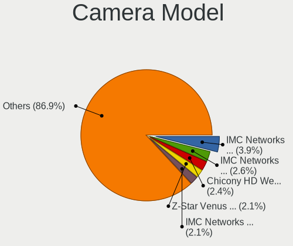

| Model                                               | Computers | Percent |
|-----------------------------------------------------|-----------|---------|
| IMC Networks USB2.0 VGA UVC WebCam                  | 10        | 3.69%   |
| Acer Lenovo EasyCamera                              | 7         | 2.58%   |
| Z-Star Venus USB2.0 Camera                          | 6         | 2.21%   |
| Chicony HD WebCam                                   | 6         | 2.21%   |
| Quanta HD Webcam                                    | 5         | 1.85%   |
| Quanta HD User Facing                               | 5         | 1.85%   |
| IMC Networks Integrated Camera                      | 5         | 1.85%   |
| Chicony Integrated Camera                           | 5         | 1.85%   |
| Syntek Lenovo EasyCamera                            | 4         | 1.48%   |
| Samsung Galaxy A5 (MTP)                             | 4         | 1.48%   |
| Realtek Lenovo EasyCamera                           | 4         | 1.48%   |
| Quanta VGA WebCam                                   | 4         | 1.48%   |
| Logitech Webcam C270                                | 4         | 1.48%   |
| IMC Networks USB2.0 HD UVC WebCam                   | 4         | 1.48%   |
| Chicony Integrated Camera (1280x720@30)             | 4         | 1.48%   |
| Chicony Fujitsu Integrated Camera                   | 4         | 1.48%   |
| Suyin HP Truevision HD                              | 3         | 1.11%   |
| Suyin 1.3M HD WebCam                                | 3         | 1.11%   |
| Sunplus HD WebCam                                   | 3         | 1.11%   |
| SiGma Micro WebCam SiGma Micro                      | 3         | 1.11%   |
| Quanta HP Wide Vision HD Camera                     | 3         | 1.11%   |
| Pixart Imaging GE 1.3 MP MiniCam Pro                | 3         | 1.11%   |
| Microdia Laptop_Integrated_Webcam_HD                | 3         | 1.11%   |
| Microdia Integrated_Webcam_HD                       | 3         | 1.11%   |
| Logitech Webcam C170                                | 3         | 1.11%   |
| Lite-On Integrated Camera                           | 3         | 1.11%   |
| KYE Systems (Mouse Systems) Genius iSlim 330        | 3         | 1.11%   |
| IMC Networks Lenovo EasyCamera                      | 3         | 1.11%   |
| Chicony VGA WebCam                                  | 3         | 1.11%   |
| Chicony USB2.0 HD UVC WebCam                        | 3         | 1.11%   |
| Chicony USB2.0 0.3M UVC WebCam                      | 3         | 1.11%   |
| Chicony HP Truevision HD                            | 3         | 1.11%   |
| Chicony EasyCamera                                  | 3         | 1.11%   |
| Cheng Uei Precision Industry (Foxlink) HP HD Camera | 3         | 1.11%   |
| Syntek Integrated Camera                            | 2         | 0.74%   |
| Suyin Integrated_Webcam_HD                          | 2         | 0.74%   |
| Sunplus Dell HD Webcam                              | 2         | 0.74%   |
| Sunplus Asus Webcam                                 | 2         | 0.74%   |
| Ricoh Sony Vaio Integrated Webcam                   | 2         | 0.74%   |
| Realtek USB Camera                                  | 2         | 0.74%   |

Security
--------

Fingerprint Vendor
------------------

Fingerprint sensor vendors

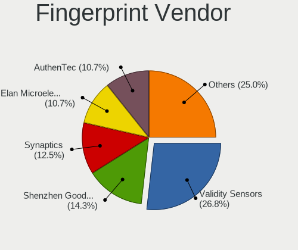

| Vendor                     | Computers | Percent |
|----------------------------|-----------|---------|
| Validity Sensors           | 14        | 31.82%  |
| Synaptics                  | 7         | 15.91%  |
| AuthenTec                  | 6         | 13.64%  |
| Upek                       | 5         | 11.36%  |
| STMicroelectronics         | 4         | 9.09%   |
| Shenzhen Goodix Technology | 4         | 9.09%   |
| LighTuning Technology      | 2         | 4.55%   |
| Elan Microelectronics      | 2         | 4.55%   |

Fingerprint Model
-----------------

Fingerprint sensor models

| Model                                                     | Computers | Percent |
|-----------------------------------------------------------|-----------|---------|
| Validity Sensors VFS495 Fingerprint Reader                | 6         | 13.64%  |
| Upek Biometric Touchchip/Touchstrip Fingerprint Sensor    | 5         | 11.36%  |
| STMicroelectronics Fingerprint Reader                     | 4         | 9.09%   |
| AuthenTec AES2501 Fingerprint Sensor                      | 3         | 6.82%   |
| Validity Sensors VFS5011 Fingerprint Reader               | 2         | 4.55%   |
| Validity Sensors Swipe Fingerprint Sensor                 | 2         | 4.55%   |
| Validity Sensors Fingerprint scanner                      | 2         | 4.55%   |
| Synaptics Metallica MIS Touch Fingerprint Reader          | 2         | 4.55%   |
| Shenzhen Goodix  FingerPrint Device                       | 2         | 4.55%   |
| LighTuning EgisTec Touch Fingerprint Sensor               | 2         | 4.55%   |
| AuthenTec AES2810                                         | 2         | 4.55%   |
| Validity Sensors VFS471 Fingerprint Reader                | 1         | 2.27%   |
| Validity Sensors VFS 5011 fingerprint sensor              | 1         | 2.27%   |
| Synaptics  WBDI                                           | 1         | 2.27%   |
| Synaptics  FS7604 Touch Fingerprint Sensor with PurePrint | 1         | 2.27%   |
| Synaptics Prometheus MIS Touch Fingerprint Reader         | 1         | 2.27%   |
| Synaptics Metallica MOH Touch Fingerprint Reader          | 1         | 2.27%   |
| Shenzhen Goodix Fingerprint Reader                        | 1         | 2.27%   |
| Shenzhen Goodix FingerPrint                               | 1         | 2.27%   |
| Elan ELAN:Fingerprint                                     | 1         | 2.27%   |
| Elan ELAN:ARM-M4                                          | 1         | 2.27%   |
| AuthenTec Fingerprint Sensor                              | 1         | 2.27%   |
| Unknown                                                   | 1         | 2.27%   |

Chipcard Vendor
---------------

Chipcard module vendors

| Vendor                | Computers | Percent |
|-----------------------|-----------|---------|
| Broadcom              | 2         | 22.22%  |
| Alcor Micro           | 2         | 22.22%  |
| Upek                  | 1         | 11.11%  |
| O2 Micro              | 1         | 11.11%  |
| Lenovo                | 1         | 11.11%  |
| Aktiv                 | 1         | 11.11%  |
| Advanced Card Systems | 1         | 11.11%  |

Chipcard Model
--------------

Chipcard module models

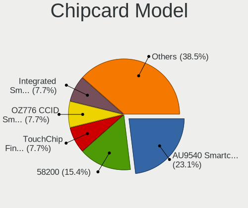

| Model                                                      | Computers | Percent |
|------------------------------------------------------------|-----------|---------|
| Alcor Micro AU9540 Smartcard Reader                        | 2         | 22.22%  |
| Upek TouchChip Fingerprint Coprocessor (WBF advanced mode) | 1         | 11.11%  |
| O2 Micro OZ776 CCID Smartcard Reader                       | 1         | 11.11%  |
| Lenovo Integrated Smart Card Reader                        | 1         | 11.11%  |
| Broadcom BCM5880 Secure Applications Processor             | 1         | 11.11%  |
| Broadcom 58200                                             | 1         | 11.11%  |
| Aktiv KAZTOKEN                                             | 1         | 11.11%  |
| Advanced Card Systems ACR38 SmartCard Reader               | 1         | 11.11%  |

Unsupported
-----------

Unsupported Devices
-------------------

Total unsupported devices on board

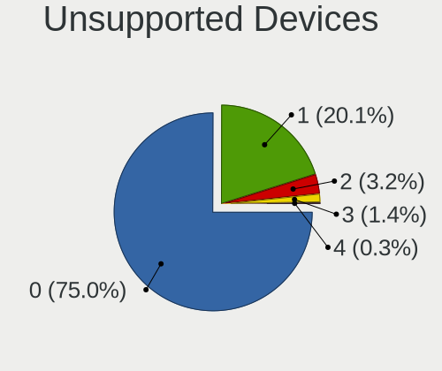

| Total | Computers | Percent |
|-------|-----------|---------|
| 0     | 340       | 74.89%  |
| 1     | 94        | 20.7%   |
| 2     | 16        | 3.52%   |
| 3     | 3         | 0.66%   |
| 4     | 1         | 0.22%   |

Unsupported Device Types
------------------------

Types of unsupported devices

| Type                     | Computers | Percent |
|--------------------------|-----------|---------|
| Fingerprint reader       | 44        | 33.59%  |
| Graphics card            | 38        | 29.01%  |
| Net/wireless             | 12        | 9.16%   |
| Bluetooth                | 9         | 6.87%   |
| Communication controller | 8         | 6.11%   |
| Chipcard                 | 7         | 5.34%   |
| Camera                   | 5         | 3.82%   |
| Unassigned class         | 3         | 2.29%   |
| Multimedia controller    | 3         | 2.29%   |
| Modem                    | 1         | 0.76%   |
| Card reader              | 1         | 0.76%   |

