Linux in Kazakhstan - Tested Hardware & Statistics (Desktops)
-------------------------------------------------------------

A project to collect tested hardware configurations for Linux in Kazakhstan.

Anyone can contribute to this report by the [hw-probe](https://github.com/linuxhw/hw-probe) tool:

    sudo -E hw-probe -all -upload

Please contribute! Especially if your hardware is rare.

Contents
--------

* [ Test Cases ](#test-cases)

* [ System ](#system)
  - [ OS                       ](#os)
  - [ OS Family                ](#os-family)
  - [ Kernel                   ](#kernel)
  - [ Kernel Family            ](#kernel-family)
  - [ Kernel Major Ver.        ](#kernel-major-ver)
  - [ Arch                     ](#arch)
  - [ DE                       ](#de)
  - [ Display Server           ](#display-server)
  - [ Display Manager          ](#display-manager)
  - [ OS Lang                  ](#os-lang)
  - [ Boot Mode                ](#boot-mode)
  - [ Filesystem               ](#filesystem)
  - [ Part. scheme             ](#part-scheme)
  - [ Dual Boot with Linux/BSD ](#dual-boot-with-linuxbsd)
  - [ Dual Boot (Win)          ](#dual-boot-win)

* [ Board ](#board)
  - [ Vendor                   ](#vendor)
  - [ Model                    ](#model)
  - [ Model Family             ](#model-family)
  - [ MFG Year                 ](#mfg-year)
  - [ Form Factor              ](#form-factor)
  - [ Secure Boot              ](#secure-boot)
  - [ Coreboot                 ](#coreboot)
  - [ RAM Size                 ](#ram-size)
  - [ RAM Used                 ](#ram-used)
  - [ Total Drives             ](#total-drives)
  - [ Has CD-ROM               ](#has-cd-rom)
  - [ Has Ethernet             ](#has-ethernet)
  - [ Has WiFi                 ](#has-wifi)
  - [ Has Bluetooth            ](#has-bluetooth)

* [ Location ](#location)
  - [ Country                  ](#country)
  - [ City                     ](#city)

* [ Drives ](#drives)
  - [ Drive Vendor             ](#drive-vendor)
  - [ Drive Model              ](#drive-model)
  - [ HDD Vendor               ](#hdd-vendor)
  - [ SSD Vendor               ](#ssd-vendor)
  - [ Drive Kind               ](#drive-kind)
  - [ Drive Connector          ](#drive-connector)
  - [ Drive Size               ](#drive-size)
  - [ Space Total              ](#space-total)
  - [ Space Used               ](#space-used)
  - [ Malfunc. Drives          ](#malfunc-drives)
  - [ Malfunc. Drive Vendor    ](#malfunc-drive-vendor)
  - [ Malfunc. HDD Vendor      ](#malfunc-hdd-vendor)
  - [ Malfunc. Drive Kind      ](#malfunc-drive-kind)
  - [ Failed Drives            ](#failed-drives)
  - [ Failed Drive Vendor      ](#failed-drive-vendor)
  - [ Drive Status             ](#drive-status)

* [ Storage controller ](#storage-controller)
  - [ Storage Vendor           ](#storage-vendor)
  - [ Storage Model            ](#storage-model)
  - [ Storage Kind             ](#storage-kind)

* [ Processor ](#processor)
  - [ CPU Vendor               ](#cpu-vendor)
  - [ CPU Model                ](#cpu-model)
  - [ CPU Model Family         ](#cpu-model-family)
  - [ CPU Cores                ](#cpu-cores)
  - [ CPU Sockets              ](#cpu-sockets)
  - [ CPU Threads              ](#cpu-threads)
  - [ CPU Op-Modes             ](#cpu-op-modes)
  - [ CPU Microcode            ](#cpu-microcode)
  - [ CPU Microarch            ](#cpu-microarch)

* [ Graphics ](#graphics)
  - [ GPU Vendor               ](#gpu-vendor)
  - [ GPU Model                ](#gpu-model)
  - [ GPU Combo                ](#gpu-combo)
  - [ GPU Driver               ](#gpu-driver)
  - [ GPU Memory               ](#gpu-memory)

* [ Monitor ](#monitor)
  - [ Monitor Vendor           ](#monitor-vendor)
  - [ Monitor Model            ](#monitor-model)
  - [ Monitor Resolution       ](#monitor-resolution)
  - [ Monitor Diagonal         ](#monitor-diagonal)
  - [ Monitor Width            ](#monitor-width)
  - [ Aspect Ratio             ](#aspect-ratio)
  - [ Monitor Area             ](#monitor-area)
  - [ Pixel Density            ](#pixel-density)
  - [ Multiple Monitors        ](#multiple-monitors)

* [ Network ](#network)
  - [ Net Controller Vendor    ](#net-controller-vendor)
  - [ Net Controller Model     ](#net-controller-model)
  - [ Wireless Vendor          ](#wireless-vendor)
  - [ Wireless Model           ](#wireless-model)
  - [ Ethernet Vendor          ](#ethernet-vendor)
  - [ Ethernet Model           ](#ethernet-model)
  - [ Net Controller Kind      ](#net-controller-kind)
  - [ Used Controller          ](#used-controller)
  - [ NICs                     ](#nics)
  - [ IPv6                     ](#ipv6)

* [ Bluetooth ](#bluetooth)
  - [ Bluetooth Vendor         ](#bluetooth-vendor)
  - [ Bluetooth Model          ](#bluetooth-model)

* [ Sound ](#sound)
  - [ Sound Vendor             ](#sound-vendor)
  - [ Sound Model              ](#sound-model)

* [ Memory ](#memory)
  - [ Memory Vendor            ](#memory-vendor)
  - [ Memory Model             ](#memory-model)
  - [ Memory Kind              ](#memory-kind)
  - [ Memory Form Factor       ](#memory-form-factor)
  - [ Memory Size              ](#memory-size)
  - [ Memory Speed             ](#memory-speed)

* [ Printers & scanners ](#printers--scanners)
  - [ Printer Vendor           ](#printer-vendor)
  - [ Printer Model            ](#printer-model)
  - [ Scanner Vendor           ](#scanner-vendor)
  - [ Scanner Model            ](#scanner-model)

* [ Camera ](#camera)
  - [ Camera Vendor            ](#camera-vendor)
  - [ Camera Model             ](#camera-model)

* [ Security ](#security)
  - [ Fingerprint Vendor       ](#fingerprint-vendor)
  - [ Fingerprint Model        ](#fingerprint-model)
  - [ Chipcard Vendor          ](#chipcard-vendor)
  - [ Chipcard Model           ](#chipcard-model)

* [ Unsupported ](#unsupported)
  - [ Unsupported Devices      ](#unsupported-devices)
  - [ Unsupported Device Types ](#unsupported-device-types)

Test Cases
----------

Total: 243

| Vendor        | Model                       | Probe                                                      | Date         |
|---------------|-----------------------------|------------------------------------------------------------|--------------|
| MSI           | H81M-P33                    | [d47bac5d9d](https://linux-hardware.org/?probe=d47bac5d9d) | Jul 26, 2022 |
| Foxconn       | 2ABF                        | [46876a159f](https://linux-hardware.org/?probe=46876a159f) | Jul 26, 2022 |
| Gigabyte      | Z68P-DS3                    | [b03f1fee53](https://linux-hardware.org/?probe=b03f1fee53) | Jul 24, 2022 |
| Gigabyte      | G31M-ES2L                   | [3e417753cb](https://linux-hardware.org/?probe=3e417753cb) | Jul 16, 2022 |
| Gigabyte      | G31M-ES2L                   | [24b5ba412b](https://linux-hardware.org/?probe=24b5ba412b) | Jul 16, 2022 |
| Gigabyte      | P35-DS3L                    | [67182580cc](https://linux-hardware.org/?probe=67182580cc) | Jul 10, 2022 |
| ASRock        | H310CM-HDV                  | [4e6539bf57](https://linux-hardware.org/?probe=4e6539bf57) | Jul 01, 2022 |
| ASRock        | H110M-HDV R3.0              | [6b7dd54165](https://linux-hardware.org/?probe=6b7dd54165) | Jun 13, 2022 |
| Gigabyte      | Z68P-DS3                    | [03554389d5](https://linux-hardware.org/?probe=03554389d5) | Jun 11, 2022 |
| MSI           | G41M-SP20                   | [214a83fb6b](https://linux-hardware.org/?probe=214a83fb6b) | Jun 04, 2022 |
| Foxconn       | H77M/H77M-S                 | [eb5f9f873a](https://linux-hardware.org/?probe=eb5f9f873a) | Jun 03, 2022 |
| ASUSTek       | H110M-K                     | [58566ab4b6](https://linux-hardware.org/?probe=58566ab4b6) | May 30, 2022 |
| ASRock        | H110M-HDV R3.0              | [2540080e55](https://linux-hardware.org/?probe=2540080e55) | May 28, 2022 |
| ASUSTek       | H110M-K                     | [9c2c8025ed](https://linux-hardware.org/?probe=9c2c8025ed) | May 26, 2022 |
| ASUSTek       | H110M-K                     | [d0d6870830](https://linux-hardware.org/?probe=d0d6870830) | May 23, 2022 |
| ASUSTek       | PRIME B450M-K II            | [f115d870eb](https://linux-hardware.org/?probe=f115d870eb) | May 07, 2022 |
| Gigabyte      | Z390 UD                     | [f7290e5680](https://linux-hardware.org/?probe=f7290e5680) | Apr 25, 2022 |
| Gigabyte      | H61M-S1                     | [0ca4241f02](https://linux-hardware.org/?probe=0ca4241f02) | Apr 23, 2022 |
| Gigabyte      | Z390 UD                     | [5f4832051e](https://linux-hardware.org/?probe=5f4832051e) | Apr 14, 2022 |
| ASRock        | B250 Pro4                   | [cb77fb75b5](https://linux-hardware.org/?probe=cb77fb75b5) | Apr 14, 2022 |
| Gigabyte      | Z390 UD                     | [ef0b36db62](https://linux-hardware.org/?probe=ef0b36db62) | Apr 11, 2022 |
| MSI           | MS-7365                     | [8948dea4de](https://linux-hardware.org/?probe=8948dea4de) | Apr 07, 2022 |
| Unknown       | X79-P3                      | [40e38e9a8d](https://linux-hardware.org/?probe=40e38e9a8d) | Apr 07, 2022 |
| HP            | 0A08h                       | [4df5b0832f](https://linux-hardware.org/?probe=4df5b0832f) | Apr 06, 2022 |
| ASRock        | H61M-VS                     | [609849a9e7](https://linux-hardware.org/?probe=609849a9e7) | Apr 02, 2022 |
| MSI           | MS-7346                     | [207eda5f34](https://linux-hardware.org/?probe=207eda5f34) | Mar 30, 2022 |
| ASUSTek       | PRIME B450M-K II            | [27b65f8212](https://linux-hardware.org/?probe=27b65f8212) | Mar 23, 2022 |
| ASRock        | 890GX Extreme4              | [3c57e1ac31](https://linux-hardware.org/?probe=3c57e1ac31) | Mar 20, 2022 |
| ASRock        | 890GX Extreme4              | [8c38c582bf](https://linux-hardware.org/?probe=8c38c582bf) | Mar 20, 2022 |
| ASUSTek       | PRIME B450M-K II            | [406c69d7cd](https://linux-hardware.org/?probe=406c69d7cd) | Mar 18, 2022 |
| MSI           | MS-7346                     | [2c94f0863d](https://linux-hardware.org/?probe=2c94f0863d) | Mar 16, 2022 |
| Dell          | 0V6XGW A01                  | [7b091c2035](https://linux-hardware.org/?probe=7b091c2035) | Mar 13, 2022 |
| MSI           | MS-7346                     | [0be963d491](https://linux-hardware.org/?probe=0be963d491) | Mar 13, 2022 |
| ASUSTek       | P5Q                         | [59a21d0aa2](https://linux-hardware.org/?probe=59a21d0aa2) | Mar 11, 2022 |
| MSI           | MS-7346                     | [369821f3f9](https://linux-hardware.org/?probe=369821f3f9) | Feb 26, 2022 |
| ASUSTek       | ROG STRIX B550-E GAMING     | [38d5887ae2](https://linux-hardware.org/?probe=38d5887ae2) | Feb 19, 2022 |
| ECS           | G41T-R3                     | [ad4ba21957](https://linux-hardware.org/?probe=ad4ba21957) | Feb 13, 2022 |
| Biostar       | H61MLV                      | [675b0c3faf](https://linux-hardware.org/?probe=675b0c3faf) | Feb 07, 2022 |
| ASUSTek       | P8H77-V LE                  | [cd91d445e6](https://linux-hardware.org/?probe=cd91d445e6) | Jan 30, 2022 |
| ASUSTek       | P8H77-V LE                  | [c1703ee8ee](https://linux-hardware.org/?probe=c1703ee8ee) | Jan 30, 2022 |
| ASRock        | G31M-VS                     | [d456869dd7](https://linux-hardware.org/?probe=d456869dd7) | Jan 14, 2022 |
| Acer          | Predator PO3-620            | [d33f608e2e](https://linux-hardware.org/?probe=d33f608e2e) | Dec 27, 2021 |
| eMachines     | ET1850                      | [cffccff919](https://linux-hardware.org/?probe=cffccff919) | Dec 20, 2021 |
| Gigabyte      | H370M DS3H-CF               | [c69f79e654](https://linux-hardware.org/?probe=c69f79e654) | Nov 17, 2021 |
| Gigabyte      | B460M DS3H V2               | [83857e3215](https://linux-hardware.org/?probe=83857e3215) | Oct 29, 2021 |
| Biostar       | H61MLV2                     | [118f61b356](https://linux-hardware.org/?probe=118f61b356) | Oct 23, 2021 |
| Gigabyte      | H370M DS3H-CF               | [1c2a383c4f](https://linux-hardware.org/?probe=1c2a383c4f) | Oct 20, 2021 |
| Gigabyte      | EP45-DS3L                   | [e7abad8af5](https://linux-hardware.org/?probe=e7abad8af5) | Oct 20, 2021 |
| Athermiter... | X99 Beta vk.com/@2485616    | [6006da0a12](https://linux-hardware.org/?probe=6006da0a12) | Oct 01, 2021 |
| ASRock        | G31M-VS                     | [79a5ef3dad](https://linux-hardware.org/?probe=79a5ef3dad) | Sep 22, 2021 |
| ASRock        | G31M-VS                     | [ea71d93f96](https://linux-hardware.org/?probe=ea71d93f96) | Aug 26, 2021 |
| Unknown       | Unknown                     | [d35224de9f](https://linux-hardware.org/?probe=d35224de9f) | Aug 07, 2021 |
| ASUSTek       | H61M-E                      | [d312398917](https://linux-hardware.org/?probe=d312398917) | Jul 29, 2021 |
| ASUSTek       | P8B75-M LE                  | [ad17a21f6e](https://linux-hardware.org/?probe=ad17a21f6e) | Jun 16, 2021 |
| Biostar       | H81MHV3                     | [0a593d3966](https://linux-hardware.org/?probe=0a593d3966) | Jun 01, 2021 |
| ASUSTek       | PRIME B450M-K II            | [1b292e7e77](https://linux-hardware.org/?probe=1b292e7e77) | May 21, 2021 |
| Intel         | DB65AL AAG12530-306         | [8cf2183901](https://linux-hardware.org/?probe=8cf2183901) | May 03, 2021 |
| MSI           | P55-GD65                    | [773fc40103](https://linux-hardware.org/?probe=773fc40103) | Apr 24, 2021 |
| ASUSTek       | TUF Z270 MARK 1             | [003b473b29](https://linux-hardware.org/?probe=003b473b29) | Mar 17, 2021 |
| ASUSTek       | PRIME B250-PRO              | [c62af0239b](https://linux-hardware.org/?probe=c62af0239b) | Mar 17, 2021 |
| Intel         | DG965RY AAD41691-301        | [d08f840a09](https://linux-hardware.org/?probe=d08f840a09) | Mar 07, 2021 |
| Gigabyte      | B450M S2H                   | [676848c0ea](https://linux-hardware.org/?probe=676848c0ea) | Mar 01, 2021 |
| Gigabyte      | G41MT-S2PT                  | [7b39e6bd46](https://linux-hardware.org/?probe=7b39e6bd46) | Feb 15, 2021 |
| ASUSTek       | PRIME A320M-K               | [19b6410050](https://linux-hardware.org/?probe=19b6410050) | Feb 12, 2021 |
| ASUSTek       | TUF B450-PLUS GAMING        | [5a8bae0bc9](https://linux-hardware.org/?probe=5a8bae0bc9) | Jan 17, 2021 |
| Fujitsu       | D3062-A1 S26361-D3062-A1    | [80552a83cd](https://linux-hardware.org/?probe=80552a83cd) | Jan 11, 2021 |
| Fujitsu       | D3062-A1 S26361-D3062-A1    | [e99dbcff3b](https://linux-hardware.org/?probe=e99dbcff3b) | Jan 11, 2021 |
| ASRock        | H110M-DVS R3.0              | [07ee20e1ca](https://linux-hardware.org/?probe=07ee20e1ca) | Jan 02, 2021 |
| ASUSTek       | M5A99X EVO R2.0             | [a673d3a8c7](https://linux-hardware.org/?probe=a673d3a8c7) | Dec 23, 2020 |
| eMachines     | ET1850                      | [c50ea84e0d](https://linux-hardware.org/?probe=c50ea84e0d) | Dec 18, 2020 |
| ASRock        | N68-S                       | [3533e8dac5](https://linux-hardware.org/?probe=3533e8dac5) | Dec 16, 2020 |
| Gigabyte      | Z87M-HD3                    | [42b04fe8bb](https://linux-hardware.org/?probe=42b04fe8bb) | Dec 06, 2020 |
| ASUSTek       | P5P43TD PRO                 | [874d67029b](https://linux-hardware.org/?probe=874d67029b) | Dec 02, 2020 |
| MSI           | X58 Pro-E                   | [d85b89db2e](https://linux-hardware.org/?probe=d85b89db2e) | Nov 11, 2020 |
| MSI           | MS-7346                     | [b297f8721b](https://linux-hardware.org/?probe=b297f8721b) | Oct 31, 2020 |
| ASUSTek       | P5P43TD PRO                 | [2c2ff12670](https://linux-hardware.org/?probe=2c2ff12670) | Oct 31, 2020 |
| ASRock        | B450 Gaming K4              | [42aa2abab3](https://linux-hardware.org/?probe=42aa2abab3) | Oct 26, 2020 |
| ASRock        | H61iCafe                    | [a44ad4ab39](https://linux-hardware.org/?probe=a44ad4ab39) | Oct 08, 2020 |
| Gigabyte      | P55A-UD3R                   | [be3a1d8c92](https://linux-hardware.org/?probe=be3a1d8c92) | Oct 05, 2020 |
| ASUSTek       | PRIME Z370-A                | [1ad6b7a819](https://linux-hardware.org/?probe=1ad6b7a819) | Oct 01, 2020 |
| Gigabyte      | Z370 HD3P-CF                | [5c317250db](https://linux-hardware.org/?probe=5c317250db) | Sep 27, 2020 |
| Biostar       | G41-M7                      | [a50a75af2a](https://linux-hardware.org/?probe=a50a75af2a) | Aug 11, 2020 |
| Intel         | DB65AL AAG12530-306         | [03daa1b244](https://linux-hardware.org/?probe=03daa1b244) | Jul 09, 2020 |
| Intel         | DB65AL AAG12530-306         | [c64ad86725](https://linux-hardware.org/?probe=c64ad86725) | Jul 07, 2020 |
| Intel         | DB65AL AAG12530-306         | [c2c3f83b11](https://linux-hardware.org/?probe=c2c3f83b11) | Jul 07, 2020 |
| ASUSTek       | H61M-K                      | [955b5a5e27](https://linux-hardware.org/?probe=955b5a5e27) | Jun 08, 2020 |
| Intel         | DH61WW AAG23116-204         | [c0fc07b2e3](https://linux-hardware.org/?probe=c0fc07b2e3) | May 27, 2020 |
| Intel         | DH61WW AAG23116-204         | [a34ec38bca](https://linux-hardware.org/?probe=a34ec38bca) | May 22, 2020 |
| ASRock        | Q1900M                      | [5998519fca](https://linux-hardware.org/?probe=5998519fca) | May 18, 2020 |
| Gigabyte      | EP43-S3L                    | [ce53a132ad](https://linux-hardware.org/?probe=ce53a132ad) | Apr 22, 2020 |
| ASUSTek       | PRIME B250-PRO              | [8dddac7046](https://linux-hardware.org/?probe=8dddac7046) | Mar 25, 2020 |
| Intel         | DB65AL AAG12530-306         | [37eadd87d7](https://linux-hardware.org/?probe=37eadd87d7) | Mar 24, 2020 |
| ASRock        | H61M-VG3                    | [13be5c5114](https://linux-hardware.org/?probe=13be5c5114) | Mar 14, 2020 |
| Foxconn       | G31MXP/G31MXP-K FAB:1.0     | [bdd6336c5c](https://linux-hardware.org/?probe=bdd6336c5c) | Feb 10, 2020 |
| ASUSTek       | H81-GAMER                   | [d8091352aa](https://linux-hardware.org/?probe=d8091352aa) | Feb 09, 2020 |
| Biostar       | B75MU3B                     | [78def272e2](https://linux-hardware.org/?probe=78def272e2) | Feb 06, 2020 |
| Biostar       | B75MU3B                     | [41f7bff636](https://linux-hardware.org/?probe=41f7bff636) | Feb 04, 2020 |
| Biostar       | B75MU3B                     | [9f8d0c9af4](https://linux-hardware.org/?probe=9f8d0c9af4) | Feb 04, 2020 |
| Gigabyte      | B360M D3H-CF                | [4d8aed3739](https://linux-hardware.org/?probe=4d8aed3739) | Jan 31, 2020 |
| Gigabyte      | H61M-DS2 DVI                | [016eb3ca52](https://linux-hardware.org/?probe=016eb3ca52) | Jan 22, 2020 |
| OEM           | Unknown                     | [0df2000649](https://linux-hardware.org/?probe=0df2000649) | Jan 12, 2020 |
| Intel         | DH55PJ AAE93812-302         | [a57dcf32aa](https://linux-hardware.org/?probe=a57dcf32aa) | Dec 20, 2019 |
| ASRock        | Q1900M                      | [5eb2001292](https://linux-hardware.org/?probe=5eb2001292) | Dec 20, 2019 |
| ASRock        | Q1900M                      | [aa067c312b](https://linux-hardware.org/?probe=aa067c312b) | Dec 08, 2019 |
| ASRock        | Q1900M                      | [d0137a63e9](https://linux-hardware.org/?probe=d0137a63e9) | Dec 08, 2019 |
| MSI           | B75A-G43                    | [6dd3e491f5](https://linux-hardware.org/?probe=6dd3e491f5) | Dec 04, 2019 |
| Gigabyte      | Z68P-DS3                    | [8444d1b8a5](https://linux-hardware.org/?probe=8444d1b8a5) | Dec 02, 2019 |
| ASUSTek       | PRIME Z390M-PLUS            | [c8c1a01026](https://linux-hardware.org/?probe=c8c1a01026) | Sep 04, 2019 |
| ASUSTek       | P8Z77-M                     | [988203ee61](https://linux-hardware.org/?probe=988203ee61) | Aug 31, 2019 |
| EPoX Compu... | nForce4 DDR: 8NPA7I / 8N... | [3912cd3c3a](https://linux-hardware.org/?probe=3912cd3c3a) | Aug 15, 2019 |
| Dell          | 0GDG8Y A00                  | [201fe8de92](https://linux-hardware.org/?probe=201fe8de92) | Aug 10, 2019 |
| MSI           | X470 GAMING PRO             | [01eb97a943](https://linux-hardware.org/?probe=01eb97a943) | Jul 26, 2019 |
| MSI           | X470 GAMING PRO             | [868720add8](https://linux-hardware.org/?probe=868720add8) | Jul 26, 2019 |
| Gigabyte      | P35-DS3L                    | [54231260ff](https://linux-hardware.org/?probe=54231260ff) | Jul 26, 2019 |
| Gigabyte      | P35-DS3L                    | [6db0f0b43c](https://linux-hardware.org/?probe=6db0f0b43c) | Jul 26, 2019 |
| MSI           | G31M3-F V2                  | [3f04b83dfd](https://linux-hardware.org/?probe=3f04b83dfd) | Jun 25, 2019 |
| MSI           | G31M3-F V2                  | [70820eed2b](https://linux-hardware.org/?probe=70820eed2b) | Jun 23, 2019 |
| HP            | 09F0h                       | [59817a0992](https://linux-hardware.org/?probe=59817a0992) | Jun 09, 2019 |
| ASUSTek       | H97-PLUS                    | [f72a33f2be](https://linux-hardware.org/?probe=f72a33f2be) | May 17, 2019 |
| Gigabyte      | H77-DS3H                    | [5cecb224c0](https://linux-hardware.org/?probe=5cecb224c0) | May 13, 2019 |
| MSI           | MS-7346                     | [f9012833e0](https://linux-hardware.org/?probe=f9012833e0) | May 05, 2019 |
| Gigabyte      | H110-D3-CF                  | [e3e358c6c5](https://linux-hardware.org/?probe=e3e358c6c5) | May 02, 2019 |
| Gigabyte      | H110-D3-CF                  | [0f667174d7](https://linux-hardware.org/?probe=0f667174d7) | May 02, 2019 |
| ASUSTek       | P5B-VM SE                   | [5ac945fc44](https://linux-hardware.org/?probe=5ac945fc44) | Apr 24, 2019 |
| Biostar       | B75MU3B                     | [263bae9f6d](https://linux-hardware.org/?probe=263bae9f6d) | Apr 21, 2019 |
| ASUSTek       | P8B75-M LX                  | [0fc0eb1dfe](https://linux-hardware.org/?probe=0fc0eb1dfe) | Apr 14, 2019 |
| ASUSTek       | P8B75-M LX                  | [a8c17634fa](https://linux-hardware.org/?probe=a8c17634fa) | Apr 13, 2019 |
| Biostar       | H81MLC                      | [21b0c1af4d](https://linux-hardware.org/?probe=21b0c1af4d) | Mar 26, 2019 |
| Gigabyte      | H61M-S1                     | [1471f5c744](https://linux-hardware.org/?probe=1471f5c744) | Mar 26, 2019 |
| Gigabyte      | G1.Sniper 3                 | [700fc16ac3](https://linux-hardware.org/?probe=700fc16ac3) | Mar 23, 2019 |
| Gigabyte      | G1.Sniper 3                 | [98718d3ebc](https://linux-hardware.org/?probe=98718d3ebc) | Mar 20, 2019 |
| Gigabyte      | G1.Sniper 3                 | [7302d607c3](https://linux-hardware.org/?probe=7302d607c3) | Mar 19, 2019 |
| ASRock        | B85 Pro4                    | [8c2f28bdd7](https://linux-hardware.org/?probe=8c2f28bdd7) | Mar 14, 2019 |
| ASRock        | B85 Pro4                    | [9cf5db3af5](https://linux-hardware.org/?probe=9cf5db3af5) | Mar 11, 2019 |
| ASRock        | B85 Pro4                    | [6193a4e4db](https://linux-hardware.org/?probe=6193a4e4db) | Mar 02, 2019 |
| Intel         | DG965RY AAD41691-205        | [9e17250cd3](https://linux-hardware.org/?probe=9e17250cd3) | Feb 25, 2019 |
| ASUSTek       | H170 PRO GAMING             | [7de51a6093](https://linux-hardware.org/?probe=7de51a6093) | Feb 18, 2019 |
| HP            | 21D0                        | [e12ecb452a](https://linux-hardware.org/?probe=e12ecb452a) | Feb 15, 2019 |
| ECS           | P4M800PRO-M                 | [9b79e448af](https://linux-hardware.org/?probe=9b79e448af) | Feb 10, 2019 |
| eMachines     | ET1850                      | [49d2d34eb5](https://linux-hardware.org/?probe=49d2d34eb5) | Feb 09, 2019 |
| ECS           | P4M800PRO-M                 | [4fa72ec332](https://linux-hardware.org/?probe=4fa72ec332) | Jan 22, 2019 |
| ASRock        | B75M R2.0                   | [6e1297e003](https://linux-hardware.org/?probe=6e1297e003) | Dec 19, 2018 |
| ASRock        | B75M-DGS R2.0               | [b54d9c9c47](https://linux-hardware.org/?probe=b54d9c9c47) | Dec 19, 2018 |
| Biostar       | B75MU3B                     | [aebd92ed4e](https://linux-hardware.org/?probe=aebd92ed4e) | Dec 18, 2018 |
| Biostar       | B75MU3B                     | [76612a774a](https://linux-hardware.org/?probe=76612a774a) | Dec 16, 2018 |
| Biostar       | P4M89-M7A Ver:1.0           | [cfcedc1f4f](https://linux-hardware.org/?probe=cfcedc1f4f) | Dec 15, 2018 |
| MSI           | H61M-P20                    | [805bef206c](https://linux-hardware.org/?probe=805bef206c) | Dec 06, 2018 |
| ASUSTek       | P8H61-M LX3 R2.0            | [17cd747f59](https://linux-hardware.org/?probe=17cd747f59) | Nov 27, 2018 |
| Gigabyte      | Z68P-DS3                    | [d6841f0c9f](https://linux-hardware.org/?probe=d6841f0c9f) | Oct 24, 2018 |
| Gigabyte      | EP45-DS3L                   | [120f3b30db](https://linux-hardware.org/?probe=120f3b30db) | Oct 13, 2018 |
| Gigabyte      | EX58-UD3R                   | [ad2e1e8a9c](https://linux-hardware.org/?probe=ad2e1e8a9c) | Oct 12, 2018 |
| Gigabyte      | H97-HD3                     | [57811990c6](https://linux-hardware.org/?probe=57811990c6) | Oct 09, 2018 |
| ECS           | G31T-M7                     | [9524260856](https://linux-hardware.org/?probe=9524260856) | Sep 11, 2018 |
| ASUSTek       | P5K-E                       | [2bf1f5cd4d](https://linux-hardware.org/?probe=2bf1f5cd4d) | Sep 02, 2018 |
| Foxconn       | 45CMX/45GMX/45CMX-K         | [91a4bc2623](https://linux-hardware.org/?probe=91a4bc2623) | Jul 23, 2018 |
| Lenovo        | ThinkCentre M58p 6138A89    | [5dabc0431a](https://linux-hardware.org/?probe=5dabc0431a) | Jul 08, 2018 |
| Lenovo        | ThinkCentre M58p 6138A89    | [b40472e4ff](https://linux-hardware.org/?probe=b40472e4ff) | Jul 08, 2018 |
| AMI           | Cherry Trail CR             | [f8d107c1d6](https://linux-hardware.org/?probe=f8d107c1d6) | Jul 05, 2018 |
| ASRock        | G31M-GS                     | [e7ad4e06b0](https://linux-hardware.org/?probe=e7ad4e06b0) | May 21, 2018 |
| Gigabyte      | H97-HD3                     | [bc90c9abeb](https://linux-hardware.org/?probe=bc90c9abeb) | May 19, 2018 |
| ASRock        | G31M-GS                     | [33e42cb4a1](https://linux-hardware.org/?probe=33e42cb4a1) | May 17, 2018 |
| ASUSTek       | P5K SE                      | [758aa13be2](https://linux-hardware.org/?probe=758aa13be2) | May 15, 2018 |
| Gigabyte      | H110M-S2V-CF                | [258a87c77e](https://linux-hardware.org/?probe=258a87c77e) | Apr 18, 2018 |
| Colorful T... | C.G31T Ver2.3               | [fa66706236](https://linux-hardware.org/?probe=fa66706236) | Apr 05, 2018 |
| MSI           | D2415 S26361-D2415-A21      | [4252f362f3](https://linux-hardware.org/?probe=4252f362f3) | Apr 04, 2018 |
| MSI           | D2415 S26361-D2415-A21      | [5b42126fde](https://linux-hardware.org/?probe=5b42126fde) | Apr 04, 2018 |
| MSI           | D2415 S26361-D2415-A21      | [12aefd0226](https://linux-hardware.org/?probe=12aefd0226) | Mar 08, 2018 |
| ECS           | H61H2-M12                   | [9245ae30a0](https://linux-hardware.org/?probe=9245ae30a0) | Mar 05, 2018 |
| Gigabyte      | Z68XP-UD5                   | [5fed078696](https://linux-hardware.org/?probe=5fed078696) | Mar 02, 2018 |
| Gigabyte      | Z68XP-UD5                   | [a5edee18e6](https://linux-hardware.org/?probe=a5edee18e6) | Mar 02, 2018 |
| Gigabyte      | 965G-DS3                    | [a18c3642c1](https://linux-hardware.org/?probe=a18c3642c1) | Feb 27, 2018 |
| Intel         | DP45SG AAE27733-407         | [a12c16610a](https://linux-hardware.org/?probe=a12c16610a) | Feb 21, 2018 |
| Intel         | DP45SG AAE27733-407         | [01f1eb1b43](https://linux-hardware.org/?probe=01f1eb1b43) | Feb 21, 2018 |
| Gigabyte      | P35-DS3L                    | [b53697cdde](https://linux-hardware.org/?probe=b53697cdde) | Feb 17, 2018 |
| Foxconn       | G31MXP FAB:1.1              | [7e932c8df9](https://linux-hardware.org/?probe=7e932c8df9) | Feb 14, 2018 |
| Gigabyte      | EG45M-DS2H                  | [5765dec2f5](https://linux-hardware.org/?probe=5765dec2f5) | Feb 07, 2018 |
| ASRock        | N68-S                       | [938b758f5d](https://linux-hardware.org/?probe=938b758f5d) | Feb 05, 2018 |
| ECS           | H61H2-M12                   | [ccb76d8296](https://linux-hardware.org/?probe=ccb76d8296) | Feb 04, 2018 |
| ASRock        | N68-S                       | [64632c3151](https://linux-hardware.org/?probe=64632c3151) | Feb 03, 2018 |
| ASRock        | G31M-GS                     | [8b178b91b5](https://linux-hardware.org/?probe=8b178b91b5) | Jan 16, 2018 |
| ASRock        | B150M Pro4S/D3              | [3d61c8f1b1](https://linux-hardware.org/?probe=3d61c8f1b1) | Jan 16, 2018 |
| Gigabyte      | P55-US3L                    | [31d2b07ed0](https://linux-hardware.org/?probe=31d2b07ed0) | Jan 09, 2018 |
| Gigabyte      | P55-US3L                    | [557edddbbb](https://linux-hardware.org/?probe=557edddbbb) | Jan 09, 2018 |
| ECS           | G31T-M7                     | [a3440d0458](https://linux-hardware.org/?probe=a3440d0458) | Jan 09, 2018 |
| Fujitsu Si... | D2750-A1 S26361-D2750-A1    | [e3d1272ce6](https://linux-hardware.org/?probe=e3d1272ce6) | Jan 08, 2018 |
| Lenovo        | IdeaCentre B320             | [f744394a1c](https://linux-hardware.org/?probe=f744394a1c) | Dec 29, 2017 |
| ASUSTek       | Crosshair III Formula       | [dc9bba3d36](https://linux-hardware.org/?probe=dc9bba3d36) | Dec 23, 2017 |
| MSI           | H61M-P20                    | [98d085f592](https://linux-hardware.org/?probe=98d085f592) | Dec 17, 2017 |
| Biostar       | G31-M7 TE                   | [6b7be109df](https://linux-hardware.org/?probe=6b7be109df) | Dec 10, 2017 |
| Biostar       | G31-M7 TE                   | [ff359217e3](https://linux-hardware.org/?probe=ff359217e3) | Dec 10, 2017 |
| MSI           | H61M-P20                    | [b9e07ffbc6](https://linux-hardware.org/?probe=b9e07ffbc6) | Dec 07, 2017 |
| ECS           | G31T-M7                     | [ab2cc3b591](https://linux-hardware.org/?probe=ab2cc3b591) | Dec 05, 2017 |
| MSI           | H61M-P20                    | [c8f3683dd7](https://linux-hardware.org/?probe=c8f3683dd7) | Dec 03, 2017 |
| ASUSTek       | H170 PRO GAMING             | [2930095950](https://linux-hardware.org/?probe=2930095950) | Nov 26, 2017 |
| MSI           | G41M4                       | [5b263ddccb](https://linux-hardware.org/?probe=5b263ddccb) | Oct 26, 2017 |
| MSI           | MS-7360                     | [74b442872c](https://linux-hardware.org/?probe=74b442872c) | Oct 14, 2017 |
| MSI           | MS-7360                     | [e3fea5c9f7](https://linux-hardware.org/?probe=e3fea5c9f7) | Oct 13, 2017 |
| ASRock        | G31M-S                      | [d686d9a6b4](https://linux-hardware.org/?probe=d686d9a6b4) | Oct 09, 2017 |
| ASRock        | G31M-S                      | [a6c7d89da8](https://linux-hardware.org/?probe=a6c7d89da8) | Oct 09, 2017 |
| ECS           | P33T-A                      | [b333446a6e](https://linux-hardware.org/?probe=b333446a6e) | Oct 07, 2017 |
| ASUSTek       | P8H61-M LX2                 | [3bf184ba53](https://linux-hardware.org/?probe=3bf184ba53) | Oct 01, 2017 |
| ECS           | P33T-A                      | [370e48dea3](https://linux-hardware.org/?probe=370e48dea3) | Sep 02, 2017 |
| MSI           | P45-C51                     | [3c7abe4dbb](https://linux-hardware.org/?probe=3c7abe4dbb) | Sep 01, 2017 |
| Unknown       | Unknown                     | [5593f71ea9](https://linux-hardware.org/?probe=5593f71ea9) | Aug 31, 2017 |
| MSI           | P45-C51                     | [3605717bc8](https://linux-hardware.org/?probe=3605717bc8) | Aug 24, 2017 |
| Gigabyte      | G41MT-S2                    | [60027a3248](https://linux-hardware.org/?probe=60027a3248) | Aug 24, 2017 |
| Unknown       | Unknown                     | [729dbae58e](https://linux-hardware.org/?probe=729dbae58e) | Aug 18, 2017 |
| MSI           | P45-C51                     | [f19a281f67](https://linux-hardware.org/?probe=f19a281f67) | Aug 17, 2017 |
| Gigabyte      | P55-UD3L                    | [b3c7478840](https://linux-hardware.org/?probe=b3c7478840) | Aug 17, 2017 |
| Gigabyte      | G41M-Combo                  | [46eadd3692](https://linux-hardware.org/?probe=46eadd3692) | Aug 14, 2017 |
| MSI           | P45-C51                     | [55eb7a334a](https://linux-hardware.org/?probe=55eb7a334a) | Jul 26, 2017 |
| Gigabyte      | EP45-DS3L                   | [bdc06eff0a](https://linux-hardware.org/?probe=bdc06eff0a) | Jul 18, 2017 |
| MSI           | G41M4                       | [42ac99dafe](https://linux-hardware.org/?probe=42ac99dafe) | Jul 12, 2017 |
| MSI           | G41M4                       | [95c6901677](https://linux-hardware.org/?probe=95c6901677) | Jul 12, 2017 |
| Foxconn       | G41MX/G41MX-K 2.0 1.0       | [bf8c80ba08](https://linux-hardware.org/?probe=bf8c80ba08) | Jul 09, 2017 |
| ASUSTek       | H81M-R                      | [1ab9b8b9b0](https://linux-hardware.org/?probe=1ab9b8b9b0) | Jul 01, 2017 |
| ECS           | H61H2-MV                    | [5e3381ae2b](https://linux-hardware.org/?probe=5e3381ae2b) | Jul 01, 2017 |
| Foxconn       | G43M01                      | [5baa8deeea](https://linux-hardware.org/?probe=5baa8deeea) | Jun 17, 2017 |
| Gigabyte      | P31-S3G                     | [7db5b169da](https://linux-hardware.org/?probe=7db5b169da) | Jun 12, 2017 |
| ECS           | P33T-A                      | [a226d451b0](https://linux-hardware.org/?probe=a226d451b0) | May 29, 2017 |
| ECS           | P33T-A                      | [17dbb18609](https://linux-hardware.org/?probe=17dbb18609) | May 26, 2017 |
| Gigabyte      | P35-DS3L                    | [ed899cd88b](https://linux-hardware.org/?probe=ed899cd88b) | May 25, 2017 |
| Foxconn       | G31MXP FAB:1.1              | [06e5d46798](https://linux-hardware.org/?probe=06e5d46798) | May 21, 2017 |
| Gigabyte      | EP35-DS3L                   | [fdbccdc938](https://linux-hardware.org/?probe=fdbccdc938) | May 13, 2017 |
| Intel         | DN2820FYK H24582-201        | [ff2477ab47](https://linux-hardware.org/?probe=ff2477ab47) | May 11, 2017 |
| Gigabyte      | M57SLI-S4                   | [43e1a4811a](https://linux-hardware.org/?probe=43e1a4811a) | May 01, 2017 |
| ASUSTek       | M4N98TD EVO                 | [97b83f48df](https://linux-hardware.org/?probe=97b83f48df) | Apr 26, 2017 |
| ASRock        | G31M-VS                     | [a3dd026e80](https://linux-hardware.org/?probe=a3dd026e80) | Apr 18, 2017 |
| ASUSTek       | M2N4-SLI                    | [1699021b8f](https://linux-hardware.org/?probe=1699021b8f) | Mar 31, 2017 |
| ASUSTek       | M2N4-SLI                    | [a712e10b97](https://linux-hardware.org/?probe=a712e10b97) | Mar 28, 2017 |
| ASUSTek       | P8Z77-V LX                  | [fb7fc9c78e](https://linux-hardware.org/?probe=fb7fc9c78e) | Mar 13, 2017 |
| Biostar       | Hi-Fi Z87W                  | [8e13c3fba7](https://linux-hardware.org/?probe=8e13c3fba7) | Mar 11, 2017 |
| MSI           | MS-7346                     | [1f97ef92e1](https://linux-hardware.org/?probe=1f97ef92e1) | Mar 11, 2017 |
| ASUSTek       | H81M-K                      | [0f9345171a](https://linux-hardware.org/?probe=0f9345171a) | Mar 10, 2017 |
| MSI           | MS-7346                     | [b83af770d0](https://linux-hardware.org/?probe=b83af770d0) | Mar 09, 2017 |
| ASRock        | H61M-HVS                    | [bab5245e0a](https://linux-hardware.org/?probe=bab5245e0a) | Feb 17, 2017 |
| ASUSTek       | H61M-K                      | [6c7cca8bcd](https://linux-hardware.org/?probe=6c7cca8bcd) | Feb 05, 2017 |
| Intel         | DN2820FYK H24582-201        | [0756a69391](https://linux-hardware.org/?probe=0756a69391) | Jan 07, 2017 |
| Fujitsu Si... | D2156-A1 S26361-D2156-A1    | [2313e5ca24](https://linux-hardware.org/?probe=2313e5ca24) | Dec 19, 2016 |
| ASUSTek       | P5P43TD                     | [6455128f71](https://linux-hardware.org/?probe=6455128f71) | Dec 05, 2016 |
| ASUSTek       | H81-PLUS                    | [35990fe890](https://linux-hardware.org/?probe=35990fe890) | Nov 01, 2016 |
| Gigabyte      | G31M-S2L                    | [9b1ec63eb3](https://linux-hardware.org/?probe=9b1ec63eb3) | Oct 28, 2016 |
| ASRock        | H170M Pro4                  | [c5125f0040](https://linux-hardware.org/?probe=c5125f0040) | Sep 30, 2016 |

System
------

OS
--

Installed operating systems

| Name               | Desktops | Percent |
|--------------------|----------|---------|
| ROSA R8.1          | 31       | 16.85%  |
| ROSA R10           | 30       | 16.3%   |
| ROSA R11           | 23       | 12.5%   |
| ROSA R9            | 15       | 8.15%   |
| ROSA R11.1         | 15       | 8.15%   |
| ROSA 12.2          | 10       | 5.43%   |
| ROSA R8            | 8        | 4.35%   |
| Ubuntu 20.04       | 5        | 2.72%   |
| OpenMandriva 4.2   | 4        | 2.17%   |
| Slackware 15.0     | 3        | 1.63%   |
| OpenMandriva 4.3   | 3        | 1.63%   |
| Ubuntu 18.04       | 2        | 1.09%   |
| Manjaro            | 2        | 1.09%   |
| Linux Mint 19.3    | 2        | 1.09%   |
| Linux Mint 18.3    | 2        | 1.09%   |
| KDE neon 20.04     | 2        | 1.09%   |
| Debian 11          | 2        | 1.09%   |
| Ubuntu 21.10       | 1        | 0.54%   |
| Ubuntu 19.04       | 1        | 0.54%   |
| Ubuntu 18.10       | 1        | 0.54%   |
| Solus 4.3          | 1        | 0.54%   |
| ROSA 12.1          | 1        | 0.54%   |
| ROSA 12            | 1        | 0.54%   |
| openSUSE Leap-15.1 | 1        | 0.54%   |
| OpenMandriva 4.90  | 1        | 0.54%   |
| Manjaro 21.0.7     | 1        | 0.54%   |
| Manjaro 20.1       | 1        | 0.54%   |
| Manjaro 18.1.3     | 1        | 0.54%   |
| Manjaro 18.0.0-rc  | 1        | 0.54%   |
| Lubuntu 18.04      | 1        | 0.54%   |
| Linux Mint 18.2    | 1        | 0.54%   |
| Kubuntu 19.10      | 1        | 0.54%   |
| Gentoo 2.6         | 1        | 0.54%   |
| Fedora 35          | 1        | 0.54%   |
| Fedora 34          | 1        | 0.54%   |
| Fedora 33          | 1        | 0.54%   |
| Clear Linux 36400  | 1        | 0.54%   |
| BlackPanther 18.1  | 1        | 0.54%   |
| Arch Rolling       | 1        | 0.54%   |
| Arch               | 1        | 0.54%   |
| ALT Linux 9.1      | 1        | 0.54%   |
| ALT Linux 9.0      | 1        | 0.54%   |

OS Family
---------

OS without a version

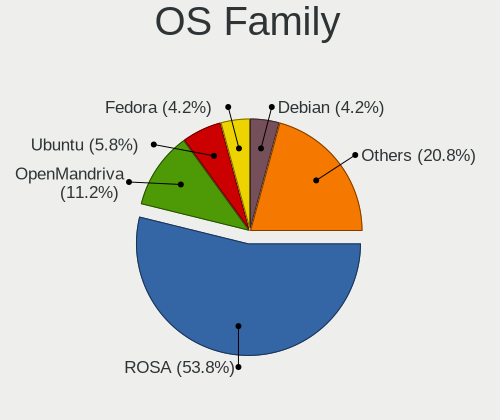

| Name         | Desktops | Percent |
|--------------|----------|---------|
| ROSA         | 120      | 72.29%  |
| Ubuntu       | 10       | 6.02%   |
| OpenMandriva | 8        | 4.82%   |
| Linux Mint   | 5        | 3.01%   |
| Manjaro      | 4        | 2.41%   |
| Slackware    | 3        | 1.81%   |
| KDE neon     | 2        | 1.2%    |
| Fedora       | 2        | 1.2%    |
| Debian       | 2        | 1.2%    |
| Arch         | 2        | 1.2%    |
| Solus        | 1        | 0.6%    |
| openSUSE     | 1        | 0.6%    |
| Lubuntu      | 1        | 0.6%    |
| Kubuntu      | 1        | 0.6%    |
| Gentoo       | 1        | 0.6%    |
| Clear Linux  | 1        | 0.6%    |
| BlackPanther | 1        | 0.6%    |
| ALT Linux    | 1        | 0.6%    |

Kernel
------

Version of the Linux kernel

| Version                             | Desktops | Percent |
|-------------------------------------|----------|---------|
| 4.9.60-nrj-desktop-1rosa-x86_64     | 13       | 6.81%   |
| 4.9.20-nrj-desktop-1rosa-x86_64     | 11       | 5.76%   |
| 4.15.0-desktop-45.1rosa-x86_64      | 11       | 5.76%   |
| 5.10.74-generic-2rosa2021.1-x86_64  | 10       | 5.24%   |
| 4.1.38-nrj-desktop-2rosa-x86_64     | 9        | 4.71%   |
| 4.9.60-nrj-desktop-1rosa-i586       | 7        | 3.66%   |
| 4.15.0-desktop-122.124.1rosa-x86_64 | 7        | 3.66%   |
| 4.9.9-nrj-desktop-1rosa-x86_64      | 6        | 3.14%   |
| 4.9.9-nrj-desktop-1rosa-i586        | 5        | 2.62%   |
| 4.9.20-nrj-desktop-1rosa-i586       | 5        | 2.62%   |
| 4.9.155-nrj-desktop-1rosa-x86_64    | 5        | 2.62%   |
| 5.4.32-generic-2rosa-x86_64         | 4        | 2.09%   |
| 5.10.14-desktop-1omv4002            | 4        | 2.09%   |
| 4.9.76-nrj-desktop-1rosa-x86_64     | 4        | 2.09%   |
| 4.15.0-desktop-68.5rosa-x86_64      | 4        | 2.09%   |
| 4.15.0-desktop-45.1rosa-i586        | 4        | 2.09%   |
| 5.16.7-desktop-1omv4003             | 3        | 1.57%   |
| 4.1.34-nrj-desktop-2rosa-x86_64     | 3        | 1.57%   |
| 5.8.6-1-MANJARO                     | 2        | 1.05%   |
| 5.4.0-52-generic                    | 2        | 1.05%   |
| 5.15.19                             | 2        | 1.05%   |
| 4.9.41-nrj-desktop-1rosa-x86_64     | 2        | 1.05%   |
| 4.9.124-nrj-desktop-1rosa-x86_64    | 2        | 1.05%   |
| 4.9.111-nrj-desktop-2rosa-x86_64    | 2        | 1.05%   |
| 4.1.38-nrj-desktop-2rosa-i586       | 2        | 1.05%   |
| 4.1.34-nrj-desktop-2rosa-i586       | 2        | 1.05%   |
| 5.8.13-21-tkg-upds                  | 1        | 0.52%   |
| 5.4.87-gentoo-x86_64                | 1        | 0.52%   |
| 5.4.85-std-def-alt1                 | 1        | 0.52%   |
| 5.4.32-generic-2rosa-i586           | 1        | 0.52%   |
| 5.4.0-56-generic                    | 1        | 0.52%   |
| 5.4.0-48-generic                    | 1        | 0.52%   |
| 5.3.13-1-MANJARO                    | 1        | 0.52%   |
| 5.3.0-26-generic                    | 1        | 0.52%   |
| 5.18.3-1-MANJARO                    | 1        | 0.52%   |
| 5.18.12-desktop-3omv4090            | 1        | 0.52%   |
| 5.18.12-3-MANJARO                   | 1        | 0.52%   |
| 5.17.9-1144.native                  | 1        | 0.52%   |
| 5.15.27                             | 1        | 0.52%   |
| 5.15.0-41-generic                   | 1        | 0.52%   |
| 5.14.17-301.fc35.x86_64             | 1        | 0.52%   |
| 5.14.14-202.current                 | 1        | 0.52%   |
| 5.14.12-200.fc34.x86_64             | 1        | 0.52%   |
| 5.13.19-2-pve                       | 1        | 0.52%   |
| 5.13.0-51-generic                   | 1        | 0.52%   |
| 5.13.0-44-generic                   | 1        | 0.52%   |
| 5.13.0-39-generic                   | 1        | 0.52%   |
| 5.13.0-19-generic                   | 1        | 0.52%   |
| 5.10.71-generic-1rosa2021.1-x86_64  | 1        | 0.52%   |
| 5.10.42-1-MANJARO                   | 1        | 0.52%   |
| 5.10.13-200.fc33.x86_64             | 1        | 0.52%   |
| 5.10.118-generic-2rosa2021.1-x86_64 | 1        | 0.52%   |
| 5.10.0-9-amd64                      | 1        | 0.52%   |
| 5.0.10-arch1-1-ARCH                 | 1        | 0.52%   |
| 5.0.0-37-generic                    | 1        | 0.52%   |
| 5.0.0-13-generic                    | 1        | 0.52%   |
| 4.9.76-nrj-desktop-1rosa-i586       | 1        | 0.52%   |
| 4.9.41-nrj-desktop-1rosa-i586       | 1        | 0.52%   |
| 4.9.34-nrj-desktop-2rosa-i586       | 1        | 0.52%   |
| 4.9.34-nrj-desktop-1rosa-x86_64     | 1        | 0.52%   |

Kernel Family
-------------

Linux kernel without a distro release

| Version  | Desktops | Percent |
|----------|----------|---------|
| 4.15.0   | 32       | 16.93%  |
| 4.9.60   | 20       | 10.58%  |
| 4.9.20   | 16       | 8.47%   |
| 4.9.9    | 11       | 5.82%   |
| 4.1.38   | 11       | 5.82%   |
| 5.10.74  | 10       | 5.29%   |
| 4.9.155  | 6        | 3.17%   |
| 5.4.32   | 5        | 2.65%   |
| 4.9.76   | 5        | 2.65%   |
| 4.1.34   | 5        | 2.65%   |
| 5.4.0    | 4        | 2.12%   |
| 5.13.0   | 4        | 2.12%   |
| 5.10.14  | 4        | 2.12%   |
| 5.16.7   | 3        | 1.59%   |
| 4.9.41   | 3        | 1.59%   |
| 4.9.124  | 3        | 1.59%   |
| 4.9.111  | 3        | 1.59%   |
| 5.8.6    | 2        | 1.06%   |
| 5.18.12  | 2        | 1.06%   |
| 5.15.19  | 2        | 1.06%   |
| 5.0.0    | 2        | 1.06%   |
| 4.9.34   | 2        | 1.06%   |
| 4.18.16  | 2        | 1.06%   |
| 4.1.25   | 2        | 1.06%   |
| 5.8.13   | 1        | 0.53%   |
| 5.4.87   | 1        | 0.53%   |
| 5.4.85   | 1        | 0.53%   |
| 5.3.13   | 1        | 0.53%   |
| 5.3.0    | 1        | 0.53%   |
| 5.18.3   | 1        | 0.53%   |
| 5.17.9   | 1        | 0.53%   |
| 5.15.27  | 1        | 0.53%   |
| 5.15.0   | 1        | 0.53%   |
| 5.14.17  | 1        | 0.53%   |
| 5.14.14  | 1        | 0.53%   |
| 5.14.12  | 1        | 0.53%   |
| 5.13.19  | 1        | 0.53%   |
| 5.10.71  | 1        | 0.53%   |
| 5.10.42  | 1        | 0.53%   |
| 5.10.13  | 1        | 0.53%   |
| 5.10.118 | 1        | 0.53%   |
| 5.10.0   | 1        | 0.53%   |
| 5.0.10   | 1        | 0.53%   |
| 4.4.20   | 1        | 0.53%   |
| 4.19.79  | 1        | 0.53%   |
| 4.18.6   | 1        | 0.53%   |
| 4.18.20  | 1        | 0.53%   |
| 4.18.0   | 1        | 0.53%   |
| 4.17.0   | 1        | 0.53%   |
| 4.14.3   | 1        | 0.53%   |
| 4.13.0   | 1        | 0.53%   |
| 4.12.14  | 1        | 0.53%   |
| 4.12.10  | 1        | 0.53%   |
| 3.14.15  | 1        | 0.53%   |

Kernel Major Ver.
-----------------

Linux kernel major version

| Version | Desktops | Percent |
|---------|----------|---------|
| 4.9     | 63       | 35%     |
| 4.15    | 32       | 17.78%  |
| 5.10    | 19       | 10.56%  |
| 4.1     | 17       | 9.44%   |
| 5.4     | 11       | 6.11%   |
| 5.13    | 5        | 2.78%   |
| 4.18    | 5        | 2.78%   |
| 5.15    | 4        | 2.22%   |
| 5.8     | 3        | 1.67%   |
| 5.16    | 3        | 1.67%   |
| 5.0     | 3        | 1.67%   |
| 5.3     | 2        | 1.11%   |
| 5.18    | 2        | 1.11%   |
| 5.14    | 2        | 1.11%   |
| 4.12    | 2        | 1.11%   |
| 5.17    | 1        | 0.56%   |
| 4.4     | 1        | 0.56%   |
| 4.19    | 1        | 0.56%   |
| 4.17    | 1        | 0.56%   |
| 4.14    | 1        | 0.56%   |
| 4.13    | 1        | 0.56%   |
| 3.14    | 1        | 0.56%   |

Arch
----

OS architecture (x86_64, i586, etc.)

| Name   | Desktops | Percent |
|--------|----------|---------|
| x86_64 | 136      | 80.47%  |
| i686   | 33       | 19.53%  |

DE
--

Desktop Environment

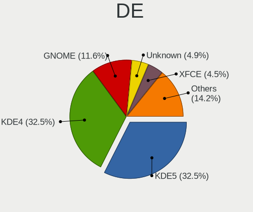

| Name          | Desktops | Percent |
|---------------|----------|---------|
| KDE4          | 85       | 49.13%  |
| KDE5          | 46       | 26.59%  |
| GNOME         | 12       | 6.94%   |
| Unknown       | 7        | 4.05%   |
| XFCE          | 6        | 3.47%   |
| Cinnamon      | 5        | 2.89%   |
| KDE           | 4        | 2.31%   |
| MATE          | 3        | 1.73%   |
| LXDE          | 2        | 1.16%   |
| X-Cinnamon    | 1        | 0.58%   |
| LXQt          | 1        | 0.58%   |
| GNOME Classic | 1        | 0.58%   |

Display Server
--------------

X11 or Wayland

| Name    | Desktops | Percent |
|---------|----------|---------|
| X11     | 152      | 90.48%  |
| Wayland | 13       | 7.74%   |
| Unknown | 2        | 1.19%   |
| Tty     | 1        | 0.6%    |

Display Manager
---------------

SDDM, LightDM, etc.

| Name    | Desktops | Percent |
|---------|----------|---------|
| KDM     | 87       | 50.29%  |
| SDDM    | 51       | 29.48%  |
| Unknown | 12       | 6.94%   |
| GDM     | 10       | 5.78%   |
| LightDM | 7        | 4.05%   |
| TDM     | 5        | 2.89%   |
| GDM3    | 1        | 0.58%   |

OS Lang
-------

Language

| Lang    | Desktops | Percent |
|---------|----------|---------|
| Unknown | 111      | 64.16%  |
| ru_RU   | 43       | 24.86%  |
| en_US   | 17       | 9.83%   |
| ru_KZ   | 1        | 0.58%   |
| en_GB   | 1        | 0.58%   |

Boot Mode
---------

EFI or BIOS

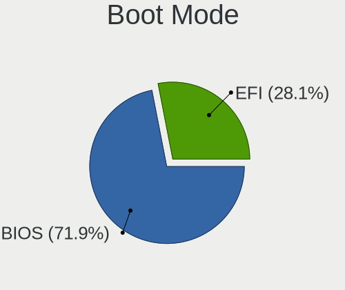

| Mode | Desktops | Percent |
|------|----------|---------|
| BIOS | 133      | 80.12%  |
| EFI  | 33       | 19.88%  |

Filesystem
----------

Type of filesystem

| Type    | Desktops | Percent |
|---------|----------|---------|
| Ext4    | 82       | 47.67%  |
| Unknown | 70       | 40.7%   |
| Overlay | 11       | 6.4%    |
| Btrfs   | 7        | 4.07%   |
| Zfs     | 1        | 0.58%   |
| Xfs     | 1        | 0.58%   |

Part. scheme
------------

Scheme of partitioning

| Type    | Desktops | Percent |
|---------|----------|---------|
| MBR     | 85       | 50.3%   |
| Unknown | 48       | 28.4%   |
| GPT     | 36       | 21.3%   |

Dual Boot with Linux/BSD
------------------------

Hosting more than one Linux/BSD

| Dual boot | Desktops | Percent |
|-----------|----------|---------|
| No        | 143      | 85.12%  |
| Yes       | 25       | 14.88%  |

Dual Boot (Win)
---------------

Hosting Linux and Windows

| Dual boot | Desktops | Percent |
|-----------|----------|---------|
| No        | 110      | 63.95%  |
| Yes       | 62       | 36.05%  |

Board
-----

Vendor
------

Motherboard manufacturer

| Name                | Desktops | Percent |
|---------------------|----------|---------|
| Gigabyte Technology | 36       | 22.09%  |
| ASUSTek Computer    | 35       | 21.47%  |
| ASRock              | 23       | 14.11%  |
| MSI                 | 15       | 9.2%    |
| Biostar             | 10       | 6.13%   |
| Foxconn             | 8        | 4.91%   |
| ECS                 | 8        | 4.91%   |
| Intel               | 7        | 4.29%   |
| Unknown             | 4        | 2.45%   |
| Hewlett-Packard     | 3        | 1.84%   |
| Lenovo              | 2        | 1.23%   |
| Fujitsu Siemens     | 2        | 1.23%   |
| Dell                | 2        | 1.23%   |
| OEM                 | 1        | 0.61%   |
| Fujitsu             | 1        | 0.61%   |
| EPoX Computer       | 1        | 0.61%   |
| eMachines           | 1        | 0.61%   |
| Colorful Technology | 1        | 0.61%   |
| Athermiter/PlexHD   | 1        | 0.61%   |
| AMI                 | 1        | 0.61%   |
| Acer                | 1        | 0.61%   |

Model
-----

Motherboard model

| Name                                   | Desktops | Percent |
|----------------------------------------|----------|---------|
| ASUS All Series                        | 5        | 3.07%   |
| Unknown                                | 5        | 3.07%   |
| Gigabyte P35-DS3L                      | 3        | 1.84%   |
| MSI MS-7788                            | 2        | 1.23%   |
| MSI MS-7592                            | 2        | 1.23%   |
| Gigabyte EP45-DS3L                     | 2        | 1.23%   |
| Foxconn G31MXP FAB:1.1                 | 2        | 1.23%   |
| ECS H61H2-M12                          | 2        | 1.23%   |
| ECS G31T-M7                            | 2        | 1.23%   |
| Biostar B75MU3B                        | 2        | 1.23%   |
| ASUS H61M-K                            | 2        | 1.23%   |
| ASRock Q1900M                          | 2        | 1.23%   |
| ASRock G31M-VS                         | 2        | 1.23%   |
| ASRock G31M-GS                         | 2        | 1.23%   |
| MSI MS-7B79                            | 1        | 0.61%   |
| MSI MS-7817                            | 1        | 0.61%   |
| MSI MS-7758                            | 1        | 0.61%   |
| MSI MS-7583                            | 1        | 0.61%   |
| MSI MS-7529                            | 1        | 0.61%   |
| MSI MS-7522                            | 1        | 0.61%   |
| MSI MS-7519                            | 1        | 0.61%   |
| MSI MS-7365                            | 1        | 0.61%   |
| MSI MS-7360                            | 1        | 0.61%   |
| MSI MS-7346                            | 1        | 0.61%   |
| MSI ESPRIMO P1510                      | 1        | 0.61%   |
| Lenovo ThinkCentre M58p 6138A89        | 1        | 0.61%   |
| Lenovo IdeaCentre B320                 | 1        | 0.61%   |
| Intel DP45SG AAE27733-407              | 1        | 0.61%   |
| Intel DN2820FYK H24582-201             | 1        | 0.61%   |
| Intel DH61WW AAG23116-204              | 1        | 0.61%   |
| Intel DH55PJ AAE93812-302              | 1        | 0.61%   |
| Intel DG965RY AAD41691-301             | 1        | 0.61%   |
| Intel DG965RY AAD41691-205             | 1        | 0.61%   |
| Intel DB65AL AAG12530-306              | 1        | 0.61%   |
| HP xw8400 Workstation                  | 1        | 0.61%   |
| HP ProDesk 600 G1 DM                   | 1        | 0.61%   |
| HP Compaq dc7600 Convertible Minitower | 1        | 0.61%   |
| Gigabyte Z87M-HD3                      | 1        | 0.61%   |
| Gigabyte Z68XP-UD5                     | 1        | 0.61%   |
| Gigabyte Z68P-DS3                      | 1        | 0.61%   |
| Gigabyte Z390 UD                       | 1        | 0.61%   |
| Gigabyte Z370 HD3P                     | 1        | 0.61%   |
| Gigabyte P55A-UD3R                     | 1        | 0.61%   |
| Gigabyte P55-US3L                      | 1        | 0.61%   |
| Gigabyte P55-UD3L                      | 1        | 0.61%   |
| Gigabyte P31-S3G                       | 1        | 0.61%   |
| Gigabyte M57SLI-S4                     | 1        | 0.61%   |
| Gigabyte H97-HD3                       | 1        | 0.61%   |
| Gigabyte H77-DS3H                      | 1        | 0.61%   |
| Gigabyte H61M-S1                       | 1        | 0.61%   |
| Gigabyte H61M-DS2 DVI                  | 1        | 0.61%   |
| Gigabyte H370M-DS3H                    | 1        | 0.61%   |
| Gigabyte H110M-S2V                     | 1        | 0.61%   |
| Gigabyte H110-D3                       | 1        | 0.61%   |
| Gigabyte G41MT-S2PT                    | 1        | 0.61%   |
| Gigabyte G41MT-S2                      | 1        | 0.61%   |
| Gigabyte G41M-Combo                    | 1        | 0.61%   |
| Gigabyte G31M-S2L                      | 1        | 0.61%   |
| Gigabyte G31M-ES2L                     | 1        | 0.61%   |
| Gigabyte G1.Sniper 3                   | 1        | 0.61%   |

Model Family
------------

Motherboard model prefix

| Name                | Desktops | Percent |
|---------------------|----------|---------|
| ASUS PRIME          | 5        | 3.07%   |
| ASUS All            | 5        | 3.07%   |
| Unknown             | 5        | 3.07%   |
| Gigabyte P35-DS3L   | 3        | 1.84%   |
| Foxconn G31MXP      | 3        | 1.84%   |
| MSI MS-7788         | 2        | 1.23%   |
| MSI MS-7592         | 2        | 1.23%   |
| Intel DG965RY       | 2        | 1.23%   |
| Gigabyte EP45-DS3L  | 2        | 1.23%   |
| ECS H61H2-M12       | 2        | 1.23%   |
| ECS G31T-M7         | 2        | 1.23%   |
| Biostar B75MU3B     | 2        | 1.23%   |
| ASUS TUF            | 2        | 1.23%   |
| ASUS P8H61-M        | 2        | 1.23%   |
| ASUS P8B75-M        | 2        | 1.23%   |
| ASUS P5P43TD        | 2        | 1.23%   |
| ASUS H61M-K         | 2        | 1.23%   |
| ASRock Q1900M       | 2        | 1.23%   |
| ASRock G31M-VS      | 2        | 1.23%   |
| ASRock G31M-GS      | 2        | 1.23%   |
| MSI MS-7B79         | 1        | 0.61%   |
| MSI MS-7817         | 1        | 0.61%   |
| MSI MS-7758         | 1        | 0.61%   |
| MSI MS-7583         | 1        | 0.61%   |
| MSI MS-7529         | 1        | 0.61%   |
| MSI MS-7522         | 1        | 0.61%   |
| MSI MS-7519         | 1        | 0.61%   |
| MSI MS-7365         | 1        | 0.61%   |
| MSI MS-7360         | 1        | 0.61%   |
| MSI MS-7346         | 1        | 0.61%   |
| MSI ESPRIMO         | 1        | 0.61%   |
| Lenovo ThinkCentre  | 1        | 0.61%   |
| Lenovo IdeaCentre   | 1        | 0.61%   |
| Intel DP45SG        | 1        | 0.61%   |
| Intel DN2820FYK     | 1        | 0.61%   |
| Intel DH61WW        | 1        | 0.61%   |
| Intel DH55PJ        | 1        | 0.61%   |
| Intel DB65AL        | 1        | 0.61%   |
| HP xw8400           | 1        | 0.61%   |
| HP ProDesk          | 1        | 0.61%   |
| HP Compaq           | 1        | 0.61%   |
| Gigabyte Z87M-HD3   | 1        | 0.61%   |
| Gigabyte Z68XP-UD5  | 1        | 0.61%   |
| Gigabyte Z68P-DS3   | 1        | 0.61%   |
| Gigabyte Z390       | 1        | 0.61%   |
| Gigabyte Z370       | 1        | 0.61%   |
| Gigabyte P55A-UD3R  | 1        | 0.61%   |
| Gigabyte P55-US3L   | 1        | 0.61%   |
| Gigabyte P55-UD3L   | 1        | 0.61%   |
| Gigabyte P31-S3G    | 1        | 0.61%   |
| Gigabyte M57SLI-S4  | 1        | 0.61%   |
| Gigabyte H97-HD3    | 1        | 0.61%   |
| Gigabyte H77-DS3H   | 1        | 0.61%   |
| Gigabyte H61M-S1    | 1        | 0.61%   |
| Gigabyte H61M-DS2   | 1        | 0.61%   |
| Gigabyte H370M-DS3H | 1        | 0.61%   |
| Gigabyte H110M-S2V  | 1        | 0.61%   |
| Gigabyte H110-D3    | 1        | 0.61%   |
| Gigabyte G41MT-S2PT | 1        | 0.61%   |
| Gigabyte G41MT-S2   | 1        | 0.61%   |

MFG Year
--------

Motherboard manufacture year

| Year    | Desktops | Percent |
|---------|----------|---------|
| 2012    | 23       | 14.11%  |
| 2009    | 20       | 12.27%  |
| 2008    | 19       | 11.66%  |
| 2011    | 18       | 11.04%  |
| 2007    | 16       | 9.82%   |
| 2014    | 11       | 6.75%   |
| 2010    | 9        | 5.52%   |
| 2018    | 8        | 4.91%   |
| 2013    | 8        | 4.91%   |
| 2017    | 6        | 3.68%   |
| 2016    | 6        | 3.68%   |
| 2020    | 4        | 2.45%   |
| 2019    | 4        | 2.45%   |
| 2006    | 4        | 2.45%   |
| 2015    | 3        | 1.84%   |
| 2005    | 3        | 1.84%   |
| Unknown | 1        | 0.61%   |

Form Factor
-----------

Physical design of the computer

| Name    | Desktops | Percent |
|---------|----------|---------|
| Desktop | 163      | 100%    |

Secure Boot
-----------

Enabled or disabled

| State    | Desktops | Percent |
|----------|----------|---------|
| Disabled | 163      | 100%    |

Coreboot
--------

Have coreboot on board

| Used | Desktops | Percent |
|------|----------|---------|
| No   | 163      | 100%    |

RAM Size
--------

Total RAM memory

| Size in GB  | Desktops | Percent |
|-------------|----------|---------|
| 3.01-4.0    | 51       | 29.65%  |
| 8.01-16.0   | 32       | 18.6%   |
| 4.01-8.0    | 26       | 15.12%  |
| 16.01-24.0  | 20       | 11.63%  |
| 1.01-2.0    | 18       | 10.47%  |
| 2.01-3.0    | 11       | 6.4%    |
| 32.01-64.0  | 7        | 4.07%   |
| 0.51-1.0    | 4        | 2.33%   |
| 24.01-32.0  | 2        | 1.16%   |
| 64.01-256.0 | 1        | 0.58%   |

RAM Used
--------

Used RAM memory

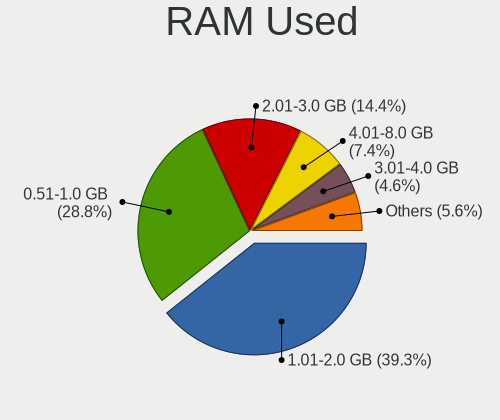

| Used GB    | Desktops | Percent |
|------------|----------|---------|
| 1.01-2.0   | 81       | 44.75%  |
| 0.51-1.0   | 67       | 37.02%  |
| 2.01-3.0   | 16       | 8.84%   |
| 4.01-8.0   | 6        | 3.31%   |
| 3.01-4.0   | 4        | 2.21%   |
| 8.01-16.0  | 3        | 1.66%   |
| 0.01-0.5   | 3        | 1.66%   |
| 32.01-64.0 | 1        | 0.55%   |

Total Drives
------------

Number of drives on board

| Drives | Desktops | Percent |
|--------|----------|---------|
| 1      | 80       | 45.98%  |
| 2      | 54       | 31.03%  |
| 3      | 24       | 13.79%  |
| 4      | 9        | 5.17%   |
| 5      | 3        | 1.72%   |
| 6      | 2        | 1.15%   |
| 8      | 1        | 0.57%   |
| 0      | 1        | 0.57%   |

Has CD-ROM
----------

Has CD-ROM on board

| Presented | Desktops | Percent |
|-----------|----------|---------|
| Yes       | 96       | 57.14%  |
| No        | 72       | 42.86%  |

Has Ethernet
------------

Has Ethernet on board

| Presented | Desktops | Percent |
|-----------|----------|---------|
| Yes       | 163      | 100%    |

Has WiFi
--------

Has WiFi module

| Presented | Desktops | Percent |
|-----------|----------|---------|
| No        | 130      | 78.31%  |
| Yes       | 36       | 21.69%  |

Has Bluetooth
-------------

Has Bluetooth module

| Presented | Desktops | Percent |
|-----------|----------|---------|
| No        | 152      | 92.12%  |
| Yes       | 13       | 7.88%   |

Location
--------

Country
-------

Geographic location (country)

| Country    | Desktops | Percent |
|------------|----------|---------|
| Kazakhstan | 163      | 100%    |

City
----

Geographic location (city)

| City            | Desktops | Percent |
|-----------------|----------|---------|
| Almaty          | 39       | 22.03%  |
| Nur-Sultan      | 24       | 13.56%  |
| Kostanay        | 16       | 9.04%   |
| Taraz           | 12       | 6.78%   |
| Karaganda       | 10       | 5.65%   |
| Ust-Kamenogorsk | 8        | 4.52%   |
| Pavlodar        | 8        | 4.52%   |
| Semey           | 7        | 3.95%   |
| Rudnyy          | 6        | 3.39%   |
| Petropavl       | 6        | 3.39%   |
| Atyrau          | 6        | 3.39%   |
| Aktobe          | 5        | 2.82%   |
| Temirtau        | 4        | 2.26%   |
| Ridder          | 4        | 2.26%   |
| Oral            | 3        | 1.69%   |
| Tekeli          | 2        | 1.13%   |
| Sarkand         | 2        | 1.13%   |
| Makhambet       | 2        | 1.13%   |
| Aktau           | 2        | 1.13%   |
| Tobol           | 1        | 0.56%   |
| Taldykorgan     | 1        | 0.56%   |
| Soran           | 1        | 0.56%   |
| Shchchnsk   | 1        | 0.56%   |
| Kokshetau       | 1        | 0.56%   |
| Karatau         | 1        | 0.56%   |
| Ekibastuz       | 1        | 0.56%   |
| Dzhezkazgan     | 1        | 0.56%   |
| Balqash         | 1        | 0.56%   |
| Amankaragay     | 1        | 0.56%   |
| Altay           | 1        | 0.56%   |

Drives
------

Drive Vendor
------------

Hard drive vendors

| Vendor              | Desktops | Drives | Percent |
|---------------------|----------|--------|---------|
| Seagate             | 93       | 137    | 34.07%  |
| WDC                 | 45       | 61     | 16.48%  |
| Samsung Electronics | 39       | 65     | 14.29%  |
| Toshiba             | 27       | 34     | 9.89%   |
| Kingston            | 12       | 16     | 4.4%    |
| Hitachi             | 7        | 8      | 2.56%   |
| Apacer              | 6        | 9      | 2.2%    |
| Transcend           | 5        | 6      | 1.83%   |
| Gigabyte Technology | 5        | 5      | 1.83%   |
| A-DATA Technology   | 5        | 7      | 1.83%   |
| Team                | 4        | 6      | 1.47%   |
| SanDisk             | 3        | 3      | 1.1%    |
| Plextor             | 2        | 2      | 0.73%   |
| HUAWEI              | 2        | 2      | 0.73%   |
| HGST                | 2        | 2      | 0.73%   |
| GeIL                | 2        | 2      | 0.73%   |
| AMD                 | 2        | 2      | 0.73%   |
| TEKET               | 1        | 2      | 0.37%   |
| SPCC                | 1        | 1      | 0.37%   |
| Smartbuy            | 1        | 1      | 0.37%   |
| SK hynix            | 1        | 1      | 0.37%   |
| Patriot             | 1        | 1      | 0.37%   |
| Maxtor              | 1        | 1      | 0.37%   |
| LVCARDS             | 1        | 1      | 0.37%   |
| KingSpec            | 1        | 1      | 0.37%   |
| Kingmax             | 1        | 1      | 0.37%   |
| Intel               | 1        | 4      | 0.37%   |
| Crucial             | 1        | 1      | 0.37%   |
| Unknown             | 1        | 1      | 0.37%   |

Drive Model
-----------

Hard drive models

| Model                            | Desktops | Percent |
|----------------------------------|----------|---------|
| Toshiba DT01ACA050 500GB         | 10       | 3.26%   |
| Seagate ST500DM002-1BD142 500GB  | 10       | 3.26%   |
| Seagate ST3500418AS 500GB        | 8        | 2.61%   |
| WDC WD5000AAKX-001CA0 500GB      | 6        | 1.95%   |
| Seagate ST3250310AS 250GB        | 6        | 1.95%   |
| Toshiba DT01ACA100 1TB           | 5        | 1.63%   |
| Seagate ST3500413AS 500GB        | 5        | 1.63%   |
| Samsung HD502HJ 500GB            | 5        | 1.63%   |
| Seagate ST380011A 80GB           | 4        | 1.3%    |
| Seagate ST3160815AS 160GB        | 4        | 1.3%    |
| Samsung HD322HJ 320GB            | 4        | 1.3%    |
| Gigabyte GP-GSTFS31120GNTD 120GB | 4        | 1.3%    |
| Toshiba HDWD110 1TB              | 3        | 0.98%   |
| Toshiba HDWD105 500GB            | 3        | 0.98%   |
| Seagate ST380215AS 80GB          | 3        | 0.98%   |
| Seagate ST3802110A 80GB          | 3        | 0.98%   |
| Seagate ST3500320AS 500GB        | 3        | 0.98%   |
| Seagate ST340014A 40GB           | 3        | 0.98%   |
| Seagate ST3320620AS 320GB        | 3        | 0.98%   |
| Seagate ST3320613AS 320GB        | 3        | 0.98%   |
| Seagate ST3250820AS 250GB        | 3        | 0.98%   |
| Seagate ST3250318AS 250GB        | 3        | 0.98%   |
| Seagate ST1000DM010-2EP102 1TB   | 3        | 0.98%   |
| Seagate ST1000DM003-1CH162 1TB   | 3        | 0.98%   |
| Samsung HD502HI 500GB            | 3        | 0.98%   |
| Kingston SA400S37120G 120GB SSD  | 3        | 0.98%   |
| WDC WD800JD-60LSA0 80GB          | 2        | 0.65%   |
| WDC WD5000LPVX-00V0TT0 500GB     | 2        | 0.65%   |
| WDC WD2000JS-60NCB1 200GB        | 2        | 0.65%   |
| Toshiba DT01ACA200 2TB           | 2        | 0.65%   |
| Seagate ST3500630AS 500GB        | 2        | 0.65%   |
| Seagate ST3320418AS 320GB        | 2        | 0.65%   |
| Seagate ST3160215AS 160GB        | 2        | 0.65%   |
| Seagate ST3160211AS 160GB        | 2        | 0.65%   |
| Seagate ST31000528AS 1TB         | 2        | 0.65%   |
| Seagate ST31000524AS 1TB         | 2        | 0.65%   |
| Seagate ST2000DM001-1ER164 2TB   | 2        | 0.65%   |
| Seagate M3 Portable 2TB          | 2        | 0.65%   |
| Samsung SSD 970 EVO 250GB        | 2        | 0.65%   |
| Samsung SSD 860 EVO 250GB        | 2        | 0.65%   |
| Samsung HD502IJ 500GB            | 2        | 0.65%   |
| Samsung HD322GJ 320GB            | 2        | 0.65%   |
| Samsung HD160HJ 160GB            | 2        | 0.65%   |
| Samsung HD103SJ 1TB              | 2        | 0.65%   |
| Samsung HD103SI 1TB              | 2        | 0.65%   |
| Kingston SUV500240G 240GB SSD    | 2        | 0.65%   |
| Kingston SA400S37240G 240GB SSD  | 2        | 0.65%   |
| Apacer AS350 128GB SSD           | 2        | 0.65%   |
| AMD R5SL120G 120GB SSD           | 2        | 0.65%   |
| A-DATA SX6000PNP 256GB           | 2        | 0.65%   |
| WDC WD7500BPVT-24HXZT3 752GB     | 1        | 0.33%   |
| WDC WD7500AARX-00N0YB0 752GB     | 1        | 0.33%   |
| WDC WD5000LPLX-00ZNTT0 500GB     | 1        | 0.33%   |
| WDC WD5000AVDS-73U7B1 500GB      | 1        | 0.33%   |
| WDC WD5000AVCS-632DY1 500GB      | 1        | 0.33%   |
| WDC WD5000AAKX-603CA0 500GB      | 1        | 0.33%   |
| WDC WD5000AAKX-22ERMA0 500GB     | 1        | 0.33%   |
| WDC WD5000AAKX-083CA1 500GB      | 1        | 0.33%   |
| WDC WD5000AAKX-003CA0 500GB      | 1        | 0.33%   |
| WDC WD5000AAKS-00A7B2 500GB      | 1        | 0.33%   |

HDD Vendor
----------

Hard disk drive vendors

| Vendor              | Desktops | Drives | Percent |
|---------------------|----------|--------|---------|
| Seagate             | 91       | 135    | 44.61%  |
| WDC                 | 45       | 61     | 22.06%  |
| Samsung Electronics | 31       | 50     | 15.2%   |
| Toshiba             | 27       | 34     | 13.24%  |
| Hitachi             | 7        | 8      | 3.43%   |
| HGST                | 2        | 2      | 0.98%   |
| Maxtor              | 1        | 1      | 0.49%   |

SSD Vendor
----------

Solid state drive vendors

| Vendor              | Desktops | Drives | Percent |
|---------------------|----------|--------|---------|
| Kingston            | 12       | 16     | 20.69%  |
| Samsung Electronics | 8        | 11     | 13.79%  |
| Apacer              | 6        | 9      | 10.34%  |
| Transcend           | 5        | 6      | 8.62%   |
| Gigabyte Technology | 5        | 5      | 8.62%   |
| Team                | 4        | 6      | 6.9%    |
| Plextor             | 2        | 2      | 3.45%   |
| GeIL                | 2        | 2      | 3.45%   |
| AMD                 | 2        | 2      | 3.45%   |
| TEKET               | 1        | 2      | 1.72%   |
| SPCC                | 1        | 1      | 1.72%   |
| Smartbuy            | 1        | 1      | 1.72%   |
| SK hynix            | 1        | 1      | 1.72%   |
| SanDisk             | 1        | 1      | 1.72%   |
| Patriot             | 1        | 1      | 1.72%   |
| LVCARDS             | 1        | 1      | 1.72%   |
| KingSpec            | 1        | 1      | 1.72%   |
| Kingmax             | 1        | 1      | 1.72%   |
| Intel               | 1        | 4      | 1.72%   |
| Crucial             | 1        | 1      | 1.72%   |
| Unknown             | 1        | 1      | 1.72%   |

Drive Kind
----------

HDD or SSD

| Kind    | Desktops | Drives | Percent |
|---------|----------|--------|---------|
| HDD     | 152      | 291    | 71.36%  |
| SSD     | 48       | 75     | 22.54%  |
| NVMe    | 8        | 12     | 3.76%   |
| Unknown | 4        | 4      | 1.88%   |
| MMC     | 1        | 1      | 0.47%   |

Drive Connector
---------------

SATA, SAS, NVMe, etc.

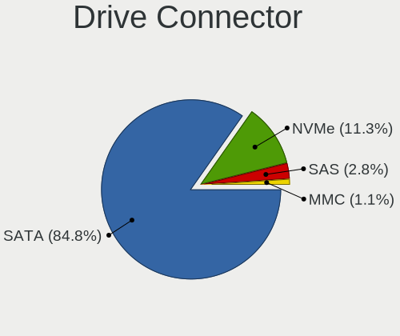

| Type | Desktops | Drives | Percent |
|------|----------|--------|---------|
| SATA | 159      | 362    | 91.38%  |
| NVMe | 8        | 12     | 4.6%    |
| SAS  | 6        | 8      | 3.45%   |
| MMC  | 1        | 1      | 0.57%   |

Drive Size
----------

Size of hard drive

| Size in TB | Desktops | Drives | Percent |
|------------|----------|--------|---------|
| 0.01-0.5   | 150      | 274    | 72.12%  |
| 0.51-1.0   | 43       | 73     | 20.67%  |
| 1.01-2.0   | 11       | 15     | 5.29%   |
| 3.01-4.0   | 2        | 2      | 0.96%   |
| 2.01-3.0   | 1        | 1      | 0.48%   |
| 4.01-10.0  | 1        | 1      | 0.48%   |

Space Total
-----------

Amount of disk space available on the file system

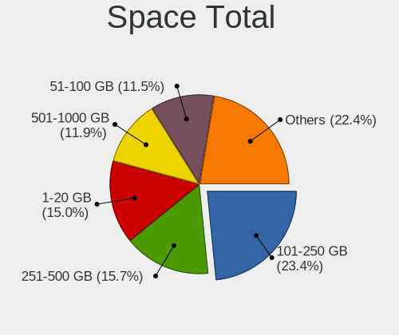

| Size in GB     | Desktops | Percent |
|----------------|----------|---------|
| 101-250        | 39       | 21.2%   |
| 251-500        | 38       | 20.65%  |
| 1-20           | 25       | 13.59%  |
| 51-100         | 25       | 13.59%  |
| 21-50          | 18       | 9.78%   |
| 501-1000       | 18       | 9.78%   |
| 1001-2000      | 14       | 7.61%   |
| 2001-3000      | 4        | 2.17%   |
| Unknown        | 2        | 1.09%   |
| More than 3000 | 1        | 0.54%   |

Space Used
----------

Amount of used disk space

| Used GB   | Desktops | Percent |
|-----------|----------|---------|
| 1-20      | 111      | 60.66%  |
| 101-250   | 15       | 8.2%    |
| 21-50     | 14       | 7.65%   |
| 51-100    | 13       | 7.1%    |
| 501-1000  | 11       | 6.01%   |
| 251-500   | 10       | 5.46%   |
| 1001-2000 | 5        | 2.73%   |
| 2001-3000 | 2        | 1.09%   |
| Unknown   | 2        | 1.09%   |

Malfunc. Drives
---------------

Drive models with a malfunction

| Model                             | Desktops | Drives | Percent |
|-----------------------------------|----------|--------|---------|
| Seagate ST500DM002-1BD142 500GB   | 6        | 8      | 6.12%   |
| WDC WD5000AAKX-001CA0 500GB       | 5        | 5      | 5.1%    |
| Seagate ST3250310AS 250GB         | 5        | 5      | 5.1%    |
| Seagate ST3802110A 80GB           | 3        | 4      | 3.06%   |
| Seagate ST3500413AS 500GB         | 3        | 3      | 3.06%   |
| Seagate ST3500320AS 500GB         | 3        | 3      | 3.06%   |
| Seagate ST3320613AS 320GB         | 3        | 3      | 3.06%   |
| WDC WD800JD-60LSA0 80GB           | 2        | 2      | 2.04%   |
| WDC WD5000LPVX-00V0TT0 500GB      | 2        | 4      | 2.04%   |
| WDC WD2000JS-60NCB1 200GB         | 2        | 3      | 2.04%   |
| Toshiba DT01ACA050 500GB          | 2        | 2      | 2.04%   |
| Seagate ST380215AS 80GB           | 2        | 2      | 2.04%   |
| Seagate ST3500418AS 500GB         | 2        | 4      | 2.04%   |
| Seagate ST340014A 40GB            | 2        | 2      | 2.04%   |
| Seagate ST3320620AS 320GB         | 2        | 3      | 2.04%   |
| Seagate ST3250820AS 250GB         | 2        | 2      | 2.04%   |
| Seagate ST3160815AS 160GB         | 2        | 2      | 2.04%   |
| Seagate ST3160215AS 160GB         | 2        | 2      | 2.04%   |
| Samsung Electronics HD502HI 500GB | 2        | 3      | 2.04%   |
| WDC WD7500BPVT-24HXZT3 752GB      | 1        | 2      | 1.02%   |
| WDC WD5000AVDS-73U7B1 500GB       | 1        | 1      | 1.02%   |
| WDC WD5000AAKX-003CA0 500GB       | 1        | 1      | 1.02%   |
| WDC WD5000AAKS-00A7B2 500GB       | 1        | 1      | 1.02%   |
| WDC WD3200BPVT-22JJ5T0 320GB      | 1        | 1      | 1.02%   |
| WDC WD3200AAJS-00L7A0 320GB       | 1        | 2      | 1.02%   |
| WDC WD2500AVJS-63B6A0 250GB       | 1        | 1      | 1.02%   |
| WDC WD2500AAKX-001CA0 250GB       | 1        | 1      | 1.02%   |
| WDC WD15EARS-00MVWB0 1TB          | 1        | 1      | 1.02%   |
| WDC WD10PURX-64E5EY0 1TB          | 1        | 1      | 1.02%   |
| WDC WD10EALX-009BA0 1TB           | 1        | 1      | 1.02%   |
| WDC WD10EADS-00M2B0 1TB           | 1        | 2      | 1.02%   |
| Seagate ST9500325AS 500GB         | 1        | 1      | 1.02%   |
| Seagate ST380817AS 80GB           | 1        | 1      | 1.02%   |
| Seagate ST380815AS 80GB           | 1        | 1      | 1.02%   |
| Seagate ST380013AS 80GB           | 1        | 1      | 1.02%   |
| Seagate ST3500630AS 500GB         | 1        | 1      | 1.02%   |
| Seagate ST3500412AS 500GB         | 1        | 1      | 1.02%   |
| Seagate ST3360320AS 360GB         | 1        | 1      | 1.02%   |
| Seagate ST3320620A 320GB          | 1        | 1      | 1.02%   |
| Seagate ST3320418AS 320GB         | 1        | 1      | 1.02%   |
| Seagate ST3320413AS 320GB         | 1        | 1      | 1.02%   |
| Seagate ST3250318AS 250GB         | 1        | 1      | 1.02%   |
| Seagate ST3160813AS 160GB         | 1        | 1      | 1.02%   |
| Seagate ST3160812AS 160GB         | 1        | 1      | 1.02%   |
| Seagate ST3160811AS 160GB         | 1        | 1      | 1.02%   |
| Seagate ST3160318AS 160GB         | 1        | 1      | 1.02%   |
| Seagate ST3160212A 160GB          | 1        | 1      | 1.02%   |
| Seagate ST3160211AS 160GB         | 1        | 1      | 1.02%   |
| Seagate ST3160021A 160GB          | 1        | 1      | 1.02%   |
| Seagate ST2000DL003-9VT166 2TB    | 1        | 1      | 1.02%   |
| Seagate ST1000DM003-1ER162 1TB    | 1        | 2      | 1.02%   |
| Seagate ST1000DM003-1CH162 1TB    | 1        | 1      | 1.02%   |
| Samsung Electronics HD642JJ 640GB | 1        | 2      | 1.02%   |
| Samsung Electronics HD502IJ 500GB | 1        | 1      | 1.02%   |
| Samsung Electronics HD403LJ 400GB | 1        | 1      | 1.02%   |
| Samsung Electronics HD322HJ 320GB | 1        | 1      | 1.02%   |
| Samsung Electronics HD252HJ 250GB | 1        | 1      | 1.02%   |
| Samsung Electronics HD160HJ 160GB | 1        | 1      | 1.02%   |
| Samsung Electronics HD103SI 1TB   | 1        | 1      | 1.02%   |
| Maxtor 6Y080L0 82GB               | 1        | 1      | 1.02%   |

Malfunc. Drive Vendor
---------------------

Vendors of faulty drives

| Vendor              | Desktops | Drives | Percent |
|---------------------|----------|--------|---------|
| Seagate             | 51       | 65     | 56.67%  |
| WDC                 | 23       | 29     | 25.56%  |
| Samsung Electronics | 8        | 11     | 8.89%   |
| Hitachi             | 3        | 4      | 3.33%   |
| Toshiba             | 2        | 2      | 2.22%   |
| Maxtor              | 1        | 1      | 1.11%   |
| Kingston            | 1        | 1      | 1.11%   |
| HGST                | 1        | 1      | 1.11%   |

Malfunc. HDD Vendor
-------------------

Vendors of faulty HDD drives

| Vendor              | Desktops | Drives | Percent |
|---------------------|----------|--------|---------|
| Seagate             | 51       | 65     | 57.3%   |
| WDC                 | 23       | 29     | 25.84%  |
| Samsung Electronics | 8        | 11     | 8.99%   |
| Hitachi             | 3        | 4      | 3.37%   |
| Toshiba             | 2        | 2      | 2.25%   |
| Maxtor              | 1        | 1      | 1.12%   |
| HGST                | 1        | 1      | 1.12%   |

Malfunc. Drive Kind
-------------------

Kinds of faulty drives

| Kind | Desktops | Drives | Percent |
|------|----------|--------|---------|
| HDD  | 78       | 113    | 98.73%  |
| SSD  | 1        | 1      | 1.27%   |

Failed Drives
-------------

Failed drive models

| Model                             | Desktops | Drives | Percent |
|-----------------------------------|----------|--------|---------|
| Samsung Electronics HD322GJ 320GB | 2        | 2      | 50%     |
| WDC WD3200BPVT-24ZEST0 320GB      | 1        | 1      | 25%     |
| Seagate ST3250318AS 250GB         | 1        | 2      | 25%     |

Failed Drive Vendor
-------------------

Failed drive vendors

| Vendor              | Desktops | Drives | Percent |
|---------------------|----------|--------|---------|
| Samsung Electronics | 2        | 2      | 50%     |
| WDC                 | 1        | 1      | 25%     |
| Seagate             | 1        | 2      | 25%     |

Drive Status
------------

Number of failed and malfunc. drives

| Status   | Desktops | Drives | Percent |
|----------|----------|--------|---------|
| Works    | 109      | 223    | 51.17%  |
| Malfunc  | 79       | 114    | 37.09%  |
| Detected | 21       | 41     | 9.86%   |
| Failed   | 4        | 5      | 1.88%   |

Storage controller
------------------

Storage Vendor
--------------

Storage controller vendors

| Vendor                        | Desktops | Percent |
|-------------------------------|----------|---------|
| Intel                         | 143      | 69.42%  |
| JMicron Technology            | 20       | 9.71%   |
| AMD                           | 10       | 4.85%   |
| Marvell Technology Group      | 9        | 4.37%   |
| Nvidia                        | 6        | 2.91%   |
| ASMedia Technology            | 4        | 1.94%   |
| Samsung Electronics           | 3        | 1.46%   |
| Realtek Semiconductor         | 3        | 1.46%   |
| VIA Technologies              | 2        | 0.97%   |
| Integrated Technology Express | 2        | 0.97%   |
| ADATA Technology              | 2        | 0.97%   |
| ULi Electronics               | 1        | 0.49%   |
| SanDisk                       | 1        | 0.49%   |

Storage Model
-------------

Storage controller models

| Model                                                                                   | Desktops | Percent |
|-----------------------------------------------------------------------------------------|----------|---------|
| Intel NM10/ICH7 Family SATA Controller [IDE mode]                                       | 30       | 10.07%  |
| Intel 82801G (ICH7 Family) IDE Controller                                               | 23       | 7.72%   |
| Intel 6 Series/C200 Series Chipset Family 6 port Desktop SATA AHCI Controller           | 14       | 4.7%    |
| Intel 6 Series/C200 Series Chipset Family Desktop SATA Controller (IDE mode, ports 4-5) | 12       | 4.03%   |
| Intel 6 Series/C200 Series Chipset Family Desktop SATA Controller (IDE mode, ports 0-3) | 12       | 4.03%   |
| JMicron JMB368 IDE controller                                                           | 11       | 3.69%   |
| Intel 82801JI (ICH10 Family) 4 port SATA IDE Controller #1                              | 10       | 3.36%   |
| Intel 82801JI (ICH10 Family) 2 port SATA IDE Controller #2                              | 10       | 3.36%   |
| Intel 8 Series/C220 Series Chipset Family 6-port SATA Controller 1 [AHCI mode]          | 10       | 3.36%   |
| JMicron JMB363 SATA/IDE Controller                                                      | 8        | 2.68%   |
| Intel Q170/Q150/B150/H170/H110/Z170/CM236 Chipset SATA Controller [AHCI Mode]           | 8        | 2.68%   |
| Intel 82801I (ICH9 Family) 2 port SATA Controller [IDE mode]                            | 8        | 2.68%   |
| Intel 82801IB (ICH9) 2 port SATA Controller [IDE mode]                                  | 7        | 2.35%   |
| Intel 7 Series/C210 Series Chipset Family 4-port SATA Controller [IDE mode]             | 7        | 2.35%   |
| Intel 7 Series/C210 Series Chipset Family 2-port SATA Controller [IDE mode]             | 7        | 2.35%   |
| Intel 7 Series/C210 Series Chipset Family 6-port SATA Controller [AHCI mode]            | 6        | 2.01%   |
| Intel 200 Series PCH SATA controller [AHCI mode]                                        | 6        | 2.01%   |
| Intel 82801JI (ICH10 Family) SATA AHCI Controller                                       | 5        | 1.68%   |
| AMD FCH SATA Controller [AHCI mode]                                                     | 5        | 1.68%   |
| AMD 400 Series Chipset SATA Controller                                                  | 5        | 1.68%   |
| Marvell Group 88SE6111/6121 SATA II / PATA Controller                                   | 4        | 1.34%   |
| Intel Cannon Lake PCH SATA AHCI Controller                                              | 4        | 1.34%   |
| Intel 82801HR/HO/HH (ICH8R/DO/DH) 2 port SATA Controller [IDE mode]                     | 4        | 1.34%   |
| Intel 82801H (ICH8 Family) 4 port SATA Controller [IDE mode]                            | 4        | 1.34%   |
| Intel 5 Series/3400 Series Chipset 4 port SATA IDE Controller                           | 4        | 1.34%   |
| Intel 5 Series/3400 Series Chipset 2 port SATA IDE Controller                           | 4        | 1.34%   |
| ASMedia ASM1062 Serial ATA Controller                                                   | 4        | 1.34%   |
| Samsung NVMe SSD Controller SM981/PM981/PM983                                           | 3        | 1.01%   |
| Intel Atom Processor E3800 Series SATA AHCI Controller                                  | 3        | 1.01%   |
| VIA VT82C586A/B/VT82C686/A/B/VT823x/A/C PIPC Bus Master IDE                             | 2        | 0.67%   |
| Realtek Realtek Non-Volatile memory controller                                          | 2        | 0.67%   |
| Nvidia CK804 Serial ATA Controller                                                      | 2        | 0.67%   |
| Nvidia CK804 IDE                                                                        | 2        | 0.67%   |
| Marvell Group 88SE6101/6102 single-port PATA133 interface                               | 2        | 0.67%   |
| Intel C600/X79 series chipset 6-Port SATA AHCI Controller                               | 2        | 0.67%   |
| Intel 9 Series Chipset Family SATA Controller [AHCI Mode]                               | 2        | 0.67%   |
| Intel 5 Series/3400 Series Chipset 6 port SATA AHCI Controller                          | 2        | 0.67%   |
| Integrated Express IT8213 IDE Controller                                                | 2        | 0.67%   |
| AMD SB7x0/SB8x0/SB9x0 SATA Controller [IDE mode]                                        | 2        | 0.67%   |
| AMD SB7x0/SB8x0/SB9x0 IDE Controller                                                    | 2        | 0.67%   |
| VIA VIA VT6420 SATA RAID Controller                                                     | 1        | 0.34%   |
| VIA Serial ATA Controller                                                               | 1        | 0.34%   |
| ULi ULi 5287 SATA                                                                       | 1        | 0.34%   |
| ULi M5229 IDE                                                                           | 1        | 0.34%   |
| SanDisk WD Blue SN550 NVMe SSD                                                          | 1        | 0.34%   |
| Realtek RTS5763DL NVMe SSD Controller                                                   | 1        | 0.34%   |
| Nvidia MCP78S [GeForce 8200] IDE                                                        | 1        | 0.34%   |
| Nvidia MCP78S [GeForce 8200] AHCI Controller                                            | 1        | 0.34%   |
| Nvidia MCP61 SATA Controller                                                            | 1        | 0.34%   |
| Nvidia MCP61 IDE                                                                        | 1        | 0.34%   |
| Nvidia MCP55 SATA Controller                                                            | 1        | 0.34%   |
| Nvidia MCP55 IDE                                                                        | 1        | 0.34%   |
| Nvidia MCP51 Serial ATA Controller                                                      | 1        | 0.34%   |
| Nvidia MCP51 IDE                                                                        | 1        | 0.34%   |
| Marvell Group 88SE91B0 SATA 6G Controller                                               | 1        | 0.34%   |
| Marvell Group 88SE91A3 SATA-600 Controller                                              | 1        | 0.34%   |
| Marvell Group 88SE9172 SATA 6Gb/s Controller                                            | 1        | 0.34%   |
| JMicron JMB361 AHCI/IDE                                                                 | 1        | 0.34%   |
| Intel SATA Controller [RAID mode]                                                       | 1        | 0.34%   |
| Intel Comet Lake SATA AHCI Controller                                                   | 1        | 0.34%   |

Storage Kind
------------

Kind of storage controller (IDE, SATA, NVMe, SAS, ...)

| Kind | Desktops | Percent |
|------|----------|---------|
| IDE  | 92       | 50.55%  |
| SATA | 77       | 42.31%  |
| NVMe | 8        | 4.4%    |
| RAID | 4        | 2.2%    |
| SAS  | 1        | 0.55%   |

Processor
---------

CPU Vendor
----------

Processor vendors

| Vendor | Desktops | Percent |
|--------|----------|---------|
| Intel  | 148      | 90.8%   |
| AMD    | 15       | 9.2%    |

CPU Model
---------

Processor models

| Model                                       | Desktops | Percent |
|---------------------------------------------|----------|---------|
| Intel Pentium CPU G630 @ 2.70GHz            | 5        | 3.03%   |
| Intel Core 2 Duo CPU E8400 @ 3.00GHz        | 4        | 2.42%   |
| Intel Pentium Dual-Core CPU E5700 @ 3.00GHz | 3        | 1.82%   |
| Intel Pentium 4 CPU 3.00GHz                 | 3        | 1.82%   |
| Intel Core i3-3240 CPU @ 3.40GHz            | 3        | 1.82%   |
| Intel Core i3-2100 CPU @ 3.10GHz            | 3        | 1.82%   |
| Intel Core 2 Duo CPU E7500 @ 2.93GHz        | 3        | 1.82%   |
| Intel Core 2 Duo CPU E7400 @ 2.80GHz        | 3        | 1.82%   |
| Intel Core 2 Duo CPU E6750 @ 2.66GHz        | 3        | 1.82%   |
| Intel Celeron CPU G530 @ 2.40GHz            | 3        | 1.82%   |
| Intel Xeon CPU E5450 @ 3.00GHz              | 2        | 1.21%   |
| Intel Pentium Dual-Core CPU E6500 @ 2.93GHz | 2        | 1.21%   |
| Intel Pentium Dual-Core CPU E5300 @ 2.60GHz | 2        | 1.21%   |
| Intel Pentium Dual-Core CPU E5200 @ 2.50GHz | 2        | 1.21%   |
| Intel Core i7-7700 CPU @ 3.60GHz            | 2        | 1.21%   |
| Intel Core i7-4790 CPU @ 3.60GHz            | 2        | 1.21%   |
| Intel Core i7-4770 CPU @ 3.40GHz            | 2        | 1.21%   |
| Intel Core i7-2600 CPU @ 3.40GHz            | 2        | 1.21%   |
| Intel Core i5-8600K CPU @ 3.60GHz           | 2        | 1.21%   |
| Intel Core i5-7400 CPU @ 3.00GHz            | 2        | 1.21%   |
| Intel Core i5-4460 CPU @ 3.20GHz            | 2        | 1.21%   |
| Intel Core i5-3470 CPU @ 3.20GHz            | 2        | 1.21%   |
| Intel Core i3-7100 CPU @ 3.90GHz            | 2        | 1.21%   |
| Intel Core i3-3220 CPU @ 3.30GHz            | 2        | 1.21%   |
| Intel Core i3-2120 CPU @ 3.30GHz            | 2        | 1.21%   |
| Intel Core i3 CPU 540 @ 3.07GHz             | 2        | 1.21%   |
| Intel Core 2 Duo CPU E7600 @ 3.06GHz        | 2        | 1.21%   |
| Intel Core 2 Duo CPU E4600 @ 2.40GHz        | 2        | 1.21%   |
| Intel Celeron CPU J1900 @ 1.99GHz           | 2        | 1.21%   |
| Intel Xeon CPU X5450 @ 3.00GHz              | 1        | 0.61%   |
| Intel Xeon CPU X3440 @ 2.53GHz              | 1        | 0.61%   |
| Intel Xeon CPU E5440 @ 2.83GHz              | 1        | 0.61%   |
| Intel Xeon CPU E5-2667 v2 @ 3.30GHz         | 1        | 0.61%   |
| Intel Xeon CPU E5-2640 v3 @ 2.60GHz         | 1        | 0.61%   |
| Intel Xeon CPU E5-2620 0 @ 2.00GHz          | 1        | 0.61%   |
| Intel Xeon CPU 5160 @ 3.00GHz               | 1        | 0.61%   |
| Intel Pentium Gold G5400 CPU @ 3.70GHz      | 1        | 0.61%   |
| Intel Pentium Dual-Core CPU E5800 @ 3.20GHz | 1        | 0.61%   |
| Intel Pentium Dual-Core CPU E5500 @ 2.80GHz | 1        | 0.61%   |
| Intel Pentium Dual-Core CPU E5400 @ 2.70GHz | 1        | 0.61%   |
| Intel Pentium Dual-Core CPU E2210 @ 2.20GHz | 1        | 0.61%   |
| Intel Pentium Dual CPU E2220 @ 2.40GHz      | 1        | 0.61%   |
| Intel Pentium Dual CPU E2180 @ 2.00GHz      | 1        | 0.61%   |
| Intel Pentium Dual CPU E2140 @ 1.60GHz      | 1        | 0.61%   |
| Intel Pentium CPU G645 @ 2.90GHz            | 1        | 0.61%   |
| Intel Pentium CPU G3220T @ 2.60GHz          | 1        | 0.61%   |
| Intel Pentium CPU G3220 @ 3.00GHz           | 1        | 0.61%   |
| Intel Pentium CPU G2130 @ 3.20GHz           | 1        | 0.61%   |
| Intel Pentium CPU G2030 @ 3.00GHz           | 1        | 0.61%   |
| Intel Pentium CPU G2020 @ 2.90GHz           | 1        | 0.61%   |
| Intel Pentium 4 CPU 3.40GHz                 | 1        | 0.61%   |
| Intel Pentium 4 CPU 3.20GHz                 | 1        | 0.61%   |
| Intel Pentium 4 CPU 2.66GHz                 | 1        | 0.61%   |
| Intel Genuine CPU 2160 @ 1.80GHz            | 1        | 0.61%   |
| Intel Core i9-9900K CPU @ 3.60GHz           | 1        | 0.61%   |
| Intel Core i7-9700KF CPU @ 3.60GHz          | 1        | 0.61%   |
| Intel Core i7-9700 CPU @ 3.00GHz            | 1        | 0.61%   |
| Intel Core i7-8700K CPU @ 3.70GHz           | 1        | 0.61%   |
| Intel Core i7-3770K CPU @ 3.50GHz           | 1        | 0.61%   |
| Intel Core i7-3770 CPU @ 3.40GHz            | 1        | 0.61%   |

CPU Model Family
----------------

Processor model prefix

| Model                   | Desktops | Percent |
|-------------------------|----------|---------|
| Intel Core i5           | 24       | 14.55%  |
| Intel Core i3           | 21       | 12.73%  |
| Intel Core 2 Duo        | 21       | 12.73%  |
| Intel Core i7           | 17       | 10.3%   |
| Intel Pentium Dual-Core | 13       | 7.88%   |
| Intel Celeron           | 12       | 7.27%   |
| Intel Pentium           | 11       | 6.67%   |
| Intel Xeon              | 9        | 5.45%   |
| Intel Pentium 4         | 6        | 3.64%   |
| Intel Core 2 Quad       | 6        | 3.64%   |
| AMD Ryzen 5             | 4        | 2.42%   |
| Intel Pentium Dual      | 3        | 1.82%   |
| Intel Core 2            | 2        | 1.21%   |
| AMD Ryzen 7             | 2        | 1.21%   |
| AMD Phenom II X4        | 2        | 1.21%   |
| AMD Athlon 64 X2        | 2        | 1.21%   |
| Intel Pentium Gold      | 1        | 0.61%   |
| Intel Genuine           | 1        | 0.61%   |
| Intel Core i9           | 1        | 0.61%   |
| Intel Core 2 Extreme    | 1        | 0.61%   |
| Intel Atom              | 1        | 0.61%   |
| AMD Ryzen 3             | 1        | 0.61%   |
| AMD Phenom II X6        | 1        | 0.61%   |
| AMD FX                  | 1        | 0.61%   |
| AMD Athlon II X2        | 1        | 0.61%   |
| AMD Athlon 64           | 1        | 0.61%   |

CPU Cores
---------

Number of processor cores

| Number  | Desktops | Percent |
|---------|----------|---------|
| 2       | 73       | 43.98%  |
| 4       | 52       | 31.33%  |
| Unknown | 18       | 10.84%  |
| 8       | 8        | 4.82%   |
| 1       | 7        | 4.22%   |
| 6       | 6        | 3.61%   |
| 12      | 1        | 0.6%    |
| 3       | 1        | 0.6%    |

CPU Sockets
-----------

Number of sockets

| Number | Desktops | Percent |
|--------|----------|---------|
| 1      | 160      | 98.16%  |
| 2      | 3        | 1.84%   |

CPU Threads
-----------

Threads per core (Hyper-Threading)

| Number  | Desktops | Percent |
|---------|----------|---------|
| 1       | 93       | 56.71%  |
| 2       | 53       | 32.32%  |
| Unknown | 18       | 10.98%  |

CPU Op-Modes
------------

CPU Operation Modes (32-bit, 64-bit)

| Op mode        | Desktops | Percent |
|----------------|----------|---------|
| 32-bit, 64-bit | 162      | 99.39%  |
| Unknown        | 1        | 0.61%   |

CPU Microcode
-------------

Microcode number

| Number     | Desktops | Percent |
|------------|----------|---------|
| 0x1067a    | 32       | 19.28%  |
| 0x206a7    | 21       | 12.65%  |
| 0x306a9    | 18       | 10.84%  |
| 0x306c3    | 13       | 7.83%   |
| Unknown    | 10       | 6.02%   |
| 0x906e9    | 7        | 4.22%   |
| 0x6fd      | 7        | 4.22%   |
| 0x10676    | 6        | 3.61%   |
| 0x6fb      | 5        | 3.01%   |
| 0x20652    | 4        | 2.41%   |
| 0xf49      | 3        | 1.81%   |
| 0x906ea    | 3        | 1.81%   |
| 0x506e3    | 3        | 1.81%   |
| 0x906ed    | 2        | 1.2%    |
| 0x6f2      | 2        | 1.2%    |
| 0x30678    | 2        | 1.2%    |
| 0x106a5    | 2        | 1.2%    |
| 0x08701021 | 2        | 1.2%    |
| 0xf65      | 1        | 0.6%    |
| 0xf4a      | 1        | 0.6%    |
| 0xf43      | 1        | 0.6%    |
| 0xa0653    | 1        | 0.6%    |
| 0x906ec    | 1        | 0.6%    |
| 0x6f6      | 1        | 0.6%    |
| 0x406c4    | 1        | 0.6%    |
| 0x306e4    | 1        | 0.6%    |
| 0x30673    | 1        | 0.6%    |
| 0x206d7    | 1        | 0.6%    |
| 0x20655    | 1        | 0.6%    |
| 0x106e5    | 1        | 0.6%    |
| 0x10677    | 1        | 0.6%    |
| 0x10661    | 1        | 0.6%    |
| 0x08108109 | 1        | 0.6%    |
| 0x0800820d | 1        | 0.6%    |
| 0x0800820b | 1        | 0.6%    |
| 0x08001138 | 1        | 0.6%    |
| 0x08001137 | 1        | 0.6%    |
| 0x06000852 | 1        | 0.6%    |
| 0x010000dc | 1        | 0.6%    |
| 0x010000db | 1        | 0.6%    |
| 0x010000c8 | 1        | 0.6%    |
| 0x0100009f | 1        | 0.6%    |

CPU Microarch
-------------

Microarchitecture

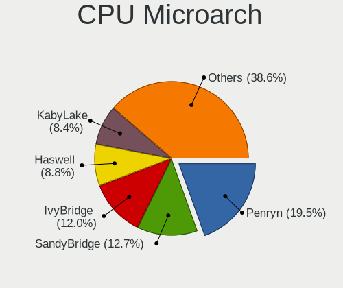

| Name        | Desktops | Percent |
|-------------|----------|---------|
| Penryn      | 38       | 23.03%  |
| SandyBridge | 22       | 13.33%  |
| IvyBridge   | 20       | 12.12%  |
| Core        | 18       | 10.91%  |
| KabyLake    | 14       | 8.48%   |
| Haswell     | 14       | 8.48%   |
| NetBurst    | 6        | 3.64%   |
| Westmere    | 5        | 3.03%   |
| Skylake     | 4        | 2.42%   |
| Silvermont  | 4        | 2.42%   |
| K10         | 4        | 2.42%   |
| Zen+        | 3        | 1.82%   |
| Nehalem     | 3        | 1.82%   |
| K8 Hammer   | 3        | 1.82%   |
| Zen 2       | 2        | 1.21%   |
| Zen         | 2        | 1.21%   |
| CometLake   | 2        | 1.21%   |
| Piledriver  | 1        | 0.61%   |

Graphics
--------

GPU Vendor
----------

Vendors of graphics cards

| Vendor | Desktops | Percent |
|--------|----------|---------|
| Nvidia | 111      | 64.53%  |
| Intel  | 40       | 23.26%  |
| AMD    | 21       | 12.21%  |

GPU Model
---------

Graphics card models

| Model                                                                       | Desktops | Percent |
|-----------------------------------------------------------------------------|----------|---------|
| Intel 2nd Generation Core Processor Family Integrated Graphics Controller   | 10       | 5.62%   |
| Nvidia GT218 [GeForce 210]                                                  | 8        | 4.49%   |
| Nvidia GF114 [GeForce GTX 560 Ti]                                           | 5        | 2.81%   |
| Nvidia GF108 [GeForce GT 730]                                               | 5        | 2.81%   |
| Nvidia GF108 [GeForce GT 440]                                               | 5        | 2.81%   |
| Nvidia G94 [GeForce 9600 GT]                                                | 5        | 2.81%   |
| Intel Xeon E3-1200 v3/4th Gen Core Processor Integrated Graphics Controller | 5        | 2.81%   |
| Nvidia GK107 [GeForce GTX 650]                                              | 4        | 2.25%   |
| Nvidia GF108 [GeForce GT 430]                                               | 4        | 2.25%   |
| Intel 82G33/G31 Express Integrated Graphics Controller                      | 4        | 2.25%   |
| AMD Juniper PRO [Radeon HD 5750]                                            | 4        | 2.25%   |
| Nvidia GT215 [GeForce GT 240]                                               | 3        | 1.69%   |
| Nvidia GP107 [GeForce GTX 1050 Ti]                                          | 3        | 1.69%   |
| Nvidia GP104 [GeForce GTX 1070]                                             | 3        | 1.69%   |
| Nvidia GK104 [GeForce GTX 760]                                              | 3        | 1.69%   |
| Nvidia GF119 [GeForce GT 520]                                               | 3        | 1.69%   |
| Nvidia GF116 [GeForce GTX 550 Ti]                                           | 3        | 1.69%   |
| Nvidia GF108 [GeForce GT 630]                                               | 3        | 1.69%   |
| Nvidia G92 [GeForce 9800 GT]                                                | 3        | 1.69%   |
| Nvidia G84 [GeForce 8600 GT]                                                | 3        | 1.69%   |
| Intel Xeon E3-1200 v2/3rd Gen Core processor Graphics Controller            | 3        | 1.69%   |
| Intel HD Graphics 630                                                       | 3        | 1.69%   |
| Intel CoffeeLake-S GT2 [UHD Graphics 630]                                   | 3        | 1.69%   |
| Intel 4 Series Chipset Integrated Graphics Controller                       | 3        | 1.69%   |
| AMD Baffin [Radeon RX 460/560D / Pro 450/455/460/555/555X/560/560X]         | 3        | 1.69%   |
| Nvidia TU106 [GeForce RTX 2070]                                             | 2        | 1.12%   |
| Nvidia GT216 [GeForce 210]                                                  | 2        | 1.12%   |
| Nvidia GP106 [GeForce GTX 1060 6GB]                                         | 2        | 1.12%   |
| Nvidia GM206 [GeForce GTX 960]                                              | 2        | 1.12%   |
| Nvidia GM107 [GeForce GTX 750]                                              | 2        | 1.12%   |
| Nvidia GK107 [GeForce GT 640]                                               | 2        | 1.12%   |
| Nvidia GF119 [GeForce GT 610]                                               | 2        | 1.12%   |
| Nvidia G96C [GeForce 9500 GT]                                               | 2        | 1.12%   |
| Nvidia G96C [GeForce 9400 GT]                                               | 2        | 1.12%   |
| Nvidia G92 [GeForce GTS 250]                                                | 2        | 1.12%   |
| Nvidia G86 [GeForce 8500 GT]                                                | 2        | 1.12%   |
| Intel Atom Processor Z36xxx/Z37xxx Series Graphics & Display                | 2        | 1.12%   |
| Intel 82G965 Integrated Graphics Controller                                 | 2        | 1.12%   |
| AMD Ellesmere [Radeon RX 470/480/570/570X/580/580X/590]                     | 2        | 1.12%   |
| AMD Cedar [Radeon HD 5000/6000/7350/8350 Series]                            | 2        | 1.12%   |
| Nvidia TU116 [GeForce GTX 1660 SUPER]                                       | 1        | 0.56%   |
| Nvidia TU116 [GeForce GTX 1650]                                             | 1        | 0.56%   |
| Nvidia NV44A [GeForce 6200]                                                 | 1        | 0.56%   |
| Nvidia NV44 [GeForce 7100 GS]                                               | 1        | 0.56%   |
| Nvidia NV44 [GeForce 6200 TurboCache]                                       | 1        | 0.56%   |
| Nvidia NV43 [GeForce 6600]                                                  | 1        | 0.56%   |
| Nvidia GT216 [GeForce GT 220]                                               | 1        | 0.56%   |
| Nvidia GT215 [GeForce GT 340]                                               | 1        | 0.56%   |
| Nvidia GT215 [GeForce GT 320]                                               | 1        | 0.56%   |
| Nvidia GT215 [GeForce GT 220]                                               | 1        | 0.56%   |
| Nvidia GT200 [GeForce GTX 260]                                              | 1        | 0.56%   |
| Nvidia GP108 [GeForce GT 1030]                                              | 1        | 0.56%   |
| Nvidia GP104 [GeForce GTX 1080]                                             | 1        | 0.56%   |
| Nvidia GP102 [GeForce GTX 1080 Ti]                                          | 1        | 0.56%   |
| Nvidia GM206 [GeForce GTX 950]                                              | 1        | 0.56%   |
| Nvidia GM107 [GeForce GTX 750 Ti]                                           | 1        | 0.56%   |
| Nvidia GK208B [GeForce GT 730]                                              | 1        | 0.56%   |
| Nvidia GK208B [GeForce GT 710]                                              | 1        | 0.56%   |
| Nvidia GK208 [GeForce GT 630 Rev. 2]                                        | 1        | 0.56%   |
| Nvidia GK107 [GeForce GT 630 OEM]                                           | 1        | 0.56%   |

GPU Combo
---------

Combinations of graphics cards

| Name           | Desktops | Percent |
|----------------|----------|---------|
| 1 x Nvidia     | 109      | 65.66%  |
| 1 x Intel      | 34       | 20.48%  |
| 1 x AMD        | 20       | 12.05%  |
| Intel + Nvidia | 2        | 1.2%    |
| 2 x AMD        | 1        | 0.6%    |

GPU Driver
----------

Free vs proprietary

| Driver      | Desktops | Percent |
|-------------|----------|---------|
| Free        | 116      | 68.24%  |
| Proprietary | 49       | 28.82%  |
| Unknown     | 5        | 2.94%   |

GPU Memory
----------

Total video memory

| Size in GB | Desktops | Percent |
|------------|----------|---------|
| 0.51-1.0   | 53       | 31.36%  |
| 1.01-2.0   | 41       | 24.26%  |
| Unknown    | 28       | 16.57%  |
| 0.01-0.5   | 25       | 14.79%  |
| 3.01-4.0   | 10       | 5.92%   |
| 7.01-8.0   | 6        | 3.55%   |
| 5.01-6.0   | 3        | 1.78%   |
| 8.01-16.0  | 2        | 1.18%   |
| 2.01-3.0   | 1        | 0.59%   |

Monitor
-------

Monitor Vendor
--------------

Monitor vendors

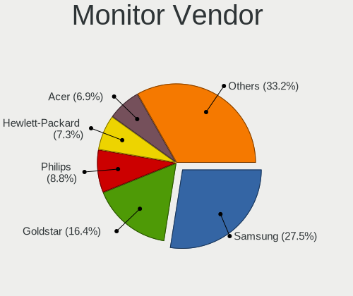

| Vendor               | Desktops | Percent |
|----------------------|----------|---------|
| Samsung Electronics  | 46       | 28.57%  |
| Goldstar             | 25       | 15.53%  |
| BenQ                 | 15       | 9.32%   |
| Acer                 | 14       | 8.7%    |
| Philips              | 13       | 8.07%   |
| Hewlett-Packard      | 13       | 8.07%   |
| Dell                 | 6        | 3.73%   |
| AOC                  | 6        | 3.73%   |
| ViewSonic            | 3        | 1.86%   |
| Lenovo               | 3        | 1.86%   |
| LG Electronics       | 2        | 1.24%   |
| Iiyama               | 2        | 1.24%   |
| Fujitsu Siemens      | 2        | 1.24%   |
| WY@                  | 1        | 0.62%   |
| VIE                  | 1        | 0.62%   |
| TPU                  | 1        | 0.62%   |
| Toshiba              | 1        | 0.62%   |
| Sony                 | 1        | 0.62%   |
| SKY                  | 1        | 0.62%   |
| SAC                  | 1        | 0.62%   |
| Packard Bell         | 1        | 0.62%   |
| HJW                  | 1        | 0.62%   |
| CTX                  | 1        | 0.62%   |
| Ancor Communications | 1        | 0.62%   |

Monitor Model
-------------

Monitor models

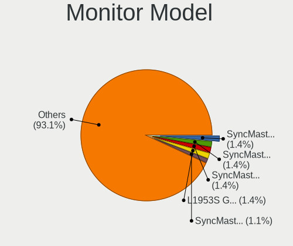

| Model                                                                 | Desktops | Percent |
|-----------------------------------------------------------------------|----------|---------|
| Samsung Electronics SyncMaster SAM018F 1280x1024 338x270mm 17.0-inch  | 4        | 2.41%   |
| Samsung Electronics SyncMaster SAM0285 1440x900 410x257mm 19.1-inch   | 3        | 1.81%   |
| Hewlett-Packard L1740 HWP2648 1280x1024 337x270mm 17.0-inch           | 3        | 1.81%   |
| Hewlett-Packard 2011 HWP2934 1600x900 443x249mm 20.0-inch             | 3        | 1.81%   |
| BenQ E900W BNQ7905 1440x900 410x256mm 19.0-inch                       | 3        | 1.81%   |
| Acer V193HQ ACR006D 1366x768 410x230mm 18.5-inch                      | 3        | 1.81%   |
| Samsung Electronics SyncMaster SAM0564 1360x768 410x230mm 18.5-inch   | 2        | 1.2%    |
| Samsung Electronics SyncMaster SAM037C 1680x1050 474x296mm 22.0-inch  | 2        | 1.2%    |
| Samsung Electronics SyncMaster SAM0248 1280x1024 380x300mm 19.1-inch  | 2        | 1.2%    |
| Samsung Electronics SMS19A100 SAM0867 1366x768 410x230mm 18.5-inch    | 2        | 1.2%    |
| Samsung Electronics SMB1930N SAM0632 1366x768 410x230mm 18.5-inch     | 2        | 1.2%    |
| Samsung Electronics S20B300 SAM08A7 1600x900 443x249mm 20.0-inch      | 2        | 1.2%    |
| Samsung Electronics LCD Monitor SAM0A7A 1920x1080 890x500mm 40.2-inch | 2        | 1.2%    |
| Philips LCD Monitor PHLC081 1920x1080 480x270mm 21.7-inch             | 2        | 1.2%    |
| Goldstar W2242 GSM5677 1680x1050 474x296mm 22.0-inch                  | 2        | 1.2%    |
| Goldstar W1943 GSM4BAD 1360x768 406x229mm 18.4-inch                   | 2        | 1.2%    |
| Goldstar W1942 GSM4B6F 1440x900 408x255mm 18.9-inch                   | 2        | 1.2%    |
| Goldstar LS1920wG GSM4BF0 1366x768 410x230mm 18.5-inch                | 2        | 1.2%    |
| Goldstar IPS FULLHD GSM5AB6 1920x1080 480x270mm 21.7-inch             | 2        | 1.2%    |
| Goldstar FULL HD GSM5B55 1920x1080 480x270mm 21.7-inch                | 2        | 1.2%    |
| BenQ G700 BNQ7801 1280x1024 338x270mm 17.0-inch                       | 2        | 1.2%    |
| BenQ E900 BNQ7903 1280x1024 376x301mm 19.0-inch                       | 2        | 1.2%    |
| WY@ Monitor WY@0170 1280x1024                                         | 1        | 0.6%    |
| ViewSonic VX715 VSC4319 1280x1024 338x270mm 17.0-inch                 | 1        | 0.6%    |
| ViewSonic VX2268wm VSC0E23 1680x1050 474x296mm 22.0-inch              | 1        | 0.6%    |
| ViewSonic LCD Monitor VSC5E1E 1440x900 410x260mm 19.1-inch            | 1        | 0.6%    |
| VIE A/G2356 VIE2300 1920x1080 500x300mm 23.0-inch                     | 1        | 0.6%    |
| TPU HDMI TPU2150 1920x1080 376x301mm 19.0-inch                        | 1        | 0.6%    |
| Toshiba TV TSB010B 1920x1080 926x523mm 41.9-inch                      | 1        | 0.6%    |
| Sony TV SNYAB03 1920x1080                                             | 1        | 0.6%    |
| SKY TV Monitor SKY1502 3840x2160 1430x800mm 64.5-inch                 | 1        | 0.6%    |
| Samsung Electronics SyncMaster SAM05C5 1920x1080                      | 1        | 0.6%    |
| Samsung Electronics SyncMaster SAM0594 1680x1050 459x296mm 21.5-inch  | 1        | 0.6%    |
| Samsung Electronics SyncMaster SAM0560 1440x900 408x255mm 18.9-inch   | 1        | 0.6%    |
| Samsung Electronics SyncMaster SAM0523 1920x1080 477x268mm 21.5-inch  | 1        | 0.6%    |
| Samsung Electronics SyncMaster SAM036E 1280x1024 376x301mm 19.0-inch  | 1        | 0.6%    |
| Samsung Electronics SyncMaster SAM0367 1280x1024 338x270mm 17.0-inch  | 1        | 0.6%    |
| Samsung Electronics SyncMaster SAM027E 1680x1050 470x300mm 22.0-inch  | 1        | 0.6%    |
| Samsung Electronics SyncMaster SAM0274 1440x900 410x257mm 19.1-inch   | 1        | 0.6%    |
| Samsung Electronics SyncMaster SAM026F 1280x1024 376x301mm 19.0-inch  | 1        | 0.6%    |
| Samsung Electronics SyncMaster SAM01E1 1280x1024 376x301mm 19.0-inch  | 1        | 0.6%    |
| Samsung Electronics SyncMaster SAM01B7 1280x1024 338x270mm 17.0-inch  | 1        | 0.6%    |
| Samsung Electronics SyncMaster SAM0196 1280x960 340x270mm 17.1-inch   | 1        | 0.6%    |
| Samsung Electronics SyncMaster SAM011E 1280x1024 338x270mm 17.0-inch  | 1        | 0.6%    |
| Samsung Electronics S27C350 SAM0A3E 1920x1080 598x336mm 27.0-inch     | 1        | 0.6%    |
| Samsung Electronics S24F350 SAM0D20 1920x1080 521x293mm 23.5-inch     | 1        | 0.6%    |
| Samsung Electronics S22F350 SAM0D1A 1920x1080 477x268mm 21.5-inch     | 1        | 0.6%    |
| Samsung Electronics S22D300 SAM0B3B 1920x1080 477x268mm 21.5-inch     | 1        | 0.6%    |
| Samsung Electronics S22C300 SAM0A1D 1920x1080 480x270mm 21.7-inch     | 1        | 0.6%    |
| Samsung Electronics S22C150 SAM0AE5 1920x1080 477x268mm 21.5-inch     | 1        | 0.6%    |
| Samsung Electronics S22B300 SAM08AA 1920x1080 477x268mm 21.5-inch     | 1        | 0.6%    |
| Samsung Electronics S19D300 SAM0B34 1366x768 410x230mm 18.5-inch      | 1        | 0.6%    |
| Samsung Electronics LCD Monitor SAM0C39 1920x1080 885x498mm 40.0-inch | 1        | 0.6%    |
| Samsung Electronics LCD Monitor SAM0B32 1366x768 610x350mm 27.7-inch  | 1        | 0.6%    |
| Samsung Electronics LCD Monitor SAM0A7D 1920x1080 890x500mm 40.2-inch | 1        | 0.6%    |
| Samsung Electronics LCD Monitor SAM0920 1280x720 950x540mm 43.0-inch  | 1        | 0.6%    |
| Samsung Electronics LCD Monitor SAM0902 1920x1080 890x500mm 40.2-inch | 1        | 0.6%    |
| Samsung Electronics LCD Monitor SAM07C0 1920x1080 890x500mm 40.2-inch | 1        | 0.6%    |
| SAC LED MONITOR SAC952D 1920x1080 480x270mm 21.7-inch                 | 1        | 0.6%    |
| Philips PHL 273V7 PHLC156 1920x1080 598x336mm 27.0-inch               | 1        | 0.6%    |

Monitor Resolution
------------------

Monitor screen resolution

| Resolution         | Desktops | Percent |
|--------------------|----------|---------|
| 1920x1080 (FHD)    | 55       | 34.38%  |
| 1280x1024 (SXGA)   | 37       | 23.13%  |
| 1366x768 (WXGA)    | 19       | 11.88%  |
| 1600x900 (HD+)     | 12       | 7.5%    |
| 1440x900 (WXGA+)   | 12       | 7.5%    |
| 1680x1050 (WSXGA+) | 10       | 6.25%   |
| 3840x2160 (4K)     | 4        | 2.5%    |
| 1360x768           | 4        | 2.5%    |
| 3600x1080          | 1        | 0.63%   |
| 2560x1440 (QHD)    | 1        | 0.63%   |
| 2560x1080          | 1        | 0.63%   |
| 1920x1200 (WUXGA)  | 1        | 0.63%   |
| 1280x960           | 1        | 0.63%   |
| 1280x720 (HD)      | 1        | 0.63%   |
| Unknown            | 1        | 0.63%   |

Monitor Diagonal
----------------

Diagonal size in inches

| Inches  | Desktops | Percent |
|---------|----------|---------|
| 19      | 26       | 16.15%  |
| 18      | 24       | 14.91%  |
| 17      | 23       | 14.29%  |
| 21      | 22       | 13.66%  |
| 23      | 13       | 8.07%   |
| 20      | 11       | 6.83%   |
| 27      | 7        | 4.35%   |
| 22      | 7        | 4.35%   |
| Unknown | 7        | 4.35%   |
| 24      | 6        | 3.73%   |
| 48      | 3        | 1.86%   |
| 72      | 2        | 1.24%   |
| 64      | 1        | 0.62%   |
| 54      | 1        | 0.62%   |
| 47      | 1        | 0.62%   |
| 46      | 1        | 0.62%   |
| 43      | 1        | 0.62%   |
| 40      | 1        | 0.62%   |
| 34      | 1        | 0.62%   |
| 32      | 1        | 0.62%   |
| 31      | 1        | 0.62%   |
| 16      | 1        | 0.62%   |

Monitor Width
-------------

Physical width

| Width in mm | Desktops | Percent |
|-------------|----------|---------|
| 401-500     | 76       | 48.1%   |
| 301-350     | 24       | 15.19%  |
| 501-600     | 22       | 13.92%  |
| 351-400     | 15       | 9.49%   |
| 1001-1500   | 7        | 4.43%   |
| Unknown     | 7        | 4.43%   |
| 701-800     | 2        | 1.27%   |
| 1501-2000   | 2        | 1.27%   |
| 801-900     | 1        | 0.63%   |
| 601-700     | 1        | 0.63%   |
| 901-1000    | 1        | 0.63%   |

Aspect Ratio
------------

Proportional relationship between the width and the height

| Ratio   | Desktops | Percent |
|---------|----------|---------|
| 16/9    | 91       | 57.23%  |
| 5/4     | 38       | 23.9%   |
| 16/10   | 21       | 13.21%  |
| Unknown | 5        | 3.14%   |
| 3/2     | 2        | 1.26%   |
| 4/3     | 1        | 0.63%   |
| 21/9    | 1        | 0.63%   |

Monitor Area
------------

Area in inch

| Area in inch | Desktops | Percent |
|----------------|----------|---------|
| 141-150        | 45       | 28.13%  |
| 151-200        | 42       | 26.25%  |
| 201-250        | 41       | 25.63%  |
| More than 1000 | 7        | 4.38%   |
| 301-350        | 7        | 4.38%   |
| Unknown        | 7        | 4.38%   |
| 501-1000       | 4        | 2.5%    |
| 351-500        | 3        | 1.88%   |
| 251-300        | 3        | 1.88%   |
| 121-130        | 1        | 0.63%   |

Pixel Density
-------------

Pixels per inch

| Density | Desktops | Percent |
|---------|----------|---------|
| 51-100  | 118      | 74.68%  |
| 101-120 | 23       | 14.56%  |
| 1-50    | 10       | 6.33%   |
| Unknown | 7        | 4.43%   |

Multiple Monitors
-----------------

Total monitors connected

| Total | Desktops | Percent |
|-------|----------|---------|
| 1     | 151      | 90.42%  |
| 2     | 7        | 4.19%   |
| 0     | 7        | 4.19%   |
| 3     | 2        | 1.2%    |

Network
-------

Net Controller Vendor
---------------------

Controller vendors

| Vendor                          | Desktops | Percent |
|---------------------------------|----------|---------|
| Realtek Semiconductor           | 112      | 53.59%  |
| Intel                           | 32       | 15.31%  |
| Qualcomm Atheros                | 22       | 10.53%  |
| Ralink Technology               | 7        | 3.35%   |
| Qualcomm Atheros Communications | 5        | 2.39%   |
| Nvidia                          | 5        | 2.39%   |
| VIA Technologies                | 4        | 1.91%   |
| Huawei Technologies             | 4        | 1.91%   |
| Marvell Technology Group        | 3        | 1.44%   |
| D-Link                          | 3        | 1.44%   |
| Samsung Electronics             | 2        | 0.96%   |
| Broadcom Limited                | 2        | 0.96%   |
| Xiaomi                          | 1        | 0.48%   |
| TP-Link                         | 1        | 0.48%   |
| STMicroelectronics              | 1        | 0.48%   |
| Philips (or NXP)                | 1        | 0.48%   |
| JMicron Technology              | 1        | 0.48%   |
| HTC (High Tech Computer)        | 1        | 0.48%   |
| Broadcom                        | 1        | 0.48%   |
| Accton Technology               | 1        | 0.48%   |

Net Controller Model
--------------------

Controller models

| Model                                                                         | Desktops | Percent |
|-------------------------------------------------------------------------------|----------|---------|
| Realtek RTL8111/8168/8411 PCI Express Gigabit Ethernet Controller             | 85       | 38.81%  |
| Realtek RTL810xE PCI Express Fast Ethernet controller                         | 15       | 6.85%   |
| Intel Ethernet Connection (2) I219-V                                          | 7        | 3.2%    |
| Realtek RTL8188EUS 802.11n Wireless Network Adapter                           | 5        | 2.28%   |
| Qualcomm Atheros AR9271 802.11n                                               | 5        | 2.28%   |
| Realtek RTL8169 PCI Gigabit Ethernet Controller                               | 4        | 1.83%   |
| Realtek RTL-8100/8101L/8139 PCI Fast Ethernet Adapter                         | 4        | 1.83%   |
| Ralink RT5370 Wireless Adapter                                                | 4        | 1.83%   |
| Qualcomm Atheros AR8152 v2.0 Fast Ethernet                                    | 4        | 1.83%   |
| Intel 82579V Gigabit Network Connection                                       | 4        | 1.83%   |
| Qualcomm Atheros AR8121/AR8113/AR8114 Gigabit or Fast Ethernet                | 3        | 1.37%   |
| Intel Ethernet Connection (7) I219-V                                          | 3        | 1.37%   |
| Intel 82557/8/9/0/1 Ethernet Pro 100                                          | 3        | 1.37%   |
| Huawei E353/E3131                                                             | 3        | 1.37%   |
| VIA VT6105/VT6106S [Rhine-III]                                                | 2        | 0.91%   |
| VIA VT6102/VT6103 [Rhine-II]                                                  | 2        | 0.91%   |
| Ralink MT7601U Wireless Adapter                                               | 2        | 0.91%   |
| Qualcomm Atheros AR9285 Wireless Network Adapter (PCI-Express)                | 2        | 0.91%   |
| Qualcomm Atheros AR9227 Wireless Network Adapter                              | 2        | 0.91%   |
| Qualcomm Atheros AR8151 v2.0 Gigabit Ethernet                                 | 2        | 0.91%   |
| Nvidia CK804 Ethernet Controller                                              | 2        | 0.91%   |
| Intel 82579LM Gigabit Network Connection (Lewisville)                         | 2        | 0.91%   |
| Intel 82566DC Gigabit Network Connection                                      | 2        | 0.91%   |
| D-Link 802.11 n WLAN                                                          | 2        | 0.91%   |
| Xiaomi Mi/Redmi series (RNDIS)                                                | 1        | 0.46%   |
| TP-Link TL-WN823N v2/v3 [Realtek RTL8192EU]                                   | 1        | 0.46%   |
| STMicroelectronics USB Watchdog                                               | 1        | 0.46%   |
| Samsung GT-I9070 (network tethering, USB debugging enabled)                   | 1        | 0.46%   |
| Samsung Galaxy series, misc. (tethering mode)                                 | 1        | 0.46%   |
| Realtek RTL8188EE Wireless Network Adapter                                    | 1        | 0.46%   |
| Realtek RTL8187 Wireless Adapter                                              | 1        | 0.46%   |
| Realtek RTL-8185 IEEE 802.11a/b/g Wireless LAN Controller                     | 1        | 0.46%   |
| Realtek RTL-8129                                                              | 1        | 0.46%   |
| Realtek RTL-8110SC/8169SC Gigabit Ethernet                                    | 1        | 0.46%   |
| Realtek RTL-8029(AS)                                                          | 1        | 0.46%   |
| Realtek Killer E2600 Gigabit Ethernet Controller                              | 1        | 0.46%   |
| Ralink RT2870/RT3070 Wireless Adapter                                         | 1        | 0.46%   |
| Qualcomm Atheros Killer E220x Gigabit Ethernet Controller                     | 1        | 0.46%   |
| Qualcomm Atheros Attansic L2 Fast Ethernet                                    | 1        | 0.46%   |
| Qualcomm Atheros AR9485 Wireless Network Adapter                              | 1        | 0.46%   |
| Qualcomm Atheros AR93xx Wireless Network Adapter                              | 1        | 0.46%   |
| Qualcomm Atheros AR8161 Gigabit Ethernet                                      | 1        | 0.46%   |
| Qualcomm Atheros AR8151 v1.0 Gigabit Ethernet                                 | 1        | 0.46%   |
| Qualcomm Atheros AR8131 Gigabit Ethernet                                      | 1        | 0.46%   |
| Qualcomm Atheros AR242x / AR542x Wireless Network Adapter (PCI-Express)       | 1        | 0.46%   |
| Qualcomm Atheros AR2413/AR2414 Wireless Network Adapter [AR5005G(S) 802.11bg] | 1        | 0.46%   |
| Philips (or NXP) PTA-128                                                      | 1        | 0.46%   |
| Nvidia MCP77 Ethernet                                                         | 1        | 0.46%   |
| Nvidia MCP55 Ethernet                                                         | 1        | 0.46%   |
| Nvidia MCP51 Ethernet Controller                                              | 1        | 0.46%   |
| Marvell Group 88E8056 PCI-E Gigabit Ethernet Controller                       | 1        | 0.46%   |
| Marvell Group 88E8053 PCI-E Gigabit Ethernet Controller                       | 1        | 0.46%   |
| Marvell Group 88E8001 Gigabit Ethernet Controller                             | 1        | 0.46%   |
| JMicron JMC260 PCI Express Fast Ethernet Controller                           | 1        | 0.46%   |
| Intel Wireless 7265                                                           | 1        | 0.46%   |
| Intel Wi-Fi 6 AX200                                                           | 1        | 0.46%   |
| Intel I211 Gigabit Network Connection                                         | 1        | 0.46%   |
| Intel Ethernet Controller I225-V                                              | 1        | 0.46%   |
| Intel Ethernet Connection I217-V                                              | 1        | 0.46%   |
| Intel Ethernet Connection I217-LM                                             | 1        | 0.46%   |

Wireless Vendor
---------------

Wireless vendors

| Vendor                          | Desktops | Percent |
|---------------------------------|----------|---------|
| Realtek Semiconductor           | 8        | 21.05%  |
| Qualcomm Atheros                | 8        | 21.05%  |
| Ralink Technology               | 7        | 18.42%  |
| Qualcomm Atheros Communications | 5        | 13.16%  |
| Intel                           | 4        | 10.53%  |
| D-Link                          | 3        | 7.89%   |
| TP-Link                         | 1        | 2.63%   |
| Philips (or NXP)                | 1        | 2.63%   |
| Accton Technology               | 1        | 2.63%   |

Wireless Model
--------------

Wireless models

| Model                                                                         | Desktops | Percent |
|-------------------------------------------------------------------------------|----------|---------|
| Realtek RTL8188EUS 802.11n Wireless Network Adapter                           | 5        | 13.16%  |
| Qualcomm Atheros AR9271 802.11n                                               | 5        | 13.16%  |
| Ralink RT5370 Wireless Adapter                                                | 4        | 10.53%  |
| Ralink MT7601U Wireless Adapter                                               | 2        | 5.26%   |
| Qualcomm Atheros AR9285 Wireless Network Adapter (PCI-Express)                | 2        | 5.26%   |
| Qualcomm Atheros AR9227 Wireless Network Adapter                              | 2        | 5.26%   |
| D-Link 802.11 n WLAN                                                          | 2        | 5.26%   |
| TP-Link TL-WN823N v2/v3 [Realtek RTL8192EU]                                   | 1        | 2.63%   |
| Realtek RTL8188EE Wireless Network Adapter                                    | 1        | 2.63%   |
| Realtek RTL8187 Wireless Adapter                                              | 1        | 2.63%   |
| Realtek RTL-8185 IEEE 802.11a/b/g Wireless LAN Controller                     | 1        | 2.63%   |
| Ralink RT2870/RT3070 Wireless Adapter                                         | 1        | 2.63%   |
| Qualcomm Atheros AR9485 Wireless Network Adapter                              | 1        | 2.63%   |
| Qualcomm Atheros AR93xx Wireless Network Adapter                              | 1        | 2.63%   |
| Qualcomm Atheros AR242x / AR542x Wireless Network Adapter (PCI-Express)       | 1        | 2.63%   |
| Qualcomm Atheros AR2413/AR2414 Wireless Network Adapter [AR5005G(S) 802.11bg] | 1        | 2.63%   |
| Philips (or NXP) PTA-128                                                      | 1        | 2.63%   |
| Intel Wireless 7265                                                           | 1        | 2.63%   |
| Intel Wi-Fi 6 AX200                                                           | 1        | 2.63%   |
| Intel Comet Lake PCH CNVi WiFi                                                | 1        | 2.63%   |
| Intel Centrino Advanced-N 6205 [Taylor Peak]                                  | 1        | 2.63%   |
| D-Link AirPlus G DWL-G122 Wireless Adapter(rev.B1) [Ralink RT2571]            | 1        | 2.63%   |
| Accton WN7512BEP Wireless LAN adapter                                         | 1        | 2.63%   |

Ethernet Vendor
---------------

Ethernet vendors

| Vendor                   | Desktops | Percent |
|--------------------------|----------|---------|
| Realtek Semiconductor    | 109      | 62.29%  |
| Intel                    | 29       | 16.57%  |
| Qualcomm Atheros         | 14       | 8%      |
| Nvidia                   | 5        | 2.86%   |
| VIA Technologies         | 4        | 2.29%   |
| Marvell Technology Group | 3        | 1.71%   |
| Huawei Technologies      | 3        | 1.71%   |
| Samsung Electronics      | 2        | 1.14%   |
| Broadcom Limited         | 2        | 1.14%   |
| Xiaomi                   | 1        | 0.57%   |
| JMicron Technology       | 1        | 0.57%   |
| HTC (High Tech Computer) | 1        | 0.57%   |
| Broadcom                 | 1        | 0.57%   |

Ethernet Model
--------------

Ethernet models

| Model                                                             | Desktops | Percent |
|-------------------------------------------------------------------|----------|---------|
| Realtek RTL8111/8168/8411 PCI Express Gigabit Ethernet Controller | 85       | 47.49%  |
| Realtek RTL810xE PCI Express Fast Ethernet controller             | 15       | 8.38%   |
| Intel Ethernet Connection (2) I219-V                              | 7        | 3.91%   |
| Realtek RTL8169 PCI Gigabit Ethernet Controller                   | 4        | 2.23%   |
| Realtek RTL-8100/8101L/8139 PCI Fast Ethernet Adapter             | 4        | 2.23%   |
| Qualcomm Atheros AR8152 v2.0 Fast Ethernet                        | 4        | 2.23%   |
| Intel 82579V Gigabit Network Connection                           | 4        | 2.23%   |
| Qualcomm Atheros AR8121/AR8113/AR8114 Gigabit or Fast Ethernet    | 3        | 1.68%   |
| Intel Ethernet Connection (7) I219-V                              | 3        | 1.68%   |
| Intel 82557/8/9/0/1 Ethernet Pro 100                              | 3        | 1.68%   |
| Huawei E353/E3131                                                 | 3        | 1.68%   |
| VIA VT6105/VT6106S [Rhine-III]                                    | 2        | 1.12%   |
| VIA VT6102/VT6103 [Rhine-II]                                      | 2        | 1.12%   |
| Qualcomm Atheros AR8151 v2.0 Gigabit Ethernet                     | 2        | 1.12%   |
| Nvidia CK804 Ethernet Controller                                  | 2        | 1.12%   |
| Intel 82579LM Gigabit Network Connection (Lewisville)             | 2        | 1.12%   |
| Intel 82566DC Gigabit Network Connection                          | 2        | 1.12%   |
| Xiaomi Mi/Redmi series (RNDIS)                                    | 1        | 0.56%   |
| Samsung GT-I9070 (network tethering, USB debugging enabled)       | 1        | 0.56%   |
| Samsung Galaxy series, misc. (tethering mode)                     | 1        | 0.56%   |
| Realtek RTL-8129                                                  | 1        | 0.56%   |
| Realtek RTL-8110SC/8169SC Gigabit Ethernet                        | 1        | 0.56%   |
| Realtek RTL-8029(AS)                                              | 1        | 0.56%   |
| Realtek Killer E2600 Gigabit Ethernet Controller                  | 1        | 0.56%   |
| Qualcomm Atheros Killer E220x Gigabit Ethernet Controller         | 1        | 0.56%   |
| Qualcomm Atheros Attansic L2 Fast Ethernet                        | 1        | 0.56%   |
| Qualcomm Atheros AR8161 Gigabit Ethernet                          | 1        | 0.56%   |
| Qualcomm Atheros AR8151 v1.0 Gigabit Ethernet                     | 1        | 0.56%   |
| Qualcomm Atheros AR8131 Gigabit Ethernet                          | 1        | 0.56%   |
| Nvidia MCP77 Ethernet                                             | 1        | 0.56%   |
| Nvidia MCP55 Ethernet                                             | 1        | 0.56%   |
| Nvidia MCP51 Ethernet Controller                                  | 1        | 0.56%   |
| Marvell Group 88E8056 PCI-E Gigabit Ethernet Controller           | 1        | 0.56%   |
| Marvell Group 88E8053 PCI-E Gigabit Ethernet Controller           | 1        | 0.56%   |
| Marvell Group 88E8001 Gigabit Ethernet Controller                 | 1        | 0.56%   |
| JMicron JMC260 PCI Express Fast Ethernet Controller               | 1        | 0.56%   |
| Intel I211 Gigabit Network Connection                             | 1        | 0.56%   |
| Intel Ethernet Controller I225-V                                  | 1        | 0.56%   |
| Intel Ethernet Connection I217-V                                  | 1        | 0.56%   |
| Intel Ethernet Connection I217-LM                                 | 1        | 0.56%   |
| Intel Ethernet Connection (2) I218-V                              | 1        | 0.56%   |
| Intel Ethernet Connection (11) I219-V                             | 1        | 0.56%   |
| Intel 82578DC Gigabit Network Connection                          | 1        | 0.56%   |
| Intel 82567LM-3 Gigabit Network Connection                        | 1        | 0.56%   |
| Intel 82567LF-2 Gigabit Network Connection                        | 1        | 0.56%   |
| HTC (High Tech Computer) MEDIACOM PhonePad G501                   | 1        | 0.56%   |
| Broadcom NetXtreme BCM5752 Gigabit Ethernet PCI Express           | 1        | 0.56%   |
| Broadcom Limited NetXtreme BCM5752 Gigabit Ethernet PCI Express   | 1        | 0.56%   |
| Broadcom Limited NetXtreme BCM5751 Gigabit Ethernet PCI Express   | 1        | 0.56%   |

Net Controller Kind
-------------------

Ethernet, WiFi or modem

| Kind     | Desktops | Percent |
|----------|----------|---------|
| Ethernet | 163      | 81.09%  |
| WiFi     | 36       | 17.91%  |
| Modem    | 2        | 1%      |

Used Controller
---------------

Currently used network controller

| Kind     | Desktops | Percent |
|----------|----------|---------|
| Ethernet | 136      | 85%     |
| WiFi     | 24       | 15%     |

NICs
----

Total network controllers on board

| Total | Desktops | Percent |
|-------|----------|---------|
| 1     | 140      | 85.89%  |
| 2     | 22       | 13.5%   |
| 4     | 1        | 0.61%   |

IPv6
----

IPv6 vs IPv4

| Used | Desktops | Percent |
|------|----------|---------|
| No   | 163      | 100%    |

Bluetooth
---------

Bluetooth Vendor
----------------

Controller vendors

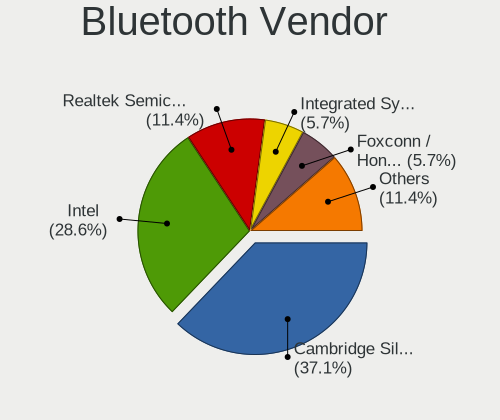

| Vendor                     | Desktops | Percent |
|----------------------------|----------|---------|
| Cambridge Silicon Radio    | 5        | 38.46%  |
| Intel                      | 3        | 23.08%  |
| Realtek Semiconductor      | 2        | 15.38%  |
| Integrated System Solution | 2        | 15.38%  |
| Logitech                   | 1        | 7.69%   |

Bluetooth Model
---------------

Controller models

| Model                                               | Desktops | Percent |
|-----------------------------------------------------|----------|---------|
| Cambridge Silicon Radio Bluetooth Dongle (HCI mode) | 5        | 38.46%  |
| Realtek Bluetooth Radio                             | 2        | 15.38%  |
| Integrated System Solution Bluetooth Device         | 2        | 15.38%  |
| Logitech BT Mini-Receiver (HCI mode)                | 1        | 7.69%   |
| Intel Bluetooth wireless interface                  | 1        | 7.69%   |
| Intel AX201 Bluetooth                               | 1        | 7.69%   |
| Intel AX200 Bluetooth                               | 1        | 7.69%   |

Sound
-----

Sound Vendor
------------

Sound card vendors

| Vendor                 | Desktops | Percent |
|------------------------|----------|---------|
| Intel                  | 142      | 51.64%  |
| Nvidia                 | 86       | 31.27%  |
| AMD                    | 25       | 9.09%   |
| C-Media Electronics    | 7        | 2.55%   |
| VIA Technologies       | 2        | 0.73%   |
| Creative Labs          | 2        | 0.73%   |
| Xilinx                 | 1        | 0.36%   |
| ULi Electronics        | 1        | 0.36%   |
| Sony                   | 1        | 0.36%   |
| SAVITECH               | 1        | 0.36%   |
| Plantronics            | 1        | 0.36%   |
| Logitech               | 1        | 0.36%   |
| JMTek                  | 1        | 0.36%   |
| Hewlett-Packard        | 1        | 0.36%   |
| Generalplus Technology | 1        | 0.36%   |
| Focusrite-Novation     | 1        | 0.36%   |
| ASUSTek Computer       | 1        | 0.36%   |

Sound Model
-----------

Sound card models

| Model                                                                      | Desktops | Percent |
|----------------------------------------------------------------------------|----------|---------|
| Intel NM10/ICH7 Family High Definition Audio Controller                    | 30       | 10.45%  |
| Intel 6 Series/C200 Series Chipset Family High Definition Audio Controller | 26       | 9.06%   |
| Nvidia GF108 High Definition Audio Controller                              | 18       | 6.27%   |
| Intel 82801JI (ICH10 Family) HD Audio Controller                           | 14       | 4.88%   |
| Nvidia High Definition Audio Controller                                    | 13       | 4.53%   |
| Intel 7 Series/C216 Chipset Family High Definition Audio Controller        | 13       | 4.53%   |
| Intel 8 Series/C220 Series Chipset High Definition Audio Controller        | 11       | 3.83%   |
| Intel 82801I (ICH9 Family) HD Audio Controller                             | 8        | 2.79%   |
| Intel 100 Series/C230 Series Chipset Family HD Audio Controller            | 8        | 2.79%   |
| Nvidia GK107 HDMI Audio Controller                                         | 7        | 2.44%   |
| Intel 5 Series/3400 Series Chipset High Definition Audio                   | 6        | 2.09%   |
| Intel 200 Series PCH HD Audio                                              | 6        | 2.09%   |
| Nvidia GF114 HDMI Audio Controller                                         | 5        | 1.74%   |
| AMD Juniper HDMI Audio [Radeon HD 5700 Series]                             | 5        | 1.74%   |
| Nvidia GP104 High Definition Audio Controller                              | 4        | 1.39%   |
| Nvidia GF119 HDMI Audio Controller                                         | 4        | 1.39%   |
| Intel Cannon Lake PCH cAVS                                                 | 4        | 1.39%   |
| Intel 82801H (ICH8 Family) HD Audio Controller                             | 4        | 1.39%   |
| AMD Family 17h (Models 00h-0fh) HD Audio Controller                        | 4        | 1.39%   |
| AMD Baffin HDMI/DP Audio [Radeon RX 550 640SP / RX 560/560X]               | 4        | 1.39%   |
| Nvidia GT216 HDMI Audio Controller                                         | 3        | 1.05%   |
| Nvidia GP107GL High Definition Audio Controller                            | 3        | 1.05%   |
| Nvidia GM206 High Definition Audio Controller                              | 3        | 1.05%   |
| Nvidia GM107 High Definition Audio Controller [GeForce 940MX]              | 3        | 1.05%   |
| Nvidia GK208 HDMI/DP Audio Controller                                      | 3        | 1.05%   |
| Nvidia GK104 HDMI Audio Controller                                         | 3        | 1.05%   |
| Nvidia GF116 High Definition Audio Controller                              | 3        | 1.05%   |
| Intel Xeon E3-1200 v3/4th Gen Core Processor HD Audio Controller           | 3        | 1.05%   |
| Intel Atom Processor Z36xxx/Z37xxx Series High Definition Audio Controller | 3        | 1.05%   |
| C-Media Electronics CMI8738/CMI8768 PCI Audio                              | 3        | 1.05%   |
| AMD SBx00 Azalia (Intel HDA)                                               | 3        | 1.05%   |
| Nvidia TU116 High Definition Audio Controller                              | 2        | 0.7%    |
| Nvidia TU106 High Definition Audio Controller                              | 2        | 0.7%    |
| Nvidia GP106 High Definition Audio Controller                              | 2        | 0.7%    |
| Nvidia GF104 High Definition Audio Controller                              | 2        | 0.7%    |
| Nvidia CK804 AC'97 Audio Controller                                        | 2        | 0.7%    |
| Intel Comet Lake PCH cAVS                                                  | 2        | 0.7%    |
| Intel C600/X79 series chipset High Definition Audio Controller             | 2        | 0.7%    |
| Intel 9 Series Chipset Family HD Audio Controller                          | 2        | 0.7%    |
| AMD Starship/Matisse HD Audio Controller                                   | 2        | 0.7%    |
| AMD Oland/Hainan/Cape Verde/Pitcairn HDMI Audio [Radeon HD 7000 Series]    | 2        | 0.7%    |
| AMD Ellesmere HDMI Audio [Radeon RX 470/480 / 570/580/590]                 | 2        | 0.7%    |
| AMD Cedar HDMI Audio [Radeon HD 5400/6300/7300 Series]                     | 2        | 0.7%    |
| Xilinx RME Hammerfall DSP                                                  | 1        | 0.35%   |
| VIA Technologies VX900/VT8xxx High Definition Audio Controller             | 1        | 0.35%   |
| VIA Technologies VT8233/A/8235/8237 AC97 Audio Controller                  | 1        | 0.35%   |
| ULi Electronics HD Audio Controller                                        | 1        | 0.35%   |
| Sony DualShock 4 [CUH-ZCT2x]                                               | 1        | 0.35%   |
| SAVITECH SA9023 audio controller                                           | 1        | 0.35%   |
| Plantronics GameCom 780/788                                                | 1        | 0.35%   |
| Nvidia MCP72XE/MCP72P/MCP78U/MCP78S High Definition Audio                  | 1        | 0.35%   |
| Nvidia MCP61 High Definition Audio                                         | 1        | 0.35%   |
| Nvidia MCP55 High Definition Audio                                         | 1        | 0.35%   |
| Nvidia MCP51 High Definition Audio                                         | 1        | 0.35%   |
| Nvidia GP108 High Definition Audio Controller                              | 1        | 0.35%   |
| Nvidia GP102 HDMI Audio Controller                                         | 1        | 0.35%   |
| Nvidia GK106 HDMI Audio Controller                                         | 1        | 0.35%   |
| Nvidia GF106 High Definition Audio Controller                              | 1        | 0.35%   |
| Nvidia GA106 High Definition Audio Controller                              | 1        | 0.35%   |
| Logitech Headset H390                                                      | 1        | 0.35%   |

Memory
------

Memory Vendor
-------------

Memory module vendors

| Vendor              | Desktops | Percent |
|---------------------|----------|---------|
| Unknown             | 86       | 49.71%  |
| Kingston            | 19       | 10.98%  |
| Transcend           | 12       | 6.94%   |
| Silicon Power       | 6        | 3.47%   |
| Crucial             | 5        | 2.89%   |
| Apacer              | 5        | 2.89%   |
| Team                | 4        | 2.31%   |
| SK hynix            | 4        | 2.31%   |
| Samsung Electronics | 4        | 2.31%   |
| Patriot             | 4        | 2.31%   |
| GeIL                | 4        | 2.31%   |
| A-DATA Technology   | 4        | 2.31%   |
| G.Skill             | 3        | 1.73%   |
| Super Talent        | 2        | 1.16%   |
| SUPER KINGSTEK      | 2        | 1.16%   |
| Micron Technology   | 2        | 1.16%   |
| Goodram             | 2        | 1.16%   |
| Kllisre             | 1        | 0.58%   |
| Kingmax             | 1        | 0.58%   |
| KANMEIQi            | 1        | 0.58%   |
| Goldkey             | 1        | 0.58%   |
| Corsair             | 1        | 0.58%   |

Memory Model
------------

Memory module models

| Model                                                   | Desktops | Percent |
|---------------------------------------------------------|----------|---------|
| Unknown RAM Module 2048MB DIMM SDRAM                    | 12       | 6.09%   |
| Unknown RAM Module 1024MB DIMM SDRAM                    | 10       | 5.08%   |
| Unknown RAM Module 1024MB DIMM 800MT/s                  | 7        | 3.55%   |
| Unknown RAM Module 4096MB DIMM DDR3 1333MT/s            | 6        | 3.05%   |
| Unknown RAM Module 2048MB DIMM 800MT/s                  | 5        | 2.54%   |
| Unknown RAM Module 2048MB DIMM DDR2 800MT/s             | 4        | 2.03%   |
| Unknown RAM Module 2GB DIMM 800MT/s                     | 3        | 1.52%   |
| Unknown RAM Module 2048MB DIMM 1333MT/s                 | 3        | 1.52%   |
| Unknown RAM Module 1024MB DIMM 667MT/s                  | 3        | 1.52%   |
| Transcend RAM JM1333KLU-2G 2GB DIMM DDR3 1333MT/s       | 3        | 1.52%   |
| Unknown RAM Module 4096MB DIMM DDR3 1067MT/s            | 2        | 1.02%   |
| Unknown RAM Module 4096MB DIMM 1333MT/s                 | 2        | 1.02%   |
| Unknown RAM Module 2GB DIMM DDR2 800MT/s                | 2        | 1.02%   |
| Unknown RAM Module 2048MB DIMM DDR3 1067MT/s            | 2        | 1.02%   |
| Unknown RAM Module 2048MB DIMM DDR2 667MT/s             | 2        | 1.02%   |
| Unknown RAM Module 2048MB DIMM DDR 667MT/s              | 2        | 1.02%   |
| Unknown RAM Module 2048MB DIMM DDR 1333MT/s             | 2        | 1.02%   |
| Unknown RAM Module 2048MB DIMM 5354MT/s                 | 2        | 1.02%   |
| Unknown RAM Module 1024MB DIMM DDR2                     | 2        | 1.02%   |
| Transcend RAM JM1333KLN-4G 4GB DIMM DDR3                | 2        | 1.02%   |
| Super Talent RAM SUPERTALENT02 8GB DIMM DDR3 1600MT/s   | 2        | 1.02%   |
| Silicon Power RAM DBLT2GN568S 2048MB DIMM DDR3 1333MT/s | 2        | 1.02%   |
| GeIL RAM CL9-9-9 D3-1333 8GB DIMM DDR3 1333MT/s         | 2        | 1.02%   |
| A-DATA RAM Module 4096MB DIMM DDR3 1333MT/s             | 2        | 1.02%   |
| Unknown RAM Module 8192MB DIMM 1600MT/s                 | 1        | 0.51%   |
| Unknown RAM Module 512MB DIMM SDRAM                     | 1        | 0.51%   |
| Unknown RAM Module 512MB DIMM DDR2                      | 1        | 0.51%   |
| Unknown RAM Module 512MB DIMM DDR                       | 1        | 0.51%   |
| Unknown RAM Module 512MB DIMM 667MT/s                   | 1        | 0.51%   |
| Unknown RAM Module 4GB DIMM DDR3 1600MT/s               | 1        | 0.51%   |
| Unknown RAM Module 4096MB DIMM DDR3 1600MT/s            | 1        | 0.51%   |
| Unknown RAM Module 4096MB DIMM DDR3 1400MT/s            | 1        | 0.51%   |
| Unknown RAM Module 4096MB DIMM 400MT/s                  | 1        | 0.51%   |
| Unknown RAM Module 4096MB DIMM 2020MT/s                 | 1        | 0.51%   |
| Unknown RAM Module 4096MB DIMM 1066MT/s                 | 1        | 0.51%   |
| Unknown RAM Module 2GB DIMM SDRAM                       | 1        | 0.51%   |
| Unknown RAM Module 2GB DIMM DDR3 1333MT/s               | 1        | 0.51%   |
| Unknown RAM Module 2GB DIMM 533MT/s                     | 1        | 0.51%   |
| Unknown RAM Module 2GB DIMM 400MT/s                     | 1        | 0.51%   |
| Unknown RAM Module 256MB DIMM 533MT/s                   | 1        | 0.51%   |
| Unknown RAM Module 2048MB DIMM SDRAM 1666MT/s           | 1        | 0.51%   |
| Unknown RAM Module 2048MB DIMM DDR3 1333MT/s            | 1        | 0.51%   |
| Unknown RAM Module 2048MB DIMM DDR3                     | 1        | 0.51%   |
| Unknown RAM Module 2048MB DIMM DDR2 533MT/s             | 1        | 0.51%   |
| Unknown RAM Module 2048MB DIMM DDR2                     | 1        | 0.51%   |
| Unknown RAM Module 2048MB DIMM 667MT/s                  | 1        | 0.51%   |
| Unknown RAM Module 2048MB DIMM 400MT/s                  | 1        | 0.51%   |
| Unknown RAM Module 2048MB DIMM 1258MT/s                 | 1        | 0.51%   |
| Unknown RAM Module 2048MB DIMM 1066MT/s                 | 1        | 0.51%   |
| Unknown RAM Module 1GB DIMM 800MT/s                     | 1        | 0.51%   |
| Unknown RAM Module 1GB DIMM 667MT/s                     | 1        | 0.51%   |
| Unknown RAM Module 1024MB DIMM DDR2 800MT/s             | 1        | 0.51%   |
| Unknown RAM Module 1024MB DIMM DDR2 667MT/s             | 1        | 0.51%   |
| Unknown RAM Module 1024MB DIMM DDR2 1067MT/s            | 1        | 0.51%   |
| Unknown RAM Module 1024MB DIMM DDR 667MT/s              | 1        | 0.51%   |
| Unknown RAM Module 1024MB DIMM 66MT/s                   | 1        | 0.51%   |
| Unknown RAM Module 1024MB DIMM 533MT/s                  | 1        | 0.51%   |
| Unknown RAM Module 1024MB DIMM 1066MT/s                 | 1        | 0.51%   |
| Unknown RAM Module 1024MB DIMM                          | 1        | 0.51%   |
| Transcend RAM TS512MLK64V6N 4096MB DIMM DDR3 1600MT/s   | 1        | 0.51%   |

Memory Kind
-----------

Memory module kinds

| Kind    | Desktops | Percent |
|---------|----------|---------|
| DDR3    | 56       | 37.58%  |
| Unknown | 32       | 21.48%  |
| SDRAM   | 22       | 14.77%  |
| DDR4    | 20       | 13.42%  |
| DDR2    | 14       | 9.4%    |
| DDR     | 5        | 3.36%   |

Memory Form Factor
------------------

Physical design of the memory module

| Name    | Desktops | Percent |
|---------|----------|---------|
| DIMM    | 144      | 97.96%  |
| SODIMM  | 2        | 1.36%   |
| FB-DIMM | 1        | 0.68%   |

Memory Size
-----------

Memory module size

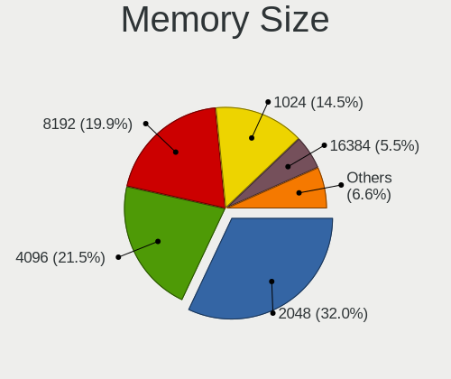

| Size  | Desktops | Percent |
|-------|----------|---------|
| 2048  | 66       | 36.46%  |
| 4096  | 42       | 23.2%   |
| 1024  | 32       | 17.68%  |
| 8192  | 28       | 15.47%  |
| 16384 | 5        | 2.76%   |
| 512   | 5        | 2.76%   |
| 32768 | 2        | 1.1%    |
| 256   | 1        | 0.55%   |

Memory Speed
------------

Memory module speed

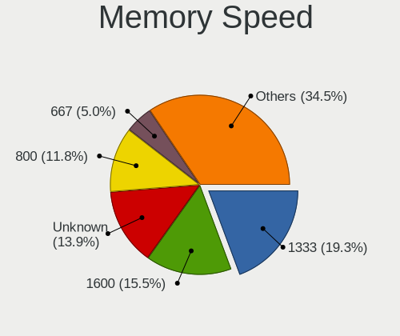

| Speed   | Desktops | Percent |
|---------|----------|---------|
| 1333    | 35       | 21.47%  |
| 1600    | 25       | 15.34%  |
| Unknown | 25       | 15.34%  |
| 800     | 19       | 11.66%  |
| 667     | 10       | 6.13%   |
| 2400    | 8        | 4.91%   |
| 3200    | 4        | 2.45%   |
| 2667    | 4        | 2.45%   |
| 1067    | 4        | 2.45%   |
| 533     | 4        | 2.45%   |
| 2133    | 3        | 1.84%   |
| 1066    | 3        | 1.84%   |
| 400     | 3        | 1.84%   |
| 5354    | 2        | 1.23%   |
| 2666    | 2        | 1.23%   |
| 3800    | 1        | 0.61%   |
| 3733    | 1        | 0.61%   |
| 3334    | 1        | 0.61%   |
| 3000    | 1        | 0.61%   |
| 2020    | 1        | 0.61%   |
| 1867    | 1        | 0.61%   |
| 1800    | 1        | 0.61%   |
| 1666    | 1        | 0.61%   |
| 1400    | 1        | 0.61%   |
| 1334    | 1        | 0.61%   |
| 1258    | 1        | 0.61%   |
| 66      | 1        | 0.61%   |

Printers & scanners
-------------------

Printer Vendor
--------------

Printer device vendors

| Vendor              | Desktops | Percent |
|---------------------|----------|---------|
| Hewlett-Packard     | 5        | 45.45%  |
| Xerox               | 2        | 18.18%  |
| Samsung Electronics | 2        | 18.18%  |
| Canon               | 2        | 18.18%  |

Printer Model
-------------

Printer device models

| Model                                   | Desktops | Percent |
|-----------------------------------------|----------|---------|
| Xerox Phaser 3160                       | 1        | 9.09%   |
| Xerox Phaser 3020                       | 1        | 9.09%   |
| Samsung Xerox Phaser 3117 Laser Printer | 1        | 9.09%   |
| Samsung CLX-3180 Series                 | 1        | 9.09%   |
| HP LaserJet P1102                       | 1        | 9.09%   |
| HP LaserJet 1018                        | 1        | 9.09%   |
| HP LaserJet 1010                        | 1        | 9.09%   |
| HP DeskJet 5650c                        | 1        | 9.09%   |
| HP Deskjet 2520 series                  | 1        | 9.09%   |
| Canon LBP810                            | 1        | 9.09%   |
| Canon LBP6000                           | 1        | 9.09%   |

Scanner Vendor
--------------

Scanner device vendors

Zero info for selected period =(

Scanner Model
-------------

Scanner device models

Zero info for selected period =(

Camera
------

Camera Vendor
-------------

Camera device vendors

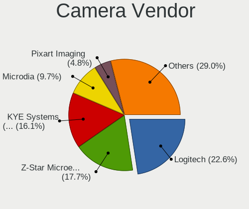

| Vendor                      | Desktops | Percent |
|-----------------------------|----------|---------|
| Z-Star Microelectronics     | 9        | 19.57%  |
| Logitech                    | 9        | 19.57%  |
| KYE Systems (Mouse Systems) | 9        | 19.57%  |
| Microdia                    | 4        | 8.7%    |
| Pixart Imaging              | 3        | 6.52%   |
| SiGma Micro                 | 2        | 4.35%   |
| Hewlett-Packard             | 2        | 4.35%   |
| GEMBIRD                     | 2        | 4.35%   |
| Samsung Electronics         | 1        | 2.17%   |
| Generalplus Technology      | 1        | 2.17%   |
| Chicony Electronics         | 1        | 2.17%   |
| Aveo Technology             | 1        | 2.17%   |
| Apple                       | 1        | 2.17%   |
| Alcor Micro                 | 1        | 2.17%   |

Camera Model
------------

Camera device models

| Model                                            | Desktops | Percent |
|--------------------------------------------------|----------|---------|
| Z-Star Venus USB2.0 Camera                       | 6        | 13.04%  |
| Pixart Imaging GE 1.3 MP MiniCam Pro             | 3        | 6.52%   |
| Logitech Webcam C170                             | 3        | 6.52%   |
| KYE Systems (Mouse Systems) Genius iSlim 330     | 3        | 6.52%   |
| SiGma Micro WebCam SiGma Micro                   | 2        | 4.35%   |
| Microdia Sonix USB 2.0 Camera                    | 2        | 4.35%   |
| Logitech Webcam C270                             | 2        | 4.35%   |
| GEMBIRD USB2.0 PC CAMERA                         | 2        | 4.35%   |
| Z-Star Vimicro USB Camera (Altair)               | 1        | 2.17%   |
| Z-Star Sirius USB2.0 Camera                      | 1        | 2.17%   |
| Z-Star Lenovo IdeaCentre Web Camera              | 1        | 2.17%   |
| Samsung Galaxy A5 (MTP)                          | 1        | 2.17%   |
| Microdia MSI Starcam Racer                       | 1        | 2.17%   |
| Microdia Camera                                  | 1        | 2.17%   |
| Logitech Webcam C310                             | 1        | 2.17%   |
| Logitech Webcam C210                             | 1        | 2.17%   |
| Logitech Webcam C200                             | 1        | 2.17%   |
| Logitech HD Webcam C510                          | 1        | 2.17%   |
| KYE Systems (Mouse Systems) USB20 Camera         | 1        | 2.17%   |
| KYE Systems (Mouse Systems) iSlim 1300 V2        | 1        | 2.17%   |
| KYE Systems (Mouse Systems) Genius Webcam        | 1        | 2.17%   |
| KYE Systems (Mouse Systems) Genius FaceCam 312   | 1        | 2.17%   |
| KYE Systems (Mouse Systems) FaceCam 315          | 1        | 2.17%   |
| KYE Systems (Mouse Systems) AUKEY PC-LM1E Camera | 1        | 2.17%   |
| HP Webcam HD-2200                                | 1        | 2.17%   |
| HP Webcam HD 2300                                | 1        | 2.17%   |
| Generalplus 808 Camera                           | 1        | 2.17%   |
| Chicony HP High Definition 1MP Webcam            | 1        | 2.17%   |
| Aveo USB2.0 Camera                               | 1        | 2.17%   |
| Apple iPhone 5/5C/5S/6/SE                        | 1        | 2.17%   |
| Alcor Micro USB 2.0 PC Camera                    | 1        | 2.17%   |

Security
--------

Fingerprint Vendor
------------------

Fingerprint sensor vendors

Zero info for selected period =(

Fingerprint Model
-----------------

Fingerprint sensor models

Zero info for selected period =(

Chipcard Vendor
---------------

Chipcard module vendors

| Vendor                | Desktops | Percent |
|-----------------------|----------|---------|
| Aktiv                 | 1        | 50%     |
| Advanced Card Systems | 1        | 50%     |

Chipcard Model
--------------

Chipcard module models

| Model                                        | Desktops | Percent |
|----------------------------------------------|----------|---------|
| Aktiv KAZTOKEN                               | 1        | 50%     |
| Advanced Card Systems ACR38 SmartCard Reader | 1        | 50%     |

Unsupported
-----------

Unsupported Devices
-------------------

Total unsupported devices on board

| Total | Desktops | Percent |
|-------|----------|---------|
| 0     | 154      | 92.22%  |
| 1     | 11       | 6.59%   |
| 2     | 2        | 1.2%    |

Unsupported Device Types
------------------------

Types of unsupported devices

| Type                     | Desktops | Percent |
|--------------------------|----------|---------|
| Graphics card            | 6        | 42.86%  |
| Communication controller | 4        | 28.57%  |
| Unassigned class         | 1        | 7.14%   |
| Multimedia controller    | 1        | 7.14%   |
| Chipcard                 | 1        | 7.14%   |
| Camera                   | 1        | 7.14%   |

