Linux in Kazakhstan - Tested Hardware & Statistics (Desktops)
-------------------------------------------------------------

A project to collect tested hardware configurations for Linux in Kazakhstan.

Anyone can contribute to this report by the [hw-probe](https://github.com/linuxhw/hw-probe) tool:

    sudo -E hw-probe -all -upload

Please contribute! Especially if your hardware is rare.

Contents
--------

* [ Test Cases ](#test-cases)

* [ System ](#system)
  - [ OS                       ](#os)
  - [ OS Family                ](#os-family)
  - [ Kernel                   ](#kernel)
  - [ Kernel Family            ](#kernel-family)
  - [ Kernel Major Ver.        ](#kernel-major-ver)
  - [ Arch                     ](#arch)
  - [ DE                       ](#de)
  - [ Display Server           ](#display-server)
  - [ Display Manager          ](#display-manager)
  - [ OS Lang                  ](#os-lang)
  - [ Boot Mode                ](#boot-mode)
  - [ Filesystem               ](#filesystem)
  - [ Part. scheme             ](#part-scheme)
  - [ Dual Boot with Linux/BSD ](#dual-boot-with-linuxbsd)
  - [ Dual Boot (Win)          ](#dual-boot-win)

* [ Board ](#board)
  - [ Vendor                   ](#vendor)
  - [ Model                    ](#model)
  - [ Model Family             ](#model-family)
  - [ MFG Year                 ](#mfg-year)
  - [ Form Factor              ](#form-factor)
  - [ Secure Boot              ](#secure-boot)
  - [ Coreboot                 ](#coreboot)
  - [ RAM Size                 ](#ram-size)
  - [ RAM Used                 ](#ram-used)
  - [ Total Drives             ](#total-drives)
  - [ Has CD-ROM               ](#has-cd-rom)
  - [ Has Ethernet             ](#has-ethernet)
  - [ Has WiFi                 ](#has-wifi)
  - [ Has Bluetooth            ](#has-bluetooth)

* [ Location ](#location)
  - [ Country                  ](#country)
  - [ City                     ](#city)

* [ Drives ](#drives)
  - [ Drive Vendor             ](#drive-vendor)
  - [ Drive Model              ](#drive-model)
  - [ HDD Vendor               ](#hdd-vendor)
  - [ SSD Vendor               ](#ssd-vendor)
  - [ Drive Kind               ](#drive-kind)
  - [ Drive Connector          ](#drive-connector)
  - [ Drive Size               ](#drive-size)
  - [ Space Total              ](#space-total)
  - [ Space Used               ](#space-used)
  - [ Malfunc. Drives          ](#malfunc-drives)
  - [ Malfunc. Drive Vendor    ](#malfunc-drive-vendor)
  - [ Malfunc. HDD Vendor      ](#malfunc-hdd-vendor)
  - [ Malfunc. Drive Kind      ](#malfunc-drive-kind)
  - [ Failed Drives            ](#failed-drives)
  - [ Failed Drive Vendor      ](#failed-drive-vendor)
  - [ Drive Status             ](#drive-status)

* [ Storage controller ](#storage-controller)
  - [ Storage Vendor           ](#storage-vendor)
  - [ Storage Model            ](#storage-model)
  - [ Storage Kind             ](#storage-kind)

* [ Processor ](#processor)
  - [ CPU Vendor               ](#cpu-vendor)
  - [ CPU Model                ](#cpu-model)
  - [ CPU Model Family         ](#cpu-model-family)
  - [ CPU Cores                ](#cpu-cores)
  - [ CPU Sockets              ](#cpu-sockets)
  - [ CPU Threads              ](#cpu-threads)
  - [ CPU Op-Modes             ](#cpu-op-modes)
  - [ CPU Microcode            ](#cpu-microcode)
  - [ CPU Microarch            ](#cpu-microarch)

* [ Graphics ](#graphics)
  - [ GPU Vendor               ](#gpu-vendor)
  - [ GPU Model                ](#gpu-model)
  - [ GPU Combo                ](#gpu-combo)
  - [ GPU Driver               ](#gpu-driver)
  - [ GPU Memory               ](#gpu-memory)

* [ Monitor ](#monitor)
  - [ Monitor Vendor           ](#monitor-vendor)
  - [ Monitor Model            ](#monitor-model)
  - [ Monitor Resolution       ](#monitor-resolution)
  - [ Monitor Diagonal         ](#monitor-diagonal)
  - [ Monitor Width            ](#monitor-width)
  - [ Aspect Ratio             ](#aspect-ratio)
  - [ Monitor Area             ](#monitor-area)
  - [ Pixel Density            ](#pixel-density)
  - [ Multiple Monitors        ](#multiple-monitors)

* [ Network ](#network)
  - [ Net Controller Vendor    ](#net-controller-vendor)
  - [ Net Controller Model     ](#net-controller-model)
  - [ Wireless Vendor          ](#wireless-vendor)
  - [ Wireless Model           ](#wireless-model)
  - [ Ethernet Vendor          ](#ethernet-vendor)
  - [ Ethernet Model           ](#ethernet-model)
  - [ Net Controller Kind      ](#net-controller-kind)
  - [ Used Controller          ](#used-controller)
  - [ NICs                     ](#nics)
  - [ IPv6                     ](#ipv6)

* [ Bluetooth ](#bluetooth)
  - [ Bluetooth Vendor         ](#bluetooth-vendor)
  - [ Bluetooth Model          ](#bluetooth-model)

* [ Sound ](#sound)
  - [ Sound Vendor             ](#sound-vendor)
  - [ Sound Model              ](#sound-model)

* [ Memory ](#memory)
  - [ Memory Vendor            ](#memory-vendor)
  - [ Memory Model             ](#memory-model)
  - [ Memory Kind              ](#memory-kind)
  - [ Memory Form Factor       ](#memory-form-factor)
  - [ Memory Size              ](#memory-size)
  - [ Memory Speed             ](#memory-speed)

* [ Printers & scanners ](#printers--scanners)
  - [ Printer Vendor           ](#printer-vendor)
  - [ Printer Model            ](#printer-model)
  - [ Scanner Vendor           ](#scanner-vendor)
  - [ Scanner Model            ](#scanner-model)

* [ Camera ](#camera)
  - [ Camera Vendor            ](#camera-vendor)
  - [ Camera Model             ](#camera-model)

* [ Security ](#security)
  - [ Fingerprint Vendor       ](#fingerprint-vendor)
  - [ Fingerprint Model        ](#fingerprint-model)
  - [ Chipcard Vendor          ](#chipcard-vendor)
  - [ Chipcard Model           ](#chipcard-model)

* [ Unsupported ](#unsupported)
  - [ Unsupported Devices      ](#unsupported-devices)
  - [ Unsupported Device Types ](#unsupported-device-types)

Test Cases
----------

Total: 639

| Vendor        | Model                       | Probe                                                      | Date         |
|---------------|-----------------------------|------------------------------------------------------------|--------------|
| ASRock        | 990FX Extreme4              | [4b37ae65f2](https://linux-hardware.org/?probe=4b37ae65f2) | Dec 30, 2024 |
| ASRock        | 990FX Extreme4              | [ae4ac86e01](https://linux-hardware.org/?probe=ae4ac86e01) | Dec 27, 2024 |
| ASRock        | 990FX Extreme4              | [51e8b5da5d](https://linux-hardware.org/?probe=51e8b5da5d) | Dec 23, 2024 |
| ASRock        | 990FX Extreme4              | [4e38ddc9dc](https://linux-hardware.org/?probe=4e38ddc9dc) | Dec 18, 2024 |
| Sapphire      | PI-AM3RS760G2               | [95613c7635](https://linux-hardware.org/?probe=95613c7635) | Dec 18, 2024 |
| Intel         | Unknown                     | [fcbbdc5c06](https://linux-hardware.org/?probe=fcbbdc5c06) | Dec 16, 2024 |
| Foxconn       | H55MXV Series               | [cf67e7336a](https://linux-hardware.org/?probe=cf67e7336a) | Dec 14, 2024 |
| Foxconn       | H55MXV Series               | [6a647c4d4e](https://linux-hardware.org/?probe=6a647c4d4e) | Dec 14, 2024 |
| ASRock        | 990FX Extreme4              | [7831fe39d7](https://linux-hardware.org/?probe=7831fe39d7) | Dec 14, 2024 |
| Sapphire      | PI-AM3RS760G2               | [f5a32c5d75](https://linux-hardware.org/?probe=f5a32c5d75) | Dec 13, 2024 |
| ASRock        | 990FX Extreme4              | [8b5cf16f3c](https://linux-hardware.org/?probe=8b5cf16f3c) | Dec 13, 2024 |
| Gigabyte      | H410M H V2                  | [29d08f5d9c](https://linux-hardware.org/?probe=29d08f5d9c) | Dec 11, 2024 |
| ASRock        | 990FX Extreme4              | [5da4d46242](https://linux-hardware.org/?probe=5da4d46242) | Dec 10, 2024 |
| MSI           | H81M-P33                    | [cac8c0b952](https://linux-hardware.org/?probe=cac8c0b952) | Dec 09, 2024 |
| ASRock        | 990FX Extreme4              | [37cd91857a](https://linux-hardware.org/?probe=37cd91857a) | Dec 03, 2024 |
| Sapphire      | PI-AM3RS760G2               | [28717d8de7](https://linux-hardware.org/?probe=28717d8de7) | Dec 02, 2024 |
| Acer          | FI946GZG                    | [cd23a4d442](https://linux-hardware.org/?probe=cd23a4d442) | Nov 30, 2024 |
| ASRock        | 990FX Extreme4              | [721db2016b](https://linux-hardware.org/?probe=721db2016b) | Nov 30, 2024 |
| Intel         | H61M-DS2                    | [dd01835023](https://linux-hardware.org/?probe=dd01835023) | Nov 30, 2024 |
| Acer          | FI946GZG                    | [51525dcf0b](https://linux-hardware.org/?probe=51525dcf0b) | Nov 30, 2024 |
| Acer          | FI946GZG                    | [7ca93acd40](https://linux-hardware.org/?probe=7ca93acd40) | Nov 30, 2024 |
| ASUSTek       | P5G41-M LE                  | [d31490c125](https://linux-hardware.org/?probe=d31490c125) | Nov 28, 2024 |
| Acer          | FI946GZG                    | [816946793f](https://linux-hardware.org/?probe=816946793f) | Nov 27, 2024 |
| Acer          | FI946GZG                    | [97bb957570](https://linux-hardware.org/?probe=97bb957570) | Nov 27, 2024 |
| Sapphire      | PI-AM3RS760G2               | [f82e692b05](https://linux-hardware.org/?probe=f82e692b05) | Nov 27, 2024 |
| Sapphire      | PI-AM3RS760G2               | [c1421ece6a](https://linux-hardware.org/?probe=c1421ece6a) | Nov 27, 2024 |
| ASRock        | 990FX Extreme4              | [b30fc2534e](https://linux-hardware.org/?probe=b30fc2534e) | Nov 24, 2024 |
| ASRock        | 990FX Extreme4              | [0677efd3fd](https://linux-hardware.org/?probe=0677efd3fd) | Nov 23, 2024 |
| ASRock        | 990FX Extreme4              | [5c29a83065](https://linux-hardware.org/?probe=5c29a83065) | Nov 23, 2024 |
| Acer          | FI946GZG                    | [5dec70689d](https://linux-hardware.org/?probe=5dec70689d) | Nov 21, 2024 |
| ASRock        | 990FX Extreme4              | [a92920e53b](https://linux-hardware.org/?probe=a92920e53b) | Nov 21, 2024 |
| ASRock        | 990FX Extreme4              | [62ca0ea99f](https://linux-hardware.org/?probe=62ca0ea99f) | Nov 19, 2024 |
| ASRock        | 990FX Extreme4              | [9533b58887](https://linux-hardware.org/?probe=9533b58887) | Nov 17, 2024 |
| ASRock        | 990FX Extreme4              | [4fdb624e0d](https://linux-hardware.org/?probe=4fdb624e0d) | Nov 17, 2024 |
| ASRock        | 990FX Extreme4              | [e8e51e4661](https://linux-hardware.org/?probe=e8e51e4661) | Nov 17, 2024 |
| Sapphire      | PI-AM3RS760G2               | [c75747aebf](https://linux-hardware.org/?probe=c75747aebf) | Nov 16, 2024 |
| Sapphire      | PI-AM3RS760G2               | [b8fcc9f859](https://linux-hardware.org/?probe=b8fcc9f859) | Nov 16, 2024 |
| Acer          | FI946GZG                    | [a7f49035aa](https://linux-hardware.org/?probe=a7f49035aa) | Nov 16, 2024 |
| Acer          | FI946GZG                    | [9d9080e57a](https://linux-hardware.org/?probe=9d9080e57a) | Nov 16, 2024 |
| Acer          | FI946GZG                    | [0a4922fa4a](https://linux-hardware.org/?probe=0a4922fa4a) | Nov 16, 2024 |
| Gigabyte      | GA-MA78GM-DS2H              | [5b63d6de06](https://linux-hardware.org/?probe=5b63d6de06) | Nov 12, 2024 |
| Sapphire      | PI-AM3RS760G2               | [2aeff0c8d3](https://linux-hardware.org/?probe=2aeff0c8d3) | Nov 12, 2024 |
| Acer          | FI946GZG                    | [839c93438e](https://linux-hardware.org/?probe=839c93438e) | Nov 11, 2024 |
| ASRock        | 990FX Extreme4              | [249dbb7fd0](https://linux-hardware.org/?probe=249dbb7fd0) | Nov 11, 2024 |
| ASRock        | 990FX Extreme4              | [bbee92fd3f](https://linux-hardware.org/?probe=bbee92fd3f) | Nov 10, 2024 |
| ASRock        | 990FX Extreme4              | [bda8633651](https://linux-hardware.org/?probe=bda8633651) | Oct 30, 2024 |
| ASRock        | 990FX Extreme4              | [938c450b38](https://linux-hardware.org/?probe=938c450b38) | Oct 30, 2024 |
| Sapphire      | PI-AM3RS760G2               | [e2d1e7a362](https://linux-hardware.org/?probe=e2d1e7a362) | Oct 27, 2024 |
| Acer          | FI946GZG                    | [02965ac18a](https://linux-hardware.org/?probe=02965ac18a) | Oct 26, 2024 |
| Acer          | FI946GZG                    | [aa985cb91e](https://linux-hardware.org/?probe=aa985cb91e) | Oct 26, 2024 |
| Acer          | FI946GZG                    | [2d4aa17377](https://linux-hardware.org/?probe=2d4aa17377) | Oct 26, 2024 |
| Acer          | FI946GZG                    | [5938a70edc](https://linux-hardware.org/?probe=5938a70edc) | Oct 26, 2024 |
| Acer          | FI946GZG                    | [57835df373](https://linux-hardware.org/?probe=57835df373) | Oct 26, 2024 |
| Gigabyte      | H510M H                     | [f9526923ef](https://linux-hardware.org/?probe=f9526923ef) | Oct 24, 2024 |
| ASRock        | 990FX Extreme4              | [4d658d4db3](https://linux-hardware.org/?probe=4d658d4db3) | Oct 21, 2024 |
| Intel         | JSL MRD                     | [3e4834107b](https://linux-hardware.org/?probe=3e4834107b) | Oct 17, 2024 |
| Lenovo        | 32E6 SDK0T76530 WIN 3556... | [774e032ab6](https://linux-hardware.org/?probe=774e032ab6) | Oct 10, 2024 |
| Sapphire      | PI-AM3RS760G2               | [a0a836220b](https://linux-hardware.org/?probe=a0a836220b) | Oct 09, 2024 |
| Sapphire      | PI-AM3RS760G2               | [63eb77aafd](https://linux-hardware.org/?probe=63eb77aafd) | Oct 09, 2024 |
| Sapphire      | PI-AM3RS760G2               | [a2cff54f7a](https://linux-hardware.org/?probe=a2cff54f7a) | Oct 09, 2024 |
| Sapphire      | PI-AM3RS760G2               | [28fcc08ddb](https://linux-hardware.org/?probe=28fcc08ddb) | Oct 09, 2024 |
| Acer          | FI946GZG                    | [dcb630a44e](https://linux-hardware.org/?probe=dcb630a44e) | Oct 09, 2024 |
| Acer          | FI946GZG                    | [92bd6f1fc1](https://linux-hardware.org/?probe=92bd6f1fc1) | Oct 09, 2024 |
| Acer          | FI946GZG                    | [535a355530](https://linux-hardware.org/?probe=535a355530) | Oct 09, 2024 |
| Sapphire      | PI-AM3RS760G2               | [0b15120456](https://linux-hardware.org/?probe=0b15120456) | Oct 09, 2024 |
| Sapphire      | PI-AM3RS760G2               | [d0eaae2f60](https://linux-hardware.org/?probe=d0eaae2f60) | Oct 09, 2024 |
| ASUSTek       | Z97-A                       | [d7b987d600](https://linux-hardware.org/?probe=d7b987d600) | Oct 06, 2024 |
| MSI           | H81M-P33                    | [6c881211b4](https://linux-hardware.org/?probe=6c881211b4) | Oct 04, 2024 |
| ASRock        | 990FX Extreme4              | [7a8f5aa1d9](https://linux-hardware.org/?probe=7a8f5aa1d9) | Sep 30, 2024 |
| ASRock        | 990FX Extreme4              | [86c0fb1040](https://linux-hardware.org/?probe=86c0fb1040) | Sep 29, 2024 |
| Intel         | DH61WW AAG23116-204         | [6490abb8dc](https://linux-hardware.org/?probe=6490abb8dc) | Sep 27, 2024 |
| Gigabyte      | P35-DS3L                    | [f514b39998](https://linux-hardware.org/?probe=f514b39998) | Sep 25, 2024 |
| ASRock        | 990FX Extreme4              | [d4b92bf589](https://linux-hardware.org/?probe=d4b92bf589) | Sep 21, 2024 |
| Sapphire      | PI-AM3RS760G2               | [8e686cf909](https://linux-hardware.org/?probe=8e686cf909) | Sep 21, 2024 |
| Acer          | FI946GZG                    | [5d3261cef9](https://linux-hardware.org/?probe=5d3261cef9) | Sep 20, 2024 |
| Acer          | FI946GZG                    | [38457fe3eb](https://linux-hardware.org/?probe=38457fe3eb) | Sep 20, 2024 |
| Acer          | FI946GZG                    | [6d2cb2830e](https://linux-hardware.org/?probe=6d2cb2830e) | Sep 20, 2024 |
| Acer          | FI946GZG                    | [7f888553ed](https://linux-hardware.org/?probe=7f888553ed) | Sep 20, 2024 |
| ASRock        | 990FX Extreme4              | [43f6819239](https://linux-hardware.org/?probe=43f6819239) | Sep 19, 2024 |
| ASRock        | 990FX Extreme4              | [09b425a119](https://linux-hardware.org/?probe=09b425a119) | Sep 13, 2024 |
| ASRock        | 990FX Extreme4              | [99d35d63c7](https://linux-hardware.org/?probe=99d35d63c7) | Sep 09, 2024 |
| ASRock        | 990FX Extreme4              | [f1be3f6c90](https://linux-hardware.org/?probe=f1be3f6c90) | Sep 09, 2024 |
| ASRock        | 990FX Extreme4              | [6e8771695d](https://linux-hardware.org/?probe=6e8771695d) | Sep 07, 2024 |
| ASRock        | 990FX Extreme4              | [dd3e8c49a7](https://linux-hardware.org/?probe=dd3e8c49a7) | Sep 05, 2024 |
| ASRock        | 990FX Extreme4              | [ccf3202ad6](https://linux-hardware.org/?probe=ccf3202ad6) | Sep 05, 2024 |
| ASRock        | 990FX Extreme4              | [7a99ae7e13](https://linux-hardware.org/?probe=7a99ae7e13) | Sep 01, 2024 |
| ASRock        | 990FX Extreme4              | [7fb7f32904](https://linux-hardware.org/?probe=7fb7f32904) | Sep 01, 2024 |
| Unknown       | YV16                        | [4a2a6e7bb9](https://linux-hardware.org/?probe=4a2a6e7bb9) | Aug 24, 2024 |
| ASRock        | 990FX Extreme4              | [9a0fb7bb34](https://linux-hardware.org/?probe=9a0fb7bb34) | Aug 10, 2024 |
| Gigabyte      | Z68M-D2H                    | [8f0cd17c6a](https://linux-hardware.org/?probe=8f0cd17c6a) | Aug 09, 2024 |
| ASRock        | A320M-DVS R4.0              | [babb217959](https://linux-hardware.org/?probe=babb217959) | Aug 01, 2024 |
| ASRock        | AB350M Pro4                 | [f587d9d0c8](https://linux-hardware.org/?probe=f587d9d0c8) | Jul 28, 2024 |
| ASRock        | 990FX Extreme4              | [e1af01aa6b](https://linux-hardware.org/?probe=e1af01aa6b) | Jul 23, 2024 |
| ASRock        | 990FX Extreme4              | [433b535407](https://linux-hardware.org/?probe=433b535407) | Jul 20, 2024 |
| ASRock        | 990FX Extreme4              | [f9f12288d6](https://linux-hardware.org/?probe=f9f12288d6) | Jul 20, 2024 |
| ASRock        | 990FX Extreme4              | [72257b8e54](https://linux-hardware.org/?probe=72257b8e54) | Jul 19, 2024 |
| ASRock        | 990FX Extreme4              | [2ddaa196cc](https://linux-hardware.org/?probe=2ddaa196cc) | Jul 19, 2024 |
| ASRock        | 990FX Extreme4              | [48e91ef395](https://linux-hardware.org/?probe=48e91ef395) | Jul 19, 2024 |
| ASRock        | 990FX Extreme4              | [32df4c1524](https://linux-hardware.org/?probe=32df4c1524) | Jul 17, 2024 |
| ASRock        | 990FX Extreme4              | [2cf13b3ff1](https://linux-hardware.org/?probe=2cf13b3ff1) | Jul 17, 2024 |
| Acer          | FI946GZG                    | [d84975220f](https://linux-hardware.org/?probe=d84975220f) | Jul 16, 2024 |
| Acer          | FI946GZG                    | [de385cf02c](https://linux-hardware.org/?probe=de385cf02c) | Jul 16, 2024 |
| Acer          | FI946GZG                    | [f43f547c9f](https://linux-hardware.org/?probe=f43f547c9f) | Jul 16, 2024 |
| Acer          | FI946GZG                    | [6cf80479b6](https://linux-hardware.org/?probe=6cf80479b6) | Jul 16, 2024 |
| Acer          | FI946GZG                    | [f2f80972b8](https://linux-hardware.org/?probe=f2f80972b8) | Jul 16, 2024 |
| Acer          | FI946GZG                    | [d0ace49bcb](https://linux-hardware.org/?probe=d0ace49bcb) | Jul 16, 2024 |
| Sapphire      | PI-AM3RS760G2               | [1cf68fe3d7](https://linux-hardware.org/?probe=1cf68fe3d7) | Jul 15, 2024 |
| Sapphire      | PI-AM3RS760G2               | [c48f0cc1b2](https://linux-hardware.org/?probe=c48f0cc1b2) | Jul 15, 2024 |
| Sapphire      | PI-AM3RS760G2               | [34be774c07](https://linux-hardware.org/?probe=34be774c07) | Jul 15, 2024 |
| Sapphire      | PI-AM3RS760G2               | [226e301f3f](https://linux-hardware.org/?probe=226e301f3f) | Jul 15, 2024 |
| ASRock        | 990FX Extreme4              | [d815d3cac0](https://linux-hardware.org/?probe=d815d3cac0) | Jul 14, 2024 |
| ASRock        | 990FX Extreme4              | [cd4a6e8390](https://linux-hardware.org/?probe=cd4a6e8390) | Jul 14, 2024 |
| ASRock        | 990FX Extreme4              | [ea59b7a384](https://linux-hardware.org/?probe=ea59b7a384) | Jul 09, 2024 |
| ASRock        | 990FX Extreme4              | [9ed3dc5799](https://linux-hardware.org/?probe=9ed3dc5799) | Jul 09, 2024 |
| ASRock        | 990FX Extreme4              | [7973ab8579](https://linux-hardware.org/?probe=7973ab8579) | Jul 09, 2024 |
| Huanan        | X99-F8 V2.0                 | [49d27ce9db](https://linux-hardware.org/?probe=49d27ce9db) | Jul 04, 2024 |
| ASRock        | 990FX Extreme4              | [0a03d09839](https://linux-hardware.org/?probe=0a03d09839) | Jul 03, 2024 |
| ASRock        | 990FX Extreme4              | [4286f8b939](https://linux-hardware.org/?probe=4286f8b939) | Jul 02, 2024 |
| Acer          | FI946GZG                    | [16e04577b8](https://linux-hardware.org/?probe=16e04577b8) | Jul 02, 2024 |
| Sapphire      | PI-AM3RS760G2               | [005a7e8a09](https://linux-hardware.org/?probe=005a7e8a09) | Jul 02, 2024 |
| Sapphire      | PI-AM3RS760G2               | [1829045278](https://linux-hardware.org/?probe=1829045278) | Jul 02, 2024 |
| Sapphire      | PI-AM3RS760G2               | [933fb00685](https://linux-hardware.org/?probe=933fb00685) | Jul 01, 2024 |
| ASRock        | 990FX Extreme4              | [786651db97](https://linux-hardware.org/?probe=786651db97) | Jul 01, 2024 |
| Gigabyte      | Z68XP-UD4                   | [0302ee9878](https://linux-hardware.org/?probe=0302ee9878) | Jul 01, 2024 |
| ASRock        | 990FX Extreme4              | [55dad946a3](https://linux-hardware.org/?probe=55dad946a3) | Jul 01, 2024 |
| ASRock        | 990FX Extreme4              | [2b84f47ca4](https://linux-hardware.org/?probe=2b84f47ca4) | Jul 01, 2024 |
| Gigabyte      | Z68XP-UD4                   | [63db3bc9a9](https://linux-hardware.org/?probe=63db3bc9a9) | Jun 17, 2024 |
| ASUSTek       | PRIME A520M-K               | [0c8ae4204b](https://linux-hardware.org/?probe=0c8ae4204b) | Jun 15, 2024 |
| Intel         | H61 V1.6B                   | [930c36f35d](https://linux-hardware.org/?probe=930c36f35d) | Jun 15, 2024 |
| ASRock        | 990FX Extreme4              | [a3e379e1a2](https://linux-hardware.org/?probe=a3e379e1a2) | Jun 13, 2024 |
| ASRock        | 990FX Extreme4              | [d277357bb9](https://linux-hardware.org/?probe=d277357bb9) | Jun 13, 2024 |
| ASRock        | 990FX Extreme4              | [6e93011557](https://linux-hardware.org/?probe=6e93011557) | Jun 03, 2024 |
| Acer          | FI946GZG                    | [bf78acff25](https://linux-hardware.org/?probe=bf78acff25) | Jun 01, 2024 |
| Acer          | FI946GZG                    | [76cc9c0af8](https://linux-hardware.org/?probe=76cc9c0af8) | Jun 01, 2024 |
| ASUSTek       | PRIME A520M-A               | [7f4f6359fb](https://linux-hardware.org/?probe=7f4f6359fb) | May 31, 2024 |
| Sapphire      | PI-AM3RS760G2               | [d69c669f73](https://linux-hardware.org/?probe=d69c669f73) | May 28, 2024 |
| Gigabyte      | B75-D3V                     | [cd299d8bd3](https://linux-hardware.org/?probe=cd299d8bd3) | May 28, 2024 |
| Sapphire      | PI-AM3RS760G2               | [3ffe3e7739](https://linux-hardware.org/?probe=3ffe3e7739) | May 28, 2024 |
| ASRock        | 990FX Extreme4              | [8dfef957ae](https://linux-hardware.org/?probe=8dfef957ae) | May 26, 2024 |
| Sapphire      | PI-AM3RS760G2               | [fa1dcc0c49](https://linux-hardware.org/?probe=fa1dcc0c49) | May 26, 2024 |
| ASRock        | 990FX Extreme4              | [b267b3c6f4](https://linux-hardware.org/?probe=b267b3c6f4) | May 26, 2024 |
| ASRock        | 990FX Extreme4              | [4f83e7cef4](https://linux-hardware.org/?probe=4f83e7cef4) | May 24, 2024 |
| Sapphire      | PI-AM3RS760G2               | [c379eac7bb](https://linux-hardware.org/?probe=c379eac7bb) | May 24, 2024 |
| Sapphire      | PI-AM3RS760G2               | [bc60b72d92](https://linux-hardware.org/?probe=bc60b72d92) | May 24, 2024 |
| Acer          | FI946GZG                    | [1574023469](https://linux-hardware.org/?probe=1574023469) | May 24, 2024 |
| ASRock        | 990FX Extreme4              | [6258c97cef](https://linux-hardware.org/?probe=6258c97cef) | May 23, 2024 |
| ASRock        | 990FX Extreme4              | [7a2d54bf01](https://linux-hardware.org/?probe=7a2d54bf01) | May 23, 2024 |
| ASRock        | 990FX Extreme4              | [57eb434493](https://linux-hardware.org/?probe=57eb434493) | May 22, 2024 |
| ASRock        | 990FX Extreme4              | [35f636e9ed](https://linux-hardware.org/?probe=35f636e9ed) | May 22, 2024 |
| Acer          | FI946GZG                    | [0cfa96d8b2](https://linux-hardware.org/?probe=0cfa96d8b2) | May 19, 2024 |
| Sapphire      | PI-AM3RS760G2               | [993a349828](https://linux-hardware.org/?probe=993a349828) | May 19, 2024 |
| Acer          | FI946GZG                    | [6abf4b2ff8](https://linux-hardware.org/?probe=6abf4b2ff8) | May 18, 2024 |
| Acer          | FI946GZG                    | [a4b0b80358](https://linux-hardware.org/?probe=a4b0b80358) | May 18, 2024 |
| Acer          | FI946GZG                    | [988cb72164](https://linux-hardware.org/?probe=988cb72164) | May 18, 2024 |
| ASRock        | 990FX Extreme4              | [ddfc70b249](https://linux-hardware.org/?probe=ddfc70b249) | May 17, 2024 |
| Sapphire      | PI-AM3RS760G2               | [2caf89e61e](https://linux-hardware.org/?probe=2caf89e61e) | May 17, 2024 |
| Sapphire      | PI-AM3RS760G2               | [a652572cf4](https://linux-hardware.org/?probe=a652572cf4) | May 17, 2024 |
| Sapphire      | PI-AM3RS760G2               | [0b1e0b780b](https://linux-hardware.org/?probe=0b1e0b780b) | May 16, 2024 |
| ASRock        | 990FX Extreme4              | [c3fcc836d1](https://linux-hardware.org/?probe=c3fcc836d1) | May 16, 2024 |
| Lenovo        | 3102 SDK0J40697 WIN 3305... | [2d06257f62](https://linux-hardware.org/?probe=2d06257f62) | May 13, 2024 |
| ASRock        | 990FX Extreme4              | [b0611b400c](https://linux-hardware.org/?probe=b0611b400c) | May 12, 2024 |
| Sapphire      | PI-AM3RS760G2               | [9fd594f9ed](https://linux-hardware.org/?probe=9fd594f9ed) | May 11, 2024 |
| ASRock        | 990FX Extreme4              | [44c103ea9f](https://linux-hardware.org/?probe=44c103ea9f) | May 11, 2024 |
| ASRock        | 990FX Extreme4              | [298d99acb6](https://linux-hardware.org/?probe=298d99acb6) | May 11, 2024 |
| Sapphire      | PI-AM3RS760G2               | [7a48c1a73b](https://linux-hardware.org/?probe=7a48c1a73b) | May 07, 2024 |
| ASRock        | 990FX Extreme4              | [cb063ef0b2](https://linux-hardware.org/?probe=cb063ef0b2) | May 06, 2024 |
| ASRock        | 990FX Extreme4              | [4a08259d5e](https://linux-hardware.org/?probe=4a08259d5e) | May 05, 2024 |
| Gigabyte      | Z690 UD                     | [700cd9b859](https://linux-hardware.org/?probe=700cd9b859) | May 02, 2024 |
| ASRock        | Z68 Pro3                    | [2b254bcdbb](https://linux-hardware.org/?probe=2b254bcdbb) | May 02, 2024 |
| Sapphire      | PI-AM3RS760G2               | [4c7535b1ac](https://linux-hardware.org/?probe=4c7535b1ac) | Apr 30, 2024 |
| ASRock        | 990FX Extreme4              | [56f9ef0976](https://linux-hardware.org/?probe=56f9ef0976) | Apr 30, 2024 |
| ASRock        | 990FX Extreme4              | [57a68c0dec](https://linux-hardware.org/?probe=57a68c0dec) | Apr 30, 2024 |
| ASRock        | 990FX Extreme4              | [4939bdb260](https://linux-hardware.org/?probe=4939bdb260) | Apr 30, 2024 |
| Sapphire      | PI-AM3RS760G2               | [c31443d648](https://linux-hardware.org/?probe=c31443d648) | Apr 28, 2024 |
| ASRock        | 990FX Extreme4              | [9f0eda367d](https://linux-hardware.org/?probe=9f0eda367d) | Apr 28, 2024 |
| ASRock        | 990FX Extreme4              | [06b56e10dc](https://linux-hardware.org/?probe=06b56e10dc) | Apr 28, 2024 |
| ASRock        | 990FX Extreme4              | [3e16c2d8c6](https://linux-hardware.org/?probe=3e16c2d8c6) | Apr 28, 2024 |
| Sapphire      | PI-AM3RS760G2               | [bf18be8805](https://linux-hardware.org/?probe=bf18be8805) | Apr 26, 2024 |
| ASRock        | 990FX Extreme4              | [773cffce7f](https://linux-hardware.org/?probe=773cffce7f) | Apr 26, 2024 |
| ASRock        | 990FX Extreme4              | [7f54c26bc1](https://linux-hardware.org/?probe=7f54c26bc1) | Apr 25, 2024 |
| ASRock        | 990FX Extreme4              | [e7a56f20f9](https://linux-hardware.org/?probe=e7a56f20f9) | Apr 25, 2024 |
| ASRock        | 990FX Extreme4              | [8ed8b87e84](https://linux-hardware.org/?probe=8ed8b87e84) | Apr 25, 2024 |
| Sapphire      | PI-AM3RS760G2               | [45b756650e](https://linux-hardware.org/?probe=45b756650e) | Apr 24, 2024 |
| Sapphire      | PI-AM3RS760G2               | [1086d184b6](https://linux-hardware.org/?probe=1086d184b6) | Apr 24, 2024 |
| ASRock        | 990FX Extreme4              | [0a9ede9e09](https://linux-hardware.org/?probe=0a9ede9e09) | Apr 22, 2024 |
| Sapphire      | PI-AM3RS760G2               | [0b6a8b8487](https://linux-hardware.org/?probe=0b6a8b8487) | Apr 21, 2024 |
| Huanan        | X99-BD4 V1.33               | [b8d6f42912](https://linux-hardware.org/?probe=b8d6f42912) | Apr 21, 2024 |
| ASRock        | 990FX Extreme4              | [a1cc621a2f](https://linux-hardware.org/?probe=a1cc621a2f) | Apr 21, 2024 |
| ASRock        | 990FX Extreme4              | [5ff81fe9b8](https://linux-hardware.org/?probe=5ff81fe9b8) | Apr 21, 2024 |
| ASRock        | 990FX Extreme4              | [22ba7e810f](https://linux-hardware.org/?probe=22ba7e810f) | Apr 20, 2024 |
| ASRock        | 990FX Extreme4              | [88986725e7](https://linux-hardware.org/?probe=88986725e7) | Apr 20, 2024 |
| Sapphire      | PI-AM3RS760G2               | [3022280b20](https://linux-hardware.org/?probe=3022280b20) | Apr 19, 2024 |
| ASRock        | 990FX Extreme4              | [018abcebe4](https://linux-hardware.org/?probe=018abcebe4) | Apr 19, 2024 |
| ASUSTek       | ROG STRIX B360-G GAMING     | [71d2f1f549](https://linux-hardware.org/?probe=71d2f1f549) | Apr 19, 2024 |
| ASRock        | 990FX Extreme4              | [e65c84d822](https://linux-hardware.org/?probe=e65c84d822) | Apr 19, 2024 |
| ASRock        | 990FX Extreme4              | [d1cf256cf2](https://linux-hardware.org/?probe=d1cf256cf2) | Apr 19, 2024 |
| ASRock        | 990FX Extreme4              | [e1f8cb5a4d](https://linux-hardware.org/?probe=e1f8cb5a4d) | Apr 18, 2024 |
| Sapphire      | PI-AM3RS760G2               | [cfacf09dbe](https://linux-hardware.org/?probe=cfacf09dbe) | Apr 16, 2024 |
| ASRock        | 990FX Extreme4              | [7cd3cf42ef](https://linux-hardware.org/?probe=7cd3cf42ef) | Apr 16, 2024 |
| ASRock        | 990FX Extreme4              | [fd99b7519e](https://linux-hardware.org/?probe=fd99b7519e) | Apr 16, 2024 |
| ASRock        | 990FX Extreme4              | [9c51df5a4a](https://linux-hardware.org/?probe=9c51df5a4a) | Apr 15, 2024 |
| ASRock        | 990FX Extreme4              | [4b84c41edf](https://linux-hardware.org/?probe=4b84c41edf) | Apr 15, 2024 |
| Gigabyte      | X670E AORUS PRO X           | [c7a6c2d6ed](https://linux-hardware.org/?probe=c7a6c2d6ed) | Apr 14, 2024 |
| ASRock        | 990FX Extreme4              | [9f29571aab](https://linux-hardware.org/?probe=9f29571aab) | Apr 14, 2024 |
| ASRock        | 990FX Extreme4              | [7259447d3b](https://linux-hardware.org/?probe=7259447d3b) | Apr 14, 2024 |
| Sapphire      | PI-AM3RS760G2               | [64eef30697](https://linux-hardware.org/?probe=64eef30697) | Apr 13, 2024 |
| ASRock        | 990FX Extreme4              | [14ff2613c4](https://linux-hardware.org/?probe=14ff2613c4) | Apr 13, 2024 |
| MSI           | Z77MA-G45                   | [7a6ac2c320](https://linux-hardware.org/?probe=7a6ac2c320) | Apr 11, 2024 |
| Sapphire      | PI-AM3RS760G2               | [bcb9300739](https://linux-hardware.org/?probe=bcb9300739) | Apr 10, 2024 |
| Sapphire      | PI-AM3RS760G2               | [79a4ac6c52](https://linux-hardware.org/?probe=79a4ac6c52) | Apr 09, 2024 |
| ASRock        | 990FX Extreme4              | [b2df81d7c6](https://linux-hardware.org/?probe=b2df81d7c6) | Apr 05, 2024 |
| ASRock        | 990FX Extreme4              | [a12df57269](https://linux-hardware.org/?probe=a12df57269) | Apr 04, 2024 |
| ASRock        | 990FX Extreme4              | [648e1cbe49](https://linux-hardware.org/?probe=648e1cbe49) | Apr 04, 2024 |
| ASRock        | 990FX Extreme4              | [e41ebb7b08](https://linux-hardware.org/?probe=e41ebb7b08) | Apr 04, 2024 |
| ASRock        | 990FX Extreme4              | [c03a952f7a](https://linux-hardware.org/?probe=c03a952f7a) | Mar 31, 2024 |
| ASRock        | 990FX Extreme4              | [eeb5af4e4d](https://linux-hardware.org/?probe=eeb5af4e4d) | Mar 31, 2024 |
| ASRock        | 990FX Extreme4              | [45c3f7f796](https://linux-hardware.org/?probe=45c3f7f796) | Mar 31, 2024 |
| ASRock        | 990FX Extreme4              | [e1a32810f8](https://linux-hardware.org/?probe=e1a32810f8) | Mar 29, 2024 |
| ASRock        | 990FX Extreme4              | [9be524311b](https://linux-hardware.org/?probe=9be524311b) | Mar 29, 2024 |
| OEM           | H310C Ver:1.00              | [4b6ef4e649](https://linux-hardware.org/?probe=4b6ef4e649) | Mar 27, 2024 |
| ASRock        | X570 Phantom Gaming 4       | [1cda914d9f](https://linux-hardware.org/?probe=1cda914d9f) | Mar 27, 2024 |
| ASRock        | 990FX Extreme4              | [1652f0954c](https://linux-hardware.org/?probe=1652f0954c) | Mar 26, 2024 |
| ASRock        | 990FX Extreme4              | [e772c3db14](https://linux-hardware.org/?probe=e772c3db14) | Mar 26, 2024 |
| ASRock        | H110M-DGS R3.0              | [36da9413fa](https://linux-hardware.org/?probe=36da9413fa) | Mar 25, 2024 |
| ASRock        | 990FX Extreme4              | [e5613c8592](https://linux-hardware.org/?probe=e5613c8592) | Mar 21, 2024 |
| ASRock        | 990FX Extreme4              | [e1da52705a](https://linux-hardware.org/?probe=e1da52705a) | Mar 21, 2024 |
| ASRock        | 990FX Extreme4              | [99789095cd](https://linux-hardware.org/?probe=99789095cd) | Mar 21, 2024 |
| ASRock        | 990FX Extreme4              | [d02fd3d860](https://linux-hardware.org/?probe=d02fd3d860) | Mar 17, 2024 |
| ASRock        | 990FX Extreme4              | [3bd52dc634](https://linux-hardware.org/?probe=3bd52dc634) | Mar 17, 2024 |
| ASRock        | 990FX Extreme4              | [35209a450e](https://linux-hardware.org/?probe=35209a450e) | Mar 17, 2024 |
| Sapphire      | PI-AM3RS760G2               | [12ebbdd41a](https://linux-hardware.org/?probe=12ebbdd41a) | Mar 15, 2024 |
| Foxconn       | B75M                        | [c8005ccd1d](https://linux-hardware.org/?probe=c8005ccd1d) | Mar 15, 2024 |
| ASRock        | 990FX Extreme4              | [9170891a99](https://linux-hardware.org/?probe=9170891a99) | Mar 15, 2024 |
| ASRock        | 990FX Extreme4              | [1da99640ba](https://linux-hardware.org/?probe=1da99640ba) | Mar 15, 2024 |
| ASRock        | 990FX Extreme4              | [00e6d44f41](https://linux-hardware.org/?probe=00e6d44f41) | Mar 15, 2024 |
| Sapphire      | PI-AM3RS760G2               | [1c8ceb24a1](https://linux-hardware.org/?probe=1c8ceb24a1) | Mar 14, 2024 |
| Foxconn       | B75M                        | [e1cf2eb1cd](https://linux-hardware.org/?probe=e1cf2eb1cd) | Mar 14, 2024 |
| Sapphire      | PI-AM3RS760G2               | [d75eaeebc0](https://linux-hardware.org/?probe=d75eaeebc0) | Mar 13, 2024 |
| Sapphire      | PI-AM3RS760G2               | [5391520be0](https://linux-hardware.org/?probe=5391520be0) | Mar 12, 2024 |
| Sapphire      | PI-AM3RS760G2               | [1eecb13729](https://linux-hardware.org/?probe=1eecb13729) | Mar 10, 2024 |
| Sapphire      | PI-AM3RS760G2               | [79ca53b90b](https://linux-hardware.org/?probe=79ca53b90b) | Mar 09, 2024 |
| ASRock        | 990FX Extreme4              | [3080527b19](https://linux-hardware.org/?probe=3080527b19) | Mar 09, 2024 |
| Gigabyte      | B75-D3V                     | [3202bffb91](https://linux-hardware.org/?probe=3202bffb91) | Mar 05, 2024 |
| Sapphire      | PI-AM3RS760G2               | [34c6283f00](https://linux-hardware.org/?probe=34c6283f00) | Mar 05, 2024 |
| Gigabyte      | H61M-S2V-B3                 | [eaa7dc4743](https://linux-hardware.org/?probe=eaa7dc4743) | Mar 03, 2024 |
| ASRock        | 990FX Extreme4              | [cd83a56af8](https://linux-hardware.org/?probe=cd83a56af8) | Feb 27, 2024 |
| Sapphire      | PI-AM3RS760G2               | [dc85539c15](https://linux-hardware.org/?probe=dc85539c15) | Feb 23, 2024 |
| ASUSTek       | P8H61-M LX3                 | [aabaa18698](https://linux-hardware.org/?probe=aabaa18698) | Feb 21, 2024 |
| ASUSTek       | P5G41-M LE                  | [bb4aa86fa0](https://linux-hardware.org/?probe=bb4aa86fa0) | Feb 13, 2024 |
| Sapphire      | PI-AM3RS760G2               | [da0c61667c](https://linux-hardware.org/?probe=da0c61667c) | Feb 12, 2024 |
| ASUSTek       | P5G41-M LE                  | [16ea131211](https://linux-hardware.org/?probe=16ea131211) | Feb 10, 2024 |
| ASUSTek       | P8H61-M LX3                 | [004ab7b6d5](https://linux-hardware.org/?probe=004ab7b6d5) | Feb 10, 2024 |
| ASUSTek       | P5Q                         | [22cd39d25b](https://linux-hardware.org/?probe=22cd39d25b) | Feb 06, 2024 |
| Gigabyte      | H410M S2 V2                 | [05931d928d](https://linux-hardware.org/?probe=05931d928d) | Feb 03, 2024 |
| Sapphire      | PI-AM3RS760G2               | [9b2e938cb4](https://linux-hardware.org/?probe=9b2e938cb4) | Feb 02, 2024 |
| ASRock        | 990FX Extreme4              | [b412a671e4](https://linux-hardware.org/?probe=b412a671e4) | Feb 02, 2024 |
| ASRock        | 990FX Extreme4              | [dbb897d3e1](https://linux-hardware.org/?probe=dbb897d3e1) | Jan 30, 2024 |
| ASRock        | 990FX Extreme4              | [80c0bacde5](https://linux-hardware.org/?probe=80c0bacde5) | Jan 25, 2024 |
| ASRock        | 990FX Extreme4              | [70a0ef842a](https://linux-hardware.org/?probe=70a0ef842a) | Jan 25, 2024 |
| ASRock        | 990FX Extreme4              | [1a19df4d59](https://linux-hardware.org/?probe=1a19df4d59) | Jan 23, 2024 |
| ASRock        | 990FX Extreme4              | [5722aa300f](https://linux-hardware.org/?probe=5722aa300f) | Jan 21, 2024 |
| ASUSTek       | H81M-K                      | [91fd34a0da](https://linux-hardware.org/?probe=91fd34a0da) | Jan 21, 2024 |
| ASRock        | 990FX Extreme4              | [bc8248af06](https://linux-hardware.org/?probe=bc8248af06) | Jan 21, 2024 |
| ASRock        | 990FX Extreme4              | [17f186ad10](https://linux-hardware.org/?probe=17f186ad10) | Jan 20, 2024 |
| ASRock        | 990FX Extreme4              | [99bcba4ae3](https://linux-hardware.org/?probe=99bcba4ae3) | Jan 17, 2024 |
| ASRock        | 990FX Extreme4              | [196ce97a62](https://linux-hardware.org/?probe=196ce97a62) | Jan 16, 2024 |
| ASRock        | 990FX Extreme4              | [bf7672b4a4](https://linux-hardware.org/?probe=bf7672b4a4) | Jan 15, 2024 |
| ASRock        | 990FX Extreme4              | [8a02dab1f4](https://linux-hardware.org/?probe=8a02dab1f4) | Jan 15, 2024 |
| ASRock        | 990FX Extreme4              | [cb5bd1f14f](https://linux-hardware.org/?probe=cb5bd1f14f) | Jan 14, 2024 |
| ASRock        | 990FX Extreme4              | [439b30f633](https://linux-hardware.org/?probe=439b30f633) | Jan 14, 2024 |
| ASRock        | 990FX Extreme4              | [35533bf402](https://linux-hardware.org/?probe=35533bf402) | Jan 14, 2024 |
| ASRock        | 990FX Extreme4              | [783185e5af](https://linux-hardware.org/?probe=783185e5af) | Jan 13, 2024 |
| ASRock        | 990FX Extreme4              | [1742e2e526](https://linux-hardware.org/?probe=1742e2e526) | Jan 13, 2024 |
| ASRock        | 990FX Extreme4              | [43ceb02173](https://linux-hardware.org/?probe=43ceb02173) | Jan 13, 2024 |
| ASRock        | 990FX Extreme4              | [6adea77d15](https://linux-hardware.org/?probe=6adea77d15) | Jan 13, 2024 |
| ASRock        | 990FX Extreme4              | [cde9d2553f](https://linux-hardware.org/?probe=cde9d2553f) | Jan 12, 2024 |
| ASRock        | 990FX Extreme4              | [6c82d498ba](https://linux-hardware.org/?probe=6c82d498ba) | Jan 12, 2024 |
| ASRock        | H110M-DVS R3.0              | [15f0bd78f4](https://linux-hardware.org/?probe=15f0bd78f4) | Jan 10, 2024 |
| ASRock        | 990FX Extreme4              | [975fff0a28](https://linux-hardware.org/?probe=975fff0a28) | Jan 10, 2024 |
| ASRock        | 990FX Extreme4              | [4d91095fa0](https://linux-hardware.org/?probe=4d91095fa0) | Jan 10, 2024 |
| ASRock        | 990FX Extreme4              | [6909d543b0](https://linux-hardware.org/?probe=6909d543b0) | Jan 10, 2024 |
| Sapphire      | PI-AM3RS760G2               | [ec094665df](https://linux-hardware.org/?probe=ec094665df) | Jan 09, 2024 |
| Sapphire      | PI-AM3RS760G2               | [e08d38f8a0](https://linux-hardware.org/?probe=e08d38f8a0) | Jan 09, 2024 |
| ASRock        | Z77 Extreme3                | [5b6dee9bbe](https://linux-hardware.org/?probe=5b6dee9bbe) | Jan 09, 2024 |
| ASRock        | 990FX Extreme4              | [a3fa43281d](https://linux-hardware.org/?probe=a3fa43281d) | Jan 09, 2024 |
| ASRock        | 990FX Extreme4              | [ddc21e0978](https://linux-hardware.org/?probe=ddc21e0978) | Jan 08, 2024 |
| ASRock        | 990FX Extreme4              | [40407d3445](https://linux-hardware.org/?probe=40407d3445) | Jan 08, 2024 |
| ASRock        | 990FX Extreme4              | [cb1ceea0b8](https://linux-hardware.org/?probe=cb1ceea0b8) | Jan 07, 2024 |
| ASRock        | 990FX Extreme4              | [ca81fd63fd](https://linux-hardware.org/?probe=ca81fd63fd) | Jan 07, 2024 |
| Sapphire      | PI-AM3RS760G2               | [b98b78a3df](https://linux-hardware.org/?probe=b98b78a3df) | Jan 05, 2024 |
| Sapphire      | PI-AM3RS760G2               | [c192611a71](https://linux-hardware.org/?probe=c192611a71) | Jan 05, 2024 |
| Sapphire      | PI-AM3RS760G2               | [78696f8410](https://linux-hardware.org/?probe=78696f8410) | Jan 05, 2024 |
| ASRock        | 990FX Extreme4              | [c4f303d6a1](https://linux-hardware.org/?probe=c4f303d6a1) | Jan 05, 2024 |
| ASRock        | 990FX Extreme4              | [37999c37df](https://linux-hardware.org/?probe=37999c37df) | Jan 05, 2024 |
| ASRock        | 990FX Extreme4              | [1aec475668](https://linux-hardware.org/?probe=1aec475668) | Jan 05, 2024 |
| ASRock        | 990FX Extreme4              | [8e8ffbd00e](https://linux-hardware.org/?probe=8e8ffbd00e) | Jan 04, 2024 |
| ASRock        | 990FX Extreme4              | [11efc6aeb2](https://linux-hardware.org/?probe=11efc6aeb2) | Jan 04, 2024 |
| ASRock        | 990FX Extreme4              | [beb2119db9](https://linux-hardware.org/?probe=beb2119db9) | Jan 03, 2024 |
| ASRock        | 990FX Extreme4              | [8ea5e6198c](https://linux-hardware.org/?probe=8ea5e6198c) | Jan 03, 2024 |
| ASRock        | 990FX Extreme4              | [5744834a9e](https://linux-hardware.org/?probe=5744834a9e) | Jan 03, 2024 |
| Sapphire      | PI-AM3RS760G2               | [4d0fa4b70d](https://linux-hardware.org/?probe=4d0fa4b70d) | Jan 02, 2024 |
| Sapphire      | PI-AM3RS760G2               | [243e9d1b27](https://linux-hardware.org/?probe=243e9d1b27) | Jan 02, 2024 |
| Sapphire      | PI-AM3RS760G2               | [edfe085e75](https://linux-hardware.org/?probe=edfe085e75) | Jan 02, 2024 |
| Sapphire      | PI-AM3RS760G2               | [5f34a26ab3](https://linux-hardware.org/?probe=5f34a26ab3) | Jan 01, 2024 |
| ASRock        | 990FX Extreme4              | [edf3eae913](https://linux-hardware.org/?probe=edf3eae913) | Dec 31, 2023 |
| Huanan        | X99-QD4 V1.0                | [00b52d9fa3](https://linux-hardware.org/?probe=00b52d9fa3) | Dec 30, 2023 |
| Sapphire      | PI-AM3RS760G2               | [cb13028da5](https://linux-hardware.org/?probe=cb13028da5) | Dec 28, 2023 |
| ASRock        | 990FX Extreme4              | [7345f4357e](https://linux-hardware.org/?probe=7345f4357e) | Dec 28, 2023 |
| ASRock        | 990FX Extreme4              | [de1329753d](https://linux-hardware.org/?probe=de1329753d) | Dec 28, 2023 |
| Sapphire      | PI-AM3RS760G2               | [7a4d238793](https://linux-hardware.org/?probe=7a4d238793) | Dec 25, 2023 |
| ASRock        | 990FX Extreme4              | [d698ea94f5](https://linux-hardware.org/?probe=d698ea94f5) | Dec 24, 2023 |
| ASRock        | 990FX Extreme4              | [bfe0870fab](https://linux-hardware.org/?probe=bfe0870fab) | Dec 24, 2023 |
| ASRock        | 990FX Extreme4              | [d6c1f0d202](https://linux-hardware.org/?probe=d6c1f0d202) | Dec 24, 2023 |
| Gigabyte      | EP45-DS3L                   | [a7ad5fb789](https://linux-hardware.org/?probe=a7ad5fb789) | Dec 23, 2023 |
| ASRock        | 990FX Extreme4              | [ad7f762f22](https://linux-hardware.org/?probe=ad7f762f22) | Dec 17, 2023 |
| ASRock        | 990FX Extreme4              | [46178ea298](https://linux-hardware.org/?probe=46178ea298) | Dec 14, 2023 |
| ASRock        | Z68 Pro3                    | [0f58876ad4](https://linux-hardware.org/?probe=0f58876ad4) | Dec 14, 2023 |
| ASRock        | 990FX Extreme4              | [f1860954b3](https://linux-hardware.org/?probe=f1860954b3) | Dec 14, 2023 |
| ASRock        | 990FX Extreme4              | [1ed13ea8f2](https://linux-hardware.org/?probe=1ed13ea8f2) | Dec 14, 2023 |
| ASRock        | 990FX Extreme4              | [eafb9ad287](https://linux-hardware.org/?probe=eafb9ad287) | Dec 14, 2023 |
| ASRock        | 990FX Extreme4              | [3504153caa](https://linux-hardware.org/?probe=3504153caa) | Dec 14, 2023 |
| Sapphire      | PI-AM3RS760G2               | [e2c79fa4d1](https://linux-hardware.org/?probe=e2c79fa4d1) | Dec 13, 2023 |
| Sapphire      | PI-AM3RS760G2               | [1668553525](https://linux-hardware.org/?probe=1668553525) | Dec 13, 2023 |
| Sapphire      | PI-AM3RS760G2               | [89bef2fed5](https://linux-hardware.org/?probe=89bef2fed5) | Dec 13, 2023 |
| Sapphire      | PI-AM3RS760G2               | [0ed1d85207](https://linux-hardware.org/?probe=0ed1d85207) | Dec 13, 2023 |
| Gigabyte      | H510M H                     | [e21d372813](https://linux-hardware.org/?probe=e21d372813) | Dec 13, 2023 |
| Canyon        | I865P/PE                    | [68de5ab5cb](https://linux-hardware.org/?probe=68de5ab5cb) | Dec 12, 2023 |
| ASRock        | B450M Pro4                  | [b3549a6dea](https://linux-hardware.org/?probe=b3549a6dea) | Dec 08, 2023 |
| MSI           | B450 TOMAHAWK MAX II        | [a5a00f200f](https://linux-hardware.org/?probe=a5a00f200f) | Nov 29, 2023 |
| ECS           | G41T-M5                     | [12302fb1a3](https://linux-hardware.org/?probe=12302fb1a3) | Nov 24, 2023 |
| ECS           | G41T-M5                     | [95038a0bab](https://linux-hardware.org/?probe=95038a0bab) | Nov 24, 2023 |
| ASRock        | G31M-VS                     | [90703790aa](https://linux-hardware.org/?probe=90703790aa) | Nov 18, 2023 |
| MSI           | H310M PRO-VDH PLUS          | [624a99186e](https://linux-hardware.org/?probe=624a99186e) | Oct 30, 2023 |
| MSI           | MAG B760 TOMAHAWK WIFI      | [42e6514c85](https://linux-hardware.org/?probe=42e6514c85) | Oct 29, 2023 |
| MSI           | H310M PRO-VDH PLUS          | [b18bbae606](https://linux-hardware.org/?probe=b18bbae606) | Oct 27, 2023 |
| ASRock        | Z370 Taichi                 | [ca57155c40](https://linux-hardware.org/?probe=ca57155c40) | Oct 19, 2023 |
| MSI           | G31M3-F V2                  | [9a26b22114](https://linux-hardware.org/?probe=9a26b22114) | Oct 14, 2023 |
| HP            | 3031h                       | [a05ac19b87](https://linux-hardware.org/?probe=a05ac19b87) | Oct 03, 2023 |
| Gigabyte      | H61M-S1                     | [64e8a0bcc2](https://linux-hardware.org/?probe=64e8a0bcc2) | Sep 30, 2023 |
| Acer          | Nitro N50-610               | [1c695a40ca](https://linux-hardware.org/?probe=1c695a40ca) | Sep 09, 2023 |
| Acer          | Nitro N50-610               | [b002674315](https://linux-hardware.org/?probe=b002674315) | Sep 09, 2023 |
| MSI           | MAG B560 TORPEDO            | [b3a181910f](https://linux-hardware.org/?probe=b3a181910f) | Sep 08, 2023 |
| Acer          | Nitro N50-610               | [3a6cb86551](https://linux-hardware.org/?probe=3a6cb86551) | Sep 07, 2023 |
| Acer          | Nitro N50-610               | [6ba5f1b344](https://linux-hardware.org/?probe=6ba5f1b344) | Sep 07, 2023 |
| ASRock        | B450 Steel Legend           | [29a4025447](https://linux-hardware.org/?probe=29a4025447) | Sep 02, 2023 |
| ASRock        | N68-S3 UCC                  | [53cd38e0c5](https://linux-hardware.org/?probe=53cd38e0c5) | Sep 02, 2023 |
| ASRock        | B450 Steel Legend           | [7aa770bf00](https://linux-hardware.org/?probe=7aa770bf00) | Aug 30, 2023 |
| Kobian        | PI945GCM ECS                | [85683b5fa3](https://linux-hardware.org/?probe=85683b5fa3) | Aug 29, 2023 |
| ASRock        | Z68 Extreme3 Gen3           | [a2f18f43e4](https://linux-hardware.org/?probe=a2f18f43e4) | Aug 29, 2023 |
| MSI           | MAG B560 TORPEDO            | [a3ec958f0c](https://linux-hardware.org/?probe=a3ec958f0c) | Aug 23, 2023 |
| MSI           | MAG B560 TORPEDO            | [79db65495a](https://linux-hardware.org/?probe=79db65495a) | Aug 23, 2023 |
| Lenovo        | 0B98401 PRO                 | [58afba6baf](https://linux-hardware.org/?probe=58afba6baf) | Aug 17, 2023 |
| ASRock        | Z68 Pro3 Gen3               | [7d262746c9](https://linux-hardware.org/?probe=7d262746c9) | Jul 30, 2023 |
| ECS           | P43T-A2                     | [a25280247b](https://linux-hardware.org/?probe=a25280247b) | Jul 25, 2023 |
| MSI           | MAG B560 TORPEDO            | [4b611c264e](https://linux-hardware.org/?probe=4b611c264e) | Jul 08, 2023 |
| MSI           | MAG B560 TORPEDO            | [1327fb98ac](https://linux-hardware.org/?probe=1327fb98ac) | Jul 04, 2023 |
| ECS           | P67H2-A3                    | [d23f1fda24](https://linux-hardware.org/?probe=d23f1fda24) | Jul 02, 2023 |
| ECS           | P67H2-A3                    | [f35a6b0a66](https://linux-hardware.org/?probe=f35a6b0a66) | Jun 25, 2023 |
| ASUSTek       | ROG STRIX X670E-A GAMING... | [a1b8584d65](https://linux-hardware.org/?probe=a1b8584d65) | May 01, 2023 |
| ASRock        | H110M-DGS R3.0              | [88e7444fa5](https://linux-hardware.org/?probe=88e7444fa5) | Apr 30, 2023 |
| ASRock        | H110M-DGS R3.0              | [763e7fa1b6](https://linux-hardware.org/?probe=763e7fa1b6) | Apr 30, 2023 |
| ASUSTek       | GR6                         | [9cccf46449](https://linux-hardware.org/?probe=9cccf46449) | Apr 15, 2023 |
| Gigabyte      | A320M-H-CF                  | [99f214269f](https://linux-hardware.org/?probe=99f214269f) | Apr 13, 2023 |
| Gigabyte      | A320M-H-CF                  | [c961550658](https://linux-hardware.org/?probe=c961550658) | Apr 13, 2023 |
| Biostar       | H61MLV                      | [db9714357e](https://linux-hardware.org/?probe=db9714357e) | Apr 01, 2023 |
| GoWin Solu... | R86S                        | [495614211e](https://linux-hardware.org/?probe=495614211e) | Mar 09, 2023 |
| Gigabyte      | P35-DS3L                    | [31aeecfcb9](https://linux-hardware.org/?probe=31aeecfcb9) | Mar 06, 2023 |
| Intel         | H61                         | [7bc298c53d](https://linux-hardware.org/?probe=7bc298c53d) | Mar 02, 2023 |
| HP            | 1497                        | [bd24913452](https://linux-hardware.org/?probe=bd24913452) | Feb 24, 2023 |
| Gigabyte      | B450M S2H                   | [20bcead0e8](https://linux-hardware.org/?probe=20bcead0e8) | Feb 11, 2023 |
| Gigabyte      | Z690 GAMING X DDR4          | [96847498e3](https://linux-hardware.org/?probe=96847498e3) | Feb 02, 2023 |
| Gigabyte      | Z690 GAMING X DDR4          | [21ce876854](https://linux-hardware.org/?probe=21ce876854) | Feb 01, 2023 |
| Gigabyte      | Z690 GAMING X DDR4          | [de7f0840d1](https://linux-hardware.org/?probe=de7f0840d1) | Feb 01, 2023 |
| Gigabyte      | Z690 GAMING X DDR4          | [f2636de53b](https://linux-hardware.org/?probe=f2636de53b) | Jan 31, 2023 |
| Gigabyte      | Z690 GAMING X DDR4          | [6bf8eb9c73](https://linux-hardware.org/?probe=6bf8eb9c73) | Jan 30, 2023 |
| Gigabyte      | GA-73PVM-S2                 | [fcf91f09b4](https://linux-hardware.org/?probe=fcf91f09b4) | Jan 28, 2023 |
| ECS           | G41T-M7                     | [e6be57e3c3](https://linux-hardware.org/?probe=e6be57e3c3) | Jan 20, 2023 |
| ECS           | G41T-M7                     | [51a45a431a](https://linux-hardware.org/?probe=51a45a431a) | Jan 16, 2023 |
| ASRock        | Z68 Pro3 Gen3               | [242329daf8](https://linux-hardware.org/?probe=242329daf8) | Jan 15, 2023 |
| Gigabyte      | B460M DS3H                  | [8a381fe525](https://linux-hardware.org/?probe=8a381fe525) | Dec 14, 2022 |
| Gigabyte      | B460M DS3H                  | [90b4e5f1b2](https://linux-hardware.org/?probe=90b4e5f1b2) | Dec 14, 2022 |
| Gigabyte      | H370M DS3H-CF               | [8c1901e5d6](https://linux-hardware.org/?probe=8c1901e5d6) | Dec 11, 2022 |
| ASRock        | B450M Pro4                  | [36ef5b0deb](https://linux-hardware.org/?probe=36ef5b0deb) | Dec 04, 2022 |
| ASRock        | N68-S3 UCC                  | [1d20e4ba6d](https://linux-hardware.org/?probe=1d20e4ba6d) | Nov 30, 2022 |
| ASUSTek       | PRIME X570-PRO              | [c218724cb4](https://linux-hardware.org/?probe=c218724cb4) | Nov 27, 2022 |
| MSI           | Z77MA-G45                   | [feb165c344](https://linux-hardware.org/?probe=feb165c344) | Nov 27, 2022 |
| ASUSTek       | Z97M-PLUS                   | [7ad1a412ae](https://linux-hardware.org/?probe=7ad1a412ae) | Nov 20, 2022 |
| ASUSTek       | Z97M-PLUS                   | [be2b867450](https://linux-hardware.org/?probe=be2b867450) | Nov 20, 2022 |
| ASUSTek       | H81M-K                      | [d7ae86ad73](https://linux-hardware.org/?probe=d7ae86ad73) | Nov 13, 2022 |
| Foxconn       | H77M/H77M-S                 | [bebf7f53f8](https://linux-hardware.org/?probe=bebf7f53f8) | Nov 12, 2022 |
| ASUSTek       | P8B75-M LE                  | [65ac5d12c7](https://linux-hardware.org/?probe=65ac5d12c7) | Nov 06, 2022 |
| ASUSTek       | P8B75-M LE                  | [3ffeb18e56](https://linux-hardware.org/?probe=3ffeb18e56) | Nov 06, 2022 |
| ASRock        | B85M Pro4                   | [55da31d807](https://linux-hardware.org/?probe=55da31d807) | Nov 04, 2022 |
| ASUSTek       | H61M-K                      | [f6d2b67f4a](https://linux-hardware.org/?probe=f6d2b67f4a) | Oct 10, 2022 |
| Gigabyte      | A320M-H-CF                  | [a3e30957c7](https://linux-hardware.org/?probe=a3e30957c7) | Sep 19, 2022 |
| ASRock        | Z68 Pro3 Gen3               | [186a63fa9e](https://linux-hardware.org/?probe=186a63fa9e) | Aug 27, 2022 |
| MSI           | H81M-P33                    | [d47bac5d9d](https://linux-hardware.org/?probe=d47bac5d9d) | Jul 26, 2022 |
| Foxconn       | 2ABF                        | [46876a159f](https://linux-hardware.org/?probe=46876a159f) | Jul 26, 2022 |
| Gigabyte      | Z68P-DS3                    | [b03f1fee53](https://linux-hardware.org/?probe=b03f1fee53) | Jul 24, 2022 |
| Gigabyte      | G31M-ES2L                   | [3e417753cb](https://linux-hardware.org/?probe=3e417753cb) | Jul 16, 2022 |
| Gigabyte      | G31M-ES2L                   | [24b5ba412b](https://linux-hardware.org/?probe=24b5ba412b) | Jul 16, 2022 |
| Gigabyte      | P35-DS3L                    | [67182580cc](https://linux-hardware.org/?probe=67182580cc) | Jul 10, 2022 |
| ASRock        | H310CM-HDV                  | [4e6539bf57](https://linux-hardware.org/?probe=4e6539bf57) | Jul 01, 2022 |
| ASRock        | H110M-HDV R3.0              | [6b7dd54165](https://linux-hardware.org/?probe=6b7dd54165) | Jun 13, 2022 |
| Gigabyte      | Z68P-DS3                    | [03554389d5](https://linux-hardware.org/?probe=03554389d5) | Jun 11, 2022 |
| MSI           | G41M-SP20                   | [214a83fb6b](https://linux-hardware.org/?probe=214a83fb6b) | Jun 04, 2022 |
| Foxconn       | H77M/H77M-S                 | [eb5f9f873a](https://linux-hardware.org/?probe=eb5f9f873a) | Jun 03, 2022 |
| ASUSTek       | H110M-K                     | [58566ab4b6](https://linux-hardware.org/?probe=58566ab4b6) | May 30, 2022 |
| ASRock        | H110M-HDV R3.0              | [2540080e55](https://linux-hardware.org/?probe=2540080e55) | May 28, 2022 |
| ASUSTek       | H110M-K                     | [9c2c8025ed](https://linux-hardware.org/?probe=9c2c8025ed) | May 26, 2022 |
| ASUSTek       | H110M-K                     | [d0d6870830](https://linux-hardware.org/?probe=d0d6870830) | May 23, 2022 |
| ASUSTek       | PRIME B450M-K II            | [f115d870eb](https://linux-hardware.org/?probe=f115d870eb) | May 07, 2022 |
| Gigabyte      | Z390 UD                     | [f7290e5680](https://linux-hardware.org/?probe=f7290e5680) | Apr 25, 2022 |
| Gigabyte      | H61M-S1                     | [0ca4241f02](https://linux-hardware.org/?probe=0ca4241f02) | Apr 23, 2022 |
| Gigabyte      | Z390 UD                     | [5f4832051e](https://linux-hardware.org/?probe=5f4832051e) | Apr 14, 2022 |
| ASRock        | B250 Pro4                   | [cb77fb75b5](https://linux-hardware.org/?probe=cb77fb75b5) | Apr 14, 2022 |
| Gigabyte      | Z390 UD                     | [ef0b36db62](https://linux-hardware.org/?probe=ef0b36db62) | Apr 11, 2022 |
| MSI           | MS-7365                     | [8948dea4de](https://linux-hardware.org/?probe=8948dea4de) | Apr 07, 2022 |
| Unknown       | X79-P3                      | [40e38e9a8d](https://linux-hardware.org/?probe=40e38e9a8d) | Apr 07, 2022 |
| HP            | 0A08h                       | [4df5b0832f](https://linux-hardware.org/?probe=4df5b0832f) | Apr 06, 2022 |
| ASRock        | H61M-VS                     | [609849a9e7](https://linux-hardware.org/?probe=609849a9e7) | Apr 02, 2022 |
| MSI           | MS-7346                     | [207eda5f34](https://linux-hardware.org/?probe=207eda5f34) | Mar 30, 2022 |
| ASUSTek       | PRIME B450M-K II            | [27b65f8212](https://linux-hardware.org/?probe=27b65f8212) | Mar 23, 2022 |
| ASRock        | 890GX Extreme4              | [3c57e1ac31](https://linux-hardware.org/?probe=3c57e1ac31) | Mar 20, 2022 |
| ASRock        | 890GX Extreme4              | [8c38c582bf](https://linux-hardware.org/?probe=8c38c582bf) | Mar 20, 2022 |
| ASUSTek       | PRIME B450M-K II            | [406c69d7cd](https://linux-hardware.org/?probe=406c69d7cd) | Mar 18, 2022 |
| MSI           | MS-7346                     | [2c94f0863d](https://linux-hardware.org/?probe=2c94f0863d) | Mar 16, 2022 |
| Dell          | 0V6XGW A01                  | [7b091c2035](https://linux-hardware.org/?probe=7b091c2035) | Mar 13, 2022 |
| MSI           | MS-7346                     | [0be963d491](https://linux-hardware.org/?probe=0be963d491) | Mar 13, 2022 |
| ASUSTek       | P5Q                         | [59a21d0aa2](https://linux-hardware.org/?probe=59a21d0aa2) | Mar 11, 2022 |
| MSI           | MS-7346                     | [369821f3f9](https://linux-hardware.org/?probe=369821f3f9) | Feb 26, 2022 |
| ASUSTek       | ROG STRIX B550-E GAMING     | [38d5887ae2](https://linux-hardware.org/?probe=38d5887ae2) | Feb 19, 2022 |
| ECS           | G41T-R3                     | [ad4ba21957](https://linux-hardware.org/?probe=ad4ba21957) | Feb 13, 2022 |
| Biostar       | H61MLV                      | [675b0c3faf](https://linux-hardware.org/?probe=675b0c3faf) | Feb 07, 2022 |
| ASUSTek       | P8H77-V LE                  | [cd91d445e6](https://linux-hardware.org/?probe=cd91d445e6) | Jan 30, 2022 |
| ASUSTek       | P8H77-V LE                  | [c1703ee8ee](https://linux-hardware.org/?probe=c1703ee8ee) | Jan 30, 2022 |
| ASRock        | G31M-VS                     | [d456869dd7](https://linux-hardware.org/?probe=d456869dd7) | Jan 14, 2022 |
| Acer          | Predator PO3-620            | [d33f608e2e](https://linux-hardware.org/?probe=d33f608e2e) | Dec 27, 2021 |
| eMachines     | ET1850                      | [cffccff919](https://linux-hardware.org/?probe=cffccff919) | Dec 20, 2021 |
| Gigabyte      | H370M DS3H-CF               | [c69f79e654](https://linux-hardware.org/?probe=c69f79e654) | Nov 17, 2021 |
| Gigabyte      | B460M DS3H V2               | [83857e3215](https://linux-hardware.org/?probe=83857e3215) | Oct 29, 2021 |
| Biostar       | H61MLV2                     | [118f61b356](https://linux-hardware.org/?probe=118f61b356) | Oct 23, 2021 |
| Gigabyte      | H370M DS3H-CF               | [1c2a383c4f](https://linux-hardware.org/?probe=1c2a383c4f) | Oct 20, 2021 |
| Gigabyte      | EP45-DS3L                   | [e7abad8af5](https://linux-hardware.org/?probe=e7abad8af5) | Oct 20, 2021 |
| Athermiter... | X99 Beta vk.com/@2485616    | [6006da0a12](https://linux-hardware.org/?probe=6006da0a12) | Oct 01, 2021 |
| ASRock        | G31M-VS                     | [79a5ef3dad](https://linux-hardware.org/?probe=79a5ef3dad) | Sep 22, 2021 |
| ASRock        | G31M-VS                     | [ea71d93f96](https://linux-hardware.org/?probe=ea71d93f96) | Aug 26, 2021 |
| Unknown       | Unknown                     | [d35224de9f](https://linux-hardware.org/?probe=d35224de9f) | Aug 07, 2021 |
| ASUSTek       | H61M-E                      | [d312398917](https://linux-hardware.org/?probe=d312398917) | Jul 29, 2021 |
| ASUSTek       | P8B75-M LE                  | [ad17a21f6e](https://linux-hardware.org/?probe=ad17a21f6e) | Jun 16, 2021 |
| Biostar       | H81MHV3                     | [0a593d3966](https://linux-hardware.org/?probe=0a593d3966) | Jun 01, 2021 |
| ASUSTek       | PRIME B450M-K II            | [1b292e7e77](https://linux-hardware.org/?probe=1b292e7e77) | May 21, 2021 |
| Intel         | DB65AL AAG12530-306         | [8cf2183901](https://linux-hardware.org/?probe=8cf2183901) | May 03, 2021 |
| MSI           | P55-GD65                    | [773fc40103](https://linux-hardware.org/?probe=773fc40103) | Apr 24, 2021 |
| ASUSTek       | TUF Z270 MARK 1             | [003b473b29](https://linux-hardware.org/?probe=003b473b29) | Mar 17, 2021 |
| ASUSTek       | PRIME B250-PRO              | [c62af0239b](https://linux-hardware.org/?probe=c62af0239b) | Mar 17, 2021 |
| Intel         | DG965RY AAD41691-301        | [d08f840a09](https://linux-hardware.org/?probe=d08f840a09) | Mar 07, 2021 |
| Gigabyte      | B450M S2H                   | [676848c0ea](https://linux-hardware.org/?probe=676848c0ea) | Mar 01, 2021 |
| Gigabyte      | G41MT-S2PT                  | [7b39e6bd46](https://linux-hardware.org/?probe=7b39e6bd46) | Feb 15, 2021 |
| ASUSTek       | PRIME A320M-K               | [19b6410050](https://linux-hardware.org/?probe=19b6410050) | Feb 12, 2021 |
| ASUSTek       | TUF B450-PLUS GAMING        | [5a8bae0bc9](https://linux-hardware.org/?probe=5a8bae0bc9) | Jan 17, 2021 |
| Fujitsu       | D3062-A1 S26361-D3062-A1    | [80552a83cd](https://linux-hardware.org/?probe=80552a83cd) | Jan 11, 2021 |
| Fujitsu       | D3062-A1 S26361-D3062-A1    | [e99dbcff3b](https://linux-hardware.org/?probe=e99dbcff3b) | Jan 11, 2021 |
| ASRock        | H110M-DVS R3.0              | [07ee20e1ca](https://linux-hardware.org/?probe=07ee20e1ca) | Jan 02, 2021 |
| ASUSTek       | M5A99X EVO R2.0             | [a673d3a8c7](https://linux-hardware.org/?probe=a673d3a8c7) | Dec 23, 2020 |
| eMachines     | ET1850                      | [c50ea84e0d](https://linux-hardware.org/?probe=c50ea84e0d) | Dec 18, 2020 |
| ASRock        | N68-S                       | [3533e8dac5](https://linux-hardware.org/?probe=3533e8dac5) | Dec 16, 2020 |
| Gigabyte      | Z87M-HD3                    | [42b04fe8bb](https://linux-hardware.org/?probe=42b04fe8bb) | Dec 06, 2020 |
| ASUSTek       | P5P43TD PRO                 | [874d67029b](https://linux-hardware.org/?probe=874d67029b) | Dec 02, 2020 |
| MSI           | X58 Pro-E                   | [d85b89db2e](https://linux-hardware.org/?probe=d85b89db2e) | Nov 11, 2020 |
| MSI           | MS-7346                     | [b297f8721b](https://linux-hardware.org/?probe=b297f8721b) | Oct 31, 2020 |
| ASUSTek       | P5P43TD PRO                 | [2c2ff12670](https://linux-hardware.org/?probe=2c2ff12670) | Oct 31, 2020 |
| ASRock        | B450 Gaming K4              | [42aa2abab3](https://linux-hardware.org/?probe=42aa2abab3) | Oct 26, 2020 |
| ASRock        | H61iCafe                    | [a44ad4ab39](https://linux-hardware.org/?probe=a44ad4ab39) | Oct 08, 2020 |
| Gigabyte      | P55A-UD3R                   | [be3a1d8c92](https://linux-hardware.org/?probe=be3a1d8c92) | Oct 05, 2020 |
| ASUSTek       | PRIME Z370-A                | [1ad6b7a819](https://linux-hardware.org/?probe=1ad6b7a819) | Oct 01, 2020 |
| Gigabyte      | Z370 HD3P-CF                | [5c317250db](https://linux-hardware.org/?probe=5c317250db) | Sep 27, 2020 |
| Biostar       | G41-M7                      | [a50a75af2a](https://linux-hardware.org/?probe=a50a75af2a) | Aug 11, 2020 |
| Intel         | DB65AL AAG12530-306         | [03daa1b244](https://linux-hardware.org/?probe=03daa1b244) | Jul 09, 2020 |
| Intel         | DB65AL AAG12530-306         | [c64ad86725](https://linux-hardware.org/?probe=c64ad86725) | Jul 07, 2020 |
| Intel         | DB65AL AAG12530-306         | [c2c3f83b11](https://linux-hardware.org/?probe=c2c3f83b11) | Jul 07, 2020 |
| ASUSTek       | H61M-K                      | [955b5a5e27](https://linux-hardware.org/?probe=955b5a5e27) | Jun 08, 2020 |
| Intel         | DH61WW AAG23116-204         | [c0fc07b2e3](https://linux-hardware.org/?probe=c0fc07b2e3) | May 27, 2020 |
| Intel         | DH61WW AAG23116-204         | [a34ec38bca](https://linux-hardware.org/?probe=a34ec38bca) | May 22, 2020 |
| ASRock        | Q1900M                      | [5998519fca](https://linux-hardware.org/?probe=5998519fca) | May 18, 2020 |
| Gigabyte      | EP43-S3L                    | [ce53a132ad](https://linux-hardware.org/?probe=ce53a132ad) | Apr 22, 2020 |
| ASUSTek       | PRIME B250-PRO              | [8dddac7046](https://linux-hardware.org/?probe=8dddac7046) | Mar 25, 2020 |
| Intel         | DB65AL AAG12530-306         | [37eadd87d7](https://linux-hardware.org/?probe=37eadd87d7) | Mar 24, 2020 |
| ASRock        | H61M-VG3                    | [13be5c5114](https://linux-hardware.org/?probe=13be5c5114) | Mar 14, 2020 |
| Foxconn       | G31MXP/G31MXP-K FAB:1.0     | [bdd6336c5c](https://linux-hardware.org/?probe=bdd6336c5c) | Feb 10, 2020 |
| ASUSTek       | H81-GAMER                   | [d8091352aa](https://linux-hardware.org/?probe=d8091352aa) | Feb 09, 2020 |
| Biostar       | B75MU3B                     | [78def272e2](https://linux-hardware.org/?probe=78def272e2) | Feb 06, 2020 |
| Biostar       | B75MU3B                     | [41f7bff636](https://linux-hardware.org/?probe=41f7bff636) | Feb 04, 2020 |
| Biostar       | B75MU3B                     | [9f8d0c9af4](https://linux-hardware.org/?probe=9f8d0c9af4) | Feb 04, 2020 |
| Gigabyte      | B360M D3H-CF                | [4d8aed3739](https://linux-hardware.org/?probe=4d8aed3739) | Jan 31, 2020 |
| Gigabyte      | H61M-DS2 DVI                | [016eb3ca52](https://linux-hardware.org/?probe=016eb3ca52) | Jan 22, 2020 |
| OEM           | Unknown                     | [0df2000649](https://linux-hardware.org/?probe=0df2000649) | Jan 12, 2020 |
| Intel         | DH55PJ AAE93812-302         | [a57dcf32aa](https://linux-hardware.org/?probe=a57dcf32aa) | Dec 20, 2019 |
| ASRock        | Q1900M                      | [5eb2001292](https://linux-hardware.org/?probe=5eb2001292) | Dec 20, 2019 |
| ASRock        | Q1900M                      | [aa067c312b](https://linux-hardware.org/?probe=aa067c312b) | Dec 08, 2019 |
| ASRock        | Q1900M                      | [d0137a63e9](https://linux-hardware.org/?probe=d0137a63e9) | Dec 08, 2019 |
| MSI           | B75A-G43                    | [6dd3e491f5](https://linux-hardware.org/?probe=6dd3e491f5) | Dec 04, 2019 |
| Gigabyte      | Z68P-DS3                    | [8444d1b8a5](https://linux-hardware.org/?probe=8444d1b8a5) | Dec 02, 2019 |
| ASUSTek       | PRIME Z390M-PLUS            | [c8c1a01026](https://linux-hardware.org/?probe=c8c1a01026) | Sep 04, 2019 |
| ASUSTek       | P8Z77-M                     | [988203ee61](https://linux-hardware.org/?probe=988203ee61) | Aug 31, 2019 |
| EPoX Compu... | nForce4 DDR: 8NPA7I / 8N... | [3912cd3c3a](https://linux-hardware.org/?probe=3912cd3c3a) | Aug 15, 2019 |
| Dell          | 0GDG8Y A00                  | [201fe8de92](https://linux-hardware.org/?probe=201fe8de92) | Aug 10, 2019 |
| MSI           | X470 GAMING PRO             | [01eb97a943](https://linux-hardware.org/?probe=01eb97a943) | Jul 26, 2019 |
| MSI           | X470 GAMING PRO             | [868720add8](https://linux-hardware.org/?probe=868720add8) | Jul 26, 2019 |
| Gigabyte      | P35-DS3L                    | [54231260ff](https://linux-hardware.org/?probe=54231260ff) | Jul 26, 2019 |
| Gigabyte      | P35-DS3L                    | [6db0f0b43c](https://linux-hardware.org/?probe=6db0f0b43c) | Jul 26, 2019 |
| MSI           | G31M3-F V2                  | [3f04b83dfd](https://linux-hardware.org/?probe=3f04b83dfd) | Jun 25, 2019 |
| MSI           | G31M3-F V2                  | [70820eed2b](https://linux-hardware.org/?probe=70820eed2b) | Jun 23, 2019 |
| HP            | 09F0h                       | [59817a0992](https://linux-hardware.org/?probe=59817a0992) | Jun 09, 2019 |
| ASUSTek       | H97-PLUS                    | [f72a33f2be](https://linux-hardware.org/?probe=f72a33f2be) | May 17, 2019 |
| Gigabyte      | H77-DS3H                    | [5cecb224c0](https://linux-hardware.org/?probe=5cecb224c0) | May 13, 2019 |
| MSI           | MS-7346                     | [f9012833e0](https://linux-hardware.org/?probe=f9012833e0) | May 05, 2019 |
| Gigabyte      | H110-D3-CF                  | [e3e358c6c5](https://linux-hardware.org/?probe=e3e358c6c5) | May 02, 2019 |
| Gigabyte      | H110-D3-CF                  | [0f667174d7](https://linux-hardware.org/?probe=0f667174d7) | May 02, 2019 |
| ASUSTek       | P5B-VM SE                   | [5ac945fc44](https://linux-hardware.org/?probe=5ac945fc44) | Apr 24, 2019 |
| Biostar       | B75MU3B                     | [263bae9f6d](https://linux-hardware.org/?probe=263bae9f6d) | Apr 21, 2019 |
| ASUSTek       | P8B75-M LX                  | [0fc0eb1dfe](https://linux-hardware.org/?probe=0fc0eb1dfe) | Apr 14, 2019 |
| ASUSTek       | P8B75-M LX                  | [a8c17634fa](https://linux-hardware.org/?probe=a8c17634fa) | Apr 13, 2019 |
| Biostar       | H81MLC                      | [21b0c1af4d](https://linux-hardware.org/?probe=21b0c1af4d) | Mar 26, 2019 |
| Gigabyte      | H61M-S1                     | [1471f5c744](https://linux-hardware.org/?probe=1471f5c744) | Mar 26, 2019 |
| Gigabyte      | G1.Sniper 3                 | [700fc16ac3](https://linux-hardware.org/?probe=700fc16ac3) | Mar 23, 2019 |
| Gigabyte      | G1.Sniper 3                 | [98718d3ebc](https://linux-hardware.org/?probe=98718d3ebc) | Mar 20, 2019 |
| Gigabyte      | G1.Sniper 3                 | [7302d607c3](https://linux-hardware.org/?probe=7302d607c3) | Mar 19, 2019 |
| ASRock        | B85 Pro4                    | [8c2f28bdd7](https://linux-hardware.org/?probe=8c2f28bdd7) | Mar 14, 2019 |
| ASRock        | B85 Pro4                    | [9cf5db3af5](https://linux-hardware.org/?probe=9cf5db3af5) | Mar 11, 2019 |
| ASRock        | B85 Pro4                    | [6193a4e4db](https://linux-hardware.org/?probe=6193a4e4db) | Mar 02, 2019 |
| Intel         | DG965RY AAD41691-205        | [9e17250cd3](https://linux-hardware.org/?probe=9e17250cd3) | Feb 25, 2019 |
| ASUSTek       | H170 PRO GAMING             | [7de51a6093](https://linux-hardware.org/?probe=7de51a6093) | Feb 18, 2019 |
| HP            | 21D0                        | [e12ecb452a](https://linux-hardware.org/?probe=e12ecb452a) | Feb 15, 2019 |
| ECS           | P4M800PRO-M                 | [9b79e448af](https://linux-hardware.org/?probe=9b79e448af) | Feb 10, 2019 |
| eMachines     | ET1850                      | [49d2d34eb5](https://linux-hardware.org/?probe=49d2d34eb5) | Feb 09, 2019 |
| ECS           | P4M800PRO-M                 | [4fa72ec332](https://linux-hardware.org/?probe=4fa72ec332) | Jan 22, 2019 |
| ASRock        | B75M R2.0                   | [6e1297e003](https://linux-hardware.org/?probe=6e1297e003) | Dec 19, 2018 |
| ASRock        | B75M-DGS R2.0               | [b54d9c9c47](https://linux-hardware.org/?probe=b54d9c9c47) | Dec 19, 2018 |
| Biostar       | B75MU3B                     | [aebd92ed4e](https://linux-hardware.org/?probe=aebd92ed4e) | Dec 18, 2018 |
| Biostar       | B75MU3B                     | [76612a774a](https://linux-hardware.org/?probe=76612a774a) | Dec 16, 2018 |
| Biostar       | P4M89-M7A Ver:1.0           | [cfcedc1f4f](https://linux-hardware.org/?probe=cfcedc1f4f) | Dec 15, 2018 |
| MSI           | H61M-P20                    | [805bef206c](https://linux-hardware.org/?probe=805bef206c) | Dec 06, 2018 |
| ASUSTek       | P8H61-M LX3 R2.0            | [17cd747f59](https://linux-hardware.org/?probe=17cd747f59) | Nov 27, 2018 |
| Gigabyte      | Z68P-DS3                    | [d6841f0c9f](https://linux-hardware.org/?probe=d6841f0c9f) | Oct 24, 2018 |
| Gigabyte      | EP45-DS3L                   | [120f3b30db](https://linux-hardware.org/?probe=120f3b30db) | Oct 13, 2018 |
| Gigabyte      | EX58-UD3R                   | [ad2e1e8a9c](https://linux-hardware.org/?probe=ad2e1e8a9c) | Oct 12, 2018 |
| Gigabyte      | H97-HD3                     | [57811990c6](https://linux-hardware.org/?probe=57811990c6) | Oct 09, 2018 |
| ECS           | G31T-M7                     | [9524260856](https://linux-hardware.org/?probe=9524260856) | Sep 11, 2018 |
| ASUSTek       | P5K-E                       | [2bf1f5cd4d](https://linux-hardware.org/?probe=2bf1f5cd4d) | Sep 02, 2018 |
| Foxconn       | 45CMX/45GMX/45CMX-K         | [91a4bc2623](https://linux-hardware.org/?probe=91a4bc2623) | Jul 23, 2018 |
| Lenovo        | ThinkCentre M58p 6138A89    | [5dabc0431a](https://linux-hardware.org/?probe=5dabc0431a) | Jul 08, 2018 |
| Lenovo        | ThinkCentre M58p 6138A89    | [b40472e4ff](https://linux-hardware.org/?probe=b40472e4ff) | Jul 08, 2018 |
| AMI           | Cherry Trail CR             | [f8d107c1d6](https://linux-hardware.org/?probe=f8d107c1d6) | Jul 05, 2018 |
| ASRock        | G31M-GS                     | [e7ad4e06b0](https://linux-hardware.org/?probe=e7ad4e06b0) | May 21, 2018 |
| Gigabyte      | H97-HD3                     | [bc90c9abeb](https://linux-hardware.org/?probe=bc90c9abeb) | May 19, 2018 |
| ASRock        | G31M-GS                     | [33e42cb4a1](https://linux-hardware.org/?probe=33e42cb4a1) | May 17, 2018 |
| ASUSTek       | P5K SE                      | [758aa13be2](https://linux-hardware.org/?probe=758aa13be2) | May 15, 2018 |
| Gigabyte      | H110M-S2V-CF                | [258a87c77e](https://linux-hardware.org/?probe=258a87c77e) | Apr 18, 2018 |
| Colorful T... | C.G31T Ver2.3               | [fa66706236](https://linux-hardware.org/?probe=fa66706236) | Apr 05, 2018 |
| MSI           | D2415 S26361-D2415-A21      | [4252f362f3](https://linux-hardware.org/?probe=4252f362f3) | Apr 04, 2018 |
| MSI           | D2415 S26361-D2415-A21      | [5b42126fde](https://linux-hardware.org/?probe=5b42126fde) | Apr 04, 2018 |
| MSI           | D2415 S26361-D2415-A21      | [12aefd0226](https://linux-hardware.org/?probe=12aefd0226) | Mar 08, 2018 |
| ECS           | H61H2-M12                   | [9245ae30a0](https://linux-hardware.org/?probe=9245ae30a0) | Mar 05, 2018 |
| Gigabyte      | Z68XP-UD5                   | [5fed078696](https://linux-hardware.org/?probe=5fed078696) | Mar 02, 2018 |
| Gigabyte      | Z68XP-UD5                   | [a5edee18e6](https://linux-hardware.org/?probe=a5edee18e6) | Mar 02, 2018 |
| Gigabyte      | 965G-DS3                    | [a18c3642c1](https://linux-hardware.org/?probe=a18c3642c1) | Feb 27, 2018 |
| Intel         | DP45SG AAE27733-407         | [a12c16610a](https://linux-hardware.org/?probe=a12c16610a) | Feb 21, 2018 |
| Intel         | DP45SG AAE27733-407         | [01f1eb1b43](https://linux-hardware.org/?probe=01f1eb1b43) | Feb 21, 2018 |
| Gigabyte      | P35-DS3L                    | [b53697cdde](https://linux-hardware.org/?probe=b53697cdde) | Feb 17, 2018 |
| Foxconn       | G31MXP FAB:1.1              | [7e932c8df9](https://linux-hardware.org/?probe=7e932c8df9) | Feb 14, 2018 |
| Gigabyte      | EG45M-DS2H                  | [5765dec2f5](https://linux-hardware.org/?probe=5765dec2f5) | Feb 07, 2018 |
| ASRock        | N68-S                       | [938b758f5d](https://linux-hardware.org/?probe=938b758f5d) | Feb 05, 2018 |
| ECS           | H61H2-M12                   | [ccb76d8296](https://linux-hardware.org/?probe=ccb76d8296) | Feb 04, 2018 |
| ASRock        | N68-S                       | [64632c3151](https://linux-hardware.org/?probe=64632c3151) | Feb 03, 2018 |
| ASRock        | G31M-GS                     | [8b178b91b5](https://linux-hardware.org/?probe=8b178b91b5) | Jan 16, 2018 |
| ASRock        | B150M Pro4S/D3              | [3d61c8f1b1](https://linux-hardware.org/?probe=3d61c8f1b1) | Jan 16, 2018 |
| Gigabyte      | P55-US3L                    | [31d2b07ed0](https://linux-hardware.org/?probe=31d2b07ed0) | Jan 09, 2018 |
| Gigabyte      | P55-US3L                    | [557edddbbb](https://linux-hardware.org/?probe=557edddbbb) | Jan 09, 2018 |
| ECS           | G31T-M7                     | [a3440d0458](https://linux-hardware.org/?probe=a3440d0458) | Jan 09, 2018 |
| Fujitsu Si... | D2750-A1 S26361-D2750-A1    | [e3d1272ce6](https://linux-hardware.org/?probe=e3d1272ce6) | Jan 08, 2018 |
| Lenovo        | IdeaCentre B320             | [f744394a1c](https://linux-hardware.org/?probe=f744394a1c) | Dec 29, 2017 |
| ASUSTek       | Crosshair III Formula       | [dc9bba3d36](https://linux-hardware.org/?probe=dc9bba3d36) | Dec 23, 2017 |
| MSI           | H61M-P20                    | [98d085f592](https://linux-hardware.org/?probe=98d085f592) | Dec 17, 2017 |
| Biostar       | G31-M7 TE                   | [6b7be109df](https://linux-hardware.org/?probe=6b7be109df) | Dec 10, 2017 |
| Biostar       | G31-M7 TE                   | [ff359217e3](https://linux-hardware.org/?probe=ff359217e3) | Dec 10, 2017 |
| MSI           | H61M-P20                    | [b9e07ffbc6](https://linux-hardware.org/?probe=b9e07ffbc6) | Dec 07, 2017 |
| ECS           | G31T-M7                     | [ab2cc3b591](https://linux-hardware.org/?probe=ab2cc3b591) | Dec 05, 2017 |
| MSI           | H61M-P20                    | [c8f3683dd7](https://linux-hardware.org/?probe=c8f3683dd7) | Dec 03, 2017 |
| ASUSTek       | H170 PRO GAMING             | [2930095950](https://linux-hardware.org/?probe=2930095950) | Nov 26, 2017 |
| MSI           | G41M4                       | [5b263ddccb](https://linux-hardware.org/?probe=5b263ddccb) | Oct 26, 2017 |
| MSI           | MS-7360                     | [74b442872c](https://linux-hardware.org/?probe=74b442872c) | Oct 14, 2017 |
| MSI           | MS-7360                     | [e3fea5c9f7](https://linux-hardware.org/?probe=e3fea5c9f7) | Oct 13, 2017 |
| ASRock        | G31M-S                      | [d686d9a6b4](https://linux-hardware.org/?probe=d686d9a6b4) | Oct 09, 2017 |
| ASRock        | G31M-S                      | [a6c7d89da8](https://linux-hardware.org/?probe=a6c7d89da8) | Oct 09, 2017 |
| ECS           | P33T-A                      | [b333446a6e](https://linux-hardware.org/?probe=b333446a6e) | Oct 07, 2017 |
| ASUSTek       | P8H61-M LX2                 | [3bf184ba53](https://linux-hardware.org/?probe=3bf184ba53) | Oct 01, 2017 |
| ECS           | P33T-A                      | [370e48dea3](https://linux-hardware.org/?probe=370e48dea3) | Sep 02, 2017 |
| MSI           | P45-C51                     | [3c7abe4dbb](https://linux-hardware.org/?probe=3c7abe4dbb) | Sep 01, 2017 |
| Unknown       | Unknown                     | [5593f71ea9](https://linux-hardware.org/?probe=5593f71ea9) | Aug 31, 2017 |
| MSI           | P45-C51                     | [3605717bc8](https://linux-hardware.org/?probe=3605717bc8) | Aug 24, 2017 |
| Gigabyte      | G41MT-S2                    | [60027a3248](https://linux-hardware.org/?probe=60027a3248) | Aug 24, 2017 |
| Unknown       | Unknown                     | [729dbae58e](https://linux-hardware.org/?probe=729dbae58e) | Aug 18, 2017 |
| MSI           | P45-C51                     | [f19a281f67](https://linux-hardware.org/?probe=f19a281f67) | Aug 17, 2017 |
| Gigabyte      | P55-UD3L                    | [b3c7478840](https://linux-hardware.org/?probe=b3c7478840) | Aug 17, 2017 |
| Gigabyte      | G41M-Combo                  | [46eadd3692](https://linux-hardware.org/?probe=46eadd3692) | Aug 14, 2017 |
| MSI           | P45-C51                     | [55eb7a334a](https://linux-hardware.org/?probe=55eb7a334a) | Jul 26, 2017 |
| Gigabyte      | EP45-DS3L                   | [bdc06eff0a](https://linux-hardware.org/?probe=bdc06eff0a) | Jul 18, 2017 |
| MSI           | G41M4                       | [42ac99dafe](https://linux-hardware.org/?probe=42ac99dafe) | Jul 12, 2017 |
| MSI           | G41M4                       | [95c6901677](https://linux-hardware.org/?probe=95c6901677) | Jul 12, 2017 |
| Foxconn       | G41MX/G41MX-K 2.0 1.0       | [bf8c80ba08](https://linux-hardware.org/?probe=bf8c80ba08) | Jul 09, 2017 |
| ASUSTek       | H81M-R                      | [1ab9b8b9b0](https://linux-hardware.org/?probe=1ab9b8b9b0) | Jul 01, 2017 |
| ECS           | H61H2-MV                    | [5e3381ae2b](https://linux-hardware.org/?probe=5e3381ae2b) | Jul 01, 2017 |
| Foxconn       | G43M01                      | [5baa8deeea](https://linux-hardware.org/?probe=5baa8deeea) | Jun 17, 2017 |
| Gigabyte      | P31-S3G                     | [7db5b169da](https://linux-hardware.org/?probe=7db5b169da) | Jun 12, 2017 |
| ECS           | P33T-A                      | [a226d451b0](https://linux-hardware.org/?probe=a226d451b0) | May 29, 2017 |
| ECS           | P33T-A                      | [17dbb18609](https://linux-hardware.org/?probe=17dbb18609) | May 26, 2017 |
| Gigabyte      | P35-DS3L                    | [ed899cd88b](https://linux-hardware.org/?probe=ed899cd88b) | May 25, 2017 |
| Foxconn       | G31MXP FAB:1.1              | [06e5d46798](https://linux-hardware.org/?probe=06e5d46798) | May 21, 2017 |
| Gigabyte      | EP35-DS3L                   | [fdbccdc938](https://linux-hardware.org/?probe=fdbccdc938) | May 13, 2017 |
| Intel         | DN2820FYK H24582-201        | [ff2477ab47](https://linux-hardware.org/?probe=ff2477ab47) | May 11, 2017 |
| Gigabyte      | M57SLI-S4                   | [43e1a4811a](https://linux-hardware.org/?probe=43e1a4811a) | May 01, 2017 |
| ASUSTek       | M4N98TD EVO                 | [97b83f48df](https://linux-hardware.org/?probe=97b83f48df) | Apr 26, 2017 |
| ASRock        | G31M-VS                     | [a3dd026e80](https://linux-hardware.org/?probe=a3dd026e80) | Apr 18, 2017 |
| ASUSTek       | M2N4-SLI                    | [1699021b8f](https://linux-hardware.org/?probe=1699021b8f) | Mar 31, 2017 |
| ASUSTek       | M2N4-SLI                    | [a712e10b97](https://linux-hardware.org/?probe=a712e10b97) | Mar 28, 2017 |
| ASUSTek       | P8Z77-V LX                  | [fb7fc9c78e](https://linux-hardware.org/?probe=fb7fc9c78e) | Mar 13, 2017 |
| Biostar       | Hi-Fi Z87W                  | [8e13c3fba7](https://linux-hardware.org/?probe=8e13c3fba7) | Mar 11, 2017 |
| MSI           | MS-7346                     | [1f97ef92e1](https://linux-hardware.org/?probe=1f97ef92e1) | Mar 11, 2017 |
| ASUSTek       | H81M-K                      | [0f9345171a](https://linux-hardware.org/?probe=0f9345171a) | Mar 10, 2017 |
| MSI           | MS-7346                     | [b83af770d0](https://linux-hardware.org/?probe=b83af770d0) | Mar 09, 2017 |
| ASRock        | H61M-HVS                    | [bab5245e0a](https://linux-hardware.org/?probe=bab5245e0a) | Feb 17, 2017 |
| ASUSTek       | H61M-K                      | [6c7cca8bcd](https://linux-hardware.org/?probe=6c7cca8bcd) | Feb 05, 2017 |
| Intel         | DN2820FYK H24582-201        | [0756a69391](https://linux-hardware.org/?probe=0756a69391) | Jan 07, 2017 |
| Fujitsu Si... | D2156-A1 S26361-D2156-A1    | [2313e5ca24](https://linux-hardware.org/?probe=2313e5ca24) | Dec 19, 2016 |
| ASUSTek       | P5P43TD                     | [6455128f71](https://linux-hardware.org/?probe=6455128f71) | Dec 05, 2016 |
| ASUSTek       | H81-PLUS                    | [35990fe890](https://linux-hardware.org/?probe=35990fe890) | Nov 01, 2016 |
| Gigabyte      | G31M-S2L                    | [9b1ec63eb3](https://linux-hardware.org/?probe=9b1ec63eb3) | Oct 28, 2016 |
| ASRock        | H170M Pro4                  | [c5125f0040](https://linux-hardware.org/?probe=c5125f0040) | Sep 30, 2016 |

...

See full list of test cases in the file [Test_Cases.md](</Location/Kazakhstan/Desktop/Test_Cases.md>).

System
------

OS
--

Installed operating systems

| Name               | Desktops | Percent |
|--------------------|----------|---------|
| ROSA R8.1          | 31       | 10.73%  |
| ROSA R10           | 30       | 10.38%  |
| ROSA R11           | 24       | 8.3%    |
| ROSA R11.1         | 17       | 5.88%   |
| ROSA R9            | 15       | 5.19%   |
| ROSA 12.2          | 11       | 3.81%   |
| Arch Rolling       | 10       | 3.46%   |
| ROSA R8            | 8        | 2.77%   |
| Debian 11          | 7        | 2.42%   |
| ROSA 12.5.1        | 6        | 2.08%   |
| OpenMandriva 4.3   | 6        | 2.08%   |
| Ubuntu 20.04       | 5        | 1.73%   |
| ROSA 12.4          | 5        | 1.73%   |
| ROSA 12.3          | 5        | 1.73%   |
| OpenMandriva 4.2   | 5        | 1.73%   |
| Debian 12          | 5        | 1.73%   |
| OpenMandriva 24.07 | 4        | 1.38%   |
| OpenMandriva 23.08 | 4        | 1.38%   |
| Fedora 39          | 4        | 1.38%   |
| Ubuntu 22.04       | 3        | 1.04%   |
| Slackware 15.0     | 3        | 1.04%   |
| OpenMandriva 5.0   | 3        | 1.04%   |
| Fedora 40          | 3        | 1.04%   |
| Ubuntu 18.04       | 2        | 0.69%   |
| ROSA 12.5          | 2        | 0.69%   |
| ROSA 12            | 2        | 0.69%   |
| OpenMandriva 23.06 | 2        | 0.69%   |
| OpenMandriva 23.03 | 2        | 0.69%   |
| OpenMandriva 23.01 | 2        | 0.69%   |
| Manjaro            | 2        | 0.69%   |
| LMDE 5             | 2        | 0.69%   |
| Linux Mint 19.3    | 2        | 0.69%   |
| Linux Mint 18.3    | 2        | 0.69%   |
| Kubuntu 23.10      | 2        | 0.69%   |
| KDE neon 22.04     | 2        | 0.69%   |
| KDE neon 20.04     | 2        | 0.69%   |
| Fedora 38          | 2        | 0.69%   |
| Debian             | 2        | 0.69%   |
| Ubuntu 24.04       | 1        | 0.35%   |
| Ubuntu 23.04       | 1        | 0.35%   |

OS Family
---------

OS without a version

| Name         | Desktops | Percent |
|--------------|----------|---------|
| ROSA         | 140      | 53.85%  |
| OpenMandriva | 29       | 11.15%  |
| Ubuntu       | 15       | 5.77%   |
| Fedora       | 11       | 4.23%   |
| Debian       | 11       | 4.23%   |
| Arch         | 11       | 4.23%   |
| Linux Mint   | 9        | 3.46%   |
| Manjaro      | 6        | 2.31%   |
| Kubuntu      | 5        | 1.92%   |
| KDE neon     | 4        | 1.54%   |
| Slackware    | 3        | 1.15%   |
| openSUSE     | 3        | 1.15%   |
| LMDE         | 2        | 0.77%   |
| Gentoo       | 2        | 0.77%   |
| SteamOS      | 1        | 0.38%   |
| Solus        | 1        | 0.38%   |
| Lunaos       | 1        | 0.38%   |
| Lubuntu      | 1        | 0.38%   |
| EndeavourOS  | 1        | 0.38%   |
| Elementary   | 1        | 0.38%   |
| Clear Linux  | 1        | 0.38%   |
| BlackPanther | 1        | 0.38%   |
| ALT Linux    | 1        | 0.38%   |

Kernel
------

Version of the Linux kernel

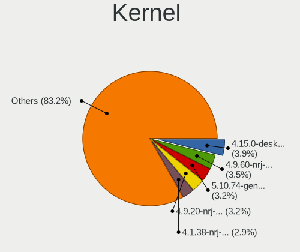

| Version                             | Desktops | Percent |
|-------------------------------------|----------|---------|
| 4.15.0-desktop-45.1rosa-x86_64      | 12       | 3.87%   |
| 4.9.60-nrj-desktop-1rosa-x86_64     | 11       | 3.55%   |
| 5.10.74-generic-2rosa2021.1-x86_64  | 10       | 3.23%   |
| 4.9.20-nrj-desktop-1rosa-x86_64     | 10       | 3.23%   |
| 4.1.38-nrj-desktop-2rosa-x86_64     | 9        | 2.9%    |
| 4.15.0-desktop-122.124.1rosa-x86_64 | 8        | 2.58%   |
| 4.9.60-nrj-desktop-1rosa-i586       | 7        | 2.26%   |
| 5.16.7-desktop-1omv4003             | 6        | 1.94%   |
| 4.9.9-nrj-desktop-1rosa-x86_64      | 6        | 1.94%   |
| 6.6.27-generic-3rosa2021.1-x86_64   | 5        | 1.61%   |
| 5.10.14-desktop-1omv4002            | 5        | 1.61%   |
| 4.9.76-nrj-desktop-1rosa-x86_64     | 5        | 1.61%   |
| 4.9.20-nrj-desktop-1rosa-i586       | 5        | 1.61%   |
| 4.9.155-nrj-desktop-1rosa-x86_64    | 5        | 1.61%   |
| 6.6.2-desktop-1omv2390              | 4        | 1.29%   |
| 6.4.11-desktop-1omv2390             | 4        | 1.29%   |
| 5.4.32-generic-2rosa-x86_64         | 4        | 1.29%   |
| 4.9.9-nrj-desktop-1rosa-i586        | 4        | 1.29%   |
| 4.15.0-desktop-68.5rosa-x86_64      | 4        | 1.29%   |
| 4.15.0-desktop-45.1rosa-i586        | 4        | 1.29%   |
| 6.3.5-desktop-3omv2390              | 3        | 0.97%   |
| 6.10.11+bpo-amd64                   | 3        | 0.97%   |
| 5.15.79-generic-1rosa2021.1-x86_64  | 3        | 0.97%   |
| 4.1.34-nrj-desktop-2rosa-x86_64     | 3        | 0.97%   |
| 6.9.7-desktop-1omv2490              | 2        | 0.65%   |
| 6.8.0-49-generic                    | 2        | 0.65%   |
| 6.7.12+bpo-amd64                    | 2        | 0.65%   |
| 6.2.6-desktop-1omv2390              | 2        | 0.65%   |
| 6.11.5+bpo-amd64                    | 2        | 0.65%   |
| 6.10.0-desktop-1omv2490             | 2        | 0.65%   |
| 6.1.58-generic-1rosa2021.1-x86_64   | 2        | 0.65%   |
| 6.1.20-generic-2rosa2021.1-x86_64   | 2        | 0.65%   |
| 6.1.1-desktop-1omv2290              | 2        | 0.65%   |
| 6.1.0-25-amd64                      | 2        | 0.65%   |
| 5.8.6-1-MANJARO                     | 2        | 0.65%   |
| 5.4.0-52-generic                    | 2        | 0.65%   |
| 5.15.75-generic-1rosa2021.1-x86_64  | 2        | 0.65%   |
| 5.15.19                             | 2        | 0.65%   |
| 5.10.118-generic-2rosa2021.1-x86_64 | 2        | 0.65%   |
| 4.9.41-nrj-desktop-1rosa-x86_64     | 2        | 0.65%   |

Kernel Family
-------------

Linux kernel without a distro release

| Version | Desktops | Percent |
|---------|----------|---------|
| 4.15.0  | 34       | 11.18%  |
| 4.9.60  | 18       | 5.92%   |
| 4.9.20  | 15       | 4.93%   |
| 4.1.38  | 11       | 3.62%   |
| 5.10.74 | 10       | 3.29%   |
| 4.9.9   | 10       | 3.29%   |
| 5.16.7  | 6        | 1.97%   |
| 5.10.0  | 6        | 1.97%   |
| 4.9.76  | 6        | 1.97%   |
| 4.9.155 | 6        | 1.97%   |
| 6.6.27  | 5        | 1.64%   |
| 6.5.0   | 5        | 1.64%   |
| 5.4.32  | 5        | 1.64%   |
| 5.4.0   | 5        | 1.64%   |
| 5.15.0  | 5        | 1.64%   |
| 5.10.14 | 5        | 1.64%   |
| 4.1.34  | 5        | 1.64%   |
| 6.9.7   | 4        | 1.32%   |
| 6.6.2   | 4        | 1.32%   |
| 6.4.11  | 4        | 1.32%   |
| 5.13.0  | 4        | 1.32%   |
| 6.3.5   | 3        | 0.99%   |
| 6.10.11 | 3        | 0.99%   |
| 6.1.0   | 3        | 0.99%   |
| 5.15.79 | 3        | 0.99%   |
| 4.9.41  | 3        | 0.99%   |
| 4.9.124 | 3        | 0.99%   |
| 4.9.111 | 3        | 0.99%   |
| 6.9.4   | 2        | 0.66%   |
| 6.8.5   | 2        | 0.66%   |
| 6.8.0   | 2        | 0.66%   |
| 6.7.12  | 2        | 0.66%   |
| 6.6.13  | 2        | 0.66%   |
| 6.2.6   | 2        | 0.66%   |
| 6.2.0   | 2        | 0.66%   |
| 6.11.5  | 2        | 0.66%   |
| 6.10.0  | 2        | 0.66%   |
| 6.1.58  | 2        | 0.66%   |
| 6.1.20  | 2        | 0.66%   |
| 6.1.1   | 2        | 0.66%   |

Kernel Major Ver.
-----------------

Linux kernel major version

| Version | Desktops | Percent |
|---------|----------|---------|
| 4.9     | 63       | 21.72%  |
| 4.15    | 34       | 11.72%  |
| 5.10    | 26       | 8.97%   |
| 6.6     | 18       | 6.21%   |
| 4.1     | 17       | 5.86%   |
| 5.15    | 16       | 5.52%   |
| 6.1     | 13       | 4.48%   |
| 5.4     | 13       | 4.48%   |
| 6.5     | 8        | 2.76%   |
| 6.9     | 7        | 2.41%   |
| 6.10    | 6        | 2.07%   |
| 5.16    | 6        | 2.07%   |
| 6.8     | 5        | 1.72%   |
| 6.2     | 5        | 1.72%   |
| 5.13    | 5        | 1.72%   |
| 4.18    | 5        | 1.72%   |
| 6.4     | 4        | 1.38%   |
| 6.11    | 4        | 1.38%   |
| 6.7     | 3        | 1.03%   |
| 6.3     | 3        | 1.03%   |
| 5.8     | 3        | 1.03%   |
| 5.19    | 3        | 1.03%   |
| 5.14    | 3        | 1.03%   |
| 5.0     | 3        | 1.03%   |
| 6.0     | 2        | 0.69%   |
| 5.3     | 2        | 0.69%   |
| 5.18    | 2        | 0.69%   |
| 5.17    | 2        | 0.69%   |
| 4.12    | 2        | 0.69%   |
| 6.12    | 1        | 0.34%   |
| 4.4     | 1        | 0.34%   |
| 4.19    | 1        | 0.34%   |
| 4.17    | 1        | 0.34%   |
| 4.14    | 1        | 0.34%   |
| 4.13    | 1        | 0.34%   |
| 3.14    | 1        | 0.34%   |

Arch
----

OS architecture (x86_64, i586, etc.)

| Name   | Desktops | Percent |
|--------|----------|---------|
| x86_64 | 220      | 85.94%  |
| i686   | 36       | 14.06%  |

DE
--

Desktop Environment

| Name             | Desktops | Percent |
|------------------|----------|---------|
| KDE5             | 87       | 32.46%  |
| KDE4             | 87       | 32.46%  |
| GNOME            | 31       | 11.57%  |
| Unknown          | 13       | 4.85%   |
| XFCE             | 12       | 4.48%   |
| KDE              | 7        | 2.61%   |
| X-Cinnamon       | 5        | 1.87%   |
| LXQt             | 5        | 1.87%   |
| Cinnamon         | 5        | 1.87%   |
| MATE             | 4        | 1.49%   |
| LXDE             | 4        | 1.49%   |
| KDE6             | 3        | 1.12%   |
| sway             | 1        | 0.37%   |
| Pantheon         | 1        | 0.37%   |
| lightdm-xsession | 1        | 0.37%   |
| i3               | 1        | 0.37%   |
| GNOME Classic    | 1        | 0.37%   |

Display Server
--------------

X11 or Wayland

| Name    | Desktops | Percent |
|---------|----------|---------|
| X11     | 205      | 78.24%  |
| Wayland | 50       | 19.08%  |
| Tty     | 4        | 1.53%   |
| Unknown | 3        | 1.15%   |

Display Manager
---------------

SDDM, LightDM, etc.

| Name    | Desktops | Percent |
|---------|----------|---------|
| SDDM    | 96       | 36.23%  |
| KDM     | 89       | 33.58%  |
| Unknown | 34       | 12.83%  |
| GDM     | 19       | 7.17%   |
| LightDM | 17       | 6.42%   |
| TDM     | 5        | 1.89%   |
| GDM3    | 5        | 1.89%   |

OS Lang
-------

Language

| Lang    | Desktops | Percent |
|---------|----------|---------|
| Unknown | 114      | 43.02%  |
| ru_RU   | 99       | 37.36%  |
| en_US   | 46       | 17.36%  |
| ru_KZ   | 2        | 0.75%   |
| C       | 2        | 0.75%   |
| en_GB   | 1        | 0.38%   |
| en_BW   | 1        | 0.38%   |

Boot Mode
---------

EFI or BIOS

| Mode | Desktops | Percent |
|------|----------|---------|
| BIOS | 182      | 71.94%  |
| EFI  | 71       | 28.06%  |

Filesystem
----------

Type of filesystem

| Type    | Desktops | Percent |
|---------|----------|---------|
| Ext4    | 135      | 50.94%  |
| Unknown | 70       | 26.42%  |
| Overlay | 28       | 10.57%  |
| Btrfs   | 24       | 9.06%   |
| Tmpfs   | 4        | 1.51%   |
| Xfs     | 2        | 0.75%   |
| Zfs     | 1        | 0.38%   |
| Ext3    | 1        | 0.38%   |

Part. scheme
------------

Scheme of partitioning

| Type    | Desktops | Percent |
|---------|----------|---------|
| MBR     | 104      | 40.31%  |
| GPT     | 90       | 34.88%  |
| Unknown | 64       | 24.81%  |

Dual Boot with Linux/BSD
------------------------

Hosting more than one Linux/BSD

| Dual boot | Desktops | Percent |
|-----------|----------|---------|
| No        | 202      | 77.99%  |
| Yes       | 57       | 22.01%  |

Dual Boot (Win)
---------------

Hosting Linux and Windows

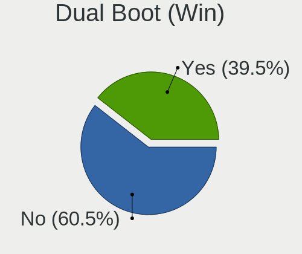

| Dual boot | Desktops | Percent |
|-----------|----------|---------|
| No        | 158      | 60.54%  |
| Yes       | 103      | 39.46%  |

Board
-----

Vendor
------

Motherboard manufacturer

| Name                | Desktops | Percent |
|---------------------|----------|---------|
| Gigabyte Technology | 55       | 22.09%  |
| ASUSTek Computer    | 50       | 20.08%  |
| ASRock              | 39       | 15.66%  |
| MSI                 | 22       | 8.84%   |
| Intel               | 13       | 5.22%   |
| ECS                 | 13       | 5.22%   |
| Foxconn             | 10       | 4.02%   |
| Biostar             | 10       | 4.02%   |
| Lenovo              | 5        | 2.01%   |
| Hewlett-Packard     | 5        | 2.01%   |
| Unknown             | 5        | 2.01%   |
| Huanan              | 3        | 1.2%    |
| Acer                | 3        | 1.2%    |
| OEM                 | 2        | 0.8%    |
| Fujitsu Siemens     | 2        | 0.8%    |
| Dell                | 2        | 0.8%    |
| Sapphire            | 1        | 0.4%    |
| Kobian              | 1        | 0.4%    |
| GoWin Solution      | 1        | 0.4%    |
| Fujitsu             | 1        | 0.4%    |
| EPoX Computer       | 1        | 0.4%    |
| eMachines           | 1        | 0.4%    |
| Colorful Technology | 1        | 0.4%    |
| Canyon              | 1        | 0.4%    |
| Athermiter/PlexHD   | 1        | 0.4%    |
| AMI                 | 1        | 0.4%    |

Model
-----

Motherboard model

| Name                      | Desktops | Percent |
|---------------------------|----------|---------|
| ASUS All Series           | 9        | 3.61%   |
| Unknown                   | 7        | 2.81%   |
| Gigabyte P35-DS3L         | 4        | 1.61%   |
| Gigabyte EP45-DS3L        | 3        | 1.2%    |
| ASUS P5G41-M LE           | 3        | 1.2%    |
| ASUS H61M-K               | 3        | 1.2%    |
| MSI MS-7817               | 2        | 0.8%    |
| MSI MS-7788               | 2        | 0.8%    |
| MSI MS-7592               | 2        | 0.8%    |
| MSI MS-7529               | 2        | 0.8%    |
| Intel DH61WW AAG23116-204 | 2        | 0.8%    |
| Gigabyte H61M-S1          | 2        | 0.8%    |
| Gigabyte B450M S2H        | 2        | 0.8%    |
| Gigabyte A320M-H          | 2        | 0.8%    |
| Foxconn G31MXP FAB:1.1    | 2        | 0.8%    |
| ECS P67H2-A3              | 2        | 0.8%    |
| ECS H61H2-M12             | 2        | 0.8%    |
| ECS G31T-M7               | 2        | 0.8%    |
| Biostar B75MU3B           | 2        | 0.8%    |
| ASRock Q1900M             | 2        | 0.8%    |
| ASRock H110M-DGS R3.0     | 2        | 0.8%    |
| ASRock G31M-VS            | 2        | 0.8%    |
| ASRock G31M-GS            | 2        | 0.8%    |
| ASRock B450M Pro4         | 2        | 0.8%    |
| Sapphire PI-AM3RS760G2    | 1        | 0.4%    |
| OEM H310C                 | 1        | 0.4%    |
| MSI MS-7D96               | 1        | 0.4%    |
| MSI MS-7D15               | 1        | 0.4%    |
| MSI MS-7C09               | 1        | 0.4%    |
| MSI MS-7C02               | 1        | 0.4%    |
| MSI MS-7B79               | 1        | 0.4%    |
| MSI MS-7759               | 1        | 0.4%    |
| MSI MS-7758               | 1        | 0.4%    |
| MSI MS-7583               | 1        | 0.4%    |
| MSI MS-7522               | 1        | 0.4%    |
| MSI MS-7519               | 1        | 0.4%    |
| MSI MS-7365               | 1        | 0.4%    |
| MSI MS-7360               | 1        | 0.4%    |
| MSI MS-7346               | 1        | 0.4%    |
| MSI ESPRIMO P1510         | 1        | 0.4%    |

Model Family
------------

Motherboard model prefix

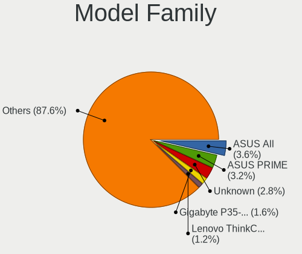

| Name                   | Desktops | Percent |
|------------------------|----------|---------|
| ASUS All               | 9        | 3.61%   |
| ASUS PRIME             | 8        | 3.21%   |
| Unknown                | 7        | 2.81%   |
| Gigabyte P35-DS3L      | 4        | 1.61%   |
| Lenovo ThinkCentre     | 3        | 1.2%    |
| HP Compaq              | 3        | 1.2%    |
| Gigabyte EP45-DS3L     | 3        | 1.2%    |
| Foxconn G31MXP         | 3        | 1.2%    |
| ASUS ROG               | 3        | 1.2%    |
| ASUS P8H61-M           | 3        | 1.2%    |
| ASUS P5G41-M           | 3        | 1.2%    |
| ASUS H61M-K            | 3        | 1.2%    |
| ASRock Z68             | 3        | 1.2%    |
| MSI MS-7817            | 2        | 0.8%    |
| MSI MS-7788            | 2        | 0.8%    |
| MSI MS-7592            | 2        | 0.8%    |
| MSI MS-7529            | 2        | 0.8%    |
| Intel H61              | 2        | 0.8%    |
| Intel DH61WW           | 2        | 0.8%    |
| Intel DG965RY          | 2        | 0.8%    |
| Gigabyte Z690          | 2        | 0.8%    |
| Gigabyte H61M-S1       | 2        | 0.8%    |
| Gigabyte H410M         | 2        | 0.8%    |
| Gigabyte B450M         | 2        | 0.8%    |
| Gigabyte A320M-H       | 2        | 0.8%    |
| ECS P67H2-A3           | 2        | 0.8%    |
| ECS H61H2-M12          | 2        | 0.8%    |
| ECS G31T-M7            | 2        | 0.8%    |
| Biostar B75MU3B        | 2        | 0.8%    |
| ASUS TUF               | 2        | 0.8%    |
| ASUS P8B75-M           | 2        | 0.8%    |
| ASUS P5P43TD           | 2        | 0.8%    |
| ASRock Q1900M          | 2        | 0.8%    |
| ASRock H110M-DGS       | 2        | 0.8%    |
| ASRock G31M-VS         | 2        | 0.8%    |
| ASRock G31M-GS         | 2        | 0.8%    |
| ASRock B450M           | 2        | 0.8%    |
| ASRock B450            | 2        | 0.8%    |
| Sapphire PI-AM3RS760G2 | 1        | 0.4%    |
| OEM H310C              | 1        | 0.4%    |

MFG Year
--------

Motherboard manufacture year

| Year    | Desktops | Percent |
|---------|----------|---------|
| 2012    | 29       | 11.65%  |
| 2011    | 29       | 11.65%  |
| 2009    | 26       | 10.44%  |
| 2008    | 22       | 8.84%   |
| 2007    | 19       | 7.63%   |
| 2013    | 18       | 7.23%   |
| 2018    | 15       | 6.02%   |
| 2010    | 13       | 5.22%   |
| 2017    | 11       | 4.42%   |
| 2014    | 11       | 4.42%   |
| 2020    | 9        | 3.61%   |
| 2019    | 8        | 3.21%   |
| 2022    | 7        | 2.81%   |
| 2021    | 7        | 2.81%   |
| 2016    | 7        | 2.81%   |
| 2015    | 5        | 2.01%   |
| 2006    | 5        | 2.01%   |
| 2005    | 3        | 1.2%    |
| 2023    | 2        | 0.8%    |
| 2024    | 1        | 0.4%    |
| 2003    | 1        | 0.4%    |
| Unknown | 1        | 0.4%    |

Form Factor
-----------

Physical design of the computer

| Name    | Desktops | Percent |
|---------|----------|---------|
| Desktop | 249      | 100%    |

Secure Boot
-----------

Enabled or disabled

| State    | Desktops | Percent |
|----------|----------|---------|
| Disabled | 249      | 100%    |

Coreboot
--------

Have coreboot on board

| Used | Desktops | Percent |
|------|----------|---------|
| No   | 249      | 100%    |

RAM Size
--------

Total RAM memory

| Size in GB  | Desktops | Percent |
|-------------|----------|---------|
| 3.01-4.0    | 67       | 25.67%  |
| 8.01-16.0   | 51       | 19.54%  |
| 16.01-24.0  | 42       | 16.09%  |
| 4.01-8.0    | 34       | 13.03%  |
| 32.01-64.0  | 21       | 8.05%   |
| 1.01-2.0    | 21       | 8.05%   |
| 2.01-3.0    | 11       | 4.21%   |
| 24.01-32.0  | 6        | 2.3%    |
| 64.01-256.0 | 4        | 1.53%   |
| 0.51-1.0    | 4        | 1.53%   |

RAM Used
--------

Used RAM memory

| Used GB    | Desktops | Percent |
|------------|----------|---------|
| 1.01-2.0   | 112      | 39.3%   |
| 0.51-1.0   | 82       | 28.77%  |
| 2.01-3.0   | 41       | 14.39%  |
| 4.01-8.0   | 21       | 7.37%   |
| 3.01-4.0   | 13       | 4.56%   |
| 8.01-16.0  | 8        | 2.81%   |
| 0.01-0.5   | 6        | 2.11%   |
| 32.01-64.0 | 1        | 0.35%   |
| 16.01-24.0 | 1        | 0.35%   |

Total Drives
------------

Number of drives on board

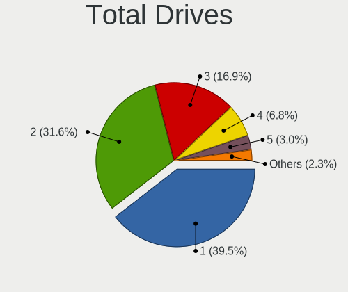

| Drives | Desktops | Percent |
|--------|----------|---------|
| 1      | 105      | 39.47%  |
| 2      | 84       | 31.58%  |
| 3      | 45       | 16.92%  |
| 4      | 18       | 6.77%   |
| 5      | 8        | 3.01%   |
| 6      | 3        | 1.13%   |
| 0      | 2        | 0.75%   |
| 8      | 1        | 0.38%   |

Has CD-ROM
----------

Has CD-ROM on board

| Presented | Desktops | Percent |
|-----------|----------|---------|
| No        | 134      | 51.94%  |
| Yes       | 124      | 48.06%  |

Has Ethernet
------------

Has Ethernet on board

| Presented | Desktops | Percent |
|-----------|----------|---------|
| Yes       | 248      | 99.6%   |
| No        | 1        | 0.4%    |

Has WiFi
--------

Has WiFi module

| Presented | Desktops | Percent |
|-----------|----------|---------|
| No        | 178      | 70.36%  |
| Yes       | 75       | 29.64%  |

Has Bluetooth
-------------

Has Bluetooth module

| Presented | Desktops | Percent |
|-----------|----------|---------|
| No        | 217      | 86.45%  |
| Yes       | 34       | 13.55%  |

Location
--------

Country
-------

Geographic location (country)

| Country    | Desktops | Percent |
|------------|----------|---------|
| Kazakhstan | 249      | 100%    |

City
----

Geographic location (city)

| City            | Desktops | Percent |
|-----------------|----------|---------|
| Almaty          | 71       | 25.36%  |
| Nur-Sultan      | 24       | 8.57%   |
| Kostanay        | 24       | 8.57%   |
| Ust-Kamenogorsk | 16       | 5.71%   |
| Karaganda       | 16       | 5.71%   |
| Taraz           | 13       | 4.64%   |
| Pavlodar        | 12       | 4.29%   |
| Astana          | 11       | 3.93%   |
| Aktobe          | 11       | 3.93%   |
| Semey           | 9        | 3.21%   |
| Petropavl       | 8        | 2.86%   |
| Atyrau          | 7        | 2.5%    |
| Shymkent        | 6        | 2.14%   |
| Rudnyy          | 6        | 2.14%   |
| Temirtau        | 5        | 1.79%   |
| Oral            | 5        | 1.79%   |
| Kyzylorda       | 5        | 1.79%   |
| Ridder          | 4        | 1.43%   |
| Kokshetau       | 3        | 1.07%   |
| Aktau           | 3        | 1.07%   |
| Tekeli          | 2        | 0.71%   |
| Taldykorgan     | 2        | 0.71%   |
| Sarkand         | 2        | 0.71%   |
| Makhambet       | 2        | 0.71%   |
| Komsomol'skoe   | 2        | 0.71%   |
| Tobol           | 1        | 0.36%   |
| Soran           | 1        | 0.36%   |
| Shemonakha    | 1        | 0.36%   |
| Shchchnsk   | 1        | 0.36%   |
| Karatau         | 1        | 0.36%   |
| Ekibastuz       | 1        | 0.36%   |
| Dzhezkazgan     | 1        | 0.36%   |
| Balqash         | 1        | 0.36%   |
| Amankaragay     | 1        | 0.36%   |
| Altay           | 1        | 0.36%   |
| Almaty Oblysy   | 1        | 0.36%   |

Drives
------

Drive Vendor
------------

Hard drive vendors

| Vendor                      | Desktops | Drives | Percent |
|-----------------------------|----------|--------|---------|
| Seagate                     | 129      | 209    | 28.86%  |
| WDC                         | 63       | 98     | 14.09%  |
| Samsung Electronics         | 58       | 99     | 12.98%  |
| Toshiba                     | 43       | 64     | 9.62%   |
| Kingston                    | 40       | 82     | 8.95%   |
| Hitachi                     | 15       | 27     | 3.36%   |
| Apacer                      | 10       | 15     | 2.24%   |
| Gigabyte Technology         | 7        | 8      | 1.57%   |
| Transcend                   | 6        | 7      | 1.34%   |
| Patriot                     | 6        | 6      | 1.34%   |
| Team                        | 5        | 7      | 1.12%   |
| KingSpec                    | 5        | 10     | 1.12%   |
| A-DATA Technology           | 5        | 7      | 1.12%   |
| SanDisk                     | 4        | 4      | 0.89%   |
| GeIL                        | 4        | 4      | 0.89%   |
| AMD                         | 4        | 4      | 0.89%   |
| Netac                       | 3        | 5      | 0.67%   |
| Hikvision                   | 3        | 3      | 0.67%   |
| HGST                        | 3        | 3      | 0.67%   |
| Plextor                     | 2        | 2      | 0.45%   |
| Intel                       | 2        | 5      | 0.45%   |
| HUAWEI                      | 2        | 2      | 0.45%   |
| Hewlett-Packard             | 2        | 2      | 0.45%   |
| Unknown                     | 2        | 2      | 0.45%   |
| Verbatim                    | 1        | 1      | 0.22%   |
| Unknown                     | 1        | 1      | 0.22%   |
| TEKET                       | 1        | 2      | 0.22%   |
| SPCC                        | 1        | 1      | 0.22%   |
| Smartbuy                    | 1        | 1      | 0.22%   |
| SK hynix                    | 1        | 1      | 0.22%   |
| Silicon Motion              | 1        | 1      | 0.22%   |
| Phison Electronics          | 1        | 1      | 0.22%   |
| MG                          | 1        | 1      | 0.22%   |
| Maxtor                      | 1        | 1      | 0.22%   |
| MAXIO Technology (Hangzhou) | 1        | 1      | 0.22%   |
| LVCARDS                     | 1        | 1      | 0.22%   |
| Kingston Technology Company | 1        | 1      | 0.22%   |
| Kingmax                     | 1        | 1      | 0.22%   |
| KingFast                    | 1        | 1      | 0.22%   |
| KingDian                    | 1        | 1      | 0.22%   |

Drive Model
-----------

Hard drive models

| Model                            | Desktops | Percent |
|----------------------------------|----------|---------|
| Seagate ST500DM002-1BD142 500GB  | 13       | 2.57%   |
| Toshiba DT01ACA050 500GB         | 12       | 2.38%   |
| Seagate ST3500418AS 500GB        | 10       | 1.98%   |
| Toshiba HDWD110 1TB              | 9        | 1.78%   |
| Kingston SA400S37240G 240GB SSD  | 8        | 1.58%   |
| WDC WD5000AAKX-001CA0 500GB      | 7        | 1.39%   |
| Seagate ST3320620AS 320GB        | 7        | 1.39%   |
| Seagate ST3250310AS 250GB        | 7        | 1.39%   |
| Kingston SA400S37480G 480GB SSD  | 7        | 1.39%   |
| Seagate ST3500413AS 500GB        | 6        | 1.19%   |
| Toshiba DT01ACA200 2TB           | 5        | 0.99%   |
| Toshiba DT01ACA100 1TB           | 5        | 0.99%   |
| Seagate ST3250318AS 250GB        | 5        | 0.99%   |
| Seagate ST1000DM010-2EP102 1TB   | 5        | 0.99%   |
| Samsung SSD 860 EVO 250GB        | 5        | 0.99%   |
| Samsung HD502HJ 500GB            | 5        | 0.99%   |
| Gigabyte GP-GSTFS31120GNTD 120GB | 5        | 0.99%   |
| Seagate ST380011A 80GB           | 4        | 0.79%   |
| Seagate ST3320613AS 320GB        | 4        | 0.79%   |
| Seagate ST3250820AS 250GB        | 4        | 0.79%   |
| Seagate ST3160815AS 160GB        | 4        | 0.79%   |
| Seagate ST1000DM003-9YN162 1TB   | 4        | 0.79%   |
| Seagate ST1000DM003-1CH162 1TB   | 4        | 0.79%   |
| Samsung HD322HJ 320GB            | 4        | 0.79%   |
| Patriot Burst 240GB SSD          | 4        | 0.79%   |
| Toshiba HDWD105 500GB            | 3        | 0.59%   |
| Seagate ST380215AS 80GB          | 3        | 0.59%   |
| Seagate ST3802110A 80GB          | 3        | 0.59%   |
| Seagate ST3500630AS 500GB        | 3        | 0.59%   |
| Seagate ST3500320AS 500GB        | 3        | 0.59%   |
| Seagate ST340014A 40GB           | 3        | 0.59%   |
| Seagate ST3320418AS 320GB        | 3        | 0.59%   |
| Seagate ST31000524AS 1TB         | 3        | 0.59%   |
| Samsung SSD 860 EVO 500GB        | 3        | 0.59%   |
| Samsung HD502HI 500GB            | 3        | 0.59%   |
| Samsung HD103SJ 1TB              | 3        | 0.59%   |
| Samsung HD103SI 1TB              | 3        | 0.59%   |
| Kingston SUV500240G 240GB SSD    | 3        | 0.59%   |
| Kingston SA400S37120G 120GB SSD  | 3        | 0.59%   |
| Apacer AS350 128GB SSD           | 3        | 0.59%   |

HDD Vendor
----------

Hard disk drive vendors

| Vendor              | Desktops | Drives | Percent |
|---------------------|----------|--------|---------|
| Seagate             | 127      | 207    | 43.79%  |
| WDC                 | 63       | 97     | 21.72%  |
| Toshiba             | 43       | 64     | 14.83%  |
| Samsung Electronics | 36       | 59     | 12.41%  |
| Hitachi             | 15       | 27     | 5.17%   |
| HGST                | 3        | 3      | 1.03%   |
| Hewlett-Packard     | 2        | 2      | 0.69%   |
| Maxtor              | 1        | 1      | 0.34%   |

SSD Vendor
----------

Solid state drive vendors

| Vendor              | Desktops | Drives | Percent |
|---------------------|----------|--------|---------|
| Kingston            | 33       | 71     | 27.97%  |
| Samsung Electronics | 15       | 23     | 12.71%  |
| Apacer              | 10       | 15     | 8.47%   |
| Gigabyte Technology | 7        | 8      | 5.93%   |
| Transcend           | 6        | 7      | 5.08%   |
| Patriot             | 6        | 6      | 5.08%   |
| Team                | 5        | 7      | 4.24%   |
| KingSpec            | 5        | 10     | 4.24%   |
| AMD                 | 4        | 4      | 3.39%   |
| GeIL                | 3        | 3      | 2.54%   |
| Plextor             | 2        | 2      | 1.69%   |
| WDC                 | 1        | 1      | 0.85%   |
| Verbatim            | 1        | 1      | 0.85%   |
| TEKET               | 1        | 2      | 0.85%   |
| SPCC                | 1        | 1      | 0.85%   |
| Smartbuy            | 1        | 1      | 0.85%   |
| SK hynix            | 1        | 1      | 0.85%   |
| SanDisk             | 1        | 1      | 0.85%   |
| Netac               | 1        | 3      | 0.85%   |
| MG                  | 1        | 1      | 0.85%   |
| LVCARDS             | 1        | 1      | 0.85%   |
| Kingmax             | 1        | 1      | 0.85%   |
| KingFast            | 1        | 1      | 0.85%   |
| KingDian            | 1        | 1      | 0.85%   |
| Kingchuxing         | 1        | 1      | 0.85%   |
| Kimtigo             | 1        | 1      | 0.85%   |
| Intel               | 1        | 4      | 0.85%   |
| HS-SSD-E100N        | 1        | 1      | 0.85%   |
| Hikvision           | 1        | 1      | 0.85%   |
| Dahua               | 1        | 1      | 0.85%   |
| Crucial             | 1        | 1      | 0.85%   |
| AFOX                | 1        | 1      | 0.85%   |
| Unknown             | 1        | 1      | 0.85%   |

Drive Kind
----------

HDD or SSD

| Kind    | Desktops | Drives | Percent |
|---------|----------|--------|---------|
| HDD     | 220      | 460    | 61.11%  |
| SSD     | 98       | 184    | 27.22%  |
| NVMe    | 32       | 46     | 8.89%   |
| Unknown | 7        | 7      | 1.94%   |
| MMC     | 3        | 3      | 0.83%   |

Drive Connector
---------------

SATA, SAS, NVMe, etc.

| Type | Desktops | Drives | Percent |
|------|----------|--------|---------|
| SATA | 239      | 640    | 84.75%  |
| NVMe | 32       | 46     | 11.35%  |
| SAS  | 8        | 11     | 2.84%   |
| MMC  | 3        | 3      | 1.06%   |

Drive Size
----------

Size of hard drive

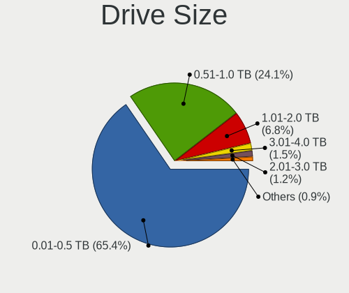

| Size in TB | Desktops | Drives | Percent |
|------------|----------|--------|---------|
| 0.01-0.5   | 212      | 452    | 65.43%  |
| 0.51-1.0   | 78       | 139    | 24.07%  |
| 1.01-2.0   | 22       | 39     | 6.79%   |
| 3.01-4.0   | 5        | 5      | 1.54%   |
| 2.01-3.0   | 4        | 5      | 1.23%   |
| 4.01-10.0  | 3        | 4      | 0.93%   |

Space Total
-----------

Amount of disk space available on the file system

| Size in GB     | Desktops | Percent |
|----------------|----------|---------|
| 101-250        | 67       | 23.43%  |
| 251-500        | 45       | 15.73%  |
| 1-20           | 43       | 15.03%  |
| 501-1000       | 34       | 11.89%  |
| 51-100         | 33       | 11.54%  |
| 1001-2000      | 25       | 8.74%   |
| 21-50          | 22       | 7.69%   |
| More than 3000 | 8        | 2.8%    |
| 2001-3000      | 6        | 2.1%    |
| Unknown        | 3        | 1.05%   |

Space Used
----------

Amount of used disk space

| Used GB        | Desktops | Percent |
|----------------|----------|---------|
| 1-20           | 161      | 56.69%  |
| 21-50          | 26       | 9.15%   |
| 51-100         | 22       | 7.75%   |
| 101-250        | 21       | 7.39%   |
| 251-500        | 18       | 6.34%   |
| 501-1000       | 16       | 5.63%   |
| 1001-2000      | 13       | 4.58%   |
| Unknown        | 3        | 1.06%   |
| More than 3000 | 2        | 0.7%    |
| 2001-3000      | 2        | 0.7%    |

Malfunc. Drives
---------------

Drive models with a malfunction

| Model                             | Desktops | Drives | Percent |
|-----------------------------------|----------|--------|---------|
| Seagate ST500DM002-1BD142 500GB   | 7        | 10     | 5.43%   |
| WDC WD5000AAKX-001CA0 500GB       | 5        | 5      | 3.88%   |
| Seagate ST3250310AS 250GB         | 5        | 5      | 3.88%   |
| Seagate ST3320613AS 320GB         | 4        | 4      | 3.1%    |
| Toshiba DT01ACA050 500GB          | 3        | 4      | 2.33%   |
| Seagate ST3802110A 80GB           | 3        | 4      | 2.33%   |
| Seagate ST3500418AS 500GB         | 3        | 6      | 2.33%   |
| Seagate ST3500413AS 500GB         | 3        | 3      | 2.33%   |
| Seagate ST3500320AS 500GB         | 3        | 3      | 2.33%   |
| Seagate ST3320620AS 320GB         | 3        | 6      | 2.33%   |
| Seagate ST3250820AS 250GB         | 3        | 3      | 2.33%   |
| WDC WD800JD-60LSA0 80GB           | 2        | 2      | 1.55%   |
| WDC WD5000LPVX-00V0TT0 500GB      | 2        | 4      | 1.55%   |
| WDC WD2000JS-60NCB1 200GB         | 2        | 3      | 1.55%   |
| Seagate ST380215AS 80GB           | 2        | 2      | 1.55%   |
| Seagate ST340014A 40GB            | 2        | 2      | 1.55%   |
| Seagate ST3320418AS 320GB         | 2        | 2      | 1.55%   |
| Seagate ST3160815AS 160GB         | 2        | 2      | 1.55%   |
| Seagate ST3160215AS 160GB         | 2        | 2      | 1.55%   |
| Seagate ST1000DM003-9YN162 1TB    | 2        | 10     | 1.55%   |
| Samsung Electronics HD642JJ 640GB | 2        | 4      | 1.55%   |
| Samsung Electronics HD502HI 500GB | 2        | 3      | 1.55%   |
| Hitachi HTS547550A9E384 500GB     | 2        | 2      | 1.55%   |
| Hitachi HDP725016GLA380 160GB     | 2        | 3      | 1.55%   |
| Hewlett-Packard FB160C4081 160GB  | 2        | 2      | 1.55%   |
| WDC WD7500BPVT-24HXZT3 752GB      | 1        | 2      | 0.78%   |
| WDC WD5000AVDS-73U7B1 500GB       | 1        | 1      | 0.78%   |
| WDC WD5000AVDS-63U7B1 500GB       | 1        | 1      | 0.78%   |
| WDC WD5000AAKX-003CA0 500GB       | 1        | 1      | 0.78%   |
| WDC WD5000AAKS-00A7B2 500GB       | 1        | 1      | 0.78%   |
| WDC WD3200BPVT-22JJ5T0 320GB      | 1        | 1      | 0.78%   |
| WDC WD3200AAJS-60Z0A0 320GB       | 1        | 1      | 0.78%   |
| WDC WD3200AAJS-00L7A0 320GB       | 1        | 2      | 0.78%   |
| WDC WD2500AVJS-63B6A0 250GB       | 1        | 1      | 0.78%   |
| WDC WD2500AAKX-001CA0 250GB       | 1        | 1      | 0.78%   |
| WDC WD15EARS-00MVWB0 1TB          | 1        | 1      | 0.78%   |
| WDC WD10PURX-64E5EY0 1TB          | 1        | 2      | 0.78%   |
| WDC WD10EALX-009BA0 1TB           | 1        | 1      | 0.78%   |
| WDC WD10EADS-00M2B0 1TB           | 1        | 2      | 0.78%   |
| Seagate ST9500423AS 500GB         | 1        | 1      | 0.78%   |

Malfunc. Drive Vendor
---------------------

Vendors of faulty drives

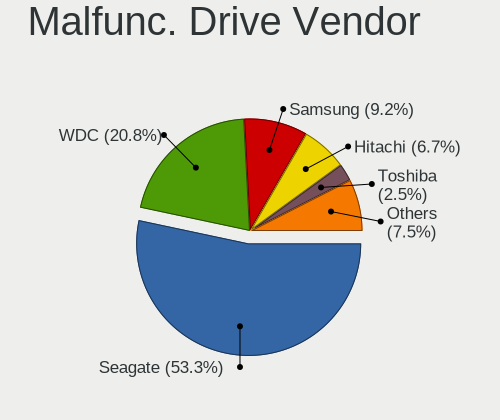

| Vendor              | Desktops | Drives | Percent |
|---------------------|----------|--------|---------|
| Seagate             | 64       | 91     | 53.33%  |
| WDC                 | 25       | 32     | 20.83%  |
| Samsung Electronics | 11       | 15     | 9.17%   |
| Hitachi             | 8        | 20     | 6.67%   |
| Toshiba             | 3        | 4      | 2.5%    |
| Kingston            | 3        | 3      | 2.5%    |
| Hewlett-Packard     | 2        | 2      | 1.67%   |
| Maxtor              | 1        | 1      | 0.83%   |
| KingSpec            | 1        | 4      | 0.83%   |
| HGST                | 1        | 1      | 0.83%   |
| AFOX                | 1        | 1      | 0.83%   |

Malfunc. HDD Vendor
-------------------

Vendors of faulty HDD drives

| Vendor              | Desktops | Drives | Percent |
|---------------------|----------|--------|---------|
| Seagate             | 64       | 91     | 56.64%  |
| WDC                 | 25       | 32     | 22.12%  |
| Samsung Electronics | 9        | 13     | 7.96%   |
| Hitachi             | 8        | 20     | 7.08%   |
| Toshiba             | 3        | 4      | 2.65%   |
| Hewlett-Packard     | 2        | 2      | 1.77%   |
| Maxtor              | 1        | 1      | 0.88%   |
| HGST                | 1        | 1      | 0.88%   |

Malfunc. Drive Kind
-------------------

Kinds of faulty drives

| Kind | Desktops | Drives | Percent |
|------|----------|--------|---------|
| HDD  | 99       | 164    | 93.4%   |
| SSD  | 6        | 9      | 5.66%   |
| NVMe | 1        | 1      | 0.94%   |

Failed Drives
-------------

Failed drive models

| Model                             | Desktops | Drives | Percent |
|-----------------------------------|----------|--------|---------|
| Samsung Electronics HD322GJ 320GB | 2        | 2      | 50%     |
| WDC WD3200BPVT-24ZEST0 320GB      | 1        | 1      | 25%     |
| Seagate ST3250318AS 250GB         | 1        | 2      | 25%     |

Failed Drive Vendor
-------------------

Failed drive vendors

| Vendor              | Desktops | Drives | Percent |
|---------------------|----------|--------|---------|
| Samsung Electronics | 2        | 2      | 50%     |
| WDC                 | 1        | 1      | 25%     |
| Seagate             | 1        | 2      | 25%     |

Drive Status
------------

Number of failed and malfunc. drives

| Status   | Desktops | Drives | Percent |
|----------|----------|--------|---------|
| Works    | 155      | 414    | 49.68%  |
| Malfunc  | 103      | 174    | 33.01%  |
| Detected | 50       | 107    | 16.03%  |
| Failed   | 4        | 5      | 1.28%   |

Storage controller
------------------

Storage Vendor
--------------

Storage controller vendors

| Vendor                        | Desktops | Percent |
|-------------------------------|----------|---------|
| Intel                         | 208      | 64%     |
| AMD                           | 28       | 8.62%   |
| JMicron Technology            | 23       | 7.08%   |
| Samsung Electronics           | 12       | 3.69%   |
| Marvell Technology Group      | 11       | 3.38%   |
| Kingston Technology Company   | 9        | 2.77%   |
| Nvidia                        | 8        | 2.46%   |
| ASMedia Technology            | 6        | 1.85%   |
| VIA Technologies              | 3        | 0.92%   |
| Realtek Semiconductor         | 3        | 0.92%   |
| Silicon Motion                | 2        | 0.62%   |
| Netac Technology              | 2        | 0.62%   |
| MAXIO Technology (Hangzhou)   | 2        | 0.62%   |
| Integrated Technology Express | 2        | 0.62%   |
| ADATA Technology              | 2        | 0.62%   |
| ULi Electronics               | 1        | 0.31%   |
| SanDisk                       | 1        | 0.31%   |
| Phison Electronics            | 1        | 0.31%   |
| Unknown                       | 1        | 0.31%   |

Storage Model
-------------

Storage controller models

| Model                                                                                   | Desktops | Percent |
|-----------------------------------------------------------------------------------------|----------|---------|
| Intel NM10/ICH7 Family SATA Controller [IDE mode]                                       | 37       | 8.13%   |
| Intel 82801G (ICH7 Family) IDE Controller                                               | 30       | 6.59%   |
| Intel 6 Series/C200 Series Chipset Family 6 port Desktop SATA AHCI Controller           | 22       | 4.84%   |
| Intel 6 Series/C200 Series Chipset Family Desktop SATA Controller (IDE mode, ports 4-5) | 20       | 4.4%    |
| Intel 6 Series/C200 Series Chipset Family Desktop SATA Controller (IDE mode, ports 0-3) | 20       | 4.4%    |
| Intel 8 Series/C220 Series Chipset Family 6-port SATA Controller 1 [AHCI mode]          | 17       | 3.74%   |
| JMicron JMB368 IDE controller                                                           | 14       | 3.08%   |
| AMD FCH SATA Controller [AHCI mode]                                                     | 13       | 2.86%   |
| Intel 82801JI (ICH10 Family) 4 port SATA IDE Controller #1                              | 12       | 2.64%   |
| Intel 82801JI (ICH10 Family) 2 port SATA IDE Controller #2                              | 12       | 2.64%   |
| Intel Q170/Q150/B150/H170/H110/Z170/CM236 Chipset SATA Controller [AHCI Mode]           | 10       | 2.2%    |
| Intel 7 Series/C210 Series Chipset Family 6-port SATA Controller [AHCI mode]            | 10       | 2.2%    |
| Intel 200 Series PCH SATA controller [AHCI mode]                                        | 10       | 2.2%    |
| AMD 400 Series Chipset SATA Controller                                                  | 10       | 2.2%    |
| Intel 82801I (ICH9 Family) 2 port SATA Controller [IDE mode]                            | 9        | 1.98%   |
| JMicron JMB363 SATA/IDE Controller                                                      | 8        | 1.76%   |
| Intel 82801IB (ICH9) 2 port SATA Controller [IDE mode]                                  | 8        | 1.76%   |
| Samsung NVMe SSD Controller SM981/PM981/PM983                                           | 7        | 1.54%   |
| Intel 7 Series/C210 Series Chipset Family 4-port SATA Controller [IDE mode]             | 7        | 1.54%   |
| Intel 7 Series/C210 Series Chipset Family 2-port SATA Controller [IDE mode]             | 7        | 1.54%   |
| Intel 82801JI (ICH10 Family) SATA AHCI Controller                                       | 6        | 1.32%   |
| Intel 5 Series/3400 Series Chipset 4 port SATA IDE Controller                           | 6        | 1.32%   |
| Intel 5 Series/3400 Series Chipset 2 port SATA IDE Controller                           | 6        | 1.32%   |
| ASMedia ASM1061/ASM1062 Serial ATA Controller                                           | 6        | 1.32%   |
| Kingston Company KC3000/FURY Renegade NVMe SSD [E18]                                    | 5        | 1.1%    |
| Intel Cannon Lake PCH SATA AHCI Controller                                              | 5        | 1.1%    |
| AMD SB7x0/SB8x0/SB9x0 IDE Controller                                                    | 5        | 1.1%    |
| Marvell Group 88SE6111/6121 SATA II / PATA Controller                                   | 4        | 0.88%   |
| Intel Comet Lake SATA AHCI Controller                                                   | 4        | 0.88%   |
| Intel 9 Series Chipset Family SATA Controller [AHCI Mode]                               | 4        | 0.88%   |
| Intel 82801HR/HO/HH (ICH8R/DO/DH) 2 port SATA Controller [IDE mode]                     | 4        | 0.88%   |
| Intel 82801H (ICH8 Family) 4 port SATA Controller [IDE mode]                            | 4        | 0.88%   |
| AMD SB7x0/SB8x0/SB9x0 SATA Controller [IDE mode]                                        | 4        | 0.88%   |
| AMD A320 Chipset SATA Controller [AHCI mode]                                            | 4        | 0.88%   |
| Intel Atom Processor E3800 Series SATA AHCI Controller                                  | 3        | 0.66%   |
| Intel Alder Lake-S PCH SATA Controller [AHCI Mode]                                      | 3        | 0.66%   |
| AMD SB7x0/SB8x0/SB9x0 SATA Controller [AHCI mode]                                       | 3        | 0.66%   |
| AMD 500 Series Chipset SATA Controller                                                  | 3        | 0.66%   |
| VIA VT82C586A/B/VT82C686/A/B/VT823x/A/C PIPC Bus Master IDE                             | 2        | 0.44%   |
| Silicon Motion SM2263EN/SM2263XT (DRAM-less) NVMe SSD Controllers                       | 2        | 0.44%   |

Storage Kind
------------

Kind of storage controller (IDE, SATA, NVMe, SAS, ...)

| Kind | Desktops | Percent |
|------|----------|---------|
| SATA | 138      | 47.1%   |
| IDE  | 119      | 40.61%  |
| NVMe | 32       | 10.92%  |
| RAID | 3        | 1.02%   |
| SAS  | 1        | 0.34%   |

Processor
---------

CPU Vendor
----------

Processor vendors

| Vendor | Desktops | Percent |
|--------|----------|---------|
| Intel  | 215      | 86.35%  |
| AMD    | 34       | 13.65%  |

CPU Model
---------

Processor models

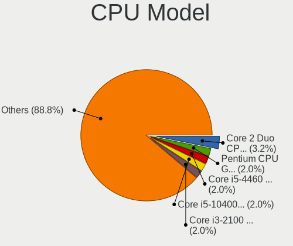

| Model                                       | Desktops | Percent |
|---------------------------------------------|----------|---------|
| Intel Core 2 Duo CPU E8400 @ 3.00GHz        | 8        | 3.19%   |
| Intel Pentium CPU G630 @ 2.70GHz            | 5        | 1.99%   |
| Intel Core i5-4460 CPU @ 3.20GHz            | 5        | 1.99%   |
| Intel Core i5-10400F CPU @ 2.90GHz          | 5        | 1.99%   |
| Intel Core i3-2100 CPU @ 3.10GHz            | 5        | 1.99%   |
| Intel Core 2 Duo CPU E7400 @ 2.80GHz        | 5        | 1.99%   |
| Intel Core i7-3770 CPU @ 3.40GHz            | 4        | 1.59%   |
| Intel Core i5-7400 CPU @ 3.00GHz            | 4        | 1.59%   |
| Intel Core i3-3240 CPU @ 3.40GHz            | 4        | 1.59%   |
| Intel Pentium Dual-Core CPU E5700 @ 3.00GHz | 3        | 1.2%    |
| Intel Pentium 4 CPU 3.00GHz                 | 3        | 1.2%    |
| Intel Core i7-4770 CPU @ 3.40GHz            | 3        | 1.2%    |
| Intel Core i5-2400 CPU @ 3.10GHz            | 3        | 1.2%    |
| Intel Core i3-2120 CPU @ 3.30GHz            | 3        | 1.2%    |
| Intel Core 2 Quad CPU Q8400 @ 2.66GHz       | 3        | 1.2%    |
| Intel Core 2 Duo CPU E7500 @ 2.93GHz        | 3        | 1.2%    |
| Intel Core 2 Duo CPU E6750 @ 2.66GHz        | 3        | 1.2%    |
| Intel Celeron CPU G530 @ 2.40GHz            | 3        | 1.2%    |
| Intel Celeron CPU G1610 @ 2.60GHz           | 3        | 1.2%    |
| Intel Xeon CPU X3440 @ 2.53GHz              | 2        | 0.8%    |
| Intel Xeon CPU E5450 @ 3.00GHz              | 2        | 0.8%    |
| Intel Pentium Gold G5400 CPU @ 3.70GHz      | 2        | 0.8%    |
| Intel Pentium Dual-Core CPU E6500 @ 2.93GHz | 2        | 0.8%    |
| Intel Pentium Dual-Core CPU E5300 @ 2.60GHz | 2        | 0.8%    |
| Intel Pentium Dual-Core CPU E5200 @ 2.50GHz | 2        | 0.8%    |
| Intel Pentium CPU G2030 @ 3.00GHz           | 2        | 0.8%    |
| Intel Core i7-8700K CPU @ 3.70GHz           | 2        | 0.8%    |
| Intel Core i7-7700 CPU @ 3.60GHz            | 2        | 0.8%    |
| Intel Core i7-4790 CPU @ 3.60GHz            | 2        | 0.8%    |
| Intel Core i7-3770K CPU @ 3.50GHz           | 2        | 0.8%    |
| Intel Core i7-2600K CPU @ 3.40GHz           | 2        | 0.8%    |
| Intel Core i7-2600 CPU @ 3.40GHz            | 2        | 0.8%    |
| Intel Core i5-8600K CPU @ 3.60GHz           | 2        | 0.8%    |
| Intel Core i5-3470 CPU @ 3.20GHz            | 2        | 0.8%    |
| Intel Core i5-2310 CPU @ 2.90GHz            | 2        | 0.8%    |
| Intel Core i3-7100 CPU @ 3.90GHz            | 2        | 0.8%    |
| Intel Core i3-4150 CPU @ 3.50GHz            | 2        | 0.8%    |
| Intel Core i3-3220 CPU @ 3.30GHz            | 2        | 0.8%    |
| Intel Core i3 CPU 540 @ 3.07GHz             | 2        | 0.8%    |
| Intel Core 2 Quad CPU Q9550 @ 2.83GHz       | 2        | 0.8%    |

CPU Model Family
----------------

Processor model prefix

| Model                   | Desktops | Percent |
|-------------------------|----------|---------|
| Intel Core i5           | 40       | 15.94%  |
| Intel Core i3           | 30       | 11.95%  |
| Intel Core 2 Duo        | 30       | 11.95%  |
| Intel Core i7           | 24       | 9.56%   |
| Intel Celeron           | 17       | 6.77%   |
| Intel Pentium           | 16       | 6.37%   |
| Intel Xeon              | 15       | 5.98%   |
| Intel Pentium Dual-Core | 13       | 5.18%   |
| AMD Ryzen 5             | 10       | 3.98%   |
| Intel Core 2 Quad       | 9        | 3.59%   |
| AMD Ryzen 7             | 7        | 2.79%   |
| Intel Pentium 4         | 6        | 2.39%   |
| Other                   | 4        | 1.59%   |
| Intel Pentium Dual      | 3        | 1.2%    |
| AMD Ryzen 9             | 3        | 1.2%    |
| AMD Athlon II X2        | 3        | 1.2%    |
| AMD Athlon 64 X2        | 3        | 1.2%    |
| Intel Pentium Gold      | 2        | 0.8%    |
| Intel Core 2            | 2        | 0.8%    |
| Intel Atom              | 2        | 0.8%    |
| AMD Phenom II X4        | 2        | 0.8%    |
| AMD FX                  | 2        | 0.8%    |
| Intel Pentium Silver    | 1        | 0.4%    |
| Intel Genuine           | 1        | 0.4%    |
| Intel Core i9           | 1        | 0.4%    |
| Intel Core 2 Extreme    | 1        | 0.4%    |
| AMD Ryzen 5 PRO         | 1        | 0.4%    |
| AMD Ryzen 3             | 1        | 0.4%    |
| AMD Phenom II X6        | 1        | 0.4%    |
| AMD Athlon 64           | 1        | 0.4%    |

CPU Cores
---------

Number of processor cores

| Number  | Desktops | Percent |
|---------|----------|---------|
| 2       | 103      | 40.71%  |
| 4       | 80       | 31.62%  |
| 6       | 19       | 7.51%   |
| Unknown | 17       | 6.72%   |
| 8       | 15       | 5.93%   |
| 1       | 8        | 3.16%   |
| 12      | 7        | 2.77%   |
| 16      | 1        | 0.4%    |
| 14      | 1        | 0.4%    |
| 10      | 1        | 0.4%    |
| 3       | 1        | 0.4%    |

CPU Sockets
-----------

Number of sockets

| Number | Desktops | Percent |
|--------|----------|---------|
| 1      | 246      | 98.8%   |
| 2      | 3        | 1.2%    |

CPU Threads
-----------

Threads per core (Hyper-Threading)

| Number  | Desktops | Percent |
|---------|----------|---------|
| 1       | 132      | 52.59%  |
| 2       | 102      | 40.64%  |
| Unknown | 17       | 6.77%   |

CPU Op-Modes
------------

CPU Operation Modes (32-bit, 64-bit)

| Op mode        | Desktops | Percent |
|----------------|----------|---------|
| 32-bit, 64-bit | 247      | 99.2%   |
| 32-bit         | 1        | 0.4%    |
| Unknown        | 1        | 0.4%    |

CPU Microcode
-------------

Microcode number

| Number     | Desktops | Percent |
|------------|----------|---------|
| Unknown    | 67       | 25.67%  |
| 0x1067a    | 38       | 14.56%  |
| 0x206a7    | 24       | 9.2%    |
| 0x306a9    | 22       | 8.43%   |
| 0x306c3    | 15       | 5.75%   |
| 0x906e9    | 9        | 3.45%   |
| 0x6fd      | 7        | 2.68%   |
| 0x6fb      | 6        | 2.3%    |
| 0x10676    | 6        | 2.3%    |
| 0xa0653    | 4        | 1.53%   |
| 0x20652    | 4        | 1.53%   |
| 0xf49      | 3        | 1.15%   |
| 0x906ea    | 3        | 1.15%   |
| 0x506e3    | 3        | 1.15%   |
| 0x08701021 | 3        | 1.15%   |
| 0x906ed    | 2        | 0.77%   |
| 0x90672    | 2        | 0.77%   |
| 0x6f2      | 2        | 0.77%   |
| 0x30678    | 2        | 0.77%   |
| 0x106a5    | 2        | 0.77%   |
| 0x0800820d | 2        | 0.77%   |
| 0x010000c8 | 2        | 0.77%   |
| 0x010000b6 | 2        | 0.77%   |
| 0xf65      | 1        | 0.38%   |
| 0xf4a      | 1        | 0.38%   |
| 0xf43      | 1        | 0.38%   |
| 0xf29      | 1        | 0.38%   |
| 0xa0655    | 1        | 0.38%   |
| 0x906ec    | 1        | 0.38%   |
| 0x906eb    | 1        | 0.38%   |
| 0x906c0    | 1        | 0.38%   |
| 0x6f6      | 1        | 0.38%   |
| 0x406c4    | 1        | 0.38%   |
| 0x306e4    | 1        | 0.38%   |
| 0x306d4    | 1        | 0.38%   |
| 0x30673    | 1        | 0.38%   |
| 0x206d7    | 1        | 0.38%   |
| 0x20655    | 1        | 0.38%   |
| 0x106e5    | 1        | 0.38%   |
| 0x10677    | 1        | 0.38%   |

CPU Microarch
-------------

Microarchitecture

| Name             | Desktops | Percent |
|------------------|----------|---------|
| Penryn           | 49       | 19.52%  |
| SandyBridge      | 32       | 12.75%  |
| IvyBridge        | 30       | 11.95%  |
| Haswell          | 22       | 8.76%   |
| KabyLake         | 21       | 8.37%   |
| Core             | 20       | 7.97%   |
| CometLake        | 8        | 3.19%   |
| NetBurst         | 7        | 2.79%   |
| Zen 2            | 6        | 2.39%   |
| K10              | 6        | 2.39%   |
| Zen+             | 5        | 1.99%   |
| Zen 3            | 5        | 1.99%   |
| Westmere         | 5        | 1.99%   |
| Silvermont       | 5        | 1.99%   |
| Nehalem          | 5        | 1.99%   |
| Zen              | 4        | 1.59%   |
| Skylake          | 4        | 1.59%   |
| K8 Hammer        | 4        | 1.59%   |
| Broadwell        | 3        | 1.2%    |
| Alderlake Hybrid | 3        | 1.2%    |
| Unknown          | 3        | 1.2%    |
| Tremont          | 2        | 0.8%    |
| Piledriver       | 1        | 0.4%    |
| Bulldozer        | 1        | 0.4%    |

Graphics
--------

GPU Vendor
----------

Vendors of graphics cards

| Vendor | Desktops | Percent |
|--------|----------|---------|
| Nvidia | 164      | 59.85%  |
| Intel  | 65       | 23.72%  |
| AMD    | 45       | 16.42%  |

GPU Model
---------

Graphics card models

| Model                                                                       | Desktops | Percent |
|-----------------------------------------------------------------------------|----------|---------|
| Intel 2nd Generation Core Processor Family Integrated Graphics Controller   | 14       | 4.91%   |
| Nvidia GF108 [GeForce GT 440]                                               | 10       | 3.51%   |
| Nvidia GF108 [GeForce GT 730]                                               | 9        | 3.16%   |
| Nvidia GT218 [GeForce 210]                                                  | 8        | 2.81%   |
| Intel Xeon E3-1200 v3/4th Gen Core Processor Integrated Graphics Controller | 7        | 2.46%   |
| Nvidia GK208B [GeForce GT 730]                                              | 6        | 2.11%   |
| Nvidia GF114 [GeForce GTX 560 Ti]                                           | 6        | 2.11%   |
| Nvidia GF108 [GeForce GT 430]                                               | 6        | 2.11%   |
| Nvidia G94 [GeForce 9600 GT]                                                | 6        | 2.11%   |
| Nvidia GP107 [GeForce GTX 1050 Ti]                                          | 5        | 1.75%   |
| Nvidia GK107 [GeForce GTX 650]                                              | 5        | 1.75%   |
| Intel Xeon E3-1200 v2/3rd Gen Core processor Graphics Controller            | 5        | 1.75%   |
| Intel HD Graphics 630                                                       | 5        | 1.75%   |
| Intel 82G33/G31 Express Integrated Graphics Controller                      | 5        | 1.75%   |
| Intel 4 Series Chipset Integrated Graphics Controller                       | 5        | 1.75%   |
| AMD Lexa PRO [Radeon 540/540X/550/550X / RX 540X/550/550X]                  | 5        | 1.75%   |
| Nvidia GK104 [GeForce GTX 760]                                              | 4        | 1.4%    |
| Nvidia GF116 [GeForce GTX 550 Ti]                                           | 4        | 1.4%    |
| Intel CoffeeLake-S GT2 [UHD Graphics 630]                                   | 4        | 1.4%    |
| AMD Juniper PRO [Radeon HD 5750]                                            | 4        | 1.4%    |
| AMD Baffin [Radeon RX 460/560D / Pro 450/455/460/555/555X/560/560X]         | 4        | 1.4%    |
| Nvidia GT215 [GeForce GT 240]                                               | 3        | 1.05%   |
| Nvidia GP104 [GeForce GTX 1080]                                             | 3        | 1.05%   |
| Nvidia GP104 [GeForce GTX 1070]                                             | 3        | 1.05%   |
| Nvidia GM107 [GeForce GTX 750]                                              | 3        | 1.05%   |
| Nvidia GK208 [GeForce GT 630 Rev. 2]                                        | 3        | 1.05%   |
| Nvidia GK107 [GeForce GT 640]                                               | 3        | 1.05%   |
| Nvidia GF119 [GeForce GT 520]                                               | 3        | 1.05%   |
| Nvidia GF108 [GeForce GT 630]                                               | 3        | 1.05%   |
| Nvidia G96C [GeForce 9400 GT]                                               | 3        | 1.05%   |
| Nvidia G92 [GeForce 9800 GT]                                                | 3        | 1.05%   |
| Nvidia G84 [GeForce 8600 GT]                                                | 3        | 1.05%   |
| Intel IvyBridge GT2 [HD Graphics 4000]                                      | 3        | 1.05%   |
| AMD Ellesmere [Radeon RX 470/480/570/570X/580/580X/590]                     | 3        | 1.05%   |
| Nvidia TU117 [GeForce GTX 1650]                                             | 2        | 0.7%    |
| Nvidia TU106 [GeForce RTX 2070]                                             | 2        | 0.7%    |
| Nvidia NV43 [GeForce 6600]                                                  | 2        | 0.7%    |
| Nvidia GT216 [GeForce 210]                                                  | 2        | 0.7%    |
| Nvidia GP106 [GeForce GTX 1060 6GB]                                         | 2        | 0.7%    |
| Nvidia GM206 [GeForce GTX 960]                                              | 2        | 0.7%    |

GPU Combo
---------

Combinations of graphics cards

| Name           | Desktops | Percent |
|----------------|----------|---------|
| 1 x Nvidia     | 159      | 62.11%  |
| 1 x Intel      | 47       | 18.36%  |
| 1 x AMD        | 39       | 15.23%  |
| Intel + Nvidia | 6        | 2.34%   |
| 2 x AMD        | 2        | 0.78%   |
| Intel + AMD    | 2        | 0.78%   |
| AMD + Nvidia   | 1        | 0.39%   |

GPU Driver
----------

Free vs proprietary

| Driver      | Desktops | Percent |
|-------------|----------|---------|
| Free        | 181      | 69.08%  |
| Proprietary | 71       | 27.1%   |
| Unknown     | 10       | 3.82%   |

GPU Memory
----------

Total video memory

| Size in GB | Desktops | Percent |
|------------|----------|---------|
| 0.51-1.0   | 68       | 25.95%  |
| 1.01-2.0   | 57       | 21.76%  |
| Unknown    | 56       | 21.37%  |
| 0.01-0.5   | 32       | 12.21%  |
| 7.01-8.0   | 19       | 7.25%   |
| 3.01-4.0   | 19       | 7.25%   |
| 8.01-16.0  | 4        | 1.53%   |
| 5.01-6.0   | 3        | 1.15%   |
| 2.01-3.0   | 2        | 0.76%   |
| 16.01-24.0 | 2        | 0.76%   |

Monitor
-------

Monitor Vendor
--------------

Monitor vendors

| Vendor               | Desktops | Percent |
|----------------------|----------|---------|
| Samsung Electronics  | 72       | 27.48%  |
| Goldstar             | 43       | 16.41%  |
| Philips              | 23       | 8.78%   |
| Hewlett-Packard      | 19       | 7.25%   |
| Acer                 | 18       | 6.87%   |
| BenQ                 | 17       | 6.49%   |
| Dell                 | 10       | 3.82%   |
| AOC                  | 10       | 3.82%   |
| Lenovo               | 4        | 1.53%   |
| ViewSonic            | 3        | 1.15%   |
| Panasonic            | 3        | 1.15%   |
| Iiyama               | 3        | 1.15%   |
| Fujitsu Siemens      | 3        | 1.15%   |
| Arnos Instruments    | 3        | 1.15%   |
| VIE                  | 2        | 0.76%   |
| Unknown (XXX)        | 2        | 0.76%   |
| Toshiba              | 2        | 0.76%   |
| Sony                 | 2        | 0.76%   |
| SAC                  | 2        | 0.76%   |
| LG Electronics       | 2        | 0.76%   |
| Gigabyte Technology  | 2        | 0.76%   |
| WY@                  | 1        | 0.38%   |
| Unknown              | 1        | 0.38%   |
| TPU                  | 1        | 0.38%   |
| SKY                  | 1        | 0.38%   |
| SKG                  | 1        | 0.38%   |
| Packard Bell         | 1        | 0.38%   |
| Mitsubishi           | 1        | 0.38%   |
| KTC                  | 1        | 0.38%   |
| JRY                  | 1        | 0.38%   |
| IPS                  | 1        | 0.38%   |
| HPN                  | 1        | 0.38%   |
| HJW                  | 1        | 0.38%   |
| CTX                  | 1        | 0.38%   |
| Cbox                 | 1        | 0.38%   |
| BIZ                  | 1        | 0.38%   |
| Ancor Communications | 1        | 0.38%   |
| Unknown              | 1        | 0.38%   |

Monitor Model
-------------

Monitor models

| Model                                                                  | Desktops | Percent |
|------------------------------------------------------------------------|----------|---------|
| Samsung Electronics SyncMaster SAM0248 1280x1024 376x301mm 19.0-inch   | 4        | 1.45%   |
| Samsung Electronics SyncMaster SAM0247 1280x1024 376x301mm 19.0-inch   | 4        | 1.45%   |
| Samsung Electronics SyncMaster SAM018F 1280x1024 340x270mm 17.1-inch   | 4        | 1.45%   |
| Goldstar L1953S GSM4B3E 1280x1024 338x270mm 17.0-inch                  | 4        | 1.45%   |
| Samsung Electronics SyncMaster SAM0285 1440x900 410x257mm 19.1-inch    | 3        | 1.09%   |
| Samsung Electronics SMS19A100 SAM0867 1366x768 410x230mm 18.5-inch     | 3        | 1.09%   |
| Hewlett-Packard L1740 HWP2648 1280x1024 337x270mm 17.0-inch            | 3        | 1.09%   |
| Hewlett-Packard 2011 HWP2934 1600x900 443x249mm 20.0-inch              | 3        | 1.09%   |
| Goldstar W2242 GSM5677 1680x1050 474x296mm 22.0-inch                   | 3        | 1.09%   |
| Goldstar IPS FULLHD GSM5AB6 1920x1080 480x270mm 21.7-inch              | 3        | 1.09%   |
| Goldstar FULL HD GSM5B55 1920x1080 480x270mm 21.7-inch                 | 3        | 1.09%   |
| BenQ E900W BNQ7905 1440x900 408x255mm 18.9-inch                        | 3        | 1.09%   |
| Arnos Instruments '' AIC0400 1280x1024                                 | 3        | 1.09%   |
| Acer V193HQ ACR006D 1366x768 410x230mm 18.5-inch                       | 3        | 1.09%   |
| Unknown (XXX) HDMI XXX0088 1920x540                                    | 2        | 0.72%   |
| Toshiba TV TSB010B 1920x1080 882x498mm 39.9-inch                       | 2        | 0.72%   |
| Samsung Electronics SyncMaster SAM0564 1360x768 410x230mm 18.5-inch    | 2        | 0.72%   |
| Samsung Electronics SyncMaster SAM037C 1680x1050 474x296mm 22.0-inch   | 2        | 0.72%   |
| Samsung Electronics SMB1930N SAM0632 1360x768 410x230mm 18.5-inch      | 2        | 0.72%   |
| Samsung Electronics S22F350 SAM0D1A 1920x1080 477x268mm 21.5-inch      | 2        | 0.72%   |
| Samsung Electronics S22D300 SAM0B3B 1920x1080 477x268mm 21.5-inch      | 2        | 0.72%   |
| Samsung Electronics S22C150 SAM0AE5 1920x1080 477x268mm 21.5-inch      | 2        | 0.72%   |
| Samsung Electronics S20B300 SAM08A7 1600x900 443x249mm 20.0-inch       | 2        | 0.72%   |
| Samsung Electronics LCD Monitor SAM0A7A 1920x1080 1060x626mm 48.5-inch | 2        | 0.72%   |
| Samsung Electronics C27R50x SAM0F9D 1920x1080 598x336mm 27.0-inch      | 2        | 0.72%   |
| Philips 226VL PHLC081 1920x1080 480x268mm 21.6-inch                    | 2        | 0.72%   |
| Philips 226V4 PHLC0B1 1920x1080 477x268mm 21.5-inch                    | 2        | 0.72%   |
| Panasonic TV MEIA296 1920x1080 698x392mm 31.5-inch                     | 2        | 0.72%   |
| Hewlett-Packard LE1901w HWP2842 1440x900 410x256mm 19.0-inch           | 2        | 0.72%   |
| Hewlett-Packard 22w HPN342E 1920x1080 476x268mm 21.5-inch              | 2        | 0.72%   |
| Goldstar W1943 GSM4BAD 1360x768 406x229mm 18.4-inch                    | 2        | 0.72%   |
| Goldstar W1942 GSM4B6F 1440x900 408x255mm 18.9-inch                    | 2        | 0.72%   |
| Goldstar ULTRAWIDE GSM59F1 2560x1080 677x290mm 29.0-inch               | 2        | 0.72%   |
| Goldstar E1941 GSM4BF0 1366x768 410x230mm 18.5-inch                    | 2        | 0.72%   |
| Dell E190S DELA04B 1280x1024 376x301mm 19.0-inch                       | 2        | 0.72%   |
| BenQ G700 BNQ7801 1280x1024 340x270mm 17.1-inch                        | 2        | 0.72%   |
| BenQ E900 BNQ7903 1280x1024 376x301mm 19.0-inch                        | 2        | 0.72%   |
| WY@ Monitor WY@0170 1280x1024                                          | 1        | 0.36%   |
| ViewSonic VX715 VSC4319 1280x1024 338x270mm 17.0-inch                  | 1        | 0.36%   |
| ViewSonic VX2268wm VSC0E23 1680x1050 470x300mm 22.0-inch               | 1        | 0.36%   |

Monitor Resolution
------------------

Monitor screen resolution

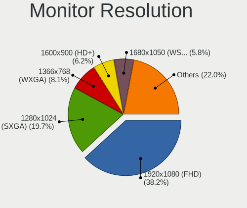

| Resolution         | Desktops | Percent |
|--------------------|----------|---------|
| 1920x1080 (FHD)    | 99       | 38.22%  |
| 1280x1024 (SXGA)   | 51       | 19.69%  |
| 1366x768 (WXGA)    | 21       | 8.11%   |
| 1600x900 (HD+)     | 16       | 6.18%   |
| 1680x1050 (WSXGA+) | 15       | 5.79%   |
| 1440x900 (WXGA+)   | 13       | 5.02%   |
| 3840x2160 (4K)     | 12       | 4.63%   |
| 2560x1440 (QHD)    | 9        | 3.47%   |
| 1360x768           | 5        | 1.93%   |
| 2560x1080          | 3        | 1.16%   |
| Unknown            | 3        | 1.16%   |
| 1920x540           | 2        | 0.77%   |
| 1280x720 (HD)      | 2        | 0.77%   |
| 3840x1080          | 1        | 0.39%   |
| 3600x1080          | 1        | 0.39%   |
| 3520x1080          | 1        | 0.39%   |
| 3200x1080          | 1        | 0.39%   |
| 2288x1287          | 1        | 0.39%   |
| 1600x1200          | 1        | 0.39%   |
| 1280x960           | 1        | 0.39%   |
| 1024x768 (XGA)     | 1        | 0.39%   |

Monitor Diagonal
----------------

Diagonal size in inches

| Inches  | Desktops | Percent |
|---------|----------|---------|
| 19      | 38       | 14.39%  |
| 21      | 36       | 13.64%  |
| 17      | 28       | 10.61%  |
| 18      | 25       | 9.47%   |
| 23      | 24       | 9.09%   |
| 27      | 20       | 7.58%   |
| Unknown | 18       | 6.82%   |
| 20      | 16       | 6.06%   |
| 24      | 15       | 5.68%   |
| 31      | 9        | 3.41%   |
| 22      | 9        | 3.41%   |
| 72      | 4        | 1.52%   |
| 84      | 3        | 1.14%   |
| 54      | 3        | 1.14%   |
| 48      | 3        | 1.14%   |
| 34      | 3        | 1.14%   |
| 32      | 2        | 0.76%   |
| 142     | 1        | 0.38%   |
| 64      | 1        | 0.38%   |
| 46      | 1        | 0.38%   |
| 43      | 1        | 0.38%   |
| 40      | 1        | 0.38%   |
| 28      | 1        | 0.38%   |
| 16      | 1        | 0.38%   |
| 15      | 1        | 0.38%   |

Monitor Width
-------------

Physical width

| Width in mm    | Desktops | Percent |
|----------------|----------|---------|
| 401-500        | 99       | 38.52%  |
| 501-600        | 52       | 20.23%  |
| 301-350        | 29       | 11.28%  |
| 351-400        | 26       | 10.12%  |
| Unknown        | 18       | 7%      |
| 601-700        | 10       | 3.89%   |
| 1001-1500      | 8        | 3.11%   |
| 1501-2000      | 7        | 2.72%   |
| 701-800        | 5        | 1.95%   |
| More than 2000 | 1        | 0.39%   |
| 801-900        | 1        | 0.39%   |
| 901-1000       | 1        | 0.39%   |

Aspect Ratio
------------

Proportional relationship between the width and the height

| Ratio   | Desktops | Percent |
|---------|----------|---------|
| 16/9    | 147      | 59.04%  |
| 5/4     | 52       | 20.88%  |
| 16/10   | 25       | 10.04%  |
| Unknown | 13       | 5.22%   |
| 4/3     | 3        | 1.2%    |
| 3/2     | 3        | 1.2%    |
| 21/9    | 3        | 1.2%    |
| 32/9    | 2        | 0.8%    |
| 1.00    | 1        | 0.4%    |

Monitor Area
------------

Area in inch

| Area in inch | Desktops | Percent |
|----------------|----------|---------|
| 201-250        | 73       | 27.97%  |
| 151-200        | 60       | 22.99%  |
| 141-150        | 51       | 19.54%  |
| 301-350        | 20       | 7.66%   |
| Unknown        | 18       | 6.9%    |
| More than 1000 | 15       | 5.75%   |
| 351-500        | 15       | 5.75%   |
| 251-300        | 4        | 1.53%   |
| 501-1000       | 3        | 1.15%   |
| 121-130        | 1        | 0.38%   |
| 101-110        | 1        | 0.38%   |

Pixel Density
-------------

Pixels per inch

| Density | Desktops | Percent |
|---------|----------|---------|
| 51-100  | 178      | 69.53%  |
| 101-120 | 39       | 15.23%  |
| Unknown | 18       | 7.03%   |
| 1-50    | 15       | 5.86%   |
| 121-160 | 5        | 1.95%   |
| 161-240 | 1        | 0.39%   |

Multiple Monitors
-----------------

Total monitors connected

| Total | Desktops | Percent |
|-------|----------|---------|
| 1     | 218      | 84.5%   |
| 2     | 24       | 9.3%    |
| 0     | 12       | 4.65%   |
| 3     | 4        | 1.55%   |

Network
-------

Net Controller Vendor
---------------------

Controller vendors

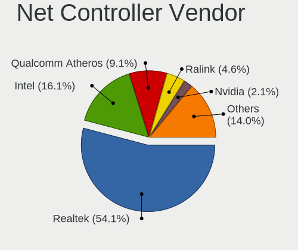

| Vendor                          | Desktops | Percent |
|---------------------------------|----------|---------|
| Realtek Semiconductor           | 178      | 54.1%   |
| Intel                           | 53       | 16.11%  |
| Qualcomm Atheros                | 30       | 9.12%   |
| Ralink Technology               | 15       | 4.56%   |
| Nvidia                          | 7        | 2.13%   |
| Qualcomm Atheros Communications | 6        | 1.82%   |
| VIA Technologies                | 5        | 1.52%   |
| Ralink                          | 4        | 1.22%   |
| Huawei Technologies             | 4        | 1.22%   |
| Samsung Electronics             | 3        | 0.91%   |
| Marvell Technology Group        | 3        | 0.91%   |
| D-Link                          | 3        | 0.91%   |
| TP-Link                         | 2        | 0.61%   |
| MediaTek                        | 2        | 0.61%   |
| Broadcom Limited                | 2        | 0.61%   |
| Broadcom                        | 2        | 0.61%   |
| ZTE WCDMA Technologies MSM      | 1        | 0.3%    |
| Xiaomi                          | 1        | 0.3%    |
| STMicroelectronics              | 1        | 0.3%    |
| Qualcomm Technologies           | 1        | 0.3%    |
| Philips (or NXP)                | 1        | 0.3%    |
| Microchip Technology            | 1        | 0.3%    |
| Mellanox Technologies           | 1        | 0.3%    |
| JMicron Technology              | 1        | 0.3%    |
| HTC (High Tech Computer)        | 1        | 0.3%    |
| Accton Technology               | 1        | 0.3%    |

Net Controller Model
--------------------

Controller models

| Model                                                                  | Desktops | Percent |
|------------------------------------------------------------------------|----------|---------|
| Realtek RTL8111/8168/8211/8411 PCI Express Gigabit Ethernet Controller | 134      | 37.85%  |
| Realtek RTL810xE PCI Express Fast Ethernet controller                  | 20       | 5.65%   |
| Realtek RTL8188EUS 802.11n Wireless Network Adapter                    | 9        | 2.54%   |
| Intel Ethernet Connection (2) I219-V                                   | 8        | 2.26%   |
| Realtek RTL-8100/8101L/8139 PCI Fast Ethernet Adapter                  | 7        | 1.98%   |
| Ralink RT5370 Wireless Adapter                                         | 7        | 1.98%   |
| Ralink MT7601U Wireless Adapter                                        | 7        | 1.98%   |
| Qualcomm Atheros AR8121/AR8113/AR8114 Gigabit or Fast Ethernet         | 7        | 1.98%   |
| Realtek RTL8125 2.5GbE Controller                                      | 5        | 1.41%   |
| Qualcomm Atheros AR9271 802.11n                                        | 5        | 1.41%   |
| Intel 82579V Gigabit Network Connection                                | 5        | 1.41%   |
| Realtek RTL8169 PCI Gigabit Ethernet Controller                        | 4        | 1.13%   |
| Qualcomm Atheros AR8152 v2.0 Fast Ethernet                             | 4        | 1.13%   |
| Intel I211 Gigabit Network Connection                                  | 4        | 1.13%   |
| Intel Ethernet Controller I225-V                                       | 4        | 1.13%   |
| Intel Ethernet Connection (7) I219-V                                   | 4        | 1.13%   |
| VIA VT6105/VT6106S [Rhine-III]                                         | 3        | 0.85%   |
| Realtek RTL8188EE Wireless Network Adapter                             | 3        | 0.85%   |
| Ralink RT3062 Wireless 802.11n 2T/2R                                   | 3        | 0.85%   |
| Qualcomm Atheros AR5212/5213/2414 Wireless Network Adapter             | 3        | 0.85%   |
| Intel Ethernet Connection (2) I218-V                                   | 3        | 0.85%   |
| Intel 82579LM Gigabit Network Connection (Lewisville)                  | 3        | 0.85%   |
| Intel 82557/8/9/0/1 Ethernet Pro 100                                   | 3        | 0.85%   |
| Huawei E353/E3131                                                      | 3        | 0.85%   |
| VIA VT6102/VT6103 [Rhine-II]                                           | 2        | 0.56%   |
| TP-Link TL-WN823N v2/v3 [Realtek RTL8192EU]                            | 2        | 0.56%   |
| Samsung Galaxy series, misc. (tethering mode)                          | 2        | 0.56%   |
| Realtek RTL8821CE 802.11ac PCIe Wireless Network Adapter               | 2        | 0.56%   |
| Realtek 802.11ac NIC                                                   | 2        | 0.56%   |
| Qualcomm Atheros AR9285 Wireless Network Adapter (PCI-Express)         | 2        | 0.56%   |
| Qualcomm Atheros AR9227 Wireless Network Adapter                       | 2        | 0.56%   |
| Qualcomm Atheros AR8161 Gigabit Ethernet                               | 2        | 0.56%   |
| Qualcomm Atheros AR8151 v2.0 Gigabit Ethernet                          | 2        | 0.56%   |
| Nvidia CK804 Ethernet Controller                                       | 2        | 0.56%   |
| Intel Wi-Fi 6E(802.11ax) AX210/AX1675* 2x2 [Typhoon Peak]              | 2        | 0.56%   |
| Intel Ethernet Connection I217-V                                       | 2        | 0.56%   |
| Intel Ethernet Connection (11) I219-V                                  | 2        | 0.56%   |
| Intel Comet Lake PCH CNVi WiFi                                         | 2        | 0.56%   |
| Intel 82567LM-3 Gigabit Network Connection                             | 2        | 0.56%   |
| Intel 82566DC Gigabit Network Connection                               | 2        | 0.56%   |

Wireless Vendor
---------------

Wireless vendors

| Vendor                          | Desktops | Percent |
|---------------------------------|----------|---------|
| Realtek Semiconductor           | 21       | 27.27%  |
| Ralink Technology               | 15       | 19.48%  |
| Qualcomm Atheros                | 12       | 15.58%  |
| Intel                           | 11       | 14.29%  |
| Qualcomm Atheros Communications | 6        | 7.79%   |
| Ralink                          | 4        | 5.19%   |
| D-Link                          | 3        | 3.9%    |
| TP-Link                         | 2        | 2.6%    |
| Qualcomm Technologies           | 1        | 1.3%    |
| Philips (or NXP)                | 1        | 1.3%    |
| Accton Technology               | 1        | 1.3%    |

Wireless Model
--------------

Wireless models

| Model                                                                                | Desktops | Percent |
|--------------------------------------------------------------------------------------|----------|---------|
| Realtek RTL8188EUS 802.11n Wireless Network Adapter                                  | 9        | 11.69%  |
| Ralink RT5370 Wireless Adapter                                                       | 7        | 9.09%   |
| Ralink MT7601U Wireless Adapter                                                      | 7        | 9.09%   |
| Qualcomm Atheros AR9271 802.11n                                                      | 5        | 6.49%   |
| Realtek RTL8188EE Wireless Network Adapter                                           | 3        | 3.9%    |
| Ralink RT3062 Wireless 802.11n 2T/2R                                                 | 3        | 3.9%    |
| Qualcomm Atheros AR5212/5213/2414 Wireless Network Adapter                           | 3        | 3.9%    |
| TP-Link TL-WN823N v2/v3 [Realtek RTL8192EU]                                          | 2        | 2.6%    |
| Realtek RTL8821CE 802.11ac PCIe Wireless Network Adapter                             | 2        | 2.6%    |
| Realtek 802.11ac NIC                                                                 | 2        | 2.6%    |
| Qualcomm Atheros AR9285 Wireless Network Adapter (PCI-Express)                       | 2        | 2.6%    |
| Qualcomm Atheros AR9227 Wireless Network Adapter                                     | 2        | 2.6%    |
| Intel Wi-Fi 6E(802.11ax) AX210/AX1675* 2x2 [Typhoon Peak]                            | 2        | 2.6%    |
| Intel Comet Lake PCH CNVi WiFi                                                       | 2        | 2.6%    |
| Realtek RTL8812AE 802.11ac PCIe Wireless Network Adapter                             | 1        | 1.3%    |
| Realtek RTL8811AU 802.11a/b/g/n/ac WLAN Adapter                                      | 1        | 1.3%    |
| Realtek RTL8192EE PCIe Wireless Network Adapter                                      | 1        | 1.3%    |
| Realtek RTL8187 Wireless Adapter                                                     | 1        | 1.3%    |
| Realtek RTL-8185 IEEE 802.11a/b/g Wireless LAN Controller                            | 1        | 1.3%    |
| Ralink RT2870/RT3070 Wireless Adapter                                                | 1        | 1.3%    |
| Ralink RT3060 Wireless 802.11n 1T/1R                                                 | 1        | 1.3%    |
| Qualcomm WCN785x Wi-Fi 7(802.11be) 320MHz 2x2 [FastConnect 7800]                     | 1        | 1.3%    |
| Qualcomm Atheros TP-Link TL-WN821N v3 / TL-WN822N v2 802.11n [Atheros AR7010+AR9287] | 1        | 1.3%    |
| Qualcomm Atheros AR9485 Wireless Network Adapter                                     | 1        | 1.3%    |
| Qualcomm Atheros AR93xx Wireless Network Adapter                                     | 1        | 1.3%    |
| Qualcomm Atheros AR9287 Wireless Network Adapter (PCI-Express)                       | 1        | 1.3%    |
| Qualcomm Atheros AR242x / AR542x Wireless Network Adapter (PCI-Express)              | 1        | 1.3%    |
| Qualcomm Atheros AR2413/AR2414 Wireless Network Adapter [AR5005G(S) 802.11bg]        | 1        | 1.3%    |
| Philips (or NXP) PTA-128                                                             | 1        | 1.3%    |
| Intel Wireless 8260                                                                  | 1        | 1.3%    |
| Intel Wireless 7265                                                                  | 1        | 1.3%    |
| Intel Wi-Fi 6 AX201 160MHz                                                           | 1        | 1.3%    |
| Intel Wi-Fi 6 AX200                                                                  | 1        | 1.3%    |
| Intel Raptor Lake-S PCH CNVi WiFi                                                    | 1        | 1.3%    |
| Intel Dual Band Wireless-AC 3168NGW [Stone Peak]                                     | 1        | 1.3%    |
| Intel Centrino Advanced-N 6205 [Taylor Peak]                                         | 1        | 1.3%    |
| D-Link DWA-137 Wireless N High-Gain Adapter [Ralink RT5372]                          | 1        | 1.3%    |
| D-Link AirPlus G DWL-G122 Wireless Adapter(rev.B1) [Ralink RT2571]                   | 1        | 1.3%    |
| D-Link 802.11 n WLAN                                                                 | 1        | 1.3%    |
| Accton WN7512BEP Wireless LAN adapter                                                | 1        | 1.3%    |

Ethernet Vendor
---------------

Ethernet vendors

| Vendor                   | Desktops | Percent |
|--------------------------|----------|---------|
| Realtek Semiconductor    | 171      | 64.29%  |
| Intel                    | 46       | 17.29%  |
| Qualcomm Atheros         | 19       | 7.14%   |
| Nvidia                   | 7        | 2.63%   |
| VIA Technologies         | 5        | 1.88%   |
| Marvell Technology Group | 3        | 1.13%   |
| Huawei Technologies      | 3        | 1.13%   |
| Samsung Electronics      | 2        | 0.75%   |
| MediaTek                 | 2        | 0.75%   |
| Broadcom Limited         | 2        | 0.75%   |
| Broadcom                 | 2        | 0.75%   |
| Xiaomi                   | 1        | 0.38%   |
| Mellanox Technologies    | 1        | 0.38%   |
| JMicron Technology       | 1        | 0.38%   |
| HTC (High Tech Computer) | 1        | 0.38%   |

Ethernet Model
--------------

Ethernet models

| Model                                                                  | Desktops | Percent |
|------------------------------------------------------------------------|----------|---------|
| Realtek RTL8111/8168/8211/8411 PCI Express Gigabit Ethernet Controller | 134      | 49.26%  |
| Realtek RTL810xE PCI Express Fast Ethernet controller                  | 20       | 7.35%   |
| Intel Ethernet Connection (2) I219-V                                   | 8        | 2.94%   |
| Realtek RTL-8100/8101L/8139 PCI Fast Ethernet Adapter                  | 7        | 2.57%   |
| Qualcomm Atheros AR8121/AR8113/AR8114 Gigabit or Fast Ethernet         | 7        | 2.57%   |
| Realtek RTL8125 2.5GbE Controller                                      | 5        | 1.84%   |
| Intel 82579V Gigabit Network Connection                                | 5        | 1.84%   |
| Realtek RTL8169 PCI Gigabit Ethernet Controller                        | 4        | 1.47%   |
| Qualcomm Atheros AR8152 v2.0 Fast Ethernet                             | 4        | 1.47%   |
| Intel I211 Gigabit Network Connection                                  | 4        | 1.47%   |
| Intel Ethernet Controller I225-V                                       | 4        | 1.47%   |
| Intel Ethernet Connection (7) I219-V                                   | 4        | 1.47%   |
| VIA VT6105/VT6106S [Rhine-III]                                         | 3        | 1.1%    |
| Intel Ethernet Connection (2) I218-V                                   | 3        | 1.1%    |
| Intel 82579LM Gigabit Network Connection (Lewisville)                  | 3        | 1.1%    |
| Intel 82557/8/9/0/1 Ethernet Pro 100                                   | 3        | 1.1%    |
| Huawei E353/E3131                                                      | 3        | 1.1%    |
| VIA VT6102/VT6103 [Rhine-II]                                           | 2        | 0.74%   |
| Samsung Galaxy series, misc. (tethering mode)                          | 2        | 0.74%   |
| Qualcomm Atheros AR8161 Gigabit Ethernet                               | 2        | 0.74%   |
| Qualcomm Atheros AR8151 v2.0 Gigabit Ethernet                          | 2        | 0.74%   |
| Nvidia CK804 Ethernet Controller                                       | 2        | 0.74%   |
| Intel Ethernet Connection I217-V                                       | 2        | 0.74%   |
| Intel Ethernet Connection (11) I219-V                                  | 2        | 0.74%   |
| Intel 82567LM-3 Gigabit Network Connection                             | 2        | 0.74%   |
| Intel 82566DC Gigabit Network Connection                               | 2        | 0.74%   |
| Xiaomi Mi/Redmi series (RNDIS)                                         | 1        | 0.37%   |
| Realtek RTL8152 Fast Ethernet Adapter                                  | 1        | 0.37%   |
| Realtek RTL-8129                                                       | 1        | 0.37%   |
| Realtek RTL-8110SC/8169SC Gigabit Ethernet                             | 1        | 0.37%   |
| Realtek RTL-8029(AS)                                                   | 1        | 0.37%   |
| Realtek Killer E2600 GbE Controller                                    | 1        | 0.37%   |
| Qualcomm Atheros Killer E220x Gigabit Ethernet Controller              | 1        | 0.37%   |
| Qualcomm Atheros Attansic L2 Fast Ethernet                             | 1        | 0.37%   |
| Qualcomm Atheros AR8151 v1.0 Gigabit Ethernet                          | 1        | 0.37%   |
| Qualcomm Atheros AR8131 Gigabit Ethernet                               | 1        | 0.37%   |
| Nvidia MCP77 Ethernet                                                  | 1        | 0.37%   |
| Nvidia MCP73 Ethernet                                                  | 1        | 0.37%   |
| Nvidia MCP61 Ethernet                                                  | 1        | 0.37%   |
| Nvidia MCP55 Ethernet                                                  | 1        | 0.37%   |

Net Controller Kind
-------------------

Ethernet, WiFi or modem

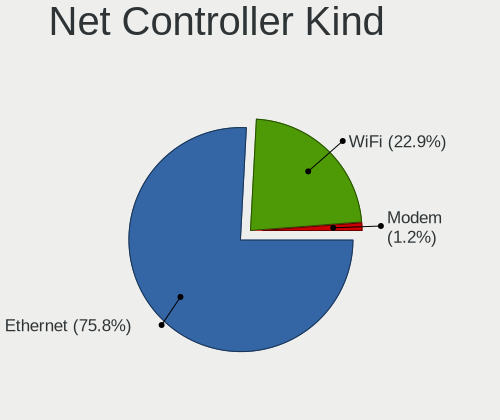

| Kind     | Desktops | Percent |
|----------|----------|---------|
| Ethernet | 248      | 75.84%  |
| WiFi     | 75       | 22.94%  |
| Modem    | 4        | 1.22%   |

Used Controller
---------------

Currently used network controller

| Kind     | Desktops | Percent |
|----------|----------|---------|
| Ethernet | 193      | 78.46%  |
| WiFi     | 52       | 21.14%  |
| Modem    | 1        | 0.41%   |

NICs
----

Total network controllers on board

| Total | Desktops | Percent |
|-------|----------|---------|
| 1     | 199      | 79.92%  |
| 2     | 42       | 16.87%  |
| 3     | 4        | 1.61%   |
| 0     | 2        | 0.8%    |
| 5     | 1        | 0.4%    |
| 4     | 1        | 0.4%    |

IPv6
----

IPv6 vs IPv4

| Used | Desktops | Percent |
|------|----------|---------|
| No   | 245      | 98.39%  |
| Yes  | 4        | 1.61%   |

Bluetooth
---------

Bluetooth Vendor
----------------

Controller vendors

| Vendor                     | Desktops | Percent |
|----------------------------|----------|---------|
| Cambridge Silicon Radio    | 13       | 37.14%  |
| Intel                      | 10       | 28.57%  |
| Realtek Semiconductor      | 4        | 11.43%  |
| Integrated System Solution | 2        | 5.71%   |
| Foxconn / Hon Hai          | 2        | 5.71%   |
| TP-Link                    | 1        | 2.86%   |
| Logitech                   | 1        | 2.86%   |
| HTC (High Tech Computer)   | 1        | 2.86%   |
| Broadcom                   | 1        | 2.86%   |

Bluetooth Model
---------------

Controller models

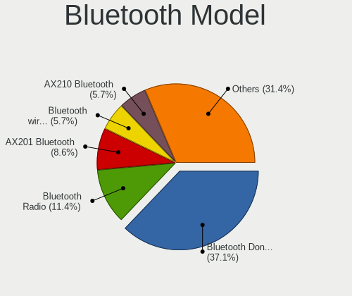

| Model                                                                | Desktops | Percent |
|----------------------------------------------------------------------|----------|---------|
| Cambridge Silicon Radio Bluetooth Dongle (HCI mode)                  | 13       | 37.14%  |
| Realtek Bluetooth Radio                                              | 4        | 11.43%  |
| Intel AX201 Bluetooth                                                | 3        | 8.57%   |
| Intel Bluetooth wireless interface                                   | 2        | 5.71%   |
| Intel AX210 Bluetooth                                                | 2        | 5.71%   |
| Integrated System Solution Bluetooth Device                          | 2        | 5.71%   |
| TP-Link TP-Link Bluetooth USB Adapter                                | 1        | 2.86%   |
| Logitech BT Mini-Receiver (HCI mode)                                 | 1        | 2.86%   |
| Intel Wireless-AC 3168 Bluetooth                                     | 1        | 2.86%   |
| Intel AX211 Bluetooth                                                | 1        | 2.86%   |
| Intel AX200 Bluetooth                                                | 1        | 2.86%   |
| HTC (High Tech Computer) Vive Hub Bluetooth 4.1 (Broadcom BCM920703) | 1        | 2.86%   |
| Foxconn / Hon Hai Wireless_Device                                    | 1        | 2.86%   |
| Foxconn / Hon Hai Bluetooth Device                                   | 1        | 2.86%   |
| Broadcom BCM2210 Bluetooth                                           | 1        | 2.86%   |

Sound
-----

Sound Vendor
------------

Sound card vendors

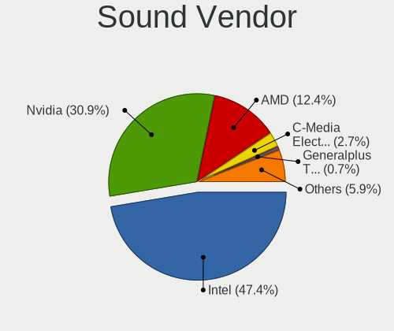

| Vendor                   | Desktops | Percent |
|--------------------------|----------|---------|
| Intel                    | 207      | 47.37%  |
| Nvidia                   | 135      | 30.89%  |
| AMD                      | 54       | 12.36%  |
| C-Media Electronics      | 12       | 2.75%   |
| Generalplus Technology   | 3        | 0.69%   |
| ASUSTek Computer         | 3        | 0.69%   |
| VIA Technologies         | 2        | 0.46%   |
| Sony                     | 2        | 0.46%   |
| Focusrite-Novation       | 2        | 0.46%   |
| Creative Labs            | 2        | 0.46%   |
| Xilinx                   | 1        | 0.23%   |
| ULi Electronics          | 1        | 0.23%   |
| SAVITECH                 | 1        | 0.23%   |
| Realtek Semiconductor    | 1        | 0.23%   |
| Razer USA                | 1        | 0.23%   |
| Plantronics              | 1        | 0.23%   |
| Nordic Semiconductor ASA | 1        | 0.23%   |
| M-Audio                  | 1        | 0.23%   |
| Logitech                 | 1        | 0.23%   |
| KTMicro                  | 1        | 0.23%   |
| JMTek                    | 1        | 0.23%   |
| Hewlett-Packard          | 1        | 0.23%   |
| Blue Microphones         | 1        | 0.23%   |
| BEHRINGER International  | 1        | 0.23%   |
| Asahi Kasei Microsystems | 1        | 0.23%   |

Sound Model
-----------

Sound card models

| Model                                                                      | Desktops | Percent |
|----------------------------------------------------------------------------|----------|---------|
| Intel 6 Series/C200 Series Chipset Family High Definition Audio Controller | 42       | 8.94%   |
| Intel NM10/ICH7 Family High Definition Audio Controller                    | 38       | 8.09%   |
| Nvidia GF108 High Definition Audio Controller                              | 29       | 6.17%   |
| Intel 8 Series/C220 Series Chipset High Definition Audio Controller        | 18       | 3.83%   |
| Intel 7 Series/C216 Chipset Family High Definition Audio Controller        | 17       | 3.62%   |
| Intel 82801JI (ICH10 Family) HD Audio Controller                           | 16       | 3.4%    |
| Nvidia High Definition Audio Controller                                    | 13       | 2.77%   |
| Nvidia GK208 HDMI/DP Audio Controller                                      | 11       | 2.34%   |
| Nvidia GK107 HDMI Audio Controller                                         | 11       | 2.34%   |
| Intel 200 Series PCH HD Audio                                              | 10       | 2.13%   |
| Intel 100 Series/C230 Series Chipset Family HD Audio Controller            | 10       | 2.13%   |
| Intel 82801I (ICH9 Family) HD Audio Controller                             | 9        | 1.91%   |
| AMD Baffin HDMI/DP Audio [Radeon RX 550 640SP / RX 560/560X]               | 9        | 1.91%   |
| Nvidia GP104 High Definition Audio Controller                              | 8        | 1.7%    |
| Nvidia GF114 HDMI Audio Controller                                         | 8        | 1.7%    |
| Intel 5 Series/3400 Series Chipset High Definition Audio                   | 8        | 1.7%    |
| AMD Family 17h (Models 00h-0fh) HD Audio Controller                        | 8        | 1.7%    |
| AMD Starship/Matisse HD Audio Controller                                   | 7        | 1.49%   |
| AMD SBx00 Azalia (Intel HDA)                                               | 6        | 1.28%   |
| AMD Family 17h/19h/1ah HD Audio Controller                                 | 6        | 1.28%   |
| Nvidia GP107GL High Definition Audio Controller                            | 5        | 1.06%   |
| Nvidia GK104 HDMI Audio Controller                                         | 5        | 1.06%   |
| Nvidia GF116 High Definition Audio Controller                              | 5        | 1.06%   |
| Intel Xeon E3-1200 v3/4th Gen Core Processor HD Audio Controller           | 5        | 1.06%   |
| Intel Comet Lake PCH cAVS                                                  | 5        | 1.06%   |
| Intel Cannon Lake PCH cAVS                                                 | 5        | 1.06%   |
| AMD Juniper HDMI Audio [Radeon HD 5700 Series]                             | 5        | 1.06%   |
| AMD Ellesmere HDMI Audio [Radeon RX 470/480 / 570/580/590]                 | 5        | 1.06%   |
| Nvidia GM107 High Definition Audio Controller [GeForce 940MX]              | 4        | 0.85%   |
| Nvidia GF119 HDMI Audio Controller                                         | 4        | 0.85%   |
| Nvidia GA106 High Definition Audio Controller                              | 4        | 0.85%   |
| Intel 9 Series Chipset Family HD Audio Controller                          | 4        | 0.85%   |
| Intel 82801H (ICH8 Family) HD Audio Controller                             | 4        | 0.85%   |
| AMD Renoir Radeon High Definition Audio Controller                         | 4        | 0.85%   |
| Nvidia TU116 High Definition Audio Controller                              | 3        | 0.64%   |
| Nvidia TU106 High Definition Audio Controller                              | 3        | 0.64%   |
| Nvidia GT216 HDMI Audio Controller                                         | 3        | 0.64%   |
| Nvidia GM206 High Definition Audio Controller                              | 3        | 0.64%   |
| Nvidia GF106 High Definition Audio Controller                              | 3        | 0.64%   |
| Intel Atom Processor Z36xxx/Z37xxx Series High Definition Audio Controller | 3        | 0.64%   |

Memory
------

Memory Vendor
-------------

Memory module vendors

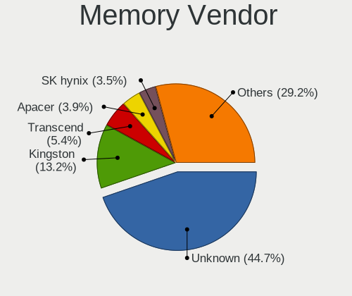

| Vendor              | Desktops | Percent |
|---------------------|----------|---------|
| Unknown             | 115      | 44.75%  |
| Kingston            | 34       | 13.23%  |
| Transcend           | 14       | 5.45%   |
| Apacer              | 10       | 3.89%   |
| SK hynix            | 9        | 3.5%    |
| Samsung Electronics | 8        | 3.11%   |
| Team                | 7        | 2.72%   |
| Silicon Power       | 7        | 2.72%   |
| GeIL                | 7        | 2.72%   |
| G.Skill             | 6        | 2.33%   |
| Crucial             | 6        | 2.33%   |
| A-DATA Technology   | 6        | 2.33%   |
| Patriot             | 4        | 1.56%   |
| Micron Technology   | 3        | 1.17%   |
| Super Talent        | 2        | 0.78%   |
| SUPER KINGSTEK      | 2        | 0.78%   |
| Nanya Technology    | 2        | 0.78%   |
| Kingmax             | 2        | 0.78%   |
| Hikvision           | 2        | 0.78%   |
| Goodram             | 2        | 0.78%   |
| Unknown             | 2        | 0.78%   |
| Patriot Memory      | 1        | 0.39%   |
| Kllisre             | 1        | 0.39%   |
| KANMEIQi            | 1        | 0.39%   |
| Goldkey             | 1        | 0.39%   |
| Golden Empire       | 1        | 0.39%   |
| Elpida              | 1        | 0.39%   |
| Corsair             | 1        | 0.39%   |

Memory Model
------------

Memory module models

| Model                                                  | Desktops | Percent |
|--------------------------------------------------------|----------|---------|
| Unknown RAM Module 2048MB DIMM SDRAM                   | 13       | 4.61%   |
| Unknown RAM Module 1024MB DIMM SDRAM                   | 11       | 3.9%    |
| Unknown RAM Module 1024MB DIMM 800MT/s                 | 7        | 2.48%   |
| Unknown RAM Module 4096MB DIMM DDR3 1333MT/s           | 6        | 2.13%   |
| Unknown RAM Module 2GB DIMM DDR2 800MT/s               | 6        | 2.13%   |
| Unknown RAM Module 2GB DIMM 800MT/s                    | 6        | 2.13%   |
| Unknown RAM Module 4GB DIMM DDR3 1333MT/s              | 5        | 1.77%   |
| Unknown RAM Module 2048MB DIMM 800MT/s                 | 5        | 1.77%   |
| Unknown RAM Module 2048MB DIMM DDR2 800MT/s            | 4        | 1.42%   |
| Transcend RAM JM1333KLU-2G 2GB DIMM DDR3 1333MT/s      | 4        | 1.42%   |
| GeIL RAM CL9-9-9 D3-1333 8GB DIMM DDR3 1333MT/s        | 4        | 1.42%   |
| Unknown RAM Module 2048MB DIMM 1333MT/s                | 3        | 1.06%   |
| Unknown RAM Module 1024MB DIMM 667MT/s                 | 3        | 1.06%   |
| Unknown RAM Module 8GB DIMM DDR3 1600MT/s              | 2        | 0.71%   |
| Unknown RAM Module 512MB DIMM SDRAM                    | 2        | 0.71%   |
| Unknown RAM Module 4GB DIMM DDR3 1600MT/s              | 2        | 0.71%   |
| Unknown RAM Module 4096MB DIMM DDR3 1067MT/s           | 2        | 0.71%   |
| Unknown RAM Module 4096MB DIMM 1333MT/s                | 2        | 0.71%   |
| Unknown RAM Module 2GB DIMM SDRAM                      | 2        | 0.71%   |
| Unknown RAM Module 2GB DIMM DDR3 1333MT/s              | 2        | 0.71%   |
| Unknown RAM Module 2GB DIMM 400MT/s                    | 2        | 0.71%   |
| Unknown RAM Module 2048MB DIMM DDR3 1067MT/s           | 2        | 0.71%   |
| Unknown RAM Module 2048MB DIMM DDR2 667MT/s            | 2        | 0.71%   |
| Unknown RAM Module 2048MB DIMM DDR 667MT/s             | 2        | 0.71%   |
| Unknown RAM Module 2048MB DIMM DDR 1333MT/s            | 2        | 0.71%   |
| Unknown RAM Module 2048MB DIMM 5354MT/s                | 2        | 0.71%   |
| Unknown RAM Module 1GB DIMM 800MT/s                    | 2        | 0.71%   |
| Unknown RAM Module 1024MB DIMM DDR2                    | 2        | 0.71%   |
| Transcend RAM JM1333KLN-4G 4GB DIMM DDR3 1600MT/s      | 2        | 0.71%   |
| Team RAM TEAMGROUP-UD3-1600 8GB DIMM DDR3 1600MT/s     | 2        | 0.71%   |
| Super Talent RAM SUPERTALENT02 4GB DIMM DDR3 1600MT/s  | 2        | 0.71%   |
| SK hynix RAM HMT351U6BFR8C-H9 4GB DIMM DDR3 1333MT/s   | 2        | 0.71%   |
| Silicon Power RAM DBLT2GN568S 2GB DIMM DDR3 1333MT/s   | 2        | 0.71%   |
| Kingston RAM KHX3200C16D4/16GX 16GB DIMM DDR4 3600MT/s | 2        | 0.71%   |
| Kingston RAM 99U5584-005.A00LF 4GB DIMM DDR3 1600MT/s  | 2        | 0.71%   |
| Kingston RAM 99U5471-037.A00LF 8GB DIMM DDR3 1600MT/s  | 2        | 0.71%   |
| GeIL RAM CL11-11-11 D3-1600 8GB DIMM DDR3 1600MT/s     | 2        | 0.71%   |
| A-DATA RAM Module 4096MB DIMM DDR3 1333MT/s            | 2        | 0.71%   |
| Unknown                                                | 2        | 0.71%   |
| Unknown RAM Module 8GB DIMM SDRAM                      | 1        | 0.35%   |

Memory Kind
-----------

Memory module kinds

| Kind    | Desktops | Percent |
|---------|----------|---------|
| DDR3    | 78       | 36.11%  |
| DDR4    | 42       | 19.44%  |
| Unknown | 39       | 18.06%  |
| SDRAM   | 28       | 12.96%  |
| DDR2    | 20       | 9.26%   |
| DDR     | 5        | 2.31%   |
| DDR5    | 3        | 1.39%   |
| LPDDR4  | 1        | 0.46%   |

Memory Form Factor
------------------

Physical design of the memory module

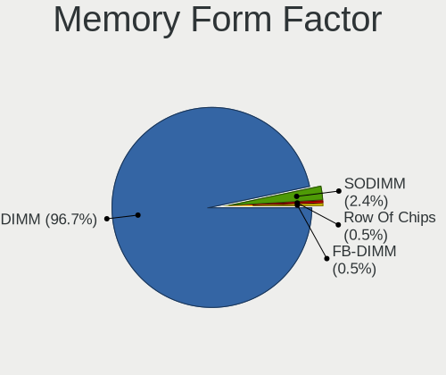

| Name         | Desktops | Percent |
|--------------|----------|---------|
| DIMM         | 205      | 96.7%   |
| SODIMM       | 5        | 2.36%   |
| Row Of Chips | 1        | 0.47%   |
| FB-DIMM      | 1        | 0.47%   |

Memory Size
-----------

Memory module size

| Size  | Desktops | Percent |
|-------|----------|---------|
| 2048  | 82       | 32.03%  |
| 4096  | 55       | 21.48%  |
| 8192  | 51       | 19.92%  |
| 1024  | 37       | 14.45%  |
| 16384 | 14       | 5.47%   |
| 32768 | 9        | 3.52%   |
| 512   | 6        | 2.34%   |
| 256   | 1        | 0.39%   |
| 16    | 1        | 0.39%   |

Memory Speed
------------

Memory module speed

| Speed   | Desktops | Percent |
|---------|----------|---------|
| 1333    | 46       | 19.33%  |
| 1600    | 37       | 15.55%  |
| Unknown | 33       | 13.87%  |
| 800     | 28       | 11.76%  |
| 667     | 12       | 5.04%   |
| 2667    | 9        | 3.78%   |
| 2400    | 9        | 3.78%   |
| 3200    | 8        | 3.36%   |
| 3600    | 5        | 2.1%    |
| 2666    | 4        | 1.68%   |
| 2133    | 4        | 1.68%   |
| 1067    | 4        | 1.68%   |
| 533     | 4        | 1.68%   |
| 400     | 4        | 1.68%   |
| 1066    | 3        | 1.26%   |
| 5354    | 2        | 0.84%   |
| 3800    | 2        | 0.84%   |
| 3733    | 2        | 0.84%   |
| 1867    | 2        | 0.84%   |
| 1800    | 2        | 0.84%   |
| 6000    | 1        | 0.42%   |
| 5200    | 1        | 0.42%   |
| 4800    | 1        | 0.42%   |
| 4000    | 1        | 0.42%   |
| 3400    | 1        | 0.42%   |
| 3334    | 1        | 0.42%   |
| 3000    | 1        | 0.42%   |
| 2933    | 1        | 0.42%   |
| 2800    | 1        | 0.42%   |
| 2734    | 1        | 0.42%   |
| 2448    | 1        | 0.42%   |
| 2267    | 1        | 0.42%   |
| 2020    | 1        | 0.42%   |
| 1666    | 1        | 0.42%   |
| 1400    | 1        | 0.42%   |
| 1334    | 1        | 0.42%   |
| 1258    | 1        | 0.42%   |
| 66      | 1        | 0.42%   |

Printers & scanners
-------------------

Printer Vendor
--------------

Printer device vendors

| Vendor                | Desktops | Percent |
|-----------------------|----------|---------|
| Hewlett-Packard       | 6        | 40%     |
| Canon                 | 4        | 26.67%  |
| Xerox                 | 2        | 13.33%  |
| Samsung Electronics   | 2        | 13.33%  |
| Lexmark International | 1        | 6.67%   |

Printer Model
-------------

Printer device models

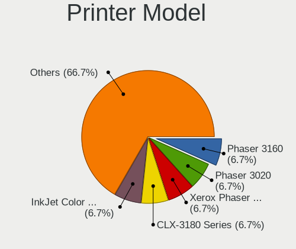

| Model                                      | Desktops | Percent |
|--------------------------------------------|----------|---------|
| Xerox Phaser 3160                          | 1        | 6.67%   |
| Xerox Phaser 3020                          | 1        | 6.67%   |
| Samsung Xerox Phaser 3117 Laser Printer    | 1        | 6.67%   |
| Samsung CLX-3180 Series                    | 1        | 6.67%   |
| Lexmark International InkJet Color Printer | 1        | 6.67%   |
| HP LaserJet P1102                          | 1        | 6.67%   |
| HP LaserJet 1020                           | 1        | 6.67%   |
| HP LaserJet 1018                           | 1        | 6.67%   |
| HP LaserJet 1010                           | 1        | 6.67%   |
| HP DeskJet 5650c                           | 1        | 6.67%   |
| HP Deskjet 2520 series                     | 1        | 6.67%   |
| Canon LBP810                               | 1        | 6.67%   |
| Canon LBP6000                              | 1        | 6.67%   |
| Canon LBP2900                              | 1        | 6.67%   |
| Canon G3010 series                         | 1        | 6.67%   |

Scanner Vendor
--------------

Scanner device vendors

Zero info for selected period =(

Scanner Model
-------------

Scanner device models

Zero info for selected period =(

Camera
------

Camera Vendor
-------------

Camera device vendors

| Vendor                        | Desktops | Percent |
|-------------------------------|----------|---------|
| Logitech                      | 14       | 22.58%  |
| Z-Star Microelectronics       | 11       | 17.74%  |
| KYE Systems (Mouse Systems)   | 10       | 16.13%  |
| Microdia                      | 6        | 9.68%   |
| Pixart Imaging                | 3        | 4.84%   |
| SiGma Micro                   | 2        | 3.23%   |
| Samsung Electronics           | 2        | 3.23%   |
| Hewlett-Packard               | 2        | 3.23%   |
| Generalplus Technology        | 2        | 3.23%   |
| GEMBIRD                       | 2        | 3.23%   |
| Sunplus Innovation Technology | 1        | 1.61%   |
| OPPO Electronics              | 1        | 1.61%   |
| Creative Technology           | 1        | 1.61%   |
| Chicony Electronics           | 1        | 1.61%   |
| Aveo Technology               | 1        | 1.61%   |
| Apple                         | 1        | 1.61%   |
| Alcor Micro                   | 1        | 1.61%   |
| A4Tech                        | 1        | 1.61%   |

Camera Model
------------

Camera device models

| Model                                          | Desktops | Percent |
|------------------------------------------------|----------|---------|
| Z-Star Venus USB2.0 Camera                     | 8        | 12.9%   |
| Logitech Webcam C270                           | 5        | 8.06%   |
| Pixart Imaging GE 1.3 MP MiniCam Pro           | 3        | 4.84%   |
| Microdia Camera                                | 3        | 4.84%   |
| Logitech Webcam C170                           | 3        | 4.84%   |
| KYE Systems (Mouse Systems) Genius iSlim 330   | 3        | 4.84%   |
| SiGma Micro WebCam SiGma Micro                 | 2        | 3.23%   |
| Samsung Galaxy series, misc. (MTP mode)        | 2        | 3.23%   |
| Microdia Sonix USB 2.0 Camera                  | 2        | 3.23%   |
| Logitech Webcam C310                           | 2        | 3.23%   |
| KYE Systems (Mouse Systems) USB20 Camera       | 2        | 3.23%   |
| GEMBIRD USB2.0 PC CAMERA                       | 2        | 3.23%   |
| Z-Star Vimicro USB Camera (Altair)             | 1        | 1.61%   |
| Z-Star Sirius USB2.0 Camera                    | 1        | 1.61%   |
| Z-Star Lenovo IdeaCentre Web Camera            | 1        | 1.61%   |
| Sunplus SPCA2281 Web Camera                    | 1        | 1.61%   |
| OPPO Oppo N1                                   | 1        | 1.61%   |
| Microdia MSI Starcam Racer                     | 1        | 1.61%   |
| Logitech Webcam C210                           | 1        | 1.61%   |
| Logitech Webcam C200                           | 1        | 1.61%   |
| Logitech Logitech Webcam C925e                 | 1        | 1.61%   |
| Logitech HD Webcam C510                        | 1        | 1.61%   |
| KYE Systems (Mouse Systems) PC-LM1E Camera     | 1        | 1.61%   |
| KYE Systems (Mouse Systems) iSlim 1300 V2      | 1        | 1.61%   |
| KYE Systems (Mouse Systems) Genius Webcam      | 1        | 1.61%   |
| KYE Systems (Mouse Systems) Genius FaceCam 312 | 1        | 1.61%   |
| KYE Systems (Mouse Systems) FaceCam 315        | 1        | 1.61%   |
| HP Webcam HD-2200                              | 1        | 1.61%   |
| HP HP Webcam HD 2300                           | 1        | 1.61%   |
| Generalplus 808 Camera #9 (web-cam mode)       | 1        | 1.61%   |
| Generalplus 2E WQHD Webcam                     | 1        | 1.61%   |
| Creative Live! Cam Chat HD [VF0700]            | 1        | 1.61%   |
| Chicony HP High Definition 1MP Webcam          | 1        | 1.61%   |
| Aveo USB2.0 Camera                             | 1        | 1.61%   |
| Apple iPhone 5/5C/5S/6/SE/7/8/X/XR             | 1        | 1.61%   |
| Alcor Micro USB 2.0 PC Camera                  | 1        | 1.61%   |
| A4Tech A4tech FHD 1080P PC Camera              | 1        | 1.61%   |

Security
--------

Fingerprint Vendor
------------------

Fingerprint sensor vendors

Zero info for selected period =(

Fingerprint Model
-----------------

Fingerprint sensor models

Zero info for selected period =(

Chipcard Vendor
---------------

Chipcard module vendors

| Vendor                | Desktops | Percent |
|-----------------------|----------|---------|
| Feitian Technologies  | 1        | 33.33%  |
| Aktiv                 | 1        | 33.33%  |
| Advanced Card Systems | 1        | 33.33%  |

Chipcard Model
--------------

Chipcard module models

| Model                                        | Desktops | Percent |
|----------------------------------------------|----------|---------|
| Feitian Technologies SCR301                  | 1        | 33.33%  |
| Aktiv KAZTOKEN                               | 1        | 33.33%  |
| Advanced Card Systems ACR38 SmartCard Reader | 1        | 33.33%  |

Unsupported
-----------

Unsupported Devices
-------------------

Total unsupported devices on board

| Total | Desktops | Percent |
|-------|----------|---------|
| 0     | 232      | 89.92%  |
| 1     | 22       | 8.53%   |
| 2     | 4        | 1.55%   |

Unsupported Device Types
------------------------

Types of unsupported devices

| Type                     | Desktops | Percent |
|--------------------------|----------|---------|
| Graphics card            | 15       | 50%     |
| Communication controller | 6        | 20%     |
| Camera                   | 3        | 10%     |
| Unassigned class         | 2        | 6.67%   |
| Chipcard                 | 2        | 6.67%   |
| Net/ethernet             | 1        | 3.33%   |
| Multimedia controller    | 1        | 3.33%   |

