Linux in Kazakhstan - Tested Hardware & Statistics (Notebooks)
--------------------------------------------------------------

A project to collect tested hardware configurations for Linux in Kazakhstan.

Anyone can contribute to this report by the [hw-probe](https://github.com/linuxhw/hw-probe) tool:

    sudo -E hw-probe -all -upload

Please contribute! Especially if your hardware is rare.

Contents
--------

* [ Test Cases ](#test-cases)

* [ System ](#system)
  - [ OS                       ](#os)
  - [ OS Family                ](#os-family)
  - [ Kernel                   ](#kernel)
  - [ Kernel Family            ](#kernel-family)
  - [ Kernel Major Ver.        ](#kernel-major-ver)
  - [ Arch                     ](#arch)
  - [ DE                       ](#de)
  - [ Display Server           ](#display-server)
  - [ Display Manager          ](#display-manager)
  - [ OS Lang                  ](#os-lang)
  - [ Boot Mode                ](#boot-mode)
  - [ Filesystem               ](#filesystem)
  - [ Part. scheme             ](#part-scheme)
  - [ Dual Boot with Linux/BSD ](#dual-boot-with-linuxbsd)
  - [ Dual Boot (Win)          ](#dual-boot-win)

* [ Board ](#board)
  - [ Vendor                   ](#vendor)
  - [ Model                    ](#model)
  - [ Model Family             ](#model-family)
  - [ MFG Year                 ](#mfg-year)
  - [ Form Factor              ](#form-factor)
  - [ Secure Boot              ](#secure-boot)
  - [ Coreboot                 ](#coreboot)
  - [ RAM Size                 ](#ram-size)
  - [ RAM Used                 ](#ram-used)
  - [ Total Drives             ](#total-drives)
  - [ Has CD-ROM               ](#has-cd-rom)
  - [ Has Ethernet             ](#has-ethernet)
  - [ Has WiFi                 ](#has-wifi)
  - [ Has Bluetooth            ](#has-bluetooth)

* [ Location ](#location)
  - [ Country                  ](#country)
  - [ City                     ](#city)

* [ Drives ](#drives)
  - [ Drive Vendor             ](#drive-vendor)
  - [ Drive Model              ](#drive-model)
  - [ HDD Vendor               ](#hdd-vendor)
  - [ SSD Vendor               ](#ssd-vendor)
  - [ Drive Kind               ](#drive-kind)
  - [ Drive Connector          ](#drive-connector)
  - [ Drive Size               ](#drive-size)
  - [ Space Total              ](#space-total)
  - [ Space Used               ](#space-used)
  - [ Malfunc. Drives          ](#malfunc-drives)
  - [ Malfunc. Drive Vendor    ](#malfunc-drive-vendor)
  - [ Malfunc. HDD Vendor      ](#malfunc-hdd-vendor)
  - [ Malfunc. Drive Kind      ](#malfunc-drive-kind)
  - [ Failed Drives            ](#failed-drives)
  - [ Failed Drive Vendor      ](#failed-drive-vendor)
  - [ Drive Status             ](#drive-status)

* [ Storage controller ](#storage-controller)
  - [ Storage Vendor           ](#storage-vendor)
  - [ Storage Model            ](#storage-model)
  - [ Storage Kind             ](#storage-kind)

* [ Processor ](#processor)
  - [ CPU Vendor               ](#cpu-vendor)
  - [ CPU Model                ](#cpu-model)
  - [ CPU Model Family         ](#cpu-model-family)
  - [ CPU Cores                ](#cpu-cores)
  - [ CPU Sockets              ](#cpu-sockets)
  - [ CPU Threads              ](#cpu-threads)
  - [ CPU Op-Modes             ](#cpu-op-modes)
  - [ CPU Microcode            ](#cpu-microcode)
  - [ CPU Microarch            ](#cpu-microarch)

* [ Graphics ](#graphics)
  - [ GPU Vendor               ](#gpu-vendor)
  - [ GPU Model                ](#gpu-model)
  - [ GPU Combo                ](#gpu-combo)
  - [ GPU Driver               ](#gpu-driver)
  - [ GPU Memory               ](#gpu-memory)

* [ Monitor ](#monitor)
  - [ Monitor Vendor           ](#monitor-vendor)
  - [ Monitor Model            ](#monitor-model)
  - [ Monitor Resolution       ](#monitor-resolution)
  - [ Monitor Diagonal         ](#monitor-diagonal)
  - [ Monitor Width            ](#monitor-width)
  - [ Aspect Ratio             ](#aspect-ratio)
  - [ Monitor Area             ](#monitor-area)
  - [ Pixel Density            ](#pixel-density)
  - [ Multiple Monitors        ](#multiple-monitors)

* [ Network ](#network)
  - [ Net Controller Vendor    ](#net-controller-vendor)
  - [ Net Controller Model     ](#net-controller-model)
  - [ Wireless Vendor          ](#wireless-vendor)
  - [ Wireless Model           ](#wireless-model)
  - [ Ethernet Vendor          ](#ethernet-vendor)
  - [ Ethernet Model           ](#ethernet-model)
  - [ Net Controller Kind      ](#net-controller-kind)
  - [ Used Controller          ](#used-controller)
  - [ NICs                     ](#nics)
  - [ IPv6                     ](#ipv6)

* [ Bluetooth ](#bluetooth)
  - [ Bluetooth Vendor         ](#bluetooth-vendor)
  - [ Bluetooth Model          ](#bluetooth-model)

* [ Sound ](#sound)
  - [ Sound Vendor             ](#sound-vendor)
  - [ Sound Model              ](#sound-model)

* [ Memory ](#memory)
  - [ Memory Vendor            ](#memory-vendor)
  - [ Memory Model             ](#memory-model)
  - [ Memory Kind              ](#memory-kind)
  - [ Memory Form Factor       ](#memory-form-factor)
  - [ Memory Size              ](#memory-size)
  - [ Memory Speed             ](#memory-speed)

* [ Printers & scanners ](#printers--scanners)
  - [ Printer Vendor           ](#printer-vendor)
  - [ Printer Model            ](#printer-model)
  - [ Scanner Vendor           ](#scanner-vendor)
  - [ Scanner Model            ](#scanner-model)

* [ Camera ](#camera)
  - [ Camera Vendor            ](#camera-vendor)
  - [ Camera Model             ](#camera-model)

* [ Security ](#security)
  - [ Fingerprint Vendor       ](#fingerprint-vendor)
  - [ Fingerprint Model        ](#fingerprint-model)
  - [ Chipcard Vendor          ](#chipcard-vendor)
  - [ Chipcard Model           ](#chipcard-model)

* [ Unsupported ](#unsupported)
  - [ Unsupported Devices      ](#unsupported-devices)
  - [ Unsupported Device Types ](#unsupported-device-types)

Test Cases
----------

Total: 363

| Vendor        | Model                       | Probe                                                      | Date         |
|---------------|-----------------------------|------------------------------------------------------------|--------------|
| HP            | OMEN by Laptop 16-c0xxx     | [3111141139](https://linux-hardware.org/?probe=3111141139) | Dec 26, 2022 |
| Acer          | Aspire A315-51              | [b53beddded](https://linux-hardware.org/?probe=b53beddded) | Dec 23, 2022 |
| Acer          | Aspire A315-51              | [4fc8630d91](https://linux-hardware.org/?probe=4fc8630d91) | Dec 22, 2022 |
| Lenovo        | Legion R9000P ARH7H 82RG    | [bbc48ee483](https://linux-hardware.org/?probe=bbc48ee483) | Dec 20, 2022 |
| Acer          | Aspire A315-51              | [8777d682b0](https://linux-hardware.org/?probe=8777d682b0) | Dec 20, 2022 |
| Acer          | Aspire A315-51              | [faf7ad4c29](https://linux-hardware.org/?probe=faf7ad4c29) | Dec 19, 2022 |
| Acer          | Aspire A315-51              | [116b321e68](https://linux-hardware.org/?probe=116b321e68) | Dec 16, 2022 |
| Lenovo        | ThinkPad X240 20AL007AMZ    | [8290c7e597](https://linux-hardware.org/?probe=8290c7e597) | Dec 16, 2022 |
| Acer          | Aspire A315-51              | [5f2e420614](https://linux-hardware.org/?probe=5f2e420614) | Dec 15, 2022 |
| Lenovo        | ThinkBook 15 G3 ACL 21A4    | [6ae6d710b7](https://linux-hardware.org/?probe=6ae6d710b7) | Dec 10, 2022 |
| Lenovo        | ThinkBook 15 G3 ACL 21A4    | [b56f450d6d](https://linux-hardware.org/?probe=b56f450d6d) | Dec 10, 2022 |
| Acer          | Aspire A315-51              | [1b1e1ae174](https://linux-hardware.org/?probe=1b1e1ae174) | Dec 08, 2022 |
| Acer          | Aspire A315-51              | [26828f578e](https://linux-hardware.org/?probe=26828f578e) | Dec 05, 2022 |
| Toshiba       | TECRA S11                   | [3d2414e47b](https://linux-hardware.org/?probe=3d2414e47b) | Nov 30, 2022 |
| Lenovo        | ThinkBook 15 G3 ACL 21A4    | [ef6247e6fd](https://linux-hardware.org/?probe=ef6247e6fd) | Nov 28, 2022 |
| Dell          | Precision M6400             | [05f69c6917](https://linux-hardware.org/?probe=05f69c6917) | Nov 28, 2022 |
| GPD           | G1621-02                    | [d6b679024c](https://linux-hardware.org/?probe=d6b679024c) | Nov 26, 2022 |
| GPD           | G1621-02                    | [f0e9e8442c](https://linux-hardware.org/?probe=f0e9e8442c) | Nov 26, 2022 |
| Acer          | Aspire A315-51              | [e08bf40900](https://linux-hardware.org/?probe=e08bf40900) | Nov 25, 2022 |
| Acer          | Aspire A315-51              | [a636cfb9ff](https://linux-hardware.org/?probe=a636cfb9ff) | Nov 24, 2022 |
| Acer          | Swift SF314-58G             | [9e729e43a7](https://linux-hardware.org/?probe=9e729e43a7) | Nov 20, 2022 |
| Dell          | Latitude 5520               | [c658158f10](https://linux-hardware.org/?probe=c658158f10) | Nov 15, 2022 |
| Dell          | Latitude 5520               | [6e0490d1bf](https://linux-hardware.org/?probe=6e0490d1bf) | Nov 14, 2022 |
| Lenovo        | Legion R9000P ARH7H 82RG    | [d584008808](https://linux-hardware.org/?probe=d584008808) | Nov 14, 2022 |
| Lenovo        | G500 20236                  | [b156c32896](https://linux-hardware.org/?probe=b156c32896) | Nov 12, 2022 |
| Chuwi         | CoreBook XPro               | [0a0932246f](https://linux-hardware.org/?probe=0a0932246f) | Nov 09, 2022 |
| Acer          | Aspire A315-51              | [d5c179046a](https://linux-hardware.org/?probe=d5c179046a) | Nov 07, 2022 |
| Lenovo        | G500 20236                  | [76d6e74fad](https://linux-hardware.org/?probe=76d6e74fad) | Nov 07, 2022 |
| Acer          | Aspire A315-51              | [eaa9bcaadb](https://linux-hardware.org/?probe=eaa9bcaadb) | Oct 31, 2022 |
| Acer          | Aspire A315-51              | [7b016c85d8](https://linux-hardware.org/?probe=7b016c85d8) | Oct 31, 2022 |
| Acer          | Aspire A315-51              | [17faa0d40a](https://linux-hardware.org/?probe=17faa0d40a) | Oct 27, 2022 |
| ASUSTek       | VivoBook_ASUSLaptop M350... | [8b68d25121](https://linux-hardware.org/?probe=8b68d25121) | Oct 26, 2022 |
| Acer          | Aspire A315-51              | [244d93ab06](https://linux-hardware.org/?probe=244d93ab06) | Oct 21, 2022 |
| Acer          | Aspire A315-51              | [dc26121480](https://linux-hardware.org/?probe=dc26121480) | Oct 21, 2022 |
| ASUSTek       | VivoBook_ASUSLaptop M350... | [4c95f64c92](https://linux-hardware.org/?probe=4c95f64c92) | Oct 20, 2022 |
| ASUSTek       | VivoBook_ASUSLaptop M350... | [2740d3c96e](https://linux-hardware.org/?probe=2740d3c96e) | Oct 16, 2022 |
| Lenovo        | ThinkPad X230 23257BG       | [6c8a42718a](https://linux-hardware.org/?probe=6c8a42718a) | Oct 16, 2022 |
| ASUSTek       | VivoBook_ASUSLaptop M350... | [54d1a0ebb2](https://linux-hardware.org/?probe=54d1a0ebb2) | Oct 13, 2022 |
| ASUSTek       | VivoBook_ASUSLaptop M350... | [7969631063](https://linux-hardware.org/?probe=7969631063) | Oct 11, 2022 |
| ASUSTek       | VivoBook_ASUSLaptop M350... | [f5e933eaac](https://linux-hardware.org/?probe=f5e933eaac) | Oct 10, 2022 |
| Acer          | Swift SF314-511             | [6270245e93](https://linux-hardware.org/?probe=6270245e93) | Oct 08, 2022 |
| ASUSTek       | VivoBook_ASUSLaptop M350... | [2ac8b7a157](https://linux-hardware.org/?probe=2ac8b7a157) | Oct 03, 2022 |
| ASUSTek       | X550CL                      | [ded047597e](https://linux-hardware.org/?probe=ded047597e) | Sep 28, 2022 |
| Sony          | VGN-FW245J                  | [ab3391f43e](https://linux-hardware.org/?probe=ab3391f43e) | Sep 18, 2022 |
| Chuwi         | UBook XPro                  | [b695b65d86](https://linux-hardware.org/?probe=b695b65d86) | Sep 10, 2022 |
| HP            | ProBook 640 G4              | [b76e5a62e8](https://linux-hardware.org/?probe=b76e5a62e8) | Sep 06, 2022 |
| HONOR         | NBR-WAX9                    | [7e2c842043](https://linux-hardware.org/?probe=7e2c842043) | Aug 25, 2022 |
| Lenovo        | ThinkPad E470 20H1006HRT    | [ff4adb2f7d](https://linux-hardware.org/?probe=ff4adb2f7d) | Jul 20, 2022 |
| Sony          | VPCEA3M1R                   | [0bdfc50874](https://linux-hardware.org/?probe=0bdfc50874) | Jul 16, 2022 |
| HP            | ProBook 645 G3              | [5c37a32531](https://linux-hardware.org/?probe=5c37a32531) | Jul 04, 2022 |
| Acer          | Aspire A315-55KG            | [223d853d4e](https://linux-hardware.org/?probe=223d853d4e) | Jun 29, 2022 |
| HP            | ProBook 430 G4              | [4b4944017c](https://linux-hardware.org/?probe=4b4944017c) | Jun 25, 2022 |
| Lenovo        | IdeaPad Z570 HuronRiver ... | [83c0821672](https://linux-hardware.org/?probe=83c0821672) | Jun 25, 2022 |
| Lenovo        | IdeaPad 330-15ARR 81D2      | [822554f0be](https://linux-hardware.org/?probe=822554f0be) | Jun 23, 2022 |
| Lenovo        | IdeaPad S510p 20298         | [3ddae75872](https://linux-hardware.org/?probe=3ddae75872) | Jun 22, 2022 |
| Lenovo        | IdeaPad 330-15ARR 81D2      | [47b04cd99f](https://linux-hardware.org/?probe=47b04cd99f) | Jun 21, 2022 |
| Lenovo        | ThinkPad T430 2349NM8       | [44e08ed5c6](https://linux-hardware.org/?probe=44e08ed5c6) | Jun 04, 2022 |
| Dell          | Inspiron 7577               | [3709bf11a9](https://linux-hardware.org/?probe=3709bf11a9) | Jun 01, 2022 |
| Acer          | Aspire 5750G                | [e04f02de57](https://linux-hardware.org/?probe=e04f02de57) | May 23, 2022 |
| Acer          | Aspire 5750G                | [eb1685b47e](https://linux-hardware.org/?probe=eb1685b47e) | May 22, 2022 |
| Lenovo        | Legion 7 15IMH05 81YT       | [a44f38fd50](https://linux-hardware.org/?probe=a44f38fd50) | May 21, 2022 |
| Acer          | Aspire 5750G                | [910cae5e1e](https://linux-hardware.org/?probe=910cae5e1e) | May 21, 2022 |
| IBM           | ThinkPad T43 2668F5G        | [af59841e31](https://linux-hardware.org/?probe=af59841e31) | May 18, 2022 |
| Lenovo        | V14-ADA 82C6                | [5f3fea62ab](https://linux-hardware.org/?probe=5f3fea62ab) | May 16, 2022 |
| Acer          | Aspire 5750G                | [d60d62217c](https://linux-hardware.org/?probe=d60d62217c) | May 10, 2022 |
| Acer          | Aspire 5750G                | [1c49000609](https://linux-hardware.org/?probe=1c49000609) | May 09, 2022 |
| Acer          | Aspire 5750G                | [7e229f1bb3](https://linux-hardware.org/?probe=7e229f1bb3) | May 06, 2022 |
| ASUSTek       | VivoBook_ASUSLaptop X530... | [20420f0426](https://linux-hardware.org/?probe=20420f0426) | May 02, 2022 |
| Fujitsu       | LIFEBOOK AH531              | [f0f822fa1b](https://linux-hardware.org/?probe=f0f822fa1b) | Apr 25, 2022 |
| Fujitsu       | LIFEBOOK AH531              | [0324fe4cc6](https://linux-hardware.org/?probe=0324fe4cc6) | Apr 23, 2022 |
| Acer          | Aspire 5750G                | [37a57a968f](https://linux-hardware.org/?probe=37a57a968f) | Apr 19, 2022 |
| Lenovo        | Legion Y540-15IRH-PG0 81... | [32371c52a6](https://linux-hardware.org/?probe=32371c52a6) | Apr 13, 2022 |
| Dell          | Latitude 3520               | [4398aa2a03](https://linux-hardware.org/?probe=4398aa2a03) | Apr 06, 2022 |
| HP            | ProBook 6570b               | [cf1305eacc](https://linux-hardware.org/?probe=cf1305eacc) | Apr 06, 2022 |
| Lenovo        | IdeaPad 310-15ISK 80SM      | [d406cb4819](https://linux-hardware.org/?probe=d406cb4819) | Apr 05, 2022 |
| HP            | Pavilion 17                 | [e3071e1f70](https://linux-hardware.org/?probe=e3071e1f70) | Apr 02, 2022 |
| Acer          | Aspire A315-34              | [6f53445c9d](https://linux-hardware.org/?probe=6f53445c9d) | Mar 05, 2022 |
| Acer          | Aspire A315-41G             | [565ef5309f](https://linux-hardware.org/?probe=565ef5309f) | Feb 19, 2022 |
| ASUSTek       | VivoBook 15_ASUS Laptop ... | [823e19e6d3](https://linux-hardware.org/?probe=823e19e6d3) | Feb 19, 2022 |
| Acer          | Aspire A315-41G             | [21e91da000](https://linux-hardware.org/?probe=21e91da000) | Feb 19, 2022 |
| ASUSTek       | VivoBook 15_ASUS Laptop ... | [ed75c609e4](https://linux-hardware.org/?probe=ed75c609e4) | Feb 16, 2022 |
| ASUSTek       | VivoBook 15_ASUS Laptop ... | [470a550d41](https://linux-hardware.org/?probe=470a550d41) | Feb 16, 2022 |
| Lenovo        | ThinkPad T460 20FMS2TG0D    | [f51933de6d](https://linux-hardware.org/?probe=f51933de6d) | Feb 10, 2022 |
| Lenovo        | ThinkPad T490 20N20009RT    | [538c4fb88c](https://linux-hardware.org/?probe=538c4fb88c) | Jan 30, 2022 |
| Lenovo        | IdeaPad Gaming 3 15ACH6 ... | [a6a7106d83](https://linux-hardware.org/?probe=a6a7106d83) | Jan 26, 2022 |
| Samsung       | N100SP                      | [47ec2e67d9](https://linux-hardware.org/?probe=47ec2e67d9) | Jan 11, 2022 |
| ASUSTek       | VivoBook_ASUSLaptop X515... | [0b4b86fd4d](https://linux-hardware.org/?probe=0b4b86fd4d) | Dec 30, 2021 |
| HP            | Pavilion 15                 | [7248fa574f](https://linux-hardware.org/?probe=7248fa574f) | Dec 20, 2021 |
| Fujitsu       | LIFEBOOK AH531              | [b294d0719f](https://linux-hardware.org/?probe=b294d0719f) | Dec 14, 2021 |
| Dell          | XPS 13 9310                 | [38cf5730b3](https://linux-hardware.org/?probe=38cf5730b3) | Dec 08, 2021 |
| Dell          | XPS 13 9310                 | [4501078e9a](https://linux-hardware.org/?probe=4501078e9a) | Dec 08, 2021 |
| ASUSTek       | K50IE                       | [985ed9e52c](https://linux-hardware.org/?probe=985ed9e52c) | Dec 05, 2021 |
| ASUSTek       | X51RL                       | [0aeee18806](https://linux-hardware.org/?probe=0aeee18806) | Nov 19, 2021 |
| HP            | Pavilion 15                 | [d6caf6dd12](https://linux-hardware.org/?probe=d6caf6dd12) | Nov 17, 2021 |
| HP            | Pavilion 15                 | [581a56e963](https://linux-hardware.org/?probe=581a56e963) | Nov 17, 2021 |
| HP            | ProBook 450 G8 Notebook ... | [924d961707](https://linux-hardware.org/?probe=924d961707) | Nov 12, 2021 |
| HP            | Laptop 17-ca1xxx            | [61fe4e654d](https://linux-hardware.org/?probe=61fe4e654d) | Nov 09, 2021 |
| ASUSTek       | VivoBook_ASUSLaptop X513... | [67a9ba5988](https://linux-hardware.org/?probe=67a9ba5988) | Oct 30, 2021 |
| ASUSTek       | VivoBook_ASUSLaptop X415... | [9145964032](https://linux-hardware.org/?probe=9145964032) | Oct 30, 2021 |
| ASUSTek       | N56DP                       | [7332da68ec](https://linux-hardware.org/?probe=7332da68ec) | Oct 25, 2021 |
| HP            | Pavilion Sleekbook 15 PC    | [10a67c9e23](https://linux-hardware.org/?probe=10a67c9e23) | Oct 16, 2021 |
| Acer          | Aspire A315-55KG            | [79534f4c8c](https://linux-hardware.org/?probe=79534f4c8c) | Oct 10, 2021 |
| Lenovo        | ThinkBook 14 G2 ITL 20VD    | [1103bd0a01](https://linux-hardware.org/?probe=1103bd0a01) | Oct 08, 2021 |
| ASUSTek       | VivoBook_ASUSLaptop X415... | [008072f061](https://linux-hardware.org/?probe=008072f061) | Oct 05, 2021 |
| Lenovo        | ThinkBook 14 G2 ITL 20VD    | [96463d6903](https://linux-hardware.org/?probe=96463d6903) | Sep 16, 2021 |
| Lenovo        | ThinkPad T480 20L6SBGK00    | [fc6636e0b5](https://linux-hardware.org/?probe=fc6636e0b5) | Sep 09, 2021 |
| HP            | ProBook 4320s               | [94f189cea1](https://linux-hardware.org/?probe=94f189cea1) | Aug 29, 2021 |
| HP            | ProBook 450 G8 Notebook ... | [45ec27282a](https://linux-hardware.org/?probe=45ec27282a) | Aug 23, 2021 |
| HP            | Pavilion dm1                | [ac0e534d86](https://linux-hardware.org/?probe=ac0e534d86) | Aug 01, 2021 |
| HP            | ProBook 450 G8 Notebook ... | [2a645d9cba](https://linux-hardware.org/?probe=2a645d9cba) | Jul 27, 2021 |
| HP            | Laptop 15s-fq2xxx           | [2f259b4ae2](https://linux-hardware.org/?probe=2f259b4ae2) | Jul 26, 2021 |
| HP            | EliteBook 8470p             | [8bfc663f48](https://linux-hardware.org/?probe=8bfc663f48) | Jul 26, 2021 |
| HP            | 635                         | [06f1ff97b5](https://linux-hardware.org/?probe=06f1ff97b5) | Jul 24, 2021 |
| Elenberg      | EL_T1011                    | [c2e05805b1](https://linux-hardware.org/?probe=c2e05805b1) | Jul 23, 2021 |
| Acer          | Aspire A715-72G             | [b436023dda](https://linux-hardware.org/?probe=b436023dda) | Jul 23, 2021 |
| Acer          | Aspire A715-72G             | [d977beba9e](https://linux-hardware.org/?probe=d977beba9e) | Jul 22, 2021 |
| HP            | 15                          | [fcc367258f](https://linux-hardware.org/?probe=fcc367258f) | Jul 17, 2021 |
| Unknown       | Unknown                     | [b7fe3d0d08](https://linux-hardware.org/?probe=b7fe3d0d08) | Jul 16, 2021 |
| Lenovo        | ThinkPad T580 20L9S0D100    | [e7f9397916](https://linux-hardware.org/?probe=e7f9397916) | Jul 02, 2021 |
| Acer          | Aspire A715-75G             | [1d185733d4](https://linux-hardware.org/?probe=1d185733d4) | Jun 24, 2021 |
| Acer          | Mandolin                    | [c5a4b06851](https://linux-hardware.org/?probe=c5a4b06851) | Jun 13, 2021 |
| ASUSTek       | TUF Gaming FX504GM_FX80G... | [6b37e8a34b](https://linux-hardware.org/?probe=6b37e8a34b) | May 25, 2021 |
| HP            | Pavilion Gaming Laptop 1... | [e74c6f6436](https://linux-hardware.org/?probe=e74c6f6436) | May 16, 2021 |
| Lenovo        | ThinkPad Edge E530 3259C... | [b79dcdb648](https://linux-hardware.org/?probe=b79dcdb648) | May 03, 2021 |
| Lenovo        | ThinkPad Edge E530 3259C... | [b02527f8e5](https://linux-hardware.org/?probe=b02527f8e5) | May 03, 2021 |
| Lenovo        | Legion Y540-15IRH-PG0 81... | [1a6e48b6a6](https://linux-hardware.org/?probe=1a6e48b6a6) | Apr 29, 2021 |
| ASUSTek       | GL553VE                     | [b4f123b6df](https://linux-hardware.org/?probe=b4f123b6df) | Apr 20, 2021 |
| Acer          | AO722                       | [6d09f4a364](https://linux-hardware.org/?probe=6d09f4a364) | Apr 20, 2021 |
| ASUSTek       | X550LA                      | [69647941af](https://linux-hardware.org/?probe=69647941af) | Apr 20, 2021 |
| Acer          | AOHAPPY2                    | [1ab9a823ac](https://linux-hardware.org/?probe=1ab9a823ac) | Apr 16, 2021 |
| ASUSTek       | VivoBook_ASUSLaptop X515... | [895cfbdea8](https://linux-hardware.org/?probe=895cfbdea8) | Mar 31, 2021 |
| HP            | ENVY m6                     | [1f794c0fc3](https://linux-hardware.org/?probe=1f794c0fc3) | Mar 29, 2021 |
| Dell          | Inspiron 3793               | [324235179d](https://linux-hardware.org/?probe=324235179d) | Mar 19, 2021 |
| ASUSTek       | S301LA                      | [c8c4934145](https://linux-hardware.org/?probe=c8c4934145) | Mar 17, 2021 |
| Acer          | Predator PH317-54           | [0e97801264](https://linux-hardware.org/?probe=0e97801264) | Mar 12, 2021 |
| Acer          | Nitro AN515-44              | [c58e02d129](https://linux-hardware.org/?probe=c58e02d129) | Mar 07, 2021 |
| Lenovo        | IdeaPad 100S-11IBY 80R2     | [9924631e4c](https://linux-hardware.org/?probe=9924631e4c) | Feb 23, 2021 |
| Lenovo        | IdeaPad 100S-11IBY 80R2     | [fb1f894d4f](https://linux-hardware.org/?probe=fb1f894d4f) | Feb 22, 2021 |
| Acer          | Aspire A715-75G             | [4e22c88014](https://linux-hardware.org/?probe=4e22c88014) | Feb 18, 2021 |
| Sony          | VGN-NR430E                  | [62beb0a340](https://linux-hardware.org/?probe=62beb0a340) | Feb 04, 2021 |
| Lenovo        | Legion Y540-15IRH-PG0 81... | [e5c078c0d7](https://linux-hardware.org/?probe=e5c078c0d7) | Jan 23, 2021 |
| Acer          | Aspire A315-55KG            | [c62e2ea4ae](https://linux-hardware.org/?probe=c62e2ea4ae) | Jan 22, 2021 |
| Acer          | Aspire V3-551G              | [16932ea052](https://linux-hardware.org/?probe=16932ea052) | Jan 13, 2021 |
| Acer          | Aspire V3-551G              | [b697976568](https://linux-hardware.org/?probe=b697976568) | Jan 13, 2021 |
| Acer          | Extensa 2519                | [bc19a19f7c](https://linux-hardware.org/?probe=bc19a19f7c) | Dec 22, 2020 |
| Lenovo        | IdeaPad Gaming 3 15ARH05... | [cd5bccf387](https://linux-hardware.org/?probe=cd5bccf387) | Dec 13, 2020 |
| Lenovo        | IdeaPad Gaming 3 15ARH05... | [f6edf147c0](https://linux-hardware.org/?probe=f6edf147c0) | Dec 13, 2020 |
| Acer          | Nitro AN515-52              | [7041c80e3b](https://linux-hardware.org/?probe=7041c80e3b) | Nov 28, 2020 |
| ASUSTek       | VivoBook 15_ASUS Laptop ... | [d081baf21f](https://linux-hardware.org/?probe=d081baf21f) | Nov 22, 2020 |
| ASUSTek       | VivoBook 15_ASUS Laptop ... | [f149c45438](https://linux-hardware.org/?probe=f149c45438) | Nov 21, 2020 |
| Dell          | G3 3500                     | [d6386ecea5](https://linux-hardware.org/?probe=d6386ecea5) | Nov 07, 2020 |
| Lenovo        | G580 20157                  | [29bf11dd7c](https://linux-hardware.org/?probe=29bf11dd7c) | Nov 03, 2020 |
| ASUSTek       | ROG Strix G512LV_G512LV     | [fec4f6d683](https://linux-hardware.org/?probe=fec4f6d683) | Oct 31, 2020 |
| Acer          | Nitro AN515-52              | [f6e1215c02](https://linux-hardware.org/?probe=f6e1215c02) | Oct 22, 2020 |
| ASUSTek       | U47A                        | [b7c3bb57cf](https://linux-hardware.org/?probe=b7c3bb57cf) | Oct 20, 2020 |
| HP            | Pavilion 17                 | [d016742bce](https://linux-hardware.org/?probe=d016742bce) | Oct 20, 2020 |
| HP            | 250 G3                      | [100536aea2](https://linux-hardware.org/?probe=100536aea2) | Oct 17, 2020 |
| Lenovo        | Y720-15IKB 80VR             | [3ec85a9391](https://linux-hardware.org/?probe=3ec85a9391) | Oct 15, 2020 |
| ASUSTek       | X540SA                      | [1f6a3f87d7](https://linux-hardware.org/?probe=1f6a3f87d7) | Sep 29, 2020 |
| Dell          | Inspiron 3521               | [e9482aee87](https://linux-hardware.org/?probe=e9482aee87) | Sep 28, 2020 |
| HP            | 250 G3                      | [c0207d3878](https://linux-hardware.org/?probe=c0207d3878) | Sep 24, 2020 |
| HP            | 250 G6 Notebook PC          | [71b1302861](https://linux-hardware.org/?probe=71b1302861) | Sep 24, 2020 |
| Dell          | Inspiron 1420               | [4b713d932f](https://linux-hardware.org/?probe=4b713d932f) | Sep 10, 2020 |
| Lenovo        | ThinkPad E580 20KS004GRK    | [0a7dbcc4b4](https://linux-hardware.org/?probe=0a7dbcc4b4) | Sep 09, 2020 |
| HP            | Pavilion 17                 | [994f18c32f](https://linux-hardware.org/?probe=994f18c32f) | Sep 09, 2020 |
| Acer          | Aspire ES1-523              | [e335200dd8](https://linux-hardware.org/?probe=e335200dd8) | Sep 04, 2020 |
| ASUSTek       | VivoBook 15_ASUS Laptop ... | [9968af0598](https://linux-hardware.org/?probe=9968af0598) | Aug 25, 2020 |
| ASUSTek       | 1001HA                      | [7935f0bc4a](https://linux-hardware.org/?probe=7935f0bc4a) | Aug 23, 2020 |
| MSI           | Prestige 14 A10SC           | [b6c1db4e4f](https://linux-hardware.org/?probe=b6c1db4e4f) | Aug 23, 2020 |
| MSI           | Prestige 14 A10SC           | [5b434b68bf](https://linux-hardware.org/?probe=5b434b68bf) | Aug 23, 2020 |
| Lenovo        | G580 20157                  | [db44f2aca3](https://linux-hardware.org/?probe=db44f2aca3) | Aug 22, 2020 |
| Packard Be... | EasyNote TE11HC             | [81c427fc6a](https://linux-hardware.org/?probe=81c427fc6a) | Aug 09, 2020 |
| Dell          | Latitude E6440              | [a023894374](https://linux-hardware.org/?probe=a023894374) | Aug 01, 2020 |
| MSI           | Prestige 14 A10SC           | [790a29d708](https://linux-hardware.org/?probe=790a29d708) | Jul 28, 2020 |
| HP            | ProBook 450 G7              | [10566660a8](https://linux-hardware.org/?probe=10566660a8) | Jul 17, 2020 |
| ASUSTek       | VivoBook_ASUSLaptop X509... | [b762726155](https://linux-hardware.org/?probe=b762726155) | Jul 08, 2020 |
| Dell          | Inspiron 5567               | [812155ca3b](https://linux-hardware.org/?probe=812155ca3b) | Jun 29, 2020 |
| Acer          | Aspire A315-51              | [61c053a60a](https://linux-hardware.org/?probe=61c053a60a) | May 31, 2020 |
| Acer          | Aspire A315-51              | [b524806f7a](https://linux-hardware.org/?probe=b524806f7a) | May 31, 2020 |
| Acer          | Aspire A315-51              | [1509883885](https://linux-hardware.org/?probe=1509883885) | May 31, 2020 |
| Acer          | Aspire A315-51              | [5d042bc26a](https://linux-hardware.org/?probe=5d042bc26a) | May 31, 2020 |
| Acer          | Aspire A315-51              | [5c70b2f02d](https://linux-hardware.org/?probe=5c70b2f02d) | May 31, 2020 |
| Dell          | Inspiron N5110              | [d2c4164b1c](https://linux-hardware.org/?probe=d2c4164b1c) | May 24, 2020 |
| HP            | Pavilion g6                 | [470074b671](https://linux-hardware.org/?probe=470074b671) | May 14, 2020 |
| Acer          | TravelMate 5742G            | [3b5409d855](https://linux-hardware.org/?probe=3b5409d855) | May 08, 2020 |
| HP            | Pavilion g6                 | [c2f0ff23ad](https://linux-hardware.org/?probe=c2f0ff23ad) | May 02, 2020 |
| ASUSTek       | U47A                        | [3b85d1aeb4](https://linux-hardware.org/?probe=3b85d1aeb4) | Apr 20, 2020 |
| HP            | Compaq 6510b (GB867EA#AC... | [ebb74b0be7](https://linux-hardware.org/?probe=ebb74b0be7) | Apr 06, 2020 |
| Lenovo        | Y520-15IKBN 80WK            | [b44935169f](https://linux-hardware.org/?probe=b44935169f) | Mar 31, 2020 |
| Fujitsu Si... | ESPRIMO Mobile V5505        | [57ade58668](https://linux-hardware.org/?probe=57ade58668) | Mar 22, 2020 |
| Lenovo        | V330-14IKB 81B0             | [7ad6b7b58b](https://linux-hardware.org/?probe=7ad6b7b58b) | Mar 22, 2020 |
| HP            | Laptop 15-da0xxx            | [d2ab3b608a](https://linux-hardware.org/?probe=d2ab3b608a) | Mar 07, 2020 |
| HP            | Laptop 15-bs0xx             | [c219a39d00](https://linux-hardware.org/?probe=c219a39d00) | Mar 05, 2020 |
| HP            | Laptop 15-bs0xx             | [6f409ce91c](https://linux-hardware.org/?probe=6f409ce91c) | Mar 05, 2020 |
| Dell          | Inspiron 5770               | [fd882c0a0a](https://linux-hardware.org/?probe=fd882c0a0a) | Mar 04, 2020 |
| ASUSTek       | VivoBook_ASUSLaptop X509... | [dc2a796221](https://linux-hardware.org/?probe=dc2a796221) | Mar 01, 2020 |
| HP            | Presario CQ57               | [3de9f386b3](https://linux-hardware.org/?probe=3de9f386b3) | Feb 19, 2020 |
| Acer          | Aspire V5-572P              | [e87893d9ae](https://linux-hardware.org/?probe=e87893d9ae) | Feb 17, 2020 |
| HP            | ProBook 430 G5              | [1a22c7e1bd](https://linux-hardware.org/?probe=1a22c7e1bd) | Feb 16, 2020 |
| HP            | Presario CQ57               | [e89b7e8846](https://linux-hardware.org/?probe=e89b7e8846) | Feb 14, 2020 |
| Acer          | Aspire XXXX                 | [ce7f974b21](https://linux-hardware.org/?probe=ce7f974b21) | Feb 11, 2020 |
| Packard Be... | EasyNote TE11HC             | [fc9249082d](https://linux-hardware.org/?probe=fc9249082d) | Feb 08, 2020 |
| HP            | Laptop 15-bw0xx             | [52e1f3b9aa](https://linux-hardware.org/?probe=52e1f3b9aa) | Feb 07, 2020 |
| HP            | Compaq nx6310 (EY512ES#A... | [7131bc7839](https://linux-hardware.org/?probe=7131bc7839) | Jan 29, 2020 |
| Fujitsu       | LIFEBOOK AH531              | [d48f36b5c1](https://linux-hardware.org/?probe=d48f36b5c1) | Jan 28, 2020 |
| HP            | Mini 110-3500               | [70d6715873](https://linux-hardware.org/?probe=70d6715873) | Jan 28, 2020 |
| HP            | Compaq nx6310 (EY512ES#A... | [5aa6704ff1](https://linux-hardware.org/?probe=5aa6704ff1) | Jan 16, 2020 |
| Lenovo        | IdeaPad L340-17IRH Gamin... | [76fd2a40e6](https://linux-hardware.org/?probe=76fd2a40e6) | Jan 10, 2020 |
| ASUSTek       | G46VW                       | [17b6106770](https://linux-hardware.org/?probe=17b6106770) | Dec 27, 2019 |
| ASUSTek       | G46VW                       | [d589eb2b88](https://linux-hardware.org/?probe=d589eb2b88) | Dec 27, 2019 |
| Dell          | Inspiron 3521               | [a0554a7e66](https://linux-hardware.org/?probe=a0554a7e66) | Dec 25, 2019 |
| HP            | Pavilion g6                 | [2b1a415af5](https://linux-hardware.org/?probe=2b1a415af5) | Dec 12, 2019 |
| Lenovo        | V580c 20160                 | [a90c5bff19](https://linux-hardware.org/?probe=a90c5bff19) | Dec 11, 2019 |
| Acer          | Aspire A517-51G             | [73dafbb15e](https://linux-hardware.org/?probe=73dafbb15e) | Nov 25, 2019 |
| Acer          | Aspire A517-51G             | [73d25e486f](https://linux-hardware.org/?probe=73d25e486f) | Nov 25, 2019 |
| Lenovo        | G505s 20255                 | [f50938f6b5](https://linux-hardware.org/?probe=f50938f6b5) | Nov 24, 2019 |
| Dell          | Latitude 7280               | [d18e59c26a](https://linux-hardware.org/?probe=d18e59c26a) | Nov 23, 2019 |
| Dell          | Latitude 7280               | [53190bc040](https://linux-hardware.org/?probe=53190bc040) | Nov 23, 2019 |
| Lenovo        | G505s 20255                 | [d93b73ac97](https://linux-hardware.org/?probe=d93b73ac97) | Nov 22, 2019 |
| Acer          | TravelMate 7750G            | [51f6c04c3c](https://linux-hardware.org/?probe=51f6c04c3c) | Oct 30, 2019 |
| Sony          | VPCEH2M1R                   | [7f2ba2a282](https://linux-hardware.org/?probe=7f2ba2a282) | Oct 22, 2019 |
| HP            | Presario CQ57               | [fee13f8ed2](https://linux-hardware.org/?probe=fee13f8ed2) | Oct 08, 2019 |
| Fujitsu       | LIFEBOOK AH531              | [0aea361308](https://linux-hardware.org/?probe=0aea361308) | Sep 09, 2019 |
| Fujitsu       | LIFEBOOK AH531              | [65b6a535e2](https://linux-hardware.org/?probe=65b6a535e2) | Sep 09, 2019 |
| ASUSTek       | X540SA                      | [90108d8974](https://linux-hardware.org/?probe=90108d8974) | Sep 08, 2019 |
| ASUSTek       | VivoBook_ASUSLaptop X705... | [60161c7891](https://linux-hardware.org/?probe=60161c7891) | Aug 28, 2019 |
| ASUSTek       | VivoBook_ASUSLaptop X705... | [e79b69efe5](https://linux-hardware.org/?probe=e79b69efe5) | Aug 20, 2019 |
| ASUSTek       | X541SC                      | [6458c4f07b](https://linux-hardware.org/?probe=6458c4f07b) | Jul 22, 2019 |
| HP            | Compaq nc6320 (ES479EA#A... | [cf41ab5f1a](https://linux-hardware.org/?probe=cf41ab5f1a) | Jul 15, 2019 |
| Acer          | Aspire E5-575G              | [e4b342382f](https://linux-hardware.org/?probe=e4b342382f) | Jul 06, 2019 |
| Lenovo        | G500 20236                  | [166081ce08](https://linux-hardware.org/?probe=166081ce08) | Jul 04, 2019 |
| Acer          | Aspire E5-575G              | [0446579039](https://linux-hardware.org/?probe=0446579039) | Jun 26, 2019 |
| Dell          | Inspiron 3521               | [03073baad2](https://linux-hardware.org/?probe=03073baad2) | Jun 21, 2019 |
| ASUSTek       | VivoBook 15_ASUS Laptop ... | [13304c8b21](https://linux-hardware.org/?probe=13304c8b21) | Jun 20, 2019 |
| ASUSTek       | VivoBook 15_ASUS Laptop ... | [78913150c4](https://linux-hardware.org/?probe=78913150c4) | Jun 20, 2019 |
| ASUSTek       | X541SC                      | [021030c4a5](https://linux-hardware.org/?probe=021030c4a5) | May 26, 2019 |
| HP            | Pavilion dv6                | [7a702bbcca](https://linux-hardware.org/?probe=7a702bbcca) | May 18, 2019 |
| Acer          | Aspire E5-575G              | [933bd023a3](https://linux-hardware.org/?probe=933bd023a3) | May 07, 2019 |
| ASUSTek       | X550CA                      | [bee231aa07](https://linux-hardware.org/?probe=bee231aa07) | May 07, 2019 |
| Lenovo        | G500 20236                  | [780fb49d18](https://linux-hardware.org/?probe=780fb49d18) | May 04, 2019 |
| ASUSTek       | X102BA                      | [a7f7276e3d](https://linux-hardware.org/?probe=a7f7276e3d) | May 02, 2019 |
| Dell          | Inspiron 3521               | [d8da30496e](https://linux-hardware.org/?probe=d8da30496e) | May 01, 2019 |
| Dell          | Inspiron 3521               | [4030941deb](https://linux-hardware.org/?probe=4030941deb) | Apr 29, 2019 |
| ASUSTek       | X751LN                      | [9cf06d20fa](https://linux-hardware.org/?probe=9cf06d20fa) | Apr 24, 2019 |
| ASUSTek       | X541SC                      | [0837a78e1f](https://linux-hardware.org/?probe=0837a78e1f) | Apr 24, 2019 |
| Dell          | Inspiron 3521               | [5c7abc670f](https://linux-hardware.org/?probe=5c7abc670f) | Apr 22, 2019 |
| ASUSTek       | X751LN                      | [5ca452f41e](https://linux-hardware.org/?probe=5ca452f41e) | Apr 22, 2019 |
| HP            | ProBook 470 G4              | [5e83946400](https://linux-hardware.org/?probe=5e83946400) | Apr 12, 2019 |
| Fujitsu Si... | AMILO Li 1818               | [9a3017958a](https://linux-hardware.org/?probe=9a3017958a) | Apr 03, 2019 |
| Toshiba       | Satellite P105              | [fed8975477](https://linux-hardware.org/?probe=fed8975477) | Mar 04, 2019 |
| Lenovo        | IdeaPad Z500 20202          | [f100f0f205](https://linux-hardware.org/?probe=f100f0f205) | Feb 24, 2019 |
| Toshiba       | Satellite C660              | [6badaf723c](https://linux-hardware.org/?probe=6badaf723c) | Jan 20, 2019 |
| Toshiba       | Satellite C660              | [aa10ea857e](https://linux-hardware.org/?probe=aa10ea857e) | Jan 15, 2019 |
| ASUSTek       | K50IE                       | [82bb70f126](https://linux-hardware.org/?probe=82bb70f126) | Jan 02, 2019 |
| HP            | Pavilion g6                 | [dfee480fdd](https://linux-hardware.org/?probe=dfee480fdd) | Jan 01, 2019 |
| HP            | Pavilion g6                 | [00e7757462](https://linux-hardware.org/?probe=00e7757462) | Jan 01, 2019 |
| ASUSTek       | VivoBook 15_ASUS Laptop ... | [88c4e3862d](https://linux-hardware.org/?probe=88c4e3862d) | Dec 27, 2018 |
| Acer          | Aspire E5-575G              | [7d028bb762](https://linux-hardware.org/?probe=7d028bb762) | Dec 25, 2018 |
| Acer          | Aspire E5-575G              | [14806ac400](https://linux-hardware.org/?probe=14806ac400) | Dec 14, 2018 |
| Packard Be... | DOT S                       | [a0fe87d229](https://linux-hardware.org/?probe=a0fe87d229) | Nov 24, 2018 |
| Packard Be... | DOT S                       | [6267c7c58d](https://linux-hardware.org/?probe=6267c7c58d) | Nov 24, 2018 |
| ASUSTek       | X540SA                      | [9f31b05c88](https://linux-hardware.org/?probe=9f31b05c88) | Nov 23, 2018 |
| Lenovo        | Yoga 300-11IBR 80M1         | [d07d21914f](https://linux-hardware.org/?probe=d07d21914f) | Oct 27, 2018 |
| ASUSTek       | U47A                        | [0d064a18d0](https://linux-hardware.org/?probe=0d064a18d0) | Oct 24, 2018 |
| ASUSTek       | U47A                        | [5171edd107](https://linux-hardware.org/?probe=5171edd107) | Oct 24, 2018 |
| HP            | EliteBook 6930p             | [3a9c8124dd](https://linux-hardware.org/?probe=3a9c8124dd) | Oct 23, 2018 |
| HP            | EliteBook 8530p             | [51ba7cee66](https://linux-hardware.org/?probe=51ba7cee66) | Oct 17, 2018 |
| HP            | Pavilion g6                 | [ffb346f134](https://linux-hardware.org/?probe=ffb346f134) | Sep 24, 2018 |
| HP            | Pavilion dv6                | [884d5eb5ec](https://linux-hardware.org/?probe=884d5eb5ec) | Sep 16, 2018 |
| HP            | Pavilion dv6                | [622662ba7d](https://linux-hardware.org/?probe=622662ba7d) | Sep 14, 2018 |
| Unknown       | Unknown                     | [f45f9ee7ff](https://linux-hardware.org/?probe=f45f9ee7ff) | Sep 05, 2018 |
| Unknown       | Unknown                     | [07345cdc85](https://linux-hardware.org/?probe=07345cdc85) | Aug 29, 2018 |
| Lenovo        | B50-70 20384                | [b89c577552](https://linux-hardware.org/?probe=b89c577552) | Aug 26, 2018 |
| HP            | ProBook 450 G5              | [8252f20153](https://linux-hardware.org/?probe=8252f20153) | Aug 18, 2018 |
| Dell          | Inspiron 3520               | [84a1a01ff9](https://linux-hardware.org/?probe=84a1a01ff9) | Aug 12, 2018 |
| Lenovo        | G580 20157                  | [b70545cbac](https://linux-hardware.org/?probe=b70545cbac) | Aug 02, 2018 |
| Toshiba       | Portable PC                 | [3f35fe94d9](https://linux-hardware.org/?probe=3f35fe94d9) | Jul 30, 2018 |
| Lenovo        | G510 20238                  | [71278987a9](https://linux-hardware.org/?probe=71278987a9) | Jul 20, 2018 |
| HP            | Compaq CQ58                 | [19369b35ae](https://linux-hardware.org/?probe=19369b35ae) | Jul 20, 2018 |
| Lenovo        | Y50-70 20378                | [62a23cd320](https://linux-hardware.org/?probe=62a23cd320) | Jul 11, 2018 |
| HP            | Compaq CQ58                 | [99fa20eba0](https://linux-hardware.org/?probe=99fa20eba0) | Jun 21, 2018 |
| Lenovo        | G580 20157                  | [a202b59883](https://linux-hardware.org/?probe=a202b59883) | Jun 19, 2018 |
| HP            | Compaq CQ58                 | [cb1791cebb](https://linux-hardware.org/?probe=cb1791cebb) | Jun 16, 2018 |
| Sony          | VPCEB1E1R                   | [a75927fc48](https://linux-hardware.org/?probe=a75927fc48) | Jun 03, 2018 |
| Sony          | VPCEB1E1R                   | [37813189cc](https://linux-hardware.org/?probe=37813189cc) | Jun 02, 2018 |
| Sony          | VPCEB1E1R                   | [408dcf71ce](https://linux-hardware.org/?probe=408dcf71ce) | May 25, 2018 |
| Lenovo        | B50-70 20384                | [c35dc55ced](https://linux-hardware.org/?probe=c35dc55ced) | May 22, 2018 |
| Samsung       | R518                        | [0e9bb77f12](https://linux-hardware.org/?probe=0e9bb77f12) | May 17, 2018 |
| Acer          | TravelMate 7750G            | [0d5442243c](https://linux-hardware.org/?probe=0d5442243c) | Apr 13, 2018 |
| HP            | EliteBook 2560p             | [2674660d30](https://linux-hardware.org/?probe=2674660d30) | Mar 18, 2018 |
| Acer          | Predator G3-572             | [c888fc259c](https://linux-hardware.org/?probe=c888fc259c) | Feb 28, 2018 |
| Acer          | Aspire E1-571G              | [ff7067b051](https://linux-hardware.org/?probe=ff7067b051) | Feb 24, 2018 |
| ASUSTek       | X550LA                      | [f416c6d195](https://linux-hardware.org/?probe=f416c6d195) | Feb 11, 2018 |
| Lenovo        | IdeaPad Y580                | [e648c1db32](https://linux-hardware.org/?probe=e648c1db32) | Feb 10, 2018 |
| Sony          | VGN-NW320F                  | [5b4a5cecc3](https://linux-hardware.org/?probe=5b4a5cecc3) | Jan 24, 2018 |
| Sony          | VGN-NW320F                  | [8d00903b16](https://linux-hardware.org/?probe=8d00903b16) | Jan 24, 2018 |
| Lenovo        | IdeaPad 100-15IBD 80QQ      | [d9f6c2c974](https://linux-hardware.org/?probe=d9f6c2c974) | Jan 21, 2018 |
| HP            | EliteBook 8440p             | [0358601780](https://linux-hardware.org/?probe=0358601780) | Jan 18, 2018 |
| Lenovo        | V580c 20160                 | [4bc6c74b55](https://linux-hardware.org/?probe=4bc6c74b55) | Jan 13, 2018 |
| Acer          | Aspire E1-571G              | [b60cd6ffc3](https://linux-hardware.org/?probe=b60cd6ffc3) | Jan 12, 2018 |
| Dell          | Inspiron M5110              | [bbf43310e5](https://linux-hardware.org/?probe=bbf43310e5) | Jan 05, 2018 |
| Lenovo        | G510 20238                  | [e84d800dfe](https://linux-hardware.org/?probe=e84d800dfe) | Jan 03, 2018 |
| Lenovo        | G510 20238                  | [b322595c10](https://linux-hardware.org/?probe=b322595c10) | Jan 03, 2018 |
| Lenovo        | B590 20208                  | [519ce95e23](https://linux-hardware.org/?probe=519ce95e23) | Dec 27, 2017 |
| ASUSTek       | K52Jc                       | [ae0972b81d](https://linux-hardware.org/?probe=ae0972b81d) | Dec 27, 2017 |
| Lenovo        | V580c 20160                 | [973d383d71](https://linux-hardware.org/?probe=973d383d71) | Dec 27, 2017 |
| ASUSTek       | K52Jc                       | [ee5e52dede](https://linux-hardware.org/?probe=ee5e52dede) | Dec 26, 2017 |
| Dell          | Inspiron N5110              | [2045f82e75](https://linux-hardware.org/?probe=2045f82e75) | Dec 24, 2017 |
| Lenovo        | V580c 20160                 | [8b68d694a7](https://linux-hardware.org/?probe=8b68d694a7) | Dec 21, 2017 |
| HP            | ProBook 4720s               | [ab0b647716](https://linux-hardware.org/?probe=ab0b647716) | Dec 09, 2017 |
| Lenovo        | IdeaPad 100-15IBD 80QQ      | [f2eec3b185](https://linux-hardware.org/?probe=f2eec3b185) | Dec 03, 2017 |
| ASUSTek       | X51RL                       | [701211da24](https://linux-hardware.org/?probe=701211da24) | Dec 02, 2017 |
| Dell          | Inspiron M5110              | [ee88f09ebb](https://linux-hardware.org/?probe=ee88f09ebb) | Nov 30, 2017 |
| Acer          | Aspire 5750G                | [9d18d205df](https://linux-hardware.org/?probe=9d18d205df) | Nov 11, 2017 |
| ASUSTek       | X58L                        | [de2da19087](https://linux-hardware.org/?probe=de2da19087) | Oct 20, 2017 |
| ASUSTek       | K55VD                       | [295b4e18de](https://linux-hardware.org/?probe=295b4e18de) | Sep 24, 2017 |
| Dell          | Inspiron N5050              | [072cf329f6](https://linux-hardware.org/?probe=072cf329f6) | Sep 22, 2017 |
| HP            | Pavilion 17                 | [5226a4b68c](https://linux-hardware.org/?probe=5226a4b68c) | Sep 12, 2017 |
| Dell          | Inspiron 3558               | [a10105f81f](https://linux-hardware.org/?probe=a10105f81f) | Sep 12, 2017 |
| ASUSTek       | K52JV                       | [786ab76c2d](https://linux-hardware.org/?probe=786ab76c2d) | Aug 09, 2017 |
| Sony          | VPCCB2S1R                   | [b5723ad5f5](https://linux-hardware.org/?probe=b5723ad5f5) | Aug 08, 2017 |
| Lenovo        | G580 20157                  | [a1a09287ab](https://linux-hardware.org/?probe=a1a09287ab) | Aug 06, 2017 |
| Lenovo        | IdeaPad Y580                | [258ed6aea6](https://linux-hardware.org/?probe=258ed6aea6) | Jul 27, 2017 |
| Lenovo        | IdeaPad Y580                | [493ba2eb0c](https://linux-hardware.org/?probe=493ba2eb0c) | Jul 27, 2017 |
| Lenovo        | G510 20238                  | [2613154d7e](https://linux-hardware.org/?probe=2613154d7e) | Jul 24, 2017 |
| eMachines     | E725                        | [05bce34fc0](https://linux-hardware.org/?probe=05bce34fc0) | Jul 23, 2017 |
| Acer          | Aspire V3-551G              | [92da3895dc](https://linux-hardware.org/?probe=92da3895dc) | Jul 18, 2017 |
| Dell          | Inspiron 5559               | [3753d1a422](https://linux-hardware.org/?probe=3753d1a422) | Jul 18, 2017 |
| Fujitsu       | LIFEBOOK AH531/GFO          | [a62f8e0f39](https://linux-hardware.org/?probe=a62f8e0f39) | Jul 15, 2017 |
| Fujitsu       | LIFEBOOK AH531/GFO          | [0a1ff9ae9c](https://linux-hardware.org/?probe=0a1ff9ae9c) | Jul 14, 2017 |
| Dell          | Inspiron 5759               | [40852e37a5](https://linux-hardware.org/?probe=40852e37a5) | Jul 12, 2017 |
| HP            | Pavilion dm3                | [008097ceb1](https://linux-hardware.org/?probe=008097ceb1) | May 30, 2017 |
| Dell          | Inspiron 3558               | [c7a96bfff1](https://linux-hardware.org/?probe=c7a96bfff1) | May 28, 2017 |
| Dell          | Inspiron 3558               | [11b4a60b6b](https://linux-hardware.org/?probe=11b4a60b6b) | May 28, 2017 |
| Lenovo        | G500 20236                  | [60a1eab059](https://linux-hardware.org/?probe=60a1eab059) | May 26, 2017 |
| HP            | Compaq 6710b (KE120EA#AC... | [278110b61f](https://linux-hardware.org/?probe=278110b61f) | May 22, 2017 |
| Fujitsu Si... | AMILO Pi 3540               | [e8829d83b4](https://linux-hardware.org/?probe=e8829d83b4) | May 05, 2017 |
| Fujitsu Si... | AMILO Pi 3540               | [dd2f72474b](https://linux-hardware.org/?probe=dd2f72474b) | May 02, 2017 |
| Acer          | Aspire E5-511G              | [0110e34364](https://linux-hardware.org/?probe=0110e34364) | May 01, 2017 |
| HP            | ENVY TS 17                  | [74e650e784](https://linux-hardware.org/?probe=74e650e784) | Apr 30, 2017 |
| Unknown       | Unknown                     | [f5351462b1](https://linux-hardware.org/?probe=f5351462b1) | Apr 28, 2017 |
| Dell          | Inspiron 5521               | [92a991bcec](https://linux-hardware.org/?probe=92a991bcec) | Apr 17, 2017 |
| Dell          | Inspiron 5521               | [534d340a7a](https://linux-hardware.org/?probe=534d340a7a) | Apr 17, 2017 |
| Dell          | Inspiron 5521               | [add5384359](https://linux-hardware.org/?probe=add5384359) | Apr 16, 2017 |
| Dell          | Inspiron M5110              | [331bda6305](https://linux-hardware.org/?probe=331bda6305) | Apr 01, 2017 |
| Dell          | Inspiron M5110              | [6d2fc341c7](https://linux-hardware.org/?probe=6d2fc341c7) | Apr 01, 2017 |
| ASUSTek       | N56DP                       | [c4a63674e5](https://linux-hardware.org/?probe=c4a63674e5) | Feb 18, 2017 |
| Fujitsu       | LIFEBOOK A530               | [a03d8130fe](https://linux-hardware.org/?probe=a03d8130fe) | Feb 06, 2017 |
| Samsung       | 350V5C/350V5X/350V4C/350... | [c288b514d5](https://linux-hardware.org/?probe=c288b514d5) | Jan 22, 2017 |
| ASUSTek       | N53SM                       | [26849207d6](https://linux-hardware.org/?probe=26849207d6) | Jan 19, 2017 |
| Dell          | Inspiron 7720               | [7dff83e247](https://linux-hardware.org/?probe=7dff83e247) | Jan 04, 2017 |
| Lenovo        | ThinkPad Edge E530 3259C... | [58cb3c3ef1](https://linux-hardware.org/?probe=58cb3c3ef1) | Dec 23, 2016 |
| Lenovo        | ThinkPad Edge E530 3259C... | [8af0bb111e](https://linux-hardware.org/?probe=8af0bb111e) | Dec 20, 2016 |
| Lenovo        | G565 20071                  | [e6972d050f](https://linux-hardware.org/?probe=e6972d050f) | Dec 16, 2016 |
| Toshiba       | TECRA M5                    | [b4743ce437](https://linux-hardware.org/?probe=b4743ce437) | Dec 12, 2016 |
| Packard Be... | DOT S                       | [815f65352b](https://linux-hardware.org/?probe=815f65352b) | Dec 01, 2016 |
| Toshiba       | Satellite C650              | [06c50a161c](https://linux-hardware.org/?probe=06c50a161c) | Nov 29, 2016 |
| ASUSTek       | 1225C                       | [57787e36c2](https://linux-hardware.org/?probe=57787e36c2) | Nov 28, 2016 |
| Samsung       | 350V5C/350V5X/350V4C/350... | [1ed00b7813](https://linux-hardware.org/?probe=1ed00b7813) | Nov 27, 2016 |
| Samsung       | 350V5C/350V5X/350V4C/350... | [45b5c7374e](https://linux-hardware.org/?probe=45b5c7374e) | Nov 27, 2016 |
| Lenovo        | ThinkPad X201 3626MJ5       | [e13b0d2ee7](https://linux-hardware.org/?probe=e13b0d2ee7) | Nov 25, 2016 |
| HP            | 530                         | [b4ade385fd](https://linux-hardware.org/?probe=b4ade385fd) | Nov 24, 2016 |
| Toshiba       | Satellite 5200              | [a79789524b](https://linux-hardware.org/?probe=a79789524b) | Nov 02, 2016 |

System
------

OS
--

Installed operating systems

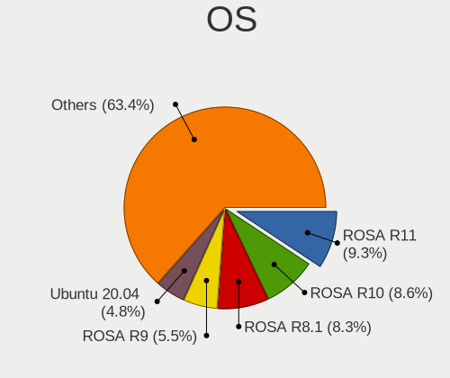

| Name               | Notebooks | Percent |
|--------------------|-----------|---------|
| ROSA R11           | 27        | 10.71%  |
| ROSA R10           | 25        | 9.92%   |
| ROSA R8.1          | 24        | 9.52%   |
| ROSA R9            | 16        | 6.35%   |
| Ubuntu 20.04       | 14        | 5.56%   |
| ROSA R8            | 14        | 5.56%   |
| KDE neon 20.04     | 9         | 3.57%   |
| Ubuntu 18.04       | 7         | 2.78%   |
| ROSA R11.1         | 7         | 2.78%   |
| Debian 11          | 7         | 2.78%   |
| Ubuntu 22.04       | 6         | 2.38%   |
| OpenMandriva 4.2   | 5         | 1.98%   |
| Slackware 15.0     | 3         | 1.19%   |
| ROSA 12.2          | 3         | 1.19%   |
| Fedora 36          | 3         | 1.19%   |
| Arch Rolling       | 3         | 1.19%   |
| Arch               | 3         | 1.19%   |
| Ubuntu 18.10       | 2         | 0.79%   |
| Manjaro 22.0.0     | 2         | 0.79%   |
| Linux Mint 20.3    | 2         | 0.79%   |
| Linux Mint 20.1    | 2         | 0.79%   |
| KDE neon 18.04     | 2         | 0.79%   |
| Fedora 35          | 2         | 0.79%   |
| Fedora 34          | 2         | 0.79%   |
| Debian 10          | 2         | 0.79%   |
| Zorin 15           | 1         | 0.4%    |
| Xubuntu 18.04      | 1         | 0.4%    |
| Ubuntu Unity 20.04 | 1         | 0.4%    |
| Ubuntu Unity 16.04 | 1         | 0.4%    |
| Ubuntu 22.10       | 1         | 0.4%    |
| Ubuntu 21.04       | 1         | 0.4%    |
| Ubuntu 20.10       | 1         | 0.4%    |
| Ubuntu 18.08.34    | 1         | 0.4%    |
| ROSA R4-R8         | 1         | 0.4%    |
| ROSA 12.3          | 1         | 0.4%    |
| ROSA 12.1          | 1         | 0.4%    |
| ROSA 12            | 1         | 0.4%    |
| Rocky Linux 8.4    | 1         | 0.4%    |
| Pop!_OS 22.04      | 1         | 0.4%    |
| Pop!_OS 20.10      | 1         | 0.4%    |

OS Family
---------

OS without a version

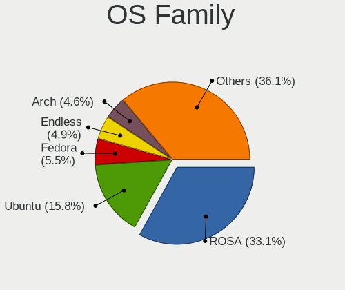

| Name         | Notebooks | Percent |
|--------------|-----------|---------|
| ROSA         | 110       | 45.83%  |
| Ubuntu       | 33        | 13.75%  |
| Endless      | 18        | 7.5%    |
| KDE neon     | 11        | 4.58%   |
| Fedora       | 9         | 3.75%   |
| Debian       | 9         | 3.75%   |
| Manjaro      | 8         | 3.33%   |
| OpenMandriva | 7         | 2.92%   |
| Linux Mint   | 4         | 1.67%   |
| Kubuntu      | 4         | 1.67%   |
| Arch         | 4         | 1.67%   |
| Slackware    | 3         | 1.25%   |
| Pop!_OS      | 3         | 1.25%   |
| Ubuntu Unity | 2         | 0.83%   |
| Elementary   | 2         | 0.83%   |
| CentOS       | 2         | 0.83%   |
| Zorin        | 1         | 0.42%   |
| Xubuntu      | 1         | 0.42%   |
| Rocky Linux  | 1         | 0.42%   |
| Peppermint   | 1         | 0.42%   |
| openSUSE     | 1         | 0.42%   |
| Gentoo       | 1         | 0.42%   |
| Finnix       | 1         | 0.42%   |
| EndeavourOS  | 1         | 0.42%   |
| Ctlos        | 1         | 0.42%   |
| Clear Linux  | 1         | 0.42%   |
| antiX        | 1         | 0.42%   |

Kernel
------

Version of the Linux kernel

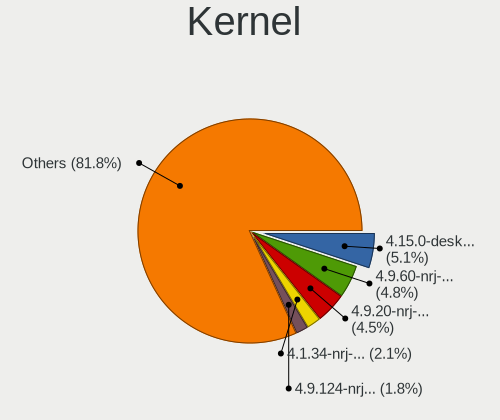

| Version                          | Notebooks | Percent |
|----------------------------------|-----------|---------|
| 4.15.0-desktop-45.1rosa-x86_64   | 17        | 6.34%   |
| 4.9.60-nrj-desktop-1rosa-x86_64  | 16        | 5.97%   |
| 4.9.20-nrj-desktop-1rosa-x86_64  | 15        | 5.6%    |
| 4.1.34-nrj-desktop-2rosa-x86_64  | 7         | 2.61%   |
| 4.9.124-nrj-desktop-1rosa-x86_64 | 6         | 2.24%   |
| 5.10.14-desktop-1omv4002         | 5         | 1.87%   |
| 4.1.38-nrj-desktop-2rosa-x86_64  | 5         | 1.87%   |
| 4.1.34-nrj-desktop-2rosa-i586    | 5         | 1.87%   |
| 5.10.0-8-amd64                   | 4         | 1.49%   |
| 4.9.95-nrj-desktop-2rosa-x86_64  | 4         | 1.49%   |
| 4.9.9-nrj-desktop-1rosa-x86_64   | 4         | 1.49%   |
| 4.9.41-nrj-desktop-1rosa-x86_64  | 4         | 1.49%   |
| 4.9.20-nrj-desktop-1rosa-i586    | 4         | 1.49%   |
| 4.9.155-nrj-desktop-1rosa-x86_64 | 4         | 1.49%   |
| 5.11.0-35-generic                | 3         | 1.12%   |
| 4.9.9-nrj-desktop-1rosa-i586     | 3         | 1.12%   |
| 4.9.111-nrj-desktop-2rosa-x86_64 | 3         | 1.12%   |
| 4.15.0-desktop-47.2rosa-x86_64   | 3         | 1.12%   |
| 5.8.0-44-generic                 | 2         | 0.75%   |
| 5.8.0-14-generic                 | 2         | 0.75%   |
| 5.4.83-generic-2rosa-x86_64      | 2         | 0.75%   |
| 5.4.32-generic-2rosa-x86_64      | 2         | 0.75%   |
| 5.4.0-42-generic                 | 2         | 0.75%   |
| 5.4.0-39-generic                 | 2         | 0.75%   |
| 5.19.0-23-generic                | 2         | 0.75%   |
| 5.15.19                          | 2         | 0.75%   |
| 5.15.0-43-generic                | 2         | 0.75%   |
| 5.11.0-34-generic                | 2         | 0.75%   |
| 5.0.0-37-generic                 | 2         | 0.75%   |
| 4.9.34-nrj-desktop-1rosa-x86_64  | 2         | 0.75%   |
| 4.16.0-4-generic                 | 2         | 0.75%   |
| 4.15.0-desktop-45.1rosa-i586     | 2         | 0.75%   |
| 6.1.0-x64v1-xanmod1-1            | 1         | 0.37%   |
| 6.0.10-desktop-2omv22090         | 1         | 0.37%   |
| 5.9.8-050908-generic             | 1         | 0.37%   |
| 5.9.6-050906-generic             | 1         | 0.37%   |
| 5.9.1-zen1-1-zen                 | 1         | 0.37%   |
| 5.8.6-1-MANJARO                  | 1         | 0.37%   |
| 5.8.18-1-MANJARO                 | 1         | 0.37%   |
| 5.8.11-1-MANJARO                 | 1         | 0.37%   |

Kernel Family
-------------

Linux kernel without a distro release

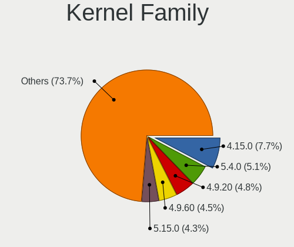

| Version | Notebooks | Percent |
|---------|-----------|---------|
| 4.15.0  | 29        | 10.94%  |
| 4.9.20  | 19        | 7.17%   |
| 5.4.0   | 18        | 6.79%   |
| 4.9.60  | 17        | 6.42%   |
| 4.1.34  | 12        | 4.53%   |
| 5.11.0  | 11        | 4.15%   |
| 5.3.0   | 7         | 2.64%   |
| 5.15.0  | 7         | 2.64%   |
| 5.10.0  | 7         | 2.64%   |
| 5.0.0   | 7         | 2.64%   |
| 4.9.9   | 6         | 2.26%   |
| 4.9.124 | 6         | 2.26%   |
| 4.1.38  | 6         | 2.26%   |
| 5.8.0   | 5         | 1.89%   |
| 5.10.14 | 5         | 1.89%   |
| 4.9.155 | 5         | 1.89%   |
| 4.18.0  | 5         | 1.89%   |
| 4.9.95  | 4         | 1.51%   |
| 4.9.41  | 4         | 1.51%   |
| 4.9.111 | 4         | 1.51%   |
| 5.4.32  | 3         | 1.13%   |
| 5.13.0  | 3         | 1.13%   |
| 4.19.0  | 3         | 1.13%   |
| 4.13.0  | 3         | 1.13%   |
| 5.4.83  | 2         | 0.75%   |
| 5.19.0  | 2         | 0.75%   |
| 5.16.7  | 2         | 0.75%   |
| 5.15.78 | 2         | 0.75%   |
| 5.15.19 | 2         | 0.75%   |
| 4.9.34  | 2         | 0.75%   |
| 4.16.0  | 2         | 0.75%   |
| 6.1.0   | 1         | 0.38%   |
| 6.0.10  | 1         | 0.38%   |
| 5.9.8   | 1         | 0.38%   |
| 5.9.6   | 1         | 0.38%   |
| 5.9.1   | 1         | 0.38%   |
| 5.8.6   | 1         | 0.38%   |
| 5.8.18  | 1         | 0.38%   |
| 5.8.11  | 1         | 0.38%   |
| 5.8.10  | 1         | 0.38%   |

Kernel Major Ver.
-----------------

Linux kernel major version

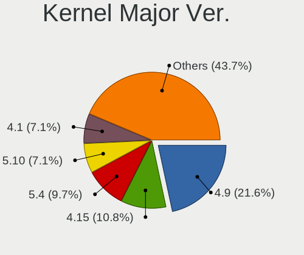

| Version | Notebooks | Percent |
|---------|-----------|---------|
| 4.9     | 58        | 23.11%  |
| 4.15    | 29        | 11.55%  |
| 5.4     | 26        | 10.36%  |
| 4.1     | 19        | 7.57%   |
| 5.15    | 16        | 6.37%   |
| 5.10    | 16        | 6.37%   |
| 5.11    | 11        | 4.38%   |
| 5.8     | 9         | 3.59%   |
| 5.3     | 7         | 2.79%   |
| 5.0     | 7         | 2.79%   |
| 4.18    | 6         | 2.39%   |
| 5.19    | 5         | 1.99%   |
| 5.17    | 4         | 1.59%   |
| 5.13    | 4         | 1.59%   |
| 4.19    | 4         | 1.59%   |
| 5.9     | 3         | 1.2%    |
| 5.16    | 3         | 1.2%    |
| 5.14    | 3         | 1.2%    |
| 4.13    | 3         | 1.2%    |
| 5.6     | 2         | 0.8%    |
| 5.18    | 2         | 0.8%    |
| 5.12    | 2         | 0.8%    |
| 4.16    | 2         | 0.8%    |
| 6.1     | 1         | 0.4%    |
| 6.0     | 1         | 0.4%    |
| 5.7     | 1         | 0.4%    |
| 5.1     | 1         | 0.4%    |
| 4.4     | 1         | 0.4%    |
| 4.20    | 1         | 0.4%    |
| 3.14    | 1         | 0.4%    |
| 3.10    | 1         | 0.4%    |
| 2.6     | 1         | 0.4%    |
| Unknown | 1         | 0.4%    |

Arch
----

OS architecture (x86_64, i586, etc.)

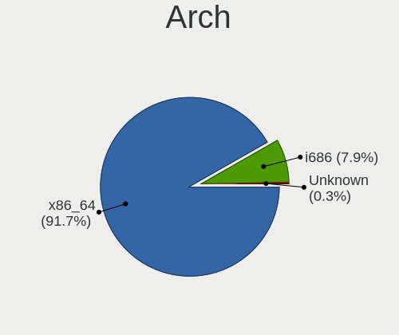

| Name    | Notebooks | Percent |
|---------|-----------|---------|
| x86_64  | 211       | 89.41%  |
| i686    | 24        | 10.17%  |
| Unknown | 1         | 0.42%   |

DE
--

Desktop Environment

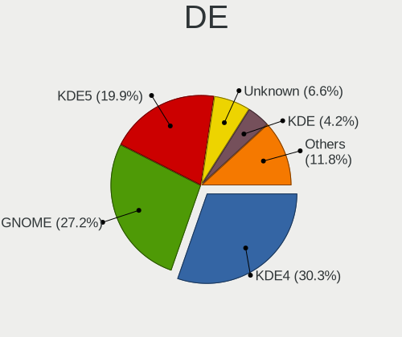

| Name            | Notebooks | Percent |
|-----------------|-----------|---------|
| KDE4            | 87        | 34.94%  |
| GNOME           | 61        | 24.5%   |
| KDE5            | 43        | 17.27%  |
| Unknown         | 18        | 7.23%   |
| KDE             | 12        | 4.82%   |
| XFCE            | 9         | 3.61%   |
| X-Cinnamon      | 4         | 1.61%   |
| LXQt            | 4         | 1.61%   |
| Unity           | 2         | 0.8%    |
| i3              | 2         | 0.8%    |
| sway            | 1         | 0.4%    |
| Pantheon        | 1         | 0.4%    |
| MATE            | 1         | 0.4%    |
| LXDE            | 1         | 0.4%    |
| GNOME Flashback | 1         | 0.4%    |
| Cinnamon        | 1         | 0.4%    |
| awesome         | 1         | 0.4%    |

Display Server
--------------

X11 or Wayland

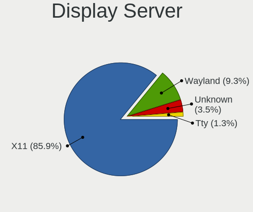

| Name    | Notebooks | Percent |
|---------|-----------|---------|
| X11     | 207       | 86.25%  |
| Wayland | 22        | 9.17%   |
| Unknown | 8         | 3.33%   |
| Tty     | 3         | 1.25%   |

Display Manager
---------------

SDDM, LightDM, etc.

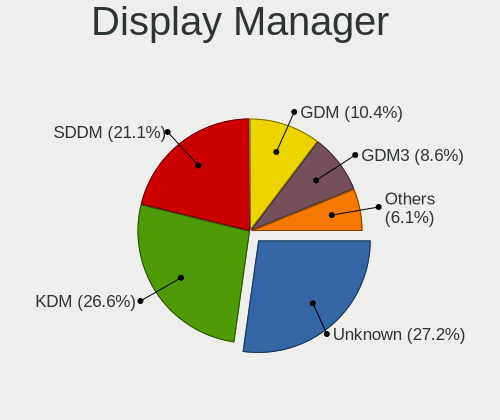

| Name    | Notebooks | Percent |
|---------|-----------|---------|
| KDM     | 87        | 35.37%  |
| Unknown | 68        | 27.64%  |
| SDDM    | 45        | 18.29%  |
| GDM     | 21        | 8.54%   |
| LightDM | 10        | 4.07%   |
| GDM3    | 9         | 3.66%   |
| TDM     | 4         | 1.63%   |
| XDM     | 1         | 0.41%   |
| SLiM    | 1         | 0.41%   |

OS Lang
-------

Language

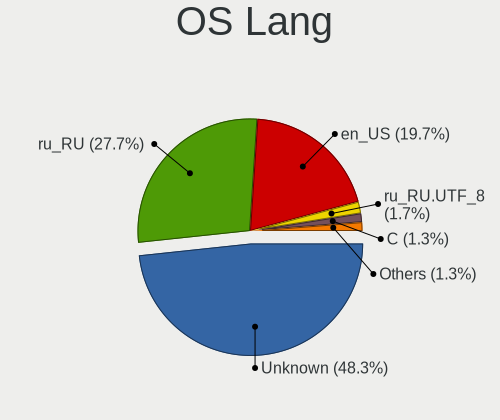

| Lang        | Notebooks | Percent |
|-------------|-----------|---------|
| Unknown     | 115       | 47.52%  |
| ru_RU       | 66        | 27.27%  |
| en_US       | 50        | 20.66%  |
| ru_RU.UTF_8 | 4         | 1.65%   |
| C           | 4         | 1.65%   |
| en_GB       | 2         | 0.83%   |
| en_IL       | 1         | 0.41%   |

Boot Mode
---------

EFI or BIOS

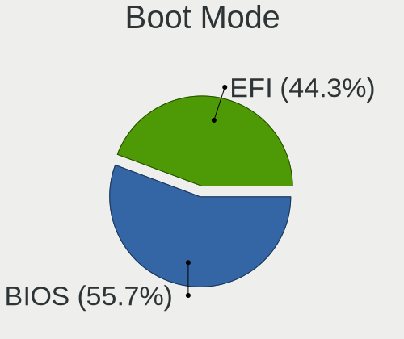

| Mode | Notebooks | Percent |
|------|-----------|---------|
| BIOS | 129       | 52.87%  |
| EFI  | 115       | 47.13%  |

Filesystem
----------

Type of filesystem

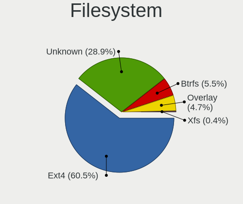

| Type    | Notebooks | Percent |
|---------|-----------|---------|
| Ext4    | 148       | 60.16%  |
| Unknown | 74        | 30.08%  |
| Overlay | 12        | 4.88%   |
| Btrfs   | 11        | 4.47%   |
| Xfs     | 1         | 0.41%   |

Part. scheme
------------

Scheme of partitioning

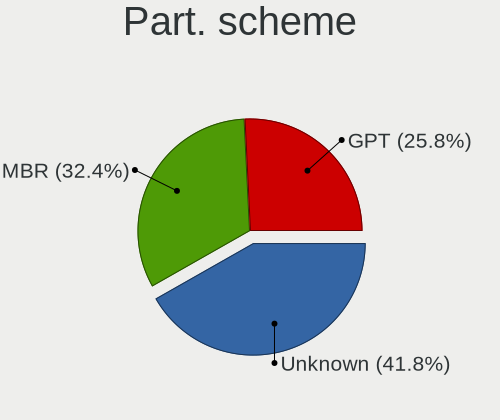

| Type    | Notebooks | Percent |
|---------|-----------|---------|
| Unknown | 97        | 39.43%  |
| MBR     | 77        | 31.3%   |
| GPT     | 72        | 29.27%  |

Dual Boot with Linux/BSD
------------------------

Hosting more than one Linux/BSD

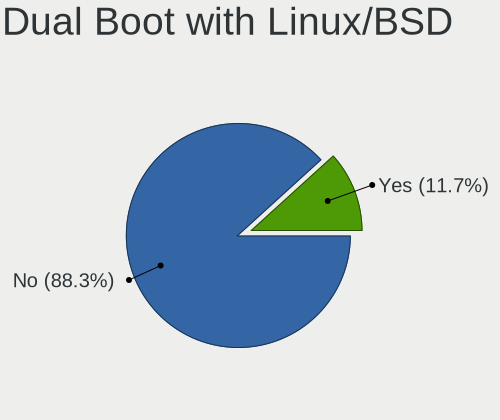

| Dual boot | Notebooks | Percent |
|-----------|-----------|---------|
| No        | 214       | 88.07%  |
| Yes       | 29        | 11.93%  |

Dual Boot (Win)
---------------

Hosting Linux and Windows

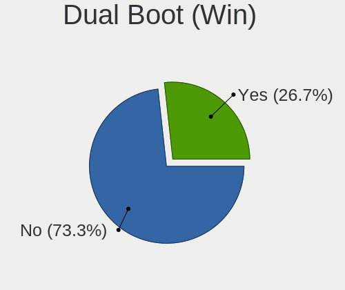

| Dual boot | Notebooks | Percent |
|-----------|-----------|---------|
| No        | 182       | 74.59%  |
| Yes       | 62        | 25.41%  |

Board
-----

Vendor
------

Motherboard manufacturer

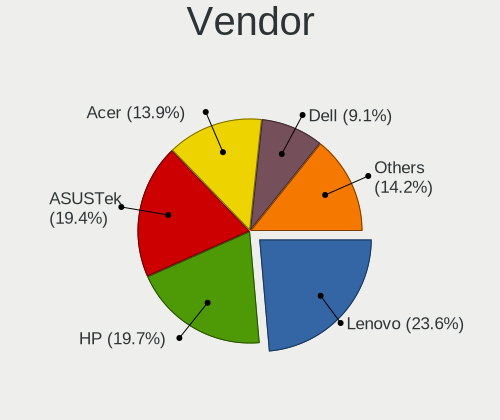

| Name                | Notebooks | Percent |
|---------------------|-----------|---------|
| Lenovo              | 51        | 21.7%   |
| Hewlett-Packard     | 51        | 21.7%   |
| ASUSTek Computer    | 38        | 16.17%  |
| Acer                | 33        | 14.04%  |
| Dell                | 23        | 9.79%   |
| Toshiba             | 7         | 2.98%   |
| Sony                | 7         | 2.98%   |
| Fujitsu             | 5         | 2.13%   |
| Samsung Electronics | 3         | 1.28%   |
| Packard Bell        | 3         | 1.28%   |
| Fujitsu Siemens     | 3         | 1.28%   |
| Unknown             | 3         | 1.28%   |
| Chuwi               | 2         | 0.85%   |
| MSI                 | 1         | 0.43%   |
| IBM                 | 1         | 0.43%   |
| HONOR               | 1         | 0.43%   |
| GPD                 | 1         | 0.43%   |
| eMachines           | 1         | 0.43%   |
| Elenberg            | 1         | 0.43%   |

Model
-----

Motherboard model

| Name                                                                                     | Notebooks | Percent |
|------------------------------------------------------------------------------------------|-----------|---------|
| Lenovo G500 20236                                                                        | 5         | 2.13%   |
| HP Pavilion g6                                                                           | 5         | 2.13%   |
| Lenovo G510 20238                                                                        | 3         | 1.28%   |
| Fujitsu LIFEBOOK AH531                                                                   | 3         | 1.28%   |
| ASUS VivoBook 15_ASUS Laptop X540UAR                                                     | 3         | 1.28%   |
| Acer Aspire E5-575G                                                                      | 3         | 1.28%   |
| Unknown                                                                                  | 3         | 1.28%   |
| Packard Bell DOT S                                                                       | 2         | 0.85%   |
| Lenovo ThinkPad Edge E530 3259CEG                                                        | 2         | 0.85%   |
| Lenovo ThinkBook 15 G3 ACL 21A4                                                          | 2         | 0.85%   |
| Lenovo ThinkBook 14 G2 ITL 20VD                                                          | 2         | 0.85%   |
| Lenovo Legion Y540-15IRH-PG0 81SY                                                        | 2         | 0.85%   |
| HP Presario CQ57                                                                         | 2         | 0.85%   |
| HP Pavilion dv6                                                                          | 2         | 0.85%   |
| HP Compaq CQ58                                                                           | 2         | 0.85%   |
| Dell Inspiron N5110                                                                      | 2         | 0.85%   |
| ASUS X51RL                                                                               | 2         | 0.85%   |
| Acer Aspire V3-551G                                                                      | 2         | 0.85%   |
| Acer Aspire A715-75G                                                                     | 2         | 0.85%   |
| Acer Aspire A315-51                                                                      | 2         | 0.85%   |
| Acer Aspire 5750G                                                                        | 2         | 0.85%   |
| Toshiba TECRA S11                                                                        | 1         | 0.43%   |
| Toshiba TECRA M5                                                                         | 1         | 0.43%   |
| Toshiba Satellite P105                                                                   | 1         | 0.43%   |
| Toshiba Satellite C660                                                                   | 1         | 0.43%   |
| Toshiba Satellite C650                                                                   | 1         | 0.43%   |
| Toshiba Satellite 5200                                                                   | 1         | 0.43%   |
| Toshiba Portable PC                                                                      | 1         | 0.43%   |
| Sony VPCEH2M1R                                                                           | 1         | 0.43%   |
| Sony VPCEB1E1R                                                                           | 1         | 0.43%   |
| Sony VPCEA3M1R                                                                           | 1         | 0.43%   |
| Sony VPCCB2S1R                                                                           | 1         | 0.43%   |
| Sony VGN-NW320F                                                                          | 1         | 0.43%   |
| Sony VGN-NR430E                                                                          | 1         | 0.43%   |
| Sony VGN-FW245J                                                                          | 1         | 0.43%   |
| Samsung R518                                                                             | 1         | 0.43%   |
| Samsung N100SP                                                                           | 1         | 0.43%   |
| Samsung 350V5C/350V5X/350V4C/350V4X/351V5C/351V5X/351V4C/351V4X/3540VC/3540VX/3440VC/344 | 1         | 0.43%   |
| Packard Bell EasyNote TE11HC                                                             | 1         | 0.43%   |
| MSI Prestige 14 A10SC                                                                    | 1         | 0.43%   |

Model Family
------------

Motherboard model prefix

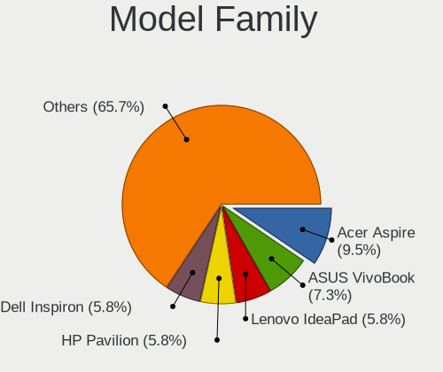

| Name                  | Notebooks | Percent |
|-----------------------|-----------|---------|
| Acer Aspire           | 21        | 8.94%   |
| Dell Inspiron         | 16        | 6.81%   |
| ASUS VivoBook         | 15        | 6.38%   |
| HP Pavilion           | 13        | 5.53%   |
| Lenovo ThinkPad       | 12        | 5.11%   |
| Lenovo IdeaPad        | 11        | 4.68%   |
| HP ProBook            | 11        | 4.68%   |
| HP Compaq             | 6         | 2.55%   |
| Lenovo G500           | 5         | 2.13%   |
| HP Laptop             | 5         | 2.13%   |
| HP EliteBook          | 5         | 2.13%   |
| Fujitsu LIFEBOOK      | 5         | 2.13%   |
| Toshiba Satellite     | 4         | 1.7%    |
| Lenovo ThinkBook      | 4         | 1.7%    |
| Lenovo Legion         | 4         | 1.7%    |
| Dell Latitude         | 4         | 1.7%    |
| Lenovo G510           | 3         | 1.28%   |
| Unknown               | 3         | 1.28%   |
| Toshiba TECRA         | 2         | 0.85%   |
| Packard Bell DOT      | 2         | 0.85%   |
| HP Presario           | 2         | 0.85%   |
| HP ENVY               | 2         | 0.85%   |
| HP 250                | 2         | 0.85%   |
| Fujitsu Siemens AMILO | 2         | 0.85%   |
| ASUS X51RL            | 2         | 0.85%   |
| Acer TravelMate       | 2         | 0.85%   |
| Acer Swift            | 2         | 0.85%   |
| Acer Predator         | 2         | 0.85%   |
| Acer Nitro            | 2         | 0.85%   |
| Toshiba Portable      | 1         | 0.43%   |
| Sony VPCEH2M1R        | 1         | 0.43%   |
| Sony VPCEB1E1R        | 1         | 0.43%   |
| Sony VPCEA3M1R        | 1         | 0.43%   |
| Sony VPCCB2S1R        | 1         | 0.43%   |
| Sony VGN-NW320F       | 1         | 0.43%   |
| Sony VGN-NR430E       | 1         | 0.43%   |
| Sony VGN-FW245J       | 1         | 0.43%   |
| Samsung R518          | 1         | 0.43%   |
| Samsung N100SP        | 1         | 0.43%   |
| Samsung 350V5C        | 1         | 0.43%   |

MFG Year
--------

Motherboard manufacture year

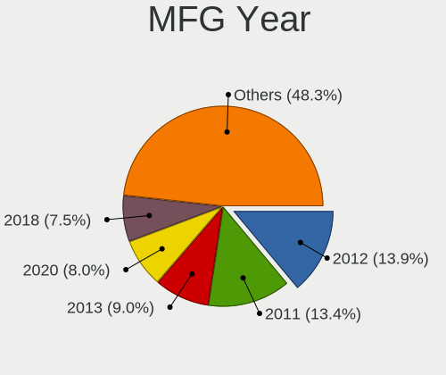

| Year    | Notebooks | Percent |
|---------|-----------|---------|
| 2012    | 31        | 13.19%  |
| 2011    | 28        | 11.91%  |
| 2013    | 23        | 9.79%   |
| 2020    | 20        | 8.51%   |
| 2017    | 17        | 7.23%   |
| 2018    | 16        | 6.81%   |
| 2019    | 14        | 5.96%   |
| 2010    | 14        | 5.96%   |
| 2021    | 13        | 5.53%   |
| 2016    | 12        | 5.11%   |
| 2008    | 12        | 5.11%   |
| 2015    | 10        | 4.26%   |
| 2009    | 7         | 2.98%   |
| 2007    | 7         | 2.98%   |
| 2014    | 5         | 2.13%   |
| 2022    | 2         | 0.85%   |
| 2006    | 1         | 0.43%   |
| 2005    | 1         | 0.43%   |
| 2003    | 1         | 0.43%   |
| Unknown | 1         | 0.43%   |

Form Factor
-----------

Physical design of the computer

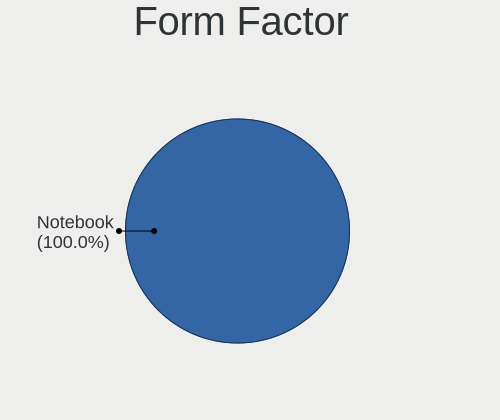

| Name     | Notebooks | Percent |
|----------|-----------|---------|
| Notebook | 235       | 100%    |

Secure Boot
-----------

Enabled or disabled

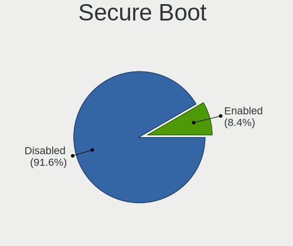

| State    | Notebooks | Percent |
|----------|-----------|---------|
| Disabled | 218       | 91.98%  |
| Enabled  | 19        | 8.02%   |

Coreboot
--------

Have coreboot on board

| Used | Notebooks | Percent |
|------|-----------|---------|
| No   | 235       | 100%    |

RAM Size
--------

Total RAM memory

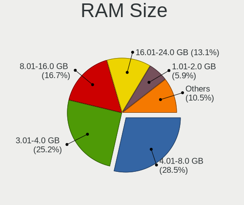

| Size in GB | Notebooks | Percent |
|------------|-----------|---------|
| 4.01-8.0   | 72        | 30.13%  |
| 3.01-4.0   | 68        | 28.45%  |
| 8.01-16.0  | 30        | 12.55%  |
| 16.01-24.0 | 27        | 11.3%   |
| 2.01-3.0   | 15        | 6.28%   |
| 1.01-2.0   | 14        | 5.86%   |
| 0.51-1.0   | 5         | 2.09%   |
| 32.01-64.0 | 4         | 1.67%   |
| 24.01-32.0 | 3         | 1.26%   |
| Unknown    | 1         | 0.42%   |

RAM Used
--------

Used RAM memory

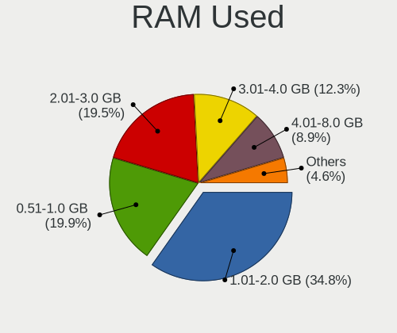

| Used GB    | Notebooks | Percent |
|------------|-----------|---------|
| 1.01-2.0   | 97        | 37.74%  |
| 0.51-1.0   | 55        | 21.4%   |
| 2.01-3.0   | 46        | 17.9%   |
| 3.01-4.0   | 29        | 11.28%  |
| 4.01-8.0   | 18        | 7%      |
| 8.01-16.0  | 5         | 1.95%   |
| 0.01-0.5   | 4         | 1.56%   |
| Unknown    | 2         | 0.78%   |
| 16.01-24.0 | 1         | 0.39%   |

Total Drives
------------

Number of drives on board

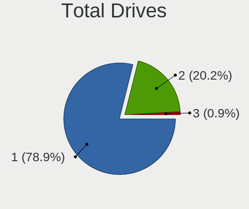

| Drives | Notebooks | Percent |
|--------|-----------|---------|
| 1      | 188       | 78.66%  |
| 2      | 49        | 20.5%   |
| 3      | 2         | 0.84%   |

Has CD-ROM
----------

Has CD-ROM on board

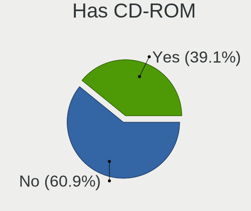

| Presented | Notebooks | Percent |
|-----------|-----------|---------|
| No        | 125       | 53.19%  |
| Yes       | 110       | 46.81%  |

Has Ethernet
------------

Has Ethernet on board

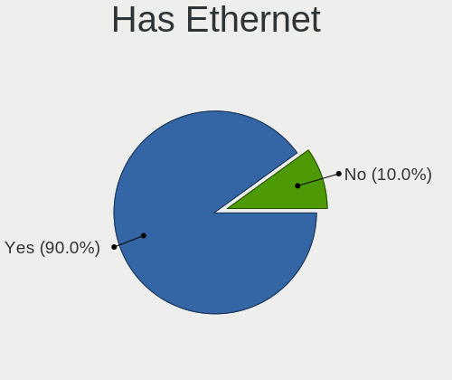

| Presented | Notebooks | Percent |
|-----------|-----------|---------|
| Yes       | 211       | 89.79%  |
| No        | 24        | 10.21%  |

Has WiFi
--------

Has WiFi module

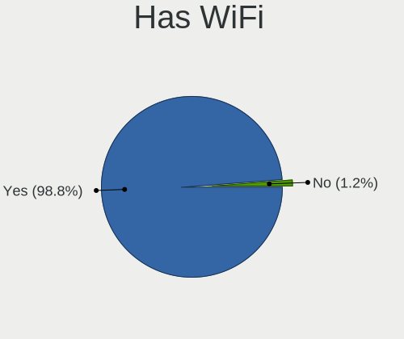

| Presented | Notebooks | Percent |
|-----------|-----------|---------|
| Yes       | 233       | 99.15%  |
| No        | 2         | 0.85%   |

Has Bluetooth
-------------

Has Bluetooth module

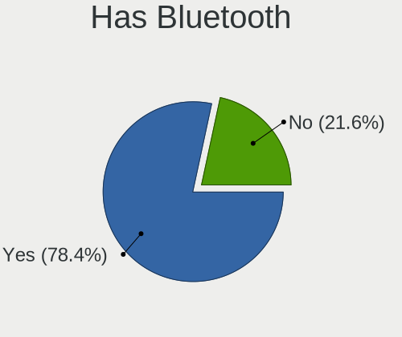

| Presented | Notebooks | Percent |
|-----------|-----------|---------|
| Yes       | 181       | 75.73%  |
| No        | 58        | 24.27%  |

Location
--------

Country
-------

Geographic location (country)

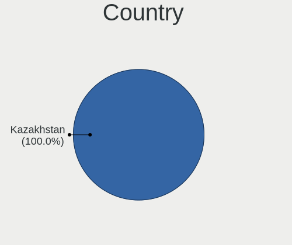

| Country    | Notebooks | Percent |
|------------|-----------|---------|
| Kazakhstan | 235       | 100%    |

City
----

Geographic location (city)

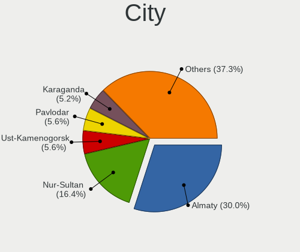

| City            | Notebooks | Percent |
|-----------------|-----------|---------|
| Almaty          | 77        | 29.84%  |
| Nur-Sultan      | 47        | 18.22%  |
| Ust-Kamenogorsk | 14        | 5.43%   |
| Pavlodar        | 13        | 5.04%   |
| Kostanay        | 13        | 5.04%   |
| Karaganda       | 13        | 5.04%   |
| Aktobe          | 12        | 4.65%   |
| Taraz           | 8         | 3.1%    |
| Shymkent        | 6         | 2.33%   |
| Petropavl       | 6         | 2.33%   |
| Aktau           | 6         | 2.33%   |
| Semey           | 5         | 1.94%   |
| Rudnyy          | 4         | 1.55%   |
| Kyzylorda       | 4         | 1.55%   |
| Ridder          | 3         | 1.16%   |
| Oral            | 3         | 1.16%   |
| Atyrau          | 3         | 1.16%   |
| Astana          | 3         | 1.16%   |
| Temirtau        | 2         | 0.78%   |
| Taiynsha        | 2         | 0.78%   |
| Soran           | 2         | 0.78%   |
| Shchūchīnsk   | 2         | 0.78%   |
| Balqash         | 2         | 0.78%   |
| Stepnogorsk     | 1         | 0.39%   |
| Līsakovsk      | 1         | 0.39%   |
| Kaskelen        | 1         | 0.39%   |
| Karagandy       | 1         | 0.39%   |
| Kapshagay       | 1         | 0.39%   |
| GГјlshat      | 1         | 0.39%   |
| Ekibastuz       | 1         | 0.39%   |
| Chiili          | 1         | 0.39%   |

Drives
------

Drive Vendor
------------

Hard drive vendors

| Vendor                   | Notebooks | Drives | Percent |
|--------------------------|-----------|--------|---------|
| Seagate                  | 52        | 72     | 18.12%  |
| WDC                      | 49        | 60     | 17.07%  |
| Toshiba                  | 28        | 35     | 9.76%   |
| Samsung Electronics      | 22        | 25     | 7.67%   |
| Hitachi                  | 18        | 20     | 6.27%   |
| Kingston                 | 15        | 15     | 5.23%   |
| Unknown                  | 14        | 17     | 4.88%   |
| HGST                     | 14        | 16     | 4.88%   |
| SK hynix                 | 10        | 10     | 3.48%   |
| Transcend                | 9         | 9      | 3.14%   |
| SanDisk                  | 7         | 8      | 2.44%   |
| Intel                    | 6         | 6      | 2.09%   |
| KIOXIA                   | 5         | 7      | 1.74%   |
| Plextor                  | 4         | 4      | 1.39%   |
| Micron Technology        | 4         | 5      | 1.39%   |
| Fujitsu                  | 4         | 5      | 1.39%   |
| A-DATA Technology        | 4         | 5      | 1.39%   |
| GeIL                     | 3         | 3      | 1.05%   |
| Crucial                  | 3         | 3      | 1.05%   |
| China                    | 3         | 3      | 1.05%   |
| BIWIN                    | 2         | 2      | 0.7%    |
| Apacer                   | 2         | 2      | 0.7%    |
| Team                     | 1         | 1      | 0.35%   |
| Phison                   | 1         | 1      | 0.35%   |
| Netac                    | 1         | 1      | 0.35%   |
| KingDian                 | 1         | 1      | 0.35%   |
| Kingchuxing              | 1         | 2      | 0.35%   |
| JMicron Technology       | 1         | 1      | 0.35%   |
| HUAWEI                   | 1         | 1      | 0.35%   |
| Gigabyte Technology      | 1         | 1      | 0.35%   |
| Biwin Storage Technology | 1         | 1      | 0.35%   |

Drive Model
-----------

Hard drive models

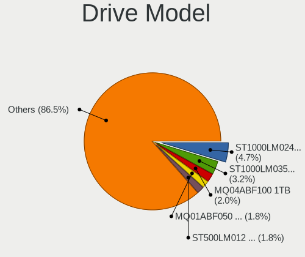

| Model                                  | Notebooks | Percent |
|----------------------------------------|-----------|---------|
| Seagate ST1000LM024 HN-M101MBB 1TB     | 16        | 5.48%   |
| Seagate ST1000LM035-1RK172 1TB         | 10        | 3.42%   |
| Toshiba MQ04ABF100 1TB                 | 6         | 2.05%   |
| Toshiba MQ01ABD100 1TB                 | 5         | 1.71%   |
| Seagate ST500LM012 HN-M500MBB 500GB    | 5         | 1.71%   |
| HGST HTS541010A9E680 1TB               | 5         | 1.71%   |
| WDC WD10SPZX-21Z10T0 1TB               | 4         | 1.37%   |
| Toshiba MQ01ABF050 500GB               | 4         | 1.37%   |
| Seagate ST9320325AS 320GB              | 4         | 1.37%   |
| Seagate ST500LT012-1DG142 500GB        | 4         | 1.37%   |
| WDC WD3200BPVT-22JJ5T0 320GB           | 3         | 1.03%   |
| Transcend TS120GSSD220S 120GB          | 3         | 1.03%   |
| SK hynix NVMe SSD Drive 512GB          | 3         | 1.03%   |
| Seagate ST500LT012-9WS142 500GB        | 3         | 1.03%   |
| Kingston SA400S37120G 120GB SSD        | 3         | 1.03%   |
| Intel NVMe SSD Drive 512GB             | 3         | 1.03%   |
| Hitachi HTS543232A7A384 320GB          | 3         | 1.03%   |
| WDC WD7500BPVT-22HXZT3 752GB           | 2         | 0.68%   |
| WDC WD7500BPVT-08HXZT3 752GB           | 2         | 0.68%   |
| WDC WD5000LPCX-21VHAT0 500GB           | 2         | 0.68%   |
| WDC WD3200BPVT-22ZEST0 320GB           | 2         | 0.68%   |
| WDC WD10SPZX-24Z10 1TB                 | 2         | 0.68%   |
| Unknown SD32G  32GB                    | 2         | 0.68%   |
| Unknown MMC Card  4GB                  | 2         | 0.68%   |
| Unknown MMC Card  16GB                 | 2         | 0.68%   |
| Toshiba MK5059GSXP 500GB               | 2         | 0.68%   |
| Seagate ST9750420AS 752GB              | 2         | 0.68%   |
| Seagate ST750LM022 HN-M750MBB 752GB    | 2         | 0.68%   |
| SanDisk NVMe SSD Drive 512GB           | 2         | 0.68%   |
| Samsung SM963 2.5" NVMe PCIe SSD 256GB | 2         | 0.68%   |
| Samsung MZVLB512HAJQ-000L7 512GB       | 2         | 0.68%   |
| Samsung MZALQ512HALU-000L2 512GB       | 2         | 0.68%   |
| KIOXIA KBG40ZNS512G NVMe 512GB         | 2         | 0.68%   |
| Kingston SV300S37A120G 120GB SSD       | 2         | 0.68%   |
| Kingston SA400S37480G 480GB SSD        | 2         | 0.68%   |
| Kingston SA400S37240G 240GB SSD        | 2         | 0.68%   |
| Hitachi HTS547575A9E384 752GB          | 2         | 0.68%   |
| Hitachi HTS547550A9E384 500GB          | 2         | 0.68%   |
| HGST HTS545050A7E380 500GB             | 2         | 0.68%   |
| China SSD 120GB                        | 2         | 0.68%   |

HDD Vendor
----------

Hard disk drive vendors

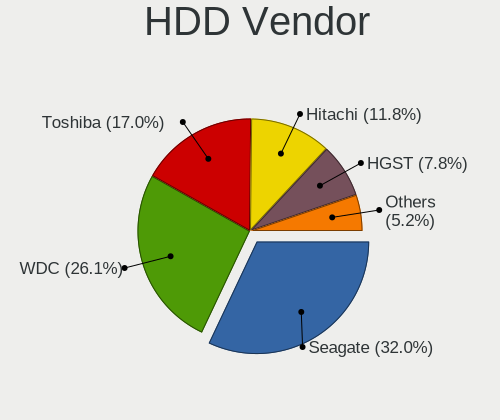

| Vendor              | Notebooks | Drives | Percent |
|---------------------|-----------|--------|---------|
| Seagate             | 52        | 72     | 32.1%   |
| WDC                 | 44        | 55     | 27.16%  |
| Toshiba             | 26        | 33     | 16.05%  |
| Hitachi             | 18        | 20     | 11.11%  |
| HGST                | 14        | 16     | 8.64%   |
| Samsung Electronics | 4         | 4      | 2.47%   |
| Fujitsu             | 4         | 5      | 2.47%   |

SSD Vendor
----------

Solid state drive vendors

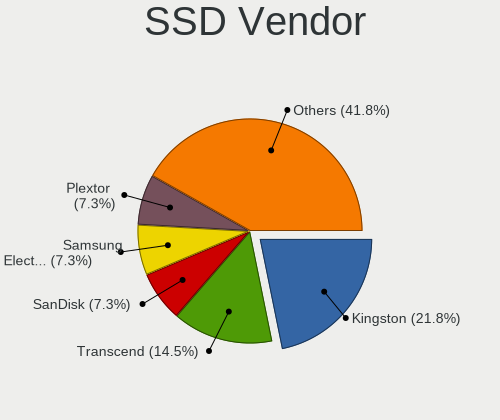

| Vendor              | Notebooks | Drives | Percent |
|---------------------|-----------|--------|---------|
| Kingston            | 12        | 12     | 19.67%  |
| Transcend           | 9         | 9      | 14.75%  |
| SanDisk             | 4         | 4      | 6.56%   |
| Samsung Electronics | 4         | 5      | 6.56%   |
| Plextor             | 4         | 4      | 6.56%   |
| Crucial             | 3         | 3      | 4.92%   |
| China               | 3         | 3      | 4.92%   |
| A-DATA Technology   | 3         | 4      | 4.92%   |
| WDC                 | 2         | 2      | 3.28%   |
| SK hynix            | 2         | 2      | 3.28%   |
| Micron Technology   | 2         | 2      | 3.28%   |
| Intel               | 2         | 2      | 3.28%   |
| GeIL                | 2         | 2      | 3.28%   |
| Unknown             | 1         | 1      | 1.64%   |
| Team                | 1         | 1      | 1.64%   |
| Netac               | 1         | 1      | 1.64%   |
| KingDian            | 1         | 1      | 1.64%   |
| Kingchuxing         | 1         | 2      | 1.64%   |
| JMicron Technology  | 1         | 1      | 1.64%   |
| Gigabyte Technology | 1         | 1      | 1.64%   |
| BIWIN               | 1         | 1      | 1.64%   |
| Apacer              | 1         | 1      | 1.64%   |

Drive Kind
----------

HDD or SSD

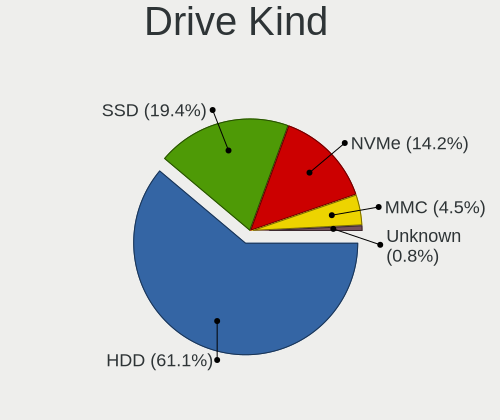

| Kind    | Notebooks | Drives | Percent |
|---------|-----------|--------|---------|
| HDD     | 157       | 205    | 57.51%  |
| SSD     | 55        | 64     | 20.15%  |
| NVMe    | 46        | 55     | 16.85%  |
| MMC     | 13        | 16     | 4.76%   |
| Unknown | 2         | 2      | 0.73%   |

Drive Connector
---------------

SATA, SAS, NVMe, etc.

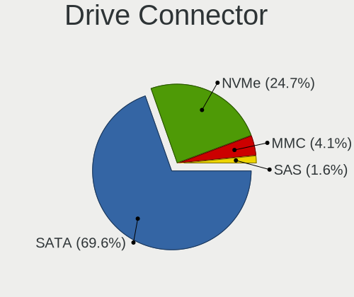

| Type | Notebooks | Drives | Percent |
|------|-----------|--------|---------|
| SATA | 195       | 266    | 75.58%  |
| NVMe | 46        | 55     | 17.83%  |
| MMC  | 13        | 16     | 5.04%   |
| SAS  | 4         | 5      | 1.55%   |

Drive Size
----------

Size of hard drive

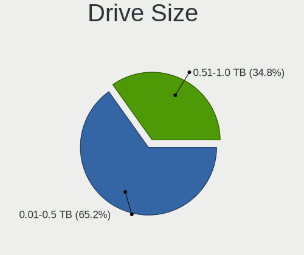

| Size in TB | Notebooks | Drives | Percent |
|------------|-----------|--------|---------|
| 0.01-0.5   | 136       | 176    | 64.76%  |
| 0.51-1.0   | 73        | 92     | 34.76%  |
| 3.01-4.0   | 1         | 1      | 0.48%   |

Space Total
-----------

Amount of disk space available on the file system

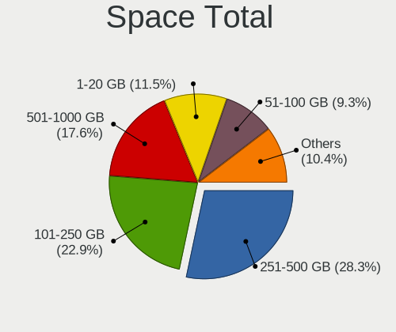

| Size in GB     | Notebooks | Percent |
|----------------|-----------|---------|
| 251-500        | 73        | 28.63%  |
| 101-250        | 57        | 22.35%  |
| 501-1000       | 46        | 18.04%  |
| 1-20           | 30        | 11.76%  |
| 51-100         | 24        | 9.41%   |
| 1001-2000      | 13        | 5.1%    |
| 21-50          | 9         | 3.53%   |
| Unknown        | 2         | 0.78%   |
| More than 3000 | 1         | 0.39%   |

Space Used
----------

Amount of used disk space

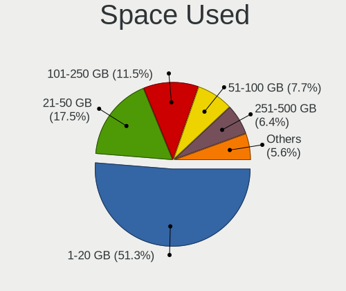

| Used GB   | Notebooks | Percent |
|-----------|-----------|---------|
| 1-20      | 127       | 50.4%   |
| 21-50     | 42        | 16.67%  |
| 101-250   | 32        | 12.7%   |
| 51-100    | 19        | 7.54%   |
| 251-500   | 17        | 6.75%   |
| 501-1000  | 12        | 4.76%   |
| Unknown   | 2         | 0.79%   |
| 1001-2000 | 1         | 0.4%    |

Malfunc. Drives
---------------

Drive models with a malfunction

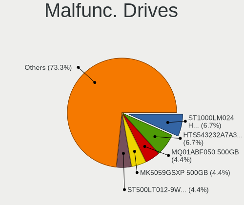

| Model                               | Notebooks | Drives | Percent |
|-------------------------------------|-----------|--------|---------|
| Seagate ST1000LM024 HN-M101MBB 1TB  | 3         | 3      | 6.52%   |
| Hitachi HTS543232A7A384 320GB       | 3         | 3      | 6.52%   |
| Toshiba MQ01ABF050 500GB            | 2         | 2      | 4.35%   |
| Toshiba MK5059GSXP 500GB            | 2         | 3      | 4.35%   |
| Seagate ST500LT012-9WS142 500GB     | 2         | 9      | 4.35%   |
| Seagate ST500LT012-1DG142 500GB     | 2         | 4      | 4.35%   |
| HGST HTS541010A9E680 1TB            | 2         | 3      | 4.35%   |
| WDC WD7500BPVT-08HXZT3 752GB        | 1         | 1      | 2.17%   |
| WDC WD5000LPCX-21VHAT0 500GB        | 1         | 3      | 2.17%   |
| WDC WD3200BPVT-75ZEST0 320GB        | 1         | 1      | 2.17%   |
| WDC WD3200BPVT-22ZEST0 320GB        | 1         | 1      | 2.17%   |
| WDC WD3200BEVT-80A0RT0 320GB        | 1         | 1      | 2.17%   |
| WDC WD3200BEVT-22ZCT0 320GB         | 1         | 1      | 2.17%   |
| Toshiba MQ04ABF100 1TB              | 1         | 1      | 2.17%   |
| Toshiba MK3263GSX 320GB             | 1         | 1      | 2.17%   |
| Toshiba MK2552GSX 250GB             | 1         | 1      | 2.17%   |
| Toshiba MK1637GSX 160GB             | 1         | 1      | 2.17%   |
| Seagate ST9500325AS 500GB           | 1         | 1      | 2.17%   |
| Seagate ST9320325AS 320GB           | 1         | 1      | 2.17%   |
| Seagate ST9250410AS 250GB           | 1         | 1      | 2.17%   |
| Seagate ST9120822AS 120GB           | 1         | 1      | 2.17%   |
| Seagate ST750LM022 HN-M750MBB 752GB | 1         | 2      | 2.17%   |
| Seagate ST500LM012 HN-M500MBB 500GB | 1         | 1      | 2.17%   |
| Samsung Electronics HM321HI 320GB   | 1         | 1      | 2.17%   |
| Plextor PX-128M6S 128GB SSD         | 1         | 1      | 2.17%   |
| Hitachi HTS725050A9A364 500GB       | 1         | 1      | 2.17%   |
| Hitachi HTS722020K9SA00 200GB       | 1         | 1      | 2.17%   |
| Hitachi HTS547575A9E384 752GB       | 1         | 1      | 2.17%   |
| Hitachi HTS547550A9E384 500GB       | 1         | 2      | 2.17%   |
| Hitachi HTS545050A7E380 500GB       | 1         | 1      | 2.17%   |
| Hitachi HTS543216L9SA00 160GB       | 1         | 1      | 2.17%   |
| Hitachi HTS542512K9SA00 120GB       | 1         | 1      | 2.17%   |
| Hitachi HTS541612J9SA00 120GB       | 1         | 1      | 2.17%   |
| HGST HTS725050A7E630 500GB          | 1         | 1      | 2.17%   |
| HGST HTS721010A9E630 1TB            | 1         | 1      | 2.17%   |
| HGST HTS545050A7E380 500GB          | 1         | 1      | 2.17%   |
| HGST HTS541010B7E610 1TB            | 1         | 1      | 2.17%   |

Malfunc. Drive Vendor
---------------------

Vendors of faulty drives

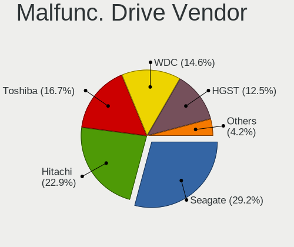

| Vendor              | Notebooks | Drives | Percent |
|---------------------|-----------|--------|---------|
| Seagate             | 13        | 23     | 28.26%  |
| Hitachi             | 11        | 12     | 23.91%  |
| Toshiba             | 8         | 9      | 17.39%  |
| WDC                 | 6         | 8      | 13.04%  |
| HGST                | 6         | 7      | 13.04%  |
| Samsung Electronics | 1         | 1      | 2.17%   |
| Plextor             | 1         | 1      | 2.17%   |

Malfunc. HDD Vendor
-------------------

Vendors of faulty HDD drives

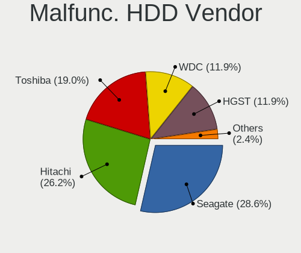

| Vendor              | Notebooks | Drives | Percent |
|---------------------|-----------|--------|---------|
| Seagate             | 13        | 23     | 28.89%  |
| Hitachi             | 11        | 12     | 24.44%  |
| Toshiba             | 8         | 9      | 17.78%  |
| WDC                 | 6         | 8      | 13.33%  |
| HGST                | 6         | 7      | 13.33%  |
| Samsung Electronics | 1         | 1      | 2.22%   |

Malfunc. Drive Kind
-------------------

Kinds of faulty drives

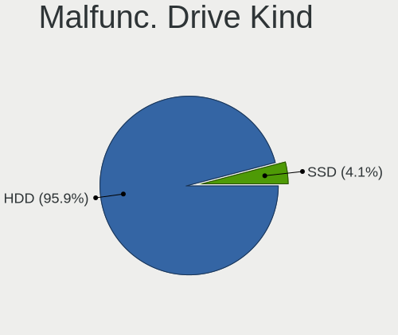

| Kind | Notebooks | Drives | Percent |
|------|-----------|--------|---------|
| HDD  | 43        | 60     | 97.73%  |
| SSD  | 1         | 1      | 2.27%   |

Failed Drives
-------------

Failed drive models

Zero info for selected period =(

Failed Drive Vendor
-------------------

Failed drive vendors

Zero info for selected period =(

Drive Status
------------

Number of failed and malfunc. drives

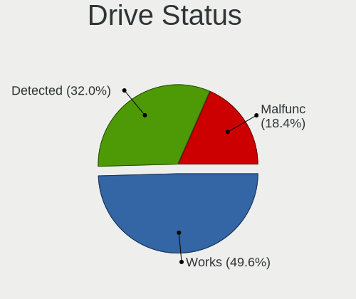

| Status   | Notebooks | Drives | Percent |
|----------|-----------|--------|---------|
| Works    | 130       | 173    | 50.58%  |
| Detected | 83        | 108    | 32.3%   |
| Malfunc  | 44        | 61     | 17.12%  |

Storage controller
------------------

Storage Vendor
--------------

Storage controller vendors

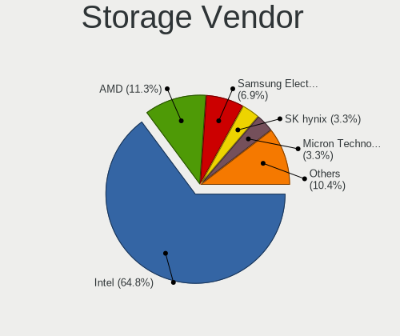

| Vendor                       | Notebooks | Percent |
|------------------------------|-----------|---------|
| Intel                        | 188       | 70.94%  |
| AMD                          | 32        | 12.08%  |
| Samsung Electronics          | 14        | 5.28%   |
| SK hynix                     | 8         | 3.02%   |
| SanDisk                      | 5         | 1.89%   |
| KIOXIA                       | 4         | 1.51%   |
| Toshiba America Info Systems | 3         | 1.13%   |
| Kingston Technology Company  | 3         | 1.13%   |
| Phison Electronics           | 2         | 0.75%   |
| Micron Technology            | 2         | 0.75%   |
| Union Memory (Shenzhen)      | 1         | 0.38%   |
| Nvidia                       | 1         | 0.38%   |
| Biwin Storage Technology     | 1         | 0.38%   |
| ADATA Technology             | 1         | 0.38%   |

Storage Model
-------------

Storage controller models

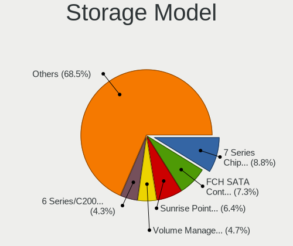

| Model                                                                            | Notebooks | Percent |
|----------------------------------------------------------------------------------|-----------|---------|
| Intel 7 Series Chipset Family 6-port SATA Controller [AHCI mode]                 | 30        | 10.24%  |
| Intel Sunrise Point-LP SATA Controller [AHCI mode]                               | 26        | 8.87%   |
| AMD FCH SATA Controller [AHCI mode]                                              | 24        | 8.19%   |
| Intel 6 Series/C200 Series Chipset Family 6 port Mobile SATA AHCI Controller     | 16        | 5.46%   |
| Intel 82801 Mobile SATA Controller [RAID mode]                                   | 13        | 4.44%   |
| Intel 82801IBM/IEM (ICH9M/ICH9M-E) 4 port SATA Controller [AHCI mode]            | 9         | 3.07%   |
| Samsung NVMe SSD Controller SM981/PM981/PM983                                    | 8         | 2.73%   |
| Intel Volume Management Device NVMe RAID Controller                              | 8         | 2.73%   |
| Intel 8 Series SATA Controller 1 [AHCI mode]                                     | 8         | 2.73%   |
| Intel 5 Series/3400 Series Chipset 4 port SATA AHCI Controller                   | 7         | 2.39%   |
| Intel NM10/ICH7 Family SATA Controller [AHCI mode]                               | 6         | 2.05%   |
| Intel Cannon Lake Mobile PCH SATA AHCI Controller                                | 6         | 2.05%   |
| Intel 82801HM/HEM (ICH8M/ICH8M-E) IDE Controller                                 | 6         | 2.05%   |
| Intel 8 Series/C220 Series Chipset Family 6-port SATA Controller 1 [AHCI mode]   | 6         | 2.05%   |
| Samsung NVMe SSD Controller 980                                                  | 5         | 1.71%   |
| Intel Tiger Lake-LP SATA Controller                                              | 5         | 1.71%   |
| Intel Atom/Celeron/Pentium Processor x5-E8000/J3xxx/N3xxx Series SATA Controller | 5         | 1.71%   |
| Intel 82801HM/HEM (ICH8M/ICH8M-E) SATA Controller [AHCI mode]                    | 5         | 1.71%   |
| Intel 82801GBM/GHM (ICH7-M Family) SATA Controller [AHCI mode]                   | 5         | 1.71%   |
| AMD SB7x0/SB8x0/SB9x0 SATA Controller [AHCI mode]                                | 5         | 1.71%   |
| KIOXIA NVMe SSD Controller BG4                                                   | 4         | 1.37%   |
| Intel HM170/QM170 Chipset SATA Controller [AHCI Mode]                            | 4         | 1.37%   |
| Intel Comet Lake SATA AHCI Controller                                            | 4         | 1.37%   |
| Intel Celeron/Pentium Silver Processor SATA Controller                           | 4         | 1.37%   |
| Intel 82801G (ICH7 Family) IDE Controller                                        | 4         | 1.37%   |
| SK hynix Gold P31/PC711 NVMe Solid State Drive                                   | 3         | 1.02%   |
| SK hynix BC511                                                                   | 3         | 1.02%   |
| Intel SSD 660P Series                                                            | 3         | 1.02%   |
| Intel 82801GBM/GHM (ICH7-M Family) SATA Controller [IDE mode]                    | 3         | 1.02%   |
| Intel 5 Series/3400 Series Chipset 6 port SATA AHCI Controller                   | 3         | 1.02%   |
| Toshiba America Info Systems XG6 NVMe SSD Controller                             | 2         | 0.68%   |
| SK hynix BC501 NVMe Solid State Drive                                            | 2         | 0.68%   |
| SanDisk WD Black SN750 / PC SN730 NVMe SSD                                       | 2         | 0.68%   |
| Micron Non-Volatile memory controller                                            | 2         | 0.68%   |
| Intel Wildcat Point-LP SATA Controller [AHCI Mode]                               | 2         | 0.68%   |
| Intel Cannon Point-LP SATA Controller [AHCI Mode]                                | 2         | 0.68%   |
| Intel Atom Processor E3800 Series SATA AHCI Controller                           | 2         | 0.68%   |
| Intel 7 Series Chipset Family 4-port SATA Controller [IDE mode]                  | 2         | 0.68%   |
| Intel 7 Series Chipset Family 2-port SATA Controller [IDE mode]                  | 2         | 0.68%   |
| Intel 5 Series/3400 Series Chipset 4 port SATA IDE Controller                    | 2         | 0.68%   |

Storage Kind
------------

Kind of storage controller (IDE, SATA, NVMe, SAS, ...)

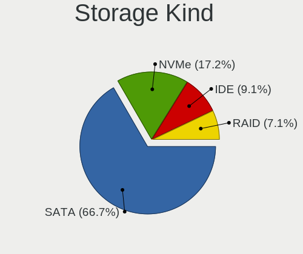

| Kind | Notebooks | Percent |
|------|-----------|---------|
| SATA | 191       | 66.78%  |
| NVMe | 47        | 16.43%  |
| IDE  | 27        | 9.44%   |
| RAID | 21        | 7.34%   |

Processor
---------

CPU Vendor
----------

Processor vendors

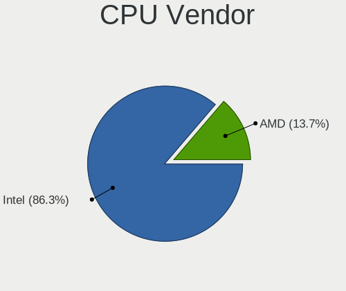

| Vendor | Notebooks | Percent |
|--------|-----------|---------|
| Intel  | 200       | 85.11%  |
| AMD    | 35        | 14.89%  |

CPU Model
---------

Processor models

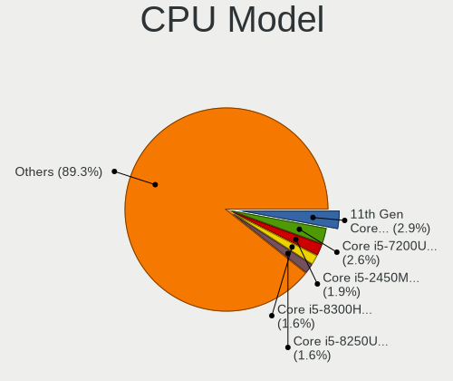

| Model                                         | Notebooks | Percent |
|-----------------------------------------------|-----------|---------|
| Intel Core i5-7200U CPU @ 2.50GHz             | 7         | 2.98%   |
| Intel Core i5-8250U CPU @ 1.60GHz             | 5         | 2.13%   |
| Intel Core i5-2450M CPU @ 2.50GHz             | 5         | 2.13%   |
| Intel Core i5-8300H CPU @ 2.30GHz             | 4         | 1.7%    |
| Intel Core i5-3210M CPU @ 2.50GHz             | 4         | 1.7%    |
| Intel Core i3-7020U CPU @ 2.30GHz             | 4         | 1.7%    |
| Intel 11th Gen Core i5-1135G7 @ 2.40GHz       | 4         | 1.7%    |
| Intel Core i7-9750H CPU @ 2.60GHz             | 3         | 1.28%   |
| Intel Core i5-8265U CPU @ 1.60GHz             | 3         | 1.28%   |
| Intel Core i5-3230M CPU @ 2.60GHz             | 3         | 1.28%   |
| Intel Core i5-10210U CPU @ 1.60GHz            | 3         | 1.28%   |
| Intel Core i3-3110M CPU @ 2.40GHz             | 3         | 1.28%   |
| Intel Core i3-2310M CPU @ 2.10GHz             | 3         | 1.28%   |
| Intel Core i3-1005G1 CPU @ 1.20GHz            | 3         | 1.28%   |
| AMD Ryzen 3 3200U with Radeon Vega Mobile Gfx | 3         | 1.28%   |
| AMD A8-4500M APU with Radeon HD Graphics      | 3         | 1.28%   |
| AMD A10-4600M APU with Radeon HD Graphics     | 3         | 1.28%   |
| Intel Pentium CPU P6100 @ 2.00GHz             | 2         | 0.85%   |
| Intel Pentium CPU 2020M @ 2.40GHz             | 2         | 0.85%   |
| Intel Genuine CPU T2400 @ 1.83GHz             | 2         | 0.85%   |
| Intel Core i7-8650U CPU @ 1.90GHz             | 2         | 0.85%   |
| Intel Core i7-8550U CPU @ 1.80GHz             | 2         | 0.85%   |
| Intel Core i7-7700HQ CPU @ 2.80GHz            | 2         | 0.85%   |
| Intel Core i7-4510U CPU @ 2.00GHz             | 2         | 0.85%   |
| Intel Core i7-3630QM CPU @ 2.40GHz            | 2         | 0.85%   |
| Intel Core i7-3610QM CPU @ 2.30GHz            | 2         | 0.85%   |
| Intel Core i7-2640M CPU @ 2.80GHz             | 2         | 0.85%   |
| Intel Core i7-10750H CPU @ 2.60GHz            | 2         | 0.85%   |
| Intel Core i5-9300H CPU @ 2.40GHz             | 2         | 0.85%   |
| Intel Core i5-7300HQ CPU @ 2.50GHz            | 2         | 0.85%   |
| Intel Core i5-6200U CPU @ 2.30GHz             | 2         | 0.85%   |
| Intel Core i5-4200U CPU @ 1.60GHz             | 2         | 0.85%   |
| Intel Core i5-3320M CPU @ 2.60GHz             | 2         | 0.85%   |
| Intel Core i5-2520M CPU @ 2.50GHz             | 2         | 0.85%   |
| Intel Core i5-2430M CPU @ 2.40GHz             | 2         | 0.85%   |
| Intel Core i5-10300H CPU @ 2.50GHz            | 2         | 0.85%   |
| Intel Core i5 CPU M 520 @ 2.40GHz             | 2         | 0.85%   |
| Intel Core i5 CPU M 480 @ 2.67GHz             | 2         | 0.85%   |
| Intel Core i3-6006U CPU @ 2.00GHz             | 2         | 0.85%   |
| Intel Core i3-4010U CPU @ 1.70GHz             | 2         | 0.85%   |

CPU Model Family
----------------

Processor model prefix

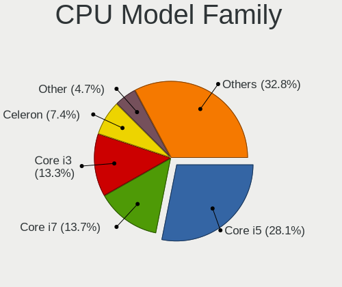

| Model                   | Notebooks | Percent |
|-------------------------|-----------|---------|
| Intel Core i5           | 67        | 28.51%  |
| Intel Core i7           | 32        | 13.62%  |
| Intel Core i3           | 31        | 13.19%  |
| Intel Celeron           | 15        | 6.38%   |
| Other                   | 10        | 4.26%   |
| Intel Pentium           | 10        | 4.26%   |
| Intel Core 2 Duo        | 9         | 3.83%   |
| Intel Atom              | 9         | 3.83%   |
| AMD Ryzen 5             | 5         | 2.13%   |
| Intel Genuine           | 4         | 1.7%    |
| AMD Ryzen 7             | 4         | 1.7%    |
| AMD E                   | 4         | 1.7%    |
| AMD A8                  | 4         | 1.7%    |
| AMD A10                 | 4         | 1.7%    |
| Intel Pentium Dual-Core | 3         | 1.28%   |
| AMD Ryzen 3             | 3         | 1.28%   |
| AMD A4                  | 3         | 1.28%   |
| Intel Pentium Dual      | 2         | 0.85%   |
| Intel Core 2            | 2         | 0.85%   |
| Intel Pentium Silver    | 1         | 0.43%   |
| Intel Pentium M         | 1         | 0.43%   |
| Intel Pentium Gold      | 1         | 0.43%   |
| Intel Mobile Pentium 4  | 1         | 0.43%   |
| Intel Core Duo          | 1         | 0.43%   |
| Intel Core 2 Quad       | 1         | 0.43%   |
| AMD Ryzen 9             | 1         | 0.43%   |
| AMD PRO A8              | 1         | 0.43%   |
| AMD E1                  | 1         | 0.43%   |
| AMD C-60                | 1         | 0.43%   |
| AMD Athlon II           | 1         | 0.43%   |
| AMD Athlon              | 1         | 0.43%   |
| AMD A6                  | 1         | 0.43%   |
| AMD A12                 | 1         | 0.43%   |

CPU Cores
---------

Number of processor cores

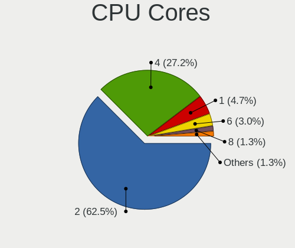

| Number  | Notebooks | Percent |
|---------|-----------|---------|
| 2       | 146       | 62.13%  |
| 4       | 63        | 26.81%  |
| 1       | 11        | 4.68%   |
| 6       | 8         | 3.4%    |
| 8       | 4         | 1.7%    |
| Unknown | 3         | 1.28%   |

CPU Sockets
-----------

Number of sockets

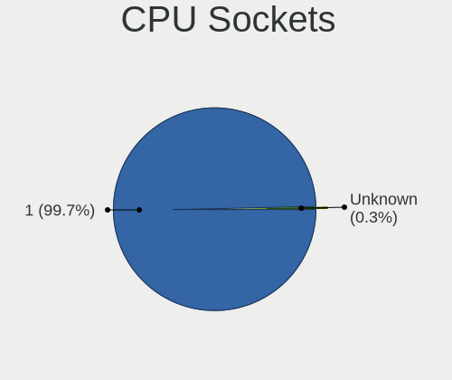

| Number  | Notebooks | Percent |
|---------|-----------|---------|
| 1       | 234       | 99.57%  |
| Unknown | 1         | 0.43%   |

CPU Threads
-----------

Threads per core (Hyper-Threading)

| Number  | Notebooks | Percent |
|---------|-----------|---------|
| 2       | 167       | 71.06%  |
| 1       | 65        | 27.66%  |
| Unknown | 3         | 1.28%   |

CPU Op-Modes
------------

CPU Operation Modes (32-bit, 64-bit)

| Op mode        | Notebooks | Percent |
|----------------|-----------|---------|
| 32-bit, 64-bit | 220       | 93.62%  |
| 32-bit         | 8         | 3.4%    |
| Unknown        | 7         | 2.98%   |

CPU Microcode
-------------

Microcode number

| Number     | Notebooks | Percent |
|------------|-----------|---------|
| Unknown    | 28        | 11.67%  |
| 0x306a9    | 27        | 11.25%  |
| 0x206a7    | 22        | 9.17%   |
| 0x806e9    | 13        | 5.42%   |
| 0x806ea    | 9         | 3.75%   |
| 0x806c1    | 9         | 3.75%   |
| 0x40651    | 8         | 3.33%   |
| 0x20655    | 8         | 3.33%   |
| 0x06001119 | 8         | 3.33%   |
| 0x906ea    | 7         | 2.92%   |
| 0x306c3    | 7         | 2.92%   |
| 0x806ec    | 6         | 2.5%    |
| 0x406e3    | 6         | 2.5%    |
| 0x1067a    | 6         | 2.5%    |
| 0x6fd      | 4         | 1.67%   |
| 0x30661    | 4         | 1.67%   |
| 0x20652    | 4         | 1.67%   |
| 0xa0652    | 3         | 1.25%   |
| 0x706a1    | 3         | 1.25%   |
| 0x6e8      | 3         | 1.25%   |
| 0x406c4    | 3         | 1.25%   |
| 0x30678    | 3         | 1.25%   |
| 0x10676    | 3         | 1.25%   |
| 0x08108102 | 3         | 1.25%   |
| 0x906e9    | 2         | 0.83%   |
| 0x806eb    | 2         | 0.83%   |
| 0x706e5    | 2         | 0.83%   |
| 0x6ec      | 2         | 0.83%   |
| 0x306d4    | 2         | 0.83%   |
| 0x106ca    | 2         | 0.83%   |
| 0x10661    | 2         | 0.83%   |
| 0x0a50000c | 2         | 0.83%   |
| 0x08608103 | 2         | 0.83%   |
| 0x08108109 | 2         | 0.83%   |
| 0x0700010f | 2         | 0.83%   |
| 0x05000119 | 2         | 0.83%   |
| 0x05000029 | 2         | 0.83%   |
| 0x03000027 | 2         | 0.83%   |
| 0xf27      | 1         | 0.42%   |
| 0x906ed    | 1         | 0.42%   |

CPU Microarch
-------------

Microarchitecture

| Name          | Notebooks | Percent |
|---------------|-----------|---------|
| KabyLake      | 46        | 19.57%  |
| IvyBridge     | 28        | 11.91%  |
| SandyBridge   | 23        | 9.79%   |
| Haswell       | 15        | 6.38%   |
| Westmere      | 12        | 5.11%   |
| TigerLake     | 11        | 4.68%   |
| Penryn        | 11        | 4.68%   |
| Core          | 10        | 4.26%   |
| Silvermont    | 9         | 3.83%   |
| Piledriver    | 8         | 3.4%    |
| Skylake       | 7         | 2.98%   |
| Bonnell       | 7         | 2.98%   |
| P6            | 6         | 2.55%   |
| Zen+          | 5         | 2.13%   |
| Bobcat        | 5         | 2.13%   |
| IceLake       | 4         | 1.7%    |
| Goldmont plus | 4         | 1.7%    |
| CometLake     | 4         | 1.7%    |
| Unknown       | 4         | 1.7%    |
| Zen 3         | 2         | 0.85%   |
| Zen 2         | 2         | 0.85%   |
| K10 Llano     | 2         | 0.85%   |
| Jaguar        | 2         | 0.85%   |
| Excavator     | 2         | 0.85%   |
| Broadwell     | 2         | 0.85%   |
| Zen           | 1         | 0.43%   |
| Puma          | 1         | 0.43%   |
| NetBurst      | 1         | 0.43%   |
| K10           | 1         | 0.43%   |

Graphics
--------

GPU Vendor
----------

Vendors of graphics cards

| Vendor | Notebooks | Percent |
|--------|-----------|---------|
| Intel  | 179       | 55.94%  |
| Nvidia | 77        | 24.06%  |
| AMD    | 64        | 20%     |

GPU Model
---------

Graphics card models

| Model                                                                                    | Notebooks | Percent |
|------------------------------------------------------------------------------------------|-----------|---------|
| Intel 3rd Gen Core processor Graphics Controller                                         | 26        | 7.6%    |
| Intel 2nd Generation Core Processor Family Integrated Graphics Controller                | 21        | 6.14%   |
| Intel HD Graphics 620                                                                    | 13        | 3.8%    |
| Intel UHD Graphics 620                                                                   | 10        | 2.92%   |
| Intel TigerLake-LP GT2 [Iris Xe Graphics]                                                | 9         | 2.63%   |
| Intel CoffeeLake-H GT2 [UHD Graphics 630]                                                | 9         | 2.63%   |
| Nvidia GF117M [GeForce 610M/710M/810M/820M / GT 620M/625M/630M/720M]                     | 7         | 2.05%   |
| Intel Skylake GT2 [HD Graphics 520]                                                      | 7         | 2.05%   |
| Intel Mobile 4 Series Chipset Integrated Graphics Controller                             | 7         | 2.05%   |
| Intel Haswell-ULT Integrated Graphics Controller                                         | 7         | 2.05%   |
| Intel 4th Gen Core Processor Integrated Graphics Controller                              | 7         | 2.05%   |
| Intel Mobile 945GM/GMS/GME, 943/940GML Express Integrated Graphics Controller            | 6         | 1.75%   |
| Intel Core Processor Integrated Graphics Controller                                      | 6         | 1.75%   |
| AMD Thames [Radeon HD 7500M/7600M Series]                                                | 6         | 1.75%   |
| Nvidia GF108M [GeForce GT 620M/630M/635M/640M LE]                                        | 5         | 1.46%   |
| Intel Mobile GM965/GL960 Integrated Graphics Controller (secondary)                      | 5         | 1.46%   |
| Intel Mobile GM965/GL960 Integrated Graphics Controller (primary)                        | 5         | 1.46%   |
| Intel CometLake-U GT2 [UHD Graphics]                                                     | 5         | 1.46%   |
| Intel Atom/Celeron/Pentium Processor x5-E8000/J3xxx/N3xxx Integrated Graphics Controller | 5         | 1.46%   |
| AMD Seymour [Radeon HD 6400M/7400M Series]                                               | 5         | 1.46%   |
| AMD Picasso/Raven 2 [Radeon Vega Series / Radeon Vega Mobile Series]                     | 5         | 1.46%   |
| Nvidia TU117M                                                                            | 4         | 1.17%   |
| Nvidia GP107M [GeForce GTX 1050 Mobile]                                                  | 4         | 1.17%   |
| Nvidia GP106M [GeForce GTX 1060 Mobile]                                                  | 4         | 1.17%   |
| Intel Mobile 945GM/GMS, 943/940GML Express Integrated Graphics Controller                | 4         | 1.17%   |
| Intel Iris Plus Graphics G1 (Ice Lake)                                                   | 4         | 1.17%   |
| Intel HD Graphics 630                                                                    | 4         | 1.17%   |
| Intel CometLake-H GT2 [UHD Graphics]                                                     | 4         | 1.17%   |
| Intel Atom Processor Z36xxx/Z37xxx Series Graphics & Display                             | 4         | 1.17%   |
| Intel Atom Processor D2xxx/N2xxx Integrated Graphics Controller                          | 4         | 1.17%   |
| AMD Topaz XT [Radeon R7 M260/M265 / M340/M360 / M440/M445 / 530/535 / 620/625 Mobile]    | 4         | 1.17%   |
| AMD Sun XT [Radeon HD 8670A/8670M/8690M / R5 M330 / M430 / Radeon 520 Mobile]            | 4         | 1.17%   |
| AMD Sun PRO [Radeon HD 8570A/8570M]                                                      | 4         | 1.17%   |
| Nvidia TU117M [GeForce GTX 1650 Mobile / Max-Q]                                          | 3         | 0.88%   |
| Nvidia GM107M [GeForce GTX 950M]                                                         | 3         | 0.88%   |
| Nvidia GF119M [GeForce 610M]                                                             | 3         | 0.88%   |
| Nvidia GF108M [GeForce GT 540M]                                                          | 3         | 0.88%   |
| Intel WhiskeyLake-U GT2 [UHD Graphics 620]                                               | 3         | 0.88%   |
| Intel GeminiLake [UHD Graphics 600]                                                      | 3         | 0.88%   |
| AMD Wrestler [Radeon HD 6310]                                                            | 3         | 0.88%   |

GPU Combo
---------

Combinations of graphics cards

| Name           | Notebooks | Percent |
|----------------|-----------|---------|
| 1 x Intel      | 101       | 42.62%  |
| Intel + Nvidia | 60        | 25.32%  |
| 1 x AMD        | 28        | 11.81%  |
| Intel + AMD    | 19        | 8.02%   |
| 1 x Nvidia     | 12        | 5.06%   |
| 2 x AMD        | 11        | 4.64%   |
| AMD + Nvidia   | 6         | 2.53%   |

GPU Driver
----------

Free vs proprietary

| Driver      | Notebooks | Percent |
|-------------|-----------|---------|
| Free        | 207       | 86.97%  |
| Proprietary | 27        | 11.34%  |
| Unknown     | 4         | 1.68%   |

GPU Memory
----------

Total video memory

| Size in GB | Notebooks | Percent |
|------------|-----------|---------|
| Unknown    | 88        | 36.51%  |
| 1.01-2.0   | 80        | 33.2%   |
| 0.01-0.5   | 41        | 17.01%  |
| 3.01-4.0   | 17        | 7.05%   |
| 0.51-1.0   | 11        | 4.56%   |
| 5.01-6.0   | 3         | 1.24%   |
| 7.01-8.0   | 1         | 0.41%   |

Monitor
-------

Monitor Vendor
--------------

Monitor vendors

| Vendor                  | Notebooks | Percent |
|-------------------------|-----------|---------|
| AU Optronics            | 57        | 23.36%  |
| LG Display              | 48        | 19.67%  |
| BOE                     | 31        | 12.7%   |
| Samsung Electronics     | 29        | 11.89%  |
| Chimei Innolux          | 27        | 11.07%  |
| Chi Mei Optoelectronics | 14        | 5.74%   |
| Hewlett-Packard         | 4         | 1.64%   |
| Goldstar                | 4         | 1.64%   |
| LG Philips              | 3         | 1.23%   |
| Lenovo                  | 3         | 1.23%   |
| Acer                    | 3         | 1.23%   |
| Toshiba                 | 2         | 0.82%   |
| Sony                    | 2         | 0.82%   |
| Quanta Display          | 2         | 0.82%   |
| PANDA                   | 2         | 0.82%   |
| InfoVision              | 2         | 0.82%   |
| HannStar                | 2         | 0.82%   |
| CPT                     | 2         | 0.82%   |
| Unknown (XXX)           | 1         | 0.41%   |
| Sharp                   | 1         | 0.41%   |
| Seiko/Epson             | 1         | 0.41%   |
| Philips                 | 1         | 0.41%   |
| KDC                     | 1         | 0.41%   |
| Dell                    | 1         | 0.41%   |
| BenQ                    | 1         | 0.41%   |

Monitor Model
-------------

Monitor models

| Model                                                                    | Notebooks | Percent |
|--------------------------------------------------------------------------|-----------|---------|
| LG Display LCD Monitor LGD02DC 1366x768 344x194mm 15.5-inch              | 6         | 2.44%   |
| Samsung Electronics LCD Monitor SDC4752 1366x768 344x194mm 15.5-inch     | 5         | 2.03%   |
| Chimei Innolux LCD Monitor CMN15DB 1366x768 344x193mm 15.5-inch          | 4         | 1.63%   |
| AU Optronics LCD Monitor AUO38ED 1920x1080 344x193mm 15.5-inch           | 4         | 1.63%   |
| AU Optronics LCD Monitor AUO22EC 1366x768 344x193mm 15.5-inch            | 4         | 1.63%   |
| AU Optronics LCD Monitor AUO21ED 1920x1080 344x193mm 15.5-inch           | 4         | 1.63%   |
| LG Display LCD Monitor LGD033A 1366x768 344x194mm 15.5-inch              | 3         | 1.22%   |
| Chimei Innolux LCD Monitor CMN15D5 1920x1080 344x193mm 15.5-inch         | 3         | 1.22%   |
| Chi Mei Optoelectronics LCD Monitor CMO15A7 1366x768 344x193mm 15.5-inch | 3         | 1.22%   |
| AU Optronics LCD Monitor AUO45EC 1366x768 344x193mm 15.5-inch            | 3         | 1.22%   |
| AU Optronics LCD Monitor AUO26EC 1366x768 344x193mm 15.5-inch            | 3         | 1.22%   |
| Sony NvidiaDefault SNY05FA 1366x768 290x170mm 13.2-inch                  | 2         | 0.81%   |
| Samsung Electronics LCD Monitor SEC4251 1366x768 344x194mm 15.5-inch     | 2         | 0.81%   |
| Samsung Electronics LCD Monitor SEC3642 1366x768 344x194mm 15.5-inch     | 2         | 0.81%   |
| Samsung Electronics LCD Monitor SEC315A 1366x768 344x194mm 15.5-inch     | 2         | 0.81%   |
| Samsung Electronics LCD Monitor SAM0669 1920x1080                        | 2         | 0.81%   |
| PANDA LCD Monitor NCP004D 1920x1080 344x194mm 15.5-inch                  | 2         | 0.81%   |
| LG Display LCD Monitor LGD038E 1366x768 344x194mm 15.5-inch              | 2         | 0.81%   |
| LG Display LCD Monitor LGD0384 1366x768 344x194mm 15.5-inch              | 2         | 0.81%   |
| LG Display LCD Monitor LGD033B 1366x768 344x194mm 15.5-inch              | 2         | 0.81%   |
| LG Display LCD Monitor LGD02F2 1366x768 344x194mm 15.5-inch              | 2         | 0.81%   |
| HannStar HSD101PFW2 HSD03E9 1024x600 222x125mm 10.0-inch                 | 2         | 0.81%   |
| Chimei Innolux LCD Monitor CMN1738 1920x1080 381x214mm 17.2-inch         | 2         | 0.81%   |
| Chimei Innolux LCD Monitor CMN15F5 1920x1080 344x193mm 15.5-inch         | 2         | 0.81%   |
| Chimei Innolux LCD Monitor CMN15E6 1366x768 344x193mm 15.5-inch          | 2         | 0.81%   |
| Chimei Innolux LCD Monitor CMN15D3 1920x1080 344x193mm 15.5-inch         | 2         | 0.81%   |
| Chimei Innolux LCD Monitor CMN15B6 1366x768 344x193mm 15.5-inch          | 2         | 0.81%   |
| Chimei Innolux LCD Monitor CMN15AB 1366x768 344x194mm 15.5-inch          | 2         | 0.81%   |
| Chimei Innolux LCD Monitor CMN14D4 1920x1080 309x173mm 13.9-inch         | 2         | 0.81%   |
| Chi Mei Optoelectronics LCD Monitor CMO1018 1024x600 222x125mm 10.0-inch | 2         | 0.81%   |
| BOE LCD Monitor BOE0700 1920x1080 344x194mm 15.5-inch                    | 2         | 0.81%   |
| BOE LCD Monitor BOE0672 1366x768 344x194mm 15.5-inch                     | 2         | 0.81%   |
| AU Optronics LCD Monitor AUO8174 1280x800 331x207mm 15.4-inch            | 2         | 0.81%   |
| AU Optronics LCD Monitor AUO71EC 1366x768 344x193mm 15.5-inch            | 2         | 0.81%   |
| AU Optronics LCD Monitor AUO61ED 1920x1080 344x194mm 15.5-inch           | 2         | 0.81%   |
| AU Optronics LCD Monitor AUO219D 1920x1080 381x214mm 17.2-inch           | 2         | 0.81%   |
| AU Optronics LCD Monitor AUO20EC 1366x768 344x193mm 15.5-inch            | 2         | 0.81%   |
| AU Optronics LCD Monitor AUO1E3D 1920x1080 309x173mm 13.9-inch           | 2         | 0.81%   |
| Unknown (XXX) LCDTV XXX0180 1440x900 884x663mm 43.5-inch                 | 1         | 0.41%   |
| Toshiba Monitor LCD1701 1280x1024                                        | 1         | 0.41%   |

Monitor Resolution
------------------

Monitor screen resolution

| Resolution         | Notebooks | Percent |
|--------------------|-----------|---------|
| 1366x768 (WXGA)    | 109       | 45.99%  |
| 1920x1080 (FHD)    | 80        | 33.76%  |
| 1600x900 (HD+)     | 12        | 5.06%   |
| 1280x800 (WXGA)    | 11        | 4.64%   |
| 1024x600           | 5         | 2.11%   |
| 2560x1440 (QHD)    | 3         | 1.27%   |
| 1680x1050 (WSXGA+) | 3         | 1.27%   |
| 1440x900 (WXGA+)   | 3         | 1.27%   |
| 1920x1200 (WUXGA)  | 2         | 0.84%   |
| 1400x1050          | 2         | 0.84%   |
| 1280x1024 (SXGA)   | 2         | 0.84%   |
| 3840x2160 (4K)     | 1         | 0.42%   |
| 2560x1600          | 1         | 0.42%   |
| 2160x1440          | 1         | 0.42%   |
| 1360x768           | 1         | 0.42%   |
| 1024x768 (XGA)     | 1         | 0.42%   |

Monitor Diagonal
----------------

Diagonal size in inches

| Inches  | Notebooks | Percent |
|---------|-----------|---------|
| 15      | 154       | 62.6%   |
| 17      | 18        | 7.32%   |
| 13      | 17        | 6.91%   |
| 14      | 16        | 6.5%    |
| 10      | 6         | 2.44%   |
| 27      | 4         | 1.63%   |
| 24      | 4         | 1.63%   |
| 21      | 4         | 1.63%   |
| 12      | 4         | 1.63%   |
| 18      | 3         | 1.22%   |
| 11      | 3         | 1.22%   |
| Unknown | 3         | 1.22%   |
| 19      | 2         | 0.81%   |
| 16      | 2         | 0.81%   |
| 54      | 1         | 0.41%   |
| 43      | 1         | 0.41%   |
| 40      | 1         | 0.41%   |
| 31      | 1         | 0.41%   |
| 23      | 1         | 0.41%   |
| 22      | 1         | 0.41%   |

Monitor Width
-------------

Physical width

| Width in mm | Notebooks | Percent |
|-------------|-----------|---------|
| 301-350     | 179       | 72.76%  |
| 351-400     | 22        | 8.94%   |
| 201-300     | 21        | 8.54%   |
| 501-600     | 9         | 3.66%   |
| 401-500     | 8         | 3.25%   |
| Unknown     | 3         | 1.22%   |
| 801-900     | 2         | 0.81%   |
| 601-700     | 1         | 0.41%   |
| 1001-1500   | 1         | 0.41%   |

Aspect Ratio
------------

Proportional relationship between the width and the height

| Ratio   | Notebooks | Percent |
|---------|-----------|---------|
| 16/9    | 204       | 88.7%   |
| 16/10   | 17        | 7.39%   |
| 4/3     | 4         | 1.74%   |
| 3/2     | 2         | 0.87%   |
| 6/5     | 1         | 0.43%   |
| 5/4     | 1         | 0.43%   |
| Unknown | 1         | 0.43%   |

Monitor Area
------------

Area in inch²

| Area in inch² | Notebooks | Percent |
|----------------|-----------|---------|
| 101-110        | 153       | 62.2%   |
| 81-90          | 25        | 10.16%  |
| 121-130        | 15        | 6.1%    |
| 201-250        | 9         | 3.66%   |
| 71-80          | 8         | 3.25%   |
| 41-50          | 6         | 2.44%   |
| 301-350        | 4         | 1.63%   |
| 151-200        | 4         | 1.63%   |
| 61-70          | 3         | 1.22%   |
| 51-60          | 3         | 1.22%   |
| 131-140        | 3         | 1.22%   |
| 91-100         | 3         | 1.22%   |
| Unknown        | 3         | 1.22%   |
| 141-150        | 2         | 0.81%   |
| 501-1000       | 2         | 0.81%   |
| More than 1000 | 1         | 0.41%   |
| 351-500        | 1         | 0.41%   |
| 111-120        | 1         | 0.41%   |

Pixel Density
-------------

Pixels per inch

| Density | Notebooks | Percent |
|---------|-----------|---------|
| 101-120 | 111       | 45.31%  |
| 121-160 | 84        | 34.29%  |
| 51-100  | 36        | 14.69%  |
| 161-240 | 8         | 3.27%   |
| 1-50    | 3         | 1.22%   |
| Unknown | 3         | 1.22%   |

Multiple Monitors
-----------------

Total monitors connected

| Total | Notebooks | Percent |
|-------|-----------|---------|
| 1     | 212       | 89.45%  |
| 2     | 23        | 9.7%    |
| 0     | 2         | 0.84%   |

Network
-------

Net Controller Vendor
---------------------

Controller vendors

| Vendor                            | Notebooks | Percent |
|-----------------------------------|-----------|---------|
| Realtek Semiconductor             | 153       | 37.5%   |
| Intel                             | 97        | 23.77%  |
| Qualcomm Atheros                  | 79        | 19.36%  |
| Broadcom                          | 27        | 6.62%   |
| Broadcom Limited                  | 11        | 2.7%    |
| Ralink                            | 10        | 2.45%   |
| MediaTek                          | 6         | 1.47%   |
| Marvell Technology Group          | 6         | 1.47%   |
| Huawei Technologies               | 3         | 0.74%   |
| Hewlett-Packard                   | 3         | 0.74%   |
| Xiaomi                            | 2         | 0.49%   |
| Ralink Technology                 | 2         | 0.49%   |
| JMicron Technology                | 2         | 0.49%   |
| Qualcomm Atheros Communications   | 1         | 0.25%   |
| ICS Advent                        | 1         | 0.25%   |
| HTC (High Tech Computer)          | 1         | 0.25%   |
| Fujitsu Siemens Computers         | 1         | 0.25%   |
| Ericsson Business Mobile Networks | 1         | 0.25%   |
| DisplayLink                       | 1         | 0.25%   |
| Android                           | 1         | 0.25%   |

Net Controller Model
--------------------

Controller models

| Model                                                                   | Notebooks | Percent |
|-------------------------------------------------------------------------|-----------|---------|
| Realtek RTL8111/8168/8411 PCI Express Gigabit Ethernet Controller       | 91        | 19.61%  |
| Realtek RTL810xE PCI Express Fast Ethernet controller                   | 43        | 9.27%   |
| Qualcomm Atheros AR9285 Wireless Network Adapter (PCI-Express)          | 18        | 3.88%   |
| Qualcomm Atheros AR9485 Wireless Network Adapter                        | 16        | 3.45%   |
| Broadcom BCM4313 802.11bgn Wireless Network Adapter                     | 15        | 3.23%   |
| Qualcomm Atheros QCA9377 802.11ac Wireless Network Adapter              | 13        | 2.8%    |
| Realtek RTL8821CE 802.11ac PCIe Wireless Network Adapter                | 12        | 2.59%   |
| Intel Wireless 8265 / 8275                                              | 11        | 2.37%   |
| Qualcomm Atheros QCA9565 / AR9565 Wireless Network Adapter              | 10        | 2.16%   |
| Qualcomm Atheros QCA8172 Fast Ethernet                                  | 9         | 1.94%   |
| Ralink RT3290 Wireless 802.11n 1T/1R PCIe                               | 8         | 1.72%   |
| Intel Wi-Fi 6 AX201                                                     | 8         | 1.72%   |
| Intel PRO/Wireless 3945ABG [Golan] Network Connection                   | 8         | 1.72%   |
| Qualcomm Atheros AR8151 v2.0 Gigabit Ethernet                           | 6         | 1.29%   |
| Intel Comet Lake PCH-LP CNVi WiFi                                       | 5         | 1.08%   |
| Intel Centrino Wireless-N 2230                                          | 5         | 1.08%   |
| Intel Centrino Advanced-N 6205 [Taylor Peak]                            | 5         | 1.08%   |
| Intel 82579LM Gigabit Network Connection (Lewisville)                   | 5         | 1.08%   |
| Realtek RTL8723DE Wireless Network Adapter                              | 4         | 0.86%   |
| Realtek RTL-8100/8101L/8139 PCI Fast Ethernet Adapter                   | 4         | 0.86%   |
| Qualcomm Atheros AR242x / AR542x Wireless Network Adapter (PCI-Express) | 4         | 0.86%   |
| Intel Wireless 3160                                                     | 4         | 0.86%   |
| Intel WiFi Link 5100                                                    | 4         | 0.86%   |
| Intel Wi-Fi 6 AX200                                                     | 4         | 0.86%   |
| Intel Comet Lake PCH CNVi WiFi                                          | 4         | 0.86%   |
| Intel Centrino Wireless-N 1030 [Rainbow Peak]                           | 4         | 0.86%   |
| Intel Cannon Lake PCH CNVi WiFi                                         | 4         | 0.86%   |
| Broadcom NetLink BCM57785 Gigabit Ethernet PCIe                         | 4         | 0.86%   |
| Broadcom Limited BCM4313 802.11bgn Wireless Network Adapter             | 4         | 0.86%   |
| Broadcom BCM43227 802.11b/g/n                                           | 4         | 0.86%   |
| Qualcomm Atheros QCA6174 802.11ac Wireless Network Adapter              | 3         | 0.65%   |
| MediaTek MT7921 802.11ax PCI Express Wireless Network Adapter           | 3         | 0.65%   |
| Intel Wireless 7265                                                     | 3         | 0.65%   |
| Intel Wireless 7260                                                     | 3         | 0.65%   |
| Intel Ethernet Connection (4) I219-LM                                   | 3         | 0.65%   |
| Intel 82577LM Gigabit Network Connection                                | 3         | 0.65%   |
| Intel 82573L Gigabit Ethernet Controller                                | 3         | 0.65%   |
| Broadcom BCM43142 802.11b/g/n                                           | 3         | 0.65%   |
| Realtek RTL8822CE 802.11ac PCIe Wireless Network Adapter                | 2         | 0.43%   |
| Realtek RTL8723BE PCIe Wireless Network Adapter                         | 2         | 0.43%   |

Wireless Vendor
---------------

Wireless vendors

| Vendor                          | Notebooks | Percent |
|---------------------------------|-----------|---------|
| Intel                           | 95        | 40.08%  |
| Qualcomm Atheros                | 67        | 28.27%  |
| Realtek Semiconductor           | 27        | 11.39%  |
| Broadcom                        | 24        | 10.13%  |
| Ralink                          | 10        | 4.22%   |
| Broadcom Limited                | 6         | 2.53%   |
| MediaTek                        | 4         | 1.69%   |
| Ralink Technology               | 2         | 0.84%   |
| Qualcomm Atheros Communications | 1         | 0.42%   |
| Fujitsu Siemens Computers       | 1         | 0.42%   |

Wireless Model
--------------

Wireless models

| Model                                                                   | Notebooks | Percent |
|-------------------------------------------------------------------------|-----------|---------|
| Qualcomm Atheros AR9285 Wireless Network Adapter (PCI-Express)          | 18        | 7.59%   |
| Qualcomm Atheros AR9485 Wireless Network Adapter                        | 16        | 6.75%   |
| Broadcom BCM4313 802.11bgn Wireless Network Adapter                     | 15        | 6.33%   |
| Qualcomm Atheros QCA9377 802.11ac Wireless Network Adapter              | 13        | 5.49%   |
| Realtek RTL8821CE 802.11ac PCIe Wireless Network Adapter                | 12        | 5.06%   |
| Intel Wireless 8265 / 8275                                              | 11        | 4.64%   |
| Qualcomm Atheros QCA9565 / AR9565 Wireless Network Adapter              | 10        | 4.22%   |
| Ralink RT3290 Wireless 802.11n 1T/1R PCIe                               | 8         | 3.38%   |
| Intel Wi-Fi 6 AX201                                                     | 8         | 3.38%   |
| Intel PRO/Wireless 3945ABG [Golan] Network Connection                   | 8         | 3.38%   |
| Intel Comet Lake PCH-LP CNVi WiFi                                       | 5         | 2.11%   |
| Intel Centrino Wireless-N 2230                                          | 5         | 2.11%   |
| Intel Centrino Advanced-N 6205 [Taylor Peak]                            | 5         | 2.11%   |
| Realtek RTL8723DE Wireless Network Adapter                              | 4         | 1.69%   |
| Qualcomm Atheros AR242x / AR542x Wireless Network Adapter (PCI-Express) | 4         | 1.69%   |
| Intel Wireless 3160                                                     | 4         | 1.69%   |
| Intel WiFi Link 5100                                                    | 4         | 1.69%   |
| Intel Wi-Fi 6 AX200                                                     | 4         | 1.69%   |
| Intel Comet Lake PCH CNVi WiFi                                          | 4         | 1.69%   |
| Intel Centrino Wireless-N 1030 [Rainbow Peak]                           | 4         | 1.69%   |
| Intel Cannon Lake PCH CNVi WiFi                                         | 4         | 1.69%   |
| Broadcom Limited BCM4313 802.11bgn Wireless Network Adapter             | 4         | 1.69%   |
| Broadcom BCM43227 802.11b/g/n                                           | 4         | 1.69%   |
| Qualcomm Atheros QCA6174 802.11ac Wireless Network Adapter              | 3         | 1.27%   |
| MediaTek MT7921 802.11ax PCI Express Wireless Network Adapter           | 3         | 1.27%   |
| Intel Wireless 7265                                                     | 3         | 1.27%   |
| Intel Wireless 7260                                                     | 3         | 1.27%   |
| Broadcom BCM43142 802.11b/g/n                                           | 3         | 1.27%   |
| Realtek RTL8822CE 802.11ac PCIe Wireless Network Adapter                | 2         | 0.84%   |
| Realtek RTL8723BE PCIe Wireless Network Adapter                         | 2         | 0.84%   |
| Qualcomm Atheros AR9462 Wireless Network Adapter                        | 2         | 0.84%   |
| Intel Wireless 3165                                                     | 2         | 0.84%   |
| Intel Dual Band Wireless-AC 3165 Plus Bluetooth                         | 2         | 0.84%   |
| Intel Centrino Wireless-N 135                                           | 2         | 0.84%   |
| Intel Centrino Wireless-N 100                                           | 2         | 0.84%   |
| Intel Centrino Advanced-N 6200                                          | 2         | 0.84%   |
| Intel Cannon Point-LP CNVi [Wireless-AC]                                | 2         | 0.84%   |
| Realtek RTL8852AE 802.11ax PCIe Wireless Network Adapter                | 1         | 0.42%   |
| Realtek RTL8822BE 802.11a/b/g/n/ac WiFi adapter                         | 1         | 0.42%   |
| Realtek RTL8821AE 802.11ac PCIe Wireless Network Adapter                | 1         | 0.42%   |

Ethernet Vendor
---------------

Ethernet vendors

| Vendor                   | Notebooks | Percent |
|--------------------------|-----------|---------|
| Realtek Semiconductor    | 140       | 64.22%  |
| Qualcomm Atheros         | 24        | 11.01%  |
| Intel                    | 24        | 11.01%  |
| Marvell Technology Group | 6         | 2.75%   |
| Broadcom Limited         | 6         | 2.75%   |
| Broadcom                 | 6         | 2.75%   |
| Xiaomi                   | 2         | 0.92%   |
| MediaTek                 | 2         | 0.92%   |
| JMicron Technology       | 2         | 0.92%   |
| Huawei Technologies      | 2         | 0.92%   |
| ICS Advent               | 1         | 0.46%   |
| HTC (High Tech Computer) | 1         | 0.46%   |
| DisplayLink              | 1         | 0.46%   |
| Android                  | 1         | 0.46%   |

Ethernet Model
--------------

Ethernet models

| Model                                                                          | Notebooks | Percent |
|--------------------------------------------------------------------------------|-----------|---------|
| Realtek RTL8111/8168/8411 PCI Express Gigabit Ethernet Controller              | 91        | 41.36%  |
| Realtek RTL810xE PCI Express Fast Ethernet controller                          | 43        | 19.55%  |
| Qualcomm Atheros QCA8172 Fast Ethernet                                         | 9         | 4.09%   |
| Qualcomm Atheros AR8151 v2.0 Gigabit Ethernet                                  | 6         | 2.73%   |
| Intel 82579LM Gigabit Network Connection (Lewisville)                          | 5         | 2.27%   |
| Realtek RTL-8100/8101L/8139 PCI Fast Ethernet Adapter                          | 4         | 1.82%   |
| Broadcom NetLink BCM57785 Gigabit Ethernet PCIe                                | 4         | 1.82%   |
| Intel Ethernet Connection (4) I219-LM                                          | 3         | 1.36%   |
| Intel 82577LM Gigabit Network Connection                                       | 3         | 1.36%   |
| Intel 82573L Gigabit Ethernet Controller                                       | 3         | 1.36%   |
| Qualcomm Atheros AR8162 Fast Ethernet                                          | 2         | 0.91%   |
| Qualcomm Atheros AR8152 v1.1 Fast Ethernet                                     | 2         | 0.91%   |
| Qualcomm Atheros AR8132 Fast Ethernet                                          | 2         | 0.91%   |
| MediaTek Infinix NOTE 11                                                       | 2         | 0.91%   |
| Marvell Group Yukon Optima 88E8059 [PCIe Gigabit Ethernet Controller with AVB] | 2         | 0.91%   |
| Marvell Group 88E8057 PCI-E Gigabit Ethernet Controller                        | 2         | 0.91%   |
| JMicron JMC250 PCI Express Gigabit Ethernet Controller                         | 2         | 0.91%   |
| Intel 82567LM Gigabit Network Connection                                       | 2         | 0.91%   |
| Huawei E353/E3131                                                              | 2         | 0.91%   |
| Broadcom Limited NetLink BCM5787M Gigabit Ethernet PCI Express                 | 2         | 0.91%   |
| Xiaomi Mi/Redmi series (RNDIS)                                                 | 1         | 0.45%   |
| Xiaomi Mi/Redmi series (RNDIS + ADB)                                           | 1         | 0.45%   |
| Realtek RTL8153 Gigabit Ethernet Adapter                                       | 1         | 0.45%   |
| Realtek RTL8125 2.5GbE Controller                                              | 1         | 0.45%   |
| Realtek Killer E2600 Gigabit Ethernet Controller                               | 1         | 0.45%   |
| Qualcomm Atheros Killer E2500 Gigabit Ethernet Controller                      | 1         | 0.45%   |
| Qualcomm Atheros AR8161 Gigabit Ethernet                                       | 1         | 0.45%   |
| Qualcomm Atheros AR8152 v2.0 Fast Ethernet                                     | 1         | 0.45%   |
| Marvell Group 88E8055 PCI-E Gigabit Ethernet Controller                        | 1         | 0.45%   |
| Marvell Group 88E8039 PCI-E Fast Ethernet Controller                           | 1         | 0.45%   |
| Intel WiMAX Connection 2400m                                                   | 1         | 0.45%   |
| Intel Ethernet Connection I219-LM                                              | 1         | 0.45%   |
| Intel Ethernet Connection I218-LM                                              | 1         | 0.45%   |
| Intel Ethernet Connection I217-LM                                              | 1         | 0.45%   |
| Intel Ethernet Connection (6) I219-V                                           | 1         | 0.45%   |
| Intel Ethernet Connection (4) I219-V                                           | 1         | 0.45%   |
| Intel Ethernet Connection (13) I219-LM                                         | 1         | 0.45%   |
| Intel 82801CAM (ICH3) PRO/100 VE (LOM) Ethernet Controller                     | 1         | 0.45%   |
| Intel 82562ET/EZ/GT/GZ - PRO/100 VE (LOM) Ethernet Controller Mobile           | 1         | 0.45%   |
| ICS Advent DM9601 Fast Ethernet Adapter                                        | 1         | 0.45%   |

Net Controller Kind
-------------------

Ethernet, WiFi or modem

| Kind     | Notebooks | Percent |
|----------|-----------|---------|
| WiFi     | 233       | 51.78%  |
| Ethernet | 210       | 46.67%  |
| Modem    | 7         | 1.56%   |

Used Controller
---------------

Currently used network controller

| Kind     | Notebooks | Percent |
|----------|-----------|---------|
| WiFi     | 198       | 80.49%  |
| Ethernet | 48        | 19.51%  |

NICs
----

Total network controllers on board

| Total | Notebooks | Percent |
|-------|-----------|---------|
| 2     | 206       | 87.66%  |
| 1     | 27        | 11.49%  |
| 0     | 2         | 0.85%   |

IPv6
----

IPv6 vs IPv4

| Used | Notebooks | Percent |
|------|-----------|---------|
| No   | 233       | 98.73%  |
| Yes  | 3         | 1.27%   |

Bluetooth
---------

Bluetooth Vendor
----------------

Controller vendors

| Vendor                          | Notebooks | Percent |
|---------------------------------|-----------|---------|
| Intel                           | 64        | 35.36%  |
| Qualcomm Atheros Communications | 18        | 9.94%   |
| IMC Networks                    | 17        | 9.39%   |
| Realtek Semiconductor           | 16        | 8.84%   |
| Broadcom                        | 16        | 8.84%   |
| Lite-On Technology              | 14        | 7.73%   |
| Ralink                          | 8         | 4.42%   |
| Hewlett-Packard                 | 7         | 3.87%   |
| Foxconn / Hon Hai               | 7         | 3.87%   |
| Toshiba                         | 6         | 3.31%   |
| Foxconn International           | 3         | 1.66%   |
| ASUSTek Computer                | 2         | 1.1%    |
| Ralink Technology               | 1         | 0.55%   |
| Cambridge Silicon Radio         | 1         | 0.55%   |
| Askey Computer                  | 1         | 0.55%   |

Bluetooth Model
---------------

Controller models

| Model                                             | Notebooks | Percent |
|---------------------------------------------------|-----------|---------|
| Intel Bluetooth wireless interface                | 26        | 14.36%  |
| Intel Bluetooth 9460/9560 Jefferson Peak (JfP)    | 11        | 6.08%   |
| Intel AX201 Bluetooth                             | 11        | 6.08%   |
| Realtek Bluetooth Radio                           | 10        | 5.52%   |
| Lite-On Qualcomm Atheros QCA9377 Bluetooth        | 10        | 5.52%   |
| Ralink RT3290 Bluetooth                           | 8         | 4.42%   |
| Intel Centrino Bluetooth Wireless Transceiver     | 7         | 3.87%   |
| IMC Networks Bluetooth Radio                      | 7         | 3.87%   |
| Qualcomm Atheros AR3011 Bluetooth                 | 6         | 3.31%   |
| Realtek  Bluetooth 4.2 Adapter                    | 5         | 2.76%   |
| HP Bluetooth 2.0 Interface [Broadcom BCM2045]     | 5         | 2.76%   |
| Broadcom HP Portable Valentine                    | 5         | 2.76%   |
| Qualcomm Atheros AR3012 Bluetooth 4.0             | 4         | 2.21%   |
| Intel AX200 Bluetooth                             | 4         | 2.21%   |
| Broadcom BCM2070 Bluetooth 2.1 + EDR              | 4         | 2.21%   |
| Toshiba Integrated Bluetooth HCI                  | 3         | 1.66%   |
| Qualcomm Atheros  Bluetooth Device                | 3         | 1.66%   |
| Intel Centrino Advanced-N 6230 Bluetooth adapter  | 3         | 1.66%   |
| IMC Networks Bluetooth Device                     | 3         | 1.66%   |
| IMC Networks Atheros AR3012 Bluetooth 4.0 Adapter | 3         | 1.66%   |
| Foxconn International BCM43142A0 Bluetooth module | 3         | 1.66%   |
| Qualcomm Atheros Bluetooth                        | 2         | 1.1%    |
| Lite-On Bluetooth Device                          | 2         | 1.1%    |
| Lite-On Atheros AR3012 Bluetooth                  | 2         | 1.1%    |
| IMC Networks Wireless_Device                      | 2         | 1.1%    |
| HP Broadcom 2070 Bluetooth Combo                  | 2         | 1.1%    |
| Foxconn / Hon Hai Wireless_Device                 | 2         | 1.1%    |
| Foxconn / Hon Hai Bluetooth Device                | 2         | 1.1%    |
| Broadcom HP Portable SoftSailing                  | 2         | 1.1%    |
| Broadcom BCM20702A0                               | 2         | 1.1%    |
| ASUS BT-270 Bluetooth Adapter                     | 2         | 1.1%    |
| Toshiba RT Bluetooth Radio                        | 1         | 0.55%   |
| Toshiba Integrated Bluetooth                      | 1         | 0.55%   |
| Toshiba Askey Bluetooth Module                    | 1         | 0.55%   |
| Realtek RTL8821A Bluetooth                        | 1         | 0.55%   |
| Ralink Motorola BC4 Bluetooth 3.0+HS Adapter      | 1         | 0.55%   |
| Qualcomm Atheros QCA61x4 Bluetooth 4.0            | 1         | 0.55%   |
| Qualcomm Atheros Bluetooth USB Host Controller    | 1         | 0.55%   |
| Qualcomm Atheros AR9462 Bluetooth                 | 1         | 0.55%   |
| Intel Wireless-AC 3168 Bluetooth                  | 1         | 0.55%   |

Sound
-----

Sound Vendor
------------

Sound card vendors

| Vendor              | Notebooks | Percent |
|---------------------|-----------|---------|
| Intel               | 195       | 71.96%  |
| AMD                 | 45        | 16.61%  |
| Nvidia              | 25        | 9.23%   |
| Pixart Imaging      | 1         | 0.37%   |
| Huawei Technologies | 1         | 0.37%   |
| GYROCOM C&C         | 1         | 0.37%   |
| Focusrite-Novation  | 1         | 0.37%   |
| ELMCU               | 1         | 0.37%   |
| C-Media Electronics | 1         | 0.37%   |

Sound Model
-----------

Sound card models

| Model                                                                                             | Notebooks | Percent |
|---------------------------------------------------------------------------------------------------|-----------|---------|
| Intel 7 Series/C216 Chipset Family High Definition Audio Controller                               | 35        | 11.01%  |
| Intel Sunrise Point-LP HD Audio                                                                   | 32        | 10.06%  |
| Intel 6 Series/C200 Series Chipset Family High Definition Audio Controller                        | 16        | 5.03%   |
| Intel NM10/ICH7 Family High Definition Audio Controller                                           | 14        | 4.4%    |
| AMD Family 17h/19h HD Audio Controller                                                            | 14        | 4.4%    |
| AMD FCH Azalia Controller                                                                         | 13        | 4.09%   |
| Intel 5 Series/3400 Series Chipset High Definition Audio                                          | 12        | 3.77%   |
| Intel Tiger Lake-LP Smart Sound Technology Audio Controller                                       | 11        | 3.46%   |
| Intel 82801I (ICH9 Family) HD Audio Controller                                                    | 10        | 3.14%   |
| Intel Cannon Lake PCH cAVS                                                                        | 9         | 2.83%   |
| Intel Haswell-ULT HD Audio Controller                                                             | 8         | 2.52%   |
| Intel 8 Series HD Audio Controller                                                                | 8         | 2.52%   |
| AMD Trinity HDMI Audio Controller                                                                 | 8         | 2.52%   |
| AMD SBx00 Azalia (Intel HDA)                                                                      | 8         | 2.52%   |
| Nvidia GF108 High Definition Audio Controller                                                     | 7         | 2.2%    |
| Intel Xeon E3-1200 v3/4th Gen Core Processor HD Audio Controller                                  | 7         | 2.2%    |
| Intel 8 Series/C220 Series Chipset High Definition Audio Controller                               | 7         | 2.2%    |
| Intel 82801H (ICH8 Family) HD Audio Controller                                                    | 6         | 1.89%   |
| AMD Raven/Raven2/Fenghuang HDMI/DP Audio Controller                                               | 6         | 1.89%   |
| Nvidia TU107 GeForce GTX 1650 High Definition Audio Controller                                    | 5         | 1.57%   |
| Intel Comet Lake PCH-LP cAVS                                                                      | 5         | 1.57%   |
| Intel Atom/Celeron/Pentium Processor x5-E8000/J3xxx/N3xxx Series High Definition Audio Controller | 5         | 1.57%   |
| AMD Renoir Radeon High Definition Audio Controller                                                | 5         | 1.57%   |
| AMD Kabini HDMI/DP Audio                                                                          | 5         | 1.57%   |
| Intel Ice Lake-LP Smart Sound Technology Audio Controller                                         | 4         | 1.26%   |
| Intel Comet Lake PCH cAVS                                                                         | 4         | 1.26%   |
| Intel CM238 HD Audio Controller                                                                   | 4         | 1.26%   |
| Intel Celeron/Pentium Silver Processor High Definition Audio                                      | 4         | 1.26%   |
| Intel Cannon Point-LP High Definition Audio Controller                                            | 3         | 0.94%   |
| AMD Wrestler HDMI Audio                                                                           | 3         | 0.94%   |
| AMD Cedar HDMI Audio [Radeon HD 5400/6300/7300 Series]                                            | 3         | 0.94%   |
| Nvidia TU106 High Definition Audio Controller                                                     | 2         | 0.63%   |
| Nvidia High Definition Audio Controller                                                           | 2         | 0.63%   |
| Nvidia GP107GL High Definition Audio Controller                                                   | 2         | 0.63%   |
| Nvidia GP106 High Definition Audio Controller                                                     | 2         | 0.63%   |
| Nvidia GA104 High Definition Audio Controller                                                     | 2         | 0.63%   |
| Intel Wildcat Point-LP High Definition Audio Controller                                           | 2         | 0.63%   |
| Intel Broadwell-U Audio Controller                                                                | 2         | 0.63%   |
| Intel Atom Processor Z36xxx/Z37xxx Series High Definition Audio Controller                        | 2         | 0.63%   |
| AMD Turks HDMI Audio [Radeon HD 6500/6600 / 6700M Series]                                         | 2         | 0.63%   |

Memory
------

Memory Vendor
-------------

Memory module vendors

| Vendor               | Notebooks | Percent |
|----------------------|-----------|---------|
| Samsung Electronics  | 53        | 24.77%  |
| SK hynix             | 52        | 24.3%   |
| Unknown              | 22        | 10.28%  |
| Micron Technology    | 20        | 9.35%   |
| Kingston             | 17        | 7.94%   |
| Ramaxel Technology   | 10        | 4.67%   |
| A-DATA Technology    | 8         | 3.74%   |
| Nanya Technology     | 5         | 2.34%   |
| Crucial              | 4         | 1.87%   |
| Transcend            | 3         | 1.4%    |
| Elpida               | 3         | 1.4%    |
| Qimonda              | 2         | 0.93%   |
| GeIL                 | 2         | 0.93%   |
| ASint Technology     | 2         | 0.93%   |
| V-Color              | 1         | 0.47%   |
| Unknown (D386)       | 1         | 0.47%   |
| Unknown (ABCD)       | 1         | 0.47%   |
| Unknown (8CAB)       | 1         | 0.47%   |
| Toshiba              | 1         | 0.47%   |
| Team                 | 1         | 0.47%   |
| SHARETRONIC          | 1         | 0.47%   |
| Qumo                 | 1         | 0.47%   |
| ProMos/Mosel Vitelic | 1         | 0.47%   |
| Atermiter            | 1         | 0.47%   |
| Apacer               | 1         | 0.47%   |

Memory Model
------------

Memory module models

| Model                                                     | Notebooks | Percent |
|-----------------------------------------------------------|-----------|---------|
| Samsung RAM M471B5273DH0-CK0 4GB SODIMM DDR3 1600MT/s     | 5         | 2.2%    |
| Samsung RAM M471B5173QH0-YK0 4GB SODIMM DDR3 1600MT/s     | 5         | 2.2%    |
| Micron RAM 16KTF51264HZ-1G6M1 4GB SODIMM DDR3 1600MT/s    | 5         | 2.2%    |
| SK hynix RAM HMT351S6CFR8C-PB 4GB SODIMM DDR3 1600MT/s    | 4         | 1.76%   |
| Samsung RAM M471B5273DH0-CH9 4096MB SODIMM DDR3 1334MT/s  | 4         | 1.76%   |
| Ramaxel RAM RMT3160ED58E9W1600 4GB SODIMM DDR3 1600MT/s   | 4         | 1.76%   |
| Nanya RAM NT2GC64B88B0NS-CG 2GB SODIMM DDR3 1334MT/s      | 4         | 1.76%   |
| SK hynix RAM HMT451S6BFR8A-PB 4GB SODIMM DDR3 1600MT/s    | 3         | 1.32%   |
| SK hynix RAM HMT325S6BFR8C-H9 2GB SODIMM DDR3 1600MT/s    | 3         | 1.32%   |
| SK hynix RAM HMA81GS6AFR8N-UH 8GB SODIMM DDR4 2667MT/s    | 3         | 1.32%   |
| Samsung RAM M471B5173EB0-YK0 4GB SODIMM DDR3 1600MT/s     | 3         | 1.32%   |
| Samsung RAM M471A5244CB0-CTD 4GB SODIMM DDR4 3266MT/s     | 3         | 1.32%   |
| Samsung RAM M4 70T5663QZ3-CF7 2GB SODIMM DDR2 2048MT/s    | 3         | 1.32%   |
| Ramaxel RAM RMT3170EB68F9W1600 4GB SODIMM DDR3 1600MT/s   | 3         | 1.32%   |
| A-DATA RAM AD73I1C1674EV 4GB SODIMM DDR3 1334MT/s         | 3         | 1.32%   |
| Unknown RAM Module 4096MB SODIMM DDR3                     | 2         | 0.88%   |
| Unknown RAM Module 2048MB SODIMM DDR2                     | 2         | 0.88%   |
| Unknown RAM Module 1024MB SODIMM DDR2                     | 2         | 0.88%   |
| Unknown RAM Module 1024MB SODIMM DDR                      | 2         | 0.88%   |
| SK hynix RAM HYMP512S64CP8-Y5 1GB SODIMM DDR2 667MT/s     | 2         | 0.88%   |
| SK hynix RAM HMT451S6AFR8A-PB 4GB SODIMM DDR3 1600MT/s    | 2         | 0.88%   |
| SK hynix RAM HMT351S6EFR8A-PB 4096MB SODIMM DDR3 1600MT/s | 2         | 0.88%   |
| SK hynix RAM HMT351S6CFR8C-H9 4GB SODIMM DDR3 1333MT/s    | 2         | 0.88%   |
| SK hynix RAM HMT325S6CFR8C-PB 2GB SODIMM DDR3 1600MT/s    | 2         | 0.88%   |
| SK hynix RAM HMT325S6BFR8C-H9 2GB SODIMM DDR3 1333MT/s    | 2         | 0.88%   |
| SK hynix RAM HMA851S6CJR6N-VK 4GB SODIMM DDR4 2667MT/s    | 2         | 0.88%   |
| SK hynix RAM HMA81GS6JJR8N-VK 8GB SODIMM DDR4 2667MT/s    | 2         | 0.88%   |
| Samsung RAM M471B5273CH0-CK0 4GB SODIMM DDR3 1600MT/s     | 2         | 0.88%   |
| Samsung RAM M471B5173BH0-YK0 4GB SODIMM DDR3 1600MT/s     | 2         | 0.88%   |
| Samsung RAM M471B1G73DB0-YK0 8GB SODIMM DDR3 1600MT/s     | 2         | 0.88%   |
| Samsung RAM M471A1K43DB1-CWE 8GB SODIMM DDR4 3200MT/s     | 2         | 0.88%   |
| Samsung RAM M471A1K43DB1-CTD 8GB SODIMM DDR4 2667MT/s     | 2         | 0.88%   |
| Samsung RAM M471A1G44AB0-CWE 8GB SODIMM DDR4 3200MT/s     | 2         | 0.88%   |
| Micron RAM 8JSF25664HZ-1G4D1 2GB SODIMM DDR3 1334MT/s     | 2         | 0.88%   |
| Elpida RAM EBJ20UF8BCS0-DJ-F 2GB SODIMM DDR3 1334MT/s     | 2         | 0.88%   |
| V-Color RAM TN416G24D817 16384MB SODIMM DDR4 2400MT/s     | 1         | 0.44%   |
| Unknown RAM Module 8192MB SODIMM DDR3 1600MT/s            | 1         | 0.44%   |
| Unknown RAM Module 512MB SODIMM SDRAM                     | 1         | 0.44%   |
| Unknown RAM Module 4GB SODIMM DDR4 2133MT/s               | 1         | 0.44%   |
| Unknown RAM Module 4096MB SODIMM DDR3 666MT/s             | 1         | 0.44%   |

Memory Kind
-----------

Memory module kinds

| Kind   | Notebooks | Percent |
|--------|-----------|---------|
| DDR3   | 98        | 56.65%  |
| DDR4   | 45        | 26.01%  |
| DDR2   | 15        | 8.67%   |
| SDRAM  | 7         | 4.05%   |
| LPDDR4 | 3         | 1.73%   |
| LPDDR3 | 2         | 1.16%   |
| DDR    | 2         | 1.16%   |
| DDR5   | 1         | 0.58%   |

Memory Form Factor
------------------

Physical design of the memory module

| Name         | Notebooks | Percent |
|--------------|-----------|---------|
| SODIMM       | 166       | 94.32%  |
| Row Of Chips | 9         | 5.11%   |
| DIMM         | 1         | 0.57%   |

Memory Size
-----------

Memory module size

| Size  | Notebooks | Percent |
|-------|-----------|---------|
| 4096  | 84        | 41.79%  |
| 2048  | 45        | 22.39%  |
| 8192  | 42        | 20.9%   |
| 1024  | 18        | 8.96%   |
| 16384 | 11        | 5.47%   |
| 512   | 1         | 0.5%    |

Memory Speed
------------

Memory module speed

| Speed   | Notebooks | Percent |
|---------|-----------|---------|
| 1600    | 67        | 33.17%  |
| 2667    | 22        | 10.89%  |
| 1334    | 22        | 10.89%  |
| 3200    | 14        | 6.93%   |
| 1333    | 14        | 6.93%   |
| Unknown | 13        | 6.44%   |
| 2400    | 11        | 5.45%   |
| 667     | 7         | 3.47%   |
| 2133    | 5         | 2.48%   |
| 1067    | 4         | 1.98%   |
| 3266    | 3         | 1.49%   |
| 2048    | 3         | 1.49%   |
| 800     | 3         | 1.49%   |
| 4267    | 2         | 0.99%   |
| 4199    | 2         | 0.99%   |
| 1867    | 2         | 0.99%   |
| 975     | 2         | 0.99%   |
| 533     | 2         | 0.99%   |
| 8400    | 1         | 0.5%    |
| 4800    | 1         | 0.5%    |
| 1066    | 1         | 0.5%    |
| 666     | 1         | 0.5%    |

Printers & scanners
-------------------

Printer Vendor
--------------

Printer device vendors

| Vendor                 | Notebooks | Percent |
|------------------------|-----------|---------|
| Samsung Electronics    | 2         | 28.57%  |
| Hewlett-Packard        | 2         | 28.57%  |
| Xerox                  | 1         | 14.29%  |
| Seiko Epson            | 1         | 14.29%  |
| Panasonic (Matsushita) | 1         | 14.29%  |

Printer Model
-------------

Printer device models

| Model                                | Notebooks | Percent |
|--------------------------------------|-----------|---------|
| Xerox WorkCentre 6015B               | 1         | 14.29%  |
| Seiko Epson L805 Series              | 1         | 14.29%  |
| Samsung ML-1640 Series Laser Printer | 1         | 14.29%  |
| Samsung M2020 Series                 | 1         | 14.29%  |
| Panasonic (Matsushita) KX-MB1500RU   | 1         | 14.29%  |
| HP LaserJet 1020                     | 1         | 14.29%  |
| HP LaserJet 1018                     | 1         | 14.29%  |

Scanner Vendor
--------------

Scanner device vendors

| Vendor          | Notebooks | Percent |
|-----------------|-----------|---------|
| Hewlett-Packard | 1         | 100%    |

Scanner Model
-------------

Scanner device models

| Model          | Notebooks | Percent |
|----------------|-----------|---------|
| HP Scanjet 200 | 1         | 100%    |

Camera
------

Camera Vendor
-------------

Camera device vendors

| Vendor                                 | Notebooks | Percent |
|----------------------------------------|-----------|---------|
| Chicony Electronics                    | 51        | 25.25%  |
| IMC Networks                           | 27        | 13.37%  |
| Quanta                                 | 22        | 10.89%  |
| Realtek Semiconductor                  | 18        | 8.91%   |
| Acer                                   | 13        | 6.44%   |
| Suyin                                  | 11        | 5.45%   |
| Sunplus Innovation Technology          | 11        | 5.45%   |
| Cheng Uei Precision Industry (Foxlink) | 11        | 5.45%   |
| Microdia                               | 8         | 3.96%   |
| Syntek                                 | 6         | 2.97%   |
| Lite-On Technology                     | 4         | 1.98%   |
| Ricoh                                  | 3         | 1.49%   |
| Silicon Motion                         | 2         | 0.99%   |
| Samsung Electronics                    | 2         | 0.99%   |
| Primax Electronics                     | 2         | 0.99%   |
| ALi                                    | 2         | 0.99%   |
| Alcor Micro                            | 2         | 0.99%   |
| Z-Star Microelectronics                | 1         | 0.5%    |
| SiGma Micro                            | 1         | 0.5%    |
| Nebraska Furniture Mart                | 1         | 0.5%    |
| Luxvisions Innotech Limited            | 1         | 0.5%    |
| Lenovo                                 | 1         | 0.5%    |
| Importek                               | 1         | 0.5%    |
| Apple                                  | 1         | 0.5%    |

Camera Model
------------

Camera device models

| Model                                         | Notebooks | Percent |
|-----------------------------------------------|-----------|---------|
| IMC Networks USB2.0 VGA UVC WebCam            | 10        | 4.93%   |
| Quanta HD Webcam                              | 5         | 2.46%   |
| Quanta HD User Facing                         | 5         | 2.46%   |
| IMC Networks Integrated Camera                | 5         | 2.46%   |
| Chicony Integrated Camera                     | 5         | 2.46%   |
| Chicony HD WebCam                             | 5         | 2.46%   |
| Syntek Lenovo EasyCamera                      | 4         | 1.97%   |
| Quanta VGA WebCam                             | 4         | 1.97%   |
| Chicony Integrated Camera (1280x720@30)       | 4         | 1.97%   |
| Chicony Fujitsu Integrated Camera             | 4         | 1.97%   |
| Acer Lenovo Integrated Webcam                 | 4         | 1.97%   |
| Suyin HP Truevision HD                        | 3         | 1.48%   |
| Sunplus HD WebCam                             | 3         | 1.48%   |
| Realtek Lenovo EasyCamera                     | 3         | 1.48%   |
| Microdia Laptop_Integrated_Webcam_HD          | 3         | 1.48%   |
| Microdia Integrated_Webcam_HD                 | 3         | 1.48%   |
| Lite-On Integrated Camera                     | 3         | 1.48%   |
| IMC Networks USB2.0 HD UVC WebCam             | 3         | 1.48%   |
| Chicony VGA WebCam                            | 3         | 1.48%   |
| Chicony USB2.0 HD UVC WebCam                  | 3         | 1.48%   |
| Chicony USB2.0 0.3M UVC WebCam                | 3         | 1.48%   |
| Chicony HP Truevision HD                      | 3         | 1.48%   |
| Cheng Uei Precision Industry (Foxlink) Webcam | 3         | 1.48%   |
| Acer Lenovo EasyCamera                        | 3         | 1.48%   |
| Suyin Integrated_Webcam_HD                    | 2         | 0.99%   |
| Suyin 1.3M HD WebCam                          | 2         | 0.99%   |
| Sunplus Dell HD Webcam                        | 2         | 0.99%   |
| Sunplus Asus Webcam                           | 2         | 0.99%   |
| Samsung Galaxy A5 (MTP)                       | 2         | 0.99%   |
| Ricoh Sony Vaio Integrated Webcam             | 2         | 0.99%   |
| Realtek USB Camera                            | 2         | 0.99%   |
| Realtek Integrated Webcam                     | 2         | 0.99%   |
| Realtek Acer 640 x 480 laptop camera          | 2         | 0.99%   |
| Quanta HP Webcam                              | 2         | 0.99%   |
| IMC Networks USB2.0 UVC HD Webcam             | 2         | 0.99%   |
| IMC Networks Lenovo EasyCamera                | 2         | 0.99%   |
| Chicony USB2.0 VGA UVC WebCam                 | 2         | 0.99%   |
| Chicony Lenovo EasyCamera                     | 2         | 0.99%   |
| Chicony HP HD Camera                          | 2         | 0.99%   |
| Chicony EasyCamera                            | 2         | 0.99%   |

Security
--------

Fingerprint Vendor
------------------

Fingerprint sensor vendors

| Vendor                     | Notebooks | Percent |
|----------------------------|-----------|---------|
| Validity Sensors           | 14        | 33.33%  |
| Synaptics                  | 7         | 16.67%  |
| AuthenTec                  | 6         | 14.29%  |
| Upek                       | 5         | 11.9%   |
| STMicroelectronics         | 4         | 9.52%   |
| Shenzhen Goodix Technology | 4         | 9.52%   |
| LighTuning Technology      | 1         | 2.38%   |
| Elan Microelectronics      | 1         | 2.38%   |

Fingerprint Model
-----------------

Fingerprint sensor models

| Model                                                     | Notebooks | Percent |
|-----------------------------------------------------------|-----------|---------|
| Validity Sensors VFS495 Fingerprint Reader                | 6         | 14.29%  |
| Upek Biometric Touchchip/Touchstrip Fingerprint Sensor    | 5         | 11.9%   |
| STMicroelectronics Fingerprint Reader                     | 4         | 9.52%   |
| AuthenTec AES2501 Fingerprint Sensor                      | 3         | 7.14%   |
| Validity Sensors VFS5011 Fingerprint Reader               | 2         | 4.76%   |
| Validity Sensors Swipe Fingerprint Sensor                 | 2         | 4.76%   |
| Validity Sensors Fingerprint scanner                      | 2         | 4.76%   |
| Synaptics Metallica MIS Touch Fingerprint Reader          | 2         | 4.76%   |
| Shenzhen Goodix  FingerPrint Device                       | 2         | 4.76%   |
| AuthenTec AES2810                                         | 2         | 4.76%   |
| Validity Sensors VFS471 Fingerprint Reader                | 1         | 2.38%   |
| Validity Sensors VFS 5011 fingerprint sensor              | 1         | 2.38%   |
| Synaptics  WBDI                                           | 1         | 2.38%   |
| Synaptics  FS7604 Touch Fingerprint Sensor with PurePrint | 1         | 2.38%   |
| Synaptics Prometheus MIS Touch Fingerprint Reader         | 1         | 2.38%   |
| Synaptics Metallica MOH Touch Fingerprint Reader          | 1         | 2.38%   |
| Shenzhen Goodix Fingerprint Reader                        | 1         | 2.38%   |
| Shenzhen Goodix FingerPrint                               | 1         | 2.38%   |
| LighTuning EgisTec Touch Fingerprint Sensor               | 1         | 2.38%   |
| Elan ELAN:Fingerprint                                     | 1         | 2.38%   |
| AuthenTec Fingerprint Sensor                              | 1         | 2.38%   |
| Unknown                                                   | 1         | 2.38%   |

Chipcard Vendor
---------------

Chipcard module vendors

| Vendor      | Notebooks | Percent |
|-------------|-----------|---------|
| Broadcom    | 2         | 28.57%  |
| Alcor Micro | 2         | 28.57%  |
| Upek        | 1         | 14.29%  |
| O2 Micro    | 1         | 14.29%  |
| Lenovo      | 1         | 14.29%  |

Chipcard Model
--------------

Chipcard module models

| Model                                                      | Notebooks | Percent |
|------------------------------------------------------------|-----------|---------|
| Alcor Micro AU9540 Smartcard Reader                        | 2         | 28.57%  |
| Upek TouchChip Fingerprint Coprocessor (WBF advanced mode) | 1         | 14.29%  |
| O2 Micro OZ776 CCID Smartcard Reader                       | 1         | 14.29%  |
| Lenovo Integrated Smart Card Reader                        | 1         | 14.29%  |
| Broadcom BCM5880 Secure Applications Processor             | 1         | 14.29%  |
| Broadcom 58200                                             | 1         | 14.29%  |

Unsupported
-----------

Unsupported Devices
-------------------

Total unsupported devices on board

| Total | Notebooks | Percent |
|-------|-----------|---------|
| 0     | 154       | 63.11%  |
| 1     | 76        | 31.15%  |
| 2     | 12        | 4.92%   |
| 4     | 1         | 0.41%   |
| 3     | 1         | 0.41%   |

Unsupported Device Types
------------------------

Types of unsupported devices

| Type                     | Notebooks | Percent |
|--------------------------|-----------|---------|
| Fingerprint reader       | 42        | 41.18%  |
| Graphics card            | 25        | 24.51%  |
| Net/wireless             | 12        | 11.76%  |
| Bluetooth                | 9         | 8.82%   |
| Chipcard                 | 6         | 5.88%   |
| Camera                   | 3         | 2.94%   |
| Communication controller | 2         | 1.96%   |
| Multimedia controller    | 1         | 0.98%   |
| Modem                    | 1         | 0.98%   |
| Card reader              | 1         | 0.98%   |

