Linux in Kazakhstan - Tested Hardware & Statistics
--------------------------------------------------

A project to collect tested hardware configurations for Linux in Kazakhstan.

Anyone can contribute to this report by the [hw-probe](https://github.com/linuxhw/hw-probe) tool:

    sudo -E hw-probe -all -upload

Please contribute! Especially if your hardware is rare.

This is a report for all computer types. See also reports for [desktops](/Location/Kazakhstan/Desktop/README.md) and [notebooks](/Location/Kazakhstan/Notebook/README.md).

Contents
--------

* [ Test Cases ](#test-cases)

* [ System ](#system)
  - [ OS                       ](#os)
  - [ OS Family                ](#os-family)
  - [ Kernel                   ](#kernel)
  - [ Kernel Family            ](#kernel-family)
  - [ Kernel Major Ver.        ](#kernel-major-ver)
  - [ Arch                     ](#arch)
  - [ DE                       ](#de)
  - [ Display Server           ](#display-server)
  - [ Display Manager          ](#display-manager)
  - [ OS Lang                  ](#os-lang)
  - [ Boot Mode                ](#boot-mode)
  - [ Filesystem               ](#filesystem)
  - [ Part. scheme             ](#part-scheme)
  - [ Dual Boot with Linux/BSD ](#dual-boot-with-linuxbsd)
  - [ Dual Boot (Win)          ](#dual-boot-win)

* [ Board ](#board)
  - [ Vendor                   ](#vendor)
  - [ Model                    ](#model)
  - [ Model Family             ](#model-family)
  - [ MFG Year                 ](#mfg-year)
  - [ Form Factor              ](#form-factor)
  - [ Secure Boot              ](#secure-boot)
  - [ Coreboot                 ](#coreboot)
  - [ RAM Size                 ](#ram-size)
  - [ RAM Used                 ](#ram-used)
  - [ Total Drives             ](#total-drives)
  - [ Has CD-ROM               ](#has-cd-rom)
  - [ Has Ethernet             ](#has-ethernet)
  - [ Has WiFi                 ](#has-wifi)
  - [ Has Bluetooth            ](#has-bluetooth)

* [ Location ](#location)
  - [ Country                  ](#country)
  - [ City                     ](#city)

* [ Drives ](#drives)
  - [ Drive Vendor             ](#drive-vendor)
  - [ Drive Model              ](#drive-model)
  - [ HDD Vendor               ](#hdd-vendor)
  - [ SSD Vendor               ](#ssd-vendor)
  - [ Drive Kind               ](#drive-kind)
  - [ Drive Connector          ](#drive-connector)
  - [ Drive Size               ](#drive-size)
  - [ Space Total              ](#space-total)
  - [ Space Used               ](#space-used)
  - [ Malfunc. Drives          ](#malfunc-drives)
  - [ Malfunc. Drive Vendor    ](#malfunc-drive-vendor)
  - [ Malfunc. HDD Vendor      ](#malfunc-hdd-vendor)
  - [ Malfunc. Drive Kind      ](#malfunc-drive-kind)
  - [ Failed Drives            ](#failed-drives)
  - [ Failed Drive Vendor      ](#failed-drive-vendor)
  - [ Drive Status             ](#drive-status)

* [ Storage controller ](#storage-controller)
  - [ Storage Vendor           ](#storage-vendor)
  - [ Storage Model            ](#storage-model)
  - [ Storage Kind             ](#storage-kind)

* [ Processor ](#processor)
  - [ CPU Vendor               ](#cpu-vendor)
  - [ CPU Model                ](#cpu-model)
  - [ CPU Model Family         ](#cpu-model-family)
  - [ CPU Cores                ](#cpu-cores)
  - [ CPU Sockets              ](#cpu-sockets)
  - [ CPU Threads              ](#cpu-threads)
  - [ CPU Op-Modes             ](#cpu-op-modes)
  - [ CPU Microcode            ](#cpu-microcode)
  - [ CPU Microarch            ](#cpu-microarch)

* [ Graphics ](#graphics)
  - [ GPU Vendor               ](#gpu-vendor)
  - [ GPU Model                ](#gpu-model)
  - [ GPU Combo                ](#gpu-combo)
  - [ GPU Driver               ](#gpu-driver)
  - [ GPU Memory               ](#gpu-memory)

* [ Monitor ](#monitor)
  - [ Monitor Vendor           ](#monitor-vendor)
  - [ Monitor Model            ](#monitor-model)
  - [ Monitor Resolution       ](#monitor-resolution)
  - [ Monitor Diagonal         ](#monitor-diagonal)
  - [ Monitor Width            ](#monitor-width)
  - [ Aspect Ratio             ](#aspect-ratio)
  - [ Monitor Area             ](#monitor-area)
  - [ Pixel Density            ](#pixel-density)
  - [ Multiple Monitors        ](#multiple-monitors)

* [ Network ](#network)
  - [ Net Controller Vendor    ](#net-controller-vendor)
  - [ Net Controller Model     ](#net-controller-model)
  - [ Wireless Vendor          ](#wireless-vendor)
  - [ Wireless Model           ](#wireless-model)
  - [ Ethernet Vendor          ](#ethernet-vendor)
  - [ Ethernet Model           ](#ethernet-model)
  - [ Net Controller Kind      ](#net-controller-kind)
  - [ Used Controller          ](#used-controller)
  - [ NICs                     ](#nics)
  - [ IPv6                     ](#ipv6)

* [ Bluetooth ](#bluetooth)
  - [ Bluetooth Vendor         ](#bluetooth-vendor)
  - [ Bluetooth Model          ](#bluetooth-model)

* [ Sound ](#sound)
  - [ Sound Vendor             ](#sound-vendor)
  - [ Sound Model              ](#sound-model)

* [ Memory ](#memory)
  - [ Memory Vendor            ](#memory-vendor)
  - [ Memory Model             ](#memory-model)
  - [ Memory Kind              ](#memory-kind)
  - [ Memory Form Factor       ](#memory-form-factor)
  - [ Memory Size              ](#memory-size)
  - [ Memory Speed             ](#memory-speed)

* [ Printers & scanners ](#printers--scanners)
  - [ Printer Vendor           ](#printer-vendor)
  - [ Printer Model            ](#printer-model)
  - [ Scanner Vendor           ](#scanner-vendor)
  - [ Scanner Model            ](#scanner-model)

* [ Camera ](#camera)
  - [ Camera Vendor            ](#camera-vendor)
  - [ Camera Model             ](#camera-model)

* [ Security ](#security)
  - [ Fingerprint Vendor       ](#fingerprint-vendor)
  - [ Fingerprint Model        ](#fingerprint-model)
  - [ Chipcard Vendor          ](#chipcard-vendor)
  - [ Chipcard Model           ](#chipcard-model)

* [ Unsupported ](#unsupported)
  - [ Unsupported Devices      ](#unsupported-devices)
  - [ Unsupported Device Types ](#unsupported-device-types)

Test Cases
----------

Total: 1232

| Vendor        | Model                       | Form-Factor | Probe                                                      | Date         |
|---------------|-----------------------------|-------------|------------------------------------------------------------|--------------|
| ASRock        | 990FX Extreme4              | Desktop     | [4b37ae65f2](https://linux-hardware.org/?probe=4b37ae65f2) | Dec 30, 2024 |
| ASRock        | 990FX Extreme4              | Desktop     | [ae4ac86e01](https://linux-hardware.org/?probe=ae4ac86e01) | Dec 27, 2024 |
| Lenovo        | Legion 5 Pro 16ARH7H 82R... | Notebook    | [10501c1c92](https://linux-hardware.org/?probe=10501c1c92) | Dec 26, 2024 |
| ASRock        | 990FX Extreme4              | Desktop     | [51e8b5da5d](https://linux-hardware.org/?probe=51e8b5da5d) | Dec 23, 2024 |
| Rockchip      | RK3318 BOX                  | Soc         | [41d68fa34c](https://linux-hardware.org/?probe=41d68fa34c) | Dec 21, 2024 |
| ASRock        | 990FX Extreme4              | Desktop     | [4e38ddc9dc](https://linux-hardware.org/?probe=4e38ddc9dc) | Dec 18, 2024 |
| Sapphire      | PI-AM3RS760G2               | Desktop     | [95613c7635](https://linux-hardware.org/?probe=95613c7635) | Dec 18, 2024 |
| Acer          | Aspire A515-57              | Notebook    | [c09f54f867](https://linux-hardware.org/?probe=c09f54f867) | Dec 17, 2024 |
| Intel         | Unknown                     | Desktop     | [fcbbdc5c06](https://linux-hardware.org/?probe=fcbbdc5c06) | Dec 16, 2024 |
| Foxconn       | H55MXV Series               | Desktop     | [cf67e7336a](https://linux-hardware.org/?probe=cf67e7336a) | Dec 14, 2024 |
| Foxconn       | H55MXV Series               | Desktop     | [6a647c4d4e](https://linux-hardware.org/?probe=6a647c4d4e) | Dec 14, 2024 |
| ASRock        | 990FX Extreme4              | Desktop     | [7831fe39d7](https://linux-hardware.org/?probe=7831fe39d7) | Dec 14, 2024 |
| Sapphire      | PI-AM3RS760G2               | Desktop     | [f5a32c5d75](https://linux-hardware.org/?probe=f5a32c5d75) | Dec 13, 2024 |
| ASRock        | 990FX Extreme4              | Desktop     | [8b5cf16f3c](https://linux-hardware.org/?probe=8b5cf16f3c) | Dec 13, 2024 |
| Gigabyte      | H410M H V2                  | Desktop     | [29d08f5d9c](https://linux-hardware.org/?probe=29d08f5d9c) | Dec 11, 2024 |
| ASRock        | 990FX Extreme4              | Desktop     | [5da4d46242](https://linux-hardware.org/?probe=5da4d46242) | Dec 10, 2024 |
| MSI           | H81M-P33                    | Desktop     | [cac8c0b952](https://linux-hardware.org/?probe=cac8c0b952) | Dec 09, 2024 |
| ASRock        | 990FX Extreme4              | Desktop     | [37cd91857a](https://linux-hardware.org/?probe=37cd91857a) | Dec 03, 2024 |
| Sapphire      | PI-AM3RS760G2               | Desktop     | [28717d8de7](https://linux-hardware.org/?probe=28717d8de7) | Dec 02, 2024 |
| Acer          | FI946GZG                    | Desktop     | [cd23a4d442](https://linux-hardware.org/?probe=cd23a4d442) | Nov 30, 2024 |
| ASRock        | 990FX Extreme4              | Desktop     | [721db2016b](https://linux-hardware.org/?probe=721db2016b) | Nov 30, 2024 |
| Intel         | H61M-DS2                    | Desktop     | [dd01835023](https://linux-hardware.org/?probe=dd01835023) | Nov 30, 2024 |
| Acer          | FI946GZG                    | Desktop     | [51525dcf0b](https://linux-hardware.org/?probe=51525dcf0b) | Nov 30, 2024 |
| Acer          | FI946GZG                    | Desktop     | [7ca93acd40](https://linux-hardware.org/?probe=7ca93acd40) | Nov 30, 2024 |
| Lenovo        | ThinkBook 15 G2 ITL 20VE    | Notebook    | [ee4dd3336d](https://linux-hardware.org/?probe=ee4dd3336d) | Nov 29, 2024 |
| ASUSTek       | P5G41-M LE                  | Desktop     | [d31490c125](https://linux-hardware.org/?probe=d31490c125) | Nov 28, 2024 |
| Acer          | FI946GZG                    | Desktop     | [816946793f](https://linux-hardware.org/?probe=816946793f) | Nov 27, 2024 |
| Acer          | FI946GZG                    | Desktop     | [97bb957570](https://linux-hardware.org/?probe=97bb957570) | Nov 27, 2024 |
| Sapphire      | PI-AM3RS760G2               | Desktop     | [f82e692b05](https://linux-hardware.org/?probe=f82e692b05) | Nov 27, 2024 |
| Sapphire      | PI-AM3RS760G2               | Desktop     | [c1421ece6a](https://linux-hardware.org/?probe=c1421ece6a) | Nov 27, 2024 |
| ASRock        | 990FX Extreme4              | Desktop     | [b30fc2534e](https://linux-hardware.org/?probe=b30fc2534e) | Nov 24, 2024 |
| ASRock        | 990FX Extreme4              | Desktop     | [0677efd3fd](https://linux-hardware.org/?probe=0677efd3fd) | Nov 23, 2024 |
| ASRock        | 990FX Extreme4              | Desktop     | [5c29a83065](https://linux-hardware.org/?probe=5c29a83065) | Nov 23, 2024 |
| Acer          | FI946GZG                    | Desktop     | [5dec70689d](https://linux-hardware.org/?probe=5dec70689d) | Nov 21, 2024 |
| ASRock        | 990FX Extreme4              | Desktop     | [a92920e53b](https://linux-hardware.org/?probe=a92920e53b) | Nov 21, 2024 |
| Acer          | Nitro AN515-55              | Notebook    | [410a568ba4](https://linux-hardware.org/?probe=410a568ba4) | Nov 20, 2024 |
| ASRock        | 990FX Extreme4              | Desktop     | [62ca0ea99f](https://linux-hardware.org/?probe=62ca0ea99f) | Nov 19, 2024 |
| Lenovo        | Legion 7 16ARHA7 82UH       | Notebook    | [1860ba92b8](https://linux-hardware.org/?probe=1860ba92b8) | Nov 17, 2024 |
| ASRock        | 990FX Extreme4              | Desktop     | [9533b58887](https://linux-hardware.org/?probe=9533b58887) | Nov 17, 2024 |
| ASRock        | 990FX Extreme4              | Desktop     | [4fdb624e0d](https://linux-hardware.org/?probe=4fdb624e0d) | Nov 17, 2024 |
| ASRock        | 990FX Extreme4              | Desktop     | [e8e51e4661](https://linux-hardware.org/?probe=e8e51e4661) | Nov 17, 2024 |
| Sapphire      | PI-AM3RS760G2               | Desktop     | [c75747aebf](https://linux-hardware.org/?probe=c75747aebf) | Nov 16, 2024 |
| Sapphire      | PI-AM3RS760G2               | Desktop     | [b8fcc9f859](https://linux-hardware.org/?probe=b8fcc9f859) | Nov 16, 2024 |
| Acer          | FI946GZG                    | Desktop     | [a7f49035aa](https://linux-hardware.org/?probe=a7f49035aa) | Nov 16, 2024 |
| Acer          | FI946GZG                    | Desktop     | [9d9080e57a](https://linux-hardware.org/?probe=9d9080e57a) | Nov 16, 2024 |
| Acer          | FI946GZG                    | Desktop     | [0a4922fa4a](https://linux-hardware.org/?probe=0a4922fa4a) | Nov 16, 2024 |
| Acer          | Nitro AN515-46              | Notebook    | [561df0051a](https://linux-hardware.org/?probe=561df0051a) | Nov 15, 2024 |
| Acer          | Nitro ANV15-41              | Notebook    | [41a8d79a11](https://linux-hardware.org/?probe=41a8d79a11) | Nov 14, 2024 |
| Gigabyte      | GA-MA78GM-DS2H              | Desktop     | [5b63d6de06](https://linux-hardware.org/?probe=5b63d6de06) | Nov 12, 2024 |
| Sapphire      | PI-AM3RS760G2               | Desktop     | [2aeff0c8d3](https://linux-hardware.org/?probe=2aeff0c8d3) | Nov 12, 2024 |
| Acer          | FI946GZG                    | Desktop     | [839c93438e](https://linux-hardware.org/?probe=839c93438e) | Nov 11, 2024 |
| ASRock        | 990FX Extreme4              | Desktop     | [249dbb7fd0](https://linux-hardware.org/?probe=249dbb7fd0) | Nov 11, 2024 |
| ASRock        | 990FX Extreme4              | Desktop     | [bbee92fd3f](https://linux-hardware.org/?probe=bbee92fd3f) | Nov 10, 2024 |
| ASRock        | 990FX Extreme4              | Desktop     | [bda8633651](https://linux-hardware.org/?probe=bda8633651) | Oct 30, 2024 |
| ASRock        | 990FX Extreme4              | Desktop     | [938c450b38](https://linux-hardware.org/?probe=938c450b38) | Oct 30, 2024 |
| Acer          | Aspire A315-59              | Notebook    | [ef0b873549](https://linux-hardware.org/?probe=ef0b873549) | Oct 29, 2024 |
| ASUSTek       | X553MA                      | Notebook    | [ea7d1235b1](https://linux-hardware.org/?probe=ea7d1235b1) | Oct 28, 2024 |
| Sapphire      | PI-AM3RS760G2               | Desktop     | [e2d1e7a362](https://linux-hardware.org/?probe=e2d1e7a362) | Oct 27, 2024 |
| Acer          | FI946GZG                    | Desktop     | [02965ac18a](https://linux-hardware.org/?probe=02965ac18a) | Oct 26, 2024 |
| Acer          | FI946GZG                    | Desktop     | [aa985cb91e](https://linux-hardware.org/?probe=aa985cb91e) | Oct 26, 2024 |
| Acer          | FI946GZG                    | Desktop     | [2d4aa17377](https://linux-hardware.org/?probe=2d4aa17377) | Oct 26, 2024 |
| Acer          | FI946GZG                    | Desktop     | [5938a70edc](https://linux-hardware.org/?probe=5938a70edc) | Oct 26, 2024 |
| Acer          | FI946GZG                    | Desktop     | [57835df373](https://linux-hardware.org/?probe=57835df373) | Oct 26, 2024 |
| Gigabyte      | H510M H                     | Desktop     | [f9526923ef](https://linux-hardware.org/?probe=f9526923ef) | Oct 24, 2024 |
| Samsung       | 300E4C/300E5C/300E7C        | Notebook    | [3ee9dc7745](https://linux-hardware.org/?probe=3ee9dc7745) | Oct 22, 2024 |
| ASRock        | 990FX Extreme4              | Desktop     | [4d658d4db3](https://linux-hardware.org/?probe=4d658d4db3) | Oct 21, 2024 |
| Intel         | JSL MRD                     | Desktop     | [3e4834107b](https://linux-hardware.org/?probe=3e4834107b) | Oct 17, 2024 |
| HP            | Laptop 15s-eq2xxx           | Notebook    | [e022107a17](https://linux-hardware.org/?probe=e022107a17) | Oct 14, 2024 |
| Supermicro    | X12DDW-A6                   | Server      | [e62d713f58](https://linux-hardware.org/?probe=e62d713f58) | Oct 14, 2024 |
| ASUSTek       | ASUS Vivobook Pro 15 N65... | Notebook    | [caabd0867c](https://linux-hardware.org/?probe=caabd0867c) | Oct 11, 2024 |
| Lenovo        | 32E6 SDK0T76530 WIN 3556... | Desktop     | [774e032ab6](https://linux-hardware.org/?probe=774e032ab6) | Oct 10, 2024 |
| Sapphire      | PI-AM3RS760G2               | Desktop     | [a0a836220b](https://linux-hardware.org/?probe=a0a836220b) | Oct 09, 2024 |
| Sapphire      | PI-AM3RS760G2               | Desktop     | [63eb77aafd](https://linux-hardware.org/?probe=63eb77aafd) | Oct 09, 2024 |
| Sapphire      | PI-AM3RS760G2               | Desktop     | [a2cff54f7a](https://linux-hardware.org/?probe=a2cff54f7a) | Oct 09, 2024 |
| Sapphire      | PI-AM3RS760G2               | Desktop     | [28fcc08ddb](https://linux-hardware.org/?probe=28fcc08ddb) | Oct 09, 2024 |
| Acer          | FI946GZG                    | Desktop     | [dcb630a44e](https://linux-hardware.org/?probe=dcb630a44e) | Oct 09, 2024 |
| Acer          | FI946GZG                    | Desktop     | [92bd6f1fc1](https://linux-hardware.org/?probe=92bd6f1fc1) | Oct 09, 2024 |
| Acer          | FI946GZG                    | Desktop     | [535a355530](https://linux-hardware.org/?probe=535a355530) | Oct 09, 2024 |
| Sapphire      | PI-AM3RS760G2               | Desktop     | [0b15120456](https://linux-hardware.org/?probe=0b15120456) | Oct 09, 2024 |
| Sapphire      | PI-AM3RS760G2               | Desktop     | [d0eaae2f60](https://linux-hardware.org/?probe=d0eaae2f60) | Oct 09, 2024 |
| ASUSTek       | Z97-A                       | Desktop     | [d7b987d600](https://linux-hardware.org/?probe=d7b987d600) | Oct 06, 2024 |
| MSI           | H81M-P33                    | Desktop     | [6c881211b4](https://linux-hardware.org/?probe=6c881211b4) | Oct 04, 2024 |
| Acer          | Predator PH317-56           | Notebook    | [96bdb2ab93](https://linux-hardware.org/?probe=96bdb2ab93) | Sep 30, 2024 |
| ASRock        | 990FX Extreme4              | Desktop     | [7a8f5aa1d9](https://linux-hardware.org/?probe=7a8f5aa1d9) | Sep 30, 2024 |
| ASRock        | 990FX Extreme4              | Desktop     | [86c0fb1040](https://linux-hardware.org/?probe=86c0fb1040) | Sep 29, 2024 |
| Intel         | DH61WW AAG23116-204         | Desktop     | [6490abb8dc](https://linux-hardware.org/?probe=6490abb8dc) | Sep 27, 2024 |
| Gigabyte      | P35-DS3L                    | Desktop     | [f514b39998](https://linux-hardware.org/?probe=f514b39998) | Sep 25, 2024 |
| ASRock        | 990FX Extreme4              | Desktop     | [d4b92bf589](https://linux-hardware.org/?probe=d4b92bf589) | Sep 21, 2024 |
| Sapphire      | PI-AM3RS760G2               | Desktop     | [8e686cf909](https://linux-hardware.org/?probe=8e686cf909) | Sep 21, 2024 |
| Acer          | FI946GZG                    | Desktop     | [5d3261cef9](https://linux-hardware.org/?probe=5d3261cef9) | Sep 20, 2024 |
| Acer          | FI946GZG                    | Desktop     | [38457fe3eb](https://linux-hardware.org/?probe=38457fe3eb) | Sep 20, 2024 |
| Acer          | FI946GZG                    | Desktop     | [6d2cb2830e](https://linux-hardware.org/?probe=6d2cb2830e) | Sep 20, 2024 |
| Acer          | FI946GZG                    | Desktop     | [7f888553ed](https://linux-hardware.org/?probe=7f888553ed) | Sep 20, 2024 |
| ASRock        | 990FX Extreme4              | Desktop     | [43f6819239](https://linux-hardware.org/?probe=43f6819239) | Sep 19, 2024 |
| Acer          | Aspire E5-575G              | Notebook    | [4cec70b2ed](https://linux-hardware.org/?probe=4cec70b2ed) | Sep 16, 2024 |
| Acer          | Aspire E5-575G              | Notebook    | [72effb4ee2](https://linux-hardware.org/?probe=72effb4ee2) | Sep 16, 2024 |
| ASRock        | 990FX Extreme4              | Desktop     | [09b425a119](https://linux-hardware.org/?probe=09b425a119) | Sep 13, 2024 |
| ASRock        | 990FX Extreme4              | Desktop     | [99d35d63c7](https://linux-hardware.org/?probe=99d35d63c7) | Sep 09, 2024 |
| ASRock        | 990FX Extreme4              | Desktop     | [f1be3f6c90](https://linux-hardware.org/?probe=f1be3f6c90) | Sep 09, 2024 |
| ASRock        | 990FX Extreme4              | Desktop     | [6e8771695d](https://linux-hardware.org/?probe=6e8771695d) | Sep 07, 2024 |
| ASRock        | 990FX Extreme4              | Desktop     | [dd3e8c49a7](https://linux-hardware.org/?probe=dd3e8c49a7) | Sep 05, 2024 |
| ASRock        | 990FX Extreme4              | Desktop     | [ccf3202ad6](https://linux-hardware.org/?probe=ccf3202ad6) | Sep 05, 2024 |
| ASRock        | 990FX Extreme4              | Desktop     | [7a99ae7e13](https://linux-hardware.org/?probe=7a99ae7e13) | Sep 01, 2024 |
| ASRock        | 990FX Extreme4              | Desktop     | [7fb7f32904](https://linux-hardware.org/?probe=7fb7f32904) | Sep 01, 2024 |
| ASUSTek       | ASUS Vivobook S 16 S5606... | Notebook    | [088c823b60](https://linux-hardware.org/?probe=088c823b60) | Aug 31, 2024 |
| Unknown       | YV16                        | Desktop     | [4a2a6e7bb9](https://linux-hardware.org/?probe=4a2a6e7bb9) | Aug 24, 2024 |
| TI            | AM335x BeagleBone Black     | Soc         | [28a2645f4c](https://linux-hardware.org/?probe=28a2645f4c) | Aug 22, 2024 |
| HUAWEI        | MCLF-XX                     | Notebook    | [8380049b51](https://linux-hardware.org/?probe=8380049b51) | Aug 20, 2024 |
| ASUSTek       | ASUS EXPERTBOOK B1502CVA... | Notebook    | [42e09214a4](https://linux-hardware.org/?probe=42e09214a4) | Aug 18, 2024 |
| ASUSTek       | ASUS TUF Gaming F15 FX50... | Notebook    | [9d1f60f81a](https://linux-hardware.org/?probe=9d1f60f81a) | Aug 17, 2024 |
| ASRock        | 990FX Extreme4              | Desktop     | [9a0fb7bb34](https://linux-hardware.org/?probe=9a0fb7bb34) | Aug 10, 2024 |
| Gigabyte      | Z68M-D2H                    | Desktop     | [8f0cd17c6a](https://linux-hardware.org/?probe=8f0cd17c6a) | Aug 09, 2024 |
| Lenovo        | Yoga 510-15IKB 80VC         | Convertible | [8ccc09e1a3](https://linux-hardware.org/?probe=8ccc09e1a3) | Aug 04, 2024 |
| ASUSTek       | ASUS EXPERTBOOK B1502CVA... | Notebook    | [e8511ac05e](https://linux-hardware.org/?probe=e8511ac05e) | Aug 02, 2024 |
| ASRock        | A320M-DVS R4.0              | Desktop     | [babb217959](https://linux-hardware.org/?probe=babb217959) | Aug 01, 2024 |
| ASRock        | AB350M Pro4                 | Desktop     | [f587d9d0c8](https://linux-hardware.org/?probe=f587d9d0c8) | Jul 28, 2024 |
| ASRock        | 990FX Extreme4              | Desktop     | [e1af01aa6b](https://linux-hardware.org/?probe=e1af01aa6b) | Jul 23, 2024 |
| Lenovo        | IdeaPad 3 15ALC6 82KU       | Notebook    | [d60f72815e](https://linux-hardware.org/?probe=d60f72815e) | Jul 23, 2024 |
| Acer          | Aspire E5-573G              | Notebook    | [183db55de5](https://linux-hardware.org/?probe=183db55de5) | Jul 22, 2024 |
| ASRock        | 990FX Extreme4              | Desktop     | [433b535407](https://linux-hardware.org/?probe=433b535407) | Jul 20, 2024 |
| ASRock        | 990FX Extreme4              | Desktop     | [f9f12288d6](https://linux-hardware.org/?probe=f9f12288d6) | Jul 20, 2024 |
| ASRock        | 990FX Extreme4              | Desktop     | [72257b8e54](https://linux-hardware.org/?probe=72257b8e54) | Jul 19, 2024 |
| ASRock        | 990FX Extreme4              | Desktop     | [2ddaa196cc](https://linux-hardware.org/?probe=2ddaa196cc) | Jul 19, 2024 |
| ASRock        | 990FX Extreme4              | Desktop     | [48e91ef395](https://linux-hardware.org/?probe=48e91ef395) | Jul 19, 2024 |
| ASRock        | 990FX Extreme4              | Desktop     | [32df4c1524](https://linux-hardware.org/?probe=32df4c1524) | Jul 17, 2024 |
| ASRock        | 990FX Extreme4              | Desktop     | [2cf13b3ff1](https://linux-hardware.org/?probe=2cf13b3ff1) | Jul 17, 2024 |
| Acer          | FI946GZG                    | Desktop     | [d84975220f](https://linux-hardware.org/?probe=d84975220f) | Jul 16, 2024 |
| Acer          | FI946GZG                    | Desktop     | [de385cf02c](https://linux-hardware.org/?probe=de385cf02c) | Jul 16, 2024 |
| Acer          | FI946GZG                    | Desktop     | [f43f547c9f](https://linux-hardware.org/?probe=f43f547c9f) | Jul 16, 2024 |
| Acer          | FI946GZG                    | Desktop     | [6cf80479b6](https://linux-hardware.org/?probe=6cf80479b6) | Jul 16, 2024 |
| Acer          | FI946GZG                    | Desktop     | [f2f80972b8](https://linux-hardware.org/?probe=f2f80972b8) | Jul 16, 2024 |
| Acer          | FI946GZG                    | Desktop     | [d0ace49bcb](https://linux-hardware.org/?probe=d0ace49bcb) | Jul 16, 2024 |
| Sapphire      | PI-AM3RS760G2               | Desktop     | [1cf68fe3d7](https://linux-hardware.org/?probe=1cf68fe3d7) | Jul 15, 2024 |
| Sapphire      | PI-AM3RS760G2               | Desktop     | [c48f0cc1b2](https://linux-hardware.org/?probe=c48f0cc1b2) | Jul 15, 2024 |
| Sapphire      | PI-AM3RS760G2               | Desktop     | [34be774c07](https://linux-hardware.org/?probe=34be774c07) | Jul 15, 2024 |
| Sapphire      | PI-AM3RS760G2               | Desktop     | [226e301f3f](https://linux-hardware.org/?probe=226e301f3f) | Jul 15, 2024 |
| ASRock        | 990FX Extreme4              | Desktop     | [d815d3cac0](https://linux-hardware.org/?probe=d815d3cac0) | Jul 14, 2024 |
| ASRock        | 990FX Extreme4              | Desktop     | [cd4a6e8390](https://linux-hardware.org/?probe=cd4a6e8390) | Jul 14, 2024 |
| HP            | Laptop 15s-fq5xxx           | Notebook    | [0bdf8eae36](https://linux-hardware.org/?probe=0bdf8eae36) | Jul 12, 2024 |
| ASRock        | 990FX Extreme4              | Desktop     | [ea59b7a384](https://linux-hardware.org/?probe=ea59b7a384) | Jul 09, 2024 |
| ASRock        | 990FX Extreme4              | Desktop     | [9ed3dc5799](https://linux-hardware.org/?probe=9ed3dc5799) | Jul 09, 2024 |
| ASRock        | 990FX Extreme4              | Desktop     | [7973ab8579](https://linux-hardware.org/?probe=7973ab8579) | Jul 09, 2024 |
| Huanan        | X99-F8 V2.0                 | Desktop     | [49d27ce9db](https://linux-hardware.org/?probe=49d27ce9db) | Jul 04, 2024 |
| ASUSTek       | X541SA                      | Notebook    | [9c8da1caab](https://linux-hardware.org/?probe=9c8da1caab) | Jul 04, 2024 |
| Lenovo        | LOQ 15AHP9 83DX             | Notebook    | [529a1bbe93](https://linux-hardware.org/?probe=529a1bbe93) | Jul 03, 2024 |
| ASRock        | 990FX Extreme4              | Desktop     | [0a03d09839](https://linux-hardware.org/?probe=0a03d09839) | Jul 03, 2024 |
| ASRock        | 990FX Extreme4              | Desktop     | [4286f8b939](https://linux-hardware.org/?probe=4286f8b939) | Jul 02, 2024 |
| Acer          | FI946GZG                    | Desktop     | [16e04577b8](https://linux-hardware.org/?probe=16e04577b8) | Jul 02, 2024 |
| Sapphire      | PI-AM3RS760G2               | Desktop     | [005a7e8a09](https://linux-hardware.org/?probe=005a7e8a09) | Jul 02, 2024 |
| Sapphire      | PI-AM3RS760G2               | Desktop     | [1829045278](https://linux-hardware.org/?probe=1829045278) | Jul 02, 2024 |
| Sapphire      | PI-AM3RS760G2               | Desktop     | [933fb00685](https://linux-hardware.org/?probe=933fb00685) | Jul 01, 2024 |
| ASRock        | 990FX Extreme4              | Desktop     | [786651db97](https://linux-hardware.org/?probe=786651db97) | Jul 01, 2024 |
| Gigabyte      | Z68XP-UD4                   | Desktop     | [0302ee9878](https://linux-hardware.org/?probe=0302ee9878) | Jul 01, 2024 |
| ASRock        | 990FX Extreme4              | Desktop     | [55dad946a3](https://linux-hardware.org/?probe=55dad946a3) | Jul 01, 2024 |
| ASRock        | 990FX Extreme4              | Desktop     | [2b84f47ca4](https://linux-hardware.org/?probe=2b84f47ca4) | Jul 01, 2024 |
| ASUSTek       | Zenbook UM5401QAB_UM5401... | Notebook    | [901ec74a46](https://linux-hardware.org/?probe=901ec74a46) | Jun 24, 2024 |
| Gigabyte      | Z68XP-UD4                   | Desktop     | [63db3bc9a9](https://linux-hardware.org/?probe=63db3bc9a9) | Jun 17, 2024 |
| ASUSTek       | PRIME A520M-K               | Desktop     | [0c8ae4204b](https://linux-hardware.org/?probe=0c8ae4204b) | Jun 15, 2024 |
| Intel         | H61 V1.6B                   | Desktop     | [930c36f35d](https://linux-hardware.org/?probe=930c36f35d) | Jun 15, 2024 |
| HP            | Pavilion Notebook           | Notebook    | [d206663ba5](https://linux-hardware.org/?probe=d206663ba5) | Jun 14, 2024 |
| ASRock        | 990FX Extreme4              | Desktop     | [a3e379e1a2](https://linux-hardware.org/?probe=a3e379e1a2) | Jun 13, 2024 |
| ASRock        | 990FX Extreme4              | Desktop     | [d277357bb9](https://linux-hardware.org/?probe=d277357bb9) | Jun 13, 2024 |
| Samsung       | 3570R/370R/470R/450R/510... | Notebook    | [1a4d2729dd](https://linux-hardware.org/?probe=1a4d2729dd) | Jun 12, 2024 |
| HP            | Pavilion Gaming Laptop 1... | Notebook    | [4578b34174](https://linux-hardware.org/?probe=4578b34174) | Jun 08, 2024 |
| HP            | Pavilion Gaming Laptop 1... | Notebook    | [cc1ed9cea2](https://linux-hardware.org/?probe=cc1ed9cea2) | Jun 08, 2024 |
| HP            | Pavilion dv6                | Notebook    | [424bc18b37](https://linux-hardware.org/?probe=424bc18b37) | Jun 03, 2024 |
| ASRock        | 990FX Extreme4              | Desktop     | [6e93011557](https://linux-hardware.org/?probe=6e93011557) | Jun 03, 2024 |
| Acer          | FI946GZG                    | Desktop     | [bf78acff25](https://linux-hardware.org/?probe=bf78acff25) | Jun 01, 2024 |
| Acer          | FI946GZG                    | Desktop     | [76cc9c0af8](https://linux-hardware.org/?probe=76cc9c0af8) | Jun 01, 2024 |
| ASUSTek       | PRIME A520M-A               | Desktop     | [7f4f6359fb](https://linux-hardware.org/?probe=7f4f6359fb) | May 31, 2024 |
| YiFang        | NXW9QC132                   | Notebook    | [50d779752e](https://linux-hardware.org/?probe=50d779752e) | May 29, 2024 |
| Sapphire      | PI-AM3RS760G2               | Desktop     | [d69c669f73](https://linux-hardware.org/?probe=d69c669f73) | May 28, 2024 |
| Gigabyte      | B75-D3V                     | Desktop     | [cd299d8bd3](https://linux-hardware.org/?probe=cd299d8bd3) | May 28, 2024 |
| Sapphire      | PI-AM3RS760G2               | Desktop     | [3ffe3e7739](https://linux-hardware.org/?probe=3ffe3e7739) | May 28, 2024 |
| ASRock        | 990FX Extreme4              | Desktop     | [8dfef957ae](https://linux-hardware.org/?probe=8dfef957ae) | May 26, 2024 |
| Sapphire      | PI-AM3RS760G2               | Desktop     | [fa1dcc0c49](https://linux-hardware.org/?probe=fa1dcc0c49) | May 26, 2024 |
| ASRock        | 990FX Extreme4              | Desktop     | [b267b3c6f4](https://linux-hardware.org/?probe=b267b3c6f4) | May 26, 2024 |
| ASRock        | 990FX Extreme4              | Desktop     | [4f83e7cef4](https://linux-hardware.org/?probe=4f83e7cef4) | May 24, 2024 |
| Sapphire      | PI-AM3RS760G2               | Desktop     | [c379eac7bb](https://linux-hardware.org/?probe=c379eac7bb) | May 24, 2024 |
| Sapphire      | PI-AM3RS760G2               | Desktop     | [bc60b72d92](https://linux-hardware.org/?probe=bc60b72d92) | May 24, 2024 |
| Acer          | FI946GZG                    | Desktop     | [1574023469](https://linux-hardware.org/?probe=1574023469) | May 24, 2024 |
| ASRock        | 990FX Extreme4              | Desktop     | [6258c97cef](https://linux-hardware.org/?probe=6258c97cef) | May 23, 2024 |
| ASRock        | 990FX Extreme4              | Desktop     | [7a2d54bf01](https://linux-hardware.org/?probe=7a2d54bf01) | May 23, 2024 |
| ASRock        | 990FX Extreme4              | Desktop     | [57eb434493](https://linux-hardware.org/?probe=57eb434493) | May 22, 2024 |
| ASRock        | 990FX Extreme4              | Desktop     | [35f636e9ed](https://linux-hardware.org/?probe=35f636e9ed) | May 22, 2024 |
| Acer          | FI946GZG                    | Desktop     | [0cfa96d8b2](https://linux-hardware.org/?probe=0cfa96d8b2) | May 19, 2024 |
| Sapphire      | PI-AM3RS760G2               | Desktop     | [993a349828](https://linux-hardware.org/?probe=993a349828) | May 19, 2024 |
| Acer          | FI946GZG                    | Desktop     | [6abf4b2ff8](https://linux-hardware.org/?probe=6abf4b2ff8) | May 18, 2024 |
| Acer          | FI946GZG                    | Desktop     | [a4b0b80358](https://linux-hardware.org/?probe=a4b0b80358) | May 18, 2024 |
| Acer          | FI946GZG                    | Desktop     | [988cb72164](https://linux-hardware.org/?probe=988cb72164) | May 18, 2024 |
| HP            | Pavilion Notebook           | Notebook    | [f573f86638](https://linux-hardware.org/?probe=f573f86638) | May 18, 2024 |
| ASRock        | 990FX Extreme4              | Desktop     | [ddfc70b249](https://linux-hardware.org/?probe=ddfc70b249) | May 17, 2024 |
| Sapphire      | PI-AM3RS760G2               | Desktop     | [2caf89e61e](https://linux-hardware.org/?probe=2caf89e61e) | May 17, 2024 |
| Sapphire      | PI-AM3RS760G2               | Desktop     | [a652572cf4](https://linux-hardware.org/?probe=a652572cf4) | May 17, 2024 |
| Sapphire      | PI-AM3RS760G2               | Desktop     | [0b1e0b780b](https://linux-hardware.org/?probe=0b1e0b780b) | May 16, 2024 |
| ASRock        | 990FX Extreme4              | Desktop     | [c3fcc836d1](https://linux-hardware.org/?probe=c3fcc836d1) | May 16, 2024 |
| Lenovo        | 3102 SDK0J40697 WIN 3305... | Desktop     | [2d06257f62](https://linux-hardware.org/?probe=2d06257f62) | May 13, 2024 |
| Acer          | Nitro AN515-54              | Notebook    | [763bcd2c5c](https://linux-hardware.org/?probe=763bcd2c5c) | May 12, 2024 |
| ASRock        | 990FX Extreme4              | Desktop     | [b0611b400c](https://linux-hardware.org/?probe=b0611b400c) | May 12, 2024 |
| Lenovo        | G575 20081                  | Notebook    | [581885ea87](https://linux-hardware.org/?probe=581885ea87) | May 11, 2024 |
| Sapphire      | PI-AM3RS760G2               | Desktop     | [9fd594f9ed](https://linux-hardware.org/?probe=9fd594f9ed) | May 11, 2024 |
| Unknown       | Apple MacBook Air (M1, 2... | Notebook    | [bf21e1d142](https://linux-hardware.org/?probe=bf21e1d142) | May 11, 2024 |
| ASRock        | 990FX Extreme4              | Desktop     | [44c103ea9f](https://linux-hardware.org/?probe=44c103ea9f) | May 11, 2024 |
| ASRock        | 990FX Extreme4              | Desktop     | [298d99acb6](https://linux-hardware.org/?probe=298d99acb6) | May 11, 2024 |
| Intel         | NUC6i5SYB H81131-505        | Mini pc     | [f566c56a9f](https://linux-hardware.org/?probe=f566c56a9f) | May 10, 2024 |
| Lenovo        | IdeaPad S145-15IIL 81W8     | Notebook    | [9c7ba4a173](https://linux-hardware.org/?probe=9c7ba4a173) | May 10, 2024 |
| ASUSTek       | VivoBook_ASUSLaptop K360... | Notebook    | [91ed38bf6d](https://linux-hardware.org/?probe=91ed38bf6d) | May 08, 2024 |
| Sapphire      | PI-AM3RS760G2               | Desktop     | [7a48c1a73b](https://linux-hardware.org/?probe=7a48c1a73b) | May 07, 2024 |
| ASRock        | 990FX Extreme4              | Desktop     | [cb063ef0b2](https://linux-hardware.org/?probe=cb063ef0b2) | May 06, 2024 |
| ASRock        | 990FX Extreme4              | Desktop     | [4a08259d5e](https://linux-hardware.org/?probe=4a08259d5e) | May 05, 2024 |
| Gigabyte      | Z690 UD                     | Desktop     | [700cd9b859](https://linux-hardware.org/?probe=700cd9b859) | May 02, 2024 |
| ASRock        | Z68 Pro3                    | Desktop     | [2b254bcdbb](https://linux-hardware.org/?probe=2b254bcdbb) | May 02, 2024 |
| Dell          | Latitude 7490               | Notebook    | [5e80dec6c8](https://linux-hardware.org/?probe=5e80dec6c8) | May 01, 2024 |
| Sapphire      | PI-AM3RS760G2               | Desktop     | [4c7535b1ac](https://linux-hardware.org/?probe=4c7535b1ac) | Apr 30, 2024 |
| ASRock        | 990FX Extreme4              | Desktop     | [56f9ef0976](https://linux-hardware.org/?probe=56f9ef0976) | Apr 30, 2024 |
| ASRock        | 990FX Extreme4              | Desktop     | [57a68c0dec](https://linux-hardware.org/?probe=57a68c0dec) | Apr 30, 2024 |
| ASRock        | 990FX Extreme4              | Desktop     | [4939bdb260](https://linux-hardware.org/?probe=4939bdb260) | Apr 30, 2024 |
| Sapphire      | PI-AM3RS760G2               | Desktop     | [c31443d648](https://linux-hardware.org/?probe=c31443d648) | Apr 28, 2024 |
| ASRock        | 990FX Extreme4              | Desktop     | [9f0eda367d](https://linux-hardware.org/?probe=9f0eda367d) | Apr 28, 2024 |
| ASRock        | 990FX Extreme4              | Desktop     | [06b56e10dc](https://linux-hardware.org/?probe=06b56e10dc) | Apr 28, 2024 |
| ASRock        | 990FX Extreme4              | Desktop     | [3e16c2d8c6](https://linux-hardware.org/?probe=3e16c2d8c6) | Apr 28, 2024 |
| Sapphire      | PI-AM3RS760G2               | Desktop     | [bf18be8805](https://linux-hardware.org/?probe=bf18be8805) | Apr 26, 2024 |
| ASRock        | 990FX Extreme4              | Desktop     | [773cffce7f](https://linux-hardware.org/?probe=773cffce7f) | Apr 26, 2024 |
| ASRock        | 990FX Extreme4              | Desktop     | [7f54c26bc1](https://linux-hardware.org/?probe=7f54c26bc1) | Apr 25, 2024 |
| ASRock        | 990FX Extreme4              | Desktop     | [e7a56f20f9](https://linux-hardware.org/?probe=e7a56f20f9) | Apr 25, 2024 |
| ASRock        | 990FX Extreme4              | Desktop     | [8ed8b87e84](https://linux-hardware.org/?probe=8ed8b87e84) | Apr 25, 2024 |
| Sapphire      | PI-AM3RS760G2               | Desktop     | [45b756650e](https://linux-hardware.org/?probe=45b756650e) | Apr 24, 2024 |
| Sapphire      | PI-AM3RS760G2               | Desktop     | [1086d184b6](https://linux-hardware.org/?probe=1086d184b6) | Apr 24, 2024 |
| HUAWEI        | BOHB-WAX9                   | Notebook    | [fd94025498](https://linux-hardware.org/?probe=fd94025498) | Apr 23, 2024 |
| HP            | Victus by Gaming Laptop ... | Notebook    | [4ffd3e632b](https://linux-hardware.org/?probe=4ffd3e632b) | Apr 22, 2024 |
| ASRock        | 990FX Extreme4              | Desktop     | [0a9ede9e09](https://linux-hardware.org/?probe=0a9ede9e09) | Apr 22, 2024 |
| Sapphire      | PI-AM3RS760G2               | Desktop     | [0b6a8b8487](https://linux-hardware.org/?probe=0b6a8b8487) | Apr 21, 2024 |
| Huanan        | X99-BD4 V1.33               | Desktop     | [b8d6f42912](https://linux-hardware.org/?probe=b8d6f42912) | Apr 21, 2024 |
| ASRock        | 990FX Extreme4              | Desktop     | [a1cc621a2f](https://linux-hardware.org/?probe=a1cc621a2f) | Apr 21, 2024 |
| ASRock        | 990FX Extreme4              | Desktop     | [5ff81fe9b8](https://linux-hardware.org/?probe=5ff81fe9b8) | Apr 21, 2024 |
| ASRock        | 990FX Extreme4              | Desktop     | [22ba7e810f](https://linux-hardware.org/?probe=22ba7e810f) | Apr 20, 2024 |
| ASRock        | 990FX Extreme4              | Desktop     | [88986725e7](https://linux-hardware.org/?probe=88986725e7) | Apr 20, 2024 |
| Sapphire      | PI-AM3RS760G2               | Desktop     | [3022280b20](https://linux-hardware.org/?probe=3022280b20) | Apr 19, 2024 |
| ASRock        | 990FX Extreme4              | Desktop     | [018abcebe4](https://linux-hardware.org/?probe=018abcebe4) | Apr 19, 2024 |
| ASUSTek       | ROG STRIX B360-G GAMING     | Desktop     | [71d2f1f549](https://linux-hardware.org/?probe=71d2f1f549) | Apr 19, 2024 |
| ASRock        | 990FX Extreme4              | Desktop     | [e65c84d822](https://linux-hardware.org/?probe=e65c84d822) | Apr 19, 2024 |
| ASRock        | 990FX Extreme4              | Desktop     | [d1cf256cf2](https://linux-hardware.org/?probe=d1cf256cf2) | Apr 19, 2024 |
| ASRock        | 990FX Extreme4              | Desktop     | [e1f8cb5a4d](https://linux-hardware.org/?probe=e1f8cb5a4d) | Apr 18, 2024 |
| Sapphire      | PI-AM3RS760G2               | Desktop     | [cfacf09dbe](https://linux-hardware.org/?probe=cfacf09dbe) | Apr 16, 2024 |
| ASRock        | 990FX Extreme4              | Desktop     | [7cd3cf42ef](https://linux-hardware.org/?probe=7cd3cf42ef) | Apr 16, 2024 |
| ASRock        | 990FX Extreme4              | Desktop     | [fd99b7519e](https://linux-hardware.org/?probe=fd99b7519e) | Apr 16, 2024 |
| ASRock        | 990FX Extreme4              | Desktop     | [9c51df5a4a](https://linux-hardware.org/?probe=9c51df5a4a) | Apr 15, 2024 |
| ASRock        | 990FX Extreme4              | Desktop     | [4b84c41edf](https://linux-hardware.org/?probe=4b84c41edf) | Apr 15, 2024 |
| HP            | Unknown                     | Notebook    | [9415eb2f3c](https://linux-hardware.org/?probe=9415eb2f3c) | Apr 14, 2024 |
| Gigabyte      | X670E AORUS PRO X           | Desktop     | [c7a6c2d6ed](https://linux-hardware.org/?probe=c7a6c2d6ed) | Apr 14, 2024 |
| ASRock        | 990FX Extreme4              | Desktop     | [9f29571aab](https://linux-hardware.org/?probe=9f29571aab) | Apr 14, 2024 |
| ASRock        | 990FX Extreme4              | Desktop     | [7259447d3b](https://linux-hardware.org/?probe=7259447d3b) | Apr 14, 2024 |
| Sapphire      | PI-AM3RS760G2               | Desktop     | [64eef30697](https://linux-hardware.org/?probe=64eef30697) | Apr 13, 2024 |
| ASRock        | 990FX Extreme4              | Desktop     | [14ff2613c4](https://linux-hardware.org/?probe=14ff2613c4) | Apr 13, 2024 |
| MSI           | Z77MA-G45                   | Desktop     | [7a6ac2c320](https://linux-hardware.org/?probe=7a6ac2c320) | Apr 11, 2024 |
| Acer          | AO756                       | Notebook    | [79847ca0b1](https://linux-hardware.org/?probe=79847ca0b1) | Apr 11, 2024 |
| Sapphire      | PI-AM3RS760G2               | Desktop     | [bcb9300739](https://linux-hardware.org/?probe=bcb9300739) | Apr 10, 2024 |
| Sapphire      | PI-AM3RS760G2               | Desktop     | [79a4ac6c52](https://linux-hardware.org/?probe=79a4ac6c52) | Apr 09, 2024 |
| ASRock        | 990FX Extreme4              | Desktop     | [b2df81d7c6](https://linux-hardware.org/?probe=b2df81d7c6) | Apr 05, 2024 |
| ASRock        | 990FX Extreme4              | Desktop     | [a12df57269](https://linux-hardware.org/?probe=a12df57269) | Apr 04, 2024 |
| ASRock        | 990FX Extreme4              | Desktop     | [648e1cbe49](https://linux-hardware.org/?probe=648e1cbe49) | Apr 04, 2024 |
| ASRock        | 990FX Extreme4              | Desktop     | [e41ebb7b08](https://linux-hardware.org/?probe=e41ebb7b08) | Apr 04, 2024 |
| ASRock        | 990FX Extreme4              | Desktop     | [c03a952f7a](https://linux-hardware.org/?probe=c03a952f7a) | Mar 31, 2024 |
| ASRock        | 990FX Extreme4              | Desktop     | [eeb5af4e4d](https://linux-hardware.org/?probe=eeb5af4e4d) | Mar 31, 2024 |
| ASRock        | 990FX Extreme4              | Desktop     | [45c3f7f796](https://linux-hardware.org/?probe=45c3f7f796) | Mar 31, 2024 |
| ASRock        | 990FX Extreme4              | Desktop     | [e1a32810f8](https://linux-hardware.org/?probe=e1a32810f8) | Mar 29, 2024 |
| ASRock        | 990FX Extreme4              | Desktop     | [9be524311b](https://linux-hardware.org/?probe=9be524311b) | Mar 29, 2024 |
| OEM           | H310C Ver:1.00              | Desktop     | [4b6ef4e649](https://linux-hardware.org/?probe=4b6ef4e649) | Mar 27, 2024 |
| ASRock        | X570 Phantom Gaming 4       | Desktop     | [1cda914d9f](https://linux-hardware.org/?probe=1cda914d9f) | Mar 27, 2024 |
| ASRock        | 990FX Extreme4              | Desktop     | [1652f0954c](https://linux-hardware.org/?probe=1652f0954c) | Mar 26, 2024 |
| ASRock        | 990FX Extreme4              | Desktop     | [e772c3db14](https://linux-hardware.org/?probe=e772c3db14) | Mar 26, 2024 |
| ASRock        | H110M-DGS R3.0              | Desktop     | [36da9413fa](https://linux-hardware.org/?probe=36da9413fa) | Mar 25, 2024 |
| Acer          | One S1002                   | Notebook    | [801033acf2](https://linux-hardware.org/?probe=801033acf2) | Mar 25, 2024 |
| Acer          | One S1002                   | Notebook    | [7f3114ec4e](https://linux-hardware.org/?probe=7f3114ec4e) | Mar 24, 2024 |
| ASUSTek       | ASUS TUF Dash F15 FX516P... | Notebook    | [433fee63bc](https://linux-hardware.org/?probe=433fee63bc) | Mar 24, 2024 |
| ASUSTek       | ASUS TUF Dash F15 FX516P... | Notebook    | [bbb4a23341](https://linux-hardware.org/?probe=bbb4a23341) | Mar 24, 2024 |
| Lenovo        | Legion R9000P ARX8 82WM     | Notebook    | [458c974b3b](https://linux-hardware.org/?probe=458c974b3b) | Mar 22, 2024 |
| ASRock        | 990FX Extreme4              | Desktop     | [e5613c8592](https://linux-hardware.org/?probe=e5613c8592) | Mar 21, 2024 |
| ASRock        | 990FX Extreme4              | Desktop     | [e1da52705a](https://linux-hardware.org/?probe=e1da52705a) | Mar 21, 2024 |
| ASRock        | 990FX Extreme4              | Desktop     | [99789095cd](https://linux-hardware.org/?probe=99789095cd) | Mar 21, 2024 |
| ASUSTek       | VivoBook_ASUSLaptop X740... | Notebook    | [faca2983cf](https://linux-hardware.org/?probe=faca2983cf) | Mar 19, 2024 |
| ASUSTek       | VivoBook_ASUSLaptop X740... | Notebook    | [2152124e4d](https://linux-hardware.org/?probe=2152124e4d) | Mar 19, 2024 |
| ASRock        | 990FX Extreme4              | Desktop     | [d02fd3d860](https://linux-hardware.org/?probe=d02fd3d860) | Mar 17, 2024 |
| ASRock        | 990FX Extreme4              | Desktop     | [3bd52dc634](https://linux-hardware.org/?probe=3bd52dc634) | Mar 17, 2024 |
| ASRock        | 990FX Extreme4              | Desktop     | [35209a450e](https://linux-hardware.org/?probe=35209a450e) | Mar 17, 2024 |
| Sapphire      | PI-AM3RS760G2               | Desktop     | [12ebbdd41a](https://linux-hardware.org/?probe=12ebbdd41a) | Mar 15, 2024 |
| Foxconn       | B75M                        | Desktop     | [c8005ccd1d](https://linux-hardware.org/?probe=c8005ccd1d) | Mar 15, 2024 |
| ASRock        | 990FX Extreme4              | Desktop     | [9170891a99](https://linux-hardware.org/?probe=9170891a99) | Mar 15, 2024 |
| ASRock        | 990FX Extreme4              | Desktop     | [1da99640ba](https://linux-hardware.org/?probe=1da99640ba) | Mar 15, 2024 |
| ASRock        | 990FX Extreme4              | Desktop     | [00e6d44f41](https://linux-hardware.org/?probe=00e6d44f41) | Mar 15, 2024 |
| Valve         | Jupiter                     | Notebook    | [930838ef76](https://linux-hardware.org/?probe=930838ef76) | Mar 14, 2024 |
| Sapphire      | PI-AM3RS760G2               | Desktop     | [1c8ceb24a1](https://linux-hardware.org/?probe=1c8ceb24a1) | Mar 14, 2024 |
| Foxconn       | B75M                        | Desktop     | [e1cf2eb1cd](https://linux-hardware.org/?probe=e1cf2eb1cd) | Mar 14, 2024 |
| Sapphire      | PI-AM3RS760G2               | Desktop     | [d75eaeebc0](https://linux-hardware.org/?probe=d75eaeebc0) | Mar 13, 2024 |
| Sapphire      | PI-AM3RS760G2               | Desktop     | [5391520be0](https://linux-hardware.org/?probe=5391520be0) | Mar 12, 2024 |
| IP3 Tech      | GB3                         | Mini pc     | [b396284786](https://linux-hardware.org/?probe=b396284786) | Mar 12, 2024 |
| Sapphire      | PI-AM3RS760G2               | Desktop     | [1eecb13729](https://linux-hardware.org/?probe=1eecb13729) | Mar 10, 2024 |
| Sapphire      | PI-AM3RS760G2               | Desktop     | [79ca53b90b](https://linux-hardware.org/?probe=79ca53b90b) | Mar 09, 2024 |
| ASRock        | 990FX Extreme4              | Desktop     | [3080527b19](https://linux-hardware.org/?probe=3080527b19) | Mar 09, 2024 |
| ASUSTek       | VivoBook_ASUSLaptop K660... | Notebook    | [299b810e81](https://linux-hardware.org/?probe=299b810e81) | Mar 06, 2024 |
| Gigabyte      | B75-D3V                     | Desktop     | [3202bffb91](https://linux-hardware.org/?probe=3202bffb91) | Mar 05, 2024 |
| Sapphire      | PI-AM3RS760G2               | Desktop     | [34c6283f00](https://linux-hardware.org/?probe=34c6283f00) | Mar 05, 2024 |
| Gigabyte      | H61M-S2V-B3                 | Desktop     | [eaa7dc4743](https://linux-hardware.org/?probe=eaa7dc4743) | Mar 03, 2024 |
| Lenovo        | ThinkBook 15-IIL 20SM       | Notebook    | [aeee54cee7](https://linux-hardware.org/?probe=aeee54cee7) | Feb 27, 2024 |
| ASRock        | 990FX Extreme4              | Desktop     | [cd83a56af8](https://linux-hardware.org/?probe=cd83a56af8) | Feb 27, 2024 |
| ASUSTek       | X555LAB                     | Notebook    | [126dbc29f9](https://linux-hardware.org/?probe=126dbc29f9) | Feb 26, 2024 |
| Lenovo        | IdeaPad 5 Pro 14ARH7 82S... | Notebook    | [3015e2635f](https://linux-hardware.org/?probe=3015e2635f) | Feb 25, 2024 |
| HP            | Victus by Gaming Laptop ... | Notebook    | [46e3558e2c](https://linux-hardware.org/?probe=46e3558e2c) | Feb 23, 2024 |
| Sapphire      | PI-AM3RS760G2               | Desktop     | [dc85539c15](https://linux-hardware.org/?probe=dc85539c15) | Feb 23, 2024 |
| HP            | Victus by Gaming Laptop ... | Notebook    | [32aa95befd](https://linux-hardware.org/?probe=32aa95befd) | Feb 23, 2024 |
| ASUSTek       | P8H61-M LX3                 | Desktop     | [aabaa18698](https://linux-hardware.org/?probe=aabaa18698) | Feb 21, 2024 |
| Dell          | Latitude 5540               | Notebook    | [c5a3f8e55f](https://linux-hardware.org/?probe=c5a3f8e55f) | Feb 16, 2024 |
| ASUSTek       | P5G41-M LE                  | Desktop     | [bb4aa86fa0](https://linux-hardware.org/?probe=bb4aa86fa0) | Feb 13, 2024 |
| Sapphire      | PI-AM3RS760G2               | Desktop     | [da0c61667c](https://linux-hardware.org/?probe=da0c61667c) | Feb 12, 2024 |
| Lenovo        | ThinkPad X240 20AMS1E201    | Notebook    | [469bc2a33d](https://linux-hardware.org/?probe=469bc2a33d) | Feb 11, 2024 |
| ASUSTek       | P5G41-M LE                  | Desktop     | [16ea131211](https://linux-hardware.org/?probe=16ea131211) | Feb 10, 2024 |
| ASUSTek       | P8H61-M LX3                 | Desktop     | [004ab7b6d5](https://linux-hardware.org/?probe=004ab7b6d5) | Feb 10, 2024 |
| Acer          | Aspire A315-58              | Notebook    | [7053f118d5](https://linux-hardware.org/?probe=7053f118d5) | Feb 09, 2024 |
| Lenovo        | IdeaPad 320-15IKB 80YE      | Notebook    | [48cf9448c1](https://linux-hardware.org/?probe=48cf9448c1) | Feb 09, 2024 |
| ASUSTek       | P5Q                         | Desktop     | [22cd39d25b](https://linux-hardware.org/?probe=22cd39d25b) | Feb 06, 2024 |
| Gigabyte      | H410M S2 V2                 | Desktop     | [05931d928d](https://linux-hardware.org/?probe=05931d928d) | Feb 03, 2024 |
| Sapphire      | PI-AM3RS760G2               | Desktop     | [9b2e938cb4](https://linux-hardware.org/?probe=9b2e938cb4) | Feb 02, 2024 |
| ASRock        | 990FX Extreme4              | Desktop     | [b412a671e4](https://linux-hardware.org/?probe=b412a671e4) | Feb 02, 2024 |
| ASUSTek       | ASUS TUF Gaming F15 FX50... | Notebook    | [e94976b6d9](https://linux-hardware.org/?probe=e94976b6d9) | Feb 01, 2024 |
| ASRock        | 990FX Extreme4              | Desktop     | [dbb897d3e1](https://linux-hardware.org/?probe=dbb897d3e1) | Jan 30, 2024 |
| HP            | 255 15.6 inch G9 Noteboo... | Notebook    | [dd92e4a676](https://linux-hardware.org/?probe=dd92e4a676) | Jan 29, 2024 |
| Lenovo        | ThinkBook 15 G3 ACL 21A4    | Notebook    | [ffc3c06598](https://linux-hardware.org/?probe=ffc3c06598) | Jan 29, 2024 |
| Lenovo        | G500 20236                  | Notebook    | [312fc3b893](https://linux-hardware.org/?probe=312fc3b893) | Jan 28, 2024 |
| ASRock        | 990FX Extreme4              | Desktop     | [80c0bacde5](https://linux-hardware.org/?probe=80c0bacde5) | Jan 25, 2024 |
| ASRock        | 990FX Extreme4              | Desktop     | [70a0ef842a](https://linux-hardware.org/?probe=70a0ef842a) | Jan 25, 2024 |
| ASRock        | 990FX Extreme4              | Desktop     | [1a19df4d59](https://linux-hardware.org/?probe=1a19df4d59) | Jan 23, 2024 |
| ASRock        | 990FX Extreme4              | Desktop     | [5722aa300f](https://linux-hardware.org/?probe=5722aa300f) | Jan 21, 2024 |
| ASUSTek       | H81M-K                      | Desktop     | [91fd34a0da](https://linux-hardware.org/?probe=91fd34a0da) | Jan 21, 2024 |
| ASRock        | 990FX Extreme4              | Desktop     | [bc8248af06](https://linux-hardware.org/?probe=bc8248af06) | Jan 21, 2024 |
| ASRock        | 990FX Extreme4              | Desktop     | [17f186ad10](https://linux-hardware.org/?probe=17f186ad10) | Jan 20, 2024 |
| Acer          | Aspire E1-570               | Notebook    | [7def6b176c](https://linux-hardware.org/?probe=7def6b176c) | Jan 19, 2024 |
| Acer          | Aspire E1-570               | Notebook    | [47a1e9c03c](https://linux-hardware.org/?probe=47a1e9c03c) | Jan 19, 2024 |
| ASRock        | 990FX Extreme4              | Desktop     | [99bcba4ae3](https://linux-hardware.org/?probe=99bcba4ae3) | Jan 17, 2024 |
| ASRock        | 990FX Extreme4              | Desktop     | [196ce97a62](https://linux-hardware.org/?probe=196ce97a62) | Jan 16, 2024 |
| ASRock        | 990FX Extreme4              | Desktop     | [bf7672b4a4](https://linux-hardware.org/?probe=bf7672b4a4) | Jan 15, 2024 |
| ASRock        | 990FX Extreme4              | Desktop     | [8a02dab1f4](https://linux-hardware.org/?probe=8a02dab1f4) | Jan 15, 2024 |
| ASRock        | 990FX Extreme4              | Desktop     | [cb5bd1f14f](https://linux-hardware.org/?probe=cb5bd1f14f) | Jan 14, 2024 |
| ASUSTek       | K50IJ                       | Notebook    | [2626e31d7a](https://linux-hardware.org/?probe=2626e31d7a) | Jan 14, 2024 |
| ASRock        | 990FX Extreme4              | Desktop     | [439b30f633](https://linux-hardware.org/?probe=439b30f633) | Jan 14, 2024 |
| ASRock        | 990FX Extreme4              | Desktop     | [35533bf402](https://linux-hardware.org/?probe=35533bf402) | Jan 14, 2024 |
| ASRock        | 990FX Extreme4              | Desktop     | [783185e5af](https://linux-hardware.org/?probe=783185e5af) | Jan 13, 2024 |
| ASRock        | 990FX Extreme4              | Desktop     | [1742e2e526](https://linux-hardware.org/?probe=1742e2e526) | Jan 13, 2024 |
| ASRock        | 990FX Extreme4              | Desktop     | [43ceb02173](https://linux-hardware.org/?probe=43ceb02173) | Jan 13, 2024 |
| ASRock        | 990FX Extreme4              | Desktop     | [6adea77d15](https://linux-hardware.org/?probe=6adea77d15) | Jan 13, 2024 |
| ASRock        | 990FX Extreme4              | Desktop     | [cde9d2553f](https://linux-hardware.org/?probe=cde9d2553f) | Jan 12, 2024 |
| ASRock        | 990FX Extreme4              | Desktop     | [6c82d498ba](https://linux-hardware.org/?probe=6c82d498ba) | Jan 12, 2024 |
| Valve         | Jupiter                     | Notebook    | [96faa10437](https://linux-hardware.org/?probe=96faa10437) | Jan 11, 2024 |
| ASRock        | H110M-DVS R3.0              | Desktop     | [15f0bd78f4](https://linux-hardware.org/?probe=15f0bd78f4) | Jan 10, 2024 |
| ASRock        | 990FX Extreme4              | Desktop     | [975fff0a28](https://linux-hardware.org/?probe=975fff0a28) | Jan 10, 2024 |
| ASRock        | 990FX Extreme4              | Desktop     | [4d91095fa0](https://linux-hardware.org/?probe=4d91095fa0) | Jan 10, 2024 |
| ASRock        | 990FX Extreme4              | Desktop     | [6909d543b0](https://linux-hardware.org/?probe=6909d543b0) | Jan 10, 2024 |
| Sapphire      | PI-AM3RS760G2               | Desktop     | [ec094665df](https://linux-hardware.org/?probe=ec094665df) | Jan 09, 2024 |
| Sapphire      | PI-AM3RS760G2               | Desktop     | [e08d38f8a0](https://linux-hardware.org/?probe=e08d38f8a0) | Jan 09, 2024 |
| ASRock        | Z77 Extreme3                | Desktop     | [5b6dee9bbe](https://linux-hardware.org/?probe=5b6dee9bbe) | Jan 09, 2024 |
| ASRock        | 990FX Extreme4              | Desktop     | [a3fa43281d](https://linux-hardware.org/?probe=a3fa43281d) | Jan 09, 2024 |
| ASRock        | 990FX Extreme4              | Desktop     | [ddc21e0978](https://linux-hardware.org/?probe=ddc21e0978) | Jan 08, 2024 |
| ASRock        | 990FX Extreme4              | Desktop     | [40407d3445](https://linux-hardware.org/?probe=40407d3445) | Jan 08, 2024 |
| ASRock        | 990FX Extreme4              | Desktop     | [cb1ceea0b8](https://linux-hardware.org/?probe=cb1ceea0b8) | Jan 07, 2024 |
| ASRock        | 990FX Extreme4              | Desktop     | [ca81fd63fd](https://linux-hardware.org/?probe=ca81fd63fd) | Jan 07, 2024 |
| Lenovo        | IdeaPad Gaming 3 15IHU6 ... | Notebook    | [62a2d8032e](https://linux-hardware.org/?probe=62a2d8032e) | Jan 06, 2024 |
| Lenovo        | IdeaPad Gaming 3 15IHU6 ... | Notebook    | [710f99bd78](https://linux-hardware.org/?probe=710f99bd78) | Jan 06, 2024 |
| Sapphire      | PI-AM3RS760G2               | Desktop     | [b98b78a3df](https://linux-hardware.org/?probe=b98b78a3df) | Jan 05, 2024 |
| Sapphire      | PI-AM3RS760G2               | Desktop     | [c192611a71](https://linux-hardware.org/?probe=c192611a71) | Jan 05, 2024 |
| Sapphire      | PI-AM3RS760G2               | Desktop     | [78696f8410](https://linux-hardware.org/?probe=78696f8410) | Jan 05, 2024 |
| ASRock        | 990FX Extreme4              | Desktop     | [c4f303d6a1](https://linux-hardware.org/?probe=c4f303d6a1) | Jan 05, 2024 |
| ASRock        | 990FX Extreme4              | Desktop     | [37999c37df](https://linux-hardware.org/?probe=37999c37df) | Jan 05, 2024 |
| ASRock        | 990FX Extreme4              | Desktop     | [1aec475668](https://linux-hardware.org/?probe=1aec475668) | Jan 05, 2024 |
| ASRock        | 990FX Extreme4              | Desktop     | [8e8ffbd00e](https://linux-hardware.org/?probe=8e8ffbd00e) | Jan 04, 2024 |
| ASRock        | 990FX Extreme4              | Desktop     | [11efc6aeb2](https://linux-hardware.org/?probe=11efc6aeb2) | Jan 04, 2024 |
| ASRock        | 990FX Extreme4              | Desktop     | [beb2119db9](https://linux-hardware.org/?probe=beb2119db9) | Jan 03, 2024 |
| ASRock        | 990FX Extreme4              | Desktop     | [8ea5e6198c](https://linux-hardware.org/?probe=8ea5e6198c) | Jan 03, 2024 |
| ASRock        | 990FX Extreme4              | Desktop     | [5744834a9e](https://linux-hardware.org/?probe=5744834a9e) | Jan 03, 2024 |
| Sapphire      | PI-AM3RS760G2               | Desktop     | [4d0fa4b70d](https://linux-hardware.org/?probe=4d0fa4b70d) | Jan 02, 2024 |
| Sapphire      | PI-AM3RS760G2               | Desktop     | [243e9d1b27](https://linux-hardware.org/?probe=243e9d1b27) | Jan 02, 2024 |
| Sapphire      | PI-AM3RS760G2               | Desktop     | [edfe085e75](https://linux-hardware.org/?probe=edfe085e75) | Jan 02, 2024 |
| Sapphire      | PI-AM3RS760G2               | Desktop     | [5f34a26ab3](https://linux-hardware.org/?probe=5f34a26ab3) | Jan 01, 2024 |
| ASRock        | 990FX Extreme4              | Desktop     | [edf3eae913](https://linux-hardware.org/?probe=edf3eae913) | Dec 31, 2023 |
| Huanan        | X99-QD4 V1.0                | Desktop     | [00b52d9fa3](https://linux-hardware.org/?probe=00b52d9fa3) | Dec 30, 2023 |
| Sapphire      | PI-AM3RS760G2               | Desktop     | [cb13028da5](https://linux-hardware.org/?probe=cb13028da5) | Dec 28, 2023 |
| ASRock        | 990FX Extreme4              | Desktop     | [7345f4357e](https://linux-hardware.org/?probe=7345f4357e) | Dec 28, 2023 |
| ASRock        | 990FX Extreme4              | Desktop     | [de1329753d](https://linux-hardware.org/?probe=de1329753d) | Dec 28, 2023 |
| ASUSTek       | VivoBook_ASUSLaptop X515... | Notebook    | [7fdd8a3f38](https://linux-hardware.org/?probe=7fdd8a3f38) | Dec 26, 2023 |
| ASUSTek       | VivoBook_ASUSLaptop X515... | Notebook    | [a1fd8cc737](https://linux-hardware.org/?probe=a1fd8cc737) | Dec 26, 2023 |
| Sapphire      | PI-AM3RS760G2               | Desktop     | [7a4d238793](https://linux-hardware.org/?probe=7a4d238793) | Dec 25, 2023 |
| ASRock        | 990FX Extreme4              | Desktop     | [d698ea94f5](https://linux-hardware.org/?probe=d698ea94f5) | Dec 24, 2023 |
| ASRock        | 990FX Extreme4              | Desktop     | [bfe0870fab](https://linux-hardware.org/?probe=bfe0870fab) | Dec 24, 2023 |
| ASRock        | 990FX Extreme4              | Desktop     | [d6c1f0d202](https://linux-hardware.org/?probe=d6c1f0d202) | Dec 24, 2023 |
| Gigabyte      | EP45-DS3L                   | Desktop     | [a7ad5fb789](https://linux-hardware.org/?probe=a7ad5fb789) | Dec 23, 2023 |
| Lenovo        | ThinkBook 15 G2 ITL 20VE    | Notebook    | [775e2dfe26](https://linux-hardware.org/?probe=775e2dfe26) | Dec 19, 2023 |
| ASUSTek       | N56DP                       | Notebook    | [736ba321d5](https://linux-hardware.org/?probe=736ba321d5) | Dec 18, 2023 |
| ASRock        | 990FX Extreme4              | Desktop     | [ad7f762f22](https://linux-hardware.org/?probe=ad7f762f22) | Dec 17, 2023 |
| ASUSTek       | ROG Zephyrus G14 GA402RJ... | Notebook    | [f4c923a84a](https://linux-hardware.org/?probe=f4c923a84a) | Dec 16, 2023 |
| ASRock        | 990FX Extreme4              | Desktop     | [46178ea298](https://linux-hardware.org/?probe=46178ea298) | Dec 14, 2023 |
| ASRock        | Z68 Pro3                    | Desktop     | [0f58876ad4](https://linux-hardware.org/?probe=0f58876ad4) | Dec 14, 2023 |
| ASRock        | 990FX Extreme4              | Desktop     | [f1860954b3](https://linux-hardware.org/?probe=f1860954b3) | Dec 14, 2023 |
| ASRock        | 990FX Extreme4              | Desktop     | [1ed13ea8f2](https://linux-hardware.org/?probe=1ed13ea8f2) | Dec 14, 2023 |
| ASRock        | 990FX Extreme4              | Desktop     | [eafb9ad287](https://linux-hardware.org/?probe=eafb9ad287) | Dec 14, 2023 |
| ASRock        | 990FX Extreme4              | Desktop     | [3504153caa](https://linux-hardware.org/?probe=3504153caa) | Dec 14, 2023 |
| Sapphire      | PI-AM3RS760G2               | Desktop     | [e2c79fa4d1](https://linux-hardware.org/?probe=e2c79fa4d1) | Dec 13, 2023 |
| Sapphire      | PI-AM3RS760G2               | Desktop     | [1668553525](https://linux-hardware.org/?probe=1668553525) | Dec 13, 2023 |
| Sapphire      | PI-AM3RS760G2               | Desktop     | [89bef2fed5](https://linux-hardware.org/?probe=89bef2fed5) | Dec 13, 2023 |
| Sapphire      | PI-AM3RS760G2               | Desktop     | [0ed1d85207](https://linux-hardware.org/?probe=0ed1d85207) | Dec 13, 2023 |
| Gigabyte      | H510M H                     | Desktop     | [e21d372813](https://linux-hardware.org/?probe=e21d372813) | Dec 13, 2023 |
| Canyon        | I865P/PE                    | Desktop     | [68de5ab5cb](https://linux-hardware.org/?probe=68de5ab5cb) | Dec 12, 2023 |
| Samsung       | R428/P428                   | Notebook    | [bcfc7ba90f](https://linux-hardware.org/?probe=bcfc7ba90f) | Dec 09, 2023 |
| ASRock        | B450M Pro4                  | Desktop     | [b3549a6dea](https://linux-hardware.org/?probe=b3549a6dea) | Dec 08, 2023 |
| Valve         | Jupiter                     | Notebook    | [2c693deae3](https://linux-hardware.org/?probe=2c693deae3) | Dec 07, 2023 |
| Lenovo        | G500 20236                  | Notebook    | [6d0f07a930](https://linux-hardware.org/?probe=6d0f07a930) | Dec 05, 2023 |
| Acer          | Aspire V3-772               | Notebook    | [622055b29a](https://linux-hardware.org/?probe=622055b29a) | Dec 02, 2023 |
| MSI           | B450 TOMAHAWK MAX II        | Desktop     | [a5a00f200f](https://linux-hardware.org/?probe=a5a00f200f) | Nov 29, 2023 |
| Lenovo        | IdeaPad 110-15IBR 80T7      | Notebook    | [d5d85d7080](https://linux-hardware.org/?probe=d5d85d7080) | Nov 27, 2023 |
| ECS           | G41T-M5                     | Desktop     | [12302fb1a3](https://linux-hardware.org/?probe=12302fb1a3) | Nov 24, 2023 |
| ECS           | G41T-M5                     | Desktop     | [95038a0bab](https://linux-hardware.org/?probe=95038a0bab) | Nov 24, 2023 |
| ASUSTek       | ROG Strix G834JY_G834JY     | Notebook    | [26a2d5750f](https://linux-hardware.org/?probe=26a2d5750f) | Nov 23, 2023 |
| Lenovo        | IdeaPad Gaming 3 15ACH6 ... | Notebook    | [8416c7e558](https://linux-hardware.org/?probe=8416c7e558) | Nov 23, 2023 |
| Lenovo        | IdeaPad Gaming 3 15ACH6 ... | Notebook    | [9aada56395](https://linux-hardware.org/?probe=9aada56395) | Nov 23, 2023 |
| Lenovo        | Legion Y540-15IRH-PG0 81... | Notebook    | [c6e62720db](https://linux-hardware.org/?probe=c6e62720db) | Nov 22, 2023 |
| ASRock        | G31M-VS                     | Desktop     | [90703790aa](https://linux-hardware.org/?probe=90703790aa) | Nov 18, 2023 |
| Lenovo        | IdeaPad Gaming 3 15ACH6 ... | Notebook    | [1aa00f4008](https://linux-hardware.org/?probe=1aa00f4008) | Nov 17, 2023 |
| Dell          | Vostro 3500                 | Notebook    | [860fc63d0d](https://linux-hardware.org/?probe=860fc63d0d) | Nov 09, 2023 |
| HONOR         | NBR-WAX9                    | Notebook    | [173692c48a](https://linux-hardware.org/?probe=173692c48a) | Nov 08, 2023 |
| Lenovo        | ThinkPad T430 23475H2       | Notebook    | [3dcdf3830e](https://linux-hardware.org/?probe=3dcdf3830e) | Nov 07, 2023 |
| MSI           | H310M PRO-VDH PLUS          | Desktop     | [624a99186e](https://linux-hardware.org/?probe=624a99186e) | Oct 30, 2023 |
| MSI           | MAG B760 TOMAHAWK WIFI      | Desktop     | [42e6514c85](https://linux-hardware.org/?probe=42e6514c85) | Oct 29, 2023 |
| MSI           | H310M PRO-VDH PLUS          | Desktop     | [b18bbae606](https://linux-hardware.org/?probe=b18bbae606) | Oct 27, 2023 |
| Dell          | Latitude E7270              | Notebook    | [07d72d2a9d](https://linux-hardware.org/?probe=07d72d2a9d) | Oct 24, 2023 |
| ASUSTek       | VivoBook_ASUSLaptop X150... | Notebook    | [1bd81ebf81](https://linux-hardware.org/?probe=1bd81ebf81) | Oct 24, 2023 |
| HP            | Pavilion Laptop 15-eh3xx... | Notebook    | [d2a1f0ba6e](https://linux-hardware.org/?probe=d2a1f0ba6e) | Oct 24, 2023 |
| HP            | Pavilion Notebook           | Notebook    | [ffeaa7da2f](https://linux-hardware.org/?probe=ffeaa7da2f) | Oct 21, 2023 |
| HONOR         | NBR-WAX9                    | Notebook    | [5966a36809](https://linux-hardware.org/?probe=5966a36809) | Oct 21, 2023 |
| HP            | Pavilion Notebook           | Notebook    | [9d49844572](https://linux-hardware.org/?probe=9d49844572) | Oct 20, 2023 |
| ASRock        | Z370 Taichi                 | Desktop     | [ca57155c40](https://linux-hardware.org/?probe=ca57155c40) | Oct 19, 2023 |
| Acer          | Aspire 5750G                | Notebook    | [ae0eccc095](https://linux-hardware.org/?probe=ae0eccc095) | Oct 18, 2023 |
| Chuwi         | M01ALWR310-ADA90B           | Mini pc     | [4dbcbacf46](https://linux-hardware.org/?probe=4dbcbacf46) | Oct 18, 2023 |
| MSI           | G31M3-F V2                  | Desktop     | [9a26b22114](https://linux-hardware.org/?probe=9a26b22114) | Oct 14, 2023 |
| Acer          | Predator PH317-56           | Notebook    | [2089e200d9](https://linux-hardware.org/?probe=2089e200d9) | Oct 12, 2023 |
| Acer          | Aspire 5750G                | Notebook    | [56bdc382d5](https://linux-hardware.org/?probe=56bdc382d5) | Oct 10, 2023 |
| Lenovo        | Legion 5 15IAH7H 82RB       | Notebook    | [30b0879baa](https://linux-hardware.org/?probe=30b0879baa) | Oct 07, 2023 |
| Acer          | Predator PH317-56           | Notebook    | [3adaae9e9e](https://linux-hardware.org/?probe=3adaae9e9e) | Oct 06, 2023 |
| Acer          | Predator PH317-54           | Notebook    | [8745400c59](https://linux-hardware.org/?probe=8745400c59) | Oct 06, 2023 |
| HP            | 3031h                       | Desktop     | [a05ac19b87](https://linux-hardware.org/?probe=a05ac19b87) | Oct 03, 2023 |
| HP            | Notebook                    | Notebook    | [02403b0967](https://linux-hardware.org/?probe=02403b0967) | Oct 02, 2023 |
| ASUSTek       | VivoBook_ASUSLaptop X150... | Notebook    | [7ebc133bf7](https://linux-hardware.org/?probe=7ebc133bf7) | Oct 02, 2023 |
| Lenovo        | IdeaPad 5 Pro 16ACH6 82L... | Notebook    | [b8ace5a2d6](https://linux-hardware.org/?probe=b8ace5a2d6) | Oct 02, 2023 |
| Lenovo        | IdeaPad 5 Pro 16ACH6 82L... | Notebook    | [11cbffaee6](https://linux-hardware.org/?probe=11cbffaee6) | Oct 02, 2023 |
| Gigabyte      | H61M-S1                     | Desktop     | [64e8a0bcc2](https://linux-hardware.org/?probe=64e8a0bcc2) | Sep 30, 2023 |
| ASUSTek       | ROG Strix G713QM_G713QM     | Notebook    | [ec1384a424](https://linux-hardware.org/?probe=ec1384a424) | Sep 29, 2023 |
| ASUSTek       | ROG Strix G713QM_G713QM     | Notebook    | [d958b4e16a](https://linux-hardware.org/?probe=d958b4e16a) | Sep 29, 2023 |
| HP            | ENVY x360 Convertible 15... | Convertible | [13a2717815](https://linux-hardware.org/?probe=13a2717815) | Sep 27, 2023 |
| HONOR         | NBR-WAX9                    | Notebook    | [68556b1e09](https://linux-hardware.org/?probe=68556b1e09) | Sep 27, 2023 |
| HONOR         | NBR-WAX9                    | Notebook    | [056de6b9b3](https://linux-hardware.org/?probe=056de6b9b3) | Sep 27, 2023 |
| Lenovo        | IdeaPad S340-14API 81NB     | Notebook    | [14d87bfb5d](https://linux-hardware.org/?probe=14d87bfb5d) | Sep 22, 2023 |
| ASUSTek       | VivoBook_ASUSLaptop K660... | Notebook    | [6f676cd559](https://linux-hardware.org/?probe=6f676cd559) | Sep 18, 2023 |
| Dell          | Inspiron 5520               | Notebook    | [91404ec81d](https://linux-hardware.org/?probe=91404ec81d) | Sep 17, 2023 |
| ASUSTek       | VivoBook_ASUSLaptop X150... | Notebook    | [83021c4304](https://linux-hardware.org/?probe=83021c4304) | Sep 11, 2023 |
| ASUSTek       | VivoBook_ASUSLaptop N760... | Notebook    | [9ea0aa4b28](https://linux-hardware.org/?probe=9ea0aa4b28) | Sep 10, 2023 |
| Acer          | Nitro N50-610               | Desktop     | [1c695a40ca](https://linux-hardware.org/?probe=1c695a40ca) | Sep 09, 2023 |
| Acer          | Nitro N50-610               | Desktop     | [b002674315](https://linux-hardware.org/?probe=b002674315) | Sep 09, 2023 |
| MSI           | MAG B560 TORPEDO            | Desktop     | [b3a181910f](https://linux-hardware.org/?probe=b3a181910f) | Sep 08, 2023 |
| Acer          | Nitro N50-610               | Desktop     | [3a6cb86551](https://linux-hardware.org/?probe=3a6cb86551) | Sep 07, 2023 |
| Acer          | Nitro N50-610               | Desktop     | [6ba5f1b344](https://linux-hardware.org/?probe=6ba5f1b344) | Sep 07, 2023 |
| ASUSTek       | VivoBook_ASUSLaptop M160... | Notebook    | [ea096b699b](https://linux-hardware.org/?probe=ea096b699b) | Sep 04, 2023 |
| Lenovo        | IdeaPad Z570 HuronRiver ... | Notebook    | [f92734bf2b](https://linux-hardware.org/?probe=f92734bf2b) | Sep 03, 2023 |
| ASRock        | B450 Steel Legend           | Desktop     | [29a4025447](https://linux-hardware.org/?probe=29a4025447) | Sep 02, 2023 |
| ASRock        | N68-S3 UCC                  | Desktop     | [53cd38e0c5](https://linux-hardware.org/?probe=53cd38e0c5) | Sep 02, 2023 |
| ASRock        | B450 Steel Legend           | Desktop     | [7aa770bf00](https://linux-hardware.org/?probe=7aa770bf00) | Aug 30, 2023 |
| Supermicro    | X11DPG-QTA                  | Server      | [f2f86694d8](https://linux-hardware.org/?probe=f2f86694d8) | Aug 29, 2023 |
| Kobian        | PI945GCM ECS                | Desktop     | [85683b5fa3](https://linux-hardware.org/?probe=85683b5fa3) | Aug 29, 2023 |
| ASRock        | Z68 Extreme3 Gen3           | Desktop     | [a2f18f43e4](https://linux-hardware.org/?probe=a2f18f43e4) | Aug 29, 2023 |
| Lenovo        | IdeaPad 3 15ITL6 82H8       | Notebook    | [0140ea0642](https://linux-hardware.org/?probe=0140ea0642) | Aug 26, 2023 |
| MSI           | MAG B560 TORPEDO            | Desktop     | [a3ec958f0c](https://linux-hardware.org/?probe=a3ec958f0c) | Aug 23, 2023 |
| ASUSTek       | X541SA                      | Notebook    | [109de7a1ae](https://linux-hardware.org/?probe=109de7a1ae) | Aug 23, 2023 |
| MSI           | MAG B560 TORPEDO            | Desktop     | [79db65495a](https://linux-hardware.org/?probe=79db65495a) | Aug 23, 2023 |
| Lenovo        | IdeaPad Gaming 3 15ARH7 ... | Notebook    | [fdd24243bf](https://linux-hardware.org/?probe=fdd24243bf) | Aug 22, 2023 |
| Lenovo        | 0B98401 PRO                 | Desktop     | [58afba6baf](https://linux-hardware.org/?probe=58afba6baf) | Aug 17, 2023 |
| ASUSTek       | ASUS TUF Gaming A15 FA50... | Notebook    | [49662a8ac9](https://linux-hardware.org/?probe=49662a8ac9) | Aug 12, 2023 |
| ASUSTek       | ASUS TUF Gaming A15 FA50... | Notebook    | [c946b79f5a](https://linux-hardware.org/?probe=c946b79f5a) | Aug 12, 2023 |
| ASUSTek       | VivoBook_ASUSLaptop X412... | Notebook    | [d8caf086ad](https://linux-hardware.org/?probe=d8caf086ad) | Aug 04, 2023 |
| Dell          | Vostro 3500                 | Notebook    | [5f63621af2](https://linux-hardware.org/?probe=5f63621af2) | Aug 04, 2023 |
| Acer          | Aspire A515-57              | Notebook    | [87c4730d07](https://linux-hardware.org/?probe=87c4730d07) | Aug 03, 2023 |
| ASRock        | Z68 Pro3 Gen3               | Desktop     | [7d262746c9](https://linux-hardware.org/?probe=7d262746c9) | Jul 30, 2023 |
| Acer          | Aspire 5560                 | Notebook    | [86868232f0](https://linux-hardware.org/?probe=86868232f0) | Jul 27, 2023 |
| ECS           | P43T-A2                     | Desktop     | [a25280247b](https://linux-hardware.org/?probe=a25280247b) | Jul 25, 2023 |
| Dell          | Vostro 3500                 | Notebook    | [69cc1eb6f6](https://linux-hardware.org/?probe=69cc1eb6f6) | Jul 18, 2023 |
| Acer          | Aspire A315-51              | Notebook    | [9d3efe2fa2](https://linux-hardware.org/?probe=9d3efe2fa2) | Jul 18, 2023 |
| Acer          | Aspire E1-531               | Notebook    | [77e5715691](https://linux-hardware.org/?probe=77e5715691) | Jul 12, 2023 |
| MSI           | MAG B560 TORPEDO            | Desktop     | [4b611c264e](https://linux-hardware.org/?probe=4b611c264e) | Jul 08, 2023 |
| MSI           | MAG B560 TORPEDO            | Desktop     | [1327fb98ac](https://linux-hardware.org/?probe=1327fb98ac) | Jul 04, 2023 |
| Lenovo        | G505s 20255                 | Notebook    | [4ec56be6a5](https://linux-hardware.org/?probe=4ec56be6a5) | Jul 03, 2023 |
| Lenovo        | G505s 20255                 | Notebook    | [107c99d5ee](https://linux-hardware.org/?probe=107c99d5ee) | Jul 03, 2023 |
| Lenovo        | G505s 20255                 | Notebook    | [0617f8b2f0](https://linux-hardware.org/?probe=0617f8b2f0) | Jul 02, 2023 |
| ECS           | P67H2-A3                    | Desktop     | [d23f1fda24](https://linux-hardware.org/?probe=d23f1fda24) | Jul 02, 2023 |
| Lenovo        | G505s 20255                 | Notebook    | [2940c0be7d](https://linux-hardware.org/?probe=2940c0be7d) | Jul 01, 2023 |
| ECS           | P67H2-A3                    | Desktop     | [f35a6b0a66](https://linux-hardware.org/?probe=f35a6b0a66) | Jun 25, 2023 |
| ASUSTek       | VivoBook_ASUSLaptop K650... | Notebook    | [8a833d8c52](https://linux-hardware.org/?probe=8a833d8c52) | Jun 25, 2023 |
| Acer          | Aspire A315-51              | Notebook    | [0e6960c76b](https://linux-hardware.org/?probe=0e6960c76b) | Jun 22, 2023 |
| Acer          | Aspire A315-51              | Notebook    | [981385c200](https://linux-hardware.org/?probe=981385c200) | Jun 22, 2023 |
| HP            | Laptop 15-rb0xx             | Notebook    | [067eeb10e5](https://linux-hardware.org/?probe=067eeb10e5) | Jun 19, 2023 |
| HP            | ENVY x360 Convertible 15... | Convertible | [7d66d312d2](https://linux-hardware.org/?probe=7d66d312d2) | Jun 16, 2023 |
| HUAWEI        | BOM-WXX9                    | Notebook    | [130605379e](https://linux-hardware.org/?probe=130605379e) | Jun 15, 2023 |
| HP            | Victus by Laptop 16-e0xx... | Notebook    | [dd2a8a9559](https://linux-hardware.org/?probe=dd2a8a9559) | Jun 15, 2023 |
| ASUSTek       | VivoBook_ASUSLaptop K650... | Notebook    | [a6d6fdfe4f](https://linux-hardware.org/?probe=a6d6fdfe4f) | Jun 02, 2023 |
| Acer          | Aspire ES1-523              | Notebook    | [bd06482a4e](https://linux-hardware.org/?probe=bd06482a4e) | May 27, 2023 |
| HP            | ENVY x360 Convertible 15... | Convertible | [c73e482b69](https://linux-hardware.org/?probe=c73e482b69) | May 18, 2023 |
| HP            | Notebook                    | Notebook    | [3467291a26](https://linux-hardware.org/?probe=3467291a26) | May 07, 2023 |
| ASUSTek       | VivoBook_ASUSLaptop X513... | Notebook    | [02df3a407e](https://linux-hardware.org/?probe=02df3a407e) | May 03, 2023 |
| HP            | ENVY x360 Convertible 15... | Convertible | [8b36611a25](https://linux-hardware.org/?probe=8b36611a25) | May 02, 2023 |
| ASUSTek       | ROG STRIX X670E-A GAMING... | Desktop     | [a1b8584d65](https://linux-hardware.org/?probe=a1b8584d65) | May 01, 2023 |
| ASRock        | H110M-DGS R3.0              | Desktop     | [88e7444fa5](https://linux-hardware.org/?probe=88e7444fa5) | Apr 30, 2023 |
| ASRock        | H110M-DGS R3.0              | Desktop     | [763e7fa1b6](https://linux-hardware.org/?probe=763e7fa1b6) | Apr 30, 2023 |
| HP            | Pavilion Notebook           | Notebook    | [168b3cf595](https://linux-hardware.org/?probe=168b3cf595) | Apr 29, 2023 |
| ASUSTek       | X55VD                       | Notebook    | [16ef8c0549](https://linux-hardware.org/?probe=16ef8c0549) | Apr 27, 2023 |
| Lenovo        | Legion 5P 15IMH05H 82AW     | Notebook    | [61408603be](https://linux-hardware.org/?probe=61408603be) | Apr 21, 2023 |
| HP            | Pavilion Gaming Laptop 1... | Notebook    | [0187ac7a0c](https://linux-hardware.org/?probe=0187ac7a0c) | Apr 19, 2023 |
| Lenovo        | 374B No DPK                 | All in one  | [c87417466c](https://linux-hardware.org/?probe=c87417466c) | Apr 18, 2023 |
| Lenovo        | 374B No DPK                 | All in one  | [4a7133799c](https://linux-hardware.org/?probe=4a7133799c) | Apr 18, 2023 |
| ASUSTek       | GR6                         | Desktop     | [9cccf46449](https://linux-hardware.org/?probe=9cccf46449) | Apr 15, 2023 |
| Acer          | Aspire A515-57              | Notebook    | [ea0055d848](https://linux-hardware.org/?probe=ea0055d848) | Apr 14, 2023 |
| Gigabyte      | A320M-H-CF                  | Desktop     | [99f214269f](https://linux-hardware.org/?probe=99f214269f) | Apr 13, 2023 |
| Gigabyte      | A320M-H-CF                  | Desktop     | [c961550658](https://linux-hardware.org/?probe=c961550658) | Apr 13, 2023 |
| Dell          | G5 5590                     | Notebook    | [9c1f2f432b](https://linux-hardware.org/?probe=9c1f2f432b) | Apr 11, 2023 |
| HP            | Notebook                    | Notebook    | [41f9931a45](https://linux-hardware.org/?probe=41f9931a45) | Apr 07, 2023 |
| HP            | Notebook                    | Notebook    | [a344d6edef](https://linux-hardware.org/?probe=a344d6edef) | Apr 05, 2023 |
| Biostar       | H61MLV                      | Desktop     | [db9714357e](https://linux-hardware.org/?probe=db9714357e) | Apr 01, 2023 |
| GPD           | G1621-02                    | Notebook    | [7d000ab41b](https://linux-hardware.org/?probe=7d000ab41b) | Mar 31, 2023 |
| Dell          | 072T6D A01                  | Server      | [be75097d0f](https://linux-hardware.org/?probe=be75097d0f) | Mar 30, 2023 |
| HP            | Pavilion Gaming Laptop 1... | Notebook    | [252d340923](https://linux-hardware.org/?probe=252d340923) | Mar 30, 2023 |
| Lenovo        | ThinkBook 14-IIL 20SL       | Notebook    | [3173dc99b6](https://linux-hardware.org/?probe=3173dc99b6) | Mar 27, 2023 |
| Lenovo        | G570 20079                  | Notebook    | [8657b8d645](https://linux-hardware.org/?probe=8657b8d645) | Mar 21, 2023 |
| ASUSTek       | X55VDR                      | Notebook    | [b4eb9dbf58](https://linux-hardware.org/?probe=b4eb9dbf58) | Mar 20, 2023 |
| ASUSTek       | N56DP                       | Notebook    | [c49dee996b](https://linux-hardware.org/?probe=c49dee996b) | Mar 19, 2023 |
| Lenovo        | IdeaPad 320-15AST 80XV      | Notebook    | [f7727e4bcb](https://linux-hardware.org/?probe=f7727e4bcb) | Mar 17, 2023 |
| HP            | 245 14 inch G9 Notebook ... | Notebook    | [03edff3e6f](https://linux-hardware.org/?probe=03edff3e6f) | Mar 16, 2023 |
| GoWin Solu... | R86S                        | Desktop     | [495614211e](https://linux-hardware.org/?probe=495614211e) | Mar 09, 2023 |
| Gigabyte      | P35-DS3L                    | Desktop     | [31aeecfcb9](https://linux-hardware.org/?probe=31aeecfcb9) | Mar 06, 2023 |
| Intel         | H61                         | Desktop     | [7bc298c53d](https://linux-hardware.org/?probe=7bc298c53d) | Mar 02, 2023 |
| HP            | Laptop 15s-eq3xxx           | Notebook    | [a08a3c36ab](https://linux-hardware.org/?probe=a08a3c36ab) | Feb 28, 2023 |
| ASUSTek       | ROG Strix G712LW_G712LW     | Notebook    | [ed67c567d2](https://linux-hardware.org/?probe=ed67c567d2) | Feb 28, 2023 |
| HP            | ENVY x360 Convertible 15... | Convertible | [169294f95f](https://linux-hardware.org/?probe=169294f95f) | Feb 28, 2023 |
| HP            | 1497                        | Desktop     | [bd24913452](https://linux-hardware.org/?probe=bd24913452) | Feb 24, 2023 |
| HP            | ENVY x360 Convertible 15... | Convertible | [aa1fb72fa5](https://linux-hardware.org/?probe=aa1fb72fa5) | Feb 15, 2023 |
| GPD           | G1621-02                    | Notebook    | [5d584fa1cf](https://linux-hardware.org/?probe=5d584fa1cf) | Feb 14, 2023 |
| Intel         | NUC11PHBi7 M26151-404       | Mini pc     | [77e13c5748](https://linux-hardware.org/?probe=77e13c5748) | Feb 14, 2023 |
| Gigabyte      | B450M S2H                   | Desktop     | [20bcead0e8](https://linux-hardware.org/?probe=20bcead0e8) | Feb 11, 2023 |
| HP            | Laptop 15s-eq3xxx           | Notebook    | [36dd5f42fc](https://linux-hardware.org/?probe=36dd5f42fc) | Feb 11, 2023 |
| Acer          | Aspire A315-51              | Notebook    | [b644932b49](https://linux-hardware.org/?probe=b644932b49) | Feb 06, 2023 |
| Acer          | Aspire E5-575G              | Notebook    | [30e2a88930](https://linux-hardware.org/?probe=30e2a88930) | Feb 05, 2023 |
| HP            | Laptop 15s-eq3xxx           | Notebook    | [ba7531b9db](https://linux-hardware.org/?probe=ba7531b9db) | Feb 05, 2023 |
| HP            | Laptop 15s-eq3xxx           | Notebook    | [72228118bb](https://linux-hardware.org/?probe=72228118bb) | Feb 05, 2023 |
| Lenovo        | ThinkBook 14-IIL 20SL       | Notebook    | [bd19e14a45](https://linux-hardware.org/?probe=bd19e14a45) | Feb 02, 2023 |
| Gigabyte      | Z690 GAMING X DDR4          | Desktop     | [96847498e3](https://linux-hardware.org/?probe=96847498e3) | Feb 02, 2023 |
| Gigabyte      | Z690 GAMING X DDR4          | Desktop     | [21ce876854](https://linux-hardware.org/?probe=21ce876854) | Feb 01, 2023 |
| Gigabyte      | Z690 GAMING X DDR4          | Desktop     | [de7f0840d1](https://linux-hardware.org/?probe=de7f0840d1) | Feb 01, 2023 |
| Gigabyte      | Z690 GAMING X DDR4          | Desktop     | [f2636de53b](https://linux-hardware.org/?probe=f2636de53b) | Jan 31, 2023 |
| HP            | Laptop 15s-eq3xxx           | Notebook    | [e9525c9a86](https://linux-hardware.org/?probe=e9525c9a86) | Jan 31, 2023 |
| HP            | Laptop 15s-eq3xxx           | Notebook    | [e6cb9d8296](https://linux-hardware.org/?probe=e6cb9d8296) | Jan 31, 2023 |
| Dell          | Inspiron 14 Plus 7440       | Notebook    | [8512c1d0cc](https://linux-hardware.org/?probe=8512c1d0cc) | Jan 31, 2023 |
| Gigabyte      | Z690 GAMING X DDR4          | Desktop     | [6bf8eb9c73](https://linux-hardware.org/?probe=6bf8eb9c73) | Jan 30, 2023 |
| Lenovo        | IdeaPad 320-15AST 80XV      | Notebook    | [a732875be3](https://linux-hardware.org/?probe=a732875be3) | Jan 29, 2023 |
| Gigabyte      | GA-73PVM-S2                 | Desktop     | [fcf91f09b4](https://linux-hardware.org/?probe=fcf91f09b4) | Jan 28, 2023 |
| ASUSTek       | N56DP                       | Notebook    | [a746d3fd78](https://linux-hardware.org/?probe=a746d3fd78) | Jan 27, 2023 |
| HP            | Laptop 15s-eq3xxx           | Notebook    | [b00e46e17f](https://linux-hardware.org/?probe=b00e46e17f) | Jan 23, 2023 |
| AMI           | Aptio CRB                   | Mini pc     | [52a02b4c4f](https://linux-hardware.org/?probe=52a02b4c4f) | Jan 23, 2023 |
| HP            | Laptop 15s-eq3xxx           | Notebook    | [1a9aaa1cb2](https://linux-hardware.org/?probe=1a9aaa1cb2) | Jan 22, 2023 |
| HP            | Laptop 15s-eq3xxx           | Notebook    | [4ed27b0b56](https://linux-hardware.org/?probe=4ed27b0b56) | Jan 22, 2023 |
| HP            | Laptop 15s-eq3xxx           | Notebook    | [0ba680dd8f](https://linux-hardware.org/?probe=0ba680dd8f) | Jan 22, 2023 |
| HP            | Laptop 15s-eq3xxx           | Notebook    | [d2d30c8d6f](https://linux-hardware.org/?probe=d2d30c8d6f) | Jan 21, 2023 |
| HP            | Laptop 15s-eq3xxx           | Notebook    | [07cf342b4f](https://linux-hardware.org/?probe=07cf342b4f) | Jan 20, 2023 |
| HP            | Laptop 15s-eq3xxx           | Notebook    | [78791e5b9e](https://linux-hardware.org/?probe=78791e5b9e) | Jan 20, 2023 |
| ECS           | G41T-M7                     | Desktop     | [e6be57e3c3](https://linux-hardware.org/?probe=e6be57e3c3) | Jan 20, 2023 |
| ECS           | G41T-M7                     | Desktop     | [51a45a431a](https://linux-hardware.org/?probe=51a45a431a) | Jan 16, 2023 |
| Acer          | Swift SF113-31              | Notebook    | [de76cee99a](https://linux-hardware.org/?probe=de76cee99a) | Jan 16, 2023 |
| ASRock        | Z68 Pro3 Gen3               | Desktop     | [242329daf8](https://linux-hardware.org/?probe=242329daf8) | Jan 15, 2023 |
| HP            | 84EE 1100                   | All in one  | [79c81fcfb5](https://linux-hardware.org/?probe=79c81fcfb5) | Jan 14, 2023 |
| Lenovo        | IdeaPad Z510 20287          | Notebook    | [71f6d9b711](https://linux-hardware.org/?probe=71f6d9b711) | Jan 12, 2023 |
| Lenovo        | G500 20236                  | Notebook    | [6a873e3df8](https://linux-hardware.org/?probe=6a873e3df8) | Jan 12, 2023 |
| Unknown       | Unknown                     | Notebook    | [cbd401e3c6](https://linux-hardware.org/?probe=cbd401e3c6) | Jan 11, 2023 |
| HP            | 87F9 A00                    | All in one  | [433fd99d94](https://linux-hardware.org/?probe=433fd99d94) | Jan 09, 2023 |
| ASUSTek       | Zenbook UM3402YA_UM3402Y... | Notebook    | [70d5242ad0](https://linux-hardware.org/?probe=70d5242ad0) | Jan 01, 2023 |
| HP            | OMEN by Laptop 16-c0xxx     | Notebook    | [3111141139](https://linux-hardware.org/?probe=3111141139) | Dec 26, 2022 |
| Acer          | Aspire A315-51              | Notebook    | [b53beddded](https://linux-hardware.org/?probe=b53beddded) | Dec 23, 2022 |
| Acer          | Aspire A315-51              | Notebook    | [4fc8630d91](https://linux-hardware.org/?probe=4fc8630d91) | Dec 22, 2022 |
| Lenovo        | Legion R9000P ARH7H 82RG    | Notebook    | [bbc48ee483](https://linux-hardware.org/?probe=bbc48ee483) | Dec 20, 2022 |
| Acer          | Aspire A315-51              | Notebook    | [8777d682b0](https://linux-hardware.org/?probe=8777d682b0) | Dec 20, 2022 |
| Acer          | Aspire A315-51              | Notebook    | [faf7ad4c29](https://linux-hardware.org/?probe=faf7ad4c29) | Dec 19, 2022 |
| Acer          | Aspire A315-51              | Notebook    | [116b321e68](https://linux-hardware.org/?probe=116b321e68) | Dec 16, 2022 |
| Lenovo        | ThinkPad X240 20AL007AMZ    | Notebook    | [8290c7e597](https://linux-hardware.org/?probe=8290c7e597) | Dec 16, 2022 |
| Acer          | Aspire A315-51              | Notebook    | [5f2e420614](https://linux-hardware.org/?probe=5f2e420614) | Dec 15, 2022 |
| Gigabyte      | B460M DS3H                  | Desktop     | [8a381fe525](https://linux-hardware.org/?probe=8a381fe525) | Dec 14, 2022 |
| Gigabyte      | B460M DS3H                  | Desktop     | [90b4e5f1b2](https://linux-hardware.org/?probe=90b4e5f1b2) | Dec 14, 2022 |
| HP            | ENVY x360 Convertible 15... | Convertible | [11b83fa996](https://linux-hardware.org/?probe=11b83fa996) | Dec 14, 2022 |
| Gigabyte      | H370M DS3H-CF               | Desktop     | [8c1901e5d6](https://linux-hardware.org/?probe=8c1901e5d6) | Dec 11, 2022 |
| Lenovo        | ThinkBook 15 G3 ACL 21A4    | Notebook    | [6ae6d710b7](https://linux-hardware.org/?probe=6ae6d710b7) | Dec 10, 2022 |
| Lenovo        | ThinkBook 15 G3 ACL 21A4    | Notebook    | [b56f450d6d](https://linux-hardware.org/?probe=b56f450d6d) | Dec 10, 2022 |
| Acer          | Aspire A315-51              | Notebook    | [1b1e1ae174](https://linux-hardware.org/?probe=1b1e1ae174) | Dec 08, 2022 |
| Acer          | Aspire A315-51              | Notebook    | [26828f578e](https://linux-hardware.org/?probe=26828f578e) | Dec 05, 2022 |
| ASRock        | B450M Pro4                  | Desktop     | [36ef5b0deb](https://linux-hardware.org/?probe=36ef5b0deb) | Dec 04, 2022 |
| Toshiba       | TECRA S11                   | Notebook    | [3d2414e47b](https://linux-hardware.org/?probe=3d2414e47b) | Nov 30, 2022 |
| ASRock        | N68-S3 UCC                  | Desktop     | [1d20e4ba6d](https://linux-hardware.org/?probe=1d20e4ba6d) | Nov 30, 2022 |
| Lenovo        | ThinkBook 15 G3 ACL 21A4    | Notebook    | [ef6247e6fd](https://linux-hardware.org/?probe=ef6247e6fd) | Nov 28, 2022 |
| Dell          | Precision M6400             | Notebook    | [05f69c6917](https://linux-hardware.org/?probe=05f69c6917) | Nov 28, 2022 |
| ASUSTek       | PRIME X570-PRO              | Desktop     | [c218724cb4](https://linux-hardware.org/?probe=c218724cb4) | Nov 27, 2022 |
| MSI           | Z77MA-G45                   | Desktop     | [feb165c344](https://linux-hardware.org/?probe=feb165c344) | Nov 27, 2022 |
| GPD           | G1621-02                    | Notebook    | [d6b679024c](https://linux-hardware.org/?probe=d6b679024c) | Nov 26, 2022 |
| GPD           | G1621-02                    | Notebook    | [f0e9e8442c](https://linux-hardware.org/?probe=f0e9e8442c) | Nov 26, 2022 |
| Acer          | Aspire A315-51              | Notebook    | [e08bf40900](https://linux-hardware.org/?probe=e08bf40900) | Nov 25, 2022 |
| Acer          | Aspire A315-51              | Notebook    | [a636cfb9ff](https://linux-hardware.org/?probe=a636cfb9ff) | Nov 24, 2022 |
| ASUSTek       | Z97M-PLUS                   | Desktop     | [7ad1a412ae](https://linux-hardware.org/?probe=7ad1a412ae) | Nov 20, 2022 |
| Acer          | Swift SF314-58G             | Notebook    | [9e729e43a7](https://linux-hardware.org/?probe=9e729e43a7) | Nov 20, 2022 |
| ASUSTek       | Z97M-PLUS                   | Desktop     | [be2b867450](https://linux-hardware.org/?probe=be2b867450) | Nov 20, 2022 |
| Dell          | Latitude 5520               | Notebook    | [c658158f10](https://linux-hardware.org/?probe=c658158f10) | Nov 15, 2022 |
| Dell          | Latitude 5520               | Notebook    | [6e0490d1bf](https://linux-hardware.org/?probe=6e0490d1bf) | Nov 14, 2022 |
| Lenovo        | Legion R9000P ARH7H 82RG    | Notebook    | [d584008808](https://linux-hardware.org/?probe=d584008808) | Nov 14, 2022 |
| ASUSTek       | H81M-K                      | Desktop     | [d7ae86ad73](https://linux-hardware.org/?probe=d7ae86ad73) | Nov 13, 2022 |
| Foxconn       | H77M/H77M-S                 | Desktop     | [bebf7f53f8](https://linux-hardware.org/?probe=bebf7f53f8) | Nov 12, 2022 |
| Lenovo        | G500 20236                  | Notebook    | [b156c32896](https://linux-hardware.org/?probe=b156c32896) | Nov 12, 2022 |
| Chuwi         | CoreBook XPro               | Notebook    | [0a0932246f](https://linux-hardware.org/?probe=0a0932246f) | Nov 09, 2022 |
| Acer          | Aspire A315-51              | Notebook    | [d5c179046a](https://linux-hardware.org/?probe=d5c179046a) | Nov 07, 2022 |
| Lenovo        | G500 20236                  | Notebook    | [76d6e74fad](https://linux-hardware.org/?probe=76d6e74fad) | Nov 07, 2022 |
| ASUSTek       | P8B75-M LE                  | Desktop     | [65ac5d12c7](https://linux-hardware.org/?probe=65ac5d12c7) | Nov 06, 2022 |
| ASUSTek       | P8B75-M LE                  | Desktop     | [3ffeb18e56](https://linux-hardware.org/?probe=3ffeb18e56) | Nov 06, 2022 |
| ASRock        | B85M Pro4                   | Desktop     | [55da31d807](https://linux-hardware.org/?probe=55da31d807) | Nov 04, 2022 |
| Acer          | Aspire A315-51              | Notebook    | [eaa9bcaadb](https://linux-hardware.org/?probe=eaa9bcaadb) | Oct 31, 2022 |
| Acer          | Aspire A315-51              | Notebook    | [7b016c85d8](https://linux-hardware.org/?probe=7b016c85d8) | Oct 31, 2022 |
| Acer          | Aspire A315-51              | Notebook    | [17faa0d40a](https://linux-hardware.org/?probe=17faa0d40a) | Oct 27, 2022 |
| ASUSTek       | VivoBook_ASUSLaptop M350... | Notebook    | [8b68d25121](https://linux-hardware.org/?probe=8b68d25121) | Oct 26, 2022 |
| Acer          | Aspire A315-51              | Notebook    | [244d93ab06](https://linux-hardware.org/?probe=244d93ab06) | Oct 21, 2022 |
| Acer          | Aspire A315-51              | Notebook    | [dc26121480](https://linux-hardware.org/?probe=dc26121480) | Oct 21, 2022 |
| ASUSTek       | VivoBook_ASUSLaptop M350... | Notebook    | [4c95f64c92](https://linux-hardware.org/?probe=4c95f64c92) | Oct 20, 2022 |
| HP            | ENVY x360 Convertible 15... | Convertible | [c8bb32147f](https://linux-hardware.org/?probe=c8bb32147f) | Oct 20, 2022 |
| ASUSTek       | VivoBook_ASUSLaptop M350... | Notebook    | [2740d3c96e](https://linux-hardware.org/?probe=2740d3c96e) | Oct 16, 2022 |
| Lenovo        | ThinkPad X230 23257BG       | Notebook    | [6c8a42718a](https://linux-hardware.org/?probe=6c8a42718a) | Oct 16, 2022 |
| ASUSTek       | VivoBook_ASUSLaptop M350... | Notebook    | [54d1a0ebb2](https://linux-hardware.org/?probe=54d1a0ebb2) | Oct 13, 2022 |
| ASUSTek       | VivoBook_ASUSLaptop M350... | Notebook    | [7969631063](https://linux-hardware.org/?probe=7969631063) | Oct 11, 2022 |
| ASUSTek       | H61M-K                      | Desktop     | [f6d2b67f4a](https://linux-hardware.org/?probe=f6d2b67f4a) | Oct 10, 2022 |
| ASUSTek       | VivoBook_ASUSLaptop M350... | Notebook    | [f5e933eaac](https://linux-hardware.org/?probe=f5e933eaac) | Oct 10, 2022 |
| Acer          | Swift SF314-511             | Notebook    | [6270245e93](https://linux-hardware.org/?probe=6270245e93) | Oct 08, 2022 |
| ASUSTek       | VivoBook_ASUSLaptop M350... | Notebook    | [2ac8b7a157](https://linux-hardware.org/?probe=2ac8b7a157) | Oct 03, 2022 |
| ASUSTek       | X550CL                      | Notebook    | [ded047597e](https://linux-hardware.org/?probe=ded047597e) | Sep 28, 2022 |
| Gigabyte      | A320M-H-CF                  | Desktop     | [a3e30957c7](https://linux-hardware.org/?probe=a3e30957c7) | Sep 19, 2022 |
| Sony          | VGN-FW245J                  | Notebook    | [ab3391f43e](https://linux-hardware.org/?probe=ab3391f43e) | Sep 18, 2022 |
| Chuwi         | UBook XPro                  | Notebook    | [b695b65d86](https://linux-hardware.org/?probe=b695b65d86) | Sep 10, 2022 |
| HP            | ProBook 640 G4              | Notebook    | [b76e5a62e8](https://linux-hardware.org/?probe=b76e5a62e8) | Sep 06, 2022 |
| HP            | ENVY x360 Convertible 15... | Convertible | [b592ce837a](https://linux-hardware.org/?probe=b592ce837a) | Aug 27, 2022 |
| ASRock        | Z68 Pro3 Gen3               | Desktop     | [186a63fa9e](https://linux-hardware.org/?probe=186a63fa9e) | Aug 27, 2022 |
| HONOR         | NBR-WAX9                    | Notebook    | [7e2c842043](https://linux-hardware.org/?probe=7e2c842043) | Aug 25, 2022 |
| MSI           | H81M-P33                    | Desktop     | [d47bac5d9d](https://linux-hardware.org/?probe=d47bac5d9d) | Jul 26, 2022 |
| Foxconn       | 2ABF                        | Desktop     | [46876a159f](https://linux-hardware.org/?probe=46876a159f) | Jul 26, 2022 |
| Gigabyte      | Z68P-DS3                    | Desktop     | [b03f1fee53](https://linux-hardware.org/?probe=b03f1fee53) | Jul 24, 2022 |
| Lenovo        | ThinkPad E470 20H1006HRT    | Notebook    | [ff4adb2f7d](https://linux-hardware.org/?probe=ff4adb2f7d) | Jul 20, 2022 |
| Sony          | VPCEA3M1R                   | Notebook    | [0bdfc50874](https://linux-hardware.org/?probe=0bdfc50874) | Jul 16, 2022 |
| Gigabyte      | G31M-ES2L                   | Desktop     | [3e417753cb](https://linux-hardware.org/?probe=3e417753cb) | Jul 16, 2022 |
| Gigabyte      | G31M-ES2L                   | Desktop     | [24b5ba412b](https://linux-hardware.org/?probe=24b5ba412b) | Jul 16, 2022 |
| HP            | 871B                        | All in one  | [eb4b572a21](https://linux-hardware.org/?probe=eb4b572a21) | Jul 13, 2022 |
| Gigabyte      | P35-DS3L                    | Desktop     | [67182580cc](https://linux-hardware.org/?probe=67182580cc) | Jul 10, 2022 |
| HP            | ProBook 645 G3              | Notebook    | [5c37a32531](https://linux-hardware.org/?probe=5c37a32531) | Jul 04, 2022 |
| ASRock        | H310CM-HDV                  | Desktop     | [4e6539bf57](https://linux-hardware.org/?probe=4e6539bf57) | Jul 01, 2022 |
| Acer          | Aspire A315-55KG            | Notebook    | [223d853d4e](https://linux-hardware.org/?probe=223d853d4e) | Jun 29, 2022 |
| HP            | ENVY x360 Convertible 15... | Convertible | [7877597b47](https://linux-hardware.org/?probe=7877597b47) | Jun 28, 2022 |
| HP            | ProBook 430 G4              | Notebook    | [4b4944017c](https://linux-hardware.org/?probe=4b4944017c) | Jun 25, 2022 |
| Lenovo        | IdeaPad Z570 HuronRiver ... | Notebook    | [83c0821672](https://linux-hardware.org/?probe=83c0821672) | Jun 25, 2022 |
| Lenovo        | IdeaPad 330-15ARR 81D2      | Notebook    | [822554f0be](https://linux-hardware.org/?probe=822554f0be) | Jun 23, 2022 |
| Lenovo        | IdeaPad S510p 20298         | Notebook    | [3ddae75872](https://linux-hardware.org/?probe=3ddae75872) | Jun 22, 2022 |
| Lenovo        | IdeaPad 330-15ARR 81D2      | Notebook    | [47b04cd99f](https://linux-hardware.org/?probe=47b04cd99f) | Jun 21, 2022 |
| ASRock        | H110M-HDV R3.0              | Desktop     | [6b7dd54165](https://linux-hardware.org/?probe=6b7dd54165) | Jun 13, 2022 |
| Gigabyte      | Z68P-DS3                    | Desktop     | [03554389d5](https://linux-hardware.org/?probe=03554389d5) | Jun 11, 2022 |
| Lenovo        | ThinkPad T430 2349NM8       | Notebook    | [44e08ed5c6](https://linux-hardware.org/?probe=44e08ed5c6) | Jun 04, 2022 |
| MSI           | G41M-SP20                   | Desktop     | [214a83fb6b](https://linux-hardware.org/?probe=214a83fb6b) | Jun 04, 2022 |
| Foxconn       | H77M/H77M-S                 | Desktop     | [eb5f9f873a](https://linux-hardware.org/?probe=eb5f9f873a) | Jun 03, 2022 |
| Dell          | Inspiron 7577               | Notebook    | [3709bf11a9](https://linux-hardware.org/?probe=3709bf11a9) | Jun 01, 2022 |
| ASUSTek       | H110M-K                     | Desktop     | [58566ab4b6](https://linux-hardware.org/?probe=58566ab4b6) | May 30, 2022 |
| ASRock        | H110M-HDV R3.0              | Desktop     | [2540080e55](https://linux-hardware.org/?probe=2540080e55) | May 28, 2022 |
| ASUSTek       | H110M-K                     | Desktop     | [9c2c8025ed](https://linux-hardware.org/?probe=9c2c8025ed) | May 26, 2022 |
| Acer          | Aspire 5750G                | Notebook    | [e04f02de57](https://linux-hardware.org/?probe=e04f02de57) | May 23, 2022 |
| ASUSTek       | H110M-K                     | Desktop     | [d0d6870830](https://linux-hardware.org/?probe=d0d6870830) | May 23, 2022 |
| Acer          | Aspire 5750G                | Notebook    | [eb1685b47e](https://linux-hardware.org/?probe=eb1685b47e) | May 22, 2022 |
| Lenovo        | Legion 7 15IMH05 81YT       | Notebook    | [a44f38fd50](https://linux-hardware.org/?probe=a44f38fd50) | May 21, 2022 |
| Acer          | Aspire 5750G                | Notebook    | [910cae5e1e](https://linux-hardware.org/?probe=910cae5e1e) | May 21, 2022 |
| IBM           | ThinkPad T43 2668F5G        | Notebook    | [af59841e31](https://linux-hardware.org/?probe=af59841e31) | May 18, 2022 |
| Lenovo        | V14-ADA 82C6                | Notebook    | [5f3fea62ab](https://linux-hardware.org/?probe=5f3fea62ab) | May 16, 2022 |
| Acer          | Aspire 5750G                | Notebook    | [d60d62217c](https://linux-hardware.org/?probe=d60d62217c) | May 10, 2022 |
| Acer          | Aspire 5750G                | Notebook    | [1c49000609](https://linux-hardware.org/?probe=1c49000609) | May 09, 2022 |
| ASUSTek       | PRIME B450M-K II            | Desktop     | [f115d870eb](https://linux-hardware.org/?probe=f115d870eb) | May 07, 2022 |
| Acer          | Aspire 5750G                | Notebook    | [7e229f1bb3](https://linux-hardware.org/?probe=7e229f1bb3) | May 06, 2022 |
| ASUSTek       | VivoBook_ASUSLaptop X530... | Notebook    | [20420f0426](https://linux-hardware.org/?probe=20420f0426) | May 02, 2022 |
| HP            | ENVY x360 Convertible 15... | Convertible | [62b044e6e7](https://linux-hardware.org/?probe=62b044e6e7) | Apr 29, 2022 |
| Gigabyte      | Z390 UD                     | Desktop     | [f7290e5680](https://linux-hardware.org/?probe=f7290e5680) | Apr 25, 2022 |
| Fujitsu       | LIFEBOOK AH531              | Notebook    | [f0f822fa1b](https://linux-hardware.org/?probe=f0f822fa1b) | Apr 25, 2022 |
| Gigabyte      | H61M-S1                     | Desktop     | [0ca4241f02](https://linux-hardware.org/?probe=0ca4241f02) | Apr 23, 2022 |
| Fujitsu       | LIFEBOOK AH531              | Notebook    | [0324fe4cc6](https://linux-hardware.org/?probe=0324fe4cc6) | Apr 23, 2022 |
| Acer          | Aspire 5750G                | Notebook    | [37a57a968f](https://linux-hardware.org/?probe=37a57a968f) | Apr 19, 2022 |
| Gigabyte      | Z390 UD                     | Desktop     | [5f4832051e](https://linux-hardware.org/?probe=5f4832051e) | Apr 14, 2022 |
| ASRock        | B250 Pro4                   | Desktop     | [cb77fb75b5](https://linux-hardware.org/?probe=cb77fb75b5) | Apr 14, 2022 |
| Lenovo        | Legion Y540-15IRH-PG0 81... | Notebook    | [32371c52a6](https://linux-hardware.org/?probe=32371c52a6) | Apr 13, 2022 |
| Gigabyte      | Z390 UD                     | Desktop     | [ef0b36db62](https://linux-hardware.org/?probe=ef0b36db62) | Apr 11, 2022 |
| MSI           | MS-7365                     | Desktop     | [8948dea4de](https://linux-hardware.org/?probe=8948dea4de) | Apr 07, 2022 |
| Unknown       | X79-P3                      | Desktop     | [40e38e9a8d](https://linux-hardware.org/?probe=40e38e9a8d) | Apr 07, 2022 |
| Dell          | Latitude 3520               | Notebook    | [4398aa2a03](https://linux-hardware.org/?probe=4398aa2a03) | Apr 06, 2022 |
| HP            | ProBook 6570b               | Notebook    | [cf1305eacc](https://linux-hardware.org/?probe=cf1305eacc) | Apr 06, 2022 |
| HP            | 0A08h                       | Desktop     | [4df5b0832f](https://linux-hardware.org/?probe=4df5b0832f) | Apr 06, 2022 |
| Lenovo        | IdeaPad 310-15ISK 80SM      | Notebook    | [d406cb4819](https://linux-hardware.org/?probe=d406cb4819) | Apr 05, 2022 |
| HP            | Pavilion 17                 | Notebook    | [e3071e1f70](https://linux-hardware.org/?probe=e3071e1f70) | Apr 02, 2022 |
| ASRock        | H61M-VS                     | Desktop     | [609849a9e7](https://linux-hardware.org/?probe=609849a9e7) | Apr 02, 2022 |
| MSI           | MS-7346                     | Desktop     | [207eda5f34](https://linux-hardware.org/?probe=207eda5f34) | Mar 30, 2022 |
| HP            | ENVY x360 Convertible 15... | Convertible | [9acdb9482d](https://linux-hardware.org/?probe=9acdb9482d) | Mar 29, 2022 |
| HP            | ENVY x360 Convertible 15... | Convertible | [d941ebafc6](https://linux-hardware.org/?probe=d941ebafc6) | Mar 28, 2022 |
| ASUSTek       | PRIME B450M-K II            | Desktop     | [27b65f8212](https://linux-hardware.org/?probe=27b65f8212) | Mar 23, 2022 |
| ASRock        | 890GX Extreme4              | Desktop     | [3c57e1ac31](https://linux-hardware.org/?probe=3c57e1ac31) | Mar 20, 2022 |
| ASRock        | 890GX Extreme4              | Desktop     | [8c38c582bf](https://linux-hardware.org/?probe=8c38c582bf) | Mar 20, 2022 |
| ASUSTek       | PRIME B450M-K II            | Desktop     | [406c69d7cd](https://linux-hardware.org/?probe=406c69d7cd) | Mar 18, 2022 |
| MSI           | MS-7346                     | Desktop     | [2c94f0863d](https://linux-hardware.org/?probe=2c94f0863d) | Mar 16, 2022 |
| Dell          | 0V6XGW A01                  | Desktop     | [7b091c2035](https://linux-hardware.org/?probe=7b091c2035) | Mar 13, 2022 |
| MSI           | MS-7346                     | Desktop     | [0be963d491](https://linux-hardware.org/?probe=0be963d491) | Mar 13, 2022 |
| ASUSTek       | P5Q                         | Desktop     | [59a21d0aa2](https://linux-hardware.org/?probe=59a21d0aa2) | Mar 11, 2022 |
| Acer          | Aspire A315-34              | Notebook    | [6f53445c9d](https://linux-hardware.org/?probe=6f53445c9d) | Mar 05, 2022 |
| MSI           | MS-7346                     | Desktop     | [369821f3f9](https://linux-hardware.org/?probe=369821f3f9) | Feb 26, 2022 |
| Acer          | Aspire A315-41G             | Notebook    | [565ef5309f](https://linux-hardware.org/?probe=565ef5309f) | Feb 19, 2022 |
| ASUSTek       | VivoBook 15_ASUS Laptop ... | Notebook    | [823e19e6d3](https://linux-hardware.org/?probe=823e19e6d3) | Feb 19, 2022 |
| Acer          | Aspire A315-41G             | Notebook    | [21e91da000](https://linux-hardware.org/?probe=21e91da000) | Feb 19, 2022 |
| ASUSTek       | ROG STRIX B550-E GAMING     | Desktop     | [38d5887ae2](https://linux-hardware.org/?probe=38d5887ae2) | Feb 19, 2022 |
| ASUSTek       | VivoBook 15_ASUS Laptop ... | Notebook    | [ed75c609e4](https://linux-hardware.org/?probe=ed75c609e4) | Feb 16, 2022 |
| ASUSTek       | VivoBook 15_ASUS Laptop ... | Notebook    | [470a550d41](https://linux-hardware.org/?probe=470a550d41) | Feb 16, 2022 |
| ECS           | G41T-R3                     | Desktop     | [ad4ba21957](https://linux-hardware.org/?probe=ad4ba21957) | Feb 13, 2022 |
| Lenovo        | ThinkPad T460 20FMS2TG0D    | Notebook    | [f51933de6d](https://linux-hardware.org/?probe=f51933de6d) | Feb 10, 2022 |
| Biostar       | H61MLV                      | Desktop     | [675b0c3faf](https://linux-hardware.org/?probe=675b0c3faf) | Feb 07, 2022 |
| ASUSTek       | P8H77-V LE                  | Desktop     | [cd91d445e6](https://linux-hardware.org/?probe=cd91d445e6) | Jan 30, 2022 |
| ASUSTek       | P8H77-V LE                  | Desktop     | [c1703ee8ee](https://linux-hardware.org/?probe=c1703ee8ee) | Jan 30, 2022 |
| Lenovo        | ThinkPad T490 20N20009RT    | Notebook    | [538c4fb88c](https://linux-hardware.org/?probe=538c4fb88c) | Jan 30, 2022 |
| Lenovo        | IdeaPad Gaming 3 15ACH6 ... | Notebook    | [a6a7106d83](https://linux-hardware.org/?probe=a6a7106d83) | Jan 26, 2022 |
| ASRock        | G31M-VS                     | Desktop     | [d456869dd7](https://linux-hardware.org/?probe=d456869dd7) | Jan 14, 2022 |
| Samsung       | N100SP                      | Notebook    | [47ec2e67d9](https://linux-hardware.org/?probe=47ec2e67d9) | Jan 11, 2022 |
| ASUSTek       | VivoBook_ASUSLaptop X515... | Notebook    | [0b4b86fd4d](https://linux-hardware.org/?probe=0b4b86fd4d) | Dec 30, 2021 |
| Acer          | Predator PO3-620            | Desktop     | [d33f608e2e](https://linux-hardware.org/?probe=d33f608e2e) | Dec 27, 2021 |
| HP            | Pavilion 15                 | Notebook    | [7248fa574f](https://linux-hardware.org/?probe=7248fa574f) | Dec 20, 2021 |
| eMachines     | ET1850                      | Desktop     | [cffccff919](https://linux-hardware.org/?probe=cffccff919) | Dec 20, 2021 |
| Lenovo        | MAHOBAY No DPK              | All in one  | [968b139684](https://linux-hardware.org/?probe=968b139684) | Dec 15, 2021 |
| Fujitsu       | LIFEBOOK AH531              | Notebook    | [b294d0719f](https://linux-hardware.org/?probe=b294d0719f) | Dec 14, 2021 |
| Dell          | XPS 13 9310                 | Notebook    | [38cf5730b3](https://linux-hardware.org/?probe=38cf5730b3) | Dec 08, 2021 |
| Dell          | XPS 13 9310                 | Notebook    | [4501078e9a](https://linux-hardware.org/?probe=4501078e9a) | Dec 08, 2021 |
| ASUSTek       | K50IE                       | Notebook    | [985ed9e52c](https://linux-hardware.org/?probe=985ed9e52c) | Dec 05, 2021 |
| HP            | ENVY x360 Convertible 15... | Convertible | [16586b274a](https://linux-hardware.org/?probe=16586b274a) | Nov 20, 2021 |
| ASUSTek       | X51RL                       | Notebook    | [0aeee18806](https://linux-hardware.org/?probe=0aeee18806) | Nov 19, 2021 |
| Gigabyte      | H370M DS3H-CF               | Desktop     | [c69f79e654](https://linux-hardware.org/?probe=c69f79e654) | Nov 17, 2021 |
| HP            | Pavilion 15                 | Notebook    | [d6caf6dd12](https://linux-hardware.org/?probe=d6caf6dd12) | Nov 17, 2021 |
| HP            | Pavilion 15                 | Notebook    | [581a56e963](https://linux-hardware.org/?probe=581a56e963) | Nov 17, 2021 |
| HP            | ProBook 450 G8 Notebook ... | Notebook    | [924d961707](https://linux-hardware.org/?probe=924d961707) | Nov 12, 2021 |
| HP            | Laptop 17-ca1xxx            | Notebook    | [61fe4e654d](https://linux-hardware.org/?probe=61fe4e654d) | Nov 09, 2021 |
| ASUSTek       | VivoBook_ASUSLaptop X513... | Notebook    | [67a9ba5988](https://linux-hardware.org/?probe=67a9ba5988) | Oct 30, 2021 |
| ASUSTek       | VivoBook_ASUSLaptop X415... | Notebook    | [9145964032](https://linux-hardware.org/?probe=9145964032) | Oct 30, 2021 |
| Gigabyte      | B460M DS3H V2               | Desktop     | [83857e3215](https://linux-hardware.org/?probe=83857e3215) | Oct 29, 2021 |
| ASUSTek       | N56DP                       | Notebook    | [7332da68ec](https://linux-hardware.org/?probe=7332da68ec) | Oct 25, 2021 |
| Biostar       | H61MLV2                     | Desktop     | [118f61b356](https://linux-hardware.org/?probe=118f61b356) | Oct 23, 2021 |
| Gigabyte      | H370M DS3H-CF               | Desktop     | [1c2a383c4f](https://linux-hardware.org/?probe=1c2a383c4f) | Oct 20, 2021 |
| Gigabyte      | EP45-DS3L                   | Desktop     | [e7abad8af5](https://linux-hardware.org/?probe=e7abad8af5) | Oct 20, 2021 |
| HP            | Pavilion Sleekbook 15 PC    | Notebook    | [10a67c9e23](https://linux-hardware.org/?probe=10a67c9e23) | Oct 16, 2021 |
| Acer          | Aspire A315-55KG            | Notebook    | [79534f4c8c](https://linux-hardware.org/?probe=79534f4c8c) | Oct 10, 2021 |
| Lenovo        | ThinkBook 14 G2 ITL 20VD    | Notebook    | [1103bd0a01](https://linux-hardware.org/?probe=1103bd0a01) | Oct 08, 2021 |
| ASUSTek       | VivoBook_ASUSLaptop X415... | Notebook    | [008072f061](https://linux-hardware.org/?probe=008072f061) | Oct 05, 2021 |
| Athermiter... | X99 Beta vk.com/@2485616    | Desktop     | [6006da0a12](https://linux-hardware.org/?probe=6006da0a12) | Oct 01, 2021 |
| ASRock        | G31M-VS                     | Desktop     | [79a5ef3dad](https://linux-hardware.org/?probe=79a5ef3dad) | Sep 22, 2021 |
| Lenovo        | ThinkBook 14 G2 ITL 20VD    | Notebook    | [96463d6903](https://linux-hardware.org/?probe=96463d6903) | Sep 16, 2021 |
| Lenovo        | ThinkPad T480 20L6SBGK00    | Notebook    | [fc6636e0b5](https://linux-hardware.org/?probe=fc6636e0b5) | Sep 09, 2021 |
| HP            | ProBook 4320s               | Notebook    | [94f189cea1](https://linux-hardware.org/?probe=94f189cea1) | Aug 29, 2021 |
| ASRock        | G31M-VS                     | Desktop     | [ea71d93f96](https://linux-hardware.org/?probe=ea71d93f96) | Aug 26, 2021 |
| HP            | ProBook 450 G8 Notebook ... | Notebook    | [45ec27282a](https://linux-hardware.org/?probe=45ec27282a) | Aug 23, 2021 |
| Unknown       | Unknown                     | Desktop     | [d35224de9f](https://linux-hardware.org/?probe=d35224de9f) | Aug 07, 2021 |
| HP            | Pavilion dm1                | Notebook    | [ac0e534d86](https://linux-hardware.org/?probe=ac0e534d86) | Aug 01, 2021 |
| ASUSTek       | H61M-E                      | Desktop     | [d312398917](https://linux-hardware.org/?probe=d312398917) | Jul 29, 2021 |
| HP            | ProBook 450 G8 Notebook ... | Notebook    | [2a645d9cba](https://linux-hardware.org/?probe=2a645d9cba) | Jul 27, 2021 |
| HP            | Laptop 15s-fq2xxx           | Notebook    | [2f259b4ae2](https://linux-hardware.org/?probe=2f259b4ae2) | Jul 26, 2021 |
| HP            | EliteBook 8470p             | Notebook    | [8bfc663f48](https://linux-hardware.org/?probe=8bfc663f48) | Jul 26, 2021 |
| HP            | 635                         | Notebook    | [06f1ff97b5](https://linux-hardware.org/?probe=06f1ff97b5) | Jul 24, 2021 |
| Elenberg      | EL_T1011                    | Notebook    | [c2e05805b1](https://linux-hardware.org/?probe=c2e05805b1) | Jul 23, 2021 |
| Acer          | Aspire A715-72G             | Notebook    | [b436023dda](https://linux-hardware.org/?probe=b436023dda) | Jul 23, 2021 |
| Acer          | Aspire A715-72G             | Notebook    | [d977beba9e](https://linux-hardware.org/?probe=d977beba9e) | Jul 22, 2021 |
| HP            | 15                          | Notebook    | [fcc367258f](https://linux-hardware.org/?probe=fcc367258f) | Jul 17, 2021 |
| Unknown       | Unknown                     | Notebook    | [b7fe3d0d08](https://linux-hardware.org/?probe=b7fe3d0d08) | Jul 16, 2021 |
| Lenovo        | ThinkPad T580 20L9S0D100    | Notebook    | [e7f9397916](https://linux-hardware.org/?probe=e7f9397916) | Jul 02, 2021 |
| Acer          | Aspire A715-75G             | Notebook    | [1d185733d4](https://linux-hardware.org/?probe=1d185733d4) | Jun 24, 2021 |
| Lenovo        | 0x36BF SDK0J40688 WIN 34... | All in one  | [5ee73859b3](https://linux-hardware.org/?probe=5ee73859b3) | Jun 21, 2021 |
| Lenovo        | 0x36BF SDK0J40688 WIN 34... | All in one  | [001cc3458f](https://linux-hardware.org/?probe=001cc3458f) | Jun 21, 2021 |
| ASUSTek       | P8B75-M LE                  | Desktop     | [ad17a21f6e](https://linux-hardware.org/?probe=ad17a21f6e) | Jun 16, 2021 |
| Acer          | Mandolin                    | Notebook    | [c5a4b06851](https://linux-hardware.org/?probe=c5a4b06851) | Jun 13, 2021 |
| Biostar       | H81MHV3                     | Desktop     | [0a593d3966](https://linux-hardware.org/?probe=0a593d3966) | Jun 01, 2021 |
| ASUSTek       | TUF Gaming FX504GM_FX80G... | Notebook    | [6b37e8a34b](https://linux-hardware.org/?probe=6b37e8a34b) | May 25, 2021 |
| HP            | 8245 001                    | All in one  | [40434f824a](https://linux-hardware.org/?probe=40434f824a) | May 24, 2021 |
| ASUSTek       | PRIME B450M-K II            | Desktop     | [1b292e7e77](https://linux-hardware.org/?probe=1b292e7e77) | May 21, 2021 |
| HP            | Pavilion Gaming Laptop 1... | Notebook    | [e74c6f6436](https://linux-hardware.org/?probe=e74c6f6436) | May 16, 2021 |
| Lenovo        | ThinkPad Edge E530 3259C... | Notebook    | [b79dcdb648](https://linux-hardware.org/?probe=b79dcdb648) | May 03, 2021 |
| Lenovo        | ThinkPad Edge E530 3259C... | Notebook    | [b02527f8e5](https://linux-hardware.org/?probe=b02527f8e5) | May 03, 2021 |
| Intel         | DB65AL AAG12530-306         | Desktop     | [8cf2183901](https://linux-hardware.org/?probe=8cf2183901) | May 03, 2021 |
| Lenovo        | Legion Y540-15IRH-PG0 81... | Notebook    | [1a6e48b6a6](https://linux-hardware.org/?probe=1a6e48b6a6) | Apr 29, 2021 |
| MSI           | P55-GD65                    | Desktop     | [773fc40103](https://linux-hardware.org/?probe=773fc40103) | Apr 24, 2021 |
| ASUSTek       | GL553VE                     | Notebook    | [b4f123b6df](https://linux-hardware.org/?probe=b4f123b6df) | Apr 20, 2021 |
| Acer          | AO722                       | Notebook    | [6d09f4a364](https://linux-hardware.org/?probe=6d09f4a364) | Apr 20, 2021 |
| ASUSTek       | X550LA                      | Notebook    | [69647941af](https://linux-hardware.org/?probe=69647941af) | Apr 20, 2021 |
| Acer          | AOHAPPY2                    | Notebook    | [1ab9a823ac](https://linux-hardware.org/?probe=1ab9a823ac) | Apr 16, 2021 |
| ASUSTek       | VivoBook_ASUSLaptop X515... | Notebook    | [895cfbdea8](https://linux-hardware.org/?probe=895cfbdea8) | Mar 31, 2021 |
| HP            | ENVY m6                     | Notebook    | [1f794c0fc3](https://linux-hardware.org/?probe=1f794c0fc3) | Mar 29, 2021 |
| Dell          | Inspiron 3793               | Notebook    | [324235179d](https://linux-hardware.org/?probe=324235179d) | Mar 19, 2021 |
| HP            | ENVY x360 Convertible 15... | Convertible | [e373906f4c](https://linux-hardware.org/?probe=e373906f4c) | Mar 17, 2021 |
| ASUSTek       | S301LA                      | Notebook    | [c8c4934145](https://linux-hardware.org/?probe=c8c4934145) | Mar 17, 2021 |
| HP            | ENVY x360 Convertible 15... | Convertible | [af8d6ec07e](https://linux-hardware.org/?probe=af8d6ec07e) | Mar 17, 2021 |
| ASUSTek       | TUF Z270 MARK 1             | Desktop     | [003b473b29](https://linux-hardware.org/?probe=003b473b29) | Mar 17, 2021 |
| ASUSTek       | PRIME B250-PRO              | Desktop     | [c62af0239b](https://linux-hardware.org/?probe=c62af0239b) | Mar 17, 2021 |
| Acer          | Predator PH317-54           | Notebook    | [0e97801264](https://linux-hardware.org/?probe=0e97801264) | Mar 12, 2021 |
| Acer          | Nitro AN515-44              | Notebook    | [c58e02d129](https://linux-hardware.org/?probe=c58e02d129) | Mar 07, 2021 |
| Intel         | DG965RY AAD41691-301        | Desktop     | [d08f840a09](https://linux-hardware.org/?probe=d08f840a09) | Mar 07, 2021 |
| Gigabyte      | B450M S2H                   | Desktop     | [676848c0ea](https://linux-hardware.org/?probe=676848c0ea) | Mar 01, 2021 |
| Lenovo        | IdeaPad 100S-11IBY 80R2     | Notebook    | [9924631e4c](https://linux-hardware.org/?probe=9924631e4c) | Feb 23, 2021 |
| Lenovo        | IdeaPad 100S-11IBY 80R2     | Notebook    | [fb1f894d4f](https://linux-hardware.org/?probe=fb1f894d4f) | Feb 22, 2021 |
| Acer          | Aspire A715-75G             | Notebook    | [4e22c88014](https://linux-hardware.org/?probe=4e22c88014) | Feb 18, 2021 |
| Gigabyte      | G41MT-S2PT                  | Desktop     | [7b39e6bd46](https://linux-hardware.org/?probe=7b39e6bd46) | Feb 15, 2021 |
| ASUSTek       | PRIME A320M-K               | Desktop     | [19b6410050](https://linux-hardware.org/?probe=19b6410050) | Feb 12, 2021 |
| Unknown       | Unknown                     | Soc         | [15a8630182](https://linux-hardware.org/?probe=15a8630182) | Feb 06, 2021 |
| Sony          | VGN-NR430E                  | Notebook    | [62beb0a340](https://linux-hardware.org/?probe=62beb0a340) | Feb 04, 2021 |
| Lenovo        | Legion Y540-15IRH-PG0 81... | Notebook    | [e5c078c0d7](https://linux-hardware.org/?probe=e5c078c0d7) | Jan 23, 2021 |
| Acer          | Aspire A315-55KG            | Notebook    | [c62e2ea4ae](https://linux-hardware.org/?probe=c62e2ea4ae) | Jan 22, 2021 |
| ASUSTek       | TUF B450-PLUS GAMING        | Desktop     | [5a8bae0bc9](https://linux-hardware.org/?probe=5a8bae0bc9) | Jan 17, 2021 |
| Acer          | Aspire V3-551G              | Notebook    | [16932ea052](https://linux-hardware.org/?probe=16932ea052) | Jan 13, 2021 |
| Acer          | Aspire V3-551G              | Notebook    | [b697976568](https://linux-hardware.org/?probe=b697976568) | Jan 13, 2021 |
| Fujitsu       | D3062-A1 S26361-D3062-A1    | Desktop     | [80552a83cd](https://linux-hardware.org/?probe=80552a83cd) | Jan 11, 2021 |
| Fujitsu       | D3062-A1 S26361-D3062-A1    | Desktop     | [e99dbcff3b](https://linux-hardware.org/?probe=e99dbcff3b) | Jan 11, 2021 |
| ASRock        | H110M-DVS R3.0              | Desktop     | [07ee20e1ca](https://linux-hardware.org/?probe=07ee20e1ca) | Jan 02, 2021 |
| ASUSTek       | M5A99X EVO R2.0             | Desktop     | [a673d3a8c7](https://linux-hardware.org/?probe=a673d3a8c7) | Dec 23, 2020 |
| Acer          | Extensa 2519                | Notebook    | [bc19a19f7c](https://linux-hardware.org/?probe=bc19a19f7c) | Dec 22, 2020 |
| eMachines     | ET1850                      | Desktop     | [c50ea84e0d](https://linux-hardware.org/?probe=c50ea84e0d) | Dec 18, 2020 |
| ASRock        | N68-S                       | Desktop     | [3533e8dac5](https://linux-hardware.org/?probe=3533e8dac5) | Dec 16, 2020 |
| Lenovo        | IdeaPad Gaming 3 15ARH05... | Notebook    | [cd5bccf387](https://linux-hardware.org/?probe=cd5bccf387) | Dec 13, 2020 |
| Lenovo        | IdeaPad Gaming 3 15ARH05... | Notebook    | [f6edf147c0](https://linux-hardware.org/?probe=f6edf147c0) | Dec 13, 2020 |
| Gigabyte      | Z87M-HD3                    | Desktop     | [42b04fe8bb](https://linux-hardware.org/?probe=42b04fe8bb) | Dec 06, 2020 |
| ASUSTek       | P5P43TD PRO                 | Desktop     | [874d67029b](https://linux-hardware.org/?probe=874d67029b) | Dec 02, 2020 |
| Acer          | Nitro AN515-52              | Notebook    | [7041c80e3b](https://linux-hardware.org/?probe=7041c80e3b) | Nov 28, 2020 |
| ASUSTek       | VivoBook 15_ASUS Laptop ... | Notebook    | [d081baf21f](https://linux-hardware.org/?probe=d081baf21f) | Nov 22, 2020 |
| ASUSTek       | VivoBook 15_ASUS Laptop ... | Notebook    | [f149c45438](https://linux-hardware.org/?probe=f149c45438) | Nov 21, 2020 |
| MSI           | X58 Pro-E                   | Desktop     | [d85b89db2e](https://linux-hardware.org/?probe=d85b89db2e) | Nov 11, 2020 |
| Dell          | G3 3500                     | Notebook    | [d6386ecea5](https://linux-hardware.org/?probe=d6386ecea5) | Nov 07, 2020 |
| Lenovo        | G580 20157                  | Notebook    | [29bf11dd7c](https://linux-hardware.org/?probe=29bf11dd7c) | Nov 03, 2020 |
| MSI           | MS-7346                     | Desktop     | [b297f8721b](https://linux-hardware.org/?probe=b297f8721b) | Oct 31, 2020 |
| ASUSTek       | ROG Strix G512LV_G512LV     | Notebook    | [fec4f6d683](https://linux-hardware.org/?probe=fec4f6d683) | Oct 31, 2020 |
| ASUSTek       | P5P43TD PRO                 | Desktop     | [2c2ff12670](https://linux-hardware.org/?probe=2c2ff12670) | Oct 31, 2020 |
| ASRock        | B450 Gaming K4              | Desktop     | [42aa2abab3](https://linux-hardware.org/?probe=42aa2abab3) | Oct 26, 2020 |
| Acer          | Nitro AN515-52              | Notebook    | [f6e1215c02](https://linux-hardware.org/?probe=f6e1215c02) | Oct 22, 2020 |
| ASUSTek       | U47A                        | Notebook    | [b7c3bb57cf](https://linux-hardware.org/?probe=b7c3bb57cf) | Oct 20, 2020 |
| HP            | Pavilion 17                 | Notebook    | [d016742bce](https://linux-hardware.org/?probe=d016742bce) | Oct 20, 2020 |
| HP            | 250 G3                      | Notebook    | [100536aea2](https://linux-hardware.org/?probe=100536aea2) | Oct 17, 2020 |
| Lenovo        | Y720-15IKB 80VR             | Notebook    | [3ec85a9391](https://linux-hardware.org/?probe=3ec85a9391) | Oct 15, 2020 |
| ASRock        | H61iCafe                    | Desktop     | [a44ad4ab39](https://linux-hardware.org/?probe=a44ad4ab39) | Oct 08, 2020 |
| Gigabyte      | P55A-UD3R                   | Desktop     | [be3a1d8c92](https://linux-hardware.org/?probe=be3a1d8c92) | Oct 05, 2020 |
| ASUSTek       | PRIME Z370-A                | Desktop     | [1ad6b7a819](https://linux-hardware.org/?probe=1ad6b7a819) | Oct 01, 2020 |
| ASUSTek       | X540SA                      | Notebook    | [1f6a3f87d7](https://linux-hardware.org/?probe=1f6a3f87d7) | Sep 29, 2020 |
| Dell          | Inspiron 3521               | Notebook    | [e9482aee87](https://linux-hardware.org/?probe=e9482aee87) | Sep 28, 2020 |
| Gigabyte      | Z370 HD3P-CF                | Desktop     | [5c317250db](https://linux-hardware.org/?probe=5c317250db) | Sep 27, 2020 |
| HP            | 250 G3                      | Notebook    | [c0207d3878](https://linux-hardware.org/?probe=c0207d3878) | Sep 24, 2020 |
| HP            | 250 G6 Notebook PC          | Notebook    | [71b1302861](https://linux-hardware.org/?probe=71b1302861) | Sep 24, 2020 |
| Quanta        | 2AC5                        | All in one  | [55450c73c0](https://linux-hardware.org/?probe=55450c73c0) | Sep 13, 2020 |
| Dell          | Inspiron 1420               | Notebook    | [4b713d932f](https://linux-hardware.org/?probe=4b713d932f) | Sep 10, 2020 |
| Lenovo        | ThinkPad E580 20KS004GRK    | Notebook    | [0a7dbcc4b4](https://linux-hardware.org/?probe=0a7dbcc4b4) | Sep 09, 2020 |
| HP            | Pavilion 17                 | Notebook    | [994f18c32f](https://linux-hardware.org/?probe=994f18c32f) | Sep 09, 2020 |
| HP            | ProLiant DL360 G5           | Server      | [b3175c4255](https://linux-hardware.org/?probe=b3175c4255) | Sep 05, 2020 |
| Acer          | Aspire ES1-523              | Notebook    | [e335200dd8](https://linux-hardware.org/?probe=e335200dd8) | Sep 04, 2020 |
| ASUSTek       | VivoBook 15_ASUS Laptop ... | Notebook    | [9968af0598](https://linux-hardware.org/?probe=9968af0598) | Aug 25, 2020 |
| ASUSTek       | 1001HA                      | Notebook    | [7935f0bc4a](https://linux-hardware.org/?probe=7935f0bc4a) | Aug 23, 2020 |
| MSI           | Prestige 14 A10SC           | Notebook    | [b6c1db4e4f](https://linux-hardware.org/?probe=b6c1db4e4f) | Aug 23, 2020 |
| MSI           | Prestige 14 A10SC           | Notebook    | [5b434b68bf](https://linux-hardware.org/?probe=5b434b68bf) | Aug 23, 2020 |
| Lenovo        | G580 20157                  | Notebook    | [db44f2aca3](https://linux-hardware.org/?probe=db44f2aca3) | Aug 22, 2020 |
| Biostar       | G41-M7                      | Desktop     | [a50a75af2a](https://linux-hardware.org/?probe=a50a75af2a) | Aug 11, 2020 |
| Packard Be... | EasyNote TE11HC             | Notebook    | [81c427fc6a](https://linux-hardware.org/?probe=81c427fc6a) | Aug 09, 2020 |
| Dell          | Latitude E6440              | Notebook    | [a023894374](https://linux-hardware.org/?probe=a023894374) | Aug 01, 2020 |
| MSI           | Prestige 14 A10SC           | Notebook    | [790a29d708](https://linux-hardware.org/?probe=790a29d708) | Jul 28, 2020 |
| HP            | ProBook 450 G7              | Notebook    | [10566660a8](https://linux-hardware.org/?probe=10566660a8) | Jul 17, 2020 |
| Intel         | DB65AL AAG12530-306         | Desktop     | [03daa1b244](https://linux-hardware.org/?probe=03daa1b244) | Jul 09, 2020 |
| ASUSTek       | VivoBook_ASUSLaptop X509... | Notebook    | [b762726155](https://linux-hardware.org/?probe=b762726155) | Jul 08, 2020 |
| Intel         | DB65AL AAG12530-306         | Desktop     | [c64ad86725](https://linux-hardware.org/?probe=c64ad86725) | Jul 07, 2020 |
| Intel         | DB65AL AAG12530-306         | Desktop     | [c2c3f83b11](https://linux-hardware.org/?probe=c2c3f83b11) | Jul 07, 2020 |
| Dell          | Inspiron 5567               | Notebook    | [812155ca3b](https://linux-hardware.org/?probe=812155ca3b) | Jun 29, 2020 |
| HP            | ProLiant DL360 G5           | Server      | [2af0fad914](https://linux-hardware.org/?probe=2af0fad914) | Jun 19, 2020 |
| HP            | ProLiant DL360 G5           | Server      | [908a5e8c78](https://linux-hardware.org/?probe=908a5e8c78) | Jun 19, 2020 |
| Acidanther... | Mac-FC02E91DDD3FA6A4 iMa... | All in one  | [30536633cf](https://linux-hardware.org/?probe=30536633cf) | Jun 10, 2020 |
| ASUSTek       | H61M-K                      | Desktop     | [955b5a5e27](https://linux-hardware.org/?probe=955b5a5e27) | Jun 08, 2020 |
| Acer          | Aspire A315-51              | Notebook    | [61c053a60a](https://linux-hardware.org/?probe=61c053a60a) | May 31, 2020 |
| Acer          | Aspire A315-51              | Notebook    | [b524806f7a](https://linux-hardware.org/?probe=b524806f7a) | May 31, 2020 |
| Acer          | Aspire A315-51              | Notebook    | [1509883885](https://linux-hardware.org/?probe=1509883885) | May 31, 2020 |
| Acer          | Aspire A315-51              | Notebook    | [5d042bc26a](https://linux-hardware.org/?probe=5d042bc26a) | May 31, 2020 |
| Acer          | Aspire A315-51              | Notebook    | [5c70b2f02d](https://linux-hardware.org/?probe=5c70b2f02d) | May 31, 2020 |
| Intel         | DH61WW AAG23116-204         | Desktop     | [c0fc07b2e3](https://linux-hardware.org/?probe=c0fc07b2e3) | May 27, 2020 |
| Dell          | Inspiron N5110              | Notebook    | [d2c4164b1c](https://linux-hardware.org/?probe=d2c4164b1c) | May 24, 2020 |
| Intel         | DH61WW AAG23116-204         | Desktop     | [a34ec38bca](https://linux-hardware.org/?probe=a34ec38bca) | May 22, 2020 |
| ASRock        | Q1900M                      | Desktop     | [5998519fca](https://linux-hardware.org/?probe=5998519fca) | May 18, 2020 |
| HP            | Pavilion g6                 | Notebook    | [470074b671](https://linux-hardware.org/?probe=470074b671) | May 14, 2020 |
| Acidanther... | Mac-FC02E91DDD3FA6A4 iMa... | All in one  | [38f55a1a22](https://linux-hardware.org/?probe=38f55a1a22) | May 10, 2020 |
| Acer          | TravelMate 5742G            | Notebook    | [3b5409d855](https://linux-hardware.org/?probe=3b5409d855) | May 08, 2020 |
| HP            | Pavilion g6                 | Notebook    | [c2f0ff23ad](https://linux-hardware.org/?probe=c2f0ff23ad) | May 02, 2020 |
| Gigabyte      | EP43-S3L                    | Desktop     | [ce53a132ad](https://linux-hardware.org/?probe=ce53a132ad) | Apr 22, 2020 |
| ASUSTek       | U47A                        | Notebook    | [3b85d1aeb4](https://linux-hardware.org/?probe=3b85d1aeb4) | Apr 20, 2020 |
| HPE           | ProLiant DL360 Gen10        | Server      | [326e6f0067](https://linux-hardware.org/?probe=326e6f0067) | Apr 12, 2020 |
| HP            | Compaq 6510b (GB867EA#AC... | Notebook    | [ebb74b0be7](https://linux-hardware.org/?probe=ebb74b0be7) | Apr 06, 2020 |
| Lenovo        | Y520-15IKBN 80WK            | Notebook    | [b44935169f](https://linux-hardware.org/?probe=b44935169f) | Mar 31, 2020 |
| ASUSTek       | PRIME B250-PRO              | Desktop     | [8dddac7046](https://linux-hardware.org/?probe=8dddac7046) | Mar 25, 2020 |
| Intel         | DB65AL AAG12530-306         | Desktop     | [37eadd87d7](https://linux-hardware.org/?probe=37eadd87d7) | Mar 24, 2020 |
| Fujitsu Si... | ESPRIMO Mobile V5505        | Notebook    | [57ade58668](https://linux-hardware.org/?probe=57ade58668) | Mar 22, 2020 |
| Lenovo        | V330-14IKB 81B0             | Notebook    | [7ad6b7b58b](https://linux-hardware.org/?probe=7ad6b7b58b) | Mar 22, 2020 |
| ASRock        | H61M-VG3                    | Desktop     | [13be5c5114](https://linux-hardware.org/?probe=13be5c5114) | Mar 14, 2020 |
| HP            | Laptop 15-da0xxx            | Notebook    | [d2ab3b608a](https://linux-hardware.org/?probe=d2ab3b608a) | Mar 07, 2020 |
| HP            | Laptop 15-bs0xx             | Notebook    | [c219a39d00](https://linux-hardware.org/?probe=c219a39d00) | Mar 05, 2020 |
| HP            | Laptop 15-bs0xx             | Notebook    | [6f409ce91c](https://linux-hardware.org/?probe=6f409ce91c) | Mar 05, 2020 |
| Dell          | Inspiron 5770               | Notebook    | [fd882c0a0a](https://linux-hardware.org/?probe=fd882c0a0a) | Mar 04, 2020 |
| ASUSTek       | VivoBook_ASUSLaptop X509... | Notebook    | [dc2a796221](https://linux-hardware.org/?probe=dc2a796221) | Mar 01, 2020 |
| HP            | Presario CQ57               | Notebook    | [3de9f386b3](https://linux-hardware.org/?probe=3de9f386b3) | Feb 19, 2020 |
| Acer          | Aspire V5-572P              | Notebook    | [e87893d9ae](https://linux-hardware.org/?probe=e87893d9ae) | Feb 17, 2020 |
| HP            | ProBook 430 G5              | Notebook    | [1a22c7e1bd](https://linux-hardware.org/?probe=1a22c7e1bd) | Feb 16, 2020 |
| HP            | Presario CQ57               | Notebook    | [e89b7e8846](https://linux-hardware.org/?probe=e89b7e8846) | Feb 14, 2020 |
| Acer          | Aspire XXXX                 | Notebook    | [ce7f974b21](https://linux-hardware.org/?probe=ce7f974b21) | Feb 11, 2020 |
| Foxconn       | G31MXP/G31MXP-K FAB:1.0     | Desktop     | [bdd6336c5c](https://linux-hardware.org/?probe=bdd6336c5c) | Feb 10, 2020 |
| ASUSTek       | H81-GAMER                   | Desktop     | [d8091352aa](https://linux-hardware.org/?probe=d8091352aa) | Feb 09, 2020 |
| Packard Be... | EasyNote TE11HC             | Notebook    | [fc9249082d](https://linux-hardware.org/?probe=fc9249082d) | Feb 08, 2020 |
| HP            | Laptop 15-bw0xx             | Notebook    | [52e1f3b9aa](https://linux-hardware.org/?probe=52e1f3b9aa) | Feb 07, 2020 |
| Biostar       | B75MU3B                     | Desktop     | [78def272e2](https://linux-hardware.org/?probe=78def272e2) | Feb 06, 2020 |
| Biostar       | B75MU3B                     | Desktop     | [41f7bff636](https://linux-hardware.org/?probe=41f7bff636) | Feb 04, 2020 |
| Biostar       | B75MU3B                     | Desktop     | [9f8d0c9af4](https://linux-hardware.org/?probe=9f8d0c9af4) | Feb 04, 2020 |
| Gigabyte      | B360M D3H-CF                | Desktop     | [4d8aed3739](https://linux-hardware.org/?probe=4d8aed3739) | Jan 31, 2020 |
| HP            | Compaq nx6310 (EY512ES#A... | Notebook    | [7131bc7839](https://linux-hardware.org/?probe=7131bc7839) | Jan 29, 2020 |
| Fujitsu       | LIFEBOOK AH531              | Notebook    | [d48f36b5c1](https://linux-hardware.org/?probe=d48f36b5c1) | Jan 28, 2020 |
| HP            | Mini 110-3500               | Notebook    | [70d6715873](https://linux-hardware.org/?probe=70d6715873) | Jan 28, 2020 |
| Gigabyte      | H61M-DS2 DVI                | Desktop     | [016eb3ca52](https://linux-hardware.org/?probe=016eb3ca52) | Jan 22, 2020 |
| HP            | Compaq nx6310 (EY512ES#A... | Notebook    | [5aa6704ff1](https://linux-hardware.org/?probe=5aa6704ff1) | Jan 16, 2020 |
| OEM           | Unknown                     | Desktop     | [0df2000649](https://linux-hardware.org/?probe=0df2000649) | Jan 12, 2020 |
| Lenovo        | IdeaPad L340-17IRH Gamin... | Notebook    | [76fd2a40e6](https://linux-hardware.org/?probe=76fd2a40e6) | Jan 10, 2020 |
| ASUSTek       | G46VW                       | Notebook    | [17b6106770](https://linux-hardware.org/?probe=17b6106770) | Dec 27, 2019 |
| ASUSTek       | G46VW                       | Notebook    | [d589eb2b88](https://linux-hardware.org/?probe=d589eb2b88) | Dec 27, 2019 |
| Dell          | Inspiron 3521               | Notebook    | [a0554a7e66](https://linux-hardware.org/?probe=a0554a7e66) | Dec 25, 2019 |
| Intel         | DH55PJ AAE93812-302         | Desktop     | [a57dcf32aa](https://linux-hardware.org/?probe=a57dcf32aa) | Dec 20, 2019 |
| ASRock        | Q1900M                      | Desktop     | [5eb2001292](https://linux-hardware.org/?probe=5eb2001292) | Dec 20, 2019 |
| HP            | Pavilion g6                 | Notebook    | [2b1a415af5](https://linux-hardware.org/?probe=2b1a415af5) | Dec 12, 2019 |
| Lenovo        | V580c 20160                 | Notebook    | [a90c5bff19](https://linux-hardware.org/?probe=a90c5bff19) | Dec 11, 2019 |
| ASRock        | Q1900M                      | Desktop     | [aa067c312b](https://linux-hardware.org/?probe=aa067c312b) | Dec 08, 2019 |
| ASRock        | Q1900M                      | Desktop     | [d0137a63e9](https://linux-hardware.org/?probe=d0137a63e9) | Dec 08, 2019 |
| MSI           | B75A-G43                    | Desktop     | [6dd3e491f5](https://linux-hardware.org/?probe=6dd3e491f5) | Dec 04, 2019 |
| Gigabyte      | Z68P-DS3                    | Desktop     | [8444d1b8a5](https://linux-hardware.org/?probe=8444d1b8a5) | Dec 02, 2019 |
| Acer          | Aspire A517-51G             | Notebook    | [73dafbb15e](https://linux-hardware.org/?probe=73dafbb15e) | Nov 25, 2019 |
| Acer          | Aspire A517-51G             | Notebook    | [73d25e486f](https://linux-hardware.org/?probe=73d25e486f) | Nov 25, 2019 |
| Lenovo        | G505s 20255                 | Notebook    | [f50938f6b5](https://linux-hardware.org/?probe=f50938f6b5) | Nov 24, 2019 |
| Dell          | Latitude 7280               | Notebook    | [d18e59c26a](https://linux-hardware.org/?probe=d18e59c26a) | Nov 23, 2019 |
| Dell          | Latitude 7280               | Notebook    | [53190bc040](https://linux-hardware.org/?probe=53190bc040) | Nov 23, 2019 |
| Lenovo        | G505s 20255                 | Notebook    | [d93b73ac97](https://linux-hardware.org/?probe=d93b73ac97) | Nov 22, 2019 |
| Acer          | TravelMate 7750G            | Notebook    | [51f6c04c3c](https://linux-hardware.org/?probe=51f6c04c3c) | Oct 30, 2019 |
| Sony          | VPCEH2M1R                   | Notebook    | [7f2ba2a282](https://linux-hardware.org/?probe=7f2ba2a282) | Oct 22, 2019 |
| HP            | Presario CQ57               | Notebook    | [fee13f8ed2](https://linux-hardware.org/?probe=fee13f8ed2) | Oct 08, 2019 |
| Fujitsu       | LIFEBOOK AH531              | Notebook    | [0aea361308](https://linux-hardware.org/?probe=0aea361308) | Sep 09, 2019 |
| Fujitsu       | LIFEBOOK AH531              | Notebook    | [65b6a535e2](https://linux-hardware.org/?probe=65b6a535e2) | Sep 09, 2019 |
| ASUSTek       | X540SA                      | Notebook    | [90108d8974](https://linux-hardware.org/?probe=90108d8974) | Sep 08, 2019 |
| ASUSTek       | PRIME Z390M-PLUS            | Desktop     | [c8c1a01026](https://linux-hardware.org/?probe=c8c1a01026) | Sep 04, 2019 |
| ASUSTek       | P8Z77-M                     | Desktop     | [988203ee61](https://linux-hardware.org/?probe=988203ee61) | Aug 31, 2019 |
| ASUSTek       | VivoBook_ASUSLaptop X705... | Notebook    | [60161c7891](https://linux-hardware.org/?probe=60161c7891) | Aug 28, 2019 |
| ASUSTek       | VivoBook_ASUSLaptop X705... | Notebook    | [e79b69efe5](https://linux-hardware.org/?probe=e79b69efe5) | Aug 20, 2019 |
| EPoX Compu... | nForce4 DDR: 8NPA7I / 8N... | Desktop     | [3912cd3c3a](https://linux-hardware.org/?probe=3912cd3c3a) | Aug 15, 2019 |
| Dell          | 0GDG8Y A00                  | Desktop     | [201fe8de92](https://linux-hardware.org/?probe=201fe8de92) | Aug 10, 2019 |
| MSI           | X470 GAMING PRO             | Desktop     | [01eb97a943](https://linux-hardware.org/?probe=01eb97a943) | Jul 26, 2019 |
| MSI           | X470 GAMING PRO             | Desktop     | [868720add8](https://linux-hardware.org/?probe=868720add8) | Jul 26, 2019 |
| Gigabyte      | P35-DS3L                    | Desktop     | [54231260ff](https://linux-hardware.org/?probe=54231260ff) | Jul 26, 2019 |
| Gigabyte      | P35-DS3L                    | Desktop     | [6db0f0b43c](https://linux-hardware.org/?probe=6db0f0b43c) | Jul 26, 2019 |
| ASUSTek       | X541SC                      | Notebook    | [6458c4f07b](https://linux-hardware.org/?probe=6458c4f07b) | Jul 22, 2019 |
| HP            | Compaq nc6320 (ES479EA#A... | Notebook    | [cf41ab5f1a](https://linux-hardware.org/?probe=cf41ab5f1a) | Jul 15, 2019 |
| Acer          | Aspire E5-575G              | Notebook    | [e4b342382f](https://linux-hardware.org/?probe=e4b342382f) | Jul 06, 2019 |
| Lenovo        | G500 20236                  | Notebook    | [166081ce08](https://linux-hardware.org/?probe=166081ce08) | Jul 04, 2019 |
| Acer          | Aspire E5-575G              | Notebook    | [0446579039](https://linux-hardware.org/?probe=0446579039) | Jun 26, 2019 |
| MSI           | G31M3-F V2                  | Desktop     | [3f04b83dfd](https://linux-hardware.org/?probe=3f04b83dfd) | Jun 25, 2019 |
| MSI           | G31M3-F V2                  | Desktop     | [70820eed2b](https://linux-hardware.org/?probe=70820eed2b) | Jun 23, 2019 |
| Dell          | Inspiron 3521               | Notebook    | [03073baad2](https://linux-hardware.org/?probe=03073baad2) | Jun 21, 2019 |
| ASUSTek       | VivoBook 15_ASUS Laptop ... | Notebook    | [13304c8b21](https://linux-hardware.org/?probe=13304c8b21) | Jun 20, 2019 |
| ASUSTek       | VivoBook 15_ASUS Laptop ... | Notebook    | [78913150c4](https://linux-hardware.org/?probe=78913150c4) | Jun 20, 2019 |
| HPE           | ProLiant BL460c Gen10       | Server      | [9e91d0ed19](https://linux-hardware.org/?probe=9e91d0ed19) | Jun 14, 2019 |
| HP            | 09F0h                       | Desktop     | [59817a0992](https://linux-hardware.org/?probe=59817a0992) | Jun 09, 2019 |
| ASUSTek       | X541SC                      | Notebook    | [021030c4a5](https://linux-hardware.org/?probe=021030c4a5) | May 26, 2019 |
| HP            | Pavilion dv6                | Notebook    | [7a702bbcca](https://linux-hardware.org/?probe=7a702bbcca) | May 18, 2019 |
| ASUSTek       | H97-PLUS                    | Desktop     | [f72a33f2be](https://linux-hardware.org/?probe=f72a33f2be) | May 17, 2019 |
| Gigabyte      | H77-DS3H                    | Desktop     | [5cecb224c0](https://linux-hardware.org/?probe=5cecb224c0) | May 13, 2019 |
| Acer          | Aspire E5-575G              | Notebook    | [933bd023a3](https://linux-hardware.org/?probe=933bd023a3) | May 07, 2019 |
| ASUSTek       | X550CA                      | Notebook    | [bee231aa07](https://linux-hardware.org/?probe=bee231aa07) | May 07, 2019 |
| MSI           | MS-7346                     | Desktop     | [f9012833e0](https://linux-hardware.org/?probe=f9012833e0) | May 05, 2019 |
| Lenovo        | G500 20236                  | Notebook    | [780fb49d18](https://linux-hardware.org/?probe=780fb49d18) | May 04, 2019 |
| Gigabyte      | H110-D3-CF                  | Desktop     | [e3e358c6c5](https://linux-hardware.org/?probe=e3e358c6c5) | May 02, 2019 |
| Gigabyte      | H110-D3-CF                  | Desktop     | [0f667174d7](https://linux-hardware.org/?probe=0f667174d7) | May 02, 2019 |
| ASUSTek       | X102BA                      | Notebook    | [a7f7276e3d](https://linux-hardware.org/?probe=a7f7276e3d) | May 02, 2019 |
| Dell          | Inspiron 3521               | Notebook    | [d8da30496e](https://linux-hardware.org/?probe=d8da30496e) | May 01, 2019 |
| Dell          | Inspiron 3521               | Notebook    | [4030941deb](https://linux-hardware.org/?probe=4030941deb) | Apr 29, 2019 |
| ASUSTek       | P5B-VM SE                   | Desktop     | [5ac945fc44](https://linux-hardware.org/?probe=5ac945fc44) | Apr 24, 2019 |
| ASUSTek       | X751LN                      | Notebook    | [9cf06d20fa](https://linux-hardware.org/?probe=9cf06d20fa) | Apr 24, 2019 |
| ASUSTek       | X541SC                      | Notebook    | [0837a78e1f](https://linux-hardware.org/?probe=0837a78e1f) | Apr 24, 2019 |
| Dell          | Inspiron 3521               | Notebook    | [5c7abc670f](https://linux-hardware.org/?probe=5c7abc670f) | Apr 22, 2019 |
| ASUSTek       | X751LN                      | Notebook    | [5ca452f41e](https://linux-hardware.org/?probe=5ca452f41e) | Apr 22, 2019 |
| Biostar       | B75MU3B                     | Desktop     | [263bae9f6d](https://linux-hardware.org/?probe=263bae9f6d) | Apr 21, 2019 |
| ASUSTek       | P8B75-M LX                  | Desktop     | [0fc0eb1dfe](https://linux-hardware.org/?probe=0fc0eb1dfe) | Apr 14, 2019 |
| ASUSTek       | P8B75-M LX                  | Desktop     | [a8c17634fa](https://linux-hardware.org/?probe=a8c17634fa) | Apr 13, 2019 |
| HP            | ProBook 470 G4              | Notebook    | [5e83946400](https://linux-hardware.org/?probe=5e83946400) | Apr 12, 2019 |
| Fujitsu Si... | AMILO Li 1818               | Notebook    | [9a3017958a](https://linux-hardware.org/?probe=9a3017958a) | Apr 03, 2019 |

...

See full list of test cases in the file [Test_Cases.md](</Location/Kazakhstan/All/Test_Cases.md>).

System
------

OS
--

Installed operating systems

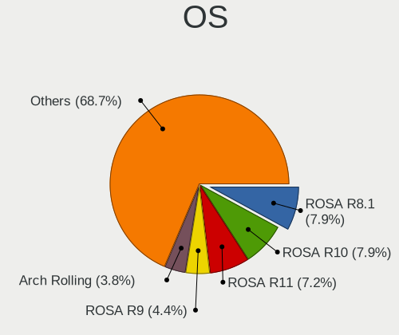

| Name                         | Computers | Percent |
|------------------------------|-----------|---------|
| ROSA R8.1                    | 56        | 7.94%   |
| ROSA R10                     | 56        | 7.94%   |
| ROSA R11                     | 51        | 7.23%   |
| ROSA R9                      | 31        | 4.4%    |
| Arch Rolling                 | 27        | 3.83%   |
| Ubuntu 22.04                 | 25        | 3.55%   |
| ROSA R11.1                   | 25        | 3.55%   |
| Ubuntu 20.04                 | 24        | 3.4%    |
| ROSA R8                      | 22        | 3.12%   |
| Debian 11                    | 18        | 2.55%   |
| ROSA 12.4                    | 15        | 2.13%   |
| ROSA 12.2                    | 14        | 1.99%   |
| Debian 12                    | 12        | 1.7%    |
| KDE neon 20.04               | 11        | 1.56%   |
| Ubuntu 18.04                 | 10        | 1.42%   |
| OpenMandriva 4.2             | 10        | 1.42%   |
| ROSA 12.3                    | 9         | 1.28%   |
| Fedora 39                    | 8         | 1.13%   |
| OpenMandriva 4.3             | 7         | 0.99%   |
| OpenMandriva 24.07           | 7         | 0.99%   |
| Ubuntu 24.04                 | 6         | 0.85%   |
| Slackware 15.0               | 6         | 0.85%   |
| ROSA 12.5.1                  | 6         | 0.85%   |
| OpenMandriva 23.08           | 6         | 0.85%   |
| KDE neon 22.04               | 6         | 0.85%   |
| Fedora 38                    | 6         | 0.85%   |
| Pop!_OS 22.04                | 5         | 0.71%   |
| OpenMandriva 23.01           | 5         | 0.71%   |
| Manjaro                      | 5         | 0.71%   |
| EndeavourOS Rolling          | 5         | 0.71%   |
| Ubuntu 23.10                 | 4         | 0.57%   |
| Ubuntu 23.04                 | 4         | 0.57%   |
| openSUSE Tumbleweed-XXXXXXXX | 4         | 0.57%   |
| OpenMandriva 23.03           | 4         | 0.57%   |
| Linux Mint 21.1              | 4         | 0.57%   |
| Fedora 40                    | 4         | 0.57%   |
| Fedora 37                    | 4         | 0.57%   |
| Arch                         | 4         | 0.57%   |
| Ubuntu 18.10                 | 3         | 0.43%   |
| ROSA 12.1                    | 3         | 0.43%   |

OS Family
---------

OS without a version

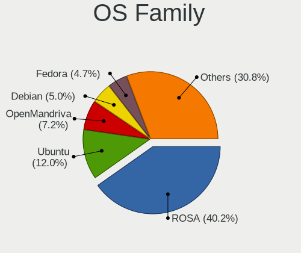

| Name         | Computers | Percent |
|--------------|-----------|---------|
| ROSA         | 264       | 40.24%  |
| Ubuntu       | 79        | 12.04%  |
| OpenMandriva | 47        | 7.16%   |
| Debian       | 33        | 5.03%   |
| Fedora       | 31        | 4.73%   |
| Arch         | 30        | 4.57%   |
| Linux Mint   | 22        | 3.35%   |
| Manjaro      | 19        | 2.9%    |
| KDE neon     | 19        | 2.9%    |
| Endless      | 18        | 2.74%   |
| Kubuntu      | 15        | 2.29%   |
| Pop!_OS      | 8         | 1.22%   |
| openSUSE     | 7         | 1.07%   |
| Slackware    | 6         | 0.91%   |
| EndeavourOS  | 5         | 0.76%   |
| Elementary   | 5         | 0.76%   |
| CentOS       | 5         | 0.76%   |
| SteamOS      | 4         | 0.61%   |
| LMDE         | 3         | 0.46%   |
| Gentoo       | 3         | 0.46%   |
| Zorin        | 2         | 0.3%    |
| Xubuntu      | 2         | 0.3%    |
| Ubuntu Unity | 2         | 0.3%    |
| Nobara       | 2         | 0.3%    |
| NixOS        | 2         | 0.3%    |
| Lunaos       | 2         | 0.3%    |
| Lubuntu      | 2         | 0.3%    |
| Clear Linux  | 2         | 0.3%    |
| ArcoLinux    | 2         | 0.3%    |
| ALT Linux    | 2         | 0.3%    |
| Ubuntu MATE  | 1         | 0.15%   |
| Trisquel     | 1         | 0.15%   |
| Solus        | 1         | 0.15%   |
| Rocky Linux  | 1         | 0.15%   |
| Peppermint   | 1         | 0.15%   |
| Parrot       | 1         | 0.15%   |
| Oracle Linux | 1         | 0.15%   |
| MX           | 1         | 0.15%   |
| Kali         | 1         | 0.15%   |
| Finnix       | 1         | 0.15%   |

Kernel
------

Version of the Linux kernel

| Version                             | Computers | Percent |
|-------------------------------------|-----------|---------|
| 4.15.0-desktop-45.1rosa-x86_64      | 29        | 3.81%   |
| 4.9.60-nrj-desktop-1rosa-x86_64     | 27        | 3.54%   |
| 4.9.20-nrj-desktop-1rosa-x86_64     | 24        | 3.15%   |
| 4.1.38-nrj-desktop-2rosa-x86_64     | 14        | 1.84%   |
| 5.10.74-generic-2rosa2021.1-x86_64  | 12        | 1.57%   |
| 4.9.9-nrj-desktop-1rosa-x86_64      | 11        | 1.44%   |
| 5.10.14-desktop-1omv4002            | 10        | 1.31%   |
| 4.1.34-nrj-desktop-2rosa-x86_64     | 10        | 1.31%   |
| 4.9.20-nrj-desktop-1rosa-i586       | 9         | 1.18%   |
| 4.9.155-nrj-desktop-1rosa-x86_64    | 9         | 1.18%   |
| 4.15.0-desktop-122.124.1rosa-x86_64 | 9         | 1.18%   |
| 4.9.60-nrj-desktop-1rosa-i586       | 8         | 1.05%   |
| 4.9.124-nrj-desktop-1rosa-x86_64    | 8         | 1.05%   |
| 6.4.11-desktop-1omv2390             | 7         | 0.92%   |
| 5.16.7-desktop-1omv4003             | 7         | 0.92%   |
| 4.1.34-nrj-desktop-2rosa-i586       | 7         | 0.92%   |
| 6.1.20-generic-2rosa2021.1-x86_64   | 6         | 0.79%   |
| 5.4.32-generic-2rosa-x86_64         | 6         | 0.79%   |
| 4.9.9-nrj-desktop-1rosa-i586        | 6         | 0.79%   |
| 4.9.76-nrj-desktop-1rosa-x86_64     | 6         | 0.79%   |
| 4.9.41-nrj-desktop-1rosa-x86_64     | 6         | 0.79%   |
| 4.15.0-desktop-45.1rosa-i586        | 6         | 0.79%   |
| 6.8.0-49-generic                    | 5         | 0.66%   |
| 6.6.27-generic-3rosa2021.1-x86_64   | 5         | 0.66%   |
| 6.1.1-desktop-1omv2290              | 5         | 0.66%   |
| 4.9.95-nrj-desktop-2rosa-x86_64     | 5         | 0.66%   |
| 4.9.111-nrj-desktop-2rosa-x86_64    | 5         | 0.66%   |
| 4.15.0-desktop-68.5rosa-x86_64      | 5         | 0.66%   |
| 6.6.2-desktop-1omv2390              | 4         | 0.52%   |
| 6.2.6-desktop-1omv2390              | 4         | 0.52%   |
| 6.10.0-desktop-1omv2490             | 4         | 0.52%   |
| 6.1.58-generic-1rosa2021.1-x86_64   | 4         | 0.52%   |
| 5.4.83-generic-2rosa-x86_64         | 4         | 0.52%   |
| 5.15.79-generic-1rosa2021.1-x86_64  | 4         | 0.52%   |
| 5.15.19                             | 4         | 0.52%   |
| 5.10.0-8-amd64                      | 4         | 0.52%   |
| 5.10.0-21-amd64                     | 4         | 0.52%   |
| 4.15.0-desktop-47.2rosa-x86_64      | 4         | 0.52%   |
| 6.9.7-desktop-1omv2490              | 3         | 0.39%   |
| 6.8.0-45-generic                    | 3         | 0.39%   |

Kernel Family
-------------

Linux kernel without a distro release

| Version | Computers | Percent |
|---------|-----------|---------|
| 4.15.0  | 64        | 8.49%   |
| 4.9.60  | 35        | 4.64%   |
| 4.9.20  | 33        | 4.38%   |
| 5.4.0   | 29        | 3.85%   |
| 5.15.0  | 25        | 3.32%   |
| 5.10.0  | 17        | 2.25%   |
| 4.9.9   | 17        | 2.25%   |
| 4.1.38  | 17        | 2.25%   |
| 4.1.34  | 17        | 2.25%   |
| 6.5.0   | 14        | 1.86%   |
| 6.2.0   | 13        | 1.72%   |
| 6.1.0   | 12        | 1.59%   |
| 5.11.0  | 12        | 1.59%   |
| 5.10.74 | 12        | 1.59%   |
| 6.8.0   | 11        | 1.46%   |
| 4.9.155 | 11        | 1.46%   |
| 5.10.14 | 10        | 1.33%   |
| 5.19.0  | 9         | 1.19%   |
| 5.0.0   | 9         | 1.19%   |
| 4.9.124 | 9         | 1.19%   |
| 5.4.32  | 8         | 1.06%   |
| 5.3.0   | 8         | 1.06%   |
| 5.16.7  | 8         | 1.06%   |
| 6.6.2   | 7         | 0.93%   |
| 6.4.11  | 7         | 0.93%   |
| 5.13.0  | 7         | 0.93%   |
| 4.9.76  | 7         | 0.93%   |
| 4.9.41  | 7         | 0.93%   |
| 4.9.111 | 7         | 0.93%   |
| 6.1.20  | 6         | 0.8%    |
| 6.1.1   | 6         | 0.8%    |
| 5.8.0   | 6         | 0.8%    |
| 4.18.0  | 6         | 0.8%    |
| 6.9.7   | 5         | 0.66%   |
| 6.6.27  | 5         | 0.66%   |
| 6.2.6   | 5         | 0.66%   |
| 4.9.95  | 5         | 0.66%   |
| 6.8.9   | 4         | 0.53%   |
| 6.10.0  | 4         | 0.53%   |
| 6.1.58  | 4         | 0.53%   |

Kernel Major Ver.
-----------------

Linux kernel major version

| Version | Computers | Percent |
|---------|-----------|---------|
| 4.9     | 121       | 16.85%  |
| 4.15    | 64        | 8.91%   |
| 5.10    | 51        | 7.1%    |
| 5.4     | 46        | 6.41%   |
| 6.1     | 45        | 6.27%   |
| 5.15    | 45        | 6.27%   |
| 4.1     | 37        | 5.15%   |
| 6.6     | 30        | 4.18%   |
| 6.5     | 25        | 3.48%   |
| 6.2     | 24        | 3.34%   |
| 6.8     | 22        | 3.06%   |
| 5.8     | 13        | 1.81%   |
| 5.19    | 13        | 1.81%   |
| 6.9     | 12        | 1.67%   |
| 6.4     | 12        | 1.67%   |
| 5.11    | 12        | 1.67%   |
| 4.18    | 11        | 1.53%   |
| 6.10    | 10        | 1.39%   |
| 5.0     | 10        | 1.39%   |
| 6.11    | 9         | 1.25%   |
| 5.3     | 9         | 1.25%   |
| 5.16    | 9         | 1.25%   |
| 5.14    | 9         | 1.25%   |
| 5.13    | 9         | 1.25%   |
| 6.7     | 8         | 1.11%   |
| 6.3     | 7         | 0.97%   |
| 6.0     | 7         | 0.97%   |
| 5.17    | 6         | 0.84%   |
| 4.19    | 6         | 0.84%   |
| 5.18    | 4         | 0.56%   |
| 4.13    | 4         | 0.56%   |
| 5.9     | 3         | 0.42%   |
| 2.6     | 3         | 0.42%   |
| 5.7     | 2         | 0.28%   |
| 5.6     | 2         | 0.28%   |
| 5.12    | 2         | 0.28%   |
| 4.4     | 2         | 0.28%   |
| 4.16    | 2         | 0.28%   |
| 4.12    | 2         | 0.28%   |
| 3.14    | 2         | 0.28%   |

Arch
----

OS architecture (x86_64, i586, etc.)

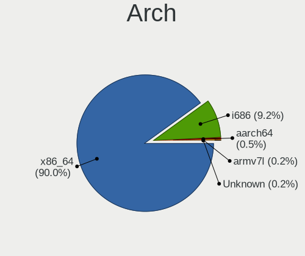

| Name    | Computers | Percent |
|---------|-----------|---------|
| x86_64  | 578       | 90.03%  |
| i686    | 59        | 9.19%   |
| aarch64 | 3         | 0.47%   |
| armv7l  | 1         | 0.16%   |
| Unknown | 1         | 0.16%   |

DE
--

Desktop Environment

| Name             | Computers | Percent |
|------------------|-----------|---------|
| KDE4             | 176       | 26.07%  |
| KDE5             | 170       | 25.19%  |
| GNOME            | 154       | 22.81%  |
| Unknown          | 44        | 6.52%   |
| XFCE             | 28        | 4.15%   |
| KDE              | 22        | 3.26%   |
| X-Cinnamon       | 20        | 2.96%   |
| LXQt             | 13        | 1.93%   |
| KDE6             | 10        | 1.48%   |
| MATE             | 7         | 1.04%   |
| Cinnamon         | 6         | 0.89%   |
| LXDE             | 5         | 0.74%   |
| Pantheon         | 4         | 0.59%   |
| i3               | 3         | 0.44%   |
| Unity            | 2         | 0.3%    |
| sway             | 2         | 0.3%    |
| Hyprland         | 2         | 0.3%    |
| GNOME Classic    | 2         | 0.3%    |
| Openbox          | 1         | 0.15%   |
| lightdm-xsession | 1         | 0.15%   |
| GNOME Flashback  | 1         | 0.15%   |
| COSMIC           | 1         | 0.15%   |
| awesome          | 1         | 0.15%   |

Display Server
--------------

X11 or Wayland

| Name    | Computers | Percent |
|---------|-----------|---------|
| X11     | 488       | 73.94%  |
| Wayland | 142       | 21.52%  |
| Unknown | 18        | 2.73%   |
| Tty     | 12        | 1.82%   |

Display Manager
---------------

SDDM, LightDM, etc.

| Name           | Computers | Percent |
|----------------|-----------|---------|
| SDDM           | 185       | 27.53%  |
| KDM            | 178       | 26.49%  |
| Unknown        | 150       | 22.32%  |
| GDM            | 58        | 8.63%   |
| GDM3           | 46        | 6.85%   |
| LightDM        | 42        | 6.25%   |
| TDM            | 10        | 1.49%   |
| XDM            | 1         | 0.15%   |
| SLiM           | 1         | 0.15%   |
| COSMIC-GREETER | 1         | 0.15%   |

OS Lang
-------

Language

| Lang        | Computers | Percent |
|-------------|-----------|---------|
| Unknown     | 236       | 35.7%   |
| ru_RU       | 223       | 33.74%  |
| en_US       | 177       | 26.78%  |
| C           | 10        | 1.51%   |
| ru_RU.UTF_8 | 4         | 0.61%   |
| en_GB       | 4         | 0.61%   |
| ru_KZ       | 2         | 0.3%    |
| tr_TR       | 1         | 0.15%   |
| kk_KZ       | 1         | 0.15%   |
| en_IN       | 1         | 0.15%   |
| en_IL       | 1         | 0.15%   |
| en_BW       | 1         | 0.15%   |

Boot Mode
---------

EFI or BIOS

| Mode | Computers | Percent |
|------|-----------|---------|
| BIOS | 363       | 55.67%  |
| EFI  | 289       | 44.33%  |

Filesystem
----------

Type of filesystem

| Type    | Computers | Percent |
|---------|-----------|---------|
| Ext4    | 389       | 58.5%   |
| Unknown | 145       | 21.8%   |
| Btrfs   | 60        | 9.02%   |
| Overlay | 51        | 7.67%   |
| Tmpfs   | 9         | 1.35%   |
| Xfs     | 5         | 0.75%   |
| Ext3    | 3         | 0.45%   |
| Zfs     | 2         | 0.3%    |
| F2fs    | 1         | 0.15%   |

Part. scheme
------------

Scheme of partitioning

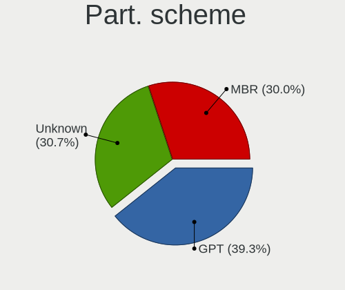

| Type    | Computers | Percent |
|---------|-----------|---------|
| GPT     | 259       | 39.3%   |
| Unknown | 202       | 30.65%  |
| MBR     | 198       | 30.05%  |

Dual Boot with Linux/BSD
------------------------

Hosting more than one Linux/BSD

| Dual boot | Computers | Percent |
|-----------|-----------|---------|
| No        | 554       | 84.32%  |
| Yes       | 103       | 15.68%  |

Dual Boot (Win)
---------------

Hosting Linux and Windows

| Dual boot | Computers | Percent |
|-----------|-----------|---------|
| No        | 446       | 67.37%  |
| Yes       | 216       | 32.63%  |

Board
-----

Vendor
------

Motherboard manufacturer

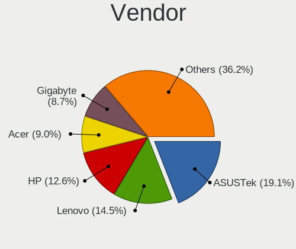

| Name                | Computers | Percent |
|---------------------|-----------|---------|
| ASUSTek Computer    | 121       | 19.06%  |
| Lenovo              | 92        | 14.49%  |
| Hewlett-Packard     | 80        | 12.6%   |
| Acer                | 57        | 8.98%   |
| Gigabyte Technology | 55        | 8.66%   |
| ASRock              | 39        | 6.14%   |
| Dell                | 34        | 5.35%   |
| MSI                 | 23        | 3.62%   |
| Intel               | 15        | 2.36%   |
| ECS                 | 13        | 2.05%   |
| Unknown             | 11        | 1.73%   |
| Foxconn             | 10        | 1.57%   |
| Biostar             | 10        | 1.57%   |
| Toshiba             | 7         | 1.1%    |
| Sony                | 7         | 1.1%    |
| Samsung Electronics | 6         | 0.94%   |
| Fujitsu             | 6         | 0.94%   |
| Fujitsu Siemens     | 5         | 0.79%   |
| Valve               | 3         | 0.47%   |
| Packard Bell        | 3         | 0.47%   |
| HUAWEI              | 3         | 0.47%   |
| Huanan              | 3         | 0.47%   |
| Chuwi               | 3         | 0.47%   |
| Supermicro          | 2         | 0.31%   |
| OEM                 | 2         | 0.31%   |
| HPE                 | 2         | 0.31%   |
| eMachines           | 2         | 0.31%   |
| AMI                 | 2         | 0.31%   |
| Acidanthera         | 2         | 0.31%   |
| YiFang              | 1         | 0.16%   |
| TI                  | 1         | 0.16%   |
| Sapphire            | 1         | 0.16%   |
| Rockchip            | 1         | 0.16%   |
| Quanta              | 1         | 0.16%   |
| Kobian              | 1         | 0.16%   |
| IP3 Tech            | 1         | 0.16%   |
| IBM                 | 1         | 0.16%   |
| HONOR               | 1         | 0.16%   |
| GPD                 | 1         | 0.16%   |
| GoWin Solution      | 1         | 0.16%   |

Model
-----

Motherboard model

| Name                                     | Computers | Percent |
|------------------------------------------|-----------|---------|
| Unknown                                  | 14        | 2.2%    |
| ASUS All Series                          | 9         | 1.42%   |
| Lenovo G500 20236                        | 8         | 1.26%   |
| HP Pavilion g6                           | 5         | 0.79%   |
| Acer Aspire E5-575G                      | 5         | 0.79%   |
| Gigabyte P35-DS3L                        | 4         | 0.63%   |
| Valve Jupiter                            | 3         | 0.47%   |
| Lenovo IdeaPad Gaming 3 15ACH6 82K2      | 3         | 0.47%   |
| Lenovo G510 20238                        | 3         | 0.47%   |
| HP Pavilion dv6                          | 3         | 0.47%   |
| Gigabyte EP45-DS3L                       | 3         | 0.47%   |
| Fujitsu LIFEBOOK AH531                   | 3         | 0.47%   |
| ASUS VivoBook_ASUSLaptop X1505VA_X1505VA | 3         | 0.47%   |
| ASUS VivoBook 15_ASUS Laptop X540UAR     | 3         | 0.47%   |
| ASUS P5G41-M LE                          | 3         | 0.47%   |
| ASUS H61M-K                              | 3         | 0.47%   |
| Acer Aspire 5750G                        | 3         | 0.47%   |
| Packard Bell DOT S                       | 2         | 0.31%   |
| MSI MS-7817                              | 2         | 0.31%   |
| MSI MS-7788                              | 2         | 0.31%   |
| MSI MS-7592                              | 2         | 0.31%   |
| MSI MS-7529                              | 2         | 0.31%   |
| Lenovo ThinkPad Edge E530 3259CEG        | 2         | 0.31%   |
| Lenovo ThinkBook 15 G3 ACL 21A4          | 2         | 0.31%   |
| Lenovo ThinkBook 14 G2 ITL 20VD          | 2         | 0.31%   |
| Lenovo Legion Y540-15IRH-PG0 81SY        | 2         | 0.31%   |
| Lenovo IdeaPad Z570 HuronRiver Platform  | 2         | 0.31%   |
| Lenovo G505s 20255                       | 2         | 0.31%   |
| Intel DH61WW AAG23116-204                | 2         | 0.31%   |
| HP ProLiant DL360 G5                     | 2         | 0.31%   |
| HP Presario CQ57                         | 2         | 0.31%   |
| HP Pavilion Gaming Laptop 15-cx0xxx      | 2         | 0.31%   |
| HP ENVY x360 Convertible 15-eu0xxx       | 2         | 0.31%   |
| HP Compaq CQ58                           | 2         | 0.31%   |
| Gigabyte H61M-S1                         | 2         | 0.31%   |
| Gigabyte B450M S2H                       | 2         | 0.31%   |
| Gigabyte A320M-H                         | 2         | 0.31%   |
| Foxconn G31MXP FAB:1.1                   | 2         | 0.31%   |
| ECS P67H2-A3                             | 2         | 0.31%   |
| ECS H61H2-M12                            | 2         | 0.31%   |

Model Family
------------

Motherboard model prefix

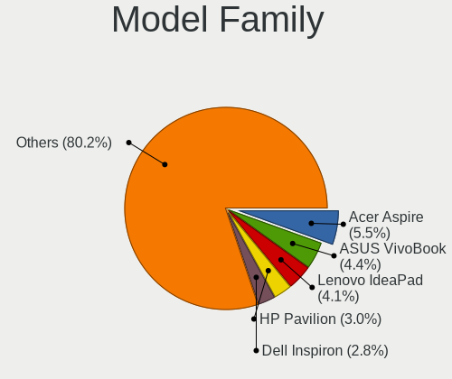

| Name               | Computers | Percent |
|--------------------|-----------|---------|
| Acer Aspire        | 35        | 5.51%   |
| ASUS VivoBook      | 28        | 4.41%   |
| Lenovo IdeaPad     | 26        | 4.09%   |
| HP Pavilion        | 19        | 2.99%   |
| Dell Inspiron      | 18        | 2.83%   |
| Lenovo ThinkPad    | 14        | 2.2%    |
| Unknown            | 14        | 2.2%    |
| HP ProBook         | 11        | 1.73%   |
| Lenovo Legion      | 9         | 1.42%   |
| HP Laptop          | 9         | 1.42%   |
| HP Compaq          | 9         | 1.42%   |
| ASUS All           | 9         | 1.42%   |
| Lenovo G500        | 8         | 1.26%   |
| ASUS ROG           | 8         | 1.26%   |
| ASUS PRIME         | 8         | 1.26%   |
| ASUS ASUS          | 8         | 1.26%   |
| Lenovo ThinkBook   | 7         | 1.1%    |
| Dell Latitude      | 7         | 1.1%    |
| Acer Nitro         | 7         | 1.1%    |
| HP ENVY            | 5         | 0.79%   |
| HP EliteBook       | 5         | 0.79%   |
| Fujitsu LIFEBOOK   | 5         | 0.79%   |
| Toshiba Satellite  | 4         | 0.63%   |
| Gigabyte P35-DS3L  | 4         | 0.63%   |
| Acer Predator      | 4         | 0.63%   |
| Valve Jupiter      | 3         | 0.47%   |
| Lenovo ThinkCentre | 3         | 0.47%   |
| Lenovo IdeaCentre  | 3         | 0.47%   |
| Lenovo G510        | 3         | 0.47%   |
| Gigabyte EP45-DS3L | 3         | 0.47%   |
| Foxconn G31MXP     | 3         | 0.47%   |
| Dell Vostro        | 3         | 0.47%   |
| ASUS TUF           | 3         | 0.47%   |
| ASUS P8H61-M       | 3         | 0.47%   |
| ASUS P5G41-M       | 3         | 0.47%   |
| ASUS H61M-K        | 3         | 0.47%   |
| ASRock Z68         | 3         | 0.47%   |
| Acer Swift         | 3         | 0.47%   |
| Toshiba TECRA      | 2         | 0.31%   |
| Packard Bell DOT   | 2         | 0.31%   |

MFG Year
--------

Motherboard manufacture year

| Year    | Computers | Percent |
|---------|-----------|---------|
| 2012    | 71        | 11.18%  |
| 2011    | 63        | 9.92%   |
| 2013    | 50        | 7.87%   |
| 2021    | 41        | 6.46%   |
| 2008    | 38        | 5.98%   |
| 2020    | 37        | 5.83%   |
| 2017    | 36        | 5.67%   |
| 2019    | 34        | 5.35%   |
| 2018    | 34        | 5.35%   |
| 2009    | 34        | 5.35%   |
| 2022    | 33        | 5.2%    |
| 2010    | 30        | 4.72%   |
| 2016    | 28        | 4.41%   |
| 2007    | 26        | 4.09%   |
| 2015    | 19        | 2.99%   |
| 2023    | 18        | 2.83%   |
| 2014    | 18        | 2.83%   |
| 2006    | 7         | 1.1%    |
| 2024    | 6         | 0.94%   |
| Unknown | 6         | 0.94%   |
| 2005    | 4         | 0.63%   |
| 2003    | 2         | 0.31%   |

Form Factor
-----------

Physical design of the computer

| Name           | Computers | Percent |
|----------------|-----------|---------|
| Notebook       | 356       | 56.06%  |
| Desktop        | 249       | 39.21%  |
| All in one     | 10        | 1.57%   |
| Server         | 7         | 1.1%    |
| Mini pc        | 5         | 0.79%   |
| Convertible    | 4         | 0.63%   |
| System on chip | 3         | 0.47%   |
| Tablet         | 1         | 0.16%   |

Secure Boot
-----------

Enabled or disabled

| State    | Computers | Percent |
|----------|-----------|---------|
| Disabled | 608       | 95.3%   |
| Enabled  | 30        | 4.7%    |

Coreboot
--------

Have coreboot on board

| Used | Computers | Percent |
|------|-----------|---------|
| No   | 635       | 100%    |

RAM Size
--------

Total RAM memory

| Size in GB      | Computers | Percent |
|-----------------|-----------|---------|
| 3.01-4.0        | 154       | 23.55%  |
| 4.01-8.0        | 141       | 21.56%  |
| 8.01-16.0       | 121       | 18.5%   |
| 16.01-24.0      | 99        | 15.14%  |
| 1.01-2.0        | 42        | 6.42%   |
| 32.01-64.0      | 36        | 5.5%    |
| 2.01-3.0        | 28        | 4.28%   |
| 24.01-32.0      | 10        | 1.53%   |
| 0.51-1.0        | 10        | 1.53%   |
| 64.01-256.0     | 9         | 1.38%   |
| More than 256.0 | 2         | 0.31%   |
| 0.01-0.5        | 1         | 0.15%   |
| Unknown         | 1         | 0.15%   |

RAM Used
--------

Used RAM memory

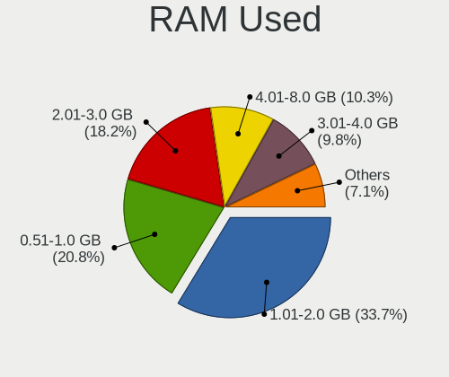

| Used GB         | Computers | Percent |
|-----------------|-----------|---------|
| 1.01-2.0        | 241       | 33.71%  |
| 0.51-1.0        | 149       | 20.84%  |
| 2.01-3.0        | 130       | 18.18%  |
| 4.01-8.0        | 74        | 10.35%  |
| 3.01-4.0        | 70        | 9.79%   |
| 8.01-16.0       | 30        | 4.2%    |
| 0.01-0.5        | 12        | 1.68%   |
| Unknown         | 4         | 0.56%   |
| 16.01-24.0      | 2         | 0.28%   |
| More than 256.0 | 1         | 0.14%   |
| 32.01-64.0      | 1         | 0.14%   |
| 64.01-256.0     | 1         | 0.14%   |

Total Drives
------------

Number of drives on board

| Drives | Computers | Percent |
|--------|-----------|---------|
| 1      | 403       | 61.06%  |
| 2      | 170       | 25.76%  |
| 3      | 52        | 7.88%   |
| 4      | 18        | 2.73%   |
| 5      | 8         | 1.21%   |
| 0      | 4         | 0.61%   |
| 6      | 3         | 0.45%   |
| 27     | 1         | 0.15%   |
| 8      | 1         | 0.15%   |

Has CD-ROM
----------

Has CD-ROM on board

| Presented | Computers | Percent |
|-----------|-----------|---------|
| No        | 382       | 59.32%  |
| Yes       | 262       | 40.68%  |

Has Ethernet
------------

Has Ethernet on board

| Presented | Computers | Percent |
|-----------|-----------|---------|
| Yes       | 583       | 91.67%  |
| No        | 53        | 8.33%   |

Has WiFi
--------

Has WiFi module

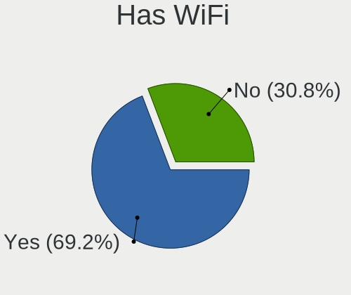

| Presented | Computers | Percent |
|-----------|-----------|---------|
| Yes       | 443       | 69.22%  |
| No        | 197       | 30.78%  |

Has Bluetooth
-------------

Has Bluetooth module

| Presented | Computers | Percent |
|-----------|-----------|---------|
| Yes       | 334       | 52.02%  |
| No        | 308       | 47.98%  |

Location
--------

Country
-------

Geographic location (country)

| Country    | Computers | Percent |
|------------|-----------|---------|
| Kazakhstan | 635       | 100%    |

City
----

Geographic location (city)

| City            | Computers | Percent |
|-----------------|-----------|---------|
| Almaty          | 204       | 29.27%  |
| Nur-Sultan      | 78        | 11.19%  |
| Kostanay        | 45        | 6.46%   |
| Karaganda       | 39        | 5.6%    |
| Astana          | 39        | 5.6%    |
| Ust-Kamenogorsk | 34        | 4.88%   |
| Pavlodar        | 33        | 4.73%   |
| Aktobe          | 31        | 4.45%   |
| Taraz           | 24        | 3.44%   |
| Petropavl       | 17        | 2.44%   |
| Semey           | 14        | 2.01%   |
| Kyzylorda       | 14        | 2.01%   |
| Aktau           | 14        | 2.01%   |
| Shymkent        | 13        | 1.87%   |
| Rudnyy          | 12        | 1.72%   |
| Atyrau          | 12        | 1.72%   |
| Temirtau        | 8         | 1.15%   |
| Ridder          | 8         | 1.15%   |
| Oral            | 8         | 1.15%   |
| Kokshetau       | 7         | 1%      |
| Ekibastuz       | 4         | 0.57%   |
| Taldykorgan     | 3         | 0.43%   |
| Soran           | 3         | 0.43%   |
| Shchchnsk   | 3         | 0.43%   |
| Balqash         | 3         | 0.43%   |
| Tekeli          | 2         | 0.29%   |
| Taiynsha        | 2         | 0.29%   |
| Stepnogorsk     | 2         | 0.29%   |
| Sarkand         | 2         | 0.29%   |
| Makhambet       | 2         | 0.29%   |
| Komsomol'skoe   | 2         | 0.29%   |
| Almaty Oblysy   | 2         | 0.29%   |
| Urzhar          | 1         | 0.14%   |
| Tobol           | 1         | 0.14%   |
| Shemonakha    | 1         | 0.14%   |
| Lsakovsk      | 1         | 0.14%   |
| Kaskelen        | 1         | 0.14%   |
| Karatau         | 1         | 0.14%   |
| Karagandy       | 1         | 0.14%   |
| Kapshagay       | 1         | 0.14%   |

Drives
------

Drive Vendor
------------

Hard drive vendors

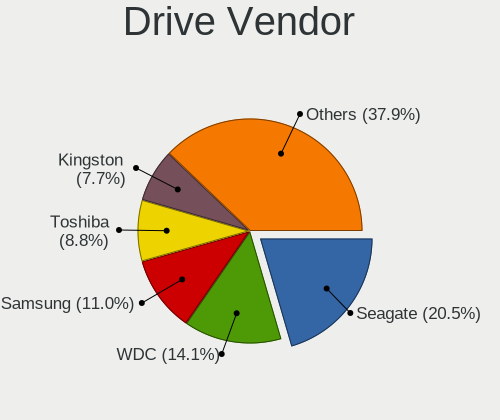

| Vendor                      | Computers | Drives | Percent |
|-----------------------------|-----------|--------|---------|
| Seagate                     | 190       | 292    | 20.5%   |
| WDC                         | 131       | 181    | 14.13%  |
| Samsung Electronics         | 102       | 155    | 11%     |
| Toshiba                     | 82        | 113    | 8.85%   |
| Kingston                    | 71        | 120    | 7.66%   |
| Hitachi                     | 36        | 50     | 3.88%   |
| Unknown                     | 27        | 34     | 2.91%   |
| SanDisk                     | 23        | 24     | 2.48%   |
| Micron Technology           | 21        | 33     | 2.27%   |
| Intel                       | 19        | 22     | 2.05%   |
| HGST                        | 19        | 21     | 2.05%   |
| Transcend                   | 17        | 21     | 1.83%   |
| SK hynix                    | 17        | 20     | 1.83%   |
| Apacer                      | 16        | 23     | 1.73%   |
| Gigabyte Technology         | 10        | 11     | 1.08%   |
| A-DATA Technology           | 10        | 13     | 1.08%   |
| Team                        | 9         | 11     | 0.97%   |
| GeIL                        | 9         | 9      | 0.97%   |
| KIOXIA                      | 8         | 11     | 0.86%   |
| Netac                       | 7         | 9      | 0.76%   |
| Plextor                     | 6         | 6      | 0.65%   |
| Patriot                     | 6         | 6      | 0.65%   |
| KingSpec                    | 6         | 11     | 0.65%   |
| Crucial                     | 5         | 5      | 0.54%   |
| China                       | 5         | 5      | 0.54%   |
| Hikvision                   | 4         | 4      | 0.43%   |
| Fujitsu                     | 4         | 5      | 0.43%   |
| AMD                         | 4         | 4      | 0.43%   |
| Silicon Motion              | 3         | 3      | 0.32%   |
| Phison                      | 3         | 3      | 0.32%   |
| Kingston Technology Company | 3         | 3      | 0.32%   |
| HUAWEI                      | 3         | 3      | 0.32%   |
| Hewlett-Packard             | 3         | 14     | 0.32%   |
| Unknown                     | 3         | 3      | 0.32%   |
| Phison Electronics          | 2         | 2      | 0.22%   |
| MAXIO Technology (Hangzhou) | 2         | 2      | 0.22%   |
| KingDian                    | 2         | 2      | 0.22%   |
| Kingchuxing                 | 2         | 3      | 0.22%   |
| HS-SSD-E100                 | 2         | 2      | 0.22%   |
| HPE                         | 2         | 2      | 0.22%   |

Drive Model
-----------

Hard drive models

| Model                                               | Computers | Percent |
|-----------------------------------------------------|-----------|---------|
| Seagate ST1000LM024 HN-M101MBB 1TB                  | 18        | 1.8%    |
| Toshiba DT01ACA050 500GB                            | 14        | 1.4%    |
| Seagate ST500DM002-1BD142 500GB                     | 14        | 1.4%    |
| Kingston SA400S37480G 480GB SSD                     | 14        | 1.4%    |
| Kingston SA400S37240G 240GB SSD                     | 13        | 1.3%    |
| Seagate ST1000LM035-1RK172 1TB                      | 12        | 1.2%    |
| Seagate ST3500418AS 500GB                           | 10        | 1%      |
| Toshiba HDWD110 1TB                                 | 9         | 0.9%    |
| Toshiba MQ01ABD100 1TB                              | 8         | 0.8%    |
| WDC WD5000AAKX-001CA0 500GB                         | 7         | 0.7%    |
| Toshiba MQ04ABF100 1TB                              | 7         | 0.7%    |
| Seagate ST3500413AS 500GB                           | 7         | 0.7%    |
| Seagate ST3320620AS 320GB                           | 7         | 0.7%    |
| Seagate ST3250310AS 250GB                           | 7         | 0.7%    |
| Kingston SA400S37120G 120GB SSD                     | 7         | 0.7%    |
| Intel SSDPEKNU512GZ 512GB                           | 7         | 0.7%    |
| Gigabyte GP-GSTFS31120GNTD 120GB                    | 7         | 0.7%    |
| Toshiba MQ01ABF050 500GB                            | 6         | 0.6%    |
| Toshiba DT01ACA100 1TB                              | 6         | 0.6%    |
| Seagate ST500LM012 HN-M500MBB 500GB                 | 6         | 0.6%    |
| SanDisk NVMe SSD Drive 512GB                        | 6         | 0.6%    |
| HGST HTS541010A9E680 1TB                            | 6         | 0.6%    |
| WDC WD3200BPVT-22JJ5T0 320GB                        | 5         | 0.5%    |
| Toshiba DT01ACA200 2TB                              | 5         | 0.5%    |
| Seagate ST9320325AS 320GB                           | 5         | 0.5%    |
| Seagate ST3250318AS 250GB                           | 5         | 0.5%    |
| Seagate ST1000DM010-2EP102 1TB                      | 5         | 0.5%    |
| Samsung SSD 860 EVO 250GB                           | 5         | 0.5%    |
| Samsung HD502HJ 500GB                               | 5         | 0.5%    |
| Hitachi HTS547550A9E384 500GB                       | 5         | 0.5%    |
| WDC WD10SPZX-21Z10T0 1TB                            | 4         | 0.4%    |
| Transcend TS120GSSD220S 120GB                       | 4         | 0.4%    |
| Seagate ST500LT012-1DG142 500GB                     | 4         | 0.4%    |
| Seagate ST380011A 80GB                              | 4         | 0.4%    |
| Seagate ST3320613AS 320GB                           | 4         | 0.4%    |
| Seagate ST3250820AS 250GB                           | 4         | 0.4%    |
| Seagate ST3160815AS 160GB                           | 4         | 0.4%    |
| Seagate ST1000DM003-9YN162 1TB                      | 4         | 0.4%    |
| Seagate ST1000DM003-1CH162 1TB                      | 4         | 0.4%    |
| Samsung NVMe SSD Controller SM981/PM981/PM983 512GB | 4         | 0.4%    |

HDD Vendor
----------

Hard disk drive vendors

| Vendor              | Computers | Drives | Percent |
|---------------------|-----------|--------|---------|
| Seagate             | 188       | 290    | 37.83%  |
| WDC                 | 122       | 170    | 24.55%  |
| Toshiba             | 79        | 107    | 15.9%   |
| Samsung Electronics | 41        | 64     | 8.25%   |
| Hitachi             | 36        | 50     | 7.24%   |
| HGST                | 19        | 21     | 3.82%   |
| Fujitsu             | 4         | 5      | 0.8%    |
| Hewlett-Packard     | 3         | 14     | 0.6%    |
| Unknown             | 1         | 1      | 0.2%    |
| StoreJet            | 1         | 1      | 0.2%    |
| Maxtor              | 1         | 1      | 0.2%    |
| JMicron Technology  | 1         | 1      | 0.2%    |
| HGST HTS            | 1         | 1      | 0.2%    |

SSD Vendor
----------

Solid state drive vendors

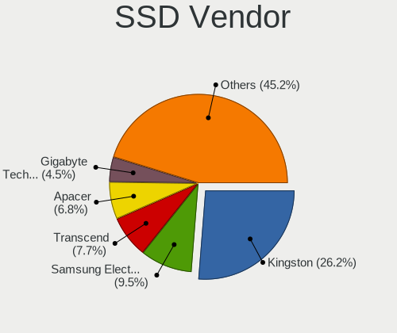

| Vendor              | Computers | Drives | Percent |
|---------------------|-----------|--------|---------|
| Kingston            | 58        | 102    | 26.24%  |
| Samsung Electronics | 21        | 32     | 9.5%    |
| Transcend           | 17        | 21     | 7.69%   |
| Apacer              | 15        | 22     | 6.79%   |
| Gigabyte Technology | 10        | 11     | 4.52%   |
| Team                | 9         | 11     | 4.07%   |
| SanDisk             | 6         | 6      | 2.71%   |
| Plextor             | 6         | 6      | 2.71%   |
| Patriot             | 6         | 6      | 2.71%   |
| KingSpec            | 6         | 11     | 2.71%   |
| GeIL                | 6         | 6      | 2.71%   |
| Netac               | 5         | 7      | 2.26%   |
| Crucial             | 5         | 5      | 2.26%   |
| China               | 5         | 5      | 2.26%   |
| Intel               | 4         | 7      | 1.81%   |
| AMD                 | 4         | 4      | 1.81%   |
| WDC                 | 3         | 3      | 1.36%   |
| SK hynix            | 3         | 3      | 1.36%   |
| A-DATA Technology   | 3         | 4      | 1.36%   |
| Micron Technology   | 2         | 2      | 0.9%    |
| KingDian            | 2         | 2      | 0.9%    |
| Kingchuxing         | 2         | 3      | 0.9%    |
| HPE                 | 2         | 2      | 0.9%    |
| Verbatim            | 1         | 1      | 0.45%   |
| Unknown             | 1         | 1      | 0.45%   |
| TEKET               | 1         | 2      | 0.45%   |
| SPCC                | 1         | 1      | 0.45%   |
| Smartbuy            | 1         | 1      | 0.45%   |
| Qumo                | 1         | 1      | 0.45%   |
| OCZ                 | 1         | 1      | 0.45%   |
| MG                  | 1         | 1      | 0.45%   |
| LVCARDS             | 1         | 1      | 0.45%   |
| Kingmax             | 1         | 1      | 0.45%   |
| KingFast            | 1         | 1      | 0.45%   |
| Kimtigo             | 1         | 1      | 0.45%   |
| HS-SSD-E100N        | 1         | 1      | 0.45%   |
| HS-SSD-E100         | 1         | 1      | 0.45%   |
| Hikvision           | 1         | 1      | 0.45%   |
| GOODRAM             | 1         | 1      | 0.45%   |
| Dahua               | 1         | 1      | 0.45%   |

Drive Kind
----------

HDD or SSD

| Kind    | Computers | Drives | Percent |
|---------|-----------|--------|---------|
| HDD     | 417       | 726    | 51.1%   |
| SSD     | 195       | 303    | 23.9%   |
| NVMe    | 166       | 226    | 20.34%  |
| MMC     | 26        | 32     | 3.19%   |
| Unknown | 12        | 12     | 1.47%   |

Drive Connector
---------------

SATA, SAS, NVMe, etc.

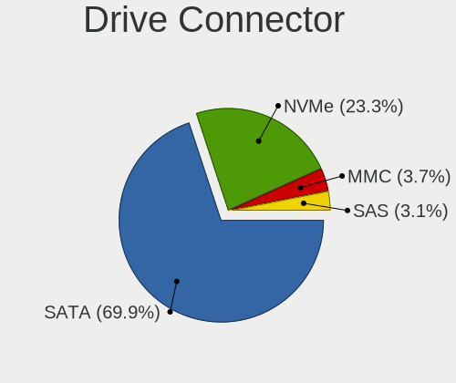

| Type | Computers | Drives | Percent |
|------|-----------|--------|---------|
| SATA | 498       | 1002   | 69.94%  |
| NVMe | 166       | 226    | 23.31%  |
| MMC  | 26        | 32     | 3.65%   |
| SAS  | 22        | 39     | 3.09%   |

Drive Size
----------

Size of hard drive

| Size in TB | Computers | Drives | Percent |
|------------|-----------|--------|---------|
| 0.01-0.5   | 396       | 695    | 64.71%  |
| 0.51-1.0   | 174       | 258    | 28.43%  |
| 1.01-2.0   | 27        | 48     | 4.41%   |
| 4.01-10.0  | 6         | 18     | 0.98%   |
| 3.01-4.0   | 5         | 5      | 0.82%   |
| 2.01-3.0   | 4         | 5      | 0.65%   |

Space Total
-----------

Amount of disk space available on the file system

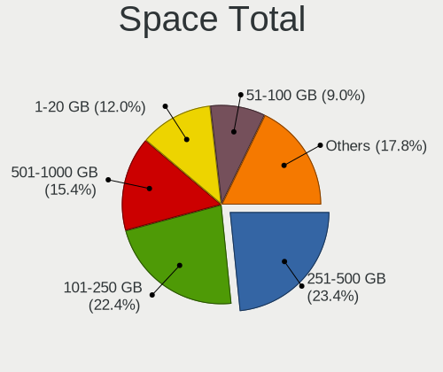

| Size in GB     | Computers | Percent |
|----------------|-----------|---------|
| 251-500        | 164       | 23.4%   |
| 101-250        | 157       | 22.4%   |
| 501-1000       | 108       | 15.41%  |
| 1-20           | 84        | 11.98%  |
| 51-100         | 63        | 8.99%   |
| 1001-2000      | 52        | 7.42%   |
| 21-50          | 41        | 5.85%   |
| More than 3000 | 13        | 1.85%   |
| Unknown        | 10        | 1.43%   |
| 2001-3000      | 9         | 1.28%   |

Space Used
----------

Amount of used disk space

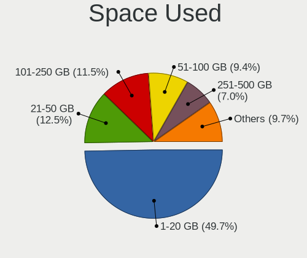

| Used GB        | Computers | Percent |
|----------------|-----------|---------|
| 1-20           | 353       | 49.72%  |
| 21-50          | 89        | 12.54%  |
| 101-250        | 82        | 11.55%  |
| 51-100         | 67        | 9.44%   |
| 251-500        | 50        | 7.04%   |
| 501-1000       | 35        | 4.93%   |
| 1001-2000      | 19        | 2.68%   |
| Unknown        | 10        | 1.41%   |
| More than 3000 | 3         | 0.42%   |
| 2001-3000      | 2         | 0.28%   |

Malfunc. Drives
---------------

Drive models with a malfunction

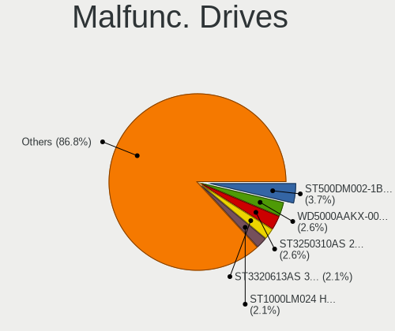

| Model                               | Computers | Drives | Percent |
|-------------------------------------|-----------|--------|---------|
| Seagate ST500DM002-1BD142 500GB     | 7         | 10     | 3.68%   |
| WDC WD5000AAKX-001CA0 500GB         | 5         | 5      | 2.63%   |
| Seagate ST3250310AS 250GB           | 5         | 5      | 2.63%   |
| Seagate ST3320613AS 320GB           | 4         | 4      | 2.11%   |
| Seagate ST1000LM024 HN-M101MBB 1TB  | 4         | 4      | 2.11%   |
| Toshiba DT01ACA050 500GB            | 3         | 4      | 1.58%   |
| Seagate ST3802110A 80GB             | 3         | 4      | 1.58%   |
| Seagate ST3500418AS 500GB           | 3         | 6      | 1.58%   |
| Seagate ST3500413AS 500GB           | 3         | 3      | 1.58%   |
| Seagate ST3500320AS 500GB           | 3         | 3      | 1.58%   |
| Seagate ST3320620AS 320GB           | 3         | 6      | 1.58%   |
| Seagate ST3250820AS 250GB           | 3         | 3      | 1.58%   |
| Seagate ST3160215AS 160GB           | 3         | 3      | 1.58%   |
| Hitachi HTS547550A9E384 500GB       | 3         | 4      | 1.58%   |
| Hitachi HTS543232A7A384 320GB       | 3         | 3      | 1.58%   |
| WDC WD800JD-60LSA0 80GB             | 2         | 2      | 1.05%   |
| WDC WD5000LPVX-00V0TT0 500GB        | 2         | 4      | 1.05%   |
| WDC WD2000JS-60NCB1 200GB           | 2         | 3      | 1.05%   |
| Toshiba MQ01ABF050 500GB            | 2         | 2      | 1.05%   |
| Toshiba MQ01ABD100 1TB              | 2         | 2      | 1.05%   |
| Toshiba MK5059GSXP 500GB            | 2         | 3      | 1.05%   |
| Seagate ST9500325AS 500GB           | 2         | 2      | 1.05%   |
| Seagate ST9320325AS 320GB           | 2         | 2      | 1.05%   |
| Seagate ST500LT012-9WS142 500GB     | 2         | 9      | 1.05%   |
| Seagate ST500LT012-1DG142 500GB     | 2         | 4      | 1.05%   |
| Seagate ST500LM012 HN-M500MBB 500GB | 2         | 2      | 1.05%   |
| Seagate ST380215AS 80GB             | 2         | 2      | 1.05%   |
| Seagate ST340014A 40GB              | 2         | 2      | 1.05%   |
| Seagate ST3320418AS 320GB           | 2         | 2      | 1.05%   |
| Seagate ST3160815AS 160GB           | 2         | 2      | 1.05%   |
| Seagate ST1000DM003-9YN162 1TB      | 2         | 10     | 1.05%   |
| Samsung Electronics HM321HI 320GB   | 2         | 2      | 1.05%   |
| Samsung Electronics HD642JJ 640GB   | 2         | 4      | 1.05%   |
| Samsung Electronics HD502HI 500GB   | 2         | 3      | 1.05%   |
| Hitachi HTS543216L9SA00 160GB       | 2         | 2      | 1.05%   |
| Hitachi HDP725016GLA380 160GB       | 2         | 3      | 1.05%   |
| HGST HTS725050A7E630 500GB          | 2         | 2      | 1.05%   |
| HGST HTS541010A9E680 1TB            | 2         | 3      | 1.05%   |
| Hewlett-Packard FB160C4081 160GB    | 2         | 2      | 1.05%   |
| WDC WD7500BPVT-24HXZT3 752GB        | 1         | 2      | 0.53%   |

Malfunc. Drive Vendor
---------------------

Vendors of faulty drives

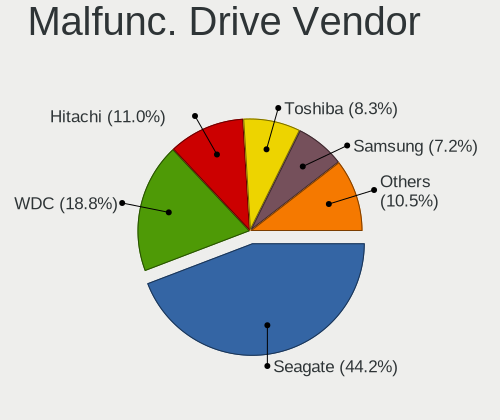

| Vendor              | Computers | Drives | Percent |
|---------------------|-----------|--------|---------|
| Seagate             | 80        | 117    | 44.2%   |
| WDC                 | 34        | 46     | 18.78%  |
| Hitachi             | 20        | 33     | 11.05%  |
| Toshiba             | 15        | 17     | 8.29%   |
| Samsung Electronics | 13        | 17     | 7.18%   |
| HGST                | 7         | 8      | 3.87%   |
| Kingston            | 3         | 3      | 1.66%   |
| Hewlett-Packard     | 2         | 2      | 1.1%    |
| Team                | 1         | 1      | 0.55%   |
| Plextor             | 1         | 1      | 0.55%   |
| Maxtor              | 1         | 1      | 0.55%   |
| KingSpec            | 1         | 4      | 0.55%   |
| Intel               | 1         | 1      | 0.55%   |
| China               | 1         | 1      | 0.55%   |
| AFOX                | 1         | 1      | 0.55%   |

Malfunc. HDD Vendor
-------------------

Vendors of faulty HDD drives

| Vendor              | Computers | Drives | Percent |
|---------------------|-----------|--------|---------|
| Seagate             | 80        | 117    | 47.06%  |
| WDC                 | 34        | 46     | 20%     |
| Hitachi             | 20        | 33     | 11.76%  |
| Toshiba             | 15        | 17     | 8.82%   |
| Samsung Electronics | 11        | 15     | 6.47%   |
| HGST                | 7         | 8      | 4.12%   |
| Hewlett-Packard     | 2         | 2      | 1.18%   |
| Maxtor              | 1         | 1      | 0.59%   |

Malfunc. Drive Kind
-------------------

Kinds of faulty drives

| Kind | Computers | Drives | Percent |
|------|-----------|--------|---------|
| HDD  | 153       | 239    | 93.29%  |
| SSD  | 10        | 13     | 6.1%    |
| NVMe | 1         | 1      | 0.61%   |

Failed Drives
-------------

Failed drive models

| Model                             | Computers | Drives | Percent |
|-----------------------------------|-----------|--------|---------|
| Samsung Electronics HD322GJ 320GB | 2         | 2      | 50%     |
| WDC WD3200BPVT-24ZEST0 320GB      | 1         | 1      | 25%     |
| Seagate ST3250318AS 250GB         | 1         | 2      | 25%     |

Failed Drive Vendor
-------------------

Failed drive vendors

| Vendor              | Computers | Drives | Percent |
|---------------------|-----------|--------|---------|
| Samsung Electronics | 2         | 2      | 50%     |
| WDC                 | 1         | 1      | 25%     |
| Seagate             | 1         | 2      | 25%     |

Drive Status
------------

Number of failed and malfunc. drives

| Status   | Computers | Drives | Percent |
|----------|-----------|--------|---------|
| Works    | 370       | 717    | 50.68%  |
| Detected | 196       | 324    | 26.85%  |
| Malfunc  | 160       | 253    | 21.92%  |
| Failed   | 4         | 5      | 0.55%   |

Storage controller
------------------

Storage Vendor
--------------

Storage controller vendors

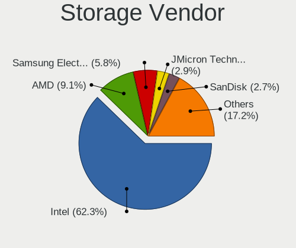

| Vendor                        | Computers | Percent |
|-------------------------------|-----------|---------|
| Intel                         | 490       | 62.26%  |
| AMD                           | 72        | 9.15%   |
| Samsung Electronics           | 46        | 5.84%   |
| JMicron Technology            | 23        | 2.92%   |
| SanDisk                       | 21        | 2.67%   |
| Micron Technology             | 19        | 2.41%   |
| Kingston Technology Company   | 18        | 2.29%   |
| SK hynix                      | 14        | 1.78%   |
| Marvell Technology Group      | 12        | 1.52%   |
| Nvidia                        | 9         | 1.14%   |
| KIOXIA                        | 7         | 0.89%   |
| Phison Electronics            | 6         | 0.76%   |
| ASMedia Technology            | 6         | 0.76%   |
| ADATA Technology              | 6         | 0.76%   |
| MAXIO Technology (Hangzhou)   | 5         | 0.64%   |
| Toshiba America Info Systems  | 4         | 0.51%   |
| Silicon Motion                | 4         | 0.51%   |
| Realtek Semiconductor         | 4         | 0.51%   |
| VIA Technologies              | 3         | 0.38%   |
| Union Memory (Shenzhen)       | 2         | 0.25%   |
| Solidigm                      | 2         | 0.25%   |
| Netac Technology              | 2         | 0.25%   |
| Integrated Technology Express | 2         | 0.25%   |
| Hewlett-Packard               | 2         | 0.25%   |
| Adaptec                       | 2         | 0.25%   |
| ULi Electronics               | 1         | 0.13%   |
| Shenzhen Longsys Electronics  | 1         | 0.13%   |
| O2 Micro                      | 1         | 0.13%   |
| LSI Logic / Symbios Logic     | 1         | 0.13%   |
| Biwin Storage Technology      | 1         | 0.13%   |
| Unknown                       | 1         | 0.13%   |

Storage Model
-------------

Storage controller models

| Model                                                                                   | Computers | Percent |
|-----------------------------------------------------------------------------------------|-----------|---------|
| AMD FCH SATA Controller [AHCI mode]                                                     | 48        | 4.98%   |
| Intel 7 Series Chipset Family 6-port SATA Controller [AHCI mode]                        | 41        | 4.25%   |
| Intel NM10/ICH7 Family SATA Controller [IDE mode]                                       | 37        | 3.84%   |
| Intel 82801G (ICH7 Family) IDE Controller                                               | 35        | 3.63%   |
| Intel Sunrise Point-LP SATA Controller [AHCI mode]                                      | 32        | 3.32%   |
| Intel 8 Series/C220 Series Chipset Family 6-port SATA Controller 1 [AHCI mode]          | 25        | 2.59%   |
| Intel 6 Series/C200 Series Chipset Family 6 port Desktop SATA AHCI Controller           | 25        | 2.59%   |
| Intel Volume Management Device NVMe RAID Controller                                     | 23        | 2.39%   |
| Samsung NVMe SSD Controller SM981/PM981/PM983                                           | 21        | 2.18%   |
| Intel 6 Series/C200 Series Chipset Family Desktop SATA Controller (IDE mode, ports 4-5) | 20        | 2.07%   |
| Intel 6 Series/C200 Series Chipset Family Desktop SATA Controller (IDE mode, ports 0-3) | 20        | 2.07%   |
| Intel 6 Series/C200 Series Chipset Family 6 port Mobile SATA AHCI Controller            | 20        | 2.07%   |
| Samsung NVMe SSD Controller 980 (DRAM-less)                                             | 15        | 1.56%   |
| JMicron JMB368 IDE controller                                                           | 14        | 1.45%   |
| Intel 82801 Mobile SATA Controller [RAID mode]                                          | 14        | 1.45%   |
| Intel Tiger Lake-LP SATA Controller                                                     | 13        | 1.35%   |
| Intel 82801JI (ICH10 Family) 4 port SATA IDE Controller #1                              | 12        | 1.24%   |
| Intel 82801JI (ICH10 Family) 2 port SATA IDE Controller #2                              | 12        | 1.24%   |
| Intel 7 Series/C210 Series Chipset Family 6-port SATA Controller [AHCI mode]            | 11        | 1.14%   |
| Intel 200 Series PCH SATA controller [AHCI mode]                                        | 11        | 1.14%   |
| Intel Q170/Q150/B150/H170/H110/Z170/CM236 Chipset SATA Controller [AHCI Mode]           | 10        | 1.04%   |
| Intel Comet Lake SATA AHCI Controller                                                   | 10        | 1.04%   |
| Intel 82801IBM/IEM (ICH9M/ICH9M-E) 4 port SATA Controller [AHCI mode]                   | 10        | 1.04%   |
| Intel 8 Series SATA Controller 1 [AHCI mode]                                            | 10        | 1.04%   |
| AMD 400 Series Chipset SATA Controller                                                  | 10        | 1.04%   |
| Samsung NVMe SSD Controller PM9A1/PM9A3/980PRO                                          | 9         | 0.93%   |
| Intel SSD 670p Series [Keystone Harbor]                                                 | 9         | 0.93%   |
| Intel Cannon Lake Mobile PCH SATA AHCI Controller                                       | 9         | 0.93%   |
| Intel 82801I (ICH9 Family) 2 port SATA Controller [IDE mode]                            | 9         | 0.93%   |
| AMD SB7x0/SB8x0/SB9x0 SATA Controller [AHCI mode]                                       | 9         | 0.93%   |
| JMicron JMB363 SATA/IDE Controller                                                      | 8         | 0.83%   |
| Intel Atom/Celeron/Pentium Processor x5-E8000/J3xxx/N3xxx Series SATA Controller        | 8         | 0.83%   |
| Intel 82801IB (ICH9) 2 port SATA Controller [IDE mode]                                  | 8         | 0.83%   |
| Intel 5 Series/3400 Series Chipset 4 port SATA IDE Controller                           | 8         | 0.83%   |
| Intel 5 Series/3400 Series Chipset 2 port SATA IDE Controller                           | 8         | 0.83%   |
| SK hynix Gold P31/BC711/PC711 NVMe Solid State Drive                                    | 7         | 0.73%   |
| Micron 2400 NVMe SSD (DRAM-less)                                                        | 7         | 0.73%   |
| Intel NM10/ICH7 Family SATA Controller [AHCI mode]                                      | 7         | 0.73%   |
| Intel Celeron/Pentium Silver Processor SATA Controller                                  | 7         | 0.73%   |
| Intel Atom Processor E3800 Series SATA AHCI Controller                                  | 7         | 0.73%   |

Storage Kind
------------

Kind of storage controller (IDE, SATA, NVMe, SAS, ...)

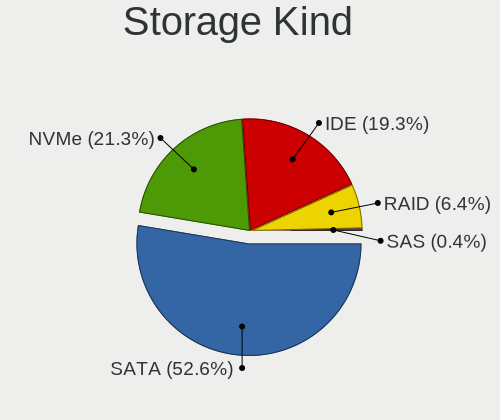

| Kind | Computers | Percent |
|------|-----------|---------|
| SATA | 411       | 52.62%  |
| NVMe | 166       | 21.25%  |
| IDE  | 151       | 19.33%  |
| RAID | 50        | 6.4%    |
| SAS  | 3         | 0.38%   |

Processor
---------

CPU Vendor
----------

Processor vendors

| Vendor  | Computers | Percent |
|---------|-----------|---------|
| Intel   | 520       | 81.89%  |
| AMD     | 111       | 17.48%  |
| ARM     | 3         | 0.47%   |
| Unknown | 1         | 0.16%   |

CPU Model
---------

Processor models

| Model                                       | Computers | Percent |
|---------------------------------------------|-----------|---------|
| Intel 11th Gen Core i5-1135G7 @ 2.40GHz     | 11        | 1.73%   |
| Intel Core i5-7200U CPU @ 2.50GHz           | 10        | 1.57%   |
| Intel Core 2 Duo CPU E8400 @ 3.00GHz        | 8         | 1.26%   |
| Intel Core i5-8250U CPU @ 1.60GHz           | 6         | 0.94%   |
| Intel Core i5-2450M CPU @ 2.50GHz           | 6         | 0.94%   |
| Intel Pentium CPU G630 @ 2.70GHz            | 5         | 0.78%   |
| Intel Core i5-8300H CPU @ 2.30GHz           | 5         | 0.78%   |
| Intel Core i5-4460 CPU @ 3.20GHz            | 5         | 0.78%   |
| Intel Core i5-10400F CPU @ 2.90GHz          | 5         | 0.78%   |
| Intel Core i3-3110M CPU @ 2.40GHz           | 5         | 0.78%   |
| Intel Core i3-2100 CPU @ 3.10GHz            | 5         | 0.78%   |
| Intel Core 2 Duo CPU E7400 @ 2.80GHz        | 5         | 0.78%   |
| Intel Celeron CPU N3060 @ 1.60GHz           | 5         | 0.78%   |
| Intel 12th Gen Core i5-12500H               | 5         | 0.78%   |
| AMD Ryzen 7 5800H with Radeon Graphics      | 5         | 0.78%   |
| AMD Ryzen 7 5700U with Radeon Graphics      | 5         | 0.78%   |
| Intel Core i7-9750H CPU @ 2.60GHz           | 4         | 0.63%   |
| Intel Core i7-3770 CPU @ 3.40GHz            | 4         | 0.63%   |
| Intel Core i7-10750H CPU @ 2.60GHz          | 4         | 0.63%   |
| Intel Core i5-8265U CPU @ 1.60GHz           | 4         | 0.63%   |
| Intel Core i5-7400 CPU @ 3.00GHz            | 4         | 0.63%   |
| Intel Core i5-3230M CPU @ 2.60GHz           | 4         | 0.63%   |
| Intel Core i5-3210M CPU @ 2.50GHz           | 4         | 0.63%   |
| Intel Core i5-1035G1 CPU @ 1.00GHz          | 4         | 0.63%   |
| Intel Core i5-10210U CPU @ 1.60GHz          | 4         | 0.63%   |
| Intel Core i3-7020U CPU @ 2.30GHz           | 4         | 0.63%   |
| Intel Core i3-3240 CPU @ 3.40GHz            | 4         | 0.63%   |
| Intel Core i3-2120 CPU @ 3.30GHz            | 4         | 0.63%   |
| Intel Pentium Dual-Core CPU E5700 @ 3.00GHz | 3         | 0.47%   |
| Intel Pentium CPU 2020M @ 2.40GHz           | 3         | 0.47%   |
| Intel Pentium 4 CPU 3.00GHz                 | 3         | 0.47%   |
| Intel Core i7-7700 CPU @ 3.60GHz            | 3         | 0.47%   |
| Intel Core i7-4770 CPU @ 3.40GHz            | 3         | 0.47%   |
| Intel Core i7-2670QM CPU @ 2.20GHz          | 3         | 0.47%   |
| Intel Core i5-9300H CPU @ 2.40GHz           | 3         | 0.47%   |
| Intel Core i5-6200U CPU @ 2.30GHz           | 3         | 0.47%   |
| Intel Core i5-5200U CPU @ 2.20GHz           | 3         | 0.47%   |
| Intel Core i5-3470 CPU @ 3.20GHz            | 3         | 0.47%   |
| Intel Core i5-3320M CPU @ 2.60GHz           | 3         | 0.47%   |
| Intel Core i5-2400 CPU @ 3.10GHz            | 3         | 0.47%   |

CPU Model Family
----------------

Processor model prefix

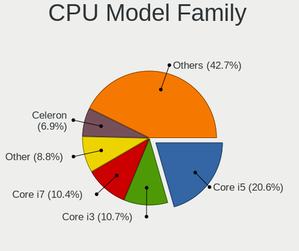

| Model                   | Computers | Percent |
|-------------------------|-----------|---------|
| Intel Core i5           | 131       | 20.57%  |
| Intel Core i3           | 68        | 10.68%  |
| Intel Core i7           | 66        | 10.36%  |
| Other                   | 56        | 8.79%   |
| Intel Celeron           | 44        | 6.91%   |
| Intel Core 2 Duo        | 40        | 6.28%   |
| Intel Pentium           | 29        | 4.55%   |
| AMD Ryzen 5             | 25        | 3.92%   |
| AMD Ryzen 7             | 24        | 3.77%   |
| Intel Xeon              | 18        | 2.83%   |
| Intel Pentium Dual-Core | 16        | 2.51%   |
| Intel Atom              | 14        | 2.2%    |
| Intel Core 2 Quad       | 10        | 1.57%   |
| AMD Ryzen 9             | 10        | 1.57%   |
| AMD Ryzen 3             | 7         | 1.1%    |
| Intel Pentium 4         | 6         | 0.94%   |
| Intel Pentium Dual      | 5         | 0.78%   |
| Intel Genuine           | 5         | 0.78%   |
| Intel Core 2            | 5         | 0.78%   |
| AMD E                   | 5         | 0.78%   |
| AMD A8                  | 5         | 0.78%   |
| AMD A10                 | 4         | 0.63%   |
| Intel Pentium Gold      | 3         | 0.47%   |
| AMD Athlon II X2        | 3         | 0.47%   |
| AMD Athlon 64 X2        | 3         | 0.47%   |
| AMD A6                  | 3         | 0.47%   |
| AMD A4                  | 3         | 0.47%   |
| Intel Xeon Silver       | 2         | 0.31%   |
| Intel Xeon Gold         | 2         | 0.31%   |
| Intel Pentium Silver    | 2         | 0.31%   |
| Intel Core              | 2         | 0.31%   |
| AMD Phenom II X4        | 2         | 0.31%   |
| AMD FX                  | 2         | 0.31%   |
| AMD E1                  | 2         | 0.31%   |
| Intel Pentium M         | 1         | 0.16%   |
| Intel Mobile Pentium 4  | 1         | 0.16%   |
| Intel Core i9           | 1         | 0.16%   |
| Intel Core Duo          | 1         | 0.16%   |
| Intel Core 2 Extreme    | 1         | 0.16%   |
| Intel Celeron Dual-Core | 1         | 0.16%   |

CPU Cores
---------

Number of processor cores

| Number  | Computers | Percent |
|---------|-----------|---------|
| 2       | 289       | 45.23%  |
| 4       | 187       | 29.26%  |
| 6       | 43        | 6.73%   |
| 8       | 40        | 6.26%   |
| Unknown | 21        | 3.29%   |
| 1       | 20        | 3.13%   |
| 12      | 16        | 2.5%    |
| 10      | 9         | 1.41%   |
| 16      | 4         | 0.63%   |
| 24      | 3         | 0.47%   |
| 20      | 2         | 0.31%   |
| 14      | 2         | 0.31%   |
| 36      | 1         | 0.16%   |
| 32      | 1         | 0.16%   |
| 3       | 1         | 0.16%   |

CPU Sockets
-----------

Number of sockets

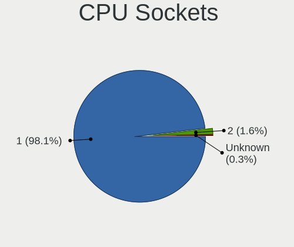

| Number  | Computers | Percent |
|---------|-----------|---------|
| 1       | 623       | 98.11%  |
| 2       | 10        | 1.57%   |
| Unknown | 2         | 0.31%   |

CPU Threads
-----------

Threads per core (Hyper-Threading)

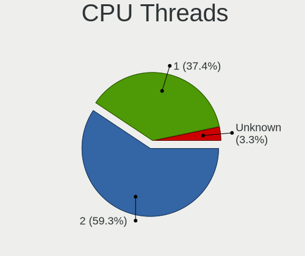

| Number  | Computers | Percent |
|---------|-----------|---------|
| 2       | 378       | 59.34%  |
| 1       | 238       | 37.36%  |
| Unknown | 21        | 3.3%    |

CPU Op-Modes
------------

CPU Operation Modes (32-bit, 64-bit)

| Op mode        | Computers | Percent |
|----------------|-----------|---------|
| 32-bit, 64-bit | 614       | 96.69%  |
| Unknown        | 11        | 1.73%   |
| 32-bit         | 9         | 1.42%   |
| 64-bit         | 1         | 0.16%   |

CPU Microcode
-------------

Microcode number

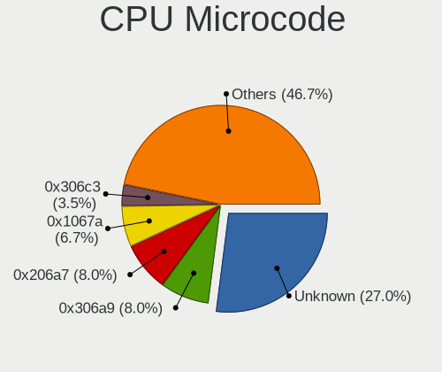

| Number     | Computers | Percent |
|------------|-----------|---------|
| Unknown    | 178       | 27.01%  |
| 0x306a9    | 53        | 8.04%   |
| 0x206a7    | 53        | 8.04%   |
| 0x1067a    | 44        | 6.68%   |
| 0x306c3    | 23        | 3.49%   |
| 0x806e9    | 14        | 2.12%   |
| 0x806c1    | 14        | 2.12%   |
| 0x906ea    | 12        | 1.82%   |
| 0x906e9    | 12        | 1.82%   |
| 0x6fd      | 11        | 1.67%   |
| 0x40651    | 10        | 1.52%   |
| 0x806ea    | 9         | 1.37%   |
| 0x20655    | 9         | 1.37%   |
| 0x10676    | 9         | 1.37%   |
| 0x06001119 | 9         | 1.37%   |
| 0x20652    | 8         | 1.21%   |
| 0x0a50000c | 8         | 1.21%   |
| 0x806ec    | 6         | 0.91%   |
| 0x6fb      | 6         | 0.91%   |
| 0x406e3    | 6         | 0.91%   |
| 0x406c4    | 6         | 0.91%   |
| 0x30678    | 6         | 0.91%   |
| 0x08608103 | 6         | 0.91%   |
| 0xa0653    | 5         | 0.76%   |
| 0xa0652    | 5         | 0.76%   |
| 0x706a1    | 5         | 0.76%   |
| 0x0a50000d | 5         | 0.76%   |
| 0x706e5    | 4         | 0.61%   |
| 0x30661    | 4         | 0.61%   |
| 0xf49      | 3         | 0.46%   |
| 0x906ed    | 3         | 0.46%   |
| 0x906a3    | 3         | 0.46%   |
| 0x6f6      | 3         | 0.46%   |
| 0x6e8      | 3         | 0.46%   |
| 0x506e3    | 3         | 0.46%   |
| 0x306d4    | 3         | 0.46%   |
| 0x10661    | 3         | 0.46%   |
| 0x0a404102 | 3         | 0.46%   |
| 0x08701021 | 3         | 0.46%   |
| 0x08108109 | 3         | 0.46%   |

CPU Microarch
-------------

Microarchitecture

| Name              | Computers | Percent |
|-------------------|-----------|---------|
| KabyLake          | 79        | 12.38%  |
| IvyBridge         | 68        | 10.66%  |
| SandyBridge       | 65        | 10.19%  |
| Penryn            | 63        | 9.87%   |
| Haswell           | 41        | 6.43%   |
| Unknown           | 40        | 6.27%   |
| Core              | 32        | 5.02%   |
| TigerLake         | 22        | 3.45%   |
| Silvermont        | 22        | 3.45%   |
| Alderlake Hybrid  | 20        | 3.13%   |
| Zen 3             | 19        | 2.98%   |
| Westmere          | 17        | 2.66%   |
| Skylake           | 17        | 2.66%   |
| CometLake         | 16        | 2.51%   |
| Zen+              | 11        | 1.72%   |
| Zen 2             | 10        | 1.57%   |
| Piledriver        | 10        | 1.57%   |
| NetBurst          | 8         | 1.25%   |
| K10               | 7         | 1.1%    |
| IceLake           | 7         | 1.1%    |
| Goldmont plus     | 7         | 1.1%    |
| Broadwell         | 7         | 1.1%    |
| Bonnell           | 7         | 1.1%    |
| P6                | 6         | 0.94%   |
| Bobcat            | 6         | 0.94%   |
| Zen               | 5         | 0.78%   |
| Nehalem           | 5         | 0.78%   |
| K8 Hammer         | 4         | 0.63%   |
| Excavator         | 4         | 0.63%   |
| Puma              | 3         | 0.47%   |
| K10 Llano         | 3         | 0.47%   |
| Tremont           | 2         | 0.31%   |
| Jaguar            | 2         | 0.31%   |
| Meteorlake Hybrid | 1         | 0.16%   |
| Goldmont          | 1         | 0.16%   |
| Bulldozer         | 1         | 0.16%   |

Graphics
--------

GPU Vendor
----------

Vendors of graphics cards

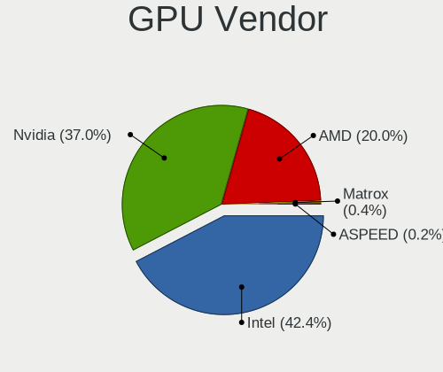

| Vendor                     | Computers | Percent |
|----------------------------|-----------|---------|
| Intel                      | 339       | 42.38%  |
| Nvidia                     | 296       | 37%     |
| AMD                        | 160       | 20%     |
| Matrox Electronics Systems | 3         | 0.38%   |
| ASPEED Technology          | 2         | 0.25%   |

GPU Model
---------

Graphics card models

| Model                                                                                    | Computers | Percent |
|------------------------------------------------------------------------------------------|-----------|---------|
| Intel 2nd Generation Core Processor Family Integrated Graphics Controller                | 44        | 5.24%   |
| Intel 3rd Gen Core processor Graphics Controller                                         | 34        | 4.05%   |
| Intel TigerLake-LP GT2 [Iris Xe Graphics]                                                | 20        | 2.38%   |
| Intel HD Graphics 620                                                                    | 17        | 2.03%   |
| Intel CoffeeLake-H GT2 [UHD Graphics 630]                                                | 12        | 1.43%   |
| AMD Cezanne [Radeon Vega Series / Radeon Vega Mobile Series]                             | 12        | 1.43%   |
| Intel UHD Graphics 620                                                                   | 11        | 1.31%   |
| Intel Atom/Celeron/Pentium Processor x5-E8000/J3xxx/N3xxx Integrated Graphics Controller | 11        | 1.31%   |
| Nvidia TU117M [GeForce GTX 1650 Mobile / Max-Q]                                          | 10        | 1.19%   |
| Nvidia GF108 [GeForce GT 440]                                                            | 10        | 1.19%   |
| Intel HD Graphics 630                                                                    | 10        | 1.19%   |
| Intel Atom Processor Z36xxx/Z37xxx Series Graphics & Display                             | 10        | 1.19%   |
| Nvidia GF108 [GeForce GT 730]                                                            | 9         | 1.07%   |
| Intel Skylake GT2 [HD Graphics 520]                                                      | 9         | 1.07%   |
| Intel Mobile 4 Series Chipset Integrated Graphics Controller                             | 9         | 1.07%   |
| Intel Haswell-ULT Integrated Graphics Controller                                         | 9         | 1.07%   |
| Intel 4th Gen Core Processor Integrated Graphics Controller                              | 9         | 1.07%   |
| Nvidia GT218 [GeForce 210]                                                               | 8         | 0.95%   |
| Nvidia GA107M [GeForce RTX 3050 Mobile]                                                  | 8         | 0.95%   |
| AMD Rembrandt [Radeon 680M]                                                              | 8         | 0.95%   |
| AMD Lucienne                                                                             | 8         | 0.95%   |
| Nvidia GF117M [GeForce 610M/710M/810M/820M / GT 620M/625M/630M/720M]                     | 7         | 0.83%   |
| Intel Xeon E3-1200 v3/4th Gen Core Processor Integrated Graphics Controller              | 7         | 0.83%   |
| Intel Xeon E3-1200 v2/3rd Gen Core processor Graphics Controller                         | 7         | 0.83%   |
| Intel Mobile 945GM/GMS/GME, 943/940GML Express Integrated Graphics Controller            | 7         | 0.83%   |
| Intel Iris Plus Graphics G1 (Ice Lake)                                                   | 7         | 0.83%   |
| Intel Core Processor Integrated Graphics Controller                                      | 7         | 0.83%   |
| AMD Topaz XT [Radeon R7 M260/M265 / M340/M360 / M440/M445 / 530/535 / 620/625 Mobile]    | 7         | 0.83%   |
| AMD Thames [Radeon HD 7500M/7600M Series]                                                | 7         | 0.83%   |
| Nvidia GK208B [GeForce GT 730]                                                           | 6         | 0.72%   |
| Nvidia GF114 [GeForce GTX 560 Ti]                                                        | 6         | 0.72%   |
| Nvidia GF108 [GeForce GT 430]                                                            | 6         | 0.72%   |
| Nvidia G94 [GeForce 9600 GT]                                                             | 6         | 0.72%   |
| Intel GeminiLake [UHD Graphics 600]                                                      | 6         | 0.72%   |
| Intel CometLake-U GT2 [UHD Graphics]                                                     | 6         | 0.72%   |
| Intel CometLake-H GT2 [UHD Graphics]                                                     | 6         | 0.72%   |
| Intel Alder Lake-P GT2 [Iris Xe Graphics]                                                | 6         | 0.72%   |
| AMD Sun PRO [Radeon HD 8570A/8570M]                                                      | 6         | 0.72%   |
| AMD Renoir [Radeon Vega Series / Radeon Vega Mobile Series]                              | 6         | 0.72%   |
| AMD Picasso/Raven 2 [Radeon Vega Series / Radeon Vega Mobile Series]                     | 6         | 0.72%   |

GPU Combo
---------

Combinations of graphics cards

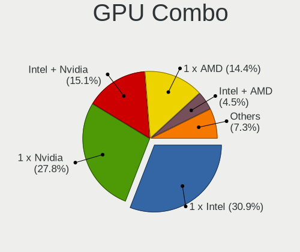

| Name                    | Computers | Percent |
|-------------------------|-----------|---------|
| 1 x Intel               | 199       | 30.9%   |
| 1 x Nvidia              | 179       | 27.8%   |
| Intel + Nvidia          | 97        | 15.06%  |
| 1 x AMD                 | 93        | 14.44%  |
| Intel + AMD             | 29        | 4.5%    |
| AMD + Nvidia            | 20        | 3.11%   |
| 2 x AMD                 | 17        | 2.64%   |
| Other                   | 4         | 0.62%   |
| 1 x Matrox              | 2         | 0.31%   |
| 2 x Nvidia + 1 x ASPEED | 1         | 0.16%   |
| 2 x Intel               | 1         | 0.16%   |
| Nvidia + Matrox         | 1         | 0.16%   |
| Nvidia + ASPEED         | 1         | 0.16%   |

GPU Driver
----------

Free vs proprietary

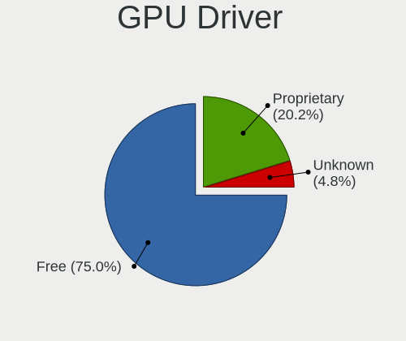

| Driver      | Computers | Percent |
|-------------|-----------|---------|
| Free        | 489       | 75%     |
| Proprietary | 132       | 20.25%  |
| Unknown     | 31        | 4.75%   |

GPU Memory
----------

Total video memory

| Size in GB | Computers | Percent |
|------------|-----------|---------|
| Unknown    | 242       | 36.78%  |
| 1.01-2.0   | 151       | 22.95%  |
| 0.01-0.5   | 95        | 14.44%  |
| 0.51-1.0   | 86        | 13.07%  |
| 3.01-4.0   | 42        | 6.38%   |
| 7.01-8.0   | 23        | 3.5%    |
| 5.01-6.0   | 10        | 1.52%   |
| 8.01-16.0  | 5         | 0.76%   |
| 2.01-3.0   | 2         | 0.3%    |
| 16.01-24.0 | 2         | 0.3%    |

Monitor
-------

Monitor Vendor
--------------

Monitor vendors

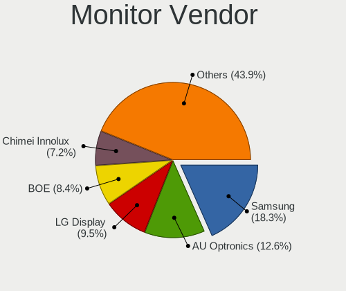

| Vendor                  | Computers | Percent |
|-------------------------|-----------|---------|
| Samsung Electronics     | 122       | 18.35%  |
| AU Optronics            | 84        | 12.63%  |
| LG Display              | 63        | 9.47%   |
| BOE                     | 56        | 8.42%   |
| Chimei Innolux          | 48        | 7.22%   |
| Goldstar                | 46        | 6.92%   |
| Hewlett-Packard         | 34        | 5.11%   |
| Acer                    | 27        | 4.06%   |
| Philips                 | 25        | 3.76%   |
| Chi Mei Optoelectronics | 20        | 3.01%   |
| BenQ                    | 19        | 2.86%   |
| AOC                     | 13        | 1.95%   |
| Dell                    | 12        | 1.8%    |
| Lenovo                  | 10        | 1.5%    |
| ViewSonic               | 4         | 0.6%    |
| Toshiba                 | 4         | 0.6%    |
| Sony                    | 4         | 0.6%    |
| SAC                     | 4         | 0.6%    |
| PANDA                   | 4         | 0.6%    |
| Iiyama                  | 4         | 0.6%    |
| Fujitsu Siemens         | 4         | 0.6%    |
| Valve                   | 3         | 0.45%   |
| Unknown (XXX)           | 3         | 0.45%   |
| Unknown                 | 3         | 0.45%   |
| Quanta Display          | 3         | 0.45%   |
| Panasonic               | 3         | 0.45%   |
| LG Philips              | 3         | 0.45%   |
| Gigabyte Technology     | 3         | 0.45%   |
| Arnos Instruments       | 3         | 0.45%   |
| VIE                     | 2         | 0.3%    |
| LG Electronics          | 2         | 0.3%    |
| InfoVision              | 2         | 0.3%    |
| HannStar                | 2         | 0.3%    |
| CSO                     | 2         | 0.3%    |
| CPT                     | 2         | 0.3%    |
| WY@                     | 1         | 0.15%   |
| TPU                     | 1         | 0.15%   |
| SKY                     | 1         | 0.15%   |
| SKG                     | 1         | 0.15%   |
| Sharp                   | 1         | 0.15%   |

Monitor Model
-------------

Monitor models

| Model                                                                    | Computers | Percent |
|--------------------------------------------------------------------------|-----------|---------|
| LG Display LCD Monitor LGD02DC 1366x768 344x194mm 15.5-inch              | 9         | 1.32%   |
| AU Optronics LCD Monitor AUO21ED 1920x1080 344x193mm 15.5-inch           | 8         | 1.17%   |
| Chimei Innolux LCD Monitor CMN15DB 1366x768 344x193mm 15.5-inch          | 6         | 0.88%   |
| Samsung Electronics SyncMaster SAM018F 1280x1024 340x270mm 17.1-inch     | 5         | 0.73%   |
| Samsung Electronics LCD Monitor SDC4752 1366x768 344x194mm 15.5-inch     | 5         | 0.73%   |
| LG Display LCD Monitor LGD033A 1366x768 340x190mm 15.3-inch              | 5         | 0.73%   |
| Chi Mei Optoelectronics LCD Monitor CMO15A7 1366x768 344x193mm 15.5-inch | 5         | 0.73%   |
| AU Optronics LCD Monitor AUO26EC 1366x768 344x193mm 15.5-inch            | 5         | 0.73%   |
| Samsung Electronics SyncMaster SAM0248 1280x1024 376x301mm 19.0-inch     | 4         | 0.59%   |
| Samsung Electronics SyncMaster SAM0247 1280x1024 376x301mm 19.0-inch     | 4         | 0.59%   |
| Goldstar L1953S GSM4B3E 1280x1024 338x270mm 17.0-inch                    | 4         | 0.59%   |
| AU Optronics LCD Monitor AUOD1ED 1920x1080 344x193mm 15.5-inch           | 4         | 0.59%   |
| AU Optronics LCD Monitor AUO38ED 1920x1080 344x193mm 15.5-inch           | 4         | 0.59%   |
| AU Optronics LCD Monitor AUO22EC 1366x768 344x193mm 15.5-inch            | 4         | 0.59%   |
| Valve ANX7530 U VLV3001 800x1280 100x150mm 7.1-inch                      | 3         | 0.44%   |
| Samsung Electronics SyncMaster SAM0285 1440x900 410x257mm 19.1-inch      | 3         | 0.44%   |
| Samsung Electronics SMS19A100 SAM0867 1366x768 410x230mm 18.5-inch       | 3         | 0.44%   |
| SAC LED MONITOR SAC952D 1920x1080 443x249mm 20.0-inch                    | 3         | 0.44%   |
| Hewlett-Packard L1740 HWP2648 1280x1024 337x270mm 17.0-inch              | 3         | 0.44%   |
| Hewlett-Packard 22w HPN342E 1920x1080 476x268mm 21.5-inch                | 3         | 0.44%   |
| Hewlett-Packard 2011 HWP2934 1600x900 443x249mm 20.0-inch                | 3         | 0.44%   |
| Goldstar W2242 GSM5677 1680x1050 474x296mm 22.0-inch                     | 3         | 0.44%   |
| Goldstar W1943 GSM4BAD 1360x768 406x229mm 18.4-inch                      | 3         | 0.44%   |
| Goldstar IPS FULLHD GSM5AB6 1920x1080 480x270mm 21.7-inch                | 3         | 0.44%   |
| Goldstar FULL HD GSM5B55 1920x1080 480x270mm 21.7-inch                   | 3         | 0.44%   |
| Chimei Innolux LCD Monitor CMN15F5 1920x1080 344x193mm 15.5-inch         | 3         | 0.44%   |
| Chimei Innolux LCD Monitor CMN15E7 1920x1080 344x193mm 15.5-inch         | 3         | 0.44%   |
| Chimei Innolux LCD Monitor CMN15D5 1920x1080 344x193mm 15.5-inch         | 3         | 0.44%   |
| BOE LCD Monitor BOE0A9B 2560x1600 344x215mm 16.0-inch                    | 3         | 0.44%   |
| BOE LCD Monitor BOE0675 1366x768 344x194mm 15.5-inch                     | 3         | 0.44%   |
| BenQ E900W BNQ7905 1440x900 408x255mm 18.9-inch                          | 3         | 0.44%   |
| AU Optronics LCD Monitor AUO45EC 1366x768 344x193mm 15.5-inch            | 3         | 0.44%   |
| Arnos Instruments '' AIC0400 1280x1024                                   | 3         | 0.44%   |
| Acer V193HQ ACR006D 1366x768 410x230mm 18.5-inch                         | 3         | 0.44%   |
| Unknown LCD Monitor FFFF 2288x1287 2550x2550mm 142.0-inch                | 2         | 0.29%   |
| Unknown (XXX) HDMI XXX0088 1920x540                                      | 2         | 0.29%   |
| Toshiba TV TSB010B 1920x1080 882x498mm 39.9-inch                         | 2         | 0.29%   |
| Sony LCD Monitor SNY05FA 1366x768 310x170mm 13.9-inch                    | 2         | 0.29%   |
| Samsung Electronics SyncMaster SAM0564 1360x768 410x230mm 18.5-inch      | 2         | 0.29%   |
| Samsung Electronics SyncMaster SAM037C 1680x1050 474x296mm 22.0-inch     | 2         | 0.29%   |

Monitor Resolution
------------------

Monitor screen resolution

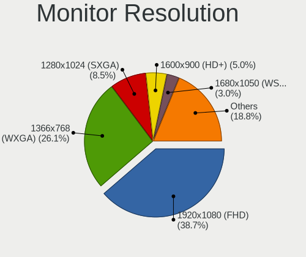

| Resolution         | Computers | Percent |
|--------------------|-----------|---------|
| 1920x1080 (FHD)    | 249       | 38.66%  |
| 1366x768 (WXGA)    | 168       | 26.09%  |
| 1280x1024 (SXGA)   | 55        | 8.54%   |
| 1600x900 (HD+)     | 32        | 4.97%   |
| 1680x1050 (WSXGA+) | 19        | 2.95%   |
| 1440x900 (WXGA+)   | 17        | 2.64%   |
| 2560x1440 (QHD)    | 16        | 2.48%   |
| 3840x2160 (4K)     | 14        | 2.17%   |
| 1280x800 (WXGA)    | 11        | 1.71%   |
| 2560x1600          | 9         | 1.4%    |
| 1360x768           | 6         | 0.93%   |
| 1920x1200 (WUXGA)  | 5         | 0.78%   |
| 1024x600           | 5         | 0.78%   |
| 2880x1620          | 4         | 0.62%   |
| 2560x1080          | 4         | 0.62%   |
| 800x1280           | 3         | 0.47%   |
| 1024x768 (XGA)     | 3         | 0.47%   |
| Unknown            | 3         | 0.47%   |
| 3440x1440          | 2         | 0.31%   |
| 3200x2000          | 2         | 0.31%   |
| 2288x1287          | 2         | 0.31%   |
| 1920x540           | 2         | 0.31%   |
| 1400x1050          | 2         | 0.31%   |
| 1280x720 (HD)      | 2         | 0.31%   |
| 3840x1080          | 1         | 0.16%   |
| 3600x1080          | 1         | 0.16%   |
| 3520x1080          | 1         | 0.16%   |
| 3200x1080          | 1         | 0.16%   |
| 2880x1800          | 1         | 0.16%   |
| 2240x1400          | 1         | 0.16%   |
| 2160x1440          | 1         | 0.16%   |
| 1600x1200          | 1         | 0.16%   |
| 1280x960           | 1         | 0.16%   |

Monitor Diagonal
----------------

Diagonal size in inches

| Inches  | Computers | Percent |
|---------|-----------|---------|
| 15      | 231       | 34.58%  |
| 17      | 52        | 7.78%   |
| 21      | 48        | 7.19%   |
| 19      | 42        | 6.29%   |
| 27      | 30        | 4.49%   |
| 23      | 29        | 4.34%   |
| 18      | 29        | 4.34%   |
| 14      | 25        | 3.74%   |
| 24      | 24        | 3.59%   |
| Unknown | 23        | 3.44%   |
| 13      | 21        | 3.14%   |
| 20      | 19        | 2.84%   |
| 31      | 16        | 2.4%    |
| 16      | 15        | 2.25%   |
| 22      | 11        | 1.65%   |
| 12      | 6         | 0.9%    |
| 10      | 6         | 0.9%    |
| 34      | 5         | 0.75%   |
| 72      | 4         | 0.6%    |
| 54      | 4         | 0.6%    |
| 11      | 4         | 0.6%    |
| 84      | 3         | 0.45%   |
| 48      | 3         | 0.45%   |
| 32      | 3         | 0.45%   |
| 7       | 3         | 0.45%   |
| 142     | 2         | 0.3%    |
| 46      | 2         | 0.3%    |
| 43      | 2         | 0.3%    |
| 40      | 2         | 0.3%    |
| 26      | 2         | 0.3%    |
| 64      | 1         | 0.15%   |
| 28      | 1         | 0.15%   |

Monitor Width
-------------

Physical width

| Width in mm    | Computers | Percent |
|----------------|-----------|---------|
| 301-350        | 307       | 46.44%  |
| 401-500        | 120       | 18.15%  |
| 501-600        | 77        | 11.65%  |
| 351-400        | 57        | 8.62%   |
| 201-300        | 25        | 3.78%   |
| Unknown        | 23        | 3.48%   |
| 601-700        | 18        | 2.72%   |
| 1001-1500      | 10        | 1.51%   |
| 701-800        | 8         | 1.21%   |
| 1501-2000      | 7         | 1.06%   |
| 801-900        | 3         | 0.45%   |
| 1-100          | 3         | 0.45%   |
| More than 2000 | 2         | 0.3%    |
| 901-1000       | 1         | 0.15%   |

Aspect Ratio
------------

Proportional relationship between the width and the height

| Ratio   | Computers | Percent |
|---------|-----------|---------|
| 16/9    | 465       | 74.76%  |
| 16/10   | 60        | 9.65%   |
| 5/4     | 55        | 8.84%   |
| Unknown | 16        | 2.57%   |
| 4/3     | 8         | 1.29%   |
| 3/2     | 5         | 0.8%    |
| 21/9    | 5         | 0.8%    |
| 0.67    | 3         | 0.48%   |
| 32/9    | 2         | 0.32%   |
| 1.00    | 2         | 0.32%   |
| 6/5     | 1         | 0.16%   |

Monitor Area
------------

Area in inch

| Area in inch | Computers | Percent |
|----------------|-----------|---------|
| 101-110        | 232       | 34.89%  |
| 201-250        | 95        | 14.29%  |
| 151-200        | 72        | 10.83%  |
| 141-150        | 55        | 8.27%   |
| 81-90          | 37        | 5.56%   |
| 301-350        | 32        | 4.81%   |
| 351-500        | 25        | 3.76%   |
| Unknown        | 23        | 3.46%   |
| 121-130        | 21        | 3.16%   |
| More than 1000 | 17        | 2.56%   |
| 111-120        | 11        | 1.65%   |
| 71-80          | 9         | 1.35%   |
| 41-50          | 6         | 0.9%    |
| 251-300        | 6         | 0.9%    |
| 501-1000       | 6         | 0.9%    |
| 61-70          | 5         | 0.75%   |
| 51-60          | 4         | 0.6%    |
| 1-40           | 3         | 0.45%   |
| 131-140        | 3         | 0.45%   |
| 91-100         | 3         | 0.45%   |

Pixel Density
-------------

Pixels per inch

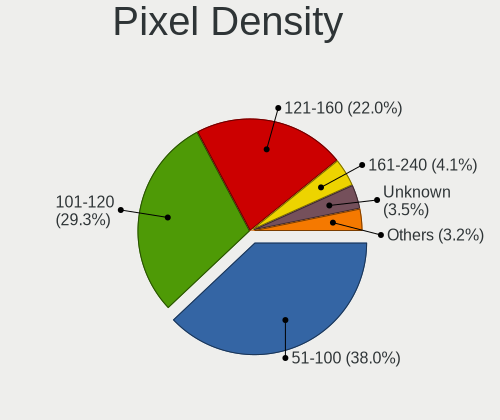

| Density       | Computers | Percent |
|---------------|-----------|---------|
| 51-100        | 249       | 37.96%  |
| 101-120       | 192       | 29.27%  |
| 121-160       | 144       | 21.95%  |
| 161-240       | 27        | 4.12%   |
| Unknown       | 23        | 3.51%   |
| 1-50          | 20        | 3.05%   |
| More than 240 | 1         | 0.15%   |

Multiple Monitors
-----------------

Total monitors connected

| Total | Computers | Percent |
|-------|-----------|---------|
| 1     | 548       | 84.31%  |
| 2     | 71        | 10.92%  |
| 0     | 27        | 4.15%   |
| 3     | 4         | 0.62%   |

Network
-------

Net Controller Vendor
---------------------

Controller vendors

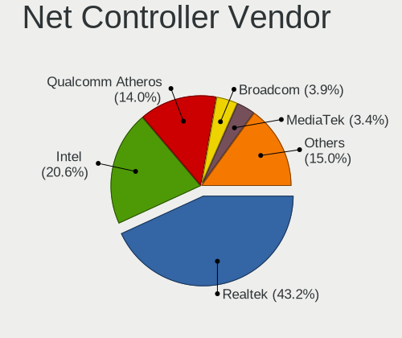

| Vendor                            | Computers | Percent |
|-----------------------------------|-----------|---------|
| Realtek Semiconductor             | 423       | 43.16%  |
| Intel                             | 202       | 20.61%  |
| Qualcomm Atheros                  | 137       | 13.98%  |
| Broadcom                          | 38        | 3.88%   |
| MediaTek                          | 33        | 3.37%   |
| Ralink Technology                 | 18        | 1.84%   |
| Broadcom Limited                  | 18        | 1.84%   |
| Ralink                            | 16        | 1.63%   |
| Marvell Technology Group          | 10        | 1.02%   |
| Xiaomi                            | 8         | 0.82%   |
| Qualcomm Atheros Communications   | 8         | 0.82%   |
| Nvidia                            | 7         | 0.71%   |
| Huawei Technologies               | 7         | 0.71%   |
| TP-Link                           | 6         | 0.61%   |
| VIA Technologies                  | 5         | 0.51%   |
| Samsung Electronics               | 4         | 0.41%   |
| ASIX Electronics                  | 4         | 0.41%   |
| JMicron Technology                | 3         | 0.31%   |
| Hewlett-Packard                   | 3         | 0.31%   |
| D-Link                            | 3         | 0.31%   |
| Qualcomm Technologies             | 2         | 0.2%    |
| OPPO Electronics                  | 2         | 0.2%    |
| Mellanox Technologies             | 2         | 0.2%    |
| HTC (High Tech Computer)          | 2         | 0.2%    |
| Google                            | 2         | 0.2%    |
| DisplayLink                       | 2         | 0.2%    |
| ZTE WCDMA Technologies MSM        | 1         | 0.1%    |
| STMicroelectronics                | 1         | 0.1%    |
| Philips (or NXP)                  | 1         | 0.1%    |
| Microchip Technology              | 1         | 0.1%    |
| Linux 2.6.38.8+ with at91_udc     | 1         | 0.1%    |
| Lenovo                            | 1         | 0.1%    |
| Insyde Software                   | 1         | 0.1%    |
| ICS Advent                        | 1         | 0.1%    |
| Fujitsu Siemens Computers         | 1         | 0.1%    |
| Ericsson Business Mobile Networks | 1         | 0.1%    |
| Edimax Technology                 | 1         | 0.1%    |
| Dell                              | 1         | 0.1%    |
| ASUSTek Computer                  | 1         | 0.1%    |
| Android                           | 1         | 0.1%    |

Net Controller Model
--------------------

Controller models

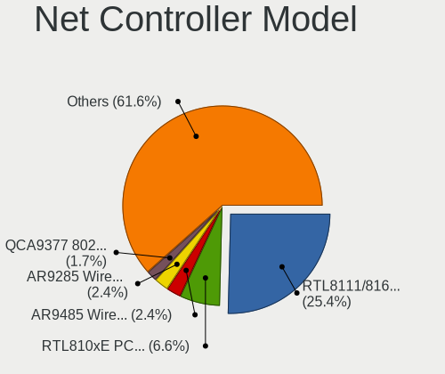

| Model                                                                   | Computers | Percent |
|-------------------------------------------------------------------------|-----------|---------|
| Realtek RTL8111/8168/8211/8411 PCI Express Gigabit Ethernet Controller  | 279       | 25.41%  |
| Realtek RTL810xE PCI Express Fast Ethernet controller                   | 72        | 6.56%   |
| Qualcomm Atheros AR9485 Wireless Network Adapter                        | 26        | 2.37%   |
| Qualcomm Atheros AR9285 Wireless Network Adapter (PCI-Express)          | 26        | 2.37%   |
| Qualcomm Atheros QCA9377 802.11ac Wireless Network Adapter              | 19        | 1.73%   |
| Realtek RTL8821CE 802.11ac PCIe Wireless Network Adapter                | 18        | 1.64%   |
| Intel Wi-Fi 6 AX201                                                     | 17        | 1.55%   |
| MediaTek MT7921 802.11ax PCI Express Wireless Network Adapter           | 16        | 1.46%   |
| Broadcom BCM4313 802.11bgn Wireless Network Adapter                     | 16        | 1.46%   |
| Qualcomm Atheros QCA9565 / AR9565 Wireless Network Adapter              | 14        | 1.28%   |
| Realtek RTL8822CE 802.11ac PCIe Wireless Network Adapter                | 13        | 1.18%   |
| Qualcomm Atheros QCA8172 Fast Ethernet                                  | 13        | 1.18%   |
| Intel Wireless 8265 / 8275                                              | 13        | 1.18%   |
| Realtek RTL8188EUS 802.11n Wireless Network Adapter                     | 11        | 1%      |
| Realtek RTL-8100/8101L/8139 PCI Fast Ethernet Adapter                   | 11        | 1%      |
| Realtek RTL8125 2.5GbE Controller                                       | 10        | 0.91%   |
| Intel Comet Lake PCH CNVi WiFi                                          | 10        | 0.91%   |
| Ralink MT7601U Wireless Adapter                                         | 9         | 0.82%   |
| Qualcomm Atheros AR8151 v2.0 Gigabit Ethernet                           | 9         | 0.82%   |
| MediaTek MT7922 802.11ax PCI Express Wireless Network Adapter           | 9         | 0.82%   |
| Intel PRO/Wireless 3945ABG [Golan] Network Connection                   | 9         | 0.82%   |
| Intel 82579LM Gigabit Network Connection (Lewisville)                   | 9         | 0.82%   |
| Ralink RT3290 Wireless 802.11n 1T/1R PCIe                               | 8         | 0.73%   |
| Qualcomm Atheros AR8121/AR8113/AR8114 Gigabit or Fast Ethernet          | 8         | 0.73%   |
| Intel Ethernet Connection (2) I219-V                                    | 8         | 0.73%   |
| Ralink RT5370 Wireless Adapter                                          | 7         | 0.64%   |
| Qualcomm Atheros AR8152 v2.0 Fast Ethernet                              | 7         | 0.64%   |
| Intel Wi-Fi 6 AX200                                                     | 7         | 0.64%   |
| Intel Centrino Advanced-N 6205 [Taylor Peak]                            | 7         | 0.64%   |
| Broadcom NetLink BCM57785 Gigabit Ethernet PCIe                         | 7         | 0.64%   |
| Realtek RTL8153 Gigabit Ethernet Adapter                                | 6         | 0.55%   |
| Qualcomm Atheros AR9271 802.11n                                         | 6         | 0.55%   |
| Intel Comet Lake PCH-LP CNVi WiFi                                       | 6         | 0.55%   |
| Intel Centrino Wireless-N 2230                                          | 6         | 0.55%   |
| Intel Alder Lake-P PCH CNVi WiFi                                        | 6         | 0.55%   |
| Realtek RTL8723DE Wireless Network Adapter                              | 5         | 0.46%   |
| Realtek RTL8723BE PCIe Wireless Network Adapter                         | 5         | 0.46%   |
| Realtek Killer E2600 GbE Controller                                     | 5         | 0.46%   |
| Qualcomm Atheros AR8161 Gigabit Ethernet                                | 5         | 0.46%   |
| Qualcomm Atheros AR242x / AR542x Wireless Network Adapter (PCI-Express) | 5         | 0.46%   |

Wireless Vendor
---------------

Wireless vendors

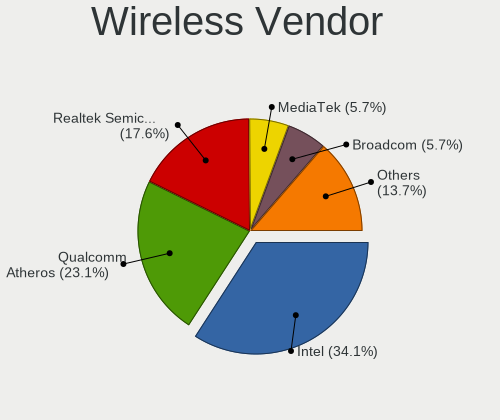

| Vendor                          | Computers | Percent |
|---------------------------------|-----------|---------|
| Intel                           | 155       | 34.14%  |
| Qualcomm Atheros                | 105       | 23.13%  |
| Realtek Semiconductor           | 80        | 17.62%  |
| MediaTek                        | 26        | 5.73%   |
| Broadcom                        | 26        | 5.73%   |
| Ralink Technology               | 18        | 3.96%   |
| Ralink                          | 16        | 3.52%   |
| Qualcomm Atheros Communications | 8         | 1.76%   |
| Broadcom Limited                | 6         | 1.32%   |
| TP-Link                         | 4         | 0.88%   |
| D-Link                          | 3         | 0.66%   |
| Qualcomm Technologies           | 2         | 0.44%   |
| Philips (or NXP)                | 1         | 0.22%   |
| Fujitsu Siemens Computers       | 1         | 0.22%   |
| Edimax Technology               | 1         | 0.22%   |
| ASUSTek Computer                | 1         | 0.22%   |
| Accton Technology               | 1         | 0.22%   |

Wireless Model
--------------

Wireless models

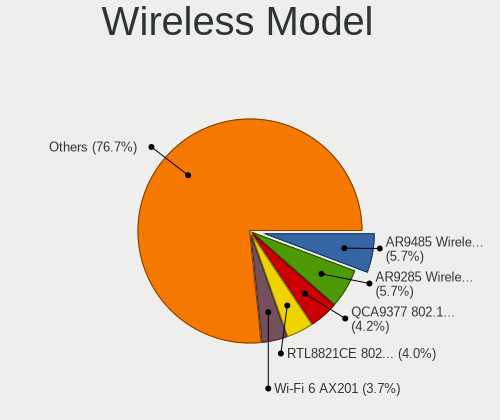

| Model                                                                   | Computers | Percent |
|-------------------------------------------------------------------------|-----------|---------|
| Qualcomm Atheros AR9485 Wireless Network Adapter                        | 26        | 5.73%   |
| Qualcomm Atheros AR9285 Wireless Network Adapter (PCI-Express)          | 26        | 5.73%   |
| Qualcomm Atheros QCA9377 802.11ac Wireless Network Adapter              | 19        | 4.19%   |
| Realtek RTL8821CE 802.11ac PCIe Wireless Network Adapter                | 18        | 3.96%   |
| Intel Wi-Fi 6 AX201                                                     | 17        | 3.74%   |
| MediaTek MT7921 802.11ax PCI Express Wireless Network Adapter           | 16        | 3.52%   |
| Broadcom BCM4313 802.11bgn Wireless Network Adapter                     | 16        | 3.52%   |
| Qualcomm Atheros QCA9565 / AR9565 Wireless Network Adapter              | 14        | 3.08%   |
| Realtek RTL8822CE 802.11ac PCIe Wireless Network Adapter                | 13        | 2.86%   |
| Intel Wireless 8265 / 8275                                              | 13        | 2.86%   |
| Realtek RTL8188EUS 802.11n Wireless Network Adapter                     | 11        | 2.42%   |
| Intel Comet Lake PCH CNVi WiFi                                          | 10        | 2.2%    |
| Ralink MT7601U Wireless Adapter                                         | 9         | 1.98%   |
| Intel PRO/Wireless 3945ABG [Golan] Network Connection                   | 9         | 1.98%   |
| Ralink RT3290 Wireless 802.11n 1T/1R PCIe                               | 8         | 1.76%   |
| Ralink RT5370 Wireless Adapter                                          | 7         | 1.54%   |
| Intel Wi-Fi 6 AX200                                                     | 7         | 1.54%   |
| Intel Centrino Advanced-N 6205 [Taylor Peak]                            | 7         | 1.54%   |
| Qualcomm Atheros AR9271 802.11n                                         | 6         | 1.32%   |
| Intel Comet Lake PCH-LP CNVi WiFi                                       | 6         | 1.32%   |
| Intel Centrino Wireless-N 2230                                          | 6         | 1.32%   |
| Intel Alder Lake-P PCH CNVi WiFi                                        | 6         | 1.32%   |
| Realtek RTL8723DE Wireless Network Adapter                              | 5         | 1.1%    |
| Realtek RTL8723BE PCIe Wireless Network Adapter                         | 5         | 1.1%    |
| Qualcomm Atheros AR242x / AR542x Wireless Network Adapter (PCI-Express) | 5         | 1.1%    |
| MediaTek Wi-Fi 6E MT7902 Wireless Network Adapter                       | 5         | 1.1%    |
| MediaTek MT7922 802.11ax PCI Express Wireless Network Adapter           | 5         | 1.1%    |
| Intel Wireless 7260                                                     | 5         | 1.1%    |
| Intel Wi-Fi 6E(802.11ax) AX210/AX1675* 2x2 [Typhoon Peak]               | 5         | 1.1%    |
| Intel Dual Band Wireless-AC 3168NGW [Stone Peak]                        | 5         | 1.1%    |
| Intel Cannon Lake PCH CNVi WiFi                                         | 5         | 1.1%    |
| Broadcom BCM43227 802.11b/g/n                                           | 5         | 1.1%    |
| Realtek RTL8852BE PCIe 802.11ax Wireless Network Controller             | 4         | 0.88%   |
| Realtek RTL8852AE 802.11ax PCIe Wireless Network Adapter                | 4         | 0.88%   |
| Realtek RTL8188EE Wireless Network Adapter                              | 4         | 0.88%   |
| Intel Wireless 8260                                                     | 4         | 0.88%   |
| Intel Wireless 7265                                                     | 4         | 0.88%   |
| Intel Wireless 3160                                                     | 4         | 0.88%   |
| Intel WiFi Link 5100                                                    | 4         | 0.88%   |
| Intel Centrino Wireless-N 135                                           | 4         | 0.88%   |

Ethernet Vendor
---------------

Ethernet vendors

| Vendor                   | Computers | Percent |
|--------------------------|-----------|---------|
| Realtek Semiconductor    | 388       | 62.58%  |
| Intel                    | 83        | 13.39%  |
| Qualcomm Atheros         | 53        | 8.55%   |
| Broadcom                 | 15        | 2.42%   |
| Broadcom Limited         | 13        | 2.1%    |
| Marvell Technology Group | 10        | 1.61%   |
| Xiaomi                   | 8         | 1.29%   |
| Nvidia                   | 7         | 1.13%   |
| MediaTek                 | 7         | 1.13%   |
| VIA Technologies         | 5         | 0.81%   |
| Huawei Technologies      | 5         | 0.81%   |
| ASIX Electronics         | 4         | 0.65%   |
| Samsung Electronics      | 3         | 0.48%   |
| JMicron Technology       | 3         | 0.48%   |
| TP-Link                  | 2         | 0.32%   |
| OPPO Electronics         | 2         | 0.32%   |
| Mellanox Technologies    | 2         | 0.32%   |
| HTC (High Tech Computer) | 2         | 0.32%   |
| Google                   | 2         | 0.32%   |
| DisplayLink              | 2         | 0.32%   |
| Insyde Software          | 1         | 0.16%   |
| ICS Advent               | 1         | 0.16%   |
| Dell                     | 1         | 0.16%   |
| Android                  | 1         | 0.16%   |

Ethernet Model
--------------

Ethernet models

| Model                                                                          | Computers | Percent |
|--------------------------------------------------------------------------------|-----------|---------|
| Realtek RTL8111/8168/8211/8411 PCI Express Gigabit Ethernet Controller         | 279       | 44.36%  |
| Realtek RTL810xE PCI Express Fast Ethernet controller                          | 72        | 11.45%  |
| Qualcomm Atheros QCA8172 Fast Ethernet                                         | 13        | 2.07%   |
| Realtek RTL-8100/8101L/8139 PCI Fast Ethernet Adapter                          | 11        | 1.75%   |
| Realtek RTL8125 2.5GbE Controller                                              | 10        | 1.59%   |
| Qualcomm Atheros AR8151 v2.0 Gigabit Ethernet                                  | 9         | 1.43%   |
| Intel 82579LM Gigabit Network Connection (Lewisville)                          | 9         | 1.43%   |
| Qualcomm Atheros AR8121/AR8113/AR8114 Gigabit or Fast Ethernet                 | 8         | 1.27%   |
| Intel Ethernet Connection (2) I219-V                                           | 8         | 1.27%   |
| Qualcomm Atheros AR8152 v2.0 Fast Ethernet                                     | 7         | 1.11%   |
| Broadcom NetLink BCM57785 Gigabit Ethernet PCIe                                | 7         | 1.11%   |
| Realtek RTL8153 Gigabit Ethernet Adapter                                       | 6         | 0.95%   |
| Realtek Killer E2600 GbE Controller                                            | 5         | 0.79%   |
| Qualcomm Atheros AR8161 Gigabit Ethernet                                       | 5         | 0.79%   |
| Intel 82579V Gigabit Network Connection                                        | 5         | 0.79%   |
| Huawei E353/E3131                                                              | 5         | 0.79%   |
| Xiaomi Mi/Redmi series (RNDIS)                                                 | 4         | 0.64%   |
| Xiaomi Mi/Redmi series (RNDIS + ADB)                                           | 4         | 0.64%   |
| Realtek RTL8169 PCI Gigabit Ethernet Controller                                | 4         | 0.64%   |
| MediaTek MT7922 802.11ax PCI Express Wireless Network Adapter                  | 4         | 0.64%   |
| Intel I211 Gigabit Network Connection                                          | 4         | 0.64%   |
| Intel Ethernet Controller I225-V                                               | 4         | 0.64%   |
| Intel Ethernet Connection (7) I219-V                                           | 4         | 0.64%   |
| Intel Ethernet Connection (4) I219-LM                                          | 4         | 0.64%   |
| VIA VT6105/VT6106S [Rhine-III]                                                 | 3         | 0.48%   |
| Samsung Galaxy series, misc. (tethering mode)                                  | 3         | 0.48%   |
| MediaTek Infinix SMART 5                                                       | 3         | 0.48%   |
| Intel Ethernet Connection (2) I218-V                                           | 3         | 0.48%   |
| Intel 82577LM Gigabit Network Connection                                       | 3         | 0.48%   |
| Intel 82573L Gigabit Ethernet Controller                                       | 3         | 0.48%   |
| Intel 82557/8/9/0/1 Ethernet Pro 100                                           | 3         | 0.48%   |
| ASIX AX88179 Gigabit Ethernet                                                  | 3         | 0.48%   |
| VIA VT6102/VT6103 [Rhine-II]                                                   | 2         | 0.32%   |
| Realtek RTL8152 Fast Ethernet Adapter                                          | 2         | 0.32%   |
| Qualcomm Atheros AR8162 Fast Ethernet                                          | 2         | 0.32%   |
| Qualcomm Atheros AR8152 v1.1 Fast Ethernet                                     | 2         | 0.32%   |
| Qualcomm Atheros AR8132 Fast Ethernet                                          | 2         | 0.32%   |
| OPPO CPH2477                                                                   | 2         | 0.32%   |
| Nvidia CK804 Ethernet Controller                                               | 2         | 0.32%   |
| Marvell Group Yukon Optima 88E8059 [PCIe Gigabit Ethernet Controller with AVB] | 2         | 0.32%   |

Net Controller Kind
-------------------

Ethernet, WiFi or modem

| Kind     | Computers | Percent |
|----------|-----------|---------|
| Ethernet | 581       | 56.03%  |
| WiFi     | 442       | 42.62%  |
| Modem    | 13        | 1.25%   |
| Unknown  | 1         | 0.1%    |

Used Controller
---------------

Currently used network controller

| Kind     | Computers | Percent |
|----------|-----------|---------|
| WiFi     | 349       | 54.53%  |
| Ethernet | 290       | 45.31%  |
| Modem    | 1         | 0.16%   |

NICs
----

Total network controllers on board

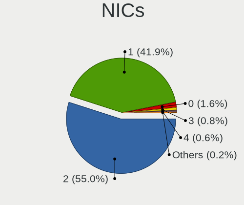

| Total | Computers | Percent |
|-------|-----------|---------|
| 2     | 349       | 54.96%  |
| 1     | 266       | 41.89%  |
| 0     | 10        | 1.57%   |
| 3     | 5         | 0.79%   |
| 4     | 4         | 0.63%   |
| 5     | 1         | 0.16%   |

IPv6
----

IPv6 vs IPv4

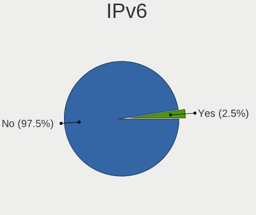

| Used | Computers | Percent |
|------|-----------|---------|
| No   | 620       | 97.48%  |
| Yes  | 16        | 2.52%   |

Bluetooth
---------

Bluetooth Vendor
----------------

Controller vendors

| Vendor                          | Computers | Percent |
|---------------------------------|-----------|---------|
| Intel                           | 120       | 35.71%  |
| Realtek Semiconductor           | 43        | 12.8%   |
| IMC Networks                    | 42        | 12.5%   |
| Qualcomm Atheros Communications | 26        | 7.74%   |
| Lite-On Technology              | 20        | 5.95%   |
| Broadcom                        | 18        | 5.36%   |
| Foxconn / Hon Hai               | 17        | 5.06%   |
| Cambridge Silicon Radio         | 14        | 4.17%   |
| Ralink                          | 8         | 2.38%   |
| Hewlett-Packard                 | 8         | 2.38%   |
| Toshiba                         | 6         | 1.79%   |
| Foxconn International           | 3         | 0.89%   |
| Ralink Technology               | 2         | 0.6%    |
| Integrated System Solution      | 2         | 0.6%    |
| ASUSTek Computer                | 2         | 0.6%    |
| TP-Link                         | 1         | 0.3%    |
| Realtek                         | 1         | 0.3%    |
| Logitech                        | 1         | 0.3%    |
| HTC (High Tech Computer)        | 1         | 0.3%    |
| Askey Computer                  | 1         | 0.3%    |

Bluetooth Model
---------------

Controller models

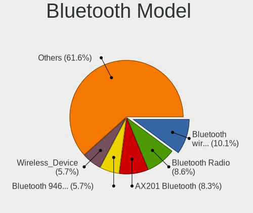

| Model                                               | Computers | Percent |
|-----------------------------------------------------|-----------|---------|
| Intel Bluetooth wireless interface                  | 34        | 10.12%  |
| Realtek Bluetooth Radio                             | 29        | 8.63%   |
| Intel AX201 Bluetooth                               | 28        | 8.33%   |
| Intel Bluetooth 9460/9560 Jefferson Peak (JfP)      | 19        | 5.65%   |
| IMC Networks Wireless_Device                        | 19        | 5.65%   |
| Cambridge Silicon Radio Bluetooth Dongle (HCI mode) | 14        | 4.17%   |
| Lite-On Qualcomm Atheros QCA9377 Bluetooth          | 13        | 3.87%   |
| IMC Networks Bluetooth Radio                        | 13        | 3.87%   |
| Intel Centrino Bluetooth Wireless Transceiver       | 10        | 2.98%   |
| Intel AX211 Bluetooth                               | 9         | 2.68%   |
| Realtek  Bluetooth 4.2 Adapter                      | 8         | 2.38%   |
| Ralink RT3290 Bluetooth                             | 8         | 2.38%   |
| Qualcomm Atheros AR3012 Bluetooth 4.0               | 8         | 2.38%   |
| Intel AX200 Bluetooth                               | 7         | 2.08%   |
| Qualcomm Atheros  Bluetooth Device                  | 6         | 1.79%   |
| Qualcomm Atheros AR3011 Bluetooth                   | 6         | 1.79%   |
| HP Bluetooth 2.0 Interface [Broadcom BCM2045]       | 6         | 1.79%   |
| Foxconn / Hon Hai MediaTek Bluetooth Adapter        | 6         | 1.79%   |
| Intel Wireless-AC 3168 Bluetooth                    | 5         | 1.49%   |
| Intel AX210 Bluetooth                               | 5         | 1.49%   |
| Broadcom HP Portable Valentine                      | 5         | 1.49%   |
| IMC Networks Bluetooth Device                       | 4         | 1.19%   |
| IMC Networks Atheros AR3012 Bluetooth 4.0 Adapter   | 4         | 1.19%   |
| Foxconn / Hon Hai Wireless_Device                   | 4         | 1.19%   |
| Broadcom BCM2070 Bluetooth 2.1 + EDR                | 4         | 1.19%   |
| Toshiba Integrated Bluetooth HCI                    | 3         | 0.89%   |
| Realtek RTL8821A Bluetooth                          | 3         | 0.89%   |
| Realtek 802.11ac WLAN Adapter                       | 3         | 0.89%   |
| Qualcomm Atheros Bluetooth                          | 3         | 0.89%   |
| Lite-On Bluetooth Device                            | 3         | 0.89%   |
| Lite-On Atheros AR3012 Bluetooth                    | 3         | 0.89%   |
| Intel Centrino Advanced-N 6230 Bluetooth adapter    | 3         | 0.89%   |
| Foxconn International BCM43142A0 Bluetooth module   | 3         | 0.89%   |
| Foxconn / Hon Hai Bluetooth Device                  | 3         | 0.89%   |
| Integrated System Solution Bluetooth Device         | 2         | 0.6%    |
| HP Broadcom 2070 Bluetooth Combo                    | 2         | 0.6%    |
| Broadcom HP Portable SoftSailing                    | 2         | 0.6%    |
| Broadcom BCM20702A0                                 | 2         | 0.6%    |
| Broadcom BCM20702 Bluetooth 4.0 [ThinkPad]          | 2         | 0.6%    |
| ASUS BT-270 Bluetooth Adapter                       | 2         | 0.6%    |

Sound
-----

Sound Vendor
------------

Sound card vendors

| Vendor                   | Computers | Percent |
|--------------------------|-----------|---------|
| Intel                    | 498       | 55.58%  |
| Nvidia                   | 199       | 22.21%  |
| AMD                      | 141       | 15.74%  |
| C-Media Electronics      | 15        | 1.67%   |
| Razer USA                | 4         | 0.45%   |
| Focusrite-Novation       | 4         | 0.45%   |
| Generalplus Technology   | 3         | 0.33%   |
| ASUSTek Computer         | 3         | 0.33%   |
| VIA Technologies         | 2         | 0.22%   |
| Sony                     | 2         | 0.22%   |
| Realtek Semiconductor    | 2         | 0.22%   |
| JMTek                    | 2         | 0.22%   |
| Hewlett-Packard          | 2         | 0.22%   |
| Creative Labs            | 2         | 0.22%   |
| Xilinx                   | 1         | 0.11%   |
| ULi Electronics          | 1         | 0.11%   |
| SAVITECH                 | 1         | 0.11%   |
| Plantronics              | 1         | 0.11%   |
| Pixart Imaging           | 1         | 0.11%   |
| Nordic Semiconductor ASA | 1         | 0.11%   |
| M-Audio                  | 1         | 0.11%   |
| Logitech                 | 1         | 0.11%   |
| KTMicro                  | 1         | 0.11%   |
| Huawei Technologies      | 1         | 0.11%   |
| GYROCOM C&C              | 1         | 0.11%   |
| ELMCU                    | 1         | 0.11%   |
| Elgato Systems           | 1         | 0.11%   |
| Blue Microphones         | 1         | 0.11%   |
| BEHRINGER International  | 1         | 0.11%   |
| Asahi Kasei Microsystems | 1         | 0.11%   |
| Unknown                  | 1         | 0.11%   |

Sound Model
-----------

Sound card models

| Model                                                                                             | Computers | Percent |
|---------------------------------------------------------------------------------------------------|-----------|---------|
| Intel 7 Series/C216 Chipset Family High Definition Audio Controller                               | 65        | 6.39%   |
| Intel 6 Series/C200 Series Chipset Family High Definition Audio Controller                        | 65        | 6.39%   |
| Intel NM10/ICH7 Family High Definition Audio Controller                                           | 53        | 5.21%   |
| AMD Family 17h/19h/1ah HD Audio Controller                                                        | 51        | 5.01%   |
| Intel Sunrise Point-LP HD Audio                                                                   | 40        | 3.93%   |
| Nvidia GF108 High Definition Audio Controller                                                     | 38        | 3.74%   |
| AMD Renoir Radeon High Definition Audio Controller                                                | 28        | 2.75%   |
| Intel 8 Series/C220 Series Chipset High Definition Audio Controller                               | 27        | 2.65%   |
| Intel Tiger Lake-LP Smart Sound Technology Audio Controller                                       | 22        | 2.16%   |
| Intel 82801I (ICH9 Family) HD Audio Controller                                                    | 21        | 2.06%   |
| Intel 5 Series/3400 Series Chipset High Definition Audio                                          | 20        | 1.97%   |
| Intel Cannon Lake PCH cAVS                                                                        | 18        | 1.77%   |
| AMD FCH Azalia Controller                                                                         | 17        | 1.67%   |
| Intel 82801JI (ICH10 Family) HD Audio Controller                                                  | 16        | 1.57%   |
| Nvidia High Definition Audio Controller                                                           | 15        | 1.47%   |
| AMD SBx00 Azalia (Intel HDA)                                                                      | 15        | 1.47%   |
| Nvidia GK107 HDMI Audio Controller                                                                | 14        | 1.38%   |
| Intel Xeon E3-1200 v3/4th Gen Core Processor HD Audio Controller                                  | 14        | 1.38%   |
| AMD Rembrandt Radeon High Definition Audio Controller                                             | 14        | 1.38%   |
| Intel Comet Lake PCH cAVS                                                                         | 13        | 1.28%   |
| Intel Alder Lake PCH-P High Definition Audio Controller                                           | 13        | 1.28%   |
| Nvidia GK208 HDMI/DP Audio Controller                                                             | 12        | 1.18%   |
| Nvidia GA106 High Definition Audio Controller                                                     | 11        | 1.08%   |
| Intel 200 Series PCH HD Audio                                                                     | 11        | 1.08%   |
| Nvidia TU107 GeForce GTX 1650 High Definition Audio Controller                                    | 10        | 0.98%   |
| Intel Haswell-ULT HD Audio Controller                                                             | 10        | 0.98%   |
| Intel 82801H (ICH8 Family) HD Audio Controller                                                    | 10        | 0.98%   |
| Intel 8 Series HD Audio Controller                                                                | 10        | 0.98%   |
| Intel 100 Series/C230 Series Chipset Family HD Audio Controller                                   | 10        | 0.98%   |
| AMD Trinity HDMI Audio Controller                                                                 | 9         | 0.88%   |
| AMD Baffin HDMI/DP Audio [Radeon RX 550 640SP / RX 560/560X]                                      | 9         | 0.88%   |
| Nvidia TU106 High Definition Audio Controller                                                     | 8         | 0.79%   |
| Nvidia GP104 High Definition Audio Controller                                                     | 8         | 0.79%   |
| Nvidia GF114 HDMI Audio Controller                                                                | 8         | 0.79%   |
| Intel Atom/Celeron/Pentium Processor x5-E8000/J3xxx/N3xxx Series High Definition Audio Controller | 8         | 0.79%   |
| AMD Family 17h (Models 00h-0fh) HD Audio Controller                                               | 8         | 0.79%   |
| Nvidia GP107GL High Definition Audio Controller                                                   | 7         | 0.69%   |
| Nvidia GA107 High Definition Audio Controller                                                     | 7         | 0.69%   |
| Nvidia AD107 High Definition Audio Controller                                                     | 7         | 0.69%   |
| Intel Ice Lake-LP Smart Sound Technology Audio Controller                                         | 7         | 0.69%   |

Memory
------

Memory Vendor
-------------

Memory module vendors

| Vendor                       | Computers | Percent |
|------------------------------|-----------|---------|
| Unknown                      | 146       | 24.41%  |
| Samsung Electronics          | 98        | 16.39%  |
| SK hynix                     | 91        | 15.22%  |
| Kingston                     | 58        | 9.7%    |
| Micron Technology            | 39        | 6.52%   |
| Transcend                    | 17        | 2.84%   |
| A-DATA Technology            | 17        | 2.84%   |
| Ramaxel Technology           | 15        | 2.51%   |
| Crucial                      | 13        | 2.17%   |
| G.Skill                      | 12        | 2.01%   |
| Apacer                       | 12        | 2.01%   |
| GeIL                         | 9         | 1.51%   |
| Team                         | 8         | 1.34%   |
| Nanya Technology             | 8         | 1.34%   |
| Silicon Power                | 7         | 1.17%   |
| Patriot                      | 4         | 0.67%   |
| Elpida                       | 4         | 0.67%   |
| Unknown (ABCD)               | 3         | 0.5%    |
| Hikvision                    | 3         | 0.5%    |
| Super Talent                 | 2         | 0.33%   |
| SUPER KINGSTEK               | 2         | 0.33%   |
| Qimonda                      | 2         | 0.33%   |
| Patriot Memory (PDP Systems) | 2         | 0.33%   |
| Kingmax                      | 2         | 0.33%   |
| HPE                          | 2         | 0.33%   |
| Goodram                      | 2         | 0.33%   |
| Corsair                      | 2         | 0.33%   |
| ASint Technology             | 2         | 0.33%   |
| Unknown                      | 2         | 0.33%   |
| V-Color                      | 1         | 0.17%   |
| Unknown (D386)               | 1         | 0.17%   |
| Unknown (8CAB)               | 1         | 0.17%   |
| Unifosa                      | 1         | 0.17%   |
| Toshiba                      | 1         | 0.17%   |
| SHARETRONIC                  | 1         | 0.17%   |
| Qumo                         | 1         | 0.17%   |
| ProMos/Mosel Vitelic         | 1         | 0.17%   |
| Patriot Memory               | 1         | 0.17%   |
| Kllisre                      | 1         | 0.17%   |
| KANMEIQi                     | 1         | 0.17%   |

Memory Model
------------

Memory module models

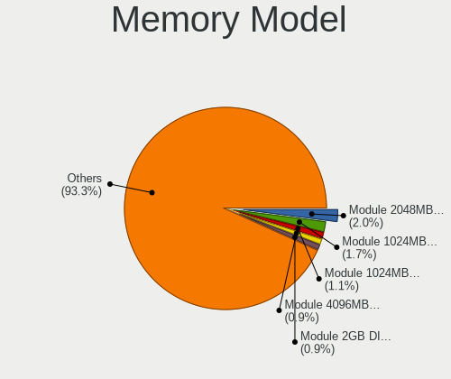

| Model                                                     | Computers | Percent |
|-----------------------------------------------------------|-----------|---------|
| Unknown RAM Module 2048MB DIMM SDRAM                      | 13        | 2.04%   |
| Unknown RAM Module 1024MB DIMM SDRAM                      | 11        | 1.72%   |
| Unknown RAM Module 1024MB DIMM 800MT/s                    | 7         | 1.1%    |
| Unknown RAM Module 4096MB DIMM DDR3 1333MT/s              | 6         | 0.94%   |
| Unknown RAM Module 2GB DIMM DDR2 800MT/s                  | 6         | 0.94%   |
| Unknown RAM Module 2GB DIMM 800MT/s                       | 6         | 0.94%   |
| Samsung RAM M471B5173QH0-YK0 4GB SODIMM DDR3 1600MT/s     | 6         | 0.94%   |
| Unknown RAM Module 4GB DIMM DDR3 1333MT/s                 | 5         | 0.78%   |
| Unknown RAM Module 2048MB DIMM 800MT/s                    | 5         | 0.78%   |
| SK hynix RAM HMT351S6CFR8C-PB 4GB SODIMM DDR3 1600MT/s    | 5         | 0.78%   |
| SK hynix RAM HMA81GS6DJR8N-XN 8GB SODIMM DDR4 3200MT/s    | 5         | 0.78%   |
| Samsung RAM M471B5273DH0-CK0 4GB SODIMM DDR3 2400MT/s     | 5         | 0.78%   |
| Samsung RAM M471B5273DH0-CH9 4GB SODIMM DDR3 1334MT/s     | 5         | 0.78%   |
| Micron RAM 16KTF51264HZ-1G6M1 4GB SODIMM DDR3 1600MT/s    | 5         | 0.78%   |
| Unknown RAM Module 2048MB DIMM DDR2 800MT/s               | 4         | 0.63%   |
| Transcend RAM JM1333KLU-2G 2GB DIMM DDR3 1333MT/s         | 4         | 0.63%   |
| SK hynix RAM HMT451S6BFR8A-PB 4096MB SODIMM DDR3 1600MT/s | 4         | 0.63%   |
| Samsung RAM M471B5173EB0-YK0 4GB SODIMM DDR3 1600MT/s     | 4         | 0.63%   |
| Samsung RAM M471A1K43EB1-CWE 8GB SODIMM DDR4 3200MT/s     | 4         | 0.63%   |
| Samsung RAM M471A1K43DB1-CWE 8GB SODIMM DDR4 3200MT/s     | 4         | 0.63%   |
| Samsung RAM M471A1G44AB0-CWE 8GB SODIMM DDR4 3200MT/s     | 4         | 0.63%   |
| Ramaxel RAM RMT3160ED58E9W1600 4GB SODIMM DDR3 1600MT/s   | 4         | 0.63%   |
| Nanya RAM NT2GC64B88B0NS-CG 2GB SODIMM DDR3 1334MT/s      | 4         | 0.63%   |
| GeIL RAM CL9-9-9 D3-1333 8GB DIMM DDR3 1333MT/s           | 4         | 0.63%   |
| Unknown RAM Module 2048MB DIMM 1333MT/s                   | 3         | 0.47%   |
| Unknown RAM Module 1024MB DIMM 667MT/s                    | 3         | 0.47%   |
| SK hynix RAM HMT325S6BFR8C-H9 2048MB SODIMM DDR3 1600MT/s | 3         | 0.47%   |
| SK hynix RAM HMAG68EXNSA051N 8GB SODIMM DDR4 3200MT/s     | 3         | 0.47%   |
| SK hynix RAM HMAA1GS6CJR6N-XN 8GB SODIMM DDR4 3200MT/s    | 3         | 0.47%   |
| SK hynix RAM HMA81GS6AFR8N-UH 8GB SODIMM DDR4 2667MT/s    | 3         | 0.47%   |
| Samsung RAM M471A5244CB0-CTD 4GB SODIMM DDR4 3266MT/s     | 3         | 0.47%   |
| Samsung RAM M471A2G44BM0-CWE 16GB SODIMM DDR4 3200MT/s    | 3         | 0.47%   |
| Samsung RAM M471A1K43DB1-CTD 8GB SODIMM DDR4 2667MT/s     | 3         | 0.47%   |
| Samsung RAM M471A1G44BB0-CWE 8GB SODIMM DDR4 3200MT/s     | 3         | 0.47%   |
| Samsung RAM M4 70T5663QZ3-CF7 2GB SODIMM DDR2 2048MT/s    | 3         | 0.47%   |
| Ramaxel RAM RMT3170EB68F9W1600 4GB SODIMM DDR3 1600MT/s   | 3         | 0.47%   |
| A-DATA RAM AD73I1C1674EV 4GB SODIMM DDR3 1334MT/s         | 3         | 0.47%   |
| Unknown RAM Module 8GB DIMM DDR3 1600MT/s                 | 2         | 0.31%   |
| Unknown RAM Module 8192MB SODIMM DDR3 1600MT/s            | 2         | 0.31%   |
| Unknown RAM Module 512MB DIMM SDRAM                       | 2         | 0.31%   |

Memory Kind
-----------

Memory module kinds

| Kind    | Computers | Percent |
|---------|-----------|---------|
| DDR3    | 204       | 40.96%  |
| DDR4    | 143       | 28.71%  |
| DDR2    | 39        | 7.83%   |
| Unknown | 39        | 7.83%   |
| SDRAM   | 35        | 7.03%   |
| DDR5    | 17        | 3.41%   |
| LPDDR4  | 9         | 1.81%   |
| DDR     | 7         | 1.41%   |
| LPDDR5  | 3         | 0.6%    |
| LPDDR3  | 2         | 0.4%    |

Memory Form Factor
------------------

Physical design of the memory module

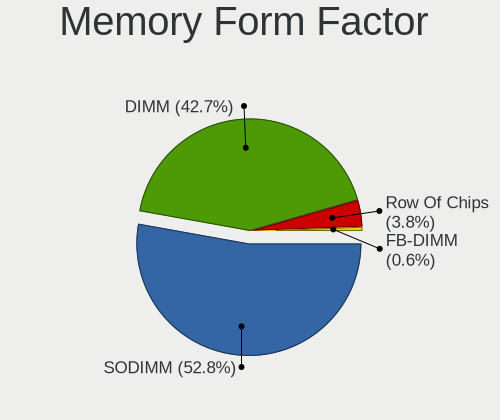

| Name         | Computers | Percent |
|--------------|-----------|---------|
| SODIMM       | 262       | 52.82%  |
| DIMM         | 212       | 42.74%  |
| Row Of Chips | 19        | 3.83%   |
| FB-DIMM      | 3         | 0.6%    |

Memory Size
-----------

Memory module size

| Size  | Computers | Percent |
|-------|-----------|---------|
| 4096  | 153       | 26.8%   |
| 8192  | 151       | 26.44%  |
| 2048  | 136       | 23.82%  |
| 1024  | 56        | 9.81%   |
| 16384 | 49        | 8.58%   |
| 32768 | 16        | 2.8%    |
| 512   | 7         | 1.23%   |
| 65536 | 1         | 0.18%   |
| 256   | 1         | 0.18%   |
| 16    | 1         | 0.18%   |

Memory Speed
------------

Memory module speed

| Speed   | Computers | Percent |
|---------|-----------|---------|
| 1600    | 122       | 22.18%  |
| 3200    | 63        | 11.45%  |
| 1333    | 61        | 11.09%  |
| Unknown | 46        | 8.36%   |
| 2667    | 39        | 7.09%   |
| 800     | 31        | 5.64%   |
| 2400    | 29        | 5.27%   |
| 1334    | 27        | 4.91%   |
| 667     | 23        | 4.18%   |
| 4800    | 12        | 2.18%   |
| 2133    | 10        | 1.82%   |
| 1067    | 8         | 1.45%   |
| 2666    | 7         | 1.27%   |
| 533     | 6         | 1.09%   |
| 3600    | 5         | 0.91%   |
| 1066    | 5         | 0.91%   |
| 5600    | 4         | 0.73%   |
| 1867    | 4         | 0.73%   |
| 400     | 4         | 0.73%   |
| 6400    | 3         | 0.55%   |
| 4267    | 3         | 0.55%   |
| 3266    | 3         | 0.55%   |
| 2048    | 3         | 0.55%   |
| 5354    | 2         | 0.36%   |
| 4266    | 2         | 0.36%   |
| 4199    | 2         | 0.36%   |
| 3800    | 2         | 0.36%   |
| 3733    | 2         | 0.36%   |
| 1800    | 2         | 0.36%   |
| 975     | 2         | 0.36%   |
| 8400    | 1         | 0.18%   |
| 6000    | 1         | 0.18%   |
| 5200    | 1         | 0.18%   |
| 4000    | 1         | 0.18%   |
| 3400    | 1         | 0.18%   |
| 3334    | 1         | 0.18%   |
| 3000    | 1         | 0.18%   |
| 2933    | 1         | 0.18%   |
| 2800    | 1         | 0.18%   |
| 2734    | 1         | 0.18%   |

Printers & scanners
-------------------

Printer Vendor
--------------

Printer device vendors

| Vendor                 | Computers | Percent |
|------------------------|-----------|---------|
| Hewlett-Packard        | 8         | 36.36%  |
| Samsung Electronics    | 4         | 18.18%  |
| Canon                  | 4         | 18.18%  |
| Xerox                  | 3         | 13.64%  |
| Seiko Epson            | 1         | 4.55%   |
| Panasonic (Matsushita) | 1         | 4.55%   |
| Lexmark International  | 1         | 4.55%   |

Printer Model
-------------

Printer device models

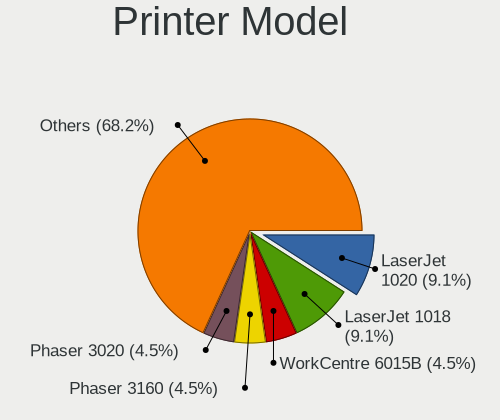

| Model                                      | Computers | Percent |
|--------------------------------------------|-----------|---------|
| HP LaserJet 1020                           | 2         | 9.09%   |
| HP LaserJet 1018                           | 2         | 9.09%   |
| Xerox WorkCentre 6015B                     | 1         | 4.55%   |
| Xerox Phaser 3160                          | 1         | 4.55%   |
| Xerox Phaser 3020                          | 1         | 4.55%   |
| Seiko Epson L805 Series                    | 1         | 4.55%   |
| Samsung Xerox Phaser 3117 Laser Printer    | 1         | 4.55%   |
| Samsung ML-1640 Series Laser Printer       | 1         | 4.55%   |
| Samsung M2020 Series                       | 1         | 4.55%   |
| Samsung CLX-3180 Series                    | 1         | 4.55%   |
| Panasonic (Matsushita) KX-MB1500RU         | 1         | 4.55%   |
| Lexmark International InkJet Color Printer | 1         | 4.55%   |
| HP LaserJet P1102                          | 1         | 4.55%   |
| HP LaserJet 1010                           | 1         | 4.55%   |
| HP DeskJet 5650c                           | 1         | 4.55%   |
| HP Deskjet 2520 series                     | 1         | 4.55%   |
| Canon LBP810                               | 1         | 4.55%   |
| Canon LBP6000                              | 1         | 4.55%   |
| Canon LBP2900                              | 1         | 4.55%   |
| Canon G3010 series                         | 1         | 4.55%   |

Scanner Vendor
--------------

Scanner device vendors

| Vendor          | Computers | Percent |
|-----------------|-----------|---------|
| Hewlett-Packard | 1         | 100%    |

Scanner Model
-------------

Scanner device models

| Model          | Computers | Percent |
|----------------|-----------|---------|
| HP Scanjet 200 | 1         | 100%    |

Camera
------

Camera Vendor
-------------

Camera device vendors

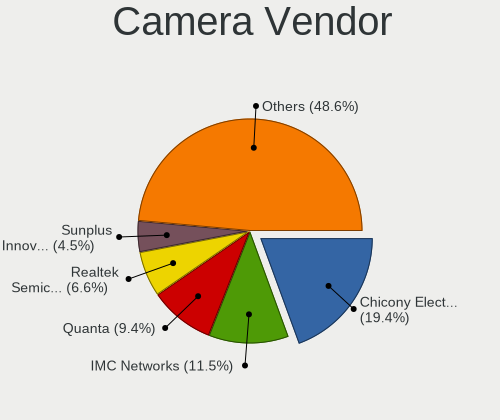

| Vendor                                 | Computers | Percent |
|----------------------------------------|-----------|---------|
| Chicony Electronics                    | 74        | 19.42%  |
| IMC Networks                           | 44        | 11.55%  |
| Quanta                                 | 36        | 9.45%   |
| Realtek Semiconductor                  | 25        | 6.56%   |
| Sunplus Innovation Technology          | 17        | 4.46%   |
| Bison Electronics                      | 17        | 4.46%   |
| Microdia                               | 16        | 4.2%    |
| Logitech                               | 16        | 4.2%    |
| Cheng Uei Precision Industry (Foxlink) | 16        | 4.2%    |
| Suyin                                  | 15        | 3.94%   |
| Z-Star Microelectronics                | 14        | 3.67%   |
| Syntek                                 | 12        | 3.15%   |
| KYE Systems (Mouse Systems)            | 10        | 2.62%   |
| Sonix Technology                       | 7         | 1.84%   |
| Lite-On Technology                     | 6         | 1.57%   |
| Samsung Electronics                    | 5         | 1.31%   |
| Luxvisions Innotech Limited            | 5         | 1.31%   |
| Silicon Motion                         | 4         | 1.05%   |
| Alcor Micro                            | 4         | 1.05%   |
| Acer                                   | 4         | 1.05%   |
| SiGma Micro                            | 3         | 0.79%   |
| Ricoh                                  | 3         | 0.79%   |
| Pixart Imaging                         | 3         | 0.79%   |
| GEMBIRD                                | 3         | 0.79%   |
| Shinetech                              | 2         | 0.52%   |
| Primax Electronics                     | 2         | 0.52%   |
| Hewlett-Packard                        | 2         | 0.52%   |
| Generalplus Technology                 | 2         | 0.52%   |
| Apple                                  | 2         | 0.52%   |
| ALi                                    | 2         | 0.52%   |
| Shine-optics                           | 1         | 0.26%   |
| OPPO Electronics                       | 1         | 0.26%   |
| Nebraska Furniture Mart                | 1         | 0.26%   |
| Lenovo                                 | 1         | 0.26%   |
| Jieli Technology                       | 1         | 0.26%   |
| Importek                               | 1         | 0.26%   |
| Creative Technology                    | 1         | 0.26%   |
| BillionPixels                          | 1         | 0.26%   |
| Aveo Technology                        | 1         | 0.26%   |
| A4Tech                                 | 1         | 0.26%   |

Camera Model
------------

Camera device models

| Model                                   | Computers | Percent |
|-----------------------------------------|-----------|---------|
| IMC Networks USB2.0 HD UVC WebCam       | 15        | 3.93%   |
| IMC Networks USB2.0 VGA UVC WebCam      | 10        | 2.62%   |
| Chicony HD WebCam                       | 9         | 2.36%   |
| Z-Star Venus USB2.0 Camera              | 8         | 2.09%   |
| IMC Networks Integrated Camera          | 8         | 2.09%   |
| Quanta HD User Facing                   | 7         | 1.83%   |
| Syntek Integrated Camera                | 6         | 1.57%   |
| Sunplus HD WebCam                       | 6         | 1.57%   |
| Quanta HD WebCam                        | 6         | 1.57%   |
| Logitech Webcam C270                    | 6         | 1.57%   |
| Chicony Integrated Camera               | 6         | 1.57%   |
| Bison Lenovo Integrated Webcam          | 6         | 1.57%   |
| Samsung Galaxy series, misc. (MTP mode) | 5         | 1.31%   |
| Realtek Lenovo EasyCamera               | 5         | 1.31%   |
| Quanta HP Wide Vision HD Camera         | 5         | 1.31%   |
| Chicony Lenovo EasyCamera               | 5         | 1.31%   |
| Bison Integrated Camera                 | 5         | 1.31%   |
| Syntek Lenovo EasyCamera                | 4         | 1.05%   |
| Suyin 1.3M HD WebCam                    | 4         | 1.05%   |
| Sonix USB2.0 FHD UVC WebCam             | 4         | 1.05%   |
| Quanta VGA WebCam                       | 4         | 1.05%   |
| Microdia Integrated_Webcam_HD           | 4         | 1.05%   |
| Lite-On Integrated Camera               | 4         | 1.05%   |
| Chicony USB2.0 VGA UVC WebCam           | 4         | 1.05%   |
| Chicony Integrated Camera (1280x720@30) | 4         | 1.05%   |
| Chicony HP Truevision HD                | 4         | 1.05%   |
| Chicony Fujitsu Integrated Camera       | 4         | 1.05%   |
| Chicony EasyCamera                      | 4         | 1.05%   |
| Suyin HP Truevision HD                  | 3         | 0.79%   |
| Sunplus Asus Webcam                     | 3         | 0.79%   |
| Sonix USB2.0 HD UVC WebCam              | 3         | 0.79%   |
| SiGma Micro WebCam SiGma Micro          | 3         | 0.79%   |
| Realtek USB Camera                      | 3         | 0.79%   |
| Realtek Integrated_Webcam_HD            | 3         | 0.79%   |
| Realtek Acer 640 x 480 laptop camera    | 3         | 0.79%   |
| Quanta ACER HD User Facing              | 3         | 0.79%   |
| Pixart Imaging GE 1.3 MP MiniCam Pro    | 3         | 0.79%   |
| Microdia Laptop_Integrated_Webcam_HD    | 3         | 0.79%   |
| Microdia Camera                         | 3         | 0.79%   |
| Logitech Webcam C170                    | 3         | 0.79%   |

Security
--------

Fingerprint Vendor
------------------

Fingerprint sensor vendors

| Vendor                             | Computers | Percent |
|------------------------------------|-----------|---------|
| Validity Sensors                   | 15        | 26.79%  |
| Shenzhen Goodix Technology         | 8         | 14.29%  |
| Synaptics                          | 7         | 12.5%   |
| Elan Microelectronics              | 6         | 10.71%  |
| AuthenTec                          | 6         | 10.71%  |
| Upek                               | 5         | 8.93%   |
| STMicroelectronics                 | 4         | 7.14%   |
| Realtek USB2.0 Finger Print Bridge | 3         | 5.36%   |
| LighTuning Technology              | 2         | 3.57%   |

Fingerprint Model
-----------------

Fingerprint sensor models

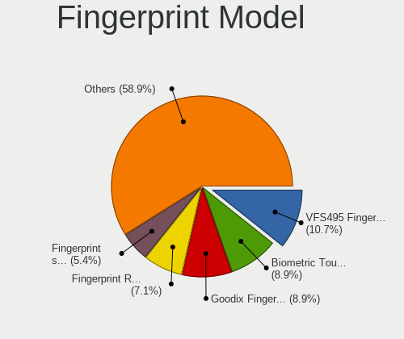

| Model                                                           | Computers | Percent |
|-----------------------------------------------------------------|-----------|---------|
| Validity Sensors VFS495 Fingerprint Reader                      | 6         | 10.71%  |
| Upek Biometric Touchchip/Touchstrip Fingerprint Sensor          | 5         | 8.93%   |
| Shenzhen Goodix  FingerPrint Device                             | 5         | 8.93%   |
| STMicroelectronics Fingerprint Reader                           | 4         | 7.14%   |
| Validity Sensors Fingerprint scanner                            | 3         | 5.36%   |
| Realtek USB2.0 Finger Print Bridge FocalTech Fingerprint Device | 3         | 5.36%   |
| Elan ELAN:ARM-M4                                                | 3         | 5.36%   |
| AuthenTec AES2501 Fingerprint Sensor                            | 3         | 5.36%   |
| Validity Sensors VFS5011 Fingerprint Reader                     | 2         | 3.57%   |
| Validity Sensors Swipe Fingerprint Sensor                       | 2         | 3.57%   |
| Synaptics Metallica MIS Touch Fingerprint Reader                | 2         | 3.57%   |
| Shenzhen Goodix Fingerprint Reader                              | 2         | 3.57%   |
| LighTuning EgisTec Touch Fingerprint Sensor                     | 2         | 3.57%   |
| Elan ELAN:Fingerprint                                           | 2         | 3.57%   |
| AuthenTec AES2810                                               | 2         | 3.57%   |
| Validity Sensors VFS471 Fingerprint Reader                      | 1         | 1.79%   |
| Validity Sensors VFS 5011 fingerprint sensor                    | 1         | 1.79%   |
| Synaptics WBDI Fingerprint Reader USB 086                       | 1         | 1.79%   |
| Synaptics  WBDI                                                 | 1         | 1.79%   |
| Synaptics  FS7604 Touch Fingerprint Sensor with PurePrint       | 1         | 1.79%   |
| Synaptics Prometheus MIS Touch Fingerprint Reader               | 1         | 1.79%   |
| Synaptics Metallica MOH Touch Fingerprint Reader                | 1         | 1.79%   |
| Shenzhen Goodix FingerPrint                                     | 1         | 1.79%   |
| Elan WBF Fingerprint Sensor                                     | 1         | 1.79%   |
| AuthenTec Fingerprint Sensor                                    | 1         | 1.79%   |

Chipcard Vendor
---------------

Chipcard module vendors

| Vendor                | Computers | Percent |
|-----------------------|-----------|---------|
| Broadcom              | 4         | 30.77%  |
| Alcor Micro           | 3         | 23.08%  |
| Upek                  | 1         | 7.69%   |
| O2 Micro              | 1         | 7.69%   |
| Lenovo                | 1         | 7.69%   |
| Feitian Technologies  | 1         | 7.69%   |
| Aktiv                 | 1         | 7.69%   |
| Advanced Card Systems | 1         | 7.69%   |

Chipcard Model
--------------

Chipcard module models

| Model                                                      | Computers | Percent |
|------------------------------------------------------------|-----------|---------|
| Alcor Micro AU9540 Smartcard Reader                        | 3         | 23.08%  |
| Broadcom 58200                                             | 2         | 15.38%  |
| Upek TouchChip Fingerprint Coprocessor (WBF advanced mode) | 1         | 7.69%   |
| O2 Micro OZ776 CCID Smartcard Reader                       | 1         | 7.69%   |
| Lenovo Integrated Smart Card Reader                        | 1         | 7.69%   |
| Feitian Technologies SCR301                                | 1         | 7.69%   |
| Broadcom BCM5880 Secure Applications Processor             | 1         | 7.69%   |
| Broadcom 5880                                              | 1         | 7.69%   |
| Aktiv KAZTOKEN                                             | 1         | 7.69%   |
| Advanced Card Systems ACR38 SmartCard Reader               | 1         | 7.69%   |

Unsupported
-----------

Unsupported Devices
-------------------

Total unsupported devices on board

| Total | Computers | Percent |
|-------|-----------|---------|
| 0     | 493       | 75.04%  |
| 1     | 132       | 20.09%  |
| 2     | 21        | 3.2%    |
| 3     | 9         | 1.37%   |
| 4     | 2         | 0.3%    |

Unsupported Device Types
------------------------

Types of unsupported devices

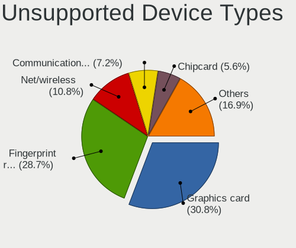

| Type                     | Computers | Percent |
|--------------------------|-----------|---------|
| Graphics card            | 60        | 30.77%  |
| Fingerprint reader       | 56        | 28.72%  |
| Net/wireless             | 21        | 10.77%  |
| Communication controller | 14        | 7.18%   |
| Chipcard                 | 11        | 5.64%   |
| Bluetooth                | 9         | 4.62%   |
| Unassigned class         | 7         | 3.59%   |
| Camera                   | 7         | 3.59%   |
| Multimedia controller    | 6         | 3.08%   |
| Wireless                 | 1         | 0.51%   |
| Net/ethernet             | 1         | 0.51%   |
| Modem                    | 1         | 0.51%   |
| Card reader              | 1         | 0.51%   |

