Linux in Kenya - Tested Hardware & Statistics (Desktops)
--------------------------------------------------------

A project to collect tested hardware configurations for Linux in Kenya.

Anyone can contribute to this report by the [hw-probe](https://github.com/linuxhw/hw-probe) tool:

    sudo -E hw-probe -all -upload

Please contribute! Especially if your hardware is rare.

Contents
--------

* [ Test Cases ](#test-cases)

* [ System ](#system)
  - [ OS                       ](#os)
  - [ OS Family                ](#os-family)
  - [ Kernel                   ](#kernel)
  - [ Kernel Family            ](#kernel-family)
  - [ Kernel Major Ver.        ](#kernel-major-ver)
  - [ Arch                     ](#arch)
  - [ DE                       ](#de)
  - [ Display Server           ](#display-server)
  - [ Display Manager          ](#display-manager)
  - [ OS Lang                  ](#os-lang)
  - [ Boot Mode                ](#boot-mode)
  - [ Filesystem               ](#filesystem)
  - [ Part. scheme             ](#part-scheme)
  - [ Dual Boot with Linux/BSD ](#dual-boot-with-linuxbsd)
  - [ Dual Boot (Win)          ](#dual-boot-win)

* [ Board ](#board)
  - [ Vendor                   ](#vendor)
  - [ Model                    ](#model)
  - [ Model Family             ](#model-family)
  - [ MFG Year                 ](#mfg-year)
  - [ Form Factor              ](#form-factor)
  - [ Secure Boot              ](#secure-boot)
  - [ Coreboot                 ](#coreboot)
  - [ RAM Size                 ](#ram-size)
  - [ RAM Used                 ](#ram-used)
  - [ Total Drives             ](#total-drives)
  - [ Has CD-ROM               ](#has-cd-rom)
  - [ Has Ethernet             ](#has-ethernet)
  - [ Has WiFi                 ](#has-wifi)
  - [ Has Bluetooth            ](#has-bluetooth)

* [ Location ](#location)
  - [ Country                  ](#country)
  - [ City                     ](#city)

* [ Drives ](#drives)
  - [ Drive Vendor             ](#drive-vendor)
  - [ Drive Model              ](#drive-model)
  - [ HDD Vendor               ](#hdd-vendor)
  - [ SSD Vendor               ](#ssd-vendor)
  - [ Drive Kind               ](#drive-kind)
  - [ Drive Connector          ](#drive-connector)
  - [ Drive Size               ](#drive-size)
  - [ Space Total              ](#space-total)
  - [ Space Used               ](#space-used)
  - [ Malfunc. Drives          ](#malfunc-drives)
  - [ Malfunc. Drive Vendor    ](#malfunc-drive-vendor)
  - [ Malfunc. HDD Vendor      ](#malfunc-hdd-vendor)
  - [ Malfunc. Drive Kind      ](#malfunc-drive-kind)
  - [ Failed Drives            ](#failed-drives)
  - [ Failed Drive Vendor      ](#failed-drive-vendor)
  - [ Drive Status             ](#drive-status)

* [ Storage controller ](#storage-controller)
  - [ Storage Vendor           ](#storage-vendor)
  - [ Storage Model            ](#storage-model)
  - [ Storage Kind             ](#storage-kind)

* [ Processor ](#processor)
  - [ CPU Vendor               ](#cpu-vendor)
  - [ CPU Model                ](#cpu-model)
  - [ CPU Model Family         ](#cpu-model-family)
  - [ CPU Cores                ](#cpu-cores)
  - [ CPU Sockets              ](#cpu-sockets)
  - [ CPU Threads              ](#cpu-threads)
  - [ CPU Op-Modes             ](#cpu-op-modes)
  - [ CPU Microcode            ](#cpu-microcode)
  - [ CPU Microarch            ](#cpu-microarch)

* [ Graphics ](#graphics)
  - [ GPU Vendor               ](#gpu-vendor)
  - [ GPU Model                ](#gpu-model)
  - [ GPU Combo                ](#gpu-combo)
  - [ GPU Driver               ](#gpu-driver)
  - [ GPU Memory               ](#gpu-memory)

* [ Monitor ](#monitor)
  - [ Monitor Vendor           ](#monitor-vendor)
  - [ Monitor Model            ](#monitor-model)
  - [ Monitor Resolution       ](#monitor-resolution)
  - [ Monitor Diagonal         ](#monitor-diagonal)
  - [ Monitor Width            ](#monitor-width)
  - [ Aspect Ratio             ](#aspect-ratio)
  - [ Monitor Area             ](#monitor-area)
  - [ Pixel Density            ](#pixel-density)
  - [ Multiple Monitors        ](#multiple-monitors)

* [ Network ](#network)
  - [ Net Controller Vendor    ](#net-controller-vendor)
  - [ Net Controller Model     ](#net-controller-model)
  - [ Wireless Vendor          ](#wireless-vendor)
  - [ Wireless Model           ](#wireless-model)
  - [ Ethernet Vendor          ](#ethernet-vendor)
  - [ Ethernet Model           ](#ethernet-model)
  - [ Net Controller Kind      ](#net-controller-kind)
  - [ Used Controller          ](#used-controller)
  - [ NICs                     ](#nics)
  - [ IPv6                     ](#ipv6)

* [ Bluetooth ](#bluetooth)
  - [ Bluetooth Vendor         ](#bluetooth-vendor)
  - [ Bluetooth Model          ](#bluetooth-model)

* [ Sound ](#sound)
  - [ Sound Vendor             ](#sound-vendor)
  - [ Sound Model              ](#sound-model)

* [ Memory ](#memory)
  - [ Memory Vendor            ](#memory-vendor)
  - [ Memory Model             ](#memory-model)
  - [ Memory Kind              ](#memory-kind)
  - [ Memory Form Factor       ](#memory-form-factor)
  - [ Memory Size              ](#memory-size)
  - [ Memory Speed             ](#memory-speed)

* [ Printers & scanners ](#printers--scanners)
  - [ Printer Vendor           ](#printer-vendor)
  - [ Printer Model            ](#printer-model)
  - [ Scanner Vendor           ](#scanner-vendor)
  - [ Scanner Model            ](#scanner-model)

* [ Camera ](#camera)
  - [ Camera Vendor            ](#camera-vendor)
  - [ Camera Model             ](#camera-model)

* [ Security ](#security)
  - [ Fingerprint Vendor       ](#fingerprint-vendor)
  - [ Fingerprint Model        ](#fingerprint-model)
  - [ Chipcard Vendor          ](#chipcard-vendor)
  - [ Chipcard Model           ](#chipcard-model)

* [ Unsupported ](#unsupported)
  - [ Unsupported Devices      ](#unsupported-devices)
  - [ Unsupported Device Types ](#unsupported-device-types)

Test Cases
----------

Total: 51

| Vendor   | Model                    | Probe                                                      | Date         |
|----------|--------------------------|------------------------------------------------------------|--------------|
| ASRock   | X570 Steel Legend        | [0de958194e](https://linux-hardware.org/?probe=0de958194e) | Dec 15, 2022 |
| ASRock   | X570 Steel Legend        | [84c7e04946](https://linux-hardware.org/?probe=84c7e04946) | Dec 08, 2022 |
| ASRock   | X570 Steel Legend        | [580fb6172f](https://linux-hardware.org/?probe=580fb6172f) | Dec 07, 2022 |
| Dell     | 0M5DCD A00               | [c3049c59a8](https://linux-hardware.org/?probe=c3049c59a8) | Oct 30, 2022 |
| Dell     | 0M5DCD A00               | [daae18ab91](https://linux-hardware.org/?probe=daae18ab91) | Oct 30, 2022 |
| Gigabyte | TRX40 AORUS PRO WIFI     | [85f2638273](https://linux-hardware.org/?probe=85f2638273) | Oct 05, 2022 |
| Dell     | 040DDP A01               | [20d37d51bd](https://linux-hardware.org/?probe=20d37d51bd) | Sep 21, 2022 |
| Dell     | 040DDP A01               | [cabebaa0e6](https://linux-hardware.org/?probe=cabebaa0e6) | Sep 21, 2022 |
| Foxconn  | 2ABF                     | [6d7ce1962d](https://linux-hardware.org/?probe=6d7ce1962d) | Aug 24, 2022 |
| HP       | 097Ch                    | [ac391817bc](https://linux-hardware.org/?probe=ac391817bc) | Aug 19, 2022 |
| HP       | 1493                     | [2925e7a321](https://linux-hardware.org/?probe=2925e7a321) | Aug 01, 2022 |
| HP       | 3397                     | [0679103825](https://linux-hardware.org/?probe=0679103825) | Jun 13, 2022 |
| HP       | 3397                     | [e86ba79fcf](https://linux-hardware.org/?probe=e86ba79fcf) | Jun 09, 2022 |
| Dell     | 0HHV7N A00               | [1f7a666022](https://linux-hardware.org/?probe=1f7a666022) | Jun 02, 2022 |
| Lenovo   | NOK                      | [e7a84a12e6](https://linux-hardware.org/?probe=e7a84a12e6) | May 16, 2022 |
| Dell     | 0773VG A02               | [ec8ec429fc](https://linux-hardware.org/?probe=ec8ec429fc) | Mar 07, 2022 |
| Dell     | 055H3G A01               | [7e00973942](https://linux-hardware.org/?probe=7e00973942) | Mar 06, 2022 |
| Dell     | 055H3G A01               | [05f63f2396](https://linux-hardware.org/?probe=05f63f2396) | Feb 04, 2022 |
| Gigabyte | H110M-A-CF               | [e6a3a69257](https://linux-hardware.org/?probe=e6a3a69257) | Jan 29, 2022 |
| HP       | 83E0                     | [4a54d6921c](https://linux-hardware.org/?probe=4a54d6921c) | Jan 13, 2022 |
| Gigabyte | B450 I AORUS PRO WIFI-CF | [ee1387e206](https://linux-hardware.org/?probe=ee1387e206) | Nov 26, 2021 |
| Dell     | 0R790T A00               | [b5a01103fd](https://linux-hardware.org/?probe=b5a01103fd) | Sep 14, 2021 |
| Dell     | 0R790T A00               | [a5290e7cb6](https://linux-hardware.org/?probe=a5290e7cb6) | Sep 14, 2021 |
| Acer     | Veriton X680G            | [3b8774337b](https://linux-hardware.org/?probe=3b8774337b) | Jul 23, 2021 |
| MSI      | B450 TOMAHAWK            | [8513c961a4](https://linux-hardware.org/?probe=8513c961a4) | Jun 21, 2021 |
| Dell     | 0HN7XN A01               | [2c35ee27d9](https://linux-hardware.org/?probe=2c35ee27d9) | May 20, 2021 |
| Dell     | 0773VG A02               | [a4d5cb7e11](https://linux-hardware.org/?probe=a4d5cb7e11) | Mar 10, 2021 |
| MSI      | B450 TOMAHAWK            | [f56f2da985](https://linux-hardware.org/?probe=f56f2da985) | Jan 28, 2021 |
| HP       | 3396                     | [12e6dc258e](https://linux-hardware.org/?probe=12e6dc258e) | Oct 31, 2020 |
| HP       | 3396                     | [876ee024dc](https://linux-hardware.org/?probe=876ee024dc) | Oct 31, 2020 |
| MSI      | B450 TOMAHAWK            | [6ea891ad6b](https://linux-hardware.org/?probe=6ea891ad6b) | Oct 13, 2020 |
| Dell     | 0773VG A02               | [8307343ab3](https://linux-hardware.org/?probe=8307343ab3) | Oct 09, 2020 |
| Dell     | 0773VG A02               | [2c6d570678](https://linux-hardware.org/?probe=2c6d570678) | Oct 09, 2020 |
| MSI      | B450 TOMAHAWK            | [dc38793462](https://linux-hardware.org/?probe=dc38793462) | Sep 08, 2020 |
| MSI      | 0A90                     | [4f8d53458d](https://linux-hardware.org/?probe=4f8d53458d) | Aug 11, 2020 |
| MSI      | 0A90                     | [04bdc6569a](https://linux-hardware.org/?probe=04bdc6569a) | Aug 09, 2020 |
| MSI      | 2AE0                     | [54a32fea6e](https://linux-hardware.org/?probe=54a32fea6e) | Aug 02, 2020 |
| Dell     | 0VNP2H A00               | [de21e4bff4](https://linux-hardware.org/?probe=de21e4bff4) | Jul 04, 2020 |
| HP       | 0AA8h                    | [e60c30f572](https://linux-hardware.org/?probe=e60c30f572) | Jun 25, 2020 |
| HP       | 0AA8h                    | [4017115305](https://linux-hardware.org/?probe=4017115305) | Jun 19, 2020 |
| HP       | 0AA8h                    | [752505c134](https://linux-hardware.org/?probe=752505c134) | Jun 17, 2020 |
| HP       | 3032h                    | [8aa1dd8ecd](https://linux-hardware.org/?probe=8aa1dd8ecd) | Jun 13, 2020 |
| Dell     | 0PU052                   | [5d99be49f0](https://linux-hardware.org/?probe=5d99be49f0) | May 31, 2020 |
| Dell     | 0PU052                   | [6b4292fc06](https://linux-hardware.org/?probe=6b4292fc06) | May 30, 2020 |
| Dell     | 0G214D A00               | [a8caa085de](https://linux-hardware.org/?probe=a8caa085de) | May 04, 2020 |
| Gigabyte | Z68XP-UD3                | [a26feb7507](https://linux-hardware.org/?probe=a26feb7507) | Apr 18, 2020 |
| HP       | 0B4Ch D                  | [2807f4c586](https://linux-hardware.org/?probe=2807f4c586) | Mar 12, 2020 |
| HP       | 09F0h                    | [bff6b4f556](https://linux-hardware.org/?probe=bff6b4f556) | Jan 21, 2020 |
| HP       | 09F0h                    | [ad09a9a9d4](https://linux-hardware.org/?probe=ad09a9a9d4) | Jan 21, 2020 |
| HP       | 0AA0h                    | [1787c13656](https://linux-hardware.org/?probe=1787c13656) | Jun 15, 2019 |
| ASUSTek  | M5A97 R2.0               | [304aa59840](https://linux-hardware.org/?probe=304aa59840) | Dec 14, 2017 |

System
------

OS
--

Installed operating systems

| Name                | Desktops | Percent |
|---------------------|----------|---------|
| Ubuntu 20.04        | 10       | 27.03%  |
| Linux Mint 21       | 3        | 8.11%   |
| ArcoLinux Rolling   | 3        | 8.11%   |
| Zorin 15            | 2        | 5.41%   |
| Ubuntu 18.04        | 2        | 5.41%   |
| Ubuntu Studio 21.10 | 1        | 2.7%    |
| Pop!_OS 20.10       | 1        | 2.7%    |
| Pop!_OS 20.04       | 1        | 2.7%    |
| OpenMandriva 4.50   | 1        | 2.7%    |
| OpenMandriva 4.2    | 1        | 2.7%    |
| Mageia 6            | 1        | 2.7%    |
| Lubuntu 20.10       | 1        | 2.7%    |
| Linux Mint 20.3     | 1        | 2.7%    |
| Kali 2020.1         | 1        | 2.7%    |
| Fedora 36           | 1        | 2.7%    |
| Fedora 34           | 1        | 2.7%    |
| Fedora 33           | 1        | 2.7%    |
| Fedora 32           | 1        | 2.7%    |
| Endless 3.8.3       | 1        | 2.7%    |
| Elementary 6.1      | 1        | 2.7%    |
| Elementary 6        | 1        | 2.7%    |
| BlackPanther 18.1   | 1        | 2.7%    |

OS Family
---------

OS without a version

| Name          | Desktops | Percent |
|---------------|----------|---------|
| Ubuntu        | 12       | 34.29%  |
| Linux Mint    | 4        | 11.43%  |
| Fedora        | 3        | 8.57%   |
| ArcoLinux     | 3        | 8.57%   |
| Zorin         | 2        | 5.71%   |
| OpenMandriva  | 2        | 5.71%   |
| Elementary    | 2        | 5.71%   |
| Ubuntu Studio | 1        | 2.86%   |
| Pop!_OS       | 1        | 2.86%   |
| Mageia        | 1        | 2.86%   |
| Lubuntu       | 1        | 2.86%   |
| Kali          | 1        | 2.86%   |
| Endless       | 1        | 2.86%   |
| BlackPanther  | 1        | 2.86%   |

Kernel
------

Version of the Linux kernel

| Version                  | Desktops | Percent |
|--------------------------|----------|---------|
| 5.4.0-42-generic         | 2        | 5.26%   |
| 5.15.0-41-generic        | 2        | 5.26%   |
| 5.8.4-200.fc32.x86_64    | 1        | 2.63%   |
| 5.8.13-200.fc32.x86_64   | 1        | 2.63%   |
| 5.8.0-7642-generic       | 1        | 2.63%   |
| 5.8.0-63-generic         | 1        | 2.63%   |
| 5.8.0-53-generic         | 1        | 2.63%   |
| 5.8.0-43-generic         | 1        | 2.63%   |
| 5.4.0-7642-generic       | 1        | 2.63%   |
| 5.4.0-37-generic         | 1        | 2.63%   |
| 5.4.0-33-generic         | 1        | 2.63%   |
| 5.4.0-28-generic         | 1        | 2.63%   |
| 5.4.0-19-generic         | 1        | 2.63%   |
| 5.4.0-124-generic        | 1        | 2.63%   |
| 5.3.0-kali2-amd64        | 1        | 2.63%   |
| 5.3.0-62-generic         | 1        | 2.63%   |
| 5.3.0-28-generic         | 1        | 2.63%   |
| 5.19.9-200.fc36.x86_64   | 1        | 2.63%   |
| 5.19.5-desktop-1omv4090  | 1        | 2.63%   |
| 5.16.2-zen1-1-zen        | 1        | 2.63%   |
| 5.15.26-1-lts            | 1        | 2.63%   |
| 5.15.10-arch1-1          | 1        | 2.63%   |
| 5.15.0-52-generic        | 1        | 2.63%   |
| 5.13.0-48-generic        | 1        | 2.63%   |
| 5.13.0-40-generic        | 1        | 2.63%   |
| 5.13.0-30-generic        | 1        | 2.63%   |
| 5.13.0-28-lowlatency     | 1        | 2.63%   |
| 5.12.11-300.fc34.x86_64  | 1        | 2.63%   |
| 5.11.0-43-generic        | 1        | 2.63%   |
| 5.11.0-40-generic        | 1        | 2.63%   |
| 5.10.14-desktop-1omv4002 | 1        | 2.63%   |
| 5.10.10-200.fc33.x86_64  | 1        | 2.63%   |
| 5.0.0-37-generic         | 1        | 2.63%   |
| 4.9.56-server-1.mga6     | 1        | 2.63%   |
| 4.18.16-desktop-1bP      | 1        | 2.63%   |
| 4.15.0-51-generic        | 1        | 2.63%   |

Kernel Family
-------------

Linux kernel without a distro release

| Version | Desktops | Percent |
|---------|----------|---------|
| 5.4.0   | 8        | 21.05%  |
| 5.8.0   | 4        | 10.53%  |
| 5.13.0  | 4        | 10.53%  |
| 5.3.0   | 3        | 7.89%   |
| 5.15.0  | 3        | 7.89%   |
| 5.11.0  | 2        | 5.26%   |
| 5.8.4   | 1        | 2.63%   |
| 5.8.13  | 1        | 2.63%   |
| 5.19.9  | 1        | 2.63%   |
| 5.19.5  | 1        | 2.63%   |
| 5.16.2  | 1        | 2.63%   |
| 5.15.26 | 1        | 2.63%   |
| 5.15.10 | 1        | 2.63%   |
| 5.12.11 | 1        | 2.63%   |
| 5.10.14 | 1        | 2.63%   |
| 5.10.10 | 1        | 2.63%   |
| 5.0.0   | 1        | 2.63%   |
| 4.9.56  | 1        | 2.63%   |
| 4.18.16 | 1        | 2.63%   |
| 4.15.0  | 1        | 2.63%   |

Kernel Major Ver.
-----------------

Linux kernel major version

| Version | Desktops | Percent |
|---------|----------|---------|
| 5.4     | 8        | 21.62%  |
| 5.8     | 5        | 13.51%  |
| 5.15    | 5        | 13.51%  |
| 5.13    | 4        | 10.81%  |
| 5.3     | 3        | 8.11%   |
| 5.19    | 2        | 5.41%   |
| 5.11    | 2        | 5.41%   |
| 5.10    | 2        | 5.41%   |
| 5.16    | 1        | 2.7%    |
| 5.12    | 1        | 2.7%    |
| 5.0     | 1        | 2.7%    |
| 4.9     | 1        | 2.7%    |
| 4.18    | 1        | 2.7%    |
| 4.15    | 1        | 2.7%    |

Arch
----

OS architecture (x86_64, i586, etc.)

| Name   | Desktops | Percent |
|--------|----------|---------|
| x86_64 | 34       | 100%    |

DE
--

Desktop Environment

| Name       | Desktops | Percent |
|------------|----------|---------|
| GNOME      | 18       | 51.43%  |
| KDE5       | 5        | 14.29%  |
| X-Cinnamon | 4        | 11.43%  |
| Pantheon   | 2        | 5.71%   |
| Unknown    | 2        | 5.71%   |
| LXQt       | 1        | 2.86%   |
| DWM        | 1        | 2.86%   |
| Cinnamon   | 1        | 2.86%   |
| awesome    | 1        | 2.86%   |

Display Server
--------------

X11 or Wayland

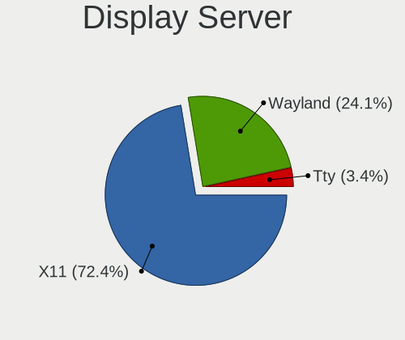

| Name    | Desktops | Percent |
|---------|----------|---------|
| X11     | 29       | 85.29%  |
| Wayland | 3        | 8.82%   |
| Tty     | 1        | 2.94%   |
| Unknown | 1        | 2.94%   |

Display Manager
---------------

SDDM, LightDM, etc.

| Name    | Desktops | Percent |
|---------|----------|---------|
| Unknown | 17       | 48.57%  |
| SDDM    | 7        | 20%     |
| LightDM | 6        | 17.14%  |
| GDM3    | 3        | 8.57%   |
| GDM     | 2        | 5.71%   |

OS Lang
-------

Language

| Lang    | Desktops | Percent |
|---------|----------|---------|
| en_US   | 28       | 82.35%  |
| en_GB   | 3        | 8.82%   |
| Unknown | 3        | 8.82%   |

Boot Mode
---------

EFI or BIOS

| Mode | Desktops | Percent |
|------|----------|---------|
| BIOS | 22       | 64.71%  |
| EFI  | 12       | 35.29%  |

Filesystem
----------

Type of filesystem

| Type    | Desktops | Percent |
|---------|----------|---------|
| Ext4    | 26       | 74.29%  |
| Overlay | 5        | 14.29%  |
| Btrfs   | 3        | 8.57%   |
| Unknown | 1        | 2.86%   |

Part. scheme
------------

Scheme of partitioning

| Type    | Desktops | Percent |
|---------|----------|---------|
| Unknown | 22       | 64.71%  |
| GPT     | 7        | 20.59%  |
| MBR     | 5        | 14.71%  |

Dual Boot with Linux/BSD
------------------------

Hosting more than one Linux/BSD

| Dual boot | Desktops | Percent |
|-----------|----------|---------|
| No        | 27       | 79.41%  |
| Yes       | 7        | 20.59%  |

Dual Boot (Win)
---------------

Hosting Linux and Windows

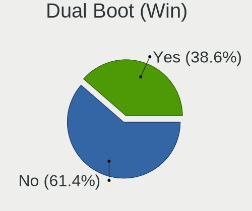

| Dual boot | Desktops | Percent |
|-----------|----------|---------|
| No        | 19       | 55.88%  |
| Yes       | 15       | 44.12%  |

Board
-----

Vendor
------

Motherboard manufacturer

| Name                | Desktops | Percent |
|---------------------|----------|---------|
| Dell                | 11       | 32.35%  |
| Hewlett-Packard     | 10       | 29.41%  |
| MSI                 | 4        | 11.76%  |
| Gigabyte Technology | 4        | 11.76%  |
| Lenovo              | 1        | 2.94%   |
| Foxconn             | 1        | 2.94%   |
| ASUSTek Computer    | 1        | 2.94%   |
| ASRock              | 1        | 2.94%   |
| Acer                | 1        | 2.94%   |

Model
-----

Motherboard model

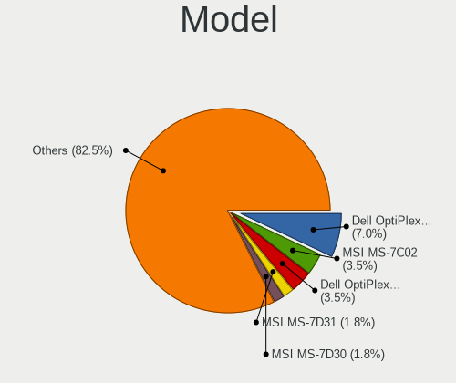

| Name                                   | Desktops | Percent |
|----------------------------------------|----------|---------|
| MSI MS-7C02                            | 2        | 5.88%   |
| Dell OptiPlex 7010                     | 2        | 5.88%   |
| MSI 500-007A                           | 1        | 2.94%   |
| MSI 0A90                               | 1        | 2.94%   |
| Lenovo ThinkCentre E73 10AS00CVUM      | 1        | 2.94%   |
| HP Z400 Workstation                    | 1        | 2.94%   |
| HP xw4600 Workstation                  | 1        | 2.94%   |
| HP EliteDesk 800 G4 TWR                | 1        | 2.94%   |
| HP Compaq Elite 8300 SFF               | 1        | 2.94%   |
| HP Compaq Elite 8300 CMT               | 1        | 2.94%   |
| HP Compaq dc7900 Convertible Minitower | 1        | 2.94%   |
| HP Compaq dc7800 Small Form Factor     | 1        | 2.94%   |
| HP Compaq dc7600 Convertible Minitower | 1        | 2.94%   |
| HP Compaq dc7100 SFF(DX878AV)          | 1        | 2.94%   |
| HP Compaq 4000 Pro SFF PC              | 1        | 2.94%   |
| Gigabyte Z68XP-UD3                     | 1        | 2.94%   |
| Gigabyte TRX40 AORUS PRO WIFI          | 1        | 2.94%   |
| Gigabyte H110M-A                       | 1        | 2.94%   |
| Gigabyte B450 I AORUS PRO WIFI         | 1        | 2.94%   |
| Foxconn Pro3500 Series                 | 1        | 2.94%   |
| Dell Precision Tower 5810              | 1        | 2.94%   |
| Dell OptiPlex 990                      | 1        | 2.94%   |
| Dell OptiPlex 760                      | 1        | 2.94%   |
| Dell OptiPlex 755                      | 1        | 2.94%   |
| Dell OptiPlex 7050                     | 1        | 2.94%   |
| Dell OptiPlex 5040                     | 1        | 2.94%   |
| Dell OptiPlex 390                      | 1        | 2.94%   |
| Dell OptiPlex 380                      | 1        | 2.94%   |
| Dell OptiPlex 3020                     | 1        | 2.94%   |
| ASUS M5A97 R2.0                        | 1        | 2.94%   |
| ASRock X570 Steel Legend               | 1        | 2.94%   |
| Acer Veriton X680G                     | 1        | 2.94%   |

Model Family
------------

Motherboard model prefix

| Name               | Desktops | Percent |
|--------------------|----------|---------|
| Dell OptiPlex      | 10       | 29.41%  |
| HP Compaq          | 7        | 20.59%  |
| MSI MS-7C02        | 2        | 5.88%   |
| MSI 500-007A       | 1        | 2.94%   |
| MSI 0A90           | 1        | 2.94%   |
| Lenovo ThinkCentre | 1        | 2.94%   |
| HP Z400            | 1        | 2.94%   |
| HP xw4600          | 1        | 2.94%   |
| HP EliteDesk       | 1        | 2.94%   |
| Gigabyte Z68XP-UD3 | 1        | 2.94%   |
| Gigabyte TRX40     | 1        | 2.94%   |
| Gigabyte H110M-A   | 1        | 2.94%   |
| Gigabyte B450      | 1        | 2.94%   |
| Foxconn Pro3500    | 1        | 2.94%   |
| Dell Precision     | 1        | 2.94%   |
| ASUS M5A97         | 1        | 2.94%   |
| ASRock X570        | 1        | 2.94%   |
| Acer Veriton       | 1        | 2.94%   |

MFG Year
--------

Motherboard manufacture year

| Year | Desktops | Percent |
|------|----------|---------|
| 2018 | 5        | 14.71%  |
| 2011 | 4        | 11.76%  |
| 2019 | 3        | 8.82%   |
| 2013 | 3        | 8.82%   |
| 2012 | 3        | 8.82%   |
| 2010 | 3        | 8.82%   |
| 2008 | 3        | 8.82%   |
| 2007 | 3        | 8.82%   |
| 2016 | 2        | 5.88%   |
| 2014 | 2        | 5.88%   |
| 2015 | 1        | 2.94%   |
| 2005 | 1        | 2.94%   |
| 2004 | 1        | 2.94%   |

Form Factor
-----------

Physical design of the computer

| Name    | Desktops | Percent |
|---------|----------|---------|
| Desktop | 34       | 100%    |

Secure Boot
-----------

Enabled or disabled

| State    | Desktops | Percent |
|----------|----------|---------|
| Disabled | 33       | 94.29%  |
| Enabled  | 2        | 5.71%   |

Coreboot
--------

Have coreboot on board

| Used | Desktops | Percent |
|------|----------|---------|
| No   | 34       | 100%    |

RAM Size
--------

Total RAM memory

| Size in GB      | Desktops | Percent |
|-----------------|----------|---------|
| 3.01-4.0        | 8        | 22.86%  |
| 16.01-24.0      | 7        | 20%     |
| 1.01-2.0        | 5        | 14.29%  |
| 8.01-16.0       | 5        | 14.29%  |
| 32.01-64.0      | 4        | 11.43%  |
| 4.01-8.0        | 2        | 5.71%   |
| More than 256.0 | 1        | 2.86%   |
| 24.01-32.0      | 1        | 2.86%   |
| 2.01-3.0        | 1        | 2.86%   |
| 64.01-256.0     | 1        | 2.86%   |

RAM Used
--------

Used RAM memory

| Used GB   | Desktops | Percent |
|-----------|----------|---------|
| 1.01-2.0  | 13       | 36.11%  |
| 2.01-3.0  | 8        | 22.22%  |
| 4.01-8.0  | 6        | 16.67%  |
| 0.51-1.0  | 4        | 11.11%  |
| 3.01-4.0  | 3        | 8.33%   |
| 8.01-16.0 | 1        | 2.78%   |
| 0.01-0.5  | 1        | 2.78%   |

Total Drives
------------

Number of drives on board

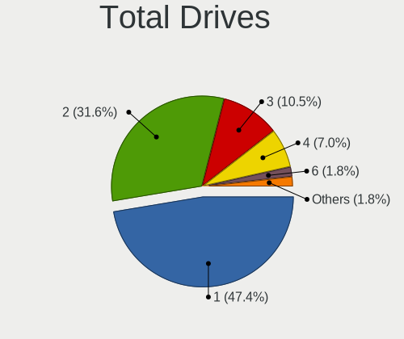

| Drives | Desktops | Percent |
|--------|----------|---------|
| 1      | 15       | 44.12%  |
| 2      | 12       | 35.29%  |
| 4      | 3        | 8.82%   |
| 3      | 2        | 5.88%   |
| 6      | 1        | 2.94%   |
| 5      | 1        | 2.94%   |

Has CD-ROM
----------

Has CD-ROM on board

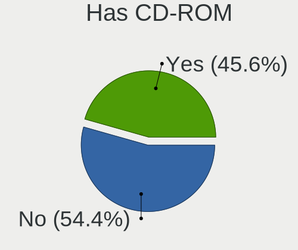

| Presented | Desktops | Percent |
|-----------|----------|---------|
| Yes       | 18       | 52.94%  |
| No        | 16       | 47.06%  |

Has Ethernet
------------

Has Ethernet on board

| Presented | Desktops | Percent |
|-----------|----------|---------|
| Yes       | 33       | 97.06%  |
| No        | 1        | 2.94%   |

Has WiFi
--------

Has WiFi module

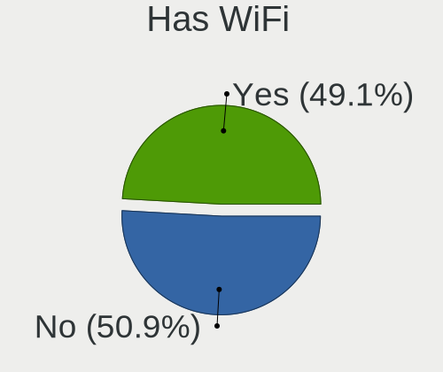

| Presented | Desktops | Percent |
|-----------|----------|---------|
| No        | 18       | 52.94%  |
| Yes       | 16       | 47.06%  |

Has Bluetooth
-------------

Has Bluetooth module

| Presented | Desktops | Percent |
|-----------|----------|---------|
| No        | 28       | 82.35%  |
| Yes       | 6        | 17.65%  |

Location
--------

Country
-------

Geographic location (country)

| Country | Desktops | Percent |
|---------|----------|---------|
| Kenya   | 34       | 100%    |

City
----

Geographic location (city)

| City    | Desktops | Percent |
|---------|----------|---------|
| Nairobi | 32       | 91.43%  |
| Nyeri   | 1        | 2.86%   |
| Nakuru  | 1        | 2.86%   |
| Mombasa | 1        | 2.86%   |

Drives
------

Drive Vendor
------------

Hard drive vendors

| Vendor              | Desktops | Drives | Percent |
|---------------------|----------|--------|---------|
| Seagate             | 21       | 25     | 33.87%  |
| WDC                 | 12       | 14     | 19.35%  |
| Toshiba             | 5        | 5      | 8.06%   |
| HGST                | 4        | 6      | 6.45%   |
| SPCC                | 3        | 7      | 4.84%   |
| Samsung Electronics | 3        | 6      | 4.84%   |
| Team                | 2        | 2      | 3.23%   |
| Sandisk             | 2        | 2      | 3.23%   |
| Intel               | 2        | 2      | 3.23%   |
| Hitachi             | 2        | 2      | 3.23%   |
| Unknown             | 1        | 1      | 1.61%   |
| Maxtor              | 1        | 1      | 1.61%   |
| LITEON              | 1        | 1      | 1.61%   |
| HUAWEI              | 1        | 1      | 1.61%   |
| China               | 1        | 1      | 1.61%   |
| Unknown             | 1        | 1      | 1.61%   |

Drive Model
-----------

Hard drive models

| Model                              | Desktops | Percent |
|------------------------------------|----------|---------|
| WDC WD3200AAJS-56M0A0 320GB        | 3        | 4.48%   |
| Seagate ST500DM002-1BD142 500GB    | 3        | 4.48%   |
| Toshiba DT01ACA100 1TB             | 2        | 2.99%   |
| Team T253X2001T 1024GB SSD         | 2        | 2.99%   |
| SPCC Solid State Disk 256GB        | 2        | 2.99%   |
| SPCC M.2 PCIe SSD 512GB            | 2        | 2.99%   |
| Seagate ST500VT000-1BS142 500GB    | 2        | 2.99%   |
| Seagate ST3320418AS 320GB          | 2        | 2.99%   |
| Seagate ST2000DM008-2FR102 2TB     | 2        | 2.99%   |
| Seagate ST1000LM024 HN-M101MBB 1TB | 2        | 2.99%   |
| Samsung SSD 840 EVO 250GB          | 2        | 2.99%   |
| WDC WD800GD-75FLC3 80GB            | 1        | 1.49%   |
| WDC WD60EZAZ-00SF3B0 6TB           | 1        | 1.49%   |
| WDC WD5003AZEX-00K1GA0 500GB       | 1        | 1.49%   |
| WDC WD5000AVVS-63M8B0 500GB        | 1        | 1.49%   |
| WDC WD5000AVDS-63U7B1 500GB        | 1        | 1.49%   |
| WDC WD5000AAKX-08U6AA0 500GB       | 1        | 1.49%   |
| WDC WD3200AAJS-56B4A0 320GB        | 1        | 1.49%   |
| WDC WD3200AAJS-00B4A0 320GB        | 1        | 1.49%   |
| WDC WD2500AAKX-75U6AA0 250GB       | 1        | 1.49%   |
| WDC WD2500AAKX-08U6AA0 250GB       | 1        | 1.49%   |
| Unknown L200 Hard drive 2TB        | 1        | 1.49%   |
| Toshiba THNSNJ128GCSU 128GB SSD    | 1        | 1.49%   |
| Toshiba MK2555GSX 250GB            | 1        | 1.49%   |
| Toshiba DT01ABA100V 1TB            | 1        | 1.49%   |
| Seagate ST_M13FQBL QNR 4GB         | 1        | 1.49%   |
| Seagate ST380817AS 80GB            | 1        | 1.49%   |
| Seagate ST3808110AS 80GB           | 1        | 1.49%   |
| Seagate ST380013AS 80GB            | 1        | 1.49%   |
| Seagate ST380011A 80GB             | 1        | 1.49%   |
| Seagate ST3250318AS 250GB          | 1        | 1.49%   |
| Seagate ST3250312AS 250GB          | 1        | 1.49%   |
| Seagate ST3160812AS Q 160GB        | 1        | 1.49%   |
| Seagate ST3000DM001-1CH166 3TB     | 1        | 1.49%   |
| Seagate ST2000DM001-1ER164 2TB     | 1        | 1.49%   |
| Seagate ST2000DM001-1CH164 2TB     | 1        | 1.49%   |
| Seagate ST1000VM002-1CT162 1TB     | 1        | 1.49%   |
| Seagate ST1000DM010-2EP102 1TB     | 1        | 1.49%   |
| Sandisk WDC WDS100T2B0C-00PXH0 1TB | 1        | 1.49%   |
| SanDisk SDSSDA120G 120GB           | 1        | 1.49%   |

HDD Vendor
----------

Hard disk drive vendors

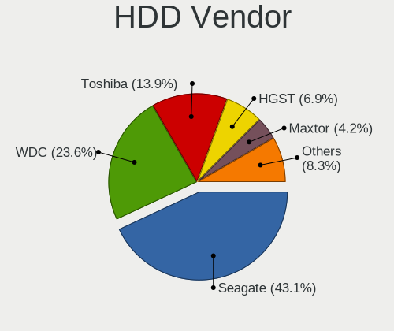

| Vendor  | Desktops | Drives | Percent |
|---------|----------|--------|---------|
| Seagate | 20       | 24     | 44.44%  |
| WDC     | 12       | 14     | 26.67%  |
| Toshiba | 4        | 4      | 8.89%   |
| HGST    | 4        | 6      | 8.89%   |
| Hitachi | 2        | 2      | 4.44%   |
| Unknown | 1        | 1      | 2.22%   |
| Maxtor  | 1        | 1      | 2.22%   |
| Unknown | 1        | 1      | 2.22%   |

SSD Vendor
----------

Solid state drive vendors

| Vendor              | Desktops | Drives | Percent |
|---------------------|----------|--------|---------|
| Team                | 2        | 2      | 16.67%  |
| SPCC                | 2        | 3      | 16.67%  |
| Samsung Electronics | 2        | 4      | 16.67%  |
| Intel               | 2        | 2      | 16.67%  |
| Toshiba             | 1        | 1      | 8.33%   |
| SanDisk             | 1        | 1      | 8.33%   |
| LITEON              | 1        | 1      | 8.33%   |
| China               | 1        | 1      | 8.33%   |

Drive Kind
----------

HDD or SSD

| Kind    | Desktops | Drives | Percent |
|---------|----------|--------|---------|
| HDD     | 32       | 53     | 68.09%  |
| SSD     | 9        | 15     | 19.15%  |
| NVMe    | 4        | 7      | 8.51%   |
| Unknown | 2        | 2      | 4.26%   |

Drive Connector
---------------

SATA, SAS, NVMe, etc.

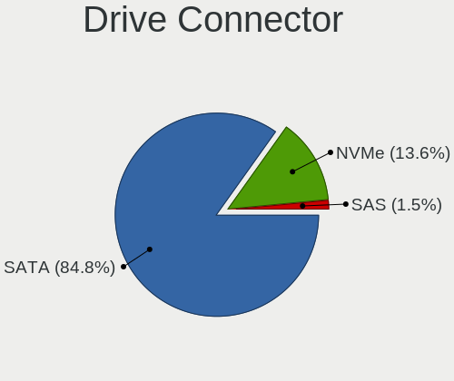

| Type | Desktops | Drives | Percent |
|------|----------|--------|---------|
| SATA | 34       | 69     | 87.18%  |
| NVMe | 4        | 7      | 10.26%  |
| SAS  | 1        | 1      | 2.56%   |

Drive Size
----------

Size of hard drive

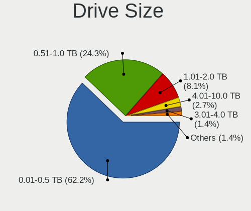

| Size in TB | Desktops | Drives | Percent |
|------------|----------|--------|---------|
| 0.01-0.5   | 28       | 45     | 62.22%  |
| 0.51-1.0   | 8        | 10     | 17.78%  |
| 1.01-2.0   | 5        | 8      | 11.11%  |
| 4.01-10.0  | 2        | 3      | 4.44%   |
| 3.01-4.0   | 1        | 1      | 2.22%   |
| 2.01-3.0   | 1        | 1      | 2.22%   |

Space Total
-----------

Amount of disk space available on the file system

| Size in GB     | Desktops | Percent |
|----------------|----------|---------|
| 1001-2000      | 8        | 21.05%  |
| 101-250        | 6        | 15.79%  |
| 51-100         | 6        | 15.79%  |
| 251-500        | 5        | 13.16%  |
| More than 3000 | 4        | 10.53%  |
| 501-1000       | 4        | 10.53%  |
| 1-20           | 2        | 5.26%   |
| 21-50          | 1        | 2.63%   |
| 2001-3000      | 1        | 2.63%   |
| Unknown        | 1        | 2.63%   |

Space Used
----------

Amount of used disk space

| Used GB   | Desktops | Percent |
|-----------|----------|---------|
| 1-20      | 14       | 36.84%  |
| 1001-2000 | 6        | 15.79%  |
| 21-50     | 5        | 13.16%  |
| 101-250   | 4        | 10.53%  |
| 251-500   | 3        | 7.89%   |
| 501-1000  | 3        | 7.89%   |
| 51-100    | 2        | 5.26%   |
| Unknown   | 1        | 2.63%   |

Malfunc. Drives
---------------

Drive models with a malfunction

| Model                              | Desktops | Drives | Percent |
|------------------------------------|----------|--------|---------|
| WDC WD3200AAJS-56M0A0 320GB        | 1        | 1      | 16.67%  |
| Toshiba MK2555GSX 250GB            | 1        | 1      | 16.67%  |
| Seagate ST500DM002-1BD142 500GB    | 1        | 1      | 16.67%  |
| Seagate ST1000LM024 HN-M101MBB 1TB | 1        | 1      | 16.67%  |
| HGST HTS721010A9 1TB               | 1        | 2      | 16.67%  |
| Unknown                            | 1        | 1      | 16.67%  |

Malfunc. Drive Vendor
---------------------

Vendors of faulty drives

| Vendor  | Desktops | Drives | Percent |
|---------|----------|--------|---------|
| Seagate | 2        | 2      | 33.33%  |
| WDC     | 1        | 1      | 16.67%  |
| Toshiba | 1        | 1      | 16.67%  |
| HGST    | 1        | 2      | 16.67%  |
| Unknown | 1        | 1      | 16.67%  |

Malfunc. HDD Vendor
-------------------

Vendors of faulty HDD drives

| Vendor  | Desktops | Drives | Percent |
|---------|----------|--------|---------|
| Seagate | 2        | 2      | 33.33%  |
| WDC     | 1        | 1      | 16.67%  |
| Toshiba | 1        | 1      | 16.67%  |
| HGST    | 1        | 2      | 16.67%  |
| Unknown | 1        | 1      | 16.67%  |

Malfunc. Drive Kind
-------------------

Kinds of faulty drives

| Kind | Desktops | Drives | Percent |
|------|----------|--------|---------|
| HDD  | 5        | 7      | 100%    |

Failed Drives
-------------

Failed drive models

Zero info for selected period =(

Failed Drive Vendor
-------------------

Failed drive vendors

Zero info for selected period =(

Drive Status
------------

Number of failed and malfunc. drives

| Status   | Desktops | Drives | Percent |
|----------|----------|--------|---------|
| Detected | 24       | 36     | 61.54%  |
| Works    | 10       | 34     | 25.64%  |
| Malfunc  | 5        | 7      | 12.82%  |

Storage controller
------------------

Storage Vendor
--------------

Storage controller vendors

| Vendor                    | Desktops | Percent |
|---------------------------|----------|---------|
| Intel                     | 27       | 65.85%  |
| AMD                       | 7        | 17.07%  |
| Silicon Motion            | 1        | 2.44%   |
| SanDisk                   | 1        | 2.44%   |
| Samsung Electronics       | 1        | 2.44%   |
| Realtek Semiconductor     | 1        | 2.44%   |
| Marvell Technology Group  | 1        | 2.44%   |
| LSI Logic / Symbios Logic | 1        | 2.44%   |
| Broadcom / LSI            | 1        | 2.44%   |

Storage Model
-------------

Storage controller models

| Model                                                                                   | Desktops | Percent |
|-----------------------------------------------------------------------------------------|----------|---------|
| AMD FCH SATA Controller [AHCI mode]                                                     | 6        | 10.71%  |
| Intel SATA Controller [RAID mode]                                                       | 4        | 7.14%   |
| Intel 7 Series/C210 Series Chipset Family 6-port SATA Controller [AHCI mode]            | 4        | 7.14%   |
| Intel NM10/ICH7 Family SATA Controller [IDE mode]                                       | 3        | 5.36%   |
| Intel 82801JD/DO (ICH10 Family) SATA AHCI Controller                                    | 3        | 5.36%   |
| AMD 400 Series Chipset SATA Controller                                                  | 3        | 5.36%   |
| Intel 82Q35 Express PT IDER Controller                                                  | 2        | 3.57%   |
| Intel 82801G (ICH7 Family) IDE Controller                                               | 2        | 3.57%   |
| Intel 8 Series/C220 Series Chipset Family 6-port SATA Controller 1 [AHCI mode]          | 2        | 3.57%   |
| Intel 6 Series/C200 Series Chipset Family Desktop SATA Controller (IDE mode, ports 4-5) | 2        | 3.57%   |
| Intel 6 Series/C200 Series Chipset Family Desktop SATA Controller (IDE mode, ports 0-3) | 2        | 3.57%   |
| Intel 4 Series Chipset PT IDER Controller                                               | 2        | 3.57%   |
| Silicon Motion SM2263EN/SM2263XT SSD Controller                                         | 1        | 1.79%   |
| SanDisk Non-Volatile memory controller                                                  | 1        | 1.79%   |
| Samsung NVMe SSD Controller PM9A1/PM9A3/980PRO                                          | 1        | 1.79%   |
| Realtek RTS5763DL NVMe SSD Controller                                                   | 1        | 1.79%   |
| Marvell Group 88SE9172 SATA III 6Gb/s RAID Controller                                   | 1        | 1.79%   |
| LSI Logic / Symbios Logic SAS1064ET PCI-Express Fusion-MPT SAS                          | 1        | 1.79%   |
| Intel Q170/Q150/B150/H170/H110/Z170/CM236 Chipset SATA Controller [AHCI Mode]           | 1        | 1.79%   |
| Intel Cannon Lake PCH SATA AHCI Controller                                              | 1        | 1.79%   |
| Intel C610/X99 series chipset 6-Port SATA Controller [AHCI mode]                        | 1        | 1.79%   |
| Intel 82801IR/IO/IH (ICH9R/DO/DH) 6 port SATA Controller [AHCI mode]                    | 1        | 1.79%   |
| Intel 82801IR/IO/IH (ICH9R/DO/DH) 4 port SATA Controller [IDE mode]                     | 1        | 1.79%   |
| Intel 82801I (ICH9 Family) 2 port SATA Controller [IDE mode]                            | 1        | 1.79%   |
| Intel 82801FB/FW (ICH6/ICH6W) SATA Controller                                           | 1        | 1.79%   |
| Intel 82801FB/FBM/FR/FW/FRW (ICH6 Family) IDE Controller                                | 1        | 1.79%   |
| Intel 6 Series/C200 Series Chipset Family 6 port Desktop SATA AHCI Controller           | 1        | 1.79%   |
| Intel 5 Series/3400 Series Chipset PT IDER Controller                                   | 1        | 1.79%   |
| Intel 5 Series/3400 Series Chipset 6 port SATA AHCI Controller                          | 1        | 1.79%   |
| Intel 200 Series PCH SATA controller [AHCI mode]                                        | 1        | 1.79%   |
| Broadcom / LSI SAS2008 PCI-Express Fusion-MPT SAS-2 [Falcon]                            | 1        | 1.79%   |
| AMD SB7x0/SB8x0/SB9x0 SATA Controller [IDE mode]                                        | 1        | 1.79%   |
| AMD SB7x0/SB8x0/SB9x0 IDE Controller                                                    | 1        | 1.79%   |

Storage Kind
------------

Kind of storage controller (IDE, SATA, NVMe, SAS, ...)

| Kind | Desktops | Percent |
|------|----------|---------|
| SATA | 23       | 51.11%  |
| IDE  | 12       | 26.67%  |
| RAID | 5        | 11.11%  |
| NVMe | 4        | 8.89%   |
| SCSI | 1        | 2.22%   |

Processor
---------

CPU Vendor
----------

Processor vendors

| Vendor | Desktops | Percent |
|--------|----------|---------|
| Intel  | 27       | 79.41%  |
| AMD    | 7        | 20.59%  |

CPU Model
---------

Processor models

| Model                                          | Desktops | Percent |
|------------------------------------------------|----------|---------|
| Intel Core i5-6500 CPU @ 3.20GHz               | 2        | 5.88%   |
| Intel Core i5-2400 CPU @ 3.10GHz               | 2        | 5.88%   |
| AMD Ryzen 5 1600 Six-Core Processor            | 2        | 5.88%   |
| Intel Xeon CPU W3680 @ 3.33GHz                 | 1        | 2.94%   |
| Intel Xeon CPU E5-1630 v3 @ 3.70GHz            | 1        | 2.94%   |
| Intel Pentium Dual-Core CPU E5700 @ 3.00GHz    | 1        | 2.94%   |
| Intel Pentium 4 CPU 3.20GHz                    | 1        | 2.94%   |
| Intel Pentium 4 CPU 3.00GHz                    | 1        | 2.94%   |
| Intel Pentium 4 CPU 2.80GHz                    | 1        | 2.94%   |
| Intel Core i7-8700 CPU @ 3.20GHz               | 1        | 2.94%   |
| Intel Core i7-6700 CPU @ 3.40GHz               | 1        | 2.94%   |
| Intel Core i7-3770 CPU @ 3.40GHz               | 1        | 2.94%   |
| Intel Core i5-4430S CPU @ 2.70GHz              | 1        | 2.94%   |
| Intel Core i5-3570 CPU @ 3.40GHz               | 1        | 2.94%   |
| Intel Core i5-3470 CPU @ 3.20GHz               | 1        | 2.94%   |
| Intel Core i3-4160 CPU @ 3.60GHz               | 1        | 2.94%   |
| Intel Core i3-3240 CPU @ 3.40GHz               | 1        | 2.94%   |
| Intel Core i3-3220 CPU @ 3.30GHz               | 1        | 2.94%   |
| Intel Core i3-2100 CPU @ 3.10GHz               | 1        | 2.94%   |
| Intel Core i3 CPU 550 @ 3.20GHz                | 1        | 2.94%   |
| Intel Core 2 Quad CPU @ 2.40GHz                | 1        | 2.94%   |
| Intel Core 2 Duo CPU E8600 @ 3.33GHz           | 1        | 2.94%   |
| Intel Core 2 Duo CPU E8500 @ 3.16GHz           | 1        | 2.94%   |
| Intel Core 2 Duo CPU E8400 @ 3.00GHz           | 1        | 2.94%   |
| Intel Core 2 Duo CPU E7300 @ 2.66GHz           | 1        | 2.94%   |
| Intel Core 2 CPU 6420 @ 2.13GHz                | 1        | 2.94%   |
| AMD Ryzen Threadripper 3970X 32-Core Processor | 1        | 2.94%   |
| AMD Ryzen 9 5900X 12-Core Processor            | 1        | 2.94%   |
| AMD Ryzen 7 2700 Eight-Core Processor          | 1        | 2.94%   |
| AMD FX-6300 Six-Core Processor                 | 1        | 2.94%   |
| AMD A4-5300 APU with Radeon HD Graphics        | 1        | 2.94%   |

CPU Model Family
----------------

Processor model prefix

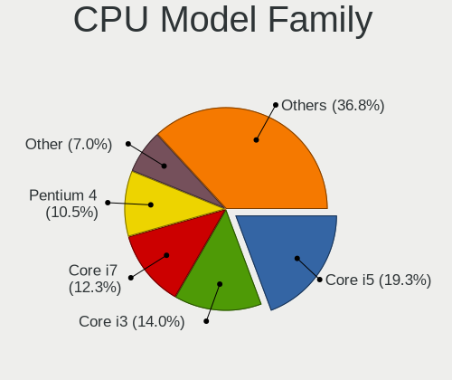

| Model                   | Desktops | Percent |
|-------------------------|----------|---------|
| Intel Core i5           | 7        | 20.59%  |
| Intel Core i3           | 5        | 14.71%  |
| Intel Core 2 Duo        | 4        | 11.76%  |
| Intel Pentium 4         | 3        | 8.82%   |
| Intel Core i7           | 3        | 8.82%   |
| Intel Xeon              | 2        | 5.88%   |
| AMD Ryzen 5             | 2        | 5.88%   |
| Intel Pentium Dual-Core | 1        | 2.94%   |
| Intel Core 2 Quad       | 1        | 2.94%   |
| Intel Core 2            | 1        | 2.94%   |
| AMD Ryzen Threadripper  | 1        | 2.94%   |
| AMD Ryzen 9             | 1        | 2.94%   |
| AMD Ryzen 7             | 1        | 2.94%   |
| AMD FX                  | 1        | 2.94%   |
| AMD A4                  | 1        | 2.94%   |

CPU Cores
---------

Number of processor cores

| Number | Desktops | Percent |
|--------|----------|---------|
| 4      | 11       | 32.35%  |
| 2      | 11       | 32.35%  |
| 6      | 4        | 11.76%  |
| 1      | 4        | 11.76%  |
| 32     | 1        | 2.94%   |
| 12     | 1        | 2.94%   |
| 8      | 1        | 2.94%   |
| 3      | 1        | 2.94%   |

CPU Sockets
-----------

Number of sockets

| Number | Desktops | Percent |
|--------|----------|---------|
| 1      | 34       | 100%    |

CPU Threads
-----------

Threads per core (Hyper-Threading)

| Number | Desktops | Percent |
|--------|----------|---------|
| 2      | 18       | 52.94%  |
| 1      | 16       | 47.06%  |

CPU Op-Modes
------------

CPU Operation Modes (32-bit, 64-bit)

| Op mode        | Desktops | Percent |
|----------------|----------|---------|
| 32-bit, 64-bit | 34       | 100%    |

CPU Microcode
-------------

Microcode number

| Number     | Desktops | Percent |
|------------|----------|---------|
| 0x306a9    | 5        | 14.29%  |
| 0x506e3    | 3        | 8.57%   |
| 0x206a7    | 3        | 8.57%   |
| 0x1067a    | 3        | 8.57%   |
| 0x0800820d | 3        | 8.57%   |
| Unknown    | 3        | 8.57%   |
| 0x10676    | 2        | 5.71%   |
| 0xf65      | 1        | 2.86%   |
| 0xf43      | 1        | 2.86%   |
| 0x906ea    | 1        | 2.86%   |
| 0x6f7      | 1        | 2.86%   |
| 0x6f6      | 1        | 2.86%   |
| 0x306f2    | 1        | 2.86%   |
| 0x306c3    | 1        | 2.86%   |
| 0x206c2    | 1        | 2.86%   |
| 0x20655    | 1        | 2.86%   |
| 0x0a201016 | 1        | 2.86%   |
| 0x08301039 | 1        | 2.86%   |
| 0x06001119 | 1        | 2.86%   |
| 0x0600084f | 1        | 2.86%   |

CPU Microarch
-------------

Microarchitecture

| Name        | Desktops | Percent |
|-------------|----------|---------|
| Penryn      | 5        | 14.71%  |
| IvyBridge   | 5        | 14.71%  |
| Zen+        | 3        | 8.82%   |
| Skylake     | 3        | 8.82%   |
| SandyBridge | 3        | 8.82%   |
| NetBurst    | 3        | 8.82%   |
| Haswell     | 3        | 8.82%   |
| Westmere    | 2        | 5.88%   |
| Piledriver  | 2        | 5.88%   |
| Core        | 2        | 5.88%   |
| Zen 3       | 1        | 2.94%   |
| Zen 2       | 1        | 2.94%   |
| KabyLake    | 1        | 2.94%   |

Graphics
--------

GPU Vendor
----------

Vendors of graphics cards

| Vendor | Desktops | Percent |
|--------|----------|---------|
| Intel  | 17       | 44.74%  |
| Nvidia | 13       | 34.21%  |
| AMD    | 8        | 21.05%  |

GPU Model
---------

Graphics card models

| Model                                                                       | Desktops | Percent |
|-----------------------------------------------------------------------------|----------|---------|
| AMD Ellesmere [Radeon RX 470/480/570/570X/580/580X/590]                     | 4        | 10.53%  |
| Nvidia GK208B [GeForce GT 710]                                              | 3        | 7.89%   |
| Intel 4 Series Chipset Integrated Graphics Controller                       | 3        | 7.89%   |
| Intel 2nd Generation Core Processor Family Integrated Graphics Controller   | 3        | 7.89%   |
| Nvidia GT218 [GeForce 210]                                                  | 2        | 5.26%   |
| Intel Xeon E3-1200 v2/3rd Gen Core processor Graphics Controller            | 2        | 5.26%   |
| Intel HD Graphics 530                                                       | 2        | 5.26%   |
| AMD Park [Mobility Radeon HD 5430]                                          | 2        | 5.26%   |
| Nvidia GT218 [NVS 300]                                                      | 1        | 2.63%   |
| Nvidia GK208B [GeForce GT 730]                                              | 1        | 2.63%   |
| Nvidia GK107GL [Quadro 410]                                                 | 1        | 2.63%   |
| Nvidia GK104 [GeForce GTX 760]                                              | 1        | 2.63%   |
| Nvidia GF119 [GeForce GT 610]                                               | 1        | 2.63%   |
| Nvidia GA106 [Geforce RTX 3050]                                             | 1        | 2.63%   |
| Nvidia GA102 [GeForce RTX 3080]                                             | 1        | 2.63%   |
| Nvidia G94GL [Quadro FX 1800]                                               | 1        | 2.63%   |
| Intel Xeon E3-1200 v3/4th Gen Core Processor Integrated Graphics Controller | 1        | 2.63%   |
| Intel IvyBridge GT2 [HD Graphics 4000]                                      | 1        | 2.63%   |
| Intel CoffeeLake-S GT2 [UHD Graphics 630]                                   | 1        | 2.63%   |
| Intel 82Q35 Express Integrated Graphics Controller                          | 1        | 2.63%   |
| Intel 82946GZ/GL Integrated Graphics Controller                             | 1        | 2.63%   |
| Intel 82945G/GZ Integrated Graphics Controller                              | 1        | 2.63%   |
| Intel 4th Generation Core Processor Family Integrated Graphics Controller   | 1        | 2.63%   |
| AMD Trinity 2 [Radeon HD 7480D]                                             | 1        | 2.63%   |
| AMD Pitcairn PRO [Radeon HD 7850 / R7 265 / R9 270 1024SP]                  | 1        | 2.63%   |

GPU Combo
---------

Combinations of graphics cards

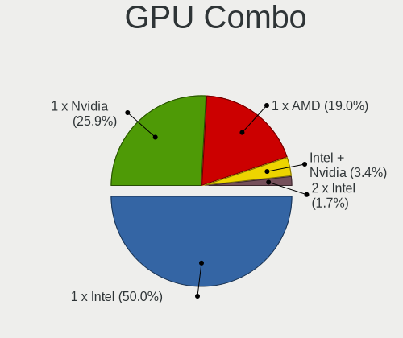

| Name           | Desktops | Percent |
|----------------|----------|---------|
| 1 x Intel      | 14       | 40%     |
| 1 x Nvidia     | 12       | 34.29%  |
| 1 x AMD        | 8        | 22.86%  |
| Intel + Nvidia | 1        | 2.86%   |

GPU Driver
----------

Free vs proprietary

| Driver      | Desktops | Percent |
|-------------|----------|---------|
| Free        | 30       | 88.24%  |
| Proprietary | 4        | 11.76%  |

GPU Memory
----------

Total video memory

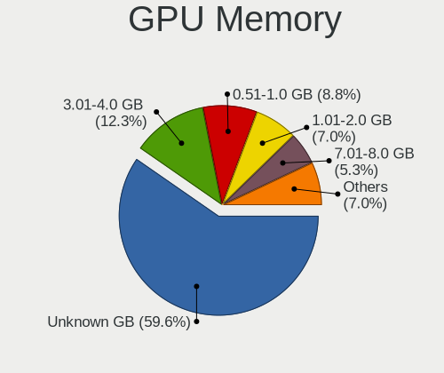

| Size in GB | Desktops | Percent |
|------------|----------|---------|
| Unknown    | 16       | 47.06%  |
| 0.51-1.0   | 5        | 14.71%  |
| 7.01-8.0   | 3        | 8.82%   |
| 3.01-4.0   | 3        | 8.82%   |
| 1.01-2.0   | 3        | 8.82%   |
| 0.01-0.5   | 3        | 8.82%   |
| 8.01-16.0  | 1        | 2.94%   |

Monitor
-------

Monitor Vendor
--------------

Monitor vendors

| Vendor              | Desktops | Percent |
|---------------------|----------|---------|
| Hewlett-Packard     | 12       | 32.43%  |
| Dell                | 9        | 24.32%  |
| Sony                | 3        | 8.11%   |
| Lenovo              | 3        | 8.11%   |
| Samsung Electronics | 2        | 5.41%   |
| VIE                 | 1        | 2.7%    |
| Unknown (XXX)       | 1        | 2.7%    |
| Unknown             | 1        | 2.7%    |
| S2-Tek              | 1        | 2.7%    |
| NEC Computers       | 1        | 2.7%    |
| Hitachi             | 1        | 2.7%    |
| BenQ                | 1        | 2.7%    |
| Unknown             | 1        | 2.7%    |

Monitor Model
-------------

Monitor models

| Model                                                                 | Desktops | Percent |
|-----------------------------------------------------------------------|----------|---------|
| Samsung Electronics S22E450 SAM0C7A 1920x1080 477x268mm 21.5-inch     | 2        | 5%      |
| Lenovo T2224zD LEN60CB 1920x1080 476x267mm 21.5-inch                  | 2        | 5%      |
| Dell E1910H DELD023 1366x768 410x230mm 18.5-inch                      | 2        | 5%      |
| VIE LED MONITOR VIE2302 1920x1080 473x296mm 22.0-inch                 | 1        | 2.5%    |
| Unknown LCD Monitor Hitachi Engineering Company Ltd HISENSE 3200x1080 | 1        | 2.5%    |
| Unknown (XXX) Beyond TV XXX2851 3840x2160 1209x680mm 54.6-inch        | 1        | 2.5%    |
| Sony TV SNYEF03 1600x900                                              | 1        | 2.5%    |
| Sony TV SNYDC02 1920x1080 930x523mm 42.0-inch                         | 1        | 2.5%    |
| Sony TV SNY0902 1360x768                                              | 1        | 2.5%    |
| S2-Tek TV STK531A 1920x1080 930x530mm 42.1-inch                       | 1        | 2.5%    |
| NEC Computers EA193Mi NEC6956 1280x1024 375x300mm 18.9-inch           | 1        | 2.5%    |
| Lenovo LEN LI1931ewA LEN65A1 1366x768 409x230mm 18.5-inch             | 1        | 2.5%    |
| Lenovo LEN E2054A LEN60DF 1440x900 419x262mm 19.5-inch                | 1        | 2.5%    |
| Hitachi HISENSE HEC0030 1920x1080 580x330mm 26.3-inch                 | 1        | 2.5%    |
| Hewlett-Packard Z27s HWP317F 3840x2160 596x335mm 26.9-inch            | 1        | 2.5%    |
| Hewlett-Packard Z24i HWP309E 1920x1200 518x324mm 24.1-inch            | 1        | 2.5%    |
| Hewlett-Packard P222va HWP322C 1920x1080 477x268mm 21.5-inch          | 1        | 2.5%    |
| Hewlett-Packard LE2202x HWP2966 1920x1080 476x268mm 21.5-inch         | 1        | 2.5%    |
| Hewlett-Packard LE1901w HWP2842 1440x900 410x256mm 19.0-inch          | 1        | 2.5%    |
| Hewlett-Packard LCD Monitor L1710                                     | 1        | 2.5%    |
| Hewlett-Packard LA2306 HWP2949 1920x1080 509x286mm 23.0-inch          | 1        | 2.5%    |
| Hewlett-Packard LA2206 HWP2948 1920x1080 476x268mm 21.5-inch          | 1        | 2.5%    |
| Hewlett-Packard LA2205 HWP2847 1680x1050 473x296mm 22.0-inch          | 1        | 2.5%    |
| Hewlett-Packard L1710 HWP26EB 1280x1024 340x270mm 17.1-inch           | 1        | 2.5%    |
| Hewlett-Packard L1506 HWP265B 1024x768 304x228mm 15.0-inch            | 1        | 2.5%    |
| Hewlett-Packard E222 HWP3262 1920x1080 476x268mm 21.5-inch            | 1        | 2.5%    |
| Hewlett-Packard 2310 HWP288F 1920x1080 510x287mm 23.0-inch            | 1        | 2.5%    |
| Dell U2415 DELA0BA 1920x1200 520x320mm 24.0-inch                      | 1        | 2.5%    |
| Dell U2412M DELA07A 1920x1200 518x324mm 24.1-inch                     | 1        | 2.5%    |
| Dell P2314T DEL40A0 1920x1080 509x286mm 23.0-inch                     | 1        | 2.5%    |
| Dell E2316H DELF06B 1920x1080 509x286mm 23.0-inch                     | 1        | 2.5%    |
| Dell E2011H DEL406B 1600x900 443x249mm 20.0-inch                      | 1        | 2.5%    |
| Dell E176FP DELA014 1280x1024 338x270mm 17.0-inch                     | 1        | 2.5%    |
| Dell 1908FP DEL4026 1280x1024 376x301mm 19.0-inch                     | 1        | 2.5%    |
| Dell 1908FP DEL4025 1280x1024 376x301mm 19.0-inch                     | 1        | 2.5%    |
| BenQ LCD BNQ8024 2560x1440 597x336mm 27.0-inch                        | 1        | 2.5%    |
| Unknown                                                               | 1        | 2.5%    |

Monitor Resolution
------------------

Monitor screen resolution

| Resolution         | Desktops | Percent |
|--------------------|----------|---------|
| 1920x1080 (FHD)    | 13       | 36.11%  |
| 1280x1024 (SXGA)   | 5        | 13.89%  |
| 3840x2160 (4K)     | 3        | 8.33%   |
| 1366x768 (WXGA)    | 3        | 8.33%   |
| 1920x1200 (WUXGA)  | 2        | 5.56%   |
| 1600x900 (HD+)     | 2        | 5.56%   |
| 1440x900 (WXGA+)   | 2        | 5.56%   |
| 1024x768 (XGA)     | 2        | 5.56%   |
| 3200x1080          | 1        | 2.78%   |
| 2560x1440 (QHD)    | 1        | 2.78%   |
| 1680x1050 (WSXGA+) | 1        | 2.78%   |
| Unknown            | 1        | 2.78%   |

Monitor Diagonal
----------------

Diagonal size in inches

| Inches  | Desktops | Percent |
|---------|----------|---------|
| 21      | 6        | 16.67%  |
| 19      | 4        | 11.11%  |
| 18      | 4        | 11.11%  |
| 24      | 3        | 8.33%   |
| 23      | 3        | 8.33%   |
| 72      | 2        | 5.56%   |
| 22      | 2        | 5.56%   |
| 17      | 2        | 5.56%   |
| Unknown | 2        | 5.56%   |
| 84      | 1        | 2.78%   |
| 54      | 1        | 2.78%   |
| 46      | 1        | 2.78%   |
| 42      | 1        | 2.78%   |
| 27      | 1        | 2.78%   |
| 26      | 1        | 2.78%   |
| 20      | 1        | 2.78%   |
| 15      | 1        | 2.78%   |

Monitor Width
-------------

Physical width

| Width in mm | Desktops | Percent |
|-------------|----------|---------|
| 401-500     | 11       | 33.33%  |
| 501-600     | 8        | 24.24%  |
| 351-400     | 3        | 9.09%   |
| 301-350     | 3        | 9.09%   |
| 1501-2000   | 3        | 9.09%   |
| 1001-1500   | 2        | 6.06%   |
| Unknown     | 2        | 6.06%   |
| 901-1000    | 1        | 3.03%   |

Aspect Ratio
------------

Proportional relationship between the width and the height

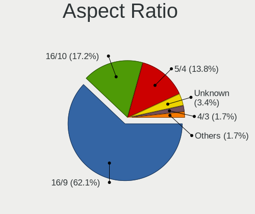

| Ratio   | Desktops | Percent |
|---------|----------|---------|
| 16/9    | 21       | 58.33%  |
| 16/10   | 7        | 19.44%  |
| 5/4     | 5        | 13.89%  |
| Unknown | 2        | 5.56%   |
| 4/3     | 1        | 2.78%   |

Monitor Area
------------

Area in inch

| Area in inch | Desktops | Percent |
|----------------|----------|---------|
| 151-200        | 9        | 25.71%  |
| 201-250        | 7        | 20%     |
| 141-150        | 5        | 14.29%  |
| More than 1000 | 4        | 11.43%  |
| 251-300        | 3        | 8.57%   |
| 301-350        | 2        | 5.71%   |
| 501-1000       | 2        | 5.71%   |
| Unknown        | 2        | 5.71%   |
| 101-110        | 1        | 2.86%   |

Pixel Density
-------------

Pixels per inch

| Density | Desktops | Percent |
|---------|----------|---------|
| 51-100  | 18       | 58.06%  |
| 101-120 | 7        | 22.58%  |
| 1-50    | 3        | 9.68%   |
| Unknown | 2        | 6.45%   |
| 161-240 | 1        | 3.23%   |

Multiple Monitors
-----------------

Total monitors connected

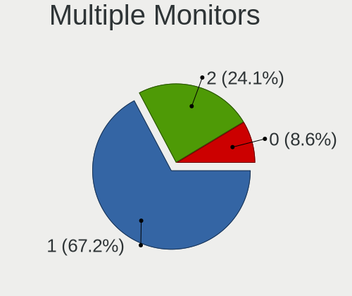

| Total | Desktops | Percent |
|-------|----------|---------|
| 1     | 23       | 67.65%  |
| 2     | 9        | 26.47%  |
| 0     | 2        | 5.88%   |

Network
-------

Net Controller Vendor
---------------------

Controller vendors

| Vendor                | Desktops | Percent |
|-----------------------|----------|---------|
| Intel                 | 20       | 38.46%  |
| Realtek Semiconductor | 14       | 26.92%  |
| MediaTek              | 4        | 7.69%   |
| Qualcomm Atheros      | 3        | 5.77%   |
| Broadcom Limited      | 3        | 5.77%   |
| Xiaomi                | 2        | 3.85%   |
| Broadcom              | 2        | 3.85%   |
| Ralink Technology     | 1        | 1.92%   |
| Qualcomm              | 1        | 1.92%   |
| OPPO Electronics      | 1        | 1.92%   |
| Huawei Technologies   | 1        | 1.92%   |

Net Controller Model
--------------------

Controller models

| Model                                                             | Desktops | Percent |
|-------------------------------------------------------------------|----------|---------|
| Realtek RTL8111/8168/8411 PCI Express Gigabit Ethernet Controller | 8        | 13.11%  |
| Realtek RTL8188EUS 802.11n Wireless Network Adapter               | 7        | 11.48%  |
| Intel 82579LM Gigabit Network Connection (Lewisville)             | 5        | 8.2%    |
| MediaTek Infinix NOTE 11                                          | 4        | 6.56%   |
| Realtek RTL8188FTV 802.11b/g/n 1T1R 2.4G WLAN Adapter             | 3        | 4.92%   |
| Intel I211 Gigabit Network Connection                             | 3        | 4.92%   |
| Xiaomi Mi/Redmi series (RNDIS)                                    | 2        | 3.28%   |
| Intel Wi-Fi 6 AX200                                               | 2        | 3.28%   |
| Intel 82567LM-3 Gigabit Network Connection                        | 2        | 3.28%   |
| Intel 82566DM-2 Gigabit Network Connection                        | 2        | 3.28%   |
| Realtek RTL8153 Gigabit Ethernet Adapter                          | 1        | 1.64%   |
| Ralink RT2870/RT3070 Wireless Adapter                             | 1        | 1.64%   |
| Qualcomm Nokia 5.4                                                | 1        | 1.64%   |
| Qualcomm Atheros AR928X Wireless Network Adapter (PCI-Express)    | 1        | 1.64%   |
| Qualcomm Atheros AR9227 Wireless Network Adapter                  | 1        | 1.64%   |
| Qualcomm Atheros AR8161 Gigabit Ethernet                          | 1        | 1.64%   |
| OPPO RMX3263                                                      | 1        | 1.64%   |
| Intel Wireless-AC 9260                                            | 1        | 1.64%   |
| Intel Wireless 8265 / 8275                                        | 1        | 1.64%   |
| Intel NM10/ICH7 Family LAN Controller                             | 1        | 1.64%   |
| Intel Ethernet Connection I217-LM                                 | 1        | 1.64%   |
| Intel Ethernet Connection (7) I219-LM                             | 1        | 1.64%   |
| Intel Ethernet Connection (5) I219-LM                             | 1        | 1.64%   |
| Intel Ethernet Connection (2) I219-V                              | 1        | 1.64%   |
| Intel 82578DM Gigabit Network Connection                          | 1        | 1.64%   |
| Intel 82576 Gigabit Network Connection                            | 1        | 1.64%   |
| Intel 82567V-4 Gigabit Network Connection                         | 1        | 1.64%   |
| Huawei Mass Storage                                               | 1        | 1.64%   |
| Broadcom NetXtreme BCM5764M Gigabit Ethernet PCIe                 | 1        | 1.64%   |
| Broadcom NetLink BCM57780 Gigabit Ethernet PCIe                   | 1        | 1.64%   |
| Broadcom Limited NetXtreme BCM5755 Gigabit Ethernet PCI Express   | 1        | 1.64%   |
| Broadcom Limited NetXtreme BCM5752 Gigabit Ethernet PCI Express   | 1        | 1.64%   |
| Broadcom Limited NetXtreme BCM5751 Gigabit Ethernet PCI Express   | 1        | 1.64%   |

Wireless Vendor
---------------

Wireless vendors

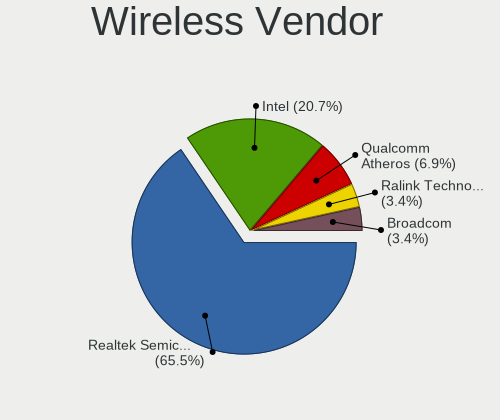

| Vendor                | Desktops | Percent |
|-----------------------|----------|---------|
| Realtek Semiconductor | 10       | 58.82%  |
| Intel                 | 4        | 23.53%  |
| Qualcomm Atheros      | 2        | 11.76%  |
| Ralink Technology     | 1        | 5.88%   |

Wireless Model
--------------

Wireless models

| Model                                                          | Desktops | Percent |
|----------------------------------------------------------------|----------|---------|
| Realtek RTL8188EUS 802.11n Wireless Network Adapter            | 7        | 41.18%  |
| Realtek RTL8188FTV 802.11b/g/n 1T1R 2.4G WLAN Adapter          | 3        | 17.65%  |
| Intel Wi-Fi 6 AX200                                            | 2        | 11.76%  |
| Ralink RT2870/RT3070 Wireless Adapter                          | 1        | 5.88%   |
| Qualcomm Atheros AR928X Wireless Network Adapter (PCI-Express) | 1        | 5.88%   |
| Qualcomm Atheros AR9227 Wireless Network Adapter               | 1        | 5.88%   |
| Intel Wireless-AC 9260                                         | 1        | 5.88%   |
| Intel Wireless 8265 / 8275                                     | 1        | 5.88%   |

Ethernet Vendor
---------------

Ethernet vendors

| Vendor                | Desktops | Percent |
|-----------------------|----------|---------|
| Intel                 | 20       | 47.62%  |
| Realtek Semiconductor | 8        | 19.05%  |
| MediaTek              | 4        | 9.52%   |
| Broadcom Limited      | 3        | 7.14%   |
| Xiaomi                | 2        | 4.76%   |
| Broadcom              | 2        | 4.76%   |
| Qualcomm Atheros      | 1        | 2.38%   |
| Qualcomm              | 1        | 2.38%   |
| OPPO Electronics      | 1        | 2.38%   |

Ethernet Model
--------------

Ethernet models

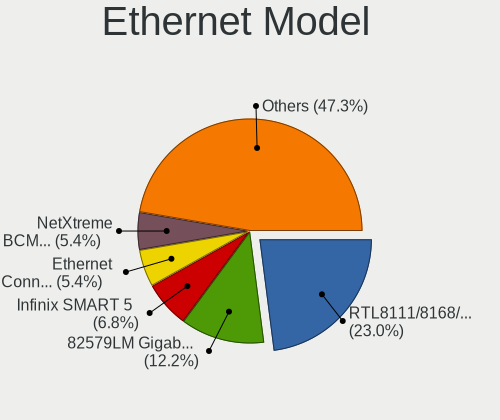

| Model                                                             | Desktops | Percent |
|-------------------------------------------------------------------|----------|---------|
| Realtek RTL8111/8168/8411 PCI Express Gigabit Ethernet Controller | 8        | 18.6%   |
| Intel 82579LM Gigabit Network Connection (Lewisville)             | 5        | 11.63%  |
| MediaTek Infinix NOTE 11                                          | 4        | 9.3%    |
| Intel I211 Gigabit Network Connection                             | 3        | 6.98%   |
| Xiaomi Mi/Redmi series (RNDIS)                                    | 2        | 4.65%   |
| Intel 82567LM-3 Gigabit Network Connection                        | 2        | 4.65%   |
| Intel 82566DM-2 Gigabit Network Connection                        | 2        | 4.65%   |
| Realtek RTL8153 Gigabit Ethernet Adapter                          | 1        | 2.33%   |
| Qualcomm Nokia 5.4                                                | 1        | 2.33%   |
| Qualcomm Atheros AR8161 Gigabit Ethernet                          | 1        | 2.33%   |
| OPPO RMX3263                                                      | 1        | 2.33%   |
| Intel NM10/ICH7 Family LAN Controller                             | 1        | 2.33%   |
| Intel Ethernet Connection I217-LM                                 | 1        | 2.33%   |
| Intel Ethernet Connection (7) I219-LM                             | 1        | 2.33%   |
| Intel Ethernet Connection (5) I219-LM                             | 1        | 2.33%   |
| Intel Ethernet Connection (2) I219-V                              | 1        | 2.33%   |
| Intel 82578DM Gigabit Network Connection                          | 1        | 2.33%   |
| Intel 82576 Gigabit Network Connection                            | 1        | 2.33%   |
| Intel 82567V-4 Gigabit Network Connection                         | 1        | 2.33%   |
| Broadcom NetXtreme BCM5764M Gigabit Ethernet PCIe                 | 1        | 2.33%   |
| Broadcom NetLink BCM57780 Gigabit Ethernet PCIe                   | 1        | 2.33%   |
| Broadcom Limited NetXtreme BCM5755 Gigabit Ethernet PCI Express   | 1        | 2.33%   |
| Broadcom Limited NetXtreme BCM5752 Gigabit Ethernet PCI Express   | 1        | 2.33%   |
| Broadcom Limited NetXtreme BCM5751 Gigabit Ethernet PCI Express   | 1        | 2.33%   |

Net Controller Kind
-------------------

Ethernet, WiFi or modem

| Kind     | Desktops | Percent |
|----------|----------|---------|
| Ethernet | 33       | 66%     |
| WiFi     | 16       | 32%     |
| Modem    | 1        | 2%      |

Used Controller
---------------

Currently used network controller

| Kind     | Desktops | Percent |
|----------|----------|---------|
| Ethernet | 24       | 75%     |
| WiFi     | 8        | 25%     |

NICs
----

Total network controllers on board

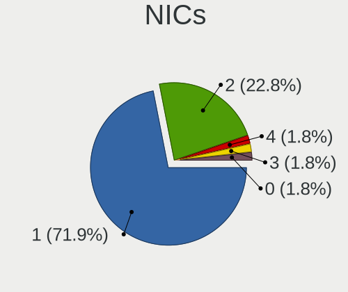

| Total | Desktops | Percent |
|-------|----------|---------|
| 1     | 26       | 76.47%  |
| 2     | 6        | 17.65%  |
| 3     | 1        | 2.94%   |
| 0     | 1        | 2.94%   |

IPv6
----

IPv6 vs IPv4

| Used | Desktops | Percent |
|------|----------|---------|
| No   | 34       | 100%    |

Bluetooth
---------

Bluetooth Vendor
----------------

Controller vendors

| Vendor                  | Desktops | Percent |
|-------------------------|----------|---------|
| Intel                   | 4        | 66.67%  |
| Cambridge Silicon Radio | 2        | 33.33%  |

Bluetooth Model
---------------

Controller models

| Model                                               | Desktops | Percent |
|-----------------------------------------------------|----------|---------|
| Intel AX200 Bluetooth                               | 2        | 33.33%  |
| Cambridge Silicon Radio Bluetooth Dongle (HCI mode) | 2        | 33.33%  |
| Intel Wireless-AC 9260 Bluetooth Adapter            | 1        | 16.67%  |
| Intel Bluetooth wireless interface                  | 1        | 16.67%  |

Sound
-----

Sound Vendor
------------

Sound card vendors

| Vendor               | Desktops | Percent |
|----------------------|----------|---------|
| Intel                | 26       | 47.27%  |
| Nvidia               | 12       | 21.82%  |
| AMD                  | 10       | 18.18%  |
| Texas Instruments    | 2        | 3.64%   |
| Lenovo               | 2        | 3.64%   |
| Medeli Electronics   | 1        | 1.82%   |
| Giga-Byte Technology | 1        | 1.82%   |
| C-Media Electronics  | 1        | 1.82%   |

Sound Model
-----------

Sound card models

| Model                                                                      | Desktops | Percent |
|----------------------------------------------------------------------------|----------|---------|
| Nvidia GK208 HDMI/DP Audio Controller                                      | 4        | 6.67%   |
| Intel 7 Series/C216 Chipset Family High Definition Audio Controller        | 4        | 6.67%   |
| Intel 6 Series/C200 Series Chipset Family High Definition Audio Controller | 4        | 6.67%   |
| AMD Ellesmere HDMI Audio [Radeon RX 470/480 / 570/580/590]                 | 4        | 6.67%   |
| Nvidia High Definition Audio Controller                                    | 3        | 5%      |
| Intel NM10/ICH7 Family High Definition Audio Controller                    | 3        | 5%      |
| Intel 82801I (ICH9 Family) HD Audio Controller                             | 3        | 5%      |
| AMD Family 17h (Models 00h-0fh) HD Audio Controller                        | 3        | 5%      |
| Texas Instruments PCM2902 Audio Codec                                      | 2        | 3.33%   |
| Lenovo T2224zD                                                             | 2        | 3.33%   |
| Intel Xeon E3-1200 v3/4th Gen Core Processor HD Audio Controller           | 2        | 3.33%   |
| Intel 82801JD/DO (ICH10 Family) HD Audio Controller                        | 2        | 3.33%   |
| Intel 8 Series/C220 Series Chipset High Definition Audio Controller        | 2        | 3.33%   |
| Intel 100 Series/C230 Series Chipset Family HD Audio Controller            | 2        | 3.33%   |
| AMD Starship/Matisse HD Audio Controller                                   | 2        | 3.33%   |
| AMD Cedar HDMI Audio [Radeon HD 5400/6300/7300 Series]                     | 2        | 3.33%   |
| Nvidia GK107 HDMI Audio Controller                                         | 1        | 1.67%   |
| Nvidia GK104 HDMI Audio Controller                                         | 1        | 1.67%   |
| Nvidia GF119 HDMI Audio Controller                                         | 1        | 1.67%   |
| Nvidia GA106 High Definition Audio Controller                              | 1        | 1.67%   |
| Nvidia GA102 High Definition Audio Controller                              | 1        | 1.67%   |
| Medeli Electronics USB Audio Device                                        | 1        | 1.67%   |
| Intel Cannon Lake PCH cAVS                                                 | 1        | 1.67%   |
| Intel C610/X99 series chipset HD Audio Controller                          | 1        | 1.67%   |
| Intel 82801JI (ICH10 Family) HD Audio Controller                           | 1        | 1.67%   |
| Intel 82801FB/FBM/FR/FW/FRW (ICH6 Family) AC'97 Audio Controller           | 1        | 1.67%   |
| Intel 5 Series/3400 Series Chipset High Definition Audio                   | 1        | 1.67%   |
| Intel 200 Series PCH HD Audio                                              | 1        | 1.67%   |
| Giga-Byte Technology USB Audio                                             | 1        | 1.67%   |
| C-Media Electronics CMI8788 [Oxygen HD Audio]                              | 1        | 1.67%   |
| AMD Oland/Hainan/Cape Verde/Pitcairn HDMI Audio [Radeon HD 7000 Series]    | 1        | 1.67%   |
| AMD FCH Azalia Controller                                                  | 1        | 1.67%   |

Memory
------

Memory Vendor
-------------

Memory module vendors

| Vendor              | Desktops | Percent |
|---------------------|----------|---------|
| SK hynix            | 5        | 27.78%  |
| Kingston            | 3        | 16.67%  |
| Crucial             | 3        | 16.67%  |
| Micron Technology   | 2        | 11.11%  |
| G.Skill             | 2        | 11.11%  |
| TwinMOS             | 1        | 5.56%   |
| Team                | 1        | 5.56%   |
| Samsung Electronics | 1        | 5.56%   |

Memory Model
------------

Memory module models

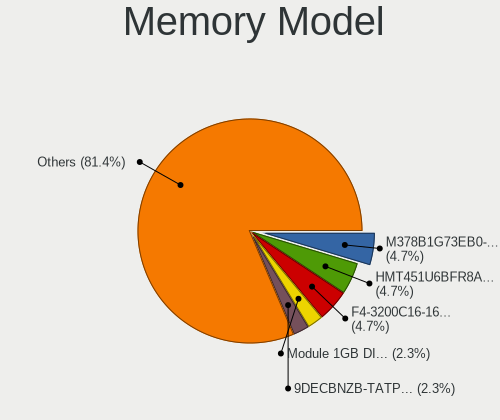

| Model                                                   | Desktops | Percent |
|---------------------------------------------------------|----------|---------|
| G.Skill RAM F4-3200C16-16GVK 16GB DIMM DDR4 3600MT/s    | 2        | 10%     |
| TwinMOS RAM 9DECBNZB-TATP 4GB DIMM DDR3 1333MT/s        | 1        | 5%      |
| TwinMOS RAM 9DECBMZB-TATP 2048MB DIMM DDR3 1333MT/s     | 1        | 5%      |
| Team RAM TEAMGROUP-UD4-3200 16GB DIMM DDR4 3800MT/s     | 1        | 5%      |
| SK hynix RAM HMT451U6BFR8A-PB 4GB DIMM DDR3 1600MT/s    | 1        | 5%      |
| SK hynix RAM HMT41GU6BFR8A-PB 8GB DIMM DDR3 1600MT/s    | 1        | 5%      |
| SK hynix RAM HMT125U7BFR8C-H9 2GB DIMM DDR3 1333MT/s    | 1        | 5%      |
| SK hynix RAM HMT125U6TFR8C-H9 2GB DIMM DDR3 1333MT/s    | 1        | 5%      |
| SK hynix RAM HMA81GU6CJR8N-VK 8192MB DIMM DDR4 2667MT/s | 1        | 5%      |
| SK hynix RAM HMA81GS6AFR8N-UH 8GB SODIMM DDR4 2667MT/s  | 1        | 5%      |
| Samsung RAM M378B5673FH0-CH9 2GB DIMM DDR3 1600MT/s     | 1        | 5%      |
| Micron RAM BLS4G3D1609DS1S00. 4GB DIMM DDR3 1600MT/s    | 1        | 5%      |
| Micron RAM 16KTF51264AZ-1G6M1 4GB DIMM DDR3 1600MT/s    | 1        | 5%      |
| Kingston RAM KHX1600C10D3/8G 8192MB DIMM DDR3 1600MT/s  | 1        | 5%      |
| Kingston RAM HP497157-D88-ELFW 2GB DIMM DDR3 1333MT/s   | 1        | 5%      |
| Kingston RAM 9905734-102.A00G 32GB DIMM DDR4 3200MT/s   | 1        | 5%      |
| Crucial RAM CT51264BD160B.C16F 4GB DIMM DDR3 1600MT/s   | 1        | 5%      |
| Crucial RAM CT51264BA160BJ.M8F 4GB DIMM DDR3 1600MT/s   | 1        | 5%      |
| Crucial RAM CB16GU2400.C16J 16384MB DIMM DDR4 2400MT/s  | 1        | 5%      |

Memory Kind
-----------

Memory module kinds

| Kind  | Desktops | Percent |
|-------|----------|---------|
| DDR4  | 7        | 46.67%  |
| DDR3  | 7        | 46.67%  |
| SDRAM | 1        | 6.67%   |

Memory Form Factor
------------------

Physical design of the memory module

| Name   | Desktops | Percent |
|--------|----------|---------|
| DIMM   | 13       | 92.86%  |
| SODIMM | 1        | 7.14%   |

Memory Size
-----------

Memory module size

| Size  | Desktops | Percent |
|-------|----------|---------|
| 8192  | 4        | 25%     |
| 4096  | 4        | 25%     |
| 16384 | 3        | 18.75%  |
| 2048  | 3        | 18.75%  |
| 32768 | 2        | 12.5%   |

Memory Speed
------------

Memory module speed

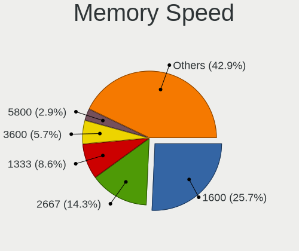

| Speed | Desktops | Percent |
|-------|----------|---------|
| 1600  | 4        | 26.67%  |
| 1333  | 3        | 20%     |
| 3600  | 2        | 13.33%  |
| 2667  | 2        | 13.33%  |
| 3800  | 1        | 6.67%   |
| 3200  | 1        | 6.67%   |
| 2400  | 1        | 6.67%   |
| 1867  | 1        | 6.67%   |

Printers & scanners
-------------------

Printer Vendor
--------------

Printer device vendors

| Vendor          | Desktops | Percent |
|-----------------|----------|---------|
| Hewlett-Packard | 1        | 100%    |

Printer Model
-------------

Printer device models

| Model                 | Desktops | Percent |
|-----------------------|----------|---------|
| HP LaserJet M101-M106 | 1        | 100%    |

Scanner Vendor
--------------

Scanner device vendors

Zero info for selected period =(

Scanner Model
-------------

Scanner device models

Zero info for selected period =(

Camera
------

Camera Vendor
-------------

Camera device vendors

| Vendor                | Desktops | Percent |
|-----------------------|----------|---------|
| Realtek Semiconductor | 2        | 40%     |
| MacroSilicon          | 1        | 20%     |
| Logitech              | 1        | 20%     |
| Cubeternet            | 1        | 20%     |

Camera Model
------------

Camera device models

| Model                           | Desktops | Percent |
|---------------------------------|----------|---------|
| Realtek USB Camera              | 2        | 40%     |
| MacroSilicon USB Video          | 1        | 20%     |
| Logitech Webcam C270            | 1        | 20%     |
| Cubeternet GL-UPC822 UVC WebCam | 1        | 20%     |

Security
--------

Fingerprint Vendor
------------------

Fingerprint sensor vendors

Zero info for selected period =(

Fingerprint Model
-----------------

Fingerprint sensor models

Zero info for selected period =(

Chipcard Vendor
---------------

Chipcard module vendors

Zero info for selected period =(

Chipcard Model
--------------

Chipcard module models

Zero info for selected period =(

Unsupported
-----------

Unsupported Devices
-------------------

Total unsupported devices on board

| Total | Desktops | Percent |
|-------|----------|---------|
| 0     | 31       | 91.18%  |
| 1     | 3        | 8.82%   |

Unsupported Device Types
------------------------

Types of unsupported devices

| Type             | Desktops | Percent |
|------------------|----------|---------|
| Graphics card    | 2        | 66.67%  |
| Unassigned class | 1        | 33.33%  |

