Linux in Kenya - Tested Hardware & Statistics (Desktops)
--------------------------------------------------------

A project to collect tested hardware configurations for Linux in Kenya.

Anyone can contribute to this report by the [hw-probe](https://github.com/linuxhw/hw-probe) tool:

    sudo -E hw-probe -all -upload

Please contribute! Especially if your hardware is rare.

Contents
--------

* [ Test Cases ](#test-cases)

* [ System ](#system)
  - [ OS                       ](#os)
  - [ OS Family                ](#os-family)
  - [ Kernel                   ](#kernel)
  - [ Kernel Family            ](#kernel-family)
  - [ Kernel Major Ver.        ](#kernel-major-ver)
  - [ Arch                     ](#arch)
  - [ DE                       ](#de)
  - [ Display Server           ](#display-server)
  - [ Display Manager          ](#display-manager)
  - [ OS Lang                  ](#os-lang)
  - [ Boot Mode                ](#boot-mode)
  - [ Filesystem               ](#filesystem)
  - [ Part. scheme             ](#part-scheme)
  - [ Dual Boot with Linux/BSD ](#dual-boot-with-linuxbsd)
  - [ Dual Boot (Win)          ](#dual-boot-win)

* [ Board ](#board)
  - [ Vendor                   ](#vendor)
  - [ Model                    ](#model)
  - [ Model Family             ](#model-family)
  - [ MFG Year                 ](#mfg-year)
  - [ Form Factor              ](#form-factor)
  - [ Secure Boot              ](#secure-boot)
  - [ Coreboot                 ](#coreboot)
  - [ RAM Size                 ](#ram-size)
  - [ RAM Used                 ](#ram-used)
  - [ Total Drives             ](#total-drives)
  - [ Has CD-ROM               ](#has-cd-rom)
  - [ Has Ethernet             ](#has-ethernet)
  - [ Has WiFi                 ](#has-wifi)
  - [ Has Bluetooth            ](#has-bluetooth)

* [ Location ](#location)
  - [ Country                  ](#country)
  - [ City                     ](#city)

* [ Drives ](#drives)
  - [ Drive Vendor             ](#drive-vendor)
  - [ Drive Model              ](#drive-model)
  - [ HDD Vendor               ](#hdd-vendor)
  - [ SSD Vendor               ](#ssd-vendor)
  - [ Drive Kind               ](#drive-kind)
  - [ Drive Connector          ](#drive-connector)
  - [ Drive Size               ](#drive-size)
  - [ Space Total              ](#space-total)
  - [ Space Used               ](#space-used)
  - [ Malfunc. Drives          ](#malfunc-drives)
  - [ Malfunc. Drive Vendor    ](#malfunc-drive-vendor)
  - [ Malfunc. HDD Vendor      ](#malfunc-hdd-vendor)
  - [ Malfunc. Drive Kind      ](#malfunc-drive-kind)
  - [ Failed Drives            ](#failed-drives)
  - [ Failed Drive Vendor      ](#failed-drive-vendor)
  - [ Drive Status             ](#drive-status)

* [ Storage controller ](#storage-controller)
  - [ Storage Vendor           ](#storage-vendor)
  - [ Storage Model            ](#storage-model)
  - [ Storage Kind             ](#storage-kind)

* [ Processor ](#processor)
  - [ CPU Vendor               ](#cpu-vendor)
  - [ CPU Model                ](#cpu-model)
  - [ CPU Model Family         ](#cpu-model-family)
  - [ CPU Cores                ](#cpu-cores)
  - [ CPU Sockets              ](#cpu-sockets)
  - [ CPU Threads              ](#cpu-threads)
  - [ CPU Op-Modes             ](#cpu-op-modes)
  - [ CPU Microcode            ](#cpu-microcode)
  - [ CPU Microarch            ](#cpu-microarch)

* [ Graphics ](#graphics)
  - [ GPU Vendor               ](#gpu-vendor)
  - [ GPU Model                ](#gpu-model)
  - [ GPU Combo                ](#gpu-combo)
  - [ GPU Driver               ](#gpu-driver)
  - [ GPU Memory               ](#gpu-memory)

* [ Monitor ](#monitor)
  - [ Monitor Vendor           ](#monitor-vendor)
  - [ Monitor Model            ](#monitor-model)
  - [ Monitor Resolution       ](#monitor-resolution)
  - [ Monitor Diagonal         ](#monitor-diagonal)
  - [ Monitor Width            ](#monitor-width)
  - [ Aspect Ratio             ](#aspect-ratio)
  - [ Monitor Area             ](#monitor-area)
  - [ Pixel Density            ](#pixel-density)
  - [ Multiple Monitors        ](#multiple-monitors)

* [ Network ](#network)
  - [ Net Controller Vendor    ](#net-controller-vendor)
  - [ Net Controller Model     ](#net-controller-model)
  - [ Wireless Vendor          ](#wireless-vendor)
  - [ Wireless Model           ](#wireless-model)
  - [ Ethernet Vendor          ](#ethernet-vendor)
  - [ Ethernet Model           ](#ethernet-model)
  - [ Net Controller Kind      ](#net-controller-kind)
  - [ Used Controller          ](#used-controller)
  - [ NICs                     ](#nics)
  - [ IPv6                     ](#ipv6)

* [ Bluetooth ](#bluetooth)
  - [ Bluetooth Vendor         ](#bluetooth-vendor)
  - [ Bluetooth Model          ](#bluetooth-model)

* [ Sound ](#sound)
  - [ Sound Vendor             ](#sound-vendor)
  - [ Sound Model              ](#sound-model)

* [ Memory ](#memory)
  - [ Memory Vendor            ](#memory-vendor)
  - [ Memory Model             ](#memory-model)
  - [ Memory Kind              ](#memory-kind)
  - [ Memory Form Factor       ](#memory-form-factor)
  - [ Memory Size              ](#memory-size)
  - [ Memory Speed             ](#memory-speed)

* [ Printers & scanners ](#printers--scanners)
  - [ Printer Vendor           ](#printer-vendor)
  - [ Printer Model            ](#printer-model)
  - [ Scanner Vendor           ](#scanner-vendor)
  - [ Scanner Model            ](#scanner-model)

* [ Camera ](#camera)
  - [ Camera Vendor            ](#camera-vendor)
  - [ Camera Model             ](#camera-model)

* [ Security ](#security)
  - [ Fingerprint Vendor       ](#fingerprint-vendor)
  - [ Fingerprint Model        ](#fingerprint-model)
  - [ Chipcard Vendor          ](#chipcard-vendor)
  - [ Chipcard Model           ](#chipcard-model)

* [ Unsupported ](#unsupported)
  - [ Unsupported Devices      ](#unsupported-devices)
  - [ Unsupported Device Types ](#unsupported-device-types)

Test Cases
----------

Total: 79

| Vendor   | Model                    | Probe                                                      | Date         |
|----------|--------------------------|------------------------------------------------------------|--------------|
| HP       | 86E9 A                   | [276cb1d5a9](https://linux-hardware.org/?probe=276cb1d5a9) | Nov 22, 2024 |
| Foxconn  | 2ABF                     | [2bc5e66879](https://linux-hardware.org/?probe=2bc5e66879) | Nov 04, 2024 |
| Dell     | 0C3YXR A00               | [e681ee2258](https://linux-hardware.org/?probe=e681ee2258) | Nov 03, 2024 |
| HP       | 843B                     | [78e41c4cf2](https://linux-hardware.org/?probe=78e41c4cf2) | Oct 01, 2024 |
| HP       | 89B4 A                   | [1180efce7b](https://linux-hardware.org/?probe=1180efce7b) | Jul 30, 2024 |
| Dell     | 06X1TJ A00               | [e4ada8d19e](https://linux-hardware.org/?probe=e4ada8d19e) | Jul 26, 2024 |
| HP       | 09CCh                    | [ee256569f1](https://linux-hardware.org/?probe=ee256569f1) | Jul 18, 2024 |
| Dell     | 0XR1GT A00               | [a2aa1e0463](https://linux-hardware.org/?probe=a2aa1e0463) | Jul 08, 2024 |
| MSI      | MPG Z690 FORCE WIFI      | [e4bd2bd16c](https://linux-hardware.org/?probe=e4bd2bd16c) | May 30, 2024 |
| MSI      | MPG Z690 FORCE WIFI      | [b1cb90274b](https://linux-hardware.org/?probe=b1cb90274b) | May 29, 2024 |
| HP       | 1494                     | [7b5806585f](https://linux-hardware.org/?probe=7b5806585f) | May 04, 2024 |
| Dell     | 0KRC95 A00               | [72ba135dda](https://linux-hardware.org/?probe=72ba135dda) | May 01, 2024 |
| Dell     | 0WWJRX A01               | [21af8ccdc8](https://linux-hardware.org/?probe=21af8ccdc8) | Apr 27, 2024 |
| ASRock   | B450M Pro4               | [20eede7cbf](https://linux-hardware.org/?probe=20eede7cbf) | Jan 12, 2024 |
| Dell     | 0GY6Y8 A02               | [81e91658c9](https://linux-hardware.org/?probe=81e91658c9) | Dec 30, 2023 |
| HP       | 0968h                    | [b1fb94198e](https://linux-hardware.org/?probe=b1fb94198e) | Dec 10, 2023 |
| Dell     | 0XR1GT A00               | [17b5d35090](https://linux-hardware.org/?probe=17b5d35090) | Nov 19, 2023 |
| Dell     | 0XR1GT A00               | [f01a35c9a7](https://linux-hardware.org/?probe=f01a35c9a7) | Nov 06, 2023 |
| HP       | 18E7                     | [855ab006c1](https://linux-hardware.org/?probe=855ab006c1) | Oct 13, 2023 |
| Dell     | 0N4YC8 A00               | [fd4fb61bac](https://linux-hardware.org/?probe=fd4fb61bac) | Oct 05, 2023 |
| MSI      | MPG Z690 EDGE WIFI       | [2ad1c71fce](https://linux-hardware.org/?probe=2ad1c71fce) | Sep 13, 2023 |
| ASRock   | B450M Pro4               | [c8e3010177](https://linux-hardware.org/?probe=c8e3010177) | Sep 10, 2023 |
| Lenovo   | NOK                      | [30f2c89249](https://linux-hardware.org/?probe=30f2c89249) | Sep 07, 2023 |
| HP       | 3047h                    | [e60df0b6d1](https://linux-hardware.org/?probe=e60df0b6d1) | Jun 23, 2023 |
| Unknown  | Q-790                    | [5f41d7d182](https://linux-hardware.org/?probe=5f41d7d182) | Apr 04, 2023 |
| HP       | 3047h                    | [bdb6af834f](https://linux-hardware.org/?probe=bdb6af834f) | Feb 08, 2023 |
| Dell     | 0C8810                   | [1df9a88e4a](https://linux-hardware.org/?probe=1df9a88e4a) | Feb 06, 2023 |
| Intel    | DG35EC AAE29266-205      | [29654c0c64](https://linux-hardware.org/?probe=29654c0c64) | Jan 06, 2023 |
| ASRock   | X570 Steel Legend        | [0de958194e](https://linux-hardware.org/?probe=0de958194e) | Dec 15, 2022 |
| ASRock   | X570 Steel Legend        | [84c7e04946](https://linux-hardware.org/?probe=84c7e04946) | Dec 08, 2022 |
| ASRock   | X570 Steel Legend        | [580fb6172f](https://linux-hardware.org/?probe=580fb6172f) | Dec 07, 2022 |
| Dell     | 0M5DCD A00               | [c3049c59a8](https://linux-hardware.org/?probe=c3049c59a8) | Oct 30, 2022 |
| Dell     | 0M5DCD A00               | [daae18ab91](https://linux-hardware.org/?probe=daae18ab91) | Oct 30, 2022 |
| Gigabyte | TRX40 AORUS PRO WIFI     | [85f2638273](https://linux-hardware.org/?probe=85f2638273) | Oct 05, 2022 |
| Dell     | 040DDP A01               | [20d37d51bd](https://linux-hardware.org/?probe=20d37d51bd) | Sep 21, 2022 |
| Dell     | 040DDP A01               | [cabebaa0e6](https://linux-hardware.org/?probe=cabebaa0e6) | Sep 21, 2022 |
| Foxconn  | 2ABF                     | [6d7ce1962d](https://linux-hardware.org/?probe=6d7ce1962d) | Aug 24, 2022 |
| HP       | 097Ch                    | [ac391817bc](https://linux-hardware.org/?probe=ac391817bc) | Aug 19, 2022 |
| HP       | 1493                     | [2925e7a321](https://linux-hardware.org/?probe=2925e7a321) | Aug 01, 2022 |
| HP       | 3397                     | [0679103825](https://linux-hardware.org/?probe=0679103825) | Jun 13, 2022 |
| HP       | 3397                     | [e86ba79fcf](https://linux-hardware.org/?probe=e86ba79fcf) | Jun 09, 2022 |
| Dell     | 0HHV7N A00               | [1f7a666022](https://linux-hardware.org/?probe=1f7a666022) | Jun 02, 2022 |
| Lenovo   | NOK                      | [e7a84a12e6](https://linux-hardware.org/?probe=e7a84a12e6) | May 16, 2022 |
| Dell     | 0773VG A02               | [ec8ec429fc](https://linux-hardware.org/?probe=ec8ec429fc) | Mar 07, 2022 |
| Dell     | 055H3G A01               | [7e00973942](https://linux-hardware.org/?probe=7e00973942) | Mar 06, 2022 |
| Dell     | 055H3G A01               | [05f63f2396](https://linux-hardware.org/?probe=05f63f2396) | Feb 04, 2022 |
| Gigabyte | H110M-A-CF               | [e6a3a69257](https://linux-hardware.org/?probe=e6a3a69257) | Jan 29, 2022 |
| HP       | 83E0                     | [4a54d6921c](https://linux-hardware.org/?probe=4a54d6921c) | Jan 13, 2022 |
| Gigabyte | B450 I AORUS PRO WIFI-CF | [ee1387e206](https://linux-hardware.org/?probe=ee1387e206) | Nov 26, 2021 |
| Dell     | 0R790T A00               | [b5a01103fd](https://linux-hardware.org/?probe=b5a01103fd) | Sep 14, 2021 |
| Dell     | 0R790T A00               | [a5290e7cb6](https://linux-hardware.org/?probe=a5290e7cb6) | Sep 14, 2021 |
| Acer     | Veriton X680G            | [3b8774337b](https://linux-hardware.org/?probe=3b8774337b) | Jul 23, 2021 |
| MSI      | B450 TOMAHAWK            | [8513c961a4](https://linux-hardware.org/?probe=8513c961a4) | Jun 21, 2021 |
| Dell     | 0HN7XN A01               | [2c35ee27d9](https://linux-hardware.org/?probe=2c35ee27d9) | May 20, 2021 |
| Dell     | 0773VG A02               | [a4d5cb7e11](https://linux-hardware.org/?probe=a4d5cb7e11) | Mar 10, 2021 |
| MSI      | B450 TOMAHAWK            | [f56f2da985](https://linux-hardware.org/?probe=f56f2da985) | Jan 28, 2021 |
| HP       | 3396                     | [12e6dc258e](https://linux-hardware.org/?probe=12e6dc258e) | Oct 31, 2020 |
| HP       | 3396                     | [876ee024dc](https://linux-hardware.org/?probe=876ee024dc) | Oct 31, 2020 |
| MSI      | B450 TOMAHAWK            | [6ea891ad6b](https://linux-hardware.org/?probe=6ea891ad6b) | Oct 13, 2020 |
| Dell     | 0773VG A02               | [8307343ab3](https://linux-hardware.org/?probe=8307343ab3) | Oct 09, 2020 |
| Dell     | 0773VG A02               | [2c6d570678](https://linux-hardware.org/?probe=2c6d570678) | Oct 09, 2020 |
| MSI      | B450 TOMAHAWK            | [dc38793462](https://linux-hardware.org/?probe=dc38793462) | Sep 08, 2020 |
| MSI      | 0A90                     | [4f8d53458d](https://linux-hardware.org/?probe=4f8d53458d) | Aug 11, 2020 |
| MSI      | 0A90                     | [04bdc6569a](https://linux-hardware.org/?probe=04bdc6569a) | Aug 09, 2020 |
| MSI      | 2AE0                     | [54a32fea6e](https://linux-hardware.org/?probe=54a32fea6e) | Aug 02, 2020 |
| Dell     | 0VNP2H A00               | [de21e4bff4](https://linux-hardware.org/?probe=de21e4bff4) | Jul 04, 2020 |
| HP       | 0AA8h                    | [e60c30f572](https://linux-hardware.org/?probe=e60c30f572) | Jun 25, 2020 |
| HP       | 0AA8h                    | [4017115305](https://linux-hardware.org/?probe=4017115305) | Jun 19, 2020 |
| HP       | 0AA8h                    | [752505c134](https://linux-hardware.org/?probe=752505c134) | Jun 17, 2020 |
| HP       | 3032h                    | [8aa1dd8ecd](https://linux-hardware.org/?probe=8aa1dd8ecd) | Jun 13, 2020 |
| Dell     | 0PU052                   | [5d99be49f0](https://linux-hardware.org/?probe=5d99be49f0) | May 31, 2020 |
| Dell     | 0PU052                   | [6b4292fc06](https://linux-hardware.org/?probe=6b4292fc06) | May 30, 2020 |
| Dell     | 0G214D A00               | [a8caa085de](https://linux-hardware.org/?probe=a8caa085de) | May 04, 2020 |
| Gigabyte | Z68XP-UD3                | [a26feb7507](https://linux-hardware.org/?probe=a26feb7507) | Apr 18, 2020 |
| HP       | 0B4Ch D                  | [2807f4c586](https://linux-hardware.org/?probe=2807f4c586) | Mar 12, 2020 |
| HP       | 09F0h                    | [bff6b4f556](https://linux-hardware.org/?probe=bff6b4f556) | Jan 21, 2020 |
| HP       | 09F0h                    | [ad09a9a9d4](https://linux-hardware.org/?probe=ad09a9a9d4) | Jan 21, 2020 |
| HP       | 0AA0h                    | [1787c13656](https://linux-hardware.org/?probe=1787c13656) | Jun 15, 2019 |
| ASUSTek  | M5A97 R2.0               | [304aa59840](https://linux-hardware.org/?probe=304aa59840) | Dec 14, 2017 |

System
------

OS
--

Installed operating systems

| Name                | Desktops | Percent |
|---------------------|----------|---------|
| Ubuntu 20.04        | 10       | 16.39%  |
| ArcoLinux Rolling   | 5        | 8.2%    |
| Ubuntu 22.04        | 4        | 6.56%   |
| Ubuntu 18.04        | 3        | 4.92%   |
| Linux Mint 21       | 3        | 4.92%   |
| Zorin 15            | 2        | 3.28%   |
| Ubuntu 24.04        | 2        | 3.28%   |
| OpenMandriva 5.0    | 2        | 3.28%   |
| Manjaro             | 2        | 3.28%   |
| Fedora 38           | 2        | 3.28%   |
| Debian 12           | 2        | 3.28%   |
| Ubuntu Studio 21.10 | 1        | 1.64%   |
| Pop!_OS 20.10       | 1        | 1.64%   |
| Pop!_OS 20.04       | 1        | 1.64%   |
| openSUSE Leap-15.5  | 1        | 1.64%   |
| OpenMandriva 4.50   | 1        | 1.64%   |
| OpenMandriva 4.2    | 1        | 1.64%   |
| Mageia 6            | 1        | 1.64%   |
| Lubuntu 20.10       | 1        | 1.64%   |
| Linux Mint 21.2     | 1        | 1.64%   |
| Linux Mint 20.3     | 1        | 1.64%   |
| Kali 2024.4         | 1        | 1.64%   |
| Kali 2020.1         | 1        | 1.64%   |
| Fedora 41           | 1        | 1.64%   |
| Fedora 36           | 1        | 1.64%   |
| Fedora 34           | 1        | 1.64%   |
| Fedora 33           | 1        | 1.64%   |
| Fedora 32           | 1        | 1.64%   |
| Endless 3.8.3       | 1        | 1.64%   |
| Elementary 6.1      | 1        | 1.64%   |
| Elementary 6        | 1        | 1.64%   |
| Deepin 23           | 1        | 1.64%   |
| Debian 11           | 1        | 1.64%   |
| BlackPanther 18.1   | 1        | 1.64%   |
| Arch Rolling        | 1        | 1.64%   |

OS Family
---------

OS without a version

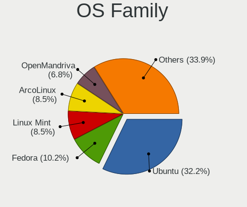

| Name          | Desktops | Percent |
|---------------|----------|---------|
| Ubuntu        | 19       | 32.2%   |
| Fedora        | 6        | 10.17%  |
| Linux Mint    | 5        | 8.47%   |
| ArcoLinux     | 5        | 8.47%   |
| OpenMandriva  | 4        | 6.78%   |
| Debian        | 3        | 5.08%   |
| Zorin         | 2        | 3.39%   |
| Manjaro       | 2        | 3.39%   |
| Kali          | 2        | 3.39%   |
| Elementary    | 2        | 3.39%   |
| Ubuntu Studio | 1        | 1.69%   |
| Pop!_OS       | 1        | 1.69%   |
| openSUSE      | 1        | 1.69%   |
| Mageia        | 1        | 1.69%   |
| Lubuntu       | 1        | 1.69%   |
| Endless       | 1        | 1.69%   |
| Deepin        | 1        | 1.69%   |
| BlackPanther  | 1        | 1.69%   |
| Arch          | 1        | 1.69%   |

Kernel
------

Version of the Linux kernel

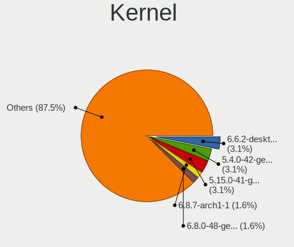

| Version                  | Desktops | Percent |
|--------------------------|----------|---------|
| 6.6.2-desktop-1omv2390   | 2        | 3.13%   |
| 5.4.0-42-generic         | 2        | 3.13%   |
| 5.15.0-41-generic        | 2        | 3.13%   |
| 6.8.7-arch1-1            | 1        | 1.56%   |
| 6.8.0-48-generic         | 1        | 1.56%   |
| 6.8.0-31-generic         | 1        | 1.56%   |
| 6.6.36-amd64-desktop-hwe | 1        | 1.56%   |
| 6.6.30-1-MANJARO         | 1        | 1.56%   |
| 6.6.11-1-lts             | 1        | 1.56%   |
| 6.5.6-arch2-1            | 1        | 1.56%   |
| 6.5.5-200.fc38.x86_64    | 1        | 1.56%   |
| 6.5.0-44-generic         | 1        | 1.56%   |
| 6.5.0-35-generic         | 1        | 1.56%   |
| 6.4.15-200.fc38.x86_64   | 1        | 1.56%   |
| 6.2.0-32-generic         | 1        | 1.56%   |
| 6.11.5-300.fc41.x86_64   | 1        | 1.56%   |
| 6.11.2-amd64             | 1        | 1.56%   |
| 6.1.32-amd64-desktop-hwe | 1        | 1.56%   |
| 6.1.0-22-amd64           | 1        | 1.56%   |
| 6.1.0-14-686-pae         | 1        | 1.56%   |
| 5.8.4-200.fc32.x86_64    | 1        | 1.56%   |
| 5.8.13-200.fc32.x86_64   | 1        | 1.56%   |
| 5.8.0-7642-generic       | 1        | 1.56%   |
| 5.8.0-63-generic         | 1        | 1.56%   |
| 5.8.0-53-generic         | 1        | 1.56%   |
| 5.8.0-43-generic         | 1        | 1.56%   |
| 5.4.0-7642-generic       | 1        | 1.56%   |
| 5.4.0-37-generic         | 1        | 1.56%   |
| 5.4.0-33-generic         | 1        | 1.56%   |
| 5.4.0-28-generic         | 1        | 1.56%   |
| 5.4.0-19-generic         | 1        | 1.56%   |
| 5.4.0-137-generic        | 1        | 1.56%   |
| 5.4.0-124-generic        | 1        | 1.56%   |
| 5.3.0-kali2-amd64        | 1        | 1.56%   |
| 5.3.0-62-generic         | 1        | 1.56%   |
| 5.3.0-28-generic         | 1        | 1.56%   |
| 5.19.9-200.fc36.x86_64   | 1        | 1.56%   |
| 5.19.5-desktop-1omv4090  | 1        | 1.56%   |
| 5.19.0-45-generic        | 1        | 1.56%   |
| 5.16.2-zen1-1-zen        | 1        | 1.56%   |

Kernel Family
-------------

Linux kernel without a distro release

| Version | Desktops | Percent |
|---------|----------|---------|
| 5.4.0   | 9        | 14.06%  |
| 5.15.0  | 5        | 7.81%   |
| 5.8.0   | 4        | 6.25%   |
| 5.13.0  | 4        | 6.25%   |
| 5.3.0   | 3        | 4.69%   |
| 6.8.0   | 2        | 3.13%   |
| 6.6.2   | 2        | 3.13%   |
| 6.5.0   | 2        | 3.13%   |
| 6.1.0   | 2        | 3.13%   |
| 5.11.0  | 2        | 3.13%   |
| 6.8.7   | 1        | 1.56%   |
| 6.6.36  | 1        | 1.56%   |
| 6.6.30  | 1        | 1.56%   |
| 6.6.11  | 1        | 1.56%   |
| 6.5.6   | 1        | 1.56%   |
| 6.5.5   | 1        | 1.56%   |
| 6.4.15  | 1        | 1.56%   |
| 6.2.0   | 1        | 1.56%   |
| 6.11.5  | 1        | 1.56%   |
| 6.11.2  | 1        | 1.56%   |
| 6.1.32  | 1        | 1.56%   |
| 5.8.4   | 1        | 1.56%   |
| 5.8.13  | 1        | 1.56%   |
| 5.19.9  | 1        | 1.56%   |
| 5.19.5  | 1        | 1.56%   |
| 5.19.0  | 1        | 1.56%   |
| 5.16.2  | 1        | 1.56%   |
| 5.15.85 | 1        | 1.56%   |
| 5.15.26 | 1        | 1.56%   |
| 5.15.10 | 1        | 1.56%   |
| 5.14.21 | 1        | 1.56%   |
| 5.12.11 | 1        | 1.56%   |
| 5.10.14 | 1        | 1.56%   |
| 5.10.10 | 1        | 1.56%   |
| 5.10.0  | 1        | 1.56%   |
| 5.0.0   | 1        | 1.56%   |
| 4.9.56  | 1        | 1.56%   |
| 4.18.16 | 1        | 1.56%   |
| 4.15.0  | 1        | 1.56%   |

Kernel Major Ver.
-----------------

Linux kernel major version

| Version | Desktops | Percent |
|---------|----------|---------|
| 5.4     | 9        | 14.29%  |
| 5.15    | 8        | 12.7%   |
| 6.6     | 5        | 7.94%   |
| 5.8     | 5        | 7.94%   |
| 6.5     | 4        | 6.35%   |
| 5.13    | 4        | 6.35%   |
| 6.8     | 3        | 4.76%   |
| 6.1     | 3        | 4.76%   |
| 5.3     | 3        | 4.76%   |
| 5.19    | 3        | 4.76%   |
| 5.10    | 3        | 4.76%   |
| 6.11    | 2        | 3.17%   |
| 5.11    | 2        | 3.17%   |
| 6.4     | 1        | 1.59%   |
| 6.2     | 1        | 1.59%   |
| 5.16    | 1        | 1.59%   |
| 5.14    | 1        | 1.59%   |
| 5.12    | 1        | 1.59%   |
| 5.0     | 1        | 1.59%   |
| 4.9     | 1        | 1.59%   |
| 4.18    | 1        | 1.59%   |
| 4.15    | 1        | 1.59%   |

Arch
----

OS architecture (x86_64, i586, etc.)

| Name   | Desktops | Percent |
|--------|----------|---------|
| x86_64 | 56       | 98.25%  |
| i686   | 1        | 1.75%   |

DE
--

Desktop Environment

| Name       | Desktops | Percent |
|------------|----------|---------|
| GNOME      | 31       | 53.45%  |
| KDE5       | 9        | 15.52%  |
| X-Cinnamon | 5        | 8.62%   |
| XFCE       | 2        | 3.45%   |
| Pantheon   | 2        | 3.45%   |
| Unknown    | 2        | 3.45%   |
| MATE       | 1        | 1.72%   |
| LXQt       | 1        | 1.72%   |
| KDE6       | 1        | 1.72%   |
| DWM        | 1        | 1.72%   |
| DDE        | 1        | 1.72%   |
| Cinnamon   | 1        | 1.72%   |
| awesome    | 1        | 1.72%   |

Display Server
--------------

X11 or Wayland

| Name    | Desktops | Percent |
|---------|----------|---------|
| X11     | 42       | 72.41%  |
| Wayland | 14       | 24.14%  |
| Tty     | 2        | 3.45%   |

Display Manager
---------------

SDDM, LightDM, etc.

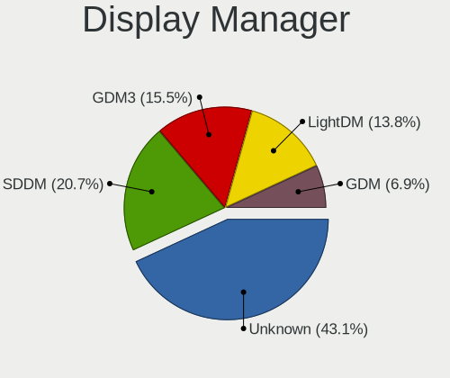

| Name    | Desktops | Percent |
|---------|----------|---------|
| Unknown | 25       | 43.1%   |
| SDDM    | 12       | 20.69%  |
| GDM3    | 9        | 15.52%  |
| LightDM | 8        | 13.79%  |
| GDM     | 4        | 6.9%    |

OS Lang
-------

Language

| Lang    | Desktops | Percent |
|---------|----------|---------|
| en_US   | 45       | 78.95%  |
| en_GB   | 7        | 12.28%  |
| Unknown | 3        | 5.26%   |
| C       | 2        | 3.51%   |

Boot Mode
---------

EFI or BIOS

| Mode | Desktops | Percent |
|------|----------|---------|
| BIOS | 36       | 63.16%  |
| EFI  | 21       | 36.84%  |

Filesystem
----------

Type of filesystem

| Type    | Desktops | Percent |
|---------|----------|---------|
| Ext4    | 44       | 74.58%  |
| Btrfs   | 7        | 11.86%  |
| Overlay | 6        | 10.17%  |
| Tmpfs   | 1        | 1.69%   |
| Unknown | 1        | 1.69%   |

Part. scheme
------------

Scheme of partitioning

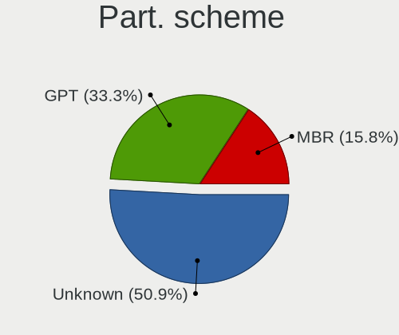

| Type    | Desktops | Percent |
|---------|----------|---------|
| Unknown | 29       | 50.88%  |
| GPT     | 19       | 33.33%  |
| MBR     | 9        | 15.79%  |

Dual Boot with Linux/BSD
------------------------

Hosting more than one Linux/BSD

| Dual boot | Desktops | Percent |
|-----------|----------|---------|
| No        | 47       | 82.46%  |
| Yes       | 10       | 17.54%  |

Dual Boot (Win)
---------------

Hosting Linux and Windows

| Dual boot | Desktops | Percent |
|-----------|----------|---------|
| No        | 35       | 61.4%   |
| Yes       | 22       | 38.6%   |

Board
-----

Vendor
------

Motherboard manufacturer

| Name                | Desktops | Percent |
|---------------------|----------|---------|
| Dell                | 19       | 33.33%  |
| Hewlett-Packard     | 18       | 31.58%  |
| MSI                 | 6        | 10.53%  |
| Gigabyte Technology | 4        | 7.02%   |
| Lenovo              | 2        | 3.51%   |
| Foxconn             | 2        | 3.51%   |
| ASRock              | 2        | 3.51%   |
| Intel               | 1        | 1.75%   |
| ASUSTek Computer    | 1        | 1.75%   |
| Acer                | 1        | 1.75%   |
| Unknown             | 1        | 1.75%   |

Model
-----

Motherboard model

| Name                                   | Desktops | Percent |
|----------------------------------------|----------|---------|
| Dell OptiPlex 7010                     | 4        | 7.02%   |
| MSI MS-7C02                            | 2        | 3.51%   |
| Dell OptiPlex 9020                     | 2        | 3.51%   |
| MSI MS-7D31                            | 1        | 1.75%   |
| MSI MS-7D30                            | 1        | 1.75%   |
| MSI 500-007A                           | 1        | 1.75%   |
| MSI 0A90                               | 1        | 1.75%   |
| Lenovo ThinkCentre E73 10AS00HRUM      | 1        | 1.75%   |
| Lenovo ThinkCentre E73 10AS00CVUM      | 1        | 1.75%   |
| Intel Starmax Desktop                  | 1        | 1.75%   |
| HP Z400 Workstation                    | 1        | 1.75%   |
| HP xw4600 Workstation                  | 1        | 1.75%   |
| HP ProDesk 600 G1 TWR                  | 1        | 1.75%   |
| HP Pro Tower 290 G9 Desktop PC         | 1        | 1.75%   |
| HP Pavilion Desktop 590-p0xxx          | 1        | 1.75%   |
| HP EliteDesk 800 G4 TWR                | 1        | 1.75%   |
| HP Compaq Elite 8300 SFF               | 1        | 1.75%   |
| HP Compaq Elite 8300 CMT               | 1        | 1.75%   |
| HP Compaq dx6120 MT(RG641ES)           | 1        | 1.75%   |
| HP Compaq dc7900 Convertible Minitower | 1        | 1.75%   |
| HP Compaq dc7800 Small Form Factor     | 1        | 1.75%   |
| HP Compaq dc7600 Convertible Minitower | 1        | 1.75%   |
| HP Compaq dc7100 SFF(DX878AV)          | 1        | 1.75%   |
| HP Compaq dc7100 CMT(PY244UC)          | 1        | 1.75%   |
| HP Compaq 8200 Elite CMT PC            | 1        | 1.75%   |
| HP Compaq 6005 Pro MT PC               | 1        | 1.75%   |
| HP Compaq 4000 Pro SFF PC              | 1        | 1.75%   |
| HP 290 G3 MT Business PC               | 1        | 1.75%   |
| Gigabyte Z68XP-UD3                     | 1        | 1.75%   |
| Gigabyte TRX40 AORUS PRO WIFI          | 1        | 1.75%   |
| Gigabyte H110M-A                       | 1        | 1.75%   |
| Gigabyte B450 I AORUS PRO WIFI         | 1        | 1.75%   |
| Foxconn Pro3500 Series                 | 1        | 1.75%   |
| Foxconn Pro 3400 Series MT             | 1        | 1.75%   |
| Dell Vostro 270                        | 1        | 1.75%   |
| Dell Precision Tower 5810              | 1        | 1.75%   |
| Dell Precision T1650                   | 1        | 1.75%   |
| Dell OptiPlex GX520                    | 1        | 1.75%   |
| Dell OptiPlex 990                      | 1        | 1.75%   |
| Dell OptiPlex 760                      | 1        | 1.75%   |

Model Family
------------

Motherboard model prefix

| Name               | Desktops | Percent |
|--------------------|----------|---------|
| Dell OptiPlex      | 16       | 28.07%  |
| HP Compaq          | 11       | 19.3%   |
| MSI MS-7C02        | 2        | 3.51%   |
| Lenovo ThinkCentre | 2        | 3.51%   |
| Dell Precision     | 2        | 3.51%   |
| MSI MS-7D31        | 1        | 1.75%   |
| MSI MS-7D30        | 1        | 1.75%   |
| MSI 500-007A       | 1        | 1.75%   |
| MSI 0A90           | 1        | 1.75%   |
| Intel Starmax      | 1        | 1.75%   |
| HP Z400            | 1        | 1.75%   |
| HP xw4600          | 1        | 1.75%   |
| HP ProDesk         | 1        | 1.75%   |
| HP Pro             | 1        | 1.75%   |
| HP Pavilion        | 1        | 1.75%   |
| HP EliteDesk       | 1        | 1.75%   |
| HP 290             | 1        | 1.75%   |
| Gigabyte Z68XP-UD3 | 1        | 1.75%   |
| Gigabyte TRX40     | 1        | 1.75%   |
| Gigabyte H110M-A   | 1        | 1.75%   |
| Gigabyte B450      | 1        | 1.75%   |
| Foxconn Pro3500    | 1        | 1.75%   |
| Foxconn Pro        | 1        | 1.75%   |
| Dell Vostro        | 1        | 1.75%   |
| ASUS M5A97         | 1        | 1.75%   |
| ASRock X570        | 1        | 1.75%   |
| ASRock B450M       | 1        | 1.75%   |
| Acer Veriton       | 1        | 1.75%   |
| Unknown            | 1        | 1.75%   |

MFG Year
--------

Motherboard manufacture year

| Year | Desktops | Percent |
|------|----------|---------|
| 2018 | 8        | 14.04%  |
| 2011 | 6        | 10.53%  |
| 2013 | 5        | 8.77%   |
| 2012 | 5        | 8.77%   |
| 2008 | 4        | 7.02%   |
| 2022 | 3        | 5.26%   |
| 2019 | 3        | 5.26%   |
| 2016 | 3        | 5.26%   |
| 2015 | 3        | 5.26%   |
| 2014 | 3        | 5.26%   |
| 2010 | 3        | 5.26%   |
| 2007 | 3        | 5.26%   |
| 2005 | 3        | 5.26%   |
| 2004 | 2        | 3.51%   |
| 2021 | 1        | 1.75%   |
| 2017 | 1        | 1.75%   |
| 2009 | 1        | 1.75%   |

Form Factor
-----------

Physical design of the computer

| Name    | Desktops | Percent |
|---------|----------|---------|
| Desktop | 57       | 100%    |

Secure Boot
-----------

Enabled or disabled

| State    | Desktops | Percent |
|----------|----------|---------|
| Disabled | 55       | 94.83%  |
| Enabled  | 3        | 5.17%   |

Coreboot
--------

Have coreboot on board

| Used | Desktops | Percent |
|------|----------|---------|
| No   | 57       | 100%    |

RAM Size
--------

Total RAM memory

| Size in GB      | Desktops | Percent |
|-----------------|----------|---------|
| 16.01-24.0      | 14       | 24.14%  |
| 3.01-4.0        | 11       | 18.97%  |
| 8.01-16.0       | 8        | 13.79%  |
| 4.01-8.0        | 7        | 12.07%  |
| 32.01-64.0      | 7        | 12.07%  |
| 1.01-2.0        | 6        | 10.34%  |
| 2.01-3.0        | 2        | 3.45%   |
| More than 256.0 | 1        | 1.72%   |
| 24.01-32.0      | 1        | 1.72%   |
| 64.01-256.0     | 1        | 1.72%   |

RAM Used
--------

Used RAM memory

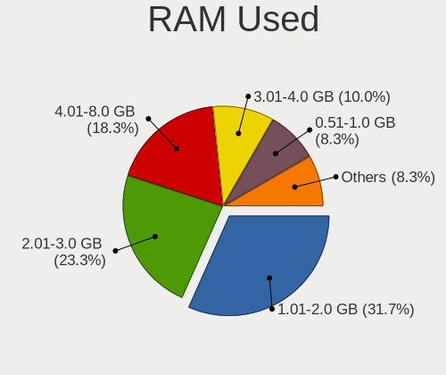

| Used GB   | Desktops | Percent |
|-----------|----------|---------|
| 1.01-2.0  | 19       | 31.67%  |
| 2.01-3.0  | 14       | 23.33%  |
| 4.01-8.0  | 11       | 18.33%  |
| 3.01-4.0  | 6        | 10%     |
| 0.51-1.0  | 5        | 8.33%   |
| 8.01-16.0 | 3        | 5%      |
| 0.01-0.5  | 2        | 3.33%   |

Total Drives
------------

Number of drives on board

| Drives | Desktops | Percent |
|--------|----------|---------|
| 1      | 27       | 47.37%  |
| 2      | 18       | 31.58%  |
| 3      | 6        | 10.53%  |
| 4      | 4        | 7.02%   |
| 6      | 1        | 1.75%   |
| 5      | 1        | 1.75%   |

Has CD-ROM
----------

Has CD-ROM on board

| Presented | Desktops | Percent |
|-----------|----------|---------|
| No        | 31       | 54.39%  |
| Yes       | 26       | 45.61%  |

Has Ethernet
------------

Has Ethernet on board

| Presented | Desktops | Percent |
|-----------|----------|---------|
| Yes       | 56       | 98.25%  |
| No        | 1        | 1.75%   |

Has WiFi
--------

Has WiFi module

| Presented | Desktops | Percent |
|-----------|----------|---------|
| No        | 29       | 50.88%  |
| Yes       | 28       | 49.12%  |

Has Bluetooth
-------------

Has Bluetooth module

| Presented | Desktops | Percent |
|-----------|----------|---------|
| No        | 46       | 80.7%   |
| Yes       | 11       | 19.3%   |

Location
--------

Country
-------

Geographic location (country)

| Country | Desktops | Percent |
|---------|----------|---------|
| Kenya   | 57       | 100%    |

City
----

Geographic location (city)

| City     | Desktops | Percent |
|----------|----------|---------|
| Nairobi  | 53       | 91.38%  |
| Nyeri    | 1        | 1.72%   |
| Nakuru   | 1        | 1.72%   |
| Mombasa  | 1        | 1.72%   |
| Kericho  | 1        | 1.72%   |
| Kabarnet | 1        | 1.72%   |

Drives
------

Drive Vendor
------------

Hard drive vendors

| Vendor                       | Desktops | Drives | Percent |
|------------------------------|----------|--------|---------|
| Seagate                      | 32       | 39     | 32%     |
| WDC                          | 17       | 20     | 17%     |
| Toshiba                      | 11       | 12     | 11%     |
| Samsung Electronics          | 5        | 9      | 5%      |
| HGST                         | 5        | 8      | 5%      |
| Intel                        | 4        | 5      | 4%      |
| SPCC                         | 3        | 7      | 3%      |
| Maxtor                       | 3        | 3      | 3%      |
| Hitachi                      | 3        | 3      | 3%      |
| Team                         | 2        | 2      | 2%      |
| Silicon Motion               | 2        | 2      | 2%      |
| Sandisk                      | 2        | 2      | 2%      |
| Unknown                      | 2        | 2      | 2%      |
| Unknown                      | 1        | 1      | 1%      |
| Shenzhen Longsys Electronics | 1        | 1      | 1%      |
| Micron/Crucial Technology    | 1        | 2      | 1%      |
| LITEON                       | 1        | 1      | 1%      |
| Kingston                     | 1        | 1      | 1%      |
| HUAWEI                       | 1        | 1      | 1%      |
| Gritronix                    | 1        | 1      | 1%      |
| Dahua                        | 1        | 1      | 1%      |
| China                        | 1        | 1      | 1%      |

Drive Model
-----------

Hard drive models

| Model                                                 | Desktops | Percent |
|-------------------------------------------------------|----------|---------|
| Seagate ST500DM002-1BD142 500GB                       | 5        | 4.63%   |
| WDC WD3200AAJS-56M0A0 320GB                           | 3        | 2.78%   |
| Toshiba MQ01ABD050V 500GB                             | 3        | 2.78%   |
| Toshiba DT01ACA100 1TB                                | 3        | 2.78%   |
| Seagate ST3320418AS 320GB                             | 3        | 2.78%   |
| Toshiba DT01ACA050 500GB                              | 2        | 1.85%   |
| Team T253X2001T 1TB SSD                               | 2        | 1.85%   |
| SPCC Solid State Disk 256GB                           | 2        | 1.85%   |
| SPCC M.2 PCIe SSD 512GB                               | 2        | 1.85%   |
| Silicon Motion SM2263EN/SM2263XT SSD Controller 256GB | 2        | 1.85%   |
| Seagate ST500VT000-1BS142 500GB                       | 2        | 1.85%   |
| Seagate ST3250318AS 250GB                             | 2        | 1.85%   |
| Seagate ST2000DM008-2FR102 2TB                        | 2        | 1.85%   |
| Seagate ST2000DM001-1ER164 2TB                        | 2        | 1.85%   |
| Seagate ST1000LM024 HN-M101MBB 1TB                    | 2        | 1.85%   |
| Samsung SSD 840 EVO 250GB                             | 2        | 1.85%   |
| Unknown                                               | 2        | 1.85%   |
| WDC WD800GD-75FLC3 80GB                               | 1        | 0.93%   |
| WDC WD60EZAZ-00SF3B0 6TB                              | 1        | 0.93%   |
| WDC WD5003AZEX-00K1GA0 500GB                          | 1        | 0.93%   |
| WDC WD5000BPVT-80HXZT3 500GB                          | 1        | 0.93%   |
| WDC WD5000AZLX-08K2TA0 500GB                          | 1        | 0.93%   |
| WDC WD5000AVVS-63M8B0 500GB                           | 1        | 0.93%   |
| WDC WD5000AVDS-63U7B1 500GB                           | 1        | 0.93%   |
| WDC WD5000AAKX-08U6AA0 500GB                          | 1        | 0.93%   |
| WDC WD3200AAKS-75L9A0 320GB                           | 1        | 0.93%   |
| WDC WD3200AAJS-60Z0A0 320GB                           | 1        | 0.93%   |
| WDC WD3200AAJS-56B4A0 320GB                           | 1        | 0.93%   |
| WDC WD3200AAJS-00B4A0 320GB                           | 1        | 0.93%   |
| WDC WD2500AAKX-75U6AA0 250GB                          | 1        | 0.93%   |
| WDC WD2500AAKX-08U6AA0 250GB                          | 1        | 0.93%   |
| WDC WD10EARX-00N0YB0 1TB                              | 1        | 0.93%   |
| Unknown L200 Hard drive 2TB                           | 1        | 0.93%   |
| Toshiba THNSNJ128GCSU 128GB SSD                       | 1        | 0.93%   |
| Toshiba MK2555GSX 250GB                               | 1        | 0.93%   |
| Toshiba HDWJ110 1TB                                   | 1        | 0.93%   |
| Toshiba DT01ABA100V 1TB                               | 1        | 0.93%   |
| Shenzhen Longsys Lexar SSD NM790 1TB                  | 1        | 0.93%   |
| Seagate ST_M13FQBL QNR 4GB                            | 1        | 0.93%   |
| Seagate ST500LT012-1DG142 500GB                       | 1        | 0.93%   |

HDD Vendor
----------

Hard disk drive vendors

| Vendor              | Desktops | Drives | Percent |
|---------------------|----------|--------|---------|
| Seagate             | 31       | 38     | 43.06%  |
| WDC                 | 17       | 20     | 23.61%  |
| Toshiba             | 10       | 11     | 13.89%  |
| HGST                | 5        | 8      | 6.94%   |
| Maxtor              | 3        | 3      | 4.17%   |
| Hitachi             | 3        | 3      | 4.17%   |
| Unknown             | 1        | 1      | 1.39%   |
| Samsung Electronics | 1        | 1      | 1.39%   |
| Unknown             | 1        | 1      | 1.39%   |

SSD Vendor
----------

Solid state drive vendors

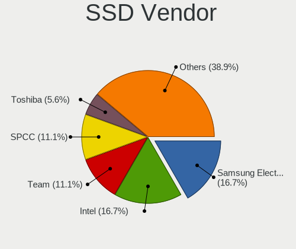

| Vendor              | Desktops | Drives | Percent |
|---------------------|----------|--------|---------|
| Samsung Electronics | 3        | 5      | 16.67%  |
| Intel               | 3        | 4      | 16.67%  |
| Team                | 2        | 2      | 11.11%  |
| SPCC                | 2        | 3      | 11.11%  |
| Toshiba             | 1        | 1      | 5.56%   |
| SanDisk             | 1        | 1      | 5.56%   |
| LITEON              | 1        | 1      | 5.56%   |
| Kingston            | 1        | 1      | 5.56%   |
| Gritronix           | 1        | 1      | 5.56%   |
| Dahua               | 1        | 1      | 5.56%   |
| China               | 1        | 1      | 5.56%   |
| Unknown             | 1        | 1      | 5.56%   |

Drive Kind
----------

HDD or SSD

| Kind    | Desktops | Drives | Percent |
|---------|----------|--------|---------|
| HDD     | 52       | 86     | 66.67%  |
| SSD     | 15       | 22     | 19.23%  |
| NVMe    | 9        | 14     | 11.54%  |
| Unknown | 2        | 2      | 2.56%   |

Drive Connector
---------------

SATA, SAS, NVMe, etc.

| Type | Desktops | Drives | Percent |
|------|----------|--------|---------|
| SATA | 56       | 109    | 84.85%  |
| NVMe | 9        | 14     | 13.64%  |
| SAS  | 1        | 1      | 1.52%   |

Drive Size
----------

Size of hard drive

| Size in TB | Desktops | Drives | Percent |
|------------|----------|--------|---------|
| 0.01-0.5   | 46       | 71     | 62.16%  |
| 0.51-1.0   | 18       | 25     | 24.32%  |
| 1.01-2.0   | 6        | 7      | 8.11%   |
| 4.01-10.0  | 2        | 3      | 2.7%    |
| 3.01-4.0   | 1        | 1      | 1.35%   |
| 2.01-3.0   | 1        | 1      | 1.35%   |

Space Total
-----------

Amount of disk space available on the file system

| Size in GB     | Desktops | Percent |
|----------------|----------|---------|
| 501-1000       | 13       | 20.97%  |
| 251-500        | 11       | 17.74%  |
| 101-250        | 11       | 17.74%  |
| 1001-2000      | 9        | 14.52%  |
| 51-100         | 8        | 12.9%   |
| More than 3000 | 4        | 6.45%   |
| 1-20           | 3        | 4.84%   |
| 21-50          | 1        | 1.61%   |
| 2001-3000      | 1        | 1.61%   |
| Unknown        | 1        | 1.61%   |

Space Used
----------

Amount of used disk space

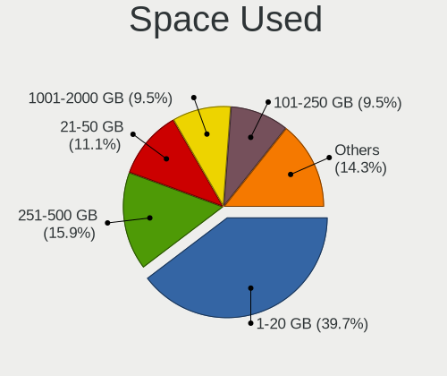

| Used GB   | Desktops | Percent |
|-----------|----------|---------|
| 1-20      | 25       | 39.68%  |
| 251-500   | 10       | 15.87%  |
| 21-50     | 7        | 11.11%  |
| 101-250   | 6        | 9.52%   |
| 1001-2000 | 6        | 9.52%   |
| 501-1000  | 5        | 7.94%   |
| 51-100    | 3        | 4.76%   |
| Unknown   | 1        | 1.59%   |

Malfunc. Drives
---------------

Drive models with a malfunction

| Model                              | Desktops | Drives | Percent |
|------------------------------------|----------|--------|---------|
| Toshiba MQ01ABD050V 500GB          | 2        | 2      | 15.38%  |
| WDC WD5000AZLX-08K2TA0 500GB       | 1        | 1      | 7.69%   |
| WDC WD3200AAJS-56M0A0 320GB        | 1        | 1      | 7.69%   |
| Toshiba MK2555GSX 250GB            | 1        | 1      | 7.69%   |
| Toshiba DT01ACA050 500GB           | 1        | 1      | 7.69%   |
| Seagate ST500LT012-1DG142 500GB    | 1        | 1      | 7.69%   |
| Seagate ST500DM002-1BD142 500GB    | 1        | 1      | 7.69%   |
| Seagate ST3500418AS 500GB          | 1        | 1      | 7.69%   |
| Seagate ST3320418AS 320GB          | 1        | 1      | 7.69%   |
| Seagate ST1000LM024 HN-M101MBB 1TB | 1        | 1      | 7.69%   |
| HGST HTS721010A9 1TB               | 1        | 2      | 7.69%   |
| Unknown                            | 1        | 1      | 7.69%   |

Malfunc. Drive Vendor
---------------------

Vendors of faulty drives

| Vendor  | Desktops | Drives | Percent |
|---------|----------|--------|---------|
| Seagate | 5        | 5      | 38.46%  |
| Toshiba | 4        | 4      | 30.77%  |
| WDC     | 2        | 2      | 15.38%  |
| HGST    | 1        | 2      | 7.69%   |
| Unknown | 1        | 1      | 7.69%   |

Malfunc. HDD Vendor
-------------------

Vendors of faulty HDD drives

| Vendor  | Desktops | Drives | Percent |
|---------|----------|--------|---------|
| Seagate | 5        | 5      | 38.46%  |
| Toshiba | 4        | 4      | 30.77%  |
| WDC     | 2        | 2      | 15.38%  |
| HGST    | 1        | 2      | 7.69%   |
| Unknown | 1        | 1      | 7.69%   |

Malfunc. Drive Kind
-------------------

Kinds of faulty drives

| Kind | Desktops | Drives | Percent |
|------|----------|--------|---------|
| HDD  | 12       | 14     | 100%    |

Failed Drives
-------------

Failed drive models

Zero info for selected period =(

Failed Drive Vendor
-------------------

Failed drive vendors

Zero info for selected period =(

Drive Status
------------

Number of failed and malfunc. drives

| Status   | Desktops | Drives | Percent |
|----------|----------|--------|---------|
| Detected | 34       | 66     | 53.97%  |
| Works    | 17       | 44     | 26.98%  |
| Malfunc  | 12       | 14     | 19.05%  |

Storage controller
------------------

Storage Vendor
--------------

Storage controller vendors

| Vendor                       | Desktops | Percent |
|------------------------------|----------|---------|
| Intel                        | 48       | 66.67%  |
| AMD                          | 9        | 12.5%   |
| Silicon Motion               | 3        | 4.17%   |
| Samsung Electronics          | 2        | 2.78%   |
| ASMedia Technology           | 2        | 2.78%   |
| Shenzhen Longsys Electronics | 1        | 1.39%   |
| SanDisk                      | 1        | 1.39%   |
| Realtek Semiconductor        | 1        | 1.39%   |
| Micron/Crucial Technology    | 1        | 1.39%   |
| Marvell Technology Group     | 1        | 1.39%   |
| LSI Logic / Symbios Logic    | 1        | 1.39%   |
| JMicron Technology           | 1        | 1.39%   |
| Broadcom / LSI               | 1        | 1.39%   |

Storage Model
-------------

Storage controller models

| Model                                                                                   | Desktops | Percent |
|-----------------------------------------------------------------------------------------|----------|---------|
| Intel 7 Series/C210 Series Chipset Family 6-port SATA Controller [AHCI mode]            | 8        | 8.6%    |
| AMD FCH SATA Controller [AHCI mode]                                                     | 7        | 7.53%   |
| Intel SATA Controller [RAID mode]                                                       | 5        | 5.38%   |
| Intel NM10/ICH7 Family SATA Controller [IDE mode]                                       | 4        | 4.3%    |
| AMD 400 Series Chipset SATA Controller                                                  | 4        | 4.3%    |
| Silicon Motion SM2263EN/SM2263XT (DRAM-less) NVMe SSD Controllers                       | 3        | 3.23%   |
| Intel Alder Lake-S PCH SATA Controller [AHCI Mode]                                      | 3        | 3.23%   |
| Intel 82801JD/DO (ICH10 Family) SATA AHCI Controller                                    | 3        | 3.23%   |
| Intel 82801G (ICH7 Family) IDE Controller                                               | 3        | 3.23%   |
| Intel 82801FB/FW (ICH6/ICH6W) SATA Controller                                           | 3        | 3.23%   |
| Intel 82801FB/FBM/FR/FW/FRW (ICH6 Family) IDE Controller                                | 3        | 3.23%   |
| Intel 8 Series/C220 Series Chipset Family 6-port SATA Controller 1 [AHCI mode]          | 3        | 3.23%   |
| Intel 6 Series/C200 Series Chipset Family 6 port Desktop SATA AHCI Controller           | 3        | 3.23%   |
| Intel 200 Series PCH SATA controller [AHCI mode]                                        | 3        | 3.23%   |
| Intel Cannon Lake PCH SATA AHCI Controller                                              | 2        | 2.15%   |
| Intel 82Q35 Express PT IDER Controller                                                  | 2        | 2.15%   |
| Intel 8 Series/C220 Series Chipset Family 4-port SATA Controller 1 [IDE mode]           | 2        | 2.15%   |
| Intel 6 Series/C200 Series Chipset Family Desktop SATA Controller (IDE mode, ports 4-5) | 2        | 2.15%   |
| Intel 6 Series/C200 Series Chipset Family Desktop SATA Controller (IDE mode, ports 0-3) | 2        | 2.15%   |
| Intel 4 Series Chipset PT IDER Controller                                               | 2        | 2.15%   |
| ASMedia ASM1061/ASM1062 Serial ATA Controller                                           | 2        | 2.15%   |
| Shenzhen Longsys Lexar NM790 NVME SSD (DRAM-less)                                       | 1        | 1.08%   |
| SanDisk WD Green SN350 240GB (DRAM-less) / SN560E NVMe SSD                              | 1        | 1.08%   |
| Samsung NVMe SSD Controller PM9A1/PM9A3/980PRO                                          | 1        | 1.08%   |
| Samsung NVMe SSD Controller 980 (DRAM-less)                                             | 1        | 1.08%   |
| Realtek RTS5762 NVMe SSD Controller                                                     | 1        | 1.08%   |
| Micron/Crucial P2 [Nick P2] / P3 / P3 Plus NVMe PCIe SSD (DRAM-less)                    | 1        | 1.08%   |
| Marvell Group 88SE9172 SATA III 6Gb/s RAID Controller                                   | 1        | 1.08%   |
| LSI Logic / Symbios Logic SAS1064ET PCI-Express Fusion-MPT SAS                          | 1        | 1.08%   |
| JMicron JMB368 IDE controller                                                           | 1        | 1.08%   |
| Intel SSD 660P Series                                                                   | 1        | 1.08%   |
| Intel Q170/Q150/B150/H170/H110/Z170/CM236 Chipset SATA Controller [AHCI Mode]           | 1        | 1.08%   |
| Intel Elkhart Lake SATA AHCI                                                            | 1        | 1.08%   |
| Intel C610/X99 series chipset 6-Port SATA Controller [AHCI mode]                        | 1        | 1.08%   |
| Intel 82801IR/IO/IH (ICH9R/DO/DH) 6 port SATA Controller [AHCI mode]                    | 1        | 1.08%   |
| Intel 82801IR/IO/IH (ICH9R/DO/DH) 4 port SATA Controller [IDE mode]                     | 1        | 1.08%   |
| Intel 82801I (ICH9 Family) 2 port SATA Controller [IDE mode]                            | 1        | 1.08%   |
| Intel 82801HR/HO/HH (ICH8R/DO/DH) 2 port SATA Controller [IDE mode]                     | 1        | 1.08%   |
| Intel 82801H (ICH8 Family) 4 port SATA Controller [IDE mode]                            | 1        | 1.08%   |
| Intel 5 Series/3400 Series Chipset PT IDER Controller                                   | 1        | 1.08%   |

Storage Kind
------------

Kind of storage controller (IDE, SATA, NVMe, SAS, ...)

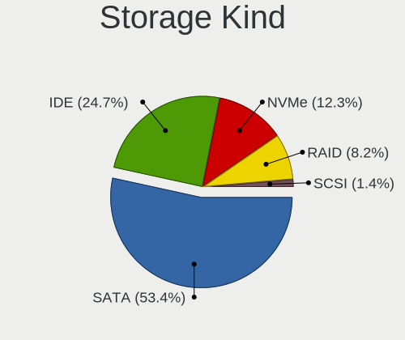

| Kind | Desktops | Percent |
|------|----------|---------|
| SATA | 39       | 53.42%  |
| IDE  | 18       | 24.66%  |
| NVMe | 9        | 12.33%  |
| RAID | 6        | 8.22%   |
| SCSI | 1        | 1.37%   |

Processor
---------

CPU Vendor
----------

Processor vendors

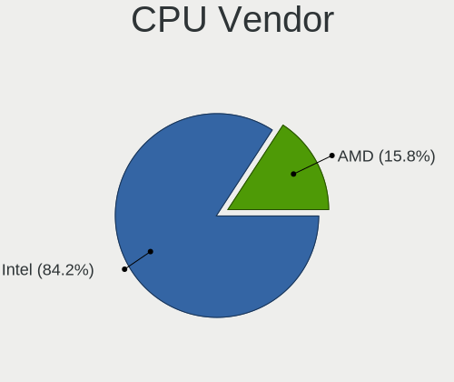

| Vendor | Desktops | Percent |
|--------|----------|---------|
| Intel  | 48       | 84.21%  |
| AMD    | 9        | 15.79%  |

CPU Model
---------

Processor models

| Model                                       | Desktops | Percent |
|---------------------------------------------|----------|---------|
| Intel Core i7-3770 CPU @ 3.40GHz            | 3        | 5.26%   |
| Intel Pentium 4 CPU 3.00GHz                 | 2        | 3.51%   |
| Intel Pentium 4 CPU 2.80GHz                 | 2        | 3.51%   |
| Intel Core i5-6500 CPU @ 3.20GHz            | 2        | 3.51%   |
| Intel Core i5-2400 CPU @ 3.10GHz            | 2        | 3.51%   |
| Intel Core i3-3240 CPU @ 3.40GHz            | 2        | 3.51%   |
| Intel Core i3-3220 CPU @ 3.30GHz            | 2        | 3.51%   |
| Intel 13th Gen Core i7-13700K               | 2        | 3.51%   |
| AMD Ryzen 5 1600 Six-Core Processor         | 2        | 3.51%   |
| Intel Xeon CPU W3680 @ 3.33GHz              | 1        | 1.75%   |
| Intel Xeon CPU E5-1630 v3 @ 3.70GHz         | 1        | 1.75%   |
| Intel Pentium Dual-Core CPU E5700 @ 3.00GHz | 1        | 1.75%   |
| Intel Pentium CPU G630 @ 2.70GHz            | 1        | 1.75%   |
| Intel Pentium 4 CPU 3.20GHz                 | 1        | 1.75%   |
| Intel Pentium 4 CPU 3.06GHz                 | 1        | 1.75%   |
| Intel Core i7-8700 CPU @ 3.20GHz            | 1        | 1.75%   |
| Intel Core i7-6700 CPU @ 3.40GHz            | 1        | 1.75%   |
| Intel Core i7-4790 CPU @ 3.60GHz            | 1        | 1.75%   |
| Intel Core i7-2600 CPU @ 3.40GHz            | 1        | 1.75%   |
| Intel Core i5-9500 CPU @ 3.00GHz            | 1        | 1.75%   |
| Intel Core i5-8400 CPU @ 2.80GHz            | 1        | 1.75%   |
| Intel Core i5-7500 CPU @ 3.40GHz            | 1        | 1.75%   |
| Intel Core i5-4570 CPU @ 3.20GHz            | 1        | 1.75%   |
| Intel Core i5-4430S CPU @ 2.70GHz           | 1        | 1.75%   |
| Intel Core i5-3570 CPU @ 3.40GHz            | 1        | 1.75%   |
| Intel Core i5-3470 CPU @ 3.20GHz            | 1        | 1.75%   |
| Intel Core i3-4170 CPU @ 3.70GHz            | 1        | 1.75%   |
| Intel Core i3-4160 CPU @ 3.60GHz            | 1        | 1.75%   |
| Intel Core i3-2100 CPU @ 3.10GHz            | 1        | 1.75%   |
| Intel Core i3 CPU 550 @ 3.20GHz             | 1        | 1.75%   |
| Intel Core 2 Quad CPU Q6600 @ 2.40GHz       | 1        | 1.75%   |
| Intel Core 2 Quad CPU @ 2.40GHz             | 1        | 1.75%   |
| Intel Core 2 Duo CPU E8600 @ 3.33GHz        | 1        | 1.75%   |
| Intel Core 2 Duo CPU E8500 @ 3.16GHz        | 1        | 1.75%   |
| Intel Core 2 Duo CPU E8400 @ 3.00GHz        | 1        | 1.75%   |
| Intel Core 2 Duo CPU E7300 @ 2.66GHz        | 1        | 1.75%   |
| Intel Core 2 CPU 6420 @ 2.13GHz             | 1        | 1.75%   |
| Intel Cnre i5-4590S CPU @ 3.00GHz           | 1        | 1.75%   |
| Intel Celeron J6412 @ 2.00GHz               | 1        | 1.75%   |
| Intel 12th Gen Core i7-12700                | 1        | 1.75%   |

CPU Model Family
----------------

Processor model prefix

| Model                   | Desktops | Percent |
|-------------------------|----------|---------|
| Intel Core i5           | 11       | 19.3%   |
| Intel Core i3           | 8        | 14.04%  |
| Intel Core i7           | 7        | 12.28%  |
| Intel Pentium 4         | 6        | 10.53%  |
| Other                   | 4        | 7.02%   |
| Intel Core 2 Duo        | 4        | 7.02%   |
| AMD Ryzen 5             | 3        | 5.26%   |
| Intel Xeon              | 2        | 3.51%   |
| Intel Core 2 Quad       | 2        | 3.51%   |
| Intel Pentium Dual-Core | 1        | 1.75%   |
| Intel Pentium           | 1        | 1.75%   |
| Intel Core 2            | 1        | 1.75%   |
| Intel Celeron           | 1        | 1.75%   |
| AMD Ryzen Threadripper  | 1        | 1.75%   |
| AMD Ryzen 9             | 1        | 1.75%   |
| AMD Ryzen 7             | 1        | 1.75%   |
| AMD Phenom II X3        | 1        | 1.75%   |
| AMD FX                  | 1        | 1.75%   |
| AMD A4                  | 1        | 1.75%   |

CPU Cores
---------

Number of processor cores

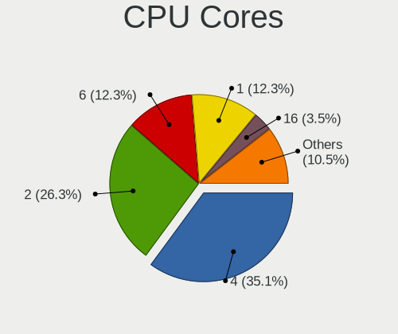

| Number | Desktops | Percent |
|--------|----------|---------|
| 4      | 20       | 35.09%  |
| 2      | 15       | 26.32%  |
| 6      | 7        | 12.28%  |
| 1      | 7        | 12.28%  |
| 16     | 2        | 3.51%   |
| 12     | 2        | 3.51%   |
| 3      | 2        | 3.51%   |
| 32     | 1        | 1.75%   |
| 8      | 1        | 1.75%   |

CPU Sockets
-----------

Number of sockets

| Number | Desktops | Percent |
|--------|----------|---------|
| 1      | 57       | 100%    |

CPU Threads
-----------

Threads per core (Hyper-Threading)

| Number | Desktops | Percent |
|--------|----------|---------|
| 2      | 31       | 54.39%  |
| 1      | 26       | 45.61%  |

CPU Op-Modes
------------

CPU Operation Modes (32-bit, 64-bit)

| Op mode        | Desktops | Percent |
|----------------|----------|---------|
| 32-bit, 64-bit | 56       | 98.25%  |
| 32-bit         | 1        | 1.75%   |

CPU Microcode
-------------

Microcode number

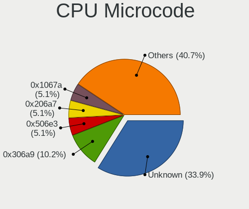

| Number     | Desktops | Percent |
|------------|----------|---------|
| Unknown    | 20       | 33.9%   |
| 0x306a9    | 6        | 10.17%  |
| 0x506e3    | 3        | 5.08%   |
| 0x206a7    | 3        | 5.08%   |
| 0x1067a    | 3        | 5.08%   |
| 0x0800820d | 3        | 5.08%   |
| 0xf49      | 2        | 3.39%   |
| 0x906ea    | 2        | 3.39%   |
| 0x306c3    | 2        | 3.39%   |
| 0x10676    | 2        | 3.39%   |
| 0xf65      | 1        | 1.69%   |
| 0xf43      | 1        | 1.69%   |
| 0xf41      | 1        | 1.69%   |
| 0x90661    | 1        | 1.69%   |
| 0x6f7      | 1        | 1.69%   |
| 0x6f6      | 1        | 1.69%   |
| 0x306f2    | 1        | 1.69%   |
| 0x206c2    | 1        | 1.69%   |
| 0x20655    | 1        | 1.69%   |
| 0x0a201016 | 1        | 1.69%   |
| 0x08301039 | 1        | 1.69%   |
| 0x06001119 | 1        | 1.69%   |
| 0x0600084f | 1        | 1.69%   |

CPU Microarch
-------------

Microarchitecture

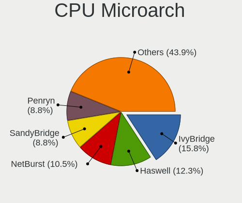

| Name             | Desktops | Percent |
|------------------|----------|---------|
| IvyBridge        | 9        | 15.79%  |
| Haswell          | 7        | 12.28%  |
| NetBurst         | 6        | 10.53%  |
| SandyBridge      | 5        | 8.77%   |
| Penryn           | 5        | 8.77%   |
| Zen+             | 4        | 7.02%   |
| KabyLake         | 4        | 7.02%   |
| Skylake          | 3        | 5.26%   |
| Core             | 3        | 5.26%   |
| Westmere         | 2        | 3.51%   |
| Piledriver       | 2        | 3.51%   |
| Alderlake Hybrid | 2        | 3.51%   |
| Zen 3            | 1        | 1.75%   |
| Zen 2            | 1        | 1.75%   |
| Tremont          | 1        | 1.75%   |
| K10              | 1        | 1.75%   |
| Unknown          | 1        | 1.75%   |

Graphics
--------

GPU Vendor
----------

Vendors of graphics cards

| Vendor | Desktops | Percent |
|--------|----------|---------|
| Intel  | 33       | 53.23%  |
| Nvidia | 18       | 29.03%  |
| AMD    | 11       | 17.74%  |

GPU Model
---------

Graphics card models

| Model                                                                       | Desktops | Percent |
|-----------------------------------------------------------------------------|----------|---------|
| AMD Ellesmere [Radeon RX 470/480/570/570X/580/580X/590]                     | 5        | 7.94%   |
| Intel Xeon E3-1200 v3/4th Gen Core Processor Integrated Graphics Controller | 4        | 6.35%   |
| Intel 2nd Generation Core Processor Family Integrated Graphics Controller   | 4        | 6.35%   |
| Nvidia GK208B [GeForce GT 710]                                              | 3        | 4.76%   |
| Intel Xeon E3-1200 v2/3rd Gen Core processor Graphics Controller            | 3        | 4.76%   |
| Intel 4 Series Chipset Integrated Graphics Controller                       | 3        | 4.76%   |
| Nvidia GT218 [GeForce 210]                                                  | 2        | 3.17%   |
| Nvidia GM107GL [Quadro K2200]                                               | 2        | 3.17%   |
| Nvidia GK208B [GeForce GT 730]                                              | 2        | 3.17%   |
| Intel Raptor Lake-S GT1 [UHD Graphics 770]                                  | 2        | 3.17%   |
| Intel HD Graphics 530                                                       | 2        | 3.17%   |
| Intel CoffeeLake-S GT2 [UHD Graphics 630]                                   | 2        | 3.17%   |
| Intel 82945G/GZ Integrated Graphics Controller                              | 2        | 3.17%   |
| Intel 82915G/GV/910GL Integrated Graphics Controller                        | 2        | 3.17%   |
| Intel 4th Generation Core Processor Family Integrated Graphics Controller   | 2        | 3.17%   |
| AMD Park [Mobility Radeon HD 5430]                                          | 2        | 3.17%   |
| Nvidia GT218 [NVS 300]                                                      | 1        | 1.59%   |
| Nvidia GP107 [GeForce GTX 1050 Ti]                                          | 1        | 1.59%   |
| Nvidia GK107GL [Quadro 410]                                                 | 1        | 1.59%   |
| Nvidia GK104 [GeForce GTX 760]                                              | 1        | 1.59%   |
| Nvidia GF119 [GeForce GT 610]                                               | 1        | 1.59%   |
| Nvidia GF108 [GeForce GT 730]                                               | 1        | 1.59%   |
| Nvidia GA106 [Geforce RTX 3050]                                             | 1        | 1.59%   |
| Nvidia GA102 [GeForce RTX 3080]                                             | 1        | 1.59%   |
| Nvidia G94GL [Quadro FX 1800]                                               | 1        | 1.59%   |
| Intel IvyBridge GT2 [HD Graphics 4000]                                      | 1        | 1.59%   |
| Intel HD Graphics 630                                                       | 1        | 1.59%   |
| Intel Elkhart Lake [UHD Graphics Gen11 16EU]                                | 1        | 1.59%   |
| Intel AlderLake-S GT1                                                       | 1        | 1.59%   |
| Intel 82Q35 Express Integrated Graphics Controller                          | 1        | 1.59%   |
| Intel 82G35 Express Integrated Graphics Controller                          | 1        | 1.59%   |
| Intel 82946GZ/GL Integrated Graphics Controller                             | 1        | 1.59%   |
| Intel 82915G Integrated Graphics Controller                                 | 1        | 1.59%   |
| AMD Trinity 2 [Radeon HD 7480D]                                             | 1        | 1.59%   |
| AMD RS880 [Radeon HD 4200]                                                  | 1        | 1.59%   |
| AMD Pitcairn PRO [Radeon HD 7850 / R7 265 / R9 270 1024SP]                  | 1        | 1.59%   |
| AMD Oland [Radeon HD 8570 / R5 430 OEM / R7 240/340 / Radeon 520 OEM]       | 1        | 1.59%   |

GPU Combo
---------

Combinations of graphics cards

| Name           | Desktops | Percent |
|----------------|----------|---------|
| 1 x Intel      | 29       | 50%     |
| 1 x Nvidia     | 15       | 25.86%  |
| 1 x AMD        | 11       | 18.97%  |
| Intel + Nvidia | 2        | 3.45%   |
| 2 x Intel      | 1        | 1.72%   |

GPU Driver
----------

Free vs proprietary

| Driver      | Desktops | Percent |
|-------------|----------|---------|
| Free        | 50       | 87.72%  |
| Proprietary | 6        | 10.53%  |
| Unknown     | 1        | 1.75%   |

GPU Memory
----------

Total video memory

| Size in GB | Desktops | Percent |
|------------|----------|---------|
| Unknown    | 34       | 59.65%  |
| 3.01-4.0   | 7        | 12.28%  |
| 0.51-1.0   | 5        | 8.77%   |
| 1.01-2.0   | 4        | 7.02%   |
| 7.01-8.0   | 3        | 5.26%   |
| 0.01-0.5   | 3        | 5.26%   |
| 8.01-16.0  | 1        | 1.75%   |

Monitor
-------

Monitor Vendor
--------------

Monitor vendors

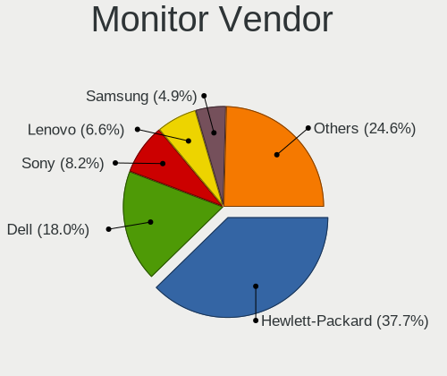

| Vendor               | Desktops | Percent |
|----------------------|----------|---------|
| Hewlett-Packard      | 23       | 37.7%   |
| Dell                 | 11       | 18.03%  |
| Sony                 | 5        | 8.2%    |
| Lenovo               | 4        | 6.56%   |
| Samsung Electronics  | 3        | 4.92%   |
| Unknown              | 2        | 3.28%   |
| BenQ                 | 2        | 3.28%   |
| VIE                  | 1        | 1.64%   |
| Unknown (XXX)        | 1        | 1.64%   |
| Sceptre Tech         | 1        | 1.64%   |
| S2-Tek               | 1        | 1.64%   |
| NEC Computers        | 1        | 1.64%   |
| LG Display           | 1        | 1.64%   |
| Hitachi              | 1        | 1.64%   |
| HannStar             | 1        | 1.64%   |
| Ancor Communications | 1        | 1.64%   |
| Acer                 | 1        | 1.64%   |
| Unknown              | 1        | 1.64%   |

Monitor Model
-------------

Monitor models

| Model                                                                 | Desktops | Percent |
|-----------------------------------------------------------------------|----------|---------|
| Samsung Electronics S22E450 SAM0C7A 1920x1080 477x268mm 21.5-inch     | 2        | 3.03%   |
| Lenovo T2224zD LEN60CB 1920x1080 476x267mm 21.5-inch                  | 2        | 3.03%   |
| Hewlett-Packard Z22i HWP308B 1920x1080 477x268mm 21.5-inch            | 2        | 3.03%   |
| Hewlett-Packard M27f FHD HPN370A 1920x1080 597x336mm 27.0-inch        | 2        | 3.03%   |
| Hewlett-Packard LE2002x HWP2963 1600x900 443x249mm 20.0-inch          | 2        | 3.03%   |
| Dell E1910H DELD023 1366x768 410x230mm 18.5-inch                      | 2        | 3.03%   |
| VIE LED MONITOR VIE2302 1920x1080 473x296mm 22.0-inch                 | 1        | 1.52%   |
| Unknown LCD Monitor Hitachi Engineering Company Ltd HISENSE 3200x1080 | 1        | 1.52%   |
| Unknown LCD Monitor FFFF 2288x1287 2550x2550mm 142.0-inch             | 1        | 1.52%   |
| Unknown (XXX) Beyond TV XXX2851 3840x2160 1210x680mm 54.6-inch        | 1        | 1.52%   |
| Sony TV SNYEF03 1600x900                                              | 1        | 1.52%   |
| Sony TV SNYDC02 1920x1080 708x398mm 32.0-inch                         | 1        | 1.52%   |
| Sony TV SNYAC03 1680x1050                                             | 1        | 1.52%   |
| Sony TV SNY6F02 1360x768                                              | 1        | 1.52%   |
| Sony TV SNY0902 1920x1080                                             | 1        | 1.52%   |
| Sceptre Tech Sceptre Y27 SPT0AB9 2560x1440 597x336mm 27.0-inch        | 1        | 1.52%   |
| Samsung Electronics SyncMaster SAM022B 1280x1024 338x270mm 17.0-inch  | 1        | 1.52%   |
| S2-Tek TV STK531A 1920x1080 930x530mm 42.1-inch                       | 1        | 1.52%   |
| NEC Computers EA193Mi NEC6956 1280x1024 375x300mm 18.9-inch           | 1        | 1.52%   |
| LG Display LCD Monitor LGD0504 1366x768 340x190mm 15.3-inch           | 1        | 1.52%   |
| Lenovo LT1952p Wide LEN0990 1440x900 408x255mm 18.9-inch              | 1        | 1.52%   |
| Lenovo LEN LI1931ewA LEN65A1 1366x768 409x230mm 18.5-inch             | 1        | 1.52%   |
| Lenovo LEN E2054A LEN60DF 1440x900 419x262mm 19.5-inch                | 1        | 1.52%   |
| Hitachi HISENSE HEC0030 3840x2160 1872x1053mm 84.6-inch               | 1        | 1.52%   |
| Hewlett-Packard Z27s HWP317F 3840x2160 596x335mm 26.9-inch            | 1        | 1.52%   |
| Hewlett-Packard Z24i HWP309E 1920x1200 518x324mm 24.1-inch            | 1        | 1.52%   |
| Hewlett-Packard W1972a HWP3012 1366x768 410x230mm 18.5-inch           | 1        | 1.52%   |
| Hewlett-Packard V20 HPN36B3 1600x900 432x240mm 19.5-inch              | 1        | 1.52%   |
| Hewlett-Packard P222va HWP322C 1920x1080 477x268mm 21.5-inch          | 1        | 1.52%   |
| Hewlett-Packard LE2202x HWP2966 1920x1080 476x268mm 21.5-inch         | 1        | 1.52%   |
| Hewlett-Packard LE1901w HWP2842 1440x900 410x256mm 19.0-inch          | 1        | 1.52%   |
| Hewlett-Packard LCD Monitor L1710                                     | 1        | 1.52%   |
| Hewlett-Packard LA2306 HWP2949 1920x1080 510x287mm 23.0-inch          | 1        | 1.52%   |
| Hewlett-Packard LA2206 HWP2948 1920x1080 480x270mm 21.7-inch          | 1        | 1.52%   |
| Hewlett-Packard LA2206 HWP2946 1920x1080 480x270mm 21.7-inch          | 1        | 1.52%   |
| Hewlett-Packard LA2205 HWP2849 1680x1050 473x296mm 22.0-inch          | 1        | 1.52%   |
| Hewlett-Packard LA2205 HWP2847 1680x1050 473x296mm 22.0-inch          | 1        | 1.52%   |
| Hewlett-Packard L2311c HWP2994 1920x1080 509x286mm 23.0-inch          | 1        | 1.52%   |
| Hewlett-Packard L1710 HWP26EB 1280x1024 340x270mm 17.1-inch           | 1        | 1.52%   |
| Hewlett-Packard L1706 HWP265C 1280x1024 337x270mm 17.0-inch           | 1        | 1.52%   |

Monitor Resolution
------------------

Monitor screen resolution

| Resolution         | Desktops | Percent |
|--------------------|----------|---------|
| 1920x1080 (FHD)    | 21       | 35%     |
| 1280x1024 (SXGA)   | 8        | 13.33%  |
| 1680x1050 (WSXGA+) | 5        | 8.33%   |
| 1366x768 (WXGA)    | 5        | 8.33%   |
| 1600x900 (HD+)     | 4        | 6.67%   |
| 1440x900 (WXGA+)   | 4        | 6.67%   |
| 3840x2160 (4K)     | 3        | 5%      |
| 2560x1440 (QHD)    | 2        | 3.33%   |
| 1920x1200 (WUXGA)  | 2        | 3.33%   |
| 1024x768 (XGA)     | 2        | 3.33%   |
| 3200x1080          | 1        | 1.67%   |
| 2288x1287          | 1        | 1.67%   |
| 1360x768           | 1        | 1.67%   |
| Unknown            | 1        | 1.67%   |

Monitor Diagonal
----------------

Diagonal size in inches

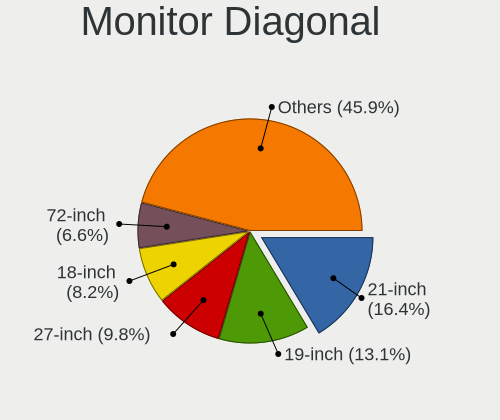

| Inches  | Desktops | Percent |
|---------|----------|---------|
| 21      | 10       | 16.39%  |
| 19      | 8        | 13.11%  |
| 27      | 6        | 9.84%   |
| 18      | 5        | 8.2%    |
| 72      | 4        | 6.56%   |
| 24      | 4        | 6.56%   |
| 23      | 4        | 6.56%   |
| 22      | 4        | 6.56%   |
| 17      | 4        | 6.56%   |
| 20      | 3        | 4.92%   |
| 15      | 2        | 3.28%   |
| Unknown | 2        | 3.28%   |
| 142     | 1        | 1.64%   |
| 84      | 1        | 1.64%   |
| 54      | 1        | 1.64%   |
| 46      | 1        | 1.64%   |
| 42      | 1        | 1.64%   |

Monitor Width
-------------

Physical width

| Width in mm    | Desktops | Percent |
|----------------|----------|---------|
| 401-500        | 21       | 37.5%   |
| 501-600        | 14       | 25%     |
| 301-350        | 6        | 10.71%  |
| 1501-2000      | 5        | 8.93%   |
| 351-400        | 4        | 7.14%   |
| 1001-1500      | 2        | 3.57%   |
| Unknown        | 2        | 3.57%   |
| More than 2000 | 1        | 1.79%   |
| 901-1000       | 1        | 1.79%   |

Aspect Ratio
------------

Proportional relationship between the width and the height

| Ratio   | Desktops | Percent |
|---------|----------|---------|
| 16/9    | 36       | 62.07%  |
| 16/10   | 10       | 17.24%  |
| 5/4     | 8        | 13.79%  |
| Unknown | 2        | 3.45%   |
| 4/3     | 1        | 1.72%   |
| 1.00    | 1        | 1.72%   |

Monitor Area
------------

Area in inch

| Area in inch | Desktops | Percent |
|----------------|----------|---------|
| 201-250        | 15       | 25.42%  |
| 151-200        | 14       | 23.73%  |
| 141-150        | 8        | 13.56%  |
| More than 1000 | 7        | 11.86%  |
| 301-350        | 6        | 10.17%  |
| 251-300        | 3        | 5.08%   |
| 101-110        | 2        | 3.39%   |
| 501-1000       | 2        | 3.39%   |
| Unknown        | 2        | 3.39%   |

Pixel Density
-------------

Pixels per inch

| Density | Desktops | Percent |
|---------|----------|---------|
| 51-100  | 33       | 60%     |
| 101-120 | 13       | 23.64%  |
| 1-50    | 6        | 10.91%  |
| Unknown | 2        | 3.64%   |
| 161-240 | 1        | 1.82%   |

Multiple Monitors
-----------------

Total monitors connected

| Total | Desktops | Percent |
|-------|----------|---------|
| 1     | 39       | 67.24%  |
| 2     | 14       | 24.14%  |
| 0     | 5        | 8.62%   |

Network
-------

Net Controller Vendor
---------------------

Controller vendors

| Vendor                | Desktops | Percent |
|-----------------------|----------|---------|
| Intel                 | 31       | 34.07%  |
| Realtek Semiconductor | 30       | 32.97%  |
| Broadcom Limited      | 6        | 6.59%   |
| MediaTek              | 5        | 5.49%   |
| Broadcom              | 4        | 4.4%    |
| Xiaomi                | 3        | 3.3%    |
| Qualcomm Atheros      | 3        | 3.3%    |
| Samsung Electronics   | 2        | 2.2%    |
| OPPO Electronics      | 2        | 2.2%    |
| VIA Technologies      | 1        | 1.1%    |
| Ralink Technology     | 1        | 1.1%    |
| Qualcomm              | 1        | 1.1%    |
| Huawei Technologies   | 1        | 1.1%    |
| Hewlett-Packard       | 1        | 1.1%    |

Net Controller Model
--------------------

Controller models

| Model                                                                  | Desktops | Percent |
|------------------------------------------------------------------------|----------|---------|
| Realtek RTL8111/8168/8211/8411 PCI Express Gigabit Ethernet Controller | 17       | 16.35%  |
| Realtek RTL8188EUS 802.11n Wireless Network Adapter                    | 9        | 8.65%   |
| Intel 82579LM Gigabit Network Connection (Lewisville)                  | 9        | 8.65%   |
| Realtek RTL8188FTV 802.11b/g/n 1T1R 2.4G WLAN Adapter                  | 7        | 6.73%   |
| MediaTek Infinix SMART 5                                               | 5        | 4.81%   |
| Intel Ethernet Connection I217-LM                                      | 4        | 3.85%   |
| Broadcom Limited NetXtreme BCM5751 Gigabit Ethernet PCI Express        | 4        | 3.85%   |
| Intel I211 Gigabit Network Connection                                  | 3        | 2.88%   |
| Xiaomi Mi/Redmi series (RNDIS)                                         | 2        | 1.92%   |
| Samsung Galaxy series, misc. (tethering mode)                          | 2        | 1.92%   |
| OPPO OnePlus Nord 4                                                    | 2        | 1.92%   |
| Intel Wi-Fi 6 AX200                                                    | 2        | 1.92%   |
| Intel Ethernet Controller I225-V                                       | 2        | 1.92%   |
| Intel Alder Lake-S PCH CNVi WiFi                                       | 2        | 1.92%   |
| Intel 82567LM-3 Gigabit Network Connection                             | 2        | 1.92%   |
| Intel 82566DM-2 Gigabit Network Connection                             | 2        | 1.92%   |
| Xiaomi Mi/Redmi series (RNDIS + ADB)                                   | 1        | 0.96%   |
| VIA VT6102/VT6103 [Rhine-II]                                           | 1        | 0.96%   |
| Realtek RTL8822CE 802.11ac PCIe Wireless Network Adapter               | 1        | 0.96%   |
| Realtek RTL8821CE 802.11ac PCIe Wireless Network Adapter               | 1        | 0.96%   |
| Realtek RTL8188CUS 802.11n WLAN Adapter                                | 1        | 0.96%   |
| Realtek RTL8153 Gigabit Ethernet Adapter                               | 1        | 0.96%   |
| Ralink RT2870/RT3070 Wireless Adapter                                  | 1        | 0.96%   |
| Qualcomm POCO F3                                                       | 1        | 0.96%   |
| Qualcomm Atheros AR928X Wireless Network Adapter (PCI-Express)         | 1        | 0.96%   |
| Qualcomm Atheros AR9227 Wireless Network Adapter                       | 1        | 0.96%   |
| Qualcomm Atheros AR8161 Gigabit Ethernet                               | 1        | 0.96%   |
| Intel Wireless 8265 / 8275                                             | 1        | 0.96%   |
| Intel Wi-Fi 5(802.11ac) Wireless-AC 9x6x [Thunder Peak]                | 1        | 0.96%   |
| Intel NM10/ICH7 Family LAN Controller                                  | 1        | 0.96%   |
| Intel Ethernet Connection (7) I219-LM                                  | 1        | 0.96%   |
| Intel Ethernet Connection (5) I219-V                                   | 1        | 0.96%   |
| Intel Ethernet Connection (5) I219-LM                                  | 1        | 0.96%   |
| Intel Ethernet Connection (2) I219-V                                   | 1        | 0.96%   |
| Intel 82578DM Gigabit Network Connection                               | 1        | 0.96%   |
| Intel 82576 Gigabit Network Connection                                 | 1        | 0.96%   |
| Intel 82567V-4 Gigabit Network Connection                              | 1        | 0.96%   |
| Intel 82566DC Gigabit Network Connection                               | 1        | 0.96%   |
| Huawei Mass Storage                                                    | 1        | 0.96%   |
| HP HP L2311c LAN7500 Ethernet                                          | 1        | 0.96%   |

Wireless Vendor
---------------

Wireless vendors

| Vendor                | Desktops | Percent |
|-----------------------|----------|---------|
| Realtek Semiconductor | 19       | 65.52%  |
| Intel                 | 6        | 20.69%  |
| Qualcomm Atheros      | 2        | 6.9%    |
| Ralink Technology     | 1        | 3.45%   |
| Broadcom              | 1        | 3.45%   |

Wireless Model
--------------

Wireless models

| Model                                                          | Desktops | Percent |
|----------------------------------------------------------------|----------|---------|
| Realtek RTL8188EUS 802.11n Wireless Network Adapter            | 9        | 31.03%  |
| Realtek RTL8188FTV 802.11b/g/n 1T1R 2.4G WLAN Adapter          | 7        | 24.14%  |
| Intel Wi-Fi 6 AX200                                            | 2        | 6.9%    |
| Intel Alder Lake-S PCH CNVi WiFi                               | 2        | 6.9%    |
| Realtek RTL8822CE 802.11ac PCIe Wireless Network Adapter       | 1        | 3.45%   |
| Realtek RTL8821CE 802.11ac PCIe Wireless Network Adapter       | 1        | 3.45%   |
| Realtek RTL8188CUS 802.11n WLAN Adapter                        | 1        | 3.45%   |
| Ralink RT2870/RT3070 Wireless Adapter                          | 1        | 3.45%   |
| Qualcomm Atheros AR928X Wireless Network Adapter (PCI-Express) | 1        | 3.45%   |
| Qualcomm Atheros AR9227 Wireless Network Adapter               | 1        | 3.45%   |
| Intel Wireless 8265 / 8275                                     | 1        | 3.45%   |
| Intel Wi-Fi 5(802.11ac) Wireless-AC 9x6x [Thunder Peak]        | 1        | 3.45%   |
| Broadcom BCM4360 802.11ac Dual Band Wireless Network Adapter   | 1        | 3.45%   |

Ethernet Vendor
---------------

Ethernet vendors

| Vendor                | Desktops | Percent |
|-----------------------|----------|---------|
| Intel                 | 31       | 42.47%  |
| Realtek Semiconductor | 17       | 23.29%  |
| Broadcom Limited      | 6        | 8.22%   |
| MediaTek              | 5        | 6.85%   |
| Xiaomi                | 3        | 4.11%   |
| Broadcom              | 3        | 4.11%   |
| Samsung Electronics   | 2        | 2.74%   |
| OPPO Electronics      | 2        | 2.74%   |
| VIA Technologies      | 1        | 1.37%   |
| Qualcomm Atheros      | 1        | 1.37%   |
| Qualcomm              | 1        | 1.37%   |
| Hewlett-Packard       | 1        | 1.37%   |

Ethernet Model
--------------

Ethernet models

| Model                                                                  | Desktops | Percent |
|------------------------------------------------------------------------|----------|---------|
| Realtek RTL8111/8168/8211/8411 PCI Express Gigabit Ethernet Controller | 17       | 22.97%  |
| Intel 82579LM Gigabit Network Connection (Lewisville)                  | 9        | 12.16%  |
| MediaTek Infinix SMART 5                                               | 5        | 6.76%   |
| Intel Ethernet Connection I217-LM                                      | 4        | 5.41%   |
| Broadcom Limited NetXtreme BCM5751 Gigabit Ethernet PCI Express        | 4        | 5.41%   |
| Intel I211 Gigabit Network Connection                                  | 3        | 4.05%   |
| Xiaomi Mi/Redmi series (RNDIS)                                         | 2        | 2.7%    |
| Samsung Galaxy series, misc. (tethering mode)                          | 2        | 2.7%    |
| OPPO OnePlus Nord 4                                                    | 2        | 2.7%    |
| Intel Ethernet Controller I225-V                                       | 2        | 2.7%    |
| Intel 82567LM-3 Gigabit Network Connection                             | 2        | 2.7%    |
| Intel 82566DM-2 Gigabit Network Connection                             | 2        | 2.7%    |
| Xiaomi Mi/Redmi series (RNDIS + ADB)                                   | 1        | 1.35%   |
| VIA VT6102/VT6103 [Rhine-II]                                           | 1        | 1.35%   |
| Realtek RTL8153 Gigabit Ethernet Adapter                               | 1        | 1.35%   |
| Qualcomm POCO F3                                                       | 1        | 1.35%   |
| Qualcomm Atheros AR8161 Gigabit Ethernet                               | 1        | 1.35%   |
| Intel NM10/ICH7 Family LAN Controller                                  | 1        | 1.35%   |
| Intel Ethernet Connection (7) I219-LM                                  | 1        | 1.35%   |
| Intel Ethernet Connection (5) I219-V                                   | 1        | 1.35%   |
| Intel Ethernet Connection (5) I219-LM                                  | 1        | 1.35%   |
| Intel Ethernet Connection (2) I219-V                                   | 1        | 1.35%   |
| Intel 82578DM Gigabit Network Connection                               | 1        | 1.35%   |
| Intel 82576 Gigabit Network Connection                                 | 1        | 1.35%   |
| Intel 82567V-4 Gigabit Network Connection                              | 1        | 1.35%   |
| Intel 82566DC Gigabit Network Connection                               | 1        | 1.35%   |
| HP HP L2311c LAN7500 Ethernet                                          | 1        | 1.35%   |
| Broadcom NetXtreme BCM5764M Gigabit Ethernet PCIe                      | 1        | 1.35%   |
| Broadcom NetXtreme BCM5761 Gigabit Ethernet PCIe                       | 1        | 1.35%   |
| Broadcom NetLink BCM57780 Gigabit Ethernet PCIe                        | 1        | 1.35%   |
| Broadcom Limited NetXtreme BCM5755 Gigabit Ethernet PCI Express        | 1        | 1.35%   |
| Broadcom Limited NetXtreme BCM5752 Gigabit Ethernet PCI Express        | 1        | 1.35%   |

Net Controller Kind
-------------------

Ethernet, WiFi or modem

| Kind     | Desktops | Percent |
|----------|----------|---------|
| Ethernet | 56       | 65.88%  |
| WiFi     | 28       | 32.94%  |
| Modem    | 1        | 1.18%   |

Used Controller
---------------

Currently used network controller

| Kind     | Desktops | Percent |
|----------|----------|---------|
| Ethernet | 37       | 69.81%  |
| WiFi     | 16       | 30.19%  |

NICs
----

Total network controllers on board

| Total | Desktops | Percent |
|-------|----------|---------|
| 1     | 41       | 71.93%  |
| 2     | 13       | 22.81%  |
| 4     | 1        | 1.75%   |
| 3     | 1        | 1.75%   |
| 0     | 1        | 1.75%   |

IPv6
----

IPv6 vs IPv4

| Used | Desktops | Percent |
|------|----------|---------|
| No   | 54       | 94.74%  |
| Yes  | 3        | 5.26%   |

Bluetooth
---------

Bluetooth Vendor
----------------

Controller vendors

| Vendor                  | Desktops | Percent |
|-------------------------|----------|---------|
| Intel                   | 6        | 54.55%  |
| Cambridge Silicon Radio | 3        | 27.27%  |
| Realtek Semiconductor   | 2        | 18.18%  |

Bluetooth Model
---------------

Controller models

| Model                                               | Desktops | Percent |
|-----------------------------------------------------|----------|---------|
| Cambridge Silicon Radio Bluetooth Dongle (HCI mode) | 3        | 27.27%  |
| Intel AX211 Bluetooth                               | 2        | 18.18%  |
| Intel AX200 Bluetooth                               | 2        | 18.18%  |
| Realtek  Bluetooth 4.2 Adapter                      | 1        | 9.09%   |
| Realtek Bluetooth Radio                             | 1        | 9.09%   |
| Intel Wireless-AC 9260 Bluetooth Adapter            | 1        | 9.09%   |
| Intel Bluetooth wireless interface                  | 1        | 9.09%   |

Sound
-----

Sound Vendor
------------

Sound card vendors

| Vendor                   | Desktops | Percent |
|--------------------------|----------|---------|
| Intel                    | 46       | 52.27%  |
| Nvidia                   | 17       | 19.32%  |
| AMD                      | 13       | 14.77%  |
| Texas Instruments        | 2        | 2.27%   |
| Micro Star International | 2        | 2.27%   |
| Lenovo                   | 2        | 2.27%   |
| C-Media Electronics      | 2        | 2.27%   |
| Medeli Electronics       | 1        | 1.14%   |
| JMTek                    | 1        | 1.14%   |
| Giga-Byte Technology     | 1        | 1.14%   |
| Generalplus Technology   | 1        | 1.14%   |

Sound Model
-----------

Sound card models

| Model                                                                      | Desktops | Percent |
|----------------------------------------------------------------------------|----------|---------|
| Intel 7 Series/C216 Chipset Family High Definition Audio Controller        | 7        | 7.14%   |
| Intel Xeon E3-1200 v3/4th Gen Core Processor HD Audio Controller           | 6        | 6.12%   |
| Intel 8 Series/C220 Series Chipset High Definition Audio Controller        | 6        | 6.12%   |
| Intel 6 Series/C200 Series Chipset Family High Definition Audio Controller | 6        | 6.12%   |
| Nvidia GK208 HDMI/DP Audio Controller                                      | 5        | 5.1%    |
| AMD Ellesmere HDMI Audio [Radeon RX 470/480 / 570/580/590]                 | 5        | 5.1%    |
| AMD Family 17h (Models 00h-0fh) HD Audio Controller                        | 4        | 4.08%   |
| Nvidia High Definition Audio Controller                                    | 3        | 3.06%   |
| Intel NM10/ICH7 Family High Definition Audio Controller                    | 3        | 3.06%   |
| Intel Alder Lake-S HD Audio Controller                                     | 3        | 3.06%   |
| Intel 82801I (ICH9 Family) HD Audio Controller                             | 3        | 3.06%   |
| Intel 82801FB/FBM/FR/FW/FRW (ICH6 Family) AC'97 Audio Controller           | 3        | 3.06%   |
| Intel 200 Series PCH HD Audio                                              | 3        | 3.06%   |
| Texas Instruments PCM2902 Audio Codec                                      | 2        | 2.04%   |
| Nvidia GM107 High Definition Audio Controller [GeForce 940MX]              | 2        | 2.04%   |
| Micro Star International USB Audio                                         | 2        | 2.04%   |
| Lenovo T2224zD                                                             | 2        | 2.04%   |
| Intel Cannon Lake PCH cAVS                                                 | 2        | 2.04%   |
| Intel 82801JD/DO (ICH10 Family) HD Audio Controller                        | 2        | 2.04%   |
| Intel 100 Series/C230 Series Chipset Family HD Audio Controller            | 2        | 2.04%   |
| AMD Starship/Matisse HD Audio Controller                                   | 2        | 2.04%   |
| AMD Oland/Hainan/Cape Verde/Pitcairn HDMI Audio [Radeon HD 7000 Series]    | 2        | 2.04%   |
| AMD Cedar HDMI Audio [Radeon HD 5400/6300/7300 Series]                     | 2        | 2.04%   |
| Nvidia GP107GL High Definition Audio Controller                            | 1        | 1.02%   |
| Nvidia GK107 HDMI Audio Controller                                         | 1        | 1.02%   |
| Nvidia GK104 HDMI Audio Controller                                         | 1        | 1.02%   |
| Nvidia GF119 HDMI Audio Controller                                         | 1        | 1.02%   |
| Nvidia GF108 High Definition Audio Controller                              | 1        | 1.02%   |
| Nvidia GA106 High Definition Audio Controller                              | 1        | 1.02%   |
| Nvidia GA102 High Definition Audio Controller                              | 1        | 1.02%   |
| Medeli Electronics USB Audio Device                                        | 1        | 1.02%   |
| JMTek USB PnP Audio Device                                                 | 1        | 1.02%   |
| Intel Elkhart Lake High Density Audio bus interface                        | 1        | 1.02%   |
| Intel C610/X99 series chipset HD Audio Controller                          | 1        | 1.02%   |
| Intel 82801JI (ICH10 Family) HD Audio Controller                           | 1        | 1.02%   |
| Intel 82801H (ICH8 Family) HD Audio Controller                             | 1        | 1.02%   |
| Intel 82801G (ICH7 Family) AC'97 Audio Controller                          | 1        | 1.02%   |
| Intel 5 Series/3400 Series Chipset High Definition Audio                   | 1        | 1.02%   |
| Giga-Byte Technology USB Audio                                             | 1        | 1.02%   |
| Generalplus Technology USB Audio Device                                    | 1        | 1.02%   |

Memory
------

Memory Vendor
-------------

Memory module vendors

| Vendor              | Desktops | Percent |
|---------------------|----------|---------|
| SK hynix            | 9        | 23.08%  |
| Samsung Electronics | 6        | 15.38%  |
| Kingston            | 6        | 15.38%  |
| Crucial             | 6        | 15.38%  |
| Micron Technology   | 4        | 10.26%  |
| G.Skill             | 2        | 5.13%   |
| Unknown             | 1        | 2.56%   |
| TwinMOS             | 1        | 2.56%   |
| Transcend           | 1        | 2.56%   |
| Team                | 1        | 2.56%   |
| Ramaxel Technology  | 1        | 2.56%   |
| Corsair             | 1        | 2.56%   |

Memory Model
------------

Memory module models

| Model                                                      | Desktops | Percent |
|------------------------------------------------------------|----------|---------|
| SK hynix RAM HMT451U6BFR8A-PB 4GB DIMM DDR3 1600MT/s       | 2        | 4.65%   |
| Samsung RAM M378B1G73EB0-CK0 8GB DIMM DDR3 1600MT/s        | 2        | 4.65%   |
| G.Skill RAM F4-3200C16-16GVK 16GB DIMM DDR4 3600MT/s       | 2        | 4.65%   |
| Unknown RAM Module 1GB DIMM DDR 333MT/s                    | 1        | 2.33%   |
| TwinMOS RAM 9DECBNZB-TATP 4GB DIMM DDR3 1333MT/s           | 1        | 2.33%   |
| TwinMOS RAM 9DECBMZB-TATP 2048MB DIMM DDR3 1333MT/s        | 1        | 2.33%   |
| Transcend RAM Module 32GB DIMM DDR4 2667MT/s               | 1        | 2.33%   |
| Team RAM TEAMGROUP-UD4-3200 8GB DIMM DDR4 3800MT/s         | 1        | 2.33%   |
| SK hynix RAM HMT451U6BFR8C-PB 4GB DIMM DDR3 1600MT/s       | 1        | 2.33%   |
| SK hynix RAM HMT451U6AFR8C-PB 4GB DIMM DDR3 1600MT/s       | 1        | 2.33%   |
| SK hynix RAM HMT41GU6BFR8A-PB 8GB DIMM DDR3 1600MT/s       | 1        | 2.33%   |
| SK hynix RAM HMT351U6EFR8C-PB 4GB DIMM DDR3 1600MT/s       | 1        | 2.33%   |
| SK hynix RAM HMT125U7BFR8C-H9 2GB DIMM DDR3 1333MT/s       | 1        | 2.33%   |
| SK hynix RAM HMT125U6TFR8C-H9 2GB DIMM 1333MT/s            | 1        | 2.33%   |
| SK hynix RAM HMA81GU6CJR8N-VK 8GB DIMM DDR4 2667MT/s       | 1        | 2.33%   |
| SK hynix RAM HMA81GS6AFR8N-UH 8GB SODIMM DDR4 2667MT/s     | 1        | 2.33%   |
| SK hynix RAM HMA41GU6AFR8N-TF 8GB DIMM DDR4 2465MT/s       | 1        | 2.33%   |
| Samsung RAM Module 8GB DIMM DDR4 2666MT/s                  | 1        | 2.33%   |
| Samsung RAM M378B5673FH0-CH9 2GB DIMM DDR3 1600MT/s        | 1        | 2.33%   |
| Samsung RAM M378B5273DH0-CH9 4GB DIMM DDR3 2133MT/s        | 1        | 2.33%   |
| Samsung RAM M378B5273CH0-CK0 4GB DIMM DDR3 2000MT/s        | 1        | 2.33%   |
| Ramaxel RAM RMUA5110MD78HAF-2666 8192MB DIMM DDR4 2667MT/s | 1        | 2.33%   |
| Micron RAM BLS4G3D1609DS1S00. 4GB DIMM DDR3 1600MT/s       | 1        | 2.33%   |
| Micron RAM 8JTF51264AZ-1G6E1 4GB DIMM 1600MT/s             | 1        | 2.33%   |
| Micron RAM 16KTF51264AZ-1G6M1 4GB DIMM DDR3 1600MT/s       | 1        | 2.33%   |
| Micron RAM 16JTF51264AZ-1G6M1 4GB DIMM DDR3 1600MT/s       | 1        | 2.33%   |
| Kingston RAM Module 2GB DIMM DDR2 533MT/s                  | 1        | 2.33%   |
| Kingston RAM KHX1600C10D3/8G 8GB DIMM DDR3 1600MT/s        | 1        | 2.33%   |
| Kingston RAM K 2GB DIMM DDR 667MT/s                        | 1        | 2.33%   |
| Kingston RAM HP497157-D88-ELFW 2GB DIMM DDR3 1333MT/s      | 1        | 2.33%   |
| Kingston RAM 99P5663-013.A00G 8GB SODIMM DDR4 2667MT/s     | 1        | 2.33%   |
| Kingston RAM 9905734-102.A00G 32GB DIMM DDR4 3200MT/s      | 1        | 2.33%   |
| Kingston RAM 2G-UDIMM 2048MB DIMM DDR2 1639MT/s            | 1        | 2.33%   |
| Crucial RAM CT51264BD160B.C16F 4GB DIMM DDR3 1600MT/s      | 1        | 2.33%   |
| Crucial RAM CT51264BA160BJ.M8F 4096MB DIMM DDR3 1600MT/s   | 1        | 2.33%   |
| Crucial RAM CT12864Z40B.K16T 1GB DIMM DDR 400MT/s          | 1        | 2.33%   |
| Crucial RAM CT102464BD160B.M16 8GB DIMM DDR3 1600MT/s      | 1        | 2.33%   |
| Crucial RAM CB16GU2666.C8ET 16GB DIMM DDR4 2667MT/s        | 1        | 2.33%   |
| Crucial RAM CB16GU2400.C16J 16384MB DIMM DDR4 2400MT/s     | 1        | 2.33%   |
| Corsair RAM CMK32GX5M2B5600C36 16GB DIMM DDR5 5800MT/s     | 1        | 2.33%   |

Memory Kind
-----------

Memory module kinds

| Kind  | Desktops | Percent |
|-------|----------|---------|
| DDR3  | 13       | 41.94%  |
| DDR4  | 11       | 35.48%  |
| SDRAM | 4        | 12.9%   |
| DDR5  | 1        | 3.23%   |
| DDR2  | 1        | 3.23%   |
| DDR   | 1        | 3.23%   |

Memory Form Factor
------------------

Physical design of the memory module

| Name   | Desktops | Percent |
|--------|----------|---------|
| DIMM   | 25       | 92.59%  |
| SODIMM | 2        | 7.41%   |

Memory Size
-----------

Memory module size

| Size  | Desktops | Percent |
|-------|----------|---------|
| 8192  | 10       | 31.25%  |
| 4096  | 8        | 25%     |
| 16384 | 5        | 15.63%  |
| 2048  | 5        | 15.63%  |
| 32768 | 3        | 9.38%   |
| 1024  | 1        | 3.13%   |

Memory Speed
------------

Memory module speed

| Speed | Desktops | Percent |
|-------|----------|---------|
| 1600  | 9        | 25.71%  |
| 2667  | 5        | 14.29%  |
| 1333  | 3        | 8.57%   |
| 3600  | 2        | 5.71%   |
| 5800  | 1        | 2.86%   |
| 3800  | 1        | 2.86%   |
| 3200  | 1        | 2.86%   |
| 2666  | 1        | 2.86%   |
| 2465  | 1        | 2.86%   |
| 2400  | 1        | 2.86%   |
| 2133  | 1        | 2.86%   |
| 2000  | 1        | 2.86%   |
| 1867  | 1        | 2.86%   |
| 1800  | 1        | 2.86%   |
| 1648  | 1        | 2.86%   |
| 1639  | 1        | 2.86%   |
| 667   | 1        | 2.86%   |
| 533   | 1        | 2.86%   |
| 400   | 1        | 2.86%   |
| 333   | 1        | 2.86%   |

Printers & scanners
-------------------

Printer Vendor
--------------

Printer device vendors

| Vendor          | Desktops | Percent |
|-----------------|----------|---------|
| Hewlett-Packard | 1        | 100%    |

Printer Model
-------------

Printer device models

| Model                 | Desktops | Percent |
|-----------------------|----------|---------|
| HP LaserJet M101-M106 | 1        | 100%    |

Scanner Vendor
--------------

Scanner device vendors

Zero info for selected period =(

Scanner Model
-------------

Scanner device models

Zero info for selected period =(

Camera
------

Camera Vendor
-------------

Camera device vendors

| Vendor                | Desktops | Percent |
|-----------------------|----------|---------|
| Realtek Semiconductor | 2        | 25%     |
| Chicony Electronics   | 2        | 25%     |
| MacroSilicon          | 1        | 12.5%   |
| Logitech              | 1        | 12.5%   |
| Cubeternet            | 1        | 12.5%   |
| Alcor Micro           | 1        | 12.5%   |

Camera Model
------------

Camera device models

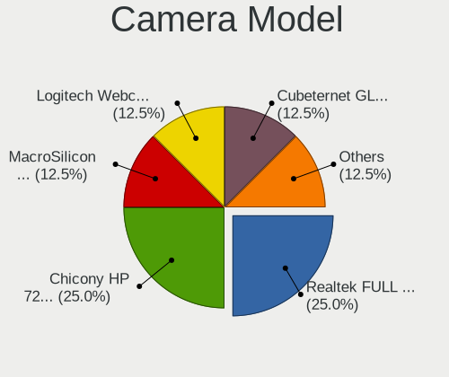

| Model                             | Desktops | Percent |
|-----------------------------------|----------|---------|
| Realtek FULL HD 1080P Webcam      | 2        | 25%     |
| Chicony HP 720p HD Monitor Webcam | 2        | 25%     |
| MacroSilicon USB Video            | 1        | 12.5%   |
| Logitech Webcam C270              | 1        | 12.5%   |
| Cubeternet GL-UPC822 UVC WebCam   | 1        | 12.5%   |
| Alcor Micro USB 2.0 PC Camera     | 1        | 12.5%   |

Security
--------

Fingerprint Vendor
------------------

Fingerprint sensor vendors

Zero info for selected period =(

Fingerprint Model
-----------------

Fingerprint sensor models

Zero info for selected period =(

Chipcard Vendor
---------------

Chipcard module vendors

Zero info for selected period =(

Chipcard Model
--------------

Chipcard module models

Zero info for selected period =(

Unsupported
-----------

Unsupported Devices
-------------------

Total unsupported devices on board

| Total | Desktops | Percent |
|-------|----------|---------|
| 0     | 46       | 80.7%   |
| 1     | 10       | 17.54%  |
| 2     | 1        | 1.75%   |

Unsupported Device Types
------------------------

Types of unsupported devices

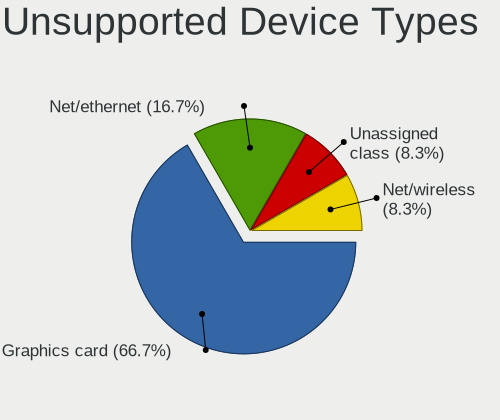

| Type             | Desktops | Percent |
|------------------|----------|---------|
| Graphics card    | 8        | 66.67%  |
| Net/ethernet     | 2        | 16.67%  |
| Unassigned class | 1        | 8.33%   |
| Net/wireless     | 1        | 8.33%   |

