Linux in Kenya - Tested Hardware & Statistics (Notebooks)
---------------------------------------------------------

A project to collect tested hardware configurations for Linux in Kenya.

Anyone can contribute to this report by the [hw-probe](https://github.com/linuxhw/hw-probe) tool:

    sudo -E hw-probe -all -upload

Please contribute! Especially if your hardware is rare.

Contents
--------

* [ Test Cases ](#test-cases)

* [ System ](#system)
  - [ OS                       ](#os)
  - [ OS Family                ](#os-family)
  - [ Kernel                   ](#kernel)
  - [ Kernel Family            ](#kernel-family)
  - [ Kernel Major Ver.        ](#kernel-major-ver)
  - [ Arch                     ](#arch)
  - [ DE                       ](#de)
  - [ Display Server           ](#display-server)
  - [ Display Manager          ](#display-manager)
  - [ OS Lang                  ](#os-lang)
  - [ Boot Mode                ](#boot-mode)
  - [ Filesystem               ](#filesystem)
  - [ Part. scheme             ](#part-scheme)
  - [ Dual Boot with Linux/BSD ](#dual-boot-with-linuxbsd)
  - [ Dual Boot (Win)          ](#dual-boot-win)

* [ Board ](#board)
  - [ Vendor                   ](#vendor)
  - [ Model                    ](#model)
  - [ Model Family             ](#model-family)
  - [ MFG Year                 ](#mfg-year)
  - [ Form Factor              ](#form-factor)
  - [ Secure Boot              ](#secure-boot)
  - [ Coreboot                 ](#coreboot)
  - [ RAM Size                 ](#ram-size)
  - [ RAM Used                 ](#ram-used)
  - [ Total Drives             ](#total-drives)
  - [ Has CD-ROM               ](#has-cd-rom)
  - [ Has Ethernet             ](#has-ethernet)
  - [ Has WiFi                 ](#has-wifi)
  - [ Has Bluetooth            ](#has-bluetooth)

* [ Location ](#location)
  - [ Country                  ](#country)
  - [ City                     ](#city)

* [ Drives ](#drives)
  - [ Drive Vendor             ](#drive-vendor)
  - [ Drive Model              ](#drive-model)
  - [ HDD Vendor               ](#hdd-vendor)
  - [ SSD Vendor               ](#ssd-vendor)
  - [ Drive Kind               ](#drive-kind)
  - [ Drive Connector          ](#drive-connector)
  - [ Drive Size               ](#drive-size)
  - [ Space Total              ](#space-total)
  - [ Space Used               ](#space-used)
  - [ Malfunc. Drives          ](#malfunc-drives)
  - [ Malfunc. Drive Vendor    ](#malfunc-drive-vendor)
  - [ Malfunc. HDD Vendor      ](#malfunc-hdd-vendor)
  - [ Malfunc. Drive Kind      ](#malfunc-drive-kind)
  - [ Failed Drives            ](#failed-drives)
  - [ Failed Drive Vendor      ](#failed-drive-vendor)
  - [ Drive Status             ](#drive-status)

* [ Storage controller ](#storage-controller)
  - [ Storage Vendor           ](#storage-vendor)
  - [ Storage Model            ](#storage-model)
  - [ Storage Kind             ](#storage-kind)

* [ Processor ](#processor)
  - [ CPU Vendor               ](#cpu-vendor)
  - [ CPU Model                ](#cpu-model)
  - [ CPU Model Family         ](#cpu-model-family)
  - [ CPU Cores                ](#cpu-cores)
  - [ CPU Sockets              ](#cpu-sockets)
  - [ CPU Threads              ](#cpu-threads)
  - [ CPU Op-Modes             ](#cpu-op-modes)
  - [ CPU Microcode            ](#cpu-microcode)
  - [ CPU Microarch            ](#cpu-microarch)

* [ Graphics ](#graphics)
  - [ GPU Vendor               ](#gpu-vendor)
  - [ GPU Model                ](#gpu-model)
  - [ GPU Combo                ](#gpu-combo)
  - [ GPU Driver               ](#gpu-driver)
  - [ GPU Memory               ](#gpu-memory)

* [ Monitor ](#monitor)
  - [ Monitor Vendor           ](#monitor-vendor)
  - [ Monitor Model            ](#monitor-model)
  - [ Monitor Resolution       ](#monitor-resolution)
  - [ Monitor Diagonal         ](#monitor-diagonal)
  - [ Monitor Width            ](#monitor-width)
  - [ Aspect Ratio             ](#aspect-ratio)
  - [ Monitor Area             ](#monitor-area)
  - [ Pixel Density            ](#pixel-density)
  - [ Multiple Monitors        ](#multiple-monitors)

* [ Network ](#network)
  - [ Net Controller Vendor    ](#net-controller-vendor)
  - [ Net Controller Model     ](#net-controller-model)
  - [ Wireless Vendor          ](#wireless-vendor)
  - [ Wireless Model           ](#wireless-model)
  - [ Ethernet Vendor          ](#ethernet-vendor)
  - [ Ethernet Model           ](#ethernet-model)
  - [ Net Controller Kind      ](#net-controller-kind)
  - [ Used Controller          ](#used-controller)
  - [ NICs                     ](#nics)
  - [ IPv6                     ](#ipv6)

* [ Bluetooth ](#bluetooth)
  - [ Bluetooth Vendor         ](#bluetooth-vendor)
  - [ Bluetooth Model          ](#bluetooth-model)

* [ Sound ](#sound)
  - [ Sound Vendor             ](#sound-vendor)
  - [ Sound Model              ](#sound-model)

* [ Memory ](#memory)
  - [ Memory Vendor            ](#memory-vendor)
  - [ Memory Model             ](#memory-model)
  - [ Memory Kind              ](#memory-kind)
  - [ Memory Form Factor       ](#memory-form-factor)
  - [ Memory Size              ](#memory-size)
  - [ Memory Speed             ](#memory-speed)

* [ Printers & scanners ](#printers--scanners)
  - [ Printer Vendor           ](#printer-vendor)
  - [ Printer Model            ](#printer-model)
  - [ Scanner Vendor           ](#scanner-vendor)
  - [ Scanner Model            ](#scanner-model)

* [ Camera ](#camera)
  - [ Camera Vendor            ](#camera-vendor)
  - [ Camera Model             ](#camera-model)

* [ Security ](#security)
  - [ Fingerprint Vendor       ](#fingerprint-vendor)
  - [ Fingerprint Model        ](#fingerprint-model)
  - [ Chipcard Vendor          ](#chipcard-vendor)
  - [ Chipcard Model           ](#chipcard-model)

* [ Unsupported ](#unsupported)
  - [ Unsupported Devices      ](#unsupported-devices)
  - [ Unsupported Device Types ](#unsupported-device-types)

Test Cases
----------

Total: 429

| Vendor        | Model                       | Probe                                                      | Date         |
|---------------|-----------------------------|------------------------------------------------------------|--------------|
| HP            | EliteBook 840 G5            | [6cc9c29ba1](https://linux-hardware.org/?probe=6cc9c29ba1) | Dec 30, 2025 |
| HP            | EliteBook 840 G5            | [b50814f0fe](https://linux-hardware.org/?probe=b50814f0fe) | Dec 30, 2025 |
| HP            | ProBook 4540s               | [efe3c0406d](https://linux-hardware.org/?probe=efe3c0406d) | Dec 27, 2025 |
| Dell          | Latitude 3510               | [870c170439](https://linux-hardware.org/?probe=870c170439) | Nov 26, 2025 |
| Lenovo        | ThinkPad X1 Carbon Gen 9... | [54225e4f3f](https://linux-hardware.org/?probe=54225e4f3f) | Nov 22, 2025 |
| Lenovo        | ThinkPad X1 Carbon Gen 9... | [df2324b246](https://linux-hardware.org/?probe=df2324b246) | Oct 18, 2025 |
| Lenovo        | IdeaPad 3 14IIL05 81WD      | [5b23458051](https://linux-hardware.org/?probe=5b23458051) | Sep 28, 2025 |
| Dell          | Vostro 3420                 | [26cbd343be](https://linux-hardware.org/?probe=26cbd343be) | Sep 25, 2025 |
| HP            | ENVY Laptop 16-h0xxx        | [f181067304](https://linux-hardware.org/?probe=f181067304) | Sep 09, 2025 |
| Dell          | Latitude 7280               | [0ec6b0a54d](https://linux-hardware.org/?probe=0ec6b0a54d) | Aug 27, 2025 |
| Dell          | Latitude 7280               | [63529d09a8](https://linux-hardware.org/?probe=63529d09a8) | Aug 27, 2025 |
| HP            | 245 14 inch G10 Notebook... | [43d5b2db82](https://linux-hardware.org/?probe=43d5b2db82) | Aug 17, 2025 |
| HP            | EliteBook 840 G1            | [dd3aa85220](https://linux-hardware.org/?probe=dd3aa85220) | Jul 22, 2025 |
| Dell          | Precision 5530              | [9c04b30b38](https://linux-hardware.org/?probe=9c04b30b38) | Jul 17, 2025 |
| HP            | EliteBook 8440p             | [977e01cfb6](https://linux-hardware.org/?probe=977e01cfb6) | Jul 14, 2025 |
| Dell          | Latitude E6400              | [a32c34ab17](https://linux-hardware.org/?probe=a32c34ab17) | Jul 09, 2025 |
| Dell          | Latitude E6400              | [62a8583a23](https://linux-hardware.org/?probe=62a8583a23) | Jul 09, 2025 |
| HP            | EliteBook 830 G6            | [f0b2c77a35](https://linux-hardware.org/?probe=f0b2c77a35) | Jun 25, 2025 |
| Lenovo        | ThinkPad T14s Gen 1 20UJ... | [57bdbc6c0a](https://linux-hardware.org/?probe=57bdbc6c0a) | Jun 20, 2025 |
| HP            | EliteBook 820 G3            | [7425928cb9](https://linux-hardware.org/?probe=7425928cb9) | Jun 16, 2025 |
| Dell          | G15 5530                    | [f91cfbf2c0](https://linux-hardware.org/?probe=f91cfbf2c0) | Jun 12, 2025 |
| Lenovo        | ThinkPad T440s 20ARS2980... | [fe6788baff](https://linux-hardware.org/?probe=fe6788baff) | Jun 02, 2025 |
| HP            | ENVY Laptop 16-h0xxx        | [ea01944914](https://linux-hardware.org/?probe=ea01944914) | May 25, 2025 |
| HP            | EliteBook Folio 9470m       | [f5080090c9](https://linux-hardware.org/?probe=f5080090c9) | May 17, 2025 |
| Lenovo        | ThinkPad T14s Gen 1 20UJ... | [57abebc292](https://linux-hardware.org/?probe=57abebc292) | May 16, 2025 |
| HP            | Notebook                    | [926c89d26a](https://linux-hardware.org/?probe=926c89d26a) | Apr 27, 2025 |
| HP            | ENVY Laptop 16-h0xxx        | [df0fce7dd7](https://linux-hardware.org/?probe=df0fce7dd7) | Apr 25, 2025 |
| Lenovo        | ThinkPad X1 Carbon Gen 9... | [611457c5a3](https://linux-hardware.org/?probe=611457c5a3) | Apr 24, 2025 |
| Dell          | XPS 9320                    | [210fd65a00](https://linux-hardware.org/?probe=210fd65a00) | Apr 08, 2025 |
| HP            | Laptop 15-bs1xx             | [6a462d107b](https://linux-hardware.org/?probe=6a462d107b) | Mar 19, 2025 |
| HP            | Laptop 15-bs1xx             | [638f91092d](https://linux-hardware.org/?probe=638f91092d) | Mar 19, 2025 |
| Apple         | MacBookPro12,1              | [816accfc42](https://linux-hardware.org/?probe=816accfc42) | Mar 06, 2025 |
| ASUSTek       | UX305CA                     | [97cda9f826](https://linux-hardware.org/?probe=97cda9f826) | Feb 28, 2025 |
| HP            | ENVY Laptop 16-h0xxx        | [4a0b4ecde1](https://linux-hardware.org/?probe=4a0b4ecde1) | Feb 16, 2025 |
| HP            | EliteBook 840 G6            | [5637a1738f](https://linux-hardware.org/?probe=5637a1738f) | Feb 13, 2025 |
| HP            | ProBook 440 G8 Notebook ... | [14d7214f50](https://linux-hardware.org/?probe=14d7214f50) | Feb 09, 2025 |
| HP            | EliteBook 840 G5            | [47ce128cf7](https://linux-hardware.org/?probe=47ce128cf7) | Jan 25, 2025 |
| Toshiba       | dynabook R73/H              | [8e9f89b0cf](https://linux-hardware.org/?probe=8e9f89b0cf) | Jan 17, 2025 |
| HP            | ProBook 650 G2              | [473fc7db12](https://linux-hardware.org/?probe=473fc7db12) | Jan 14, 2025 |
| Lenovo        | ThinkPad T470s W10DG 20J... | [83cadd4c99](https://linux-hardware.org/?probe=83cadd4c99) | Jan 13, 2025 |
| Lenovo        | ThinkPad X280 20KES91F00    | [ba9b318a26](https://linux-hardware.org/?probe=ba9b318a26) | Jan 13, 2025 |
| HP            | EliteBook 830 G8 Noteboo... | [dd7ea1bfca](https://linux-hardware.org/?probe=dd7ea1bfca) | Jan 03, 2025 |
| Acer          | Predator PT516-51s          | [ba15b5dd07](https://linux-hardware.org/?probe=ba15b5dd07) | Dec 27, 2024 |
| HP            | EliteBook 820 G3            | [4804abe046](https://linux-hardware.org/?probe=4804abe046) | Dec 26, 2024 |
| HP            | EliteBook 820 G3            | [cf6ba1ead2](https://linux-hardware.org/?probe=cf6ba1ead2) | Dec 25, 2024 |
| Dell          | Latitude 7420               | [754cef3d2f](https://linux-hardware.org/?probe=754cef3d2f) | Dec 20, 2024 |
| HP            | EliteBook Folio 9480m       | [7d0e5bbe48](https://linux-hardware.org/?probe=7d0e5bbe48) | Dec 14, 2024 |
| HP            | EliteBook 735 G5            | [747ae84f9e](https://linux-hardware.org/?probe=747ae84f9e) | Dec 12, 2024 |
| HP            | ProBook 430 G2              | [7d778aaa23](https://linux-hardware.org/?probe=7d778aaa23) | Dec 04, 2024 |
| HP            | EliteBook 840 G1            | [cf93e45cdf](https://linux-hardware.org/?probe=cf93e45cdf) | Dec 02, 2024 |
| HP            | EliteBook 840 G1            | [c791f3500c](https://linux-hardware.org/?probe=c791f3500c) | Dec 02, 2024 |
| HP            | ProBook 6560b               | [a7224d17ca](https://linux-hardware.org/?probe=a7224d17ca) | Dec 01, 2024 |
| Jemper        | EZPAD WS_reserve            | [120200526f](https://linux-hardware.org/?probe=120200526f) | Nov 23, 2024 |
| HP            | ENVY Laptop 15-ep0xxx       | [71d4704433](https://linux-hardware.org/?probe=71d4704433) | Nov 18, 2024 |
| HP            | ENVY Laptop 15-ep0xxx       | [102430b4e4](https://linux-hardware.org/?probe=102430b4e4) | Nov 18, 2024 |
| HP            | EliteBook 830 G8 Noteboo... | [6c93a82662](https://linux-hardware.org/?probe=6c93a82662) | Nov 12, 2024 |
| Lenovo        | ThinkPad T14 Gen 1 20S00... | [f4d3b8c11f](https://linux-hardware.org/?probe=f4d3b8c11f) | Nov 06, 2024 |
| Lenovo        | Legion 5 17IMH05H 81Y8      | [386606f6bd](https://linux-hardware.org/?probe=386606f6bd) | Nov 04, 2024 |
| TECNO         | WinPad 2                    | [1cb685a8f9](https://linux-hardware.org/?probe=1cb685a8f9) | Oct 19, 2024 |
| HP            | EliteBook Folio 9480m       | [738c69c20e](https://linux-hardware.org/?probe=738c69c20e) | Oct 10, 2024 |
| HP            | EliteBook 840 G1            | [ce808338c2](https://linux-hardware.org/?probe=ce808338c2) | Oct 03, 2024 |
| HP            | EliteBook Folio 9480m       | [55eb1cb193](https://linux-hardware.org/?probe=55eb1cb193) | Sep 28, 2024 |
| SLIMBOOK      | Executive                   | [bf66c459b2](https://linux-hardware.org/?probe=bf66c459b2) | Sep 27, 2024 |
| HP            | EliteBook Folio 9480m       | [915bab9e91](https://linux-hardware.org/?probe=915bab9e91) | Sep 27, 2024 |
| HP            | EliteBook 8460p             | [d28a7d92f7](https://linux-hardware.org/?probe=d28a7d92f7) | Sep 08, 2024 |
| HP            | EliteBook 8460p             | [375da72314](https://linux-hardware.org/?probe=375da72314) | Sep 08, 2024 |
| HP            | EliteBook 840 G5            | [9a594bf56d](https://linux-hardware.org/?probe=9a594bf56d) | Sep 06, 2024 |
| HP            | EliteBook 850 G5            | [a8047158de](https://linux-hardware.org/?probe=a8047158de) | Aug 31, 2024 |
| HP            | ProBook 6470b               | [0f3e431d44](https://linux-hardware.org/?probe=0f3e431d44) | Aug 27, 2024 |
| Dell          | Latitude D430               | [4346500f96](https://linux-hardware.org/?probe=4346500f96) | Aug 16, 2024 |
| HP            | EliteBook 840 G1            | [9d398bbfc9](https://linux-hardware.org/?probe=9d398bbfc9) | Aug 13, 2024 |
| Lenovo        | B51-30 80LK                 | [e4f72a3222](https://linux-hardware.org/?probe=e4f72a3222) | Aug 08, 2024 |
| Lenovo        | B51-30 80LK                 | [8003cbb98e](https://linux-hardware.org/?probe=8003cbb98e) | Aug 08, 2024 |
| Lenovo        | ThinkPad E14 Gen 4 21EBC... | [4f54877e82](https://linux-hardware.org/?probe=4f54877e82) | Aug 06, 2024 |
| Lenovo        | ThinkPad T470s W10DG 20J... | [d9b8f3df7b](https://linux-hardware.org/?probe=d9b8f3df7b) | Aug 02, 2024 |
| HP            | ProBook 450 G8 Notebook ... | [d243d082ff](https://linux-hardware.org/?probe=d243d082ff) | Jul 13, 2024 |
| Toshiba       | TECRA X40-E                 | [f8de6267c6](https://linux-hardware.org/?probe=f8de6267c6) | Jul 12, 2024 |
| Dell          | Latitude E7450              | [13e9eb3e22](https://linux-hardware.org/?probe=13e9eb3e22) | Jul 05, 2024 |
| HP            | Laptop 15-da1xxx            | [99828b86d7](https://linux-hardware.org/?probe=99828b86d7) | Jun 28, 2024 |
| HP            | EliteBook 820 G3            | [7ab8af1195](https://linux-hardware.org/?probe=7ab8af1195) | Jun 21, 2024 |
| HP            | EliteBook 820 G3            | [ae95ca44f4](https://linux-hardware.org/?probe=ae95ca44f4) | Jun 21, 2024 |
| HP            | 630                         | [8b8b94da0e](https://linux-hardware.org/?probe=8b8b94da0e) | Jun 18, 2024 |
| HP            | ProBook 650 G2              | [9ffce6984c](https://linux-hardware.org/?probe=9ffce6984c) | Jun 07, 2024 |
| HP            | ProBook 450 G6              | [f655bfbf19](https://linux-hardware.org/?probe=f655bfbf19) | May 31, 2024 |
| HP            | ProBook 450 G6              | [9f1460dd7f](https://linux-hardware.org/?probe=9f1460dd7f) | May 19, 2024 |
| Toshiba       | TECRA X40-E                 | [e5f6efb109](https://linux-hardware.org/?probe=e5f6efb109) | May 14, 2024 |
| Lenovo        | ThinkPad P72 20MCS1A400     | [2fb5a9e91b](https://linux-hardware.org/?probe=2fb5a9e91b) | May 02, 2024 |
| Lenovo        | ThinkPad P72 20MCS1A400     | [11cfebd1f9](https://linux-hardware.org/?probe=11cfebd1f9) | May 02, 2024 |
| HP            | EliteBook 840 G1            | [9ad3b0be60](https://linux-hardware.org/?probe=9ad3b0be60) | Apr 24, 2024 |
| Dell          | Inspiron 3542               | [290ea848f0](https://linux-hardware.org/?probe=290ea848f0) | Apr 19, 2024 |
| HP            | ZBook 15 G6                 | [e8ad21a64f](https://linux-hardware.org/?probe=e8ad21a64f) | Apr 11, 2024 |
| HP            | EliteBook 2760p             | [438956801b](https://linux-hardware.org/?probe=438956801b) | Apr 09, 2024 |
| HP            | EliteBook 2760p             | [9ab7018eab](https://linux-hardware.org/?probe=9ab7018eab) | Apr 04, 2024 |
| HP            | EliteBook 830 G5            | [7ac30f9e22](https://linux-hardware.org/?probe=7ac30f9e22) | Mar 18, 2024 |
| Lenovo        | IdeaPad 3 15IIL05 81WE      | [29aa21542a](https://linux-hardware.org/?probe=29aa21542a) | Feb 22, 2024 |
| HP            | EliteBook 840 G2            | [4a3954a4c1](https://linux-hardware.org/?probe=4a3954a4c1) | Feb 02, 2024 |
| HP            | ProBook 440 G1              | [1a7d0f5488](https://linux-hardware.org/?probe=1a7d0f5488) | Feb 01, 2024 |
| HP            | Laptop 15-dy2xxx            | [130befb564](https://linux-hardware.org/?probe=130befb564) | Jan 16, 2024 |
| Dell          | Inspiron 3583               | [385ad48703](https://linux-hardware.org/?probe=385ad48703) | Jan 16, 2024 |
| ASUSTek       | X540NA                      | [1f6d0e42df](https://linux-hardware.org/?probe=1f6d0e42df) | Jan 10, 2024 |
| HP            | EliteBook 830 G5            | [01a010ceeb](https://linux-hardware.org/?probe=01a010ceeb) | Jan 02, 2024 |
| Lenovo        | IdeaPad 3 14IGL05 81WH      | [a1a93224e4](https://linux-hardware.org/?probe=a1a93224e4) | Dec 02, 2023 |
| HP            | ProBook 4540s               | [6f65f2ceeb](https://linux-hardware.org/?probe=6f65f2ceeb) | Nov 26, 2023 |
| Dell          | Latitude 5300               | [8f1ed5747c](https://linux-hardware.org/?probe=8f1ed5747c) | Nov 18, 2023 |
| HP            | ProBook 4540s               | [48705484f5](https://linux-hardware.org/?probe=48705484f5) | Nov 15, 2023 |
| HP            | ProBook 4540s               | [f8e4ef7043](https://linux-hardware.org/?probe=f8e4ef7043) | Nov 14, 2023 |
| Dell          | Latitude 3380               | [f88c4741cc](https://linux-hardware.org/?probe=f88c4741cc) | Nov 11, 2023 |
| Lenovo        | IdeaPad 3 14ITL6 82H7       | [13798a5389](https://linux-hardware.org/?probe=13798a5389) | Nov 11, 2023 |
| Lenovo        | IdeaPad 3 14ITL6 82H7       | [b962155541](https://linux-hardware.org/?probe=b962155541) | Nov 11, 2023 |
| Lenovo        | ThinkPad T460s 20FAS2430... | [658d6f150e](https://linux-hardware.org/?probe=658d6f150e) | Nov 05, 2023 |
| Lenovo        | ThinkPad T460s 20F90039U... | [8df2c91111](https://linux-hardware.org/?probe=8df2c91111) | Oct 29, 2023 |
| Lenovo        | G50-80 80E5                 | [1f244ed949](https://linux-hardware.org/?probe=1f244ed949) | Oct 19, 2023 |
| Acer          | Aspire 5920G                | [5921ebc3f7](https://linux-hardware.org/?probe=5921ebc3f7) | Oct 18, 2023 |
| Acer          | Aspire 5920G                | [b6619c64fd](https://linux-hardware.org/?probe=b6619c64fd) | Oct 18, 2023 |
| Lenovo        | IdeaPad 1 14IGL7 82V6       | [407b6f9273](https://linux-hardware.org/?probe=407b6f9273) | Oct 15, 2023 |
| HP            | EliteBook Revolve 810 G3    | [85caa55933](https://linux-hardware.org/?probe=85caa55933) | Oct 14, 2023 |
| HP            | EliteBook 830 G5            | [9f4ab6a725](https://linux-hardware.org/?probe=9f4ab6a725) | Oct 11, 2023 |
| HP            | EliteBook 830 G5            | [a6ac161796](https://linux-hardware.org/?probe=a6ac161796) | Sep 24, 2023 |
| Endless       | EF20EA                      | [492a9e4f5e](https://linux-hardware.org/?probe=492a9e4f5e) | Sep 23, 2023 |
| HP            | EliteBook 840 G1            | [fd6d63df98](https://linux-hardware.org/?probe=fd6d63df98) | Sep 15, 2023 |
| LG Electro... | LW25-B7HG                   | [e9998203e6](https://linux-hardware.org/?probe=e9998203e6) | Sep 12, 2023 |
| HP            | EliteBook 820 G3            | [c549b7a562](https://linux-hardware.org/?probe=c549b7a562) | Sep 12, 2023 |
| HP            | EliteBook 820 G3            | [26fe63f6ba](https://linux-hardware.org/?probe=26fe63f6ba) | Sep 12, 2023 |
| Dell          | XPS 13 9310                 | [f898a390e2](https://linux-hardware.org/?probe=f898a390e2) | Sep 09, 2023 |
| HP            | EliteBook 840 G1            | [71dad1a9b9](https://linux-hardware.org/?probe=71dad1a9b9) | Sep 09, 2023 |
| HP            | EliteBook 840 G1            | [1d1c8e33ff](https://linux-hardware.org/?probe=1d1c8e33ff) | Sep 06, 2023 |
| HP            | EliteBook Folio 9470m       | [0fe16a99d6](https://linux-hardware.org/?probe=0fe16a99d6) | Sep 03, 2023 |
| HP            | EliteBook 840 G1            | [b3a358a06f](https://linux-hardware.org/?probe=b3a358a06f) | Sep 03, 2023 |
| HP            | EliteBook 840 G1            | [40f2588fd0](https://linux-hardware.org/?probe=40f2588fd0) | Aug 31, 2023 |
| HP            | Notebook                    | [6404f1dc3a](https://linux-hardware.org/?probe=6404f1dc3a) | Aug 25, 2023 |
| Lenovo        | ThinkPad T460s 20F90039U... | [e632335144](https://linux-hardware.org/?probe=e632335144) | Aug 25, 2023 |
| HP            | Notebook                    | [1d3025a033](https://linux-hardware.org/?probe=1d3025a033) | Aug 24, 2023 |
| HP            | ProBook 430 G1              | [24a2760d65](https://linux-hardware.org/?probe=24a2760d65) | Aug 20, 2023 |
| HP            | ProBook 4540s               | [c965074769](https://linux-hardware.org/?probe=c965074769) | Aug 17, 2023 |
| HP            | ENVY Laptop 16-h0xxx        | [080867b516](https://linux-hardware.org/?probe=080867b516) | Aug 16, 2023 |
| Lenovo        | G50-80 80E5                 | [837cbb2cf1](https://linux-hardware.org/?probe=837cbb2cf1) | Aug 13, 2023 |
| Lenovo        | Legion S7 15ARH5 82HM       | [044df6f82e](https://linux-hardware.org/?probe=044df6f82e) | Aug 07, 2023 |
| HP            | EliteBook 840 G1            | [c24d904ffb](https://linux-hardware.org/?probe=c24d904ffb) | Aug 06, 2023 |
| HP            | EliteBook 2570p             | [68734d9dfa](https://linux-hardware.org/?probe=68734d9dfa) | Aug 04, 2023 |
| HP            | EliteBook 840 G1            | [695a7fad0f](https://linux-hardware.org/?probe=695a7fad0f) | Aug 03, 2023 |
| HP            | Notebook                    | [0e8585ef71](https://linux-hardware.org/?probe=0e8585ef71) | Aug 02, 2023 |
| HP            | ProBook 450 G3              | [fef5d6f571](https://linux-hardware.org/?probe=fef5d6f571) | Jul 26, 2023 |
| HP            | ProBook 650 G2              | [cea811cc5f](https://linux-hardware.org/?probe=cea811cc5f) | Jul 25, 2023 |
| HP            | ProBook 650 G2              | [affdd0a6f9](https://linux-hardware.org/?probe=affdd0a6f9) | Jul 25, 2023 |
| HP            | EliteBook 840 G1            | [cafa1082f8](https://linux-hardware.org/?probe=cafa1082f8) | Jul 22, 2023 |
| Lenovo        | ThinkPad X1 Carbon 4th 2... | [31b0d46f32](https://linux-hardware.org/?probe=31b0d46f32) | Jul 22, 2023 |
| Lenovo        | IdeaPad Slim 9 14ITL5 82... | [352cc6e31d](https://linux-hardware.org/?probe=352cc6e31d) | Jul 17, 2023 |
| HP            | EliteBook 850 G6            | [556ef4473f](https://linux-hardware.org/?probe=556ef4473f) | Jul 11, 2023 |
| Apple         | MacBookAir4,1               | [b815c86777](https://linux-hardware.org/?probe=b815c86777) | Jul 07, 2023 |
| HP            | ENVY 15                     | [d519c2699c](https://linux-hardware.org/?probe=d519c2699c) | Jul 06, 2023 |
| Lenovo        | ThinkBook 14-IIL 20SL       | [04329cdc14](https://linux-hardware.org/?probe=04329cdc14) | Jun 16, 2023 |
| Lenovo        | ThinkBook 14-IIL 20SL       | [6f4c06d514](https://linux-hardware.org/?probe=6f4c06d514) | Jun 14, 2023 |
| HP            | ProBook 4530s               | [bdb6739deb](https://linux-hardware.org/?probe=bdb6739deb) | Jun 07, 2023 |
| Dell          | Latitude E5510              | [353a2174af](https://linux-hardware.org/?probe=353a2174af) | Jun 04, 2023 |
| Lenovo        | ThinkPad X1 Carbon 6th 2... | [cdbebd8a7e](https://linux-hardware.org/?probe=cdbebd8a7e) | Jun 04, 2023 |
| Lenovo        | ThinkPad X230 2325SV7       | [6affd0b8ee](https://linux-hardware.org/?probe=6affd0b8ee) | May 28, 2023 |
| HP            | ProBook 6560b               | [972d01f49f](https://linux-hardware.org/?probe=972d01f49f) | May 28, 2023 |
| HP            | ProBook 6560b               | [9fd712c62d](https://linux-hardware.org/?probe=9fd712c62d) | May 28, 2023 |
| Lenovo        | ThinkPad X1 Carbon 3460A... | [f876b5169a](https://linux-hardware.org/?probe=f876b5169a) | May 25, 2023 |
| HP            | 15                          | [b62229cac1](https://linux-hardware.org/?probe=b62229cac1) | May 24, 2023 |
| HP            | EliteBook 840 G3            | [46015ea246](https://linux-hardware.org/?probe=46015ea246) | May 10, 2023 |
| Fujitsu       | T900                        | [d0233bc511](https://linux-hardware.org/?probe=d0233bc511) | May 06, 2023 |
| HP            | EliteBook 840 G1            | [b5602599f8](https://linux-hardware.org/?probe=b5602599f8) | May 06, 2023 |
| HP            | Notebook                    | [a34031954a](https://linux-hardware.org/?probe=a34031954a) | May 05, 2023 |
| Lenovo        | ThinkPad T420s 4174W2X      | [082029ecf5](https://linux-hardware.org/?probe=082029ecf5) | May 05, 2023 |
| Lenovo        | ThinkPad T420s 4174W2X      | [e2f37d94cd](https://linux-hardware.org/?probe=e2f37d94cd) | May 05, 2023 |
| HP            | EliteBook 840 G1            | [c8b979d035](https://linux-hardware.org/?probe=c8b979d035) | Apr 30, 2023 |
| Dell          | XPS 13 9350                 | [95b5e79487](https://linux-hardware.org/?probe=95b5e79487) | Apr 30, 2023 |
| Dell          | Latitude E6410              | [52ada88fb1](https://linux-hardware.org/?probe=52ada88fb1) | Apr 20, 2023 |
| HP            | Pavilion Laptop 15-eh1xx... | [37eee19e22](https://linux-hardware.org/?probe=37eee19e22) | Apr 15, 2023 |
| HP            | Laptop 14-dq2xxx            | [c90d525ee8](https://linux-hardware.org/?probe=c90d525ee8) | Mar 31, 2023 |
| HP            | EliteBook 2570p             | [d5ba09feb1](https://linux-hardware.org/?probe=d5ba09feb1) | Mar 27, 2023 |
| Dell          | XPS 13 9350                 | [d1ba8cb8e9](https://linux-hardware.org/?probe=d1ba8cb8e9) | Mar 24, 2023 |
| Dell          | XPS 13 9310                 | [599f8de7ba](https://linux-hardware.org/?probe=599f8de7ba) | Mar 11, 2023 |
| ASUSTek       | VivoBook 14_ASUS Laptop ... | [8e12f88524](https://linux-hardware.org/?probe=8e12f88524) | Mar 11, 2023 |
| ASUSTek       | UX32LA                      | [3432e951dd](https://linux-hardware.org/?probe=3432e951dd) | Mar 06, 2023 |
| Lenovo        | E51-80 80QB                 | [824ece168f](https://linux-hardware.org/?probe=824ece168f) | Mar 03, 2023 |
| Lenovo        | E51-80 80QB                 | [73794bde33](https://linux-hardware.org/?probe=73794bde33) | Mar 03, 2023 |
| Lenovo        | Legion Y530-15ICH 81FV      | [f492107b66](https://linux-hardware.org/?probe=f492107b66) | Feb 19, 2023 |
| Lenovo        | ThinkPad T470s W10DG 20J... | [c9f0a04fcf](https://linux-hardware.org/?probe=c9f0a04fcf) | Feb 10, 2023 |
| HP            | EliteBook 8460p             | [311514a737](https://linux-hardware.org/?probe=311514a737) | Feb 07, 2023 |
| Toshiba       | Satellite C850D-B615        | [66a7f0123f](https://linux-hardware.org/?probe=66a7f0123f) | Feb 07, 2023 |
| HP            | EliteBook 8460p             | [caedc4c130](https://linux-hardware.org/?probe=caedc4c130) | Jan 29, 2023 |
| HP            | 630                         | [837878455e](https://linux-hardware.org/?probe=837878455e) | Jan 28, 2023 |
| HP            | EliteBook 840 G5            | [5ad0221a16](https://linux-hardware.org/?probe=5ad0221a16) | Jan 22, 2023 |
| Lenovo        | IdeaPad 3 14ITL6 82H7       | [940d192ea9](https://linux-hardware.org/?probe=940d192ea9) | Jan 20, 2023 |
| HP            | EliteBook 8460p             | [3bc61d7363](https://linux-hardware.org/?probe=3bc61d7363) | Jan 15, 2023 |
| HP            | EliteBook 8460p             | [00780c7a70](https://linux-hardware.org/?probe=00780c7a70) | Jan 11, 2023 |
| HP            | EliteBook 8460p             | [54eaec4178](https://linux-hardware.org/?probe=54eaec4178) | Jan 10, 2023 |
| HP            | EliteBook 2570p             | [199df541f2](https://linux-hardware.org/?probe=199df541f2) | Dec 21, 2022 |
| Lenovo        | ThinkPad T470s W10DG 20J... | [856515e522](https://linux-hardware.org/?probe=856515e522) | Dec 19, 2022 |
| HP            | EliteBook 840 G3            | [3e518355b6](https://linux-hardware.org/?probe=3e518355b6) | Dec 17, 2022 |
| HP            | EliteBook 840 G3            | [eccd29cfac](https://linux-hardware.org/?probe=eccd29cfac) | Dec 17, 2022 |
| Lenovo        | ThinkPad T470s W10DG 20J... | [645418a0dd](https://linux-hardware.org/?probe=645418a0dd) | Nov 30, 2022 |
| Lenovo        | IdeaPad S340-14IIL 81VV     | [2a4bb490d0](https://linux-hardware.org/?probe=2a4bb490d0) | Nov 29, 2022 |
| Lenovo        | IdeaPad S340-14IIL 81VV     | [a05b99b00e](https://linux-hardware.org/?probe=a05b99b00e) | Nov 29, 2022 |
| HP            | Pavilion Laptop 15-eh2xx... | [21cd2084c5](https://linux-hardware.org/?probe=21cd2084c5) | Nov 16, 2022 |
| HP            | Laptop 15-bs0xx             | [b152ccfb56](https://linux-hardware.org/?probe=b152ccfb56) | Nov 14, 2022 |
| Lenovo        | IdeaPad 3 14IIL05 81WD      | [c42e078d94](https://linux-hardware.org/?probe=c42e078d94) | Nov 04, 2022 |
| HP            | ProBook 650 G2              | [713f71652e](https://linux-hardware.org/?probe=713f71652e) | Nov 04, 2022 |
| Lenovo        | ThinkPad T430s 23539KU      | [34d3046ea4](https://linux-hardware.org/?probe=34d3046ea4) | Nov 03, 2022 |
| Lenovo        | ThinkPad T430s 23539KU      | [ff4e869df2](https://linux-hardware.org/?probe=ff4e869df2) | Nov 03, 2022 |
| Lenovo        | ThinkPad X1 Carbon 7th 2... | [2ceb11d7b3](https://linux-hardware.org/?probe=2ceb11d7b3) | Oct 29, 2022 |
| Lenovo        | ThinkPad X1 Carbon 7th 2... | [5c3d640129](https://linux-hardware.org/?probe=5c3d640129) | Oct 29, 2022 |
| Dell          | Latitude 3350               | [e545da88bf](https://linux-hardware.org/?probe=e545da88bf) | Oct 28, 2022 |
| Lenovo        | Legion S7 15IMH5 82BC       | [7654e5f9c4](https://linux-hardware.org/?probe=7654e5f9c4) | Oct 26, 2022 |
| HP            | ProBook 650 G2              | [7848c6d520](https://linux-hardware.org/?probe=7848c6d520) | Oct 26, 2022 |
| HP            | ProBook 450 G7              | [6a9b93fdeb](https://linux-hardware.org/?probe=6a9b93fdeb) | Oct 16, 2022 |
| HP            | ProBook 650 G2              | [43ce2df718](https://linux-hardware.org/?probe=43ce2df718) | Oct 12, 2022 |
| Lenovo        | ThinkPad T470s W10DG 20J... | [dc3347c309](https://linux-hardware.org/?probe=dc3347c309) | Oct 10, 2022 |
| Dell          | Inspiron 1525               | [77f9a2e79a](https://linux-hardware.org/?probe=77f9a2e79a) | Oct 04, 2022 |
| HP            | 15                          | [28e8e01768](https://linux-hardware.org/?probe=28e8e01768) | Sep 28, 2022 |
| HP            | EliteBook Folio 9480m       | [e2232c49ca](https://linux-hardware.org/?probe=e2232c49ca) | Sep 25, 2022 |
| Toshiba       | TECRA A50-A                 | [6ef2538a5a](https://linux-hardware.org/?probe=6ef2538a5a) | Sep 23, 2022 |
| Dell          | Latitude 3350               | [62c380dcd0](https://linux-hardware.org/?probe=62c380dcd0) | Sep 22, 2022 |
| Lenovo        | IdeaPad S340-14IIL 81VV     | [6c1c4c8712](https://linux-hardware.org/?probe=6c1c4c8712) | Sep 10, 2022 |
| HP            | EliteBook 840 G1            | [1796a51c0c](https://linux-hardware.org/?probe=1796a51c0c) | Sep 06, 2022 |
| Lenovo        | ThinkPad X1 Carbon 2nd 2... | [f7189849b4](https://linux-hardware.org/?probe=f7189849b4) | Sep 01, 2022 |
| HP            | EliteBook 8440p             | [f85ff90a58](https://linux-hardware.org/?probe=f85ff90a58) | Aug 22, 2022 |
| HP            | EliteBook 8440p             | [3842f0e711](https://linux-hardware.org/?probe=3842f0e711) | Aug 22, 2022 |
| ASUSTek       | X540NA                      | [1fa4b8b58a](https://linux-hardware.org/?probe=1fa4b8b58a) | Aug 21, 2022 |
| ASUSTek       | X540NA                      | [e9bcb08163](https://linux-hardware.org/?probe=e9bcb08163) | Aug 21, 2022 |
| HP            | ENVY 15                     | [5d984dedf6](https://linux-hardware.org/?probe=5d984dedf6) | Aug 20, 2022 |
| ASUSTek       | X540NA                      | [c37ee0a700](https://linux-hardware.org/?probe=c37ee0a700) | Aug 08, 2022 |
| Dell          | Inspiron 3521               | [b947e19278](https://linux-hardware.org/?probe=b947e19278) | Aug 02, 2022 |
| Lenovo        | IdeaPad 3 14ALC6 82KT       | [2abfab93cb](https://linux-hardware.org/?probe=2abfab93cb) | Aug 02, 2022 |
| HP            | Unknown                     | [1e1768ebfa](https://linux-hardware.org/?probe=1e1768ebfa) | Jul 24, 2022 |
| HP            | Unknown                     | [aa2aa159c9](https://linux-hardware.org/?probe=aa2aa159c9) | Jul 14, 2022 |
| HP            | 15                          | [91c97ad34a](https://linux-hardware.org/?probe=91c97ad34a) | Jun 24, 2022 |
| HP            | ProBook 440 G5              | [2969400046](https://linux-hardware.org/?probe=2969400046) | Jun 20, 2022 |
| HP            | EliteBook 840 G3            | [92acbd4c3f](https://linux-hardware.org/?probe=92acbd4c3f) | May 31, 2022 |
| HP            | ZHAN 66 Pro A 14 G3         | [9d27d641ca](https://linux-hardware.org/?probe=9d27d641ca) | May 25, 2022 |
| HP            | ZHAN 66 Pro A 14 G3         | [db3577b92d](https://linux-hardware.org/?probe=db3577b92d) | May 25, 2022 |
| Notebook      | P65xHP                      | [b1205b8ca1](https://linux-hardware.org/?probe=b1205b8ca1) | May 10, 2022 |
| HP            | EliteBook 840 G3            | [9d0ee854e4](https://linux-hardware.org/?probe=9d0ee854e4) | May 10, 2022 |
| Lenovo        | Z50-75 80EC                 | [691a4c0ca5](https://linux-hardware.org/?probe=691a4c0ca5) | May 08, 2022 |
| Acer          | Aspire 5920G                | [b2ffc81ed6](https://linux-hardware.org/?probe=b2ffc81ed6) | May 07, 2022 |
| HP            | ProBook 440 G6              | [94684071ed](https://linux-hardware.org/?probe=94684071ed) | May 05, 2022 |
| Dell          | Latitude 3340               | [b724073bff](https://linux-hardware.org/?probe=b724073bff) | May 05, 2022 |
| HP            | EliteBook 840 G1            | [53bceed0aa](https://linux-hardware.org/?probe=53bceed0aa) | Apr 29, 2022 |
| Dell          | Latitude 3340               | [e6aa31da26](https://linux-hardware.org/?probe=e6aa31da26) | Apr 23, 2022 |
| Lenovo        | ThinkPad X131e 33672T5      | [64e00f7a40](https://linux-hardware.org/?probe=64e00f7a40) | Apr 12, 2022 |
| HP            | EliteBook Folio 9480m       | [a83be65e4f](https://linux-hardware.org/?probe=a83be65e4f) | Apr 02, 2022 |
| HP            | EliteBook Folio 9480m       | [5bb1b6ca04](https://linux-hardware.org/?probe=5bb1b6ca04) | Apr 02, 2022 |
| Lenovo        | ThinkPad X131e 33672T5      | [277143e66b](https://linux-hardware.org/?probe=277143e66b) | Mar 26, 2022 |
| HP            | Pavilion Laptop 15-cs3xx... | [a2e640db60](https://linux-hardware.org/?probe=a2e640db60) | Feb 08, 2022 |
| Lenovo        | ThinkPad T490s 20NYS8J90... | [c1aee9b559](https://linux-hardware.org/?probe=c1aee9b559) | Feb 03, 2022 |
| Lenovo        | IdeaPad 100S-11IBY 80R2     | [71b93f7b57](https://linux-hardware.org/?probe=71b93f7b57) | Feb 03, 2022 |
| HP            | ProBook 4540s               | [16794fee23](https://linux-hardware.org/?probe=16794fee23) | Jan 20, 2022 |
| Lenovo        | V14-IGL 82C2                | [c90b300aea](https://linux-hardware.org/?probe=c90b300aea) | Jan 16, 2022 |
| HP            | Presario CQ56               | [8d03d80424](https://linux-hardware.org/?probe=8d03d80424) | Jan 14, 2022 |
| HP            | EliteBook 840 G2            | [fac2fc3940](https://linux-hardware.org/?probe=fac2fc3940) | Jan 13, 2022 |
| Lenovo        | ThinkPad X240 20AL00CQAU    | [9f36bf55ba](https://linux-hardware.org/?probe=9f36bf55ba) | Jan 11, 2022 |
| HP            | Presario CQ56               | [a0bc0364a8](https://linux-hardware.org/?probe=a0bc0364a8) | Jan 08, 2022 |
| Lenovo        | ThinkPad X250 20CLA21MJP    | [850c0ae1da](https://linux-hardware.org/?probe=850c0ae1da) | Jan 02, 2022 |
| Lenovo        | ThinkPad X1 Carbon 3460A... | [c08374a615](https://linux-hardware.org/?probe=c08374a615) | Dec 30, 2021 |
| Dell          | Inspiron 3543               | [30756486fd](https://linux-hardware.org/?probe=30756486fd) | Dec 26, 2021 |
| Dell          | XPS 13 9310                 | [01b4efe7c0](https://linux-hardware.org/?probe=01b4efe7c0) | Dec 17, 2021 |
| HP            | ENVY Pro 4-b000 Ultraboo... | [1bac69aa61](https://linux-hardware.org/?probe=1bac69aa61) | Dec 17, 2021 |
| Lenovo        | ThinkPad T470s W10DG 20J... | [dff30c5ec8](https://linux-hardware.org/?probe=dff30c5ec8) | Dec 15, 2021 |
| HP            | ENVY Pro 4-b000 Ultraboo... | [20259384ac](https://linux-hardware.org/?probe=20259384ac) | Dec 14, 2021 |
| Toshiba       | Satellite C660              | [b159811d48](https://linux-hardware.org/?probe=b159811d48) | Dec 12, 2021 |
| Toshiba       | Satellite C660              | [2197770fd0](https://linux-hardware.org/?probe=2197770fd0) | Dec 12, 2021 |
| Chuwi         | HeroBook Air                | [dd5567d4dc](https://linux-hardware.org/?probe=dd5567d4dc) | Dec 08, 2021 |
| Toshiba       | Satellite C660              | [64521297e2](https://linux-hardware.org/?probe=64521297e2) | Dec 07, 2021 |
| Toshiba       | Satellite C660              | [b6a5bb8982](https://linux-hardware.org/?probe=b6a5bb8982) | Dec 06, 2021 |
| Dell          | XPS 13 9310                 | [2b0946038d](https://linux-hardware.org/?probe=2b0946038d) | Nov 18, 2021 |
| Dell          | XPS 13 9310                 | [e1597401db](https://linux-hardware.org/?probe=e1597401db) | Nov 16, 2021 |
| SLIMBOOK      | PROX14-AMD                  | [820951b4af](https://linux-hardware.org/?probe=820951b4af) | Nov 16, 2021 |
| Lenovo        | ThinkPad T470s W10DG 20J... | [022146ab90](https://linux-hardware.org/?probe=022146ab90) | Nov 14, 2021 |
| HP            | EliteBook 2560p             | [e3997c3bcb](https://linux-hardware.org/?probe=e3997c3bcb) | Nov 12, 2021 |
| Lenovo        | ThinkPad T470s W10DG 20J... | [516eabe645](https://linux-hardware.org/?probe=516eabe645) | Nov 02, 2021 |
| Chuwi         | GemiBook                    | [f40d5fd5a7](https://linux-hardware.org/?probe=f40d5fd5a7) | Oct 27, 2021 |
| HP            | ProBook 640 G1              | [170dd8b241](https://linux-hardware.org/?probe=170dd8b241) | Oct 22, 2021 |
| Lenovo        | IdeaPad 3 15IIL05 81WE      | [044c6efa0d](https://linux-hardware.org/?probe=044c6efa0d) | Oct 08, 2021 |
| HP            | Laptop 15-ra0xx             | [5e542184d8](https://linux-hardware.org/?probe=5e542184d8) | Oct 02, 2021 |
| HP            | EliteBook 820 G1            | [5a23abfa74](https://linux-hardware.org/?probe=5a23abfa74) | Sep 29, 2021 |
| HP            | EliteBook 820 G1            | [0646fc1739](https://linux-hardware.org/?probe=0646fc1739) | Sep 27, 2021 |
| Acer          | Aspire V3-572P              | [3eecfd13ad](https://linux-hardware.org/?probe=3eecfd13ad) | Sep 25, 2021 |
| Lenovo        | IdeaPad 3 15IIL05 81WE      | [2e1581c3b3](https://linux-hardware.org/?probe=2e1581c3b3) | Sep 24, 2021 |
| Apple         | MacBookPro16,1              | [ab55e1ade6](https://linux-hardware.org/?probe=ab55e1ade6) | Sep 22, 2021 |
| Acer          | Aspire 5749Z                | [40bf0d5bb0](https://linux-hardware.org/?probe=40bf0d5bb0) | Sep 17, 2021 |
| Eluktronic... | MAG-15u                     | [f931222022](https://linux-hardware.org/?probe=f931222022) | Sep 13, 2021 |
| Insyde        | i101c                       | [de0a5f2925](https://linux-hardware.org/?probe=de0a5f2925) | Aug 31, 2021 |
| Toshiba       | Satellite C660              | [27b0daea73](https://linux-hardware.org/?probe=27b0daea73) | Aug 25, 2021 |
| HP            | Pavilion Laptop 15-cs3xx... | [e5f9d8b06f](https://linux-hardware.org/?probe=e5f9d8b06f) | Aug 20, 2021 |
| HP            | EliteBook Folio 9480m       | [b89fc8114f](https://linux-hardware.org/?probe=b89fc8114f) | Aug 09, 2021 |
| Lenovo        | ThinkPad T460s 20FAS3QC0... | [c642d92231](https://linux-hardware.org/?probe=c642d92231) | Jul 31, 2021 |
| Lenovo        | ThinkPad T460s 20FAS3QC0... | [c374609a3e](https://linux-hardware.org/?probe=c374609a3e) | Jul 29, 2021 |
| Lenovo        | ThinkPad T460s 20FAS3QC0... | [c9de881b72](https://linux-hardware.org/?probe=c9de881b72) | Jul 25, 2021 |
| Lenovo        | ThinkPad T460s 20FAS3QC0... | [10e46eeaf3](https://linux-hardware.org/?probe=10e46eeaf3) | Jul 25, 2021 |
| HP            | EliteBook 840 G3            | [88afb2e5a1](https://linux-hardware.org/?probe=88afb2e5a1) | Jul 23, 2021 |
| Toshiba       | Satellite C660              | [d80d4d487b](https://linux-hardware.org/?probe=d80d4d487b) | Jul 22, 2021 |
| HP            | ProBook 640 G1              | [b3a36bf681](https://linux-hardware.org/?probe=b3a36bf681) | Jul 21, 2021 |
| HP            | Pavilion Notebook           | [0f54d945d0](https://linux-hardware.org/?probe=0f54d945d0) | Jul 21, 2021 |
| HP            | Pavilion Notebook           | [daa99f3a24](https://linux-hardware.org/?probe=daa99f3a24) | Jul 15, 2021 |
| HP            | ProBook 640 G1              | [6c9393a9d6](https://linux-hardware.org/?probe=6c9393a9d6) | Jul 08, 2021 |
| HP            | EliteBook 840 G1            | [e60c71a5e1](https://linux-hardware.org/?probe=e60c71a5e1) | Jun 25, 2021 |
| Lenovo        | IdeaPad 320S-14IKB 80X4     | [9d9ecee1b9](https://linux-hardware.org/?probe=9d9ecee1b9) | Jun 20, 2021 |
| HP            | Laptop 15-bw0xx             | [e9d94e06f1](https://linux-hardware.org/?probe=e9d94e06f1) | Jun 18, 2021 |
| Lenovo        | V130-14IKB 81HQ             | [549f1c8bd1](https://linux-hardware.org/?probe=549f1c8bd1) | May 25, 2021 |
| HP            | EliteBook 840 G2            | [304747e4c6](https://linux-hardware.org/?probe=304747e4c6) | May 23, 2021 |
| Dell          | Inspiron 3543               | [11b99bedb6](https://linux-hardware.org/?probe=11b99bedb6) | May 13, 2021 |
| Lenovo        | V330-14IKB 81B0             | [a71cb329b2](https://linux-hardware.org/?probe=a71cb329b2) | May 12, 2021 |
| Lenovo        | V330-14IKB 81B0             | [dc61da2d5e](https://linux-hardware.org/?probe=dc61da2d5e) | May 09, 2021 |
| Dell          | Inspiron 3543               | [e8771a4577](https://linux-hardware.org/?probe=e8771a4577) | May 01, 2021 |
| Samsung       | 300E5EV/300E4EV/270E5EV/... | [ee57ec30cd](https://linux-hardware.org/?probe=ee57ec30cd) | Apr 28, 2021 |
| Samsung       | 300E5EV/300E4EV/270E5EV/... | [95c380139d](https://linux-hardware.org/?probe=95c380139d) | Apr 28, 2021 |
| Toshiba       | dynabook R731/E             | [108510a130](https://linux-hardware.org/?probe=108510a130) | Apr 08, 2021 |
| HP            | EliteBook Folio 9470m       | [561287f5a8](https://linux-hardware.org/?probe=561287f5a8) | Apr 06, 2021 |
| HP            | 15 Notebook PC              | [ecac5c48dc](https://linux-hardware.org/?probe=ecac5c48dc) | Apr 02, 2021 |
| HP            | EliteBook 840 G6            | [95f53c1b72](https://linux-hardware.org/?probe=95f53c1b72) | Mar 19, 2021 |
| HP            | EliteBook 840 G6            | [585322e740](https://linux-hardware.org/?probe=585322e740) | Mar 19, 2021 |
| Toshiba       | Satellite L50-B             | [b345b644ae](https://linux-hardware.org/?probe=b345b644ae) | Mar 18, 2021 |
| HP            | ProBook 640 G1              | [89e652d12d](https://linux-hardware.org/?probe=89e652d12d) | Mar 18, 2021 |
| Toshiba       | dynabook Satellite B554/... | [31915e8c0b](https://linux-hardware.org/?probe=31915e8c0b) | Mar 10, 2021 |
| Toshiba       | dynabook Satellite B554/... | [e166e551cd](https://linux-hardware.org/?probe=e166e551cd) | Mar 09, 2021 |
| ASUSTek       | VivoBook 14_ASUS Laptop ... | [10c98c982d](https://linux-hardware.org/?probe=10c98c982d) | Mar 07, 2021 |
| ASUSTek       | VivoBook 14_ASUS Laptop ... | [09037a0a1b](https://linux-hardware.org/?probe=09037a0a1b) | Mar 06, 2021 |
| HP            | ENVY 15                     | [5c1bfc1459](https://linux-hardware.org/?probe=5c1bfc1459) | Mar 05, 2021 |
| HP            | ProBook 430 G6              | [5ed6cc994b](https://linux-hardware.org/?probe=5ed6cc994b) | Mar 05, 2021 |
| Dell          | Inspiron N5030              | [47077a37f2](https://linux-hardware.org/?probe=47077a37f2) | Feb 25, 2021 |
| Toshiba       | Satellite L50-B             | [c4ab183609](https://linux-hardware.org/?probe=c4ab183609) | Feb 24, 2021 |
| Toshiba       | Satellite L50-B             | [55c54121f8](https://linux-hardware.org/?probe=55c54121f8) | Feb 24, 2021 |
| HUAWEI        | NBLK-WAX9X                  | [3311619921](https://linux-hardware.org/?probe=3311619921) | Feb 18, 2021 |
| Samsung       | 300E5EV/300E4EV/270E5EV/... | [b573c1e746](https://linux-hardware.org/?probe=b573c1e746) | Feb 17, 2021 |
| HP            | EliteBook 8470p             | [eda69993ed](https://linux-hardware.org/?probe=eda69993ed) | Feb 17, 2021 |
| HP            | Laptop 15-da1xxx            | [66c8150e0d](https://linux-hardware.org/?probe=66c8150e0d) | Feb 14, 2021 |
| HP            | EliteBook 8470p             | [96be56a30d](https://linux-hardware.org/?probe=96be56a30d) | Feb 13, 2021 |
| TECNO         | WinPad 2                    | [336989b30d](https://linux-hardware.org/?probe=336989b30d) | Feb 10, 2021 |
| TECNO         | WinPad 2                    | [439563e244](https://linux-hardware.org/?probe=439563e244) | Feb 09, 2021 |
| Lenovo        | IdeaPad 330-15IKB 81DE      | [38d7cb1271](https://linux-hardware.org/?probe=38d7cb1271) | Feb 06, 2021 |
| Dell          | Inspiron 3580               | [417752f660](https://linux-hardware.org/?probe=417752f660) | Jan 30, 2021 |
| Lenovo        | ThinkPad P52s 20LB0021US    | [4e50af07df](https://linux-hardware.org/?probe=4e50af07df) | Jan 28, 2021 |
| Lenovo        | V310-15ISK 80SY             | [671c83ebf7](https://linux-hardware.org/?probe=671c83ebf7) | Jan 27, 2021 |
| HP            | ProBook 6560b               | [4771c30f72](https://linux-hardware.org/?probe=4771c30f72) | Jan 18, 2021 |
| HP            | Compaq Mini 110c-1100       | [e2f7ccd4ad](https://linux-hardware.org/?probe=e2f7ccd4ad) | Jan 14, 2021 |
| ASUSTek       | X540NA                      | [9b2af2d13c](https://linux-hardware.org/?probe=9b2af2d13c) | Jan 13, 2021 |
| HP            | ProBook 6560b               | [d6d7748e86](https://linux-hardware.org/?probe=d6d7748e86) | Dec 30, 2020 |
| HP            | EliteBook Folio 9470m       | [013db2cd8e](https://linux-hardware.org/?probe=013db2cd8e) | Dec 25, 2020 |
| Endless       | EF20EA                      | [c216bffe9d](https://linux-hardware.org/?probe=c216bffe9d) | Dec 20, 2020 |
| Endless       | EF20EA                      | [e2409b47e2](https://linux-hardware.org/?probe=e2409b47e2) | Dec 20, 2020 |
| ASUSTek       | VivoBook 14_ASUS Laptop ... | [c3c7909b48](https://linux-hardware.org/?probe=c3c7909b48) | Dec 20, 2020 |
| Lenovo        | ThinkPad T470s 20HGS6PF0... | [2f91f2576d](https://linux-hardware.org/?probe=2f91f2576d) | Dec 14, 2020 |
| I-Life Dig... | ZED AIR PRO                 | [98d5a20a00](https://linux-hardware.org/?probe=98d5a20a00) | Dec 12, 2020 |
| Dell          | Inspiron 3543               | [885a64d9d3](https://linux-hardware.org/?probe=885a64d9d3) | Dec 12, 2020 |
| ASUSTek       | X202EV                      | [b3b2381999](https://linux-hardware.org/?probe=b3b2381999) | Nov 25, 2020 |
| HP            | Compaq Mini 110c-1100       | [36bc2c3cdf](https://linux-hardware.org/?probe=36bc2c3cdf) | Nov 18, 2020 |
| Lenovo        | ThinkPad X240 20AMS4J900    | [8a54e51f5a](https://linux-hardware.org/?probe=8a54e51f5a) | Nov 17, 2020 |
| HP            | Laptop 15-da1xxx            | [7c1f9ebdef](https://linux-hardware.org/?probe=7c1f9ebdef) | Nov 12, 2020 |
| HP            | EliteBook 8460p             | [ccefa81140](https://linux-hardware.org/?probe=ccefa81140) | Nov 12, 2020 |
| HP            | ZBook 15 G2                 | [5c863855cc](https://linux-hardware.org/?probe=5c863855cc) | Nov 11, 2020 |
| Dell          | Inspiron 3543               | [372e62dd5a](https://linux-hardware.org/?probe=372e62dd5a) | Nov 11, 2020 |
| ASUSTek       | VivoBook 14_ASUS Laptop ... | [6b0122d8c2](https://linux-hardware.org/?probe=6b0122d8c2) | Nov 06, 2020 |
| Dell          | Latitude E6420              | [e1f1909639](https://linux-hardware.org/?probe=e1f1909639) | Oct 25, 2020 |
| Dell          | Latitude E6420              | [e1bbf1beb6](https://linux-hardware.org/?probe=e1bbf1beb6) | Oct 25, 2020 |
| HP            | EliteBook 8460p             | [a2eb617037](https://linux-hardware.org/?probe=a2eb617037) | Oct 16, 2020 |
| Dell          | Inspiron 3543               | [5b0c257b43](https://linux-hardware.org/?probe=5b0c257b43) | Oct 02, 2020 |
| Dell          | Latitude D820               | [ae1fa80f73](https://linux-hardware.org/?probe=ae1fa80f73) | Oct 02, 2020 |
| Dell          | Inspiron 3543               | [47a129fdd0](https://linux-hardware.org/?probe=47a129fdd0) | Sep 28, 2020 |
| Dell          | Inspiron 3543               | [ebcb037006](https://linux-hardware.org/?probe=ebcb037006) | Sep 28, 2020 |
| HP            | EliteBook 8460p             | [8232648226](https://linux-hardware.org/?probe=8232648226) | Sep 20, 2020 |
| Samsung       | RC410/RC510/RC710           | [37985e0340](https://linux-hardware.org/?probe=37985e0340) | Sep 19, 2020 |
| HP            | ProBook 440 G5              | [92ee6a03be](https://linux-hardware.org/?probe=92ee6a03be) | Sep 14, 2020 |
| ASUSTek       | UX305CA                     | [f51d9347e3](https://linux-hardware.org/?probe=f51d9347e3) | Sep 10, 2020 |
| Samsung       | 300E4C/300E5C/300E7C        | [6e6f79b651](https://linux-hardware.org/?probe=6e6f79b651) | Sep 10, 2020 |
| HP            | EliteBook 840 G2            | [4d64af6a38](https://linux-hardware.org/?probe=4d64af6a38) | Sep 07, 2020 |
| ASUSTek       | X551MA                      | [6e93ef18ce](https://linux-hardware.org/?probe=6e93ef18ce) | Sep 03, 2020 |
| HP            | EliteBook Folio 9480m       | [19a0f0bfdc](https://linux-hardware.org/?probe=19a0f0bfdc) | Sep 03, 2020 |
| HP            | ProBook 440 G5              | [9c70b1dad4](https://linux-hardware.org/?probe=9c70b1dad4) | Sep 02, 2020 |
| HP            | EliteBook 840 G2            | [31f100c680](https://linux-hardware.org/?probe=31f100c680) | Aug 10, 2020 |
| HP            | EliteBook 840 G2            | [2a88596017](https://linux-hardware.org/?probe=2a88596017) | Jul 30, 2020 |
| HP            | Pavilion Laptop 15t-cs20... | [f778796026](https://linux-hardware.org/?probe=f778796026) | Jul 16, 2020 |
| Lenovo        | ThinkPad E520 1143ADU       | [412f31bc06](https://linux-hardware.org/?probe=412f31bc06) | Jul 01, 2020 |
| Lenovo        | ThinkPad L480 20LTS1RE0Y    | [76ef35dd77](https://linux-hardware.org/?probe=76ef35dd77) | Jun 26, 2020 |
| HP            | EliteBook Folio 9470m       | [4f747e9c8a](https://linux-hardware.org/?probe=4f747e9c8a) | Jun 25, 2020 |
| HP            | ProBook 440 G2              | [21efc22417](https://linux-hardware.org/?probe=21efc22417) | Jun 21, 2020 |
| Dell          | Latitude 3150               | [0299c15a34](https://linux-hardware.org/?probe=0299c15a34) | Jun 20, 2020 |
| HP            | Pavilion x2 Detachable      | [6277131dfd](https://linux-hardware.org/?probe=6277131dfd) | Jun 20, 2020 |
| Lenovo        | ThinkPad T460 20FMS1DH01    | [f16d9a4077](https://linux-hardware.org/?probe=f16d9a4077) | Jun 17, 2020 |
| ASUSTek       | X540NA                      | [530934acb0](https://linux-hardware.org/?probe=530934acb0) | Jun 17, 2020 |
| HP            | Pavilion x2 Detachable      | [0e66f9df2c](https://linux-hardware.org/?probe=0e66f9df2c) | Jun 16, 2020 |
| Lenovo        | ThinkPad T460 20FMS1DH01    | [483d2473b0](https://linux-hardware.org/?probe=483d2473b0) | Jun 15, 2020 |
| Getac         | V110                        | [4e3a330cb5](https://linux-hardware.org/?probe=4e3a330cb5) | Jun 13, 2020 |
| Toshiba       | R84SAU2                     | [d59976ae7f](https://linux-hardware.org/?probe=d59976ae7f) | Jun 10, 2020 |
| Acer          | Aspire A315-33              | [c0eeb5a67b](https://linux-hardware.org/?probe=c0eeb5a67b) | Jun 03, 2020 |
| Lenovo        | ThinkPad E520 1143ADU       | [e903b1af8a](https://linux-hardware.org/?probe=e903b1af8a) | May 31, 2020 |
| Lenovo        | ThinkPad E520 1143ADU       | [75e6d735a0](https://linux-hardware.org/?probe=75e6d735a0) | May 31, 2020 |
| Dell          | Inspiron 5767               | [bdab68c78a](https://linux-hardware.org/?probe=bdab68c78a) | May 25, 2020 |
| Lenovo        | IdeaPad 330S-14IKB 81F4     | [227b4dc4ec](https://linux-hardware.org/?probe=227b4dc4ec) | May 15, 2020 |
| Apple         | MacBookPro3,1               | [5ca063ed58](https://linux-hardware.org/?probe=5ca063ed58) | May 11, 2020 |
| Dell          | Latitude E6410              | [7a885b703e](https://linux-hardware.org/?probe=7a885b703e) | May 10, 2020 |
| Lenovo        | V110-15ISK 80TL             | [d64b4a56e0](https://linux-hardware.org/?probe=d64b4a56e0) | May 08, 2020 |
| Lenovo        | ThinkPad T440p 20AWS5D20... | [85b487e27d](https://linux-hardware.org/?probe=85b487e27d) | May 02, 2020 |
| Dell          | Inspiron 5767               | [32e3129638](https://linux-hardware.org/?probe=32e3129638) | May 02, 2020 |
| Dell          | Latitude 7490               | [cc8b2bc724](https://linux-hardware.org/?probe=cc8b2bc724) | Apr 30, 2020 |
| Lenovo        | ThinkPad T440p 20AWS5D20... | [6cf30d2192](https://linux-hardware.org/?probe=6cf30d2192) | Apr 26, 2020 |
| HP            | ProBook 6470b               | [a6132519cf](https://linux-hardware.org/?probe=a6132519cf) | Apr 21, 2020 |
| HP            | ProBook 6470b               | [255652dcf4](https://linux-hardware.org/?probe=255652dcf4) | Apr 21, 2020 |
| Lenovo        | V110-15ISK 80TL             | [2dec0ef690](https://linux-hardware.org/?probe=2dec0ef690) | Apr 18, 2020 |
| HP            | 15 Notebook PC              | [120e9af4f0](https://linux-hardware.org/?probe=120e9af4f0) | Apr 11, 2020 |
| HP            | EliteBook Folio 1040 G1     | [04ee092498](https://linux-hardware.org/?probe=04ee092498) | Apr 08, 2020 |
| HP            | Pavilion Laptop 13-an0xx... | [ecef1f0fcb](https://linux-hardware.org/?probe=ecef1f0fcb) | Apr 07, 2020 |
| ASUSTek       | X540SAA                     | [f5e7614710](https://linux-hardware.org/?probe=f5e7614710) | Mar 14, 2020 |
| HP            | Pavilion x2 Detachable      | [b634560d95](https://linux-hardware.org/?probe=b634560d95) | Mar 01, 2020 |
| HP            | ENVY TS 15                  | [eb1591f00c](https://linux-hardware.org/?probe=eb1591f00c) | Dec 23, 2019 |
| Dell          | Latitude E6220              | [37cf274f19](https://linux-hardware.org/?probe=37cf274f19) | Oct 30, 2019 |
| HP            | EliteBook 820 G2            | [05b4f35642](https://linux-hardware.org/?probe=05b4f35642) | Oct 11, 2019 |
| HP            | 630                         | [687ccfe3b1](https://linux-hardware.org/?probe=687ccfe3b1) | Sep 28, 2019 |
| EVOC          | P7xxTM1-(G)                 | [f0f19467e3](https://linux-hardware.org/?probe=f0f19467e3) | Sep 04, 2019 |
| EVOC          | P7xxTM1-(G)                 | [2ec595f039](https://linux-hardware.org/?probe=2ec595f039) | Sep 03, 2019 |
| HP            | ENVY TS 15                  | [054a6961ec](https://linux-hardware.org/?probe=054a6961ec) | Aug 18, 2019 |
| Panasonic     | CF-SX2JDQZF5                | [6986c9f2d2](https://linux-hardware.org/?probe=6986c9f2d2) | Aug 17, 2019 |
| EVOC          | P7xxTM1-(G)                 | [f9f9fbd6bd](https://linux-hardware.org/?probe=f9f9fbd6bd) | Aug 06, 2019 |
| HP            | EliteBook 8440p             | [e2c04796a0](https://linux-hardware.org/?probe=e2c04796a0) | Jul 25, 2019 |
| HP            | OMEN by Laptop              | [c4f5abc453](https://linux-hardware.org/?probe=c4f5abc453) | Jul 12, 2019 |
| HP            | EliteBook 840 G1            | [70e21ebad0](https://linux-hardware.org/?probe=70e21ebad0) | Jun 30, 2019 |
| HP            | EliteBook 840 G1            | [25b5bf978a](https://linux-hardware.org/?probe=25b5bf978a) | Jun 29, 2019 |
| HP            | ProBook 450 G1              | [8f23861866](https://linux-hardware.org/?probe=8f23861866) | Jun 04, 2019 |
| Unknown       | Unknown                     | [57dd20a793](https://linux-hardware.org/?probe=57dd20a793) | Jun 03, 2019 |
| Dell          | Inspiron 5570               | [86722cf4ab](https://linux-hardware.org/?probe=86722cf4ab) | May 05, 2019 |
| HP            | Notebook                    | [ca99cb8e00](https://linux-hardware.org/?probe=ca99cb8e00) | Apr 10, 2019 |
| ASUSTek       | Zephyrus M GM501GS          | [2f1b160149](https://linux-hardware.org/?probe=2f1b160149) | Nov 19, 2018 |
| Clevo         | P7xxDM2-(G)                 | [9cfa1aef75](https://linux-hardware.org/?probe=9cfa1aef75) | Jun 20, 2018 |
| EUROCOM       | Q6                          | [001ab8c139](https://linux-hardware.org/?probe=001ab8c139) | Jun 02, 2018 |
| EUROCOM       | Q6                          | [15b4e0daf2](https://linux-hardware.org/?probe=15b4e0daf2) | Jun 02, 2018 |
| Clevo         | P7xxDM2-(G)                 | [9fcaed033f](https://linux-hardware.org/?probe=9fcaed033f) | Mar 09, 2018 |
| Sony          | VGN-NS295J                  | [9d2ccc3bc1](https://linux-hardware.org/?probe=9d2ccc3bc1) | Dec 20, 2017 |
| Sony          | VGN-NS295J                  | [08cfe3b021](https://linux-hardware.org/?probe=08cfe3b021) | Dec 20, 2017 |

System
------

OS
--

Installed operating systems

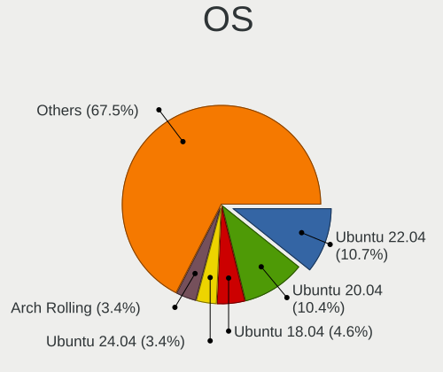

| Name                         | Notebooks | Percent |
|------------------------------|-----------|---------|
| Ubuntu 22.04                 | 35        | 10.74%  |
| Ubuntu 20.04                 | 34        | 10.43%  |
| Ubuntu 18.04                 | 15        | 4.6%    |
| Ubuntu 24.04                 | 11        | 3.37%   |
| Arch Rolling                 | 11        | 3.37%   |
| Zorin 16                     | 7         | 2.15%   |
| Linux Mint 20.3              | 6         | 1.84%   |
| Fedora 40                    | 6         | 1.84%   |
| Fedora 36                    | 6         | 1.84%   |
| Zorin 17                     | 5         | 1.53%   |
| Ubuntu 23.04                 | 5         | 1.53%   |
| Manjaro                      | 5         | 1.53%   |
| Fedora 38                    | 5         | 1.53%   |
| Zorin 15                     | 4         | 1.23%   |
| Ubuntu 20.10                 | 4         | 1.23%   |
| Ubuntu 19.04                 | 4         | 1.23%   |
| Pop!_OS 22.04                | 4         | 1.23%   |
| Pop!_OS 20.04                | 4         | 1.23%   |
| OpenMandriva 4.2             | 4         | 1.23%   |
| OpenMandriva 25.06           | 4         | 1.23%   |
| Fedora 41                    | 4         | 1.23%   |
| Debian 12                    | 4         | 1.23%   |
| Arch                         | 4         | 1.23%   |
| Ubuntu 21.04                 | 3         | 0.92%   |
| Q4OS 3                       | 3         | 0.92%   |
| OpenMandriva 25.90           | 3         | 0.92%   |
| Linux Mint 20.2              | 3         | 0.92%   |
| Kali 2023.3                  | 3         | 0.92%   |
| Fedora 37                    | 3         | 0.92%   |
| Debian 11                    | 3         | 0.92%   |
| Ubuntu 23.10                 | 2         | 0.61%   |
| Ubuntu 21.10                 | 2         | 0.61%   |
| Ubuntu 19.10                 | 2         | 0.61%   |
| Parrot 5.3                   | 2         | 0.61%   |
| Parrot 5.1                   | 2         | 0.61%   |
| openSUSE Tumbleweed-XXXXXXXX | 2         | 0.61%   |
| OpenMandriva 24.12           | 2         | 0.61%   |
| OpenMandriva 23.08           | 2         | 0.61%   |
| Linux Mint 22.1              | 2         | 0.61%   |
| Linux Mint 21.2              | 2         | 0.61%   |

OS Family
---------

OS without a version

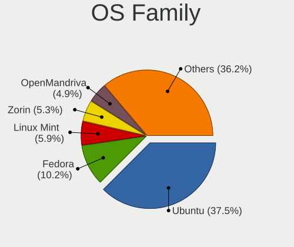

| Name          | Notebooks | Percent |
|---------------|-----------|---------|
| Ubuntu        | 114       | 37.5%   |
| Fedora        | 31        | 10.2%   |
| Linux Mint    | 18        | 5.92%   |
| Zorin         | 16        | 5.26%   |
| OpenMandriva  | 15        | 4.93%   |
| Arch          | 15        | 4.93%   |
| Kali          | 14        | 4.61%   |
| Pop!_OS       | 10        | 3.29%   |
| Manjaro       | 10        | 3.29%   |
| Endless       | 10        | 3.29%   |
| Parrot        | 9         | 2.96%   |
| Debian        | 8         | 2.63%   |
| Q4OS          | 3         | 0.99%   |
| Ubuntu MATE   | 2         | 0.66%   |
| Ubuntu Budgie | 2         | 0.66%   |
| ROSA          | 2         | 0.66%   |
| RHEL          | 2         | 0.66%   |
| openSUSE      | 2         | 0.66%   |
| Elementary    | 2         | 0.66%   |
| blendOS       | 2         | 0.66%   |
| ArcoLinux     | 2         | 0.66%   |
| Xubuntu       | 1         | 0.33%   |
| Ubuntu Unity  | 1         | 0.33%   |
| Rocky Linux   | 1         | 0.33%   |
| Nobara        | 1         | 0.33%   |
| MX            | 1         | 0.33%   |
| Lubuntu       | 1         | 0.33%   |
| LMDE          | 1         | 0.33%   |
| Lilidog       | 1         | 0.33%   |
| KDE neon      | 1         | 0.33%   |
| Garuda Linux  | 1         | 0.33%   |
| EndeavourOS   | 1         | 0.33%   |
| Deepin        | 1         | 0.33%   |
| BlackPanther  | 1         | 0.33%   |
| antiX         | 1         | 0.33%   |
| Alpine        | 1         | 0.33%   |

Kernel
------

Version of the Linux kernel

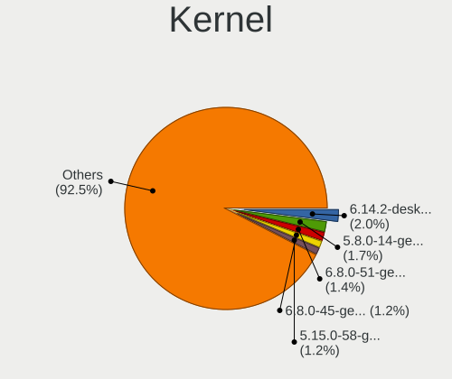

| Version                  | Notebooks | Percent |
|--------------------------|-----------|---------|
| 6.14.2-desktop-3omv2590  | 7         | 2.02%   |
| 5.8.0-14-generic         | 6         | 1.73%   |
| 6.8.0-51-generic         | 5         | 1.45%   |
| 6.8.0-45-generic         | 4         | 1.16%   |
| 5.15.0-58-generic        | 4         | 1.16%   |
| 5.15.0-52-generic        | 4         | 1.16%   |
| 5.11.0-38-generic        | 4         | 1.16%   |
| 5.10.14-desktop-1omv4002 | 4         | 1.16%   |
| 6.3.0-kali1-amd64        | 3         | 0.87%   |
| 5.4.0-58-generic         | 3         | 0.87%   |
| 5.4.0-52-generic         | 3         | 0.87%   |
| 5.4.0-45-generic         | 3         | 0.87%   |
| 5.4.0-42-generic         | 3         | 0.87%   |
| 5.19.0-38-generic        | 3         | 0.87%   |
| 5.15.0-53-generic        | 3         | 0.87%   |
| 5.15.0-41-generic        | 3         | 0.87%   |
| 6.8.9-arch1-2            | 2         | 0.58%   |
| 6.8.0-49-generic         | 2         | 0.58%   |
| 6.6.9-amd64              | 2         | 0.58%   |
| 6.5.0-41-generic         | 2         | 0.58%   |
| 6.5.0-27-generic         | 2         | 0.58%   |
| 6.5.0-10-generic         | 2         | 0.58%   |
| 6.4.8-desktop-2omv2390   | 2         | 0.58%   |
| 6.2.0-32-generic         | 2         | 0.58%   |
| 6.12.1-desktop-1omv2490  | 2         | 0.58%   |
| 6.1.0-kali7-amd64        | 2         | 0.58%   |
| 6.1.0-21-686-pae         | 2         | 0.58%   |
| 5.8.0-59-generic         | 2         | 0.58%   |
| 5.8.0-43-generic         | 2         | 0.58%   |
| 5.4.0-67-generic         | 2         | 0.58%   |
| 5.4.0-65-generic         | 2         | 0.58%   |
| 5.4.0-54-generic         | 2         | 0.58%   |
| 5.4.0-48-generic         | 2         | 0.58%   |
| 5.4.0-47-generic         | 2         | 0.58%   |
| 5.4.0-37-generic         | 2         | 0.58%   |
| 5.4.0-137-generic        | 2         | 0.58%   |
| 5.3.0-28-generic         | 2         | 0.58%   |
| 5.19.0-41-generic        | 2         | 0.58%   |
| 5.19.0-35-generic        | 2         | 0.58%   |
| 5.18.13-200.fc36.x86_64  | 2         | 0.58%   |

Kernel Family
-------------

Linux kernel without a distro release

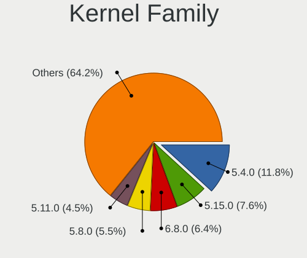

| Version | Notebooks | Percent |
|---------|-----------|---------|
| 5.4.0   | 39        | 11.82%  |
| 5.15.0  | 25        | 7.58%   |
| 6.8.0   | 21        | 6.36%   |
| 5.8.0   | 18        | 5.45%   |
| 5.11.0  | 15        | 4.55%   |
| 6.5.0   | 12        | 3.64%   |
| 4.15.0  | 11        | 3.33%   |
| 6.1.0   | 10        | 3.03%   |
| 6.2.0   | 8         | 2.42%   |
| 5.19.0  | 8         | 2.42%   |
| 6.14.2  | 7         | 2.12%   |
| 5.3.0   | 7         | 2.12%   |
| 5.13.0  | 7         | 2.12%   |
| 5.0.0   | 7         | 2.12%   |
| 5.10.0  | 5         | 1.52%   |
| 5.18.0  | 4         | 1.21%   |
| 5.10.14 | 4         | 1.21%   |
| 4.19.0  | 4         | 1.21%   |
| 6.4.8   | 3         | 0.91%   |
| 6.3.0   | 3         | 0.91%   |
| 6.11.0  | 3         | 0.91%   |
| 5.14.0  | 3         | 0.91%   |
| 4.18.0  | 3         | 0.91%   |
| 6.8.9   | 2         | 0.61%   |
| 6.8.11  | 2         | 0.61%   |
| 6.6.9   | 2         | 0.61%   |
| 6.3.4   | 2         | 0.61%   |
| 6.14.0  | 2         | 0.61%   |
| 6.12.1  | 2         | 0.61%   |
| 6.1.52  | 2         | 0.61%   |
| 5.19.9  | 2         | 0.61%   |
| 5.18.13 | 2         | 0.61%   |
| 5.17.5  | 2         | 0.61%   |
| 5.16.7  | 2         | 0.61%   |
| 5.13.19 | 2         | 0.61%   |
| 6.9.8   | 1         | 0.3%    |
| 6.9.2   | 1         | 0.3%    |
| 6.8.5   | 1         | 0.3%    |
| 6.8.2   | 1         | 0.3%    |
| 6.6.65  | 1         | 0.3%    |

Kernel Major Ver.
-----------------

Linux kernel major version

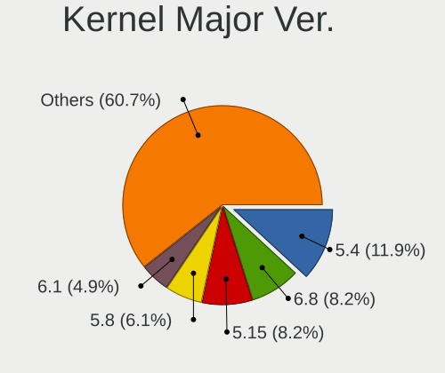

| Version | Notebooks | Percent |
|---------|-----------|---------|
| 5.4     | 39        | 11.89%  |
| 6.8     | 27        | 8.23%   |
| 5.15    | 27        | 8.23%   |
| 5.8     | 20        | 6.1%    |
| 6.1     | 16        | 4.88%   |
| 5.11    | 16        | 4.88%   |
| 6.5     | 14        | 4.27%   |
| 5.19    | 13        | 3.96%   |
| 6.2     | 12        | 3.66%   |
| 5.10    | 12        | 3.66%   |
| 4.15    | 11        | 3.35%   |
| 6.14    | 10        | 3.05%   |
| 6.11    | 9         | 2.74%   |
| 5.13    | 9         | 2.74%   |
| 5.0     | 8         | 2.44%   |
| 6.3     | 7         | 2.13%   |
| 6.12    | 7         | 2.13%   |
| 5.3     | 7         | 2.13%   |
| 5.18    | 6         | 1.83%   |
| 5.14    | 6         | 1.83%   |
| 6.6     | 5         | 1.52%   |
| 6.4     | 5         | 1.52%   |
| 4.19    | 5         | 1.52%   |
| 6.10    | 4         | 1.22%   |
| 5.16    | 4         | 1.22%   |
| 4.18    | 4         | 1.22%   |
| 6.0     | 3         | 0.91%   |
| 5.6     | 3         | 0.91%   |
| 5.17    | 3         | 0.91%   |
| 6.9     | 2         | 0.61%   |
| 6.17    | 2         | 0.61%   |
| 5.9     | 2         | 0.61%   |
| 5.2     | 2         | 0.61%   |
| 4.9     | 2         | 0.61%   |
| 6.15    | 1         | 0.3%    |
| 5.7     | 1         | 0.3%    |
| 5.5     | 1         | 0.3%    |
| 5.1     | 1         | 0.3%    |
| 4.16    | 1         | 0.3%    |
| 4.13    | 1         | 0.3%    |

Arch
----

OS architecture (x86_64, i586, etc.)

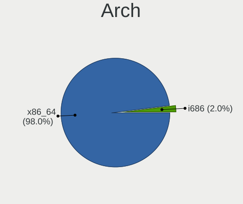

| Name   | Notebooks | Percent |
|--------|-----------|---------|
| x86_64 | 289       | 97.97%  |
| i686   | 6         | 2.03%   |

DE
--

Desktop Environment

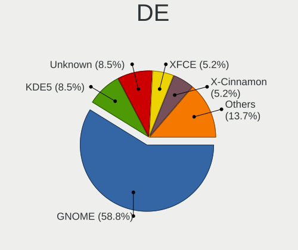

| Name            | Notebooks | Percent |
|-----------------|-----------|---------|
| GNOME           | 180       | 58.82%  |
| KDE5            | 26        | 8.5%    |
| Unknown         | 26        | 8.5%    |
| XFCE            | 16        | 5.23%   |
| X-Cinnamon      | 16        | 5.23%   |
| KDE6            | 12        | 3.92%   |
| MATE            | 11        | 3.59%   |
| KDE             | 4         | 1.31%   |
| Pantheon        | 2         | 0.65%   |
| KDE4            | 2         | 0.65%   |
| GNOME Flashback | 2         | 0.65%   |
| Unity           | 1         | 0.33%   |
| openbox         | 1         | 0.33%   |
| LXQt            | 1         | 0.33%   |
| Hyprland        | 1         | 0.33%   |
| Endless:GNOME   | 1         | 0.33%   |
| Deepin          | 1         | 0.33%   |
| Cinnamon        | 1         | 0.33%   |
| Budgie          | 1         | 0.33%   |
| awesome         | 1         | 0.33%   |

Display Server
--------------

X11 or Wayland

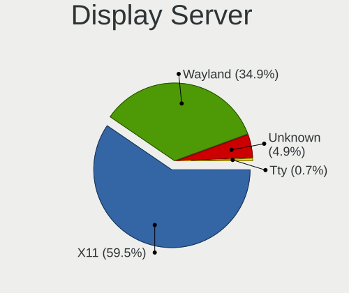

| Name    | Notebooks | Percent |
|---------|-----------|---------|
| X11     | 181       | 59.54%  |
| Wayland | 106       | 34.87%  |
| Unknown | 15        | 4.93%   |
| Tty     | 2         | 0.66%   |

Display Manager
---------------

SDDM, LightDM, etc.

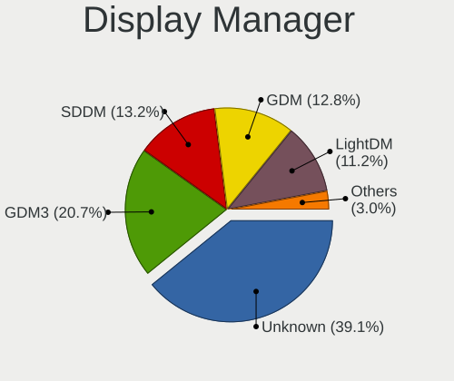

| Name    | Notebooks | Percent |
|---------|-----------|---------|
| Unknown | 119       | 39.14%  |
| GDM3    | 63        | 20.72%  |
| SDDM    | 40        | 13.16%  |
| GDM     | 39        | 12.83%  |
| LightDM | 34        | 11.18%  |
| TDM     | 5         | 1.64%   |
| KDM     | 2         | 0.66%   |
| GREETD  | 2         | 0.66%   |

OS Lang
-------

Language

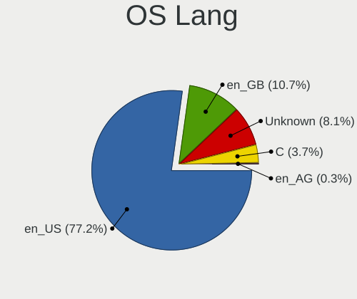

| Lang    | Notebooks | Percent |
|---------|-----------|---------|
| en_US   | 230       | 77.18%  |
| en_GB   | 32        | 10.74%  |
| Unknown | 24        | 8.05%   |
| C       | 11        | 3.69%   |
| en_AG   | 1         | 0.34%   |

Boot Mode
---------

EFI or BIOS

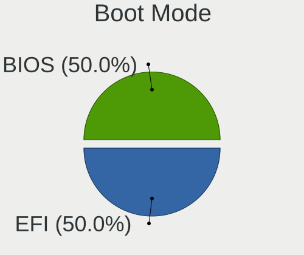

| Mode | Notebooks | Percent |
|------|-----------|---------|
| BIOS | 150       | 50%     |
| EFI  | 150       | 50%     |

Filesystem
----------

Type of filesystem

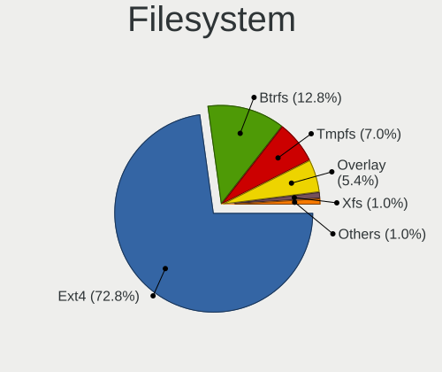

| Type    | Notebooks | Percent |
|---------|-----------|---------|
| Ext4    | 217       | 72.82%  |
| Btrfs   | 38        | 12.75%  |
| Tmpfs   | 21        | 7.05%   |
| Overlay | 16        | 5.37%   |
| Xfs     | 3         | 1.01%   |
| Unknown | 2         | 0.67%   |
| Zfs     | 1         | 0.34%   |

Part. scheme
------------

Scheme of partitioning

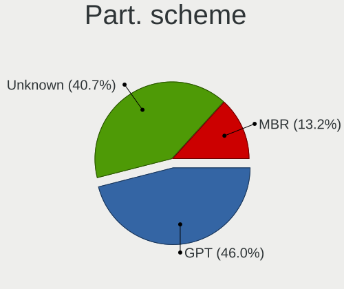

| Type    | Notebooks | Percent |
|---------|-----------|---------|
| GPT     | 139       | 46.03%  |
| Unknown | 123       | 40.73%  |
| MBR     | 40        | 13.25%  |

Dual Boot with Linux/BSD
------------------------

Hosting more than one Linux/BSD

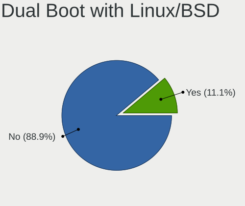

| Dual boot | Notebooks | Percent |
|-----------|-----------|---------|
| No        | 264       | 88.89%  |
| Yes       | 33        | 11.11%  |

Dual Boot (Win)
---------------

Hosting Linux and Windows

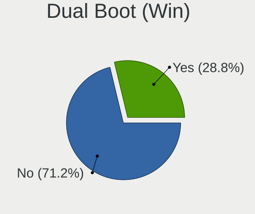

| Dual boot | Notebooks | Percent |
|-----------|-----------|---------|
| No        | 213       | 71.24%  |
| Yes       | 86        | 28.76%  |

Board
-----

Vendor
------

Motherboard manufacturer

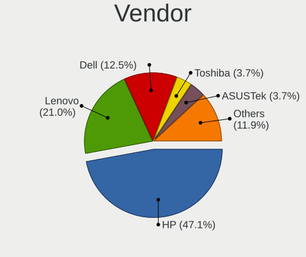

| Name                        | Notebooks | Percent |
|-----------------------------|-----------|---------|
| Hewlett-Packard             | 139       | 47.12%  |
| Lenovo                      | 62        | 21.02%  |
| Dell                        | 37        | 12.54%  |
| Toshiba                     | 11        | 3.73%   |
| ASUSTek Computer            | 11        | 3.73%   |
| Acer                        | 5         | 1.69%   |
| Apple                       | 4         | 1.36%   |
| Samsung Electronics         | 3         | 1.02%   |
| TECNO                       | 2         | 0.68%   |
| SLIMBOOK                    | 2         | 0.68%   |
| Endless                     | 2         | 0.68%   |
| Chuwi                       | 2         | 0.68%   |
| Sony                        | 1         | 0.34%   |
| Panasonic                   | 1         | 0.34%   |
| Notebook                    | 1         | 0.34%   |
| LG Electronics              | 1         | 0.34%   |
| Jemper                      | 1         | 0.34%   |
| Insyde                      | 1         | 0.34%   |
| I-Life Digital Technologies | 1         | 0.34%   |
| HUAWEI                      | 1         | 0.34%   |
| Getac                       | 1         | 0.34%   |
| Fujitsu                     | 1         | 0.34%   |
| EVOC                        | 1         | 0.34%   |
| EUROCOM                     | 1         | 0.34%   |
| Eluktronics                 | 1         | 0.34%   |
| Clevo                       | 1         | 0.34%   |
| Unknown                     | 1         | 0.34%   |

Model
-----

Motherboard model

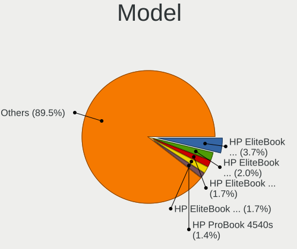

| Name                                       | Notebooks | Percent |
|--------------------------------------------|-----------|---------|
| HP EliteBook 840 G1                        | 11        | 3.73%   |
| HP EliteBook Folio 9480m                   | 6         | 2.03%   |
| HP EliteBook Folio 9470m                   | 5         | 1.69%   |
| HP EliteBook 840 G3                        | 5         | 1.69%   |
| HP ProBook 4540s                           | 4         | 1.36%   |
| HP Notebook                                | 4         | 1.36%   |
| HP ENVY Laptop 16-h0xxx                    | 4         | 1.36%   |
| HP EliteBook 8460p                         | 4         | 1.36%   |
| HP EliteBook 840 G5                        | 4         | 1.36%   |
| HP EliteBook 820 G3                        | 4         | 1.36%   |
| Dell XPS 13 9310                           | 4         | 1.36%   |
| HP ProBook 6560b                           | 3         | 1.02%   |
| HP EliteBook 8440p                         | 3         | 1.02%   |
| HP EliteBook 840 G2                        | 3         | 1.02%   |
| HP EliteBook 2570p                         | 3         | 1.02%   |
| HP 630                                     | 3         | 1.02%   |
| HP 15                                      | 3         | 1.02%   |
| ASUS X540NA                                | 3         | 1.02%   |
| Unknown                                    | 3         | 1.02%   |
| Toshiba TECRA X40-E                        | 2         | 0.68%   |
| Toshiba Satellite C660                     | 2         | 0.68%   |
| TECNO WinPad 2                             | 2         | 0.68%   |
| Lenovo ThinkPad X1 Carbon Gen 9 20XW00FPUS | 2         | 0.68%   |
| Lenovo IdeaPad S340-14IIL 81VV             | 2         | 0.68%   |
| Lenovo IdeaPad 3 14ITL6 82H7               | 2         | 0.68%   |
| Lenovo IdeaPad 3 14IIL05 81WD              | 2         | 0.68%   |
| Lenovo G50-80 80E5                         | 2         | 0.68%   |
| HP ProBook 650 G2                          | 2         | 0.68%   |
| HP ProBook 6470b                           | 2         | 0.68%   |
| HP ProBook 640 G1                          | 2         | 0.68%   |
| HP ProBook 450 G6                          | 2         | 0.68%   |
| HP ProBook 440 G5                          | 2         | 0.68%   |
| HP Pavilion Laptop 15-cs3xxx               | 2         | 0.68%   |
| HP Laptop 15-da1xxx                        | 2         | 0.68%   |
| HP ENVY 15                                 | 2         | 0.68%   |
| HP EliteBook 840 G6                        | 2         | 0.68%   |
| HP Compaq Mini 110c-1100                   | 2         | 0.68%   |
| HP 15 Notebook PC                          | 2         | 0.68%   |
| Endless EF20EA                             | 2         | 0.68%   |
| Dell Latitude E6410                        | 2         | 0.68%   |

Model Family
------------

Motherboard model prefix

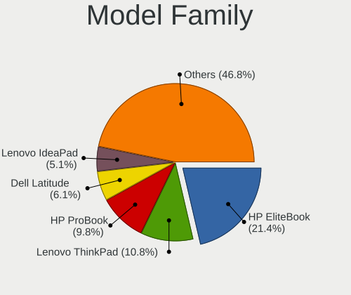

| Name                   | Notebooks | Percent |
|------------------------|-----------|---------|
| HP EliteBook           | 63        | 21.36%  |
| Lenovo ThinkPad        | 32        | 10.85%  |
| HP ProBook             | 29        | 9.83%   |
| Dell Latitude          | 18        | 6.1%    |
| Lenovo IdeaPad         | 15        | 5.08%   |
| Dell Inspiron          | 10        | 3.39%   |
| HP ENVY                | 9         | 3.05%   |
| HP Pavilion            | 8         | 2.71%   |
| HP Laptop              | 8         | 2.71%   |
| Dell XPS               | 6         | 2.03%   |
| HP 15                  | 5         | 1.69%   |
| Toshiba Satellite      | 4         | 1.36%   |
| Lenovo Legion          | 4         | 1.36%   |
| HP Notebook            | 4         | 1.36%   |
| Acer Aspire            | 4         | 1.36%   |
| Toshiba TECRA          | 3         | 1.02%   |
| Toshiba dynabook       | 3         | 1.02%   |
| HP 630                 | 3         | 1.02%   |
| ASUS X540NA            | 3         | 1.02%   |
| Unknown                | 3         | 1.02%   |
| TECNO WinPad           | 2         | 0.68%   |
| Lenovo G50-80          | 2         | 0.68%   |
| HP ZBook               | 2         | 0.68%   |
| HP Compaq              | 2         | 0.68%   |
| Endless EF20EA         | 2         | 0.68%   |
| ASUS UX305CA           | 2         | 0.68%   |
| Toshiba R84SAU2        | 1         | 0.34%   |
| Sony VGN-NS295J        | 1         | 0.34%   |
| SLIMBOOK PROX14-AMD    | 1         | 0.34%   |
| SLIMBOOK Executive     | 1         | 0.34%   |
| Samsung RC410          | 1         | 0.34%   |
| Samsung 300E5EV        | 1         | 0.34%   |
| Samsung 300E4C         | 1         | 0.34%   |
| Panasonic CF-SX2JDQZF5 | 1         | 0.34%   |
| Notebook P65xHP        | 1         | 0.34%   |
| LG LW25-B7HG           | 1         | 0.34%   |
| Lenovo Z50-75          | 1         | 0.34%   |
| Lenovo V330-14IKB      | 1         | 0.34%   |
| Lenovo V310-15ISK      | 1         | 0.34%   |
| Lenovo V14-IGL         | 1         | 0.34%   |

MFG Year
--------

Motherboard manufacture year

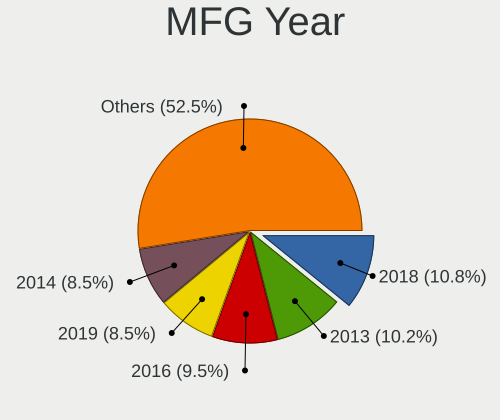

| Year    | Notebooks | Percent |
|---------|-----------|---------|
| 2018    | 32        | 10.85%  |
| 2013    | 30        | 10.17%  |
| 2016    | 28        | 9.49%   |
| 2019    | 25        | 8.47%   |
| 2014    | 25        | 8.47%   |
| 2012    | 24        | 8.14%   |
| 2015    | 23        | 7.8%    |
| 2020    | 21        | 7.12%   |
| 2011    | 20        | 6.78%   |
| 2017    | 18        | 6.1%    |
| 2021    | 12        | 4.07%   |
| 2010    | 10        | 3.39%   |
| 2022    | 8         | 2.71%   |
| 2009    | 5         | 1.69%   |
| 2008    | 4         | 1.36%   |
| 2007    | 3         | 1.02%   |
| 2006    | 3         | 1.02%   |
| 2023    | 2         | 0.68%   |
| 2024    | 1         | 0.34%   |
| Unknown | 1         | 0.34%   |

Form Factor
-----------

Physical design of the computer

| Name     | Notebooks | Percent |
|----------|-----------|---------|
| Notebook | 295       | 100%    |

Secure Boot
-----------

Enabled or disabled

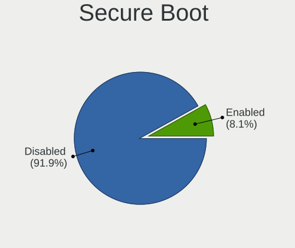

| State    | Notebooks | Percent |
|----------|-----------|---------|
| Disabled | 274       | 91.95%  |
| Enabled  | 24        | 8.05%   |

Coreboot
--------

Have coreboot on board

| Used | Notebooks | Percent |
|------|-----------|---------|
| No   | 295       | 100%    |

RAM Size
--------

Total RAM memory

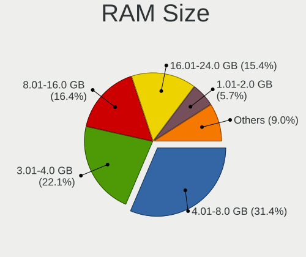

| Size in GB  | Notebooks | Percent |
|-------------|-----------|---------|
| 4.01-8.0    | 94        | 31.44%  |
| 3.01-4.0    | 66        | 22.07%  |
| 8.01-16.0   | 49        | 16.39%  |
| 16.01-24.0  | 46        | 15.38%  |
| 1.01-2.0    | 17        | 5.69%   |
| 32.01-64.0  | 15        | 5.02%   |
| 64.01-256.0 | 5         | 1.67%   |
| 24.01-32.0  | 3         | 1%      |
| 0.51-1.0    | 3         | 1%      |
| 2.01-3.0    | 1         | 0.33%   |

RAM Used
--------

Used RAM memory

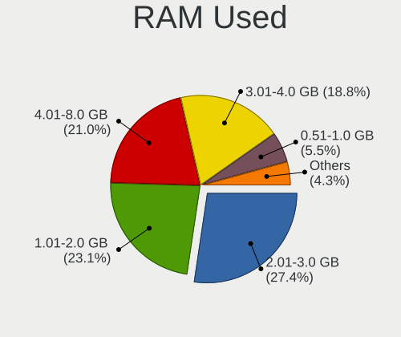

| Used GB    | Notebooks | Percent |
|------------|-----------|---------|
| 2.01-3.0   | 90        | 27.36%  |
| 1.01-2.0   | 76        | 23.1%   |
| 4.01-8.0   | 69        | 20.97%  |
| 3.01-4.0   | 62        | 18.84%  |
| 0.51-1.0   | 18        | 5.47%   |
| 8.01-16.0  | 12        | 3.65%   |
| 16.01-24.0 | 1         | 0.3%    |
| 0.01-0.5   | 1         | 0.3%    |

Total Drives
------------

Number of drives on board

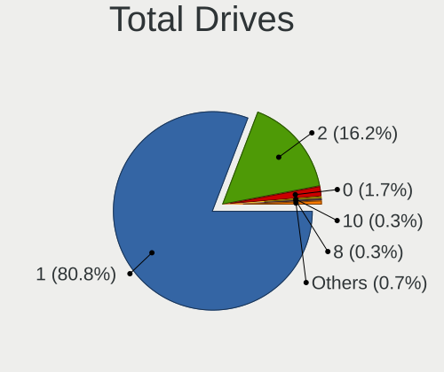

| Drives | Notebooks | Percent |
|--------|-----------|---------|
| 1      | 244       | 80.79%  |
| 2      | 49        | 16.23%  |
| 0      | 5         | 1.66%   |
| 10     | 1         | 0.33%   |
| 8      | 1         | 0.33%   |
| 4      | 1         | 0.33%   |
| 3      | 1         | 0.33%   |

Has CD-ROM
----------

Has CD-ROM on board

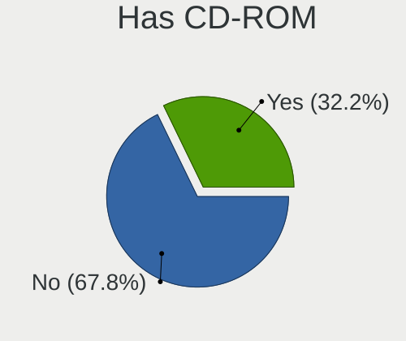

| Presented | Notebooks | Percent |
|-----------|-----------|---------|
| No        | 200       | 67.8%   |
| Yes       | 95        | 32.2%   |

Has Ethernet
------------

Has Ethernet on board

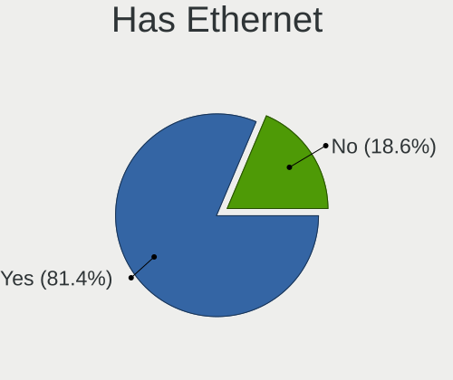

| Presented | Notebooks | Percent |
|-----------|-----------|---------|
| Yes       | 240       | 81.36%  |
| No        | 55        | 18.64%  |

Has WiFi
--------

Has WiFi module

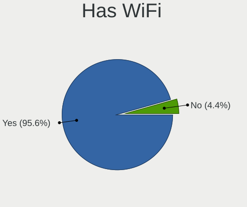

| Presented | Notebooks | Percent |
|-----------|-----------|---------|
| Yes       | 283       | 95.61%  |
| No        | 13        | 4.39%   |

Has Bluetooth
-------------

Has Bluetooth module

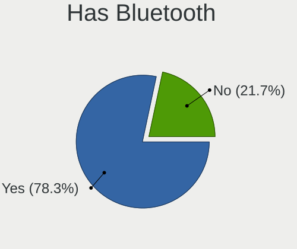

| Presented | Notebooks | Percent |
|-----------|-----------|---------|
| Yes       | 235       | 78.33%  |
| No        | 65        | 21.67%  |

Location
--------

Country
-------

Geographic location (country)

| Country | Notebooks | Percent |
|---------|-----------|---------|
| Kenya   | 295       | 100%    |

City
----

Geographic location (city)

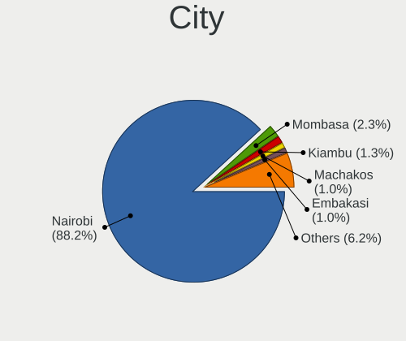

| City         | Notebooks | Percent |
|--------------|-----------|---------|
| Nairobi      | 269       | 88.2%   |
| Mombasa      | 7         | 2.3%    |
| Kiambu       | 4         | 1.31%   |
| Machakos     | 3         | 0.98%   |
| Embakasi     | 3         | 0.98%   |
| Nyahururu    | 2         | 0.66%   |
| Nakuru       | 2         | 0.66%   |
| Kikuyu       | 2         | 0.66%   |
| Eldoret      | 2         | 0.66%   |
| Wote         | 1         | 0.33%   |
| Rongai       | 1         | 0.33%   |
| Nyeri        | 1         | 0.33%   |
| Narok        | 1         | 0.33%   |
| Nanyuki      | 1         | 0.33%   |
| Murang'a     | 1         | 0.33%   |
| Maralal      | 1         | 0.33%   |
| Mairo Inya   | 1         | 0.33%   |
| Loglogo      | 1         | 0.33%   |
| Kisii        | 1         | 0.33%   |
| Archers Post | 1         | 0.33%   |

Drives
------

Drive Vendor
------------

Hard drive vendors

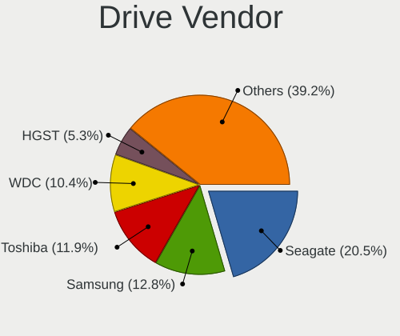

| Vendor                      | Notebooks | Drives | Percent |
|-----------------------------|-----------|--------|---------|
| Seagate                     | 69        | 89     | 20.47%  |
| Samsung Electronics         | 43        | 58     | 12.76%  |
| Toshiba                     | 40        | 47     | 11.87%  |
| WDC                         | 35        | 43     | 10.39%  |
| HGST                        | 18        | 28     | 5.34%   |
| Unknown                     | 17        | 22     | 5.04%   |
| SanDisk                     | 15        | 17     | 4.45%   |
| Micron Technology           | 12        | 14     | 3.56%   |
| Hitachi                     | 10        | 13     | 2.97%   |
| SK hynix                    | 8         | 9      | 2.37%   |
| Crucial                     | 7         | 9      | 2.08%   |
| Lexar                       | 6         | 6      | 1.78%   |
| MARSHAL                     | 5         | 5      | 1.48%   |
| ADATA Technology            | 4         | 4      | 1.19%   |
| Silicon Motion              | 3         | 4      | 0.89%   |
| LITEON                      | 3         | 4      | 0.89%   |
| Kingston                    | 3         | 5      | 0.89%   |
| Intel                       | 3         | 3      | 0.89%   |
| China                       | 3         | 3      | 0.89%   |
| Apple                       | 3         | 3      | 0.89%   |
| A-DATA Technology           | 3         | 3      | 0.89%   |
| SPCC                        | 2         | 2      | 0.59%   |
| KIOXIA                      | 2         | 2      | 0.59%   |
| Hjwdz                       | 2         | 2      | 0.59%   |
| Unknown                     | 2         | 2      | 0.59%   |
| Union Memory                | 1         | 1      | 0.3%    |
| Team                        | 1         | 2      | 0.3%    |
| TCSUNBOW                    | 1         | 1      | 0.3%    |
| Plextor                     | 1         | 1      | 0.3%    |
| Phison Electronics          | 1         | 2      | 0.3%    |
| Netac                       | 1         | 1      | 0.3%    |
| MAXIO Technology (Hangzhou) | 1         | 1      | 0.3%    |
| MAX                         | 1         | 1      | 0.3%    |
| Marvell Technology Group    | 1         | 1      | 0.3%    |
| LITEONIT                    | 1         | 1      | 0.3%    |
| Lite-On Technology          | 1         | 2      | 0.3%    |
| KINGBANK                    | 1         | 1      | 0.3%    |
| HUAWEI                      | 1         | 1      | 0.3%    |
| Gritronix                   | 1         | 2      | 0.3%    |
| Golden                      | 1         | 1      | 0.3%    |

Drive Model
-----------

Hard drive models

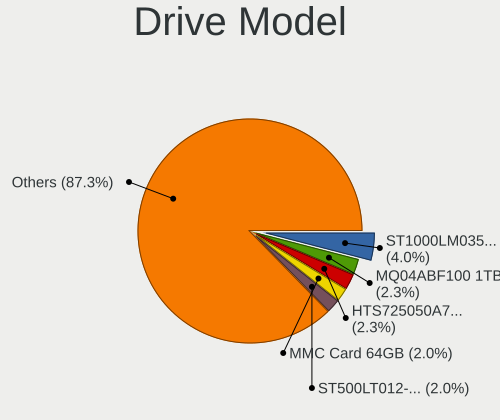

| Model                                                 | Notebooks | Percent |
|-------------------------------------------------------|-----------|---------|
| Seagate ST1000LM035-1RK172 1TB                        | 14        | 4.03%   |
| Toshiba MQ04ABF100 1TB                                | 8         | 2.31%   |
| HGST HTS725050A7E630 500GB                            | 8         | 2.31%   |
| Unknown MMC Card  64GB                                | 7         | 2.02%   |
| Seagate ST500LT012-9WS142 500GB                       | 7         | 2.02%   |
| Samsung NVMe SSD Controller SM981/PM981/PM983 1TB     | 7         | 2.02%   |
| Seagate ST9500325AS 500GB                             | 6         | 1.73%   |
| Seagate ST1000LM024 HN-M101MBB 1TB                    | 6         | 1.73%   |
| Samsung NVMe SSD Controller PM9A1/PM9A3/980PRO 1TB    | 6         | 1.73%   |
| Toshiba MQ01ABF050 500GB                              | 5         | 1.44%   |
| Seagate ST500VT000-1DK142 500GB                       | 5         | 1.44%   |
| Toshiba MQ01ABD100 1TB                                | 4         | 1.15%   |
| Seagate ST500LT012-1DG142 500GB                       | 4         | 1.15%   |
| Seagate ST500LM021-1KJ152 500GB                       | 4         | 1.15%   |
| Samsung SSD 960 EVO 1TB                               | 4         | 1.15%   |
| ADATA LEGEND 710 512GB                                | 4         | 1.15%   |
| WDC WD5000LPCX-60VHAT0 500GB                          | 3         | 0.86%   |
| WDC PC SN730 NVMe 512GB                               | 3         | 0.86%   |
| Unknown MMC Card  32GB                                | 3         | 0.86%   |
| Toshiba MQ01ABD050V 500GB                             | 3         | 0.86%   |
| Seagate ST500LM000-1EJ162 500GB                       | 3         | 0.86%   |
| MARSHAL MAL2500SA-T54L 500GB                          | 3         | 0.86%   |
| Crucial CT2050MX300SSD1 2TB                           | 3         | 0.86%   |
| WDC WD5000LPVX-22V0TT0 500GB                          | 2         | 0.58%   |
| WDC WD5000LPCX-24VHAT0 500GB                          | 2         | 0.58%   |
| WDC WD5000LPCX-24C6HT0 500GB                          | 2         | 0.58%   |
| WDC WD2500BEKT-75PVMT0 250GB                          | 2         | 0.58%   |
| WDC WD10SPZX-60Z10T0 1TB                              | 2         | 0.58%   |
| WDC WD10SPZX-08Z10 1TB                                | 2         | 0.58%   |
| WDC WD10JPCX-24UE4T0 1TB                              | 2         | 0.58%   |
| Unknown NCard  32GB                                   | 2         | 0.58%   |
| SK hynix BC501 NVMe Solid State Drive 512GB           | 2         | 0.58%   |
| Silicon Motion SM2263EN/SM2263XT SSD Controller 512GB | 2         | 0.58%   |
| Seagate ST500LM030-1RK17D 500GB                       | 2         | 0.58%   |
| Seagate ST250LT003-9YG14C 250GB                       | 2         | 0.58%   |
| Seagate ST2000LM003 HN-M201RAD 2TB                    | 2         | 0.58%   |
| Seagate ST1000VT001-1RE172 1TB                        | 2         | 0.58%   |
| SanDisk SD7SN3Q-256G-1006 256GB SSD                   | 2         | 0.58%   |
| Samsung SSD PM830 2.5 7mm 128GB                       | 2         | 0.58%   |
| Samsung NVMe SSD Drive 512GB                          | 2         | 0.58%   |

HDD Vendor
----------

Hard disk drive vendors

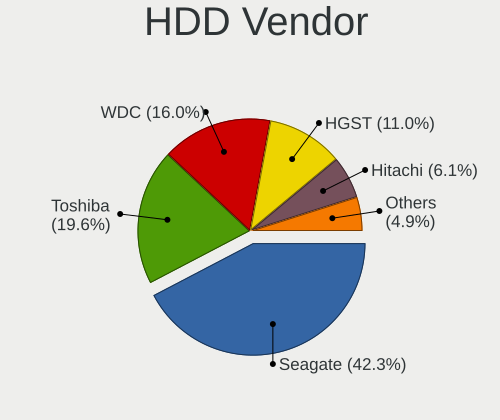

| Vendor              | Notebooks | Drives | Percent |
|---------------------|-----------|--------|---------|
| Seagate             | 69        | 89     | 42.33%  |
| Toshiba             | 32        | 39     | 19.63%  |
| WDC                 | 26        | 32     | 15.95%  |
| HGST                | 18        | 28     | 11.04%  |
| Hitachi             | 10        | 13     | 6.13%   |
| MARSHAL             | 5         | 5      | 3.07%   |
| Samsung Electronics | 2         | 2      | 1.23%   |
| ASMT                | 1         | 1      | 0.61%   |

SSD Vendor
----------

Solid state drive vendors

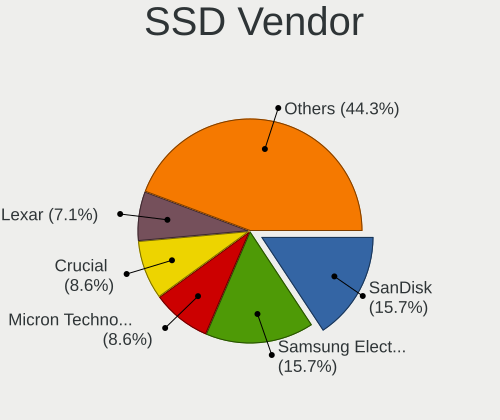

| Vendor              | Notebooks | Drives | Percent |
|---------------------|-----------|--------|---------|
| SanDisk             | 11        | 12     | 15.71%  |
| Samsung Electronics | 11        | 14     | 15.71%  |
| Micron Technology   | 6         | 7      | 8.57%   |
| Crucial             | 6         | 8      | 8.57%   |
| Lexar               | 5         | 5      | 7.14%   |
| WDC                 | 3         | 4      | 4.29%   |
| Toshiba             | 3         | 3      | 4.29%   |
| SK hynix            | 3         | 3      | 4.29%   |
| LITEON              | 3         | 4      | 4.29%   |
| China               | 3         | 3      | 4.29%   |
| Kingston            | 2         | 4      | 2.86%   |
| Apple               | 2         | 2      | 2.86%   |
| A-DATA Technology   | 2         | 2      | 2.86%   |
| TCSUNBOW            | 1         | 1      | 1.43%   |
| Plextor             | 1         | 1      | 1.43%   |
| Netac               | 1         | 1      | 1.43%   |
| MAX                 | 1         | 1      | 1.43%   |
| LITEONIT            | 1         | 1      | 1.43%   |
| KINGBANK            | 1         | 1      | 1.43%   |
| Gritronix           | 1         | 2      | 1.43%   |
| Golden              | 1         | 1      | 1.43%   |
| Eluktro             | 1         | 1      | 1.43%   |
| Unknown             | 1         | 1      | 1.43%   |

Drive Kind
----------

HDD or SSD

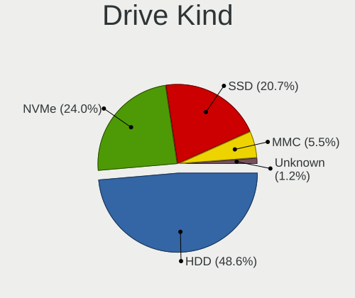

| Kind    | Notebooks | Drives | Percent |
|---------|-----------|--------|---------|
| HDD     | 160       | 209    | 48.63%  |
| NVMe    | 79        | 102    | 24.01%  |
| SSD     | 68        | 82     | 20.67%  |
| MMC     | 18        | 23     | 5.47%   |
| Unknown | 4         | 9      | 1.22%   |

Drive Connector
---------------

SATA, SAS, NVMe, etc.

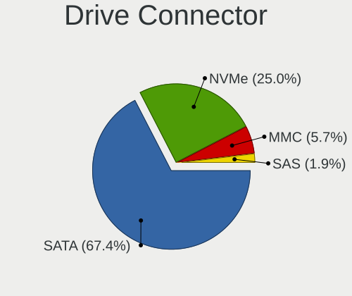

| Type | Notebooks | Drives | Percent |
|------|-----------|--------|---------|
| SATA | 213       | 294    | 67.41%  |
| NVMe | 79        | 102    | 25%     |
| MMC  | 18        | 23     | 5.7%    |
| SAS  | 6         | 6      | 1.9%    |

Drive Size
----------

Size of hard drive

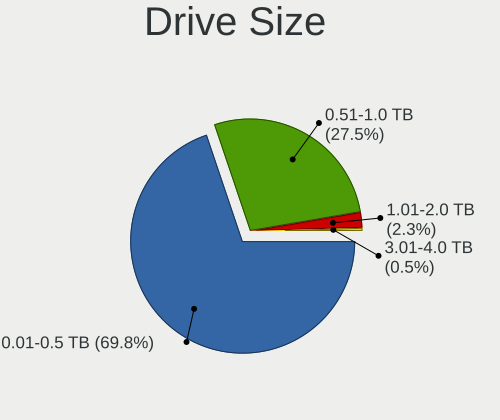

| Size in TB | Notebooks | Drives | Percent |
|------------|-----------|--------|---------|
| 0.01-0.5   | 155       | 202    | 69.82%  |
| 0.51-1.0   | 61        | 73     | 27.48%  |
| 1.01-2.0   | 5         | 12     | 2.25%   |
| 3.01-4.0   | 1         | 4      | 0.45%   |

Space Total
-----------

Amount of disk space available on the file system

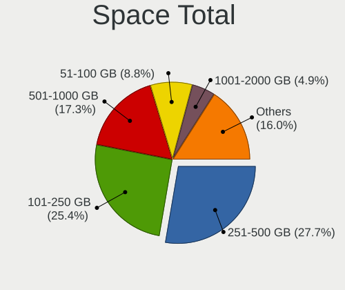

| Size in GB     | Notebooks | Percent |
|----------------|-----------|---------|
| 251-500        | 85        | 27.69%  |
| 101-250        | 78        | 25.41%  |
| 501-1000       | 53        | 17.26%  |
| 51-100         | 27        | 8.79%   |
| 1001-2000      | 15        | 4.89%   |
| 1-20           | 15        | 4.89%   |
| Unknown        | 14        | 4.56%   |
| 21-50          | 8         | 2.61%   |
| More than 3000 | 6         | 1.95%   |
| 2001-3000      | 6         | 1.95%   |

Space Used
----------

Amount of used disk space

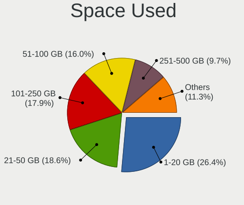

| Used GB        | Notebooks | Percent |
|----------------|-----------|---------|
| 1-20           | 84        | 26.42%  |
| 21-50          | 59        | 18.55%  |
| 101-250        | 57        | 17.92%  |
| 51-100         | 51        | 16.04%  |
| 251-500        | 31        | 9.75%   |
| Unknown        | 14        | 4.4%    |
| 501-1000       | 13        | 4.09%   |
| 1001-2000      | 5         | 1.57%   |
| More than 3000 | 3         | 0.94%   |
| 2001-3000      | 1         | 0.31%   |

Malfunc. Drives
---------------

Drive models with a malfunction

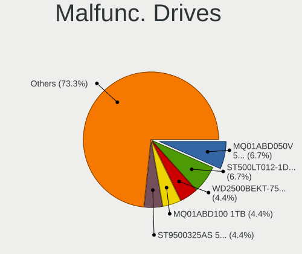

| Model                                 | Notebooks | Drives | Percent |
|---------------------------------------|-----------|--------|---------|
| Toshiba MQ01ABD050V 500GB             | 3         | 3      | 6.67%   |
| Seagate ST500LT012-1DG142 500GB       | 3         | 3      | 6.67%   |
| WDC WD2500BEKT-75PVMT0 250GB          | 2         | 2      | 4.44%   |
| Toshiba MQ01ABD100 1TB                | 2         | 2      | 4.44%   |
| Seagate ST9500325AS 500GB             | 2         | 2      | 4.44%   |
| Seagate ST500LT012-9WS142 500GB       | 2         | 2      | 4.44%   |
| Seagate ST500LM000-1EJ162 500GB       | 2         | 2      | 4.44%   |
| Seagate ST1000LM035-1RK172 1TB        | 2         | 2      | 4.44%   |
| HGST HTS725050A7E630 500GB            | 2         | 2      | 4.44%   |
| WDC WD5000LPVX-22V0TT0 500GB          | 1         | 1      | 2.22%   |
| WDC WD10SPZX-60Z10T0 1TB              | 1         | 1      | 2.22%   |
| WDC WD10JPVX-60JC3T1 1TB              | 1         | 1      | 2.22%   |
| WDC WD10JPVX-22JC3T0 1TB              | 1         | 1      | 2.22%   |
| Toshiba MQ01ABF050 500GB              | 1         | 1      | 2.22%   |
| Toshiba MK8009GAH 80GB                | 1         | 1      | 2.22%   |
| Toshiba MK3263GSX 320GB               | 1         | 1      | 2.22%   |
| Toshiba MK3252GSX 320GB               | 1         | 1      | 2.22%   |
| SK hynix HFS128G32TND-N210A 128GB SSD | 1         | 1      | 2.22%   |
| Seagate ST500VT000-1DK142 500GB       | 1         | 1      | 2.22%   |
| Seagate ST500LM012 HN-M500MBB 500GB   | 1         | 1      | 2.22%   |
| Seagate ST1000LM049-2GH172 1TB        | 1         | 1      | 2.22%   |
| Seagate ST1000LM024 HN-M101MBB 1TB    | 1         | 1      | 2.22%   |
| Samsung Electronics HM250HI 250GB     | 1         | 1      | 2.22%   |
| MARSHAL MAL2750SA-T54 752GB           | 1         | 1      | 2.22%   |
| MARSHAL MAL2500SA-T54L 500GB          | 1         | 1      | 2.22%   |
| Hitachi HTS545032B9A300 320GB         | 1         | 1      | 2.22%   |
| Hitachi HTS542525K9SA00 250GB         | 1         | 2      | 2.22%   |
| HGST HTS725032A7E630 320GB            | 1         | 1      | 2.22%   |
| HGST HTS545050A7E680 500GB            | 1         | 1      | 2.22%   |
| HGST HTS545050A7E380 500GB            | 1         | 1      | 2.22%   |
| HGST HTS541515A9E630 1TB              | 1         | 2      | 2.22%   |
| HGST HTS541010A9E680 1TB              | 1         | 2      | 2.22%   |
| Crucial CT2050MX300SSD1 2TB           | 1         | 2      | 2.22%   |
| China SSD 256GB                       | 1         | 1      | 2.22%   |

Malfunc. Drive Vendor
---------------------

Vendors of faulty drives

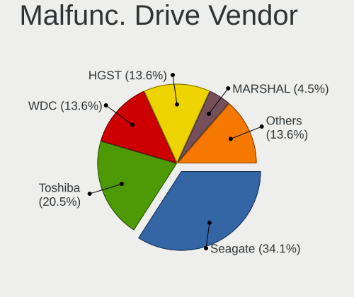

| Vendor              | Notebooks | Drives | Percent |
|---------------------|-----------|--------|---------|
| Seagate             | 15        | 15     | 34.09%  |
| Toshiba             | 9         | 9      | 20.45%  |
| WDC                 | 6         | 6      | 13.64%  |
| HGST                | 6         | 9      | 13.64%  |
| MARSHAL             | 2         | 2      | 4.55%   |
| Hitachi             | 2         | 3      | 4.55%   |
| SK hynix            | 1         | 1      | 2.27%   |
| Samsung Electronics | 1         | 1      | 2.27%   |
| Crucial             | 1         | 2      | 2.27%   |
| China               | 1         | 1      | 2.27%   |

Malfunc. HDD Vendor
-------------------

Vendors of faulty HDD drives

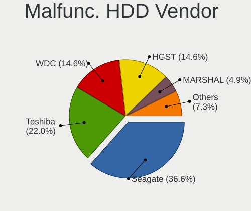

| Vendor              | Notebooks | Drives | Percent |
|---------------------|-----------|--------|---------|
| Seagate             | 15        | 15     | 36.59%  |
| Toshiba             | 9         | 9      | 21.95%  |
| WDC                 | 6         | 6      | 14.63%  |
| HGST                | 6         | 9      | 14.63%  |
| MARSHAL             | 2         | 2      | 4.88%   |
| Hitachi             | 2         | 3      | 4.88%   |
| Samsung Electronics | 1         | 1      | 2.44%   |

Malfunc. Drive Kind
-------------------

Kinds of faulty drives

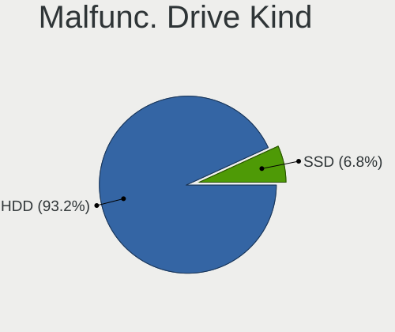

| Kind | Notebooks | Drives | Percent |
|------|-----------|--------|---------|
| HDD  | 41        | 45     | 93.18%  |
| SSD  | 3         | 4      | 6.82%   |

Failed Drives
-------------

Failed drive models

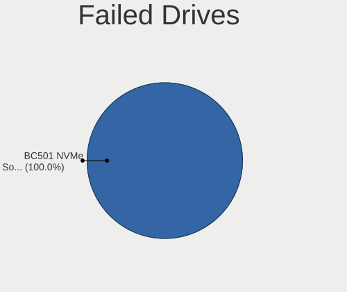

| Model                                       | Notebooks | Drives | Percent |
|---------------------------------------------|-----------|--------|---------|
| SK hynix BC501 NVMe Solid State Drive 512GB | 1         | 1      | 100%    |

Failed Drive Vendor
-------------------

Failed drive vendors

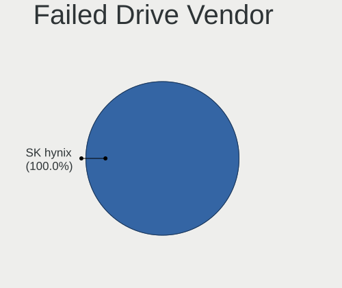

| Vendor   | Notebooks | Drives | Percent |
|----------|-----------|--------|---------|
| SK hynix | 1         | 1      | 100%    |

Drive Status
------------

Number of failed and malfunc. drives

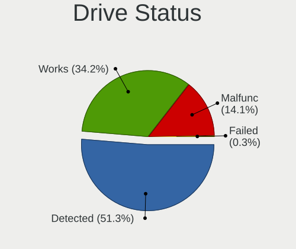

| Status   | Notebooks | Drives | Percent |
|----------|-----------|--------|---------|
| Detected | 156       | 221    | 51.32%  |
| Works    | 104       | 154    | 34.21%  |
| Malfunc  | 43        | 49     | 14.14%  |
| Failed   | 1         | 1      | 0.33%   |

Storage controller
------------------

Storage Vendor
--------------

Storage controller vendors

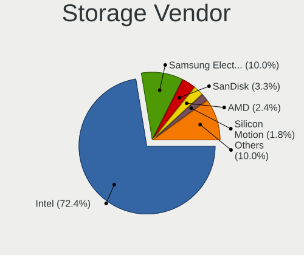

| Vendor                       | Notebooks | Percent |
|------------------------------|-----------|---------|
| Intel                        | 239       | 72.42%  |
| Samsung Electronics          | 33        | 10%     |
| SanDisk                      | 11        | 3.33%   |
| AMD                          | 8         | 2.42%   |
| Silicon Motion               | 6         | 1.82%   |
| Micron Technology            | 6         | 1.82%   |
| Toshiba America Info Systems | 5         | 1.52%   |
| SK hynix                     | 5         | 1.52%   |
| ADATA Technology             | 4         | 1.21%   |
| MAXIO Technology (Hangzhou)  | 2         | 0.61%   |
| KIOXIA                       | 2         | 0.61%   |
| Union Memory (Shenzhen)      | 1         | 0.3%    |
| Shenzhen Longsys Electronics | 1         | 0.3%    |
| Phison Electronics           | 1         | 0.3%    |
| Micron/Crucial Technology    | 1         | 0.3%    |
| Marvell Technology Group     | 1         | 0.3%    |
| Lite-On Technology           | 1         | 0.3%    |
| Kingston Technology Company  | 1         | 0.3%    |
| ASMedia Technology           | 1         | 0.3%    |
| Apple                        | 1         | 0.3%    |

Storage Model
-------------

Storage controller models

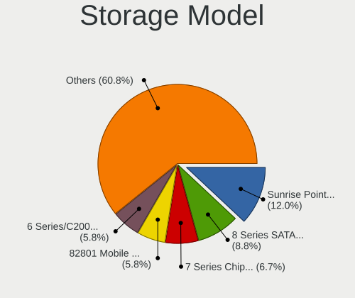

| Model                                                                                  | Notebooks | Percent |
|----------------------------------------------------------------------------------------|-----------|---------|
| Intel Sunrise Point-LP SATA Controller [AHCI mode]                                     | 41        | 11.99%  |
| Intel 8 Series SATA Controller 1 [AHCI mode]                                           | 30        | 8.77%   |
| Intel 7 Series Chipset Family 6-port SATA Controller [AHCI mode]                       | 23        | 6.73%   |
| Intel 82801 Mobile SATA Controller [RAID mode]                                         | 20        | 5.85%   |
| Intel 6 Series/C200 Series Chipset Family 6 port Mobile SATA AHCI Controller           | 20        | 5.85%   |
| Samsung NVMe SSD Controller SM981/PM981/PM983                                          | 15        | 4.39%   |
| Intel Wildcat Point-LP SATA Controller [AHCI Mode]                                     | 14        | 4.09%   |
| Intel 8 Series/C220 Series Chipset Family 6-port SATA Controller 1 [AHCI mode]         | 12        | 3.51%   |
| Intel Volume Management Device NVMe RAID Controller                                    | 10        | 2.92%   |
| Intel Cannon Point-LP SATA Controller [AHCI Mode]                                      | 9         | 2.63%   |
| AMD FCH SATA Controller [AHCI mode]                                                    | 8         | 2.34%   |
| Samsung NVMe SSD Controller PM9A1/PM9A3/980PRO                                         | 7         | 2.05%   |
| Silicon Motion SM2263EN/SM2263XT (DRAM-less) NVMe SSD Controllers                      | 6         | 1.75%   |
| SanDisk Extreme Pro / WD Black SN750 / PC SN730 / Red SN700 NVMe SSD                   | 6         | 1.75%   |
| Intel Celeron/Pentium Silver Processor SATA Controller                                 | 6         | 1.75%   |
| Intel Cannon Lake Mobile PCH SATA AHCI Controller                                      | 5         | 1.46%   |
| Intel Atom/Celeron/Pentium Processor x5-E8000/J3xxx/N3xxx Series SATA Controller       | 5         | 1.46%   |
| SK hynix BC501 NVMe Solid State Drive                                                  | 4         | 1.17%   |
| Samsung NVMe SSD Controller SM961/PM961/SM963                                          | 4         | 1.17%   |
| Samsung NVMe SSD Controller 980 (DRAM-less)                                            | 4         | 1.17%   |
| Intel Ice Lake-LP SATA Controller [AHCI mode]                                          | 4         | 1.17%   |
| Intel Atom Processor E3800 Series SATA AHCI Controller                                 | 4         | 1.17%   |
| ADATA XPG GAMMIXS1 1L, XPG GAMMIX S5, LEGEND 710 / 740, SWORDFISH NVMe SSD (DRAM-less) | 4         | 1.17%   |
| Toshiba America Info Systems XG6 NVMe SSD Controller                                   | 3         | 0.88%   |
| Micron 2450 NVMe SSD [HendrixV] (DRAM-less)                                            | 3         | 0.88%   |
| Intel Tiger Lake-LP SATA Controller                                                    | 3         | 0.88%   |
| Intel Celeron N3350/Pentium N4200/Atom E3900 Series SATA AHCI Controller               | 3         | 0.88%   |
| Intel 82801IBM/IEM (ICH9M/ICH9M-E) 4 port SATA Controller [AHCI mode]                  | 3         | 0.88%   |
| Intel 82801HM/HEM (ICH8M/ICH8M-E) SATA Controller [AHCI mode]                          | 3         | 0.88%   |
| Intel 82801HM/HEM (ICH8M/ICH8M-E) IDE Controller                                       | 3         | 0.88%   |
| Intel 82801GBM/GHM (ICH7-M Family) SATA Controller [AHCI mode]                         | 3         | 0.88%   |
| Intel 82801G (ICH7 Family) IDE Controller                                              | 3         | 0.88%   |
| Intel 5 Series/3400 Series Chipset 6 port SATA AHCI Controller                         | 3         | 0.88%   |
| Intel 5 Series/3400 Series Chipset 4 port SATA AHCI Controller                         | 3         | 0.88%   |
| SanDisk Ultra 3D / WD PC SN530, IX SN530, Blue SN550 NVMe SSD (DRAM-less)              | 2         | 0.58%   |
| Micron 2200S NVMe SSD [Cassandra]                                                      | 2         | 0.58%   |
| Intel SSD DC P4101/Pro 7600p/760p/E 6100p Series                                       | 2         | 0.58%   |
| Intel HM170/QM170 Chipset SATA Controller [AHCI Mode]                                  | 2         | 0.58%   |
| Intel Comet Lake SATA AHCI Controller                                                  | 2         | 0.58%   |
| Intel 82801GBM/GHM (ICH7-M Family) SATA Controller [IDE mode]                          | 2         | 0.58%   |

Storage Kind
------------

Kind of storage controller (IDE, SATA, NVMe, SAS, ...)

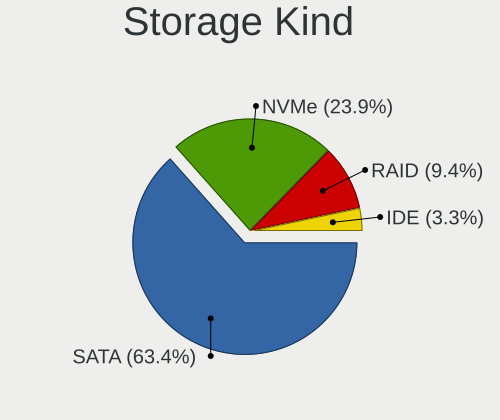

| Kind | Notebooks | Percent |
|------|-----------|---------|
| SATA | 210       | 63.44%  |
| NVMe | 79        | 23.87%  |
| RAID | 31        | 9.37%   |
| IDE  | 11        | 3.32%   |

Processor
---------

CPU Vendor
----------

Processor vendors

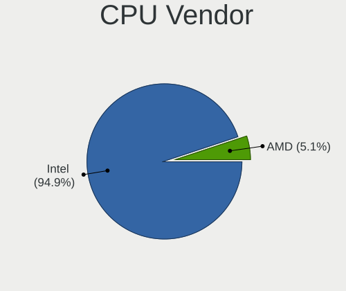

| Vendor | Notebooks | Percent |
|--------|-----------|---------|
| Intel  | 280       | 94.92%  |
| AMD    | 15        | 5.08%   |

CPU Model
---------

Processor models

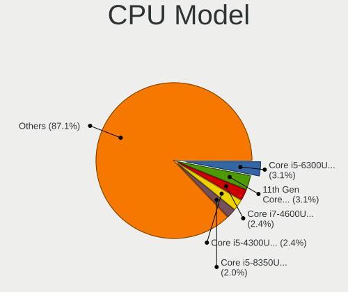

| Model                                       | Notebooks | Percent |
|---------------------------------------------|-----------|---------|
| Intel Core i5-6300U CPU @ 2.40GHz           | 9         | 3.05%   |
| Intel 11th Gen Core i5-1135G7 @ 2.40GHz     | 9         | 3.05%   |
| Intel Core i7-4600U CPU @ 2.10GHz           | 7         | 2.37%   |
| Intel Core i5-4300U CPU @ 1.90GHz           | 7         | 2.37%   |
| Intel Core i5-8350U CPU @ 1.70GHz           | 6         | 2.03%   |
| Intel Core i5-8265U CPU @ 1.60GHz           | 6         | 2.03%   |
| Intel Core i5-5200U CPU @ 2.20GHz           | 6         | 2.03%   |
| Intel Core i5-1035G1 CPU @ 1.00GHz          | 6         | 2.03%   |
| Intel Core i7-8565U CPU @ 1.80GHz           | 5         | 1.69%   |
| Intel Core i7-8550U CPU @ 1.80GHz           | 5         | 1.69%   |
| Intel Core i7-7500U CPU @ 2.70GHz           | 5         | 1.69%   |
| Intel Core i7-6600U CPU @ 2.60GHz           | 5         | 1.69%   |
| Intel Core i5-4210U CPU @ 1.70GHz           | 5         | 1.69%   |
| Intel Core i5 CPU M 520 @ 2.40GHz           | 5         | 1.69%   |
| Intel Atom x5-Z8350 CPU @ 1.44GHz           | 5         | 1.69%   |
| Intel Core i7-8650U CPU @ 1.90GHz           | 4         | 1.36%   |
| Intel Core i7-6500U CPU @ 2.50GHz           | 4         | 1.36%   |
| Intel Core i7-5500U CPU @ 2.40GHz           | 4         | 1.36%   |
| Intel Core i5-4310U CPU @ 2.00GHz           | 4         | 1.36%   |
| Intel Core i5-4200U CPU @ 1.60GHz           | 4         | 1.36%   |
| Intel Core i5-3320M CPU @ 2.60GHz           | 4         | 1.36%   |
| Intel Core i5-2540M CPU @ 2.60GHz           | 4         | 1.36%   |
| Intel Core i5-2520M CPU @ 2.50GHz           | 4         | 1.36%   |
| Intel Celeron N4020 CPU @ 1.10GHz           | 4         | 1.36%   |
| Intel 12th Gen Core i7-12700H               | 4         | 1.36%   |
| Intel 11th Gen Core i7-1165G7 @ 2.80GHz     | 4         | 1.36%   |
| Intel Core i7-8750H CPU @ 2.20GHz           | 3         | 1.02%   |
| Intel Core i7-8665U CPU @ 1.90GHz           | 3         | 1.02%   |
| Intel Core i5-8365U CPU @ 1.60GHz           | 3         | 1.02%   |
| Intel Core i5-8250U CPU @ 1.60GHz           | 3         | 1.02%   |
| Intel Core i5-6200U CPU @ 2.30GHz           | 3         | 1.02%   |
| Intel Core i5-3427U CPU @ 1.80GHz           | 3         | 1.02%   |
| Intel Core i5-3360M CPU @ 2.80GHz           | 3         | 1.02%   |
| Intel Core i5-3230M CPU @ 2.60GHz           | 3         | 1.02%   |
| Intel Core i5-2450M CPU @ 2.50GHz           | 3         | 1.02%   |
| Intel Core i3-2350M CPU @ 2.30GHz           | 3         | 1.02%   |
| Intel Celeron CPU N3350 @ 1.10GHz           | 3         | 1.02%   |
| Intel Celeron CPU N3060 @ 1.60GHz           | 3         | 1.02%   |
| Intel Atom CPU Z3735F @ 1.33GHz             | 3         | 1.02%   |
| Intel Pentium Dual-Core CPU T4500 @ 2.30GHz | 2         | 0.68%   |

CPU Model Family
----------------

Processor model prefix

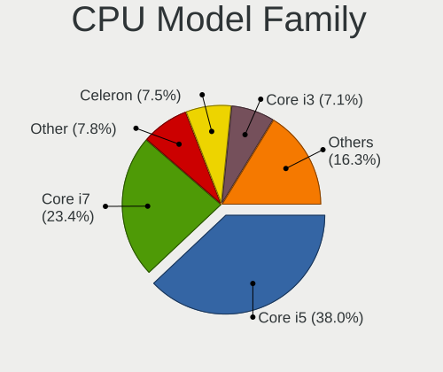

| Model                   | Notebooks | Percent |
|-------------------------|-----------|---------|
| Intel Core i5           | 112       | 37.97%  |
| Intel Core i7           | 69        | 23.39%  |
| Other                   | 23        | 7.8%    |
| Intel Celeron           | 22        | 7.46%   |
| Intel Core i3           | 21        | 7.12%   |
| Intel Atom              | 11        | 3.73%   |
| Intel Pentium           | 5         | 1.69%   |
| Intel Core 2 Duo        | 5         | 1.69%   |
| AMD Ryzen 5             | 5         | 1.69%   |
| AMD Ryzen 7             | 4         | 1.36%   |
| Intel Core i9           | 3         | 1.02%   |
| Intel Pentium Dual-Core | 2         | 0.68%   |
| Intel Core m3           | 2         | 0.68%   |
| Intel Core 2            | 2         | 0.68%   |
| AMD A10                 | 2         | 0.68%   |
| Intel Pentium Gold      | 1         | 0.34%   |
| Intel Pentium Dual      | 1         | 0.34%   |
| Intel Genuine           | 1         | 0.34%   |
| AMD Ryzen 5 PRO         | 1         | 0.34%   |
| AMD Ryzen 3 PRO         | 1         | 0.34%   |
| AMD FX                  | 1         | 0.34%   |
| AMD E2                  | 1         | 0.34%   |

CPU Cores
---------

Number of processor cores

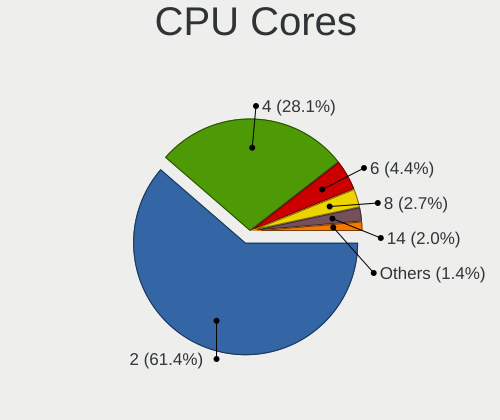

| Number  | Notebooks | Percent |
|---------|-----------|---------|
| 2       | 181       | 61.36%  |
| 4       | 83        | 28.14%  |
| 6       | 13        | 4.41%   |
| 8       | 8         | 2.71%   |
| 14      | 6         | 2.03%   |
| 1       | 2         | 0.68%   |
| 12      | 1         | 0.34%   |
| Unknown | 1         | 0.34%   |

CPU Sockets
-----------

Number of sockets

| Number | Notebooks | Percent |
|--------|-----------|---------|
| 1      | 295       | 100%    |

CPU Threads
-----------

Threads per core (Hyper-Threading)

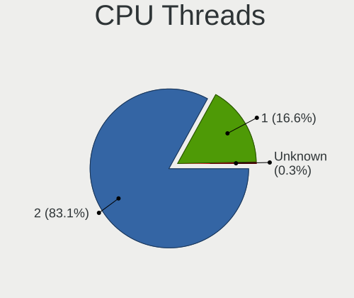

| Number  | Notebooks | Percent |
|---------|-----------|---------|
| 2       | 245       | 83.05%  |
| 1       | 49        | 16.61%  |
| Unknown | 1         | 0.34%   |

CPU Op-Modes
------------

CPU Operation Modes (32-bit, 64-bit)

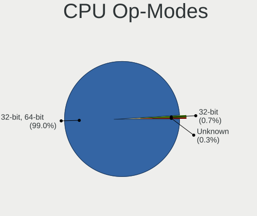

| Op mode        | Notebooks | Percent |
|----------------|-----------|---------|
| 32-bit, 64-bit | 292       | 98.98%  |
| 32-bit         | 2         | 0.68%   |
| Unknown        | 1         | 0.34%   |

CPU Microcode
-------------

Microcode number

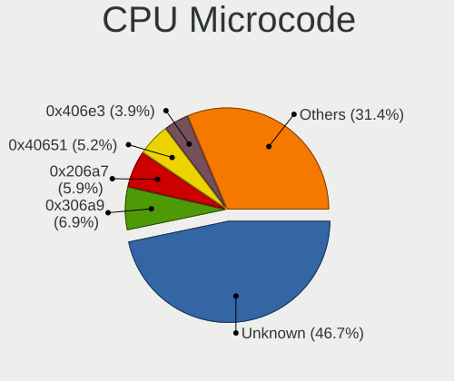

| Number     | Notebooks | Percent |
|------------|-----------|---------|
| Unknown    | 143       | 46.73%  |
| 0x306a9    | 21        | 6.86%   |
| 0x206a7    | 18        | 5.88%   |
| 0x40651    | 16        | 5.23%   |
| 0x406e3    | 12        | 3.92%   |
| 0x306c3    | 9         | 2.94%   |
| 0x306d4    | 8         | 2.61%   |
| 0x806ec    | 6         | 1.96%   |
| 0x806ea    | 6         | 1.96%   |
| 0x806c1    | 6         | 1.96%   |
| 0x30678    | 5         | 1.63%   |
| 0x20655    | 5         | 1.63%   |
| 0x406c4    | 4         | 1.31%   |
| 0x906ea    | 3         | 0.98%   |
| 0x806e9    | 3         | 0.98%   |
| 0x706e5    | 3         | 0.98%   |
| 0x706a8    | 3         | 0.98%   |
| 0x6fd      | 3         | 0.98%   |
| 0x1067a    | 3         | 0.98%   |
| 0x906e9    | 2         | 0.65%   |
| 0x806eb    | 2         | 0.65%   |
| 0x706a1    | 2         | 0.65%   |
| 0x406c3    | 2         | 0.65%   |
| 0x106c2    | 2         | 0.65%   |
| 0x08608103 | 2         | 0.65%   |
| 0x08600106 | 2         | 0.65%   |
| 0xb0671    | 1         | 0.33%   |
| 0xa0652    | 1         | 0.33%   |
| 0x906ec    | 1         | 0.33%   |
| 0x806c2    | 1         | 0.33%   |
| 0x6fa      | 1         | 0.33%   |
| 0x6f6      | 1         | 0.33%   |
| 0x6f2      | 1         | 0.33%   |
| 0x506e3    | 1         | 0.33%   |
| 0x506c9    | 1         | 0.33%   |
| 0x30673    | 1         | 0.33%   |
| 0x0a50000d | 1         | 0.33%   |
| 0x08600103 | 1         | 0.33%   |
| 0x08108109 | 1         | 0.33%   |
| 0x0600611a | 1         | 0.33%   |

CPU Microarch
-------------

Microarchitecture

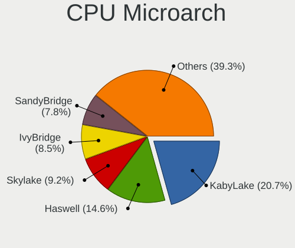

| Name             | Notebooks | Percent |
|------------------|-----------|---------|
| KabyLake         | 61        | 20.68%  |
| Haswell          | 43        | 14.58%  |
| Skylake          | 27        | 9.15%   |
| IvyBridge        | 25        | 8.47%   |
| SandyBridge      | 23        | 7.8%    |
| Silvermont       | 18        | 6.1%    |
| Broadwell        | 17        | 5.76%   |
| TigerLake        | 16        | 5.42%   |
| Westmere         | 9         | 3.05%   |
| IceLake          | 8         | 2.71%   |
| Goldmont plus    | 6         | 2.03%   |
| Core             | 6         | 2.03%   |
| Alderlake Hybrid | 6         | 2.03%   |
| Zen 2            | 4         | 1.36%   |
| Penryn           | 4         | 1.36%   |
| Unknown          | 4         | 1.36%   |
| Zen 3            | 3         | 1.02%   |
| Goldmont         | 3         | 1.02%   |
| CometLake        | 3         | 1.02%   |
| Excavator        | 2         | 0.68%   |
| Bonnell          | 2         | 0.68%   |
| Zen+             | 1         | 0.34%   |
| Zen              | 1         | 0.34%   |
| Steamroller      | 1         | 0.34%   |
| P6               | 1         | 0.34%   |
| Bobcat           | 1         | 0.34%   |

Graphics
--------

GPU Vendor
----------

Vendors of graphics cards

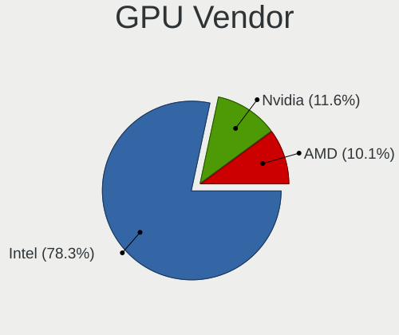

| Vendor | Notebooks | Percent |
|--------|-----------|---------|
| Intel  | 264       | 78.34%  |
| Nvidia | 39        | 11.57%  |
| AMD    | 34        | 10.09%  |

GPU Model
---------

Graphics card models

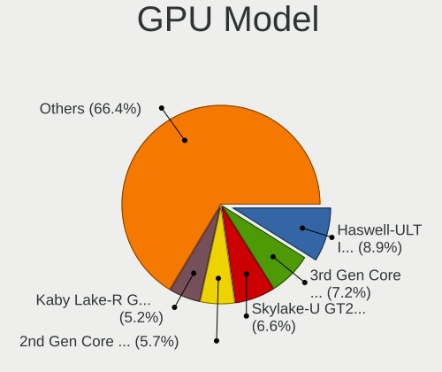

| Model                                                                                    | Notebooks | Percent |
|------------------------------------------------------------------------------------------|-----------|---------|
| Intel Haswell-ULT Integrated Graphics Controller                                         | 31        | 8.91%   |
| Intel 3rd Gen Core processor Graphics Controller                                         | 25        | 7.18%   |
| Intel Skylake-U GT2 [HD Graphics 520]                                                    | 23        | 6.61%   |
| Intel 2nd Generation Core Processor Family Integrated Graphics Controller                | 20        | 5.75%   |
| Intel Kaby Lake-R GT2 [UHD Graphics 620]                                                 | 18        | 5.17%   |
| Intel WhiskeyLake-U GT2 [UHD Graphics 620]                                               | 17        | 4.89%   |
| Intel Broadwell-U GT2 [HD Graphics 5500]                                                 | 16        | 4.6%    |
| Intel TigerLake-LP GT2 [Iris Xe Graphics]                                                | 15        | 4.31%   |
| Intel Kaby Lake-U GT2 [HD Graphics 620]                                                  | 11        | 3.16%   |
| Intel Atom/Celeron/Pentium Processor x5-E8000/J3xxx/N3xxx Integrated Graphics Controller | 11        | 3.16%   |
| Intel 4th Gen Core Processor Integrated Graphics Controller                              | 11        | 3.16%   |
| Intel Core Processor Integrated Graphics Controller                                      | 7         | 2.01%   |
| Intel Atom Processor Z36xxx/Z37xxx Series Graphics & Display                             | 7         | 2.01%   |
| AMD Topaz XT [Radeon R7 M260/M265 / M340/M360 / M440/M445 / 530/535 / 620/625 Mobile]    | 7         | 2.01%   |
| Intel Iris Plus Graphics G1 (Ice Lake)                                                   | 6         | 1.72%   |
| Intel GeminiLake [UHD Graphics 600]                                                      | 6         | 1.72%   |
| Intel Mobile 945GM/GMS/GME, 943/940GML Express Integrated Graphics Controller            | 5         | 1.44%   |
| Intel Alder Lake-P GT2 [Iris Xe Graphics]                                                | 5         | 1.44%   |
| Intel DG2 [Arc A370M]                                                                    | 4         | 1.15%   |
| Intel CoffeeLake-H GT2 [UHD Graphics 630]                                                | 4         | 1.15%   |
| Nvidia TU106M [GeForce RTX 2060 Max-Q]                                                   | 3         | 0.86%   |
| Nvidia GP108M [GeForce MX250]                                                            | 3         | 0.86%   |
| Nvidia GM108M [GeForce MX130]                                                            | 3         | 0.86%   |
| Intel Mobile 945GM/GMS, 943/940GML Express Integrated Graphics Controller                | 3         | 0.86%   |
| Intel Mobile 4 Series Chipset Integrated Graphics Controller                             | 3         | 0.86%   |
| Intel CometLake-U GT2 [UHD Graphics]                                                     | 3         | 0.86%   |
| Intel Apollo Lake GT1 [HD Graphics 500]                                                  | 3         | 0.86%   |
| AMD Sun XT [Radeon HD 8670A/8670M/8690M / R5 M330 / M430 / Radeon 520 Mobile]            | 3         | 0.86%   |
| AMD Seymour [Radeon HD 6400M/7400M Series]                                               | 3         | 0.86%   |
| AMD Renoir [Radeon Vega Series / Radeon Vega Mobile Series]                              | 3         | 0.86%   |
| AMD Barcelo                                                                              | 3         | 0.86%   |
| Nvidia GT218M [NVS 3100M]                                                                | 2         | 0.57%   |
| Nvidia GP104BM [GeForce GTX 1070 Mobile]                                                 | 2         | 0.57%   |
| Nvidia GF117M [GeForce 610M/710M/810M/820M / GT 620M/625M/630M/720M]                     | 2         | 0.57%   |
| Nvidia AD107M [GeForce RTX 4060 Max-Q / Mobile]                                          | 2         | 0.57%   |
| Intel Skylake-Y GT2 [HD Graphics 515]                                                    | 2         | 0.57%   |
| Intel Mobile 945GSE Express Integrated Graphics Controller                               | 2         | 0.57%   |
| Intel Iris Plus Graphics G7                                                              | 2         | 0.57%   |
| Intel CometLake-H GT2 [UHD Graphics]                                                     | 2         | 0.57%   |
| AMD Wani [Radeon R5/R6/R7 Graphics]                                                      | 2         | 0.57%   |

GPU Combo
---------

Combinations of graphics cards

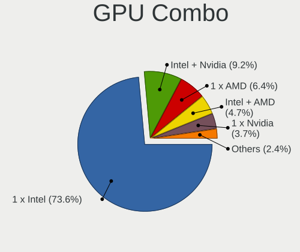

| Name           | Notebooks | Percent |
|----------------|-----------|---------|
| 1 x Intel      | 217       | 73.56%  |
| Intel + Nvidia | 27        | 9.15%   |
| 1 x AMD        | 19        | 6.44%   |
| Intel + AMD    | 14        | 4.75%   |
| 1 x Nvidia     | 11        | 3.73%   |
| 2 x Intel      | 6         | 2.03%   |
| 2 x AMD        | 1         | 0.34%   |

GPU Driver
----------

Free vs proprietary

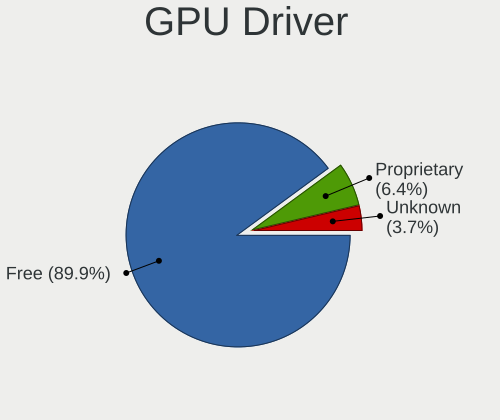

| Driver      | Notebooks | Percent |
|-------------|-----------|---------|
| Free        | 268       | 89.93%  |
| Proprietary | 19        | 6.38%   |
| Unknown     | 11        | 3.69%   |

GPU Memory
----------

Total video memory

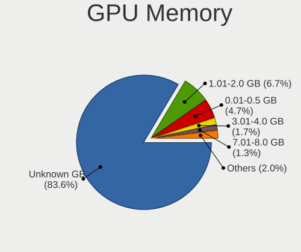

| Size in GB | Notebooks | Percent |
|------------|-----------|---------|
| Unknown    | 249       | 83.56%  |
| 1.01-2.0   | 20        | 6.71%   |
| 0.01-0.5   | 14        | 4.7%    |
| 3.01-4.0   | 5         | 1.68%   |
| 7.01-8.0   | 4         | 1.34%   |
| 5.01-6.0   | 3         | 1.01%   |
| 0.51-1.0   | 3         | 1.01%   |

Monitor
-------

Monitor Vendor
--------------

Monitor vendors

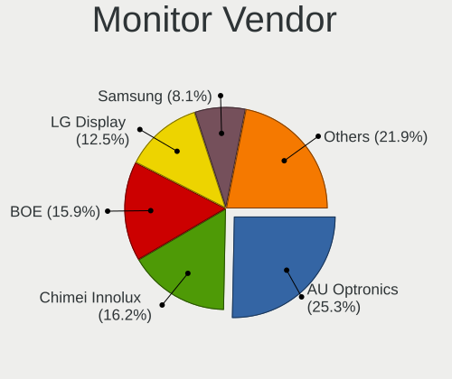

| Vendor                  | Notebooks | Percent |
|-------------------------|-----------|---------|
| AU Optronics            | 81        | 25.31%  |
| Chimei Innolux          | 52        | 16.25%  |
| BOE                     | 51        | 15.94%  |
| LG Display              | 40        | 12.5%   |
| Samsung Electronics     | 26        | 8.13%   |
| Hewlett-Packard         | 13        | 4.06%   |
| Sharp                   | 8         | 2.5%    |
| Lenovo                  | 7         | 2.19%   |
| InfoVision              | 5         | 1.56%   |
| Chi Mei Optoelectronics | 5         | 1.56%   |
| Apple                   | 5         | 1.56%   |
| Dell                    | 4         | 1.25%   |
| LG Philips              | 3         | 0.94%   |
| KDC                     | 3         | 0.94%   |
| CSO                     | 3         | 0.94%   |
| Unknown (XXX)           | 2         | 0.63%   |
| HannStar                | 2         | 0.63%   |
| Sony                    | 1         | 0.31%   |
| RGT                     | 1         | 0.31%   |
| Planar                  | 1         | 0.31%   |
| NEC Computers           | 1         | 0.31%   |
| MTK                     | 1         | 0.31%   |
| HKC                     | 1         | 0.31%   |
| Goldstar                | 1         | 0.31%   |
| Eizo                    | 1         | 0.31%   |
| CVT                     | 1         | 0.31%   |
| Acer                    | 1         | 0.31%   |

Monitor Model
-------------

Monitor models

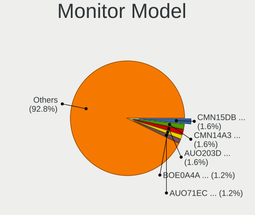

| Model                                                                    | Notebooks | Percent |
|--------------------------------------------------------------------------|-----------|---------|
| Chimei Innolux LCD Monitor CMN15DB 1366x768 344x193mm 15.5-inch          | 5         | 1.56%   |
| Chimei Innolux LCD Monitor CMN14A3 1600x900 309x174mm 14.0-inch          | 5         | 1.56%   |
| AU Optronics LCD Monitor AUO203D 1920x1080 309x174mm 14.0-inch           | 5         | 1.56%   |
| BOE LCD Monitor BOE0A4A 2560x1600 345x215mm 16.0-inch                    | 4         | 1.25%   |
| AU Optronics LCD Monitor AUO71EC 1366x768 344x193mm 15.5-inch            | 4         | 1.25%   |
| AU Optronics LCD Monitor AUO223E 1600x900 309x174mm 14.0-inch            | 4         | 1.25%   |
| AU Optronics LCD Monitor AUO123D 1920x1080 309x173mm 13.9-inch           | 4         | 1.25%   |
| Sharp LCD Monitor SHP14F9 1920x1200 288x180mm 13.4-inch                  | 3         | 0.94%   |
| Samsung Electronics LCD Monitor SEC4149 1366x768 292x174mm 13.4-inch     | 3         | 0.94%   |
| LG Display LCD Monitor LGD045E 1366x768 310x174mm 14.0-inch              | 3         | 0.94%   |
| LG Display LCD Monitor LGD02DC 1366x768 344x194mm 15.5-inch              | 3         | 0.94%   |
| Chimei Innolux LCD Monitor CMN15AB 1366x768 344x193mm 15.5-inch          | 3         | 0.94%   |
| Chimei Innolux LCD Monitor CMN14C0 1920x1080 308x173mm 13.9-inch         | 3         | 0.94%   |
| Chimei Innolux LCD Monitor CMN14B1 1920x1080 308x173mm 13.9-inch         | 3         | 0.94%   |
| AU Optronics LCD Monitor AUO45EC 1366x768 344x193mm 15.5-inch            | 3         | 0.94%   |
| AU Optronics LCD Monitor AUO233E 1600x900 309x174mm 14.0-inch            | 3         | 0.94%   |
| Samsung Electronics LCD Monitor SEC5441 1280x800 331x207mm 15.4-inch     | 2         | 0.63%   |
| Samsung Electronics LCD Monitor SEC4351 1366x768 344x194mm 15.5-inch     | 2         | 0.63%   |
| Samsung Electronics LCD Monitor SDC4942 1366x768 309x174mm 14.0-inch     | 2         | 0.63%   |
| LG Display LCD Monitor LGD0575 1920x1080 309x174mm 14.0-inch             | 2         | 0.63%   |
| KDC LCD Monitor KDC0109 1366x768 256x144mm 11.6-inch                     | 2         | 0.63%   |
| Hewlett-Packard V214a HPN348C 1920x1080 458x258mm 20.7-inch              | 2         | 0.63%   |
| HannStar LCD Monitor HSD03E9 1024x600 220x129mm 10.0-inch                | 2         | 0.63%   |
| Chimei Innolux LCD Monitor CMN15C3 1920x1080 344x193mm 15.5-inch         | 2         | 0.63%   |
| Chimei Innolux LCD Monitor CMN15BF 1366x768 344x194mm 15.5-inch          | 2         | 0.63%   |
| Chimei Innolux LCD Monitor CMN14E5 1920x1080 309x173mm 13.9-inch         | 2         | 0.63%   |
| Chimei Innolux LCD Monitor CMN14D6 1366x768 309x173mm 13.9-inch          | 2         | 0.63%   |
| Chimei Innolux LCD Monitor CMN1495 1366x768 309x173mm 13.9-inch          | 2         | 0.63%   |
| Chimei Innolux LCD Monitor CMN1484 1600x900 310x174mm 14.0-inch          | 2         | 0.63%   |
| Chimei Innolux LCD Monitor CMN139E 1920x1080 293x165mm 13.2-inch         | 2         | 0.63%   |
| Chi Mei Optoelectronics LCD Monitor CMO15A3 1366x768 344x193mm 15.5-inch | 2         | 0.63%   |
| Chi Mei Optoelectronics LCD Monitor CMO15A1 1366x768 344x193mm 15.5-inch | 2         | 0.63%   |
| BOE LCD Monitor BOE07C9 1920x1080 309x173mm 13.9-inch                    | 2         | 0.63%   |
| BOE LCD Monitor BOE0780 1920x1080 344x194mm 15.5-inch                    | 2         | 0.63%   |
| BOE LCD Monitor BOE06A4 1366x768 344x194mm 15.5-inch                     | 2         | 0.63%   |
| BOE LCD Monitor BOE0695 1920x1080 380x210mm 17.1-inch                    | 2         | 0.63%   |
| BOE LCD Monitor BOE0672 1366x768 344x194mm 15.5-inch                     | 2         | 0.63%   |
| BOE LCD Monitor BOE063A 1366x768 277x156mm 12.5-inch                     | 2         | 0.63%   |
| AU Optronics LCD Monitor AUOD291 1920x1200 301x188mm 14.0-inch           | 2         | 0.63%   |
| AU Optronics LCD Monitor AUO81EC 1366x768 344x193mm 15.5-inch            | 2         | 0.63%   |

Monitor Resolution
------------------

Monitor screen resolution

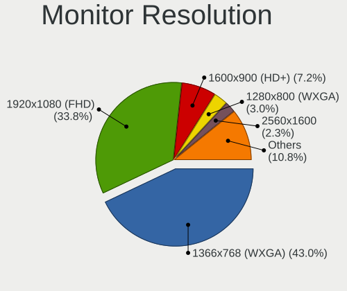

| Resolution         | Notebooks | Percent |
|--------------------|-----------|---------|
| 1366x768 (WXGA)    | 131       | 42.95%  |
| 1920x1080 (FHD)    | 103       | 33.77%  |
| 1600x900 (HD+)     | 22        | 7.21%   |
| 1280x800 (WXGA)    | 9         | 2.95%   |
| 2560x1600          | 7         | 2.3%    |
| 1920x1200 (WUXGA)  | 7         | 2.3%    |
| 3840x2160 (4K)     | 6         | 1.97%   |
| 2560x1440 (QHD)    | 3         | 0.98%   |
| 1440x900 (WXGA+)   | 3         | 0.98%   |
| 3200x1800 (QHD+)   | 2         | 0.66%   |
| 1024x600           | 2         | 0.66%   |
| 3840x2400          | 1         | 0.33%   |
| 3440x1440          | 1         | 0.33%   |
| 3072x1920          | 1         | 0.33%   |
| 2560x1080          | 1         | 0.33%   |
| 2160x1440          | 1         | 0.33%   |
| 1680x1050 (WSXGA+) | 1         | 0.33%   |
| 1600x1200          | 1         | 0.33%   |
| 1360x768           | 1         | 0.33%   |
| 1280x1024 (SXGA)   | 1         | 0.33%   |
| Unknown            | 1         | 0.33%   |

Monitor Diagonal
----------------

Diagonal size in inches

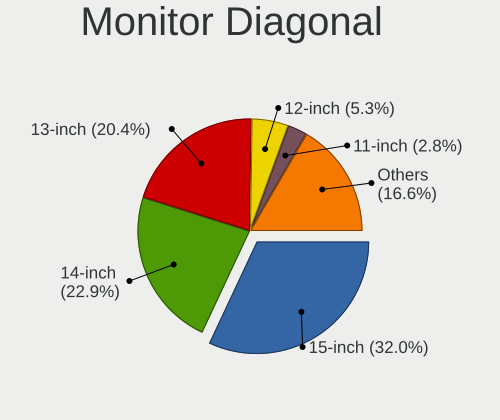

| Inches  | Notebooks | Percent |
|---------|-----------|---------|
| 15      | 102       | 31.97%  |
| 14      | 73        | 22.88%  |
| 13      | 65        | 20.38%  |
| 12      | 17        | 5.33%   |
| 11      | 9         | 2.82%   |
| 17      | 7         | 2.19%   |
| 16      | 7         | 2.19%   |
| 27      | 6         | 1.88%   |
| 21      | 5         | 1.57%   |
| 20      | 4         | 1.25%   |
| 24      | 3         | 0.94%   |
| 23      | 3         | 0.94%   |
| 18      | 3         | 0.94%   |
| 10      | 3         | 0.94%   |
| 34      | 2         | 0.63%   |
| 31      | 2         | 0.63%   |
| 84      | 1         | 0.31%   |
| 72      | 1         | 0.31%   |
| 63      | 1         | 0.31%   |
| 46      | 1         | 0.31%   |
| 40      | 1         | 0.31%   |
| 26      | 1         | 0.31%   |
| 19      | 1         | 0.31%   |
| Unknown | 1         | 0.31%   |

Monitor Width
-------------

Physical width

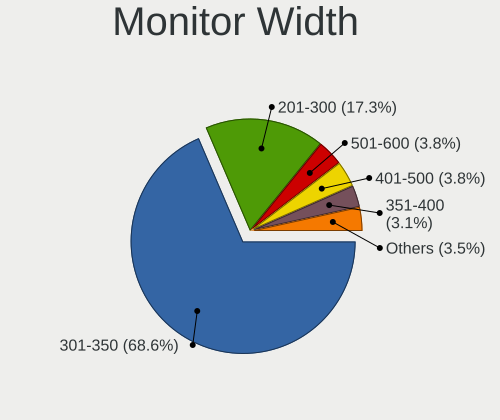

| Width in mm | Notebooks | Percent |
|-------------|-----------|---------|
| 301-350     | 218       | 68.55%  |
| 201-300     | 55        | 17.3%   |
| 501-600     | 12        | 3.77%   |
| 401-500     | 12        | 3.77%   |
| 351-400     | 10        | 3.14%   |
| 801-900     | 3         | 0.94%   |
| 601-700     | 3         | 0.94%   |
| 1501-2000   | 2         | 0.63%   |
| 1001-1500   | 1         | 0.31%   |
| 901-1000    | 1         | 0.31%   |
| Unknown     | 1         | 0.31%   |

Aspect Ratio
------------

Proportional relationship between the width and the height

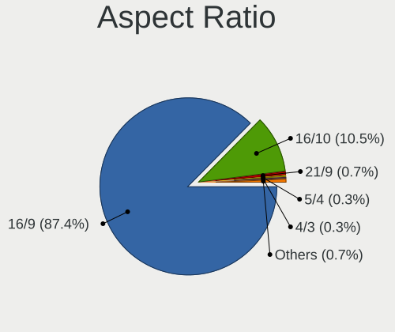

| Ratio   | Notebooks | Percent |
|---------|-----------|---------|
| 16/9    | 257       | 87.41%  |
| 16/10   | 31        | 10.54%  |
| 21/9    | 2         | 0.68%   |
| 5/4     | 1         | 0.34%   |
| 4/3     | 1         | 0.34%   |
| 3/2     | 1         | 0.34%   |
| Unknown | 1         | 0.34%   |

Monitor Area
------------

Area in inch²

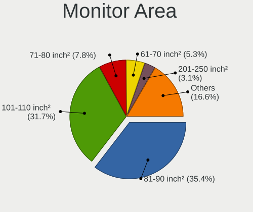

| Area in inch² | Notebooks | Percent |
|----------------|-----------|---------|
| 81-90          | 113       | 35.42%  |
| 101-110        | 101       | 31.66%  |
| 71-80          | 25        | 7.84%   |
| 61-70          | 17        | 5.33%   |
| 201-250        | 10        | 3.13%   |
| 51-60          | 9         | 2.82%   |
| 111-120        | 7         | 2.19%   |
| 301-350        | 6         | 1.88%   |
| 151-200        | 6         | 1.88%   |
| 121-130        | 5         | 1.57%   |
| 351-500        | 4         | 1.25%   |
| 141-150        | 4         | 1.25%   |
| More than 1000 | 3         | 0.94%   |
| 41-50          | 3         | 0.94%   |
| 501-1000       | 2         | 0.63%   |
| 251-300        | 1         | 0.31%   |
| 131-140        | 1         | 0.31%   |
| 91-100         | 1         | 0.31%   |
| Unknown        | 1         | 0.31%   |

Pixel Density
-------------

Pixels per inch

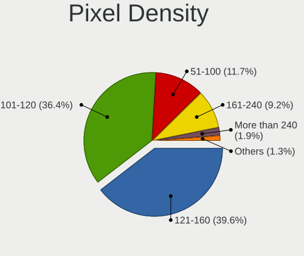

| Density       | Notebooks | Percent |
|---------------|-----------|---------|
| 121-160       | 125       | 39.56%  |
| 101-120       | 115       | 36.39%  |
| 51-100        | 37        | 11.71%  |
| 161-240       | 29        | 9.18%   |
| More than 240 | 6         | 1.9%    |
| 1-50          | 3         | 0.95%   |
| Unknown       | 1         | 0.32%   |

Multiple Monitors
-----------------

Total monitors connected

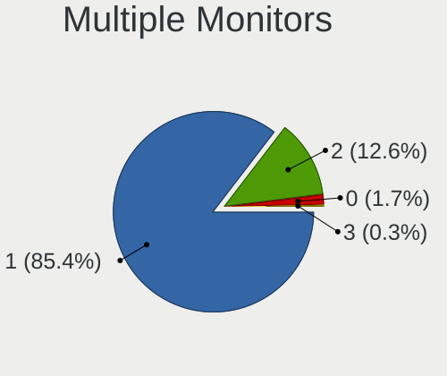

| Total | Notebooks | Percent |
|-------|-----------|---------|
| 1     | 258       | 85.43%  |
| 2     | 38        | 12.58%  |
| 0     | 5         | 1.66%   |
| 3     | 1         | 0.33%   |

Network
-------

Net Controller Vendor
---------------------

Controller vendors

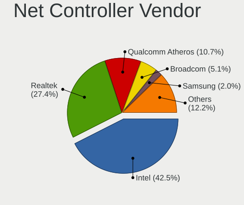

| Vendor                            | Notebooks | Percent |
|-----------------------------------|-----------|---------|
| Intel                             | 191       | 42.54%  |
| Realtek Semiconductor             | 123       | 27.39%  |
| Qualcomm Atheros                  | 48        | 10.69%  |
| Broadcom                          | 23        | 5.12%   |
| Samsung Electronics               | 9         | 2%      |
| Hewlett-Packard                   | 8         | 1.78%   |
| OPPO Electronics                  | 7         | 1.56%   |
| Ralink                            | 6         | 1.34%   |
| MediaTek                          | 6         | 1.34%   |
| Broadcom Limited                  | 4         | 0.89%   |
| ZTE WCDMA Technologies MSM        | 3         | 0.67%   |
| Sierra Wireless                   | 3         | 0.67%   |
| Shenzhen Goodix Technology        | 3         | 0.67%   |
| Marvell Technology Group          | 3         | 0.67%   |
| Huawei Technologies               | 3         | 0.67%   |
| T & A Mobile Phones               | 2         | 0.45%   |
| Spreadtrum Communications         | 2         | 0.45%   |
| Ralink Technology                 | 2         | 0.45%   |
| Ericsson Business Mobile Networks | 2         | 0.45%   |
| LSI                               | 1         | 0.22%   |

Net Controller Model
--------------------

Controller models

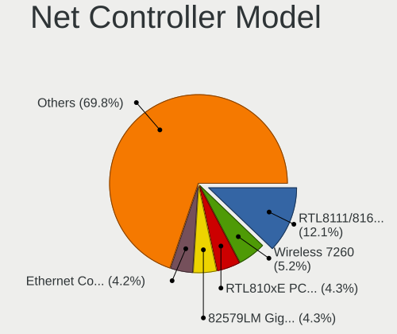

| Model                                                                  | Notebooks | Percent |
|------------------------------------------------------------------------|-----------|---------|
| Realtek RTL8111/8168/8211/8411 PCI Express Gigabit Ethernet Controller | 70        | 12.13%  |
| Intel Wireless 7260                                                    | 30        | 5.2%    |
| Realtek RTL810xE PCI Express Fast Ethernet controller                  | 25        | 4.33%   |
| Intel 82579LM Gigabit Network Connection (Lewisville)                  | 25        | 4.33%   |
| Intel Ethernet Connection I218-LM                                      | 24        | 4.16%   |
| Intel Wireless 8260                                                    | 17        | 2.95%   |
| Intel Wireless 8265 / 8275                                             | 16        | 2.77%   |
| Qualcomm Atheros QCA9377 802.11ac Wireless Network Adapter             | 14        | 2.43%   |
| Intel Ethernet Connection I219-LM                                      | 14        | 2.43%   |
| Intel Centrino Advanced-N 6205 [Taylor Peak]                           | 14        | 2.43%   |
| Intel Ethernet Connection (4) I219-LM                                  | 12        | 2.08%   |
| Qualcomm Atheros QCA9565 / AR9565 Wireless Network Adapter             | 11        | 1.91%   |
| Intel Wireless 7265                                                    | 11        | 1.91%   |
| Intel Wi-Fi 6 AX201                                                    | 11        | 1.91%   |
| Realtek RTL8153 Gigabit Ethernet Adapter                               | 10        | 1.73%   |
| Intel Wi-Fi 6 AX200                                                    | 10        | 1.73%   |
| Intel Cannon Point-LP CNVi [Wireless-AC]                               | 9         | 1.56%   |
| Realtek RTL8723BE PCIe Wireless Network Adapter                        | 7         | 1.21%   |
| Intel Ethernet Connection (3) I218-LM                                  | 7         | 1.21%   |
| Qualcomm Atheros AR9485 Wireless Network Adapter                       | 6         | 1.04%   |
| OPPO Ace 3V                                                            | 6         | 1.04%   |
| Intel Ice Lake-LP PCH CNVi WiFi                                        | 6         | 1.04%   |
| Intel Ethernet Connection (6) I219-LM                                  | 6         | 1.04%   |
| Intel Centrino Advanced-N 6200                                         | 6         | 1.04%   |
| Intel 82577LM Gigabit Network Connection                               | 6         | 1.04%   |
| Samsung GT-I9070 (network tethering, USB debugging enabled)            | 5         | 0.87%   |
| Realtek RTL8822CE 802.11ac PCIe Wireless Network Adapter               | 5         | 0.87%   |
| Ralink RT3290 Wireless 802.11n 1T/1R PCIe                              | 5         | 0.87%   |
| Qualcomm Atheros AR9285 Wireless Network Adapter (PCI-Express)         | 5         | 0.87%   |
| Intel Alder Lake-P PCH CNVi WiFi                                       | 5         | 0.87%   |
| Broadcom BCM43228 802.11a/b/g/n                                        | 5         | 0.87%   |
| Samsung Galaxy series, misc. (tethering mode)                          | 4         | 0.69%   |
| Realtek RTL8821CE 802.11ac PCIe Wireless Network Adapter               | 4         | 0.69%   |
| Realtek RTL8188CE 802.11b/g/n WiFi Adapter                             | 4         | 0.69%   |
| Intel Wireless 3160                                                    | 4         | 0.69%   |
| Intel Ethernet Connection I219-V                                       | 4         | 0.69%   |
| Intel Ethernet Connection I217-V                                       | 4         | 0.69%   |
| Intel 82579V Gigabit Network Connection                                | 4         | 0.69%   |
| HP lt4112 Gobi 4G Module Network Device                                | 4         | 0.69%   |
| Broadcom BCM4313 802.11bgn Wireless Network Adapter                    | 4         | 0.69%   |

Wireless Vendor
---------------

Wireless vendors

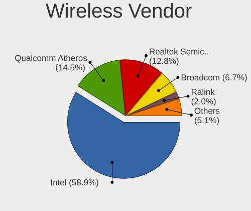

| Vendor                | Notebooks | Percent |
|-----------------------|-----------|---------|
| Intel                 | 175       | 58.92%  |
| Qualcomm Atheros      | 43        | 14.48%  |
| Realtek Semiconductor | 38        | 12.79%  |
| Broadcom              | 20        | 6.73%   |
| Ralink                | 6         | 2.02%   |
| Hewlett-Packard       | 5         | 1.68%   |
| Sierra Wireless       | 3         | 1.01%   |
| Broadcom Limited      | 3         | 1.01%   |
| Ralink Technology     | 2         | 0.67%   |
| MediaTek              | 2         | 0.67%   |

Wireless Model
--------------

Wireless models

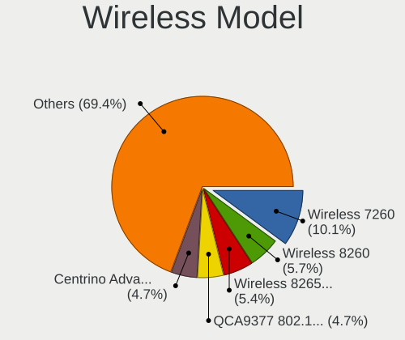

| Model                                                          | Notebooks | Percent |
|----------------------------------------------------------------|-----------|---------|
| Intel Wireless 7260                                            | 30        | 10.1%   |
| Intel Wireless 8260                                            | 17        | 5.72%   |
| Intel Wireless 8265 / 8275                                     | 16        | 5.39%   |
| Qualcomm Atheros QCA9377 802.11ac Wireless Network Adapter     | 14        | 4.71%   |
| Intel Centrino Advanced-N 6205 [Taylor Peak]                   | 14        | 4.71%   |
| Qualcomm Atheros QCA9565 / AR9565 Wireless Network Adapter     | 11        | 3.7%    |
| Intel Wireless 7265                                            | 11        | 3.7%    |
| Intel Wi-Fi 6 AX201                                            | 11        | 3.7%    |
| Intel Wi-Fi 6 AX200                                            | 10        | 3.37%   |
| Intel Cannon Point-LP CNVi [Wireless-AC]                       | 9         | 3.03%   |
| Realtek RTL8723BE PCIe Wireless Network Adapter                | 7         | 2.36%   |
| Qualcomm Atheros AR9485 Wireless Network Adapter               | 6         | 2.02%   |
| Intel Ice Lake-LP PCH CNVi WiFi                                | 6         | 2.02%   |
| Intel Centrino Advanced-N 6200                                 | 6         | 2.02%   |
| Realtek RTL8822CE 802.11ac PCIe Wireless Network Adapter       | 5         | 1.68%   |
| Ralink RT3290 Wireless 802.11n 1T/1R PCIe                      | 5         | 1.68%   |
| Qualcomm Atheros AR9285 Wireless Network Adapter (PCI-Express) | 5         | 1.68%   |
| Intel Alder Lake-P PCH CNVi WiFi                               | 5         | 1.68%   |
| Broadcom BCM43228 802.11a/b/g/n                                | 5         | 1.68%   |
| Realtek RTL8821CE 802.11ac PCIe Wireless Network Adapter       | 4         | 1.35%   |
| Realtek RTL8188CE 802.11b/g/n WiFi Adapter                     | 4         | 1.35%   |
| Intel Wireless 3160                                            | 4         | 1.35%   |
| HP lt4112 Gobi 4G Module Network Device                        | 4         | 1.35%   |
| Broadcom BCM4313 802.11bgn Wireless Network Adapter            | 4         | 1.35%   |
| Realtek RTL8852BE PCIe 802.11ax Wireless Network Controller    | 3         | 1.01%   |
| Realtek RTL8822BE 802.11a/b/g/n/ac WiFi adapter                | 3         | 1.01%   |
| Realtek RTL8188EUS 802.11n Wireless Network Adapter            | 3         | 1.01%   |
| Qualcomm Atheros QCA6174 802.11ac Wireless Network Adapter     | 3         | 1.01%   |
| Intel Wi-Fi 6E(802.11ax) AX210/AX1675* 2x2 [Typhoon Peak]      | 3         | 1.01%   |
| Intel Dual Band Wireless-AC 3168NGW [Stone Peak]               | 3         | 1.01%   |
| Intel Dual Band Wireless-AC 3165 Plus Bluetooth                | 3         | 1.01%   |
| Intel Comet Lake PCH-LP CNVi WiFi                              | 3         | 1.01%   |
| Intel Comet Lake PCH CNVi WiFi                                 | 3         | 1.01%   |
| Intel Centrino Advanced-N 6235                                 | 3         | 1.01%   |
| Broadcom BCM4312 802.11b/g LP-PHY                              | 3         | 1.01%   |
| Realtek RTL8723AE PCIe Wireless Network Adapter                | 2         | 0.67%   |
| Realtek RTL8188EE Wireless Network Adapter                     | 2         | 0.67%   |
| Ralink MT7601U Wireless Adapter                                | 2         | 0.67%   |
| Qualcomm Atheros AR9462 Wireless Network Adapter               | 2         | 0.67%   |
| Intel Wi-Fi 5(802.11ac) Wireless-AC 9x6x [Thunder Peak]        | 2         | 0.67%   |

Ethernet Vendor
---------------

Ethernet vendors

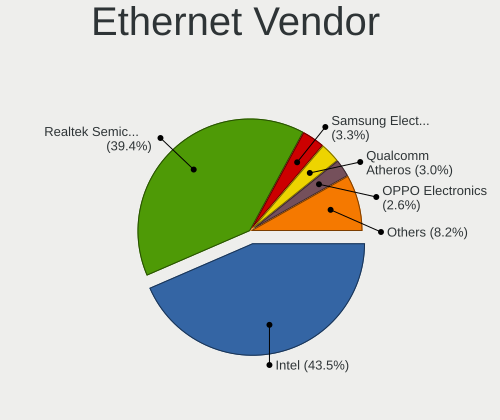

| Vendor                    | Notebooks | Percent |
|---------------------------|-----------|---------|
| Intel                     | 117       | 43.49%  |
| Realtek Semiconductor     | 106       | 39.41%  |
| Samsung Electronics       | 9         | 3.35%   |
| Qualcomm Atheros          | 8         | 2.97%   |
| OPPO Electronics          | 7         | 2.6%    |
| MediaTek                  | 4         | 1.49%   |
| Broadcom                  | 4         | 1.49%   |
| Marvell Technology Group  | 3         | 1.12%   |
| Hewlett-Packard           | 3         | 1.12%   |
| T & A Mobile Phones       | 2         | 0.74%   |
| Spreadtrum Communications | 2         | 0.74%   |
| Huawei Technologies       | 2         | 0.74%   |
| LSI                       | 1         | 0.37%   |
| Broadcom Limited          | 1         | 0.37%   |

Ethernet Model
--------------

Ethernet models

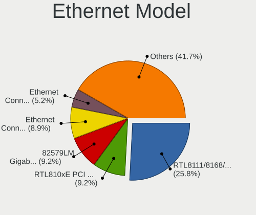

| Model                                                                  | Notebooks | Percent |
|------------------------------------------------------------------------|-----------|---------|
| Realtek RTL8111/8168/8211/8411 PCI Express Gigabit Ethernet Controller | 70        | 25.83%  |
| Realtek RTL810xE PCI Express Fast Ethernet controller                  | 25        | 9.23%   |
| Intel 82579LM Gigabit Network Connection (Lewisville)                  | 25        | 9.23%   |
| Intel Ethernet Connection I218-LM                                      | 24        | 8.86%   |
| Intel Ethernet Connection I219-LM                                      | 14        | 5.17%   |
| Intel Ethernet Connection (4) I219-LM                                  | 12        | 4.43%   |
| Realtek RTL8153 Gigabit Ethernet Adapter                               | 10        | 3.69%   |
| Intel Ethernet Connection (3) I218-LM                                  | 7         | 2.58%   |
| OPPO Ace 3V                                                            | 6         | 2.21%   |
| Intel Ethernet Connection (6) I219-LM                                  | 6         | 2.21%   |
| Intel 82577LM Gigabit Network Connection                               | 6         | 2.21%   |
| Samsung GT-I9070 (network tethering, USB debugging enabled)            | 5         | 1.85%   |
| Samsung Galaxy series, misc. (tethering mode)                          | 4         | 1.48%   |
| Intel Ethernet Connection I219-V                                       | 4         | 1.48%   |
| Intel Ethernet Connection I217-V                                       | 4         | 1.48%   |
| Intel 82579V Gigabit Network Connection                                | 4         | 1.48%   |
| MediaTek Infinix HOT 50i                                               | 3         | 1.11%   |
| HP HP lt4120 Snapdragon X5 LTE                                         | 3         | 1.11%   |
| T & A Mobile Phones AQUOS V6                                           | 2         | 0.74%   |
| Spreadtrum Android                                                     | 2         | 0.74%   |
| Realtek RTL8152 Fast Ethernet Adapter                                  | 2         | 0.74%   |
| Qualcomm Atheros AR8152 v2.0 Fast Ethernet                             | 2         | 0.74%   |
| Qualcomm Atheros AR8132 Fast Ethernet                                  | 2         | 0.74%   |
| Intel I210 Gigabit Network Connection                                  | 2         | 0.74%   |
| Intel Ethernet Connection I217-LM                                      | 2         | 0.74%   |
| Intel Ethernet Connection (7) I219-LM                                  | 2         | 0.74%   |
| Intel Ethernet Connection (4) I219-V                                   | 2         | 0.74%   |
| Huawei E353/E3131                                                      | 2         | 0.74%   |
| Broadcom NetXtreme BCM5752 Gigabit Ethernet PCI Express                | 2         | 0.74%   |
| Realtek Killer E3000 2.5GbE Controller                                 | 1         | 0.37%   |
| Qualcomm Atheros Killer E2500 Gigabit Ethernet Controller              | 1         | 0.37%   |
| Qualcomm Atheros Killer E2400 Gigabit Ethernet Controller              | 1         | 0.37%   |
| Qualcomm Atheros AR8162 Fast Ethernet                                  | 1         | 0.37%   |
| Qualcomm Atheros AR8161 Gigabit Ethernet                               | 1         | 0.37%   |
| OPPO RMX3741                                                           | 1         | 0.37%   |
| MediaTek A015                                                          | 1         | 0.37%   |
| Marvell Group 88E8058 PCI-E Gigabit Ethernet Controller                | 1         | 0.37%   |
| Marvell Group 88E8055 PCI-E Gigabit Ethernet Controller                | 1         | 0.37%   |
| Marvell Group 88E8040 PCI-E Fast Ethernet Controller                   | 1         | 0.37%   |
| LSI ET-131x PCI-E Ethernet Controller                                  | 1         | 0.37%   |

Net Controller Kind
-------------------

Ethernet, WiFi or modem

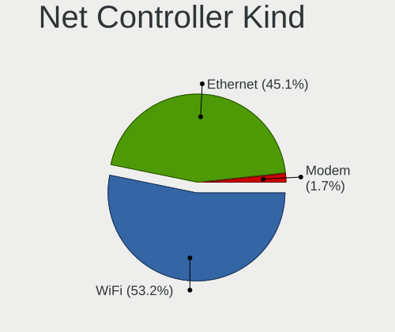

| Kind     | Notebooks | Percent |
|----------|-----------|---------|
| WiFi     | 283       | 53.2%   |
| Ethernet | 240       | 45.11%  |
| Modem    | 9         | 1.69%   |

Used Controller
---------------

Currently used network controller

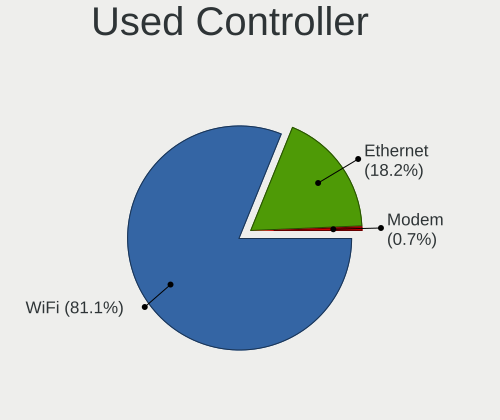

| Kind     | Notebooks | Percent |
|----------|-----------|---------|
| WiFi     | 245       | 81.13%  |
| Ethernet | 55        | 18.21%  |
| Modem    | 2         | 0.66%   |

NICs
----

Total network controllers on board

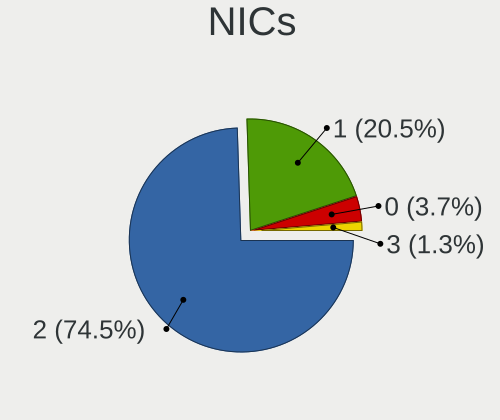

| Total | Notebooks | Percent |
|-------|-----------|---------|
| 2     | 222       | 74.5%   |
| 1     | 61        | 20.47%  |
| 0     | 11        | 3.69%   |
| 3     | 4         | 1.34%   |

IPv6
----

IPv6 vs IPv4

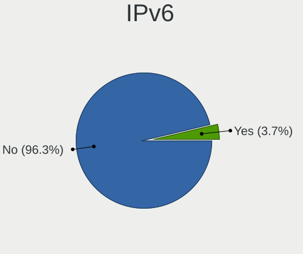

| Used | Notebooks | Percent |
|------|-----------|---------|
| No   | 284       | 96.27%  |
| Yes  | 11        | 3.73%   |

Bluetooth
---------

Bluetooth Vendor
----------------

Controller vendors

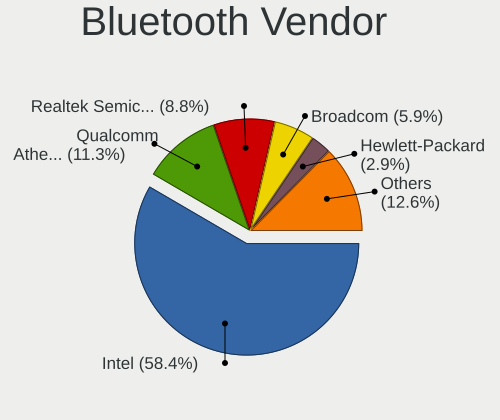

| Vendor                          | Notebooks | Percent |
|---------------------------------|-----------|---------|
| Intel                           | 139       | 58.4%   |
| Qualcomm Atheros Communications | 27        | 11.34%  |
| Realtek Semiconductor           | 21        | 8.82%   |
| Broadcom                        | 14        | 5.88%   |
| Hewlett-Packard                 | 7         | 2.94%   |
| Ralink                          | 5         | 2.1%    |
| Lite-On Technology              | 4         | 1.68%   |
| IMC Networks                    | 4         | 1.68%   |
| Apple                           | 3         | 1.26%   |
| Unknown                         | 3         | 1.26%   |
| Toshiba                         | 2         | 0.84%   |
| Foxconn / Hon Hai               | 2         | 0.84%   |
| Dell                            | 2         | 0.84%   |
| Cambridge Silicon Radio         | 2         | 0.84%   |
| Taiyo Yuden                     | 1         | 0.42%   |
| Realtek                         | 1         | 0.42%   |
| Alps Electric                   | 1         | 0.42%   |

Bluetooth Model
---------------

Controller models

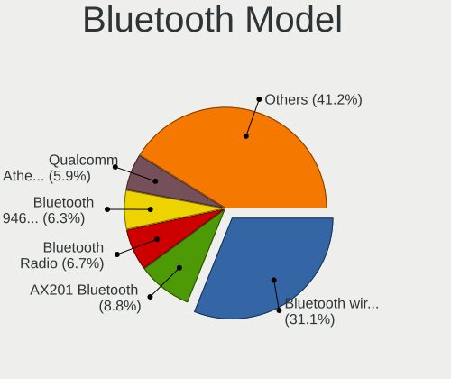

| Model                                               | Notebooks | Percent |
|-----------------------------------------------------|-----------|---------|
| Intel Bluetooth wireless interface                  | 74        | 31.09%  |
| Intel AX201 Bluetooth                               | 21        | 8.82%   |
| Realtek Bluetooth Radio                             | 16        | 6.72%   |
| Intel Bluetooth 9460/9560 Jefferson Peak (JfP)      | 15        | 6.3%    |
| Qualcomm Atheros  Bluetooth Device                  | 14        | 5.88%   |
| Intel AX200 Bluetooth                               | 10        | 4.2%    |
| HP Broadcom 2070 Bluetooth Combo                    | 6         | 2.52%   |
| Ralink RT3290 Bluetooth                             | 5         | 2.1%    |
| Intel Centrino Bluetooth Wireless Transceiver       | 5         | 2.1%    |
| Intel Bluetooth Device                              | 5         | 2.1%    |
| Broadcom HP Portable SoftSailing                    | 5         | 2.1%    |
| Realtek  Bluetooth 4.2 Adapter                      | 4         | 1.68%   |
| Qualcomm Atheros AR3011 Bluetooth                   | 4         | 1.68%   |
| Broadcom HP Portable Bumble Bee                     | 4         | 1.68%   |
| Qualcomm Atheros AR3012 Bluetooth 4.0               | 3         | 1.26%   |
| Intel Wireless-AC 3168 Bluetooth                    | 3         | 1.26%   |
| Intel AX210 Bluetooth                               | 3         | 1.26%   |
| IMC Networks Bluetooth Device                       | 3         | 1.26%   |
| Unknown                                             | 3         | 1.26%   |
| Qualcomm Atheros QCA61x4 Bluetooth 4.0              | 2         | 0.84%   |
| Qualcomm Atheros AR9462 Bluetooth                   | 2         | 0.84%   |
| Lite-On Bluetooth Device                            | 2         | 0.84%   |
| Intel Wireless-AC 9260 Bluetooth Adapter            | 2         | 0.84%   |
| Dell DW375 Bluetooth Module                         | 2         | 0.84%   |
| Cambridge Silicon Radio Bluetooth Dongle (HCI mode) | 2         | 0.84%   |
| Broadcom BCM20702 Bluetooth 4.0 [ThinkPad]          | 2         | 0.84%   |
| Toshiba RT Bluetooth Radio                          | 1         | 0.42%   |
| Toshiba Atheros AR3012 Bluetooth                    | 1         | 0.42%   |
| Taiyo Yuden Bluetooth Device                        | 1         | 0.42%   |
| Realtek RTL8822BE Bluetooth 4.2 Adapter             | 1         | 0.42%   |
| Realtek Bluetooth Radio                             | 1         | 0.42%   |
| Qualcomm Atheros Bluetooth USB Host Controller      | 1         | 0.42%   |
| Qualcomm Atheros AR3012 Bluetooth                   | 1         | 0.42%   |
| Lite-On Qualcomm Atheros QCA9377 Bluetooth          | 1         | 0.42%   |
| Lite-On Atheros Bluetooth                           | 1         | 0.42%   |
| Intel Centrino Advanced-N 6230 Bluetooth adapter    | 1         | 0.42%   |
| IMC Networks Bluetooth                              | 1         | 0.42%   |
| HP Bluetooth 2.0 Interface [Broadcom BCM2045]       | 1         | 0.42%   |
| Foxconn / Hon Hai MediaTek Bluetooth Adapter        | 1         | 0.42%   |
| Foxconn / Hon Hai Bluetooth Device                  | 1         | 0.42%   |

Sound
-----

Sound Vendor
------------

Sound card vendors

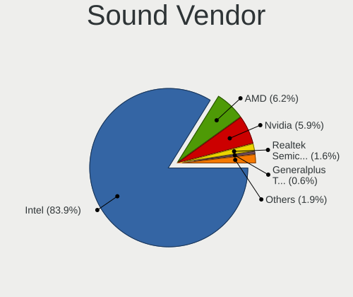

| Vendor                      | Notebooks | Percent |
|-----------------------------|-----------|---------|
| Intel                       | 270       | 83.85%  |
| AMD                         | 20        | 6.21%   |
| Nvidia                      | 19        | 5.9%    |
| Realtek Semiconductor       | 5         | 1.55%   |
| Generalplus Technology      | 2         | 0.62%   |
| Turtle Beach                | 1         | 0.31%   |
| Toshiba                     | 1         | 0.31%   |
| Texas Instruments           | 1         | 0.31%   |
| GN Netcom                   | 1         | 0.31%   |
| FiiO Electronics Technology | 1         | 0.31%   |
| Apple                       | 1         | 0.31%   |

Sound Model
-----------

Sound card models

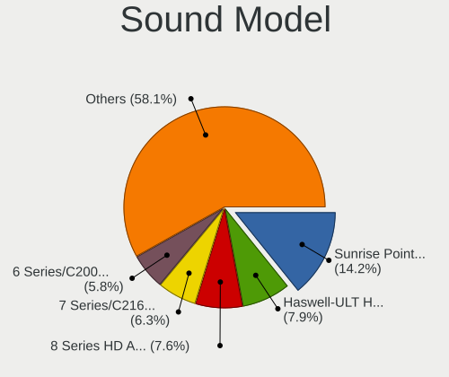

| Model                                                                                             | Notebooks | Percent |
|---------------------------------------------------------------------------------------------------|-----------|---------|
| Intel Sunrise Point-LP HD Audio                                                                   | 56        | 14.21%  |
| Intel Haswell-ULT HD Audio Controller                                                             | 31        | 7.87%   |
| Intel 8 Series HD Audio Controller                                                                | 30        | 7.61%   |
| Intel 7 Series/C216 Chipset Family High Definition Audio Controller                               | 25        | 6.35%   |
| Intel 6 Series/C200 Series Chipset Family High Definition Audio Controller                        | 23        | 5.84%   |
| Intel Cannon Point-LP High Definition Audio Controller                                            | 18        | 4.57%   |
| Intel Wildcat Point-LP High Definition Audio Controller                                           | 17        | 4.31%   |
| Intel Broadwell-U Audio Controller                                                                | 17        | 4.31%   |
| Intel Tiger Lake-LP Smart Sound Technology Audio Controller                                       | 16        | 4.06%   |
| Intel 8 Series/C220 Series Chipset High Definition Audio Controller                               | 12        | 3.05%   |
| Intel Xeon E3-1200 v3/4th Gen Core Processor HD Audio Controller                                  | 11        | 2.79%   |
| AMD Ryzen HD Audio Controller                                                                     | 11        | 2.79%   |
| Intel 5 Series/3400 Series Chipset High Definition Audio                                          | 9         | 2.28%   |
| Intel Ice Lake-LP Smart Sound Technology Audio Controller                                         | 8         | 2.03%   |
| AMD Renoir/Cezanne HDMI/DP Audio Controller                                                       | 8         | 2.03%   |
| Intel NM10/ICH7 Family High Definition Audio Controller                                           | 6         | 1.52%   |
| Intel Celeron/Pentium Silver Processor High Definition Audio                                      | 6         | 1.52%   |
| Intel Cannon Lake PCH cAVS                                                                        | 6         | 1.52%   |
| Intel Atom/Celeron/Pentium Processor x5-E8000/J3xxx/N3xxx Series High Definition Audio Controller | 5         | 1.27%   |
| Intel Alder Lake PCH-P High Definition Audio Controller                                           | 5         | 1.27%   |
| Realtek Semiconductor HP Banff                                                                    | 4         | 1.02%   |
| Nvidia TU106 High Definition Audio Controller                                                     | 4         | 1.02%   |
| Intel Atom Processor Z36xxx/Z37xxx Series High Definition Audio Controller                        | 4         | 1.02%   |
| Intel 82801I (ICH9 Family) HD Audio Controller                                                    | 4         | 1.02%   |
| Intel Comet Lake PCH-LP cAVS                                                                      | 3         | 0.76%   |
| Intel Comet Lake PCH cAVS                                                                         | 3         | 0.76%   |
| Intel Celeron N3350/Pentium N4200/Atom E3900 Series Audio Cluster                                 | 3         | 0.76%   |
| Intel 82801H (ICH8 Family) HD Audio Controller                                                    | 3         | 0.76%   |
| AMD Caicos HDMI Audio [Radeon HD 6450 / 7450/8450/8490 OEM / R5 230/235/235X OEM]                 | 3         | 0.76%   |
| Nvidia High Definition Audio Controller                                                           | 2         | 0.51%   |
| Nvidia GP107GL High Definition Audio Controller                                                   | 2         | 0.51%   |
| Nvidia GP104 High Definition Audio Controller                                                     | 2         | 0.51%   |
| Nvidia AD107 High Definition Audio Controller                                                     | 2         | 0.51%   |
| Intel 100 Series/C230 Series Chipset Family HD Audio Controller                                   | 2         | 0.51%   |
| Generalplus Technology USB Audio Device                                                           | 2         | 0.51%   |
| AMD Raven/Raven2/Fenghuang HDMI/DP Audio Controller                                               | 2         | 0.51%   |
| AMD Kabini HDMI/DP Audio                                                                          | 2         | 0.51%   |
| AMD FCH Azalia Controller                                                                         | 2         | 0.51%   |
| AMD Family 15h (Models 60h-6fh) Audio Controller                                                  | 2         | 0.51%   |
| Turtle Beach PX11 Headset                                                                         | 1         | 0.25%   |

Memory
------

Memory Vendor
-------------

Memory module vendors

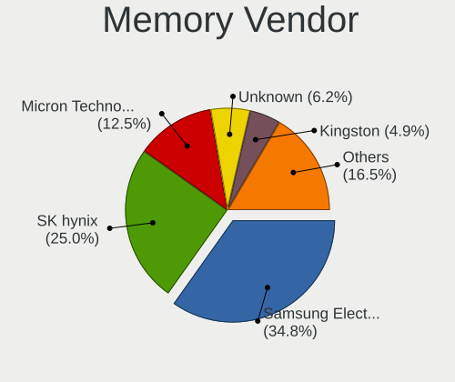

| Vendor              | Notebooks | Percent |
|---------------------|-----------|---------|
| Samsung Electronics | 78        | 34.82%  |
| SK hynix            | 56        | 25%     |
| Micron Technology   | 28        | 12.5%   |
| Unknown             | 14        | 6.25%   |
| Kingston            | 11        | 4.91%   |
| Ramaxel Technology  | 6         | 2.68%   |
| Elpida              | 6         | 2.68%   |
| Crucial             | 5         | 2.23%   |
| A-DATA Technology   | 4         | 1.79%   |
| Lexar               | 3         | 1.34%   |
| Unknown             | 3         | 1.34%   |
| Timetec             | 2         | 0.89%   |
| Apacer              | 2         | 0.89%   |
| Wilk                | 1         | 0.45%   |
| Team                | 1         | 0.45%   |
| Qimonda             | 1         | 0.45%   |
| Patriot             | 1         | 0.45%   |
| Nanya Technology    | 1         | 0.45%   |
| Avant               | 1         | 0.45%   |

Memory Model
------------

Memory module models

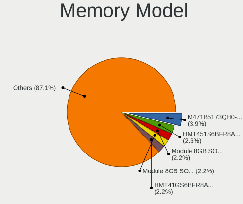

| Model                                                        | Notebooks | Percent |
|--------------------------------------------------------------|-----------|---------|
| Samsung RAM M471B5173QH0-YK0 4GB SODIMM DDR3 1600MT/s        | 9         | 3.88%   |
| SK hynix RAM HMT451S6BFR8A-PB 4GB SODIMM DDR3 1600MT/s       | 6         | 2.59%   |
| SK hynix RAM Module 8GB SODIMM DDR4 2133MT/s                 | 5         | 2.16%   |
| SK hynix RAM HMT41GS6BFR8A-PB 8GB SODIMM DDR3 2667MT/s       | 5         | 2.16%   |
| Samsung RAM Module 8GB SODIMM DDR4 2133MT/s                  | 5         | 2.16%   |
| Samsung RAM M471B5273DH0-CH9 4GB SODIMM DDR3 1600MT/s        | 4         | 1.72%   |
| Samsung RAM M471B5173DB0-YK0 4GB SODIMM DDR3 1600MT/s        | 4         | 1.72%   |
| Samsung RAM M471B1G73QH0-YK0 8GB SODIMM DDR3 1600MT/s        | 4         | 1.72%   |
| Samsung RAM M425R1GB4BB0-CQKOD 8GB SODIMM DDR5 4800MT/s      | 4         | 1.72%   |
| Micron RAM 8KTF51264HZ-1G6E1 4GB SODIMM DDR3 1600MT/s        | 4         | 1.72%   |
| Unknown RAM Module 4GB Chip DDR4 2133MT/s                    | 3         | 1.29%   |
| Unknown RAM Module 1GB Row Of Chips LPDDR4 4267MT/s          | 3         | 1.29%   |
| SK hynix RAM HMA82GS6AFR8N-UH 16GB SODIMM DDR4 2667MT/s      | 3         | 1.29%   |
| Samsung RAM M471B5273CH0-CH9 4GB SODIMM DDR3 1334MT/s        | 3         | 1.29%   |
| Samsung RAM M471B5173EB0-YK0 4GB SODIMM DDR3 1600MT/s        | 3         | 1.29%   |
| Samsung RAM M471B1G73DB0-YK0 8GB SODIMM DDR3 1600MT/s        | 3         | 1.29%   |
| Samsung RAM M471A5244CB0-CTD 4GB Row Of Chips DDR4 2667MT/s  | 3         | 1.29%   |
| Micron RAM 16KTF1G64HZ-1G6E1 8GB SODIMM DDR3 1600MT/s        | 3         | 1.29%   |
| Elpida RAM EBJ40UG8BBU0-GN-F 4GB SODIMM DDR3 1600MT/s        | 3         | 1.29%   |
| Unknown                                                      | 3         | 1.29%   |
| Unknown RAM Module 2048MB SODIMM DDR3 1333MT/s               | 2         | 0.86%   |
| SK hynix RAM HMT451S6DFR8A-PB 4GB SODIMM DDR3 1600MT/s       | 2         | 0.86%   |
| SK hynix RAM HMT451S6AFR8A-PB 4GB SODIMM DDR3 1600MT/s       | 2         | 0.86%   |
| SK hynix RAM HMT41GS6BFR8A-PB 8GB SODIMM DDR3 1600MT/s       | 2         | 0.86%   |
| SK hynix RAM HMT41GS6AFR8A-PB 8GB SODIMM DDR3 1600MT/s       | 2         | 0.86%   |
| SK hynix RAM HMT351S6EFR8C-PB 4GB SODIMM DDR3 1600MT/s       | 2         | 0.86%   |
| SK hynix RAM HMT351S6EFR8A-PB 4GB SODIMM DDR3 1600MT/s       | 2         | 0.86%   |
| SK hynix RAM HMT351S6BFR8C-H9 4GB SODIMM DDR3 1333MT/s       | 2         | 0.86%   |
| SK hynix RAM HMA81GS6AFR8N-UH 8GB SODIMM DDR4 2667MT/s       | 2         | 0.86%   |
| Samsung RAM UBE3D4AA-MGCR 2GB Row Of Chips LPDDR4 4267MT/s   | 2         | 0.86%   |
| Samsung RAM Module 8GB SODIMM DDR4 2667MT/s                  | 2         | 0.86%   |
| Samsung RAM M471B5773DH0-CH9 2GB SODIMM DDR3 1600MT/s        | 2         | 0.86%   |
| Samsung RAM M471A5244CB0-CTD 4GB SODIMM DDR4 3266MT/s        | 2         | 0.86%   |
| Samsung RAM M471A5244CB0-CRC 4GB SODIMM DDR4 2667MT/s        | 2         | 0.86%   |
| Samsung RAM M471A2K43CB1-CTD 16GB SODIMM DDR4 8400MT/s       | 2         | 0.86%   |
| Samsung RAM M471A2G44AM0-CWE 16GB Row Of Chips DDR4 3200MT/s | 2         | 0.86%   |
| Samsung RAM M471A1K43CB1-CTD 8GB SODIMM DDR4 3200MT/s        | 2         | 0.86%   |
| Samsung RAM M471A1K43BB1-CRC 8GB SODIMM DDR4 2667MT/s        | 2         | 0.86%   |
| Micron RAM Module 8GB SODIMM DDR4 3200MT/s                   | 2         | 0.86%   |
| Micron RAM 16JTF51264HZ-1G6M1 4GB SODIMM DDR3 1600MT/s       | 2         | 0.86%   |

Memory Kind
-----------

Memory module kinds

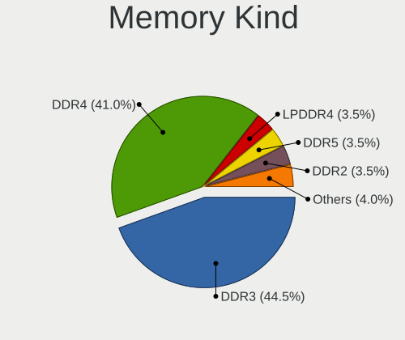

| Kind   | Notebooks | Percent |
|--------|-----------|---------|
| DDR3   | 77        | 44.51%  |
| DDR4   | 71        | 41.04%  |
| LPDDR4 | 6         | 3.47%   |
| DDR5   | 6         | 3.47%   |
| DDR2   | 6         | 3.47%   |
| LPDDR3 | 3         | 1.73%   |
| DDR    | 2         | 1.16%   |
| SDRAM  | 1         | 0.58%   |
| LPDDR5 | 1         | 0.58%   |

Memory Form Factor
------------------

Physical design of the memory module

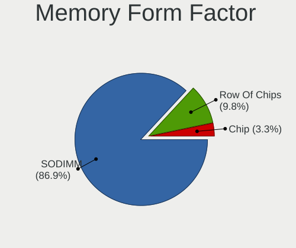

| Name         | Notebooks | Percent |
|--------------|-----------|---------|
| SODIMM       | 159       | 86.89%  |
| Row Of Chips | 18        | 9.84%   |
| Chip         | 6         | 3.28%   |

Memory Size
-----------

Memory module size

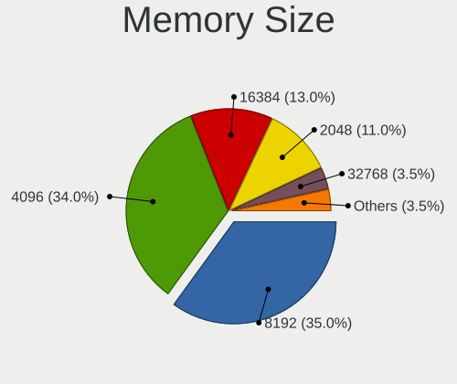

| Size  | Notebooks | Percent |
|-------|-----------|---------|
| 8192  | 70        | 35%     |
| 4096  | 68        | 34%     |
| 16384 | 26        | 13%     |
| 2048  | 22        | 11%     |
| 32768 | 7         | 3.5%    |
| 1024  | 6         | 3%      |
| 512   | 1         | 0.5%    |

Memory Speed
------------

Memory module speed

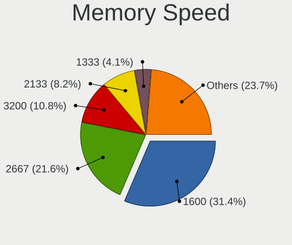

| Speed   | Notebooks | Percent |
|---------|-----------|---------|
| 1600    | 61        | 31.44%  |
| 2667    | 42        | 21.65%  |
| 3200    | 21        | 10.82%  |
| 2133    | 16        | 8.25%   |
| 1333    | 8         | 4.12%   |
| 2400    | 7         | 3.61%   |
| 1334    | 7         | 3.61%   |
| 4267    | 6         | 3.09%   |
| 4800    | 4         | 2.06%   |
| 8400    | 3         | 1.55%   |
| 1867    | 3         | 1.55%   |
| 667     | 3         | 1.55%   |
| 5600    | 2         | 1.03%   |
| 3266    | 2         | 1.03%   |
| 1067    | 2         | 1.03%   |
| 800     | 2         | 1.03%   |
| Unknown | 2         | 1.03%   |
| 6400    | 1         | 0.52%   |
| 4199    | 1         | 0.52%   |
| 533     | 1         | 0.52%   |

Printers & scanners
-------------------

Printer Vendor
--------------

Printer device vendors

Zero info for selected period =(

Printer Model
-------------

Printer device models

Zero info for selected period =(

Scanner Vendor
--------------

Scanner device vendors

Zero info for selected period =(

Scanner Model
-------------

Scanner device models

Zero info for selected period =(

Camera
------

Camera Vendor
-------------

Camera device vendors

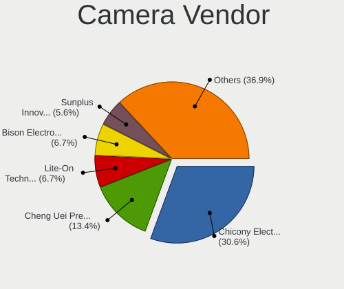

| Vendor                                 | Notebooks | Percent |
|----------------------------------------|-----------|---------|
| Chicony Electronics                    | 82        | 30.6%   |
| Cheng Uei Precision Industry (Foxlink) | 36        | 13.43%  |
| Lite-On Technology                     | 18        | 6.72%   |
| Bison Electronics                      | 18        | 6.72%   |
| Sunplus Innovation Technology          | 15        | 5.6%    |
| Realtek Semiconductor                  | 14        | 5.22%   |
| Syntek                                 | 12        | 4.48%   |
| Quanta                                 | 11        | 4.1%    |
| Microdia                               | 11        | 4.1%    |
| IMC Networks                           | 10        | 3.73%   |
| Samsung Electronics                    | 5         | 1.87%   |
| Luxvisions Innotech Limited            | 5         | 1.87%   |
| Suyin                                  | 4         | 1.49%   |
| Silicon Motion                         | 4         | 1.49%   |
| Apple                                  | 4         | 1.49%   |
| Unknown                                | 2         | 0.75%   |
| Ricoh                                  | 2         | 0.75%   |
| Logitech                               | 2         | 0.75%   |
| Importek                               | 2         | 0.75%   |
| Alcor Micro                            | 2         | 0.75%   |
| Acer                                   | 2         | 0.75%   |
| SunplusIT                              | 1         | 0.37%   |
| Primax Electronics                     | 1         | 0.37%   |
| LG Electronics                         | 1         | 0.37%   |
| icSpring                               | 1         | 0.37%   |
| DigiTech                               | 1         | 0.37%   |
| ALi                                    | 1         | 0.37%   |
| Unknown                                | 1         | 0.37%   |

Camera Model
------------

Camera device models

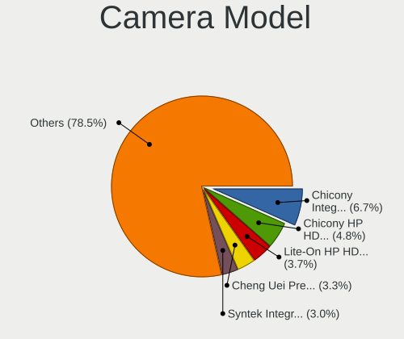

| Model                                                                      | Notebooks | Percent |
|----------------------------------------------------------------------------|-----------|---------|
| Chicony Integrated Camera                                                  | 18        | 6.67%   |
| Chicony HP HD Webcam                                                       | 13        | 4.81%   |
| Lite-On HP HD Camera                                                       | 10        | 3.7%    |
| Cheng Uei Precision Industry (Foxlink) HP HD Webcam                        | 9         | 3.33%   |
| Syntek Integrated Camera                                                   | 8         | 2.96%   |
| Realtek Integrated_Webcam_HD                                               | 8         | 2.96%   |
| Chicony HP HD Camera                                                       | 8         | 2.96%   |
| Lite-On HP HD Webcam                                                       | 7         | 2.59%   |
| Chicony HP HD Webcam [Fixed]                                               | 7         | 2.59%   |
| Cheng Uei Precision Industry (Foxlink) HP HD Camera                        | 6         | 2.22%   |
| Bison Integrated Camera                                                    | 6         | 2.22%   |
| Sunplus Integrated_Webcam_HD                                               | 5         | 1.85%   |
| Microdia Integrated_Webcam_HD                                              | 5         | 1.85%   |
| Chicony USB 2.0 Camera                                                     | 5         | 1.85%   |
| Cheng Uei Precision Industry (Foxlink) HP Wide Vision HD Integrated Webcam | 5         | 1.85%   |
| Sunplus HP HD Webcam [Fixed]                                               | 4         | 1.48%   |
| Samsung Galaxy series, misc. (MTP mode)                                    | 4         | 1.48%   |
| Quanta HP True Vision 5MP Camera                                           | 4         | 1.48%   |
| IMC Networks USB2.0 VGA UVC WebCam                                         | 4         | 1.48%   |
| Chicony Integrated HP HD Webcam                                            | 4         | 1.48%   |
| Cheng Uei Precision Industry (Foxlink) HP HD Webcam [Fixed]                | 4         | 1.48%   |
| Realtek Integrated Webcam                                                  | 3         | 1.11%   |
| Quanta HP HD Camera                                                        | 3         | 1.11%   |
| Chicony TOSHIBA Web Camera - HD                                            | 3         | 1.11%   |
| Chicony Integrated Camera (1280x720@30)                                    | 3         | 1.11%   |
| Chicony HP TrueVision HD Camera                                            | 3         | 1.11%   |
| Chicony HD Webcam                                                          | 3         | 1.11%   |
| Cheng Uei Precision Industry (Foxlink) HP TrueVision HD Camera             | 3         | 1.11%   |
| Cheng Uei Precision Industry (Foxlink) HP EliteBook integrated HD Webcam   | 3         | 1.11%   |
| Bison ThinkPad P50 Integrated Camera                                       | 3         | 1.11%   |
| Unknown USB Camera                                                         | 2         | 0.74%   |
| Syntek Lenovo EasyCamera                                                   | 2         | 0.74%   |
| Syntek EasyCamera                                                          | 2         | 0.74%   |
| Suyin Asus Integrated Webcam                                               | 2         | 0.74%   |
| Silicon Motion 300k Pixel Camera                                           | 2         | 0.74%   |
| Quanta HP Wide Vision HD Camera                                            | 2         | 0.74%   |
| Importek HP Webcam-50                                                      | 2         | 0.74%   |
| IMC Networks Integrated Camera                                             | 2         | 0.74%   |
| Chicony HP Wide Vision HD Camera                                           | 2         | 0.74%   |
| Chicony HP Webcam [2 MP Macro]                                             | 2         | 0.74%   |

Security
--------

Fingerprint Vendor
------------------

Fingerprint sensor vendors

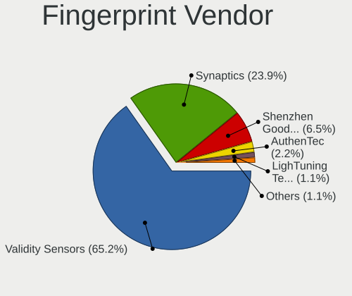

| Vendor                     | Notebooks | Percent |
|----------------------------|-----------|---------|
| Validity Sensors           | 60        | 65.22%  |
| Synaptics                  | 22        | 23.91%  |
| Shenzhen Goodix Technology | 6         | 6.52%   |
| AuthenTec                  | 2         | 2.17%   |
| LighTuning Technology      | 1         | 1.09%   |
| Elan Microelectronics      | 1         | 1.09%   |

Fingerprint Model
-----------------

Fingerprint sensor models

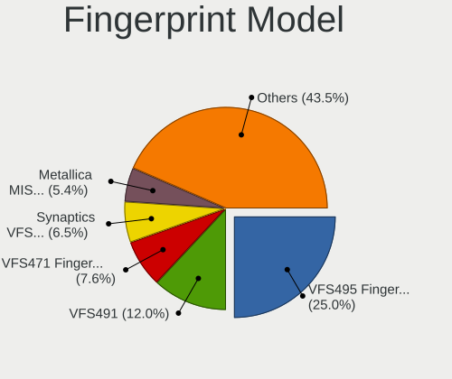

| Model                                                                      | Notebooks | Percent |
|----------------------------------------------------------------------------|-----------|---------|
| Validity Sensors VFS495 Fingerprint Reader                                 | 23        | 25%     |
| Validity Sensors VFS491                                                    | 11        | 11.96%  |
| Validity Sensors VFS471 Fingerprint Reader                                 | 7         | 7.61%   |
| Validity Sensors Synaptics VFS7552 Touch Fingerprint Sensor with PurePrint | 6         | 6.52%   |
| Synaptics Metallica MIS Touch Fingerprint Reader                           | 5         | 5.43%   |
| Synaptics Fingerprint reader [HP G6]                                       | 5         | 5.43%   |
| Synaptics Prometheus MIS Touch Fingerprint Reader                          | 4         | 4.35%   |
| Shenzhen Goodix FingerPrint                                                | 4         | 4.35%   |
| Validity Sensors VFS7500 Touch Fingerprint Sensor                          | 3         | 3.26%   |
| Validity Sensors VFS 5011 fingerprint sensor                               | 3         | 3.26%   |
| Synaptics WBDI Device                                                      | 3         | 3.26%   |
| Validity Sensors VFS451 Fingerprint Reader                                 | 2         | 2.17%   |
| Validity Sensors Synaptics WBDI                                            | 2         | 2.17%   |
| Validity Sensors Swipe Fingerprint Sensor                                  | 2         | 2.17%   |
| Synaptics  FS7604 Touch Fingerprint Sensor with PurePrint                  | 2         | 2.17%   |
| Synaptics Prometheus Fingerprint Reader                                    | 2         | 2.17%   |
| Shenzhen Goodix  FingerPrint Device                                        | 2         | 2.17%   |
| Validity Sensors VFS5011 Fingerprint Reader                                | 1         | 1.09%   |
| Synaptics  WBDI                                                            | 1         | 1.09%   |
| LighTuning ES603 Swipe Fingerprint Sensor                                  | 1         | 1.09%   |
| Elan ELAN:ARM-M4                                                           | 1         | 1.09%   |
| AuthenTec AES2550 Fingerprint Sensor                                       | 1         | 1.09%   |
| AuthenTec AES2501 Fingerprint Sensor                                       | 1         | 1.09%   |

Chipcard Vendor
---------------

Chipcard module vendors

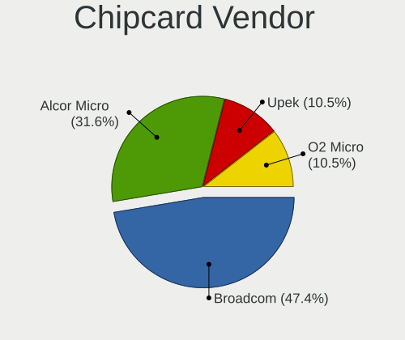

| Vendor      | Notebooks | Percent |
|-------------|-----------|---------|
| Broadcom    | 9         | 47.37%  |
| Alcor Micro | 6         | 31.58%  |
| Upek        | 2         | 10.53%  |
| O2 Micro    | 2         | 10.53%  |

Chipcard Model
--------------

Chipcard module models

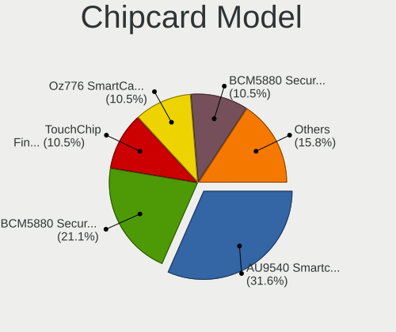

| Model                                                                        | Notebooks | Percent |
|------------------------------------------------------------------------------|-----------|---------|
| Alcor Micro AU9540 Smartcard Reader                                          | 6         | 31.58%  |
| Broadcom BCM5880 Secure Applications Processor                               | 4         | 21.05%  |
| Upek TouchChip Fingerprint Coprocessor (WBF advanced mode)                   | 2         | 10.53%  |
| O2 Micro Oz776 SmartCard Reader                                              | 2         | 10.53%  |
| Broadcom BCM5880 Secure Applications Processor with fingerprint swipe sensor | 2         | 10.53%  |
| Broadcom 5880                                                                | 2         | 10.53%  |
| Broadcom BCM58200 ControlVault 3 (FingerPrint sensor + Contacted SmartCard)  | 1         | 5.26%   |

Unsupported
-----------

Unsupported Devices
-------------------

Total unsupported devices on board

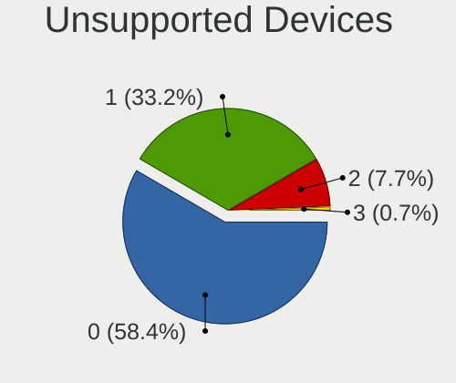

| Total | Notebooks | Percent |
|-------|-----------|---------|
| 0     | 174       | 58.39%  |
| 1     | 99        | 33.22%  |
| 2     | 23        | 7.72%   |
| 3     | 2         | 0.67%   |

Unsupported Device Types
------------------------

Types of unsupported devices

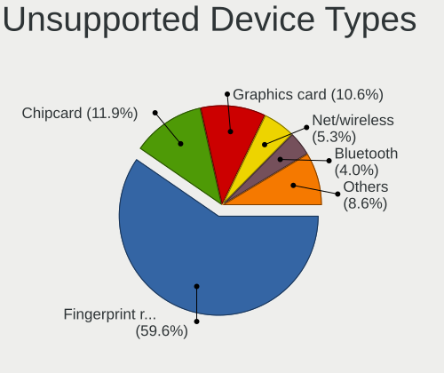

| Type                     | Notebooks | Percent |
|--------------------------|-----------|---------|
| Fingerprint reader       | 90        | 59.6%   |
| Chipcard                 | 18        | 11.92%  |
| Graphics card            | 16        | 10.6%   |
| Net/wireless             | 8         | 5.3%    |
| Bluetooth                | 6         | 3.97%   |
| Camera                   | 4         | 2.65%   |
| Storage                  | 3         | 1.99%   |
| Net/ethernet             | 2         | 1.32%   |
| Communication controller | 2         | 1.32%   |
| Sound                    | 1         | 0.66%   |
| Multimedia controller    | 1         | 0.66%   |

