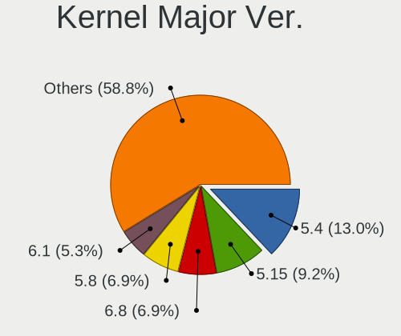
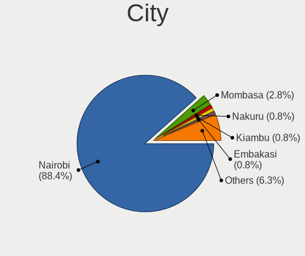
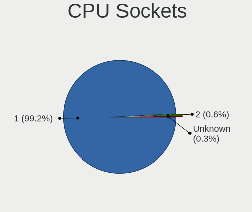
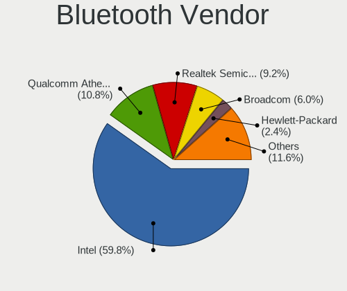
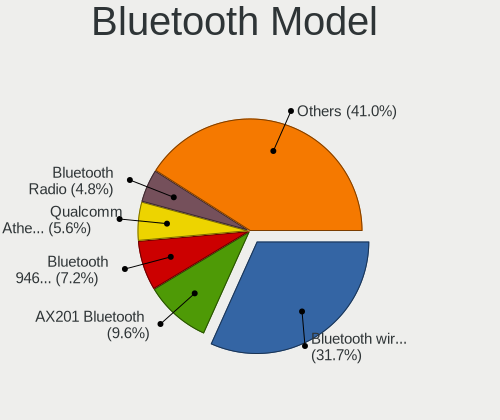
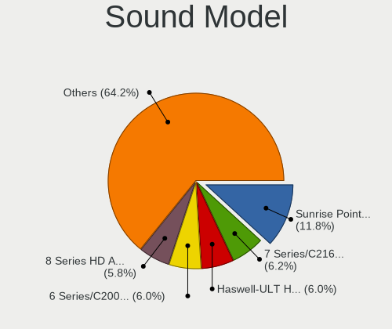
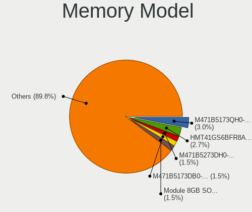
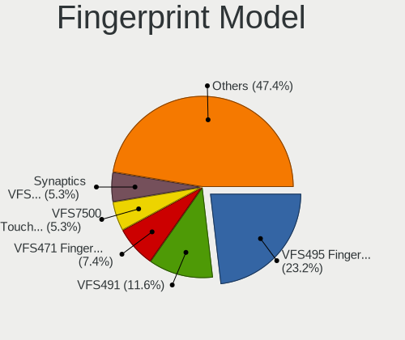
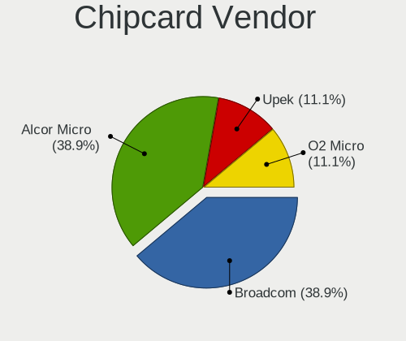

Linux in Kenya - Tested Hardware & Statistics
---------------------------------------------

A project to collect tested hardware configurations for Linux in Kenya.

Anyone can contribute to this report by the [hw-probe](https://github.com/linuxhw/hw-probe) tool:

    sudo -E hw-probe -all -upload

Please contribute! Especially if your hardware is rare.

This is a report for all computer types. See also reports for [desktops](/Location/Kenya/Desktop/README.md) and [notebooks](/Location/Kenya/Notebook/README.md).

Contents
--------

* [ Test Cases ](#test-cases)

* [ System ](#system)
  - [ OS                       ](#os)
  - [ OS Family                ](#os-family)
  - [ Kernel                   ](#kernel)
  - [ Kernel Family            ](#kernel-family)
  - [ Kernel Major Ver.        ](#kernel-major-ver)
  - [ Arch                     ](#arch)
  - [ DE                       ](#de)
  - [ Display Server           ](#display-server)
  - [ Display Manager          ](#display-manager)
  - [ OS Lang                  ](#os-lang)
  - [ Boot Mode                ](#boot-mode)
  - [ Filesystem               ](#filesystem)
  - [ Part. scheme             ](#part-scheme)
  - [ Dual Boot with Linux/BSD ](#dual-boot-with-linuxbsd)
  - [ Dual Boot (Win)          ](#dual-boot-win)

* [ Board ](#board)
  - [ Vendor                   ](#vendor)
  - [ Model                    ](#model)
  - [ Model Family             ](#model-family)
  - [ MFG Year                 ](#mfg-year)
  - [ Form Factor              ](#form-factor)
  - [ Secure Boot              ](#secure-boot)
  - [ Coreboot                 ](#coreboot)
  - [ RAM Size                 ](#ram-size)
  - [ RAM Used                 ](#ram-used)
  - [ Total Drives             ](#total-drives)
  - [ Has CD-ROM               ](#has-cd-rom)
  - [ Has Ethernet             ](#has-ethernet)
  - [ Has WiFi                 ](#has-wifi)
  - [ Has Bluetooth            ](#has-bluetooth)

* [ Location ](#location)
  - [ Country                  ](#country)
  - [ City                     ](#city)

* [ Drives ](#drives)
  - [ Drive Vendor             ](#drive-vendor)
  - [ Drive Model              ](#drive-model)
  - [ HDD Vendor               ](#hdd-vendor)
  - [ SSD Vendor               ](#ssd-vendor)
  - [ Drive Kind               ](#drive-kind)
  - [ Drive Connector          ](#drive-connector)
  - [ Drive Size               ](#drive-size)
  - [ Space Total              ](#space-total)
  - [ Space Used               ](#space-used)
  - [ Malfunc. Drives          ](#malfunc-drives)
  - [ Malfunc. Drive Vendor    ](#malfunc-drive-vendor)
  - [ Malfunc. HDD Vendor      ](#malfunc-hdd-vendor)
  - [ Malfunc. Drive Kind      ](#malfunc-drive-kind)
  - [ Failed Drives            ](#failed-drives)
  - [ Failed Drive Vendor      ](#failed-drive-vendor)
  - [ Drive Status             ](#drive-status)

* [ Storage controller ](#storage-controller)
  - [ Storage Vendor           ](#storage-vendor)
  - [ Storage Model            ](#storage-model)
  - [ Storage Kind             ](#storage-kind)

* [ Processor ](#processor)
  - [ CPU Vendor               ](#cpu-vendor)
  - [ CPU Model                ](#cpu-model)
  - [ CPU Model Family         ](#cpu-model-family)
  - [ CPU Cores                ](#cpu-cores)
  - [ CPU Sockets              ](#cpu-sockets)
  - [ CPU Threads              ](#cpu-threads)
  - [ CPU Op-Modes             ](#cpu-op-modes)
  - [ CPU Microcode            ](#cpu-microcode)
  - [ CPU Microarch            ](#cpu-microarch)

* [ Graphics ](#graphics)
  - [ GPU Vendor               ](#gpu-vendor)
  - [ GPU Model                ](#gpu-model)
  - [ GPU Combo                ](#gpu-combo)
  - [ GPU Driver               ](#gpu-driver)
  - [ GPU Memory               ](#gpu-memory)

* [ Monitor ](#monitor)
  - [ Monitor Vendor           ](#monitor-vendor)
  - [ Monitor Model            ](#monitor-model)
  - [ Monitor Resolution       ](#monitor-resolution)
  - [ Monitor Diagonal         ](#monitor-diagonal)
  - [ Monitor Width            ](#monitor-width)
  - [ Aspect Ratio             ](#aspect-ratio)
  - [ Monitor Area             ](#monitor-area)
  - [ Pixel Density            ](#pixel-density)
  - [ Multiple Monitors        ](#multiple-monitors)

* [ Network ](#network)
  - [ Net Controller Vendor    ](#net-controller-vendor)
  - [ Net Controller Model     ](#net-controller-model)
  - [ Wireless Vendor          ](#wireless-vendor)
  - [ Wireless Model           ](#wireless-model)
  - [ Ethernet Vendor          ](#ethernet-vendor)
  - [ Ethernet Model           ](#ethernet-model)
  - [ Net Controller Kind      ](#net-controller-kind)
  - [ Used Controller          ](#used-controller)
  - [ NICs                     ](#nics)
  - [ IPv6                     ](#ipv6)

* [ Bluetooth ](#bluetooth)
  - [ Bluetooth Vendor         ](#bluetooth-vendor)
  - [ Bluetooth Model          ](#bluetooth-model)

* [ Sound ](#sound)
  - [ Sound Vendor             ](#sound-vendor)
  - [ Sound Model              ](#sound-model)

* [ Memory ](#memory)
  - [ Memory Vendor            ](#memory-vendor)
  - [ Memory Model             ](#memory-model)
  - [ Memory Kind              ](#memory-kind)
  - [ Memory Form Factor       ](#memory-form-factor)
  - [ Memory Size              ](#memory-size)
  - [ Memory Speed             ](#memory-speed)

* [ Printers & scanners ](#printers--scanners)
  - [ Printer Vendor           ](#printer-vendor)
  - [ Printer Model            ](#printer-model)
  - [ Scanner Vendor           ](#scanner-vendor)
  - [ Scanner Model            ](#scanner-model)

* [ Camera ](#camera)
  - [ Camera Vendor            ](#camera-vendor)
  - [ Camera Model             ](#camera-model)

* [ Security ](#security)
  - [ Fingerprint Vendor       ](#fingerprint-vendor)
  - [ Fingerprint Model        ](#fingerprint-model)
  - [ Chipcard Vendor          ](#chipcard-vendor)
  - [ Chipcard Model           ](#chipcard-model)

* [ Unsupported ](#unsupported)
  - [ Unsupported Devices      ](#unsupported-devices)
  - [ Unsupported Device Types ](#unsupported-device-types)

Test Cases
----------

Total: 391

| Vendor        | Model                       | Form-Factor | Probe                                                      | Date         |
|---------------|-----------------------------|-------------|------------------------------------------------------------|--------------|
| Lenovo        | NOK                         | Desktop     | [30f2c89249](https://linux-hardware.org/?probe=30f2c89249) | Sep 07, 2023 |
| HP            | EliteBook 840 G1            | Notebook    | [1d1c8e33ff](https://linux-hardware.org/?probe=1d1c8e33ff) | Sep 06, 2023 |
| HP            | EliteBook Folio 9470m       | Notebook    | [0fe16a99d6](https://linux-hardware.org/?probe=0fe16a99d6) | Sep 03, 2023 |
| HP            | EliteBook 840 G1            | Notebook    | [b3a358a06f](https://linux-hardware.org/?probe=b3a358a06f) | Sep 03, 2023 |
| HP            | EliteBook 840 G1            | Notebook    | [40f2588fd0](https://linux-hardware.org/?probe=40f2588fd0) | Aug 31, 2023 |
| HP            | Notebook                    | Notebook    | [6404f1dc3a](https://linux-hardware.org/?probe=6404f1dc3a) | Aug 25, 2023 |
| Lenovo        | ThinkPad T460s 20F90039U... | Notebook    | [e632335144](https://linux-hardware.org/?probe=e632335144) | Aug 25, 2023 |
| HP            | Notebook                    | Notebook    | [1d3025a033](https://linux-hardware.org/?probe=1d3025a033) | Aug 24, 2023 |
| HP            | ProBook 430 G1              | Notebook    | [24a2760d65](https://linux-hardware.org/?probe=24a2760d65) | Aug 20, 2023 |
| HP            | ProBook 4540s               | Notebook    | [c965074769](https://linux-hardware.org/?probe=c965074769) | Aug 17, 2023 |
| HP            | ENVY Laptop 16-h0xxx        | Notebook    | [080867b516](https://linux-hardware.org/?probe=080867b516) | Aug 16, 2023 |
| Lenovo        | G50-80 80E5                 | Notebook    | [837cbb2cf1](https://linux-hardware.org/?probe=837cbb2cf1) | Aug 13, 2023 |
| Lenovo        | Legion S7 15ARH5 82HM       | Notebook    | [044df6f82e](https://linux-hardware.org/?probe=044df6f82e) | Aug 07, 2023 |
| HP            | EliteBook 840 G1            | Notebook    | [c24d904ffb](https://linux-hardware.org/?probe=c24d904ffb) | Aug 06, 2023 |
| HP            | EliteBook 2570p             | Notebook    | [68734d9dfa](https://linux-hardware.org/?probe=68734d9dfa) | Aug 04, 2023 |
| HP            | EliteBook 840 G1            | Notebook    | [695a7fad0f](https://linux-hardware.org/?probe=695a7fad0f) | Aug 03, 2023 |
| HP            | Notebook                    | Notebook    | [0e8585ef71](https://linux-hardware.org/?probe=0e8585ef71) | Aug 02, 2023 |
| HP            | ProBook 450 G3              | Notebook    | [fef5d6f571](https://linux-hardware.org/?probe=fef5d6f571) | Jul 26, 2023 |
| HP            | ProBook 650 G2              | Notebook    | [cea811cc5f](https://linux-hardware.org/?probe=cea811cc5f) | Jul 25, 2023 |
| HP            | ProBook 650 G2              | Notebook    | [affdd0a6f9](https://linux-hardware.org/?probe=affdd0a6f9) | Jul 25, 2023 |
| HP            | EliteBook 840 G1            | Notebook    | [cafa1082f8](https://linux-hardware.org/?probe=cafa1082f8) | Jul 22, 2023 |
| Lenovo        | ThinkPad X1 Carbon 4th 2... | Notebook    | [31b0d46f32](https://linux-hardware.org/?probe=31b0d46f32) | Jul 22, 2023 |
| Lenovo        | IdeaPad Slim 9 14ITL5 82... | Notebook    | [352cc6e31d](https://linux-hardware.org/?probe=352cc6e31d) | Jul 17, 2023 |
| HP            | EliteBook 850 G6            | Notebook    | [556ef4473f](https://linux-hardware.org/?probe=556ef4473f) | Jul 11, 2023 |
| Apple         | MacBookAir4,1               | Notebook    | [b815c86777](https://linux-hardware.org/?probe=b815c86777) | Jul 07, 2023 |
| HP            | ENVY 15                     | Notebook    | [d519c2699c](https://linux-hardware.org/?probe=d519c2699c) | Jul 06, 2023 |
| HP            | 3047h                       | Desktop     | [e60df0b6d1](https://linux-hardware.org/?probe=e60df0b6d1) | Jun 23, 2023 |
| HP            | Pavilion x360 Convertibl... | Convertible | [88d7f8992f](https://linux-hardware.org/?probe=88d7f8992f) | Jun 19, 2023 |
| HP            | ENVY x360 2-in-1 Laptop ... | Convertible | [88e2f62c6d](https://linux-hardware.org/?probe=88e2f62c6d) | Jun 19, 2023 |
| HP            | Pavilion x360 Convertibl... | Convertible | [93587f51a9](https://linux-hardware.org/?probe=93587f51a9) | Jun 19, 2023 |
| Lenovo        | ThinkBook 14-IIL 20SL       | Notebook    | [04329cdc14](https://linux-hardware.org/?probe=04329cdc14) | Jun 16, 2023 |
| Lenovo        | ThinkBook 14-IIL 20SL       | Notebook    | [6f4c06d514](https://linux-hardware.org/?probe=6f4c06d514) | Jun 14, 2023 |
| HP            | ProBook 4530s               | Notebook    | [bdb6739deb](https://linux-hardware.org/?probe=bdb6739deb) | Jun 07, 2023 |
| Dell          | Latitude E5510              | Notebook    | [353a2174af](https://linux-hardware.org/?probe=353a2174af) | Jun 04, 2023 |
| Lenovo        | ThinkPad X1 Carbon 6th 2... | Notebook    | [cdbebd8a7e](https://linux-hardware.org/?probe=cdbebd8a7e) | Jun 04, 2023 |
| Lenovo        | ThinkPad X230 2325SV7       | Notebook    | [6affd0b8ee](https://linux-hardware.org/?probe=6affd0b8ee) | May 28, 2023 |
| HP            | ProBook 6560b               | Notebook    | [972d01f49f](https://linux-hardware.org/?probe=972d01f49f) | May 28, 2023 |
| HP            | ProBook 6560b               | Notebook    | [9fd712c62d](https://linux-hardware.org/?probe=9fd712c62d) | May 28, 2023 |
| Lenovo        | ThinkPad X1 Carbon 3460A... | Notebook    | [f876b5169a](https://linux-hardware.org/?probe=f876b5169a) | May 25, 2023 |
| HP            | EliteBook x360 1030 G2      | Convertible | [08a1ae22b7](https://linux-hardware.org/?probe=08a1ae22b7) | May 25, 2023 |
| HP            | 15                          | Notebook    | [b62229cac1](https://linux-hardware.org/?probe=b62229cac1) | May 24, 2023 |
| HP            | EliteBook 840 G3            | Notebook    | [46015ea246](https://linux-hardware.org/?probe=46015ea246) | May 10, 2023 |
| Fujitsu       | T900                        | Notebook    | [d0233bc511](https://linux-hardware.org/?probe=d0233bc511) | May 06, 2023 |
| HP            | EliteBook 840 G1            | Notebook    | [b5602599f8](https://linux-hardware.org/?probe=b5602599f8) | May 06, 2023 |
| HP            | Notebook                    | Notebook    | [a34031954a](https://linux-hardware.org/?probe=a34031954a) | May 05, 2023 |
| Lenovo        | ThinkPad T420s 4174W2X      | Notebook    | [082029ecf5](https://linux-hardware.org/?probe=082029ecf5) | May 05, 2023 |
| Lenovo        | ThinkPad T420s 4174W2X      | Notebook    | [e2f37d94cd](https://linux-hardware.org/?probe=e2f37d94cd) | May 05, 2023 |
| HP            | EliteBook 840 G1            | Notebook    | [c8b979d035](https://linux-hardware.org/?probe=c8b979d035) | Apr 30, 2023 |
| Dell          | XPS 13 9350                 | Notebook    | [95b5e79487](https://linux-hardware.org/?probe=95b5e79487) | Apr 30, 2023 |
| Lenovo        | ThinkPad Yoga 370 20JJS1... | Convertible | [7f30bca791](https://linux-hardware.org/?probe=7f30bca791) | Apr 28, 2023 |
| Dell          | Latitude E6410              | Notebook    | [52ada88fb1](https://linux-hardware.org/?probe=52ada88fb1) | Apr 20, 2023 |
| HP            | Pavilion Laptop 15-eh1xx... | Notebook    | [37eee19e22](https://linux-hardware.org/?probe=37eee19e22) | Apr 15, 2023 |
| Unknown       | Q-790                       | Desktop     | [5f41d7d182](https://linux-hardware.org/?probe=5f41d7d182) | Apr 04, 2023 |
| HP            | Laptop 14-dq2xxx            | Notebook    | [c90d525ee8](https://linux-hardware.org/?probe=c90d525ee8) | Mar 31, 2023 |
| HP            | EliteBook 2570p             | Notebook    | [d5ba09feb1](https://linux-hardware.org/?probe=d5ba09feb1) | Mar 27, 2023 |
| Dell          | XPS 13 9350                 | Notebook    | [d1ba8cb8e9](https://linux-hardware.org/?probe=d1ba8cb8e9) | Mar 24, 2023 |
| HP            | ENVY x360 Convertible 15... | Convertible | [049eafecc8](https://linux-hardware.org/?probe=049eafecc8) | Mar 20, 2023 |
| Dell          | XPS 13 9310                 | Notebook    | [599f8de7ba](https://linux-hardware.org/?probe=599f8de7ba) | Mar 11, 2023 |
| ASUSTek       | VivoBook 14_ASUS Laptop ... | Notebook    | [8e12f88524](https://linux-hardware.org/?probe=8e12f88524) | Mar 11, 2023 |
| ASUSTek       | UX32LA                      | Notebook    | [3432e951dd](https://linux-hardware.org/?probe=3432e951dd) | Mar 06, 2023 |
| Lenovo        | E51-80 80QB                 | Notebook    | [824ece168f](https://linux-hardware.org/?probe=824ece168f) | Mar 03, 2023 |
| Lenovo        | E51-80 80QB                 | Notebook    | [73794bde33](https://linux-hardware.org/?probe=73794bde33) | Mar 03, 2023 |
| Lenovo        | Legion Y530-15ICH 81FV      | Notebook    | [f492107b66](https://linux-hardware.org/?probe=f492107b66) | Feb 19, 2023 |
| Lenovo        | ThinkPad T470s W10DG 20J... | Notebook    | [c9f0a04fcf](https://linux-hardware.org/?probe=c9f0a04fcf) | Feb 10, 2023 |
| HP            | 3047h                       | Desktop     | [bdb6af834f](https://linux-hardware.org/?probe=bdb6af834f) | Feb 08, 2023 |
| HP            | EliteBook 8460p             | Notebook    | [311514a737](https://linux-hardware.org/?probe=311514a737) | Feb 07, 2023 |
| Toshiba       | Satellite C850D-B615        | Notebook    | [66a7f0123f](https://linux-hardware.org/?probe=66a7f0123f) | Feb 07, 2023 |
| Dell          | 0C8810                      | Desktop     | [1df9a88e4a](https://linux-hardware.org/?probe=1df9a88e4a) | Feb 06, 2023 |
| HP            | EliteBook 8460p             | Notebook    | [caedc4c130](https://linux-hardware.org/?probe=caedc4c130) | Jan 29, 2023 |
| HP            | 630                         | Notebook    | [837878455e](https://linux-hardware.org/?probe=837878455e) | Jan 28, 2023 |
| HP            | EliteBook 840 G5            | Notebook    | [5ad0221a16](https://linux-hardware.org/?probe=5ad0221a16) | Jan 22, 2023 |
| HP            | Spectre x360 2-in-1 Lapt... | Convertible | [d0fe42d2fd](https://linux-hardware.org/?probe=d0fe42d2fd) | Jan 22, 2023 |
| Lenovo        | IdeaPad 3 14ITL6 82H7       | Notebook    | [940d192ea9](https://linux-hardware.org/?probe=940d192ea9) | Jan 20, 2023 |
| HP            | EliteBook 8460p             | Notebook    | [3bc61d7363](https://linux-hardware.org/?probe=3bc61d7363) | Jan 15, 2023 |
| HP            | Pavilion x360 Convertibl... | Convertible | [cae0a5557a](https://linux-hardware.org/?probe=cae0a5557a) | Jan 12, 2023 |
| HP            | EliteBook 8460p             | Notebook    | [00780c7a70](https://linux-hardware.org/?probe=00780c7a70) | Jan 11, 2023 |
| HP            | EliteBook 8460p             | Notebook    | [54eaec4178](https://linux-hardware.org/?probe=54eaec4178) | Jan 10, 2023 |
| Intel         | DG35EC AAE29266-205         | Desktop     | [29654c0c64](https://linux-hardware.org/?probe=29654c0c64) | Jan 06, 2023 |
| ASUSTek       | ZenBook UX363EA_UX363EA     | Convertible | [56e25a5805](https://linux-hardware.org/?probe=56e25a5805) | Dec 28, 2022 |
| HP            | EliteBook 2570p             | Notebook    | [199df541f2](https://linux-hardware.org/?probe=199df541f2) | Dec 21, 2022 |
| Lenovo        | ThinkPad T470s W10DG 20J... | Notebook    | [856515e522](https://linux-hardware.org/?probe=856515e522) | Dec 19, 2022 |
| HP            | EliteBook 840 G3            | Notebook    | [3e518355b6](https://linux-hardware.org/?probe=3e518355b6) | Dec 17, 2022 |
| HP            | EliteBook 840 G3            | Notebook    | [eccd29cfac](https://linux-hardware.org/?probe=eccd29cfac) | Dec 17, 2022 |
| ASRock        | X570 Steel Legend           | Desktop     | [0de958194e](https://linux-hardware.org/?probe=0de958194e) | Dec 15, 2022 |
| ASRock        | X570 Steel Legend           | Desktop     | [84c7e04946](https://linux-hardware.org/?probe=84c7e04946) | Dec 08, 2022 |
| ASRock        | X570 Steel Legend           | Desktop     | [580fb6172f](https://linux-hardware.org/?probe=580fb6172f) | Dec 07, 2022 |
| Lenovo        | ThinkPad T470s W10DG 20J... | Notebook    | [645418a0dd](https://linux-hardware.org/?probe=645418a0dd) | Nov 30, 2022 |
| Lenovo        | IdeaPad S340-14IIL 81VV     | Notebook    | [2a4bb490d0](https://linux-hardware.org/?probe=2a4bb490d0) | Nov 29, 2022 |
| Lenovo        | IdeaPad S340-14IIL 81VV     | Notebook    | [a05b99b00e](https://linux-hardware.org/?probe=a05b99b00e) | Nov 29, 2022 |
| HP            | Pavilion Laptop 15-eh2xx... | Notebook    | [21cd2084c5](https://linux-hardware.org/?probe=21cd2084c5) | Nov 16, 2022 |
| HP            | Laptop 15-bs0xx             | Notebook    | [b152ccfb56](https://linux-hardware.org/?probe=b152ccfb56) | Nov 14, 2022 |
| Lenovo        | IdeaPad 3 14IIL05 81WD      | Notebook    | [c42e078d94](https://linux-hardware.org/?probe=c42e078d94) | Nov 04, 2022 |
| HP            | ProBook 650 G2              | Notebook    | [713f71652e](https://linux-hardware.org/?probe=713f71652e) | Nov 04, 2022 |
| Lenovo        | ThinkPad T430s 23539KU      | Notebook    | [34d3046ea4](https://linux-hardware.org/?probe=34d3046ea4) | Nov 03, 2022 |
| Lenovo        | ThinkPad T430s 23539KU      | Notebook    | [ff4e869df2](https://linux-hardware.org/?probe=ff4e869df2) | Nov 03, 2022 |
| Dell          | 0M5DCD A00                  | Desktop     | [c3049c59a8](https://linux-hardware.org/?probe=c3049c59a8) | Oct 30, 2022 |
| Dell          | 0M5DCD A00                  | Desktop     | [daae18ab91](https://linux-hardware.org/?probe=daae18ab91) | Oct 30, 2022 |
| Lenovo        | ThinkPad X1 Carbon 7th 2... | Notebook    | [2ceb11d7b3](https://linux-hardware.org/?probe=2ceb11d7b3) | Oct 29, 2022 |
| Lenovo        | ThinkPad X1 Carbon 7th 2... | Notebook    | [5c3d640129](https://linux-hardware.org/?probe=5c3d640129) | Oct 29, 2022 |
| Dell          | Latitude 3350               | Notebook    | [e545da88bf](https://linux-hardware.org/?probe=e545da88bf) | Oct 28, 2022 |
| Lenovo        | Legion S7 15IMH5 82BC       | Notebook    | [7654e5f9c4](https://linux-hardware.org/?probe=7654e5f9c4) | Oct 26, 2022 |
| HP            | ProBook 650 G2              | Notebook    | [7848c6d520](https://linux-hardware.org/?probe=7848c6d520) | Oct 26, 2022 |
| HP            | ProBook 450 G7              | Notebook    | [6a9b93fdeb](https://linux-hardware.org/?probe=6a9b93fdeb) | Oct 16, 2022 |
| HP            | ProBook 650 G2              | Notebook    | [43ce2df718](https://linux-hardware.org/?probe=43ce2df718) | Oct 12, 2022 |
| Lenovo        | ThinkPad T470s W10DG 20J... | Notebook    | [dc3347c309](https://linux-hardware.org/?probe=dc3347c309) | Oct 10, 2022 |
| Gigabyte      | TRX40 AORUS PRO WIFI        | Desktop     | [85f2638273](https://linux-hardware.org/?probe=85f2638273) | Oct 05, 2022 |
| Dell          | Inspiron 1525               | Notebook    | [77f9a2e79a](https://linux-hardware.org/?probe=77f9a2e79a) | Oct 04, 2022 |
| ASUSTek       | ZenBook UX363EA_UX363EA     | Convertible | [921b395e9c](https://linux-hardware.org/?probe=921b395e9c) | Oct 02, 2022 |
| HP            | 15                          | Notebook    | [28e8e01768](https://linux-hardware.org/?probe=28e8e01768) | Sep 28, 2022 |
| HP            | EliteBook Folio 9480m       | Notebook    | [e2232c49ca](https://linux-hardware.org/?probe=e2232c49ca) | Sep 25, 2022 |
| Toshiba       | TECRA A50-A                 | Notebook    | [6ef2538a5a](https://linux-hardware.org/?probe=6ef2538a5a) | Sep 23, 2022 |
| Dell          | Latitude 3350               | Notebook    | [62c380dcd0](https://linux-hardware.org/?probe=62c380dcd0) | Sep 22, 2022 |
| Dell          | 040DDP A01                  | Desktop     | [20d37d51bd](https://linux-hardware.org/?probe=20d37d51bd) | Sep 21, 2022 |
| Dell          | 040DDP A01                  | Desktop     | [cabebaa0e6](https://linux-hardware.org/?probe=cabebaa0e6) | Sep 21, 2022 |
| Lenovo        | IdeaPad S340-14IIL 81VV     | Notebook    | [6c1c4c8712](https://linux-hardware.org/?probe=6c1c4c8712) | Sep 10, 2022 |
| HP            | EliteBook 840 G1            | Notebook    | [1796a51c0c](https://linux-hardware.org/?probe=1796a51c0c) | Sep 06, 2022 |
| Lenovo        | ThinkPad X1 Carbon 2nd 2... | Notebook    | [f7189849b4](https://linux-hardware.org/?probe=f7189849b4) | Sep 01, 2022 |
| Foxconn       | 2ABF                        | Desktop     | [6d7ce1962d](https://linux-hardware.org/?probe=6d7ce1962d) | Aug 24, 2022 |
| HP            | EliteBook 8440p             | Notebook    | [f85ff90a58](https://linux-hardware.org/?probe=f85ff90a58) | Aug 22, 2022 |
| HP            | EliteBook 8440p             | Notebook    | [3842f0e711](https://linux-hardware.org/?probe=3842f0e711) | Aug 22, 2022 |
| ASUSTek       | X540NA                      | Notebook    | [1fa4b8b58a](https://linux-hardware.org/?probe=1fa4b8b58a) | Aug 21, 2022 |
| ASUSTek       | X540NA                      | Notebook    | [e9bcb08163](https://linux-hardware.org/?probe=e9bcb08163) | Aug 21, 2022 |
| HP            | ENVY 15                     | Notebook    | [5d984dedf6](https://linux-hardware.org/?probe=5d984dedf6) | Aug 20, 2022 |
| HP            | 097Ch                       | Desktop     | [ac391817bc](https://linux-hardware.org/?probe=ac391817bc) | Aug 19, 2022 |
| ASUSTek       | X540NA                      | Notebook    | [c37ee0a700](https://linux-hardware.org/?probe=c37ee0a700) | Aug 08, 2022 |
| Dell          | Inspiron 3521               | Notebook    | [b947e19278](https://linux-hardware.org/?probe=b947e19278) | Aug 02, 2022 |
| Lenovo        | IdeaPad 3 14ALC6 82KT       | Notebook    | [2abfab93cb](https://linux-hardware.org/?probe=2abfab93cb) | Aug 02, 2022 |
| HP            | 1493                        | Desktop     | [2925e7a321](https://linux-hardware.org/?probe=2925e7a321) | Aug 01, 2022 |
| HP            | Unknown                     | Notebook    | [1e1768ebfa](https://linux-hardware.org/?probe=1e1768ebfa) | Jul 24, 2022 |
| HP            | Unknown                     | Notebook    | [aa2aa159c9](https://linux-hardware.org/?probe=aa2aa159c9) | Jul 14, 2022 |
| HP            | 15                          | Notebook    | [91c97ad34a](https://linux-hardware.org/?probe=91c97ad34a) | Jun 24, 2022 |
| HP            | ProBook 440 G5              | Notebook    | [2969400046](https://linux-hardware.org/?probe=2969400046) | Jun 20, 2022 |
| HP            | 3397                        | Desktop     | [0679103825](https://linux-hardware.org/?probe=0679103825) | Jun 13, 2022 |
| HP            | 3397                        | Desktop     | [e86ba79fcf](https://linux-hardware.org/?probe=e86ba79fcf) | Jun 09, 2022 |
| Dell          | 0HHV7N A00                  | Desktop     | [1f7a666022](https://linux-hardware.org/?probe=1f7a666022) | Jun 02, 2022 |
| HP            | EliteBook 840 G3            | Notebook    | [92acbd4c3f](https://linux-hardware.org/?probe=92acbd4c3f) | May 31, 2022 |
| HP            | ZHAN 66 Pro A 14 G3         | Notebook    | [9d27d641ca](https://linux-hardware.org/?probe=9d27d641ca) | May 25, 2022 |
| HP            | ZHAN 66 Pro A 14 G3         | Notebook    | [db3577b92d](https://linux-hardware.org/?probe=db3577b92d) | May 25, 2022 |
| Lenovo        | NOK                         | Desktop     | [e7a84a12e6](https://linux-hardware.org/?probe=e7a84a12e6) | May 16, 2022 |
| Notebook      | P65xHP                      | Notebook    | [b1205b8ca1](https://linux-hardware.org/?probe=b1205b8ca1) | May 10, 2022 |
| HP            | EliteBook 840 G3            | Notebook    | [9d0ee854e4](https://linux-hardware.org/?probe=9d0ee854e4) | May 10, 2022 |
| Lenovo        | Z50-75 80EC                 | Notebook    | [691a4c0ca5](https://linux-hardware.org/?probe=691a4c0ca5) | May 08, 2022 |
| Acer          | Aspire 5920G                | Notebook    | [b2ffc81ed6](https://linux-hardware.org/?probe=b2ffc81ed6) | May 07, 2022 |
| HP            | ProBook 440 G6              | Notebook    | [94684071ed](https://linux-hardware.org/?probe=94684071ed) | May 05, 2022 |
| Dell          | Latitude 3340               | Notebook    | [b724073bff](https://linux-hardware.org/?probe=b724073bff) | May 05, 2022 |
| HP            | EliteBook 840 G1            | Notebook    | [53bceed0aa](https://linux-hardware.org/?probe=53bceed0aa) | Apr 29, 2022 |
| Dell          | Latitude 3340               | Notebook    | [e6aa31da26](https://linux-hardware.org/?probe=e6aa31da26) | Apr 23, 2022 |
| Lenovo        | ThinkPad X131e 33672T5      | Notebook    | [64e00f7a40](https://linux-hardware.org/?probe=64e00f7a40) | Apr 12, 2022 |
| HP            | EliteBook x360 1030 G8 N... | Convertible | [ef1693c88f](https://linux-hardware.org/?probe=ef1693c88f) | Apr 07, 2022 |
| HP            | EliteBook Folio 9480m       | Notebook    | [a83be65e4f](https://linux-hardware.org/?probe=a83be65e4f) | Apr 02, 2022 |
| HP            | EliteBook Folio 9480m       | Notebook    | [5bb1b6ca04](https://linux-hardware.org/?probe=5bb1b6ca04) | Apr 02, 2022 |
| Lenovo        | ThinkPad X131e 33672T5      | Notebook    | [277143e66b](https://linux-hardware.org/?probe=277143e66b) | Mar 26, 2022 |
| HP            | 83EB                        | All in one  | [26fea5e4f7](https://linux-hardware.org/?probe=26fea5e4f7) | Mar 19, 2022 |
| Dell          | 0773VG A02                  | Desktop     | [ec8ec429fc](https://linux-hardware.org/?probe=ec8ec429fc) | Mar 07, 2022 |
| Dell          | 055H3G A01                  | Desktop     | [7e00973942](https://linux-hardware.org/?probe=7e00973942) | Mar 06, 2022 |
| Dell          | Inspiron 7506 2n1           | Convertible | [c66cc8aa4e](https://linux-hardware.org/?probe=c66cc8aa4e) | Feb 17, 2022 |
| HP            | Pavilion Laptop 15-cs3xx... | Notebook    | [a2e640db60](https://linux-hardware.org/?probe=a2e640db60) | Feb 08, 2022 |
| Dell          | 055H3G A01                  | Desktop     | [05f63f2396](https://linux-hardware.org/?probe=05f63f2396) | Feb 04, 2022 |
| Lenovo        | ThinkPad T490s 20NYS8J90... | Notebook    | [c1aee9b559](https://linux-hardware.org/?probe=c1aee9b559) | Feb 03, 2022 |
| Lenovo        | IdeaPad 100S-11IBY 80R2     | Notebook    | [71b93f7b57](https://linux-hardware.org/?probe=71b93f7b57) | Feb 03, 2022 |
| Gigabyte      | H110M-A-CF                  | Desktop     | [e6a3a69257](https://linux-hardware.org/?probe=e6a3a69257) | Jan 29, 2022 |
| HP            | ProBook 4540s               | Notebook    | [16794fee23](https://linux-hardware.org/?probe=16794fee23) | Jan 20, 2022 |
| Lenovo        | V14-IGL 82C2                | Notebook    | [c90b300aea](https://linux-hardware.org/?probe=c90b300aea) | Jan 16, 2022 |
| HP            | Presario CQ56               | Notebook    | [8d03d80424](https://linux-hardware.org/?probe=8d03d80424) | Jan 14, 2022 |
| HP            | 83E0                        | Desktop     | [4a54d6921c](https://linux-hardware.org/?probe=4a54d6921c) | Jan 13, 2022 |
| HP            | EliteBook 840 G2            | Notebook    | [fac2fc3940](https://linux-hardware.org/?probe=fac2fc3940) | Jan 13, 2022 |
| Lenovo        | ThinkPad X240 20AL00CQAU    | Notebook    | [9f36bf55ba](https://linux-hardware.org/?probe=9f36bf55ba) | Jan 11, 2022 |
| HP            | Presario CQ56               | Notebook    | [a0bc0364a8](https://linux-hardware.org/?probe=a0bc0364a8) | Jan 08, 2022 |
| Lenovo        | ThinkPad X250 20CLA21MJP    | Notebook    | [850c0ae1da](https://linux-hardware.org/?probe=850c0ae1da) | Jan 02, 2022 |
| Lenovo        | ThinkPad X1 Carbon 3460A... | Notebook    | [c08374a615](https://linux-hardware.org/?probe=c08374a615) | Dec 30, 2021 |
| Dell          | Inspiron 3543               | Notebook    | [30756486fd](https://linux-hardware.org/?probe=30756486fd) | Dec 26, 2021 |
| Dell          | XPS 13 9310                 | Notebook    | [01b4efe7c0](https://linux-hardware.org/?probe=01b4efe7c0) | Dec 17, 2021 |
| HP            | ENVY Pro 4-b000 Ultraboo... | Notebook    | [1bac69aa61](https://linux-hardware.org/?probe=1bac69aa61) | Dec 17, 2021 |
| Lenovo        | ThinkPad T470s W10DG 20J... | Notebook    | [dff30c5ec8](https://linux-hardware.org/?probe=dff30c5ec8) | Dec 15, 2021 |
| HP            | ENVY Pro 4-b000 Ultraboo... | Notebook    | [20259384ac](https://linux-hardware.org/?probe=20259384ac) | Dec 14, 2021 |
| Toshiba       | Satellite C660              | Notebook    | [b159811d48](https://linux-hardware.org/?probe=b159811d48) | Dec 12, 2021 |
| Toshiba       | Satellite C660              | Notebook    | [2197770fd0](https://linux-hardware.org/?probe=2197770fd0) | Dec 12, 2021 |
| Chuwi         | HeroBook Air                | Notebook    | [dd5567d4dc](https://linux-hardware.org/?probe=dd5567d4dc) | Dec 08, 2021 |
| Toshiba       | Satellite C660              | Notebook    | [64521297e2](https://linux-hardware.org/?probe=64521297e2) | Dec 07, 2021 |
| Toshiba       | Satellite C660              | Notebook    | [b6a5bb8982](https://linux-hardware.org/?probe=b6a5bb8982) | Dec 06, 2021 |
| Gigabyte      | B450 I AORUS PRO WIFI-CF    | Desktop     | [ee1387e206](https://linux-hardware.org/?probe=ee1387e206) | Nov 26, 2021 |
| Dell          | XPS 13 9310                 | Notebook    | [2b0946038d](https://linux-hardware.org/?probe=2b0946038d) | Nov 18, 2021 |
| Dell          | XPS 13 9310                 | Notebook    | [e1597401db](https://linux-hardware.org/?probe=e1597401db) | Nov 16, 2021 |
| SLIMBOOK      | PROX14-AMD                  | Notebook    | [820951b4af](https://linux-hardware.org/?probe=820951b4af) | Nov 16, 2021 |
| Lenovo        | ThinkPad T470s W10DG 20J... | Notebook    | [022146ab90](https://linux-hardware.org/?probe=022146ab90) | Nov 14, 2021 |
| HP            | EliteBook 2560p             | Notebook    | [e3997c3bcb](https://linux-hardware.org/?probe=e3997c3bcb) | Nov 12, 2021 |
| Dell          | Inspiron 7506 2n1           | Convertible | [c5620beab2](https://linux-hardware.org/?probe=c5620beab2) | Nov 07, 2021 |
| Dell          | Inspiron 7506 2n1           | Convertible | [94ac3dba1a](https://linux-hardware.org/?probe=94ac3dba1a) | Nov 07, 2021 |
| Lenovo        | ThinkPad T470s W10DG 20J... | Notebook    | [516eabe645](https://linux-hardware.org/?probe=516eabe645) | Nov 02, 2021 |
| Chuwi         | GemiBook                    | Notebook    | [f40d5fd5a7](https://linux-hardware.org/?probe=f40d5fd5a7) | Oct 27, 2021 |
| HP            | ProBook 640 G1              | Notebook    | [170dd8b241](https://linux-hardware.org/?probe=170dd8b241) | Oct 22, 2021 |
| Lenovo        | IdeaPad 3 15IIL05 81WE      | Notebook    | [044c6efa0d](https://linux-hardware.org/?probe=044c6efa0d) | Oct 08, 2021 |
| HP            | Laptop 15-ra0xx             | Notebook    | [5e542184d8](https://linux-hardware.org/?probe=5e542184d8) | Oct 02, 2021 |
| HP            | EliteBook 820 G1            | Notebook    | [5a23abfa74](https://linux-hardware.org/?probe=5a23abfa74) | Sep 29, 2021 |
| HP            | EliteBook 820 G1            | Notebook    | [0646fc1739](https://linux-hardware.org/?probe=0646fc1739) | Sep 27, 2021 |
| Acer          | Aspire V3-572P              | Notebook    | [3eecfd13ad](https://linux-hardware.org/?probe=3eecfd13ad) | Sep 25, 2021 |
| Lenovo        | IdeaPad 3 15IIL05 81WE      | Notebook    | [2e1581c3b3](https://linux-hardware.org/?probe=2e1581c3b3) | Sep 24, 2021 |
| Apple         | MacBookPro16,1              | Notebook    | [ab55e1ade6](https://linux-hardware.org/?probe=ab55e1ade6) | Sep 22, 2021 |
| Acer          | Aspire 5749Z                | Notebook    | [40bf0d5bb0](https://linux-hardware.org/?probe=40bf0d5bb0) | Sep 17, 2021 |
| Dell          | 0R790T A00                  | Desktop     | [b5a01103fd](https://linux-hardware.org/?probe=b5a01103fd) | Sep 14, 2021 |
| Dell          | 0R790T A00                  | Desktop     | [a5290e7cb6](https://linux-hardware.org/?probe=a5290e7cb6) | Sep 14, 2021 |
| Eluktronic... | MAG-15u                     | Notebook    | [f931222022](https://linux-hardware.org/?probe=f931222022) | Sep 13, 2021 |
| Insyde        | i101c                       | Notebook    | [de0a5f2925](https://linux-hardware.org/?probe=de0a5f2925) | Aug 31, 2021 |
| Toshiba       | Satellite C660              | Notebook    | [27b0daea73](https://linux-hardware.org/?probe=27b0daea73) | Aug 25, 2021 |
| HP            | Pavilion Laptop 15-cs3xx... | Notebook    | [e5f9d8b06f](https://linux-hardware.org/?probe=e5f9d8b06f) | Aug 20, 2021 |
| HP            | EliteBook Folio 9480m       | Notebook    | [b89fc8114f](https://linux-hardware.org/?probe=b89fc8114f) | Aug 09, 2021 |
| Lenovo        | ThinkPad T460s 20FAS3QC0... | Notebook    | [c642d92231](https://linux-hardware.org/?probe=c642d92231) | Jul 31, 2021 |
| Lenovo        | ThinkPad T460s 20FAS3QC0... | Notebook    | [c374609a3e](https://linux-hardware.org/?probe=c374609a3e) | Jul 29, 2021 |
| Lenovo        | ThinkPad T460s 20FAS3QC0... | Notebook    | [c9de881b72](https://linux-hardware.org/?probe=c9de881b72) | Jul 25, 2021 |
| Lenovo        | ThinkPad T460s 20FAS3QC0... | Notebook    | [10e46eeaf3](https://linux-hardware.org/?probe=10e46eeaf3) | Jul 25, 2021 |
| HP            | EliteBook 840 G3            | Notebook    | [88afb2e5a1](https://linux-hardware.org/?probe=88afb2e5a1) | Jul 23, 2021 |
| Acer          | Veriton X680G               | Desktop     | [3b8774337b](https://linux-hardware.org/?probe=3b8774337b) | Jul 23, 2021 |
| Toshiba       | Satellite C660              | Notebook    | [d80d4d487b](https://linux-hardware.org/?probe=d80d4d487b) | Jul 22, 2021 |
| HP            | ProBook 640 G1              | Notebook    | [b3a36bf681](https://linux-hardware.org/?probe=b3a36bf681) | Jul 21, 2021 |
| HP            | Pavilion Notebook           | Notebook    | [0f54d945d0](https://linux-hardware.org/?probe=0f54d945d0) | Jul 21, 2021 |
| HP            | Pavilion Notebook           | Notebook    | [daa99f3a24](https://linux-hardware.org/?probe=daa99f3a24) | Jul 15, 2021 |
| HP            | ProBook 640 G1              | Notebook    | [6c9393a9d6](https://linux-hardware.org/?probe=6c9393a9d6) | Jul 08, 2021 |
| HP            | EliteBook 840 G1            | Notebook    | [e60c71a5e1](https://linux-hardware.org/?probe=e60c71a5e1) | Jun 25, 2021 |
| IBM           | Node 1, Processor Card      | Server      | [be2298910b](https://linux-hardware.org/?probe=be2298910b) | Jun 24, 2021 |
| MSI           | B450 TOMAHAWK               | Desktop     | [8513c961a4](https://linux-hardware.org/?probe=8513c961a4) | Jun 21, 2021 |
| Lenovo        | IdeaPad 320S-14IKB 80X4     | Notebook    | [9d9ecee1b9](https://linux-hardware.org/?probe=9d9ecee1b9) | Jun 20, 2021 |
| HP            | Laptop 15-bw0xx             | Notebook    | [e9d94e06f1](https://linux-hardware.org/?probe=e9d94e06f1) | Jun 18, 2021 |
| Unknown       | Unknown                     | Phone       | [7948d69684](https://linux-hardware.org/?probe=7948d69684) | Jun 05, 2021 |
| Lenovo        | V130-14IKB 81HQ             | Notebook    | [549f1c8bd1](https://linux-hardware.org/?probe=549f1c8bd1) | May 25, 2021 |
| HP            | EliteBook 840 G2            | Notebook    | [304747e4c6](https://linux-hardware.org/?probe=304747e4c6) | May 23, 2021 |
| IP3 Tech      | AB1                         | Mini pc     | [b2cc37b9ac](https://linux-hardware.org/?probe=b2cc37b9ac) | May 21, 2021 |
| Dell          | 0HN7XN A01                  | Desktop     | [2c35ee27d9](https://linux-hardware.org/?probe=2c35ee27d9) | May 20, 2021 |
| Dell          | Inspiron 3543               | Notebook    | [11b99bedb6](https://linux-hardware.org/?probe=11b99bedb6) | May 13, 2021 |
| Lenovo        | V330-14IKB 81B0             | Notebook    | [a71cb329b2](https://linux-hardware.org/?probe=a71cb329b2) | May 12, 2021 |
| Lenovo        | V330-14IKB 81B0             | Notebook    | [dc61da2d5e](https://linux-hardware.org/?probe=dc61da2d5e) | May 09, 2021 |
| HP            | ENVY x360 Convertible 15... | Convertible | [e177523d81](https://linux-hardware.org/?probe=e177523d81) | May 03, 2021 |
| Dell          | Inspiron 3543               | Notebook    | [e8771a4577](https://linux-hardware.org/?probe=e8771a4577) | May 01, 2021 |
| Samsung       | 300E5EV/300E4EV/270E5EV/... | Notebook    | [ee57ec30cd](https://linux-hardware.org/?probe=ee57ec30cd) | Apr 28, 2021 |
| Samsung       | 300E5EV/300E4EV/270E5EV/... | Notebook    | [95c380139d](https://linux-hardware.org/?probe=95c380139d) | Apr 28, 2021 |
| HP            | ENVY x360 Convertible 15... | Convertible | [b35c15fb6b](https://linux-hardware.org/?probe=b35c15fb6b) | Apr 25, 2021 |
| Toshiba       | dynabook R731/E             | Notebook    | [108510a130](https://linux-hardware.org/?probe=108510a130) | Apr 08, 2021 |
| HP            | EliteBook Folio 9470m       | Notebook    | [561287f5a8](https://linux-hardware.org/?probe=561287f5a8) | Apr 06, 2021 |
| HP            | 15 Notebook PC              | Notebook    | [ecac5c48dc](https://linux-hardware.org/?probe=ecac5c48dc) | Apr 02, 2021 |
| HP            | EliteBook 840 G6            | Notebook    | [95f53c1b72](https://linux-hardware.org/?probe=95f53c1b72) | Mar 19, 2021 |
| HP            | EliteBook 840 G6            | Notebook    | [585322e740](https://linux-hardware.org/?probe=585322e740) | Mar 19, 2021 |
| Toshiba       | Satellite L50-B             | Notebook    | [b345b644ae](https://linux-hardware.org/?probe=b345b644ae) | Mar 18, 2021 |
| HP            | ProBook 640 G1              | Notebook    | [89e652d12d](https://linux-hardware.org/?probe=89e652d12d) | Mar 18, 2021 |
| Dell          | 0773VG A02                  | Desktop     | [a4d5cb7e11](https://linux-hardware.org/?probe=a4d5cb7e11) | Mar 10, 2021 |
| Toshiba       | dynabook Satellite B554/... | Notebook    | [31915e8c0b](https://linux-hardware.org/?probe=31915e8c0b) | Mar 10, 2021 |
| Toshiba       | dynabook Satellite B554/... | Notebook    | [e166e551cd](https://linux-hardware.org/?probe=e166e551cd) | Mar 09, 2021 |
| ASUSTek       | VivoBook 14_ASUS Laptop ... | Notebook    | [10c98c982d](https://linux-hardware.org/?probe=10c98c982d) | Mar 07, 2021 |
| ASUSTek       | VivoBook 14_ASUS Laptop ... | Notebook    | [09037a0a1b](https://linux-hardware.org/?probe=09037a0a1b) | Mar 06, 2021 |
| HP            | ENVY 15                     | Notebook    | [5c1bfc1459](https://linux-hardware.org/?probe=5c1bfc1459) | Mar 05, 2021 |
| HP            | ProBook 430 G6              | Notebook    | [5ed6cc994b](https://linux-hardware.org/?probe=5ed6cc994b) | Mar 05, 2021 |
| Dell          | Inspiron N5030              | Notebook    | [47077a37f2](https://linux-hardware.org/?probe=47077a37f2) | Feb 25, 2021 |
| Toshiba       | Satellite L50-B             | Notebook    | [c4ab183609](https://linux-hardware.org/?probe=c4ab183609) | Feb 24, 2021 |
| Toshiba       | Satellite L50-B             | Notebook    | [55c54121f8](https://linux-hardware.org/?probe=55c54121f8) | Feb 24, 2021 |
| HUAWEI        | NBLK-WAX9X                  | Notebook    | [3311619921](https://linux-hardware.org/?probe=3311619921) | Feb 18, 2021 |
| Samsung       | 300E5EV/300E4EV/270E5EV/... | Notebook    | [b573c1e746](https://linux-hardware.org/?probe=b573c1e746) | Feb 17, 2021 |
| HP            | EliteBook 8470p             | Notebook    | [eda69993ed](https://linux-hardware.org/?probe=eda69993ed) | Feb 17, 2021 |
| HP            | Laptop 15-da1xxx            | Notebook    | [66c8150e0d](https://linux-hardware.org/?probe=66c8150e0d) | Feb 14, 2021 |
| HP            | EliteBook 8470p             | Notebook    | [96be56a30d](https://linux-hardware.org/?probe=96be56a30d) | Feb 13, 2021 |
| TECNO         | WinPad 2                    | Notebook    | [336989b30d](https://linux-hardware.org/?probe=336989b30d) | Feb 10, 2021 |
| TECNO         | WinPad 2                    | Notebook    | [439563e244](https://linux-hardware.org/?probe=439563e244) | Feb 09, 2021 |
| Lenovo        | IdeaPad 330-15IKB 81DE      | Notebook    | [38d7cb1271](https://linux-hardware.org/?probe=38d7cb1271) | Feb 06, 2021 |
| Dell          | Inspiron 3580               | Notebook    | [417752f660](https://linux-hardware.org/?probe=417752f660) | Jan 30, 2021 |
| MSI           | B450 TOMAHAWK               | Desktop     | [f56f2da985](https://linux-hardware.org/?probe=f56f2da985) | Jan 28, 2021 |
| Lenovo        | ThinkPad P52s 20LB0021US    | Notebook    | [4e50af07df](https://linux-hardware.org/?probe=4e50af07df) | Jan 28, 2021 |
| Lenovo        | V310-15ISK 80SY             | Notebook    | [671c83ebf7](https://linux-hardware.org/?probe=671c83ebf7) | Jan 27, 2021 |
| HP            | ProBook 6560b               | Notebook    | [4771c30f72](https://linux-hardware.org/?probe=4771c30f72) | Jan 18, 2021 |
| HP            | Compaq Mini 110c-1100       | Notebook    | [e2f7ccd4ad](https://linux-hardware.org/?probe=e2f7ccd4ad) | Jan 14, 2021 |
| ASUSTek       | X540NA                      | Notebook    | [9b2af2d13c](https://linux-hardware.org/?probe=9b2af2d13c) | Jan 13, 2021 |
| HP            | ProBook 6560b               | Notebook    | [d6d7748e86](https://linux-hardware.org/?probe=d6d7748e86) | Dec 30, 2020 |
| HP            | EliteBook Folio 9470m       | Notebook    | [013db2cd8e](https://linux-hardware.org/?probe=013db2cd8e) | Dec 25, 2020 |
| Endless       | EF20EA                      | Notebook    | [c216bffe9d](https://linux-hardware.org/?probe=c216bffe9d) | Dec 20, 2020 |
| Endless       | EF20EA                      | Notebook    | [e2409b47e2](https://linux-hardware.org/?probe=e2409b47e2) | Dec 20, 2020 |
| ASUSTek       | VivoBook 14_ASUS Laptop ... | Notebook    | [c3c7909b48](https://linux-hardware.org/?probe=c3c7909b48) | Dec 20, 2020 |
| HP            | ENVY x360 Convertible 13... | Convertible | [c764c0655e](https://linux-hardware.org/?probe=c764c0655e) | Dec 16, 2020 |
| Lenovo        | ThinkPad T470s 20HGS6PF0... | Notebook    | [2f91f2576d](https://linux-hardware.org/?probe=2f91f2576d) | Dec 14, 2020 |
| I-Life Dig... | ZED AIR PRO                 | Notebook    | [98d5a20a00](https://linux-hardware.org/?probe=98d5a20a00) | Dec 12, 2020 |
| Dell          | Inspiron 3543               | Notebook    | [885a64d9d3](https://linux-hardware.org/?probe=885a64d9d3) | Dec 12, 2020 |
| ASUSTek       | X202EV                      | Notebook    | [b3b2381999](https://linux-hardware.org/?probe=b3b2381999) | Nov 25, 2020 |
| HP            | Compaq Mini 110c-1100       | Notebook    | [36bc2c3cdf](https://linux-hardware.org/?probe=36bc2c3cdf) | Nov 18, 2020 |
| Lenovo        | ThinkPad X240 20AMS4J900    | Notebook    | [8a54e51f5a](https://linux-hardware.org/?probe=8a54e51f5a) | Nov 17, 2020 |
| HP            | Laptop 15-da1xxx            | Notebook    | [7c1f9ebdef](https://linux-hardware.org/?probe=7c1f9ebdef) | Nov 12, 2020 |
| HP            | EliteBook 8460p             | Notebook    | [ccefa81140](https://linux-hardware.org/?probe=ccefa81140) | Nov 12, 2020 |
| HP            | ZBook 15 G2                 | Notebook    | [5c863855cc](https://linux-hardware.org/?probe=5c863855cc) | Nov 11, 2020 |
| Dell          | Inspiron 3543               | Notebook    | [372e62dd5a](https://linux-hardware.org/?probe=372e62dd5a) | Nov 11, 2020 |
| ASUSTek       | VivoBook 14_ASUS Laptop ... | Notebook    | [6b0122d8c2](https://linux-hardware.org/?probe=6b0122d8c2) | Nov 06, 2020 |
| HP            | 3396                        | Desktop     | [12e6dc258e](https://linux-hardware.org/?probe=12e6dc258e) | Oct 31, 2020 |
| HP            | 3396                        | Desktop     | [876ee024dc](https://linux-hardware.org/?probe=876ee024dc) | Oct 31, 2020 |
| HP            | Spectre x360 Convertible    | Convertible | [b4e75e63fb](https://linux-hardware.org/?probe=b4e75e63fb) | Oct 30, 2020 |
| Dell          | Latitude E6420              | Notebook    | [e1f1909639](https://linux-hardware.org/?probe=e1f1909639) | Oct 25, 2020 |
| Dell          | Latitude E6420              | Notebook    | [e1bbf1beb6](https://linux-hardware.org/?probe=e1bbf1beb6) | Oct 25, 2020 |
| HP            | EliteBook 8460p             | Notebook    | [a2eb617037](https://linux-hardware.org/?probe=a2eb617037) | Oct 16, 2020 |
| MSI           | B450 TOMAHAWK               | Desktop     | [6ea891ad6b](https://linux-hardware.org/?probe=6ea891ad6b) | Oct 13, 2020 |
| Dell          | 0773VG A02                  | Desktop     | [8307343ab3](https://linux-hardware.org/?probe=8307343ab3) | Oct 09, 2020 |
| Dell          | 0773VG A02                  | Desktop     | [2c6d570678](https://linux-hardware.org/?probe=2c6d570678) | Oct 09, 2020 |
| Unknown       | Unknown                     | Phone       | [6f31ab4962](https://linux-hardware.org/?probe=6f31ab4962) | Oct 03, 2020 |
| Dell          | Inspiron 3543               | Notebook    | [5b0c257b43](https://linux-hardware.org/?probe=5b0c257b43) | Oct 02, 2020 |
| Dell          | Latitude D820               | Notebook    | [ae1fa80f73](https://linux-hardware.org/?probe=ae1fa80f73) | Oct 02, 2020 |
| Dell          | Inspiron 3543               | Notebook    | [47a129fdd0](https://linux-hardware.org/?probe=47a129fdd0) | Sep 28, 2020 |
| Dell          | Inspiron 3543               | Notebook    | [ebcb037006](https://linux-hardware.org/?probe=ebcb037006) | Sep 28, 2020 |
| HP            | EliteBook 8460p             | Notebook    | [8232648226](https://linux-hardware.org/?probe=8232648226) | Sep 20, 2020 |
| Samsung       | RC410/RC510/RC710           | Notebook    | [37985e0340](https://linux-hardware.org/?probe=37985e0340) | Sep 19, 2020 |
| HP            | ProBook 440 G5              | Notebook    | [92ee6a03be](https://linux-hardware.org/?probe=92ee6a03be) | Sep 14, 2020 |
| ASUSTek       | UX305CA                     | Notebook    | [f51d9347e3](https://linux-hardware.org/?probe=f51d9347e3) | Sep 10, 2020 |
| Samsung       | 300E4C/300E5C/300E7C        | Notebook    | [6e6f79b651](https://linux-hardware.org/?probe=6e6f79b651) | Sep 10, 2020 |
| MSI           | B450 TOMAHAWK               | Desktop     | [dc38793462](https://linux-hardware.org/?probe=dc38793462) | Sep 08, 2020 |
| HP            | EliteBook 840 G2            | Notebook    | [4d64af6a38](https://linux-hardware.org/?probe=4d64af6a38) | Sep 07, 2020 |
| ASUSTek       | X551MA                      | Notebook    | [6e93ef18ce](https://linux-hardware.org/?probe=6e93ef18ce) | Sep 03, 2020 |
| HP            | EliteBook Folio 9480m       | Notebook    | [19a0f0bfdc](https://linux-hardware.org/?probe=19a0f0bfdc) | Sep 03, 2020 |
| HP            | ProBook 440 G5              | Notebook    | [9c70b1dad4](https://linux-hardware.org/?probe=9c70b1dad4) | Sep 02, 2020 |
| MSI           | 0A90                        | Desktop     | [4f8d53458d](https://linux-hardware.org/?probe=4f8d53458d) | Aug 11, 2020 |
| HP            | EliteBook 840 G2            | Notebook    | [31f100c680](https://linux-hardware.org/?probe=31f100c680) | Aug 10, 2020 |
| MSI           | 0A90                        | Desktop     | [04bdc6569a](https://linux-hardware.org/?probe=04bdc6569a) | Aug 09, 2020 |
| MSI           | 2AE0                        | Desktop     | [54a32fea6e](https://linux-hardware.org/?probe=54a32fea6e) | Aug 02, 2020 |
| HP            | EliteBook 840 G2            | Notebook    | [2a88596017](https://linux-hardware.org/?probe=2a88596017) | Jul 30, 2020 |
| HP            | Pavilion Laptop 15t-cs20... | Notebook    | [f778796026](https://linux-hardware.org/?probe=f778796026) | Jul 16, 2020 |
| AMI           | Aptio CRB                   | Mini pc     | [551521f7c9](https://linux-hardware.org/?probe=551521f7c9) | Jul 11, 2020 |
| AMI           | Aptio CRB                   | Mini pc     | [a1265cca74](https://linux-hardware.org/?probe=a1265cca74) | Jul 11, 2020 |
| Dell          | 0VNP2H A00                  | Desktop     | [de21e4bff4](https://linux-hardware.org/?probe=de21e4bff4) | Jul 04, 2020 |
| Lenovo        | ThinkPad E520 1143ADU       | Notebook    | [412f31bc06](https://linux-hardware.org/?probe=412f31bc06) | Jul 01, 2020 |
| Lenovo        | ThinkPad L480 20LTS1RE0Y    | Notebook    | [76ef35dd77](https://linux-hardware.org/?probe=76ef35dd77) | Jun 26, 2020 |
| HP            | 0AA8h                       | Desktop     | [e60c30f572](https://linux-hardware.org/?probe=e60c30f572) | Jun 25, 2020 |
| HP            | EliteBook Folio 9470m       | Notebook    | [4f747e9c8a](https://linux-hardware.org/?probe=4f747e9c8a) | Jun 25, 2020 |
| HP            | ProBook 440 G2              | Notebook    | [21efc22417](https://linux-hardware.org/?probe=21efc22417) | Jun 21, 2020 |
| Dell          | Latitude 3150               | Notebook    | [0299c15a34](https://linux-hardware.org/?probe=0299c15a34) | Jun 20, 2020 |
| HP            | Pavilion x2 Detachable      | Notebook    | [6277131dfd](https://linux-hardware.org/?probe=6277131dfd) | Jun 20, 2020 |
| HP            | 0AA8h                       | Desktop     | [4017115305](https://linux-hardware.org/?probe=4017115305) | Jun 19, 2020 |
| HP            | 0AA8h                       | Desktop     | [752505c134](https://linux-hardware.org/?probe=752505c134) | Jun 17, 2020 |
| Lenovo        | ThinkPad T460 20FMS1DH01    | Notebook    | [f16d9a4077](https://linux-hardware.org/?probe=f16d9a4077) | Jun 17, 2020 |
| ASUSTek       | X540NA                      | Notebook    | [530934acb0](https://linux-hardware.org/?probe=530934acb0) | Jun 17, 2020 |
| HP            | Pavilion x2 Detachable      | Notebook    | [0e66f9df2c](https://linux-hardware.org/?probe=0e66f9df2c) | Jun 16, 2020 |
| HP            | ZBook Studio x360 G5        | Convertible | [620453a9dc](https://linux-hardware.org/?probe=620453a9dc) | Jun 16, 2020 |
| Lenovo        | ThinkPad T460 20FMS1DH01    | Notebook    | [483d2473b0](https://linux-hardware.org/?probe=483d2473b0) | Jun 15, 2020 |
| Getac         | V110                        | Notebook    | [4e3a330cb5](https://linux-hardware.org/?probe=4e3a330cb5) | Jun 13, 2020 |
| HP            | 3032h                       | Desktop     | [8aa1dd8ecd](https://linux-hardware.org/?probe=8aa1dd8ecd) | Jun 13, 2020 |
| Toshiba       | R84SAU2                     | Notebook    | [d59976ae7f](https://linux-hardware.org/?probe=d59976ae7f) | Jun 10, 2020 |
| Acer          | Aspire A315-33              | Notebook    | [c0eeb5a67b](https://linux-hardware.org/?probe=c0eeb5a67b) | Jun 03, 2020 |
| Lenovo        | ThinkPad E520 1143ADU       | Notebook    | [e903b1af8a](https://linux-hardware.org/?probe=e903b1af8a) | May 31, 2020 |
| Dell          | 0PU052                      | Desktop     | [5d99be49f0](https://linux-hardware.org/?probe=5d99be49f0) | May 31, 2020 |
| Lenovo        | ThinkPad E520 1143ADU       | Notebook    | [75e6d735a0](https://linux-hardware.org/?probe=75e6d735a0) | May 31, 2020 |
| Dell          | 0PU052                      | Desktop     | [6b4292fc06](https://linux-hardware.org/?probe=6b4292fc06) | May 30, 2020 |
| Dell          | Inspiron 5767               | Notebook    | [bdab68c78a](https://linux-hardware.org/?probe=bdab68c78a) | May 25, 2020 |
| HP            | Spectre x360 Convertible... | Convertible | [8240cd4643](https://linux-hardware.org/?probe=8240cd4643) | May 17, 2020 |
| Lenovo        | IdeaPad 330S-14IKB 81F4     | Notebook    | [227b4dc4ec](https://linux-hardware.org/?probe=227b4dc4ec) | May 15, 2020 |
| Apple         | MacBookPro3,1               | Notebook    | [5ca063ed58](https://linux-hardware.org/?probe=5ca063ed58) | May 11, 2020 |
| Dell          | Latitude E6410              | Notebook    | [7a885b703e](https://linux-hardware.org/?probe=7a885b703e) | May 10, 2020 |
| HP            | ZBook Studio x360 G5        | Convertible | [0420235572](https://linux-hardware.org/?probe=0420235572) | May 08, 2020 |
| Lenovo        | V110-15ISK 80TL             | Notebook    | [d64b4a56e0](https://linux-hardware.org/?probe=d64b4a56e0) | May 08, 2020 |
| Dell          | 0G214D A00                  | Desktop     | [a8caa085de](https://linux-hardware.org/?probe=a8caa085de) | May 04, 2020 |
| Lenovo        | ThinkPad T440p 20AWS5D20... | Notebook    | [85b487e27d](https://linux-hardware.org/?probe=85b487e27d) | May 02, 2020 |
| Dell          | Inspiron 5767               | Notebook    | [32e3129638](https://linux-hardware.org/?probe=32e3129638) | May 02, 2020 |
| Dell          | Latitude 7490               | Notebook    | [cc8b2bc724](https://linux-hardware.org/?probe=cc8b2bc724) | Apr 30, 2020 |
| Lenovo        | ThinkPad T440p 20AWS5D20... | Notebook    | [6cf30d2192](https://linux-hardware.org/?probe=6cf30d2192) | Apr 26, 2020 |
| HP            | ProBook 6470b               | Notebook    | [a6132519cf](https://linux-hardware.org/?probe=a6132519cf) | Apr 21, 2020 |
| HP            | ProBook 6470b               | Notebook    | [255652dcf4](https://linux-hardware.org/?probe=255652dcf4) | Apr 21, 2020 |
| Lenovo        | V110-15ISK 80TL             | Notebook    | [2dec0ef690](https://linux-hardware.org/?probe=2dec0ef690) | Apr 18, 2020 |
| Gigabyte      | Z68XP-UD3                   | Desktop     | [a26feb7507](https://linux-hardware.org/?probe=a26feb7507) | Apr 18, 2020 |
| HP            | 15 Notebook PC              | Notebook    | [120e9af4f0](https://linux-hardware.org/?probe=120e9af4f0) | Apr 11, 2020 |
| HP            | EliteBook Folio 1040 G1     | Notebook    | [04ee092498](https://linux-hardware.org/?probe=04ee092498) | Apr 08, 2020 |
| HP            | Pavilion Laptop 13-an0xx... | Notebook    | [ecef1f0fcb](https://linux-hardware.org/?probe=ecef1f0fcb) | Apr 07, 2020 |
| ASUSTek       | X540SAA                     | Notebook    | [f5e7614710](https://linux-hardware.org/?probe=f5e7614710) | Mar 14, 2020 |
| HP            | 0B4Ch D                     | Desktop     | [2807f4c586](https://linux-hardware.org/?probe=2807f4c586) | Mar 12, 2020 |
| HP            | Pavilion x2 Detachable      | Notebook    | [b634560d95](https://linux-hardware.org/?probe=b634560d95) | Mar 01, 2020 |
| HP            | 09F0h                       | Desktop     | [bff6b4f556](https://linux-hardware.org/?probe=bff6b4f556) | Jan 21, 2020 |
| HP            | 09F0h                       | Desktop     | [ad09a9a9d4](https://linux-hardware.org/?probe=ad09a9a9d4) | Jan 21, 2020 |
| HP            | ENVY TS 15                  | Notebook    | [eb1591f00c](https://linux-hardware.org/?probe=eb1591f00c) | Dec 23, 2019 |
| HP            | Spectre x360 Convertible    | Convertible | [6f8fd31c2c](https://linux-hardware.org/?probe=6f8fd31c2c) | Dec 19, 2019 |
| HP            | Spectre x360 Convertible    | Convertible | [a18a54d051](https://linux-hardware.org/?probe=a18a54d051) | Oct 30, 2019 |
| Dell          | Latitude E6220              | Notebook    | [37cf274f19](https://linux-hardware.org/?probe=37cf274f19) | Oct 30, 2019 |
| HP            | EliteBook 820 G2            | Notebook    | [05b4f35642](https://linux-hardware.org/?probe=05b4f35642) | Oct 11, 2019 |
| HP            | 630                         | Notebook    | [687ccfe3b1](https://linux-hardware.org/?probe=687ccfe3b1) | Sep 28, 2019 |
| EVOC          | P7xxTM1-(G)                 | Notebook    | [f0f19467e3](https://linux-hardware.org/?probe=f0f19467e3) | Sep 04, 2019 |
| EVOC          | P7xxTM1-(G)                 | Notebook    | [2ec595f039](https://linux-hardware.org/?probe=2ec595f039) | Sep 03, 2019 |
| HP            | ENVY TS 15                  | Notebook    | [054a6961ec](https://linux-hardware.org/?probe=054a6961ec) | Aug 18, 2019 |
| Panasonic     | CF-SX2JDQZF5                | Notebook    | [6986c9f2d2](https://linux-hardware.org/?probe=6986c9f2d2) | Aug 17, 2019 |
| EVOC          | P7xxTM1-(G)                 | Notebook    | [f9f9fbd6bd](https://linux-hardware.org/?probe=f9f9fbd6bd) | Aug 06, 2019 |
| HP            | EliteBook 8440p             | Notebook    | [e2c04796a0](https://linux-hardware.org/?probe=e2c04796a0) | Jul 25, 2019 |
| HP            | OMEN by Laptop              | Notebook    | [c4f5abc453](https://linux-hardware.org/?probe=c4f5abc453) | Jul 12, 2019 |
| HP            | EliteBook 840 G1            | Notebook    | [70e21ebad0](https://linux-hardware.org/?probe=70e21ebad0) | Jun 30, 2019 |
| HP            | EliteBook 840 G1            | Notebook    | [25b5bf978a](https://linux-hardware.org/?probe=25b5bf978a) | Jun 29, 2019 |
| HP            | 0AA0h                       | Desktop     | [1787c13656](https://linux-hardware.org/?probe=1787c13656) | Jun 15, 2019 |
| HP            | ProBook 450 G1              | Notebook    | [8f23861866](https://linux-hardware.org/?probe=8f23861866) | Jun 04, 2019 |
| Unknown       | Unknown                     | Notebook    | [57dd20a793](https://linux-hardware.org/?probe=57dd20a793) | Jun 03, 2019 |
| Dell          | Inspiron 5570               | Notebook    | [86722cf4ab](https://linux-hardware.org/?probe=86722cf4ab) | May 05, 2019 |
| HP            | Notebook                    | Notebook    | [ca99cb8e00](https://linux-hardware.org/?probe=ca99cb8e00) | Apr 10, 2019 |
| ASUSTek       | Zephyrus M GM501GS          | Notebook    | [2f1b160149](https://linux-hardware.org/?probe=2f1b160149) | Nov 19, 2018 |
| Clevo         | P7xxDM2-(G)                 | Notebook    | [9cfa1aef75](https://linux-hardware.org/?probe=9cfa1aef75) | Jun 20, 2018 |
| EUROCOM       | Q6                          | Notebook    | [001ab8c139](https://linux-hardware.org/?probe=001ab8c139) | Jun 02, 2018 |
| EUROCOM       | Q6                          | Notebook    | [15b4e0daf2](https://linux-hardware.org/?probe=15b4e0daf2) | Jun 02, 2018 |
| Clevo         | P7xxDM2-(G)                 | Notebook    | [9fcaed033f](https://linux-hardware.org/?probe=9fcaed033f) | Mar 09, 2018 |
| Sony          | VGN-NS295J                  | Notebook    | [9d2ccc3bc1](https://linux-hardware.org/?probe=9d2ccc3bc1) | Dec 20, 2017 |
| Sony          | VGN-NS295J                  | Notebook    | [08cfe3b021](https://linux-hardware.org/?probe=08cfe3b021) | Dec 20, 2017 |
| ASUSTek       | M5A97 R2.0                  | Desktop     | [304aa59840](https://linux-hardware.org/?probe=304aa59840) | Dec 14, 2017 |

System
------

OS
--

Installed operating systems

| Name                         | Computers | Percent |
|------------------------------|-----------|---------|
| Ubuntu 20.04                 | 46        | 15.75%  |
| Ubuntu 22.04                 | 26        | 8.9%    |
| Ubuntu 18.04                 | 19        | 6.51%   |
| Zorin 16                     | 7         | 2.4%    |
| Linux Mint 20.3              | 7         | 2.4%    |
| Fedora 36                    | 7         | 2.4%    |
| Zorin 15                     | 6         | 2.05%   |
| Manjaro                      | 6         | 2.05%   |
| Ubuntu 23.04                 | 5         | 1.71%   |
| Pop!_OS 20.04                | 5         | 1.71%   |
| OpenMandriva 4.2             | 5         | 1.71%   |
| Arch Rolling                 | 5         | 1.71%   |
| Arch                         | 5         | 1.71%   |
| Ubuntu 20.10                 | 4         | 1.37%   |
| Ubuntu 19.04                 | 4         | 1.37%   |
| Linux Mint 21                | 4         | 1.37%   |
| Fedora 37                    | 4         | 1.37%   |
| Debian 11                    | 4         | 1.37%   |
| Ubuntu 21.10                 | 3         | 1.03%   |
| Ubuntu 21.04                 | 3         | 1.03%   |
| Q4OS 3                       | 3         | 1.03%   |
| openSUSE Tumbleweed-XXXXXXXX | 3         | 1.03%   |
| Linux Mint 21.2              | 3         | 1.03%   |
| Linux Mint 20.2              | 3         | 1.03%   |
| Fedora 35                    | 3         | 1.03%   |
| Fedora 33                    | 3         | 1.03%   |
| Fedora 32                    | 3         | 1.03%   |
| ArcoLinux Rolling            | 3         | 1.03%   |
| Ubuntu 19.10                 | 2         | 0.68%   |
| Pop!_OS 22.04                | 2         | 0.68%   |
| Pop!_OS 20.10                | 2         | 0.68%   |
| Parrot 5.3                   | 2         | 0.68%   |
| Parrot 5.1                   | 2         | 0.68%   |
| OpenMandriva 4.3             | 2         | 0.68%   |
| Linux Mint 19                | 2         | 0.68%   |
| Kali 2023.2                  | 2         | 0.68%   |
| Kali 2022.3                  | 2         | 0.68%   |
| Kali 2020.1                  | 2         | 0.68%   |
| Garuda Linux Soaring         | 2         | 0.68%   |
| Fedora 38                    | 2         | 0.68%   |

OS Family
---------

OS without a version

| Name          | Computers | Percent |
|---------------|-----------|---------|
| Ubuntu        | 107       | 39.19%  |
| Fedora        | 22        | 8.06%   |
| Linux Mint    | 19        | 6.96%   |
| Zorin         | 13        | 4.76%   |
| OpenMandriva  | 10        | 3.66%   |
| Manjaro       | 10        | 3.66%   |
| Endless       | 10        | 3.66%   |
| Arch          | 10        | 3.66%   |
| Pop!_OS       | 9         | 3.3%    |
| Parrot        | 8         | 2.93%   |
| Kali          | 8         | 2.93%   |
| Debian        | 6         | 2.2%    |
| Elementary    | 5         | 1.83%   |
| Q4OS          | 3         | 1.1%    |
| openSUSE      | 3         | 1.1%    |
| ArcoLinux     | 3         | 1.1%    |
| Ubuntu MATE   | 2         | 0.73%   |
| ROSA          | 2         | 0.73%   |
| RHEL          | 2         | 0.73%   |
| Lubuntu       | 2         | 0.73%   |
| KDE neon      | 2         | 0.73%   |
| Garuda Linux  | 2         | 0.73%   |
| BlackPanther  | 2         | 0.73%   |
| Android       | 2         | 0.73%   |
| Xubuntu       | 1         | 0.37%   |
| Ubuntu Studio | 1         | 0.37%   |
| Ubuntu Budgie | 1         | 0.37%   |
| Nobara        | 1         | 0.37%   |
| Mageia        | 1         | 0.37%   |
| LMDE          | 1         | 0.37%   |
| Lilidog       | 1         | 0.37%   |
| Deepin        | 1         | 0.37%   |
| CentOS        | 1         | 0.37%   |
| blendOS       | 1         | 0.37%   |
| antiX         | 1         | 0.37%   |

Kernel
------

Version of the Linux kernel

| Version                  | Computers | Percent |
|--------------------------|-----------|---------|
| 5.8.0-14-generic         | 6         | 1.92%   |
| 5.4.0-42-generic         | 5         | 1.6%    |
| 5.15.0-58-generic        | 5         | 1.6%    |
| 5.15.0-52-generic        | 5         | 1.6%    |
| 5.15.0-41-generic        | 5         | 1.6%    |
| 5.10.14-desktop-1omv4002 | 5         | 1.6%    |
| 5.4.0-52-generic         | 4         | 1.28%   |
| 5.19.0-41-generic        | 4         | 1.28%   |
| 5.11.0-38-generic        | 4         | 1.28%   |
| 5.8.0-43-generic         | 3         | 0.96%   |
| 5.4.0-58-generic         | 3         | 0.96%   |
| 5.4.0-45-generic         | 3         | 0.96%   |
| 5.4.0-37-generic         | 3         | 0.96%   |
| 5.4.0-137-generic        | 3         | 0.96%   |
| 5.3.0-28-generic         | 3         | 0.96%   |
| 5.19.0-38-generic        | 3         | 0.96%   |
| 5.19.0-35-generic        | 3         | 0.96%   |
| 5.15.0-53-generic        | 3         | 0.96%   |
| 4.19.0-17-amd64          | 3         | 0.96%   |
| 6.3.0-kali1-amd64        | 2         | 0.64%   |
| 6.1.0-kali7-amd64        | 2         | 0.64%   |
| 5.9.13-200.fc33.x86_64   | 2         | 0.64%   |
| 5.8.4-200.fc32.x86_64    | 2         | 0.64%   |
| 5.8.0-63-generic         | 2         | 0.64%   |
| 5.8.0-59-generic         | 2         | 0.64%   |
| 5.8.0-55-generic         | 2         | 0.64%   |
| 5.8.0-50-generic         | 2         | 0.64%   |
| 5.4.0-67-generic         | 2         | 0.64%   |
| 5.4.0-65-generic         | 2         | 0.64%   |
| 5.4.0-54-generic         | 2         | 0.64%   |
| 5.4.0-48-generic         | 2         | 0.64%   |
| 5.4.0-47-generic         | 2         | 0.64%   |
| 5.4.0-33-generic         | 2         | 0.64%   |
| 5.4.0-19-generic         | 2         | 0.64%   |
| 5.3.0-62-generic         | 2         | 0.64%   |
| 5.19.9-200.fc36.x86_64   | 2         | 0.64%   |
| 5.18.13-200.fc36.x86_64  | 2         | 0.64%   |
| 5.18.0-14parrot1-amd64   | 2         | 0.64%   |
| 5.16.7-desktop-1omv4003  | 2         | 0.64%   |
| 5.15.0-76-generic        | 2         | 0.64%   |

Kernel Family
-------------

Linux kernel without a distro release

| Version | Computers | Percent |
|---------|-----------|---------|
| 5.4.0   | 51        | 17.17%  |
| 5.15.0  | 28        | 9.43%   |
| 5.8.0   | 24        | 8.08%   |
| 5.11.0  | 16        | 5.39%   |
| 5.19.0  | 12        | 4.04%   |
| 5.13.0  | 12        | 4.04%   |
| 4.15.0  | 12        | 4.04%   |
| 5.3.0   | 10        | 3.37%   |
| 5.0.0   | 9         | 3.03%   |
| 6.1.0   | 6         | 2.02%   |
| 5.10.0  | 6         | 2.02%   |
| 5.10.14 | 5         | 1.68%   |
| 6.2.0   | 4         | 1.35%   |
| 5.18.0  | 4         | 1.35%   |
| 4.19.0  | 4         | 1.35%   |
| 4.18.0  | 4         | 1.35%   |
| 5.19.9  | 3         | 1.01%   |
| 5.16.7  | 3         | 1.01%   |
| 6.4.8   | 2         | 0.67%   |
| 6.3.4   | 2         | 0.67%   |
| 6.3.0   | 2         | 0.67%   |
| 5.9.13  | 2         | 0.67%   |
| 5.8.4   | 2         | 0.67%   |
| 5.18.13 | 2         | 0.67%   |
| 5.17.5  | 2         | 0.67%   |
| 5.14.0  | 2         | 0.67%   |
| 5.13.19 | 2         | 0.67%   |
| 4.18.16 | 2         | 0.67%   |
| 6.4.11  | 1         | 0.34%   |
| 6.3.8   | 1         | 0.34%   |
| 6.3.6   | 1         | 0.34%   |
| 6.3.5   | 1         | 0.34%   |
| 6.2.9   | 1         | 0.34%   |
| 6.2.6   | 1         | 0.34%   |
| 6.2.15  | 1         | 0.34%   |
| 6.2.11  | 1         | 0.34%   |
| 6.1.50  | 1         | 0.34%   |
| 6.1.44  | 1         | 0.34%   |
| 6.1.29  | 1         | 0.34%   |
| 6.1.15  | 1         | 0.34%   |

Kernel Major Ver.
-----------------

Linux kernel major version

| Version | Computers | Percent |
|---------|-----------|---------|
| 5.4     | 51        | 17.35%  |
| 5.15    | 33        | 11.22%  |
| 5.8     | 27        | 9.18%   |
| 5.19    | 21        | 7.14%   |
| 5.11    | 17        | 5.78%   |
| 5.10    | 15        | 5.1%    |
| 5.13    | 14        | 4.76%   |
| 4.15    | 12        | 4.08%   |
| 6.1     | 11        | 3.74%   |
| 5.3     | 10        | 3.4%    |
| 5.0     | 10        | 3.4%    |
| 6.2     | 8         | 2.72%   |
| 6.3     | 7         | 2.38%   |
| 5.16    | 7         | 2.38%   |
| 5.18    | 6         | 2.04%   |
| 4.18    | 6         | 2.04%   |
| 5.14    | 5         | 1.7%    |
| 4.19    | 5         | 1.7%    |
| 6.4     | 3         | 1.02%   |
| 6.0     | 3         | 1.02%   |
| 5.9     | 3         | 1.02%   |
| 5.6     | 3         | 1.02%   |
| 5.17    | 3         | 1.02%   |
| 4.9     | 3         | 1.02%   |
| 5.2     | 2         | 0.68%   |
| 5.12    | 2         | 0.68%   |
| 5.7     | 1         | 0.34%   |
| 5.5     | 1         | 0.34%   |
| 5.1     | 1         | 0.34%   |
| 4.4     | 1         | 0.34%   |
| 4.16    | 1         | 0.34%   |
| 4.13    | 1         | 0.34%   |
| 3.10    | 1         | 0.34%   |

Arch
----

OS architecture (x86_64, i586, etc.)

| Name    | Computers | Percent |
|---------|-----------|---------|
| x86_64  | 261       | 98.12%  |
| i686    | 3         | 1.13%   |
| armv8l  | 1         | 0.38%   |
| aarch64 | 1         | 0.38%   |

DE
--

Desktop Environment

| Name            | Computers | Percent |
|-----------------|-----------|---------|
| GNOME           | 157       | 57.3%   |
| KDE5            | 32        | 11.68%  |
| Unknown         | 27        | 9.85%   |
| X-Cinnamon      | 17        | 6.2%    |
| XFCE            | 12        | 4.38%   |
| MATE            | 9         | 3.28%   |
| Pantheon        | 5         | 1.82%   |
| KDE             | 4         | 1.46%   |
| LXQt            | 2         | 0.73%   |
| KDE4            | 2         | 0.73%   |
| Cinnamon        | 2         | 0.73%   |
| openbox         | 1         | 0.36%   |
| GNOME Flashback | 1         | 0.36%   |
| DWM             | 1         | 0.36%   |
| Deepin          | 1         | 0.36%   |
| awesome         | 1         | 0.36%   |

Display Server
--------------

X11 or Wayland

| Name    | Computers | Percent |
|---------|-----------|---------|
| X11     | 188       | 68.61%  |
| Wayland | 67        | 24.45%  |
| Unknown | 15        | 5.47%   |
| Tty     | 4         | 1.46%   |

Display Manager
---------------

SDDM, LightDM, etc.

| Name    | Computers | Percent |
|---------|-----------|---------|
| Unknown | 128       | 46.89%  |
| GDM3    | 41        | 15.02%  |
| GDM     | 35        | 12.82%  |
| SDDM    | 34        | 12.45%  |
| LightDM | 28        | 10.26%  |
| TDM     | 5         | 1.83%   |
| KDM     | 2         | 0.73%   |

OS Lang
-------

Language

| Lang    | Computers | Percent |
|---------|-----------|---------|
| en_US   | 206       | 76.3%   |
| en_GB   | 30        | 11.11%  |
| Unknown | 30        | 11.11%  |
| C       | 3         | 1.11%   |
| en_AG   | 1         | 0.37%   |

Boot Mode
---------

EFI or BIOS

| Mode | Computers | Percent |
|------|-----------|---------|
| BIOS | 147       | 54.04%  |
| EFI  | 125       | 45.96%  |

Filesystem
----------

Type of filesystem

| Type    | Computers | Percent |
|---------|-----------|---------|
| Ext4    | 208       | 77.04%  |
| Btrfs   | 29        | 10.74%  |
| Overlay | 17        | 6.3%    |
| Tmpfs   | 8         | 2.96%   |
| Unknown | 5         | 1.85%   |
| Xfs     | 2         | 0.74%   |
| Zfs     | 1         | 0.37%   |

Part. scheme
------------

Scheme of partitioning

| Type    | Computers | Percent |
|---------|-----------|---------|
| Unknown | 137       | 50.37%  |
| GPT     | 98        | 36.03%  |
| MBR     | 37        | 13.6%   |

Dual Boot with Linux/BSD
------------------------

Hosting more than one Linux/BSD

| Dual boot | Computers | Percent |
|-----------|-----------|---------|
| No        | 231       | 86.19%  |
| Yes       | 37        | 13.81%  |

Dual Boot (Win)
---------------

Hosting Linux and Windows

| Dual boot | Computers | Percent |
|-----------|-----------|---------|
| No        | 182       | 68.16%  |
| Yes       | 85        | 31.84%  |

Board
-----

Vendor
------

Motherboard manufacturer

| Name                        | Computers | Percent |
|-----------------------------|-----------|---------|
| Hewlett-Packard             | 116       | 43.61%  |
| Lenovo                      | 49        | 18.42%  |
| Dell                        | 36        | 13.53%  |
| ASUSTek Computer            | 11        | 4.14%   |
| Toshiba                     | 8         | 3.01%   |
| Acer                        | 5         | 1.88%   |
| MSI                         | 4         | 1.5%    |
| Gigabyte Technology         | 4         | 1.5%    |
| Unknown                     | 4         | 1.5%    |
| Samsung Electronics         | 3         | 1.13%   |
| Apple                       | 3         | 1.13%   |
| Chuwi                       | 2         | 0.75%   |
| TECNO                       | 1         | 0.38%   |
| Sony                        | 1         | 0.38%   |
| SLIMBOOK                    | 1         | 0.38%   |
| Panasonic                   | 1         | 0.38%   |
| Notebook                    | 1         | 0.38%   |
| IP3 Tech                    | 1         | 0.38%   |
| Intel                       | 1         | 0.38%   |
| Insyde                      | 1         | 0.38%   |
| IBM                         | 1         | 0.38%   |
| I-Life Digital Technologies | 1         | 0.38%   |
| HUAWEI                      | 1         | 0.38%   |
| Getac                       | 1         | 0.38%   |
| Fujitsu                     | 1         | 0.38%   |
| Foxconn                     | 1         | 0.38%   |
| EVOC                        | 1         | 0.38%   |
| EUROCOM                     | 1         | 0.38%   |
| Endless                     | 1         | 0.38%   |
| Eluktronics                 | 1         | 0.38%   |
| Clevo                       | 1         | 0.38%   |
| ASRock                      | 1         | 0.38%   |
| AMI                         | 1         | 0.38%   |

Model
-----

Motherboard model

| Name                                    | Computers | Percent |
|-----------------------------------------|-----------|---------|
| HP EliteBook 840 G1                     | 7         | 2.63%   |
| Unknown                                 | 6         | 2.26%   |
| HP EliteBook 840 G3                     | 5         | 1.88%   |
| HP EliteBook Folio 9470m                | 4         | 1.5%    |
| Dell XPS 13 9310                        | 4         | 1.5%    |
| HP Notebook                             | 3         | 1.13%   |
| HP EliteBook Folio 9480m                | 3         | 1.13%   |
| HP EliteBook 8460p                      | 3         | 1.13%   |
| HP EliteBook 2570p                      | 3         | 1.13%   |
| HP 15                                   | 3         | 1.13%   |
| Toshiba Satellite C660                  | 2         | 0.75%   |
| MSI MS-7C02                             | 2         | 0.75%   |
| Lenovo IdeaPad S340-14IIL 81VV          | 2         | 0.75%   |
| HP Spectre x360 Convertible             | 2         | 0.75%   |
| HP ProBook 6560b                        | 2         | 0.75%   |
| HP ProBook 640 G1                       | 2         | 0.75%   |
| HP ProBook 4540s                        | 2         | 0.75%   |
| HP ProBook 440 G5                       | 2         | 0.75%   |
| HP Pavilion Laptop 15-cs3xxx            | 2         | 0.75%   |
| HP ENVY 15                              | 2         | 0.75%   |
| HP EliteBook 8440p                      | 2         | 0.75%   |
| HP EliteBook 840 G2                     | 2         | 0.75%   |
| HP Compaq Mini 110c-1100                | 2         | 0.75%   |
| HP 630                                  | 2         | 0.75%   |
| HP 15 Notebook PC                       | 2         | 0.75%   |
| Dell OptiPlex 7010                      | 2         | 0.75%   |
| Dell Latitude E6410                     | 2         | 0.75%   |
| Dell Inspiron 5767                      | 2         | 0.75%   |
| ASUS X540NA                             | 2         | 0.75%   |
| Toshiba TECRA A50-A                     | 1         | 0.38%   |
| Toshiba Satellite L50-B                 | 1         | 0.38%   |
| Toshiba Satellite C850D-B615            | 1         | 0.38%   |
| Toshiba R84SAU2                         | 1         | 0.38%   |
| Toshiba dynabook Satellite B554/M       | 1         | 0.38%   |
| Toshiba dynabook R731/E                 | 1         | 0.38%   |
| TECNO WinPad 2                          | 1         | 0.38%   |
| Sony VGN-NS295J                         | 1         | 0.38%   |
| SLIMBOOK PROX14-AMD                     | 1         | 0.38%   |
| Samsung RC410/RC510/RC710               | 1         | 0.38%   |
| Samsung 300E5EV/300E4EV/270E5EV/270E4EV | 1         | 0.38%   |

Model Family
------------

Motherboard model prefix

| Name                   | Computers | Percent |
|------------------------|-----------|---------|
| HP EliteBook           | 39        | 14.66%  |
| Lenovo ThinkPad        | 24        | 9.02%   |
| HP ProBook             | 18        | 6.77%   |
| Lenovo IdeaPad         | 11        | 4.14%   |
| Dell OptiPlex          | 11        | 4.14%   |
| HP Pavilion            | 10        | 3.76%   |
| HP Compaq              | 10        | 3.76%   |
| Dell Latitude          | 10        | 3.76%   |
| HP ENVY                | 9         | 3.38%   |
| Dell Inspiron          | 9         | 3.38%   |
| Unknown                | 6         | 2.26%   |
| HP Laptop              | 5         | 1.88%   |
| HP 15                  | 5         | 1.88%   |
| Dell XPS               | 5         | 1.88%   |
| Toshiba Satellite      | 4         | 1.5%    |
| HP Spectre             | 4         | 1.5%    |
| Acer Aspire            | 4         | 1.5%    |
| Lenovo Legion          | 3         | 1.13%   |
| HP Notebook            | 3         | 1.13%   |
| Toshiba dynabook       | 2         | 0.75%   |
| MSI MS-7C02            | 2         | 0.75%   |
| Lenovo ThinkCentre     | 2         | 0.75%   |
| HP ZBook               | 2         | 0.75%   |
| HP 630                 | 2         | 0.75%   |
| ASUS X540NA            | 2         | 0.75%   |
| Toshiba TECRA          | 1         | 0.38%   |
| Toshiba R84SAU2        | 1         | 0.38%   |
| TECNO WinPad           | 1         | 0.38%   |
| Sony VGN-NS295J        | 1         | 0.38%   |
| SLIMBOOK PROX14-AMD    | 1         | 0.38%   |
| Samsung RC410          | 1         | 0.38%   |
| Samsung 300E5EV        | 1         | 0.38%   |
| Samsung 300E4C         | 1         | 0.38%   |
| Panasonic CF-SX2JDQZF5 | 1         | 0.38%   |
| Notebook P65xHP        | 1         | 0.38%   |
| MSI 500-007A           | 1         | 0.38%   |
| MSI 0A90               | 1         | 0.38%   |
| Lenovo Z50-75          | 1         | 0.38%   |
| Lenovo V330-14IKB      | 1         | 0.38%   |
| Lenovo V310-15ISK      | 1         | 0.38%   |

MFG Year
--------

Motherboard manufacture year

| Year    | Computers | Percent |
|---------|-----------|---------|
| 2013    | 28        | 10.53%  |
| 2018    | 25        | 9.4%    |
| 2016    | 24        | 9.02%   |
| 2012    | 24        | 9.02%   |
| 2019    | 22        | 8.27%   |
| 2015    | 21        | 7.89%   |
| 2011    | 20        | 7.52%   |
| 2014    | 18        | 6.77%   |
| 2020    | 17        | 6.39%   |
| 2017    | 17        | 6.39%   |
| 2010    | 15        | 5.64%   |
| 2021    | 9         | 3.38%   |
| 2008    | 6         | 2.26%   |
| 2007    | 5         | 1.88%   |
| 2022    | 4         | 1.5%    |
| 2009    | 3         | 1.13%   |
| Unknown | 3         | 1.13%   |
| 2006    | 2         | 0.75%   |
| 2005    | 2         | 0.75%   |
| 2004    | 1         | 0.38%   |

Form Factor
-----------

Physical design of the computer

| Name        | Computers | Percent |
|-------------|-----------|---------|
| Notebook    | 205       | 77.07%  |
| Desktop     | 39        | 14.66%  |
| Convertible | 16        | 6.02%   |
| Phone       | 2         | 0.75%   |
| Mini pc     | 2         | 0.75%   |
| All in one  | 1         | 0.38%   |
| Server      | 1         | 0.38%   |

Secure Boot
-----------

Enabled or disabled

| State    | Computers | Percent |
|----------|-----------|---------|
| Disabled | 250       | 92.59%  |
| Enabled  | 20        | 7.41%   |

Coreboot
--------

Have coreboot on board

| Used | Computers | Percent |
|------|-----------|---------|
| No   | 266       | 100%    |

RAM Size
--------

Total RAM memory

| Size in GB      | Computers | Percent |
|-----------------|-----------|---------|
| 4.01-8.0        | 77        | 28.52%  |
| 3.01-4.0        | 69        | 25.56%  |
| 8.01-16.0       | 41        | 15.19%  |
| 16.01-24.0      | 37        | 13.7%   |
| 1.01-2.0        | 21        | 7.78%   |
| 32.01-64.0      | 12        | 4.44%   |
| 64.01-256.0     | 5         | 1.85%   |
| 24.01-32.0      | 3         | 1.11%   |
| 2.01-3.0        | 2         | 0.74%   |
| 0.51-1.0        | 2         | 0.74%   |
| More than 256.0 | 1         | 0.37%   |

RAM Used
--------

Used RAM memory

| Used GB     | Computers | Percent |
|-------------|-----------|---------|
| 2.01-3.0    | 81        | 27.27%  |
| 1.01-2.0    | 77        | 25.93%  |
| 3.01-4.0    | 53        | 17.85%  |
| 4.01-8.0    | 52        | 17.51%  |
| 0.51-1.0    | 22        | 7.41%   |
| 8.01-16.0   | 8         | 2.69%   |
| 0.01-0.5    | 2         | 0.67%   |
| 64.01-256.0 | 1         | 0.34%   |
| Unknown     | 1         | 0.34%   |

Total Drives
------------

Number of drives on board

| Drives | Computers | Percent |
|--------|-----------|---------|
| 1      | 210       | 77.49%  |
| 2      | 45        | 16.61%  |
| 4      | 5         | 1.85%   |
| 3      | 4         | 1.48%   |
| 0      | 3         | 1.11%   |
| 10     | 1         | 0.37%   |
| 8      | 1         | 0.37%   |
| 6      | 1         | 0.37%   |
| 5      | 1         | 0.37%   |

Has CD-ROM
----------

Has CD-ROM on board

| Presented | Computers | Percent |
|-----------|-----------|---------|
| No        | 166       | 62.41%  |
| Yes       | 100       | 37.59%  |

Has Ethernet
------------

Has Ethernet on board

| Presented | Computers | Percent |
|-----------|-----------|---------|
| Yes       | 219       | 82.33%  |
| No        | 47        | 17.67%  |

Has WiFi
--------

Has WiFi module

| Presented | Computers | Percent |
|-----------|-----------|---------|
| Yes       | 234       | 87.64%  |
| No        | 33        | 12.36%  |

Has Bluetooth
-------------

Has Bluetooth module

| Presented | Computers | Percent |
|-----------|-----------|---------|
| Yes       | 183       | 68.28%  |
| No        | 85        | 31.72%  |

Location
--------

Country
-------

Geographic location (country)

| Country | Computers | Percent |
|---------|-----------|---------|
| Kenya   | 266       | 100%    |

City
----

Geographic location (city)

| City     | Computers | Percent |
|----------|-----------|---------|
| Nairobi  | 250       | 91.24%  |
| Mombasa  | 4         | 1.46%   |
| Nakuru   | 3         | 1.09%   |
| Kiambu   | 3         | 1.09%   |
| Nyeri    | 2         | 0.73%   |
| Kikuyu   | 2         | 0.73%   |
| Eldoret  | 2         | 0.73%   |
| Wote     | 1         | 0.36%   |
| Rongai   | 1         | 0.36%   |
| Narok    | 1         | 0.36%   |
| Nanyuki  | 1         | 0.36%   |
| Murang'a | 1         | 0.36%   |
| Maralal  | 1         | 0.36%   |
| Machakos | 1         | 0.36%   |
| Kisii    | 1         | 0.36%   |

Drives
------

Drive Vendor
------------

Hard drive vendors

| Vendor              | Computers | Drives | Percent |
|---------------------|-----------|--------|---------|
| Seagate             | 79        | 105    | 24.46%  |
| WDC                 | 44        | 54     | 13.62%  |
| Samsung Electronics | 37        | 53     | 11.46%  |
| Toshiba             | 36        | 41     | 11.15%  |
| HGST                | 19        | 31     | 5.88%   |
| Unknown             | 17        | 24     | 5.26%   |
| SanDisk             | 14        | 16     | 4.33%   |
| Hitachi             | 12        | 14     | 3.72%   |
| Micron Technology   | 6         | 7      | 1.86%   |
| Intel               | 6         | 8      | 1.86%   |
| Crucial             | 6         | 8      | 1.86%   |
| SPCC                | 5         | 9      | 1.55%   |
| MARSHAL             | 5         | 5      | 1.55%   |
| SK hynix            | 4         | 5      | 1.24%   |
| Lexar               | 4         | 4      | 1.24%   |
| Kingston            | 3         | 5      | 0.93%   |
| Team                | 2         | 2      | 0.62%   |
| Maxtor              | 2         | 2      | 0.62%   |
| HUAWEI              | 2         | 2      | 0.62%   |
| China               | 2         | 2      | 0.62%   |
| Apple               | 2         | 2      | 0.62%   |
| A-DATA Technology   | 2         | 2      | 0.62%   |
| Unknown             | 2         | 2      | 0.62%   |
| TCSUNBOW            | 1         | 1      | 0.31%   |
| Plextor             | 1         | 1      | 0.31%   |
| Netac               | 1         | 1      | 0.31%   |
| MAX                 | 1         | 1      | 0.31%   |
| LITEONIT            | 1         | 1      | 0.31%   |
| LITEON              | 1         | 1      | 0.31%   |
| Lite-On Technology  | 1         | 1      | 0.31%   |
| KINGBANK            | 1         | 1      | 0.31%   |
| Hjwdz               | 1         | 1      | 0.31%   |
| Golden              | 1         | 1      | 0.31%   |
| Eluktro             | 1         | 1      | 0.31%   |
| CARLSTEIN           | 1         | 4      | 0.31%   |

Drive Model
-----------

Hard drive models

| Model                                               | Computers | Percent |
|-----------------------------------------------------|-----------|---------|
| Seagate ST1000LM035-1RK172 1TB                      | 12        | 3.55%   |
| Seagate ST500LT012-9WS142 500GB                     | 7         | 2.07%   |
| HGST HTS725050A7E630 500GB                          | 7         | 2.07%   |
| Toshiba MQ04ABF100 1TB                              | 6         | 1.78%   |
| Seagate ST9500325AS 500GB                           | 6         | 1.78%   |
| Seagate ST1000LM024 HN-M101MBB 1TB                  | 6         | 1.78%   |
| Toshiba MQ01ABF050 500GB                            | 5         | 1.48%   |
| Samsung NVMe SSD Drive 512GB                        | 5         | 1.48%   |
| Unknown MMC Card  64GB                              | 4         | 1.18%   |
| Toshiba MQ01ABD100 1TB                              | 4         | 1.18%   |
| Seagate ST500LT012-1DG142 500GB                     | 4         | 1.18%   |
| Seagate ST500LM021-1KJ152 500GB                     | 4         | 1.18%   |
| Samsung SSD 960 EVO 1TB                             | 4         | 1.18%   |
| Samsung NVMe SSD Controller SM981/PM981/PM983 500GB | 4         | 1.18%   |
| WDC WD5000LPCX-60VHAT0 500GB                        | 3         | 0.89%   |
| WDC WD3200AAJS-56M0A0 320GB                         | 3         | 0.89%   |
| WDC PC SN730 NVMe 512GB                             | 3         | 0.89%   |
| Unknown MMC Card  32GB                              | 3         | 0.89%   |
| SPCC M.2 PCIe SSD 512GB                             | 3         | 0.89%   |
| Seagate ST500DM002-1BD142 500GB                     | 3         | 0.89%   |
| MARSHAL MAL2500SA-T54L 500GB                        | 3         | 0.89%   |
| Crucial CT2050MX300SSD1 2TB                         | 3         | 0.89%   |
| WDC WD5000LPVX-22V0TT0 500GB                        | 2         | 0.59%   |
| WDC WD5000LPCX-24VHAT0 500GB                        | 2         | 0.59%   |
| WDC WD2500BEKT-75PVMT0 250GB                        | 2         | 0.59%   |
| WDC WD10SPZX-60Z10T0 1TB                            | 2         | 0.59%   |
| Unknown NCard  32GB                                 | 2         | 0.59%   |
| Unknown MMC Card                                    | 2         | 0.59%   |
| Toshiba MQ01ABD050V 500GB                           | 2         | 0.59%   |
| Toshiba DT01ACA100 1TB                              | 2         | 0.59%   |
| Team T253X2001T 1TB SSD                             | 2         | 0.59%   |
| SPCC Solid State Disk 256GB                         | 2         | 0.59%   |
| Seagate ST500VT000-1DK142 500GB                     | 2         | 0.59%   |
| Seagate ST500VT000-1BS142 500GB                     | 2         | 0.59%   |
| Seagate ST500LM030-1RK17D 500GB                     | 2         | 0.59%   |
| Seagate ST3320418AS 320GB                           | 2         | 0.59%   |
| Seagate ST3250318AS 250GB                           | 2         | 0.59%   |
| Seagate ST250LT003-9YG14C 250GB                     | 2         | 0.59%   |
| Seagate ST2000LM003 HN-M201RAD 2TB                  | 2         | 0.59%   |
| Seagate ST2000DM008-2FR102 2TB                      | 2         | 0.59%   |

HDD Vendor
----------

Hard disk drive vendors

| Vendor              | Computers | Drives | Percent |
|---------------------|-----------|--------|---------|
| Seagate             | 78        | 104    | 42.16%  |
| WDC                 | 35        | 44     | 18.92%  |
| Toshiba             | 30        | 35     | 16.22%  |
| HGST                | 19        | 31     | 10.27%  |
| Hitachi             | 12        | 14     | 6.49%   |
| MARSHAL             | 5         | 5      | 2.7%    |
| Samsung Electronics | 2         | 2      | 1.08%   |
| Maxtor              | 2         | 2      | 1.08%   |
| Unknown             | 1         | 1      | 0.54%   |
| Unknown             | 1         | 1      | 0.54%   |

SSD Vendor
----------

Solid state drive vendors

| Vendor              | Computers | Drives | Percent |
|---------------------|-----------|--------|---------|
| Samsung Electronics | 11        | 17     | 17.74%  |
| SanDisk             | 10        | 11     | 16.13%  |
| Crucial             | 6         | 8      | 9.68%   |
| Micron Technology   | 4         | 5      | 6.45%   |
| WDC                 | 3         | 4      | 4.84%   |
| Lexar               | 3         | 3      | 4.84%   |
| Toshiba             | 2         | 2      | 3.23%   |
| Team                | 2         | 2      | 3.23%   |
| SPCC                | 2         | 3      | 3.23%   |
| Kingston            | 2         | 4      | 3.23%   |
| Intel               | 2         | 2      | 3.23%   |
| China               | 2         | 2      | 3.23%   |
| TCSUNBOW            | 1         | 1      | 1.61%   |
| SK hynix            | 1         | 1      | 1.61%   |
| Plextor             | 1         | 1      | 1.61%   |
| Netac               | 1         | 1      | 1.61%   |
| MAX                 | 1         | 1      | 1.61%   |
| LITEONIT            | 1         | 1      | 1.61%   |
| LITEON              | 1         | 1      | 1.61%   |
| KINGBANK            | 1         | 1      | 1.61%   |
| Golden              | 1         | 1      | 1.61%   |
| Eluktro             | 1         | 1      | 1.61%   |
| Apple               | 1         | 1      | 1.61%   |
| A-DATA Technology   | 1         | 1      | 1.61%   |
| Unknown             | 1         | 1      | 1.61%   |

Drive Kind
----------

HDD or SSD

| Kind    | Computers | Drives | Percent |
|---------|-----------|--------|---------|
| HDD     | 167       | 239    | 55.12%  |
| NVMe    | 58        | 74     | 19.14%  |
| SSD     | 58        | 76     | 19.14%  |
| MMC     | 15        | 21     | 4.95%   |
| Unknown | 5         | 8      | 1.65%   |

Drive Connector
---------------

SATA, SAS, NVMe, etc.

| Type | Computers | Drives | Percent |
|------|-----------|--------|---------|
| SATA | 209       | 318    | 72.82%  |
| NVMe | 58        | 74     | 20.21%  |
| MMC  | 15        | 21     | 5.23%   |
| SAS  | 5         | 5      | 1.74%   |

Drive Size
----------

Size of hard drive

| Size in TB | Computers | Drives | Percent |
|------------|-----------|--------|---------|
| 0.01-0.5   | 154       | 214    | 68.14%  |
| 0.51-1.0   | 58        | 75     | 25.66%  |
| 1.01-2.0   | 9         | 17     | 3.98%   |
| 3.01-4.0   | 2         | 5      | 0.88%   |
| 4.01-10.0  | 2         | 3      | 0.88%   |
| 2.01-3.0   | 1         | 1      | 0.44%   |

Space Total
-----------

Amount of disk space available on the file system

| Size in GB     | Computers | Percent |
|----------------|-----------|---------|
| 251-500        | 76        | 26.95%  |
| 101-250        | 67        | 23.76%  |
| 501-1000       | 43        | 15.25%  |
| 51-100         | 26        | 9.22%   |
| 1001-2000      | 21        | 7.45%   |
| Unknown        | 13        | 4.61%   |
| 1-20           | 12        | 4.26%   |
| More than 3000 | 8         | 2.84%   |
| 21-50          | 8         | 2.84%   |
| 2001-3000      | 8         | 2.84%   |

Space Used
----------

Amount of used disk space

| Used GB        | Computers | Percent |
|----------------|-----------|---------|
| 1-20           | 77        | 26.74%  |
| 101-250        | 50        | 17.36%  |
| 21-50          | 49        | 17.01%  |
| 51-100         | 42        | 14.58%  |
| 251-500        | 28        | 9.72%   |
| 501-1000       | 14        | 4.86%   |
| Unknown        | 13        | 4.51%   |
| 1001-2000      | 10        | 3.47%   |
| More than 3000 | 4         | 1.39%   |
| 2001-3000      | 1         | 0.35%   |

Malfunc. Drives
---------------

Drive models with a malfunction

| Model                                 | Computers | Drives | Percent |
|---------------------------------------|-----------|--------|---------|
| Seagate ST500LT012-1DG142 500GB       | 3         | 3      | 7.5%    |
| WDC WD2500BEKT-75PVMT0 250GB          | 2         | 2      | 5%      |
| Toshiba MQ01ABD100 1TB                | 2         | 2      | 5%      |
| Toshiba MQ01ABD050V 500GB             | 2         | 2      | 5%      |
| Seagate ST9500325AS 500GB             | 2         | 2      | 5%      |
| Seagate ST500LT012-9WS142 500GB       | 2         | 2      | 5%      |
| HGST HTS725050A7E630 500GB            | 2         | 2      | 5%      |
| WDC WD5000LPVX-22V0TT0 500GB          | 1         | 1      | 2.5%    |
| WDC WD5000AZLX-08K2TA0 500GB          | 1         | 1      | 2.5%    |
| WDC WD3200AAJS-56M0A0 320GB           | 1         | 1      | 2.5%    |
| WDC WD10SPZX-60Z10T0 1TB              | 1         | 1      | 2.5%    |
| Toshiba MQ01ABF050 500GB              | 1         | 1      | 2.5%    |
| Toshiba MK3263GSX 320GB               | 1         | 1      | 2.5%    |
| Toshiba MK3252GSX 320GB               | 1         | 1      | 2.5%    |
| Toshiba MK2555GSX 250GB               | 1         | 1      | 2.5%    |
| SK hynix HFS128G32TND-N210A 128GB SSD | 1         | 1      | 2.5%    |
| Seagate ST500LM012 HN-M500MBB 500GB   | 1         | 1      | 2.5%    |
| Seagate ST500DM002-1BD142 500GB       | 1         | 1      | 2.5%    |
| Seagate ST1000LM049-2GH172 1TB        | 1         | 1      | 2.5%    |
| Seagate ST1000LM035-1RK172 1TB        | 1         | 1      | 2.5%    |
| Seagate ST1000LM024 HN-M101MBB 1TB    | 1         | 1      | 2.5%    |
| MARSHAL MAL2750SA-T54 752GB           | 1         | 1      | 2.5%    |
| MARSHAL MAL2500SA-T54L 500GB          | 1         | 1      | 2.5%    |
| Hitachi HTS545032B9A300 320GB         | 1         | 1      | 2.5%    |
| Hitachi HTS542525K9SA00 250GB         | 1         | 1      | 2.5%    |
| HGST HTS725032A7E630 320GB            | 1         | 1      | 2.5%    |
| HGST HTS721010A9 1TB                  | 1         | 2      | 2.5%    |
| HGST HTS545050A7E380 500GB            | 1         | 1      | 2.5%    |
| HGST HTS541515A9E630 1TB              | 1         | 2      | 2.5%    |
| HGST HTS541010A9E680 1TB              | 1         | 2      | 2.5%    |
| Crucial CT2050MX300SSD1 2TB           | 1         | 2      | 2.5%    |
| Unknown                               | 1         | 1      | 2.5%    |

Malfunc. Drive Vendor
---------------------

Vendors of faulty drives

| Vendor   | Computers | Drives | Percent |
|----------|-----------|--------|---------|
| Seagate  | 12        | 12     | 30.77%  |
| Toshiba  | 8         | 8      | 20.51%  |
| WDC      | 6         | 6      | 15.38%  |
| HGST     | 6         | 10     | 15.38%  |
| MARSHAL  | 2         | 2      | 5.13%   |
| Hitachi  | 2         | 2      | 5.13%   |
| SK hynix | 1         | 1      | 2.56%   |
| Crucial  | 1         | 2      | 2.56%   |
| Unknown  | 1         | 1      | 2.56%   |

Malfunc. HDD Vendor
-------------------

Vendors of faulty HDD drives

| Vendor  | Computers | Drives | Percent |
|---------|-----------|--------|---------|
| Seagate | 12        | 12     | 32.43%  |
| Toshiba | 8         | 8      | 21.62%  |
| WDC     | 6         | 6      | 16.22%  |
| HGST    | 6         | 10     | 16.22%  |
| MARSHAL | 2         | 2      | 5.41%   |
| Hitachi | 2         | 2      | 5.41%   |
| Unknown | 1         | 1      | 2.7%    |

Malfunc. Drive Kind
-------------------

Kinds of faulty drives

| Kind | Computers | Drives | Percent |
|------|-----------|--------|---------|
| HDD  | 36        | 41     | 94.74%  |
| SSD  | 2         | 3      | 5.26%   |

Failed Drives
-------------

Failed drive models

Zero info for selected period =(

Failed Drive Vendor
-------------------

Failed drive vendors

Zero info for selected period =(

Drive Status
------------

Number of failed and malfunc. drives

| Status   | Computers | Drives | Percent |
|----------|-----------|--------|---------|
| Detected | 158       | 233    | 57.04%  |
| Works    | 82        | 141    | 29.6%   |
| Malfunc  | 37        | 44     | 13.36%  |

Storage controller
------------------

Storage Vendor
--------------

Storage controller vendors

| Vendor                       | Computers | Percent |
|------------------------------|-----------|---------|
| Intel                        | 219       | 74.24%  |
| Samsung Electronics          | 26        | 8.81%   |
| AMD                          | 15        | 5.08%   |
| SanDisk                      | 10        | 3.39%   |
| Toshiba America Info Systems | 4         | 1.36%   |
| SK hynix                     | 3         | 1.02%   |
| Silicon Motion               | 3         | 1.02%   |
| Shenzhen Longsys Electronics | 2         | 0.68%   |
| Micron Technology            | 2         | 0.68%   |
| LSI Logic / Symbios Logic    | 2         | 0.68%   |
| Realtek Semiconductor        | 1         | 0.34%   |
| Marvell Technology Group     | 1         | 0.34%   |
| Lite-On Technology           | 1         | 0.34%   |
| Kingston Technology Company  | 1         | 0.34%   |
| JMicron Technology           | 1         | 0.34%   |
| Broadcom / LSI               | 1         | 0.34%   |
| ASMedia Technology           | 1         | 0.34%   |
| Apple                        | 1         | 0.34%   |
| ADATA Technology             | 1         | 0.34%   |

Storage Model
-------------

Storage controller models

| Model                                                                            | Computers | Percent |
|----------------------------------------------------------------------------------|-----------|---------|
| Intel Sunrise Point-LP SATA Controller [AHCI mode]                               | 32        | 9.91%   |
| Intel 8 Series SATA Controller 1 [AHCI mode]                                     | 22        | 6.81%   |
| Intel 7 Series Chipset Family 6-port SATA Controller [AHCI mode]                 | 19        | 5.88%   |
| Intel 82801 Mobile SATA Controller [RAID mode]                                   | 16        | 4.95%   |
| Intel 6 Series/C200 Series Chipset Family 6 port Mobile SATA AHCI Controller     | 16        | 4.95%   |
| Samsung NVMe SSD Controller SM981/PM981/PM983                                    | 14        | 4.33%   |
| Intel 8 Series/C220 Series Chipset Family 6-port SATA Controller 1 [AHCI mode]   | 14        | 4.33%   |
| AMD FCH SATA Controller [AHCI mode]                                              | 13        | 4.02%   |
| Intel Wildcat Point-LP SATA Controller [AHCI Mode]                               | 10        | 3.1%    |
| Intel Volume Management Device NVMe RAID Controller                              | 8         | 2.48%   |
| SanDisk WD Black SN750 / PC SN730 NVMe SSD                                       | 5         | 1.55%   |
| Intel Atom Processor E3800 Series SATA AHCI Controller                           | 5         | 1.55%   |
| Samsung NVMe SSD Controller SM961/PM961/SM963                                    | 4         | 1.24%   |
| Samsung NVMe SSD Controller 980                                                  | 4         | 1.24%   |
| Intel SATA Controller [RAID mode]                                                | 4         | 1.24%   |
| Intel NM10/ICH7 Family SATA Controller [IDE mode]                                | 4         | 1.24%   |
| Intel Celeron/Pentium Silver Processor SATA Controller                           | 4         | 1.24%   |
| Intel Cannon Point-LP SATA Controller [AHCI Mode]                                | 4         | 1.24%   |
| Intel Cannon Lake Mobile PCH SATA AHCI Controller                                | 4         | 1.24%   |
| Intel Atom/Celeron/Pentium Processor x5-E8000/J3xxx/N3xxx Series SATA Controller | 4         | 1.24%   |
| Intel 82801G (ICH7 Family) IDE Controller                                        | 4         | 1.24%   |
| Intel 7 Series/C210 Series Chipset Family 6-port SATA Controller [AHCI mode]     | 4         | 1.24%   |
| Silicon Motion SM2263EN/SM2263XT (DRAM-less) NVMe SSD Controllers                | 3         | 0.93%   |
| Samsung NVMe SSD Controller PM9A1/PM9A3/980PRO                                   | 3         | 0.93%   |
| Intel Ice Lake-LP SATA Controller [AHCI mode]                                    | 3         | 0.93%   |
| Intel Celeron N3350/Pentium N4200/Atom E3900 Series SATA AHCI Controller         | 3         | 0.93%   |
| Intel 82801JD/DO (ICH10 Family) SATA AHCI Controller                             | 3         | 0.93%   |
| Intel 82801IBM/IEM (ICH9M/ICH9M-E) 4 port SATA Controller [AHCI mode]            | 3         | 0.93%   |
| Intel 82801HM/HEM (ICH8M/ICH8M-E) SATA Controller [AHCI mode]                    | 3         | 0.93%   |
| Intel 82801HM/HEM (ICH8M/ICH8M-E) IDE Controller                                 | 3         | 0.93%   |
| Intel 82801GBM/GHM (ICH7-M Family) SATA Controller [AHCI mode]                   | 3         | 0.93%   |
| Intel 5 Series/3400 Series Chipset 6 port SATA AHCI Controller                   | 3         | 0.93%   |
| Intel 5 Series/3400 Series Chipset 4 port SATA AHCI Controller                   | 3         | 0.93%   |
| AMD 400 Series Chipset SATA Controller                                           | 3         | 0.93%   |
| Toshiba America Info Systems XG6 NVMe SSD Controller                             | 2         | 0.62%   |
| SK hynix BC501 NVMe Solid State Drive                                            | 2         | 0.62%   |
| SanDisk WD Blue SN550 NVMe SSD                                                   | 2         | 0.62%   |
| Micron 2200S NVMe SSD [Cassandra]                                                | 2         | 0.62%   |
| Intel Q170/Q150/B150/H170/H110/Z170/CM236 Chipset SATA Controller [AHCI Mode]    | 2         | 0.62%   |
| Intel HM170/QM170 Chipset SATA Controller [AHCI Mode]                            | 2         | 0.62%   |

Storage Kind
------------

Kind of storage controller (IDE, SATA, NVMe, SAS, ...)

| Kind | Computers | Percent |
|------|-----------|---------|
| SATA | 191       | 62.83%  |
| NVMe | 58        | 19.08%  |
| RAID | 30        | 9.87%   |
| IDE  | 24        | 7.89%   |
| SCSI | 1         | 0.33%   |

Processor
---------

CPU Vendor
----------

Processor vendors

| Vendor | Computers | Percent |
|--------|-----------|---------|
| Intel  | 243       | 91.35%  |
| AMD    | 21        | 7.89%   |
| ARM    | 2         | 0.75%   |

CPU Model
---------

Processor models

| Model                                       | Computers | Percent |
|---------------------------------------------|-----------|---------|
| Intel Core i7-8565U CPU @ 1.80GHz           | 6         | 2.26%   |
| Intel Core i7-4600U CPU @ 2.10GHz           | 6         | 2.26%   |
| Intel Core i5-6300U CPU @ 2.40GHz           | 6         | 2.26%   |
| Intel Core i5-1035G1 CPU @ 1.00GHz          | 6         | 2.26%   |
| Intel Core i7-8550U CPU @ 1.80GHz           | 5         | 1.88%   |
| Intel Core i7-6600U CPU @ 2.60GHz           | 5         | 1.88%   |
| Intel Core i7-6500U CPU @ 2.50GHz           | 5         | 1.88%   |
| Intel 11th Gen Core i5-1135G7 @ 2.40GHz     | 5         | 1.88%   |
| Intel Core i7-7500U CPU @ 2.70GHz           | 4         | 1.5%    |
| Intel Core i5-5200U CPU @ 2.20GHz           | 4         | 1.5%    |
| Intel Core i5-4300U CPU @ 1.90GHz           | 4         | 1.5%    |
| Intel Core i5-4210U CPU @ 1.70GHz           | 4         | 1.5%    |
| Intel Core i5-2540M CPU @ 2.60GHz           | 4         | 1.5%    |
| Intel Core i5 CPU M 520 @ 2.40GHz           | 4         | 1.5%    |
| Intel 11th Gen Core i7-1165G7 @ 2.80GHz     | 4         | 1.5%    |
| Intel Core i7-8750H CPU @ 2.20GHz           | 3         | 1.13%   |
| Intel Core i7-8665U CPU @ 1.90GHz           | 3         | 1.13%   |
| Intel Core i7-8650U CPU @ 1.90GHz           | 3         | 1.13%   |
| Intel Core i7-5500U CPU @ 2.40GHz           | 3         | 1.13%   |
| Intel Core i5-8265U CPU @ 1.60GHz           | 3         | 1.13%   |
| Intel Core i5-4200U CPU @ 1.60GHz           | 3         | 1.13%   |
| Intel Core i5-3360M CPU @ 2.80GHz           | 3         | 1.13%   |
| Intel Core i5-3320M CPU @ 2.60GHz           | 3         | 1.13%   |
| Intel Core i5-2520M CPU @ 2.50GHz           | 3         | 1.13%   |
| Intel Core i5-2450M CPU @ 2.50GHz           | 3         | 1.13%   |
| Intel Celeron CPU N3060 @ 1.60GHz           | 3         | 1.13%   |
| Intel Atom CPU Z3735F @ 1.33GHz             | 3         | 1.13%   |
| Intel Pentium Dual-Core CPU T4500 @ 2.30GHz | 2         | 0.75%   |
| Intel Pentium CPU N3540 @ 2.16GHz           | 2         | 0.75%   |
| Intel Pentium 4 CPU 2.80GHz                 | 2         | 0.75%   |
| Intel Core i7-1065G7 CPU @ 1.30GHz          | 2         | 0.75%   |
| Intel Core i5-8250U CPU @ 1.60GHz           | 2         | 0.75%   |
| Intel Core i5-7200U CPU @ 2.50GHz           | 2         | 0.75%   |
| Intel Core i5-6500 CPU @ 3.20GHz            | 2         | 0.75%   |
| Intel Core i5-4310U CPU @ 2.00GHz           | 2         | 0.75%   |
| Intel Core i5-4300M CPU @ 2.60GHz           | 2         | 0.75%   |
| Intel Core i5-3437U CPU @ 1.90GHz           | 2         | 0.75%   |
| Intel Core i5-3427U CPU @ 1.80GHz           | 2         | 0.75%   |
| Intel Core i5-3210M CPU @ 2.50GHz           | 2         | 0.75%   |
| Intel Core i5-2400 CPU @ 3.10GHz            | 2         | 0.75%   |

CPU Model Family
----------------

Processor model prefix

| Model                   | Computers | Percent |
|-------------------------|-----------|---------|
| Intel Core i5           | 83        | 31.2%   |
| Intel Core i7           | 61        | 22.93%  |
| Intel Core i3           | 26        | 9.77%   |
| Intel Celeron           | 19        | 7.14%   |
| Other                   | 14        | 5.26%   |
| Intel Atom              | 8         | 3.01%   |
| Intel Core 2 Duo        | 7         | 2.63%   |
| AMD Ryzen 7             | 7         | 2.63%   |
| Intel Pentium           | 5         | 1.88%   |
| AMD Ryzen 5             | 5         | 1.88%   |
| Intel Xeon              | 4         | 1.5%    |
| Intel Pentium 4         | 4         | 1.5%    |
| Intel Pentium Dual-Core | 3         | 1.13%   |
| Intel Core i9           | 3         | 1.13%   |
| Intel Core 2            | 3         | 1.13%   |
| Intel Core 2 Quad       | 2         | 0.75%   |
| AMD FX                  | 2         | 0.75%   |
| AMD A10                 | 2         | 0.75%   |
| Intel Pentium Dual      | 1         | 0.38%   |
| Intel Core m3           | 1         | 0.38%   |
| ARM AArch64             | 1         | 0.38%   |
| AMD Ryzen Threadripper  | 1         | 0.38%   |
| AMD Ryzen 9             | 1         | 0.38%   |
| AMD Phenom II X3        | 1         | 0.38%   |
| AMD E2                  | 1         | 0.38%   |
| AMD A4                  | 1         | 0.38%   |

CPU Cores
---------

Number of processor cores

| Number  | Computers | Percent |
|---------|-----------|---------|
| 2       | 153       | 57.52%  |
| 4       | 75        | 28.2%   |
| 6       | 11        | 4.14%   |
| 8       | 10        | 3.76%   |
| 1       | 7         | 2.63%   |
| 3       | 3         | 1.13%   |
| 10      | 2         | 0.75%   |
| 32      | 1         | 0.38%   |
| 20      | 1         | 0.38%   |
| 14      | 1         | 0.38%   |
| 12      | 1         | 0.38%   |
| Unknown | 1         | 0.38%   |

CPU Sockets
-----------

Number of sockets

| Number | Computers | Percent |
|--------|-----------|---------|
| 1      | 264       | 99.25%  |
| 2      | 2         | 0.75%   |

CPU Threads
-----------

Threads per core (Hyper-Threading)

| Number  | Computers | Percent |
|---------|-----------|---------|
| 2       | 204       | 76.69%  |
| 1       | 61        | 22.93%  |
| Unknown | 1         | 0.38%   |

CPU Op-Modes
------------

CPU Operation Modes (32-bit, 64-bit)

| Op mode        | Computers | Percent |
|----------------|-----------|---------|
| 32-bit, 64-bit | 264       | 99.25%  |
| 32-bit         | 2         | 0.75%   |

CPU Microcode
-------------

Microcode number

| Number     | Computers | Percent |
|------------|-----------|---------|
| Unknown    | 75        | 26.79%  |
| 0x306a9    | 25        | 8.93%   |
| 0x206a7    | 20        | 7.14%   |
| 0x40651    | 15        | 5.36%   |
| 0x406e3    | 13        | 4.64%   |
| 0x306c3    | 11        | 3.93%   |
| 0x806ea    | 8         | 2.86%   |
| 0x806c1    | 8         | 2.86%   |
| 0x306d4    | 8         | 2.86%   |
| 0x806ec    | 7         | 2.5%    |
| 0x906ea    | 6         | 2.14%   |
| 0x30678    | 6         | 2.14%   |
| 0x20655    | 6         | 2.14%   |
| 0x1067a    | 6         | 2.14%   |
| 0x706e5    | 4         | 1.43%   |
| 0x506e3    | 4         | 1.43%   |
| 0x806e9    | 3         | 1.07%   |
| 0x406c4    | 3         | 1.07%   |
| 0x0800820d | 3         | 1.07%   |
| 0x906e9    | 2         | 0.71%   |
| 0x806eb    | 2         | 0.71%   |
| 0x706a8    | 2         | 0.71%   |
| 0x706a1    | 2         | 0.71%   |
| 0x6fd      | 2         | 0.71%   |
| 0x6f6      | 2         | 0.71%   |
| 0x406c3    | 2         | 0.71%   |
| 0x106c2    | 2         | 0.71%   |
| 0x10676    | 2         | 0.71%   |
| 0x08608103 | 2         | 0.71%   |
| 0x08600106 | 2         | 0.71%   |
| 0xf65      | 1         | 0.36%   |
| 0xf49      | 1         | 0.36%   |
| 0xf43      | 1         | 0.36%   |
| 0xa0652    | 1         | 0.36%   |
| 0x906ec    | 1         | 0.36%   |
| 0x906a4    | 1         | 0.36%   |
| 0x90661    | 1         | 0.36%   |
| 0x806c2    | 1         | 0.36%   |
| 0x6fa      | 1         | 0.36%   |
| 0x6f7      | 1         | 0.36%   |

CPU Microarch
-------------

Microarchitecture

| Name             | Computers | Percent |
|------------------|-----------|---------|
| KabyLake         | 44        | 16.54%  |
| Haswell          | 37        | 13.91%  |
| IvyBridge        | 26        | 9.77%   |
| Skylake          | 25        | 9.4%    |
| SandyBridge      | 22        | 8.27%   |
| Silvermont       | 15        | 5.64%   |
| Westmere         | 11        | 4.14%   |
| Broadwell        | 11        | 4.14%   |
| TigerLake        | 10        | 3.76%   |
| Penryn           | 8         | 3.01%   |
| IceLake          | 8         | 3.01%   |
| Core             | 8         | 3.01%   |
| Zen+             | 5         | 1.88%   |
| Zen 2            | 5         | 1.88%   |
| NetBurst         | 4         | 1.5%    |
| Goldmont plus    | 4         | 1.5%    |
| Unknown          | 4         | 1.5%    |
| Goldmont         | 3         | 1.13%   |
| Alderlake Hybrid | 3         | 1.13%   |
| Zen 3            | 2         | 0.75%   |
| Piledriver       | 2         | 0.75%   |
| Excavator        | 2         | 0.75%   |
| Bonnell          | 2         | 0.75%   |
| Tremont          | 1         | 0.38%   |
| Steamroller      | 1         | 0.38%   |
| K10              | 1         | 0.38%   |
| CometLake        | 1         | 0.38%   |
| Bobcat           | 1         | 0.38%   |

Graphics
--------

GPU Vendor
----------

Vendors of graphics cards

| Vendor                     | Computers | Percent |
|----------------------------|-----------|---------|
| Intel                      | 220       | 74.07%  |
| Nvidia                     | 39        | 13.13%  |
| AMD                        | 37        | 12.46%  |
| Matrox Electronics Systems | 1         | 0.34%   |

GPU Model
---------

Graphics card models

| Model                                                                                    | Computers | Percent |
|------------------------------------------------------------------------------------------|-----------|---------|
| Intel Haswell-ULT Integrated Graphics Controller                                         | 22        | 7.26%   |
| Intel 3rd Gen Core processor Graphics Controller                                         | 21        | 6.93%   |
| Intel 2nd Generation Core Processor Family Integrated Graphics Controller                | 20        | 6.6%    |
| Intel Skylake GT2 [HD Graphics 520]                                                      | 19        | 6.27%   |
| Intel WhiskeyLake-U GT2 [UHD Graphics 620]                                               | 12        | 3.96%   |
| Intel UHD Graphics 620                                                                   | 11        | 3.63%   |
| Intel HD Graphics 5500                                                                   | 11        | 3.63%   |
| Intel TigerLake-LP GT2 [Iris Xe Graphics]                                                | 10        | 3.3%    |
| Intel 4th Gen Core Processor Integrated Graphics Controller                              | 10        | 3.3%    |
| Intel HD Graphics 620                                                                    | 9         | 2.97%   |
| Intel Atom Processor Z36xxx/Z37xxx Series Graphics & Display                             | 8         | 2.64%   |
| Intel Core Processor Integrated Graphics Controller                                      | 7         | 2.31%   |
| Intel Atom/Celeron/Pentium Processor x5-E8000/J3xxx/N3xxx Integrated Graphics Controller | 7         | 2.31%   |
| AMD Topaz XT [Radeon R7 M260/M265 / M340/M360 / M440/M445 / 530/535 / 620/625 Mobile]    | 7         | 2.31%   |
| Intel Iris Plus Graphics G1 (Ice Lake)                                                   | 6         | 1.98%   |
| Intel GeminiLake [UHD Graphics 600]                                                      | 4         | 1.32%   |
| AMD Ellesmere [Radeon RX 470/480/570/570X/580/580X/590]                                  | 4         | 1.32%   |
| Nvidia GP108M [GeForce MX250]                                                            | 3         | 0.99%   |
| Nvidia GK208B [GeForce GT 710]                                                           | 3         | 0.99%   |
| Intel Mobile 945GM/GMS/GME, 943/940GML Express Integrated Graphics Controller            | 3         | 0.99%   |
| Intel HD Graphics 530                                                                    | 3         | 0.99%   |
| Intel HD Graphics 500                                                                    | 3         | 0.99%   |
| Intel 4 Series Chipset Integrated Graphics Controller                                    | 3         | 0.99%   |
| AMD Renoir                                                                               | 3         | 0.99%   |
| Nvidia TU106M [GeForce RTX 2060 Max-Q]                                                   | 2         | 0.66%   |
| Nvidia GT218 [GeForce 210]                                                               | 2         | 0.66%   |
| Nvidia GP104BM [GeForce GTX 1070 Mobile]                                                 | 2         | 0.66%   |
| Nvidia GF117M [GeForce 610M/710M/810M/820M / GT 620M/625M/630M/720M]                     | 2         | 0.66%   |
| Intel Xeon E3-1200 v2/3rd Gen Core processor Graphics Controller                         | 2         | 0.66%   |
| Intel Mobile 945GSE Express Integrated Graphics Controller                               | 2         | 0.66%   |
| Intel Mobile 4 Series Chipset Integrated Graphics Controller                             | 2         | 0.66%   |
| Intel Iris Plus Graphics G7                                                              | 2         | 0.66%   |
| Intel CoffeeLake-S GT2 [UHD Graphics 630]                                                | 2         | 0.66%   |
| Intel CoffeeLake-H GT2 [UHD Graphics 630]                                                | 2         | 0.66%   |
| Intel 82945G/GZ Integrated Graphics Controller                                           | 2         | 0.66%   |
| Intel 4th Generation Core Processor Family Integrated Graphics Controller                | 2         | 0.66%   |
| AMD Wani [Radeon R5/R6/R7 Graphics]                                                      | 2         | 0.66%   |
| AMD Seymour [Radeon HD 6400M/7400M Series]                                               | 2         | 0.66%   |
| AMD Picasso/Raven 2 [Radeon Vega Series / Radeon Vega Mobile Series]                     | 2         | 0.66%   |
| AMD Park [Mobility Radeon HD 5430]                                                       | 2         | 0.66%   |

GPU Combo
---------

Combinations of graphics cards

| Name           | Computers | Percent |
|----------------|-----------|---------|
| 1 x Intel      | 189       | 70.52%  |
| 1 x AMD        | 25        | 9.33%   |
| 1 x Nvidia     | 21        | 7.84%   |
| Intel + Nvidia | 17        | 6.34%   |
| Intel + AMD    | 11        | 4.1%    |
| Other          | 2         | 0.75%   |
| 2 x Intel      | 1         | 0.37%   |
| 2 x AMD        | 1         | 0.37%   |
| 1 x Matrox     | 1         | 0.37%   |

GPU Driver
----------

Free vs proprietary

| Driver      | Computers | Percent |
|-------------|-----------|---------|
| Free        | 249       | 92.91%  |
| Proprietary | 15        | 5.6%    |
| Unknown     | 4         | 1.49%   |

GPU Memory
----------

Total video memory

| Size in GB | Computers | Percent |
|------------|-----------|---------|
| Unknown    | 207       | 76.67%  |
| 1.01-2.0   | 20        | 7.41%   |
| 0.01-0.5   | 17        | 6.3%    |
| 3.01-4.0   | 9         | 3.33%   |
| 0.51-1.0   | 8         | 2.96%   |
| 7.01-8.0   | 7         | 2.59%   |
| 5.01-6.0   | 1         | 0.37%   |
| 8.01-16.0  | 1         | 0.37%   |

Monitor
-------

Monitor Vendor
--------------

Monitor vendors

| Vendor                  | Computers | Percent |
|-------------------------|-----------|---------|
| AU Optronics            | 57        | 20.73%  |
| Chimei Innolux          | 38        | 13.82%  |
| LG Display              | 34        | 12.36%  |
| BOE                     | 33        | 12%     |
| Samsung Electronics     | 24        | 8.73%   |
| Hewlett-Packard         | 24        | 8.73%   |
| Dell                    | 13        | 4.73%   |
| InfoVision              | 7         | 2.55%   |
| Sharp                   | 6         | 2.18%   |
| Sony                    | 5         | 1.82%   |
| Lenovo                  | 5         | 1.82%   |
| Chi Mei Optoelectronics | 4         | 1.45%   |
| Apple                   | 4         | 1.45%   |
| Unknown (XXX)           | 2         | 0.73%   |
| LG Philips              | 2         | 0.73%   |
| KDC                     | 2         | 0.73%   |
| HannStar                | 2         | 0.73%   |
| CSO                     | 2         | 0.73%   |
| VIE                     | 1         | 0.36%   |
| Unknown                 | 1         | 0.36%   |
| S2-Tek                  | 1         | 0.36%   |
| Planar                  | 1         | 0.36%   |
| NEC Computers           | 1         | 0.36%   |
| Hitachi                 | 1         | 0.36%   |
| Eizo                    | 1         | 0.36%   |
| CVT                     | 1         | 0.36%   |
| BenQ                    | 1         | 0.36%   |
| Acer                    | 1         | 0.36%   |
| Unknown                 | 1         | 0.36%   |

Monitor Model
-------------

Monitor models

| Model                                                                    | Computers | Percent |
|--------------------------------------------------------------------------|-----------|---------|
| Chimei Innolux LCD Monitor CMN14A3 1600x900 309x174mm 14.0-inch          | 5         | 1.8%    |
| Chimei Innolux LCD Monitor CMN15DB 1366x768 344x193mm 15.5-inch          | 4         | 1.44%   |
| AU Optronics LCD Monitor AUO203D 1920x1080 309x174mm 14.0-inch           | 4         | 1.44%   |
| Sharp LCD Monitor SHP14F9 1920x1200 288x180mm 13.4-inch                  | 3         | 1.08%   |
| Samsung Electronics LCD Monitor SEC4149 1366x768 292x174mm 13.4-inch     | 3         | 1.08%   |
| LG Display LCD Monitor LGD02DC 1366x768 344x194mm 15.5-inch              | 3         | 1.08%   |
| Chimei Innolux LCD Monitor CMN15AB 1366x768 344x194mm 15.5-inch          | 3         | 1.08%   |
| Chimei Innolux LCD Monitor CMN14C0 1920x1080 308x173mm 13.9-inch         | 3         | 1.08%   |
| AU Optronics LCD Monitor AUO45EC 1366x768 344x193mm 15.5-inch            | 3         | 1.08%   |
| AU Optronics LCD Monitor AUO223E 1600x900 309x174mm 14.0-inch            | 3         | 1.08%   |
| AU Optronics LCD Monitor AUO123D 1920x1080 309x173mm 13.9-inch           | 3         | 1.08%   |
| Sony TV SNY6F02 1360x768                                                 | 2         | 0.72%   |
| Samsung Electronics S22E450 SAM0C7A 1920x1080 477x268mm 21.5-inch        | 2         | 0.72%   |
| Samsung Electronics LCD Monitor SEC5441 1280x800 331x207mm 15.4-inch     | 2         | 0.72%   |
| LG Display LCD Monitor LGD060F 1920x1080 309x174mm 14.0-inch             | 2         | 0.72%   |
| LG Display LCD Monitor LGD045E 1366x768 310x174mm 14.0-inch              | 2         | 0.72%   |
| Lenovo T2224zD LEN60CB 1920x1080 476x267mm 21.5-inch                     | 2         | 0.72%   |
| Hewlett-Packard E222 HWP3262 1920x1080 476x268mm 21.5-inch               | 2         | 0.72%   |
| HannStar LCD Monitor HSD03E9 1024x600 220x129mm 10.0-inch                | 2         | 0.72%   |
| Dell E1910H DELD023 1366x768 410x230mm 18.5-inch                         | 2         | 0.72%   |
| Chimei Innolux LCD Monitor CMN14B1 1920x1080 308x173mm 13.9-inch         | 2         | 0.72%   |
| Chimei Innolux LCD Monitor CMN1495 1366x768 309x173mm 13.9-inch          | 2         | 0.72%   |
| Chi Mei Optoelectronics LCD Monitor CMO15A3 1366x768 344x193mm 15.5-inch | 2         | 0.72%   |
| Chi Mei Optoelectronics LCD Monitor CMO15A1 1366x768 344x193mm 15.5-inch | 2         | 0.72%   |
| BOE LCD Monitor BOE0780 1920x1080 344x194mm 15.5-inch                    | 2         | 0.72%   |
| BOE LCD Monitor BOE06A4 1366x768 344x194mm 15.5-inch                     | 2         | 0.72%   |
| BOE LCD Monitor BOE0695 1920x1080 380x210mm 17.1-inch                    | 2         | 0.72%   |
| BOE LCD Monitor BOE0672 1366x768 344x194mm 15.5-inch                     | 2         | 0.72%   |
| AU Optronics LCD Monitor AUO2D3C 1366x768 309x173mm 13.9-inch            | 2         | 0.72%   |
| AU Optronics LCD Monitor AUO22EC 1366x768 344x193mm 15.5-inch            | 2         | 0.72%   |
| VIE LED MONITOR VIE2302 1920x1080 473x296mm 22.0-inch                    | 1         | 0.36%   |
| Unknown LCD Monitor Hitachi Engineering Company Ltd HISENSE 3200x1080    | 1         | 0.36%   |
| Unknown (XXX) LEDTV XXX0001 1366x768 575x323mm 26.0-inch                 | 1         | 0.36%   |
| Unknown (XXX) Beyond TV XXX2851 1920x1080 1209x680mm 54.6-inch           | 1         | 0.36%   |
| Sony TV SNYEF03 1600x900                                                 | 1         | 0.36%   |
| Sony TV SNYDC02 1920x1080 930x523mm 42.0-inch                            | 1         | 0.36%   |
| Sony TV SNY0902 1920x1080                                                | 1         | 0.36%   |
| Sharp LQ133T1JW02 SHP13FF 2560x1440 294x165mm 13.3-inch                  | 1         | 0.36%   |
| Sharp LCD Monitor SHP14FA 3840x2400 288x180mm 13.4-inch                  | 1         | 0.36%   |
| Sharp LCD Monitor SHP144A 3200x1800 294x165mm 13.3-inch                  | 1         | 0.36%   |

Monitor Resolution
------------------

Monitor screen resolution

| Resolution         | Computers | Percent |
|--------------------|-----------|---------|
| 1366x768 (WXGA)    | 103       | 38.58%  |
| 1920x1080 (FHD)    | 86        | 32.21%  |
| 1600x900 (HD+)     | 20        | 7.49%   |
| 1280x1024 (SXGA)   | 10        | 3.75%   |
| 3840x2160 (4K)     | 9         | 3.37%   |
| 1920x1200 (WUXGA)  | 6         | 2.25%   |
| 1440x900 (WXGA+)   | 5         | 1.87%   |
| 1280x800 (WXGA)    | 5         | 1.87%   |
| 2560x1440 (QHD)    | 3         | 1.12%   |
| 1360x768           | 3         | 1.12%   |
| 1680x1050 (WSXGA+) | 2         | 0.75%   |
| 1024x768 (XGA)     | 2         | 0.75%   |
| 1024x600           | 2         | 0.75%   |
| Unknown            | 2         | 0.75%   |
| 3840x2400          | 1         | 0.37%   |
| 3440x1440          | 1         | 0.37%   |
| 3200x1800 (QHD+)   | 1         | 0.37%   |
| 3200x1080          | 1         | 0.37%   |
| 3072x1920          | 1         | 0.37%   |
| 2560x1600          | 1         | 0.37%   |
| 2560x1080          | 1         | 0.37%   |
| 2160x1440          | 1         | 0.37%   |
| 1920x1280          | 1         | 0.37%   |

Monitor Diagonal
----------------

Diagonal size in inches

| Inches  | Computers | Percent |
|---------|-----------|---------|
| 15      | 83        | 30.4%   |
| 13      | 54        | 19.78%  |
| 14      | 49        | 17.95%  |
| 17      | 9         | 3.3%    |
| 21      | 7         | 2.56%   |
| 19      | 7         | 2.56%   |
| 12      | 7         | 2.56%   |
| 11      | 7         | 2.56%   |
| 24      | 6         | 2.2%    |
| 23      | 6         | 2.2%    |
| 18      | 6         | 2.2%    |
| 72      | 4         | 1.47%   |
| 27      | 3         | 1.1%    |
| 20      | 3         | 1.1%    |
| 10      | 3         | 1.1%    |
| Unknown | 3         | 1.1%    |
| 84      | 2         | 0.73%   |
| 46      | 2         | 0.73%   |
| 34      | 2         | 0.73%   |
| 26      | 2         | 0.73%   |
| 22      | 2         | 0.73%   |
| 16      | 2         | 0.73%   |
| 54      | 1         | 0.37%   |
| 42      | 1         | 0.37%   |
| 40      | 1         | 0.37%   |
| 31      | 1         | 0.37%   |

Monitor Width
-------------

Physical width

| Width in mm | Computers | Percent |
|-------------|-----------|---------|
| 301-350     | 165       | 61.11%  |
| 201-300     | 42        | 15.56%  |
| 501-600     | 17        | 6.3%    |
| 401-500     | 16        | 5.93%   |
| 351-400     | 13        | 4.81%   |
| 1501-2000   | 6         | 2.22%   |
| Unknown     | 3         | 1.11%   |
| 801-900     | 2         | 0.74%   |
| 1001-1500   | 2         | 0.74%   |
| 901-1000    | 2         | 0.74%   |
| 701-800     | 1         | 0.37%   |
| 601-700     | 1         | 0.37%   |

Aspect Ratio
------------

Proportional relationship between the width and the height

| Ratio   | Computers | Percent |
|---------|-----------|---------|
| 16/9    | 215       | 82.69%  |
| 16/10   | 27        | 10.38%  |
| 5/4     | 10        | 3.85%   |
| Unknown | 3         | 1.15%   |
| 3/2     | 2         | 0.77%   |
| 21/9    | 2         | 0.77%   |
| 4/3     | 1         | 0.38%   |

Monitor Area
------------

Area in inch

| Area in inch | Computers | Percent |
|----------------|-----------|---------|
| 101-110        | 82        | 30.26%  |
| 81-90          | 79        | 29.15%  |
| 71-80          | 24        | 8.86%   |
| 201-250        | 13        | 4.8%    |
| 151-200        | 13        | 4.8%    |
| 141-150        | 10        | 3.69%   |
| More than 1000 | 7         | 2.58%   |
| 61-70          | 7         | 2.58%   |
| 51-60          | 7         | 2.58%   |
| 251-300        | 5         | 1.85%   |
| 301-350        | 4         | 1.48%   |
| 501-1000       | 4         | 1.48%   |
| 351-500        | 3         | 1.11%   |
| 41-50          | 3         | 1.11%   |
| 121-130        | 3         | 1.11%   |
| Unknown        | 3         | 1.11%   |
| 111-120        | 2         | 0.74%   |
| 131-140        | 1         | 0.37%   |
| 91-100         | 1         | 0.37%   |

Pixel Density
-------------

Pixels per inch

| Density       | Computers | Percent |
|---------------|-----------|---------|
| 101-120       | 91        | 34.08%  |
| 121-160       | 88        | 32.96%  |
| 51-100        | 52        | 19.48%  |
| 161-240       | 19        | 7.12%   |
| More than 240 | 7         | 2.62%   |
| 1-50          | 7         | 2.62%   |
| Unknown       | 3         | 1.12%   |

Multiple Monitors
-----------------

Total monitors connected

| Total | Computers | Percent |
|-------|-----------|---------|
| 1     | 226       | 83.39%  |
| 2     | 35        | 12.92%  |
| 0     | 9         | 3.32%   |
| 3     | 1         | 0.37%   |

Network
-------

Net Controller Vendor
---------------------

Controller vendors

| Vendor                            | Computers | Percent |
|-----------------------------------|-----------|---------|
| Intel                             | 162       | 40.2%   |
| Realtek Semiconductor             | 109       | 27.05%  |
| Qualcomm Atheros                  | 46        | 11.41%  |
| Broadcom                          | 24        | 5.96%   |
| MediaTek                          | 9         | 2.23%   |
| Hewlett-Packard                   | 7         | 1.74%   |
| Samsung Electronics               | 6         | 1.49%   |
| Broadcom Limited                  | 6         | 1.49%   |
| Ralink                            | 4         | 0.99%   |
| OPPO Electronics                  | 4         | 0.99%   |
| Huawei Technologies               | 4         | 0.99%   |
| ZTE WCDMA Technologies MSM        | 3         | 0.74%   |
| Xiaomi                            | 3         | 0.74%   |
| Sierra Wireless                   | 3         | 0.74%   |
| Ralink Technology                 | 3         | 0.74%   |
| Marvell Technology Group          | 3         | 0.74%   |
| T & A Mobile Phones               | 2         | 0.5%    |
| Ericsson Business Mobile Networks | 2         | 0.5%    |
| Spreadtrum Communications         | 1         | 0.25%   |
| Qualcomm                          | 1         | 0.25%   |
| IBM                               | 1         | 0.25%   |

Net Controller Model
--------------------

Controller models

| Model                                                             | Computers | Percent |
|-------------------------------------------------------------------|-----------|---------|
| Realtek RTL8111/8168/8411 PCI Express Gigabit Ethernet Controller | 61        | 12.08%  |
| Intel 82579LM Gigabit Network Connection (Lewisville)             | 25        | 4.95%   |
| Realtek RTL810xE PCI Express Fast Ethernet controller             | 22        | 4.36%   |
| Intel Wireless 7260                                               | 21        | 4.16%   |
| Intel Ethernet Connection I218-LM                                 | 16        | 3.17%   |
| Qualcomm Atheros QCA9377 802.11ac Wireless Network Adapter        | 13        | 2.57%   |
| Intel Wireless 8265 / 8275                                        | 11        | 2.18%   |
| Intel Wireless 8260                                               | 11        | 2.18%   |
| Intel Wireless 7265                                               | 11        | 2.18%   |
| Intel Ethernet Connection I219-LM                                 | 11        | 2.18%   |
| Intel Centrino Advanced-N 6205 [Taylor Peak]                      | 11        | 2.18%   |
| Realtek RTL8188EUS 802.11n Wireless Network Adapter               | 10        | 1.98%   |
| Qualcomm Atheros QCA9565 / AR9565 Wireless Network Adapter        | 9         | 1.78%   |
| Realtek RTL8153 Gigabit Ethernet Adapter                          | 8         | 1.58%   |
| MediaTek moto g22                                                 | 8         | 1.58%   |
| Intel Wi-Fi 6 AX201                                               | 8         | 1.58%   |
| Intel Wi-Fi 6 AX200                                               | 8         | 1.58%   |
| Intel Cannon Point-LP CNVi [Wireless-AC]                          | 8         | 1.58%   |
| Realtek RTL8723BE PCIe Wireless Network Adapter                   | 7         | 1.39%   |
| Qualcomm Atheros AR9485 Wireless Network Adapter                  | 6         | 1.19%   |
| Intel Ice Lake-LP PCH CNVi WiFi                                   | 6         | 1.19%   |
| Realtek RTL8188FTV 802.11b/g/n 1T1R 2.4G WLAN Adapter             | 5         | 0.99%   |
| Intel Ethernet Connection (4) I219-LM                             | 5         | 0.99%   |
| Intel Centrino Advanced-N 6200                                    | 5         | 0.99%   |
| Intel 82577LM Gigabit Network Connection                          | 5         | 0.99%   |
| Realtek RTL8822BE 802.11a/b/g/n/ac WiFi adapter                   | 4         | 0.79%   |
| Qualcomm Atheros AR9285 Wireless Network Adapter (PCI-Express)    | 4         | 0.79%   |
| OPPO OnePlus Nord                                                 | 4         | 0.79%   |
| Intel Ethernet Connection I217-V                                  | 4         | 0.79%   |
| Intel Ethernet Connection (3) I218-LM                             | 4         | 0.79%   |
| Intel 82579V Gigabit Network Connection                           | 4         | 0.79%   |
| HP lt4112 Gobi 4G Module Network Device                           | 4         | 0.79%   |
| Broadcom BCM43228 802.11a/b/g/n                                   | 4         | 0.79%   |
| ZTE WCDMA MSM SCSI CD-ROM 2.31                                    | 3         | 0.59%   |
| Samsung GT-I9070 (network tethering, USB debugging enabled)       | 3         | 0.59%   |
| Samsung Galaxy series, misc. (tethering mode)                     | 3         | 0.59%   |
| Realtek RTL8822CE 802.11ac PCIe Wireless Network Adapter          | 3         | 0.59%   |
| Realtek RTL8188CE 802.11b/g/n WiFi Adapter                        | 3         | 0.59%   |
| Ralink RT3290 Wireless 802.11n 1T/1R PCIe                         | 3         | 0.59%   |
| Intel Wireless 3160                                               | 3         | 0.59%   |

Wireless Vendor
---------------

Wireless vendors

| Vendor                            | Computers | Percent |
|-----------------------------------|-----------|---------|
| Intel                             | 131       | 52.82%  |
| Realtek Semiconductor             | 42        | 16.94%  |
| Qualcomm Atheros                  | 40        | 16.13%  |
| Broadcom                          | 18        | 7.26%   |
| Hewlett-Packard                   | 5         | 2.02%   |
| Ralink                            | 4         | 1.61%   |
| Sierra Wireless                   | 3         | 1.21%   |
| Ralink Technology                 | 3         | 1.21%   |
| Ericsson Business Mobile Networks | 1         | 0.4%    |
| Broadcom Limited                  | 1         | 0.4%    |

Wireless Model
--------------

Wireless models

| Model                                                          | Computers | Percent |
|----------------------------------------------------------------|-----------|---------|
| Intel Wireless 7260                                            | 21        | 8.47%   |
| Qualcomm Atheros QCA9377 802.11ac Wireless Network Adapter     | 13        | 5.24%   |
| Intel Wireless 8265 / 8275                                     | 11        | 4.44%   |
| Intel Wireless 8260                                            | 11        | 4.44%   |
| Intel Wireless 7265                                            | 11        | 4.44%   |
| Intel Centrino Advanced-N 6205 [Taylor Peak]                   | 11        | 4.44%   |
| Realtek RTL8188EUS 802.11n Wireless Network Adapter            | 10        | 4.03%   |
| Qualcomm Atheros QCA9565 / AR9565 Wireless Network Adapter     | 9         | 3.63%   |
| Intel Wi-Fi 6 AX201                                            | 8         | 3.23%   |
| Intel Wi-Fi 6 AX200                                            | 8         | 3.23%   |
| Intel Cannon Point-LP CNVi [Wireless-AC]                       | 8         | 3.23%   |
| Realtek RTL8723BE PCIe Wireless Network Adapter                | 7         | 2.82%   |
| Qualcomm Atheros AR9485 Wireless Network Adapter               | 6         | 2.42%   |
| Intel Ice Lake-LP PCH CNVi WiFi                                | 6         | 2.42%   |
| Realtek RTL8188FTV 802.11b/g/n 1T1R 2.4G WLAN Adapter          | 5         | 2.02%   |
| Intel Centrino Advanced-N 6200                                 | 5         | 2.02%   |
| Realtek RTL8822BE 802.11a/b/g/n/ac WiFi adapter                | 4         | 1.61%   |
| Qualcomm Atheros AR9285 Wireless Network Adapter (PCI-Express) | 4         | 1.61%   |
| HP lt4112 Gobi 4G Module Network Device                        | 4         | 1.61%   |
| Broadcom BCM43228 802.11a/b/g/n                                | 4         | 1.61%   |
| Realtek RTL8822CE 802.11ac PCIe Wireless Network Adapter       | 3         | 1.21%   |
| Realtek RTL8188CE 802.11b/g/n WiFi Adapter                     | 3         | 1.21%   |
| Ralink RT3290 Wireless 802.11n 1T/1R PCIe                      | 3         | 1.21%   |
| Intel Wireless 3160                                            | 3         | 1.21%   |
| Intel Dual Band Wireless-AC 3165 Plus Bluetooth                | 3         | 1.21%   |
| Intel Centrino Advanced-N 6235                                 | 3         | 1.21%   |
| Intel Cannon Lake PCH CNVi WiFi                                | 3         | 1.21%   |
| Intel Alder Lake-P PCH CNVi WiFi                               | 3         | 1.21%   |
| Broadcom BCM4313 802.11bgn Wireless Network Adapter            | 3         | 1.21%   |
| Broadcom BCM4312 802.11b/g LP-PHY                              | 3         | 1.21%   |
| Realtek RTL8821CE 802.11ac PCIe Wireless Network Adapter       | 2         | 0.81%   |
| Realtek RTL8723AE PCIe Wireless Network Adapter                | 2         | 0.81%   |
| Realtek RTL8188EE Wireless Network Adapter                     | 2         | 0.81%   |
| Ralink MT7601U Wireless Adapter                                | 2         | 0.81%   |
| Qualcomm Atheros QCA6174 802.11ac Wireless Network Adapter     | 2         | 0.81%   |
| Qualcomm Atheros AR9462 Wireless Network Adapter               | 2         | 0.81%   |
| Intel Wireless-AC 9260                                         | 2         | 0.81%   |
| Intel Wireless 3165                                            | 2         | 0.81%   |
| Intel Dual Band Wireless-AC 3168NGW [Stone Peak]               | 2         | 0.81%   |
| Intel Centrino Ultimate-N 6300                                 | 2         | 0.81%   |

Ethernet Vendor
---------------

Ethernet vendors

| Vendor                     | Computers | Percent |
|----------------------------|-----------|---------|
| Intel                      | 102       | 40.64%  |
| Realtek Semiconductor      | 91        | 36.25%  |
| Qualcomm Atheros           | 9         | 3.59%   |
| MediaTek                   | 9         | 3.59%   |
| Broadcom                   | 7         | 2.79%   |
| Samsung Electronics        | 6         | 2.39%   |
| Broadcom Limited           | 5         | 1.99%   |
| OPPO Electronics           | 4         | 1.59%   |
| ZTE WCDMA Technologies MSM | 3         | 1.2%    |
| Xiaomi                     | 3         | 1.2%    |
| Marvell Technology Group   | 3         | 1.2%    |
| T & A Mobile Phones        | 2         | 0.8%    |
| Huawei Technologies        | 2         | 0.8%    |
| Hewlett-Packard            | 2         | 0.8%    |
| Spreadtrum Communications  | 1         | 0.4%    |
| Qualcomm                   | 1         | 0.4%    |
| IBM                        | 1         | 0.4%    |

Ethernet Model
--------------

Ethernet models

| Model                                                             | Computers | Percent |
|-------------------------------------------------------------------|-----------|---------|
| Realtek RTL8111/8168/8411 PCI Express Gigabit Ethernet Controller | 61        | 24.02%  |
| Intel 82579LM Gigabit Network Connection (Lewisville)             | 25        | 9.84%   |
| Realtek RTL810xE PCI Express Fast Ethernet controller             | 22        | 8.66%   |
| Intel Ethernet Connection I218-LM                                 | 16        | 6.3%    |
| Intel Ethernet Connection I219-LM                                 | 11        | 4.33%   |
| Realtek RTL8153 Gigabit Ethernet Adapter                          | 8         | 3.15%   |
| MediaTek moto g22                                                 | 8         | 3.15%   |
| Intel Ethernet Connection (4) I219-LM                             | 5         | 1.97%   |
| Intel 82577LM Gigabit Network Connection                          | 5         | 1.97%   |
| OPPO OnePlus Nord                                                 | 4         | 1.57%   |
| Intel Ethernet Connection I217-V                                  | 4         | 1.57%   |
| Intel Ethernet Connection (3) I218-LM                             | 4         | 1.57%   |
| Intel 82579V Gigabit Network Connection                           | 4         | 1.57%   |
| ZTE WCDMA MSM SCSI CD-ROM 2.31                                    | 3         | 1.18%   |
| Samsung GT-I9070 (network tethering, USB debugging enabled)       | 3         | 1.18%   |
| Samsung Galaxy series, misc. (tethering mode)                     | 3         | 1.18%   |
| Intel I211 Gigabit Network Connection                             | 3         | 1.18%   |
| Intel Ethernet Connection I217-LM                                 | 3         | 1.18%   |
| Intel Ethernet Connection (6) I219-LM                             | 3         | 1.18%   |
| Xiaomi Mi/Redmi series (RNDIS)                                    | 2         | 0.79%   |
| T & A Mobile Phones Alcatel 1                                     | 2         | 0.79%   |
| Realtek RTL8152 Fast Ethernet Adapter                             | 2         | 0.79%   |
| Qualcomm Atheros AR8161 Gigabit Ethernet                          | 2         | 0.79%   |
| Qualcomm Atheros AR8152 v2.0 Fast Ethernet                        | 2         | 0.79%   |
| Qualcomm Atheros AR8132 Fast Ethernet                             | 2         | 0.79%   |
| MediaTek Infinix HOT 11S NFC                                      | 2         | 0.79%   |
| Intel Ethernet Connection (7) I219-LM                             | 2         | 0.79%   |
| Intel Ethernet Connection (4) I219-V                              | 2         | 0.79%   |
| Intel 82567LM-3 Gigabit Network Connection                        | 2         | 0.79%   |
| Intel 82566DM-2 Gigabit Network Connection                        | 2         | 0.79%   |
| Huawei E353/E3131                                                 | 2         | 0.79%   |
| HP HP lt4120 Snapdragon X5 LTE                                    | 2         | 0.79%   |
| Broadcom Limited NetXtreme BCM5751 Gigabit Ethernet PCI Express   | 2         | 0.79%   |
| Xiaomi Mi/Redmi series (RNDIS + ADB)                              | 1         | 0.39%   |
| Spreadtrum Spreadtrum Phone                                       | 1         | 0.39%   |
| Qualcomm Atheros Killer E2500 Gigabit Ethernet Controller         | 1         | 0.39%   |
| Qualcomm Atheros Killer E2400 Gigabit Ethernet Controller         | 1         | 0.39%   |
| Qualcomm Atheros AR8162 Fast Ethernet                             | 1         | 0.39%   |
| Qualcomm Android                                                  | 1         | 0.39%   |
| Marvell Group 88E8058 PCI-E Gigabit Ethernet Controller           | 1         | 0.39%   |

Net Controller Kind
-------------------

Ethernet, WiFi or modem

| Kind     | Computers | Percent |
|----------|-----------|---------|
| WiFi     | 234       | 51.32%  |
| Ethernet | 219       | 48.03%  |
| Modem    | 3         | 0.66%   |

Used Controller
---------------

Currently used network controller

| Kind     | Computers | Percent |
|----------|-----------|---------|
| WiFi     | 194       | 73.21%  |
| Ethernet | 71        | 26.79%  |

NICs
----

Total network controllers on board

| Total | Computers | Percent |
|-------|-----------|---------|
| 2     | 167       | 62.55%  |
| 1     | 85        | 31.84%  |
| 0     | 10        | 3.75%   |
| 3     | 3         | 1.12%   |
| 6     | 1         | 0.37%   |
| 4     | 1         | 0.37%   |

IPv6
----

IPv6 vs IPv4

| Used | Computers | Percent |
|------|-----------|---------|
| No   | 260       | 97.74%  |
| Yes  | 6         | 2.26%   |

Bluetooth
---------

Bluetooth Vendor
----------------

Controller vendors

| Vendor                          | Computers | Percent |
|---------------------------------|-----------|---------|
| Intel                           | 106       | 57.61%  |
| Qualcomm Atheros Communications | 23        | 12.5%   |
| Realtek Semiconductor           | 16        | 8.7%    |
| Broadcom                        | 12        | 6.52%   |
| IMC Networks                    | 4         | 2.17%   |
| Hewlett-Packard                 | 4         | 2.17%   |
| Ralink                          | 3         | 1.63%   |
| Lite-On Technology              | 3         | 1.63%   |
| Toshiba                         | 2         | 1.09%   |
| Dell                            | 2         | 1.09%   |
| Cambridge Silicon Radio         | 2         | 1.09%   |
| Apple                           | 2         | 1.09%   |
| Taiyo Yuden                     | 1         | 0.54%   |
| Realtek                         | 1         | 0.54%   |
| Foxconn / Hon Hai               | 1         | 0.54%   |
| Alps Electric                   | 1         | 0.54%   |
| Unknown                         | 1         | 0.54%   |

Bluetooth Model
---------------

Controller models

| Model                                               | Computers | Percent |
|-----------------------------------------------------|-----------|---------|
| Intel Bluetooth wireless interface                  | 57        | 30.98%  |
| Intel Bluetooth 9460/9560 Jefferson Peak (JfP)      | 14        | 7.61%   |
| Intel AX201 Bluetooth                               | 13        | 7.07%   |
| Qualcomm Atheros  Bluetooth Device                  | 12        | 6.52%   |
| Realtek Bluetooth Radio                             | 10        | 5.43%   |
| Intel AX200 Bluetooth                               | 8         | 4.35%   |
| Intel Centrino Bluetooth Wireless Transceiver       | 5         | 2.72%   |
| Intel Bluetooth Device                              | 5         | 2.72%   |
| Broadcom HP Portable SoftSailing                    | 5         | 2.72%   |
| Realtek  Bluetooth 4.2 Adapter                      | 4         | 2.17%   |
| Ralink RT3290 Bluetooth                             | 3         | 1.63%   |
| Qualcomm Atheros AR3012 Bluetooth 4.0               | 3         | 1.63%   |
| Qualcomm Atheros AR3011 Bluetooth                   | 3         | 1.63%   |
| IMC Networks Bluetooth Device                       | 3         | 1.63%   |
| HP Broadcom 2070 Bluetooth Combo                    | 3         | 1.63%   |
| Broadcom HP Portable Bumble Bee                     | 3         | 1.63%   |
| Qualcomm Atheros QCA61x4 Bluetooth 4.0              | 2         | 1.09%   |
| Intel Wireless-AC 9260 Bluetooth Adapter            | 2         | 1.09%   |
| Dell DW375 Bluetooth Module                         | 2         | 1.09%   |
| Cambridge Silicon Radio Bluetooth Dongle (HCI mode) | 2         | 1.09%   |
| Broadcom BCM20702 Bluetooth 4.0 [ThinkPad]          | 2         | 1.09%   |
| Toshiba RT Bluetooth Radio                          | 1         | 0.54%   |
| Toshiba Atheros AR3012 Bluetooth                    | 1         | 0.54%   |
| Taiyo Yuden Bluetooth Device                        | 1         | 0.54%   |
| Realtek RTL8822BE Bluetooth 4.2 Adapter             | 1         | 0.54%   |
| Realtek RTL8723B Bluetooth                          | 1         | 0.54%   |
| Realtek 802.11ac WLAN Adapter                       | 1         | 0.54%   |
| Qualcomm Atheros Bluetooth USB Host Controller      | 1         | 0.54%   |
| Qualcomm Atheros AR9462 Bluetooth                   | 1         | 0.54%   |
| Qualcomm Atheros AR3012 Bluetooth                   | 1         | 0.54%   |
| Lite-On Qualcomm Atheros QCA9377 Bluetooth          | 1         | 0.54%   |
| Lite-On Bluetooth Device                            | 1         | 0.54%   |
| Lite-On Atheros Bluetooth                           | 1         | 0.54%   |
| Intel Centrino Advanced-N 6230 Bluetooth adapter    | 1         | 0.54%   |
| Intel AX210 Bluetooth                               | 1         | 0.54%   |
| IMC Networks Bluetooth                              | 1         | 0.54%   |
| HP Bluetooth 2.0 Interface [Broadcom BCM2045]       | 1         | 0.54%   |
| Foxconn / Hon Hai Bluetooth Device                  | 1         | 0.54%   |
| Broadcom BCM2070 Bluetooth Device                   | 1         | 0.54%   |
| Broadcom BCM2045B (BDC-2.1)                         | 1         | 0.54%   |

Sound
-----

Sound Vendor
------------

Sound card vendors

| Vendor                      | Computers | Percent |
|-----------------------------|-----------|---------|
| Intel                       | 234       | 77.48%  |
| AMD                         | 28        | 9.27%   |
| Nvidia                      | 23        | 7.62%   |
| Texas Instruments           | 3         | 0.99%   |
| Generalplus Technology      | 3         | 0.99%   |
| Realtek Semiconductor       | 2         | 0.66%   |
| Lenovo                      | 2         | 0.66%   |
| Turtle Beach                | 1         | 0.33%   |
| Medeli Electronics          | 1         | 0.33%   |
| GN Netcom                   | 1         | 0.33%   |
| Giga-Byte Technology        | 1         | 0.33%   |
| FiiO Electronics Technology | 1         | 0.33%   |
| C-Media Electronics         | 1         | 0.33%   |
| Apple                       | 1         | 0.33%   |

Sound Model
-----------

Sound card models

| Model                                                                                             | Computers | Percent |
|---------------------------------------------------------------------------------------------------|-----------|---------|
| Intel Sunrise Point-LP HD Audio                                                                   | 42        | 11.6%   |
| Intel 7 Series/C216 Chipset Family High Definition Audio Controller                               | 25        | 6.91%   |
| Intel 6 Series/C200 Series Chipset Family High Definition Audio Controller                        | 23        | 6.35%   |
| Intel Haswell-ULT HD Audio Controller                                                             | 22        | 6.08%   |
| Intel 8 Series HD Audio Controller                                                                | 21        | 5.8%    |
| Intel 8 Series/C220 Series Chipset High Definition Audio Controller                               | 14        | 3.87%   |
| Intel Xeon E3-1200 v3/4th Gen Core Processor HD Audio Controller                                  | 13        | 3.59%   |
| Intel Cannon Point-LP High Definition Audio Controller                                            | 12        | 3.31%   |
| Intel Wildcat Point-LP High Definition Audio Controller                                           | 11        | 3.04%   |
| Intel Broadwell-U Audio Controller                                                                | 11        | 3.04%   |
| Intel Tiger Lake-LP Smart Sound Technology Audio Controller                                       | 10        | 2.76%   |
| Intel 5 Series/3400 Series Chipset High Definition Audio                                          | 9         | 2.49%   |
| AMD Family 17h/19h HD Audio Controller                                                            | 9         | 2.49%   |
| Intel Ice Lake-LP Smart Sound Technology Audio Controller                                         | 8         | 2.21%   |
| Intel NM10/ICH7 Family High Definition Audio Controller                                           | 7         | 1.93%   |
| Intel Cannon Lake PCH cAVS                                                                        | 6         | 1.66%   |
| Intel 82801I (ICH9 Family) HD Audio Controller                                                    | 6         | 1.66%   |
| AMD Renoir Radeon High Definition Audio Controller                                                | 6         | 1.66%   |
| Nvidia GK208 HDMI/DP Audio Controller                                                             | 5         | 1.38%   |
| Intel Atom Processor Z36xxx/Z37xxx Series High Definition Audio Controller                        | 5         | 1.38%   |
| Nvidia High Definition Audio Controller                                                           | 4         | 1.1%    |
| Intel Celeron/Pentium Silver Processor High Definition Audio                                      | 4         | 1.1%    |
| Intel Atom/Celeron/Pentium Processor x5-E8000/J3xxx/N3xxx Series High Definition Audio Controller | 4         | 1.1%    |
| Intel 82801H (ICH8 Family) HD Audio Controller                                                    | 4         | 1.1%    |
| Intel 100 Series/C230 Series Chipset Family HD Audio Controller                                   | 4         | 1.1%    |
| AMD Ellesmere HDMI Audio [Radeon RX 470/480 / 570/580/590]                                        | 4         | 1.1%    |
| Intel Celeron N3350/Pentium N4200/Atom E3900 Series Audio Cluster                                 | 3         | 0.83%   |
| Generalplus Technology USB Audio Device                                                           | 3         | 0.83%   |
| AMD FCH Azalia Controller                                                                         | 3         | 0.83%   |
| AMD Family 17h (Models 00h-0fh) HD Audio Controller                                               | 3         | 0.83%   |
| Texas Instruments PCM2902 Audio Codec                                                             | 2         | 0.55%   |
| Nvidia TU106 High Definition Audio Controller                                                     | 2         | 0.55%   |
| Nvidia GP104 High Definition Audio Controller                                                     | 2         | 0.55%   |
| Nvidia GF119 HDMI Audio Controller                                                                | 2         | 0.55%   |
| Lenovo T2224zD                                                                                    | 2         | 0.55%   |
| Intel Alder Lake PCH-P High Definition Audio Controller                                           | 2         | 0.55%   |
| Intel 82801JD/DO (ICH10 Family) HD Audio Controller                                               | 2         | 0.55%   |
| Intel 200 Series PCH HD Audio                                                                     | 2         | 0.55%   |
| AMD Starship/Matisse HD Audio Controller                                                          | 2         | 0.55%   |
| AMD Raven/Raven2/Fenghuang HDMI/DP Audio Controller                                               | 2         | 0.55%   |

Memory
------

Memory Vendor
-------------

Memory module vendors

| Vendor              | Computers | Percent |
|---------------------|-----------|---------|
| Samsung Electronics | 56        | 30.6%   |
| SK hynix            | 47        | 25.68%  |
| Micron Technology   | 20        | 10.93%  |
| Kingston            | 14        | 7.65%   |
| Unknown             | 10        | 5.46%   |
| Crucial             | 9         | 4.92%   |
| Elpida              | 7         | 3.83%   |
| Ramaxel Technology  | 5         | 2.73%   |
| A-DATA Technology   | 3         | 1.64%   |
| G.Skill             | 2         | 1.09%   |
| Apacer              | 2         | 1.09%   |
| TwinMOS             | 1         | 0.55%   |
| Timetec             | 1         | 0.55%   |
| Team                | 1         | 0.55%   |
| Qimonda             | 1         | 0.55%   |
| Patriot             | 1         | 0.55%   |
| Nanya Technology    | 1         | 0.55%   |
| Avant               | 1         | 0.55%   |
| Unknown             | 1         | 0.55%   |

Memory Model
------------

Memory module models

| Model                                                        | Computers | Percent |
|--------------------------------------------------------------|-----------|---------|
| SK hynix RAM HMT451S6BFR8A-PB 4GB SODIMM DDR3 1600MT/s       | 7         | 3.68%   |
| Samsung RAM M471B5173QH0-YK0 4GB SODIMM DDR3 1600MT/s        | 7         | 3.68%   |
| Samsung RAM M471B5173DB0-YK0 4GB SODIMM DDR3 1600MT/s        | 4         | 2.11%   |
| Unknown RAM Module 1GB Row Of Chips LPDDR4 4267MT/s          | 3         | 1.58%   |
| Samsung RAM M471B5273DH0-CH9 4GB SODIMM DDR3 1334MT/s        | 3         | 1.58%   |
| Samsung RAM M471A5244CB0-CTD 4GB Row Of Chips DDR4 2667MT/s  | 3         | 1.58%   |
| Samsung RAM M471A1K43CB1-CTD 8GB SODIMM DDR4 2667MT/s        | 3         | 1.58%   |
| Micron RAM 8KTF51264HZ-1G6E1 4GB SODIMM DDR3 1600MT/s        | 3         | 1.58%   |
| Elpida RAM EBJ40UG8BBU0-GN-F 4GB SODIMM DDR3 1600MT/s        | 3         | 1.58%   |
| Unknown RAM Module 4GB Chip DDR4 2133MT/s                    | 2         | 1.05%   |
| Unknown RAM Module 2048MB SODIMM DDR3 1333MT/s               | 2         | 1.05%   |
| SK hynix RAM HMT451S6DFR8A-PB 4GB SODIMM DDR3 1600MT/s       | 2         | 1.05%   |
| SK hynix RAM HMT451S6AFR8A-PB 4GB SODIMM DDR3 1600MT/s       | 2         | 1.05%   |
| SK hynix RAM HMT41GS6BFR8A-PB 8192MB SODIMM DDR3 1600MT/s    | 2         | 1.05%   |
| SK hynix RAM HMT41GS6AFR8A-PB 8GB SODIMM DDR3 1600MT/s       | 2         | 1.05%   |
| SK hynix RAM HMT351S6BFR8C-H9 4GB SODIMM DDR3 1333MT/s       | 2         | 1.05%   |
| SK hynix RAM HMA82GS6AFR8N-UH 16GB SODIMM DDR4 2667MT/s      | 2         | 1.05%   |
| SK hynix RAM HMA81GS6AFR8N-UH 8GB SODIMM DDR4 2667MT/s       | 2         | 1.05%   |
| Samsung RAM Module 8GB SODIMM DDR4 2133MT/s                  | 2         | 1.05%   |
| Samsung RAM M471B5773DH0-CH9 2GB SODIMM DDR3 1600MT/s        | 2         | 1.05%   |
| Samsung RAM M471B5273CH0-CH9 4GB SODIMM DDR3 1334MT/s        | 2         | 1.05%   |
| Samsung RAM M471B5173EB0-YK0 4GB SODIMM DDR3 1600MT/s        | 2         | 1.05%   |
| Samsung RAM M471B1G73QH0-YK0 8GB SODIMM DDR3 1867MT/s        | 2         | 1.05%   |
| Samsung RAM M471B1G73DB0-YK0 8GB SODIMM DDR3 1600MT/s        | 2         | 1.05%   |
| Samsung RAM M471A5244CB0-CTD 4GB SODIMM DDR4 3266MT/s        | 2         | 1.05%   |
| Samsung RAM M471A5244CB0-CRC 4GB SODIMM DDR4 2667MT/s        | 2         | 1.05%   |
| Samsung RAM M471A2G44AM0-CWE 16GB Row Of Chips DDR4 3200MT/s | 2         | 1.05%   |
| Samsung RAM M471A1K43DB1-CWE 8GB SODIMM DDR4 3200MT/s        | 2         | 1.05%   |
| Kingston RAM KHX2666C15S4/16G 16GB SODIMM DDR4 2667MT/s      | 2         | 1.05%   |
| G.Skill RAM F4-3200C16-16GVK 16384MB DIMM DDR4 3600MT/s      | 2         | 1.05%   |
| Apacer RAM 76.A302G.C4D0B 2GB SODIMM DDR3 1600MT/s           | 2         | 1.05%   |
| Unknown RAM Module 2GB SODIMM DDR2 667MT/s                   | 1         | 0.53%   |
| Unknown RAM Module 2GB SODIMM DDR 800MT/s                    | 1         | 0.53%   |
| Unknown RAM Module 2048MB SODIMM DDR2                        | 1         | 0.53%   |
| TwinMOS RAM 9DECBNZB-TATP 4GB DIMM DDR3 1333MT/s             | 1         | 0.53%   |
| TwinMOS RAM 9DECBMZB-TATP 2048MB DIMM DDR3 1333MT/s          | 1         | 0.53%   |
| Timetec RAM SD3-1600 8GB SODIMM DDR3 1600MT/s                | 1         | 0.53%   |
| Team RAM TEAMGROUP-UD4-3200 8GB DIMM DDR4 3800MT/s           | 1         | 0.53%   |
| SK hynix RAM Module 8GB SODIMM DDR4 2133MT/s                 | 1         | 0.53%   |
| SK hynix RAM Module 8GB Row Of Chips LPDDR3 2133MT/s         | 1         | 0.53%   |

Memory Kind
-----------

Memory module kinds

| Kind   | Computers | Percent |
|--------|-----------|---------|
| DDR3   | 67        | 47.18%  |
| DDR4   | 54        | 38.03%  |
| LPDDR4 | 6         | 4.23%   |
| LPDDR3 | 5         | 3.52%   |
| DDR2   | 5         | 3.52%   |
| SDRAM  | 3         | 2.11%   |
| DDR5   | 1         | 0.7%    |
| DDR    | 1         | 0.7%    |

Memory Form Factor
------------------

Physical design of the memory module

| Name         | Computers | Percent |
|--------------|-----------|---------|
| SODIMM       | 112       | 75.68%  |
| Row Of Chips | 18        | 12.16%  |
| DIMM         | 14        | 9.46%   |
| Chip         | 4         | 2.7%    |

Memory Size
-----------

Memory module size

| Size  | Computers | Percent |
|-------|-----------|---------|
| 4096  | 64        | 39.75%  |
| 8192  | 46        | 28.57%  |
| 2048  | 23        | 14.29%  |
| 16384 | 18        | 11.18%  |
| 1024  | 6         | 3.73%   |
| 32768 | 4         | 2.48%   |

Memory Speed
------------

Memory module speed

| Speed   | Computers | Percent |
|---------|-----------|---------|
| 1600    | 54        | 33.96%  |
| 2667    | 31        | 19.5%   |
| 3200    | 15        | 9.43%   |
| 1333    | 11        | 6.92%   |
| 1334    | 9         | 5.66%   |
| 2133    | 8         | 5.03%   |
| 4267    | 6         | 3.77%   |
| 2400    | 5         | 3.14%   |
| 1867    | 4         | 2.52%   |
| 667     | 3         | 1.89%   |
| 3600    | 2         | 1.26%   |
| 3266    | 2         | 1.26%   |
| 800     | 2         | 1.26%   |
| 8400    | 1         | 0.63%   |
| 4800    | 1         | 0.63%   |
| 4199    | 1         | 0.63%   |
| 3800    | 1         | 0.63%   |
| 2666    | 1         | 0.63%   |
| 1067    | 1         | 0.63%   |
| Unknown | 1         | 0.63%   |

Printers & scanners
-------------------

Printer Vendor
--------------

Printer device vendors

| Vendor          | Computers | Percent |
|-----------------|-----------|---------|
| Hewlett-Packard | 1         | 100%    |

Printer Model
-------------

Printer device models

| Model                 | Computers | Percent |
|-----------------------|-----------|---------|
| HP LaserJet M101-M106 | 1         | 100%    |

Scanner Vendor
--------------

Scanner device vendors

Zero info for selected period =(

Scanner Model
-------------

Scanner device models

Zero info for selected period =(

Camera
------

Camera Vendor
-------------

Camera device vendors

| Vendor                                 | Computers | Percent |
|----------------------------------------|-----------|---------|
| Chicony Electronics                    | 64        | 30.19%  |
| Cheng Uei Precision Industry (Foxlink) | 28        | 13.21%  |
| Bison Electronics                      | 13        | 6.13%   |
| Sunplus Innovation Technology          | 12        | 5.66%   |
| Realtek Semiconductor                  | 12        | 5.66%   |
| Lite-On Technology                     | 12        | 5.66%   |
| Syntek                                 | 10        | 4.72%   |
| Microdia                               | 10        | 4.72%   |
| IMC Networks                           | 10        | 4.72%   |
| Quanta                                 | 4         | 1.89%   |
| Apple                                  | 4         | 1.89%   |
| Acer                                   | 4         | 1.89%   |
| Silicon Motion                         | 3         | 1.42%   |
| Samsung Electronics                    | 3         | 1.42%   |
| Logitech                               | 3         | 1.42%   |
| Suyin                                  | 2         | 0.94%   |
| Ricoh                                  | 2         | 0.94%   |
| Luxvisions Innotech Limited            | 2         | 0.94%   |
| Importek                               | 2         | 0.94%   |
| Alcor Micro                            | 2         | 0.94%   |
| Z-Star Microelectronics                | 1         | 0.47%   |
| Xiaomi                                 | 1         | 0.47%   |
| Unknown                                | 1         | 0.47%   |
| Primax Electronics                     | 1         | 0.47%   |
| MacroSilicon                           | 1         | 0.47%   |
| LG Electronics                         | 1         | 0.47%   |
| icSpring                               | 1         | 0.47%   |
| DigiTech                               | 1         | 0.47%   |
| Cubeternet                             | 1         | 0.47%   |
| ALi                                    | 1         | 0.47%   |

Camera Model
------------

Camera device models

| Model                                                                      | Computers | Percent |
|----------------------------------------------------------------------------|-----------|---------|
| Chicony Integrated Camera                                                  | 13        | 6.07%   |
| Chicony HP HD Webcam                                                       | 8         | 3.74%   |
| Cheng Uei Precision Industry (Foxlink) HP HD Webcam                        | 7         | 3.27%   |
| Bison Integrated Camera                                                    | 7         | 3.27%   |
| Syntek Integrated Camera                                                   | 6         | 2.8%    |
| Realtek Integrated_Webcam_HD                                               | 5         | 2.34%   |
| Lite-On HP HD Webcam                                                       | 5         | 2.34%   |
| Lite-On HP HD Camera                                                       | 5         | 2.34%   |
| Chicony USB 2.0 Camera                                                     | 5         | 2.34%   |
| Chicony HP HD Camera                                                       | 5         | 2.34%   |
| Cheng Uei Precision Industry (Foxlink) HP HD Camera                        | 5         | 2.34%   |
| Microdia Integrated_Webcam_HD                                              | 4         | 1.87%   |
| Chicony HP HD Webcam [Fixed]                                               | 4         | 1.87%   |
| Cheng Uei Precision Industry (Foxlink) HP Wide Vision HD Integrated Webcam | 4         | 1.87%   |
| Cheng Uei Precision Industry (Foxlink) HP HD Webcam [Fixed]                | 4         | 1.87%   |
| Sunplus HP HD Webcam [Fixed]                                               | 3         | 1.4%    |
| IMC Networks USB2.0 VGA UVC WebCam                                         | 3         | 1.4%    |
| Chicony Integrated HP HD Webcam                                            | 3         | 1.4%    |
| Chicony HP Wide Vision HD Camera                                           | 3         | 1.4%    |
| Chicony HD Webcam                                                          | 3         | 1.4%    |
| Syntek Lenovo EasyCamera                                                   | 2         | 0.93%   |
| Syntek EasyCamera                                                          | 2         | 0.93%   |
| Sunplus Integrated_Webcam_HD                                               | 2         | 0.93%   |
| Sunplus HP Truevision Full HD                                              | 2         | 0.93%   |
| Samsung Galaxy series, misc. (MTP mode)                                    | 2         | 0.93%   |
| Realtek Integrated Webcam                                                  | 2         | 0.93%   |
| Realtek FULL HD 1080P Webcam                                               | 2         | 0.93%   |
| Logitech Webcam C270                                                       | 2         | 0.93%   |
| Importek HP Webcam-50                                                      | 2         | 0.93%   |
| IMC Networks USB2.0 HD UVC WebCam                                          | 2         | 0.93%   |
| Chicony TOSHIBA Web Camera - HD                                            | 2         | 0.93%   |
| Chicony HP Webcam [2 MP Macro]                                             | 2         | 0.93%   |
| Chicony HP Webcam                                                          | 2         | 0.93%   |
| Chicony HP Truevision HD camera                                            | 2         | 0.93%   |
| Chicony HP Truevision HD                                                   | 2         | 0.93%   |
| Cheng Uei Precision Industry (Foxlink) HP Wide Vision HD Camera            | 2         | 0.93%   |
| Cheng Uei Precision Industry (Foxlink) HP TrueVision HD                    | 2         | 0.93%   |
| Apple iPhone 5/5C/5S/6/SE/7/8/X                                            | 2         | 0.93%   |
| Acer ThinkPad P50 Integrated Camera                                        | 2         | 0.93%   |
| Z-Star Vimicro USB Camera (Altair)                                         | 1         | 0.47%   |

Security
--------

Fingerprint Vendor
------------------

Fingerprint sensor vendors

| Vendor                     | Computers | Percent |
|----------------------------|-----------|---------|
| Validity Sensors           | 48        | 66.67%  |
| Synaptics                  | 14        | 19.44%  |
| Shenzhen Goodix Technology | 6         | 8.33%   |
| AuthenTec                  | 2         | 2.78%   |
| LighTuning Technology      | 1         | 1.39%   |
| Elan Microelectronics      | 1         | 1.39%   |

Fingerprint Model
-----------------

Fingerprint sensor models

| Model                                                                      | Computers | Percent |
|----------------------------------------------------------------------------|-----------|---------|
| Validity Sensors VFS495 Fingerprint Reader                                 | 17        | 23.61%  |
| Validity Sensors VFS491                                                    | 9         | 12.5%   |
| Validity Sensors VFS471 Fingerprint Reader                                 | 4         | 5.56%   |
| Validity Sensors Synaptics VFS7552 Touch Fingerprint Sensor with PurePrint | 4         | 5.56%   |
| Shenzhen Goodix FingerPrint                                                | 4         | 5.56%   |
| Validity Sensors VFS 5011 fingerprint sensor                               | 3         | 4.17%   |
| Validity Sensors Synaptics WBDI                                            | 3         | 4.17%   |
| Synaptics WBDI Device                                                      | 3         | 4.17%   |
| Synaptics Metallica MIS Touch Fingerprint Reader                           | 3         | 4.17%   |
| Validity Sensors VFS7500 Touch Fingerprint Sensor                          | 2         | 2.78%   |
| Validity Sensors VFS451 Fingerprint Reader                                 | 2         | 2.78%   |
| Validity Sensors Swipe Fingerprint Sensor                                  | 2         | 2.78%   |
| Synaptics  FS7604 Touch Fingerprint Sensor with PurePrint                  | 2         | 2.78%   |
| Synaptics Prometheus MIS Touch Fingerprint Reader                          | 2         | 2.78%   |
| Synaptics Fingerprint reader [HP G6]                                       | 2         | 2.78%   |
| Shenzhen Goodix  FingerPrint Device                                        | 2         | 2.78%   |
| Validity Sensors VFS5011 Fingerprint Reader                                | 1         | 1.39%   |
| Validity Sensors Synaptics VFS7552 Touch Fingerprint Sensor                | 1         | 1.39%   |
| Synaptics UWP WBDI                                                         | 1         | 1.39%   |
| Synaptics  WBDI                                                            | 1         | 1.39%   |
| LighTuning ES603 Swipe Fingerprint Sensor                                  | 1         | 1.39%   |
| Elan ELAN:ARM-M4                                                           | 1         | 1.39%   |
| AuthenTec AES2550 Fingerprint Sensor                                       | 1         | 1.39%   |
| AuthenTec AES2501 Fingerprint Sensor                                       | 1         | 1.39%   |

Chipcard Vendor
---------------

Chipcard module vendors

| Vendor      | Computers | Percent |
|-------------|-----------|---------|
| Broadcom    | 5         | 50%     |
| Upek        | 2         | 20%     |
| Alcor Micro | 2         | 20%     |
| O2 Micro    | 1         | 10%     |

Chipcard Model
--------------

Chipcard module models

| Model                                                                        | Computers | Percent |
|------------------------------------------------------------------------------|-----------|---------|
| Broadcom BCM5880 Secure Applications Processor                               | 3         | 30%     |
| Upek TouchChip Fingerprint Coprocessor (WBF advanced mode)                   | 2         | 20%     |
| Alcor Micro AU9540 Smartcard Reader                                          | 2         | 20%     |
| O2 Micro Oz776 SmartCard Reader                                              | 1         | 10%     |
| Broadcom BCM5880 Secure Applications Processor with fingerprint swipe sensor | 1         | 10%     |
| Broadcom 5880                                                                | 1         | 10%     |

Unsupported
-----------

Unsupported Devices
-------------------

Total unsupported devices on board

| Total | Computers | Percent |
|-------|-----------|---------|
| 0     | 167       | 62.08%  |
| 1     | 83        | 30.86%  |
| 2     | 17        | 6.32%   |
| 3     | 2         | 0.74%   |

Unsupported Device Types
------------------------

Types of unsupported devices

| Type                     | Computers | Percent |
|--------------------------|-----------|---------|
| Fingerprint reader       | 71        | 58.2%   |
| Graphics card            | 14        | 11.48%  |
| Chipcard                 | 9         | 7.38%   |
| Net/wireless             | 6         | 4.92%   |
| Multimedia controller    | 4         | 3.28%   |
| Camera                   | 4         | 3.28%   |
| Storage                  | 3         | 2.46%   |
| Net/ethernet             | 3         | 2.46%   |
| Communication controller | 3         | 2.46%   |
| Bluetooth                | 3         | 2.46%   |
| Unassigned class         | 1         | 0.82%   |
| Sound                    | 1         | 0.82%   |

