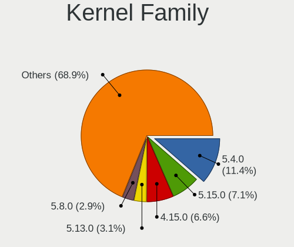
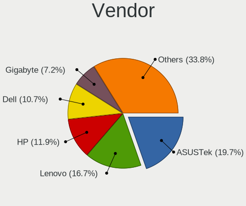
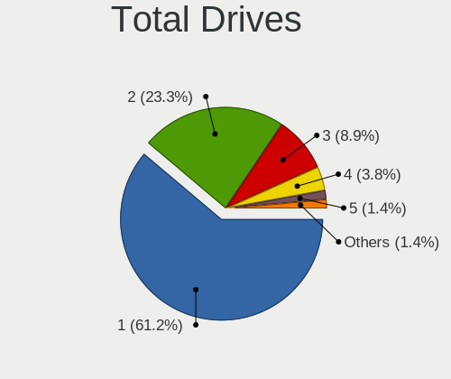
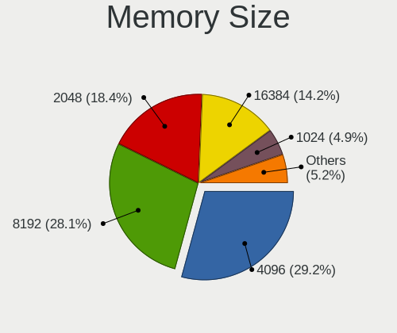
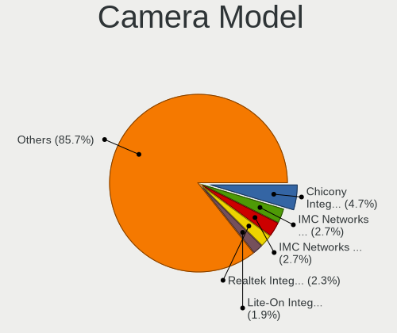
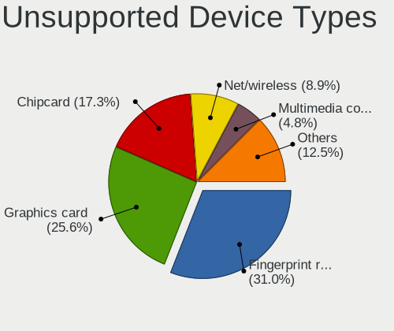

Linux in Latvia - Tested Hardware & Statistics
----------------------------------------------

A project to collect tested hardware configurations for Linux in Latvia.

Anyone can contribute to this report by the [hw-probe](https://github.com/linuxhw/hw-probe) tool:

    sudo -E hw-probe -all -upload

Please contribute! Especially if your hardware is rare.

This is a report for all computer types. See also reports for [desktops](/Location/Latvia/Desktop/README.md) and [notebooks](/Location/Latvia/Notebook/README.md).

Contents
--------

* [ Test Cases ](#test-cases)

* [ System ](#system)
  - [ OS                       ](#os)
  - [ OS Family                ](#os-family)
  - [ Kernel                   ](#kernel)
  - [ Kernel Family            ](#kernel-family)
  - [ Kernel Major Ver.        ](#kernel-major-ver)
  - [ Arch                     ](#arch)
  - [ DE                       ](#de)
  - [ Display Server           ](#display-server)
  - [ Display Manager          ](#display-manager)
  - [ OS Lang                  ](#os-lang)
  - [ Boot Mode                ](#boot-mode)
  - [ Filesystem               ](#filesystem)
  - [ Part. scheme             ](#part-scheme)
  - [ Dual Boot with Linux/BSD ](#dual-boot-with-linuxbsd)
  - [ Dual Boot (Win)          ](#dual-boot-win)

* [ Board ](#board)
  - [ Vendor                   ](#vendor)
  - [ Model                    ](#model)
  - [ Model Family             ](#model-family)
  - [ MFG Year                 ](#mfg-year)
  - [ Form Factor              ](#form-factor)
  - [ Secure Boot              ](#secure-boot)
  - [ Coreboot                 ](#coreboot)
  - [ RAM Size                 ](#ram-size)
  - [ RAM Used                 ](#ram-used)
  - [ Total Drives             ](#total-drives)
  - [ Has CD-ROM               ](#has-cd-rom)
  - [ Has Ethernet             ](#has-ethernet)
  - [ Has WiFi                 ](#has-wifi)
  - [ Has Bluetooth            ](#has-bluetooth)

* [ Location ](#location)
  - [ Country                  ](#country)
  - [ City                     ](#city)

* [ Drives ](#drives)
  - [ Drive Vendor             ](#drive-vendor)
  - [ Drive Model              ](#drive-model)
  - [ HDD Vendor               ](#hdd-vendor)
  - [ SSD Vendor               ](#ssd-vendor)
  - [ Drive Kind               ](#drive-kind)
  - [ Drive Connector          ](#drive-connector)
  - [ Drive Size               ](#drive-size)
  - [ Space Total              ](#space-total)
  - [ Space Used               ](#space-used)
  - [ Malfunc. Drives          ](#malfunc-drives)
  - [ Malfunc. Drive Vendor    ](#malfunc-drive-vendor)
  - [ Malfunc. HDD Vendor      ](#malfunc-hdd-vendor)
  - [ Malfunc. Drive Kind      ](#malfunc-drive-kind)
  - [ Failed Drives            ](#failed-drives)
  - [ Failed Drive Vendor      ](#failed-drive-vendor)
  - [ Drive Status             ](#drive-status)

* [ Storage controller ](#storage-controller)
  - [ Storage Vendor           ](#storage-vendor)
  - [ Storage Model            ](#storage-model)
  - [ Storage Kind             ](#storage-kind)

* [ Processor ](#processor)
  - [ CPU Vendor               ](#cpu-vendor)
  - [ CPU Model                ](#cpu-model)
  - [ CPU Model Family         ](#cpu-model-family)
  - [ CPU Cores                ](#cpu-cores)
  - [ CPU Sockets              ](#cpu-sockets)
  - [ CPU Threads              ](#cpu-threads)
  - [ CPU Op-Modes             ](#cpu-op-modes)
  - [ CPU Microcode            ](#cpu-microcode)
  - [ CPU Microarch            ](#cpu-microarch)

* [ Graphics ](#graphics)
  - [ GPU Vendor               ](#gpu-vendor)
  - [ GPU Model                ](#gpu-model)
  - [ GPU Combo                ](#gpu-combo)
  - [ GPU Driver               ](#gpu-driver)
  - [ GPU Memory               ](#gpu-memory)

* [ Monitor ](#monitor)
  - [ Monitor Vendor           ](#monitor-vendor)
  - [ Monitor Model            ](#monitor-model)
  - [ Monitor Resolution       ](#monitor-resolution)
  - [ Monitor Diagonal         ](#monitor-diagonal)
  - [ Monitor Width            ](#monitor-width)
  - [ Aspect Ratio             ](#aspect-ratio)
  - [ Monitor Area             ](#monitor-area)
  - [ Pixel Density            ](#pixel-density)
  - [ Multiple Monitors        ](#multiple-monitors)

* [ Network ](#network)
  - [ Net Controller Vendor    ](#net-controller-vendor)
  - [ Net Controller Model     ](#net-controller-model)
  - [ Wireless Vendor          ](#wireless-vendor)
  - [ Wireless Model           ](#wireless-model)
  - [ Ethernet Vendor          ](#ethernet-vendor)
  - [ Ethernet Model           ](#ethernet-model)
  - [ Net Controller Kind      ](#net-controller-kind)
  - [ Used Controller          ](#used-controller)
  - [ NICs                     ](#nics)
  - [ IPv6                     ](#ipv6)

* [ Bluetooth ](#bluetooth)
  - [ Bluetooth Vendor         ](#bluetooth-vendor)
  - [ Bluetooth Model          ](#bluetooth-model)

* [ Sound ](#sound)
  - [ Sound Vendor             ](#sound-vendor)
  - [ Sound Model              ](#sound-model)

* [ Memory ](#memory)
  - [ Memory Vendor            ](#memory-vendor)
  - [ Memory Model             ](#memory-model)
  - [ Memory Kind              ](#memory-kind)
  - [ Memory Form Factor       ](#memory-form-factor)
  - [ Memory Size              ](#memory-size)
  - [ Memory Speed             ](#memory-speed)

* [ Printers & scanners ](#printers--scanners)
  - [ Printer Vendor           ](#printer-vendor)
  - [ Printer Model            ](#printer-model)
  - [ Scanner Vendor           ](#scanner-vendor)
  - [ Scanner Model            ](#scanner-model)

* [ Camera ](#camera)
  - [ Camera Vendor            ](#camera-vendor)
  - [ Camera Model             ](#camera-model)

* [ Security ](#security)
  - [ Fingerprint Vendor       ](#fingerprint-vendor)
  - [ Fingerprint Model        ](#fingerprint-model)
  - [ Chipcard Vendor          ](#chipcard-vendor)
  - [ Chipcard Model           ](#chipcard-model)

* [ Unsupported ](#unsupported)
  - [ Unsupported Devices      ](#unsupported-devices)
  - [ Unsupported Device Types ](#unsupported-device-types)

Test Cases
----------

Total: 500

| Vendor        | Model                       | Form-Factor | Probe                                                      | Date         |
|---------------|-----------------------------|-------------|------------------------------------------------------------|--------------|
| Lenovo        | ThinkPad X1 Carbon 7th 2... | Notebook    | [46751741ef](https://linux-hardware.org/?probe=46751741ef) | Jun 05, 2023 |
| Gigabyte      | Z87-HD3                     | Desktop     | [228a46e465](https://linux-hardware.org/?probe=228a46e465) | Jun 04, 2023 |
| Gigabyte      | G33M-S2                     | Desktop     | [17ed1704c5](https://linux-hardware.org/?probe=17ed1704c5) | Jun 04, 2023 |
| Gigabyte      | G33M-S2                     | Desktop     | [82bab4dd6d](https://linux-hardware.org/?probe=82bab4dd6d) | Jun 04, 2023 |
| Intel         | NUC12WSBi5 M46425-303       | Mini pc     | [e3dca941cf](https://linux-hardware.org/?probe=e3dca941cf) | May 28, 2023 |
| Wortmann      | CR700                       | Notebook    | [189f1ae92b](https://linux-hardware.org/?probe=189f1ae92b) | May 27, 2023 |
| Intel         | NUC12WSBi5 M46425-303       | Mini pc     | [9327ef1887](https://linux-hardware.org/?probe=9327ef1887) | May 27, 2023 |
| Lenovo        | ThinkPad P14s Gen 3 21J5... | Notebook    | [e0cbba6897](https://linux-hardware.org/?probe=e0cbba6897) | May 16, 2023 |
| Dell          | Latitude 5330               | Notebook    | [3cc5328fee](https://linux-hardware.org/?probe=3cc5328fee) | May 16, 2023 |
| Rockchip      | Orange Pi 5                 | Soc         | [bf551b2767](https://linux-hardware.org/?probe=bf551b2767) | May 14, 2023 |
| Lenovo        | ThinkPad T470 20HD0001MX    | Notebook    | [65b165e2f1](https://linux-hardware.org/?probe=65b165e2f1) | May 12, 2023 |
| Lenovo        | ThinkPad T470 20HD0001MX    | Notebook    | [66b49186cb](https://linux-hardware.org/?probe=66b49186cb) | May 06, 2023 |
| Packard Be... | EasyNote LM85               | Notebook    | [d37b9e6687](https://linux-hardware.org/?probe=d37b9e6687) | May 06, 2023 |
| HUAWEI        | BOD-WXX9                    | Notebook    | [1909a7f824](https://linux-hardware.org/?probe=1909a7f824) | May 05, 2023 |
| HUAWEI        | BOD-WXX9                    | Notebook    | [6e0d5c7f28](https://linux-hardware.org/?probe=6e0d5c7f28) | May 05, 2023 |
| HUAWEI        | BOD-WXX9                    | Notebook    | [136fd4098d](https://linux-hardware.org/?probe=136fd4098d) | May 01, 2023 |
| HP            | 250 G6 Notebook PC          | Notebook    | [90e4883dca](https://linux-hardware.org/?probe=90e4883dca) | Apr 26, 2023 |
| ASRock        | 960GC-GS FX                 | Desktop     | [1cd850e8af](https://linux-hardware.org/?probe=1cd850e8af) | Apr 25, 2023 |
| ASUSTek       | ASUS TUF Dash F15 FX516P... | Notebook    | [641374c815](https://linux-hardware.org/?probe=641374c815) | Apr 23, 2023 |
| Dell          | Latitude 5400               | Notebook    | [70899bc374](https://linux-hardware.org/?probe=70899bc374) | Apr 12, 2023 |
| Fujitsu Si... | LIFEBOOK S6420              | Notebook    | [6a6e2f88f4](https://linux-hardware.org/?probe=6a6e2f88f4) | Apr 12, 2023 |
| ASUSTek       | ZenBook UX363EA_UX371EA     | Convertible | [d65df3295e](https://linux-hardware.org/?probe=d65df3295e) | Apr 11, 2023 |
| Acer          | Aspire 5250                 | Notebook    | [f2040ffb31](https://linux-hardware.org/?probe=f2040ffb31) | Apr 09, 2023 |
| ASUSTek       | AM1M-A                      | Desktop     | [120f5780bd](https://linux-hardware.org/?probe=120f5780bd) | Apr 09, 2023 |
| Fujitsu Si... | LIFEBOOK S6420              | Notebook    | [52b4a5a0f0](https://linux-hardware.org/?probe=52b4a5a0f0) | Apr 08, 2023 |
| ASUSTek       | X553MA                      | Notebook    | [0a307c8c2b](https://linux-hardware.org/?probe=0a307c8c2b) | Apr 07, 2023 |
| Apple         | MacBookAir5,2               | Notebook    | [5a1cd8556c](https://linux-hardware.org/?probe=5a1cd8556c) | Apr 01, 2023 |
| Biostar       | B550MX/E PRO                | Desktop     | [cffcb0a2a6](https://linux-hardware.org/?probe=cffcb0a2a6) | Mar 30, 2023 |
| ASUSTek       | TUF Gaming X570-PLUS        | Desktop     | [78046d9b99](https://linux-hardware.org/?probe=78046d9b99) | Mar 29, 2023 |
| HP            | 0AA8h                       | Desktop     | [fecbec6708](https://linux-hardware.org/?probe=fecbec6708) | Mar 19, 2023 |
| Lenovo        | ThinkPad T420 4180RK8       | Notebook    | [752373923e](https://linux-hardware.org/?probe=752373923e) | Mar 18, 2023 |
| Acer          | Extensa 5630                | Notebook    | [e78d4a3c28](https://linux-hardware.org/?probe=e78d4a3c28) | Mar 14, 2023 |
| Wortmann      | CR700                       | Notebook    | [a48e22ffc5](https://linux-hardware.org/?probe=a48e22ffc5) | Mar 07, 2023 |
| ASRock        | B75 Pro3-M                  | Desktop     | [3574e6c0f8](https://linux-hardware.org/?probe=3574e6c0f8) | Mar 04, 2023 |
| Lenovo        | ThinkPad E490 20N8005JMH    | Notebook    | [26ca476e1a](https://linux-hardware.org/?probe=26ca476e1a) | Mar 04, 2023 |
| ASUSTek       | CROSSHAIR VI HERO           | Desktop     | [3e3368d913](https://linux-hardware.org/?probe=3e3368d913) | Feb 28, 2023 |
| Lenovo        | ThinkPad P14s Gen 3 21J5... | Notebook    | [9b044bd920](https://linux-hardware.org/?probe=9b044bd920) | Feb 26, 2023 |
| Lenovo        | ThinkPad P14s Gen 3 21J5... | Notebook    | [c8c79f26d8](https://linux-hardware.org/?probe=c8c79f26d8) | Feb 26, 2023 |
| ASUSTek       | TUF Gaming X570-PLUS        | Desktop     | [7fe6e0dcde](https://linux-hardware.org/?probe=7fe6e0dcde) | Feb 24, 2023 |
| ASUSTek       | SABERTOOTH 990FX R2.0       | Desktop     | [455b0e1401](https://linux-hardware.org/?probe=455b0e1401) | Feb 23, 2023 |
| Lenovo        | IdeaPad 5 14ITL05 82FE      | Notebook    | [312937f0d0](https://linux-hardware.org/?probe=312937f0d0) | Feb 22, 2023 |
| HP            | Pavilion 17                 | Notebook    | [1a50084a52](https://linux-hardware.org/?probe=1a50084a52) | Feb 19, 2023 |
| MSI           | B75A-G43                    | Desktop     | [bf426ce3c3](https://linux-hardware.org/?probe=bf426ce3c3) | Feb 18, 2023 |
| Fujitsu       | STYLISTIC Q704              | Notebook    | [9d36ad089c](https://linux-hardware.org/?probe=9d36ad089c) | Feb 18, 2023 |
| Dell          | Latitude 5330               | Notebook    | [497897c322](https://linux-hardware.org/?probe=497897c322) | Feb 16, 2023 |
| Lenovo        | ZIWB2                       | Notebook    | [8ade075157](https://linux-hardware.org/?probe=8ade075157) | Feb 16, 2023 |
| Dell          | Latitude 5330               | Notebook    | [aa55aaad48](https://linux-hardware.org/?probe=aa55aaad48) | Feb 16, 2023 |
| HP            | ProLiant DL320 G6           | Server      | [0d3689fed9](https://linux-hardware.org/?probe=0d3689fed9) | Feb 09, 2023 |
| Gigabyte      | H55M-D2H                    | Desktop     | [652695efb0](https://linux-hardware.org/?probe=652695efb0) | Feb 06, 2023 |
| Gigabyte      | Z790 GAMING X AX            | Desktop     | [1c6725b5eb](https://linux-hardware.org/?probe=1c6725b5eb) | Feb 04, 2023 |
| Chuwi         | Hi10 Go                     | Notebook    | [a1b6911dc1](https://linux-hardware.org/?probe=a1b6911dc1) | Feb 02, 2023 |
| Lenovo        | ZIWB2                       | Notebook    | [b7ff6b4dd5](https://linux-hardware.org/?probe=b7ff6b4dd5) | Feb 02, 2023 |
| ASUSTek       | ROG STRIX B360-I GAMING     | Desktop     | [8f81628b59](https://linux-hardware.org/?probe=8f81628b59) | Jan 27, 2023 |
| Acer          | Aspire 5532                 | Notebook    | [88e8887c6c](https://linux-hardware.org/?probe=88e8887c6c) | Jan 27, 2023 |
| ASUSTek       | X550CL                      | Notebook    | [e98a955b1a](https://linux-hardware.org/?probe=e98a955b1a) | Jan 26, 2023 |
| Lenovo        | ThinkPad T430u 3353A11      | Notebook    | [34e69693d1](https://linux-hardware.org/?probe=34e69693d1) | Jan 25, 2023 |
| Acer          | Extensa 5630                | Notebook    | [ae62db30e8](https://linux-hardware.org/?probe=ae62db30e8) | Jan 23, 2023 |
| Lenovo        | Legion Y540-15IRH-PG0 81... | Notebook    | [40719006ae](https://linux-hardware.org/?probe=40719006ae) | Jan 23, 2023 |
| Wortmann      | CR700                       | Notebook    | [0d40cf0690](https://linux-hardware.org/?probe=0d40cf0690) | Jan 22, 2023 |
| MSI           | CR500                       | Notebook    | [4aaddddd7f](https://linux-hardware.org/?probe=4aaddddd7f) | Jan 22, 2023 |
| Lenovo        | IdeaPad 300-15ISK 80Q7      | Notebook    | [ae3846db38](https://linux-hardware.org/?probe=ae3846db38) | Jan 22, 2023 |
| Samsung       | 350V5C/351V5C/3540VC/344... | Notebook    | [9cb7b18b35](https://linux-hardware.org/?probe=9cb7b18b35) | Jan 20, 2023 |
| Samsung       | 350V5C/351V5C/3540VC/344... | Notebook    | [95e7b7d833](https://linux-hardware.org/?probe=95e7b7d833) | Jan 20, 2023 |
| Lenovo        | G70-80 80FF                 | Notebook    | [1ce03f27f3](https://linux-hardware.org/?probe=1ce03f27f3) | Jan 19, 2023 |
| Samsung       | 350V5C/351V5C/3540VC/344... | Notebook    | [8026c0d5b2](https://linux-hardware.org/?probe=8026c0d5b2) | Jan 17, 2023 |
| ASRock        | B75 Pro3-M                  | Desktop     | [4f28b4be44](https://linux-hardware.org/?probe=4f28b4be44) | Jan 15, 2023 |
| Fujitsu Si... | AMILO Si 2636               | Notebook    | [4a918c5503](https://linux-hardware.org/?probe=4a918c5503) | Jan 11, 2023 |
| ASRock        | B75 Pro3-M                  | Desktop     | [4884803279](https://linux-hardware.org/?probe=4884803279) | Jan 10, 2023 |
| ASRock        | B75 Pro3-M                  | Desktop     | [49b7bb70f3](https://linux-hardware.org/?probe=49b7bb70f3) | Jan 10, 2023 |
| HP            | 2AED                        | All in one  | [9a324c230d](https://linux-hardware.org/?probe=9a324c230d) | Jan 09, 2023 |
| ASUSTek       | P5KPL-CM                    | Desktop     | [625bf5665f](https://linux-hardware.org/?probe=625bf5665f) | Jan 07, 2023 |
| ASUSTek       | PRIME B350M-A               | Desktop     | [df845fe4a9](https://linux-hardware.org/?probe=df845fe4a9) | Jan 07, 2023 |
| Dell          | 0HY9JP A01                  | Desktop     | [0532ee0c1e](https://linux-hardware.org/?probe=0532ee0c1e) | Jan 05, 2023 |
| Fujitsu Si... | AMILO Si 2636               | Notebook    | [68bd2484a1](https://linux-hardware.org/?probe=68bd2484a1) | Jan 04, 2023 |
| ASUSTek       | B85-PLUS                    | Desktop     | [cbad10e284](https://linux-hardware.org/?probe=cbad10e284) | Dec 21, 2022 |
| HP            | G62                         | Notebook    | [4d80c95e73](https://linux-hardware.org/?probe=4d80c95e73) | Dec 18, 2022 |
| Dell          | Inspiron N5050              | Notebook    | [cc139ec3a3](https://linux-hardware.org/?probe=cc139ec3a3) | Dec 17, 2022 |
| Fujitsu Si... | LIFEBOOK E8310              | Notebook    | [5fca69ae89](https://linux-hardware.org/?probe=5fca69ae89) | Dec 17, 2022 |
| Lenovo        | IdeaPad Gaming 3 15IMH05... | Notebook    | [259226594a](https://linux-hardware.org/?probe=259226594a) | Dec 14, 2022 |
| Lenovo        | Legion 5 15ACH6H 82JU       | Notebook    | [6de2a0ad33](https://linux-hardware.org/?probe=6de2a0ad33) | Dec 11, 2022 |
| MSI           | GF63 Thin 9RCX              | Notebook    | [b3c750c720](https://linux-hardware.org/?probe=b3c750c720) | Dec 11, 2022 |
| Fujitsu Si... | LIFEBOOK E8310              | Notebook    | [e4fe543570](https://linux-hardware.org/?probe=e4fe543570) | Dec 10, 2022 |
| Dell          | 02YYK5 A00                  | Desktop     | [1168ac14f5](https://linux-hardware.org/?probe=1168ac14f5) | Dec 09, 2022 |
| MSI           | B450M-A PRO MAX             | Desktop     | [46a6e9e722](https://linux-hardware.org/?probe=46a6e9e722) | Dec 07, 2022 |
| ASUSTek       | X550MD                      | Notebook    | [e5058b43c3](https://linux-hardware.org/?probe=e5058b43c3) | Dec 05, 2022 |
| ASUSTek       | F3Sg                        | Notebook    | [f5ae748125](https://linux-hardware.org/?probe=f5ae748125) | Dec 04, 2022 |
| MSI           | GV72 7RE                    | Notebook    | [74b317d501](https://linux-hardware.org/?probe=74b317d501) | Dec 01, 2022 |
| Gigabyte      | Z87-HD3                     | Desktop     | [d9a78cb529](https://linux-hardware.org/?probe=d9a78cb529) | Nov 30, 2022 |
| Gigabyte      | G33M-S2                     | Desktop     | [3d6a965dd4](https://linux-hardware.org/?probe=3d6a965dd4) | Nov 30, 2022 |
| ASUSTek       | G751JL                      | Notebook    | [1bfbfafe68](https://linux-hardware.org/?probe=1bfbfafe68) | Nov 29, 2022 |
| Gigabyte      | 946GMX-S2                   | Desktop     | [6c97b310fb](https://linux-hardware.org/?probe=6c97b310fb) | Nov 29, 2022 |
| ASUSTek       | X453MA                      | Notebook    | [f30a5c4808](https://linux-hardware.org/?probe=f30a5c4808) | Nov 28, 2022 |
| Lenovo        | ThinkPad T460s 20FAS4KH0... | Notebook    | [585b6910fa](https://linux-hardware.org/?probe=585b6910fa) | Nov 26, 2022 |
| Lenovo        | ThinkPad T460s 20FAS4KH0... | Notebook    | [138231da75](https://linux-hardware.org/?probe=138231da75) | Nov 26, 2022 |
| Gigabyte      | M61PME-S2                   | Desktop     | [4768ab429e](https://linux-hardware.org/?probe=4768ab429e) | Nov 23, 2022 |
| MSI           | Modern 14 B4MW              | Notebook    | [967a4c4e4d](https://linux-hardware.org/?probe=967a4c4e4d) | Nov 17, 2022 |
| ASUSTek       | PRIME X470-PRO              | Desktop     | [e4470c4bda](https://linux-hardware.org/?probe=e4470c4bda) | Nov 12, 2022 |
| ASUSTek       | CROSSHAIR VI HERO           | Desktop     | [7712ce88c4](https://linux-hardware.org/?probe=7712ce88c4) | Oct 30, 2022 |
| ASUSTek       | P5Q SE2                     | Desktop     | [7d576ac245](https://linux-hardware.org/?probe=7d576ac245) | Oct 29, 2022 |
| Wortmann      | CR700                       | Notebook    | [7030308edf](https://linux-hardware.org/?probe=7030308edf) | Oct 29, 2022 |
| Lenovo        | ThinkPad X260 20F5S5Q200    | Notebook    | [c2e041fd54](https://linux-hardware.org/?probe=c2e041fd54) | Oct 21, 2022 |
| Gigabyte      | G41M-ES2L                   | Desktop     | [e267cad212](https://linux-hardware.org/?probe=e267cad212) | Oct 20, 2022 |
| Gigabyte      | G41M-ES2L                   | Desktop     | [69adb866e0](https://linux-hardware.org/?probe=69adb866e0) | Oct 20, 2022 |
| ASUSTek       | X553MA                      | Notebook    | [ade1f0f879](https://linux-hardware.org/?probe=ade1f0f879) | Oct 14, 2022 |
| Gigabyte      | 946GMX-S2                   | Desktop     | [491d0c69ca](https://linux-hardware.org/?probe=491d0c69ca) | Oct 12, 2022 |
| Gigabyte      | 946GMX-S2                   | Desktop     | [09ee887f3a](https://linux-hardware.org/?probe=09ee887f3a) | Oct 12, 2022 |
| Toshiba       | Satellite L350              | Notebook    | [79268bac9b](https://linux-hardware.org/?probe=79268bac9b) | Oct 06, 2022 |
| Toshiba       | Satellite L350              | Notebook    | [cf2e5dae86](https://linux-hardware.org/?probe=cf2e5dae86) | Oct 06, 2022 |
| Acer          | Aspire 5250                 | Notebook    | [8a18115a5b](https://linux-hardware.org/?probe=8a18115a5b) | Oct 04, 2022 |
| ASRock        | N68C-S UCC                  | Desktop     | [734baf54fa](https://linux-hardware.org/?probe=734baf54fa) | Oct 04, 2022 |
| ASUSTek       | CROSSHAIR VI HERO           | Desktop     | [46e48bc4c1](https://linux-hardware.org/?probe=46e48bc4c1) | Sep 28, 2022 |
| Gigabyte      | B450 GAMING X               | Desktop     | [982d41c1eb](https://linux-hardware.org/?probe=982d41c1eb) | Sep 25, 2022 |
| Gigabyte      | B450 GAMING X               | Desktop     | [a5d5950e29](https://linux-hardware.org/?probe=a5d5950e29) | Sep 25, 2022 |
| Lenovo        | ThinkPad E490 20N8005JMH    | Notebook    | [8e78f3c776](https://linux-hardware.org/?probe=8e78f3c776) | Sep 20, 2022 |
| ASUSTek       | CROSSHAIR VI HERO           | Desktop     | [8d8440548e](https://linux-hardware.org/?probe=8d8440548e) | Sep 20, 2022 |
| Acer          | Aspire 5742                 | Notebook    | [fadbc676b4](https://linux-hardware.org/?probe=fadbc676b4) | Sep 02, 2022 |
| HP            | EliteBook 8440p             | Notebook    | [1f0f196305](https://linux-hardware.org/?probe=1f0f196305) | Aug 29, 2022 |
| ASUSTek       | ROG Strix G733ZW_G733ZW     | Notebook    | [4384be22c4](https://linux-hardware.org/?probe=4384be22c4) | Aug 27, 2022 |
| HP            | ProBook 450 G1              | Notebook    | [986bb07198](https://linux-hardware.org/?probe=986bb07198) | Aug 24, 2022 |
| HP            | ProBook 450 G1              | Notebook    | [c7a1d435fb](https://linux-hardware.org/?probe=c7a1d435fb) | Aug 24, 2022 |
| HUAWEI        | KLVL-WXX9                   | Notebook    | [b74ab22c1f](https://linux-hardware.org/?probe=b74ab22c1f) | Aug 16, 2022 |
| Samsung       | 350V5C/351V5C/3540VC/344... | Notebook    | [88fc37216d](https://linux-hardware.org/?probe=88fc37216d) | Aug 15, 2022 |
| ASUSTek       | ROG Strix G733ZW_G733ZW     | Notebook    | [2f45536688](https://linux-hardware.org/?probe=2f45536688) | Aug 12, 2022 |
| Lenovo        | G70-80 80FF                 | Notebook    | [495516e19d](https://linux-hardware.org/?probe=495516e19d) | Aug 08, 2022 |
| Gigabyte      | G33M-S2                     | Desktop     | [5bd6c356cd](https://linux-hardware.org/?probe=5bd6c356cd) | Aug 03, 2022 |
| Gigabyte      | Z87-HD3                     | Desktop     | [83936d3cf0](https://linux-hardware.org/?probe=83936d3cf0) | Jul 31, 2022 |
| Gigabyte      | G33M-S2                     | Desktop     | [0a96778f7c](https://linux-hardware.org/?probe=0a96778f7c) | Jul 30, 2022 |
| Acer          | Aspire A315-42              | Notebook    | [78415dc6be](https://linux-hardware.org/?probe=78415dc6be) | Jul 25, 2022 |
| Acer          | Aspire 5730                 | Notebook    | [b4877f21ad](https://linux-hardware.org/?probe=b4877f21ad) | Jul 23, 2022 |
| Wortmann      | CR700                       | Notebook    | [3aa2d086b9](https://linux-hardware.org/?probe=3aa2d086b9) | Jul 23, 2022 |
| Wortmann      | CR700                       | Notebook    | [27d04b5577](https://linux-hardware.org/?probe=27d04b5577) | Jul 23, 2022 |
| Acer          | Aspire A515-51G             | Notebook    | [4856a5fefb](https://linux-hardware.org/?probe=4856a5fefb) | Jul 22, 2022 |
| Lenovo        | IdeaPad U330p 20267         | Notebook    | [1775f75940](https://linux-hardware.org/?probe=1775f75940) | Jul 22, 2022 |
| Gigabyte      | G33M-S2                     | Desktop     | [c6c4a561e1](https://linux-hardware.org/?probe=c6c4a561e1) | Jul 17, 2022 |
| Gigabyte      | H97-D3H-CF                  | Desktop     | [e9aa6d6be1](https://linux-hardware.org/?probe=e9aa6d6be1) | Jul 06, 2022 |
| Gigabyte      | G33M-S2                     | Desktop     | [1acedf0aa3](https://linux-hardware.org/?probe=1acedf0aa3) | Jun 26, 2022 |
| Gigabyte      | G33M-S2                     | Desktop     | [949fb9a5e7](https://linux-hardware.org/?probe=949fb9a5e7) | Jun 24, 2022 |
| Dell          | Precision 3561              | Notebook    | [fab553a2b2](https://linux-hardware.org/?probe=fab553a2b2) | Jun 20, 2022 |
| HUAWEI        | KLVL-WXX9                   | Notebook    | [999d96890c](https://linux-hardware.org/?probe=999d96890c) | Jun 16, 2022 |
| MSI           | A68HM-E33 V2                | Desktop     | [b473ea12dc](https://linux-hardware.org/?probe=b473ea12dc) | Jun 12, 2022 |
| HP            | ProBook 450 G0              | Notebook    | [2d87379b89](https://linux-hardware.org/?probe=2d87379b89) | Jun 11, 2022 |
| Foxconn       | 2ADA                        | Desktop     | [1242ad2894](https://linux-hardware.org/?probe=1242ad2894) | Jun 06, 2022 |
| Samsung       | 350V5C/351V5C/3540VC/344... | Notebook    | [e75d068a21](https://linux-hardware.org/?probe=e75d068a21) | Jun 02, 2022 |
| Lenovo        | ThinkPad T410 2537HN3       | Notebook    | [e373330c8b](https://linux-hardware.org/?probe=e373330c8b) | Jun 01, 2022 |
| Lenovo        | ThinkBook 14-IML 20RV       | Notebook    | [6f5d1c9f06](https://linux-hardware.org/?probe=6f5d1c9f06) | May 22, 2022 |
| Lenovo        | ThinkBook 14-IML 20RV       | Notebook    | [6e46286500](https://linux-hardware.org/?probe=6e46286500) | May 21, 2022 |
| Acer          | Aspire A315-42              | Notebook    | [cd2a742b8c](https://linux-hardware.org/?probe=cd2a742b8c) | May 18, 2022 |
| Lenovo        | 3716 SDK0T76463 WIN 3422... | Desktop     | [cd15058963](https://linux-hardware.org/?probe=cd15058963) | May 16, 2022 |
| Raspberry ... | Raspberry Pi 4 Model B R... | Soc         | [8e854926e0](https://linux-hardware.org/?probe=8e854926e0) | May 12, 2022 |
| Dell          | Inspiron 3543               | Notebook    | [3a940a3394](https://linux-hardware.org/?probe=3a940a3394) | May 11, 2022 |
| Lenovo        | 3716 SDK0T76463 WIN 3422... | Desktop     | [4043d7e26a](https://linux-hardware.org/?probe=4043d7e26a) | May 11, 2022 |
| Dell          | 02YYK5 A01                  | Desktop     | [19dd091f8b](https://linux-hardware.org/?probe=19dd091f8b) | May 01, 2022 |
| HP            | 2AAC                        | Desktop     | [1f6b08507e](https://linux-hardware.org/?probe=1f6b08507e) | May 01, 2022 |
| Valve         | Jupiter                     | Notebook    | [19d2c51aa6](https://linux-hardware.org/?probe=19d2c51aa6) | May 01, 2022 |
| Dell          | Inspiron 3543               | Notebook    | [7fb19b7da4](https://linux-hardware.org/?probe=7fb19b7da4) | Apr 27, 2022 |
| ASUSTek       | VivoBook_ASUS Laptop E21... | Notebook    | [73de8fd9f4](https://linux-hardware.org/?probe=73de8fd9f4) | Apr 26, 2022 |
| ASRock        | X79 Extreme9                | Desktop     | [e483a6e634](https://linux-hardware.org/?probe=e483a6e634) | Apr 19, 2022 |
| Dell          | Latitude E7440              | Notebook    | [8609968661](https://linux-hardware.org/?probe=8609968661) | Apr 18, 2022 |
| HP            | Pavilion Gaming Laptop 1... | Notebook    | [75f2876f06](https://linux-hardware.org/?probe=75f2876f06) | Apr 12, 2022 |
| Lenovo        | ThinkPad E490 20N8005JMH    | Notebook    | [c3ac98aa71](https://linux-hardware.org/?probe=c3ac98aa71) | Apr 11, 2022 |
| ASUSTek       | ROG STRIX Z370-E GAMING     | Desktop     | [cadff96ec0](https://linux-hardware.org/?probe=cadff96ec0) | Apr 11, 2022 |
| Gigabyte      | X570 AORUS ELITE            | Desktop     | [fe293471a7](https://linux-hardware.org/?probe=fe293471a7) | Apr 08, 2022 |
| Acer          | WG43M                       | Desktop     | [c7cb6ee141](https://linux-hardware.org/?probe=c7cb6ee141) | Apr 08, 2022 |
| Dell          | Latitude 5590               | Notebook    | [6e22c70e48](https://linux-hardware.org/?probe=6e22c70e48) | Apr 05, 2022 |
| HP            | EliteBook 840 G8 Noteboo... | Notebook    | [086d7749d3](https://linux-hardware.org/?probe=086d7749d3) | Apr 03, 2022 |
| Lenovo        | ThinkPad X260 20F5S0HK1J    | Notebook    | [a83d3cbe5f](https://linux-hardware.org/?probe=a83d3cbe5f) | Mar 31, 2022 |
| ASUSTek       | P8P67 LE                    | Desktop     | [f7eb22bcfc](https://linux-hardware.org/?probe=f7eb22bcfc) | Mar 27, 2022 |
| Lenovo        | ThinkPad E490 20N8005JMH    | Notebook    | [1a8680a665](https://linux-hardware.org/?probe=1a8680a665) | Mar 23, 2022 |
| ABIT          | IP35-E                      | Desktop     | [9d6e95572e](https://linux-hardware.org/?probe=9d6e95572e) | Mar 21, 2022 |
| ABIT          | IP35-E                      | Desktop     | [3d93ef42c9](https://linux-hardware.org/?probe=3d93ef42c9) | Mar 21, 2022 |
| ASUSTek       | ASUS TUF Gaming F15 FX50... | Notebook    | [d63ab08c03](https://linux-hardware.org/?probe=d63ab08c03) | Mar 17, 2022 |
| Lenovo        | IdeaPad 320-15ISK 80XH      | Notebook    | [5af22f3639](https://linux-hardware.org/?probe=5af22f3639) | Mar 07, 2022 |
| HP            | EliteBook 8570w             | Notebook    | [a97a0ba0ee](https://linux-hardware.org/?probe=a97a0ba0ee) | Feb 27, 2022 |
| Dell          | Inspiron 3531               | Notebook    | [d2d231ddeb](https://linux-hardware.org/?probe=d2d231ddeb) | Feb 24, 2022 |
| Lenovo        | ThinkPad X220 4291Q50       | Notebook    | [600a3137e2](https://linux-hardware.org/?probe=600a3137e2) | Feb 19, 2022 |
| MSI           | H110M PRO-VD                | Desktop     | [83df25aace](https://linux-hardware.org/?probe=83df25aace) | Feb 18, 2022 |
| ASUSTek       | VivoBook_ASUSLaptop X512... | Notebook    | [ae4eca9e09](https://linux-hardware.org/?probe=ae4eca9e09) | Feb 14, 2022 |
| ASRock        | X79 Extreme9                | Desktop     | [9dfc1ac601](https://linux-hardware.org/?probe=9dfc1ac601) | Feb 12, 2022 |
| ASRock        | X79 Extreme9                | Desktop     | [0848fdb73f](https://linux-hardware.org/?probe=0848fdb73f) | Feb 12, 2022 |
| Lenovo        | Yoga C640-13IML 81UE        | Convertible | [36f709712b](https://linux-hardware.org/?probe=36f709712b) | Feb 08, 2022 |
| ASUSTek       | P5Q-EM                      | Desktop     | [834bc65728](https://linux-hardware.org/?probe=834bc65728) | Feb 04, 2022 |
| ASUSTek       | P5Q-EM                      | Desktop     | [887e40e6c7](https://linux-hardware.org/?probe=887e40e6c7) | Feb 04, 2022 |
| Lenovo        | ThinkPad P14s Gen 1 20Y1... | Notebook    | [1837325ca2](https://linux-hardware.org/?probe=1837325ca2) | Feb 03, 2022 |
| Lenovo        | G70-80 80FF                 | Notebook    | [0771453742](https://linux-hardware.org/?probe=0771453742) | Jan 25, 2022 |
| Apple         | MacBookPro8,1               | Notebook    | [9b3d91c6df](https://linux-hardware.org/?probe=9b3d91c6df) | Jan 24, 2022 |
| HP            | 250 G6 Notebook PC          | Notebook    | [dae0e58890](https://linux-hardware.org/?probe=dae0e58890) | Jan 23, 2022 |
| Razer         | Blade 15 Advanced Model ... | Notebook    | [c07445f559](https://linux-hardware.org/?probe=c07445f559) | Jan 23, 2022 |
| Lenovo        | G70-80 80FF                 | Notebook    | [c69ec5ad5b](https://linux-hardware.org/?probe=c69ec5ad5b) | Jan 17, 2022 |
| Razer         | Blade 15 Advanced Model ... | Notebook    | [6f992c3b94](https://linux-hardware.org/?probe=6f992c3b94) | Jan 14, 2022 |
| Razer         | Blade 15 Advanced Model ... | Notebook    | [95724a0980](https://linux-hardware.org/?probe=95724a0980) | Jan 14, 2022 |
| Dell          | 02YYK5 A01                  | Desktop     | [e41c34594e](https://linux-hardware.org/?probe=e41c34594e) | Jan 11, 2022 |
| ASUSTek       | VivoBook_ASUSLaptop X513... | Notebook    | [d453a69dad](https://linux-hardware.org/?probe=d453a69dad) | Jan 06, 2022 |
| Lenovo        | G70-80 80FF                 | Notebook    | [b1279c6db3](https://linux-hardware.org/?probe=b1279c6db3) | Jan 02, 2022 |
| Lenovo        | IdeaPad 300-15ISK 80Q7      | Notebook    | [0d09c12302](https://linux-hardware.org/?probe=0d09c12302) | Dec 28, 2021 |
| MSI           | P55-GD65                    | Desktop     | [37da95512b](https://linux-hardware.org/?probe=37da95512b) | Dec 28, 2021 |
| Lenovo        | G70-80 80FF                 | Notebook    | [4210ac05a8](https://linux-hardware.org/?probe=4210ac05a8) | Dec 26, 2021 |
| Dell          | Inspiron 3543               | Notebook    | [2b61a95031](https://linux-hardware.org/?probe=2b61a95031) | Dec 21, 2021 |
| Lenovo        | ThinkPad T60 8741W3M        | Notebook    | [7d2faf3b37](https://linux-hardware.org/?probe=7d2faf3b37) | Dec 21, 2021 |
| Lenovo        | ThinkPad T60 8741W3M        | Notebook    | [6df4a50194](https://linux-hardware.org/?probe=6df4a50194) | Dec 21, 2021 |
| Lenovo        | ThinkPad X250 20CLS2XA00    | Notebook    | [276d570689](https://linux-hardware.org/?probe=276d570689) | Dec 15, 2021 |
| ASUSTek       | E402SA                      | Notebook    | [2a140138d3](https://linux-hardware.org/?probe=2a140138d3) | Dec 12, 2021 |
| Lenovo        | G70-80 80FF                 | Notebook    | [7d694ce256](https://linux-hardware.org/?probe=7d694ce256) | Dec 09, 2021 |
| ASRock        | FM2A88X Extreme4+           | Desktop     | [a864c07042](https://linux-hardware.org/?probe=a864c07042) | Dec 05, 2021 |
| Dell          | Latitude 7420               | Notebook    | [7a96812e39](https://linux-hardware.org/?probe=7a96812e39) | Nov 28, 2021 |
| Lenovo        | ThinkPad T420 4180ED3       | Notebook    | [c7726d6967](https://linux-hardware.org/?probe=c7726d6967) | Nov 23, 2021 |
| Acer          | NC-E5-572G-7222             | Notebook    | [1c2a0c3295](https://linux-hardware.org/?probe=1c2a0c3295) | Nov 19, 2021 |
| Lenovo        | ThinkPad E490 20N8005JMH    | Notebook    | [0c603f1589](https://linux-hardware.org/?probe=0c603f1589) | Nov 16, 2021 |
| HUAWEI        | MACHD-WXX9                  | Notebook    | [364fb5b6b7](https://linux-hardware.org/?probe=364fb5b6b7) | Nov 06, 2021 |
| HP            | EliteBook 850 G4            | Notebook    | [e6643f7ed1](https://linux-hardware.org/?probe=e6643f7ed1) | Oct 28, 2021 |
| HP            | 304Bh                       | Desktop     | [643a84ae14](https://linux-hardware.org/?probe=643a84ae14) | Oct 26, 2021 |
| HP            | 304Bh                       | Desktop     | [b7bd300808](https://linux-hardware.org/?probe=b7bd300808) | Oct 22, 2021 |
| Lenovo        | ThinkPad E15 Gen 2 20T80... | Notebook    | [f1449188a9](https://linux-hardware.org/?probe=f1449188a9) | Oct 20, 2021 |
| MSI           | B450M-A PRO MAX             | Desktop     | [4148046f02](https://linux-hardware.org/?probe=4148046f02) | Oct 17, 2021 |
| Fujitsu Si... | AMILO Xa 1526               | Notebook    | [00863fcea8](https://linux-hardware.org/?probe=00863fcea8) | Oct 16, 2021 |
| HP            | G62                         | Notebook    | [7873481ecb](https://linux-hardware.org/?probe=7873481ecb) | Oct 12, 2021 |
| ASUSTek       | N550JV                      | Notebook    | [5369aca258](https://linux-hardware.org/?probe=5369aca258) | Sep 28, 2021 |
| ASUSTek       | TUF Gaming FX505DY_FX505... | Notebook    | [f4a4e754c5](https://linux-hardware.org/?probe=f4a4e754c5) | Sep 22, 2021 |
| HP            | 250 G6 Notebook PC          | Notebook    | [3caff8f18f](https://linux-hardware.org/?probe=3caff8f18f) | Sep 19, 2021 |
| Lenovo        | IdeaPad Gaming 3 15ARH05... | Notebook    | [eb5215553d](https://linux-hardware.org/?probe=eb5215553d) | Sep 18, 2021 |
| HP            | EliteBook 840 G3            | Notebook    | [5ac93f6014](https://linux-hardware.org/?probe=5ac93f6014) | Sep 15, 2021 |
| Acer          | Aspire VX5-591G             | Notebook    | [c7d5407b29](https://linux-hardware.org/?probe=c7d5407b29) | Sep 15, 2021 |
| ASUSTek       | P5Q-EM                      | Desktop     | [7f6f4bedd3](https://linux-hardware.org/?probe=7f6f4bedd3) | Sep 14, 2021 |
| Intel         | DH77EB AAG39073-304         | Desktop     | [7e44f2ff81](https://linux-hardware.org/?probe=7e44f2ff81) | Sep 06, 2021 |
| ASUSTek       | Z97-K/USB                   | Desktop     | [071ad478e7](https://linux-hardware.org/?probe=071ad478e7) | Aug 30, 2021 |
| ASRock        | ALiveXFire-eSATA2           | Desktop     | [5b32c9197c](https://linux-hardware.org/?probe=5b32c9197c) | Aug 28, 2021 |
| ASRock        | ALiveXFire-eSATA2           | Desktop     | [8cd8b7faa5](https://linux-hardware.org/?probe=8cd8b7faa5) | Aug 28, 2021 |
| ASUSTek       | TUF Gaming FX505DY_FX505... | Notebook    | [c5ebbbd9c2](https://linux-hardware.org/?probe=c5ebbbd9c2) | Aug 27, 2021 |
| HP            | Pavilion Gaming Laptop 1... | Notebook    | [516c59e9bb](https://linux-hardware.org/?probe=516c59e9bb) | Aug 26, 2021 |
| Sony          | VPCCW2S8E                   | Notebook    | [a8c2dc6942](https://linux-hardware.org/?probe=a8c2dc6942) | Aug 26, 2021 |
| HP            | EliteBook 840 G1            | Notebook    | [82b2192d48](https://linux-hardware.org/?probe=82b2192d48) | Aug 25, 2021 |
| Samsung       | 350V5C/351V5C/3540VC/344... | Notebook    | [d26b653261](https://linux-hardware.org/?probe=d26b653261) | Aug 23, 2021 |
| Dell          | G3 3579                     | Notebook    | [6042d3630a](https://linux-hardware.org/?probe=6042d3630a) | Aug 22, 2021 |
| Dell          | G3 3579                     | Notebook    | [902b56f744](https://linux-hardware.org/?probe=902b56f744) | Aug 22, 2021 |
| HP            | Pavilion dv7                | Notebook    | [7d6c08fc9e](https://linux-hardware.org/?probe=7d6c08fc9e) | Aug 17, 2021 |
| Intel         | DH77EB AAG39073-304         | Desktop     | [13fb44b235](https://linux-hardware.org/?probe=13fb44b235) | Aug 13, 2021 |
| ASUSTek       | PRIME B350-PLUS             | Desktop     | [bc618727f4](https://linux-hardware.org/?probe=bc618727f4) | Aug 10, 2021 |
| Lenovo        | IdeaPad S340-15API 81NC     | Notebook    | [eb1b7627ff](https://linux-hardware.org/?probe=eb1b7627ff) | Aug 10, 2021 |
| HP            | EliteBook 8470p             | Notebook    | [c718b061d2](https://linux-hardware.org/?probe=c718b061d2) | Aug 05, 2021 |
| HP            | HDX 16                      | Notebook    | [47273f74b5](https://linux-hardware.org/?probe=47273f74b5) | Aug 02, 2021 |
| HP            | HDX 16                      | Notebook    | [aa6b70deac](https://linux-hardware.org/?probe=aa6b70deac) | Aug 02, 2021 |
| Dell          | 0GXM1W A00                  | Desktop     | [6aa52c9eb8](https://linux-hardware.org/?probe=6aa52c9eb8) | Aug 02, 2021 |
| Toshiba       | Satellite L850-1LK          | Notebook    | [8e8d84c8eb](https://linux-hardware.org/?probe=8e8d84c8eb) | Jul 30, 2021 |
| Dell          | Vostro 1015                 | Notebook    | [0e16f2bc9c](https://linux-hardware.org/?probe=0e16f2bc9c) | Jul 30, 2021 |
| Toshiba       | Satellite L850-1LK          | Notebook    | [b0b636bbee](https://linux-hardware.org/?probe=b0b636bbee) | Jul 30, 2021 |
| HP            | HDX 16                      | Notebook    | [627219df22](https://linux-hardware.org/?probe=627219df22) | Jul 25, 2021 |
| Timi          | A35S                        | Notebook    | [27f9e877a1](https://linux-hardware.org/?probe=27f9e877a1) | Jul 14, 2021 |
| ASUSTek       | VivoBook 12_ASUS Laptop ... | Notebook    | [55460937e0](https://linux-hardware.org/?probe=55460937e0) | Jul 14, 2021 |
| Lenovo        | ThinkPad P70 20ER0035MH     | Notebook    | [3b7269dbb9](https://linux-hardware.org/?probe=3b7269dbb9) | Jul 12, 2021 |
| Dell          | Latitude 7420               | Notebook    | [ebf2372c3b](https://linux-hardware.org/?probe=ebf2372c3b) | Jul 09, 2021 |
| HP            | HDX 16                      | Notebook    | [ba1ae87cbe](https://linux-hardware.org/?probe=ba1ae87cbe) | Jul 07, 2021 |
| Acer          | Predator PH317-53           | Notebook    | [1e5cb90c22](https://linux-hardware.org/?probe=1e5cb90c22) | Jul 06, 2021 |
| HP            | Pavilion dv6500             | Notebook    | [135215864a](https://linux-hardware.org/?probe=135215864a) | Jun 19, 2021 |
| MSI           | H310M PRO-VD                | Desktop     | [42ade7f952](https://linux-hardware.org/?probe=42ade7f952) | Jun 10, 2021 |
| Raspberry ... | Raspberry Pi 4 Model B R... | Soc         | [b5aa561890](https://linux-hardware.org/?probe=b5aa561890) | Jun 05, 2021 |
| Dell          | Latitude 5520               | Notebook    | [9929364f77](https://linux-hardware.org/?probe=9929364f77) | Jun 01, 2021 |
| ASUSTek       | Z97-K R2.0                  | Desktop     | [25a9c64af7](https://linux-hardware.org/?probe=25a9c64af7) | May 29, 2021 |
| Acer          | AO725                       | Notebook    | [1a095f9c0f](https://linux-hardware.org/?probe=1a095f9c0f) | May 17, 2021 |
| Lenovo        | Y50-70 20378                | Notebook    | [cc68265730](https://linux-hardware.org/?probe=cc68265730) | May 15, 2021 |
| MSI           | H81M-E35                    | Desktop     | [2d479e2946](https://linux-hardware.org/?probe=2d479e2946) | May 15, 2021 |
| MSI           | H81M-E35                    | Desktop     | [621d19b1f1](https://linux-hardware.org/?probe=621d19b1f1) | May 15, 2021 |
| ASUSTek       | Z97-K R2.0                  | Desktop     | [796bb8e1b8](https://linux-hardware.org/?probe=796bb8e1b8) | May 12, 2021 |
| Dell          | Inspiron 3583               | Notebook    | [7e3064fadf](https://linux-hardware.org/?probe=7e3064fadf) | May 10, 2021 |
| Dell          | Inspiron 3583               | Notebook    | [29e5e6b501](https://linux-hardware.org/?probe=29e5e6b501) | May 10, 2021 |
| HP            | Pavilion Gaming Laptop 1... | Notebook    | [de14cb7c23](https://linux-hardware.org/?probe=de14cb7c23) | May 06, 2021 |
| Dell          | Inspiron 5720               | Notebook    | [28fc1b9fd7](https://linux-hardware.org/?probe=28fc1b9fd7) | Apr 20, 2021 |
| Acer          | Aspire E5-774G              | Notebook    | [17734000ae](https://linux-hardware.org/?probe=17734000ae) | Apr 14, 2021 |
| Lenovo        | G50-80 80E5                 | Notebook    | [d6b6146396](https://linux-hardware.org/?probe=d6b6146396) | Apr 14, 2021 |
| MSI           | B450M-A PRO MAX             | Desktop     | [4d87fd7e46](https://linux-hardware.org/?probe=4d87fd7e46) | Apr 13, 2021 |
| Dell          | Inspiron 5720               | Notebook    | [2bff145cfe](https://linux-hardware.org/?probe=2bff145cfe) | Apr 10, 2021 |
| Fujitsu Si... | D2824-A1 S26361-D2824-A1    | Desktop     | [817d1bb360](https://linux-hardware.org/?probe=817d1bb360) | Apr 03, 2021 |
| Fujitsu Si... | D2824-A1 S26361-D2824-A1    | Desktop     | [ca1692012f](https://linux-hardware.org/?probe=ca1692012f) | Apr 03, 2021 |
| Lenovo        | ThinkPad L390 20NRCTO1WW    | Notebook    | [09ae9c9787](https://linux-hardware.org/?probe=09ae9c9787) | Mar 31, 2021 |
| ASUSTek       | PRIME B350-PLUS             | Desktop     | [d2a175100f](https://linux-hardware.org/?probe=d2a175100f) | Mar 22, 2021 |
| Lenovo        | ThinkPad T15 Gen 1 20S60... | Notebook    | [3c5c72b0fb](https://linux-hardware.org/?probe=3c5c72b0fb) | Mar 20, 2021 |
| Dell          | Latitude 5400               | Notebook    | [002c23ff4b](https://linux-hardware.org/?probe=002c23ff4b) | Mar 19, 2021 |
| ASUSTek       | PRIME Z270-P                | Desktop     | [344b4339b4](https://linux-hardware.org/?probe=344b4339b4) | Mar 17, 2021 |
| Gigabyte      | B550 AORUS PRO V2           | Desktop     | [1194a50093](https://linux-hardware.org/?probe=1194a50093) | Mar 16, 2021 |
| HP            | 18E7                        | Desktop     | [d0fb912292](https://linux-hardware.org/?probe=d0fb912292) | Mar 09, 2021 |
| Acer          | F671CR R01-C0               | Desktop     | [7a4637f10b](https://linux-hardware.org/?probe=7a4637f10b) | Mar 06, 2021 |
| Dell          | Latitude E5400              | Notebook    | [0b3108a091](https://linux-hardware.org/?probe=0b3108a091) | Mar 04, 2021 |
| Dell          | 0HH807                      | Desktop     | [0ac539b524](https://linux-hardware.org/?probe=0ac539b524) | Mar 04, 2021 |
| Dell          | 0HH807                      | Desktop     | [dbde42fa23](https://linux-hardware.org/?probe=dbde42fa23) | Mar 04, 2021 |
| HP            | 304Bh                       | Desktop     | [a49a1ff054](https://linux-hardware.org/?probe=a49a1ff054) | Feb 27, 2021 |
| HP            | 304Bh                       | Desktop     | [92c6653702](https://linux-hardware.org/?probe=92c6653702) | Feb 27, 2021 |
| Gigabyte      | B550I AORUS PRO AX          | Desktop     | [3bc6f280d8](https://linux-hardware.org/?probe=3bc6f280d8) | Feb 19, 2021 |
| Gigabyte      | B550 AORUS PRO V2           | Desktop     | [0cfdd76052](https://linux-hardware.org/?probe=0cfdd76052) | Feb 08, 2021 |
| Lenovo        | ThinkPad T15 Gen 1 20S60... | Notebook    | [35b79852e1](https://linux-hardware.org/?probe=35b79852e1) | Feb 06, 2021 |
| ASUSTek       | F3Sg                        | Notebook    | [98e32533f7](https://linux-hardware.org/?probe=98e32533f7) | Feb 06, 2021 |
| Dell          | Inspiron 5720               | Notebook    | [548a61cbe6](https://linux-hardware.org/?probe=548a61cbe6) | Jan 24, 2021 |
| ASUSTek       | P5GD1-VM                    | Desktop     | [863b2fd0bf](https://linux-hardware.org/?probe=863b2fd0bf) | Jan 22, 2021 |
| HP            | ENVY x360 Convertible 15... | Convertible | [cb2b38d97f](https://linux-hardware.org/?probe=cb2b38d97f) | Jan 16, 2021 |
| ASUSTek       | TUF Gaming FX705GM_FX705... | Notebook    | [61f2500518](https://linux-hardware.org/?probe=61f2500518) | Jan 08, 2021 |
| Gigabyte      | G31M-ES2L                   | Desktop     | [5b1abefa3c](https://linux-hardware.org/?probe=5b1abefa3c) | Jan 07, 2021 |
| MSI           | B75A-G43                    | Desktop     | [23c8b4ee0a](https://linux-hardware.org/?probe=23c8b4ee0a) | Jan 06, 2021 |
| MSI           | 970A-G46                    | Desktop     | [e734d18206](https://linux-hardware.org/?probe=e734d18206) | Jan 06, 2021 |
| MSI           | 970A-G46                    | Desktop     | [b85445cf41](https://linux-hardware.org/?probe=b85445cf41) | Jan 06, 2021 |
| Dell          | Latitude E6330              | Notebook    | [06a79c3a7f](https://linux-hardware.org/?probe=06a79c3a7f) | Jan 05, 2021 |
| Gigabyte      | G31M-ES2L                   | Desktop     | [81b3dbf5fd](https://linux-hardware.org/?probe=81b3dbf5fd) | Jan 02, 2021 |
| Gigabyte      | G31M-ES2L                   | Desktop     | [c3b94fff22](https://linux-hardware.org/?probe=c3b94fff22) | Dec 31, 2020 |
| ASUSTek       | N56VM                       | Notebook    | [795cfd3d9a](https://linux-hardware.org/?probe=795cfd3d9a) | Dec 30, 2020 |
| Raspberry ... | Raspberry Pi 4 Model B R... | Soc         | [e50d894b93](https://linux-hardware.org/?probe=e50d894b93) | Dec 28, 2020 |
| Lenovo        | G70-80 80FF                 | Notebook    | [069f4b154c](https://linux-hardware.org/?probe=069f4b154c) | Dec 27, 2020 |
| Gigabyte      | GA-970A-UD3                 | Desktop     | [2eede62ff5](https://linux-hardware.org/?probe=2eede62ff5) | Dec 26, 2020 |
| Gigabyte      | GA-970A-UD3                 | Desktop     | [8cf512e3a9](https://linux-hardware.org/?probe=8cf512e3a9) | Dec 26, 2020 |
| ASUSTek       | P5K PRO                     | Desktop     | [0e58a56cfb](https://linux-hardware.org/?probe=0e58a56cfb) | Dec 26, 2020 |
| Lenovo        | V110-15IAP 80TG             | Notebook    | [5bb5bac2f1](https://linux-hardware.org/?probe=5bb5bac2f1) | Dec 26, 2020 |
| Quanta        | TW8/SW8/DW8                 | Notebook    | [705e766496](https://linux-hardware.org/?probe=705e766496) | Dec 18, 2020 |
| Quanta        | TW8/SW8/DW8                 | Notebook    | [5501a16739](https://linux-hardware.org/?probe=5501a16739) | Dec 18, 2020 |
| Acidanther... | Mac-27AD2F918AE68F61 Mac... | Desktop     | [bb01071f16](https://linux-hardware.org/?probe=bb01071f16) | Dec 15, 2020 |
| Fujitsu       | STYLISTIC Q704              | Notebook    | [ae32e0d51d](https://linux-hardware.org/?probe=ae32e0d51d) | Dec 14, 2020 |
| ASRock        | TRX40 Creator               | Desktop     | [dd14b01c46](https://linux-hardware.org/?probe=dd14b01c46) | Dec 13, 2020 |
| Lenovo        | ThinkPad E14 Gen 2 20T60... | Notebook    | [46c6cef9b6](https://linux-hardware.org/?probe=46c6cef9b6) | Nov 27, 2020 |
| Lenovo        | G70-80 80FF                 | Notebook    | [7563d834dc](https://linux-hardware.org/?probe=7563d834dc) | Nov 27, 2020 |
| ASUSTek       | ZenBook UX431DA_UM431DA     | Notebook    | [177a2353e0](https://linux-hardware.org/?probe=177a2353e0) | Nov 26, 2020 |
| Lenovo        | G70-80 80FF                 | Notebook    | [814d9b3267](https://linux-hardware.org/?probe=814d9b3267) | Nov 26, 2020 |
| Intel         | DB85FL AAG89861-201         | Desktop     | [936daa5428](https://linux-hardware.org/?probe=936daa5428) | Nov 25, 2020 |
| Acer          | Aspire E5-774G              | Notebook    | [792da7f209](https://linux-hardware.org/?probe=792da7f209) | Nov 21, 2020 |
| ASUSTek       | N56VZ                       | Notebook    | [fb3694b0fb](https://linux-hardware.org/?probe=fb3694b0fb) | Nov 21, 2020 |
| Fujitsu       | STYLISTIC Q704              | Notebook    | [a016928cb6](https://linux-hardware.org/?probe=a016928cb6) | Nov 20, 2020 |
| Fujitsu       | STYLISTIC Q704              | Notebook    | [6cee0ffad6](https://linux-hardware.org/?probe=6cee0ffad6) | Nov 20, 2020 |
| Acer          | Nitro AN515-54              | Notebook    | [6b6517fc84](https://linux-hardware.org/?probe=6b6517fc84) | Nov 17, 2020 |
| MSI           | B75A-G43                    | Desktop     | [3674b1e802](https://linux-hardware.org/?probe=3674b1e802) | Nov 16, 2020 |
| MSI           | B75A-G43                    | Desktop     | [5f68cce112](https://linux-hardware.org/?probe=5f68cce112) | Nov 16, 2020 |
| ASUSTek       | F9S                         | Notebook    | [dbadd20bba](https://linux-hardware.org/?probe=dbadd20bba) | Nov 15, 2020 |
| ASUSTek       | X751LD                      | Notebook    | [1ddab278fa](https://linux-hardware.org/?probe=1ddab278fa) | Nov 13, 2020 |
| ASUSTek       | X751LD                      | Notebook    | [518aedab56](https://linux-hardware.org/?probe=518aedab56) | Nov 13, 2020 |
| ASUSTek       | F9S                         | Notebook    | [17861d40da](https://linux-hardware.org/?probe=17861d40da) | Nov 09, 2020 |
| Gigabyte      | AB350M-DS3H V2-CF           | Desktop     | [f2ff00472b](https://linux-hardware.org/?probe=f2ff00472b) | Nov 07, 2020 |
| Lenovo        | Yoga C940-14IIL 81Q9        | Convertible | [bdb367a3b2](https://linux-hardware.org/?probe=bdb367a3b2) | Nov 03, 2020 |
| Raspberry ... | Raspberry Pi 4 Model B R... | Soc         | [4f36ffb293](https://linux-hardware.org/?probe=4f36ffb293) | Nov 01, 2020 |
| ASUSTek       | P5Q-EM                      | Desktop     | [5139c9e029](https://linux-hardware.org/?probe=5139c9e029) | Nov 01, 2020 |
| Acer          | Aspire E1-570               | Notebook    | [cfca189393](https://linux-hardware.org/?probe=cfca189393) | Oct 29, 2020 |
| Gigabyte      | AB350M-DS3H V2-CF           | Desktop     | [7ac6a6dab5](https://linux-hardware.org/?probe=7ac6a6dab5) | Oct 27, 2020 |
| Apple         | Mac-F4208EAA PVT            | Mini pc     | [3ea3e1a644](https://linux-hardware.org/?probe=3ea3e1a644) | Oct 26, 2020 |
| Lenovo        | Yoga C940-14IIL 81Q9        | Convertible | [c9a44de2e0](https://linux-hardware.org/?probe=c9a44de2e0) | Oct 26, 2020 |
| Packard Be... | EasyNote LE69KB             | Notebook    | [c31d50e8e1](https://linux-hardware.org/?probe=c31d50e8e1) | Oct 24, 2020 |
| Packard Be... | EasyNote LE69KB             | Notebook    | [5d55b9b791](https://linux-hardware.org/?probe=5d55b9b791) | Oct 23, 2020 |
| Acer          | Nitro AN515-52              | Notebook    | [21ce46139c](https://linux-hardware.org/?probe=21ce46139c) | Oct 19, 2020 |
| Lenovo        | Yoga C940-14IIL 81Q9        | Convertible | [4e526c6262](https://linux-hardware.org/?probe=4e526c6262) | Oct 14, 2020 |
| ASUSTek       | PRIME H310T                 | Desktop     | [a37fe628b4](https://linux-hardware.org/?probe=a37fe628b4) | Oct 04, 2020 |
| ASUSTek       | PRIME H310T                 | Desktop     | [c6cf49892e](https://linux-hardware.org/?probe=c6cf49892e) | Oct 04, 2020 |
| Gigabyte      | AB350M-DS3H V2-CF           | Desktop     | [a6c2ba4977](https://linux-hardware.org/?probe=a6c2ba4977) | Oct 04, 2020 |
| Gigabyte      | B550I AORUS PRO AX          | Desktop     | [ebefa289ab](https://linux-hardware.org/?probe=ebefa289ab) | Sep 30, 2020 |
| Acer          | Predator PH317-53           | Notebook    | [16cddb4fce](https://linux-hardware.org/?probe=16cddb4fce) | Sep 29, 2020 |
| Intel         | NUC6i7KYB H90766-406        | Mini pc     | [2702ecbebe](https://linux-hardware.org/?probe=2702ecbebe) | Sep 28, 2020 |
| Raspberry ... | Raspberry Pi 4 Model B R... | Soc         | [1a53b5a24b](https://linux-hardware.org/?probe=1a53b5a24b) | Sep 21, 2020 |
| HP            | Pavilion dv6700             | Notebook    | [e514981e11](https://linux-hardware.org/?probe=e514981e11) | Sep 19, 2020 |
| Toshiba       | Satellite L750              | Notebook    | [8a4c97a585](https://linux-hardware.org/?probe=8a4c97a585) | Sep 16, 2020 |
| Biostar       | NF61D-A2                    | Desktop     | [177f17803c](https://linux-hardware.org/?probe=177f17803c) | Aug 24, 2020 |
| HP            | Pavilion dv6700             | Notebook    | [d74f453116](https://linux-hardware.org/?probe=d74f453116) | Aug 16, 2020 |
| MSI           | GP75 Leopard 9SD            | Notebook    | [b8b363d7ff](https://linux-hardware.org/?probe=b8b363d7ff) | Aug 07, 2020 |
| Lenovo        | ThinkPad E580 20KS001RMH    | Notebook    | [872482ce6e](https://linux-hardware.org/?probe=872482ce6e) | Aug 07, 2020 |
| HP            | Pavilion dv6700             | Notebook    | [fbc9ab283a](https://linux-hardware.org/?probe=fbc9ab283a) | Aug 03, 2020 |
| HP            | Pavilion dv6700             | Notebook    | [b217a06354](https://linux-hardware.org/?probe=b217a06354) | Aug 02, 2020 |
| Lenovo        | Yoga C940-14IIL 81Q9        | Convertible | [b68bc64592](https://linux-hardware.org/?probe=b68bc64592) | Aug 02, 2020 |
| Lenovo        | Yoga C940-14IIL 81Q9        | Convertible | [d5429ba62e](https://linux-hardware.org/?probe=d5429ba62e) | Aug 02, 2020 |
| Acer          | TravelMate P215-51G         | Notebook    | [8916655d52](https://linux-hardware.org/?probe=8916655d52) | Jul 19, 2020 |
| ASUSTek       | ZenBook UX431DA_UM431DA     | Notebook    | [2fdc7ceb31](https://linux-hardware.org/?probe=2fdc7ceb31) | Jul 03, 2020 |
| HP            | 240 G7 Notebook PC          | Notebook    | [e9c46bd761](https://linux-hardware.org/?probe=e9c46bd761) | Jun 28, 2020 |
| Acer          | Swift SF314-41              | Notebook    | [0255fcb566](https://linux-hardware.org/?probe=0255fcb566) | Jun 26, 2020 |
| Gigabyte      | H61MA-D2V                   | Desktop     | [625d32881c](https://linux-hardware.org/?probe=625d32881c) | May 29, 2020 |
| HP            | Pavilion dv6000 (RP297UA... | Notebook    | [1bd24ff33d](https://linux-hardware.org/?probe=1bd24ff33d) | May 27, 2020 |
| Lenovo        | IdeaPad 100-15IBD 80QQ      | Notebook    | [23bc453b75](https://linux-hardware.org/?probe=23bc453b75) | May 10, 2020 |
| HP            | ProBook 430 G6              | Notebook    | [b06dadce70](https://linux-hardware.org/?probe=b06dadce70) | May 08, 2020 |
| HP            | ENVY x360 Convertible 15... | Convertible | [d6d6cb669e](https://linux-hardware.org/?probe=d6d6cb669e) | Apr 29, 2020 |
| Acer          | Aspire ES1-512              | Notebook    | [79811a61ef](https://linux-hardware.org/?probe=79811a61ef) | Apr 26, 2020 |
| Dell          | Inspiron 1545               | Notebook    | [ff056eb6ed](https://linux-hardware.org/?probe=ff056eb6ed) | Apr 26, 2020 |
| Dell          | Inspiron 1545               | Notebook    | [b2b82bcafa](https://linux-hardware.org/?probe=b2b82bcafa) | Apr 25, 2020 |
| ASRock        | FM2A85X-ITX                 | Desktop     | [31631f3ea5](https://linux-hardware.org/?probe=31631f3ea5) | Apr 23, 2020 |
| ASUSTek       | N56VZ                       | Notebook    | [c8abfa271f](https://linux-hardware.org/?probe=c8abfa271f) | Apr 20, 2020 |
| Dell          | Inspiron 5559               | Notebook    | [5d3e49216d](https://linux-hardware.org/?probe=5d3e49216d) | Apr 18, 2020 |
| Lenovo        | G550 20023                  | Notebook    | [2caebc20ee](https://linux-hardware.org/?probe=2caebc20ee) | Apr 18, 2020 |
| Lenovo        | ThinkPad X230 Tablet 343... | Notebook    | [2c05881776](https://linux-hardware.org/?probe=2c05881776) | Apr 15, 2020 |
| Biostar       | NF61D-A2                    | Desktop     | [8f1f828d49](https://linux-hardware.org/?probe=8f1f828d49) | Apr 14, 2020 |
| Lenovo        | ThinkPad X230 Tablet 343... | Notebook    | [5541279306](https://linux-hardware.org/?probe=5541279306) | Apr 14, 2020 |
| Lenovo        | ThinkPad X230 Tablet 343... | Notebook    | [9e32edc48a](https://linux-hardware.org/?probe=9e32edc48a) | Apr 14, 2020 |
| Toshiba       | Satellite C660              | Notebook    | [e0f010109e](https://linux-hardware.org/?probe=e0f010109e) | Apr 12, 2020 |
| Toshiba       | Satellite C660              | Notebook    | [4e2dc64716](https://linux-hardware.org/?probe=4e2dc64716) | Apr 02, 2020 |
| Dell          | Inspiron 5770               | Notebook    | [5a5984be1c](https://linux-hardware.org/?probe=5a5984be1c) | Mar 29, 2020 |
| Dell          | Inspiron 5770               | Notebook    | [afcbaaf5c5](https://linux-hardware.org/?probe=afcbaaf5c5) | Mar 29, 2020 |
| ASUSTek       | P5QL-E                      | Desktop     | [95e2b82808](https://linux-hardware.org/?probe=95e2b82808) | Mar 26, 2020 |
| ASUSTek       | P5QL-E                      | Desktop     | [9fcf5501fb](https://linux-hardware.org/?probe=9fcf5501fb) | Mar 26, 2020 |
| IBM           | 8215ZCL                     | Desktop     | [8f44ceaa1e](https://linux-hardware.org/?probe=8f44ceaa1e) | Mar 26, 2020 |
| Dell          | Latitude E6230              | Notebook    | [a285b7f196](https://linux-hardware.org/?probe=a285b7f196) | Mar 24, 2020 |
| Toshiba       | Satellite C50D-B            | Notebook    | [837144a177](https://linux-hardware.org/?probe=837144a177) | Mar 23, 2020 |
| Toshiba       | Satellite C50D-B            | Notebook    | [57cecbbbce](https://linux-hardware.org/?probe=57cecbbbce) | Mar 23, 2020 |
| Toshiba       | Satellite C50D-B            | Notebook    | [8633a66df2](https://linux-hardware.org/?probe=8633a66df2) | Mar 23, 2020 |
| Samsung       | 355V4C/356V4C/3445VC/354... | Notebook    | [72d22ff1c1](https://linux-hardware.org/?probe=72d22ff1c1) | Mar 23, 2020 |
| Lenovo        | G50-70 20351                | Notebook    | [526787b49d](https://linux-hardware.org/?probe=526787b49d) | Mar 08, 2020 |
| ASUSTek       | F3Sg                        | Notebook    | [808275816b](https://linux-hardware.org/?probe=808275816b) | Mar 01, 2020 |
| Acer          | Aspire 5742G                | Notebook    | [9e4356444d](https://linux-hardware.org/?probe=9e4356444d) | Feb 28, 2020 |
| MSI           | GT62VR 6RE                  | Notebook    | [6bb81391a7](https://linux-hardware.org/?probe=6bb81391a7) | Feb 26, 2020 |
| Dell          | Inspiron 5720               | Notebook    | [83127ec84c](https://linux-hardware.org/?probe=83127ec84c) | Feb 22, 2020 |
| ASRock        | N68C-GS FX                  | Desktop     | [2d568b2e9d](https://linux-hardware.org/?probe=2d568b2e9d) | Feb 19, 2020 |
| ASUSTek       | BU401LAV                    | Notebook    | [adba948317](https://linux-hardware.org/?probe=adba948317) | Feb 16, 2020 |
| Dell          | Inspiron 3584               | Notebook    | [12adda1f05](https://linux-hardware.org/?probe=12adda1f05) | Feb 09, 2020 |
| Dell          | Inspiron 3584               | Notebook    | [5dd6368254](https://linux-hardware.org/?probe=5dd6368254) | Feb 09, 2020 |
| MSI           | Z370 SLI PLUS               | Desktop     | [c76ba1a6d0](https://linux-hardware.org/?probe=c76ba1a6d0) | Feb 08, 2020 |
| Lenovo        | ThinkPad T430 2347HM4       | Notebook    | [126922ef61](https://linux-hardware.org/?probe=126922ef61) | Feb 02, 2020 |
| Dell          | Latitude E6230              | Notebook    | [809af46e15](https://linux-hardware.org/?probe=809af46e15) | Jan 26, 2020 |
| Gigabyte      | H97-D3H-CF                  | Desktop     | [9deccd0d74](https://linux-hardware.org/?probe=9deccd0d74) | Jan 24, 2020 |
| Dell          | Inspiron 1720               | Notebook    | [14c0a5f6f7](https://linux-hardware.org/?probe=14c0a5f6f7) | Jan 24, 2020 |
| ASUSTek       | Maximus VIII RANGER         | Desktop     | [e005197c6c](https://linux-hardware.org/?probe=e005197c6c) | Jan 09, 2020 |
| Intel         | DQ87PG AAG74154-403         | Desktop     | [5af3a0243a](https://linux-hardware.org/?probe=5af3a0243a) | Jan 06, 2020 |
| ASUSTek       | Maximus VIII RANGER         | Desktop     | [70297101fe](https://linux-hardware.org/?probe=70297101fe) | Dec 31, 2019 |
| HP            | Laptop 15-db0xxx            | Notebook    | [f3d6402b19](https://linux-hardware.org/?probe=f3d6402b19) | Dec 24, 2019 |
| Dell          | 0RJ290                      | Desktop     | [21ae6dbdf0](https://linux-hardware.org/?probe=21ae6dbdf0) | Dec 16, 2019 |
| Lenovo        | ThinkPad T400 6475GC8       | Notebook    | [8263c74190](https://linux-hardware.org/?probe=8263c74190) | Dec 15, 2019 |
| HP            | EliteBook 840 G3            | Notebook    | [90bee29cfb](https://linux-hardware.org/?probe=90bee29cfb) | Dec 08, 2019 |
| Lenovo        | ThinkPad X201 Tablet 311... | Notebook    | [f7ce0a6b8b](https://linux-hardware.org/?probe=f7ce0a6b8b) | Dec 06, 2019 |
| Lenovo        | ThinkPad X201 Tablet 311... | Notebook    | [a67a12b126](https://linux-hardware.org/?probe=a67a12b126) | Dec 02, 2019 |
| ASUSTek       | Z87-DELUXE                  | Desktop     | [bab2716ff6](https://linux-hardware.org/?probe=bab2716ff6) | Dec 02, 2019 |
| Dell          | Latitude D630               | Notebook    | [64fec98df4](https://linux-hardware.org/?probe=64fec98df4) | Nov 28, 2019 |
| Acer          | Aspire A515-52G             | Notebook    | [0804d7107b](https://linux-hardware.org/?probe=0804d7107b) | Nov 24, 2019 |
| Acer          | Aspire 5739G                | Notebook    | [363190383f](https://linux-hardware.org/?probe=363190383f) | Nov 23, 2019 |
| Dell          | Latitude E5510              | Notebook    | [e9955b821e](https://linux-hardware.org/?probe=e9955b821e) | Nov 17, 2019 |
| Acer          | Aspire 5739G                | Notebook    | [b777297060](https://linux-hardware.org/?probe=b777297060) | Nov 17, 2019 |
| Acer          | Aspire 5739G                | Notebook    | [ba39e36ce1](https://linux-hardware.org/?probe=ba39e36ce1) | Nov 17, 2019 |
| Acer          | Aspire 5739G                | Notebook    | [a749310754](https://linux-hardware.org/?probe=a749310754) | Nov 17, 2019 |
| Lenovo        | Legion Y530-15ICH 81FV      | Notebook    | [321694ee65](https://linux-hardware.org/?probe=321694ee65) | Nov 16, 2019 |
| HP            | 250 G3                      | Notebook    | [65119a8793](https://linux-hardware.org/?probe=65119a8793) | Oct 17, 2019 |
| ASUSTek       | T100TA                      | Notebook    | [3b8a5ea4c5](https://linux-hardware.org/?probe=3b8a5ea4c5) | Oct 14, 2019 |
| Lenovo        | G70-80 80FF                 | Notebook    | [7c2a22f9c0](https://linux-hardware.org/?probe=7c2a22f9c0) | Oct 06, 2019 |
| Lenovo        | ThinkPad T495 20NK000HMH    | Notebook    | [e97740f470](https://linux-hardware.org/?probe=e97740f470) | Oct 05, 2019 |
| Dell          | Latitude E5510              | Notebook    | [df0c96aafe](https://linux-hardware.org/?probe=df0c96aafe) | Sep 19, 2019 |
| Dell          | Latitude E6230              | Notebook    | [2a12cfbc23](https://linux-hardware.org/?probe=2a12cfbc23) | Sep 18, 2019 |
| Hardkernel    | ODROID-H2                   | Desktop     | [a6d137277e](https://linux-hardware.org/?probe=a6d137277e) | Sep 18, 2019 |
| Intel         | DQ87PG AAG74154-403         | Desktop     | [2fc2bdd742](https://linux-hardware.org/?probe=2fc2bdd742) | Sep 14, 2019 |
| Intel         | DQ87PG AAG74154-403         | Desktop     | [5110001e92](https://linux-hardware.org/?probe=5110001e92) | Sep 14, 2019 |
| Gigabyte      | Z87P-D3                     | Desktop     | [a7e732af2a](https://linux-hardware.org/?probe=a7e732af2a) | Aug 26, 2019 |
| MSI           | H310M PRO-VD                | Desktop     | [5c290c18c9](https://linux-hardware.org/?probe=5c290c18c9) | Aug 18, 2019 |
| HP            | EliteBook 8440p             | Notebook    | [a689023dbd](https://linux-hardware.org/?probe=a689023dbd) | Aug 16, 2019 |
| HP            | EliteBook 8440p             | Notebook    | [beb52301b4](https://linux-hardware.org/?probe=beb52301b4) | Aug 16, 2019 |
| HP            | 0A60h                       | Desktop     | [b031cf2f9c](https://linux-hardware.org/?probe=b031cf2f9c) | Jul 30, 2019 |
| HP            | Laptop 15-bw0xx             | Notebook    | [d02cb45d1e](https://linux-hardware.org/?probe=d02cb45d1e) | Jul 17, 2019 |
| Lenovo        | G70-80 80FF                 | Notebook    | [bc2409772a](https://linux-hardware.org/?probe=bc2409772a) | Jul 02, 2019 |
| Acer          | Extensa 5220                | Notebook    | [c8eddeab31](https://linux-hardware.org/?probe=c8eddeab31) | Jun 30, 2019 |
| MSI           | FM2-A55M-E33                | Desktop     | [426ae68b93](https://linux-hardware.org/?probe=426ae68b93) | Jun 29, 2019 |
| MSI           | B85-G41 PC Mate             | Desktop     | [0f3dccfe4e](https://linux-hardware.org/?probe=0f3dccfe4e) | Jun 26, 2019 |
| Dell          | Inspiron N5010              | Notebook    | [efc321ccd7](https://linux-hardware.org/?probe=efc321ccd7) | May 30, 2019 |
| Dell          | Latitude E6230              | Notebook    | [963d3ebfe9](https://linux-hardware.org/?probe=963d3ebfe9) | May 22, 2019 |
| Toshiba       | Satellite C660              | Notebook    | [57bab28e56](https://linux-hardware.org/?probe=57bab28e56) | May 09, 2019 |
| ASUSTek       | X540SA                      | Notebook    | [a5d1a1f3db](https://linux-hardware.org/?probe=a5d1a1f3db) | Apr 28, 2019 |
| HP            | EliteBook 8560w             | Notebook    | [41b1ae7140](https://linux-hardware.org/?probe=41b1ae7140) | Apr 24, 2019 |
| HP            | ProBook 455 G3              | Notebook    | [f8936a4237](https://linux-hardware.org/?probe=f8936a4237) | Apr 07, 2019 |
| HP            | ProBook 655 G1              | Notebook    | [b1f95b092a](https://linux-hardware.org/?probe=b1f95b092a) | Mar 20, 2019 |
| Dell          | Inspiron 5720               | Notebook    | [4f91b6cf7c](https://linux-hardware.org/?probe=4f91b6cf7c) | Mar 19, 2019 |
| HP            | EliteBook 840 G3            | Notebook    | [be32c043b0](https://linux-hardware.org/?probe=be32c043b0) | Mar 19, 2019 |
| ASRock        | FM2A88X Extreme4+           | Desktop     | [5e414bc536](https://linux-hardware.org/?probe=5e414bc536) | Mar 14, 2019 |
| Lenovo        | ThinkPad P71 20HK0005PB     | Notebook    | [c61dcde6cf](https://linux-hardware.org/?probe=c61dcde6cf) | Feb 26, 2019 |
| HP            | ProBook 655 G1              | Notebook    | [2ec1ca3497](https://linux-hardware.org/?probe=2ec1ca3497) | Feb 25, 2019 |
| ASUSTek       | M2N-VM DVI                  | Desktop     | [3437fc1ab6](https://linux-hardware.org/?probe=3437fc1ab6) | Feb 12, 2019 |
| MSI           | H310M PRO-VD                | Desktop     | [f08ce9bd47](https://linux-hardware.org/?probe=f08ce9bd47) | Jan 09, 2019 |
| Dell          | Inspiron 1720               | Notebook    | [0b9fd4ad58](https://linux-hardware.org/?probe=0b9fd4ad58) | Nov 25, 2018 |
| HP            | ProBook 655 G1              | Notebook    | [60b0fba200](https://linux-hardware.org/?probe=60b0fba200) | Nov 23, 2018 |
| HP            | ProBook 655 G1              | Notebook    | [bb508c6afa](https://linux-hardware.org/?probe=bb508c6afa) | Nov 23, 2018 |
| Advent        | Roma                        | Notebook    | [36d20501b0](https://linux-hardware.org/?probe=36d20501b0) | Nov 16, 2018 |
| Advent        | Roma                        | Notebook    | [d7e4c674fb](https://linux-hardware.org/?probe=d7e4c674fb) | Nov 13, 2018 |
| ASUSTek       | N53SM                       | Notebook    | [4d5ff2b12c](https://linux-hardware.org/?probe=4d5ff2b12c) | Nov 12, 2018 |
| Advent        | Roma                        | Notebook    | [7f39913676](https://linux-hardware.org/?probe=7f39913676) | Nov 12, 2018 |
| HP            | Laptop 15-bw0xx             | Notebook    | [dd3560057b](https://linux-hardware.org/?probe=dd3560057b) | Oct 18, 2018 |
| ASUSTek       | X551MA                      | Notebook    | [941fa4532f](https://linux-hardware.org/?probe=941fa4532f) | Sep 16, 2018 |
| ASUSTek       | X551MA                      | Notebook    | [41403ed51e](https://linux-hardware.org/?probe=41403ed51e) | Sep 16, 2018 |
| Dell          | 0WK833                      | Desktop     | [17e742f811](https://linux-hardware.org/?probe=17e742f811) | Jul 11, 2018 |
| Lenovo        | G70-80 80FF                 | Notebook    | [b2df76fa94](https://linux-hardware.org/?probe=b2df76fa94) | Jul 10, 2018 |
| Lenovo        | G70-80 80FF                 | Notebook    | [2c5daea589](https://linux-hardware.org/?probe=2c5daea589) | Jul 04, 2018 |
| Lenovo        | G70-80 80FF                 | Notebook    | [81a1c4ab2a](https://linux-hardware.org/?probe=81a1c4ab2a) | Jun 29, 2018 |
| Dell          | 0WK833                      | Desktop     | [d118bf168b](https://linux-hardware.org/?probe=d118bf168b) | Jun 28, 2018 |
| Dell          | 0WK833                      | Desktop     | [0e39368786](https://linux-hardware.org/?probe=0e39368786) | Jun 28, 2018 |
| ASRock        | FM2A88X Extreme4+           | Desktop     | [c401108ba6](https://linux-hardware.org/?probe=c401108ba6) | Jun 20, 2018 |
| Acer          | Aspire V5-552G              | Notebook    | [06f831207c](https://linux-hardware.org/?probe=06f831207c) | May 12, 2018 |
| HP            | Laptop 15-bw0xx             | Notebook    | [962546fb29](https://linux-hardware.org/?probe=962546fb29) | Mar 17, 2018 |
| Gigabyte      | H55M-D2H                    | Desktop     | [e4e92393a0](https://linux-hardware.org/?probe=e4e92393a0) | Mar 08, 2018 |
| Dell          | XPS MXC062                  | Notebook    | [c4448e72da](https://linux-hardware.org/?probe=c4448e72da) | Mar 01, 2018 |
| Samsung       | R528/R728                   | Notebook    | [f4aac127be](https://linux-hardware.org/?probe=f4aac127be) | Feb 24, 2018 |
| ASUSTek       | H81M-K                      | Desktop     | [f4d998043d](https://linux-hardware.org/?probe=f4d998043d) | Jan 29, 2018 |
| ASUSTek       | K73BE                       | Notebook    | [a66962c2cb](https://linux-hardware.org/?probe=a66962c2cb) | Jan 22, 2018 |
| ASUSTek       | A88XM-A                     | Desktop     | [f7b8e36550](https://linux-hardware.org/?probe=f7b8e36550) | Jan 21, 2018 |
| Acer          | F671CR R01-C0               | Desktop     | [a5b92562b9](https://linux-hardware.org/?probe=a5b92562b9) | Dec 26, 2017 |
| MSI           | MS-7519                     | Desktop     | [81563b0ef8](https://linux-hardware.org/?probe=81563b0ef8) | Nov 18, 2017 |
| Lenovo        | IdeaPad 300-15ISK 80Q7      | Notebook    | [736fd47a6c](https://linux-hardware.org/?probe=736fd47a6c) | Nov 09, 2017 |
| ASUSTek       | X553MA                      | Notebook    | [27e37bc3c6](https://linux-hardware.org/?probe=27e37bc3c6) | Nov 04, 2017 |
| ASUSTek       | X551MA                      | Notebook    | [b32fe81f6d](https://linux-hardware.org/?probe=b32fe81f6d) | Sep 21, 2017 |
| MSI           | MS-7519                     | Desktop     | [5e4728fda0](https://linux-hardware.org/?probe=5e4728fda0) | Sep 17, 2017 |
| ASUSTek       | X553MA                      | Notebook    | [140ec82ebd](https://linux-hardware.org/?probe=140ec82ebd) | Sep 01, 2017 |
| Dell          | XPS L501X                   | Notebook    | [dad4007dd5](https://linux-hardware.org/?probe=dad4007dd5) | Jul 30, 2017 |
| Dell          | Inspiron 1720               | Notebook    | [c9ecc51acf](https://linux-hardware.org/?probe=c9ecc51acf) | Jul 14, 2017 |
| ASRock        | G31M-GS                     | Desktop     | [7a4eee4480](https://linux-hardware.org/?probe=7a4eee4480) | May 31, 2017 |
| Gigabyte      | H61M-S2-B3                  | Desktop     | [bfab333807](https://linux-hardware.org/?probe=bfab333807) | May 03, 2017 |
| Acer          | EG31M R01-A2                | Desktop     | [018dafc2d0](https://linux-hardware.org/?probe=018dafc2d0) | Apr 27, 2017 |
| eMachines     | Unknown                     | Notebook    | [ed52c8a528](https://linux-hardware.org/?probe=ed52c8a528) | Apr 25, 2017 |
| Samsung       | 300V3A/300V4A/300V5A/200... | Notebook    | [3e8f4ab377](https://linux-hardware.org/?probe=3e8f4ab377) | Mar 31, 2017 |
| Lenovo        | IdeaPad 100-15IBD 80QQ      | Notebook    | [0d0109d420](https://linux-hardware.org/?probe=0d0109d420) | Mar 25, 2017 |
| Samsung       | 300V3A/300V4A/300V5A/200... | Notebook    | [7be53aba27](https://linux-hardware.org/?probe=7be53aba27) | Mar 22, 2017 |
| ASUSTek       | K73BE                       | Notebook    | [6b5bb270b2](https://linux-hardware.org/?probe=6b5bb270b2) | Mar 19, 2017 |
| ASUSTek       | F9S                         | Notebook    | [932ca241f8](https://linux-hardware.org/?probe=932ca241f8) | Feb 19, 2017 |
| ASUSTek       | P5Q                         | Desktop     | [26e2520232](https://linux-hardware.org/?probe=26e2520232) | Nov 11, 2016 |
| ASUSTek       | K53SD                       | Notebook    | [7ccf014558](https://linux-hardware.org/?probe=7ccf014558) | Nov 06, 2016 |
| ASUSTek       | K73BE                       | Notebook    | [bf7bf43a14](https://linux-hardware.org/?probe=bf7bf43a14) | Oct 30, 2016 |
| Dell          | Inspiron 1720               | Notebook    | [94502c2b70](https://linux-hardware.org/?probe=94502c2b70) | Oct 26, 2016 |

System
------

OS
--

Installed operating systems

| Name               | Computers | Percent |
|--------------------|-----------|---------|
| Ubuntu 20.04       | 32        | 8.99%   |
| ROSA R11           | 19        | 5.34%   |
| Ubuntu 18.04       | 15        | 4.21%   |
| ROSA R10           | 12        | 3.37%   |
| Ubuntu 22.04       | 11        | 3.09%   |
| ROSA R9            | 10        | 2.81%   |
| Arch Rolling       | 9         | 2.53%   |
| KDE neon 20.04     | 8         | 2.25%   |
| Debian 11          | 8         | 2.25%   |
| Arch               | 8         | 2.25%   |
| ROSA R8.1          | 7         | 1.97%   |
| OpenMandriva 4.3   | 7         | 1.97%   |
| ROSA R11.1         | 6         | 1.69%   |
| Pop!_OS 22.04      | 6         | 1.69%   |
| OpenMandriva 23.01 | 6         | 1.69%   |
| Linux Mint 20.3    | 6         | 1.69%   |
| Linux Mint 20.1    | 6         | 1.69%   |
| Fedora 37          | 6         | 1.69%   |
| ROSA R8            | 5         | 1.4%    |
| Pop!_OS 21.04      | 5         | 1.4%    |
| Pop!_OS 20.10      | 5         | 1.4%    |
| Manjaro            | 5         | 1.4%    |
| Linux Mint 21      | 5         | 1.4%    |
| Xubuntu 20.04      | 4         | 1.12%   |
| Ubuntu 19.10       | 4         | 1.12%   |
| ROSA 12.3          | 4         | 1.12%   |
| ROSA 12.2          | 4         | 1.12%   |
| OpenMandriva 4.50  | 4         | 1.12%   |
| Linux Mint 21.1    | 4         | 1.12%   |
| Linux Mint 19      | 4         | 1.12%   |
| Debian Testing     | 4         | 1.12%   |
| ArcoLinux Rolling  | 4         | 1.12%   |
| ROSA 12.1          | 3         | 0.84%   |
| OpenMandriva 4.2   | 3         | 0.84%   |
| Linux Mint 20.2    | 3         | 0.84%   |
| Linux Mint 20      | 3         | 0.84%   |
| Linux Mint 19.3    | 3         | 0.84%   |
| Linux Mint 18.3    | 3         | 0.84%   |
| KDE neon 22.04     | 3         | 0.84%   |
| Fedora 35          | 3         | 0.84%   |

OS Family
---------

OS without a version

| Name          | Computers | Percent |
|---------------|-----------|---------|
| Ubuntu        | 73        | 22.67%  |
| ROSA          | 53        | 16.46%  |
| Linux Mint    | 35        | 10.87%  |
| OpenMandriva  | 21        | 6.52%   |
| Pop!_OS       | 17        | 5.28%   |
| Fedora        | 17        | 5.28%   |
| Arch          | 17        | 5.28%   |
| Debian        | 14        | 4.35%   |
| KDE neon      | 11        | 3.42%   |
| Manjaro       | 10        | 3.11%   |
| Xubuntu       | 7         | 2.17%   |
| ArcoLinux     | 5         | 1.55%   |
| openSUSE      | 3         | 0.93%   |
| Kubuntu       | 3         | 0.93%   |
| Kali          | 3         | 0.93%   |
| Garuda Linux  | 3         | 0.93%   |
| Endless       | 3         | 0.93%   |
| Elementary    | 3         | 0.93%   |
| Zorin         | 2         | 0.62%   |
| Ubuntu Unity  | 2         | 0.62%   |
| SteamOS       | 2         | 0.62%   |
| Lubuntu       | 2         | 0.62%   |
| EndeavourOS   | 2         | 0.62%   |
| Clear Linux   | 2         | 0.62%   |
| Void Linux    | 1         | 0.31%   |
| Ubuntu MATE   | 1         | 0.31%   |
| Ubuntu Budgie | 1         | 0.31%   |
| Solus         | 1         | 0.31%   |
| Puppy         | 1         | 0.31%   |
| Peppermint    | 1         | 0.31%   |
| Parrot        | 1         | 0.31%   |
| Oracle Linux  | 1         | 0.31%   |
| NixOS         | 1         | 0.31%   |
| MX            | 1         | 0.31%   |
| LMDE          | 1         | 0.31%   |
| GNOME OS      | 1         | 0.31%   |

Kernel
------

Version of the Linux kernel

| Version                            | Computers | Percent |
|------------------------------------|-----------|---------|
| 4.9.20-nrj-desktop-1rosa-x86_64    | 10        | 2.53%   |
| 4.15.0-desktop-45.1rosa-x86_64     | 9         | 2.28%   |
| 4.9.60-nrj-desktop-1rosa-x86_64    | 8         | 2.03%   |
| 5.16.7-desktop-1omv4003            | 7         | 1.77%   |
| 6.1.1-desktop-1omv2290             | 6         | 1.52%   |
| 5.4.0-42-generic                   | 6         | 1.52%   |
| 5.10.74-generic-2rosa2021.1-x86_64 | 5         | 1.27%   |
| 5.4.0-58-generic                   | 4         | 1.01%   |
| 5.4.0-132-generic                  | 4         | 1.01%   |
| 5.4.0-122-generic                  | 4         | 1.01%   |
| 4.1.34-nrj-desktop-2rosa-x86_64    | 4         | 1.01%   |
| 5.8.0-7630-generic                 | 3         | 0.76%   |
| 5.4.83-generic-2rosa-x86_64        | 3         | 0.76%   |
| 5.4.0-80-generic                   | 3         | 0.76%   |
| 5.4.0-66-generic                   | 3         | 0.76%   |
| 5.4.0-54-generic                   | 3         | 0.76%   |
| 5.4.0-52-generic                   | 3         | 0.76%   |
| 5.15.0-67-generic                  | 3         | 0.76%   |
| 5.15.0-58-generic                  | 3         | 0.76%   |
| 5.13.0-25-generic                  | 3         | 0.76%   |
| 5.12.4-desktop-1omv4050            | 3         | 0.76%   |
| 5.10.14-desktop-1omv4002           | 3         | 0.76%   |
| 5.0.0-37-generic                   | 3         | 0.76%   |
| 4.9.41-nrj-desktop-1rosa-x86_64    | 3         | 0.76%   |
| 4.9.155-nrj-desktop-1rosa-x86_64   | 3         | 0.76%   |
| 4.15.0-desktop-60.7rosa-x86_64     | 3         | 0.76%   |
| 6.2.6-76060206-generic             | 2         | 0.51%   |
| 6.2.0-20-generic                   | 2         | 0.51%   |
| 5.8.0-48-generic                   | 2         | 0.51%   |
| 5.8.0-25-generic                   | 2         | 0.51%   |
| 5.4.32-generic-2rosa-x86_64        | 2         | 0.51%   |
| 5.4.0-67-generic                   | 2         | 0.51%   |
| 5.4.0-47-generic                   | 2         | 0.51%   |
| 5.4.0-26-generic                   | 2         | 0.51%   |
| 5.4.0-100-generic                  | 2         | 0.51%   |
| 5.3.0-23-generic                   | 2         | 0.51%   |
| 5.19.0-38-generic                  | 2         | 0.51%   |
| 5.15.79-generic-1rosa2021.1-x86_64 | 2         | 0.51%   |
| 5.15.75-generic-1rosa2021.1-x86_64 | 2         | 0.51%   |
| 5.15.0-60-generic                  | 2         | 0.51%   |

Kernel Family
-------------

Linux kernel without a distro release

| Version | Computers | Percent |
|---------|-----------|---------|
| 5.4.0   | 53        | 14.29%  |
| 4.15.0  | 32        | 8.63%   |
| 5.15.0  | 23        | 6.2%    |
| 5.13.0  | 15        | 4.04%   |
| 5.8.0   | 14        | 3.77%   |
| 5.11.0  | 14        | 3.77%   |
| 4.9.20  | 11        | 2.96%   |
| 5.3.0   | 10        | 2.7%    |
| 5.10.0  | 9         | 2.43%   |
| 4.9.60  | 8         | 2.16%   |
| 6.1.1   | 7         | 1.89%   |
| 5.16.7  | 7         | 1.89%   |
| 5.19.0  | 6         | 1.62%   |
| 5.0.0   | 6         | 1.62%   |
| 5.10.74 | 5         | 1.35%   |
| 4.18.0  | 5         | 1.35%   |
| 4.9.155 | 4         | 1.08%   |
| 4.1.34  | 4         | 1.08%   |
| 6.2.6   | 3         | 0.81%   |
| 6.2.0   | 3         | 0.81%   |
| 5.4.83  | 3         | 0.81%   |
| 5.17.1  | 3         | 0.81%   |
| 5.14.0  | 3         | 0.81%   |
| 5.12.4  | 3         | 0.81%   |
| 5.10.14 | 3         | 0.81%   |
| 4.9.41  | 3         | 0.81%   |
| 6.1.9   | 2         | 0.54%   |
| 6.0.9   | 2         | 0.54%   |
| 6.0.7   | 2         | 0.54%   |
| 5.9.0   | 2         | 0.54%   |
| 5.4.72  | 2         | 0.54%   |
| 5.4.32  | 2         | 0.54%   |
| 5.17.5  | 2         | 0.54%   |
| 5.16.15 | 2         | 0.54%   |
| 5.15.79 | 2         | 0.54%   |
| 5.15.75 | 2         | 0.54%   |
| 5.13.6  | 2         | 0.54%   |
| 5.13.12 | 2         | 0.54%   |
| 5.12.14 | 2         | 0.54%   |
| 4.9.9   | 2         | 0.54%   |

Kernel Major Ver.
-----------------

Linux kernel major version

| Version | Computers | Percent |
|---------|-----------|---------|
| 5.4     | 61        | 16.9%   |
| 5.15    | 35        | 9.7%    |
| 4.15    | 32        | 8.86%   |
| 4.9     | 27        | 7.48%   |
| 5.10    | 23        | 6.37%   |
| 5.13    | 20        | 5.54%   |
| 5.8     | 18        | 4.99%   |
| 5.11    | 18        | 4.99%   |
| 6.1     | 14        | 3.88%   |
| 5.16    | 12        | 3.32%   |
| 6.0     | 11        | 3.05%   |
| 5.3     | 10        | 2.77%   |
| 5.19    | 10        | 2.77%   |
| 5.12    | 8         | 2.22%   |
| 6.2     | 6         | 1.66%   |
| 5.17    | 6         | 1.66%   |
| 5.0     | 6         | 1.66%   |
| 5.18    | 5         | 1.39%   |
| 5.14    | 5         | 1.39%   |
| 4.18    | 5         | 1.39%   |
| 4.1     | 5         | 1.39%   |
| 5.9     | 4         | 1.11%   |
| 5.5     | 3         | 0.83%   |
| 5.2     | 3         | 0.83%   |
| 6.3     | 2         | 0.55%   |
| 5.6     | 2         | 0.55%   |
| 4.4     | 2         | 0.55%   |
| 4.19    | 2         | 0.55%   |
| 4.10    | 2         | 0.55%   |
| 5.7     | 1         | 0.28%   |
| 4.8     | 1         | 0.28%   |
| 4.20    | 1         | 0.28%   |
| 4.13    | 1         | 0.28%   |

Arch
----

OS architecture (x86_64, i586, etc.)

| Name    | Computers | Percent |
|---------|-----------|---------|
| x86_64  | 292       | 94.81%  |
| i686    | 13        | 4.22%   |
| aarch64 | 3         | 0.97%   |

DE
--

Desktop Environment

| Name       | Computers | Percent |
|------------|-----------|---------|
| GNOME      | 113       | 34.14%  |
| KDE5       | 68        | 20.54%  |
| KDE4       | 34        | 10.27%  |
| Unknown    | 30        | 9.06%   |
| XFCE       | 24        | 7.25%   |
| X-Cinnamon | 18        | 5.44%   |
| MATE       | 14        | 4.23%   |
| KDE        | 9         | 2.72%   |
| LXQt       | 4         | 1.21%   |
| Cinnamon   | 4         | 1.21%   |
| Budgie     | 4         | 1.21%   |
| Pantheon   | 3         | 0.91%   |
| Unity      | 2         | 0.6%    |
| Deepin     | 2         | 0.6%    |
| sway       | 1         | 0.3%    |
| LXDE       | 1         | 0.3%    |

Display Server
--------------

X11 or Wayland

| Name    | Computers | Percent |
|---------|-----------|---------|
| X11     | 251       | 79.18%  |
| Wayland | 46        | 14.51%  |
| Unknown | 12        | 3.79%   |
| Tty     | 8         | 2.52%   |

Display Manager
---------------

SDDM, LightDM, etc.

| Name    | Computers | Percent |
|---------|-----------|---------|
| Unknown | 132       | 40.37%  |
| SDDM    | 59        | 18.04%  |
| GDM     | 42        | 12.84%  |
| KDM     | 34        | 10.4%   |
| LightDM | 27        | 8.26%   |
| TDM     | 15        | 4.59%   |
| GDM3    | 15        | 4.59%   |
| SLiM    | 1         | 0.31%   |
| MDM     | 1         | 0.31%   |
| LDM     | 1         | 0.31%   |

OS Lang
-------

Language

| Lang        | Computers | Percent |
|-------------|-----------|---------|
| en_US       | 148       | 45.54%  |
| Unknown     | 65        | 20%     |
| lv_LV       | 41        | 12.62%  |
| ru_RU       | 38        | 11.69%  |
| en_GB       | 15        | 4.62%   |
| C           | 9         | 2.77%   |
| ru_RU.UTF_8 | 2         | 0.62%   |
| de_DE       | 2         | 0.62%   |
| POSIX       | 1         | 0.31%   |
| osa_US      | 1         | 0.31%   |
| fr_FR       | 1         | 0.31%   |
| en_AG       | 1         | 0.31%   |
| cv_RU       | 1         | 0.31%   |

Boot Mode
---------

EFI or BIOS

| Mode | Computers | Percent |
|------|-----------|---------|
| BIOS | 181       | 58.01%  |
| EFI  | 131       | 41.99%  |

Filesystem
----------

Type of filesystem

| Type    | Computers | Percent |
|---------|-----------|---------|
| Ext4    | 235       | 73.44%  |
| Btrfs   | 29        | 9.06%   |
| Unknown | 28        | 8.75%   |
| Overlay | 22        | 6.88%   |
| Tmpfs   | 2         | 0.63%   |
| Zfs     | 1         | 0.31%   |
| Xfs     | 1         | 0.31%   |
| Ext3    | 1         | 0.31%   |
| Aufs    | 1         | 0.31%   |

Part. scheme
------------

Scheme of partitioning

| Type    | Computers | Percent |
|---------|-----------|---------|
| Unknown | 144       | 44.72%  |
| GPT     | 110       | 34.16%  |
| MBR     | 68        | 21.12%  |

Dual Boot with Linux/BSD
------------------------

Hosting more than one Linux/BSD

| Dual boot | Computers | Percent |
|-----------|-----------|---------|
| No        | 279       | 86.38%  |
| Yes       | 44        | 13.62%  |

Dual Boot (Win)
---------------

Hosting Linux and Windows

| Dual boot | Computers | Percent |
|-----------|-----------|---------|
| No        | 230       | 72.33%  |
| Yes       | 88        | 27.67%  |

Board
-----

Vendor
------

Motherboard manufacturer

| Name                    | Computers | Percent |
|-------------------------|-----------|---------|
| ASUSTek Computer        | 62        | 20.13%  |
| Lenovo                  | 51        | 16.56%  |
| Hewlett-Packard         | 38        | 12.34%  |
| Dell                    | 33        | 10.71%  |
| Acer                    | 26        | 8.44%   |
| Gigabyte Technology     | 21        | 6.82%   |
| MSI                     | 18        | 5.84%   |
| ASRock                  | 10        | 3.25%   |
| Toshiba                 | 6         | 1.95%   |
| Fujitsu Siemens         | 6         | 1.95%   |
| Intel                   | 5         | 1.62%   |
| Samsung Electronics     | 4         | 1.3%    |
| HUAWEI                  | 3         | 0.97%   |
| Apple                   | 3         | 0.97%   |
| Raspberry Pi Foundation | 2         | 0.65%   |
| Packard Bell            | 2         | 0.65%   |
| Biostar                 | 2         | 0.65%   |
| Wortmann AG             | 1         | 0.32%   |
| Valve                   | 1         | 0.32%   |
| Timi                    | 1         | 0.32%   |
| Sony                    | 1         | 0.32%   |
| Rockchip                | 1         | 0.32%   |
| Razer                   | 1         | 0.32%   |
| Quanta                  | 1         | 0.32%   |
| IBM                     | 1         | 0.32%   |
| Hardkernel              | 1         | 0.32%   |
| Fujitsu                 | 1         | 0.32%   |
| Foxconn                 | 1         | 0.32%   |
| eMachines               | 1         | 0.32%   |
| Chuwi                   | 1         | 0.32%   |
| Advent                  | 1         | 0.32%   |
| Acidanthera             | 1         | 0.32%   |
| ABIT                    | 1         | 0.32%   |

Model
-----

Motherboard model

| Name                                                  | Computers | Percent |
|-------------------------------------------------------|-----------|---------|
| ASUS All Series                                       | 6         | 1.95%   |
| HP EliteBook 840 G3                                   | 3         | 0.97%   |
| ASUS X553MA                                           | 3         | 0.97%   |
| Toshiba Satellite C660                                | 2         | 0.65%   |
| RPi Raspberry Pi 4 Model B Rev 1.2                    | 2         | 0.65%   |
| MSI MS-7721                                           | 2         | 0.65%   |
| Lenovo IdeaPad 300-15ISK 80Q7                         | 2         | 0.65%   |
| Lenovo IdeaPad 100-15IBD 80QQ                         | 2         | 0.65%   |
| HP G62                                                | 2         | 0.65%   |
| HP EliteBook 8440p                                    | 2         | 0.65%   |
| HP 250 G6 Notebook PC                                 | 2         | 0.65%   |
| Gigabyte G33M-S2                                      | 2         | 0.65%   |
| Gigabyte B550 AORUS PRO V2                            | 2         | 0.65%   |
| Gigabyte 946GMX-S2                                    | 2         | 0.65%   |
| Fujitsu Siemens LIFEBOOK S6420                        | 2         | 0.65%   |
| Dell OptiPlex 7020                                    | 2         | 0.65%   |
| ASUS ZenBook UX431DA_UM431DA                          | 2         | 0.65%   |
| ASUS X551MA                                           | 2         | 0.65%   |
| ASUS TUF Gaming X570-PLUS                             | 2         | 0.65%   |
| Wortmann AG CR700                                     | 1         | 0.32%   |
| Valve Jupiter                                         | 1         | 0.32%   |
| Toshiba Satellite L850-1LK                            | 1         | 0.32%   |
| Toshiba Satellite L750                                | 1         | 0.32%   |
| Toshiba Satellite L350                                | 1         | 0.32%   |
| Toshiba Satellite C50D-B                              | 1         | 0.32%   |
| Timi A35S                                             | 1         | 0.32%   |
| Sony VPCCW2S8E                                        | 1         | 0.32%   |
| Samsung R528/R728                                     | 1         | 0.32%   |
| Samsung 355V4C/356V4C/3445VC/3545VC                   | 1         | 0.32%   |
| Samsung 350V5C/351V5C/3540VC/3440VC                   | 1         | 0.32%   |
| Samsung 300V3A/300V4A/300V5A/200A4B/200A5B            | 1         | 0.32%   |
| Rockchip Orange Pi 5                                  | 1         | 0.32%   |
| Razer Blade 15 Advanced Model (Early 2021) - RZ09-036 | 1         | 0.32%   |
| Quanta TW8/SW8/DW8                                    | 1         | 0.32%   |
| Packard Bell EasyNote LM85                            | 1         | 0.32%   |
| Packard Bell EasyNote LE69KB                          | 1         | 0.32%   |
| MSI MS-7C52                                           | 1         | 0.32%   |
| MSI MS-7B46                                           | 1         | 0.32%   |
| MSI MS-7B33                                           | 1         | 0.32%   |
| MSI MS-7996                                           | 1         | 0.32%   |

Model Family
------------

Motherboard model prefix

| Name                     | Computers | Percent |
|--------------------------|-----------|---------|
| Lenovo ThinkPad          | 27        | 8.77%   |
| Acer Aspire              | 16        | 5.19%   |
| HP EliteBook             | 11        | 3.57%   |
| Dell Inspiron            | 11        | 3.57%   |
| Lenovo IdeaPad           | 10        | 3.25%   |
| Dell Latitude            | 10        | 3.25%   |
| Dell OptiPlex            | 7         | 2.27%   |
| Toshiba Satellite        | 6         | 1.95%   |
| ASUS All                 | 6         | 1.95%   |
| HP ProBook               | 5         | 1.62%   |
| HP Pavilion              | 5         | 1.62%   |
| ASUS PRIME               | 5         | 1.62%   |
| Lenovo Legion            | 4         | 1.3%    |
| ASUS VivoBook            | 4         | 1.3%    |
| ASUS TUF                 | 4         | 1.3%    |
| HP Compaq                | 3         | 0.97%   |
| HP 250                   | 3         | 0.97%   |
| Fujitsu Siemens LIFEBOOK | 3         | 0.97%   |
| ASUS ZenBook             | 3         | 0.97%   |
| ASUS X553MA              | 3         | 0.97%   |
| ASUS ROG                 | 3         | 0.97%   |
| RPi Raspberry            | 2         | 0.65%   |
| Packard Bell EasyNote    | 2         | 0.65%   |
| MSI MS-7721              | 2         | 0.65%   |
| Lenovo Yoga              | 2         | 0.65%   |
| HP Laptop                | 2         | 0.65%   |
| HP G62                   | 2         | 0.65%   |
| Gigabyte G33M-S2         | 2         | 0.65%   |
| Gigabyte B550            | 2         | 0.65%   |
| Gigabyte 946GMX-S2       | 2         | 0.65%   |
| Fujitsu Siemens AMILO    | 2         | 0.65%   |
| Dell XPS                 | 2         | 0.65%   |
| ASUS X551MA              | 2         | 0.65%   |
| ASUS P5Q                 | 2         | 0.65%   |
| ASUS ASUS                | 2         | 0.65%   |
| Acer Nitro               | 2         | 0.65%   |
| Acer Extensa             | 2         | 0.65%   |
| Wortmann AG CR700        | 1         | 0.32%   |
| Valve Jupiter            | 1         | 0.32%   |
| Timi A35S                | 1         | 0.32%   |

MFG Year
--------

Motherboard manufacture year

| Year    | Computers | Percent |
|---------|-----------|---------|
| 2013    | 32        | 10.39%  |
| 2019    | 29        | 9.42%   |
| 2014    | 22        | 7.14%   |
| 2012    | 22        | 7.14%   |
| 2008    | 22        | 7.14%   |
| 2007    | 21        | 6.82%   |
| 2018    | 19        | 6.17%   |
| 2011    | 18        | 5.84%   |
| 2020    | 17        | 5.52%   |
| 2015    | 17        | 5.52%   |
| 2009    | 17        | 5.52%   |
| 2010    | 16        | 5.19%   |
| 2017    | 15        | 4.87%   |
| 2021    | 13        | 4.22%   |
| 2016    | 11        | 3.57%   |
| 2022    | 7         | 2.27%   |
| 2006    | 6         | 1.95%   |
| Unknown | 3         | 0.97%   |
| 2004    | 1         | 0.32%   |

Form Factor
-----------

Physical design of the computer

| Name           | Computers | Percent |
|----------------|-----------|---------|
| Notebook       | 198       | 64.29%  |
| Desktop        | 98        | 31.82%  |
| Convertible    | 4         | 1.3%    |
| System on chip | 3         | 0.97%   |
| Mini pc        | 3         | 0.97%   |
| All in one     | 1         | 0.32%   |
| Server         | 1         | 0.32%   |

Secure Boot
-----------

Enabled or disabled

| State    | Computers | Percent |
|----------|-----------|---------|
| Disabled | 291       | 93.57%  |
| Enabled  | 20        | 6.43%   |

Coreboot
--------

Have coreboot on board

| Used | Computers | Percent |
|------|-----------|---------|
| No   | 307       | 99.68%  |
| Yes  | 1         | 0.32%   |

RAM Size
--------

Total RAM memory

| Size in GB  | Computers | Percent |
|-------------|-----------|---------|
| 3.01-4.0    | 84        | 26.58%  |
| 4.01-8.0    | 75        | 23.73%  |
| 8.01-16.0   | 55        | 17.41%  |
| 16.01-24.0  | 42        | 13.29%  |
| 32.01-64.0  | 25        | 7.91%   |
| 1.01-2.0    | 14        | 4.43%   |
| 2.01-3.0    | 12        | 3.8%    |
| 24.01-32.0  | 6         | 1.9%    |
| 0.51-1.0    | 2         | 0.63%   |
| 64.01-256.0 | 1         | 0.32%   |

RAM Used
--------

Used RAM memory

| Used GB    | Computers | Percent |
|------------|-----------|---------|
| 1.01-2.0   | 119       | 33.43%  |
| 2.01-3.0   | 86        | 24.16%  |
| 0.51-1.0   | 51        | 14.33%  |
| 4.01-8.0   | 46        | 12.92%  |
| 3.01-4.0   | 35        | 9.83%   |
| 8.01-16.0  | 14        | 3.93%   |
| 16.01-24.0 | 3         | 0.84%   |
| 24.01-32.0 | 1         | 0.28%   |
| 0.01-0.5   | 1         | 0.28%   |

Total Drives
------------

Number of drives on board

| Drives | Computers | Percent |
|--------|-----------|---------|
| 1      | 201       | 62.42%  |
| 2      | 76        | 23.6%   |
| 3      | 25        | 7.76%   |
| 4      | 12        | 3.73%   |
| 5      | 3         | 0.93%   |
| 6      | 2         | 0.62%   |
| 0      | 2         | 0.62%   |
| 7      | 1         | 0.31%   |

Has CD-ROM
----------

Has CD-ROM on board

| Presented | Computers | Percent |
|-----------|-----------|---------|
| No        | 183       | 58.1%   |
| Yes       | 132       | 41.9%   |

Has Ethernet
------------

Has Ethernet on board

| Presented | Computers | Percent |
|-----------|-----------|---------|
| Yes       | 279       | 90%     |
| No        | 31        | 10%     |

Has WiFi
--------

Has WiFi module

| Presented | Computers | Percent |
|-----------|-----------|---------|
| Yes       | 235       | 76.05%  |
| No        | 74        | 23.95%  |

Has Bluetooth
-------------

Has Bluetooth module

| Presented | Computers | Percent |
|-----------|-----------|---------|
| Yes       | 176       | 56.41%  |
| No        | 136       | 43.59%  |

Location
--------

Country
-------

Geographic location (country)

| Country | Computers | Percent |
|---------|-----------|---------|
| Latvia  | 308       | 100%    |

City
----

Geographic location (city)

| City                    | Computers | Percent |
|-------------------------|-----------|---------|
| Riga                    | 230       | 70.12%  |
| Jelgava                 | 10        | 3.05%   |
| Liepja                | 8         | 2.44%   |
| Daugavpils              | 8         | 2.44%   |
| Ventspils               | 6         | 1.83%   |
| Jrmala                | 5         | 1.52%   |
| Adazi                   | 5         | 1.52%   |
| Salaspils               | 4         | 1.22%   |
| Valmiera                | 3         | 0.91%   |
| Limbai                | 3         | 0.91%   |
| Jkabpils              | 3         | 0.91%   |
| Talsi                   | 2         | 0.61%   |
| Saulkrasti              | 2         | 0.61%   |
| Rzekne                | 2         | 0.61%   |
| Malpils                 | 2         | 0.61%   |
| Kuldga                | 2         | 0.61%   |
| Jaunmarupe              | 2         | 0.61%   |
| Iecava                  | 2         | 0.61%   |
| Csis                  | 2         | 0.61%   |
| Zvejniekciems           | 1         | 0.3%    |
| Ulbroka                 | 1         | 0.3%    |
| Tukums                  | 1         | 0.3%    |
| Tiraine                 | 1         | 0.3%    |
| Smiltene                | 1         | 0.3%    |
| Saldus                  | 1         | 0.3%    |
| Ragana                  | 1         | 0.3%    |
| Pavias              | 1         | 0.3%    |
| Ogre                    | 1         | 0.3%    |
| Nereta                  | 1         | 0.3%    |
| Mirnijs                 | 1         | 0.3%    |
| Lizums                  | 1         | 0.3%    |
| Lielvrde              | 1         | 0.3%    |
| ekava                 | 1         | 0.3%    |
| Jkabpils Municipality | 1         | 0.3%    |
| Inukalns              | 1         | 0.3%    |
| Gulbene                 | 1         | 0.3%    |
| Garkalne                | 1         | 0.3%    |
| Garciems                | 1         | 0.3%    |
| Dreilini                | 1         | 0.3%    |
| Dobele                  | 1         | 0.3%    |

Drives
------

Drive Vendor
------------

Hard drive vendors

| Vendor                       | Computers | Drives | Percent |
|------------------------------|-----------|--------|---------|
| Seagate                      | 76        | 103    | 17.39%  |
| Samsung Electronics          | 68        | 110    | 15.56%  |
| WDC                          | 67        | 103    | 15.33%  |
| Kingston                     | 42        | 62     | 9.61%   |
| Toshiba                      | 28        | 33     | 6.41%   |
| Hitachi                      | 16        | 21     | 3.66%   |
| Crucial                      | 15        | 24     | 3.43%   |
| Unknown                      | 11        | 15     | 2.52%   |
| Intel                        | 11        | 19     | 2.52%   |
| HGST                         | 11        | 19     | 2.52%   |
| Sandisk                      | 8         | 17     | 1.83%   |
| Micron Technology            | 8         | 9      | 1.83%   |
| A-DATA Technology            | 8         | 10     | 1.83%   |
| SK hynix                     | 7         | 7      | 1.6%    |
| Patriot                      | 5         | 11     | 1.14%   |
| KIOXIA                       | 4         | 6      | 0.92%   |
| Transcend                    | 3         | 3      | 0.69%   |
| OCZ                          | 3         | 4      | 0.69%   |
| GOODRAM                      | 3         | 7      | 0.69%   |
| SPCC                         | 2         | 4      | 0.46%   |
| Phison                       | 2         | 2      | 0.46%   |
| Netac                        | 2         | 2      | 0.46%   |
| LITEON                       | 2         | 2      | 0.46%   |
| Intenso                      | 2         | 2      | 0.46%   |
| Integral                     | 2         | 2      | 0.46%   |
| China                        | 2         | 2      | 0.46%   |
| XPG                          | 1         | 1      | 0.23%   |
| Verbatim                     | 1         | 1      | 0.23%   |
| USB                          | 1         | 1      | 0.23%   |
| Union Memory (Shenzhen)      | 1         | 1      | 0.23%   |
| Silicon Motion               | 1         | 1      | 0.23%   |
| Shenzhen Longsys Electronics | 1         | 1      | 0.23%   |
| Realtek Semiconductor        | 1         | 1      | 0.23%   |
| Realtek                      | 1         | 1      | 0.23%   |
| PNY                          | 1         | 1      | 0.23%   |
| Plextor                      | 1         | 1      | 0.23%   |
| Platinet                     | 1         | 1      | 0.23%   |
| Phison Electronics           | 1         | 1      | 0.23%   |
| Mushkin                      | 1         | 2      | 0.23%   |
| Maxtor                       | 1         | 1      | 0.23%   |

Drive Model
-----------

Hard drive models

| Model                            | Computers | Percent |
|----------------------------------|-----------|---------|
| Kingston SA400S37240G 240GB SSD  | 12        | 2.51%   |
| Seagate ST500LT012-1DG142 500GB  | 7         | 1.46%   |
| Kingston SV300S37A120G 120GB SSD | 7         | 1.46%   |
| Samsung SSD 850 EVO 500GB        | 6         | 1.26%   |
| Samsung SSD 860 EVO 500GB        | 5         | 1.05%   |
| Crucial CT1000MX500SSD1 1TB      | 5         | 1.05%   |
| Toshiba MQ01ABF050 500GB         | 4         | 0.84%   |
| Seagate ST1000LM048-2E7172 1TB   | 4         | 0.84%   |
| Seagate ST1000LM035-1RK172 1TB   | 4         | 0.84%   |
| Seagate ST1000DM010-2EP102 1TB   | 4         | 0.84%   |
| Samsung SSD 970 EVO Plus 500GB   | 4         | 0.84%   |
| Kingston SV300S37A240G 240GB SSD | 4         | 0.84%   |
| Crucial CT500MX500SSD1 500GB     | 4         | 0.84%   |
| WDC WD2000JD-00HBB0 200GB        | 3         | 0.63%   |
| Toshiba MQ04ABF100 1TB           | 3         | 0.63%   |
| Seagate ST500LT012-9WS142 500GB  | 3         | 0.63%   |
| Seagate ST500DM005 HD502HJ 500GB | 3         | 0.63%   |
| Seagate ST3500418AS 500GB        | 3         | 0.63%   |
| Samsung SSD 650 120GB            | 3         | 0.63%   |
| Samsung NVMe SSD Drive 500GB     | 3         | 0.63%   |
| Samsung NVMe SSD Drive 1TB       | 3         | 0.63%   |
| Patriot Burst 240GB SSD          | 3         | 0.63%   |
| Kingston SV300S37A60G 64GB SSD   | 3         | 0.63%   |
| Kingston SA400S37480G 480GB SSD  | 3         | 0.63%   |
| Hitachi HTS547575A9E384 752GB    | 3         | 0.63%   |
| Hitachi HTS545050B9A300 500GB    | 3         | 0.63%   |
| HGST HTS545050A7E680 500GB       | 3         | 0.63%   |
| HGST HTS541010A9E680 1TB         | 3         | 0.63%   |
| Crucial CT120BX500SSD1 120GB     | 3         | 0.63%   |
| WDC WDS100T2B0C-00PXH0 1TB       | 2         | 0.42%   |
| WDC WD5002AALX-00J37A0 500GB     | 2         | 0.42%   |
| WDC WD5000LPVX-22V0TT0 500GB     | 2         | 0.42%   |
| WDC WD5000AAKX-22ERMA0 500GB     | 2         | 0.42%   |
| WDC WD5000AAKX-00ERMA0 500GB     | 2         | 0.42%   |
| WDC WD5000AAKX-001CA0 500GB      | 2         | 0.42%   |
| WDC WD20EARX-00PASB0 2TB         | 2         | 0.42%   |
| WDC WD10SPZX-21Z10T0 1TB         | 2         | 0.42%   |
| WDC WD10EZEX-00BN5A0 1TB         | 2         | 0.42%   |
| Unknown MMC Card  7GB            | 2         | 0.42%   |
| Toshiba MQ01ABD100 1TB           | 2         | 0.42%   |

HDD Vendor
----------

Hard disk drive vendors

| Vendor              | Computers | Drives | Percent |
|---------------------|-----------|--------|---------|
| Seagate             | 76        | 103    | 37.62%  |
| WDC                 | 57        | 88     | 28.22%  |
| Toshiba             | 23        | 28     | 11.39%  |
| Samsung Electronics | 16        | 22     | 7.92%   |
| Hitachi             | 16        | 21     | 7.92%   |
| HGST                | 11        | 19     | 5.45%   |
| Maxtor              | 1         | 1      | 0.5%    |
| IBM/Hitachi         | 1         | 1      | 0.5%    |
| Fujitsu             | 1         | 1      | 0.5%    |

SSD Vendor
----------

Solid state drive vendors

| Vendor              | Computers | Drives | Percent |
|---------------------|-----------|--------|---------|
| Kingston            | 39        | 58     | 26.35%  |
| Samsung Electronics | 33        | 50     | 22.3%   |
| Crucial             | 15        | 24     | 10.14%  |
| A-DATA Technology   | 8         | 10     | 5.41%   |
| WDC                 | 5         | 6      | 3.38%   |
| Patriot             | 5         | 11     | 3.38%   |
| Intel               | 4         | 9      | 2.7%    |
| SanDisk             | 3         | 5      | 2.03%   |
| OCZ                 | 3         | 4      | 2.03%   |
| Micron Technology   | 3         | 3      | 2.03%   |
| GOODRAM             | 3         | 7      | 2.03%   |
| Transcend           | 2         | 2      | 1.35%   |
| SPCC                | 2         | 4      | 1.35%   |
| LITEON              | 2         | 2      | 1.35%   |
| Intenso             | 2         | 2      | 1.35%   |
| Integral            | 2         | 2      | 1.35%   |
| China               | 2         | 2      | 1.35%   |
| Verbatim            | 1         | 1      | 0.68%   |
| USB                 | 1         | 1      | 0.68%   |
| Toshiba             | 1         | 1      | 0.68%   |
| PNY                 | 1         | 1      | 0.68%   |
| Plextor             | 1         | 1      | 0.68%   |
| Platinet            | 1         | 1      | 0.68%   |
| Mushkin             | 1         | 2      | 0.68%   |
| LITEONIT            | 1         | 1      | 0.68%   |
| Lexar               | 1         | 1      | 0.68%   |
| KIOXIA-EXCERIA      | 1         | 1      | 0.68%   |
| KingSpec            | 1         | 1      | 0.68%   |
| KingFast            | 1         | 2      | 0.68%   |
| GLOWAY              | 1         | 2      | 0.68%   |
| CHN25SATAS1         | 1         | 1      | 0.68%   |
| Apple               | 1         | 1      | 0.68%   |

Drive Kind
----------

HDD or SSD

| Kind    | Computers | Drives | Percent |
|---------|-----------|--------|---------|
| HDD     | 171       | 284    | 44.19%  |
| SSD     | 127       | 219    | 32.82%  |
| NVMe    | 77        | 112    | 19.9%   |
| MMC     | 9         | 13     | 2.33%   |
| Unknown | 3         | 11     | 0.78%   |

Drive Connector
---------------

SATA, SAS, NVMe, etc.

| Type | Computers | Drives | Percent |
|------|-----------|--------|---------|
| SATA | 247       | 500    | 71.8%   |
| NVMe | 77        | 111    | 22.38%  |
| SAS  | 11        | 15     | 3.2%    |
| MMC  | 9         | 13     | 2.62%   |

Drive Size
----------

Size of hard drive

| Size in TB | Computers | Drives | Percent |
|------------|-----------|--------|---------|
| 0.01-0.5   | 199       | 340    | 66.33%  |
| 0.51-1.0   | 83        | 131    | 27.67%  |
| 1.01-2.0   | 12        | 24     | 4%      |
| 2.01-3.0   | 3         | 5      | 1%      |
| 4.01-10.0  | 2         | 2      | 0.67%   |
| 3.01-4.0   | 1         | 1      | 0.33%   |

Space Total
-----------

Amount of disk space available on the file system

| Size in GB     | Computers | Percent |
|----------------|-----------|---------|
| 101-250        | 109       | 31.96%  |
| 251-500        | 70        | 20.53%  |
| 501-1000       | 39        | 11.44%  |
| 1001-2000      | 31        | 9.09%   |
| 51-100         | 29        | 8.5%    |
| 1-20           | 26        | 7.62%   |
| 21-50          | 13        | 3.81%   |
| 2001-3000      | 10        | 2.93%   |
| More than 3000 | 7         | 2.05%   |
| Unknown        | 7         | 2.05%   |

Space Used
----------

Amount of used disk space

| Used GB        | Computers | Percent |
|----------------|-----------|---------|
| 1-20           | 147       | 41.53%  |
| 21-50          | 51        | 14.41%  |
| 101-250        | 44        | 12.43%  |
| 51-100         | 40        | 11.3%   |
| 251-500        | 29        | 8.19%   |
| 501-1000       | 21        | 5.93%   |
| 1001-2000      | 11        | 3.11%   |
| Unknown        | 7         | 1.98%   |
| 2001-3000      | 3         | 0.85%   |
| More than 3000 | 1         | 0.28%   |

Malfunc. Drives
---------------

Drive models with a malfunction

| Model                                 | Computers | Drives | Percent |
|---------------------------------------|-----------|--------|---------|
| Seagate ST500LT012-9WS142 500GB       | 3         | 3      | 5%      |
| WDC WD20EARX-00PASB0 2TB              | 2         | 4      | 3.33%   |
| WDC WD2000JD-00HBB0 200GB             | 2         | 4      | 3.33%   |
| Seagate ST1000DM003-1SB102 1TB        | 2         | 6      | 3.33%   |
| Samsung Electronics SP2504C 250GB     | 2         | 2      | 3.33%   |
| Samsung Electronics HD501LJ 500GB     | 2         | 6      | 3.33%   |
| Kingston SV300S37A60G 64GB SSD        | 2         | 2      | 3.33%   |
| HGST HTS545050A7E680 500GB            | 2         | 2      | 3.33%   |
| A-DATA Technology SU800NS38 512GB SSD | 2         | 3      | 3.33%   |
| WDC WDS500G3X0C-00SJG0 500GB          | 1         | 1      | 1.67%   |
| WDC WD800JD-60MSA1 80GB               | 1         | 1      | 1.67%   |
| WDC WD5002AALX-00J37A0 500GB          | 1         | 1      | 1.67%   |
| WDC WD5001AALS-00L3B2 500GB           | 1         | 1      | 1.67%   |
| WDC WD5001AALS-00E3A0 500GB           | 1         | 1      | 1.67%   |
| WDC WD5000BPKT-75PK4T0 500GB          | 1         | 1      | 1.67%   |
| WDC WD3200BEVT-75ZCT0 320GB           | 1         | 4      | 1.67%   |
| WDC WD2500AAKS-60L9A0 250GB           | 1         | 1      | 1.67%   |
| WDC WD1600BEVS-60RST0 160GB           | 1         | 1      | 1.67%   |
| WDC WD1600AAJS-00B4A0 160GB           | 1         | 1      | 1.67%   |
| Toshiba MQ01ABD050 500GB              | 1         | 1      | 1.67%   |
| Toshiba MK8034GSX 80GB                | 1         | 1      | 1.67%   |
| Toshiba MK6475GSX 640GB               | 1         | 1      | 1.67%   |
| Toshiba MK6465GSX 640GB               | 1         | 1      | 1.67%   |
| Toshiba DT01ACA100 1TB                | 1         | 1      | 1.67%   |
| Seagate ST9500420AS 500GB             | 1         | 1      | 1.67%   |
| Seagate ST9500325AS 500GB             | 1         | 3      | 1.67%   |
| Seagate ST9250827AS 250GB             | 1         | 1      | 1.67%   |
| Seagate ST500LT012-1DG142 500GB       | 1         | 1      | 1.67%   |
| Seagate ST500DM002-1BD142 500GB       | 1         | 1      | 1.67%   |
| Seagate ST3500820AS 500GB             | 1         | 1      | 1.67%   |
| Seagate ST3500413AS 500GB             | 1         | 1      | 1.67%   |
| Seagate ST3500312CS 500GB             | 1         | 1      | 1.67%   |
| Seagate ST340016A 40GB                | 1         | 1      | 1.67%   |
| Seagate ST3250620AS 250GB             | 1         | 1      | 1.67%   |
| Seagate ST3250312AS 250GB             | 1         | 1      | 1.67%   |
| Seagate ST320LT020-9YG142 320GB       | 1         | 1      | 1.67%   |
| Seagate ST31000528AS 1TB              | 1         | 1      | 1.67%   |
| Seagate ST3000DM001-9YN166 3TB        | 1         | 1      | 1.67%   |
| Seagate ST1000DX001-1CM162 1TB        | 1         | 1      | 1.67%   |
| Samsung Electronics SSD 970 EVO 500GB | 1         | 1      | 1.67%   |

Malfunc. Drive Vendor
---------------------

Vendors of faulty drives

| Vendor              | Computers | Drives | Percent |
|---------------------|-----------|--------|---------|
| Seagate             | 19        | 26     | 32.76%  |
| WDC                 | 13        | 21     | 22.41%  |
| Samsung Electronics | 6         | 10     | 10.34%  |
| HGST                | 6         | 8      | 10.34%  |
| Toshiba             | 5         | 5      | 8.62%   |
| Kingston            | 3         | 3      | 5.17%   |
| Hitachi             | 3         | 3      | 5.17%   |
| A-DATA Technology   | 2         | 3      | 3.45%   |
| CHN25SATAS1         | 1         | 1      | 1.72%   |

Malfunc. HDD Vendor
-------------------

Vendors of faulty HDD drives

| Vendor              | Computers | Drives | Percent |
|---------------------|-----------|--------|---------|
| Seagate             | 19        | 26     | 38%     |
| WDC                 | 12        | 20     | 24%     |
| HGST                | 6         | 8      | 12%     |
| Toshiba             | 5         | 5      | 10%     |
| Samsung Electronics | 5         | 9      | 10%     |
| Hitachi             | 3         | 3      | 6%      |

Malfunc. Drive Kind
-------------------

Kinds of faulty drives

| Kind | Computers | Drives | Percent |
|------|-----------|--------|---------|
| HDD  | 42        | 71     | 84%     |
| SSD  | 6         | 7      | 12%     |
| NVMe | 2         | 2      | 4%      |

Failed Drives
-------------

Failed drive models

| Model                           | Computers | Drives | Percent |
|---------------------------------|-----------|--------|---------|
| WDC WD3200BEVT-22ZCT0 320GB     | 1         | 1      | 50%     |
| Seagate ST500LT012-1DG142 500GB | 1         | 1      | 50%     |

Failed Drive Vendor
-------------------

Failed drive vendors

| Vendor  | Computers | Drives | Percent |
|---------|-----------|--------|---------|
| WDC     | 1         | 1      | 50%     |
| Seagate | 1         | 1      | 50%     |

Drive Status
------------

Number of failed and malfunc. drives

| Status   | Computers | Drives | Percent |
|----------|-----------|--------|---------|
| Detected | 150       | 292    | 43.99%  |
| Works    | 140       | 265    | 41.06%  |
| Malfunc  | 49        | 80     | 14.37%  |
| Failed   | 2         | 2      | 0.59%   |

Storage controller
------------------

Storage Vendor
--------------

Storage controller vendors

| Vendor                           | Computers | Percent |
|----------------------------------|-----------|---------|
| Intel                            | 224       | 59.57%  |
| AMD                              | 51        | 13.56%  |
| Samsung Electronics              | 29        | 7.71%   |
| SanDisk                          | 12        | 3.19%   |
| SK hynix                         | 7         | 1.86%   |
| Nvidia                           | 7         | 1.86%   |
| JMicron Technology               | 7         | 1.86%   |
| Micron Technology                | 5         | 1.33%   |
| Marvell Technology Group         | 5         | 1.33%   |
| KIOXIA                           | 5         | 1.33%   |
| Toshiba America Info Systems     | 3         | 0.8%    |
| Phison Electronics               | 3         | 0.8%    |
| Kingston Technology Company      | 3         | 0.8%    |
| ADATA Technology                 | 3         | 0.8%    |
| Union Memory (Shenzhen)          | 2         | 0.53%   |
| Silicon Motion                   | 2         | 0.53%   |
| ASMedia Technology               | 2         | 0.53%   |
| Transcend                        | 1         | 0.27%   |
| Silicon Integrated Systems [SiS] | 1         | 0.27%   |
| Silicon Image                    | 1         | 0.27%   |
| Shenzhen Longsys Electronics     | 1         | 0.27%   |
| Realtek Semiconductor            | 1         | 0.27%   |
| Lite-On Technology               | 1         | 0.27%   |

Storage Model
-------------

Storage controller models

| Model                                                                          | Computers | Percent |
|--------------------------------------------------------------------------------|-----------|---------|
| AMD FCH SATA Controller [AHCI mode]                                            | 35        | 7.92%   |
| Samsung NVMe SSD Controller SM981/PM981/PM983                                  | 18        | 4.07%   |
| Intel Sunrise Point-LP SATA Controller [AHCI mode]                             | 18        | 4.07%   |
| Intel 8 Series/C220 Series Chipset Family 6-port SATA Controller 1 [AHCI mode] | 17        | 3.85%   |
| Intel 7 Series Chipset Family 6-port SATA Controller [AHCI mode]               | 16        | 3.62%   |
| Intel 82801IBM/IEM (ICH9M/ICH9M-E) 4 port SATA Controller [AHCI mode]          | 15        | 3.39%   |
| Intel 6 Series/C200 Series Chipset Family 6 port Mobile SATA AHCI Controller   | 11        | 2.49%   |
| Intel NM10/ICH7 Family SATA Controller [IDE mode]                              | 10        | 2.26%   |
| Intel Atom Processor E3800 Series SATA AHCI Controller                         | 10        | 2.26%   |
| Intel 82801G (ICH7 Family) IDE Controller                                      | 10        | 2.26%   |
| Intel 82801HM/HEM (ICH8M/ICH8M-E) IDE Controller                               | 9         | 2.04%   |
| Intel 82801 Mobile SATA Controller [RAID mode]                                 | 8         | 1.81%   |
| Intel Cannon Lake Mobile PCH SATA AHCI Controller                              | 7         | 1.58%   |
| Intel 82801HM/HEM (ICH8M/ICH8M-E) SATA Controller [AHCI mode]                  | 7         | 1.58%   |
| Intel 8 Series SATA Controller 1 [AHCI mode]                                   | 7         | 1.58%   |
| Intel 5 Series/3400 Series Chipset 6 port SATA AHCI Controller                 | 7         | 1.58%   |
| Intel Wildcat Point-LP SATA Controller [AHCI Mode]                             | 6         | 1.36%   |
| AMD SB7x0/SB8x0/SB9x0 SATA Controller [AHCI mode]                              | 6         | 1.36%   |
| SK hynix BC501 NVMe Solid State Drive                                          | 5         | 1.13%   |
| Samsung NVMe SSD Controller 980                                                | 5         | 1.13%   |
| Micron NVMe Storage Controller                                                 | 5         | 1.13%   |
| KIOXIA NVMe SSD Controller BG4                                                 | 5         | 1.13%   |
| JMicron JMB368 IDE controller                                                  | 5         | 1.13%   |
| Intel Volume Management Device NVMe RAID Controller                            | 5         | 1.13%   |
| Intel 82801JI (ICH10 Family) 2 port SATA IDE Controller #2                     | 5         | 1.13%   |
| Intel 6 Series/C200 Series Chipset Family 6 port Desktop SATA AHCI Controller  | 5         | 1.13%   |
| Intel 5 Series/3400 Series Chipset 4 port SATA AHCI Controller                 | 5         | 1.13%   |
| AMD FCH IDE Controller                                                         | 5         | 1.13%   |
| AMD 500 Series Chipset SATA Controller                                         | 5         | 1.13%   |
| SanDisk WD Black SN750 / PC SN730 NVMe SSD                                     | 4         | 0.9%    |
| Samsung NVMe SSD Controller SM961/PM961/SM963                                  | 4         | 0.9%    |
| Nvidia MCP61 SATA Controller                                                   | 4         | 0.9%    |
| Nvidia MCP61 IDE                                                               | 4         | 0.9%    |
| Intel SSD 660P Series                                                          | 4         | 0.9%    |
| Intel Q170/Q150/B150/H170/H110/Z170/CM236 Chipset SATA Controller [AHCI Mode]  | 4         | 0.9%    |
| Intel HM170/QM170 Chipset SATA Controller [AHCI Mode]                          | 4         | 0.9%    |
| Intel Cannon Lake PCH SATA AHCI Controller                                     | 4         | 0.9%    |
| Intel 82801JI (ICH10 Family) 4 port SATA IDE Controller #1                     | 4         | 0.9%    |
| Intel 7 Series/C210 Series Chipset Family 6-port SATA Controller [AHCI mode]   | 4         | 0.9%    |
| Intel 5 Series/3400 Series Chipset 4 port SATA IDE Controller                  | 4         | 0.9%    |

Storage Kind
------------

Kind of storage controller (IDE, SATA, NVMe, SAS, ...)

| Kind | Computers | Percent |
|------|-----------|---------|
| SATA | 229       | 59.33%  |
| NVMe | 80        | 20.73%  |
| IDE  | 61        | 15.8%   |
| RAID | 16        | 4.15%   |

Processor
---------

CPU Vendor
----------

Processor vendors

| Vendor | Computers | Percent |
|--------|-----------|---------|
| Intel  | 239       | 77.6%   |
| AMD    | 66        | 21.43%  |
| ARM    | 3         | 0.97%   |

CPU Model
---------

Processor models

| Model                                         | Computers | Percent |
|-----------------------------------------------|-----------|---------|
| Intel Core i5-6200U CPU @ 2.30GHz             | 5         | 1.62%   |
| Intel Core i3-6006U CPU @ 2.00GHz             | 5         | 1.62%   |
| Intel Celeron CPU N2840 @ 2.16GHz             | 5         | 1.62%   |
| Intel Core i5-8300H CPU @ 2.30GHz             | 4         | 1.3%    |
| Intel Core i5-8265U CPU @ 1.60GHz             | 4         | 1.3%    |
| Intel Core i5-6300U CPU @ 2.40GHz             | 4         | 1.3%    |
| Intel Core i5-4570 CPU @ 3.20GHz              | 4         | 1.3%    |
| Intel 11th Gen Core i5-1135G7 @ 2.40GHz       | 4         | 1.3%    |
| Intel Pentium Dual CPU T3200 @ 2.00GHz        | 3         | 0.97%   |
| Intel Core i5-9300H CPU @ 2.40GHz             | 3         | 0.97%   |
| Intel Core i5-4460 CPU @ 3.20GHz              | 3         | 0.97%   |
| Intel Core i5-4210U CPU @ 1.70GHz             | 3         | 0.97%   |
| Intel Core i5-2520M CPU @ 2.50GHz             | 3         | 0.97%   |
| Intel Core i5-10210U CPU @ 1.60GHz            | 3         | 0.97%   |
| Intel Core i5 CPU M 520 @ 2.40GHz             | 3         | 0.97%   |
| Intel Core i3-3220 CPU @ 3.30GHz              | 3         | 0.97%   |
| Intel Core 2 Quad CPU Q6600 @ 2.40GHz         | 3         | 0.97%   |
| Intel Celeron CPU N2830 @ 2.16GHz             | 3         | 0.97%   |
| Intel 11th Gen Core i7-1165G7 @ 2.80GHz       | 3         | 0.97%   |
| ARM Processor                                 | 3         | 0.97%   |
| AMD Ryzen 7 3700U with Radeon Vega Mobile Gfx | 3         | 0.97%   |
| AMD Ryzen 5 5600X 6-Core Processor            | 3         | 0.97%   |
| AMD Ryzen 5 4600H with Radeon Graphics        | 3         | 0.97%   |
| Intel Pentium Dual-Core CPU T4500 @ 2.30GHz   | 2         | 0.65%   |
| Intel Pentium Dual CPU E2200 @ 2.20GHz        | 2         | 0.65%   |
| Intel Pentium D CPU 3.40GHz                   | 2         | 0.65%   |
| Intel Pentium D CPU 2.80GHz                   | 2         | 0.65%   |
| Intel Pentium CPU N3540 @ 2.16GHz             | 2         | 0.65%   |
| Intel Core i7-9750H CPU @ 2.60GHz             | 2         | 0.65%   |
| Intel Core i7-7700HQ CPU @ 2.80GHz            | 2         | 0.65%   |
| Intel Core i7-6700HQ CPU @ 2.60GHz            | 2         | 0.65%   |
| Intel Core i7-4770 CPU @ 3.40GHz              | 2         | 0.65%   |
| Intel Core i7-4720HQ CPU @ 2.60GHz            | 2         | 0.65%   |
| Intel Core i7-3610QM CPU @ 2.30GHz            | 2         | 0.65%   |
| Intel Core i5-7200U CPU @ 2.50GHz             | 2         | 0.65%   |
| Intel Core i5-5200U CPU @ 2.20GHz             | 2         | 0.65%   |
| Intel Core i5-4200U CPU @ 1.60GHz             | 2         | 0.65%   |
| Intel Core i5-3340M CPU @ 2.70GHz             | 2         | 0.65%   |
| Intel Core i5-3320M CPU @ 2.60GHz             | 2         | 0.65%   |
| Intel Core i5 CPU 650 @ 3.20GHz               | 2         | 0.65%   |

CPU Model Family
----------------

Processor model prefix

| Model                   | Computers | Percent |
|-------------------------|-----------|---------|
| Intel Core i5           | 69        | 22.4%   |
| Intel Core i7           | 43        | 13.96%  |
| Intel Core i3           | 30        | 9.74%   |
| Intel Core 2 Duo        | 25        | 8.12%   |
| Other                   | 20        | 6.49%   |
| AMD Ryzen 5             | 16        | 5.19%   |
| Intel Celeron           | 15        | 4.87%   |
| Intel Pentium           | 9         | 2.92%   |
| AMD Ryzen 7             | 9         | 2.92%   |
| AMD A8                  | 7         | 2.27%   |
| Intel Pentium Dual-Core | 6         | 1.95%   |
| Intel Pentium Dual      | 6         | 1.95%   |
| Intel Pentium D         | 5         | 1.62%   |
| Intel Core 2 Quad       | 5         | 1.62%   |
| Intel Core 2            | 5         | 1.62%   |
| AMD FX                  | 4         | 1.3%    |
| Intel Genuine           | 3         | 0.97%   |
| AMD Ryzen 9             | 3         | 0.97%   |
| AMD Athlon 64 X2        | 3         | 0.97%   |
| AMD A10                 | 3         | 0.97%   |
| Intel Xeon              | 2         | 0.65%   |
| AMD Turion 64 X2 Mobile | 2         | 0.65%   |
| AMD Ryzen 7 PRO         | 2         | 0.65%   |
| AMD Ryzen 3             | 2         | 0.65%   |
| AMD E1                  | 2         | 0.65%   |
| AMD Athlon II X2        | 2         | 0.65%   |
| Intel Pentium 4         | 1         | 0.32%   |
| Intel Atom              | 1         | 0.32%   |
| AMD Sempron             | 1         | 0.32%   |
| AMD Ryzen Threadripper  | 1         | 0.32%   |
| AMD Ryzen 5 PRO         | 1         | 0.32%   |
| AMD E2                  | 1         | 0.32%   |
| AMD E                   | 1         | 0.32%   |
| AMD C-70                | 1         | 0.32%   |
| AMD Athlon II X3        | 1         | 0.32%   |
| AMD Athlon              | 1         | 0.32%   |

CPU Cores
---------

Number of processor cores

| Number  | Computers | Percent |
|---------|-----------|---------|
| 2       | 163       | 52.58%  |
| 4       | 94        | 30.32%  |
| 6       | 20        | 6.45%   |
| 8       | 11        | 3.55%   |
| 1       | 7         | 2.26%   |
| 3       | 5         | 1.61%   |
| 12      | 3         | 0.97%   |
| 16      | 2         | 0.65%   |
| Unknown | 2         | 0.65%   |
| 24      | 1         | 0.32%   |
| 14      | 1         | 0.32%   |
| 10      | 1         | 0.32%   |

CPU Sockets
-----------

Number of sockets

| Number  | Computers | Percent |
|---------|-----------|---------|
| 1       | 306       | 99.35%  |
| 2       | 1         | 0.32%   |
| Unknown | 1         | 0.32%   |

CPU Threads
-----------

Threads per core (Hyper-Threading)

| Number  | Computers | Percent |
|---------|-----------|---------|
| 2       | 186       | 60%     |
| 1       | 122       | 39.35%  |
| Unknown | 2         | 0.65%   |

CPU Op-Modes
------------

CPU Operation Modes (32-bit, 64-bit)

| Op mode        | Computers | Percent |
|----------------|-----------|---------|
| 32-bit, 64-bit | 304       | 98.7%   |
| Unknown        | 3         | 0.97%   |
| 32-bit         | 1         | 0.32%   |

CPU Microcode
-------------

Microcode number

| Number     | Computers | Percent |
|------------|-----------|---------|
| Unknown    | 65        | 20.57%  |
| 0x1067a    | 17        | 5.38%   |
| 0x306c3    | 16        | 5.06%   |
| 0x306a9    | 16        | 5.06%   |
| 0x206a7    | 15        | 4.75%   |
| 0x6fd      | 12        | 3.8%    |
| 0x406e3    | 11        | 3.48%   |
| 0x906ea    | 10        | 3.16%   |
| 0x30678    | 9         | 2.85%   |
| 0x20655    | 8         | 2.53%   |
| 0x10676    | 7         | 2.22%   |
| 0x06001119 | 7         | 2.22%   |
| 0x806ec    | 6         | 1.9%    |
| 0x806c1    | 6         | 1.9%    |
| 0x306d4    | 6         | 1.9%    |
| 0x506e3    | 5         | 1.58%   |
| 0x40651    | 5         | 1.58%   |
| 0x906e9    | 4         | 1.27%   |
| 0x806e9    | 4         | 1.27%   |
| 0x6fb      | 4         | 1.27%   |
| 0x08701021 | 4         | 1.27%   |
| 0x08108102 | 4         | 1.27%   |
| 0xa0652    | 3         | 0.95%   |
| 0x806ea    | 3         | 0.95%   |
| 0x6f6      | 3         | 0.95%   |
| 0x20652    | 3         | 0.95%   |
| 0x06000852 | 3         | 0.95%   |
| 0x05000119 | 3         | 0.95%   |
| 0xf65      | 2         | 0.63%   |
| 0xf47      | 2         | 0.63%   |
| 0x906ed    | 2         | 0.63%   |
| 0x706a1    | 2         | 0.63%   |
| 0x6fa      | 2         | 0.63%   |
| 0x6f2      | 2         | 0.63%   |
| 0x406c3    | 2         | 0.63%   |
| 0x106e5    | 2         | 0.63%   |
| 0x0a50000c | 2         | 0.63%   |
| 0x0a201009 | 2         | 0.63%   |
| 0x08600103 | 2         | 0.63%   |
| 0x08108109 | 2         | 0.63%   |

CPU Microarch
-------------

Microarchitecture

| Name             | Computers | Percent |
|------------------|-----------|---------|
| KabyLake         | 37        | 12.01%  |
| Haswell          | 27        | 8.77%   |
| Core             | 26        | 8.44%   |
| Penryn           | 24        | 7.79%   |
| IvyBridge        | 20        | 6.49%   |
| Skylake          | 19        | 6.17%   |
| SandyBridge      | 19        | 6.17%   |
| Westmere         | 14        | 4.55%   |
| Zen 2            | 13        | 4.22%   |
| Silvermont       | 13        | 4.22%   |
| Piledriver       | 10        | 3.25%   |
| Zen 3            | 9         | 2.92%   |
| TigerLake        | 9         | 2.92%   |
| Zen+             | 8         | 2.6%    |
| Unknown          | 8         | 2.6%    |
| NetBurst         | 6         | 1.95%   |
| K8 Hammer        | 6         | 1.95%   |
| Broadwell        | 6         | 1.95%   |
| CometLake        | 4         | 1.3%    |
| Zen              | 3         | 0.97%   |
| Nehalem          | 3         | 0.97%   |
| K10              | 3         | 0.97%   |
| Goldmont plus    | 3         | 0.97%   |
| Bobcat           | 3         | 0.97%   |
| Steamroller      | 2         | 0.65%   |
| Puma             | 2         | 0.65%   |
| Jaguar           | 2         | 0.65%   |
| IceLake          | 2         | 0.65%   |
| Excavator        | 2         | 0.65%   |
| Alderlake Hybrid | 2         | 0.65%   |
| P6               | 1         | 0.32%   |
| Goldmont         | 1         | 0.32%   |
| Bulldozer        | 1         | 0.32%   |

Graphics
--------

GPU Vendor
----------

Vendors of graphics cards

| Vendor | Computers | Percent |
|--------|-----------|---------|
| Intel  | 178       | 49.31%  |
| Nvidia | 105       | 29.09%  |
| AMD    | 78        | 21.61%  |

GPU Model
---------

Graphics card models

| Model                                                                         | Computers | Percent |
|-------------------------------------------------------------------------------|-----------|---------|
| Intel Mobile 4 Series Chipset Integrated Graphics Controller                  | 14        | 3.72%   |
| Intel 3rd Gen Core processor Graphics Controller                              | 14        | 3.72%   |
| Intel Skylake GT2 [HD Graphics 520]                                           | 13        | 3.46%   |
| Intel 2nd Generation Core Processor Family Integrated Graphics Controller     | 12        | 3.19%   |
| Intel Atom Processor Z36xxx/Z37xxx Series Graphics & Display                  | 11        | 2.93%   |
| Intel TigerLake-LP GT2 [Iris Xe Graphics]                                     | 9         | 2.39%   |
| Intel Core Processor Integrated Graphics Controller                           | 9         | 2.39%   |
| Intel CoffeeLake-H GT2 [UHD Graphics 630]                                     | 9         | 2.39%   |
| AMD Picasso/Raven 2 [Radeon Vega Series / Radeon Vega Mobile Series]          | 8         | 2.13%   |
| Intel Haswell-ULT Integrated Graphics Controller                              | 7         | 1.86%   |
| AMD Renoir                                                                    | 7         | 1.86%   |
| Intel WhiskeyLake-U GT2 [UHD Graphics 620]                                    | 6         | 1.6%    |
| Nvidia GF117M [GeForce 610M/710M/810M/820M / GT 620M/625M/630M/720M]          | 5         | 1.33%   |
| Intel Xeon E3-1200 v3/4th Gen Core Processor Integrated Graphics Controller   | 5         | 1.33%   |
| Intel HD Graphics 5500                                                        | 5         | 1.33%   |
| Nvidia GP107M [GeForce GTX 1050 Ti Mobile]                                    | 4         | 1.06%   |
| Intel Mobile GM965/GL960 Integrated Graphics Controller (secondary)           | 4         | 1.06%   |
| Intel Mobile GM965/GL960 Integrated Graphics Controller (primary)             | 4         | 1.06%   |
| Intel HD Graphics 620                                                         | 4         | 1.06%   |
| Intel CometLake-U GT2 [UHD Graphics]                                          | 4         | 1.06%   |
| Intel 4th Gen Core Processor Integrated Graphics Controller                   | 4         | 1.06%   |
| AMD Sun XT [Radeon HD 8670A/8670M/8690M / R5 M330 / M430 / Radeon 520 Mobile] | 4         | 1.06%   |
| Nvidia TU117M [GeForce GTX 1650 Ti Mobile]                                    | 3         | 0.8%    |
| Nvidia TU116M [GeForce GTX 1660 Ti Mobile]                                    | 3         | 0.8%    |
| Intel Xeon E3-1200 v2/3rd Gen Core processor Graphics Controller              | 3         | 0.8%    |
| Intel UHD Graphics 620                                                        | 3         | 0.8%    |
| Intel Mobile 945GM/GMS, 943/940GML Express Integrated Graphics Controller     | 3         | 0.8%    |
| Intel GeminiLake [UHD Graphics 600]                                           | 3         | 0.8%    |
| Intel CoffeeLake-S GT2 [UHD Graphics 630]                                     | 3         | 0.8%    |
| Intel 82G33/G31 Express Integrated Graphics Controller                        | 3         | 0.8%    |
| Intel 4th Generation Core Processor Family Integrated Graphics Controller     | 3         | 0.8%    |
| AMD Cezanne [Radeon Vega Series / Radeon Vega Mobile Series]                  | 3         | 0.8%    |
| Nvidia TU117M [GeForce GTX 1650 Mobile / Max-Q]                               | 2         | 0.53%   |
| Nvidia TU116 [GeForce GTX 1660]                                               | 2         | 0.53%   |
| Nvidia TU116 [GeForce GTX 1660 SUPER]                                         | 2         | 0.53%   |
| Nvidia TU106 [GeForce RTX 2060 Rev. A]                                        | 2         | 0.53%   |
| Nvidia GT218 [GeForce 210]                                                    | 2         | 0.53%   |
| Nvidia GP107M [GeForce GTX 1050 Mobile]                                       | 2         | 0.53%   |
| Nvidia GP107 [GeForce GTX 1050 Ti]                                            | 2         | 0.53%   |
| Nvidia GK208BM [GeForce 920M]                                                 | 2         | 0.53%   |

GPU Combo
---------

Combinations of graphics cards

| Name           | Computers | Percent |
|----------------|-----------|---------|
| 1 x Intel      | 127       | 40.97%  |
| 1 x Nvidia     | 61        | 19.68%  |
| 1 x AMD        | 58        | 18.71%  |
| Intel + Nvidia | 40        | 12.9%   |
| 2 x AMD        | 8         | 2.58%   |
| Intel + AMD    | 8         | 2.58%   |
| Other          | 3         | 0.97%   |
| AMD + Nvidia   | 3         | 0.97%   |
| 2 x Nvidia     | 1         | 0.32%   |
| 2 x Intel      | 1         | 0.32%   |

GPU Driver
----------

Free vs proprietary

| Driver      | Computers | Percent |
|-------------|-----------|---------|
| Free        | 242       | 76.34%  |
| Proprietary | 59        | 18.61%  |
| Unknown     | 16        | 5.05%   |

GPU Memory
----------

Total video memory

| Size in GB | Computers | Percent |
|------------|-----------|---------|
| Unknown    | 154       | 48.43%  |
| 0.01-0.5   | 48        | 15.09%  |
| 1.01-2.0   | 47        | 14.78%  |
| 0.51-1.0   | 28        | 8.81%   |
| 3.01-4.0   | 21        | 6.6%    |
| 5.01-6.0   | 9         | 2.83%   |
| 7.01-8.0   | 7         | 2.2%    |
| 8.01-16.0  | 2         | 0.63%   |
| 2.01-3.0   | 1         | 0.31%   |
| 16.01-24.0 | 1         | 0.31%   |

Monitor
-------

Monitor Vendor
--------------

Monitor vendors

| Vendor                  | Computers | Percent |
|-------------------------|-----------|---------|
| AU Optronics            | 54        | 16.72%  |
| Samsung Electronics     | 50        | 15.48%  |
| LG Display              | 35        | 10.84%  |
| BOE                     | 25        | 7.74%   |
| Dell                    | 22        | 6.81%   |
| Chimei Innolux          | 21        | 6.5%    |
| Goldstar                | 20        | 6.19%   |
| BenQ                    | 11        | 3.41%   |
| Philips                 | 10        | 3.1%    |
| Lenovo                  | 9         | 2.79%   |
| Chi Mei Optoelectronics | 7         | 2.17%   |
| AOC                     | 7         | 2.17%   |
| Hewlett-Packard         | 6         | 1.86%   |
| Ancor Communications    | 6         | 1.86%   |
| PANDA                   | 4         | 1.24%   |
| LG Electronics          | 3         | 0.93%   |
| ViewSonic               | 2         | 0.62%   |
| Unknown                 | 2         | 0.62%   |
| Sony                    | 2         | 0.62%   |
| Seiko/Epson             | 2         | 0.62%   |
| NEC Computers           | 2         | 0.62%   |
| InfoVision              | 2         | 0.62%   |
| Hitachi                 | 2         | 0.62%   |
| Arnos Instruments       | 2         | 0.62%   |
| Apple                   | 2         | 0.62%   |
| Wacom                   | 1         | 0.31%   |
| Tianma XM               | 1         | 0.31%   |
| Sharp                   | 1         | 0.31%   |
| Quanta Display          | 1         | 0.31%   |
| Plain Tree Systems      | 1         | 0.31%   |
| Panasonic               | 1         | 0.31%   |
| LGD                     | 1         | 0.31%   |
| LG Philips              | 1         | 0.31%   |
| IBM                     | 1         | 0.31%   |
| HYO                     | 1         | 0.31%   |
| FUS                     | 1         | 0.31%   |
| AUS                     | 1         | 0.31%   |
| ASUSTek Computer        | 1         | 0.31%   |
| Acer                    | 1         | 0.31%   |
| Unknown                 | 1         | 0.31%   |

Monitor Model
-------------

Monitor models

| Model                                                                    | Computers | Percent |
|--------------------------------------------------------------------------|-----------|---------|
| AU Optronics LCD Monitor AUO21ED 1920x1080 344x194mm 15.5-inch           | 5         | 1.48%   |
| Samsung Electronics LCD Monitor SDC4852 1920x1080 344x194mm 15.5-inch    | 3         | 0.89%   |
| LG Display LCD Monitor LGD05E5 1920x1080 344x194mm 15.5-inch             | 3         | 0.89%   |
| Goldstar L194WT GSM4B06 1440x900 410x260mm 19.1-inch                     | 3         | 0.89%   |
| Chi Mei Optoelectronics LCD Monitor CMO15A7 1366x768 344x193mm 15.5-inch | 3         | 0.89%   |
| AU Optronics LCD Monitor AUO71EC 1366x768 344x193mm 15.5-inch            | 3         | 0.89%   |
| AU Optronics LCD Monitor AUO123D 1920x1080 309x173mm 13.9-inch           | 3         | 0.89%   |
| Samsung Electronics S24E391 SAM0C12 1920x1080 521x293mm 23.5-inch        | 2         | 0.59%   |
| Samsung Electronics LCD Monitor SEC5541 1366x768 344x193mm 15.5-inch     | 2         | 0.59%   |
| Samsung Electronics LCD Monitor SEC5441 1280x800 331x207mm 15.4-inch     | 2         | 0.59%   |
| Samsung Electronics LCD Monitor SEC3651 1366x768 344x194mm 15.5-inch     | 2         | 0.59%   |
| Samsung Electronics LCD Monitor SEC324A 1366x768 344x194mm 15.5-inch     | 2         | 0.59%   |
| Philips PHL 276E8V PHLC18F 3840x2160 597x336mm 27.0-inch                 | 2         | 0.59%   |
| PANDA LCD Monitor NCP0035 1920x1080 309x174mm 14.0-inch                  | 2         | 0.59%   |
| LG Electronics LCD Monitor LG TV 1920x1080                               | 2         | 0.59%   |
| Lenovo P24q-10 LEN61A5 2560x1440 530x300mm 24.0-inch                     | 2         | 0.59%   |
| Lenovo LCD Monitor LEN4031 1280x800 304x190mm 14.1-inch                  | 2         | 0.59%   |
| Goldstar IPS FULLHD GSM5AB8 1920x1080 480x270mm 21.7-inch                | 2         | 0.59%   |
| Dell U2312HM DEL4072 1920x1080 510x287mm 23.0-inch                       | 2         | 0.59%   |
| Dell P2419H DELD0DA 1920x1080 527x296mm 23.8-inch                        | 2         | 0.59%   |
| Dell P2419H DELD0D9 1920x1080 530x300mm 24.0-inch                        | 2         | 0.59%   |
| Dell LCD Monitor U2414H                                                  | 2         | 0.59%   |
| Chimei Innolux LCD Monitor CMN14D4 1920x1080 309x173mm 13.9-inch         | 2         | 0.59%   |
| BOE LCD Monitor BOE08D7 1920x1080 309x174mm 14.0-inch                    | 2         | 0.59%   |
| BOE LCD Monitor BOE0700 1920x1080 344x194mm 15.5-inch                    | 2         | 0.59%   |
| BOE LCD Monitor BOE0615 1366x768 309x173mm 13.9-inch                     | 2         | 0.59%   |
| BenQ XL2411Z BNQ7F31 1920x1080 530x300mm 24.0-inch                       | 2         | 0.59%   |
| BenQ GW2480 BNQ78E7 1920x1080 527x296mm 23.8-inch                        | 2         | 0.59%   |
| AU Optronics LCD Monitor AUO45EC 1366x768 344x193mm 15.5-inch            | 2         | 0.59%   |
| AU Optronics LCD Monitor AUO409D 1920x1080 382x215mm 17.3-inch           | 2         | 0.59%   |
| AU Optronics LCD Monitor AUO38ED 1920x1080 344x193mm 15.5-inch           | 2         | 0.59%   |
| AU Optronics LCD Monitor AUO313C 1366x768 309x173mm 13.9-inch            | 2         | 0.59%   |
| AU Optronics LCD Monitor AUO22EC 1366x768 344x193mm 15.5-inch            | 2         | 0.59%   |
| AU Optronics LCD Monitor AUO13ED 1920x1080 344x193mm 15.5-inch           | 2         | 0.59%   |
| AOC U2879G6 AOC2879 3840x2160 621x341mm 27.9-inch                        | 2         | 0.59%   |
| Ancor Communications ROG PG279Q ACI27EC 2560x1440 598x336mm 27.0-inch    | 2         | 0.59%   |
| Wacom CintiqPro24P WAC1063 3840x2160 522x293mm 23.6-inch                 | 1         | 0.3%    |
| ViewSonic VA703-3Series VSC631E 1280x1024 338x270mm 17.0-inch            | 1         | 0.3%    |
| ViewSonic VA503 SERIES VSCEF1D 1024x768 304x228mm 15.0-inch              | 1         | 0.3%    |
| Unknown LCD Monitor Sharp LL-S201A 1920x1080                             | 1         | 0.3%    |

Monitor Resolution
------------------

Monitor screen resolution

| Resolution         | Computers | Percent |
|--------------------|-----------|---------|
| 1920x1080 (FHD)    | 107       | 34.85%  |
| 1366x768 (WXGA)    | 69        | 22.48%  |
| 1600x900 (HD+)     | 19        | 6.19%   |
| 1280x1024 (SXGA)   | 16        | 5.21%   |
| 3840x2160 (4K)     | 14        | 4.56%   |
| 2560x1440 (QHD)    | 14        | 4.56%   |
| 1440x900 (WXGA+)   | 12        | 3.91%   |
| 1280x800 (WXGA)    | 12        | 3.91%   |
| 1680x1050 (WSXGA+) | 10        | 3.26%   |
| 1920x1200 (WUXGA)  | 7         | 2.28%   |
| Unknown            | 5         | 1.63%   |
| 3440x1440          | 3         | 0.98%   |
| 2560x1080          | 3         | 0.98%   |
| 1360x768           | 3         | 0.98%   |
| 4480x1440          | 2         | 0.65%   |
| 1024x768 (XGA)     | 2         | 0.65%   |
| 7680x2160          | 1         | 0.33%   |
| 3840x1080          | 1         | 0.33%   |
| 3520x1200          | 1         | 0.33%   |
| 3456x2160          | 1         | 0.33%   |
| 3000x2000          | 1         | 0.33%   |
| 2960x1050          | 1         | 0.33%   |
| 2160x1440          | 1         | 0.33%   |
| 1280x960           | 1         | 0.33%   |
| 1280x720 (HD)      | 1         | 0.33%   |

Monitor Diagonal
----------------

Diagonal size in inches

| Inches  | Computers | Percent |
|---------|-----------|---------|
| 15      | 109       | 33.96%  |
| 17      | 27        | 8.41%   |
| 24      | 24        | 7.48%   |
| 14      | 24        | 7.48%   |
| 13      | 21        | 6.54%   |
| 27      | 18        | 5.61%   |
| Unknown | 18        | 5.61%   |
| 23      | 13        | 4.05%   |
| 19      | 12        | 3.74%   |
| 12      | 11        | 3.43%   |
| 21      | 7         | 2.18%   |
| 22      | 6         | 1.87%   |
| 20      | 6         | 1.87%   |
| 18      | 5         | 1.56%   |
| 34      | 4         | 1.25%   |
| 25      | 4         | 1.25%   |
| 40      | 3         | 0.93%   |
| 11      | 3         | 0.93%   |
| 35      | 2         | 0.62%   |
| 84      | 1         | 0.31%   |
| 43      | 1         | 0.31%   |
| 33      | 1         | 0.31%   |
| 31      | 1         | 0.31%   |

Monitor Width
-------------

Physical width

| Width in mm | Computers | Percent |
|-------------|-----------|---------|
| 301-350     | 149       | 47.45%  |
| 501-600     | 52        | 16.56%  |
| 351-400     | 30        | 9.55%   |
| 401-500     | 27        | 8.6%    |
| 201-300     | 23        | 7.32%   |
| Unknown     | 18        | 5.73%   |
| 801-900     | 5         | 1.59%   |
| 701-800     | 5         | 1.59%   |
| 601-700     | 3         | 0.96%   |
| 1501-2000   | 1         | 0.32%   |
| 901-1000    | 1         | 0.32%   |

Aspect Ratio
------------

Proportional relationship between the width and the height

| Ratio   | Computers | Percent |
|---------|-----------|---------|
| 16/9    | 208       | 70.75%  |
| 16/10   | 41        | 13.95%  |
| 5/4     | 17        | 5.78%   |
| Unknown | 17        | 5.78%   |
| 21/9    | 6         | 2.04%   |
| 3/2     | 3         | 1.02%   |
| 4/3     | 2         | 0.68%   |

Monitor Area
------------

Area in inch

| Area in inch | Computers | Percent |
|----------------|-----------|---------|
| 101-110        | 107       | 33.54%  |
| 201-250        | 43        | 13.48%  |
| 81-90          | 39        | 12.23%  |
| 151-200        | 23        | 7.21%   |
| 301-350        | 18        | 5.64%   |
| Unknown        | 18        | 5.64%   |
| 121-130        | 16        | 5.02%   |
| 61-70          | 11        | 3.45%   |
| 141-150        | 10        | 3.13%   |
| 351-500        | 8         | 2.51%   |
| 251-300        | 8         | 2.51%   |
| 71-80          | 6         | 1.88%   |
| 501-1000       | 4         | 1.25%   |
| 51-60          | 3         | 0.94%   |
| 131-140        | 2         | 0.63%   |
| 91-100         | 2         | 0.63%   |
| More than 1000 | 1         | 0.31%   |

Pixel Density
-------------

Pixels per inch

| Density       | Computers | Percent |
|---------------|-----------|---------|
| 51-100        | 101       | 32.06%  |
| 121-160       | 90        | 28.57%  |
| 101-120       | 88        | 27.94%  |
| Unknown       | 18        | 5.71%   |
| 161-240       | 13        | 4.13%   |
| More than 240 | 3         | 0.95%   |
| 1-50          | 2         | 0.63%   |

Multiple Monitors
-----------------

Total monitors connected

| Total | Computers | Percent |
|-------|-----------|---------|
| 1     | 260       | 82.8%   |
| 2     | 38        | 12.1%   |
| 0     | 11        | 3.5%    |
| 3     | 5         | 1.59%   |

Network
-------

Net Controller Vendor
---------------------

Controller vendors

| Vendor                            | Computers | Percent |
|-----------------------------------|-----------|---------|
| Realtek Semiconductor             | 165       | 35.56%  |
| Intel                             | 140       | 30.17%  |
| Qualcomm Atheros                  | 57        | 12.28%  |
| Broadcom                          | 28        | 6.03%   |
| Broadcom Limited                  | 11        | 2.37%   |
| Ralink                            | 9         | 1.94%   |
| Marvell Technology Group          | 9         | 1.94%   |
| TP-Link                           | 6         | 1.29%   |
| Ralink Technology                 | 6         | 1.29%   |
| Nvidia                            | 6         | 1.29%   |
| Xiaomi                            | 3         | 0.65%   |
| vivo                              | 3         | 0.65%   |
| Samsung Electronics               | 3         | 0.65%   |
| Qualcomm Atheros Communications   | 2         | 0.43%   |
| MediaTek                          | 2         | 0.43%   |
| Hewlett-Packard                   | 2         | 0.43%   |
| ASIX Electronics                  | 2         | 0.43%   |
| U-Blox                            | 1         | 0.22%   |
| Sundance Technology Inc / IC Plus | 1         | 0.22%   |
| Silicon Integrated Systems [SiS]  | 1         | 0.22%   |
| Qualcomm                          | 1         | 0.22%   |
| Lenovo                            | 1         | 0.22%   |
| Huawei Technologies               | 1         | 0.22%   |
| Google                            | 1         | 0.22%   |
| ASUSTek Computer                  | 1         | 0.22%   |
| Aquantia                          | 1         | 0.22%   |
| 3Com                              | 1         | 0.22%   |

Net Controller Model
--------------------

Controller models

| Model                                                                   | Computers | Percent |
|-------------------------------------------------------------------------|-----------|---------|
| Realtek RTL8111/8168/8411 PCI Express Gigabit Ethernet Controller       | 113       | 20.66%  |
| Realtek RTL810xE PCI Express Fast Ethernet controller                   | 30        | 5.48%   |
| Intel 82579LM Gigabit Network Connection (Lewisville)                   | 12        | 2.19%   |
| Qualcomm Atheros QCA9565 / AR9565 Wireless Network Adapter              | 9         | 1.65%   |
| Qualcomm Atheros AR9485 Wireless Network Adapter                        | 9         | 1.65%   |
| Intel Wireless 8260                                                     | 9         | 1.65%   |
| Intel Wi-Fi 6 AX200                                                     | 9         | 1.65%   |
| Qualcomm Atheros QCA9377 802.11ac Wireless Network Adapter              | 8         | 1.46%   |
| Intel Wi-Fi 6 AX201                                                     | 8         | 1.46%   |
| Realtek RTL8125 2.5GbE Controller                                       | 7         | 1.28%   |
| Qualcomm Atheros AR9285 Wireless Network Adapter (PCI-Express)          | 7         | 1.28%   |
| Intel Wireless 3160                                                     | 7         | 1.28%   |
| Intel Centrino Advanced-N 6205 [Taylor Peak]                            | 7         | 1.28%   |
| Intel Cannon Lake PCH CNVi WiFi                                         | 7         | 1.28%   |
| Intel Wireless 8265 / 8275                                              | 6         | 1.1%    |
| Intel PRO/Wireless 4965 AG or AGN [Kedron] Network Connection           | 6         | 1.1%    |
| Intel PRO/Wireless 3945ABG [Golan] Network Connection                   | 6         | 1.1%    |
| Realtek RTL8822CE 802.11ac PCIe Wireless Network Adapter                | 5         | 0.91%   |
| Realtek RTL8723BE PCIe Wireless Network Adapter                         | 5         | 0.91%   |
| Realtek RTL8153 Gigabit Ethernet Adapter                                | 5         | 0.91%   |
| Broadcom BCM43142 802.11b/g/n                                           | 5         | 0.91%   |
| Realtek RTL8821CE 802.11ac PCIe Wireless Network Adapter                | 4         | 0.73%   |
| Qualcomm Atheros AR9287 Wireless Network Adapter (PCI-Express)          | 4         | 0.73%   |
| Intel Wireless 7265                                                     | 4         | 0.73%   |
| Intel Wireless 7260                                                     | 4         | 0.73%   |
| Intel Ethernet Connection I217-LM                                       | 4         | 0.73%   |
| Intel Ethernet Connection (2) I219-V                                    | 4         | 0.73%   |
| Intel Comet Lake PCH-LP CNVi WiFi                                       | 4         | 0.73%   |
| Intel Centrino Advanced-N 6200                                          | 4         | 0.73%   |
| Intel Cannon Point-LP CNVi [Wireless-AC]                                | 4         | 0.73%   |
| Intel 82577LM Gigabit Network Connection                                | 4         | 0.73%   |
| Broadcom BCM4313 802.11bgn Wireless Network Adapter                     | 4         | 0.73%   |
| Xiaomi Mi/Redmi series (RNDIS)                                          | 3         | 0.55%   |
| vivo 1808                                                               | 3         | 0.55%   |
| Realtek RTL8852AE 802.11ax PCIe Wireless Network Adapter                | 3         | 0.55%   |
| Realtek RTL-8100/8101L/8139 PCI Fast Ethernet Adapter                   | 3         | 0.55%   |
| Ralink RT3090 Wireless 802.11n 1T/1R PCIe                               | 3         | 0.55%   |
| Qualcomm Atheros QCA8171 Gigabit Ethernet                               | 3         | 0.55%   |
| Qualcomm Atheros AR8121/AR8113/AR8114 Gigabit or Fast Ethernet          | 3         | 0.55%   |
| Qualcomm Atheros AR242x / AR542x Wireless Network Adapter (PCI-Express) | 3         | 0.55%   |

Wireless Vendor
---------------

Wireless vendors

| Vendor                          | Computers | Percent |
|---------------------------------|-----------|---------|
| Intel                           | 118       | 48.76%  |
| Qualcomm Atheros                | 45        | 18.6%   |
| Realtek Semiconductor           | 31        | 12.81%  |
| Broadcom                        | 17        | 7.02%   |
| Ralink                          | 9         | 3.72%   |
| Ralink Technology               | 6         | 2.48%   |
| Broadcom Limited                | 6         | 2.48%   |
| TP-Link                         | 5         | 2.07%   |
| Qualcomm Atheros Communications | 2         | 0.83%   |
| Qualcomm                        | 1         | 0.41%   |
| MediaTek                        | 1         | 0.41%   |
| ASUSTek Computer                | 1         | 0.41%   |

Wireless Model
--------------

Wireless models

| Model                                                                   | Computers | Percent |
|-------------------------------------------------------------------------|-----------|---------|
| Qualcomm Atheros QCA9565 / AR9565 Wireless Network Adapter              | 9         | 3.7%    |
| Qualcomm Atheros AR9485 Wireless Network Adapter                        | 9         | 3.7%    |
| Intel Wireless 8260                                                     | 9         | 3.7%    |
| Intel Wi-Fi 6 AX200                                                     | 9         | 3.7%    |
| Qualcomm Atheros QCA9377 802.11ac Wireless Network Adapter              | 8         | 3.29%   |
| Intel Wi-Fi 6 AX201                                                     | 8         | 3.29%   |
| Qualcomm Atheros AR9285 Wireless Network Adapter (PCI-Express)          | 7         | 2.88%   |
| Intel Wireless 3160                                                     | 7         | 2.88%   |
| Intel Centrino Advanced-N 6205 [Taylor Peak]                            | 7         | 2.88%   |
| Intel Cannon Lake PCH CNVi WiFi                                         | 7         | 2.88%   |
| Intel Wireless 8265 / 8275                                              | 6         | 2.47%   |
| Intel PRO/Wireless 4965 AG or AGN [Kedron] Network Connection           | 6         | 2.47%   |
| Intel PRO/Wireless 3945ABG [Golan] Network Connection                   | 6         | 2.47%   |
| Realtek RTL8822CE 802.11ac PCIe Wireless Network Adapter                | 5         | 2.06%   |
| Realtek RTL8723BE PCIe Wireless Network Adapter                         | 5         | 2.06%   |
| Broadcom BCM43142 802.11b/g/n                                           | 5         | 2.06%   |
| Realtek RTL8821CE 802.11ac PCIe Wireless Network Adapter                | 4         | 1.65%   |
| Qualcomm Atheros AR9287 Wireless Network Adapter (PCI-Express)          | 4         | 1.65%   |
| Intel Wireless 7265                                                     | 4         | 1.65%   |
| Intel Wireless 7260                                                     | 4         | 1.65%   |
| Intel Comet Lake PCH-LP CNVi WiFi                                       | 4         | 1.65%   |
| Intel Centrino Advanced-N 6200                                          | 4         | 1.65%   |
| Intel Cannon Point-LP CNVi [Wireless-AC]                                | 4         | 1.65%   |
| Broadcom BCM4313 802.11bgn Wireless Network Adapter                     | 4         | 1.65%   |
| Realtek RTL8852AE 802.11ax PCIe Wireless Network Adapter                | 3         | 1.23%   |
| Ralink RT3090 Wireless 802.11n 1T/1R PCIe                               | 3         | 1.23%   |
| Qualcomm Atheros AR242x / AR542x Wireless Network Adapter (PCI-Express) | 3         | 1.23%   |
| Intel Wireless-AC 9260                                                  | 3         | 1.23%   |
| Intel Wi-Fi 6 AX210/AX211/AX411 160MHz                                  | 3         | 1.23%   |
| Intel Dual Band Wireless-AC 3168NGW [Stone Peak]                        | 3         | 1.23%   |
| Intel Alder Lake-P PCH CNVi WiFi                                        | 3         | 1.23%   |
| TP-Link TL-WN823N v2/v3 [Realtek RTL8192EU]                             | 2         | 0.82%   |
| TP-Link TL-WN722N v2/v3 [Realtek RTL8188EUS]                            | 2         | 0.82%   |
| Realtek RTL8821AE 802.11ac PCIe Wireless Network Adapter                | 2         | 0.82%   |
| Realtek RTL8723DE Wireless Network Adapter                              | 2         | 0.82%   |
| Realtek RTL8188EUS 802.11n Wireless Network Adapter                     | 2         | 0.82%   |
| Ralink RT5370 Wireless Adapter                                          | 2         | 0.82%   |
| Ralink MT7601U Wireless Adapter                                         | 2         | 0.82%   |
| Ralink RT5390 Wireless 802.11n 1T/1R PCIe                               | 2         | 0.82%   |
| Ralink RT3290 Wireless 802.11n 1T/1R PCIe                               | 2         | 0.82%   |

Ethernet Vendor
---------------

Ethernet vendors

| Vendor                            | Computers | Percent |
|-----------------------------------|-----------|---------|
| Realtek Semiconductor             | 157       | 53.4%   |
| Intel                             | 64        | 21.77%  |
| Qualcomm Atheros                  | 19        | 6.46%   |
| Broadcom                          | 15        | 5.1%    |
| Marvell Technology Group          | 9         | 3.06%   |
| Nvidia                            | 6         | 2.04%   |
| Broadcom Limited                  | 5         | 1.7%    |
| Xiaomi                            | 3         | 1.02%   |
| vivo                              | 3         | 1.02%   |
| ASIX Electronics                  | 2         | 0.68%   |
| TP-Link                           | 1         | 0.34%   |
| Sundance Technology Inc / IC Plus | 1         | 0.34%   |
| Silicon Integrated Systems [SiS]  | 1         | 0.34%   |
| Samsung Electronics               | 1         | 0.34%   |
| MediaTek                          | 1         | 0.34%   |
| Lenovo                            | 1         | 0.34%   |
| Huawei Technologies               | 1         | 0.34%   |
| Hewlett-Packard                   | 1         | 0.34%   |
| Google                            | 1         | 0.34%   |
| Aquantia                          | 1         | 0.34%   |
| 3Com                              | 1         | 0.34%   |

Ethernet Model
--------------

Ethernet models

| Model                                                                      | Computers | Percent |
|----------------------------------------------------------------------------|-----------|---------|
| Realtek RTL8111/8168/8411 PCI Express Gigabit Ethernet Controller          | 113       | 37.67%  |
| Realtek RTL810xE PCI Express Fast Ethernet controller                      | 30        | 10%     |
| Intel 82579LM Gigabit Network Connection (Lewisville)                      | 12        | 4%      |
| Realtek RTL8125 2.5GbE Controller                                          | 7         | 2.33%   |
| Realtek RTL8153 Gigabit Ethernet Adapter                                   | 5         | 1.67%   |
| Intel Ethernet Connection I217-LM                                          | 4         | 1.33%   |
| Intel Ethernet Connection (2) I219-V                                       | 4         | 1.33%   |
| Intel 82577LM Gigabit Network Connection                                   | 4         | 1.33%   |
| Xiaomi Mi/Redmi series (RNDIS)                                             | 3         | 1%      |
| vivo 1808                                                                  | 3         | 1%      |
| Realtek RTL-8100/8101L/8139 PCI Fast Ethernet Adapter                      | 3         | 1%      |
| Qualcomm Atheros QCA8171 Gigabit Ethernet                                  | 3         | 1%      |
| Qualcomm Atheros AR8121/AR8113/AR8114 Gigabit or Fast Ethernet             | 3         | 1%      |
| Nvidia MCP61 Ethernet                                                      | 3         | 1%      |
| Intel I211 Gigabit Network Connection                                      | 3         | 1%      |
| Intel Ethernet Connection I219-V                                           | 3         | 1%      |
| Intel Ethernet Connection I219-LM                                          | 3         | 1%      |
| Intel Ethernet Connection I217-V                                           | 3         | 1%      |
| Broadcom NetLink BCM57780 Gigabit Ethernet PCIe                            | 3         | 1%      |
| Realtek RTL-8110SC/8169SC Gigabit Ethernet                                 | 2         | 0.67%   |
| Qualcomm Atheros Killer E2500 Gigabit Ethernet Controller                  | 2         | 0.67%   |
| Qualcomm Atheros AR8161 Gigabit Ethernet                                   | 2         | 0.67%   |
| Qualcomm Atheros AR8152 v2.0 Fast Ethernet                                 | 2         | 0.67%   |
| Qualcomm Atheros AR8151 v2.0 Gigabit Ethernet                              | 2         | 0.67%   |
| Qualcomm Atheros AR8131 Gigabit Ethernet                                   | 2         | 0.67%   |
| Marvell Group 88E8056 PCI-E Gigabit Ethernet Controller                    | 2         | 0.67%   |
| Marvell Group 88E8055 PCI-E Gigabit Ethernet Controller                    | 2         | 0.67%   |
| Marvell Group 88E8040 PCI-E Fast Ethernet Controller                       | 2         | 0.67%   |
| Intel Ethernet Connection I218-LM                                          | 2         | 0.67%   |
| Intel Ethernet Connection (7) I219-V                                       | 2         | 0.67%   |
| Intel Ethernet Connection (6) I219-V                                       | 2         | 0.67%   |
| Intel Ethernet Connection (4) I219-LM                                      | 2         | 0.67%   |
| Intel Ethernet Connection (10) I219-V                                      | 2         | 0.67%   |
| Broadcom NetXtreme BCM5751 Gigabit Ethernet PCI Express                    | 2         | 0.67%   |
| Broadcom Limited BCM4401-B0 100Base-TX                                     | 2         | 0.67%   |
| ASIX AX88772B                                                              | 2         | 0.67%   |
| TP-Link Archer T2U PLUS [RTL8821AU]                                        | 1         | 0.33%   |
| Sundance Inc / IC Plus IC Plus IP100A Integrated 10/100 Ethernet MAC + PHY | 1         | 0.33%   |
| Silicon Integrated Systems [SiS] 191 Gigabit Ethernet Adapter              | 1         | 0.33%   |
| Samsung Galaxy series, misc. (tethering mode)                              | 1         | 0.33%   |

Net Controller Kind
-------------------

Ethernet, WiFi or modem

| Kind     | Computers | Percent |
|----------|-----------|---------|
| Ethernet | 279       | 53.86%  |
| WiFi     | 235       | 45.37%  |
| Modem    | 4         | 0.77%   |

Used Controller
---------------

Currently used network controller

| Kind     | Computers | Percent |
|----------|-----------|---------|
| WiFi     | 192       | 60.95%  |
| Ethernet | 123       | 39.05%  |

NICs
----

Total network controllers on board

| Total | Computers | Percent |
|-------|-----------|---------|
| 2     | 195       | 63.31%  |
| 1     | 103       | 33.44%  |
| 0     | 6         | 1.95%   |
| 3     | 4         | 1.3%    |

IPv6
----

IPv6 vs IPv4

| Used | Computers | Percent |
|------|-----------|---------|
| No   | 294       | 95.45%  |
| Yes  | 14        | 4.55%   |

Bluetooth
---------

Bluetooth Vendor
----------------

Controller vendors

| Vendor                          | Computers | Percent |
|---------------------------------|-----------|---------|
| Intel                           | 76        | 43.18%  |
| Realtek Semiconductor           | 18        | 10.23%  |
| Lite-On Technology              | 13        | 7.39%   |
| Qualcomm Atheros Communications | 12        | 6.82%   |
| IMC Networks                    | 12        | 6.82%   |
| Broadcom                        | 11        | 6.25%   |
| Cambridge Silicon Radio         | 8         | 4.55%   |
| Dell                            | 5         | 2.84%   |
| Hewlett-Packard                 | 4         | 2.27%   |
| Apple                           | 4         | 2.27%   |
| Toshiba                         | 3         | 1.7%    |
| Ralink                          | 2         | 1.14%   |
| ASUSTek Computer                | 2         | 1.14%   |
| USI                             | 1         | 0.57%   |
| Taiyo Yuden                     | 1         | 0.57%   |
| Ralink Technology               | 1         | 0.57%   |
| Qcom                            | 1         | 0.57%   |
| Foxconn / Hon Hai               | 1         | 0.57%   |
| Edimax Technology               | 1         | 0.57%   |

Bluetooth Model
---------------

Controller models

| Model                                               | Computers | Percent |
|-----------------------------------------------------|-----------|---------|
| Intel Bluetooth wireless interface                  | 28        | 15.91%  |
| Intel Bluetooth 9460/9560 Jefferson Peak (JfP)      | 14        | 7.95%   |
| Intel AX201 Bluetooth                               | 12        | 6.82%   |
| Realtek Bluetooth Radio                             | 10        | 5.68%   |
| Intel AX200 Bluetooth                               | 9         | 5.11%   |
| Cambridge Silicon Radio Bluetooth Dongle (HCI mode) | 8         | 4.55%   |
| Qualcomm Atheros  Bluetooth Device                  | 5         | 2.84%   |
| IMC Networks Bluetooth Radio                        | 5         | 2.84%   |
| Lite-On Broadcom BCM43142A0 Bluetooth Device        | 4         | 2.27%   |
| Intel Bluetooth Device                              | 4         | 2.27%   |
| Realtek  Bluetooth 4.2 Adapter                      | 3         | 1.7%    |
| Qualcomm Atheros AR3012 Bluetooth 4.0               | 3         | 1.7%    |
| Lite-On Qualcomm Atheros QCA9377 Bluetooth          | 3         | 1.7%    |
| Lite-On Bluetooth Device                            | 3         | 1.7%    |
| Intel Wireless-AC 3168 Bluetooth                    | 3         | 1.7%    |
| Intel AX210 Bluetooth                               | 3         | 1.7%    |
| IMC Networks Bluetooth Device                       | 3         | 1.7%    |
| Realtek RTL8821A Bluetooth                          | 2         | 1.14%   |
| Realtek RTL8723B Bluetooth                          | 2         | 1.14%   |
| Ralink RT3290 Bluetooth                             | 2         | 1.14%   |
| Qualcomm Atheros AR3011 Bluetooth                   | 2         | 1.14%   |
| Lite-On Atheros AR3012 Bluetooth                    | 2         | 1.14%   |
| Intel Wireless-AC 9260 Bluetooth Adapter            | 2         | 1.14%   |
| IMC Networks Atheros AR3012 Bluetooth 4.0 Adapter   | 2         | 1.14%   |
| HP Broadcom 2070 Bluetooth Combo                    | 2         | 1.14%   |
| HP Bluetooth 2.0 Interface [Broadcom BCM2045]       | 2         | 1.14%   |
| Dell Wireless 355 Bluetooth                         | 2         | 1.14%   |
| Broadcom HP Portable SoftSailing                    | 2         | 1.14%   |
| Broadcom BCM43142 Bluetooth 4.0                     | 2         | 1.14%   |
| Broadcom BCM2045 Bluetooth                          | 2         | 1.14%   |
| Apple Bluetooth Host Controller                     | 2         | 1.14%   |
| USI Bluetooth Device                                | 1         | 0.57%   |
| Toshiba Bluetooth USB Host Controller               | 1         | 0.57%   |
| Toshiba Bluetooth Device                            | 1         | 0.57%   |
| Toshiba Askey Bluetooth Module                      | 1         | 0.57%   |
| Taiyo Yuden Bluetooth Device (V2.0+EDR)             | 1         | 0.57%   |
| Realtek RTL8822BE Bluetooth 4.2 Adapter             | 1         | 0.57%   |
| Ralink Motorola BC4 Bluetooth 3.0+HS Adapter        | 1         | 0.57%   |
| Qualcomm Atheros QCA61x4 Bluetooth 4.0              | 1         | 0.57%   |
| Qualcomm Atheros AR3012 Bluetooth                   | 1         | 0.57%   |

Sound
-----

Sound Vendor
------------

Sound card vendors

| Vendor                           | Computers | Percent |
|----------------------------------|-----------|---------|
| Intel                            | 235       | 56.63%  |
| AMD                              | 77        | 18.55%  |
| Nvidia                           | 68        | 16.39%  |
| C-Media Electronics              | 8         | 1.93%   |
| Realtek Semiconductor            | 3         | 0.72%   |
| Logitech                         | 3         | 0.72%   |
| Creative Technology              | 3         | 0.72%   |
| Yamaha                           | 2         | 0.48%   |
| Creative Labs                    | 2         | 0.48%   |
| Texas Instruments                | 1         | 0.24%   |
| Syntek                           | 1         | 0.24%   |
| SteelSeries ApS                  | 1         | 0.24%   |
| Silicon Integrated Systems [SiS] | 1         | 0.24%   |
| RODE Microphones                 | 1         | 0.24%   |
| Microsoft                        | 1         | 0.24%   |
| Lenovo                           | 1         | 0.24%   |
| JMTek                            | 1         | 0.24%   |
| GYROCOM C&C                      | 1         | 0.24%   |
| GN Netcom                        | 1         | 0.24%   |
| Focusrite-Novation               | 1         | 0.24%   |
| FIFINE 683 Microphone            | 1         | 0.24%   |
| ASRock                           | 1         | 0.24%   |
| Apple                            | 1         | 0.24%   |

Sound Model
-----------

Sound card models

| Model                                                                      | Computers | Percent |
|----------------------------------------------------------------------------|-----------|---------|
| Intel Sunrise Point-LP HD Audio                                            | 22        | 4.55%   |
| Intel 82801I (ICH9 Family) HD Audio Controller                             | 22        | 4.55%   |
| Intel 7 Series/C216 Chipset Family High Definition Audio Controller        | 21        | 4.35%   |
| AMD Family 17h/19h HD Audio Controller                                     | 19        | 3.93%   |
| Intel 8 Series/C220 Series Chipset High Definition Audio Controller        | 17        | 3.52%   |
| Intel 6 Series/C200 Series Chipset Family High Definition Audio Controller | 17        | 3.52%   |
| Intel 5 Series/3400 Series Chipset High Definition Audio                   | 15        | 3.11%   |
| AMD FCH Azalia Controller                                                  | 14        | 2.9%    |
| Intel Cannon Lake PCH cAVS                                                 | 13        | 2.69%   |
| Intel NM10/ICH7 Family High Definition Audio Controller                    | 12        | 2.48%   |
| AMD Starship/Matisse HD Audio Controller                                   | 12        | 2.48%   |
| Intel Xeon E3-1200 v3/4th Gen Core Processor HD Audio Controller           | 11        | 2.28%   |
| Intel 82801H (ICH8 Family) HD Audio Controller                             | 11        | 2.28%   |
| Intel Atom Processor Z36xxx/Z37xxx Series High Definition Audio Controller | 10        | 2.07%   |
| Nvidia TU116 High Definition Audio Controller                              | 9         | 1.86%   |
| Intel Tiger Lake-LP Smart Sound Technology Audio Controller                | 9         | 1.86%   |
| AMD SBx00 Azalia (Intel HDA)                                               | 8         | 1.66%   |
| AMD Raven/Raven2/Fenghuang HDMI/DP Audio Controller                        | 8         | 1.66%   |
| Intel Haswell-ULT HD Audio Controller                                      | 7         | 1.45%   |
| Intel 8 Series HD Audio Controller                                         | 7         | 1.45%   |
| AMD Renoir Radeon High Definition Audio Controller                         | 7         | 1.45%   |
| Intel Wildcat Point-LP High Definition Audio Controller                    | 6         | 1.24%   |
| Intel Cannon Point-LP High Definition Audio Controller                     | 6         | 1.24%   |
| Intel Broadwell-U Audio Controller                                         | 6         | 1.24%   |
| Intel 82801JI (ICH10 Family) HD Audio Controller                           | 6         | 1.24%   |
| AMD Trinity HDMI Audio Controller                                          | 6         | 1.24%   |
| Nvidia TU107 GeForce GTX 1650 High Definition Audio Controller             | 5         | 1.04%   |
| Nvidia GP107GL High Definition Audio Controller                            | 5         | 1.04%   |
| Nvidia GA104 High Definition Audio Controller                              | 5         | 1.04%   |
| Intel Comet Lake PCH-LP cAVS                                               | 5         | 1.04%   |
| Intel 100 Series/C230 Series Chipset Family HD Audio Controller            | 5         | 1.04%   |
| Nvidia MCP61 High Definition Audio                                         | 4         | 0.83%   |
| Nvidia GM107 High Definition Audio Controller [GeForce 940MX]              | 4         | 0.83%   |
| Nvidia GF108 High Definition Audio Controller                              | 4         | 0.83%   |
| AMD Turks HDMI Audio [Radeon HD 6500/6600 / 6700M Series]                  | 4         | 0.83%   |
| AMD Oland/Hainan/Cape Verde/Pitcairn HDMI Audio [Radeon HD 7000 Series]    | 4         | 0.83%   |
| AMD Kabini HDMI/DP Audio                                                   | 4         | 0.83%   |
| Nvidia High Definition Audio Controller                                    | 3         | 0.62%   |
| Nvidia GT216 HDMI Audio Controller                                         | 3         | 0.62%   |
| Nvidia GP106 High Definition Audio Controller                              | 3         | 0.62%   |

Memory
------

Memory Vendor
-------------

Memory module vendors

| Vendor                                  | Computers | Percent |
|-----------------------------------------|-----------|---------|
| Unknown                                 | 43        | 19.03%  |
| Samsung Electronics                     | 42        | 18.58%  |
| SK hynix                                | 40        | 17.7%   |
| Kingston                                | 38        | 16.81%  |
| Micron Technology                       | 16        | 7.08%   |
| Crucial                                 | 13        | 5.75%   |
| Corsair                                 | 9         | 3.98%   |
| G.Skill                                 | 7         | 3.1%    |
| Elpida                                  | 3         | 1.33%   |
| A-DATA Technology                       | 3         | 1.33%   |
| Ramaxel Technology                      | 2         | 0.88%   |
| Toshiba                                 | 1         | 0.44%   |
| Team                                    | 1         | 0.44%   |
| Silicon Power Computer & Communications | 1         | 0.44%   |
| Silicon Power                           | 1         | 0.44%   |
| Ramos Technology                        | 1         | 0.44%   |
| PNY                                     | 1         | 0.44%   |
| Patriot                                 | 1         | 0.44%   |
| Nanya Technology                        | 1         | 0.44%   |
| GOODRAM                                 | 1         | 0.44%   |
| Unknown                                 | 1         | 0.44%   |

Memory Model
------------

Memory module models

| Model                                                     | Computers | Percent |
|-----------------------------------------------------------|-----------|---------|
| SK hynix RAM HMT451S6BFR8A-PB 4GB SODIMM DDR3 1600MT/s    | 4         | 1.61%   |
| SK hynix RAM HMT351S6CFR8C-H9 4096MB SODIMM DDR3 1333MT/s | 4         | 1.61%   |
| SK hynix RAM HMA81GS6AFR8N-UH 8GB SODIMM DDR4 2667MT/s    | 3         | 1.21%   |
| Samsung RAM M471B5273DH0-CH9 4GB SODIMM DDR3 1334MT/s     | 3         | 1.21%   |
| Samsung RAM M471B5273CH0-CH9 4GB SODIMM DDR3 1334MT/s     | 3         | 1.21%   |
| Samsung RAM M471B5173EB0-YK0 4GB SODIMM DDR3 1600MT/s     | 3         | 1.21%   |
| Samsung RAM M471B5173DB0-YK0 4GB SODIMM DDR3 1600MT/s     | 3         | 1.21%   |
| Samsung RAM M471A1K43CB1-CTD 8GB SODIMM DDR4 2667MT/s     | 3         | 1.21%   |
| Unknown RAM Module 4GB SODIMM DDR3 1333MT/s               | 2         | 0.81%   |
| Unknown RAM Module 4096MB SODIMM DDR3 1333MT/s            | 2         | 0.81%   |
| Unknown RAM Module 2GB SODIMM DDR2 667MT/s                | 2         | 0.81%   |
| Unknown RAM Module 2GB SODIMM 533MT/s                     | 2         | 0.81%   |
| Unknown RAM Module 2GB DIMM DDR2 667MT/s                  | 2         | 0.81%   |
| Unknown RAM Module 2048MB SODIMM DDR2 667MT/s             | 2         | 0.81%   |
| Unknown RAM Module 2048MB DIMM SDRAM                      | 2         | 0.81%   |
| Unknown RAM Module 2048MB DIMM 667MT/s                    | 2         | 0.81%   |
| Unknown RAM Module 1024MB DIMM 800MT/s                    | 2         | 0.81%   |
| SK hynix RAM HMT451S6AFR8A-PB 4GB SODIMM DDR3 1600MT/s    | 2         | 0.81%   |
| SK hynix RAM HMT351S6CFR8C-PB 4GB SODIMM DDR3 1600MT/s    | 2         | 0.81%   |
| SK hynix RAM HMAA1GS6CMR6N-VK 8GB SODIMM DDR4 2667MT/s    | 2         | 0.81%   |
| Samsung RAM M471B5673FH0-CH9 2GB SODIMM DDR3 1334MT/s     | 2         | 0.81%   |
| Samsung RAM M471A5244CB0-CTD 4GB SODIMM DDR4 3266MT/s     | 2         | 0.81%   |
| Samsung RAM M471A5244CB0-CRC 4GB SODIMM DDR4 2667MT/s     | 2         | 0.81%   |
| Samsung RAM M471A5244BB0-CRC 4GB SODIMM DDR4 2667MT/s     | 2         | 0.81%   |
| Samsung RAM M471A1K43DB1-CWE 8GB SODIMM DDR4 3200MT/s     | 2         | 0.81%   |
| Micron RAM 8KTF51264HZ-1G6E1 4GB SODIMM DDR3 1600MT/s     | 2         | 0.81%   |
| Micron RAM 8ATF1G64HZ-2G6E1 8GB SODIMM DDR4 2667MT/s      | 2         | 0.81%   |
| Micron RAM 16KTF1G64HZ-1G6E1 8GB SODIMM DDR3 1600MT/s     | 2         | 0.81%   |
| Kingston RAM KHX3466C16D4/16GX 16GB DIMM DDR4 3466MT/s    | 2         | 0.81%   |
| Kingston RAM KHX1866C10D3/4G 4GB DIMM DDR3 1867MT/s       | 2         | 0.81%   |
| Kingston RAM KHX1600C10D3/8GX 8GB DIMM DDR3 1600MT/s      | 2         | 0.81%   |
| Kingston RAM 99U5469-045.A00LF 4GB SODIMM DDR3 1600MT/s   | 2         | 0.81%   |
| Unknown RAM Module 4GB SODIMM DDR4 2400MT/s               | 1         | 0.4%    |
| Unknown RAM Module 4GB SODIMM DDR3 1600MT/s               | 1         | 0.4%    |
| Unknown RAM Module 4GB SODIMM DDR2 800MT/s                | 1         | 0.4%    |
| Unknown RAM Module 4GB DIMM 1333MT/s                      | 1         | 0.4%    |
| Unknown RAM Module 4GB DIMM 1066MT/s                      | 1         | 0.4%    |
| Unknown RAM Module 4096MB SODIMM DDR2 800MT/s             | 1         | 0.4%    |
| Unknown RAM Module 4096MB SODIMM DDR2 667MT/s             | 1         | 0.4%    |
| Unknown RAM Module 4096MB DIMM DDR3 667MT/s               | 1         | 0.4%    |

Memory Kind
-----------

Memory module kinds

| Kind    | Computers | Percent |
|---------|-----------|---------|
| DDR3    | 73        | 39.67%  |
| DDR4    | 65        | 35.33%  |
| DDR2    | 19        | 10.33%  |
| Unknown | 11        | 5.98%   |
| SDRAM   | 7         | 3.8%    |
| LPDDR4  | 3         | 1.63%   |
| DDR     | 3         | 1.63%   |
| LPDDR5  | 1         | 0.54%   |
| LPDDR3  | 1         | 0.54%   |
| DRAM    | 1         | 0.54%   |

Memory Form Factor
------------------

Physical design of the memory module

| Name         | Computers | Percent |
|--------------|-----------|---------|
| SODIMM       | 125       | 68.68%  |
| DIMM         | 52        | 28.57%  |
| Row Of Chips | 4         | 2.2%    |
| Chip         | 1         | 0.55%   |

Memory Size
-----------

Memory module size

| Size  | Computers | Percent |
|-------|-----------|---------|
| 4096  | 68        | 33.01%  |
| 8192  | 58        | 28.16%  |
| 2048  | 44        | 21.36%  |
| 16384 | 18        | 8.74%   |
| 1024  | 13        | 6.31%   |
| 32768 | 3         | 1.46%   |
| 512   | 2         | 0.97%   |

Memory Speed
------------

Memory module speed

| Speed   | Computers | Percent |
|---------|-----------|---------|
| 1600    | 46        | 21.7%   |
| 2667    | 28        | 13.21%  |
| 667     | 19        | 8.96%   |
| 1333    | 18        | 8.49%   |
| 3200    | 15        | 7.08%   |
| 2133    | 15        | 7.08%   |
| 1334    | 11        | 5.19%   |
| 2400    | 9         | 4.25%   |
| 800     | 6         | 2.83%   |
| Unknown | 6         | 2.83%   |
| 1066    | 5         | 2.36%   |
| 533     | 4         | 1.89%   |
| 1867    | 3         | 1.42%   |
| 4267    | 2         | 0.94%   |
| 3600    | 2         | 0.94%   |
| 3466    | 2         | 0.94%   |
| 3266    | 2         | 0.94%   |
| 3000    | 2         | 0.94%   |
| 1639    | 2         | 0.94%   |
| 1067    | 2         | 0.94%   |
| 6400    | 1         | 0.47%   |
| 4199    | 1         | 0.47%   |
| 3866    | 1         | 0.47%   |
| 3800    | 1         | 0.47%   |
| 3533    | 1         | 0.47%   |
| 2933    | 1         | 0.47%   |
| 2448    | 1         | 0.47%   |
| 2134    | 1         | 0.47%   |
| 2048    | 1         | 0.47%   |
| 1866    | 1         | 0.47%   |
| 1800    | 1         | 0.47%   |
| 975     | 1         | 0.47%   |
| 200     | 1         | 0.47%   |

Printers & scanners
-------------------

Printer Vendor
--------------

Printer device vendors

| Vendor              | Computers | Percent |
|---------------------|-----------|---------|
| Hewlett-Packard     | 6         | 50%     |
| Samsung Electronics | 3         | 25%     |
| Seiko Epson         | 1         | 8.33%   |
| Canon               | 1         | 8.33%   |
| Brother Industries  | 1         | 8.33%   |

Printer Model
-------------

Printer device models

| Model                     | Computers | Percent |
|---------------------------|-----------|---------|
| HP LaserJet 1018          | 2         | 16.67%  |
| Seiko Epson L3110 Series  | 1         | 8.33%   |
| Samsung SCX-4216F Scanner | 1         | 8.33%   |
| Samsung SCX-4100 Scanner  | 1         | 8.33%   |
| Samsung SCX-3200 Series   | 1         | 8.33%   |
| HP Officejet 4500 G510g-m | 1         | 8.33%   |
| HP LaserJet P1102         | 1         | 8.33%   |
| HP LaserJet 1010          | 1         | 8.33%   |
| HP DeskJet 5940           | 1         | 8.33%   |
| Canon PIXMA MG3000 series | 1         | 8.33%   |
| Brother DCP-L2510D series | 1         | 8.33%   |

Scanner Vendor
--------------

Scanner device vendors

| Vendor         | Computers | Percent |
|----------------|-----------|---------|
| Seiko Epson    | 1         | 33.33%  |
| Mustek Systems | 1         | 33.33%  |
| Canon          | 1         | 33.33%  |

Scanner Model
-------------

Scanner device models

| Model                                             | Computers | Percent |
|---------------------------------------------------|-----------|---------|
| Seiko Epson GT-7300U [Perfection 1260/1260 PHOTO] | 1         | 33.33%  |
| Mustek Systems ScanExpress 1200 UB                | 1         | 33.33%  |
| Canon CanoScan N670U/N676U/LiDE 20                | 1         | 33.33%  |

Camera
------

Camera Vendor
-------------

Camera device vendors

| Vendor                                 | Computers | Percent |
|----------------------------------------|-----------|---------|
| Chicony Electronics                    | 47        | 24.23%  |
| IMC Networks                           | 22        | 11.34%  |
| Realtek Semiconductor                  | 18        | 9.28%   |
| Microdia                               | 13        | 6.7%    |
| Logitech                               | 10        | 5.15%   |
| Suyin                                  | 9         | 4.64%   |
| Bison Electronics                      | 9         | 4.64%   |
| Quanta                                 | 8         | 4.12%   |
| Sunplus Innovation Technology          | 7         | 3.61%   |
| Lite-On Technology                     | 7         | 3.61%   |
| Cheng Uei Precision Industry (Foxlink) | 6         | 3.09%   |
| Syntek                                 | 5         | 2.58%   |
| Z-Star Microelectronics                | 4         | 2.06%   |
| Silicon Motion                         | 3         | 1.55%   |
| Luxvisions Innotech Limited            | 3         | 1.55%   |
| Apple                                  | 3         | 1.55%   |
| Samsung Electronics                    | 2         | 1.03%   |
| Ricoh                                  | 2         | 1.03%   |
| Genesys Logic                          | 2         | 1.03%   |
| Acer                                   | 2         | 1.03%   |
| Tobii Technology AB                    | 1         | 0.52%   |
| Razer USA                              | 1         | 0.52%   |
| Primax Electronics                     | 1         | 0.52%   |
| Pixart Imaging                         | 1         | 0.52%   |
| OmniVision Technologies                | 1         | 0.52%   |
| Microsoft                              | 1         | 0.52%   |
| Lenovo                                 | 1         | 0.52%   |
| KYE Systems (Mouse Systems)            | 1         | 0.52%   |
| GEMBIRD                                | 1         | 0.52%   |
| DigiTech                               | 1         | 0.52%   |
| Cubeternet                             | 1         | 0.52%   |
| ALi                                    | 1         | 0.52%   |

Camera Model
------------

Camera device models

| Model                                    | Computers | Percent |
|------------------------------------------|-----------|---------|
| Chicony Integrated Camera                | 8         | 4.06%   |
| IMC Networks USB2.0 HD UVC WebCam        | 7         | 3.55%   |
| IMC Networks Integrated Camera           | 6         | 3.05%   |
| Realtek Integrated_Webcam_HD             | 5         | 2.54%   |
| Realtek USB Camera                       | 4         | 2.03%   |
| Lite-On Integrated Camera                | 4         | 2.03%   |
| Chicony USB2.0 HD UVC WebCam             | 4         | 2.03%   |
| Chicony HD WebCam                        | 4         | 2.03%   |
| Suyin Acer/HP Integrated Webcam [CN0314] | 3         | 1.52%   |
| Sunplus Asus Webcam                      | 3         | 1.52%   |
| Realtek Integrated Webcam                | 3         | 1.52%   |
| Microdia Integrated_Webcam_HD            | 3         | 1.52%   |
| Logitech Webcam C270                     | 3         | 1.52%   |
| Chicony USB2.0 VGA UVC WebCam            | 3         | 1.52%   |
| Chicony HP HD Camera                     | 3         | 1.52%   |
| Chicony HD User Facing                   | 3         | 1.52%   |
| Bison Lenovo EasyCamera                  | 3         | 1.52%   |
| Z-Star A4 TECH HD PC Camera              | 2         | 1.02%   |
| Suyin HD WebCam                          | 2         | 1.02%   |
| Samsung Galaxy series, misc. (MTP mode)  | 2         | 1.02%   |
| Realtek HP Webcam                        | 2         | 1.02%   |
| Quanta HD Webcam                         | 2         | 1.02%   |
| Microdia Lenovo EasyCamera               | 2         | 1.02%   |
| Microdia Integrated Webcam               | 2         | 1.02%   |
| Logitech Webcam C170                     | 2         | 1.02%   |
| IMC Networks USB2.0 VGA UVC WebCam       | 2         | 1.02%   |
| IMC Networks USB2.0 UVC HD Webcam        | 2         | 1.02%   |
| Genesys Logic Camera                     | 2         | 1.02%   |
| Chicony TOSHIBA Web Camera - HD          | 2         | 1.02%   |
| Chicony Integrated Camera (1280x720@30)  | 2         | 1.02%   |
| Chicony HP Truevision HD camera          | 2         | 1.02%   |
| Chicony HP HD Webcam                     | 2         | 1.02%   |
| Chicony CNF9055 Toshiba Webcam           | 2         | 1.02%   |
| Bison Integrated Camera                  | 2         | 1.02%   |
| Bison BisonCam, NB Pro                   | 2         | 1.02%   |
| Apple iPhone 5/5C/5S/6/SE/7/8/X          | 2         | 1.02%   |
| Z-Star Venus USB2.0 Camera               | 1         | 0.51%   |
| Z-Star Vega USB 2.0 Camera               | 1         | 0.51%   |
| Tobii AB EyeChip                         | 1         | 0.51%   |
| Syntek Web Cam - Asus F3SA, F9J, F9S     | 1         | 0.51%   |

Security
--------

Fingerprint Vendor
------------------

Fingerprint sensor vendors

| Vendor                     | Computers | Percent |
|----------------------------|-----------|---------|
| Validity Sensors           | 18        | 40.91%  |
| Synaptics                  | 10        | 22.73%  |
| AuthenTec                  | 5         | 11.36%  |
| Upek                       | 3         | 6.82%   |
| Shenzhen Goodix Technology | 3         | 6.82%   |
| STMicroelectronics         | 2         | 4.55%   |
| Elan Microelectronics      | 2         | 4.55%   |
| LighTuning Technology      | 1         | 2.27%   |

Fingerprint Model
-----------------

Fingerprint sensor models

| Model                                                                      | Computers | Percent |
|----------------------------------------------------------------------------|-----------|---------|
| Validity Sensors VFS495 Fingerprint Reader                                 | 4         | 9.09%   |
| Synaptics Prometheus MIS Touch Fingerprint Reader                          | 4         | 9.09%   |
| AuthenTec AES2501 Fingerprint Sensor                                       | 4         | 9.09%   |
| Upek Biometric Touchchip/Touchstrip Fingerprint Sensor                     | 3         | 6.82%   |
| Synaptics Metallica MOH Touch Fingerprint Reader                           | 3         | 6.82%   |
| Validity Sensors VFS491                                                    | 2         | 4.55%   |
| Validity Sensors VFS451 Fingerprint Reader                                 | 2         | 4.55%   |
| Validity Sensors VFS 5011 fingerprint sensor                               | 2         | 4.55%   |
| Validity Sensors Synaptics WBDI                                            | 2         | 4.55%   |
| STMicroelectronics Fingerprint Reader                                      | 2         | 4.55%   |
| Shenzhen Goodix  Fingerprint Device                                        | 2         | 4.55%   |
| Elan ELAN:Fingerprint                                                      | 2         | 4.55%   |
| Validity Sensors VFS7500 Touch Fingerprint Sensor                          | 1         | 2.27%   |
| Validity Sensors VFS5011 Fingerprint Reader                                | 1         | 2.27%   |
| Validity Sensors VFS471 Fingerprint Reader                                 | 1         | 2.27%   |
| Validity Sensors VFS Fingerprint sensor                                    | 1         | 2.27%   |
| Validity Sensors Synaptics VFS7552 Touch Fingerprint Sensor with PurePrint | 1         | 2.27%   |
| Validity Sensors Swipe Fingerprint Sensor                                  | 1         | 2.27%   |
| Synaptics WBDI                                                             | 1         | 2.27%   |
| Synaptics UWP WBDI Device                                                  | 1         | 2.27%   |
| Synaptics UWP WBDI                                                         | 1         | 2.27%   |
| Shenzhen Goodix Fingerprint Reader                                         | 1         | 2.27%   |
| LighTuning EgisTec Touch Fingerprint Sensor                                | 1         | 2.27%   |
| AuthenTec AES1600                                                          | 1         | 2.27%   |

Chipcard Vendor
---------------

Chipcard module vendors

| Vendor           | Computers | Percent |
|------------------|-----------|---------|
| Alcor Micro      | 14        | 56%     |
| Broadcom         | 6         | 24%     |
| Lenovo           | 2         | 8%      |
| Upek             | 1         | 4%      |
| SCM Microsystems | 1         | 4%      |
| O2 Micro         | 1         | 4%      |

Chipcard Model
--------------

Chipcard module models

| Model                                                      | Computers | Percent |
|------------------------------------------------------------|-----------|---------|
| Alcor Micro AU9540 Smartcard Reader                        | 14        | 56%     |
| Broadcom 58200                                             | 5         | 20%     |
| Lenovo Integrated Smart Card Reader                        | 2         | 8%      |
| Upek TouchChip Fingerprint Coprocessor (WBF advanced mode) | 1         | 4%      |
| SCM Microsystems SCR331-LC1 / SCR3310 SmartCard Reader     | 1         | 4%      |
| O2 Micro OZ776 CCID Smartcard Reader                       | 1         | 4%      |
| Broadcom 5880                                              | 1         | 4%      |

Unsupported
-----------

Unsupported Devices
-------------------

Total unsupported devices on board

| Total | Computers | Percent |
|-------|-----------|---------|
| 0     | 217       | 68.45%  |
| 1     | 75        | 23.66%  |
| 2     | 22        | 6.94%   |
| 3     | 2         | 0.63%   |
| 4     | 1         | 0.32%   |

Unsupported Device Types
------------------------

Types of unsupported devices

| Type                     | Computers | Percent |
|--------------------------|-----------|---------|
| Fingerprint reader       | 44        | 36.07%  |
| Graphics card            | 28        | 22.95%  |
| Chipcard                 | 20        | 16.39%  |
| Net/wireless             | 11        | 9.02%   |
| Multimedia controller    | 5         | 4.1%    |
| Communication controller | 4         | 3.28%   |
| Camera                   | 3         | 2.46%   |
| Storage                  | 2         | 1.64%   |
| Bluetooth                | 2         | 1.64%   |
| Storage/raid             | 1         | 0.82%   |
| Net/ethernet             | 1         | 0.82%   |
| Card reader              | 1         | 0.82%   |

