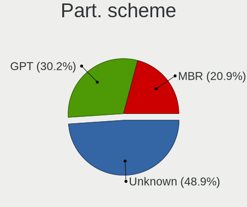
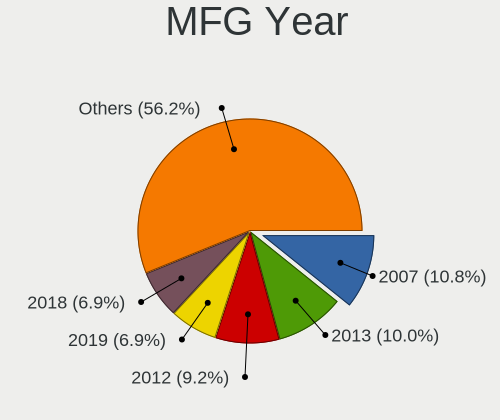
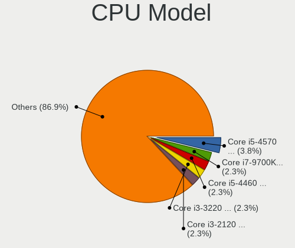
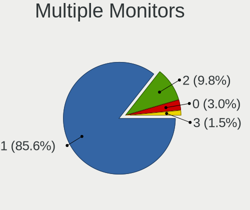
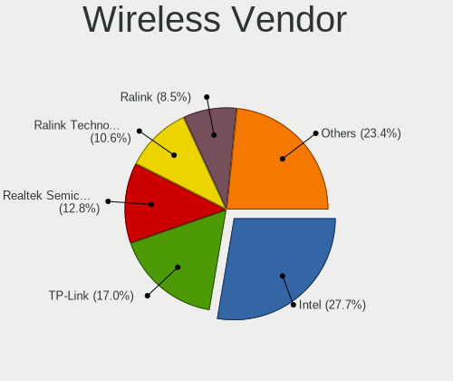
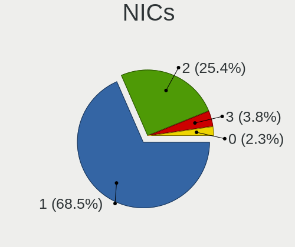
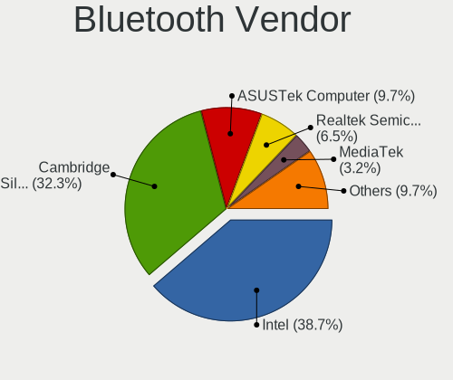
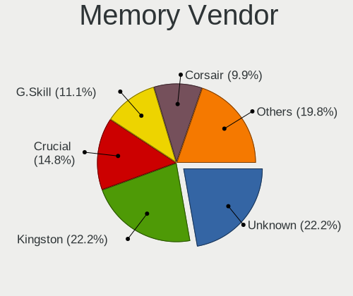
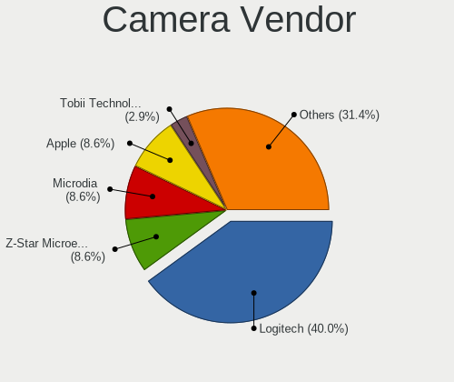
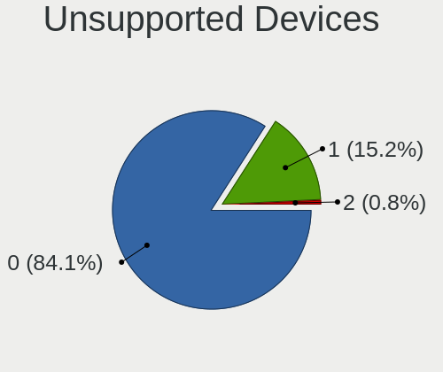

Linux in Latvia - Tested Hardware & Statistics (Desktops)
---------------------------------------------------------

A project to collect tested hardware configurations for Linux in Latvia.

Anyone can contribute to this report by the [hw-probe](https://github.com/linuxhw/hw-probe) tool:

    sudo -E hw-probe -all -upload

Please contribute! Especially if your hardware is rare.

Contents
--------

* [ Test Cases ](#test-cases)

* [ System ](#system)
  - [ OS                       ](#os)
  - [ OS Family                ](#os-family)
  - [ Kernel                   ](#kernel)
  - [ Kernel Family            ](#kernel-family)
  - [ Kernel Major Ver.        ](#kernel-major-ver)
  - [ Arch                     ](#arch)
  - [ DE                       ](#de)
  - [ Display Server           ](#display-server)
  - [ Display Manager          ](#display-manager)
  - [ OS Lang                  ](#os-lang)
  - [ Boot Mode                ](#boot-mode)
  - [ Filesystem               ](#filesystem)
  - [ Part. scheme             ](#part-scheme)
  - [ Dual Boot with Linux/BSD ](#dual-boot-with-linuxbsd)
  - [ Dual Boot (Win)          ](#dual-boot-win)

* [ Board ](#board)
  - [ Vendor                   ](#vendor)
  - [ Model                    ](#model)
  - [ Model Family             ](#model-family)
  - [ MFG Year                 ](#mfg-year)
  - [ Form Factor              ](#form-factor)
  - [ Secure Boot              ](#secure-boot)
  - [ Coreboot                 ](#coreboot)
  - [ RAM Size                 ](#ram-size)
  - [ RAM Used                 ](#ram-used)
  - [ Total Drives             ](#total-drives)
  - [ Has CD-ROM               ](#has-cd-rom)
  - [ Has Ethernet             ](#has-ethernet)
  - [ Has WiFi                 ](#has-wifi)
  - [ Has Bluetooth            ](#has-bluetooth)

* [ Location ](#location)
  - [ Country                  ](#country)
  - [ City                     ](#city)

* [ Drives ](#drives)
  - [ Drive Vendor             ](#drive-vendor)
  - [ Drive Model              ](#drive-model)
  - [ HDD Vendor               ](#hdd-vendor)
  - [ SSD Vendor               ](#ssd-vendor)
  - [ Drive Kind               ](#drive-kind)
  - [ Drive Connector          ](#drive-connector)
  - [ Drive Size               ](#drive-size)
  - [ Space Total              ](#space-total)
  - [ Space Used               ](#space-used)
  - [ Malfunc. Drives          ](#malfunc-drives)
  - [ Malfunc. Drive Vendor    ](#malfunc-drive-vendor)
  - [ Malfunc. HDD Vendor      ](#malfunc-hdd-vendor)
  - [ Malfunc. Drive Kind      ](#malfunc-drive-kind)
  - [ Failed Drives            ](#failed-drives)
  - [ Failed Drive Vendor      ](#failed-drive-vendor)
  - [ Drive Status             ](#drive-status)

* [ Storage controller ](#storage-controller)
  - [ Storage Vendor           ](#storage-vendor)
  - [ Storage Model            ](#storage-model)
  - [ Storage Kind             ](#storage-kind)

* [ Processor ](#processor)
  - [ CPU Vendor               ](#cpu-vendor)
  - [ CPU Model                ](#cpu-model)
  - [ CPU Model Family         ](#cpu-model-family)
  - [ CPU Cores                ](#cpu-cores)
  - [ CPU Sockets              ](#cpu-sockets)
  - [ CPU Threads              ](#cpu-threads)
  - [ CPU Op-Modes             ](#cpu-op-modes)
  - [ CPU Microcode            ](#cpu-microcode)
  - [ CPU Microarch            ](#cpu-microarch)

* [ Graphics ](#graphics)
  - [ GPU Vendor               ](#gpu-vendor)
  - [ GPU Model                ](#gpu-model)
  - [ GPU Combo                ](#gpu-combo)
  - [ GPU Driver               ](#gpu-driver)
  - [ GPU Memory               ](#gpu-memory)

* [ Monitor ](#monitor)
  - [ Monitor Vendor           ](#monitor-vendor)
  - [ Monitor Model            ](#monitor-model)
  - [ Monitor Resolution       ](#monitor-resolution)
  - [ Monitor Diagonal         ](#monitor-diagonal)
  - [ Monitor Width            ](#monitor-width)
  - [ Aspect Ratio             ](#aspect-ratio)
  - [ Monitor Area             ](#monitor-area)
  - [ Pixel Density            ](#pixel-density)
  - [ Multiple Monitors        ](#multiple-monitors)

* [ Network ](#network)
  - [ Net Controller Vendor    ](#net-controller-vendor)
  - [ Net Controller Model     ](#net-controller-model)
  - [ Wireless Vendor          ](#wireless-vendor)
  - [ Wireless Model           ](#wireless-model)
  - [ Ethernet Vendor          ](#ethernet-vendor)
  - [ Ethernet Model           ](#ethernet-model)
  - [ Net Controller Kind      ](#net-controller-kind)
  - [ Used Controller          ](#used-controller)
  - [ NICs                     ](#nics)
  - [ IPv6                     ](#ipv6)

* [ Bluetooth ](#bluetooth)
  - [ Bluetooth Vendor         ](#bluetooth-vendor)
  - [ Bluetooth Model          ](#bluetooth-model)

* [ Sound ](#sound)
  - [ Sound Vendor             ](#sound-vendor)
  - [ Sound Model              ](#sound-model)

* [ Memory ](#memory)
  - [ Memory Vendor            ](#memory-vendor)
  - [ Memory Model             ](#memory-model)
  - [ Memory Kind              ](#memory-kind)
  - [ Memory Form Factor       ](#memory-form-factor)
  - [ Memory Size              ](#memory-size)
  - [ Memory Speed             ](#memory-speed)

* [ Printers & scanners ](#printers--scanners)
  - [ Printer Vendor           ](#printer-vendor)
  - [ Printer Model            ](#printer-model)
  - [ Scanner Vendor           ](#scanner-vendor)
  - [ Scanner Model            ](#scanner-model)

* [ Camera ](#camera)
  - [ Camera Vendor            ](#camera-vendor)
  - [ Camera Model             ](#camera-model)

* [ Security ](#security)
  - [ Fingerprint Vendor       ](#fingerprint-vendor)
  - [ Fingerprint Model        ](#fingerprint-model)
  - [ Chipcard Vendor          ](#chipcard-vendor)
  - [ Chipcard Model           ](#chipcard-model)

* [ Unsupported ](#unsupported)
  - [ Unsupported Devices      ](#unsupported-devices)
  - [ Unsupported Device Types ](#unsupported-device-types)

Test Cases
----------

Total: 152

| Vendor        | Model                       | Probe                                                      | Date         |
|---------------|-----------------------------|------------------------------------------------------------|--------------|
| ASUSTek       | CROSSHAIR VI HERO           | [3e3368d913](https://linux-hardware.org/?probe=3e3368d913) | Feb 28, 2023 |
| ASUSTek       | TUF Gaming X570-PLUS        | [7fe6e0dcde](https://linux-hardware.org/?probe=7fe6e0dcde) | Feb 24, 2023 |
| ASUSTek       | SABERTOOTH 990FX R2.0       | [455b0e1401](https://linux-hardware.org/?probe=455b0e1401) | Feb 23, 2023 |
| MSI           | B75A-G43                    | [bf426ce3c3](https://linux-hardware.org/?probe=bf426ce3c3) | Feb 18, 2023 |
| Gigabyte      | H55M-D2H                    | [652695efb0](https://linux-hardware.org/?probe=652695efb0) | Feb 06, 2023 |
| Gigabyte      | Z790 GAMING X AX            | [1c6725b5eb](https://linux-hardware.org/?probe=1c6725b5eb) | Feb 04, 2023 |
| ASUSTek       | ROG STRIX B360-I GAMING     | [8f81628b59](https://linux-hardware.org/?probe=8f81628b59) | Jan 27, 2023 |
| ASRock        | B75 Pro3-M                  | [4f28b4be44](https://linux-hardware.org/?probe=4f28b4be44) | Jan 15, 2023 |
| ASRock        | B75 Pro3-M                  | [4884803279](https://linux-hardware.org/?probe=4884803279) | Jan 10, 2023 |
| ASRock        | B75 Pro3-M                  | [49b7bb70f3](https://linux-hardware.org/?probe=49b7bb70f3) | Jan 10, 2023 |
| ASUSTek       | P5KPL-CM                    | [625bf5665f](https://linux-hardware.org/?probe=625bf5665f) | Jan 07, 2023 |
| ASUSTek       | PRIME B350M-A               | [df845fe4a9](https://linux-hardware.org/?probe=df845fe4a9) | Jan 07, 2023 |
| Dell          | 0HY9JP A01                  | [0532ee0c1e](https://linux-hardware.org/?probe=0532ee0c1e) | Jan 05, 2023 |
| ASUSTek       | B85-PLUS                    | [cbad10e284](https://linux-hardware.org/?probe=cbad10e284) | Dec 21, 2022 |
| Dell          | 02YYK5 A00                  | [1168ac14f5](https://linux-hardware.org/?probe=1168ac14f5) | Dec 09, 2022 |
| MSI           | B450M-A PRO MAX             | [46a6e9e722](https://linux-hardware.org/?probe=46a6e9e722) | Dec 07, 2022 |
| Gigabyte      | Z87-HD3                     | [d9a78cb529](https://linux-hardware.org/?probe=d9a78cb529) | Nov 30, 2022 |
| Gigabyte      | G33M-S2                     | [3d6a965dd4](https://linux-hardware.org/?probe=3d6a965dd4) | Nov 30, 2022 |
| Gigabyte      | 946GMX-S2                   | [6c97b310fb](https://linux-hardware.org/?probe=6c97b310fb) | Nov 29, 2022 |
| Gigabyte      | M61PME-S2                   | [4768ab429e](https://linux-hardware.org/?probe=4768ab429e) | Nov 23, 2022 |
| ASUSTek       | PRIME X470-PRO              | [e4470c4bda](https://linux-hardware.org/?probe=e4470c4bda) | Nov 12, 2022 |
| ASUSTek       | CROSSHAIR VI HERO           | [7712ce88c4](https://linux-hardware.org/?probe=7712ce88c4) | Oct 30, 2022 |
| ASUSTek       | P5Q SE2                     | [7d576ac245](https://linux-hardware.org/?probe=7d576ac245) | Oct 29, 2022 |
| Gigabyte      | G41M-ES2L                   | [e267cad212](https://linux-hardware.org/?probe=e267cad212) | Oct 20, 2022 |
| Gigabyte      | G41M-ES2L                   | [69adb866e0](https://linux-hardware.org/?probe=69adb866e0) | Oct 20, 2022 |
| Gigabyte      | 946GMX-S2                   | [491d0c69ca](https://linux-hardware.org/?probe=491d0c69ca) | Oct 12, 2022 |
| Gigabyte      | 946GMX-S2                   | [09ee887f3a](https://linux-hardware.org/?probe=09ee887f3a) | Oct 12, 2022 |
| ASRock        | N68C-S UCC                  | [734baf54fa](https://linux-hardware.org/?probe=734baf54fa) | Oct 04, 2022 |
| ASUSTek       | CROSSHAIR VI HERO           | [46e48bc4c1](https://linux-hardware.org/?probe=46e48bc4c1) | Sep 28, 2022 |
| Gigabyte      | B450 GAMING X               | [982d41c1eb](https://linux-hardware.org/?probe=982d41c1eb) | Sep 25, 2022 |
| Gigabyte      | B450 GAMING X               | [a5d5950e29](https://linux-hardware.org/?probe=a5d5950e29) | Sep 25, 2022 |
| ASUSTek       | CROSSHAIR VI HERO           | [8d8440548e](https://linux-hardware.org/?probe=8d8440548e) | Sep 20, 2022 |
| Gigabyte      | G33M-S2                     | [5bd6c356cd](https://linux-hardware.org/?probe=5bd6c356cd) | Aug 03, 2022 |
| Gigabyte      | Z87-HD3                     | [83936d3cf0](https://linux-hardware.org/?probe=83936d3cf0) | Jul 31, 2022 |
| Gigabyte      | G33M-S2                     | [0a96778f7c](https://linux-hardware.org/?probe=0a96778f7c) | Jul 30, 2022 |
| Gigabyte      | G33M-S2                     | [c6c4a561e1](https://linux-hardware.org/?probe=c6c4a561e1) | Jul 17, 2022 |
| Gigabyte      | H97-D3H-CF                  | [e9aa6d6be1](https://linux-hardware.org/?probe=e9aa6d6be1) | Jul 06, 2022 |
| Gigabyte      | G33M-S2                     | [1acedf0aa3](https://linux-hardware.org/?probe=1acedf0aa3) | Jun 26, 2022 |
| Gigabyte      | G33M-S2                     | [949fb9a5e7](https://linux-hardware.org/?probe=949fb9a5e7) | Jun 24, 2022 |
| MSI           | A68HM-E33 V2                | [b473ea12dc](https://linux-hardware.org/?probe=b473ea12dc) | Jun 12, 2022 |
| Foxconn       | 2ADA                        | [1242ad2894](https://linux-hardware.org/?probe=1242ad2894) | Jun 06, 2022 |
| Lenovo        | 3716 SDK0T76463 WIN 3422... | [cd15058963](https://linux-hardware.org/?probe=cd15058963) | May 16, 2022 |
| Lenovo        | 3716 SDK0T76463 WIN 3422... | [4043d7e26a](https://linux-hardware.org/?probe=4043d7e26a) | May 11, 2022 |
| Dell          | 02YYK5 A01                  | [19dd091f8b](https://linux-hardware.org/?probe=19dd091f8b) | May 01, 2022 |
| HP            | 2AAC                        | [1f6b08507e](https://linux-hardware.org/?probe=1f6b08507e) | May 01, 2022 |
| ASRock        | X79 Extreme9                | [e483a6e634](https://linux-hardware.org/?probe=e483a6e634) | Apr 19, 2022 |
| ASUSTek       | ROG STRIX Z370-E GAMING     | [cadff96ec0](https://linux-hardware.org/?probe=cadff96ec0) | Apr 11, 2022 |
| Gigabyte      | X570 AORUS ELITE            | [fe293471a7](https://linux-hardware.org/?probe=fe293471a7) | Apr 08, 2022 |
| Acer          | WG43M                       | [c7cb6ee141](https://linux-hardware.org/?probe=c7cb6ee141) | Apr 08, 2022 |
| ASUSTek       | P8P67 LE                    | [f7eb22bcfc](https://linux-hardware.org/?probe=f7eb22bcfc) | Mar 27, 2022 |
| ABIT          | IP35-E                      | [9d6e95572e](https://linux-hardware.org/?probe=9d6e95572e) | Mar 21, 2022 |
| ABIT          | IP35-E                      | [3d93ef42c9](https://linux-hardware.org/?probe=3d93ef42c9) | Mar 21, 2022 |
| MSI           | H110M PRO-VD                | [83df25aace](https://linux-hardware.org/?probe=83df25aace) | Feb 18, 2022 |
| ASRock        | X79 Extreme9                | [9dfc1ac601](https://linux-hardware.org/?probe=9dfc1ac601) | Feb 12, 2022 |
| ASRock        | X79 Extreme9                | [0848fdb73f](https://linux-hardware.org/?probe=0848fdb73f) | Feb 12, 2022 |
| ASUSTek       | P5Q-EM                      | [834bc65728](https://linux-hardware.org/?probe=834bc65728) | Feb 04, 2022 |
| ASUSTek       | P5Q-EM                      | [887e40e6c7](https://linux-hardware.org/?probe=887e40e6c7) | Feb 04, 2022 |
| Dell          | 02YYK5 A01                  | [e41c34594e](https://linux-hardware.org/?probe=e41c34594e) | Jan 11, 2022 |
| MSI           | P55-GD65                    | [37da95512b](https://linux-hardware.org/?probe=37da95512b) | Dec 28, 2021 |
| ASRock        | FM2A88X Extreme4+           | [a864c07042](https://linux-hardware.org/?probe=a864c07042) | Dec 05, 2021 |
| HP            | 304Bh                       | [643a84ae14](https://linux-hardware.org/?probe=643a84ae14) | Oct 26, 2021 |
| HP            | 304Bh                       | [b7bd300808](https://linux-hardware.org/?probe=b7bd300808) | Oct 22, 2021 |
| MSI           | B450M-A PRO MAX             | [4148046f02](https://linux-hardware.org/?probe=4148046f02) | Oct 17, 2021 |
| ASUSTek       | P5Q-EM                      | [7f6f4bedd3](https://linux-hardware.org/?probe=7f6f4bedd3) | Sep 14, 2021 |
| Intel         | DH77EB AAG39073-304         | [7e44f2ff81](https://linux-hardware.org/?probe=7e44f2ff81) | Sep 06, 2021 |
| ASUSTek       | Z97-K/USB                   | [071ad478e7](https://linux-hardware.org/?probe=071ad478e7) | Aug 30, 2021 |
| ASRock        | ALiveXFire-eSATA2           | [5b32c9197c](https://linux-hardware.org/?probe=5b32c9197c) | Aug 28, 2021 |
| ASRock        | ALiveXFire-eSATA2           | [8cd8b7faa5](https://linux-hardware.org/?probe=8cd8b7faa5) | Aug 28, 2021 |
| Intel         | DH77EB AAG39073-304         | [13fb44b235](https://linux-hardware.org/?probe=13fb44b235) | Aug 13, 2021 |
| ASUSTek       | PRIME B350-PLUS             | [bc618727f4](https://linux-hardware.org/?probe=bc618727f4) | Aug 10, 2021 |
| Dell          | 0GXM1W A00                  | [6aa52c9eb8](https://linux-hardware.org/?probe=6aa52c9eb8) | Aug 02, 2021 |
| MSI           | H310M PRO-VD                | [42ade7f952](https://linux-hardware.org/?probe=42ade7f952) | Jun 10, 2021 |
| ASUSTek       | Z97-K R2.0                  | [25a9c64af7](https://linux-hardware.org/?probe=25a9c64af7) | May 29, 2021 |
| MSI           | H81M-E35                    | [2d479e2946](https://linux-hardware.org/?probe=2d479e2946) | May 15, 2021 |
| MSI           | H81M-E35                    | [621d19b1f1](https://linux-hardware.org/?probe=621d19b1f1) | May 15, 2021 |
| ASUSTek       | Z97-K R2.0                  | [796bb8e1b8](https://linux-hardware.org/?probe=796bb8e1b8) | May 12, 2021 |
| MSI           | B450M-A PRO MAX             | [4d87fd7e46](https://linux-hardware.org/?probe=4d87fd7e46) | Apr 13, 2021 |
| Fujitsu Si... | D2824-A1 S26361-D2824-A1    | [817d1bb360](https://linux-hardware.org/?probe=817d1bb360) | Apr 03, 2021 |
| Fujitsu Si... | D2824-A1 S26361-D2824-A1    | [ca1692012f](https://linux-hardware.org/?probe=ca1692012f) | Apr 03, 2021 |
| ASUSTek       | PRIME B350-PLUS             | [d2a175100f](https://linux-hardware.org/?probe=d2a175100f) | Mar 22, 2021 |
| ASUSTek       | PRIME Z270-P                | [344b4339b4](https://linux-hardware.org/?probe=344b4339b4) | Mar 17, 2021 |
| Gigabyte      | B550 AORUS PRO V2           | [1194a50093](https://linux-hardware.org/?probe=1194a50093) | Mar 16, 2021 |
| HP            | 18E7                        | [d0fb912292](https://linux-hardware.org/?probe=d0fb912292) | Mar 09, 2021 |
| Acer          | F671CR R01-C0               | [7a4637f10b](https://linux-hardware.org/?probe=7a4637f10b) | Mar 06, 2021 |
| Dell          | 0HH807                      | [0ac539b524](https://linux-hardware.org/?probe=0ac539b524) | Mar 04, 2021 |
| Dell          | 0HH807                      | [dbde42fa23](https://linux-hardware.org/?probe=dbde42fa23) | Mar 04, 2021 |
| HP            | 304Bh                       | [a49a1ff054](https://linux-hardware.org/?probe=a49a1ff054) | Feb 27, 2021 |
| HP            | 304Bh                       | [92c6653702](https://linux-hardware.org/?probe=92c6653702) | Feb 27, 2021 |
| Gigabyte      | B550I AORUS PRO AX          | [3bc6f280d8](https://linux-hardware.org/?probe=3bc6f280d8) | Feb 19, 2021 |
| Gigabyte      | B550 AORUS PRO V2           | [0cfdd76052](https://linux-hardware.org/?probe=0cfdd76052) | Feb 08, 2021 |
| ASUSTek       | P5GD1-VM                    | [863b2fd0bf](https://linux-hardware.org/?probe=863b2fd0bf) | Jan 22, 2021 |
| Gigabyte      | G31M-ES2L                   | [5b1abefa3c](https://linux-hardware.org/?probe=5b1abefa3c) | Jan 07, 2021 |
| MSI           | B75A-G43                    | [23c8b4ee0a](https://linux-hardware.org/?probe=23c8b4ee0a) | Jan 06, 2021 |
| MSI           | 970A-G46                    | [e734d18206](https://linux-hardware.org/?probe=e734d18206) | Jan 06, 2021 |
| MSI           | 970A-G46                    | [b85445cf41](https://linux-hardware.org/?probe=b85445cf41) | Jan 06, 2021 |
| Gigabyte      | G31M-ES2L                   | [81b3dbf5fd](https://linux-hardware.org/?probe=81b3dbf5fd) | Jan 02, 2021 |
| Gigabyte      | G31M-ES2L                   | [c3b94fff22](https://linux-hardware.org/?probe=c3b94fff22) | Dec 31, 2020 |
| Gigabyte      | GA-970A-UD3                 | [2eede62ff5](https://linux-hardware.org/?probe=2eede62ff5) | Dec 26, 2020 |
| Gigabyte      | GA-970A-UD3                 | [8cf512e3a9](https://linux-hardware.org/?probe=8cf512e3a9) | Dec 26, 2020 |
| ASUSTek       | P5K PRO                     | [0e58a56cfb](https://linux-hardware.org/?probe=0e58a56cfb) | Dec 26, 2020 |
| Acidanther... | Mac-27AD2F918AE68F61 Mac... | [bb01071f16](https://linux-hardware.org/?probe=bb01071f16) | Dec 15, 2020 |
| ASRock        | TRX40 Creator               | [dd14b01c46](https://linux-hardware.org/?probe=dd14b01c46) | Dec 13, 2020 |
| Intel         | DB85FL AAG89861-201         | [936daa5428](https://linux-hardware.org/?probe=936daa5428) | Nov 25, 2020 |
| MSI           | B75A-G43                    | [3674b1e802](https://linux-hardware.org/?probe=3674b1e802) | Nov 16, 2020 |
| MSI           | B75A-G43                    | [5f68cce112](https://linux-hardware.org/?probe=5f68cce112) | Nov 16, 2020 |
| Gigabyte      | AB350M-DS3H V2-CF           | [f2ff00472b](https://linux-hardware.org/?probe=f2ff00472b) | Nov 07, 2020 |
| ASUSTek       | P5Q-EM                      | [5139c9e029](https://linux-hardware.org/?probe=5139c9e029) | Nov 01, 2020 |
| Gigabyte      | AB350M-DS3H V2-CF           | [7ac6a6dab5](https://linux-hardware.org/?probe=7ac6a6dab5) | Oct 27, 2020 |
| ASUSTek       | PRIME H310T                 | [a37fe628b4](https://linux-hardware.org/?probe=a37fe628b4) | Oct 04, 2020 |
| ASUSTek       | PRIME H310T                 | [c6cf49892e](https://linux-hardware.org/?probe=c6cf49892e) | Oct 04, 2020 |
| Gigabyte      | AB350M-DS3H V2-CF           | [a6c2ba4977](https://linux-hardware.org/?probe=a6c2ba4977) | Oct 04, 2020 |
| Gigabyte      | B550I AORUS PRO AX          | [ebefa289ab](https://linux-hardware.org/?probe=ebefa289ab) | Sep 30, 2020 |
| Biostar       | NF61D-A2                    | [177f17803c](https://linux-hardware.org/?probe=177f17803c) | Aug 24, 2020 |
| Gigabyte      | H61MA-D2V                   | [625d32881c](https://linux-hardware.org/?probe=625d32881c) | May 29, 2020 |
| ASRock        | FM2A85X-ITX                 | [31631f3ea5](https://linux-hardware.org/?probe=31631f3ea5) | Apr 23, 2020 |
| Biostar       | NF61D-A2                    | [8f1f828d49](https://linux-hardware.org/?probe=8f1f828d49) | Apr 14, 2020 |
| ASUSTek       | P5QL-E                      | [95e2b82808](https://linux-hardware.org/?probe=95e2b82808) | Mar 26, 2020 |
| ASUSTek       | P5QL-E                      | [9fcf5501fb](https://linux-hardware.org/?probe=9fcf5501fb) | Mar 26, 2020 |
| IBM           | 8215ZCL                     | [8f44ceaa1e](https://linux-hardware.org/?probe=8f44ceaa1e) | Mar 26, 2020 |
| ASRock        | N68C-GS FX                  | [2d568b2e9d](https://linux-hardware.org/?probe=2d568b2e9d) | Feb 19, 2020 |
| MSI           | Z370 SLI PLUS               | [c76ba1a6d0](https://linux-hardware.org/?probe=c76ba1a6d0) | Feb 08, 2020 |
| Gigabyte      | H97-D3H-CF                  | [9deccd0d74](https://linux-hardware.org/?probe=9deccd0d74) | Jan 24, 2020 |
| ASUSTek       | Maximus VIII RANGER         | [e005197c6c](https://linux-hardware.org/?probe=e005197c6c) | Jan 09, 2020 |
| Intel         | DQ87PG AAG74154-403         | [5af3a0243a](https://linux-hardware.org/?probe=5af3a0243a) | Jan 06, 2020 |
| ASUSTek       | Maximus VIII RANGER         | [70297101fe](https://linux-hardware.org/?probe=70297101fe) | Dec 31, 2019 |
| Dell          | 0RJ290                      | [21ae6dbdf0](https://linux-hardware.org/?probe=21ae6dbdf0) | Dec 16, 2019 |
| ASUSTek       | Z87-DELUXE                  | [bab2716ff6](https://linux-hardware.org/?probe=bab2716ff6) | Dec 02, 2019 |
| Hardkernel    | ODROID-H2                   | [a6d137277e](https://linux-hardware.org/?probe=a6d137277e) | Sep 18, 2019 |
| Intel         | DQ87PG AAG74154-403         | [2fc2bdd742](https://linux-hardware.org/?probe=2fc2bdd742) | Sep 14, 2019 |
| Intel         | DQ87PG AAG74154-403         | [5110001e92](https://linux-hardware.org/?probe=5110001e92) | Sep 14, 2019 |
| Gigabyte      | Z87P-D3                     | [a7e732af2a](https://linux-hardware.org/?probe=a7e732af2a) | Aug 26, 2019 |
| MSI           | H310M PRO-VD                | [5c290c18c9](https://linux-hardware.org/?probe=5c290c18c9) | Aug 18, 2019 |
| HP            | 0A60h                       | [b031cf2f9c](https://linux-hardware.org/?probe=b031cf2f9c) | Jul 30, 2019 |
| MSI           | FM2-A55M-E33                | [426ae68b93](https://linux-hardware.org/?probe=426ae68b93) | Jun 29, 2019 |
| MSI           | B85-G41 PC Mate             | [0f3dccfe4e](https://linux-hardware.org/?probe=0f3dccfe4e) | Jun 26, 2019 |
| ASRock        | FM2A88X Extreme4+           | [5e414bc536](https://linux-hardware.org/?probe=5e414bc536) | Mar 14, 2019 |
| ASUSTek       | M2N-VM DVI                  | [3437fc1ab6](https://linux-hardware.org/?probe=3437fc1ab6) | Feb 12, 2019 |
| MSI           | H310M PRO-VD                | [f08ce9bd47](https://linux-hardware.org/?probe=f08ce9bd47) | Jan 09, 2019 |
| Dell          | 0WK833                      | [17e742f811](https://linux-hardware.org/?probe=17e742f811) | Jul 11, 2018 |
| Dell          | 0WK833                      | [d118bf168b](https://linux-hardware.org/?probe=d118bf168b) | Jun 28, 2018 |
| Dell          | 0WK833                      | [0e39368786](https://linux-hardware.org/?probe=0e39368786) | Jun 28, 2018 |
| ASRock        | FM2A88X Extreme4+           | [c401108ba6](https://linux-hardware.org/?probe=c401108ba6) | Jun 20, 2018 |
| Gigabyte      | H55M-D2H                    | [e4e92393a0](https://linux-hardware.org/?probe=e4e92393a0) | Mar 08, 2018 |
| ASUSTek       | H81M-K                      | [f4d998043d](https://linux-hardware.org/?probe=f4d998043d) | Jan 29, 2018 |
| ASUSTek       | A88XM-A                     | [f7b8e36550](https://linux-hardware.org/?probe=f7b8e36550) | Jan 21, 2018 |
| Acer          | F671CR R01-C0               | [a5b92562b9](https://linux-hardware.org/?probe=a5b92562b9) | Dec 26, 2017 |
| MSI           | MS-7519                     | [81563b0ef8](https://linux-hardware.org/?probe=81563b0ef8) | Nov 18, 2017 |
| MSI           | MS-7519                     | [5e4728fda0](https://linux-hardware.org/?probe=5e4728fda0) | Sep 17, 2017 |
| ASRock        | G31M-GS                     | [7a4eee4480](https://linux-hardware.org/?probe=7a4eee4480) | May 31, 2017 |
| Gigabyte      | H61M-S2-B3                  | [bfab333807](https://linux-hardware.org/?probe=bfab333807) | May 03, 2017 |
| Acer          | EG31M R01-A2                | [018dafc2d0](https://linux-hardware.org/?probe=018dafc2d0) | Apr 27, 2017 |
| ASUSTek       | P5Q                         | [26e2520232](https://linux-hardware.org/?probe=26e2520232) | Nov 11, 2016 |

System
------

OS
--

Installed operating systems

| Name                         | Desktops | Percent |
|------------------------------|----------|---------|
| Ubuntu 20.04                 | 6        | 5.56%   |
| Ubuntu 18.04                 | 6        | 5.56%   |
| ROSA R10                     | 6        | 5.56%   |
| ROSA R11                     | 5        | 4.63%   |
| KDE neon 20.04               | 5        | 4.63%   |
| Ubuntu 22.04                 | 4        | 3.7%    |
| Linux Mint 20.1              | 4        | 3.7%    |
| Arch Rolling                 | 4        | 3.7%    |
| ROSA R9                      | 3        | 2.78%   |
| Linux Mint 20.2              | 3        | 2.78%   |
| Fedora 37                    | 3        | 2.78%   |
| Xubuntu 20.04                | 2        | 1.85%   |
| ROSA R8.1                    | 2        | 1.85%   |
| ROSA 12.2                    | 2        | 1.85%   |
| OpenMandriva 4.50            | 2        | 1.85%   |
| OpenMandriva 4.2             | 2        | 1.85%   |
| OpenMandriva 23.01           | 2        | 1.85%   |
| Linux Mint 20.3              | 2        | 1.85%   |
| Linux Mint 19.3              | 2        | 1.85%   |
| Fedora 35                    | 2        | 1.85%   |
| Fedora 30                    | 2        | 1.85%   |
| Debian Testing               | 2        | 1.85%   |
| Debian 11                    | 2        | 1.85%   |
| Zorin 16                     | 1        | 0.93%   |
| Xubuntu 18.04                | 1        | 0.93%   |
| Ubuntu 22.10                 | 1        | 0.93%   |
| Ubuntu 19.10                 | 1        | 0.93%   |
| Ubuntu 16.04                 | 1        | 0.93%   |
| SteamOS 3.4                  | 1        | 0.93%   |
| SteamOS 3.3                  | 1        | 0.93%   |
| ROSA R8                      | 1        | 0.93%   |
| ROSA R11.1                   | 1        | 0.93%   |
| Puppy 9                      | 1        | 0.93%   |
| Pop!_OS 21.04                | 1        | 0.93%   |
| openSUSE Tumbleweed-XXXXXXXX | 1        | 0.93%   |
| Manjaro 20.2.1               | 1        | 0.93%   |
| Manjaro                      | 1        | 0.93%   |
| Lubuntu 22.04                | 1        | 0.93%   |
| Lubuntu 21.10                | 1        | 0.93%   |
| LMDE 5                       | 1        | 0.93%   |

OS Family
---------

OS without a version

| Name         | Desktops | Percent |
|--------------|----------|---------|
| Ubuntu       | 19       | 19%     |
| ROSA         | 18       | 18%     |
| Linux Mint   | 15       | 15%     |
| Fedora       | 8        | 8%      |
| OpenMandriva | 6        | 6%      |
| KDE neon     | 5        | 5%      |
| Arch         | 5        | 5%      |
| Xubuntu      | 3        | 3%      |
| Debian       | 3        | 3%      |
| Manjaro      | 2        | 2%      |
| Kubuntu      | 2        | 2%      |
| Garuda Linux | 2        | 2%      |
| Clear Linux  | 2        | 2%      |
| Zorin        | 1        | 1%      |
| SteamOS      | 1        | 1%      |
| Puppy        | 1        | 1%      |
| Pop!_OS      | 1        | 1%      |
| openSUSE     | 1        | 1%      |
| Lubuntu      | 1        | 1%      |
| LMDE         | 1        | 1%      |
| Kali         | 1        | 1%      |
| Endless      | 1        | 1%      |
| EndeavourOS  | 1        | 1%      |

Kernel
------

Version of the Linux kernel

| Version                         | Desktops | Percent |
|---------------------------------|----------|---------|
| 4.9.60-nrj-desktop-1rosa-x86_64 | 5        | 4.31%   |
| 5.4.0-58-generic                | 4        | 3.45%   |
| 4.9.20-nrj-desktop-1rosa-x86_64 | 4        | 3.45%   |
| 5.4.0-132-generic               | 3        | 2.59%   |
| 5.4.0-122-generic               | 3        | 2.59%   |
| 4.15.0-desktop-45.1rosa-x86_64  | 3        | 2.59%   |
| 6.1.1-desktop-1omv2290          | 2        | 1.72%   |
| 5.4.0-66-generic                | 2        | 1.72%   |
| 5.4.0-54-generic                | 2        | 1.72%   |
| 5.13.0-39-generic               | 2        | 1.72%   |
| 5.12.4-desktop-1omv4050         | 2        | 1.72%   |
| 5.10.14-desktop-1omv4002        | 2        | 1.72%   |
| 5.0.0-37-generic                | 2        | 1.72%   |
| 6.2.0-060200rc5-generic         | 1        | 0.86%   |
| 6.1.9-200.fc37.x86_64           | 1        | 0.86%   |
| 6.1.1-arch1-1                   | 1        | 0.86%   |
| 6.0.7-1-default                 | 1        | 0.86%   |
| 6.0.16-300.fc37.x86_64          | 1        | 0.86%   |
| 6.0.13-300.fc37.x86_64          | 1        | 0.86%   |
| 6.0.11-AMD-znver2               | 1        | 0.86%   |
| 5.9.13-1006.native              | 1        | 0.86%   |
| 5.9.0-kali1-amd64               | 1        | 0.86%   |
| 5.8.12-arch1-1                  | 1        | 0.86%   |
| 5.8.0-50-generic                | 1        | 0.86%   |
| 5.8.0-44-generic                | 1        | 0.86%   |
| 5.8.0-25-generic                | 1        | 0.86%   |
| 5.6.3-arch1-1                   | 1        | 0.86%   |
| 5.4.83-generic-2rosa-x86_64     | 1        | 0.86%   |
| 5.4.53                          | 1        | 0.86%   |
| 5.4.18-902.native               | 1        | 0.86%   |
| 5.4.0-80-generic                | 1        | 0.86%   |
| 5.4.0-70-generic                | 1        | 0.86%   |
| 5.4.0-67-generic                | 1        | 0.86%   |
| 5.4.0-62-generic                | 1        | 0.86%   |
| 5.4.0-59-generic                | 1        | 0.86%   |
| 5.4.0-52-generic                | 1        | 0.86%   |
| 5.4.0-48-generic                | 1        | 0.86%   |
| 5.4.0-42-generic                | 1        | 0.86%   |
| 5.4.0-121-generic               | 1        | 0.86%   |
| 5.4.0-100-generic               | 1        | 0.86%   |

Kernel Family
-------------

Linux kernel without a distro release

| Version | Desktops | Percent |
|---------|----------|---------|
| 5.4.0   | 18       | 16.67%  |
| 4.15.0  | 10       | 9.26%   |
| 5.15.0  | 7        | 6.48%   |
| 5.13.0  | 5        | 4.63%   |
| 4.9.60  | 5        | 4.63%   |
| 4.9.20  | 5        | 4.63%   |
| 5.3.0   | 4        | 3.7%    |
| 6.1.1   | 3        | 2.78%   |
| 5.8.0   | 3        | 2.78%   |
| 5.11.0  | 3        | 2.78%   |
| 5.19.0  | 2        | 1.85%   |
| 5.12.4  | 2        | 1.85%   |
| 5.10.14 | 2        | 1.85%   |
| 5.10.0  | 2        | 1.85%   |
| 5.0.0   | 2        | 1.85%   |
| 6.2.0   | 1        | 0.93%   |
| 6.1.9   | 1        | 0.93%   |
| 6.0.7   | 1        | 0.93%   |
| 6.0.16  | 1        | 0.93%   |
| 6.0.13  | 1        | 0.93%   |
| 6.0.11  | 1        | 0.93%   |
| 5.9.13  | 1        | 0.93%   |
| 5.9.0   | 1        | 0.93%   |
| 5.8.12  | 1        | 0.93%   |
| 5.6.3   | 1        | 0.93%   |
| 5.4.83  | 1        | 0.93%   |
| 5.4.53  | 1        | 0.93%   |
| 5.4.18  | 1        | 0.93%   |
| 5.2.9   | 1        | 0.93%   |
| 5.2.14  | 1        | 0.93%   |
| 5.19.10 | 1        | 0.93%   |
| 5.18.1  | 1        | 0.93%   |
| 5.17.5  | 1        | 0.93%   |
| 5.17.0  | 1        | 0.93%   |
| 5.16.18 | 1        | 0.93%   |
| 5.16.15 | 1        | 0.93%   |
| 5.14.0  | 1        | 0.93%   |
| 5.13.19 | 1        | 0.93%   |
| 5.11.6  | 1        | 0.93%   |
| 5.11.22 | 1        | 0.93%   |

Kernel Major Ver.
-----------------

Linux kernel major version

| Version | Desktops | Percent |
|---------|----------|---------|
| 5.4     | 21       | 19.63%  |
| 4.9     | 11       | 10.28%  |
| 4.15    | 10       | 9.35%   |
| 5.15    | 7        | 6.54%   |
| 5.11    | 7        | 6.54%   |
| 5.10    | 7        | 6.54%   |
| 5.13    | 6        | 5.61%   |
| 6.1     | 4        | 3.74%   |
| 6.0     | 4        | 3.74%   |
| 5.8     | 4        | 3.74%   |
| 5.3     | 4        | 3.74%   |
| 5.19    | 3        | 2.8%    |
| 5.9     | 2        | 1.87%   |
| 5.2     | 2        | 1.87%   |
| 5.17    | 2        | 1.87%   |
| 5.16    | 2        | 1.87%   |
| 5.12    | 2        | 1.87%   |
| 5.0     | 2        | 1.87%   |
| 6.2     | 1        | 0.93%   |
| 5.6     | 1        | 0.93%   |
| 5.18    | 1        | 0.93%   |
| 5.14    | 1        | 0.93%   |
| 4.8     | 1        | 0.93%   |
| 4.18    | 1        | 0.93%   |
| 4.1     | 1        | 0.93%   |

Arch
----

OS architecture (x86_64, i586, etc.)

| Name   | Desktops | Percent |
|--------|----------|---------|
| x86_64 | 89       | 95.7%   |
| i686   | 4        | 4.3%    |

DE
--

Desktop Environment

| Name       | Desktops | Percent |
|------------|----------|---------|
| GNOME      | 28       | 27.45%  |
| KDE5       | 21       | 20.59%  |
| X-Cinnamon | 11       | 10.78%  |
| Unknown    | 11       | 10.78%  |
| KDE4       | 10       | 9.8%    |
| XFCE       | 6        | 5.88%   |
| MATE       | 5        | 4.9%    |
| KDE        | 5        | 4.9%    |
| Deepin     | 2        | 1.96%   |
| Cinnamon   | 2        | 1.96%   |
| LXQt       | 1        | 0.98%   |

Display Server
--------------

X11 or Wayland

| Name    | Desktops | Percent |
|---------|----------|---------|
| X11     | 76       | 80.85%  |
| Wayland | 13       | 13.83%  |
| Unknown | 3        | 3.19%   |
| Tty     | 2        | 2.13%   |

Display Manager
---------------

SDDM, LightDM, etc.

| Name    | Desktops | Percent |
|---------|----------|---------|
| Unknown | 49       | 48.04%  |
| SDDM    | 19       | 18.63%  |
| KDM     | 10       | 9.8%    |
| GDM     | 8        | 7.84%   |
| LightDM | 6        | 5.88%   |
| GDM3    | 6        | 5.88%   |
| TDM     | 4        | 3.92%   |

OS Lang
-------

Language

| Lang        | Desktops | Percent |
|-------------|----------|---------|
| en_US       | 39       | 39%     |
| Unknown     | 22       | 22%     |
| ru_RU       | 13       | 13%     |
| lv_LV       | 13       | 13%     |
| en_GB       | 6        | 6%      |
| C           | 3        | 3%      |
| ru_RU.UTF_8 | 1        | 1%      |
| osa_US      | 1        | 1%      |
| de_DE       | 1        | 1%      |
| cv_RU       | 1        | 1%      |

Boot Mode
---------

EFI or BIOS

| Mode | Desktops | Percent |
|------|----------|---------|
| BIOS | 63       | 67.74%  |
| EFI  | 30       | 32.26%  |

Filesystem
----------

Type of filesystem

| Type    | Desktops | Percent |
|---------|----------|---------|
| Ext4    | 68       | 68.69%  |
| Unknown | 12       | 12.12%  |
| Btrfs   | 9        | 9.09%   |
| Overlay | 7        | 7.07%   |
| Xfs     | 1        | 1.01%   |
| Ext3    | 1        | 1.01%   |
| Aufs    | 1        | 1.01%   |

Part. scheme
------------

Scheme of partitioning

| Type    | Desktops | Percent |
|---------|----------|---------|
| Unknown | 53       | 53.54%  |
| GPT     | 24       | 24.24%  |
| MBR     | 22       | 22.22%  |

Dual Boot with Linux/BSD
------------------------

Hosting more than one Linux/BSD

| Dual boot | Desktops | Percent |
|-----------|----------|---------|
| No        | 82       | 82.83%  |
| Yes       | 17       | 17.17%  |

Dual Boot (Win)
---------------

Hosting Linux and Windows

| Dual boot | Desktops | Percent |
|-----------|----------|---------|
| No        | 68       | 68.69%  |
| Yes       | 31       | 31.31%  |

Board
-----

Vendor
------

Motherboard manufacturer

| Name                | Desktops | Percent |
|---------------------|----------|---------|
| ASUSTek Computer    | 26       | 27.96%  |
| Gigabyte Technology | 21       | 22.58%  |
| MSI                 | 12       | 12.9%   |
| ASRock              | 9        | 9.68%   |
| Dell                | 7        | 7.53%   |
| Hewlett-Packard     | 4        | 4.3%    |
| Intel               | 3        | 3.23%   |
| Acer                | 3        | 3.23%   |
| Lenovo              | 1        | 1.08%   |
| IBM                 | 1        | 1.08%   |
| Hardkernel          | 1        | 1.08%   |
| Fujitsu Siemens     | 1        | 1.08%   |
| Foxconn             | 1        | 1.08%   |
| Biostar             | 1        | 1.08%   |
| Acidanthera         | 1        | 1.08%   |
| ABIT                | 1        | 1.08%   |

Model
-----

Motherboard model

| Name                               | Desktops | Percent |
|------------------------------------|----------|---------|
| ASUS All Series                    | 5        | 5.38%   |
| MSI MS-7721                        | 2        | 2.15%   |
| Gigabyte G33M-S2                   | 2        | 2.15%   |
| Gigabyte B550 AORUS PRO V2         | 2        | 2.15%   |
| Gigabyte 946GMX-S2                 | 2        | 2.15%   |
| Dell OptiPlex 7020                 | 2        | 2.15%   |
| MSI MS-7C52                        | 1        | 1.08%   |
| MSI MS-7B46                        | 1        | 1.08%   |
| MSI MS-7B33                        | 1        | 1.08%   |
| MSI MS-7996                        | 1        | 1.08%   |
| MSI MS-7850                        | 1        | 1.08%   |
| MSI MS-7846                        | 1        | 1.08%   |
| MSI MS-7758                        | 1        | 1.08%   |
| MSI MS-7693                        | 1        | 1.08%   |
| MSI MS-7583                        | 1        | 1.08%   |
| MSI MS-7519                        | 1        | 1.08%   |
| Lenovo Legion T5 26AMR5 90RC018LBX | 1        | 1.08%   |
| Intel DQ87PG AAG74154-403          | 1        | 1.08%   |
| Intel DH77EB AAG39073-304          | 1        | 1.08%   |
| Intel DB85FL AAG89861-201          | 1        | 1.08%   |
| IBM 8215ZCL                        | 1        | 1.08%   |
| HP ProDesk 600 G1 TWR              | 1        | 1.08%   |
| HP Compaq dc5700 Microtower        | 1        | 1.08%   |
| HP Compaq 8100 Elite CMT PC        | 1        | 1.08%   |
| HP 310-1205uk                      | 1        | 1.08%   |
| Hardkernel ODROID-H2               | 1        | 1.08%   |
| Gigabyte Z87P-D3                   | 1        | 1.08%   |
| Gigabyte Z87-HD3                   | 1        | 1.08%   |
| Gigabyte Z790 GAMING X AX          | 1        | 1.08%   |
| Gigabyte X570 AORUS ELITE          | 1        | 1.08%   |
| Gigabyte M61PME-S2                 | 1        | 1.08%   |
| Gigabyte H97-D3H                   | 1        | 1.08%   |
| Gigabyte H61MA-D2V                 | 1        | 1.08%   |
| Gigabyte H61M-S2-B3                | 1        | 1.08%   |
| Gigabyte H55M-D2H                  | 1        | 1.08%   |
| Gigabyte GA-970A-UD3               | 1        | 1.08%   |
| Gigabyte G41M-ES2L                 | 1        | 1.08%   |
| Gigabyte G31M-ES2L                 | 1        | 1.08%   |
| Gigabyte B550I AORUS PRO AX        | 1        | 1.08%   |
| Gigabyte B450 GAMING X             | 1        | 1.08%   |

Model Family
------------

Motherboard model prefix

| Name                 | Desktops | Percent |
|----------------------|----------|---------|
| Dell OptiPlex        | 7        | 7.53%   |
| ASUS PRIME           | 5        | 5.38%   |
| ASUS All             | 5        | 5.38%   |
| MSI MS-7721          | 2        | 2.15%   |
| HP Compaq            | 2        | 2.15%   |
| Gigabyte G33M-S2     | 2        | 2.15%   |
| Gigabyte B550        | 2        | 2.15%   |
| Gigabyte 946GMX-S2   | 2        | 2.15%   |
| ASUS ROG             | 2        | 2.15%   |
| ASUS P5Q             | 2        | 2.15%   |
| Acer Aspire          | 2        | 2.15%   |
| MSI MS-7C52          | 1        | 1.08%   |
| MSI MS-7B46          | 1        | 1.08%   |
| MSI MS-7B33          | 1        | 1.08%   |
| MSI MS-7996          | 1        | 1.08%   |
| MSI MS-7850          | 1        | 1.08%   |
| MSI MS-7846          | 1        | 1.08%   |
| MSI MS-7758          | 1        | 1.08%   |
| MSI MS-7693          | 1        | 1.08%   |
| MSI MS-7583          | 1        | 1.08%   |
| MSI MS-7519          | 1        | 1.08%   |
| Lenovo Legion        | 1        | 1.08%   |
| Intel DQ87PG         | 1        | 1.08%   |
| Intel DH77EB         | 1        | 1.08%   |
| Intel DB85FL         | 1        | 1.08%   |
| IBM 8215ZCL          | 1        | 1.08%   |
| HP ProDesk           | 1        | 1.08%   |
| HP 310-1205uk        | 1        | 1.08%   |
| Hardkernel ODROID-H2 | 1        | 1.08%   |
| Gigabyte Z87P-D3     | 1        | 1.08%   |
| Gigabyte Z87-HD3     | 1        | 1.08%   |
| Gigabyte Z790        | 1        | 1.08%   |
| Gigabyte X570        | 1        | 1.08%   |
| Gigabyte M61PME-S2   | 1        | 1.08%   |
| Gigabyte H97-D3H     | 1        | 1.08%   |
| Gigabyte H61MA-D2V   | 1        | 1.08%   |
| Gigabyte H61M-S2-B3  | 1        | 1.08%   |
| Gigabyte H55M-D2H    | 1        | 1.08%   |
| Gigabyte GA-970A-UD3 | 1        | 1.08%   |
| Gigabyte G41M-ES2L   | 1        | 1.08%   |

MFG Year
--------

Motherboard manufacture year

| Year | Desktops | Percent |
|------|----------|---------|
| 2013 | 12       | 12.9%   |
| 2007 | 12       | 12.9%   |
| 2012 | 10       | 10.75%  |
| 2008 | 9        | 9.68%   |
| 2018 | 7        | 7.53%   |
| 2009 | 7        | 7.53%   |
| 2019 | 5        | 5.38%   |
| 2015 | 5        | 5.38%   |
| 2011 | 5        | 5.38%   |
| 2017 | 4        | 4.3%    |
| 2014 | 4        | 4.3%    |
| 2006 | 4        | 4.3%    |
| 2021 | 2        | 2.15%   |
| 2020 | 2        | 2.15%   |
| 2010 | 2        | 2.15%   |
| 2022 | 1        | 1.08%   |
| 2016 | 1        | 1.08%   |
| 2004 | 1        | 1.08%   |

Form Factor
-----------

Physical design of the computer

| Name    | Desktops | Percent |
|---------|----------|---------|
| Desktop | 93       | 100%    |

Secure Boot
-----------

Enabled or disabled

| State    | Desktops | Percent |
|----------|----------|---------|
| Disabled | 93       | 100%    |

Coreboot
--------

Have coreboot on board

| Used | Desktops | Percent |
|------|----------|---------|
| No   | 93       | 100%    |

RAM Size
--------

Total RAM memory

| Size in GB  | Desktops | Percent |
|-------------|----------|---------|
| 3.01-4.0    | 22       | 22.92%  |
| 8.01-16.0   | 19       | 19.79%  |
| 4.01-8.0    | 14       | 14.58%  |
| 32.01-64.0  | 14       | 14.58%  |
| 16.01-24.0  | 14       | 14.58%  |
| 1.01-2.0    | 6        | 6.25%   |
| 24.01-32.0  | 3        | 3.13%   |
| 2.01-3.0    | 3        | 3.13%   |
| 64.01-256.0 | 1        | 1.04%   |

RAM Used
--------

Used RAM memory

| Used GB    | Desktops | Percent |
|------------|----------|---------|
| 1.01-2.0   | 37       | 33.94%  |
| 2.01-3.0   | 22       | 20.18%  |
| 0.51-1.0   | 19       | 17.43%  |
| 4.01-8.0   | 15       | 13.76%  |
| 3.01-4.0   | 11       | 10.09%  |
| 8.01-16.0  | 4        | 3.67%   |
| 16.01-24.0 | 1        | 0.92%   |

Total Drives
------------

Number of drives on board

| Drives | Desktops | Percent |
|--------|----------|---------|
| 1      | 43       | 43.43%  |
| 2      | 24       | 24.24%  |
| 3      | 18       | 18.18%  |
| 4      | 9        | 9.09%   |
| 6      | 2        | 2.02%   |
| 5      | 2        | 2.02%   |
| 7      | 1        | 1.01%   |

Has CD-ROM
----------

Has CD-ROM on board

| Presented | Desktops | Percent |
|-----------|----------|---------|
| No        | 54       | 56.84%  |
| Yes       | 41       | 43.16%  |

Has Ethernet
------------

Has Ethernet on board

| Presented | Desktops | Percent |
|-----------|----------|---------|
| Yes       | 92       | 98.92%  |
| No        | 1        | 1.08%   |

Has WiFi
--------

Has WiFi module

| Presented | Desktops | Percent |
|-----------|----------|---------|
| No        | 64       | 68.09%  |
| Yes       | 30       | 31.91%  |

Has Bluetooth
-------------

Has Bluetooth module

| Presented | Desktops | Percent |
|-----------|----------|---------|
| No        | 77       | 81.91%  |
| Yes       | 17       | 18.09%  |

Location
--------

Country
-------

Geographic location (country)

| Country | Desktops | Percent |
|---------|----------|---------|
| Latvia  | 93       | 100%    |

City
----

Geographic location (city)

| City       | Desktops | Percent |
|------------|----------|---------|
| Riga       | 67       | 68.37%  |
| Ventspils  | 5        | 5.1%    |
| Salaspils  | 3        | 3.06%   |
| Jelgava    | 3        | 3.06%   |
| Talsi      | 2        | 2.04%   |
| Jūrmala   | 2        | 2.04%   |
| Daugavpils | 2        | 2.04%   |
| Adazi      | 2        | 2.04%   |
| Ragana     | 1        | 1.02%   |
| Ogre       | 1        | 1.02%   |
| Limbaži   | 1        | 1.02%   |
| Liepāja   | 1        | 1.02%   |
| Lielvārde | 1        | 1.02%   |
| Kuldīga   | 1        | 1.02%   |
| Iecava     | 1        | 1.02%   |
| Dreilini   | 1        | 1.02%   |
| Carnikava  | 1        | 1.02%   |
| Brankas    | 1        | 1.02%   |
| Bauska     | 1        | 1.02%   |
| Barkava    | 1        | 1.02%   |

Drives
------

Drive Vendor
------------

Hard drive vendors

| Vendor                       | Desktops | Drives | Percent |
|------------------------------|----------|--------|---------|
| WDC                          | 40       | 63     | 23.26%  |
| Seagate                      | 39       | 58     | 22.67%  |
| Samsung Electronics          | 29       | 54     | 16.86%  |
| Kingston                     | 13       | 21     | 7.56%   |
| Crucial                      | 10       | 17     | 5.81%   |
| Hitachi                      | 6        | 8      | 3.49%   |
| Toshiba                      | 5        | 6      | 2.91%   |
| Intel                        | 4        | 9      | 2.33%   |
| GOODRAM                      | 3        | 6      | 1.74%   |
| OCZ                          | 2        | 3      | 1.16%   |
| A-DATA Technology            | 2        | 3      | 1.16%   |
| Unknown                      | 1        | 1      | 0.58%   |
| SPCC                         | 1        | 3      | 0.58%   |
| Silicon Motion               | 1        | 1      | 0.58%   |
| Shenzhen Longsys Electronics | 1        | 1      | 0.58%   |
| Realtek Semiconductor        | 1        | 1      | 0.58%   |
| Patriot                      | 1        | 1      | 0.58%   |
| Netac                        | 1        | 1      | 0.58%   |
| Mushkin                      | 1        | 2      | 0.58%   |
| Maxtor                       | 1        | 1      | 0.58%   |
| Lite-On Technology           | 1        | 1      | 0.58%   |
| KIOXIA-EXCERIA               | 1        | 1      | 0.58%   |
| KingFast                     | 1        | 2      | 0.58%   |
| Intenso                      | 1        | 1      | 0.58%   |
| IBM/Hitachi                  | 1        | 1      | 0.58%   |
| HS-SSD-E100                  | 1        | 1      | 0.58%   |
| HGST                         | 1        | 1      | 0.58%   |
| GLOWAY                       | 1        | 2      | 0.58%   |
| CHN25SATAS1                  | 1        | 1      | 0.58%   |
| ADATA Technology             | 1        | 2      | 0.58%   |

Drive Model
-----------

Hard drive models

| Model                            | Desktops | Percent |
|----------------------------------|----------|---------|
| Kingston SA400S37240G 240GB SSD  | 5        | 2.51%   |
| Seagate ST1000DM010-2EP102 1TB   | 4        | 2.01%   |
| Crucial CT500MX500SSD1 500GB     | 4        | 2.01%   |
| WDC WD2000JD-00HBB0 200GB        | 3        | 1.51%   |
| Seagate ST500DM005 HD502HJ 500GB | 3        | 1.51%   |
| Seagate ST3500418AS 500GB        | 3        | 1.51%   |
| Samsung NVMe SSD Drive 500GB     | 3        | 1.51%   |
| Kingston SV300S37A240G 240GB SSD | 3        | 1.51%   |
| Crucial CT1000MX500SSD1 1TB      | 3        | 1.51%   |
| WDC WD5002AALX-00J37A0 500GB     | 2        | 1.01%   |
| WDC WD5000AAKX-22ERMA0 500GB     | 2        | 1.01%   |
| WDC WD5000AAKX-00ERMA0 500GB     | 2        | 1.01%   |
| WDC WD5000AAKX-001CA0 500GB      | 2        | 1.01%   |
| WDC WD20EARX-00PASB0 2TB         | 2        | 1.01%   |
| WDC WD10EZEX-00BN5A0 1TB         | 2        | 1.01%   |
| Seagate ST3320620AS 320GB        | 2        | 1.01%   |
| Seagate ST3250824AS 250GB        | 2        | 1.01%   |
| Seagate ST250DM000-1BD141 250GB  | 2        | 1.01%   |
| Seagate ST2000DM001-1CH164 2TB   | 2        | 1.01%   |
| Seagate ST1000DX001-1CM162 1TB   | 2        | 1.01%   |
| Seagate ST1000DM003-1SB102 1TB   | 2        | 1.01%   |
| Samsung SSD 970 EVO Plus 500GB   | 2        | 1.01%   |
| Samsung SSD 860 EVO 500GB        | 2        | 1.01%   |
| Samsung SSD 860 EVO 1TB          | 2        | 1.01%   |
| Samsung SSD 850 EVO 500GB        | 2        | 1.01%   |
| Samsung SSD 850 EVO 250GB        | 2        | 1.01%   |
| Samsung SSD 650 120GB            | 2        | 1.01%   |
| Samsung SP2504C 250GB            | 2        | 1.01%   |
| Samsung HD501LJ 500GB            | 2        | 1.01%   |
| Samsung HD103UJ 1TB              | 2        | 1.01%   |
| GOODRAM SSDPR-CX400-128-G2 128GB | 2        | 1.01%   |
| Crucial CT480BX500SSD1 480GB     | 2        | 1.01%   |
| WDC WDS500G3X0C-00SJG0 500GB     | 1        | 0.5%    |
| WDC WDS500G2B0A-00SM50 500GB SSD | 1        | 0.5%    |
| WDC WDS480G2G0A-00JH30 480GB SSD | 1        | 0.5%    |
| WDC WDS120G2G0B-00EPW0 120GB SSD | 1        | 0.5%    |
| WDC WDS100T2B0C-00PXH0 1TB       | 1        | 0.5%    |
| WDC WDS100T2B0B-00YS70 1TB SSD   | 1        | 0.5%    |
| WDC WDS100T2B0A-00SM50 1TB SSD   | 1        | 0.5%    |
| WDC WD800JD-60MSA1 80GB          | 1        | 0.5%    |

HDD Vendor
----------

Hard disk drive vendors

| Vendor              | Desktops | Drives | Percent |
|---------------------|----------|--------|---------|
| Seagate             | 39       | 58     | 39.39%  |
| WDC                 | 35       | 54     | 35.35%  |
| Samsung Electronics | 11       | 16     | 11.11%  |
| Hitachi             | 6        | 8      | 6.06%   |
| Toshiba             | 5        | 6      | 5.05%   |
| Maxtor              | 1        | 1      | 1.01%   |
| IBM/Hitachi         | 1        | 1      | 1.01%   |
| HGST                | 1        | 1      | 1.01%   |

SSD Vendor
----------

Solid state drive vendors

| Vendor              | Desktops | Drives | Percent |
|---------------------|----------|--------|---------|
| Samsung Electronics | 13       | 23     | 22.03%  |
| Kingston            | 13       | 21     | 22.03%  |
| Crucial             | 10       | 17     | 16.95%  |
| WDC                 | 5        | 6      | 8.47%   |
| Intel               | 3        | 8      | 5.08%   |
| GOODRAM             | 3        | 6      | 5.08%   |
| OCZ                 | 2        | 3      | 3.39%   |
| A-DATA Technology   | 2        | 3      | 3.39%   |
| SPCC                | 1        | 3      | 1.69%   |
| Patriot             | 1        | 1      | 1.69%   |
| Mushkin             | 1        | 2      | 1.69%   |
| KIOXIA-EXCERIA      | 1        | 1      | 1.69%   |
| KingFast            | 1        | 2      | 1.69%   |
| Intenso             | 1        | 1      | 1.69%   |
| GLOWAY              | 1        | 2      | 1.69%   |
| CHN25SATAS1         | 1        | 1      | 1.69%   |

Drive Kind
----------

HDD or SSD

| Kind    | Desktops | Drives | Percent |
|---------|----------|--------|---------|
| HDD     | 72       | 145    | 52.94%  |
| SSD     | 45       | 100    | 33.09%  |
| NVMe    | 17       | 26     | 12.5%   |
| MMC     | 1        | 1      | 0.74%   |
| Unknown | 1        | 1      | 0.74%   |

Drive Connector
---------------

SATA, SAS, NVMe, etc.

| Type | Desktops | Drives | Percent |
|------|----------|--------|---------|
| SATA | 88       | 243    | 80.73%  |
| NVMe | 17       | 26     | 15.6%   |
| SAS  | 3        | 3      | 2.75%   |
| MMC  | 1        | 1      | 0.92%   |

Drive Size
----------

Size of hard drive

| Size in TB | Desktops | Drives | Percent |
|------------|----------|--------|---------|
| 0.01-0.5   | 75       | 160    | 60.48%  |
| 0.51-1.0   | 34       | 57     | 27.42%  |
| 1.01-2.0   | 9        | 21     | 7.26%   |
| 2.01-3.0   | 3        | 4      | 2.42%   |
| 4.01-10.0  | 2        | 2      | 1.61%   |
| 3.01-4.0   | 1        | 1      | 0.81%   |

Space Total
-----------

Amount of disk space available on the file system

| Size in GB     | Desktops | Percent |
|----------------|----------|---------|
| 101-250        | 34       | 33.01%  |
| 1001-2000      | 14       | 13.59%  |
| 251-500        | 12       | 11.65%  |
| 501-1000       | 10       | 9.71%   |
| 51-100         | 10       | 9.71%   |
| More than 3000 | 6        | 5.83%   |
| 21-50          | 6        | 5.83%   |
| 2001-3000      | 6        | 5.83%   |
| 1-20           | 4        | 3.88%   |
| Unknown        | 1        | 0.97%   |

Space Used
----------

Amount of used disk space

| Used GB        | Desktops | Percent |
|----------------|----------|---------|
| 1-20           | 40       | 35.71%  |
| 101-250        | 16       | 14.29%  |
| 21-50          | 14       | 12.5%   |
| 251-500        | 12       | 10.71%  |
| 51-100         | 12       | 10.71%  |
| 501-1000       | 9        | 8.04%   |
| 1001-2000      | 5        | 4.46%   |
| 2001-3000      | 2        | 1.79%   |
| More than 3000 | 1        | 0.89%   |
| Unknown        | 1        | 0.89%   |

Malfunc. Drives
---------------

Drive models with a malfunction

| Model                                 | Desktops | Drives | Percent |
|---------------------------------------|----------|--------|---------|
| WDC WD20EARX-00PASB0 2TB              | 2        | 4      | 6.25%   |
| WDC WD2000JD-00HBB0 200GB             | 2        | 4      | 6.25%   |
| Seagate ST1000DM003-1SB102 1TB        | 2        | 5      | 6.25%   |
| Samsung Electronics SP2504C 250GB     | 2        | 2      | 6.25%   |
| Samsung Electronics HD501LJ 500GB     | 2        | 5      | 6.25%   |
| WDC WDS500G3X0C-00SJG0 500GB          | 1        | 1      | 3.13%   |
| WDC WD800JD-60MSA1 80GB               | 1        | 1      | 3.13%   |
| WDC WD5002AALX-00J37A0 500GB          | 1        | 1      | 3.13%   |
| WDC WD5001AALS-00L3B2 500GB           | 1        | 1      | 3.13%   |
| WDC WD5001AALS-00E3A0 500GB           | 1        | 1      | 3.13%   |
| WDC WD2500AAKS-60L9A0 250GB           | 1        | 1      | 3.13%   |
| WDC WD1600AAJS-00B4A0 160GB           | 1        | 1      | 3.13%   |
| Toshiba DT01ACA100 1TB                | 1        | 1      | 3.13%   |
| Seagate ST3500820AS 500GB             | 1        | 1      | 3.13%   |
| Seagate ST3500413AS 500GB             | 1        | 1      | 3.13%   |
| Seagate ST3500312CS 500GB             | 1        | 1      | 3.13%   |
| Seagate ST340016A 40GB                | 1        | 1      | 3.13%   |
| Seagate ST3250620AS 250GB             | 1        | 1      | 3.13%   |
| Seagate ST3250312AS 250GB             | 1        | 1      | 3.13%   |
| Seagate ST31000528AS 1TB              | 1        | 1      | 3.13%   |
| Seagate ST3000DM001-9YN166 3TB        | 1        | 1      | 3.13%   |
| Seagate ST1000DX001-1CM162 1TB        | 1        | 1      | 3.13%   |
| Samsung Electronics SSD 970 EVO 500GB | 1        | 1      | 3.13%   |
| Kingston SV300S37A60G 64GB SSD        | 1        | 1      | 3.13%   |
| Hitachi HTS542525K9A300 250GB         | 1        | 1      | 3.13%   |
| CHN25SATAS1 SSD 128 128GB             | 1        | 1      | 3.13%   |
| A-DATA Technology SU800NS38 512GB SSD | 1        | 2      | 3.13%   |

Malfunc. Drive Vendor
---------------------

Vendors of faulty drives

| Vendor              | Desktops | Drives | Percent |
|---------------------|----------|--------|---------|
| WDC                 | 10       | 15     | 33.33%  |
| Seagate             | 10       | 14     | 33.33%  |
| Samsung Electronics | 5        | 8      | 16.67%  |
| Toshiba             | 1        | 1      | 3.33%   |
| Kingston            | 1        | 1      | 3.33%   |
| Hitachi             | 1        | 1      | 3.33%   |
| CHN25SATAS1         | 1        | 1      | 3.33%   |
| A-DATA Technology   | 1        | 2      | 3.33%   |

Malfunc. HDD Vendor
-------------------

Vendors of faulty HDD drives

| Vendor              | Desktops | Drives | Percent |
|---------------------|----------|--------|---------|
| Seagate             | 10       | 14     | 40%     |
| WDC                 | 9        | 14     | 36%     |
| Samsung Electronics | 4        | 7      | 16%     |
| Toshiba             | 1        | 1      | 4%      |
| Hitachi             | 1        | 1      | 4%      |

Malfunc. Drive Kind
-------------------

Kinds of faulty drives

| Kind | Desktops | Drives | Percent |
|------|----------|--------|---------|
| HDD  | 18       | 37     | 78.26%  |
| SSD  | 3        | 4      | 13.04%  |
| NVMe | 2        | 2      | 8.7%    |

Failed Drives
-------------

Failed drive models

Zero info for selected period =(

Failed Drive Vendor
-------------------

Failed drive vendors

Zero info for selected period =(

Drive Status
------------

Number of failed and malfunc. drives

| Status   | Desktops | Drives | Percent |
|----------|----------|--------|---------|
| Detected | 55       | 134    | 48.25%  |
| Works    | 37       | 96     | 32.46%  |
| Malfunc  | 22       | 43     | 19.3%   |

Storage controller
------------------

Storage Vendor
--------------

Storage controller vendors

| Vendor                           | Desktops | Percent |
|----------------------------------|----------|---------|
| Intel                            | 63       | 50.81%  |
| AMD                              | 24       | 19.35%  |
| Samsung Electronics              | 10       | 8.06%   |
| JMicron Technology               | 7        | 5.65%   |
| Nvidia                           | 5        | 4.03%   |
| Marvell Technology Group         | 5        | 4.03%   |
| SanDisk                          | 2        | 1.61%   |
| ASMedia Technology               | 2        | 1.61%   |
| Silicon Motion                   | 1        | 0.81%   |
| Silicon Integrated Systems [SiS] | 1        | 0.81%   |
| Shenzhen Longsys Electronics     | 1        | 0.81%   |
| Realtek Semiconductor            | 1        | 0.81%   |
| Lite-On Technology               | 1        | 0.81%   |
| ADATA Technology                 | 1        | 0.81%   |

Storage Model
-------------

Storage controller models

| Model                                                                          | Desktops | Percent |
|--------------------------------------------------------------------------------|----------|---------|
| Intel 8 Series/C220 Series Chipset Family 6-port SATA Controller 1 [AHCI mode] | 12       | 7.36%   |
| AMD FCH SATA Controller [AHCI mode]                                            | 12       | 7.36%   |
| Intel NM10/ICH7 Family SATA Controller [IDE mode]                              | 10       | 6.13%   |
| Samsung NVMe SSD Controller SM981/PM981/PM983                                  | 7        | 4.29%   |
| Intel 82801G (ICH7 Family) IDE Controller                                      | 7        | 4.29%   |
| JMicron JMB368 IDE controller                                                  | 5        | 3.07%   |
| Nvidia MCP61 SATA Controller                                                   | 4        | 2.45%   |
| Nvidia MCP61 IDE                                                               | 4        | 2.45%   |
| Intel Cannon Lake PCH SATA AHCI Controller                                     | 4        | 2.45%   |
| Intel 82801JI (ICH10 Family) 4 port SATA IDE Controller #1                     | 4        | 2.45%   |
| Intel 82801JI (ICH10 Family) 2 port SATA IDE Controller #2                     | 4        | 2.45%   |
| Intel 7 Series/C210 Series Chipset Family 6-port SATA Controller [AHCI mode]   | 4        | 2.45%   |
| Intel 6 Series/C200 Series Chipset Family 6 port Desktop SATA AHCI Controller  | 4        | 2.45%   |
| AMD 500 Series Chipset SATA Controller                                         | 4        | 2.45%   |
| Intel 9 Series Chipset Family SATA Controller [AHCI Mode]                      | 3        | 1.84%   |
| Intel 5 Series/3400 Series Chipset 4 port SATA IDE Controller                  | 3        | 1.84%   |
| Intel 5 Series/3400 Series Chipset 2 port SATA IDE Controller                  | 3        | 1.84%   |
| Intel 200 Series PCH SATA controller [AHCI mode]                               | 3        | 1.84%   |
| AMD SB7x0/SB8x0/SB9x0 SATA Controller [AHCI mode]                              | 3        | 1.84%   |
| AMD FCH IDE Controller                                                         | 3        | 1.84%   |
| AMD 300 Series Chipset SATA Controller                                         | 3        | 1.84%   |
| Samsung NVMe SSD Controller PM9A1/PM9A3/980PRO                                 | 2        | 1.23%   |
| Marvell Group 88SE6101/6102 single-port PATA133 interface                      | 2        | 1.23%   |
| JMicron JMB363 SATA/IDE Controller                                             | 2        | 1.23%   |
| Intel Q170/Q150/B150/H170/H110/Z170/CM236 Chipset SATA Controller [AHCI Mode]  | 2        | 1.23%   |
| Intel 82801JI (ICH10 Family) SATA AHCI Controller                              | 2        | 1.23%   |
| Intel 82801IB (ICH9) 4 port SATA Controller [AHCI mode]                        | 2        | 1.23%   |
| Intel 82801I (ICH9 Family) 2 port SATA Controller [IDE mode]                   | 2        | 1.23%   |
| Intel 82801HR/HO/HH (ICH8R/DO/DH) 2 port SATA Controller [IDE mode]            | 2        | 1.23%   |
| Intel 82801H (ICH8 Family) 4 port SATA Controller [IDE mode]                   | 2        | 1.23%   |
| ASMedia ASM1062 Serial ATA Controller                                          | 2        | 1.23%   |
| AMD 400 Series Chipset SATA Controller                                         | 2        | 1.23%   |
| Silicon Motion SM2262/SM2262EN SSD Controller                                  | 1        | 0.61%   |
| Silicon Integrated Systems [SiS] SATA Controller / IDE mode                    | 1        | 0.61%   |
| Silicon Integrated Systems [SiS] 5513 IDE Controller                           | 1        | 0.61%   |
| Shenzhen Longsys Non-Volatile memory controller                                | 1        | 0.61%   |
| SanDisk WD Blue SN550 NVMe SSD                                                 | 1        | 0.61%   |
| SanDisk WD Black 2018/SN750 / PC SN720 NVMe SSD                                | 1        | 0.61%   |
| Samsung NVMe SSD Controller SM961/PM961/SM963                                  | 1        | 0.61%   |
| Realtek Realtek Non-Volatile memory controller                                 | 1        | 0.61%   |

Storage Kind
------------

Kind of storage controller (IDE, SATA, NVMe, SAS, ...)

| Kind | Desktops | Percent |
|------|----------|---------|
| SATA | 63       | 52.94%  |
| IDE  | 38       | 31.93%  |
| NVMe | 17       | 14.29%  |
| RAID | 1        | 0.84%   |

Processor
---------

CPU Vendor
----------

Processor vendors

| Vendor | Desktops | Percent |
|--------|----------|---------|
| Intel  | 64       | 68.82%  |
| AMD    | 29       | 31.18%  |

CPU Model
---------

Processor models

| Model                                         | Desktops | Percent |
|-----------------------------------------------|----------|---------|
| Intel Core i5-4570 CPU @ 3.20GHz              | 4        | 4.3%    |
| Intel Core i5-4460 CPU @ 3.20GHz              | 3        | 3.23%   |
| Intel Core i3-3220 CPU @ 3.30GHz              | 3        | 3.23%   |
| AMD Ryzen 5 5600X 6-Core Processor            | 3        | 3.23%   |
| Intel Pentium Dual CPU E2200 @ 2.20GHz        | 2        | 2.15%   |
| Intel Pentium D CPU 3.40GHz                   | 2        | 2.15%   |
| Intel Pentium D CPU 2.80GHz                   | 2        | 2.15%   |
| Intel Core i7-4770 CPU @ 3.40GHz              | 2        | 2.15%   |
| Intel Core i5 CPU 650 @ 3.20GHz               | 2        | 2.15%   |
| Intel Core i3-2120 CPU @ 3.30GHz              | 2        | 2.15%   |
| Intel Core 2 Quad CPU Q8200 @ 2.33GHz         | 2        | 2.15%   |
| Intel Core 2 Quad CPU Q6600 @ 2.40GHz         | 2        | 2.15%   |
| Intel Core 2 Duo CPU E8500 @ 3.16GHz          | 2        | 2.15%   |
| Intel Core 2 Duo CPU E7400 @ 2.80GHz          | 2        | 2.15%   |
| Intel Core 2 CPU 6300 @ 1.86GHz               | 2        | 2.15%   |
| AMD Ryzen 5 3600 6-Core Processor             | 2        | 2.15%   |
| AMD A8-7600 Radeon R7, 10 Compute Cores 4C+6G | 2        | 2.15%   |
| AMD A8-6600K APU with Radeon HD Graphics      | 2        | 2.15%   |
| Intel Pentium Dual-Core CPU E6500 @ 2.93GHz   | 1        | 1.08%   |
| Intel Pentium Dual-Core CPU E5700 @ 3.00GHz   | 1        | 1.08%   |
| Intel Pentium Dual-Core CPU E5200 @ 2.50GHz   | 1        | 1.08%   |
| Intel Pentium Dual CPU E2220 @ 2.40GHz        | 1        | 1.08%   |
| Intel Pentium D CPU 3.00GHz                   | 1        | 1.08%   |
| Intel Pentium CPU G620 @ 2.60GHz              | 1        | 1.08%   |
| Intel Pentium 4 CPU 2.66GHz                   | 1        | 1.08%   |
| Intel Core i7-9700K CPU @ 3.60GHz             | 1        | 1.08%   |
| Intel Core i7-8700T CPU @ 2.40GHz             | 1        | 1.08%   |
| Intel Core i7-8700K CPU @ 3.70GHz             | 1        | 1.08%   |
| Intel Core i7-6700K CPU @ 4.00GHz             | 1        | 1.08%   |
| Intel Core i7-4770K CPU @ 3.50GHz             | 1        | 1.08%   |
| Intel Core i7-4765T CPU @ 2.00GHz             | 1        | 1.08%   |
| Intel Core i7-3930K CPU @ 3.20GHz             | 1        | 1.08%   |
| Intel Core i7-2700K CPU @ 3.50GHz             | 1        | 1.08%   |
| Intel Core i7 CPU 860 @ 2.80GHz               | 1        | 1.08%   |
| Intel Core i5-8600K CPU @ 3.60GHz             | 1        | 1.08%   |
| Intel Core i5-8400 CPU @ 2.80GHz              | 1        | 1.08%   |
| Intel Core i5-7600K CPU @ 3.80GHz             | 1        | 1.08%   |
| Intel Core i5-4670K CPU @ 3.40GHz             | 1        | 1.08%   |
| Intel Core i5-2500K CPU @ 3.30GHz             | 1        | 1.08%   |
| Intel Core i5-2400 CPU @ 3.10GHz              | 1        | 1.08%   |

CPU Model Family
----------------

Processor model prefix

| Model                   | Desktops | Percent |
|-------------------------|----------|---------|
| Intel Core i5           | 15       | 16.13%  |
| Intel Core i7           | 11       | 11.83%  |
| Intel Core i3           | 10       | 10.75%  |
| AMD Ryzen 5             | 8        | 8.6%    |
| Intel Core 2 Duo        | 7        | 7.53%   |
| Intel Pentium D         | 5        | 5.38%   |
| AMD A8                  | 5        | 5.38%   |
| Intel Core 2 Quad       | 4        | 4.3%    |
| Intel Pentium Dual-Core | 3        | 3.23%   |
| Intel Pentium Dual      | 3        | 3.23%   |
| AMD Ryzen 7             | 3        | 3.23%   |
| AMD FX                  | 3        | 3.23%   |
| AMD Athlon 64 X2        | 3        | 3.23%   |
| Intel Core 2            | 2        | 2.15%   |
| AMD Ryzen 9             | 2        | 2.15%   |
| AMD Athlon II X2        | 2        | 2.15%   |
| Other                   | 1        | 1.08%   |
| Intel Pentium 4         | 1        | 1.08%   |
| Intel Pentium           | 1        | 1.08%   |
| Intel Celeron           | 1        | 1.08%   |
| AMD Ryzen Threadripper  | 1        | 1.08%   |
| AMD Athlon II X3        | 1        | 1.08%   |
| AMD Athlon              | 1        | 1.08%   |

CPU Cores
---------

Number of processor cores

| Number  | Desktops | Percent |
|---------|----------|---------|
| 2       | 40       | 42.55%  |
| 4       | 27       | 28.72%  |
| 6       | 11       | 11.7%   |
| 8       | 4        | 4.26%   |
| 3       | 4        | 4.26%   |
| 1       | 3        | 3.19%   |
| 16      | 2        | 2.13%   |
| 24      | 1        | 1.06%   |
| 12      | 1        | 1.06%   |
| Unknown | 1        | 1.06%   |

CPU Sockets
-----------

Number of sockets

| Number | Desktops | Percent |
|--------|----------|---------|
| 1      | 93       | 100%    |

CPU Threads
-----------

Threads per core (Hyper-Threading)

| Number  | Desktops | Percent |
|---------|----------|---------|
| 1       | 50       | 53.19%  |
| 2       | 43       | 45.74%  |
| Unknown | 1        | 1.06%   |

CPU Op-Modes
------------

CPU Operation Modes (32-bit, 64-bit)

| Op mode        | Desktops | Percent |
|----------------|----------|---------|
| 32-bit, 64-bit | 92       | 98.92%  |
| Unknown        | 1        | 1.08%   |

CPU Microcode
-------------

Microcode number

| Number     | Desktops | Percent |
|------------|----------|---------|
| Unknown    | 16       | 17.02%  |
| 0x306c3    | 12       | 12.77%  |
| 0x1067a    | 8        | 8.51%   |
| 0x206a7    | 5        | 5.32%   |
| 0x10676    | 4        | 4.26%   |
| 0x08701021 | 4        | 4.26%   |
| 0x906ea    | 3        | 3.19%   |
| 0x6fd      | 3        | 3.19%   |
| 0x06001119 | 3        | 3.19%   |
| 0xf65      | 2        | 2.13%   |
| 0xf47      | 2        | 2.13%   |
| 0x6fb      | 2        | 2.13%   |
| 0x6f2      | 2        | 2.13%   |
| 0x506e3    | 2        | 2.13%   |
| 0x306a9    | 2        | 2.13%   |
| 0x0a201009 | 2        | 2.13%   |
| 0x06003106 | 2        | 2.13%   |
| 0x06000852 | 2        | 2.13%   |
| 0x010000c8 | 2        | 2.13%   |
| 0xf64      | 1        | 1.06%   |
| 0xf41      | 1        | 1.06%   |
| 0xb0671    | 1        | 1.06%   |
| 0x906ed    | 1        | 1.06%   |
| 0x906e9    | 1        | 1.06%   |
| 0x706a1    | 1        | 1.06%   |
| 0x206d6    | 1        | 1.06%   |
| 0x20655    | 1        | 1.06%   |
| 0x20652    | 1        | 1.06%   |
| 0x106e5    | 1        | 1.06%   |
| 0x0a20120a | 1        | 1.06%   |
| 0x0a201016 | 1        | 1.06%   |
| 0x08001138 | 1        | 1.06%   |
| 0x08001137 | 1        | 1.06%   |
| 0x08001126 | 1        | 1.06%   |
| 0x0600063e | 1        | 1.06%   |

CPU Microarch
-------------

Microarchitecture

| Name             | Desktops | Percent |
|------------------|----------|---------|
| Haswell          | 15       | 16.13%  |
| Penryn           | 12       | 12.9%   |
| SandyBridge      | 7        | 7.53%   |
| KabyLake         | 7        | 7.53%   |
| Core             | 7        | 7.53%   |
| Zen 2            | 6        | 6.45%   |
| NetBurst         | 6        | 6.45%   |
| Zen 3            | 5        | 5.38%   |
| Piledriver       | 5        | 5.38%   |
| K8 Hammer        | 4        | 4.3%    |
| Zen              | 3        | 3.23%   |
| K10              | 3        | 3.23%   |
| IvyBridge        | 3        | 3.23%   |
| Westmere         | 2        | 2.15%   |
| Steamroller      | 2        | 2.15%   |
| Skylake          | 2        | 2.15%   |
| Nehalem          | 1        | 1.08%   |
| Goldmont plus    | 1        | 1.08%   |
| Bulldozer        | 1        | 1.08%   |
| Alderlake Hybrid | 1        | 1.08%   |

Graphics
--------

GPU Vendor
----------

Vendors of graphics cards

| Vendor | Desktops | Percent |
|--------|----------|---------|
| Nvidia | 46       | 45.1%   |
| AMD    | 30       | 29.41%  |
| Intel  | 26       | 25.49%  |

GPU Model
---------

Graphics card models

| Model                                                                       | Desktops | Percent |
|-----------------------------------------------------------------------------|----------|---------|
| Intel Xeon E3-1200 v3/4th Gen Core Processor Integrated Graphics Controller | 5        | 4.72%   |
| Intel CoffeeLake-S GT2 [UHD Graphics 630]                                   | 3        | 2.83%   |
| Intel 82G33/G31 Express Integrated Graphics Controller                      | 3        | 2.83%   |
| Intel 4th Generation Core Processor Family Integrated Graphics Controller   | 3        | 2.83%   |
| Nvidia TU116 [GeForce GTX 1660]                                             | 2        | 1.89%   |
| Nvidia TU116 [GeForce GTX 1660 SUPER]                                       | 2        | 1.89%   |
| Nvidia TU106 [GeForce RTX 2060 Rev. A]                                      | 2        | 1.89%   |
| Nvidia GT218 [GeForce 210]                                                  | 2        | 1.89%   |
| Nvidia GP107 [GeForce GTX 1050 Ti]                                          | 2        | 1.89%   |
| Nvidia GF106 [GeForce GTS 450]                                              | 2        | 1.89%   |
| Nvidia G84 [GeForce 8600 GT]                                                | 2        | 1.89%   |
| Nvidia G72 [GeForce 7300 GS]                                                | 2        | 1.89%   |
| Intel Xeon E3-1200 v2/3rd Gen Core processor Graphics Controller            | 2        | 1.89%   |
| Intel 82Q963/Q965 Integrated Graphics Controller                            | 2        | 1.89%   |
| Intel 82945G/GZ Integrated Graphics Controller                              | 2        | 1.89%   |
| Intel 2nd Generation Core Processor Family Integrated Graphics Controller   | 2        | 1.89%   |
| AMD Turks XT [Radeon HD 6670/7670]                                          | 2        | 1.89%   |
| AMD Richland [Radeon HD 8570D]                                              | 2        | 1.89%   |
| AMD Kaveri [Radeon R7 Graphics]                                             | 2        | 1.89%   |
| AMD Ellesmere [Radeon RX 470/480/570/570X/580/580X/590]                     | 2        | 1.89%   |
| AMD Cape Verde XT [Radeon HD 7770/8760 / R7 250X]                           | 2        | 1.89%   |
| AMD Bonaire XTX [Radeon R7 260X/360]                                        | 2        | 1.89%   |
| Nvidia TU116 [GeForce GTX 1660 Ti]                                          | 1        | 0.94%   |
| Nvidia TU116 [GeForce GTX 1650 SUPER]                                       | 1        | 0.94%   |
| Nvidia TU104 [GeForce RTX 2080 SUPER]                                       | 1        | 0.94%   |
| Nvidia TU104 [GeForce RTX 2080 Rev. A]                                      | 1        | 0.94%   |
| Nvidia NV44 [GeForce 6200 SE TurboCache]                                    | 1        | 0.94%   |
| Nvidia GT216 [GeForce GT 220]                                               | 1        | 0.94%   |
| Nvidia GT200 [GeForce GTX 260]                                              | 1        | 0.94%   |
| Nvidia GP106 [GeForce GTX 1060 6GB]                                         | 1        | 0.94%   |
| Nvidia GP106 [GeForce GTX 1060 6GB Rev. 2]                                  | 1        | 0.94%   |
| Nvidia GP106 [GeForce GTX 1060 3GB]                                         | 1        | 0.94%   |
| Nvidia GP102 [GeForce GTX 1080 Ti]                                          | 1        | 0.94%   |
| Nvidia GM206 [GeForce GTX 950]                                              | 1        | 0.94%   |
| Nvidia GM204 [GeForce GTX 970]                                              | 1        | 0.94%   |
| Nvidia GM107 [GeForce GTX 750]                                              | 1        | 0.94%   |
| Nvidia GM107 [GeForce GTX 750 Ti]                                           | 1        | 0.94%   |
| Nvidia GK208B [GeForce GT 720]                                              | 1        | 0.94%   |
| Nvidia GK106 [GeForce GTX 660]                                              | 1        | 0.94%   |
| Nvidia GK106 [GeForce GTX 650 Ti]                                           | 1        | 0.94%   |

GPU Combo
---------

Combinations of graphics cards

| Name           | Desktops | Percent |
|----------------|----------|---------|
| 1 x Nvidia     | 42       | 44.21%  |
| 1 x AMD        | 25       | 26.32%  |
| 1 x Intel      | 20       | 21.05%  |
| 2 x AMD        | 3        | 3.16%   |
| Intel + Nvidia | 3        | 3.16%   |
| 2 x Nvidia     | 1        | 1.05%   |
| Intel + AMD    | 1        | 1.05%   |

GPU Driver
----------

Free vs proprietary

| Driver      | Desktops | Percent |
|-------------|----------|---------|
| Free        | 64       | 67.37%  |
| Proprietary | 26       | 27.37%  |
| Unknown     | 5        | 5.26%   |

GPU Memory
----------

Total video memory

| Size in GB | Desktops | Percent |
|------------|----------|---------|
| Unknown    | 30       | 31.58%  |
| 0.01-0.5   | 20       | 21.05%  |
| 0.51-1.0   | 15       | 15.79%  |
| 3.01-4.0   | 8        | 8.42%   |
| 1.01-2.0   | 8        | 8.42%   |
| 5.01-6.0   | 7        | 7.37%   |
| 7.01-8.0   | 4        | 4.21%   |
| 2.01-3.0   | 1        | 1.05%   |
| 16.01-24.0 | 1        | 1.05%   |
| 8.01-16.0  | 1        | 1.05%   |

Monitor
-------

Monitor Vendor
--------------

Monitor vendors

| Vendor               | Desktops | Percent |
|----------------------|----------|---------|
| Samsung Electronics  | 17       | 18.09%  |
| Goldstar             | 16       | 17.02%  |
| Philips              | 8        | 8.51%   |
| Dell                 | 8        | 8.51%   |
| BenQ                 | 7        | 7.45%   |
| Ancor Communications | 6        | 6.38%   |
| Hewlett-Packard      | 5        | 5.32%   |
| AOC                  | 5        | 5.32%   |
| Lenovo               | 4        | 4.26%   |
| LG Electronics       | 3        | 3.19%   |
| ViewSonic            | 2        | 2.13%   |
| Unknown              | 2        | 2.13%   |
| NEC Computers        | 2        | 2.13%   |
| Arnos Instruments    | 2        | 2.13%   |
| Wacom                | 1        | 1.06%   |
| Plain Tree Systems   | 1        | 1.06%   |
| IBM                  | 1        | 1.06%   |
| HYO                  | 1        | 1.06%   |
| FUS                  | 1        | 1.06%   |
| AUS                  | 1        | 1.06%   |
| ASUSTek Computer     | 1        | 1.06%   |

Monitor Model
-------------

Monitor models

| Model                                                                 | Desktops | Percent |
|-----------------------------------------------------------------------|----------|---------|
| Goldstar L194WT GSM4B06 1440x900 408x255mm 18.9-inch                  | 3        | 2.97%   |
| Philips PHL 276E8V PHLC18F 3840x2160 597x336mm 27.0-inch              | 2        | 1.98%   |
| LG Electronics LCD Monitor LG TV 1920x1080                            | 2        | 1.98%   |
| Lenovo P24q-10 LEN61A5 2560x1440 527x296mm 23.8-inch                  | 2        | 1.98%   |
| BenQ ZOWIE XL LCD BNQ7F31 1920x1080 531x298mm 24.0-inch               | 2        | 1.98%   |
| Ancor Communications ROG PG279Q ACI27EC 2560x1440 598x336mm 27.0-inch | 2        | 1.98%   |
| Wacom CintiqPro24P WAC1063 3840x2160 522x293mm 23.6-inch              | 1        | 0.99%   |
| ViewSonic VA703-3Series VSC631E 1280x1024 338x270mm 17.0-inch         | 1        | 0.99%   |
| ViewSonic VA503 SERIES VSCEF1D 1024x768 304x228mm 15.0-inch           | 1        | 0.99%   |
| Unknown LCD Monitor Sharp LL-S201A 1920x1080                          | 1        | 0.99%   |
| Unknown LCD Monitor HYO DUAL-DVI 2560x1440                            | 1        | 0.99%   |
| Samsung Electronics U32R59x SAM0F94 3840x2160 697x392mm 31.5-inch     | 1        | 0.99%   |
| Samsung Electronics SyncMaster SAM03E5 1680x1050 474x296mm 22.0-inch  | 1        | 0.99%   |
| Samsung Electronics SyncMaster SAM036C 1920x1200 550x343mm 25.5-inch  | 1        | 0.99%   |
| Samsung Electronics SyncMaster SAM02F6 1280x1024 340x270mm 17.1-inch  | 1        | 0.99%   |
| Samsung Electronics SyncMaster SAM026E 1280x1024 376x301mm 19.0-inch  | 1        | 0.99%   |
| Samsung Electronics SyncMaster SAM0259 1280x1024 376x301mm 19.0-inch  | 1        | 0.99%   |
| Samsung Electronics SyncMaster SAM0217 1280x1024 376x301mm 19.0-inch  | 1        | 0.99%   |
| Samsung Electronics SyncMaster SAM01E1 1280x1024 376x301mm 19.0-inch  | 1        | 0.99%   |
| Samsung Electronics SyncMaster SAM01B7 1280x1024 338x270mm 17.0-inch  | 1        | 0.99%   |
| Samsung Electronics SyncMaster SAM006B 1280x1024 338x270mm 17.0-inch  | 1        | 0.99%   |
| Samsung Electronics SA300/SA350 SAM0793 1920x1080 531x299mm 24.0-inch | 1        | 0.99%   |
| Samsung Electronics S24F350 SAM0D20 1920x1080 521x293mm 23.5-inch     | 1        | 0.99%   |
| Samsung Electronics S24E391 SAM0C12 1920x1080 521x293mm 23.5-inch     | 1        | 0.99%   |
| Samsung Electronics S24E390 SAM0C1A 1920x1080 521x293mm 23.5-inch     | 1        | 0.99%   |
| Samsung Electronics S23B350 SAM08D5 1920x1080 510x287mm 23.0-inch     | 1        | 0.99%   |
| Samsung Electronics LCD Monitor SyncMaster                            | 1        | 0.99%   |
| Samsung Electronics LCD Monitor SAM03D4 1280x720                      | 1        | 0.99%   |
| Plain Tree Systems 782 PTS1017 1280x1024 337x270mm 17.0-inch          | 1        | 0.99%   |
| Philips PHL 223V5 PHLC0CF 1920x1080 477x268mm 21.5-inch               | 1        | 0.99%   |
| Philips 227E4Q PHLC0A9 1920x1080 477x268mm 21.5-inch                  | 1        | 0.99%   |
| Philips 220VW PHL0853 1680x1050 474x296mm 22.0-inch                   | 1        | 0.99%   |
| Philips 220S4L PHL08BE 1680x1050 474x296mm 22.0-inch                  | 1        | 0.99%   |
| Philips 206VL PHLC08C 1600x900 443x249mm 20.0-inch                    | 1        | 0.99%   |
| Philips 200WB PHL0842 1680x1050 433x271mm 20.1-inch                   | 1        | 0.99%   |
| NEC Computers LCD Monitor LCD22WV 1680x1050                           | 1        | 0.99%   |
| NEC Computers LCD Monitor LCD1770NX                                   | 1        | 0.99%   |
| LG Electronics LCD Monitor LG TV 3840x2160                            | 1        | 0.99%   |
| LG Electronics LCD Monitor L192WS 1440x900                            | 1        | 0.99%   |
| Lenovo LEN LT2452pwC LEN1144 1920x1080 518x324mm 24.1-inch            | 1        | 0.99%   |

Monitor Resolution
------------------

Monitor screen resolution

| Resolution         | Desktops | Percent |
|--------------------|----------|---------|
| 1920x1080 (FHD)    | 28       | 30.11%  |
| 1280x1024 (SXGA)   | 14       | 15.05%  |
| 2560x1440 (QHD)    | 9        | 9.68%   |
| 1680x1050 (WSXGA+) | 9        | 9.68%   |
| 3840x2160 (4K)     | 8        | 8.6%    |
| 1440x900 (WXGA+)   | 6        | 6.45%   |
| 2560x1080          | 3        | 3.23%   |
| 1600x900 (HD+)     | 3        | 3.23%   |
| Unknown            | 3        | 3.23%   |
| 1920x1200 (WUXGA)  | 2        | 2.15%   |
| 1024x768 (XGA)     | 2        | 2.15%   |
| 4480x1440          | 1        | 1.08%   |
| 3840x1080          | 1        | 1.08%   |
| 3520x1200          | 1        | 1.08%   |
| 2960x1050          | 1        | 1.08%   |
| 1360x768           | 1        | 1.08%   |
| 1280x960           | 1        | 1.08%   |

Monitor Diagonal
----------------

Diagonal size in inches

| Inches  | Desktops | Percent |
|---------|----------|---------|
| Unknown | 13       | 14.13%  |
| 27      | 12       | 13.04%  |
| 24      | 11       | 11.96%  |
| 23      | 10       | 10.87%  |
| 19      | 9        | 9.78%   |
| 17      | 8        | 8.7%    |
| 22      | 6        | 6.52%   |
| 20      | 5        | 5.43%   |
| 25      | 4        | 4.35%   |
| 21      | 4        | 4.35%   |
| 34      | 3        | 3.26%   |
| 18      | 3        | 3.26%   |
| 15      | 2        | 2.17%   |
| 33      | 1        | 1.09%   |
| 31      | 1        | 1.09%   |

Monitor Width
-------------

Physical width

| Width in mm | Desktops | Percent |
|-------------|----------|---------|
| 501-600     | 32       | 36.78%  |
| 401-500     | 19       | 21.84%  |
| Unknown     | 13       | 14.94%  |
| 301-350     | 10       | 11.49%  |
| 351-400     | 7        | 8.05%   |
| 701-800     | 4        | 4.6%    |
| 601-700     | 2        | 2.3%    |

Aspect Ratio
------------

Proportional relationship between the width and the height

| Ratio   | Desktops | Percent |
|---------|----------|---------|
| 16/9    | 38       | 44.19%  |
| 16/10   | 16       | 18.6%   |
| 5/4     | 15       | 17.44%  |
| Unknown | 12       | 13.95%  |
| 21/9    | 3        | 3.49%   |
| 4/3     | 2        | 2.33%   |

Monitor Area
------------

Area in inch²

| Area in inch² | Desktops | Percent |
|----------------|----------|---------|
| 201-250        | 28       | 31.11%  |
| 151-200        | 17       | 18.89%  |
| Unknown        | 13       | 14.44%  |
| 301-350        | 12       | 13.33%  |
| 141-150        | 8        | 8.89%   |
| 351-500        | 5        | 5.56%   |
| 251-300        | 5        | 5.56%   |
| 101-110        | 2        | 2.22%   |

Pixel Density
-------------

Pixels per inch

| Density | Desktops | Percent |
|---------|----------|---------|
| 51-100  | 57       | 64.77%  |
| Unknown | 13       | 14.77%  |
| 101-120 | 11       | 12.5%   |
| 121-160 | 4        | 4.55%   |
| 161-240 | 3        | 3.41%   |

Multiple Monitors
-----------------

Total monitors connected

| Total | Desktops | Percent |
|-------|----------|---------|
| 1     | 83       | 87.37%  |
| 2     | 8        | 8.42%   |
| 0     | 3        | 3.16%   |
| 3     | 1        | 1.05%   |

Network
-------

Net Controller Vendor
---------------------

Controller vendors

| Vendor                            | Desktops | Percent |
|-----------------------------------|----------|---------|
| Realtek Semiconductor             | 52       | 42.62%  |
| Intel                             | 28       | 22.95%  |
| Qualcomm Atheros                  | 6        | 4.92%   |
| Broadcom                          | 6        | 4.92%   |
| TP-Link                           | 4        | 3.28%   |
| Ralink Technology                 | 4        | 3.28%   |
| Ralink                            | 4        | 3.28%   |
| Nvidia                            | 4        | 3.28%   |
| Qualcomm Atheros Communications   | 2        | 1.64%   |
| Marvell Technology Group          | 2        | 1.64%   |
| Broadcom Limited                  | 2        | 1.64%   |
| ASIX Electronics                  | 2        | 1.64%   |
| Xiaomi                            | 1        | 0.82%   |
| Sundance Technology Inc / IC Plus | 1        | 0.82%   |
| Silicon Integrated Systems [SiS]  | 1        | 0.82%   |
| Samsung Electronics               | 1        | 0.82%   |
| Aquantia                          | 1        | 0.82%   |
| 3Com                              | 1        | 0.82%   |

Net Controller Model
--------------------

Controller models

| Model                                                                      | Desktops | Percent |
|----------------------------------------------------------------------------|----------|---------|
| Realtek RTL8111/8168/8411 PCI Express Gigabit Ethernet Controller          | 42       | 31.11%  |
| Realtek RTL8125 2.5GbE Controller                                          | 6        | 4.44%   |
| Intel Ethernet Connection I217-LM                                          | 4        | 2.96%   |
| Realtek RTL-8100/8101L/8139 PCI Fast Ethernet Adapter                      | 3        | 2.22%   |
| Qualcomm Atheros AR8121/AR8113/AR8114 Gigabit or Fast Ethernet             | 3        | 2.22%   |
| Nvidia MCP61 Ethernet                                                      | 3        | 2.22%   |
| Intel Wi-Fi 6 AX200                                                        | 3        | 2.22%   |
| Intel I211 Gigabit Network Connection                                      | 3        | 2.22%   |
| Intel Ethernet Connection I217-V                                           | 3        | 2.22%   |
| Intel Ethernet Connection (2) I219-V                                       | 3        | 2.22%   |
| TP-Link TL-WN823N v2/v3 [Realtek RTL8192EU]                                | 2        | 1.48%   |
| Realtek RTL-8110SC/8169SC Gigabit Ethernet                                 | 2        | 1.48%   |
| Ralink RT5370 Wireless Adapter                                             | 2        | 1.48%   |
| Ralink RT3090 Wireless 802.11n 1T/1R PCIe                                  | 2        | 1.48%   |
| Qualcomm Atheros AR9271 802.11n                                            | 2        | 1.48%   |
| Marvell Group 88E8056 PCI-E Gigabit Ethernet Controller                    | 2        | 1.48%   |
| Intel Ethernet Connection (7) I219-V                                       | 2        | 1.48%   |
| Intel 82579LM Gigabit Network Connection (Lewisville)                      | 2        | 1.48%   |
| Broadcom NetXtreme BCM5751 Gigabit Ethernet PCI Express                    | 2        | 1.48%   |
| ASIX AX88772B                                                              | 2        | 1.48%   |
| Xiaomi Mi/Redmi series (RNDIS)                                             | 1        | 0.74%   |
| TP-Link Archer T2U PLUS [RTL8821AU]                                        | 1        | 0.74%   |
| TP-Link 802.11ac WLAN Adapter                                              | 1        | 0.74%   |
| Sundance Inc / IC Plus IC Plus IP100A Integrated 10/100 Ethernet MAC + PHY | 1        | 0.74%   |
| Silicon Integrated Systems [SiS] 191 Gigabit Ethernet Adapter              | 1        | 0.74%   |
| Samsung Galaxy series, misc. (tethering mode)                              | 1        | 0.74%   |
| Realtek RTL8852AE 802.11ax PCIe Wireless Network Adapter                   | 1        | 0.74%   |
| Realtek RTL8811AU 802.11a/b/g/n/ac WLAN Adapter                            | 1        | 0.74%   |
| Realtek RTL8192EU 802.11b/g/n WLAN Adapter                                 | 1        | 0.74%   |
| Realtek RTL8192CU 802.11n WLAN Adapter                                     | 1        | 0.74%   |
| Realtek RTL8188FTV 802.11b/g/n 1T1R 2.4G WLAN Adapter                      | 1        | 0.74%   |
| Realtek RTL8188EUS 802.11n Wireless Network Adapter                        | 1        | 0.74%   |
| Realtek RTL8169 PCI Gigabit Ethernet Controller                            | 1        | 0.74%   |
| Ralink RT2870/RT3070 Wireless Adapter                                      | 1        | 0.74%   |
| Ralink MT7610U ("Archer T2U" 2.4G+5G WLAN Adapter                          | 1        | 0.74%   |
| Ralink MT7601U Wireless Adapter                                            | 1        | 0.74%   |
| Ralink RT5390 Wireless 802.11n 1T/1R PCIe                                  | 1        | 0.74%   |
| Ralink RT2561/RT61 rev B 802.11g                                           | 1        | 0.74%   |
| Qualcomm Atheros QCA8171 Gigabit Ethernet                                  | 1        | 0.74%   |
| Qualcomm Atheros AR8151 v2.0 Gigabit Ethernet                              | 1        | 0.74%   |

Wireless Vendor
---------------

Wireless vendors

| Vendor                          | Desktops | Percent |
|---------------------------------|----------|---------|
| Intel                           | 8        | 25.81%  |
| Realtek Semiconductor           | 6        | 19.35%  |
| TP-Link                         | 4        | 12.9%   |
| Ralink Technology               | 4        | 12.9%   |
| Ralink                          | 4        | 12.9%   |
| Qualcomm Atheros Communications | 2        | 6.45%   |
| Broadcom                        | 2        | 6.45%   |
| Broadcom Limited                | 1        | 3.23%   |

Wireless Model
--------------

Wireless models

| Model                                                      | Desktops | Percent |
|------------------------------------------------------------|----------|---------|
| Intel Wi-Fi 6 AX200                                        | 3        | 9.38%   |
| TP-Link TL-WN823N v2/v3 [Realtek RTL8192EU]                | 2        | 6.25%   |
| Ralink RT5370 Wireless Adapter                             | 2        | 6.25%   |
| Ralink RT3090 Wireless 802.11n 1T/1R PCIe                  | 2        | 6.25%   |
| Qualcomm Atheros AR9271 802.11n                            | 2        | 6.25%   |
| TP-Link Archer T2U PLUS [RTL8821AU]                        | 1        | 3.13%   |
| TP-Link 802.11ac WLAN Adapter                              | 1        | 3.13%   |
| Realtek RTL8852AE 802.11ax PCIe Wireless Network Adapter   | 1        | 3.13%   |
| Realtek RTL8811AU 802.11a/b/g/n/ac WLAN Adapter            | 1        | 3.13%   |
| Realtek RTL8192EU 802.11b/g/n WLAN Adapter                 | 1        | 3.13%   |
| Realtek RTL8192CU 802.11n WLAN Adapter                     | 1        | 3.13%   |
| Realtek RTL8188FTV 802.11b/g/n 1T1R 2.4G WLAN Adapter      | 1        | 3.13%   |
| Realtek RTL8188EUS 802.11n Wireless Network Adapter        | 1        | 3.13%   |
| Ralink RT2870/RT3070 Wireless Adapter                      | 1        | 3.13%   |
| Ralink MT7610U ("Archer T2U" 2.4G+5G WLAN Adapter          | 1        | 3.13%   |
| Ralink MT7601U Wireless Adapter                            | 1        | 3.13%   |
| Ralink RT5390 Wireless 802.11n 1T/1R PCIe                  | 1        | 3.13%   |
| Ralink RT2561/RT61 rev B 802.11g                           | 1        | 3.13%   |
| Intel Wireless-AC 9260                                     | 1        | 3.13%   |
| Intel Wireless 8260                                        | 1        | 3.13%   |
| Intel Wireless 7265                                        | 1        | 3.13%   |
| Intel Wi-Fi 6 AX210/AX211/AX411 160MHz                     | 1        | 3.13%   |
| Intel Cannon Lake PCH CNVi WiFi                            | 1        | 3.13%   |
| Broadcom Network controller                                | 1        | 3.13%   |
| Broadcom Limited BCM4360 802.11ac Wireless Network Adapter | 1        | 3.13%   |
| Broadcom BCM4352 802.11ac Wireless Network Adapter         | 1        | 3.13%   |

Ethernet Vendor
---------------

Ethernet vendors

| Vendor                            | Desktops | Percent |
|-----------------------------------|----------|---------|
| Realtek Semiconductor             | 49       | 50.52%  |
| Intel                             | 23       | 23.71%  |
| Qualcomm Atheros                  | 6        | 6.19%   |
| Nvidia                            | 4        | 4.12%   |
| Broadcom                          | 4        | 4.12%   |
| Marvell Technology Group          | 2        | 2.06%   |
| ASIX Electronics                  | 2        | 2.06%   |
| Xiaomi                            | 1        | 1.03%   |
| Sundance Technology Inc / IC Plus | 1        | 1.03%   |
| Silicon Integrated Systems [SiS]  | 1        | 1.03%   |
| Samsung Electronics               | 1        | 1.03%   |
| Broadcom Limited                  | 1        | 1.03%   |
| Aquantia                          | 1        | 1.03%   |
| 3Com                              | 1        | 1.03%   |

Ethernet Model
--------------

Ethernet models

| Model                                                                      | Desktops | Percent |
|----------------------------------------------------------------------------|----------|---------|
| Realtek RTL8111/8168/8411 PCI Express Gigabit Ethernet Controller          | 42       | 40.78%  |
| Realtek RTL8125 2.5GbE Controller                                          | 6        | 5.83%   |
| Intel Ethernet Connection I217-LM                                          | 4        | 3.88%   |
| Realtek RTL-8100/8101L/8139 PCI Fast Ethernet Adapter                      | 3        | 2.91%   |
| Qualcomm Atheros AR8121/AR8113/AR8114 Gigabit or Fast Ethernet             | 3        | 2.91%   |
| Nvidia MCP61 Ethernet                                                      | 3        | 2.91%   |
| Intel I211 Gigabit Network Connection                                      | 3        | 2.91%   |
| Intel Ethernet Connection I217-V                                           | 3        | 2.91%   |
| Intel Ethernet Connection (2) I219-V                                       | 3        | 2.91%   |
| Realtek RTL-8110SC/8169SC Gigabit Ethernet                                 | 2        | 1.94%   |
| Marvell Group 88E8056 PCI-E Gigabit Ethernet Controller                    | 2        | 1.94%   |
| Intel Ethernet Connection (7) I219-V                                       | 2        | 1.94%   |
| Intel 82579LM Gigabit Network Connection (Lewisville)                      | 2        | 1.94%   |
| Broadcom NetXtreme BCM5751 Gigabit Ethernet PCI Express                    | 2        | 1.94%   |
| ASIX AX88772B                                                              | 2        | 1.94%   |
| Xiaomi Mi/Redmi series (RNDIS)                                             | 1        | 0.97%   |
| Sundance Inc / IC Plus IC Plus IP100A Integrated 10/100 Ethernet MAC + PHY | 1        | 0.97%   |
| Silicon Integrated Systems [SiS] 191 Gigabit Ethernet Adapter              | 1        | 0.97%   |
| Samsung Galaxy series, misc. (tethering mode)                              | 1        | 0.97%   |
| Realtek RTL8169 PCI Gigabit Ethernet Controller                            | 1        | 0.97%   |
| Qualcomm Atheros QCA8171 Gigabit Ethernet                                  | 1        | 0.97%   |
| Qualcomm Atheros AR8151 v2.0 Gigabit Ethernet                              | 1        | 0.97%   |
| Qualcomm Atheros AR8131 Gigabit Ethernet                                   | 1        | 0.97%   |
| Nvidia MCP67 Ethernet                                                      | 1        | 0.97%   |
| Intel 82579V Gigabit Network Connection                                    | 1        | 0.97%   |
| Intel 82578DM Gigabit Network Connection                                   | 1        | 0.97%   |
| Intel 82574L Gigabit Network Connection                                    | 1        | 0.97%   |
| Intel 82573E Gigabit Ethernet Controller (Copper)                          | 1        | 0.97%   |
| Intel 82567V-2 Gigabit Network Connection                                  | 1        | 0.97%   |
| Intel 82567LF-3 Gigabit Network Connection                                 | 1        | 0.97%   |
| Intel 82562ET/EZ/GT/GZ - PRO/100 VE (LOM) Ethernet Controller              | 1        | 0.97%   |
| Broadcom NetXtreme BCM5754 Gigabit Ethernet PCI Express                    | 1        | 0.97%   |
| Broadcom NetLink BCM57781 Gigabit Ethernet PCIe                            | 1        | 0.97%   |
| Broadcom Limited NetXtreme BCM5755 Gigabit Ethernet PCI Express            | 1        | 0.97%   |
| Aquantia AQC107 NBase-T/IEEE 802.3bz Ethernet Controller [AQtion]          | 1        | 0.97%   |
| 3Com 3c940 10/100/1000Base-T [Marvell]                                     | 1        | 0.97%   |

Net Controller Kind
-------------------

Ethernet, WiFi or modem

| Kind     | Desktops | Percent |
|----------|----------|---------|
| Ethernet | 92       | 75.41%  |
| WiFi     | 30       | 24.59%  |

Used Controller
---------------

Currently used network controller

| Kind     | Desktops | Percent |
|----------|----------|---------|
| Ethernet | 77       | 80.21%  |
| WiFi     | 19       | 19.79%  |

NICs
----

Total network controllers on board

| Total | Desktops | Percent |
|-------|----------|---------|
| 1     | 66       | 70.97%  |
| 2     | 23       | 24.73%  |
| 3     | 2        | 2.15%   |
| 0     | 2        | 2.15%   |

IPv6
----

IPv6 vs IPv4

| Used | Desktops | Percent |
|------|----------|---------|
| No   | 91       | 97.85%  |
| Yes  | 2        | 2.15%   |

Bluetooth
---------

Bluetooth Vendor
----------------

Controller vendors

| Vendor                  | Desktops | Percent |
|-------------------------|----------|---------|
| Intel                   | 8        | 47.06%  |
| Cambridge Silicon Radio | 5        | 29.41%  |
| Realtek Semiconductor   | 2        | 11.76%  |
| ASUSTek Computer        | 1        | 5.88%   |
| Apple                   | 1        | 5.88%   |

Bluetooth Model
---------------

Controller models

| Model                                               | Desktops | Percent |
|-----------------------------------------------------|----------|---------|
| Cambridge Silicon Radio Bluetooth Dongle (HCI mode) | 5        | 29.41%  |
| Intel AX200 Bluetooth                               | 3        | 17.65%  |
| Realtek Bluetooth Radio                             | 2        | 11.76%  |
| Intel Bluetooth wireless interface                  | 2        | 11.76%  |
| Intel Wireless-AC 9260 Bluetooth Adapter            | 1        | 5.88%   |
| Intel Bluetooth 9460/9560 Jefferson Peak (JfP)      | 1        | 5.88%   |
| Intel AX210 Bluetooth                               | 1        | 5.88%   |
| ASUS Broadcom BCM20702A0 Bluetooth                  | 1        | 5.88%   |
| Apple Bluetooth USB Host Controller                 | 1        | 5.88%   |

Sound
-----

Sound Vendor
------------

Sound card vendors

| Vendor                           | Desktops | Percent |
|----------------------------------|----------|---------|
| Intel                            | 63       | 39.87%  |
| Nvidia                           | 38       | 24.05%  |
| AMD                              | 36       | 22.78%  |
| C-Media Electronics              | 5        | 3.16%   |
| Yamaha                           | 2        | 1.27%   |
| Creative Technology              | 2        | 1.27%   |
| Creative Labs                    | 2        | 1.27%   |
| Unknown                          | 1        | 0.63%   |
| Texas Instruments                | 1        | 0.63%   |
| Syntek                           | 1        | 0.63%   |
| SteelSeries ApS                  | 1        | 0.63%   |
| Silicon Integrated Systems [SiS] | 1        | 0.63%   |
| RODE Microphones                 | 1        | 0.63%   |
| Realtek Semiconductor            | 1        | 0.63%   |
| JMTek                            | 1        | 0.63%   |
| Focusrite-Novation               | 1        | 0.63%   |
| FIFINE 683 Microphone            | 1        | 0.63%   |

Sound Model
-----------

Sound card models

| Model                                                                      | Desktops | Percent |
|----------------------------------------------------------------------------|----------|---------|
| Intel 8 Series/C220 Series Chipset High Definition Audio Controller        | 12       | 6.67%   |
| AMD Starship/Matisse HD Audio Controller                                   | 11       | 6.11%   |
| Intel NM10/ICH7 Family High Definition Audio Controller                    | 8        | 4.44%   |
| Intel Xeon E3-1200 v3/4th Gen Core Processor HD Audio Controller           | 7        | 3.89%   |
| Nvidia TU116 High Definition Audio Controller                              | 6        | 3.33%   |
| Intel 82801JI (ICH10 Family) HD Audio Controller                           | 6        | 3.33%   |
| Intel 6 Series/C200 Series Chipset Family High Definition Audio Controller | 5        | 2.78%   |
| AMD SBx00 Azalia (Intel HDA)                                               | 5        | 2.78%   |
| Nvidia MCP61 High Definition Audio                                         | 4        | 2.22%   |
| Intel Cannon Lake PCH cAVS                                                 | 4        | 2.22%   |
| Intel 82801I (ICH9 Family) HD Audio Controller                             | 4        | 2.22%   |
| Intel 7 Series/C216 Chipset Family High Definition Audio Controller        | 4        | 2.22%   |
| AMD FCH Azalia Controller                                                  | 4        | 2.22%   |
| Nvidia GP106 High Definition Audio Controller                              | 3        | 1.67%   |
| Intel 9 Series Chipset Family HD Audio Controller                          | 3        | 1.67%   |
| Intel 200 Series PCH HD Audio                                              | 3        | 1.67%   |
| AMD Oland/Hainan/Cape Verde/Pitcairn HDMI Audio [Radeon HD 7000 Series]    | 3        | 1.67%   |
| AMD Family 17h (Models 00h-0fh) HD Audio Controller                        | 3        | 1.67%   |
| Yamaha Steinberg UR22mkII                                                  | 2        | 1.11%   |
| Nvidia TU106 High Definition Audio Controller                              | 2        | 1.11%   |
| Nvidia TU104 HD Audio Controller                                           | 2        | 1.11%   |
| Nvidia High Definition Audio Controller                                    | 2        | 1.11%   |
| Nvidia GP107GL High Definition Audio Controller                            | 2        | 1.11%   |
| Nvidia GM107 High Definition Audio Controller [GeForce 940MX]              | 2        | 1.11%   |
| Nvidia GK106 HDMI Audio Controller                                         | 2        | 1.11%   |
| Nvidia GF119 HDMI Audio Controller                                         | 2        | 1.11%   |
| Nvidia GF108 High Definition Audio Controller                              | 2        | 1.11%   |
| Nvidia GF106 High Definition Audio Controller                              | 2        | 1.11%   |
| Nvidia GA104 High Definition Audio Controller                              | 2        | 1.11%   |
| Intel 82801H (ICH8 Family) HD Audio Controller                             | 2        | 1.11%   |
| Intel 82801G (ICH7 Family) AC'97 Audio Controller                          | 2        | 1.11%   |
| Intel 5 Series/3400 Series Chipset High Definition Audio                   | 2        | 1.11%   |
| Intel 100 Series/C230 Series Chipset Family HD Audio Controller            | 2        | 1.11%   |
| C-Media Electronics ARCANO MARK-HI                                         | 2        | 1.11%   |
| AMD Turks HDMI Audio [Radeon HD 6500/6600 / 6700M Series]                  | 2        | 1.11%   |
| AMD Trinity HDMI Audio Controller                                          | 2        | 1.11%   |
| AMD Tobago HDMI Audio [Radeon R7 360 / R9 360 OEM]                         | 2        | 1.11%   |
| AMD RV710/730 HDMI Audio [Radeon HD 4000 series]                           | 2        | 1.11%   |
| AMD Navi 21/23 HDMI/DP Audio Controller                                    | 2        | 1.11%   |
| AMD Kaveri HDMI/DP Audio Controller                                        | 2        | 1.11%   |

Memory
------

Memory Vendor
-------------

Memory module vendors

| Vendor              | Desktops | Percent |
|---------------------|----------|---------|
| Unknown             | 17       | 29.31%  |
| Kingston            | 15       | 25.86%  |
| Crucial             | 8        | 13.79%  |
| Corsair             | 6        | 10.34%  |
| G.Skill             | 4        | 6.9%    |
| SK hynix            | 2        | 3.45%   |
| Micron Technology   | 2        | 3.45%   |
| Team                | 1        | 1.72%   |
| Samsung Electronics | 1        | 1.72%   |
| Ramos Technology    | 1        | 1.72%   |
| A-DATA Technology   | 1        | 1.72%   |

Memory Model
------------

Memory module models

| Model                                                   | Desktops | Percent |
|---------------------------------------------------------|----------|---------|
| Unknown RAM Module 2GB DIMM DDR2 667MT/s                | 2        | 2.74%   |
| Unknown RAM Module 2048MB DIMM SDRAM                    | 2        | 2.74%   |
| Unknown RAM Module 2048MB DIMM 667MT/s                  | 2        | 2.74%   |
| Unknown RAM Module 1024MB DIMM 800MT/s                  | 2        | 2.74%   |
| Kingston RAM KHX3466C16D4/16GX 16GB DIMM DDR4 3466MT/s  | 2        | 2.74%   |
| Kingston RAM KHX1866C10D3/4G 4GB DIMM DDR3 1867MT/s     | 2        | 2.74%   |
| Kingston RAM KHX1600C10D3/8GX 8192MB DIMM DDR3 1600MT/s | 2        | 2.74%   |
| Unknown RAM Module 4GB DIMM 1333MT/s                    | 1        | 1.37%   |
| Unknown RAM Module 4096MB DIMM DDR3 667MT/s             | 1        | 1.37%   |
| Unknown RAM Module 4096MB DIMM DDR3 1600MT/s            | 1        | 1.37%   |
| Unknown RAM Module 4096MB DIMM 1333MT/s                 | 1        | 1.37%   |
| Unknown RAM Module 2GB DIMM DDR2 800MT/s                | 1        | 1.37%   |
| Unknown RAM Module 2048MB DIMM SDRAM 1333MT/s           | 1        | 1.37%   |
| Unknown RAM Module 2048MB DIMM DDR2 667MT/s             | 1        | 1.37%   |
| Unknown RAM Module 2048MB DIMM 800MT/s                  | 1        | 1.37%   |
| Unknown RAM Module 2048MB DIMM 1066MT/s                 | 1        | 1.37%   |
| Unknown RAM Module 2048MB DIMM                          | 1        | 1.37%   |
| Unknown RAM Module 1GB DIMM DDR2 667MT/s                | 1        | 1.37%   |
| Unknown RAM Module 1024MB DIMM SDRAM                    | 1        | 1.37%   |
| Unknown RAM Module 1024MB DIMM DDR2 667MT/s             | 1        | 1.37%   |
| Unknown RAM Module 1024MB DIMM DDR 667MT/s              | 1        | 1.37%   |
| Unknown RAM Module 1024MB DIMM DDR 533MT/s              | 1        | 1.37%   |
| Unknown RAM Module 1024MB DIMM 667MT/s                  | 1        | 1.37%   |
| Team RAM TEAMGROUP-UD4-3200 8GB DIMM DDR4 3800MT/s      | 1        | 1.37%   |
| SK hynix RAM HYMP564U64CP8-Y5 512MB DIMM DDR 667MT/s    | 1        | 1.37%   |
| SK hynix RAM HMT351U6CFR8C-PB 4GB DIMM DDR3 1800MT/s    | 1        | 1.37%   |
| Samsung RAM M3 78T2863QZS-CE6 1GB DIMM DDR2 1639MT/s    | 1        | 1.37%   |
| Ramos RAM RMB2GE484CA5-13HC 2048MB DIMM 533MT/s         | 1        | 1.37%   |
| Micron RAM 8JTF25664AZ-1G6M1 2GB DIMM DDR3 1600MT/s     | 1        | 1.37%   |
| Micron RAM 8HTF12864AY-667E1 1GB DIMM DDR2 667MT/s      | 1        | 1.37%   |
| Kingston RAM KHX3200C16D4/32GX 32GB DIMM DDR4 3200MT/s  | 1        | 1.37%   |
| Kingston RAM KHX2666C15S4/16G 16GB SODIMM DDR4 2667MT/s | 1        | 1.37%   |
| Kingston RAM KHX2133C11D3/4GX 4GB DIMM DDR3 2134MT/s    | 1        | 1.37%   |
| Kingston RAM KHX1600C9D3/8GX 8GB DIMM DDR3 2133MT/s     | 1        | 1.37%   |
| Kingston RAM KHX1600C9D3/4GX 4GB DIMM DDR3 1600MT/s     | 1        | 1.37%   |
| Kingston RAM KHX1600C10D3/8G 8GB DIMM DDR3 1600MT/s     | 1        | 1.37%   |
| Kingston RAM KHX1600C10D3/4G 4GB DIMM DDR3 1866MT/s     | 1        | 1.37%   |
| Kingston RAM HX316C10F/4 4GB DIMM DDR3 1600MT/s         | 1        | 1.37%   |
| Kingston RAM 99U5431-004.A00LF 1024MB DIMM DDR 533MT/s  | 1        | 1.37%   |
| Kingston RAM 99U5403-046.A00LF 4GB DIMM DDR3 1333MT/s   | 1        | 1.37%   |

Memory Kind
-----------

Memory module kinds

| Kind    | Desktops | Percent |
|---------|----------|---------|
| DDR3    | 17       | 34.69%  |
| DDR4    | 15       | 30.61%  |
| Unknown | 7        | 14.29%  |
| SDRAM   | 4        | 8.16%   |
| DDR2    | 4        | 8.16%   |
| DDR     | 2        | 4.08%   |

Memory Form Factor
------------------

Physical design of the memory module

| Name   | Desktops | Percent |
|--------|----------|---------|
| DIMM   | 48       | 97.96%  |
| SODIMM | 1        | 2.04%   |

Memory Size
-----------

Memory module size

| Size  | Desktops | Percent |
|-------|----------|---------|
| 4096  | 15       | 24.59%  |
| 2048  | 15       | 24.59%  |
| 8192  | 14       | 22.95%  |
| 1024  | 8        | 13.11%  |
| 16384 | 6        | 9.84%   |
| 32768 | 2        | 3.28%   |
| 512   | 1        | 1.64%   |

Memory Speed
------------

Memory module speed

| Speed   | Desktops | Percent |
|---------|----------|---------|
| 1600    | 10       | 15.63%  |
| 667     | 9        | 14.06%  |
| 1333    | 7        | 10.94%  |
| 2133    | 6        | 9.38%   |
| 800     | 4        | 6.25%   |
| 3466    | 3        | 4.69%   |
| 3200    | 3        | 4.69%   |
| Unknown | 3        | 4.69%   |
| 3000    | 2        | 3.13%   |
| 2667    | 2        | 3.13%   |
| 2400    | 2        | 3.13%   |
| 1867    | 2        | 3.13%   |
| 533     | 2        | 3.13%   |
| 3866    | 1        | 1.56%   |
| 3800    | 1        | 1.56%   |
| 3600    | 1        | 1.56%   |
| 2448    | 1        | 1.56%   |
| 2134    | 1        | 1.56%   |
| 1866    | 1        | 1.56%   |
| 1800    | 1        | 1.56%   |
| 1639    | 1        | 1.56%   |
| 1066    | 1        | 1.56%   |

Printers & scanners
-------------------

Printer Vendor
--------------

Printer device vendors

| Vendor              | Desktops | Percent |
|---------------------|----------|---------|
| Hewlett-Packard     | 3        | 50%     |
| Samsung Electronics | 1        | 16.67%  |
| Canon               | 1        | 16.67%  |
| Brother Industries  | 1        | 16.67%  |

Printer Model
-------------

Printer device models

| Model                     | Desktops | Percent |
|---------------------------|----------|---------|
| Samsung SCX-4216F Scanner | 1        | 16.67%  |
| HP Officejet 4500 G510g-m | 1        | 16.67%  |
| HP LaserJet 1010          | 1        | 16.67%  |
| HP DeskJet 5940           | 1        | 16.67%  |
| Canon PIXMA MG3000 series | 1        | 16.67%  |
| Brother DCP-L2510D series | 1        | 16.67%  |

Scanner Vendor
--------------

Scanner device vendors

Zero info for selected period =(

Scanner Model
-------------

Scanner device models

Zero info for selected period =(

Camera
------

Camera Vendor
-------------

Camera device vendors

| Vendor                      | Desktops | Percent |
|-----------------------------|----------|---------|
| Logitech                    | 10       | 40%     |
| Z-Star Microelectronics     | 3        | 12%     |
| Apple                       | 2        | 8%      |
| Tobii AB                    | 1        | 4%      |
| Samsung Electronics         | 1        | 4%      |
| Razer USA                   | 1        | 4%      |
| Pixart Imaging              | 1        | 4%      |
| Microdia                    | 1        | 4%      |
| KYE Systems (Mouse Systems) | 1        | 4%      |
| Genesys Logic               | 1        | 4%      |
| GEMBIRD                     | 1        | 4%      |
| Cubeternet                  | 1        | 4%      |
| Chicony Electronics         | 1        | 4%      |

Camera Model
------------

Camera device models

| Model                                       | Desktops | Percent |
|---------------------------------------------|----------|---------|
| Logitech Webcam C270                        | 3        | 12%     |
| Z-Star A4 TECH HD PC Camera                 | 2        | 8%      |
| Logitech Webcam C170                        | 2        | 8%      |
| Apple iPhone 5/5C/5S/6/SE                   | 2        | 8%      |
| Z-Star Vega USB 2.0 Camera                  | 1        | 4%      |
| Tobii AB EyeChip                            | 1        | 4%      |
| Samsung Galaxy A5 (MTP)                     | 1        | 4%      |
| Razer USA Razer Kiyo                        | 1        | 4%      |
| Pixart Imaging GE 1.3 MP MiniCam Pro        | 1        | 4%      |
| Microdia Defender G-Lens 2577 HD720p Camera | 1        | 4%      |
| Logitech Webcam C310                        | 1        | 4%      |
| Logitech Webcam C250                        | 1        | 4%      |
| Logitech Webcam C210                        | 1        | 4%      |
| Logitech HD Webcam C525                     | 1        | 4%      |
| Logitech HD Webcam C510                     | 1        | 4%      |
| KYE Systems (Mouse Systems) eFace 2050AF    | 1        | 4%      |
| Genesys Logic Camera                        | 1        | 4%      |
| GEMBIRD USB2.0 PC CAMERA                    | 1        | 4%      |
| Cubeternet USB2.0 Camera                    | 1        | 4%      |
| Chicony HP High Definition Webcam           | 1        | 4%      |

Security
--------

Fingerprint Vendor
------------------

Fingerprint sensor vendors

Zero info for selected period =(

Fingerprint Model
-----------------

Fingerprint sensor models

Zero info for selected period =(

Chipcard Vendor
---------------

Chipcard module vendors

| Vendor           | Desktops | Percent |
|------------------|----------|---------|
| SCM Microsystems | 1        | 50%     |
| Alcor Micro      | 1        | 50%     |

Chipcard Model
--------------

Chipcard module models

| Model                                                  | Desktops | Percent |
|--------------------------------------------------------|----------|---------|
| SCM Microsystems SCR331-LC1 / SCR3310 SmartCard Reader | 1        | 50%     |
| Alcor Micro AU9540 Smartcard Reader                    | 1        | 50%     |

Unsupported
-----------

Unsupported Devices
-------------------

Total unsupported devices on board

| Total | Desktops | Percent |
|-------|----------|---------|
| 0     | 84       | 89.36%  |
| 1     | 9        | 9.57%   |
| 2     | 1        | 1.06%   |

Unsupported Device Types
------------------------

Types of unsupported devices

| Type                     | Desktops | Percent |
|--------------------------|----------|---------|
| Graphics card            | 5        | 45.45%  |
| Net/wireless             | 2        | 18.18%  |
| Storage/raid             | 1        | 9.09%   |
| Net/ethernet             | 1        | 9.09%   |
| Communication controller | 1        | 9.09%   |
| Chipcard                 | 1        | 9.09%   |

