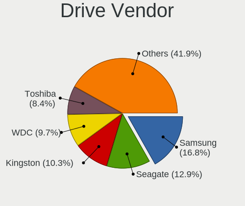
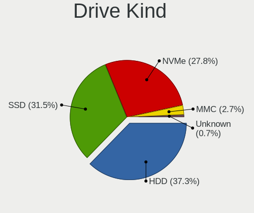
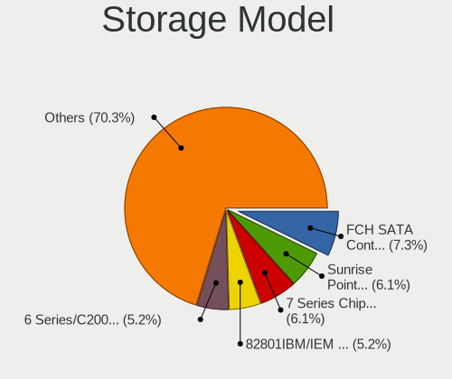
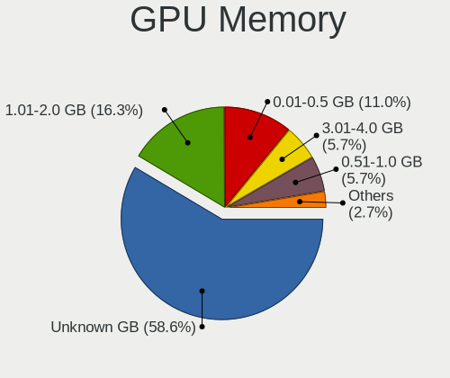
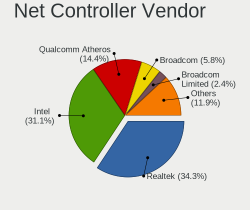
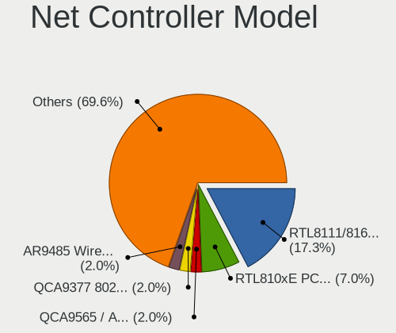
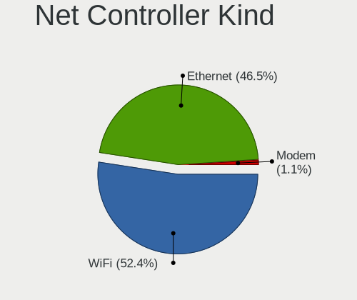
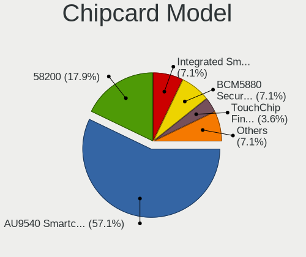

Linux in Latvia - Tested Hardware & Statistics (Notebooks)
----------------------------------------------------------

A project to collect tested hardware configurations for Linux in Latvia.

Anyone can contribute to this report by the [hw-probe](https://github.com/linuxhw/hw-probe) tool:

    sudo -E hw-probe -all -upload

Please contribute! Especially if your hardware is rare.

Contents
--------

* [ Test Cases ](#test-cases)

* [ System ](#system)
  - [ OS                       ](#os)
  - [ OS Family                ](#os-family)
  - [ Kernel                   ](#kernel)
  - [ Kernel Family            ](#kernel-family)
  - [ Kernel Major Ver.        ](#kernel-major-ver)
  - [ Arch                     ](#arch)
  - [ DE                       ](#de)
  - [ Display Server           ](#display-server)
  - [ Display Manager          ](#display-manager)
  - [ OS Lang                  ](#os-lang)
  - [ Boot Mode                ](#boot-mode)
  - [ Filesystem               ](#filesystem)
  - [ Part. scheme             ](#part-scheme)
  - [ Dual Boot with Linux/BSD ](#dual-boot-with-linuxbsd)
  - [ Dual Boot (Win)          ](#dual-boot-win)

* [ Board ](#board)
  - [ Vendor                   ](#vendor)
  - [ Model                    ](#model)
  - [ Model Family             ](#model-family)
  - [ MFG Year                 ](#mfg-year)
  - [ Form Factor              ](#form-factor)
  - [ Secure Boot              ](#secure-boot)
  - [ Coreboot                 ](#coreboot)
  - [ RAM Size                 ](#ram-size)
  - [ RAM Used                 ](#ram-used)
  - [ Total Drives             ](#total-drives)
  - [ Has CD-ROM               ](#has-cd-rom)
  - [ Has Ethernet             ](#has-ethernet)
  - [ Has WiFi                 ](#has-wifi)
  - [ Has Bluetooth            ](#has-bluetooth)

* [ Location ](#location)
  - [ Country                  ](#country)
  - [ City                     ](#city)

* [ Drives ](#drives)
  - [ Drive Vendor             ](#drive-vendor)
  - [ Drive Model              ](#drive-model)
  - [ HDD Vendor               ](#hdd-vendor)
  - [ SSD Vendor               ](#ssd-vendor)
  - [ Drive Kind               ](#drive-kind)
  - [ Drive Connector          ](#drive-connector)
  - [ Drive Size               ](#drive-size)
  - [ Space Total              ](#space-total)
  - [ Space Used               ](#space-used)
  - [ Malfunc. Drives          ](#malfunc-drives)
  - [ Malfunc. Drive Vendor    ](#malfunc-drive-vendor)
  - [ Malfunc. HDD Vendor      ](#malfunc-hdd-vendor)
  - [ Malfunc. Drive Kind      ](#malfunc-drive-kind)
  - [ Failed Drives            ](#failed-drives)
  - [ Failed Drive Vendor      ](#failed-drive-vendor)
  - [ Drive Status             ](#drive-status)

* [ Storage controller ](#storage-controller)
  - [ Storage Vendor           ](#storage-vendor)
  - [ Storage Model            ](#storage-model)
  - [ Storage Kind             ](#storage-kind)

* [ Processor ](#processor)
  - [ CPU Vendor               ](#cpu-vendor)
  - [ CPU Model                ](#cpu-model)
  - [ CPU Model Family         ](#cpu-model-family)
  - [ CPU Cores                ](#cpu-cores)
  - [ CPU Sockets              ](#cpu-sockets)
  - [ CPU Threads              ](#cpu-threads)
  - [ CPU Op-Modes             ](#cpu-op-modes)
  - [ CPU Microcode            ](#cpu-microcode)
  - [ CPU Microarch            ](#cpu-microarch)

* [ Graphics ](#graphics)
  - [ GPU Vendor               ](#gpu-vendor)
  - [ GPU Model                ](#gpu-model)
  - [ GPU Combo                ](#gpu-combo)
  - [ GPU Driver               ](#gpu-driver)
  - [ GPU Memory               ](#gpu-memory)

* [ Monitor ](#monitor)
  - [ Monitor Vendor           ](#monitor-vendor)
  - [ Monitor Model            ](#monitor-model)
  - [ Monitor Resolution       ](#monitor-resolution)
  - [ Monitor Diagonal         ](#monitor-diagonal)
  - [ Monitor Width            ](#monitor-width)
  - [ Aspect Ratio             ](#aspect-ratio)
  - [ Monitor Area             ](#monitor-area)
  - [ Pixel Density            ](#pixel-density)
  - [ Multiple Monitors        ](#multiple-monitors)

* [ Network ](#network)
  - [ Net Controller Vendor    ](#net-controller-vendor)
  - [ Net Controller Model     ](#net-controller-model)
  - [ Wireless Vendor          ](#wireless-vendor)
  - [ Wireless Model           ](#wireless-model)
  - [ Ethernet Vendor          ](#ethernet-vendor)
  - [ Ethernet Model           ](#ethernet-model)
  - [ Net Controller Kind      ](#net-controller-kind)
  - [ Used Controller          ](#used-controller)
  - [ NICs                     ](#nics)
  - [ IPv6                     ](#ipv6)

* [ Bluetooth ](#bluetooth)
  - [ Bluetooth Vendor         ](#bluetooth-vendor)
  - [ Bluetooth Model          ](#bluetooth-model)

* [ Sound ](#sound)
  - [ Sound Vendor             ](#sound-vendor)
  - [ Sound Model              ](#sound-model)

* [ Memory ](#memory)
  - [ Memory Vendor            ](#memory-vendor)
  - [ Memory Model             ](#memory-model)
  - [ Memory Kind              ](#memory-kind)
  - [ Memory Form Factor       ](#memory-form-factor)
  - [ Memory Size              ](#memory-size)
  - [ Memory Speed             ](#memory-speed)

* [ Printers & scanners ](#printers--scanners)
  - [ Printer Vendor           ](#printer-vendor)
  - [ Printer Model            ](#printer-model)
  - [ Scanner Vendor           ](#scanner-vendor)
  - [ Scanner Model            ](#scanner-model)

* [ Camera ](#camera)
  - [ Camera Vendor            ](#camera-vendor)
  - [ Camera Model             ](#camera-model)

* [ Security ](#security)
  - [ Fingerprint Vendor       ](#fingerprint-vendor)
  - [ Fingerprint Model        ](#fingerprint-model)
  - [ Chipcard Vendor          ](#chipcard-vendor)
  - [ Chipcard Model           ](#chipcard-model)

* [ Unsupported ](#unsupported)
  - [ Unsupported Devices      ](#unsupported-devices)
  - [ Unsupported Device Types ](#unsupported-device-types)

Test Cases
----------

Total: 374

| Vendor        | Model                       | Probe                                                      | Date         |
|---------------|-----------------------------|------------------------------------------------------------|--------------|
| HP            | Victus by Gaming Laptop ... | [24cf77eb91](https://linux-hardware.org/?probe=24cf77eb91) | May 07, 2024 |
| Lenovo        | ThinkPad X201 3626HMG       | [c445ea85c4](https://linux-hardware.org/?probe=c445ea85c4) | May 02, 2024 |
| HP            | Victus by Gaming Laptop ... | [9318ac5f47](https://linux-hardware.org/?probe=9318ac5f47) | Apr 30, 2024 |
| ASUSTek       | X541SA                      | [23ea4a0287](https://linux-hardware.org/?probe=23ea4a0287) | Apr 09, 2024 |
| ASUSTek       | X541SA                      | [0f5bd53c6f](https://linux-hardware.org/?probe=0f5bd53c6f) | Apr 08, 2024 |
| ASUSTek       | X541SA                      | [b3f083db5c](https://linux-hardware.org/?probe=b3f083db5c) | Apr 06, 2024 |
| Lenovo        | ThinkPad X1 Extreme 20MF... | [0855016a44](https://linux-hardware.org/?probe=0855016a44) | Apr 01, 2024 |
| Wortmann      | CR700                       | [e8bf0a5a61](https://linux-hardware.org/?probe=e8bf0a5a61) | Mar 27, 2024 |
| ASUSTek       | X55A                        | [9631a046b9](https://linux-hardware.org/?probe=9631a046b9) | Mar 19, 2024 |
| ASUSTek       | X55A                        | [c37422f48f](https://linux-hardware.org/?probe=c37422f48f) | Mar 13, 2024 |
| ASUSTek       | Vivobook Go E1504FA_E150... | [e655e5c1da](https://linux-hardware.org/?probe=e655e5c1da) | Mar 11, 2024 |
| Dell          | Latitude E6500              | [0c10bab3da](https://linux-hardware.org/?probe=0c10bab3da) | Mar 10, 2024 |
| ASUSTek       | Vivobook Go E1504FA_E150... | [0c55a3dc95](https://linux-hardware.org/?probe=0c55a3dc95) | Mar 10, 2024 |
| Acer          | Aspire 5730                 | [cba983dfb3](https://linux-hardware.org/?probe=cba983dfb3) | Mar 08, 2024 |
| Dell          | Vostro 15 3510              | [856ce9544e](https://linux-hardware.org/?probe=856ce9544e) | Mar 07, 2024 |
| Wortmann      | CR700                       | [faed1b3618](https://linux-hardware.org/?probe=faed1b3618) | Mar 06, 2024 |
| HP            | 250 G6 Notebook PC          | [88ca3f1029](https://linux-hardware.org/?probe=88ca3f1029) | Feb 20, 2024 |
| Apple         | MacBookPro11,1              | [bc1e6e90c1](https://linux-hardware.org/?probe=bc1e6e90c1) | Feb 10, 2024 |
| Apple         | MacBookPro11,1              | [0c1b63b275](https://linux-hardware.org/?probe=0c1b63b275) | Feb 10, 2024 |
| Lenovo        | IdeaPad Pro 5 14APH8 83A... | [12e32cbc19](https://linux-hardware.org/?probe=12e32cbc19) | Jan 19, 2024 |
| Dell          | Inspiron 3501               | [75a54dcccf](https://linux-hardware.org/?probe=75a54dcccf) | Jan 13, 2024 |
| Dell          | Precision M4800             | [47508330f1](https://linux-hardware.org/?probe=47508330f1) | Dec 26, 2023 |
| HP            | 250 G6 Notebook PC          | [552bc11608](https://linux-hardware.org/?probe=552bc11608) | Dec 19, 2023 |
| MSI           | Katana GF76 12UC            | [6667f9e88d](https://linux-hardware.org/?probe=6667f9e88d) | Dec 08, 2023 |
| HP            | ProBook 450 G0              | [80f6017066](https://linux-hardware.org/?probe=80f6017066) | Dec 04, 2023 |
| ASUSTek       | VivoBook_ASUSLaptop X515... | [76ce86d3d6](https://linux-hardware.org/?probe=76ce86d3d6) | Nov 26, 2023 |
| TUXEDO        | Gemini Gen2                 | [43d1c51e23](https://linux-hardware.org/?probe=43d1c51e23) | Nov 17, 2023 |
| Wortmann      | CR700                       | [0c5f9ff4c6](https://linux-hardware.org/?probe=0c5f9ff4c6) | Nov 14, 2023 |
| Samsung       | 350V5C/351V5C/3540VC/344... | [dc40a2bbb1](https://linux-hardware.org/?probe=dc40a2bbb1) | Nov 10, 2023 |
| Wortmann      | CR700                       | [45ed4d1320](https://linux-hardware.org/?probe=45ed4d1320) | Nov 07, 2023 |
| TUXEDO        | Unknown                     | [0994b60ab4](https://linux-hardware.org/?probe=0994b60ab4) | Oct 23, 2023 |
| Wortmann      | CR700                       | [916c9bceda](https://linux-hardware.org/?probe=916c9bceda) | Oct 15, 2023 |
| Packard Be... | EasyNote TE11HC             | [75cbcab213](https://linux-hardware.org/?probe=75cbcab213) | Oct 06, 2023 |
| Lenovo        | ThinkPad L14 Gen 2a 20X5... | [8f0fc826ae](https://linux-hardware.org/?probe=8f0fc826ae) | Oct 04, 2023 |
| Apple         | MacBookPro8,1               | [b34e8b6647](https://linux-hardware.org/?probe=b34e8b6647) | Oct 04, 2023 |
| MSI           | Katana GF76 11UE            | [8327fd670f](https://linux-hardware.org/?probe=8327fd670f) | Sep 23, 2023 |
| HP            | ProBook 450 G1              | [feffc725af](https://linux-hardware.org/?probe=feffc725af) | Sep 23, 2023 |
| Packard Be... | EasyNote TE11HC             | [0d897e53cf](https://linux-hardware.org/?probe=0d897e53cf) | Sep 21, 2023 |
| ASUSTek       | Zenbook UX3404VA_UX3404V... | [432c1d0b94](https://linux-hardware.org/?probe=432c1d0b94) | Sep 18, 2023 |
| Packard Be... | EasyNote TE11HC             | [7f55f1b615](https://linux-hardware.org/?probe=7f55f1b615) | Sep 08, 2023 |
| HP            | EliteBook 855 G7 Noteboo... | [89ce951011](https://linux-hardware.org/?probe=89ce951011) | Sep 05, 2023 |
| Acer          | Aspire A515-56              | [435cb2d610](https://linux-hardware.org/?probe=435cb2d610) | Sep 03, 2023 |
| Lenovo        | ThinkBook 13s G4 ARB 21A... | [ba81140205](https://linux-hardware.org/?probe=ba81140205) | Aug 31, 2023 |
| Acer          | Aspire A515-56              | [501ee4caf7](https://linux-hardware.org/?probe=501ee4caf7) | Aug 20, 2023 |
| ASUSTek       | N56VJ                       | [d552e1a450](https://linux-hardware.org/?probe=d552e1a450) | Aug 08, 2023 |
| Wortmann      | CR700                       | [2f3379e14e](https://linux-hardware.org/?probe=2f3379e14e) | Jul 31, 2023 |
| HP            | ProBook 4530s               | [46852380f2](https://linux-hardware.org/?probe=46852380f2) | Jul 27, 2023 |
| Lenovo        | ThinkPad L15 Gen 4 21H30... | [631e54097b](https://linux-hardware.org/?probe=631e54097b) | Jul 18, 2023 |
| Lenovo        | ThinkPad L15 Gen 4 21H30... | [192f8de028](https://linux-hardware.org/?probe=192f8de028) | Jul 18, 2023 |
| HP            | Pavilion dv6500             | [a714d595da](https://linux-hardware.org/?probe=a714d595da) | Jul 10, 2023 |
| Packard Be... | EasyNote TE11HC             | [9b40832f50](https://linux-hardware.org/?probe=9b40832f50) | Jul 09, 2023 |
| Unknown       | Unknown                     | [95b195418f](https://linux-hardware.org/?probe=95b195418f) | Jul 09, 2023 |
| Sony          | VPCCW2S8E                   | [4a3af37e51](https://linux-hardware.org/?probe=4a3af37e51) | Jul 05, 2023 |
| Wortmann      | CR700                       | [b198dccb29](https://linux-hardware.org/?probe=b198dccb29) | Jun 25, 2023 |
| Lenovo        | ThinkPad T480s 20L8S10T0... | [a3dd392c51](https://linux-hardware.org/?probe=a3dd392c51) | Jun 17, 2023 |
| Gigabyte      | P55V6                       | [63d0cd064b](https://linux-hardware.org/?probe=63d0cd064b) | Jun 13, 2023 |
| Lenovo        | ThinkPad X1 Carbon 7th 2... | [46751741ef](https://linux-hardware.org/?probe=46751741ef) | Jun 05, 2023 |
| Wortmann      | CR700                       | [189f1ae92b](https://linux-hardware.org/?probe=189f1ae92b) | May 27, 2023 |
| Lenovo        | ThinkPad P14s Gen 3 21J5... | [e0cbba6897](https://linux-hardware.org/?probe=e0cbba6897) | May 16, 2023 |
| Dell          | Latitude 5330               | [3cc5328fee](https://linux-hardware.org/?probe=3cc5328fee) | May 16, 2023 |
| Lenovo        | ThinkPad T470 20HD0001MX    | [65b165e2f1](https://linux-hardware.org/?probe=65b165e2f1) | May 12, 2023 |
| Lenovo        | ThinkPad T470 20HD0001MX    | [66b49186cb](https://linux-hardware.org/?probe=66b49186cb) | May 06, 2023 |
| Packard Be... | EasyNote LM85               | [d37b9e6687](https://linux-hardware.org/?probe=d37b9e6687) | May 06, 2023 |
| HUAWEI        | BOD-WXX9                    | [1909a7f824](https://linux-hardware.org/?probe=1909a7f824) | May 05, 2023 |
| HUAWEI        | BOD-WXX9                    | [6e0d5c7f28](https://linux-hardware.org/?probe=6e0d5c7f28) | May 05, 2023 |
| HUAWEI        | BOD-WXX9                    | [136fd4098d](https://linux-hardware.org/?probe=136fd4098d) | May 01, 2023 |
| HP            | 250 G6 Notebook PC          | [90e4883dca](https://linux-hardware.org/?probe=90e4883dca) | Apr 26, 2023 |
| ASUSTek       | ASUS TUF Dash F15 FX516P... | [641374c815](https://linux-hardware.org/?probe=641374c815) | Apr 23, 2023 |
| Dell          | Latitude 5400               | [70899bc374](https://linux-hardware.org/?probe=70899bc374) | Apr 12, 2023 |
| Fujitsu Si... | LIFEBOOK S6420              | [6a6e2f88f4](https://linux-hardware.org/?probe=6a6e2f88f4) | Apr 12, 2023 |
| Acer          | Aspire 5250                 | [f2040ffb31](https://linux-hardware.org/?probe=f2040ffb31) | Apr 09, 2023 |
| Fujitsu Si... | LIFEBOOK S6420              | [52b4a5a0f0](https://linux-hardware.org/?probe=52b4a5a0f0) | Apr 08, 2023 |
| ASUSTek       | X553MA                      | [0a307c8c2b](https://linux-hardware.org/?probe=0a307c8c2b) | Apr 07, 2023 |
| Apple         | MacBookAir5,2               | [5a1cd8556c](https://linux-hardware.org/?probe=5a1cd8556c) | Apr 01, 2023 |
| Lenovo        | ThinkPad T420 4180RK8       | [752373923e](https://linux-hardware.org/?probe=752373923e) | Mar 18, 2023 |
| Acer          | Extensa 5630                | [e78d4a3c28](https://linux-hardware.org/?probe=e78d4a3c28) | Mar 14, 2023 |
| Wortmann      | CR700                       | [a48e22ffc5](https://linux-hardware.org/?probe=a48e22ffc5) | Mar 07, 2023 |
| Lenovo        | ThinkPad E490 20N8005JMH    | [26ca476e1a](https://linux-hardware.org/?probe=26ca476e1a) | Mar 04, 2023 |
| Lenovo        | ThinkPad P14s Gen 3 21J5... | [9b044bd920](https://linux-hardware.org/?probe=9b044bd920) | Feb 26, 2023 |
| Lenovo        | ThinkPad P14s Gen 3 21J5... | [c8c79f26d8](https://linux-hardware.org/?probe=c8c79f26d8) | Feb 26, 2023 |
| Lenovo        | IdeaPad 5 14ITL05 82FE      | [312937f0d0](https://linux-hardware.org/?probe=312937f0d0) | Feb 22, 2023 |
| HP            | Pavilion 17                 | [1a50084a52](https://linux-hardware.org/?probe=1a50084a52) | Feb 19, 2023 |
| Fujitsu       | STYLISTIC Q704              | [9d36ad089c](https://linux-hardware.org/?probe=9d36ad089c) | Feb 18, 2023 |
| Dell          | Latitude 5330               | [497897c322](https://linux-hardware.org/?probe=497897c322) | Feb 16, 2023 |
| Lenovo        | ZIWB2                       | [8ade075157](https://linux-hardware.org/?probe=8ade075157) | Feb 16, 2023 |
| Dell          | Latitude 5330               | [aa55aaad48](https://linux-hardware.org/?probe=aa55aaad48) | Feb 16, 2023 |
| Chuwi         | Hi10 Go                     | [a1b6911dc1](https://linux-hardware.org/?probe=a1b6911dc1) | Feb 02, 2023 |
| Lenovo        | ZIWB2                       | [b7ff6b4dd5](https://linux-hardware.org/?probe=b7ff6b4dd5) | Feb 02, 2023 |
| Acer          | Aspire 5532                 | [88e8887c6c](https://linux-hardware.org/?probe=88e8887c6c) | Jan 27, 2023 |
| ASUSTek       | X550CL                      | [e98a955b1a](https://linux-hardware.org/?probe=e98a955b1a) | Jan 26, 2023 |
| Lenovo        | ThinkPad T430u 3353A11      | [34e69693d1](https://linux-hardware.org/?probe=34e69693d1) | Jan 25, 2023 |
| Acer          | Extensa 5630                | [ae62db30e8](https://linux-hardware.org/?probe=ae62db30e8) | Jan 23, 2023 |
| Lenovo        | Legion Y540-15IRH-PG0 81... | [40719006ae](https://linux-hardware.org/?probe=40719006ae) | Jan 23, 2023 |
| Wortmann      | CR700                       | [0d40cf0690](https://linux-hardware.org/?probe=0d40cf0690) | Jan 22, 2023 |
| MSI           | CR500                       | [4aaddddd7f](https://linux-hardware.org/?probe=4aaddddd7f) | Jan 22, 2023 |
| Lenovo        | IdeaPad 300-15ISK 80Q7      | [ae3846db38](https://linux-hardware.org/?probe=ae3846db38) | Jan 22, 2023 |
| Samsung       | 350V5C/351V5C/3540VC/344... | [9cb7b18b35](https://linux-hardware.org/?probe=9cb7b18b35) | Jan 20, 2023 |
| Samsung       | 350V5C/351V5C/3540VC/344... | [95e7b7d833](https://linux-hardware.org/?probe=95e7b7d833) | Jan 20, 2023 |
| Lenovo        | G70-80 80FF                 | [1ce03f27f3](https://linux-hardware.org/?probe=1ce03f27f3) | Jan 19, 2023 |
| Samsung       | 350V5C/351V5C/3540VC/344... | [8026c0d5b2](https://linux-hardware.org/?probe=8026c0d5b2) | Jan 17, 2023 |
| Fujitsu Si... | AMILO Si 2636               | [4a918c5503](https://linux-hardware.org/?probe=4a918c5503) | Jan 11, 2023 |
| Fujitsu Si... | AMILO Si 2636               | [68bd2484a1](https://linux-hardware.org/?probe=68bd2484a1) | Jan 04, 2023 |
| HP            | G62                         | [4d80c95e73](https://linux-hardware.org/?probe=4d80c95e73) | Dec 18, 2022 |
| Dell          | Inspiron N5050              | [cc139ec3a3](https://linux-hardware.org/?probe=cc139ec3a3) | Dec 17, 2022 |
| Fujitsu Si... | LIFEBOOK E8310              | [5fca69ae89](https://linux-hardware.org/?probe=5fca69ae89) | Dec 17, 2022 |
| Lenovo        | IdeaPad Gaming 3 15IMH05... | [259226594a](https://linux-hardware.org/?probe=259226594a) | Dec 14, 2022 |
| Lenovo        | Legion 5 15ACH6H 82JU       | [6de2a0ad33](https://linux-hardware.org/?probe=6de2a0ad33) | Dec 11, 2022 |
| MSI           | GF63 Thin 9RCX              | [b3c750c720](https://linux-hardware.org/?probe=b3c750c720) | Dec 11, 2022 |
| Fujitsu Si... | LIFEBOOK E8310              | [e4fe543570](https://linux-hardware.org/?probe=e4fe543570) | Dec 10, 2022 |
| ASUSTek       | X550MD                      | [e5058b43c3](https://linux-hardware.org/?probe=e5058b43c3) | Dec 05, 2022 |
| ASUSTek       | F3Sg                        | [f5ae748125](https://linux-hardware.org/?probe=f5ae748125) | Dec 04, 2022 |
| MSI           | GV72 7RE                    | [74b317d501](https://linux-hardware.org/?probe=74b317d501) | Dec 01, 2022 |
| ASUSTek       | G751JL                      | [1bfbfafe68](https://linux-hardware.org/?probe=1bfbfafe68) | Nov 29, 2022 |
| ASUSTek       | X453MA                      | [f30a5c4808](https://linux-hardware.org/?probe=f30a5c4808) | Nov 28, 2022 |
| Lenovo        | ThinkPad T460s 20FAS4KH0... | [585b6910fa](https://linux-hardware.org/?probe=585b6910fa) | Nov 26, 2022 |
| Lenovo        | ThinkPad T460s 20FAS4KH0... | [138231da75](https://linux-hardware.org/?probe=138231da75) | Nov 26, 2022 |
| MSI           | Modern 14 B4MW              | [967a4c4e4d](https://linux-hardware.org/?probe=967a4c4e4d) | Nov 17, 2022 |
| Wortmann      | CR700                       | [7030308edf](https://linux-hardware.org/?probe=7030308edf) | Oct 29, 2022 |
| Lenovo        | ThinkPad X260 20F5S5Q200    | [c2e041fd54](https://linux-hardware.org/?probe=c2e041fd54) | Oct 21, 2022 |
| ASUSTek       | X553MA                      | [ade1f0f879](https://linux-hardware.org/?probe=ade1f0f879) | Oct 14, 2022 |
| Toshiba       | Satellite L350              | [79268bac9b](https://linux-hardware.org/?probe=79268bac9b) | Oct 06, 2022 |
| Toshiba       | Satellite L350              | [cf2e5dae86](https://linux-hardware.org/?probe=cf2e5dae86) | Oct 06, 2022 |
| Acer          | Aspire 5250                 | [8a18115a5b](https://linux-hardware.org/?probe=8a18115a5b) | Oct 04, 2022 |
| Lenovo        | ThinkPad E490 20N8005JMH    | [8e78f3c776](https://linux-hardware.org/?probe=8e78f3c776) | Sep 20, 2022 |
| Acer          | Aspire 5742                 | [fadbc676b4](https://linux-hardware.org/?probe=fadbc676b4) | Sep 02, 2022 |
| HP            | EliteBook 8440p             | [1f0f196305](https://linux-hardware.org/?probe=1f0f196305) | Aug 29, 2022 |
| ASUSTek       | ROG Strix G733ZW_G733ZW     | [4384be22c4](https://linux-hardware.org/?probe=4384be22c4) | Aug 27, 2022 |
| HP            | ProBook 450 G1              | [986bb07198](https://linux-hardware.org/?probe=986bb07198) | Aug 24, 2022 |
| HP            | ProBook 450 G1              | [c7a1d435fb](https://linux-hardware.org/?probe=c7a1d435fb) | Aug 24, 2022 |
| HUAWEI        | KLVL-WXX9                   | [b74ab22c1f](https://linux-hardware.org/?probe=b74ab22c1f) | Aug 16, 2022 |
| Samsung       | 350V5C/351V5C/3540VC/344... | [88fc37216d](https://linux-hardware.org/?probe=88fc37216d) | Aug 15, 2022 |
| ASUSTek       | ROG Strix G733ZW_G733ZW     | [2f45536688](https://linux-hardware.org/?probe=2f45536688) | Aug 12, 2022 |
| Lenovo        | G70-80 80FF                 | [495516e19d](https://linux-hardware.org/?probe=495516e19d) | Aug 08, 2022 |
| Acer          | Aspire A315-42              | [78415dc6be](https://linux-hardware.org/?probe=78415dc6be) | Jul 25, 2022 |
| Acer          | Aspire 5730                 | [b4877f21ad](https://linux-hardware.org/?probe=b4877f21ad) | Jul 23, 2022 |
| Wortmann      | CR700                       | [3aa2d086b9](https://linux-hardware.org/?probe=3aa2d086b9) | Jul 23, 2022 |
| Wortmann      | CR700                       | [27d04b5577](https://linux-hardware.org/?probe=27d04b5577) | Jul 23, 2022 |
| Acer          | Aspire A515-51G             | [4856a5fefb](https://linux-hardware.org/?probe=4856a5fefb) | Jul 22, 2022 |
| Lenovo        | IdeaPad U330p 20267         | [1775f75940](https://linux-hardware.org/?probe=1775f75940) | Jul 22, 2022 |
| Dell          | Precision 3561              | [fab553a2b2](https://linux-hardware.org/?probe=fab553a2b2) | Jun 20, 2022 |
| HUAWEI        | KLVL-WXX9                   | [999d96890c](https://linux-hardware.org/?probe=999d96890c) | Jun 16, 2022 |
| HP            | ProBook 450 G0              | [2d87379b89](https://linux-hardware.org/?probe=2d87379b89) | Jun 11, 2022 |
| Samsung       | 350V5C/351V5C/3540VC/344... | [e75d068a21](https://linux-hardware.org/?probe=e75d068a21) | Jun 02, 2022 |
| Lenovo        | ThinkPad T410 2537HN3       | [e373330c8b](https://linux-hardware.org/?probe=e373330c8b) | Jun 01, 2022 |
| Lenovo        | ThinkBook 14-IML 20RV       | [6f5d1c9f06](https://linux-hardware.org/?probe=6f5d1c9f06) | May 22, 2022 |
| Lenovo        | ThinkBook 14-IML 20RV       | [6e46286500](https://linux-hardware.org/?probe=6e46286500) | May 21, 2022 |
| Acer          | Aspire A315-42              | [cd2a742b8c](https://linux-hardware.org/?probe=cd2a742b8c) | May 18, 2022 |
| Dell          | Inspiron 3543               | [3a940a3394](https://linux-hardware.org/?probe=3a940a3394) | May 11, 2022 |
| Valve         | Jupiter                     | [19d2c51aa6](https://linux-hardware.org/?probe=19d2c51aa6) | May 01, 2022 |
| Dell          | Inspiron 3543               | [7fb19b7da4](https://linux-hardware.org/?probe=7fb19b7da4) | Apr 27, 2022 |
| ASUSTek       | VivoBook_ASUS Laptop E21... | [73de8fd9f4](https://linux-hardware.org/?probe=73de8fd9f4) | Apr 26, 2022 |
| Dell          | Latitude E7440              | [8609968661](https://linux-hardware.org/?probe=8609968661) | Apr 18, 2022 |
| HP            | Pavilion Gaming Laptop 1... | [75f2876f06](https://linux-hardware.org/?probe=75f2876f06) | Apr 12, 2022 |
| Lenovo        | ThinkPad E490 20N8005JMH    | [c3ac98aa71](https://linux-hardware.org/?probe=c3ac98aa71) | Apr 11, 2022 |
| Dell          | Latitude 5590               | [6e22c70e48](https://linux-hardware.org/?probe=6e22c70e48) | Apr 05, 2022 |
| HP            | EliteBook 840 G8 Noteboo... | [086d7749d3](https://linux-hardware.org/?probe=086d7749d3) | Apr 03, 2022 |
| Lenovo        | ThinkPad X260 20F5S0HK1J    | [a83d3cbe5f](https://linux-hardware.org/?probe=a83d3cbe5f) | Mar 31, 2022 |
| Lenovo        | ThinkPad E490 20N8005JMH    | [1a8680a665](https://linux-hardware.org/?probe=1a8680a665) | Mar 23, 2022 |
| ASUSTek       | ASUS TUF Gaming F15 FX50... | [d63ab08c03](https://linux-hardware.org/?probe=d63ab08c03) | Mar 17, 2022 |
| Lenovo        | IdeaPad 320-15ISK 80XH      | [5af22f3639](https://linux-hardware.org/?probe=5af22f3639) | Mar 07, 2022 |
| HP            | EliteBook 8570w             | [a97a0ba0ee](https://linux-hardware.org/?probe=a97a0ba0ee) | Feb 27, 2022 |
| Dell          | Inspiron 3531               | [d2d231ddeb](https://linux-hardware.org/?probe=d2d231ddeb) | Feb 24, 2022 |
| Lenovo        | ThinkPad X220 4291Q50       | [600a3137e2](https://linux-hardware.org/?probe=600a3137e2) | Feb 19, 2022 |
| ASUSTek       | VivoBook_ASUSLaptop X512... | [ae4eca9e09](https://linux-hardware.org/?probe=ae4eca9e09) | Feb 14, 2022 |
| Lenovo        | ThinkPad P14s Gen 1 20Y1... | [1837325ca2](https://linux-hardware.org/?probe=1837325ca2) | Feb 03, 2022 |
| Lenovo        | G70-80 80FF                 | [0771453742](https://linux-hardware.org/?probe=0771453742) | Jan 25, 2022 |
| Apple         | MacBookPro8,1               | [9b3d91c6df](https://linux-hardware.org/?probe=9b3d91c6df) | Jan 24, 2022 |
| HP            | 250 G6 Notebook PC          | [dae0e58890](https://linux-hardware.org/?probe=dae0e58890) | Jan 23, 2022 |
| Razer         | Blade 15 Advanced Model ... | [c07445f559](https://linux-hardware.org/?probe=c07445f559) | Jan 23, 2022 |
| Lenovo        | G70-80 80FF                 | [c69ec5ad5b](https://linux-hardware.org/?probe=c69ec5ad5b) | Jan 17, 2022 |
| Razer         | Blade 15 Advanced Model ... | [6f992c3b94](https://linux-hardware.org/?probe=6f992c3b94) | Jan 14, 2022 |
| Razer         | Blade 15 Advanced Model ... | [95724a0980](https://linux-hardware.org/?probe=95724a0980) | Jan 14, 2022 |
| ASUSTek       | VivoBook_ASUSLaptop X513... | [d453a69dad](https://linux-hardware.org/?probe=d453a69dad) | Jan 06, 2022 |
| Lenovo        | G70-80 80FF                 | [b1279c6db3](https://linux-hardware.org/?probe=b1279c6db3) | Jan 02, 2022 |
| Lenovo        | IdeaPad 300-15ISK 80Q7      | [0d09c12302](https://linux-hardware.org/?probe=0d09c12302) | Dec 28, 2021 |
| Lenovo        | G70-80 80FF                 | [4210ac05a8](https://linux-hardware.org/?probe=4210ac05a8) | Dec 26, 2021 |
| Dell          | Inspiron 3543               | [2b61a95031](https://linux-hardware.org/?probe=2b61a95031) | Dec 21, 2021 |
| Lenovo        | ThinkPad T60 8741W3M        | [7d2faf3b37](https://linux-hardware.org/?probe=7d2faf3b37) | Dec 21, 2021 |
| Lenovo        | ThinkPad T60 8741W3M        | [6df4a50194](https://linux-hardware.org/?probe=6df4a50194) | Dec 21, 2021 |
| Lenovo        | ThinkPad X250 20CLS2XA00    | [276d570689](https://linux-hardware.org/?probe=276d570689) | Dec 15, 2021 |
| ASUSTek       | E402SA                      | [2a140138d3](https://linux-hardware.org/?probe=2a140138d3) | Dec 12, 2021 |
| Lenovo        | G70-80 80FF                 | [7d694ce256](https://linux-hardware.org/?probe=7d694ce256) | Dec 09, 2021 |
| Dell          | Latitude 7420               | [7a96812e39](https://linux-hardware.org/?probe=7a96812e39) | Nov 28, 2021 |
| Lenovo        | ThinkPad T420 4180ED3       | [c7726d6967](https://linux-hardware.org/?probe=c7726d6967) | Nov 23, 2021 |
| Acer          | NC-E5-572G-7222             | [1c2a0c3295](https://linux-hardware.org/?probe=1c2a0c3295) | Nov 19, 2021 |
| Lenovo        | ThinkPad E490 20N8005JMH    | [0c603f1589](https://linux-hardware.org/?probe=0c603f1589) | Nov 16, 2021 |
| HUAWEI        | MACHD-WXX9                  | [364fb5b6b7](https://linux-hardware.org/?probe=364fb5b6b7) | Nov 06, 2021 |
| HP            | EliteBook 850 G4            | [e6643f7ed1](https://linux-hardware.org/?probe=e6643f7ed1) | Oct 28, 2021 |
| Lenovo        | ThinkPad E15 Gen 2 20T80... | [f1449188a9](https://linux-hardware.org/?probe=f1449188a9) | Oct 20, 2021 |
| Fujitsu Si... | AMILO Xa 1526               | [00863fcea8](https://linux-hardware.org/?probe=00863fcea8) | Oct 16, 2021 |
| HP            | G62                         | [7873481ecb](https://linux-hardware.org/?probe=7873481ecb) | Oct 12, 2021 |
| ASUSTek       | N550JV                      | [5369aca258](https://linux-hardware.org/?probe=5369aca258) | Sep 28, 2021 |
| ASUSTek       | TUF Gaming FX505DY_FX505... | [f4a4e754c5](https://linux-hardware.org/?probe=f4a4e754c5) | Sep 22, 2021 |
| HP            | 250 G6 Notebook PC          | [3caff8f18f](https://linux-hardware.org/?probe=3caff8f18f) | Sep 19, 2021 |
| Lenovo        | IdeaPad Gaming 3 15ARH05... | [eb5215553d](https://linux-hardware.org/?probe=eb5215553d) | Sep 18, 2021 |
| HP            | EliteBook 840 G3            | [5ac93f6014](https://linux-hardware.org/?probe=5ac93f6014) | Sep 15, 2021 |
| Acer          | Aspire VX5-591G             | [c7d5407b29](https://linux-hardware.org/?probe=c7d5407b29) | Sep 15, 2021 |
| ASUSTek       | TUF Gaming FX505DY_FX505... | [c5ebbbd9c2](https://linux-hardware.org/?probe=c5ebbbd9c2) | Aug 27, 2021 |
| HP            | Pavilion Gaming Laptop 1... | [516c59e9bb](https://linux-hardware.org/?probe=516c59e9bb) | Aug 26, 2021 |
| Sony          | VPCCW2S8E                   | [a8c2dc6942](https://linux-hardware.org/?probe=a8c2dc6942) | Aug 26, 2021 |
| HP            | EliteBook 840 G1            | [82b2192d48](https://linux-hardware.org/?probe=82b2192d48) | Aug 25, 2021 |
| Samsung       | 350V5C/351V5C/3540VC/344... | [d26b653261](https://linux-hardware.org/?probe=d26b653261) | Aug 23, 2021 |
| Dell          | G3 3579                     | [6042d3630a](https://linux-hardware.org/?probe=6042d3630a) | Aug 22, 2021 |
| Dell          | G3 3579                     | [902b56f744](https://linux-hardware.org/?probe=902b56f744) | Aug 22, 2021 |
| HP            | Pavilion dv7                | [7d6c08fc9e](https://linux-hardware.org/?probe=7d6c08fc9e) | Aug 17, 2021 |
| Lenovo        | IdeaPad S340-15API 81NC     | [eb1b7627ff](https://linux-hardware.org/?probe=eb1b7627ff) | Aug 10, 2021 |
| HP            | EliteBook 8470p             | [c718b061d2](https://linux-hardware.org/?probe=c718b061d2) | Aug 05, 2021 |
| HP            | HDX 16                      | [47273f74b5](https://linux-hardware.org/?probe=47273f74b5) | Aug 02, 2021 |
| HP            | HDX 16                      | [aa6b70deac](https://linux-hardware.org/?probe=aa6b70deac) | Aug 02, 2021 |
| Toshiba       | Satellite L850-1LK          | [8e8d84c8eb](https://linux-hardware.org/?probe=8e8d84c8eb) | Jul 30, 2021 |
| Dell          | Vostro 1015                 | [0e16f2bc9c](https://linux-hardware.org/?probe=0e16f2bc9c) | Jul 30, 2021 |
| Toshiba       | Satellite L850-1LK          | [b0b636bbee](https://linux-hardware.org/?probe=b0b636bbee) | Jul 30, 2021 |
| HP            | HDX 16                      | [627219df22](https://linux-hardware.org/?probe=627219df22) | Jul 25, 2021 |
| Timi          | A35S                        | [27f9e877a1](https://linux-hardware.org/?probe=27f9e877a1) | Jul 14, 2021 |
| ASUSTek       | VivoBook 12_ASUS Laptop ... | [55460937e0](https://linux-hardware.org/?probe=55460937e0) | Jul 14, 2021 |
| Lenovo        | ThinkPad P70 20ER0035MH     | [3b7269dbb9](https://linux-hardware.org/?probe=3b7269dbb9) | Jul 12, 2021 |
| Dell          | Latitude 7420               | [ebf2372c3b](https://linux-hardware.org/?probe=ebf2372c3b) | Jul 09, 2021 |
| HP            | HDX 16                      | [ba1ae87cbe](https://linux-hardware.org/?probe=ba1ae87cbe) | Jul 07, 2021 |
| Acer          | Predator PH317-53           | [1e5cb90c22](https://linux-hardware.org/?probe=1e5cb90c22) | Jul 06, 2021 |
| HP            | Pavilion dv6500             | [135215864a](https://linux-hardware.org/?probe=135215864a) | Jun 19, 2021 |
| Dell          | Latitude 5520               | [9929364f77](https://linux-hardware.org/?probe=9929364f77) | Jun 01, 2021 |
| Acer          | AO725                       | [1a095f9c0f](https://linux-hardware.org/?probe=1a095f9c0f) | May 17, 2021 |
| Lenovo        | Y50-70 20378                | [cc68265730](https://linux-hardware.org/?probe=cc68265730) | May 15, 2021 |
| Dell          | Inspiron 3583               | [7e3064fadf](https://linux-hardware.org/?probe=7e3064fadf) | May 10, 2021 |
| Dell          | Inspiron 3583               | [29e5e6b501](https://linux-hardware.org/?probe=29e5e6b501) | May 10, 2021 |
| HP            | Pavilion Gaming Laptop 1... | [de14cb7c23](https://linux-hardware.org/?probe=de14cb7c23) | May 06, 2021 |
| Dell          | Inspiron 5720               | [28fc1b9fd7](https://linux-hardware.org/?probe=28fc1b9fd7) | Apr 20, 2021 |
| Acer          | Aspire E5-774G              | [17734000ae](https://linux-hardware.org/?probe=17734000ae) | Apr 14, 2021 |
| Lenovo        | G50-80 80E5                 | [d6b6146396](https://linux-hardware.org/?probe=d6b6146396) | Apr 14, 2021 |
| Dell          | Inspiron 5720               | [2bff145cfe](https://linux-hardware.org/?probe=2bff145cfe) | Apr 10, 2021 |
| Lenovo        | ThinkPad L390 20NRCTO1WW    | [09ae9c9787](https://linux-hardware.org/?probe=09ae9c9787) | Mar 31, 2021 |
| Lenovo        | ThinkPad T15 Gen 1 20S60... | [3c5c72b0fb](https://linux-hardware.org/?probe=3c5c72b0fb) | Mar 20, 2021 |
| Dell          | Latitude 5400               | [002c23ff4b](https://linux-hardware.org/?probe=002c23ff4b) | Mar 19, 2021 |
| Dell          | Latitude E5400              | [0b3108a091](https://linux-hardware.org/?probe=0b3108a091) | Mar 04, 2021 |
| Lenovo        | ThinkPad T15 Gen 1 20S60... | [35b79852e1](https://linux-hardware.org/?probe=35b79852e1) | Feb 06, 2021 |
| ASUSTek       | F3Sg                        | [98e32533f7](https://linux-hardware.org/?probe=98e32533f7) | Feb 06, 2021 |
| Dell          | Inspiron 5720               | [548a61cbe6](https://linux-hardware.org/?probe=548a61cbe6) | Jan 24, 2021 |
| ASUSTek       | TUF Gaming FX705GM_FX705... | [61f2500518](https://linux-hardware.org/?probe=61f2500518) | Jan 08, 2021 |
| Dell          | Latitude E6330              | [06a79c3a7f](https://linux-hardware.org/?probe=06a79c3a7f) | Jan 05, 2021 |
| ASUSTek       | N56VM                       | [795cfd3d9a](https://linux-hardware.org/?probe=795cfd3d9a) | Dec 30, 2020 |
| Lenovo        | G70-80 80FF                 | [069f4b154c](https://linux-hardware.org/?probe=069f4b154c) | Dec 27, 2020 |
| Lenovo        | V110-15IAP 80TG             | [5bb5bac2f1](https://linux-hardware.org/?probe=5bb5bac2f1) | Dec 26, 2020 |
| Quanta        | TW8/SW8/DW8                 | [705e766496](https://linux-hardware.org/?probe=705e766496) | Dec 18, 2020 |
| Quanta        | TW8/SW8/DW8                 | [5501a16739](https://linux-hardware.org/?probe=5501a16739) | Dec 18, 2020 |
| Fujitsu       | STYLISTIC Q704              | [ae32e0d51d](https://linux-hardware.org/?probe=ae32e0d51d) | Dec 14, 2020 |
| Lenovo        | ThinkPad E14 Gen 2 20T60... | [46c6cef9b6](https://linux-hardware.org/?probe=46c6cef9b6) | Nov 27, 2020 |
| Lenovo        | G70-80 80FF                 | [7563d834dc](https://linux-hardware.org/?probe=7563d834dc) | Nov 27, 2020 |
| ASUSTek       | ZenBook UX431DA_UM431DA     | [177a2353e0](https://linux-hardware.org/?probe=177a2353e0) | Nov 26, 2020 |
| Lenovo        | G70-80 80FF                 | [814d9b3267](https://linux-hardware.org/?probe=814d9b3267) | Nov 26, 2020 |
| Acer          | Aspire E5-774G              | [792da7f209](https://linux-hardware.org/?probe=792da7f209) | Nov 21, 2020 |
| ASUSTek       | N56VZ                       | [fb3694b0fb](https://linux-hardware.org/?probe=fb3694b0fb) | Nov 21, 2020 |
| Fujitsu       | STYLISTIC Q704              | [a016928cb6](https://linux-hardware.org/?probe=a016928cb6) | Nov 20, 2020 |
| Fujitsu       | STYLISTIC Q704              | [6cee0ffad6](https://linux-hardware.org/?probe=6cee0ffad6) | Nov 20, 2020 |
| Acer          | Nitro AN515-54              | [6b6517fc84](https://linux-hardware.org/?probe=6b6517fc84) | Nov 17, 2020 |
| ASUSTek       | F9S                         | [dbadd20bba](https://linux-hardware.org/?probe=dbadd20bba) | Nov 15, 2020 |
| ASUSTek       | X751LD                      | [1ddab278fa](https://linux-hardware.org/?probe=1ddab278fa) | Nov 13, 2020 |
| ASUSTek       | X751LD                      | [518aedab56](https://linux-hardware.org/?probe=518aedab56) | Nov 13, 2020 |
| ASUSTek       | F9S                         | [17861d40da](https://linux-hardware.org/?probe=17861d40da) | Nov 09, 2020 |
| Acer          | Aspire E1-570               | [cfca189393](https://linux-hardware.org/?probe=cfca189393) | Oct 29, 2020 |
| Packard Be... | EasyNote LE69KB             | [c31d50e8e1](https://linux-hardware.org/?probe=c31d50e8e1) | Oct 24, 2020 |
| Packard Be... | EasyNote LE69KB             | [5d55b9b791](https://linux-hardware.org/?probe=5d55b9b791) | Oct 23, 2020 |
| Acer          | Nitro AN515-52              | [21ce46139c](https://linux-hardware.org/?probe=21ce46139c) | Oct 19, 2020 |
| Acer          | Predator PH317-53           | [16cddb4fce](https://linux-hardware.org/?probe=16cddb4fce) | Sep 29, 2020 |
| HP            | Pavilion dv6700             | [e514981e11](https://linux-hardware.org/?probe=e514981e11) | Sep 19, 2020 |
| Toshiba       | Satellite L750              | [8a4c97a585](https://linux-hardware.org/?probe=8a4c97a585) | Sep 16, 2020 |
| HP            | Pavilion dv6700             | [d74f453116](https://linux-hardware.org/?probe=d74f453116) | Aug 16, 2020 |
| MSI           | GP75 Leopard 9SD            | [b8b363d7ff](https://linux-hardware.org/?probe=b8b363d7ff) | Aug 07, 2020 |
| Lenovo        | ThinkPad E580 20KS001RMH    | [872482ce6e](https://linux-hardware.org/?probe=872482ce6e) | Aug 07, 2020 |
| HP            | Pavilion dv6700             | [fbc9ab283a](https://linux-hardware.org/?probe=fbc9ab283a) | Aug 03, 2020 |
| HP            | Pavilion dv6700             | [b217a06354](https://linux-hardware.org/?probe=b217a06354) | Aug 02, 2020 |
| Acer          | TravelMate P215-51G         | [8916655d52](https://linux-hardware.org/?probe=8916655d52) | Jul 19, 2020 |
| ASUSTek       | ZenBook UX431DA_UM431DA     | [2fdc7ceb31](https://linux-hardware.org/?probe=2fdc7ceb31) | Jul 03, 2020 |
| HP            | 240 G7 Notebook PC          | [e9c46bd761](https://linux-hardware.org/?probe=e9c46bd761) | Jun 28, 2020 |
| Acer          | Swift SF314-41              | [0255fcb566](https://linux-hardware.org/?probe=0255fcb566) | Jun 26, 2020 |
| HP            | Pavilion dv6000 (RP297UA... | [1bd24ff33d](https://linux-hardware.org/?probe=1bd24ff33d) | May 27, 2020 |
| Lenovo        | IdeaPad 100-15IBD 80QQ      | [23bc453b75](https://linux-hardware.org/?probe=23bc453b75) | May 10, 2020 |
| HP            | ProBook 430 G6              | [b06dadce70](https://linux-hardware.org/?probe=b06dadce70) | May 08, 2020 |
| Acer          | Aspire ES1-512              | [79811a61ef](https://linux-hardware.org/?probe=79811a61ef) | Apr 26, 2020 |
| Dell          | Inspiron 1545               | [ff056eb6ed](https://linux-hardware.org/?probe=ff056eb6ed) | Apr 26, 2020 |
| Dell          | Inspiron 1545               | [b2b82bcafa](https://linux-hardware.org/?probe=b2b82bcafa) | Apr 25, 2020 |
| ASUSTek       | N56VZ                       | [c8abfa271f](https://linux-hardware.org/?probe=c8abfa271f) | Apr 20, 2020 |
| Dell          | Inspiron 5559               | [5d3e49216d](https://linux-hardware.org/?probe=5d3e49216d) | Apr 18, 2020 |
| Lenovo        | G550 20023                  | [2caebc20ee](https://linux-hardware.org/?probe=2caebc20ee) | Apr 18, 2020 |
| Lenovo        | ThinkPad X230 Tablet 343... | [2c05881776](https://linux-hardware.org/?probe=2c05881776) | Apr 15, 2020 |
| Lenovo        | ThinkPad X230 Tablet 343... | [5541279306](https://linux-hardware.org/?probe=5541279306) | Apr 14, 2020 |
| Lenovo        | ThinkPad X230 Tablet 343... | [9e32edc48a](https://linux-hardware.org/?probe=9e32edc48a) | Apr 14, 2020 |
| Toshiba       | Satellite C660              | [e0f010109e](https://linux-hardware.org/?probe=e0f010109e) | Apr 12, 2020 |
| Toshiba       | Satellite C660              | [4e2dc64716](https://linux-hardware.org/?probe=4e2dc64716) | Apr 02, 2020 |
| Dell          | Inspiron 5770               | [5a5984be1c](https://linux-hardware.org/?probe=5a5984be1c) | Mar 29, 2020 |
| Dell          | Inspiron 5770               | [afcbaaf5c5](https://linux-hardware.org/?probe=afcbaaf5c5) | Mar 29, 2020 |
| Dell          | Latitude E6230              | [a285b7f196](https://linux-hardware.org/?probe=a285b7f196) | Mar 24, 2020 |
| Toshiba       | Satellite C50D-B            | [837144a177](https://linux-hardware.org/?probe=837144a177) | Mar 23, 2020 |
| Toshiba       | Satellite C50D-B            | [57cecbbbce](https://linux-hardware.org/?probe=57cecbbbce) | Mar 23, 2020 |
| Toshiba       | Satellite C50D-B            | [8633a66df2](https://linux-hardware.org/?probe=8633a66df2) | Mar 23, 2020 |
| Samsung       | 355V4C/356V4C/3445VC/354... | [72d22ff1c1](https://linux-hardware.org/?probe=72d22ff1c1) | Mar 23, 2020 |
| Lenovo        | G50-70 20351                | [526787b49d](https://linux-hardware.org/?probe=526787b49d) | Mar 08, 2020 |
| ASUSTek       | F3Sg                        | [808275816b](https://linux-hardware.org/?probe=808275816b) | Mar 01, 2020 |
| Acer          | Aspire 5742G                | [9e4356444d](https://linux-hardware.org/?probe=9e4356444d) | Feb 28, 2020 |
| MSI           | GT62VR 6RE                  | [6bb81391a7](https://linux-hardware.org/?probe=6bb81391a7) | Feb 26, 2020 |
| Dell          | Inspiron 5720               | [83127ec84c](https://linux-hardware.org/?probe=83127ec84c) | Feb 22, 2020 |
| ASUSTek       | BU401LAV                    | [adba948317](https://linux-hardware.org/?probe=adba948317) | Feb 16, 2020 |
| Dell          | Inspiron 3584               | [12adda1f05](https://linux-hardware.org/?probe=12adda1f05) | Feb 09, 2020 |
| Dell          | Inspiron 3584               | [5dd6368254](https://linux-hardware.org/?probe=5dd6368254) | Feb 09, 2020 |
| Lenovo        | ThinkPad T430 2347HM4       | [126922ef61](https://linux-hardware.org/?probe=126922ef61) | Feb 02, 2020 |
| Dell          | Latitude E6230              | [809af46e15](https://linux-hardware.org/?probe=809af46e15) | Jan 26, 2020 |
| Dell          | Inspiron 1720               | [14c0a5f6f7](https://linux-hardware.org/?probe=14c0a5f6f7) | Jan 24, 2020 |
| HP            | Laptop 15-db0xxx            | [f3d6402b19](https://linux-hardware.org/?probe=f3d6402b19) | Dec 24, 2019 |
| Lenovo        | ThinkPad T400 6475GC8       | [8263c74190](https://linux-hardware.org/?probe=8263c74190) | Dec 15, 2019 |
| HP            | EliteBook 840 G3            | [90bee29cfb](https://linux-hardware.org/?probe=90bee29cfb) | Dec 08, 2019 |
| Lenovo        | ThinkPad X201 Tablet 311... | [f7ce0a6b8b](https://linux-hardware.org/?probe=f7ce0a6b8b) | Dec 06, 2019 |
| Lenovo        | ThinkPad X201 Tablet 311... | [a67a12b126](https://linux-hardware.org/?probe=a67a12b126) | Dec 02, 2019 |
| Dell          | Latitude D630               | [64fec98df4](https://linux-hardware.org/?probe=64fec98df4) | Nov 28, 2019 |
| Acer          | Aspire A515-52G             | [0804d7107b](https://linux-hardware.org/?probe=0804d7107b) | Nov 24, 2019 |
| Acer          | Aspire 5739G                | [363190383f](https://linux-hardware.org/?probe=363190383f) | Nov 23, 2019 |
| Dell          | Latitude E5510              | [e9955b821e](https://linux-hardware.org/?probe=e9955b821e) | Nov 17, 2019 |
| Acer          | Aspire 5739G                | [b777297060](https://linux-hardware.org/?probe=b777297060) | Nov 17, 2019 |
| Acer          | Aspire 5739G                | [ba39e36ce1](https://linux-hardware.org/?probe=ba39e36ce1) | Nov 17, 2019 |
| Acer          | Aspire 5739G                | [a749310754](https://linux-hardware.org/?probe=a749310754) | Nov 17, 2019 |
| Lenovo        | Legion Y530-15ICH 81FV      | [321694ee65](https://linux-hardware.org/?probe=321694ee65) | Nov 16, 2019 |
| HP            | 250 G3                      | [65119a8793](https://linux-hardware.org/?probe=65119a8793) | Oct 17, 2019 |
| ASUSTek       | T100TA                      | [3b8a5ea4c5](https://linux-hardware.org/?probe=3b8a5ea4c5) | Oct 14, 2019 |
| Lenovo        | G70-80 80FF                 | [7c2a22f9c0](https://linux-hardware.org/?probe=7c2a22f9c0) | Oct 06, 2019 |
| Lenovo        | ThinkPad T495 20NK000HMH    | [e97740f470](https://linux-hardware.org/?probe=e97740f470) | Oct 05, 2019 |
| Dell          | Latitude E5510              | [df0c96aafe](https://linux-hardware.org/?probe=df0c96aafe) | Sep 19, 2019 |
| Dell          | Latitude E6230              | [2a12cfbc23](https://linux-hardware.org/?probe=2a12cfbc23) | Sep 18, 2019 |
| HP            | EliteBook 8440p             | [a689023dbd](https://linux-hardware.org/?probe=a689023dbd) | Aug 16, 2019 |
| HP            | EliteBook 8440p             | [beb52301b4](https://linux-hardware.org/?probe=beb52301b4) | Aug 16, 2019 |
| HP            | Laptop 15-bw0xx             | [d02cb45d1e](https://linux-hardware.org/?probe=d02cb45d1e) | Jul 17, 2019 |
| Lenovo        | G70-80 80FF                 | [bc2409772a](https://linux-hardware.org/?probe=bc2409772a) | Jul 02, 2019 |
| Acer          | Extensa 5220                | [c8eddeab31](https://linux-hardware.org/?probe=c8eddeab31) | Jun 30, 2019 |
| Dell          | Inspiron N5010              | [efc321ccd7](https://linux-hardware.org/?probe=efc321ccd7) | May 30, 2019 |
| Dell          | Latitude E6230              | [963d3ebfe9](https://linux-hardware.org/?probe=963d3ebfe9) | May 22, 2019 |
| Toshiba       | Satellite C660              | [57bab28e56](https://linux-hardware.org/?probe=57bab28e56) | May 09, 2019 |
| ASUSTek       | X540SA                      | [a5d1a1f3db](https://linux-hardware.org/?probe=a5d1a1f3db) | Apr 28, 2019 |
| HP            | EliteBook 8560w             | [41b1ae7140](https://linux-hardware.org/?probe=41b1ae7140) | Apr 24, 2019 |
| HP            | ProBook 455 G3              | [f8936a4237](https://linux-hardware.org/?probe=f8936a4237) | Apr 07, 2019 |
| HP            | ProBook 655 G1              | [b1f95b092a](https://linux-hardware.org/?probe=b1f95b092a) | Mar 20, 2019 |
| Dell          | Inspiron 5720               | [4f91b6cf7c](https://linux-hardware.org/?probe=4f91b6cf7c) | Mar 19, 2019 |
| HP            | EliteBook 840 G3            | [be32c043b0](https://linux-hardware.org/?probe=be32c043b0) | Mar 19, 2019 |
| Lenovo        | ThinkPad P71 20HK0005PB     | [c61dcde6cf](https://linux-hardware.org/?probe=c61dcde6cf) | Feb 26, 2019 |
| HP            | ProBook 655 G1              | [2ec1ca3497](https://linux-hardware.org/?probe=2ec1ca3497) | Feb 25, 2019 |
| Dell          | Inspiron 1720               | [0b9fd4ad58](https://linux-hardware.org/?probe=0b9fd4ad58) | Nov 25, 2018 |
| HP            | ProBook 655 G1              | [60b0fba200](https://linux-hardware.org/?probe=60b0fba200) | Nov 23, 2018 |
| HP            | ProBook 655 G1              | [bb508c6afa](https://linux-hardware.org/?probe=bb508c6afa) | Nov 23, 2018 |
| Advent        | Roma                        | [36d20501b0](https://linux-hardware.org/?probe=36d20501b0) | Nov 16, 2018 |
| Advent        | Roma                        | [d7e4c674fb](https://linux-hardware.org/?probe=d7e4c674fb) | Nov 13, 2018 |
| ASUSTek       | N53SM                       | [4d5ff2b12c](https://linux-hardware.org/?probe=4d5ff2b12c) | Nov 12, 2018 |
| Advent        | Roma                        | [7f39913676](https://linux-hardware.org/?probe=7f39913676) | Nov 12, 2018 |
| HP            | Laptop 15-bw0xx             | [dd3560057b](https://linux-hardware.org/?probe=dd3560057b) | Oct 18, 2018 |
| ASUSTek       | X551MA                      | [941fa4532f](https://linux-hardware.org/?probe=941fa4532f) | Sep 16, 2018 |
| ASUSTek       | X551MA                      | [41403ed51e](https://linux-hardware.org/?probe=41403ed51e) | Sep 16, 2018 |
| Lenovo        | G70-80 80FF                 | [b2df76fa94](https://linux-hardware.org/?probe=b2df76fa94) | Jul 10, 2018 |
| Lenovo        | G70-80 80FF                 | [2c5daea589](https://linux-hardware.org/?probe=2c5daea589) | Jul 04, 2018 |
| Lenovo        | G70-80 80FF                 | [81a1c4ab2a](https://linux-hardware.org/?probe=81a1c4ab2a) | Jun 29, 2018 |
| Acer          | Aspire V5-552G              | [06f831207c](https://linux-hardware.org/?probe=06f831207c) | May 12, 2018 |
| HP            | Laptop 15-bw0xx             | [962546fb29](https://linux-hardware.org/?probe=962546fb29) | Mar 17, 2018 |
| Dell          | XPS MXC062                  | [c4448e72da](https://linux-hardware.org/?probe=c4448e72da) | Mar 01, 2018 |
| Samsung       | R528/R728                   | [f4aac127be](https://linux-hardware.org/?probe=f4aac127be) | Feb 24, 2018 |
| ASUSTek       | K73BE                       | [a66962c2cb](https://linux-hardware.org/?probe=a66962c2cb) | Jan 22, 2018 |
| Lenovo        | IdeaPad 300-15ISK 80Q7      | [736fd47a6c](https://linux-hardware.org/?probe=736fd47a6c) | Nov 09, 2017 |
| ASUSTek       | X553MA                      | [27e37bc3c6](https://linux-hardware.org/?probe=27e37bc3c6) | Nov 04, 2017 |
| ASUSTek       | X551MA                      | [b32fe81f6d](https://linux-hardware.org/?probe=b32fe81f6d) | Sep 21, 2017 |
| ASUSTek       | X553MA                      | [140ec82ebd](https://linux-hardware.org/?probe=140ec82ebd) | Sep 01, 2017 |
| Dell          | XPS L501X                   | [dad4007dd5](https://linux-hardware.org/?probe=dad4007dd5) | Jul 30, 2017 |
| Dell          | Inspiron 1720               | [c9ecc51acf](https://linux-hardware.org/?probe=c9ecc51acf) | Jul 14, 2017 |
| eMachines     | Unknown                     | [ed52c8a528](https://linux-hardware.org/?probe=ed52c8a528) | Apr 25, 2017 |
| Samsung       | 300V3A/300V4A/300V5A/200... | [3e8f4ab377](https://linux-hardware.org/?probe=3e8f4ab377) | Mar 31, 2017 |
| Lenovo        | IdeaPad 100-15IBD 80QQ      | [0d0109d420](https://linux-hardware.org/?probe=0d0109d420) | Mar 25, 2017 |
| Samsung       | 300V3A/300V4A/300V5A/200... | [7be53aba27](https://linux-hardware.org/?probe=7be53aba27) | Mar 22, 2017 |
| ASUSTek       | K73BE                       | [6b5bb270b2](https://linux-hardware.org/?probe=6b5bb270b2) | Mar 19, 2017 |
| ASUSTek       | F9S                         | [932ca241f8](https://linux-hardware.org/?probe=932ca241f8) | Feb 19, 2017 |
| ASUSTek       | K53SD                       | [7ccf014558](https://linux-hardware.org/?probe=7ccf014558) | Nov 06, 2016 |
| ASUSTek       | K73BE                       | [bf7bf43a14](https://linux-hardware.org/?probe=bf7bf43a14) | Oct 30, 2016 |
| Dell          | Inspiron 1720               | [94502c2b70](https://linux-hardware.org/?probe=94502c2b70) | Oct 26, 2016 |

System
------

OS
--

Installed operating systems

| Name               | Notebooks | Percent |
|--------------------|-----------|---------|
| Ubuntu 20.04       | 23        | 8.75%   |
| ROSA R11           | 14        | 5.32%   |
| Ubuntu 18.04       | 9         | 3.42%   |
| Ubuntu 22.04       | 7         | 2.66%   |
| ROSA R9            | 7         | 2.66%   |
| ROSA R10           | 6         | 2.28%   |
| Pop!_OS 22.04      | 6         | 2.28%   |
| OpenMandriva 4.3   | 6         | 2.28%   |
| Debian 11          | 6         | 2.28%   |
| Arch Rolling       | 6         | 2.28%   |
| Arch               | 6         | 2.28%   |
| ROSA R8.1          | 5         | 1.9%    |
| ROSA R11.1         | 5         | 1.9%    |
| ROSA R8            | 4         | 1.52%   |
| ROSA 12.3          | 4         | 1.52%   |
| Pop!_OS 21.04      | 4         | 1.52%   |
| Pop!_OS 20.10      | 4         | 1.52%   |
| Manjaro            | 4         | 1.52%   |
| Linux Mint 21      | 4         | 1.52%   |
| Linux Mint 20.3    | 4         | 1.52%   |
| KDE neon 22.04     | 4         | 1.52%   |
| KDE neon 20.04     | 4         | 1.52%   |
| ArcoLinux Rolling  | 4         | 1.52%   |
| Ubuntu 19.10       | 3         | 1.14%   |
| ROSA 12.1          | 3         | 1.14%   |
| OpenMandriva 23.08 | 3         | 1.14%   |
| Linux Mint 21.2    | 3         | 1.14%   |
| Linux Mint 19      | 3         | 1.14%   |
| Linux Mint 18.3    | 3         | 1.14%   |
| Fedora 37          | 3         | 1.14%   |
| Fedora 34          | 3         | 1.14%   |
| Zorin 16           | 2         | 0.76%   |
| Xubuntu 20.04      | 2         | 0.76%   |
| Ubuntu 23.04       | 2         | 0.76%   |
| Ubuntu 21.10       | 2         | 0.76%   |
| Ubuntu 21.04       | 2         | 0.76%   |
| Ubuntu 20.10       | 2         | 0.76%   |
| ROSA 12.2          | 2         | 0.76%   |
| Pop!_OS 21.10      | 2         | 0.76%   |
| OpenMandriva 4.50  | 2         | 0.76%   |

OS Family
---------

OS without a version

| Name          | Notebooks | Percent |
|---------------|-----------|---------|
| Ubuntu        | 53        | 22.65%  |
| ROSA          | 36        | 15.38%  |
| Linux Mint    | 22        | 9.4%    |
| Pop!_OS       | 15        | 6.41%   |
| OpenMandriva  | 14        | 5.98%   |
| Fedora        | 12        | 5.13%   |
| Debian        | 12        | 5.13%   |
| Arch          | 12        | 5.13%   |
| Manjaro       | 9         | 3.85%   |
| KDE neon      | 8         | 3.42%   |
| ArcoLinux     | 5         | 2.14%   |
| Xubuntu       | 4         | 1.71%   |
| Kubuntu       | 4         | 1.71%   |
| Elementary    | 3         | 1.28%   |
| Zorin         | 2         | 0.85%   |
| Ubuntu Unity  | 2         | 0.85%   |
| openSUSE      | 2         | 0.85%   |
| Kali          | 2         | 0.85%   |
| Endless       | 2         | 0.85%   |
| EndeavourOS   | 2         | 0.85%   |
| Void Linux    | 1         | 0.43%   |
| Ubuntu Budgie | 1         | 0.43%   |
| SteamOS       | 1         | 0.43%   |
| Solus         | 1         | 0.43%   |
| Peppermint    | 1         | 0.43%   |
| Parrot        | 1         | 0.43%   |
| Oracle Linux  | 1         | 0.43%   |
| Nobara        | 1         | 0.43%   |
| NixOS         | 1         | 0.43%   |
| MX            | 1         | 0.43%   |
| Lubuntu       | 1         | 0.43%   |
| GNOME OS      | 1         | 0.43%   |
| Garuda Linux  | 1         | 0.43%   |

Kernel
------

Version of the Linux kernel

| Version                            | Notebooks | Percent |
|------------------------------------|-----------|---------|
| 5.16.7-desktop-1omv4003            | 6         | 2.01%   |
| 4.9.20-nrj-desktop-1rosa-x86_64    | 6         | 2.01%   |
| 4.15.0-desktop-45.1rosa-x86_64     | 6         | 2.01%   |
| 5.4.0-42-generic                   | 4         | 1.34%   |
| 5.10.74-generic-2rosa2021.1-x86_64 | 4         | 1.34%   |
| 5.8.0-7630-generic                 | 3         | 1.01%   |
| 5.15.0-58-generic                  | 3         | 1.01%   |
| 4.9.60-nrj-desktop-1rosa-x86_64    | 3         | 1.01%   |
| 4.9.41-nrj-desktop-1rosa-x86_64    | 3         | 1.01%   |
| 4.9.155-nrj-desktop-1rosa-x86_64   | 3         | 1.01%   |
| 4.15.0-desktop-60.7rosa-x86_64     | 3         | 1.01%   |
| 4.1.34-nrj-desktop-2rosa-x86_64    | 3         | 1.01%   |
| 6.8.7-300.fc40.x86_64              | 2         | 0.67%   |
| 6.4.11-desktop-1omv2390            | 2         | 0.67%   |
| 6.2.6-76060206-generic             | 2         | 0.67%   |
| 6.2.0-20-generic                   | 2         | 0.67%   |
| 6.1.1-desktop-1omv2290             | 2         | 0.67%   |
| 5.8.0-48-generic                   | 2         | 0.67%   |
| 5.4.83-generic-2rosa-x86_64        | 2         | 0.67%   |
| 5.4.32-generic-2rosa-x86_64        | 2         | 0.67%   |
| 5.4.0-80-generic                   | 2         | 0.67%   |
| 5.4.0-26-generic                   | 2         | 0.67%   |
| 5.15.79-generic-1rosa2021.1-x86_64 | 2         | 0.67%   |
| 5.15.75-generic-1rosa2021.1-x86_64 | 2         | 0.67%   |
| 5.15.0-86-generic                  | 2         | 0.67%   |
| 5.15.0-67-generic                  | 2         | 0.67%   |
| 5.15.0-56-generic                  | 2         | 0.67%   |
| 5.15.0-52-generic                  | 2         | 0.67%   |
| 5.15.0-46-generic                  | 2         | 0.67%   |
| 5.13.6-arch1-1                     | 2         | 0.67%   |
| 5.13.0-25-generic                  | 2         | 0.67%   |
| 5.11.0-43-generic                  | 2         | 0.67%   |
| 5.10.0-8-amd64                     | 2         | 0.67%   |
| 4.9.124-nrj-desktop-1rosa-x86_64   | 2         | 0.67%   |
| 4.18.0-18-generic                  | 2         | 0.67%   |
| 4.15.0-54-generic                  | 2         | 0.67%   |
| 4.10.0-38-generic                  | 2         | 0.67%   |
| 6.8.8-300.fc40.x86_64              | 1         | 0.34%   |
| 6.7.9-060709-generic               | 1         | 0.34%   |
| 6.7.0-204.fsync.fc39.x86_64        | 1         | 0.34%   |

Kernel Family
-------------

Linux kernel without a distro release

| Version | Notebooks | Percent |
|---------|-----------|---------|
| 5.4.0   | 31        | 11.11%  |
| 4.15.0  | 22        | 7.89%   |
| 5.15.0  | 18        | 6.45%   |
| 5.11.0  | 11        | 3.94%   |
| 5.8.0   | 10        | 3.58%   |
| 5.13.0  | 10        | 3.58%   |
| 6.2.0   | 7         | 2.51%   |
| 5.10.0  | 7         | 2.51%   |
| 5.3.0   | 6         | 2.15%   |
| 5.16.7  | 6         | 2.15%   |
| 4.9.20  | 6         | 2.15%   |
| 5.10.74 | 4         | 1.43%   |
| 5.0.0   | 4         | 1.43%   |
| 4.18.0  | 4         | 1.43%   |
| 6.5.0   | 3         | 1.08%   |
| 6.2.6   | 3         | 1.08%   |
| 5.19.0  | 3         | 1.08%   |
| 5.17.1  | 3         | 1.08%   |
| 4.9.60  | 3         | 1.08%   |
| 4.9.41  | 3         | 1.08%   |
| 4.9.155 | 3         | 1.08%   |
| 4.1.34  | 3         | 1.08%   |
| 6.8.7   | 2         | 0.72%   |
| 6.6.1   | 2         | 0.72%   |
| 6.4.11  | 2         | 0.72%   |
| 6.1.1   | 2         | 0.72%   |
| 6.1.0   | 2         | 0.72%   |
| 6.0.9   | 2         | 0.72%   |
| 5.4.83  | 2         | 0.72%   |
| 5.4.72  | 2         | 0.72%   |
| 5.4.32  | 2         | 0.72%   |
| 5.15.79 | 2         | 0.72%   |
| 5.15.75 | 2         | 0.72%   |
| 5.14.0  | 2         | 0.72%   |
| 5.13.9  | 2         | 0.72%   |
| 5.13.6  | 2         | 0.72%   |
| 5.13.12 | 2         | 0.72%   |
| 5.12.14 | 2         | 0.72%   |
| 4.9.124 | 2         | 0.72%   |
| 4.4.0   | 2         | 0.72%   |

Kernel Major Ver.
-----------------

Linux kernel major version

| Version | Notebooks | Percent |
|---------|-----------|---------|
| 5.4     | 36        | 13.38%  |
| 5.15    | 29        | 10.78%  |
| 4.15    | 22        | 8.18%   |
| 4.9     | 16        | 5.95%   |
| 5.13    | 15        | 5.58%   |
| 5.10    | 14        | 5.2%    |
| 5.8     | 12        | 4.46%   |
| 5.11    | 12        | 4.46%   |
| 6.1     | 11        | 4.09%   |
| 6.2     | 10        | 3.72%   |
| 5.16    | 9         | 3.35%   |
| 6.0     | 7         | 2.6%    |
| 5.3     | 6         | 2.23%   |
| 5.19    | 6         | 2.23%   |
| 5.12    | 6         | 2.23%   |
| 6.5     | 5         | 1.86%   |
| 5.18    | 4         | 1.49%   |
| 5.17    | 4         | 1.49%   |
| 5.14    | 4         | 1.49%   |
| 5.0     | 4         | 1.49%   |
| 4.18    | 4         | 1.49%   |
| 4.1     | 4         | 1.49%   |
| 6.6     | 3         | 1.12%   |
| 6.4     | 3         | 1.12%   |
| 5.5     | 3         | 1.12%   |
| 6.8     | 2         | 0.74%   |
| 6.7     | 2         | 0.74%   |
| 6.3     | 2         | 0.74%   |
| 5.9     | 2         | 0.74%   |
| 4.4     | 2         | 0.74%   |
| 4.19    | 2         | 0.74%   |
| 4.13    | 2         | 0.74%   |
| 4.10    | 2         | 0.74%   |
| 5.7     | 1         | 0.37%   |
| 5.6     | 1         | 0.37%   |
| 5.2     | 1         | 0.37%   |
| 4.20    | 1         | 0.37%   |

Arch
----

OS architecture (x86_64, i586, etc.)

| Name   | Notebooks | Percent |
|--------|-----------|---------|
| x86_64 | 219       | 96.05%  |
| i686   | 9         | 3.95%   |

DE
--

Desktop Environment

| Name       | Notebooks | Percent |
|------------|-----------|---------|
| GNOME      | 89        | 36.33%  |
| KDE5       | 56        | 22.86%  |
| KDE4       | 24        | 9.8%    |
| Unknown    | 20        | 8.16%   |
| XFCE       | 18        | 7.35%   |
| MATE       | 10        | 4.08%   |
| X-Cinnamon | 6         | 2.45%   |
| KDE        | 4         | 1.63%   |
| Budgie     | 4         | 1.63%   |
| Pantheon   | 3         | 1.22%   |
| LXQt       | 3         | 1.22%   |
| Unity      | 2         | 0.82%   |
| Cinnamon   | 2         | 0.82%   |
| sway       | 1         | 0.41%   |
| LXDE       | 1         | 0.41%   |
| KDE6       | 1         | 0.41%   |
| i3         | 1         | 0.41%   |

Display Server
--------------

X11 or Wayland

| Name    | Notebooks | Percent |
|---------|-----------|---------|
| X11     | 178       | 75.11%  |
| Wayland | 45        | 18.99%  |
| Unknown | 10        | 4.22%   |
| Tty     | 4         | 1.69%   |

Display Manager
---------------

SDDM, LightDM, etc.

| Name    | Notebooks | Percent |
|---------|-----------|---------|
| Unknown | 88        | 36.67%  |
| SDDM    | 45        | 18.75%  |
| GDM     | 34        | 14.17%  |
| KDM     | 24        | 10%     |
| LightDM | 20        | 8.33%   |
| GDM3    | 15        | 6.25%   |
| TDM     | 11        | 4.58%   |
| SLiM    | 1         | 0.42%   |
| MDM     | 1         | 0.42%   |
| LDM     | 1         | 0.42%   |

OS Lang
-------

Language

| Lang        | Notebooks | Percent |
|-------------|-----------|---------|
| en_US       | 126       | 53.16%  |
| Unknown     | 43        | 18.14%  |
| ru_RU       | 25        | 10.55%  |
| lv_LV       | 25        | 10.55%  |
| en_GB       | 9         | 3.8%    |
| C           | 3         | 1.27%   |
| ru_RU.UTF_8 | 1         | 0.42%   |
| POSIX       | 1         | 0.42%   |
| pl_PL       | 1         | 0.42%   |
| fr_FR       | 1         | 0.42%   |
| en_AG       | 1         | 0.42%   |
| de_DE       | 1         | 0.42%   |

Boot Mode
---------

EFI or BIOS

| Mode | Notebooks | Percent |
|------|-----------|---------|
| BIOS | 116       | 50%     |
| EFI  | 116       | 50%     |

Filesystem
----------

Type of filesystem

| Type    | Notebooks | Percent |
|---------|-----------|---------|
| Ext4    | 172       | 73.19%  |
| Btrfs   | 25        | 10.64%  |
| Unknown | 16        | 6.81%   |
| Overlay | 13        | 5.53%   |
| Tmpfs   | 6         | 2.55%   |
| Zfs     | 2         | 0.85%   |
| Xfs     | 1         | 0.43%   |

Part. scheme
------------

Scheme of partitioning

| Type    | Notebooks | Percent |
|---------|-----------|---------|
| GPT     | 98        | 41%     |
| Unknown | 96        | 40.17%  |
| MBR     | 45        | 18.83%  |

Dual Boot with Linux/BSD
------------------------

Hosting more than one Linux/BSD

| Dual boot | Notebooks | Percent |
|-----------|-----------|---------|
| No        | 210       | 88.61%  |
| Yes       | 27        | 11.39%  |

Dual Boot (Win)
---------------

Hosting Linux and Windows

| Dual boot | Notebooks | Percent |
|-----------|-----------|---------|
| No        | 171       | 73.71%  |
| Yes       | 61        | 26.29%  |

Board
-----

Vendor
------

Motherboard manufacturer

| Name                | Notebooks | Percent |
|---------------------|-----------|---------|
| Lenovo              | 54        | 23.68%  |
| ASUSTek Computer    | 39        | 17.11%  |
| Hewlett-Packard     | 34        | 14.91%  |
| Dell                | 30        | 13.16%  |
| Acer                | 24        | 10.53%  |
| MSI                 | 8         | 3.51%   |
| Toshiba             | 6         | 2.63%   |
| Fujitsu Siemens     | 5         | 2.19%   |
| Samsung Electronics | 4         | 1.75%   |
| Apple               | 4         | 1.75%   |
| Packard Bell        | 3         | 1.32%   |
| HUAWEI              | 3         | 1.32%   |
| TUXEDO              | 2         | 0.88%   |
| Wortmann AG         | 1         | 0.44%   |
| Valve               | 1         | 0.44%   |
| Timi                | 1         | 0.44%   |
| Sony                | 1         | 0.44%   |
| Razer               | 1         | 0.44%   |
| Quanta              | 1         | 0.44%   |
| Gigabyte Technology | 1         | 0.44%   |
| Fujitsu             | 1         | 0.44%   |
| eMachines           | 1         | 0.44%   |
| Chuwi               | 1         | 0.44%   |
| Advent              | 1         | 0.44%   |
| Unknown             | 1         | 0.44%   |

Model
-----

Motherboard model

| Name                                                  | Notebooks | Percent |
|-------------------------------------------------------|-----------|---------|
| HP EliteBook 840 G3                                   | 3         | 1.32%   |
| HP 250 G6 Notebook PC                                 | 3         | 1.32%   |
| ASUS X553MA                                           | 3         | 1.32%   |
| Unknown                                               | 3         | 1.32%   |
| Toshiba Satellite C660                                | 2         | 0.88%   |
| Lenovo IdeaPad 300-15ISK 80Q7                         | 2         | 0.88%   |
| Lenovo IdeaPad 100-15IBD 80QQ                         | 2         | 0.88%   |
| HP G62                                                | 2         | 0.88%   |
| HP EliteBook 8440p                                    | 2         | 0.88%   |
| Fujitsu Siemens LIFEBOOK S6420                        | 2         | 0.88%   |
| ASUS ZenBook UX431DA_UM431DA                          | 2         | 0.88%   |
| ASUS X551MA                                           | 2         | 0.88%   |
| Apple MacBookPro8,1                                   | 2         | 0.88%   |
| Wortmann AG CR700                                     | 1         | 0.44%   |
| Valve Jupiter                                         | 1         | 0.44%   |
| TUXEDO Gemini Gen2                                    | 1         | 0.44%   |
| Toshiba Satellite L850-1LK                            | 1         | 0.44%   |
| Toshiba Satellite L750                                | 1         | 0.44%   |
| Toshiba Satellite L350                                | 1         | 0.44%   |
| Toshiba Satellite C50D-B                              | 1         | 0.44%   |
| Timi A35S                                             | 1         | 0.44%   |
| Sony VPCCW2S8E                                        | 1         | 0.44%   |
| Samsung R528/R728                                     | 1         | 0.44%   |
| Samsung 355V4C/356V4C/3445VC/3545VC                   | 1         | 0.44%   |
| Samsung 350V5C/351V5C/3540VC/3440VC                   | 1         | 0.44%   |
| Samsung 300V3A/300V4A/300V5A/200A4B/200A5B            | 1         | 0.44%   |
| Razer Blade 15 Advanced Model (Early 2021) - RZ09-036 | 1         | 0.44%   |
| Quanta TW8/SW8/DW8                                    | 1         | 0.44%   |
| Packard Bell EasyNote TE11HC                          | 1         | 0.44%   |
| Packard Bell EasyNote LM85                            | 1         | 0.44%   |
| Packard Bell EasyNote LE69KB                          | 1         | 0.44%   |
| MSI Modern 14 B4MW                                    | 1         | 0.44%   |
| MSI Katana GF76 12UC                                  | 1         | 0.44%   |
| MSI Katana GF76 11UE                                  | 1         | 0.44%   |
| MSI GV72 7RE                                          | 1         | 0.44%   |
| MSI GT62VR 6RE                                        | 1         | 0.44%   |
| MSI GP75 Leopard 9SD                                  | 1         | 0.44%   |
| MSI GF63 Thin 9RCX                                    | 1         | 0.44%   |
| MSI CR500                                             | 1         | 0.44%   |
| Lenovo ZIWB2                                          | 1         | 0.44%   |

Model Family
------------

Motherboard model prefix

| Name                     | Notebooks | Percent |
|--------------------------|-----------|---------|
| Lenovo ThinkPad          | 31        | 13.6%   |
| Acer Aspire              | 15        | 6.58%   |
| HP EliteBook             | 12        | 5.26%   |
| Dell Inspiron            | 12        | 5.26%   |
| Lenovo IdeaPad           | 11        | 4.82%   |
| Dell Latitude            | 11        | 4.82%   |
| Toshiba Satellite        | 6         | 2.63%   |
| HP Pavilion              | 6         | 2.63%   |
| ASUS VivoBook            | 6         | 2.63%   |
| HP ProBook               | 5         | 2.19%   |
| HP 250                   | 4         | 1.75%   |
| Packard Bell EasyNote    | 3         | 1.32%   |
| Lenovo Legion            | 3         | 1.32%   |
| Fujitsu Siemens LIFEBOOK | 3         | 1.32%   |
| ASUS Zenbook             | 3         | 1.32%   |
| ASUS X553MA              | 3         | 1.32%   |
| Unknown                  | 3         | 1.32%   |
| MSI Katana               | 2         | 0.88%   |
| Lenovo ThinkBook         | 2         | 0.88%   |
| HP Laptop                | 2         | 0.88%   |
| HP G62                   | 2         | 0.88%   |
| Fujitsu Siemens AMILO    | 2         | 0.88%   |
| Dell XPS                 | 2         | 0.88%   |
| Dell Vostro              | 2         | 0.88%   |
| Dell Precision           | 2         | 0.88%   |
| ASUS X551MA              | 2         | 0.88%   |
| ASUS TUF                 | 2         | 0.88%   |
| ASUS ASUS                | 2         | 0.88%   |
| Apple MacBookPro8        | 2         | 0.88%   |
| Acer Nitro               | 2         | 0.88%   |
| Acer Extensa             | 2         | 0.88%   |
| Wortmann AG CR700        | 1         | 0.44%   |
| Valve Jupiter            | 1         | 0.44%   |
| TUXEDO Gemini            | 1         | 0.44%   |
| Timi A35S                | 1         | 0.44%   |
| Sony VPCCW2S8E           | 1         | 0.44%   |
| Samsung R528             | 1         | 0.44%   |
| Samsung 355V4C           | 1         | 0.44%   |
| Samsung 350V5C           | 1         | 0.44%   |
| Samsung 300V3A           | 1         | 0.44%   |

MFG Year
--------

Motherboard manufacture year

| Year | Notebooks | Percent |
|------|-----------|---------|
| 2019 | 21        | 9.21%   |
| 2013 | 19        | 8.33%   |
| 2020 | 18        | 7.89%   |
| 2014 | 18        | 7.89%   |
| 2010 | 16        | 7.02%   |
| 2012 | 15        | 6.58%   |
| 2008 | 15        | 6.58%   |
| 2021 | 13        | 5.7%    |
| 2018 | 13        | 5.7%    |
| 2017 | 13        | 5.7%    |
| 2015 | 13        | 5.7%    |
| 2011 | 13        | 5.7%    |
| 2016 | 10        | 4.39%   |
| 2009 | 9         | 3.95%   |
| 2022 | 7         | 3.07%   |
| 2007 | 7         | 3.07%   |
| 2023 | 6         | 2.63%   |
| 2006 | 2         | 0.88%   |

Form Factor
-----------

Physical design of the computer

| Name     | Notebooks | Percent |
|----------|-----------|---------|
| Notebook | 228       | 100%    |

Secure Boot
-----------

Enabled or disabled

| State    | Notebooks | Percent |
|----------|-----------|---------|
| Disabled | 207       | 90%     |
| Enabled  | 23        | 10%     |

Coreboot
--------

Have coreboot on board

| Used | Notebooks | Percent |
|------|-----------|---------|
| No   | 227       | 99.56%  |
| Yes  | 1         | 0.44%   |

RAM Size
--------

Total RAM memory

| Size in GB | Notebooks | Percent |
|------------|-----------|---------|
| 3.01-4.0   | 65        | 28.14%  |
| 4.01-8.0   | 61        | 26.41%  |
| 16.01-24.0 | 35        | 15.15%  |
| 8.01-16.0  | 35        | 15.15%  |
| 32.01-64.0 | 13        | 5.63%   |
| 2.01-3.0   | 8         | 3.46%   |
| 1.01-2.0   | 8         | 3.46%   |
| 24.01-32.0 | 4         | 1.73%   |
| 0.51-1.0   | 2         | 0.87%   |

RAM Used
--------

Used RAM memory

| Used GB    | Notebooks | Percent |
|------------|-----------|---------|
| 1.01-2.0   | 83        | 31.92%  |
| 2.01-3.0   | 64        | 24.62%  |
| 4.01-8.0   | 36        | 13.85%  |
| 0.51-1.0   | 32        | 12.31%  |
| 3.01-4.0   | 28        | 10.77%  |
| 8.01-16.0  | 14        | 5.38%   |
| 16.01-24.0 | 2         | 0.77%   |
| 0.01-0.5   | 1         | 0.38%   |

Total Drives
------------

Number of drives on board

| Drives | Notebooks | Percent |
|--------|-----------|---------|
| 1      | 171       | 74.03%  |
| 2      | 50        | 21.65%  |
| 3      | 7         | 3.03%   |
| 0      | 2         | 0.87%   |
| 4      | 1         | 0.43%   |

Has CD-ROM
----------

Has CD-ROM on board

| Presented | Notebooks | Percent |
|-----------|-----------|---------|
| No        | 141       | 60.52%  |
| Yes       | 92        | 39.48%  |

Has Ethernet
------------

Has Ethernet on board

| Presented | Notebooks | Percent |
|-----------|-----------|---------|
| Yes       | 203       | 88.26%  |
| No        | 27        | 11.74%  |

Has WiFi
--------

Has WiFi module

| Presented | Notebooks | Percent |
|-----------|-----------|---------|
| Yes       | 225       | 98.68%  |
| No        | 3         | 1.32%   |

Has Bluetooth
-------------

Has Bluetooth module

| Presented | Notebooks | Percent |
|-----------|-----------|---------|
| Yes       | 178       | 76.07%  |
| No        | 56        | 23.93%  |

Location
--------

Country
-------

Geographic location (country)

| Country | Notebooks | Percent |
|---------|-----------|---------|
| Latvia  | 228       | 100%    |

City
----

Geographic location (city)

| City                    | Notebooks | Percent |
|-------------------------|-----------|---------|
| Riga                    | 180       | 73.17%  |
| Liepja                | 7         | 2.85%   |
| Jelgava                 | 6         | 2.44%   |
| Daugavpils              | 6         | 2.44%   |
| Jrmala                | 3         | 1.22%   |
| Jaunmarupe              | 3         | 1.22%   |
| Iecava                  | 3         | 1.22%   |
| Adazi                   | 3         | 1.22%   |
| Valmiera                | 2         | 0.81%   |
| Saulkrasti              | 2         | 0.81%   |
| Rzekne                | 2         | 0.81%   |
| Malpils                 | 2         | 0.81%   |
| Csis                  | 2         | 0.81%   |
| Zvejniekciems           | 1         | 0.41%   |
| Ventspils               | 1         | 0.41%   |
| Ulbroka                 | 1         | 0.41%   |
| Tukums                  | 1         | 0.41%   |
| Tiraine                 | 1         | 0.41%   |
| Smiltene                | 1         | 0.41%   |
| Saulkalne               | 1         | 0.41%   |
| Saldus                  | 1         | 0.41%   |
| Salaspils               | 1         | 0.41%   |
| Preii                 | 1         | 0.41%   |
| Pavias              | 1         | 0.41%   |
| Nereta                  | 1         | 0.41%   |
| Lizums                  | 1         | 0.41%   |
| Limbai                | 1         | 0.41%   |
| Kuldga                | 1         | 0.41%   |
| ekava                 | 1         | 0.41%   |
| Jkabpils Municipality | 1         | 0.41%   |
| Jkabpils              | 1         | 0.41%   |
| Inukalns              | 1         | 0.41%   |
| Garkalne                | 1         | 0.41%   |
| Garciems                | 1         | 0.41%   |
| Dobele                  | 1         | 0.41%   |
| Bukulti                 | 1         | 0.41%   |
| Aizpute                 | 1         | 0.41%   |
| Aizkraukle              | 1         | 0.41%   |

Drives
------

Drive Vendor
------------

Hard drive vendors

| Vendor                      | Notebooks | Drives | Percent |
|-----------------------------|-----------|--------|---------|
| Samsung Electronics         | 45        | 61     | 16.25%  |
| Seagate                     | 38        | 45     | 13.72%  |
| Kingston                    | 30        | 45     | 10.83%  |
| Toshiba                     | 25        | 28     | 9.03%   |
| WDC                         | 24        | 34     | 8.66%   |
| Micron Technology           | 11        | 13     | 3.97%   |
| Hitachi                     | 11        | 15     | 3.97%   |
| Unknown                     | 9         | 10     | 3.25%   |
| SK hynix                    | 9         | 9      | 3.25%   |
| SanDisk                     | 9         | 19     | 3.25%   |
| HGST                        | 8         | 17     | 2.89%   |
| Intel                       | 7         | 9      | 2.53%   |
| Crucial                     | 5         | 5      | 1.81%   |
| A-DATA Technology           | 5         | 6      | 1.81%   |
| Patriot                     | 4         | 10     | 1.44%   |
| KIOXIA                      | 4         | 6      | 1.44%   |
| SPCC                        | 2         | 2      | 0.72%   |
| LITEON                      | 2         | 2      | 0.72%   |
| Lexar                       | 2         | 2      | 0.72%   |
| Kingston Technology Company | 2         | 3      | 0.72%   |
| Integral                    | 2         | 2      | 0.72%   |
| Apple                       | 2         | 2      | 0.72%   |
| Verbatim                    | 1         | 1      | 0.36%   |
| USB                         | 1         | 1      | 0.36%   |
| Union Memory (Shenzhen)     | 1         | 1      | 0.36%   |
| Realtek                     | 1         | 1      | 0.36%   |
| PNY                         | 1         | 1      | 0.36%   |
| Plextor                     | 1         | 1      | 0.36%   |
| Platinet                    | 1         | 1      | 0.36%   |
| Phison Electronics          | 1         | 1      | 0.36%   |
| Phison                      | 1         | 1      | 0.36%   |
| OCZ                         | 1         | 1      | 0.36%   |
| Netac                       | 1         | 1      | 0.36%   |
| LITEONIT                    | 1         | 1      | 0.36%   |
| LITEON C                    | 1         | 1      | 0.36%   |
| KingSpec                    | 1         | 1      | 0.36%   |
| Kingchuxing                 | 1         | 10     | 0.36%   |
| Intenso                     | 1         | 1      | 0.36%   |
| Hrdtac                      | 1         | 8      | 0.36%   |
| GOODRAM                     | 1         | 1      | 0.36%   |

Drive Model
-----------

Hard drive models

| Model                                             | Notebooks | Percent |
|---------------------------------------------------|-----------|---------|
| Seagate ST500LT012-1DG142 500GB                   | 7         | 2.46%   |
| Kingston SV300S37A120G 120GB SSD                  | 6         | 2.11%   |
| Kingston SA400S37240G 240GB SSD                   | 6         | 2.11%   |
| Seagate ST1000LM035-1RK172 1TB                    | 5         | 1.75%   |
| Toshiba MQ01ABF050 500GB                          | 4         | 1.4%    |
| Seagate ST1000LM048-2E7172 1TB                    | 4         | 1.4%    |
| Samsung SSD 850 EVO 500GB                         | 4         | 1.4%    |
| Toshiba MQ04ABF100 1TB                            | 3         | 1.05%   |
| Toshiba MQ01ABD100 1TB                            | 3         | 1.05%   |
| Seagate ST9160821AS 160GB                         | 3         | 1.05%   |
| Seagate ST500LT012-9WS142 500GB                   | 3         | 1.05%   |
| SanDisk SD8SN8U-128G-1006 128GB SSD               | 3         | 1.05%   |
| Samsung SSD 860 EVO 500GB                         | 3         | 1.05%   |
| Samsung NVMe SSD Controller SM981/PM981/PM983 1TB | 3         | 1.05%   |
| Hitachi HTS547575A9E384 752GB                     | 3         | 1.05%   |
| Hitachi HTS545050B9A300 500GB                     | 3         | 1.05%   |
| HGST HTS545050A7E680 500GB                        | 3         | 1.05%   |
| WDC WD5000LPVX-22V0TT0 500GB                      | 2         | 0.7%    |
| Toshiba MK8034GSX 80GB                            | 2         | 0.7%    |
| Toshiba MK6465GSX 640GB                           | 2         | 0.7%    |
| SK hynix HFM512GDJTNG-8310A 512GB                 | 2         | 0.7%    |
| SK hynix BC511 NVMe 256GB                         | 2         | 0.7%    |
| Seagate ST1000LM024 HN-M101MBB 1TB                | 2         | 0.7%    |
| Seagate ST1000LM014-1EJ164 1TB                    | 2         | 0.7%    |
| SanDisk NVMe SSD Drive 512GB                      | 2         | 0.7%    |
| SanDisk NVMe SSD Drive 256GB                      | 2         | 0.7%    |
| Samsung SSD 970 EVO Plus 500GB                    | 2         | 0.7%    |
| Samsung SSD 870 QVO 1TB                           | 2         | 0.7%    |
| Samsung NVMe SSD Drive 1TB                        | 2         | 0.7%    |
| Samsung MZALQ256HAJD-000L2 256GB                  | 2         | 0.7%    |
| Samsung HM321HI 320GB                             | 2         | 0.7%    |
| Patriot Burst 240GB SSD                           | 2         | 0.7%    |
| KIOXIA KBG40ZNS512G NVMe 512GB                    | 2         | 0.7%    |
| Kingston SV300S37A60G 64GB SSD                    | 2         | 0.7%    |
| Kingston SUV500MS480G 480GB SSD                   | 2         | 0.7%    |
| Kingston SA400S37480G 480GB SSD                   | 2         | 0.7%    |
| Kingston SA400S37120G 120GB SSD                   | 2         | 0.7%    |
| Intel SSDPEKNU512GZ 512GB                         | 2         | 0.7%    |
| Hitachi HTS545050A7E380 500GB                     | 2         | 0.7%    |
| HGST HTS725032A7E630 320GB                        | 2         | 0.7%    |

HDD Vendor
----------

Hard disk drive vendors

| Vendor              | Notebooks | Drives | Percent |
|---------------------|-----------|--------|---------|
| Seagate             | 38        | 45     | 36.89%  |
| WDC                 | 20        | 29     | 19.42%  |
| Toshiba             | 20        | 23     | 19.42%  |
| Hitachi             | 11        | 15     | 10.68%  |
| HGST                | 8         | 17     | 7.77%   |
| Samsung Electronics | 4         | 5      | 3.88%   |
| Unknown             | 1         | 1      | 0.97%   |
| Fujitsu             | 1         | 1      | 0.97%   |

SSD Vendor
----------

Solid state drive vendors

| Vendor              | Notebooks | Drives | Percent |
|---------------------|-----------|--------|---------|
| Kingston            | 26        | 40     | 27.66%  |
| Samsung Electronics | 24        | 34     | 25.53%  |
| Crucial             | 5         | 5      | 5.32%   |
| A-DATA Technology   | 5         | 6      | 5.32%   |
| SanDisk             | 4         | 7      | 4.26%   |
| Patriot             | 4         | 10     | 4.26%   |
| Micron Technology   | 3         | 3      | 3.19%   |
| SPCC                | 2         | 2      | 2.13%   |
| LITEON              | 2         | 2      | 2.13%   |
| Integral            | 2         | 2      | 2.13%   |
| Apple               | 2         | 2      | 2.13%   |
| Verbatim            | 1         | 1      | 1.06%   |
| USB                 | 1         | 1      | 1.06%   |
| Toshiba             | 1         | 1      | 1.06%   |
| PNY                 | 1         | 1      | 1.06%   |
| Plextor             | 1         | 1      | 1.06%   |
| Platinet            | 1         | 1      | 1.06%   |
| OCZ                 | 1         | 1      | 1.06%   |
| LITEONIT            | 1         | 1      | 1.06%   |
| LITEON C            | 1         | 1      | 1.06%   |
| Lexar               | 1         | 1      | 1.06%   |
| KingSpec            | 1         | 1      | 1.06%   |
| Intenso             | 1         | 1      | 1.06%   |
| GOODRAM             | 1         | 1      | 1.06%   |
| China               | 1         | 1      | 1.06%   |
| Unknown             | 1         | 3      | 1.06%   |

Drive Kind
----------

HDD or SSD

| Kind    | Notebooks | Drives | Percent |
|---------|-----------|--------|---------|
| HDD     | 99        | 136    | 37.5%   |
| SSD     | 88        | 130    | 33.33%  |
| NVMe    | 69        | 92     | 26.14%  |
| MMC     | 6         | 7      | 2.27%   |
| Unknown | 2         | 19     | 0.76%   |

Drive Connector
---------------

SATA, SAS, NVMe, etc.

| Type | Notebooks | Drives | Percent |
|------|-----------|--------|---------|
| SATA | 165       | 271    | 66.53%  |
| NVMe | 69        | 91     | 27.82%  |
| SAS  | 8         | 15     | 3.23%   |
| MMC  | 6         | 7      | 2.42%   |

Drive Size
----------

Size of hard drive

| Size in TB | Notebooks | Drives | Percent |
|------------|-----------|--------|---------|
| 0.01-0.5   | 129       | 193    | 70.11%  |
| 0.51-1.0   | 51        | 69     | 27.72%  |
| 1.01-2.0   | 4         | 4      | 2.17%   |

Space Total
-----------

Amount of disk space available on the file system

| Size in GB | Notebooks | Percent |
|------------|-----------|---------|
| 101-250    | 80        | 32%     |
| 251-500    | 58        | 23.2%   |
| 501-1000   | 38        | 15.2%   |
| 1-20       | 21        | 8.4%    |
| 51-100     | 19        | 7.6%    |
| 1001-2000  | 16        | 6.4%    |
| 21-50      | 8         | 3.2%    |
| Unknown    | 6         | 2.4%    |
| 2001-3000  | 4         | 1.6%    |

Space Used
----------

Amount of used disk space

| Used GB   | Notebooks | Percent |
|-----------|-----------|---------|
| 1-20      | 110       | 43.65%  |
| 21-50     | 40        | 15.87%  |
| 101-250   | 31        | 12.3%   |
| 51-100    | 28        | 11.11%  |
| 251-500   | 19        | 7.54%   |
| 501-1000  | 12        | 4.76%   |
| 1001-2000 | 6         | 2.38%   |
| Unknown   | 6         | 2.38%   |

Malfunc. Drives
---------------

Drive models with a malfunction

| Model                                | Notebooks | Drives | Percent |
|--------------------------------------|-----------|--------|---------|
| Seagate ST500LT012-9WS142 500GB      | 3         | 3      | 10.71%  |
| HGST HTS545050A7E680 500GB           | 2         | 2      | 7.14%   |
| WDC WD5000BPKT-75PK4T0 500GB         | 1         | 1      | 3.57%   |
| WDC WD3200BEVT-75ZCT0 320GB          | 1         | 4      | 3.57%   |
| WDC WD1600BEVS-60RST0 160GB          | 1         | 1      | 3.57%   |
| Toshiba MQ01ABD050 500GB             | 1         | 1      | 3.57%   |
| Toshiba MK8034GSX 80GB               | 1         | 1      | 3.57%   |
| Toshiba MK6475GSX 640GB              | 1         | 1      | 3.57%   |
| Toshiba MK6465GSX 640GB              | 1         | 1      | 3.57%   |
| Seagate ST9500420AS 500GB            | 1         | 1      | 3.57%   |
| Seagate ST9500325AS 500GB            | 1         | 3      | 3.57%   |
| Seagate ST9250827AS 250GB            | 1         | 1      | 3.57%   |
| Seagate ST500LT012-1DG142 500GB      | 1         | 1      | 3.57%   |
| Seagate ST320LT020-9YG142 320GB      | 1         | 1      | 3.57%   |
| Samsung Electronics HN-M750MBB 752GB | 1         | 1      | 3.57%   |
| Samsung Electronics HM321HI 320GB    | 1         | 1      | 3.57%   |
| Kingston SV300S37A60G 64GB SSD       | 1         | 1      | 3.57%   |
| Kingston SV300S37A120G 120GB SSD     | 1         | 1      | 3.57%   |
| Hitachi HTS725050A9A364 500GB        | 1         | 1      | 3.57%   |
| Hitachi HTS545050A7E380 500GB        | 1         | 1      | 3.57%   |
| Hitachi HTS542516K9SA00 160GB        | 1         | 1      | 3.57%   |
| HGST HTS725032A7E630 320GB           | 1         | 2      | 3.57%   |
| HGST HTS721010A9E630 1TB             | 1         | 2      | 3.57%   |
| HGST HTS541075A9E680 752GB           | 1         | 2      | 3.57%   |
| HGST HTS541010A9E680 1TB             | 1         | 1      | 3.57%   |

Malfunc. Drive Vendor
---------------------

Vendors of faulty drives

| Vendor              | Notebooks | Drives | Percent |
|---------------------|-----------|--------|---------|
| Seagate             | 8         | 10     | 28.57%  |
| HGST                | 6         | 9      | 21.43%  |
| Toshiba             | 4         | 4      | 14.29%  |
| WDC                 | 3         | 6      | 10.71%  |
| Hitachi             | 3         | 3      | 10.71%  |
| Samsung Electronics | 2         | 2      | 7.14%   |
| Kingston            | 2         | 2      | 7.14%   |

Malfunc. HDD Vendor
-------------------

Vendors of faulty HDD drives

| Vendor              | Notebooks | Drives | Percent |
|---------------------|-----------|--------|---------|
| Seagate             | 8         | 10     | 30.77%  |
| HGST                | 6         | 9      | 23.08%  |
| Toshiba             | 4         | 4      | 15.38%  |
| WDC                 | 3         | 6      | 11.54%  |
| Hitachi             | 3         | 3      | 11.54%  |
| Samsung Electronics | 2         | 2      | 7.69%   |

Malfunc. Drive Kind
-------------------

Kinds of faulty drives

| Kind | Notebooks | Drives | Percent |
|------|-----------|--------|---------|
| HDD  | 25        | 34     | 92.59%  |
| SSD  | 2         | 2      | 7.41%   |

Failed Drives
-------------

Failed drive models

| Model                           | Notebooks | Drives | Percent |
|---------------------------------|-----------|--------|---------|
| WDC WD3200BEVT-22ZCT0 320GB     | 1         | 1      | 50%     |
| Seagate ST500LT012-1DG142 500GB | 1         | 1      | 50%     |

Failed Drive Vendor
-------------------

Failed drive vendors

| Vendor  | Notebooks | Drives | Percent |
|---------|-----------|--------|---------|
| WDC     | 1         | 1      | 50%     |
| Seagate | 1         | 1      | 50%     |

Drive Status
------------

Number of failed and malfunc. drives

| Status   | Notebooks | Drives | Percent |
|----------|-----------|--------|---------|
| Works    | 109       | 169    | 45.42%  |
| Detected | 102       | 177    | 42.5%   |
| Malfunc  | 27        | 36     | 11.25%  |
| Failed   | 2         | 2      | 0.83%   |

Storage controller
------------------

Storage Vendor
--------------

Storage controller vendors

| Vendor                       | Notebooks | Percent |
|------------------------------|-----------|---------|
| Intel                        | 175       | 64.81%  |
| AMD                          | 23        | 8.52%   |
| Samsung Electronics          | 21        | 7.78%   |
| SK hynix                     | 9         | 3.33%   |
| SanDisk                      | 9         | 3.33%   |
| Micron Technology            | 8         | 2.96%   |
| Kingston Technology Company  | 6         | 2.22%   |
| KIOXIA                       | 5         | 1.85%   |
| Toshiba America Info Systems | 3         | 1.11%   |
| Union Memory (Shenzhen)      | 2         | 0.74%   |
| Phison Electronics           | 2         | 0.74%   |
| Nvidia                       | 2         | 0.74%   |
| Silicon Motion               | 1         | 0.37%   |
| Silicon Image                | 1         | 0.37%   |
| MAXIO Technology (Hangzhou)  | 1         | 0.37%   |
| Marvell Technology Group     | 1         | 0.37%   |
| ADATA Technology             | 1         | 0.37%   |

Storage Model
-------------

Storage controller models

| Model                                                                            | Notebooks | Percent |
|----------------------------------------------------------------------------------|-----------|---------|
| AMD FCH SATA Controller [AHCI mode]                                              | 21        | 7.14%   |
| Intel Sunrise Point-LP SATA Controller [AHCI mode]                               | 19        | 6.46%   |
| Intel 7 Series Chipset Family 6-port SATA Controller [AHCI mode]                 | 19        | 6.46%   |
| Intel 82801IBM/IEM (ICH9M/ICH9M-E) 4 port SATA Controller [AHCI mode]            | 15        | 5.1%    |
| Samsung NVMe SSD Controller SM981/PM981/PM983                                    | 12        | 4.08%   |
| Intel 6 Series/C200 Series Chipset Family 6 port Mobile SATA AHCI Controller     | 12        | 4.08%   |
| Intel Atom Processor E3800 Series SATA AHCI Controller                           | 10        | 3.4%    |
| Intel 82801HM/HEM (ICH8M/ICH8M-E) IDE Controller                                 | 9         | 3.06%   |
| Intel 82801 Mobile SATA Controller [RAID mode]                                   | 9         | 3.06%   |
| Intel Volume Management Device NVMe RAID Controller                              | 8         | 2.72%   |
| Intel 5 Series/3400 Series Chipset 6 port SATA AHCI Controller                   | 8         | 2.72%   |
| Intel Wildcat Point-LP SATA Controller [AHCI Mode]                               | 7         | 2.38%   |
| Intel Cannon Lake Mobile PCH SATA AHCI Controller                                | 7         | 2.38%   |
| Intel 82801HM/HEM (ICH8M/ICH8M-E) SATA Controller [AHCI mode]                    | 7         | 2.38%   |
| Intel 8 Series SATA Controller 1 [AHCI mode]                                     | 7         | 2.38%   |
| Samsung NVMe SSD Controller 980 (DRAM-less)                                      | 6         | 2.04%   |
| Intel Tiger Lake-LP SATA Controller                                              | 6         | 2.04%   |
| SK hynix BC501 NVMe Solid State Drive                                            | 5         | 1.7%    |
| KIOXIA NVMe SSD Controller BG4 (DRAM-less)                                       | 5         | 1.7%    |
| Intel 8 Series/C220 Series Chipset Family 6-port SATA Controller 1 [AHCI mode]   | 5         | 1.7%    |
| Intel 5 Series/3400 Series Chipset 4 port SATA AHCI Controller                   | 5         | 1.7%    |
| Intel HM170/QM170 Chipset SATA Controller [AHCI Mode]                            | 4         | 1.36%   |
| Intel Cannon Point-LP SATA Controller [AHCI Mode]                                | 4         | 1.36%   |
| SanDisk Extreme Pro / WD Black SN750 / PC SN730 / Red SN700 NVMe SSD             | 3         | 1.02%   |
| Samsung NVMe SSD Controller SM961/PM961/SM963                                    | 3         | 1.02%   |
| Kingston Company A2000 NVMe SSD SM2263EN                                         | 3         | 1.02%   |
| Intel SSD 670p Series [Keystone Harbor]                                          | 3         | 1.02%   |
| Intel SSD 660P Series                                                            | 3         | 1.02%   |
| Intel Atom/Celeron/Pentium Processor x5-E8000/J3xxx/N3xxx Series SATA Controller | 3         | 1.02%   |
| Toshiba America Info Systems BG3 x2 NVMe SSD Controller (DRAM-less)              | 2         | 0.68%   |
| SK hynix BC511 NVMe SSD                                                          | 2         | 0.68%   |
| SanDisk Extreme Pro / WD Black 2018/SN750/PC SN720 NVMe SSD                      | 2         | 0.68%   |
| Phison PS5013-E13 PCIe3 NVMe Controller (DRAM-less)                              | 2         | 0.68%   |
| Micron 3400 NVMe SSD [Hendrix]                                                   | 2         | 0.68%   |
| Micron 2450 NVMe SSD [HendrixV] (DRAM-less)                                      | 2         | 0.68%   |
| Micron 2200S NVMe SSD [Cassandra]                                                | 2         | 0.68%   |
| Intel Tiger Lake SATA AHCI Controller                                            | 2         | 0.68%   |
| Intel Q170/Q150/B150/H170/H110/Z170/CM236 Chipset SATA Controller [AHCI Mode]    | 2         | 0.68%   |
| Intel Celeron/Pentium Silver Processor SATA Controller                           | 2         | 0.68%   |
| Intel 82801IBM/IEM (ICH9M/ICH9M-E) 2 port SATA Controller [IDE mode]             | 2         | 0.68%   |

Storage Kind
------------

Kind of storage controller (IDE, SATA, NVMe, SAS, ...)

| Kind | Notebooks | Percent |
|------|-----------|---------|
| SATA | 177       | 61.67%  |
| NVMe | 72        | 25.09%  |
| RAID | 19        | 6.62%   |
| IDE  | 19        | 6.62%   |

Processor
---------

CPU Vendor
----------

Processor vendors

| Vendor | Notebooks | Percent |
|--------|-----------|---------|
| Intel  | 190       | 83.33%  |
| AMD    | 38        | 16.67%  |

CPU Model
---------

Processor models

| Model                                         | Notebooks | Percent |
|-----------------------------------------------|-----------|---------|
| Intel Core i3-6006U CPU @ 2.00GHz             | 6         | 2.63%   |
| Intel Core i5-6200U CPU @ 2.30GHz             | 5         | 2.19%   |
| Intel Celeron CPU N2840 @ 2.16GHz             | 5         | 2.19%   |
| Intel 11th Gen Core i5-1135G7 @ 2.40GHz       | 5         | 2.19%   |
| Intel Core i5-8300H CPU @ 2.30GHz             | 4         | 1.75%   |
| Intel Core i5-8265U CPU @ 1.60GHz             | 4         | 1.75%   |
| Intel Core i5-6300U CPU @ 2.40GHz             | 4         | 1.75%   |
| Intel Core i5 CPU M 520 @ 2.40GHz             | 4         | 1.75%   |
| Intel Pentium Dual CPU T3200 @ 2.00GHz        | 3         | 1.32%   |
| Intel Core i7-6700HQ CPU @ 2.60GHz            | 3         | 1.32%   |
| Intel Core i5-9300H CPU @ 2.40GHz             | 3         | 1.32%   |
| Intel Core i5-4210U CPU @ 1.70GHz             | 3         | 1.32%   |
| Intel Core i5-2520M CPU @ 2.50GHz             | 3         | 1.32%   |
| Intel Core 2 Duo CPU P8700 @ 2.53GHz          | 3         | 1.32%   |
| Intel Celeron CPU N2830 @ 2.16GHz             | 3         | 1.32%   |
| Intel 11th Gen Core i7-1165G7 @ 2.80GHz       | 3         | 1.32%   |
| AMD Ryzen 7 3700U with Radeon Vega Mobile Gfx | 3         | 1.32%   |
| AMD Ryzen 5 4600H with Radeon Graphics        | 3         | 1.32%   |
| Intel Pentium Dual-Core CPU T4500 @ 2.30GHz   | 2         | 0.88%   |
| Intel Pentium CPU N3540 @ 2.16GHz             | 2         | 0.88%   |
| Intel Core i7-9750H CPU @ 2.60GHz             | 2         | 0.88%   |
| Intel Core i7-8650U CPU @ 1.90GHz             | 2         | 0.88%   |
| Intel Core i7-8565U CPU @ 1.80GHz             | 2         | 0.88%   |
| Intel Core i7-7700HQ CPU @ 2.80GHz            | 2         | 0.88%   |
| Intel Core i7-4720HQ CPU @ 2.60GHz            | 2         | 0.88%   |
| Intel Core i7-3630QM CPU @ 2.40GHz            | 2         | 0.88%   |
| Intel Core i7-3610QM CPU @ 2.30GHz            | 2         | 0.88%   |
| Intel Core i7-2630QM CPU @ 2.00GHz            | 2         | 0.88%   |
| Intel Core i5-7200U CPU @ 2.50GHz             | 2         | 0.88%   |
| Intel Core i5-5200U CPU @ 2.20GHz             | 2         | 0.88%   |
| Intel Core i5-4200U CPU @ 1.60GHz             | 2         | 0.88%   |
| Intel Core i5-3340M CPU @ 2.70GHz             | 2         | 0.88%   |
| Intel Core i5-3320M CPU @ 2.60GHz             | 2         | 0.88%   |
| Intel Core i3-3217U CPU @ 1.80GHz             | 2         | 0.88%   |
| Intel Core i3 CPU M 350 @ 2.27GHz             | 2         | 0.88%   |
| Intel Core 2 Duo CPU T7500 @ 2.20GHz          | 2         | 0.88%   |
| Intel Core 2 Duo CPU T7300 @ 2.00GHz          | 2         | 0.88%   |
| Intel Core 2 Duo CPU T7250 @ 2.00GHz          | 2         | 0.88%   |
| Intel 11th Gen Core i7-11800H @ 2.30GHz       | 2         | 0.88%   |
| AMD Ryzen 7 PRO 4750U with Radeon Graphics    | 2         | 0.88%   |

CPU Model Family
----------------

Processor model prefix

| Model                   | Notebooks | Percent |
|-------------------------|-----------|---------|
| Intel Core i5           | 55        | 24.12%  |
| Intel Core i7           | 36        | 15.79%  |
| Other                   | 23        | 10.09%  |
| Intel Core i3           | 20        | 8.77%   |
| Intel Core 2 Duo        | 19        | 8.33%   |
| Intel Celeron           | 17        | 7.46%   |
| Intel Pentium           | 9         | 3.95%   |
| AMD Ryzen 7             | 8         | 3.51%   |
| AMD Ryzen 5             | 8         | 3.51%   |
| AMD Ryzen 7 PRO         | 4         | 1.75%   |
| Intel Pentium Dual-Core | 3         | 1.32%   |
| Intel Pentium Dual      | 3         | 1.32%   |
| Intel Genuine           | 3         | 1.32%   |
| AMD A10                 | 3         | 1.32%   |
| Intel Core 2            | 2         | 0.88%   |
| AMD Turion 64 X2 Mobile | 2         | 0.88%   |
| AMD Ryzen 3             | 2         | 0.88%   |
| AMD E1                  | 2         | 0.88%   |
| AMD A8                  | 2         | 0.88%   |
| Intel Xeon              | 1         | 0.44%   |
| Intel Pentium Gold      | 1         | 0.44%   |
| Intel Atom              | 1         | 0.44%   |
| AMD Ryzen 5 PRO         | 1         | 0.44%   |
| AMD E2                  | 1         | 0.44%   |
| AMD E                   | 1         | 0.44%   |
| AMD C-70                | 1         | 0.44%   |

CPU Cores
---------

Number of processor cores

| Number | Notebooks | Percent |
|--------|-----------|---------|
| 2      | 131       | 57.21%  |
| 4      | 67        | 29.26%  |
| 8      | 14        | 6.11%   |
| 6      | 8         | 3.49%   |
| 1      | 4         | 1.75%   |
| 14     | 2         | 0.87%   |
| 10     | 2         | 0.87%   |
| 24     | 1         | 0.44%   |

CPU Sockets
-----------

Number of sockets

| Number | Notebooks | Percent |
|--------|-----------|---------|
| 1      | 228       | 100%    |

CPU Threads
-----------

Threads per core (Hyper-Threading)

| Number | Notebooks | Percent |
|--------|-----------|---------|
| 2      | 156       | 68.12%  |
| 1      | 73        | 31.88%  |

CPU Op-Modes
------------

CPU Operation Modes (32-bit, 64-bit)

| Op mode        | Notebooks | Percent |
|----------------|-----------|---------|
| 32-bit, 64-bit | 226       | 99.12%  |
| 32-bit         | 1         | 0.44%   |
| Unknown        | 1         | 0.44%   |

CPU Microcode
-------------

Microcode number

| Number     | Notebooks | Percent |
|------------|-----------|---------|
| Unknown    | 60        | 25.53%  |
| 0x306a9    | 14        | 5.96%   |
| 0x406e3    | 12        | 5.11%   |
| 0x206a7    | 12        | 5.11%   |
| 0x6fd      | 9         | 3.83%   |
| 0x30678    | 9         | 3.83%   |
| 0x1067a    | 9         | 3.83%   |
| 0x906ea    | 7         | 2.98%   |
| 0x806c1    | 7         | 2.98%   |
| 0x20655    | 7         | 2.98%   |
| 0x306d4    | 6         | 2.55%   |
| 0x40651    | 5         | 2.13%   |
| 0x306c3    | 5         | 2.13%   |
| 0x806ec    | 4         | 1.7%    |
| 0x806ea    | 4         | 1.7%    |
| 0x806e9    | 4         | 1.7%    |
| 0x08108102 | 4         | 1.7%    |
| 0x06001119 | 4         | 1.7%    |
| 0xa0652    | 3         | 1.28%   |
| 0x906e9    | 3         | 1.28%   |
| 0x506e3    | 3         | 1.28%   |
| 0x10676    | 3         | 1.28%   |
| 0x05000119 | 3         | 1.28%   |
| 0x6fa      | 2         | 0.85%   |
| 0x6f6      | 2         | 0.85%   |
| 0x406c3    | 2         | 0.85%   |
| 0x20652    | 2         | 0.85%   |
| 0x0a50000c | 2         | 0.85%   |
| 0x0a404102 | 2         | 0.85%   |
| 0x08600106 | 2         | 0.85%   |
| 0x08600103 | 2         | 0.85%   |
| 0x08108109 | 2         | 0.85%   |
| 0xb06a2    | 1         | 0.43%   |
| 0x906ed    | 1         | 0.43%   |
| 0x906a3    | 1         | 0.43%   |
| 0x806eb    | 1         | 0.43%   |
| 0x806d1    | 1         | 0.43%   |
| 0x706a8    | 1         | 0.43%   |
| 0x706a1    | 1         | 0.43%   |
| 0x6fb      | 1         | 0.43%   |

CPU Microarch
-------------

Microarchitecture

| Name             | Notebooks | Percent |
|------------------|-----------|---------|
| KabyLake         | 30        | 13.16%  |
| Skylake          | 18        | 7.89%   |
| IvyBridge        | 18        | 7.89%   |
| Core             | 17        | 7.46%   |
| SandyBridge      | 15        | 6.58%   |
| Silvermont       | 14        | 6.14%   |
| Haswell          | 14        | 6.14%   |
| Westmere         | 13        | 5.7%    |
| Penryn           | 13        | 5.7%    |
| TigerLake        | 12        | 5.26%   |
| Unknown          | 9         | 3.95%   |
| Zen+             | 8         | 3.51%   |
| Zen 2            | 8         | 3.51%   |
| Broadwell        | 7         | 3.07%   |
| Piledriver       | 4         | 1.75%   |
| CometLake        | 4         | 1.75%   |
| Alderlake Hybrid | 4         | 1.75%   |
| Zen 3            | 3         | 1.32%   |
| Bobcat           | 3         | 1.32%   |
| Puma             | 2         | 0.88%   |
| K8 Hammer        | 2         | 0.88%   |
| Icelake          | 2         | 0.88%   |
| Goldmont plus    | 2         | 0.88%   |
| Excavator        | 2         | 0.88%   |
| P6               | 1         | 0.44%   |
| Nehalem          | 1         | 0.44%   |
| Jaguar           | 1         | 0.44%   |
| Goldmont         | 1         | 0.44%   |

Graphics
--------

GPU Vendor
----------

Vendors of graphics cards

| Vendor | Notebooks | Percent |
|--------|-----------|---------|
| Intel  | 167       | 59.43%  |
| Nvidia | 65        | 23.13%  |
| AMD    | 49        | 17.44%  |

GPU Model
---------

Graphics card models

| Model                                                                                    | Notebooks | Percent |
|------------------------------------------------------------------------------------------|-----------|---------|
| Intel 3rd Gen Core processor Graphics Controller                                         | 16        | 5.48%   |
| Intel Mobile 4 Series Chipset Integrated Graphics Controller                             | 15        | 5.14%   |
| Intel Skylake GT2 [HD Graphics 520]                                                      | 14        | 4.79%   |
| Intel 2nd Generation Core Processor Family Integrated Graphics Controller                | 12        | 4.11%   |
| Intel Atom Processor Z36xxx/Z37xxx Series Graphics & Display                             | 11        | 3.77%   |
| Intel TigerLake-LP GT2 [Iris Xe Graphics]                                                | 10        | 3.42%   |
| Intel Core Processor Integrated Graphics Controller                                      | 10        | 3.42%   |
| Intel CoffeeLake-H GT2 [UHD Graphics 630]                                                | 9         | 3.08%   |
| Intel Haswell-ULT Integrated Graphics Controller                                         | 8         | 2.74%   |
| AMD Renoir [Radeon RX Vega 6 (Ryzen 4000/5000 Mobile Series)]                            | 8         | 2.74%   |
| AMD Picasso/Raven 2 [Radeon Vega Series / Radeon Vega Mobile Series]                     | 8         | 2.74%   |
| Intel WhiskeyLake-U GT2 [UHD Graphics 620]                                               | 7         | 2.4%    |
| Nvidia GF117M [GeForce 610M/710M/810M/820M / GT 620M/625M/630M/720M]                     | 5         | 1.71%   |
| Intel HD Graphics 5500                                                                   | 5         | 1.71%   |
| Intel 4th Gen Core Processor Integrated Graphics Controller                              | 5         | 1.71%   |
| Nvidia GP107M [GeForce GTX 1050 Ti Mobile]                                               | 4         | 1.37%   |
| Intel UHD Graphics 620                                                                   | 4         | 1.37%   |
| Intel Mobile GM965/GL960 Integrated Graphics Controller (secondary)                      | 4         | 1.37%   |
| Intel Mobile GM965/GL960 Integrated Graphics Controller (primary)                        | 4         | 1.37%   |
| Intel HD Graphics 620                                                                    | 4         | 1.37%   |
| AMD Sun XT [Radeon HD 8670A/8670M/8690M / R5 M330 / M430 / Radeon 520 Mobile]            | 4         | 1.37%   |
| Nvidia TU117M [GeForce GTX 1650 Ti Mobile]                                               | 3         | 1.03%   |
| Nvidia TU116M [GeForce GTX 1660 Ti Mobile]                                               | 3         | 1.03%   |
| Intel Atom/Celeron/Pentium Processor x5-E8000/J3xxx/N3xxx Integrated Graphics Controller | 3         | 1.03%   |
| AMD Cezanne [Radeon Vega Series / Radeon Vega Mobile Series]                             | 3         | 1.03%   |
| Nvidia TU117M [GeForce GTX 1650 Mobile / Max-Q]                                          | 2         | 0.68%   |
| Nvidia GP107M [GeForce GTX 1050 Mobile]                                                  | 2         | 0.68%   |
| Nvidia GP106M [GeForce GTX 1060 Mobile]                                                  | 2         | 0.68%   |
| Nvidia GK208BM [GeForce 920M]                                                            | 2         | 0.68%   |
| Nvidia GA104M [GeForce RTX 3070 Mobile / Max-Q]                                          | 2         | 0.68%   |
| Nvidia G86M [GeForce 8400M GS]                                                           | 2         | 0.68%   |
| Intel TigerLake-H GT1 [UHD Graphics]                                                     | 2         | 0.68%   |
| Intel Tiger Lake-LP GT2 [UHD Graphics G4]                                                | 2         | 0.68%   |
| Intel Raptor Lake-P [UHD Graphics]                                                       | 2         | 0.68%   |
| Intel Mobile 945GM/GMS/GME, 943/940GML Express Integrated Graphics Controller            | 2         | 0.68%   |
| Intel Mobile 945GM/GMS, 943/940GML Express Integrated Graphics Controller                | 2         | 0.68%   |
| Intel HD Graphics 630                                                                    | 2         | 0.68%   |
| Intel HD Graphics 530                                                                    | 2         | 0.68%   |
| Intel HD Graphics                                                                        | 2         | 0.68%   |
| Intel GeminiLake [UHD Graphics 600]                                                      | 2         | 0.68%   |

GPU Combo
---------

Combinations of graphics cards

| Name           | Notebooks | Percent |
|----------------|-----------|---------|
| 1 x Intel      | 114       | 50%     |
| Intel + Nvidia | 44        | 19.3%   |
| 1 x AMD        | 34        | 14.91%  |
| 1 x Nvidia     | 18        | 7.89%   |
| Intel + AMD    | 8         | 3.51%   |
| 2 x AMD        | 5         | 2.19%   |
| AMD + Nvidia   | 3         | 1.32%   |
| 2 x Intel      | 2         | 0.88%   |

GPU Driver
----------

Free vs proprietary

| Driver      | Notebooks | Percent |
|-------------|-----------|---------|
| Free        | 193       | 81.43%  |
| Proprietary | 37        | 15.61%  |
| Unknown     | 7         | 2.95%   |

GPU Memory
----------

Total video memory

| Size in GB | Notebooks | Percent |
|------------|-----------|---------|
| Unknown    | 133       | 56.12%  |
| 1.01-2.0   | 41        | 17.3%   |
| 0.01-0.5   | 29        | 12.24%  |
| 0.51-1.0   | 15        | 6.33%   |
| 3.01-4.0   | 14        | 5.91%   |
| 7.01-8.0   | 3         | 1.27%   |
| 5.01-6.0   | 2         | 0.84%   |

Monitor
-------

Monitor Vendor
--------------

Monitor vendors

| Vendor                  | Notebooks | Percent |
|-------------------------|-----------|---------|
| AU Optronics            | 59        | 23.14%  |
| LG Display              | 36        | 14.12%  |
| Samsung Electronics     | 34        | 13.33%  |
| BOE                     | 29        | 11.37%  |
| Chimei Innolux          | 28        | 10.98%  |
| Dell                    | 16        | 6.27%   |
| Chi Mei Optoelectronics | 7         | 2.75%   |
| Lenovo                  | 6         | 2.35%   |
| PANDA                   | 5         | 1.96%   |
| BenQ                    | 5         | 1.96%   |
| Goldstar                | 4         | 1.57%   |
| Apple                   | 4         | 1.57%   |
| LG Philips              | 3         | 1.18%   |
| Sony                    | 2         | 0.78%   |
| Seiko/Epson             | 2         | 0.78%   |
| Philips                 | 2         | 0.78%   |
| InfoVision              | 2         | 0.78%   |
| Hitachi                 | 2         | 0.78%   |
| Xiaomi                  | 1         | 0.39%   |
| Tianma XM               | 1         | 0.39%   |
| Sharp                   | 1         | 0.39%   |
| Quanta Display          | 1         | 0.39%   |
| Panasonic               | 1         | 0.39%   |
| LGD                     | 1         | 0.39%   |
| Hewlett-Packard         | 1         | 0.39%   |
| HannStar                | 1         | 0.39%   |
| Acer                    | 1         | 0.39%   |

Monitor Model
-------------

Monitor models

| Model                                                                    | Notebooks | Percent |
|--------------------------------------------------------------------------|-----------|---------|
| AU Optronics LCD Monitor AUO21ED 1920x1080 344x193mm 15.5-inch           | 4         | 1.53%   |
| Samsung Electronics LCD Monitor SDC4852 1366x768 344x194mm 15.5-inch     | 3         | 1.15%   |
| LG Display LCD Monitor LGD05E5 1920x1080 344x194mm 15.5-inch             | 3         | 1.15%   |
| Chimei Innolux LCD Monitor CMN14D4 1920x1080 309x173mm 13.9-inch         | 3         | 1.15%   |
| Chi Mei Optoelectronics LCD Monitor CMO15A7 1366x768 344x193mm 15.5-inch | 3         | 1.15%   |
| AU Optronics LCD Monitor AUO71EC 1366x768 344x193mm 15.5-inch            | 3         | 1.15%   |
| AU Optronics LCD Monitor AUO38ED 1920x1080 344x193mm 15.5-inch           | 3         | 1.15%   |
| AU Optronics LCD Monitor AUO22EC 1366x768 344x193mm 15.5-inch            | 3         | 1.15%   |
| AU Optronics LCD Monitor AUO123D 1920x1080 309x173mm 13.9-inch           | 3         | 1.15%   |
| Samsung Electronics LCD Monitor SEC5541 1366x768 344x193mm 15.5-inch     | 2         | 0.76%   |
| Samsung Electronics LCD Monitor SEC5441 1366x768 344x194mm 15.5-inch     | 2         | 0.76%   |
| Samsung Electronics LCD Monitor SEC3651 1366x768 344x194mm 15.5-inch     | 2         | 0.76%   |
| Samsung Electronics LCD Monitor SEC324A 1366x768 344x194mm 15.5-inch     | 2         | 0.76%   |
| Samsung Electronics LCD Monitor SEC314C 1920x1080 344x194mm 15.5-inch    | 2         | 0.76%   |
| PANDA LCD Monitor NCP0035 1920x1080 309x174mm 14.0-inch                  | 2         | 0.76%   |
| Lenovo LCD Monitor LEN4031 1280x800 304x190mm 14.1-inch                  | 2         | 0.76%   |
| Lenovo LCD Monitor LEN4011 1280x800 261x163mm 12.1-inch                  | 2         | 0.76%   |
| Dell U2312HM DEL4072 1920x1080 510x287mm 23.0-inch                       | 2         | 0.76%   |
| Dell P2419H DELD0D9 1920x1080 527x296mm 23.8-inch                        | 2         | 0.76%   |
| Chimei Innolux LCD Monitor CMN15CA 1366x768 344x193mm 15.5-inch          | 2         | 0.76%   |
| Chimei Innolux LCD Monitor CMN1521 1920x1080 344x193mm 15.5-inch         | 2         | 0.76%   |
| BOE LCD Monitor BOE08D7 1920x1080 309x174mm 14.0-inch                    | 2         | 0.76%   |
| BOE LCD Monitor BOE0700 1920x1080 344x194mm 15.5-inch                    | 2         | 0.76%   |
| BOE LCD Monitor BOE0615 1366x768 309x173mm 13.9-inch                     | 2         | 0.76%   |
| BenQ GW2480 BNQ78E7 1920x1080 527x296mm 23.8-inch                        | 2         | 0.76%   |
| AU Optronics LCD Monitor AUO978F 1920x1080 382x215mm 17.3-inch           | 2         | 0.76%   |
| AU Optronics LCD Monitor AUO45EC 1366x768 344x193mm 15.5-inch            | 2         | 0.76%   |
| AU Optronics LCD Monitor AUO409D 1920x1080 382x215mm 17.3-inch           | 2         | 0.76%   |
| AU Optronics LCD Monitor AUO313C 1366x768 309x173mm 13.9-inch            | 2         | 0.76%   |
| AU Optronics LCD Monitor AUO243D 1920x1080 309x173mm 13.9-inch           | 2         | 0.76%   |
| AU Optronics LCD Monitor AUO13ED 1920x1080 344x193mm 15.5-inch           | 2         | 0.76%   |
| Xiaomi Mi TV XMD00E1 3840x2160 708x398mm 32.0-inch                       | 1         | 0.38%   |
| Tianma XM LCD Monitor TLX1388 3000x2000 293x196mm 13.9-inch              | 1         | 0.38%   |
| Sony SDM-S75A/E SNY3400 1280x1024 338x270mm 17.0-inch                    | 1         | 0.38%   |
| Sony LCD Monitor SNY05FA 1366x768 340x190mm 15.3-inch                    | 1         | 0.38%   |
| Sharp LQ156T1JW03 SHP1529 2560x1440 344x194mm 15.5-inch                  | 1         | 0.38%   |
| Seiko/Epson LCD Monitor 1366x768                                         | 1         | 0.38%   |
| Seiko/Epson LCD Monitor 1280x800                                         | 1         | 0.38%   |
| Samsung Electronics SyncMaster SAM0878 1920x1080 885x498mm 40.0-inch     | 1         | 0.38%   |
| Samsung Electronics S27D390 SAM0B67 1920x1080 598x336mm 27.0-inch        | 1         | 0.38%   |

Monitor Resolution
------------------

Monitor screen resolution

| Resolution         | Notebooks | Percent |
|--------------------|-----------|---------|
| 1920x1080 (FHD)    | 90        | 37.82%  |
| 1366x768 (WXGA)    | 73        | 30.67%  |
| 1600x900 (HD+)     | 15        | 6.3%    |
| 1280x800 (WXGA)    | 15        | 6.3%    |
| 3840x2160 (4K)     | 8         | 3.36%   |
| 2560x1440 (QHD)    | 7         | 2.94%   |
| 1440x900 (WXGA+)   | 6         | 2.52%   |
| 1920x1200 (WUXGA)  | 5         | 2.1%    |
| 3440x1440          | 3         | 1.26%   |
| 1280x1024 (SXGA)   | 3         | 1.26%   |
| 2880x1800          | 2         | 0.84%   |
| 2560x1600          | 2         | 0.84%   |
| 1680x1050 (WSXGA+) | 2         | 0.84%   |
| 7680x2160          | 1         | 0.42%   |
| 3456x2160          | 1         | 0.42%   |
| 3000x2000          | 1         | 0.42%   |
| 2160x1440          | 1         | 0.42%   |
| 1360x768           | 1         | 0.42%   |
| 1280x720 (HD)      | 1         | 0.42%   |
| Unknown            | 1         | 0.42%   |

Monitor Diagonal
----------------

Diagonal size in inches

| Inches  | Notebooks | Percent |
|---------|-----------|---------|
| 15      | 121       | 47.27%  |
| 14      | 26        | 10.16%  |
| 13      | 24        | 9.38%   |
| 17      | 21        | 8.2%    |
| 12      | 12        | 4.69%   |
| 24      | 10        | 3.91%   |
| 27      | 6         | 2.34%   |
| 21      | 4         | 1.56%   |
| Unknown | 4         | 1.56%   |
| 40      | 3         | 1.17%   |
| 31      | 3         | 1.17%   |
| 23      | 3         | 1.17%   |
| 19      | 3         | 1.17%   |
| 16      | 3         | 1.17%   |
| 11      | 3         | 1.17%   |
| 65      | 2         | 0.78%   |
| 35      | 2         | 0.78%   |
| 84      | 1         | 0.39%   |
| 43      | 1         | 0.39%   |
| 34      | 1         | 0.39%   |
| 25      | 1         | 0.39%   |
| 22      | 1         | 0.39%   |
| 18      | 1         | 0.39%   |

Monitor Width
-------------

Physical width

| Width in mm | Notebooks | Percent |
|-------------|-----------|---------|
| 301-350     | 158       | 61.96%  |
| 351-400     | 27        | 10.59%  |
| 201-300     | 26        | 10.2%   |
| 501-600     | 20        | 7.84%   |
| 401-500     | 7         | 2.75%   |
| 801-900     | 5         | 1.96%   |
| Unknown     | 4         | 1.57%   |
| 601-700     | 3         | 1.18%   |
| 1001-1500   | 2         | 0.78%   |
| 701-800     | 1         | 0.39%   |
| 1501-2000   | 1         | 0.39%   |
| 901-1000    | 1         | 0.39%   |

Aspect Ratio
------------

Proportional relationship between the width and the height

| Ratio   | Notebooks | Percent |
|---------|-----------|---------|
| 16/9    | 183       | 79.91%  |
| 16/10   | 32        | 13.97%  |
| 3/2     | 4         | 1.75%   |
| Unknown | 4         | 1.75%   |
| 5/4     | 3         | 1.31%   |
| 21/9    | 3         | 1.31%   |

Monitor Area
------------

Area in inch

| Area in inch | Notebooks | Percent |
|----------------|-----------|---------|
| 101-110        | 119       | 46.67%  |
| 81-90          | 42        | 16.47%  |
| 121-130        | 20        | 7.84%   |
| 201-250        | 15        | 5.88%   |
| 61-70          | 12        | 4.71%   |
| 71-80          | 7         | 2.75%   |
| 351-500        | 6         | 2.35%   |
| 301-350        | 6         | 2.35%   |
| 151-200        | 5         | 1.96%   |
| 501-1000       | 4         | 1.57%   |
| Unknown        | 4         | 1.57%   |
| 51-60          | 3         | 1.18%   |
| 251-300        | 3         | 1.18%   |
| 91-100         | 3         | 1.18%   |
| More than 1000 | 2         | 0.78%   |
| 131-140        | 2         | 0.78%   |
| 141-150        | 1         | 0.39%   |
| 111-120        | 1         | 0.39%   |

Pixel Density
-------------

Pixels per inch

| Density       | Notebooks | Percent |
|---------------|-----------|---------|
| 121-160       | 101       | 39.76%  |
| 101-120       | 84        | 33.07%  |
| 51-100        | 43        | 16.93%  |
| 161-240       | 14        | 5.51%   |
| More than 240 | 4         | 1.57%   |
| 1-50          | 4         | 1.57%   |
| Unknown       | 4         | 1.57%   |

Multiple Monitors
-----------------

Total monitors connected

| Total | Notebooks | Percent |
|-------|-----------|---------|
| 1     | 188       | 80.69%  |
| 2     | 35        | 15.02%  |
| 3     | 5         | 2.15%   |
| 0     | 5         | 2.15%   |

Network
-------

Net Controller Vendor
---------------------

Controller vendors

| Vendor                   | Notebooks | Percent |
|--------------------------|-----------|---------|
| Realtek Semiconductor    | 122       | 32.8%   |
| Intel                    | 122       | 32.8%   |
| Qualcomm Atheros         | 53        | 14.25%  |
| Broadcom                 | 23        | 6.18%   |
| Broadcom Limited         | 10        | 2.69%   |
| MediaTek                 | 6         | 1.61%   |
| Marvell Technology Group | 6         | 1.61%   |
| Ralink Technology        | 5         | 1.34%   |
| Ralink                   | 4         | 1.08%   |
| Samsung Electronics      | 3         | 0.81%   |
| Lenovo                   | 3         | 0.81%   |
| Xiaomi                   | 2         | 0.54%   |
| vivo                     | 2         | 0.54%   |
| TP-Link                  | 2         | 0.54%   |
| Nvidia                   | 2         | 0.54%   |
| Huawei Technologies      | 2         | 0.54%   |
| Hewlett-Packard          | 2         | 0.54%   |
| U-Blox                   | 1         | 0.27%   |
| Qualcomm                 | 1         | 0.27%   |
| Google                   | 1         | 0.27%   |

Net Controller Model
--------------------

Controller models

| Model                                                                  | Notebooks | Percent |
|------------------------------------------------------------------------|-----------|---------|
| Realtek RTL8111/8168/8211/8411 PCI Express Gigabit Ethernet Controller | 76        | 16.85%  |
| Realtek RTL810xE PCI Express Fast Ethernet controller                  | 31        | 6.87%   |
| Qualcomm Atheros AR9485 Wireless Network Adapter                       | 10        | 2.22%   |
| Intel 82579LM Gigabit Network Connection (Lewisville)                  | 10        | 2.22%   |
| Qualcomm Atheros QCA9565 / AR9565 Wireless Network Adapter             | 9         | 2%      |
| Qualcomm Atheros QCA9377 802.11ac Wireless Network Adapter             | 9         | 2%      |
| Intel Wireless 8260                                                    | 8         | 1.77%   |
| Intel Wi-Fi 6 AX201                                                    | 8         | 1.77%   |
| Realtek RTL8153 Gigabit Ethernet Adapter                               | 7         | 1.55%   |
| Qualcomm Atheros AR9285 Wireless Network Adapter (PCI-Express)         | 7         | 1.55%   |
| Intel Wireless 8265 / 8275                                             | 7         | 1.55%   |
| Intel Wireless 3160                                                    | 7         | 1.55%   |
| Intel Wi-Fi 6 AX200                                                    | 7         | 1.55%   |
| Intel Centrino Advanced-N 6205 [Taylor Peak]                           | 7         | 1.55%   |
| Intel Cannon Lake PCH CNVi WiFi                                        | 7         | 1.55%   |
| Realtek RTL8723BE PCIe Wireless Network Adapter                        | 6         | 1.33%   |
| Intel PRO/Wireless 4965 AG or AGN [Kedron] Network Connection          | 6         | 1.33%   |
| Intel PRO/Wireless 3945ABG [Golan] Network Connection                  | 6         | 1.33%   |
| Realtek RTL8822CE 802.11ac PCIe Wireless Network Adapter               | 5         | 1.11%   |
| Realtek RTL8821CE 802.11ac PCIe Wireless Network Adapter               | 5         | 1.11%   |
| Intel Wireless 7260                                                    | 5         | 1.11%   |
| Intel 82577LM Gigabit Network Connection                               | 5         | 1.11%   |
| Broadcom BCM43142 802.11b/g/n                                          | 5         | 1.11%   |
| Qualcomm Atheros AR9287 Wireless Network Adapter (PCI-Express)         | 4         | 0.89%   |
| Qualcomm Atheros AR8161 Gigabit Ethernet                               | 4         | 0.89%   |
| Intel Wireless 7265                                                    | 4         | 0.89%   |
| Intel Dual Band Wireless-AC 3168NGW [Stone Peak]                       | 4         | 0.89%   |
| Intel Centrino Advanced-N 6200                                         | 4         | 0.89%   |
| Intel Cannon Point-LP CNVi [Wireless-AC]                               | 4         | 0.89%   |
| Broadcom BCM4313 802.11bgn Wireless Network Adapter                    | 4         | 0.89%   |
| Realtek RTL8852AE 802.11ax PCIe Wireless Network Adapter               | 3         | 0.67%   |
| Ralink RT5370 Wireless Adapter                                         | 3         | 0.67%   |
| Intel WiFi Link 5100                                                   | 3         | 0.67%   |
| Intel Wi-Fi 6E(802.11ax) AX210/AX1675* 2x2 [Typhoon Peak]              | 3         | 0.67%   |
| Intel Wi-Fi 5(802.11ac) Wireless-AC 9x6x [Thunder Peak]                | 3         | 0.67%   |
| Intel Ethernet Connection I219-V                                       | 3         | 0.67%   |
| Intel Ethernet Connection I219-LM                                      | 3         | 0.67%   |
| Intel Ethernet Connection (4) I219-LM                                  | 3         | 0.67%   |
| Intel Centrino Wireless-N 2230                                         | 3         | 0.67%   |
| Intel Centrino Ultimate-N 6300                                         | 3         | 0.67%   |

Wireless Vendor
---------------

Wireless vendors

| Vendor                | Notebooks | Percent |
|-----------------------|-----------|---------|
| Intel                 | 121       | 51.93%  |
| Qualcomm Atheros      | 45        | 19.31%  |
| Realtek Semiconductor | 28        | 12.02%  |
| Broadcom              | 16        | 6.87%   |
| Broadcom Limited      | 6         | 2.58%   |
| Ralink Technology     | 5         | 2.15%   |
| MediaTek              | 5         | 2.15%   |
| Ralink                | 4         | 1.72%   |
| TP-Link               | 2         | 0.86%   |
| Qualcomm              | 1         | 0.43%   |

Wireless Model
--------------

Wireless models

| Model                                                                   | Notebooks | Percent |
|-------------------------------------------------------------------------|-----------|---------|
| Qualcomm Atheros AR9485 Wireless Network Adapter                        | 10        | 4.26%   |
| Qualcomm Atheros QCA9565 / AR9565 Wireless Network Adapter              | 9         | 3.83%   |
| Qualcomm Atheros QCA9377 802.11ac Wireless Network Adapter              | 9         | 3.83%   |
| Intel Wireless 8260                                                     | 8         | 3.4%    |
| Intel Wi-Fi 6 AX201                                                     | 8         | 3.4%    |
| Qualcomm Atheros AR9285 Wireless Network Adapter (PCI-Express)          | 7         | 2.98%   |
| Intel Wireless 8265 / 8275                                              | 7         | 2.98%   |
| Intel Wireless 3160                                                     | 7         | 2.98%   |
| Intel Wi-Fi 6 AX200                                                     | 7         | 2.98%   |
| Intel Centrino Advanced-N 6205 [Taylor Peak]                            | 7         | 2.98%   |
| Intel Cannon Lake PCH CNVi WiFi                                         | 7         | 2.98%   |
| Realtek RTL8723BE PCIe Wireless Network Adapter                         | 6         | 2.55%   |
| Intel PRO/Wireless 4965 AG or AGN [Kedron] Network Connection           | 6         | 2.55%   |
| Intel PRO/Wireless 3945ABG [Golan] Network Connection                   | 6         | 2.55%   |
| Realtek RTL8822CE 802.11ac PCIe Wireless Network Adapter                | 5         | 2.13%   |
| Realtek RTL8821CE 802.11ac PCIe Wireless Network Adapter                | 5         | 2.13%   |
| Intel Wireless 7260                                                     | 5         | 2.13%   |
| Broadcom BCM43142 802.11b/g/n                                           | 5         | 2.13%   |
| Qualcomm Atheros AR9287 Wireless Network Adapter (PCI-Express)          | 4         | 1.7%    |
| Intel Wireless 7265                                                     | 4         | 1.7%    |
| Intel Dual Band Wireless-AC 3168NGW [Stone Peak]                        | 4         | 1.7%    |
| Intel Centrino Advanced-N 6200                                          | 4         | 1.7%    |
| Intel Cannon Point-LP CNVi [Wireless-AC]                                | 4         | 1.7%    |
| Broadcom BCM4313 802.11bgn Wireless Network Adapter                     | 4         | 1.7%    |
| Realtek RTL8852AE 802.11ax PCIe Wireless Network Adapter                | 3         | 1.28%   |
| Ralink RT5370 Wireless Adapter                                          | 3         | 1.28%   |
| Intel WiFi Link 5100                                                    | 3         | 1.28%   |
| Intel Wi-Fi 6E(802.11ax) AX210/AX1675* 2x2 [Typhoon Peak]               | 3         | 1.28%   |
| Intel Wi-Fi 5(802.11ac) Wireless-AC 9x6x [Thunder Peak]                 | 3         | 1.28%   |
| Intel Centrino Wireless-N 2230                                          | 3         | 1.28%   |
| Intel Centrino Ultimate-N 6300                                          | 3         | 1.28%   |
| Intel Alder Lake-P PCH CNVi WiFi                                        | 3         | 1.28%   |
| TP-Link TL-WN722N v2/v3 [Realtek RTL8188EUS]                            | 2         | 0.85%   |
| Realtek RTL8821AE 802.11ac PCIe Wireless Network Adapter                | 2         | 0.85%   |
| Realtek RTL8723DE Wireless Network Adapter                              | 2         | 0.85%   |
| Ralink RT3290 Wireless 802.11n 1T/1R PCIe                               | 2         | 0.85%   |
| Qualcomm Atheros QCA6174 802.11ac Wireless Network Adapter              | 2         | 0.85%   |
| Qualcomm Atheros AR9462 Wireless Network Adapter                        | 2         | 0.85%   |
| Qualcomm Atheros AR242x / AR542x Wireless Network Adapter (PCI-Express) | 2         | 0.85%   |
| MediaTek MT7922 802.11ax PCI Express Wireless Network Adapter           | 2         | 0.85%   |

Ethernet Vendor
---------------

Ethernet vendors

| Vendor                   | Notebooks | Percent |
|--------------------------|-----------|---------|
| Realtek Semiconductor    | 116       | 54.21%  |
| Intel                    | 44        | 20.56%  |
| Qualcomm Atheros         | 15        | 7.01%   |
| Broadcom                 | 12        | 5.61%   |
| Marvell Technology Group | 6         | 2.8%    |
| Broadcom Limited         | 4         | 1.87%   |
| Samsung Electronics      | 3         | 1.4%    |
| Lenovo                   | 3         | 1.4%    |
| Xiaomi                   | 2         | 0.93%   |
| vivo                     | 2         | 0.93%   |
| Nvidia                   | 2         | 0.93%   |
| Huawei Technologies      | 2         | 0.93%   |
| MediaTek                 | 1         | 0.47%   |
| Hewlett-Packard          | 1         | 0.47%   |
| Google                   | 1         | 0.47%   |

Ethernet Model
--------------

Ethernet models

| Model                                                                  | Notebooks | Percent |
|------------------------------------------------------------------------|-----------|---------|
| Realtek RTL8111/8168/8211/8411 PCI Express Gigabit Ethernet Controller | 76        | 35.51%  |
| Realtek RTL810xE PCI Express Fast Ethernet controller                  | 31        | 14.49%  |
| Intel 82579LM Gigabit Network Connection (Lewisville)                  | 10        | 4.67%   |
| Realtek RTL8153 Gigabit Ethernet Adapter                               | 7         | 3.27%   |
| Intel 82577LM Gigabit Network Connection                               | 5         | 2.34%   |
| Qualcomm Atheros AR8161 Gigabit Ethernet                               | 4         | 1.87%   |
| Intel Ethernet Connection I219-V                                       | 3         | 1.4%    |
| Intel Ethernet Connection I219-LM                                      | 3         | 1.4%    |
| Intel Ethernet Connection (4) I219-LM                                  | 3         | 1.4%    |
| Broadcom NetLink BCM57780 Gigabit Ethernet PCIe                        | 3         | 1.4%    |
| Xiaomi Mi/Redmi series (RNDIS)                                         | 2         | 0.93%   |
| vivo 1820                                                              | 2         | 0.93%   |
| Samsung GT-I9070 (network tethering, USB debugging enabled)            | 2         | 0.93%   |
| Qualcomm Atheros QCA8171 Gigabit Ethernet                              | 2         | 0.93%   |
| Qualcomm Atheros Killer E2500 Gigabit Ethernet Controller              | 2         | 0.93%   |
| Qualcomm Atheros AR8152 v2.0 Fast Ethernet                             | 2         | 0.93%   |
| Marvell Group 88E8055 PCI-E Gigabit Ethernet Controller                | 2         | 0.93%   |
| Marvell Group 88E8040 PCI-E Fast Ethernet Controller                   | 2         | 0.93%   |
| Lenovo Thinkpad LAN                                                    | 2         | 0.93%   |
| Intel Ethernet Connection I218-LM                                      | 2         | 0.93%   |
| Intel Ethernet Connection (6) I219-V                                   | 2         | 0.93%   |
| Intel Ethernet Connection (10) I219-V                                  | 2         | 0.93%   |
| Intel 82567LM Gigabit Network Connection                               | 2         | 0.93%   |
| Broadcom NetXtreme BCM57765 Gigabit Ethernet PCIe                      | 2         | 0.93%   |
| Broadcom Limited BCM4401-B0 100Base-TX                                 | 2         | 0.93%   |
| Samsung Galaxy series, misc. (tethering mode)                          | 1         | 0.47%   |
| Realtek RTL8125 2.5GbE Controller                                      | 1         | 0.47%   |
| Realtek PCIe GbE Family Controller                                     | 1         | 0.47%   |
| Qualcomm Atheros Killer E2400 Gigabit Ethernet Controller              | 1         | 0.47%   |
| Qualcomm Atheros Attansic L1 Gigabit Ethernet                          | 1         | 0.47%   |
| Qualcomm Atheros AR8151 v2.0 Gigabit Ethernet                          | 1         | 0.47%   |
| Qualcomm Atheros AR8132 Fast Ethernet                                  | 1         | 0.47%   |
| Qualcomm Atheros AR8131 Gigabit Ethernet                               | 1         | 0.47%   |
| Nvidia MCP79 Ethernet                                                  | 1         | 0.47%   |
| Nvidia MCP51 Ethernet Controller                                       | 1         | 0.47%   |
| MediaTek Infinix NOTE 30 VIP                                           | 1         | 0.47%   |
| Marvell Group 88E8071 PCI-E Gigabit Ethernet Controller                | 1         | 0.47%   |
| Marvell Group 88E8057 PCI-E Gigabit Ethernet Controller                | 1         | 0.47%   |
| Lenovo Powered Hub                                                     | 1         | 0.47%   |
| Intel PRO/100 VE Network Connection                                    | 1         | 0.47%   |

Net Controller Kind
-------------------

Ethernet, WiFi or modem

| Kind     | Notebooks | Percent |
|----------|-----------|---------|
| WiFi     | 225       | 52.57%  |
| Ethernet | 201       | 46.96%  |
| Modem    | 2         | 0.47%   |

Used Controller
---------------

Currently used network controller

| Kind     | Notebooks | Percent |
|----------|-----------|---------|
| WiFi     | 193       | 80.75%  |
| Ethernet | 46        | 19.25%  |

NICs
----

Total network controllers on board

| Total | Notebooks | Percent |
|-------|-----------|---------|
| 2     | 187       | 82.02%  |
| 1     | 38        | 16.67%  |
| 3     | 2         | 0.88%   |
| 0     | 1         | 0.44%   |

IPv6
----

IPv6 vs IPv4

| Used | Notebooks | Percent |
|------|-----------|---------|
| No   | 216       | 94.32%  |
| Yes  | 13        | 5.68%   |

Bluetooth
---------

Bluetooth Vendor
----------------

Controller vendors

| Vendor                          | Notebooks | Percent |
|---------------------------------|-----------|---------|
| Intel                           | 78        | 43.82%  |
| Realtek Semiconductor           | 18        | 10.11%  |
| IMC Networks                    | 15        | 8.43%   |
| Qualcomm Atheros Communications | 13        | 7.3%    |
| Lite-On Technology              | 13        | 7.3%    |
| Broadcom                        | 12        | 6.74%   |
| Dell                            | 5         | 2.81%   |
| Hewlett-Packard                 | 4         | 2.25%   |
| Apple                           | 4         | 2.25%   |
| Toshiba                         | 3         | 1.69%   |
| Foxconn / Hon Hai               | 3         | 1.69%   |
| Ralink                          | 2         | 1.12%   |
| Cambridge Silicon Radio         | 2         | 1.12%   |
| USI                             | 1         | 0.56%   |
| Taiyo Yuden                     | 1         | 0.56%   |
| Ralink Technology               | 1         | 0.56%   |
| Qcom                            | 1         | 0.56%   |
| Fujitsu                         | 1         | 0.56%   |
| ASUSTek Computer                | 1         | 0.56%   |

Bluetooth Model
---------------

Controller models

| Model                                               | Notebooks | Percent |
|-----------------------------------------------------|-----------|---------|
| Intel Bluetooth wireless interface                  | 17        | 9.55%   |
| Intel Bluetooth 9460/9560 Jefferson Peak (JfP)      | 14        | 7.87%   |
| Intel Bluetooth Device                              | 12        | 6.74%   |
| Intel AX201 Bluetooth                               | 12        | 6.74%   |
| Realtek Bluetooth Radio                             | 9         | 5.06%   |
| Intel AX200 Bluetooth                               | 7         | 3.93%   |
| Qualcomm Atheros  Bluetooth Device                  | 6         | 3.37%   |
| IMC Networks Bluetooth Radio                        | 6         | 3.37%   |
| Lite-On Broadcom BCM43142A0 Bluetooth Device        | 4         | 2.25%   |
| Intel Wireless-AC 3168 Bluetooth                    | 4         | 2.25%   |
| Intel AX211 Bluetooth                               | 4         | 2.25%   |
| Realtek  Bluetooth 4.2 Adapter                      | 3         | 1.69%   |
| Qualcomm Atheros AR3012 Bluetooth 4.0               | 3         | 1.69%   |
| Lite-On Qualcomm Atheros QCA9377 Bluetooth          | 3         | 1.69%   |
| Lite-On Bluetooth Device                            | 3         | 1.69%   |
| Intel AX210 Bluetooth                               | 3         | 1.69%   |
| IMC Networks Wireless_Device                        | 3         | 1.69%   |
| IMC Networks Bluetooth Device                       | 3         | 1.69%   |
| Broadcom BCM2045 Bluetooth                          | 3         | 1.69%   |
| Apple Bluetooth Host Controller                     | 3         | 1.69%   |
| Realtek RTL8821A Bluetooth                          | 2         | 1.12%   |
| Realtek RTL8723B Bluetooth                          | 2         | 1.12%   |
| Ralink RT3290 Bluetooth                             | 2         | 1.12%   |
| Qualcomm Atheros AR3011 Bluetooth                   | 2         | 1.12%   |
| Lite-On Atheros AR3012 Bluetooth                    | 2         | 1.12%   |
| Intel Wireless-AC 9260 Bluetooth Adapter            | 2         | 1.12%   |
| Intel Centrino Bluetooth Wireless Transceiver       | 2         | 1.12%   |
| IMC Networks Atheros AR3012 Bluetooth 4.0 Adapter   | 2         | 1.12%   |
| HP Broadcom 2070 Bluetooth Combo                    | 2         | 1.12%   |
| HP Bluetooth 2.0 Interface [Broadcom BCM2045]       | 2         | 1.12%   |
| Foxconn / Hon Hai Wireless_Device                   | 2         | 1.12%   |
| Dell Wireless 355 Bluetooth                         | 2         | 1.12%   |
| Cambridge Silicon Radio Bluetooth Dongle (HCI mode) | 2         | 1.12%   |
| Broadcom HP Portable SoftSailing                    | 2         | 1.12%   |
| Broadcom BCM43142 Bluetooth 4.0                     | 2         | 1.12%   |
| USI Bluetooth Device                                | 1         | 0.56%   |
| Toshiba Bluetooth USB Host Controller               | 1         | 0.56%   |
| Toshiba Bluetooth Device                            | 1         | 0.56%   |
| Toshiba Askey Bluetooth Module                      | 1         | 0.56%   |
| Taiyo Yuden Bluetooth Device (V2.0+EDR)             | 1         | 0.56%   |

Sound
-----

Sound Vendor
------------

Sound card vendors

| Vendor                | Notebooks | Percent |
|-----------------------|-----------|---------|
| Intel                 | 187       | 67.03%  |
| AMD                   | 42        | 15.05%  |
| Nvidia                | 34        | 12.19%  |
| Logitech              | 3         | 1.08%   |
| C-Media Electronics   | 3         | 1.08%   |
| Realtek Semiconductor | 2         | 0.72%   |
| Lenovo                | 2         | 0.72%   |
| Razer USA             | 1         | 0.36%   |
| Microsoft             | 1         | 0.36%   |
| GYROCOM C&C           | 1         | 0.36%   |
| GN Netcom             | 1         | 0.36%   |
| Creative Technology   | 1         | 0.36%   |
| Apple                 | 1         | 0.36%   |

Sound Model
-----------

Sound card models

| Model                                                                                             | Notebooks | Percent |
|---------------------------------------------------------------------------------------------------|-----------|---------|
| Intel Sunrise Point-LP HD Audio                                                                   | 24        | 7.27%   |
| AMD Family 17h/19h HD Audio Controller                                                            | 23        | 6.97%   |
| Intel 7 Series/C216 Chipset Family High Definition Audio Controller                               | 20        | 6.06%   |
| Intel 82801I (ICH9 Family) HD Audio Controller                                                    | 18        | 5.45%   |
| Intel 5 Series/3400 Series Chipset High Definition Audio                                          | 14        | 4.24%   |
| Intel Tiger Lake-LP Smart Sound Technology Audio Controller                                       | 12        | 3.64%   |
| Intel 6 Series/C200 Series Chipset Family High Definition Audio Controller                        | 12        | 3.64%   |
| Intel Atom Processor Z36xxx/Z37xxx Series High Definition Audio Controller                        | 10        | 3.03%   |
| Intel Cannon Lake PCH cAVS                                                                        | 9         | 2.73%   |
| Intel 82801H (ICH8 Family) HD Audio Controller                                                    | 9         | 2.73%   |
| AMD FCH Azalia Controller                                                                         | 9         | 2.73%   |
| Intel Haswell-ULT HD Audio Controller                                                             | 8         | 2.42%   |
| Intel 8 Series HD Audio Controller                                                                | 8         | 2.42%   |
| AMD Renoir Radeon High Definition Audio Controller                                                | 8         | 2.42%   |
| AMD Raven/Raven2/Fenghuang HDMI/DP Audio Controller                                               | 8         | 2.42%   |
| Intel Wildcat Point-LP High Definition Audio Controller                                           | 7         | 2.12%   |
| Intel Cannon Point-LP High Definition Audio Controller                                            | 7         | 2.12%   |
| Intel Broadwell-U Audio Controller                                                                | 7         | 2.12%   |
| Intel 8 Series/C220 Series Chipset High Definition Audio Controller                               | 6         | 1.82%   |
| Nvidia TU107 GeForce GTX 1650 High Definition Audio Controller                                    | 5         | 1.52%   |
| Intel Xeon E3-1200 v3/4th Gen Core Processor HD Audio Controller                                  | 5         | 1.52%   |
| AMD Rembrandt Radeon High Definition Audio Controller                                             | 5         | 1.52%   |
| AMD Trinity HDMI Audio Controller                                                                 | 4         | 1.21%   |
| Nvidia TU116 High Definition Audio Controller                                                     | 3         | 0.91%   |
| Nvidia GP107GL High Definition Audio Controller                                                   | 3         | 0.91%   |
| Nvidia GF108 High Definition Audio Controller                                                     | 3         | 0.91%   |
| Nvidia GA104 High Definition Audio Controller                                                     | 3         | 0.91%   |
| Nvidia Audio device                                                                               | 3         | 0.91%   |
| Intel Raptor Lake-P/U/H cAVS                                                                      | 3         | 0.91%   |
| Intel NM10/ICH7 Family High Definition Audio Controller                                           | 3         | 0.91%   |
| Intel Comet Lake PCH-LP cAVS                                                                      | 3         | 0.91%   |
| Intel Comet Lake PCH cAVS                                                                         | 3         | 0.91%   |
| Intel CM238 HD Audio Controller                                                                   | 3         | 0.91%   |
| Intel Atom/Celeron/Pentium Processor x5-E8000/J3xxx/N3xxx Series High Definition Audio Controller | 3         | 0.91%   |
| Intel Alder Lake PCH-P High Definition Audio Controller                                           | 3         | 0.91%   |
| Intel 100 Series/C230 Series Chipset Family HD Audio Controller                                   | 3         | 0.91%   |
| AMD Kabini HDMI/DP Audio                                                                          | 3         | 0.91%   |
| Nvidia GT216 HDMI Audio Controller                                                                | 2         | 0.61%   |
| Nvidia GM107 High Definition Audio Controller [GeForce 940MX]                                     | 2         | 0.61%   |
| Nvidia GK107 HDMI Audio Controller                                                                | 2         | 0.61%   |

Memory
------

Memory Vendor
-------------

Memory module vendors

| Vendor              | Notebooks | Percent |
|---------------------|-----------|---------|
| Samsung Electronics | 48        | 26.82%  |
| SK hynix            | 42        | 23.46%  |
| Unknown             | 25        | 13.97%  |
| Kingston            | 24        | 13.41%  |
| Micron Technology   | 16        | 8.94%   |
| Crucial             | 6         | 3.35%   |
| G.Skill             | 3         | 1.68%   |
| Elpida              | 3         | 1.68%   |
| Ramaxel Technology  | 2         | 1.12%   |
| Corsair             | 2         | 1.12%   |
| A-DATA Technology   | 2         | 1.12%   |
| Toshiba             | 1         | 0.56%   |
| PNY                 | 1         | 0.56%   |
| Patriot             | 1         | 0.56%   |
| Nanya Technology    | 1         | 0.56%   |
| GOODRAM             | 1         | 0.56%   |
| ASint Technology    | 1         | 0.56%   |

Memory Model
------------

Memory module models

| Model                                                   | Notebooks | Percent |
|---------------------------------------------------------|-----------|---------|
| SK hynix RAM HMT451S6BFR8A-PB 4GB SODIMM DDR3 1600MT/s  | 5         | 2.67%   |
| SK hynix RAM HMT351S6CFR8C-H9 4GB SODIMM DDR3 1333MT/s  | 4         | 2.14%   |
| Unknown RAM Module 2GB SODIMM DDR2 667MT/s              | 3         | 1.6%    |
| SK hynix RAM HMT351S6CFR8C-PB 4GB SODIMM DDR3 1600MT/s  | 3         | 1.6%    |
| SK hynix RAM HMA81GS6AFR8N-UH 8GB SODIMM DDR4 2667MT/s  | 3         | 1.6%    |
| Samsung RAM M471B5273DH0-CH9 4GB SODIMM DDR3 1334MT/s   | 3         | 1.6%    |
| Samsung RAM M471B5273CH0-CH9 4GB SODIMM DDR3 1334MT/s   | 3         | 1.6%    |
| Samsung RAM M471B5173EB0-YK0 4GB SODIMM DDR3 1600MT/s   | 3         | 1.6%    |
| Samsung RAM M471B5173DB0-YK0 4GB SODIMM DDR3 1600MT/s   | 3         | 1.6%    |
| Samsung RAM M471A1K43CB1-CTD 8GB SODIMM DDR4 2667MT/s   | 3         | 1.6%    |
| Unknown RAM Module 4GB SODIMM DDR3 1333MT/s             | 2         | 1.07%   |
| Unknown RAM Module 4096MB SODIMM DDR3 1333MT/s          | 2         | 1.07%   |
| Unknown RAM Module 2GB SODIMM 533MT/s                   | 2         | 1.07%   |
| Unknown RAM Module 2048MB SODIMM DDR2 667MT/s           | 2         | 1.07%   |
| SK hynix RAM HMT451S6AFR8A-PB 4GB SODIMM DDR3 1600MT/s  | 2         | 1.07%   |
| SK hynix RAM HMAA1GS6CMR6N-VK 8GB SODIMM DDR4 2667MT/s  | 2         | 1.07%   |
| Samsung RAM M471B5673FH0-CH9 2GB SODIMM DDR3 1334MT/s   | 2         | 1.07%   |
| Samsung RAM M471A5244CB0-CWE 4GB SODIMM DDR4 3200MT/s   | 2         | 1.07%   |
| Samsung RAM M471A5244CB0-CRC 4GB SODIMM DDR4 2667MT/s   | 2         | 1.07%   |
| Samsung RAM M471A5244BB0-CRC 4GB SODIMM DDR4 2667MT/s   | 2         | 1.07%   |
| Samsung RAM M471A1K43DB1-CWE 8GB SODIMM DDR4 3200MT/s   | 2         | 1.07%   |
| Micron RAM 8ATF1G64HZ-2G6E1 8GB SODIMM DDR4 2667MT/s    | 2         | 1.07%   |
| Micron RAM 16KTF1G64HZ-1G6E1 8GB SODIMM DDR3 1600MT/s   | 2         | 1.07%   |
| Kingston RAM KF3200C20S4/8G 8GB SODIMM DDR4 3200MT/s    | 2         | 1.07%   |
| Kingston RAM 99U5469-045.A00LF 4GB SODIMM DDR3 1600MT/s | 2         | 1.07%   |
| Unknown RAM Module 4GB SODIMM DDR4 2400MT/s             | 1         | 0.53%   |
| Unknown RAM Module 4GB SODIMM DDR3 1600MT/s             | 1         | 0.53%   |
| Unknown RAM Module 4GB SODIMM DDR2 800MT/s              | 1         | 0.53%   |
| Unknown RAM Module 4096MB SODIMM DDR2 800MT/s           | 1         | 0.53%   |
| Unknown RAM Module 4096MB SODIMM DDR2 667MT/s           | 1         | 0.53%   |
| Unknown RAM Module 4096MB Chip DDR4 2133MT/s            | 1         | 0.53%   |
| Unknown RAM Module 2GB SODIMM LPDDR4 2400MT/s           | 1         | 0.53%   |
| Unknown RAM Module 2GB SODIMM DRAM                      | 1         | 0.53%   |
| Unknown RAM Module 2GB SODIMM DDR3 1333MT/s             | 1         | 0.53%   |
| Unknown RAM Module 2GB SODIMM DDR3                      | 1         | 0.53%   |
| Unknown RAM Module 2GB SODIMM DDR2 200MT/s              | 1         | 0.53%   |
| Unknown RAM Module 2048MB SODIMM DDR                    | 1         | 0.53%   |
| Unknown RAM Module 2048MB SODIMM 800MT/s                | 1         | 0.53%   |
| Unknown RAM Module 1GB SODIMM DDR2 667MT/s              | 1         | 0.53%   |
| Unknown RAM Module 1024MB SODIMM DDR3 1066MT/s          | 1         | 0.53%   |

Memory Kind
-----------

Memory module kinds

| Kind    | Notebooks | Percent |
|---------|-----------|---------|
| DDR3    | 57        | 39.04%  |
| DDR4    | 56        | 38.36%  |
| DDR2    | 15        | 10.27%  |
| SDRAM   | 4         | 2.74%   |
| LPDDR5  | 4         | 2.74%   |
| LPDDR4  | 3         | 2.05%   |
| Unknown | 3         | 2.05%   |
| LPDDR3  | 1         | 0.68%   |
| DRAM    | 1         | 0.68%   |
| DDR5    | 1         | 0.68%   |
| DDR     | 1         | 0.68%   |

Memory Form Factor
------------------

Physical design of the memory module

| Name         | Notebooks | Percent |
|--------------|-----------|---------|
| SODIMM       | 137       | 95.14%  |
| Row Of Chips | 6         | 4.17%   |
| Chip         | 1         | 0.69%   |

Memory Size
-----------

Memory module size

| Size  | Notebooks | Percent |
|-------|-----------|---------|
| 4096  | 54        | 33.33%  |
| 8192  | 50        | 30.86%  |
| 2048  | 31        | 19.14%  |
| 16384 | 18        | 11.11%  |
| 1024  | 5         | 3.09%   |
| 32768 | 3         | 1.85%   |
| 512   | 1         | 0.62%   |

Memory Speed
------------

Memory module speed

| Speed   | Notebooks | Percent |
|---------|-----------|---------|
| 1600    | 37        | 22.98%  |
| 2667    | 27        | 16.77%  |
| 3200    | 19        | 11.8%   |
| 1334    | 11        | 6.83%   |
| 1333    | 11        | 6.83%   |
| 667     | 11        | 6.83%   |
| 2400    | 9         | 5.59%   |
| 2133    | 7         | 4.35%   |
| 6400    | 4         | 2.48%   |
| 1066    | 3         | 1.86%   |
| Unknown | 3         | 1.86%   |
| 4267    | 2         | 1.24%   |
| 2048    | 2         | 1.24%   |
| 1067    | 2         | 1.24%   |
| 800     | 2         | 1.24%   |
| 533     | 2         | 1.24%   |
| 8400    | 1         | 0.62%   |
| 5600    | 1         | 0.62%   |
| 4199    | 1         | 0.62%   |
| 3266    | 1         | 0.62%   |
| 2933    | 1         | 0.62%   |
| 1867    | 1         | 0.62%   |
| 1639    | 1         | 0.62%   |
| 975     | 1         | 0.62%   |
| 200     | 1         | 0.62%   |

Printers & scanners
-------------------

Printer Vendor
--------------

Printer device vendors

| Vendor              | Notebooks | Percent |
|---------------------|-----------|---------|
| Hewlett-Packard     | 3         | 60%     |
| Samsung Electronics | 2         | 40%     |

Printer Model
-------------

Printer device models

| Model                    | Notebooks | Percent |
|--------------------------|-----------|---------|
| HP LaserJet 1018         | 2         | 40%     |
| Samsung SCX-4100 Scanner | 1         | 20%     |
| Samsung SCX-3200 Series  | 1         | 20%     |
| HP LaserJet P1102        | 1         | 20%     |

Scanner Vendor
--------------

Scanner device vendors

| Vendor      | Notebooks | Percent |
|-------------|-----------|---------|
| Seiko Epson | 1         | 50%     |
| Canon       | 1         | 50%     |

Scanner Model
-------------

Scanner device models

| Model                                             | Notebooks | Percent |
|---------------------------------------------------|-----------|---------|
| Seiko Epson GT-7300U [Perfection 1260/1260 PHOTO] | 1         | 50%     |
| Canon CanoScan N670U/N676U/LiDE 20                | 1         | 50%     |

Camera
------

Camera Vendor
-------------

Camera device vendors

| Vendor                                 | Notebooks | Percent |
|----------------------------------------|-----------|---------|
| Chicony Electronics                    | 54        | 27.98%  |
| Realtek Semiconductor                  | 20        | 10.36%  |
| IMC Networks                           | 20        | 10.36%  |
| Microdia                               | 15        | 7.77%   |
| Suyin                                  | 9         | 4.66%   |
| Quanta                                 | 9         | 4.66%   |
| Sunplus Innovation Technology          | 8         | 4.15%   |
| Bison Electronics                      | 8         | 4.15%   |
| Lite-On Technology                     | 6         | 3.11%   |
| Cheng Uei Precision Industry (Foxlink) | 6         | 3.11%   |
| Acer                                   | 6         | 3.11%   |
| Syntek                                 | 5         | 2.59%   |
| Luxvisions Innotech Limited            | 5         | 2.59%   |
| Silicon Motion                         | 3         | 1.55%   |
| Apple                                  | 3         | 1.55%   |
| ShineTech                              | 2         | 1.04%   |
| Ricoh                                  | 2         | 1.04%   |
| Lenovo                                 | 2         | 1.04%   |
| Z-Star Microelectronics                | 1         | 0.52%   |
| Sonix Technology                       | 1         | 0.52%   |
| Samsung Electronics                    | 1         | 0.52%   |
| Primax Electronics                     | 1         | 0.52%   |
| OmniVision Technologies                | 1         | 0.52%   |
| Microsoft                              | 1         | 0.52%   |
| Genesys Logic                          | 1         | 0.52%   |
| DigiTech                               | 1         | 0.52%   |
| Arkmicro Technologies                  | 1         | 0.52%   |
| ALi                                    | 1         | 0.52%   |

Camera Model
------------

Camera device models

| Model                                             | Notebooks | Percent |
|---------------------------------------------------|-----------|---------|
| Chicony Integrated Camera                         | 9         | 4.59%   |
| Realtek Integrated_Webcam_HD                      | 6         | 3.06%   |
| IMC Networks USB2.0 HD UVC WebCam                 | 6         | 3.06%   |
| IMC Networks Integrated Camera                    | 5         | 2.55%   |
| Chicony HD WebCam                                 | 5         | 2.55%   |
| Sunplus Asus Webcam                               | 4         | 2.04%   |
| Realtek USB Camera                                | 4         | 2.04%   |
| Microdia Integrated_Webcam_HD                     | 4         | 2.04%   |
| Microdia Integrated Webcam                        | 4         | 2.04%   |
| Lite-On Integrated Camera                         | 4         | 2.04%   |
| Chicony USB2.0 VGA UVC WebCam                     | 4         | 2.04%   |
| Chicony USB2.0 HD UVC WebCam                      | 4         | 2.04%   |
| Chicony HP HD Camera                              | 4         | 2.04%   |
| Chicony HD User Facing                            | 4         | 2.04%   |
| Suyin Acer/HP Integrated Webcam [CN0314]          | 3         | 1.53%   |
| Realtek Integrated Webcam                         | 3         | 1.53%   |
| Realtek HP Webcam                                 | 3         | 1.53%   |
| Chicony Integrated Camera (1280x720@30)           | 3         | 1.53%   |
| Acer Lenovo EasyCamera                            | 3         | 1.53%   |
| Suyin HD WebCam                                   | 2         | 1.02%   |
| Quanta HD Webcam                                  | 2         | 1.02%   |
| Microdia Lenovo EasyCamera                        | 2         | 1.02%   |
| Luxvisions Innotech Limited Integrated RGB Camera | 2         | 1.02%   |
| Lenovo Integrated Webcam                          | 2         | 1.02%   |
| IMC Networks USB2.0 VGA UVC WebCam                | 2         | 1.02%   |
| IMC Networks USB2.0 UVC HD Webcam                 | 2         | 1.02%   |
| Chicony TOSHIBA Web Camera - HD                   | 2         | 1.02%   |
| Chicony HP Truevision HD camera                   | 2         | 1.02%   |
| Chicony HP HD Webcam                              | 2         | 1.02%   |
| Chicony CNF9055 Toshiba Webcam                    | 2         | 1.02%   |
| Bison Integrated Camera                           | 2         | 1.02%   |
| Bison HD Webcam                                   | 2         | 1.02%   |
| Bison BisonCam, NB Pro                            | 2         | 1.02%   |
| Z-Star Venus USB2.0 Camera                        | 1         | 0.51%   |
| Syntek Web Cam - Asus F3SA, F9J, F9S              | 1         | 0.51%   |
| Syntek Sonix 1.3MPixel USB 2.0 Camera             | 1         | 0.51%   |
| Syntek Lenovo EasyCamera                          | 1         | 0.51%   |
| Syntek Integrated Camera                          | 1         | 0.51%   |
| Syntek EasyCamera                                 | 1         | 0.51%   |
| Suyin WebCam                                      | 1         | 0.51%   |

Security
--------

Fingerprint Vendor
------------------

Fingerprint sensor vendors

| Vendor                     | Notebooks | Percent |
|----------------------------|-----------|---------|
| Validity Sensors           | 18        | 39.13%  |
| Synaptics                  | 12        | 26.09%  |
| AuthenTec                  | 5         | 10.87%  |
| Upek                       | 4         | 8.7%    |
| STMicroelectronics         | 2         | 4.35%   |
| Shenzhen Goodix Technology | 2         | 4.35%   |
| Elan Microelectronics      | 2         | 4.35%   |
| LighTuning Technology      | 1         | 2.17%   |

Fingerprint Model
-----------------

Fingerprint sensor models

| Model                                                                      | Notebooks | Percent |
|----------------------------------------------------------------------------|-----------|---------|
| Synaptics Prometheus MIS Touch Fingerprint Reader                          | 5         | 10.87%  |
| Validity Sensors VFS495 Fingerprint Reader                                 | 4         | 8.7%    |
| Upek Biometric Touchchip/Touchstrip Fingerprint Sensor                     | 4         | 8.7%    |
| AuthenTec AES2501 Fingerprint Sensor                                       | 4         | 8.7%    |
| Synaptics Metallica MOH Touch Fingerprint Reader                           | 3         | 6.52%   |
| Validity Sensors VFS491                                                    | 2         | 4.35%   |
| Validity Sensors VFS451 Fingerprint Reader                                 | 2         | 4.35%   |
| Validity Sensors VFS 5011 fingerprint sensor                               | 2         | 4.35%   |
| Validity Sensors Synaptics WBDI                                            | 2         | 4.35%   |
| Synaptics UWP WBDI Device                                                  | 2         | 4.35%   |
| STMicroelectronics Fingerprint Reader                                      | 2         | 4.35%   |
| Shenzhen Goodix  Fingerprint Device                                        | 2         | 4.35%   |
| Elan ELAN:Fingerprint                                                      | 2         | 4.35%   |
| Validity Sensors VFS7500 Touch Fingerprint Sensor                          | 1         | 2.17%   |
| Validity Sensors VFS5011 Fingerprint Reader                                | 1         | 2.17%   |
| Validity Sensors VFS471 Fingerprint Reader                                 | 1         | 2.17%   |
| Validity Sensors VFS Fingerprint sensor                                    | 1         | 2.17%   |
| Validity Sensors Synaptics VFS7552 Touch Fingerprint Sensor with PurePrint | 1         | 2.17%   |
| Validity Sensors Swipe Fingerprint Sensor                                  | 1         | 2.17%   |
| Synaptics  FS7604 Touch Fingerprint Sensor with PurePrint                  | 1         | 2.17%   |
| Synaptics Metallica MIS Touch Fingerprint Reader                           | 1         | 2.17%   |
| LighTuning EgisTec Touch Fingerprint Sensor                                | 1         | 2.17%   |
| AuthenTec AES1600                                                          | 1         | 2.17%   |

Chipcard Vendor
---------------

Chipcard module vendors

| Vendor      | Notebooks | Percent |
|-------------|-----------|---------|
| Alcor Micro | 16        | 57.14%  |
| Broadcom    | 8         | 28.57%  |
| Lenovo      | 2         | 7.14%   |
| Upek        | 1         | 3.57%   |
| O2 Micro    | 1         | 3.57%   |

Chipcard Model
--------------

Chipcard module models

| Model                                                      | Notebooks | Percent |
|------------------------------------------------------------|-----------|---------|
| Alcor Micro AU9540 Smartcard Reader                        | 16        | 57.14%  |
| Broadcom 58200                                             | 5         | 17.86%  |
| Lenovo Integrated Smart Card Reader                        | 2         | 7.14%   |
| Broadcom BCM5880 Secure Applications Processor             | 2         | 7.14%   |
| Upek TouchChip Fingerprint Coprocessor (WBF advanced mode) | 1         | 3.57%   |
| O2 Micro OZ776 CCID Smartcard Reader                       | 1         | 3.57%   |
| Broadcom 5880                                              | 1         | 3.57%   |

Unsupported
-----------

Unsupported Devices
-------------------

Total unsupported devices on board

| Total | Notebooks | Percent |
|-------|-----------|---------|
| 0     | 141       | 59.49%  |
| 1     | 68        | 28.69%  |
| 2     | 25        | 10.55%  |
| 3     | 2         | 0.84%   |
| 4     | 1         | 0.42%   |

Unsupported Device Types
------------------------

Types of unsupported devices

| Type                     | Notebooks | Percent |
|--------------------------|-----------|---------|
| Fingerprint reader       | 46        | 38.33%  |
| Graphics card            | 23        | 19.17%  |
| Chipcard                 | 23        | 19.17%  |
| Net/wireless             | 10        | 8.33%   |
| Multimedia controller    | 6         | 5%      |
| Camera                   | 5         | 4.17%   |
| Storage                  | 2         | 1.67%   |
| Communication controller | 2         | 1.67%   |
| Bluetooth                | 2         | 1.67%   |
| Card reader              | 1         | 0.83%   |

