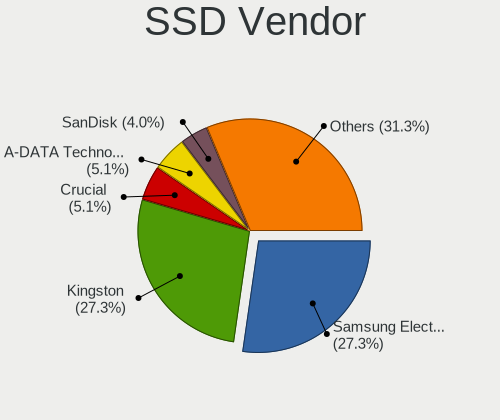
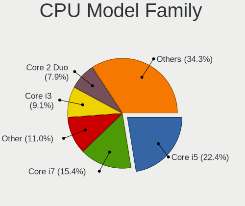
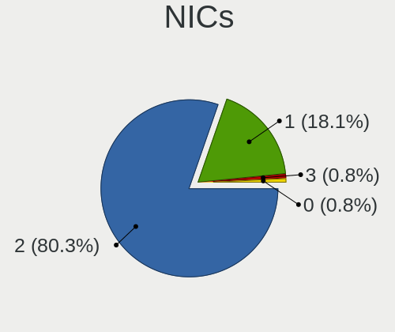
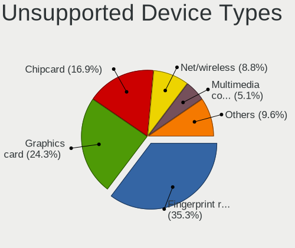

Linux in Latvia - Tested Hardware & Statistics (Notebooks)
----------------------------------------------------------

A project to collect tested hardware configurations for Linux in Latvia.

Anyone can contribute to this report by the [hw-probe](https://github.com/linuxhw/hw-probe) tool:

    sudo -E hw-probe -all -upload

Please contribute! Especially if your hardware is rare.

Contents
--------

* [ Test Cases ](#test-cases)

* [ System ](#system)
  - [ OS                       ](#os)
  - [ OS Family                ](#os-family)
  - [ Kernel                   ](#kernel)
  - [ Kernel Family            ](#kernel-family)
  - [ Kernel Major Ver.        ](#kernel-major-ver)
  - [ Arch                     ](#arch)
  - [ DE                       ](#de)
  - [ Display Server           ](#display-server)
  - [ Display Manager          ](#display-manager)
  - [ OS Lang                  ](#os-lang)
  - [ Boot Mode                ](#boot-mode)
  - [ Filesystem               ](#filesystem)
  - [ Part. scheme             ](#part-scheme)
  - [ Dual Boot with Linux/BSD ](#dual-boot-with-linuxbsd)
  - [ Dual Boot (Win)          ](#dual-boot-win)

* [ Board ](#board)
  - [ Vendor                   ](#vendor)
  - [ Model                    ](#model)
  - [ Model Family             ](#model-family)
  - [ MFG Year                 ](#mfg-year)
  - [ Form Factor              ](#form-factor)
  - [ Secure Boot              ](#secure-boot)
  - [ Coreboot                 ](#coreboot)
  - [ RAM Size                 ](#ram-size)
  - [ RAM Used                 ](#ram-used)
  - [ Total Drives             ](#total-drives)
  - [ Has CD-ROM               ](#has-cd-rom)
  - [ Has Ethernet             ](#has-ethernet)
  - [ Has WiFi                 ](#has-wifi)
  - [ Has Bluetooth            ](#has-bluetooth)

* [ Location ](#location)
  - [ Country                  ](#country)
  - [ City                     ](#city)

* [ Drives ](#drives)
  - [ Drive Vendor             ](#drive-vendor)
  - [ Drive Model              ](#drive-model)
  - [ HDD Vendor               ](#hdd-vendor)
  - [ SSD Vendor               ](#ssd-vendor)
  - [ Drive Kind               ](#drive-kind)
  - [ Drive Connector          ](#drive-connector)
  - [ Drive Size               ](#drive-size)
  - [ Space Total              ](#space-total)
  - [ Space Used               ](#space-used)
  - [ Malfunc. Drives          ](#malfunc-drives)
  - [ Malfunc. Drive Vendor    ](#malfunc-drive-vendor)
  - [ Malfunc. HDD Vendor      ](#malfunc-hdd-vendor)
  - [ Malfunc. Drive Kind      ](#malfunc-drive-kind)
  - [ Failed Drives            ](#failed-drives)
  - [ Failed Drive Vendor      ](#failed-drive-vendor)
  - [ Drive Status             ](#drive-status)

* [ Storage controller ](#storage-controller)
  - [ Storage Vendor           ](#storage-vendor)
  - [ Storage Model            ](#storage-model)
  - [ Storage Kind             ](#storage-kind)

* [ Processor ](#processor)
  - [ CPU Vendor               ](#cpu-vendor)
  - [ CPU Model                ](#cpu-model)
  - [ CPU Model Family         ](#cpu-model-family)
  - [ CPU Cores                ](#cpu-cores)
  - [ CPU Sockets              ](#cpu-sockets)
  - [ CPU Threads              ](#cpu-threads)
  - [ CPU Op-Modes             ](#cpu-op-modes)
  - [ CPU Microcode            ](#cpu-microcode)
  - [ CPU Microarch            ](#cpu-microarch)

* [ Graphics ](#graphics)
  - [ GPU Vendor               ](#gpu-vendor)
  - [ GPU Model                ](#gpu-model)
  - [ GPU Combo                ](#gpu-combo)
  - [ GPU Driver               ](#gpu-driver)
  - [ GPU Memory               ](#gpu-memory)

* [ Monitor ](#monitor)
  - [ Monitor Vendor           ](#monitor-vendor)
  - [ Monitor Model            ](#monitor-model)
  - [ Monitor Resolution       ](#monitor-resolution)
  - [ Monitor Diagonal         ](#monitor-diagonal)
  - [ Monitor Width            ](#monitor-width)
  - [ Aspect Ratio             ](#aspect-ratio)
  - [ Monitor Area             ](#monitor-area)
  - [ Pixel Density            ](#pixel-density)
  - [ Multiple Monitors        ](#multiple-monitors)

* [ Network ](#network)
  - [ Net Controller Vendor    ](#net-controller-vendor)
  - [ Net Controller Model     ](#net-controller-model)
  - [ Wireless Vendor          ](#wireless-vendor)
  - [ Wireless Model           ](#wireless-model)
  - [ Ethernet Vendor          ](#ethernet-vendor)
  - [ Ethernet Model           ](#ethernet-model)
  - [ Net Controller Kind      ](#net-controller-kind)
  - [ Used Controller          ](#used-controller)
  - [ NICs                     ](#nics)
  - [ IPv6                     ](#ipv6)

* [ Bluetooth ](#bluetooth)
  - [ Bluetooth Vendor         ](#bluetooth-vendor)
  - [ Bluetooth Model          ](#bluetooth-model)

* [ Sound ](#sound)
  - [ Sound Vendor             ](#sound-vendor)
  - [ Sound Model              ](#sound-model)

* [ Memory ](#memory)
  - [ Memory Vendor            ](#memory-vendor)
  - [ Memory Model             ](#memory-model)
  - [ Memory Kind              ](#memory-kind)
  - [ Memory Form Factor       ](#memory-form-factor)
  - [ Memory Size              ](#memory-size)
  - [ Memory Speed             ](#memory-speed)

* [ Printers & scanners ](#printers--scanners)
  - [ Printer Vendor           ](#printer-vendor)
  - [ Printer Model            ](#printer-model)
  - [ Scanner Vendor           ](#scanner-vendor)
  - [ Scanner Model            ](#scanner-model)

* [ Camera ](#camera)
  - [ Camera Vendor            ](#camera-vendor)
  - [ Camera Model             ](#camera-model)

* [ Security ](#security)
  - [ Fingerprint Vendor       ](#fingerprint-vendor)
  - [ Fingerprint Model        ](#fingerprint-model)
  - [ Chipcard Vendor          ](#chipcard-vendor)
  - [ Chipcard Model           ](#chipcard-model)

* [ Unsupported ](#unsupported)
  - [ Unsupported Devices      ](#unsupported-devices)
  - [ Unsupported Device Types ](#unsupported-device-types)

Test Cases
----------

Total: 249

| Vendor        | Model                       | Probe                                                      | Date         |
|---------------|-----------------------------|------------------------------------------------------------|--------------|
| HP            | EliteBook 8440p             | [1f0f196305](https://linux-hardware.org/?probe=1f0f196305) | Aug 29, 2022 |
| ASUSTek       | ROG Strix G733ZW_G733ZW     | [4384be22c4](https://linux-hardware.org/?probe=4384be22c4) | Aug 27, 2022 |
| HP            | ProBook 450 G1              | [986bb07198](https://linux-hardware.org/?probe=986bb07198) | Aug 24, 2022 |
| HP            | ProBook 450 G1              | [c7a1d435fb](https://linux-hardware.org/?probe=c7a1d435fb) | Aug 24, 2022 |
| HUAWEI        | KLVL-WXX9                   | [b74ab22c1f](https://linux-hardware.org/?probe=b74ab22c1f) | Aug 16, 2022 |
| Samsung       | 350V5C/351V5C/3540VC/344... | [88fc37216d](https://linux-hardware.org/?probe=88fc37216d) | Aug 15, 2022 |
| ASUSTek       | ROG Strix G733ZW_G733ZW     | [2f45536688](https://linux-hardware.org/?probe=2f45536688) | Aug 12, 2022 |
| Lenovo        | G70-80 80FF                 | [495516e19d](https://linux-hardware.org/?probe=495516e19d) | Aug 08, 2022 |
| Acer          | Aspire A315-42              | [78415dc6be](https://linux-hardware.org/?probe=78415dc6be) | Jul 25, 2022 |
| Acer          | Aspire 5730                 | [b4877f21ad](https://linux-hardware.org/?probe=b4877f21ad) | Jul 23, 2022 |
| Wortmann      | CR700                       | [3aa2d086b9](https://linux-hardware.org/?probe=3aa2d086b9) | Jul 23, 2022 |
| Wortmann      | CR700                       | [27d04b5577](https://linux-hardware.org/?probe=27d04b5577) | Jul 23, 2022 |
| Acer          | Aspire A515-51G             | [4856a5fefb](https://linux-hardware.org/?probe=4856a5fefb) | Jul 22, 2022 |
| Lenovo        | IdeaPad U330p 20267         | [1775f75940](https://linux-hardware.org/?probe=1775f75940) | Jul 22, 2022 |
| Dell          | Precision 3561              | [fab553a2b2](https://linux-hardware.org/?probe=fab553a2b2) | Jun 20, 2022 |
| HUAWEI        | KLVL-WXX9                   | [999d96890c](https://linux-hardware.org/?probe=999d96890c) | Jun 16, 2022 |
| HP            | ProBook 450 G0              | [2d87379b89](https://linux-hardware.org/?probe=2d87379b89) | Jun 11, 2022 |
| Samsung       | 350V5C/351V5C/3540VC/344... | [e75d068a21](https://linux-hardware.org/?probe=e75d068a21) | Jun 02, 2022 |
| Lenovo        | ThinkPad T410 2537HN3       | [e373330c8b](https://linux-hardware.org/?probe=e373330c8b) | Jun 01, 2022 |
| Lenovo        | ThinkBook 14-IML 20RV       | [6f5d1c9f06](https://linux-hardware.org/?probe=6f5d1c9f06) | May 22, 2022 |
| Lenovo        | ThinkBook 14-IML 20RV       | [6e46286500](https://linux-hardware.org/?probe=6e46286500) | May 21, 2022 |
| Acer          | Aspire A315-42              | [cd2a742b8c](https://linux-hardware.org/?probe=cd2a742b8c) | May 18, 2022 |
| Dell          | Inspiron 3543               | [3a940a3394](https://linux-hardware.org/?probe=3a940a3394) | May 11, 2022 |
| Valve         | Jupiter                     | [19d2c51aa6](https://linux-hardware.org/?probe=19d2c51aa6) | May 01, 2022 |
| Dell          | Inspiron 3543               | [7fb19b7da4](https://linux-hardware.org/?probe=7fb19b7da4) | Apr 27, 2022 |
| ASUSTek       | VivoBook_ASUS Laptop E21... | [73de8fd9f4](https://linux-hardware.org/?probe=73de8fd9f4) | Apr 26, 2022 |
| Dell          | Latitude E7440              | [8609968661](https://linux-hardware.org/?probe=8609968661) | Apr 18, 2022 |
| HP            | Pavilion Gaming Laptop 1... | [75f2876f06](https://linux-hardware.org/?probe=75f2876f06) | Apr 12, 2022 |
| Lenovo        | ThinkPad E490 20N8005JMH    | [c3ac98aa71](https://linux-hardware.org/?probe=c3ac98aa71) | Apr 11, 2022 |
| Dell          | Latitude 5590               | [6e22c70e48](https://linux-hardware.org/?probe=6e22c70e48) | Apr 05, 2022 |
| HP            | EliteBook 840 G8 Noteboo... | [086d7749d3](https://linux-hardware.org/?probe=086d7749d3) | Apr 03, 2022 |
| Lenovo        | ThinkPad X260 20F5S0HK1J    | [a83d3cbe5f](https://linux-hardware.org/?probe=a83d3cbe5f) | Mar 31, 2022 |
| Lenovo        | ThinkPad E490 20N8005JMH    | [1a8680a665](https://linux-hardware.org/?probe=1a8680a665) | Mar 23, 2022 |
| ASUSTek       | ASUS TUF Gaming F15 FX50... | [d63ab08c03](https://linux-hardware.org/?probe=d63ab08c03) | Mar 17, 2022 |
| Lenovo        | IdeaPad 320-15ISK 80XH      | [5af22f3639](https://linux-hardware.org/?probe=5af22f3639) | Mar 07, 2022 |
| HP            | EliteBook 8570w             | [a97a0ba0ee](https://linux-hardware.org/?probe=a97a0ba0ee) | Feb 27, 2022 |
| Dell          | Inspiron 3531               | [d2d231ddeb](https://linux-hardware.org/?probe=d2d231ddeb) | Feb 24, 2022 |
| Lenovo        | ThinkPad X220 4291Q50       | [600a3137e2](https://linux-hardware.org/?probe=600a3137e2) | Feb 19, 2022 |
| ASUSTek       | VivoBook_ASUSLaptop X512... | [ae4eca9e09](https://linux-hardware.org/?probe=ae4eca9e09) | Feb 14, 2022 |
| Lenovo        | ThinkPad P14s Gen 1 20Y1... | [1837325ca2](https://linux-hardware.org/?probe=1837325ca2) | Feb 03, 2022 |
| Lenovo        | G70-80 80FF                 | [0771453742](https://linux-hardware.org/?probe=0771453742) | Jan 25, 2022 |
| Apple         | MacBookPro8,1               | [9b3d91c6df](https://linux-hardware.org/?probe=9b3d91c6df) | Jan 24, 2022 |
| HP            | 250 G6 Notebook PC          | [dae0e58890](https://linux-hardware.org/?probe=dae0e58890) | Jan 23, 2022 |
| Razer         | Blade 15 Advanced Model ... | [c07445f559](https://linux-hardware.org/?probe=c07445f559) | Jan 23, 2022 |
| Lenovo        | G70-80 80FF                 | [c69ec5ad5b](https://linux-hardware.org/?probe=c69ec5ad5b) | Jan 17, 2022 |
| Razer         | Blade 15 Advanced Model ... | [6f992c3b94](https://linux-hardware.org/?probe=6f992c3b94) | Jan 14, 2022 |
| Razer         | Blade 15 Advanced Model ... | [95724a0980](https://linux-hardware.org/?probe=95724a0980) | Jan 14, 2022 |
| ASUSTek       | VivoBook_ASUSLaptop X513... | [d453a69dad](https://linux-hardware.org/?probe=d453a69dad) | Jan 06, 2022 |
| Lenovo        | G70-80 80FF                 | [b1279c6db3](https://linux-hardware.org/?probe=b1279c6db3) | Jan 02, 2022 |
| Lenovo        | IdeaPad 300-15ISK 80Q7      | [0d09c12302](https://linux-hardware.org/?probe=0d09c12302) | Dec 28, 2021 |
| Lenovo        | G70-80 80FF                 | [4210ac05a8](https://linux-hardware.org/?probe=4210ac05a8) | Dec 26, 2021 |
| Dell          | Inspiron 3543               | [2b61a95031](https://linux-hardware.org/?probe=2b61a95031) | Dec 21, 2021 |
| Lenovo        | ThinkPad T60 8741W3M        | [7d2faf3b37](https://linux-hardware.org/?probe=7d2faf3b37) | Dec 21, 2021 |
| Lenovo        | ThinkPad T60 8741W3M        | [6df4a50194](https://linux-hardware.org/?probe=6df4a50194) | Dec 21, 2021 |
| Lenovo        | ThinkPad X250 20CLS2XA00    | [276d570689](https://linux-hardware.org/?probe=276d570689) | Dec 15, 2021 |
| ASUSTek       | E402SA                      | [2a140138d3](https://linux-hardware.org/?probe=2a140138d3) | Dec 12, 2021 |
| Lenovo        | G70-80 80FF                 | [7d694ce256](https://linux-hardware.org/?probe=7d694ce256) | Dec 09, 2021 |
| Dell          | Latitude 7420               | [7a96812e39](https://linux-hardware.org/?probe=7a96812e39) | Nov 28, 2021 |
| Lenovo        | ThinkPad T420 4180ED3       | [c7726d6967](https://linux-hardware.org/?probe=c7726d6967) | Nov 23, 2021 |
| Acer          | NC-E5-572G-7222             | [1c2a0c3295](https://linux-hardware.org/?probe=1c2a0c3295) | Nov 19, 2021 |
| Lenovo        | ThinkPad E490 20N8005JMH    | [0c603f1589](https://linux-hardware.org/?probe=0c603f1589) | Nov 16, 2021 |
| HUAWEI        | MACHD-WXX9                  | [364fb5b6b7](https://linux-hardware.org/?probe=364fb5b6b7) | Nov 06, 2021 |
| HP            | EliteBook 850 G4            | [e6643f7ed1](https://linux-hardware.org/?probe=e6643f7ed1) | Oct 28, 2021 |
| Lenovo        | ThinkPad E15 Gen 2 20T80... | [f1449188a9](https://linux-hardware.org/?probe=f1449188a9) | Oct 20, 2021 |
| Fujitsu Si... | AMILO Xa 1526               | [00863fcea8](https://linux-hardware.org/?probe=00863fcea8) | Oct 16, 2021 |
| HP            | G62                         | [7873481ecb](https://linux-hardware.org/?probe=7873481ecb) | Oct 12, 2021 |
| ASUSTek       | N550JV                      | [5369aca258](https://linux-hardware.org/?probe=5369aca258) | Sep 28, 2021 |
| ASUSTek       | TUF Gaming FX505DY_FX505... | [f4a4e754c5](https://linux-hardware.org/?probe=f4a4e754c5) | Sep 22, 2021 |
| HP            | 250 G6 Notebook PC          | [3caff8f18f](https://linux-hardware.org/?probe=3caff8f18f) | Sep 19, 2021 |
| Lenovo        | IdeaPad Gaming 3 15ARH05... | [eb5215553d](https://linux-hardware.org/?probe=eb5215553d) | Sep 18, 2021 |
| HP            | EliteBook 840 G3            | [5ac93f6014](https://linux-hardware.org/?probe=5ac93f6014) | Sep 15, 2021 |
| Acer          | Aspire VX5-591G             | [c7d5407b29](https://linux-hardware.org/?probe=c7d5407b29) | Sep 15, 2021 |
| ASUSTek       | TUF Gaming FX505DY_FX505... | [c5ebbbd9c2](https://linux-hardware.org/?probe=c5ebbbd9c2) | Aug 27, 2021 |
| HP            | Pavilion Gaming Laptop 1... | [516c59e9bb](https://linux-hardware.org/?probe=516c59e9bb) | Aug 26, 2021 |
| Sony          | VPCCW2S8E                   | [a8c2dc6942](https://linux-hardware.org/?probe=a8c2dc6942) | Aug 26, 2021 |
| HP            | EliteBook 840 G1            | [82b2192d48](https://linux-hardware.org/?probe=82b2192d48) | Aug 25, 2021 |
| Samsung       | 350V5C/351V5C/3540VC/344... | [d26b653261](https://linux-hardware.org/?probe=d26b653261) | Aug 23, 2021 |
| Dell          | G3 3579                     | [6042d3630a](https://linux-hardware.org/?probe=6042d3630a) | Aug 22, 2021 |
| Dell          | G3 3579                     | [902b56f744](https://linux-hardware.org/?probe=902b56f744) | Aug 22, 2021 |
| HP            | Pavilion dv7                | [7d6c08fc9e](https://linux-hardware.org/?probe=7d6c08fc9e) | Aug 17, 2021 |
| Lenovo        | IdeaPad S340-15API 81NC     | [eb1b7627ff](https://linux-hardware.org/?probe=eb1b7627ff) | Aug 10, 2021 |
| HP            | EliteBook 8470p             | [c718b061d2](https://linux-hardware.org/?probe=c718b061d2) | Aug 05, 2021 |
| HP            | HDX 16                      | [47273f74b5](https://linux-hardware.org/?probe=47273f74b5) | Aug 02, 2021 |
| HP            | HDX 16                      | [aa6b70deac](https://linux-hardware.org/?probe=aa6b70deac) | Aug 02, 2021 |
| Toshiba       | Satellite L850-1LK          | [8e8d84c8eb](https://linux-hardware.org/?probe=8e8d84c8eb) | Jul 30, 2021 |
| Dell          | Vostro 1015                 | [0e16f2bc9c](https://linux-hardware.org/?probe=0e16f2bc9c) | Jul 30, 2021 |
| Toshiba       | Satellite L850-1LK          | [b0b636bbee](https://linux-hardware.org/?probe=b0b636bbee) | Jul 30, 2021 |
| HP            | HDX 16                      | [627219df22](https://linux-hardware.org/?probe=627219df22) | Jul 25, 2021 |
| Timi          | A35S                        | [27f9e877a1](https://linux-hardware.org/?probe=27f9e877a1) | Jul 14, 2021 |
| ASUSTek       | VivoBook 12_ASUS Laptop ... | [55460937e0](https://linux-hardware.org/?probe=55460937e0) | Jul 14, 2021 |
| Lenovo        | ThinkPad P70 20ER0035MH     | [3b7269dbb9](https://linux-hardware.org/?probe=3b7269dbb9) | Jul 12, 2021 |
| Dell          | Latitude 7420               | [ebf2372c3b](https://linux-hardware.org/?probe=ebf2372c3b) | Jul 09, 2021 |
| HP            | HDX 16                      | [ba1ae87cbe](https://linux-hardware.org/?probe=ba1ae87cbe) | Jul 07, 2021 |
| Acer          | Predator PH317-53           | [1e5cb90c22](https://linux-hardware.org/?probe=1e5cb90c22) | Jul 06, 2021 |
| HP            | Pavilion dv6500             | [135215864a](https://linux-hardware.org/?probe=135215864a) | Jun 19, 2021 |
| Dell          | Latitude 5520               | [9929364f77](https://linux-hardware.org/?probe=9929364f77) | Jun 01, 2021 |
| Acer          | AO725                       | [1a095f9c0f](https://linux-hardware.org/?probe=1a095f9c0f) | May 17, 2021 |
| Lenovo        | Y50-70 20378                | [cc68265730](https://linux-hardware.org/?probe=cc68265730) | May 15, 2021 |
| Dell          | Inspiron 3583               | [7e3064fadf](https://linux-hardware.org/?probe=7e3064fadf) | May 10, 2021 |
| Dell          | Inspiron 3583               | [29e5e6b501](https://linux-hardware.org/?probe=29e5e6b501) | May 10, 2021 |
| HP            | Pavilion Gaming Laptop 1... | [de14cb7c23](https://linux-hardware.org/?probe=de14cb7c23) | May 06, 2021 |
| Dell          | Inspiron 5720               | [28fc1b9fd7](https://linux-hardware.org/?probe=28fc1b9fd7) | Apr 20, 2021 |
| Acer          | Aspire E5-774G              | [17734000ae](https://linux-hardware.org/?probe=17734000ae) | Apr 14, 2021 |
| Lenovo        | G50-80 80E5                 | [d6b6146396](https://linux-hardware.org/?probe=d6b6146396) | Apr 14, 2021 |
| Dell          | Inspiron 5720               | [2bff145cfe](https://linux-hardware.org/?probe=2bff145cfe) | Apr 10, 2021 |
| Lenovo        | ThinkPad L390 20NRCTO1WW    | [09ae9c9787](https://linux-hardware.org/?probe=09ae9c9787) | Mar 31, 2021 |
| Lenovo        | ThinkPad T15 Gen 1 20S60... | [3c5c72b0fb](https://linux-hardware.org/?probe=3c5c72b0fb) | Mar 20, 2021 |
| Dell          | Latitude 5400               | [002c23ff4b](https://linux-hardware.org/?probe=002c23ff4b) | Mar 19, 2021 |
| Dell          | Latitude E5400              | [0b3108a091](https://linux-hardware.org/?probe=0b3108a091) | Mar 04, 2021 |
| Lenovo        | ThinkPad T15 Gen 1 20S60... | [35b79852e1](https://linux-hardware.org/?probe=35b79852e1) | Feb 06, 2021 |
| ASUSTek       | F3Sg                        | [98e32533f7](https://linux-hardware.org/?probe=98e32533f7) | Feb 06, 2021 |
| Dell          | Inspiron 5720               | [548a61cbe6](https://linux-hardware.org/?probe=548a61cbe6) | Jan 24, 2021 |
| ASUSTek       | TUF Gaming FX705GM_FX705... | [61f2500518](https://linux-hardware.org/?probe=61f2500518) | Jan 08, 2021 |
| Dell          | Latitude E6330              | [06a79c3a7f](https://linux-hardware.org/?probe=06a79c3a7f) | Jan 05, 2021 |
| ASUSTek       | N56VM                       | [795cfd3d9a](https://linux-hardware.org/?probe=795cfd3d9a) | Dec 30, 2020 |
| Lenovo        | G70-80 80FF                 | [069f4b154c](https://linux-hardware.org/?probe=069f4b154c) | Dec 27, 2020 |
| Lenovo        | V110-15IAP 80TG             | [5bb5bac2f1](https://linux-hardware.org/?probe=5bb5bac2f1) | Dec 26, 2020 |
| Quanta        | TW8/SW8/DW8                 | [705e766496](https://linux-hardware.org/?probe=705e766496) | Dec 18, 2020 |
| Quanta        | TW8/SW8/DW8                 | [5501a16739](https://linux-hardware.org/?probe=5501a16739) | Dec 18, 2020 |
| Fujitsu       | STYLISTIC Q704              | [ae32e0d51d](https://linux-hardware.org/?probe=ae32e0d51d) | Dec 14, 2020 |
| Lenovo        | ThinkPad E14 Gen 2 20T60... | [46c6cef9b6](https://linux-hardware.org/?probe=46c6cef9b6) | Nov 27, 2020 |
| Lenovo        | G70-80 80FF                 | [7563d834dc](https://linux-hardware.org/?probe=7563d834dc) | Nov 27, 2020 |
| ASUSTek       | ZenBook UX431DA_UM431DA     | [177a2353e0](https://linux-hardware.org/?probe=177a2353e0) | Nov 26, 2020 |
| Lenovo        | G70-80 80FF                 | [814d9b3267](https://linux-hardware.org/?probe=814d9b3267) | Nov 26, 2020 |
| Acer          | Aspire E5-774G              | [792da7f209](https://linux-hardware.org/?probe=792da7f209) | Nov 21, 2020 |
| ASUSTek       | N56VZ                       | [fb3694b0fb](https://linux-hardware.org/?probe=fb3694b0fb) | Nov 21, 2020 |
| Fujitsu       | STYLISTIC Q704              | [a016928cb6](https://linux-hardware.org/?probe=a016928cb6) | Nov 20, 2020 |
| Fujitsu       | STYLISTIC Q704              | [6cee0ffad6](https://linux-hardware.org/?probe=6cee0ffad6) | Nov 20, 2020 |
| Acer          | Nitro AN515-54              | [6b6517fc84](https://linux-hardware.org/?probe=6b6517fc84) | Nov 17, 2020 |
| ASUSTek       | F9S                         | [dbadd20bba](https://linux-hardware.org/?probe=dbadd20bba) | Nov 15, 2020 |
| ASUSTek       | X751LD                      | [1ddab278fa](https://linux-hardware.org/?probe=1ddab278fa) | Nov 13, 2020 |
| ASUSTek       | X751LD                      | [518aedab56](https://linux-hardware.org/?probe=518aedab56) | Nov 13, 2020 |
| ASUSTek       | F9S                         | [17861d40da](https://linux-hardware.org/?probe=17861d40da) | Nov 09, 2020 |
| Acer          | Aspire E1-570               | [cfca189393](https://linux-hardware.org/?probe=cfca189393) | Oct 29, 2020 |
| Packard Be... | EasyNote LE69KB             | [c31d50e8e1](https://linux-hardware.org/?probe=c31d50e8e1) | Oct 24, 2020 |
| Packard Be... | EasyNote LE69KB             | [5d55b9b791](https://linux-hardware.org/?probe=5d55b9b791) | Oct 23, 2020 |
| Acer          | Nitro AN515-52              | [21ce46139c](https://linux-hardware.org/?probe=21ce46139c) | Oct 19, 2020 |
| Acer          | Predator PH317-53           | [16cddb4fce](https://linux-hardware.org/?probe=16cddb4fce) | Sep 29, 2020 |
| HP            | Pavilion dv6700             | [e514981e11](https://linux-hardware.org/?probe=e514981e11) | Sep 19, 2020 |
| Toshiba       | Satellite L750              | [8a4c97a585](https://linux-hardware.org/?probe=8a4c97a585) | Sep 16, 2020 |
| HP            | Pavilion dv6700             | [d74f453116](https://linux-hardware.org/?probe=d74f453116) | Aug 16, 2020 |
| MSI           | GP75 Leopard 9SD            | [b8b363d7ff](https://linux-hardware.org/?probe=b8b363d7ff) | Aug 07, 2020 |
| Lenovo        | ThinkPad E580 20KS001RMH    | [872482ce6e](https://linux-hardware.org/?probe=872482ce6e) | Aug 07, 2020 |
| HP            | Pavilion dv6700             | [fbc9ab283a](https://linux-hardware.org/?probe=fbc9ab283a) | Aug 03, 2020 |
| HP            | Pavilion dv6700             | [b217a06354](https://linux-hardware.org/?probe=b217a06354) | Aug 02, 2020 |
| Acer          | TravelMate P215-51G         | [8916655d52](https://linux-hardware.org/?probe=8916655d52) | Jul 19, 2020 |
| ASUSTek       | ZenBook UX431DA_UM431DA     | [2fdc7ceb31](https://linux-hardware.org/?probe=2fdc7ceb31) | Jul 03, 2020 |
| HP            | 240 G7 Notebook PC          | [e9c46bd761](https://linux-hardware.org/?probe=e9c46bd761) | Jun 28, 2020 |
| Acer          | Swift SF314-41              | [0255fcb566](https://linux-hardware.org/?probe=0255fcb566) | Jun 26, 2020 |
| HP            | Pavilion dv6000 (RP297UA... | [1bd24ff33d](https://linux-hardware.org/?probe=1bd24ff33d) | May 27, 2020 |
| Lenovo        | IdeaPad 100-15IBD 80QQ      | [23bc453b75](https://linux-hardware.org/?probe=23bc453b75) | May 10, 2020 |
| HP            | ProBook 430 G6              | [b06dadce70](https://linux-hardware.org/?probe=b06dadce70) | May 08, 2020 |
| Acer          | Aspire ES1-512              | [79811a61ef](https://linux-hardware.org/?probe=79811a61ef) | Apr 26, 2020 |
| Dell          | Inspiron 1545               | [ff056eb6ed](https://linux-hardware.org/?probe=ff056eb6ed) | Apr 26, 2020 |
| Dell          | Inspiron 1545               | [b2b82bcafa](https://linux-hardware.org/?probe=b2b82bcafa) | Apr 25, 2020 |
| ASUSTek       | N56VZ                       | [c8abfa271f](https://linux-hardware.org/?probe=c8abfa271f) | Apr 20, 2020 |
| Dell          | Inspiron 5559               | [5d3e49216d](https://linux-hardware.org/?probe=5d3e49216d) | Apr 18, 2020 |
| Lenovo        | G550 20023                  | [2caebc20ee](https://linux-hardware.org/?probe=2caebc20ee) | Apr 18, 2020 |
| Lenovo        | ThinkPad X230 Tablet 343... | [2c05881776](https://linux-hardware.org/?probe=2c05881776) | Apr 15, 2020 |
| Lenovo        | ThinkPad X230 Tablet 343... | [5541279306](https://linux-hardware.org/?probe=5541279306) | Apr 14, 2020 |
| Lenovo        | ThinkPad X230 Tablet 343... | [9e32edc48a](https://linux-hardware.org/?probe=9e32edc48a) | Apr 14, 2020 |
| Toshiba       | Satellite C660              | [e0f010109e](https://linux-hardware.org/?probe=e0f010109e) | Apr 12, 2020 |
| Toshiba       | Satellite C660              | [4e2dc64716](https://linux-hardware.org/?probe=4e2dc64716) | Apr 02, 2020 |
| Dell          | Inspiron 5770               | [5a5984be1c](https://linux-hardware.org/?probe=5a5984be1c) | Mar 29, 2020 |
| Dell          | Inspiron 5770               | [afcbaaf5c5](https://linux-hardware.org/?probe=afcbaaf5c5) | Mar 29, 2020 |
| Dell          | Latitude E6230              | [a285b7f196](https://linux-hardware.org/?probe=a285b7f196) | Mar 24, 2020 |
| Toshiba       | Satellite C50D-B            | [837144a177](https://linux-hardware.org/?probe=837144a177) | Mar 23, 2020 |
| Toshiba       | Satellite C50D-B            | [57cecbbbce](https://linux-hardware.org/?probe=57cecbbbce) | Mar 23, 2020 |
| Toshiba       | Satellite C50D-B            | [8633a66df2](https://linux-hardware.org/?probe=8633a66df2) | Mar 23, 2020 |
| Samsung       | 355V4C/356V4C/3445VC/354... | [72d22ff1c1](https://linux-hardware.org/?probe=72d22ff1c1) | Mar 23, 2020 |
| Lenovo        | G50-70 20351                | [526787b49d](https://linux-hardware.org/?probe=526787b49d) | Mar 08, 2020 |
| ASUSTek       | F3Sg                        | [808275816b](https://linux-hardware.org/?probe=808275816b) | Mar 01, 2020 |
| Acer          | Aspire 5742G                | [9e4356444d](https://linux-hardware.org/?probe=9e4356444d) | Feb 28, 2020 |
| MSI           | GT62VR 6RE                  | [6bb81391a7](https://linux-hardware.org/?probe=6bb81391a7) | Feb 26, 2020 |
| Dell          | Inspiron 5720               | [83127ec84c](https://linux-hardware.org/?probe=83127ec84c) | Feb 22, 2020 |
| ASUSTek       | BU401LAV                    | [adba948317](https://linux-hardware.org/?probe=adba948317) | Feb 16, 2020 |
| Dell          | Inspiron 3584               | [12adda1f05](https://linux-hardware.org/?probe=12adda1f05) | Feb 09, 2020 |
| Dell          | Inspiron 3584               | [5dd6368254](https://linux-hardware.org/?probe=5dd6368254) | Feb 09, 2020 |
| Lenovo        | ThinkPad T430 2347HM4       | [126922ef61](https://linux-hardware.org/?probe=126922ef61) | Feb 02, 2020 |
| Dell          | Latitude E6230              | [809af46e15](https://linux-hardware.org/?probe=809af46e15) | Jan 26, 2020 |
| Dell          | Inspiron 1720               | [14c0a5f6f7](https://linux-hardware.org/?probe=14c0a5f6f7) | Jan 24, 2020 |
| HP            | Laptop 15-db0xxx            | [f3d6402b19](https://linux-hardware.org/?probe=f3d6402b19) | Dec 24, 2019 |
| Lenovo        | ThinkPad T400 6475GC8       | [8263c74190](https://linux-hardware.org/?probe=8263c74190) | Dec 15, 2019 |
| HP            | EliteBook 840 G3            | [90bee29cfb](https://linux-hardware.org/?probe=90bee29cfb) | Dec 08, 2019 |
| Lenovo        | ThinkPad X201 Tablet 311... | [f7ce0a6b8b](https://linux-hardware.org/?probe=f7ce0a6b8b) | Dec 06, 2019 |
| Lenovo        | ThinkPad X201 Tablet 311... | [a67a12b126](https://linux-hardware.org/?probe=a67a12b126) | Dec 02, 2019 |
| Dell          | Latitude D630               | [64fec98df4](https://linux-hardware.org/?probe=64fec98df4) | Nov 28, 2019 |
| Acer          | Aspire A515-52G             | [0804d7107b](https://linux-hardware.org/?probe=0804d7107b) | Nov 24, 2019 |
| Acer          | Aspire 5739G                | [363190383f](https://linux-hardware.org/?probe=363190383f) | Nov 23, 2019 |
| Dell          | Latitude E5510              | [e9955b821e](https://linux-hardware.org/?probe=e9955b821e) | Nov 17, 2019 |
| Acer          | Aspire 5739G                | [b777297060](https://linux-hardware.org/?probe=b777297060) | Nov 17, 2019 |
| Acer          | Aspire 5739G                | [ba39e36ce1](https://linux-hardware.org/?probe=ba39e36ce1) | Nov 17, 2019 |
| Acer          | Aspire 5739G                | [a749310754](https://linux-hardware.org/?probe=a749310754) | Nov 17, 2019 |
| Lenovo        | Legion Y530-15ICH 81FV      | [321694ee65](https://linux-hardware.org/?probe=321694ee65) | Nov 16, 2019 |
| HP            | 250 G3                      | [65119a8793](https://linux-hardware.org/?probe=65119a8793) | Oct 17, 2019 |
| ASUSTek       | T100TA                      | [3b8a5ea4c5](https://linux-hardware.org/?probe=3b8a5ea4c5) | Oct 14, 2019 |
| Lenovo        | G70-80 80FF                 | [7c2a22f9c0](https://linux-hardware.org/?probe=7c2a22f9c0) | Oct 06, 2019 |
| Lenovo        | ThinkPad T495 20NK000HMH    | [e97740f470](https://linux-hardware.org/?probe=e97740f470) | Oct 05, 2019 |
| Dell          | Latitude E5510              | [df0c96aafe](https://linux-hardware.org/?probe=df0c96aafe) | Sep 19, 2019 |
| Dell          | Latitude E6230              | [2a12cfbc23](https://linux-hardware.org/?probe=2a12cfbc23) | Sep 18, 2019 |
| HP            | EliteBook 8440p             | [a689023dbd](https://linux-hardware.org/?probe=a689023dbd) | Aug 16, 2019 |
| HP            | EliteBook 8440p             | [beb52301b4](https://linux-hardware.org/?probe=beb52301b4) | Aug 16, 2019 |
| HP            | Laptop 15-bw0xx             | [d02cb45d1e](https://linux-hardware.org/?probe=d02cb45d1e) | Jul 17, 2019 |
| Lenovo        | G70-80 80FF                 | [bc2409772a](https://linux-hardware.org/?probe=bc2409772a) | Jul 02, 2019 |
| Acer          | Extensa 5220                | [c8eddeab31](https://linux-hardware.org/?probe=c8eddeab31) | Jun 30, 2019 |
| Dell          | Inspiron N5010              | [efc321ccd7](https://linux-hardware.org/?probe=efc321ccd7) | May 30, 2019 |
| Dell          | Latitude E6230              | [963d3ebfe9](https://linux-hardware.org/?probe=963d3ebfe9) | May 22, 2019 |
| Toshiba       | Satellite C660              | [57bab28e56](https://linux-hardware.org/?probe=57bab28e56) | May 09, 2019 |
| ASUSTek       | X540SA                      | [a5d1a1f3db](https://linux-hardware.org/?probe=a5d1a1f3db) | Apr 28, 2019 |
| HP            | EliteBook 8560w             | [41b1ae7140](https://linux-hardware.org/?probe=41b1ae7140) | Apr 24, 2019 |
| HP            | ProBook 455 G3              | [f8936a4237](https://linux-hardware.org/?probe=f8936a4237) | Apr 07, 2019 |
| HP            | ProBook 655 G1              | [b1f95b092a](https://linux-hardware.org/?probe=b1f95b092a) | Mar 20, 2019 |
| Dell          | Inspiron 5720               | [4f91b6cf7c](https://linux-hardware.org/?probe=4f91b6cf7c) | Mar 19, 2019 |
| HP            | EliteBook 840 G3            | [be32c043b0](https://linux-hardware.org/?probe=be32c043b0) | Mar 19, 2019 |
| Lenovo        | ThinkPad P71 20HK0005PB     | [c61dcde6cf](https://linux-hardware.org/?probe=c61dcde6cf) | Feb 26, 2019 |
| HP            | ProBook 655 G1              | [2ec1ca3497](https://linux-hardware.org/?probe=2ec1ca3497) | Feb 25, 2019 |
| Dell          | Inspiron 1720               | [0b9fd4ad58](https://linux-hardware.org/?probe=0b9fd4ad58) | Nov 25, 2018 |
| HP            | ProBook 655 G1              | [60b0fba200](https://linux-hardware.org/?probe=60b0fba200) | Nov 23, 2018 |
| HP            | ProBook 655 G1              | [bb508c6afa](https://linux-hardware.org/?probe=bb508c6afa) | Nov 23, 2018 |
| Advent        | Roma                        | [36d20501b0](https://linux-hardware.org/?probe=36d20501b0) | Nov 16, 2018 |
| Advent        | Roma                        | [d7e4c674fb](https://linux-hardware.org/?probe=d7e4c674fb) | Nov 13, 2018 |
| ASUSTek       | N53SM                       | [4d5ff2b12c](https://linux-hardware.org/?probe=4d5ff2b12c) | Nov 12, 2018 |
| Advent        | Roma                        | [7f39913676](https://linux-hardware.org/?probe=7f39913676) | Nov 12, 2018 |
| HP            | Laptop 15-bw0xx             | [dd3560057b](https://linux-hardware.org/?probe=dd3560057b) | Oct 18, 2018 |
| ASUSTek       | X551MA                      | [941fa4532f](https://linux-hardware.org/?probe=941fa4532f) | Sep 16, 2018 |
| ASUSTek       | X551MA                      | [41403ed51e](https://linux-hardware.org/?probe=41403ed51e) | Sep 16, 2018 |
| Lenovo        | G70-80 80FF                 | [b2df76fa94](https://linux-hardware.org/?probe=b2df76fa94) | Jul 10, 2018 |
| Lenovo        | G70-80 80FF                 | [2c5daea589](https://linux-hardware.org/?probe=2c5daea589) | Jul 04, 2018 |
| Lenovo        | G70-80 80FF                 | [81a1c4ab2a](https://linux-hardware.org/?probe=81a1c4ab2a) | Jun 29, 2018 |
| Acer          | Aspire V5-552G              | [06f831207c](https://linux-hardware.org/?probe=06f831207c) | May 12, 2018 |
| HP            | Laptop 15-bw0xx             | [962546fb29](https://linux-hardware.org/?probe=962546fb29) | Mar 17, 2018 |
| Dell          | XPS MXC062                  | [c4448e72da](https://linux-hardware.org/?probe=c4448e72da) | Mar 01, 2018 |
| Samsung       | R528/R728                   | [f4aac127be](https://linux-hardware.org/?probe=f4aac127be) | Feb 24, 2018 |
| ASUSTek       | K73BE                       | [a66962c2cb](https://linux-hardware.org/?probe=a66962c2cb) | Jan 22, 2018 |
| Lenovo        | IdeaPad 300-15ISK 80Q7      | [736fd47a6c](https://linux-hardware.org/?probe=736fd47a6c) | Nov 09, 2017 |
| ASUSTek       | X553MA                      | [27e37bc3c6](https://linux-hardware.org/?probe=27e37bc3c6) | Nov 04, 2017 |
| ASUSTek       | X551MA                      | [b32fe81f6d](https://linux-hardware.org/?probe=b32fe81f6d) | Sep 21, 2017 |
| ASUSTek       | X553MA                      | [140ec82ebd](https://linux-hardware.org/?probe=140ec82ebd) | Sep 01, 2017 |
| Dell          | XPS L501X                   | [dad4007dd5](https://linux-hardware.org/?probe=dad4007dd5) | Jul 30, 2017 |
| Dell          | Inspiron 1720               | [c9ecc51acf](https://linux-hardware.org/?probe=c9ecc51acf) | Jul 14, 2017 |
| eMachines     | Unknown                     | [ed52c8a528](https://linux-hardware.org/?probe=ed52c8a528) | Apr 25, 2017 |
| Samsung       | 300V3A/300V4A/300V5A/200... | [3e8f4ab377](https://linux-hardware.org/?probe=3e8f4ab377) | Mar 31, 2017 |
| Lenovo        | IdeaPad 100-15IBD 80QQ      | [0d0109d420](https://linux-hardware.org/?probe=0d0109d420) | Mar 25, 2017 |
| Samsung       | 300V3A/300V4A/300V5A/200... | [7be53aba27](https://linux-hardware.org/?probe=7be53aba27) | Mar 22, 2017 |
| ASUSTek       | K73BE                       | [6b5bb270b2](https://linux-hardware.org/?probe=6b5bb270b2) | Mar 19, 2017 |
| ASUSTek       | F9S                         | [932ca241f8](https://linux-hardware.org/?probe=932ca241f8) | Feb 19, 2017 |
| ASUSTek       | K53SD                       | [7ccf014558](https://linux-hardware.org/?probe=7ccf014558) | Nov 06, 2016 |
| ASUSTek       | K73BE                       | [bf7bf43a14](https://linux-hardware.org/?probe=bf7bf43a14) | Oct 30, 2016 |
| Dell          | Inspiron 1720               | [94502c2b70](https://linux-hardware.org/?probe=94502c2b70) | Oct 26, 2016 |

System
------

OS
--

Installed operating systems

| Name                | Notebooks | Percent |
|---------------------|-----------|---------|
| Ubuntu 20.04        | 22        | 12.09%  |
| ROSA R11            | 14        | 7.69%   |
| Ubuntu 18.04        | 9         | 4.95%   |
| ROSA R9             | 7         | 3.85%   |
| ROSA R10            | 6         | 3.3%    |
| ROSA R8.1           | 5         | 2.75%   |
| ROSA R11.1          | 5         | 2.75%   |
| Debian 11           | 5         | 2.75%   |
| Arch                | 5         | 2.75%   |
| ROSA R8             | 4         | 2.2%    |
| Pop!_OS 21.04       | 4         | 2.2%    |
| Pop!_OS 20.10       | 4         | 2.2%    |
| Manjaro             | 4         | 2.2%    |
| Ubuntu 21.04        | 3         | 1.65%   |
| Ubuntu 19.10        | 3         | 1.65%   |
| ROSA 12.1           | 3         | 1.65%   |
| Linux Mint 19       | 3         | 1.65%   |
| Linux Mint 18.3     | 3         | 1.65%   |
| KDE neon 20.04      | 3         | 1.65%   |
| ArcoLinux Rolling   | 3         | 1.65%   |
| Ubuntu 22.04        | 2         | 1.1%    |
| Ubuntu 21.10        | 2         | 1.1%    |
| Ubuntu 20.10        | 2         | 1.1%    |
| Ubuntu 16.04        | 2         | 1.1%    |
| ROSA 12.2           | 2         | 1.1%    |
| Pop!_OS 21.10       | 2         | 1.1%    |
| OpenMandriva 4.3    | 2         | 1.1%    |
| Linux Mint 20.3     | 2         | 1.1%    |
| Linux Mint 20.1     | 2         | 1.1%    |
| Linux Mint 20       | 2         | 1.1%    |
| Fedora 34           | 2         | 1.1%    |
| Debian Testing      | 2         | 1.1%    |
| Debian 10           | 2         | 1.1%    |
| Arch Rolling        | 2         | 1.1%    |
| Xubuntu 21.04       | 1         | 0.55%   |
| Xubuntu 20.04       | 1         | 0.55%   |
| Ubuntu Budgie 16.04 | 1         | 0.55%   |
| Ubuntu 19.04        | 1         | 0.55%   |
| Ubuntu 18.10        | 1         | 0.55%   |
| Ubuntu              | 1         | 0.55%   |
| SteamOS 3.2         | 1         | 0.55%   |
| Solus 4.1           | 1         | 0.55%   |
| ROSA R12            | 1         | 0.55%   |
| Pop!_OS 22.04       | 1         | 0.55%   |
| Pop!_OS 20.04       | 1         | 0.55%   |
| Peppermint 10       | 1         | 0.55%   |
| Parrot 4.10         | 1         | 0.55%   |
| OpenMandriva 4.50   | 1         | 0.55%   |
| OpenMandriva 4.2    | 1         | 0.55%   |
| MX 19               | 1         | 0.55%   |
| Manjaro 20.2.1      | 1         | 0.55%   |
| Manjaro 20.2        | 1         | 0.55%   |
| Manjaro 20.1.2      | 1         | 0.55%   |
| Manjaro 20.0        | 1         | 0.55%   |
| Manjaro 18.0.4      | 1         | 0.55%   |
| Linux Mint 21       | 1         | 0.55%   |
| Linux Mint 19.3     | 1         | 0.55%   |
| Linux Mint 19.2     | 1         | 0.55%   |
| Linux Mint 18       | 1         | 0.55%   |
| Kali 2020.1         | 1         | 0.55%   |

OS Family
---------

OS without a version

| Name          | Notebooks | Percent |
|---------------|-----------|---------|
| Ubuntu        | 47        | 29.01%  |
| ROSA          | 32        | 19.75%  |
| Linux Mint    | 15        | 9.26%   |
| Pop!_OS       | 11        | 6.79%   |
| Debian        | 9         | 5.56%   |
| Manjaro       | 8         | 4.94%   |
| Arch          | 7         | 4.32%   |
| Fedora        | 5         | 3.09%   |
| OpenMandriva  | 4         | 2.47%   |
| ArcoLinux     | 4         | 2.47%   |
| KDE neon      | 3         | 1.85%   |
| Elementary    | 3         | 1.85%   |
| Xubuntu       | 2         | 1.23%   |
| Kali          | 2         | 1.23%   |
| Endless       | 2         | 1.23%   |
| Ubuntu Budgie | 1         | 0.62%   |
| SteamOS       | 1         | 0.62%   |
| Solus         | 1         | 0.62%   |
| Peppermint    | 1         | 0.62%   |
| Parrot        | 1         | 0.62%   |
| MX            | 1         | 0.62%   |
| GNOME OS      | 1         | 0.62%   |
| EndeavourOS   | 1         | 0.62%   |

Kernel
------

Version of the Linux kernel

| Version                            | Notebooks | Percent |
|------------------------------------|-----------|---------|
| 4.9.20-nrj-desktop-1rosa-x86_64    | 6         | 3%      |
| 4.15.0-desktop-45.1rosa-x86_64     | 6         | 3%      |
| 5.4.0-42-generic                   | 4         | 2%      |
| 5.10.74-generic-2rosa2021.1-x86_64 | 4         | 2%      |
| 5.8.0-7630-generic                 | 3         | 1.5%    |
| 4.9.60-nrj-desktop-1rosa-x86_64    | 3         | 1.5%    |
| 4.9.41-nrj-desktop-1rosa-x86_64    | 3         | 1.5%    |
| 4.9.155-nrj-desktop-1rosa-x86_64   | 3         | 1.5%    |
| 4.15.0-desktop-60.7rosa-x86_64     | 3         | 1.5%    |
| 4.1.34-nrj-desktop-2rosa-x86_64    | 3         | 1.5%    |
| 5.8.0-48-generic                   | 2         | 1%      |
| 5.4.83-generic-2rosa-x86_64        | 2         | 1%      |
| 5.4.32-generic-2rosa-x86_64        | 2         | 1%      |
| 5.4.0-80-generic                   | 2         | 1%      |
| 5.4.0-26-generic                   | 2         | 1%      |
| 5.16.7-desktop-1omv4003            | 2         | 1%      |
| 5.15.0-46-generic                  | 2         | 1%      |
| 5.13.6-arch1-1                     | 2         | 1%      |
| 5.13.0-25-generic                  | 2         | 1%      |
| 5.11.0-43-generic                  | 2         | 1%      |
| 5.10.0-8-amd64                     | 2         | 1%      |
| 4.9.9-nrj-desktop-1rosa-x86_64     | 2         | 1%      |
| 4.9.124-nrj-desktop-1rosa-x86_64   | 2         | 1%      |
| 4.18.0-18-generic                  | 2         | 1%      |
| 4.15.0-54-generic                  | 2         | 1%      |
| 4.10.0-38-generic                  | 2         | 1%      |
| 5.9.8-2-MANJARO                    | 1         | 0.5%    |
| 5.9.0-5-amd64                      | 1         | 0.5%    |
| 5.8.16-2-MANJARO                   | 1         | 0.5%    |
| 5.8.13-050813-generic              | 1         | 0.5%    |
| 5.8.0-53-generic                   | 1         | 0.5%    |
| 5.8.0-45-generic                   | 1         | 0.5%    |
| 5.8.0-33-generic                   | 1         | 0.5%    |
| 5.8.0-29-generic                   | 1         | 0.5%    |
| 5.8.0-25-generic                   | 1         | 0.5%    |
| 5.8.0-1parrot1-amd64               | 1         | 0.5%    |
| 5.7.5-arch1-1                      | 1         | 0.5%    |
| 5.6.18-156.current                 | 1         | 0.5%    |
| 5.5.5-arch1-1                      | 1         | 0.5%    |
| 5.5.16-200.fc31.x86_64             | 1         | 0.5%    |
| 5.5.13-zen2-1-zen                  | 1         | 0.5%    |
| 5.4.72-generic-1rosa-x86_64        | 1         | 0.5%    |
| 5.4.72-1-lts                       | 1         | 0.5%    |
| 5.4.33-3-MANJARO                   | 1         | 0.5%    |
| 5.4.0-kali3-amd64                  | 1         | 0.5%    |
| 5.4.0-desktop-14.1rosa-x86_64      | 1         | 0.5%    |
| 5.4.0-99-generic                   | 1         | 0.5%    |
| 5.4.0-89-generic                   | 1         | 0.5%    |
| 5.4.0-84-generic                   | 1         | 0.5%    |
| 5.4.0-77-generic                   | 1         | 0.5%    |
| 5.4.0-73-generic                   | 1         | 0.5%    |
| 5.4.0-67-generic                   | 1         | 0.5%    |
| 5.4.0-66-generic                   | 1         | 0.5%    |
| 5.4.0-65-generic                   | 1         | 0.5%    |
| 5.4.0-54-generic                   | 1         | 0.5%    |
| 5.4.0-53-generic                   | 1         | 0.5%    |
| 5.4.0-52-generic                   | 1         | 0.5%    |
| 5.4.0-51-generic                   | 1         | 0.5%    |
| 5.4.0-47-generic                   | 1         | 0.5%    |
| 5.4.0-40-generic                   | 1         | 0.5%    |

Kernel Family
-------------

Linux kernel without a distro release

| Version | Notebooks | Percent |
|---------|-----------|---------|
| 5.4.0   | 27        | 13.99%  |
| 4.15.0  | 22        | 11.4%   |
| 5.11.0  | 11        | 5.7%    |
| 5.8.0   | 10        | 5.18%   |
| 5.13.0  | 10        | 5.18%   |
| 5.3.0   | 6         | 3.11%   |
| 5.10.0  | 6         | 3.11%   |
| 4.9.20  | 6         | 3.11%   |
| 5.10.74 | 4         | 2.07%   |
| 5.0.0   | 4         | 2.07%   |
| 4.18.0  | 4         | 2.07%   |
| 5.17.1  | 3         | 1.55%   |
| 5.15.0  | 3         | 1.55%   |
| 4.9.60  | 3         | 1.55%   |
| 4.9.41  | 3         | 1.55%   |
| 4.9.155 | 3         | 1.55%   |
| 4.1.34  | 3         | 1.55%   |
| 5.4.83  | 2         | 1.04%   |
| 5.4.72  | 2         | 1.04%   |
| 5.4.32  | 2         | 1.04%   |
| 5.16.7  | 2         | 1.04%   |
| 5.14.0  | 2         | 1.04%   |
| 5.13.6  | 2         | 1.04%   |
| 5.13.12 | 2         | 1.04%   |
| 5.12.14 | 2         | 1.04%   |
| 4.9.9   | 2         | 1.04%   |
| 4.9.124 | 2         | 1.04%   |
| 4.4.0   | 2         | 1.04%   |
| 4.10.0  | 2         | 1.04%   |
| 4.1.38  | 2         | 1.04%   |
| 5.9.8   | 1         | 0.52%   |
| 5.9.0   | 1         | 0.52%   |
| 5.8.16  | 1         | 0.52%   |
| 5.8.13  | 1         | 0.52%   |
| 5.7.5   | 1         | 0.52%   |
| 5.6.18  | 1         | 0.52%   |
| 5.5.5   | 1         | 0.52%   |
| 5.5.16  | 1         | 0.52%   |
| 5.5.13  | 1         | 0.52%   |
| 5.4.33  | 1         | 0.52%   |
| 5.2.17  | 1         | 0.52%   |
| 5.19.1  | 1         | 0.52%   |
| 5.18.3  | 1         | 0.52%   |
| 5.18.19 | 1         | 0.52%   |
| 5.18.12 | 1         | 0.52%   |
| 5.18.10 | 1         | 0.52%   |
| 5.17.5  | 1         | 0.52%   |
| 5.16.16 | 1         | 0.52%   |
| 5.16.15 | 1         | 0.52%   |
| 5.15.7  | 1         | 0.52%   |
| 5.15.59 | 1         | 0.52%   |
| 5.15.55 | 1         | 0.52%   |
| 5.15.4  | 1         | 0.52%   |
| 5.15.11 | 1         | 0.52%   |
| 5.14.5  | 1         | 0.52%   |
| 5.14.18 | 1         | 0.52%   |
| 5.12.4  | 1         | 0.52%   |
| 5.12.19 | 1         | 0.52%   |
| 5.12.13 | 1         | 0.52%   |
| 5.12.1  | 1         | 0.52%   |

Kernel Major Ver.
-----------------

Linux kernel major version

| Version | Notebooks | Percent |
|---------|-----------|---------|
| 5.4     | 32        | 17.39%  |
| 4.15    | 22        | 11.96%  |
| 4.9     | 16        | 8.7%    |
| 5.13    | 13        | 7.07%   |
| 5.10    | 13        | 7.07%   |
| 5.8     | 12        | 6.52%   |
| 5.11    | 11        | 5.98%   |
| 5.15    | 8         | 4.35%   |
| 5.3     | 6         | 3.26%   |
| 5.12    | 6         | 3.26%   |
| 5.18    | 4         | 2.17%   |
| 5.17    | 4         | 2.17%   |
| 5.16    | 4         | 2.17%   |
| 5.14    | 4         | 2.17%   |
| 5.0     | 4         | 2.17%   |
| 4.18    | 4         | 2.17%   |
| 4.1     | 4         | 2.17%   |
| 5.5     | 3         | 1.63%   |
| 5.9     | 2         | 1.09%   |
| 4.4     | 2         | 1.09%   |
| 4.19    | 2         | 1.09%   |
| 4.10    | 2         | 1.09%   |
| 5.7     | 1         | 0.54%   |
| 5.6     | 1         | 0.54%   |
| 5.2     | 1         | 0.54%   |
| 5.19    | 1         | 0.54%   |
| 4.20    | 1         | 0.54%   |
| 4.13    | 1         | 0.54%   |

Arch
----

OS architecture (x86_64, i586, etc.)

| Name   | Notebooks | Percent |
|--------|-----------|---------|
| x86_64 | 150       | 94.94%  |
| i686   | 8         | 5.06%   |

DE
--

Desktop Environment

| Name       | Notebooks | Percent |
|------------|-----------|---------|
| GNOME      | 67        | 39.18%  |
| KDE5       | 27        | 15.79%  |
| KDE4       | 24        | 14.04%  |
| Unknown    | 15        | 8.77%   |
| XFCE       | 11        | 6.43%   |
| MATE       | 8         | 4.68%   |
| Budgie     | 4         | 2.34%   |
| X-Cinnamon | 3         | 1.75%   |
| Pantheon   | 3         | 1.75%   |
| KDE        | 3         | 1.75%   |
| Unity      | 2         | 1.17%   |
| Cinnamon   | 2         | 1.17%   |
| LXQt       | 1         | 0.58%   |
| LXDE       | 1         | 0.58%   |

Display Server
--------------

X11 or Wayland

| Name    | Notebooks | Percent |
|---------|-----------|---------|
| X11     | 131       | 79.88%  |
| Wayland | 22        | 13.41%  |
| Unknown | 8         | 4.88%   |
| Tty     | 3         | 1.83%   |

Display Manager
---------------

SDDM, LightDM, etc.

| Name    | Notebooks | Percent |
|---------|-----------|---------|
| Unknown | 63        | 38.18%  |
| GDM     | 30        | 18.18%  |
| KDM     | 24        | 14.55%  |
| SDDM    | 21        | 12.73%  |
| TDM     | 11        | 6.67%   |
| LightDM | 10        | 6.06%   |
| GDM3    | 4         | 2.42%   |
| SLiM    | 1         | 0.61%   |
| MDM     | 1         | 0.61%   |

OS Lang
-------

Language

| Lang        | Notebooks | Percent |
|-------------|-----------|---------|
| en_US       | 77        | 46.67%  |
| Unknown     | 42        | 25.45%  |
| lv_LV       | 18        | 10.91%  |
| ru_RU       | 17        | 10.3%   |
| en_GB       | 7         | 4.24%   |
| C           | 2         | 1.21%   |
| ru_RU.UTF_8 | 1         | 0.61%   |
| de_DE       | 1         | 0.61%   |

Boot Mode
---------

EFI or BIOS

| Mode | Notebooks | Percent |
|------|-----------|---------|
| BIOS | 85        | 53.13%  |
| EFI  | 75        | 46.88%  |

Filesystem
----------

Type of filesystem

| Type    | Notebooks | Percent |
|---------|-----------|---------|
| Ext4    | 127       | 78.4%   |
| Unknown | 16        | 9.88%   |
| Btrfs   | 11        | 6.79%   |
| Overlay | 7         | 4.32%   |
| Zfs     | 1         | 0.62%   |

Part. scheme
------------

Scheme of partitioning

| Type    | Notebooks | Percent |
|---------|-----------|---------|
| Unknown | 74        | 45.4%   |
| GPT     | 55        | 33.74%  |
| MBR     | 34        | 20.86%  |

Dual Boot with Linux/BSD
------------------------

Hosting more than one Linux/BSD

| Dual boot | Notebooks | Percent |
|-----------|-----------|---------|
| No        | 151       | 90.96%  |
| Yes       | 15        | 9.04%   |

Dual Boot (Win)
---------------

Hosting Linux and Windows

| Dual boot | Notebooks | Percent |
|-----------|-----------|---------|
| No        | 119       | 73.46%  |
| Yes       | 43        | 26.54%  |

Board
-----

Vendor
------

Motherboard manufacturer

| Name                | Notebooks | Percent |
|---------------------|-----------|---------|
| Lenovo              | 36        | 22.78%  |
| Hewlett-Packard     | 28        | 17.72%  |
| ASUSTek Computer    | 26        | 16.46%  |
| Dell                | 24        | 15.19%  |
| Acer                | 19        | 12.03%  |
| Toshiba             | 5         | 3.16%   |
| Samsung Electronics | 4         | 2.53%   |
| MSI                 | 2         | 1.27%   |
| HUAWEI              | 2         | 1.27%   |
| Wortmann AG         | 1         | 0.63%   |
| Valve               | 1         | 0.63%   |
| Timi                | 1         | 0.63%   |
| Sony                | 1         | 0.63%   |
| Razer               | 1         | 0.63%   |
| Quanta              | 1         | 0.63%   |
| Packard Bell        | 1         | 0.63%   |
| Fujitsu Siemens     | 1         | 0.63%   |
| Fujitsu             | 1         | 0.63%   |
| eMachines           | 1         | 0.63%   |
| Apple               | 1         | 0.63%   |
| Advent              | 1         | 0.63%   |

Model
-----

Motherboard model

| Name                                                  | Notebooks | Percent |
|-------------------------------------------------------|-----------|---------|
| HP EliteBook 840 G3                                   | 3         | 1.9%    |
| Toshiba Satellite C660                                | 2         | 1.27%   |
| Lenovo IdeaPad 300-15ISK 80Q7                         | 2         | 1.27%   |
| Lenovo IdeaPad 100-15IBD 80QQ                         | 2         | 1.27%   |
| HP EliteBook 8440p                                    | 2         | 1.27%   |
| HP 250 G6 Notebook PC                                 | 2         | 1.27%   |
| ASUS ZenBook UX431DA_UM431DA                          | 2         | 1.27%   |
| ASUS X551MA                                           | 2         | 1.27%   |
| Wortmann AG CR700                                     | 1         | 0.63%   |
| Valve Jupiter                                         | 1         | 0.63%   |
| Toshiba Satellite L850-1LK                            | 1         | 0.63%   |
| Toshiba Satellite L750                                | 1         | 0.63%   |
| Toshiba Satellite C50D-B                              | 1         | 0.63%   |
| Timi A35S                                             | 1         | 0.63%   |
| Sony VPCCW2S8E                                        | 1         | 0.63%   |
| Samsung R528/R728                                     | 1         | 0.63%   |
| Samsung 355V4C/356V4C/3445VC/3545VC                   | 1         | 0.63%   |
| Samsung 350V5C/351V5C/3540VC/3440VC                   | 1         | 0.63%   |
| Samsung 300V3A/300V4A/300V5A/200A4B/200A5B            | 1         | 0.63%   |
| Razer Blade 15 Advanced Model (Early 2021) - RZ09-036 | 1         | 0.63%   |
| Quanta TW8/SW8/DW8                                    | 1         | 0.63%   |
| Packard Bell EasyNote LE69KB                          | 1         | 0.63%   |
| MSI GT62VR 6RE                                        | 1         | 0.63%   |
| MSI GP75 Leopard 9SD                                  | 1         | 0.63%   |
| Lenovo Y50-70 20378                                   | 1         | 0.63%   |
| Lenovo V110-15IAP 80TG                                | 1         | 0.63%   |
| Lenovo ThinkPad X260 20F5S0HK1J                       | 1         | 0.63%   |
| Lenovo ThinkPad X250 20CLS2XA00                       | 1         | 0.63%   |
| Lenovo ThinkPad X230 Tablet 34382BG                   | 1         | 0.63%   |
| Lenovo ThinkPad X220 4291Q50                          | 1         | 0.63%   |
| Lenovo ThinkPad X201 Tablet 311396U                   | 1         | 0.63%   |
| Lenovo ThinkPad T60 8741W3M                           | 1         | 0.63%   |
| Lenovo ThinkPad T495 20NK000HMH                       | 1         | 0.63%   |
| Lenovo ThinkPad T430 2347HM4                          | 1         | 0.63%   |
| Lenovo ThinkPad T420 4180ED3                          | 1         | 0.63%   |
| Lenovo ThinkPad T410 2537HN3                          | 1         | 0.63%   |
| Lenovo ThinkPad T400 6475GC8                          | 1         | 0.63%   |
| Lenovo ThinkPad T15 Gen 1 20S6005JMH                  | 1         | 0.63%   |
| Lenovo ThinkPad P71 20HK0005PB                        | 1         | 0.63%   |
| Lenovo ThinkPad P70 20ER0035MH                        | 1         | 0.63%   |
| Lenovo ThinkPad P14s Gen 1 20Y1000HMH                 | 1         | 0.63%   |
| Lenovo ThinkPad L390 20NRCTO1WW                       | 1         | 0.63%   |
| Lenovo ThinkPad E580 20KS001RMH                       | 1         | 0.63%   |
| Lenovo ThinkPad E490 20N8005JMH                       | 1         | 0.63%   |
| Lenovo ThinkPad E15 Gen 2 20T80054MH                  | 1         | 0.63%   |
| Lenovo ThinkPad E14 Gen 2 20T60026MH                  | 1         | 0.63%   |
| Lenovo ThinkBook 14-IML 20RV                          | 1         | 0.63%   |
| Lenovo Legion Y530-15ICH 81FV                         | 1         | 0.63%   |
| Lenovo IdeaPad U330p 20267                            | 1         | 0.63%   |
| Lenovo IdeaPad S340-15API 81NC                        | 1         | 0.63%   |
| Lenovo IdeaPad Gaming 3 15ARH05 82EY                  | 1         | 0.63%   |
| Lenovo IdeaPad 320-15ISK 80XH                         | 1         | 0.63%   |
| Lenovo G70-80 80FF                                    | 1         | 0.63%   |
| Lenovo G550 20023                                     | 1         | 0.63%   |
| Lenovo G50-80 80E5                                    | 1         | 0.63%   |
| Lenovo G50-70 20351                                   | 1         | 0.63%   |
| HUAWEI MACHD-WXX9                                     | 1         | 0.63%   |
| HUAWEI KLVL-WXX9                                      | 1         | 0.63%   |
| HP ProBook 655 G1                                     | 1         | 0.63%   |
| HP ProBook 455 G3                                     | 1         | 0.63%   |

Model Family
------------

Motherboard model prefix

| Name                  | Notebooks | Percent |
|-----------------------|-----------|---------|
| Lenovo ThinkPad       | 20        | 12.66%  |
| HP EliteBook          | 11        | 6.96%   |
| Acer Aspire           | 11        | 6.96%   |
| Dell Inspiron         | 10        | 6.33%   |
| Dell Latitude         | 9         | 5.7%    |
| Lenovo IdeaPad        | 8         | 5.06%   |
| Toshiba Satellite     | 5         | 3.16%   |
| HP ProBook            | 5         | 3.16%   |
| HP Pavilion           | 4         | 2.53%   |
| ASUS VivoBook         | 4         | 2.53%   |
| HP 250                | 3         | 1.9%    |
| HP Laptop             | 2         | 1.27%   |
| Dell XPS              | 2         | 1.27%   |
| ASUS ZenBook          | 2         | 1.27%   |
| ASUS X551MA           | 2         | 1.27%   |
| ASUS TUF              | 2         | 1.27%   |
| Acer Nitro            | 2         | 1.27%   |
| Wortmann AG CR700     | 1         | 0.63%   |
| Valve Jupiter         | 1         | 0.63%   |
| Timi A35S             | 1         | 0.63%   |
| Sony VPCCW2S8E        | 1         | 0.63%   |
| Samsung R528          | 1         | 0.63%   |
| Samsung 355V4C        | 1         | 0.63%   |
| Samsung 350V5C        | 1         | 0.63%   |
| Samsung 300V3A        | 1         | 0.63%   |
| Razer Blade           | 1         | 0.63%   |
| Quanta TW8            | 1         | 0.63%   |
| Packard Bell EasyNote | 1         | 0.63%   |
| MSI GT62VR            | 1         | 0.63%   |
| MSI GP75              | 1         | 0.63%   |
| Lenovo Y50-70         | 1         | 0.63%   |
| Lenovo V110-15IAP     | 1         | 0.63%   |
| Lenovo ThinkBook      | 1         | 0.63%   |
| Lenovo Legion         | 1         | 0.63%   |
| Lenovo G70-80         | 1         | 0.63%   |
| Lenovo G550           | 1         | 0.63%   |
| Lenovo G50-80         | 1         | 0.63%   |
| Lenovo G50-70         | 1         | 0.63%   |
| HUAWEI MACHD-WXX9     | 1         | 0.63%   |
| HUAWEI KLVL-WXX9      | 1         | 0.63%   |
| HP HDX                | 1         | 0.63%   |
| HP G62                | 1         | 0.63%   |
| HP 240                | 1         | 0.63%   |
| Fujitsu STYLISTIC     | 1         | 0.63%   |
| Fujitsu Siemens AMILO | 1         | 0.63%   |
| Dell Vostro           | 1         | 0.63%   |
| Dell Precision        | 1         | 0.63%   |
| Dell G3               | 1         | 0.63%   |
| ASUS X751LD           | 1         | 0.63%   |
| ASUS X553MA           | 1         | 0.63%   |
| ASUS X540SA           | 1         | 0.63%   |
| ASUS T100TA           | 1         | 0.63%   |
| ASUS ROG              | 1         | 0.63%   |
| ASUS N56VZ            | 1         | 0.63%   |
| ASUS N56VM            | 1         | 0.63%   |
| ASUS N550JV           | 1         | 0.63%   |
| ASUS N53SM            | 1         | 0.63%   |
| ASUS K73BE            | 1         | 0.63%   |
| ASUS K53SD            | 1         | 0.63%   |
| ASUS F9S              | 1         | 0.63%   |

MFG Year
--------

Motherboard manufacture year

| Year | Notebooks | Percent |
|------|-----------|---------|
| 2019 | 17        | 10.76%  |
| 2013 | 17        | 10.76%  |
| 2020 | 12        | 7.59%   |
| 2018 | 12        | 7.59%   |
| 2014 | 12        | 7.59%   |
| 2015 | 11        | 6.96%   |
| 2010 | 11        | 6.96%   |
| 2011 | 10        | 6.33%   |
| 2017 | 9         | 5.7%    |
| 2012 | 9         | 5.7%    |
| 2008 | 8         | 5.06%   |
| 2016 | 7         | 4.43%   |
| 2007 | 7         | 4.43%   |
| 2021 | 6         | 3.8%    |
| 2009 | 6         | 3.8%    |
| 2022 | 2         | 1.27%   |
| 2006 | 2         | 1.27%   |

Form Factor
-----------

Physical design of the computer

| Name     | Notebooks | Percent |
|----------|-----------|---------|
| Notebook | 158       | 100%    |

Secure Boot
-----------

Enabled or disabled

| State    | Notebooks | Percent |
|----------|-----------|---------|
| Disabled | 145       | 90.63%  |
| Enabled  | 15        | 9.38%   |

Coreboot
--------

Have coreboot on board

| Used | Notebooks | Percent |
|------|-----------|---------|
| No   | 157       | 99.37%  |
| Yes  | 1         | 0.63%   |

RAM Size
--------

Total RAM memory

| Size in GB | Notebooks | Percent |
|------------|-----------|---------|
| 3.01-4.0   | 48        | 30.19%  |
| 4.01-8.0   | 45        | 28.3%   |
| 8.01-16.0  | 24        | 15.09%  |
| 16.01-24.0 | 22        | 13.84%  |
| 32.01-64.0 | 6         | 3.77%   |
| 2.01-3.0   | 5         | 3.14%   |
| 1.01-2.0   | 5         | 3.14%   |
| 24.01-32.0 | 2         | 1.26%   |
| 0.51-1.0   | 2         | 1.26%   |

RAM Used
--------

Used RAM memory

| Used GB    | Notebooks | Percent |
|------------|-----------|---------|
| 1.01-2.0   | 57        | 32.39%  |
| 2.01-3.0   | 47        | 26.7%   |
| 0.51-1.0   | 23        | 13.07%  |
| 4.01-8.0   | 22        | 12.5%   |
| 3.01-4.0   | 18        | 10.23%  |
| 8.01-16.0  | 6         | 3.41%   |
| 16.01-24.0 | 2         | 1.14%   |
| 0.01-0.5   | 1         | 0.57%   |

Total Drives
------------

Number of drives on board

| Drives | Notebooks | Percent |
|--------|-----------|---------|
| 1      | 116       | 72.5%   |
| 2      | 37        | 23.13%  |
| 3      | 4         | 2.5%    |
| 0      | 2         | 1.25%   |
| 4      | 1         | 0.63%   |

Has CD-ROM
----------

Has CD-ROM on board

| Presented | Notebooks | Percent |
|-----------|-----------|---------|
| No        | 93        | 57.76%  |
| Yes       | 68        | 42.24%  |

Has Ethernet
------------

Has Ethernet on board

| Presented | Notebooks | Percent |
|-----------|-----------|---------|
| Yes       | 145       | 90.63%  |
| No        | 15        | 9.38%   |

Has WiFi
--------

Has WiFi module

| Presented | Notebooks | Percent |
|-----------|-----------|---------|
| Yes       | 156       | 98.73%  |
| No        | 2         | 1.27%   |

Has Bluetooth
-------------

Has Bluetooth module

| Presented | Notebooks | Percent |
|-----------|-----------|---------|
| Yes       | 122       | 75.78%  |
| No        | 39        | 24.22%  |

Location
--------

Country
-------

Geographic location (country)

| Country | Notebooks | Percent |
|---------|-----------|---------|
| Latvia  | 158       | 100%    |

City
----

Geographic location (city)

| City                    | Notebooks | Percent |
|-------------------------|-----------|---------|
| Riga                    | 122       | 73.05%  |
| Daugavpils              | 6         | 3.59%   |
| Jelgava                 | 5         | 2.99%   |
| Liepja                | 4         | 2.4%    |
| Jrmala                | 3         | 1.8%    |
| Adazi                   | 3         | 1.8%    |
| Valmiera                | 2         | 1.2%    |
| Saulkrasti              | 2         | 1.2%    |
| Jaunmarupe              | 2         | 1.2%    |
| Csis                  | 2         | 1.2%    |
| Zvejniekciems           | 1         | 0.6%    |
| Ulbroka                 | 1         | 0.6%    |
| Tukums                  | 1         | 0.6%    |
| Tiraine                 | 1         | 0.6%    |
| Saldus                  | 1         | 0.6%    |
| Pavias              | 1         | 0.6%    |
| Malpils                 | 1         | 0.6%    |
| Limbai                | 1         | 0.6%    |
| Kuldga                | 1         | 0.6%    |
| Jkabpils Municipality | 1         | 0.6%    |
| Jkabpils              | 1         | 0.6%    |
| Iecava                  | 1         | 0.6%    |
| Garciems                | 1         | 0.6%    |
| Dobele                  | 1         | 0.6%    |
| Aizpute                 | 1         | 0.6%    |
| Aizkraukle              | 1         | 0.6%    |

Drives
------

Drive Vendor
------------

Hard drive vendors

| Vendor                  | Notebooks | Drives | Percent |
|-------------------------|-----------|--------|---------|
| Samsung Electronics     | 29        | 37     | 14.95%  |
| Seagate                 | 25        | 31     | 12.89%  |
| Kingston                | 23        | 27     | 11.86%  |
| Toshiba                 | 20        | 23     | 10.31%  |
| WDC                     | 18        | 27     | 9.28%   |
| Hitachi                 | 10        | 13     | 5.15%   |
| SK hynix                | 7         | 7      | 3.61%   |
| SanDisk                 | 7         | 13     | 3.61%   |
| HGST                    | 7         | 15     | 3.61%   |
| Unknown                 | 6         | 7      | 3.09%   |
| Micron Technology       | 6         | 6      | 3.09%   |
| Patriot                 | 4         | 8      | 2.06%   |
| A-DATA Technology       | 4         | 5      | 2.06%   |
| KIOXIA                  | 3         | 4      | 1.55%   |
| Intel                   | 3         | 5      | 1.55%   |
| Crucial                 | 3         | 3      | 1.55%   |
| LITEON                  | 2         | 2      | 1.03%   |
| Verbatim                | 1         | 1      | 0.52%   |
| USB                     | 1         | 1      | 0.52%   |
| Union Memory (Shenzhen) | 1         | 1      | 0.52%   |
| Realtek                 | 1         | 1      | 0.52%   |
| PNY                     | 1         | 1      | 0.52%   |
| Plextor                 | 1         | 1      | 0.52%   |
| Phison                  | 1         | 1      | 0.52%   |
| OCZ                     | 1         | 1      | 0.52%   |
| Netac                   | 1         | 1      | 0.52%   |
| LITEONIT                | 1         | 1      | 0.52%   |
| KingSpec                | 1         | 1      | 0.52%   |
| Kingchuxing             | 1         | 1      | 0.52%   |
| Intenso                 | 1         | 1      | 0.52%   |
| Integral                | 1         | 1      | 0.52%   |
| Hrdtac                  | 1         | 1      | 0.52%   |
| Fujitsu                 | 1         | 1      | 0.52%   |
| China                   | 1         | 1      | 0.52%   |

Drive Model
-----------

Hard drive models

| Model                                        | Notebooks | Percent |
|----------------------------------------------|-----------|---------|
| Seagate ST500LT012-1DG142 500GB              | 5         | 2.51%   |
| Kingston SA400S37240G 240GB SSD              | 5         | 2.51%   |
| Toshiba MQ01ABF050 500GB                     | 4         | 2.01%   |
| Samsung SSD 850 EVO 500GB                    | 4         | 2.01%   |
| Toshiba MQ04ABF100 1TB                       | 3         | 1.51%   |
| Seagate ST1000LM048-2E7172 1TB               | 3         | 1.51%   |
| Seagate ST1000LM035-1RK172 1TB               | 3         | 1.51%   |
| Kingston SV300S37A120G 120GB SSD             | 3         | 1.51%   |
| Hitachi HTS547575A9E384 752GB                | 3         | 1.51%   |
| Hitachi HTS545050B9A300 500GB                | 3         | 1.51%   |
| WDC WD5000LPVX-22V0TT0 500GB                 | 2         | 1.01%   |
| Toshiba MQ01ABD100 1TB                       | 2         | 1.01%   |
| Toshiba KBG30ZMS128G 128GB NVMe SSD          | 2         | 1.01%   |
| SK hynix HFM512GDJTNG-8310A 512GB            | 2         | 1.01%   |
| SK hynix BC511 NVMe 256GB                    | 2         | 1.01%   |
| Seagate ST9160821AS 160GB                    | 2         | 1.01%   |
| Seagate ST1000LM024 HN-M101MBB 1TB           | 2         | 1.01%   |
| SanDisk SD8SN8U-128G-1006 128GB SSD          | 2         | 1.01%   |
| SanDisk NVMe SSD Drive 512GB                 | 2         | 1.01%   |
| SanDisk NVMe SSD Drive 256GB                 | 2         | 1.01%   |
| Samsung SSD 860 EVO 500GB                    | 2         | 1.01%   |
| Samsung NVMe SSD Drive 1TB                   | 2         | 1.01%   |
| Samsung HM321HI 320GB                        | 2         | 1.01%   |
| Patriot Burst 240GB SSD                      | 2         | 1.01%   |
| KIOXIA KBG40ZNS512G NVMe 512GB               | 2         | 1.01%   |
| Kingston SV300S37A60G 64GB SSD               | 2         | 1.01%   |
| Kingston SA400S37120G 120GB SSD              | 2         | 1.01%   |
| Hitachi HTS545050A7E380 500GB                | 2         | 1.01%   |
| HGST HTS725032A7E630 320GB                   | 2         | 1.01%   |
| HGST HTS545050A7E680 500GB                   | 2         | 1.01%   |
| WDC WD5000LPVT-75G33T0 500GB                 | 1         | 0.5%    |
| WDC WD5000LPCX-24C6HT0 500GB                 | 1         | 0.5%    |
| WDC WD5000BPKT-75PK4T0 500GB                 | 1         | 0.5%    |
| WDC WD3200BEVT-75ZCT0 320GB                  | 1         | 0.5%    |
| WDC WD3200BEVT-22ZCT0 320GB                  | 1         | 0.5%    |
| WDC WD3200BEVS-26VAT0 320GB                  | 1         | 0.5%    |
| WDC WD2500BEKT-60PVMT0 250GB                 | 1         | 0.5%    |
| WDC WD1600BEVS-60RST0 160GB                  | 1         | 0.5%    |
| WDC WD1200BEVS-22UST0 120GB                  | 1         | 0.5%    |
| WDC WD10SPZX-24Z10 1TB                       | 1         | 0.5%    |
| WDC WD10SPZX-21Z10T0 1TB                     | 1         | 0.5%    |
| WDC WD10JPVX-60JC3T1 1TB                     | 1         | 0.5%    |
| WDC WD10JPCX-24UE4T0 1TB                     | 1         | 0.5%    |
| WDC PC SN720 SDAQNTW-512G-1001 512GB         | 1         | 0.5%    |
| WDC PC SN720 SDAPNTW-512G-1014 512GB         | 1         | 0.5%    |
| WDC PC SN530 SDBPMPZ-256G-1001 256GB         | 1         | 0.5%    |
| Verbatim Vi550 S3 SSD 256GB                  | 1         | 0.5%    |
| USB 3.1 480GB                                | 1         | 0.5%    |
| Unknown SL64G  64GB                          | 1         | 0.5%    |
| Unknown SEM32G  32GB                         | 1         | 0.5%    |
| Unknown RHDM2FDKU3A1-N3A8 256GB              | 1         | 0.5%    |
| Unknown NVMe SSD Drive 512GB                 | 1         | 0.5%    |
| Unknown MMC Card  32GB                       | 1         | 0.5%    |
| Unknown DA4128  128GB                        | 1         | 0.5%    |
| Unknown DA4064  64GB                         | 1         | 0.5%    |
| Union Memory (Shenzhen) NVMe SSD Drive 256GB | 1         | 0.5%    |
| Toshiba MQ01ABD050 500GB                     | 1         | 0.5%    |
| Toshiba MK8034GSX 80GB                       | 1         | 0.5%    |
| Toshiba MK6475GSX 640GB                      | 1         | 0.5%    |
| Toshiba MK6465GSXN 640GB                     | 1         | 0.5%    |

HDD Vendor
----------

Hard disk drive vendors

| Vendor              | Notebooks | Drives | Percent |
|---------------------|-----------|--------|---------|
| Seagate             | 25        | 31     | 31.65%  |
| Toshiba             | 16        | 19     | 20.25%  |
| WDC                 | 15        | 23     | 18.99%  |
| Hitachi             | 10        | 13     | 12.66%  |
| HGST                | 7         | 15     | 8.86%   |
| Samsung Electronics | 4         | 4      | 5.06%   |
| USB                 | 1         | 1      | 1.27%   |
| Fujitsu             | 1         | 1      | 1.27%   |

SSD Vendor
----------

Solid state drive vendors

| Vendor              | Notebooks | Drives | Percent |
|---------------------|-----------|--------|---------|
| Kingston            | 20        | 23     | 30.3%   |
| Samsung Electronics | 18        | 22     | 27.27%  |
| Patriot             | 4         | 8      | 6.06%   |
| A-DATA Technology   | 4         | 5      | 6.06%   |
| SanDisk             | 3         | 4      | 4.55%   |
| Micron Technology   | 3         | 3      | 4.55%   |
| Crucial             | 3         | 3      | 4.55%   |
| LITEON              | 2         | 2      | 3.03%   |
| Verbatim            | 1         | 1      | 1.52%   |
| PNY                 | 1         | 1      | 1.52%   |
| Plextor             | 1         | 1      | 1.52%   |
| OCZ                 | 1         | 1      | 1.52%   |
| LITEONIT            | 1         | 1      | 1.52%   |
| KingSpec            | 1         | 1      | 1.52%   |
| Intenso             | 1         | 1      | 1.52%   |
| Integral            | 1         | 1      | 1.52%   |
| China               | 1         | 1      | 1.52%   |

Drive Kind
----------

HDD or SSD

| Kind    | Notebooks | Drives | Percent |
|---------|-----------|--------|---------|
| HDD     | 77        | 107    | 41.85%  |
| SSD     | 61        | 79     | 33.15%  |
| NVMe    | 40        | 56     | 21.74%  |
| MMC     | 4         | 5      | 2.17%   |
| Unknown | 2         | 3      | 1.09%   |

Drive Connector
---------------

SATA, SAS, NVMe, etc.

| Type | Notebooks | Drives | Percent |
|------|-----------|--------|---------|
| SATA | 122       | 185    | 71.35%  |
| NVMe | 40        | 55     | 23.39%  |
| SAS  | 5         | 5      | 2.92%   |
| MMC  | 4         | 5      | 2.34%   |

Drive Size
----------

Size of hard drive

| Size in TB | Notebooks | Drives | Percent |
|------------|-----------|--------|---------|
| 0.01-0.5   | 96        | 132    | 70.59%  |
| 0.51-1.0   | 38        | 52     | 27.94%  |
| 1.01-2.0   | 2         | 2      | 1.47%   |

Space Total
-----------

Amount of disk space available on the file system

| Size in GB     | Notebooks | Percent |
|----------------|-----------|---------|
| 101-250        | 57        | 32.39%  |
| 251-500        | 46        | 26.14%  |
| 501-1000       | 24        | 13.64%  |
| 1-20           | 12        | 6.82%   |
| 51-100         | 12        | 6.82%   |
| 1001-2000      | 11        | 6.25%   |
| 21-50          | 6         | 3.41%   |
| Unknown        | 4         | 2.27%   |
| 2001-3000      | 3         | 1.7%    |
| More than 3000 | 1         | 0.57%   |

Space Used
----------

Amount of used disk space

| Used GB   | Notebooks | Percent |
|-----------|-----------|---------|
| 1-20      | 76        | 43.68%  |
| 21-50     | 27        | 15.52%  |
| 51-100    | 20        | 11.49%  |
| 101-250   | 19        | 10.92%  |
| 251-500   | 15        | 8.62%   |
| 501-1000  | 8         | 4.6%    |
| 1001-2000 | 4         | 2.3%    |
| Unknown   | 4         | 2.3%    |
| 2001-3000 | 1         | 0.57%   |

Malfunc. Drives
---------------

Drive models with a malfunction

| Model                                | Notebooks | Drives | Percent |
|--------------------------------------|-----------|--------|---------|
| WDC WD5000BPKT-75PK4T0 500GB         | 1         | 1      | 5.26%   |
| WDC WD3200BEVT-75ZCT0 320GB          | 1         | 4      | 5.26%   |
| WDC WD1600BEVS-60RST0 160GB          | 1         | 1      | 5.26%   |
| Toshiba MQ01ABD050 500GB             | 1         | 1      | 5.26%   |
| Toshiba MK6475GSX 640GB              | 1         | 1      | 5.26%   |
| Seagate ST9500420AS 500GB            | 1         | 1      | 5.26%   |
| Seagate ST9500325AS 500GB            | 1         | 3      | 5.26%   |
| Seagate ST9250827AS 250GB            | 1         | 1      | 5.26%   |
| Seagate ST320LT020-9YG142 320GB      | 1         | 1      | 5.26%   |
| Samsung Electronics HN-M750MBB 752GB | 1         | 1      | 5.26%   |
| Kingston SV300S37A60G 64GB SSD       | 1         | 1      | 5.26%   |
| Kingston SV300S37A120G 120GB SSD     | 1         | 1      | 5.26%   |
| Hitachi HTS545050A7E380 500GB        | 1         | 1      | 5.26%   |
| Hitachi HTS542516K9SA00 160GB        | 1         | 1      | 5.26%   |
| HGST HTS725032A7E630 320GB           | 1         | 2      | 5.26%   |
| HGST HTS721010A9E630 1TB             | 1         | 2      | 5.26%   |
| HGST HTS545050A7E680 500GB           | 1         | 1      | 5.26%   |
| HGST HTS541075A9E680 752GB           | 1         | 1      | 5.26%   |
| HGST HTS541010A9E680 1TB             | 1         | 1      | 5.26%   |

Malfunc. Drive Vendor
---------------------

Vendors of faulty drives

| Vendor              | Notebooks | Drives | Percent |
|---------------------|-----------|--------|---------|
| HGST                | 5         | 7      | 26.32%  |
| Seagate             | 4         | 6      | 21.05%  |
| WDC                 | 3         | 6      | 15.79%  |
| Toshiba             | 2         | 2      | 10.53%  |
| Kingston            | 2         | 2      | 10.53%  |
| Hitachi             | 2         | 2      | 10.53%  |
| Samsung Electronics | 1         | 1      | 5.26%   |

Malfunc. HDD Vendor
-------------------

Vendors of faulty HDD drives

| Vendor              | Notebooks | Drives | Percent |
|---------------------|-----------|--------|---------|
| HGST                | 5         | 7      | 29.41%  |
| Seagate             | 4         | 6      | 23.53%  |
| WDC                 | 3         | 6      | 17.65%  |
| Toshiba             | 2         | 2      | 11.76%  |
| Hitachi             | 2         | 2      | 11.76%  |
| Samsung Electronics | 1         | 1      | 5.88%   |

Malfunc. Drive Kind
-------------------

Kinds of faulty drives

| Kind | Notebooks | Drives | Percent |
|------|-----------|--------|---------|
| HDD  | 16        | 24     | 88.89%  |
| SSD  | 2         | 2      | 11.11%  |

Failed Drives
-------------

Failed drive models

| Model                           | Notebooks | Drives | Percent |
|---------------------------------|-----------|--------|---------|
| WDC WD3200BEVT-22ZCT0 320GB     | 1         | 1      | 50%     |
| Seagate ST500LT012-1DG142 500GB | 1         | 1      | 50%     |

Failed Drive Vendor
-------------------

Failed drive vendors

| Vendor  | Notebooks | Drives | Percent |
|---------|-----------|--------|---------|
| WDC     | 1         | 1      | 50%     |
| Seagate | 1         | 1      | 50%     |

Drive Status
------------

Number of failed and malfunc. drives

| Status   | Notebooks | Drives | Percent |
|----------|-----------|--------|---------|
| Works    | 78        | 122    | 46.71%  |
| Detected | 69        | 100    | 41.32%  |
| Malfunc  | 18        | 26     | 10.78%  |
| Failed   | 2         | 2      | 1.2%    |

Storage controller
------------------

Storage Vendor
--------------

Storage controller vendors

| Vendor                       | Notebooks | Percent |
|------------------------------|-----------|---------|
| Intel                        | 126       | 67.38%  |
| AMD                          | 18        | 9.63%   |
| Samsung Electronics          | 10        | 5.35%   |
| SK hynix                     | 7         | 3.74%   |
| SanDisk                      | 7         | 3.74%   |
| KIOXIA                       | 4         | 2.14%   |
| Toshiba America Info Systems | 3         | 1.6%    |
| Micron Technology            | 3         | 1.6%    |
| Kingston Technology Company  | 3         | 1.6%    |
| Union Memory (Shenzhen)      | 2         | 1.07%   |
| Silicon Motion               | 1         | 0.53%   |
| Phison Electronics           | 1         | 0.53%   |
| Nvidia                       | 1         | 0.53%   |
| ADATA Technology             | 1         | 0.53%   |

Storage Model
-------------

Storage controller models

| Model                                                                            | Notebooks | Percent |
|----------------------------------------------------------------------------------|-----------|---------|
| AMD FCH SATA Controller [AHCI mode]                                              | 18        | 8.87%   |
| Intel Sunrise Point-LP SATA Controller [AHCI mode]                               | 16        | 7.88%   |
| Intel 7 Series Chipset Family 6-port SATA Controller [AHCI mode]                 | 13        | 6.4%    |
| Intel 82801IBM/IEM (ICH9M/ICH9M-E) 4 port SATA Controller [AHCI mode]            | 12        | 5.91%   |
| Intel 6 Series/C200 Series Chipset Family 6 port Mobile SATA AHCI Controller     | 9         | 4.43%   |
| Intel 82801HM/HEM (ICH8M/ICH8M-E) IDE Controller                                 | 7         | 3.45%   |
| Intel 82801 Mobile SATA Controller [RAID mode]                                   | 7         | 3.45%   |
| Intel 5 Series/3400 Series Chipset 6 port SATA AHCI Controller                   | 7         | 3.45%   |
| Samsung NVMe SSD Controller SM981/PM981/PM983                                    | 6         | 2.96%   |
| Intel Wildcat Point-LP SATA Controller [AHCI Mode]                               | 6         | 2.96%   |
| Intel Atom Processor E3800 Series SATA AHCI Controller                           | 6         | 2.96%   |
| Intel 8 Series SATA Controller 1 [AHCI mode]                                     | 6         | 2.96%   |
| SK hynix BC501 NVMe Solid State Drive                                            | 5         | 2.46%   |
| Intel Cannon Lake Mobile PCH SATA AHCI Controller                                | 5         | 2.46%   |
| Intel 82801HM/HEM (ICH8M/ICH8M-E) SATA Controller [AHCI mode]                    | 5         | 2.46%   |
| KIOXIA NVMe SSD Controller BG4                                                   | 4         | 1.97%   |
| Intel Volume Management Device NVMe RAID Controller                              | 4         | 1.97%   |
| Intel 8 Series/C220 Series Chipset Family 6-port SATA Controller 1 [AHCI mode]   | 4         | 1.97%   |
| Micron Non-Volatile memory controller                                            | 3         | 1.48%   |
| Intel SSD 660P Series                                                            | 3         | 1.48%   |
| Intel Cannon Point-LP SATA Controller [AHCI Mode]                                | 3         | 1.48%   |
| Union Memory (Shenzhen) Non-Volatile memory controller                           | 2         | 0.99%   |
| Toshiba America Info Systems BG3 NVMe SSD Controller                             | 2         | 0.99%   |
| SK hynix BC511                                                                   | 2         | 0.99%   |
| SanDisk WD Black SN750 / PC SN730 NVMe SSD                                       | 2         | 0.99%   |
| SanDisk WD Black 2018/SN750 / PC SN720 NVMe SSD                                  | 2         | 0.99%   |
| Samsung NVMe SSD Controller SM961/PM961/SM963                                    | 2         | 0.99%   |
| Samsung NVMe SSD Controller 980                                                  | 2         | 0.99%   |
| Kingston Company A2000 NVMe SSD                                                  | 2         | 0.99%   |
| Intel Tiger Lake-LP SATA Controller                                              | 2         | 0.99%   |
| Intel Q170/Q150/B150/H170/H110/Z170/CM236 Chipset SATA Controller [AHCI Mode]    | 2         | 0.99%   |
| Intel HM170/QM170 Chipset SATA Controller [AHCI Mode]                            | 2         | 0.99%   |
| Intel Celeron/Pentium Silver Processor SATA Controller                           | 2         | 0.99%   |
| Intel Atom/Celeron/Pentium Processor x5-E8000/J3xxx/N3xxx Series SATA Controller | 2         | 0.99%   |
| Intel 82801HM/HEM (ICH8M/ICH8M-E) SATA Controller [IDE mode]                     | 2         | 0.99%   |
| Intel 82801GBM/GHM (ICH7-M Family) SATA Controller [AHCI mode]                   | 2         | 0.99%   |
| Intel 82801G (ICH7 Family) IDE Controller                                        | 2         | 0.99%   |
| Intel 5 Series/3400 Series Chipset 4 port SATA AHCI Controller                   | 2         | 0.99%   |
| Toshiba America Info Systems NVMe Controller                                     | 1         | 0.49%   |
| Silicon Motion SM2263EN/SM2263XT SSD Controller                                  | 1         | 0.49%   |
| SanDisk WD Blue SN500 / PC SN520 NVMe SSD                                        | 1         | 0.49%   |
| SanDisk PC SN520 NVMe SSD                                                        | 1         | 0.49%   |
| SanDisk Non-Volatile memory controller                                           | 1         | 0.49%   |
| Phison PS5013 E13 NVMe Controller                                                | 1         | 0.49%   |
| Nvidia MCP51 Serial ATA Controller                                               | 1         | 0.49%   |
| Nvidia MCP51 IDE                                                                 | 1         | 0.49%   |
| Kingston Company U-SNS8154P3 NVMe SSD                                            | 1         | 0.49%   |
| Intel Mobile 4 Series Chipset PT IDER Controller                                 | 1         | 0.49%   |
| Intel Comet Lake SATA AHCI Controller                                            | 1         | 0.49%   |
| Intel Celeron N3350/Pentium N4200/Atom E3900 Series SATA AHCI Controller         | 1         | 0.49%   |
| Intel 82801IBM/IEM (ICH9M/ICH9M-E) 2 port SATA Controller [IDE mode]             | 1         | 0.49%   |
| Intel 82801GBM/GHM (ICH7-M Family) SATA Controller [IDE mode]                    | 1         | 0.49%   |
| Intel 500 Series Chipset Family SATA AHCI Controller                             | 1         | 0.49%   |
| Intel 5 Series/3400 Series Chipset 4 port SATA IDE Controller                    | 1         | 0.49%   |
| Intel 5 Series/3400 Series Chipset 2 port SATA IDE Controller                    | 1         | 0.49%   |
| Intel 400 Series Chipset Family SATA AHCI Controller                             | 1         | 0.49%   |
| AMD FCH IDE Controller                                                           | 1         | 0.49%   |
| ADATA XPG SX8200 Pro PCIe Gen3x4 M.2 2280 Solid State Drive                      | 1         | 0.49%   |

Storage Kind
------------

Kind of storage controller (IDE, SATA, NVMe, SAS, ...)

| Kind | Notebooks | Percent |
|------|-----------|---------|
| SATA | 129       | 65.48%  |
| NVMe | 43        | 21.83%  |
| IDE  | 15        | 7.61%   |
| RAID | 10        | 5.08%   |

Processor
---------

CPU Vendor
----------

Processor vendors

| Vendor | Notebooks | Percent |
|--------|-----------|---------|
| Intel  | 131       | 82.91%  |
| AMD    | 27        | 17.09%  |

CPU Model
---------

Processor models

| Model                                         | Notebooks | Percent |
|-----------------------------------------------|-----------|---------|
| Intel Core i5-6200U CPU @ 2.30GHz             | 5         | 3.16%   |
| Intel Core i3-6006U CPU @ 2.00GHz             | 5         | 3.16%   |
| Intel Core i5-8300H CPU @ 2.30GHz             | 4         | 2.53%   |
| Intel Core i5-8265U CPU @ 1.60GHz             | 4         | 2.53%   |
| Intel Core i5 CPU M 520 @ 2.40GHz             | 3         | 1.9%    |
| Intel Celeron CPU N2840 @ 2.16GHz             | 3         | 1.9%    |
| Intel Celeron CPU N2830 @ 2.16GHz             | 3         | 1.9%    |
| AMD Ryzen 7 3700U with Radeon Vega Mobile Gfx | 3         | 1.9%    |
| AMD Ryzen 5 4600H with Radeon Graphics        | 3         | 1.9%    |
| Intel Pentium Dual-Core CPU T4500 @ 2.30GHz   | 2         | 1.27%   |
| Intel Pentium Dual CPU T3200 @ 2.00GHz        | 2         | 1.27%   |
| Intel Core i7-9750H CPU @ 2.60GHz             | 2         | 1.27%   |
| Intel Core i7-6700HQ CPU @ 2.60GHz            | 2         | 1.27%   |
| Intel Core i7-3610QM CPU @ 2.30GHz            | 2         | 1.27%   |
| Intel Core i5-6300U CPU @ 2.40GHz             | 2         | 1.27%   |
| Intel Core i5-5200U CPU @ 2.20GHz             | 2         | 1.27%   |
| Intel Core i5-4210U CPU @ 1.70GHz             | 2         | 1.27%   |
| Intel Core i5-4200U CPU @ 1.60GHz             | 2         | 1.27%   |
| Intel Core i5-3340M CPU @ 2.70GHz             | 2         | 1.27%   |
| Intel Core i5-3320M CPU @ 2.60GHz             | 2         | 1.27%   |
| Intel Core i5-2520M CPU @ 2.50GHz             | 2         | 1.27%   |
| Intel Core i3 CPU M 350 @ 2.27GHz             | 2         | 1.27%   |
| Intel Core 2 Duo CPU T7500 @ 2.20GHz          | 2         | 1.27%   |
| Intel 11th Gen Core i7-1165G7 @ 2.80GHz       | 2         | 1.27%   |
| Intel 11th Gen Core i5-1135G7 @ 2.40GHz       | 2         | 1.27%   |
| Intel Xeon CPU E3-1505M v6 @ 3.00GHz          | 1         | 0.63%   |
| Intel Pentium Dual-Core CPU T4300 @ 2.10GHz   | 1         | 0.63%   |
| Intel Pentium CPU N3700 @ 1.60GHz             | 1         | 0.63%   |
| Intel Pentium CPU B940 @ 2.00GHz              | 1         | 0.63%   |
| Intel Pentium CPU 4417U @ 2.30GHz             | 1         | 0.63%   |
| Intel Pentium 3805U @ 1.90GHz                 | 1         | 0.63%   |
| Intel Genuine CPU T2060 @ 1.60GHz             | 1         | 0.63%   |
| Intel Genuine CPU 585 @ 2.16GHz               | 1         | 0.63%   |
| Intel Genuine CPU 575 @ 2.00GHz               | 1         | 0.63%   |
| Intel Core i7-8650U CPU @ 1.90GHz             | 1         | 0.63%   |
| Intel Core i7-8565U CPU @ 1.80GHz             | 1         | 0.63%   |
| Intel Core i7-8550U CPU @ 1.80GHz             | 1         | 0.63%   |
| Intel Core i7-7700HQ CPU @ 2.80GHz            | 1         | 0.63%   |
| Intel Core i7-7600U CPU @ 2.80GHz             | 1         | 0.63%   |
| Intel Core i7-4720HQ CPU @ 2.60GHz            | 1         | 0.63%   |
| Intel Core i7-4712MQ CPU @ 2.30GHz            | 1         | 0.63%   |
| Intel Core i7-4700HQ CPU @ 2.40GHz            | 1         | 0.63%   |
| Intel Core i7-4650U CPU @ 1.70GHz             | 1         | 0.63%   |
| Intel Core i7-4600U CPU @ 2.10GHz             | 1         | 0.63%   |
| Intel Core i7-3632QM CPU @ 2.20GHz            | 1         | 0.63%   |
| Intel Core i7-3630QM CPU @ 2.40GHz            | 1         | 0.63%   |
| Intel Core i7-3520M CPU @ 2.90GHz             | 1         | 0.63%   |
| Intel Core i7-2670QM CPU @ 2.20GHz            | 1         | 0.63%   |
| Intel Core i7-2640M CPU @ 2.80GHz             | 1         | 0.63%   |
| Intel Core i7-2630QM CPU @ 2.00GHz            | 1         | 0.63%   |
| Intel Core i7-10875H CPU @ 2.30GHz            | 1         | 0.63%   |
| Intel Core i7-10870H CPU @ 2.20GHz            | 1         | 0.63%   |
| Intel Core i7-10510U CPU @ 1.80GHz            | 1         | 0.63%   |
| Intel Core i7 CPU Q 740 @ 1.73GHz             | 1         | 0.63%   |
| Intel Core i7 CPU L 640 @ 2.13GHz             | 1         | 0.63%   |
| Intel Core i5-9300H CPU @ 2.40GHz             | 1         | 0.63%   |
| Intel Core i5-8250U CPU @ 1.60GHz             | 1         | 0.63%   |
| Intel Core i5-7200U CPU @ 2.50GHz             | 1         | 0.63%   |
| Intel Core i5-5300U CPU @ 2.30GHz             | 1         | 0.63%   |
| Intel Core i5-4200M CPU @ 2.50GHz             | 1         | 0.63%   |

CPU Model Family
----------------

Processor model prefix

| Model                   | Notebooks | Percent |
|-------------------------|-----------|---------|
| Intel Core i5           | 41        | 25.95%  |
| Intel Core i7           | 27        | 17.09%  |
| Intel Core i3           | 17        | 10.76%  |
| Intel Core 2 Duo        | 12        | 7.59%   |
| Intel Celeron           | 11        | 6.96%   |
| Other                   | 10        | 6.33%   |
| AMD Ryzen 5             | 6         | 3.8%    |
| AMD Ryzen 7             | 5         | 3.16%   |
| Intel Pentium           | 4         | 2.53%   |
| Intel Pentium Dual-Core | 3         | 1.9%    |
| Intel Genuine           | 3         | 1.9%    |
| Intel Pentium Dual      | 2         | 1.27%   |
| Intel Core 2            | 2         | 1.27%   |
| AMD Ryzen 3             | 2         | 1.27%   |
| AMD E1                  | 2         | 1.27%   |
| AMD A8                  | 2         | 1.27%   |
| AMD A10                 | 2         | 1.27%   |
| Intel Xeon              | 1         | 0.63%   |
| Intel Atom              | 1         | 0.63%   |
| AMD Turion 64 X2 Mobile | 1         | 0.63%   |
| AMD Ryzen 7 PRO         | 1         | 0.63%   |
| AMD Ryzen 5 PRO         | 1         | 0.63%   |
| AMD E2                  | 1         | 0.63%   |
| AMD C-70                | 1         | 0.63%   |

CPU Cores
---------

Number of processor cores

| Number | Notebooks | Percent |
|--------|-----------|---------|
| 2      | 98        | 61.64%  |
| 4      | 46        | 28.93%  |
| 6      | 6         | 3.77%   |
| 8      | 5         | 3.14%   |
| 1      | 3         | 1.89%   |
| 14     | 1         | 0.63%   |

CPU Sockets
-----------

Number of sockets

| Number | Notebooks | Percent |
|--------|-----------|---------|
| 1      | 158       | 100%    |

CPU Threads
-----------

Threads per core (Hyper-Threading)

| Number | Notebooks | Percent |
|--------|-----------|---------|
| 2      | 110       | 69.18%  |
| 1      | 49        | 30.82%  |

CPU Op-Modes
------------

CPU Operation Modes (32-bit, 64-bit)

| Op mode        | Notebooks | Percent |
|----------------|-----------|---------|
| 32-bit, 64-bit | 156       | 98.73%  |
| 32-bit         | 1         | 0.63%   |
| Unknown        | 1         | 0.63%   |

CPU Microcode
-------------

Microcode number

| Number     | Notebooks | Percent |
|------------|-----------|---------|
| Unknown    | 27        | 16.77%  |
| 0x306a9    | 11        | 6.83%   |
| 0x406e3    | 10        | 6.21%   |
| 0x206a7    | 9         | 5.59%   |
| 0x6fd      | 6         | 3.73%   |
| 0x306d4    | 6         | 3.73%   |
| 0x30678    | 6         | 3.73%   |
| 0x20655    | 6         | 3.73%   |
| 0x1067a    | 6         | 3.73%   |
| 0x906ea    | 5         | 3.11%   |
| 0x806c1    | 5         | 3.11%   |
| 0x806ec    | 4         | 2.48%   |
| 0x40651    | 4         | 2.48%   |
| 0x08108102 | 4         | 2.48%   |
| 0x806ea    | 3         | 1.86%   |
| 0x806e9    | 3         | 1.86%   |
| 0x306c3    | 3         | 1.86%   |
| 0x10676    | 3         | 1.86%   |
| 0x06001119 | 3         | 1.86%   |
| 0xa0652    | 2         | 1.24%   |
| 0x906e9    | 2         | 1.24%   |
| 0x6f6      | 2         | 1.24%   |
| 0x506e3    | 2         | 1.24%   |
| 0x406c3    | 2         | 1.24%   |
| 0x20652    | 2         | 1.24%   |
| 0x08600103 | 2         | 1.24%   |
| 0x08108109 | 2         | 1.24%   |
| 0x05000119 | 2         | 1.24%   |
| 0x906ed    | 1         | 0.62%   |
| 0x806eb    | 1         | 0.62%   |
| 0x806d1    | 1         | 0.62%   |
| 0x706a8    | 1         | 0.62%   |
| 0x706a1    | 1         | 0.62%   |
| 0x6fb      | 1         | 0.62%   |
| 0x6fa      | 1         | 0.62%   |
| 0x6ec      | 1         | 0.62%   |
| 0x506c9    | 1         | 0.62%   |
| 0x30673    | 1         | 0.62%   |
| 0x106e5    | 1         | 0.62%   |
| 0x10661    | 1         | 0.62%   |
| 0x0a50000c | 1         | 0.62%   |
| 0x08600106 | 1         | 0.62%   |
| 0x07030106 | 1         | 0.62%   |
| 0x07030105 | 1         | 0.62%   |
| 0x0700010f | 1         | 0.62%   |
| 0x06006705 | 1         | 0.62%   |
| 0x06006704 | 1         | 0.62%   |

CPU Microarch
-------------

Microarchitecture

| Name          | Notebooks | Percent |
|---------------|-----------|---------|
| KabyLake      | 24        | 15.19%  |
| Skylake       | 14        | 8.86%   |
| IvyBridge     | 13        | 8.23%   |
| Core          | 13        | 8.23%   |
| SandyBridge   | 10        | 6.33%   |
| Haswell       | 10        | 6.33%   |
| Westmere      | 9         | 5.7%    |
| Silvermont    | 9         | 5.7%    |
| Penryn        | 9         | 5.7%    |
| Zen+          | 8         | 5.06%   |
| Zen 2         | 6         | 3.8%    |
| Broadwell     | 6         | 3.8%    |
| TigerLake     | 5         | 3.16%   |
| Piledriver    | 3         | 1.9%    |
| Puma          | 2         | 1.27%   |
| Goldmont plus | 2         | 1.27%   |
| Excavator     | 2         | 1.27%   |
| CometLake     | 2         | 1.27%   |
| Bobcat        | 2         | 1.27%   |
| Unknown       | 2         | 1.27%   |
| Zen 3         | 1         | 0.63%   |
| P6            | 1         | 0.63%   |
| Nehalem       | 1         | 0.63%   |
| K8 Hammer     | 1         | 0.63%   |
| Jaguar        | 1         | 0.63%   |
| Icelake       | 1         | 0.63%   |
| Goldmont      | 1         | 0.63%   |

Graphics
--------

GPU Vendor
----------

Vendors of graphics cards

| Vendor | Notebooks | Percent |
|--------|-----------|---------|
| Intel  | 112       | 57.14%  |
| Nvidia | 48        | 24.49%  |
| AMD    | 36        | 18.37%  |

GPU Model
---------

Graphics card models

| Model                                                                                    | Notebooks | Percent |
|------------------------------------------------------------------------------------------|-----------|---------|
| Intel Skylake GT2 [HD Graphics 520]                                                      | 11        | 5.39%   |
| Intel 3rd Gen Core processor Graphics Controller                                         | 11        | 5.39%   |
| Intel Mobile 4 Series Chipset Integrated Graphics Controller                             | 10        | 4.9%    |
| Intel 2nd Generation Core Processor Family Integrated Graphics Controller                | 8         | 3.92%   |
| AMD Picasso/Raven 2 [Radeon Vega Series / Radeon Vega Mobile Series]                     | 8         | 3.92%   |
| Intel Core Processor Integrated Graphics Controller                                      | 7         | 3.43%   |
| Intel CoffeeLake-H GT2 [UHD Graphics 630]                                                | 7         | 3.43%   |
| Intel Atom Processor Z36xxx/Z37xxx Series Graphics & Display                             | 7         | 3.43%   |
| Intel WhiskeyLake-U GT2 [UHD Graphics 620]                                               | 6         | 2.94%   |
| Intel Haswell-ULT Integrated Graphics Controller                                         | 6         | 2.94%   |
| AMD Renoir                                                                               | 6         | 2.94%   |
| Intel TigerLake-LP GT2 [Iris Xe Graphics]                                                | 5         | 2.45%   |
| Intel HD Graphics 5500                                                                   | 5         | 2.45%   |
| Intel 4th Gen Core Processor Integrated Graphics Controller                              | 4         | 1.96%   |
| AMD Sun XT [Radeon HD 8670A/8670M/8690M / R5 M330 / M430 / Radeon 520 Mobile]            | 4         | 1.96%   |
| Nvidia TU116M [GeForce GTX 1660 Ti Mobile]                                               | 3         | 1.47%   |
| Nvidia GF117M [GeForce 610M/710M/810M/820M / GT 620M/625M/630M/720M]                     | 3         | 1.47%   |
| Intel UHD Graphics 620                                                                   | 3         | 1.47%   |
| Nvidia TU117M [GeForce GTX 1650 Ti Mobile]                                               | 2         | 0.98%   |
| Nvidia GP107M [GeForce GTX 1050 Ti Mobile]                                               | 2         | 0.98%   |
| Nvidia GP107M [GeForce GTX 1050 Mobile]                                                  | 2         | 0.98%   |
| Nvidia GK208BM [GeForce 920M]                                                            | 2         | 0.98%   |
| Nvidia G86M [GeForce 8400M GS]                                                           | 2         | 0.98%   |
| Intel Mobile GM965/GL960 Integrated Graphics Controller (secondary)                      | 2         | 0.98%   |
| Intel Mobile GM965/GL960 Integrated Graphics Controller (primary)                        | 2         | 0.98%   |
| Intel Mobile 945GM/GMS/GME, 943/940GML Express Integrated Graphics Controller            | 2         | 0.98%   |
| Intel Mobile 945GM/GMS, 943/940GML Express Integrated Graphics Controller                | 2         | 0.98%   |
| Intel HD Graphics 620                                                                    | 2         | 0.98%   |
| Intel GeminiLake [UHD Graphics 600]                                                      | 2         | 0.98%   |
| Intel CometLake-U GT2 [UHD Graphics]                                                     | 2         | 0.98%   |
| Intel Atom/Celeron/Pentium Processor x5-E8000/J3xxx/N3xxx Integrated Graphics Controller | 2         | 0.98%   |
| AMD Stoney [Radeon R2/R3/R4/R5 Graphics]                                                 | 2         | 0.98%   |
| AMD Richland [Radeon HD 8650G]                                                           | 2         | 0.98%   |
| AMD Mars [Radeon HD 8670A/8670M/8750M / R7 M370]                                         | 2         | 0.98%   |
| Nvidia TU117M [GeForce GTX 1650 Mobile / Max-Q]                                          | 1         | 0.49%   |
| Nvidia TU117GLM [T1200 Laptop GPU]                                                       | 1         | 0.49%   |
| Nvidia GT218M [GeForce 315M]                                                             | 1         | 0.49%   |
| Nvidia GT216M [GeForce GT 320M]                                                          | 1         | 0.49%   |
| Nvidia GT216M [GeForce GT 240M]                                                          | 1         | 0.49%   |
| Nvidia GP108M [GeForce MX330]                                                            | 1         | 0.49%   |
| Nvidia GP108M [GeForce MX230]                                                            | 1         | 0.49%   |
| Nvidia GP108M [GeForce MX150]                                                            | 1         | 0.49%   |
| Nvidia GP106M [GeForce GTX 1060 Mobile]                                                  | 1         | 0.49%   |
| Nvidia GP104GLM [Quadro P4000 Mobile]                                                    | 1         | 0.49%   |
| Nvidia GP104BM [GeForce GTX 1070 Mobile]                                                 | 1         | 0.49%   |
| Nvidia GM108M [GeForce MX130]                                                            | 1         | 0.49%   |
| Nvidia GM108M [GeForce 840M]                                                             | 1         | 0.49%   |
| Nvidia GM107M [GeForce GTX 960M]                                                         | 1         | 0.49%   |
| Nvidia GM107GLM [Quadro M600M]                                                           | 1         | 0.49%   |
| Nvidia GM107 [GeForce 940MX]                                                             | 1         | 0.49%   |
| Nvidia GK107M [GeForce GT 750M]                                                          | 1         | 0.49%   |
| Nvidia GK107M [GeForce GT 650M]                                                          | 1         | 0.49%   |
| Nvidia GK107GLM [Quadro K1000M]                                                          | 1         | 0.49%   |
| Nvidia GF119M [GeForce GT 520MX]                                                         | 1         | 0.49%   |
| Nvidia GF119M [GeForce 610M]                                                             | 1         | 0.49%   |
| Nvidia GF108M [GeForce GT 620M/630M/635M/640M LE]                                        | 1         | 0.49%   |
| Nvidia GF108M [GeForce GT 540M]                                                          | 1         | 0.49%   |
| Nvidia GF108M [GeForce GT 435M]                                                          | 1         | 0.49%   |
| Nvidia GA104M [GeForce RTX 3070 Mobile / Max-Q]                                          | 1         | 0.49%   |
| Nvidia GA104 [Geforce RTX 3070 Ti Laptop GPU]                                            | 1         | 0.49%   |

GPU Combo
---------

Combinations of graphics cards

| Name           | Notebooks | Percent |
|----------------|-----------|---------|
| 1 x Intel      | 76        | 48.1%   |
| Intel + Nvidia | 30        | 18.99%  |
| 1 x AMD        | 24        | 15.19%  |
| 1 x Nvidia     | 16        | 10.13%  |
| Intel + AMD    | 6         | 3.8%    |
| 2 x AMD        | 4         | 2.53%   |
| AMD + Nvidia   | 2         | 1.27%   |

GPU Driver
----------

Free vs proprietary

| Driver      | Notebooks | Percent |
|-------------|-----------|---------|
| Free        | 133       | 80.61%  |
| Proprietary | 28        | 16.97%  |
| Unknown     | 4         | 2.42%   |

GPU Memory
----------

Total video memory

| Size in GB | Notebooks | Percent |
|------------|-----------|---------|
| Unknown    | 82        | 49.4%   |
| 1.01-2.0   | 36        | 21.69%  |
| 0.01-0.5   | 23        | 13.86%  |
| 0.51-1.0   | 11        | 6.63%   |
| 3.01-4.0   | 9         | 5.42%   |
| 7.01-8.0   | 3         | 1.81%   |
| 5.01-6.0   | 2         | 1.2%    |

Monitor
-------

Monitor Vendor
--------------

Monitor vendors

| Vendor                  | Notebooks | Percent |
|-------------------------|-----------|---------|
| AU Optronics            | 42        | 23.33%  |
| LG Display              | 29        | 16.11%  |
| Samsung Electronics     | 26        | 14.44%  |
| BOE                     | 21        | 11.67%  |
| Chimei Innolux          | 17        | 9.44%   |
| Dell                    | 12        | 6.67%   |
| Lenovo                  | 4         | 2.22%   |
| PANDA                   | 3         | 1.67%   |
| Goldstar                | 3         | 1.67%   |
| BenQ                    | 3         | 1.67%   |
| Sony                    | 2         | 1.11%   |
| Seiko/Epson             | 2         | 1.11%   |
| InfoVision              | 2         | 1.11%   |
| Hitachi                 | 2         | 1.11%   |
| Chi Mei Optoelectronics | 2         | 1.11%   |
| Tianma XM               | 1         | 0.56%   |
| Sharp                   | 1         | 0.56%   |
| Quanta Display          | 1         | 0.56%   |
| Philips                 | 1         | 0.56%   |
| Panasonic               | 1         | 0.56%   |
| LGD                     | 1         | 0.56%   |
| LG Philips              | 1         | 0.56%   |
| Apple                   | 1         | 0.56%   |
| ANX                     | 1         | 0.56%   |
| Acer                    | 1         | 0.56%   |

Monitor Model
-------------

Monitor models

| Model                                                                 | Notebooks | Percent |
|-----------------------------------------------------------------------|-----------|---------|
| Samsung Electronics LCD Monitor SDC4852 1366x768 344x194mm 15.5-inch  | 3         | 1.61%   |
| AU Optronics LCD Monitor AUO71EC 1366x768 344x193mm 15.5-inch         | 3         | 1.61%   |
| AU Optronics LCD Monitor AUO21ED 1920x1080 344x193mm 15.5-inch        | 3         | 1.61%   |
| AU Optronics LCD Monitor AUO123D 1920x1080 309x173mm 13.9-inch        | 3         | 1.61%   |
| Samsung Electronics LCD Monitor SEC5541 1366x768 344x193mm 15.5-inch  | 2         | 1.08%   |
| Samsung Electronics LCD Monitor SEC5441 1366x768 344x194mm 15.5-inch  | 2         | 1.08%   |
| Samsung Electronics LCD Monitor SEC324A 1366x768 344x194mm 15.5-inch  | 2         | 1.08%   |
| PANDA LCD Monitor NCP0035 1920x1080 309x174mm 14.0-inch               | 2         | 1.08%   |
| LG Display LCD Monitor LGD05E5 1920x1080 344x194mm 15.5-inch          | 2         | 1.08%   |
| Dell P2419H DELD0D9 1920x1080 530x300mm 24.0-inch                     | 2         | 1.08%   |
| Chimei Innolux LCD Monitor CMN14D4 1920x1080 309x173mm 13.9-inch      | 2         | 1.08%   |
| BOE LCD Monitor BOE0700 1920x1080 344x194mm 15.5-inch                 | 2         | 1.08%   |
| BOE LCD Monitor BOE0615 1366x768 309x173mm 13.9-inch                  | 2         | 1.08%   |
| BenQ GW2480 BNQ78E7 1920x1080 527x296mm 23.8-inch                     | 2         | 1.08%   |
| AU Optronics LCD Monitor AUO45EC 1366x768 344x193mm 15.5-inch         | 2         | 1.08%   |
| AU Optronics LCD Monitor AUO409D 1920x1080 382x215mm 17.3-inch        | 2         | 1.08%   |
| AU Optronics LCD Monitor AUO38ED 1920x1080 344x193mm 15.5-inch        | 2         | 1.08%   |
| AU Optronics LCD Monitor AUO13ED 1920x1080 344x193mm 15.5-inch        | 2         | 1.08%   |
| Tianma XM LCD Monitor TLX1388 3000x2000 293x196mm 13.9-inch           | 1         | 0.54%   |
| Sony SDM-S75A/E SNY3400 1280x1024 338x270mm 17.0-inch                 | 1         | 0.54%   |
| Sony LCD Monitor SNY05FA 1366x768 340x190mm 15.3-inch                 | 1         | 0.54%   |
| Sharp LQ156T1JW03 SHP1529 2560x1440 344x194mm 15.5-inch               | 1         | 0.54%   |
| Seiko/Epson LCD Monitor 1366x768                                      | 1         | 0.54%   |
| Seiko/Epson LCD Monitor 1280x800                                      | 1         | 0.54%   |
| Samsung Electronics SyncMaster SAM0878 1920x1080 885x498mm 40.0-inch  | 1         | 0.54%   |
| Samsung Electronics S27D390 SAM0B67 1920x1080 598x336mm 27.0-inch     | 1         | 0.54%   |
| Samsung Electronics S24C750 SAM0A5D 1920x1080 531x299mm 24.0-inch     | 1         | 0.54%   |
| Samsung Electronics LCD Monitor SEC544B 1600x900 382x215mm 17.3-inch  | 1         | 0.54%   |
| Samsung Electronics LCD Monitor SEC5341 1366x768 344x193mm 15.5-inch  | 1         | 0.54%   |
| Samsung Electronics LCD Monitor SEC434E 1600x900 310x174mm 14.0-inch  | 1         | 0.54%   |
| Samsung Electronics LCD Monitor SEC3945 1280x800 331x207mm 15.4-inch  | 1         | 0.54%   |
| Samsung Electronics LCD Monitor SEC3651 1366x768 344x194mm 15.5-inch  | 1         | 0.54%   |
| Samsung Electronics LCD Monitor SEC324C 1600x900 310x174mm 14.0-inch  | 1         | 0.54%   |
| Samsung Electronics LCD Monitor SEC3245 1366x768 344x194mm 15.5-inch  | 1         | 0.54%   |
| Samsung Electronics LCD Monitor SEC3150 1366x768 344x193mm 15.5-inch  | 1         | 0.54%   |
| Samsung Electronics LCD Monitor SEC314F 1600x900 382x215mm 17.3-inch  | 1         | 0.54%   |
| Samsung Electronics LCD Monitor SEC314C 1920x1080 344x194mm 15.5-inch | 1         | 0.54%   |
| Samsung Electronics LCD Monitor SEC3046 1366x768 344x193mm 15.5-inch  | 1         | 0.54%   |
| Samsung Electronics LCD Monitor SDC4150 3456x2160 336x210mm 15.6-inch | 1         | 0.54%   |
| Samsung Electronics LCD Monitor SDC3256 1920x1080 382x215mm 17.3-inch | 1         | 0.54%   |
| Samsung Electronics LCD Monitor SAM0B32 1366x768 610x350mm 27.7-inch  | 1         | 0.54%   |
| Samsung Electronics LCD Monitor SAM07E8 1280x720 950x540mm 43.0-inch  | 1         | 0.54%   |
| Samsung Electronics LCD Monitor SAM0200 1280x720                      | 1         | 0.54%   |
| Samsung Electronics C27F390 SAM0D32 1920x1080 600x340mm 27.2-inch     | 1         | 0.54%   |
| Quanta Display LCD Monitor QDS0027 1280x800 331x207mm 15.4-inch       | 1         | 0.54%   |
| Philips 273ELH PHLC07D 1920x1080 598x336mm 27.0-inch                  | 1         | 0.54%   |
| PANDA LCD Monitor NCP0057 1920x1080 344x194mm 15.5-inch               | 1         | 0.54%   |
| Panasonic LCD Monitor 7680x2160                                       | 1         | 0.54%   |
| LGD LCD Monitor 1920x1080                                             | 1         | 0.54%   |
| LG Philips LCD Monitor LPL00E0 1440x900 304x190mm 14.1-inch           | 1         | 0.54%   |
| LG Display LP156WH2-TLE1 LGDCF01 1366x768 344x194mm 15.5-inch         | 1         | 0.54%   |
| LG Display LCD Monitor LGDE400 1920x1200 367x230mm 17.1-inch          | 1         | 0.54%   |
| LG Display LCD Monitor LGD6E01 1366x768 344x194mm 15.5-inch           | 1         | 0.54%   |
| LG Display LCD Monitor LGD40A0 1366x768 310x174mm 14.0-inch           | 1         | 0.54%   |
| LG Display LCD Monitor LGD0709 1920x1080 344x194mm 15.5-inch          | 1         | 0.54%   |
| LG Display LCD Monitor LGD06CA 1920x1080 309x174mm 14.0-inch          | 1         | 0.54%   |
| LG Display LCD Monitor LGD0608 1920x1080 309x174mm 14.0-inch          | 1         | 0.54%   |
| LG Display LCD Monitor LGD05F6 1920x1080 309x174mm 14.0-inch          | 1         | 0.54%   |
| LG Display LCD Monitor LGD05D8 1920x1080 344x194mm 15.5-inch          | 1         | 0.54%   |
| LG Display LCD Monitor LGD053B 1920x1080 294x165mm 13.3-inch          | 1         | 0.54%   |

Monitor Resolution
------------------

Monitor screen resolution

| Resolution         | Notebooks | Percent |
|--------------------|-----------|---------|
| 1366x768 (WXGA)    | 58        | 34.94%  |
| 1920x1080 (FHD)    | 57        | 34.34%  |
| 1600x900 (HD+)     | 13        | 7.83%   |
| 1280x800 (WXGA)    | 10        | 6.02%   |
| 3840x2160 (4K)     | 5         | 3.01%   |
| 2560x1440 (QHD)    | 5         | 3.01%   |
| 1440x900 (WXGA+)   | 4         | 2.41%   |
| 3440x1440          | 2         | 1.2%    |
| 1920x1200 (WUXGA)  | 2         | 1.2%    |
| 1280x1024 (SXGA)   | 2         | 1.2%    |
| 800x1280           | 1         | 0.6%    |
| 7680x2160          | 1         | 0.6%    |
| 3456x2160          | 1         | 0.6%    |
| 3000x2000          | 1         | 0.6%    |
| 2160x1440          | 1         | 0.6%    |
| 1680x1050 (WSXGA+) | 1         | 0.6%    |
| 1280x720 (HD)      | 1         | 0.6%    |
| Unknown            | 1         | 0.6%    |

Monitor Diagonal
----------------

Diagonal size in inches

| Inches  | Notebooks | Percent |
|---------|-----------|---------|
| 15      | 89        | 48.9%   |
| 14      | 17        | 9.34%   |
| 13      | 16        | 8.79%   |
| 17      | 15        | 8.24%   |
| 12      | 10        | 5.49%   |
| 24      | 9         | 4.95%   |
| 27      | 5         | 2.75%   |
| Unknown | 5         | 2.75%   |
| 11      | 3         | 1.65%   |
| 40      | 2         | 1.1%    |
| 21      | 2         | 1.1%    |
| 84      | 1         | 0.55%   |
| 43      | 1         | 0.55%   |
| 35      | 1         | 0.55%   |
| 34      | 1         | 0.55%   |
| 31      | 1         | 0.55%   |
| 26      | 1         | 0.55%   |
| 23      | 1         | 0.55%   |
| 19      | 1         | 0.55%   |
| 18      | 1         | 0.55%   |

Monitor Width
-------------

Physical width

| Width in mm | Notebooks | Percent |
|-------------|-----------|---------|
| 301-350     | 112       | 62.22%  |
| 351-400     | 19        | 10.56%  |
| 201-300     | 19        | 10.56%  |
| 501-600     | 15        | 8.33%   |
| Unknown     | 5         | 2.78%   |
| 801-900     | 3         | 1.67%   |
| 401-500     | 3         | 1.67%   |
| 701-800     | 1         | 0.56%   |
| 601-700     | 1         | 0.56%   |
| 1501-2000   | 1         | 0.56%   |
| 901-1000    | 1         | 0.56%   |

Aspect Ratio
------------

Proportional relationship between the width and the height

| Ratio   | Notebooks | Percent |
|---------|-----------|---------|
| 16/9    | 132       | 81.99%  |
| 16/10   | 17        | 10.56%  |
| Unknown | 4         | 2.48%   |
| 3/2     | 3         | 1.86%   |
| 5/4     | 2         | 1.24%   |
| 21/9    | 2         | 1.24%   |
| 0.62    | 1         | 0.62%   |

Monitor Area
------------

Area in inch

| Area in inch | Notebooks | Percent |
|----------------|-----------|---------|
| 101-110        | 87        | 48.07%  |
| 81-90          | 30        | 16.57%  |
| 121-130        | 12        | 6.63%   |
| 201-250        | 11        | 6.08%   |
| 61-70          | 10        | 5.52%   |
| 301-350        | 5         | 2.76%   |
| Unknown        | 5         | 2.76%   |
| 71-80          | 3         | 1.66%   |
| 51-60          | 3         | 1.66%   |
| 351-500        | 3         | 1.66%   |
| 501-1000       | 3         | 1.66%   |
| 151-200        | 2         | 1.1%    |
| 131-140        | 2         | 1.1%    |
| 91-100         | 2         | 1.1%    |
| More than 1000 | 1         | 0.55%   |
| 251-300        | 1         | 0.55%   |
| 141-150        | 1         | 0.55%   |

Pixel Density
-------------

Pixels per inch

| Density       | Notebooks | Percent |
|---------------|-----------|---------|
| 121-160       | 71        | 39.44%  |
| 101-120       | 64        | 35.56%  |
| 51-100        | 29        | 16.11%  |
| 161-240       | 6         | 3.33%   |
| Unknown       | 5         | 2.78%   |
| More than 240 | 3         | 1.67%   |
| 1-50          | 2         | 1.11%   |

Multiple Monitors
-----------------

Total monitors connected

| Total | Notebooks | Percent |
|-------|-----------|---------|
| 1     | 130       | 80.75%  |
| 2     | 25        | 15.53%  |
| 3     | 3         | 1.86%   |
| 0     | 3         | 1.86%   |

Network
-------

Net Controller Vendor
---------------------

Controller vendors

| Vendor                   | Notebooks | Percent |
|--------------------------|-----------|---------|
| Realtek Semiconductor    | 88        | 34.78%  |
| Intel                    | 84        | 33.2%   |
| Qualcomm Atheros         | 38        | 15.02%  |
| Broadcom                 | 16        | 6.32%   |
| Broadcom Limited         | 7         | 2.77%   |
| Marvell Technology Group | 4         | 1.58%   |
| Ralink                   | 3         | 1.19%   |
| TP-Link                  | 2         | 0.79%   |
| MediaTek                 | 2         | 0.79%   |
| Hewlett-Packard          | 2         | 0.79%   |
| Xiaomi                   | 1         | 0.4%    |
| U-Blox                   | 1         | 0.4%    |
| Samsung Electronics      | 1         | 0.4%    |
| Ralink Technology        | 1         | 0.4%    |
| Nvidia                   | 1         | 0.4%    |
| Lenovo                   | 1         | 0.4%    |
| Huawei Technologies      | 1         | 0.4%    |

Net Controller Model
--------------------

Controller models

| Model                                                                   | Notebooks | Percent |
|-------------------------------------------------------------------------|-----------|---------|
| Realtek RTL8111/8168/8411 PCI Express Gigabit Ethernet Controller       | 57        | 18.27%  |
| Realtek RTL810xE PCI Express Fast Ethernet controller                   | 22        | 7.05%   |
| Intel 82579LM Gigabit Network Connection (Lewisville)                   | 9         | 2.88%   |
| Qualcomm Atheros QCA9377 802.11ac Wireless Network Adapter              | 8         | 2.56%   |
| Qualcomm Atheros AR9485 Wireless Network Adapter                        | 8         | 2.56%   |
| Intel Wireless 3160                                                     | 7         | 2.24%   |
| Qualcomm Atheros QCA9565 / AR9565 Wireless Network Adapter              | 6         | 1.92%   |
| Intel Wi-Fi 6 AX200                                                     | 6         | 1.92%   |
| Intel Centrino Advanced-N 6205 [Taylor Peak]                            | 6         | 1.92%   |
| Qualcomm Atheros AR9285 Wireless Network Adapter (PCI-Express)          | 5         | 1.6%    |
| Intel Wireless 8265 / 8275                                              | 5         | 1.6%    |
| Intel Wireless 8260                                                     | 5         | 1.6%    |
| Intel PRO/Wireless 3945ABG [Golan] Network Connection                   | 5         | 1.6%    |
| Realtek RTL8822CE 802.11ac PCIe Wireless Network Adapter                | 4         | 1.28%   |
| Realtek RTL8821CE 802.11ac PCIe Wireless Network Adapter                | 4         | 1.28%   |
| Realtek RTL8723BE PCIe Wireless Network Adapter                         | 4         | 1.28%   |
| Realtek RTL8153 Gigabit Ethernet Adapter                                | 4         | 1.28%   |
| Intel Wireless 7260                                                     | 4         | 1.28%   |
| Intel Wi-Fi 6 AX201                                                     | 4         | 1.28%   |
| Intel PRO/Wireless 4965 AG or AGN [Kedron] Network Connection           | 4         | 1.28%   |
| Intel Centrino Advanced-N 6200                                          | 4         | 1.28%   |
| Intel Cannon Point-LP CNVi [Wireless-AC]                                | 4         | 1.28%   |
| Intel Cannon Lake PCH CNVi WiFi                                         | 4         | 1.28%   |
| Intel 82577LM Gigabit Network Connection                                | 4         | 1.28%   |
| Broadcom BCM43142 802.11b/g/n                                           | 4         | 1.28%   |
| Broadcom BCM4313 802.11bgn Wireless Network Adapter                     | 4         | 1.28%   |
| TP-Link TL-WN722N v2                                                    | 2         | 0.64%   |
| Realtek RTL8821AE 802.11ac PCIe Wireless Network Adapter                | 2         | 0.64%   |
| Realtek RTL8723DE Wireless Network Adapter                              | 2         | 0.64%   |
| Ralink RT3290 Wireless 802.11n 1T/1R PCIe                               | 2         | 0.64%   |
| Qualcomm Atheros QCA6174 802.11ac Wireless Network Adapter              | 2         | 0.64%   |
| Qualcomm Atheros Killer E2500 Gigabit Ethernet Controller               | 2         | 0.64%   |
| Qualcomm Atheros AR8161 Gigabit Ethernet                                | 2         | 0.64%   |
| Qualcomm Atheros AR242x / AR542x Wireless Network Adapter (PCI-Express) | 2         | 0.64%   |
| Marvell Group 88E8040 PCI-E Fast Ethernet Controller                    | 2         | 0.64%   |
| Intel Wireless-AC 9260                                                  | 2         | 0.64%   |
| Intel Wireless 7265                                                     | 2         | 0.64%   |
| Intel Wi-Fi 6 AX210/AX211/AX411 160MHz                                  | 2         | 0.64%   |
| Intel PRO/Wireless 5100 AGN [Shiloh] Network Connection                 | 2         | 0.64%   |
| Intel Ethernet Connection I219-V                                        | 2         | 0.64%   |
| Intel Ethernet Connection I219-LM                                       | 2         | 0.64%   |
| Intel Ethernet Connection I218-LM                                       | 2         | 0.64%   |
| Intel Ethernet Connection (6) I219-V                                    | 2         | 0.64%   |
| Intel Ethernet Connection (4) I219-LM                                   | 2         | 0.64%   |
| Intel Dual Band Wireless-AC 3168NGW [Stone Peak]                        | 2         | 0.64%   |
| Intel Dual Band Wireless-AC 3165 Plus Bluetooth                         | 2         | 0.64%   |
| Intel Centrino Wireless-N 2230                                          | 2         | 0.64%   |
| Intel Centrino Wireless-N 1000 [Condor Peak]                            | 2         | 0.64%   |
| Intel Centrino Ultimate-N 6300                                          | 2         | 0.64%   |
| Broadcom Limited BCM4401-B0 100Base-TX                                  | 2         | 0.64%   |
| Broadcom Limited BCM4312 802.11b/g LP-PHY                               | 2         | 0.64%   |
| Xiaomi Mi/Redmi series (RNDIS)                                          | 1         | 0.32%   |
| U-Blox [u-blox 7]                                                       | 1         | 0.32%   |
| Samsung GT-I9070 (network tethering, USB debugging enabled)             | 1         | 0.32%   |
| Realtek RTL8852AE 802.11ax PCIe Wireless Network Adapter                | 1         | 0.32%   |
| Realtek RTL8822BE 802.11a/b/g/n/ac WiFi adapter                         | 1         | 0.32%   |
| Realtek RTL8188EUS 802.11n Wireless Network Adapter                     | 1         | 0.32%   |
| Realtek RTL8187SE Wireless LAN Controller                               | 1         | 0.32%   |
| Realtek RTL8187B Wireless 802.11g 54Mbps Network Adapter                | 1         | 0.32%   |
| Realtek RTL8125 2.5GbE Controller                                       | 1         | 0.32%   |

Wireless Vendor
---------------

Wireless vendors

| Vendor                | Notebooks | Percent |
|-----------------------|-----------|---------|
| Intel                 | 83        | 51.88%  |
| Qualcomm Atheros      | 33        | 20.63%  |
| Realtek Semiconductor | 21        | 13.13%  |
| Broadcom              | 13        | 8.13%   |
| Ralink                | 3         | 1.88%   |
| Broadcom Limited      | 3         | 1.88%   |
| TP-Link               | 2         | 1.25%   |
| Ralink Technology     | 1         | 0.63%   |
| MediaTek              | 1         | 0.63%   |

Wireless Model
--------------

Wireless models

| Model                                                                   | Notebooks | Percent |
|-------------------------------------------------------------------------|-----------|---------|
| Qualcomm Atheros QCA9377 802.11ac Wireless Network Adapter              | 8         | 5%      |
| Qualcomm Atheros AR9485 Wireless Network Adapter                        | 8         | 5%      |
| Intel Wireless 3160                                                     | 7         | 4.38%   |
| Qualcomm Atheros QCA9565 / AR9565 Wireless Network Adapter              | 6         | 3.75%   |
| Intel Wi-Fi 6 AX200                                                     | 6         | 3.75%   |
| Intel Centrino Advanced-N 6205 [Taylor Peak]                            | 6         | 3.75%   |
| Qualcomm Atheros AR9285 Wireless Network Adapter (PCI-Express)          | 5         | 3.13%   |
| Intel Wireless 8265 / 8275                                              | 5         | 3.13%   |
| Intel Wireless 8260                                                     | 5         | 3.13%   |
| Intel PRO/Wireless 3945ABG [Golan] Network Connection                   | 5         | 3.13%   |
| Realtek RTL8822CE 802.11ac PCIe Wireless Network Adapter                | 4         | 2.5%    |
| Realtek RTL8821CE 802.11ac PCIe Wireless Network Adapter                | 4         | 2.5%    |
| Realtek RTL8723BE PCIe Wireless Network Adapter                         | 4         | 2.5%    |
| Intel Wireless 7260                                                     | 4         | 2.5%    |
| Intel Wi-Fi 6 AX201                                                     | 4         | 2.5%    |
| Intel PRO/Wireless 4965 AG or AGN [Kedron] Network Connection           | 4         | 2.5%    |
| Intel Centrino Advanced-N 6200                                          | 4         | 2.5%    |
| Intel Cannon Point-LP CNVi [Wireless-AC]                                | 4         | 2.5%    |
| Intel Cannon Lake PCH CNVi WiFi                                         | 4         | 2.5%    |
| Broadcom BCM43142 802.11b/g/n                                           | 4         | 2.5%    |
| Broadcom BCM4313 802.11bgn Wireless Network Adapter                     | 4         | 2.5%    |
| TP-Link TL-WN722N v2                                                    | 2         | 1.25%   |
| Realtek RTL8821AE 802.11ac PCIe Wireless Network Adapter                | 2         | 1.25%   |
| Realtek RTL8723DE Wireless Network Adapter                              | 2         | 1.25%   |
| Ralink RT3290 Wireless 802.11n 1T/1R PCIe                               | 2         | 1.25%   |
| Qualcomm Atheros QCA6174 802.11ac Wireless Network Adapter              | 2         | 1.25%   |
| Qualcomm Atheros AR242x / AR542x Wireless Network Adapter (PCI-Express) | 2         | 1.25%   |
| Intel Wireless-AC 9260                                                  | 2         | 1.25%   |
| Intel Wireless 7265                                                     | 2         | 1.25%   |
| Intel Wi-Fi 6 AX210/AX211/AX411 160MHz                                  | 2         | 1.25%   |
| Intel PRO/Wireless 5100 AGN [Shiloh] Network Connection                 | 2         | 1.25%   |
| Intel Dual Band Wireless-AC 3168NGW [Stone Peak]                        | 2         | 1.25%   |
| Intel Dual Band Wireless-AC 3165 Plus Bluetooth                         | 2         | 1.25%   |
| Intel Centrino Wireless-N 2230                                          | 2         | 1.25%   |
| Intel Centrino Wireless-N 1000 [Condor Peak]                            | 2         | 1.25%   |
| Intel Centrino Ultimate-N 6300                                          | 2         | 1.25%   |
| Broadcom Limited BCM4312 802.11b/g LP-PHY                               | 2         | 1.25%   |
| Realtek RTL8852AE 802.11ax PCIe Wireless Network Adapter                | 1         | 0.63%   |
| Realtek RTL8822BE 802.11a/b/g/n/ac WiFi adapter                         | 1         | 0.63%   |
| Realtek RTL8188EUS 802.11n Wireless Network Adapter                     | 1         | 0.63%   |
| Realtek RTL8187SE Wireless LAN Controller                               | 1         | 0.63%   |
| Realtek RTL8187B Wireless 802.11g 54Mbps Network Adapter                | 1         | 0.63%   |
| Ralink RT2070 Wireless Adapter                                          | 1         | 0.63%   |
| Ralink RT5390 Wireless 802.11n 1T/1R PCIe                               | 1         | 0.63%   |
| Qualcomm Atheros AR9462 Wireless Network Adapter                        | 1         | 0.63%   |
| Qualcomm Atheros AR9287 Wireless Network Adapter (PCI-Express)          | 1         | 0.63%   |
| MediaTek MT7921 802.11ax PCI Express Wireless Network Adapter           | 1         | 0.63%   |
| Intel WiFi Link 5100                                                    | 1         | 0.63%   |
| Intel Tiger Lake PCH CNVi WiFi                                          | 1         | 0.63%   |
| Intel Gemini Lake PCH CNVi WiFi                                         | 1         | 0.63%   |
| Intel Comet Lake PCH-LP CNVi WiFi                                       | 1         | 0.63%   |
| Intel Comet Lake PCH CNVi WiFi                                          | 1         | 0.63%   |
| Intel Centrino Wireless-N 130                                           | 1         | 0.63%   |
| Intel Alder Lake-P PCH CNVi WiFi                                        | 1         | 0.63%   |
| Broadcom Limited BCM43142 802.11b/g/n                                   | 1         | 0.63%   |
| Broadcom BCM4331 802.11a/b/g/n                                          | 1         | 0.63%   |
| Broadcom BCM43228 802.11a/b/g/n                                         | 1         | 0.63%   |
| Broadcom BCM4322 802.11a/b/g/n Wireless LAN Controller                  | 1         | 0.63%   |
| Broadcom BCM4312 802.11b/g LP-PHY                                       | 1         | 0.63%   |
| Broadcom BCM4311 802.11b/g WLAN                                         | 1         | 0.63%   |

Ethernet Vendor
---------------

Ethernet vendors

| Vendor                   | Notebooks | Percent |
|--------------------------|-----------|---------|
| Realtek Semiconductor    | 84        | 56%     |
| Intel                    | 33        | 22%     |
| Qualcomm Atheros         | 11        | 7.33%   |
| Broadcom                 | 7         | 4.67%   |
| Marvell Technology Group | 4         | 2.67%   |
| Broadcom Limited         | 4         | 2.67%   |
| Xiaomi                   | 1         | 0.67%   |
| Samsung Electronics      | 1         | 0.67%   |
| Nvidia                   | 1         | 0.67%   |
| MediaTek                 | 1         | 0.67%   |
| Lenovo                   | 1         | 0.67%   |
| Huawei Technologies      | 1         | 0.67%   |
| Hewlett-Packard          | 1         | 0.67%   |

Ethernet Model
--------------

Ethernet models

| Model                                                             | Notebooks | Percent |
|-------------------------------------------------------------------|-----------|---------|
| Realtek RTL8111/8168/8411 PCI Express Gigabit Ethernet Controller | 57        | 38%     |
| Realtek RTL810xE PCI Express Fast Ethernet controller             | 22        | 14.67%  |
| Intel 82579LM Gigabit Network Connection (Lewisville)             | 9         | 6%      |
| Realtek RTL8153 Gigabit Ethernet Adapter                          | 4         | 2.67%   |
| Intel 82577LM Gigabit Network Connection                          | 4         | 2.67%   |
| Qualcomm Atheros Killer E2500 Gigabit Ethernet Controller         | 2         | 1.33%   |
| Qualcomm Atheros AR8161 Gigabit Ethernet                          | 2         | 1.33%   |
| Marvell Group 88E8040 PCI-E Fast Ethernet Controller              | 2         | 1.33%   |
| Intel Ethernet Connection I219-V                                  | 2         | 1.33%   |
| Intel Ethernet Connection I219-LM                                 | 2         | 1.33%   |
| Intel Ethernet Connection I218-LM                                 | 2         | 1.33%   |
| Intel Ethernet Connection (6) I219-V                              | 2         | 1.33%   |
| Intel Ethernet Connection (4) I219-LM                             | 2         | 1.33%   |
| Broadcom Limited BCM4401-B0 100Base-TX                            | 2         | 1.33%   |
| Xiaomi Mi/Redmi series (RNDIS)                                    | 1         | 0.67%   |
| Samsung GT-I9070 (network tethering, USB debugging enabled)       | 1         | 0.67%   |
| Realtek RTL8125 2.5GbE Controller                                 | 1         | 0.67%   |
| Qualcomm Atheros QCA8171 Gigabit Ethernet                         | 1         | 0.67%   |
| Qualcomm Atheros Killer E2400 Gigabit Ethernet Controller         | 1         | 0.67%   |
| Qualcomm Atheros Attansic L1 Gigabit Ethernet                     | 1         | 0.67%   |
| Qualcomm Atheros AR8152 v2.0 Fast Ethernet                        | 1         | 0.67%   |
| Qualcomm Atheros AR8151 v2.0 Gigabit Ethernet                     | 1         | 0.67%   |
| Qualcomm Atheros AR8132 Fast Ethernet                             | 1         | 0.67%   |
| Qualcomm Atheros AR8131 Gigabit Ethernet                          | 1         | 0.67%   |
| Nvidia MCP51 Ethernet Controller                                  | 1         | 0.67%   |
| MediaTek Infinix HOT 9                                            | 1         | 0.67%   |
| Marvell Group 88E8071 PCI-E Gigabit Ethernet Controller           | 1         | 0.67%   |
| Marvell Group 88E8057 PCI-E Gigabit Ethernet Controller           | 1         | 0.67%   |
| Lenovo Thinkpad LAN                                               | 1         | 0.67%   |
| Intel PRO/100 VE Network Connection                               | 1         | 0.67%   |
| Intel Ethernet Connection I218-V                                  | 1         | 0.67%   |
| Intel Ethernet Connection (5) I219-LM                             | 1         | 0.67%   |
| Intel Ethernet Connection (3) I218-LM                             | 1         | 0.67%   |
| Intel Ethernet Connection (2) I219-V                              | 1         | 0.67%   |
| Intel Ethernet Connection (14) I219-V                             | 1         | 0.67%   |
| Intel Ethernet Connection (13) I219-V                             | 1         | 0.67%   |
| Intel Ethernet Connection (10) I219-V                             | 1         | 0.67%   |
| Intel 82573L Gigabit Ethernet Controller                          | 1         | 0.67%   |
| Intel 82567LM Gigabit Network Connection                          | 1         | 0.67%   |
| Huawei JNY-LX1                                                    | 1         | 0.67%   |
| HP lt4120 Snapdragon X5 LTE                                       | 1         | 0.67%   |
| Broadcom NetXtreme BCM57786 Gigabit Ethernet PCIe                 | 1         | 0.67%   |
| Broadcom NetXtreme BCM57765 Gigabit Ethernet PCIe                 | 1         | 0.67%   |
| Broadcom NetXtreme BCM5756ME Gigabit Ethernet PCI Express         | 1         | 0.67%   |
| Broadcom NetXtreme BCM5755M Gigabit Ethernet PCI Express          | 1         | 0.67%   |
| Broadcom NetLink BCM5906M Fast Ethernet PCI Express               | 1         | 0.67%   |
| Broadcom NetLink BCM5787M Gigabit Ethernet PCI Express            | 1         | 0.67%   |
| Broadcom NetLink BCM57780 Gigabit Ethernet PCIe                   | 1         | 0.67%   |
| Broadcom Limited NetXtreme BCM5761e Gigabit Ethernet PCIe         | 1         | 0.67%   |
| Broadcom Limited NetLink BCM57780 Gigabit Ethernet PCIe           | 1         | 0.67%   |

Net Controller Kind
-------------------

Ethernet, WiFi or modem

| Kind     | Notebooks | Percent |
|----------|-----------|---------|
| WiFi     | 156       | 51.49%  |
| Ethernet | 145       | 47.85%  |
| Modem    | 2         | 0.66%   |

Used Controller
---------------

Currently used network controller

| Kind     | Notebooks | Percent |
|----------|-----------|---------|
| WiFi     | 135       | 82.82%  |
| Ethernet | 28        | 17.18%  |

NICs
----

Total network controllers on board

| Total | Notebooks | Percent |
|-------|-----------|---------|
| 2     | 136       | 86.08%  |
| 1     | 19        | 12.03%  |
| 3     | 2         | 1.27%   |
| 0     | 1         | 0.63%   |

IPv6
----

IPv6 vs IPv4

| Used | Notebooks | Percent |
|------|-----------|---------|
| No   | 150       | 94.94%  |
| Yes  | 8         | 5.06%   |

Bluetooth
---------

Bluetooth Vendor
----------------

Controller vendors

| Vendor                          | Notebooks | Percent |
|---------------------------------|-----------|---------|
| Intel                           | 49        | 40.16%  |
| Realtek Semiconductor           | 14        | 11.48%  |
| Qualcomm Atheros Communications | 10        | 8.2%    |
| Lite-On Technology              | 10        | 8.2%    |
| IMC Networks                    | 10        | 8.2%    |
| Broadcom                        | 9         | 7.38%   |
| Dell                            | 5         | 4.1%    |
| Hewlett-Packard                 | 4         | 3.28%   |
| Toshiba                         | 3         | 2.46%   |
| Ralink                          | 2         | 1.64%   |
| Cambridge Silicon Radio         | 2         | 1.64%   |
| Qcom                            | 1         | 0.82%   |
| Foxconn / Hon Hai               | 1         | 0.82%   |
| ASUSTek Computer                | 1         | 0.82%   |
| Apple                           | 1         | 0.82%   |

Bluetooth Model
---------------

Controller models

| Model                                                                               | Notebooks | Percent |
|-------------------------------------------------------------------------------------|-----------|---------|
| Intel Bluetooth wireless interface                                                  | 21        | 17.21%  |
| Intel Bluetooth 9460/9560 Jefferson Peak (JfP)                                      | 9         | 7.38%   |
| Realtek Bluetooth Radio                                                             | 6         | 4.92%   |
| Intel AX200 Bluetooth                                                               | 6         | 4.92%   |
| Qualcomm Atheros  Bluetooth Device                                                  | 5         | 4.1%    |
| Intel AX201 Bluetooth                                                               | 5         | 4.1%    |
| IMC Networks Bluetooth Radio                                                        | 4         | 3.28%   |
| Realtek  Bluetooth 4.2 Adapter                                                      | 3         | 2.46%   |
| Lite-On Qualcomm Atheros QCA9377 Bluetooth                                          | 3         | 2.46%   |
| Realtek RTL8821A Bluetooth                                                          | 2         | 1.64%   |
| Realtek RTL8723B Bluetooth                                                          | 2         | 1.64%   |
| Ralink RT3290 Bluetooth                                                             | 2         | 1.64%   |
| Qualcomm Atheros AR3012 Bluetooth 4.0                                               | 2         | 1.64%   |
| Lite-On Broadcom BCM43142A0 Bluetooth Device                                        | 2         | 1.64%   |
| Lite-On Bluetooth Device                                                            | 2         | 1.64%   |
| Lite-On Atheros AR3012 Bluetooth                                                    | 2         | 1.64%   |
| Intel Wireless-AC 3168 Bluetooth                                                    | 2         | 1.64%   |
| Intel AX210 Bluetooth                                                               | 2         | 1.64%   |
| IMC Networks Bluetooth Device                                                       | 2         | 1.64%   |
| IMC Networks Atheros AR3012 Bluetooth 4.0 Adapter                                   | 2         | 1.64%   |
| HP Broadcom 2070 Bluetooth Combo                                                    | 2         | 1.64%   |
| HP Bluetooth 2.0 Interface [Broadcom BCM2045]                                       | 2         | 1.64%   |
| Dell Wireless 355 Bluetooth                                                         | 2         | 1.64%   |
| Cambridge Silicon Radio Bluetooth Dongle (HCI mode)                                 | 2         | 1.64%   |
| Broadcom HP Portable SoftSailing                                                    | 2         | 1.64%   |
| Broadcom BCM43142 Bluetooth 4.0                                                     | 2         | 1.64%   |
| Toshiba Bluetooth USB Host Controller                                               | 1         | 0.82%   |
| Toshiba Bluetooth Device                                                            | 1         | 0.82%   |
| Toshiba Askey Bluetooth Module                                                      | 1         | 0.82%   |
| Realtek RTL8822BE Bluetooth 4.2 Adapter                                             | 1         | 0.82%   |
| Qualcomm Atheros QCA61x4 Bluetooth 4.0                                              | 1         | 0.82%   |
| Qualcomm Atheros AR3012 Bluetooth                                                   | 1         | 0.82%   |
| Qualcomm Atheros AR3011 Bluetooth                                                   | 1         | 0.82%   |
| Qcom Broadcom Bluetooth USB                                                         | 1         | 0.82%   |
| Lite-On BCM43142A0                                                                  | 1         | 0.82%   |
| Intel Wireless-AC 9260 Bluetooth Adapter                                            | 1         | 0.82%   |
| Intel Centrino Bluetooth Wireless Transceiver                                       | 1         | 0.82%   |
| Intel Centrino Advanced-N 6230 Bluetooth adapter                                    | 1         | 0.82%   |
| Intel Bluetooth Device                                                              | 1         | 0.82%   |
| IMC Networks Wireless_Device                                                        | 1         | 0.82%   |
| IMC Networks Bluetooth USB Host Controller                                          | 1         | 0.82%   |
| Foxconn / Hon Hai Foxconn T77H114 BCM2070 [Single-Chip Bluetooth 2.1 + EDR Adapter] | 1         | 0.82%   |
| Dell Wireless 360 Bluetooth                                                         | 1         | 0.82%   |
| Dell Wireless 350 Bluetooth                                                         | 1         | 0.82%   |
| Dell BCM20702A0 Bluetooth Module                                                    | 1         | 0.82%   |
| Broadcom HP Portable Bumble Bee                                                     | 1         | 0.82%   |
| Broadcom BCM20702 Bluetooth 4.0 [ThinkPad]                                          | 1         | 0.82%   |
| Broadcom BCM2045B (BDC-2.1) [Bluetooth Controller]                                  | 1         | 0.82%   |
| Broadcom BCM2045B (BDC-2.1)                                                         | 1         | 0.82%   |
| Broadcom BCM2045 Bluetooth                                                          | 1         | 0.82%   |
| ASUS BT-183 Bluetooth 2.0+EDR adapter                                               | 1         | 0.82%   |
| Apple Bluetooth Host Controller                                                     | 1         | 0.82%   |

Sound
-----

Sound Vendor
------------

Sound card vendors

| Vendor                | Notebooks | Percent |
|-----------------------|-----------|---------|
| Intel                 | 130       | 67.01%  |
| AMD                   | 29        | 14.95%  |
| Nvidia                | 23        | 11.86%  |
| C-Media Electronics   | 3         | 1.55%   |
| Logitech              | 2         | 1.03%   |
| Realtek Semiconductor | 1         | 0.52%   |
| Microsoft             | 1         | 0.52%   |
| Lenovo                | 1         | 0.52%   |
| GYROCOM C&C           | 1         | 0.52%   |
| GN Netcom             | 1         | 0.52%   |
| Creative Technology   | 1         | 0.52%   |
| Apple                 | 1         | 0.52%   |

Sound Model
-----------

Sound card models

| Model                                                                                             | Notebooks | Percent |
|---------------------------------------------------------------------------------------------------|-----------|---------|
| Intel Sunrise Point-LP HD Audio                                                                   | 19        | 8.15%   |
| AMD Family 17h/19h HD Audio Controller                                                            | 15        | 6.44%   |
| Intel 7 Series/C216 Chipset Family High Definition Audio Controller                               | 14        | 6.01%   |
| Intel 82801I (ICH9 Family) HD Audio Controller                                                    | 13        | 5.58%   |
| Intel 5 Series/3400 Series Chipset High Definition Audio                                          | 10        | 4.29%   |
| Intel 6 Series/C200 Series Chipset Family High Definition Audio Controller                        | 9         | 3.86%   |
| AMD Raven/Raven2/Fenghuang HDMI/DP Audio Controller                                               | 8         | 3.43%   |
| AMD FCH Azalia Controller                                                                         | 8         | 3.43%   |
| Intel Cannon Lake PCH cAVS                                                                        | 7         | 3%      |
| Intel 82801H (ICH8 Family) HD Audio Controller                                                    | 7         | 3%      |
| Intel Wildcat Point-LP High Definition Audio Controller                                           | 6         | 2.58%   |
| Intel Haswell-ULT HD Audio Controller                                                             | 6         | 2.58%   |
| Intel Cannon Point-LP High Definition Audio Controller                                            | 6         | 2.58%   |
| Intel Broadwell-U Audio Controller                                                                | 6         | 2.58%   |
| Intel Atom Processor Z36xxx/Z37xxx Series High Definition Audio Controller                        | 6         | 2.58%   |
| Intel 8 Series HD Audio Controller                                                                | 6         | 2.58%   |
| Intel Tiger Lake-LP Smart Sound Technology Audio Controller                                       | 5         | 2.15%   |
| AMD Renoir Radeon High Definition Audio Controller                                                | 5         | 2.15%   |
| Intel Xeon E3-1200 v3/4th Gen Core Processor HD Audio Controller                                  | 4         | 1.72%   |
| Intel 8 Series/C220 Series Chipset High Definition Audio Controller                               | 4         | 1.72%   |
| Nvidia TU116 High Definition Audio Controller                                                     | 3         | 1.29%   |
| Nvidia TU107 GeForce GTX 1650 High Definition Audio Controller                                    | 3         | 1.29%   |
| Nvidia GP107GL High Definition Audio Controller                                                   | 3         | 1.29%   |
| Intel NM10/ICH7 Family High Definition Audio Controller                                           | 3         | 1.29%   |
| AMD Trinity HDMI Audio Controller                                                                 | 3         | 1.29%   |
| AMD Kabini HDMI/DP Audio                                                                          | 3         | 1.29%   |
| Nvidia GT216 HDMI Audio Controller                                                                | 2         | 0.86%   |
| Nvidia GM107 High Definition Audio Controller [GeForce 940MX]                                     | 2         | 0.86%   |
| Nvidia GK107 HDMI Audio Controller                                                                | 2         | 0.86%   |
| Nvidia GF108 High Definition Audio Controller                                                     | 2         | 0.86%   |
| Nvidia GA104 High Definition Audio Controller                                                     | 2         | 0.86%   |
| Intel Comet Lake PCH-LP cAVS                                                                      | 2         | 0.86%   |
| Intel Comet Lake PCH cAVS                                                                         | 2         | 0.86%   |
| Intel CM238 HD Audio Controller                                                                   | 2         | 0.86%   |
| Intel Celeron/Pentium Silver Processor High Definition Audio                                      | 2         | 0.86%   |
| Intel Atom/Celeron/Pentium Processor x5-E8000/J3xxx/N3xxx Series High Definition Audio Controller | 2         | 0.86%   |
| Intel 100 Series/C230 Series Chipset Family HD Audio Controller                                   | 2         | 0.86%   |
| AMD Turks HDMI Audio [Radeon HD 6500/6600 / 6700M Series]                                         | 2         | 0.86%   |
| AMD High Definition Audio Controller                                                              | 2         | 0.86%   |
| AMD Family 15h (Models 60h-6fh) Audio Controller                                                  | 2         | 0.86%   |
| Realtek Semiconductor Realtek USB2.0 Audio                                                        | 1         | 0.43%   |
| Nvidia MCP51 High Definition Audio                                                                | 1         | 0.43%   |
| Nvidia High Definition Audio Controller                                                           | 1         | 0.43%   |
| Nvidia GP104 High Definition Audio Controller                                                     | 1         | 0.43%   |
| Nvidia GK208 HDMI/DP Audio Controller                                                             | 1         | 0.43%   |
| Microsoft Azure Kinect Microphone Array                                                           | 1         | 0.43%   |
| Logitech QuickCam for DELL Notebooks                                                              | 1         | 0.43%   |
| Logitech G430 Surround Sound Gaming Headset                                                       | 1         | 0.43%   |
| Lenovo ThinkPad USB-C Dock Audio                                                                  | 1         | 0.43%   |
| Intel Tiger Lake-H HD Audio Controller                                                            | 1         | 0.43%   |
| Intel Celeron N3350/Pentium N4200/Atom E3900 Series Audio Cluster                                 | 1         | 0.43%   |
| Intel Alder Lake PCH-P High Definition Audio Controller                                           | 1         | 0.43%   |
| GYROCOM C&C Fiio E10                                                                              | 1         | 0.43%   |
| GN Netcom Jabra Link 380                                                                          | 1         | 0.43%   |
| Creative Technology USB Speaker                                                                   | 1         | 0.43%   |
| C-Media Electronics USB Audio Device                                                              | 1         | 0.43%   |
| C-Media Electronics CM108 Audio Controller                                                        | 1         | 0.43%   |
| C-Media Electronics Audio Adapter (Unitek Y-247A)                                                 | 1         | 0.43%   |
| Apple USB-C to 3.5mm Headphone Jack Adapter                                                       | 1         | 0.43%   |
| AMD Wrestler HDMI Audio                                                                           | 1         | 0.43%   |

Memory
------

Memory Vendor
-------------

Memory module vendors

| Vendor              | Notebooks | Percent |
|---------------------|-----------|---------|
| Samsung Electronics | 33        | 26.83%  |
| SK hynix            | 30        | 24.39%  |
| Kingston            | 18        | 14.63%  |
| Unknown             | 15        | 12.2%   |
| Micron Technology   | 12        | 9.76%   |
| G.Skill             | 3         | 2.44%   |
| Elpida              | 3         | 2.44%   |
| Ramaxel Technology  | 2         | 1.63%   |
| Crucial             | 2         | 1.63%   |
| Corsair             | 2         | 1.63%   |
| Toshiba             | 1         | 0.81%   |
| Goodram             | 1         | 0.81%   |
| A-DATA Technology   | 1         | 0.81%   |

Memory Model
------------

Memory module models

| Model                                                                        | Notebooks | Percent |
|------------------------------------------------------------------------------|-----------|---------|
| SK hynix RAM HMT351S6CFR8C-H9 4GB SODIMM DDR3 1333MT/s                       | 4         | 3.1%    |
| SK hynix RAM HMT451S6BFR8A-PB 4GB SODIMM DDR3 1600MT/s                       | 3         | 2.33%   |
| Samsung RAM M471B5273DH0-CH9 4096MB SODIMM DDR3 1334MT/s                     | 3         | 2.33%   |
| Samsung RAM M471B5273CH0-CH9 4096MB SODIMM DDR3 1334MT/s                     | 3         | 2.33%   |
| Samsung RAM M471B5173EB0-YK0 4GB SODIMM DDR3 1600MT/s                        | 3         | 2.33%   |
| Samsung RAM M471A1K43CB1-CTD 8GB SODIMM DDR4 2667MT/s                        | 3         | 2.33%   |
| Unknown RAM Module 4096MB SODIMM DDR3 1333MT/s                               | 2         | 1.55%   |
| Unknown RAM Module 2048MB SODIMM DDR2 667MT/s                                | 2         | 1.55%   |
| SK hynix RAM HMT351S6CFR8C-PB 4GB SODIMM DDR3 1600MT/s                       | 2         | 1.55%   |
| SK hynix RAM HMAA1GS6CMR6N-VK 8GB SODIMM DDR4 2667MT/s                       | 2         | 1.55%   |
| SK hynix RAM HMA81GS6AFR8N-UH 8GB SODIMM DDR4 2667MT/s                       | 2         | 1.55%   |
| Samsung RAM M471B5673FH0-CH9 2GB SODIMM DDR3 1334MT/s                        | 2         | 1.55%   |
| Samsung RAM M471B5173DB0-YK0 4096MB SODIMM DDR3 1600MT/s                     | 2         | 1.55%   |
| Samsung RAM M471A5244CB0-CRC 4GB SODIMM DDR4 2667MT/s                        | 2         | 1.55%   |
| Samsung RAM M471A5244BB0-CRC 4GB SODIMM DDR4 2667MT/s                        | 2         | 1.55%   |
| Samsung RAM M471A1K43DB1-CWE 8GB SODIMM DDR4 3200MT/s                        | 2         | 1.55%   |
| Micron RAM 16KTF1G64HZ-1G6E1 8GB SODIMM DDR3 1600MT/s                        | 2         | 1.55%   |
| Kingston RAM 99U5469-045.A00LF 4GB SODIMM DDR3 1600MT/s                      | 2         | 1.55%   |
| Unknown RAM Module 4GB SODIMM DDR4 2400MT/s                                  | 1         | 0.78%   |
| Unknown RAM Module 4GB SODIMM DDR3 1600MT/s                                  | 1         | 0.78%   |
| Unknown RAM Module 4GB SODIMM DDR2 800MT/s                                   | 1         | 0.78%   |
| Unknown RAM Module 4096MB SODIMM DDR2 800MT/s                                | 1         | 0.78%   |
| Unknown RAM Module 4096MB SODIMM DDR2 667MT/s                                | 1         | 0.78%   |
| Unknown RAM Module 2GB SODIMM LPDDR4 2400MT/s                                | 1         | 0.78%   |
| Unknown RAM Module 2GB SODIMM DRAM                                           | 1         | 0.78%   |
| Unknown RAM Module 2GB SODIMM DDR3                                           | 1         | 0.78%   |
| Unknown RAM Module 2GB SODIMM DDR2 200MT/s                                   | 1         | 0.78%   |
| Unknown RAM Module 2048MB SODIMM DDR                                         | 1         | 0.78%   |
| Unknown RAM Module 2048MB SODIMM 800MT/s                                     | 1         | 0.78%   |
| Unknown RAM Module 1024MB SODIMM DDR3 1066MT/s                               | 1         | 0.78%   |
| Toshiba RAM 8HTF12864HDY-800G1 2GB SODIMM 1066MT/s                           | 1         | 0.78%   |
| Toshiba RAM 64T128020EDL2.5C2 2GB SODIMM 1066MT/s                            | 1         | 0.78%   |
| SK hynix RAM Module 8192MB SODIMM DDR4 2667MT/s                              | 1         | 0.78%   |
| SK hynix RAM Module 8192MB SODIMM DDR4 2133MT/s                              | 1         | 0.78%   |
| SK hynix RAM Module 16GB SODIMM DDR4 3200MT/s                                | 1         | 0.78%   |
| SK hynix RAM HYMP564S64CP6-Y5 512MB SODIMM DDR 667MT/s                       | 1         | 0.78%   |
| SK hynix RAM HYMP125S64CP8-S6 2GB SODIMM DDR2 800MT/s                        | 1         | 0.78%   |
| SK hynix RAM HMT451S6MFR8A-PB 4096MB SODIMM DDR3 1600MT/s                    | 1         | 0.78%   |
| SK hynix RAM HMT451S6AFR8A-PB 4096MB SODIMM DDR3 1600MT/s                    | 1         | 0.78%   |
| SK hynix RAM HMT425S6CFR6A-PB 2GB SODIMM DDR3 1600MT/s                       | 1         | 0.78%   |
| SK hynix RAM HMT351S6BFR8C-H9 4GB SODIMM DDR3 1334MT/s                       | 1         | 0.78%   |
| SK hynix RAM HMT325S6BFR8C-H9 2GB SODIMM DDR3 1600MT/s                       | 1         | 0.78%   |
| SK hynix RAM HMT125S6BFR8C-G7 2GB SODIMM DDR3 1067MT/s                       | 1         | 0.78%   |
| SK hynix RAM HMAA1GS6CMR6N-XN 8GB SODIMM DDR4 3200MT/s                       | 1         | 0.78%   |
| SK hynix RAM HMA851S6CJR6N-XN 4GB SODIMM DDR4 3200MT/s                       | 1         | 0.78%   |
| SK hynix RAM HMA81GS6JJR8N-VK 8GB SODIMM DDR4 2667MT/s                       | 1         | 0.78%   |
| SK hynix RAM HMA81GS6CJR8N-VK 8GB SODIMM DDR4 2667MT/s                       | 1         | 0.78%   |
| SK hynix RAM HCNNNCPMBLHR-NEE 2GB Row Of Chips LPDDR4 4267MT/s               | 1         | 0.78%   |
| SK hynix RAM 252525252525252525252525252525252525 2048MB SODIMM DDR2 667MT/s | 1         | 0.78%   |
| Samsung RAM Module 8192MB SODIMM DDR4 2133MT/s                               | 1         | 0.78%   |
| Samsung RAM Module 16384MB SODIMM DDR4 2133MT/s                              | 1         | 0.78%   |
| Samsung RAM M474A1G43EB1-CRC 8192MB SODIMM DDR4 2400MT/s                     | 1         | 0.78%   |
| Samsung RAM M471B5773DH0-CK0 2GB SODIMM DDR3 1600MT/s                        | 1         | 0.78%   |
| Samsung RAM M471B5773CHS-CH9 2GB SODIMM DDR3 4199MT/s                        | 1         | 0.78%   |
| Samsung RAM M471B5273CH0-CK0 4GB SODIMM DDR3 1600MT/s                        | 1         | 0.78%   |
| Samsung RAM M471B5273BH1-CF8 4GB SODIMM DDR3 1067MT/s                        | 1         | 0.78%   |
| Samsung RAM M471A5244CB0-CTD 4096MB SODIMM DDR4 3266MT/s                     | 1         | 0.78%   |
| Samsung RAM M471A1K43BB0-CPB 8GB SODIMM DDR4 2133MT/s                        | 1         | 0.78%   |
| Samsung RAM M471A1G44AB0-CWE 8GB SODIMM DDR4 3200MT/s                        | 1         | 0.78%   |
| Samsung RAM M471A1G44AB0-CWE 8GB Row Of Chips DDR4 3200MT/s                  | 1         | 0.78%   |

Memory Kind
-----------

Memory module kinds

| Kind    | Notebooks | Percent |
|---------|-----------|---------|
| DDR3    | 44        | 44.44%  |
| DDR4    | 38        | 38.38%  |
| DDR2    | 10        | 10.1%   |
| LPDDR4  | 3         | 3.03%   |
| SDRAM   | 1         | 1.01%   |
| DRAM    | 1         | 1.01%   |
| DDR     | 1         | 1.01%   |
| Unknown | 1         | 1.01%   |

Memory Form Factor
------------------

Physical design of the memory module

| Name         | Notebooks | Percent |
|--------------|-----------|---------|
| SODIMM       | 95        | 96.94%  |
| Row Of Chips | 3         | 3.06%   |

Memory Size
-----------

Memory module size

| Size  | Notebooks | Percent |
|-------|-----------|---------|
| 4096  | 42        | 38.89%  |
| 8192  | 36        | 33.33%  |
| 2048  | 19        | 17.59%  |
| 16384 | 7         | 6.48%   |
| 1024  | 2         | 1.85%   |
| 32768 | 1         | 0.93%   |
| 512   | 1         | 0.93%   |

Memory Speed
------------

Memory module speed

| Speed   | Notebooks | Percent |
|---------|-----------|---------|
| 1600    | 30        | 27.52%  |
| 2667    | 21        | 19.27%  |
| 1334    | 9         | 8.26%   |
| 3200    | 8         | 7.34%   |
| 1333    | 7         | 6.42%   |
| 2400    | 6         | 5.5%    |
| 2133    | 6         | 5.5%    |
| 667     | 6         | 5.5%    |
| Unknown | 3         | 2.75%   |
| 4267    | 2         | 1.83%   |
| 1067    | 2         | 1.83%   |
| 1066    | 2         | 1.83%   |
| 800     | 2         | 1.83%   |
| 4199    | 1         | 0.92%   |
| 3266    | 1         | 0.92%   |
| 1867    | 1         | 0.92%   |
| 975     | 1         | 0.92%   |
| 200     | 1         | 0.92%   |

Printers & scanners
-------------------

Printer Vendor
--------------

Printer device vendors

| Vendor              | Notebooks | Percent |
|---------------------|-----------|---------|
| Samsung Electronics | 2         | 66.67%  |
| Hewlett-Packard     | 1         | 33.33%  |

Printer Model
-------------

Printer device models

| Model                    | Notebooks | Percent |
|--------------------------|-----------|---------|
| Samsung SCX-4100 Scanner | 1         | 33.33%  |
| Samsung SCX-3200 Series  | 1         | 33.33%  |
| HP LaserJet 1018         | 1         | 33.33%  |

Scanner Vendor
--------------

Scanner device vendors

Zero info for selected period =(

Scanner Model
-------------

Scanner device models

Zero info for selected period =(

Camera
------

Camera Vendor
-------------

Camera device vendors

| Vendor                                 | Notebooks | Percent |
|----------------------------------------|-----------|---------|
| Chicony Electronics                    | 35        | 25.93%  |
| IMC Networks                           | 18        | 13.33%  |
| Realtek Semiconductor                  | 14        | 10.37%  |
| Microdia                               | 9         | 6.67%   |
| Acer                                   | 8         | 5.93%   |
| Sunplus Innovation Technology          | 7         | 5.19%   |
| Quanta                                 | 7         | 5.19%   |
| Suyin                                  | 6         | 4.44%   |
| Cheng Uei Precision Industry (Foxlink) | 6         | 4.44%   |
| Syntek                                 | 5         | 3.7%    |
| Lite-On Technology                     | 5         | 3.7%    |
| Silicon Motion                         | 3         | 2.22%   |
| Luxvisions Innotech Limited            | 3         | 2.22%   |
| Ricoh                                  | 2         | 1.48%   |
| Samsung Electronics                    | 1         | 0.74%   |
| Primax Electronics                     | 1         | 0.74%   |
| OmniVision Technologies                | 1         | 0.74%   |
| Microsoft                              | 1         | 0.74%   |
| Lenovo                                 | 1         | 0.74%   |
| Genesys Logic                          | 1         | 0.74%   |
| DigiTech                               | 1         | 0.74%   |

Camera Model
------------

Camera device models

| Model                                    | Notebooks | Percent |
|------------------------------------------|-----------|---------|
| IMC Networks USB2.0 HD UVC WebCam        | 6         | 4.38%   |
| Realtek Integrated_Webcam_HD             | 5         | 3.65%   |
| Chicony integrated camera                | 4         | 2.92%   |
| Chicony HD WebCam                        | 4         | 2.92%   |
| Lite-On Integrated Camera                | 3         | 2.19%   |
| IMC Networks Integrated Camera           | 3         | 2.19%   |
| Chicony HP HD Camera                     | 3         | 2.19%   |
| Chicony HD User Facing                   | 3         | 2.19%   |
| Acer Lenovo EasyCamera                   | 3         | 2.19%   |
| Acer Integrated Camera                   | 3         | 2.19%   |
| Suyin HD WebCam                          | 2         | 1.46%   |
| Suyin Acer/HP Integrated Webcam [CN0314] | 2         | 1.46%   |
| Sunplus ASUS USB2.0 Webcam               | 2         | 1.46%   |
| Realtek USB Camera                       | 2         | 1.46%   |
| Realtek Integrated Webcam                | 2         | 1.46%   |
| Realtek HP Webcam                        | 2         | 1.46%   |
| Quanta HD Webcam                         | 2         | 1.46%   |
| Microdia Integrated_Webcam_HD            | 2         | 1.46%   |
| Microdia Integrated Webcam               | 2         | 1.46%   |
| IMC Networks USB2.0 VGA UVC WebCam       | 2         | 1.46%   |
| IMC Networks USB2.0 UVC HD Webcam        | 2         | 1.46%   |
| Chicony USB2.0 VGA UVC WebCam            | 2         | 1.46%   |
| Chicony USB2.0 HD UVC WebCam             | 2         | 1.46%   |
| Chicony TOSHIBA Web Camera - HD          | 2         | 1.46%   |
| Chicony Integrated Camera (1280x720@30)  | 2         | 1.46%   |
| Chicony HP HD Webcam                     | 2         | 1.46%   |
| Chicony CNF9055 Toshiba Webcam           | 2         | 1.46%   |
| Syntek Web Cam - Asus F3SA, F9J, F9S     | 1         | 0.73%   |
| Syntek Sonix 1.3MPixel USB 2.0 Camera    | 1         | 0.73%   |
| Syntek Lenovo EasyCamera                 | 1         | 0.73%   |
| Syntek Integrated Camera                 | 1         | 0.73%   |
| Syntek EasyCamera                        | 1         | 0.73%   |
| Suyin HD Video WebCam                    | 1         | 0.73%   |
| Suyin Acer CrystalEye Webcam             | 1         | 0.73%   |
| Sunplus Integrated_Webcam_HD             | 1         | 0.73%   |
| Sunplus Integrated_Webcam_FHD            | 1         | 0.73%   |
| Sunplus HP HD Webcam [Fixed]             | 1         | 0.73%   |
| Sunplus HD WebCam                        | 1         | 0.73%   |
| Sunplus ASUS Webcam                      | 1         | 0.73%   |
| Silicon Motion WebCam SCB-1100N          | 1         | 0.73%   |
| Silicon Motion WebCam SC-03FFL11939N     | 1         | 0.73%   |
| Silicon Motion HP Webcam-101             | 1         | 0.73%   |
| Samsung Galaxy series, misc. (MTP mode)  | 1         | 0.73%   |
| Ricoh Sony Vaio Integrated Webcam        | 1         | 0.73%   |
| Ricoh Integrated Webcam                  | 1         | 0.73%   |
| Realtek USB2.0 VGA UVC WebCam            | 1         | 0.73%   |
| Realtek Lenovo EasyCamera                | 1         | 0.73%   |
| Realtek HD WebCam                        | 1         | 0.73%   |
| Quanta VGA WebCam                        | 1         | 0.73%   |
| Quanta USB Webcam                        | 1         | 0.73%   |
| Quanta Laptop_Integrated_Webcam_2HDM     | 1         | 0.73%   |
| Quanta Integrated_Webcam_2M              | 1         | 0.73%   |
| Quanta HP Webcam                         | 1         | 0.73%   |
| Primax HP HD Webcam [Fixed]              | 1         | 0.73%   |
| OmniVision OV2640 Webcam                 | 1         | 0.73%   |
| Microsoft Azure Kinect Depth Camera      | 1         | 0.73%   |
| Microsoft Azure Kinect 4K Camera         | 1         | 0.73%   |
| Microdia WebCam SC-13HDL12639P           | 1         | 0.73%   |
| Microdia Lenovo EasyCamera               | 1         | 0.73%   |
| Microdia Laptop_Integrated_Webcam_HD     | 1         | 0.73%   |

Security
--------

Fingerprint Vendor
------------------

Fingerprint sensor vendors

| Vendor                     | Notebooks | Percent |
|----------------------------|-----------|---------|
| Validity Sensors           | 15        | 46.88%  |
| Synaptics                  | 6         | 18.75%  |
| AuthenTec                  | 3         | 9.38%   |
| Upek                       | 2         | 6.25%   |
| STMicroelectronics         | 2         | 6.25%   |
| Elan Microelectronics      | 2         | 6.25%   |
| Shenzhen Goodix Technology | 1         | 3.13%   |
| LighTuning Technology      | 1         | 3.13%   |

Fingerprint Model
-----------------

Fingerprint sensor models

| Model                                                                      | Notebooks | Percent |
|----------------------------------------------------------------------------|-----------|---------|
| Validity Sensors VFS495 Fingerprint Reader                                 | 4         | 12.5%   |
| Synaptics Prometheus MIS Touch Fingerprint Reader                          | 3         | 9.38%   |
| Synaptics Metallica MOH Touch Fingerprint Reader                           | 3         | 9.38%   |
| Validity Sensors VFS491                                                    | 2         | 6.25%   |
| Validity Sensors VFS451 Fingerprint Reader                                 | 2         | 6.25%   |
| Upek Biometric Touchchip/Touchstrip Fingerprint Sensor                     | 2         | 6.25%   |
| STMicroelectronics Fingerprint Reader                                      | 2         | 6.25%   |
| Elan ELAN:Fingerprint                                                      | 2         | 6.25%   |
| AuthenTec AES2501 Fingerprint Sensor                                       | 2         | 6.25%   |
| Validity Sensors VFS7500 Touch Fingerprint Sensor                          | 1         | 3.13%   |
| Validity Sensors VFS471 Fingerprint Reader                                 | 1         | 3.13%   |
| Validity Sensors VFS Fingerprint sensor                                    | 1         | 3.13%   |
| Validity Sensors VFS 5011 fingerprint sensor                               | 1         | 3.13%   |
| Validity Sensors Synaptics WBDI                                            | 1         | 3.13%   |
| Validity Sensors Synaptics VFS7552 Touch Fingerprint Sensor with PurePrint | 1         | 3.13%   |
| Validity Sensors Swipe Fingerprint Sensor                                  | 1         | 3.13%   |
| Shenzhen Goodix  FingerPrint Device                                        | 1         | 3.13%   |
| LighTuning EgisTec Touch Fingerprint Sensor                                | 1         | 3.13%   |
| AuthenTec AES1600                                                          | 1         | 3.13%   |

Chipcard Vendor
---------------

Chipcard module vendors

| Vendor      | Notebooks | Percent |
|-------------|-----------|---------|
| Alcor Micro | 9         | 50%     |
| Broadcom    | 5         | 27.78%  |
| Lenovo      | 2         | 11.11%  |
| Upek        | 1         | 5.56%   |
| O2 Micro    | 1         | 5.56%   |

Chipcard Model
--------------

Chipcard module models

| Model                                                      | Notebooks | Percent |
|------------------------------------------------------------|-----------|---------|
| Alcor Micro AU9540 Smartcard Reader                        | 9         | 50%     |
| Broadcom 58200                                             | 4         | 22.22%  |
| Lenovo Integrated Smart Card Reader                        | 2         | 11.11%  |
| Upek TouchChip Fingerprint Coprocessor (WBF advanced mode) | 1         | 5.56%   |
| O2 Micro OZ776 CCID Smartcard Reader                       | 1         | 5.56%   |
| Broadcom 5880                                              | 1         | 5.56%   |

Unsupported
-----------

Unsupported Devices
-------------------

Total unsupported devices on board

| Total | Notebooks | Percent |
|-------|-----------|---------|
| 0     | 104       | 63.41%  |
| 1     | 43        | 26.22%  |
| 2     | 16        | 9.76%   |
| 3     | 1         | 0.61%   |

Unsupported Device Types
------------------------

Types of unsupported devices

| Type                     | Notebooks | Percent |
|--------------------------|-----------|---------|
| Fingerprint reader       | 32        | 43.24%  |
| Chipcard                 | 15        | 20.27%  |
| Graphics card            | 13        | 17.57%  |
| Net/wireless             | 5         | 6.76%   |
| Multimedia controller    | 3         | 4.05%   |
| Camera                   | 2         | 2.7%    |
| Bluetooth                | 2         | 2.7%    |
| Communication controller | 1         | 1.35%   |
| Card reader              | 1         | 1.35%   |

