Linux in Lithuania - Tested Hardware & Statistics (Desktops)
------------------------------------------------------------

A project to collect tested hardware configurations for Linux in Lithuania.

Anyone can contribute to this report by the [hw-probe](https://github.com/linuxhw/hw-probe) tool:

    sudo -E hw-probe -all -upload

Please contribute! Especially if your hardware is rare.

Contents
--------

* [ Test Cases ](#test-cases)

* [ System ](#system)
  - [ OS                       ](#os)
  - [ OS Family                ](#os-family)
  - [ Kernel                   ](#kernel)
  - [ Kernel Family            ](#kernel-family)
  - [ Kernel Major Ver.        ](#kernel-major-ver)
  - [ Arch                     ](#arch)
  - [ DE                       ](#de)
  - [ Display Server           ](#display-server)
  - [ Display Manager          ](#display-manager)
  - [ OS Lang                  ](#os-lang)
  - [ Boot Mode                ](#boot-mode)
  - [ Filesystem               ](#filesystem)
  - [ Part. scheme             ](#part-scheme)
  - [ Dual Boot with Linux/BSD ](#dual-boot-with-linuxbsd)
  - [ Dual Boot (Win)          ](#dual-boot-win)

* [ Board ](#board)
  - [ Vendor                   ](#vendor)
  - [ Model                    ](#model)
  - [ Model Family             ](#model-family)
  - [ MFG Year                 ](#mfg-year)
  - [ Form Factor              ](#form-factor)
  - [ Secure Boot              ](#secure-boot)
  - [ Coreboot                 ](#coreboot)
  - [ RAM Size                 ](#ram-size)
  - [ RAM Used                 ](#ram-used)
  - [ Total Drives             ](#total-drives)
  - [ Has CD-ROM               ](#has-cd-rom)
  - [ Has Ethernet             ](#has-ethernet)
  - [ Has WiFi                 ](#has-wifi)
  - [ Has Bluetooth            ](#has-bluetooth)

* [ Location ](#location)
  - [ Country                  ](#country)
  - [ City                     ](#city)

* [ Drives ](#drives)
  - [ Drive Vendor             ](#drive-vendor)
  - [ Drive Model              ](#drive-model)
  - [ HDD Vendor               ](#hdd-vendor)
  - [ SSD Vendor               ](#ssd-vendor)
  - [ Drive Kind               ](#drive-kind)
  - [ Drive Connector          ](#drive-connector)
  - [ Drive Size               ](#drive-size)
  - [ Space Total              ](#space-total)
  - [ Space Used               ](#space-used)
  - [ Malfunc. Drives          ](#malfunc-drives)
  - [ Malfunc. Drive Vendor    ](#malfunc-drive-vendor)
  - [ Malfunc. HDD Vendor      ](#malfunc-hdd-vendor)
  - [ Malfunc. Drive Kind      ](#malfunc-drive-kind)
  - [ Failed Drives            ](#failed-drives)
  - [ Failed Drive Vendor      ](#failed-drive-vendor)
  - [ Drive Status             ](#drive-status)

* [ Storage controller ](#storage-controller)
  - [ Storage Vendor           ](#storage-vendor)
  - [ Storage Model            ](#storage-model)
  - [ Storage Kind             ](#storage-kind)

* [ Processor ](#processor)
  - [ CPU Vendor               ](#cpu-vendor)
  - [ CPU Model                ](#cpu-model)
  - [ CPU Model Family         ](#cpu-model-family)
  - [ CPU Cores                ](#cpu-cores)
  - [ CPU Sockets              ](#cpu-sockets)
  - [ CPU Threads              ](#cpu-threads)
  - [ CPU Op-Modes             ](#cpu-op-modes)
  - [ CPU Microcode            ](#cpu-microcode)
  - [ CPU Microarch            ](#cpu-microarch)

* [ Graphics ](#graphics)
  - [ GPU Vendor               ](#gpu-vendor)
  - [ GPU Model                ](#gpu-model)
  - [ GPU Combo                ](#gpu-combo)
  - [ GPU Driver               ](#gpu-driver)
  - [ GPU Memory               ](#gpu-memory)

* [ Monitor ](#monitor)
  - [ Monitor Vendor           ](#monitor-vendor)
  - [ Monitor Model            ](#monitor-model)
  - [ Monitor Resolution       ](#monitor-resolution)
  - [ Monitor Diagonal         ](#monitor-diagonal)
  - [ Monitor Width            ](#monitor-width)
  - [ Aspect Ratio             ](#aspect-ratio)
  - [ Monitor Area             ](#monitor-area)
  - [ Pixel Density            ](#pixel-density)
  - [ Multiple Monitors        ](#multiple-monitors)

* [ Network ](#network)
  - [ Net Controller Vendor    ](#net-controller-vendor)
  - [ Net Controller Model     ](#net-controller-model)
  - [ Wireless Vendor          ](#wireless-vendor)
  - [ Wireless Model           ](#wireless-model)
  - [ Ethernet Vendor          ](#ethernet-vendor)
  - [ Ethernet Model           ](#ethernet-model)
  - [ Net Controller Kind      ](#net-controller-kind)
  - [ Used Controller          ](#used-controller)
  - [ NICs                     ](#nics)
  - [ IPv6                     ](#ipv6)

* [ Bluetooth ](#bluetooth)
  - [ Bluetooth Vendor         ](#bluetooth-vendor)
  - [ Bluetooth Model          ](#bluetooth-model)

* [ Sound ](#sound)
  - [ Sound Vendor             ](#sound-vendor)
  - [ Sound Model              ](#sound-model)

* [ Memory ](#memory)
  - [ Memory Vendor            ](#memory-vendor)
  - [ Memory Model             ](#memory-model)
  - [ Memory Kind              ](#memory-kind)
  - [ Memory Form Factor       ](#memory-form-factor)
  - [ Memory Size              ](#memory-size)
  - [ Memory Speed             ](#memory-speed)

* [ Printers & scanners ](#printers--scanners)
  - [ Printer Vendor           ](#printer-vendor)
  - [ Printer Model            ](#printer-model)
  - [ Scanner Vendor           ](#scanner-vendor)
  - [ Scanner Model            ](#scanner-model)

* [ Camera ](#camera)
  - [ Camera Vendor            ](#camera-vendor)
  - [ Camera Model             ](#camera-model)

* [ Security ](#security)
  - [ Fingerprint Vendor       ](#fingerprint-vendor)
  - [ Fingerprint Model        ](#fingerprint-model)
  - [ Chipcard Vendor          ](#chipcard-vendor)
  - [ Chipcard Model           ](#chipcard-model)

* [ Unsupported ](#unsupported)
  - [ Unsupported Devices      ](#unsupported-devices)
  - [ Unsupported Device Types ](#unsupported-device-types)

Test Cases
----------

Total: 142

| Vendor        | Model                       | Probe                                                      | Date         |
|---------------|-----------------------------|------------------------------------------------------------|--------------|
| ASRock        | B550M Pro4                  | [9a05044c38](https://linux-hardware.org/?probe=9a05044c38) | Aug 27, 2022 |
| ASRock        | B550M Pro4                  | [ab3425dd99](https://linux-hardware.org/?probe=ab3425dd99) | Aug 17, 2022 |
| ASUSTek       | TUF Gaming X570-PLUS        | [e63db5769a](https://linux-hardware.org/?probe=e63db5769a) | Aug 14, 2022 |
| ASUSTek       | Maximus Formula             | [2e71fca3d5](https://linux-hardware.org/?probe=2e71fca3d5) | Jul 22, 2022 |
| Dell          | 07T4MC A11                  | [61d394116d](https://linux-hardware.org/?probe=61d394116d) | Jul 20, 2022 |
| ASUSTek       | Maximus Formula             | [3c600cafa6](https://linux-hardware.org/?probe=3c600cafa6) | Jul 17, 2022 |
| ASUSTek       | Maximus Formula             | [cd81bcaf19](https://linux-hardware.org/?probe=cd81bcaf19) | Jul 13, 2022 |
| Gigabyte      | AB350M-DS3H V2-CF           | [00d543ee46](https://linux-hardware.org/?probe=00d543ee46) | Jul 07, 2022 |
| MSI           | Z270-A PRO                  | [0d78267c59](https://linux-hardware.org/?probe=0d78267c59) | Jun 16, 2022 |
| Dell          | 02YYK5 A01                  | [bd3336efcb](https://linux-hardware.org/?probe=bd3336efcb) | Jun 14, 2022 |
| Dell          | 02YYK5 A01                  | [a068dc57c8](https://linux-hardware.org/?probe=a068dc57c8) | May 13, 2022 |
| Dell          | 02YYK5 A01                  | [96f6c5bf2a](https://linux-hardware.org/?probe=96f6c5bf2a) | May 10, 2022 |
| Dell          | 03NVJ6 A02                  | [9e90322621](https://linux-hardware.org/?probe=9e90322621) | May 06, 2022 |
| Dell          | 03NVJ6 A02                  | [08e665f8bf](https://linux-hardware.org/?probe=08e665f8bf) | May 04, 2022 |
| ASRock        | A320M-HDV R4.0              | [36cabd86ba](https://linux-hardware.org/?probe=36cabd86ba) | May 04, 2022 |
| Dell          | 02YYK5 A01                  | [a3bf1cf766](https://linux-hardware.org/?probe=a3bf1cf766) | Apr 19, 2022 |
| Dell          | 02YYK5 A01                  | [f2e4d7052d](https://linux-hardware.org/?probe=f2e4d7052d) | Apr 16, 2022 |
| MSI           | MEG X570 UNIFY              | [bacc580e7a](https://linux-hardware.org/?probe=bacc580e7a) | Apr 13, 2022 |
| ASUSTek       | PRIME Z390-A                | [8ba327aee7](https://linux-hardware.org/?probe=8ba327aee7) | Apr 07, 2022 |
| ASUSTek       | TUF Gaming B550-PLUS        | [a69ec475f7](https://linux-hardware.org/?probe=a69ec475f7) | Apr 03, 2022 |
| ASUSTek       | PRIME H510M-R               | [6736f1afa6](https://linux-hardware.org/?probe=6736f1afa6) | Apr 03, 2022 |
| Gigabyte      | B450M S2H                   | [aa02b40ff7](https://linux-hardware.org/?probe=aa02b40ff7) | Mar 27, 2022 |
| MSI           | B350 PC MATE                | [2e06b2fed8](https://linux-hardware.org/?probe=2e06b2fed8) | Feb 27, 2022 |
| ASRock        | QC5000M-ITX/PH              | [573ff5a0d0](https://linux-hardware.org/?probe=573ff5a0d0) | Feb 16, 2022 |
| MSI           | B450M MORTAR MAX            | [54f55cc209](https://linux-hardware.org/?probe=54f55cc209) | Feb 16, 2022 |
| ASUSTek       | Maximus Formula             | [130c778a64](https://linux-hardware.org/?probe=130c778a64) | Feb 11, 2022 |
| ASUSTek       | H110M-C                     | [82f3d6edf9](https://linux-hardware.org/?probe=82f3d6edf9) | Feb 09, 2022 |
| ASUSTek       | H110M-C                     | [6ba127c715](https://linux-hardware.org/?probe=6ba127c715) | Feb 04, 2022 |
| ASUSTek       | PRIME B450M-A               | [5616230c16](https://linux-hardware.org/?probe=5616230c16) | Feb 01, 2022 |
| ASUSTek       | H110M-C                     | [be4291793d](https://linux-hardware.org/?probe=be4291793d) | Jan 10, 2022 |
| Gigabyte      | GA-78LMT-USB3 R2 sex        | [a769ac4242](https://linux-hardware.org/?probe=a769ac4242) | Jan 01, 2022 |
| Gigabyte      | X570 AORUS ULTRA            | [d824937c84](https://linux-hardware.org/?probe=d824937c84) | Dec 22, 2021 |
| Gigabyte      | H61M-DS2 DVI                | [1252e4adb0](https://linux-hardware.org/?probe=1252e4adb0) | Dec 18, 2021 |
| ASRock        | B450 Pro4                   | [cc0c8de988](https://linux-hardware.org/?probe=cc0c8de988) | Nov 27, 2021 |
| Dell          | 084J0R A00                  | [2f5b5e4c72](https://linux-hardware.org/?probe=2f5b5e4c72) | Nov 19, 2021 |
| Dell          | 084J0R A00                  | [1907e644a0](https://linux-hardware.org/?probe=1907e644a0) | Nov 18, 2021 |
| ASUSTek       | ROG STRIX Z590-E GAMING ... | [b1edada81b](https://linux-hardware.org/?probe=b1edada81b) | Nov 13, 2021 |
| MSI           | MEG X570 UNIFY              | [7b9e7ec5f4](https://linux-hardware.org/?probe=7b9e7ec5f4) | Oct 23, 2021 |
| MSI           | B85M GAMING                 | [55468e657e](https://linux-hardware.org/?probe=55468e657e) | Oct 16, 2021 |
| ASUSTek       | X79-DELUXE                  | [c49552f889](https://linux-hardware.org/?probe=c49552f889) | Oct 14, 2021 |
| ASUSTek       | X79-DELUXE                  | [d606b23e02](https://linux-hardware.org/?probe=d606b23e02) | Oct 14, 2021 |
| ASUSTek       | Maximus Formula             | [34c7038f6f](https://linux-hardware.org/?probe=34c7038f6f) | Sep 12, 2021 |
| HP            | 09F8h                       | [60e1a81b56](https://linux-hardware.org/?probe=60e1a81b56) | Sep 05, 2021 |
| Gigabyte      | X570 AORUS ELITE            | [057cfec49e](https://linux-hardware.org/?probe=057cfec49e) | Sep 01, 2021 |
| ASUSTek       | TUF Gaming Z590-PLUS WIF... | [523f5ca193](https://linux-hardware.org/?probe=523f5ca193) | Aug 23, 2021 |
| ASUSTek       | TUF Gaming Z590-PLUS WIF... | [90e24e0335](https://linux-hardware.org/?probe=90e24e0335) | Aug 22, 2021 |
| ASUSTek       | M5A97 R2.0                  | [1c59d4f975](https://linux-hardware.org/?probe=1c59d4f975) | Aug 19, 2021 |
| Fujitsu       | D3400-B2 S26361-D3400-B2    | [067c79a9fe](https://linux-hardware.org/?probe=067c79a9fe) | Aug 13, 2021 |
| MSI           | MAG B460M MORTAR            | [652f1a31e9](https://linux-hardware.org/?probe=652f1a31e9) | Aug 10, 2021 |
| MSI           | MAG B460M MORTAR            | [80648f256b](https://linux-hardware.org/?probe=80648f256b) | Aug 10, 2021 |
| ASRock        | G31M-VS2                    | [ffde05f551](https://linux-hardware.org/?probe=ffde05f551) | Aug 01, 2021 |
| ASRock        | Z87 Extreme4                | [ee3189a7be](https://linux-hardware.org/?probe=ee3189a7be) | Jul 11, 2021 |
| ASRock        | X570M Pro4                  | [714a2fb6ec](https://linux-hardware.org/?probe=714a2fb6ec) | Jul 02, 2021 |
| Gigabyte      | P41-ES3G                    | [653a634621](https://linux-hardware.org/?probe=653a634621) | Jun 29, 2021 |
| ASUSTek       | PRIME B450M-K               | [e78af672d3](https://linux-hardware.org/?probe=e78af672d3) | Jun 18, 2021 |
| MSI           | H81M-P33                    | [ab8a093d72](https://linux-hardware.org/?probe=ab8a093d72) | May 12, 2021 |
| Gigabyte      | M55S-S3                     | [7114f9857a](https://linux-hardware.org/?probe=7114f9857a) | Apr 29, 2021 |
| ASUSTek       | PRIME B450M-K               | [dc665ba00d](https://linux-hardware.org/?probe=dc665ba00d) | Apr 14, 2021 |
| Gigabyte      | B85M-HD3                    | [499ccddfc2](https://linux-hardware.org/?probe=499ccddfc2) | Apr 09, 2021 |
| MSI           | MAG B460M MORTAR            | [f7341fd5b2](https://linux-hardware.org/?probe=f7341fd5b2) | Apr 01, 2021 |
| Gigabyte      | H81M-D2V                    | [d62d3a2dad](https://linux-hardware.org/?probe=d62d3a2dad) | Mar 19, 2021 |
| HP            | 805A                        | [76ad927d3b](https://linux-hardware.org/?probe=76ad927d3b) | Mar 18, 2021 |
| Gigabyte      | B85M-HD3                    | [ad58858e33](https://linux-hardware.org/?probe=ad58858e33) | Mar 17, 2021 |
| Intel         | DH67BL AAG10189-208         | [391c72b961](https://linux-hardware.org/?probe=391c72b961) | Mar 17, 2021 |
| Intel         | DH55HC AAE70933-501         | [6a44f69309](https://linux-hardware.org/?probe=6a44f69309) | Mar 17, 2021 |
| Gigabyte      | H55M-UD2H                   | [e671743616](https://linux-hardware.org/?probe=e671743616) | Mar 17, 2021 |
| ASUSTek       | H81M-PLUS                   | [d4e62a32a8](https://linux-hardware.org/?probe=d4e62a32a8) | Mar 04, 2021 |
| ASUSTek       | M5A97 R2.0                  | [7ab4c4e090](https://linux-hardware.org/?probe=7ab4c4e090) | Mar 03, 2021 |
| Gigabyte      | Z370M DS3H-CF               | [e4702a62a8](https://linux-hardware.org/?probe=e4702a62a8) | Feb 19, 2021 |
| Gigabyte      | A320M-H-CF                  | [ceffe7a79e](https://linux-hardware.org/?probe=ceffe7a79e) | Feb 16, 2021 |
| Intel         | DH61WW AAG23116-206         | [446351d845](https://linux-hardware.org/?probe=446351d845) | Feb 15, 2021 |
| ASUSTek       | Maximus Formula             | [b5e1004909](https://linux-hardware.org/?probe=b5e1004909) | Feb 12, 2021 |
| Fujitsu Si... | D2824-A1 S26361-D2824-A1    | [504106eb2c](https://linux-hardware.org/?probe=504106eb2c) | Feb 12, 2021 |
| ASUSTek       | H87M-PLUS                   | [c951026b91](https://linux-hardware.org/?probe=c951026b91) | Feb 07, 2021 |
| ASUSTek       | Maximus Formula             | [80724d2ba1](https://linux-hardware.org/?probe=80724d2ba1) | Jan 31, 2021 |
| ASRock        | H61M/U3S3                   | [2d831a72bb](https://linux-hardware.org/?probe=2d831a72bb) | Jan 27, 2021 |
| Gigabyte      | B250M-D3H-CF                | [a38c700d1b](https://linux-hardware.org/?probe=a38c700d1b) | Jan 16, 2021 |
| ASUSTek       | H87M-PLUS                   | [95389bff49](https://linux-hardware.org/?probe=95389bff49) | Jan 13, 2021 |
| ASUSTek       | Leonite2                    | [9867e750d0](https://linux-hardware.org/?probe=9867e750d0) | Jan 01, 2021 |
| ASRock        | B450M Pro4                  | [649ea3d331](https://linux-hardware.org/?probe=649ea3d331) | Dec 10, 2020 |
| ASRock        | G41C-GS                     | [5c89245f08](https://linux-hardware.org/?probe=5c89245f08) | Dec 02, 2020 |
| ASUSTek       | H87M-PLUS                   | [b2cc866da6](https://linux-hardware.org/?probe=b2cc866da6) | Nov 24, 2020 |
| Gigabyte      | H81M-D2V                    | [49bd67196b](https://linux-hardware.org/?probe=49bd67196b) | Nov 20, 2020 |
| ASRock        | 880GM-LE FX                 | [c16ef7ddf0](https://linux-hardware.org/?probe=c16ef7ddf0) | Nov 09, 2020 |
| Gigabyte      | H77M-D3H                    | [2788cb02ed](https://linux-hardware.org/?probe=2788cb02ed) | Nov 08, 2020 |
| HP            | 3048h                       | [96c9bd0ab6](https://linux-hardware.org/?probe=96c9bd0ab6) | Nov 05, 2020 |
| MSI           | Z87M-G43                    | [9de0cc7bbf](https://linux-hardware.org/?probe=9de0cc7bbf) | Nov 03, 2020 |
| HP            | 0A64h                       | [88899b775b](https://linux-hardware.org/?probe=88899b775b) | Oct 20, 2020 |
| ASUSTek       | H87M-PLUS                   | [a5e1c0e5f3](https://linux-hardware.org/?probe=a5e1c0e5f3) | Oct 03, 2020 |
| ASUSTek       | H87M-PLUS                   | [0362c406d8](https://linux-hardware.org/?probe=0362c406d8) | Oct 03, 2020 |
| ASUSTek       | PRIME H310M-R R2.0          | [b765d71b82](https://linux-hardware.org/?probe=b765d71b82) | Sep 28, 2020 |
| Gigabyte      | H81M-D2V                    | [c46dd29f7a](https://linux-hardware.org/?probe=c46dd29f7a) | Sep 17, 2020 |
| ASUSTek       | PRIME B450M-A               | [d4d40f1808](https://linux-hardware.org/?probe=d4d40f1808) | Sep 04, 2020 |
| ASUSTek       | PRIME A320M-R               | [0097d71249](https://linux-hardware.org/?probe=0097d71249) | Sep 04, 2020 |
| ASUSTek       | PRIME Z390-A                | [4bd12a2bcc](https://linux-hardware.org/?probe=4bd12a2bcc) | Aug 25, 2020 |
| ASRock        | AB350M Pro4                 | [a5338ac2ec](https://linux-hardware.org/?probe=a5338ac2ec) | Aug 22, 2020 |
| Gigabyte      | M68MT-S2P                   | [f6a94becbf](https://linux-hardware.org/?probe=f6a94becbf) | Aug 13, 2020 |
| MSI           | H81M-P33                    | [5d7abb7a5b](https://linux-hardware.org/?probe=5d7abb7a5b) | Jul 31, 2020 |
| ASUSTek       | PRIME H310M-E               | [f31ba594be](https://linux-hardware.org/?probe=f31ba594be) | Jul 19, 2020 |
| ASUSTek       | PRIME H310M-E               | [90f3c751dc](https://linux-hardware.org/?probe=90f3c751dc) | Jul 19, 2020 |
| ASRock        | B450 Gaming-ITX/ac          | [ab2ec330ab](https://linux-hardware.org/?probe=ab2ec330ab) | Jun 24, 2020 |
| ASUSTek       | M5A97 R2.0                  | [feebe9e438](https://linux-hardware.org/?probe=feebe9e438) | Jun 03, 2020 |
| Intel         | DP55WB AAE64798-205         | [cbc58485b8](https://linux-hardware.org/?probe=cbc58485b8) | Apr 23, 2020 |
| MSI           | H61M-P20                    | [bd9fc44d34](https://linux-hardware.org/?probe=bd9fc44d34) | Mar 17, 2020 |
| MSI           | H61M-P20                    | [9111061475](https://linux-hardware.org/?probe=9111061475) | Mar 10, 2020 |
| MSI           | Z170A GAMING M5             | [f1eb3e7e12](https://linux-hardware.org/?probe=f1eb3e7e12) | Mar 01, 2020 |
| MSI           | Z170A GAMING M5             | [7058bdb7d6](https://linux-hardware.org/?probe=7058bdb7d6) | Mar 01, 2020 |
| Gigabyte      | X570 GAMING X               | [816d9c42da](https://linux-hardware.org/?probe=816d9c42da) | Feb 28, 2020 |
| HP            | 1589                        | [0c9be85544](https://linux-hardware.org/?probe=0c9be85544) | Feb 21, 2020 |
| ASUSTek       | P8Z68-V LX                  | [2d24c5a932](https://linux-hardware.org/?probe=2d24c5a932) | Feb 15, 2020 |
| ASUSTek       | PRIME B350M-A               | [c95a831b3c](https://linux-hardware.org/?probe=c95a831b3c) | Feb 11, 2020 |
| ASUSTek       | H87M-PLUS                   | [ca1f92519f](https://linux-hardware.org/?probe=ca1f92519f) | Jan 29, 2020 |
| MSI           | B450M PRO-VDH               | [5b95761a5d](https://linux-hardware.org/?probe=5b95761a5d) | Jan 03, 2020 |
| MSI           | B450M PRO-VDH V2            | [660da3e630](https://linux-hardware.org/?probe=660da3e630) | Jan 03, 2020 |
| MSI           | B450M PRO-VDH               | [f45d7203c0](https://linux-hardware.org/?probe=f45d7203c0) | Jan 03, 2020 |
| ASUSTek       | M5A78L-M PLUS/USB3          | [b0c00423bd](https://linux-hardware.org/?probe=b0c00423bd) | Dec 31, 2019 |
| MSI           | B450M PRO-VDH               | [924e886e1f](https://linux-hardware.org/?probe=924e886e1f) | Dec 13, 2019 |
| MSI           | B450M PRO-VDH               | [4a5d98c236](https://linux-hardware.org/?probe=4a5d98c236) | Dec 13, 2019 |
| MSI           | B450M PRO-VDH               | [b919c0cb27](https://linux-hardware.org/?probe=b919c0cb27) | Dec 13, 2019 |
| ASRock        | H61M-VS                     | [6d7e3aa70a](https://linux-hardware.org/?probe=6d7e3aa70a) | Dec 11, 2019 |
| ASUSTek       | H110M-R                     | [3068ae6e29](https://linux-hardware.org/?probe=3068ae6e29) | Nov 05, 2019 |
| ASUSTek       | H110M-R                     | [dc23169db8](https://linux-hardware.org/?probe=dc23169db8) | Oct 10, 2019 |
| ASUSTek       | P5QPL-AM                    | [ec4b0c74d2](https://linux-hardware.org/?probe=ec4b0c74d2) | Sep 27, 2019 |
| HP            | 0A60h                       | [e587b4122a](https://linux-hardware.org/?probe=e587b4122a) | Sep 22, 2019 |
| Gigabyte      | B250M-DS3H-CF               | [fd394cc113](https://linux-hardware.org/?probe=fd394cc113) | Jun 05, 2019 |
| ASRock        | X370 Taichi                 | [283ce85ac6](https://linux-hardware.org/?probe=283ce85ac6) | Feb 20, 2019 |
| Dell          | 0XFWHV A00                  | [f9e47efc1f](https://linux-hardware.org/?probe=f9e47efc1f) | Jan 12, 2019 |
| MSI           | Z170A GAMING M5             | [68365011c2](https://linux-hardware.org/?probe=68365011c2) | Oct 26, 2018 |
| Intel         | DB65AL AAG12530-302         | [be0b280760](https://linux-hardware.org/?probe=be0b280760) | Oct 25, 2018 |
| HP            | 0A60h                       | [887d9e063a](https://linux-hardware.org/?probe=887d9e063a) | Sep 24, 2018 |
| HP            | 0A60h                       | [180ad06c55](https://linux-hardware.org/?probe=180ad06c55) | Aug 21, 2018 |
| HP            | 0A60h                       | [4ed0a42e5c](https://linux-hardware.org/?probe=4ed0a42e5c) | Jun 30, 2018 |
| ASUSTek       | M4A785T-M                   | [0f2664d3b1](https://linux-hardware.org/?probe=0f2664d3b1) | Mar 29, 2018 |
| ASUSTek       | M4A785T-M                   | [1a91c5f47f](https://linux-hardware.org/?probe=1a91c5f47f) | Mar 05, 2018 |
| Intel         | D102GGC2 AAD42789-201       | [d52ebc3540](https://linux-hardware.org/?probe=d52ebc3540) | Jan 09, 2018 |
| Intel         | D102GGC2 AAD42789-201       | [16d64740e8](https://linux-hardware.org/?probe=16d64740e8) | Jan 09, 2018 |
| ASRock        | ALiveDual-eSATA2            | [7330a7e461](https://linux-hardware.org/?probe=7330a7e461) | Sep 27, 2017 |
| ASRock        | 980DE3/U3S3 R2.0            | [ce9b629fa0](https://linux-hardware.org/?probe=ce9b629fa0) | Apr 21, 2017 |
| ASRock        | G41M-VS3                    | [8915ed904a](https://linux-hardware.org/?probe=8915ed904a) | Mar 14, 2017 |
| ASRock        | G41C-VS                     | [3688013a36](https://linux-hardware.org/?probe=3688013a36) | Dec 02, 2016 |
| ASRock        | G41C-VS                     | [9f9c0116cd](https://linux-hardware.org/?probe=9f9c0116cd) | Nov 30, 2016 |
| ASRock        | G41C-VS                     | [a1993f9fc4](https://linux-hardware.org/?probe=a1993f9fc4) | Nov 28, 2016 |

System
------

OS
--

Installed operating systems

| Name                         | Desktops | Percent |
|------------------------------|----------|---------|
| Ubuntu 20.04                 | 7        | 6.73%   |
| Ubuntu 18.04                 | 6        | 5.77%   |
| Arch                         | 6        | 5.77%   |
| Ubuntu 21.10                 | 4        | 3.85%   |
| Ubuntu 19.10                 | 4        | 3.85%   |
| Manjaro                      | 4        | 3.85%   |
| ROSA R8.1                    | 3        | 2.88%   |
| ROSA R11                     | 3        | 2.88%   |
| ROSA R10                     | 3        | 2.88%   |
| Pop!_OS 21.10                | 3        | 2.88%   |
| Pop!_OS 21.04                | 3        | 2.88%   |
| OpenMandriva 4.2             | 3        | 2.88%   |
| Manjaro 20.2.1               | 3        | 2.88%   |
| KDE neon 20.04               | 3        | 2.88%   |
| Fedora 33                    | 3        | 2.88%   |
| Zorin 16                     | 2        | 1.92%   |
| Ubuntu 20.10                 | 2        | 1.92%   |
| ROSA 12.2                    | 2        | 1.92%   |
| openSUSE Tumbleweed-XXXXXXXX | 2        | 1.92%   |
| Linux Mint 19.3              | 2        | 1.92%   |
| Fedora 32                    | 2        | 1.92%   |
| Debian 10                    | 2        | 1.92%   |
| ArcoLinux Rolling            | 2        | 1.92%   |
| Arch Rolling                 | 2        | 1.92%   |
| Xubuntu 20.04                | 1        | 0.96%   |
| Ubuntu 22.04                 | 1        | 0.96%   |
| Ubuntu 16.04                 | 1        | 0.96%   |
| ROSA R9                      | 1        | 0.96%   |
| ROSA R8                      | 1        | 0.96%   |
| ROSA R11.1                   | 1        | 0.96%   |
| RHEL 8                       | 1        | 0.96%   |
| Pop!_OS 22.04                | 1        | 0.96%   |
| Pop!_OS 20.10                | 1        | 0.96%   |
| Pop!_OS 20.04                | 1        | 0.96%   |
| Manjaro 20.0.1               | 1        | 0.96%   |
| Manjaro 19.0.1               | 1        | 0.96%   |
| Manjaro 18.0.4               | 1        | 0.96%   |
| Manjaro 18.0.0-rc            | 1        | 0.96%   |
| Linux Mint 20.3              | 1        | 0.96%   |
| Linux Mint 20.2              | 1        | 0.96%   |
| Linux Mint 20.1              | 1        | 0.96%   |
| Linux Mint 20                | 1        | 0.96%   |
| Kubuntu 20.04                | 1        | 0.96%   |
| Endless 3.7.6                | 1        | 0.96%   |
| EndeavourOS Rolling          | 1        | 0.96%   |
| Elementary 6.1               | 1        | 0.96%   |
| Deepin 20                    | 1        | 0.96%   |
| Deepin                       | 1        | 0.96%   |
| Debian Testing               | 1        | 0.96%   |
| Debian 11                    | 1        | 0.96%   |
| CentOS 8                     | 1        | 0.96%   |
| Artix Rolling                | 1        | 0.96%   |

OS Family
---------

OS without a version

| Name         | Desktops | Percent |
|--------------|----------|---------|
| Ubuntu       | 24       | 24.24%  |
| ROSA         | 13       | 13.13%  |
| Manjaro      | 10       | 10.1%   |
| Pop!_OS      | 9        | 9.09%   |
| Arch         | 8        | 8.08%   |
| Linux Mint   | 6        | 6.06%   |
| Fedora       | 4        | 4.04%   |
| Debian       | 4        | 4.04%   |
| OpenMandriva | 3        | 3.03%   |
| KDE neon     | 3        | 3.03%   |
| Zorin        | 2        | 2.02%   |
| openSUSE     | 2        | 2.02%   |
| ArcoLinux    | 2        | 2.02%   |
| Xubuntu      | 1        | 1.01%   |
| RHEL         | 1        | 1.01%   |
| Kubuntu      | 1        | 1.01%   |
| Endless      | 1        | 1.01%   |
| EndeavourOS  | 1        | 1.01%   |
| Elementary   | 1        | 1.01%   |
| Deepin       | 1        | 1.01%   |
| CentOS       | 1        | 1.01%   |
| Artix        | 1        | 1.01%   |

Kernel
------

Version of the Linux kernel

| Version                                   | Desktops | Percent |
|-------------------------------------------|----------|---------|
| 5.3.0-23-generic                          | 3        | 2.63%   |
| 5.10.14-desktop-1omv4002                  | 3        | 2.63%   |
| 5.9.16-1-MANJARO                          | 2        | 1.75%   |
| 5.4.0-70-generic                          | 2        | 1.75%   |
| 5.4.0-66-generic                          | 2        | 1.75%   |
| 5.4.0-48-generic                          | 2        | 1.75%   |
| 5.4.0-26-generic                          | 2        | 1.75%   |
| 5.3.0-40-generic                          | 2        | 1.75%   |
| 5.3.0-28-generic                          | 2        | 1.75%   |
| 5.3.0-24-generic                          | 2        | 1.75%   |
| 5.15.23-2-lts                             | 2        | 1.75%   |
| 5.11.0-7620-generic                       | 2        | 1.75%   |
| 4.9.60-nrj-desktop-1rosa-i586             | 2        | 1.75%   |
| 5.9.13-arch1-1                            | 1        | 0.88%   |
| 5.8.3-zen1-1-zen                          | 1        | 0.88%   |
| 5.8.17-300.fc33.x86_64                    | 1        | 0.88%   |
| 5.8.12-200.fc32.x86_64                    | 1        | 0.88%   |
| 5.8.0-7642-generic                        | 1        | 0.88%   |
| 5.8.0-48-generic                          | 1        | 0.88%   |
| 5.8.0-45-generic                          | 1        | 0.88%   |
| 5.8.0-29-generic                          | 1        | 0.88%   |
| 5.8.0-1-default                           | 1        | 0.88%   |
| 5.8.0-050800-generic                      | 1        | 0.88%   |
| 5.7.8-200.fc32.x86_64                     | 1        | 0.88%   |
| 5.7.17-050717-generic                     | 1        | 0.88%   |
| 5.7.11-arch1-1                            | 1        | 0.88%   |
| 5.6.6-1-MANJARO                           | 1        | 0.88%   |
| 5.5.3-14-tkg-pds                          | 1        | 0.88%   |
| 5.4.70-amd64-desktop                      | 1        | 0.88%   |
| 5.4.50-amd64-desktop                      | 1        | 0.88%   |
| 5.4.18-1-MANJARO                          | 1        | 0.88%   |
| 5.4.0-91-generic                          | 1        | 0.88%   |
| 5.4.0-77-generic                          | 1        | 0.88%   |
| 5.4.0-65-generic                          | 1        | 0.88%   |
| 5.4.0-42-generic                          | 1        | 0.88%   |
| 5.4.0-109-generic                         | 1        | 0.88%   |
| 5.3.0-050300-generic                      | 1        | 0.88%   |
| 5.19.1-2-MANJARO                          | 1        | 0.88%   |
| 5.18.9-zen1-1-zen                         | 1        | 0.88%   |
| 5.18.3.xm1-1.klp-xanmod-rosa2021.1-x86_64 | 1        | 0.88%   |
| 5.16.19-76051619-generic                  | 1        | 0.88%   |
| 5.16.16-arch1-1                           | 1        | 0.88%   |
| 5.16.15-76051615-generic                  | 1        | 0.88%   |
| 5.16.11-76051611-generic                  | 1        | 0.88%   |
| 5.15.8-76051508-generic                   | 1        | 0.88%   |
| 5.15.3-arch1-1                            | 1        | 0.88%   |
| 5.15.15-76051515-generic                  | 1        | 0.88%   |
| 5.15.0-46-generic                         | 1        | 0.88%   |
| 5.15.0-25-generic                         | 1        | 0.88%   |
| 5.13.12-arch1-1                           | 1        | 0.88%   |
| 5.13.0-7620-generic                       | 1        | 0.88%   |
| 5.13.0-39-generic                         | 1        | 0.88%   |
| 5.13.0-30-generic                         | 1        | 0.88%   |
| 5.13.0-28-lowlatency                      | 1        | 0.88%   |
| 5.13.0-21-generic                         | 1        | 0.88%   |
| 5.13.0-20-generic                         | 1        | 0.88%   |
| 5.13.0-12-generic                         | 1        | 0.88%   |
| 5.12.3-xanmod1-1                          | 1        | 0.88%   |
| 5.12.2-arch1-1                            | 1        | 0.88%   |
| 5.12.13-1-default                         | 1        | 0.88%   |

Kernel Family
-------------

Linux kernel without a distro release

| Version  | Desktops | Percent |
|----------|----------|---------|
| 5.4.0    | 12       | 11.32%  |
| 5.3.0    | 8        | 7.55%   |
| 4.15.0   | 8        | 7.55%   |
| 5.13.0   | 7        | 6.6%    |
| 5.8.0    | 6        | 5.66%   |
| 5.11.0   | 6        | 5.66%   |
| 5.10.14  | 3        | 2.83%   |
| 5.9.16   | 2        | 1.89%   |
| 5.15.23  | 2        | 1.89%   |
| 5.15.0   | 2        | 1.89%   |
| 4.9.60   | 2        | 1.89%   |
| 4.19.0   | 2        | 1.89%   |
| 5.9.13   | 1        | 0.94%   |
| 5.8.3    | 1        | 0.94%   |
| 5.8.17   | 1        | 0.94%   |
| 5.8.12   | 1        | 0.94%   |
| 5.7.8    | 1        | 0.94%   |
| 5.7.17   | 1        | 0.94%   |
| 5.7.11   | 1        | 0.94%   |
| 5.6.6    | 1        | 0.94%   |
| 5.5.3    | 1        | 0.94%   |
| 5.4.70   | 1        | 0.94%   |
| 5.4.50   | 1        | 0.94%   |
| 5.4.18   | 1        | 0.94%   |
| 5.19.1   | 1        | 0.94%   |
| 5.18.9   | 1        | 0.94%   |
| 5.18.3   | 1        | 0.94%   |
| 5.16.19  | 1        | 0.94%   |
| 5.16.16  | 1        | 0.94%   |
| 5.16.15  | 1        | 0.94%   |
| 5.16.11  | 1        | 0.94%   |
| 5.15.8   | 1        | 0.94%   |
| 5.15.3   | 1        | 0.94%   |
| 5.15.15  | 1        | 0.94%   |
| 5.13.12  | 1        | 0.94%   |
| 5.12.3   | 1        | 0.94%   |
| 5.12.2   | 1        | 0.94%   |
| 5.12.13  | 1        | 0.94%   |
| 5.11.13  | 1        | 0.94%   |
| 5.10.74  | 1        | 0.94%   |
| 5.10.7   | 1        | 0.94%   |
| 5.10.5   | 1        | 0.94%   |
| 5.10.19  | 1        | 0.94%   |
| 5.10.15  | 1        | 0.94%   |
| 5.10.12  | 1        | 0.94%   |
| 5.10.0   | 1        | 0.94%   |
| 4.9.9    | 1        | 0.94%   |
| 4.9.76   | 1        | 0.94%   |
| 4.9.20   | 1        | 0.94%   |
| 4.9.124  | 1        | 0.94%   |
| 4.9.0    | 1        | 0.94%   |
| 4.19.45  | 1        | 0.94%   |
| 4.18.0   | 1        | 0.94%   |
| 4.14.78  | 1        | 0.94%   |
| 4.14.221 | 1        | 0.94%   |
| 4.14.179 | 1        | 0.94%   |
| 4.1.38   | 1        | 0.94%   |
| 4.1.34   | 1        | 0.94%   |

Kernel Major Ver.
-----------------

Linux kernel major version

| Version | Desktops | Percent |
|---------|----------|---------|
| 5.4     | 14       | 13.33%  |
| 5.10    | 10       | 9.52%   |
| 5.8     | 9        | 8.57%   |
| 5.3     | 8        | 7.62%   |
| 5.13    | 8        | 7.62%   |
| 4.15    | 8        | 7.62%   |
| 5.15    | 7        | 6.67%   |
| 5.11    | 7        | 6.67%   |
| 4.9     | 7        | 6.67%   |
| 5.16    | 4        | 3.81%   |
| 5.9     | 3        | 2.86%   |
| 5.7     | 3        | 2.86%   |
| 5.12    | 3        | 2.86%   |
| 4.19    | 3        | 2.86%   |
| 4.14    | 3        | 2.86%   |
| 5.18    | 2        | 1.9%    |
| 4.1     | 2        | 1.9%    |
| 5.6     | 1        | 0.95%   |
| 5.5     | 1        | 0.95%   |
| 5.19    | 1        | 0.95%   |
| 4.18    | 1        | 0.95%   |

Arch
----

OS architecture (x86_64, i586, etc.)

| Name   | Desktops | Percent |
|--------|----------|---------|
| x86_64 | 93       | 94.9%   |
| i686   | 5        | 5.1%    |

DE
--

Desktop Environment

| Name          | Desktops | Percent |
|---------------|----------|---------|
| GNOME         | 38       | 37.62%  |
| KDE5          | 12       | 11.88%  |
| XFCE          | 11       | 10.89%  |
| KDE4          | 10       | 9.9%    |
| Unknown       | 10       | 9.9%    |
| KDE           | 7        | 6.93%   |
| X-Cinnamon    | 5        | 4.95%   |
| Cinnamon      | 2        | 1.98%   |
| Unity         | 1        | 0.99%   |
| Pantheon      | 1        | 0.99%   |
| MATE          | 1        | 0.99%   |
| i3            | 1        | 0.99%   |
| Enlightenment | 1        | 0.99%   |
| Deepin        | 1        | 0.99%   |

Display Server
--------------

X11 or Wayland

| Name    | Desktops | Percent |
|---------|----------|---------|
| X11     | 84       | 83.17%  |
| Wayland | 12       | 11.88%  |
| Tty     | 4        | 3.96%   |
| Unknown | 1        | 0.99%   |

Display Manager
---------------

SDDM, LightDM, etc.

| Name    | Desktops | Percent |
|---------|----------|---------|
| Unknown | 46       | 46.46%  |
| LightDM | 13       | 13.13%  |
| GDM     | 11       | 11.11%  |
| KDM     | 10       | 10.1%   |
| SDDM    | 9        | 9.09%   |
| TDM     | 6        | 6.06%   |
| GDM3    | 4        | 4.04%   |

OS Lang
-------

Language

| Lang    | Desktops | Percent |
|---------|----------|---------|
| en_US   | 53       | 53.54%  |
| Unknown | 16       | 16.16%  |
| lt_LT   | 13       | 13.13%  |
| en_GB   | 10       | 10.1%   |
| ru_RU   | 6        | 6.06%   |
| uk_UA   | 1        | 1.01%   |

Boot Mode
---------

EFI or BIOS

| Mode | Desktops | Percent |
|------|----------|---------|
| BIOS | 65       | 66.33%  |
| EFI  | 33       | 33.67%  |

Filesystem
----------

Type of filesystem

| Type    | Desktops | Percent |
|---------|----------|---------|
| Ext4    | 75       | 75.76%  |
| Btrfs   | 9        | 9.09%   |
| Unknown | 7        | 7.07%   |
| Overlay | 5        | 5.05%   |
| Xfs     | 2        | 2.02%   |
| SAMSUNG | 1        | 1.01%   |

Part. scheme
------------

Scheme of partitioning

| Type    | Desktops | Percent |
|---------|----------|---------|
| Unknown | 49       | 49.49%  |
| MBR     | 25       | 25.25%  |
| GPT     | 25       | 25.25%  |

Dual Boot with Linux/BSD
------------------------

Hosting more than one Linux/BSD

| Dual boot | Desktops | Percent |
|-----------|----------|---------|
| No        | 80       | 82.47%  |
| Yes       | 17       | 17.53%  |

Dual Boot (Win)
---------------

Hosting Linux and Windows

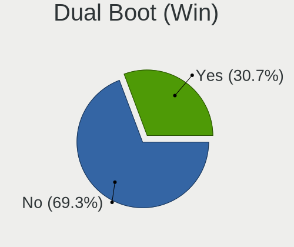

| Dual boot | Desktops | Percent |
|-----------|----------|---------|
| No        | 66       | 67.35%  |
| Yes       | 32       | 32.65%  |

Board
-----

Vendor
------

Motherboard manufacturer

| Name                | Desktops | Percent |
|---------------------|----------|---------|
| ASUSTek Computer    | 26       | 26.8%   |
| ASRock              | 19       | 19.59%  |
| Gigabyte Technology | 18       | 18.56%  |
| MSI                 | 15       | 15.46%  |
| Intel               | 6        | 6.19%   |
| Hewlett-Packard     | 6        | 6.19%   |
| Dell                | 5        | 5.15%   |
| Fujitsu Siemens     | 1        | 1.03%   |
| Fujitsu             | 1        | 1.03%   |

Model
-----

Motherboard model

| Name                               | Desktops | Percent |
|------------------------------------|----------|---------|
| MSI MS-7A38                        | 3        | 3.09%   |
| MSI MS-7C82                        | 2        | 2.06%   |
| MSI MS-7823                        | 2        | 2.06%   |
| MSI MS-7817                        | 2        | 2.06%   |
| ASUS PRIME Z390-A                  | 2        | 2.06%   |
| ASUS PRIME B450M-A                 | 2        | 2.06%   |
| ASUS All Series                    | 2        | 2.06%   |
| MSI MS-7C35                        | 1        | 1.03%   |
| MSI MS-7B89                        | 1        | 1.03%   |
| MSI MS-7A71                        | 1        | 1.03%   |
| MSI MS-7A34                        | 1        | 1.03%   |
| MSI MS-7977                        | 1        | 1.03%   |
| MSI MS-7788                        | 1        | 1.03%   |
| Intel DP55WB AAE64798-205          | 1        | 1.03%   |
| Intel DH67BL AAG10189-208          | 1        | 1.03%   |
| Intel DH61WW AAG23116-206          | 1        | 1.03%   |
| Intel DH55HC AAE70933-501          | 1        | 1.03%   |
| Intel DB65AL AAG12530-302          | 1        | 1.03%   |
| Intel D102GGC2 AAD42789-201        | 1        | 1.03%   |
| HP Z420 Workstation                | 1        | 1.03%   |
| HP EliteDesk 705 G2 SFF            | 1        | 1.03%   |
| HP Compaq dc7600 Small Form Factor | 1        | 1.03%   |
| HP Compaq dc5750 Small Form Factor | 1        | 1.03%   |
| HP Compaq dc5700 Microtower        | 1        | 1.03%   |
| HP Compaq 6000 Pro SFF PC          | 1        | 1.03%   |
| Gigabyte Z370M DS3H                | 1        | 1.03%   |
| Gigabyte X570 GAMING X             | 1        | 1.03%   |
| Gigabyte X570 AORUS ULTRA          | 1        | 1.03%   |
| Gigabyte X570 AORUS ELITE          | 1        | 1.03%   |
| Gigabyte P41-ES3G                  | 1        | 1.03%   |
| Gigabyte M68MT-S2P                 | 1        | 1.03%   |
| Gigabyte M55S-S3                   | 1        | 1.03%   |
| Gigabyte H81M-D2V                  | 1        | 1.03%   |
| Gigabyte H77M-D3H                  | 1        | 1.03%   |
| Gigabyte H61M-DS2 DVI              | 1        | 1.03%   |
| Gigabyte H55M-UD2H                 | 1        | 1.03%   |
| Gigabyte GA-78LMT-USB3 R2          | 1        | 1.03%   |
| Gigabyte B85M-HD3                  | 1        | 1.03%   |
| Gigabyte B450M S2H                 | 1        | 1.03%   |
| Gigabyte B250M-DS3H                | 1        | 1.03%   |
| Gigabyte B250M-D3H                 | 1        | 1.03%   |
| Gigabyte AB350M-DS3H V2            | 1        | 1.03%   |
| Gigabyte A320M-H                   | 1        | 1.03%   |
| Fujitsu Siemens ESPRIMO E5730      | 1        | 1.03%   |
| Fujitsu S1100F                     | 1        | 1.03%   |
| Dell Vostro 270s                   | 1        | 1.03%   |
| Dell Vostro 270                    | 1        | 1.03%   |
| Dell PowerEdge T30                 | 1        | 1.03%   |
| Dell OptiPlex 780                  | 1        | 1.03%   |
| Dell OptiPlex 7020                 | 1        | 1.03%   |
| ASUS X79-DELUXE                    | 1        | 1.03%   |
| ASUS TUF Gaming Z590-PLUS WIFI     | 1        | 1.03%   |
| ASUS TUF Gaming X570-PLUS          | 1        | 1.03%   |
| ASUS TUF Gaming B550-PLUS          | 1        | 1.03%   |
| ASUS ROG STRIX Z590-E GAMING WIFI  | 1        | 1.03%   |
| ASUS PRIME H510M-R                 | 1        | 1.03%   |
| ASUS PRIME H310M-R R2.0            | 1        | 1.03%   |
| ASUS PRIME H310M-E                 | 1        | 1.03%   |
| ASUS PRIME B450M-K                 | 1        | 1.03%   |
| ASUS PRIME B350M-A                 | 1        | 1.03%   |

Model Family
------------

Motherboard model prefix

| Name                    | Desktops | Percent |
|-------------------------|----------|---------|
| ASUS PRIME              | 10       | 10.31%  |
| HP Compaq               | 4        | 4.12%   |
| MSI MS-7A38             | 3        | 3.09%   |
| Gigabyte X570           | 3        | 3.09%   |
| ASUS TUF                | 3        | 3.09%   |
| MSI MS-7C82             | 2        | 2.06%   |
| MSI MS-7823             | 2        | 2.06%   |
| MSI MS-7817             | 2        | 2.06%   |
| Dell Vostro             | 2        | 2.06%   |
| Dell OptiPlex           | 2        | 2.06%   |
| ASUS All                | 2        | 2.06%   |
| ASRock B450             | 2        | 2.06%   |
| MSI MS-7C35             | 1        | 1.03%   |
| MSI MS-7B89             | 1        | 1.03%   |
| MSI MS-7A71             | 1        | 1.03%   |
| MSI MS-7A34             | 1        | 1.03%   |
| MSI MS-7977             | 1        | 1.03%   |
| MSI MS-7788             | 1        | 1.03%   |
| Intel DP55WB            | 1        | 1.03%   |
| Intel DH67BL            | 1        | 1.03%   |
| Intel DH61WW            | 1        | 1.03%   |
| Intel DH55HC            | 1        | 1.03%   |
| Intel DB65AL            | 1        | 1.03%   |
| Intel D102GGC2          | 1        | 1.03%   |
| HP Z420                 | 1        | 1.03%   |
| HP EliteDesk            | 1        | 1.03%   |
| Gigabyte Z370M          | 1        | 1.03%   |
| Gigabyte P41-ES3G       | 1        | 1.03%   |
| Gigabyte M68MT-S2P      | 1        | 1.03%   |
| Gigabyte M55S-S3        | 1        | 1.03%   |
| Gigabyte H81M-D2V       | 1        | 1.03%   |
| Gigabyte H77M-D3H       | 1        | 1.03%   |
| Gigabyte H61M-DS2       | 1        | 1.03%   |
| Gigabyte H55M-UD2H      | 1        | 1.03%   |
| Gigabyte GA-78LMT-USB3  | 1        | 1.03%   |
| Gigabyte B85M-HD3       | 1        | 1.03%   |
| Gigabyte B450M          | 1        | 1.03%   |
| Gigabyte B250M-DS3H     | 1        | 1.03%   |
| Gigabyte B250M-D3H      | 1        | 1.03%   |
| Gigabyte AB350M-DS3H    | 1        | 1.03%   |
| Gigabyte A320M-H        | 1        | 1.03%   |
| Fujitsu Siemens ESPRIMO | 1        | 1.03%   |
| Fujitsu S1100F          | 1        | 1.03%   |
| Dell PowerEdge          | 1        | 1.03%   |
| ASUS X79-DELUXE         | 1        | 1.03%   |
| ASUS ROG                | 1        | 1.03%   |
| ASUS P8Z68-V            | 1        | 1.03%   |
| ASUS P5QPL-AM           | 1        | 1.03%   |
| ASUS Maximus            | 1        | 1.03%   |
| ASUS M5A97              | 1        | 1.03%   |
| ASUS M5A78L-M           | 1        | 1.03%   |
| ASUS M4A785T-M          | 1        | 1.03%   |
| ASUS H110M-R            | 1        | 1.03%   |
| ASUS H110M-C            | 1        | 1.03%   |
| ASUS GG638AA-ABU        | 1        | 1.03%   |
| ASRock Z87              | 1        | 1.03%   |
| ASRock X570M            | 1        | 1.03%   |
| ASRock X370             | 1        | 1.03%   |
| ASRock QC5000M-ITX      | 1        | 1.03%   |
| ASRock H61M-VS          | 1        | 1.03%   |

MFG Year
--------

Motherboard manufacture year

| Year | Desktops | Percent |
|------|----------|---------|
| 2018 | 20       | 20.62%  |
| 2013 | 10       | 10.31%  |
| 2009 | 10       | 10.31%  |
| 2019 | 7        | 7.22%   |
| 2017 | 6        | 6.19%   |
| 2016 | 6        | 6.19%   |
| 2015 | 6        | 6.19%   |
| 2012 | 6        | 6.19%   |
| 2010 | 5        | 5.15%   |
| 2020 | 4        | 4.12%   |
| 2011 | 4        | 4.12%   |
| 2006 | 4        | 4.12%   |
| 2021 | 3        | 3.09%   |
| 2007 | 3        | 3.09%   |
| 2014 | 1        | 1.03%   |
| 2008 | 1        | 1.03%   |
| 2005 | 1        | 1.03%   |

Form Factor
-----------

Physical design of the computer

| Name    | Desktops | Percent |
|---------|----------|---------|
| Desktop | 97       | 100%    |

Secure Boot
-----------

Enabled or disabled

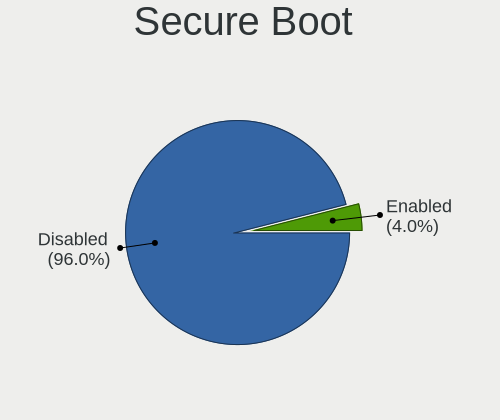

| State    | Desktops | Percent |
|----------|----------|---------|
| Disabled | 96       | 97.96%  |
| Enabled  | 2        | 2.04%   |

Coreboot
--------

Have coreboot on board

| Used | Desktops | Percent |
|------|----------|---------|
| No   | 97       | 100%    |

RAM Size
--------

Total RAM memory

| Size in GB  | Desktops | Percent |
|-------------|----------|---------|
| 16.01-24.0  | 29       | 29.59%  |
| 3.01-4.0    | 18       | 18.37%  |
| 8.01-16.0   | 17       | 17.35%  |
| 4.01-8.0    | 13       | 13.27%  |
| 32.01-64.0  | 9        | 9.18%   |
| 64.01-256.0 | 6        | 6.12%   |
| 1.01-2.0    | 3        | 3.06%   |
| 2.01-3.0    | 2        | 2.04%   |
| 24.01-32.0  | 1        | 1.02%   |

RAM Used
--------

Used RAM memory

| Used GB    | Desktops | Percent |
|------------|----------|---------|
| 1.01-2.0   | 32       | 28.57%  |
| 2.01-3.0   | 24       | 21.43%  |
| 4.01-8.0   | 19       | 16.96%  |
| 3.01-4.0   | 16       | 14.29%  |
| 0.51-1.0   | 11       | 9.82%   |
| 8.01-16.0  | 7        | 6.25%   |
| 16.01-24.0 | 2        | 1.79%   |
| 24.01-32.0 | 1        | 0.89%   |

Total Drives
------------

Number of drives on board

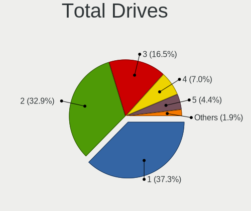

| Drives | Desktops | Percent |
|--------|----------|---------|
| 1      | 40       | 39.22%  |
| 2      | 32       | 31.37%  |
| 3      | 18       | 17.65%  |
| 4      | 7        | 6.86%   |
| 5      | 5        | 4.9%    |

Has CD-ROM
----------

Has CD-ROM on board

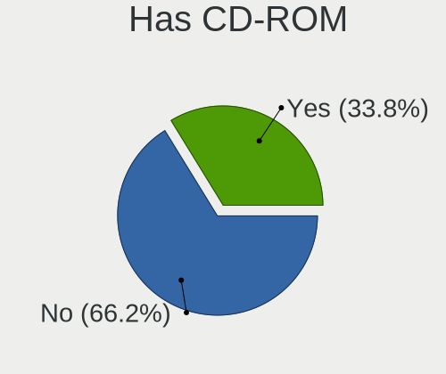

| Presented | Desktops | Percent |
|-----------|----------|---------|
| No        | 63       | 63%     |
| Yes       | 37       | 37%     |

Has Ethernet
------------

Has Ethernet on board

| Presented | Desktops | Percent |
|-----------|----------|---------|
| Yes       | 97       | 100%    |

Has WiFi
--------

Has WiFi module

| Presented | Desktops | Percent |
|-----------|----------|---------|
| No        | 71       | 71.72%  |
| Yes       | 28       | 28.28%  |

Has Bluetooth
-------------

Has Bluetooth module

| Presented | Desktops | Percent |
|-----------|----------|---------|
| No        | 79       | 81.44%  |
| Yes       | 18       | 18.56%  |

Location
--------

Country
-------

Geographic location (country)

| Country   | Desktops | Percent |
|-----------|----------|---------|
| Lithuania | 97       | 100%    |

City
----

Geographic location (city)

| City         | Desktops | Percent |
|--------------|----------|---------|
| Vilnius      | 48       | 48%     |
| Kaunas       | 19       | 19%     |
| iauliai    | 6        | 6%      |
| Klaipda    | 6        | 6%      |
| Teliai     | 2        | 2%      |
| Maeikiai   | 2        | 2%      |
| Elektrnai  | 2        | 2%      |
| Alytus       | 2        | 2%      |
| Vainutas     | 1        | 1%      |
| Ukmerge      | 1        | 1%      |
| Taurag     | 1        | 1%      |
| ilal     | 1        | 1%      |
| Raseiniai    | 1        | 1%      |
| Panevezys    | 1        | 1%      |
| Nemenin  | 1        | 1%      |
| Marijampol | 1        | 1%      |
| Lentvaris    | 1        | 1%      |
| Kdainiai   | 1        | 1%      |
| Gargdai    | 1        | 1%      |
| Druskininkai | 1        | 1%      |
| Anykiai  | 1        | 1%      |

Drives
------

Drive Vendor
------------

Hard drive vendors

| Vendor              | Desktops | Drives | Percent |
|---------------------|----------|--------|---------|
| Samsung Electronics | 37       | 63     | 20.44%  |
| WDC                 | 30       | 40     | 16.57%  |
| Seagate             | 23       | 33     | 12.71%  |
| Kingston            | 15       | 25     | 8.29%   |
| A-DATA Technology   | 15       | 17     | 8.29%   |
| Toshiba             | 12       | 15     | 6.63%   |
| Crucial             | 9        | 11     | 4.97%   |
| Patriot             | 5        | 5      | 2.76%   |
| Hitachi             | 5        | 5      | 2.76%   |
| SanDisk             | 3        | 3      | 1.66%   |
| Transcend           | 2        | 2      | 1.1%    |
| JMicron Technology  | 2        | 2      | 1.1%    |
| GOODRAM             | 2        | 2      | 1.1%    |
| China               | 2        | 2      | 1.1%    |
| XrayDisk            | 1        | 1      | 0.55%   |
| XPG                 | 1        | 1      | 0.55%   |
| Unknown             | 1        | 1      | 0.55%   |
| StoreJet            | 1        | 1      | 0.55%   |
| PNY                 | 1        | 1      | 0.55%   |
| Plextor             | 1        | 1      | 0.55%   |
| Phison              | 1        | 1      | 0.55%   |
| OCZ                 | 1        | 2      | 0.55%   |
| Netac               | 1        | 1      | 0.55%   |
| Leven               | 1        | 3      | 0.55%   |
| Intenso             | 1        | 2      | 0.55%   |
| Intel               | 1        | 1      | 0.55%   |
| HGST                | 1        | 1      | 0.55%   |
| Hewlett-Packard     | 1        | 1      | 0.55%   |
| Gigabyte Technology | 1        | 1      | 0.55%   |
| ExcelStor           | 1        | 1      | 0.55%   |
| Dahua               | 1        | 1      | 0.55%   |
| Colorful            | 1        | 1      | 0.55%   |
| Apacer              | 1        | 3      | 0.55%   |

Drive Model
-----------

Hard drive models

| Model                            | Desktops | Percent |
|----------------------------------|----------|---------|
| Seagate ST500DM002-1BD142 500GB  | 6        | 3%      |
| WDC WD20EFRX-68EUZN0 2TB         | 4        | 2%      |
| Samsung SSD 860 EVO 250GB        | 4        | 2%      |
| Samsung SSD 860 EVO 500GB        | 3        | 1.5%    |
| Samsung SSD 850 EVO 250GB        | 3        | 1.5%    |
| Samsung NVMe SSD Drive 1TB       | 3        | 1.5%    |
| Samsung HD501LJ 500GB            | 3        | 1.5%    |
| Kingston SA400S37120G 120GB SSD  | 3        | 1.5%    |
| A-DATA SU650 120GB SSD           | 3        | 1.5%    |
| WDC WD800AAJS-60PSA0 80GB        | 2        | 1%      |
| WDC WD10EZEX-00BN5A0 1TB         | 2        | 1%      |
| Toshiba MK3261GSYN 320GB         | 2        | 1%      |
| Toshiba HDWE140 4TB              | 2        | 1%      |
| Toshiba DT01ACA100 1TB           | 2        | 1%      |
| Seagate ST3500418AS 500GB        | 2        | 1%      |
| Seagate ST1000DM010-2EP102 1TB   | 2        | 1%      |
| SanDisk NVMe SSD Drive 500GB     | 2        | 1%      |
| Samsung SSD 970 EVO 500GB        | 2        | 1%      |
| Samsung SSD 850 EVO 500GB        | 2        | 1%      |
| Samsung NVMe SSD Drive 500GB     | 2        | 1%      |
| Patriot Burst 480GB SSD          | 2        | 1%      |
| Patriot Burst 120GB SSD          | 2        | 1%      |
| Kingston SV300S37A120G 120GB SSD | 2        | 1%      |
| Kingston SUV400S37240G 240GB SSD | 2        | 1%      |
| Hitachi HDS721050CLA362 500GB    | 2        | 1%      |
| GOODRAM SSD 120GB                | 2        | 1%      |
| Crucial CT480BX500SSD1 480GB     | 2        | 1%      |
| Crucial CT120BX500SSD1 120GB     | 2        | 1%      |
| A-DATA SX900 128GB SSD           | 2        | 1%      |
| A-DATA SX8200PNP 512GB           | 2        | 1%      |
| A-DATA SU650 240GB SSD           | 2        | 1%      |
| A-DATA SP900 64GB SSD            | 2        | 1%      |
| XrayDisk SSD 512GB               | 1        | 0.5%    |
| XPG GAMMIX S5 256GB              | 1        | 0.5%    |
| WDC WDS200T3X0C-00SJG0 2TB       | 1        | 0.5%    |
| WDC WD800JD-60LSA5 80GB          | 1        | 0.5%    |
| WDC WD7500BPKX-75HPJT0 752GB     | 1        | 0.5%    |
| WDC WD6400BPVT-80HXZT1 640GB     | 1        | 0.5%    |
| WDC WD64 00BEVT-22A0RT0 640GB    | 1        | 0.5%    |
| WDC WD5000LPVX-80V0TT0 500GB     | 1        | 0.5%    |
| WDC WD5000AAKX-60U6AA0 500GB     | 1        | 0.5%    |
| WDC WD5000AAKX-00ERMA0 500GB     | 1        | 0.5%    |
| WDC WD5000AAKX-001CA0 500GB      | 1        | 0.5%    |
| WDC WD5000AAKS-08V0A0 500GB      | 1        | 0.5%    |
| WDC WD5000AAKS-00YGA0 500GB      | 1        | 0.5%    |
| WDC WD40EZRZ-00GXCB0 4TB         | 1        | 0.5%    |
| WDC WD32 00BPVT-00JJ5T0 320GB    | 1        | 0.5%    |
| WDC WD30PURX-64P6ZY0 3TB         | 1        | 0.5%    |
| WDC WD2500KS-00MJB0 250GB        | 1        | 0.5%    |
| WDC WD2500AAJS-75M0A0 250GB      | 1        | 0.5%    |
| WDC WD10PURX-64E5EY0 1TB         | 1        | 0.5%    |
| WDC WD10EZEX-60ZF5A0 1TB         | 1        | 0.5%    |
| WDC WD10EZEX-60WN4A0 1TB         | 1        | 0.5%    |
| WDC WD10EZEX-22MFCA0 1TB         | 1        | 0.5%    |
| WDC WD10EZEX-08M2NA0 1TB         | 1        | 0.5%    |
| WDC WD10EZEX-07M2NA1 1TB         | 1        | 0.5%    |
| WDC WD10EZEX-00BBHA0 1TB         | 1        | 0.5%    |
| WDC WD10EARS-00Y5B1 1TB          | 1        | 0.5%    |
| WDC WD My Passport 25F3 512GB    | 1        | 0.5%    |
| Unknown RCESSD 512GB             | 1        | 0.5%    |

HDD Vendor
----------

Hard disk drive vendors

| Vendor              | Desktops | Drives | Percent |
|---------------------|----------|--------|---------|
| WDC                 | 28       | 38     | 35.44%  |
| Seagate             | 23       | 33     | 29.11%  |
| Toshiba             | 11       | 14     | 13.92%  |
| Samsung Electronics | 10       | 19     | 12.66%  |
| Hitachi             | 5        | 5      | 6.33%   |
| HGST                | 1        | 1      | 1.27%   |
| ExcelStor           | 1        | 1      | 1.27%   |

SSD Vendor
----------

Solid state drive vendors

| Vendor              | Desktops | Drives | Percent |
|---------------------|----------|--------|---------|
| Samsung Electronics | 19       | 28     | 24.05%  |
| Kingston            | 13       | 22     | 16.46%  |
| A-DATA Technology   | 12       | 14     | 15.19%  |
| Crucial             | 8        | 10     | 10.13%  |
| Patriot             | 5        | 5      | 6.33%   |
| Transcend           | 2        | 2      | 2.53%   |
| GOODRAM             | 2        | 2      | 2.53%   |
| China               | 2        | 2      | 2.53%   |
| XrayDisk            | 1        | 1      | 1.27%   |
| Unknown             | 1        | 1      | 1.27%   |
| StoreJet            | 1        | 1      | 1.27%   |
| PNY                 | 1        | 1      | 1.27%   |
| Plextor             | 1        | 1      | 1.27%   |
| OCZ                 | 1        | 2      | 1.27%   |
| Netac               | 1        | 1      | 1.27%   |
| Leven               | 1        | 3      | 1.27%   |
| JMicron Technology  | 1        | 1      | 1.27%   |
| Intenso             | 1        | 2      | 1.27%   |
| Intel               | 1        | 1      | 1.27%   |
| Hewlett-Packard     | 1        | 1      | 1.27%   |
| Gigabyte Technology | 1        | 1      | 1.27%   |
| Dahua               | 1        | 1      | 1.27%   |
| Colorful            | 1        | 1      | 1.27%   |
| Apacer              | 1        | 3      | 1.27%   |

Drive Kind
----------

HDD or SSD

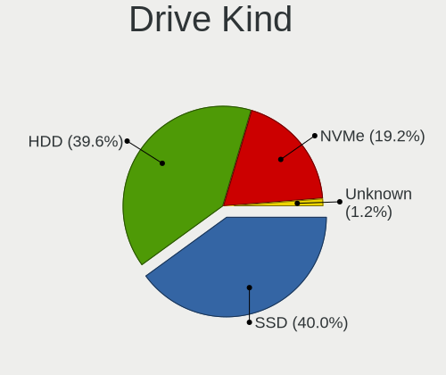

| Kind    | Desktops | Drives | Percent |
|---------|----------|--------|---------|
| SSD     | 65       | 107    | 41.67%  |
| HDD     | 65       | 111    | 41.67%  |
| NVMe    | 24       | 30     | 15.38%  |
| Unknown | 2        | 2      | 1.28%   |

Drive Connector
---------------

SATA, SAS, NVMe, etc.

| Type | Desktops | Drives | Percent |
|------|----------|--------|---------|
| SATA | 92       | 211    | 74.8%   |
| NVMe | 24       | 30     | 19.51%  |
| SAS  | 7        | 9      | 5.69%   |

Drive Size
----------

Size of hard drive

| Size in TB | Desktops | Drives | Percent |
|------------|----------|--------|---------|
| 0.01-0.5   | 81       | 156    | 61.83%  |
| 0.51-1.0   | 33       | 42     | 25.19%  |
| 1.01-2.0   | 10       | 12     | 7.63%   |
| 3.01-4.0   | 4        | 4      | 3.05%   |
| 2.01-3.0   | 2        | 3      | 1.53%   |
| 4.01-10.0  | 1        | 1      | 0.76%   |

Space Total
-----------

Amount of disk space available on the file system

| Size in GB     | Desktops | Percent |
|----------------|----------|---------|
| 101-250        | 28       | 26.42%  |
| 251-500        | 21       | 19.81%  |
| 1001-2000      | 13       | 12.26%  |
| 501-1000       | 13       | 12.26%  |
| More than 3000 | 8        | 7.55%   |
| 1-20           | 7        | 6.6%    |
| 51-100         | 6        | 5.66%   |
| 2001-3000      | 5        | 4.72%   |
| Unknown        | 3        | 2.83%   |
| 21-50          | 2        | 1.89%   |

Space Used
----------

Amount of used disk space

| Used GB        | Desktops | Percent |
|----------------|----------|---------|
| 1-20           | 36       | 33.03%  |
| 101-250        | 13       | 11.93%  |
| 51-100         | 13       | 11.93%  |
| 251-500        | 12       | 11.01%  |
| 1001-2000      | 9        | 8.26%   |
| 21-50          | 8        | 7.34%   |
| 501-1000       | 8        | 7.34%   |
| More than 3000 | 6        | 5.5%    |
| Unknown        | 3        | 2.75%   |
| 2001-3000      | 1        | 0.92%   |

Malfunc. Drives
---------------

Drive models with a malfunction

| Model                             | Desktops | Drives | Percent |
|-----------------------------------|----------|--------|---------|
| WDC WD800AAJS-60PSA0 80GB         | 2        | 2      | 9.52%   |
| WDC WD20EFRX-68EUZN0 2TB          | 2        | 3      | 9.52%   |
| Toshiba MK3261GSYN 320GB          | 2        | 2      | 9.52%   |
| WDC WD6400BPVT-80HXZT1 640GB      | 1        | 1      | 4.76%   |
| WDC WD5000AAKX-001CA0 500GB       | 1        | 1      | 4.76%   |
| Toshiba MQ01ABD100 1TB            | 1        | 1      | 4.76%   |
| Seagate ST9500325AS 500GB         | 1        | 1      | 4.76%   |
| Seagate ST500LX012-SSHD-8GB       | 1        | 1      | 4.76%   |
| Seagate ST3250410AS 250GB         | 1        | 1      | 4.76%   |
| Samsung Electronics HD501LJ 500GB | 1        | 1      | 4.76%   |
| Samsung Electronics HD103SJ 1TB   | 1        | 1      | 4.76%   |
| Samsung Electronics HD080HJ 80GB  | 1        | 4      | 4.76%   |
| Leven JAJS300M240C 240GB          | 1        | 3      | 4.76%   |
| Kingston SV300S37A120G 120GB SSD  | 1        | 1      | 4.76%   |
| Hitachi HTS547575A9E384 752GB     | 1        | 1      | 4.76%   |
| ExcelStor Technology J8160S 164GB | 1        | 1      | 4.76%   |
| Crucial CT525MX300SSD1 528GB      | 1        | 1      | 4.76%   |
| Colorful SL300 120GB SSD          | 1        | 1      | 4.76%   |

Malfunc. Drive Vendor
---------------------

Vendors of faulty drives

| Vendor              | Desktops | Drives | Percent |
|---------------------|----------|--------|---------|
| WDC                 | 6        | 7      | 30%     |
| Seagate             | 3        | 3      | 15%     |
| Samsung Electronics | 3        | 6      | 15%     |
| Toshiba             | 2        | 3      | 10%     |
| Leven               | 1        | 3      | 5%      |
| Kingston            | 1        | 1      | 5%      |
| Hitachi             | 1        | 1      | 5%      |
| ExcelStor           | 1        | 1      | 5%      |
| Crucial             | 1        | 1      | 5%      |
| Colorful            | 1        | 1      | 5%      |

Malfunc. HDD Vendor
-------------------

Vendors of faulty HDD drives

| Vendor              | Desktops | Drives | Percent |
|---------------------|----------|--------|---------|
| WDC                 | 6        | 7      | 37.5%   |
| Seagate             | 3        | 3      | 18.75%  |
| Samsung Electronics | 3        | 6      | 18.75%  |
| Toshiba             | 2        | 3      | 12.5%   |
| Hitachi             | 1        | 1      | 6.25%   |
| ExcelStor           | 1        | 1      | 6.25%   |

Malfunc. Drive Kind
-------------------

Kinds of faulty drives

| Kind | Desktops | Drives | Percent |
|------|----------|--------|---------|
| HDD  | 12       | 21     | 75%     |
| SSD  | 4        | 6      | 25%     |

Failed Drives
-------------

Failed drive models

| Model                    | Desktops | Drives | Percent |
|--------------------------|----------|--------|---------|
| Seagate ST3160812A 160GB | 1        | 2      | 100%    |

Failed Drive Vendor
-------------------

Failed drive vendors

| Vendor  | Desktops | Drives | Percent |
|---------|----------|--------|---------|
| Seagate | 1        | 2      | 100%    |

Drive Status
------------

Number of failed and malfunc. drives

| Status   | Desktops | Drives | Percent |
|----------|----------|--------|---------|
| Detected | 56       | 137    | 50%     |
| Works    | 40       | 84     | 35.71%  |
| Malfunc  | 15       | 27     | 13.39%  |
| Failed   | 1        | 2      | 0.89%   |

Storage controller
------------------

Storage Vendor
--------------

Storage controller vendors

| Vendor                      | Desktops | Percent |
|-----------------------------|----------|---------|
| Intel                       | 57       | 43.18%  |
| AMD                         | 37       | 28.03%  |
| Samsung Electronics         | 12       | 9.09%   |
| ASMedia Technology          | 6        | 4.55%   |
| SanDisk                     | 4        | 3.03%   |
| Nvidia                      | 3        | 2.27%   |
| Realtek Semiconductor       | 2        | 1.52%   |
| Marvell Technology Group    | 2        | 1.52%   |
| Kingston Technology Company | 2        | 1.52%   |
| JMicron Technology          | 2        | 1.52%   |
| ADATA Technology            | 2        | 1.52%   |
| Phison Electronics          | 1        | 0.76%   |
| OCZ Technology Group        | 1        | 0.76%   |
| Micron/Crucial Technology   | 1        | 0.76%   |

Storage Model
-------------

Storage controller models

| Model                                                                          | Desktops | Percent |
|--------------------------------------------------------------------------------|----------|---------|
| AMD FCH SATA Controller [AHCI mode]                                            | 24       | 13.33%  |
| AMD 400 Series Chipset SATA Controller                                         | 11       | 6.11%   |
| Intel 8 Series/C220 Series Chipset Family 6-port SATA Controller 1 [AHCI mode] | 10       | 5.56%   |
| Samsung NVMe SSD Controller SM981/PM981/PM983                                  | 8        | 4.44%   |
| Intel NM10/ICH7 Family SATA Controller [IDE mode]                              | 7        | 3.89%   |
| Intel 82801G (ICH7 Family) IDE Controller                                      | 7        | 3.89%   |
| Intel 6 Series/C200 Series Chipset Family 6 port Desktop SATA AHCI Controller  | 7        | 3.89%   |
| Intel 200 Series PCH SATA controller [AHCI mode]                               | 5        | 2.78%   |
| ASMedia ASM1062 Serial ATA Controller                                          | 5        | 2.78%   |
| AMD SB7x0/SB8x0/SB9x0 IDE Controller                                           | 5        | 2.78%   |
| Intel Q170/Q150/B150/H170/H110/Z170/CM236 Chipset SATA Controller [AHCI Mode]  | 4        | 2.22%   |
| AMD 300 Series Chipset SATA Controller                                         | 4        | 2.22%   |
| Samsung NVMe SSD Controller 980                                                | 3        | 1.67%   |
| Intel Cannon Lake PCH SATA AHCI Controller                                     | 3        | 1.67%   |
| Intel 500 Series Chipset Family SATA AHCI Controller                           | 3        | 1.67%   |
| AMD SB7x0/SB8x0/SB9x0 SATA Controller [IDE mode]                               | 3        | 1.67%   |
| AMD SB7x0/SB8x0/SB9x0 SATA Controller [AHCI mode]                              | 3        | 1.67%   |
| AMD FCH SATA Controller D                                                      | 3        | 1.67%   |
| SanDisk WD Blue SN550 NVMe SSD                                                 | 2        | 1.11%   |
| Samsung NVMe SSD Controller PM9A1/PM9A3/980PRO                                 | 2        | 1.11%   |
| Intel 82801JD/DO (ICH10 Family) SATA AHCI Controller                           | 2        | 1.11%   |
| Intel 7 Series/C210 Series Chipset Family 6-port SATA Controller [AHCI mode]   | 2        | 1.11%   |
| Intel 5 Series/3400 Series Chipset 6 port SATA AHCI Controller                 | 2        | 1.11%   |
| Intel 400 Series Chipset Family SATA AHCI Controller                           | 2        | 1.11%   |
| Intel 4 Series Chipset PT IDER Controller                                      | 2        | 1.11%   |
| AMD 500 Series Chipset SATA Controller                                         | 2        | 1.11%   |
| ADATA XPG SX8200 Pro PCIe Gen3x4 M.2 2280 Solid State Drive                    | 2        | 1.11%   |
| SanDisk WD PC SN810 / Black SN850 NVMe SSD                                     | 1        | 0.56%   |
| SanDisk WD Black 2018/SN750 / PC SN720 NVMe SSD                                | 1        | 0.56%   |
| Samsung NVMe SSD Controller SM961/PM961/SM963                                  | 1        | 0.56%   |
| Realtek RTS5763DL NVMe SSD Controller                                          | 1        | 0.56%   |
| Realtek Realtek Non-Volatile memory controller                                 | 1        | 0.56%   |
| Phison E12 NVMe Controller                                                     | 1        | 0.56%   |
| OCZ Group RD400/400A SSD                                                       | 1        | 0.56%   |
| Nvidia nForce3 Serial ATA Controller                                           | 1        | 0.56%   |
| Nvidia MCP61 SATA Controller                                                   | 1        | 0.56%   |
| Nvidia MCP55 SATA Controller                                                   | 1        | 0.56%   |
| Nvidia MCP55 IDE                                                               | 1        | 0.56%   |
| Nvidia CK8S Parallel ATA Controller (v2.5)                                     | 1        | 0.56%   |
| Micron/Crucial NVMe Controller                                                 | 1        | 0.56%   |
| Marvell Group 88SE9230 PCIe 2.0 x2 4-port SATA 6 Gb/s RAID Controller          | 1        | 0.56%   |
| Marvell Group 88SE9128 PCIe SATA 6 Gb/s RAID controller                        | 1        | 0.56%   |
| Kingston Company U-SNS8154P3 NVMe SSD                                          | 1        | 0.56%   |
| Kingston Company A2000 NVMe SSD                                                | 1        | 0.56%   |
| JMicron JMB368 IDE controller                                                  | 1        | 0.56%   |
| JMicron JMB363 SATA/IDE Controller                                             | 1        | 0.56%   |
| Intel SATA Controller [RAID mode]                                              | 1        | 0.56%   |
| Intel C602 chipset 4-Port SATA Storage Control Unit                            | 1        | 0.56%   |
| Intel C600/X79 series chipset SATA RAID Controller                             | 1        | 0.56%   |
| Intel C600/X79 series chipset IDE-r Controller                                 | 1        | 0.56%   |
| Intel C600/X79 series chipset 6-Port SATA AHCI Controller                      | 1        | 0.56%   |
| Intel 82801JD/DO (ICH10 Family) 4-port SATA IDE Controller                     | 1        | 0.56%   |
| Intel 82801JD/DO (ICH10 Family) 2-port SATA IDE Controller                     | 1        | 0.56%   |
| Intel 82801IR/IO/IH (ICH9R/DO/DH) 4 port SATA Controller [IDE mode]            | 1        | 0.56%   |
| Intel 82801I (ICH9 Family) 2 port SATA Controller [IDE mode]                   | 1        | 0.56%   |
| Intel 82801HR/HO/HH (ICH8R/DO/DH) 2 port SATA Controller [IDE mode]            | 1        | 0.56%   |
| Intel 82801H (ICH8 Family) 4 port SATA Controller [IDE mode]                   | 1        | 0.56%   |
| Intel 82801GR/GDH (ICH7R/ICH7DH) SATA Controller [RAID mode]                   | 1        | 0.56%   |
| Intel 7 Series/C210 Series Chipset Family 4-port SATA Controller [IDE mode]    | 1        | 0.56%   |
| Intel 7 Series/C210 Series Chipset Family 2-port SATA Controller [IDE mode]    | 1        | 0.56%   |

Storage Kind
------------

Kind of storage controller (IDE, SATA, NVMe, SAS, ...)

| Kind | Desktops | Percent |
|------|----------|---------|
| SATA | 76       | 57.14%  |
| IDE  | 27       | 20.3%   |
| NVMe | 24       | 18.05%  |
| RAID | 5        | 3.76%   |
| SAS  | 1        | 0.75%   |

Processor
---------

CPU Vendor
----------

Processor vendors

| Vendor | Desktops | Percent |
|--------|----------|---------|
| Intel  | 58       | 59.79%  |
| AMD    | 39       | 40.21%  |

CPU Model
---------

Processor models

| Model                                       | Desktops | Percent |
|---------------------------------------------|----------|---------|
| AMD Ryzen 5 2400G with Radeon Vega Graphics | 3        | 3.09%   |
| Intel Core i5-7400 CPU @ 3.00GHz            | 2        | 2.06%   |
| Intel Core i5-4460 CPU @ 3.20GHz            | 2        | 2.06%   |
| Intel Core i5-10400F CPU @ 2.90GHz          | 2        | 2.06%   |
| Intel Core i3-3240 CPU @ 3.40GHz            | 2        | 2.06%   |
| Intel Core i3-3220 CPU @ 3.30GHz            | 2        | 2.06%   |
| AMD Ryzen 7 5800X 8-Core Processor          | 2        | 2.06%   |
| AMD Ryzen 7 2700X Eight-Core Processor      | 2        | 2.06%   |
| AMD Ryzen 5 5600X 6-Core Processor          | 2        | 2.06%   |
| AMD Ryzen 5 3600 6-Core Processor           | 2        | 2.06%   |
| AMD Ryzen 5 2600X Six-Core Processor        | 2        | 2.06%   |
| AMD Ryzen 5 2600 Six-Core Processor         | 2        | 2.06%   |
| AMD Ryzen 5 1600X Six-Core Processor        | 2        | 2.06%   |
| AMD FX-8350 Eight-Core Processor            | 2        | 2.06%   |
| AMD Athlon II X2 260 Processor              | 2        | 2.06%   |
| Intel Xeon CPU E5-1650 v2 @ 3.50GHz         | 1        | 1.03%   |
| Intel Xeon CPU E3-1225 v5 @ 3.30GHz         | 1        | 1.03%   |
| Intel Pentium Dual-Core CPU E6700 @ 3.20GHz | 1        | 1.03%   |
| Intel Pentium Dual-Core CPU E6600 @ 3.06GHz | 1        | 1.03%   |
| Intel Pentium Dual-Core CPU E6500 @ 2.93GHz | 1        | 1.03%   |
| Intel Pentium Dual-Core CPU E5400 @ 2.70GHz | 1        | 1.03%   |
| Intel Pentium Dual-Core CPU E5300 @ 2.60GHz | 1        | 1.03%   |
| Intel Pentium D CPU 3.00GHz                 | 1        | 1.03%   |
| Intel Pentium D CPU 2.80GHz                 | 1        | 1.03%   |
| Intel Pentium CPU G2020 @ 2.90GHz           | 1        | 1.03%   |
| Intel Pentium 4 CPU 3.20GHz                 | 1        | 1.03%   |
| Intel Pentium 4 CPU 3.00GHz                 | 1        | 1.03%   |
| Intel Core i9-9900K CPU @ 3.60GHz           | 1        | 1.03%   |
| Intel Core i7-9700K CPU @ 3.60GHz           | 1        | 1.03%   |
| Intel Core i7-7700K CPU @ 4.20GHz           | 1        | 1.03%   |
| Intel Core i7-6700K CPU @ 4.00GHz           | 1        | 1.03%   |
| Intel Core i7-4930K CPU @ 3.40GHz           | 1        | 1.03%   |
| Intel Core i7-4790 CPU @ 3.60GHz            | 1        | 1.03%   |
| Intel Core i7-2600K CPU @ 3.40GHz           | 1        | 1.03%   |
| Intel Core i7-2600 CPU @ 3.40GHz            | 1        | 1.03%   |
| Intel Core i7 CPU 860 @ 2.80GHz             | 1        | 1.03%   |
| Intel Core i5-9600KF CPU @ 3.70GHz          | 1        | 1.03%   |
| Intel Core i5-9600 CPU @ 3.10GHz            | 1        | 1.03%   |
| Intel Core i5-7500 CPU @ 3.40GHz            | 1        | 1.03%   |
| Intel Core i5-6400 CPU @ 2.70GHz            | 1        | 1.03%   |
| Intel Core i5-4670K CPU @ 3.40GHz           | 1        | 1.03%   |
| Intel Core i5-4590 CPU @ 3.30GHz            | 1        | 1.03%   |
| Intel Core i5-4570 CPU @ 3.20GHz            | 1        | 1.03%   |
| Intel Core i5-3550 CPU @ 3.30GHz            | 1        | 1.03%   |
| Intel Core i5-2500 CPU @ 3.30GHz            | 1        | 1.03%   |
| Intel Core i5-10400 CPU @ 2.90GHz           | 1        | 1.03%   |
| Intel Core i5 CPU 661 @ 3.33GHz             | 1        | 1.03%   |
| Intel Core i5 CPU 660 @ 3.33GHz             | 1        | 1.03%   |
| Intel Core i3-8100 CPU @ 3.60GHz            | 1        | 1.03%   |
| Intel Core i3-7100 CPU @ 3.90GHz            | 1        | 1.03%   |
| Intel Core i3-4330 CPU @ 3.50GHz            | 1        | 1.03%   |
| Intel Core i3-4150 CPU @ 3.50GHz            | 1        | 1.03%   |
| Intel Core i3-4130 CPU @ 3.40GHz            | 1        | 1.03%   |
| Intel Core i3-2100 CPU @ 3.10GHz            | 1        | 1.03%   |
| Intel Core 2 Quad CPU Q9550 @ 2.83GHz       | 1        | 1.03%   |
| Intel Core 2 Duo CPU E8500 @ 3.16GHz        | 1        | 1.03%   |
| Intel Core 2 Duo CPU E8400 @ 3.00GHz        | 1        | 1.03%   |
| Intel Core 2 Duo CPU E7500 @ 2.93GHz        | 1        | 1.03%   |
| Intel Core 2 CPU 4400 @ 2.00GHz             | 1        | 1.03%   |
| Intel Celeron CPU G530 @ 2.40GHz            | 1        | 1.03%   |

CPU Model Family
----------------

Processor model prefix

| Model                   | Desktops | Percent |
|-------------------------|----------|---------|
| Intel Core i5           | 18       | 18.56%  |
| AMD Ryzen 5             | 17       | 17.53%  |
| Intel Core i3           | 10       | 10.31%  |
| Intel Core i7           | 8        | 8.25%   |
| AMD Ryzen 7             | 6        | 6.19%   |
| Intel Pentium Dual-Core | 5        | 5.15%   |
| Intel Core 2 Duo        | 3        | 3.09%   |
| AMD Ryzen 9             | 3        | 3.09%   |
| AMD FX                  | 3        | 3.09%   |
| AMD Athlon II X2        | 3        | 3.09%   |
| Other                   | 2        | 2.06%   |
| Intel Xeon              | 2        | 2.06%   |
| Intel Pentium D         | 2        | 2.06%   |
| Intel Pentium 4         | 2        | 2.06%   |
| Intel Celeron           | 2        | 2.06%   |
| AMD Athlon 64 X2        | 2        | 2.06%   |
| Intel Pentium           | 1        | 1.03%   |
| Intel Core i9           | 1        | 1.03%   |
| Intel Core 2 Quad       | 1        | 1.03%   |
| Intel Core 2            | 1        | 1.03%   |
| AMD Ryzen 3             | 1        | 1.03%   |
| AMD PRO A8              | 1        | 1.03%   |
| AMD Phenom II X4        | 1        | 1.03%   |
| AMD Athlon II X4        | 1        | 1.03%   |
| AMD A4                  | 1        | 1.03%   |

CPU Cores
---------

Number of processor cores

| Number | Desktops | Percent |
|--------|----------|---------|
| 4      | 31       | 31.96%  |
| 2      | 31       | 31.96%  |
| 6      | 21       | 21.65%  |
| 8      | 9        | 9.28%   |
| 12     | 2        | 2.06%   |
| 1      | 2        | 2.06%   |
| 16     | 1        | 1.03%   |

CPU Sockets
-----------

Number of sockets

| Number | Desktops | Percent |
|--------|----------|---------|
| 1      | 97       | 98.98%  |
| 2      | 1        | 1.02%   |

CPU Threads
-----------

Threads per core (Hyper-Threading)

| Number | Desktops | Percent |
|--------|----------|---------|
| 2      | 55       | 56.12%  |
| 1      | 43       | 43.88%  |

CPU Op-Modes
------------

CPU Operation Modes (32-bit, 64-bit)

| Op mode        | Desktops | Percent |
|----------------|----------|---------|
| 32-bit, 64-bit | 96       | 98.97%  |
| 32-bit         | 1        | 1.03%   |

CPU Microcode
-------------

Microcode number

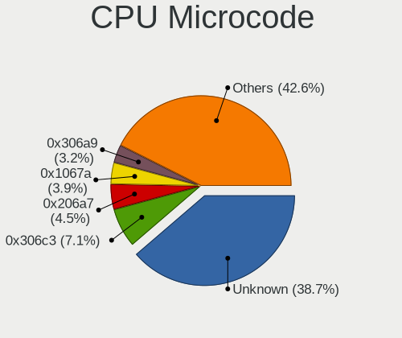

| Number     | Desktops | Percent |
|------------|----------|---------|
| Unknown    | 28       | 28.57%  |
| 0x306c3    | 9        | 9.18%   |
| 0x1067a    | 6        | 6.12%   |
| 0x206a7    | 5        | 5.1%    |
| 0x08701021 | 5        | 5.1%    |
| 0x906e9    | 4        | 4.08%   |
| 0x306a9    | 4        | 4.08%   |
| 0x0800820d | 3        | 3.06%   |
| 0x08001137 | 3        | 3.06%   |
| 0x010000c8 | 3        | 3.06%   |
| 0xa0653    | 2        | 2.04%   |
| 0x506e3    | 2        | 2.04%   |
| 0x0a201009 | 2        | 2.04%   |
| 0xf65      | 1        | 1.02%   |
| 0xf47      | 1        | 1.02%   |
| 0xf43      | 1        | 1.02%   |
| 0xf34      | 1        | 1.02%   |
| 0xa0671    | 1        | 1.02%   |
| 0x906ed    | 1        | 1.02%   |
| 0x906ec    | 1        | 1.02%   |
| 0x906eb    | 1        | 1.02%   |
| 0x20652    | 1        | 1.02%   |
| 0x106e5    | 1        | 1.02%   |
| 0x0a50000b | 1        | 1.02%   |
| 0x0a201005 | 1        | 1.02%   |
| 0x08701013 | 1        | 1.02%   |
| 0x08108109 | 1        | 1.02%   |
| 0x0810100b | 1        | 1.02%   |
| 0x0800820b | 1        | 1.02%   |
| 0x08001129 | 1        | 1.02%   |
| 0x0700010f | 1        | 1.02%   |
| 0x06003109 | 1        | 1.02%   |
| 0x06000852 | 1        | 1.02%   |
| 0x0600081c | 1        | 1.02%   |
| 0x0100009f | 1        | 1.02%   |

CPU Microarch
-------------

Microarchitecture

| Name        | Desktops | Percent |
|-------------|----------|---------|
| KabyLake    | 10       | 10.31%  |
| Haswell     | 10       | 10.31%  |
| Penryn      | 9        | 9.28%   |
| IvyBridge   | 8        | 8.25%   |
| Zen+        | 7        | 7.22%   |
| Zen 3       | 7        | 7.22%   |
| Zen         | 7        | 7.22%   |
| Zen 2       | 6        | 6.19%   |
| SandyBridge | 5        | 5.15%   |
| K10         | 5        | 5.15%   |
| NetBurst    | 4        | 4.12%   |
| Skylake     | 3        | 3.09%   |
| Piledriver  | 3        | 3.09%   |
| CometLake   | 3        | 3.09%   |
| Westmere    | 2        | 2.06%   |
| K8 Hammer   | 2        | 2.06%   |
| Steamroller | 1        | 1.03%   |
| Nehalem     | 1        | 1.03%   |
| Jaguar      | 1        | 1.03%   |
| Icelake     | 1        | 1.03%   |
| Core        | 1        | 1.03%   |
| Unknown     | 1        | 1.03%   |

Graphics
--------

GPU Vendor
----------

Vendors of graphics cards

| Vendor | Desktops | Percent |
|--------|----------|---------|
| Nvidia | 48       | 45.71%  |
| AMD    | 29       | 27.62%  |
| Intel  | 28       | 26.67%  |

GPU Model
---------

Graphics card models

| Model                                                                       | Desktops | Percent |
|-----------------------------------------------------------------------------|----------|---------|
| Intel Xeon E3-1200 v2/3rd Gen Core processor Graphics Controller            | 5        | 4.55%   |
| Intel 2nd Generation Core Processor Family Integrated Graphics Controller   | 5        | 4.55%   |
| Nvidia GP107 [GeForce GTX 1050 Ti]                                          | 4        | 3.64%   |
| Nvidia GP106 [GeForce GTX 1060 6GB]                                         | 4        | 3.64%   |
| Intel Xeon E3-1200 v3/4th Gen Core Processor Integrated Graphics Controller | 4        | 3.64%   |
| Intel 4 Series Chipset Integrated Graphics Controller                       | 4        | 3.64%   |
| AMD Ellesmere [Radeon RX 470/480/570/570X/580/580X/590]                     | 4        | 3.64%   |
| Nvidia GM204 [GeForce GTX 970]                                              | 3        | 2.73%   |
| AMD Raven Ridge [Radeon Vega Series / Radeon Vega Mobile Series]            | 3        | 2.73%   |
| Nvidia TU116 [GeForce GTX 1660 SUPER]                                       | 2        | 1.82%   |
| Nvidia TU106 [GeForce RTX 2060 Rev. A]                                      | 2        | 1.82%   |
| Nvidia GM107 [GeForce GTX 750 Ti]                                           | 2        | 1.82%   |
| Nvidia GF108 [GeForce GT 630]                                               | 2        | 1.82%   |
| Nvidia G96C [GeForce 9500 GT]                                               | 2        | 1.82%   |
| Nvidia G92 [GeForce GTS 250]                                                | 2        | 1.82%   |
| Intel HD Graphics 630                                                       | 2        | 1.82%   |
| Intel Core Processor Integrated Graphics Controller                         | 2        | 1.82%   |
| AMD Navi 14 [Radeon RX 5500/5500M / Pro 5500M]                              | 2        | 1.82%   |
| AMD Cedar [Radeon HD 5000/6000/7350/8350 Series]                            | 2        | 1.82%   |
| AMD Baffin [Radeon RX 550 640SP / RX 560/560X]                              | 2        | 1.82%   |
| Nvidia TU116 [GeForce GTX 1660 Ti]                                          | 1        | 0.91%   |
| Nvidia TU116 [GeForce GTX 1650]                                             | 1        | 0.91%   |
| Nvidia TU104 [GeForce RTX 2080 Rev. A]                                      | 1        | 0.91%   |
| Nvidia TU102 [GeForce RTX 2080 Ti]                                          | 1        | 0.91%   |
| Nvidia GT218 [GeForce 210]                                                  | 1        | 0.91%   |
| Nvidia GT216 [GeForce GT 220]                                               | 1        | 0.91%   |
| Nvidia GP107 [GeForce GTX 1050]                                             | 1        | 0.91%   |
| Nvidia GP106 [GeForce GTX 1060 3GB]                                         | 1        | 0.91%   |
| Nvidia GP104 [GeForce GTX 1080]                                             | 1        | 0.91%   |
| Nvidia GP104 [GeForce GTX 1070]                                             | 1        | 0.91%   |
| Nvidia GM206 [GeForce GTX 950]                                              | 1        | 0.91%   |
| Nvidia GM107 [GeForce GTX 750]                                              | 1        | 0.91%   |
| Nvidia GK208B [GeForce GT 730]                                              | 1        | 0.91%   |
| Nvidia GK208B [GeForce GT 710]                                              | 1        | 0.91%   |
| Nvidia GK104 [GeForce GTX 770]                                              | 1        | 0.91%   |
| Nvidia GK104 [GeForce GTX 760]                                              | 1        | 0.91%   |
| Nvidia GF116 [GeForce GTX 550 Ti]                                           | 1        | 0.91%   |
| Nvidia GF114 [GeForce GTX 560]                                              | 1        | 0.91%   |
| Nvidia GF108GL [Quadro 600]                                                 | 1        | 0.91%   |
| Nvidia GF108 [GeForce GT 730]                                               | 1        | 0.91%   |
| Nvidia GF108 [GeForce GT 440]                                               | 1        | 0.91%   |
| Nvidia GA102 [GeForce RTX 3090]                                             | 1        | 0.91%   |
| Nvidia GA102 [GeForce RTX 3080 Ti]                                          | 1        | 0.91%   |
| Nvidia GA102 [GeForce RTX 3080 Lite Hash Rate]                              | 1        | 0.91%   |
| Nvidia G96C [GeForce 9400 GT]                                               | 1        | 0.91%   |
| Nvidia G84 [GeForce 8600 GT]                                                | 1        | 0.91%   |
| Nvidia C61 [GeForce 7025 / nForce 630a]                                     | 1        | 0.91%   |
| Intel RocketLake-S GT1 [UHD Graphics 750]                                   | 1        | 0.91%   |
| Intel HD Graphics P530                                                      | 1        | 0.91%   |
| Intel CoffeeLake-S GT2 [UHD Graphics 630]                                   | 1        | 0.91%   |
| Intel 82Q963/Q965 Integrated Graphics Controller                            | 1        | 0.91%   |
| Intel 82945G/GZ Integrated Graphics Controller                              | 1        | 0.91%   |
| Intel 4th Generation Core Processor Family Integrated Graphics Controller   | 1        | 0.91%   |
| AMD Vega 10 XL/XT [Radeon RX Vega 56/64]                                    | 1        | 0.91%   |
| AMD Turks PRO [Radeon HD 6570/7570/8550 / R5 230]                           | 1        | 0.91%   |
| AMD Tonga XT / Amethyst XT [Radeon R9 380X / R9 M295X]                      | 1        | 0.91%   |
| AMD RS880 [Radeon HD 4250]                                                  | 1        | 0.91%   |
| AMD RS780L [Radeon 3000]                                                    | 1        | 0.91%   |
| AMD RS482/RS485 [Radeon Xpress 1100/1150]                                   | 1        | 0.91%   |
| AMD RS480 [Radeon Xpress 1150] (Secondary)                                  | 1        | 0.91%   |

GPU Combo
---------

Combinations of graphics cards

| Name           | Desktops | Percent |
|----------------|----------|---------|
| 1 x Nvidia     | 44       | 44.44%  |
| 1 x AMD        | 25       | 25.25%  |
| 1 x Intel      | 23       | 23.23%  |
| 2 x Nvidia     | 2        | 2.02%   |
| 2 x AMD        | 2        | 2.02%   |
| Intel + Nvidia | 1        | 1.01%   |
| Intel + AMD    | 1        | 1.01%   |
| AMD + Nvidia   | 1        | 1.01%   |

GPU Driver
----------

Free vs proprietary

| Driver      | Desktops | Percent |
|-------------|----------|---------|
| Free        | 64       | 64%     |
| Proprietary | 32       | 32%     |
| Unknown     | 4        | 4%      |

GPU Memory
----------

Total video memory

| Size in GB | Desktops | Percent |
|------------|----------|---------|
| Unknown    | 30       | 30%     |
| 1.01-2.0   | 15       | 15%     |
| 3.01-4.0   | 14       | 14%     |
| 0.51-1.0   | 12       | 12%     |
| 0.01-0.5   | 12       | 12%     |
| 5.01-6.0   | 9        | 9%      |
| 7.01-8.0   | 5        | 5%      |
| 8.01-16.0  | 2        | 2%      |
| 16.01-24.0 | 1        | 1%      |

Monitor
-------

Monitor Vendor
--------------

Monitor vendors

| Vendor               | Desktops | Percent |
|----------------------|----------|---------|
| Samsung Electronics  | 27       | 25.71%  |
| Dell                 | 14       | 13.33%  |
| AOC                  | 14       | 13.33%  |
| Philips              | 13       | 12.38%  |
| Goldstar             | 10       | 9.52%   |
| BenQ                 | 7        | 6.67%   |
| Ancor Communications | 5        | 4.76%   |
| Lenovo               | 3        | 2.86%   |
| Hewlett-Packard      | 3        | 2.86%   |
| LG Electronics       | 2        | 1.9%    |
| ViewSonic            | 1        | 0.95%   |
| Sony                 | 1        | 0.95%   |
| Mi                   | 1        | 0.95%   |
| Medion               | 1        | 0.95%   |
| DENON                | 1        | 0.95%   |
| ASUSTek Computer     | 1        | 0.95%   |
| AGO                  | 1        | 0.95%   |

Monitor Model
-------------

Monitor models

| Model                                                                  | Desktops | Percent |
|------------------------------------------------------------------------|----------|---------|
| BenQ GW2765 BNQ78D6 2560x1440 597x336mm 27.0-inch                      | 3        | 2.52%   |
| Samsung Electronics LCD Monitor C32HG7x 2560x1440                      | 2        | 1.68%   |
| Lenovo LEN T2324pA LEN60C7 1920x1080 509x286mm 23.0-inch               | 2        | 1.68%   |
| Dell U2419H DEL4148 1920x1080 527x296mm 23.8-inch                      | 2        | 1.68%   |
| Dell U2415 DELA0BA 1920x1200 520x320mm 24.0-inch                       | 2        | 1.68%   |
| AOC 24G2W1G4 AOC2402 1920x1080 527x296mm 23.8-inch                     | 2        | 1.68%   |
| AOC 2343 AOC2343 1920x1080 509x286mm 23.0-inch                         | 2        | 1.68%   |
| ViewSonic VA721 VSC6E19 1280x1024 340x270mm 17.1-inch                  | 1        | 0.84%   |
| Sony TV SNY2C02 1920x1080 708x398mm 32.0-inch                          | 1        | 0.84%   |
| Samsung Electronics U28E590 SAM0C4D 3840x2160 607x345mm 27.5-inch      | 1        | 0.84%   |
| Samsung Electronics T24E390 SAM0C20 1920x1080 521x293mm 23.5-inch      | 1        | 0.84%   |
| Samsung Electronics T19B300 SAM0926 1366x768 410x230mm 18.5-inch       | 1        | 0.84%   |
| Samsung Electronics SyncMaster SAM036E 1280x1024 376x301mm 19.0-inch   | 1        | 0.84%   |
| Samsung Electronics SyncMaster SAM0350 1440x900 428x255mm 19.6-inch    | 1        | 0.84%   |
| Samsung Electronics SyncMaster SAM02AD 1440x900 410x257mm 19.1-inch    | 1        | 0.84%   |
| Samsung Electronics SyncMaster SAM01F9 1280x1024 376x301mm 19.0-inch   | 1        | 0.84%   |
| Samsung Electronics SyncMaster SAM01E3 1280x1024 338x270mm 17.0-inch   | 1        | 0.84%   |
| Samsung Electronics SyncMaster SAM0192 1280x1024 338x270mm 17.0-inch   | 1        | 0.84%   |
| Samsung Electronics SyncMaster SAM011E 1280x1024 338x270mm 17.0-inch   | 1        | 0.84%   |
| Samsung Electronics SMBX2331 SAM076F 1920x1080 509x286mm 23.0-inch     | 1        | 0.84%   |
| Samsung Electronics SMBX2231 SAM076C 1920x1080 477x268mm 21.5-inch     | 1        | 0.84%   |
| Samsung Electronics SMB2220N SAM06A2 1920x1080 480x270mm 21.7-inch     | 1        | 0.84%   |
| Samsung Electronics SMB1930N SAM0632 1360x768 410x230mm 18.5-inch      | 1        | 0.84%   |
| Samsung Electronics S24F350 SAM0D20 1920x1080 521x293mm 23.5-inch      | 1        | 0.84%   |
| Samsung Electronics S24E650 SAM0CC1 1920x1200 518x324mm 24.1-inch      | 1        | 0.84%   |
| Samsung Electronics S24E450 SAM0C82 1920x1080 531x299mm 24.0-inch      | 1        | 0.84%   |
| Samsung Electronics S24E450 SAM0C81 1920x1080 531x299mm 24.0-inch      | 1        | 0.84%   |
| Samsung Electronics S24D330 SAM0D92 1920x1080 531x299mm 24.0-inch      | 1        | 0.84%   |
| Samsung Electronics S23E650 SAM0CAF 1920x1080 510x287mm 23.0-inch      | 1        | 0.84%   |
| Samsung Electronics S23B550 SAM0919 1920x1080 510x287mm 23.0-inch      | 1        | 0.84%   |
| Samsung Electronics S22E390 SAM0C18 1920x1080 477x268mm 21.5-inch      | 1        | 0.84%   |
| Samsung Electronics S22E390 SAM0C17 1920x1080 477x268mm 21.5-inch      | 1        | 0.84%   |
| Samsung Electronics S22C300 SAM0A1F 1920x1080 477x268mm 21.5-inch      | 1        | 0.84%   |
| Samsung Electronics LCD Monitor T24E390 3200x1080                      | 1        | 0.84%   |
| Samsung Electronics LCD Monitor SyncMaster 1280x1024                   | 1        | 0.84%   |
| Samsung Electronics LCD Monitor SyncMaster                             | 1        | 0.84%   |
| Samsung Electronics LCD Monitor SAM7129 3840x2160 1020x570mm 46.0-inch | 1        | 0.84%   |
| Samsung Electronics LCD Monitor SAM0921 1920x1080 1120x630mm 50.6-inch | 1        | 0.84%   |
| Samsung Electronics LCD Monitor SAM02A4 1360x768                       | 1        | 0.84%   |
| Samsung Electronics LCD Monitor S24E650 3840x1080                      | 1        | 0.84%   |
| Samsung Electronics LC27G5xT SAM7079 2560x1440 597x336mm 27.0-inch     | 1        | 0.84%   |
| Philips PHL 278E9Q PHLC17F 1920x1080 598x336mm 27.0-inch               | 1        | 0.84%   |
| Philips PHL 272B8Q PHL0918 2560x1440 597x336mm 27.0-inch               | 1        | 0.84%   |
| Philips PHL 272B7QPJ PHL0900 2560x1440 597x336mm 27.0-inch             | 1        | 0.84%   |
| Philips PHL 246E9Q PHLC17C 1920x1080 527x296mm 23.8-inch               | 1        | 0.84%   |
| Philips PHL 243V7 PHLC155 1920x1080 527x296mm 23.8-inch                | 1        | 0.84%   |
| Philips PHL 234E5 PHLC0C7 1920x1080 509x286mm 23.0-inch                | 1        | 0.84%   |
| Philips PHL 223V7 PHLC154 1920x1080 476x268mm 21.5-inch                | 1        | 0.84%   |
| Philips PHL 193V5 PHLC0CD 1366x768 410x230mm 18.5-inch                 | 1        | 0.84%   |
| Philips 273ELH PHLC07D 1920x1080 598x336mm 27.0-inch                   | 1        | 0.84%   |
| Philips 227ELH PHLC07B 1920x1080 480x268mm 21.6-inch                   | 1        | 0.84%   |
| Philips 227EL PHLC079 1920x1080 480x268mm 21.6-inch                    | 1        | 0.84%   |
| Philips 226CL PHLC058 1920x1080 477x268mm 21.5-inch                    | 1        | 0.84%   |
| Philips 190C PHLC037 1440x900 408x255mm 18.9-inch                      | 1        | 0.84%   |
| Mi Monitor XMI23C3 1920x1080 530x290mm 23.8-inch                       | 1        | 0.84%   |
| Medion MD30919PO S09 MED89AD 1280x1024 376x301mm 19.0-inch             | 1        | 0.84%   |
| LG Electronics LCD Monitor LG HDR 4K 3840x2160                         | 1        | 0.84%   |
| LG Electronics LCD Monitor 22EA53 1920x1080                            | 1        | 0.84%   |
| Lenovo LEN LT2323pwA LEN0BD0 1920x1080 510x287mm 23.0-inch             | 1        | 0.84%   |
| Lenovo LEN L1900pA LEN114F 1280x1024 376x301mm 19.0-inch               | 1        | 0.84%   |

Monitor Resolution
------------------

Monitor screen resolution

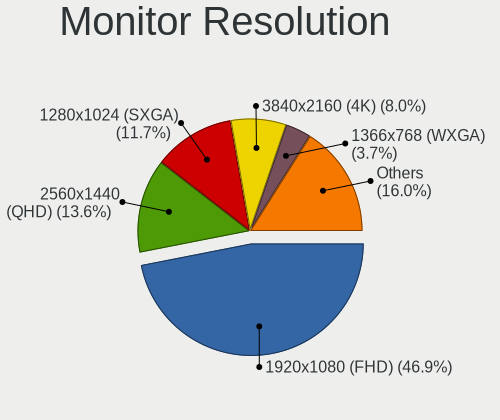

| Resolution         | Desktops | Percent |
|--------------------|----------|---------|
| 1920x1080 (FHD)    | 48       | 45.28%  |
| 2560x1440 (QHD)    | 14       | 13.21%  |
| 1280x1024 (SXGA)   | 14       | 13.21%  |
| 3840x2160 (4K)     | 6        | 5.66%   |
| 1366x768 (WXGA)    | 6        | 5.66%   |
| 1440x900 (WXGA+)   | 3        | 2.83%   |
| 3440x1440          | 2        | 1.89%   |
| 2560x1080          | 2        | 1.89%   |
| 1920x1200 (WUXGA)  | 2        | 1.89%   |
| Unknown            | 2        | 1.89%   |
| 3840x1600          | 1        | 0.94%   |
| 3840x1080          | 1        | 0.94%   |
| 3200x1080          | 1        | 0.94%   |
| 1680x1050 (WSXGA+) | 1        | 0.94%   |
| 1600x900 (HD+)     | 1        | 0.94%   |
| 1360x768           | 1        | 0.94%   |
| 1280x720 (HD)      | 1        | 0.94%   |

Monitor Diagonal
----------------

Diagonal size in inches

| Inches  | Desktops | Percent |
|---------|----------|---------|
| 27      | 18       | 16.82%  |
| 23      | 17       | 15.89%  |
| 24      | 16       | 14.95%  |
| Unknown | 11       | 10.28%  |
| 21      | 10       | 9.35%   |
| 19      | 8        | 7.48%   |
| 18      | 7        | 6.54%   |
| 17      | 6        | 5.61%   |
| 34      | 3        | 2.8%    |
| 40      | 2        | 1.87%   |
| 20      | 2        | 1.87%   |
| 84      | 1        | 0.93%   |
| 55      | 1        | 0.93%   |
| 50      | 1        | 0.93%   |
| 31      | 1        | 0.93%   |
| 25      | 1        | 0.93%   |
| 22      | 1        | 0.93%   |
| 12      | 1        | 0.93%   |

Monitor Width
-------------

Physical width

| Width in mm | Desktops | Percent |
|-------------|----------|---------|
| 501-600     | 46       | 45.1%   |
| 401-500     | 20       | 19.61%  |
| Unknown     | 11       | 10.78%  |
| 351-400     | 7        | 6.86%   |
| 301-350     | 6        | 5.88%   |
| 701-800     | 3        | 2.94%   |
| 601-700     | 3        | 2.94%   |
| 801-900     | 2        | 1.96%   |
| 1001-1500   | 2        | 1.96%   |
| 201-300     | 1        | 0.98%   |
| 1501-2000   | 1        | 0.98%   |

Aspect Ratio
------------

Proportional relationship between the width and the height

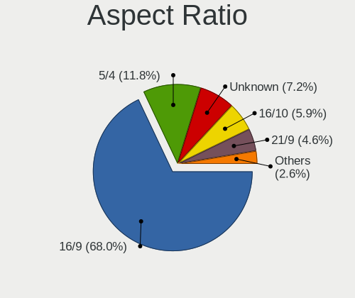

| Ratio   | Desktops | Percent |
|---------|----------|---------|
| 16/9    | 64       | 64.65%  |
| 5/4     | 13       | 13.13%  |
| Unknown | 10       | 10.1%   |
| 16/10   | 7        | 7.07%   |
| 21/9    | 3        | 3.03%   |
| 4/3     | 1        | 1.01%   |
| 3/2     | 1        | 1.01%   |

Monitor Area
------------

Area in inch

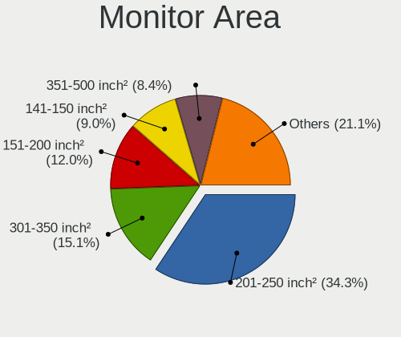

| Area in inch | Desktops | Percent |
|----------------|----------|---------|
| 201-250        | 34       | 31.48%  |
| 301-350        | 18       | 16.67%  |
| 151-200        | 17       | 15.74%  |
| 141-150        | 12       | 11.11%  |
| Unknown        | 11       | 10.19%  |
| 251-300        | 6        | 5.56%   |
| 351-500        | 4        | 3.7%    |
| More than 1000 | 3        | 2.78%   |
| 501-1000       | 2        | 1.85%   |
| 71-80          | 1        | 0.93%   |

Pixel Density
-------------

Pixels per inch

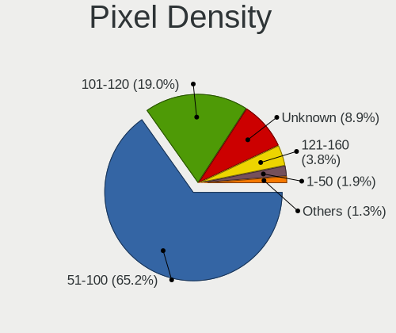

| Density | Desktops | Percent |
|---------|----------|---------|
| 51-100  | 63       | 63%     |
| 101-120 | 20       | 20%     |
| Unknown | 11       | 11%     |
| 1-50    | 2        | 2%      |
| 161-240 | 2        | 2%      |
| 121-160 | 2        | 2%      |

Multiple Monitors
-----------------

Total monitors connected

| Total | Desktops | Percent |
|-------|----------|---------|
| 1     | 70       | 72.16%  |
| 2     | 22       | 22.68%  |
| 0     | 4        | 4.12%   |
| 3     | 1        | 1.03%   |

Network
-------

Net Controller Vendor
---------------------

Controller vendors

| Vendor                   | Desktops | Percent |
|--------------------------|----------|---------|
| Realtek Semiconductor    | 63       | 51.64%  |
| Intel                    | 27       | 22.13%  |
| Qualcomm Atheros         | 10       | 8.2%    |
| TP-Link                  | 3        | 2.46%   |
| Broadcom Limited         | 3        | 2.46%   |
| Nvidia                   | 2        | 1.64%   |
| Microsoft                | 2        | 1.64%   |
| D-Link                   | 2        | 1.64%   |
| Broadcom                 | 2        | 1.64%   |
| Samsung Electronics      | 1        | 0.82%   |
| Ralink Technology        | 1        | 0.82%   |
| Ralink                   | 1        | 0.82%   |
| Marvell Technology Group | 1        | 0.82%   |
| Edimax Technology        | 1        | 0.82%   |
| D-Link System            | 1        | 0.82%   |
| ASUSTek Computer         | 1        | 0.82%   |
| 3Com                     | 1        | 0.82%   |

Net Controller Model
--------------------

Controller models

| Model                                                                | Desktops | Percent |
|----------------------------------------------------------------------|----------|---------|
| Realtek RTL8111/8168/8411 PCI Express Gigabit Ethernet Controller    | 52       | 38.81%  |
| Intel I211 Gigabit Network Connection                                | 5        | 3.73%   |
| Realtek RTL8125 2.5GbE Controller                                    | 4        | 2.99%   |
| Intel 82579V Gigabit Network Connection                              | 4        | 2.99%   |
| Realtek RTL8192CU 802.11n WLAN Adapter                               | 3        | 2.24%   |
| Realtek RTL-8100/8101L/8139 PCI Fast Ethernet Adapter                | 3        | 2.24%   |
| Realtek RTL8188EUS 802.11n Wireless Network Adapter                  | 2        | 1.49%   |
| Realtek RTL810xE PCI Express Fast Ethernet controller                | 2        | 1.49%   |
| Qualcomm Atheros AR9485 Wireless Network Adapter                     | 2        | 1.49%   |
| Qualcomm Atheros AR8152 v2.0 Fast Ethernet                           | 2        | 1.49%   |
| Qualcomm Atheros AR8151 v2.0 Gigabit Ethernet                        | 2        | 1.49%   |
| Microsoft XBOX ACC                                                   | 2        | 1.49%   |
| Intel Wi-Fi 6 AX200                                                  | 2        | 1.49%   |
| Intel Ethernet Controller I225-V                                     | 2        | 1.49%   |
| Intel Ethernet Connection (7) I219-V                                 | 2        | 1.49%   |
| Intel Dual Band Wireless-AC 3168NGW [Stone Peak]                     | 2        | 1.49%   |
| Intel 82578DC Gigabit Network Connection                             | 2        | 1.49%   |
| Intel 82567LM-3 Gigabit Network Connection                           | 2        | 1.49%   |
| Broadcom Limited NetXtreme BCM5755 Gigabit Ethernet PCI Express      | 2        | 1.49%   |
| TP-Link TL-WN821N v5/v6 [RTL8192EU]                                  | 1        | 0.75%   |
| TP-Link TL-WN722N v2                                                 | 1        | 0.75%   |
| TP-Link AC600 wireless Realtek RTL8811AU [Archer T2U Nano]           | 1        | 0.75%   |
| Samsung GT-I9070 (network tethering, USB debugging enabled)          | 1        | 0.75%   |
| Realtek RTL8812AE 802.11ac PCIe Wireless Network Adapter             | 1        | 0.75%   |
| Realtek RTL8192CE PCIe Wireless Network Adapter                      | 1        | 0.75%   |
| Realtek RTL8169 PCI Gigabit Ethernet Controller                      | 1        | 0.75%   |
| Ralink RT5370 Wireless Adapter                                       | 1        | 0.75%   |
| Ralink RT2561/RT61 rev B 802.11g                                     | 1        | 0.75%   |
| Qualcomm Atheros Killer E2400 Gigabit Ethernet Controller            | 1        | 0.75%   |
| Qualcomm Atheros Killer E220x Gigabit Ethernet Controller            | 1        | 0.75%   |
| Qualcomm Atheros AR8132 Fast Ethernet                                | 1        | 0.75%   |
| Qualcomm Atheros AR8121/AR8113/AR8114 Gigabit or Fast Ethernet       | 1        | 0.75%   |
| Nvidia MCP61 Ethernet                                                | 1        | 0.75%   |
| Nvidia MCP55 Ethernet                                                | 1        | 0.75%   |
| Marvell Group 88E8056 PCI-E Gigabit Ethernet Controller              | 1        | 0.75%   |
| Intel Wireless-AC 9260                                               | 1        | 0.75%   |
| Intel Wi-Fi 6 AX210/AX211/AX411 160MHz                               | 1        | 0.75%   |
| Intel Tiger Lake PCH CNVi WiFi                                       | 1        | 0.75%   |
| Intel NM10/ICH7 Family LAN Controller                                | 1        | 0.75%   |
| Intel I210 Gigabit Network Connection                                | 1        | 0.75%   |
| Intel Ethernet Connection I217-V                                     | 1        | 0.75%   |
| Intel Ethernet Connection I217-LM                                    | 1        | 0.75%   |
| Intel Ethernet Connection (2) I219-V                                 | 1        | 0.75%   |
| Intel Ethernet Connection (2) I219-LM                                | 1        | 0.75%   |
| Intel 82579LM Gigabit Network Connection (Lewisville)                | 1        | 0.75%   |
| Intel 82572EI Gigabit Ethernet Controller (Copper)                   | 1        | 0.75%   |
| Intel 82567LF-3 Gigabit Network Connection                           | 1        | 0.75%   |
| Edimax EW-7612UAn V2 802.11n Wireless Adapter [Realtek RTL8192CU]    | 1        | 0.75%   |
| D-Link System DWA-140 RangeBooster N Adapter(rev.B1) [Ralink RT2870] | 1        | 0.75%   |
| D-Link DWA-125 Wireless N 150 Adapter(rev.A3) [Ralink RT5370]        | 1        | 0.75%   |
| D-Link 802.11 n WLAN                                                 | 1        | 0.75%   |
| Broadcom NetXtreme BCM5762 Gigabit Ethernet PCIe                     | 1        | 0.75%   |
| Broadcom Limited NetXtreme BCM5752 Gigabit Ethernet PCI Express      | 1        | 0.75%   |
| Broadcom BCM4352 802.11ac Wireless Network Adapter                   | 1        | 0.75%   |
| ASUS 802.11n WLAN Adapter                                            | 1        | 0.75%   |
| 3Com 3c905B 100BaseTX [Cyclone]                                      | 1        | 0.75%   |

Wireless Vendor
---------------

Wireless vendors

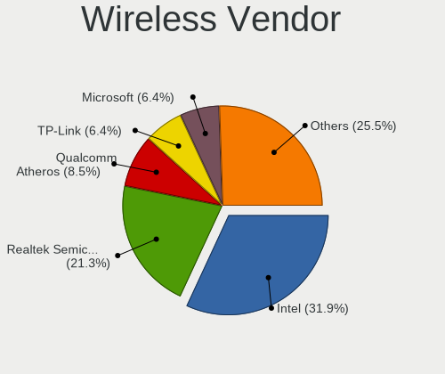

| Vendor                | Desktops | Percent |
|-----------------------|----------|---------|
| Realtek Semiconductor | 7        | 24.14%  |
| Intel                 | 7        | 24.14%  |
| TP-Link               | 3        | 10.34%  |
| Qualcomm Atheros      | 2        | 6.9%    |
| Microsoft             | 2        | 6.9%    |
| D-Link                | 2        | 6.9%    |
| Ralink Technology     | 1        | 3.45%   |
| Ralink                | 1        | 3.45%   |
| Edimax Technology     | 1        | 3.45%   |
| D-Link System         | 1        | 3.45%   |
| Broadcom              | 1        | 3.45%   |
| ASUSTek Computer      | 1        | 3.45%   |

Wireless Model
--------------

Wireless models

| Model                                                                | Desktops | Percent |
|----------------------------------------------------------------------|----------|---------|
| Realtek RTL8192CU 802.11n WLAN Adapter                               | 3        | 10.34%  |
| Realtek RTL8188EUS 802.11n Wireless Network Adapter                  | 2        | 6.9%    |
| Qualcomm Atheros AR9485 Wireless Network Adapter                     | 2        | 6.9%    |
| Microsoft XBOX ACC                                                   | 2        | 6.9%    |
| Intel Wi-Fi 6 AX200                                                  | 2        | 6.9%    |
| Intel Dual Band Wireless-AC 3168NGW [Stone Peak]                     | 2        | 6.9%    |
| TP-Link TL-WN821N v5/v6 [RTL8192EU]                                  | 1        | 3.45%   |
| TP-Link TL-WN722N v2                                                 | 1        | 3.45%   |
| TP-Link AC600 wireless Realtek RTL8811AU [Archer T2U Nano]           | 1        | 3.45%   |
| Realtek RTL8812AE 802.11ac PCIe Wireless Network Adapter             | 1        | 3.45%   |
| Realtek RTL8192CE PCIe Wireless Network Adapter                      | 1        | 3.45%   |
| Ralink RT5370 Wireless Adapter                                       | 1        | 3.45%   |
| Ralink RT2561/RT61 rev B 802.11g                                     | 1        | 3.45%   |
| Intel Wireless-AC 9260                                               | 1        | 3.45%   |
| Intel Wi-Fi 6 AX210/AX211/AX411 160MHz                               | 1        | 3.45%   |
| Intel Tiger Lake PCH CNVi WiFi                                       | 1        | 3.45%   |
| Edimax EW-7612UAn V2 802.11n Wireless Adapter [Realtek RTL8192CU]    | 1        | 3.45%   |
| D-Link System DWA-140 RangeBooster N Adapter(rev.B1) [Ralink RT2870] | 1        | 3.45%   |
| D-Link DWA-125 Wireless N 150 Adapter(rev.A3) [Ralink RT5370]        | 1        | 3.45%   |
| D-Link 802.11 n WLAN                                                 | 1        | 3.45%   |
| Broadcom BCM4352 802.11ac Wireless Network Adapter                   | 1        | 3.45%   |
| ASUS 802.11n WLAN Adapter                                            | 1        | 3.45%   |

Ethernet Vendor
---------------

Ethernet vendors

| Vendor                   | Desktops | Percent |
|--------------------------|----------|---------|
| Realtek Semiconductor    | 61       | 59.22%  |
| Intel                    | 25       | 24.27%  |
| Qualcomm Atheros         | 8        | 7.77%   |
| Broadcom Limited         | 3        | 2.91%   |
| Nvidia                   | 2        | 1.94%   |
| Samsung Electronics      | 1        | 0.97%   |
| Marvell Technology Group | 1        | 0.97%   |
| Broadcom                 | 1        | 0.97%   |
| 3Com                     | 1        | 0.97%   |

Ethernet Model
--------------

Ethernet models

| Model                                                             | Desktops | Percent |
|-------------------------------------------------------------------|----------|---------|
| Realtek RTL8111/8168/8411 PCI Express Gigabit Ethernet Controller | 52       | 49.52%  |
| Intel I211 Gigabit Network Connection                             | 5        | 4.76%   |
| Realtek RTL8125 2.5GbE Controller                                 | 4        | 3.81%   |
| Intel 82579V Gigabit Network Connection                           | 4        | 3.81%   |
| Realtek RTL-8100/8101L/8139 PCI Fast Ethernet Adapter             | 3        | 2.86%   |
| Realtek RTL810xE PCI Express Fast Ethernet controller             | 2        | 1.9%    |
| Qualcomm Atheros AR8152 v2.0 Fast Ethernet                        | 2        | 1.9%    |
| Qualcomm Atheros AR8151 v2.0 Gigabit Ethernet                     | 2        | 1.9%    |
| Intel Ethernet Controller I225-V                                  | 2        | 1.9%    |
| Intel Ethernet Connection (7) I219-V                              | 2        | 1.9%    |
| Intel 82578DC Gigabit Network Connection                          | 2        | 1.9%    |
| Intel 82567LM-3 Gigabit Network Connection                        | 2        | 1.9%    |
| Broadcom Limited NetXtreme BCM5755 Gigabit Ethernet PCI Express   | 2        | 1.9%    |
| Samsung GT-I9070 (network tethering, USB debugging enabled)       | 1        | 0.95%   |
| Realtek RTL8169 PCI Gigabit Ethernet Controller                   | 1        | 0.95%   |
| Qualcomm Atheros Killer E2400 Gigabit Ethernet Controller         | 1        | 0.95%   |
| Qualcomm Atheros Killer E220x Gigabit Ethernet Controller         | 1        | 0.95%   |
| Qualcomm Atheros AR8132 Fast Ethernet                             | 1        | 0.95%   |
| Qualcomm Atheros AR8121/AR8113/AR8114 Gigabit or Fast Ethernet    | 1        | 0.95%   |
| Nvidia MCP61 Ethernet                                             | 1        | 0.95%   |
| Nvidia MCP55 Ethernet                                             | 1        | 0.95%   |
| Marvell Group 88E8056 PCI-E Gigabit Ethernet Controller           | 1        | 0.95%   |
| Intel NM10/ICH7 Family LAN Controller                             | 1        | 0.95%   |
| Intel I210 Gigabit Network Connection                             | 1        | 0.95%   |
| Intel Ethernet Connection I217-V                                  | 1        | 0.95%   |
| Intel Ethernet Connection I217-LM                                 | 1        | 0.95%   |
| Intel Ethernet Connection (2) I219-V                              | 1        | 0.95%   |
| Intel Ethernet Connection (2) I219-LM                             | 1        | 0.95%   |
| Intel 82579LM Gigabit Network Connection (Lewisville)             | 1        | 0.95%   |
| Intel 82572EI Gigabit Ethernet Controller (Copper)                | 1        | 0.95%   |
| Intel 82567LF-3 Gigabit Network Connection                        | 1        | 0.95%   |
| Broadcom NetXtreme BCM5762 Gigabit Ethernet PCIe                  | 1        | 0.95%   |
| Broadcom Limited NetXtreme BCM5752 Gigabit Ethernet PCI Express   | 1        | 0.95%   |
| 3Com 3c905B 100BaseTX [Cyclone]                                   | 1        | 0.95%   |

Net Controller Kind
-------------------

Ethernet, WiFi or modem

| Kind     | Desktops | Percent |
|----------|----------|---------|
| Ethernet | 97       | 78.23%  |
| WiFi     | 27       | 21.77%  |

Used Controller
---------------

Currently used network controller

| Kind     | Desktops | Percent |
|----------|----------|---------|
| Ethernet | 83       | 83%     |
| WiFi     | 17       | 17%     |

NICs
----

Total network controllers on board

| Total | Desktops | Percent |
|-------|----------|---------|
| 1     | 81       | 81%     |
| 2     | 15       | 15%     |
| 3     | 4        | 4%      |

IPv6
----

IPv6 vs IPv4

| Used | Desktops | Percent |
|------|----------|---------|
| No   | 97       | 100%    |

Bluetooth
---------

Bluetooth Vendor
----------------

Controller vendors

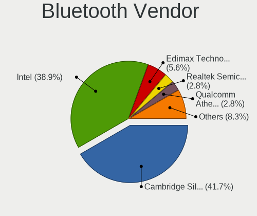

| Vendor                  | Desktops | Percent |
|-------------------------|----------|---------|
| Cambridge Silicon Radio | 9        | 50%     |
| Intel                   | 7        | 38.89%  |
| Edimax Technology       | 1        | 5.56%   |
| Broadcom                | 1        | 5.56%   |

Bluetooth Model
---------------

Controller models

| Model                                               | Desktops | Percent |
|-----------------------------------------------------|----------|---------|
| Cambridge Silicon Radio Bluetooth Dongle (HCI mode) | 9        | 50%     |
| Intel Wireless-AC 3168 Bluetooth                    | 2        | 11.11%  |
| Intel AX200 Bluetooth                               | 2        | 11.11%  |
| Intel Wireless-AC 9260 Bluetooth Adapter            | 1        | 5.56%   |
| Intel AX210 Bluetooth                               | 1        | 5.56%   |
| Intel AX201 Bluetooth                               | 1        | 5.56%   |
| Edimax Bluetooth Adapter                            | 1        | 5.56%   |
| Broadcom Bluetooth Device                           | 1        | 5.56%   |

Sound
-----

Sound Vendor
------------

Sound card vendors

| Vendor                                          | Desktops | Percent |
|-------------------------------------------------|----------|---------|
| Intel                                           | 57       | 32.39%  |
| Nvidia                                          | 44       | 25%     |
| AMD                                             | 44       | 25%     |
| JMTek                                           | 6        | 3.41%   |
| C-Media Electronics                             | 6        | 3.41%   |
| Logitech                                        | 3        | 1.7%    |
| Yamaha                                          | 2        | 1.14%   |
| SteelSeries ApS                                 | 2        | 1.14%   |
| Sony                                            | 1        | 0.57%   |
| Realtek Semiconductor                           | 1        | 0.57%   |
| Razer USA                                       | 1        | 0.57%   |
| PreSonus Audio Electronics                      | 1        | 0.57%   |
| Panasonic (Matsushita)                          | 1        | 0.57%   |
| Licensed by Sony Computer Entertainment America | 1        | 0.57%   |
| Generalplus Technology                          | 1        | 0.57%   |
| Focusrite-Novation                              | 1        | 0.57%   |
| Creative Technology                             | 1        | 0.57%   |
| Creative Labs                                   | 1        | 0.57%   |
| ASUSTek Computer                                | 1        | 0.57%   |
| Allen&Heath                                     | 1        | 0.57%   |

Sound Model
-----------

Sound card models

| Model                                                                      | Desktops | Percent |
|----------------------------------------------------------------------------|----------|---------|
| AMD Starship/Matisse HD Audio Controller                                   | 12       | 5.91%   |
| Intel 8 Series/C220 Series Chipset High Definition Audio Controller        | 10       | 4.93%   |
| AMD Family 17h (Models 00h-0fh) HD Audio Controller                        | 10       | 4.93%   |
| Intel NM10/ICH7 Family High Definition Audio Controller                    | 8        | 3.94%   |
| Intel 6 Series/C200 Series Chipset Family High Definition Audio Controller | 8        | 3.94%   |
| AMD SBx00 Azalia (Intel HDA)                                               | 7        | 3.45%   |
| Nvidia GP107GL High Definition Audio Controller                            | 5        | 2.46%   |
| Nvidia GP106 High Definition Audio Controller                              | 5        | 2.46%   |
| Nvidia GF108 High Definition Audio Controller                              | 5        | 2.46%   |
| JMTek USB PnP Audio Device                                                 | 5        | 2.46%   |
| Intel Xeon E3-1200 v3/4th Gen Core Processor HD Audio Controller           | 5        | 2.46%   |
| Intel 200 Series PCH HD Audio                                              | 5        | 2.46%   |
| Intel 100 Series/C230 Series Chipset Family HD Audio Controller            | 5        | 2.46%   |
| AMD Family 17h/19h HD Audio Controller                                     | 5        | 2.46%   |
| Nvidia TU116 High Definition Audio Controller                              | 4        | 1.97%   |
| AMD Raven/Raven2/Fenghuang HDMI/DP Audio Controller                        | 4        | 1.97%   |
| AMD Ellesmere HDMI Audio [Radeon RX 470/480 / 570/580/590]                 | 4        | 1.97%   |
| Nvidia GM204 High Definition Audio Controller                              | 3        | 1.48%   |
| Nvidia GM107 High Definition Audio Controller [GeForce 940MX]              | 3        | 1.48%   |
| Nvidia GA102 High Definition Audio Controller                              | 3        | 1.48%   |
| Intel Cannon Lake PCH cAVS                                                 | 3        | 1.48%   |
| Intel 82801JD/DO (ICH10 Family) HD Audio Controller                        | 3        | 1.48%   |
| Intel 7 Series/C216 Chipset Family High Definition Audio Controller        | 3        | 1.48%   |
| Intel 5 Series/3400 Series Chipset High Definition Audio                   | 3        | 1.48%   |
| AMD Navi 10 HDMI Audio                                                     | 3        | 1.48%   |
| AMD Baffin HDMI/DP Audio [Radeon RX 550 640SP / RX 560/560X]               | 3        | 1.48%   |
| Yamaha AG06/AG03                                                           | 2        | 0.99%   |
| Nvidia TU106 High Definition Audio Controller                              | 2        | 0.99%   |
| Nvidia GP104 High Definition Audio Controller                              | 2        | 0.99%   |
| Nvidia GK208 HDMI/DP Audio Controller                                      | 2        | 0.99%   |
| Nvidia GK104 HDMI Audio Controller                                         | 2        | 0.99%   |
| Intel Tiger Lake-H HD Audio Controller                                     | 2        | 0.99%   |
| Intel Comet Lake PCH-V cAVS                                                | 2        | 0.99%   |
| Intel C600/X79 series chipset High Definition Audio Controller             | 2        | 0.99%   |
| C-Media Electronics Audio Adapter (Unitek Y-247A)                          | 2        | 0.99%   |
| AMD Oland/Hainan/Cape Verde/Pitcairn HDMI Audio [Radeon HD 7000 Series]    | 2        | 0.99%   |
| AMD Cedar HDMI Audio [Radeon HD 5400/6300/7300 Series]                     | 2        | 0.99%   |
| SteelSeries ApS SteelSeries GameDAC                                        | 1        | 0.49%   |
| SteelSeries ApS Arctis 7 wireless adapter                                  | 1        | 0.49%   |
| Sony DualShock 4 [CUH-ZCT2x]                                               | 1        | 0.49%   |
| Realtek Semiconductor Realtek Audio USB                                    | 1        | 0.49%   |
| Razer USA Razer USB Sound Card                                             | 1        | 0.49%   |
| PreSonus Audio Electronics AudioBox USB 96                                 | 1        | 0.49%   |
| Panasonic (Matsushita) USB Audio 2                                         | 1        | 0.49%   |
| Nvidia TU104 HD Audio Controller                                           | 1        | 0.49%   |
| Nvidia TU102 High Definition Audio Controller                              | 1        | 0.49%   |
| Nvidia MCP61 High Definition Audio                                         | 1        | 0.49%   |
| Nvidia MCP55 High Definition Audio                                         | 1        | 0.49%   |
| Nvidia High Definition Audio Controller                                    | 1        | 0.49%   |
| Nvidia GT216 HDMI Audio Controller                                         | 1        | 0.49%   |
| Nvidia GM206 High Definition Audio Controller                              | 1        | 0.49%   |
| Nvidia GF116 High Definition Audio Controller                              | 1        | 0.49%   |
| Nvidia GF114 HDMI Audio Controller                                         | 1        | 0.49%   |
| Logitech G733 Gaming Headset                                               | 1        | 0.49%   |
| Logitech G560 Gaming Speaker                                               | 1        | 0.49%   |
| Logitech Blue Microphones                                                  | 1        | 0.49%   |
| Licensed by Sony Computer Entertainment America Rocksmith Guitar Adapter   | 1        | 0.49%   |
| JMTek Hex                                                                  | 1        | 0.49%   |
| Intel Audio device                                                         | 1        | 0.49%   |
| Intel 82801I (ICH9 Family) HD Audio Controller                             | 1        | 0.49%   |

Memory
------

Memory Vendor
-------------

Memory module vendors

| Vendor              | Desktops | Percent |
|---------------------|----------|---------|
| Kingston            | 19       | 26.03%  |
| Unknown             | 11       | 15.07%  |
| G.Skill             | 9        | 12.33%  |
| Crucial             | 9        | 12.33%  |
| Patriot             | 5        | 6.85%   |
| Ramaxel Technology  | 3        | 4.11%   |
| A-DATA Technology   | 3        | 4.11%   |
| Transcend           | 2        | 2.74%   |
| Team                | 2        | 2.74%   |
| SK hynix            | 2        | 2.74%   |
| Samsung Electronics | 2        | 2.74%   |
| Nanya Technology    | 2        | 2.74%   |
| Corsair             | 2        | 2.74%   |
| Elpida              | 1        | 1.37%   |
| Atermiter           | 1        | 1.37%   |

Memory Model
------------

Memory module models

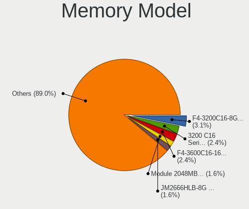

| Model                                                     | Desktops | Percent |
|-----------------------------------------------------------|----------|---------|
| Unknown RAM Module 2048MB DIMM SDRAM                      | 2        | 2.41%   |
| Transcend RAM JM2666HLB-8G 8192MB DIMM DDR4 2667MT/s      | 2        | 2.41%   |
| Patriot RAM PSD48G266681 8GB DIMM DDR4 2934MT/s           | 2        | 2.41%   |
| Kingston RAM KHX3200C16D4/8GX 8GB DIMM DDR4 3600MT/s      | 2        | 2.41%   |
| G.Skill RAM F4-3600C16-16GVKC 16GB DIMM DDR4 3866MT/s     | 2        | 2.41%   |
| Unknown RAM Module 8GB DIMM DDR3 1333MT/s                 | 1        | 1.2%    |
| Unknown RAM Module 8192MB DIMM DDR3 1600MT/s              | 1        | 1.2%    |
| Unknown RAM Module 512MB DIMM 800MT/s                     | 1        | 1.2%    |
| Unknown RAM Module 4GB DIMM 1333MT/s                      | 1        | 1.2%    |
| Unknown RAM Module 4096MB DIMM DDR3 1600MT/s              | 1        | 1.2%    |
| Unknown RAM Module 4096MB DIMM 1600MT/s                   | 1        | 1.2%    |
| Unknown RAM Module 4096MB DIMM 1333MT/s                   | 1        | 1.2%    |
| Unknown RAM Module 2GB DIMM SDRAM                         | 1        | 1.2%    |
| Unknown RAM Module 2GB DIMM 800MT/s                       | 1        | 1.2%    |
| Unknown RAM Module 2048MB DIMM 800MT/s                    | 1        | 1.2%    |
| Unknown RAM Module 1024MB DIMM DDR2 400MT/s               | 1        | 1.2%    |
| Transcend RAM JM2400HLB-8G 8192MB DIMM DDR4 2133MT/s      | 1        | 1.2%    |
| Team RAM TEAMGROUP-UD4-3200 32GB DIMM DDR4 3200MT/s       | 1        | 1.2%    |
| Team RAM TEAMGROUP-UD4-3000 8GB DIMM DDR4 3067MT/s        | 1        | 1.2%    |
| SK hynix RAM HMT451U6AFR8C-PB 4GB DIMM DDR3               | 1        | 1.2%    |
| SK hynix RAM HMA81GU7AFR8N-UH 8192MB DIMM DDR4 2400MT/s   | 1        | 1.2%    |
| Samsung RAM M378A5143EB1-CPB 4GB DIMM DDR4 2400MT/s       | 1        | 1.2%    |
| Samsung RAM M378A1K43BB2-CRC 8GB DIMM DDR4 3400MT/s       | 1        | 1.2%    |
| Ramaxel RAM RMUA5090KB78HAF2133 8192MB DIMM DDR4 2133MT/s | 1        | 1.2%    |
| Ramaxel RAM RMR5040ED58E9W1600 4GB DIMM DDR3 1600MT/s     | 1        | 1.2%    |
| Ramaxel RAM RML1520AG38D6F-667 512MB DIMM DDR2 667MT/s    | 1        | 1.2%    |
| Patriot RAM PSD48G240081 8GB DIMM DDR4 2800MT/s           | 1        | 1.2%    |
| Patriot RAM PSD34G160081 4GB DIMM DDR3 1600MT/s           | 1        | 1.2%    |
| Patriot RAM PSD34G13332 4GB DIMM DDR3 1600MT/s            | 1        | 1.2%    |
| Nanya RAM NT4GC64B8HG0NF-DI 4GB DIMM DDR3 1600MT/s        | 1        | 1.2%    |
| Nanya RAM M2Y51264TU88A4B-3C 512MB DIMM DDR2 667MT/s      | 1        | 1.2%    |
| Kingston RAM termiter 9.A01LF 8192MB DIMM DDR3 1067MT/s   | 1        | 1.2%    |
| Kingston RAM MSI24D4U7S8MB-8 8GB DIMM DDR4 2400MT/s       | 1        | 1.2%    |
| Kingston RAM Module 2048MB DIMM DDR3 1333MT/s             | 1        | 1.2%    |
| Kingston RAM Module 1024MB DIMM DDR 667MT/s               | 1        | 1.2%    |
| Kingston RAM M471B5273DH0-CK0 4096MB DIMM DDR3 1600MT/s   | 1        | 1.2%    |
| Kingston RAM KHX2666C16/16G 16GB DIMM DDR4 3200MT/s       | 1        | 1.2%    |
| Kingston RAM KF3600C16D4/16GX 16384MB DIMM DDR4 3600MT/s  | 1        | 1.2%    |
| Kingston RAM ACR512X64D3U16C11G 4096MB DIMM DDR3 1600MT/s | 1        | 1.2%    |
| Kingston RAM 99U5584-005.A00LF 4GB DIMM DDR3 1600MT/s     | 1        | 1.2%    |
| Kingston RAM 99U5474-013.A00LF 2GB DIMM DDR3 1600MT/s     | 1        | 1.2%    |
| Kingston RAM 99U5471-057.A00LF 8192MB DIMM DDR3 1333MT/s  | 1        | 1.2%    |
| Kingston RAM 99U5471-052.A00LF 8GB DIMM DDR3 1333MT/s     | 1        | 1.2%    |
| Kingston RAM 99U5471-012.A00LF 4GB DIMM DDR3 1600MT/s     | 1        | 1.2%    |
| Kingston RAM 9905702-027.A00G 8GB DIMM DDR4 2667MT/s      | 1        | 1.2%    |
| Kingston RAM 9905701-143.A00G 16384MB DIMM DDR4 2666MT/s  | 1        | 1.2%    |
| Kingston RAM 9905625-030.A00G 8GB DIMM 2133MT/s           | 1        | 1.2%    |
| Kingston RAM 9905595-010.A00LF 2048MB DIMM DDR3 1600MT/s  | 1        | 1.2%    |
| Kingston RAM 9905474-050.A00LF 4GB DIMM DDR3 1333MT/s     | 1        | 1.2%    |
| Kingston RAM 9905471-017.A00LF 4096MB DIMM DDR3 1333MT/s  | 1        | 1.2%    |
| Kingston RAM 9905471-001.A01LF 2GB DIMM 1600MT/s          | 1        | 1.2%    |
| Kingston RAM 9905428-095.D00LF 4096MB DIMM DDR3 1600MT/s  | 1        | 1.2%    |
| Kingston RAM 9905403-156.A00LF 2GB DIMM DDR3 1333MT/s     | 1        | 1.2%    |
| G.Skill RAM F4-5333C22-8GTRS 8GB DIMM DDR4 2133MT/s       | 1        | 1.2%    |
| G.Skill RAM F4-3200C16-8GIS 8192MB DIMM DDR4 3200MT/s     | 1        | 1.2%    |
| G.Skill RAM F4-3200C16-8GFX 8GB DIMM DDR4 3200MT/s        | 1        | 1.2%    |
| G.Skill RAM F4-3200C14-8GFX 8GB DIMM DDR4 3733MT/s        | 1        | 1.2%    |
| G.Skill RAM F4-3000C16-8GISB 8GB DIMM DDR4 3200MT/s       | 1        | 1.2%    |
| G.Skill RAM F4-2400C17-4GNT 4096MB DIMM DDR4 2400MT/s     | 1        | 1.2%    |
| G.Skill RAM F4-2400C15-8GNT 8192MB DIMM DDR4 2666MT/s     | 1        | 1.2%    |

Memory Kind
-----------

Memory module kinds

| Kind    | Desktops | Percent |
|---------|----------|---------|
| DDR4    | 32       | 50%     |
| DDR3    | 20       | 31.25%  |
| Unknown | 5        | 7.81%   |
| SDRAM   | 4        | 6.25%   |
| DDR2    | 2        | 3.13%   |
| DDR     | 1        | 1.56%   |

Memory Form Factor
------------------

Physical design of the memory module

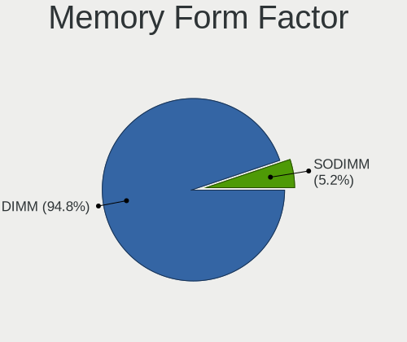

| Name | Desktops | Percent |
|------|----------|---------|
| DIMM | 63       | 100%    |

Memory Size
-----------

Memory module size

| Size  | Desktops | Percent |
|-------|----------|---------|
| 8192  | 29       | 42.65%  |
| 4096  | 18       | 26.47%  |
| 16384 | 8        | 11.76%  |
| 2048  | 8        | 11.76%  |
| 1024  | 2        | 2.94%   |
| 512   | 2        | 2.94%   |
| 32768 | 1        | 1.47%   |

Memory Speed
------------

Memory module speed

| Speed   | Desktops | Percent |
|---------|----------|---------|
| 1600    | 15       | 20.27%  |
| 1333    | 9        | 12.16%  |
| 3200    | 7        | 9.46%   |
| 2667    | 6        | 8.11%   |
| 3600    | 4        | 5.41%   |
| 2666    | 4        | 5.41%   |
| 2400    | 4        | 5.41%   |
| 2133    | 4        | 5.41%   |
| 800     | 3        | 4.05%   |
| Unknown | 3        | 4.05%   |
| 3866    | 2        | 2.7%    |
| 2934    | 2        | 2.7%    |
| 2800    | 2        | 2.7%    |
| 667     | 2        | 2.7%    |
| 3733    | 1        | 1.35%   |
| 3466    | 1        | 1.35%   |
| 3400    | 1        | 1.35%   |
| 3067    | 1        | 1.35%   |
| 1067    | 1        | 1.35%   |
| 1066    | 1        | 1.35%   |
| 400     | 1        | 1.35%   |

Printers & scanners
-------------------

Printer Vendor
--------------

Printer device vendors

| Vendor              | Desktops | Percent |
|---------------------|----------|---------|
| Samsung Electronics | 3        | 60%     |
| Hewlett-Packard     | 2        | 40%     |

Printer Model
-------------

Printer device models

| Model                   | Desktops | Percent |
|-------------------------|----------|---------|
| Samsung SCX-4200 series | 1        | 20%     |
| Samsung ML-1670 Series  | 1        | 20%     |
| Samsung M2070 Series    | 1        | 20%     |
| HP PSC-1315/PSC-1317    | 1        | 20%     |
| HP LaserJet 1020        | 1        | 20%     |

Scanner Vendor
--------------

Scanner device vendors

| Vendor | Desktops | Percent |
|--------|----------|---------|
| Canon  | 1        | 100%    |

Scanner Model
-------------

Scanner device models

| Model                  | Desktops | Percent |
|------------------------|----------|---------|
| Canon CanoScan LIDE 25 | 1        | 100%    |

Camera
------

Camera Vendor
-------------

Camera device vendors

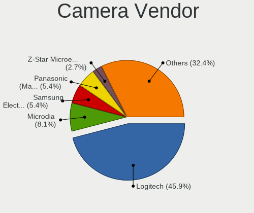

| Vendor                        | Desktops | Percent |
|-------------------------------|----------|---------|
| Logitech                      | 7        | 36.84%  |
| Samsung Electronics           | 2        | 10.53%  |
| Microdia                      | 2        | 10.53%  |
| Z-Star Microelectronics       | 1        | 5.26%   |
| Sunplus Innovation Technology | 1        | 5.26%   |
| Sonix Technology              | 1        | 5.26%   |
| Razer USA                     | 1        | 5.26%   |
| Pixart Imaging                | 1        | 5.26%   |
| Panasonic (Matsushita)        | 1        | 5.26%   |
| Cubeternet                    | 1        | 5.26%   |
| Arkmicro Technologies         | 1        | 5.26%   |

Camera Model
------------

Camera device models

| Model                                                               | Desktops | Percent |
|---------------------------------------------------------------------|----------|---------|
| Samsung Galaxy series, misc. (MTP mode)                             | 2        | 10.53%  |
| Logitech Webcam C270                                                | 2        | 10.53%  |
| Logitech HD Webcam C615                                             | 2        | 10.53%  |
| Z-Star Venus USB2.0 Camera                                          | 1        | 5.26%   |
| Sunplus AUSDOM FHD Camera                                           | 1        | 5.26%   |
| Sonix HDF Webcam USB                                                | 1        | 5.26%   |
| Razer USA Gaming Webcam [Kiyo]                                      | 1        | 5.26%   |
| Pixart Imaging Webcam Genius iLook 300                              | 1        | 5.26%   |
| Panasonic (Matsushita) TY-CC20W                                     | 1        | 5.26%   |
| Microdia Webcam Vitade AF                                           | 1        | 5.26%   |
| Microdia Camera                                                     | 1        | 5.26%   |
| Logitech Webcam C925e                                               | 1        | 5.26%   |
| Logitech Webcam C170                                                | 1        | 5.26%   |
| Logitech HD Pro Webcam C920                                         | 1        | 5.26%   |
| Cubeternet EtronTech CMOS based eSP570 WebCam [Onyx Titanium TC101] | 1        | 5.26%   |
| Arkmicro USB2.0 PC CAMERA                                           | 1        | 5.26%   |

Security
--------

Fingerprint Vendor
------------------

Fingerprint sensor vendors

Zero info for selected period =(

Fingerprint Model
-----------------

Fingerprint sensor models

Zero info for selected period =(

Chipcard Vendor
---------------

Chipcard module vendors

| Vendor                | Desktops | Percent |
|-----------------------|----------|---------|
| Gemalto (was Gemplus) | 1        | 100%    |

Chipcard Model
--------------

Chipcard module models

| Model                                             | Desktops | Percent |
|---------------------------------------------------|----------|---------|
| Gemalto (was Gemplus) GemPC Twin SmartCard Reader | 1        | 100%    |

Unsupported
-----------

Unsupported Devices
-------------------

Total unsupported devices on board

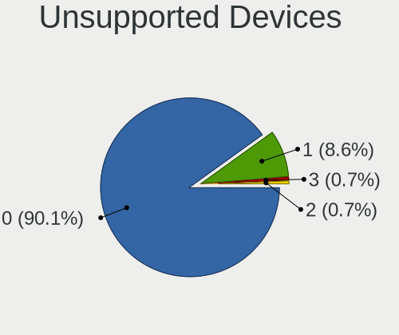

| Total | Desktops | Percent |
|-------|----------|---------|
| 0     | 90       | 91.84%  |
| 1     | 7        | 7.14%   |
| 2     | 1        | 1.02%   |

Unsupported Device Types
------------------------

Types of unsupported devices

| Type          | Desktops | Percent |
|---------------|----------|---------|
| Graphics card | 5        | 55.56%  |
| Network       | 1        | 11.11%  |
| Net/wireless  | 1        | 11.11%  |
| Camera        | 1        | 11.11%  |
| Bluetooth     | 1        | 11.11%  |

