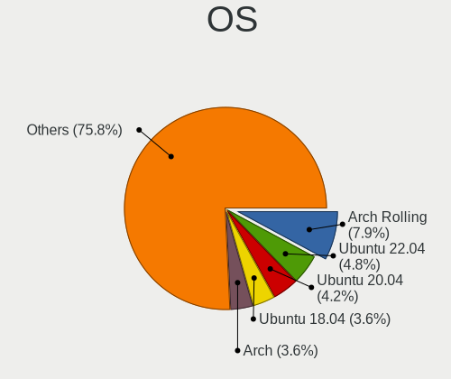
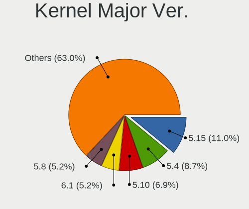
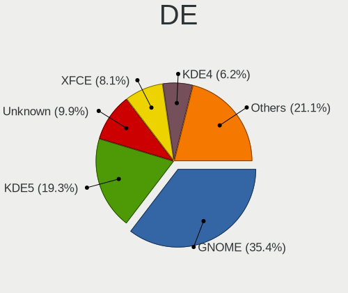
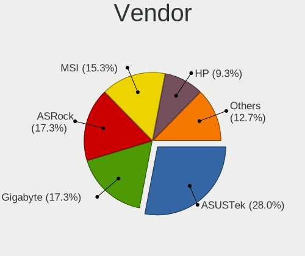
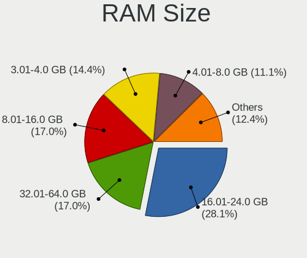
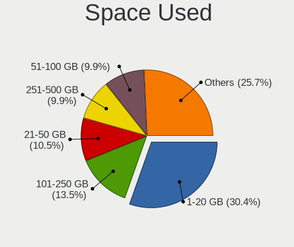
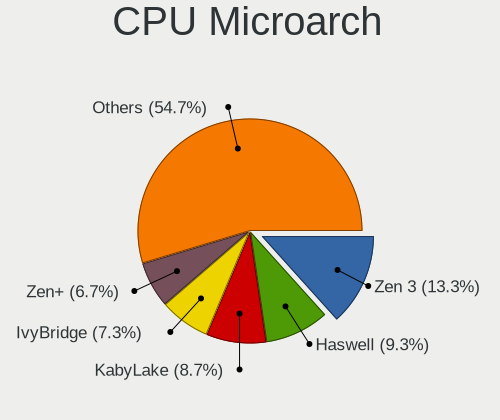
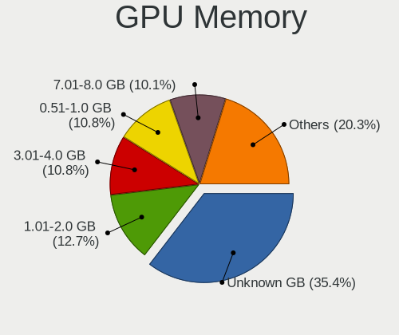
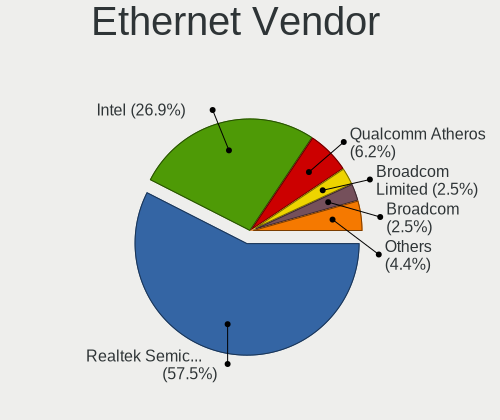

Linux in Lithuania - Tested Hardware & Statistics (Desktops)
------------------------------------------------------------

A project to collect tested hardware configurations for Linux in Lithuania.

Anyone can contribute to this report by the [hw-probe](https://github.com/linuxhw/hw-probe) tool:

    sudo -E hw-probe -all -upload

Please contribute! Especially if your hardware is rare.

Contents
--------

* [ Test Cases ](#test-cases)

* [ System ](#system)
  - [ OS                       ](#os)
  - [ OS Family                ](#os-family)
  - [ Kernel                   ](#kernel)
  - [ Kernel Family            ](#kernel-family)
  - [ Kernel Major Ver.        ](#kernel-major-ver)
  - [ Arch                     ](#arch)
  - [ DE                       ](#de)
  - [ Display Server           ](#display-server)
  - [ Display Manager          ](#display-manager)
  - [ OS Lang                  ](#os-lang)
  - [ Boot Mode                ](#boot-mode)
  - [ Filesystem               ](#filesystem)
  - [ Part. scheme             ](#part-scheme)
  - [ Dual Boot with Linux/BSD ](#dual-boot-with-linuxbsd)
  - [ Dual Boot (Win)          ](#dual-boot-win)

* [ Board ](#board)
  - [ Vendor                   ](#vendor)
  - [ Model                    ](#model)
  - [ Model Family             ](#model-family)
  - [ MFG Year                 ](#mfg-year)
  - [ Form Factor              ](#form-factor)
  - [ Secure Boot              ](#secure-boot)
  - [ Coreboot                 ](#coreboot)
  - [ RAM Size                 ](#ram-size)
  - [ RAM Used                 ](#ram-used)
  - [ Total Drives             ](#total-drives)
  - [ Has CD-ROM               ](#has-cd-rom)
  - [ Has Ethernet             ](#has-ethernet)
  - [ Has WiFi                 ](#has-wifi)
  - [ Has Bluetooth            ](#has-bluetooth)

* [ Location ](#location)
  - [ Country                  ](#country)
  - [ City                     ](#city)

* [ Drives ](#drives)
  - [ Drive Vendor             ](#drive-vendor)
  - [ Drive Model              ](#drive-model)
  - [ HDD Vendor               ](#hdd-vendor)
  - [ SSD Vendor               ](#ssd-vendor)
  - [ Drive Kind               ](#drive-kind)
  - [ Drive Connector          ](#drive-connector)
  - [ Drive Size               ](#drive-size)
  - [ Space Total              ](#space-total)
  - [ Space Used               ](#space-used)
  - [ Malfunc. Drives          ](#malfunc-drives)
  - [ Malfunc. Drive Vendor    ](#malfunc-drive-vendor)
  - [ Malfunc. HDD Vendor      ](#malfunc-hdd-vendor)
  - [ Malfunc. Drive Kind      ](#malfunc-drive-kind)
  - [ Failed Drives            ](#failed-drives)
  - [ Failed Drive Vendor      ](#failed-drive-vendor)
  - [ Drive Status             ](#drive-status)

* [ Storage controller ](#storage-controller)
  - [ Storage Vendor           ](#storage-vendor)
  - [ Storage Model            ](#storage-model)
  - [ Storage Kind             ](#storage-kind)

* [ Processor ](#processor)
  - [ CPU Vendor               ](#cpu-vendor)
  - [ CPU Model                ](#cpu-model)
  - [ CPU Model Family         ](#cpu-model-family)
  - [ CPU Cores                ](#cpu-cores)
  - [ CPU Sockets              ](#cpu-sockets)
  - [ CPU Threads              ](#cpu-threads)
  - [ CPU Op-Modes             ](#cpu-op-modes)
  - [ CPU Microcode            ](#cpu-microcode)
  - [ CPU Microarch            ](#cpu-microarch)

* [ Graphics ](#graphics)
  - [ GPU Vendor               ](#gpu-vendor)
  - [ GPU Model                ](#gpu-model)
  - [ GPU Combo                ](#gpu-combo)
  - [ GPU Driver               ](#gpu-driver)
  - [ GPU Memory               ](#gpu-memory)

* [ Monitor ](#monitor)
  - [ Monitor Vendor           ](#monitor-vendor)
  - [ Monitor Model            ](#monitor-model)
  - [ Monitor Resolution       ](#monitor-resolution)
  - [ Monitor Diagonal         ](#monitor-diagonal)
  - [ Monitor Width            ](#monitor-width)
  - [ Aspect Ratio             ](#aspect-ratio)
  - [ Monitor Area             ](#monitor-area)
  - [ Pixel Density            ](#pixel-density)
  - [ Multiple Monitors        ](#multiple-monitors)

* [ Network ](#network)
  - [ Net Controller Vendor    ](#net-controller-vendor)
  - [ Net Controller Model     ](#net-controller-model)
  - [ Wireless Vendor          ](#wireless-vendor)
  - [ Wireless Model           ](#wireless-model)
  - [ Ethernet Vendor          ](#ethernet-vendor)
  - [ Ethernet Model           ](#ethernet-model)
  - [ Net Controller Kind      ](#net-controller-kind)
  - [ Used Controller          ](#used-controller)
  - [ NICs                     ](#nics)
  - [ IPv6                     ](#ipv6)

* [ Bluetooth ](#bluetooth)
  - [ Bluetooth Vendor         ](#bluetooth-vendor)
  - [ Bluetooth Model          ](#bluetooth-model)

* [ Sound ](#sound)
  - [ Sound Vendor             ](#sound-vendor)
  - [ Sound Model              ](#sound-model)

* [ Memory ](#memory)
  - [ Memory Vendor            ](#memory-vendor)
  - [ Memory Model             ](#memory-model)
  - [ Memory Kind              ](#memory-kind)
  - [ Memory Form Factor       ](#memory-form-factor)
  - [ Memory Size              ](#memory-size)
  - [ Memory Speed             ](#memory-speed)

* [ Printers & scanners ](#printers--scanners)
  - [ Printer Vendor           ](#printer-vendor)
  - [ Printer Model            ](#printer-model)
  - [ Scanner Vendor           ](#scanner-vendor)
  - [ Scanner Model            ](#scanner-model)

* [ Camera ](#camera)
  - [ Camera Vendor            ](#camera-vendor)
  - [ Camera Model             ](#camera-model)

* [ Security ](#security)
  - [ Fingerprint Vendor       ](#fingerprint-vendor)
  - [ Fingerprint Model        ](#fingerprint-model)
  - [ Chipcard Vendor          ](#chipcard-vendor)
  - [ Chipcard Model           ](#chipcard-model)

* [ Unsupported ](#unsupported)
  - [ Unsupported Devices      ](#unsupported-devices)
  - [ Unsupported Device Types ](#unsupported-device-types)

Test Cases
----------

Total: 196

| Vendor        | Model                       | Probe                                                      | Date         |
|---------------|-----------------------------|------------------------------------------------------------|--------------|
| ASRock        | B760M Pro RS                | [f648cda96d](https://linux-hardware.org/?probe=f648cda96d) | Dec 21, 2023 |
| MSI           | MAG B550 TOMAHAWK           | [fbe4d2ec54](https://linux-hardware.org/?probe=fbe4d2ec54) | Dec 08, 2023 |
| ASRock        | B760M Pro RS                | [77b3b5fc4d](https://linux-hardware.org/?probe=77b3b5fc4d) | Dec 07, 2023 |
| Dell          | 0NV0M7 A01                  | [f5ced375d8](https://linux-hardware.org/?probe=f5ced375d8) | Nov 17, 2023 |
| MSI           | MAG Z790 TOMAHAWK WIFI      | [81fb4db1cc](https://linux-hardware.org/?probe=81fb4db1cc) | Nov 15, 2023 |
| ASRock        | X470 Taichi Ultimate        | [2b9b1f909c](https://linux-hardware.org/?probe=2b9b1f909c) | Nov 05, 2023 |
| ASUSTek       | M5A97 R2.0                  | [7f2d93dc09](https://linux-hardware.org/?probe=7f2d93dc09) | Oct 29, 2023 |
| ASUSTek       | PRIME B550-PLUS             | [40769bf0a3](https://linux-hardware.org/?probe=40769bf0a3) | Oct 27, 2023 |
| MSI           | H81M-P33                    | [f59a3c2021](https://linux-hardware.org/?probe=f59a3c2021) | Oct 25, 2023 |
| MSI           | H81M-P33                    | [04b9d686b6](https://linux-hardware.org/?probe=04b9d686b6) | Oct 21, 2023 |
| ASRock        | B450 Pro4                   | [02211f49db](https://linux-hardware.org/?probe=02211f49db) | Oct 08, 2023 |
| ASRock        | B450M Pro4                  | [87f5275af6](https://linux-hardware.org/?probe=87f5275af6) | Sep 18, 2023 |
| ASRock        | B450M Pro4                  | [b52a6f9b59](https://linux-hardware.org/?probe=b52a6f9b59) | Sep 10, 2023 |
| ASRock        | B450M Pro4                  | [cdabed6210](https://linux-hardware.org/?probe=cdabed6210) | Sep 05, 2023 |
| Intel         | D915GAV AAC64134-400        | [c7cad9e093](https://linux-hardware.org/?probe=c7cad9e093) | Aug 20, 2023 |
| ASRock        | B450M-HDV R4.0              | [6855901c02](https://linux-hardware.org/?probe=6855901c02) | Aug 12, 2023 |
| MSI           | B350 TOMAHAWK               | [3aa0e077c0](https://linux-hardware.org/?probe=3aa0e077c0) | Aug 05, 2023 |
| ASUSTek       | PRIME H410M-K               | [0dbf02ef16](https://linux-hardware.org/?probe=0dbf02ef16) | Jul 13, 2023 |
| ASUSTek       | Z87-A                       | [ca84827c75](https://linux-hardware.org/?probe=ca84827c75) | Jun 21, 2023 |
| ASUSTek       | Z87-A                       | [a30c01fab8](https://linux-hardware.org/?probe=a30c01fab8) | Jun 21, 2023 |
| ASUSTek       | P5KPL-VM                    | [e2919326cd](https://linux-hardware.org/?probe=e2919326cd) | Jun 16, 2023 |
| HP            | 0B4Ch D                     | [672a491915](https://linux-hardware.org/?probe=672a491915) | Jun 09, 2023 |
| ASUSTek       | P8H61-M LX2                 | [3fb94f0c4b](https://linux-hardware.org/?probe=3fb94f0c4b) | Jun 09, 2023 |
| ASRock        | QC5000M-ITX/PH              | [bdf4ee4d4f](https://linux-hardware.org/?probe=bdf4ee4d4f) | Jun 04, 2023 |
| MSI           | B450M MORTAR MAX            | [72ccbe10aa](https://linux-hardware.org/?probe=72ccbe10aa) | Jun 04, 2023 |
| ASUSTek       | TUF Gaming B550-PLUS        | [d2189d4a5f](https://linux-hardware.org/?probe=d2189d4a5f) | Jun 02, 2023 |
| ASUSTek       | TUF Gaming X570-PLUS        | [16f1d67220](https://linux-hardware.org/?probe=16f1d67220) | May 31, 2023 |
| HP            | 0B4Ch D                     | [0f593c947e](https://linux-hardware.org/?probe=0f593c947e) | May 27, 2023 |
| HP            | 0B4Ch D                     | [e7a8d68439](https://linux-hardware.org/?probe=e7a8d68439) | May 27, 2023 |
| Unknown       | Unknown                     | [957b9f9de8](https://linux-hardware.org/?probe=957b9f9de8) | May 23, 2023 |
| ASRock        | B550M Phantom Gaming 4      | [db7e2a1d87](https://linux-hardware.org/?probe=db7e2a1d87) | Apr 29, 2023 |
| ASUSTek       | P8B75-V                     | [f60927a4d8](https://linux-hardware.org/?probe=f60927a4d8) | Apr 24, 2023 |
| ASUSTek       | P8B75-V                     | [8957c4fdd0](https://linux-hardware.org/?probe=8957c4fdd0) | Apr 19, 2023 |
| ASUSTek       | ROG Maximus X HERO          | [e13bc4c0b8](https://linux-hardware.org/?probe=e13bc4c0b8) | Apr 04, 2023 |
| HP            | 1825                        | [73a2e18f3a](https://linux-hardware.org/?probe=73a2e18f3a) | Mar 20, 2023 |
| HP            | 1850                        | [1b56ff36d2](https://linux-hardware.org/?probe=1b56ff36d2) | Mar 10, 2023 |
| ASRock        | H67M-GE/HT                  | [3410887193](https://linux-hardware.org/?probe=3410887193) | Feb 25, 2023 |
| Gigabyte      | GB-BSi5-1135G7              | [93002e901f](https://linux-hardware.org/?probe=93002e901f) | Feb 10, 2023 |
| MSI           | H61M-P23                    | [86404b5b68](https://linux-hardware.org/?probe=86404b5b68) | Feb 09, 2023 |
| ASUSTek       | M5A97 R2.0                  | [c0c511ec65](https://linux-hardware.org/?probe=c0c511ec65) | Feb 03, 2023 |
| Gigabyte      | B550M DS3H                  | [10ae4cbb25](https://linux-hardware.org/?probe=10ae4cbb25) | Jan 08, 2023 |
| Gigabyte      | H410M H V3                  | [afea73cc2a](https://linux-hardware.org/?probe=afea73cc2a) | Nov 22, 2022 |
| HP            | 3397                        | [27c0a5213d](https://linux-hardware.org/?probe=27c0a5213d) | Nov 11, 2022 |
| MSI           | MAG Z390 TOMAHAWK           | [4f1e0d9702](https://linux-hardware.org/?probe=4f1e0d9702) | Nov 02, 2022 |
| MSI           | MAG Z390 TOMAHAWK           | [842320d7b3](https://linux-hardware.org/?probe=842320d7b3) | Nov 02, 2022 |
| Lenovo        | ThinkCentre M81 5048E2G     | [35840b3b8c](https://linux-hardware.org/?probe=35840b3b8c) | Oct 23, 2022 |
| HP            | 3047h                       | [1a0f4c46f9](https://linux-hardware.org/?probe=1a0f4c46f9) | Oct 20, 2022 |
| BESSTAR Te... | UM700                       | [5c2590f03f](https://linux-hardware.org/?probe=5c2590f03f) | Oct 18, 2022 |
| BESSTAR Te... | UM700                       | [df0afd4326](https://linux-hardware.org/?probe=df0afd4326) | Oct 18, 2022 |
| ASUSTek       | PRIME B450M-K               | [53ca822dcd](https://linux-hardware.org/?probe=53ca822dcd) | Oct 07, 2022 |
| ASUSTek       | M5A97 R2.0                  | [96e0712ca0](https://linux-hardware.org/?probe=96e0712ca0) | Sep 19, 2022 |
| Gigabyte      | EX58-UD3R                   | [e482e214bd](https://linux-hardware.org/?probe=e482e214bd) | Sep 12, 2022 |
| MSI           | MAG B460M MORTAR            | [258d99cc9e](https://linux-hardware.org/?probe=258d99cc9e) | Sep 06, 2022 |
| Gigabyte      | GA-970A-D3                  | [5ee4e3aec0](https://linux-hardware.org/?probe=5ee4e3aec0) | Sep 02, 2022 |
| ASRock        | B550M Pro4                  | [9a05044c38](https://linux-hardware.org/?probe=9a05044c38) | Aug 27, 2022 |
| ASRock        | B550M Pro4                  | [ab3425dd99](https://linux-hardware.org/?probe=ab3425dd99) | Aug 17, 2022 |
| ASUSTek       | TUF Gaming X570-PLUS        | [e63db5769a](https://linux-hardware.org/?probe=e63db5769a) | Aug 14, 2022 |
| ASUSTek       | Maximus Formula             | [2e71fca3d5](https://linux-hardware.org/?probe=2e71fca3d5) | Jul 22, 2022 |
| Dell          | 07T4MC A11                  | [61d394116d](https://linux-hardware.org/?probe=61d394116d) | Jul 20, 2022 |
| ASUSTek       | Maximus Formula             | [3c600cafa6](https://linux-hardware.org/?probe=3c600cafa6) | Jul 17, 2022 |
| ASUSTek       | Maximus Formula             | [cd81bcaf19](https://linux-hardware.org/?probe=cd81bcaf19) | Jul 13, 2022 |
| Gigabyte      | AB350M-DS3H V2-CF           | [00d543ee46](https://linux-hardware.org/?probe=00d543ee46) | Jul 07, 2022 |
| MSI           | Z270-A PRO                  | [0d78267c59](https://linux-hardware.org/?probe=0d78267c59) | Jun 16, 2022 |
| Dell          | 02YYK5 A01                  | [bd3336efcb](https://linux-hardware.org/?probe=bd3336efcb) | Jun 14, 2022 |
| Dell          | 02YYK5 A01                  | [a068dc57c8](https://linux-hardware.org/?probe=a068dc57c8) | May 13, 2022 |
| Dell          | 02YYK5 A01                  | [96f6c5bf2a](https://linux-hardware.org/?probe=96f6c5bf2a) | May 10, 2022 |
| Dell          | 03NVJ6 A02                  | [9e90322621](https://linux-hardware.org/?probe=9e90322621) | May 06, 2022 |
| Dell          | 03NVJ6 A02                  | [08e665f8bf](https://linux-hardware.org/?probe=08e665f8bf) | May 04, 2022 |
| ASRock        | A320M-HDV R4.0              | [36cabd86ba](https://linux-hardware.org/?probe=36cabd86ba) | May 04, 2022 |
| Dell          | 02YYK5 A01                  | [a3bf1cf766](https://linux-hardware.org/?probe=a3bf1cf766) | Apr 19, 2022 |
| Dell          | 02YYK5 A01                  | [f2e4d7052d](https://linux-hardware.org/?probe=f2e4d7052d) | Apr 16, 2022 |
| MSI           | MEG X570 UNIFY              | [bacc580e7a](https://linux-hardware.org/?probe=bacc580e7a) | Apr 13, 2022 |
| ASUSTek       | PRIME Z390-A                | [8ba327aee7](https://linux-hardware.org/?probe=8ba327aee7) | Apr 07, 2022 |
| ASUSTek       | TUF Gaming B550-PLUS        | [a69ec475f7](https://linux-hardware.org/?probe=a69ec475f7) | Apr 03, 2022 |
| ASUSTek       | PRIME H510M-R               | [6736f1afa6](https://linux-hardware.org/?probe=6736f1afa6) | Apr 03, 2022 |
| Gigabyte      | B450M S2H                   | [aa02b40ff7](https://linux-hardware.org/?probe=aa02b40ff7) | Mar 27, 2022 |
| MSI           | B350 PC MATE                | [2e06b2fed8](https://linux-hardware.org/?probe=2e06b2fed8) | Feb 27, 2022 |
| ASRock        | QC5000M-ITX/PH              | [573ff5a0d0](https://linux-hardware.org/?probe=573ff5a0d0) | Feb 16, 2022 |
| MSI           | B450M MORTAR MAX            | [54f55cc209](https://linux-hardware.org/?probe=54f55cc209) | Feb 16, 2022 |
| ASUSTek       | Maximus Formula             | [130c778a64](https://linux-hardware.org/?probe=130c778a64) | Feb 11, 2022 |
| ASUSTek       | H110M-C                     | [82f3d6edf9](https://linux-hardware.org/?probe=82f3d6edf9) | Feb 09, 2022 |
| ASUSTek       | H110M-C                     | [6ba127c715](https://linux-hardware.org/?probe=6ba127c715) | Feb 04, 2022 |
| ASUSTek       | PRIME B450M-A               | [5616230c16](https://linux-hardware.org/?probe=5616230c16) | Feb 01, 2022 |
| ASUSTek       | H110M-C                     | [be4291793d](https://linux-hardware.org/?probe=be4291793d) | Jan 10, 2022 |
| Gigabyte      | GA-78LMT-USB3 R2 sex        | [a769ac4242](https://linux-hardware.org/?probe=a769ac4242) | Jan 01, 2022 |
| Gigabyte      | X570 AORUS ULTRA            | [d824937c84](https://linux-hardware.org/?probe=d824937c84) | Dec 22, 2021 |
| Gigabyte      | H61M-DS2 DVI                | [1252e4adb0](https://linux-hardware.org/?probe=1252e4adb0) | Dec 18, 2021 |
| ASRock        | B450 Pro4                   | [cc0c8de988](https://linux-hardware.org/?probe=cc0c8de988) | Nov 27, 2021 |
| Dell          | 084J0R A00                  | [2f5b5e4c72](https://linux-hardware.org/?probe=2f5b5e4c72) | Nov 19, 2021 |
| Dell          | 084J0R A00                  | [1907e644a0](https://linux-hardware.org/?probe=1907e644a0) | Nov 18, 2021 |
| ASUSTek       | ROG STRIX Z590-E GAMING ... | [b1edada81b](https://linux-hardware.org/?probe=b1edada81b) | Nov 13, 2021 |
| MSI           | MEG X570 UNIFY              | [7b9e7ec5f4](https://linux-hardware.org/?probe=7b9e7ec5f4) | Oct 23, 2021 |
| MSI           | B85M GAMING                 | [55468e657e](https://linux-hardware.org/?probe=55468e657e) | Oct 16, 2021 |
| ASUSTek       | X79-DELUXE                  | [c49552f889](https://linux-hardware.org/?probe=c49552f889) | Oct 14, 2021 |
| ASUSTek       | X79-DELUXE                  | [d606b23e02](https://linux-hardware.org/?probe=d606b23e02) | Oct 14, 2021 |
| ASUSTek       | Maximus Formula             | [34c7038f6f](https://linux-hardware.org/?probe=34c7038f6f) | Sep 12, 2021 |
| HP            | 09F8h                       | [60e1a81b56](https://linux-hardware.org/?probe=60e1a81b56) | Sep 05, 2021 |
| Gigabyte      | X570 AORUS ELITE            | [057cfec49e](https://linux-hardware.org/?probe=057cfec49e) | Sep 01, 2021 |
| ASUSTek       | TUF Gaming Z590-PLUS WIF... | [523f5ca193](https://linux-hardware.org/?probe=523f5ca193) | Aug 23, 2021 |
| ASUSTek       | TUF Gaming Z590-PLUS WIF... | [90e24e0335](https://linux-hardware.org/?probe=90e24e0335) | Aug 22, 2021 |
| ASUSTek       | M5A97 R2.0                  | [1c59d4f975](https://linux-hardware.org/?probe=1c59d4f975) | Aug 19, 2021 |
| Fujitsu       | D3400-B2 S26361-D3400-B2    | [067c79a9fe](https://linux-hardware.org/?probe=067c79a9fe) | Aug 13, 2021 |
| MSI           | MAG B460M MORTAR            | [652f1a31e9](https://linux-hardware.org/?probe=652f1a31e9) | Aug 10, 2021 |
| MSI           | MAG B460M MORTAR            | [80648f256b](https://linux-hardware.org/?probe=80648f256b) | Aug 10, 2021 |
| ASRock        | G31M-VS2                    | [ffde05f551](https://linux-hardware.org/?probe=ffde05f551) | Aug 01, 2021 |
| ASRock        | Z87 Extreme4                | [ee3189a7be](https://linux-hardware.org/?probe=ee3189a7be) | Jul 11, 2021 |
| ASRock        | X570M Pro4                  | [714a2fb6ec](https://linux-hardware.org/?probe=714a2fb6ec) | Jul 02, 2021 |
| Gigabyte      | P41-ES3G                    | [653a634621](https://linux-hardware.org/?probe=653a634621) | Jun 29, 2021 |
| ASUSTek       | PRIME B450M-K               | [e78af672d3](https://linux-hardware.org/?probe=e78af672d3) | Jun 18, 2021 |
| MSI           | H81M-P33                    | [ab8a093d72](https://linux-hardware.org/?probe=ab8a093d72) | May 12, 2021 |
| Gigabyte      | M55S-S3                     | [7114f9857a](https://linux-hardware.org/?probe=7114f9857a) | Apr 29, 2021 |
| ASUSTek       | PRIME B450M-K               | [dc665ba00d](https://linux-hardware.org/?probe=dc665ba00d) | Apr 14, 2021 |
| Gigabyte      | B85M-HD3                    | [499ccddfc2](https://linux-hardware.org/?probe=499ccddfc2) | Apr 09, 2021 |
| MSI           | MAG B460M MORTAR            | [f7341fd5b2](https://linux-hardware.org/?probe=f7341fd5b2) | Apr 01, 2021 |
| Gigabyte      | H81M-D2V                    | [d62d3a2dad](https://linux-hardware.org/?probe=d62d3a2dad) | Mar 19, 2021 |
| HP            | 805A                        | [76ad927d3b](https://linux-hardware.org/?probe=76ad927d3b) | Mar 18, 2021 |
| Gigabyte      | B85M-HD3                    | [ad58858e33](https://linux-hardware.org/?probe=ad58858e33) | Mar 17, 2021 |
| Intel         | DH67BL AAG10189-208         | [391c72b961](https://linux-hardware.org/?probe=391c72b961) | Mar 17, 2021 |
| Intel         | DH55HC AAE70933-501         | [6a44f69309](https://linux-hardware.org/?probe=6a44f69309) | Mar 17, 2021 |
| Gigabyte      | H55M-UD2H                   | [e671743616](https://linux-hardware.org/?probe=e671743616) | Mar 17, 2021 |
| ASUSTek       | H81M-PLUS                   | [d4e62a32a8](https://linux-hardware.org/?probe=d4e62a32a8) | Mar 04, 2021 |
| ASUSTek       | M5A97 R2.0                  | [7ab4c4e090](https://linux-hardware.org/?probe=7ab4c4e090) | Mar 03, 2021 |
| Gigabyte      | Z370M DS3H-CF               | [e4702a62a8](https://linux-hardware.org/?probe=e4702a62a8) | Feb 19, 2021 |
| Gigabyte      | A320M-H-CF                  | [ceffe7a79e](https://linux-hardware.org/?probe=ceffe7a79e) | Feb 16, 2021 |
| Intel         | DH61WW AAG23116-206         | [446351d845](https://linux-hardware.org/?probe=446351d845) | Feb 15, 2021 |
| ASUSTek       | Maximus Formula             | [b5e1004909](https://linux-hardware.org/?probe=b5e1004909) | Feb 12, 2021 |
| Fujitsu Si... | D2824-A1 S26361-D2824-A1    | [504106eb2c](https://linux-hardware.org/?probe=504106eb2c) | Feb 12, 2021 |
| ASUSTek       | H87M-PLUS                   | [c951026b91](https://linux-hardware.org/?probe=c951026b91) | Feb 07, 2021 |
| ASUSTek       | Maximus Formula             | [80724d2ba1](https://linux-hardware.org/?probe=80724d2ba1) | Jan 31, 2021 |
| ASRock        | H61M/U3S3                   | [2d831a72bb](https://linux-hardware.org/?probe=2d831a72bb) | Jan 27, 2021 |
| Gigabyte      | B250M-D3H-CF                | [a38c700d1b](https://linux-hardware.org/?probe=a38c700d1b) | Jan 16, 2021 |
| ASUSTek       | H87M-PLUS                   | [95389bff49](https://linux-hardware.org/?probe=95389bff49) | Jan 13, 2021 |
| ASUSTek       | Leonite2                    | [9867e750d0](https://linux-hardware.org/?probe=9867e750d0) | Jan 01, 2021 |
| ASRock        | B450M Pro4                  | [649ea3d331](https://linux-hardware.org/?probe=649ea3d331) | Dec 10, 2020 |
| ASRock        | G41C-GS                     | [5c89245f08](https://linux-hardware.org/?probe=5c89245f08) | Dec 02, 2020 |
| ASUSTek       | H87M-PLUS                   | [b2cc866da6](https://linux-hardware.org/?probe=b2cc866da6) | Nov 24, 2020 |
| Gigabyte      | H81M-D2V                    | [49bd67196b](https://linux-hardware.org/?probe=49bd67196b) | Nov 20, 2020 |
| ASRock        | 880GM-LE FX                 | [c16ef7ddf0](https://linux-hardware.org/?probe=c16ef7ddf0) | Nov 09, 2020 |
| Gigabyte      | H77M-D3H                    | [2788cb02ed](https://linux-hardware.org/?probe=2788cb02ed) | Nov 08, 2020 |
| HP            | 3048h                       | [96c9bd0ab6](https://linux-hardware.org/?probe=96c9bd0ab6) | Nov 05, 2020 |
| MSI           | Z87M-G43                    | [9de0cc7bbf](https://linux-hardware.org/?probe=9de0cc7bbf) | Nov 03, 2020 |
| HP            | 0A64h                       | [88899b775b](https://linux-hardware.org/?probe=88899b775b) | Oct 20, 2020 |
| ASUSTek       | H87M-PLUS                   | [a5e1c0e5f3](https://linux-hardware.org/?probe=a5e1c0e5f3) | Oct 03, 2020 |
| ASUSTek       | H87M-PLUS                   | [0362c406d8](https://linux-hardware.org/?probe=0362c406d8) | Oct 03, 2020 |
| ASUSTek       | PRIME H310M-R R2.0          | [b765d71b82](https://linux-hardware.org/?probe=b765d71b82) | Sep 28, 2020 |
| Gigabyte      | H81M-D2V                    | [c46dd29f7a](https://linux-hardware.org/?probe=c46dd29f7a) | Sep 17, 2020 |
| ASUSTek       | PRIME B450M-A               | [d4d40f1808](https://linux-hardware.org/?probe=d4d40f1808) | Sep 04, 2020 |
| ASUSTek       | PRIME A320M-R               | [0097d71249](https://linux-hardware.org/?probe=0097d71249) | Sep 04, 2020 |
| ASUSTek       | PRIME Z390-A                | [4bd12a2bcc](https://linux-hardware.org/?probe=4bd12a2bcc) | Aug 25, 2020 |
| ASRock        | AB350M Pro4                 | [a5338ac2ec](https://linux-hardware.org/?probe=a5338ac2ec) | Aug 22, 2020 |
| Gigabyte      | M68MT-S2P                   | [f6a94becbf](https://linux-hardware.org/?probe=f6a94becbf) | Aug 13, 2020 |
| MSI           | H81M-P33                    | [5d7abb7a5b](https://linux-hardware.org/?probe=5d7abb7a5b) | Jul 31, 2020 |
| ASUSTek       | PRIME H310M-E               | [f31ba594be](https://linux-hardware.org/?probe=f31ba594be) | Jul 19, 2020 |
| ASUSTek       | PRIME H310M-E               | [90f3c751dc](https://linux-hardware.org/?probe=90f3c751dc) | Jul 19, 2020 |
| ASRock        | B450 Gaming-ITX/ac          | [ab2ec330ab](https://linux-hardware.org/?probe=ab2ec330ab) | Jun 24, 2020 |
| ASUSTek       | M5A97 R2.0                  | [feebe9e438](https://linux-hardware.org/?probe=feebe9e438) | Jun 03, 2020 |
| Intel         | DP55WB AAE64798-205         | [cbc58485b8](https://linux-hardware.org/?probe=cbc58485b8) | Apr 23, 2020 |
| MSI           | H61M-P20                    | [bd9fc44d34](https://linux-hardware.org/?probe=bd9fc44d34) | Mar 17, 2020 |
| MSI           | H61M-P20                    | [9111061475](https://linux-hardware.org/?probe=9111061475) | Mar 10, 2020 |
| MSI           | Z170A GAMING M5             | [f1eb3e7e12](https://linux-hardware.org/?probe=f1eb3e7e12) | Mar 01, 2020 |
| MSI           | Z170A GAMING M5             | [7058bdb7d6](https://linux-hardware.org/?probe=7058bdb7d6) | Mar 01, 2020 |
| Gigabyte      | X570 GAMING X               | [816d9c42da](https://linux-hardware.org/?probe=816d9c42da) | Feb 28, 2020 |
| HP            | 1589                        | [0c9be85544](https://linux-hardware.org/?probe=0c9be85544) | Feb 21, 2020 |
| ASUSTek       | P8Z68-V LX                  | [2d24c5a932](https://linux-hardware.org/?probe=2d24c5a932) | Feb 15, 2020 |
| ASUSTek       | PRIME B350M-A               | [c95a831b3c](https://linux-hardware.org/?probe=c95a831b3c) | Feb 11, 2020 |
| ASUSTek       | H87M-PLUS                   | [ca1f92519f](https://linux-hardware.org/?probe=ca1f92519f) | Jan 29, 2020 |
| MSI           | B450M PRO-VDH               | [5b95761a5d](https://linux-hardware.org/?probe=5b95761a5d) | Jan 03, 2020 |
| MSI           | B450M PRO-VDH V2            | [660da3e630](https://linux-hardware.org/?probe=660da3e630) | Jan 03, 2020 |
| MSI           | B450M PRO-VDH               | [f45d7203c0](https://linux-hardware.org/?probe=f45d7203c0) | Jan 03, 2020 |
| ASUSTek       | M5A78L-M PLUS/USB3          | [b0c00423bd](https://linux-hardware.org/?probe=b0c00423bd) | Dec 31, 2019 |
| MSI           | B450M PRO-VDH               | [924e886e1f](https://linux-hardware.org/?probe=924e886e1f) | Dec 13, 2019 |
| MSI           | B450M PRO-VDH               | [4a5d98c236](https://linux-hardware.org/?probe=4a5d98c236) | Dec 13, 2019 |
| MSI           | B450M PRO-VDH               | [b919c0cb27](https://linux-hardware.org/?probe=b919c0cb27) | Dec 13, 2019 |
| ASRock        | H61M-VS                     | [6d7e3aa70a](https://linux-hardware.org/?probe=6d7e3aa70a) | Dec 11, 2019 |
| ASUSTek       | H110M-R                     | [3068ae6e29](https://linux-hardware.org/?probe=3068ae6e29) | Nov 05, 2019 |
| ASUSTek       | H110M-R                     | [dc23169db8](https://linux-hardware.org/?probe=dc23169db8) | Oct 10, 2019 |
| ASUSTek       | P5QPL-AM                    | [ec4b0c74d2](https://linux-hardware.org/?probe=ec4b0c74d2) | Sep 27, 2019 |
| HP            | 0A60h                       | [e587b4122a](https://linux-hardware.org/?probe=e587b4122a) | Sep 22, 2019 |
| Gigabyte      | B250M-DS3H-CF               | [fd394cc113](https://linux-hardware.org/?probe=fd394cc113) | Jun 05, 2019 |
| ASRock        | X370 Taichi                 | [283ce85ac6](https://linux-hardware.org/?probe=283ce85ac6) | Feb 20, 2019 |
| Dell          | 0XFWHV A00                  | [f9e47efc1f](https://linux-hardware.org/?probe=f9e47efc1f) | Jan 12, 2019 |
| MSI           | Z170A GAMING M5             | [68365011c2](https://linux-hardware.org/?probe=68365011c2) | Oct 26, 2018 |
| Intel         | DB65AL AAG12530-302         | [be0b280760](https://linux-hardware.org/?probe=be0b280760) | Oct 25, 2018 |
| HP            | 0A60h                       | [887d9e063a](https://linux-hardware.org/?probe=887d9e063a) | Sep 24, 2018 |
| HP            | 0A60h                       | [180ad06c55](https://linux-hardware.org/?probe=180ad06c55) | Aug 21, 2018 |
| HP            | 0A60h                       | [4ed0a42e5c](https://linux-hardware.org/?probe=4ed0a42e5c) | Jun 30, 2018 |
| ASUSTek       | M4A785T-M                   | [0f2664d3b1](https://linux-hardware.org/?probe=0f2664d3b1) | Mar 29, 2018 |
| ASUSTek       | M4A785T-M                   | [1a91c5f47f](https://linux-hardware.org/?probe=1a91c5f47f) | Mar 05, 2018 |
| Intel         | D102GGC2 AAD42789-201       | [d52ebc3540](https://linux-hardware.org/?probe=d52ebc3540) | Jan 09, 2018 |
| Intel         | D102GGC2 AAD42789-201       | [16d64740e8](https://linux-hardware.org/?probe=16d64740e8) | Jan 09, 2018 |
| ASRock        | ALiveDual-eSATA2            | [7330a7e461](https://linux-hardware.org/?probe=7330a7e461) | Sep 27, 2017 |
| ASRock        | 980DE3/U3S3 R2.0            | [ce9b629fa0](https://linux-hardware.org/?probe=ce9b629fa0) | Apr 21, 2017 |
| ASRock        | G41M-VS3                    | [8915ed904a](https://linux-hardware.org/?probe=8915ed904a) | Mar 14, 2017 |
| ASRock        | G41C-VS                     | [3688013a36](https://linux-hardware.org/?probe=3688013a36) | Dec 02, 2016 |
| ASRock        | G41C-VS                     | [9f9c0116cd](https://linux-hardware.org/?probe=9f9c0116cd) | Nov 30, 2016 |
| ASRock        | G41C-VS                     | [a1993f9fc4](https://linux-hardware.org/?probe=a1993f9fc4) | Nov 28, 2016 |

System
------

OS
--

Installed operating systems

| Name                         | Desktops | Percent |
|------------------------------|----------|---------|
| Ubuntu 20.04                 | 7        | 4.79%   |
| Arch Rolling                 | 7        | 4.79%   |
| Ubuntu 22.04                 | 6        | 4.11%   |
| Ubuntu 18.04                 | 6        | 4.11%   |
| Arch                         | 6        | 4.11%   |
| Ubuntu 21.10                 | 4        | 2.74%   |
| Ubuntu 19.10                 | 4        | 2.74%   |
| OpenMandriva 23.01           | 4        | 2.74%   |
| Manjaro                      | 4        | 2.74%   |
| Debian 11                    | 4        | 2.74%   |
| ROSA R8.1                    | 3        | 2.05%   |
| ROSA R11                     | 3        | 2.05%   |
| ROSA R10                     | 3        | 2.05%   |
| Pop!_OS 22.04                | 3        | 2.05%   |
| Pop!_OS 21.10                | 3        | 2.05%   |
| Pop!_OS 21.04                | 3        | 2.05%   |
| openSUSE Tumbleweed-XXXXXXXX | 3        | 2.05%   |
| OpenMandriva 4.2             | 3        | 2.05%   |
| Manjaro 20.2.1               | 3        | 2.05%   |
| KDE neon 20.04               | 3        | 2.05%   |
| Fedora 33                    | 3        | 2.05%   |
| Zorin 16                     | 2        | 1.37%   |
| Ubuntu 23.04                 | 2        | 1.37%   |
| Ubuntu 20.10                 | 2        | 1.37%   |
| ROSA 12.2                    | 2        | 1.37%   |
| OpenMandriva 23.03           | 2        | 1.37%   |
| Linux Mint 19.3              | 2        | 1.37%   |
| Kubuntu 20.04                | 2        | 1.37%   |
| Fedora 32                    | 2        | 1.37%   |
| Debian 10                    | 2        | 1.37%   |
| ArcoLinux Rolling            | 2        | 1.37%   |
| Xubuntu 20.04                | 1        | 0.68%   |
| Ubuntu Unity 16.04           | 1        | 0.68%   |
| ROSA R9                      | 1        | 0.68%   |
| ROSA R8                      | 1        | 0.68%   |
| ROSA R11.1                   | 1        | 0.68%   |
| RHEL 8                       | 1        | 0.68%   |
| Pop!_OS 20.10                | 1        | 0.68%   |
| Pop!_OS 20.04                | 1        | 0.68%   |
| OpenMandriva 4.3             | 1        | 0.68%   |

OS Family
---------

OS without a version

| Name         | Desktops | Percent |
|--------------|----------|---------|
| Ubuntu       | 30       | 21.9%   |
| ROSA         | 13       | 9.49%   |
| Pop!_OS      | 11       | 8.03%   |
| OpenMandriva | 11       | 8.03%   |
| Manjaro      | 11       | 8.03%   |
| Arch         | 11       | 8.03%   |
| Linux Mint   | 9        | 6.57%   |
| Fedora       | 6        | 4.38%   |
| Debian       | 6        | 4.38%   |
| Kubuntu      | 4        | 2.92%   |
| KDE neon     | 4        | 2.92%   |
| openSUSE     | 3        | 2.19%   |
| Zorin        | 2        | 1.46%   |
| Nobara       | 2        | 1.46%   |
| ArcoLinux    | 2        | 1.46%   |
| Xubuntu      | 1        | 0.73%   |
| Ubuntu Unity | 1        | 0.73%   |
| RHEL         | 1        | 0.73%   |
| Lubuntu      | 1        | 0.73%   |
| Garuda Linux | 1        | 0.73%   |
| Endless      | 1        | 0.73%   |
| EndeavourOS  | 1        | 0.73%   |
| Elementary   | 1        | 0.73%   |
| Deepin       | 1        | 0.73%   |
| Clear Linux  | 1        | 0.73%   |
| CentOS       | 1        | 0.73%   |
| Artix        | 1        | 0.73%   |

Kernel
------

Version of the Linux kernel

| Version                       | Desktops | Percent |
|-------------------------------|----------|---------|
| 6.1.1-desktop-1omv2290        | 4        | 2.52%   |
| 5.3.0-23-generic              | 3        | 1.89%   |
| 5.10.14-desktop-1omv4002      | 3        | 1.89%   |
| 6.2.6-desktop-1omv2390        | 2        | 1.26%   |
| 6.2.0-20-generic              | 2        | 1.26%   |
| 6.1.31-1-lts                  | 2        | 1.26%   |
| 5.9.16-1-MANJARO              | 2        | 1.26%   |
| 5.4.0-70-generic              | 2        | 1.26%   |
| 5.4.0-66-generic              | 2        | 1.26%   |
| 5.4.0-48-generic              | 2        | 1.26%   |
| 5.4.0-26-generic              | 2        | 1.26%   |
| 5.3.0-40-generic              | 2        | 1.26%   |
| 5.3.0-28-generic              | 2        | 1.26%   |
| 5.3.0-24-generic              | 2        | 1.26%   |
| 5.19.0-41-generic             | 2        | 1.26%   |
| 5.15.23-2-lts                 | 2        | 1.26%   |
| 5.15.0-47-generic             | 2        | 1.26%   |
| 5.15.0-46-generic             | 2        | 1.26%   |
| 5.11.0-7620-generic           | 2        | 1.26%   |
| 4.9.60-nrj-desktop-1rosa-i586 | 2        | 1.26%   |
| 6.6.4-zen1-1-zen              | 1        | 0.63%   |
| 6.6.3-1-default               | 1        | 0.63%   |
| 6.6.1-arch1-1                 | 1        | 0.63%   |
| 6.4.9-zen1-1-zen              | 1        | 0.63%   |
| 6.4.12-arch1-1                | 1        | 0.63%   |
| 6.4.10-202.fsync.fc38.x86_64  | 1        | 0.63%   |
| 6.3.8-200.fc38.x86_64         | 1        | 0.63%   |
| 6.3.5-desktop-3omv2390        | 1        | 0.63%   |
| 6.3.5-arch1-1                 | 1        | 0.63%   |
| 6.2.6-76060206-generic        | 1        | 0.63%   |
| 6.2.0-35-generic              | 1        | 0.63%   |
| 6.1.0-6-amd64                 | 1        | 0.63%   |
| 6.1.0-13-amd64                | 1        | 0.63%   |
| 6.0.9-201.fc36.x86_64         | 1        | 0.63%   |
| 6.0.7-1207.native             | 1        | 0.63%   |
| 5.9.13-arch1-1                | 1        | 0.63%   |
| 5.8.3-zen1-1-zen              | 1        | 0.63%   |
| 5.8.17-300.fc33.x86_64        | 1        | 0.63%   |
| 5.8.12-200.fc32.x86_64        | 1        | 0.63%   |
| 5.8.0-7642-generic            | 1        | 0.63%   |

Kernel Family
-------------

Linux kernel without a distro release

| Version | Desktops | Percent |
|---------|----------|---------|
| 5.4.0   | 13       | 8.67%   |
| 5.15.0  | 10       | 6.67%   |
| 5.3.0   | 8        | 5.33%   |
| 5.13.0  | 8        | 5.33%   |
| 4.15.0  | 8        | 5.33%   |
| 5.8.0   | 6        | 4%      |
| 5.11.0  | 6        | 4%      |
| 6.1.1   | 4        | 2.67%   |
| 5.19.0  | 4        | 2.67%   |
| 6.2.6   | 3        | 2%      |
| 6.2.0   | 3        | 2%      |
| 5.10.14 | 3        | 2%      |
| 5.10.0  | 3        | 2%      |
| 6.3.5   | 2        | 1.33%   |
| 6.1.31  | 2        | 1.33%   |
| 6.1.0   | 2        | 1.33%   |
| 5.9.16  | 2        | 1.33%   |
| 5.15.23 | 2        | 1.33%   |
| 4.9.60  | 2        | 1.33%   |
| 4.19.0  | 2        | 1.33%   |
| 6.6.4   | 1        | 0.67%   |
| 6.6.3   | 1        | 0.67%   |
| 6.6.1   | 1        | 0.67%   |
| 6.4.9   | 1        | 0.67%   |
| 6.4.12  | 1        | 0.67%   |
| 6.4.10  | 1        | 0.67%   |
| 6.3.8   | 1        | 0.67%   |
| 6.0.9   | 1        | 0.67%   |
| 6.0.7   | 1        | 0.67%   |
| 5.9.13  | 1        | 0.67%   |
| 5.8.3   | 1        | 0.67%   |
| 5.8.17  | 1        | 0.67%   |
| 5.8.12  | 1        | 0.67%   |
| 5.7.8   | 1        | 0.67%   |
| 5.7.17  | 1        | 0.67%   |
| 5.7.11  | 1        | 0.67%   |
| 5.6.6   | 1        | 0.67%   |
| 5.5.3   | 1        | 0.67%   |
| 5.4.70  | 1        | 0.67%   |
| 5.4.50  | 1        | 0.67%   |

Kernel Major Ver.
-----------------

Linux kernel major version

| Version | Desktops | Percent |
|---------|----------|---------|
| 5.15    | 16       | 10.74%  |
| 5.4     | 15       | 10.07%  |
| 5.10    | 12       | 8.05%   |
| 5.8     | 9        | 6.04%   |
| 5.13    | 9        | 6.04%   |
| 6.1     | 8        | 5.37%   |
| 5.3     | 8        | 5.37%   |
| 4.15    | 8        | 5.37%   |
| 5.11    | 7        | 4.7%    |
| 4.9     | 7        | 4.7%    |
| 6.2     | 6        | 4.03%   |
| 5.19    | 6        | 4.03%   |
| 5.16    | 5        | 3.36%   |
| 6.6     | 3        | 2.01%   |
| 6.4     | 3        | 2.01%   |
| 6.3     | 3        | 2.01%   |
| 5.9     | 3        | 2.01%   |
| 5.7     | 3        | 2.01%   |
| 5.12    | 3        | 2.01%   |
| 4.19    | 3        | 2.01%   |
| 4.14    | 3        | 2.01%   |
| 6.0     | 2        | 1.34%   |
| 5.18    | 2        | 1.34%   |
| 4.1     | 2        | 1.34%   |
| 5.6     | 1        | 0.67%   |
| 5.5     | 1        | 0.67%   |
| 4.18    | 1        | 0.67%   |

Arch
----

OS architecture (x86_64, i586, etc.)

| Name   | Desktops | Percent |
|--------|----------|---------|
| x86_64 | 130      | 96.3%   |
| i686   | 5        | 3.7%    |

DE
--

Desktop Environment

| Name          | Desktops | Percent |
|---------------|----------|---------|
| GNOME         | 52       | 36.62%  |
| KDE5          | 30       | 21.13%  |
| XFCE          | 12       | 8.45%   |
| Unknown       | 12       | 8.45%   |
| KDE4          | 10       | 7.04%   |
| X-Cinnamon    | 7        | 4.93%   |
| KDE           | 7        | 4.93%   |
| Cinnamon      | 3        | 2.11%   |
| MATE          | 2        | 1.41%   |
| Unity         | 1        | 0.7%    |
| qtile         | 1        | 0.7%    |
| Pantheon      | 1        | 0.7%    |
| LXQt          | 1        | 0.7%    |
| i3            | 1        | 0.7%    |
| Enlightenment | 1        | 0.7%    |
| Deepin        | 1        | 0.7%    |

Display Server
--------------

X11 or Wayland

| Name    | Desktops | Percent |
|---------|----------|---------|
| X11     | 113      | 80.71%  |
| Wayland | 21       | 15%     |
| Tty     | 5        | 3.57%   |
| Unknown | 1        | 0.71%   |

Display Manager
---------------

SDDM, LightDM, etc.

| Name    | Desktops | Percent |
|---------|----------|---------|
| Unknown | 59       | 42.45%  |
| SDDM    | 24       | 17.27%  |
| GDM     | 16       | 11.51%  |
| LightDM | 14       | 10.07%  |
| KDM     | 10       | 7.19%   |
| GDM3    | 10       | 7.19%   |
| TDM     | 6        | 4.32%   |

OS Lang
-------

Language

| Lang    | Desktops | Percent |
|---------|----------|---------|
| en_US   | 84       | 61.76%  |
| lt_LT   | 16       | 11.76%  |
| Unknown | 16       | 11.76%  |
| en_GB   | 11       | 8.09%   |
| ru_RU   | 7        | 5.15%   |
| uk_UA   | 1        | 0.74%   |
| C       | 1        | 0.74%   |

Boot Mode
---------

EFI or BIOS

| Mode | Desktops | Percent |
|------|----------|---------|
| BIOS | 89       | 65.44%  |
| EFI  | 47       | 34.56%  |

Filesystem
----------

Type of filesystem

| Type    | Desktops | Percent |
|---------|----------|---------|
| Ext4    | 97       | 70.8%   |
| Btrfs   | 14       | 10.22%  |
| Overlay | 12       | 8.76%   |
| Unknown | 7        | 5.11%   |
| Xfs     | 3        | 2.19%   |
| Tmpfs   | 3        | 2.19%   |
| SAMSUNG | 1        | 0.73%   |

Part. scheme
------------

Scheme of partitioning

| Type    | Desktops | Percent |
|---------|----------|---------|
| Unknown | 61       | 44.2%   |
| GPT     | 47       | 34.06%  |
| MBR     | 30       | 21.74%  |

Dual Boot with Linux/BSD
------------------------

Hosting more than one Linux/BSD

| Dual boot | Desktops | Percent |
|-----------|----------|---------|
| No        | 111      | 82.84%  |
| Yes       | 23       | 17.16%  |

Dual Boot (Win)
---------------

Hosting Linux and Windows

| Dual boot | Desktops | Percent |
|-----------|----------|---------|
| No        | 93       | 67.88%  |
| Yes       | 44       | 32.12%  |

Board
-----

Vendor
------

Motherboard manufacturer

| Name                | Desktops | Percent |
|---------------------|----------|---------|
| ASUSTek Computer    | 36       | 26.87%  |
| ASRock              | 25       | 18.66%  |
| Gigabyte Technology | 23       | 17.16%  |
| MSI                 | 21       | 15.67%  |
| Hewlett-Packard     | 11       | 8.21%   |
| Intel               | 7        | 5.22%   |
| Dell                | 6        | 4.48%   |
| Lenovo              | 1        | 0.75%   |
| Fujitsu Siemens     | 1        | 0.75%   |
| Fujitsu             | 1        | 0.75%   |
| BESSTAR Tech        | 1        | 0.75%   |
| Unknown             | 1        | 0.75%   |

Model
-----

Motherboard model

| Name                               | Desktops | Percent |
|------------------------------------|----------|---------|
| MSI MS-7A38                        | 3        | 2.24%   |
| MSI MS-7817                        | 3        | 2.24%   |
| ASUS All Series                    | 3        | 2.24%   |
| MSI MS-7C82                        | 2        | 1.49%   |
| MSI MS-7A34                        | 2        | 1.49%   |
| MSI MS-7823                        | 2        | 1.49%   |
| ASUS TUF Gaming X570-PLUS          | 2        | 1.49%   |
| ASUS TUF Gaming B550-PLUS          | 2        | 1.49%   |
| ASUS PRIME Z390-A                  | 2        | 1.49%   |
| ASUS PRIME B450M-K                 | 2        | 1.49%   |
| ASUS PRIME B450M-A                 | 2        | 1.49%   |
| ASRock B450 Pro4                   | 2        | 1.49%   |
| MSI MS-7D91                        | 1        | 0.75%   |
| MSI MS-7C91                        | 1        | 0.75%   |
| MSI MS-7C35                        | 1        | 0.75%   |
| MSI MS-7B89                        | 1        | 0.75%   |
| MSI MS-7B18                        | 1        | 0.75%   |
| MSI MS-7A71                        | 1        | 0.75%   |
| MSI MS-7977                        | 1        | 0.75%   |
| MSI MS-7788                        | 1        | 0.75%   |
| MSI MS-7680                        | 1        | 0.75%   |
| Lenovo ThinkCentre M81 5048E2G     | 1        | 0.75%   |
| Intel DP55WB AAE64798-205          | 1        | 0.75%   |
| Intel DH67BL AAG10189-208          | 1        | 0.75%   |
| Intel DH61WW AAG23116-206          | 1        | 0.75%   |
| Intel DH55HC AAE70933-501          | 1        | 0.75%   |
| Intel DB65AL AAG12530-302          | 1        | 0.75%   |
| Intel D915GAV AAC64134-400         | 1        | 0.75%   |
| Intel D102GGC2 AAD42789-201        | 1        | 0.75%   |
| HP Z420 Workstation                | 1        | 0.75%   |
| HP Z400 Workstation                | 1        | 0.75%   |
| HP EliteDesk 800 G1 DM             | 1        | 0.75%   |
| HP EliteDesk 705 G2 SFF            | 1        | 0.75%   |
| HP Compaq Pro 6305 MT              | 1        | 0.75%   |
| HP Compaq Elite 8300 SFF           | 1        | 0.75%   |
| HP Compaq dc7600 Small Form Factor | 1        | 0.75%   |
| HP Compaq dc5750 Small Form Factor | 1        | 0.75%   |
| HP Compaq dc5700 Microtower        | 1        | 0.75%   |
| HP Compaq 6005 Pro MT PC           | 1        | 0.75%   |
| HP Compaq 6000 Pro SFF PC          | 1        | 0.75%   |

Model Family
------------

Motherboard model prefix

| Name               | Desktops | Percent |
|--------------------|----------|---------|
| ASUS PRIME         | 13       | 9.7%    |
| HP Compaq          | 7        | 5.22%   |
| ASUS TUF           | 5        | 3.73%   |
| MSI MS-7A38        | 3        | 2.24%   |
| MSI MS-7817        | 3        | 2.24%   |
| Gigabyte X570      | 3        | 2.24%   |
| Dell OptiPlex      | 3        | 2.24%   |
| ASUS All           | 3        | 2.24%   |
| ASRock B450        | 3        | 2.24%   |
| MSI MS-7C82        | 2        | 1.49%   |
| MSI MS-7A34        | 2        | 1.49%   |
| MSI MS-7823        | 2        | 1.49%   |
| HP EliteDesk       | 2        | 1.49%   |
| Dell Vostro        | 2        | 1.49%   |
| ASUS ROG           | 2        | 1.49%   |
| ASRock B550M       | 2        | 1.49%   |
| MSI MS-7D91        | 1        | 0.75%   |
| MSI MS-7C91        | 1        | 0.75%   |
| MSI MS-7C35        | 1        | 0.75%   |
| MSI MS-7B89        | 1        | 0.75%   |
| MSI MS-7B18        | 1        | 0.75%   |
| MSI MS-7A71        | 1        | 0.75%   |
| MSI MS-7977        | 1        | 0.75%   |
| MSI MS-7788        | 1        | 0.75%   |
| MSI MS-7680        | 1        | 0.75%   |
| Lenovo ThinkCentre | 1        | 0.75%   |
| Intel DP55WB       | 1        | 0.75%   |
| Intel DH67BL       | 1        | 0.75%   |
| Intel DH61WW       | 1        | 0.75%   |
| Intel DH55HC       | 1        | 0.75%   |
| Intel DB65AL       | 1        | 0.75%   |
| Intel D915GAV      | 1        | 0.75%   |
| Intel D102GGC2     | 1        | 0.75%   |
| HP Z420            | 1        | 0.75%   |
| HP Z400            | 1        | 0.75%   |
| Gigabyte Z370M     | 1        | 0.75%   |
| Gigabyte P41-ES3G  | 1        | 0.75%   |
| Gigabyte M68MT-S2P | 1        | 0.75%   |
| Gigabyte M55S-S3   | 1        | 0.75%   |
| Gigabyte H81M-D2V  | 1        | 0.75%   |

MFG Year
--------

Motherboard manufacture year

| Year | Desktops | Percent |
|------|----------|---------|
| 2018 | 24       | 17.91%  |
| 2009 | 12       | 8.96%   |
| 2013 | 11       | 8.21%   |
| 2020 | 10       | 7.46%   |
| 2012 | 10       | 7.46%   |
| 2011 | 9        | 6.72%   |
| 2017 | 8        | 5.97%   |
| 2021 | 7        | 5.22%   |
| 2019 | 7        | 5.22%   |
| 2016 | 6        | 4.48%   |
| 2015 | 6        | 4.48%   |
| 2010 | 5        | 3.73%   |
| 2007 | 4        | 2.99%   |
| 2006 | 4        | 2.99%   |
| 2022 | 3        | 2.24%   |
| 2014 | 3        | 2.24%   |
| 2008 | 2        | 1.49%   |
| 2023 | 1        | 0.75%   |
| 2005 | 1        | 0.75%   |
| 2004 | 1        | 0.75%   |

Form Factor
-----------

Physical design of the computer

| Name    | Desktops | Percent |
|---------|----------|---------|
| Desktop | 134      | 100%    |

Secure Boot
-----------

Enabled or disabled

| State    | Desktops | Percent |
|----------|----------|---------|
| Disabled | 132      | 97.78%  |
| Enabled  | 3        | 2.22%   |

Coreboot
--------

Have coreboot on board

| Used | Desktops | Percent |
|------|----------|---------|
| No   | 134      | 100%    |

RAM Size
--------

Total RAM memory

| Size in GB  | Desktops | Percent |
|-------------|----------|---------|
| 16.01-24.0  | 37       | 27.41%  |
| 8.01-16.0   | 24       | 17.78%  |
| 3.01-4.0    | 22       | 16.3%   |
| 32.01-64.0  | 20       | 14.81%  |
| 4.01-8.0    | 17       | 12.59%  |
| 64.01-256.0 | 7        | 5.19%   |
| 1.01-2.0    | 4        | 2.96%   |
| 2.01-3.0    | 2        | 1.48%   |
| 24.01-32.0  | 1        | 0.74%   |
| 0.51-1.0    | 1        | 0.74%   |

RAM Used
--------

Used RAM memory

| Used GB    | Desktops | Percent |
|------------|----------|---------|
| 1.01-2.0   | 43       | 28.1%   |
| 2.01-3.0   | 32       | 20.92%  |
| 4.01-8.0   | 30       | 19.61%  |
| 3.01-4.0   | 22       | 14.38%  |
| 0.51-1.0   | 12       | 7.84%   |
| 8.01-16.0  | 9        | 5.88%   |
| 24.01-32.0 | 2        | 1.31%   |
| 16.01-24.0 | 2        | 1.31%   |
| 0.01-0.5   | 1        | 0.65%   |

Total Drives
------------

Number of drives on board

| Drives | Desktops | Percent |
|--------|----------|---------|
| 1      | 55       | 39.01%  |
| 2      | 44       | 31.21%  |
| 3      | 26       | 18.44%  |
| 4      | 8        | 5.67%   |
| 5      | 6        | 4.26%   |
| 6      | 1        | 0.71%   |
| 0      | 1        | 0.71%   |

Has CD-ROM
----------

Has CD-ROM on board

| Presented | Desktops | Percent |
|-----------|----------|---------|
| No        | 92       | 66.67%  |
| Yes       | 46       | 33.33%  |

Has Ethernet
------------

Has Ethernet on board

| Presented | Desktops | Percent |
|-----------|----------|---------|
| Yes       | 134      | 100%    |

Has WiFi
--------

Has WiFi module

| Presented | Desktops | Percent |
|-----------|----------|---------|
| No        | 95       | 69.34%  |
| Yes       | 42       | 30.66%  |

Has Bluetooth
-------------

Has Bluetooth module

| Presented | Desktops | Percent |
|-----------|----------|---------|
| No        | 103      | 76.87%  |
| Yes       | 31       | 23.13%  |

Location
--------

Country
-------

Geographic location (country)

| Country   | Desktops | Percent |
|-----------|----------|---------|
| Lithuania | 134      | 100%    |

City
----

Geographic location (city)

| City         | Desktops | Percent |
|--------------|----------|---------|
| Vilnius      | 68       | 49.64%  |
| Kaunas       | 25       | 18.25%  |
| iauliai    | 9        | 6.57%   |
| Klaipda    | 9        | 6.57%   |
| Alytus       | 3        | 2.19%   |
| Teliai     | 2        | 1.46%   |
| Panevezys    | 2        | 1.46%   |
| Maeikiai   | 2        | 1.46%   |
| Elektrnai  | 2        | 1.46%   |
| Vainutas     | 1        | 0.73%   |
| Ukmerge      | 1        | 0.73%   |
| Trakai       | 1        | 0.73%   |
| Taurag     | 1        | 0.73%   |
| ilal     | 1        | 0.73%   |
| Raseiniai    | 1        | 0.73%   |
| Nemenin  | 1        | 0.73%   |
| Marijampol | 1        | 0.73%   |
| Lentvaris    | 1        | 0.73%   |
| Kdainiai   | 1        | 0.73%   |
| Garliava     | 1        | 0.73%   |
| Gargdai    | 1        | 0.73%   |
| Druskininkai | 1        | 0.73%   |
| Anykiai  | 1        | 0.73%   |
| Agluonenai   | 1        | 0.73%   |

Drives
------

Drive Vendor
------------

Hard drive vendors

| Vendor                      | Desktops | Drives | Percent |
|-----------------------------|----------|--------|---------|
| Samsung Electronics         | 48       | 83     | 19.43%  |
| WDC                         | 40       | 55     | 16.19%  |
| Seagate                     | 32       | 44     | 12.96%  |
| A-DATA Technology           | 21       | 25     | 8.5%    |
| Kingston                    | 18       | 29     | 7.29%   |
| Toshiba                     | 17       | 23     | 6.88%   |
| Crucial                     | 12       | 14     | 4.86%   |
| Hitachi                     | 7        | 7      | 2.83%   |
| Patriot                     | 6        | 6      | 2.43%   |
| SanDisk                     | 3        | 4      | 1.21%   |
| XPG                         | 2        | 2      | 0.81%   |
| Transcend                   | 2        | 2      | 0.81%   |
| Micron/Crucial Technology   | 2        | 2      | 0.81%   |
| MAXIO Technology (Hangzhou) | 2        | 3      | 0.81%   |
| JMicron Technology          | 2        | 2      | 0.81%   |
| Intenso                     | 2        | 3      | 0.81%   |
| Intel                       | 2        | 2      | 0.81%   |
| HGST                        | 2        | 3      | 0.81%   |
| GOODRAM                     | 2        | 2      | 0.81%   |
| Gigabyte Technology         | 2        | 2      | 0.81%   |
| China                       | 2        | 2      | 0.81%   |
| Apacer                      | 2        | 4      | 0.81%   |
| ADATA Technology            | 2        | 3      | 0.81%   |
| XrayDisk                    | 1        | 1      | 0.4%    |
| Unknown                     | 1        | 1      | 0.4%    |
| StoreJet                    | 1        | 1      | 0.4%    |
| SPCC                        | 1        | 1      | 0.4%    |
| PNY                         | 1        | 1      | 0.4%    |
| Plextor                     | 1        | 1      | 0.4%    |
| Phison                      | 1        | 1      | 0.4%    |
| OCZ                         | 1        | 2      | 0.4%    |
| Netac                       | 1        | 1      | 0.4%    |
| Lite-On Technology          | 1        | 1      | 0.4%    |
| Leven                       | 1        | 3      | 0.4%    |
| KIOXIA                      | 1        | 1      | 0.4%    |
| Hewlett-Packard             | 1        | 1      | 0.4%    |
| ExcelStor                   | 1        | 1      | 0.4%    |
| Dahua                       | 1        | 1      | 0.4%    |
| Corsair                     | 1        | 1      | 0.4%    |
| Colorful                    | 1        | 1      | 0.4%    |

Drive Model
-----------

Hard drive models

| Model                                               | Desktops | Percent |
|-----------------------------------------------------|----------|---------|
| Seagate ST500DM002-1BD142 500GB                     | 6        | 2.19%   |
| A-DATA SU650 120GB SSD                              | 5        | 1.82%   |
| WDC WD20EFRX-68EUZN0 2TB                            | 4        | 1.46%   |
| Samsung SSD 860 EVO 250GB                           | 4        | 1.46%   |
| Samsung NVMe SSD Controller SM981/PM981/PM983 250GB | 4        | 1.46%   |
| Toshiba DT01ACA100 1TB                              | 3        | 1.09%   |
| Samsung SSD 860 EVO 500GB                           | 3        | 1.09%   |
| Samsung SSD 860 EVO 1TB                             | 3        | 1.09%   |
| Samsung SSD 850 EVO 500GB                           | 3        | 1.09%   |
| Samsung SSD 850 EVO 250GB                           | 3        | 1.09%   |
| Samsung NVMe SSD Drive 1TB                          | 3        | 1.09%   |
| Samsung HD501LJ 500GB                               | 3        | 1.09%   |
| Patriot Burst 480GB SSD                             | 3        | 1.09%   |
| Kingston SA400S37240G 240GB SSD                     | 3        | 1.09%   |
| Kingston SA400S37120G 120GB SSD                     | 3        | 1.09%   |
| Crucial CT1000MX500SSD1 1TB                         | 3        | 1.09%   |
| WDC WD800AAJS-60PSA0 80GB                           | 2        | 0.73%   |
| WDC WD5000AAKX-001CA0 500GB                         | 2        | 0.73%   |
| WDC WD10PURX-64E5EY0 1TB                            | 2        | 0.73%   |
| WDC WD10EZEX-00BN5A0 1TB                            | 2        | 0.73%   |
| Toshiba MQ01ABD100 1TB                              | 2        | 0.73%   |
| Toshiba MK3261GSYN 320GB                            | 2        | 0.73%   |
| Toshiba HDWE140 4TB                                 | 2        | 0.73%   |
| Toshiba HDWD120 2TB                                 | 2        | 0.73%   |
| Toshiba HDWD110 1TB                                 | 2        | 0.73%   |
| Seagate ST3500418AS 500GB                           | 2        | 0.73%   |
| Seagate ST2000DM008-2FR102 2TB                      | 2        | 0.73%   |
| Seagate ST2000DM006-2DM164 2TB                      | 2        | 0.73%   |
| Seagate ST1000DM010-2EP102 1TB                      | 2        | 0.73%   |
| SanDisk NVMe SSD Drive 500GB                        | 2        | 0.73%   |
| Samsung SSD 970 EVO 500GB                           | 2        | 0.73%   |
| Samsung SSD 850 EVO 120GB                           | 2        | 0.73%   |
| Samsung NVMe SSD Drive 500GB                        | 2        | 0.73%   |
| Patriot Burst 120GB SSD                             | 2        | 0.73%   |
| Micron/Crucial P2 NVMe PCIe SSD 1TB                 | 2        | 0.73%   |
| MAXIO (Hangzhou) NVMe SSD Controller MAP1202 1024GB | 2        | 0.73%   |
| Kingston SV300S37A120G 120GB SSD                    | 2        | 0.73%   |
| Kingston SUV400S37240G 240GB SSD                    | 2        | 0.73%   |
| Kingston SA400S37480G 480GB SSD                     | 2        | 0.73%   |
| Hitachi HDS721680PLA380 80GB                        | 2        | 0.73%   |

HDD Vendor
----------

Hard disk drive vendors

| Vendor              | Desktops | Drives | Percent |
|---------------------|----------|--------|---------|
| WDC                 | 36       | 51     | 34.29%  |
| Seagate             | 32       | 44     | 30.48%  |
| Toshiba             | 16       | 22     | 15.24%  |
| Samsung Electronics | 10       | 25     | 9.52%   |
| Hitachi             | 7        | 7      | 6.67%   |
| HGST                | 2        | 3      | 1.9%    |
| StoreJet            | 1        | 1      | 0.95%   |
| ExcelStor           | 1        | 1      | 0.95%   |

SSD Vendor
----------

Solid state drive vendors

| Vendor              | Desktops | Drives | Percent |
|---------------------|----------|--------|---------|
| Samsung Electronics | 25       | 35     | 24.27%  |
| A-DATA Technology   | 17       | 21     | 16.5%   |
| Kingston            | 16       | 26     | 15.53%  |
| Crucial             | 11       | 13     | 10.68%  |
| Patriot             | 6        | 6      | 5.83%   |
| WDC                 | 2        | 2      | 1.94%   |
| Transcend           | 2        | 2      | 1.94%   |
| Intenso             | 2        | 3      | 1.94%   |
| Intel               | 2        | 2      | 1.94%   |
| GOODRAM             | 2        | 2      | 1.94%   |
| Gigabyte Technology | 2        | 2      | 1.94%   |
| China               | 2        | 2      | 1.94%   |
| Apacer              | 2        | 4      | 1.94%   |
| XrayDisk            | 1        | 1      | 0.97%   |
| Unknown             | 1        | 1      | 0.97%   |
| SPCC                | 1        | 1      | 0.97%   |
| PNY                 | 1        | 1      | 0.97%   |
| Plextor             | 1        | 1      | 0.97%   |
| OCZ                 | 1        | 2      | 0.97%   |
| Netac               | 1        | 1      | 0.97%   |
| Leven               | 1        | 3      | 0.97%   |
| JMicron Technology  | 1        | 1      | 0.97%   |
| Hewlett-Packard     | 1        | 1      | 0.97%   |
| Dahua               | 1        | 1      | 0.97%   |
| Colorful            | 1        | 1      | 0.97%   |

Drive Kind
----------

HDD or SSD

| Kind    | Desktops | Drives | Percent |
|---------|----------|--------|---------|
| HDD     | 88       | 154    | 40.93%  |
| SSD     | 85       | 135    | 39.53%  |
| NVMe    | 40       | 51     | 18.6%   |
| Unknown | 2        | 2      | 0.93%   |

Drive Connector
---------------

SATA, SAS, NVMe, etc.

| Type | Desktops | Drives | Percent |
|------|----------|--------|---------|
| SATA | 120      | 281    | 71.43%  |
| NVMe | 40       | 51     | 23.81%  |
| SAS  | 8        | 10     | 4.76%   |

Drive Size
----------

Size of hard drive

| Size in TB | Desktops | Drives | Percent |
|------------|----------|--------|---------|
| 0.01-0.5   | 101      | 196    | 59.06%  |
| 0.51-1.0   | 45       | 60     | 26.32%  |
| 1.01-2.0   | 17       | 23     | 9.94%   |
| 3.01-4.0   | 4        | 5      | 2.34%   |
| 2.01-3.0   | 2        | 3      | 1.17%   |
| 4.01-10.0  | 2        | 2      | 1.17%   |

Space Total
-----------

Amount of disk space available on the file system

| Size in GB     | Desktops | Percent |
|----------------|----------|---------|
| 101-250        | 35       | 23.97%  |
| 251-500        | 29       | 19.86%  |
| 501-1000       | 20       | 13.7%   |
| 1001-2000      | 17       | 11.64%  |
| 1-20           | 12       | 8.22%   |
| More than 3000 | 10       | 6.85%   |
| 2001-3000      | 8        | 5.48%   |
| 51-100         | 8        | 5.48%   |
| Unknown        | 4        | 2.74%   |
| 21-50          | 3        | 2.05%   |

Space Used
----------

Amount of used disk space

| Used GB        | Desktops | Percent |
|----------------|----------|---------|
| 1-20           | 49       | 33.11%  |
| 101-250        | 23       | 15.54%  |
| 251-500        | 15       | 10.14%  |
| 51-100         | 15       | 10.14%  |
| 21-50          | 12       | 8.11%   |
| 1001-2000      | 12       | 8.11%   |
| 501-1000       | 11       | 7.43%   |
| More than 3000 | 6        | 4.05%   |
| Unknown        | 4        | 2.7%    |
| 2001-3000      | 1        | 0.68%   |

Malfunc. Drives
---------------

Drive models with a malfunction

| Model                             | Desktops | Drives | Percent |
|-----------------------------------|----------|--------|---------|
| WDC WD800AAJS-60PSA0 80GB         | 2        | 2      | 8%      |
| WDC WD20EFRX-68EUZN0 2TB          | 2        | 5      | 8%      |
| Toshiba MK3261GSYN 320GB          | 2        | 2      | 8%      |
| WDC WD6400BPVT-80HXZT1 640GB      | 1        | 1      | 4%      |
| WDC WD5000AAKX-001CA0 500GB       | 1        | 1      | 4%      |
| WDC WD1003FBYX-01Y7B0 1TB         | 1        | 2      | 4%      |
| Toshiba MQ01ABD100 1TB            | 1        | 1      | 4%      |
| Seagate ST9500325AS 500GB         | 1        | 1      | 4%      |
| Seagate ST500LX012-SSHD-8GB       | 1        | 1      | 4%      |
| Seagate ST3250410AS 250GB         | 1        | 1      | 4%      |
| Seagate ST3250318AS 250GB         | 1        | 1      | 4%      |
| Seagate ST2000VX000-1CU164 2TB    | 1        | 1      | 4%      |
| Samsung Electronics HD501LJ 500GB | 1        | 1      | 4%      |
| Samsung Electronics HD103SJ 1TB   | 1        | 1      | 4%      |
| Samsung Electronics HD080HJ 80GB  | 1        | 4      | 4%      |
| Leven JAJS300M240C 240GB          | 1        | 3      | 4%      |
| Kingston SV300S37A120G 120GB SSD  | 1        | 1      | 4%      |
| Hitachi HTS547575A9E384 752GB     | 1        | 1      | 4%      |
| ExcelStor Technology J8160S 164GB | 1        | 1      | 4%      |
| Crucial CT525MX300SSD1 528GB      | 1        | 1      | 4%      |
| Colorful SL300 120GB SSD          | 1        | 1      | 4%      |
| A-DATA Technology SX900 256GB SSD | 1        | 1      | 4%      |

Malfunc. Drive Vendor
---------------------

Vendors of faulty drives

| Vendor              | Desktops | Drives | Percent |
|---------------------|----------|--------|---------|
| WDC                 | 7        | 11     | 29.17%  |
| Seagate             | 5        | 5      | 20.83%  |
| Samsung Electronics | 3        | 6      | 12.5%   |
| Toshiba             | 2        | 3      | 8.33%   |
| Leven               | 1        | 3      | 4.17%   |
| Kingston            | 1        | 1      | 4.17%   |
| Hitachi             | 1        | 1      | 4.17%   |
| ExcelStor           | 1        | 1      | 4.17%   |
| Crucial             | 1        | 1      | 4.17%   |
| Colorful            | 1        | 1      | 4.17%   |
| A-DATA Technology   | 1        | 1      | 4.17%   |

Malfunc. HDD Vendor
-------------------

Vendors of faulty HDD drives

| Vendor              | Desktops | Drives | Percent |
|---------------------|----------|--------|---------|
| WDC                 | 7        | 11     | 36.84%  |
| Seagate             | 5        | 5      | 26.32%  |
| Samsung Electronics | 3        | 6      | 15.79%  |
| Toshiba             | 2        | 3      | 10.53%  |
| Hitachi             | 1        | 1      | 5.26%   |
| ExcelStor           | 1        | 1      | 5.26%   |

Malfunc. Drive Kind
-------------------

Kinds of faulty drives

| Kind | Desktops | Drives | Percent |
|------|----------|--------|---------|
| HDD  | 15       | 27     | 75%     |
| SSD  | 5        | 7      | 25%     |

Failed Drives
-------------

Failed drive models

| Model                    | Desktops | Drives | Percent |
|--------------------------|----------|--------|---------|
| Seagate ST3160812A 160GB | 1        | 2      | 100%    |

Failed Drive Vendor
-------------------

Failed drive vendors

| Vendor  | Desktops | Drives | Percent |
|---------|----------|--------|---------|
| Seagate | 1        | 2      | 100%    |

Drive Status
------------

Number of failed and malfunc. drives

| Status   | Desktops | Drives | Percent |
|----------|----------|--------|---------|
| Detected | 72       | 189    | 48.32%  |
| Works    | 58       | 117    | 38.93%  |
| Malfunc  | 18       | 34     | 12.08%  |
| Failed   | 1        | 2      | 0.67%   |

Storage controller
------------------

Storage Vendor
--------------

Storage controller vendors

| Vendor                      | Desktops | Percent |
|-----------------------------|----------|---------|
| Intel                       | 78       | 41.05%  |
| AMD                         | 53       | 27.89%  |
| Samsung Electronics         | 18       | 9.47%   |
| ASMedia Technology          | 9        | 4.74%   |
| ADATA Technology            | 6        | 3.16%   |
| SanDisk                     | 4        | 2.11%   |
| Nvidia                      | 3        | 1.58%   |
| Micron/Crucial Technology   | 3        | 1.58%   |
| JMicron Technology          | 3        | 1.58%   |
| Realtek Semiconductor       | 2        | 1.05%   |
| Phison Electronics          | 2        | 1.05%   |
| MAXIO Technology (Hangzhou) | 2        | 1.05%   |
| Marvell Technology Group    | 2        | 1.05%   |
| Kingston Technology Company | 2        | 1.05%   |
| OCZ Technology Group        | 1        | 0.53%   |
| Lite-On Technology          | 1        | 0.53%   |
| KIOXIA                      | 1        | 0.53%   |

Storage Model
-------------

Storage controller models

| Model                                                                                   | Desktops | Percent |
|-----------------------------------------------------------------------------------------|----------|---------|
| AMD FCH SATA Controller [AHCI mode]                                                     | 32       | 12.85%  |
| AMD 400 Series Chipset SATA Controller                                                  | 15       | 6.02%   |
| Intel 8 Series/C220 Series Chipset Family 6-port SATA Controller 1 [AHCI mode]          | 13       | 5.22%   |
| Samsung NVMe SSD Controller SM981/PM981/PM983                                           | 11       | 4.42%   |
| Intel NM10/ICH7 Family SATA Controller [IDE mode]                                       | 8        | 3.21%   |
| Intel 82801G (ICH7 Family) IDE Controller                                               | 8        | 3.21%   |
| Intel 6 Series/C200 Series Chipset Family 6 port Desktop SATA AHCI Controller           | 8        | 3.21%   |
| ASMedia ASM1062 Serial ATA Controller                                                   | 8        | 3.21%   |
| AMD 500 Series Chipset SATA Controller                                                  | 7        | 2.81%   |
| Intel 200 Series PCH SATA controller [AHCI mode]                                        | 6        | 2.41%   |
| AMD SB7x0/SB8x0/SB9x0 SATA Controller [AHCI mode]                                       | 5        | 2.01%   |
| AMD SB7x0/SB8x0/SB9x0 IDE Controller                                                    | 5        | 2.01%   |
| AMD 300 Series Chipset SATA Controller                                                  | 5        | 2.01%   |
| Samsung NVMe SSD Controller PM9A1/PM9A3/980PRO                                          | 4        | 1.61%   |
| Samsung NVMe SSD Controller 980 (DRAM-less)                                             | 4        | 1.61%   |
| Intel Q170/Q150/B150/H170/H110/Z170/CM236 Chipset SATA Controller [AHCI Mode]           | 4        | 1.61%   |
| Intel Cannon Lake PCH SATA AHCI Controller                                              | 4        | 1.61%   |
| Intel 6 Series/C200 Series Chipset Family Desktop SATA Controller (IDE mode, ports 4-5) | 4        | 1.61%   |
| Intel 6 Series/C200 Series Chipset Family Desktop SATA Controller (IDE mode, ports 0-3) | 4        | 1.61%   |
| Intel 500 Series Chipset Family SATA AHCI Controller                                    | 4        | 1.61%   |
| ADATA XPG SX8200 Pro PCIe Gen3x4 M.2 2280 Solid State Drive                             | 4        | 1.61%   |
| Intel SATA Controller [RAID mode]                                                       | 3        | 1.2%    |
| Intel 7 Series/C210 Series Chipset Family 6-port SATA Controller [AHCI mode]            | 3        | 1.2%    |
| Intel 400 Series Chipset Family SATA AHCI Controller                                    | 3        | 1.2%    |
| AMD SB7x0/SB8x0/SB9x0 SATA Controller [IDE mode]                                        | 3        | 1.2%    |
| AMD FCH SATA Controller D                                                               | 3        | 1.2%    |
| SanDisk Ultra 3D / WD Blue SN550 NVMe SSD                                               | 2        | 0.8%    |
| Phison E12 NVMe Controller                                                              | 2        | 0.8%    |
| Micron/Crucial P2 [Nick P2] / P3 / P3 Plus NVMe PCIe SSD (DRAM-less)                    | 2        | 0.8%    |
| MAXIO (Hangzhou) NVMe SSD Controller MAP1202                                            | 2        | 0.8%    |
| JMicron JMB363 SATA/IDE Controller                                                      | 2        | 0.8%    |
| Intel 82801JD/DO (ICH10 Family) SATA AHCI Controller                                    | 2        | 0.8%    |
| Intel 700 Series Chipset Family SATA AHCI Controller                                    | 2        | 0.8%    |
| Intel 7 Series/C210 Series Chipset Family 4-port SATA Controller [IDE mode]             | 2        | 0.8%    |
| Intel 7 Series/C210 Series Chipset Family 2-port SATA Controller [IDE mode]             | 2        | 0.8%    |
| Intel 5 Series/3400 Series Chipset 6 port SATA AHCI Controller                          | 2        | 0.8%    |
| Intel 4 Series Chipset PT IDER Controller                                               | 2        | 0.8%    |
| ADATA FALCON NVMe SSD                                                                   | 2        | 0.8%    |
| SanDisk WD PC SN810 / Black SN850 NVMe SSD                                              | 1        | 0.4%    |
| SanDisk Extreme Pro / WD Black 2018/SN750/PC SN720 NVMe SSD                             | 1        | 0.4%    |

Storage Kind
------------

Kind of storage controller (IDE, SATA, NVMe, SAS, ...)

| Kind | Desktops | Percent |
|------|----------|---------|
| SATA | 103      | 55.38%  |
| NVMe | 40       | 21.51%  |
| IDE  | 34       | 18.28%  |
| RAID | 8        | 4.3%    |
| SAS  | 1        | 0.54%   |

Processor
---------

CPU Vendor
----------

Processor vendors

| Vendor | Desktops | Percent |
|--------|----------|---------|
| Intel  | 79       | 58.96%  |
| AMD    | 55       | 41.04%  |

CPU Model
---------

Processor models

| Model                                       | Desktops | Percent |
|---------------------------------------------|----------|---------|
| Intel Core i5-10400F CPU @ 2.90GHz          | 4        | 2.99%   |
| AMD Ryzen 7 5800X 8-Core Processor          | 3        | 2.24%   |
| AMD Ryzen 5 5600X 6-Core Processor          | 3        | 2.24%   |
| AMD Ryzen 5 2400G with Radeon Vega Graphics | 3        | 2.24%   |
| AMD Ryzen 5 1600 Six-Core Processor         | 3        | 2.24%   |
| AMD FX-8350 Eight-Core Processor            | 3        | 2.24%   |
| Intel Pentium 4 CPU 3.00GHz                 | 2        | 1.49%   |
| Intel Core i9-9900K CPU @ 3.60GHz           | 2        | 1.49%   |
| Intel Core i5-7400 CPU @ 3.00GHz            | 2        | 1.49%   |
| Intel Core i5-4460 CPU @ 3.20GHz            | 2        | 1.49%   |
| Intel Core i5-3550 CPU @ 3.30GHz            | 2        | 1.49%   |
| Intel Core i3-3240 CPU @ 3.40GHz            | 2        | 1.49%   |
| Intel Core i3-3220 CPU @ 3.30GHz            | 2        | 1.49%   |
| Intel Core i3-2100 CPU @ 3.10GHz            | 2        | 1.49%   |
| AMD Ryzen 9 5900X 12-Core Processor         | 2        | 1.49%   |
| AMD Ryzen 7 2700X Eight-Core Processor      | 2        | 1.49%   |
| AMD Ryzen 5 5600G with Radeon Graphics      | 2        | 1.49%   |
| AMD Ryzen 5 3600 6-Core Processor           | 2        | 1.49%   |
| AMD Ryzen 5 2600X Six-Core Processor        | 2        | 1.49%   |
| AMD Ryzen 5 2600 Six-Core Processor         | 2        | 1.49%   |
| AMD Ryzen 5 1600X Six-Core Processor        | 2        | 1.49%   |
| AMD Athlon II X2 260 Processor              | 2        | 1.49%   |
| Intel Xeon CPU X5660 @ 2.80GHz              | 1        | 0.75%   |
| Intel Xeon CPU E5-1650 v2 @ 3.50GHz         | 1        | 0.75%   |
| Intel Xeon CPU E3-1225 v5 @ 3.30GHz         | 1        | 0.75%   |
| Intel Pentium Dual-Core CPU E6700 @ 3.20GHz | 1        | 0.75%   |
| Intel Pentium Dual-Core CPU E6600 @ 3.06GHz | 1        | 0.75%   |
| Intel Pentium Dual-Core CPU E6500 @ 2.93GHz | 1        | 0.75%   |
| Intel Pentium Dual-Core CPU E5400 @ 2.70GHz | 1        | 0.75%   |
| Intel Pentium Dual-Core CPU E5300 @ 2.60GHz | 1        | 0.75%   |
| Intel Pentium D CPU 3.00GHz                 | 1        | 0.75%   |
| Intel Pentium D CPU 2.80GHz                 | 1        | 0.75%   |
| Intel Pentium CPU G860 @ 3.00GHz            | 1        | 0.75%   |
| Intel Pentium CPU G3220 @ 3.00GHz           | 1        | 0.75%   |
| Intel Pentium CPU G2020 @ 2.90GHz           | 1        | 0.75%   |
| Intel Pentium 4 CPU 3.20GHz                 | 1        | 0.75%   |
| Intel Core i7-9700K CPU @ 3.60GHz           | 1        | 0.75%   |
| Intel Core i7-8700 CPU @ 3.20GHz            | 1        | 0.75%   |
| Intel Core i7-7700K CPU @ 4.20GHz           | 1        | 0.75%   |
| Intel Core i7-6700K CPU @ 4.00GHz           | 1        | 0.75%   |

CPU Model Family
----------------

Processor model prefix

| Model                   | Desktops | Percent |
|-------------------------|----------|---------|
| Intel Core i5           | 24       | 17.91%  |
| AMD Ryzen 5             | 24       | 17.91%  |
| Intel Core i3           | 13       | 9.7%    |
| Intel Core i7           | 12       | 8.96%   |
| AMD Ryzen 7             | 8        | 5.97%   |
| AMD Ryzen 9             | 6        | 4.48%   |
| Intel Pentium Dual-Core | 5        | 3.73%   |
| Other                   | 4        | 2.99%   |
| Intel Core 2 Duo        | 4        | 2.99%   |
| AMD FX                  | 4        | 2.99%   |
| Intel Xeon              | 3        | 2.24%   |
| Intel Pentium 4         | 3        | 2.24%   |
| Intel Pentium           | 3        | 2.24%   |
| AMD Athlon II X2        | 3        | 2.24%   |
| Intel Pentium D         | 2        | 1.49%   |
| Intel Core i9           | 2        | 1.49%   |
| Intel Celeron           | 2        | 1.49%   |
| AMD Ryzen 3             | 2        | 1.49%   |
| AMD Phenom II X4        | 2        | 1.49%   |
| AMD Athlon 64 X2        | 2        | 1.49%   |
| Intel Core 2 Quad       | 1        | 0.75%   |
| Intel Core 2            | 1        | 0.75%   |
| AMD PRO A8              | 1        | 0.75%   |
| AMD Athlon II X4        | 1        | 0.75%   |
| AMD A8                  | 1        | 0.75%   |
| AMD A4                  | 1        | 0.75%   |

CPU Cores
---------

Number of processor cores

| Number | Desktops | Percent |
|--------|----------|---------|
| 4      | 42       | 31.34%  |
| 2      | 38       | 28.36%  |
| 6      | 32       | 23.88%  |
| 8      | 12       | 8.96%   |
| 12     | 3        | 2.24%   |
| 1      | 3        | 2.24%   |
| 16     | 2        | 1.49%   |
| 14     | 1        | 0.75%   |
| 10     | 1        | 0.75%   |

CPU Sockets
-----------

Number of sockets

| Number | Desktops | Percent |
|--------|----------|---------|
| 1      | 134      | 99.26%  |
| 2      | 1        | 0.74%   |

CPU Threads
-----------

Threads per core (Hyper-Threading)

| Number | Desktops | Percent |
|--------|----------|---------|
| 2      | 84       | 62.22%  |
| 1      | 51       | 37.78%  |

CPU Op-Modes
------------

CPU Operation Modes (32-bit, 64-bit)

| Op mode        | Desktops | Percent |
|----------------|----------|---------|
| 32-bit, 64-bit | 133      | 99.25%  |
| 32-bit         | 1        | 0.75%   |

CPU Microcode
-------------

Microcode number

| Number     | Desktops | Percent |
|------------|----------|---------|
| Unknown    | 45       | 33.09%  |
| 0x306c3    | 11       | 8.09%   |
| 0x206a7    | 7        | 5.15%   |
| 0x1067a    | 6        | 4.41%   |
| 0x306a9    | 5        | 3.68%   |
| 0x08701021 | 5        | 3.68%   |
| 0x906e9    | 4        | 2.94%   |
| 0x08001137 | 4        | 2.94%   |
| 0x010000c8 | 4        | 2.94%   |
| 0xa0653    | 3        | 2.21%   |
| 0x0800820d | 3        | 2.21%   |
| 0xf43      | 2        | 1.47%   |
| 0x506e3    | 2        | 1.47%   |
| 0x0a50000c | 2        | 1.47%   |
| 0x0a201016 | 2        | 1.47%   |
| 0x0a201009 | 2        | 1.47%   |
| 0x08108109 | 2        | 1.47%   |
| 0xf65      | 1        | 0.74%   |
| 0xf47      | 1        | 0.74%   |
| 0xf34      | 1        | 0.74%   |
| 0xa0671    | 1        | 0.74%   |
| 0x906ed    | 1        | 0.74%   |
| 0x906ec    | 1        | 0.74%   |
| 0x906eb    | 1        | 0.74%   |
| 0x806c1    | 1        | 0.74%   |
| 0x206c2    | 1        | 0.74%   |
| 0x20652    | 1        | 0.74%   |
| 0x106e5    | 1        | 0.74%   |
| 0x106a5    | 1        | 0.74%   |
| 0x0a50000d | 1        | 0.74%   |
| 0x0a50000b | 1        | 0.74%   |
| 0x0a20120a | 1        | 0.74%   |
| 0x0a201204 | 1        | 0.74%   |
| 0x0a201005 | 1        | 0.74%   |
| 0x08701013 | 1        | 0.74%   |
| 0x0810100b | 1        | 0.74%   |
| 0x0800820b | 1        | 0.74%   |
| 0x08001129 | 1        | 0.74%   |
| 0x0700010f | 1        | 0.74%   |
| 0x06003109 | 1        | 0.74%   |

CPU Microarch
-------------

Microarchitecture

| Name             | Desktops | Percent |
|------------------|----------|---------|
| Zen 3            | 15       | 11.19%  |
| KabyLake         | 13       | 9.7%    |
| Haswell          | 13       | 9.7%    |
| IvyBridge        | 11       | 8.21%   |
| Zen+             | 9        | 6.72%   |
| Penryn           | 9        | 6.72%   |
| Zen 2            | 8        | 5.97%   |
| Zen              | 8        | 5.97%   |
| SandyBridge      | 8        | 5.97%   |
| K10              | 6        | 4.48%   |
| Piledriver       | 5        | 3.73%   |
| NetBurst         | 5        | 3.73%   |
| CometLake        | 5        | 3.73%   |
| Westmere         | 3        | 2.24%   |
| Skylake          | 3        | 2.24%   |
| Nehalem          | 2        | 1.49%   |
| K8 Hammer        | 2        | 1.49%   |
| Core             | 2        | 1.49%   |
| Unknown          | 2        | 1.49%   |
| TigerLake        | 1        | 0.75%   |
| Steamroller      | 1        | 0.75%   |
| Jaguar           | 1        | 0.75%   |
| Icelake          | 1        | 0.75%   |
| Alderlake Hybrid | 1        | 0.75%   |

Graphics
--------

GPU Vendor
----------

Vendors of graphics cards

| Vendor | Desktops | Percent |
|--------|----------|---------|
| Nvidia | 61       | 42.36%  |
| AMD    | 46       | 31.94%  |
| Intel  | 37       | 25.69%  |

GPU Model
---------

Graphics card models

| Model                                                                       | Desktops | Percent |
|-----------------------------------------------------------------------------|----------|---------|
| Intel Xeon E3-1200 v3/4th Gen Core Processor Integrated Graphics Controller | 7        | 4.64%   |
| Intel 2nd Generation Core Processor Family Integrated Graphics Controller   | 7        | 4.64%   |
| AMD Ellesmere [Radeon RX 470/480/570/570X/580/580X/590]                     | 7        | 4.64%   |
| Intel Xeon E3-1200 v2/3rd Gen Core processor Graphics Controller            | 6        | 3.97%   |
| Nvidia GP107 [GeForce GTX 1050 Ti]                                          | 4        | 2.65%   |
| Nvidia GP106 [GeForce GTX 1060 6GB]                                         | 4        | 2.65%   |
| Intel 4 Series Chipset Integrated Graphics Controller                       | 4        | 2.65%   |
| Nvidia TU116 [GeForce GTX 1660 SUPER]                                       | 3        | 1.99%   |
| Nvidia TU106 [GeForce RTX 2060 Rev. A]                                      | 3        | 1.99%   |
| Nvidia GP104 [GeForce GTX 1070]                                             | 3        | 1.99%   |
| Nvidia GM204 [GeForce GTX 970]                                              | 3        | 1.99%   |
| AMD Raven Ridge [Radeon Vega Series / Radeon Vega Mobile Series]            | 3        | 1.99%   |
| AMD Navi 23 [Radeon RX 6600/6600 XT/6600M]                                  | 3        | 1.99%   |
| AMD Cezanne [Radeon Vega Series / Radeon Vega Mobile Series]                | 3        | 1.99%   |
| Nvidia GT218 [GeForce 210]                                                  | 2        | 1.32%   |
| Nvidia GT216 [GeForce GT 220]                                               | 2        | 1.32%   |
| Nvidia GM206 [GeForce GTX 950]                                              | 2        | 1.32%   |
| Nvidia GM107 [GeForce GTX 750 Ti]                                           | 2        | 1.32%   |
| Nvidia GF108 [GeForce GT 630]                                               | 2        | 1.32%   |
| Nvidia G96C [GeForce 9500 GT]                                               | 2        | 1.32%   |
| Nvidia G92 [GeForce GTS 250]                                                | 2        | 1.32%   |
| Nvidia G84 [GeForce 8600 GT]                                                | 2        | 1.32%   |
| Intel HD Graphics 630                                                       | 2        | 1.32%   |
| Intel Core Processor Integrated Graphics Controller                         | 2        | 1.32%   |
| Intel CoffeeLake-S GT2 [UHD Graphics 630]                                   | 2        | 1.32%   |
| AMD Picasso/Raven 2 [Radeon Vega Series / Radeon Vega Mobile Series]        | 2        | 1.32%   |
| AMD Navi 21 [Radeon RX 6800/6800 XT / 6900 XT]                              | 2        | 1.32%   |
| AMD Navi 14 [Radeon RX 5500/5500M / Pro 5500M]                              | 2        | 1.32%   |
| AMD Navi 10 [Radeon RX 5600 OEM/5600 XT / 5700/5700 XT]                     | 2        | 1.32%   |
| AMD Cedar [Radeon HD 5000/6000/7350/8350 Series]                            | 2        | 1.32%   |
| AMD Baffin [Radeon RX 550 640SP / RX 560/560X]                              | 2        | 1.32%   |
| AMD Baffin [Radeon RX 460/560D / Pro 450/455/460/555/555X/560/560X]         | 2        | 1.32%   |
| Nvidia TU117 [GeForce GTX 1650]                                             | 1        | 0.66%   |
| Nvidia TU116 [GeForce GTX 1660 Ti]                                          | 1        | 0.66%   |
| Nvidia TU116 [GeForce GTX 1650]                                             | 1        | 0.66%   |
| Nvidia TU104 [GeForce RTX 2080 Rev. A]                                      | 1        | 0.66%   |
| Nvidia TU104 [GeForce RTX 2070 SUPER]                                       | 1        | 0.66%   |
| Nvidia TU102 [GeForce RTX 2080 Ti]                                          | 1        | 0.66%   |
| Nvidia GP107 [GeForce GTX 1050]                                             | 1        | 0.66%   |
| Nvidia GP106 [GeForce GTX 1060 3GB]                                         | 1        | 0.66%   |

GPU Combo
---------

Combinations of graphics cards

| Name           | Desktops | Percent |
|----------------|----------|---------|
| 1 x Nvidia     | 57       | 41.61%  |
| 1 x AMD        | 41       | 29.93%  |
| 1 x Intel      | 31       | 22.63%  |
| 2 x AMD        | 3        | 2.19%   |
| 2 x Nvidia     | 2        | 1.46%   |
| Intel + Nvidia | 1        | 0.73%   |
| Intel + AMD    | 1        | 0.73%   |
| AMD + Nvidia   | 1        | 0.73%   |

GPU Driver
----------

Free vs proprietary

| Driver      | Desktops | Percent |
|-------------|----------|---------|
| Free        | 97       | 69.78%  |
| Proprietary | 38       | 27.34%  |
| Unknown     | 4        | 2.88%   |

GPU Memory
----------

Total video memory

| Size in GB | Desktops | Percent |
|------------|----------|---------|
| Unknown    | 47       | 33.57%  |
| 1.01-2.0   | 19       | 13.57%  |
| 7.01-8.0   | 15       | 10.71%  |
| 0.51-1.0   | 15       | 10.71%  |
| 0.01-0.5   | 15       | 10.71%  |
| 3.01-4.0   | 14       | 10%     |
| 5.01-6.0   | 10       | 7.14%   |
| 8.01-16.0  | 4        | 2.86%   |
| 16.01-24.0 | 1        | 0.71%   |

Monitor
-------

Monitor Vendor
--------------

Monitor vendors

| Vendor               | Desktops | Percent |
|----------------------|----------|---------|
| Samsung Electronics  | 32       | 22.22%  |
| AOC                  | 18       | 12.5%   |
| Philips              | 17       | 11.81%  |
| Dell                 | 17       | 11.81%  |
| Goldstar             | 16       | 11.11%  |
| BenQ                 | 8        | 5.56%   |
| Ancor Communications | 8        | 5.56%   |
| Lenovo               | 6        | 4.17%   |
| Hewlett-Packard      | 6        | 4.17%   |
| ViewSonic            | 2        | 1.39%   |
| LG Electronics       | 2        | 1.39%   |
| Unknown (XXX)        | 1        | 0.69%   |
| Sony                 | 1        | 0.69%   |
| NEC Computers        | 1        | 0.69%   |
| Mi                   | 1        | 0.69%   |
| Medion               | 1        | 0.69%   |
| Iiyama               | 1        | 0.69%   |
| Hitachi              | 1        | 0.69%   |
| Eizo                 | 1        | 0.69%   |
| DENON                | 1        | 0.69%   |
| ASUSTek Computer     | 1        | 0.69%   |
| AGO                  | 1        | 0.69%   |
| Acer                 | 1        | 0.69%   |

Monitor Model
-------------

Monitor models

| Model                                                                 | Desktops | Percent |
|-----------------------------------------------------------------------|----------|---------|
| Samsung Electronics SyncMaster SAM011E 1280x1024 338x270mm 17.0-inch  | 3        | 1.86%   |
| BenQ GW2765 BNQ78D6 2560x1440 597x336mm 27.0-inch                     | 3        | 1.86%   |
| AOC 27V2G5 AOC2702 1920x1080 598x336mm 27.0-inch                      | 3        | 1.86%   |
| Samsung Electronics T24E390 SAM0C20 1920x1080 521x293mm 23.5-inch     | 2        | 1.24%   |
| Samsung Electronics SyncMaster SAM02AD 1440x900 410x257mm 19.1-inch   | 2        | 1.24%   |
| Samsung Electronics S24F350 SAM0D20 1920x1080 521x293mm 23.5-inch     | 2        | 1.24%   |
| Samsung Electronics LCD Monitor C32HG7x 2560x1440                     | 2        | 1.24%   |
| Lenovo LEN T2324pA LEN60C7 1920x1080 509x286mm 23.0-inch              | 2        | 1.24%   |
| Dell U2419H DEL4148 1920x1080 527x296mm 23.8-inch                     | 2        | 1.24%   |
| Dell U2415 DELA0BA 1920x1200 518x324mm 24.1-inch                      | 2        | 1.24%   |
| AOC 24G2W1G4 AOC2402 1920x1080 527x296mm 23.8-inch                    | 2        | 1.24%   |
| AOC 2343 AOC2343 1920x1080 509x286mm 23.0-inch                        | 2        | 1.24%   |
| Ancor Communications ASUS VP228 ACI22C3 1920x1080 476x268mm 21.5-inch | 2        | 1.24%   |
| ViewSonic VP2365WB VSC7123 1920x1080 509x286mm 23.0-inch              | 1        | 0.62%   |
| ViewSonic VA721 VSC6E19 1280x1024 340x270mm 17.1-inch                 | 1        | 0.62%   |
| Unknown (XXX) Beyond TV XXX2851 3840x2160 1209x680mm 54.6-inch        | 1        | 0.62%   |
| Sony TV SNY2C02 1920x1080 708x398mm 32.0-inch                         | 1        | 0.62%   |
| Samsung Electronics U28E590 SAM0C4D 3840x2160 610x350mm 27.7-inch     | 1        | 0.62%   |
| Samsung Electronics T19B300 SAM0926 1366x768 410x230mm 18.5-inch      | 1        | 0.62%   |
| Samsung Electronics SyncMaster SAM036E 1280x1024 376x301mm 19.0-inch  | 1        | 0.62%   |
| Samsung Electronics SyncMaster SAM0350 1440x900 428x255mm 19.6-inch   | 1        | 0.62%   |
| Samsung Electronics SyncMaster SAM01F9 1280x1024 376x301mm 19.0-inch  | 1        | 0.62%   |
| Samsung Electronics SyncMaster SAM01E3 1280x1024 338x270mm 17.0-inch  | 1        | 0.62%   |
| Samsung Electronics SyncMaster SAM0192 1280x1024 338x270mm 17.0-inch  | 1        | 0.62%   |
| Samsung Electronics SMBX2331 SAM076F 1920x1080 509x286mm 23.0-inch    | 1        | 0.62%   |
| Samsung Electronics SMBX2231 SAM076C 1920x1080 477x268mm 21.5-inch    | 1        | 0.62%   |
| Samsung Electronics SMB2220N SAM06A2 1920x1080 477x268mm 21.5-inch    | 1        | 0.62%   |
| Samsung Electronics SMB1930N SAM0632 1366x768 410x230mm 18.5-inch     | 1        | 0.62%   |
| Samsung Electronics S24E650 SAM0CC1 1920x1200 518x324mm 24.1-inch     | 1        | 0.62%   |
| Samsung Electronics S24E450 SAM0C82 1920x1080 531x299mm 24.0-inch     | 1        | 0.62%   |
| Samsung Electronics S24E450 SAM0C81 1920x1080 531x299mm 24.0-inch     | 1        | 0.62%   |
| Samsung Electronics S24D330 SAM0D92 1920x1080 531x299mm 24.0-inch     | 1        | 0.62%   |
| Samsung Electronics S23E650 SAM0CAF 1920x1080 510x287mm 23.0-inch     | 1        | 0.62%   |
| Samsung Electronics S23B550 SAM0919 1920x1080 510x290mm 23.1-inch     | 1        | 0.62%   |
| Samsung Electronics S22E390 SAM0C18 1920x1080 477x268mm 21.5-inch     | 1        | 0.62%   |
| Samsung Electronics S22E390 SAM0C17 1920x1080 477x268mm 21.5-inch     | 1        | 0.62%   |
| Samsung Electronics S22C300 SAM0A1F 1920x1080 477x268mm 21.5-inch     | 1        | 0.62%   |
| Samsung Electronics LS32A70 SAM7164 3840x2160 698x393mm 31.5-inch     | 1        | 0.62%   |
| Samsung Electronics LCD Monitor T24E390 3200x1080                     | 1        | 0.62%   |
| Samsung Electronics LCD Monitor SyncMaster 1280x1024                  | 1        | 0.62%   |

Monitor Resolution
------------------

Monitor screen resolution

| Resolution         | Desktops | Percent |
|--------------------|----------|---------|
| 1920x1080 (FHD)    | 66       | 45.21%  |
| 2560x1440 (QHD)    | 21       | 14.38%  |
| 1280x1024 (SXGA)   | 19       | 13.01%  |
| 3840x2160 (4K)     | 12       | 8.22%   |
| 1366x768 (WXGA)    | 6        | 4.11%   |
| 1440x900 (WXGA+)   | 4        | 2.74%   |
| 3440x1440          | 3        | 2.05%   |
| Unknown            | 3        | 2.05%   |
| 3840x1600          | 2        | 1.37%   |
| 3840x1080          | 2        | 1.37%   |
| 2560x1080          | 2        | 1.37%   |
| 3200x1080          | 1        | 0.68%   |
| 1920x1200 (WUXGA)  | 1        | 0.68%   |
| 1680x1050 (WSXGA+) | 1        | 0.68%   |
| 1600x900 (HD+)     | 1        | 0.68%   |
| 1360x768           | 1        | 0.68%   |
| 1280x720 (HD)      | 1        | 0.68%   |

Monitor Diagonal
----------------

Diagonal size in inches

| Inches  | Desktops | Percent |
|---------|----------|---------|
| 23      | 23       | 15.65%  |
| 27      | 21       | 14.29%  |
| 24      | 21       | 14.29%  |
| 21      | 17       | 11.56%  |
| Unknown | 12       | 8.16%   |
| 19      | 11       | 7.48%   |
| 17      | 9        | 6.12%   |
| 18      | 7        | 4.76%   |
| 31      | 6        | 4.08%   |
| 40      | 4        | 2.72%   |
| 34      | 4        | 2.72%   |
| 84      | 2        | 1.36%   |
| 20      | 2        | 1.36%   |
| 55      | 1        | 0.68%   |
| 54      | 1        | 0.68%   |
| 50      | 1        | 0.68%   |
| 37      | 1        | 0.68%   |
| 33      | 1        | 0.68%   |
| 25      | 1        | 0.68%   |
| 22      | 1        | 0.68%   |
| 12      | 1        | 0.68%   |

Monitor Width
-------------

Physical width

| Width in mm | Desktops | Percent |
|-------------|----------|---------|
| 501-600     | 60       | 42.25%  |
| 401-500     | 28       | 19.72%  |
| Unknown     | 12       | 8.45%   |
| 351-400     | 9        | 6.34%   |
| 301-350     | 9        | 6.34%   |
| 601-700     | 8        | 5.63%   |
| 801-900     | 5        | 3.52%   |
| 701-800     | 5        | 3.52%   |
| 1001-1500   | 3        | 2.11%   |
| 1501-2000   | 2        | 1.41%   |
| 201-300     | 1        | 0.7%    |

Aspect Ratio
------------

Proportional relationship between the width and the height

| Ratio   | Desktops | Percent |
|---------|----------|---------|
| 16/9    | 94       | 68.12%  |
| 5/4     | 18       | 13.04%  |
| Unknown | 11       | 7.97%   |
| 16/10   | 7        | 5.07%   |
| 21/9    | 5        | 3.62%   |
| 3/2     | 2        | 1.45%   |
| 4/3     | 1        | 0.72%   |

Monitor Area
------------

Area in inch

| Area in inch | Desktops | Percent |
|----------------|----------|---------|
| 201-250        | 52       | 35.14%  |
| 301-350        | 21       | 14.19%  |
| 151-200        | 21       | 14.19%  |
| 141-150        | 15       | 10.14%  |
| Unknown        | 12       | 8.11%   |
| 351-500        | 11       | 7.43%   |
| More than 1000 | 5        | 3.38%   |
| 251-300        | 5        | 3.38%   |
| 501-1000       | 5        | 3.38%   |
| 71-80          | 1        | 0.68%   |

Pixel Density
-------------

Pixels per inch

| Density | Desktops | Percent |
|---------|----------|---------|
| 51-100  | 91       | 65.47%  |
| 101-120 | 28       | 20.14%  |
| Unknown | 12       | 8.63%   |
| 121-160 | 4        | 2.88%   |
| 1-50    | 2        | 1.44%   |
| 161-240 | 2        | 1.44%   |

Multiple Monitors
-----------------

Total monitors connected

| Total | Desktops | Percent |
|-------|----------|---------|
| 1     | 103      | 76.3%   |
| 2     | 26       | 19.26%  |
| 0     | 5        | 3.7%    |
| 3     | 1        | 0.74%   |

Network
-------

Net Controller Vendor
---------------------

Controller vendors

| Vendor                          | Desktops | Percent |
|---------------------------------|----------|---------|
| Realtek Semiconductor           | 85       | 49.71%  |
| Intel                           | 41       | 23.98%  |
| Qualcomm Atheros                | 14       | 8.19%   |
| Broadcom                        | 5        | 2.92%   |
| Broadcom Limited                | 4        | 2.34%   |
| TP-Link                         | 3        | 1.75%   |
| Ralink                          | 2        | 1.17%   |
| Nvidia                          | 2        | 1.17%   |
| Microsoft                       | 2        | 1.17%   |
| D-Link                          | 2        | 1.17%   |
| U-Blox                          | 1        | 0.58%   |
| Samsung Electronics             | 1        | 0.58%   |
| Ralink Technology               | 1        | 0.58%   |
| Qualcomm Atheros Communications | 1        | 0.58%   |
| Marvell Technology Group        | 1        | 0.58%   |
| Huawei Technologies             | 1        | 0.58%   |
| Edimax Technology               | 1        | 0.58%   |
| D-Link System                   | 1        | 0.58%   |
| ASUSTek Computer                | 1        | 0.58%   |
| Aquantia                        | 1        | 0.58%   |
| 3Com                            | 1        | 0.58%   |

Net Controller Model
--------------------

Controller models

| Model                                                             | Desktops | Percent |
|-------------------------------------------------------------------|----------|---------|
| Realtek RTL8111/8168/8411 PCI Express Gigabit Ethernet Controller | 70       | 36.27%  |
| Realtek RTL8125 2.5GbE Controller                                 | 7        | 3.63%   |
| Intel I211 Gigabit Network Connection                             | 7        | 3.63%   |
| Intel Ethernet Controller I225-V                                  | 5        | 2.59%   |
| Intel Wi-Fi 6 AX200                                               | 4        | 2.07%   |
| Intel 82579V Gigabit Network Connection                           | 4        | 2.07%   |
| Realtek RTL8192CU 802.11n WLAN Adapter                            | 3        | 1.55%   |
| Realtek RTL-8100/8101L/8139 PCI Fast Ethernet Adapter             | 3        | 1.55%   |
| Qualcomm Atheros AR8151 v2.0 Gigabit Ethernet                     | 3        | 1.55%   |
| Intel Ethernet Connection (7) I219-V                              | 3        | 1.55%   |
| Intel Dual Band Wireless-AC 3168NGW [Stone Peak]                  | 3        | 1.55%   |
| Intel 82579LM Gigabit Network Connection (Lewisville)             | 3        | 1.55%   |
| Realtek RTL8812AE 802.11ac PCIe Wireless Network Adapter          | 2        | 1.04%   |
| Realtek RTL8188EUS 802.11n Wireless Network Adapter               | 2        | 1.04%   |
| Realtek RTL810xE PCI Express Fast Ethernet controller             | 2        | 1.04%   |
| Ralink RT2561/RT61 rev B 802.11g                                  | 2        | 1.04%   |
| Qualcomm Atheros AR9485 Wireless Network Adapter                  | 2        | 1.04%   |
| Qualcomm Atheros AR8152 v2.0 Fast Ethernet                        | 2        | 1.04%   |
| Microsoft XBOX ACC                                                | 2        | 1.04%   |
| Intel Ethernet Connection I217-LM                                 | 2        | 1.04%   |
| Intel Ethernet Connection (2) I219-V                              | 2        | 1.04%   |
| Intel 82578DC Gigabit Network Connection                          | 2        | 1.04%   |
| Intel 82567LM-3 Gigabit Network Connection                        | 2        | 1.04%   |
| Broadcom Limited NetXtreme BCM5755 Gigabit Ethernet PCI Express   | 2        | 1.04%   |
| U-Blox [u-blox 7]                                                 | 1        | 0.52%   |
| TP-Link TL-WN821N v5/v6 [RTL8192EU]                               | 1        | 0.52%   |
| TP-Link TL-WN722N v2/v3 [Realtek RTL8188EUS]                      | 1        | 0.52%   |
| TP-Link AC600 wireless Realtek RTL8811AU [Archer T2U Nano]        | 1        | 0.52%   |
| Samsung GT-I9070 (network tethering, USB debugging enabled)       | 1        | 0.52%   |
| Realtek RTL8192CE PCIe Wireless Network Adapter                   | 1        | 0.52%   |
| Realtek RTL8169 PCI Gigabit Ethernet Controller                   | 1        | 0.52%   |
| Realtek RTL8152 Fast Ethernet Adapter                             | 1        | 0.52%   |
| Realtek 802.11ac WLAN Adapter                                     | 1        | 0.52%   |
| Ralink RT5370 Wireless Adapter                                    | 1        | 0.52%   |
| Qualcomm Atheros QCA9377 802.11ac Wireless Network Adapter        | 1        | 0.52%   |
| Qualcomm Atheros Killer E2400 Gigabit Ethernet Controller         | 1        | 0.52%   |
| Qualcomm Atheros Killer E220x Gigabit Ethernet Controller         | 1        | 0.52%   |
| Qualcomm Atheros AR9271 802.11n                                   | 1        | 0.52%   |
| Qualcomm Atheros Attansic L1 Gigabit Ethernet                     | 1        | 0.52%   |
| Qualcomm Atheros AR8132 Fast Ethernet                             | 1        | 0.52%   |

Wireless Vendor
---------------

Wireless vendors

| Vendor                          | Desktops | Percent |
|---------------------------------|----------|---------|
| Intel                           | 14       | 32.56%  |
| Realtek Semiconductor           | 9        | 20.93%  |
| Qualcomm Atheros                | 4        | 9.3%    |
| TP-Link                         | 3        | 6.98%   |
| Ralink                          | 2        | 4.65%   |
| Microsoft                       | 2        | 4.65%   |
| D-Link                          | 2        | 4.65%   |
| Broadcom                        | 2        | 4.65%   |
| Ralink Technology               | 1        | 2.33%   |
| Qualcomm Atheros Communications | 1        | 2.33%   |
| Edimax Technology               | 1        | 2.33%   |
| D-Link System                   | 1        | 2.33%   |
| ASUSTek Computer                | 1        | 2.33%   |

Wireless Model
--------------

Wireless models

| Model                                                                         | Desktops | Percent |
|-------------------------------------------------------------------------------|----------|---------|
| Intel Wi-Fi 6 AX200                                                           | 4        | 9.3%    |
| Realtek RTL8192CU 802.11n WLAN Adapter                                        | 3        | 6.98%   |
| Intel Dual Band Wireless-AC 3168NGW [Stone Peak]                              | 3        | 6.98%   |
| Realtek RTL8812AE 802.11ac PCIe Wireless Network Adapter                      | 2        | 4.65%   |
| Realtek RTL8188EUS 802.11n Wireless Network Adapter                           | 2        | 4.65%   |
| Ralink RT2561/RT61 rev B 802.11g                                              | 2        | 4.65%   |
| Qualcomm Atheros AR9485 Wireless Network Adapter                              | 2        | 4.65%   |
| Microsoft XBOX ACC                                                            | 2        | 4.65%   |
| TP-Link TL-WN821N v5/v6 [RTL8192EU]                                           | 1        | 2.33%   |
| TP-Link TL-WN722N v2/v3 [Realtek RTL8188EUS]                                  | 1        | 2.33%   |
| TP-Link AC600 wireless Realtek RTL8811AU [Archer T2U Nano]                    | 1        | 2.33%   |
| Realtek RTL8192CE PCIe Wireless Network Adapter                               | 1        | 2.33%   |
| Realtek 802.11ac WLAN Adapter                                                 | 1        | 2.33%   |
| Ralink RT5370 Wireless Adapter                                                | 1        | 2.33%   |
| Qualcomm Atheros QCA9377 802.11ac Wireless Network Adapter                    | 1        | 2.33%   |
| Qualcomm Atheros AR9271 802.11n                                               | 1        | 2.33%   |
| Qualcomm Atheros AR2413/AR2414 Wireless Network Adapter [AR5005G(S) 802.11bg] | 1        | 2.33%   |
| Intel Wireless-AC 9260                                                        | 1        | 2.33%   |
| Intel Wireless 7265                                                           | 1        | 2.33%   |
| Intel Wireless 7260                                                           | 1        | 2.33%   |
| Intel Wi-Fi 6 AX210/AX211/AX411 160MHz                                        | 1        | 2.33%   |
| Intel Wi-Fi 6 AX201                                                           | 1        | 2.33%   |
| Intel Tiger Lake PCH CNVi WiFi                                                | 1        | 2.33%   |
| Intel 700 Series Chipset Family Wi-Fi                                         | 1        | 2.33%   |
| Edimax EW-7612UAn V2 802.11n Wireless Adapter [Realtek RTL8192CU]             | 1        | 2.33%   |
| D-Link System DWA-140 RangeBooster N Adapter(rev.B1) [Ralink RT2870]          | 1        | 2.33%   |
| D-Link DWA-125 Wireless N 150 Adapter(rev.A3) [Ralink RT5370]                 | 1        | 2.33%   |
| D-Link 802.11 n WLAN                                                          | 1        | 2.33%   |
| Broadcom BCM4360 802.11ac Dual Band Wireless Network Adapter                  | 1        | 2.33%   |
| Broadcom BCM4352 802.11ac Dual Band Wireless Network Adapter                  | 1        | 2.33%   |
| ASUS 802.11n WLAN Adapter                                                     | 1        | 2.33%   |

Ethernet Vendor
---------------

Ethernet vendors

| Vendor                   | Desktops | Percent |
|--------------------------|----------|---------|
| Realtek Semiconductor    | 82       | 57.75%  |
| Intel                    | 37       | 26.06%  |
| Qualcomm Atheros         | 10       | 7.04%   |
| Broadcom Limited         | 4        | 2.82%   |
| Broadcom                 | 3        | 2.11%   |
| Nvidia                   | 2        | 1.41%   |
| Marvell Technology Group | 1        | 0.7%    |
| Huawei Technologies      | 1        | 0.7%    |
| Aquantia                 | 1        | 0.7%    |
| 3Com                     | 1        | 0.7%    |

Ethernet Model
--------------

Ethernet models

| Model                                                                         | Desktops | Percent |
|-------------------------------------------------------------------------------|----------|---------|
| Realtek RTL8111/8168/8411 PCI Express Gigabit Ethernet Controller             | 70       | 47.3%   |
| Realtek RTL8125 2.5GbE Controller                                             | 7        | 4.73%   |
| Intel I211 Gigabit Network Connection                                         | 7        | 4.73%   |
| Intel Ethernet Controller I225-V                                              | 5        | 3.38%   |
| Intel 82579V Gigabit Network Connection                                       | 4        | 2.7%    |
| Realtek RTL-8100/8101L/8139 PCI Fast Ethernet Adapter                         | 3        | 2.03%   |
| Qualcomm Atheros AR8151 v2.0 Gigabit Ethernet                                 | 3        | 2.03%   |
| Intel Ethernet Connection (7) I219-V                                          | 3        | 2.03%   |
| Intel 82579LM Gigabit Network Connection (Lewisville)                         | 3        | 2.03%   |
| Realtek RTL810xE PCI Express Fast Ethernet controller                         | 2        | 1.35%   |
| Qualcomm Atheros AR8152 v2.0 Fast Ethernet                                    | 2        | 1.35%   |
| Intel Ethernet Connection I217-LM                                             | 2        | 1.35%   |
| Intel Ethernet Connection (2) I219-V                                          | 2        | 1.35%   |
| Intel 82578DC Gigabit Network Connection                                      | 2        | 1.35%   |
| Intel 82567LM-3 Gigabit Network Connection                                    | 2        | 1.35%   |
| Broadcom Limited NetXtreme BCM5755 Gigabit Ethernet PCI Express               | 2        | 1.35%   |
| Realtek RTL8169 PCI Gigabit Ethernet Controller                               | 1        | 0.68%   |
| Realtek RTL8152 Fast Ethernet Adapter                                         | 1        | 0.68%   |
| Qualcomm Atheros Killer E2400 Gigabit Ethernet Controller                     | 1        | 0.68%   |
| Qualcomm Atheros Killer E220x Gigabit Ethernet Controller                     | 1        | 0.68%   |
| Qualcomm Atheros Attansic L1 Gigabit Ethernet                                 | 1        | 0.68%   |
| Qualcomm Atheros AR8132 Fast Ethernet                                         | 1        | 0.68%   |
| Qualcomm Atheros AR8121/AR8113/AR8114 Gigabit or Fast Ethernet                | 1        | 0.68%   |
| Nvidia MCP61 Ethernet                                                         | 1        | 0.68%   |
| Nvidia MCP55 Ethernet                                                         | 1        | 0.68%   |
| Marvell Group 88E8056 PCI-E Gigabit Ethernet Controller                       | 1        | 0.68%   |
| Intel NM10/ICH7 Family LAN Controller                                         | 1        | 0.68%   |
| Intel I210 Gigabit Network Connection                                         | 1        | 0.68%   |
| Intel Ethernet Connection I217-V                                              | 1        | 0.68%   |
| Intel Ethernet Connection (2) I219-LM                                         | 1        | 0.68%   |
| Intel Ethernet Connection (14) I219-V                                         | 1        | 0.68%   |
| Intel Ethernet Connection (13) I219-V                                         | 1        | 0.68%   |
| Intel 82572EI Gigabit Ethernet Controller (Copper)                            | 1        | 0.68%   |
| Intel 82571EB/82571GB Gigabit Ethernet Controller D0/D1 (copper applications) | 1        | 0.68%   |
| Intel 82571EB/82571GB Gigabit Ethernet Controller (Copper)                    | 1        | 0.68%   |
| Intel 82567LF-3 Gigabit Network Connection                                    | 1        | 0.68%   |
| Intel 82562ET/EZ/GT/GZ - PRO/100 VE (LOM) Ethernet Controller                 | 1        | 0.68%   |
| Huawei E353/E3131                                                             | 1        | 0.68%   |
| Broadcom NetXtreme BCM5764M Gigabit Ethernet PCIe                             | 1        | 0.68%   |
| Broadcom NetXtreme BCM5762 Gigabit Ethernet PCIe                              | 1        | 0.68%   |

Net Controller Kind
-------------------

Ethernet, WiFi or modem

| Kind     | Desktops | Percent |
|----------|----------|---------|
| Ethernet | 134      | 75.71%  |
| WiFi     | 41       | 23.16%  |
| Modem    | 2        | 1.13%   |

Used Controller
---------------

Currently used network controller

| Kind     | Desktops | Percent |
|----------|----------|---------|
| Ethernet | 113      | 81.88%  |
| WiFi     | 25       | 18.12%  |

NICs
----

Total network controllers on board

| Total | Desktops | Percent |
|-------|----------|---------|
| 1     | 102      | 74.45%  |
| 2     | 28       | 20.44%  |
| 3     | 6        | 4.38%   |
| 5     | 1        | 0.73%   |

IPv6
----

IPv6 vs IPv4

| Used | Desktops | Percent |
|------|----------|---------|
| No   | 134      | 100%    |

Bluetooth
---------

Bluetooth Vendor
----------------

Controller vendors

| Vendor                          | Desktops | Percent |
|---------------------------------|----------|---------|
| Cambridge Silicon Radio         | 14       | 45.16%  |
| Intel                           | 13       | 41.94%  |
| Edimax Technology               | 2        | 6.45%   |
| Qualcomm Atheros Communications | 1        | 3.23%   |
| Broadcom                        | 1        | 3.23%   |

Bluetooth Model
---------------

Controller models

| Model                                               | Desktops | Percent |
|-----------------------------------------------------|----------|---------|
| Cambridge Silicon Radio Bluetooth Dongle (HCI mode) | 14       | 45.16%  |
| Intel AX200 Bluetooth                               | 4        | 12.9%   |
| Intel Wireless-AC 3168 Bluetooth                    | 3        | 9.68%   |
| Intel AX201 Bluetooth                               | 2        | 6.45%   |
| Edimax Bluetooth Adapter                            | 2        | 6.45%   |
| Qualcomm Atheros  Bluetooth Device                  | 1        | 3.23%   |
| Intel Wireless-AC 9260 Bluetooth Adapter            | 1        | 3.23%   |
| Intel Bluetooth wireless interface                  | 1        | 3.23%   |
| Intel Bluetooth Device                              | 1        | 3.23%   |
| Intel AX210 Bluetooth                               | 1        | 3.23%   |
| Broadcom Bluetooth Device                           | 1        | 3.23%   |

Sound
-----

Sound Vendor
------------

Sound card vendors

| Vendor                                          | Desktops | Percent |
|-------------------------------------------------|----------|---------|
| Intel                                           | 77       | 32.08%  |
| AMD                                             | 65       | 27.08%  |
| Nvidia                                          | 56       | 23.33%  |
| C-Media Electronics                             | 8        | 3.33%   |
| JMTek                                           | 6        | 2.5%    |
| Logitech                                        | 4        | 1.67%   |
| Yamaha                                          | 2        | 0.83%   |
| SteelSeries ApS                                 | 2        | 0.83%   |
| PreSonus Audio Electronics                      | 2        | 0.83%   |
| XMOS                                            | 1        | 0.42%   |
| Sony                                            | 1        | 0.42%   |
| Sennheiser Communications                       | 1        | 0.42%   |
| Schiit Audio                                    | 1        | 0.42%   |
| Realtek Semiconductor                           | 1        | 0.42%   |
| Razer USA                                       | 1        | 0.42%   |
| Panasonic (Matsushita)                          | 1        | 0.42%   |
| Micro Star International                        | 1        | 0.42%   |
| Licensed by Sony Computer Entertainment America | 1        | 0.42%   |
| Kingston Technology                             | 1        | 0.42%   |
| GN Netcom                                       | 1        | 0.42%   |
| Generalplus Technology                          | 1        | 0.42%   |
| Focusrite-Novation                              | 1        | 0.42%   |
| Creative Technology                             | 1        | 0.42%   |
| Creative Labs                                   | 1        | 0.42%   |
| Audio-Technica                                  | 1        | 0.42%   |
| ASUSTek Computer                                | 1        | 0.42%   |
| Allen&Heath                                     | 1        | 0.42%   |

Sound Model
-----------

Sound card models

| Model                                                                      | Desktops | Percent |
|----------------------------------------------------------------------------|----------|---------|
| AMD Starship/Matisse HD Audio Controller                                   | 18       | 6.36%   |
| Intel 8 Series/C220 Series Chipset High Definition Audio Controller        | 13       | 4.59%   |
| AMD Family 17h (Models 00h-0fh) HD Audio Controller                        | 12       | 4.24%   |
| Intel 6 Series/C200 Series Chipset Family High Definition Audio Controller | 11       | 3.89%   |
| AMD Family 17h/19h HD Audio Controller                                     | 10       | 3.53%   |
| Intel NM10/ICH7 Family High Definition Audio Controller                    | 9        | 3.18%   |
| AMD SBx00 Azalia (Intel HDA)                                               | 9        | 3.18%   |
| Intel Xeon E3-1200 v3/4th Gen Core Processor HD Audio Controller           | 7        | 2.47%   |
| AMD Ellesmere HDMI Audio [Radeon RX 470/480 / 570/580/590]                 | 7        | 2.47%   |
| Intel 200 Series PCH HD Audio                                              | 6        | 2.12%   |
| AMD Navi 21/23 HDMI/DP Audio Controller                                    | 6        | 2.12%   |
| Nvidia TU116 High Definition Audio Controller                              | 5        | 1.77%   |
| Nvidia GP107GL High Definition Audio Controller                            | 5        | 1.77%   |
| Nvidia GP106 High Definition Audio Controller                              | 5        | 1.77%   |
| Nvidia GF108 High Definition Audio Controller                              | 5        | 1.77%   |
| Intel Cannon Lake PCH cAVS                                                 | 5        | 1.77%   |
| Intel 7 Series/C216 Chipset Family High Definition Audio Controller        | 5        | 1.77%   |
| Intel 100 Series/C230 Series Chipset Family HD Audio Controller            | 5        | 1.77%   |
| AMD Renoir Radeon High Definition Audio Controller                         | 5        | 1.77%   |
| AMD Raven/Raven2/Fenghuang HDMI/DP Audio Controller                        | 5        | 1.77%   |
| Nvidia GP104 High Definition Audio Controller                              | 4        | 1.41%   |
| AMD Navi 10 HDMI Audio                                                     | 4        | 1.41%   |
| AMD Baffin HDMI/DP Audio [Radeon RX 550 640SP / RX 560/560X]               | 4        | 1.41%   |
| Nvidia TU106 High Definition Audio Controller                              | 3        | 1.06%   |
| Nvidia GM204 High Definition Audio Controller                              | 3        | 1.06%   |
| Nvidia GM107 High Definition Audio Controller [GeForce 940MX]              | 3        | 1.06%   |
| Nvidia GA102 High Definition Audio Controller                              | 3        | 1.06%   |
| JMTek USB PnP Audio Device                                                 | 3        | 1.06%   |
| Intel Comet Lake PCH-V cAVS                                                | 3        | 1.06%   |
| Intel 82801JD/DO (ICH10 Family) HD Audio Controller                        | 3        | 1.06%   |
| Intel 5 Series/3400 Series Chipset High Definition Audio                   | 3        | 1.06%   |
| C-Media Electronics Audio Adapter (Unitek Y-247A)                          | 3        | 1.06%   |
| Yamaha AG06/AG03                                                           | 2        | 0.71%   |
| Nvidia TU104 HD Audio Controller                                           | 2        | 0.71%   |
| Nvidia High Definition Audio Controller                                    | 2        | 0.71%   |
| Nvidia GT216 HDMI Audio Controller                                         | 2        | 0.71%   |
| Nvidia GM206 High Definition Audio Controller                              | 2        | 0.71%   |
| Nvidia GK208 HDMI/DP Audio Controller                                      | 2        | 0.71%   |
| Nvidia GK104 HDMI Audio Controller                                         | 2        | 0.71%   |
| JMTek Speedlink PnP Sound Device                                           | 2        | 0.71%   |

Memory
------

Memory Vendor
-------------

Memory module vendors

| Vendor              | Desktops | Percent |
|---------------------|----------|---------|
| Kingston            | 23       | 23.47%  |
| Unknown             | 16       | 16.33%  |
| G.Skill             | 15       | 15.31%  |
| Crucial             | 11       | 11.22%  |
| Patriot             | 8        | 8.16%   |
| Samsung Electronics | 4        | 4.08%   |
| SK hynix            | 3        | 3.06%   |
| Ramaxel Technology  | 3        | 3.06%   |
| A-DATA Technology   | 3        | 3.06%   |
| Transcend           | 2        | 2.04%   |
| Team                | 2        | 2.04%   |
| Nanya Technology    | 2        | 2.04%   |
| GOODRAM             | 2        | 2.04%   |
| Corsair             | 2        | 2.04%   |
| Elpida              | 1        | 1.02%   |
| Atermiter           | 1        | 1.02%   |

Memory Model
------------

Memory module models

| Model                                                  | Desktops | Percent |
|--------------------------------------------------------|----------|---------|
| Patriot RAM 3200 C16 Series 16GB DIMM DDR4 3600MT/s    | 3        | 2.73%   |
| G.Skill RAM F4-3200C16-8GIS 8192MB DIMM DDR4 3200MT/s  | 3        | 2.73%   |
| Unknown RAM Module 2048MB DIMM SDRAM                   | 2        | 1.82%   |
| Transcend RAM JM2666HLB-8G 8192MB DIMM DDR4 2667MT/s   | 2        | 1.82%   |
| Patriot RAM PSD48G266681 8GB DIMM DDR4 2934MT/s        | 2        | 1.82%   |
| Kingston RAM KHX3200C16D4/8GX 8GB DIMM DDR4 3733MT/s   | 2        | 1.82%   |
| G.Skill RAM F4-3600C16-16GVKC 16GB DIMM DDR4 3866MT/s  | 2        | 1.82%   |
| G.Skill RAM F4-3000C16-8GISB 8192MB DIMM DDR4 3200MT/s | 2        | 1.82%   |
| Unknown RAM Module 8GB DIMM DDR3 1333MT/s              | 1        | 0.91%   |
| Unknown RAM Module 8192MB DIMM DDR3 1600MT/s           | 1        | 0.91%   |
| Unknown RAM Module 512MB DIMM DDR 333MT/s              | 1        | 0.91%   |
| Unknown RAM Module 512MB DIMM 800MT/s                  | 1        | 0.91%   |
| Unknown RAM Module 4GB DIMM DDR3 1600MT/s              | 1        | 0.91%   |
| Unknown RAM Module 4GB DIMM DDR3 1333MT/s              | 1        | 0.91%   |
| Unknown RAM Module 4GB DIMM 1333MT/s                   | 1        | 0.91%   |
| Unknown RAM Module 4096MB DIMM DDR3 1600MT/s           | 1        | 0.91%   |
| Unknown RAM Module 4096MB DIMM 1600MT/s                | 1        | 0.91%   |
| Unknown RAM Module 4096MB DIMM 1333MT/s                | 1        | 0.91%   |
| Unknown RAM Module 2GB DIMM SDRAM                      | 1        | 0.91%   |
| Unknown RAM Module 2GB DIMM DDR3 1333MT/s              | 1        | 0.91%   |
| Unknown RAM Module 2GB DIMM DDR2 667MT/s               | 1        | 0.91%   |
| Unknown RAM Module 2GB DIMM 800MT/s                    | 1        | 0.91%   |
| Unknown RAM Module 2GB DIMM 400MT/s                    | 1        | 0.91%   |
| Unknown RAM Module 2048MB DIMM 800MT/s                 | 1        | 0.91%   |
| Unknown RAM Module 1024MB DIMM DDR2 400MT/s            | 1        | 0.91%   |
| Transcend RAM JM2400HLB-8G 8GB DIMM DDR4 2667MT/s      | 1        | 0.91%   |
| Team RAM TEAMGROUP-UD4-3200 16GB DIMM DDR4 3800MT/s    | 1        | 0.91%   |
| Team RAM TEAMGROUP-UD4-3000 8192MB DIMM DDR4 3200MT/s  | 1        | 0.91%   |
| SK hynix RAM HMT451U6AFR8C-PB 4GB DIMM DDR3 1600MT/s   | 1        | 0.91%   |
| SK hynix RAM HMT112U6TFR8C-H9 1GB DIMM DDR3 1333MT/s   | 1        | 0.91%   |
| SK hynix RAM HMA81GU7AFR8N-UH 8GB DIMM DDR4 2400MT/s   | 1        | 0.91%   |
| Samsung RAM M471B5173EB0-YK0 4GB SODIMM DDR3 1600MT/s  | 1        | 0.91%   |
| Samsung RAM M378B5773DH0-CH9 2GB DIMM DDR3 1333MT/s    | 1        | 0.91%   |
| Samsung RAM M378B5773CH0-CH9 2048MB DIMM DDR3 1867MT/s | 1        | 0.91%   |
| Samsung RAM M378A5143EB1-CPB 4GB DIMM DDR4 2400MT/s    | 1        | 0.91%   |
| Samsung RAM M378A1K43BB2-CRC 8GB DIMM DDR4 3400MT/s    | 1        | 0.91%   |
| Ramaxel RAM RMUA5090KB78HAF2133 8GB DIMM DDR4 2400MT/s | 1        | 0.91%   |
| Ramaxel RAM RMR5040ED58E9W1600 4GB DIMM DDR3 1600MT/s  | 1        | 0.91%   |
| Ramaxel RAM RML1520AG38D6F-667 512MB DIMM DDR2 667MT/s | 1        | 0.91%   |
| Patriot RAM PSD48G240081 8GB DIMM DDR4 2800MT/s        | 1        | 0.91%   |

Memory Kind
-----------

Memory module kinds

| Kind    | Desktops | Percent |
|---------|----------|---------|
| DDR4    | 43       | 48.86%  |
| DDR3    | 28       | 31.82%  |
| Unknown | 6        | 6.82%   |
| SDRAM   | 5        | 5.68%   |
| DDR2    | 3        | 3.41%   |
| DDR     | 2        | 2.27%   |
| DDR5    | 1        | 1.14%   |

Memory Form Factor
------------------

Physical design of the memory module

| Name   | Desktops | Percent |
|--------|----------|---------|
| DIMM   | 82       | 95.35%  |
| SODIMM | 4        | 4.65%   |

Memory Size
-----------

Memory module size

| Size  | Desktops | Percent |
|-------|----------|---------|
| 8192  | 35       | 38.46%  |
| 4096  | 22       | 24.18%  |
| 16384 | 12       | 13.19%  |
| 2048  | 11       | 12.09%  |
| 32768 | 5        | 5.49%   |
| 1024  | 3        | 3.3%    |
| 512   | 3        | 3.3%    |

Memory Speed
------------

Memory module speed

| Speed   | Desktops | Percent |
|---------|----------|---------|
| 1600    | 19       | 19%     |
| 3200    | 13       | 13%     |
| 1333    | 13       | 13%     |
| 2667    | 7        | 7%      |
| 2400    | 6        | 6%      |
| 3600    | 4        | 4%      |
| 3733    | 3        | 3%      |
| 2800    | 3        | 3%      |
| 2666    | 3        | 3%      |
| 2133    | 3        | 3%      |
| 800     | 3        | 3%      |
| 667     | 3        | 3%      |
| Unknown | 3        | 3%      |
| 3866    | 2        | 2%      |
| 3800    | 2        | 2%      |
| 2934    | 2        | 2%      |
| 400     | 2        | 2%      |
| 6400    | 1        | 1%      |
| 3533    | 1        | 1%      |
| 3400    | 1        | 1%      |
| 3066    | 1        | 1%      |
| 3000    | 1        | 1%      |
| 1867    | 1        | 1%      |
| 1067    | 1        | 1%      |
| 1066    | 1        | 1%      |
| 333     | 1        | 1%      |

Printers & scanners
-------------------

Printer Vendor
--------------

Printer device vendors

| Vendor              | Desktops | Percent |
|---------------------|----------|---------|
| Samsung Electronics | 3        | 60%     |
| Hewlett-Packard     | 2        | 40%     |

Printer Model
-------------

Printer device models

| Model                   | Desktops | Percent |
|-------------------------|----------|---------|
| Samsung SCX-4200 series | 1        | 20%     |
| Samsung ML-1670 Series  | 1        | 20%     |
| Samsung M2070 Series    | 1        | 20%     |
| HP PSC-1315/PSC-1317    | 1        | 20%     |
| HP LaserJet 1020        | 1        | 20%     |

Scanner Vendor
--------------

Scanner device vendors

| Vendor | Desktops | Percent |
|--------|----------|---------|
| Canon  | 1        | 100%    |

Scanner Model
-------------

Scanner device models

| Model                  | Desktops | Percent |
|------------------------|----------|---------|
| Canon CanoScan LIDE 25 | 1        | 100%    |

Camera
------

Camera Vendor
-------------

Camera device vendors

| Vendor                        | Desktops | Percent |
|-------------------------------|----------|---------|
| Logitech                      | 14       | 45.16%  |
| Microdia                      | 3        | 9.68%   |
| Samsung Electronics           | 2        | 6.45%   |
| Panasonic (Matsushita)        | 2        | 6.45%   |
| Z-Star Microelectronics       | 1        | 3.23%   |
| Sunplus Innovation Technology | 1        | 3.23%   |
| Sonix Technology              | 1        | 3.23%   |
| Razer USA                     | 1        | 3.23%   |
| Pixart Imaging                | 1        | 3.23%   |
| Lenovo                        | 1        | 3.23%   |
| Huawei Technologies           | 1        | 3.23%   |
| Genesys Logic                 | 1        | 3.23%   |
| Cubeternet                    | 1        | 3.23%   |
| Arkmicro Technologies         | 1        | 3.23%   |

Camera Model
------------

Camera device models

| Model                                                               | Desktops | Percent |
|---------------------------------------------------------------------|----------|---------|
| Logitech Webcam C270                                                | 3        | 9.68%   |
| Samsung Galaxy series, misc. (MTP mode)                             | 2        | 6.45%   |
| Panasonic (Matsushita) TY-CC20W                                     | 2        | 6.45%   |
| Microdia Webcam Vitade AF                                           | 2        | 6.45%   |
| Logitech HD Webcam C615                                             | 2        | 6.45%   |
| Logitech HD Pro Webcam C920                                         | 2        | 6.45%   |
| Z-Star Venus USB2.0 Camera                                          | 1        | 3.23%   |
| Sunplus FHD Camera                                                  | 1        | 3.23%   |
| Sonix USB Camera                                                    | 1        | 3.23%   |
| Razer USA Gaming Webcam [Kiyo]                                      | 1        | 3.23%   |
| Pixart Imaging Webcam Genius iLook 300                              | 1        | 3.23%   |
| Microdia Camera                                                     | 1        | 3.23%   |
| Logitech Webcam C930e                                               | 1        | 3.23%   |
| Logitech Webcam C170                                                | 1        | 3.23%   |
| Logitech Logitech Webcam C925e                                      | 1        | 3.23%   |
| Logitech Logitech Webcam C160                                       | 1        | 3.23%   |
| Logitech HD Webcam C525                                             | 1        | 3.23%   |
| Logitech C922 Pro Stream Webcam                                     | 1        | 3.23%   |
| Logitech BRIO Ultra HD Webcam                                       | 1        | 3.23%   |
| Lenovo FHD Webcam                                                   | 1        | 3.23%   |
| Huawei UVC Camera                                                   | 1        | 3.23%   |
| Genesys Logic USB 2.0 Camera                                        | 1        | 3.23%   |
| Cubeternet EtronTech CMOS based eSP570 WebCam [Onyx Titanium TC101] | 1        | 3.23%   |
| Arkmicro Acme CA04                                                  | 1        | 3.23%   |

Security
--------

Fingerprint Vendor
------------------

Fingerprint sensor vendors

Zero info for selected period =(

Fingerprint Model
-----------------

Fingerprint sensor models

Zero info for selected period =(

Chipcard Vendor
---------------

Chipcard module vendors

| Vendor                | Desktops | Percent |
|-----------------------|----------|---------|
| Gemalto (was Gemplus) | 1        | 100%    |

Chipcard Model
--------------

Chipcard module models

| Model                                             | Desktops | Percent |
|---------------------------------------------------|----------|---------|
| Gemalto (was Gemplus) GemPC Twin SmartCard Reader | 1        | 100%    |

Unsupported
-----------

Unsupported Devices
-------------------

Total unsupported devices on board

| Total | Desktops | Percent |
|-------|----------|---------|
| 0     | 124      | 91.85%  |
| 1     | 10       | 7.41%   |
| 2     | 1        | 0.74%   |

Unsupported Device Types
------------------------

Types of unsupported devices

| Type                  | Desktops | Percent |
|-----------------------|----------|---------|
| Graphics card         | 6        | 50%     |
| Net/wireless          | 2        | 16.67%  |
| Network               | 1        | 8.33%   |
| Multimedia controller | 1        | 8.33%   |
| Camera                | 1        | 8.33%   |
| Bluetooth             | 1        | 8.33%   |

