Linux in Lithuania - Tested Hardware & Statistics (Notebooks)
-------------------------------------------------------------

A project to collect tested hardware configurations for Linux in Lithuania.

Anyone can contribute to this report by the [hw-probe](https://github.com/linuxhw/hw-probe) tool:

    sudo -E hw-probe -all -upload

Please contribute! Especially if your hardware is rare.

Contents
--------

* [ Test Cases ](#test-cases)

* [ System ](#system)
  - [ OS                       ](#os)
  - [ OS Family                ](#os-family)
  - [ Kernel                   ](#kernel)
  - [ Kernel Family            ](#kernel-family)
  - [ Kernel Major Ver.        ](#kernel-major-ver)
  - [ Arch                     ](#arch)
  - [ DE                       ](#de)
  - [ Display Server           ](#display-server)
  - [ Display Manager          ](#display-manager)
  - [ OS Lang                  ](#os-lang)
  - [ Boot Mode                ](#boot-mode)
  - [ Filesystem               ](#filesystem)
  - [ Part. scheme             ](#part-scheme)
  - [ Dual Boot with Linux/BSD ](#dual-boot-with-linuxbsd)
  - [ Dual Boot (Win)          ](#dual-boot-win)

* [ Board ](#board)
  - [ Vendor                   ](#vendor)
  - [ Model                    ](#model)
  - [ Model Family             ](#model-family)
  - [ MFG Year                 ](#mfg-year)
  - [ Form Factor              ](#form-factor)
  - [ Secure Boot              ](#secure-boot)
  - [ Coreboot                 ](#coreboot)
  - [ RAM Size                 ](#ram-size)
  - [ RAM Used                 ](#ram-used)
  - [ Total Drives             ](#total-drives)
  - [ Has CD-ROM               ](#has-cd-rom)
  - [ Has Ethernet             ](#has-ethernet)
  - [ Has WiFi                 ](#has-wifi)
  - [ Has Bluetooth            ](#has-bluetooth)

* [ Location ](#location)
  - [ Country                  ](#country)
  - [ City                     ](#city)

* [ Drives ](#drives)
  - [ Drive Vendor             ](#drive-vendor)
  - [ Drive Model              ](#drive-model)
  - [ HDD Vendor               ](#hdd-vendor)
  - [ SSD Vendor               ](#ssd-vendor)
  - [ Drive Kind               ](#drive-kind)
  - [ Drive Connector          ](#drive-connector)
  - [ Drive Size               ](#drive-size)
  - [ Space Total              ](#space-total)
  - [ Space Used               ](#space-used)
  - [ Malfunc. Drives          ](#malfunc-drives)
  - [ Malfunc. Drive Vendor    ](#malfunc-drive-vendor)
  - [ Malfunc. HDD Vendor      ](#malfunc-hdd-vendor)
  - [ Malfunc. Drive Kind      ](#malfunc-drive-kind)
  - [ Failed Drives            ](#failed-drives)
  - [ Failed Drive Vendor      ](#failed-drive-vendor)
  - [ Drive Status             ](#drive-status)

* [ Storage controller ](#storage-controller)
  - [ Storage Vendor           ](#storage-vendor)
  - [ Storage Model            ](#storage-model)
  - [ Storage Kind             ](#storage-kind)

* [ Processor ](#processor)
  - [ CPU Vendor               ](#cpu-vendor)
  - [ CPU Model                ](#cpu-model)
  - [ CPU Model Family         ](#cpu-model-family)
  - [ CPU Cores                ](#cpu-cores)
  - [ CPU Sockets              ](#cpu-sockets)
  - [ CPU Threads              ](#cpu-threads)
  - [ CPU Op-Modes             ](#cpu-op-modes)
  - [ CPU Microcode            ](#cpu-microcode)
  - [ CPU Microarch            ](#cpu-microarch)

* [ Graphics ](#graphics)
  - [ GPU Vendor               ](#gpu-vendor)
  - [ GPU Model                ](#gpu-model)
  - [ GPU Combo                ](#gpu-combo)
  - [ GPU Driver               ](#gpu-driver)
  - [ GPU Memory               ](#gpu-memory)

* [ Monitor ](#monitor)
  - [ Monitor Vendor           ](#monitor-vendor)
  - [ Monitor Model            ](#monitor-model)
  - [ Monitor Resolution       ](#monitor-resolution)
  - [ Monitor Diagonal         ](#monitor-diagonal)
  - [ Monitor Width            ](#monitor-width)
  - [ Aspect Ratio             ](#aspect-ratio)
  - [ Monitor Area             ](#monitor-area)
  - [ Pixel Density            ](#pixel-density)
  - [ Multiple Monitors        ](#multiple-monitors)

* [ Network ](#network)
  - [ Net Controller Vendor    ](#net-controller-vendor)
  - [ Net Controller Model     ](#net-controller-model)
  - [ Wireless Vendor          ](#wireless-vendor)
  - [ Wireless Model           ](#wireless-model)
  - [ Ethernet Vendor          ](#ethernet-vendor)
  - [ Ethernet Model           ](#ethernet-model)
  - [ Net Controller Kind      ](#net-controller-kind)
  - [ Used Controller          ](#used-controller)
  - [ NICs                     ](#nics)
  - [ IPv6                     ](#ipv6)

* [ Bluetooth ](#bluetooth)
  - [ Bluetooth Vendor         ](#bluetooth-vendor)
  - [ Bluetooth Model          ](#bluetooth-model)

* [ Sound ](#sound)
  - [ Sound Vendor             ](#sound-vendor)
  - [ Sound Model              ](#sound-model)

* [ Memory ](#memory)
  - [ Memory Vendor            ](#memory-vendor)
  - [ Memory Model             ](#memory-model)
  - [ Memory Kind              ](#memory-kind)
  - [ Memory Form Factor       ](#memory-form-factor)
  - [ Memory Size              ](#memory-size)
  - [ Memory Speed             ](#memory-speed)

* [ Printers & scanners ](#printers--scanners)
  - [ Printer Vendor           ](#printer-vendor)
  - [ Printer Model            ](#printer-model)
  - [ Scanner Vendor           ](#scanner-vendor)
  - [ Scanner Model            ](#scanner-model)

* [ Camera ](#camera)
  - [ Camera Vendor            ](#camera-vendor)
  - [ Camera Model             ](#camera-model)

* [ Security ](#security)
  - [ Fingerprint Vendor       ](#fingerprint-vendor)
  - [ Fingerprint Model        ](#fingerprint-model)
  - [ Chipcard Vendor          ](#chipcard-vendor)
  - [ Chipcard Model           ](#chipcard-model)

* [ Unsupported ](#unsupported)
  - [ Unsupported Devices      ](#unsupported-devices)
  - [ Unsupported Device Types ](#unsupported-device-types)

Test Cases
----------

Total: 299

| Vendor        | Model                       | Probe                                                      | Date         |
|---------------|-----------------------------|------------------------------------------------------------|--------------|
| MSI           | GS66 Stealth 10UE           | [f193cf790d](https://linux-hardware.org/?probe=f193cf790d) | Feb 27, 2023 |
| MSI           | GS66 Stealth 10UE           | [eba178253a](https://linux-hardware.org/?probe=eba178253a) | Feb 27, 2023 |
| MSI           | GS66 Stealth 10UE           | [3382fa1bad](https://linux-hardware.org/?probe=3382fa1bad) | Feb 24, 2023 |
| MSI           | GS66 Stealth 10UE           | [ffcf782944](https://linux-hardware.org/?probe=ffcf782944) | Feb 23, 2023 |
| HP            | EliteBook 2540p             | [bf037f7503](https://linux-hardware.org/?probe=bf037f7503) | Feb 21, 2023 |
| Apple         | MacBookPro11,5              | [7933746ce1](https://linux-hardware.org/?probe=7933746ce1) | Feb 17, 2023 |
| MSI           | GS66 Stealth 10UE           | [587bd9e282](https://linux-hardware.org/?probe=587bd9e282) | Feb 16, 2023 |
| Lenovo        | IdeaPad 5 Pro 16ARH7 82S... | [8ba717ec45](https://linux-hardware.org/?probe=8ba717ec45) | Feb 13, 2023 |
| Lenovo        | Legion 5 15ACH6 82JW        | [175211d52c](https://linux-hardware.org/?probe=175211d52c) | Jan 29, 2023 |
| HP            | EliteBook 2540p             | [f03240c746](https://linux-hardware.org/?probe=f03240c746) | Jan 25, 2023 |
| Lenovo        | ThinkPad X270 W10DG 20K5... | [a3a0a3a505](https://linux-hardware.org/?probe=a3a0a3a505) | Jan 25, 2023 |
| ASUSTek       | GL552VX                     | [d196ac82e2](https://linux-hardware.org/?probe=d196ac82e2) | Jan 23, 2023 |
| Lenovo        | IdeaPad Y700-15ISK 80NV     | [bd51c2a953](https://linux-hardware.org/?probe=bd51c2a953) | Jan 20, 2023 |
| MSI           | GP70 2PE                    | [697974aa68](https://linux-hardware.org/?probe=697974aa68) | Jan 08, 2023 |
| HP            | ProBook 450 G0              | [e7af660f1a](https://linux-hardware.org/?probe=e7af660f1a) | Jan 05, 2023 |
| HP            | 250 G7 Notebook PC          | [ec6b0e70a2](https://linux-hardware.org/?probe=ec6b0e70a2) | Dec 21, 2022 |
| ASUSTek       | VivoBook_ASUSLaptop M760... | [658e730bd3](https://linux-hardware.org/?probe=658e730bd3) | Dec 20, 2022 |
| ASUSTek       | VivoBook_ASUS Laptop E40... | [76c76bdd82](https://linux-hardware.org/?probe=76c76bdd82) | Dec 14, 2022 |
| ASUSTek       | VivoBook_ASUS Laptop E40... | [1db7d2fa59](https://linux-hardware.org/?probe=1db7d2fa59) | Dec 14, 2022 |
| HP            | EliteBook 840 G8 Noteboo... | [7a6ba7238f](https://linux-hardware.org/?probe=7a6ba7238f) | Dec 08, 2022 |
| Dell          | Vostro 5502                 | [862097a47c](https://linux-hardware.org/?probe=862097a47c) | Dec 05, 2022 |
| ASUSTek       | X550CL                      | [06c7fdf5c9](https://linux-hardware.org/?probe=06c7fdf5c9) | Nov 26, 2022 |
| HP            | EliteBook 8470p             | [b7ff70b9b2](https://linux-hardware.org/?probe=b7ff70b9b2) | Nov 14, 2022 |
| HP            | EliteBook 8470p             | [f6bfbc00ba](https://linux-hardware.org/?probe=f6bfbc00ba) | Nov 14, 2022 |
| Lenovo        | ThinkBook 14 G4 ABA 21DK    | [5d479ec43f](https://linux-hardware.org/?probe=5d479ec43f) | Nov 08, 2022 |
| HP            | EliteBook 8470p             | [bdca860f08](https://linux-hardware.org/?probe=bdca860f08) | Nov 06, 2022 |
| MSI           | Bravo 15 A4DDR              | [8598cf3c36](https://linux-hardware.org/?probe=8598cf3c36) | Nov 04, 2022 |
| Acer          | Aspire 5750G                | [496a16216c](https://linux-hardware.org/?probe=496a16216c) | Nov 02, 2022 |
| Lenovo        | Yoga Slim 7 Pro 14ACH5 8... | [b374c2dff6](https://linux-hardware.org/?probe=b374c2dff6) | Oct 20, 2022 |
| Lenovo        | ThinkBook 14 G4 ABA 21DK    | [46cb50f2f6](https://linux-hardware.org/?probe=46cb50f2f6) | Oct 19, 2022 |
| Lenovo        | ThinkBook 14 G4 ABA 21DK    | [1258429041](https://linux-hardware.org/?probe=1258429041) | Oct 13, 2022 |
| Dell          | G3 3579                     | [2191706dd0](https://linux-hardware.org/?probe=2191706dd0) | Oct 11, 2022 |
| Dell          | G3 3579                     | [7f20851840](https://linux-hardware.org/?probe=7f20851840) | Oct 10, 2022 |
| HP            | EliteBook 850 G3            | [7bbcf621e1](https://linux-hardware.org/?probe=7bbcf621e1) | Sep 20, 2022 |
| ASUSTek       | X540LA                      | [3ba0635033](https://linux-hardware.org/?probe=3ba0635033) | Sep 04, 2022 |
| Lenovo        | Legion Y530-15ICH 81FV      | [d8505e212b](https://linux-hardware.org/?probe=d8505e212b) | Sep 02, 2022 |
| Lenovo        | Legion Y530-15ICH 81FV      | [8e366d7e21](https://linux-hardware.org/?probe=8e366d7e21) | Sep 02, 2022 |
| HP            | ProBook 440 G3              | [e51d4ae241](https://linux-hardware.org/?probe=e51d4ae241) | Aug 20, 2022 |
| Lenovo        | ThinkPad T590 20N4004EMH    | [42d130e184](https://linux-hardware.org/?probe=42d130e184) | Aug 16, 2022 |
| Lenovo        | ThinkPad E15 Gen 2 20T80... | [5967f639c3](https://linux-hardware.org/?probe=5967f639c3) | Aug 16, 2022 |
| MSI           | MS-16F1                     | [0a28da4f53](https://linux-hardware.org/?probe=0a28da4f53) | Aug 12, 2022 |
| HP            | ProBook 455 G8 Notebook ... | [f3a7c88015](https://linux-hardware.org/?probe=f3a7c88015) | Aug 11, 2022 |
| Lenovo        | ThinkPad T430s 2356LNG      | [255560d675](https://linux-hardware.org/?probe=255560d675) | Aug 06, 2022 |
| HP            | Compaq Presario CQ60        | [06fe56588b](https://linux-hardware.org/?probe=06fe56588b) | Jul 27, 2022 |
| eMachines     | eME443                      | [9197e8ef17](https://linux-hardware.org/?probe=9197e8ef17) | Jul 11, 2022 |
| Lenovo        | ThinkPad E490 20N8CTO1WW    | [58ab145788](https://linux-hardware.org/?probe=58ab145788) | Jun 24, 2022 |
| Lenovo        | ThinkPad S1 Yoga 12 20DK... | [f23b75e3ca](https://linux-hardware.org/?probe=f23b75e3ca) | Jun 19, 2022 |
| Lenovo        | ThinkPad S1 Yoga 12 20DK... | [8f2740e70e](https://linux-hardware.org/?probe=8f2740e70e) | Jun 18, 2022 |
| Panasonic     | CF-52VDA131M                | [aa40370193](https://linux-hardware.org/?probe=aa40370193) | Jun 07, 2022 |
| ASUSTek       | VivoBook_ASUSLaptop X512... | [67aa7158d3](https://linux-hardware.org/?probe=67aa7158d3) | May 24, 2022 |
| Dell          | Latitude E5570              | [310aadd79a](https://linux-hardware.org/?probe=310aadd79a) | May 24, 2022 |
| Alienware     | 17                          | [b30786ba0e](https://linux-hardware.org/?probe=b30786ba0e) | May 10, 2022 |
| Lenovo        | ThinkPad P15 Gen 1 20STS... | [3e171a4858](https://linux-hardware.org/?probe=3e171a4858) | May 09, 2022 |
| Lenovo        | G500 20236                  | [8439c948ec](https://linux-hardware.org/?probe=8439c948ec) | May 06, 2022 |
| Dell          | Inspiron 7720               | [a2d8358964](https://linux-hardware.org/?probe=a2d8358964) | May 02, 2022 |
| Dell          | XPS 15 9510                 | [52609c3695](https://linux-hardware.org/?probe=52609c3695) | Apr 29, 2022 |
| ASUSTek       | ROG Zephyrus G14 GA402RJ... | [96fc510369](https://linux-hardware.org/?probe=96fc510369) | Apr 29, 2022 |
| Dell          | Latitude 5401               | [d115db916d](https://linux-hardware.org/?probe=d115db916d) | Apr 23, 2022 |
| Dell          | Latitude 5401               | [c9f380ea26](https://linux-hardware.org/?probe=c9f380ea26) | Apr 23, 2022 |
| ASUSTek       | X55A                        | [9188b40f88](https://linux-hardware.org/?probe=9188b40f88) | Apr 23, 2022 |
| Dell          | Vostro 3580                 | [0ec442c0be](https://linux-hardware.org/?probe=0ec442c0be) | Mar 28, 2022 |
| ASUSTek       | X55A                        | [9b02d587bf](https://linux-hardware.org/?probe=9b02d587bf) | Mar 26, 2022 |
| ASUSTek       | VivoBook_ASUSLaptop X521... | [c3ffdf7791](https://linux-hardware.org/?probe=c3ffdf7791) | Mar 17, 2022 |
| ASUSTek       | VivoBook_ASUSLaptop X521... | [77b0be92c8](https://linux-hardware.org/?probe=77b0be92c8) | Mar 17, 2022 |
| Lenovo        | IdeaPad Y700-15ISK 80NV     | [5d0113f42d](https://linux-hardware.org/?probe=5d0113f42d) | Mar 16, 2022 |
| HP            | ProBook 455 G1              | [c6ad6edf70](https://linux-hardware.org/?probe=c6ad6edf70) | Mar 10, 2022 |
| Lenovo        | ThinkPad E15 Gen 2 20T80... | [4b0c952d9b](https://linux-hardware.org/?probe=4b0c952d9b) | Mar 09, 2022 |
| Lenovo        | Yoga Creator 7 15IMH05 8... | [12a1b54a3a](https://linux-hardware.org/?probe=12a1b54a3a) | Feb 16, 2022 |
| ASUSTek       | X55A                        | [dbbb7b1213](https://linux-hardware.org/?probe=dbbb7b1213) | Feb 07, 2022 |
| Lenovo        | ThinkPad P14s Gen 2a 21A... | [4a36d79506](https://linux-hardware.org/?probe=4a36d79506) | Feb 04, 2022 |
| Lenovo        | ThinkPad E15 Gen 2 20TD0... | [a7d1f29451](https://linux-hardware.org/?probe=a7d1f29451) | Jan 31, 2022 |
| Jumper        | EZbook                      | [4fa449c0ce](https://linux-hardware.org/?probe=4fa449c0ce) | Jan 27, 2022 |
| HP            | ProBook 450 G1              | [269396626c](https://linux-hardware.org/?probe=269396626c) | Jan 23, 2022 |
| Lenovo        | Flex 2-15 20405             | [8f6a587ed3](https://linux-hardware.org/?probe=8f6a587ed3) | Jan 20, 2022 |
| ASUSTek       | N53SV                       | [a5b43fd8b4](https://linux-hardware.org/?probe=a5b43fd8b4) | Jan 05, 2022 |
| HP            | Laptop 14s-fq1xxx           | [8e0b4fec6c](https://linux-hardware.org/?probe=8e0b4fec6c) | Dec 26, 2021 |
| Acer          | Aspire A515-56              | [113924cdba](https://linux-hardware.org/?probe=113924cdba) | Dec 12, 2021 |
| ASUSTek       | N53SV                       | [557bb216fc](https://linux-hardware.org/?probe=557bb216fc) | Nov 20, 2021 |
| Lenovo        | ThinkPad L14 Gen 1 20U50... | [cf48db68a3](https://linux-hardware.org/?probe=cf48db68a3) | Nov 18, 2021 |
| Lenovo        | ThinkPad L440 20ASA10P00    | [3119a05196](https://linux-hardware.org/?probe=3119a05196) | Nov 15, 2021 |
| Lenovo        | IdeaPad MIIX 700-12ISK 8... | [b455b4457c](https://linux-hardware.org/?probe=b455b4457c) | Nov 13, 2021 |
| Lenovo        | IdeaPad MIIX 700-12ISK 8... | [3cfeff5a7f](https://linux-hardware.org/?probe=3cfeff5a7f) | Nov 13, 2021 |
| ASUSTek       | X55A                        | [a55961748f](https://linux-hardware.org/?probe=a55961748f) | Nov 10, 2021 |
| ASUSTek       | X55A                        | [8c59513ced](https://linux-hardware.org/?probe=8c59513ced) | Nov 10, 2021 |
| ASUSTek       | K52F                        | [f90cbb4d26](https://linux-hardware.org/?probe=f90cbb4d26) | Nov 04, 2021 |
| ASUSTek       | N73SV                       | [997a879973](https://linux-hardware.org/?probe=997a879973) | Oct 29, 2021 |
| HUAWEI        | MACHD-WXX9                  | [1876547e8e](https://linux-hardware.org/?probe=1876547e8e) | Oct 25, 2021 |
| HUAWEI        | MACHD-WXX9                  | [078863a9b7](https://linux-hardware.org/?probe=078863a9b7) | Oct 25, 2021 |
| Toshiba       | Satellite C50D-A-13G        | [32f90e6cf8](https://linux-hardware.org/?probe=32f90e6cf8) | Oct 18, 2021 |
| Lenovo        | ThinkPad X1 Carbon 6th 2... | [a927e8ff8e](https://linux-hardware.org/?probe=a927e8ff8e) | Oct 06, 2021 |
| Dell          | Inspiron 15-3567            | [5db12e2534](https://linux-hardware.org/?probe=5db12e2534) | Oct 02, 2021 |
| Alienware     | 17                          | [1a6f72a2fd](https://linux-hardware.org/?probe=1a6f72a2fd) | Oct 02, 2021 |
| Alienware     | 17                          | [fac8c2f153](https://linux-hardware.org/?probe=fac8c2f153) | Oct 02, 2021 |
| Dell          | XPS 15 9500                 | [239dced9a1](https://linux-hardware.org/?probe=239dced9a1) | Sep 19, 2021 |
| HUAWEI        | MACHD-WXX9                  | [4db5d51b06](https://linux-hardware.org/?probe=4db5d51b06) | Sep 17, 2021 |
| HP            | 250 G4                      | [6c66581e62](https://linux-hardware.org/?probe=6c66581e62) | Sep 06, 2021 |
| HP            | 250 G4                      | [619fff9116](https://linux-hardware.org/?probe=619fff9116) | Sep 04, 2021 |
| ASUSTek       | X551CAP                     | [626023b280](https://linux-hardware.org/?probe=626023b280) | Aug 24, 2021 |
| ASUSTek       | X551CAP                     | [9e64453373](https://linux-hardware.org/?probe=9e64453373) | Aug 23, 2021 |
| Acer          | Aspire 5750G                | [c358dfd2e6](https://linux-hardware.org/?probe=c358dfd2e6) | Aug 18, 2021 |
| HP            | Pavilion dv7                | [640a5fb2b3](https://linux-hardware.org/?probe=640a5fb2b3) | Aug 13, 2021 |
| ASUSTek       | ZenBook UX391FA_UX391FA     | [5d33b12497](https://linux-hardware.org/?probe=5d33b12497) | Aug 13, 2021 |
| HP            | EliteBook 8440p             | [80cb2748cf](https://linux-hardware.org/?probe=80cb2748cf) | Aug 02, 2021 |
| HP            | 250 G4                      | [bd80a8cdf0](https://linux-hardware.org/?probe=bd80a8cdf0) | Aug 02, 2021 |
| ASUSTek       | ASUS TUF Gaming F15 FX50... | [4752d9cb90](https://linux-hardware.org/?probe=4752d9cb90) | Aug 01, 2021 |
| Alienware     | 17                          | [9d281e3351](https://linux-hardware.org/?probe=9d281e3351) | Jun 16, 2021 |
| Lenovo        | Legion Y530-15ICH 81FV      | [45b678cc45](https://linux-hardware.org/?probe=45b678cc45) | Jun 07, 2021 |
| Lenovo        | ThinkPad T15 Gen 1 20S60... | [dab115ff9f](https://linux-hardware.org/?probe=dab115ff9f) | Jun 07, 2021 |
| Lenovo        | Legion Y530-15ICH 81FV      | [63b5d9a81a](https://linux-hardware.org/?probe=63b5d9a81a) | Jun 05, 2021 |
| Lenovo        | Legion Y530-15ICH 81FV      | [56308999d2](https://linux-hardware.org/?probe=56308999d2) | Jun 05, 2021 |
| HP            | ProBook 430 G8 Notebook ... | [20b885e70c](https://linux-hardware.org/?probe=20b885e70c) | Jun 01, 2021 |
| HP            | ProBook 430 G8 Notebook ... | [74979cf76a](https://linux-hardware.org/?probe=74979cf76a) | Jun 01, 2021 |
| ASUSTek       | K52F                        | [92db46133f](https://linux-hardware.org/?probe=92db46133f) | May 24, 2021 |
| Dell          | Precision M4700             | [1d14e22fbd](https://linux-hardware.org/?probe=1d14e22fbd) | May 22, 2021 |
| Dell          | Inspiron 5579               | [83c30b9084](https://linux-hardware.org/?probe=83c30b9084) | May 15, 2021 |
| ASUSTek       | UX430UAR                    | [84b8a6331d](https://linux-hardware.org/?probe=84b8a6331d) | May 08, 2021 |
| Unknown       | Unknown                     | [50d2466e84](https://linux-hardware.org/?probe=50d2466e84) | May 06, 2021 |
| Unknown       | Unknown                     | [410d40ca5f](https://linux-hardware.org/?probe=410d40ca5f) | May 06, 2021 |
| Lenovo        | ThinkPad X1 Nano Gen 1 2... | [49aad4b320](https://linux-hardware.org/?probe=49aad4b320) | May 04, 2021 |
| Lenovo        | ThinkPad P53 20QN0034MH     | [bcb2272cf0](https://linux-hardware.org/?probe=bcb2272cf0) | Apr 25, 2021 |
| ASUSTek       | TUF Gaming FX505GE_FX505... | [26133ce35a](https://linux-hardware.org/?probe=26133ce35a) | Apr 24, 2021 |
| Lenovo        | ThinkPad L580 20LW0010GE    | [1e30c2850c](https://linux-hardware.org/?probe=1e30c2850c) | Apr 09, 2021 |
| Lenovo        | ThinkPad Edge E540 20C6C... | [faca4e4038](https://linux-hardware.org/?probe=faca4e4038) | Apr 08, 2021 |
| Acer          | Aspire A515-56              | [1bdc8a756f](https://linux-hardware.org/?probe=1bdc8a756f) | Mar 17, 2021 |
| ASUSTek       | K50C                        | [4ccd0463c4](https://linux-hardware.org/?probe=4ccd0463c4) | Mar 17, 2021 |
| Lenovo        | ThinkPad T480 20L50002MH    | [554173e0d7](https://linux-hardware.org/?probe=554173e0d7) | Mar 17, 2021 |
| ASUSTek       | K50C                        | [65941d7354](https://linux-hardware.org/?probe=65941d7354) | Mar 17, 2021 |
| Dell          | Latitude E5530 non-vPro     | [530ac66726](https://linux-hardware.org/?probe=530ac66726) | Mar 17, 2021 |
| Dell          | Latitude 7380               | [43510cebc1](https://linux-hardware.org/?probe=43510cebc1) | Mar 13, 2021 |
| Lenovo        | ThinkPad W530 243852U       | [15c953bc70](https://linux-hardware.org/?probe=15c953bc70) | Mar 09, 2021 |
| Dell          | Inspiron 5758               | [f371afba83](https://linux-hardware.org/?probe=f371afba83) | Feb 27, 2021 |
| Dell          | Inspiron 5570               | [d36796da44](https://linux-hardware.org/?probe=d36796da44) | Feb 27, 2021 |
| Lenovo        | ThinkPad T430 2347EV8       | [3bf5967320](https://linux-hardware.org/?probe=3bf5967320) | Feb 19, 2021 |
| Lenovo        | ThinkPad P1 Gen 3 20TH00... | [c2408f8152](https://linux-hardware.org/?probe=c2408f8152) | Feb 16, 2021 |
| HP            | EliteBook 8460p             | [3aed966657](https://linux-hardware.org/?probe=3aed966657) | Feb 10, 2021 |
| Lenovo        | Legion 5 15ARH05H 82B1      | [a398ccbc3d](https://linux-hardware.org/?probe=a398ccbc3d) | Jan 31, 2021 |
| Lenovo        | ThinkPad T440p 20AWS4XN0... | [f25ec6b2f3](https://linux-hardware.org/?probe=f25ec6b2f3) | Jan 31, 2021 |
| Acer          | Extensa 5220                | [20ea0cd55c](https://linux-hardware.org/?probe=20ea0cd55c) | Jan 23, 2021 |
| Acer          | Extensa 5220                | [9fe95abf63](https://linux-hardware.org/?probe=9fe95abf63) | Jan 23, 2021 |
| ASUSTek       | TUF Gaming FX505GE_FX505... | [b7b3175352](https://linux-hardware.org/?probe=b7b3175352) | Jan 14, 2021 |
| ASUSTek       | TUF Gaming FX505GE_FX505... | [ed7d9bff15](https://linux-hardware.org/?probe=ed7d9bff15) | Jan 13, 2021 |
| Acer          | Aspire 5750G                | [91885a7829](https://linux-hardware.org/?probe=91885a7829) | Jan 05, 2021 |
| Acer          | Aspire 5750G                | [34198a369d](https://linux-hardware.org/?probe=34198a369d) | Dec 26, 2020 |
| HP            | EliteBook 855 G7 Noteboo... | [f4ab3e4295](https://linux-hardware.org/?probe=f4ab3e4295) | Dec 26, 2020 |
| Acer          | Aspire 1410                 | [3ff80e7b33](https://linux-hardware.org/?probe=3ff80e7b33) | Dec 26, 2020 |
| ASUSTek       | X510UNR                     | [44990d7fc0](https://linux-hardware.org/?probe=44990d7fc0) | Dec 22, 2020 |
| ASUSTek       | X510UNR                     | [e6e91c5ea2](https://linux-hardware.org/?probe=e6e91c5ea2) | Dec 16, 2020 |
| ASUSTek       | TUF Gaming FX505GE_FX505... | [5b56323f14](https://linux-hardware.org/?probe=5b56323f14) | Dec 15, 2020 |
| ASUSTek       | TUF Gaming FX505GE_FX505... | [2c7c774492](https://linux-hardware.org/?probe=2c7c774492) | Dec 15, 2020 |
| Toshiba       | Satellite L855              | [48d0f1a04c](https://linux-hardware.org/?probe=48d0f1a04c) | Dec 08, 2020 |
| Dell          | Latitude E7470              | [3c76403f27](https://linux-hardware.org/?probe=3c76403f27) | Dec 01, 2020 |
| Packard Be... | EasyNote TE11HC             | [a58e43a971](https://linux-hardware.org/?probe=a58e43a971) | Nov 20, 2020 |
| Packard Be... | EasyNote TE11HC             | [374504e0bd](https://linux-hardware.org/?probe=374504e0bd) | Nov 20, 2020 |
| Samsung       | 300E5EV/300E4EV/270E5EV/... | [1310e54c33](https://linux-hardware.org/?probe=1310e54c33) | Nov 20, 2020 |
| ASUSTek       | X510UNR                     | [fb41abdfb1](https://linux-hardware.org/?probe=fb41abdfb1) | Nov 13, 2020 |
| Alienware     | 17                          | [59fdbdd4d7](https://linux-hardware.org/?probe=59fdbdd4d7) | Nov 11, 2020 |
| ASUSTek       | GL553VD                     | [86837daf1c](https://linux-hardware.org/?probe=86837daf1c) | Nov 10, 2020 |
| ASUSTek       | TUF Gaming FX505GE_FX505... | [cf2cbcbe72](https://linux-hardware.org/?probe=cf2cbcbe72) | Nov 05, 2020 |
| Lenovo        | ThinkPad P1 Gen 3 20TH00... | [39dcf2485b](https://linux-hardware.org/?probe=39dcf2485b) | Nov 03, 2020 |
| Lenovo        | ThinkPad T500 2241W8Q       | [f507c9b3e5](https://linux-hardware.org/?probe=f507c9b3e5) | Oct 25, 2020 |
| Lenovo        | IdeaPad 710S-13ISK 80SW     | [1b2dd49d08](https://linux-hardware.org/?probe=1b2dd49d08) | Oct 20, 2020 |
| Lenovo        | IdeaPad 710S-13ISK 80SW     | [b3e5017b13](https://linux-hardware.org/?probe=b3e5017b13) | Oct 20, 2020 |
| Dell          | Inspiron 7577               | [09fbf70f49](https://linux-hardware.org/?probe=09fbf70f49) | Oct 16, 2020 |
| HP            | ProBook 450 G1              | [c69e6488fd](https://linux-hardware.org/?probe=c69e6488fd) | Oct 14, 2020 |
| Dell          | G5 5587                     | [ba6fbeb10c](https://linux-hardware.org/?probe=ba6fbeb10c) | Oct 09, 2020 |
| Dell          | G5 5587                     | [8b28232f32](https://linux-hardware.org/?probe=8b28232f32) | Oct 09, 2020 |
| HP            | ProBook 4720s               | [a882fdd653](https://linux-hardware.org/?probe=a882fdd653) | Oct 02, 2020 |
| ASUSTek       | N56VZ                       | [d4d74a6e34](https://linux-hardware.org/?probe=d4d74a6e34) | Sep 29, 2020 |
| ASUSTek       | K52JT                       | [2acb54cb0d](https://linux-hardware.org/?probe=2acb54cb0d) | Sep 28, 2020 |
| Lenovo        | ThinkPad Edge E540 20C6C... | [87092c4768](https://linux-hardware.org/?probe=87092c4768) | Sep 21, 2020 |
| Lenovo        | ThinkPad Edge E540 20C6C... | [48825acdce](https://linux-hardware.org/?probe=48825acdce) | Sep 18, 2020 |
| ASUSTek       | VivoBook_ASUS Laptop E40... | [aef0cb23ec](https://linux-hardware.org/?probe=aef0cb23ec) | Sep 16, 2020 |
| HP            | ProBook 450 G6              | [6fffc9928f](https://linux-hardware.org/?probe=6fffc9928f) | Sep 10, 2020 |
| HP            | ProBook 450 G6              | [7465caa486](https://linux-hardware.org/?probe=7465caa486) | Sep 10, 2020 |
| Lenovo        | ThinkPad T460s 20F90058M... | [352f3932b4](https://linux-hardware.org/?probe=352f3932b4) | Sep 09, 2020 |
| Dell          | Latitude 5491               | [06d4120fc1](https://linux-hardware.org/?probe=06d4120fc1) | Sep 08, 2020 |
| Lenovo        | ThinkPad L440 20ASS10F00    | [cb6b544787](https://linux-hardware.org/?probe=cb6b544787) | Sep 04, 2020 |
| Timi          | TM1701                      | [4c01fca357](https://linux-hardware.org/?probe=4c01fca357) | Aug 25, 2020 |
| ASUSTek       | VivoBook_ASUS Laptop E40... | [d053bf3f76](https://linux-hardware.org/?probe=d053bf3f76) | Aug 18, 2020 |
| ASUSTek       | VivoBook_ASUS Laptop E40... | [2551496802](https://linux-hardware.org/?probe=2551496802) | Aug 18, 2020 |
| Dell          | XPS M1330                   | [4a907eebb9](https://linux-hardware.org/?probe=4a907eebb9) | Aug 02, 2020 |
| Samsung       | 530U3C/530U4C/532U3C        | [a52cd7499e](https://linux-hardware.org/?probe=a52cd7499e) | Jul 28, 2020 |
| Acer          | Swift SF314-54G             | [a4948f0d33](https://linux-hardware.org/?probe=a4948f0d33) | Jul 24, 2020 |
| Acer          | Swift SF314-54G             | [cd250d0e7b](https://linux-hardware.org/?probe=cd250d0e7b) | Jul 24, 2020 |
| Lenovo        | ThinkPad T500 2241W8Q       | [810f713a78](https://linux-hardware.org/?probe=810f713a78) | Jul 24, 2020 |
| HP            | Pavilion dv6                | [4c09684767](https://linux-hardware.org/?probe=4c09684767) | Jul 23, 2020 |
| ASUSTek       | N71Ja                       | [db78759a1a](https://linux-hardware.org/?probe=db78759a1a) | Jul 12, 2020 |
| ASUSTek       | VivoBook_ASUS Laptop E40... | [0fb6ac937d](https://linux-hardware.org/?probe=0fb6ac937d) | Jul 06, 2020 |
| ASUSTek       | VivoBook_ASUS Laptop E40... | [fc16d36603](https://linux-hardware.org/?probe=fc16d36603) | Jul 03, 2020 |
| Samsung       | 530U3C/530U4C/532U3C        | [9c1c6b6919](https://linux-hardware.org/?probe=9c1c6b6919) | Jun 30, 2020 |
| Dell          | XPS 15 7590                 | [78351d2937](https://linux-hardware.org/?probe=78351d2937) | Jun 22, 2020 |
| Lenovo        | ThinkPad L460 20FU0007MH    | [27a87ca264](https://linux-hardware.org/?probe=27a87ca264) | Jun 18, 2020 |
| Lenovo        | IdeaPad L340-15IRH Gamin... | [9c0419884f](https://linux-hardware.org/?probe=9c0419884f) | Jun 17, 2020 |
| Lenovo        | ThinkPad T60 1951FDG        | [ed27c7aa81](https://linux-hardware.org/?probe=ed27c7aa81) | Jun 10, 2020 |
| Lenovo        | ThinkPad T60 1951FDG        | [574368a188](https://linux-hardware.org/?probe=574368a188) | Jun 09, 2020 |
| ASUSTek       | VivoBook_ASUS Laptop E40... | [ebac9eaefe](https://linux-hardware.org/?probe=ebac9eaefe) | Jun 02, 2020 |
| HP            | EliteBook 8440p             | [cc3e01ff0f](https://linux-hardware.org/?probe=cc3e01ff0f) | May 29, 2020 |
| Lenovo        | Y50-70 20378                | [85443edb8d](https://linux-hardware.org/?probe=85443edb8d) | May 22, 2020 |
| Dell          | Inspiron 1520               | [368e9f53e5](https://linux-hardware.org/?probe=368e9f53e5) | May 22, 2020 |
| Samsung       | RC530/RC730                 | [7e180f5fd2](https://linux-hardware.org/?probe=7e180f5fd2) | May 21, 2020 |
| ASUSTek       | VivoBook_ASUS Laptop E40... | [04ed3686b1](https://linux-hardware.org/?probe=04ed3686b1) | May 19, 2020 |
| ASUSTek       | X51RL                       | [afee28a69b](https://linux-hardware.org/?probe=afee28a69b) | May 16, 2020 |
| HP            | EliteBook 8440p             | [5856d8fd4a](https://linux-hardware.org/?probe=5856d8fd4a) | Apr 30, 2020 |
| Lenovo        | ThinkPad Edge E320 12985... | [e4a1ece1ec](https://linux-hardware.org/?probe=e4a1ece1ec) | Apr 28, 2020 |
| Samsung       | 300E5EV/300E4EV/270E5EV/... | [70daf3ad77](https://linux-hardware.org/?probe=70daf3ad77) | Apr 20, 2020 |
| ASUSTek       | VivoBook_ASUS Laptop E40... | [c4b061e0f5](https://linux-hardware.org/?probe=c4b061e0f5) | Apr 19, 2020 |
| Lenovo        | V130-15IGM 81HL             | [11251407bd](https://linux-hardware.org/?probe=11251407bd) | Apr 11, 2020 |
| Lenovo        | V130-15IGM 81HL             | [37f223475f](https://linux-hardware.org/?probe=37f223475f) | Apr 11, 2020 |
| Lenovo        | V130-15IGM 81HL             | [21a5c2580f](https://linux-hardware.org/?probe=21a5c2580f) | Apr 10, 2020 |
| ASUSTek       | M50SA                       | [a7381b478e](https://linux-hardware.org/?probe=a7381b478e) | Apr 10, 2020 |
| Dell          | Inspiron 3542               | [38086a42be](https://linux-hardware.org/?probe=38086a42be) | Apr 01, 2020 |
| Dell          | Inspiron 3542               | [2246b94acb](https://linux-hardware.org/?probe=2246b94acb) | Apr 01, 2020 |
| Acer          | Aspire 5733                 | [0552ab024f](https://linux-hardware.org/?probe=0552ab024f) | Apr 01, 2020 |
| Acer          | Aspire 5733                 | [0fd03337ad](https://linux-hardware.org/?probe=0fd03337ad) | Mar 29, 2020 |
| Acer          | Aspire 5733                 | [055f9887c3](https://linux-hardware.org/?probe=055f9887c3) | Mar 29, 2020 |
| Lenovo        | G550 20023                  | [0e9b1fb324](https://linux-hardware.org/?probe=0e9b1fb324) | Mar 29, 2020 |
| HP            | 630                         | [fc76abe01b](https://linux-hardware.org/?probe=fc76abe01b) | Mar 29, 2020 |
| Lenovo        | ThinkPad L580 20LW0010GE    | [23a0bdb230](https://linux-hardware.org/?probe=23a0bdb230) | Mar 19, 2020 |
| ASUSTek       | K43E                        | [ef4c10e588](https://linux-hardware.org/?probe=ef4c10e588) | Mar 11, 2020 |
| ASUSTek       | K43E                        | [d03eae9c55](https://linux-hardware.org/?probe=d03eae9c55) | Mar 10, 2020 |
| ASUSTek       | K53E                        | [8729f56cdc](https://linux-hardware.org/?probe=8729f56cdc) | Mar 07, 2020 |
| ASUSTek       | K53SV                       | [3b537b4a10](https://linux-hardware.org/?probe=3b537b4a10) | Mar 01, 2020 |
| Lenovo        | ThinkPad X1 Carbon 6th 2... | [f08088a64d](https://linux-hardware.org/?probe=f08088a64d) | Feb 20, 2020 |
| HP            | ProBook 4740s               | [4d4d26ef02](https://linux-hardware.org/?probe=4d4d26ef02) | Feb 03, 2020 |
| Lenovo        | ThinkPad E590 20NB0065MH    | [e895371f73](https://linux-hardware.org/?probe=e895371f73) | Feb 03, 2020 |
| ASUSTek       | VivoBook 15_ASUS Laptop ... | [226b976601](https://linux-hardware.org/?probe=226b976601) | Jan 27, 2020 |
| ASUSTek       | VivoBook 15_ASUS Laptop ... | [6973864306](https://linux-hardware.org/?probe=6973864306) | Jan 25, 2020 |
| Acer          | Aspire V3-772               | [17005306cd](https://linux-hardware.org/?probe=17005306cd) | Jan 24, 2020 |
| ASUSTek       | K52JT                       | [4335a97dd6](https://linux-hardware.org/?probe=4335a97dd6) | Jan 24, 2020 |
| Dell          | G3 3579                     | [56f84db06b](https://linux-hardware.org/?probe=56f84db06b) | Jan 22, 2020 |
| Lenovo        | ThinkPad T500 2241W8Q       | [f22d44d39f](https://linux-hardware.org/?probe=f22d44d39f) | Jan 22, 2020 |
| Panasonic     | CF-52WEBBYDE                | [0d21ee7063](https://linux-hardware.org/?probe=0d21ee7063) | Jan 17, 2020 |
| Lenovo        | IdeaPad 330-15IGM 81D1      | [cf8ada0ad0](https://linux-hardware.org/?probe=cf8ada0ad0) | Jan 16, 2020 |
| ASUSTek       | TUF Gaming FX705DY_TUF70... | [f57bc0120b](https://linux-hardware.org/?probe=f57bc0120b) | Jan 15, 2020 |
| ASUSTek       | ZenBook UX534FTC_UX533FT... | [4ea8d503ae](https://linux-hardware.org/?probe=4ea8d503ae) | Dec 13, 2019 |
| ASUSTek       | ZenBook UX534FTC_UX533FT... | [a298251c28](https://linux-hardware.org/?probe=a298251c28) | Dec 13, 2019 |
| Lenovo        | IdeaPad 100-15IBD 80QQ      | [5b4aff6fe8](https://linux-hardware.org/?probe=5b4aff6fe8) | Dec 03, 2019 |
| Lenovo        | IdeaPad 100-15IBD 80QQ      | [abeaa01348](https://linux-hardware.org/?probe=abeaa01348) | Dec 03, 2019 |
| HP            | EliteBook 856               | [80cf2af707](https://linux-hardware.org/?probe=80cf2af707) | Nov 22, 2019 |
| HP            | Pavilion dv6                | [6f6270eb8e](https://linux-hardware.org/?probe=6f6270eb8e) | Nov 16, 2019 |
| HP            | Pavilion dv6                | [c08e4bac64](https://linux-hardware.org/?probe=c08e4bac64) | Nov 16, 2019 |
| HP            | EliteBook 8460p             | [56a12d5f20](https://linux-hardware.org/?probe=56a12d5f20) | Nov 09, 2019 |
| Acer          | AOD260                      | [a911172500](https://linux-hardware.org/?probe=a911172500) | Nov 09, 2019 |
| Sony          | VGN-C260E                   | [c623de88ee](https://linux-hardware.org/?probe=c623de88ee) | Oct 24, 2019 |
| Lenovo        | G505s 20255                 | [36deb3b32d](https://linux-hardware.org/?probe=36deb3b32d) | Oct 13, 2019 |
| HP            | Pavilion dv6                | [c2264e7abd](https://linux-hardware.org/?probe=c2264e7abd) | Oct 11, 2019 |
| Lenovo        | ThinkPad T490 20N3000KMH    | [77b1afae40](https://linux-hardware.org/?probe=77b1afae40) | Oct 09, 2019 |
| ASUSTek       | K53SV                       | [61f7ec13d8](https://linux-hardware.org/?probe=61f7ec13d8) | Sep 19, 2019 |
| ASUSTek       | K53E                        | [71fd2610fe](https://linux-hardware.org/?probe=71fd2610fe) | Sep 15, 2019 |
| ASUSTek       | K53E                        | [e435064ad7](https://linux-hardware.org/?probe=e435064ad7) | Sep 15, 2019 |
| Lenovo        | IdeaPad Y700-15ISK 80NV     | [3baafefb84](https://linux-hardware.org/?probe=3baafefb84) | Aug 27, 2019 |
| Prestigio     | PSB141C02                   | [3e96d56c17](https://linux-hardware.org/?probe=3e96d56c17) | Aug 25, 2019 |
| ASUSTek       | K53E                        | [c1811b7ec3](https://linux-hardware.org/?probe=c1811b7ec3) | Aug 23, 2019 |
| Lenovo        | ThinkPad T490 20N3000KMH    | [15419d9561](https://linux-hardware.org/?probe=15419d9561) | Aug 20, 2019 |
| HP            | Laptop 15-bw0xx             | [7653d7fa4d](https://linux-hardware.org/?probe=7653d7fa4d) | Jul 29, 2019 |
| Lenovo        | G550 20023                  | [601d53f9eb](https://linux-hardware.org/?probe=601d53f9eb) | Jul 23, 2019 |
| Lenovo        | ThinkPad R500 27327KG       | [c8b31c9d99](https://linux-hardware.org/?probe=c8b31c9d99) | Jun 04, 2019 |
| Dell          | Inspiron N5010              | [23d8e1dd30](https://linux-hardware.org/?probe=23d8e1dd30) | May 31, 2019 |
| Acer          | TravelMate 5740G            | [0d4611c952](https://linux-hardware.org/?probe=0d4611c952) | May 25, 2019 |
| Lenovo        | IdeaPad Y700-15ISK 80NV     | [be887070fe](https://linux-hardware.org/?probe=be887070fe) | May 17, 2019 |
| Toshiba       | Satellite C50D-A-13G        | [c39268dff8](https://linux-hardware.org/?probe=c39268dff8) | May 13, 2019 |
| Toshiba       | Satellite C50D-A-13G        | [e0d133befc](https://linux-hardware.org/?probe=e0d133befc) | May 13, 2019 |
| HP            | ProBook 6555b               | [598fc6c1ca](https://linux-hardware.org/?probe=598fc6c1ca) | May 13, 2019 |
| HP            | ProBook 4540s               | [2e61bfe1be](https://linux-hardware.org/?probe=2e61bfe1be) | Apr 28, 2019 |
| HP            | ProBook 4540s               | [8d460232a9](https://linux-hardware.org/?probe=8d460232a9) | Apr 28, 2019 |
| Dell          | Inspiron 5737               | [2c7d308e3a](https://linux-hardware.org/?probe=2c7d308e3a) | Apr 26, 2019 |
| Dell          | Inspiron 5737               | [dcf03f780e](https://linux-hardware.org/?probe=dcf03f780e) | Apr 26, 2019 |
| Acer          | TravelMate 5740G            | [6b69828c13](https://linux-hardware.org/?probe=6b69828c13) | Apr 07, 2019 |
| Sony          | VPCZ1390S                   | [eb4e58c4d9](https://linux-hardware.org/?probe=eb4e58c4d9) | Mar 05, 2019 |
| Sony          | VPCZ1390S                   | [8995c67e48](https://linux-hardware.org/?probe=8995c67e48) | Mar 05, 2019 |
| Lenovo        | ThinkPad X230 2325AEG       | [2b8bcfe576](https://linux-hardware.org/?probe=2b8bcfe576) | Feb 19, 2019 |
| ASUSTek       | X550LB                      | [992697103b](https://linux-hardware.org/?probe=992697103b) | Jan 18, 2019 |
| ASUSTek       | X550LB                      | [5228ac3dbc](https://linux-hardware.org/?probe=5228ac3dbc) | Jan 18, 2019 |
| Lenovo        | ThinkPad L440 20ASA10P00    | [dffa2ed3ef](https://linux-hardware.org/?probe=dffa2ed3ef) | Dec 20, 2018 |
| Lenovo        | ThinkPad L440 20ASA10P00    | [e192353344](https://linux-hardware.org/?probe=e192353344) | Dec 20, 2018 |
| Lenovo        | G550 20023                  | [54fd0e13d2](https://linux-hardware.org/?probe=54fd0e13d2) | Oct 29, 2018 |
| Lenovo        | G550 20023                  | [3011864d4b](https://linux-hardware.org/?probe=3011864d4b) | Oct 25, 2018 |
| ASUSTek       | K53E                        | [0e63193763](https://linux-hardware.org/?probe=0e63193763) | Oct 21, 2018 |
| ASUSTek       | K53E                        | [8a053e30bf](https://linux-hardware.org/?probe=8a053e30bf) | Sep 30, 2018 |
| ASUSTek       | K53E                        | [8e1eab57d7](https://linux-hardware.org/?probe=8e1eab57d7) | Sep 03, 2018 |
| ASUSTek       | 1225B                       | [fb333d2cde](https://linux-hardware.org/?probe=fb333d2cde) | Aug 23, 2018 |
| ASUSTek       | K53E                        | [8ebafe3965](https://linux-hardware.org/?probe=8ebafe3965) | Aug 04, 2018 |
| ASUSTek       | K53E                        | [58b632622d](https://linux-hardware.org/?probe=58b632622d) | Apr 15, 2018 |
| ASUSTek       | X555LN                      | [9760e114b0](https://linux-hardware.org/?probe=9760e114b0) | Apr 07, 2018 |
| ASUSTek       | X555LN                      | [c3f232766b](https://linux-hardware.org/?probe=c3f232766b) | Apr 07, 2018 |
| ASUSTek       | K53SV                       | [e3e865dedf](https://linux-hardware.org/?probe=e3e865dedf) | Apr 06, 2018 |
| ASUSTek       | K53SV                       | [041cd61823](https://linux-hardware.org/?probe=041cd61823) | Dec 14, 2017 |
| Acer          | Aspire 5610Z                | [c79786fae0](https://linux-hardware.org/?probe=c79786fae0) | Dec 12, 2017 |
| Dell          | Inspiron 3537               | [0cb8d57f73](https://linux-hardware.org/?probe=0cb8d57f73) | Sep 25, 2017 |
| ASUSTek       | M50Vc                       | [9224093b58](https://linux-hardware.org/?probe=9224093b58) | Aug 22, 2017 |
| ASUSTek       | K53SV                       | [366e5e884c](https://linux-hardware.org/?probe=366e5e884c) | Jun 23, 2017 |
| Lenovo        | B50-10 80QR                 | [0ba3b01a3b](https://linux-hardware.org/?probe=0ba3b01a3b) | May 17, 2017 |
| Lenovo        | B50-10 80QR                 | [0a9d97b358](https://linux-hardware.org/?probe=0a9d97b358) | Apr 11, 2017 |
| Dell          | Precision M4600             | [2a09c39637](https://linux-hardware.org/?probe=2a09c39637) | Mar 15, 2017 |
| Dell          | Precision M4600             | [c9a115e18c](https://linux-hardware.org/?probe=c9a115e18c) | Mar 15, 2017 |
| Acer          | Aspire ES1-711              | [0f7625ddc4](https://linux-hardware.org/?probe=0f7625ddc4) | Mar 10, 2017 |
| Acer          | Aspire ES1-711              | [64cea7b4eb](https://linux-hardware.org/?probe=64cea7b4eb) | Mar 10, 2017 |
| Dell          | Precision M4600             | [e851921cd7](https://linux-hardware.org/?probe=e851921cd7) | Oct 24, 2016 |
| Dell          | Latitude E6440              | [ea1b5da2e7](https://linux-hardware.org/?probe=ea1b5da2e7) | Dec 07, 2015 |

System
------

OS
--

Installed operating systems

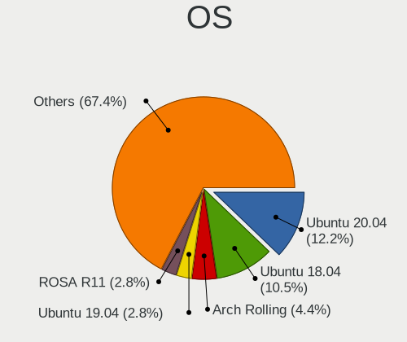

| Name               | Notebooks | Percent |
|--------------------|-----------|---------|
| Ubuntu 20.04       | 25        | 11.74%  |
| Ubuntu 18.04       | 19        | 8.92%   |
| Arch Rolling       | 9         | 4.23%   |
| Ubuntu 22.04       | 7         | 3.29%   |
| Ubuntu 19.04       | 5         | 2.35%   |
| ROSA R11           | 5         | 2.35%   |
| Pop!_OS 21.04      | 5         | 2.35%   |
| OpenMandriva 4.3   | 5         | 2.35%   |
| Zorin 16           | 4         | 1.88%   |
| Xubuntu 20.04      | 4         | 1.88%   |
| ROSA R9            | 4         | 1.88%   |
| ROSA R8.1          | 4         | 1.88%   |
| ROSA R10           | 4         | 1.88%   |
| Pop!_OS 20.04      | 4         | 1.88%   |
| OpenMandriva 4.2   | 4         | 1.88%   |
| Linux Mint 20      | 4         | 1.88%   |
| KDE neon 20.04     | 4         | 1.88%   |
| Arch               | 4         | 1.88%   |
| Xubuntu 19.10      | 3         | 1.41%   |
| ROSA R11.1         | 3         | 1.41%   |
| Linux Mint 20.1    | 3         | 1.41%   |
| Kubuntu 22.04      | 3         | 1.41%   |
| Fedora 36          | 3         | 1.41%   |
| Debian 10          | 3         | 1.41%   |
| ArcoLinux Rolling  | 3         | 1.41%   |
| Zorin 15           | 2         | 0.94%   |
| Ubuntu 20.10       | 2         | 0.94%   |
| Ubuntu 19.10       | 2         | 0.94%   |
| Ubuntu 16.04       | 2         | 0.94%   |
| RED X3             | 2         | 0.94%   |
| Pop!_OS 22.04      | 2         | 0.94%   |
| Pop!_OS 21.10      | 2         | 0.94%   |
| Manjaro 20.2.1     | 2         | 0.94%   |
| Manjaro 20.2       | 2         | 0.94%   |
| Linux Mint 19.2    | 2         | 0.94%   |
| Fedora 34          | 2         | 0.94%   |
| Xubuntu 18.04      | 1         | 0.47%   |
| Ubuntu Unity 21.04 | 1         | 0.47%   |
| Ubuntu Unity 16.04 | 1         | 0.47%   |
| Ubuntu MATE 22.10  | 1         | 0.47%   |

OS Family
---------

OS without a version

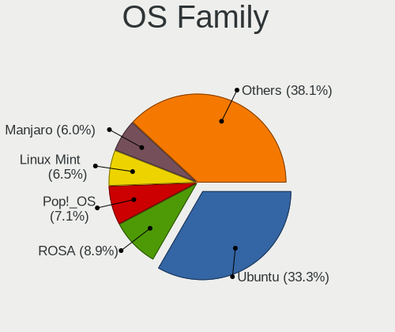

| Name         | Notebooks | Percent |
|--------------|-----------|---------|
| Ubuntu       | 62        | 31.31%  |
| ROSA         | 15        | 7.58%   |
| Pop!_OS      | 14        | 7.07%   |
| Linux Mint   | 12        | 6.06%   |
| Arch         | 12        | 6.06%   |
| OpenMandriva | 10        | 5.05%   |
| Manjaro      | 10        | 5.05%   |
| Fedora       | 9         | 4.55%   |
| Zorin        | 6         | 3.03%   |
| Xubuntu      | 6         | 3.03%   |
| KDE neon     | 6         | 3.03%   |
| Debian       | 5         | 2.53%   |
| Kubuntu      | 4         | 2.02%   |
| Lubuntu      | 3         | 1.52%   |
| Gentoo       | 3         | 1.52%   |
| Endless      | 3         | 1.52%   |
| ArcoLinux    | 3         | 1.52%   |
| Ubuntu Unity | 2         | 1.01%   |
| Ubuntu MATE  | 2         | 1.01%   |
| RED          | 2         | 1.01%   |
| openSUSE     | 2         | 1.01%   |
| RHEL         | 1         | 0.51%   |
| Peppermint   | 1         | 0.51%   |
| LMDE         | 1         | 0.51%   |
| Elementary   | 1         | 0.51%   |
| Drauger OS   | 1         | 0.51%   |
| CentOS       | 1         | 0.51%   |
| Artix        | 1         | 0.51%   |

Kernel
------

Version of the Linux kernel

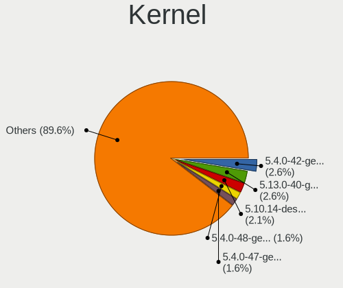

| Version                             | Notebooks | Percent |
|-------------------------------------|-----------|---------|
| 5.4.0-42-generic                    | 5         | 2.17%   |
| 5.13.0-40-generic                   | 5         | 2.17%   |
| 5.16.7-desktop-1omv4003             | 4         | 1.74%   |
| 5.10.14-desktop-1omv4002            | 4         | 1.74%   |
| 5.4.0-48-generic                    | 3         | 1.3%    |
| 5.4.0-47-generic                    | 3         | 1.3%    |
| 5.3.0-26-generic                    | 3         | 1.3%    |
| 4.9.41-nrj-desktop-1rosa-x86_64     | 3         | 1.3%    |
| 4.15.0-91-generic                   | 3         | 1.3%    |
| 5.8.0-44-generic                    | 2         | 0.87%   |
| 5.4.0-7634-generic                  | 2         | 0.87%   |
| 5.4.0-73-generic                    | 2         | 0.87%   |
| 5.4.0-66-generic                    | 2         | 0.87%   |
| 5.4.0-52-generic                    | 2         | 0.87%   |
| 5.4.0-31-generic                    | 2         | 0.87%   |
| 5.3.0-28-generic                    | 2         | 0.87%   |
| 5.15.0-56-generic                   | 2         | 0.87%   |
| 5.15.0-50-generic                   | 2         | 0.87%   |
| 5.15.0-43-generic                   | 2         | 0.87%   |
| 5.13.0-35-generic                   | 2         | 0.87%   |
| 5.11.0-7633-generic                 | 2         | 0.87%   |
| 5.0.0-37-generic                    | 2         | 0.87%   |
| 5.0.0-25-generic                    | 2         | 0.87%   |
| 4.4.16-nrj-desktop-1rosa-x86_64     | 2         | 0.87%   |
| 4.15.0-desktop-60.7rosa-i586        | 2         | 0.87%   |
| 4.15.0-desktop-122.124.1rosa-x86_64 | 2         | 0.87%   |
| 4.15.0-29-generic                   | 2         | 0.87%   |
| 6.1.7-200.fc37.x86_64               | 1         | 0.43%   |
| 6.1.6-1-default                     | 1         | 0.43%   |
| 6.1.11-200.fc37.x86_64              | 1         | 0.43%   |
| 6.1.10-gentoo-x86_64                | 1         | 0.43%   |
| 6.1.1-desktop-1omv2290              | 1         | 0.43%   |
| 6.1.0-1004-oem                      | 1         | 0.43%   |
| 6.0.6-arch1-1                       | 1         | 0.43%   |
| 6.0.0-6-amd64                       | 1         | 0.43%   |
| 5.9.3-1-MANJARO                     | 1         | 0.43%   |
| 5.9.16-1-MANJARO                    | 1         | 0.43%   |
| 5.9.14-zen1-1-zen                   | 1         | 0.43%   |
| 5.9.13-200.fc33.x86_64              | 1         | 0.43%   |
| 5.8.3-zen1-1-zen                    | 1         | 0.43%   |

Kernel Family
-------------

Linux kernel without a distro release

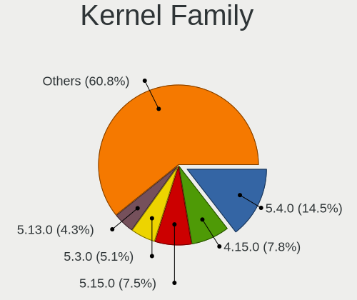

| Version | Notebooks | Percent |
|---------|-----------|---------|
| 5.4.0   | 35        | 16.28%  |
| 4.15.0  | 20        | 9.3%    |
| 5.3.0   | 13        | 6.05%   |
| 5.15.0  | 12        | 5.58%   |
| 5.13.0  | 10        | 4.65%   |
| 5.0.0   | 10        | 4.65%   |
| 5.8.0   | 9         | 4.19%   |
| 5.11.0  | 6         | 2.79%   |
| 5.16.7  | 5         | 2.33%   |
| 5.10.14 | 4         | 1.86%   |
| 4.18.0  | 4         | 1.86%   |
| 5.19.0  | 3         | 1.4%    |
| 4.9.41  | 3         | 1.4%    |
| 5.8.18  | 2         | 0.93%   |
| 5.8.11  | 2         | 0.93%   |
| 5.4.13  | 2         | 0.93%   |
| 5.17.5  | 2         | 0.93%   |
| 5.10.16 | 2         | 0.93%   |
| 5.10.0  | 2         | 0.93%   |
| 4.9.9   | 2         | 0.93%   |
| 4.9.60  | 2         | 0.93%   |
| 4.9.20  | 2         | 0.93%   |
| 4.4.16  | 2         | 0.93%   |
| 4.19.0  | 2         | 0.93%   |
| 6.1.7   | 1         | 0.47%   |
| 6.1.6   | 1         | 0.47%   |
| 6.1.11  | 1         | 0.47%   |
| 6.1.10  | 1         | 0.47%   |
| 6.1.1   | 1         | 0.47%   |
| 6.1.0   | 1         | 0.47%   |
| 6.0.6   | 1         | 0.47%   |
| 6.0.0   | 1         | 0.47%   |
| 5.9.3   | 1         | 0.47%   |
| 5.9.16  | 1         | 0.47%   |
| 5.9.14  | 1         | 0.47%   |
| 5.9.13  | 1         | 0.47%   |
| 5.8.3   | 1         | 0.47%   |
| 5.7.17  | 1         | 0.47%   |
| 5.6.5   | 1         | 0.47%   |
| 5.6.13  | 1         | 0.47%   |

Kernel Major Ver.
-----------------

Linux kernel major version

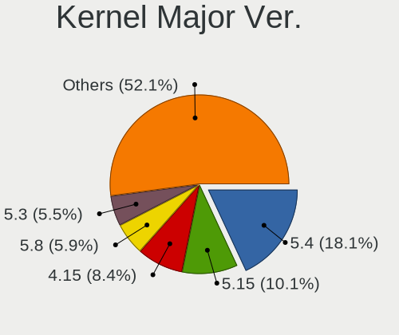

| Version | Notebooks | Percent |
|---------|-----------|---------|
| 5.4     | 42        | 19.91%  |
| 4.15    | 20        | 9.48%   |
| 5.15    | 19        | 9%      |
| 5.8     | 14        | 6.64%   |
| 5.3     | 13        | 6.16%   |
| 5.10    | 13        | 6.16%   |
| 5.13    | 12        | 5.69%   |
| 5.0     | 11        | 5.21%   |
| 4.9     | 11        | 5.21%   |
| 5.16    | 8         | 3.79%   |
| 5.11    | 8         | 3.79%   |
| 6.1     | 5         | 2.37%   |
| 5.19    | 5         | 2.37%   |
| 5.17    | 4         | 1.9%    |
| 5.12    | 4         | 1.9%    |
| 4.18    | 4         | 1.9%    |
| 5.9     | 3         | 1.42%   |
| 4.4     | 3         | 1.42%   |
| 6.0     | 2         | 0.95%   |
| 5.6     | 2         | 0.95%   |
| 4.19    | 2         | 0.95%   |
| 5.7     | 1         | 0.47%   |
| 5.18    | 1         | 0.47%   |
| 5.14    | 1         | 0.47%   |
| 4.14    | 1         | 0.47%   |
| 4.1     | 1         | 0.47%   |
| 3.16    | 1         | 0.47%   |

Arch
----

OS architecture (x86_64, i586, etc.)

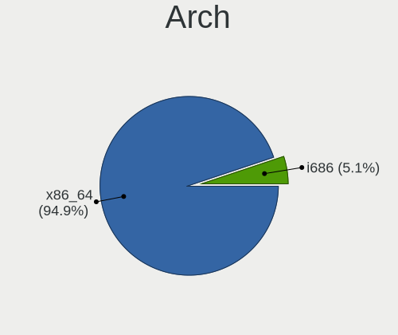

| Name   | Notebooks | Percent |
|--------|-----------|---------|
| x86_64 | 174       | 94.05%  |
| i686   | 11        | 5.95%   |

DE
--

Desktop Environment

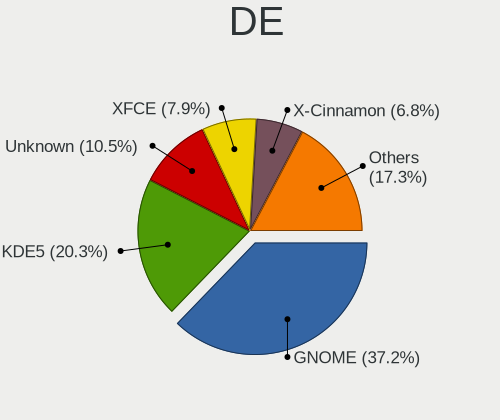

| Name            | Notebooks | Percent |
|-----------------|-----------|---------|
| GNOME           | 77        | 38.89%  |
| KDE5            | 33        | 16.67%  |
| Unknown         | 23        | 11.62%  |
| XFCE            | 15        | 7.58%   |
| KDE4            | 13        | 6.57%   |
| X-Cinnamon      | 11        | 5.56%   |
| KDE             | 5         | 2.53%   |
| LXQt            | 4         | 2.02%   |
| Unity           | 3         | 1.52%   |
| MATE            | 3         | 1.52%   |
| GNOME Flashback | 2         | 1.01%   |
| awesome         | 2         | 1.01%   |
| Pantheon        | 1         | 0.51%   |
| LXDE            | 1         | 0.51%   |
| Enlightenment   | 1         | 0.51%   |
| dwm             | 1         | 0.51%   |
| Deepin          | 1         | 0.51%   |
| Cinnamon        | 1         | 0.51%   |
| Budgie          | 1         | 0.51%   |

Display Server
--------------

X11 or Wayland

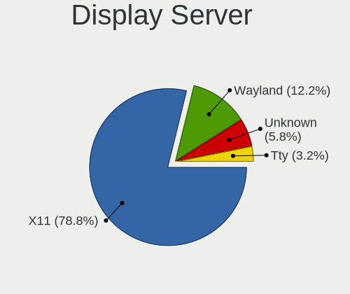

| Name    | Notebooks | Percent |
|---------|-----------|---------|
| X11     | 150       | 78.13%  |
| Wayland | 25        | 13.02%  |
| Unknown | 11        | 5.73%   |
| Tty     | 6         | 3.13%   |

Display Manager
---------------

SDDM, LightDM, etc.

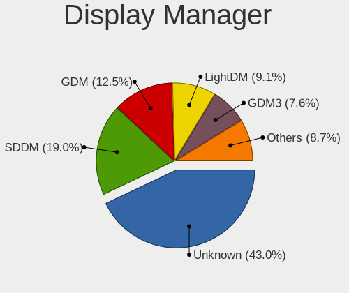

| Name    | Notebooks | Percent |
|---------|-----------|---------|
| Unknown | 91        | 46.91%  |
| SDDM    | 29        | 14.95%  |
| GDM     | 26        | 13.4%   |
| LightDM | 14        | 7.22%   |
| GDM3    | 13        | 6.7%    |
| KDM     | 12        | 6.19%   |
| TDM     | 8         | 4.12%   |
| XDM     | 1         | 0.52%   |

OS Lang
-------

Language

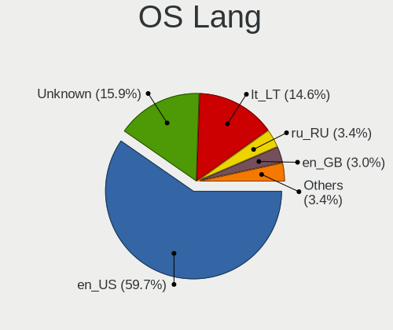

| Lang    | Notebooks | Percent |
|---------|-----------|---------|
| en_US   | 109       | 56.77%  |
| Unknown | 37        | 19.27%  |
| lt_LT   | 29        | 15.1%   |
| ru_RU   | 6         | 3.13%   |
| en_GB   | 6         | 3.13%   |
| en_AU   | 2         | 1.04%   |
| C       | 2         | 1.04%   |
| nl_NL   | 1         | 0.52%   |

Boot Mode
---------

EFI or BIOS

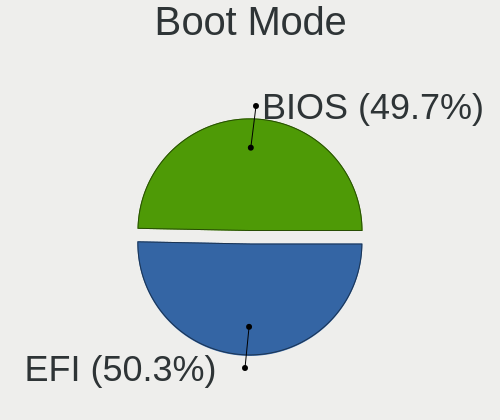

| Mode | Notebooks | Percent |
|------|-----------|---------|
| EFI  | 98        | 51.85%  |
| BIOS | 91        | 48.15%  |

Filesystem
----------

Type of filesystem

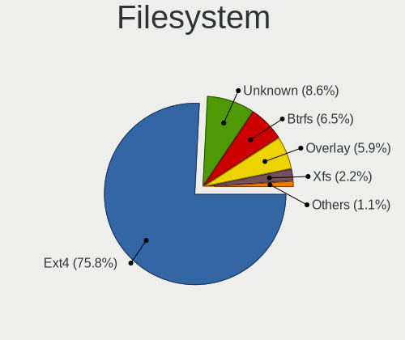

| Type    | Notebooks | Percent |
|---------|-----------|---------|
| Ext4    | 143       | 75.66%  |
| Unknown | 16        | 8.47%   |
| Btrfs   | 13        | 6.88%   |
| Overlay | 11        | 5.82%   |
| Xfs     | 4         | 2.12%   |
| Zfs     | 1         | 0.53%   |
| ExX4    | 1         | 0.53%   |

Part. scheme
------------

Scheme of partitioning

| Type    | Notebooks | Percent |
|---------|-----------|---------|
| Unknown | 100       | 52.63%  |
| GPT     | 70        | 36.84%  |
| MBR     | 20        | 10.53%  |

Dual Boot with Linux/BSD
------------------------

Hosting more than one Linux/BSD

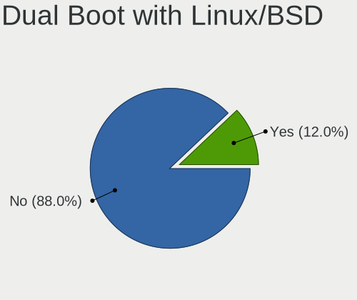

| Dual boot | Notebooks | Percent |
|-----------|-----------|---------|
| No        | 164       | 87.7%   |
| Yes       | 23        | 12.3%   |

Dual Boot (Win)
---------------

Hosting Linux and Windows

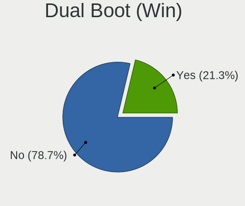

| Dual boot | Notebooks | Percent |
|-----------|-----------|---------|
| No        | 147       | 78.61%  |
| Yes       | 40        | 21.39%  |

Board
-----

Vendor
------

Motherboard manufacturer

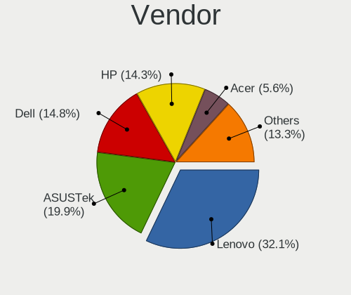

| Name                | Notebooks | Percent |
|---------------------|-----------|---------|
| Lenovo              | 58        | 31.69%  |
| ASUSTek Computer    | 36        | 19.67%  |
| Hewlett-Packard     | 28        | 15.3%   |
| Dell                | 28        | 15.3%   |
| Acer                | 11        | 6.01%   |
| MSI                 | 4         | 2.19%   |
| Samsung Electronics | 3         | 1.64%   |
| Toshiba             | 2         | 1.09%   |
| Sony                | 2         | 1.09%   |
| Panasonic           | 2         | 1.09%   |
| Timi                | 1         | 0.55%   |
| Prestigio           | 1         | 0.55%   |
| Packard Bell        | 1         | 0.55%   |
| Jumper              | 1         | 0.55%   |
| HUAWEI              | 1         | 0.55%   |
| eMachines           | 1         | 0.55%   |
| Apple               | 1         | 0.55%   |
| Alienware           | 1         | 0.55%   |
| Unknown             | 1         | 0.55%   |

Model
-----

Motherboard model

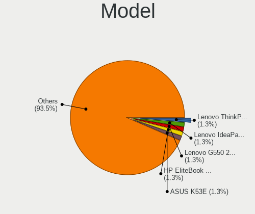

| Name                                                  | Notebooks | Percent |
|-------------------------------------------------------|-----------|---------|
| Lenovo ThinkPad T490 20N3000KMH                       | 2         | 1.09%   |
| Lenovo Legion Y530-15ICH 81FV                         | 2         | 1.09%   |
| Lenovo IdeaPad Y700-15ISK 80NV                        | 2         | 1.09%   |
| Lenovo G550 20023                                     | 2         | 1.09%   |
| HP EliteBook 8460p                                    | 2         | 1.09%   |
| ASUS K53E                                             | 2         | 1.09%   |
| Toshiba Satellite L855                                | 1         | 0.55%   |
| Toshiba Satellite C50D-A-13G                          | 1         | 0.55%   |
| Timi TM1701                                           | 1         | 0.55%   |
| Sony VPCZ1390S                                        | 1         | 0.55%   |
| Sony VGN-C260E                                        | 1         | 0.55%   |
| Samsung RC530/RC730                                   | 1         | 0.55%   |
| Samsung 530U3C/530U4C/532U3C                          | 1         | 0.55%   |
| Samsung 300E5EV/300E4EV/270E5EV/270E4EV/2470EV/2470EE | 1         | 0.55%   |
| Prestigio PSB141C02                                   | 1         | 0.55%   |
| Panasonic CF-52WEBBYDE                                | 1         | 0.55%   |
| Panasonic CF-52VDA131M                                | 1         | 0.55%   |
| Packard Bell EasyNote TE11HC                          | 1         | 0.55%   |
| MSI MS-16F1                                           | 1         | 0.55%   |
| MSI GS66 Stealth 10UE                                 | 1         | 0.55%   |
| MSI GP70 2PE                                          | 1         | 0.55%   |
| MSI Bravo 15 A4DDR                                    | 1         | 0.55%   |
| Lenovo Yoga Slim 7 Pro 14ACH5 82MS                    | 1         | 0.55%   |
| Lenovo Yoga Creator 7 15IMH05 82DS                    | 1         | 0.55%   |
| Lenovo Y50-70 20378                                   | 1         | 0.55%   |
| Lenovo V130-15IGM 81HL                                | 1         | 0.55%   |
| Lenovo ThinkPad X270 W10DG 20K5S02K00                 | 1         | 0.55%   |
| Lenovo ThinkPad X230 2325AEG                          | 1         | 0.55%   |
| Lenovo ThinkPad X1 Nano Gen 1 20UN0060MH              | 1         | 0.55%   |
| Lenovo ThinkPad X1 Carbon 6th 20KH006KPB              | 1         | 0.55%   |
| Lenovo ThinkPad X1 Carbon 6th 20KGS03800              | 1         | 0.55%   |
| Lenovo ThinkPad W530 243852U                          | 1         | 0.55%   |
| Lenovo ThinkPad T60 1951FDG                           | 1         | 0.55%   |
| Lenovo ThinkPad T590 20N4004EMH                       | 1         | 0.55%   |
| Lenovo ThinkPad T500 2241W8Q                          | 1         | 0.55%   |
| Lenovo ThinkPad T480 20L50002MH                       | 1         | 0.55%   |
| Lenovo ThinkPad T460s 20F90058MH                      | 1         | 0.55%   |
| Lenovo ThinkPad T440p 20AWS4XN00                      | 1         | 0.55%   |
| Lenovo ThinkPad T430s 2356LNG                         | 1         | 0.55%   |
| Lenovo ThinkPad T430 2347EV8                          | 1         | 0.55%   |

Model Family
------------

Motherboard model prefix

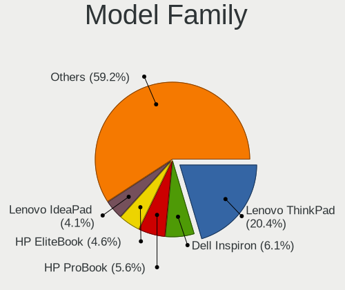

| Name                   | Notebooks | Percent |
|------------------------|-----------|---------|
| Lenovo ThinkPad        | 35        | 19.13%  |
| HP ProBook             | 11        | 6.01%   |
| Dell Inspiron          | 11        | 6.01%   |
| HP EliteBook           | 9         | 4.92%   |
| Lenovo IdeaPad         | 8         | 4.37%   |
| Dell Latitude          | 7         | 3.83%   |
| Acer Aspire            | 7         | 3.83%   |
| ASUS VivoBook          | 5         | 2.73%   |
| Lenovo Legion          | 4         | 2.19%   |
| Dell XPS               | 4         | 2.19%   |
| Toshiba Satellite      | 2         | 1.09%   |
| Lenovo Yoga            | 2         | 1.09%   |
| Lenovo G550            | 2         | 1.09%   |
| HP Pavilion            | 2         | 1.09%   |
| HP Laptop              | 2         | 1.09%   |
| HP 250                 | 2         | 1.09%   |
| Dell Vostro            | 2         | 1.09%   |
| Dell Precision         | 2         | 1.09%   |
| ASUS ZenBook           | 2         | 1.09%   |
| ASUS TUF               | 2         | 1.09%   |
| ASUS K53E              | 2         | 1.09%   |
| Timi TM1701            | 1         | 0.55%   |
| Sony VPCZ1390S         | 1         | 0.55%   |
| Sony VGN-C260E         | 1         | 0.55%   |
| Samsung RC530          | 1         | 0.55%   |
| Samsung 530U3C         | 1         | 0.55%   |
| Samsung 300E5EV        | 1         | 0.55%   |
| Prestigio PSB141C02    | 1         | 0.55%   |
| Panasonic CF-52WEBBYDE | 1         | 0.55%   |
| Panasonic CF-52VDA131M | 1         | 0.55%   |
| Packard Bell EasyNote  | 1         | 0.55%   |
| MSI MS-16F1            | 1         | 0.55%   |
| MSI GS66               | 1         | 0.55%   |
| MSI GP70               | 1         | 0.55%   |
| MSI Bravo              | 1         | 0.55%   |
| Lenovo Y50-70          | 1         | 0.55%   |
| Lenovo V130-15IGM      | 1         | 0.55%   |
| Lenovo ThinkBook       | 1         | 0.55%   |
| Lenovo G505s           | 1         | 0.55%   |
| Lenovo G500            | 1         | 0.55%   |

MFG Year
--------

Motherboard manufacture year

| Year | Notebooks | Percent |
|------|-----------|---------|
| 2011 | 18        | 9.84%   |
| 2018 | 17        | 9.29%   |
| 2020 | 16        | 8.74%   |
| 2013 | 16        | 8.74%   |
| 2019 | 15        | 8.2%    |
| 2012 | 14        | 7.65%   |
| 2021 | 12        | 6.56%   |
| 2017 | 12        | 6.56%   |
| 2014 | 12        | 6.56%   |
| 2015 | 10        | 5.46%   |
| 2010 | 10        | 5.46%   |
| 2016 | 8         | 4.37%   |
| 2008 | 8         | 4.37%   |
| 2022 | 4         | 2.19%   |
| 2009 | 4         | 2.19%   |
| 2007 | 3         | 1.64%   |
| 2006 | 3         | 1.64%   |
| 2004 | 1         | 0.55%   |

Form Factor
-----------

Physical design of the computer

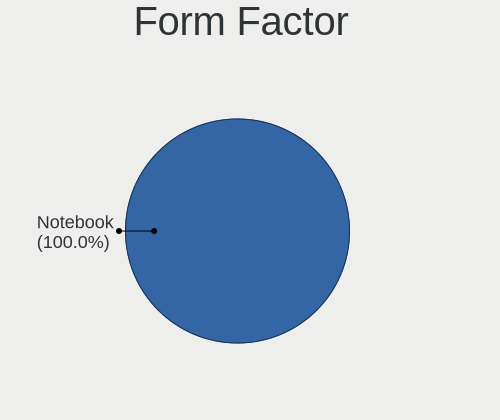

| Name     | Notebooks | Percent |
|----------|-----------|---------|
| Notebook | 183       | 100%    |

Secure Boot
-----------

Enabled or disabled

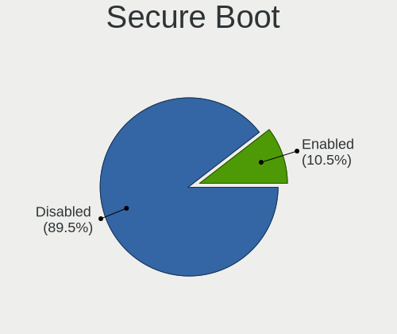

| State    | Notebooks | Percent |
|----------|-----------|---------|
| Disabled | 166       | 89.73%  |
| Enabled  | 19        | 10.27%  |

Coreboot
--------

Have coreboot on board

| Used | Notebooks | Percent |
|------|-----------|---------|
| No   | 183       | 100%    |

RAM Size
--------

Total RAM memory

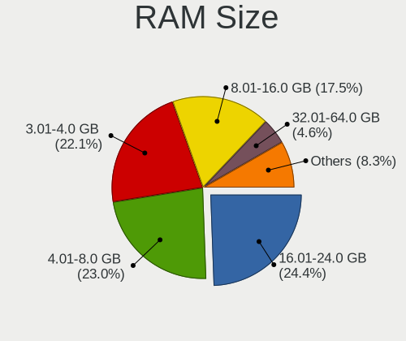

| Size in GB | Notebooks | Percent |
|------------|-----------|---------|
| 16.01-24.0 | 46        | 24.73%  |
| 4.01-8.0   | 43        | 23.12%  |
| 3.01-4.0   | 41        | 22.04%  |
| 8.01-16.0  | 32        | 17.2%   |
| 32.01-64.0 | 9         | 4.84%   |
| 1.01-2.0   | 8         | 4.3%    |
| 2.01-3.0   | 3         | 1.61%   |
| 24.01-32.0 | 2         | 1.08%   |
| 0.51-1.0   | 2         | 1.08%   |

RAM Used
--------

Used RAM memory

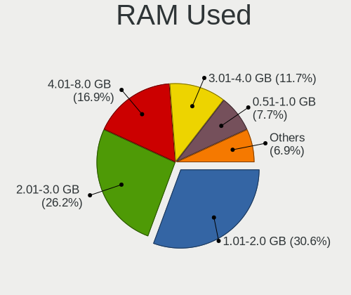

| Used GB   | Notebooks | Percent |
|-----------|-----------|---------|
| 1.01-2.0  | 65        | 30.81%  |
| 2.01-3.0  | 57        | 27.01%  |
| 4.01-8.0  | 34        | 16.11%  |
| 3.01-4.0  | 24        | 11.37%  |
| 0.51-1.0  | 18        | 8.53%   |
| 8.01-16.0 | 11        | 5.21%   |
| 0.01-0.5  | 2         | 0.95%   |

Total Drives
------------

Number of drives on board

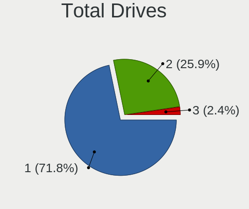

| Drives | Notebooks | Percent |
|--------|-----------|---------|
| 1      | 138       | 73.4%   |
| 2      | 46        | 24.47%  |
| 3      | 4         | 2.13%   |

Has CD-ROM
----------

Has CD-ROM on board

| Presented | Notebooks | Percent |
|-----------|-----------|---------|
| No        | 112       | 60.22%  |
| Yes       | 74        | 39.78%  |

Has Ethernet
------------

Has Ethernet on board

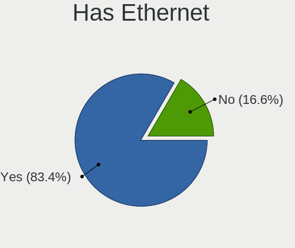

| Presented | Notebooks | Percent |
|-----------|-----------|---------|
| Yes       | 158       | 85.87%  |
| No        | 26        | 14.13%  |

Has WiFi
--------

Has WiFi module

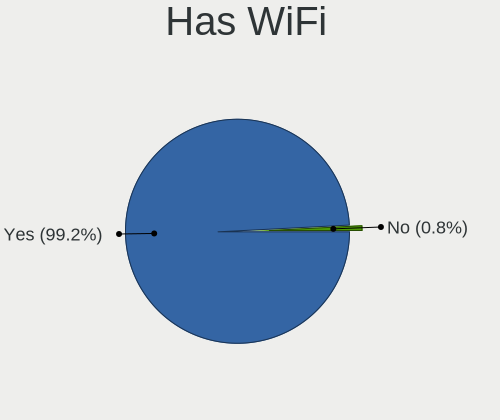

| Presented | Notebooks | Percent |
|-----------|-----------|---------|
| Yes       | 180       | 98.36%  |
| No        | 3         | 1.64%   |

Has Bluetooth
-------------

Has Bluetooth module

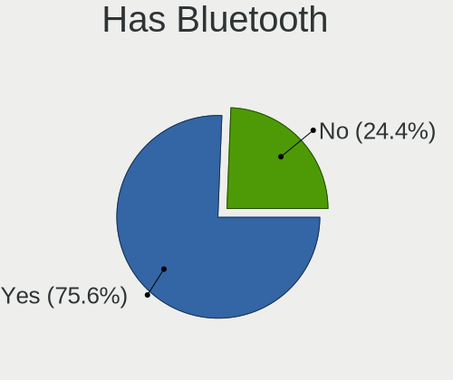

| Presented | Notebooks | Percent |
|-----------|-----------|---------|
| Yes       | 144       | 76.19%  |
| No        | 45        | 23.81%  |

Location
--------

Country
-------

Geographic location (country)

| Country   | Notebooks | Percent |
|-----------|-----------|---------|
| Lithuania | 183       | 100%    |

City
----

Geographic location (city)

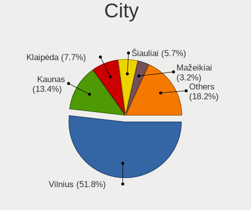

| City         | Notebooks | Percent |
|--------------|-----------|---------|
| Vilnius      | 101       | 51.79%  |
| Kaunas       | 29        | 14.87%  |
| Šiauliai    | 12        | 6.15%   |
| Klaipėda    | 11        | 5.64%   |
| Panevezys    | 4         | 2.05%   |
| Mažeikiai   | 4         | 2.05%   |
| Alytus       | 4         | 2.05%   |
| Jonava       | 3         | 1.54%   |
| Utena        | 2         | 1.03%   |
| Palanga      | 2         | 1.03%   |
| Kėdainiai   | 2         | 1.03%   |
| Želva       | 1         | 0.51%   |
| Visaginas    | 1         | 0.51%   |
| Vėžaičiai | 1         | 0.51%   |
| Ukmerge      | 1         | 0.51%   |
| Trakai       | 1         | 0.51%   |
| Telšiai     | 1         | 0.51%   |
| Tauragė     | 1         | 0.51%   |
| Šilalė     | 1         | 0.51%   |
| Serdokai     | 1         | 0.51%   |
| Šeduva      | 1         | 0.51%   |
| Rokiškis    | 1         | 0.51%   |
| Plungė      | 1         | 0.51%   |
| Pasvalys     | 1         | 0.51%   |
| Molėtai     | 1         | 0.51%   |
| Mauruciai    | 1         | 0.51%   |
| Marijampolė | 1         | 0.51%   |
| Maneikiai    | 1         | 0.51%   |
| Karkliniai   | 1         | 0.51%   |
| Gargždai    | 1         | 0.51%   |
| Anykščiai  | 1         | 0.51%   |
| Agluonenai   | 1         | 0.51%   |

Drives
------

Drive Vendor
------------

Hard drive vendors

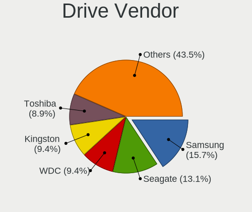

| Vendor                  | Notebooks | Drives | Percent |
|-------------------------|-----------|--------|---------|
| Samsung Electronics     | 37        | 53     | 16.09%  |
| Seagate                 | 26        | 35     | 11.3%   |
| WDC                     | 23        | 33     | 10%     |
| Toshiba                 | 22        | 29     | 9.57%   |
| Kingston                | 18        | 23     | 7.83%   |
| SanDisk                 | 14        | 15     | 6.09%   |
| Intel                   | 13        | 15     | 5.65%   |
| SK hynix                | 9         | 9      | 3.91%   |
| Hitachi                 | 9         | 16     | 3.91%   |
| A-DATA Technology       | 8         | 8      | 3.48%   |
| Patriot                 | 7         | 8      | 3.04%   |
| HGST                    | 6         | 7      | 2.61%   |
| Crucial                 | 6         | 7      | 2.61%   |
| Unknown                 | 5         | 18     | 2.17%   |
| Micron Technology       | 3         | 3      | 1.3%    |
| China                   | 3         | 5      | 1.3%    |
| KingSpec                | 2         | 2      | 0.87%   |
| ASMT                    | 2         | 2      | 0.87%   |
| Apacer                  | 2         | 2      | 0.87%   |
| Union Memory (Shenzhen) | 1         | 1      | 0.43%   |
| Union Memory            | 1         | 1      | 0.43%   |
| Team                    | 1         | 1      | 0.43%   |
| Plextor                 | 1         | 1      | 0.43%   |
| Phison Electronics      | 1         | 2      | 0.43%   |
| OCZ                     | 1         | 1      | 0.43%   |
| LITEONIT                | 1         | 1      | 0.43%   |
| LITEON                  | 1         | 2      | 0.43%   |
| KIOXIA                  | 1         | 1      | 0.43%   |
| GOODRAM                 | 1         | 1      | 0.43%   |
| Fujitsu                 | 1         | 1      | 0.43%   |
| FORESEE                 | 1         | 1      | 0.43%   |
| Dahua                   | 1         | 2      | 0.43%   |
| Corsair                 | 1         | 1      | 0.43%   |
| Apple                   | 1         | 1      | 0.43%   |

Drive Model
-----------

Hard drive models

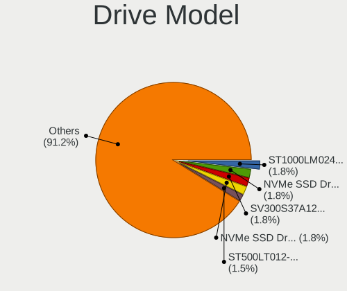

| Model                                               | Notebooks | Percent |
|-----------------------------------------------------|-----------|---------|
| SanDisk NVMe SSD Drive 256GB                        | 5         | 2.07%   |
| Kingston SV300S37A120G 120GB SSD                    | 5         | 2.07%   |
| Intel NVMe SSD Drive 512GB                          | 5         | 2.07%   |
| Seagate ST1000LM024 HN-M101MBB 1TB                  | 4         | 1.66%   |
| Toshiba MQ01ABF050 500GB                            | 3         | 1.24%   |
| Toshiba BG3 NVMe SSD Controller 256GB               | 3         | 1.24%   |
| Seagate ST9500325AS 500GB                           | 3         | 1.24%   |
| Seagate ST500LT012-1DG142 500GB                     | 3         | 1.24%   |
| Seagate ST1000LM035-1RK172 1TB                      | 3         | 1.24%   |
| Samsung SSD 850 EVO 250GB                           | 3         | 1.24%   |
| Kingston SA400S37480G 480GB SSD                     | 3         | 1.24%   |
| Kingston SA400S37240G 240GB SSD                     | 3         | 1.24%   |
| HGST HTS541010A9E680 1TB                            | 3         | 1.24%   |
| Toshiba NVMe SSD Drive 512GB                        | 2         | 0.83%   |
| Toshiba NVMe SSD Drive 256GB                        | 2         | 0.83%   |
| Toshiba MQ01ABD100 1TB                              | 2         | 0.83%   |
| Toshiba HDWL110 1TB                                 | 2         | 0.83%   |
| SK hynix HFS256G39TND-N210A 256GB SSD               | 2         | 0.83%   |
| Seagate ST9160821AS 160GB                           | 2         | 0.83%   |
| Seagate ST750LM022 HN-M750MBB 752GB                 | 2         | 0.83%   |
| SanDisk X400 M.2 2280 256GB SSD                     | 2         | 0.83%   |
| Samsung NVMe SSD Controller SM981/PM981/PM983 250GB | 2         | 0.83%   |
| Samsung MZVLB1T0HBLR-000L7 1TB                      | 2         | 0.83%   |
| Kingston SA400S37120G 120GB SSD                     | 2         | 0.83%   |
| Intel NVMe SSD Drive 32GB                           | 2         | 0.83%   |
| Intel NVMe SSD Drive 256GB                          | 2         | 0.83%   |
| Hitachi HTS545025B9A300 250GB                       | 2         | 0.83%   |
| Crucial CT500MX500SSD1 500GB                        | 2         | 0.83%   |
| China SATA SSD 120GB                                | 2         | 0.83%   |
| WDC WDS500G2B0B-00YS70 500GB SSD                    | 1         | 0.41%   |
| WDC WDS240G2G0B-00EPW0 240GB SSD                    | 1         | 0.41%   |
| WDC WDS100T2B0C-00PXH0 1TB                          | 1         | 0.41%   |
| WDC WD7500BPVX-60JC3T0 752GB                        | 1         | 0.41%   |
| WDC WD7500BPVX-22JC3T0 752GB                        | 1         | 0.41%   |
| WDC WD7500BPKT-75PK4T0 752GB                        | 1         | 0.41%   |
| WDC WD6400BPVT-22HXZT1 640GB                        | 1         | 0.41%   |
| WDC WD5000BPVT-80HXZT3 500GB                        | 1         | 0.41%   |
| WDC WD5000BEVT-24A0RT0 500GB                        | 1         | 0.41%   |
| WDC WD5000BEKT-22KA9T0 500GB                        | 1         | 0.41%   |
| WDC WD3200BPVT-22ZEST0 320GB                        | 1         | 0.41%   |

HDD Vendor
----------

Hard disk drive vendors

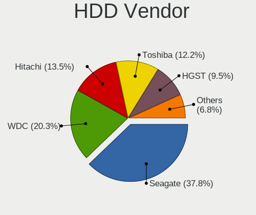

| Vendor              | Notebooks | Drives | Percent |
|---------------------|-----------|--------|---------|
| Seagate             | 26        | 35     | 37.14%  |
| WDC                 | 15        | 22     | 21.43%  |
| Toshiba             | 9         | 11     | 12.86%  |
| Hitachi             | 9         | 16     | 12.86%  |
| HGST                | 6         | 7      | 8.57%   |
| Samsung Electronics | 2         | 3      | 2.86%   |
| Unknown             | 1         | 1      | 1.43%   |
| Fujitsu             | 1         | 1      | 1.43%   |
| ASMT                | 1         | 1      | 1.43%   |

SSD Vendor
----------

Solid state drive vendors

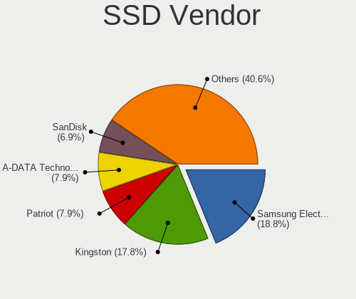

| Vendor              | Notebooks | Drives | Percent |
|---------------------|-----------|--------|---------|
| Kingston            | 17        | 22     | 19.1%   |
| Samsung Electronics | 16        | 27     | 17.98%  |
| SanDisk             | 7         | 8      | 7.87%   |
| Patriot             | 7         | 8      | 7.87%   |
| A-DATA Technology   | 7         | 7      | 7.87%   |
| Crucial             | 5         | 5      | 5.62%   |
| Toshiba             | 4         | 6      | 4.49%   |
| SK hynix            | 3         | 3      | 3.37%   |
| Intel               | 3         | 3      | 3.37%   |
| China               | 3         | 5      | 3.37%   |
| WDC                 | 2         | 5      | 2.25%   |
| KingSpec            | 2         | 2      | 2.25%   |
| Apacer              | 2         | 2      | 2.25%   |
| Team                | 1         | 1      | 1.12%   |
| Plextor             | 1         | 1      | 1.12%   |
| OCZ                 | 1         | 1      | 1.12%   |
| LITEONIT            | 1         | 1      | 1.12%   |
| LITEON              | 1         | 2      | 1.12%   |
| GOODRAM             | 1         | 1      | 1.12%   |
| FORESEE             | 1         | 1      | 1.12%   |
| Dahua               | 1         | 2      | 1.12%   |
| Corsair             | 1         | 1      | 1.12%   |
| ASMT                | 1         | 1      | 1.12%   |
| Apple               | 1         | 1      | 1.12%   |

Drive Kind
----------

HDD or SSD

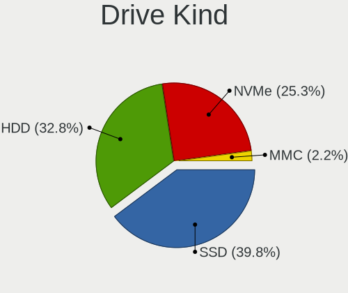

| Kind | Notebooks | Drives | Percent |
|------|-----------|--------|---------|
| SSD  | 81        | 116    | 37.5%   |
| HDD  | 68        | 97     | 31.48%  |
| NVMe | 62        | 76     | 28.7%   |
| MMC  | 5         | 19     | 2.31%   |

Drive Connector
---------------

SATA, SAS, NVMe, etc.

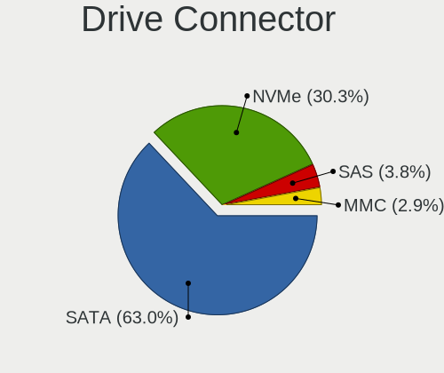

| Type | Notebooks | Drives | Percent |
|------|-----------|--------|---------|
| SATA | 126       | 205    | 63%     |
| NVMe | 62        | 76     | 31%     |
| SAS  | 7         | 8      | 3.5%    |
| MMC  | 5         | 19     | 2.5%    |

Drive Size
----------

Size of hard drive

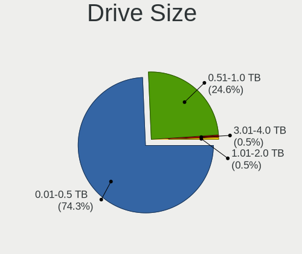

| Size in TB | Notebooks | Drives | Percent |
|------------|-----------|--------|---------|
| 0.01-0.5   | 108       | 165    | 73.97%  |
| 0.51-1.0   | 36        | 46     | 24.66%  |
| 2.01-3.0   | 1         | 1      | 0.68%   |
| 1.01-2.0   | 1         | 1      | 0.68%   |

Space Total
-----------

Amount of disk space available on the file system

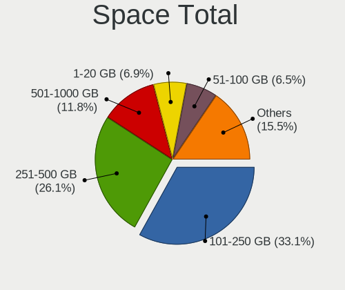

| Size in GB | Notebooks | Percent |
|------------|-----------|---------|
| 101-250    | 68        | 34%     |
| 251-500    | 53        | 26.5%   |
| 501-1000   | 25        | 12.5%   |
| 21-50      | 13        | 6.5%    |
| 1-20       | 13        | 6.5%    |
| 51-100     | 12        | 6%      |
| 1001-2000  | 8         | 4%      |
| Unknown    | 6         | 3%      |
| 2001-3000  | 2         | 1%      |

Space Used
----------

Amount of used disk space

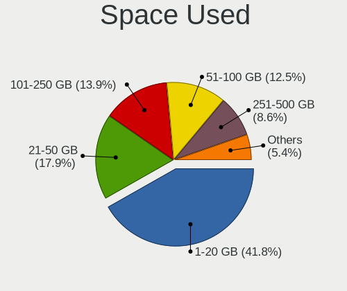

| Used GB   | Notebooks | Percent |
|-----------|-----------|---------|
| 1-20      | 88        | 42.31%  |
| 21-50     | 34        | 16.35%  |
| 101-250   | 30        | 14.42%  |
| 51-100    | 28        | 13.46%  |
| 251-500   | 17        | 8.17%   |
| Unknown   | 6         | 2.88%   |
| 501-1000  | 3         | 1.44%   |
| 1001-2000 | 2         | 0.96%   |

Malfunc. Drives
---------------

Drive models with a malfunction

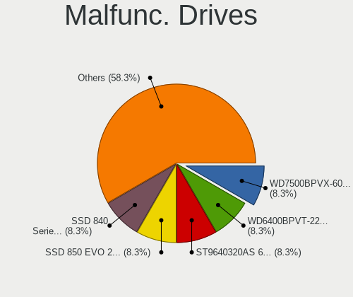

| Model                                    | Notebooks | Drives | Percent |
|------------------------------------------|-----------|--------|---------|
| WDC WD7500BPVX-60JC3T0 752GB             | 1         | 1      | 6.25%   |
| WDC WD6400BPVT-22HXZT1 640GB             | 1         | 2      | 6.25%   |
| Toshiba MK1652GSX 160GB                  | 1         | 1      | 6.25%   |
| SK hynix HFS256G39TND-N210A 256GB SSD    | 1         | 1      | 6.25%   |
| SK hynix BC711 HFM512GD3JX013N 512GB     | 1         | 1      | 6.25%   |
| Seagate ST9640320AS 640GB                | 1         | 2      | 6.25%   |
| Samsung Electronics SSD 850 EVO 250GB    | 1         | 1      | 6.25%   |
| Samsung Electronics SSD 840 Series 500GB | 1         | 2      | 6.25%   |
| Samsung Electronics HM641JI 640GB        | 1         | 1      | 6.25%   |
| Plextor PX-128M6M 128GB SSD              | 1         | 1      | 6.25%   |
| Hitachi HTS545050KTA300 500GB            | 1         | 1      | 6.25%   |
| Hitachi HTS545032B9A300 320GB            | 1         | 1      | 6.25%   |
| Hitachi HTS545025B9A300 250GB            | 1         | 1      | 6.25%   |
| HGST HTS725050A7E630 500GB               | 1         | 1      | 6.25%   |
| HGST HTS541010A9E680 1TB                 | 1         | 2      | 6.25%   |
| A-DATA Technology SX900 128GB SSD        | 1         | 1      | 6.25%   |

Malfunc. Drive Vendor
---------------------

Vendors of faulty drives

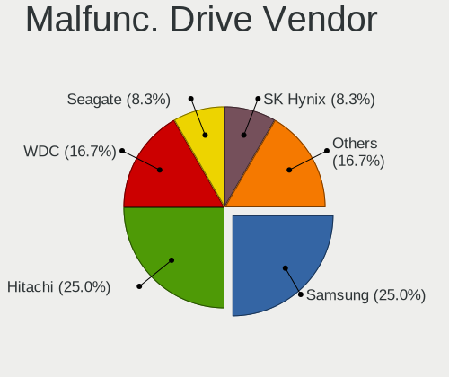

| Vendor              | Notebooks | Drives | Percent |
|---------------------|-----------|--------|---------|
| Samsung Electronics | 3         | 4      | 18.75%  |
| Hitachi             | 3         | 3      | 18.75%  |
| WDC                 | 2         | 3      | 12.5%   |
| SK hynix            | 2         | 2      | 12.5%   |
| HGST                | 2         | 3      | 12.5%   |
| Toshiba             | 1         | 1      | 6.25%   |
| Seagate             | 1         | 2      | 6.25%   |
| Plextor             | 1         | 1      | 6.25%   |
| A-DATA Technology   | 1         | 1      | 6.25%   |

Malfunc. HDD Vendor
-------------------

Vendors of faulty HDD drives

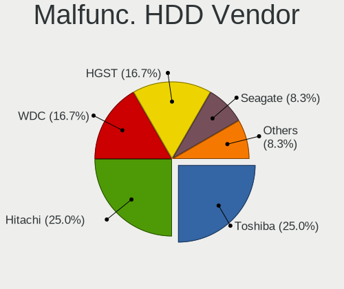

| Vendor              | Notebooks | Drives | Percent |
|---------------------|-----------|--------|---------|
| Hitachi             | 3         | 3      | 30%     |
| WDC                 | 2         | 3      | 20%     |
| HGST                | 2         | 3      | 20%     |
| Toshiba             | 1         | 1      | 10%     |
| Seagate             | 1         | 2      | 10%     |
| Samsung Electronics | 1         | 1      | 10%     |

Malfunc. Drive Kind
-------------------

Kinds of faulty drives

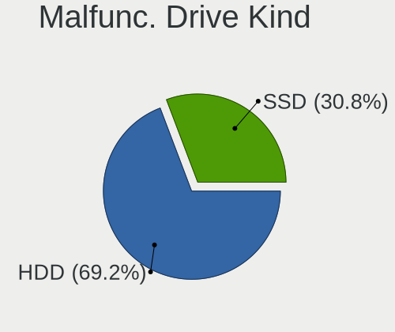

| Kind | Notebooks | Drives | Percent |
|------|-----------|--------|---------|
| HDD  | 10        | 13     | 62.5%   |
| SSD  | 5         | 6      | 31.25%  |
| NVMe | 1         | 1      | 6.25%   |

Failed Drives
-------------

Failed drive models

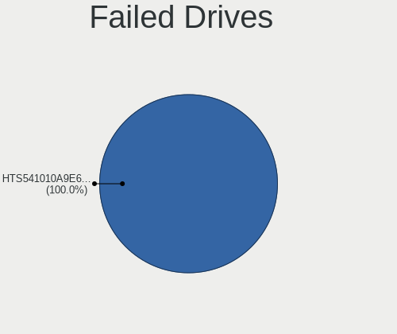

| Model                       | Notebooks | Drives | Percent |
|-----------------------------|-----------|--------|---------|
| Hitachi HTS541010A9E680 1TB | 1         | 1      | 100%    |

Failed Drive Vendor
-------------------

Failed drive vendors

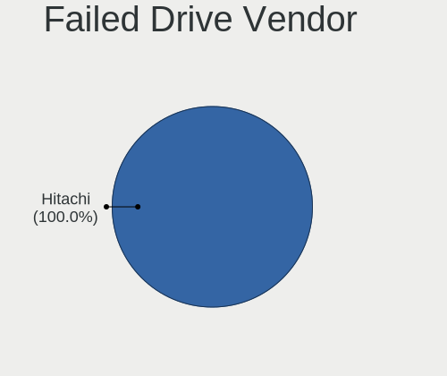

| Vendor  | Notebooks | Drives | Percent |
|---------|-----------|--------|---------|
| Hitachi | 1         | 1      | 100%    |

Drive Status
------------

Number of failed and malfunc. drives

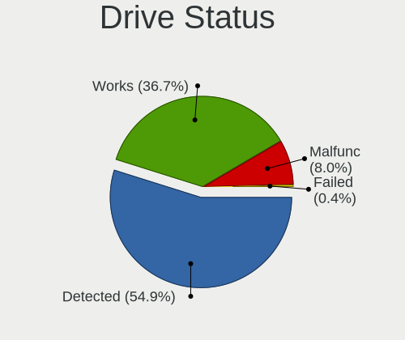

| Status   | Notebooks | Drives | Percent |
|----------|-----------|--------|---------|
| Detected | 109       | 177    | 55.61%  |
| Works    | 70        | 110    | 35.71%  |
| Malfunc  | 16        | 20     | 8.16%   |
| Failed   | 1         | 1      | 0.51%   |

Storage controller
------------------

Storage Vendor
--------------

Storage controller vendors

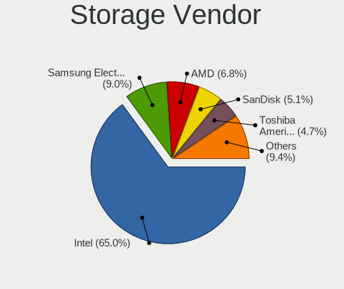

| Vendor                           | Notebooks | Percent |
|----------------------------------|-----------|---------|
| Intel                            | 137       | 64.93%  |
| Samsung Electronics              | 20        | 9.48%   |
| AMD                              | 15        | 7.11%   |
| Toshiba America Info Systems     | 10        | 4.74%   |
| SanDisk                          | 10        | 4.74%   |
| SK hynix                         | 6         | 2.84%   |
| Micron Technology                | 3         | 1.42%   |
| Union Memory (Shenzhen)          | 2         | 0.95%   |
| Silicon Integrated Systems [SiS] | 1         | 0.47%   |
| Phison Electronics               | 1         | 0.47%   |
| Nvidia                           | 1         | 0.47%   |
| Micron/Crucial Technology        | 1         | 0.47%   |
| KIOXIA                           | 1         | 0.47%   |
| Kingston Technology Company      | 1         | 0.47%   |
| JMicron Technology               | 1         | 0.47%   |
| ADATA Technology                 | 1         | 0.47%   |

Storage Model
-------------

Storage controller models

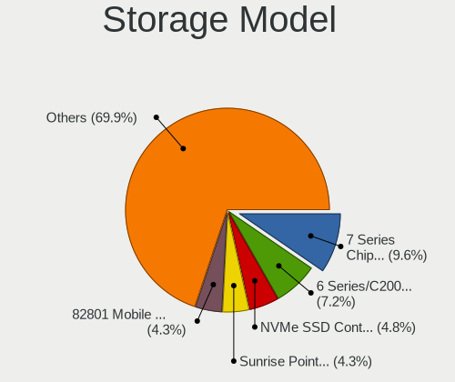

| Model                                                                          | Notebooks | Percent |
|--------------------------------------------------------------------------------|-----------|---------|
| Intel 7 Series Chipset Family 6-port SATA Controller [AHCI mode]               | 21        | 9.25%   |
| Intel 6 Series/C200 Series Chipset Family 6 port Mobile SATA AHCI Controller   | 15        | 6.61%   |
| Samsung NVMe SSD Controller SM981/PM981/PM983                                  | 11        | 4.85%   |
| Intel 82801 Mobile SATA Controller [RAID mode]                                 | 10        | 4.41%   |
| AMD FCH SATA Controller [AHCI mode]                                            | 10        | 4.41%   |
| Intel Sunrise Point-LP SATA Controller [AHCI mode]                             | 9         | 3.96%   |
| Intel 8 Series/C220 Series Chipset Family 6-port SATA Controller 1 [AHCI mode] | 8         | 3.52%   |
| Intel Cannon Lake Mobile PCH SATA AHCI Controller                              | 7         | 3.08%   |
| Intel 8 Series SATA Controller 1 [AHCI mode]                                   | 7         | 3.08%   |
| Intel 82801IBM/IEM (ICH9M/ICH9M-E) 4 port SATA Controller [AHCI mode]          | 6         | 2.64%   |
| Toshiba America Info Systems BG3 NVMe SSD Controller                           | 5         | 2.2%    |
| Intel HM170/QM170 Chipset SATA Controller [AHCI Mode]                          | 5         | 2.2%    |
| Intel 5 Series/3400 Series Chipset 4 port SATA AHCI Controller                 | 5         | 2.2%    |
| SK hynix Gold P31/PC711 NVMe Solid State Drive                                 | 4         | 1.76%   |
| Samsung NVMe SSD Controller 980                                                | 4         | 1.76%   |
| Intel Wildcat Point-LP SATA Controller [AHCI Mode]                             | 4         | 1.76%   |
| Intel Volume Management Device NVMe RAID Controller                            | 4         | 1.76%   |
| Intel SSD 660P Series                                                          | 4         | 1.76%   |
| Intel Celeron/Pentium Silver Processor SATA Controller                         | 4         | 1.76%   |
| Intel 82801HM/HEM (ICH8M/ICH8M-E) IDE Controller                               | 4         | 1.76%   |
| AMD SB7x0/SB8x0/SB9x0 SATA Controller [AHCI mode]                              | 4         | 1.76%   |
| Toshiba America Info Systems XG6 NVMe SSD Controller                           | 3         | 1.32%   |
| SanDisk WD Blue SN550 NVMe SSD                                                 | 3         | 1.32%   |
| SanDisk WD Black SN750 / PC SN730 NVMe SSD                                     | 3         | 1.32%   |
| Samsung NVMe SSD Controller SM961/PM961/SM963                                  | 3         | 1.32%   |
| Micron Non-Volatile memory controller                                          | 3         | 1.32%   |
| Intel SSD Pro 7600p/760p/E 6100p Series                                        | 3         | 1.32%   |
| Intel Non-Volatile memory controller                                           | 3         | 1.32%   |
| Intel Cannon Point-LP SATA Controller [AHCI Mode]                              | 3         | 1.32%   |
| Intel 82801HM/HEM (ICH8M/ICH8M-E) SATA Controller [IDE mode]                   | 3         | 1.32%   |
| Intel 82801GBM/GHM (ICH7-M Family) SATA Controller [IDE mode]                  | 3         | 1.32%   |
| Intel 5 Series/3400 Series Chipset 6 port SATA AHCI Controller                 | 3         | 1.32%   |
| Union Memory (Shenzhen) Non-Volatile memory controller                         | 2         | 0.88%   |
| SanDisk Non-Volatile memory controller                                         | 2         | 0.88%   |
| Intel Celeron N3350/Pentium N4200/Atom E3900 Series SATA AHCI Controller       | 2         | 0.88%   |
| Intel Atom Processor E3800 Series SATA AHCI Controller                         | 2         | 0.88%   |
| Intel 5 Series/3400 Series Chipset 4 port SATA IDE Controller                  | 2         | 0.88%   |
| Intel 5 Series/3400 Series Chipset 2 port SATA IDE Controller                  | 2         | 0.88%   |
| Toshiba America Info Systems XG4 NVMe SSD Controller                           | 1         | 0.44%   |
| Toshiba America Info Systems NVMe Controller                                   | 1         | 0.44%   |

Storage Kind
------------

Kind of storage controller (IDE, SATA, NVMe, SAS, ...)

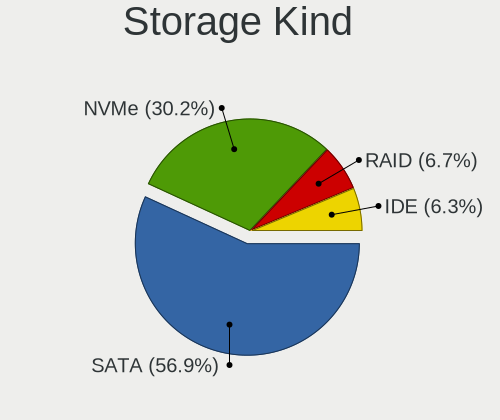

| Kind | Notebooks | Percent |
|------|-----------|---------|
| SATA | 122       | 57.55%  |
| NVMe | 62        | 29.25%  |
| RAID | 14        | 6.6%    |
| IDE  | 14        | 6.6%    |

Processor
---------

CPU Vendor
----------

Processor vendors

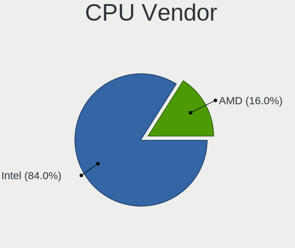

| Vendor | Notebooks | Percent |
|--------|-----------|---------|
| Intel  | 156       | 85.25%  |
| AMD    | 27        | 14.75%  |

CPU Model
---------

Processor models

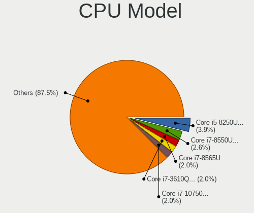

| Model                                       | Notebooks | Percent |
|---------------------------------------------|-----------|---------|
| Intel Core i5-8250U CPU @ 1.60GHz           | 6         | 3.26%   |
| Intel Core i7-8565U CPU @ 1.80GHz           | 4         | 2.17%   |
| Intel Core i7-8550U CPU @ 1.80GHz           | 4         | 2.17%   |
| Intel Core i7-10750H CPU @ 2.60GHz          | 4         | 2.17%   |
| Intel Core i5-8300H CPU @ 2.30GHz           | 4         | 2.17%   |
| Intel Core i5-8265U CPU @ 1.60GHz           | 4         | 2.17%   |
| Intel Core i5-3230M CPU @ 2.60GHz           | 4         | 2.17%   |
| Intel Core i7-3610QM CPU @ 2.30GHz          | 3         | 1.63%   |
| Intel Core i5-6300U CPU @ 2.40GHz           | 3         | 1.63%   |
| Intel Core i3-5005U CPU @ 2.00GHz           | 3         | 1.63%   |
| Intel Core i3-2310M CPU @ 2.10GHz           | 3         | 1.63%   |
| Intel Celeron N4000 CPU @ 1.10GHz           | 3         | 1.63%   |
| Intel 11th Gen Core i7-1165G7 @ 2.80GHz     | 3         | 1.63%   |
| Intel Pentium Dual-Core CPU T4500 @ 2.30GHz | 2         | 1.09%   |
| Intel Core i7-9850H CPU @ 2.60GHz           | 2         | 1.09%   |
| Intel Core i7-4710HQ CPU @ 2.50GHz          | 2         | 1.09%   |
| Intel Core i7-4702MQ CPU @ 2.20GHz          | 2         | 1.09%   |
| Intel Core i7-4500U CPU @ 1.80GHz           | 2         | 1.09%   |
| Intel Core i7-3740QM CPU @ 2.70GHz          | 2         | 1.09%   |
| Intel Core i7-3520M CPU @ 2.90GHz           | 2         | 1.09%   |
| Intel Core i7-2630QM CPU @ 2.00GHz          | 2         | 1.09%   |
| Intel Core i7-10510U CPU @ 1.80GHz          | 2         | 1.09%   |
| Intel Core i7 CPU M 640 @ 2.80GHz           | 2         | 1.09%   |
| Intel Core i5-7300HQ CPU @ 2.50GHz          | 2         | 1.09%   |
| Intel Core i5-6300HQ CPU @ 2.30GHz          | 2         | 1.09%   |
| Intel Core i5-4300M CPU @ 2.60GHz           | 2         | 1.09%   |
| Intel Core i5-2540M CPU @ 2.60GHz           | 2         | 1.09%   |
| Intel Core i5-2430M CPU @ 2.40GHz           | 2         | 1.09%   |
| Intel Core i5-2410M CPU @ 2.30GHz           | 2         | 1.09%   |
| Intel Core i3-6100U CPU @ 2.30GHz           | 2         | 1.09%   |
| Intel Core i3-4005U CPU @ 1.70GHz           | 2         | 1.09%   |
| Intel Core i3-3217U CPU @ 1.80GHz           | 2         | 1.09%   |
| Intel Core i3-3120M CPU @ 2.50GHz           | 2         | 1.09%   |
| Intel Core i3 CPU M 350 @ 2.27GHz           | 2         | 1.09%   |
| Intel Core 2 Duo CPU T9300 @ 2.50GHz        | 2         | 1.09%   |
| Intel Celeron CPU B830 @ 1.80GHz            | 2         | 1.09%   |
| Intel 11th Gen Core i5-1135G7 @ 2.40GHz     | 2         | 1.09%   |
| AMD Ryzen 7 5800H with Radeon Graphics      | 2         | 1.09%   |
| AMD Ryzen 7 4700U with Radeon Graphics      | 2         | 1.09%   |
| AMD A8-4500M APU with Radeon HD Graphics    | 2         | 1.09%   |

CPU Model Family
----------------

Processor model prefix

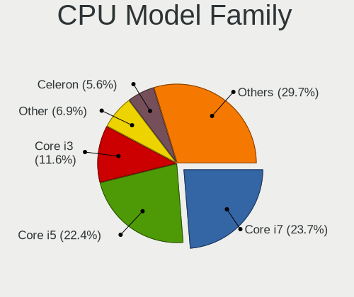

| Model                   | Notebooks | Percent |
|-------------------------|-----------|---------|
| Intel Core i7           | 47        | 25.68%  |
| Intel Core i5           | 45        | 24.59%  |
| Intel Core i3           | 24        | 13.11%  |
| Intel Celeron           | 9         | 4.92%   |
| AMD Ryzen 7             | 9         | 4.92%   |
| Other                   | 8         | 4.37%   |
| Intel Core 2 Duo        | 7         | 3.83%   |
| AMD Ryzen 5             | 7         | 3.83%   |
| Intel Pentium Dual-Core | 3         | 1.64%   |
| Intel Pentium           | 3         | 1.64%   |
| Intel Core i9           | 3         | 1.64%   |
| Intel Genuine           | 2         | 1.09%   |
| Intel Core 2            | 2         | 1.09%   |
| AMD Ryzen 7 PRO         | 2         | 1.09%   |
| AMD Phenom II           | 2         | 1.09%   |
| AMD A8                  | 2         | 1.09%   |
| Intel Pentium Silver    | 1         | 0.55%   |
| Intel Core m7           | 1         | 0.55%   |
| Intel Atom              | 1         | 0.55%   |
| AMD Sempron             | 1         | 0.55%   |
| AMD E                   | 1         | 0.55%   |
| AMD C-60                | 1         | 0.55%   |
| AMD A6                  | 1         | 0.55%   |
| AMD A10                 | 1         | 0.55%   |

CPU Cores
---------

Number of processor cores

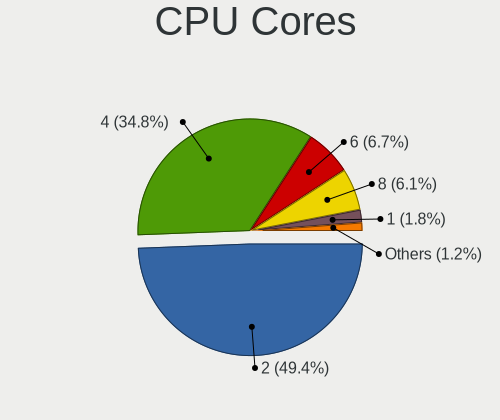

| Number  | Notebooks | Percent |
|---------|-----------|---------|
| 2       | 88        | 47.57%  |
| 4       | 64        | 34.59%  |
| 8       | 14        | 7.57%   |
| 6       | 14        | 7.57%   |
| 1       | 3         | 1.62%   |
| Unknown | 2         | 1.08%   |

CPU Sockets
-----------

Number of sockets

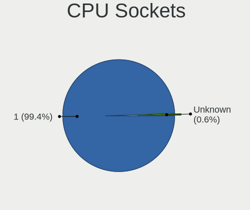

| Number  | Notebooks | Percent |
|---------|-----------|---------|
| 1       | 183       | 99.46%  |
| Unknown | 1         | 0.54%   |

CPU Threads
-----------

Threads per core (Hyper-Threading)

| Number  | Notebooks | Percent |
|---------|-----------|---------|
| 2       | 141       | 76.63%  |
| 1       | 41        | 22.28%  |
| Unknown | 2         | 1.09%   |

CPU Op-Modes
------------

CPU Operation Modes (32-bit, 64-bit)

| Op mode        | Notebooks | Percent |
|----------------|-----------|---------|
| 32-bit, 64-bit | 181       | 98.91%  |
| 32-bit         | 1         | 0.55%   |
| Unknown        | 1         | 0.55%   |

CPU Microcode
-------------

Microcode number

| Number     | Notebooks | Percent |
|------------|-----------|---------|
| Unknown    | 35        | 18.32%  |
| 0x306a9    | 19        | 9.95%   |
| 0x206a7    | 15        | 7.85%   |
| 0x806ea    | 10        | 5.24%   |
| 0x306c3    | 9         | 4.71%   |
| 0x406e3    | 7         | 3.66%   |
| 0x20655    | 7         | 3.66%   |
| 0x806c1    | 6         | 3.14%   |
| 0x40651    | 6         | 3.14%   |
| 0x1067a    | 6         | 3.14%   |
| 0x906ea    | 5         | 2.62%   |
| 0x806ec    | 5         | 2.62%   |
| 0x506e3    | 4         | 2.09%   |
| 0x306d4    | 4         | 2.09%   |
| 0xa0652    | 3         | 1.57%   |
| 0x806eb    | 3         | 1.57%   |
| 0x0a50000c | 3         | 1.57%   |
| 0x906ed    | 2         | 1.05%   |
| 0x906e9    | 2         | 1.05%   |
| 0x706a1    | 2         | 1.05%   |
| 0x6fd      | 2         | 1.05%   |
| 0x30678    | 2         | 1.05%   |
| 0x20652    | 2         | 1.05%   |
| 0x10676    | 2         | 1.05%   |
| 0x0a404101 | 2         | 1.05%   |
| 0x08608103 | 2         | 1.05%   |
| 0x08108102 | 2         | 1.05%   |
| 0x05000119 | 2         | 1.05%   |
| 0x010000c8 | 2         | 1.05%   |
| 0x806e9    | 1         | 0.52%   |
| 0x706e5    | 1         | 0.52%   |
| 0x6fa      | 1         | 0.52%   |
| 0x6f6      | 1         | 0.52%   |
| 0x6f2      | 1         | 0.52%   |
| 0x6ec      | 1         | 0.52%   |
| 0x506c9    | 1         | 0.52%   |
| 0x106e5    | 1         | 0.52%   |
| 0x106ca    | 1         | 0.52%   |
| 0x10661    | 1         | 0.52%   |
| 0x0a50000b | 1         | 0.52%   |

CPU Microarch
-------------

Microarchitecture

| Name            | Notebooks | Percent |
|-----------------|-----------|---------|
| KabyLake        | 34        | 18.58%  |
| IvyBridge       | 20        | 10.93%  |
| Haswell         | 18        | 9.84%   |
| SandyBridge     | 17        | 9.29%   |
| Skylake         | 13        | 7.1%    |
| Westmere        | 10        | 5.46%   |
| Penryn          | 8         | 4.37%   |
| TigerLake       | 7         | 3.83%   |
| Zen 3           | 6         | 3.28%   |
| Zen 2           | 6         | 3.28%   |
| Core            | 6         | 3.28%   |
| CometLake       | 6         | 3.28%   |
| Unknown         | 6         | 3.28%   |
| Goldmont plus   | 4         | 2.19%   |
| Broadwell       | 4         | 2.19%   |
| Zen+            | 2         | 1.09%   |
| Silvermont      | 2         | 1.09%   |
| Piledriver      | 2         | 1.09%   |
| K10             | 2         | 1.09%   |
| Goldmont        | 2         | 1.09%   |
| Bobcat          | 2         | 1.09%   |
| Nehalem         | 1         | 0.55%   |
| K8 & K10 hybrid | 1         | 0.55%   |
| Jaguar          | 1         | 0.55%   |
| IceLake         | 1         | 0.55%   |
| Excavator       | 1         | 0.55%   |
| Bonnell         | 1         | 0.55%   |

Graphics
--------

GPU Vendor
----------

Vendors of graphics cards

| Vendor                           | Notebooks | Percent |
|----------------------------------|-----------|---------|
| Intel                            | 137       | 57.56%  |
| Nvidia                           | 53        | 22.27%  |
| AMD                              | 47        | 19.75%  |
| Silicon Integrated Systems [SiS] | 1         | 0.42%   |

GPU Model
---------

Graphics card models

| Model                                                                         | Notebooks | Percent |
|-------------------------------------------------------------------------------|-----------|---------|
| Intel 3rd Gen Core processor Graphics Controller                              | 17        | 6.83%   |
| Intel 2nd Generation Core Processor Family Integrated Graphics Controller     | 14        | 5.62%   |
| Intel UHD Graphics 620                                                        | 11        | 4.42%   |
| Intel CoffeeLake-H GT2 [UHD Graphics 630]                                     | 10        | 4.02%   |
| Intel 4th Gen Core Processor Integrated Graphics Controller                   | 10        | 4.02%   |
| Intel WhiskeyLake-U GT2 [UHD Graphics 620]                                    | 8         | 3.21%   |
| Intel Skylake GT2 [HD Graphics 520]                                           | 7         | 2.81%   |
| Intel Haswell-ULT Integrated Graphics Controller                              | 7         | 2.81%   |
| Intel Core Processor Integrated Graphics Controller                           | 6         | 2.41%   |
| Nvidia GF108M [GeForce GT 540M]                                               | 5         | 2.01%   |
| Intel TigerLake-LP GT2 [Iris Xe Graphics]                                     | 5         | 2.01%   |
| Intel CometLake-H GT2 [UHD Graphics]                                          | 5         | 2.01%   |
| AMD Renoir                                                                    | 5         | 2.01%   |
| Nvidia GP108M [GeForce MX150]                                                 | 4         | 1.61%   |
| Nvidia GP107M [GeForce GTX 1050 Mobile]                                       | 4         | 1.61%   |
| Intel Mobile 4 Series Chipset Integrated Graphics Controller                  | 4         | 1.61%   |
| Intel HD Graphics 5500                                                        | 4         | 1.61%   |
| Intel HD Graphics 530                                                         | 4         | 1.61%   |
| AMD Mars [Radeon HD 8670A/8670M/8750M / R7 M370]                              | 4         | 1.61%   |
| AMD Cezanne [Radeon Vega Series / Radeon Vega Mobile Series]                  | 4         | 1.61%   |
| Nvidia TU117M [GeForce GTX 1650 Mobile / Max-Q]                               | 3         | 1.2%    |
| Intel Mobile 945GM/GMS/GME, 943/940GML Express Integrated Graphics Controller | 3         | 1.2%    |
| Intel Mobile 945GM/GMS, 943/940GML Express Integrated Graphics Controller     | 3         | 1.2%    |
| Intel GeminiLake [UHD Graphics 600]                                           | 3         | 1.2%    |
| AMD Seymour [Radeon HD 6400M/7400M Series]                                    | 3         | 1.2%    |
| Nvidia TU116M [GeForce GTX 1660 Ti Mobile]                                    | 2         | 0.8%    |
| Nvidia GP106M [GeForce GTX 1060 Mobile]                                       | 2         | 0.8%    |
| Nvidia GM108M [GeForce 840M]                                                  | 2         | 0.8%    |
| Nvidia GM107M [GeForce GTX 960M]                                              | 2         | 0.8%    |
| Nvidia GK107M [GeForce GT 650M]                                               | 2         | 0.8%    |
| Nvidia GF117M [GeForce 610M/710M/810M/820M / GT 620M/625M/630M/720M]          | 2         | 0.8%    |
| Intel Mobile GM965/GL960 Integrated Graphics Controller (secondary)           | 2         | 0.8%    |
| Intel Mobile GM965/GL960 Integrated Graphics Controller (primary)             | 2         | 0.8%    |
| Intel HD Graphics 630                                                         | 2         | 0.8%    |
| Intel HD Graphics 500                                                         | 2         | 0.8%    |
| Intel CometLake-U GT2 [UHD Graphics]                                          | 2         | 0.8%    |
| Intel Atom Processor Z36xxx/Z37xxx Series Graphics & Display                  | 2         | 0.8%    |
| AMD Venus XT [Radeon HD 8870M / R9 M270X/M370X]                               | 2         | 0.8%    |
| AMD Trinity [Radeon HD 7640G]                                                 | 2         | 0.8%    |
| AMD Sun PRO [Radeon HD 8570A/8570M]                                           | 2         | 0.8%    |

GPU Combo
---------

Combinations of graphics cards

| Name           | Notebooks | Percent |
|----------------|-----------|---------|
| 1 x Intel      | 83        | 45.11%  |
| Intel + Nvidia | 44        | 23.91%  |
| 1 x AMD        | 30        | 16.3%   |
| Intel + AMD    | 10        | 5.43%   |
| 1 x Nvidia     | 9         | 4.89%   |
| 2 x AMD        | 6         | 3.26%   |
| 1 x SiS        | 1         | 0.54%   |
| AMD + Nvidia   | 1         | 0.54%   |

GPU Driver
----------

Free vs proprietary

| Driver      | Notebooks | Percent |
|-------------|-----------|---------|
| Free        | 160       | 85.11%  |
| Proprietary | 25        | 13.3%   |
| Unknown     | 3         | 1.6%    |

GPU Memory
----------

Total video memory

| Size in GB | Notebooks | Percent |
|------------|-----------|---------|
| Unknown    | 99        | 51.83%  |
| 1.01-2.0   | 40        | 20.94%  |
| 0.01-0.5   | 22        | 11.52%  |
| 0.51-1.0   | 12        | 6.28%   |
| 3.01-4.0   | 11        | 5.76%   |
| 5.01-6.0   | 5         | 2.62%   |
| 7.01-8.0   | 1         | 0.52%   |
| 2.01-3.0   | 1         | 0.52%   |

Monitor
-------

Monitor Vendor
--------------

Monitor vendors

| Vendor                  | Notebooks | Percent |
|-------------------------|-----------|---------|
| AU Optronics            | 44        | 20.18%  |
| LG Display              | 42        | 19.27%  |
| Samsung Electronics     | 22        | 10.09%  |
| Chimei Innolux          | 21        | 9.63%   |
| BOE                     | 21        | 9.63%   |
| Lenovo                  | 12        | 5.5%    |
| Dell                    | 12        | 5.5%    |
| Chi Mei Optoelectronics | 10        | 4.59%   |
| PANDA                   | 4         | 1.83%   |
| Goldstar                | 4         | 1.83%   |
| Sony                    | 3         | 1.38%   |
| Sharp                   | 3         | 1.38%   |
| Philips                 | 3         | 1.38%   |
| CSO                     | 2         | 0.92%   |
| Unknown (AAA)           | 1         | 0.46%   |
| Toshiba                 | 1         | 0.46%   |
| MStar                   | 1         | 0.46%   |
| LGD                     | 1         | 0.46%   |
| LG Philips              | 1         | 0.46%   |
| KDC                     | 1         | 0.46%   |
| JDI                     | 1         | 0.46%   |
| InfoVision              | 1         | 0.46%   |
| Iiyama                  | 1         | 0.46%   |
| IBM                     | 1         | 0.46%   |
| Hewlett-Packard         | 1         | 0.46%   |
| HannStar                | 1         | 0.46%   |
| ASUSTek Computer        | 1         | 0.46%   |
| Apple                   | 1         | 0.46%   |
| AOC                     | 1         | 0.46%   |

Monitor Model
-------------

Monitor models

| Model                                                                    | Notebooks | Percent |
|--------------------------------------------------------------------------|-----------|---------|
| Chi Mei Optoelectronics LCD Monitor CMO15A7 1366x768 344x193mm 15.5-inch | 4         | 1.83%   |
| AU Optronics LCD Monitor AUO21ED 1920x1080 344x193mm 15.5-inch           | 4         | 1.83%   |
| LG Display LCD Monitor LGD0306 1600x900 310x174mm 14.0-inch              | 3         | 1.37%   |
| Lenovo T24i-10 LEN61A6 1920x1080 527x296mm 23.8-inch                     | 3         | 1.37%   |
| AU Optronics LCD Monitor AUO38ED 1920x1080 344x193mm 15.5-inch           | 3         | 1.37%   |
| AU Optronics LCD Monitor AUO26EC 1366x768 344x193mm 15.5-inch            | 3         | 1.37%   |
| Sony LCD Monitor MS_9005 1920x1200 331x207mm 15.4-inch                   | 2         | 0.91%   |
| Samsung Electronics LCD Monitor SEC314C 1920x1080 344x194mm 15.5-inch    | 2         | 0.91%   |
| LG Display LP156WH2-TLAA LGD0230 1366x768 344x194mm 15.5-inch            | 2         | 0.91%   |
| LG Display LCD Monitor LGD03D9 1366x768 345x194mm 15.6-inch              | 2         | 0.91%   |
| LG Display LCD Monitor LGD02DC 1366x768 344x194mm 15.5-inch              | 2         | 0.91%   |
| Lenovo LCD Monitor LEN40BA 1920x1080 344x194mm 15.5-inch                 | 2         | 0.91%   |
| Dell P2719H DEL4184 1920x1080 600x340mm 27.2-inch                        | 2         | 0.91%   |
| Chimei Innolux LCD Monitor CMN15E7 1920x1080 344x193mm 15.5-inch         | 2         | 0.91%   |
| Chimei Innolux LCD Monitor CMN15DB 1366x768 344x193mm 15.5-inch          | 2         | 0.91%   |
| Chimei Innolux LCD Monitor CMN150C 1920x1080 344x193mm 15.5-inch         | 2         | 0.91%   |
| Chimei Innolux LCD Monitor CMN14F2 1920x1080 309x173mm 13.9-inch         | 2         | 0.91%   |
| Chi Mei Optoelectronics LCD Monitor CMO1592 1366x768 344x193mm 15.5-inch | 2         | 0.91%   |
| AU Optronics LCD Monitor AUODF87 1920x1080 344x193mm 15.5-inch           | 2         | 0.91%   |
| AU Optronics LCD Monitor AUO8174 1280x800 331x207mm 15.4-inch            | 2         | 0.91%   |
| AU Optronics LCD Monitor AUO22EC 1366x768 344x193mm 15.5-inch            | 2         | 0.91%   |
| Unknown (AAA) HDTV AAA0001 1360x768 575x323mm 26.0-inch                  | 1         | 0.46%   |
| Toshiba LCD Monitor LCD2306 1280x800 287x180mm 13.3-inch                 | 1         | 0.46%   |
| Sony LCD MS_0025 1920x1080 291x164mm 13.2-inch                           | 1         | 0.46%   |
| Sharp LQ156M1JW03 SHP14C5 1920x1080 344x194mm 15.5-inch                  | 1         | 0.46%   |
| Sharp LCD Monitor SHP1516 3840x2400 336x210mm 15.6-inch                  | 1         | 0.46%   |
| Sharp LCD Monitor SHP14D1 1920x1200 336x210mm 15.6-inch                  | 1         | 0.46%   |
| Samsung Electronics U28E590 SAM0C4E 3840x2160 608x345mm 27.5-inch        | 1         | 0.46%   |
| Samsung Electronics SyncMaster SAM0351 1680x1050 459x296mm 21.5-inch     | 1         | 0.46%   |
| Samsung Electronics S24D391 SAM0B87 1920x1080 521x293mm 23.5-inch        | 1         | 0.46%   |
| Samsung Electronics S24C450 SAM09CB 1920x1080 531x299mm 24.0-inch        | 1         | 0.46%   |
| Samsung Electronics S24C300 SAM0A24 1920x1080 531x299mm 24.0-inch        | 1         | 0.46%   |
| Samsung Electronics LS27A600N SAM716E 2560x1440 597x337mm 27.0-inch      | 1         | 0.46%   |
| Samsung Electronics LF24T450F SAM7094 1920x1080 527x296mm 23.8-inch      | 1         | 0.46%   |
| Samsung Electronics LCD Monitor SEC544B 1600x900 382x214mm 17.2-inch     | 1         | 0.46%   |
| Samsung Electronics LCD Monitor SEC4351 1366x768 344x194mm 15.5-inch     | 1         | 0.46%   |
| Samsung Electronics LCD Monitor SEC434E 1600x900 310x174mm 14.0-inch     | 1         | 0.46%   |
| Samsung Electronics LCD Monitor SEC4258 1024x768 286x214mm 14.1-inch     | 1         | 0.46%   |
| Samsung Electronics LCD Monitor SEC3641 1280x800 331x207mm 15.4-inch     | 1         | 0.46%   |
| Samsung Electronics LCD Monitor SEC3554 1600x900 382x215mm 17.3-inch     | 1         | 0.46%   |

Monitor Resolution
------------------

Monitor screen resolution

| Resolution         | Notebooks | Percent |
|--------------------|-----------|---------|
| 1920x1080 (FHD)    | 94        | 47%     |
| 1366x768 (WXGA)    | 48        | 24%     |
| 1600x900 (HD+)     | 15        | 7.5%    |
| 3840x2160 (4K)     | 10        | 5%      |
| 2560x1440 (QHD)    | 7         | 3.5%    |
| 1280x800 (WXGA)    | 6         | 3%      |
| 1920x1200 (WUXGA)  | 4         | 2%      |
| 3840x2400          | 2         | 1%      |
| 3440x1440          | 2         | 1%      |
| 2880x1800          | 2         | 1%      |
| 2560x1600          | 2         | 1%      |
| 1680x1050 (WSXGA+) | 2         | 1%      |
| 3000x2000          | 1         | 0.5%    |
| 2560x1080          | 1         | 0.5%    |
| 2160x1440          | 1         | 0.5%    |
| 1440x900 (WXGA+)   | 1         | 0.5%    |
| 1024x768 (XGA)     | 1         | 0.5%    |
| 1024x600           | 1         | 0.5%    |

Monitor Diagonal
----------------

Diagonal size in inches

| Inches  | Notebooks | Percent |
|---------|-----------|---------|
| 15      | 108       | 49.77%  |
| 14      | 22        | 10.14%  |
| 13      | 22        | 10.14%  |
| 17      | 13        | 5.99%   |
| 27      | 10        | 4.61%   |
| 24      | 10        | 4.61%   |
| 23      | 8         | 3.69%   |
| 12      | 6         | 2.76%   |
| 21      | 4         | 1.84%   |
| 34      | 2         | 0.92%   |
| 16      | 2         | 0.92%   |
| 84      | 1         | 0.46%   |
| 72      | 1         | 0.46%   |
| 52      | 1         | 0.46%   |
| 40      | 1         | 0.46%   |
| 31      | 1         | 0.46%   |
| 29      | 1         | 0.46%   |
| 25      | 1         | 0.46%   |
| 11      | 1         | 0.46%   |
| 10      | 1         | 0.46%   |
| Unknown | 1         | 0.46%   |

Monitor Width
-------------

Physical width

| Width in mm | Notebooks | Percent |
|-------------|-----------|---------|
| 301-350     | 143       | 66.2%   |
| 501-600     | 26        | 12.04%  |
| 351-400     | 16        | 7.41%   |
| 201-300     | 16        | 7.41%   |
| 601-700     | 4         | 1.85%   |
| 401-500     | 4         | 1.85%   |
| 701-800     | 2         | 0.93%   |
| 1501-2000   | 2         | 0.93%   |
| 801-900     | 1         | 0.46%   |
| 1001-1500   | 1         | 0.46%   |
| Unknown     | 1         | 0.46%   |

Aspect Ratio
------------

Proportional relationship between the width and the height

| Ratio   | Notebooks | Percent |
|---------|-----------|---------|
| 16/9    | 156       | 85.71%  |
| 16/10   | 20        | 10.99%  |
| 3/2     | 2         | 1.1%    |
| 21/9    | 2         | 1.1%    |
| 4/3     | 1         | 0.55%   |
| Unknown | 1         | 0.55%   |

Monitor Area
------------

Area in inch²

| Area in inch² | Notebooks | Percent |
|----------------|-----------|---------|
| 101-110        | 106       | 49.07%  |
| 81-90          | 38        | 17.59%  |
| 201-250        | 20        | 9.26%   |
| 121-130        | 12        | 5.56%   |
| 301-350        | 10        | 4.63%   |
| 61-70          | 6         | 2.78%   |
| 71-80          | 5         | 2.31%   |
| 351-500        | 4         | 1.85%   |
| More than 1000 | 3         | 1.39%   |
| 111-120        | 3         | 1.39%   |
| 251-300        | 2         | 0.93%   |
| 91-100         | 2         | 0.93%   |
| 51-60          | 1         | 0.46%   |
| 41-50          | 1         | 0.46%   |
| 131-140        | 1         | 0.46%   |
| 501-1000       | 1         | 0.46%   |
| Unknown        | 1         | 0.46%   |

Pixel Density
-------------

Pixels per inch

| Density       | Notebooks | Percent |
|---------------|-----------|---------|
| 121-160       | 96        | 45.5%   |
| 101-120       | 53        | 25.12%  |
| 51-100        | 40        | 18.96%  |
| 161-240       | 13        | 6.16%   |
| More than 240 | 6         | 2.84%   |
| 1-50          | 2         | 0.95%   |
| Unknown       | 1         | 0.47%   |

Multiple Monitors
-----------------

Total monitors connected

| Total | Notebooks | Percent |
|-------|-----------|---------|
| 1     | 145       | 78.38%  |
| 2     | 33        | 17.84%  |
| 0     | 4         | 2.16%   |
| 3     | 3         | 1.62%   |

Network
-------

Net Controller Vendor
---------------------

Controller vendors

| Vendor                            | Notebooks | Percent |
|-----------------------------------|-----------|---------|
| Intel                             | 99        | 33.56%  |
| Realtek Semiconductor             | 85        | 28.81%  |
| Qualcomm Atheros                  | 50        | 16.95%  |
| Broadcom                          | 22        | 7.46%   |
| MediaTek                          | 5         | 1.69%   |
| Ralink                            | 4         | 1.36%   |
| Lenovo                            | 4         | 1.36%   |
| Marvell Technology Group          | 3         | 1.02%   |
| Broadcom Limited                  | 3         | 1.02%   |
| Sierra Wireless                   | 2         | 0.68%   |
| JMicron Technology                | 2         | 0.68%   |
| Fibocom                           | 2         | 0.68%   |
| Ericsson Business Mobile Networks | 2         | 0.68%   |
| Dell                              | 2         | 0.68%   |
| ZTE WCDMA Technologies MSM        | 1         | 0.34%   |
| TP-Link                           | 1         | 0.34%   |
| Ralink Technology                 | 1         | 0.34%   |
| Qualcomm Atheros Communications   | 1         | 0.34%   |
| OnePlus Technology (Shenzhen)     | 1         | 0.34%   |
| Nvidia                            | 1         | 0.34%   |
| MOBILE                            | 1         | 0.34%   |
| Hewlett-Packard                   | 1         | 0.34%   |
| D-Link                            | 1         | 0.34%   |
| ASIX Electronics                  | 1         | 0.34%   |

Net Controller Model
--------------------

Controller models

| Model                                                                   | Notebooks | Percent |
|-------------------------------------------------------------------------|-----------|---------|
| Realtek RTL8111/8168/8411 PCI Express Gigabit Ethernet Controller       | 56        | 15.34%  |
| Realtek RTL810xE PCI Express Fast Ethernet controller                   | 16        | 4.38%   |
| Qualcomm Atheros AR9285 Wireless Network Adapter (PCI-Express)          | 13        | 3.56%   |
| Intel 82579LM Gigabit Network Connection (Lewisville)                   | 12        | 3.29%   |
| Intel Wireless 8265 / 8275                                              | 10        | 2.74%   |
| Realtek RTL8153 Gigabit Ethernet Adapter                                | 9         | 2.47%   |
| Qualcomm Atheros AR9485 Wireless Network Adapter                        | 9         | 2.47%   |
| Intel Wireless 8260                                                     | 9         | 2.47%   |
| Qualcomm Atheros QCA9565 / AR9565 Wireless Network Adapter              | 8         | 2.19%   |
| Intel Wi-Fi 6 AX200                                                     | 8         | 2.19%   |
| Intel Centrino Advanced-N 6205 [Taylor Peak]                            | 8         | 2.19%   |
| Intel Wi-Fi 6 AX201                                                     | 6         | 1.64%   |
| Qualcomm Atheros AR8151 v2.0 Gigabit Ethernet                           | 5         | 1.37%   |
| Intel Wireless 7260                                                     | 5         | 1.37%   |
| Intel Comet Lake PCH CNVi WiFi                                          | 5         | 1.37%   |
| Intel Cannon Point-LP CNVi [Wireless-AC]                                | 5         | 1.37%   |
| Intel Cannon Lake PCH CNVi WiFi                                         | 5         | 1.37%   |
| Broadcom BCM4313 802.11bgn Wireless Network Adapter                     | 5         | 1.37%   |
| Realtek RTL8821CE 802.11ac PCIe Wireless Network Adapter                | 4         | 1.1%    |
| Ralink RT3290 Wireless 802.11n 1T/1R PCIe                               | 4         | 1.1%    |
| Qualcomm Atheros QCA9377 802.11ac Wireless Network Adapter              | 4         | 1.1%    |
| Intel Ethernet Connection I219-LM                                       | 4         | 1.1%    |
| Intel Ethernet Connection (4) I219-V                                    | 4         | 1.1%    |
| Realtek RTL8723BE PCIe Wireless Network Adapter                         | 3         | 0.82%   |
| Qualcomm Atheros QCA8172 Fast Ethernet                                  | 3         | 0.82%   |
| Qualcomm Atheros AR8161 Gigabit Ethernet                                | 3         | 0.82%   |
| Qualcomm Atheros AR242x / AR542x Wireless Network Adapter (PCI-Express) | 3         | 0.82%   |
| MediaTek MT7921 802.11ax PCI Express Wireless Network Adapter           | 3         | 0.82%   |
| Intel Wireless 7265                                                     | 3         | 0.82%   |
| Intel Wireless 3165                                                     | 3         | 0.82%   |
| Intel Ethernet Connection (7) I219-LM                                   | 3         | 0.82%   |
| Intel Ethernet Connection (6) I219-V                                    | 3         | 0.82%   |
| Intel Centrino Advanced-N 6235                                          | 3         | 0.82%   |
| Intel Centrino Advanced-N 6200                                          | 3         | 0.82%   |
| Realtek RTL8822CE 802.11ac PCIe Wireless Network Adapter                | 2         | 0.55%   |
| Realtek RTL8152 Fast Ethernet Adapter                                   | 2         | 0.55%   |
| Realtek Realtek Network controller                                      | 2         | 0.55%   |
| Qualcomm Atheros QCA6174 802.11ac Wireless Network Adapter              | 2         | 0.55%   |
| Qualcomm Atheros Killer E220x Gigabit Ethernet Controller               | 2         | 0.55%   |
| Qualcomm Atheros AR8131 Gigabit Ethernet                                | 2         | 0.55%   |

Wireless Vendor
---------------

Wireless vendors

| Vendor                            | Notebooks | Percent |
|-----------------------------------|-----------|---------|
| Intel                             | 97        | 50.52%  |
| Qualcomm Atheros                  | 43        | 22.4%   |
| Broadcom                          | 17        | 8.85%   |
| Realtek Semiconductor             | 16        | 8.33%   |
| Ralink                            | 4         | 2.08%   |
| MediaTek                          | 3         | 1.56%   |
| Sierra Wireless                   | 2         | 1.04%   |
| Fibocom                           | 2         | 1.04%   |
| Dell                              | 2         | 1.04%   |
| TP-Link                           | 1         | 0.52%   |
| Ralink Technology                 | 1         | 0.52%   |
| Qualcomm Atheros Communications   | 1         | 0.52%   |
| Ericsson Business Mobile Networks | 1         | 0.52%   |
| D-Link                            | 1         | 0.52%   |
| Broadcom Limited                  | 1         | 0.52%   |

Wireless Model
--------------

Wireless models

| Model                                                                   | Notebooks | Percent |
|-------------------------------------------------------------------------|-----------|---------|
| Qualcomm Atheros AR9285 Wireless Network Adapter (PCI-Express)          | 13        | 6.77%   |
| Intel Wireless 8265 / 8275                                              | 10        | 5.21%   |
| Qualcomm Atheros AR9485 Wireless Network Adapter                        | 9         | 4.69%   |
| Intel Wireless 8260                                                     | 9         | 4.69%   |
| Qualcomm Atheros QCA9565 / AR9565 Wireless Network Adapter              | 8         | 4.17%   |
| Intel Wi-Fi 6 AX200                                                     | 8         | 4.17%   |
| Intel Centrino Advanced-N 6205 [Taylor Peak]                            | 8         | 4.17%   |
| Intel Wi-Fi 6 AX201                                                     | 6         | 3.13%   |
| Intel Wireless 7260                                                     | 5         | 2.6%    |
| Intel Comet Lake PCH CNVi WiFi                                          | 5         | 2.6%    |
| Intel Cannon Point-LP CNVi [Wireless-AC]                                | 5         | 2.6%    |
| Intel Cannon Lake PCH CNVi WiFi                                         | 5         | 2.6%    |
| Broadcom BCM4313 802.11bgn Wireless Network Adapter                     | 5         | 2.6%    |
| Realtek RTL8821CE 802.11ac PCIe Wireless Network Adapter                | 4         | 2.08%   |
| Ralink RT3290 Wireless 802.11n 1T/1R PCIe                               | 4         | 2.08%   |
| Qualcomm Atheros QCA9377 802.11ac Wireless Network Adapter              | 4         | 2.08%   |
| Realtek RTL8723BE PCIe Wireless Network Adapter                         | 3         | 1.56%   |
| Qualcomm Atheros AR242x / AR542x Wireless Network Adapter (PCI-Express) | 3         | 1.56%   |
| Intel Wireless 7265                                                     | 3         | 1.56%   |
| Intel Wireless 3165                                                     | 3         | 1.56%   |
| Intel Centrino Advanced-N 6235                                          | 3         | 1.56%   |
| Intel Centrino Advanced-N 6200                                          | 3         | 1.56%   |
| Realtek RTL8822CE 802.11ac PCIe Wireless Network Adapter                | 2         | 1.04%   |
| Realtek Realtek Network controller                                      | 2         | 1.04%   |
| Qualcomm Atheros QCA6174 802.11ac Wireless Network Adapter              | 2         | 1.04%   |
| Intel Wireless-AC 9260                                                  | 2         | 1.04%   |
| Intel Wireless 3160                                                     | 2         | 1.04%   |
| Intel PRO/Wireless 5100 AGN [Shiloh] Network Connection                 | 2         | 1.04%   |
| Intel PRO/Wireless 4965 AG or AGN [Kedron] Network Connection           | 2         | 1.04%   |
| Intel PRO/Wireless 3945ABG [Golan] Network Connection                   | 2         | 1.04%   |
| Intel Dual Band Wireless-AC 3165 Plus Bluetooth                         | 2         | 1.04%   |
| Intel Comet Lake PCH-LP CNVi WiFi                                       | 2         | 1.04%   |
| Intel Centrino Wireless-N 1000 [Condor Peak]                            | 2         | 1.04%   |
| Intel Centrino Ultimate-N 6300                                          | 2         | 1.04%   |
| Fibocom L830-EB-00 LTE WWAN Modem                                       | 2         | 1.04%   |
| Dell DW5811e Snapdragon™ X7 LTE                                    | 2         | 1.04%   |
| Broadcom BCM43224 802.11a/b/g/n                                         | 2         | 1.04%   |
| Broadcom BCM43142 802.11b/g/n                                           | 2         | 1.04%   |
| Broadcom BCM4312 802.11b/g LP-PHY                                       | 2         | 1.04%   |
| Broadcom BCM4311 802.11b/g WLAN                                         | 2         | 1.04%   |

Ethernet Vendor
---------------

Ethernet vendors

| Vendor                        | Notebooks | Percent |
|-------------------------------|-----------|---------|
| Realtek Semiconductor         | 80        | 48.19%  |
| Intel                         | 40        | 24.1%   |
| Qualcomm Atheros              | 18        | 10.84%  |
| Broadcom                      | 10        | 6.02%   |
| Lenovo                        | 4         | 2.41%   |
| Marvell Technology Group      | 3         | 1.81%   |
| MediaTek                      | 2         | 1.2%    |
| JMicron Technology            | 2         | 1.2%    |
| Broadcom Limited              | 2         | 1.2%    |
| ZTE WCDMA Technologies MSM    | 1         | 0.6%    |
| OnePlus Technology (Shenzhen) | 1         | 0.6%    |
| Nvidia                        | 1         | 0.6%    |
| MOBILE                        | 1         | 0.6%    |
| ASIX Electronics              | 1         | 0.6%    |

Ethernet Model
--------------

Ethernet models

| Model                                                                          | Notebooks | Percent |
|--------------------------------------------------------------------------------|-----------|---------|
| Realtek RTL8111/8168/8411 PCI Express Gigabit Ethernet Controller              | 56        | 32.75%  |
| Realtek RTL810xE PCI Express Fast Ethernet controller                          | 16        | 9.36%   |
| Intel 82579LM Gigabit Network Connection (Lewisville)                          | 12        | 7.02%   |
| Realtek RTL8153 Gigabit Ethernet Adapter                                       | 9         | 5.26%   |
| Qualcomm Atheros AR8151 v2.0 Gigabit Ethernet                                  | 5         | 2.92%   |
| Intel Ethernet Connection I219-LM                                              | 4         | 2.34%   |
| Intel Ethernet Connection (4) I219-V                                           | 4         | 2.34%   |
| Qualcomm Atheros QCA8172 Fast Ethernet                                         | 3         | 1.75%   |
| Qualcomm Atheros AR8161 Gigabit Ethernet                                       | 3         | 1.75%   |
| Intel Ethernet Connection (7) I219-LM                                          | 3         | 1.75%   |
| Intel Ethernet Connection (6) I219-V                                           | 3         | 1.75%   |
| Realtek RTL8152 Fast Ethernet Adapter                                          | 2         | 1.17%   |
| Qualcomm Atheros Killer E220x Gigabit Ethernet Controller                      | 2         | 1.17%   |
| Qualcomm Atheros AR8131 Gigabit Ethernet                                       | 2         | 1.17%   |
| MediaTek MT7921 802.11ax PCI Express Wireless Network Adapter                  | 2         | 1.17%   |
| Lenovo USB-C Dock Ethernet                                                     | 2         | 1.17%   |
| JMicron JMC250 PCI Express Gigabit Ethernet Controller                         | 2         | 1.17%   |
| Intel Ethernet Connection I217-V                                               | 2         | 1.17%   |
| Intel Ethernet Connection I217-LM                                              | 2         | 1.17%   |
| Intel 82577LM Gigabit Network Connection                                       | 2         | 1.17%   |
| Broadcom NetLink BCM5787M Gigabit Ethernet PCI Express                         | 2         | 1.17%   |
| Broadcom NetLink BCM57785 Gigabit Ethernet PCIe                                | 2         | 1.17%   |
| Broadcom NetLink BCM57780 Gigabit Ethernet PCIe                                | 2         | 1.17%   |
| Broadcom BCM4401-B0 100Base-TX                                                 | 2         | 1.17%   |
| ZTE WCDMA MSM USB SCSI CD-ROM                                                  | 1         | 0.58%   |
| Realtek USB 10/100 LAN                                                         | 1         | 0.58%   |
| Realtek RTL-8100/8101L/8139 PCI Fast Ethernet Adapter                          | 1         | 0.58%   |
| Qualcomm Atheros Killer E2400 Gigabit Ethernet Controller                      | 1         | 0.58%   |
| Qualcomm Atheros AR8152 v2.0 Fast Ethernet                                     | 1         | 0.58%   |
| Qualcomm Atheros AR8132 Fast Ethernet                                          | 1         | 0.58%   |
| OnePlus (Shenzhen) Android                                                     | 1         | 0.58%   |
| Nvidia MCP77 Ethernet                                                          | 1         | 0.58%   |
| MOBILE                                                                         | 1         | 0.58%   |
| Marvell Group Yukon Optima 88E8059 [PCIe Gigabit Ethernet Controller with AVB] | 1         | 0.58%   |
| Marvell Group 88E8055 PCI-E Gigabit Ethernet Controller                        | 1         | 0.58%   |
| Marvell Group 88E8036 PCI-E Fast Ethernet Controller                           | 1         | 0.58%   |
| Lenovo ThinkPad Dock Ethernet [Realtek RTL8153B]                               | 1         | 0.58%   |
| Lenovo RTL8153 Gigabit Ethernet [ThinkPad OneLink Pro Dock]                    | 1         | 0.58%   |
| Intel Ethernet controller                                                      | 1         | 0.58%   |
| Intel Ethernet Connection (4) I219-LM                                          | 1         | 0.58%   |

Net Controller Kind
-------------------

Ethernet, WiFi or modem

| Kind     | Notebooks | Percent |
|----------|-----------|---------|
| WiFi     | 180       | 52.94%  |
| Ethernet | 158       | 46.47%  |
| Modem    | 2         | 0.59%   |

Used Controller
---------------

Currently used network controller

| Kind     | Notebooks | Percent |
|----------|-----------|---------|
| WiFi     | 149       | 73.4%   |
| Ethernet | 54        | 26.6%   |

NICs
----

Total network controllers on board

| Total | Notebooks | Percent |
|-------|-----------|---------|
| 2     | 147       | 80.33%  |
| 1     | 33        | 18.03%  |
| 0     | 2         | 1.09%   |
| 3     | 1         | 0.55%   |

IPv6
----

IPv6 vs IPv4

| Used | Notebooks | Percent |
|------|-----------|---------|
| No   | 183       | 100%    |

Bluetooth
---------

Bluetooth Vendor
----------------

Controller vendors

| Vendor                          | Notebooks | Percent |
|---------------------------------|-----------|---------|
| Intel                           | 67        | 45.58%  |
| Qualcomm Atheros Communications | 20        | 13.61%  |
| Broadcom                        | 13        | 8.84%   |
| IMC Networks                    | 12        | 8.16%   |
| Realtek Semiconductor           | 9         | 6.12%   |
| Foxconn / Hon Hai               | 6         | 4.08%   |
| Ralink                          | 4         | 2.72%   |
| Cambridge Silicon Radio         | 4         | 2.72%   |
| Dell                            | 3         | 2.04%   |
| ASUSTek Computer                | 3         | 2.04%   |
| Toshiba                         | 2         | 1.36%   |
| Hewlett-Packard                 | 2         | 1.36%   |
| Lite-On Technology              | 1         | 0.68%   |
| Apple                           | 1         | 0.68%   |

Bluetooth Model
---------------

Controller models

| Model                                                                               | Notebooks | Percent |
|-------------------------------------------------------------------------------------|-----------|---------|
| Intel Bluetooth wireless interface                                                  | 29        | 19.73%  |
| Intel AX201 Bluetooth                                                               | 15        | 10.2%   |
| Intel Bluetooth 9460/9560 Jefferson Peak (JfP)                                      | 10        | 6.8%    |
| Qualcomm Atheros  Bluetooth Device                                                  | 7         | 4.76%   |
| Qualcomm Atheros AR3011 Bluetooth                                                   | 7         | 4.76%   |
| Intel AX200 Bluetooth                                                               | 7         | 4.76%   |
| Realtek Bluetooth Radio                                                             | 6         | 4.08%   |
| Ralink RT3290 Bluetooth                                                             | 4         | 2.72%   |
| IMC Networks Bluetooth Radio                                                        | 4         | 2.72%   |
| Cambridge Silicon Radio Bluetooth Dongle (HCI mode)                                 | 4         | 2.72%   |
| Qualcomm Atheros AR3012 Bluetooth 4.0                                               | 3         | 2.04%   |
| Intel Centrino Bluetooth Wireless Transceiver                                       | 3         | 2.04%   |
| IMC Networks Atheros AR3012 Bluetooth 4.0 Adapter                                   | 3         | 2.04%   |
| Broadcom BCM20702 Bluetooth 4.0 [ThinkPad]                                          | 3         | 2.04%   |
| Qualcomm Atheros AR9462 Bluetooth                                                   | 2         | 1.36%   |
| IMC Networks Wireless_Device                                                        | 2         | 1.36%   |
| HP Broadcom 2070 Bluetooth Combo                                                    | 2         | 1.36%   |
| Foxconn / Hon Hai Wireless_Device                                                   | 2         | 1.36%   |
| Dell Wireless 355 Bluetooth                                                         | 2         | 1.36%   |
| Broadcom BCM2070 Bluetooth 2.1 + EDR                                                | 2         | 1.36%   |
| Broadcom BCM2046 Bluetooth Device                                                   | 2         | 1.36%   |
| Broadcom BCM2045B (BDC-2.1) [Bluetooth Controller]                                  | 2         | 1.36%   |
| Toshiba Bluetooth USB Host Controller                                               | 1         | 0.68%   |
| Toshiba Bluetooth Device                                                            | 1         | 0.68%   |
| Realtek RTL8822BE Bluetooth 4.2 Adapter                                             | 1         | 0.68%   |
| Realtek RTL8723B Bluetooth                                                          | 1         | 0.68%   |
| Realtek  Bluetooth 4.2 Adapter                                                      | 1         | 0.68%   |
| Qualcomm Atheros AR3012 Bluetooth                                                   | 1         | 0.68%   |
| Lite-On Broadcom BCM43142A0 Bluetooth Device                                        | 1         | 0.68%   |
| Intel Wireless-AC 9260 Bluetooth Adapter                                            | 1         | 0.68%   |
| Intel Centrino Advanced-N 6230 Bluetooth adapter                                    | 1         | 0.68%   |
| Intel AX210 Bluetooth                                                               | 1         | 0.68%   |
| IMC Networks Bluetooth Device                                                       | 1         | 0.68%   |
| IMC Networks BCM20702A0                                                             | 1         | 0.68%   |
| IMC Networks Asus Integrated Bluetooth module [AR3011]                              | 1         | 0.68%   |
| Foxconn / Hon Hai Foxconn T77H114 BCM2070 [Single-Chip Bluetooth 2.1 + EDR Adapter] | 1         | 0.68%   |
| Foxconn / Hon Hai BT                                                                | 1         | 0.68%   |
| Foxconn / Hon Hai Bluetooth Device                                                  | 1         | 0.68%   |
| Foxconn / Hon Hai Acer Bluetooth module                                             | 1         | 0.68%   |
| Dell BCM20702A0 Bluetooth Module                                                    | 1         | 0.68%   |

Sound
-----

Sound Vendor
------------

Sound card vendors

| Vendor                           | Notebooks | Percent |
|----------------------------------|-----------|---------|
| Intel                            | 154       | 66.96%  |
| AMD                              | 38        | 16.52%  |
| Nvidia                           | 26        | 11.3%   |
| Lenovo                           | 4         | 1.74%   |
| Silicon Integrated Systems [SiS] | 1         | 0.43%   |
| Realtek Semiconductor            | 1         | 0.43%   |
| Microsoft                        | 1         | 0.43%   |
| Hewlett-Packard                  | 1         | 0.43%   |
| GN Netcom                        | 1         | 0.43%   |
| DSEA A/S                         | 1         | 0.43%   |
| Creative Technology              | 1         | 0.43%   |
| C-Media Electronics              | 1         | 0.43%   |

Sound Model
-----------

Sound card models

| Model                                                                      | Notebooks | Percent |
|----------------------------------------------------------------------------|-----------|---------|
| Intel 7 Series/C216 Chipset Family High Definition Audio Controller        | 22        | 8%      |
| Intel Sunrise Point-LP HD Audio                                            | 21        | 7.64%   |
| AMD Family 17h/19h HD Audio Controller                                     | 18        | 6.55%   |
| Intel 6 Series/C200 Series Chipset Family High Definition Audio Controller | 15        | 5.45%   |
| Intel 8 Series/C220 Series Chipset High Definition Audio Controller        | 11        | 4%      |
| Intel 5 Series/3400 Series Chipset High Definition Audio                   | 11        | 4%      |
| AMD Renoir Radeon High Definition Audio Controller                         | 11        | 4%      |
| Intel Xeon E3-1200 v3/4th Gen Core Processor HD Audio Controller           | 10        | 3.64%   |
| Intel Cannon Lake PCH cAVS                                                 | 10        | 3.64%   |
| Intel Cannon Point-LP High Definition Audio Controller                     | 8         | 2.91%   |
| Intel Tiger Lake-LP Smart Sound Technology Audio Controller                | 7         | 2.55%   |
| Intel Haswell-ULT HD Audio Controller                                      | 7         | 2.55%   |
| Intel 8 Series HD Audio Controller                                         | 7         | 2.55%   |
| Intel Comet Lake PCH cAVS                                                  | 6         | 2.18%   |
| Intel 82801I (ICH9 Family) HD Audio Controller                             | 6         | 2.18%   |
| Nvidia GF108 High Definition Audio Controller                              | 5         | 1.82%   |
| AMD SBx00 Azalia (Intel HDA)                                               | 5         | 1.82%   |
| Nvidia GP107GL High Definition Audio Controller                            | 4         | 1.45%   |
| Intel Wildcat Point-LP High Definition Audio Controller                    | 4         | 1.45%   |
| Intel NM10/ICH7 Family High Definition Audio Controller                    | 4         | 1.45%   |
| Intel Celeron/Pentium Silver Processor High Definition Audio               | 4         | 1.45%   |
| Intel Broadwell-U Audio Controller                                         | 4         | 1.45%   |
| Intel 82801H (ICH8 Family) HD Audio Controller                             | 4         | 1.45%   |
| Intel 100 Series/C230 Series Chipset Family HD Audio Controller            | 4         | 1.45%   |
| Nvidia GK107 HDMI Audio Controller                                         | 3         | 1.09%   |
| AMD Oland/Hainan/Cape Verde/Pitcairn HDMI Audio [Radeon HD 7000 Series]    | 3         | 1.09%   |
| AMD FCH Azalia Controller                                                  | 3         | 1.09%   |
| Nvidia TU116 High Definition Audio Controller                              | 2         | 0.73%   |
| Nvidia TU107 GeForce GTX 1650 High Definition Audio Controller             | 2         | 0.73%   |
| Nvidia GF106 High Definition Audio Controller                              | 2         | 0.73%   |
| Lenovo ThinkPad USB-C Dock Gen2 USB Audio                                  | 2         | 0.73%   |
| Intel Comet Lake PCH-LP cAVS                                               | 2         | 0.73%   |
| Intel CM238 HD Audio Controller                                            | 2         | 0.73%   |
| Intel Celeron N3350/Pentium N4200/Atom E3900 Series Audio Cluster          | 2         | 0.73%   |
| Intel Atom Processor Z36xxx/Z37xxx Series High Definition Audio Controller | 2         | 0.73%   |
| AMD Trinity HDMI Audio Controller                                          | 2         | 0.73%   |
| AMD Rembrandt Radeon High Definition Audio Controller                      | 2         | 0.73%   |
| AMD Redwood HDMI Audio [Radeon HD 5000 Series]                             | 2         | 0.73%   |
| AMD Raven/Raven2/Fenghuang HDMI/DP Audio Controller                        | 2         | 0.73%   |
| AMD Kabini HDMI/DP Audio                                                   | 2         | 0.73%   |

Memory
------

Memory Vendor
-------------

Memory module vendors

| Vendor              | Notebooks | Percent |
|---------------------|-----------|---------|
| Samsung Electronics | 41        | 32.8%   |
| SK hynix            | 24        | 19.2%   |
| Kingston            | 17        | 13.6%   |
| Micron Technology   | 14        | 11.2%   |
| Ramaxel Technology  | 5         | 4%      |
| Crucial             | 5         | 4%      |
| Elpida              | 4         | 3.2%    |
| Unknown             | 3         | 2.4%    |
| Nanya Technology    | 3         | 2.4%    |
| Patriot             | 2         | 1.6%    |
| A-DATA Technology   | 2         | 1.6%    |
| Unknown (ABCD)      | 1         | 0.8%    |
| Lexar               | 1         | 0.8%    |
| G.Skill             | 1         | 0.8%    |
| Corsair             | 1         | 0.8%    |
| Unknown             | 1         | 0.8%    |

Memory Model
------------

Memory module models

| Model                                                            | Notebooks | Percent |
|------------------------------------------------------------------|-----------|---------|
| SK hynix RAM HMT41GS6BFR8A-PB 8GB SODIMM DDR3 1600MT/s           | 3         | 2.26%   |
| SK hynix RAM HMA82GS6JJR8N-VK 16GB SODIMM DDR4 2667MT/s          | 3         | 2.26%   |
| Samsung RAM M471A1K43DB1-CWE 8GB SODIMM DDR4 3200MT/s            | 3         | 2.26%   |
| SK hynix RAM HMA851S6AFR6N-UH 4GB SODIMM DDR4 2667MT/s           | 2         | 1.5%    |
| SK hynix RAM HMA81GS6AFR8N-UH 8GB SODIMM DDR4 2667MT/s           | 2         | 1.5%    |
| Samsung RAM M471B5773DH0-CH9 2GB SODIMM DDR3 1600MT/s            | 2         | 1.5%    |
| Samsung RAM M471B5673FH0-CH9 2GB SODIMM DDR3 1334MT/s            | 2         | 1.5%    |
| Samsung RAM M471B5273CH0-YK0 4GB SODIMM DDR3 1600MT/s            | 2         | 1.5%    |
| Samsung RAM M471B5173DB0-YK0 4GB SODIMM DDR3 1600MT/s            | 2         | 1.5%    |
| Samsung RAM M471B1G73QH0-YK0 8GB SODIMM DDR3 1867MT/s            | 2         | 1.5%    |
| Samsung RAM M471B1G73DB0-YK0 8192MB SODIMM DDR3 1600MT/s         | 2         | 1.5%    |
| Samsung RAM M471A1G44AB0-CWE 8GB SODIMM DDR4 3200MT/s            | 2         | 1.5%    |
| Samsung RAM K4EBE304EB-EGCG 8GB Row Of Chips LPDDR3 2133MT/s     | 2         | 1.5%    |
| Micron RAM 8KTF51264HZ-1G6E1 4GB SODIMM DDR3 1600MT/s            | 2         | 1.5%    |
| Micron RAM 8ATF2G64HZ-3G2E1 16GB SODIMM DDR4 3200MT/s            | 2         | 1.5%    |
| Elpida RAM EBJ41UF8BDU0-GN-F 4GB SODIMM DDR3 1600MT/s            | 2         | 1.5%    |
| Unknown RAM Module 2048MB SODIMM DDR3 1600MT/s                   | 1         | 0.75%   |
| Unknown RAM Module 2048MB SODIMM DDR2 800MT/s                    | 1         | 0.75%   |
| Unknown RAM Module 1024MB SODIMM DDR2                            | 1         | 0.75%   |
| Unknown (ABCD) RAM 123456789012345678 2GB SODIMM LPDDR4 2400MT/s | 1         | 0.75%   |
| SK hynix RAM Module 4096MB SODIMM LPDDR3 1867MT/s                | 1         | 0.75%   |
| SK hynix RAM Module 16384MB SODIMM DDR4 2667MT/s                 | 1         | 0.75%   |
| SK hynix RAM HYMP512S64BP8-Y5 1GB SODIMM DDR2 667MT/s            | 1         | 0.75%   |
| SK hynix RAM HMT451S6BFR8A-PB 4GB SODIMM DDR3 1600MT/s           | 1         | 0.75%   |
| SK hynix RAM HMT41GS6AFR8A-PB 8GB SODIMM DDR3 1600MT/s           | 1         | 0.75%   |
| SK hynix RAM HMT351S6EFR8A-PB 4GB SODIMM DDR3 1600MT/s           | 1         | 0.75%   |
| SK hynix RAM HMT351S6CFR8C-PB 4GB SODIMM DDR3 1600MT/s           | 1         | 0.75%   |
| SK hynix RAM HMT351S6CFR8C-H9 4GB SODIMM DDR3 1333MT/s           | 1         | 0.75%   |
| SK hynix RAM HMT351S6BFR8C-H9 4GB SODIMM DDR3 1333MT/s           | 1         | 0.75%   |
| SK hynix RAM HMT125S6BFR8C-G7 2GB SODIMM 1067MT/s                | 1         | 0.75%   |
| SK hynix RAM HMAB2GS6AMR6N-XN 16GB SODIMM DDR4 3200MT/s          | 1         | 0.75%   |
| SK hynix RAM HMAA2GS6AJR8N-XN 16GB SODIMM DDR4 3200MT/s          | 1         | 0.75%   |
| SK hynix RAM HMAA1GS6CJR6N-XN 8GB SODIMM DDR4 3200MT/s           | 1         | 0.75%   |
| SK hynix RAM HMAA1GS6CJR6N-XN 8GB Row Of Chips DDR4 3200MT/s     | 1         | 0.75%   |
| SK hynix RAM HMA81GS6CJR8N-VK 8GB SODIMM DDR4 2667MT/s           | 1         | 0.75%   |
| SK hynix RAM HMA41GS6AFR8N-TF 8GB SODIMM DDR4 2667MT/s           | 1         | 0.75%   |
| Samsung RAM Module 4096MB SODIMM DDR4 2133MT/s                   | 1         | 0.75%   |
| Samsung RAM Module 2048MB Row Of Chips LPDDR4 4267MT/s           | 1         | 0.75%   |
| Samsung RAM Module 16384MB SODIMM DDR4 3200MT/s                  | 1         | 0.75%   |
| Samsung RAM M471B5673FH0-CF8 2GB SODIMM DDR3 1067MT/s            | 1         | 0.75%   |

Memory Kind
-----------

Memory module kinds

| Kind   | Notebooks | Percent |
|--------|-----------|---------|
| DDR3   | 47        | 44.76%  |
| DDR4   | 41        | 39.05%  |
| LPDDR3 | 6         | 5.71%   |
| LPDDR4 | 4         | 3.81%   |
| DDR2   | 4         | 3.81%   |
| LPDDR5 | 1         | 0.95%   |
| DRAM   | 1         | 0.95%   |
| DDR5   | 1         | 0.95%   |

Memory Form Factor
------------------

Physical design of the memory module

| Name         | Notebooks | Percent |
|--------------|-----------|---------|
| SODIMM       | 98        | 92.45%  |
| Row Of Chips | 8         | 7.55%   |

Memory Size
-----------

Memory module size

| Size  | Notebooks | Percent |
|-------|-----------|---------|
| 8192  | 41        | 36.61%  |
| 4096  | 41        | 36.61%  |
| 16384 | 17        | 15.18%  |
| 2048  | 9         | 8.04%   |
| 1024  | 3         | 2.68%   |
| 32768 | 1         | 0.89%   |

Memory Speed
------------

Memory module speed

| Speed   | Notebooks | Percent |
|---------|-----------|---------|
| 1600    | 33        | 29.2%   |
| 2667    | 25        | 22.12%  |
| 3200    | 20        | 17.7%   |
| 1334    | 8         | 7.08%   |
| 2133    | 5         | 4.42%   |
| 1333    | 5         | 4.42%   |
| 1867    | 4         | 3.54%   |
| 667     | 3         | 2.65%   |
| 2400    | 2         | 1.77%   |
| 1067    | 2         | 1.77%   |
| 6400    | 1         | 0.88%   |
| 4800    | 1         | 0.88%   |
| 4267    | 1         | 0.88%   |
| 3266    | 1         | 0.88%   |
| 800     | 1         | 0.88%   |
| Unknown | 1         | 0.88%   |

Printers & scanners
-------------------

Printer Vendor
--------------

Printer device vendors

Zero info for selected period =(

Printer Model
-------------

Printer device models

Zero info for selected period =(

Scanner Vendor
--------------

Scanner device vendors

Zero info for selected period =(

Scanner Model
-------------

Scanner device models

Zero info for selected period =(

Camera
------

Camera Vendor
-------------

Camera device vendors

| Vendor                                 | Notebooks | Percent |
|----------------------------------------|-----------|---------|
| Chicony Electronics                    | 37        | 22.42%  |
| IMC Networks                           | 32        | 19.39%  |
| Microdia                               | 14        | 8.48%   |
| Acer                                   | 13        | 7.88%   |
| Sunplus Innovation Technology          | 12        | 7.27%   |
| Realtek Semiconductor                  | 10        | 6.06%   |
| Suyin                                  | 8         | 4.85%   |
| Luxvisions Innotech Limited            | 6         | 3.64%   |
| Syntek                                 | 5         | 3.03%   |
| Alcor Micro                            | 5         | 3.03%   |
| Silicon Motion                         | 3         | 1.82%   |
| Quanta                                 | 3         | 1.82%   |
| Lite-On Technology                     | 3         | 1.82%   |
| Cheng Uei Precision Industry (Foxlink) | 3         | 1.82%   |
| OmniVision Technologies                | 2         | 1.21%   |
| Sonix Technology                       | 1         | 0.61%   |
| Ricoh                                  | 1         | 0.61%   |
| Primax Electronics                     | 1         | 0.61%   |
| Lenovo                                 | 1         | 0.61%   |
| Intel                                  | 1         | 0.61%   |
| Importek                               | 1         | 0.61%   |
| DigiTech                               | 1         | 0.61%   |
| Apple                                  | 1         | 0.61%   |
| ALi                                    | 1         | 0.61%   |

Camera Model
------------

Camera device models

| Model                                            | Notebooks | Percent |
|--------------------------------------------------|-----------|---------|
| Chicony Integrated Camera                        | 11        | 6.67%   |
| IMC Networks USB2.0 HD UVC WebCam                | 9         | 5.45%   |
| IMC Networks Integrated Camera                   | 9         | 5.45%   |
| Microdia Integrated_Webcam_HD                    | 7         | 4.24%   |
| Acer Integrated Camera                           | 4         | 2.42%   |
| Syntek Lenovo EasyCamera                         | 3         | 1.82%   |
| Sunplus Integrated_Webcam_HD                     | 3         | 1.82%   |
| Sunplus HP HD Webcam [Fixed]                     | 3         | 1.82%   |
| Realtek Integrated_Webcam_HD                     | 3         | 1.82%   |
| Luxvisions Innotech Limited HP HD Camera         | 3         | 1.82%   |
| IMC Networks UVC VGA Webcam                      | 3         | 1.82%   |
| Chicony USB2.0 HD UVC WebCam                     | 3         | 1.82%   |
| Chicony ThinkPad T490 Webcam                     | 3         | 1.82%   |
| Suyin HP Webcam                                  | 2         | 1.21%   |
| Sunplus HD WebCam                                | 2         | 1.21%   |
| Sunplus Asus Webcam                              | 2         | 1.21%   |
| Silicon Motion Lenovo EasyCamera                 | 2         | 1.21%   |
| Microdia Integrated Webcam                       | 2         | 1.21%   |
| Lite-On Integrated Camera                        | 2         | 1.21%   |
| IMC Networks VGA UVC WebCam                      | 2         | 1.21%   |
| IMC Networks 2M Integrated Webcam                | 2         | 1.21%   |
| Chicony Webcam                                   | 2         | 1.21%   |
| Chicony USB2.0 0.3M UVC WebCam                   | 2         | 1.21%   |
| Chicony HP Webcam [2 MP Macro]                   | 2         | 1.21%   |
| Chicony HP Laptop Integrated Webcam [2 MP Fixed] | 2         | 1.21%   |
| Chicony HP HD Webcam                             | 2         | 1.21%   |
| Chicony HP HD Camera                             | 2         | 1.21%   |
| Alcor Micro USB Camera                           | 2         | 1.21%   |
| Alcor Micro Asus Integrated Webcam               | 2         | 1.21%   |
| Acer SunplusIT Integrated Camera                 | 2         | 1.21%   |
| Syntek Sonix USB 2.0 Camera                      | 1         | 0.61%   |
| Syntek Integrated Camera                         | 1         | 0.61%   |
| Suyin WebCam                                     | 1         | 0.61%   |
| Suyin Laptop_Integrated_Webcam_HD                | 1         | 0.61%   |
| Suyin Integrated Camera                          | 1         | 0.61%   |
| Suyin HP TrueVision HD Integrated Webcam         | 1         | 0.61%   |
| Suyin Acer/Lenovo Webcam [CN0316]                | 1         | 0.61%   |
| Suyin 1.3M HD WebCam                             | 1         | 0.61%   |
| Sunplus Laptop_Integrated_Webcam_FHD             | 1         | 0.61%   |
| Sunplus Integrated_Webcam_FHD                    | 1         | 0.61%   |

Security
--------

Fingerprint Vendor
------------------

Fingerprint sensor vendors

| Vendor                     | Notebooks | Percent |
|----------------------------|-----------|---------|
| Synaptics                  | 16        | 38.1%   |
| Validity Sensors           | 11        | 26.19%  |
| Shenzhen Goodix Technology | 4         | 9.52%   |
| Elan Microelectronics      | 4         | 9.52%   |
| AuthenTec                  | 4         | 9.52%   |
| STMicroelectronics         | 2         | 4.76%   |
| LighTuning Technology      | 1         | 2.38%   |

Fingerprint Model
-----------------

Fingerprint sensor models

| Model                                                      | Notebooks | Percent |
|------------------------------------------------------------|-----------|---------|
| Synaptics Prometheus MIS Touch Fingerprint Reader          | 9         | 21.43%  |
| Validity Sensors VFS471 Fingerprint Reader                 | 3         | 7.14%   |
| Synaptics Metallica MIS Touch Fingerprint Reader           | 3         | 7.14%   |
| Elan ELAN:Fingerprint                                      | 3         | 7.14%   |
| Validity Sensors VFS451 Fingerprint Reader                 | 2         | 4.76%   |
| Synaptics Metallica MOH Touch Fingerprint Reader           | 2         | 4.76%   |
| STMicroelectronics Fingerprint Reader                      | 2         | 4.76%   |
| Shenzhen Goodix Fingerprint Reader                         | 2         | 4.76%   |
| AuthenTec AES2810                                          | 2         | 4.76%   |
| AuthenTec AES1600                                          | 2         | 4.76%   |
| Validity Sensors VFS7500 Touch Fingerprint Sensor          | 1         | 2.38%   |
| Validity Sensors VFS5011 Fingerprint Reader                | 1         | 2.38%   |
| Validity Sensors VFS495 Fingerprint Reader                 | 1         | 2.38%   |
| Validity Sensors VFS491                                    | 1         | 2.38%   |
| Validity Sensors VFS301 Fingerprint Reader                 | 1         | 2.38%   |
| Validity Sensors Fingerprint scanner                       | 1         | 2.38%   |
| Synaptics  VFS7552 Touch Fingerprint Sensor with PurePrint | 1         | 2.38%   |
| Synaptics  FS7604 Touch Fingerprint Sensor with PurePrint  | 1         | 2.38%   |
| Shenzhen Goodix  FingerPrint Device                        | 1         | 2.38%   |
| Shenzhen Goodix FingerPrint                                | 1         | 2.38%   |
| LighTuning EgisTec Touch Fingerprint Sensor                | 1         | 2.38%   |
| Elan ELAN:ARM-M4                                           | 1         | 2.38%   |

Chipcard Vendor
---------------

Chipcard module vendors

| Vendor                | Notebooks | Percent |
|-----------------------|-----------|---------|
| Alcor Micro           | 12        | 60%     |
| Broadcom              | 5         | 25%     |
| Gemalto (was Gemplus) | 2         | 10%     |
| Upek                  | 1         | 5%      |

Chipcard Model
--------------

Chipcard module models

| Model                                                                        | Notebooks | Percent |
|------------------------------------------------------------------------------|-----------|---------|
| Alcor Micro AU9540 Smartcard Reader                                          | 12        | 60%     |
| Broadcom 5880                                                                | 2         | 10%     |
| Upek TouchChip Fingerprint Coprocessor (WBF advanced mode)                   | 1         | 5%      |
| Gemalto (was Gemplus) GemPC Twin SmartCard Reader                            | 1         | 5%      |
| Gemalto (was Gemplus) Compact Smart Card Reader Writer                       | 1         | 5%      |
| Broadcom BCM5880 Secure Applications Processor with fingerprint swipe sensor | 1         | 5%      |
| Broadcom BCM5880 Secure Applications Processor                               | 1         | 5%      |
| Broadcom 58200                                                               | 1         | 5%      |

Unsupported
-----------

Unsupported Devices
-------------------

Total unsupported devices on board

| Total | Notebooks | Percent |
|-------|-----------|---------|
| 0     | 109       | 57.98%  |
| 1     | 57        | 30.32%  |
| 2     | 16        | 8.51%   |
| 3     | 5         | 2.66%   |
| 4     | 1         | 0.53%   |

Unsupported Device Types
------------------------

Types of unsupported devices

| Type                     | Notebooks | Percent |
|--------------------------|-----------|---------|
| Fingerprint reader       | 40        | 37.38%  |
| Chipcard                 | 19        | 17.76%  |
| Graphics card            | 17        | 15.89%  |
| Net/wireless             | 8         | 7.48%   |
| Multimedia controller    | 5         | 4.67%   |
| Bluetooth                | 5         | 4.67%   |
| Camera                   | 4         | 3.74%   |
| Communication controller | 3         | 2.8%    |
| Storage/raid             | 1         | 0.93%   |
| Storage                  | 1         | 0.93%   |
| Sound                    | 1         | 0.93%   |
| Net/ethernet             | 1         | 0.93%   |
| Flash memory             | 1         | 0.93%   |
| Card reader              | 1         | 0.93%   |

