Linux in Lithuania - Tested Hardware & Statistics (Notebooks)
-------------------------------------------------------------

A project to collect tested hardware configurations for Linux in Lithuania.

Anyone can contribute to this report by the [hw-probe](https://github.com/linuxhw/hw-probe) tool:

    sudo -E hw-probe -all -upload

Please contribute! Especially if your hardware is rare.

Contents
--------

* [ Test Cases ](#test-cases)

* [ System ](#system)
  - [ OS                       ](#os)
  - [ OS Family                ](#os-family)
  - [ Kernel                   ](#kernel)
  - [ Kernel Family            ](#kernel-family)
  - [ Kernel Major Ver.        ](#kernel-major-ver)
  - [ Arch                     ](#arch)
  - [ DE                       ](#de)
  - [ Display Server           ](#display-server)
  - [ Display Manager          ](#display-manager)
  - [ OS Lang                  ](#os-lang)
  - [ Boot Mode                ](#boot-mode)
  - [ Filesystem               ](#filesystem)
  - [ Part. scheme             ](#part-scheme)
  - [ Dual Boot with Linux/BSD ](#dual-boot-with-linuxbsd)
  - [ Dual Boot (Win)          ](#dual-boot-win)

* [ Board ](#board)
  - [ Vendor                   ](#vendor)
  - [ Model                    ](#model)
  - [ Model Family             ](#model-family)
  - [ MFG Year                 ](#mfg-year)
  - [ Form Factor              ](#form-factor)
  - [ Secure Boot              ](#secure-boot)
  - [ Coreboot                 ](#coreboot)
  - [ RAM Size                 ](#ram-size)
  - [ RAM Used                 ](#ram-used)
  - [ Total Drives             ](#total-drives)
  - [ Has CD-ROM               ](#has-cd-rom)
  - [ Has Ethernet             ](#has-ethernet)
  - [ Has WiFi                 ](#has-wifi)
  - [ Has Bluetooth            ](#has-bluetooth)

* [ Location ](#location)
  - [ Country                  ](#country)
  - [ City                     ](#city)

* [ Drives ](#drives)
  - [ Drive Vendor             ](#drive-vendor)
  - [ Drive Model              ](#drive-model)
  - [ HDD Vendor               ](#hdd-vendor)
  - [ SSD Vendor               ](#ssd-vendor)
  - [ Drive Kind               ](#drive-kind)
  - [ Drive Connector          ](#drive-connector)
  - [ Drive Size               ](#drive-size)
  - [ Space Total              ](#space-total)
  - [ Space Used               ](#space-used)
  - [ Malfunc. Drives          ](#malfunc-drives)
  - [ Malfunc. Drive Vendor    ](#malfunc-drive-vendor)
  - [ Malfunc. HDD Vendor      ](#malfunc-hdd-vendor)
  - [ Malfunc. Drive Kind      ](#malfunc-drive-kind)
  - [ Failed Drives            ](#failed-drives)
  - [ Failed Drive Vendor      ](#failed-drive-vendor)
  - [ Drive Status             ](#drive-status)

* [ Storage controller ](#storage-controller)
  - [ Storage Vendor           ](#storage-vendor)
  - [ Storage Model            ](#storage-model)
  - [ Storage Kind             ](#storage-kind)

* [ Processor ](#processor)
  - [ CPU Vendor               ](#cpu-vendor)
  - [ CPU Model                ](#cpu-model)
  - [ CPU Model Family         ](#cpu-model-family)
  - [ CPU Cores                ](#cpu-cores)
  - [ CPU Sockets              ](#cpu-sockets)
  - [ CPU Threads              ](#cpu-threads)
  - [ CPU Op-Modes             ](#cpu-op-modes)
  - [ CPU Microcode            ](#cpu-microcode)
  - [ CPU Microarch            ](#cpu-microarch)

* [ Graphics ](#graphics)
  - [ GPU Vendor               ](#gpu-vendor)
  - [ GPU Model                ](#gpu-model)
  - [ GPU Combo                ](#gpu-combo)
  - [ GPU Driver               ](#gpu-driver)
  - [ GPU Memory               ](#gpu-memory)

* [ Monitor ](#monitor)
  - [ Monitor Vendor           ](#monitor-vendor)
  - [ Monitor Model            ](#monitor-model)
  - [ Monitor Resolution       ](#monitor-resolution)
  - [ Monitor Diagonal         ](#monitor-diagonal)
  - [ Monitor Width            ](#monitor-width)
  - [ Aspect Ratio             ](#aspect-ratio)
  - [ Monitor Area             ](#monitor-area)
  - [ Pixel Density            ](#pixel-density)
  - [ Multiple Monitors        ](#multiple-monitors)

* [ Network ](#network)
  - [ Net Controller Vendor    ](#net-controller-vendor)
  - [ Net Controller Model     ](#net-controller-model)
  - [ Wireless Vendor          ](#wireless-vendor)
  - [ Wireless Model           ](#wireless-model)
  - [ Ethernet Vendor          ](#ethernet-vendor)
  - [ Ethernet Model           ](#ethernet-model)
  - [ Net Controller Kind      ](#net-controller-kind)
  - [ Used Controller          ](#used-controller)
  - [ NICs                     ](#nics)
  - [ IPv6                     ](#ipv6)

* [ Bluetooth ](#bluetooth)
  - [ Bluetooth Vendor         ](#bluetooth-vendor)
  - [ Bluetooth Model          ](#bluetooth-model)

* [ Sound ](#sound)
  - [ Sound Vendor             ](#sound-vendor)
  - [ Sound Model              ](#sound-model)

* [ Memory ](#memory)
  - [ Memory Vendor            ](#memory-vendor)
  - [ Memory Model             ](#memory-model)
  - [ Memory Kind              ](#memory-kind)
  - [ Memory Form Factor       ](#memory-form-factor)
  - [ Memory Size              ](#memory-size)
  - [ Memory Speed             ](#memory-speed)

* [ Printers & scanners ](#printers--scanners)
  - [ Printer Vendor           ](#printer-vendor)
  - [ Printer Model            ](#printer-model)
  - [ Scanner Vendor           ](#scanner-vendor)
  - [ Scanner Model            ](#scanner-model)

* [ Camera ](#camera)
  - [ Camera Vendor            ](#camera-vendor)
  - [ Camera Model             ](#camera-model)

* [ Security ](#security)
  - [ Fingerprint Vendor       ](#fingerprint-vendor)
  - [ Fingerprint Model        ](#fingerprint-model)
  - [ Chipcard Vendor          ](#chipcard-vendor)
  - [ Chipcard Model           ](#chipcard-model)

* [ Unsupported ](#unsupported)
  - [ Unsupported Devices      ](#unsupported-devices)
  - [ Unsupported Device Types ](#unsupported-device-types)

Test Cases
----------

Total: 462

| Vendor        | Model                       | Probe                                                      | Date         |
|---------------|-----------------------------|------------------------------------------------------------|--------------|
| Lenovo        | Legion Slim 5 16APH8 82Y... | [3cd4965210](https://linux-hardware.org/?probe=3cd4965210) | Jan 04, 2025 |
| HONOR         | HYM-WXX                     | [6b719e5c5d](https://linux-hardware.org/?probe=6b719e5c5d) | Dec 28, 2024 |
| Lenovo        | LOQ 15AHP9 83DX             | [c4d33f738c](https://linux-hardware.org/?probe=c4d33f738c) | Dec 22, 2024 |
| Lenovo        | ThinkPad P14s Gen 1 20Y2... | [b7ad8c7467](https://linux-hardware.org/?probe=b7ad8c7467) | Dec 21, 2024 |
| HP            | ZBook 15 G2                 | [ccdf904498](https://linux-hardware.org/?probe=ccdf904498) | Dec 20, 2024 |
| MSI           | Stealth 16 AI Studio A1V... | [ab7f87b6f5](https://linux-hardware.org/?probe=ab7f87b6f5) | Dec 16, 2024 |
| Lenovo        | IdeaPad 3 15ITL05 81X8      | [1f398807de](https://linux-hardware.org/?probe=1f398807de) | Dec 12, 2024 |
| ASUSTek       | G751JT                      | [2bbcb36d29](https://linux-hardware.org/?probe=2bbcb36d29) | Dec 03, 2024 |
| Acer          | Aspire 5750G                | [1fb7124f16](https://linux-hardware.org/?probe=1fb7124f16) | Dec 03, 2024 |
| ASUSTek       | X555LN                      | [8fe10d8894](https://linux-hardware.org/?probe=8fe10d8894) | Nov 30, 2024 |
| Apple         | MacBookPro9,2               | [58f0a1ff3a](https://linux-hardware.org/?probe=58f0a1ff3a) | Nov 30, 2024 |
| Dell          | Vostro 3578                 | [2490918f08](https://linux-hardware.org/?probe=2490918f08) | Nov 24, 2024 |
| Acer          | Aspire A515-48M             | [7e76e833e3](https://linux-hardware.org/?probe=7e76e833e3) | Nov 20, 2024 |
| ASUSTek       | VivoBook_ASUSLaptop M150... | [c3b63fd37e](https://linux-hardware.org/?probe=c3b63fd37e) | Nov 18, 2024 |
| Valve         | Jupiter                     | [1caa8b41f8](https://linux-hardware.org/?probe=1caa8b41f8) | Nov 14, 2024 |
| Valve         | Jupiter                     | [158bfeec61](https://linux-hardware.org/?probe=158bfeec61) | Nov 13, 2024 |
| Apple         | MacBookPro9,2               | [03d50f54b5](https://linux-hardware.org/?probe=03d50f54b5) | Nov 12, 2024 |
| Toshiba       | WT8-A                       | [e99f4125d4](https://linux-hardware.org/?probe=e99f4125d4) | Nov 10, 2024 |
| Acer          | Predator PH315-53           | [f1266330e4](https://linux-hardware.org/?probe=f1266330e4) | Nov 08, 2024 |
| Lenovo        | Legion 5 15ACH6H 82JU       | [ceeeb0ce3f](https://linux-hardware.org/?probe=ceeeb0ce3f) | Nov 01, 2024 |
| Lenovo        | ThinkPad T450 20BUS0H200    | [f2c4a96ba0](https://linux-hardware.org/?probe=f2c4a96ba0) | Nov 01, 2024 |
| Lenovo        | ThinkPad T450 20BUS0H200    | [c169540ec2](https://linux-hardware.org/?probe=c169540ec2) | Nov 01, 2024 |
| Dell          | Latitude 5580               | [5eb086f8c2](https://linux-hardware.org/?probe=5eb086f8c2) | Oct 28, 2024 |
| ASUSTek       | ROG Zephyrus G14 GA402RK... | [08b6a5d7d3](https://linux-hardware.org/?probe=08b6a5d7d3) | Oct 26, 2024 |
| Lenovo        | ThinkPad T410s 291238G      | [7f94eafaf2](https://linux-hardware.org/?probe=7f94eafaf2) | Oct 25, 2024 |
| Lenovo        | ThinkPad T410s 291238G      | [20e158e9fb](https://linux-hardware.org/?probe=20e158e9fb) | Oct 25, 2024 |
| Dell          | Latitude E6420              | [62acf0960f](https://linux-hardware.org/?probe=62acf0960f) | Oct 13, 2024 |
| Dell          | Vostro 3520                 | [1da2193371](https://linux-hardware.org/?probe=1da2193371) | Oct 12, 2024 |
| XIAOMI        | Redmi Book Pro 16 2024      | [0566eccc4c](https://linux-hardware.org/?probe=0566eccc4c) | Sep 29, 2024 |
| ASUSTek       | TUF Gaming FX505DT_FX505... | [27da4fdb75](https://linux-hardware.org/?probe=27da4fdb75) | Sep 26, 2024 |
| ASUSTek       | X555LN                      | [fc48a399c1](https://linux-hardware.org/?probe=fc48a399c1) | Sep 23, 2024 |
| ASUSTek       | M50Vn                       | [2e22fd3bd2](https://linux-hardware.org/?probe=2e22fd3bd2) | Sep 22, 2024 |
| ASUSTek       | X555LN                      | [acbf9d7e70](https://linux-hardware.org/?probe=acbf9d7e70) | Sep 12, 2024 |
| HP            | ZBook 15 G2                 | [144f86e54b](https://linux-hardware.org/?probe=144f86e54b) | Sep 07, 2024 |
| Lenovo        | ThinkPad Z16 Gen 1 21D4S... | [f6500b9c01](https://linux-hardware.org/?probe=f6500b9c01) | Sep 06, 2024 |
| Toshiba       | WT8-A                       | [427fe42ea1](https://linux-hardware.org/?probe=427fe42ea1) | Aug 30, 2024 |
| ASUSTek       | ZenBook UX425EA_UX425EA     | [bd4a519cc3](https://linux-hardware.org/?probe=bd4a519cc3) | Aug 26, 2024 |
| Apple         | MacBook5,1                  | [69ab889544](https://linux-hardware.org/?probe=69ab889544) | Aug 26, 2024 |
| Lenovo        | Z710 20250                  | [b199061083](https://linux-hardware.org/?probe=b199061083) | Aug 25, 2024 |
| Lenovo        | Z710 20250                  | [4f5bbb6201](https://linux-hardware.org/?probe=4f5bbb6201) | Aug 25, 2024 |
| Acer          | Aspire 5750G                | [550fd81be0](https://linux-hardware.org/?probe=550fd81be0) | Aug 23, 2024 |
| Acer          | Aspire 5750G                | [5171e2cc88](https://linux-hardware.org/?probe=5171e2cc88) | Aug 22, 2024 |
| Lenovo        | IdeaPad 5 15ARE05 81YQ      | [b543fa8dec](https://linux-hardware.org/?probe=b543fa8dec) | Aug 17, 2024 |
| ASUSTek       | X555LN                      | [f1bf5f5504](https://linux-hardware.org/?probe=f1bf5f5504) | Aug 06, 2024 |
| Lenovo        | IdeaPad Z580                | [cb672c1d21](https://linux-hardware.org/?probe=cb672c1d21) | Aug 05, 2024 |
| Dell          | Vostro 5490                 | [8582fd1c71](https://linux-hardware.org/?probe=8582fd1c71) | Aug 01, 2024 |
| Fujitsu       | LIFEBOOK E554               | [df893fa78f](https://linux-hardware.org/?probe=df893fa78f) | Jul 30, 2024 |
| Fujitsu       | LIFEBOOK E554               | [010cf4260e](https://linux-hardware.org/?probe=010cf4260e) | Jul 30, 2024 |
| ASUSTek       | GL552VX                     | [a54d8753e5](https://linux-hardware.org/?probe=a54d8753e5) | Jul 28, 2024 |
| HP            | Pavilion g6                 | [8d4cd1cce3](https://linux-hardware.org/?probe=8d4cd1cce3) | Jul 25, 2024 |
| ASUSTek       | X555LN                      | [c97fa10f61](https://linux-hardware.org/?probe=c97fa10f61) | Jul 14, 2024 |
| ASUSTek       | ZenBook UX425EA_UX425EA     | [a89abcf2b8](https://linux-hardware.org/?probe=a89abcf2b8) | Jul 13, 2024 |
| HP            | Laptop 17-ca1xxx            | [7b6bf257b9](https://linux-hardware.org/?probe=7b6bf257b9) | Jul 13, 2024 |
| Lenovo        | ThinkPad E14 Gen 3 20Y70... | [111614cf4c](https://linux-hardware.org/?probe=111614cf4c) | Jul 08, 2024 |
| Acer          | Aspire A315-58              | [647ca9ecb0](https://linux-hardware.org/?probe=647ca9ecb0) | Jul 04, 2024 |
| HP            | ProBook 650 G2              | [b2c03fc0a5](https://linux-hardware.org/?probe=b2c03fc0a5) | Jun 18, 2024 |
| Dell          | Inspiron N5110              | [110790c81a](https://linux-hardware.org/?probe=110790c81a) | Jun 14, 2024 |
| Lenovo        | Legion 5 15IAH7H 82RB       | [ed148c6672](https://linux-hardware.org/?probe=ed148c6672) | Jun 09, 2024 |
| Lenovo        | Legion 5 15IAH7H 82RB       | [46b02b8b55](https://linux-hardware.org/?probe=46b02b8b55) | Jun 08, 2024 |
| Lenovo        | G560 20042                  | [3cf1e98f3b](https://linux-hardware.org/?probe=3cf1e98f3b) | Jun 06, 2024 |
| Prestigio     | PSB141C03                   | [c7612dfd34](https://linux-hardware.org/?probe=c7612dfd34) | Jun 03, 2024 |
| HP            | EliteBook 8440p             | [0707d81b82](https://linux-hardware.org/?probe=0707d81b82) | Jun 03, 2024 |
| Dell          | Latitude 5540               | [dba27825e6](https://linux-hardware.org/?probe=dba27825e6) | May 29, 2024 |
| Dell          | Latitude 5540               | [aa8fd65cf6](https://linux-hardware.org/?probe=aa8fd65cf6) | May 29, 2024 |
| ASUSTek       | ASUS TUF Gaming F17 FX70... | [50e4cb18c3](https://linux-hardware.org/?probe=50e4cb18c3) | May 23, 2024 |
| ASUSTek       | X556UQ                      | [54473bca57](https://linux-hardware.org/?probe=54473bca57) | May 20, 2024 |
| MSI           | Cyborg 15 A12VF             | [4301eba9f0](https://linux-hardware.org/?probe=4301eba9f0) | May 17, 2024 |
| ASUSTek       | K53E                        | [2c14a21fe8](https://linux-hardware.org/?probe=2c14a21fe8) | May 02, 2024 |
| Acer          | Aspire E5-771G              | [752982118a](https://linux-hardware.org/?probe=752982118a) | Apr 09, 2024 |
| ASUSTek       | X553MA                      | [3e60ae1de4](https://linux-hardware.org/?probe=3e60ae1de4) | Apr 08, 2024 |
| Maibenben     | MaiBook X series            | [44a21e3fc3](https://linux-hardware.org/?probe=44a21e3fc3) | Apr 05, 2024 |
| ASUSTek       | K53E                        | [0564fa09ec](https://linux-hardware.org/?probe=0564fa09ec) | Apr 05, 2024 |
| Lenovo        | ThinkPad T470 20HD0001MH    | [5999aa3b46](https://linux-hardware.org/?probe=5999aa3b46) | Mar 26, 2024 |
| Lenovo        | IdeaPad Gaming 3 15ACH6 ... | [33164bcce1](https://linux-hardware.org/?probe=33164bcce1) | Mar 14, 2024 |
| Fujitsu       | LIFEBOOK E554               | [cdc8c121ad](https://linux-hardware.org/?probe=cdc8c121ad) | Mar 09, 2024 |
| Dell          | Inspiron 5567               | [0304104a60](https://linux-hardware.org/?probe=0304104a60) | Mar 03, 2024 |
| Apple         | MacBookPro9,2               | [336cabac77](https://linux-hardware.org/?probe=336cabac77) | Mar 02, 2024 |
| Dell          | Inspiron 5559               | [f4f2d5a42e](https://linux-hardware.org/?probe=f4f2d5a42e) | Feb 28, 2024 |
| Dell          | Inspiron 5559               | [a8565459dd](https://linux-hardware.org/?probe=a8565459dd) | Feb 28, 2024 |
| Dell          | Inspiron 5567               | [9a57de6e15](https://linux-hardware.org/?probe=9a57de6e15) | Feb 27, 2024 |
| Lenovo        | ThinkPad T14 Gen 3 21CGS... | [46c0e99842](https://linux-hardware.org/?probe=46c0e99842) | Feb 27, 2024 |
| Apple         | MacBookPro9,2               | [7167de20ce](https://linux-hardware.org/?probe=7167de20ce) | Feb 27, 2024 |
| ASUSTek       | ASUS EXPERTBOOK B1500CEA... | [40fbd1acd6](https://linux-hardware.org/?probe=40fbd1acd6) | Feb 06, 2024 |
| Fujitsu       | LIFEBOOK E554               | [ce905760f2](https://linux-hardware.org/?probe=ce905760f2) | Jan 31, 2024 |
| Apple         | MacBook5,1                  | [0833d2c5c5](https://linux-hardware.org/?probe=0833d2c5c5) | Jan 22, 2024 |
| HP            | ZBook 15 G2                 | [cb33073a09](https://linux-hardware.org/?probe=cb33073a09) | Jan 15, 2024 |
| MSI           | PRO H610M-B DDR4            | [fa4ed3c75c](https://linux-hardware.org/?probe=fa4ed3c75c) | Jan 10, 2024 |
| HP            | Pavilion dv6                | [39515c70db](https://linux-hardware.org/?probe=39515c70db) | Dec 27, 2023 |
| HP            | Pavilion dv6                | [c29956a752](https://linux-hardware.org/?probe=c29956a752) | Dec 27, 2023 |
| HP            | Pavilion g6                 | [62a002d063](https://linux-hardware.org/?probe=62a002d063) | Dec 26, 2023 |
| ASUSTek       | VivoBook_ASUSLaptop M160... | [5a16e00d6c](https://linux-hardware.org/?probe=5a16e00d6c) | Dec 20, 2023 |
| ASUSTek       | VivoBook_ASUSLaptop M160... | [262bfe0585](https://linux-hardware.org/?probe=262bfe0585) | Dec 14, 2023 |
| HP            | ZBook 15 G2                 | [f60bc8a984](https://linux-hardware.org/?probe=f60bc8a984) | Dec 03, 2023 |
| Dell          | Inspiron 7720               | [ec97e6b200](https://linux-hardware.org/?probe=ec97e6b200) | Dec 02, 2023 |
| Lenovo        | G580 20157                  | [f03f814b9c](https://linux-hardware.org/?probe=f03f814b9c) | Nov 26, 2023 |
| ASUSTek       | VivoBook_ASUSLaptop M160... | [aaccb61f12](https://linux-hardware.org/?probe=aaccb61f12) | Nov 24, 2023 |
| ASUSTek       | M50Vn                       | [9c35898e36](https://linux-hardware.org/?probe=9c35898e36) | Nov 16, 2023 |
| HP            | Mini 110-4100               | [a7aaa77ba5](https://linux-hardware.org/?probe=a7aaa77ba5) | Nov 16, 2023 |
| Lenovo        | Legion 5 15ACH6H 82JU       | [3281df4dcd](https://linux-hardware.org/?probe=3281df4dcd) | Nov 15, 2023 |
| Acer          | Extensa 5620                | [3c206e8578](https://linux-hardware.org/?probe=3c206e8578) | Nov 13, 2023 |
| Fujitsu       | LIFEBOOK E554               | [f212dcca29](https://linux-hardware.org/?probe=f212dcca29) | Nov 08, 2023 |
| Lenovo        | ThinkPad T14 Gen 2a 20XK... | [49b3b70e38](https://linux-hardware.org/?probe=49b3b70e38) | Nov 07, 2023 |
| ASUSTek       | ASUS TUF Dash F15 FX517Z... | [c7d2d860fb](https://linux-hardware.org/?probe=c7d2d860fb) | Nov 02, 2023 |
| ASUSTek       | VivoBook_ASUSLaptop X521... | [6e619afdba](https://linux-hardware.org/?probe=6e619afdba) | Oct 30, 2023 |
| Lenovo        | LOQ 15IRH8 82XV             | [a368ef3766](https://linux-hardware.org/?probe=a368ef3766) | Oct 22, 2023 |
| Samsung       | R530/R730/P530              | [ba506f75d1](https://linux-hardware.org/?probe=ba506f75d1) | Oct 21, 2023 |
| Lenovo        | LOQ 15IRH8 82XV             | [6bd80595bd](https://linux-hardware.org/?probe=6bd80595bd) | Oct 19, 2023 |
| HP            | EliteBook 2760p             | [3d62b547f3](https://linux-hardware.org/?probe=3d62b547f3) | Oct 16, 2023 |
| Lenovo        | ThinkPad T450 20BUS0H200    | [c38151f281](https://linux-hardware.org/?probe=c38151f281) | Sep 20, 2023 |
| Dell          | Vostro 3400                 | [faddcc51a7](https://linux-hardware.org/?probe=faddcc51a7) | Sep 17, 2023 |
| LIVEFAN       | Unknown                     | [102a13c2c5](https://linux-hardware.org/?probe=102a13c2c5) | Sep 11, 2023 |
| Lenovo        | ThinkPad X270 W10DG 20K5... | [820eeccddf](https://linux-hardware.org/?probe=820eeccddf) | Sep 10, 2023 |
| ASUSTek       | ASUS TUF Gaming F15 FX50... | [8b6b039242](https://linux-hardware.org/?probe=8b6b039242) | Sep 10, 2023 |
| ASUSTek       | ROG Strix G713RM_G713RM     | [0309bcca29](https://linux-hardware.org/?probe=0309bcca29) | Sep 05, 2023 |
| MSI           | Delta 15 A5EFK              | [8d2e359aec](https://linux-hardware.org/?probe=8d2e359aec) | Sep 03, 2023 |
| Acer          | Aspire 5750G                | [009242b925](https://linux-hardware.org/?probe=009242b925) | Aug 13, 2023 |
| HP            | Presario CQ57               | [cd84f6fa01](https://linux-hardware.org/?probe=cd84f6fa01) | Aug 06, 2023 |
| Acer          | Aspire xxxx                 | [8bc8edb11c](https://linux-hardware.org/?probe=8bc8edb11c) | Aug 03, 2023 |
| Dell          | G5 5590                     | [2745b35776](https://linux-hardware.org/?probe=2745b35776) | Jul 29, 2023 |
| MSI           | Alpha 15 B5EEK              | [ea2f3666ba](https://linux-hardware.org/?probe=ea2f3666ba) | Jul 23, 2023 |
| Dell          | Latitude E7250              | [4b91b375d4](https://linux-hardware.org/?probe=4b91b375d4) | Jul 23, 2023 |
| Lenovo        | ThinkPad P1 Gen 4i 20Y4S... | [2f730cccf1](https://linux-hardware.org/?probe=2f730cccf1) | Jul 18, 2023 |
| Alienware     | 17                          | [90e6911a60](https://linux-hardware.org/?probe=90e6911a60) | Jul 09, 2023 |
| HP            | Compaq 6730b (GW687AV)      | [0b81f2e9b0](https://linux-hardware.org/?probe=0b81f2e9b0) | Jul 07, 2023 |
| Acer          | Aspire 5750G                | [d487f9f635](https://linux-hardware.org/?probe=d487f9f635) | Jul 05, 2023 |
| Valve         | Jupiter                     | [d62c8c81d4](https://linux-hardware.org/?probe=d62c8c81d4) | Jul 04, 2023 |
| Lenovo        | IdeaPad 5 15ALC05 82LN      | [97b1fc630a](https://linux-hardware.org/?probe=97b1fc630a) | Jun 25, 2023 |
| ASUSTek       | G50V                        | [32048be4b5](https://linux-hardware.org/?probe=32048be4b5) | Jun 16, 2023 |
| Unknown       | Unknown                     | [c5accf4cf8](https://linux-hardware.org/?probe=c5accf4cf8) | Jun 09, 2023 |
| Unknown       | Unknown                     | [45e51a6b5d](https://linux-hardware.org/?probe=45e51a6b5d) | Jun 09, 2023 |
| Acer          | Aspire ES1-711              | [79bb8d8e39](https://linux-hardware.org/?probe=79bb8d8e39) | Jun 08, 2023 |
| HP            | Laptop 15-bs0xx             | [ea2d944708](https://linux-hardware.org/?probe=ea2d944708) | Jun 01, 2023 |
| Acer          | Aspire A315-58              | [f9995cb422](https://linux-hardware.org/?probe=f9995cb422) | May 31, 2023 |
| ASUSTek       | ASUS TUF Gaming F15 FX50... | [230a02bfda](https://linux-hardware.org/?probe=230a02bfda) | May 29, 2023 |
| MSI           | Bravo 15 A4DDR              | [0e9ccef97f](https://linux-hardware.org/?probe=0e9ccef97f) | May 27, 2023 |
| ASUSTek       | ASUS TUF Gaming F15 FX50... | [767c697ac8](https://linux-hardware.org/?probe=767c697ac8) | May 27, 2023 |
| Lenovo        | IdeaPad 3 15ADA05 81W1      | [3f7beed595](https://linux-hardware.org/?probe=3f7beed595) | May 25, 2023 |
| Dell          | Inspiron 15-3552            | [b2ade78a38](https://linux-hardware.org/?probe=b2ade78a38) | May 24, 2023 |
| ASUSTek       | ASUS TUF Gaming F15 FX50... | [fff0e981f2](https://linux-hardware.org/?probe=fff0e981f2) | May 23, 2023 |
| ASUSTek       | ASUS TUF Gaming F15 FX50... | [b8933c29ce](https://linux-hardware.org/?probe=b8933c29ce) | May 04, 2023 |
| ASUSTek       | ASUS TUF Gaming F15 FX50... | [2660b0df6d](https://linux-hardware.org/?probe=2660b0df6d) | May 04, 2023 |
| Lenovo        | ThinkBook 14 G4 ABA 21DK    | [1ccae7d268](https://linux-hardware.org/?probe=1ccae7d268) | Apr 28, 2023 |
| HUAWEI        | MRGF-XX                     | [25233eb8d1](https://linux-hardware.org/?probe=25233eb8d1) | Apr 22, 2023 |
| Lenovo        | ThinkPad E15 Gen 2 20TD0... | [517662dd54](https://linux-hardware.org/?probe=517662dd54) | Apr 21, 2023 |
| Lenovo        | ThinkPad T14 Gen 1 20S00... | [083aef9e64](https://linux-hardware.org/?probe=083aef9e64) | Apr 20, 2023 |
| Dell          | Inspiron 7720               | [27df270817](https://linux-hardware.org/?probe=27df270817) | Apr 09, 2023 |
| Lenovo        | ThinkPad W530 243852U       | [ea2ee391a5](https://linux-hardware.org/?probe=ea2ee391a5) | Apr 07, 2023 |
| Lenovo        | ThinkPad E470 20H1006VRT    | [a9b909f3df](https://linux-hardware.org/?probe=a9b909f3df) | Apr 05, 2023 |
| Notebook      | L140CU                      | [e24f4b285d](https://linux-hardware.org/?probe=e24f4b285d) | Mar 29, 2023 |
| Notebook      | L140CU                      | [b1b0a5fc03](https://linux-hardware.org/?probe=b1b0a5fc03) | Mar 29, 2023 |
| ASUSTek       | T100HAN                     | [c1f3b9658c](https://linux-hardware.org/?probe=c1f3b9658c) | Mar 26, 2023 |
| ASUSTek       | T100HAN                     | [3f74c992e7](https://linux-hardware.org/?probe=3f74c992e7) | Mar 26, 2023 |
| Lenovo        | ThinkPad T14 Gen 1 20S1S... | [644c9b9e55](https://linux-hardware.org/?probe=644c9b9e55) | Mar 21, 2023 |
| Lenovo        | ThinkPad T14 Gen 1 20S1S... | [06bd07f367](https://linux-hardware.org/?probe=06bd07f367) | Mar 21, 2023 |
| Fujitsu Si... | LIFEBOOK S7110              | [ba879b76da](https://linux-hardware.org/?probe=ba879b76da) | Mar 19, 2023 |
| Fujitsu Si... | LIFEBOOK S7110              | [547559d982](https://linux-hardware.org/?probe=547559d982) | Mar 19, 2023 |
| Lenovo        | ThinkPad S1 Yoga 12 20DK... | [809d9ecb40](https://linux-hardware.org/?probe=809d9ecb40) | Mar 18, 2023 |
| ASUSTek       | N550JK                      | [6b93d4a171](https://linux-hardware.org/?probe=6b93d4a171) | Mar 17, 2023 |
| MSI           | GT72 2PE                    | [0483315836](https://linux-hardware.org/?probe=0483315836) | Mar 16, 2023 |
| ASUSTek       | N61Jq                       | [706eca5e8a](https://linux-hardware.org/?probe=706eca5e8a) | Mar 15, 2023 |
| ASUSTek       | T100HAN                     | [b4046bce15](https://linux-hardware.org/?probe=b4046bce15) | Mar 10, 2023 |
| HP            | Compaq Presario CQ60        | [cbdc8bcd6a](https://linux-hardware.org/?probe=cbdc8bcd6a) | Mar 06, 2023 |
| MSI           | GS66 Stealth 10UE           | [4500ce221e](https://linux-hardware.org/?probe=4500ce221e) | Mar 02, 2023 |
| MSI           | GS66 Stealth 10UE           | [f193cf790d](https://linux-hardware.org/?probe=f193cf790d) | Feb 27, 2023 |
| MSI           | GS66 Stealth 10UE           | [eba178253a](https://linux-hardware.org/?probe=eba178253a) | Feb 27, 2023 |
| MSI           | GS66 Stealth 10UE           | [3382fa1bad](https://linux-hardware.org/?probe=3382fa1bad) | Feb 24, 2023 |
| MSI           | GS66 Stealth 10UE           | [ffcf782944](https://linux-hardware.org/?probe=ffcf782944) | Feb 23, 2023 |
| HP            | EliteBook 2540p             | [bf037f7503](https://linux-hardware.org/?probe=bf037f7503) | Feb 21, 2023 |
| Apple         | MacBookPro11,5              | [7933746ce1](https://linux-hardware.org/?probe=7933746ce1) | Feb 17, 2023 |
| MSI           | GS66 Stealth 10UE           | [587bd9e282](https://linux-hardware.org/?probe=587bd9e282) | Feb 16, 2023 |
| Lenovo        | IdeaPad 5 Pro 16ARH7 82S... | [8ba717ec45](https://linux-hardware.org/?probe=8ba717ec45) | Feb 13, 2023 |
| Lenovo        | Legion 5 15ACH6 82JW        | [175211d52c](https://linux-hardware.org/?probe=175211d52c) | Jan 29, 2023 |
| HP            | EliteBook 2540p             | [f03240c746](https://linux-hardware.org/?probe=f03240c746) | Jan 25, 2023 |
| Lenovo        | ThinkPad X270 W10DG 20K5... | [a3a0a3a505](https://linux-hardware.org/?probe=a3a0a3a505) | Jan 25, 2023 |
| ASUSTek       | GL552VX                     | [d196ac82e2](https://linux-hardware.org/?probe=d196ac82e2) | Jan 23, 2023 |
| Lenovo        | IdeaPad Y700-15ISK 80NV     | [bd51c2a953](https://linux-hardware.org/?probe=bd51c2a953) | Jan 20, 2023 |
| MSI           | GP70 2PE                    | [697974aa68](https://linux-hardware.org/?probe=697974aa68) | Jan 08, 2023 |
| HP            | ProBook 450 G0              | [e7af660f1a](https://linux-hardware.org/?probe=e7af660f1a) | Jan 05, 2023 |
| HP            | 250 G7 Notebook PC          | [ec6b0e70a2](https://linux-hardware.org/?probe=ec6b0e70a2) | Dec 21, 2022 |
| ASUSTek       | VivoBook_ASUSLaptop M760... | [658e730bd3](https://linux-hardware.org/?probe=658e730bd3) | Dec 20, 2022 |
| ASUSTek       | VivoBook_ASUS Laptop E40... | [76c76bdd82](https://linux-hardware.org/?probe=76c76bdd82) | Dec 14, 2022 |
| ASUSTek       | VivoBook_ASUS Laptop E40... | [1db7d2fa59](https://linux-hardware.org/?probe=1db7d2fa59) | Dec 14, 2022 |
| HP            | EliteBook 840 G8 Noteboo... | [7a6ba7238f](https://linux-hardware.org/?probe=7a6ba7238f) | Dec 08, 2022 |
| Dell          | Vostro 5502                 | [862097a47c](https://linux-hardware.org/?probe=862097a47c) | Dec 05, 2022 |
| ASUSTek       | X550CL                      | [06c7fdf5c9](https://linux-hardware.org/?probe=06c7fdf5c9) | Nov 26, 2022 |
| HP            | EliteBook 8470p             | [b7ff70b9b2](https://linux-hardware.org/?probe=b7ff70b9b2) | Nov 14, 2022 |
| HP            | EliteBook 8470p             | [f6bfbc00ba](https://linux-hardware.org/?probe=f6bfbc00ba) | Nov 14, 2022 |
| Lenovo        | ThinkBook 14 G4 ABA 21DK    | [5d479ec43f](https://linux-hardware.org/?probe=5d479ec43f) | Nov 08, 2022 |
| HP            | EliteBook 8470p             | [bdca860f08](https://linux-hardware.org/?probe=bdca860f08) | Nov 06, 2022 |
| MSI           | Bravo 15 A4DDR              | [8598cf3c36](https://linux-hardware.org/?probe=8598cf3c36) | Nov 04, 2022 |
| Acer          | Aspire 5750G                | [496a16216c](https://linux-hardware.org/?probe=496a16216c) | Nov 02, 2022 |
| Lenovo        | Yoga Slim 7 Pro 14ACH5 8... | [b374c2dff6](https://linux-hardware.org/?probe=b374c2dff6) | Oct 20, 2022 |
| Lenovo        | ThinkBook 14 G4 ABA 21DK    | [46cb50f2f6](https://linux-hardware.org/?probe=46cb50f2f6) | Oct 19, 2022 |
| Lenovo        | ThinkBook 14 G4 ABA 21DK    | [1258429041](https://linux-hardware.org/?probe=1258429041) | Oct 13, 2022 |
| Dell          | G3 3579                     | [2191706dd0](https://linux-hardware.org/?probe=2191706dd0) | Oct 11, 2022 |
| Dell          | G3 3579                     | [7f20851840](https://linux-hardware.org/?probe=7f20851840) | Oct 10, 2022 |
| HP            | EliteBook 850 G3            | [7bbcf621e1](https://linux-hardware.org/?probe=7bbcf621e1) | Sep 20, 2022 |
| ASUSTek       | X540LA                      | [3ba0635033](https://linux-hardware.org/?probe=3ba0635033) | Sep 04, 2022 |
| Lenovo        | Legion Y530-15ICH 81FV      | [d8505e212b](https://linux-hardware.org/?probe=d8505e212b) | Sep 02, 2022 |
| Lenovo        | Legion Y530-15ICH 81FV      | [8e366d7e21](https://linux-hardware.org/?probe=8e366d7e21) | Sep 02, 2022 |
| HP            | ProBook 440 G3              | [e51d4ae241](https://linux-hardware.org/?probe=e51d4ae241) | Aug 20, 2022 |
| Lenovo        | ThinkPad T590 20N4004EMH    | [42d130e184](https://linux-hardware.org/?probe=42d130e184) | Aug 16, 2022 |
| Lenovo        | ThinkPad E15 Gen 2 20T80... | [5967f639c3](https://linux-hardware.org/?probe=5967f639c3) | Aug 16, 2022 |
| MSI           | MS-16F1                     | [0a28da4f53](https://linux-hardware.org/?probe=0a28da4f53) | Aug 12, 2022 |
| HP            | ProBook 455 G8 Notebook ... | [f3a7c88015](https://linux-hardware.org/?probe=f3a7c88015) | Aug 11, 2022 |
| Lenovo        | ThinkPad T430s 2356LNG      | [255560d675](https://linux-hardware.org/?probe=255560d675) | Aug 06, 2022 |
| HP            | Compaq Presario CQ60        | [06fe56588b](https://linux-hardware.org/?probe=06fe56588b) | Jul 27, 2022 |
| eMachines     | eME443                      | [9197e8ef17](https://linux-hardware.org/?probe=9197e8ef17) | Jul 11, 2022 |
| Lenovo        | ThinkPad E490 20N8CTO1WW    | [58ab145788](https://linux-hardware.org/?probe=58ab145788) | Jun 24, 2022 |
| Lenovo        | ThinkPad S1 Yoga 12 20DK... | [f23b75e3ca](https://linux-hardware.org/?probe=f23b75e3ca) | Jun 19, 2022 |
| Lenovo        | ThinkPad S1 Yoga 12 20DK... | [8f2740e70e](https://linux-hardware.org/?probe=8f2740e70e) | Jun 18, 2022 |
| Panasonic     | CF-52VDA131M                | [aa40370193](https://linux-hardware.org/?probe=aa40370193) | Jun 07, 2022 |
| ASUSTek       | VivoBook_ASUSLaptop X512... | [67aa7158d3](https://linux-hardware.org/?probe=67aa7158d3) | May 24, 2022 |
| Dell          | Latitude E5570              | [310aadd79a](https://linux-hardware.org/?probe=310aadd79a) | May 24, 2022 |
| Alienware     | 17                          | [b30786ba0e](https://linux-hardware.org/?probe=b30786ba0e) | May 10, 2022 |
| Lenovo        | ThinkPad P15 Gen 1 20STS... | [3e171a4858](https://linux-hardware.org/?probe=3e171a4858) | May 09, 2022 |
| Lenovo        | G500 20236                  | [8439c948ec](https://linux-hardware.org/?probe=8439c948ec) | May 06, 2022 |
| Dell          | Inspiron 7720               | [a2d8358964](https://linux-hardware.org/?probe=a2d8358964) | May 02, 2022 |
| Dell          | XPS 15 9510                 | [52609c3695](https://linux-hardware.org/?probe=52609c3695) | Apr 29, 2022 |
| ASUSTek       | ROG Zephyrus G14 GA402RJ... | [96fc510369](https://linux-hardware.org/?probe=96fc510369) | Apr 29, 2022 |
| Dell          | Latitude 5401               | [d115db916d](https://linux-hardware.org/?probe=d115db916d) | Apr 23, 2022 |
| Dell          | Latitude 5401               | [c9f380ea26](https://linux-hardware.org/?probe=c9f380ea26) | Apr 23, 2022 |
| ASUSTek       | X55A                        | [9188b40f88](https://linux-hardware.org/?probe=9188b40f88) | Apr 23, 2022 |
| Dell          | Vostro 3580                 | [0ec442c0be](https://linux-hardware.org/?probe=0ec442c0be) | Mar 28, 2022 |
| ASUSTek       | X55A                        | [9b02d587bf](https://linux-hardware.org/?probe=9b02d587bf) | Mar 26, 2022 |
| ASUSTek       | VivoBook_ASUSLaptop X521... | [c3ffdf7791](https://linux-hardware.org/?probe=c3ffdf7791) | Mar 17, 2022 |
| ASUSTek       | VivoBook_ASUSLaptop X521... | [77b0be92c8](https://linux-hardware.org/?probe=77b0be92c8) | Mar 17, 2022 |
| Lenovo        | IdeaPad Y700-15ISK 80NV     | [5d0113f42d](https://linux-hardware.org/?probe=5d0113f42d) | Mar 16, 2022 |
| HP            | ProBook 455 G1              | [c6ad6edf70](https://linux-hardware.org/?probe=c6ad6edf70) | Mar 10, 2022 |
| Lenovo        | ThinkPad E15 Gen 2 20T80... | [4b0c952d9b](https://linux-hardware.org/?probe=4b0c952d9b) | Mar 09, 2022 |
| Lenovo        | Yoga Creator 7 15IMH05 8... | [12a1b54a3a](https://linux-hardware.org/?probe=12a1b54a3a) | Feb 16, 2022 |
| ASUSTek       | X55A                        | [dbbb7b1213](https://linux-hardware.org/?probe=dbbb7b1213) | Feb 07, 2022 |
| Lenovo        | ThinkPad P14s Gen 2a 21A... | [4a36d79506](https://linux-hardware.org/?probe=4a36d79506) | Feb 04, 2022 |
| Lenovo        | ThinkPad E15 Gen 2 20TD0... | [a7d1f29451](https://linux-hardware.org/?probe=a7d1f29451) | Jan 31, 2022 |
| Jumper        | EZbook                      | [4fa449c0ce](https://linux-hardware.org/?probe=4fa449c0ce) | Jan 27, 2022 |
| HP            | ProBook 450 G1              | [269396626c](https://linux-hardware.org/?probe=269396626c) | Jan 23, 2022 |
| Lenovo        | Flex 2-15 20405             | [8f6a587ed3](https://linux-hardware.org/?probe=8f6a587ed3) | Jan 20, 2022 |
| ASUSTek       | N53SV                       | [a5b43fd8b4](https://linux-hardware.org/?probe=a5b43fd8b4) | Jan 05, 2022 |
| HP            | Laptop 14s-fq1xxx           | [8e0b4fec6c](https://linux-hardware.org/?probe=8e0b4fec6c) | Dec 26, 2021 |
| Acer          | Aspire A515-56              | [113924cdba](https://linux-hardware.org/?probe=113924cdba) | Dec 12, 2021 |
| ASUSTek       | N53SV                       | [557bb216fc](https://linux-hardware.org/?probe=557bb216fc) | Nov 20, 2021 |
| Lenovo        | ThinkPad L14 Gen 1 20U50... | [cf48db68a3](https://linux-hardware.org/?probe=cf48db68a3) | Nov 18, 2021 |
| Lenovo        | ThinkPad L440 20ASA10P00    | [3119a05196](https://linux-hardware.org/?probe=3119a05196) | Nov 15, 2021 |
| Lenovo        | IdeaPad MIIX 700-12ISK 8... | [b455b4457c](https://linux-hardware.org/?probe=b455b4457c) | Nov 13, 2021 |
| Lenovo        | IdeaPad MIIX 700-12ISK 8... | [3cfeff5a7f](https://linux-hardware.org/?probe=3cfeff5a7f) | Nov 13, 2021 |
| ASUSTek       | X55A                        | [a55961748f](https://linux-hardware.org/?probe=a55961748f) | Nov 10, 2021 |
| ASUSTek       | X55A                        | [8c59513ced](https://linux-hardware.org/?probe=8c59513ced) | Nov 10, 2021 |
| ASUSTek       | K52F                        | [f90cbb4d26](https://linux-hardware.org/?probe=f90cbb4d26) | Nov 04, 2021 |
| ASUSTek       | N73SV                       | [997a879973](https://linux-hardware.org/?probe=997a879973) | Oct 29, 2021 |
| HUAWEI        | MACHD-WXX9                  | [1876547e8e](https://linux-hardware.org/?probe=1876547e8e) | Oct 25, 2021 |
| HUAWEI        | MACHD-WXX9                  | [078863a9b7](https://linux-hardware.org/?probe=078863a9b7) | Oct 25, 2021 |
| Toshiba       | Satellite C50D-A-13G        | [32f90e6cf8](https://linux-hardware.org/?probe=32f90e6cf8) | Oct 18, 2021 |
| Lenovo        | ThinkPad X1 Carbon 6th 2... | [a927e8ff8e](https://linux-hardware.org/?probe=a927e8ff8e) | Oct 06, 2021 |
| Dell          | Inspiron 15-3567            | [5db12e2534](https://linux-hardware.org/?probe=5db12e2534) | Oct 02, 2021 |
| Alienware     | 17                          | [1a6f72a2fd](https://linux-hardware.org/?probe=1a6f72a2fd) | Oct 02, 2021 |
| Alienware     | 17                          | [fac8c2f153](https://linux-hardware.org/?probe=fac8c2f153) | Oct 02, 2021 |
| Dell          | XPS 15 9500                 | [239dced9a1](https://linux-hardware.org/?probe=239dced9a1) | Sep 19, 2021 |
| HUAWEI        | MACHD-WXX9                  | [4db5d51b06](https://linux-hardware.org/?probe=4db5d51b06) | Sep 17, 2021 |
| HP            | 250 G4                      | [6c66581e62](https://linux-hardware.org/?probe=6c66581e62) | Sep 06, 2021 |
| HP            | 250 G4                      | [619fff9116](https://linux-hardware.org/?probe=619fff9116) | Sep 04, 2021 |
| ASUSTek       | X551CAP                     | [626023b280](https://linux-hardware.org/?probe=626023b280) | Aug 24, 2021 |
| ASUSTek       | X551CAP                     | [9e64453373](https://linux-hardware.org/?probe=9e64453373) | Aug 23, 2021 |
| Acer          | Aspire 5750G                | [c358dfd2e6](https://linux-hardware.org/?probe=c358dfd2e6) | Aug 18, 2021 |
| HP            | Pavilion dv7                | [640a5fb2b3](https://linux-hardware.org/?probe=640a5fb2b3) | Aug 13, 2021 |
| ASUSTek       | ZenBook UX391FA_UX391FA     | [5d33b12497](https://linux-hardware.org/?probe=5d33b12497) | Aug 13, 2021 |
| HP            | EliteBook 8440p             | [80cb2748cf](https://linux-hardware.org/?probe=80cb2748cf) | Aug 02, 2021 |
| HP            | 250 G4                      | [bd80a8cdf0](https://linux-hardware.org/?probe=bd80a8cdf0) | Aug 02, 2021 |
| ASUSTek       | ASUS TUF Gaming F15 FX50... | [4752d9cb90](https://linux-hardware.org/?probe=4752d9cb90) | Aug 01, 2021 |
| Alienware     | 17                          | [9d281e3351](https://linux-hardware.org/?probe=9d281e3351) | Jun 16, 2021 |
| Lenovo        | Legion Y530-15ICH 81FV      | [45b678cc45](https://linux-hardware.org/?probe=45b678cc45) | Jun 07, 2021 |
| Lenovo        | ThinkPad T15 Gen 1 20S60... | [dab115ff9f](https://linux-hardware.org/?probe=dab115ff9f) | Jun 07, 2021 |
| Lenovo        | Legion Y530-15ICH 81FV      | [63b5d9a81a](https://linux-hardware.org/?probe=63b5d9a81a) | Jun 05, 2021 |
| Lenovo        | Legion Y530-15ICH 81FV      | [56308999d2](https://linux-hardware.org/?probe=56308999d2) | Jun 05, 2021 |
| HP            | ProBook 430 G8 Notebook ... | [20b885e70c](https://linux-hardware.org/?probe=20b885e70c) | Jun 01, 2021 |
| HP            | ProBook 430 G8 Notebook ... | [74979cf76a](https://linux-hardware.org/?probe=74979cf76a) | Jun 01, 2021 |
| ASUSTek       | K52F                        | [92db46133f](https://linux-hardware.org/?probe=92db46133f) | May 24, 2021 |
| Dell          | Precision M4700             | [1d14e22fbd](https://linux-hardware.org/?probe=1d14e22fbd) | May 22, 2021 |
| Dell          | Inspiron 5579               | [83c30b9084](https://linux-hardware.org/?probe=83c30b9084) | May 15, 2021 |
| ASUSTek       | UX430UAR                    | [84b8a6331d](https://linux-hardware.org/?probe=84b8a6331d) | May 08, 2021 |
| Unknown       | Unknown                     | [50d2466e84](https://linux-hardware.org/?probe=50d2466e84) | May 06, 2021 |
| Unknown       | Unknown                     | [410d40ca5f](https://linux-hardware.org/?probe=410d40ca5f) | May 06, 2021 |
| Lenovo        | ThinkPad X1 Nano Gen 1 2... | [49aad4b320](https://linux-hardware.org/?probe=49aad4b320) | May 04, 2021 |
| Lenovo        | ThinkPad P53 20QN0034MH     | [bcb2272cf0](https://linux-hardware.org/?probe=bcb2272cf0) | Apr 25, 2021 |
| ASUSTek       | TUF Gaming FX505GE_FX505... | [26133ce35a](https://linux-hardware.org/?probe=26133ce35a) | Apr 24, 2021 |
| Lenovo        | ThinkPad L580 20LW0010GE    | [1e30c2850c](https://linux-hardware.org/?probe=1e30c2850c) | Apr 09, 2021 |
| Lenovo        | ThinkPad Edge E540 20C6C... | [faca4e4038](https://linux-hardware.org/?probe=faca4e4038) | Apr 08, 2021 |
| Acer          | Aspire A515-56              | [1bdc8a756f](https://linux-hardware.org/?probe=1bdc8a756f) | Mar 17, 2021 |
| ASUSTek       | K50C                        | [4ccd0463c4](https://linux-hardware.org/?probe=4ccd0463c4) | Mar 17, 2021 |
| Lenovo        | ThinkPad T480 20L50002MH    | [554173e0d7](https://linux-hardware.org/?probe=554173e0d7) | Mar 17, 2021 |
| ASUSTek       | K50C                        | [65941d7354](https://linux-hardware.org/?probe=65941d7354) | Mar 17, 2021 |
| Dell          | Latitude E5530 non-vPro     | [530ac66726](https://linux-hardware.org/?probe=530ac66726) | Mar 17, 2021 |
| Dell          | Latitude 7380               | [43510cebc1](https://linux-hardware.org/?probe=43510cebc1) | Mar 13, 2021 |
| Lenovo        | ThinkPad W530 243852U       | [15c953bc70](https://linux-hardware.org/?probe=15c953bc70) | Mar 09, 2021 |
| Dell          | Inspiron 5758               | [f371afba83](https://linux-hardware.org/?probe=f371afba83) | Feb 27, 2021 |
| Dell          | Inspiron 5570               | [d36796da44](https://linux-hardware.org/?probe=d36796da44) | Feb 27, 2021 |
| Lenovo        | ThinkPad T430 2347EV8       | [3bf5967320](https://linux-hardware.org/?probe=3bf5967320) | Feb 19, 2021 |
| Lenovo        | ThinkPad P1 Gen 3 20TH00... | [c2408f8152](https://linux-hardware.org/?probe=c2408f8152) | Feb 16, 2021 |
| HP            | EliteBook 8460p             | [3aed966657](https://linux-hardware.org/?probe=3aed966657) | Feb 10, 2021 |
| Lenovo        | Legion 5 15ARH05H 82B1      | [a398ccbc3d](https://linux-hardware.org/?probe=a398ccbc3d) | Jan 31, 2021 |
| Lenovo        | ThinkPad T440p 20AWS4XN0... | [f25ec6b2f3](https://linux-hardware.org/?probe=f25ec6b2f3) | Jan 31, 2021 |
| Acer          | Extensa 5220                | [20ea0cd55c](https://linux-hardware.org/?probe=20ea0cd55c) | Jan 23, 2021 |
| Acer          | Extensa 5220                | [9fe95abf63](https://linux-hardware.org/?probe=9fe95abf63) | Jan 23, 2021 |
| ASUSTek       | TUF Gaming FX505GE_FX505... | [b7b3175352](https://linux-hardware.org/?probe=b7b3175352) | Jan 14, 2021 |
| ASUSTek       | TUF Gaming FX505GE_FX505... | [ed7d9bff15](https://linux-hardware.org/?probe=ed7d9bff15) | Jan 13, 2021 |
| Acer          | Aspire 5750G                | [91885a7829](https://linux-hardware.org/?probe=91885a7829) | Jan 05, 2021 |
| Acer          | Aspire 5750G                | [34198a369d](https://linux-hardware.org/?probe=34198a369d) | Dec 26, 2020 |
| HP            | EliteBook 855 G7 Noteboo... | [f4ab3e4295](https://linux-hardware.org/?probe=f4ab3e4295) | Dec 26, 2020 |
| Acer          | Aspire 1410                 | [3ff80e7b33](https://linux-hardware.org/?probe=3ff80e7b33) | Dec 26, 2020 |
| ASUSTek       | X510UNR                     | [44990d7fc0](https://linux-hardware.org/?probe=44990d7fc0) | Dec 22, 2020 |
| ASUSTek       | X510UNR                     | [e6e91c5ea2](https://linux-hardware.org/?probe=e6e91c5ea2) | Dec 16, 2020 |
| ASUSTek       | TUF Gaming FX505GE_FX505... | [5b56323f14](https://linux-hardware.org/?probe=5b56323f14) | Dec 15, 2020 |
| ASUSTek       | TUF Gaming FX505GE_FX505... | [2c7c774492](https://linux-hardware.org/?probe=2c7c774492) | Dec 15, 2020 |
| Toshiba       | Satellite L855              | [48d0f1a04c](https://linux-hardware.org/?probe=48d0f1a04c) | Dec 08, 2020 |
| Dell          | Latitude E7470              | [3c76403f27](https://linux-hardware.org/?probe=3c76403f27) | Dec 01, 2020 |
| Packard Be... | EasyNote TE11HC             | [a58e43a971](https://linux-hardware.org/?probe=a58e43a971) | Nov 20, 2020 |
| Packard Be... | EasyNote TE11HC             | [374504e0bd](https://linux-hardware.org/?probe=374504e0bd) | Nov 20, 2020 |
| Samsung       | 300E5EV/300E4EV/270E5EV/... | [1310e54c33](https://linux-hardware.org/?probe=1310e54c33) | Nov 20, 2020 |
| ASUSTek       | X510UNR                     | [fb41abdfb1](https://linux-hardware.org/?probe=fb41abdfb1) | Nov 13, 2020 |
| Alienware     | 17                          | [59fdbdd4d7](https://linux-hardware.org/?probe=59fdbdd4d7) | Nov 11, 2020 |
| ASUSTek       | GL553VD                     | [86837daf1c](https://linux-hardware.org/?probe=86837daf1c) | Nov 10, 2020 |
| ASUSTek       | TUF Gaming FX505GE_FX505... | [cf2cbcbe72](https://linux-hardware.org/?probe=cf2cbcbe72) | Nov 05, 2020 |
| Lenovo        | ThinkPad P1 Gen 3 20TH00... | [39dcf2485b](https://linux-hardware.org/?probe=39dcf2485b) | Nov 03, 2020 |
| Lenovo        | ThinkPad T500 2241W8Q       | [f507c9b3e5](https://linux-hardware.org/?probe=f507c9b3e5) | Oct 25, 2020 |
| Lenovo        | IdeaPad 710S-13ISK 80SW     | [1b2dd49d08](https://linux-hardware.org/?probe=1b2dd49d08) | Oct 20, 2020 |
| Lenovo        | IdeaPad 710S-13ISK 80SW     | [b3e5017b13](https://linux-hardware.org/?probe=b3e5017b13) | Oct 20, 2020 |
| Dell          | Inspiron 7577               | [09fbf70f49](https://linux-hardware.org/?probe=09fbf70f49) | Oct 16, 2020 |
| HP            | ProBook 450 G1              | [c69e6488fd](https://linux-hardware.org/?probe=c69e6488fd) | Oct 14, 2020 |
| Dell          | G5 5587                     | [ba6fbeb10c](https://linux-hardware.org/?probe=ba6fbeb10c) | Oct 09, 2020 |
| Dell          | G5 5587                     | [8b28232f32](https://linux-hardware.org/?probe=8b28232f32) | Oct 09, 2020 |
| HP            | ProBook 4720s               | [a882fdd653](https://linux-hardware.org/?probe=a882fdd653) | Oct 02, 2020 |
| ASUSTek       | N56VZ                       | [d4d74a6e34](https://linux-hardware.org/?probe=d4d74a6e34) | Sep 29, 2020 |
| ASUSTek       | K52JT                       | [2acb54cb0d](https://linux-hardware.org/?probe=2acb54cb0d) | Sep 28, 2020 |
| Lenovo        | ThinkPad Edge E540 20C6C... | [87092c4768](https://linux-hardware.org/?probe=87092c4768) | Sep 21, 2020 |
| Lenovo        | ThinkPad Edge E540 20C6C... | [48825acdce](https://linux-hardware.org/?probe=48825acdce) | Sep 18, 2020 |
| ASUSTek       | VivoBook_ASUS Laptop E40... | [aef0cb23ec](https://linux-hardware.org/?probe=aef0cb23ec) | Sep 16, 2020 |
| HP            | ProBook 450 G6              | [6fffc9928f](https://linux-hardware.org/?probe=6fffc9928f) | Sep 10, 2020 |
| HP            | ProBook 450 G6              | [7465caa486](https://linux-hardware.org/?probe=7465caa486) | Sep 10, 2020 |
| Lenovo        | ThinkPad T460s 20F90058M... | [352f3932b4](https://linux-hardware.org/?probe=352f3932b4) | Sep 09, 2020 |
| Dell          | Latitude 5491               | [06d4120fc1](https://linux-hardware.org/?probe=06d4120fc1) | Sep 08, 2020 |
| Lenovo        | ThinkPad L440 20ASS10F00    | [cb6b544787](https://linux-hardware.org/?probe=cb6b544787) | Sep 04, 2020 |
| Timi          | TM1701                      | [4c01fca357](https://linux-hardware.org/?probe=4c01fca357) | Aug 25, 2020 |
| ASUSTek       | VivoBook_ASUS Laptop E40... | [d053bf3f76](https://linux-hardware.org/?probe=d053bf3f76) | Aug 18, 2020 |
| ASUSTek       | VivoBook_ASUS Laptop E40... | [2551496802](https://linux-hardware.org/?probe=2551496802) | Aug 18, 2020 |
| Dell          | XPS M1330                   | [4a907eebb9](https://linux-hardware.org/?probe=4a907eebb9) | Aug 02, 2020 |
| Samsung       | 530U3C/530U4C/532U3C        | [a52cd7499e](https://linux-hardware.org/?probe=a52cd7499e) | Jul 28, 2020 |
| Acer          | Swift SF314-54G             | [a4948f0d33](https://linux-hardware.org/?probe=a4948f0d33) | Jul 24, 2020 |
| Acer          | Swift SF314-54G             | [cd250d0e7b](https://linux-hardware.org/?probe=cd250d0e7b) | Jul 24, 2020 |
| Lenovo        | ThinkPad T500 2241W8Q       | [810f713a78](https://linux-hardware.org/?probe=810f713a78) | Jul 24, 2020 |
| HP            | Pavilion dv6                | [4c09684767](https://linux-hardware.org/?probe=4c09684767) | Jul 23, 2020 |
| ASUSTek       | N71Ja                       | [db78759a1a](https://linux-hardware.org/?probe=db78759a1a) | Jul 12, 2020 |
| ASUSTek       | VivoBook_ASUS Laptop E40... | [0fb6ac937d](https://linux-hardware.org/?probe=0fb6ac937d) | Jul 06, 2020 |
| ASUSTek       | VivoBook_ASUS Laptop E40... | [fc16d36603](https://linux-hardware.org/?probe=fc16d36603) | Jul 03, 2020 |
| Samsung       | 530U3C/530U4C/532U3C        | [9c1c6b6919](https://linux-hardware.org/?probe=9c1c6b6919) | Jun 30, 2020 |
| Dell          | XPS 15 7590                 | [78351d2937](https://linux-hardware.org/?probe=78351d2937) | Jun 22, 2020 |
| Lenovo        | ThinkPad L460 20FU0007MH    | [27a87ca264](https://linux-hardware.org/?probe=27a87ca264) | Jun 18, 2020 |
| Lenovo        | IdeaPad L340-15IRH Gamin... | [9c0419884f](https://linux-hardware.org/?probe=9c0419884f) | Jun 17, 2020 |
| Lenovo        | ThinkPad T60 1951FDG        | [ed27c7aa81](https://linux-hardware.org/?probe=ed27c7aa81) | Jun 10, 2020 |
| Lenovo        | ThinkPad T60 1951FDG        | [574368a188](https://linux-hardware.org/?probe=574368a188) | Jun 09, 2020 |
| ASUSTek       | VivoBook_ASUS Laptop E40... | [ebac9eaefe](https://linux-hardware.org/?probe=ebac9eaefe) | Jun 02, 2020 |
| HP            | EliteBook 8440p             | [cc3e01ff0f](https://linux-hardware.org/?probe=cc3e01ff0f) | May 29, 2020 |
| Lenovo        | Y50-70 20378                | [85443edb8d](https://linux-hardware.org/?probe=85443edb8d) | May 22, 2020 |
| Dell          | Inspiron 1520               | [368e9f53e5](https://linux-hardware.org/?probe=368e9f53e5) | May 22, 2020 |
| Samsung       | RC530/RC730                 | [7e180f5fd2](https://linux-hardware.org/?probe=7e180f5fd2) | May 21, 2020 |
| ASUSTek       | VivoBook_ASUS Laptop E40... | [04ed3686b1](https://linux-hardware.org/?probe=04ed3686b1) | May 19, 2020 |
| ASUSTek       | X51RL                       | [afee28a69b](https://linux-hardware.org/?probe=afee28a69b) | May 16, 2020 |
| HP            | EliteBook 8440p             | [5856d8fd4a](https://linux-hardware.org/?probe=5856d8fd4a) | Apr 30, 2020 |
| Lenovo        | ThinkPad Edge E320 12985... | [e4a1ece1ec](https://linux-hardware.org/?probe=e4a1ece1ec) | Apr 28, 2020 |
| Samsung       | 300E5EV/300E4EV/270E5EV/... | [70daf3ad77](https://linux-hardware.org/?probe=70daf3ad77) | Apr 20, 2020 |
| ASUSTek       | VivoBook_ASUS Laptop E40... | [c4b061e0f5](https://linux-hardware.org/?probe=c4b061e0f5) | Apr 19, 2020 |
| Lenovo        | V130-15IGM 81HL             | [11251407bd](https://linux-hardware.org/?probe=11251407bd) | Apr 11, 2020 |
| Lenovo        | V130-15IGM 81HL             | [37f223475f](https://linux-hardware.org/?probe=37f223475f) | Apr 11, 2020 |
| Lenovo        | V130-15IGM 81HL             | [21a5c2580f](https://linux-hardware.org/?probe=21a5c2580f) | Apr 10, 2020 |
| ASUSTek       | M50SA                       | [a7381b478e](https://linux-hardware.org/?probe=a7381b478e) | Apr 10, 2020 |
| Dell          | Inspiron 3542               | [38086a42be](https://linux-hardware.org/?probe=38086a42be) | Apr 01, 2020 |
| Dell          | Inspiron 3542               | [2246b94acb](https://linux-hardware.org/?probe=2246b94acb) | Apr 01, 2020 |
| Acer          | Aspire 5733                 | [0552ab024f](https://linux-hardware.org/?probe=0552ab024f) | Apr 01, 2020 |
| Acer          | Aspire 5733                 | [0fd03337ad](https://linux-hardware.org/?probe=0fd03337ad) | Mar 29, 2020 |
| Acer          | Aspire 5733                 | [055f9887c3](https://linux-hardware.org/?probe=055f9887c3) | Mar 29, 2020 |
| Lenovo        | G550 20023                  | [0e9b1fb324](https://linux-hardware.org/?probe=0e9b1fb324) | Mar 29, 2020 |
| HP            | 630                         | [fc76abe01b](https://linux-hardware.org/?probe=fc76abe01b) | Mar 29, 2020 |
| Lenovo        | ThinkPad L580 20LW0010GE    | [23a0bdb230](https://linux-hardware.org/?probe=23a0bdb230) | Mar 19, 2020 |
| ASUSTek       | K43E                        | [ef4c10e588](https://linux-hardware.org/?probe=ef4c10e588) | Mar 11, 2020 |
| ASUSTek       | K43E                        | [d03eae9c55](https://linux-hardware.org/?probe=d03eae9c55) | Mar 10, 2020 |
| ASUSTek       | K53E                        | [8729f56cdc](https://linux-hardware.org/?probe=8729f56cdc) | Mar 07, 2020 |
| ASUSTek       | K53SV                       | [3b537b4a10](https://linux-hardware.org/?probe=3b537b4a10) | Mar 01, 2020 |
| Lenovo        | ThinkPad X1 Carbon 6th 2... | [f08088a64d](https://linux-hardware.org/?probe=f08088a64d) | Feb 20, 2020 |
| HP            | ProBook 4740s               | [4d4d26ef02](https://linux-hardware.org/?probe=4d4d26ef02) | Feb 03, 2020 |
| Lenovo        | ThinkPad E590 20NB0065MH    | [e895371f73](https://linux-hardware.org/?probe=e895371f73) | Feb 03, 2020 |
| ASUSTek       | VivoBook 15_ASUS Laptop ... | [226b976601](https://linux-hardware.org/?probe=226b976601) | Jan 27, 2020 |
| ASUSTek       | VivoBook 15_ASUS Laptop ... | [6973864306](https://linux-hardware.org/?probe=6973864306) | Jan 25, 2020 |
| Acer          | Aspire V3-772               | [17005306cd](https://linux-hardware.org/?probe=17005306cd) | Jan 24, 2020 |
| ASUSTek       | K52JT                       | [4335a97dd6](https://linux-hardware.org/?probe=4335a97dd6) | Jan 24, 2020 |
| Dell          | G3 3579                     | [56f84db06b](https://linux-hardware.org/?probe=56f84db06b) | Jan 22, 2020 |
| Lenovo        | ThinkPad T500 2241W8Q       | [f22d44d39f](https://linux-hardware.org/?probe=f22d44d39f) | Jan 22, 2020 |
| Panasonic     | CF-52WEBBYDE                | [0d21ee7063](https://linux-hardware.org/?probe=0d21ee7063) | Jan 17, 2020 |
| Lenovo        | IdeaPad 330-15IGM 81D1      | [cf8ada0ad0](https://linux-hardware.org/?probe=cf8ada0ad0) | Jan 16, 2020 |
| ASUSTek       | TUF Gaming FX705DY_TUF70... | [f57bc0120b](https://linux-hardware.org/?probe=f57bc0120b) | Jan 15, 2020 |
| ASUSTek       | ZenBook UX534FTC_UX533FT... | [4ea8d503ae](https://linux-hardware.org/?probe=4ea8d503ae) | Dec 13, 2019 |
| ASUSTek       | ZenBook UX534FTC_UX533FT... | [a298251c28](https://linux-hardware.org/?probe=a298251c28) | Dec 13, 2019 |
| Lenovo        | IdeaPad 100-15IBD 80QQ      | [5b4aff6fe8](https://linux-hardware.org/?probe=5b4aff6fe8) | Dec 03, 2019 |
| Lenovo        | IdeaPad 100-15IBD 80QQ      | [abeaa01348](https://linux-hardware.org/?probe=abeaa01348) | Dec 03, 2019 |
| HP            | EliteBook 856               | [80cf2af707](https://linux-hardware.org/?probe=80cf2af707) | Nov 22, 2019 |
| HP            | Pavilion dv6                | [6f6270eb8e](https://linux-hardware.org/?probe=6f6270eb8e) | Nov 16, 2019 |
| HP            | Pavilion dv6                | [c08e4bac64](https://linux-hardware.org/?probe=c08e4bac64) | Nov 16, 2019 |
| HP            | EliteBook 8460p             | [56a12d5f20](https://linux-hardware.org/?probe=56a12d5f20) | Nov 09, 2019 |
| Acer          | AOD260                      | [a911172500](https://linux-hardware.org/?probe=a911172500) | Nov 09, 2019 |
| Sony          | VGN-C260E                   | [c623de88ee](https://linux-hardware.org/?probe=c623de88ee) | Oct 24, 2019 |
| Lenovo        | G505s 20255                 | [36deb3b32d](https://linux-hardware.org/?probe=36deb3b32d) | Oct 13, 2019 |
| HP            | Pavilion dv6                | [c2264e7abd](https://linux-hardware.org/?probe=c2264e7abd) | Oct 11, 2019 |
| Lenovo        | ThinkPad T490 20N3000KMH    | [77b1afae40](https://linux-hardware.org/?probe=77b1afae40) | Oct 09, 2019 |
| ASUSTek       | K53SV                       | [61f7ec13d8](https://linux-hardware.org/?probe=61f7ec13d8) | Sep 19, 2019 |
| ASUSTek       | K53E                        | [71fd2610fe](https://linux-hardware.org/?probe=71fd2610fe) | Sep 15, 2019 |
| ASUSTek       | K53E                        | [e435064ad7](https://linux-hardware.org/?probe=e435064ad7) | Sep 15, 2019 |
| Lenovo        | IdeaPad Y700-15ISK 80NV     | [3baafefb84](https://linux-hardware.org/?probe=3baafefb84) | Aug 27, 2019 |
| Prestigio     | PSB141C02                   | [3e96d56c17](https://linux-hardware.org/?probe=3e96d56c17) | Aug 25, 2019 |
| ASUSTek       | K53E                        | [c1811b7ec3](https://linux-hardware.org/?probe=c1811b7ec3) | Aug 23, 2019 |
| Lenovo        | ThinkPad T490 20N3000KMH    | [15419d9561](https://linux-hardware.org/?probe=15419d9561) | Aug 20, 2019 |
| HP            | Laptop 15-bw0xx             | [7653d7fa4d](https://linux-hardware.org/?probe=7653d7fa4d) | Jul 29, 2019 |
| Lenovo        | G550 20023                  | [601d53f9eb](https://linux-hardware.org/?probe=601d53f9eb) | Jul 23, 2019 |
| Lenovo        | ThinkPad R500 27327KG       | [c8b31c9d99](https://linux-hardware.org/?probe=c8b31c9d99) | Jun 04, 2019 |
| Dell          | Inspiron N5010              | [23d8e1dd30](https://linux-hardware.org/?probe=23d8e1dd30) | May 31, 2019 |
| Acer          | TravelMate 5740G            | [0d4611c952](https://linux-hardware.org/?probe=0d4611c952) | May 25, 2019 |
| Lenovo        | IdeaPad Y700-15ISK 80NV     | [be887070fe](https://linux-hardware.org/?probe=be887070fe) | May 17, 2019 |
| Toshiba       | Satellite C50D-A-13G        | [c39268dff8](https://linux-hardware.org/?probe=c39268dff8) | May 13, 2019 |
| Toshiba       | Satellite C50D-A-13G        | [e0d133befc](https://linux-hardware.org/?probe=e0d133befc) | May 13, 2019 |
| HP            | ProBook 6555b               | [598fc6c1ca](https://linux-hardware.org/?probe=598fc6c1ca) | May 13, 2019 |
| HP            | ProBook 4540s               | [2e61bfe1be](https://linux-hardware.org/?probe=2e61bfe1be) | Apr 28, 2019 |
| HP            | ProBook 4540s               | [8d460232a9](https://linux-hardware.org/?probe=8d460232a9) | Apr 28, 2019 |
| Dell          | Inspiron 5737               | [2c7d308e3a](https://linux-hardware.org/?probe=2c7d308e3a) | Apr 26, 2019 |
| Dell          | Inspiron 5737               | [dcf03f780e](https://linux-hardware.org/?probe=dcf03f780e) | Apr 26, 2019 |
| Acer          | TravelMate 5740G            | [6b69828c13](https://linux-hardware.org/?probe=6b69828c13) | Apr 07, 2019 |
| Sony          | VPCZ1390S                   | [eb4e58c4d9](https://linux-hardware.org/?probe=eb4e58c4d9) | Mar 05, 2019 |
| Sony          | VPCZ1390S                   | [8995c67e48](https://linux-hardware.org/?probe=8995c67e48) | Mar 05, 2019 |
| Lenovo        | ThinkPad X230 2325AEG       | [2b8bcfe576](https://linux-hardware.org/?probe=2b8bcfe576) | Feb 19, 2019 |
| ASUSTek       | X550LB                      | [992697103b](https://linux-hardware.org/?probe=992697103b) | Jan 18, 2019 |
| ASUSTek       | X550LB                      | [5228ac3dbc](https://linux-hardware.org/?probe=5228ac3dbc) | Jan 18, 2019 |
| Lenovo        | ThinkPad L440 20ASA10P00    | [dffa2ed3ef](https://linux-hardware.org/?probe=dffa2ed3ef) | Dec 20, 2018 |
| Lenovo        | ThinkPad L440 20ASA10P00    | [e192353344](https://linux-hardware.org/?probe=e192353344) | Dec 20, 2018 |
| Lenovo        | G550 20023                  | [54fd0e13d2](https://linux-hardware.org/?probe=54fd0e13d2) | Oct 29, 2018 |
| Lenovo        | G550 20023                  | [3011864d4b](https://linux-hardware.org/?probe=3011864d4b) | Oct 25, 2018 |
| ASUSTek       | K53E                        | [0e63193763](https://linux-hardware.org/?probe=0e63193763) | Oct 21, 2018 |
| ASUSTek       | K53E                        | [8a053e30bf](https://linux-hardware.org/?probe=8a053e30bf) | Sep 30, 2018 |
| ASUSTek       | K53E                        | [8e1eab57d7](https://linux-hardware.org/?probe=8e1eab57d7) | Sep 03, 2018 |
| ASUSTek       | 1225B                       | [fb333d2cde](https://linux-hardware.org/?probe=fb333d2cde) | Aug 23, 2018 |
| ASUSTek       | K53E                        | [8ebafe3965](https://linux-hardware.org/?probe=8ebafe3965) | Aug 04, 2018 |
| ASUSTek       | K53E                        | [58b632622d](https://linux-hardware.org/?probe=58b632622d) | Apr 15, 2018 |
| ASUSTek       | X555LN                      | [9760e114b0](https://linux-hardware.org/?probe=9760e114b0) | Apr 07, 2018 |
| ASUSTek       | X555LN                      | [c3f232766b](https://linux-hardware.org/?probe=c3f232766b) | Apr 07, 2018 |
| ASUSTek       | K53SV                       | [e3e865dedf](https://linux-hardware.org/?probe=e3e865dedf) | Apr 06, 2018 |
| ASUSTek       | K53SV                       | [041cd61823](https://linux-hardware.org/?probe=041cd61823) | Dec 14, 2017 |
| Acer          | Aspire 5610Z                | [c79786fae0](https://linux-hardware.org/?probe=c79786fae0) | Dec 12, 2017 |
| Dell          | Inspiron 3537               | [0cb8d57f73](https://linux-hardware.org/?probe=0cb8d57f73) | Sep 25, 2017 |
| ASUSTek       | M50Vc                       | [9224093b58](https://linux-hardware.org/?probe=9224093b58) | Aug 22, 2017 |
| ASUSTek       | K53SV                       | [366e5e884c](https://linux-hardware.org/?probe=366e5e884c) | Jun 23, 2017 |
| Lenovo        | B50-10 80QR                 | [0ba3b01a3b](https://linux-hardware.org/?probe=0ba3b01a3b) | May 17, 2017 |
| Lenovo        | B50-10 80QR                 | [0a9d97b358](https://linux-hardware.org/?probe=0a9d97b358) | Apr 11, 2017 |
| Dell          | Precision M4600             | [2a09c39637](https://linux-hardware.org/?probe=2a09c39637) | Mar 15, 2017 |
| Dell          | Precision M4600             | [c9a115e18c](https://linux-hardware.org/?probe=c9a115e18c) | Mar 15, 2017 |
| Acer          | Aspire ES1-711              | [0f7625ddc4](https://linux-hardware.org/?probe=0f7625ddc4) | Mar 10, 2017 |
| Acer          | Aspire ES1-711              | [64cea7b4eb](https://linux-hardware.org/?probe=64cea7b4eb) | Mar 10, 2017 |
| Dell          | Precision M4600             | [e851921cd7](https://linux-hardware.org/?probe=e851921cd7) | Oct 24, 2016 |
| Dell          | Latitude E6440              | [ea1b5da2e7](https://linux-hardware.org/?probe=ea1b5da2e7) | Dec 07, 2015 |

System
------

OS
--

Installed operating systems

| Name                         | Notebooks | Percent |
|------------------------------|-----------|---------|
| Ubuntu 20.04                 | 26        | 7.65%   |
| Ubuntu 18.04                 | 19        | 5.59%   |
| Arch Rolling                 | 17        | 5%      |
| Ubuntu 22.04                 | 13        | 3.82%   |
| OpenMandriva 4.3             | 7         | 2.06%   |
| Linux Mint 21.1              | 6         | 1.76%   |
| Debian 12                    | 6         | 1.76%   |
| Ubuntu 19.04                 | 5         | 1.47%   |
| ROSA R11                     | 5         | 1.47%   |
| Pop!_OS 21.04                | 5         | 1.47%   |
| OpenMandriva 24.07           | 5         | 1.47%   |
| OpenMandriva 23.03           | 5         | 1.47%   |
| Kubuntu 22.04                | 5         | 1.47%   |
| ArcoLinux Rolling            | 5         | 1.47%   |
| Arch                         | 5         | 1.47%   |
| Zorin 17                     | 4         | 1.18%   |
| Zorin 16                     | 4         | 1.18%   |
| Xubuntu 20.04                | 4         | 1.18%   |
| ROSA R9                      | 4         | 1.18%   |
| ROSA R8.1                    | 4         | 1.18%   |
| ROSA R11.1                   | 4         | 1.18%   |
| ROSA R10                     | 4         | 1.18%   |
| Pop!_OS 20.04                | 4         | 1.18%   |
| OpenMandriva 4.2             | 4         | 1.18%   |
| Linux Mint 20.1              | 4         | 1.18%   |
| Linux Mint 20                | 4         | 1.18%   |
| KDE neon 22.04               | 4         | 1.18%   |
| KDE neon 20.04               | 4         | 1.18%   |
| Fedora 40                    | 4         | 1.18%   |
| Fedora 39                    | 4         | 1.18%   |
| Fedora 38                    | 4         | 1.18%   |
| Xubuntu 19.10                | 3         | 0.88%   |
| Pop!_OS 22.04                | 3         | 0.88%   |
| openSUSE Tumbleweed-XXXXXXXX | 3         | 0.88%   |
| OpenMandriva 23.08           | 3         | 0.88%   |
| Linux Mint 21.3              | 3         | 0.88%   |
| Linux Mint 20.3              | 3         | 0.88%   |
| Fedora 41                    | 3         | 0.88%   |
| Fedora 36                    | 3         | 0.88%   |
| EndeavourOS Rolling          | 3         | 0.88%   |

OS Family
---------

OS without a version

| Name          | Notebooks | Percent |
|---------------|-----------|---------|
| Ubuntu        | 74        | 23.72%  |
| OpenMandriva  | 26        | 8.33%   |
| Fedora        | 24        | 7.69%   |
| Linux Mint    | 23        | 7.37%   |
| Arch          | 21        | 6.73%   |
| ROSA          | 17        | 5.45%   |
| Pop!_OS       | 15        | 4.81%   |
| Debian        | 13        | 4.17%   |
| Manjaro       | 12        | 3.85%   |
| Zorin         | 10        | 3.21%   |
| KDE neon      | 9         | 2.88%   |
| Xubuntu       | 8         | 2.56%   |
| Kubuntu       | 7         | 2.24%   |
| ArcoLinux     | 5         | 1.6%    |
| openSUSE      | 4         | 1.28%   |
| Lubuntu       | 4         | 1.28%   |
| Gentoo        | 4         | 1.28%   |
| Endless       | 4         | 1.28%   |
| Ubuntu Unity  | 3         | 0.96%   |
| SteamOS       | 3         | 0.96%   |
| LMDE          | 3         | 0.96%   |
| EndeavourOS   | 3         | 0.96%   |
| Elementary    | 3         | 0.96%   |
| Ubuntu MATE   | 2         | 0.64%   |
| RED           | 2         | 0.64%   |
| Ubuntu Budgie | 1         | 0.32%   |
| Slackware     | 1         | 0.32%   |
| RHEL          | 1         | 0.32%   |
| Peppermint    | 1         | 0.32%   |
| Parrot        | 1         | 0.32%   |
| NixOS         | 1         | 0.32%   |
| MX            | 1         | 0.32%   |
| Kali          | 1         | 0.32%   |
| Drauger OS    | 1         | 0.32%   |
| Devuan        | 1         | 0.32%   |
| CentOS        | 1         | 0.32%   |
| Artix         | 1         | 0.32%   |
| Alpine        | 1         | 0.32%   |

Kernel
------

Version of the Linux kernel

| Version                                  | Notebooks | Percent |
|------------------------------------------|-----------|---------|
| 5.4.0-42-generic                         | 5         | 1.37%   |
| 5.13.0-40-generic                        | 5         | 1.37%   |
| 6.2.6-desktop-1omv2390                   | 4         | 1.1%    |
| 6.10.0-desktop-1omv2490                  | 4         | 1.1%    |
| 5.16.7-desktop-1omv4003                  | 4         | 1.1%    |
| 5.15.0-56-generic                        | 4         | 1.1%    |
| 5.10.14-desktop-1omv4002                 | 4         | 1.1%    |
| 6.6.2-desktop-1omv2390                   | 3         | 0.82%   |
| 6.1.0-10-amd64                           | 3         | 0.82%   |
| 5.4.0-48-generic                         | 3         | 0.82%   |
| 5.4.0-47-generic                         | 3         | 0.82%   |
| 5.3.0-26-generic                         | 3         | 0.82%   |
| 4.9.41-nrj-desktop-1rosa-x86_64          | 3         | 0.82%   |
| 4.15.0-91-generic                        | 3         | 0.82%   |
| 6.8.4-200.fc39.x86_64                    | 2         | 0.55%   |
| 6.5.0-valve22-1-neptune-65-g9a338ed8a75e | 2         | 0.55%   |
| 6.4.8-desktop-2omv2390                   | 2         | 0.55%   |
| 6.3.5-desktop-3omv2390                   | 2         | 0.55%   |
| 6.2.11-300.fc38.x86_64                   | 2         | 0.55%   |
| 6.2.0-39-generic                         | 2         | 0.55%   |
| 6.2.0-35-generic                         | 2         | 0.55%   |
| 6.2.0-33-generic                         | 2         | 0.55%   |
| 6.2.0-32-generic                         | 2         | 0.55%   |
| 6.2.0-26-generic                         | 2         | 0.55%   |
| 6.12.1-desktop-1omv2490                  | 2         | 0.55%   |
| 6.1.0-27-amd64                           | 2         | 0.55%   |
| 5.8.0-44-generic                         | 2         | 0.55%   |
| 5.8.0-14-generic                         | 2         | 0.55%   |
| 5.4.0-7634-generic                       | 2         | 0.55%   |
| 5.4.0-73-generic                         | 2         | 0.55%   |
| 5.4.0-66-generic                         | 2         | 0.55%   |
| 5.4.0-58-generic                         | 2         | 0.55%   |
| 5.4.0-52-generic                         | 2         | 0.55%   |
| 5.4.0-31-generic                         | 2         | 0.55%   |
| 5.3.0-28-generic                         | 2         | 0.55%   |
| 5.19.0-43-generic                        | 2         | 0.55%   |
| 5.16.13-desktop-1omv4003                 | 2         | 0.55%   |
| 5.15.0-97-generic                        | 2         | 0.55%   |
| 5.15.0-67-generic                        | 2         | 0.55%   |
| 5.15.0-50-generic                        | 2         | 0.55%   |

Kernel Family
-------------

Linux kernel without a distro release

| Version | Notebooks | Percent |
|---------|-----------|---------|
| 5.4.0   | 39        | 11.3%   |
| 5.15.0  | 24        | 6.96%   |
| 4.15.0  | 20        | 5.8%    |
| 5.3.0   | 13        | 3.77%   |
| 6.2.0   | 12        | 3.48%   |
| 6.1.0   | 11        | 3.19%   |
| 5.13.0  | 11        | 3.19%   |
| 5.8.0   | 10        | 2.9%    |
| 5.0.0   | 10        | 2.9%    |
| 6.8.0   | 7         | 2.03%   |
| 5.19.0  | 6         | 1.74%   |
| 5.11.0  | 6         | 1.74%   |
| 6.5.0   | 5         | 1.45%   |
| 6.2.6   | 5         | 1.45%   |
| 5.16.7  | 5         | 1.45%   |
| 6.6.2   | 4         | 1.16%   |
| 6.10.0  | 4         | 1.16%   |
| 5.10.14 | 4         | 1.16%   |
| 5.10.0  | 4         | 1.16%   |
| 4.18.0  | 4         | 1.16%   |
| 6.12.1  | 3         | 0.87%   |
| 4.9.41  | 3         | 0.87%   |
| 6.8.4   | 2         | 0.58%   |
| 6.8.11  | 2         | 0.58%   |
| 6.4.8   | 2         | 0.58%   |
| 6.3.5   | 2         | 0.58%   |
| 6.2.7   | 2         | 0.58%   |
| 6.2.11  | 2         | 0.58%   |
| 6.12.4  | 2         | 0.58%   |
| 6.11.5  | 2         | 0.58%   |
| 6.11.4  | 2         | 0.58%   |
| 6.11.0  | 2         | 0.58%   |
| 5.8.18  | 2         | 0.58%   |
| 5.8.11  | 2         | 0.58%   |
| 5.4.32  | 2         | 0.58%   |
| 5.4.13  | 2         | 0.58%   |
| 5.17.5  | 2         | 0.58%   |
| 5.16.13 | 2         | 0.58%   |
| 5.10.16 | 2         | 0.58%   |
| 4.9.9   | 2         | 0.58%   |

Kernel Major Ver.
-----------------

Linux kernel major version

| Version | Notebooks | Percent |
|---------|-----------|---------|
| 5.4     | 47        | 13.91%  |
| 5.15    | 33        | 9.76%   |
| 6.2     | 24        | 7.1%    |
| 6.1     | 21        | 6.21%   |
| 4.15    | 20        | 5.92%   |
| 5.8     | 15        | 4.44%   |
| 5.10    | 15        | 4.44%   |
| 6.8     | 14        | 4.14%   |
| 5.3     | 13        | 3.85%   |
| 5.13    | 12        | 3.55%   |
| 5.0     | 11        | 3.25%   |
| 4.9     | 11        | 3.25%   |
| 6.10    | 10        | 2.96%   |
| 5.16    | 10        | 2.96%   |
| 6.6     | 8         | 2.37%   |
| 5.19    | 8         | 2.37%   |
| 5.11    | 8         | 2.37%   |
| 6.11    | 7         | 2.07%   |
| 6.5     | 5         | 1.48%   |
| 6.4     | 5         | 1.48%   |
| 6.12    | 5         | 1.48%   |
| 6.3     | 4         | 1.18%   |
| 5.17    | 4         | 1.18%   |
| 5.12    | 4         | 1.18%   |
| 4.18    | 4         | 1.18%   |
| 5.9     | 3         | 0.89%   |
| 4.4     | 3         | 0.89%   |
| 6.9     | 2         | 0.59%   |
| 6.0     | 2         | 0.59%   |
| 5.6     | 2         | 0.59%   |
| 4.19    | 2         | 0.59%   |
| 5.7     | 1         | 0.3%    |
| 5.18    | 1         | 0.3%    |
| 5.14    | 1         | 0.3%    |
| 4.14    | 1         | 0.3%    |
| 4.1     | 1         | 0.3%    |
| 3.16    | 1         | 0.3%    |

Arch
----

OS architecture (x86_64, i586, etc.)

| Name   | Notebooks | Percent |
|--------|-----------|---------|
| x86_64 | 279       | 95.88%  |
| i686   | 12        | 4.12%   |

DE
--

Desktop Environment

| Name            | Notebooks | Percent |
|-----------------|-----------|---------|
| GNOME           | 117       | 37.14%  |
| KDE5            | 59        | 18.73%  |
| Unknown         | 32        | 10.16%  |
| XFCE            | 22        | 6.98%   |
| X-Cinnamon      | 20        | 6.35%   |
| KDE4            | 14        | 4.44%   |
| LXQt            | 9         | 2.86%   |
| MATE            | 5         | 1.59%   |
| KDE6            | 5         | 1.59%   |
| KDE             | 5         | 1.59%   |
| Unity           | 4         | 1.27%   |
| Pantheon        | 3         | 0.95%   |
| LXDE            | 3         | 0.95%   |
| Hyprland        | 3         | 0.95%   |
| GNOME Flashback | 2         | 0.63%   |
| GNOME Classic   | 2         | 0.63%   |
| dwm             | 2         | 0.63%   |
| Cinnamon        | 2         | 0.63%   |
| Budgie          | 2         | 0.63%   |
| awesome         | 2         | 0.63%   |
| Enlightenment   | 1         | 0.32%   |
| Deepin          | 1         | 0.32%   |

Display Server
--------------

X11 or Wayland

| Name    | Notebooks | Percent |
|---------|-----------|---------|
| X11     | 212       | 68.83%  |
| Wayland | 75        | 24.35%  |
| Unknown | 12        | 3.9%    |
| Tty     | 9         | 2.92%   |

Display Manager
---------------

SDDM, LightDM, etc.

| Name    | Notebooks | Percent |
|---------|-----------|---------|
| Unknown | 131       | 42.53%  |
| SDDM    | 61        | 19.81%  |
| GDM     | 38        | 12.34%  |
| LightDM | 31        | 10.06%  |
| GDM3    | 24        | 7.79%   |
| KDM     | 13        | 4.22%   |
| TDM     | 8         | 2.6%    |
| XDM     | 1         | 0.32%   |
| Ly      | 1         | 0.32%   |

OS Lang
-------

Language

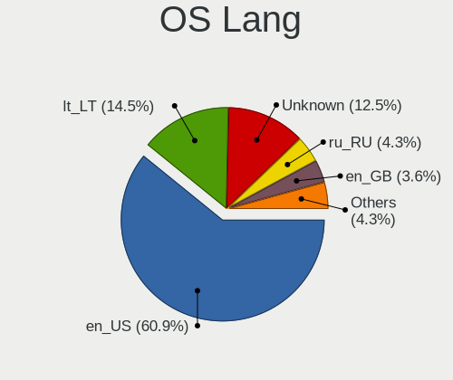

| Lang    | Notebooks | Percent |
|---------|-----------|---------|
| en_US   | 185       | 60.86%  |
| lt_LT   | 44        | 14.47%  |
| Unknown | 38        | 12.5%   |
| ru_RU   | 13        | 4.28%   |
| en_GB   | 11        | 3.62%   |
| C       | 6         | 1.97%   |
| en_AU   | 2         | 0.66%   |
| de_DE   | 2         | 0.66%   |
| nl_NL   | 1         | 0.33%   |
| en_DK   | 1         | 0.33%   |
| be_BY   | 1         | 0.33%   |

Boot Mode
---------

EFI or BIOS

| Mode | Notebooks | Percent |
|------|-----------|---------|
| BIOS | 148       | 50%     |
| EFI  | 148       | 50%     |

Filesystem
----------

Type of filesystem

| Type    | Notebooks | Percent |
|---------|-----------|---------|
| Ext4    | 207       | 67.87%  |
| Btrfs   | 35        | 11.48%  |
| Overlay | 23        | 7.54%   |
| Tmpfs   | 16        | 5.25%   |
| Unknown | 16        | 5.25%   |
| Xfs     | 4         | 1.31%   |
| Zfs     | 2         | 0.66%   |
| ExX4    | 1         | 0.33%   |
| Ext2    | 1         | 0.33%   |

Part. scheme
------------

Scheme of partitioning

| Type    | Notebooks | Percent |
|---------|-----------|---------|
| Unknown | 137       | 45.36%  |
| GPT     | 132       | 43.71%  |
| MBR     | 33        | 10.93%  |

Dual Boot with Linux/BSD
------------------------

Hosting more than one Linux/BSD

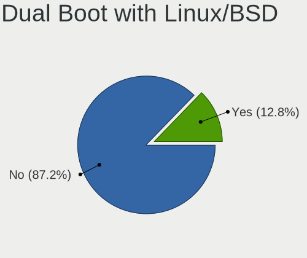

| Dual boot | Notebooks | Percent |
|-----------|-----------|---------|
| No        | 260       | 87.25%  |
| Yes       | 38        | 12.75%  |

Dual Boot (Win)
---------------

Hosting Linux and Windows

| Dual boot | Notebooks | Percent |
|-----------|-----------|---------|
| No        | 228       | 76.77%  |
| Yes       | 69        | 23.23%  |

Board
-----

Vendor
------

Motherboard manufacturer

| Name                | Notebooks | Percent |
|---------------------|-----------|---------|
| Lenovo              | 87        | 30.1%   |
| ASUSTek Computer    | 56        | 19.38%  |
| Dell                | 42        | 14.53%  |
| Hewlett-Packard     | 39        | 13.49%  |
| Acer                | 19        | 6.57%   |
| MSI                 | 10        | 3.46%   |
| Apple               | 5         | 1.73%   |
| Samsung Electronics | 4         | 1.38%   |
| Valve               | 3         | 1.04%   |
| Toshiba             | 3         | 1.04%   |
| Sony                | 2         | 0.69%   |
| Prestigio           | 2         | 0.69%   |
| Panasonic           | 2         | 0.69%   |
| HUAWEI              | 2         | 0.69%   |
| Fujitsu             | 2         | 0.69%   |
| Unknown             | 2         | 0.69%   |
| Timi                | 1         | 0.35%   |
| Packard Bell        | 1         | 0.35%   |
| Notebook            | 1         | 0.35%   |
| LIVEFAN             | 1         | 0.35%   |
| Jumper              | 1         | 0.35%   |
| HONOR               | 1         | 0.35%   |
| Fujitsu Siemens     | 1         | 0.35%   |
| eMachines           | 1         | 0.35%   |
| Alienware           | 1         | 0.35%   |

Model
-----

Motherboard model

| Name                                                  | Notebooks | Percent |
|-------------------------------------------------------|-----------|---------|
| Valve Jupiter                                         | 3         | 1.04%   |
| Unknown                                               | 3         | 1.04%   |
| Lenovo ThinkPad T490 20N3000KMH                       | 2         | 0.69%   |
| Lenovo Legion Y530-15ICH 81FV                         | 2         | 0.69%   |
| Lenovo Legion 5 15ACH6H 82JU                          | 2         | 0.69%   |
| Lenovo IdeaPad Y700-15ISK 80NV                        | 2         | 0.69%   |
| Lenovo G550 20023                                     | 2         | 0.69%   |
| HP Pavilion g6                                        | 2         | 0.69%   |
| HP Pavilion dv6                                       | 2         | 0.69%   |
| HP EliteBook 8460p                                    | 2         | 0.69%   |
| HP EliteBook 8440p                                    | 2         | 0.69%   |
| Fujitsu LIFEBOOK E554                                 | 2         | 0.69%   |
| Dell Inspiron 7720                                    | 2         | 0.69%   |
| ASUS X555LN                                           | 2         | 0.69%   |
| ASUS K53E                                             | 2         | 0.69%   |
| ASUS GL552VX                                          | 2         | 0.69%   |
| Apple MacBookPro9,2                                   | 2         | 0.69%   |
| Apple MacBook5,1                                      | 2         | 0.69%   |
| Acer Aspire ES1-711                                   | 2         | 0.69%   |
| Acer Aspire 5750G                                     | 2         | 0.69%   |
| Toshiba WT8-A                                         | 1         | 0.35%   |
| Toshiba Satellite L855                                | 1         | 0.35%   |
| Toshiba Satellite C50D-A-13G                          | 1         | 0.35%   |
| Timi TM1701                                           | 1         | 0.35%   |
| Sony VPCZ1390S                                        | 1         | 0.35%   |
| Sony VGN-C260E                                        | 1         | 0.35%   |
| Samsung RC530/RC730                                   | 1         | 0.35%   |
| Samsung R530/R730/P530                                | 1         | 0.35%   |
| Samsung 530U3C/530U4C/532U3C                          | 1         | 0.35%   |
| Samsung 300E5EV/300E4EV/270E5EV/270E4EV/2470EV/2470EE | 1         | 0.35%   |
| Prestigio PSB141C03                                   | 1         | 0.35%   |
| Prestigio PSB141C02                                   | 1         | 0.35%   |
| Panasonic CF-52WEBBYDE                                | 1         | 0.35%   |
| Panasonic CF-52VDA131M                                | 1         | 0.35%   |
| Packard Bell EasyNote TE11HC                          | 1         | 0.35%   |
| Notebook L140CU                                       | 1         | 0.35%   |
| MSI Stealth 16 AI Studio A1VGG                        | 1         | 0.35%   |
| MSI MS-7D46                                           | 1         | 0.35%   |
| MSI MS-16F1                                           | 1         | 0.35%   |
| MSI GT72 2PE                                          | 1         | 0.35%   |

Model Family
------------

Motherboard model prefix

| Name              | Notebooks | Percent |
|-------------------|-----------|---------|
| Lenovo ThinkPad   | 49        | 16.96%  |
| Dell Inspiron     | 16        | 5.54%   |
| Lenovo IdeaPad    | 14        | 4.84%   |
| Acer Aspire       | 13        | 4.5%    |
| HP ProBook        | 12        | 4.15%   |
| HP EliteBook      | 11        | 3.81%   |
| Dell Latitude     | 11        | 3.81%   |
| Lenovo Legion     | 8         | 2.77%   |
| ASUS VivoBook     | 7         | 2.42%   |
| Dell Vostro       | 6         | 2.08%   |
| ASUS ASUS         | 5         | 1.73%   |
| HP Pavilion       | 4         | 1.38%   |
| HP Laptop         | 4         | 1.38%   |
| Dell XPS          | 4         | 1.38%   |
| Valve Jupiter     | 3         | 1.04%   |
| ASUS ZenBook      | 3         | 1.04%   |
| ASUS TUF          | 3         | 1.04%   |
| ASUS ROG          | 3         | 1.04%   |
| Unknown           | 3         | 1.04%   |
| Toshiba Satellite | 2         | 0.69%   |
| Lenovo Yoga       | 2         | 0.69%   |
| Lenovo LOQ        | 2         | 0.69%   |
| Lenovo G550       | 2         | 0.69%   |
| HP Compaq         | 2         | 0.69%   |
| HP 250            | 2         | 0.69%   |
| Fujitsu LIFEBOOK  | 2         | 0.69%   |
| Dell Precision    | 2         | 0.69%   |
| Dell G5           | 2         | 0.69%   |
| ASUS X555LN       | 2         | 0.69%   |
| ASUS K53E         | 2         | 0.69%   |
| ASUS GL552VX      | 2         | 0.69%   |
| Apple MacBookPro9 | 2         | 0.69%   |
| Apple MacBook5    | 2         | 0.69%   |
| Acer Extensa      | 2         | 0.69%   |
| Toshiba WT8-A     | 1         | 0.35%   |
| Timi TM1701       | 1         | 0.35%   |
| Sony VPCZ1390S    | 1         | 0.35%   |
| Sony VGN-C260E    | 1         | 0.35%   |
| Samsung RC530     | 1         | 0.35%   |
| Samsung R530      | 1         | 0.35%   |

MFG Year
--------

Motherboard manufacture year

| Year | Notebooks | Percent |
|------|-----------|---------|
| 2021 | 26        | 9%      |
| 2014 | 26        | 9%      |
| 2011 | 26        | 9%      |
| 2020 | 25        | 8.65%   |
| 2019 | 21        | 7.27%   |
| 2018 | 18        | 6.23%   |
| 2012 | 18        | 6.23%   |
| 2022 | 17        | 5.88%   |
| 2013 | 17        | 5.88%   |
| 2010 | 16        | 5.54%   |
| 2017 | 15        | 5.19%   |
| 2015 | 14        | 4.84%   |
| 2016 | 13        | 4.5%    |
| 2009 | 9         | 3.11%   |
| 2008 | 9         | 3.11%   |
| 2023 | 5         | 1.73%   |
| 2007 | 5         | 1.73%   |
| 2024 | 4         | 1.38%   |
| 2006 | 4         | 1.38%   |
| 2004 | 1         | 0.35%   |

Form Factor
-----------

Physical design of the computer

| Name     | Notebooks | Percent |
|----------|-----------|---------|
| Notebook | 289       | 100%    |

Secure Boot
-----------

Enabled or disabled

| State    | Notebooks | Percent |
|----------|-----------|---------|
| Disabled | 271       | 92.81%  |
| Enabled  | 21        | 7.19%   |

Coreboot
--------

Have coreboot on board

| Used | Notebooks | Percent |
|------|-----------|---------|
| No   | 289       | 100%    |

RAM Size
--------

Total RAM memory

| Size in GB  | Notebooks | Percent |
|-------------|-----------|---------|
| 4.01-8.0    | 73        | 24.75%  |
| 16.01-24.0  | 72        | 24.41%  |
| 3.01-4.0    | 57        | 19.32%  |
| 8.01-16.0   | 56        | 18.98%  |
| 32.01-64.0  | 14        | 4.75%   |
| 1.01-2.0    | 10        | 3.39%   |
| 2.01-3.0    | 5         | 1.69%   |
| 24.01-32.0  | 3         | 1.02%   |
| 64.01-256.0 | 3         | 1.02%   |
| 0.51-1.0    | 2         | 0.68%   |

RAM Used
--------

Used RAM memory

| Used GB    | Notebooks | Percent |
|------------|-----------|---------|
| 1.01-2.0   | 97        | 28.78%  |
| 2.01-3.0   | 89        | 26.41%  |
| 4.01-8.0   | 63        | 18.69%  |
| 3.01-4.0   | 44        | 13.06%  |
| 0.51-1.0   | 23        | 6.82%   |
| 8.01-16.0  | 15        | 4.45%   |
| 0.01-0.5   | 3         | 0.89%   |
| 32.01-64.0 | 1         | 0.3%    |
| 24.01-32.0 | 1         | 0.3%    |
| 16.01-24.0 | 1         | 0.3%    |

Total Drives
------------

Number of drives on board

| Drives | Notebooks | Percent |
|--------|-----------|---------|
| 1      | 212       | 71.38%  |
| 2      | 74        | 24.92%  |
| 3      | 9         | 3.03%   |
| 4      | 1         | 0.34%   |
| 0      | 1         | 0.34%   |

Has CD-ROM
----------

Has CD-ROM on board

| Presented | Notebooks | Percent |
|-----------|-----------|---------|
| No        | 187       | 64.04%  |
| Yes       | 105       | 35.96%  |

Has Ethernet
------------

Has Ethernet on board

| Presented | Notebooks | Percent |
|-----------|-----------|---------|
| Yes       | 242       | 83.45%  |
| No        | 48        | 16.55%  |

Has WiFi
--------

Has WiFi module

| Presented | Notebooks | Percent |
|-----------|-----------|---------|
| Yes       | 283       | 97.92%  |
| No        | 6         | 2.08%   |

Has Bluetooth
-------------

Has Bluetooth module

| Presented | Notebooks | Percent |
|-----------|-----------|---------|
| Yes       | 234       | 79.05%  |
| No        | 62        | 20.95%  |

Location
--------

Country
-------

Geographic location (country)

| Country   | Notebooks | Percent |
|-----------|-----------|---------|
| Lithuania | 289       | 100%    |

City
----

Geographic location (city)

| City          | Notebooks | Percent |
|---------------|-----------|---------|
| Vilnius       | 159       | 52.65%  |
| Kaunas        | 41        | 13.58%  |
| Klaipda     | 20        | 6.62%   |
| iauliai     | 17        | 5.63%   |
| Maeikiai    | 12        | 3.97%   |
| Alytus        | 6         | 1.99%   |
| Panevezys     | 4         | 1.32%   |
| Jonava        | 4         | 1.32%   |
| Utena         | 3         | 0.99%   |
| Kdainiai    | 3         | 0.99%   |
| Trakai        | 2         | 0.66%   |
| Teliai      | 2         | 0.66%   |
| Taurag      | 2         | 0.66%   |
| Rokikis     | 2         | 0.66%   |
| Plung       | 2         | 0.66%   |
| Palanga       | 2         | 0.66%   |
| Anykiai   | 2         | 0.66%   |
| elva        | 1         | 0.33%   |
| Visaginas     | 1         | 0.33%   |
| Vaiiai  | 1         | 0.33%   |
| Ukmerge       | 1         | 0.33%   |
| irvintos    | 1         | 0.33%   |
| ilal      | 1         | 0.33%   |
| Serdokai      | 1         | 0.33%   |
| eduva       | 1         | 0.33%   |
| alininkai | 1         | 0.33%   |
| Rietavas      | 1         | 0.33%   |
| Pasvalys      | 1         | 0.33%   |
| Moltai      | 1         | 0.33%   |
| Mauruciai     | 1         | 0.33%   |
| Marijampol  | 1         | 0.33%   |
| Maneikiai     | 1         | 0.33%   |
| Karkliniai    | 1         | 0.33%   |
| Jonikis     | 1         | 0.33%   |
| Domeikava     | 1         | 0.33%   |
| Agluonenai    | 1         | 0.33%   |

Drives
------

Drive Vendor
------------

Hard drive vendors

| Vendor                       | Notebooks | Drives | Percent |
|------------------------------|-----------|--------|---------|
| Samsung Electronics          | 60        | 91     | 16.13%  |
| Seagate                      | 34        | 43     | 9.14%   |
| Toshiba                      | 33        | 44     | 8.87%   |
| WDC                          | 30        | 40     | 8.06%   |
| Kingston                     | 29        | 38     | 7.8%    |
| SanDisk                      | 27        | 28     | 7.26%   |
| Unknown                      | 14        | 34     | 3.76%   |
| Intel                        | 14        | 18     | 3.76%   |
| SK hynix                     | 12        | 13     | 3.23%   |
| Hitachi                      | 12        | 19     | 3.23%   |
| A-DATA Technology            | 12        | 13     | 3.23%   |
| Micron Technology            | 11        | 12     | 2.96%   |
| Patriot                      | 10        | 11     | 2.69%   |
| Crucial                      | 8         | 9      | 2.15%   |
| HGST                         | 7         | 8      | 1.88%   |
| SPCC                         | 6         | 12     | 1.61%   |
| KIOXIA                       | 5         | 5      | 1.34%   |
| MAXIO Technology (Hangzhou)  | 3         | 5      | 0.81%   |
| Kingston Technology Company  | 3         | 3      | 0.81%   |
| China                        | 3         | 5      | 0.81%   |
| XrayDisk                     | 2         | 2      | 0.54%   |
| Plextor                      | 2         | 2      | 0.54%   |
| Phison Electronics           | 2         | 3      | 0.54%   |
| Lexar                        | 2         | 3      | 0.54%   |
| KingSpec                     | 2         | 2      | 0.54%   |
| KingDian                     | 2         | 3      | 0.54%   |
| ASMT                         | 2         | 2      | 0.54%   |
| Apacer                       | 2         | 2      | 0.54%   |
| Yangtze Memory Technologies  | 1         | 1      | 0.27%   |
| Union Memory (Shenzhen)      | 1         | 1      | 0.27%   |
| Union Memory                 | 1         | 1      | 0.27%   |
| Team                         | 1         | 1      | 0.27%   |
| Shenzhen Longsys Electronics | 1         | 1      | 0.27%   |
| PNY                          | 1         | 1      | 0.27%   |
| OWC                          | 1         | 2      | 0.27%   |
| OCZ                          | 1         | 1      | 0.27%   |
| O2 Micro                     | 1         | 1      | 0.27%   |
| Netac NV                     | 1         | 1      | 0.27%   |
| LITEONIT                     | 1         | 1      | 0.27%   |
| LITEON                       | 1         | 2      | 0.27%   |

Drive Model
-----------

Hard drive models

| Model                                                | Notebooks | Percent |
|------------------------------------------------------|-----------|---------|
| Kingston SA400S37240G 240GB SSD                      | 6         | 1.55%   |
| Toshiba MQ01ABD100 1TB                               | 5         | 1.29%   |
| Seagate ST1000LM024 HN-M101MBB 1TB                   | 5         | 1.29%   |
| SanDisk NVMe SSD Drive 256GB                         | 5         | 1.29%   |
| Kingston SV300S37A120G 120GB SSD                     | 5         | 1.29%   |
| Kingston SA400S37480G 480GB SSD                      | 5         | 1.29%   |
| Intel NVMe SSD Drive 512GB                           | 5         | 1.29%   |
| Toshiba MQ01ABF050 500GB                             | 4         | 1.03%   |
| Toshiba BG3 NVMe SSD Controller 128GB                | 4         | 1.03%   |
| Seagate ST500LT012-1DG142 500GB                      | 4         | 1.03%   |
| Samsung SSD 850 EVO 250GB                            | 4         | 1.03%   |
| Samsung NVMe SSD Controller PM9A1/PM9A3/980PRO 512GB | 4         | 1.03%   |
| Unknown MMC Card  32GB                               | 3         | 0.77%   |
| Seagate ST9500325AS 500GB                            | 3         | 0.77%   |
| Seagate ST750LM022 HN-M750MBB 752GB                  | 3         | 0.77%   |
| Seagate ST1000LM035-1RK172 1TB                       | 3         | 0.77%   |
| Samsung SSD 980 1TB                                  | 3         | 0.77%   |
| Samsung NVMe SSD Controller SM981/PM981/PM983 512GB  | 3         | 0.77%   |
| Micron 2450_MTFDKBA1T0TFK 1TB                        | 3         | 0.77%   |
| Kingston SA400S37120G 120GB SSD                      | 3         | 0.77%   |
| HGST HTS541010A9E680 1TB                             | 3         | 0.77%   |
| WDC WD5000BEVT-24A0RT0 500GB                         | 2         | 0.52%   |
| Unknown MMC Card  64GB                               | 2         | 0.52%   |
| Toshiba NVMe SSD Drive 512GB                         | 2         | 0.52%   |
| Toshiba NVMe SSD Drive 256GB                         | 2         | 0.52%   |
| Toshiba MQ01ABD050 500GB                             | 2         | 0.52%   |
| Toshiba KXG6AZNV512G 512GB                           | 2         | 0.52%   |
| Toshiba HDWL110 1TB                                  | 2         | 0.52%   |
| SPCC Solid State Disk 256GB                          | 2         | 0.52%   |
| SK hynix HFS256G39TND-N210A 256GB SSD                | 2         | 0.52%   |
| SK hynix HFS256G32TND-N210A 256GB SSD                | 2         | 0.52%   |
| Seagate ST9750420AS 752GB                            | 2         | 0.52%   |
| Seagate ST9160821AS 160GB                            | 2         | 0.52%   |
| SanDisk X400 M.2 2280 256GB SSD                      | 2         | 0.52%   |
| SanDisk SD8SBAT128G1002 128GB SSD                    | 2         | 0.52%   |
| Samsung MZVLB1T0HBLR-000L7 1TB                       | 2         | 0.52%   |
| Patriot P210 256GB SSD                               | 2         | 0.52%   |
| Patriot Burst 240GB SSD                              | 2         | 0.52%   |
| MAXIO (Hangzhou) NVMe SSD Controller MAP1202 512GB   | 2         | 0.52%   |
| KIOXIA KBG40ZNS512G NVMe 512GB                       | 2         | 0.52%   |

HDD Vendor
----------

Hard disk drive vendors

| Vendor              | Notebooks | Drives | Percent |
|---------------------|-----------|--------|---------|
| Seagate             | 34        | 43     | 36.17%  |
| WDC                 | 19        | 26     | 20.21%  |
| Toshiba             | 16        | 20     | 17.02%  |
| Hitachi             | 12        | 19     | 12.77%  |
| HGST                | 7         | 8      | 7.45%   |
| Samsung Electronics | 2         | 4      | 2.13%   |
| ASMT                | 2         | 2      | 2.13%   |
| Unknown             | 1         | 1      | 1.06%   |
| Fujitsu             | 1         | 1      | 1.06%   |

SSD Vendor
----------

Solid state drive vendors

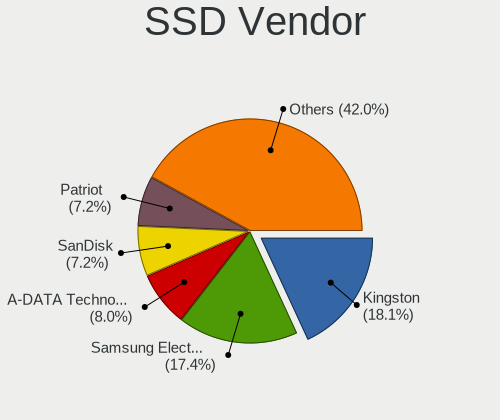

| Vendor              | Notebooks | Drives | Percent |
|---------------------|-----------|--------|---------|
| Kingston            | 25        | 34     | 18.12%  |
| Samsung Electronics | 24        | 44     | 17.39%  |
| A-DATA Technology   | 11        | 12     | 7.97%   |
| SanDisk             | 10        | 11     | 7.25%   |
| Patriot             | 10        | 11     | 7.25%   |
| Crucial             | 7         | 7      | 5.07%   |
| SPCC                | 6         | 12     | 4.35%   |
| SK hynix            | 6         | 7      | 4.35%   |
| Toshiba             | 5         | 7      | 3.62%   |
| WDC                 | 4         | 7      | 2.9%    |
| Intel               | 3         | 3      | 2.17%   |
| China               | 3         | 5      | 2.17%   |
| Plextor             | 2         | 2      | 1.45%   |
| Micron Technology   | 2         | 2      | 1.45%   |
| KingSpec            | 2         | 2      | 1.45%   |
| Apacer              | 2         | 2      | 1.45%   |
| XrayDisk            | 1         | 1      | 0.72%   |
| Team                | 1         | 1      | 0.72%   |
| PNY                 | 1         | 1      | 0.72%   |
| OWC                 | 1         | 2      | 0.72%   |
| OCZ                 | 1         | 1      | 0.72%   |
| LITEONIT            | 1         | 1      | 0.72%   |
| LITEON              | 1         | 2      | 0.72%   |
| KingDian            | 1         | 2      | 0.72%   |
| GOODRAM             | 1         | 1      | 0.72%   |
| FORESEE             | 1         | 1      | 0.72%   |
| Dahua               | 1         | 2      | 0.72%   |
| CT120BX5            | 1         | 1      | 0.72%   |
| Corsair             | 1         | 1      | 0.72%   |
| BR                  | 1         | 1      | 0.72%   |
| Apple               | 1         | 1      | 0.72%   |
| ADATA LE            | 1         | 1      | 0.72%   |

Drive Kind
----------

HDD or SSD

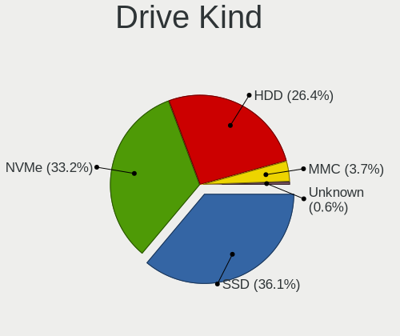

| Kind    | Notebooks | Drives | Percent |
|---------|-----------|--------|---------|
| SSD     | 126       | 188    | 36.1%   |
| NVMe    | 116       | 148    | 33.24%  |
| HDD     | 92        | 124    | 26.36%  |
| MMC     | 13        | 34     | 3.72%   |
| Unknown | 2         | 2      | 0.57%   |

Drive Connector
---------------

SATA, SAS, NVMe, etc.

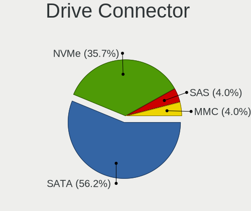

| Type | Notebooks | Drives | Percent |
|------|-----------|--------|---------|
| SATA | 181       | 300    | 56.21%  |
| NVMe | 115       | 147    | 35.71%  |
| SAS  | 13        | 15     | 4.04%   |
| MMC  | 13        | 34     | 4.04%   |

Drive Size
----------

Size of hard drive

| Size in TB | Notebooks | Drives | Percent |
|------------|-----------|--------|---------|
| 0.01-0.5   | 155       | 237    | 74.88%  |
| 0.51-1.0   | 50        | 73     | 24.15%  |
| 3.01-4.0   | 1         | 1      | 0.48%   |
| 1.01-2.0   | 1         | 1      | 0.48%   |

Space Total
-----------

Amount of disk space available on the file system

| Size in GB     | Notebooks | Percent |
|----------------|-----------|---------|
| 101-250        | 96        | 30.48%  |
| 251-500        | 86        | 27.3%   |
| 501-1000       | 41        | 13.02%  |
| 1-20           | 25        | 7.94%   |
| 51-100         | 20        | 6.35%   |
| 21-50          | 18        | 5.71%   |
| 1001-2000      | 14        | 4.44%   |
| Unknown        | 9         | 2.86%   |
| More than 3000 | 4         | 1.27%   |
| 2001-3000      | 2         | 0.63%   |

Space Used
----------

Amount of used disk space

| Used GB   | Notebooks | Percent |
|-----------|-----------|---------|
| 1-20      | 129       | 38.86%  |
| 21-50     | 63        | 18.98%  |
| 101-250   | 46        | 13.86%  |
| 51-100    | 40        | 12.05%  |
| 251-500   | 34        | 10.24%  |
| Unknown   | 9         | 2.71%   |
| 501-1000  | 7         | 2.11%   |
| 1001-2000 | 4         | 1.2%    |

Malfunc. Drives
---------------

Drive models with a malfunction

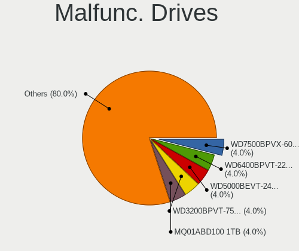

| Model                                               | Notebooks | Drives | Percent |
|-----------------------------------------------------|-----------|--------|---------|
| WDC WD7500BPVX-60JC3T0 752GB                        | 1         | 1      | 4%      |
| WDC WD6400BPVT-22HXZT1 640GB                        | 1         | 2      | 4%      |
| WDC WD5000BEVT-24A0RT0 500GB                        | 1         | 1      | 4%      |
| WDC WD3200BPVT-75ZEST0 320GB                        | 1         | 1      | 4%      |
| Toshiba MQ01ABD100 1TB                              | 1         | 1      | 4%      |
| Toshiba MQ01ABD050 500GB                            | 1         | 2      | 4%      |
| Toshiba MK5059GSXP 500GB                            | 1         | 1      | 4%      |
| Toshiba MK1652GSX 160GB                             | 1         | 2      | 4%      |
| SK hynix HFS256G39TND-N210A 256GB SSD               | 1         | 1      | 4%      |
| SK hynix HFS128G3BTND-N210A 128GB SSD               | 1         | 1      | 4%      |
| SK hynix BC711 HFM512GD3JX013N 512GB                | 1         | 1      | 4%      |
| Seagate ST9640320AS 640GB                           | 1         | 2      | 4%      |
| Samsung Electronics SSD 850 EVO 250GB               | 1         | 1      | 4%      |
| Samsung Electronics SSD 840 Series 500GB            | 1         | 3      | 4%      |
| Samsung Electronics HM641JI 640GB                   | 1         | 2      | 4%      |
| Plextor PX-128M6M 128GB SSD                         | 1         | 1      | 4%      |
| Micron Technology MTFDDAK512TBN-1AR15ABHA 512GB SSD | 1         | 1      | 4%      |
| Hitachi HTS545050KTA300 500GB                       | 1         | 1      | 4%      |
| Hitachi HTS545032B9A300 320GB                       | 1         | 1      | 4%      |
| Hitachi HTS545025B9A300 250GB                       | 1         | 1      | 4%      |
| Hitachi HTS543232A7A384 320GB                       | 1         | 1      | 4%      |
| HGST HTS725050A7E630 500GB                          | 1         | 1      | 4%      |
| HGST HTS541010A9E680 1TB                            | 1         | 2      | 4%      |
| A-DATA Technology SX900 128GB SSD                   | 1         | 1      | 4%      |
| A-DATA Technology SU800 256GB SSD                   | 1         | 2      | 4%      |

Malfunc. Drive Vendor
---------------------

Vendors of faulty drives

| Vendor              | Notebooks | Drives | Percent |
|---------------------|-----------|--------|---------|
| WDC                 | 4         | 5      | 16%     |
| Toshiba             | 4         | 6      | 16%     |
| Hitachi             | 4         | 4      | 16%     |
| SK hynix            | 3         | 3      | 12%     |
| Samsung Electronics | 3         | 6      | 12%     |
| HGST                | 2         | 3      | 8%      |
| A-DATA Technology   | 2         | 3      | 8%      |
| Seagate             | 1         | 2      | 4%      |
| Plextor             | 1         | 1      | 4%      |
| Micron Technology   | 1         | 1      | 4%      |

Malfunc. HDD Vendor
-------------------

Vendors of faulty HDD drives

| Vendor              | Notebooks | Drives | Percent |
|---------------------|-----------|--------|---------|
| WDC                 | 4         | 5      | 25%     |
| Toshiba             | 4         | 6      | 25%     |
| Hitachi             | 4         | 4      | 25%     |
| HGST                | 2         | 3      | 12.5%   |
| Seagate             | 1         | 2      | 6.25%   |
| Samsung Electronics | 1         | 2      | 6.25%   |

Malfunc. Drive Kind
-------------------

Kinds of faulty drives

| Kind | Notebooks | Drives | Percent |
|------|-----------|--------|---------|
| HDD  | 16        | 22     | 64%     |
| SSD  | 8         | 11     | 32%     |
| NVMe | 1         | 1      | 4%      |

Failed Drives
-------------

Failed drive models

| Model                       | Notebooks | Drives | Percent |
|-----------------------------|-----------|--------|---------|
| Hitachi HTS541010A9E680 1TB | 1         | 1      | 100%    |

Failed Drive Vendor
-------------------

Failed drive vendors

| Vendor  | Notebooks | Drives | Percent |
|---------|-----------|--------|---------|
| Hitachi | 1         | 1      | 100%    |

Drive Status
------------

Number of failed and malfunc. drives

| Status   | Notebooks | Drives | Percent |
|----------|-----------|--------|---------|
| Detected | 169       | 274    | 54.17%  |
| Works    | 119       | 187    | 38.14%  |
| Malfunc  | 23        | 34     | 7.37%   |
| Failed   | 1         | 1      | 0.32%   |

Storage controller
------------------

Storage Vendor
--------------

Storage controller vendors

| Vendor                           | Notebooks | Percent |
|----------------------------------|-----------|---------|
| Intel                            | 200       | 59%     |
| Samsung Electronics              | 35        | 10.32%  |
| AMD                              | 22        | 6.49%   |
| SanDisk                          | 21        | 6.19%   |
| Toshiba America Info Systems     | 13        | 3.83%   |
| Micron Technology                | 9         | 2.65%   |
| Kingston Technology Company      | 7         | 2.06%   |
| SK hynix                         | 6         | 1.77%   |
| KIOXIA                           | 5         | 1.47%   |
| Nvidia                           | 3         | 0.88%   |
| MAXIO Technology (Hangzhou)      | 3         | 0.88%   |
| Union Memory (Shenzhen)          | 2         | 0.59%   |
| Solidigm                         | 2         | 0.59%   |
| Shenzhen Longsys Electronics     | 2         | 0.59%   |
| Phison Electronics               | 2         | 0.59%   |
| Yangtze Memory Technologies      | 1         | 0.29%   |
| Silicon Integrated Systems [SiS] | 1         | 0.29%   |
| O2 Micro                         | 1         | 0.29%   |
| Micron/Crucial Technology        | 1         | 0.29%   |
| Lite-On Technology               | 1         | 0.29%   |
| JMicron Technology               | 1         | 0.29%   |
| ADATA Technology                 | 1         | 0.29%   |

Storage Model
-------------

Storage controller models

| Model                                                                          | Notebooks | Percent |
|--------------------------------------------------------------------------------|-----------|---------|
| Intel 7 Series Chipset Family 6-port SATA Controller [AHCI mode]               | 26        | 7.14%   |
| Intel 6 Series/C200 Series Chipset Family 6 port Mobile SATA AHCI Controller   | 21        | 5.77%   |
| Intel Sunrise Point-LP SATA Controller [AHCI mode]                             | 17        | 4.67%   |
| Intel 8 Series/C220 Series Chipset Family 6-port SATA Controller 1 [AHCI mode] | 15        | 4.12%   |
| AMD FCH SATA Controller [AHCI mode]                                            | 15        | 4.12%   |
| Samsung NVMe SSD Controller SM981/PM981/PM983                                  | 13        | 3.57%   |
| Intel 82801 Mobile SATA Controller [RAID mode]                                 | 12        | 3.3%    |
| Samsung NVMe SSD Controller 980 (DRAM-less)                                    | 11        | 3.02%   |
| Intel Volume Management Device NVMe RAID Controller                            | 9         | 2.47%   |
| Intel 82801IBM/IEM (ICH9M/ICH9M-E) 4 port SATA Controller [AHCI mode]          | 9         | 2.47%   |
| Intel 8 Series SATA Controller 1 [AHCI mode]                                   | 9         | 2.47%   |
| Intel Cannon Lake Mobile PCH SATA AHCI Controller                              | 8         | 2.2%    |
| Intel 5 Series/3400 Series Chipset 4 port SATA AHCI Controller                 | 8         | 2.2%    |
| Toshiba America Info Systems BG3 x2 NVMe SSD Controller (DRAM-less)            | 6         | 1.65%   |
| Intel Wildcat Point-LP SATA Controller [AHCI Mode]                             | 6         | 1.65%   |
| Intel HM170/QM170 Chipset SATA Controller [AHCI Mode]                          | 6         | 1.65%   |
| AMD SB7x0/SB8x0/SB9x0 SATA Controller [AHCI mode]                              | 6         | 1.65%   |
| Toshiba America Info Systems XG6 NVMe SSD Controller                           | 5         | 1.37%   |
| SanDisk Extreme Pro / WD Black SN750 / PC SN730 / Red SN700 NVMe SSD           | 5         | 1.37%   |
| Intel Tiger Lake-LP SATA Controller                                            | 5         | 1.37%   |
| Intel Celeron/Pentium Silver Processor SATA Controller                         | 5         | 1.37%   |
| Intel 82801HM/HEM (ICH8M/ICH8M-E) IDE Controller                               | 5         | 1.37%   |
| Intel 5 Series/3400 Series Chipset 6 port SATA AHCI Controller                 | 5         | 1.37%   |
| SK hynix Gold P31/BC711/PC711 NVMe Solid State Drive                           | 4         | 1.1%    |
| SanDisk Ultra 3D / WD PC SN530, IX SN530, Blue SN550 NVMe SSD (DRAM-less)      | 4         | 1.1%    |
| SanDisk PC SN530 NVMe SSD (DRAM-less)                                          | 4         | 1.1%    |
| Samsung NVMe SSD Controller PM9A1/PM9A3/980PRO                                 | 4         | 1.1%    |
| KIOXIA NVMe SSD Controller BG4 (DRAM-less)                                     | 4         | 1.1%    |
| Intel SSD 660P Series                                                          | 4         | 1.1%    |
| Intel Atom Processor E3800 Series SATA AHCI Controller                         | 4         | 1.1%    |
| SanDisk WD Black SN770 / PC SN740 256GB / PC SN560 (DRAM-less) NVMe SSD        | 3         | 0.82%   |
| Samsung NVMe SSD Controller SM961/PM961/SM963                                  | 3         | 0.82%   |
| Samsung NVMe SSD Controller PM9B1 (DRAM-less)                                  | 3         | 0.82%   |
| Micron 2450 NVMe SSD [HendrixV] (DRAM-less)                                    | 3         | 0.82%   |
| Micron 2210 NVMe SSD [Cobain]                                                  | 3         | 0.82%   |
| Intel SSD DC P4101/Pro 7600p/760p/E 6100p Series                               | 3         | 0.82%   |
| Intel Celeron N3350/Pentium N4200/Atom E3900 Series SATA AHCI Controller       | 3         | 0.82%   |
| Intel Cannon Point-LP SATA Controller [AHCI Mode]                              | 3         | 0.82%   |
| Intel 82801HM/HEM (ICH8M/ICH8M-E) SATA Controller [IDE mode]                   | 3         | 0.82%   |
| Intel 82801GBM/GHM (ICH7-M Family) SATA Controller [IDE mode]                  | 3         | 0.82%   |

Storage Kind
------------

Kind of storage controller (IDE, SATA, NVMe, SAS, ...)

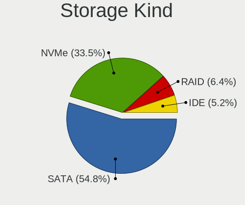

| Kind | Notebooks | Percent |
|------|-----------|---------|
| SATA | 188       | 54.81%  |
| NVMe | 115       | 33.53%  |
| RAID | 22        | 6.41%   |
| IDE  | 18        | 5.25%   |

Processor
---------

CPU Vendor
----------

Processor vendors

| Vendor | Notebooks | Percent |
|--------|-----------|---------|
| Intel  | 234       | 80.97%  |
| AMD    | 55        | 19.03%  |

CPU Model
---------

Processor models

| Model                                       | Notebooks | Percent |
|---------------------------------------------|-----------|---------|
| Intel Core i5-8250U CPU @ 1.60GHz           | 6         | 2.07%   |
| Intel Core i7-8550U CPU @ 1.80GHz           | 5         | 1.72%   |
| Intel Core i7-4710HQ CPU @ 2.50GHz          | 5         | 1.72%   |
| Intel Core i7-10750H CPU @ 2.60GHz          | 5         | 1.72%   |
| Intel 11th Gen Core i5-1135G7 @ 2.40GHz     | 5         | 1.72%   |
| AMD Ryzen 5 5600H with Radeon Graphics      | 5         | 1.72%   |
| Intel Core i7-8565U CPU @ 1.80GHz           | 4         | 1.38%   |
| Intel Core i7-10510U CPU @ 1.80GHz          | 4         | 1.38%   |
| Intel Core i5-8300H CPU @ 2.30GHz           | 4         | 1.38%   |
| Intel Core i5-8265U CPU @ 1.60GHz           | 4         | 1.38%   |
| Intel Core i5-3230M CPU @ 2.60GHz           | 4         | 1.38%   |
| Intel Core i5-2430M CPU @ 2.40GHz           | 4         | 1.38%   |
| Intel 11th Gen Core i7-1165G7 @ 2.80GHz     | 4         | 1.38%   |
| AMD Ryzen 7 5800H with Radeon Graphics      | 4         | 1.38%   |
| Intel Core i7-4702MQ CPU @ 2.20GHz          | 3         | 1.03%   |
| Intel Core i7-3610QM CPU @ 2.30GHz          | 3         | 1.03%   |
| Intel Core i7-3520M CPU @ 2.90GHz           | 3         | 1.03%   |
| Intel Core i5-6300U CPU @ 2.40GHz           | 3         | 1.03%   |
| Intel Core i5-6300HQ CPU @ 2.30GHz          | 3         | 1.03%   |
| Intel Core i5-5300U CPU @ 2.30GHz           | 3         | 1.03%   |
| Intel Core i5-4210U CPU @ 1.70GHz           | 3         | 1.03%   |
| Intel Core i5-3210M CPU @ 2.50GHz           | 3         | 1.03%   |
| Intel Core i5-2540M CPU @ 2.60GHz           | 3         | 1.03%   |
| Intel Core i3-5005U CPU @ 2.00GHz           | 3         | 1.03%   |
| Intel Core i3-4000M CPU @ 2.40GHz           | 3         | 1.03%   |
| Intel Core i3-2310M CPU @ 2.10GHz           | 3         | 1.03%   |
| Intel Celeron N4000 CPU @ 1.10GHz           | 3         | 1.03%   |
| AMD Ryzen 5 5500U with Radeon Graphics      | 3         | 1.03%   |
| AMD Custom APU 0405                         | 3         | 1.03%   |
| Intel Pentium Dual-Core CPU T4500 @ 2.30GHz | 2         | 0.69%   |
| Intel Pentium CPU N3540 @ 2.16GHz           | 2         | 0.69%   |
| Intel Core i7-9850H CPU @ 2.60GHz           | 2         | 0.69%   |
| Intel Core i7-9750H CPU @ 2.60GHz           | 2         | 0.69%   |
| Intel Core i7-4500U CPU @ 1.80GHz           | 2         | 0.69%   |
| Intel Core i7-3740QM CPU @ 2.70GHz          | 2         | 0.69%   |
| Intel Core i7-2670QM CPU @ 2.20GHz          | 2         | 0.69%   |
| Intel Core i7 CPU Q 720 @ 1.60GHz           | 2         | 0.69%   |
| Intel Core i7 CPU M 640 @ 2.80GHz           | 2         | 0.69%   |
| Intel Core i5-7300HQ CPU @ 2.50GHz          | 2         | 0.69%   |
| Intel Core i5-7200U CPU @ 2.50GHz           | 2         | 0.69%   |

CPU Model Family
----------------

Processor model prefix

| Model                   | Notebooks | Percent |
|-------------------------|-----------|---------|
| Intel Core i5           | 68        | 23.53%  |
| Intel Core i7           | 61        | 21.11%  |
| Intel Core i3           | 30        | 10.38%  |
| Other                   | 26        | 9%      |
| AMD Ryzen 5             | 18        | 6.23%   |
| AMD Ryzen 7             | 15        | 5.19%   |
| Intel Core 2 Duo        | 13        | 4.5%    |
| Intel Celeron           | 13        | 4.5%    |
| Intel Pentium           | 6         | 2.08%   |
| Intel Atom              | 5         | 1.73%   |
| AMD Ryzen 7 PRO         | 5         | 1.73%   |
| Intel Pentium Dual-Core | 3         | 1.04%   |
| Intel Core i9           | 3         | 1.04%   |
| Intel Core 2            | 3         | 1.04%   |
| AMD Phenom II           | 3         | 1.04%   |
| Intel Genuine           | 2         | 0.69%   |
| AMD Ryzen 3             | 2         | 0.69%   |
| AMD E                   | 2         | 0.69%   |
| AMD A8                  | 2         | 0.69%   |
| Intel Pentium Silver    | 1         | 0.35%   |
| Intel Pentium Gold      | 1         | 0.35%   |
| Intel Core m7           | 1         | 0.35%   |
| Intel Core              | 1         | 0.35%   |
| AMD Sempron             | 1         | 0.35%   |
| AMD Ryzen 5 PRO         | 1         | 0.35%   |
| AMD C-60                | 1         | 0.35%   |
| AMD A6                  | 1         | 0.35%   |
| AMD A10                 | 1         | 0.35%   |

CPU Cores
---------

Number of processor cores

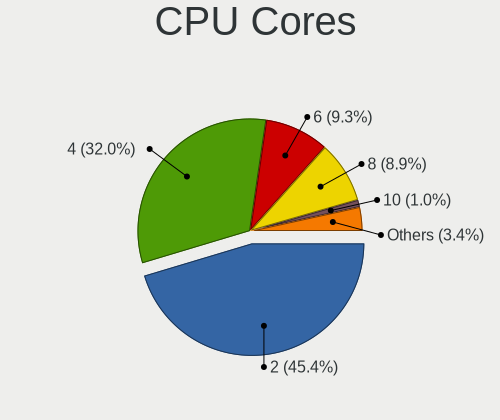

| Number  | Notebooks | Percent |
|---------|-----------|---------|
| 2       | 132       | 45.36%  |
| 4       | 93        | 31.96%  |
| 6       | 27        | 9.28%   |
| 8       | 26        | 8.93%   |
| 10      | 3         | 1.03%   |
| 1       | 3         | 1.03%   |
| 14      | 2         | 0.69%   |
| 12      | 2         | 0.69%   |
| Unknown | 2         | 0.69%   |
| 16      | 1         | 0.34%   |

CPU Sockets
-----------

Number of sockets

| Number  | Notebooks | Percent |
|---------|-----------|---------|
| 1       | 289       | 99.66%  |
| Unknown | 1         | 0.34%   |

CPU Threads
-----------

Threads per core (Hyper-Threading)

| Number  | Notebooks | Percent |
|---------|-----------|---------|
| 2       | 223       | 76.9%   |
| 1       | 65        | 22.41%  |
| Unknown | 2         | 0.69%   |

CPU Op-Modes
------------

CPU Operation Modes (32-bit, 64-bit)

| Op mode        | Notebooks | Percent |
|----------------|-----------|---------|
| 32-bit, 64-bit | 286       | 98.96%  |
| 32-bit         | 2         | 0.69%   |
| Unknown        | 1         | 0.35%   |

CPU Microcode
-------------

Microcode number

| Number     | Notebooks | Percent |
|------------|-----------|---------|
| Unknown    | 114       | 37.62%  |
| 0x306a9    | 19        | 6.27%   |
| 0x206a7    | 17        | 5.61%   |
| 0x806ea    | 11        | 3.63%   |
| 0x306c3    | 10        | 3.3%    |
| 0x406e3    | 9         | 2.97%   |
| 0x20655    | 9         | 2.97%   |
| 0x806c1    | 8         | 2.64%   |
| 0x806ec    | 6         | 1.98%   |
| 0x40651    | 6         | 1.98%   |
| 0x306d4    | 6         | 1.98%   |
| 0x1067a    | 6         | 1.98%   |
| 0xa0652    | 4         | 1.32%   |
| 0x906ea    | 4         | 1.32%   |
| 0x506e3    | 4         | 1.32%   |
| 0x0a50000d | 4         | 1.32%   |
| 0x0a50000c | 4         | 1.32%   |
| 0x806eb    | 3         | 0.99%   |
| 0x6fd      | 3         | 0.99%   |
| 0x30678    | 3         | 0.99%   |
| 0x20652    | 3         | 0.99%   |
| 0x906ed    | 2         | 0.66%   |
| 0x906e9    | 2         | 0.66%   |
| 0x706a1    | 2         | 0.66%   |
| 0x6f2      | 2         | 0.66%   |
| 0x10676    | 2         | 0.66%   |
| 0x0a404102 | 2         | 0.66%   |
| 0x0a404101 | 2         | 0.66%   |
| 0x08608103 | 2         | 0.66%   |
| 0x08600106 | 2         | 0.66%   |
| 0x08108102 | 2         | 0.66%   |
| 0x05000119 | 2         | 0.66%   |
| 0x010000c8 | 2         | 0.66%   |
| 0x906a3    | 1         | 0.33%   |
| 0x806e9    | 1         | 0.33%   |
| 0x706e5    | 1         | 0.33%   |
| 0x6fa      | 1         | 0.33%   |
| 0x6f6      | 1         | 0.33%   |
| 0x6ec      | 1         | 0.33%   |
| 0x506c9    | 1         | 0.33%   |

CPU Microarch
-------------

Microarchitecture

| Name             | Notebooks | Percent |
|------------------|-----------|---------|
| KabyLake         | 44        | 15.22%  |
| Haswell          | 27        | 9.34%   |
| IvyBridge        | 25        | 8.65%   |
| Unknown          | 24        | 8.3%    |
| SandyBridge      | 23        | 7.96%   |
| Skylake          | 18        | 6.23%   |
| Zen 3            | 16        | 5.54%   |
| Westmere         | 14        | 4.84%   |
| TigerLake        | 13        | 4.5%    |
| Penryn           | 12        | 4.15%   |
| Core             | 9         | 3.11%   |
| Zen 2            | 8         | 2.77%   |
| Silvermont       | 8         | 2.77%   |
| CometLake        | 8         | 2.77%   |
| Broadwell        | 7         | 2.42%   |
| Zen+             | 5         | 1.73%   |
| Goldmont plus    | 5         | 1.73%   |
| Alderlake Hybrid | 4         | 1.38%   |
| K10              | 3         | 1.04%   |
| Goldmont         | 3         | 1.04%   |
| Bobcat           | 3         | 1.04%   |
| Piledriver       | 2         | 0.69%   |
| Nehalem          | 2         | 0.69%   |
| Bonnell          | 2         | 0.69%   |
| K8 & K10 hybrid  | 1         | 0.35%   |
| Jaguar           | 1         | 0.35%   |
| IceLake          | 1         | 0.35%   |
| Excavator        | 1         | 0.35%   |

Graphics
--------

GPU Vendor
----------

Vendors of graphics cards

| Vendor                           | Notebooks | Percent |
|----------------------------------|-----------|---------|
| Intel                            | 206       | 54.21%  |
| Nvidia                           | 94        | 24.74%  |
| AMD                              | 79        | 20.79%  |
| Silicon Integrated Systems [SiS] | 1         | 0.26%   |

GPU Model
---------

Graphics card models

| Model                                                                         | Notebooks | Percent |
|-------------------------------------------------------------------------------|-----------|---------|
| Intel 3rd Gen Core processor Graphics Controller                              | 22        | 5.57%   |
| Intel 2nd Generation Core Processor Family Integrated Graphics Controller     | 21        | 5.32%   |
| Intel 4th Gen Core Processor Integrated Graphics Controller                   | 15        | 3.8%    |
| Intel UHD Graphics 620                                                        | 12        | 3.04%   |
| Intel Skylake GT2 [HD Graphics 520]                                           | 11        | 2.78%   |
| Intel CoffeeLake-H GT2 [UHD Graphics 630]                                     | 11        | 2.78%   |
| Intel TigerLake-LP GT2 [Iris Xe Graphics]                                     | 9         | 2.28%   |
| Intel Haswell-ULT Integrated Graphics Controller                              | 9         | 2.28%   |
| AMD Cezanne [Radeon Vega Series / Radeon Vega Mobile Series]                  | 9         | 2.28%   |
| Intel WhiskeyLake-U GT2 [UHD Graphics 620]                                    | 8         | 2.03%   |
| Intel Core Processor Integrated Graphics Controller                           | 8         | 2.03%   |
| Intel HD Graphics 5500                                                        | 7         | 1.77%   |
| Intel CometLake-H GT2 [UHD Graphics]                                          | 7         | 1.77%   |
| AMD Renoir [Radeon Vega Series / Radeon Vega Mobile Series]                   | 7         | 1.77%   |
| Nvidia GA106M [GeForce RTX 3060 Mobile / Max-Q]                               | 6         | 1.52%   |
| Intel CometLake-U GT2 [UHD Graphics]                                          | 6         | 1.52%   |
| AMD Rembrandt [Radeon 680M]                                                   | 6         | 1.52%   |
| Nvidia TU117M [GeForce GTX 1650 Mobile / Max-Q]                               | 5         | 1.27%   |
| Nvidia GF108M [GeForce GT 540M]                                               | 5         | 1.27%   |
| Intel Mobile 4 Series Chipset Integrated Graphics Controller                  | 5         | 1.27%   |
| Intel HD Graphics 620                                                         | 5         | 1.27%   |
| Intel HD Graphics 530                                                         | 5         | 1.27%   |
| Intel Atom Processor Z36xxx/Z37xxx Series Graphics & Display                  | 5         | 1.27%   |
| AMD Picasso/Raven 2 [Radeon Vega Series / Radeon Vega Mobile Series]          | 5         | 1.27%   |
| Nvidia GP108M [GeForce MX150]                                                 | 4         | 1.01%   |
| Nvidia GP107M [GeForce GTX 1050 Mobile]                                       | 4         | 1.01%   |
| Nvidia GM108M [GeForce 840M]                                                  | 4         | 1.01%   |
| Nvidia AD107M [GeForce RTX 4060 Max-Q / Mobile]                               | 4         | 1.01%   |
| Intel Mobile 945GM/GMS/GME, 943/940GML Express Integrated Graphics Controller | 4         | 1.01%   |
| Intel Mobile 945GM/GMS, 943/940GML Express Integrated Graphics Controller     | 4         | 1.01%   |
| Intel GeminiLake [UHD Graphics 600]                                           | 4         | 1.01%   |
| AMD Seymour [Radeon HD 6400M/7400M Series]                                    | 4         | 1.01%   |
| AMD Mars [Radeon HD 8670A/8670M/8750M / R7 M370]                              | 4         | 1.01%   |
| AMD Lucienne                                                                  | 4         | 1.01%   |
| AMD Barcelo                                                                   | 4         | 1.01%   |
| Nvidia GP108M [GeForce MX330]                                                 | 3         | 0.76%   |
| Nvidia GK107M [GeForce GT 650M]                                               | 3         | 0.76%   |
| Intel TigerLake-H GT1 [UHD Graphics]                                          | 3         | 0.76%   |
| Intel Tiger Lake-LP GT2 [UHD Graphics G4]                                     | 3         | 0.76%   |
| Intel HD Graphics 500                                                         | 3         | 0.76%   |

GPU Combo
---------

Combinations of graphics cards

| Name           | Notebooks | Percent |
|----------------|-----------|---------|
| 1 x Intel      | 123       | 42.27%  |
| Intel + Nvidia | 68        | 23.37%  |
| 1 x AMD        | 50        | 17.18%  |
| 1 x Nvidia     | 20        | 6.87%   |
| Intel + AMD    | 13        | 4.47%   |
| 2 x AMD        | 9         | 3.09%   |
| AMD + Nvidia   | 6         | 2.06%   |
| 2 x Intel      | 1         | 0.34%   |
| 1 x SiS        | 1         | 0.34%   |

GPU Driver
----------

Free vs proprietary

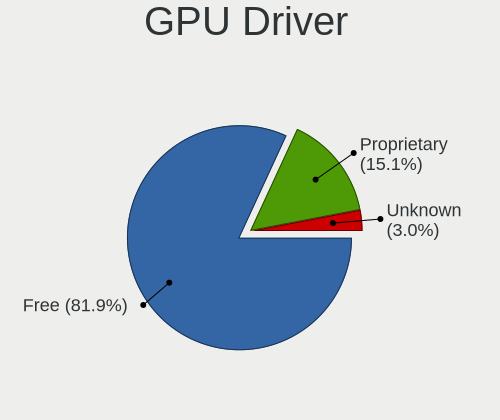

| Driver      | Notebooks | Percent |
|-------------|-----------|---------|
| Free        | 244       | 81.88%  |
| Proprietary | 45        | 15.1%   |
| Unknown     | 9         | 3.02%   |

GPU Memory
----------

Total video memory

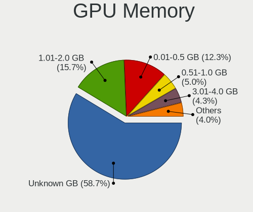

| Size in GB | Notebooks | Percent |
|------------|-----------|---------|
| Unknown    | 176       | 58.67%  |
| 1.01-2.0   | 47        | 15.67%  |
| 0.01-0.5   | 37        | 12.33%  |
| 0.51-1.0   | 15        | 5%      |
| 3.01-4.0   | 13        | 4.33%   |
| 5.01-6.0   | 6         | 2%      |
| 7.01-8.0   | 3         | 1%      |
| 2.01-3.0   | 2         | 0.67%   |
| 8.01-16.0  | 1         | 0.33%   |

Monitor
-------

Monitor Vendor
--------------

Monitor vendors

| Vendor                  | Notebooks | Percent |
|-------------------------|-----------|---------|
| AU Optronics            | 54        | 16.27%  |
| LG Display              | 52        | 15.66%  |
| BOE                     | 44        | 13.25%  |
| Chimei Innolux          | 43        | 12.95%  |
| Samsung Electronics     | 35        | 10.54%  |
| Dell                    | 17        | 5.12%   |
| Lenovo                  | 16        | 4.82%   |
| Chi Mei Optoelectronics | 13        | 3.92%   |
| PANDA                   | 7         | 2.11%   |
| Goldstar                | 5         | 1.51%   |
| CSO                     | 5         | 1.51%   |
| Apple                   | 5         | 1.51%   |
| Sony                    | 4         | 1.2%    |
| Sharp                   | 4         | 1.2%    |
| Philips                 | 4         | 1.2%    |
| Valve                   | 3         | 0.9%    |
| LG Philips              | 2         | 0.6%    |
| Hewlett-Packard         | 2         | 0.6%    |
| AOC                     | 2         | 0.6%    |
| Unknown (AAA)           | 1         | 0.3%    |
| Toshiba                 | 1         | 0.3%    |
| TMX                     | 1         | 0.3%    |
| MStar                   | 1         | 0.3%    |
| LGD                     | 1         | 0.3%    |
| KDC                     | 1         | 0.3%    |
| JDI                     | 1         | 0.3%    |
| InfoVision              | 1         | 0.3%    |
| Iiyama                  | 1         | 0.3%    |
| IBM                     | 1         | 0.3%    |
| HKC                     | 1         | 0.3%    |
| HannStar                | 1         | 0.3%    |
| CSW                     | 1         | 0.3%    |
| ASUSTek Computer        | 1         | 0.3%    |
| Acer                    | 1         | 0.3%    |

Monitor Model
-------------

Monitor models

| Model                                                                    | Notebooks | Percent |
|--------------------------------------------------------------------------|-----------|---------|
| Chimei Innolux LCD Monitor CMN1521 1920x1080 344x193mm 15.5-inch         | 5         | 1.49%   |
| Chi Mei Optoelectronics LCD Monitor CMO15A7 1366x768 344x193mm 15.5-inch | 4         | 1.19%   |
| AU Optronics LCD Monitor AUO21ED 1920x1080 344x193mm 15.5-inch           | 4         | 1.19%   |
| Valve ANX7530 U VLV3001 800x1280 100x150mm 7.1-inch                      | 3         | 0.9%    |
| LG Display LCD Monitor LGD0306 1600x900 310x174mm 14.0-inch              | 3         | 0.9%    |
| LG Display LCD Monitor LGD02DC 1366x768 344x194mm 15.5-inch              | 3         | 0.9%    |
| Lenovo T24i-10 LEN61A6 1920x1080 527x296mm 23.8-inch                     | 3         | 0.9%    |
| Lenovo LCD Monitor LEN40BA 1920x1080 344x194mm 15.5-inch                 | 3         | 0.9%    |
| Chimei Innolux LCD Monitor CMN15E7 1920x1080 344x193mm 15.5-inch         | 3         | 0.9%    |
| AU Optronics LCD Monitor AUO8174 1280x800 331x207mm 15.4-inch            | 3         | 0.9%    |
| AU Optronics LCD Monitor AUO38ED 1920x1080 344x193mm 15.5-inch           | 3         | 0.9%    |
| AU Optronics LCD Monitor AUO26EC 1366x768 344x193mm 15.5-inch            | 3         | 0.9%    |
| AU Optronics LCD Monitor AUO22EC 1366x768 344x193mm 15.5-inch            | 3         | 0.9%    |
| Sony LCD Monitor MS_9005 1920x1080                                       | 2         | 0.6%    |
| Samsung Electronics LCD Monitor SEC434E 1600x900 310x174mm 14.0-inch     | 2         | 0.6%    |
| Samsung Electronics LCD Monitor SEC4251 1366x768 344x194mm 15.5-inch     | 2         | 0.6%    |
| Samsung Electronics LCD Monitor SEC3152 1366x768 344x194mm 15.5-inch     | 2         | 0.6%    |
| Samsung Electronics LCD Monitor SEC314C 1920x1080 344x194mm 15.5-inch    | 2         | 0.6%    |
| PANDA LM133LF1L01 NCP13FB 1920x1080 290x170mm 13.2-inch                  | 2         | 0.6%    |
| PANDA LCD Monitor NCP0036 1920x1080 344x194mm 15.5-inch                  | 2         | 0.6%    |
| LG Philips LCD Monitor LPL1E01 1280x800 331x207mm 15.4-inch              | 2         | 0.6%    |
| LG Display LP156WH2-TLAA LGD0230 1366x768 344x194mm 15.5-inch            | 2         | 0.6%    |
| LG Display LCD Monitor LGD053F 1920x1080 344x194mm 15.5-inch             | 2         | 0.6%    |
| LG Display LCD Monitor LGD0437 1920x1080 276x156mm 12.5-inch             | 2         | 0.6%    |
| LG Display LCD Monitor LGD03DE 1600x900 382x215mm 17.3-inch              | 2         | 0.6%    |
| LG Display LCD Monitor LGD03D9 1366x768 345x194mm 15.6-inch              | 2         | 0.6%    |
| LG Display LCD Monitor LGD033A 1366x768 340x190mm 15.3-inch              | 2         | 0.6%    |
| LG Display LCD Monitor LGD02DA 1920x1080 382x215mm 17.3-inch             | 2         | 0.6%    |
| Dell U2412M DELA07B 1920x1200 518x324mm 24.1-inch                        | 2         | 0.6%    |
| Dell P2719H DEL4184 1920x1080 598x336mm 27.0-inch                        | 2         | 0.6%    |
| Chimei Innolux LCD Monitor CMN15F5 1920x1080 344x193mm 15.5-inch         | 2         | 0.6%    |
| Chimei Innolux LCD Monitor CMN15DB 1366x768 344x193mm 15.5-inch          | 2         | 0.6%    |
| Chimei Innolux LCD Monitor CMN15C4 1920x1080 344x193mm 15.5-inch         | 2         | 0.6%    |
| Chimei Innolux LCD Monitor CMN150C 1920x1080 344x193mm 15.5-inch         | 2         | 0.6%    |
| Chimei Innolux LCD Monitor CMN14F2 1920x1080 309x173mm 13.9-inch         | 2         | 0.6%    |
| Chimei Innolux LCD Monitor CMN14D5 1920x1080 309x173mm 13.9-inch         | 2         | 0.6%    |
| Chimei Innolux LCD Monitor CMN14D4 1920x1080 309x173mm 13.9-inch         | 2         | 0.6%    |
| Chimei Innolux LCD Monitor CMN1482 1600x900 309x174mm 14.0-inch          | 2         | 0.6%    |
| Chi Mei Optoelectronics LCD Monitor CMO1592 1366x768 350x190mm 15.7-inch | 2         | 0.6%    |
| AU Optronics LCD Monitor AUODF87 1920x1080 344x193mm 15.5-inch           | 2         | 0.6%    |

Monitor Resolution
------------------

Monitor screen resolution

| Resolution         | Notebooks | Percent |
|--------------------|-----------|---------|
| 1920x1080 (FHD)    | 145       | 46.77%  |
| 1366x768 (WXGA)    | 69        | 22.26%  |
| 1600x900 (HD+)     | 22        | 7.1%    |
| 1280x800 (WXGA)    | 14        | 4.52%   |
| 3840x2160 (4K)     | 11        | 3.55%   |
| 2560x1440 (QHD)    | 11        | 3.55%   |
| 1920x1200 (WUXGA)  | 9         | 2.9%    |
| 2560x1600          | 7         | 2.26%   |
| 800x1280           | 3         | 0.97%   |
| 1680x1050 (WSXGA+) | 3         | 0.97%   |
| 3840x2400          | 2         | 0.65%   |
| 3440x1440          | 2         | 0.65%   |
| 2880x1800          | 2         | 0.65%   |
| 1440x900 (WXGA+)   | 2         | 0.65%   |
| 3120x2080          | 1         | 0.32%   |
| 3000x2000          | 1         | 0.32%   |
| 2880x1620          | 1         | 0.32%   |
| 2560x1080          | 1         | 0.32%   |
| 2160x1440          | 1         | 0.32%   |
| 1280x1024 (SXGA)   | 1         | 0.32%   |
| 1024x768 (XGA)     | 1         | 0.32%   |
| 1024x600           | 1         | 0.32%   |

Monitor Diagonal
----------------

Diagonal size in inches

| Inches  | Notebooks | Percent |
|---------|-----------|---------|
| 15      | 155       | 46.83%  |
| 14      | 35        | 10.57%  |
| 13      | 35        | 10.57%  |
| 17      | 22        | 6.65%   |
| 24      | 17        | 5.14%   |
| 27      | 13        | 3.93%   |
| 16      | 11        | 3.32%   |
| 12      | 9         | 2.72%   |
| 23      | 8         | 2.42%   |
| 21      | 6         | 1.81%   |
| 31      | 3         | 0.91%   |
| 7       | 3         | 0.91%   |
| 34      | 2         | 0.6%    |
| 84      | 1         | 0.3%    |
| 75      | 1         | 0.3%    |
| 72      | 1         | 0.3%    |
| 52      | 1         | 0.3%    |
| 40      | 1         | 0.3%    |
| 29      | 1         | 0.3%    |
| 25      | 1         | 0.3%    |
| 22      | 1         | 0.3%    |
| 20      | 1         | 0.3%    |
| 11      | 1         | 0.3%    |
| 10      | 1         | 0.3%    |
| Unknown | 1         | 0.3%    |

Monitor Width
-------------

Physical width

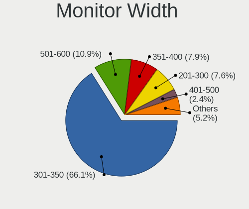

| Width in mm | Notebooks | Percent |
|-------------|-----------|---------|
| 301-350     | 218       | 66.06%  |
| 501-600     | 36        | 10.91%  |
| 351-400     | 26        | 7.88%   |
| 201-300     | 25        | 7.58%   |
| 401-500     | 8         | 2.42%   |
| 601-700     | 6         | 1.82%   |
| 1501-2000   | 3         | 0.91%   |
| 1-100       | 3         | 0.91%   |
| 701-800     | 2         | 0.61%   |
| 801-900     | 1         | 0.3%    |
| 1001-1500   | 1         | 0.3%    |
| Unknown     | 1         | 0.3%    |

Aspect Ratio
------------

Proportional relationship between the width and the height

| Ratio   | Notebooks | Percent |
|---------|-----------|---------|
| 16/9    | 238       | 82.35%  |
| 16/10   | 40        | 13.84%  |
| 3/2     | 3         | 1.04%   |
| 0.67    | 3         | 1.04%   |
| 21/9    | 2         | 0.69%   |
| 5/4     | 1         | 0.35%   |
| 4/3     | 1         | 0.35%   |
| Unknown | 1         | 0.35%   |

Monitor Area
------------

Area in inch

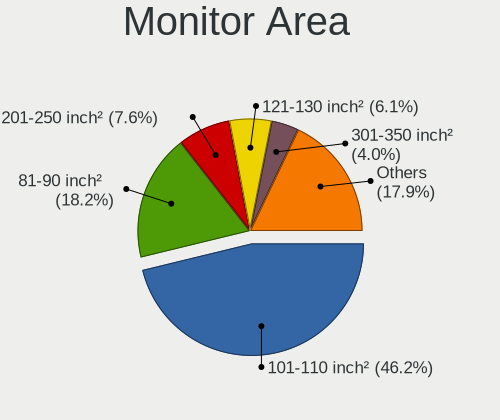

| Area in inch | Notebooks | Percent |
|----------------|-----------|---------|
| 101-110        | 152       | 46.2%   |
| 81-90          | 60        | 18.24%  |
| 201-250        | 25        | 7.6%    |
| 121-130        | 20        | 6.08%   |
| 301-350        | 13        | 3.95%   |
| 111-120        | 11        | 3.34%   |
| 61-70          | 9         | 2.74%   |
| 71-80          | 8         | 2.43%   |
| 351-500        | 6         | 1.82%   |
| 251-300        | 5         | 1.52%   |
| More than 1000 | 4         | 1.22%   |
| 1-40           | 3         | 0.91%   |
| 131-140        | 3         | 0.91%   |
| 91-100         | 3         | 0.91%   |
| 151-200        | 2         | 0.61%   |
| 51-60          | 1         | 0.3%    |
| 41-50          | 1         | 0.3%    |
| 141-150        | 1         | 0.3%    |
| 501-1000       | 1         | 0.3%    |
| Unknown        | 1         | 0.3%    |

Pixel Density
-------------

Pixels per inch

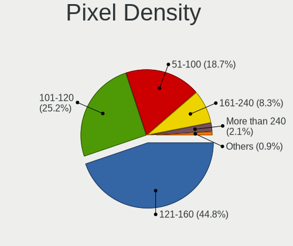

| Density       | Notebooks | Percent |
|---------------|-----------|---------|
| 121-160       | 146       | 44.79%  |
| 101-120       | 82        | 25.15%  |
| 51-100        | 61        | 18.71%  |
| 161-240       | 27        | 8.28%   |
| More than 240 | 7         | 2.15%   |
| 1-50          | 2         | 0.61%   |
| Unknown       | 1         | 0.31%   |

Multiple Monitors
-----------------

Total monitors connected

| Total | Notebooks | Percent |
|-------|-----------|---------|
| 1     | 233       | 79.79%  |
| 2     | 46        | 15.75%  |
| 0     | 8         | 2.74%   |
| 3     | 5         | 1.71%   |

Network
-------

Net Controller Vendor
---------------------

Controller vendors

| Vendor                            | Notebooks | Percent |
|-----------------------------------|-----------|---------|
| Intel                             | 150       | 32.19%  |
| Realtek Semiconductor             | 148       | 31.76%  |
| Qualcomm Atheros                  | 67        | 14.38%  |
| Broadcom                          | 33        | 7.08%   |
| MediaTek                          | 17        | 3.65%   |
| Broadcom Limited                  | 6         | 1.29%   |
| Ralink                            | 5         | 1.07%   |
| Marvell Technology Group          | 5         | 1.07%   |
| Lenovo                            | 4         | 0.86%   |
| TP-Link                           | 3         | 0.64%   |
| Qualcomm                          | 3         | 0.64%   |
| Nvidia                            | 3         | 0.64%   |
| Sierra Wireless                   | 2         | 0.43%   |
| JMicron Technology                | 2         | 0.43%   |
| Hewlett-Packard                   | 2         | 0.43%   |
| Fibocom                           | 2         | 0.43%   |
| Ericsson Business Mobile Networks | 2         | 0.43%   |
| Dell                              | 2         | 0.43%   |
| ASIX Electronics                  | 2         | 0.43%   |
| ZTE WCDMA Technologies MSM        | 1         | 0.21%   |
| Ralink Technology                 | 1         | 0.21%   |
| Qualcomm Atheros Communications   | 1         | 0.21%   |
| OnePlus Technology (Shenzhen)     | 1         | 0.21%   |
| MOBILE                            | 1         | 0.21%   |
| Huawei Technologies               | 1         | 0.21%   |
| Edimax Technology                 | 1         | 0.21%   |
| D-Link                            | 1         | 0.21%   |

Net Controller Model
--------------------

Controller models

| Model                                                                  | Notebooks | Percent |
|------------------------------------------------------------------------|-----------|---------|
| Realtek RTL8111/8168/8211/8411 PCI Express Gigabit Ethernet Controller | 93        | 16.43%  |
| Realtek RTL810xE PCI Express Fast Ethernet controller                  | 27        | 4.77%   |
| Qualcomm Atheros AR9285 Wireless Network Adapter (PCI-Express)         | 18        | 3.18%   |
| Intel 82579LM Gigabit Network Connection (Lewisville)                  | 14        | 2.47%   |
| Realtek RTL8153 Gigabit Ethernet Adapter                               | 13        | 2.3%    |
| Qualcomm Atheros AR9485 Wireless Network Adapter                       | 12        | 2.12%   |
| Intel Wi-Fi 6 AX201                                                    | 12        | 2.12%   |
| Intel Wireless 8265 / 8275                                             | 11        | 1.94%   |
| Intel Wireless 8260                                                    | 11        | 1.94%   |
| Intel Wi-Fi 6 AX200                                                    | 11        | 1.94%   |
| Intel Centrino Advanced-N 6205 [Taylor Peak]                           | 10        | 1.77%   |
| Qualcomm Atheros QCA9565 / AR9565 Wireless Network Adapter             | 9         | 1.59%   |
| Intel Wireless 7260                                                    | 9         | 1.59%   |
| Broadcom BCM4313 802.11bgn Wireless Network Adapter                    | 9         | 1.59%   |
| MediaTek MT7921 802.11ax PCI Express Wireless Network Adapter          | 8         | 1.41%   |
| Intel Comet Lake PCH CNVi WiFi                                         | 7         | 1.24%   |
| Realtek RTL8822CE 802.11ac PCIe Wireless Network Adapter               | 6         | 1.06%   |
| Realtek RTL8821CE 802.11ac PCIe Wireless Network Adapter               | 6         | 1.06%   |
| Qualcomm Atheros QCA9377 802.11ac Wireless Network Adapter             | 6         | 1.06%   |
| Intel Wireless 7265                                                    | 6         | 1.06%   |
| Intel Wireless 3165                                                    | 6         | 1.06%   |
| Intel Comet Lake PCH-LP CNVi WiFi                                      | 6         | 1.06%   |
| Intel Cannon Lake PCH CNVi WiFi                                        | 6         | 1.06%   |
| Realtek RTL8723BE PCIe Wireless Network Adapter                        | 5         | 0.88%   |
| Qualcomm Atheros QCA6174 802.11ac Wireless Network Adapter             | 5         | 0.88%   |
| Qualcomm Atheros AR8151 v2.0 Gigabit Ethernet                          | 5         | 0.88%   |
| MediaTek MT7922 802.11ax PCI Express Wireless Network Adapter          | 5         | 0.88%   |
| Intel Ethernet Connection (4) I219-V                                   | 5         | 0.88%   |
| Intel Cannon Point-LP CNVi [Wireless-AC]                               | 5         | 0.88%   |
| Realtek RTL8152 Fast Ethernet Adapter                                  | 4         | 0.71%   |
| Ralink RT3290 Wireless 802.11n 1T/1R PCIe                              | 4         | 0.71%   |
| Intel Wi-Fi 6E(802.11ax) AX210/AX1675* 2x2 [Typhoon Peak]              | 4         | 0.71%   |
| Intel PRO/Wireless 3945ABG [Golan] Network Connection                  | 4         | 0.71%   |
| Intel Ethernet Connection I219-LM                                      | 4         | 0.71%   |
| Intel Centrino Ultimate-N 6300                                         | 4         | 0.71%   |
| Intel Alder Lake-P PCH CNVi WiFi                                       | 4         | 0.71%   |
| Intel 82577LM Gigabit Network Connection                               | 4         | 0.71%   |
| Realtek RTL8852BE PCIe 802.11ax Wireless Network Controller            | 3         | 0.53%   |
| Realtek RTL8723DE Wireless Network Adapter                             | 3         | 0.53%   |
| Qualcomm QCNFA765 Wireless Network Adapter                             | 3         | 0.53%   |

Wireless Vendor
---------------

Wireless vendors

| Vendor                          | Notebooks | Percent |
|---------------------------------|-----------|---------|
| Intel                           | 147       | 49.16%  |
| Qualcomm Atheros                | 59        | 19.73%  |
| Realtek Semiconductor           | 29        | 9.7%    |
| Broadcom                        | 26        | 8.7%    |
| MediaTek                        | 14        | 4.68%   |
| Ralink                          | 5         | 1.67%   |
| TP-Link                         | 3         | 1%      |
| Qualcomm                        | 3         | 1%      |
| Broadcom Limited                | 3         | 1%      |
| Sierra Wireless                 | 2         | 0.67%   |
| Fibocom                         | 2         | 0.67%   |
| Dell                            | 2         | 0.67%   |
| Ralink Technology               | 1         | 0.33%   |
| Qualcomm Atheros Communications | 1         | 0.33%   |
| Edimax Technology               | 1         | 0.33%   |
| D-Link                          | 1         | 0.33%   |

Wireless Model
--------------

Wireless models

| Model                                                                   | Notebooks | Percent |
|-------------------------------------------------------------------------|-----------|---------|
| Qualcomm Atheros AR9285 Wireless Network Adapter (PCI-Express)          | 18        | 6.02%   |
| Qualcomm Atheros AR9485 Wireless Network Adapter                        | 12        | 4.01%   |
| Intel Wi-Fi 6 AX201                                                     | 12        | 4.01%   |
| Intel Wireless 8265 / 8275                                              | 11        | 3.68%   |
| Intel Wireless 8260                                                     | 11        | 3.68%   |
| Intel Wi-Fi 6 AX200                                                     | 11        | 3.68%   |
| Intel Centrino Advanced-N 6205 [Taylor Peak]                            | 10        | 3.34%   |
| Qualcomm Atheros QCA9565 / AR9565 Wireless Network Adapter              | 9         | 3.01%   |
| Intel Wireless 7260                                                     | 9         | 3.01%   |
| Broadcom BCM4313 802.11bgn Wireless Network Adapter                     | 9         | 3.01%   |
| MediaTek MT7921 802.11ax PCI Express Wireless Network Adapter           | 8         | 2.68%   |
| Intel Comet Lake PCH CNVi WiFi                                          | 7         | 2.34%   |
| Realtek RTL8822CE 802.11ac PCIe Wireless Network Adapter                | 6         | 2.01%   |
| Realtek RTL8821CE 802.11ac PCIe Wireless Network Adapter                | 6         | 2.01%   |
| Qualcomm Atheros QCA9377 802.11ac Wireless Network Adapter              | 6         | 2.01%   |
| Intel Wireless 7265                                                     | 6         | 2.01%   |
| Intel Wireless 3165                                                     | 6         | 2.01%   |
| Intel Comet Lake PCH-LP CNVi WiFi                                       | 6         | 2.01%   |
| Intel Cannon Lake PCH CNVi WiFi                                         | 6         | 2.01%   |
| Realtek RTL8723BE PCIe Wireless Network Adapter                         | 5         | 1.67%   |
| Qualcomm Atheros QCA6174 802.11ac Wireless Network Adapter              | 5         | 1.67%   |
| Intel Cannon Point-LP CNVi [Wireless-AC]                                | 5         | 1.67%   |
| Ralink RT3290 Wireless 802.11n 1T/1R PCIe                               | 4         | 1.34%   |
| Intel Wi-Fi 6E(802.11ax) AX210/AX1675* 2x2 [Typhoon Peak]               | 4         | 1.34%   |
| Intel PRO/Wireless 3945ABG [Golan] Network Connection                   | 4         | 1.34%   |
| Intel Centrino Ultimate-N 6300                                          | 4         | 1.34%   |
| Intel Alder Lake-P PCH CNVi WiFi                                        | 4         | 1.34%   |
| Realtek RTL8852BE PCIe 802.11ax Wireless Network Controller             | 3         | 1%      |
| Realtek RTL8723DE Wireless Network Adapter                              | 3         | 1%      |
| Qualcomm QCNFA765 Wireless Network Adapter                              | 3         | 1%      |
| Qualcomm Atheros AR242x / AR542x Wireless Network Adapter (PCI-Express) | 3         | 1%      |
| Intel Wireless 3160                                                     | 3         | 1%      |
| Intel Wi-Fi 5(802.11ac) Wireless-AC 9x6x [Thunder Peak]                 | 3         | 1%      |
| Intel PRO/Wireless 5100 AGN [Shiloh] Network Connection                 | 3         | 1%      |
| Intel Centrino Advanced-N 6235                                          | 3         | 1%      |
| Intel Centrino Advanced-N 6200                                          | 3         | 1%      |
| Broadcom Limited BCM43142 802.11b/g/n                                   | 3         | 1%      |
| Realtek RTL8852AE 802.11ax PCIe Wireless Network Adapter                | 2         | 0.67%   |
| Realtek RTL8188EUS 802.11n Wireless Network Adapter                     | 2         | 0.67%   |
| Qualcomm Atheros AR928X Wireless Network Adapter (PCI-Express)          | 2         | 0.67%   |

Ethernet Vendor
---------------

Ethernet vendors

| Vendor                        | Notebooks | Percent |
|-------------------------------|-----------|---------|
| Realtek Semiconductor         | 138       | 53.91%  |
| Intel                         | 56        | 21.88%  |
| Qualcomm Atheros              | 22        | 8.59%   |
| Broadcom                      | 15        | 5.86%   |
| Marvell Technology Group      | 5         | 1.95%   |
| Lenovo                        | 4         | 1.56%   |
| Nvidia                        | 3         | 1.17%   |
| MediaTek                      | 3         | 1.17%   |
| Broadcom Limited              | 3         | 1.17%   |
| JMicron Technology            | 2         | 0.78%   |
| ASIX Electronics              | 2         | 0.78%   |
| OnePlus Technology (Shenzhen) | 1         | 0.39%   |
| MOBILE                        | 1         | 0.39%   |
| Huawei Technologies           | 1         | 0.39%   |

Ethernet Model
--------------

Ethernet models

| Model                                                                          | Notebooks | Percent |
|--------------------------------------------------------------------------------|-----------|---------|
| Realtek RTL8111/8168/8211/8411 PCI Express Gigabit Ethernet Controller         | 93        | 35.5%   |
| Realtek RTL810xE PCI Express Fast Ethernet controller                          | 27        | 10.31%  |
| Intel 82579LM Gigabit Network Connection (Lewisville)                          | 14        | 5.34%   |
| Realtek RTL8153 Gigabit Ethernet Adapter                                       | 13        | 4.96%   |
| Qualcomm Atheros AR8151 v2.0 Gigabit Ethernet                                  | 5         | 1.91%   |
| Intel Ethernet Connection (4) I219-V                                           | 5         | 1.91%   |
| Realtek RTL8152 Fast Ethernet Adapter                                          | 4         | 1.53%   |
| Intel Ethernet Connection I219-LM                                              | 4         | 1.53%   |
| Intel 82577LM Gigabit Network Connection                                       | 4         | 1.53%   |
| Qualcomm Atheros QCA8172 Fast Ethernet                                         | 3         | 1.15%   |
| Qualcomm Atheros Killer E220x Gigabit Ethernet Controller                      | 3         | 1.15%   |
| Qualcomm Atheros AR8161 Gigabit Ethernet                                       | 3         | 1.15%   |
| Qualcomm Atheros AR8131 Gigabit Ethernet                                       | 3         | 1.15%   |
| MediaTek MT7922 802.11ax PCI Express Wireless Network Adapter                  | 3         | 1.15%   |
| Intel Ethernet Connection I217-LM                                              | 3         | 1.15%   |
| Intel Ethernet Connection (7) I219-LM                                          | 3         | 1.15%   |
| Intel Ethernet Connection (6) I219-V                                           | 3         | 1.15%   |
| Broadcom NetLink BCM5787M Gigabit Ethernet PCI Express                         | 3         | 1.15%   |
| Broadcom NetLink BCM57785 Gigabit Ethernet PCIe                                | 3         | 1.15%   |
| Broadcom NetLink BCM57780 Gigabit Ethernet PCIe                                | 3         | 1.15%   |
| Realtek RTL8125 2.5GbE Controller                                              | 2         | 0.76%   |
| Nvidia MCP79 Ethernet                                                          | 2         | 0.76%   |
| Marvell Group Yukon Optima 88E8059 [PCIe Gigabit Ethernet Controller with AVB] | 2         | 0.76%   |
| Marvell Group 88E8055 PCI-E Gigabit Ethernet Controller                        | 2         | 0.76%   |
| Lenovo USB-C Dock Ethernet                                                     | 2         | 0.76%   |
| JMicron JMC250 PCI Express Gigabit Ethernet Controller                         | 2         | 0.76%   |
| Intel Ethernet Connection I217-V                                               | 2         | 0.76%   |
| Intel Ethernet Connection (4) I219-LM                                          | 2         | 0.76%   |
| Intel Ethernet Connection (3) I218-LM                                          | 2         | 0.76%   |
| Intel Ethernet Connection (10) I219-V                                          | 2         | 0.76%   |
| Broadcom NetXtreme BCM57765 Gigabit Ethernet PCIe                              | 2         | 0.76%   |
| Broadcom BCM4401-B0 100Base-TX                                                 | 2         | 0.76%   |
| Realtek USB 10/100 LAN                                                         | 1         | 0.38%   |
| Realtek RTL-8100/8101L/8139 PCI Fast Ethernet Adapter                          | 1         | 0.38%   |
| Realtek Killer E3000 2.5GbE Controller                                         | 1         | 0.38%   |
| Realtek Killer E2600 GbE Controller                                            | 1         | 0.38%   |
| Realtek Killer E2500 Gigabit Ethernet Controller                               | 1         | 0.38%   |
| Qualcomm Atheros QCA8171 Gigabit Ethernet                                      | 1         | 0.38%   |
| Qualcomm Atheros Killer E2400 Gigabit Ethernet Controller                      | 1         | 0.38%   |
| Qualcomm Atheros AR8162 Fast Ethernet                                          | 1         | 0.38%   |

Net Controller Kind
-------------------

Ethernet, WiFi or modem

| Kind     | Notebooks | Percent |
|----------|-----------|---------|
| WiFi     | 285       | 53.37%  |
| Ethernet | 244       | 45.69%  |
| Modem    | 5         | 0.94%   |

Used Controller
---------------

Currently used network controller

| Kind     | Notebooks | Percent |
|----------|-----------|---------|
| WiFi     | 239       | 76.36%  |
| Ethernet | 73        | 23.32%  |
| Modem    | 1         | 0.32%   |

NICs
----

Total network controllers on board

| Total | Notebooks | Percent |
|-------|-----------|---------|
| 2     | 226       | 78.2%   |
| 1     | 55        | 19.03%  |
| 0     | 5         | 1.73%   |
| 3     | 3         | 1.04%   |

IPv6
----

IPv6 vs IPv4

| Used | Notebooks | Percent |
|------|-----------|---------|
| No   | 287       | 98.97%  |
| Yes  | 3         | 1.03%   |

Bluetooth
---------

Bluetooth Vendor
----------------

Controller vendors

| Vendor                          | Notebooks | Percent |
|---------------------------------|-----------|---------|
| Intel                           | 106       | 44.17%  |
| Qualcomm Atheros Communications | 29        | 12.08%  |
| IMC Networks                    | 20        | 8.33%   |
| Realtek Semiconductor           | 17        | 7.08%   |
| Foxconn / Hon Hai               | 17        | 7.08%   |
| Broadcom                        | 17        | 7.08%   |
| Cambridge Silicon Radio         | 5         | 2.08%   |
| Apple                           | 5         | 2.08%   |
| Ralink                          | 4         | 1.67%   |
| Hewlett-Packard                 | 4         | 1.67%   |
| ASUSTek Computer                | 4         | 1.67%   |
| Lite-On Technology              | 3         | 1.25%   |
| Dell                            | 3         | 1.25%   |
| Toshiba                         | 2         | 0.83%   |
| USI                             | 1         | 0.42%   |
| TP-Link                         | 1         | 0.42%   |
| Taiyo Yuden                     | 1         | 0.42%   |
| MediaTek                        | 1         | 0.42%   |

Bluetooth Model
---------------

Controller models

| Model                                               | Notebooks | Percent |
|-----------------------------------------------------|-----------|---------|
| Intel Bluetooth wireless interface                  | 43        | 17.92%  |
| Intel AX201 Bluetooth                               | 24        | 10%     |
| Intel Bluetooth 9460/9560 Jefferson Peak (JfP)      | 15        | 6.25%   |
| Realtek Bluetooth Radio                             | 11        | 4.58%   |
| Qualcomm Atheros AR3011 Bluetooth                   | 10        | 4.17%   |
| Intel AX200 Bluetooth                               | 10        | 4.17%   |
| Qualcomm Atheros  Bluetooth Device                  | 9         | 3.75%   |
| IMC Networks Bluetooth Radio                        | 7         | 2.92%   |
| Foxconn / Hon Hai MediaTek Bluetooth Adapter        | 6         | 2.5%    |
| Qualcomm Atheros AR3012 Bluetooth 4.0               | 5         | 2.08%   |
| IMC Networks Wireless_Device                        | 5         | 2.08%   |
| Cambridge Silicon Radio Bluetooth Dongle (HCI mode) | 5         | 2.08%   |
| Ralink RT3290 Bluetooth                             | 4         | 1.67%   |
| Intel Centrino Bluetooth Wireless Transceiver       | 4         | 1.67%   |
| HP Broadcom 2070 Bluetooth Combo                    | 4         | 1.67%   |
| Foxconn / Hon Hai Wireless_Device                   | 4         | 1.67%   |
| Realtek  Bluetooth 4.2 Adapter                      | 3         | 1.25%   |
| Lite-On Broadcom BCM43142A0 Bluetooth Device        | 3         | 1.25%   |
| Intel AX211 Bluetooth                               | 3         | 1.25%   |
| Intel AX210 Bluetooth                               | 3         | 1.25%   |
| IMC Networks Atheros AR3012 Bluetooth 4.0 Adapter   | 3         | 1.25%   |
| Broadcom BCM20702 Bluetooth 4.0 [ThinkPad]          | 3         | 1.25%   |
| Broadcom BCM2070 Bluetooth 2.1 + EDR                | 3         | 1.25%   |
| Apple Bluetooth Host Controller                     | 3         | 1.25%   |
| Qualcomm Atheros AR9462 Bluetooth                   | 2         | 0.83%   |
| Intel Wireless-AC 9260 Bluetooth Adapter            | 2         | 0.83%   |
| IMC Networks Bluetooth Device                       | 2         | 0.83%   |
| Foxconn / Hon Hai Bluetooth Device                  | 2         | 0.83%   |
| Dell Wireless 355 Bluetooth                         | 2         | 0.83%   |
| Broadcom HP Portable Valentine                      | 2         | 0.83%   |
| Broadcom BCM2046 Bluetooth Device                   | 2         | 0.83%   |
| Broadcom BCM2045B (BDC-2.1) [Bluetooth Controller]  | 2         | 0.83%   |
| Broadcom BCM2045B (BDC-2.1)                         | 2         | 0.83%   |
| ASUS BT-270 Bluetooth Adapter                       | 2         | 0.83%   |
| Apple Bluetooth USB Host Controller                 | 2         | 0.83%   |
| USI Bluetooth Device                                | 1         | 0.42%   |
| TP-Link TP-Link Bluetooth USB Adapter               | 1         | 0.42%   |
| Toshiba Bluetooth USB Host Controller               | 1         | 0.42%   |
| Toshiba Bluetooth Device                            | 1         | 0.42%   |
| Taiyo Yuden Bluetooth Device (V2.0+EDR)             | 1         | 0.42%   |

Sound
-----

Sound Vendor
------------

Sound card vendors

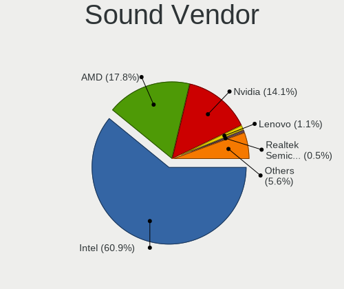

| Vendor                           | Notebooks | Percent |
|----------------------------------|-----------|---------|
| Intel                            | 229       | 60.9%   |
| AMD                              | 67        | 17.82%  |
| Nvidia                           | 53        | 14.1%   |
| Lenovo                           | 4         | 1.06%   |
| Realtek Semiconductor            | 2         | 0.53%   |
| JMTek                            | 2         | 0.53%   |
| Hewlett-Packard                  | 2         | 0.53%   |
| Creative Technology              | 2         | 0.53%   |
| C-Media Electronics              | 2         | 0.53%   |
| ASUSTek Computer                 | 2         | 0.53%   |
| Texas Instruments                | 1         | 0.27%   |
| Sony                             | 1         | 0.27%   |
| Silicon Integrated Systems [SiS] | 1         | 0.27%   |
| Razer USA                        | 1         | 0.27%   |
| Microsoft                        | 1         | 0.27%   |
| Logitech                         | 1         | 0.27%   |
| Kingston Technology              | 1         | 0.27%   |
| GN Netcom                        | 1         | 0.27%   |
| Generalplus Technology           | 1         | 0.27%   |
| DSEA A/S                         | 1         | 0.27%   |
| Comtrue                          | 1         | 0.27%   |

Sound Model
-----------

Sound card models

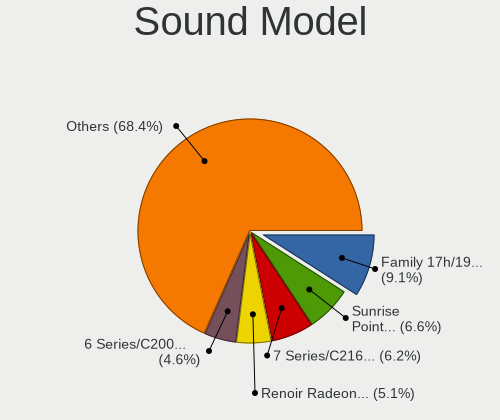

| Model                                                                      | Notebooks | Percent |
|----------------------------------------------------------------------------|-----------|---------|
| AMD Family 17h/19h/1ah HD Audio Controller                                 | 41        | 9.07%   |
| Intel Sunrise Point-LP HD Audio                                            | 30        | 6.64%   |
| Intel 7 Series/C216 Chipset Family High Definition Audio Controller        | 28        | 6.19%   |
| AMD Renoir Radeon High Definition Audio Controller                         | 23        | 5.09%   |
| Intel 6 Series/C200 Series Chipset Family High Definition Audio Controller | 21        | 4.65%   |
| Intel 8 Series/C220 Series Chipset High Definition Audio Controller        | 18        | 3.98%   |
| Intel 5 Series/3400 Series Chipset High Definition Audio                   | 16        | 3.54%   |
| Intel Xeon E3-1200 v3/4th Gen Core Processor HD Audio Controller           | 14        | 3.1%    |
| Intel Tiger Lake-LP Smart Sound Technology Audio Controller                | 13        | 2.88%   |
| Intel Cannon Lake PCH cAVS                                                 | 11        | 2.43%   |
| Intel Haswell-ULT HD Audio Controller                                      | 9         | 1.99%   |
| Intel 82801I (ICH9 Family) HD Audio Controller                             | 9         | 1.99%   |
| Intel 8 Series HD Audio Controller                                         | 9         | 1.99%   |
| AMD Rembrandt Radeon High Definition Audio Controller                      | 9         | 1.99%   |
| Intel Comet Lake PCH cAVS                                                  | 8         | 1.77%   |
| Intel Cannon Point-LP High Definition Audio Controller                     | 8         | 1.77%   |
| Nvidia GF108 High Definition Audio Controller                              | 7         | 1.55%   |
| Nvidia GA106 High Definition Audio Controller                              | 7         | 1.55%   |
| Intel Wildcat Point-LP High Definition Audio Controller                    | 7         | 1.55%   |
| Intel Broadwell-U Audio Controller                                         | 7         | 1.55%   |
| AMD SBx00 Azalia (Intel HDA)                                               | 7         | 1.55%   |
| Intel NM10/ICH7 Family High Definition Audio Controller                    | 6         | 1.33%   |
| Intel Comet Lake PCH-LP cAVS                                               | 6         | 1.33%   |
| Nvidia TU107 GeForce GTX 1650 High Definition Audio Controller             | 5         | 1.11%   |
| Intel Celeron/Pentium Silver Processor High Definition Audio               | 5         | 1.11%   |
| Intel Alder Lake PCH-P High Definition Audio Controller                    | 5         | 1.11%   |
| Intel 82801H (ICH8 Family) HD Audio Controller                             | 5         | 1.11%   |
| Intel 100 Series/C230 Series Chipset Family HD Audio Controller            | 5         | 1.11%   |
| Nvidia GP107GL High Definition Audio Controller                            | 4         | 0.88%   |
| Nvidia AD107 High Definition Audio Controller                              | 4         | 0.88%   |
| Intel Atom Processor Z36xxx/Z37xxx Series High Definition Audio Controller | 4         | 0.88%   |
| AMD Redwood HDMI Audio [Radeon HD 5000 Series]                             | 4         | 0.88%   |
| AMD Raven/Raven2/Fenghuang HDMI/DP Audio Controller                        | 4         | 0.88%   |
| AMD Navi 21/23 HDMI/DP Audio Controller                                    | 4         | 0.88%   |
| Nvidia GK107 HDMI Audio Controller                                         | 3         | 0.66%   |
| Intel Tiger Lake-H HD Audio Controller                                     | 3         | 0.66%   |
| Intel Celeron N3350/Pentium N4200/Atom E3900 Series Audio Cluster          | 3         | 0.66%   |
| AMD Oland/Hainan/Cape Verde/Pitcairn HDMI Audio [Radeon HD 7000 Series]    | 3         | 0.66%   |
| AMD FCH Azalia Controller                                                  | 3         | 0.66%   |
| Realtek Semiconductor USB Audio                                            | 2         | 0.44%   |

Memory
------

Memory Vendor
-------------

Memory module vendors

| Vendor              | Notebooks | Percent |
|---------------------|-----------|---------|
| Samsung Electronics | 62        | 30.1%   |
| SK hynix            | 39        | 18.93%  |
| Micron Technology   | 31        | 15.05%  |
| Kingston            | 24        | 11.65%  |
| Unknown             | 7         | 3.4%    |
| Ramaxel Technology  | 7         | 3.4%    |
| Crucial             | 7         | 3.4%    |
| Elpida              | 5         | 2.43%   |
| Nanya Technology    | 4         | 1.94%   |
| A-DATA Technology   | 4         | 1.94%   |
| Unknown (ABCD)      | 3         | 1.46%   |
| G.Skill             | 3         | 1.46%   |
| Patriot             | 2         | 0.97%   |
| Lexar               | 2         | 0.97%   |
| GOODRAM             | 2         | 0.97%   |
| Corsair             | 2         | 0.97%   |
| Team                | 1         | 0.49%   |
| Unknown             | 1         | 0.49%   |

Memory Model
------------

Memory module models

| Model                                                            | Notebooks | Percent |
|------------------------------------------------------------------|-----------|---------|
| SK hynix RAM HMA851S6AFR6N-UH 4GB SODIMM DDR4 2667MT/s           | 4         | 1.85%   |
| Samsung RAM M471B5173DB0-YK0 4GB SODIMM DDR3 1600MT/s            | 4         | 1.85%   |
| Samsung RAM M471B1G73DB0-YK0 8GB SODIMM DDR3 1600MT/s            | 4         | 1.85%   |
| Samsung RAM M471A1K43DB1-CWE 8GB SODIMM DDR4 3200MT/s            | 4         | 1.85%   |
| Unknown (ABCD) RAM 123456789012345678 2GB SODIMM LPDDR3 2400MT/s | 3         | 1.39%   |
| SK hynix RAM HMT41GS6BFR8A-PB 8GB SODIMM DDR3 1600MT/s           | 3         | 1.39%   |
| SK hynix RAM HMA82GS6JJR8N-VK 16GB SODIMM DDR4 2667MT/s          | 3         | 1.39%   |
| Samsung RAM M471B5773DH0-CH9 2GB SODIMM DDR3 1600MT/s            | 3         | 1.39%   |
| Samsung RAM M471B5673FH0-CH9 2GB SODIMM DDR3 1334MT/s            | 3         | 1.39%   |
| Samsung RAM M471B1G73QH0-YK0 8GB SODIMM DDR3 1600MT/s            | 3         | 1.39%   |
| Samsung RAM M471A1G44AB0-CWE 8GB SODIMM DDR4 3200MT/s            | 3         | 1.39%   |
| Samsung RAM M425R1GB4BB0-CQKOL 8GB SODIMM DDR5 4800MT/s          | 3         | 1.39%   |
| Micron RAM 8KTF51264HZ-1G6E1 4GB SODIMM DDR3 1600MT/s            | 3         | 1.39%   |
| Unknown RAM Module 2GB SODIMM DDR2 667MT/s                       | 2         | 0.93%   |
| SK hynix RAM HMT451S6BFR8A-PB 4096MB SODIMM DDR3 1600MT/s        | 2         | 0.93%   |
| SK hynix RAM HMT351S6CFR8C-PB 4GB SODIMM DDR3 1600MT/s           | 2         | 0.93%   |
| SK hynix RAM HMAB2GS6AMR6N-XN 16GB SODIMM DDR4 3200MT/s          | 2         | 0.93%   |
| SK hynix RAM HMAA1GS6CJR6N-XN 8GB Row Of Chips DDR4 3200MT/s     | 2         | 0.93%   |
| SK hynix RAM HMA81GS6AFR8N-UH 8GB SODIMM DDR4 2667MT/s           | 2         | 0.93%   |
| Samsung RAM M471B5273CH0-YK0 4GB SODIMM DDR3 1600MT/s            | 2         | 0.93%   |
| Samsung RAM M471A4G43AB1-CWE 32GB SODIMM DDR4 3200MT/s           | 2         | 0.93%   |
| Samsung RAM M471A1K43CB1-CTD 8GB SODIMM DDR4 2667MT/s            | 2         | 0.93%   |
| Samsung RAM M471A1G44BB0-CWE 8GB SODIMM DDR4 3200MT/s            | 2         | 0.93%   |
| Samsung RAM K4EBE304EB-EGCG 8GB Row Of Chips LPDDR3 2133MT/s     | 2         | 0.93%   |
| Nanya RAM NT4GC64B8HB0NS-CG 4GB SODIMM DDR3 1334MT/s             | 2         | 0.93%   |
| Micron RAM MT62F1G32D4DR-031 WT 4GB SODIMM LPDDR5 6400MT/s       | 2         | 0.93%   |
| Micron RAM 8ATF2G64HZ-3G2E1 16GB SODIMM DDR4 3200MT/s            | 2         | 0.93%   |
| Micron RAM 8ATF1G64HZ-2G6H1 8GB SODIMM DDR4 2667MT/s             | 2         | 0.93%   |
| Micron RAM 4ATF1G64HZ-3G2F1 8GB SODIMM DDR4 3200MT/s             | 2         | 0.93%   |
| Micron RAM 16JSF51264HZ-1G4D1 4GB SODIMM DDR3 1334MT/s           | 2         | 0.93%   |
| Kingston RAM MSI16D3LS1KFG/8G 8GB SODIMM DDR3 1600MT/s           | 2         | 0.93%   |
| Kingston RAM KX830D-ELC 4GB SODIMM DDR3 1333MT/s                 | 2         | 0.93%   |
| GOODRAM RAM W-DL16S08G 8GB SODIMM DDR3 1600MT/s                  | 2         | 0.93%   |
| Elpida RAM EBJ41UF8BDU0-GN-F 4GB SODIMM DDR3 1600MT/s            | 2         | 0.93%   |
| Unknown RAM Module 512MB SODIMM DDR2 667MT/s                     | 1         | 0.46%   |
| Unknown RAM Module 2GB SODIMM DDR2 800MT/s                       | 1         | 0.46%   |
| Unknown RAM Module 2048MB SODIMM DDR3 1600MT/s                   | 1         | 0.46%   |
| Unknown RAM Module 2048MB SODIMM DDR2 800MT/s                    | 1         | 0.46%   |
| Unknown RAM Module 1GB SODIMM DDR2 333MT/s                       | 1         | 0.46%   |
| Unknown RAM Module 1024MB SODIMM DDR2                            | 1         | 0.46%   |

Memory Kind
-----------

Memory module kinds

| Kind   | Notebooks | Percent |
|--------|-----------|---------|
| DDR3   | 70        | 40.94%  |
| DDR4   | 63        | 36.84%  |
| LPDDR4 | 10        | 5.85%   |
| DDR2   | 9         | 5.26%   |
| DDR5   | 8         | 4.68%   |
| LPDDR3 | 6         | 3.51%   |
| LPDDR5 | 3         | 1.75%   |
| SDRAM  | 1         | 0.58%   |
| DRAM   | 1         | 0.58%   |

Memory Form Factor
------------------

Physical design of the memory module

| Name         | Notebooks | Percent |
|--------------|-----------|---------|
| SODIMM       | 159       | 93.53%  |
| Row Of Chips | 11        | 6.47%   |

Memory Size
-----------

Memory module size

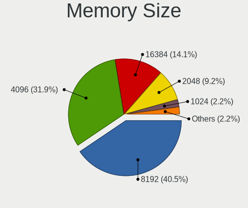

| Size  | Notebooks | Percent |
|-------|-----------|---------|
| 8192  | 75        | 40.54%  |
| 4096  | 59        | 31.89%  |
| 16384 | 26        | 14.05%  |
| 2048  | 17        | 9.19%   |
| 1024  | 4         | 2.16%   |
| 32768 | 3         | 1.62%   |
| 512   | 1         | 0.54%   |

Memory Speed
------------

Memory module speed

| Speed   | Notebooks | Percent |
|---------|-----------|---------|
| 1600    | 47        | 25.41%  |
| 2667    | 37        | 20%     |
| 3200    | 33        | 17.84%  |
| 1334    | 15        | 8.11%   |
| 2133    | 7         | 3.78%   |
| 1333    | 6         | 3.24%   |
| 2400    | 5         | 2.7%    |
| 667     | 5         | 2.7%    |
| 5600    | 4         | 2.16%   |
| 4800    | 4         | 2.16%   |
| 1867    | 4         | 2.16%   |
| 1067    | 4         | 2.16%   |
| 6400    | 3         | 1.62%   |
| 800     | 3         | 1.62%   |
| 4267    | 2         | 1.08%   |
| 4266    | 1         | 0.54%   |
| 3266    | 1         | 0.54%   |
| 2048    | 1         | 0.54%   |
| 1066    | 1         | 0.54%   |
| 333     | 1         | 0.54%   |
| Unknown | 1         | 0.54%   |

Printers & scanners
-------------------

Printer Vendor
--------------

Printer device vendors

| Vendor          | Notebooks | Percent |
|-----------------|-----------|---------|
| Hewlett-Packard | 1         | 100%    |

Printer Model
-------------

Printer device models

| Model            | Notebooks | Percent |
|------------------|-----------|---------|
| HP LaserJet 1000 | 1         | 100%    |

Scanner Vendor
--------------

Scanner device vendors

Zero info for selected period =(

Scanner Model
-------------

Scanner device models

Zero info for selected period =(

Camera
------

Camera Vendor
-------------

Camera device vendors

| Vendor                                 | Notebooks | Percent |
|----------------------------------------|-----------|---------|
| Chicony Electronics                    | 62        | 24.31%  |
| IMC Networks                           | 45        | 17.65%  |
| Microdia                               | 20        | 7.84%   |
| Sunplus Innovation Technology          | 17        | 6.67%   |
| Bison Electronics                      | 16        | 6.27%   |
| Realtek Semiconductor                  | 15        | 5.88%   |
| Suyin                                  | 12        | 4.71%   |
| Luxvisions Innotech Limited            | 9         | 3.53%   |
| Cheng Uei Precision Industry (Foxlink) | 8         | 3.14%   |
| Alcor Micro                            | 7         | 2.75%   |
| Syntek                                 | 6         | 2.35%   |
| Apple                                  | 6         | 2.35%   |
| Quanta                                 | 5         | 1.96%   |
| Sonix Technology                       | 3         | 1.18%   |
| Silicon Motion                         | 3         | 1.18%   |
| Lite-On Technology                     | 3         | 1.18%   |
| OmniVision Technologies                | 2         | 0.78%   |
| Lenovo                                 | 2         | 0.78%   |
| DigiTech                               | 2         | 0.78%   |
| Acer                                   | 2         | 0.78%   |
| SunplusIT                              | 1         | 0.39%   |
| ShineTech                              | 1         | 0.39%   |
| Ricoh                                  | 1         | 0.39%   |
| Qtech                                  | 1         | 0.39%   |
| Primax Electronics                     | 1         | 0.39%   |
| Logitech                               | 1         | 0.39%   |
| Intel                                  | 1         | 0.39%   |
| Importek                               | 1         | 0.39%   |
| Genesys Logic                          | 1         | 0.39%   |
| ALi                                    | 1         | 0.39%   |

Camera Model
------------

Camera device models

| Model                                             | Notebooks | Percent |
|---------------------------------------------------|-----------|---------|
| Chicony Integrated Camera                         | 22        | 8.63%   |
| IMC Networks USB2.0 HD UVC WebCam                 | 15        | 5.88%   |
| IMC Networks Integrated Camera                    | 13        | 5.1%    |
| Microdia Integrated_Webcam_HD                     | 9         | 3.53%   |
| Sunplus Integrated_Webcam_HD                      | 6         | 2.35%   |
| Realtek Integrated_Webcam_HD                      | 5         | 1.96%   |
| Bison Integrated Camera                           | 5         | 1.96%   |
| Syntek Lenovo EasyCamera                          | 4         | 1.57%   |
| Sunplus HP HD Webcam [Fixed]                      | 3         | 1.18%   |
| Sonix USB2.0 HD UVC WebCam                        | 3         | 1.18%   |
| Microdia Integrated Webcam                        | 3         | 1.18%   |
| Luxvisions Innotech Limited Integrated Camera     | 3         | 1.18%   |
| Luxvisions Innotech Limited HP HD Camera          | 3         | 1.18%   |
| IMC Networks UVC VGA Webcam                       | 3         | 1.18%   |
| IMC Networks 2M Integrated Webcam                 | 3         | 1.18%   |
| Chicony USB2.0 HD UVC WebCam                      | 3         | 1.18%   |
| Chicony ThinkPad T490 Webcam                      | 3         | 1.18%   |
| Alcor Micro USB 2.0 Camera                        | 3         | 1.18%   |
| Suyin Laptop_Integrated_Webcam_HD                 | 2         | 0.78%   |
| Suyin HP Webcam                                   | 2         | 0.78%   |
| Sunplus Laptop_Integrated_Webcam_FHD              | 2         | 0.78%   |
| Sunplus HD WebCam                                 | 2         | 0.78%   |
| Sunplus Asus Webcam                               | 2         | 0.78%   |
| Silicon Motion Lenovo EasyCamera                  | 2         | 0.78%   |
| Realtek USB Camera                                | 2         | 0.78%   |
| Quanta HD User Facing                             | 2         | 0.78%   |
| Luxvisions Innotech Limited Integrated RGB Camera | 2         | 0.78%   |
| Lite-On Integrated Camera                         | 2         | 0.78%   |
| IMC Networks VGA UVC WebCam                       | 2         | 0.78%   |
| IMC Networks USB2.0 UVC HD Webcam                 | 2         | 0.78%   |
| Chicony Webcam                                    | 2         | 0.78%   |
| Chicony VGA Webcam                                | 2         | 0.78%   |
| Chicony USB2.0 VGA UVC WebCam                     | 2         | 0.78%   |
| Chicony USB2.0 0.3M UVC WebCam                    | 2         | 0.78%   |
| Chicony HP Webcam [2 MP Macro]                    | 2         | 0.78%   |
| Chicony HP Laptop Integrated Webcam [2 MP Fixed]  | 2         | 0.78%   |
| Chicony HP HD Webcam [Fixed]                      | 2         | 0.78%   |
| Chicony HP HD Webcam                              | 2         | 0.78%   |
| Chicony HP HD Camera                              | 2         | 0.78%   |
| Chicony HD WebCam                                 | 2         | 0.78%   |

Security
--------

Fingerprint Vendor
------------------

Fingerprint sensor vendors

| Vendor                     | Notebooks | Percent |
|----------------------------|-----------|---------|
| Validity Sensors           | 20        | 33.9%   |
| Synaptics                  | 20        | 33.9%   |
| Shenzhen Goodix Technology | 7         | 11.86%  |
| Elan Microelectronics      | 4         | 6.78%   |
| AuthenTec                  | 4         | 6.78%   |
| STMicroelectronics         | 2         | 3.39%   |
| Upek                       | 1         | 1.69%   |
| LighTuning Technology      | 1         | 1.69%   |

Fingerprint Model
-----------------

Fingerprint sensor models

| Model                                                       | Notebooks | Percent |
|-------------------------------------------------------------|-----------|---------|
| Synaptics Prometheus MIS Touch Fingerprint Reader           | 11        | 18.64%  |
| Validity Sensors VFS471 Fingerprint Reader                  | 4         | 6.78%   |
| Validity Sensors VFS495 Fingerprint Reader                  | 3         | 5.08%   |
| Validity Sensors VFS451 Fingerprint Reader                  | 3         | 5.08%   |
| Synaptics Metallica MIS Touch Fingerprint Reader            | 3         | 5.08%   |
| Shenzhen Goodix  Fingerprint Device                         | 3         | 5.08%   |
| Shenzhen Goodix Fingerprint Reader                          | 3         | 5.08%   |
| Elan ELAN:Fingerprint                                       | 3         | 5.08%   |
| Validity Sensors VFS5011 Fingerprint Reader                 | 2         | 3.39%   |
| Validity Sensors Fingerprint scanner                        | 2         | 3.39%   |
| Synaptics UWP WBDI Device                                   | 2         | 3.39%   |
| Synaptics Metallica MOH Touch Fingerprint Reader            | 2         | 3.39%   |
| STMicroelectronics Fingerprint Reader                       | 2         | 3.39%   |
| AuthenTec AES2810                                           | 2         | 3.39%   |
| AuthenTec AES1600                                           | 2         | 3.39%   |
| Validity Sensors VFS7500 Touch Fingerprint Sensor           | 1         | 1.69%   |
| Validity Sensors VFS491                                     | 1         | 1.69%   |
| Validity Sensors VFS301 Fingerprint Reader                  | 1         | 1.69%   |
| Validity Sensors VFS 5011 fingerprint sensor                | 1         | 1.69%   |
| Validity Sensors Synaptics WBDI                             | 1         | 1.69%   |
| Validity Sensors Synaptics VFS7552 Touch Fingerprint Sensor | 1         | 1.69%   |
| Upek Biometric Touchchip/Touchstrip Fingerprint Sensor      | 1         | 1.69%   |
| Synaptics  FS7604 Touch Fingerprint Sensor with PurePrint   | 1         | 1.69%   |
| Synaptics Fingerprint reader [HP G6]                        | 1         | 1.69%   |
| Shenzhen Goodix FingerPrint                                 | 1         | 1.69%   |
| LighTuning EgisTec Touch Fingerprint Sensor                 | 1         | 1.69%   |
| Elan ELAN:ARM-M4                                            | 1         | 1.69%   |

Chipcard Vendor
---------------

Chipcard module vendors

| Vendor                | Notebooks | Percent |
|-----------------------|-----------|---------|
| Alcor Micro           | 15        | 57.69%  |
| Broadcom              | 8         | 30.77%  |
| Gemalto (was Gemplus) | 2         | 7.69%   |
| Upek                  | 1         | 3.85%   |

Chipcard Model
--------------

Chipcard module models

| Model                                                                        | Notebooks | Percent |
|------------------------------------------------------------------------------|-----------|---------|
| Alcor Micro AU9540 Smartcard Reader                                          | 15        | 57.69%  |
| Broadcom BCM5880 Secure Applications Processor with fingerprint swipe sensor | 2         | 7.69%   |
| Broadcom BCM5880 Secure Applications Processor                               | 2         | 7.69%   |
| Broadcom 5880                                                                | 2         | 7.69%   |
| Broadcom 58200                                                               | 2         | 7.69%   |
| Upek TouchChip Fingerprint Coprocessor (WBF advanced mode)                   | 1         | 3.85%   |
| Gemalto (was Gemplus) GemPC Twin SmartCard Reader                            | 1         | 3.85%   |
| Gemalto (was Gemplus) Compact Smart Card Reader Writer                       | 1         | 3.85%   |

Unsupported
-----------

Unsupported Devices
-------------------

Total unsupported devices on board

| Total | Notebooks | Percent |
|-------|-----------|---------|
| 0     | 179       | 60.07%  |
| 1     | 88        | 29.53%  |
| 2     | 22        | 7.38%   |
| 3     | 7         | 2.35%   |
| 7     | 1         | 0.34%   |
| 4     | 1         | 0.34%   |

Unsupported Device Types
------------------------

Types of unsupported devices

| Type                     | Notebooks | Percent |
|--------------------------|-----------|---------|
| Fingerprint reader       | 57        | 35.63%  |
| Graphics card            | 33        | 20.63%  |
| Chipcard                 | 24        | 15%     |
| Net/wireless             | 13        | 8.13%   |
| Multimedia controller    | 8         | 5%      |
| Bluetooth                | 8         | 5%      |
| Communication controller | 4         | 2.5%    |
| Camera                   | 4         | 2.5%    |
| Sound                    | 2         | 1.25%   |
| Net/ethernet             | 2         | 1.25%   |
| Card reader              | 2         | 1.25%   |
| Storage/raid             | 1         | 0.63%   |
| Storage                  | 1         | 0.63%   |
| Flash memory             | 1         | 0.63%   |

