Linux in Lithuania - Tested Hardware & Statistics
-------------------------------------------------

A project to collect tested hardware configurations for Linux in Lithuania.

Anyone can contribute to this report by the [hw-probe](https://github.com/linuxhw/hw-probe) tool:

    sudo -E hw-probe -all -upload

Please contribute! Especially if your hardware is rare.

This is a report for all computer types. See also reports for [desktops](/Location/Lithuania/Desktop/README.md) and [notebooks](/Location/Lithuania/Notebook/README.md).

Contents
--------

* [ Test Cases ](#test-cases)

* [ System ](#system)
  - [ OS                       ](#os)
  - [ OS Family                ](#os-family)
  - [ Kernel                   ](#kernel)
  - [ Kernel Family            ](#kernel-family)
  - [ Kernel Major Ver.        ](#kernel-major-ver)
  - [ Arch                     ](#arch)
  - [ DE                       ](#de)
  - [ Display Server           ](#display-server)
  - [ Display Manager          ](#display-manager)
  - [ OS Lang                  ](#os-lang)
  - [ Boot Mode                ](#boot-mode)
  - [ Filesystem               ](#filesystem)
  - [ Part. scheme             ](#part-scheme)
  - [ Dual Boot with Linux/BSD ](#dual-boot-with-linuxbsd)
  - [ Dual Boot (Win)          ](#dual-boot-win)

* [ Board ](#board)
  - [ Vendor                   ](#vendor)
  - [ Model                    ](#model)
  - [ Model Family             ](#model-family)
  - [ MFG Year                 ](#mfg-year)
  - [ Form Factor              ](#form-factor)
  - [ Secure Boot              ](#secure-boot)
  - [ Coreboot                 ](#coreboot)
  - [ RAM Size                 ](#ram-size)
  - [ RAM Used                 ](#ram-used)
  - [ Total Drives             ](#total-drives)
  - [ Has CD-ROM               ](#has-cd-rom)
  - [ Has Ethernet             ](#has-ethernet)
  - [ Has WiFi                 ](#has-wifi)
  - [ Has Bluetooth            ](#has-bluetooth)

* [ Location ](#location)
  - [ Country                  ](#country)
  - [ City                     ](#city)

* [ Drives ](#drives)
  - [ Drive Vendor             ](#drive-vendor)
  - [ Drive Model              ](#drive-model)
  - [ HDD Vendor               ](#hdd-vendor)
  - [ SSD Vendor               ](#ssd-vendor)
  - [ Drive Kind               ](#drive-kind)
  - [ Drive Connector          ](#drive-connector)
  - [ Drive Size               ](#drive-size)
  - [ Space Total              ](#space-total)
  - [ Space Used               ](#space-used)
  - [ Malfunc. Drives          ](#malfunc-drives)
  - [ Malfunc. Drive Vendor    ](#malfunc-drive-vendor)
  - [ Malfunc. HDD Vendor      ](#malfunc-hdd-vendor)
  - [ Malfunc. Drive Kind      ](#malfunc-drive-kind)
  - [ Failed Drives            ](#failed-drives)
  - [ Failed Drive Vendor      ](#failed-drive-vendor)
  - [ Drive Status             ](#drive-status)

* [ Storage controller ](#storage-controller)
  - [ Storage Vendor           ](#storage-vendor)
  - [ Storage Model            ](#storage-model)
  - [ Storage Kind             ](#storage-kind)

* [ Processor ](#processor)
  - [ CPU Vendor               ](#cpu-vendor)
  - [ CPU Model                ](#cpu-model)
  - [ CPU Model Family         ](#cpu-model-family)
  - [ CPU Cores                ](#cpu-cores)
  - [ CPU Sockets              ](#cpu-sockets)
  - [ CPU Threads              ](#cpu-threads)
  - [ CPU Op-Modes             ](#cpu-op-modes)
  - [ CPU Microcode            ](#cpu-microcode)
  - [ CPU Microarch            ](#cpu-microarch)

* [ Graphics ](#graphics)
  - [ GPU Vendor               ](#gpu-vendor)
  - [ GPU Model                ](#gpu-model)
  - [ GPU Combo                ](#gpu-combo)
  - [ GPU Driver               ](#gpu-driver)
  - [ GPU Memory               ](#gpu-memory)

* [ Monitor ](#monitor)
  - [ Monitor Vendor           ](#monitor-vendor)
  - [ Monitor Model            ](#monitor-model)
  - [ Monitor Resolution       ](#monitor-resolution)
  - [ Monitor Diagonal         ](#monitor-diagonal)
  - [ Monitor Width            ](#monitor-width)
  - [ Aspect Ratio             ](#aspect-ratio)
  - [ Monitor Area             ](#monitor-area)
  - [ Pixel Density            ](#pixel-density)
  - [ Multiple Monitors        ](#multiple-monitors)

* [ Network ](#network)
  - [ Net Controller Vendor    ](#net-controller-vendor)
  - [ Net Controller Model     ](#net-controller-model)
  - [ Wireless Vendor          ](#wireless-vendor)
  - [ Wireless Model           ](#wireless-model)
  - [ Ethernet Vendor          ](#ethernet-vendor)
  - [ Ethernet Model           ](#ethernet-model)
  - [ Net Controller Kind      ](#net-controller-kind)
  - [ Used Controller          ](#used-controller)
  - [ NICs                     ](#nics)
  - [ IPv6                     ](#ipv6)

* [ Bluetooth ](#bluetooth)
  - [ Bluetooth Vendor         ](#bluetooth-vendor)
  - [ Bluetooth Model          ](#bluetooth-model)

* [ Sound ](#sound)
  - [ Sound Vendor             ](#sound-vendor)
  - [ Sound Model              ](#sound-model)

* [ Memory ](#memory)
  - [ Memory Vendor            ](#memory-vendor)
  - [ Memory Model             ](#memory-model)
  - [ Memory Kind              ](#memory-kind)
  - [ Memory Form Factor       ](#memory-form-factor)
  - [ Memory Size              ](#memory-size)
  - [ Memory Speed             ](#memory-speed)

* [ Printers & scanners ](#printers--scanners)
  - [ Printer Vendor           ](#printer-vendor)
  - [ Printer Model            ](#printer-model)
  - [ Scanner Vendor           ](#scanner-vendor)
  - [ Scanner Model            ](#scanner-model)

* [ Camera ](#camera)
  - [ Camera Vendor            ](#camera-vendor)
  - [ Camera Model             ](#camera-model)

* [ Security ](#security)
  - [ Fingerprint Vendor       ](#fingerprint-vendor)
  - [ Fingerprint Model        ](#fingerprint-model)
  - [ Chipcard Vendor          ](#chipcard-vendor)
  - [ Chipcard Model           ](#chipcard-model)

* [ Unsupported ](#unsupported)
  - [ Unsupported Devices      ](#unsupported-devices)
  - [ Unsupported Device Types ](#unsupported-device-types)

Test Cases
----------

Total: 434

| Vendor        | Model                       | Form-Factor | Probe                                                      | Date         |
|---------------|-----------------------------|-------------|------------------------------------------------------------|--------------|
| ASRock        | B550M Pro4                  | Desktop     | [9a05044c38](https://linux-hardware.org/?probe=9a05044c38) | Aug 27, 2022 |
| HP            | ProBook 440 G3              | Notebook    | [e51d4ae241](https://linux-hardware.org/?probe=e51d4ae241) | Aug 20, 2022 |
| ASRock        | B550M Pro4                  | Desktop     | [ab3425dd99](https://linux-hardware.org/?probe=ab3425dd99) | Aug 17, 2022 |
| Lenovo        | ThinkPad T590 20N4004EMH    | Notebook    | [42d130e184](https://linux-hardware.org/?probe=42d130e184) | Aug 16, 2022 |
| Lenovo        | ThinkPad E15 Gen 2 20T80... | Notebook    | [5967f639c3](https://linux-hardware.org/?probe=5967f639c3) | Aug 16, 2022 |
| ASUSTek       | TUF Gaming X570-PLUS        | Desktop     | [e63db5769a](https://linux-hardware.org/?probe=e63db5769a) | Aug 14, 2022 |
| Apple         | Mac-A369DDC4E67F1C45 iMa... | All in one  | [6440e9a054](https://linux-hardware.org/?probe=6440e9a054) | Aug 12, 2022 |
| Apple         | Mac-A369DDC4E67F1C45 iMa... | All in one  | [063c2efc80](https://linux-hardware.org/?probe=063c2efc80) | Aug 12, 2022 |
| MSI           | MS-16F1                     | Notebook    | [0a28da4f53](https://linux-hardware.org/?probe=0a28da4f53) | Aug 12, 2022 |
| HP            | ProBook 455 G8 Notebook ... | Notebook    | [f3a7c88015](https://linux-hardware.org/?probe=f3a7c88015) | Aug 11, 2022 |
| Lenovo        | ThinkPad T430s 2356LNG      | Notebook    | [255560d675](https://linux-hardware.org/?probe=255560d675) | Aug 06, 2022 |
| HP            | Compaq Presario CQ60        | Notebook    | [06fe56588b](https://linux-hardware.org/?probe=06fe56588b) | Jul 27, 2022 |
| ASUSTek       | Maximus Formula             | Desktop     | [2e71fca3d5](https://linux-hardware.org/?probe=2e71fca3d5) | Jul 22, 2022 |
| Dell          | 07T4MC A11                  | Desktop     | [61d394116d](https://linux-hardware.org/?probe=61d394116d) | Jul 20, 2022 |
| ASUSTek       | Maximus Formula             | Desktop     | [3c600cafa6](https://linux-hardware.org/?probe=3c600cafa6) | Jul 17, 2022 |
| HP            | ENVY x360 Convertible 13... | Convertible | [0687ecd744](https://linux-hardware.org/?probe=0687ecd744) | Jul 14, 2022 |
| ASUSTek       | Maximus Formula             | Desktop     | [cd81bcaf19](https://linux-hardware.org/?probe=cd81bcaf19) | Jul 13, 2022 |
| eMachines     | eME443                      | Notebook    | [9197e8ef17](https://linux-hardware.org/?probe=9197e8ef17) | Jul 11, 2022 |
| Gigabyte      | AB350M-DS3H V2-CF           | Desktop     | [00d543ee46](https://linux-hardware.org/?probe=00d543ee46) | Jul 07, 2022 |
| Apple         | Mac-27ADBB7B4CEE8E61 iMa... | All in one  | [b78c848494](https://linux-hardware.org/?probe=b78c848494) | Jul 01, 2022 |
| Apple         | Mac-27ADBB7B4CEE8E61 iMa... | All in one  | [f0c4468694](https://linux-hardware.org/?probe=f0c4468694) | Jul 01, 2022 |
| Apple         | Mac-27ADBB7B4CEE8E61 iMa... | All in one  | [cdc234e3d9](https://linux-hardware.org/?probe=cdc234e3d9) | Jun 29, 2022 |
| Apple         | Mac-27ADBB7B4CEE8E61 iMa... | All in one  | [a6420a89b6](https://linux-hardware.org/?probe=a6420a89b6) | Jun 29, 2022 |
| Lenovo        | ThinkPad E490 20N8CTO1WW    | Notebook    | [58ab145788](https://linux-hardware.org/?probe=58ab145788) | Jun 24, 2022 |
| Lenovo        | ThinkPad S1 Yoga 12 20DK... | Notebook    | [f23b75e3ca](https://linux-hardware.org/?probe=f23b75e3ca) | Jun 19, 2022 |
| Lenovo        | ThinkPad S1 Yoga 12 20DK... | Notebook    | [8f2740e70e](https://linux-hardware.org/?probe=8f2740e70e) | Jun 18, 2022 |
| MSI           | Z270-A PRO                  | Desktop     | [0d78267c59](https://linux-hardware.org/?probe=0d78267c59) | Jun 16, 2022 |
| Dell          | 02YYK5 A01                  | Desktop     | [bd3336efcb](https://linux-hardware.org/?probe=bd3336efcb) | Jun 14, 2022 |
| Panasonic     | CF-52VDA131M                | Notebook    | [aa40370193](https://linux-hardware.org/?probe=aa40370193) | Jun 07, 2022 |
| ASUSTek       | VivoBook_ASUSLaptop X512... | Notebook    | [67aa7158d3](https://linux-hardware.org/?probe=67aa7158d3) | May 24, 2022 |
| Dell          | Latitude E5570              | Notebook    | [310aadd79a](https://linux-hardware.org/?probe=310aadd79a) | May 24, 2022 |
| Dell          | 02YYK5 A01                  | Desktop     | [a068dc57c8](https://linux-hardware.org/?probe=a068dc57c8) | May 13, 2022 |
| Dell          | 0F96C8 A00                  | All in one  | [b0e5c67fda](https://linux-hardware.org/?probe=b0e5c67fda) | May 11, 2022 |
| Alienware     | 17                          | Notebook    | [b30786ba0e](https://linux-hardware.org/?probe=b30786ba0e) | May 10, 2022 |
| Dell          | 02YYK5 A01                  | Desktop     | [96f6c5bf2a](https://linux-hardware.org/?probe=96f6c5bf2a) | May 10, 2022 |
| Lenovo        | ThinkPad P15 Gen 1 20STS... | Notebook    | [3e171a4858](https://linux-hardware.org/?probe=3e171a4858) | May 09, 2022 |
| Dell          | 03NVJ6 A02                  | Desktop     | [9e90322621](https://linux-hardware.org/?probe=9e90322621) | May 06, 2022 |
| Lenovo        | G500 20236                  | Notebook    | [8439c948ec](https://linux-hardware.org/?probe=8439c948ec) | May 06, 2022 |
| Dell          | 03NVJ6 A02                  | Desktop     | [08e665f8bf](https://linux-hardware.org/?probe=08e665f8bf) | May 04, 2022 |
| ASRock        | A320M-HDV R4.0              | Desktop     | [36cabd86ba](https://linux-hardware.org/?probe=36cabd86ba) | May 04, 2022 |
| Dell          | Inspiron 7720               | Notebook    | [a2d8358964](https://linux-hardware.org/?probe=a2d8358964) | May 02, 2022 |
| Dell          | XPS 15 9510                 | Notebook    | [52609c3695](https://linux-hardware.org/?probe=52609c3695) | Apr 29, 2022 |
| ASUSTek       | ROG Zephyrus G14 GA402RJ... | Notebook    | [96fc510369](https://linux-hardware.org/?probe=96fc510369) | Apr 29, 2022 |
| Dell          | Latitude 5401               | Notebook    | [d115db916d](https://linux-hardware.org/?probe=d115db916d) | Apr 23, 2022 |
| Dell          | Latitude 5401               | Notebook    | [c9f380ea26](https://linux-hardware.org/?probe=c9f380ea26) | Apr 23, 2022 |
| ASUSTek       | X55A                        | Notebook    | [9188b40f88](https://linux-hardware.org/?probe=9188b40f88) | Apr 23, 2022 |
| Dell          | 02YYK5 A01                  | Desktop     | [a3bf1cf766](https://linux-hardware.org/?probe=a3bf1cf766) | Apr 19, 2022 |
| Dell          | 02YYK5 A01                  | Desktop     | [f2e4d7052d](https://linux-hardware.org/?probe=f2e4d7052d) | Apr 16, 2022 |
| MSI           | MEG X570 UNIFY              | Desktop     | [bacc580e7a](https://linux-hardware.org/?probe=bacc580e7a) | Apr 13, 2022 |
| ASUSTek       | PRIME Z390-A                | Desktop     | [8ba327aee7](https://linux-hardware.org/?probe=8ba327aee7) | Apr 07, 2022 |
| ASUSTek       | TUF Gaming B550-PLUS        | Desktop     | [a69ec475f7](https://linux-hardware.org/?probe=a69ec475f7) | Apr 03, 2022 |
| ASUSTek       | PRIME H510M-R               | Desktop     | [6736f1afa6](https://linux-hardware.org/?probe=6736f1afa6) | Apr 03, 2022 |
| Dell          | Vostro 3580                 | Notebook    | [0ec442c0be](https://linux-hardware.org/?probe=0ec442c0be) | Mar 28, 2022 |
| Gigabyte      | B450M S2H                   | Desktop     | [aa02b40ff7](https://linux-hardware.org/?probe=aa02b40ff7) | Mar 27, 2022 |
| ASUSTek       | X55A                        | Notebook    | [9b02d587bf](https://linux-hardware.org/?probe=9b02d587bf) | Mar 26, 2022 |
| ASUSTek       | VivoBook_ASUSLaptop X521... | Notebook    | [c3ffdf7791](https://linux-hardware.org/?probe=c3ffdf7791) | Mar 17, 2022 |
| ASUSTek       | VivoBook_ASUSLaptop X521... | Notebook    | [77b0be92c8](https://linux-hardware.org/?probe=77b0be92c8) | Mar 17, 2022 |
| Lenovo        | IdeaPad Y700-15ISK 80NV     | Notebook    | [5d0113f42d](https://linux-hardware.org/?probe=5d0113f42d) | Mar 16, 2022 |
| HP            | ProBook 455 G1              | Notebook    | [c6ad6edf70](https://linux-hardware.org/?probe=c6ad6edf70) | Mar 10, 2022 |
| Lenovo        | ThinkPad E15 Gen 2 20T80... | Notebook    | [4b0c952d9b](https://linux-hardware.org/?probe=4b0c952d9b) | Mar 09, 2022 |
| MSI           | B350 PC MATE                | Desktop     | [2e06b2fed8](https://linux-hardware.org/?probe=2e06b2fed8) | Feb 27, 2022 |
| ASRock        | QC5000M-ITX/PH              | Desktop     | [573ff5a0d0](https://linux-hardware.org/?probe=573ff5a0d0) | Feb 16, 2022 |
| MSI           | B450M MORTAR MAX            | Desktop     | [54f55cc209](https://linux-hardware.org/?probe=54f55cc209) | Feb 16, 2022 |
| Lenovo        | Yoga Creator 7 15IMH05 8... | Notebook    | [12a1b54a3a](https://linux-hardware.org/?probe=12a1b54a3a) | Feb 16, 2022 |
| ASUSTek       | Maximus Formula             | Desktop     | [130c778a64](https://linux-hardware.org/?probe=130c778a64) | Feb 11, 2022 |
| HP            | ENVY x360 Convertible 13... | Convertible | [3c46e807da](https://linux-hardware.org/?probe=3c46e807da) | Feb 09, 2022 |
| ASUSTek       | H110M-C                     | Desktop     | [82f3d6edf9](https://linux-hardware.org/?probe=82f3d6edf9) | Feb 09, 2022 |
| ASUSTek       | X55A                        | Notebook    | [dbbb7b1213](https://linux-hardware.org/?probe=dbbb7b1213) | Feb 07, 2022 |
| Lenovo        | ThinkPad P14s Gen 2a 21A... | Notebook    | [4a36d79506](https://linux-hardware.org/?probe=4a36d79506) | Feb 04, 2022 |
| ASUSTek       | H110M-C                     | Desktop     | [6ba127c715](https://linux-hardware.org/?probe=6ba127c715) | Feb 04, 2022 |
| ASUSTek       | PRIME B450M-A               | Desktop     | [5616230c16](https://linux-hardware.org/?probe=5616230c16) | Feb 01, 2022 |
| Lenovo        | ThinkPad E15 Gen 2 20TD0... | Notebook    | [a7d1f29451](https://linux-hardware.org/?probe=a7d1f29451) | Jan 31, 2022 |
| Jumper        | EZbook                      | Notebook    | [4fa449c0ce](https://linux-hardware.org/?probe=4fa449c0ce) | Jan 27, 2022 |
| HP            | ProBook 450 G1              | Notebook    | [269396626c](https://linux-hardware.org/?probe=269396626c) | Jan 23, 2022 |
| Lenovo        | Flex 2-15 20405             | Notebook    | [8f6a587ed3](https://linux-hardware.org/?probe=8f6a587ed3) | Jan 20, 2022 |
| ASUSTek       | H110M-C                     | Desktop     | [be4291793d](https://linux-hardware.org/?probe=be4291793d) | Jan 10, 2022 |
| ASUSTek       | N53SV                       | Notebook    | [a5b43fd8b4](https://linux-hardware.org/?probe=a5b43fd8b4) | Jan 05, 2022 |
| Gigabyte      | GA-78LMT-USB3 R2 sex        | Desktop     | [a769ac4242](https://linux-hardware.org/?probe=a769ac4242) | Jan 01, 2022 |
| HP            | Laptop 14s-fq1xxx           | Notebook    | [8e0b4fec6c](https://linux-hardware.org/?probe=8e0b4fec6c) | Dec 26, 2021 |
| Gigabyte      | X570 AORUS ULTRA            | Desktop     | [d824937c84](https://linux-hardware.org/?probe=d824937c84) | Dec 22, 2021 |
| Gigabyte      | H61M-DS2 DVI                | Desktop     | [1252e4adb0](https://linux-hardware.org/?probe=1252e4adb0) | Dec 18, 2021 |
| Acer          | Aspire A515-56              | Notebook    | [113924cdba](https://linux-hardware.org/?probe=113924cdba) | Dec 12, 2021 |
| HP            | ENVY x360 Convertible       | Convertible | [bc5923cefe](https://linux-hardware.org/?probe=bc5923cefe) | Dec 04, 2021 |
| HP            | ENVY x360 Convertible       | Convertible | [f8ed9dbcf4](https://linux-hardware.org/?probe=f8ed9dbcf4) | Dec 04, 2021 |
| ASRock        | B450 Pro4                   | Desktop     | [cc0c8de988](https://linux-hardware.org/?probe=cc0c8de988) | Nov 27, 2021 |
| ASUSTek       | N53SV                       | Notebook    | [557bb216fc](https://linux-hardware.org/?probe=557bb216fc) | Nov 20, 2021 |
| Dell          | 084J0R A00                  | Desktop     | [2f5b5e4c72](https://linux-hardware.org/?probe=2f5b5e4c72) | Nov 19, 2021 |
| HP            | ENVY x360 Convertible       | Convertible | [d998144d2e](https://linux-hardware.org/?probe=d998144d2e) | Nov 18, 2021 |
| Dell          | 084J0R A00                  | Desktop     | [1907e644a0](https://linux-hardware.org/?probe=1907e644a0) | Nov 18, 2021 |
| Lenovo        | ThinkPad L14 Gen 1 20U50... | Notebook    | [cf48db68a3](https://linux-hardware.org/?probe=cf48db68a3) | Nov 18, 2021 |
| Lenovo        | ThinkPad L440 20ASA10P00    | Notebook    | [3119a05196](https://linux-hardware.org/?probe=3119a05196) | Nov 15, 2021 |
| HP            | ENVY x360 Convertible 13... | Convertible | [f455ee4572](https://linux-hardware.org/?probe=f455ee4572) | Nov 14, 2021 |
| ASUSTek       | ROG STRIX Z590-E GAMING ... | Desktop     | [b1edada81b](https://linux-hardware.org/?probe=b1edada81b) | Nov 13, 2021 |
| Lenovo        | IdeaPad MIIX 700-12ISK 8... | Notebook    | [b455b4457c](https://linux-hardware.org/?probe=b455b4457c) | Nov 13, 2021 |
| Lenovo        | IdeaPad MIIX 700-12ISK 8... | Notebook    | [3cfeff5a7f](https://linux-hardware.org/?probe=3cfeff5a7f) | Nov 13, 2021 |
| ASUSTek       | X55A                        | Notebook    | [a55961748f](https://linux-hardware.org/?probe=a55961748f) | Nov 10, 2021 |
| ASUSTek       | X55A                        | Notebook    | [8c59513ced](https://linux-hardware.org/?probe=8c59513ced) | Nov 10, 2021 |
| ASUSTek       | K52F                        | Notebook    | [f90cbb4d26](https://linux-hardware.org/?probe=f90cbb4d26) | Nov 04, 2021 |
| Dell          | 0F96C8 A00                  | All in one  | [fe22676441](https://linux-hardware.org/?probe=fe22676441) | Nov 03, 2021 |
| HP            | ENVY x360 Convertible 13... | Convertible | [54e81a5d8d](https://linux-hardware.org/?probe=54e81a5d8d) | Nov 02, 2021 |
| ASUSTek       | N73SV                       | Notebook    | [997a879973](https://linux-hardware.org/?probe=997a879973) | Oct 29, 2021 |
| HP            | ENVY x360 Convertible 13... | Convertible | [3adcb9ecf9](https://linux-hardware.org/?probe=3adcb9ecf9) | Oct 26, 2021 |
| HUAWEI        | MACHD-WXX9                  | Notebook    | [1876547e8e](https://linux-hardware.org/?probe=1876547e8e) | Oct 25, 2021 |
| HUAWEI        | MACHD-WXX9                  | Notebook    | [078863a9b7](https://linux-hardware.org/?probe=078863a9b7) | Oct 25, 2021 |
| MSI           | MEG X570 UNIFY              | Desktop     | [7b9e7ec5f4](https://linux-hardware.org/?probe=7b9e7ec5f4) | Oct 23, 2021 |
| Toshiba       | Satellite C50D-A-13G        | Notebook    | [32f90e6cf8](https://linux-hardware.org/?probe=32f90e6cf8) | Oct 18, 2021 |
| MSI           | B85M GAMING                 | Desktop     | [55468e657e](https://linux-hardware.org/?probe=55468e657e) | Oct 16, 2021 |
| ASUSTek       | X79-DELUXE                  | Desktop     | [c49552f889](https://linux-hardware.org/?probe=c49552f889) | Oct 14, 2021 |
| ASUSTek       | X79-DELUXE                  | Desktop     | [d606b23e02](https://linux-hardware.org/?probe=d606b23e02) | Oct 14, 2021 |
| Lenovo        | ThinkPad X1 Carbon 6th 2... | Notebook    | [a927e8ff8e](https://linux-hardware.org/?probe=a927e8ff8e) | Oct 06, 2021 |
| Dell          | Inspiron 15-3567            | Notebook    | [5db12e2534](https://linux-hardware.org/?probe=5db12e2534) | Oct 02, 2021 |
| Alienware     | 17                          | Notebook    | [1a6f72a2fd](https://linux-hardware.org/?probe=1a6f72a2fd) | Oct 02, 2021 |
| Alienware     | 17                          | Notebook    | [fac8c2f153](https://linux-hardware.org/?probe=fac8c2f153) | Oct 02, 2021 |
| Dell          | XPS 15 9500                 | Notebook    | [239dced9a1](https://linux-hardware.org/?probe=239dced9a1) | Sep 19, 2021 |
| HUAWEI        | MACHD-WXX9                  | Notebook    | [4db5d51b06](https://linux-hardware.org/?probe=4db5d51b06) | Sep 17, 2021 |
| ASUSTek       | Maximus Formula             | Desktop     | [34c7038f6f](https://linux-hardware.org/?probe=34c7038f6f) | Sep 12, 2021 |
| Dell          | 0F96C8 A00                  | All in one  | [6c5f2b8c6d](https://linux-hardware.org/?probe=6c5f2b8c6d) | Sep 11, 2021 |
| HP            | 250 G4                      | Notebook    | [6c66581e62](https://linux-hardware.org/?probe=6c66581e62) | Sep 06, 2021 |
| HP            | 09F8h                       | Desktop     | [60e1a81b56](https://linux-hardware.org/?probe=60e1a81b56) | Sep 05, 2021 |
| HP            | 250 G4                      | Notebook    | [619fff9116](https://linux-hardware.org/?probe=619fff9116) | Sep 04, 2021 |
| Gigabyte      | X570 AORUS ELITE            | Desktop     | [057cfec49e](https://linux-hardware.org/?probe=057cfec49e) | Sep 01, 2021 |
| ASUSTek       | X551CAP                     | Notebook    | [626023b280](https://linux-hardware.org/?probe=626023b280) | Aug 24, 2021 |
| ASUSTek       | TUF Gaming Z590-PLUS WIF... | Desktop     | [523f5ca193](https://linux-hardware.org/?probe=523f5ca193) | Aug 23, 2021 |
| ASUSTek       | X551CAP                     | Notebook    | [9e64453373](https://linux-hardware.org/?probe=9e64453373) | Aug 23, 2021 |
| ASUSTek       | TUF Gaming Z590-PLUS WIF... | Desktop     | [90e24e0335](https://linux-hardware.org/?probe=90e24e0335) | Aug 22, 2021 |
| ASUSTek       | M5A97 R2.0                  | Desktop     | [1c59d4f975](https://linux-hardware.org/?probe=1c59d4f975) | Aug 19, 2021 |
| Acer          | Aspire 5750G                | Notebook    | [c358dfd2e6](https://linux-hardware.org/?probe=c358dfd2e6) | Aug 18, 2021 |
| Fujitsu       | D3400-B2 S26361-D3400-B2    | Desktop     | [067c79a9fe](https://linux-hardware.org/?probe=067c79a9fe) | Aug 13, 2021 |
| HP            | Pavilion dv7                | Notebook    | [640a5fb2b3](https://linux-hardware.org/?probe=640a5fb2b3) | Aug 13, 2021 |
| ASUSTek       | ZenBook UX391FA_UX391FA     | Notebook    | [5d33b12497](https://linux-hardware.org/?probe=5d33b12497) | Aug 13, 2021 |
| MSI           | MAG B460M MORTAR            | Desktop     | [652f1a31e9](https://linux-hardware.org/?probe=652f1a31e9) | Aug 10, 2021 |
| MSI           | MAG B460M MORTAR            | Desktop     | [80648f256b](https://linux-hardware.org/?probe=80648f256b) | Aug 10, 2021 |
| HP            | EliteBook 8440p             | Notebook    | [80cb2748cf](https://linux-hardware.org/?probe=80cb2748cf) | Aug 02, 2021 |
| HP            | 250 G4                      | Notebook    | [bd80a8cdf0](https://linux-hardware.org/?probe=bd80a8cdf0) | Aug 02, 2021 |
| ASUSTek       | ASUS TUF Gaming F15 FX50... | Notebook    | [4752d9cb90](https://linux-hardware.org/?probe=4752d9cb90) | Aug 01, 2021 |
| ASRock        | G31M-VS2                    | Desktop     | [ffde05f551](https://linux-hardware.org/?probe=ffde05f551) | Aug 01, 2021 |
| ASRock        | Z87 Extreme4                | Desktop     | [ee3189a7be](https://linux-hardware.org/?probe=ee3189a7be) | Jul 11, 2021 |
| ASRock        | X570M Pro4                  | Desktop     | [714a2fb6ec](https://linux-hardware.org/?probe=714a2fb6ec) | Jul 02, 2021 |
| Gigabyte      | P41-ES3G                    | Desktop     | [653a634621](https://linux-hardware.org/?probe=653a634621) | Jun 29, 2021 |
| ASUSTek       | PRIME B450M-K               | Desktop     | [e78af672d3](https://linux-hardware.org/?probe=e78af672d3) | Jun 18, 2021 |
| Alienware     | 17                          | Notebook    | [9d281e3351](https://linux-hardware.org/?probe=9d281e3351) | Jun 16, 2021 |
| Raspberry ... | Raspberry Pi 4 Model B R... | Soc         | [4020e881a1](https://linux-hardware.org/?probe=4020e881a1) | Jun 16, 2021 |
| Raspberry ... | Raspberry Pi 4 Model B R... | Soc         | [7fa170e5ca](https://linux-hardware.org/?probe=7fa170e5ca) | Jun 10, 2021 |
| Lenovo        | Legion Y530-15ICH 81FV      | Notebook    | [45b678cc45](https://linux-hardware.org/?probe=45b678cc45) | Jun 07, 2021 |
| Lenovo        | ThinkPad T15 Gen 1 20S60... | Notebook    | [dab115ff9f](https://linux-hardware.org/?probe=dab115ff9f) | Jun 07, 2021 |
| Lenovo        | Legion Y530-15ICH 81FV      | Notebook    | [63b5d9a81a](https://linux-hardware.org/?probe=63b5d9a81a) | Jun 05, 2021 |
| Lenovo        | Legion Y530-15ICH 81FV      | Notebook    | [56308999d2](https://linux-hardware.org/?probe=56308999d2) | Jun 05, 2021 |
| HP            | ProBook 430 G8 Notebook ... | Notebook    | [20b885e70c](https://linux-hardware.org/?probe=20b885e70c) | Jun 01, 2021 |
| HP            | ProBook 430 G8 Notebook ... | Notebook    | [74979cf76a](https://linux-hardware.org/?probe=74979cf76a) | Jun 01, 2021 |
| ASUSTek       | K52F                        | Notebook    | [92db46133f](https://linux-hardware.org/?probe=92db46133f) | May 24, 2021 |
| Dell          | Precision M4700             | Notebook    | [1d14e22fbd](https://linux-hardware.org/?probe=1d14e22fbd) | May 22, 2021 |
| Dell          | Inspiron 5579               | Notebook    | [83c30b9084](https://linux-hardware.org/?probe=83c30b9084) | May 15, 2021 |
| MSI           | H81M-P33                    | Desktop     | [ab8a093d72](https://linux-hardware.org/?probe=ab8a093d72) | May 12, 2021 |
| ASUSTek       | UX430UAR                    | Notebook    | [84b8a6331d](https://linux-hardware.org/?probe=84b8a6331d) | May 08, 2021 |
| Unknown       | Unknown                     | Notebook    | [50d2466e84](https://linux-hardware.org/?probe=50d2466e84) | May 06, 2021 |
| Unknown       | Unknown                     | Notebook    | [410d40ca5f](https://linux-hardware.org/?probe=410d40ca5f) | May 06, 2021 |
| Lenovo        | ThinkPad X1 Nano Gen 1 2... | Notebook    | [49aad4b320](https://linux-hardware.org/?probe=49aad4b320) | May 04, 2021 |
| Gigabyte      | M55S-S3                     | Desktop     | [7114f9857a](https://linux-hardware.org/?probe=7114f9857a) | Apr 29, 2021 |
| Lenovo        | ThinkPad P53 20QN0034MH     | Notebook    | [bcb2272cf0](https://linux-hardware.org/?probe=bcb2272cf0) | Apr 25, 2021 |
| ASUSTek       | TUF Gaming FX505GE_FX505... | Notebook    | [26133ce35a](https://linux-hardware.org/?probe=26133ce35a) | Apr 24, 2021 |
| ASUSTek       | PRIME B450M-K               | Desktop     | [dc665ba00d](https://linux-hardware.org/?probe=dc665ba00d) | Apr 14, 2021 |
| Lenovo        | ThinkPad L580 20LW0010GE    | Notebook    | [1e30c2850c](https://linux-hardware.org/?probe=1e30c2850c) | Apr 09, 2021 |
| Gigabyte      | B85M-HD3                    | Desktop     | [499ccddfc2](https://linux-hardware.org/?probe=499ccddfc2) | Apr 09, 2021 |
| Lenovo        | ThinkPad Edge E540 20C6C... | Notebook    | [faca4e4038](https://linux-hardware.org/?probe=faca4e4038) | Apr 08, 2021 |
| MSI           | MAG B460M MORTAR            | Desktop     | [f7341fd5b2](https://linux-hardware.org/?probe=f7341fd5b2) | Apr 01, 2021 |
| Lenovo        | HASWELLREFRESHDT NO DPK     | All in one  | [feedaccb5b](https://linux-hardware.org/?probe=feedaccb5b) | Mar 24, 2021 |
| Gigabyte      | H81M-D2V                    | Desktop     | [d62d3a2dad](https://linux-hardware.org/?probe=d62d3a2dad) | Mar 19, 2021 |
| HP            | 805A                        | Desktop     | [76ad927d3b](https://linux-hardware.org/?probe=76ad927d3b) | Mar 18, 2021 |
| Acer          | Aspire A515-56              | Notebook    | [1bdc8a756f](https://linux-hardware.org/?probe=1bdc8a756f) | Mar 17, 2021 |
| Gigabyte      | B85M-HD3                    | Desktop     | [ad58858e33](https://linux-hardware.org/?probe=ad58858e33) | Mar 17, 2021 |
| ASUSTek       | K50C                        | Notebook    | [4ccd0463c4](https://linux-hardware.org/?probe=4ccd0463c4) | Mar 17, 2021 |
| Lenovo        | ThinkPad T480 20L50002MH    | Notebook    | [554173e0d7](https://linux-hardware.org/?probe=554173e0d7) | Mar 17, 2021 |
| ASUSTek       | K50C                        | Notebook    | [65941d7354](https://linux-hardware.org/?probe=65941d7354) | Mar 17, 2021 |
| Intel         | DH67BL AAG10189-208         | Desktop     | [391c72b961](https://linux-hardware.org/?probe=391c72b961) | Mar 17, 2021 |
| Dell          | Latitude E5530 non-vPro     | Notebook    | [530ac66726](https://linux-hardware.org/?probe=530ac66726) | Mar 17, 2021 |
| Intel         | DH55HC AAE70933-501         | Desktop     | [6a44f69309](https://linux-hardware.org/?probe=6a44f69309) | Mar 17, 2021 |
| Gigabyte      | H55M-UD2H                   | Desktop     | [e671743616](https://linux-hardware.org/?probe=e671743616) | Mar 17, 2021 |
| Lenovo        | MIIX 2 10 20359             | Tablet      | [edff48d58f](https://linux-hardware.org/?probe=edff48d58f) | Mar 13, 2021 |
| Dell          | Latitude 7380               | Notebook    | [43510cebc1](https://linux-hardware.org/?probe=43510cebc1) | Mar 13, 2021 |
| Lenovo        | ThinkPad W530 243852U       | Notebook    | [15c953bc70](https://linux-hardware.org/?probe=15c953bc70) | Mar 09, 2021 |
| ASUSTek       | H81M-PLUS                   | Desktop     | [d4e62a32a8](https://linux-hardware.org/?probe=d4e62a32a8) | Mar 04, 2021 |
| ASUSTek       | M5A97 R2.0                  | Desktop     | [7ab4c4e090](https://linux-hardware.org/?probe=7ab4c4e090) | Mar 03, 2021 |
| Dell          | Inspiron 5758               | Notebook    | [f371afba83](https://linux-hardware.org/?probe=f371afba83) | Feb 27, 2021 |
| Dell          | Inspiron 5570               | Notebook    | [d36796da44](https://linux-hardware.org/?probe=d36796da44) | Feb 27, 2021 |
| Lenovo        | ThinkPad T430 2347EV8       | Notebook    | [3bf5967320](https://linux-hardware.org/?probe=3bf5967320) | Feb 19, 2021 |
| Gigabyte      | Z370M DS3H-CF               | Desktop     | [e4702a62a8](https://linux-hardware.org/?probe=e4702a62a8) | Feb 19, 2021 |
| Gigabyte      | A320M-H-CF                  | Desktop     | [ceffe7a79e](https://linux-hardware.org/?probe=ceffe7a79e) | Feb 16, 2021 |
| Lenovo        | ThinkPad P1 Gen 3 20TH00... | Notebook    | [c2408f8152](https://linux-hardware.org/?probe=c2408f8152) | Feb 16, 2021 |
| Intel         | DH61WW AAG23116-206         | Desktop     | [446351d845](https://linux-hardware.org/?probe=446351d845) | Feb 15, 2021 |
| ASUSTek       | Maximus Formula             | Desktop     | [b5e1004909](https://linux-hardware.org/?probe=b5e1004909) | Feb 12, 2021 |
| Fujitsu Si... | D2824-A1 S26361-D2824-A1    | Desktop     | [504106eb2c](https://linux-hardware.org/?probe=504106eb2c) | Feb 12, 2021 |
| HP            | EliteBook 8460p             | Notebook    | [3aed966657](https://linux-hardware.org/?probe=3aed966657) | Feb 10, 2021 |
| ASUSTek       | H87M-PLUS                   | Desktop     | [c951026b91](https://linux-hardware.org/?probe=c951026b91) | Feb 07, 2021 |
| ASUSTek       | Maximus Formula             | Desktop     | [80724d2ba1](https://linux-hardware.org/?probe=80724d2ba1) | Jan 31, 2021 |
| Lenovo        | Legion 5 15ARH05H 82B1      | Notebook    | [a398ccbc3d](https://linux-hardware.org/?probe=a398ccbc3d) | Jan 31, 2021 |
| Lenovo        | ThinkPad T440p 20AWS4XN0... | Notebook    | [f25ec6b2f3](https://linux-hardware.org/?probe=f25ec6b2f3) | Jan 31, 2021 |
| ASRock        | H61M/U3S3                   | Desktop     | [2d831a72bb](https://linux-hardware.org/?probe=2d831a72bb) | Jan 27, 2021 |
| Acer          | Extensa 5220                | Notebook    | [20ea0cd55c](https://linux-hardware.org/?probe=20ea0cd55c) | Jan 23, 2021 |
| Acer          | Extensa 5220                | Notebook    | [9fe95abf63](https://linux-hardware.org/?probe=9fe95abf63) | Jan 23, 2021 |
| Gigabyte      | B250M-D3H-CF                | Desktop     | [a38c700d1b](https://linux-hardware.org/?probe=a38c700d1b) | Jan 16, 2021 |
| ASUSTek       | TUF Gaming FX505GE_FX505... | Notebook    | [b7b3175352](https://linux-hardware.org/?probe=b7b3175352) | Jan 14, 2021 |
| ASUSTek       | H87M-PLUS                   | Desktop     | [95389bff49](https://linux-hardware.org/?probe=95389bff49) | Jan 13, 2021 |
| ASUSTek       | TUF Gaming FX505GE_FX505... | Notebook    | [ed7d9bff15](https://linux-hardware.org/?probe=ed7d9bff15) | Jan 13, 2021 |
| Acer          | Aspire 5750G                | Notebook    | [91885a7829](https://linux-hardware.org/?probe=91885a7829) | Jan 05, 2021 |
| ASUSTek       | Leonite2                    | Desktop     | [9867e750d0](https://linux-hardware.org/?probe=9867e750d0) | Jan 01, 2021 |
| Acer          | Aspire 5750G                | Notebook    | [34198a369d](https://linux-hardware.org/?probe=34198a369d) | Dec 26, 2020 |
| HP            | EliteBook 855 G7 Noteboo... | Notebook    | [f4ab3e4295](https://linux-hardware.org/?probe=f4ab3e4295) | Dec 26, 2020 |
| Acer          | Aspire 1410                 | Notebook    | [3ff80e7b33](https://linux-hardware.org/?probe=3ff80e7b33) | Dec 26, 2020 |
| ASUSTek       | X510UNR                     | Notebook    | [44990d7fc0](https://linux-hardware.org/?probe=44990d7fc0) | Dec 22, 2020 |
| ASUSTek       | X510UNR                     | Notebook    | [e6e91c5ea2](https://linux-hardware.org/?probe=e6e91c5ea2) | Dec 16, 2020 |
| ASUSTek       | TUF Gaming FX505GE_FX505... | Notebook    | [5b56323f14](https://linux-hardware.org/?probe=5b56323f14) | Dec 15, 2020 |
| ASUSTek       | TUF Gaming FX505GE_FX505... | Notebook    | [2c7c774492](https://linux-hardware.org/?probe=2c7c774492) | Dec 15, 2020 |
| ASRock        | B450M Pro4                  | Desktop     | [649ea3d331](https://linux-hardware.org/?probe=649ea3d331) | Dec 10, 2020 |
| Toshiba       | Satellite L855              | Notebook    | [48d0f1a04c](https://linux-hardware.org/?probe=48d0f1a04c) | Dec 08, 2020 |
| ASRock        | G41C-GS                     | Desktop     | [5c89245f08](https://linux-hardware.org/?probe=5c89245f08) | Dec 02, 2020 |
| Dell          | Latitude E7470              | Notebook    | [3c76403f27](https://linux-hardware.org/?probe=3c76403f27) | Dec 01, 2020 |
| Lenovo        | HASWELLREFRESHDT NO DPK     | All in one  | [a37a75cdcb](https://linux-hardware.org/?probe=a37a75cdcb) | Nov 29, 2020 |
| ASUSTek       | H87M-PLUS                   | Desktop     | [b2cc866da6](https://linux-hardware.org/?probe=b2cc866da6) | Nov 24, 2020 |
| Packard Be... | EasyNote TE11HC             | Notebook    | [a58e43a971](https://linux-hardware.org/?probe=a58e43a971) | Nov 20, 2020 |
| Packard Be... | EasyNote TE11HC             | Notebook    | [374504e0bd](https://linux-hardware.org/?probe=374504e0bd) | Nov 20, 2020 |
| Samsung       | 300E5EV/300E4EV/270E5EV/... | Notebook    | [1310e54c33](https://linux-hardware.org/?probe=1310e54c33) | Nov 20, 2020 |
| Gigabyte      | H81M-D2V                    | Desktop     | [49bd67196b](https://linux-hardware.org/?probe=49bd67196b) | Nov 20, 2020 |
| Lenovo        | HASWELLREFRESHDT NO DPK     | All in one  | [574e7cc90c](https://linux-hardware.org/?probe=574e7cc90c) | Nov 18, 2020 |
| Lenovo        | HASWELLREFRESHDT NO DPK     | All in one  | [778d8e5380](https://linux-hardware.org/?probe=778d8e5380) | Nov 18, 2020 |
| ASUSTek       | X510UNR                     | Notebook    | [fb41abdfb1](https://linux-hardware.org/?probe=fb41abdfb1) | Nov 13, 2020 |
| Alienware     | 17                          | Notebook    | [59fdbdd4d7](https://linux-hardware.org/?probe=59fdbdd4d7) | Nov 11, 2020 |
| ASUSTek       | GL553VD                     | Notebook    | [86837daf1c](https://linux-hardware.org/?probe=86837daf1c) | Nov 10, 2020 |
| ASRock        | 880GM-LE FX                 | Desktop     | [c16ef7ddf0](https://linux-hardware.org/?probe=c16ef7ddf0) | Nov 09, 2020 |
| Gigabyte      | H77M-D3H                    | Desktop     | [2788cb02ed](https://linux-hardware.org/?probe=2788cb02ed) | Nov 08, 2020 |
| ASUSTek       | TUF Gaming FX505GE_FX505... | Notebook    | [cf2cbcbe72](https://linux-hardware.org/?probe=cf2cbcbe72) | Nov 05, 2020 |
| HP            | 3048h                       | Desktop     | [96c9bd0ab6](https://linux-hardware.org/?probe=96c9bd0ab6) | Nov 05, 2020 |
| MSI           | Z87M-G43                    | Desktop     | [9de0cc7bbf](https://linux-hardware.org/?probe=9de0cc7bbf) | Nov 03, 2020 |
| Lenovo        | ThinkPad P1 Gen 3 20TH00... | Notebook    | [39dcf2485b](https://linux-hardware.org/?probe=39dcf2485b) | Nov 03, 2020 |
| Lenovo        | ThinkPad T500 2241W8Q       | Notebook    | [f507c9b3e5](https://linux-hardware.org/?probe=f507c9b3e5) | Oct 25, 2020 |
| Lenovo        | IdeaPad 710S-13ISK 80SW     | Notebook    | [1b2dd49d08](https://linux-hardware.org/?probe=1b2dd49d08) | Oct 20, 2020 |
| Lenovo        | IdeaPad 710S-13ISK 80SW     | Notebook    | [b3e5017b13](https://linux-hardware.org/?probe=b3e5017b13) | Oct 20, 2020 |
| HP            | 0A64h                       | Desktop     | [88899b775b](https://linux-hardware.org/?probe=88899b775b) | Oct 20, 2020 |
| Dell          | Inspiron 7577               | Notebook    | [09fbf70f49](https://linux-hardware.org/?probe=09fbf70f49) | Oct 16, 2020 |
| HP            | ProBook 450 G1              | Notebook    | [c69e6488fd](https://linux-hardware.org/?probe=c69e6488fd) | Oct 14, 2020 |
| Dell          | G5 5587                     | Notebook    | [ba6fbeb10c](https://linux-hardware.org/?probe=ba6fbeb10c) | Oct 09, 2020 |
| Dell          | G5 5587                     | Notebook    | [8b28232f32](https://linux-hardware.org/?probe=8b28232f32) | Oct 09, 2020 |
| Lenovo        | HASWELLREFRESHDT NO DPK     | All in one  | [5b52249750](https://linux-hardware.org/?probe=5b52249750) | Oct 04, 2020 |
| ASUSTek       | H87M-PLUS                   | Desktop     | [a5e1c0e5f3](https://linux-hardware.org/?probe=a5e1c0e5f3) | Oct 03, 2020 |
| ASUSTek       | H87M-PLUS                   | Desktop     | [0362c406d8](https://linux-hardware.org/?probe=0362c406d8) | Oct 03, 2020 |
| HP            | ProBook 4720s               | Notebook    | [a882fdd653](https://linux-hardware.org/?probe=a882fdd653) | Oct 02, 2020 |
| ASUSTek       | N56VZ                       | Notebook    | [d4d74a6e34](https://linux-hardware.org/?probe=d4d74a6e34) | Sep 29, 2020 |
| ASUSTek       | K52JT                       | Notebook    | [2acb54cb0d](https://linux-hardware.org/?probe=2acb54cb0d) | Sep 28, 2020 |
| ASUSTek       | PRIME H310M-R R2.0          | Desktop     | [b765d71b82](https://linux-hardware.org/?probe=b765d71b82) | Sep 28, 2020 |
| Lenovo        | ThinkPad Edge E540 20C6C... | Notebook    | [87092c4768](https://linux-hardware.org/?probe=87092c4768) | Sep 21, 2020 |
| Lenovo        | ThinkPad Edge E540 20C6C... | Notebook    | [48825acdce](https://linux-hardware.org/?probe=48825acdce) | Sep 18, 2020 |
| Gigabyte      | H81M-D2V                    | Desktop     | [c46dd29f7a](https://linux-hardware.org/?probe=c46dd29f7a) | Sep 17, 2020 |
| ASUSTek       | VivoBook_ASUS Laptop E40... | Notebook    | [aef0cb23ec](https://linux-hardware.org/?probe=aef0cb23ec) | Sep 16, 2020 |
| HP            | ProBook 450 G6              | Notebook    | [6fffc9928f](https://linux-hardware.org/?probe=6fffc9928f) | Sep 10, 2020 |
| HP            | ProBook 450 G6              | Notebook    | [7465caa486](https://linux-hardware.org/?probe=7465caa486) | Sep 10, 2020 |
| Lenovo        | ThinkPad T460s 20F90058M... | Notebook    | [352f3932b4](https://linux-hardware.org/?probe=352f3932b4) | Sep 09, 2020 |
| Dell          | Latitude 5491               | Notebook    | [06d4120fc1](https://linux-hardware.org/?probe=06d4120fc1) | Sep 08, 2020 |
| ASUSTek       | PRIME B450M-A               | Desktop     | [d4d40f1808](https://linux-hardware.org/?probe=d4d40f1808) | Sep 04, 2020 |
| Lenovo        | ThinkPad L440 20ASS10F00    | Notebook    | [cb6b544787](https://linux-hardware.org/?probe=cb6b544787) | Sep 04, 2020 |
| ASUSTek       | PRIME A320M-R               | Desktop     | [0097d71249](https://linux-hardware.org/?probe=0097d71249) | Sep 04, 2020 |
| Timi          | TM1701                      | Notebook    | [4c01fca357](https://linux-hardware.org/?probe=4c01fca357) | Aug 25, 2020 |
| ASUSTek       | PRIME Z390-A                | Desktop     | [4bd12a2bcc](https://linux-hardware.org/?probe=4bd12a2bcc) | Aug 25, 2020 |
| ASRock        | AB350M Pro4                 | Desktop     | [a5338ac2ec](https://linux-hardware.org/?probe=a5338ac2ec) | Aug 22, 2020 |
| ASUSTek       | VivoBook_ASUS Laptop E40... | Notebook    | [d053bf3f76](https://linux-hardware.org/?probe=d053bf3f76) | Aug 18, 2020 |
| ASUSTek       | VivoBook_ASUS Laptop E40... | Notebook    | [2551496802](https://linux-hardware.org/?probe=2551496802) | Aug 18, 2020 |
| AMI           | Aptio CRB                   | Mini pc     | [8a4f211ca2](https://linux-hardware.org/?probe=8a4f211ca2) | Aug 18, 2020 |
| Gigabyte      | M68MT-S2P                   | Desktop     | [f6a94becbf](https://linux-hardware.org/?probe=f6a94becbf) | Aug 13, 2020 |
| Dell          | XPS M1330                   | Notebook    | [4a907eebb9](https://linux-hardware.org/?probe=4a907eebb9) | Aug 02, 2020 |
| MSI           | H81M-P33                    | Desktop     | [5d7abb7a5b](https://linux-hardware.org/?probe=5d7abb7a5b) | Jul 31, 2020 |
| Samsung       | 530U3C/530U4C/532U3C        | Notebook    | [a52cd7499e](https://linux-hardware.org/?probe=a52cd7499e) | Jul 28, 2020 |
| Acer          | Swift SF314-54G             | Notebook    | [a4948f0d33](https://linux-hardware.org/?probe=a4948f0d33) | Jul 24, 2020 |
| Acer          | Swift SF314-54G             | Notebook    | [cd250d0e7b](https://linux-hardware.org/?probe=cd250d0e7b) | Jul 24, 2020 |
| Lenovo        | ThinkPad T500 2241W8Q       | Notebook    | [810f713a78](https://linux-hardware.org/?probe=810f713a78) | Jul 24, 2020 |
| HP            | Pavilion dv6                | Notebook    | [4c09684767](https://linux-hardware.org/?probe=4c09684767) | Jul 23, 2020 |
| ASUSTek       | PRIME H310M-E               | Desktop     | [f31ba594be](https://linux-hardware.org/?probe=f31ba594be) | Jul 19, 2020 |
| ASUSTek       | PRIME H310M-E               | Desktop     | [90f3c751dc](https://linux-hardware.org/?probe=90f3c751dc) | Jul 19, 2020 |
| ASUSTek       | N71Ja                       | Notebook    | [db78759a1a](https://linux-hardware.org/?probe=db78759a1a) | Jul 12, 2020 |
| ASUSTek       | VivoBook_ASUS Laptop E40... | Notebook    | [0fb6ac937d](https://linux-hardware.org/?probe=0fb6ac937d) | Jul 06, 2020 |
| ASUSTek       | VivoBook_ASUS Laptop E40... | Notebook    | [fc16d36603](https://linux-hardware.org/?probe=fc16d36603) | Jul 03, 2020 |
| Samsung       | 530U3C/530U4C/532U3C        | Notebook    | [9c1c6b6919](https://linux-hardware.org/?probe=9c1c6b6919) | Jun 30, 2020 |
| ASRock        | B450 Gaming-ITX/ac          | Desktop     | [ab2ec330ab](https://linux-hardware.org/?probe=ab2ec330ab) | Jun 24, 2020 |
| Dell          | XPS 15 7590                 | Notebook    | [78351d2937](https://linux-hardware.org/?probe=78351d2937) | Jun 22, 2020 |
| Lenovo        | ThinkPad L460 20FU0007MH    | Notebook    | [27a87ca264](https://linux-hardware.org/?probe=27a87ca264) | Jun 18, 2020 |
| Lenovo        | IdeaPad L340-15IRH Gamin... | Notebook    | [9c0419884f](https://linux-hardware.org/?probe=9c0419884f) | Jun 17, 2020 |
| Lenovo        | ThinkPad T60 1951FDG        | Notebook    | [ed27c7aa81](https://linux-hardware.org/?probe=ed27c7aa81) | Jun 10, 2020 |
| Lenovo        | ThinkPad T60 1951FDG        | Notebook    | [574368a188](https://linux-hardware.org/?probe=574368a188) | Jun 09, 2020 |
| ASUSTek       | M5A97 R2.0                  | Desktop     | [feebe9e438](https://linux-hardware.org/?probe=feebe9e438) | Jun 03, 2020 |
| ASUSTek       | VivoBook_ASUS Laptop E40... | Notebook    | [ebac9eaefe](https://linux-hardware.org/?probe=ebac9eaefe) | Jun 02, 2020 |
| HP            | EliteBook 8440p             | Notebook    | [cc3e01ff0f](https://linux-hardware.org/?probe=cc3e01ff0f) | May 29, 2020 |
| Lenovo        | Y50-70 20378                | Notebook    | [85443edb8d](https://linux-hardware.org/?probe=85443edb8d) | May 22, 2020 |
| Dell          | Inspiron 1520               | Notebook    | [368e9f53e5](https://linux-hardware.org/?probe=368e9f53e5) | May 22, 2020 |
| Samsung       | RC530/RC730                 | Notebook    | [7e180f5fd2](https://linux-hardware.org/?probe=7e180f5fd2) | May 21, 2020 |
| ASUSTek       | VivoBook_ASUS Laptop E40... | Notebook    | [04ed3686b1](https://linux-hardware.org/?probe=04ed3686b1) | May 19, 2020 |
| ASUSTek       | X51RL                       | Notebook    | [afee28a69b](https://linux-hardware.org/?probe=afee28a69b) | May 16, 2020 |
| HP            | EliteBook 8440p             | Notebook    | [5856d8fd4a](https://linux-hardware.org/?probe=5856d8fd4a) | Apr 30, 2020 |
| Lenovo        | ThinkPad Edge E320 12985... | Notebook    | [e4a1ece1ec](https://linux-hardware.org/?probe=e4a1ece1ec) | Apr 28, 2020 |
| ASUSTek       | Z9PE-D8 WS                  | Server      | [6100c873a3](https://linux-hardware.org/?probe=6100c873a3) | Apr 26, 2020 |
| Intel         | DP55WB AAE64798-205         | Desktop     | [cbc58485b8](https://linux-hardware.org/?probe=cbc58485b8) | Apr 23, 2020 |
| Samsung       | 300E5EV/300E4EV/270E5EV/... | Notebook    | [70daf3ad77](https://linux-hardware.org/?probe=70daf3ad77) | Apr 20, 2020 |
| ASUSTek       | VivoBook_ASUS Laptop E40... | Notebook    | [c4b061e0f5](https://linux-hardware.org/?probe=c4b061e0f5) | Apr 19, 2020 |
| Lenovo        | V130-15IGM 81HL             | Notebook    | [11251407bd](https://linux-hardware.org/?probe=11251407bd) | Apr 11, 2020 |
| Lenovo        | V130-15IGM 81HL             | Notebook    | [37f223475f](https://linux-hardware.org/?probe=37f223475f) | Apr 11, 2020 |
| Lenovo        | V130-15IGM 81HL             | Notebook    | [21a5c2580f](https://linux-hardware.org/?probe=21a5c2580f) | Apr 10, 2020 |
| ASUSTek       | M50SA                       | Notebook    | [a7381b478e](https://linux-hardware.org/?probe=a7381b478e) | Apr 10, 2020 |
| Dell          | Inspiron 3542               | Notebook    | [38086a42be](https://linux-hardware.org/?probe=38086a42be) | Apr 01, 2020 |
| Dell          | Inspiron 3542               | Notebook    | [2246b94acb](https://linux-hardware.org/?probe=2246b94acb) | Apr 01, 2020 |
| Acer          | Aspire 5733                 | Notebook    | [0552ab024f](https://linux-hardware.org/?probe=0552ab024f) | Apr 01, 2020 |
| Acer          | Aspire 5733                 | Notebook    | [0fd03337ad](https://linux-hardware.org/?probe=0fd03337ad) | Mar 29, 2020 |
| Acer          | Aspire 5733                 | Notebook    | [055f9887c3](https://linux-hardware.org/?probe=055f9887c3) | Mar 29, 2020 |
| Lenovo        | G550 20023                  | Notebook    | [0e9b1fb324](https://linux-hardware.org/?probe=0e9b1fb324) | Mar 29, 2020 |
| HP            | 630                         | Notebook    | [fc76abe01b](https://linux-hardware.org/?probe=fc76abe01b) | Mar 29, 2020 |
| Lenovo        | ThinkPad L580 20LW0010GE    | Notebook    | [23a0bdb230](https://linux-hardware.org/?probe=23a0bdb230) | Mar 19, 2020 |
| MSI           | H61M-P20                    | Desktop     | [bd9fc44d34](https://linux-hardware.org/?probe=bd9fc44d34) | Mar 17, 2020 |
| ASUSTek       | K43E                        | Notebook    | [ef4c10e588](https://linux-hardware.org/?probe=ef4c10e588) | Mar 11, 2020 |
| ASUSTek       | K43E                        | Notebook    | [d03eae9c55](https://linux-hardware.org/?probe=d03eae9c55) | Mar 10, 2020 |
| MSI           | H61M-P20                    | Desktop     | [9111061475](https://linux-hardware.org/?probe=9111061475) | Mar 10, 2020 |
| ASUSTek       | K53E                        | Notebook    | [8729f56cdc](https://linux-hardware.org/?probe=8729f56cdc) | Mar 07, 2020 |
| MSI           | Z170A GAMING M5             | Desktop     | [f1eb3e7e12](https://linux-hardware.org/?probe=f1eb3e7e12) | Mar 01, 2020 |
| MSI           | Z170A GAMING M5             | Desktop     | [7058bdb7d6](https://linux-hardware.org/?probe=7058bdb7d6) | Mar 01, 2020 |
| ASUSTek       | K53SV                       | Notebook    | [3b537b4a10](https://linux-hardware.org/?probe=3b537b4a10) | Mar 01, 2020 |
| Gigabyte      | X570 GAMING X               | Desktop     | [816d9c42da](https://linux-hardware.org/?probe=816d9c42da) | Feb 28, 2020 |
| HP            | 1589                        | Desktop     | [0c9be85544](https://linux-hardware.org/?probe=0c9be85544) | Feb 21, 2020 |
| Lenovo        | ThinkPad X1 Carbon 6th 2... | Notebook    | [f08088a64d](https://linux-hardware.org/?probe=f08088a64d) | Feb 20, 2020 |
| ASUSTek       | P8Z68-V LX                  | Desktop     | [2d24c5a932](https://linux-hardware.org/?probe=2d24c5a932) | Feb 15, 2020 |
| ASUSTek       | PRIME B350M-A               | Desktop     | [c95a831b3c](https://linux-hardware.org/?probe=c95a831b3c) | Feb 11, 2020 |
| HP            | ProBook 4740s               | Notebook    | [4d4d26ef02](https://linux-hardware.org/?probe=4d4d26ef02) | Feb 03, 2020 |
| Lenovo        | ThinkPad E590 20NB0065MH    | Notebook    | [e895371f73](https://linux-hardware.org/?probe=e895371f73) | Feb 03, 2020 |
| ASUSTek       | H87M-PLUS                   | Desktop     | [ca1f92519f](https://linux-hardware.org/?probe=ca1f92519f) | Jan 29, 2020 |
| ASUSTek       | VivoBook 15_ASUS Laptop ... | Notebook    | [226b976601](https://linux-hardware.org/?probe=226b976601) | Jan 27, 2020 |
| ASUSTek       | VivoBook 15_ASUS Laptop ... | Notebook    | [6973864306](https://linux-hardware.org/?probe=6973864306) | Jan 25, 2020 |
| Acer          | Aspire V3-772               | Notebook    | [17005306cd](https://linux-hardware.org/?probe=17005306cd) | Jan 24, 2020 |
| ASUSTek       | K52JT                       | Notebook    | [4335a97dd6](https://linux-hardware.org/?probe=4335a97dd6) | Jan 24, 2020 |
| Dell          | G3 3579                     | Notebook    | [56f84db06b](https://linux-hardware.org/?probe=56f84db06b) | Jan 22, 2020 |
| Lenovo        | ThinkPad T500 2241W8Q       | Notebook    | [f22d44d39f](https://linux-hardware.org/?probe=f22d44d39f) | Jan 22, 2020 |
| Panasonic     | CF-52WEBBYDE                | Notebook    | [0d21ee7063](https://linux-hardware.org/?probe=0d21ee7063) | Jan 17, 2020 |
| Lenovo        | IdeaPad 330-15IGM 81D1      | Notebook    | [cf8ada0ad0](https://linux-hardware.org/?probe=cf8ada0ad0) | Jan 16, 2020 |
| ASUSTek       | TUF Gaming FX705DY_TUF70... | Notebook    | [f57bc0120b](https://linux-hardware.org/?probe=f57bc0120b) | Jan 15, 2020 |
| MSI           | B450M PRO-VDH               | Desktop     | [5b95761a5d](https://linux-hardware.org/?probe=5b95761a5d) | Jan 03, 2020 |
| MSI           | B450M PRO-VDH V2            | Desktop     | [660da3e630](https://linux-hardware.org/?probe=660da3e630) | Jan 03, 2020 |
| MSI           | B450M PRO-VDH               | Desktop     | [f45d7203c0](https://linux-hardware.org/?probe=f45d7203c0) | Jan 03, 2020 |
| ASUSTek       | M5A78L-M PLUS/USB3          | Desktop     | [b0c00423bd](https://linux-hardware.org/?probe=b0c00423bd) | Dec 31, 2019 |
| ASUSTek       | ZenBook UX534FTC_UX533FT... | Notebook    | [4ea8d503ae](https://linux-hardware.org/?probe=4ea8d503ae) | Dec 13, 2019 |
| ASUSTek       | ZenBook UX534FTC_UX533FT... | Notebook    | [a298251c28](https://linux-hardware.org/?probe=a298251c28) | Dec 13, 2019 |
| MSI           | B450M PRO-VDH               | Desktop     | [924e886e1f](https://linux-hardware.org/?probe=924e886e1f) | Dec 13, 2019 |
| MSI           | B450M PRO-VDH               | Desktop     | [4a5d98c236](https://linux-hardware.org/?probe=4a5d98c236) | Dec 13, 2019 |
| MSI           | B450M PRO-VDH               | Desktop     | [b919c0cb27](https://linux-hardware.org/?probe=b919c0cb27) | Dec 13, 2019 |
| ASRock        | H61M-VS                     | Desktop     | [6d7e3aa70a](https://linux-hardware.org/?probe=6d7e3aa70a) | Dec 11, 2019 |
| Lenovo        | IdeaPad 100-15IBD 80QQ      | Notebook    | [5b4aff6fe8](https://linux-hardware.org/?probe=5b4aff6fe8) | Dec 03, 2019 |
| Lenovo        | IdeaPad 100-15IBD 80QQ      | Notebook    | [abeaa01348](https://linux-hardware.org/?probe=abeaa01348) | Dec 03, 2019 |
| HP            | EliteBook 856               | Notebook    | [80cf2af707](https://linux-hardware.org/?probe=80cf2af707) | Nov 22, 2019 |
| HP            | Pavilion dv6                | Notebook    | [6f6270eb8e](https://linux-hardware.org/?probe=6f6270eb8e) | Nov 16, 2019 |
| HP            | Pavilion dv6                | Notebook    | [c08e4bac64](https://linux-hardware.org/?probe=c08e4bac64) | Nov 16, 2019 |
| HP            | EliteBook 8460p             | Notebook    | [56a12d5f20](https://linux-hardware.org/?probe=56a12d5f20) | Nov 09, 2019 |
| Acer          | AOD260                      | Notebook    | [a911172500](https://linux-hardware.org/?probe=a911172500) | Nov 09, 2019 |
| ASUSTek       | H110M-R                     | Desktop     | [3068ae6e29](https://linux-hardware.org/?probe=3068ae6e29) | Nov 05, 2019 |
| Sony          | VGN-C260E                   | Notebook    | [c623de88ee](https://linux-hardware.org/?probe=c623de88ee) | Oct 24, 2019 |
| Lenovo        | G505s 20255                 | Notebook    | [36deb3b32d](https://linux-hardware.org/?probe=36deb3b32d) | Oct 13, 2019 |
| HP            | Pavilion dv6                | Notebook    | [c2264e7abd](https://linux-hardware.org/?probe=c2264e7abd) | Oct 11, 2019 |
| ASUSTek       | H110M-R                     | Desktop     | [dc23169db8](https://linux-hardware.org/?probe=dc23169db8) | Oct 10, 2019 |
| Lenovo        | ThinkPad T490 20N3000KMH    | Notebook    | [77b1afae40](https://linux-hardware.org/?probe=77b1afae40) | Oct 09, 2019 |
| Fujitsu Si... | D2119 S26361-D2119          | Server      | [1a0dfe074e](https://linux-hardware.org/?probe=1a0dfe074e) | Oct 01, 2019 |
| Fujitsu Si... | D2119 S26361-D2119          | Server      | [7cad023dc8](https://linux-hardware.org/?probe=7cad023dc8) | Oct 01, 2019 |
| ASUSTek       | P5QPL-AM                    | Desktop     | [ec4b0c74d2](https://linux-hardware.org/?probe=ec4b0c74d2) | Sep 27, 2019 |
| HP            | 0A60h                       | Desktop     | [e587b4122a](https://linux-hardware.org/?probe=e587b4122a) | Sep 22, 2019 |
| ASUSTek       | K53SV                       | Notebook    | [61f7ec13d8](https://linux-hardware.org/?probe=61f7ec13d8) | Sep 19, 2019 |
| ASUSTek       | K53E                        | Notebook    | [71fd2610fe](https://linux-hardware.org/?probe=71fd2610fe) | Sep 15, 2019 |
| ASUSTek       | K53E                        | Notebook    | [e435064ad7](https://linux-hardware.org/?probe=e435064ad7) | Sep 15, 2019 |
| Lenovo        | IdeaPad Y700-15ISK 80NV     | Notebook    | [3baafefb84](https://linux-hardware.org/?probe=3baafefb84) | Aug 27, 2019 |
| Prestigio     | PSB141C02                   | Notebook    | [3e96d56c17](https://linux-hardware.org/?probe=3e96d56c17) | Aug 25, 2019 |
| ASUSTek       | K53E                        | Notebook    | [c1811b7ec3](https://linux-hardware.org/?probe=c1811b7ec3) | Aug 23, 2019 |
| Lenovo        | ThinkPad T490 20N3000KMH    | Notebook    | [15419d9561](https://linux-hardware.org/?probe=15419d9561) | Aug 20, 2019 |
| HP            | Laptop 15-bw0xx             | Notebook    | [7653d7fa4d](https://linux-hardware.org/?probe=7653d7fa4d) | Jul 29, 2019 |
| Lenovo        | G550 20023                  | Notebook    | [601d53f9eb](https://linux-hardware.org/?probe=601d53f9eb) | Jul 23, 2019 |
| Lenovo        | Yoga 510-14ISK 80S7         | Convertible | [5b8d494c04](https://linux-hardware.org/?probe=5b8d494c04) | Jul 12, 2019 |
| Gigabyte      | B250M-DS3H-CF               | Desktop     | [fd394cc113](https://linux-hardware.org/?probe=fd394cc113) | Jun 05, 2019 |
| Lenovo        | ThinkPad R500 27327KG       | Notebook    | [c8b31c9d99](https://linux-hardware.org/?probe=c8b31c9d99) | Jun 04, 2019 |
| Dell          | Inspiron N5010              | Notebook    | [23d8e1dd30](https://linux-hardware.org/?probe=23d8e1dd30) | May 31, 2019 |
| Acer          | TravelMate 5740G            | Notebook    | [0d4611c952](https://linux-hardware.org/?probe=0d4611c952) | May 25, 2019 |
| Lenovo        | IdeaPad Y700-15ISK 80NV     | Notebook    | [be887070fe](https://linux-hardware.org/?probe=be887070fe) | May 17, 2019 |
| Toshiba       | Satellite C50D-A-13G        | Notebook    | [c39268dff8](https://linux-hardware.org/?probe=c39268dff8) | May 13, 2019 |
| Toshiba       | Satellite C50D-A-13G        | Notebook    | [e0d133befc](https://linux-hardware.org/?probe=e0d133befc) | May 13, 2019 |
| HP            | ProBook 6555b               | Notebook    | [598fc6c1ca](https://linux-hardware.org/?probe=598fc6c1ca) | May 13, 2019 |
| HP            | ProBook 4540s               | Notebook    | [2e61bfe1be](https://linux-hardware.org/?probe=2e61bfe1be) | Apr 28, 2019 |
| HP            | ProBook 4540s               | Notebook    | [8d460232a9](https://linux-hardware.org/?probe=8d460232a9) | Apr 28, 2019 |
| Dell          | Inspiron 5737               | Notebook    | [2c7d308e3a](https://linux-hardware.org/?probe=2c7d308e3a) | Apr 26, 2019 |
| Dell          | Inspiron 5737               | Notebook    | [dcf03f780e](https://linux-hardware.org/?probe=dcf03f780e) | Apr 26, 2019 |
| Acer          | TravelMate 5740G            | Notebook    | [6b69828c13](https://linux-hardware.org/?probe=6b69828c13) | Apr 07, 2019 |
| Sony          | VPCZ1390S                   | Notebook    | [eb4e58c4d9](https://linux-hardware.org/?probe=eb4e58c4d9) | Mar 05, 2019 |
| Sony          | VPCZ1390S                   | Notebook    | [8995c67e48](https://linux-hardware.org/?probe=8995c67e48) | Mar 05, 2019 |
| ASRock        | X370 Taichi                 | Desktop     | [283ce85ac6](https://linux-hardware.org/?probe=283ce85ac6) | Feb 20, 2019 |
| Lenovo        | ThinkPad X230 2325AEG       | Notebook    | [2b8bcfe576](https://linux-hardware.org/?probe=2b8bcfe576) | Feb 19, 2019 |
| ASUSTek       | X550LB                      | Notebook    | [992697103b](https://linux-hardware.org/?probe=992697103b) | Jan 18, 2019 |
| ASUSTek       | X550LB                      | Notebook    | [5228ac3dbc](https://linux-hardware.org/?probe=5228ac3dbc) | Jan 18, 2019 |
| Dell          | 0XFWHV A00                  | Desktop     | [f9e47efc1f](https://linux-hardware.org/?probe=f9e47efc1f) | Jan 12, 2019 |
| Lenovo        | ThinkPad L440 20ASA10P00    | Notebook    | [dffa2ed3ef](https://linux-hardware.org/?probe=dffa2ed3ef) | Dec 20, 2018 |
| Lenovo        | ThinkPad L440 20ASA10P00    | Notebook    | [e192353344](https://linux-hardware.org/?probe=e192353344) | Dec 20, 2018 |
| Lenovo        | G550 20023                  | Notebook    | [54fd0e13d2](https://linux-hardware.org/?probe=54fd0e13d2) | Oct 29, 2018 |
| MSI           | Z170A GAMING M5             | Desktop     | [68365011c2](https://linux-hardware.org/?probe=68365011c2) | Oct 26, 2018 |
| Lenovo        | G550 20023                  | Notebook    | [3011864d4b](https://linux-hardware.org/?probe=3011864d4b) | Oct 25, 2018 |
| Intel         | DB65AL AAG12530-302         | Desktop     | [be0b280760](https://linux-hardware.org/?probe=be0b280760) | Oct 25, 2018 |
| ASUSTek       | K53E                        | Notebook    | [0e63193763](https://linux-hardware.org/?probe=0e63193763) | Oct 21, 2018 |
| ASUSTek       | K53E                        | Notebook    | [8a053e30bf](https://linux-hardware.org/?probe=8a053e30bf) | Sep 30, 2018 |
| HP            | 0A60h                       | Desktop     | [887d9e063a](https://linux-hardware.org/?probe=887d9e063a) | Sep 24, 2018 |
| ASUSTek       | K53E                        | Notebook    | [8e1eab57d7](https://linux-hardware.org/?probe=8e1eab57d7) | Sep 03, 2018 |
| ASUSTek       | 1225B                       | Notebook    | [fb333d2cde](https://linux-hardware.org/?probe=fb333d2cde) | Aug 23, 2018 |
| HP            | 0A60h                       | Desktop     | [180ad06c55](https://linux-hardware.org/?probe=180ad06c55) | Aug 21, 2018 |
| ASUSTek       | K53E                        | Notebook    | [8ebafe3965](https://linux-hardware.org/?probe=8ebafe3965) | Aug 04, 2018 |
| HP            | 0A60h                       | Desktop     | [4ed0a42e5c](https://linux-hardware.org/?probe=4ed0a42e5c) | Jun 30, 2018 |
| ASUSTek       | K53E                        | Notebook    | [58b632622d](https://linux-hardware.org/?probe=58b632622d) | Apr 15, 2018 |
| ASUSTek       | X555LN                      | Notebook    | [9760e114b0](https://linux-hardware.org/?probe=9760e114b0) | Apr 07, 2018 |
| ASUSTek       | X555LN                      | Notebook    | [c3f232766b](https://linux-hardware.org/?probe=c3f232766b) | Apr 07, 2018 |
| ASUSTek       | K53SV                       | Notebook    | [e3e865dedf](https://linux-hardware.org/?probe=e3e865dedf) | Apr 06, 2018 |
| ASUSTek       | M4A785T-M                   | Desktop     | [0f2664d3b1](https://linux-hardware.org/?probe=0f2664d3b1) | Mar 29, 2018 |
| ASUSTek       | M4A785T-M                   | Desktop     | [1a91c5f47f](https://linux-hardware.org/?probe=1a91c5f47f) | Mar 05, 2018 |
| Intel         | D102GGC2 AAD42789-201       | Desktop     | [d52ebc3540](https://linux-hardware.org/?probe=d52ebc3540) | Jan 09, 2018 |
| Intel         | D102GGC2 AAD42789-201       | Desktop     | [16d64740e8](https://linux-hardware.org/?probe=16d64740e8) | Jan 09, 2018 |
| ASUSTek       | K53SV                       | Notebook    | [041cd61823](https://linux-hardware.org/?probe=041cd61823) | Dec 14, 2017 |
| Acer          | Aspire 5610Z                | Notebook    | [c79786fae0](https://linux-hardware.org/?probe=c79786fae0) | Dec 12, 2017 |
| ASRock        | ALiveDual-eSATA2            | Desktop     | [7330a7e461](https://linux-hardware.org/?probe=7330a7e461) | Sep 27, 2017 |
| Dell          | Inspiron 3537               | Notebook    | [0cb8d57f73](https://linux-hardware.org/?probe=0cb8d57f73) | Sep 25, 2017 |
| ASUSTek       | M50Vc                       | Notebook    | [9224093b58](https://linux-hardware.org/?probe=9224093b58) | Aug 22, 2017 |
| ASUSTek       | K53SV                       | Notebook    | [366e5e884c](https://linux-hardware.org/?probe=366e5e884c) | Jun 23, 2017 |
| Lenovo        | B50-10 80QR                 | Notebook    | [0ba3b01a3b](https://linux-hardware.org/?probe=0ba3b01a3b) | May 17, 2017 |
| ASRock        | 980DE3/U3S3 R2.0            | Desktop     | [ce9b629fa0](https://linux-hardware.org/?probe=ce9b629fa0) | Apr 21, 2017 |
| Lenovo        | B50-10 80QR                 | Notebook    | [0a9d97b358](https://linux-hardware.org/?probe=0a9d97b358) | Apr 11, 2017 |
| Dell          | Precision M4600             | Notebook    | [2a09c39637](https://linux-hardware.org/?probe=2a09c39637) | Mar 15, 2017 |
| Dell          | Precision M4600             | Notebook    | [c9a115e18c](https://linux-hardware.org/?probe=c9a115e18c) | Mar 15, 2017 |
| ASRock        | G41M-VS3                    | Desktop     | [8915ed904a](https://linux-hardware.org/?probe=8915ed904a) | Mar 14, 2017 |
| Acer          | Aspire ES1-711              | Notebook    | [0f7625ddc4](https://linux-hardware.org/?probe=0f7625ddc4) | Mar 10, 2017 |
| Acer          | Aspire ES1-711              | Notebook    | [64cea7b4eb](https://linux-hardware.org/?probe=64cea7b4eb) | Mar 10, 2017 |
| ASRock        | G41C-VS                     | Desktop     | [3688013a36](https://linux-hardware.org/?probe=3688013a36) | Dec 02, 2016 |
| ASRock        | G41C-VS                     | Desktop     | [9f9c0116cd](https://linux-hardware.org/?probe=9f9c0116cd) | Nov 30, 2016 |
| ASRock        | G41C-VS                     | Desktop     | [a1993f9fc4](https://linux-hardware.org/?probe=a1993f9fc4) | Nov 28, 2016 |
| Dell          | Precision M4600             | Notebook    | [e851921cd7](https://linux-hardware.org/?probe=e851921cd7) | Oct 24, 2016 |
| Dell          | Latitude E6440              | Notebook    | [ea1b5da2e7](https://linux-hardware.org/?probe=ea1b5da2e7) | Dec 07, 2015 |

System
------

OS
--

Installed operating systems

| Name                         | Computers | Percent |
|------------------------------|-----------|---------|
| Ubuntu 20.04                 | 33        | 10.65%  |
| Ubuntu 18.04                 | 27        | 8.71%   |
| Arch Rolling                 | 10        | 3.23%   |
| Arch                         | 9         | 2.9%    |
| ROSA R11                     | 8         | 2.58%   |
| Pop!_OS 21.04                | 8         | 2.58%   |
| ROSA R8.1                    | 7         | 2.26%   |
| ROSA R10                     | 7         | 2.26%   |
| OpenMandriva 4.2             | 7         | 2.26%   |
| KDE neon 20.04               | 7         | 2.26%   |
| Zorin 16                     | 6         | 1.94%   |
| Ubuntu 19.10                 | 6         | 1.94%   |
| Ubuntu 19.04                 | 6         | 1.94%   |
| Manjaro                      | 6         | 1.94%   |
| Xubuntu 20.04                | 5         | 1.61%   |
| Ubuntu 22.04                 | 5         | 1.61%   |
| Ubuntu 21.10                 | 5         | 1.61%   |
| ROSA R9                      | 5         | 1.61%   |
| Pop!_OS 21.10                | 5         | 1.61%   |
| Pop!_OS 20.04                | 5         | 1.61%   |
| Manjaro 20.2.1               | 5         | 1.61%   |
| Linux Mint 20                | 5         | 1.61%   |
| Fedora 33                    | 5         | 1.61%   |
| Debian 10                    | 5         | 1.61%   |
| ArcoLinux Rolling            | 5         | 1.61%   |
| Ubuntu 20.10                 | 4         | 1.29%   |
| ROSA R11.1                   | 4         | 1.29%   |
| Linux Mint 20.1              | 4         | 1.29%   |
| Xubuntu 19.10                | 3         | 0.97%   |
| Ubuntu 16.04                 | 3         | 0.97%   |
| RHEL 8                       | 3         | 0.97%   |
| Pop!_OS 22.04                | 3         | 0.97%   |
| OpenMandriva 4.3             | 3         | 0.97%   |
| Linux Mint 19.3              | 3         | 0.97%   |
| Fedora 34                    | 3         | 0.97%   |
| Fedora 32                    | 3         | 0.97%   |
| CentOS 8                     | 3         | 0.97%   |
| Zorin 15                     | 2         | 0.65%   |
| Ubuntu 21.04                 | 2         | 0.65%   |
| ROSA R8                      | 2         | 0.65%   |
| ROSA 12.2                    | 2         | 0.65%   |
| RED X3                       | 2         | 0.65%   |
| Pop!_OS 20.10                | 2         | 0.65%   |
| openSUSE Tumbleweed-XXXXXXXX | 2         | 0.65%   |
| Manjaro 20.2                 | 2         | 0.65%   |
| Manjaro 18.0.4               | 2         | 0.65%   |
| Linux Mint 20.3              | 2         | 0.65%   |
| Linux Mint 19.2              | 2         | 0.65%   |
| Kubuntu 20.04                | 2         | 0.65%   |
| Fedora 36                    | 2         | 0.65%   |
| Fedora 35                    | 2         | 0.65%   |
| Elementary 6.1               | 2         | 0.65%   |
| Xubuntu 18.04                | 1         | 0.32%   |
| Ubuntu MATE 18.04            | 1         | 0.32%   |
| Ubuntu 18.10                 | 1         | 0.32%   |
| Peppermint 10                | 1         | 0.32%   |
| openSUSE 13.2                | 1         | 0.32%   |
| Manjaro-ARM                  | 1         | 0.32%   |
| Manjaro 21.2.4               | 1         | 0.32%   |
| Manjaro 20.1.1               | 1         | 0.32%   |

OS Family
---------

OS without a version

| Name         | Computers | Percent |
|--------------|-----------|---------|
| Ubuntu       | 88        | 30.45%  |
| ROSA         | 28        | 9.69%   |
| Pop!_OS      | 23        | 7.96%   |
| Manjaro      | 21        | 7.27%   |
| Arch         | 18        | 6.23%   |
| Linux Mint   | 17        | 5.88%   |
| Fedora       | 14        | 4.84%   |
| OpenMandriva | 10        | 3.46%   |
| Zorin        | 8         | 2.77%   |
| KDE neon     | 8         | 2.77%   |
| Debian       | 8         | 2.77%   |
| Xubuntu      | 7         | 2.42%   |
| ArcoLinux    | 5         | 1.73%   |
| Endless      | 4         | 1.38%   |
| RHEL         | 3         | 1.04%   |
| openSUSE     | 3         | 1.04%   |
| Lubuntu      | 3         | 1.04%   |
| Elementary   | 3         | 1.04%   |
| CentOS       | 3         | 1.04%   |
| RED          | 2         | 0.69%   |
| Kubuntu      | 2         | 0.69%   |
| Artix        | 2         | 0.69%   |
| Ubuntu MATE  | 1         | 0.35%   |
| Peppermint   | 1         | 0.35%   |
| Manjaro-ARM  | 1         | 0.35%   |
| LMDE         | 1         | 0.35%   |
| Gentoo       | 1         | 0.35%   |
| Garuda Linux | 1         | 0.35%   |
| EndeavourOS  | 1         | 0.35%   |
| Drauger OS   | 1         | 0.35%   |
| Deepin       | 1         | 0.35%   |

Kernel
------

Version of the Linux kernel

| Version                         | Computers | Percent |
|---------------------------------|-----------|---------|
| 5.4.0-42-generic                | 7         | 2.08%   |
| 5.10.14-desktop-1omv4002        | 7         | 2.08%   |
| 5.4.0-48-generic                | 5         | 1.48%   |
| 5.13.0-40-generic               | 5         | 1.48%   |
| 5.4.0-66-generic                | 4         | 1.19%   |
| 5.3.0-28-generic                | 4         | 1.19%   |
| 5.9.16-1-MANJARO                | 3         | 0.89%   |
| 5.4.0-70-generic                | 3         | 0.89%   |
| 5.4.0-47-generic                | 3         | 0.89%   |
| 5.3.0-26-generic                | 3         | 0.89%   |
| 5.3.0-23-generic                | 3         | 0.89%   |
| 5.11.0-7620-generic             | 3         | 0.89%   |
| 4.9.60-nrj-desktop-1rosa-i586   | 3         | 0.89%   |
| 4.9.41-nrj-desktop-1rosa-x86_64 | 3         | 0.89%   |
| 4.15.0-desktop-60.7rosa-i586    | 3         | 0.89%   |
| 4.15.0-91-generic               | 3         | 0.89%   |
| 5.8.3-zen1-1-zen                | 2         | 0.59%   |
| 5.8.12-200.fc32.x86_64          | 2         | 0.59%   |
| 5.8.0-48-generic                | 2         | 0.59%   |
| 5.8.0-44-generic                | 2         | 0.59%   |
| 5.4.0-7634-generic              | 2         | 0.59%   |
| 5.4.0-73-generic                | 2         | 0.59%   |
| 5.4.0-52-generic                | 2         | 0.59%   |
| 5.4.0-31-generic                | 2         | 0.59%   |
| 5.4.0-26-generic                | 2         | 0.59%   |
| 5.3.0-46-generic                | 2         | 0.59%   |
| 5.3.0-40-generic                | 2         | 0.59%   |
| 5.3.0-24-generic                | 2         | 0.59%   |
| 5.18.10-76051810-generic        | 2         | 0.59%   |
| 5.16.7-desktop-1omv4003         | 2         | 0.59%   |
| 5.16.11-76051611-generic        | 2         | 0.59%   |
| 5.15.23-2-lts                   | 2         | 0.59%   |
| 5.15.15-76051515-generic        | 2         | 0.59%   |
| 5.13.0-7620-generic             | 2         | 0.59%   |
| 5.13.0-39-generic               | 2         | 0.59%   |
| 5.13.0-35-generic               | 2         | 0.59%   |
| 5.13.0-21-generic               | 2         | 0.59%   |
| 5.11.0-7633-generic             | 2         | 0.59%   |
| 5.11.0-27-generic               | 2         | 0.59%   |
| 5.11.0-25-generic               | 2         | 0.59%   |
| 5.0.0-37-generic                | 2         | 0.59%   |
| 5.0.0-25-generic                | 2         | 0.59%   |
| 4.9.9-nrj-desktop-1rosa-x86_64  | 2         | 0.59%   |
| 4.9.76-nrj-desktop-1rosa-x86_64 | 2         | 0.59%   |
| 4.9.60-nrj-desktop-1rosa-x86_64 | 2         | 0.59%   |
| 4.9.20-nrj-desktop-1rosa-x86_64 | 2         | 0.59%   |
| 4.4.16-nrj-desktop-1rosa-x86_64 | 2         | 0.59%   |
| 4.18.0-240.10.1.el8_3.x86_64    | 2         | 0.59%   |
| 4.18.0-193.28.1.el8_2.x86_64    | 2         | 0.59%   |
| 4.15.0-desktop-45.1rosa-x86_64  | 2         | 0.59%   |
| 4.15.0-29-generic               | 2         | 0.59%   |
| 5.9.3-1-MANJARO                 | 1         | 0.3%    |
| 5.9.14-zen1-1-zen               | 1         | 0.3%    |
| 5.9.13-arch1-1                  | 1         | 0.3%    |
| 5.9.13-200.fc33.x86_64          | 1         | 0.3%    |
| 5.8.18-300.fc33.x86_64          | 1         | 0.3%    |
| 5.8.18-1-MANJARO                | 1         | 0.3%    |
| 5.8.17-300.fc33.x86_64          | 1         | 0.3%    |
| 5.8.11-arch1-1                  | 1         | 0.3%    |
| 5.8.11-1-MANJARO                | 1         | 0.3%    |

Kernel Family
-------------

Linux kernel without a distro release

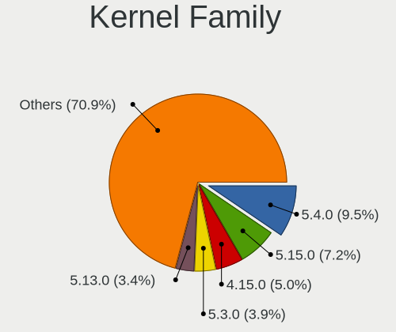

| Version | Computers | Percent |
|---------|-----------|---------|
| 5.4.0   | 48        | 15.24%  |
| 4.15.0  | 27        | 8.57%   |
| 5.3.0   | 22        | 6.98%   |
| 5.13.0  | 17        | 5.4%    |
| 5.8.0   | 15        | 4.76%   |
| 5.11.0  | 13        | 4.13%   |
| 5.0.0   | 12        | 3.81%   |
| 5.15.0  | 8         | 2.54%   |
| 5.10.14 | 7         | 2.22%   |
| 4.18.0  | 7         | 2.22%   |
| 4.9.60  | 4         | 1.27%   |
| 4.19.0  | 4         | 1.27%   |
| 5.9.16  | 3         | 0.95%   |
| 5.16.7  | 3         | 0.95%   |
| 5.10.0  | 3         | 0.95%   |
| 4.9.9   | 3         | 0.95%   |
| 4.9.41  | 3         | 0.95%   |
| 4.9.20  | 3         | 0.95%   |
| 5.9.13  | 2         | 0.63%   |
| 5.8.3   | 2         | 0.63%   |
| 5.8.18  | 2         | 0.63%   |
| 5.8.12  | 2         | 0.63%   |
| 5.8.11  | 2         | 0.63%   |
| 5.7.17  | 2         | 0.63%   |
| 5.4.70  | 2         | 0.63%   |
| 5.4.13  | 2         | 0.63%   |
| 5.18.10 | 2         | 0.63%   |
| 5.17.5  | 2         | 0.63%   |
| 5.16.16 | 2         | 0.63%   |
| 5.16.11 | 2         | 0.63%   |
| 5.15.23 | 2         | 0.63%   |
| 5.15.15 | 2         | 0.63%   |
| 5.10.7  | 2         | 0.63%   |
| 5.10.16 | 2         | 0.63%   |
| 4.9.76  | 2         | 0.63%   |
| 4.4.16  | 2         | 0.63%   |
| 4.1.34  | 2         | 0.63%   |
| 5.9.3   | 1         | 0.32%   |
| 5.9.14  | 1         | 0.32%   |
| 5.8.17  | 1         | 0.32%   |
| 5.7.8   | 1         | 0.32%   |
| 5.7.11  | 1         | 0.32%   |
| 5.6.6   | 1         | 0.32%   |
| 5.6.5   | 1         | 0.32%   |
| 5.6.13  | 1         | 0.32%   |
| 5.5.3   | 1         | 0.32%   |
| 5.4.83  | 1         | 0.32%   |
| 5.4.54  | 1         | 0.32%   |
| 5.4.50  | 1         | 0.32%   |
| 5.4.32  | 1         | 0.32%   |
| 5.4.19  | 1         | 0.32%   |
| 5.4.18  | 1         | 0.32%   |
| 5.4.1   | 1         | 0.32%   |
| 5.19.1  | 1         | 0.32%   |
| 5.18.9  | 1         | 0.32%   |
| 5.18.3  | 1         | 0.32%   |
| 5.18.11 | 1         | 0.32%   |
| 5.17.12 | 1         | 0.32%   |
| 5.17.1  | 1         | 0.32%   |
| 5.16.19 | 1         | 0.32%   |

Kernel Major Ver.
-----------------

Linux kernel major version

| Version | Computers | Percent |
|---------|-----------|---------|
| 5.4     | 57        | 18.33%  |
| 4.15    | 27        | 8.68%   |
| 5.10    | 25        | 8.04%   |
| 5.8     | 24        | 7.72%   |
| 5.3     | 22        | 7.07%   |
| 5.15    | 21        | 6.75%   |
| 5.13    | 21        | 6.75%   |
| 4.9     | 18        | 5.79%   |
| 5.11    | 16        | 5.14%   |
| 5.0     | 13        | 4.18%   |
| 5.16    | 10        | 3.22%   |
| 5.12    | 7         | 2.25%   |
| 4.18    | 7         | 2.25%   |
| 5.9     | 6         | 1.93%   |
| 5.18    | 5         | 1.61%   |
| 4.19    | 5         | 1.61%   |
| 5.7     | 4         | 1.29%   |
| 5.17    | 4         | 1.29%   |
| 4.14    | 4         | 1.29%   |
| 5.6     | 3         | 0.96%   |
| 5.14    | 3         | 0.96%   |
| 4.4     | 3         | 0.96%   |
| 4.1     | 3         | 0.96%   |
| 5.5     | 1         | 0.32%   |
| 5.19    | 1         | 0.32%   |
| 3.16    | 1         | 0.32%   |

Arch
----

OS architecture (x86_64, i586, etc.)

| Name    | Computers | Percent |
|---------|-----------|---------|
| x86_64  | 258       | 93.82%  |
| i686    | 16        | 5.82%   |
| aarch64 | 1         | 0.36%   |

DE
--

Desktop Environment

| Name            | Computers | Percent |
|-----------------|-----------|---------|
| GNOME           | 115       | 39.52%  |
| Unknown         | 36        | 12.37%  |
| KDE5            | 35        | 12.03%  |
| XFCE            | 26        | 8.93%   |
| KDE4            | 23        | 7.9%    |
| X-Cinnamon      | 15        | 5.15%   |
| KDE             | 13        | 4.47%   |
| LXQt            | 5         | 1.72%   |
| Unity           | 3         | 1.03%   |
| Pantheon        | 3         | 1.03%   |
| MATE            | 3         | 1.03%   |
| Cinnamon        | 3         | 1.03%   |
| GNOME Flashback | 2         | 0.69%   |
| Enlightenment   | 2         | 0.69%   |
| Deepin          | 2         | 0.69%   |
| awesome         | 2         | 0.69%   |
| LXDE            | 1         | 0.34%   |
| i3              | 1         | 0.34%   |
| Budgie          | 1         | 0.34%   |

Display Server
--------------

X11 or Wayland

| Name    | Computers | Percent |
|---------|-----------|---------|
| X11     | 230       | 80.14%  |
| Wayland | 34        | 11.85%  |
| Unknown | 14        | 4.88%   |
| Tty     | 9         | 3.14%   |

Display Manager
---------------

SDDM, LightDM, etc.

| Name    | Computers | Percent |
|---------|-----------|---------|
| Unknown | 141       | 49.47%  |
| GDM     | 37        | 12.98%  |
| SDDM    | 32        | 11.23%  |
| LightDM | 24        | 8.42%   |
| KDM     | 22        | 7.72%   |
| TDM     | 14        | 4.91%   |
| GDM3    | 14        | 4.91%   |
| XDM     | 1         | 0.35%   |

OS Lang
-------

Language

| Lang    | Computers | Percent |
|---------|-----------|---------|
| en_US   | 155       | 54.77%  |
| Unknown | 55        | 19.43%  |
| lt_LT   | 43        | 15.19%  |
| en_GB   | 13        | 4.59%   |
| ru_RU   | 12        | 4.24%   |
| en_AU   | 2         | 0.71%   |
| C       | 2         | 0.71%   |
| uk_UA   | 1         | 0.35%   |

Boot Mode
---------

EFI or BIOS

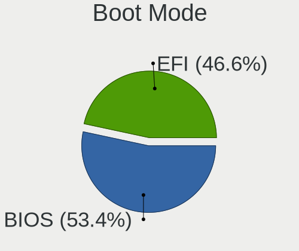

| Mode | Computers | Percent |
|------|-----------|---------|
| BIOS | 154       | 55.2%   |
| EFI  | 125       | 44.8%   |

Filesystem
----------

Type of filesystem

| Type    | Computers | Percent |
|---------|-----------|---------|
| Ext4    | 214       | 76.43%  |
| Unknown | 23        | 8.21%   |
| Btrfs   | 19        | 6.79%   |
| Overlay | 13        | 4.64%   |
| Xfs     | 8         | 2.86%   |
| Zfs     | 1         | 0.36%   |
| SAMSUNG | 1         | 0.36%   |
| ExX4    | 1         | 0.36%   |

Part. scheme
------------

Scheme of partitioning

| Type    | Computers | Percent |
|---------|-----------|---------|
| Unknown | 155       | 55.36%  |
| GPT     | 81        | 28.93%  |
| MBR     | 44        | 15.71%  |

Dual Boot with Linux/BSD
------------------------

Hosting more than one Linux/BSD

| Dual boot | Computers | Percent |
|-----------|-----------|---------|
| No        | 239       | 86.28%  |
| Yes       | 38        | 13.72%  |

Dual Boot (Win)
---------------

Hosting Linux and Windows

| Dual boot | Computers | Percent |
|-----------|-----------|---------|
| No        | 210       | 75.81%  |
| Yes       | 67        | 24.19%  |

Board
-----

Vendor
------

Motherboard manufacturer

| Name                    | Computers | Percent |
|-------------------------|-----------|---------|
| ASUSTek Computer        | 59        | 21.69%  |
| Lenovo                  | 56        | 20.59%  |
| Dell                    | 33        | 12.13%  |
| Hewlett-Packard         | 30        | 11.03%  |
| ASRock                  | 19        | 6.99%   |
| Gigabyte Technology     | 18        | 6.62%   |
| MSI                     | 16        | 5.88%   |
| Acer                    | 11        | 4.04%   |
| Intel                   | 6         | 2.21%   |
| Samsung Electronics     | 3         | 1.1%    |
| Toshiba                 | 2         | 0.74%   |
| Sony                    | 2         | 0.74%   |
| Panasonic               | 2         | 0.74%   |
| Fujitsu Siemens         | 2         | 0.74%   |
| Apple                   | 2         | 0.74%   |
| Timi                    | 1         | 0.37%   |
| Raspberry Pi Foundation | 1         | 0.37%   |
| Prestigio               | 1         | 0.37%   |
| Packard Bell            | 1         | 0.37%   |
| Jumper                  | 1         | 0.37%   |
| HUAWEI                  | 1         | 0.37%   |
| Fujitsu                 | 1         | 0.37%   |
| eMachines               | 1         | 0.37%   |
| AMI                     | 1         | 0.37%   |
| Alienware               | 1         | 0.37%   |
| Unknown                 | 1         | 0.37%   |

Model
-----

Motherboard model

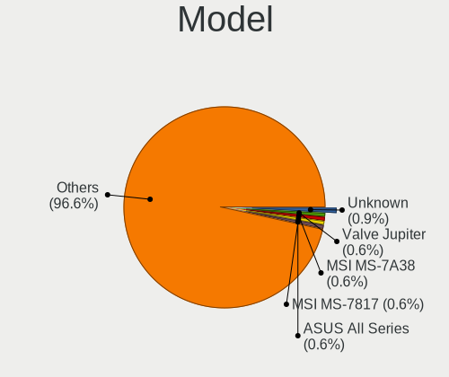

| Name                                                  | Computers | Percent |
|-------------------------------------------------------|-----------|---------|
| MSI MS-7A38                                           | 3         | 1.1%    |
| MSI MS-7C82                                           | 2         | 0.74%   |
| MSI MS-7823                                           | 2         | 0.74%   |
| MSI MS-7817                                           | 2         | 0.74%   |
| Lenovo ThinkPad T490 20N3000KMH                       | 2         | 0.74%   |
| Lenovo S40-40 F0AX00EAPB                              | 2         | 0.74%   |
| Lenovo IdeaPad Y700-15ISK 80NV                        | 2         | 0.74%   |
| Lenovo G550 20023                                     | 2         | 0.74%   |
| HP EliteBook 8460p                                    | 2         | 0.74%   |
| ASUS PRIME Z390-A                                     | 2         | 0.74%   |
| ASUS PRIME B450M-A                                    | 2         | 0.74%   |
| ASUS K53E                                             | 2         | 0.74%   |
| ASUS All Series                                       | 2         | 0.74%   |
| Toshiba Satellite L855                                | 1         | 0.37%   |
| Toshiba Satellite C50D-A-13G                          | 1         | 0.37%   |
| Timi TM1701                                           | 1         | 0.37%   |
| Sony VPCZ1390S                                        | 1         | 0.37%   |
| Sony VGN-C260E                                        | 1         | 0.37%   |
| Samsung RC530/RC730                                   | 1         | 0.37%   |
| Samsung 530U3C/530U4C/532U3C                          | 1         | 0.37%   |
| Samsung 300E5EV/300E4EV/270E5EV/270E4EV/2470EV/2470EE | 1         | 0.37%   |
| RPi Raspberry Pi 4 Model B Rev 1.1                    | 1         | 0.37%   |
| Prestigio PSB141C02                                   | 1         | 0.37%   |
| Panasonic CF-52WEBBYDE                                | 1         | 0.37%   |
| Panasonic CF-52VDA131M                                | 1         | 0.37%   |
| Packard Bell EasyNote TE11HC                          | 1         | 0.37%   |
| MSI MS-7C35                                           | 1         | 0.37%   |
| MSI MS-7B89                                           | 1         | 0.37%   |
| MSI MS-7A71                                           | 1         | 0.37%   |
| MSI MS-7A34                                           | 1         | 0.37%   |
| MSI MS-7977                                           | 1         | 0.37%   |
| MSI MS-7788                                           | 1         | 0.37%   |
| MSI MS-16F1                                           | 1         | 0.37%   |
| Lenovo Yoga Creator 7 15IMH05 82DS                    | 1         | 0.37%   |
| Lenovo Yoga 510-14ISK 80S7                            | 1         | 0.37%   |
| Lenovo Y50-70 20378                                   | 1         | 0.37%   |
| Lenovo V130-15IGM 81HL                                | 1         | 0.37%   |
| Lenovo ThinkPad X230 2325AEG                          | 1         | 0.37%   |
| Lenovo ThinkPad X1 Nano Gen 1 20UN0060MH              | 1         | 0.37%   |
| Lenovo ThinkPad X1 Carbon 6th 20KH006KPB              | 1         | 0.37%   |
| Lenovo ThinkPad X1 Carbon 6th 20KGS03800              | 1         | 0.37%   |
| Lenovo ThinkPad W530 243852U                          | 1         | 0.37%   |
| Lenovo ThinkPad T60 1951FDG                           | 1         | 0.37%   |
| Lenovo ThinkPad T590 20N4004EMH                       | 1         | 0.37%   |
| Lenovo ThinkPad T500 2241W8Q                          | 1         | 0.37%   |
| Lenovo ThinkPad T480 20L50002MH                       | 1         | 0.37%   |
| Lenovo ThinkPad T460s 20F90058MH                      | 1         | 0.37%   |
| Lenovo ThinkPad T440p 20AWS4XN00                      | 1         | 0.37%   |
| Lenovo ThinkPad T430s 2356LNG                         | 1         | 0.37%   |
| Lenovo ThinkPad T430 2347EV8                          | 1         | 0.37%   |
| Lenovo ThinkPad T15 Gen 1 20S6005HMH                  | 1         | 0.37%   |
| Lenovo ThinkPad S1 Yoga 12 20DK002EMH                 | 1         | 0.37%   |
| Lenovo ThinkPad R500 27327KG                          | 1         | 0.37%   |
| Lenovo ThinkPad P53 20QN0034MH                        | 1         | 0.37%   |
| Lenovo ThinkPad P15 Gen 1 20STS19600                  | 1         | 0.37%   |
| Lenovo ThinkPad P14s Gen 2a 21A0000CMH                | 1         | 0.37%   |
| Lenovo ThinkPad P1 Gen 3 20TH001EMH                   | 1         | 0.37%   |
| Lenovo ThinkPad L580 20LW0010GE                       | 1         | 0.37%   |
| Lenovo ThinkPad L460 20FU0007MH                       | 1         | 0.37%   |
| Lenovo ThinkPad L440 20ASS10F00                       | 1         | 0.37%   |

Model Family
------------

Motherboard model prefix

| Name                   | Computers | Percent |
|------------------------|-----------|---------|
| Lenovo ThinkPad        | 34        | 12.5%   |
| Dell Inspiron          | 11        | 4.04%   |
| HP ProBook             | 10        | 3.68%   |
| ASUS PRIME             | 10        | 3.68%   |
| Lenovo IdeaPad         | 7         | 2.57%   |
| Dell Latitude          | 7         | 2.57%   |
| Acer Aspire            | 7         | 2.57%   |
| HP EliteBook           | 5         | 1.84%   |
| HP Compaq              | 5         | 1.84%   |
| ASUS TUF               | 5         | 1.84%   |
| Dell XPS               | 4         | 1.47%   |
| ASUS VivoBook          | 4         | 1.47%   |
| MSI MS-7A38            | 3         | 1.1%    |
| Gigabyte X570          | 3         | 1.1%    |
| Dell Vostro            | 3         | 1.1%    |
| Dell OptiPlex          | 3         | 1.1%    |
| Toshiba Satellite      | 2         | 0.74%   |
| MSI MS-7C82            | 2         | 0.74%   |
| MSI MS-7823            | 2         | 0.74%   |
| MSI MS-7817            | 2         | 0.74%   |
| Lenovo Yoga            | 2         | 0.74%   |
| Lenovo S40-40          | 2         | 0.74%   |
| Lenovo Legion          | 2         | 0.74%   |
| Lenovo G550            | 2         | 0.74%   |
| HP Pavilion            | 2         | 0.74%   |
| HP Laptop              | 2         | 0.74%   |
| HP ENVY                | 2         | 0.74%   |
| Dell Precision         | 2         | 0.74%   |
| ASUS ZenBook           | 2         | 0.74%   |
| ASUS ROG               | 2         | 0.74%   |
| ASUS K53E              | 2         | 0.74%   |
| ASUS All               | 2         | 0.74%   |
| ASRock B450            | 2         | 0.74%   |
| Timi TM1701            | 1         | 0.37%   |
| Sony VPCZ1390S         | 1         | 0.37%   |
| Sony VGN-C260E         | 1         | 0.37%   |
| Samsung RC530          | 1         | 0.37%   |
| Samsung 530U3C         | 1         | 0.37%   |
| Samsung 300E5EV        | 1         | 0.37%   |
| RPi Raspberry          | 1         | 0.37%   |
| Prestigio PSB141C02    | 1         | 0.37%   |
| Panasonic CF-52WEBBYDE | 1         | 0.37%   |
| Panasonic CF-52VDA131M | 1         | 0.37%   |
| Packard Bell EasyNote  | 1         | 0.37%   |
| MSI MS-7C35            | 1         | 0.37%   |
| MSI MS-7B89            | 1         | 0.37%   |
| MSI MS-7A71            | 1         | 0.37%   |
| MSI MS-7A34            | 1         | 0.37%   |
| MSI MS-7977            | 1         | 0.37%   |
| MSI MS-7788            | 1         | 0.37%   |
| MSI MS-16F1            | 1         | 0.37%   |
| Lenovo Y50-70          | 1         | 0.37%   |
| Lenovo V130-15IGM      | 1         | 0.37%   |
| Lenovo MIIX            | 1         | 0.37%   |
| Lenovo G505s           | 1         | 0.37%   |
| Lenovo G500            | 1         | 0.37%   |
| Lenovo Flex            | 1         | 0.37%   |
| Lenovo B50-10          | 1         | 0.37%   |
| Jumper EZbook          | 1         | 0.37%   |
| Intel DP55WB           | 1         | 0.37%   |

MFG Year
--------

Motherboard manufacture year

| Year    | Computers | Percent |
|---------|-----------|---------|
| 2018    | 36        | 13.24%  |
| 2019    | 24        | 8.82%   |
| 2013    | 24        | 8.82%   |
| 2012    | 21        | 7.72%   |
| 2011    | 21        | 7.72%   |
| 2020    | 19        | 6.99%   |
| 2017    | 18        | 6.62%   |
| 2015    | 17        | 6.25%   |
| 2014    | 16        | 5.88%   |
| 2010    | 14        | 5.15%   |
| 2009    | 14        | 5.15%   |
| 2016    | 11        | 4.04%   |
| 2021    | 10        | 3.68%   |
| 2008    | 10        | 3.68%   |
| 2006    | 7         | 2.57%   |
| 2007    | 6         | 2.21%   |
| 2022    | 1         | 0.37%   |
| 2005    | 1         | 0.37%   |
| 2004    | 1         | 0.37%   |
| Unknown | 1         | 0.37%   |

Form Factor
-----------

Physical design of the computer

| Name           | Computers | Percent |
|----------------|-----------|---------|
| Notebook       | 162       | 59.56%  |
| Desktop        | 97        | 35.66%  |
| All in one     | 5         | 1.84%   |
| Convertible    | 3         | 1.1%    |
| Server         | 2         | 0.74%   |
| System on chip | 1         | 0.37%   |
| Tablet         | 1         | 0.37%   |
| Mini pc        | 1         | 0.37%   |

Secure Boot
-----------

Enabled or disabled

| State    | Computers | Percent |
|----------|-----------|---------|
| Disabled | 255       | 92.73%  |
| Enabled  | 20        | 7.27%   |

Coreboot
--------

Have coreboot on board

| Used | Computers | Percent |
|------|-----------|---------|
| No   | 272       | 100%    |

RAM Size
--------

Total RAM memory

| Size in GB  | Computers | Percent |
|-------------|-----------|---------|
| 16.01-24.0  | 70        | 25.27%  |
| 3.01-4.0    | 61        | 22.02%  |
| 4.01-8.0    | 53        | 19.13%  |
| 8.01-16.0   | 45        | 16.25%  |
| 32.01-64.0  | 20        | 7.22%   |
| 1.01-2.0    | 12        | 4.33%   |
| 64.01-256.0 | 6         | 2.17%   |
| 2.01-3.0    | 5         | 1.81%   |
| 24.01-32.0  | 3         | 1.08%   |
| 0.51-1.0    | 2         | 0.72%   |

RAM Used
--------

Used RAM memory

| Used GB    | Computers | Percent |
|------------|-----------|---------|
| 1.01-2.0   | 97        | 30.7%   |
| 2.01-3.0   | 84        | 26.58%  |
| 4.01-8.0   | 50        | 15.82%  |
| 3.01-4.0   | 35        | 11.08%  |
| 0.51-1.0   | 28        | 8.86%   |
| 8.01-16.0  | 17        | 5.38%   |
| 16.01-24.0 | 2         | 0.63%   |
| 0.01-0.5   | 2         | 0.63%   |
| 24.01-32.0 | 1         | 0.32%   |

Total Drives
------------

Number of drives on board

| Drives  | Computers | Percent |
|---------|-----------|---------|
| 1       | 173       | 61.35%  |
| 2       | 74        | 26.24%  |
| 3       | 22        | 7.8%    |
| 4       | 7         | 2.48%   |
| 5       | 5         | 1.77%   |
| Unknown | 1         | 0.35%   |

Has CD-ROM
----------

Has CD-ROM on board

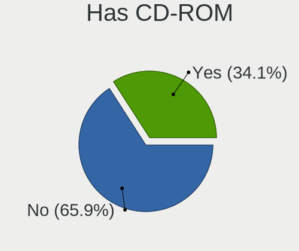

| Presented | Computers | Percent |
|-----------|-----------|---------|
| No        | 168       | 60.43%  |
| Yes       | 110       | 39.57%  |

Has Ethernet
------------

Has Ethernet on board

| Presented | Computers | Percent |
|-----------|-----------|---------|
| Yes       | 247       | 90.48%  |
| No        | 26        | 9.52%   |

Has WiFi
--------

Has WiFi module

| Presented | Computers | Percent |
|-----------|-----------|---------|
| Yes       | 198       | 72.26%  |
| No        | 76        | 27.74%  |

Has Bluetooth
-------------

Has Bluetooth module

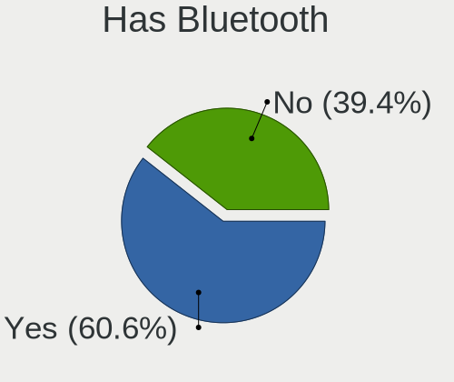

| Presented | Computers | Percent |
|-----------|-----------|---------|
| Yes       | 151       | 54.32%  |
| No        | 127       | 45.68%  |

Location
--------

Country
-------

Geographic location (country)

| Country   | Computers | Percent |
|-----------|-----------|---------|
| Lithuania | 272       | 100%    |

City
----

Geographic location (city)

| City         | Computers | Percent |
|--------------|-----------|---------|
| Vilnius      | 141       | 49.47%  |
| Kaunas       | 47        | 16.49%  |
| iauliai    | 17        | 5.96%   |
| Klaipda    | 15        | 5.26%   |
| Maeikiai   | 6         | 2.11%   |
| Alytus       | 6         | 2.11%   |
| Panevezys    | 5         | 1.75%   |
| Gargdai    | 4         | 1.4%    |
| Teliai     | 3         | 1.05%   |
| ilal     | 3         | 1.05%   |
| Kdainiai   | 3         | 1.05%   |
| Jonava       | 3         | 1.05%   |
| Visaginas    | 2         | 0.7%    |
| Ukmerge      | 2         | 0.7%    |
| Taurag     | 2         | 0.7%    |
| Palanga      | 2         | 0.7%    |
| Marijampol | 2         | 0.7%    |
| Elektrnai  | 2         | 0.7%    |
| Anykiai  | 2         | 0.7%    |
| elva       | 1         | 0.35%   |
| Vaiiai | 1         | 0.35%   |
| Vainutas     | 1         | 0.35%   |
| Trakai       | 1         | 0.35%   |
| Serdokai     | 1         | 0.35%   |
| eduva      | 1         | 0.35%   |
| Rokikis    | 1         | 0.35%   |
| Raseiniai    | 1         | 0.35%   |
| Plung      | 1         | 0.35%   |
| Pasvalys     | 1         | 0.35%   |
| Nemenin  | 1         | 0.35%   |
| Moltai     | 1         | 0.35%   |
| Mauruciai    | 1         | 0.35%   |
| Maneikiai    | 1         | 0.35%   |
| Lentvaris    | 1         | 0.35%   |
| Karkliniai   | 1         | 0.35%   |
| Druskininkai | 1         | 0.35%   |
| Drasuciai    | 1         | 0.35%   |

Drives
------

Drive Vendor
------------

Hard drive vendors

| Vendor              | Computers | Drives | Percent |
|---------------------|-----------|--------|---------|
| Samsung Electronics | 71        | 113    | 17.75%  |
| WDC                 | 54        | 74     | 13.5%   |
| Seagate             | 50        | 69     | 12.5%   |
| Kingston            | 33        | 47     | 8.25%   |
| Toshiba             | 30        | 39     | 7.5%    |
| A-DATA Technology   | 24        | 26     | 6%      |
| SanDisk             | 16        | 17     | 4%      |
| Crucial             | 15        | 18     | 3.75%   |
| Intel               | 14        | 16     | 3.5%    |
| Hitachi             | 14        | 21     | 3.5%    |
| Patriot             | 11        | 12     | 2.75%   |
| Unknown             | 7         | 17     | 1.75%   |
| SK hynix            | 7         | 7      | 1.75%   |
| HGST                | 5         | 6      | 1.25%   |
| China               | 5         | 7      | 1.25%   |
| Micron Technology   | 3         | 3      | 0.75%   |
| GOODRAM             | 3         | 3      | 0.75%   |
| Apacer              | 3         | 5      | 0.75%   |
| Transcend           | 2         | 2      | 0.5%    |
| OCZ                 | 2         | 3      | 0.5%    |
| KingSpec            | 2         | 2      | 0.5%    |
| JMicron Technology  | 2         | 2      | 0.5%    |
| Hewlett-Packard     | 2         | 4      | 0.5%    |
| FORESEE             | 2         | 2      | 0.5%    |
| ASMT                | 2         | 2      | 0.5%    |
| XrayDisk            | 1         | 1      | 0.25%   |
| XPG                 | 1         | 1      | 0.25%   |
| Union Memory        | 1         | 1      | 0.25%   |
| Team                | 1         | 1      | 0.25%   |
| StoreJet            | 1         | 1      | 0.25%   |
| PNY                 | 1         | 1      | 0.25%   |
| Plextor             | 1         | 1      | 0.25%   |
| Phison Electronics  | 1         | 2      | 0.25%   |
| Phison              | 1         | 1      | 0.25%   |
| Netac               | 1         | 1      | 0.25%   |
| LITEONIT            | 1         | 1      | 0.25%   |
| LITEON              | 1         | 2      | 0.25%   |
| Leven               | 1         | 3      | 0.25%   |
| Intenso             | 1         | 2      | 0.25%   |
| Gigabyte Technology | 1         | 1      | 0.25%   |
| Fujitsu             | 1         | 1      | 0.25%   |
| ExcelStor           | 1         | 1      | 0.25%   |
| Dahua               | 1         | 1      | 0.25%   |
| Corsair             | 1         | 1      | 0.25%   |
| Colorful            | 1         | 1      | 0.25%   |
| Apple               | 1         | 2      | 0.25%   |

Drive Model
-----------

Hard drive models

| Model                                 | Computers | Percent |
|---------------------------------------|-----------|---------|
| Kingston SV300S37A120G 120GB SSD      | 7         | 1.64%   |
| Seagate ST500DM002-1BD142 500GB       | 6         | 1.41%   |
| Samsung SSD 850 EVO 250GB             | 6         | 1.41%   |
| Seagate ST1000LM024 HN-M101MBB 1TB    | 5         | 1.17%   |
| SanDisk NVMe SSD Drive 256GB          | 5         | 1.17%   |
| Samsung SSD 860 EVO 250GB             | 5         | 1.17%   |
| Kingston SA400S37120G 120GB SSD       | 5         | 1.17%   |
| Intel NVMe SSD Drive 512GB            | 5         | 1.17%   |
| WDC WD20EFRX-68EUZN0 2TB              | 4         | 0.94%   |
| Seagate ST9500325AS 500GB             | 4         | 0.94%   |
| Kingston SA400S37480G 480GB SSD       | 4         | 0.94%   |
| Kingston SA400S37240G 240GB SSD       | 4         | 0.94%   |
| A-DATA SU650 120GB SSD                | 4         | 0.94%   |
| Unknown MMC Card  128GB               | 3         | 0.7%    |
| Toshiba MQ01ABD100 1TB                | 3         | 0.7%    |
| Seagate ST500LT012-1DG142 500GB       | 3         | 0.7%    |
| Seagate ST1000LM035-1RK172 1TB        | 3         | 0.7%    |
| Samsung SSD 860 EVO 500GB             | 3         | 0.7%    |
| Samsung SSD 850 EVO 500GB             | 3         | 0.7%    |
| Samsung NVMe SSD Drive 500GB          | 3         | 0.7%    |
| Samsung NVMe SSD Drive 256GB          | 3         | 0.7%    |
| Samsung NVMe SSD Drive 1TB            | 3         | 0.7%    |
| Samsung HD501LJ 500GB                 | 3         | 0.7%    |
| Patriot Burst 480GB SSD               | 3         | 0.7%    |
| GOODRAM SSD 120GB                     | 3         | 0.7%    |
| Crucial CT500MX500SSD1 500GB          | 3         | 0.7%    |
| A-DATA SX900 128GB SSD                | 3         | 0.7%    |
| WDC WD800AAJS-60PSA0 80GB             | 2         | 0.47%   |
| WDC WD5000AAKX-08U6AA0 500GB          | 2         | 0.47%   |
| WDC WD10EZEX-00BN5A0 1TB              | 2         | 0.47%   |
| Toshiba NVMe SSD Drive 512GB          | 2         | 0.47%   |
| Toshiba MQ01ABF050 500GB              | 2         | 0.47%   |
| Toshiba MK3261GSYN 320GB              | 2         | 0.47%   |
| Toshiba KBG30ZMS128G 128GB NVMe SSD   | 2         | 0.47%   |
| Toshiba HDWL110 1TB                   | 2         | 0.47%   |
| Toshiba HDWE140 4TB                   | 2         | 0.47%   |
| Toshiba DT01ACA100 1TB                | 2         | 0.47%   |
| SK hynix HFS256G39TND-N210A 256GB SSD | 2         | 0.47%   |
| Seagate ST9160821AS 160GB             | 2         | 0.47%   |
| Seagate ST750LM022 HN-M750MBB 752GB   | 2         | 0.47%   |
| Seagate ST3500418AS 500GB             | 2         | 0.47%   |
| Seagate ST1000DM010-2EP102 1TB        | 2         | 0.47%   |
| SanDisk X400 M.2 2280 256GB SSD       | 2         | 0.47%   |
| SanDisk NVMe SSD Drive 500GB          | 2         | 0.47%   |
| Samsung SSD 970 EVO 500GB             | 2         | 0.47%   |
| Samsung SSD 870 EVO 250GB             | 2         | 0.47%   |
| Samsung SSD 860 EVO 1TB               | 2         | 0.47%   |
| Samsung MZVLB1T0HBLR-000L7 1TB        | 2         | 0.47%   |
| Patriot Burst 240GB SSD               | 2         | 0.47%   |
| Patriot Burst 120GB SSD               | 2         | 0.47%   |
| Kingston SUV400S37240G 240GB SSD      | 2         | 0.47%   |
| Kingston SHFS37A120G 120GB SSD        | 2         | 0.47%   |
| Intel NVMe SSD Drive 32GB             | 2         | 0.47%   |
| Intel NVMe SSD Drive 256GB            | 2         | 0.47%   |
| Hitachi HTS547575A9E384 752GB         | 2         | 0.47%   |
| Hitachi HTS545025B9A300 250GB         | 2         | 0.47%   |
| Hitachi HDS721050CLA362 500GB         | 2         | 0.47%   |
| FORESEE 64GB SSD                      | 2         | 0.47%   |
| Crucial CT480BX500SSD1 480GB          | 2         | 0.47%   |
| Crucial CT120BX500SSD1 120GB          | 2         | 0.47%   |

HDD Vendor
----------

Hard disk drive vendors

| Vendor              | Computers | Drives | Percent |
|---------------------|-----------|--------|---------|
| Seagate             | 50        | 69     | 33.56%  |
| WDC                 | 44        | 61     | 29.53%  |
| Toshiba             | 19        | 24     | 12.75%  |
| Hitachi             | 14        | 21     | 9.4%    |
| Samsung Electronics | 12        | 22     | 8.05%   |
| HGST                | 5         | 6      | 3.36%   |
| Unknown             | 1         | 1      | 0.67%   |
| Fujitsu             | 1         | 1      | 0.67%   |
| ExcelStor           | 1         | 1      | 0.67%   |
| ASMT                | 1         | 1      | 0.67%   |
| Apple               | 1         | 2      | 0.67%   |

SSD Vendor
----------

Solid state drive vendors

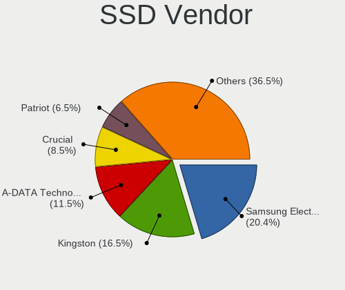

| Vendor              | Computers | Drives | Percent |
|---------------------|-----------|--------|---------|
| Samsung Electronics | 36        | 55     | 21.56%  |
| Kingston            | 30        | 43     | 17.96%  |
| A-DATA Technology   | 20        | 22     | 11.98%  |
| Crucial             | 13        | 15     | 7.78%   |
| Patriot             | 11        | 12     | 6.59%   |
| SanDisk             | 6         | 7      | 3.59%   |
| China               | 5         | 7      | 2.99%   |
| Toshiba             | 4         | 6      | 2.4%    |
| Intel               | 4         | 4      | 2.4%    |
| SK hynix            | 3         | 3      | 1.8%    |
| GOODRAM             | 3         | 3      | 1.8%    |
| Apacer              | 3         | 5      | 1.8%    |
| WDC                 | 2         | 5      | 1.2%    |
| Transcend           | 2         | 2      | 1.2%    |
| OCZ                 | 2         | 3      | 1.2%    |
| KingSpec            | 2         | 2      | 1.2%    |
| Hewlett-Packard     | 2         | 4      | 1.2%    |
| FORESEE             | 2         | 2      | 1.2%    |
| XrayDisk            | 1         | 1      | 0.6%    |
| Unknown             | 1         | 1      | 0.6%    |
| Team                | 1         | 1      | 0.6%    |
| StoreJet            | 1         | 1      | 0.6%    |
| PNY                 | 1         | 1      | 0.6%    |
| Plextor             | 1         | 1      | 0.6%    |
| Netac               | 1         | 1      | 0.6%    |
| LITEONIT            | 1         | 1      | 0.6%    |
| LITEON              | 1         | 2      | 0.6%    |
| Leven               | 1         | 3      | 0.6%    |
| JMicron Technology  | 1         | 1      | 0.6%    |
| Intenso             | 1         | 2      | 0.6%    |
| Gigabyte Technology | 1         | 1      | 0.6%    |
| Dahua               | 1         | 1      | 0.6%    |
| Corsair             | 1         | 1      | 0.6%    |
| Colorful            | 1         | 1      | 0.6%    |
| ASMT                | 1         | 1      | 0.6%    |

Drive Kind
----------

HDD or SSD

| Kind    | Computers | Drives | Percent |
|---------|-----------|--------|---------|
| SSD     | 145       | 221    | 40.17%  |
| HDD     | 133       | 209    | 36.84%  |
| NVMe    | 75        | 95     | 20.78%  |
| MMC     | 6         | 17     | 1.66%   |
| Unknown | 2         | 2      | 0.55%   |

Drive Connector
---------------

SATA, SAS, NVMe, etc.

| Type | Computers | Drives | Percent |
|------|-----------|--------|---------|
| SATA | 217       | 414    | 69.33%  |
| NVMe | 75        | 95     | 23.96%  |
| SAS  | 15        | 18     | 4.79%   |
| MMC  | 6         | 17     | 1.92%   |

Drive Size
----------

Size of hard drive

| Size in TB | Computers | Drives | Percent |
|------------|-----------|--------|---------|
| 0.01-0.5   | 191       | 323    | 69.2%   |
| 0.51-1.0   | 67        | 86     | 24.28%  |
| 1.01-2.0   | 10        | 12     | 3.62%   |
| 3.01-4.0   | 4         | 4      | 1.45%   |
| 2.01-3.0   | 2         | 3      | 0.72%   |
| 4.01-10.0  | 2         | 2      | 0.72%   |

Space Total
-----------

Amount of disk space available on the file system

| Size in GB     | Computers | Percent |
|----------------|-----------|---------|
| 101-250        | 95        | 31.67%  |
| 251-500        | 73        | 24.33%  |
| 501-1000       | 38        | 12.67%  |
| 1001-2000      | 19        | 6.33%   |
| 1-20           | 19        | 6.33%   |
| 51-100         | 18        | 6%      |
| 21-50          | 15        | 5%      |
| More than 3000 | 8         | 2.67%   |
| Unknown        | 8         | 2.67%   |
| 2001-3000      | 7         | 2.33%   |

Space Used
----------

Amount of used disk space

| Used GB        | Computers | Percent |
|----------------|-----------|---------|
| 1-20           | 123       | 39.55%  |
| 51-100         | 44        | 14.15%  |
| 101-250        | 41        | 13.18%  |
| 21-50          | 36        | 11.58%  |
| 251-500        | 29        | 9.32%   |
| 501-1000       | 12        | 3.86%   |
| 1001-2000      | 11        | 3.54%   |
| Unknown        | 8         | 2.57%   |
| More than 3000 | 6         | 1.93%   |
| 2001-3000      | 1         | 0.32%   |

Malfunc. Drives
---------------

Drive models with a malfunction

| Model                                    | Computers | Drives | Percent |
|------------------------------------------|-----------|--------|---------|
| WDC WD800AAJS-60PSA0 80GB                | 2         | 2      | 5.56%   |
| WDC WD20EFRX-68EUZN0 2TB                 | 2         | 3      | 5.56%   |
| Toshiba MK3261GSYN 320GB                 | 2         | 2      | 5.56%   |
| WDC WD7500BPVX-60JC3T0 752GB             | 1         | 1      | 2.78%   |
| WDC WD6400BPVT-80HXZT1 640GB             | 1         | 1      | 2.78%   |
| WDC WD6400BPVT-22HXZT1 640GB             | 1         | 1      | 2.78%   |
| WDC WD5000AAKX-001CA0 500GB              | 1         | 1      | 2.78%   |
| Toshiba MQ01ABD100 1TB                   | 1         | 1      | 2.78%   |
| Toshiba MK1652GSX 160GB                  | 1         | 1      | 2.78%   |
| SK hynix HFS256G39TND-N210A 256GB SSD    | 1         | 1      | 2.78%   |
| SK hynix BC711 HFM512GD3JX013N 512GB     | 1         | 1      | 2.78%   |
| Seagate ST9640320AS 640GB                | 1         | 2      | 2.78%   |
| Seagate ST9500325AS 500GB                | 1         | 1      | 2.78%   |
| Seagate ST500LX012-SSHD-8GB              | 1         | 1      | 2.78%   |
| Seagate ST3250410AS 250GB                | 1         | 1      | 2.78%   |
| Samsung Electronics SSD 850 EVO 250GB    | 1         | 1      | 2.78%   |
| Samsung Electronics SSD 840 Series 500GB | 1         | 2      | 2.78%   |
| Samsung Electronics HM641JI 640GB        | 1         | 1      | 2.78%   |
| Samsung Electronics HD501LJ 500GB        | 1         | 1      | 2.78%   |
| Samsung Electronics HD103SJ 1TB          | 1         | 1      | 2.78%   |
| Samsung Electronics HD080HJ 80GB         | 1         | 4      | 2.78%   |
| Leven JAJS300M240C 240GB                 | 1         | 3      | 2.78%   |
| Kingston SV300S37A120G 120GB SSD         | 1         | 1      | 2.78%   |
| Hitachi HTS547575A9E384 752GB            | 1         | 1      | 2.78%   |
| Hitachi HTS545050KTA300 500GB            | 1         | 1      | 2.78%   |
| Hitachi HTS545032B9A300 320GB            | 1         | 1      | 2.78%   |
| Hitachi HTS545025B9A300 250GB            | 1         | 1      | 2.78%   |
| HGST HTS725050A7E630 500GB               | 1         | 1      | 2.78%   |
| HGST HTS541010A9E680 1TB                 | 1         | 2      | 2.78%   |
| ExcelStor Technology J8160S 164GB        | 1         | 1      | 2.78%   |
| Crucial CT525MX300SSD1 528GB             | 1         | 1      | 2.78%   |
| Colorful SL300 120GB SSD                 | 1         | 1      | 2.78%   |
| A-DATA Technology SX900 128GB SSD        | 1         | 1      | 2.78%   |

Malfunc. Drive Vendor
---------------------

Vendors of faulty drives

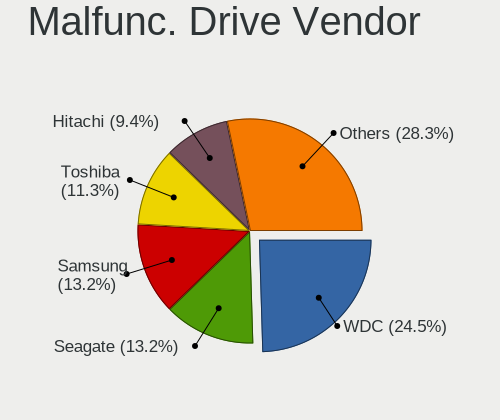

| Vendor              | Computers | Drives | Percent |
|---------------------|-----------|--------|---------|
| WDC                 | 8         | 9      | 22.86%  |
| Samsung Electronics | 6         | 10     | 17.14%  |
| Seagate             | 4         | 5      | 11.43%  |
| Hitachi             | 4         | 4      | 11.43%  |
| Toshiba             | 3         | 4      | 8.57%   |
| SK hynix            | 2         | 2      | 5.71%   |
| HGST                | 2         | 3      | 5.71%   |
| Leven               | 1         | 3      | 2.86%   |
| Kingston            | 1         | 1      | 2.86%   |
| ExcelStor           | 1         | 1      | 2.86%   |
| Crucial             | 1         | 1      | 2.86%   |
| Colorful            | 1         | 1      | 2.86%   |
| A-DATA Technology   | 1         | 1      | 2.86%   |

Malfunc. HDD Vendor
-------------------

Vendors of faulty HDD drives

| Vendor              | Computers | Drives | Percent |
|---------------------|-----------|--------|---------|
| WDC                 | 8         | 9      | 30.77%  |
| Seagate             | 4         | 5      | 15.38%  |
| Samsung Electronics | 4         | 7      | 15.38%  |
| Hitachi             | 4         | 4      | 15.38%  |
| Toshiba             | 3         | 4      | 11.54%  |
| HGST                | 2         | 3      | 7.69%   |
| ExcelStor           | 1         | 1      | 3.85%   |

Malfunc. Drive Kind
-------------------

Kinds of faulty drives

| Kind | Computers | Drives | Percent |
|------|-----------|--------|---------|
| HDD  | 22        | 33     | 70.97%  |
| SSD  | 8         | 11     | 25.81%  |
| NVMe | 1         | 1      | 3.23%   |

Failed Drives
-------------

Failed drive models

| Model                       | Computers | Drives | Percent |
|-----------------------------|-----------|--------|---------|
| Seagate ST3160812A 160GB    | 1         | 2      | 50%     |
| Hitachi HTS541010A9E680 1TB | 1         | 1      | 50%     |

Failed Drive Vendor
-------------------

Failed drive vendors

| Vendor  | Computers | Drives | Percent |
|---------|-----------|--------|---------|
| Seagate | 1         | 2      | 50%     |
| Hitachi | 1         | 1      | 50%     |

Drive Status
------------

Number of failed and malfunc. drives

| Status   | Computers | Drives | Percent |
|----------|-----------|--------|---------|
| Detected | 165       | 309    | 55.18%  |
| Works    | 102       | 187    | 34.11%  |
| Malfunc  | 30        | 45     | 10.03%  |
| Failed   | 2         | 3      | 0.67%   |

Storage controller
------------------

Storage Vendor
--------------

Storage controller vendors

| Vendor                           | Computers | Percent |
|----------------------------------|-----------|---------|
| Intel                            | 193       | 58.66%  |
| AMD                              | 49        | 14.89%  |
| Samsung Electronics              | 27        | 8.21%   |
| SanDisk                          | 14        | 4.26%   |
| Toshiba America Info Systems     | 7         | 2.13%   |
| ASMedia Technology               | 6         | 1.82%   |
| SK hynix                         | 4         | 1.22%   |
| Nvidia                           | 4         | 1.22%   |
| Micron Technology                | 3         | 0.91%   |
| Marvell Technology Group         | 3         | 0.91%   |
| Kingston Technology Company      | 3         | 0.91%   |
| JMicron Technology               | 3         | 0.91%   |
| ADATA Technology                 | 3         | 0.91%   |
| Realtek Semiconductor            | 2         | 0.61%   |
| Phison Electronics               | 2         | 0.61%   |
| Micron/Crucial Technology        | 2         | 0.61%   |
| Union Memory (Shenzhen)          | 1         | 0.3%    |
| Silicon Integrated Systems [SiS] | 1         | 0.3%    |
| OCZ Technology Group             | 1         | 0.3%    |
| Broadcom / LSI                   | 1         | 0.3%    |

Storage Model
-------------

Storage controller models

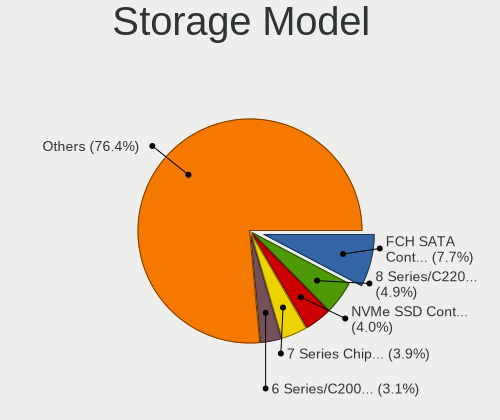

| Model                                                                          | Computers | Percent |
|--------------------------------------------------------------------------------|-----------|---------|
| AMD FCH SATA Controller [AHCI mode]                                            | 31        | 7.89%   |
| Intel 8 Series/C220 Series Chipset Family 6-port SATA Controller 1 [AHCI mode] | 21        | 5.34%   |
| Intel 7 Series Chipset Family 6-port SATA Controller [AHCI mode]               | 19        | 4.83%   |
| Samsung NVMe SSD Controller SM981/PM981/PM983                                  | 18        | 4.58%   |
| Intel 6 Series/C200 Series Chipset Family 6 port Mobile SATA AHCI Controller   | 15        | 3.82%   |
| AMD 400 Series Chipset SATA Controller                                         | 11        | 2.8%    |
| Intel Sunrise Point-LP SATA Controller [AHCI mode]                             | 10        | 2.54%   |
| Intel 82801 Mobile SATA Controller [RAID mode]                                 | 9         | 2.29%   |
| Intel 82801G (ICH7 Family) IDE Controller                                      | 8         | 2.04%   |
| Intel NM10/ICH7 Family SATA Controller [IDE mode]                              | 7         | 1.78%   |
| Intel 8 Series SATA Controller 1 [AHCI mode]                                   | 7         | 1.78%   |
| Intel 6 Series/C200 Series Chipset Family 6 port Desktop SATA AHCI Controller  | 7         | 1.78%   |
| AMD SB7x0/SB8x0/SB9x0 SATA Controller [AHCI mode]                              | 7         | 1.78%   |
| Intel Cannon Lake Mobile PCH SATA AHCI Controller                              | 6         | 1.53%   |
| Intel 82801IBM/IEM (ICH9M/ICH9M-E) 4 port SATA Controller [AHCI mode]          | 6         | 1.53%   |
| SanDisk WD Blue SN550 NVMe SSD                                                 | 5         | 1.27%   |
| Samsung NVMe SSD Controller 980                                                | 5         | 1.27%   |
| Intel Q170/Q150/B150/H170/H110/Z170/CM236 Chipset SATA Controller [AHCI Mode]  | 5         | 1.27%   |
| Intel 5 Series/3400 Series Chipset 4 port SATA AHCI Controller                 | 5         | 1.27%   |
| Intel 200 Series PCH SATA controller [AHCI mode]                               | 5         | 1.27%   |
| ASMedia ASM1062 Serial ATA Controller                                          | 5         | 1.27%   |
| AMD SB7x0/SB8x0/SB9x0 IDE Controller                                           | 5         | 1.27%   |
| Samsung NVMe SSD Controller SM961/PM961/SM963                                  | 4         | 1.02%   |
| Intel Wildcat Point-LP SATA Controller [AHCI Mode]                             | 4         | 1.02%   |
| Intel SSD 660P Series                                                          | 4         | 1.02%   |
| Intel HM170/QM170 Chipset SATA Controller [AHCI Mode]                          | 4         | 1.02%   |
| Intel Celeron/Pentium Silver Processor SATA Controller                         | 4         | 1.02%   |
| Intel 82801HM/HEM (ICH8M/ICH8M-E) IDE Controller                               | 4         | 1.02%   |
| Intel 5 Series/3400 Series Chipset 6 port SATA AHCI Controller                 | 4         | 1.02%   |
| AMD 300 Series Chipset SATA Controller                                         | 4         | 1.02%   |
| Toshiba America Info Systems XG6 NVMe SSD Controller                           | 3         | 0.76%   |
| Toshiba America Info Systems BG3 NVMe SSD Controller                           | 3         | 0.76%   |
| SanDisk WD Black SN750 / PC SN730 NVMe SSD                                     | 3         | 0.76%   |
| Micron Non-Volatile memory controller                                          | 3         | 0.76%   |
| Intel Volume Management Device NVMe RAID Controller                            | 3         | 0.76%   |
| Intel SSD Pro 7600p/760p/E 6100p Series                                        | 3         | 0.76%   |
| Intel Non-Volatile memory controller                                           | 3         | 0.76%   |
| Intel Cannon Point-LP SATA Controller [AHCI Mode]                              | 3         | 0.76%   |
| Intel Cannon Lake PCH SATA AHCI Controller                                     | 3         | 0.76%   |
| Intel Atom Processor E3800 Series SATA AHCI Controller                         | 3         | 0.76%   |
| Intel 82801HM/HEM (ICH8M/ICH8M-E) SATA Controller [IDE mode]                   | 3         | 0.76%   |
| Intel 82801GBM/GHM (ICH7-M Family) SATA Controller [IDE mode]                  | 3         | 0.76%   |
| Intel 500 Series Chipset Family SATA AHCI Controller                           | 3         | 0.76%   |
| Intel 5 Series/3400 Series Chipset 4 port SATA IDE Controller                  | 3         | 0.76%   |
| Intel 5 Series/3400 Series Chipset 2 port SATA IDE Controller                  | 3         | 0.76%   |
| Intel 400 Series Chipset Family SATA AHCI Controller                           | 3         | 0.76%   |
| AMD SB7x0/SB8x0/SB9x0 SATA Controller [IDE mode]                               | 3         | 0.76%   |
| AMD FCH SATA Controller D                                                      | 3         | 0.76%   |
| SK hynix Gold P31 SSD                                                          | 2         | 0.51%   |
| SanDisk Non-Volatile memory controller                                         | 2         | 0.51%   |
| Samsung NVMe SSD Controller PM9A1/PM9A3/980PRO                                 | 2         | 0.51%   |
| Phison E12 NVMe Controller                                                     | 2         | 0.51%   |
| Marvell Group 88SE9230 PCIe 2.0 x2 4-port SATA 6 Gb/s RAID Controller          | 2         | 0.51%   |
| Kingston Company U-SNS8154P3 NVMe SSD                                          | 2         | 0.51%   |
| Intel Celeron N3350/Pentium N4200/Atom E3900 Series SATA AHCI Controller       | 2         | 0.51%   |
| Intel C602 chipset 4-Port SATA Storage Control Unit                            | 2         | 0.51%   |
| Intel C600/X79 series chipset 6-Port SATA AHCI Controller                      | 2         | 0.51%   |
| Intel 82801JD/DO (ICH10 Family) SATA AHCI Controller                           | 2         | 0.51%   |
| Intel 7 Series/C210 Series Chipset Family 6-port SATA Controller [AHCI mode]   | 2         | 0.51%   |
| Intel 4 Series Chipset PT IDER Controller                                      | 2         | 0.51%   |

Storage Kind
------------

Kind of storage controller (IDE, SATA, NVMe, SAS, ...)

| Kind | Computers | Percent |
|------|-----------|---------|
| SATA | 195       | 58.91%  |
| NVMe | 75        | 22.66%  |
| IDE  | 41        | 12.39%  |
| RAID | 18        | 5.44%   |
| SAS  | 2         | 0.6%    |

Processor
---------

CPU Vendor
----------

Processor vendors

| Vendor | Computers | Percent |
|--------|-----------|---------|
| Intel  | 210       | 77.21%  |
| AMD    | 61        | 22.43%  |
| ARM    | 1         | 0.37%   |

CPU Model
---------

Processor models

| Model                                         | Computers | Percent |
|-----------------------------------------------|-----------|---------|
| Intel Core i5-8250U CPU @ 1.60GHz             | 6         | 2.2%    |
| Intel Core i7-8565U CPU @ 1.80GHz             | 4         | 1.47%   |
| Intel Core i7-8550U CPU @ 1.80GHz             | 4         | 1.47%   |
| Intel Core i5-8265U CPU @ 1.60GHz             | 4         | 1.47%   |
| Intel Core i7-3610QM CPU @ 2.30GHz            | 3         | 1.1%    |
| Intel Core i7-10750H CPU @ 2.60GHz            | 3         | 1.1%    |
| Intel Core i5-8300H CPU @ 2.30GHz             | 3         | 1.1%    |
| Intel Core i5-3230M CPU @ 2.60GHz             | 3         | 1.1%    |
| Intel Core i3-2310M CPU @ 2.10GHz             | 3         | 1.1%    |
| Intel Celeron N4000 CPU @ 1.10GHz             | 3         | 1.1%    |
| AMD Ryzen 5 2400G with Radeon Vega Graphics   | 3         | 1.1%    |
| Intel Pentium Dual-Core CPU T4500 @ 2.30GHz   | 2         | 0.73%   |
| Intel Pentium CPU G3250 @ 3.20GHz             | 2         | 0.73%   |
| Intel Core i7-9850H CPU @ 2.60GHz             | 2         | 0.73%   |
| Intel Core i7-4702MQ CPU @ 2.20GHz            | 2         | 0.73%   |
| Intel Core i7-4500U CPU @ 1.80GHz             | 2         | 0.73%   |
| Intel Core i7-3740QM CPU @ 2.70GHz            | 2         | 0.73%   |
| Intel Core i7-3520M CPU @ 2.90GHz             | 2         | 0.73%   |
| Intel Core i7-2630QM CPU @ 2.00GHz            | 2         | 0.73%   |
| Intel Core i7-10510U CPU @ 1.80GHz            | 2         | 0.73%   |
| Intel Core i7 CPU M 640 @ 2.80GHz             | 2         | 0.73%   |
| Intel Core i5-7400 CPU @ 3.00GHz              | 2         | 0.73%   |
| Intel Core i5-7300HQ CPU @ 2.50GHz            | 2         | 0.73%   |
| Intel Core i5-4460 CPU @ 3.20GHz              | 2         | 0.73%   |
| Intel Core i5-4300M CPU @ 2.60GHz             | 2         | 0.73%   |
| Intel Core i5-2540M CPU @ 2.60GHz             | 2         | 0.73%   |
| Intel Core i5-2430M CPU @ 2.40GHz             | 2         | 0.73%   |
| Intel Core i5-2410M CPU @ 2.30GHz             | 2         | 0.73%   |
| Intel Core i5-10400F CPU @ 2.90GHz            | 2         | 0.73%   |
| Intel Core i3-6100U CPU @ 2.30GHz             | 2         | 0.73%   |
| Intel Core i3-6006U CPU @ 2.00GHz             | 2         | 0.73%   |
| Intel Core i3-5005U CPU @ 2.00GHz             | 2         | 0.73%   |
| Intel Core i3-4150 CPU @ 3.50GHz              | 2         | 0.73%   |
| Intel Core i3-4005U CPU @ 1.70GHz             | 2         | 0.73%   |
| Intel Core i3-3240 CPU @ 3.40GHz              | 2         | 0.73%   |
| Intel Core i3-3220 CPU @ 3.30GHz              | 2         | 0.73%   |
| Intel Core i3-3120M CPU @ 2.50GHz             | 2         | 0.73%   |
| Intel Core i3 CPU M 350 @ 2.27GHz             | 2         | 0.73%   |
| Intel Core 2 Duo CPU T9300 @ 2.50GHz          | 2         | 0.73%   |
| Intel Celeron CPU B830 @ 1.80GHz              | 2         | 0.73%   |
| Intel 11th Gen Core i7-1165G7 @ 2.80GHz       | 2         | 0.73%   |
| AMD Ryzen 7 5800X 8-Core Processor            | 2         | 0.73%   |
| AMD Ryzen 7 4700U with Radeon Graphics        | 2         | 0.73%   |
| AMD Ryzen 7 2700X Eight-Core Processor        | 2         | 0.73%   |
| AMD Ryzen 5 5600X 6-Core Processor            | 2         | 0.73%   |
| AMD Ryzen 5 3600 6-Core Processor             | 2         | 0.73%   |
| AMD Ryzen 5 3500U with Radeon Vega Mobile Gfx | 2         | 0.73%   |
| AMD Ryzen 5 2600X Six-Core Processor          | 2         | 0.73%   |
| AMD Ryzen 5 2600 Six-Core Processor           | 2         | 0.73%   |
| AMD Ryzen 5 1600X Six-Core Processor          | 2         | 0.73%   |
| AMD FX-8350 Eight-Core Processor              | 2         | 0.73%   |
| AMD Athlon II X2 260 Processor                | 2         | 0.73%   |
| AMD A8-4500M APU with Radeon HD Graphics      | 2         | 0.73%   |
| Intel Xeon CPU X5355 @ 2.66GHz                | 1         | 0.37%   |
| Intel Xeon CPU E5-2620 0 @ 2.00GHz            | 1         | 0.37%   |
| Intel Xeon CPU E5-1650 v2 @ 3.50GHz           | 1         | 0.37%   |
| Intel Xeon CPU E3-1225 v5 @ 3.30GHz           | 1         | 0.37%   |
| Intel Pentium Silver N5000 CPU @ 1.10GHz      | 1         | 0.37%   |
| Intel Pentium Dual-Core CPU T4200 @ 2.00GHz   | 1         | 0.37%   |
| Intel Pentium Dual-Core CPU E6700 @ 3.20GHz   | 1         | 0.37%   |

CPU Model Family
----------------

Processor model prefix

| Model                   | Computers | Percent |
|-------------------------|-----------|---------|
| Intel Core i5           | 59        | 21.69%  |
| Intel Core i7           | 52        | 19.12%  |
| Intel Core i3           | 33        | 12.13%  |
| AMD Ryzen 5             | 23        | 8.46%   |
| Intel Celeron           | 12        | 4.41%   |
| AMD Ryzen 7             | 11        | 4.04%   |
| Intel Core 2 Duo        | 10        | 3.68%   |
| Other                   | 9         | 3.31%   |
| Intel Pentium Dual-Core | 8         | 2.94%   |
| Intel Pentium           | 6         | 2.21%   |
| Intel Xeon              | 4         | 1.47%   |
| Intel Core i9           | 4         | 1.47%   |
| Intel Core 2            | 3         | 1.1%    |
| AMD Ryzen 9             | 3         | 1.1%    |
| AMD FX                  | 3         | 1.1%    |
| AMD Athlon II X2        | 3         | 1.1%    |
| Intel Pentium D         | 2         | 0.74%   |
| Intel Pentium 4         | 2         | 0.74%   |
| Intel Genuine           | 2         | 0.74%   |
| Intel Atom              | 2         | 0.74%   |
| AMD Ryzen 7 PRO         | 2         | 0.74%   |
| AMD Phenom II           | 2         | 0.74%   |
| AMD Athlon 64 X2        | 2         | 0.74%   |
| AMD A8                  | 2         | 0.74%   |
| Intel Pentium Silver    | 1         | 0.37%   |
| Intel Core m7           | 1         | 0.37%   |
| Intel Core 2 Quad       | 1         | 0.37%   |
| AMD Sempron             | 1         | 0.37%   |
| AMD Ryzen 3             | 1         | 0.37%   |
| AMD PRO A8              | 1         | 0.37%   |
| AMD Phenom II X4        | 1         | 0.37%   |
| AMD E                   | 1         | 0.37%   |
| AMD C-60                | 1         | 0.37%   |
| AMD Athlon II X4        | 1         | 0.37%   |
| AMD A6                  | 1         | 0.37%   |
| AMD A4                  | 1         | 0.37%   |
| AMD A10                 | 1         | 0.37%   |

CPU Cores
---------

Number of processor cores

| Number  | Computers | Percent |
|---------|-----------|---------|
| 2       | 118       | 43.07%  |
| 4       | 93        | 33.94%  |
| 6       | 32        | 11.68%  |
| 8       | 20        | 7.3%    |
| 1       | 5         | 1.82%   |
| 12      | 3         | 1.09%   |
| Unknown | 2         | 0.73%   |
| 16      | 1         | 0.36%   |

CPU Sockets
-----------

Number of sockets

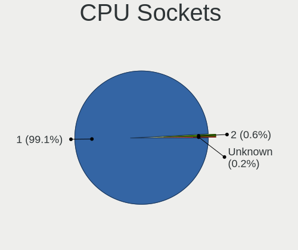

| Number  | Computers | Percent |
|---------|-----------|---------|
| 1       | 270       | 98.54%  |
| 2       | 3         | 1.09%   |
| Unknown | 1         | 0.36%   |

CPU Threads
-----------

Threads per core (Hyper-Threading)

| Number  | Computers | Percent |
|---------|-----------|---------|
| 2       | 183       | 66.79%  |
| 1       | 89        | 32.48%  |
| Unknown | 2         | 0.73%   |

CPU Op-Modes
------------

CPU Operation Modes (32-bit, 64-bit)

| Op mode        | Computers | Percent |
|----------------|-----------|---------|
| 32-bit, 64-bit | 268       | 98.53%  |
| 32-bit         | 2         | 0.74%   |
| 64-bit         | 1         | 0.37%   |
| Unknown        | 1         | 0.37%   |

CPU Microcode
-------------

Microcode number

| Number     | Computers | Percent |
|------------|-----------|---------|
| Unknown    | 61        | 21.79%  |
| 0x306a9    | 21        | 7.5%    |
| 0x306c3    | 20        | 7.14%   |
| 0x206a7    | 20        | 7.14%   |
| 0x1067a    | 12        | 4.29%   |
| 0x806ea    | 9         | 3.21%   |
| 0x406e3    | 8         | 2.86%   |
| 0x906e9    | 6         | 2.14%   |
| 0x40651    | 6         | 2.14%   |
| 0x20655    | 6         | 2.14%   |
| 0x806ec    | 5         | 1.79%   |
| 0x506e3    | 5         | 1.79%   |
| 0x08701021 | 5         | 1.79%   |
| 0x010000c8 | 5         | 1.79%   |
| 0x906ea    | 4         | 1.43%   |
| 0x806c1    | 4         | 1.43%   |
| 0x30678    | 4         | 1.43%   |
| 0x906ed    | 3         | 1.07%   |
| 0x806eb    | 3         | 1.07%   |
| 0x306d4    | 3         | 1.07%   |
| 0x20652    | 3         | 1.07%   |
| 0x0800820d | 3         | 1.07%   |
| 0x08001137 | 3         | 1.07%   |
| 0xa0653    | 2         | 0.71%   |
| 0xa0652    | 2         | 0.71%   |
| 0x706a1    | 2         | 0.71%   |
| 0x6fd      | 2         | 0.71%   |
| 0x106e5    | 2         | 0.71%   |
| 0x10676    | 2         | 0.71%   |
| 0x0a201009 | 2         | 0.71%   |
| 0x08608103 | 2         | 0.71%   |
| 0x08108109 | 2         | 0.71%   |
| 0x08108102 | 2         | 0.71%   |
| 0x0700010f | 2         | 0.71%   |
| 0x05000119 | 2         | 0.71%   |
| 0xf65      | 1         | 0.36%   |
| 0xf47      | 1         | 0.36%   |
| 0xf43      | 1         | 0.36%   |
| 0xf34      | 1         | 0.36%   |
| 0xa0671    | 1         | 0.36%   |
| 0x906ec    | 1         | 0.36%   |
| 0x906eb    | 1         | 0.36%   |
| 0x806e9    | 1         | 0.36%   |
| 0x706e5    | 1         | 0.36%   |
| 0x6fa      | 1         | 0.36%   |
| 0x6f7      | 1         | 0.36%   |
| 0x6f6      | 1         | 0.36%   |
| 0x6f2      | 1         | 0.36%   |
| 0x6ec      | 1         | 0.36%   |
| 0x506c9    | 1         | 0.36%   |
| 0x206d7    | 1         | 0.36%   |
| 0x106ca    | 1         | 0.36%   |
| 0x10661    | 1         | 0.36%   |
| 0x0a50000c | 1         | 0.36%   |
| 0x0a50000b | 1         | 0.36%   |
| 0x0a404101 | 1         | 0.36%   |
| 0x0a201005 | 1         | 0.36%   |
| 0x08701013 | 1         | 0.36%   |
| 0x08600106 | 1         | 0.36%   |
| 0x08600104 | 1         | 0.36%   |

CPU Microarch
-------------

Microarchitecture

| Name            | Computers | Percent |
|-----------------|-----------|---------|
| KabyLake        | 42        | 15.44%  |
| Haswell         | 30        | 11.03%  |
| IvyBridge       | 25        | 9.19%   |
| SandyBridge     | 23        | 8.46%   |
| Penryn          | 17        | 6.25%   |
| Skylake         | 15        | 5.51%   |
| Zen 2           | 11        | 4.04%   |
| Westmere        | 11        | 4.04%   |
| Zen+            | 10        | 3.68%   |
| Zen 3           | 9         | 3.31%   |
| Core            | 8         | 2.94%   |
| CometLake       | 8         | 2.94%   |
| Zen             | 7         | 2.57%   |
| K10             | 7         | 2.57%   |
| Unknown         | 7         | 2.57%   |
| TigerLake       | 5         | 1.84%   |
| Piledriver      | 5         | 1.84%   |
| Silvermont      | 4         | 1.47%   |
| NetBurst        | 4         | 1.47%   |
| Goldmont plus   | 4         | 1.47%   |
| Broadwell       | 4         | 1.47%   |
| Nehalem         | 2         | 0.74%   |
| K8 Hammer       | 2         | 0.74%   |
| Jaguar          | 2         | 0.74%   |
| Icelake         | 2         | 0.74%   |
| Goldmont        | 2         | 0.74%   |
| Bobcat          | 2         | 0.74%   |
| Steamroller     | 1         | 0.37%   |
| K8 & K10 hybrid | 1         | 0.37%   |
| Excavator       | 1         | 0.37%   |
| Bonnell         | 1         | 0.37%   |

Graphics
--------

GPU Vendor
----------

Vendors of graphics cards

| Vendor                           | Computers | Percent |
|----------------------------------|-----------|---------|
| Intel                            | 161       | 49.24%  |
| Nvidia                           | 95        | 29.05%  |
| AMD                              | 69        | 21.1%   |
| Silicon Integrated Systems [SiS] | 1         | 0.31%   |
| Matrox Electronics Systems       | 1         | 0.31%   |

GPU Model
---------

Graphics card models

| Model                                                                         | Computers | Percent |
|-------------------------------------------------------------------------------|-----------|---------|
| Intel 2nd Generation Core Processor Family Integrated Graphics Controller     | 19        | 5.56%   |
| Intel 3rd Gen Core processor Graphics Controller                              | 15        | 4.39%   |
| Intel UHD Graphics 620                                                        | 10        | 2.92%   |
| Intel CoffeeLake-H GT2 [UHD Graphics 630]                                     | 9         | 2.63%   |
| Intel 4th Gen Core Processor Integrated Graphics Controller                   | 9         | 2.63%   |
| Intel WhiskeyLake-U GT2 [UHD Graphics 620]                                    | 8         | 2.34%   |
| Intel Haswell-ULT Integrated Graphics Controller                              | 7         | 2.05%   |
| Intel Core Processor Integrated Graphics Controller                           | 7         | 2.05%   |
| Intel Xeon E3-1200 v3/4th Gen Core Processor Integrated Graphics Controller   | 6         | 1.75%   |
| Intel Skylake GT2 [HD Graphics 520]                                           | 6         | 1.75%   |
| Nvidia GF108M [GeForce GT 540M]                                               | 5         | 1.46%   |
| Intel Xeon E3-1200 v2/3rd Gen Core processor Graphics Controller              | 5         | 1.46%   |
| Intel CometLake-H GT2 [UHD Graphics]                                          | 5         | 1.46%   |
| Nvidia GP108M [GeForce MX150]                                                 | 4         | 1.17%   |
| Nvidia GP107 [GeForce GTX 1050 Ti]                                            | 4         | 1.17%   |
| Nvidia GP106 [GeForce GTX 1060 6GB]                                           | 4         | 1.17%   |
| Intel Mobile 4 Series Chipset Integrated Graphics Controller                  | 4         | 1.17%   |
| Intel HD Graphics 630                                                         | 4         | 1.17%   |
| Intel Atom Processor Z36xxx/Z37xxx Series Graphics & Display                  | 4         | 1.17%   |
| Intel 4 Series Chipset Integrated Graphics Controller                         | 4         | 1.17%   |
| AMD Renoir                                                                    | 4         | 1.17%   |
| AMD Picasso/Raven 2 [Radeon Vega Series / Radeon Vega Mobile Series]          | 4         | 1.17%   |
| AMD Ellesmere [Radeon RX 470/480/570/570X/580/580X/590]                       | 4         | 1.17%   |
| Nvidia TU117M [GeForce GTX 1650 Mobile / Max-Q]                               | 3         | 0.88%   |
| Nvidia GP107M [GeForce GTX 1050 Mobile]                                       | 3         | 0.88%   |
| Nvidia GM204 [GeForce GTX 970]                                                | 3         | 0.88%   |
| Intel TigerLake-LP GT2 [Iris Xe Graphics]                                     | 3         | 0.88%   |
| Intel Mobile 945GM/GMS/GME, 943/940GML Express Integrated Graphics Controller | 3         | 0.88%   |
| Intel Mobile 945GM/GMS, 943/940GML Express Integrated Graphics Controller     | 3         | 0.88%   |
| Intel HD Graphics 5500                                                        | 3         | 0.88%   |
| Intel HD Graphics 530                                                         | 3         | 0.88%   |
| Intel GeminiLake [UHD Graphics 600]                                           | 3         | 0.88%   |
| AMD Seymour [Radeon HD 6400M/7400M Series]                                    | 3         | 0.88%   |
| AMD Raven Ridge [Radeon Vega Series / Radeon Vega Mobile Series]              | 3         | 0.88%   |
| AMD Mars [Radeon HD 8670A/8670M/8750M / R7 M370]                              | 3         | 0.88%   |
| AMD Cezanne                                                                   | 3         | 0.88%   |
| Nvidia TU116M [GeForce GTX 1660 Ti Mobile]                                    | 2         | 0.58%   |
| Nvidia TU116 [GeForce GTX 1660 SUPER]                                         | 2         | 0.58%   |
| Nvidia TU106 [GeForce RTX 2060 Rev. A]                                        | 2         | 0.58%   |
| Nvidia GP106M [GeForce GTX 1060 Mobile]                                       | 2         | 0.58%   |
| Nvidia GM107M [GeForce GTX 960M]                                              | 2         | 0.58%   |
| Nvidia GM107 [GeForce GTX 750 Ti]                                             | 2         | 0.58%   |
| Nvidia GK107M [GeForce GT 650M]                                               | 2         | 0.58%   |
| Nvidia GF108 [GeForce GT 630]                                                 | 2         | 0.58%   |
| Nvidia G96C [GeForce 9500 GT]                                                 | 2         | 0.58%   |
| Nvidia G92 [GeForce GTS 250]                                                  | 2         | 0.58%   |
| Intel Mobile GM965/GL960 Integrated Graphics Controller (secondary)           | 2         | 0.58%   |
| Intel Mobile GM965/GL960 Integrated Graphics Controller (primary)             | 2         | 0.58%   |
| Intel HD Graphics 500                                                         | 2         | 0.58%   |
| Intel CometLake-U GT2 [UHD Graphics]                                          | 2         | 0.58%   |
| Intel 4th Generation Core Processor Family Integrated Graphics Controller     | 2         | 0.58%   |
| AMD Trinity [Radeon HD 7640G]                                                 | 2         | 0.58%   |
| AMD Sun PRO [Radeon HD 8570A/8570M]                                           | 2         | 0.58%   |
| AMD RS880M [Mobility Radeon HD 4225/4250]                                     | 2         | 0.58%   |
| AMD Navi 14 [Radeon RX 5500/5500M / Pro 5500M]                                | 2         | 0.58%   |
| AMD Lucienne                                                                  | 2         | 0.58%   |
| AMD Lexa PRO [Radeon 540/540X/550/550X / RX 540X/550/550X]                    | 2         | 0.58%   |
| AMD Chelsea LP [Radeon HD 7730M]                                              | 2         | 0.58%   |
| AMD Cedar [Radeon HD 5000/6000/7350/8350 Series]                              | 2         | 0.58%   |
| AMD Baffin [Radeon RX 550 640SP / RX 560/560X]                                | 2         | 0.58%   |

GPU Combo
---------

Combinations of graphics cards

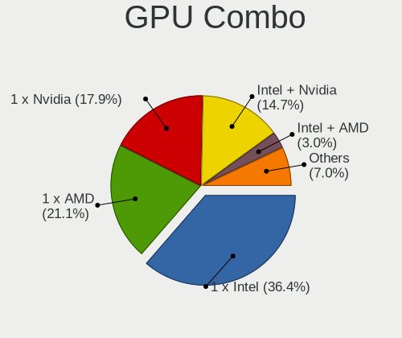

| Name           | Computers | Percent |
|----------------|-----------|---------|
| 1 x Intel      | 108       | 39.27%  |
| 1 x Nvidia     | 53        | 19.27%  |
| 1 x AMD        | 51        | 18.55%  |
| Intel + Nvidia | 40        | 14.55%  |
| Intel + AMD    | 10        | 3.64%   |
| 2 x AMD        | 7         | 2.55%   |
| 2 x Nvidia     | 2         | 0.73%   |
| Other          | 1         | 0.36%   |
| 1 x SiS        | 1         | 0.36%   |
| 1 x Matrox     | 1         | 0.36%   |
| AMD + Nvidia   | 1         | 0.36%   |

GPU Driver
----------

Free vs proprietary

| Driver      | Computers | Percent |
|-------------|-----------|---------|
| Free        | 217       | 77.78%  |
| Proprietary | 53        | 19%     |
| Unknown     | 9         | 3.23%   |

GPU Memory
----------

Total video memory

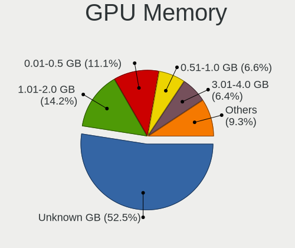

| Size in GB | Computers | Percent |
|------------|-----------|---------|
| Unknown    | 128       | 45.39%  |
| 1.01-2.0   | 52        | 18.44%  |
| 0.01-0.5   | 34        | 12.06%  |
| 3.01-4.0   | 23        | 8.16%   |
| 0.51-1.0   | 22        | 7.8%    |
| 5.01-6.0   | 13        | 4.61%   |
| 7.01-8.0   | 6         | 2.13%   |
| 8.01-16.0  | 2         | 0.71%   |
| 2.01-3.0   | 1         | 0.35%   |
| 16.01-24.0 | 1         | 0.35%   |

Monitor
-------

Monitor Vendor
--------------

Monitor vendors

| Vendor                  | Computers | Percent |
|-------------------------|-----------|---------|
| Samsung Electronics     | 45        | 14.66%  |
| LG Display              | 40        | 13.03%  |
| AU Optronics            | 36        | 11.73%  |
| Dell                    | 27        | 8.79%   |
| BOE                     | 20        | 6.51%   |
| Chimei Innolux          | 19        | 6.19%   |
| Philips                 | 16        | 5.21%   |
| Lenovo                  | 16        | 5.21%   |
| Goldstar                | 15        | 4.89%   |
| AOC                     | 15        | 4.89%   |
| Chi Mei Optoelectronics | 9         | 2.93%   |
| BenQ                    | 7         | 2.28%   |
| Ancor Communications    | 5         | 1.63%   |
| Sony                    | 4         | 1.3%    |
| Hewlett-Packard         | 4         | 1.3%    |
| PANDA                   | 3         | 0.98%   |
| Sharp                   | 2         | 0.65%   |
| LG Electronics          | 2         | 0.65%   |
| CSO                     | 2         | 0.65%   |
| ASUSTek Computer        | 2         | 0.65%   |
| ViewSonic               | 1         | 0.33%   |
| Unknown (AAA)           | 1         | 0.33%   |
| Toshiba                 | 1         | 0.33%   |
| MStar                   | 1         | 0.33%   |
| Mi                      | 1         | 0.33%   |
| Medion                  | 1         | 0.33%   |
| LGD                     | 1         | 0.33%   |
| LG Philips              | 1         | 0.33%   |
| KDC                     | 1         | 0.33%   |
| JDI                     | 1         | 0.33%   |
| InfoVision              | 1         | 0.33%   |
| Iiyama                  | 1         | 0.33%   |
| IBM                     | 1         | 0.33%   |
| HannStar                | 1         | 0.33%   |
| Grundig                 | 1         | 0.33%   |
| DENON                   | 1         | 0.33%   |
| Apple                   | 1         | 0.33%   |
| AGO                     | 1         | 0.33%   |

Monitor Model
-------------

Monitor models

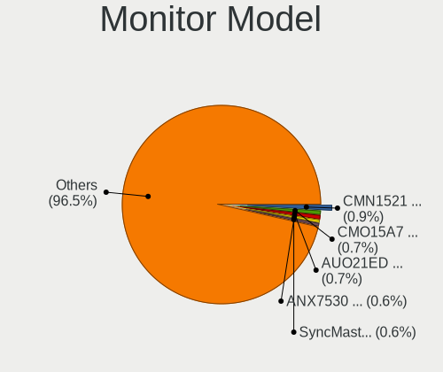

| Model                                                                    | Computers | Percent |
|--------------------------------------------------------------------------|-----------|---------|
| Chi Mei Optoelectronics LCD Monitor CMO15A7 1366x768 344x193mm 15.5-inch | 4         | 1.25%   |
| AU Optronics LCD Monitor AUO21ED 1920x1080 344x193mm 15.5-inch           | 4         | 1.25%   |
| LG Display LCD Monitor LGD0306 1600x900 310x174mm 14.0-inch              | 3         | 0.93%   |
| Lenovo T24i-10 LEN61A6 1920x1080 527x296mm 23.8-inch                     | 3         | 0.93%   |
| Dell P2719H DEL4184 1920x1080 598x336mm 27.0-inch                        | 3         | 0.93%   |
| BenQ GW2765 BNQ78D6 2560x1440 597x336mm 27.0-inch                        | 3         | 0.93%   |
| AU Optronics LCD Monitor AUO26EC 1366x768 344x193mm 15.5-inch            | 3         | 0.93%   |
| Sony LCD Monitor MS_9005 1920x1200 331x207mm 15.4-inch                   | 2         | 0.62%   |
| Samsung Electronics LCD Monitor SEC314C 1920x1080 344x194mm 15.5-inch    | 2         | 0.62%   |
| Samsung Electronics LCD Monitor C32HG7x 2560x1440                        | 2         | 0.62%   |
| LG Display LP156WH2-TLAA LGD0230 1366x768 344x194mm 15.5-inch            | 2         | 0.62%   |
| LG Display LCD Monitor LGD02DC 1366x768 344x194mm 15.5-inch              | 2         | 0.62%   |
| Lenovo LEN T2324pA LEN60C7 1920x1080 509x286mm 23.0-inch                 | 2         | 0.62%   |
| Lenovo LCD Monitor LEN40BA 1920x1080 344x194mm 15.5-inch                 | 2         | 0.62%   |
| Lenovo LBG AIO PC LEN8000 1920x1080 521x293mm 23.5-inch                  | 2         | 0.62%   |
| Dell U2419H DEL4148 1920x1080 527x296mm 23.8-inch                        | 2         | 0.62%   |
| Dell U2415 DELA0BA 1920x1200 520x320mm 24.0-inch                         | 2         | 0.62%   |
| Dell P2314H DEL4099 1920x1080 509x286mm 23.0-inch                        | 2         | 0.62%   |
| Chimei Innolux LCD Monitor CMN15E7 1920x1080 344x193mm 15.5-inch         | 2         | 0.62%   |
| Chimei Innolux LCD Monitor CMN15DB 1366x768 344x193mm 15.5-inch          | 2         | 0.62%   |
| Chimei Innolux LCD Monitor CMN150C 1920x1080 344x193mm 15.5-inch         | 2         | 0.62%   |
| Chimei Innolux LCD Monitor CMN14F2 1920x1080 309x173mm 13.9-inch         | 2         | 0.62%   |
| Chi Mei Optoelectronics LCD Monitor CMO1592 1366x768 350x190mm 15.7-inch | 2         | 0.62%   |
| AU Optronics LCD Monitor AUO8174 1280x800 331x207mm 15.4-inch            | 2         | 0.62%   |
| AU Optronics LCD Monitor AUO22EC 1366x768 344x193mm 15.5-inch            | 2         | 0.62%   |
| AOC 24G2W1G4 AOC2402 1920x1080 527x296mm 23.8-inch                       | 2         | 0.62%   |
| AOC 2369 AOC2369 1920x1080 509x286mm 23.0-inch                           | 2         | 0.62%   |
| AOC 2343 AOC2343 1920x1080 509x286mm 23.0-inch                           | 2         | 0.62%   |
| ViewSonic VA721 VSC6E19 1280x1024 340x270mm 17.1-inch                    | 1         | 0.31%   |
| Unknown (AAA) smart tv AAA0001 1920x1080 1600x900mm 72.3-inch            | 1         | 0.31%   |
| Toshiba LCD Monitor LCD2306 1280x800 287x180mm 13.3-inch                 | 1         | 0.31%   |
| Sony TV SNY2C02 1920x1080 708x398mm 32.0-inch                            | 1         | 0.31%   |
| Sony LCD Monitor MS_0025 1920x1080 340x190mm 15.3-inch                   | 1         | 0.31%   |
| Sharp LCD Monitor SHP1516 3840x2400 336x210mm 15.6-inch                  | 1         | 0.31%   |
| Sharp LCD Monitor SHP14D1 1920x1200 336x210mm 15.6-inch                  | 1         | 0.31%   |
| Samsung Electronics U28E590 SAM0C4E 3840x2160 610x350mm 27.7-inch        | 1         | 0.31%   |
| Samsung Electronics U28E590 SAM0C4D 3840x2160 607x345mm 27.5-inch        | 1         | 0.31%   |
| Samsung Electronics T24E390 SAM0C20 1920x1080 521x293mm 23.5-inch        | 1         | 0.31%   |
| Samsung Electronics T19B300 SAM0926 1366x768 410x230mm 18.5-inch         | 1         | 0.31%   |
| Samsung Electronics SyncMaster SAM036E 1280x1024 376x301mm 19.0-inch     | 1         | 0.31%   |
| Samsung Electronics SyncMaster SAM0350 1440x900 428x255mm 19.6-inch      | 1         | 0.31%   |
| Samsung Electronics SyncMaster SAM02AD 1440x900 410x257mm 19.1-inch      | 1         | 0.31%   |
| Samsung Electronics SyncMaster SAM01F9 1280x1024 376x301mm 19.0-inch     | 1         | 0.31%   |
| Samsung Electronics SyncMaster SAM01E3 1280x1024 338x270mm 17.0-inch     | 1         | 0.31%   |
| Samsung Electronics SyncMaster SAM0192 1280x1024 338x270mm 17.0-inch     | 1         | 0.31%   |
| Samsung Electronics SyncMaster SAM011E 1280x1024 338x270mm 17.0-inch     | 1         | 0.31%   |
| Samsung Electronics SMBX2331 SAM076F 1920x1080 509x286mm 23.0-inch       | 1         | 0.31%   |
| Samsung Electronics SMBX2231 SAM076C 1920x1080 477x268mm 21.5-inch       | 1         | 0.31%   |
| Samsung Electronics SMB2220N SAM06A2 1920x1080 480x270mm 21.7-inch       | 1         | 0.31%   |
| Samsung Electronics SMB1930N SAM0632 1360x768 410x230mm 18.5-inch        | 1         | 0.31%   |
| Samsung Electronics S24F350 SAM0D20 1920x1080 521x293mm 23.5-inch        | 1         | 0.31%   |
| Samsung Electronics S24E650 SAM0CC1 1920x1200 518x324mm 24.1-inch        | 1         | 0.31%   |
| Samsung Electronics S24E450 SAM0C82 1920x1080 531x299mm 24.0-inch        | 1         | 0.31%   |
| Samsung Electronics S24E450 SAM0C81 1920x1080 531x299mm 24.0-inch        | 1         | 0.31%   |
| Samsung Electronics S24D391 SAM0B87 1920x1080 521x293mm 23.5-inch        | 1         | 0.31%   |
| Samsung Electronics S24D330 SAM0D92 1920x1080 531x299mm 24.0-inch        | 1         | 0.31%   |
| Samsung Electronics S24C450 SAM09CB 1920x1080 531x299mm 24.0-inch        | 1         | 0.31%   |
| Samsung Electronics S24C300 SAM0A24 1920x1080 531x299mm 24.0-inch        | 1         | 0.31%   |
| Samsung Electronics S23E650 SAM0CAF 1920x1080 510x287mm 23.0-inch        | 1         | 0.31%   |
| Samsung Electronics S23B550 SAM0919 1920x1080 510x287mm 23.0-inch        | 1         | 0.31%   |

Monitor Resolution
------------------

Monitor screen resolution

| Resolution         | Computers | Percent |
|--------------------|-----------|---------|
| 1920x1080 (FHD)    | 135       | 46.55%  |
| 1366x768 (WXGA)    | 53        | 18.28%  |
| 2560x1440 (QHD)    | 19        | 6.55%   |
| 3840x2160 (4K)     | 16        | 5.52%   |
| 1600x900 (HD+)     | 16        | 5.52%   |
| 1280x1024 (SXGA)   | 14        | 4.83%   |
| 1920x1200 (WUXGA)  | 6         | 2.07%   |
| 1280x800 (WXGA)    | 5         | 1.72%   |
| 3440x1440          | 4         | 1.38%   |
| 1440x900 (WXGA+)   | 4         | 1.38%   |
| 2560x1080          | 3         | 1.03%   |
| 1680x1050 (WSXGA+) | 2         | 0.69%   |
| Unknown            | 2         | 0.69%   |
| 3840x2400          | 1         | 0.34%   |
| 3840x1600          | 1         | 0.34%   |
| 3840x1080          | 1         | 0.34%   |
| 3200x1080          | 1         | 0.34%   |
| 3000x2000          | 1         | 0.34%   |
| 2560x1600          | 1         | 0.34%   |
| 2160x1440          | 1         | 0.34%   |
| 1360x768           | 1         | 0.34%   |
| 1280x720 (HD)      | 1         | 0.34%   |
| 1024x768 (XGA)     | 1         | 0.34%   |
| 1024x600           | 1         | 0.34%   |

Monitor Diagonal
----------------

Diagonal size in inches

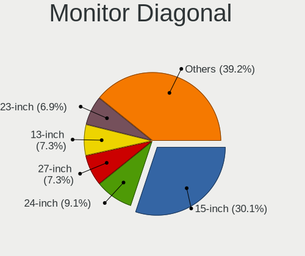

| Inches  | Computers | Percent |
|---------|-----------|---------|
| 15      | 97        | 31.6%   |
| 27      | 27        | 8.79%   |
| 24      | 27        | 8.79%   |
| 23      | 25        | 8.14%   |
| 13      | 22        | 7.17%   |
| 14      | 20        | 6.51%   |
| 17      | 18        | 5.86%   |
| 21      | 14        | 4.56%   |
| Unknown | 12        | 3.91%   |
| 19      | 8         | 2.61%   |
| 18      | 7         | 2.28%   |
| 34      | 5         | 1.63%   |
| 12      | 5         | 1.63%   |
| 40      | 3         | 0.98%   |
| 20      | 3         | 0.98%   |
| 31      | 2         | 0.65%   |
| 25      | 2         | 0.65%   |
| 84      | 1         | 0.33%   |
| 72      | 1         | 0.33%   |
| 55      | 1         | 0.33%   |
| 54      | 1         | 0.33%   |
| 52      | 1         | 0.33%   |
| 50      | 1         | 0.33%   |
| 29      | 1         | 0.33%   |
| 22      | 1         | 0.33%   |
| 11      | 1         | 0.33%   |
| 10      | 1         | 0.33%   |

Monitor Width
-------------

Physical width

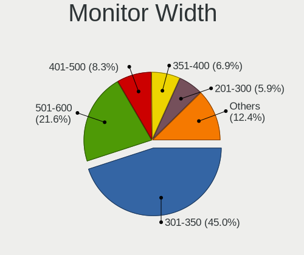

| Width in mm | Computers | Percent |
|-------------|-----------|---------|
| 301-350     | 133       | 44.19%  |
| 501-600     | 72        | 23.92%  |
| 401-500     | 25        | 8.31%   |
| 351-400     | 22        | 7.31%   |
| 201-300     | 16        | 5.32%   |
| Unknown     | 12        | 3.99%   |
| 601-700     | 7         | 2.33%   |
| 701-800     | 5         | 1.66%   |
| 1001-1500   | 4         | 1.33%   |
| 801-900     | 3         | 1%      |
| 1501-2000   | 2         | 0.66%   |

Aspect Ratio
------------

Proportional relationship between the width and the height

| Ratio   | Computers | Percent |
|---------|-----------|---------|
| 16/9    | 213       | 79.48%  |
| 16/10   | 21        | 7.84%   |
| 5/4     | 13        | 4.85%   |
| Unknown | 11        | 4.1%    |
| 21/9    | 5         | 1.87%   |
| 3/2     | 3         | 1.12%   |
| 4/3     | 2         | 0.75%   |

Monitor Area
------------

Area in inch

| Area in inch | Computers | Percent |
|----------------|-----------|---------|
| 101-110        | 95        | 30.84%  |
| 201-250        | 56        | 18.18%  |
| 81-90          | 35        | 11.36%  |
| 301-350        | 27        | 8.77%   |
| 151-200        | 18        | 5.84%   |
| 141-150        | 12        | 3.9%    |
| Unknown        | 12        | 3.9%    |
| 121-130        | 11        | 3.57%   |
| 351-500        | 8         | 2.6%    |
| 251-300        | 8         | 2.6%    |
| 71-80          | 7         | 2.27%   |
| More than 1000 | 6         | 1.95%   |
| 61-70          | 4         | 1.3%    |
| 501-1000       | 3         | 0.97%   |
| 91-100         | 2         | 0.65%   |
| 51-60          | 1         | 0.32%   |
| 41-50          | 1         | 0.32%   |
| 131-140        | 1         | 0.32%   |
| 111-120        | 1         | 0.32%   |

Pixel Density
-------------

Pixels per inch

| Density       | Computers | Percent |
|---------------|-----------|---------|
| 51-100        | 105       | 35.47%  |
| 121-160       | 85        | 28.72%  |
| 101-120       | 73        | 24.66%  |
| 161-240       | 13        | 4.39%   |
| Unknown       | 12        | 4.05%   |
| More than 240 | 4         | 1.35%   |
| 1-50          | 4         | 1.35%   |

Multiple Monitors
-----------------

Total monitors connected

| Total | Computers | Percent |
|-------|-----------|---------|
| 1     | 208       | 75.91%  |
| 2     | 53        | 19.34%  |
| 0     | 10        | 3.65%   |
| 3     | 3         | 1.09%   |

Network
-------

Net Controller Vendor
---------------------

Controller vendors

| Vendor                            | Computers | Percent |
|-----------------------------------|-----------|---------|
| Realtek Semiconductor             | 144       | 35.82%  |
| Intel                             | 121       | 30.1%   |
| Qualcomm Atheros                  | 58        | 14.43%  |
| Broadcom                          | 26        | 6.47%   |
| Broadcom Limited                  | 7         | 1.74%   |
| TP-Link                           | 5         | 1.24%   |
| Ralink                            | 4         | 1%      |
| Marvell Technology Group          | 4         | 1%      |
| Lenovo                            | 4         | 1%      |
| Nvidia                            | 3         | 0.75%   |
| D-Link                            | 3         | 0.75%   |
| Ralink Technology                 | 2         | 0.5%    |
| Qualcomm Atheros Communications   | 2         | 0.5%    |
| Microsoft                         | 2         | 0.5%    |
| JMicron Technology                | 2         | 0.5%    |
| Fibocom                           | 2         | 0.5%    |
| Ericsson Business Mobile Networks | 2         | 0.5%    |
| Dell                              | 2         | 0.5%    |
| ZTE WCDMA Technologies MSM        | 1         | 0.25%   |
| Sierra Wireless                   | 1         | 0.25%   |
| Samsung Electronics               | 1         | 0.25%   |
| MediaTek                          | 1         | 0.25%   |
| Edimax Technology                 | 1         | 0.25%   |
| D-Link System                     | 1         | 0.25%   |
| ASUSTek Computer                  | 1         | 0.25%   |
| ASIX Electronics                  | 1         | 0.25%   |
| 3Com                              | 1         | 0.25%   |

Net Controller Model
--------------------

Controller models

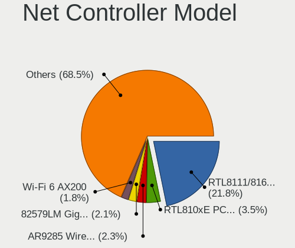

| Model                                                                   | Computers | Percent |
|-------------------------------------------------------------------------|-----------|---------|
| Realtek RTL8111/8168/8411 PCI Express Gigabit Ethernet Controller       | 105       | 22.15%  |
| Realtek RTL810xE PCI Express Fast Ethernet controller                   | 17        | 3.59%   |
| Qualcomm Atheros AR9285 Wireless Network Adapter (PCI-Express)          | 13        | 2.74%   |
| Intel 82579LM Gigabit Network Connection (Lewisville)                   | 12        | 2.53%   |
| Qualcomm Atheros AR9485 Wireless Network Adapter                        | 11        | 2.32%   |
| Intel Wireless 8265 / 8275                                              | 10        | 2.11%   |
| Intel Wi-Fi 6 AX200                                                     | 9         | 1.9%    |
| Qualcomm Atheros QCA9565 / AR9565 Wireless Network Adapter              | 7         | 1.48%   |
| Qualcomm Atheros AR8151 v2.0 Gigabit Ethernet                           | 7         | 1.48%   |
| Intel Wireless 7260                                                     | 7         | 1.48%   |
| Intel Centrino Advanced-N 6205 [Taylor Peak]                            | 7         | 1.48%   |
| Intel Wireless 8260                                                     | 6         | 1.27%   |
| Realtek RTL8153 Gigabit Ethernet Adapter                                | 5         | 1.05%   |
| Qualcomm Atheros QCA9377 802.11ac Wireless Network Adapter              | 5         | 1.05%   |
| Intel Wi-Fi 6 AX201                                                     | 5         | 1.05%   |
| Intel I211 Gigabit Network Connection                                   | 5         | 1.05%   |
| Intel Comet Lake PCH CNVi WiFi                                          | 5         | 1.05%   |
| Intel Cannon Point-LP CNVi [Wireless-AC]                                | 5         | 1.05%   |
| Intel Cannon Lake PCH CNVi WiFi                                         | 5         | 1.05%   |
| Broadcom BCM4313 802.11bgn Wireless Network Adapter                     | 5         | 1.05%   |
| Realtek RTL8188EUS 802.11n Wireless Network Adapter                     | 4         | 0.84%   |
| Realtek RTL8125 2.5GbE Controller                                       | 4         | 0.84%   |
| Realtek RTL-8100/8101L/8139 PCI Fast Ethernet Adapter                   | 4         | 0.84%   |
| Intel Wireless 7265                                                     | 4         | 0.84%   |
| Intel Ethernet Connection (4) I219-V                                    | 4         | 0.84%   |
| Intel 82579V Gigabit Network Connection                                 | 4         | 0.84%   |
| Realtek RTL8821CE 802.11ac PCIe Wireless Network Adapter                | 3         | 0.63%   |
| Realtek RTL8723BE PCIe Wireless Network Adapter                         | 3         | 0.63%   |
| Realtek RTL8192CU 802.11n WLAN Adapter                                  | 3         | 0.63%   |
| Ralink RT3290 Wireless 802.11n 1T/1R PCIe                               | 3         | 0.63%   |
| Qualcomm Atheros QCA8172 Fast Ethernet                                  | 3         | 0.63%   |
| Qualcomm Atheros AR8161 Gigabit Ethernet                                | 3         | 0.63%   |
| Qualcomm Atheros AR8152 v2.0 Fast Ethernet                              | 3         | 0.63%   |
| Qualcomm Atheros AR242x / AR542x Wireless Network Adapter (PCI-Express) | 3         | 0.63%   |
| Intel Wireless-AC 9260                                                  | 3         | 0.63%   |
| Intel Wireless 3165                                                     | 3         | 0.63%   |
| Intel Ethernet Connection I217-V                                        | 3         | 0.63%   |
| Intel Ethernet Connection I217-LM                                       | 3         | 0.63%   |
| Intel Ethernet Connection (7) I219-LM                                   | 3         | 0.63%   |
| Intel Ethernet Connection (6) I219-V                                    | 3         | 0.63%   |
| Intel Centrino Advanced-N 6235                                          | 3         | 0.63%   |
| TP-Link TL-WN821N v5/v6 [RTL8192EU]                                     | 2         | 0.42%   |
| TP-Link TL-WN722N v2                                                    | 2         | 0.42%   |
| Realtek RTL8822CE 802.11ac PCIe Wireless Network Adapter                | 2         | 0.42%   |
| Realtek RTL8152 Fast Ethernet Adapter                                   | 2         | 0.42%   |
| Ralink RT5370 Wireless Adapter                                          | 2         | 0.42%   |
| Qualcomm Atheros Killer E2400 Gigabit Ethernet Controller               | 2         | 0.42%   |
| Qualcomm Atheros Killer E220x Gigabit Ethernet Controller               | 2         | 0.42%   |
| Qualcomm Atheros AR8132 Fast Ethernet                                   | 2         | 0.42%   |
| Qualcomm Atheros AR8131 Gigabit Ethernet                                | 2         | 0.42%   |
| Microsoft XBOX ACC                                                      | 2         | 0.42%   |
| Lenovo USB-C Dock Ethernet                                              | 2         | 0.42%   |
| JMicron JMC250 PCI Express Gigabit Ethernet Controller                  | 2         | 0.42%   |
| Intel Tiger Lake PCH CNVi WiFi                                          | 2         | 0.42%   |
| Intel PRO/Wireless 5100 AGN [Shiloh] Network Connection                 | 2         | 0.42%   |
| Intel PRO/Wireless 4965 AG or AGN [Kedron] Network Connection           | 2         | 0.42%   |
| Intel PRO/Wireless 3945ABG [Golan] Network Connection                   | 2         | 0.42%   |
| Intel Ethernet Controller I225-V                                        | 2         | 0.42%   |
| Intel Ethernet Connection I219-LM                                       | 2         | 0.42%   |
| Intel Ethernet Connection (7) I219-V                                    | 2         | 0.42%   |

Wireless Vendor
---------------

Wireless vendors

| Vendor                            | Computers | Percent |
|-----------------------------------|-----------|---------|
| Intel                             | 98        | 46.45%  |
| Qualcomm Atheros                  | 44        | 20.85%  |
| Realtek Semiconductor             | 21        | 9.95%   |
| Broadcom                          | 18        | 8.53%   |
| TP-Link                           | 5         | 2.37%   |
| Ralink                            | 4         | 1.9%    |
| D-Link                            | 3         | 1.42%   |
| Ralink Technology                 | 2         | 0.95%   |
| Qualcomm Atheros Communications   | 2         | 0.95%   |
| Microsoft                         | 2         | 0.95%   |
| Fibocom                           | 2         | 0.95%   |
| Dell                              | 2         | 0.95%   |
| Broadcom Limited                  | 2         | 0.95%   |
| Sierra Wireless                   | 1         | 0.47%   |
| MediaTek                          | 1         | 0.47%   |
| Ericsson Business Mobile Networks | 1         | 0.47%   |
| Edimax Technology                 | 1         | 0.47%   |
| D-Link System                     | 1         | 0.47%   |
| ASUSTek Computer                  | 1         | 0.47%   |

Wireless Model
--------------

Wireless models

| Model                                                                                | Computers | Percent |
|--------------------------------------------------------------------------------------|-----------|---------|
| Qualcomm Atheros AR9285 Wireless Network Adapter (PCI-Express)                       | 13        | 6.16%   |
| Qualcomm Atheros AR9485 Wireless Network Adapter                                     | 11        | 5.21%   |
| Intel Wireless 8265 / 8275                                                           | 10        | 4.74%   |
| Intel Wi-Fi 6 AX200                                                                  | 9         | 4.27%   |
| Qualcomm Atheros QCA9565 / AR9565 Wireless Network Adapter                           | 7         | 3.32%   |
| Intel Wireless 7260                                                                  | 7         | 3.32%   |
| Intel Centrino Advanced-N 6205 [Taylor Peak]                                         | 7         | 3.32%   |
| Intel Wireless 8260                                                                  | 6         | 2.84%   |
| Qualcomm Atheros QCA9377 802.11ac Wireless Network Adapter                           | 5         | 2.37%   |
| Intel Wi-Fi 6 AX201                                                                  | 5         | 2.37%   |
| Intel Comet Lake PCH CNVi WiFi                                                       | 5         | 2.37%   |
| Intel Cannon Point-LP CNVi [Wireless-AC]                                             | 5         | 2.37%   |
| Intel Cannon Lake PCH CNVi WiFi                                                      | 5         | 2.37%   |
| Broadcom BCM4313 802.11bgn Wireless Network Adapter                                  | 5         | 2.37%   |
| Realtek RTL8188EUS 802.11n Wireless Network Adapter                                  | 4         | 1.9%    |
| Intel Wireless 7265                                                                  | 4         | 1.9%    |
| Realtek RTL8821CE 802.11ac PCIe Wireless Network Adapter                             | 3         | 1.42%   |
| Realtek RTL8723BE PCIe Wireless Network Adapter                                      | 3         | 1.42%   |
| Realtek RTL8192CU 802.11n WLAN Adapter                                               | 3         | 1.42%   |
| Ralink RT3290 Wireless 802.11n 1T/1R PCIe                                            | 3         | 1.42%   |
| Qualcomm Atheros AR242x / AR542x Wireless Network Adapter (PCI-Express)              | 3         | 1.42%   |
| Intel Wireless-AC 9260                                                               | 3         | 1.42%   |
| Intel Wireless 3165                                                                  | 3         | 1.42%   |
| Intel Centrino Advanced-N 6235                                                       | 3         | 1.42%   |
| TP-Link TL-WN821N v5/v6 [RTL8192EU]                                                  | 2         | 0.95%   |
| TP-Link TL-WN722N v2                                                                 | 2         | 0.95%   |
| Realtek RTL8822CE 802.11ac PCIe Wireless Network Adapter                             | 2         | 0.95%   |
| Ralink RT5370 Wireless Adapter                                                       | 2         | 0.95%   |
| Microsoft XBOX ACC                                                                   | 2         | 0.95%   |
| Intel Tiger Lake PCH CNVi WiFi                                                       | 2         | 0.95%   |
| Intel PRO/Wireless 5100 AGN [Shiloh] Network Connection                              | 2         | 0.95%   |
| Intel PRO/Wireless 4965 AG or AGN [Kedron] Network Connection                        | 2         | 0.95%   |
| Intel PRO/Wireless 3945ABG [Golan] Network Connection                                | 2         | 0.95%   |
| Intel Dual Band Wireless-AC 3168NGW [Stone Peak]                                     | 2         | 0.95%   |
| Intel Dual Band Wireless-AC 3165 Plus Bluetooth                                      | 2         | 0.95%   |
| Intel Comet Lake PCH-LP CNVi WiFi                                                    | 2         | 0.95%   |
| Intel Centrino Wireless-N 1000 [Condor Peak]                                         | 2         | 0.95%   |
| Intel Centrino Ultimate-N 6300                                                       | 2         | 0.95%   |
| Intel Centrino Advanced-N 6200                                                       | 2         | 0.95%   |
| Fibocom L830-EB-00 LTE WWAN Modem                                                    | 2         | 0.95%   |
| Dell DW5811e Snapdragon X7 LTE                                                 | 2         | 0.95%   |
| D-Link 802.11 n WLAN                                                                 | 2         | 0.95%   |
| Broadcom BCM4352 802.11ac Wireless Network Adapter                                   | 2         | 0.95%   |
| Broadcom BCM43224 802.11a/b/g/n                                                      | 2         | 0.95%   |
| Broadcom BCM43142 802.11b/g/n                                                        | 2         | 0.95%   |
| Broadcom BCM4312 802.11b/g LP-PHY                                                    | 2         | 0.95%   |
| Broadcom BCM4311 802.11b/g WLAN                                                      | 2         | 0.95%   |
| TP-Link AC600 wireless Realtek RTL8811AU [Archer T2U Nano]                           | 1         | 0.47%   |
| Sierra Wireless EM7455                                                               | 1         | 0.47%   |
| Realtek RTL8852AE 802.11ax PCIe Wireless Network Adapter                             | 1         | 0.47%   |
| Realtek RTL8822BE 802.11a/b/g/n/ac WiFi adapter                                      | 1         | 0.47%   |
| Realtek RTL8812AE 802.11ac PCIe Wireless Network Adapter                             | 1         | 0.47%   |
| Realtek RTL8723DE Wireless Network Adapter                                           | 1         | 0.47%   |
| Realtek RTL8723BU 802.11b/g/n WLAN Adapter                                           | 1         | 0.47%   |
| Realtek RTL8192CE PCIe Wireless Network Adapter                                      | 1         | 0.47%   |
| Ralink RT2561/RT61 rev B 802.11g                                                     | 1         | 0.47%   |
| Qualcomm Atheros QCA6174 802.11ac Wireless Network Adapter                           | 1         | 0.47%   |
| Qualcomm Atheros TP-Link TL-WN821N v3 / TL-WN822N v2 802.11n [Atheros AR7010+AR9287] | 1         | 0.47%   |
| Qualcomm Atheros AR9271 802.11n                                                      | 1         | 0.47%   |
| Qualcomm Atheros AR9462 Wireless Network Adapter                                     | 1         | 0.47%   |

Ethernet Vendor
---------------

Ethernet vendors

| Vendor                   | Computers | Percent |
|--------------------------|-----------|---------|
| Realtek Semiconductor    | 136       | 52.92%  |
| Intel                    | 61        | 23.74%  |
| Qualcomm Atheros         | 25        | 9.73%   |
| Broadcom                 | 14        | 5.45%   |
| Broadcom Limited         | 5         | 1.95%   |
| Marvell Technology Group | 4         | 1.56%   |
| Lenovo                   | 4         | 1.56%   |
| Nvidia                   | 3         | 1.17%   |
| JMicron Technology       | 2         | 0.78%   |
| Samsung Electronics      | 1         | 0.39%   |
| ASIX Electronics         | 1         | 0.39%   |
| 3Com                     | 1         | 0.39%   |

Ethernet Model
--------------

Ethernet models

| Model                                                                          | Computers | Percent |
|--------------------------------------------------------------------------------|-----------|---------|
| Realtek RTL8111/8168/8411 PCI Express Gigabit Ethernet Controller              | 105       | 40.23%  |
| Realtek RTL810xE PCI Express Fast Ethernet controller                          | 17        | 6.51%   |
| Intel 82579LM Gigabit Network Connection (Lewisville)                          | 12        | 4.6%    |
| Qualcomm Atheros AR8151 v2.0 Gigabit Ethernet                                  | 7         | 2.68%   |
| Realtek RTL8153 Gigabit Ethernet Adapter                                       | 5         | 1.92%   |
| Intel I211 Gigabit Network Connection                                          | 5         | 1.92%   |
| Realtek RTL8125 2.5GbE Controller                                              | 4         | 1.53%   |
| Realtek RTL-8100/8101L/8139 PCI Fast Ethernet Adapter                          | 4         | 1.53%   |
| Intel Ethernet Connection (4) I219-V                                           | 4         | 1.53%   |
| Intel 82579V Gigabit Network Connection                                        | 4         | 1.53%   |
| Qualcomm Atheros QCA8172 Fast Ethernet                                         | 3         | 1.15%   |
| Qualcomm Atheros AR8161 Gigabit Ethernet                                       | 3         | 1.15%   |
| Qualcomm Atheros AR8152 v2.0 Fast Ethernet                                     | 3         | 1.15%   |
| Intel Ethernet Connection I217-V                                               | 3         | 1.15%   |
| Intel Ethernet Connection I217-LM                                              | 3         | 1.15%   |
| Intel Ethernet Connection (7) I219-LM                                          | 3         | 1.15%   |
| Intel Ethernet Connection (6) I219-V                                           | 3         | 1.15%   |
| Realtek RTL8152 Fast Ethernet Adapter                                          | 2         | 0.77%   |
| Qualcomm Atheros Killer E2400 Gigabit Ethernet Controller                      | 2         | 0.77%   |
| Qualcomm Atheros Killer E220x Gigabit Ethernet Controller                      | 2         | 0.77%   |
| Qualcomm Atheros AR8132 Fast Ethernet                                          | 2         | 0.77%   |
| Qualcomm Atheros AR8131 Gigabit Ethernet                                       | 2         | 0.77%   |
| Lenovo USB-C Dock Ethernet                                                     | 2         | 0.77%   |
| JMicron JMC250 PCI Express Gigabit Ethernet Controller                         | 2         | 0.77%   |
| Intel Ethernet Controller I225-V                                               | 2         | 0.77%   |
| Intel Ethernet Connection I219-LM                                              | 2         | 0.77%   |
| Intel Ethernet Connection (7) I219-V                                           | 2         | 0.77%   |
| Intel Ethernet Connection (2) I219-LM                                          | 2         | 0.77%   |
| Intel 82578DC Gigabit Network Connection                                       | 2         | 0.77%   |
| Intel 82567LM-3 Gigabit Network Connection                                     | 2         | 0.77%   |
| Broadcom NetXtreme BCM57766 Gigabit Ethernet PCIe                              | 2         | 0.77%   |
| Broadcom NetLink BCM5787M Gigabit Ethernet PCI Express                         | 2         | 0.77%   |
| Broadcom NetLink BCM57785 Gigabit Ethernet PCIe                                | 2         | 0.77%   |
| Broadcom NetLink BCM57780 Gigabit Ethernet PCIe                                | 2         | 0.77%   |
| Broadcom Limited NetXtreme BCM5755 Gigabit Ethernet PCI Express                | 2         | 0.77%   |
| Broadcom BCM4401-B0 100Base-TX                                                 | 2         | 0.77%   |
| Samsung GT-I9070 (network tethering, USB debugging enabled)                    | 1         | 0.38%   |
| Realtek USB 10/100 LAN                                                         | 1         | 0.38%   |
| Realtek RTL8169 PCI Gigabit Ethernet Controller                                | 1         | 0.38%   |
| Qualcomm Atheros AR8121/AR8113/AR8114 Gigabit or Fast Ethernet                 | 1         | 0.38%   |
| Nvidia MCP77 Ethernet                                                          | 1         | 0.38%   |
| Nvidia MCP61 Ethernet                                                          | 1         | 0.38%   |
| Nvidia MCP55 Ethernet                                                          | 1         | 0.38%   |
| Marvell Group Yukon Optima 88E8059 [PCIe Gigabit Ethernet Controller with AVB] | 1         | 0.38%   |
| Marvell Group 88E8056 PCI-E Gigabit Ethernet Controller                        | 1         | 0.38%   |
| Marvell Group 88E8055 PCI-E Gigabit Ethernet Controller                        | 1         | 0.38%   |
| Marvell Group 88E8036 PCI-E Fast Ethernet Controller                           | 1         | 0.38%   |
| Lenovo ThinkPad Dock Ethernet [Realtek RTL8153B]                               | 1         | 0.38%   |
| Lenovo RTL8153 Gigabit Ethernet [ThinkPad OneLink Pro Dock]                    | 1         | 0.38%   |
| Intel NM10/ICH7 Family LAN Controller                                          | 1         | 0.38%   |
| Intel I210 Gigabit Network Connection                                          | 1         | 0.38%   |
| Intel Ethernet Connection (4) I219-LM                                          | 1         | 0.38%   |
| Intel Ethernet Connection (2) I219-V                                           | 1         | 0.38%   |
| Intel Ethernet Connection (11) I219-V                                          | 1         | 0.38%   |
| Intel Ethernet Connection (10) I219-V                                          | 1         | 0.38%   |
| Intel 82577LM Gigabit Network Connection                                       | 1         | 0.38%   |
| Intel 82577LC Gigabit Network Connection                                       | 1         | 0.38%   |
| Intel 82574L Gigabit Network Connection                                        | 1         | 0.38%   |
| Intel 82573L Gigabit Ethernet Controller                                       | 1         | 0.38%   |
| Intel 82572EI Gigabit Ethernet Controller (Copper)                             | 1         | 0.38%   |

Net Controller Kind
-------------------

Ethernet, WiFi or modem

| Kind     | Computers | Percent |
|----------|-----------|---------|
| Ethernet | 247       | 55.38%  |
| WiFi     | 197       | 44.17%  |
| Modem    | 2         | 0.45%   |

Used Controller
---------------

Currently used network controller

| Kind     | Computers | Percent |
|----------|-----------|---------|
| WiFi     | 159       | 54.08%  |
| Ethernet | 134       | 45.58%  |
| Modem    | 1         | 0.34%   |

NICs
----

Total network controllers on board

| Total | Computers | Percent |
|-------|-----------|---------|
| 2     | 155       | 56.36%  |
| 1     | 111       | 40.36%  |
| 3     | 5         | 1.82%   |
| 0     | 4         | 1.45%   |

IPv6
----

IPv6 vs IPv4

| Used | Computers | Percent |
|------|-----------|---------|
| No   | 272       | 100%    |

Bluetooth
---------

Bluetooth Vendor
----------------

Controller vendors

| Vendor                          | Computers | Percent |
|---------------------------------|-----------|---------|
| Intel                           | 71        | 46.1%   |
| Qualcomm Atheros Communications | 20        | 12.99%  |
| Cambridge Silicon Radio         | 13        | 8.44%   |
| Broadcom                        | 13        | 8.44%   |
| IMC Networks                    | 10        | 6.49%   |
| Realtek Semiconductor           | 7         | 4.55%   |
| Ralink                          | 3         | 1.95%   |
| Foxconn / Hon Hai               | 3         | 1.95%   |
| Dell                            | 3         | 1.95%   |
| ASUSTek Computer                | 3         | 1.95%   |
| Toshiba                         | 2         | 1.3%    |
| Hewlett-Packard                 | 2         | 1.3%    |
| Apple                           | 2         | 1.3%    |
| Lite-On Technology              | 1         | 0.65%   |
| Edimax Technology               | 1         | 0.65%   |

Bluetooth Model
---------------

Controller models

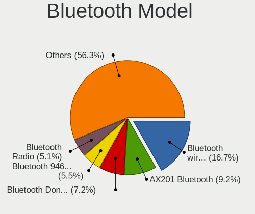

| Model                                                                               | Computers | Percent |
|-------------------------------------------------------------------------------------|-----------|---------|
| Intel Bluetooth wireless interface                                                  | 29        | 18.83%  |
| Intel AX201 Bluetooth                                                               | 15        | 9.74%   |
| Cambridge Silicon Radio Bluetooth Dongle (HCI mode)                                 | 13        | 8.44%   |
| Intel Bluetooth 9460/9560 Jefferson Peak (JfP)                                      | 10        | 6.49%   |
| Intel AX200 Bluetooth                                                               | 8         | 5.19%   |
| Qualcomm Atheros  Bluetooth Device                                                  | 7         | 4.55%   |
| Qualcomm Atheros AR3011 Bluetooth                                                   | 7         | 4.55%   |
| Realtek Bluetooth Radio                                                             | 4         | 2.6%    |
| IMC Networks Bluetooth Radio                                                        | 4         | 2.6%    |
| Ralink RT3290 Bluetooth                                                             | 3         | 1.95%   |
| Qualcomm Atheros AR3012 Bluetooth 4.0                                               | 3         | 1.95%   |
| Intel Centrino Bluetooth Wireless Transceiver                                       | 3         | 1.95%   |
| IMC Networks Atheros AR3012 Bluetooth 4.0 Adapter                                   | 3         | 1.95%   |
| Broadcom BCM20702 Bluetooth 4.0 [ThinkPad]                                          | 3         | 1.95%   |
| Realtek  Bluetooth 4.2 Adapter                                                      | 2         | 1.3%    |
| Qualcomm Atheros AR9462 Bluetooth                                                   | 2         | 1.3%    |
| Intel Wireless-AC 9260 Bluetooth Adapter                                            | 2         | 1.3%    |
| Intel Wireless-AC 3168 Bluetooth                                                    | 2         | 1.3%    |
| HP Broadcom 2070 Bluetooth Combo                                                    | 2         | 1.3%    |
| Dell Wireless 355 Bluetooth                                                         | 2         | 1.3%    |
| Broadcom BCM2070 Bluetooth 2.1 + EDR                                                | 2         | 1.3%    |
| Broadcom BCM2046 Bluetooth Device                                                   | 2         | 1.3%    |
| Broadcom BCM2045B (BDC-2.1) [Bluetooth Controller]                                  | 2         | 1.3%    |
| Apple Bluetooth USB Host Controller                                                 | 2         | 1.3%    |
| Toshiba Bluetooth USB Host Controller                                               | 1         | 0.65%   |
| Toshiba Bluetooth Device                                                            | 1         | 0.65%   |
| Realtek RTL8723B Bluetooth                                                          | 1         | 0.65%   |
| Qualcomm Atheros AR3012 Bluetooth                                                   | 1         | 0.65%   |
| Lite-On Broadcom BCM43142A0 Bluetooth Device                                        | 1         | 0.65%   |
| Intel Centrino Advanced-N 6230 Bluetooth adapter                                    | 1         | 0.65%   |
| Intel AX210 Bluetooth                                                               | 1         | 0.65%   |
| IMC Networks Wireless_Device                                                        | 1         | 0.65%   |
| IMC Networks BCM20702A0                                                             | 1         | 0.65%   |
| IMC Networks Asus Integrated Bluetooth module [AR3011]                              | 1         | 0.65%   |
| Foxconn / Hon Hai Foxconn T77H114 BCM2070 [Single-Chip Bluetooth 2.1 + EDR Adapter] | 1         | 0.65%   |
| Foxconn / Hon Hai Bluetooth Device                                                  | 1         | 0.65%   |
| Foxconn / Hon Hai Acer Bluetooth module                                             | 1         | 0.65%   |
| Edimax Bluetooth Adapter                                                            | 1         | 0.65%   |
| Dell BCM20702A0 Bluetooth Module                                                    | 1         | 0.65%   |
| Broadcom Bluetooth Device                                                           | 1         | 0.65%   |
| Broadcom BCM43142A0 Bluetooth 4.0                                                   | 1         | 0.65%   |
| Broadcom BCM43142 Bluetooth 4.0                                                     | 1         | 0.65%   |
| Broadcom BCM2045B (BDC-2.1)                                                         | 1         | 0.65%   |
| ASUS BT-270 Bluetooth Adapter                                                       | 1         | 0.65%   |
| ASUS BT-253 Bluetooth Adapter                                                       | 1         | 0.65%   |
| ASUS BT-183 Bluetooth 2.0+EDR adapter                                               | 1         | 0.65%   |

Sound
-----

Sound Vendor
------------

Sound card vendors

| Vendor                                          | Computers | Percent |
|-------------------------------------------------|-----------|---------|
| Intel                                           | 205       | 52.56%  |
| AMD                                             | 75        | 19.23%  |
| Nvidia                                          | 69        | 17.69%  |
| JMTek                                           | 6         | 1.54%   |
| C-Media Electronics                             | 6         | 1.54%   |
| Lenovo                                          | 4         | 1.03%   |
| Logitech                                        | 3         | 0.77%   |
| Yamaha                                          | 2         | 0.51%   |
| SteelSeries ApS                                 | 2         | 0.51%   |
| Realtek Semiconductor                           | 2         | 0.51%   |
| Creative Technology                             | 2         | 0.51%   |
| Sony                                            | 1         | 0.26%   |
| Silicon Integrated Systems [SiS]                | 1         | 0.26%   |
| Sennheiser Communications                       | 1         | 0.26%   |
| Razer USA                                       | 1         | 0.26%   |
| PreSonus Audio Electronics                      | 1         | 0.26%   |
| Panasonic (Matsushita)                          | 1         | 0.26%   |
| Microsoft                                       | 1         | 0.26%   |
| Licensed by Sony Computer Entertainment America | 1         | 0.26%   |
| GN Netcom                                       | 1         | 0.26%   |
| Generalplus Technology                          | 1         | 0.26%   |
| Focusrite-Novation                              | 1         | 0.26%   |
| Creative Labs                                   | 1         | 0.26%   |
| ASUSTek Computer                                | 1         | 0.26%   |
| Allen&Heath                                     | 1         | 0.26%   |

Sound Model
-----------

Sound card models

| Model                                                                             | Computers | Percent |
|-----------------------------------------------------------------------------------|-----------|---------|
| Intel 8 Series/C220 Series Chipset High Definition Audio Controller               | 23        | 5.01%   |
| Intel 6 Series/C200 Series Chipset Family High Definition Audio Controller        | 23        | 5.01%   |
| Intel 7 Series/C216 Chipset Family High Definition Audio Controller               | 22        | 4.79%   |
| Intel Sunrise Point-LP HD Audio                                                   | 20        | 4.36%   |
| AMD Family 17h/19h HD Audio Controller                                            | 18        | 3.92%   |
| Intel Xeon E3-1200 v3/4th Gen Core Processor HD Audio Controller                  | 16        | 3.49%   |
| Intel 5 Series/3400 Series Chipset High Definition Audio                          | 13        | 2.83%   |
| Intel NM10/ICH7 Family High Definition Audio Controller                           | 12        | 2.61%   |
| Intel Cannon Lake PCH cAVS                                                        | 12        | 2.61%   |
| AMD Starship/Matisse HD Audio Controller                                          | 12        | 2.61%   |
| AMD SBx00 Azalia (Intel HDA)                                                      | 12        | 2.61%   |
| Nvidia GF108 High Definition Audio Controller                                     | 10        | 2.18%   |
| AMD Family 17h (Models 00h-0fh) HD Audio Controller                               | 10        | 2.18%   |
| AMD Renoir Radeon High Definition Audio Controller                                | 9         | 1.96%   |
| Nvidia GP107GL High Definition Audio Controller                                   | 8         | 1.74%   |
| Intel Cannon Point-LP High Definition Audio Controller                            | 8         | 1.74%   |
| Intel 100 Series/C230 Series Chipset Family HD Audio Controller                   | 8         | 1.74%   |
| Intel Haswell-ULT HD Audio Controller                                             | 7         | 1.53%   |
| Intel 82801I (ICH9 Family) HD Audio Controller                                    | 7         | 1.53%   |
| Intel 8 Series HD Audio Controller                                                | 7         | 1.53%   |
| AMD Raven/Raven2/Fenghuang HDMI/DP Audio Controller                               | 7         | 1.53%   |
| Nvidia TU116 High Definition Audio Controller                                     | 6         | 1.31%   |
| Nvidia GP106 High Definition Audio Controller                                     | 6         | 1.31%   |
| JMTek USB PnP Audio Device                                                        | 5         | 1.09%   |
| Intel Tiger Lake-LP Smart Sound Technology Audio Controller                       | 5         | 1.09%   |
| Intel Comet Lake PCH cAVS                                                         | 5         | 1.09%   |
| Intel 82801H (ICH8 Family) HD Audio Controller                                    | 5         | 1.09%   |
| Intel 200 Series PCH HD Audio                                                     | 5         | 1.09%   |
| Intel Wildcat Point-LP High Definition Audio Controller                           | 4         | 0.87%   |
| Intel Celeron/Pentium Silver Processor High Definition Audio                      | 4         | 0.87%   |
| Intel Broadwell-U Audio Controller                                                | 4         | 0.87%   |
| AMD Oland/Hainan/Cape Verde/Pitcairn HDMI Audio [Radeon HD 7000 Series]           | 4         | 0.87%   |
| AMD FCH Azalia Controller                                                         | 4         | 0.87%   |
| AMD Ellesmere HDMI Audio [Radeon RX 470/480 / 570/580/590]                        | 4         | 0.87%   |
| AMD Cedar HDMI Audio [Radeon HD 5400/6300/7300 Series]                            | 4         | 0.87%   |
| Nvidia TU106 High Definition Audio Controller                                     | 3         | 0.65%   |
| Nvidia GM204 High Definition Audio Controller                                     | 3         | 0.65%   |
| Nvidia GM107 High Definition Audio Controller [GeForce 940MX]                     | 3         | 0.65%   |
| Nvidia GK208 HDMI/DP Audio Controller                                             | 3         | 0.65%   |
| Nvidia GK107 HDMI Audio Controller                                                | 3         | 0.65%   |
| Nvidia GK104 HDMI Audio Controller                                                | 3         | 0.65%   |
| Nvidia GA102 High Definition Audio Controller                                     | 3         | 0.65%   |
| Intel Tiger Lake-H HD Audio Controller                                            | 3         | 0.65%   |
| Intel C600/X79 series chipset High Definition Audio Controller                    | 3         | 0.65%   |
| Intel Atom Processor Z36xxx/Z37xxx Series High Definition Audio Controller        | 3         | 0.65%   |
| Intel 82801JD/DO (ICH10 Family) HD Audio Controller                               | 3         | 0.65%   |
| AMD Navi 10 HDMI Audio                                                            | 3         | 0.65%   |
| AMD Caicos HDMI Audio [Radeon HD 6450 / 7450/8450/8490 OEM / R5 230/235/235X OEM] | 3         | 0.65%   |
| AMD Baffin HDMI/DP Audio [Radeon RX 550 640SP / RX 560/560X]                      | 3         | 0.65%   |
| Yamaha AG06/AG03                                                                  | 2         | 0.44%   |
| Nvidia TU107 GeForce GTX 1650 High Definition Audio Controller                    | 2         | 0.44%   |
| Nvidia GT216 HDMI Audio Controller                                                | 2         | 0.44%   |
| Nvidia GP104 High Definition Audio Controller                                     | 2         | 0.44%   |
| Nvidia GF106 High Definition Audio Controller                                     | 2         | 0.44%   |
| Lenovo ThinkPad USB-C Dock Gen2 USB Audio                                         | 2         | 0.44%   |
| Intel Comet Lake PCH-V cAVS                                                       | 2         | 0.44%   |
| Intel Comet Lake PCH-LP cAVS                                                      | 2         | 0.44%   |
| Intel CM238 HD Audio Controller                                                   | 2         | 0.44%   |
| Intel Celeron N3350/Pentium N4200/Atom E3900 Series Audio Cluster                 | 2         | 0.44%   |
| C-Media Electronics Audio Adapter (Unitek Y-247A)                                 | 2         | 0.44%   |

Memory
------

Memory Vendor
-------------

Memory module vendors

| Vendor              | Computers | Percent |
|---------------------|-----------|---------|
| Samsung Electronics | 42        | 22.11%  |
| Kingston            | 36        | 18.95%  |
| SK hynix            | 25        | 13.16%  |
| Unknown             | 14        | 7.37%   |
| Crucial             | 14        | 7.37%   |
| Micron Technology   | 10        | 5.26%   |
| G.Skill             | 10        | 5.26%   |
| Ramaxel Technology  | 8         | 4.21%   |
| Patriot             | 7         | 3.68%   |
| Nanya Technology    | 5         | 2.63%   |
| Elpida              | 4         | 2.11%   |
| A-DATA Technology   | 4         | 2.11%   |
| Corsair             | 3         | 1.58%   |
| Transcend           | 2         | 1.05%   |
| Team                | 2         | 1.05%   |
| Unknown (ABCD)      | 1         | 0.53%   |
| Lexar               | 1         | 0.53%   |
| Atermiter           | 1         | 0.53%   |
| Unknown             | 1         | 0.53%   |

Memory Model
------------

Memory module models

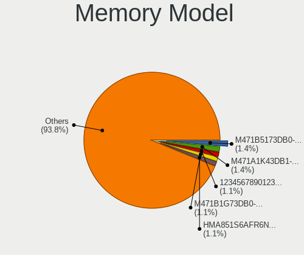

| Model                                                               | Computers | Percent |
|---------------------------------------------------------------------|-----------|---------|
| SK hynix RAM HMT41GS6BFR8A-PB 8GB SODIMM DDR3 1600MT/s              | 3         | 1.45%   |
| SK hynix RAM HMA82GS6JJR8N-VK 16GB SODIMM DDR4 2667MT/s             | 3         | 1.45%   |
| Samsung RAM M471B5173DB0-YK0 4096MB SODIMM DDR3 1600MT/s            | 3         | 1.45%   |
| Unknown RAM Module 2048MB DIMM SDRAM                                | 2         | 0.97%   |
| Transcend RAM JM2666HLB-8G 8192MB DIMM DDR4 2667MT/s                | 2         | 0.97%   |
| SK hynix RAM HMT451S6BFR8A-PB 4GB SODIMM DDR3 1600MT/s              | 2         | 0.97%   |
| SK hynix RAM HMA851S6AFR6N-UH 4GB SODIMM DDR4 2667MT/s              | 2         | 0.97%   |
| SK hynix RAM HMA81GS6AFR8N-UH 8GB SODIMM DDR4 2667MT/s              | 2         | 0.97%   |
| Samsung RAM M471B5773DH0-CH9 2048MB SODIMM DDR3 1600MT/s            | 2         | 0.97%   |
| Samsung RAM M471B5673FH0-CH9 2GB SODIMM DDR3 1334MT/s               | 2         | 0.97%   |
| Samsung RAM M471B5273CH0-YK0 4096MB SODIMM DDR3 1600MT/s            | 2         | 0.97%   |
| Samsung RAM M471B1G73QH0-YK0 8GB SODIMM DDR3 1600MT/s               | 2         | 0.97%   |
| Samsung RAM M471B1G73DB0-YK0 8GB SODIMM DDR3 1600MT/s               | 2         | 0.97%   |
| Samsung RAM K4EBE304EB-EGCG 8GB Row Of Chips LPDDR3 2133MT/s        | 2         | 0.97%   |
| Patriot RAM PSD48G266681 8GB DIMM DDR4 2934MT/s                     | 2         | 0.97%   |
| Micron RAM 8KTF51264HZ-1G6E1 4096MB SODIMM DDR3 1600MT/s            | 2         | 0.97%   |
| Micron RAM 8ATF2G64HZ-3G2E1 16GB SODIMM DDR4 3200MT/s               | 2         | 0.97%   |
| Kingston RAM KHX3200C16D4/8GX 8GB DIMM DDR4 3600MT/s                | 2         | 0.97%   |
| G.Skill RAM F4-3600C16-16GVKC 16GB DIMM DDR4 3866MT/s               | 2         | 0.97%   |
| Elpida RAM EBJ41UF8BDU0-GN-F 4096MB SODIMM DDR3 1600MT/s            | 2         | 0.97%   |
| Unknown RAM Module 8GB DIMM DDR3 1333MT/s                           | 1         | 0.48%   |
| Unknown RAM Module 8192MB DIMM DDR3 1600MT/s                        | 1         | 0.48%   |
| Unknown RAM Module 512MB DIMM 800MT/s                               | 1         | 0.48%   |
| Unknown RAM Module 4GB DIMM 1333MT/s                                | 1         | 0.48%   |
| Unknown RAM Module 4096MB DIMM DDR3 1600MT/s                        | 1         | 0.48%   |
| Unknown RAM Module 4096MB DIMM 1600MT/s                             | 1         | 0.48%   |
| Unknown RAM Module 4096MB DIMM 1333MT/s                             | 1         | 0.48%   |
| Unknown RAM Module 2GB DIMM SDRAM                                   | 1         | 0.48%   |
| Unknown RAM Module 2GB DIMM 800MT/s                                 | 1         | 0.48%   |
| Unknown RAM Module 2048MB SODIMM DDR3 1600MT/s                      | 1         | 0.48%   |
| Unknown RAM Module 2048MB SODIMM DDR2 800MT/s                       | 1         | 0.48%   |
| Unknown RAM Module 2048MB DIMM 800MT/s                              | 1         | 0.48%   |
| Unknown RAM Module 1024MB SODIMM DDR2                               | 1         | 0.48%   |
| Unknown RAM Module 1024MB DIMM DDR2 400MT/s                         | 1         | 0.48%   |
| Unknown (ABCD) RAM 123456789012345678 2048MB SODIMM LPDDR4 2400MT/s | 1         | 0.48%   |
| Transcend RAM JM2400HLB-8G 8192MB DIMM DDR4 2133MT/s                | 1         | 0.48%   |
| Team RAM TEAMGROUP-UD4-3200 32GB DIMM DDR4 3200MT/s                 | 1         | 0.48%   |
| Team RAM TEAMGROUP-UD4-3000 8GB DIMM DDR4 3067MT/s                  | 1         | 0.48%   |
| SK hynix RAM Module 4096MB SODIMM LPDDR3 1867MT/s                   | 1         | 0.48%   |
| SK hynix RAM Module 16384MB SODIMM DDR4 2667MT/s                    | 1         | 0.48%   |
| SK hynix RAM HYMP512S64BP8-Y5 1GB SODIMM DDR 667MT/s                | 1         | 0.48%   |
| SK hynix RAM HMT451U6AFR8C-PB 4GB DIMM DDR3                         | 1         | 0.48%   |
| SK hynix RAM HMT41GS6AFR8A-PB 8GB SODIMM DDR3 1600MT/s              | 1         | 0.48%   |
| SK hynix RAM HMT351S6EFR8A-PB 4GB SODIMM DDR3 1600MT/s              | 1         | 0.48%   |
| SK hynix RAM HMT351S6CFR8C-PB 4GB SODIMM DDR3 1600MT/s              | 1         | 0.48%   |
| SK hynix RAM HMT351S6CFR8C-H9 4GB SODIMM DDR3 1333MT/s              | 1         | 0.48%   |
| SK hynix RAM HMT351S6BFR8C-H9 4096MB SODIMM DDR3 1333MT/s           | 1         | 0.48%   |
| SK hynix RAM HMT125S6BFR8C-G7 2GB SODIMM DDR3 1067MT/s              | 1         | 0.48%   |
| SK hynix RAM HMAB2GS6AMR6N-XN 16GB SODIMM DDR4 3200MT/s             | 1         | 0.48%   |
| SK hynix RAM HMAA2GS6AJR8N-XN 16GB SODIMM DDR4 3200MT/s             | 1         | 0.48%   |
| SK hynix RAM HMA81GU7AFR8N-UH 8192MB DIMM DDR4 2400MT/s             | 1         | 0.48%   |
| SK hynix RAM HMA41GS6AFR8N-TF 8GB SODIMM DDR4 2667MT/s              | 1         | 0.48%   |
| Samsung RAM Module 4096MB SODIMM DDR4 2133MT/s                      | 1         | 0.48%   |
| Samsung RAM Module 2048MB Row Of Chips LPDDR4 4267MT/s              | 1         | 0.48%   |
| Samsung RAM Module 16384MB SODIMM DDR4 3200MT/s                     | 1         | 0.48%   |
| Samsung RAM M471B5673FH0-CF8 2048MB SODIMM DDR3 1067MT/s            | 1         | 0.48%   |
| Samsung RAM M471B5273DH0-CK0 4GB SODIMM DDR3 1600MT/s               | 1         | 0.48%   |
| Samsung RAM M471B5273DH0-CH9 4096MB SODIMM DDR3 1334MT/s            | 1         | 0.48%   |
| Samsung RAM M471B5273CH0-CK0 4GB SODIMM DDR3 1600MT/s               | 1         | 0.48%   |
| Samsung RAM M471B5273CH0-CH9 4096MB SODIMM DDR3 1334MT/s            | 1         | 0.48%   |

Memory Kind
-----------

Memory module kinds

| Kind    | Computers | Percent |
|---------|-----------|---------|
| DDR3    | 67        | 41.36%  |
| DDR4    | 66        | 40.74%  |
| LPDDR3  | 6         | 3.7%    |
| DDR2    | 6         | 3.7%    |
| Unknown | 6         | 3.7%    |
| SDRAM   | 4         | 2.47%   |
| LPDDR4  | 4         | 2.47%   |
| DRAM    | 1         | 0.62%   |
| DDR5    | 1         | 0.62%   |
| DDR     | 1         | 0.62%   |

Memory Form Factor
------------------

Physical design of the memory module

| Name         | Computers | Percent |
|--------------|-----------|---------|
| SODIMM       | 91        | 56.88%  |
| DIMM         | 63        | 39.38%  |
| Row Of Chips | 6         | 3.75%   |

Memory Size
-----------

Memory module size

| Size  | Computers | Percent |
|-------|-----------|---------|
| 4096  | 62        | 36.26%  |
| 8192  | 59        | 34.5%   |
| 16384 | 24        | 14.04%  |
| 2048  | 17        | 9.94%   |
| 1024  | 5         | 2.92%   |
| 32768 | 2         | 1.17%   |
| 512   | 2         | 1.17%   |

Memory Speed
------------

Memory module speed

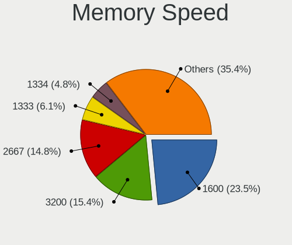

| Speed   | Computers | Percent |
|---------|-----------|---------|
| 1600    | 49        | 27.37%  |
| 2667    | 29        | 16.2%   |
| 3200    | 21        | 11.73%  |
| 1333    | 14        | 7.82%   |
| 2133    | 10        | 5.59%   |
| 1334    | 8         | 4.47%   |
| 2400    | 6         | 3.35%   |
| 667     | 5         | 2.79%   |
| 3600    | 4         | 2.23%   |
| 2666    | 4         | 2.23%   |
| 800     | 4         | 2.23%   |
| Unknown | 4         | 2.23%   |
| 1867    | 3         | 1.68%   |
| 1067    | 3         | 1.68%   |
| 3866    | 2         | 1.12%   |
| 2934    | 2         | 1.12%   |
| 2800    | 2         | 1.12%   |
| 4800    | 1         | 0.56%   |
| 4267    | 1         | 0.56%   |
| 3733    | 1         | 0.56%   |
| 3466    | 1         | 0.56%   |
| 3400    | 1         | 0.56%   |
| 3266    | 1         | 0.56%   |
| 3067    | 1         | 0.56%   |
| 1066    | 1         | 0.56%   |
| 400     | 1         | 0.56%   |

Printers & scanners
-------------------

Printer Vendor
--------------

Printer device vendors

| Vendor              | Computers | Percent |
|---------------------|-----------|---------|
| Samsung Electronics | 3         | 60%     |
| Hewlett-Packard     | 2         | 40%     |

Printer Model
-------------

Printer device models

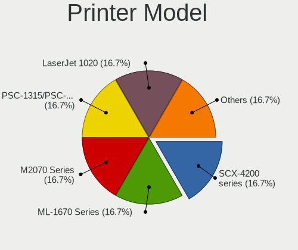

| Model                   | Computers | Percent |
|-------------------------|-----------|---------|
| Samsung SCX-4200 series | 1         | 20%     |
| Samsung ML-1670 Series  | 1         | 20%     |
| Samsung M2070 Series    | 1         | 20%     |
| HP PSC-1315/PSC-1317    | 1         | 20%     |
| HP LaserJet 1020        | 1         | 20%     |

Scanner Vendor
--------------

Scanner device vendors

| Vendor | Computers | Percent |
|--------|-----------|---------|
| Canon  | 1         | 100%    |

Scanner Model
-------------

Scanner device models

| Model                  | Computers | Percent |
|------------------------|-----------|---------|
| Canon CanoScan LIDE 25 | 1         | 100%    |

Camera
------

Camera Vendor
-------------

Camera device vendors

| Vendor                                 | Computers | Percent |
|----------------------------------------|-----------|---------|
| IMC Networks                           | 30        | 17.24%  |
| Chicony Electronics                    | 30        | 17.24%  |
| Microdia                               | 15        | 8.62%   |
| Sunplus Innovation Technology          | 14        | 8.05%   |
| Acer                                   | 14        | 8.05%   |
| Realtek Semiconductor                  | 11        | 6.32%   |
| Suyin                                  | 8         | 4.6%    |
| Logitech                               | 7         | 4.02%   |
| Syntek                                 | 5         | 2.87%   |
| Alcor Micro                            | 5         | 2.87%   |
| Luxvisions Innotech Limited            | 4         | 2.3%    |
| Silicon Motion                         | 3         | 1.72%   |
| Lite-On Technology                     | 3         | 1.72%   |
| Sonix Technology                       | 2         | 1.15%   |
| Samsung Electronics                    | 2         | 1.15%   |
| Quanta                                 | 2         | 1.15%   |
| OmniVision Technologies                | 2         | 1.15%   |
| Cheng Uei Precision Industry (Foxlink) | 2         | 1.15%   |
| Apple                                  | 2         | 1.15%   |
| Z-Star Microelectronics                | 1         | 0.57%   |
| Ricoh                                  | 1         | 0.57%   |
| Razer USA                              | 1         | 0.57%   |
| Primax Electronics                     | 1         | 0.57%   |
| Pixart Imaging                         | 1         | 0.57%   |
| Panasonic (Matsushita)                 | 1         | 0.57%   |
| Lenovo                                 | 1         | 0.57%   |
| Intel                                  | 1         | 0.57%   |
| Importek                               | 1         | 0.57%   |
| DigiTech                               | 1         | 0.57%   |
| Cubeternet                             | 1         | 0.57%   |
| Arkmicro Technologies                  | 1         | 0.57%   |
| ALi                                    | 1         | 0.57%   |

Camera Model
------------

Camera device models

| Model                                            | Computers | Percent |
|--------------------------------------------------|-----------|---------|
| IMC Networks Integrated Camera                   | 9         | 5.17%   |
| Chicony Integrated Camera                        | 9         | 5.17%   |
| IMC Networks USB2.0 HD UVC WebCam                | 8         | 4.6%    |
| Microdia Integrated_Webcam_HD                    | 7         | 4.02%   |
| Sunplus Integrated_Webcam_HD                     | 4         | 2.3%    |
| Syntek Lenovo EasyCamera                         | 3         | 1.72%   |
| Sunplus HP HD Webcam [Fixed]                     | 3         | 1.72%   |
| Realtek Integrated_Webcam_HD                     | 3         | 1.72%   |
| Luxvisions Innotech Limited HP HD Camera         | 3         | 1.72%   |
| IMC Networks UVC VGA Webcam                      | 3         | 1.72%   |
| Chicony ThinkPad T490 Webcam                     | 3         | 1.72%   |
| Acer Integrated Camera                           | 3         | 1.72%   |
| Suyin HP Webcam                                  | 2         | 1.15%   |
| Sunplus HD WebCam                                | 2         | 1.15%   |
| Sunplus ASUS USB2.0 Webcam                       | 2         | 1.15%   |
| Silicon Motion Lenovo EasyCamera                 | 2         | 1.15%   |
| Samsung Galaxy series, misc. (MTP mode)          | 2         | 1.15%   |
| Microdia Integrated Webcam                       | 2         | 1.15%   |
| Logitech Webcam C270                             | 2         | 1.15%   |
| Logitech HD Webcam C615                          | 2         | 1.15%   |
| IMC Networks VGA UVC WebCam                      | 2         | 1.15%   |
| IMC Networks 2M Integrated Webcam                | 2         | 1.15%   |
| Chicony Webcam                                   | 2         | 1.15%   |
| Chicony USB2.0 HD UVC WebCam                     | 2         | 1.15%   |
| Chicony USB2.0 0.3M UVC WebCam                   | 2         | 1.15%   |
| Chicony HP Laptop Integrated Webcam [2 MP Fixed] | 2         | 1.15%   |
| Chicony HP HD Webcam                             | 2         | 1.15%   |
| Apple FaceTime HD Camera (Built-in)              | 2         | 1.15%   |
| Alcor Micro USB 2.0 Camera                       | 2         | 1.15%   |
| Alcor Micro Asus Integrated Webcam               | 2         | 1.15%   |
| Acer SunplusIT Integrated Camera                 | 2         | 1.15%   |
| Acer LENOVO LBG 1080P CAM                        | 2         | 1.15%   |
| Z-Star Venus USB2.0 Camera                       | 1         | 0.57%   |
| Syntek Sonix USB 2.0 Camera                      | 1         | 0.57%   |
| Syntek Integrated Camera                         | 1         | 0.57%   |
| Suyin WebCam                                     | 1         | 0.57%   |
| Suyin Laptop_Integrated_Webcam_HD                | 1         | 0.57%   |
| Suyin Integrated Camera                          | 1         | 0.57%   |
| Suyin HP TrueVision HD Integrated Webcam         | 1         | 0.57%   |
| Suyin Acer/Lenovo Webcam [CN0316]                | 1         | 0.57%   |
| Suyin 1.3M HD WebCam                             | 1         | 0.57%   |
| Sunplus Laptop_Integrated_Webcam_FHD             | 1         | 0.57%   |
| Sunplus Integrated_Webcam_FHD                    | 1         | 0.57%   |
| Sunplus AUSDOM FHD Camera                        | 1         | 0.57%   |
| Sonix USB2.0 HD UVC WebCam                       | 1         | 0.57%   |
| Sonix HDF Webcam USB                             | 1         | 0.57%   |
| Silicon Motion WebCam SC-13HDL12131N             | 1         | 0.57%   |
| Ricoh Sony Visual Communication Camera           | 1         | 0.57%   |
| Realtek USB2.0 HD UVC WebCam                     | 1         | 0.57%   |
| Realtek USB Camera                               | 1         | 0.57%   |
| Realtek Streaming Webcam                         | 1         | 0.57%   |
| Realtek Laptop_Integrated_Webcam_HD              | 1         | 0.57%   |
| Realtek Integrated Webcam_HD                     | 1         | 0.57%   |
| Realtek Integrated Webcam                        | 1         | 0.57%   |
| Realtek Integrated Camera                        | 1         | 0.57%   |
| Realtek HP Truevision HD                         | 1         | 0.57%   |
| Razer USA Gaming Webcam [Kiyo]                   | 1         | 0.57%   |
| Quanta HP HD Camera                              | 1         | 0.57%   |
| Quanta HD User Facing                            | 1         | 0.57%   |
| Primax HP HD Webcam [Fixed]                      | 1         | 0.57%   |

Security
--------

Fingerprint Vendor
------------------

Fingerprint sensor vendors

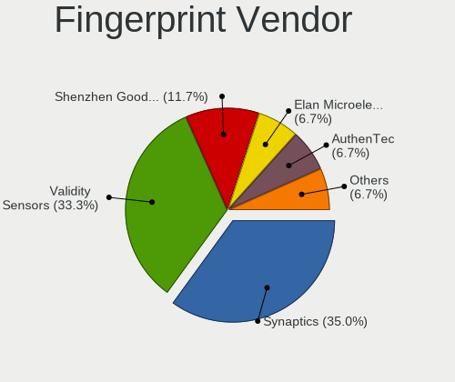

| Vendor                     | Computers | Percent |
|----------------------------|-----------|---------|
| Synaptics                  | 17        | 41.46%  |
| Validity Sensors           | 9         | 21.95%  |
| Shenzhen Goodix Technology | 4         | 9.76%   |
| Elan Microelectronics      | 4         | 9.76%   |
| AuthenTec                  | 4         | 9.76%   |
| STMicroelectronics         | 2         | 4.88%   |
| LighTuning Technology      | 1         | 2.44%   |

Fingerprint Model
-----------------

Fingerprint sensor models

| Model                                                      | Computers | Percent |
|------------------------------------------------------------|-----------|---------|
| Synaptics Prometheus MIS Touch Fingerprint Reader          | 9         | 21.95%  |
| Validity Sensors VFS471 Fingerprint Reader                 | 3         | 7.32%   |
| Synaptics Metallica MIS Touch Fingerprint Reader           | 3         | 7.32%   |
| Elan ELAN:Fingerprint                                      | 3         | 7.32%   |
| Synaptics Metallica MOH Touch Fingerprint Reader           | 2         | 4.88%   |
| STMicroelectronics Fingerprint Reader                      | 2         | 4.88%   |
| Shenzhen Goodix Fingerprint Reader                         | 2         | 4.88%   |
| AuthenTec AES2810                                          | 2         | 4.88%   |
| AuthenTec AES1600                                          | 2         | 4.88%   |
| Validity Sensors VFS7500 Touch Fingerprint Sensor          | 1         | 2.44%   |
| Validity Sensors VFS5011 Fingerprint Reader                | 1         | 2.44%   |
| Validity Sensors VFS495 Fingerprint Reader                 | 1         | 2.44%   |
| Validity Sensors VFS451 Fingerprint Reader                 | 1         | 2.44%   |
| Validity Sensors VFS301 Fingerprint Reader                 | 1         | 2.44%   |
| Validity Sensors Fingerprint scanner                       | 1         | 2.44%   |
| Synaptics  VFS7552 Touch Fingerprint Sensor with PurePrint | 1         | 2.44%   |
| Synaptics  FS7604 Touch Fingerprint Sensor with PurePrint  | 1         | 2.44%   |
| Shenzhen Goodix  FingerPrint Device                        | 1         | 2.44%   |
| Shenzhen Goodix FingerPrint                                | 1         | 2.44%   |
| LighTuning EgisTec Touch Fingerprint Sensor                | 1         | 2.44%   |
| Elan ELAN:ARM-M4                                           | 1         | 2.44%   |
| Unknown                                                    | 1         | 2.44%   |

Chipcard Vendor
---------------

Chipcard module vendors

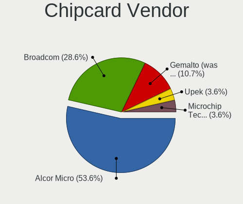

| Vendor                | Computers | Percent |
|-----------------------|-----------|---------|
| Alcor Micro           | 11        | 55%     |
| Broadcom              | 5         | 25%     |
| Gemalto (was Gemplus) | 3         | 15%     |
| Upek                  | 1         | 5%      |

Chipcard Model
--------------

Chipcard module models

| Model                                                                        | Computers | Percent |
|------------------------------------------------------------------------------|-----------|---------|
| Alcor Micro AU9540 Smartcard Reader                                          | 11        | 55%     |
| Gemalto (was Gemplus) GemPC Twin SmartCard Reader                            | 2         | 10%     |
| Broadcom 5880                                                                | 2         | 10%     |
| Upek TouchChip Fingerprint Coprocessor (WBF advanced mode)                   | 1         | 5%      |
| Gemalto (was Gemplus) Compact Smart Card Reader Writer                       | 1         | 5%      |
| Broadcom BCM5880 Secure Applications Processor with fingerprint swipe sensor | 1         | 5%      |
| Broadcom BCM5880 Secure Applications Processor                               | 1         | 5%      |
| Broadcom 58200                                                               | 1         | 5%      |

Unsupported
-----------

Unsupported Devices
-------------------

Total unsupported devices on board

| Total | Computers | Percent |
|-------|-----------|---------|
| 0     | 200       | 72.2%   |
| 1     | 57        | 20.58%  |
| 2     | 16        | 5.78%   |
| 3     | 3         | 1.08%   |
| 4     | 1         | 0.36%   |

Unsupported Device Types
------------------------

Types of unsupported devices

| Type                     | Computers | Percent |
|--------------------------|-----------|---------|
| Fingerprint reader       | 39        | 38.61%  |
| Graphics card            | 18        | 17.82%  |
| Chipcard                 | 18        | 17.82%  |
| Net/wireless             | 9         | 8.91%   |
| Multimedia controller    | 3         | 2.97%   |
| Camera                   | 3         | 2.97%   |
| Bluetooth                | 3         | 2.97%   |
| Communication controller | 2         | 1.98%   |
| Storage                  | 1         | 0.99%   |
| Sound                    | 1         | 0.99%   |
| Network                  | 1         | 0.99%   |
| Net/ethernet             | 1         | 0.99%   |
| Flash memory             | 1         | 0.99%   |
| Card reader              | 1         | 0.99%   |

