Linux in Luxembourg - Tested Hardware & Statistics
--------------------------------------------------

A project to collect tested hardware configurations for Linux in Luxembourg.

Anyone can contribute to this report by the [hw-probe](https://github.com/linuxhw/hw-probe) tool:

    sudo -E hw-probe -all -upload

Please contribute! Especially if your hardware is rare.

This is a report for all computer types. See also reports for [desktops](/Location/Luxembourg/Desktop/README.md) and [notebooks](/Location/Luxembourg/Notebook/README.md).

Contents
--------

* [ Test Cases ](#test-cases)

* [ System ](#system)
  - [ OS                       ](#os)
  - [ OS Family                ](#os-family)
  - [ Kernel                   ](#kernel)
  - [ Kernel Family            ](#kernel-family)
  - [ Kernel Major Ver.        ](#kernel-major-ver)
  - [ Arch                     ](#arch)
  - [ DE                       ](#de)
  - [ Display Server           ](#display-server)
  - [ Display Manager          ](#display-manager)
  - [ OS Lang                  ](#os-lang)
  - [ Boot Mode                ](#boot-mode)
  - [ Filesystem               ](#filesystem)
  - [ Part. scheme             ](#part-scheme)
  - [ Dual Boot with Linux/BSD ](#dual-boot-with-linuxbsd)
  - [ Dual Boot (Win)          ](#dual-boot-win)

* [ Board ](#board)
  - [ Vendor                   ](#vendor)
  - [ Model                    ](#model)
  - [ Model Family             ](#model-family)
  - [ MFG Year                 ](#mfg-year)
  - [ Form Factor              ](#form-factor)
  - [ Secure Boot              ](#secure-boot)
  - [ Coreboot                 ](#coreboot)
  - [ RAM Size                 ](#ram-size)
  - [ RAM Used                 ](#ram-used)
  - [ Total Drives             ](#total-drives)
  - [ Has CD-ROM               ](#has-cd-rom)
  - [ Has Ethernet             ](#has-ethernet)
  - [ Has WiFi                 ](#has-wifi)
  - [ Has Bluetooth            ](#has-bluetooth)

* [ Location ](#location)
  - [ Country                  ](#country)
  - [ City                     ](#city)

* [ Drives ](#drives)
  - [ Drive Vendor             ](#drive-vendor)
  - [ Drive Model              ](#drive-model)
  - [ HDD Vendor               ](#hdd-vendor)
  - [ SSD Vendor               ](#ssd-vendor)
  - [ Drive Kind               ](#drive-kind)
  - [ Drive Connector          ](#drive-connector)
  - [ Drive Size               ](#drive-size)
  - [ Space Total              ](#space-total)
  - [ Space Used               ](#space-used)
  - [ Malfunc. Drives          ](#malfunc-drives)
  - [ Malfunc. Drive Vendor    ](#malfunc-drive-vendor)
  - [ Malfunc. HDD Vendor      ](#malfunc-hdd-vendor)
  - [ Malfunc. Drive Kind      ](#malfunc-drive-kind)
  - [ Failed Drives            ](#failed-drives)
  - [ Failed Drive Vendor      ](#failed-drive-vendor)
  - [ Drive Status             ](#drive-status)

* [ Storage controller ](#storage-controller)
  - [ Storage Vendor           ](#storage-vendor)
  - [ Storage Model            ](#storage-model)
  - [ Storage Kind             ](#storage-kind)

* [ Processor ](#processor)
  - [ CPU Vendor               ](#cpu-vendor)
  - [ CPU Model                ](#cpu-model)
  - [ CPU Model Family         ](#cpu-model-family)
  - [ CPU Cores                ](#cpu-cores)
  - [ CPU Sockets              ](#cpu-sockets)
  - [ CPU Threads              ](#cpu-threads)
  - [ CPU Op-Modes             ](#cpu-op-modes)
  - [ CPU Microcode            ](#cpu-microcode)
  - [ CPU Microarch            ](#cpu-microarch)

* [ Graphics ](#graphics)
  - [ GPU Vendor               ](#gpu-vendor)
  - [ GPU Model                ](#gpu-model)
  - [ GPU Combo                ](#gpu-combo)
  - [ GPU Driver               ](#gpu-driver)
  - [ GPU Memory               ](#gpu-memory)

* [ Monitor ](#monitor)
  - [ Monitor Vendor           ](#monitor-vendor)
  - [ Monitor Model            ](#monitor-model)
  - [ Monitor Resolution       ](#monitor-resolution)
  - [ Monitor Diagonal         ](#monitor-diagonal)
  - [ Monitor Width            ](#monitor-width)
  - [ Aspect Ratio             ](#aspect-ratio)
  - [ Monitor Area             ](#monitor-area)
  - [ Pixel Density            ](#pixel-density)
  - [ Multiple Monitors        ](#multiple-monitors)

* [ Network ](#network)
  - [ Net Controller Vendor    ](#net-controller-vendor)
  - [ Net Controller Model     ](#net-controller-model)
  - [ Wireless Vendor          ](#wireless-vendor)
  - [ Wireless Model           ](#wireless-model)
  - [ Ethernet Vendor          ](#ethernet-vendor)
  - [ Ethernet Model           ](#ethernet-model)
  - [ Net Controller Kind      ](#net-controller-kind)
  - [ Used Controller          ](#used-controller)
  - [ NICs                     ](#nics)
  - [ IPv6                     ](#ipv6)

* [ Bluetooth ](#bluetooth)
  - [ Bluetooth Vendor         ](#bluetooth-vendor)
  - [ Bluetooth Model          ](#bluetooth-model)

* [ Sound ](#sound)
  - [ Sound Vendor             ](#sound-vendor)
  - [ Sound Model              ](#sound-model)

* [ Memory ](#memory)
  - [ Memory Vendor            ](#memory-vendor)
  - [ Memory Model             ](#memory-model)
  - [ Memory Kind              ](#memory-kind)
  - [ Memory Form Factor       ](#memory-form-factor)
  - [ Memory Size              ](#memory-size)
  - [ Memory Speed             ](#memory-speed)

* [ Printers & scanners ](#printers--scanners)
  - [ Printer Vendor           ](#printer-vendor)
  - [ Printer Model            ](#printer-model)
  - [ Scanner Vendor           ](#scanner-vendor)
  - [ Scanner Model            ](#scanner-model)

* [ Camera ](#camera)
  - [ Camera Vendor            ](#camera-vendor)
  - [ Camera Model             ](#camera-model)

* [ Security ](#security)
  - [ Fingerprint Vendor       ](#fingerprint-vendor)
  - [ Fingerprint Model        ](#fingerprint-model)
  - [ Chipcard Vendor          ](#chipcard-vendor)
  - [ Chipcard Model           ](#chipcard-model)

* [ Unsupported ](#unsupported)
  - [ Unsupported Devices      ](#unsupported-devices)
  - [ Unsupported Device Types ](#unsupported-device-types)

Test Cases
----------

Total: 292

| Vendor        | Model                       | Form-Factor | Probe                                                      | Date         |
|---------------|-----------------------------|-------------|------------------------------------------------------------|--------------|
| MSI           | B360M BAZOOKA               | Desktop     | [e41d8a90ce](https://linux-hardware.org/?probe=e41d8a90ce) | Jan 03, 2026 |
| MSI           | B360M BAZOOKA               | Desktop     | [1816bafc2f](https://linux-hardware.org/?probe=1816bafc2f) | Jan 03, 2026 |
| Lenovo        | ThinkPad T470s 20HGS0810... | Notebook    | [115b55b551](https://linux-hardware.org/?probe=115b55b551) | Jan 03, 2026 |
| ASUSTek       | ROG Strix G513QM_G513QM     | Notebook    | [07cb5bda85](https://linux-hardware.org/?probe=07cb5bda85) | Jan 03, 2026 |
| Lenovo        | ThinkPad T470s 20HGS0810... | Notebook    | [b79baca426](https://linux-hardware.org/?probe=b79baca426) | Jan 02, 2026 |
| ASUSTek       | ROG Strix G513QM_G513QM     | Notebook    | [8c986ea841](https://linux-hardware.org/?probe=8c986ea841) | Jan 02, 2026 |
| ASUSTek       | TUF Gaming B550-PLUS        | Desktop     | [d538da03bc](https://linux-hardware.org/?probe=d538da03bc) | Dec 31, 2025 |
| ASUSTek       | TUF Gaming B550-PLUS        | Desktop     | [e7cadd64d4](https://linux-hardware.org/?probe=e7cadd64d4) | Dec 31, 2025 |
| ORIGIMAGIC    | ARB51-02                    | Mini pc     | [c9aa0a45de](https://linux-hardware.org/?probe=c9aa0a45de) | Dec 31, 2025 |
| Acer          | Aspire A314-23P             | Notebook    | [5452aa342a](https://linux-hardware.org/?probe=5452aa342a) | Dec 30, 2025 |
| Acer          | Aspire A314-23P             | Notebook    | [ef59712365](https://linux-hardware.org/?probe=ef59712365) | Dec 30, 2025 |
| HP            | Pavilion 17                 | Notebook    | [bc4c619c70](https://linux-hardware.org/?probe=bc4c619c70) | Dec 24, 2025 |
| ASUSTek       | ROG Strix G513QM_G513QM     | Notebook    | [6e8baed165](https://linux-hardware.org/?probe=6e8baed165) | Dec 18, 2025 |
| Dell          | Latitude E7470              | Notebook    | [8e944785a2](https://linux-hardware.org/?probe=8e944785a2) | Dec 07, 2025 |
| ASRock        | B450M-HDV R4.0              | Desktop     | [a844944aa5](https://linux-hardware.org/?probe=a844944aa5) | Nov 23, 2025 |
| ASUSTek       | Z97-K                       | Desktop     | [d8c30c78f9](https://linux-hardware.org/?probe=d8c30c78f9) | Nov 21, 2025 |
| Lenovo        | IdeaPad Slim 5 14IRL8 82... | Notebook    | [75ffc28242](https://linux-hardware.org/?probe=75ffc28242) | Oct 27, 2025 |
| Gigabyte      | B550M AORUS PRO-P           | Desktop     | [eed1b102d3](https://linux-hardware.org/?probe=eed1b102d3) | Oct 26, 2025 |
| Lenovo        | Unknown                     | Notebook    | [054bdb4dc4](https://linux-hardware.org/?probe=054bdb4dc4) | Oct 20, 2025 |
| ASRock        | Z790 PG Riptide             | Desktop     | [94387b731c](https://linux-hardware.org/?probe=94387b731c) | Sep 27, 2025 |
| ASUSTek       | ROG Strix G513QM_G513QM     | Notebook    | [9ad2cdc7da](https://linux-hardware.org/?probe=9ad2cdc7da) | Sep 23, 2025 |
| HP            | 198E                        | Desktop     | [3328974183](https://linux-hardware.org/?probe=3328974183) | Aug 16, 2025 |
| Timi          | TM1613                      | Notebook    | [2db759a652](https://linux-hardware.org/?probe=2db759a652) | Aug 12, 2025 |
| ASUSTek       | ROG Zephyrus G14 GA401QM... | Notebook    | [65280e3263](https://linux-hardware.org/?probe=65280e3263) | Jul 29, 2025 |
| TUXEDO        | Stellaris 16 Intel Gen7     | Notebook    | [5eb9612d31](https://linux-hardware.org/?probe=5eb9612d31) | Jul 23, 2025 |
| ASUSTek       | Maximus VIII RANGER         | Desktop     | [a6e747d14c](https://linux-hardware.org/?probe=a6e747d14c) | Jul 09, 2025 |
| Lenovo        | ThinkPad T14 Gen 3 21CGS... | Notebook    | [8818350692](https://linux-hardware.org/?probe=8818350692) | May 06, 2025 |
| Lenovo        | ThinkPad T14 Gen 3 21CGS... | Notebook    | [c30de4d76c](https://linux-hardware.org/?probe=c30de4d76c) | May 06, 2025 |
| ASUSTek       | PRIME B760M-A WIFI          | Desktop     | [09be7a19bd](https://linux-hardware.org/?probe=09be7a19bd) | May 02, 2025 |
| ASUSTek       | ROG Zephyrus G14 GA401QM... | Notebook    | [0eda7136e3](https://linux-hardware.org/?probe=0eda7136e3) | Apr 28, 2025 |
| HP            | 8055                        | Desktop     | [934118175b](https://linux-hardware.org/?probe=934118175b) | Apr 24, 2025 |
| HP            | ENVY x360 Convertible 15... | Convertible | [33907022c1](https://linux-hardware.org/?probe=33907022c1) | Mar 23, 2025 |
| Dell          | 0HD5W2 A01                  | Desktop     | [64d4e9368b](https://linux-hardware.org/?probe=64d4e9368b) | Mar 20, 2025 |
| MSI           | B550-A PRO                  | Desktop     | [1b47f05d08](https://linux-hardware.org/?probe=1b47f05d08) | Mar 14, 2025 |
| Dell          | 0HD5W2 A01                  | Desktop     | [8255f3fa2a](https://linux-hardware.org/?probe=8255f3fa2a) | Mar 14, 2025 |
| MSI           | H81M-E33                    | Desktop     | [901bb986b7](https://linux-hardware.org/?probe=901bb986b7) | Mar 09, 2025 |
| MACHINIST     | E5-D8-MAX V1.1              | Desktop     | [1ddb1470db](https://linux-hardware.org/?probe=1ddb1470db) | Feb 24, 2025 |
| ASRock        | B450M-HDV R4.0              | Desktop     | [363c0bddb9](https://linux-hardware.org/?probe=363c0bddb9) | Feb 18, 2025 |
| MSI           | GF75 Thin 10SER             | Notebook    | [f576959cee](https://linux-hardware.org/?probe=f576959cee) | Feb 04, 2025 |
| ASUSTek       | G16CHR                      | Desktop     | [951c844f51](https://linux-hardware.org/?probe=951c844f51) | Jan 31, 2025 |
| ASUSTek       | G16CHR                      | Desktop     | [d17f1249f5](https://linux-hardware.org/?probe=d17f1249f5) | Jan 31, 2025 |
| Acer          | Predator G5900              | Desktop     | [5e9d88726a](https://linux-hardware.org/?probe=5e9d88726a) | Jan 13, 2025 |
| Acer          | Predator G5900              | Desktop     | [86cd93546c](https://linux-hardware.org/?probe=86cd93546c) | Jan 13, 2025 |
| Dell          | Inspiron 1545               | Notebook    | [6d2b2655a2](https://linux-hardware.org/?probe=6d2b2655a2) | Jan 13, 2025 |
| Dell          | Inspiron 1545               | Notebook    | [157c5941a3](https://linux-hardware.org/?probe=157c5941a3) | Jan 13, 2025 |
| Acer          | Aspire V3-372               | Notebook    | [09b938a2da](https://linux-hardware.org/?probe=09b938a2da) | Dec 28, 2024 |
| Dell          | Precision 5570              | Notebook    | [225e1aeb1a](https://linux-hardware.org/?probe=225e1aeb1a) | Dec 20, 2024 |
| Apple         | MacBookPro9,2               | Notebook    | [cfc4d7a317](https://linux-hardware.org/?probe=cfc4d7a317) | Dec 13, 2024 |
| Acer          | Aspire F5-572G              | Notebook    | [0968b801ff](https://linux-hardware.org/?probe=0968b801ff) | Nov 25, 2024 |
| ASUSTek       | PRIME H510M-E R2.0          | Desktop     | [98d4a70c46](https://linux-hardware.org/?probe=98d4a70c46) | Nov 20, 2024 |
| MACHINIST     | E5-D8-MAX V1.1              | Desktop     | [f162306658](https://linux-hardware.org/?probe=f162306658) | Nov 05, 2024 |
| HP            | EliteBook 855 G8 Noteboo... | Notebook    | [140fff3e9a](https://linux-hardware.org/?probe=140fff3e9a) | Oct 23, 2024 |
| Lenovo        | ThinkPad E14 Gen 3 20YE0... | Notebook    | [d98d306e9d](https://linux-hardware.org/?probe=d98d306e9d) | Oct 21, 2024 |
| Gigabyte      | B550M AORUS PRO-P           | Desktop     | [9ad57b30b6](https://linux-hardware.org/?probe=9ad57b30b6) | Oct 13, 2024 |
| Gigabyte      | H270N-WIFI-CF               | Desktop     | [b86b3cb42d](https://linux-hardware.org/?probe=b86b3cb42d) | Oct 03, 2024 |
| Lenovo        | ThinkPad E14 Gen 3 20YE0... | Notebook    | [1e671e853b](https://linux-hardware.org/?probe=1e671e853b) | Sep 25, 2024 |
| HP            | Pavilion dv7                | Notebook    | [871aaa0215](https://linux-hardware.org/?probe=871aaa0215) | Sep 11, 2024 |
| HP            | Pavilion dv7                | Notebook    | [af8ba6a16b](https://linux-hardware.org/?probe=af8ba6a16b) | Sep 11, 2024 |
| Dell          | XPS 13 9343                 | Notebook    | [e9a7ac7834](https://linux-hardware.org/?probe=e9a7ac7834) | Aug 21, 2024 |
| Gigabyte      | Z77X-D3H                    | Desktop     | [06e181a534](https://linux-hardware.org/?probe=06e181a534) | Aug 20, 2024 |
| Framework     | Laptop 13 (AMD Ryzen 704... | Notebook    | [848c3baea2](https://linux-hardware.org/?probe=848c3baea2) | Aug 14, 2024 |
| MSI           | B85M-E45                    | Desktop     | [0b7dfbd363](https://linux-hardware.org/?probe=0b7dfbd363) | Jul 29, 2024 |
| Lenovo        | ThinkPad P1 Gen 2 20QUS3... | Notebook    | [23f03d0904](https://linux-hardware.org/?probe=23f03d0904) | Jul 28, 2024 |
| ASRock        | H110M-STX                   | Desktop     | [6ed1b1b9b7](https://linux-hardware.org/?probe=6ed1b1b9b7) | Jul 27, 2024 |
| HP            | 89D8 SMVB                   | Desktop     | [1c42d3aa40](https://linux-hardware.org/?probe=1c42d3aa40) | Jul 23, 2024 |
| MSI           | B85M-E45                    | Desktop     | [a8fab1c7ba](https://linux-hardware.org/?probe=a8fab1c7ba) | Jul 15, 2024 |
| Dell          | XPS 13 7390                 | Notebook    | [abd82d0b67](https://linux-hardware.org/?probe=abd82d0b67) | Jul 11, 2024 |
| Micro Comp... | V3                          | Tablet      | [204e563893](https://linux-hardware.org/?probe=204e563893) | Jul 10, 2024 |
| MSI           | Raider 18 HX A14VGG         | Notebook    | [f052ea706e](https://linux-hardware.org/?probe=f052ea706e) | Jun 26, 2024 |
| HP            | 8928 00100                  | All in one  | [cbe450366d](https://linux-hardware.org/?probe=cbe450366d) | Jun 22, 2024 |
| HP            | 8928 00100                  | All in one  | [49179ddacb](https://linux-hardware.org/?probe=49179ddacb) | Jun 20, 2024 |
| MSI           | MAG B650 TOMAHAWK WIFI      | Desktop     | [692f458014](https://linux-hardware.org/?probe=692f458014) | May 01, 2024 |
| Apple         | MacBookPro8,1               | Notebook    | [d8f7a5da03](https://linux-hardware.org/?probe=d8f7a5da03) | Apr 23, 2024 |
| JWIPC         | A320I S1                    | Desktop     | [eea8091ffa](https://linux-hardware.org/?probe=eea8091ffa) | Apr 22, 2024 |
| JWIPC         | A320I S1                    | Desktop     | [c8bb6cd872](https://linux-hardware.org/?probe=c8bb6cd872) | Apr 21, 2024 |
| MSI           | MAG B550 TOMAHAWK           | Desktop     | [89107c7d88](https://linux-hardware.org/?probe=89107c7d88) | Apr 18, 2024 |
| Dell          | Latitude 5490               | Notebook    | [6083d1ad5b](https://linux-hardware.org/?probe=6083d1ad5b) | Apr 09, 2024 |
| ASUSTek       | PRIME B460M-A               | Desktop     | [63a643c790](https://linux-hardware.org/?probe=63a643c790) | Mar 26, 2024 |
| Lenovo        | Yoga 3 Pro-1370 80HE        | Notebook    | [529873e41c](https://linux-hardware.org/?probe=529873e41c) | Mar 26, 2024 |
| ASUSTek       | P6X58D PREMIUM              | Desktop     | [3e42f1f6bb](https://linux-hardware.org/?probe=3e42f1f6bb) | Mar 24, 2024 |
| Lenovo        | IdeaPad Pro 5 16APH8 83A... | Notebook    | [0f6b378c5d](https://linux-hardware.org/?probe=0f6b378c5d) | Mar 22, 2024 |
| Dell          | 0KC9NP A01                  | Desktop     | [ee6bd4e717](https://linux-hardware.org/?probe=ee6bd4e717) | Mar 07, 2024 |
| Unknown       | Unknown                     | Notebook    | [bad7799ac9](https://linux-hardware.org/?probe=bad7799ac9) | Feb 11, 2024 |
| Gigabyte      | Z77X-D3H                    | Desktop     | [aa69326408](https://linux-hardware.org/?probe=aa69326408) | Jan 29, 2024 |
| ASUSTek       | K72JT                       | Notebook    | [51117cd448](https://linux-hardware.org/?probe=51117cd448) | Dec 29, 2023 |
| HP            | 198E                        | Desktop     | [30e0f75eee](https://linux-hardware.org/?probe=30e0f75eee) | Dec 27, 2023 |
| ASUSTek       | ROG STRIX B550-F GAMING     | Desktop     | [e1e496f1a9](https://linux-hardware.org/?probe=e1e496f1a9) | Dec 15, 2023 |
| Dell          | Precision M3800             | Notebook    | [9e8d36821a](https://linux-hardware.org/?probe=9e8d36821a) | Dec 14, 2023 |
| ASUSTek       | UN65U                       | Mini pc     | [83a33710cc](https://linux-hardware.org/?probe=83a33710cc) | Dec 13, 2023 |
| HUAWEI        | HVY-WXX9                    | Notebook    | [6f35ce12bd](https://linux-hardware.org/?probe=6f35ce12bd) | Dec 07, 2023 |
| Dell          | Precision M3800             | Notebook    | [a01e02361f](https://linux-hardware.org/?probe=a01e02361f) | Nov 26, 2023 |
| Lenovo        | Legion 5 15IAH7H 82RB       | Notebook    | [0b974daf24](https://linux-hardware.org/?probe=0b974daf24) | Nov 24, 2023 |
| Framework     | Laptop                      | Notebook    | [ad3c0b1f5c](https://linux-hardware.org/?probe=ad3c0b1f5c) | Nov 10, 2023 |
| Tactus        | GeoFlex 140                 | Convertible | [a386eceffe](https://linux-hardware.org/?probe=a386eceffe) | Nov 05, 2023 |
| Panasonic     | CF-195DCUBML                | Notebook    | [e9e34a8b3b](https://linux-hardware.org/?probe=e9e34a8b3b) | Oct 29, 2023 |
| SLIMBOOK      | EXECUTIVE-14                | Notebook    | [39250155c4](https://linux-hardware.org/?probe=39250155c4) | Oct 26, 2023 |
| Dell          | 02K9CR A02                  | Desktop     | [47ca1834f0](https://linux-hardware.org/?probe=47ca1834f0) | Oct 15, 2023 |
| Acer          | Swift SFG14-71              | Notebook    | [612557336e](https://linux-hardware.org/?probe=612557336e) | Oct 14, 2023 |
| Lenovo        | ThinkPad X1 Yoga 2nd 20J... | Convertible | [19d2454b52](https://linux-hardware.org/?probe=19d2454b52) | Oct 07, 2023 |
| Lenovo        | ThinkPad X1 Yoga 2nd 20J... | Convertible | [4599ccbd45](https://linux-hardware.org/?probe=4599ccbd45) | Oct 07, 2023 |
| Samsung       | 550XBE/350XBE               | Notebook    | [3185dde146](https://linux-hardware.org/?probe=3185dde146) | Oct 04, 2023 |
| Lenovo        | ThinkPad X1 Yoga 2nd 20J... | Convertible | [2953047bfa](https://linux-hardware.org/?probe=2953047bfa) | Sep 25, 2023 |
| MSI           | GE63 7RD                    | Notebook    | [b0aac4eb91](https://linux-hardware.org/?probe=b0aac4eb91) | Sep 13, 2023 |
| MSI           | PRO Z790-P WIFI             | Desktop     | [5b9aef438f](https://linux-hardware.org/?probe=5b9aef438f) | Aug 12, 2023 |
| MSI           | PRO Z790-P WIFI             | Desktop     | [1f3f8a869b](https://linux-hardware.org/?probe=1f3f8a869b) | Aug 12, 2023 |
| Dell          | Precision 7670              | Notebook    | [09797bd60c](https://linux-hardware.org/?probe=09797bd60c) | Aug 04, 2023 |
| ASUSTek       | TUF Gaming X570-PLUS        | Desktop     | [50ee937fb2](https://linux-hardware.org/?probe=50ee937fb2) | Aug 02, 2023 |
| BESSTAR Te... | DMAF5 V1.0                  | Desktop     | [93c8724c91](https://linux-hardware.org/?probe=93c8724c91) | Jul 31, 2023 |
| HP            | ZBook Fury 16 G9 Mobile ... | Notebook    | [2b50e2b375](https://linux-hardware.org/?probe=2b50e2b375) | Jul 29, 2023 |
| Unknown       | T3 MRD                      | Desktop     | [5539799efa](https://linux-hardware.org/?probe=5539799efa) | Jul 26, 2023 |
| ASUSTek       | ROG STRIX B550-F GAMING     | Desktop     | [a179c222ea](https://linux-hardware.org/?probe=a179c222ea) | Jul 23, 2023 |
| HUAWEI        | KLVL-WXXW                   | Notebook    | [f0dcdf797e](https://linux-hardware.org/?probe=f0dcdf797e) | Jul 23, 2023 |
| HUAWEI        | KLVL-WXXW                   | Notebook    | [49fc9fb8ce](https://linux-hardware.org/?probe=49fc9fb8ce) | Jul 23, 2023 |
| MACHINIST     | E5-D8-MAX V1.1              | Desktop     | [ea68d9762b](https://linux-hardware.org/?probe=ea68d9762b) | Jul 21, 2023 |
| Win Elemen... | M9                          | Desktop     | [2e5ea821f1](https://linux-hardware.org/?probe=2e5ea821f1) | Jul 01, 2023 |
| HP            | ZBook Fury 15.6 inch G8 ... | Notebook    | [a210e832a8](https://linux-hardware.org/?probe=a210e832a8) | Jun 16, 2023 |
| HP            | ZBook Fury 15.6 inch G8 ... | Notebook    | [eb6365c303](https://linux-hardware.org/?probe=eb6365c303) | Jun 16, 2023 |
| Lenovo        | ThinkPad L14 Gen 2a 20X6... | Notebook    | [e3e61eef7a](https://linux-hardware.org/?probe=e3e61eef7a) | Jun 15, 2023 |
| Lenovo        | 1038 NO DPK                 | Server      | [e91c644324](https://linux-hardware.org/?probe=e91c644324) | Jun 02, 2023 |
| BESSTAR Te... | DMAF5 V1.0                  | Desktop     | [53f395d7fa](https://linux-hardware.org/?probe=53f395d7fa) | May 15, 2023 |
| Dell          | Precision M3800             | Notebook    | [f5f8f44c9e](https://linux-hardware.org/?probe=f5f8f44c9e) | May 10, 2023 |
| ASUSTek       | PRIME Z590-P WIFI           | Desktop     | [5d12a9965b](https://linux-hardware.org/?probe=5d12a9965b) | May 06, 2023 |
| Notebook      | NV4XMB,ME,MZ                | Notebook    | [f3b5a181df](https://linux-hardware.org/?probe=f3b5a181df) | May 02, 2023 |
| HUAWEI        | CREM-WXX9                   | Notebook    | [d3ef8c638e](https://linux-hardware.org/?probe=d3ef8c638e) | Apr 30, 2023 |
| Gigabyte      | X670E AORUS MASTER          | Desktop     | [c8bf9d49d4](https://linux-hardware.org/?probe=c8bf9d49d4) | Apr 15, 2023 |
| SLIMBOOK      | EXECUTIVE-14                | Notebook    | [e66056ac2d](https://linux-hardware.org/?probe=e66056ac2d) | Apr 09, 2023 |
| Dell          | Precision 5570              | Notebook    | [a3d5f928ee](https://linux-hardware.org/?probe=a3d5f928ee) | Mar 31, 2023 |
| Acer          | Aspire A514-54              | Notebook    | [94da64753b](https://linux-hardware.org/?probe=94da64753b) | Mar 30, 2023 |
| ASUSTek       | N751JK                      | Notebook    | [813b5026ad](https://linux-hardware.org/?probe=813b5026ad) | Mar 18, 2023 |
| HUAWEI        | HVY-WXX9                    | Notebook    | [b5ef4ae548](https://linux-hardware.org/?probe=b5ef4ae548) | Mar 14, 2023 |
| HUAWEI        | HVY-WXX9                    | Notebook    | [e79cdeaf10](https://linux-hardware.org/?probe=e79cdeaf10) | Mar 13, 2023 |
| Packard Be... | EasyNote TJ65               | Notebook    | [18f0877a2e](https://linux-hardware.org/?probe=18f0877a2e) | Mar 03, 2023 |
| ASUSTek       | VivoBook_ASUSLaptop X340... | Notebook    | [ac5cf996d9](https://linux-hardware.org/?probe=ac5cf996d9) | Mar 03, 2023 |
| Gigabyte      | Z370 AORUS Ultra Gaming-... | Desktop     | [5fe0f2c1fe](https://linux-hardware.org/?probe=5fe0f2c1fe) | Feb 18, 2023 |
| ASRock        | X570 Phantom Gaming 4       | Desktop     | [f91712ea02](https://linux-hardware.org/?probe=f91712ea02) | Feb 15, 2023 |
| ASUSTek       | VivoBook_ASUSLaptop X340... | Notebook    | [bc56140257](https://linux-hardware.org/?probe=bc56140257) | Jan 25, 2023 |
| HP            | EliteBook x360 1030 G3      | Convertible | [e5ab68f182](https://linux-hardware.org/?probe=e5ab68f182) | Jan 14, 2023 |
| Gigabyte      | B550M AORUS PRO-P           | Desktop     | [6666a9b8ca](https://linux-hardware.org/?probe=6666a9b8ca) | Jan 09, 2023 |
| HP            | OMEN by Laptop 15-dc0xxx    | Notebook    | [71c2b809fb](https://linux-hardware.org/?probe=71c2b809fb) | Jan 09, 2023 |
| HP            | EliteBook 850 G8 Noteboo... | Notebook    | [5b645cbd36](https://linux-hardware.org/?probe=5b645cbd36) | Dec 22, 2022 |
| MSI           | B85-G43                     | Desktop     | [a8f28d3f69](https://linux-hardware.org/?probe=a8f28d3f69) | Nov 23, 2022 |
| Dell          | Precision 7670              | Notebook    | [93f14c8b55](https://linux-hardware.org/?probe=93f14c8b55) | Nov 21, 2022 |
| Dell          | Latitude 5520               | Notebook    | [91cab639f0](https://linux-hardware.org/?probe=91cab639f0) | Nov 17, 2022 |
| Intel         | DP35DP AAD81073-207         | Desktop     | [c597415419](https://linux-hardware.org/?probe=c597415419) | Nov 11, 2022 |
| Intel         | NUC6i3SYB H81132-503        | Mini pc     | [91aef8cd0f](https://linux-hardware.org/?probe=91aef8cd0f) | Oct 31, 2022 |
| JWIPC         | A320I S1                    | Desktop     | [44689a88d8](https://linux-hardware.org/?probe=44689a88d8) | Oct 16, 2022 |
| Clevo         | W25xHPx                     | Notebook    | [04196b2306](https://linux-hardware.org/?probe=04196b2306) | Oct 13, 2022 |
| HP            | EliteBook 850 G3            | Notebook    | [2eee433657](https://linux-hardware.org/?probe=2eee433657) | Sep 17, 2022 |
| LattePanda    | 3 Delta CDJQ-BS-7-S70JR1... | Desktop     | [dbfdcae895](https://linux-hardware.org/?probe=dbfdcae895) | Sep 08, 2022 |
| LattePanda    | 3 Delta CDJQ-BS-7-S70JR1... | Desktop     | [4167167e38](https://linux-hardware.org/?probe=4167167e38) | Sep 08, 2022 |
| ASUSTek       | N751JK                      | Notebook    | [ca6cba3420](https://linux-hardware.org/?probe=ca6cba3420) | Jul 28, 2022 |
| Wortmann      | MS-1727                     | Notebook    | [4697b4b4e5](https://linux-hardware.org/?probe=4697b4b4e5) | Jul 27, 2022 |
| Gigabyte      | X99-UD3-CF                  | Desktop     | [75dbdd1681](https://linux-hardware.org/?probe=75dbdd1681) | Jul 26, 2022 |
| Gigabyte      | X99-UD3-CF                  | Desktop     | [7eaa9fa16b](https://linux-hardware.org/?probe=7eaa9fa16b) | Jul 26, 2022 |
| HP            | EliteBook 8560p             | Notebook    | [584fe927af](https://linux-hardware.org/?probe=584fe927af) | Jul 19, 2022 |
| Apple         | MacBookAir6,2               | Notebook    | [cc9185a171](https://linux-hardware.org/?probe=cc9185a171) | Jul 17, 2022 |
| HP            | 2820h                       | Desktop     | [7303ad365d](https://linux-hardware.org/?probe=7303ad365d) | Jul 11, 2022 |
| ASUSTek       | TUF Gaming FX505DY_TUF50... | Notebook    | [df304b4da1](https://linux-hardware.org/?probe=df304b4da1) | Jun 17, 2022 |
| win elemen... | MoreFine S500+              | Notebook    | [eafff91c80](https://linux-hardware.org/?probe=eafff91c80) | Jun 03, 2022 |
| TUXEDO        | Pulse 14 Gen1               | Notebook    | [ca9c5a57a8](https://linux-hardware.org/?probe=ca9c5a57a8) | May 06, 2022 |
| Acer          | Nitro AN515-55              | Notebook    | [731e3d2588](https://linux-hardware.org/?probe=731e3d2588) | Apr 03, 2022 |
| Acer          | Nitro AN515-55              | Notebook    | [ad42ffd24d](https://linux-hardware.org/?probe=ad42ffd24d) | Apr 03, 2022 |
| Sony          | VPCCA4E1E                   | Notebook    | [95fc0956c8](https://linux-hardware.org/?probe=95fc0956c8) | Mar 27, 2022 |
| Intel         | NUC7i5BNB J31144-303        | Mini pc     | [09ac53276d](https://linux-hardware.org/?probe=09ac53276d) | Mar 16, 2022 |
| ASUSTek       | UX430UNR                    | Notebook    | [86dc3583ca](https://linux-hardware.org/?probe=86dc3583ca) | Mar 09, 2022 |
| ASUSTek       | UX430UNR                    | Notebook    | [4c45b3ea17](https://linux-hardware.org/?probe=4c45b3ea17) | Mar 06, 2022 |
| ASUSTek       | UX430UNR                    | Notebook    | [a76e22e410](https://linux-hardware.org/?probe=a76e22e410) | Mar 06, 2022 |
| Intel         | DG41WV AAE90316-104         | Desktop     | [b6dc38eb16](https://linux-hardware.org/?probe=b6dc38eb16) | Feb 25, 2022 |
| ASRock        | H110M-STX                   | Desktop     | [e5876258c7](https://linux-hardware.org/?probe=e5876258c7) | Feb 19, 2022 |
| HP            | 255 G6 Notebook PC          | Notebook    | [30c3320bb3](https://linux-hardware.org/?probe=30c3320bb3) | Feb 12, 2022 |
| HP            | 255 G6 Notebook PC          | Notebook    | [d4f9b2d0e3](https://linux-hardware.org/?probe=d4f9b2d0e3) | Feb 12, 2022 |
| Sony          | VPCEB2E1E                   | Notebook    | [e3df114520](https://linux-hardware.org/?probe=e3df114520) | Feb 11, 2022 |
| HP            | ProBook 450 G6              | Notebook    | [d8a9a9c7d3](https://linux-hardware.org/?probe=d8a9a9c7d3) | Jan 31, 2022 |
| Lenovo        | ThinkPad T490 20N3S5DV0S    | Notebook    | [e619ec0303](https://linux-hardware.org/?probe=e619ec0303) | Jan 31, 2022 |
| ASUSTek       | Z97-A                       | Desktop     | [19d74bd6f0](https://linux-hardware.org/?probe=19d74bd6f0) | Jan 31, 2022 |
| Medion        | P6685 MD61138               | Notebook    | [57dfdfb610](https://linux-hardware.org/?probe=57dfdfb610) | Jan 27, 2022 |
| win elemen... | MoreFine S500+              | Notebook    | [d7767ce266](https://linux-hardware.org/?probe=d7767ce266) | Jan 23, 2022 |
| win elemen... | MoreFine S500+              | Notebook    | [d63a6d7de6](https://linux-hardware.org/?probe=d63a6d7de6) | Jan 23, 2022 |
| Lenovo        | ThinkPad T470s W10DG 20J... | Notebook    | [6892ab87e1](https://linux-hardware.org/?probe=6892ab87e1) | Jan 13, 2022 |
| Packard Be... | EasyNote TJ65               | Notebook    | [252c250082](https://linux-hardware.org/?probe=252c250082) | Jan 06, 2022 |
| Fujitsu       | LIFEBOOK E746               | Notebook    | [55ac013e1e](https://linux-hardware.org/?probe=55ac013e1e) | Jan 06, 2022 |
| Fujitsu       | LIFEBOOK E746               | Notebook    | [2f7baecdec](https://linux-hardware.org/?probe=2f7baecdec) | Jan 02, 2022 |
| Fujitsu       | LIFEBOOK E746               | Notebook    | [54248086d3](https://linux-hardware.org/?probe=54248086d3) | Dec 25, 2021 |
| Fujitsu       | LIFEBOOK E746               | Notebook    | [1b53993ffc](https://linux-hardware.org/?probe=1b53993ffc) | Dec 25, 2021 |
| ASUSTek       | PRIME X470-PRO              | Desktop     | [2845eaa223](https://linux-hardware.org/?probe=2845eaa223) | Nov 27, 2021 |
| Dell          | XPS 15 7590                 | Notebook    | [63f386f998](https://linux-hardware.org/?probe=63f386f998) | Nov 23, 2021 |
| Sony          | VGN-NS30E_S                 | Notebook    | [a36535818d](https://linux-hardware.org/?probe=a36535818d) | Nov 20, 2021 |
| Medion        | Cattle24 1M                 | Desktop     | [05747b9a42](https://linux-hardware.org/?probe=05747b9a42) | Nov 10, 2021 |
| Medion        | Cattle24 1M                 | Desktop     | [9763c21680](https://linux-hardware.org/?probe=9763c21680) | Nov 10, 2021 |
| ASUSTek       | TUF Gaming Z590-PLUS WIF... | Desktop     | [b2f196476a](https://linux-hardware.org/?probe=b2f196476a) | Nov 04, 2021 |
| YJKC          | vBook                       | Notebook    | [42ccc640d7](https://linux-hardware.org/?probe=42ccc640d7) | Nov 03, 2021 |
| MSI           | GF72 8RD                    | Notebook    | [4ac8472977](https://linux-hardware.org/?probe=4ac8472977) | Oct 23, 2021 |
| Wortmann      | TERRA_MOBILE_1749           | Notebook    | [8917a2fc6b](https://linux-hardware.org/?probe=8917a2fc6b) | Oct 15, 2021 |
| Dell          | Precision M2800             | Notebook    | [b046a9dfe3](https://linux-hardware.org/?probe=b046a9dfe3) | Oct 08, 2021 |
| ASUSTek       | UX360CA                     | Notebook    | [52039745c7](https://linux-hardware.org/?probe=52039745c7) | Sep 15, 2021 |
| ASUSTek       | UX360CA                     | Notebook    | [413bad53c5](https://linux-hardware.org/?probe=413bad53c5) | Sep 14, 2021 |
| HP            | ProBook 450 G6              | Notebook    | [03689a5674](https://linux-hardware.org/?probe=03689a5674) | Sep 10, 2021 |
| Lenovo        | ThinkPad L15 Gen 1 20U7S... | Notebook    | [da01ae06a6](https://linux-hardware.org/?probe=da01ae06a6) | Sep 09, 2021 |
| ASUSTek       | UN62                        | Desktop     | [0702f80222](https://linux-hardware.org/?probe=0702f80222) | Sep 09, 2021 |
| ASUSTek       | ROG CROSSHAIR VIII DARK ... | Desktop     | [ce97f26d1d](https://linux-hardware.org/?probe=ce97f26d1d) | Sep 09, 2021 |
| Dell          | Precision M3800             | Notebook    | [5dba4d3bce](https://linux-hardware.org/?probe=5dba4d3bce) | Sep 07, 2021 |
| Dell          | Inspiron 16 7610            | Notebook    | [29c29dc50b](https://linux-hardware.org/?probe=29c29dc50b) | Sep 06, 2021 |
| Intel         | DG41WV AAE90316-104         | Desktop     | [27c162218f](https://linux-hardware.org/?probe=27c162218f) | Sep 05, 2021 |
| Lenovo        | ThinkPad L15 Gen 1 20U8S... | Notebook    | [d819b1cc24](https://linux-hardware.org/?probe=d819b1cc24) | Sep 04, 2021 |
| Lenovo        | ThinkPad L15 Gen 1 20U8S... | Notebook    | [b5388437b9](https://linux-hardware.org/?probe=b5388437b9) | Sep 04, 2021 |
| HP            | 829A                        | Mini pc     | [1f3d092233](https://linux-hardware.org/?probe=1f3d092233) | Aug 30, 2021 |
| Samsung       | 950QDB                      | Convertible | [c0dedecfe1](https://linux-hardware.org/?probe=c0dedecfe1) | Aug 26, 2021 |
| Samsung       | 950QDB                      | Convertible | [21ac7cda75](https://linux-hardware.org/?probe=21ac7cda75) | Aug 26, 2021 |
| HP            | Pavilion Gaming Notebook    | Notebook    | [3b8bef3c61](https://linux-hardware.org/?probe=3b8bef3c61) | Aug 23, 2021 |
| HP            | Pavilion Gaming Notebook    | Notebook    | [c2a3d9da9e](https://linux-hardware.org/?probe=c2a3d9da9e) | Aug 12, 2021 |
| HP            | ProBook 6450b               | Notebook    | [e607e5a89e](https://linux-hardware.org/?probe=e607e5a89e) | Jul 31, 2021 |
| ASUSTek       | ROG STRIX X570-E GAMING     | Desktop     | [80a7298343](https://linux-hardware.org/?probe=80a7298343) | Jul 27, 2021 |
| Acer          | Aspire V5-561G              | Notebook    | [caf0285b12](https://linux-hardware.org/?probe=caf0285b12) | Jul 17, 2021 |
| HP            | ProBook 450 G6              | Notebook    | [f13877e5d4](https://linux-hardware.org/?probe=f13877e5d4) | Jul 08, 2021 |
| Sony          | VPCP11S1R                   | Notebook    | [185fd7ceef](https://linux-hardware.org/?probe=185fd7ceef) | Jul 05, 2021 |
| HP            | EliteBook 850 G8 Noteboo... | Notebook    | [c031043704](https://linux-hardware.org/?probe=c031043704) | Jul 01, 2021 |
| HP            | EliteBook 850 G8 Noteboo... | Notebook    | [28c858a3ad](https://linux-hardware.org/?probe=28c858a3ad) | Jul 01, 2021 |
| ASRock        | B450M-HDV R4.0              | Desktop     | [b5b8d7a195](https://linux-hardware.org/?probe=b5b8d7a195) | Jun 13, 2021 |
| Lenovo        | ThinkPad T480s 20L7001PF... | Notebook    | [b54604a23d](https://linux-hardware.org/?probe=b54604a23d) | Jun 10, 2021 |
| HUAWEI        | HLYL-WXX9                   | Notebook    | [22e9ce0306](https://linux-hardware.org/?probe=22e9ce0306) | Jun 10, 2021 |
| HUAWEI        | HLYL-WXX9                   | Notebook    | [4bc5bdf702](https://linux-hardware.org/?probe=4bc5bdf702) | Jun 10, 2021 |
| Fujitsu       | STYLISTIC Q702              | Notebook    | [6af6b1aa99](https://linux-hardware.org/?probe=6af6b1aa99) | May 17, 2021 |
| Wortmann      | TERRA_MOBILE_1749           | Notebook    | [47e02d3203](https://linux-hardware.org/?probe=47e02d3203) | May 14, 2021 |
| Fujitsu       | STYLISTIC Q702              | Notebook    | [ceb707caf8](https://linux-hardware.org/?probe=ceb707caf8) | May 14, 2021 |
| Intel         | DG965SS AAD41678-308        | Desktop     | [d76e4b9ec3](https://linux-hardware.org/?probe=d76e4b9ec3) | May 04, 2021 |
| HP            | Pavilion Gaming Notebook    | Notebook    | [f514df9912](https://linux-hardware.org/?probe=f514df9912) | May 02, 2021 |
| ASUSTek       | M5A78L-M LX3                | Desktop     | [565be765f5](https://linux-hardware.org/?probe=565be765f5) | Apr 29, 2021 |
| ASUSTek       | VivoBook 17_ASUS Laptop ... | Notebook    | [359bf83027](https://linux-hardware.org/?probe=359bf83027) | Apr 05, 2021 |
| Toshiba       | Satellite C55-A-1N0         | Notebook    | [7fe4a33a38](https://linux-hardware.org/?probe=7fe4a33a38) | Mar 27, 2021 |
| Intel         | DG41WV AAE90316-104         | Desktop     | [af606a347f](https://linux-hardware.org/?probe=af606a347f) | Mar 15, 2021 |
| Gigabyte      | H81M-DS2                    | Desktop     | [439d425d4b](https://linux-hardware.org/?probe=439d425d4b) | Mar 01, 2021 |
| Apple         | MacBookPro8,1               | Notebook    | [467f82a695](https://linux-hardware.org/?probe=467f82a695) | Feb 22, 2021 |
| Apple         | MacBookPro14,1              | Notebook    | [34e4083988](https://linux-hardware.org/?probe=34e4083988) | Feb 20, 2021 |
| Dell          | Vostro 3558                 | Notebook    | [176249071b](https://linux-hardware.org/?probe=176249071b) | Feb 13, 2021 |
| HP            | ENVY 15 x360 PC             | Notebook    | [1760641bd6](https://linux-hardware.org/?probe=1760641bd6) | Feb 13, 2021 |
| Gigabyte      | H81M-DS2                    | Desktop     | [3500ce2480](https://linux-hardware.org/?probe=3500ce2480) | Feb 09, 2021 |
| ASUSTek       | Z87-DELUXE                  | Desktop     | [e160eea25a](https://linux-hardware.org/?probe=e160eea25a) | Dec 28, 2020 |
| ASUSTek       | VivoBook 17_ASUS Laptop ... | Notebook    | [cdc7e7e576](https://linux-hardware.org/?probe=cdc7e7e576) | Dec 25, 2020 |
| ASUSTek       | PRIME B450-PLUS             | Desktop     | [ae14c03ffc](https://linux-hardware.org/?probe=ae14c03ffc) | Dec 19, 2020 |
| Gigabyte      | X570 AORUS PRO              | Desktop     | [9ec2d84b9b](https://linux-hardware.org/?probe=9ec2d84b9b) | Dec 10, 2020 |
| Lenovo        | IdeaPad 330-15ICH 81FK      | Notebook    | [dfebaa1e1e](https://linux-hardware.org/?probe=dfebaa1e1e) | Dec 06, 2020 |
| Apple         | Mac-BE088AF8C5EB4FA2 iMa... | All in one  | [47f9230c3a](https://linux-hardware.org/?probe=47f9230c3a) | Dec 01, 2020 |
| ASUSTek       | PRIME H470M-PLUS            | Desktop     | [1d77b8496d](https://linux-hardware.org/?probe=1d77b8496d) | Nov 28, 2020 |
| Acer          | Aspire 4741                 | Notebook    | [e65bbc0990](https://linux-hardware.org/?probe=e65bbc0990) | Nov 28, 2020 |
| ASUSTek       | VivoBook 17_ASUS Laptop ... | Notebook    | [a6b200eda6](https://linux-hardware.org/?probe=a6b200eda6) | Nov 13, 2020 |
| Dell          | Precision 5540              | Notebook    | [5b3140e7e8](https://linux-hardware.org/?probe=5b3140e7e8) | Oct 29, 2020 |
| Gigabyte      | H81M-DS2                    | Desktop     | [e6be700463](https://linux-hardware.org/?probe=e6be700463) | Oct 28, 2020 |
| Dell          | XPS 15 9560                 | Notebook    | [c2660b6ca0](https://linux-hardware.org/?probe=c2660b6ca0) | Oct 07, 2020 |
| ASUSTek       | Z87-A                       | Desktop     | [bbe1190702](https://linux-hardware.org/?probe=bbe1190702) | Oct 01, 2020 |
| Apple         | MacBookPro15,4              | Notebook    | [2352614158](https://linux-hardware.org/?probe=2352614158) | Sep 25, 2020 |
| Lenovo        | ThinkPad T440p 20AWS24B0... | Notebook    | [8178cca0f9](https://linux-hardware.org/?probe=8178cca0f9) | Sep 16, 2020 |
| Lenovo        | ThinkPad X1 Carbon 7th 2... | Notebook    | [a06e93e3e9](https://linux-hardware.org/?probe=a06e93e3e9) | Sep 04, 2020 |
| HP            | ENVY x360 Convertible 15... | Convertible | [0c09e0b8ba](https://linux-hardware.org/?probe=0c09e0b8ba) | Sep 03, 2020 |
| Timi          | RedmiBook 14 II             | Notebook    | [6cd091184f](https://linux-hardware.org/?probe=6cd091184f) | Aug 21, 2020 |
| MSI           | MAG Z490 TOMAHAWK           | Desktop     | [ffd532c8d8](https://linux-hardware.org/?probe=ffd532c8d8) | Aug 16, 2020 |
| Gigabyte      | Z97X-Gaming 5               | Desktop     | [e1c1c22a7b](https://linux-hardware.org/?probe=e1c1c22a7b) | Aug 11, 2020 |
| Packard Be... | EasyNote TJ65               | Notebook    | [cce3b0b23c](https://linux-hardware.org/?probe=cce3b0b23c) | Aug 07, 2020 |
| HP            | EliteBook 8470p             | Notebook    | [2de50effb2](https://linux-hardware.org/?probe=2de50effb2) | Jul 26, 2020 |
| HP            | EliteBook 8470p             | Notebook    | [c85723b6bf](https://linux-hardware.org/?probe=c85723b6bf) | Jul 23, 2020 |
| ASRock        | B450 Gaming-ITX/ac          | Desktop     | [3f740083f9](https://linux-hardware.org/?probe=3f740083f9) | Jul 19, 2020 |
| ASRock        | B450 Gaming-ITX/ac          | Desktop     | [f1c586d370](https://linux-hardware.org/?probe=f1c586d370) | Jul 19, 2020 |
| Lenovo        | ThinkPad P1 Gen 2 20QTCT... | Notebook    | [0037393fbf](https://linux-hardware.org/?probe=0037393fbf) | Jul 02, 2020 |
| Clevo         | P170EM                      | Notebook    | [41248f6ae8](https://linux-hardware.org/?probe=41248f6ae8) | Jun 13, 2020 |
| Clevo         | P170EM                      | Notebook    | [6f7578fede](https://linux-hardware.org/?probe=6f7578fede) | Jun 13, 2020 |
| Medion        | MS-7848                     | Desktop     | [6c60cef00e](https://linux-hardware.org/?probe=6c60cef00e) | May 06, 2020 |
| MSI           | H310M PRO-M2 PLUS           | Desktop     | [33665c7f49](https://linux-hardware.org/?probe=33665c7f49) | May 04, 2020 |
| Lenovo        | G50-70 20351                | Notebook    | [fac974e5a6](https://linux-hardware.org/?probe=fac974e5a6) | May 03, 2020 |
| HP            | ENVY Laptop 17-ce1xxx       | Notebook    | [cf98b2c860](https://linux-hardware.org/?probe=cf98b2c860) | Apr 13, 2020 |
| Wortmann      | TERRA_MOBILE_1541H          | Notebook    | [46b44d2d1f](https://linux-hardware.org/?probe=46b44d2d1f) | Apr 12, 2020 |
| Lenovo        | ThinkPad T590 20N4CTO1WW    | Notebook    | [91c4d3ed7c](https://linux-hardware.org/?probe=91c4d3ed7c) | Apr 10, 2020 |
| Acer          | Aspire E5-771G              | Notebook    | [c8a1411a14](https://linux-hardware.org/?probe=c8a1411a14) | Mar 28, 2020 |
| MSI           | H310M PRO-M2 PLUS           | Desktop     | [6e21e82c58](https://linux-hardware.org/?probe=6e21e82c58) | Mar 26, 2020 |
| Dell          | Precision M3800             | Notebook    | [33ee2bd8db](https://linux-hardware.org/?probe=33ee2bd8db) | Mar 22, 2020 |
| ASUSTek       | VivoBook_ASUSLaptop X712... | Notebook    | [945a4d4691](https://linux-hardware.org/?probe=945a4d4691) | Mar 21, 2020 |
| ASUSTek       | PRIME B250M-A               | Desktop     | [68e88028d6](https://linux-hardware.org/?probe=68e88028d6) | Jan 09, 2020 |
| ASUSTek       | PRIME B250M-A               | Desktop     | [453044841e](https://linux-hardware.org/?probe=453044841e) | Jan 09, 2020 |
| Foxconn       | 2AA9                        | Desktop     | [2b2a941903](https://linux-hardware.org/?probe=2b2a941903) | Jan 07, 2020 |
| Foxconn       | 2AA9                        | Desktop     | [ed7e0428fb](https://linux-hardware.org/?probe=ed7e0428fb) | Jan 07, 2020 |
| Lenovo        | 3106 SDK0J40697 WIN 3305... | Desktop     | [c1c91fe558](https://linux-hardware.org/?probe=c1c91fe558) | Nov 18, 2019 |
| Lenovo        | 3106 SDK0J40697 WIN 3305... | Desktop     | [9ee20bcfcb](https://linux-hardware.org/?probe=9ee20bcfcb) | Nov 18, 2019 |
| Lenovo        | 3106 SDK0J40697 WIN 3305... | Desktop     | [3b96b0c40d](https://linux-hardware.org/?probe=3b96b0c40d) | Nov 17, 2019 |
| HP            | Spectre Laptop 13-af0xx     | Notebook    | [8ee92af301](https://linux-hardware.org/?probe=8ee92af301) | Oct 12, 2019 |
| MSI           | GF72 8RD                    | Notebook    | [b0a808dbdb](https://linux-hardware.org/?probe=b0a808dbdb) | Aug 09, 2019 |
| Gigabyte      | Z270M-D3H-CF                | Desktop     | [3bcd649400](https://linux-hardware.org/?probe=3bcd649400) | Jul 14, 2019 |
| Samsung       | Galaxy TabPro S LTE         | Tablet      | [d7b5599247](https://linux-hardware.org/?probe=d7b5599247) | May 28, 2019 |
| Samsung       | Galaxy TabPro S LTE         | Tablet      | [8a3fcf81ad](https://linux-hardware.org/?probe=8a3fcf81ad) | May 28, 2019 |
| Sony          | SVF1421E2EW                 | Notebook    | [6fd2106f13](https://linux-hardware.org/?probe=6fd2106f13) | Mar 02, 2019 |
| Medion        | E4254 MD62100               | Notebook    | [660722192a](https://linux-hardware.org/?probe=660722192a) | Jan 25, 2019 |
| Microsoft     | Surface Book 2              | Tablet      | [cc42cece8a](https://linux-hardware.org/?probe=cc42cece8a) | Jan 19, 2019 |
| HP            | 3048h                       | Desktop     | [ab8f89fdcc](https://linux-hardware.org/?probe=ab8f89fdcc) | Oct 07, 2018 |
| Intel         | NUC5i3RYB H41000-505        | Mini pc     | [7fcdfdf9e4](https://linux-hardware.org/?probe=7fcdfdf9e4) | Jul 05, 2017 |
| MSI           | NF750-G55                   | Desktop     | [d1b2ddb193](https://linux-hardware.org/?probe=d1b2ddb193) | May 22, 2017 |

System
------

OS
--

Installed operating systems

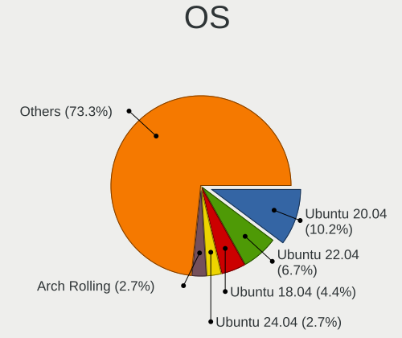

| Name                         | Computers | Percent |
|------------------------------|-----------|---------|
| Ubuntu 20.04                 | 23        | 10.22%  |
| Ubuntu 22.04                 | 15        | 6.67%   |
| Ubuntu 18.04                 | 10        | 4.44%   |
| Ubuntu 24.04                 | 6         | 2.67%   |
| Arch Rolling                 | 6         | 2.67%   |
| Ubuntu 21.04                 | 4         | 1.78%   |
| openSUSE Tumbleweed-XXXXXXXX | 4         | 1.78%   |
| OpenMandriva 4.90            | 4         | 1.78%   |
| Linux Mint 20.3              | 4         | 1.78%   |
| Fedora 38                    | 4         | 1.78%   |
| Xubuntu 20.04                | 3         | 1.33%   |
| Ubuntu 20.10                 | 3         | 1.33%   |
| Pop!_OS 22.04                | 3         | 1.33%   |
| Pop!_OS 21.04                | 3         | 1.33%   |
| OpenMandriva 4.2             | 3         | 1.33%   |
| OpenMandriva 25.90           | 3         | 1.33%   |
| Linux Mint 21.2              | 3         | 1.33%   |
| Fedora 39                    | 3         | 1.33%   |
| Fedora 37                    | 3         | 1.33%   |
| Fedora 32                    | 3         | 1.33%   |
| ArcoLinux Rolling            | 3         | 1.33%   |
| Zorin 16                     | 2         | 0.89%   |
| Ubuntu 23.10                 | 2         | 0.89%   |
| Ubuntu 18.10                 | 2         | 0.89%   |
| TUXEDO OS 24.04              | 2         | 0.89%   |
| Pop!_OS 21.10                | 2         | 0.89%   |
| openSUSE Leap-15.2           | 2         | 0.89%   |
| OpenMandriva 24.12           | 2         | 0.89%   |
| OpenMandriva 23.03           | 2         | 0.89%   |
| MX 23                        | 2         | 0.89%   |
| Lubuntu 22.04                | 2         | 0.89%   |
| LMDE 4                       | 2         | 0.89%   |
| Linux Mint 20.1              | 2         | 0.89%   |
| Kubuntu 22.04                | 2         | 0.89%   |
| Fedora 41                    | 2         | 0.89%   |
| Fedora 40                    | 2         | 0.89%   |
| EndeavourOS Rolling          | 2         | 0.89%   |
| Debian 12                    | 2         | 0.89%   |
| Debian 10                    | 2         | 0.89%   |
| CachyOS                      | 2         | 0.89%   |

OS Family
---------

OS without a version

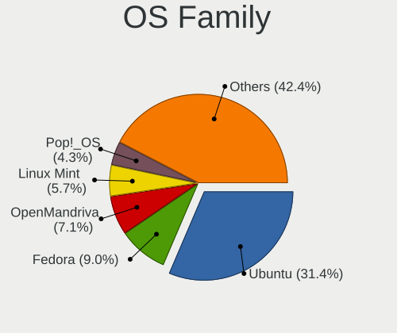

| Name          | Computers | Percent |
|---------------|-----------|---------|
| Ubuntu        | 66        | 31.43%  |
| Fedora        | 19        | 9.05%   |
| OpenMandriva  | 15        | 7.14%   |
| Linux Mint    | 12        | 5.71%   |
| Pop!_OS       | 9         | 4.29%   |
| openSUSE      | 8         | 3.81%   |
| Arch          | 7         | 3.33%   |
| Kubuntu       | 6         | 2.86%   |
| Xubuntu       | 5         | 2.38%   |
| Manjaro       | 5         | 2.38%   |
| Debian        | 5         | 2.38%   |
| Zorin         | 4         | 1.9%    |
| Lubuntu       | 4         | 1.9%    |
| Ubuntu MATE   | 3         | 1.43%   |
| Gentoo        | 3         | 1.43%   |
| Elementary    | 3         | 1.43%   |
| CachyOS       | 3         | 1.43%   |
| Bazzite       | 3         | 1.43%   |
| ArcoLinux     | 3         | 1.43%   |
| TUXEDO OS     | 2         | 0.95%   |
| Parrot        | 2         | 0.95%   |
| MX            | 2         | 0.95%   |
| LMDE          | 2         | 0.95%   |
| KDE neon      | 2         | 0.95%   |
| Kali          | 2         | 0.95%   |
| Endless       | 2         | 0.95%   |
| EndeavourOS   | 2         | 0.95%   |
| UbuntuDDE     | 1         | 0.48%   |
| Ubuntu Studio | 1         | 0.48%   |
| ROSA          | 1         | 0.48%   |
| RHEL          | 1         | 0.48%   |
| Mageia        | 1         | 0.48%   |
| Garuda Linux  | 1         | 0.48%   |
| Clear Linux   | 1         | 0.48%   |
| CentOS        | 1         | 0.48%   |
| Bluefin       | 1         | 0.48%   |
| BlackPanther  | 1         | 0.48%   |
| Artix         | 1         | 0.48%   |

Kernel
------

Version of the Linux kernel

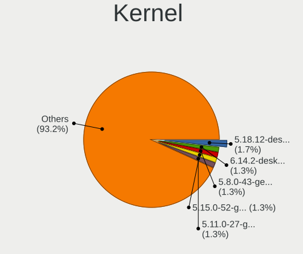

| Version                  | Computers | Percent |
|--------------------------|-----------|---------|
| 5.18.12-desktop-3omv4090 | 4         | 1.69%   |
| 6.14.2-desktop-3omv2590  | 3         | 1.27%   |
| 5.8.0-43-generic         | 3         | 1.27%   |
| 5.15.0-52-generic        | 3         | 1.27%   |
| 5.11.0-27-generic        | 3         | 1.27%   |
| 5.10.14-desktop-1omv4002 | 3         | 1.27%   |
| 6.8.0-40-generic         | 2         | 0.85%   |
| 6.5.0-28-generic         | 2         | 0.85%   |
| 6.2.6-desktop-1omv2390   | 2         | 0.85%   |
| 6.2.14-200.fc37.x86_64   | 2         | 0.85%   |
| 6.17.7-ba20.fc43.x86_64  | 2         | 0.85%   |
| 6.14.0-37-generic        | 2         | 0.85%   |
| 6.12.1-desktop-1omv2490  | 2         | 0.85%   |
| 5.8.0-59-generic         | 2         | 0.85%   |
| 5.4.0-96-generic         | 2         | 0.85%   |
| 5.4.0-90-generic         | 2         | 0.85%   |
| 5.4.0-47-generic         | 2         | 0.85%   |
| 5.4.0-42-generic         | 2         | 0.85%   |
| 5.4.0-122-generic        | 2         | 0.85%   |
| 5.3.0-46-generic         | 2         | 0.85%   |
| 5.19.0-desktop-1omv4090  | 2         | 0.85%   |
| 5.19.0-35-generic        | 2         | 0.85%   |
| 5.16.11-76051611-generic | 2         | 0.85%   |
| 5.11.0-34-generic        | 2         | 0.85%   |
| 5.11.0-17-generic        | 2         | 0.85%   |
| 5.0.0-23-generic         | 2         | 0.85%   |
| 4.19.0-17-amd64          | 2         | 0.85%   |
| 6.9.9-arch1-1            | 1         | 0.42%   |
| 6.9.8-arch1-1            | 1         | 0.42%   |
| 6.9.7-200.fc40.x86_64    | 1         | 0.42%   |
| 6.9.5-zen1-1-zen         | 1         | 0.42%   |
| 6.8.6-300.fc40.x86_64    | 1         | 0.42%   |
| 6.8.0-86-generic         | 1         | 0.42%   |
| 6.8.0-60-generic         | 1         | 0.42%   |
| 6.8.0-55-generic         | 1         | 0.42%   |
| 6.8.0-52-generic         | 1         | 0.42%   |
| 6.8.0-51-generic         | 1         | 0.42%   |
| 6.8.0-48-generic         | 1         | 0.42%   |
| 6.8.0-45-generic         | 1         | 0.42%   |
| 6.8.0-36-generic         | 1         | 0.42%   |

Kernel Family
-------------

Linux kernel without a distro release

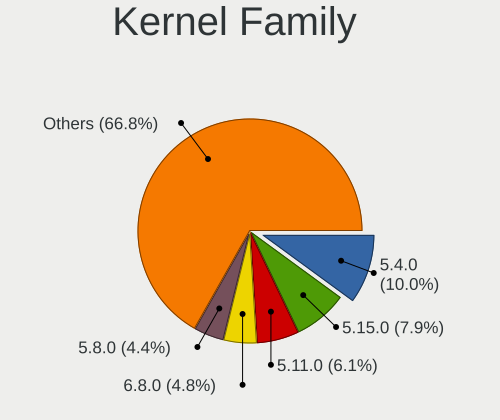

| Version | Computers | Percent |
|---------|-----------|---------|
| 5.4.0   | 23        | 10.04%  |
| 5.15.0  | 18        | 7.86%   |
| 5.11.0  | 14        | 6.11%   |
| 6.8.0   | 11        | 4.8%    |
| 5.8.0   | 10        | 4.37%   |
| 6.5.0   | 8         | 3.49%   |
| 5.19.0  | 8         | 3.49%   |
| 5.3.0   | 6         | 2.62%   |
| 4.18.0  | 6         | 2.62%   |
| 6.14.0  | 5         | 2.18%   |
| 5.18.12 | 4         | 1.75%   |
| 5.13.0  | 4         | 1.75%   |
| 4.15.0  | 4         | 1.75%   |
| 6.14.2  | 3         | 1.31%   |
| 6.11.0  | 3         | 1.31%   |
| 5.10.14 | 3         | 1.31%   |
| 5.0.0   | 3         | 1.31%   |
| 6.4.3   | 2         | 0.87%   |
| 6.2.6   | 2         | 0.87%   |
| 6.2.14  | 2         | 0.87%   |
| 6.2.0   | 2         | 0.87%   |
| 6.17.7  | 2         | 0.87%   |
| 6.12.1  | 2         | 0.87%   |
| 6.1.0   | 2         | 0.87%   |
| 5.7.0   | 2         | 0.87%   |
| 5.3.18  | 2         | 0.87%   |
| 5.16.11 | 2         | 0.87%   |
| 5.10.0  | 2         | 0.87%   |
| 4.19.0  | 2         | 0.87%   |
| 6.9.9   | 1         | 0.44%   |
| 6.9.8   | 1         | 0.44%   |
| 6.9.7   | 1         | 0.44%   |
| 6.9.5   | 1         | 0.44%   |
| 6.8.6   | 1         | 0.44%   |
| 6.7.9   | 1         | 0.44%   |
| 6.6.7   | 1         | 0.44%   |
| 6.6.6   | 1         | 0.44%   |
| 6.6.54  | 1         | 0.44%   |
| 6.6.42  | 1         | 0.44%   |
| 6.6.4   | 1         | 0.44%   |

Kernel Major Ver.
-----------------

Linux kernel major version

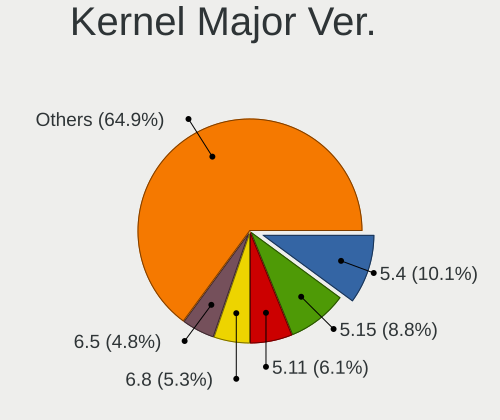

| Version | Computers | Percent |
|---------|-----------|---------|
| 5.4     | 23        | 10.09%  |
| 5.15    | 20        | 8.77%   |
| 5.11    | 14        | 6.14%   |
| 6.8     | 12        | 5.26%   |
| 6.5     | 11        | 4.82%   |
| 5.8     | 11        | 4.82%   |
| 6.14    | 9         | 3.95%   |
| 6.6     | 8         | 3.51%   |
| 6.12    | 8         | 3.51%   |
| 5.3     | 8         | 3.51%   |
| 5.19    | 8         | 3.51%   |
| 6.2     | 7         | 3.07%   |
| 5.10    | 7         | 3.07%   |
| 4.18    | 7         | 3.07%   |
| 6.17    | 6         | 2.63%   |
| 5.7     | 6         | 2.63%   |
| 5.18    | 6         | 2.63%   |
| 6.4     | 5         | 2.19%   |
| 6.11    | 5         | 2.19%   |
| 6.1     | 5         | 2.19%   |
| 5.13    | 5         | 2.19%   |
| 6.9     | 4         | 1.75%   |
| 5.16    | 4         | 1.75%   |
| 4.15    | 4         | 1.75%   |
| 5.0     | 3         | 1.32%   |
| 6.3     | 2         | 0.88%   |
| 6.10    | 2         | 0.88%   |
| 6.0     | 2         | 0.88%   |
| 5.9     | 2         | 0.88%   |
| 5.14    | 2         | 0.88%   |
| 5.12    | 2         | 0.88%   |
| 4.19    | 2         | 0.88%   |
| 6.7     | 1         | 0.44%   |
| 6.16    | 1         | 0.44%   |
| 6.13    | 1         | 0.44%   |
| 5.6     | 1         | 0.44%   |
| 5.5     | 1         | 0.44%   |
| 4.9     | 1         | 0.44%   |
| 4.4     | 1         | 0.44%   |
| 4.12    | 1         | 0.44%   |

Arch
----

OS architecture (x86_64, i586, etc.)

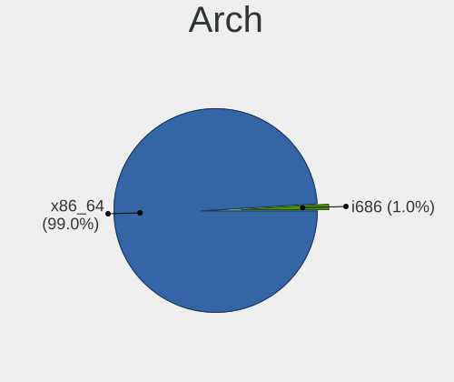

| Name   | Computers | Percent |
|--------|-----------|---------|
| x86_64 | 201       | 99.01%  |
| i686   | 2         | 0.99%   |

DE
--

Desktop Environment

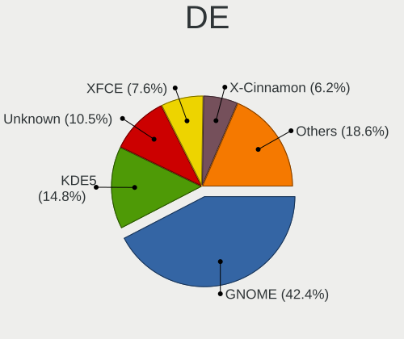

| Name            | Computers | Percent |
|-----------------|-----------|---------|
| GNOME           | 89        | 42.38%  |
| KDE5            | 31        | 14.76%  |
| Unknown         | 22        | 10.48%  |
| XFCE            | 16        | 7.62%   |
| X-Cinnamon      | 13        | 6.19%   |
| KDE6            | 13        | 6.19%   |
| KDE             | 6         | 2.86%   |
| MATE            | 5         | 2.38%   |
| Pantheon        | 3         | 1.43%   |
| LXQt            | 3         | 1.43%   |
| Cinnamon        | 3         | 1.43%   |
| i3              | 2         | 0.95%   |
| Deepin          | 2         | 0.95%   |
| LXDE            | 1         | 0.48%   |
| GNOME Flashback | 1         | 0.48%   |

Display Server
--------------

X11 or Wayland

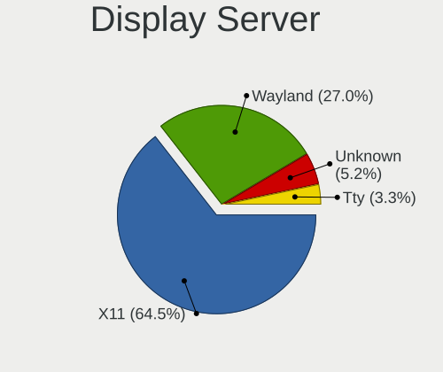

| Name    | Computers | Percent |
|---------|-----------|---------|
| X11     | 136       | 64.45%  |
| Wayland | 57        | 27.01%  |
| Unknown | 11        | 5.21%   |
| Tty     | 7         | 3.32%   |

Display Manager
---------------

SDDM, LightDM, etc.

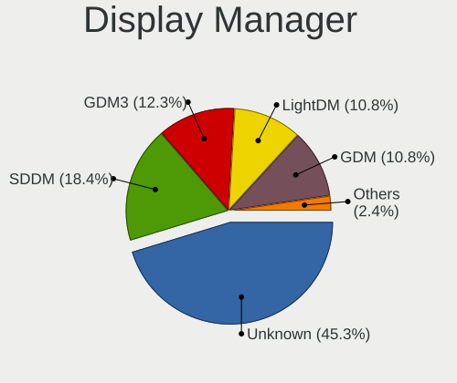

| Name    | Computers | Percent |
|---------|-----------|---------|
| Unknown | 96        | 45.28%  |
| SDDM    | 39        | 18.4%   |
| GDM3    | 26        | 12.26%  |
| LightDM | 23        | 10.85%  |
| GDM     | 23        | 10.85%  |
| TDM     | 4         | 1.89%   |
| XDM     | 1         | 0.47%   |

OS Lang
-------

Language

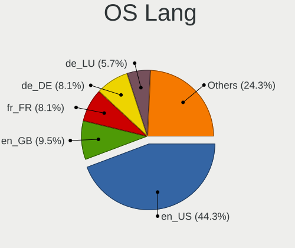

| Lang    | Computers | Percent |
|---------|-----------|---------|
| en_US   | 93        | 44.29%  |
| en_GB   | 20        | 9.52%   |
| fr_FR   | 17        | 8.1%    |
| de_DE   | 17        | 8.1%    |
| de_LU   | 12        | 5.71%   |
| Unknown | 12        | 5.71%   |
| fr_LU   | 7         | 3.33%   |
| C       | 7         | 3.33%   |
| nl_NL   | 4         | 1.9%    |
| es_ES   | 4         | 1.9%    |
| pt_PT   | 2         | 0.95%   |
| POSIX   | 2         | 0.95%   |
| fr_CH   | 2         | 0.95%   |
| UTF-8   | 1         | 0.48%   |
| unm_US  | 1         | 0.48%   |
| pt_BR   | 1         | 0.48%   |
| lb_LU   | 1         | 0.48%   |
| it_IT   | 1         | 0.48%   |
| hr_HR   | 1         | 0.48%   |
| fr_BE   | 1         | 0.48%   |
| en_IE   | 1         | 0.48%   |
| en_AU   | 1         | 0.48%   |
| de_CH   | 1         | 0.48%   |
| C.UTF8  | 1         | 0.48%   |

Boot Mode
---------

EFI or BIOS

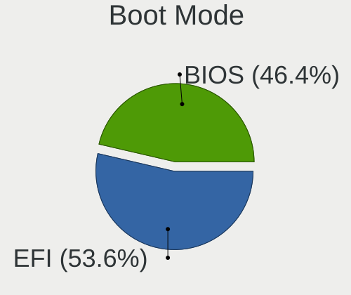

| Mode | Computers | Percent |
|------|-----------|---------|
| EFI  | 111       | 53.62%  |
| BIOS | 96        | 46.38%  |

Filesystem
----------

Type of filesystem

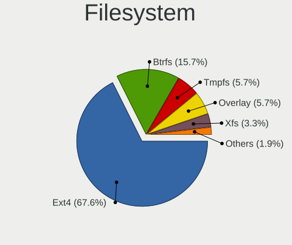

| Type    | Computers | Percent |
|---------|-----------|---------|
| Ext4    | 142       | 67.62%  |
| Btrfs   | 33        | 15.71%  |
| Tmpfs   | 12        | 5.71%   |
| Overlay | 12        | 5.71%   |
| Xfs     | 7         | 3.33%   |
| Unknown | 3         | 1.43%   |
| Zfs     | 1         | 0.48%   |

Part. scheme
------------

Scheme of partitioning

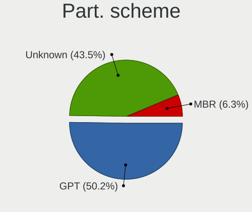

| Type    | Computers | Percent |
|---------|-----------|---------|
| GPT     | 104       | 50.24%  |
| Unknown | 90        | 43.48%  |
| MBR     | 13        | 6.28%   |

Dual Boot with Linux/BSD
------------------------

Hosting more than one Linux/BSD

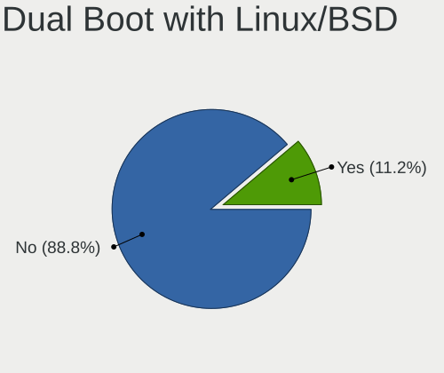

| Dual boot | Computers | Percent |
|-----------|-----------|---------|
| No        | 183       | 88.83%  |
| Yes       | 23        | 11.17%  |

Dual Boot (Win)
---------------

Hosting Linux and Windows

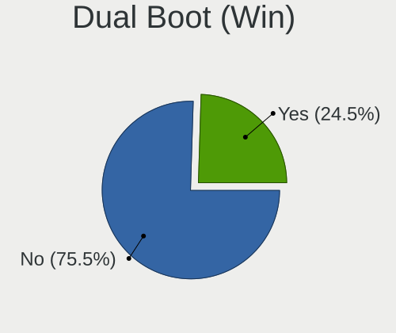

| Dual boot | Computers | Percent |
|-----------|-----------|---------|
| No        | 154       | 75.49%  |
| Yes       | 50        | 24.51%  |

Board
-----

Vendor
------

Motherboard manufacturer

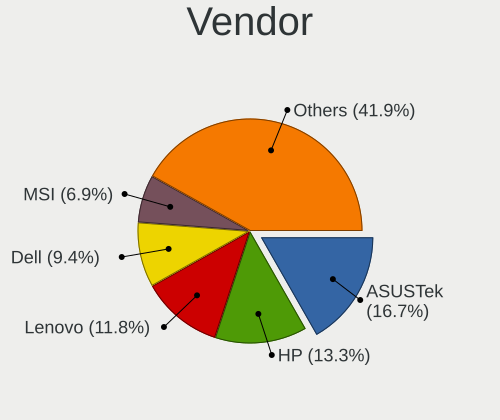

| Name                             | Computers | Percent |
|----------------------------------|-----------|---------|
| ASUSTek Computer                 | 34        | 16.75%  |
| Hewlett-Packard                  | 27        | 13.3%   |
| Lenovo                           | 24        | 11.82%  |
| Dell                             | 19        | 9.36%   |
| MSI                              | 14        | 6.9%    |
| Gigabyte Technology              | 10        | 4.93%   |
| Acer                             | 10        | 4.93%   |
| Apple                            | 7         | 3.45%   |
| Intel                            | 6         | 2.96%   |
| Sony                             | 5         | 2.46%   |
| ASRock                           | 5         | 2.46%   |
| Medion                           | 4         | 1.97%   |
| HUAWEI                           | 4         | 1.97%   |
| Wortmann AG                      | 3         | 1.48%   |
| win element                      | 3         | 1.48%   |
| TUXEDO                           | 2         | 0.99%   |
| Timi                             | 2         | 0.99%   |
| Samsung Electronics              | 2         | 0.99%   |
| Fujitsu                          | 2         | 0.99%   |
| Framework                        | 2         | 0.99%   |
| Clevo                            | 2         | 0.99%   |
| Unknown                          | 2         | 0.99%   |
| YJKC                             | 1         | 0.49%   |
| Toshiba                          | 1         | 0.49%   |
| SLIMBOOK                         | 1         | 0.49%   |
| Panasonic                        | 1         | 0.49%   |
| Packard Bell                     | 1         | 0.49%   |
| ORIGIMAGIC                       | 1         | 0.49%   |
| Notebook                         | 1         | 0.49%   |
| Microsoft                        | 1         | 0.49%   |
| Micro Computer (HK) Tech Limited | 1         | 0.49%   |
| MACHINIST                        | 1         | 0.49%   |
| LattePanda                       | 1         | 0.49%   |
| JWIPC                            | 1         | 0.49%   |
| Foxconn                          | 1         | 0.49%   |
| BESSTAR Tech                     | 1         | 0.49%   |

Model
-----

Motherboard model

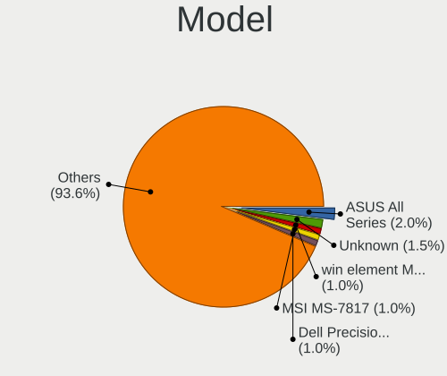

| Name                                  | Computers | Percent |
|---------------------------------------|-----------|---------|
| ASUS All Series                       | 4         | 1.97%   |
| Unknown                               | 3         | 1.48%   |
| win element MoreFine S500+            | 2         | 0.99%   |
| MSI MS-7817                           | 2         | 0.99%   |
| Dell Precision M3800                  | 2         | 0.99%   |
| Dell Precision 7670                   | 2         | 0.99%   |
| ASUS ROG Zephyrus G14 GA401QM_GA401QM | 2         | 0.99%   |
| Apple MacBookPro8,1                   | 2         | 0.99%   |
| YJKC vBook                            | 1         | 0.49%   |
| Wortmann AG TERRA_MOBILE_1749         | 1         | 0.49%   |
| Wortmann AG TERRA_MOBILE_1541H        | 1         | 0.49%   |
| Wortmann AG MS-1727                   | 1         | 0.49%   |
| Win Element M9                        | 1         | 0.49%   |
| TUXEDO Stellaris 16 Intel Gen7        | 1         | 0.49%   |
| TUXEDO Pulse 14 Gen1                  | 1         | 0.49%   |
| Toshiba Satellite C55-A-1N0           | 1         | 0.49%   |
| Timi TM1613                           | 1         | 0.49%   |
| Timi RedmiBook 14 II                  | 1         | 0.49%   |
| Sony VPCP11S1R                        | 1         | 0.49%   |
| Sony VPCEB2E1E                        | 1         | 0.49%   |
| Sony VPCCA4E1E                        | 1         | 0.49%   |
| Sony VGN-NS30E_S                      | 1         | 0.49%   |
| Sony SVF1421E2EW                      | 1         | 0.49%   |
| SLIMBOOK EXECUTIVE-14                 | 1         | 0.49%   |
| Samsung Galaxy TabPro S LTE           | 1         | 0.49%   |
| Samsung 950QDB                        | 1         | 0.49%   |
| Panasonic CF-195DCUBML                | 1         | 0.49%   |
| Packard Bell EasyNote TJ65            | 1         | 0.49%   |
| ORIGIMAGIC Aurora Series              | 1         | 0.49%   |
| Notebook NV4XMB,ME,MZ                 | 1         | 0.49%   |
| MSI Raider 18 HX A14VGG               | 1         | 0.49%   |
| MSI MS-7E06                           | 1         | 0.49%   |
| MSI MS-7D75                           | 1         | 0.49%   |
| MSI MS-7C91                           | 1         | 0.49%   |
| MSI MS-7C80                           | 1         | 0.49%   |
| MSI MS-7C56                           | 1         | 0.49%   |
| MSI MS-7C08                           | 1         | 0.49%   |
| MSI MS-7816                           | 1         | 0.49%   |
| MSI GF75 Thin 10SER                   | 1         | 0.49%   |
| MSI GF72 8RD                          | 1         | 0.49%   |

Model Family
------------

Motherboard model prefix

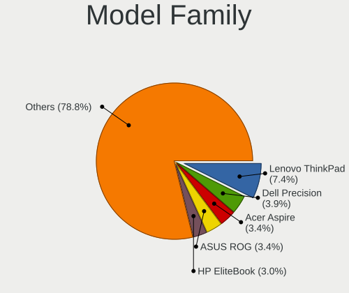

| Name                  | Computers | Percent |
|-----------------------|-----------|---------|
| Lenovo ThinkPad       | 15        | 7.39%   |
| Dell Precision        | 8         | 3.94%   |
| ASUS ROG              | 7         | 3.45%   |
| Acer Aspire           | 7         | 3.45%   |
| HP EliteBook          | 6         | 2.96%   |
| ASUS PRIME            | 6         | 2.96%   |
| HP ENVY               | 5         | 2.46%   |
| Dell XPS              | 4         | 1.97%   |
| ASUS TUF              | 4         | 1.97%   |
| ASUS All              | 4         | 1.97%   |
| Lenovo IdeaPad        | 3         | 1.48%   |
| HP Pavilion           | 3         | 1.48%   |
| ASUS VivoBook         | 3         | 1.48%   |
| Unknown               | 3         | 1.48%   |
| Wortmann AG TERRA     | 2         | 0.99%   |
| win element MoreFine  | 2         | 0.99%   |
| MSI MS-7817           | 2         | 0.99%   |
| HP ZBook              | 2         | 0.99%   |
| HP ProBook            | 2         | 0.99%   |
| HP EliteDesk          | 2         | 0.99%   |
| HP Compaq             | 2         | 0.99%   |
| Framework Laptop      | 2         | 0.99%   |
| Dell OptiPlex         | 2         | 0.99%   |
| Dell Latitude         | 2         | 0.99%   |
| Dell Inspiron         | 2         | 0.99%   |
| Apple MacBookPro8     | 2         | 0.99%   |
| YJKC vBook            | 1         | 0.49%   |
| Wortmann AG MS-1727   | 1         | 0.49%   |
| Win Element M9        | 1         | 0.49%   |
| TUXEDO Stellaris      | 1         | 0.49%   |
| TUXEDO Pulse          | 1         | 0.49%   |
| Toshiba Satellite     | 1         | 0.49%   |
| Timi TM1613           | 1         | 0.49%   |
| Timi RedmiBook        | 1         | 0.49%   |
| Sony VPCP11S1R        | 1         | 0.49%   |
| Sony VPCEB2E1E        | 1         | 0.49%   |
| Sony VPCCA4E1E        | 1         | 0.49%   |
| Sony VGN-NS30E        | 1         | 0.49%   |
| Sony SVF1421E2EW      | 1         | 0.49%   |
| SLIMBOOK EXECUTIVE-14 | 1         | 0.49%   |

MFG Year
--------

Motherboard manufacture year

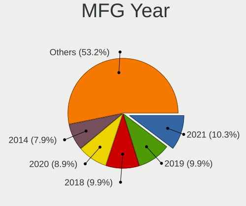

| Year | Computers | Percent |
|------|-----------|---------|
| 2021 | 21        | 10.34%  |
| 2019 | 20        | 9.85%   |
| 2018 | 20        | 9.85%   |
| 2020 | 18        | 8.87%   |
| 2014 | 16        | 7.88%   |
| 2017 | 15        | 7.39%   |
| 2013 | 15        | 7.39%   |
| 2022 | 12        | 5.91%   |
| 2016 | 10        | 4.93%   |
| 2023 | 9         | 4.43%   |
| 2010 | 9         | 4.43%   |
| 2015 | 8         | 3.94%   |
| 2011 | 8         | 3.94%   |
| 2012 | 6         | 2.96%   |
| 2024 | 5         | 2.46%   |
| 2009 | 4         | 1.97%   |
| 2008 | 3         | 1.48%   |
| 2025 | 2         | 0.99%   |
| 2007 | 2         | 0.99%   |

Form Factor
-----------

Physical design of the computer

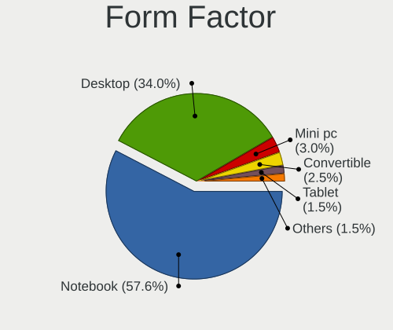

| Name        | Computers | Percent |
|-------------|-----------|---------|
| Notebook    | 117       | 57.64%  |
| Desktop     | 69        | 33.99%  |
| Mini pc     | 6         | 2.96%   |
| Convertible | 5         | 2.46%   |
| Tablet      | 3         | 1.48%   |
| All in one  | 2         | 0.99%   |
| Server      | 1         | 0.49%   |

Secure Boot
-----------

Enabled or disabled

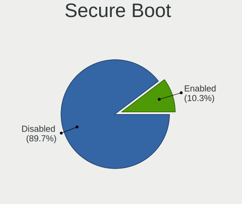

| State    | Computers | Percent |
|----------|-----------|---------|
| Disabled | 183       | 89.71%  |
| Enabled  | 21        | 10.29%  |

Coreboot
--------

Have coreboot on board

| Used | Computers | Percent |
|------|-----------|---------|
| No   | 203       | 100%    |

RAM Size
--------

Total RAM memory

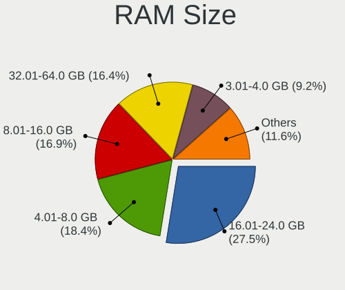

| Size in GB      | Computers | Percent |
|-----------------|-----------|---------|
| 16.01-24.0      | 57        | 27.54%  |
| 4.01-8.0        | 38        | 18.36%  |
| 8.01-16.0       | 35        | 16.91%  |
| 32.01-64.0      | 34        | 16.43%  |
| 3.01-4.0        | 19        | 9.18%   |
| 64.01-256.0     | 11        | 5.31%   |
| 24.01-32.0      | 7         | 3.38%   |
| 1.01-2.0        | 3         | 1.45%   |
| 2.01-3.0        | 2         | 0.97%   |
| More than 256.0 | 1         | 0.48%   |

RAM Used
--------

Used RAM memory

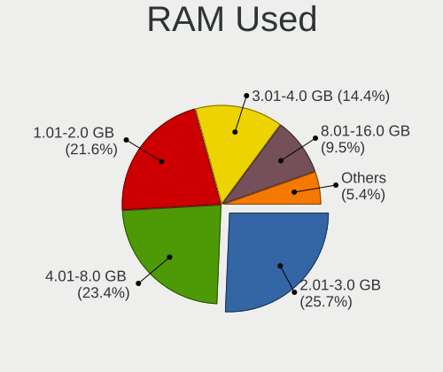

| Used GB    | Computers | Percent |
|------------|-----------|---------|
| 2.01-3.0   | 57        | 25.68%  |
| 4.01-8.0   | 52        | 23.42%  |
| 1.01-2.0   | 48        | 21.62%  |
| 3.01-4.0   | 32        | 14.41%  |
| 8.01-16.0  | 21        | 9.46%   |
| 0.51-1.0   | 4         | 1.8%    |
| 16.01-24.0 | 3         | 1.35%   |
| 24.01-32.0 | 2         | 0.9%    |
| 0.01-0.5   | 2         | 0.9%    |
| 32.01-64.0 | 1         | 0.45%   |

Total Drives
------------

Number of drives on board

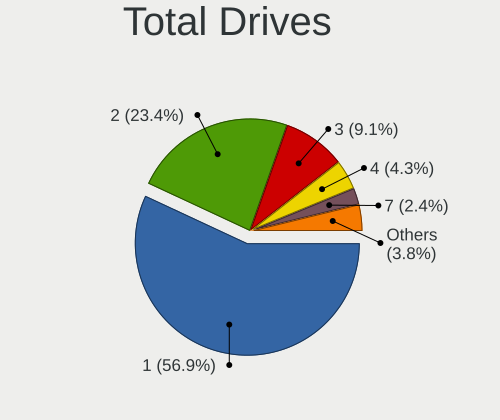

| Drives | Computers | Percent |
|--------|-----------|---------|
| 1      | 119       | 56.94%  |
| 2      | 49        | 23.44%  |
| 3      | 19        | 9.09%   |
| 4      | 9         | 4.31%   |
| 7      | 5         | 2.39%   |
| 5      | 5         | 2.39%   |
| 0      | 2         | 0.96%   |
| 6      | 1         | 0.48%   |

Has CD-ROM
----------

Has CD-ROM on board

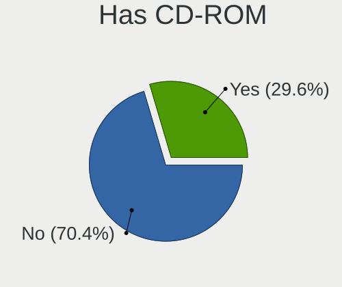

| Presented | Computers | Percent |
|-----------|-----------|---------|
| No        | 143       | 70.44%  |
| Yes       | 60        | 29.56%  |

Has Ethernet
------------

Has Ethernet on board

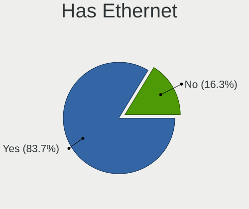

| Presented | Computers | Percent |
|-----------|-----------|---------|
| Yes       | 170       | 83.74%  |
| No        | 33        | 16.26%  |

Has WiFi
--------

Has WiFi module

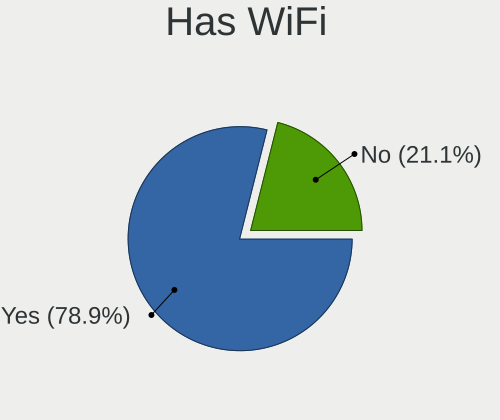

| Presented | Computers | Percent |
|-----------|-----------|---------|
| Yes       | 161       | 78.92%  |
| No        | 43        | 21.08%  |

Has Bluetooth
-------------

Has Bluetooth module

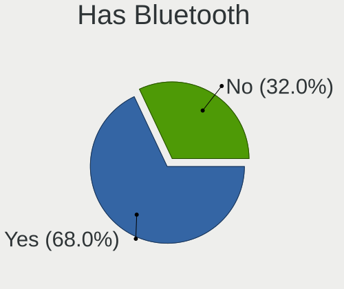

| Presented | Computers | Percent |
|-----------|-----------|---------|
| Yes       | 138       | 67.98%  |
| No        | 65        | 32.02%  |

Location
--------

Country
-------

Geographic location (country)

| Country    | Computers | Percent |
|------------|-----------|---------|
| Luxembourg | 203       | 100%    |

City
----

Geographic location (city)

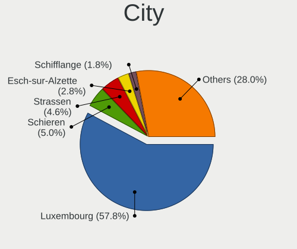

| City              | Computers | Percent |
|-------------------|-----------|---------|
| Luxembourg        | 126       | 57.8%   |
| Schieren          | 11        | 5.05%   |
| Strassen          | 10        | 4.59%   |
| Esch-sur-Alzette  | 6         | 2.75%   |
| Schifflange       | 4         | 1.83%   |
| Useldange         | 3         | 1.38%   |
| Steinsel          | 3         | 1.38%   |
| Ehnen             | 3         | 1.38%   |
| Differdange       | 3         | 1.38%   |
| Wormeldange       | 2         | 0.92%   |
| Steinfort         | 2         | 0.92%   |
| Sanem             | 2         | 0.92%   |
| Dudelange         | 2         | 0.92%   |
| Clervaux          | 2         | 0.92%   |
| Brouch            | 2         | 0.92%   |
| Bettange-sur-Mess | 2         | 0.92%   |
| Wiltz             | 1         | 0.46%   |
| Wecker            | 1         | 0.46%   |
| Wasserbillig      | 1         | 0.46%   |
| Vianden           | 1         | 0.46%   |
| Tetange           | 1         | 0.46%   |
| Soleuvre          | 1         | 0.46%   |
| Sandweiler        | 1         | 0.46%   |
| Roeser            | 1         | 0.46%   |
| Rodange           | 1         | 0.46%   |
| Remich            | 1         | 0.46%   |
| Pontpierre        | 1         | 0.46%   |
| Pétange          | 1         | 0.46%   |
| PerlГ©          | 1         | 0.46%   |
| Oberpallen        | 1         | 0.46%   |
| Niederanven       | 1         | 0.46%   |
| Mertzig           | 1         | 0.46%   |
| Leudelange        | 1         | 0.46%   |
| Kopstal           | 1         | 0.46%   |
| Junglinster       | 1         | 0.46%   |
| Itzig             | 1         | 0.46%   |
| Hunsdorf          | 1         | 0.46%   |
| Hosingen          | 1         | 0.46%   |
| Hesperange        | 1         | 0.46%   |
| Frisange          | 1         | 0.46%   |

Drives
------

Drive Vendor
------------

Hard drive vendors

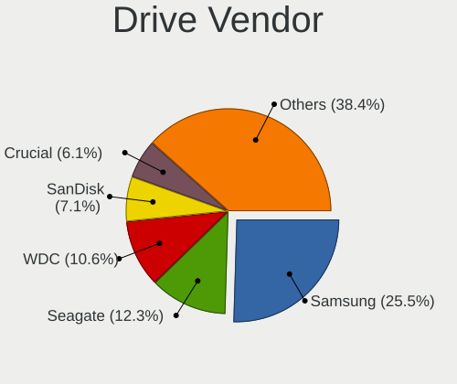

| Vendor                       | Computers | Drives | Percent |
|------------------------------|-----------|--------|---------|
| Samsung Electronics          | 79        | 123    | 25.48%  |
| Seagate                      | 38        | 58     | 12.26%  |
| WDC                          | 33        | 50     | 10.65%  |
| SanDisk                      | 22        | 28     | 7.1%    |
| Crucial                      | 19        | 30     | 6.13%   |
| Toshiba                      | 16        | 19     | 5.16%   |
| Kingston                     | 14        | 19     | 4.52%   |
| SK hynix                     | 10        | 10     | 3.23%   |
| Intel                        | 6         | 7      | 1.94%   |
| Hitachi                      | 5         | 8      | 1.61%   |
| Apple                        | 5         | 6      | 1.61%   |
| LITEON                       | 4         | 4      | 1.29%   |
| HGST                         | 4         | 6      | 1.29%   |
| Micron/Crucial Technology    | 3         | 4      | 0.97%   |
| Micron Technology            | 3         | 4      | 0.97%   |
| LITEONIT                     | 3         | 3      | 0.97%   |
| Kingston Technology Company  | 3         | 4      | 0.97%   |
| A-DATA Technology            | 3         | 3      | 0.97%   |
| Transcend                    | 2         | 2      | 0.65%   |
| Shenzhen Longsys Electronics | 2         | 2      | 0.65%   |
| Phison                       | 2         | 2      | 0.65%   |
| OCZ                          | 2         | 2      | 0.65%   |
| Lenovo                       | 2         | 5      | 0.65%   |
| KingSpec                     | 2         | 5      | 0.65%   |
| Intenso                      | 2         | 3      | 0.65%   |
| Yangtze Memory Technologies  | 1         | 2      | 0.32%   |
| WDC WUH                      | 1         | 1      | 0.32%   |
| Unknown                      | 1         | 2      | 0.32%   |
| Union Memory (Shenzhen)      | 1         | 1      | 0.32%   |
| TCSUNBOW                     | 1         | 1      | 0.32%   |
| Super Talent                 | 1         | 1      | 0.32%   |
| StarTech                     | 1         | 2      | 0.32%   |
| SABRENT                      | 1         | 1      | 0.32%   |
| PNY                          | 1         | 1      | 0.32%   |
| Phison Electronics           | 1         | 1      | 0.32%   |
| PHD 3.0                      | 1         | 1      | 0.32%   |
| NT-128                       | 1         | 1      | 0.32%   |
| Maxtor                       | 1         | 2      | 0.32%   |
| MAXIO Technology (Hangzhou)  | 1         | 6      | 0.32%   |
| LaCie                        | 1         | 1      | 0.32%   |

Drive Model
-----------

Hard drive models

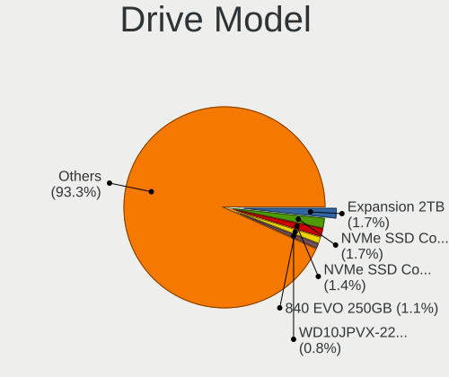

| Model                                              | Computers | Percent |
|----------------------------------------------------|-----------|---------|
| Seagate Expansion 2TB                              | 6         | 1.68%   |
| Samsung NVMe SSD Controller SM981/PM981/PM983 1TB  | 6         | 1.68%   |
| Samsung NVMe SSD Controller PM9A1/PM9A3/980PRO 1TB | 5         | 1.4%    |
| Samsung SSD 840 EVO 250GB                          | 4         | 1.12%   |
| WDC WD10JPVX-22JC3T0 1TB                           | 3         | 0.84%   |
| Seagate ST4000DM004-2CV104 4TB                     | 3         | 0.84%   |
| Seagate ST2000DM008-2FR102 2TB                     | 3         | 0.84%   |
| Seagate ST1000LM035-1RK172 1TB                     | 3         | 0.84%   |
| Sandisk WD Black SN750 / PC SN730 NVMe SSD 500GB   | 3         | 0.84%   |
| Samsung SSD 860 EVO 250GB                          | 3         | 0.84%   |
| Samsung SSD 750 EVO 500GB                          | 3         | 0.84%   |
| Samsung MZVLQ1T0HBLB-00B00 1024GB                  | 3         | 0.84%   |
| Kingston SA400S37240G 240GB SSD                    | 3         | 0.84%   |
| Crucial CT240BX500SSD1 240GB                       | 3         | 0.84%   |
| Crucial CT1000P2SSD8 1TB                           | 3         | 0.84%   |
| WDC WD40EZRZ-00GXCB0 4TB                           | 2         | 0.56%   |
| WDC WD3200LPCX-00VHAT0 320GB                       | 2         | 0.56%   |
| WDC WD10EZEX-08WN4A0 1TB                           | 2         | 0.56%   |
| WDC WD10EACS-00D6B1 1TB                            | 2         | 0.56%   |
| Toshiba MQ01ABF050 500GB                           | 2         | 0.56%   |
| Seagate ST4000DM005-2DP166 4TB                     | 2         | 0.56%   |
| Seagate ST1000DM003-1ER162 1TB                     | 2         | 0.56%   |
| SanDisk SDSSDH3512G 512GB                          | 2         | 0.56%   |
| SanDisk SD8SN8U128G1122 128GB SSD                  | 2         | 0.56%   |
| SanDisk NVMe SSD Drive 1TB                         | 2         | 0.56%   |
| Samsung SSD 990 PRO 1TB                            | 2         | 0.56%   |
| Samsung SSD 980 1TB                                | 2         | 0.56%   |
| Samsung SSD 870 EVO 1TB                            | 2         | 0.56%   |
| Samsung SSD 860 QVO 2TB                            | 2         | 0.56%   |
| Samsung SSD 860 QVO 1TB                            | 2         | 0.56%   |
| Samsung SSD 850 EVO 250GB                          | 2         | 0.56%   |
| Samsung SP2504C 250GB                              | 2         | 0.56%   |
| Samsung MZVLW256HEHP-000L7 256GB                   | 2         | 0.56%   |
| Micron/Crucial P2 NVMe PCIe SSD 2TB                | 2         | 0.56%   |
| LITEONIT LMT-256L9M-11 MSATA 256GB SSD             | 2         | 0.56%   |
| Kingston Company SNV2S1000G 1TB                    | 2         | 0.56%   |
| Kingston SA400S37480G 480GB SSD                    | 2         | 0.56%   |
| Kingston SA400S37120G 120GB SSD                    | 2         | 0.56%   |
| Crucial CT1000MX500SSD1 1TB                        | 2         | 0.56%   |
| Crucial CT1000BX500SSD1 1TB                        | 2         | 0.56%   |

HDD Vendor
----------

Hard disk drive vendors

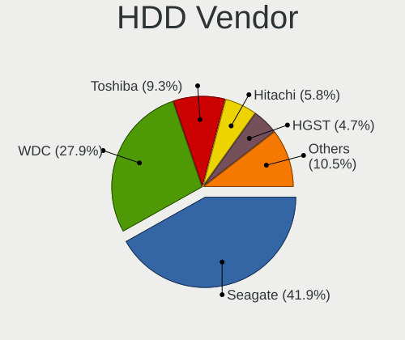

| Vendor              | Computers | Drives | Percent |
|---------------------|-----------|--------|---------|
| Seagate             | 36        | 56     | 41.86%  |
| WDC                 | 24        | 41     | 27.91%  |
| Toshiba             | 8         | 11     | 9.3%    |
| Hitachi             | 5         | 8      | 5.81%   |
| HGST                | 4         | 6      | 4.65%   |
| Samsung Electronics | 3         | 3      | 3.49%   |
| Apple               | 2         | 2      | 2.33%   |
| Intenso             | 1         | 1      | 1.16%   |
| Inateck             | 1         | 1      | 1.16%   |
| HGST HTS            | 1         | 1      | 1.16%   |
| ASMT                | 1         | 4      | 1.16%   |

SSD Vendor
----------

Solid state drive vendors

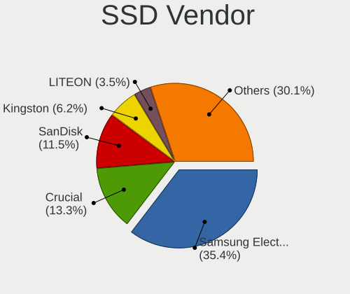

| Vendor              | Computers | Drives | Percent |
|---------------------|-----------|--------|---------|
| Samsung Electronics | 40        | 58     | 35.4%   |
| Crucial             | 15        | 26     | 13.27%  |
| SanDisk             | 13        | 16     | 11.5%   |
| Kingston            | 7         | 11     | 6.19%   |
| LITEON              | 4         | 4      | 3.54%   |
| WDC                 | 3         | 3      | 2.65%   |
| LITEONIT            | 3         | 3      | 2.65%   |
| Transcend           | 2         | 2      | 1.77%   |
| Toshiba             | 2         | 2      | 1.77%   |
| OCZ                 | 2         | 2      | 1.77%   |
| Micron Technology   | 2         | 3      | 1.77%   |
| KingSpec            | 2         | 5      | 1.77%   |
| Intel               | 2         | 2      | 1.77%   |
| A-DATA Technology   | 2         | 2      | 1.77%   |
| TCSUNBOW            | 1         | 1      | 0.88%   |
| Super Talent        | 1         | 1      | 0.88%   |
| SK hynix            | 1         | 1      | 0.88%   |
| SABRENT             | 1         | 1      | 0.88%   |
| PNY                 | 1         | 1      | 0.88%   |
| PHD 3.0             | 1         | 1      | 0.88%   |
| NT-128              | 1         | 1      | 0.88%   |
| Maxtor              | 1         | 2      | 0.88%   |
| Lenovo              | 1         | 3      | 0.88%   |
| KingDian            | 1         | 1      | 0.88%   |
| Intenso             | 1         | 2      | 0.88%   |
| FORESEE             | 1         | 1      | 0.88%   |
| Apple               | 1         | 1      | 0.88%   |
| Unknown             | 1         | 1      | 0.88%   |

Drive Kind
----------

HDD or SSD

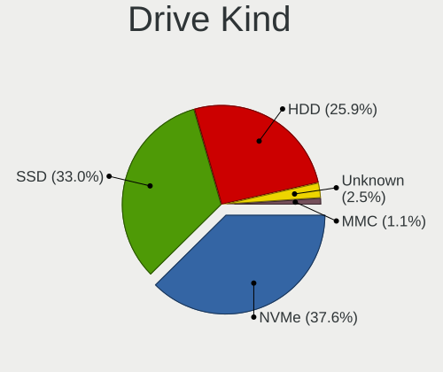

| Kind    | Computers | Drives | Percent |
|---------|-----------|--------|---------|
| NVMe    | 106       | 142    | 37.59%  |
| SSD     | 93        | 157    | 32.98%  |
| HDD     | 73        | 134    | 25.89%  |
| Unknown | 7         | 8      | 2.48%   |
| MMC     | 3         | 4      | 1.06%   |

Drive Connector
---------------

SATA, SAS, NVMe, etc.

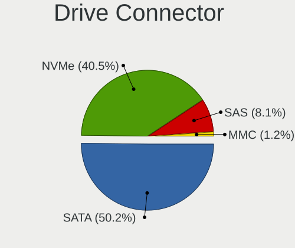

| Type | Computers | Drives | Percent |
|------|-----------|--------|---------|
| SATA | 130       | 264    | 50.19%  |
| NVMe | 105       | 141    | 40.54%  |
| SAS  | 21        | 36     | 8.11%   |
| MMC  | 3         | 4      | 1.16%   |

Drive Size
----------

Size of hard drive

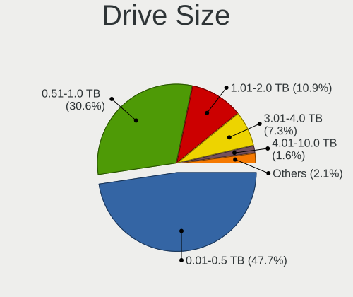

| Size in TB | Computers | Drives | Percent |
|------------|-----------|--------|---------|
| 0.01-0.5   | 92        | 139    | 47.67%  |
| 0.51-1.0   | 59        | 89     | 30.57%  |
| 1.01-2.0   | 21        | 35     | 10.88%  |
| 3.01-4.0   | 14        | 18     | 7.25%   |
| 4.01-10.0  | 3         | 5      | 1.55%   |
| 2.01-3.0   | 2         | 3      | 1.04%   |
| 10.01-20.0 | 2         | 2      | 1.04%   |

Space Total
-----------

Amount of disk space available on the file system

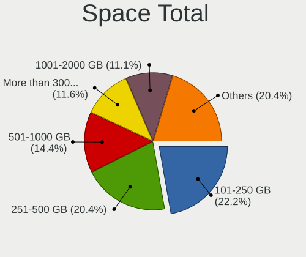

| Size in GB     | Computers | Percent |
|----------------|-----------|---------|
| 101-250        | 48        | 22.22%  |
| 251-500        | 44        | 20.37%  |
| 501-1000       | 31        | 14.35%  |
| More than 3000 | 25        | 11.57%  |
| 1001-2000      | 24        | 11.11%  |
| Unknown        | 12        | 5.56%   |
| 2001-3000      | 10        | 4.63%   |
| 51-100         | 10        | 4.63%   |
| 1-20           | 9         | 4.17%   |
| 21-50          | 3         | 1.39%   |

Space Used
----------

Amount of used disk space

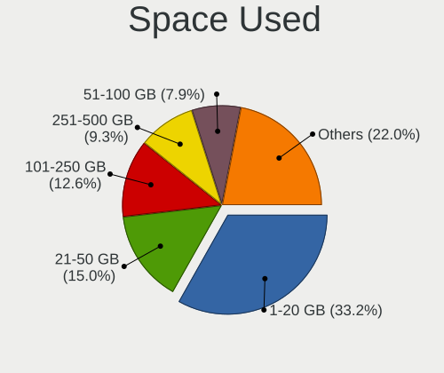

| Used GB        | Computers | Percent |
|----------------|-----------|---------|
| 1-20           | 71        | 33.18%  |
| 21-50          | 32        | 14.95%  |
| 101-250        | 27        | 12.62%  |
| 251-500        | 20        | 9.35%   |
| 51-100         | 17        | 7.94%   |
| 501-1000       | 13        | 6.07%   |
| Unknown        | 12        | 5.61%   |
| 1001-2000      | 8         | 3.74%   |
| More than 3000 | 7         | 3.27%   |
| 2001-3000      | 7         | 3.27%   |

Malfunc. Drives
---------------

Drive models with a malfunction

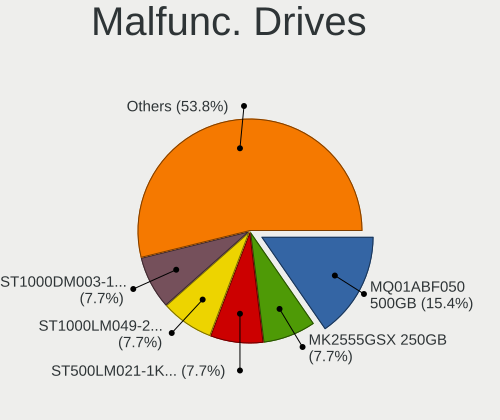

| Model                                         | Computers | Drives | Percent |
|-----------------------------------------------|-----------|--------|---------|
| Toshiba MQ01ABF050 500GB                      | 2         | 2      | 15.38%  |
| Toshiba MK2555GSX 250GB                       | 1         | 1      | 7.69%   |
| SK hynix HFS128G39TND-N210A 128GB SSD         | 1         | 1      | 7.69%   |
| Seagate ST500LM021-1KJ152 500GB               | 1         | 1      | 7.69%   |
| Seagate ST1000LM049-2GH172 1TB                | 1         | 1      | 7.69%   |
| Seagate ST1000DM003-1ER162 1TB                | 1         | 1      | 7.69%   |
| Samsung Electronics SSD 980 1TB               | 1         | 2      | 7.69%   |
| Samsung Electronics SSD 870 EVO 1TB           | 1         | 1      | 7.69%   |
| Samsung Electronics MZVLQ1T0HBLB-00B00 1024GB | 1         | 1      | 7.69%   |
| Hitachi HTS543232A7A384 320GB                 | 1         | 1      | 7.69%   |
| HGST HTS 541010A9E680 1TB                     | 1         | 1      | 7.69%   |
| Crucial CT128MX100SSD1 128GB                  | 1         | 2      | 7.69%   |

Malfunc. Drive Vendor
---------------------

Vendors of faulty drives

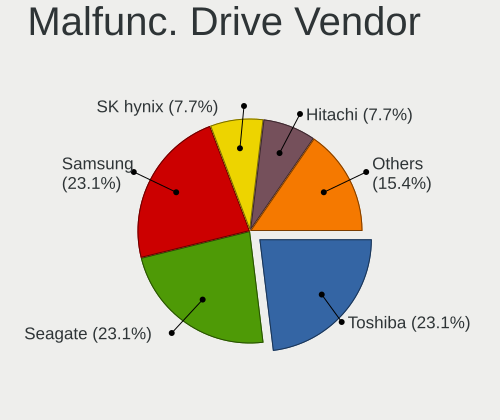

| Vendor              | Computers | Drives | Percent |
|---------------------|-----------|--------|---------|
| Toshiba             | 3         | 3      | 23.08%  |
| Seagate             | 3         | 3      | 23.08%  |
| Samsung Electronics | 3         | 4      | 23.08%  |
| SK hynix            | 1         | 1      | 7.69%   |
| Hitachi             | 1         | 1      | 7.69%   |
| HGST HTS            | 1         | 1      | 7.69%   |
| Crucial             | 1         | 2      | 7.69%   |

Malfunc. HDD Vendor
-------------------

Vendors of faulty HDD drives

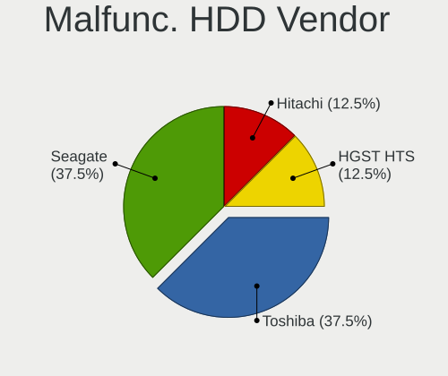

| Vendor   | Computers | Drives | Percent |
|----------|-----------|--------|---------|
| Toshiba  | 3         | 3      | 37.5%   |
| Seagate  | 3         | 3      | 37.5%   |
| Hitachi  | 1         | 1      | 12.5%   |
| HGST HTS | 1         | 1      | 12.5%   |

Malfunc. Drive Kind
-------------------

Kinds of faulty drives

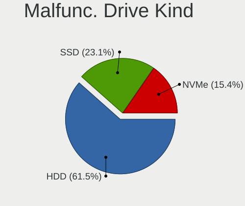

| Kind | Computers | Drives | Percent |
|------|-----------|--------|---------|
| HDD  | 8         | 8      | 61.54%  |
| SSD  | 3         | 4      | 23.08%  |
| NVMe | 2         | 3      | 15.38%  |

Failed Drives
-------------

Failed drive models

Zero info for selected period =(

Failed Drive Vendor
-------------------

Failed drive vendors

Zero info for selected period =(

Drive Status
------------

Number of failed and malfunc. drives

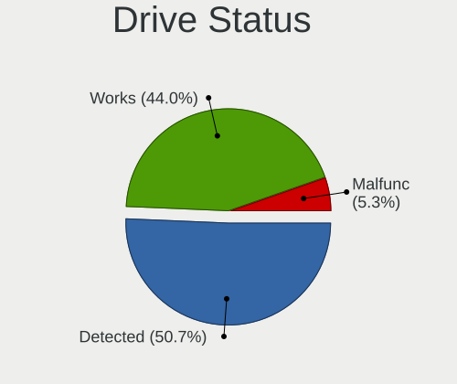

| Status   | Computers | Drives | Percent |
|----------|-----------|--------|---------|
| Detected | 114       | 250    | 50.67%  |
| Works    | 99        | 180    | 44%     |
| Malfunc  | 12        | 15     | 5.33%   |

Storage controller
------------------

Storage Vendor
--------------

Storage controller vendors

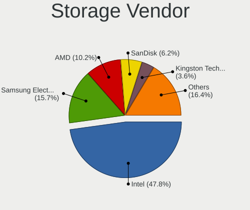

| Vendor                       | Computers | Percent |
|------------------------------|-----------|---------|
| Intel                        | 131       | 47.81%  |
| Samsung Electronics          | 43        | 15.69%  |
| AMD                          | 28        | 10.22%  |
| SanDisk                      | 17        | 6.2%    |
| Kingston Technology Company  | 10        | 3.65%   |
| SK hynix                     | 8         | 2.92%   |
| Toshiba America Info Systems | 6         | 2.19%   |
| Micron/Crucial Technology    | 6         | 2.19%   |
| Marvell Technology Group     | 6         | 2.19%   |
| Phison Electronics           | 4         | 1.46%   |
| ASMedia Technology           | 3         | 1.09%   |
| Shenzhen Longsys Electronics | 2         | 0.73%   |
| Apple                        | 2         | 0.73%   |
| Yangtze Memory Technologies  | 1         | 0.36%   |
| Union Memory (Shenzhen)      | 1         | 0.36%   |
| Seagate Technology           | 1         | 0.36%   |
| Micron Technology            | 1         | 0.36%   |
| MAXIO Technology (Hangzhou)  | 1         | 0.36%   |
| Lenovo                       | 1         | 0.36%   |
| Biwin Storage Technology     | 1         | 0.36%   |
| ADATA Technology             | 1         | 0.36%   |

Storage Model
-------------

Storage controller models

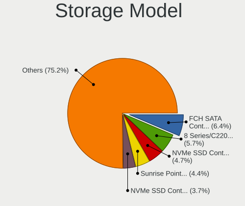

| Model                                                                          | Computers | Percent |
|--------------------------------------------------------------------------------|-----------|---------|
| AMD FCH SATA Controller [AHCI mode]                                            | 19        | 6.38%   |
| Intel 8 Series/C220 Series Chipset Family 6-port SATA Controller 1 [AHCI mode] | 17        | 5.7%    |
| Samsung NVMe SSD Controller SM981/PM981/PM983                                  | 14        | 4.7%    |
| Intel Sunrise Point-LP SATA Controller [AHCI mode]                             | 13        | 4.36%   |
| Samsung NVMe SSD Controller 980 (DRAM-less)                                    | 11        | 3.69%   |
| Samsung NVMe SSD Controller PM9A1/PM9A3/980PRO                                 | 9         | 3.02%   |
| SanDisk Extreme Pro / WD Black SN750 / PC SN730 / Red SN700 NVMe SSD           | 8         | 2.68%   |
| Intel Volume Management Device NVMe RAID Controller                            | 7         | 2.35%   |
| Intel 200 Series PCH SATA controller [AHCI mode]                               | 7         | 2.35%   |
| Samsung NVMe SSD Controller SM961/PM961/SM963                                  | 6         | 2.01%   |
| Intel 7 Series Chipset Family 6-port SATA Controller [AHCI mode]               | 6         | 2.01%   |
| Intel 6 Series/C200 Series Chipset Family 6 port Mobile SATA AHCI Controller   | 6         | 2.01%   |
| Micron/Crucial P2 [Nick P2] / P3 / P3 Plus NVMe PCIe SSD (DRAM-less)           | 5         | 1.68%   |
| Intel Wildcat Point-LP SATA Controller [AHCI Mode]                             | 5         | 1.68%   |
| Intel Q170/Q150/B150/H170/H110/Z170/CM236 Chipset SATA Controller [AHCI Mode]  | 5         | 1.68%   |
| Intel Cannon Lake Mobile PCH SATA AHCI Controller                              | 5         | 1.68%   |
| Intel 82801 Mobile SATA Controller [RAID mode]                                 | 5         | 1.68%   |
| AMD 500 Series Chipset SATA Controller                                         | 5         | 1.68%   |
| AMD 400 Series Chipset SATA Controller                                         | 5         | 1.68%   |
| Intel SATA Controller [RAID mode]                                              | 4         | 1.34%   |
| Intel RST Volume Management Device Controller                                  | 4         | 1.34%   |
| Intel Raptor Lake SATA AHCI Controller                                         | 4         | 1.34%   |
| Intel 82801IBM/IEM (ICH9M/ICH9M-E) 4 port SATA Controller [AHCI mode]          | 4         | 1.34%   |
| Intel 8 Series SATA Controller 1 [AHCI mode]                                   | 4         | 1.34%   |
| Intel 5 Series/3400 Series Chipset 4 port SATA AHCI Controller                 | 4         | 1.34%   |
| SK hynix Gold P31/BC711/PC711 NVMe Solid State Drive                           | 3         | 1.01%   |
| SanDisk WD PC SN810 / Black SN850 NVMe SSD                                     | 3         | 1.01%   |
| Samsung NVMe SSD Controller S4LV008[Pascal]                                    | 3         | 1.01%   |
| Phison E12 NVMe Controller                                                     | 3         | 1.01%   |
| Intel HM170/QM170 Chipset SATA Controller [AHCI Mode]                          | 3         | 1.01%   |
| Intel Celeron/Pentium Silver Processor SATA Controller                         | 3         | 1.01%   |
| Intel 9 Series Chipset Family SATA Controller [AHCI Mode]                      | 3         | 1.01%   |
| Intel 400 Series Chipset Family SATA AHCI Controller                           | 3         | 1.01%   |
| ASMedia ASM1061/ASM1062 Serial ATA Controller                                  | 3         | 1.01%   |
| Toshiba America Info Systems XG6 NVMe SSD Controller                           | 2         | 0.67%   |
| Toshiba America Info Systems XG5 NVMe SSD Controller                           | 2         | 0.67%   |
| Toshiba America Info Systems XG4 NVMe SSD Controller                           | 2         | 0.67%   |
| SK hynix BC901 NVMe Solid State Drive (DRAM-less)                              | 2         | 0.67%   |
| Sandisk WD Blue SN580 NVMe SSD (DRAM-less)                                     | 2         | 0.67%   |
| SanDisk Ultra 3D / WD PC SN530, IX SN530, Blue SN550 NVMe SSD (DRAM-less)      | 2         | 0.67%   |

Storage Kind
------------

Kind of storage controller (IDE, SATA, NVMe, SAS, ...)

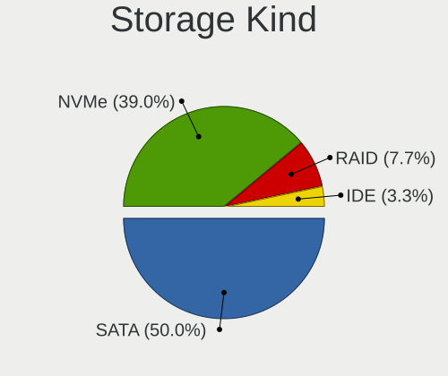

| Kind | Computers | Percent |
|------|-----------|---------|
| SATA | 136       | 50%     |
| NVMe | 106       | 38.97%  |
| RAID | 21        | 7.72%   |
| IDE  | 9         | 3.31%   |

Processor
---------

CPU Vendor
----------

Processor vendors

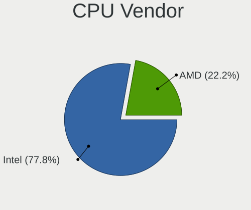

| Vendor | Computers | Percent |
|--------|-----------|---------|
| Intel  | 158       | 77.83%  |
| AMD    | 45        | 22.17%  |

CPU Model
---------

Processor models

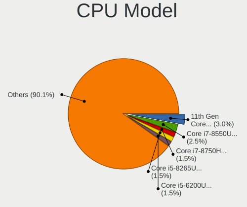

| Model                                         | Computers | Percent |
|-----------------------------------------------|-----------|---------|
| Intel 11th Gen Core i7-1165G7 @ 2.80GHz       | 6         | 2.96%   |
| Intel Core i7-8550U CPU @ 1.80GHz             | 5         | 2.46%   |
| Intel Core i7-8750H CPU @ 2.20GHz             | 3         | 1.48%   |
| Intel Core i5-8265U CPU @ 1.60GHz             | 3         | 1.48%   |
| Intel Core i5-6200U CPU @ 2.30GHz             | 3         | 1.48%   |
| AMD Ryzen 9 5900HX with Radeon Graphics       | 3         | 1.48%   |
| AMD Ryzen 5 3600 6-Core Processor             | 3         | 1.48%   |
| Intel Core i7-9750H CPU @ 2.60GHz             | 2         | 0.99%   |
| Intel Core i7-8650U CPU @ 1.90GHz             | 2         | 0.99%   |
| Intel Core i7-7700HQ CPU @ 2.80GHz            | 2         | 0.99%   |
| Intel Core i7-6500U CPU @ 2.50GHz             | 2         | 0.99%   |
| Intel Core i7-5500U CPU @ 2.40GHz             | 2         | 0.99%   |
| Intel Core i7-4790K CPU @ 4.00GHz             | 2         | 0.99%   |
| Intel Core i7-4790 CPU @ 3.60GHz              | 2         | 0.99%   |
| Intel Core i7-4702HQ CPU @ 2.20GHz            | 2         | 0.99%   |
| Intel Core i7-10510U CPU @ 1.80GHz            | 2         | 0.99%   |
| Intel Core i5-8250U CPU @ 1.60GHz             | 2         | 0.99%   |
| Intel Core i5-7500 CPU @ 3.40GHz              | 2         | 0.99%   |
| Intel Core i5-6500T CPU @ 2.50GHz             | 2         | 0.99%   |
| Intel Core i5-4590S CPU @ 3.00GHz             | 2         | 0.99%   |
| Intel Core i5-4460 CPU @ 3.20GHz              | 2         | 0.99%   |
| Intel Core i5-4200U CPU @ 1.60GHz             | 2         | 0.99%   |
| Intel Core i5-10400 CPU @ 2.90GHz             | 2         | 0.99%   |
| Intel Core i5-10300H CPU @ 2.50GHz            | 2         | 0.99%   |
| Intel Core i3-4030U CPU @ 1.90GHz             | 2         | 0.99%   |
| Intel Core i3 CPU M 370 @ 2.40GHz             | 2         | 0.99%   |
| Intel 13th Gen Core i7-13700                  | 2         | 0.99%   |
| Intel 12th Gen Core i7-12700H                 | 2         | 0.99%   |
| AMD Ryzen 9 5900X 12-Core Processor           | 2         | 0.99%   |
| AMD Ryzen 9 5900HS with Radeon Graphics       | 2         | 0.99%   |
| AMD Ryzen 7 3700X 8-Core Processor            | 2         | 0.99%   |
| AMD Ryzen 5 4600H with Radeon Graphics        | 2         | 0.99%   |
| AMD Ryzen 5 3550H with Radeon Vega Mobile Gfx | 2         | 0.99%   |
| Intel Xeon Gold 6154 CPU @ 3.00GHz            | 1         | 0.49%   |
| Intel Xeon CPU X5690 @ 3.47GHz                | 1         | 0.49%   |
| Intel Xeon CPU E5-2698 v3 @ 2.30GHz           | 1         | 0.49%   |
| Intel Pentium Silver N5000 CPU @ 1.10GHz      | 1         | 0.49%   |
| Intel Pentium Dual-Core CPU T4500 @ 2.30GHz   | 1         | 0.49%   |
| Intel Pentium Dual-Core CPU T4300 @ 2.10GHz   | 1         | 0.49%   |
| Intel Pentium Dual-Core CPU T4200 @ 2.00GHz   | 1         | 0.49%   |

CPU Model Family
----------------

Processor model prefix

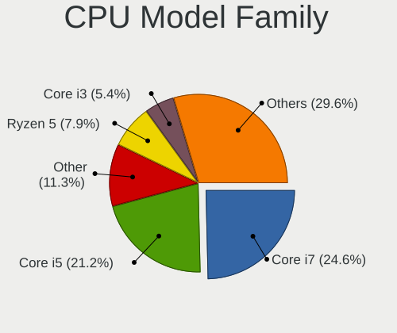

| Model                   | Computers | Percent |
|-------------------------|-----------|---------|
| Intel Core i7           | 50        | 24.63%  |
| Intel Core i5           | 43        | 21.18%  |
| Other                   | 23        | 11.33%  |
| AMD Ryzen 5             | 16        | 7.88%   |
| Intel Core i3           | 11        | 5.42%   |
| AMD Ryzen 7             | 11        | 5.42%   |
| AMD Ryzen 9             | 9         | 4.43%   |
| Intel Pentium           | 5         | 2.46%   |
| Intel Celeron           | 5         | 2.46%   |
| AMD Ryzen 7 PRO         | 4         | 1.97%   |
| Intel Pentium Dual-Core | 3         | 1.48%   |
| Intel Core 2 Quad       | 3         | 1.48%   |
| Intel Xeon              | 2         | 0.99%   |
| Intel Core i9           | 2         | 0.99%   |
| Intel Atom              | 2         | 0.99%   |
| AMD Ryzen 5 PRO         | 2         | 0.99%   |
| Intel Xeon Gold         | 1         | 0.49%   |
| Intel Pentium Silver    | 1         | 0.49%   |
| Intel Core m5           | 1         | 0.49%   |
| Intel Core m3           | 1         | 0.49%   |
| Intel Core M            | 1         | 0.49%   |
| Intel Core 2 Duo        | 1         | 0.49%   |
| Intel Core 2            | 1         | 0.49%   |
| Intel Core              | 1         | 0.49%   |
| Intel Celeron Dual-Core | 1         | 0.49%   |
| AMD Phenom II X4        | 1         | 0.49%   |
| AMD FX                  | 1         | 0.49%   |
| AMD E2                  | 1         | 0.49%   |

CPU Cores
---------

Number of processor cores

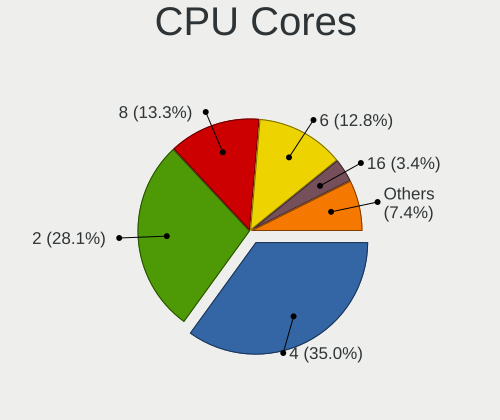

| Number | Computers | Percent |
|--------|-----------|---------|
| 4      | 71        | 34.98%  |
| 2      | 57        | 28.08%  |
| 8      | 27        | 13.3%   |
| 6      | 26        | 12.81%  |
| 16     | 7         | 3.45%   |
| 12     | 4         | 1.97%   |
| 24     | 2         | 0.99%   |
| 14     | 2         | 0.99%   |
| 10     | 2         | 0.99%   |
| 1      | 2         | 0.99%   |
| 36     | 1         | 0.49%   |
| 32     | 1         | 0.49%   |
| 20     | 1         | 0.49%   |

CPU Sockets
-----------

Number of sockets

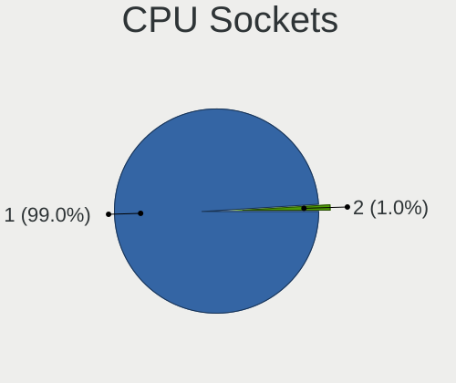

| Number | Computers | Percent |
|--------|-----------|---------|
| 1      | 201       | 99.01%  |
| 2      | 2         | 0.99%   |

CPU Threads
-----------

Threads per core (Hyper-Threading)

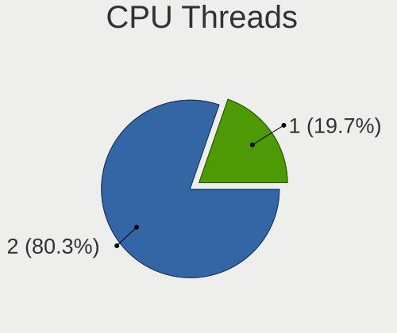

| Number | Computers | Percent |
|--------|-----------|---------|
| 2      | 163       | 80.3%   |
| 1      | 40        | 19.7%   |

CPU Op-Modes
------------

CPU Operation Modes (32-bit, 64-bit)

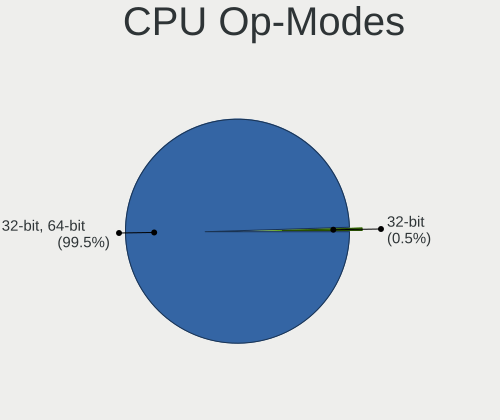

| Op mode        | Computers | Percent |
|----------------|-----------|---------|
| 32-bit, 64-bit | 202       | 99.51%  |
| 32-bit         | 1         | 0.49%   |

CPU Microcode
-------------

Microcode number

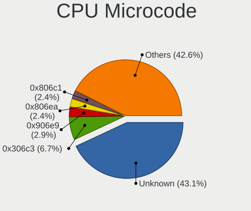

| Number     | Computers | Percent |
|------------|-----------|---------|
| Unknown    | 90        | 43.06%  |
| 0x306c3    | 14        | 6.7%    |
| 0x906e9    | 6         | 2.87%   |
| 0x806ea    | 5         | 2.39%   |
| 0x806c1    | 5         | 2.39%   |
| 0x406e3    | 5         | 2.39%   |
| 0x40651    | 5         | 2.39%   |
| 0x206a7    | 5         | 2.39%   |
| 0x506e3    | 4         | 1.91%   |
| 0x20655    | 4         | 1.91%   |
| 0x1067a    | 4         | 1.91%   |
| 0x906ea    | 3         | 1.44%   |
| 0x806eb    | 3         | 1.44%   |
| 0x706a1    | 3         | 1.44%   |
| 0x306d4    | 3         | 1.44%   |
| 0x08701013 | 3         | 1.44%   |
| 0xa0655    | 2         | 0.96%   |
| 0x906ed    | 2         | 0.96%   |
| 0x806ec    | 2         | 0.96%   |
| 0x806d1    | 2         | 0.96%   |
| 0x306a9    | 2         | 0.96%   |
| 0x10677    | 2         | 0.96%   |
| 0x0a50000c | 2         | 0.96%   |
| 0x0a20120a | 2         | 0.96%   |
| 0x08701021 | 2         | 0.96%   |
| 0x08600106 | 2         | 0.96%   |
| 0x08600103 | 2         | 0.96%   |
| 0x08108102 | 2         | 0.96%   |
| 0xb06e0    | 1         | 0.48%   |
| 0xa0671    | 1         | 0.48%   |
| 0xa0653    | 1         | 0.48%   |
| 0x906c0    | 1         | 0.48%   |
| 0x806e9    | 1         | 0.48%   |
| 0x6fb      | 1         | 0.48%   |
| 0x6f6      | 1         | 0.48%   |
| 0x50654    | 1         | 0.48%   |
| 0x406f1    | 1         | 0.48%   |
| 0x406c4    | 1         | 0.48%   |
| 0x20652    | 1         | 0.48%   |
| 0x106c2    | 1         | 0.48%   |

CPU Microarch
-------------

Microarchitecture

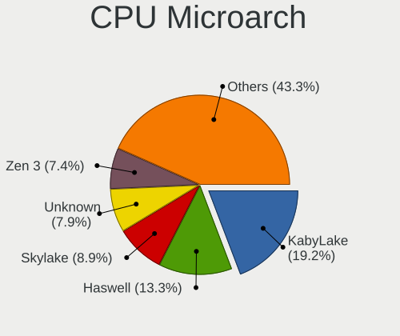

| Name             | Computers | Percent |
|------------------|-----------|---------|
| KabyLake         | 39        | 19.21%  |
| Haswell          | 27        | 13.3%   |
| Skylake          | 18        | 8.87%   |
| Unknown          | 16        | 7.88%   |
| Zen 3            | 15        | 7.39%   |
| Zen 2            | 14        | 6.9%    |
| TigerLake        | 8         | 3.94%   |
| Alderlake Hybrid | 8         | 3.94%   |
| Westmere         | 7         | 3.45%   |
| SandyBridge      | 7         | 3.45%   |
| Penryn           | 7         | 3.45%   |
| IvyBridge        | 6         | 2.96%   |
| CometLake        | 6         | 2.96%   |
| Broadwell        | 6         | 2.96%   |
| Zen+             | 3         | 1.48%   |
| Icelake          | 3         | 1.48%   |
| Goldmont plus    | 3         | 1.48%   |
| Core             | 2         | 0.99%   |
| Zen              | 1         | 0.49%   |
| Silvermont       | 1         | 0.49%   |
| Piledriver       | 1         | 0.49%   |
| Lunarlake Hybrid | 1         | 0.49%   |
| K10              | 1         | 0.49%   |
| Goldmont         | 1         | 0.49%   |
| Excavator        | 1         | 0.49%   |
| Bonnell          | 1         | 0.49%   |

Graphics
--------

GPU Vendor
----------

Vendors of graphics cards

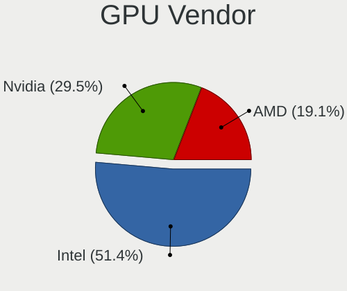

| Vendor | Computers | Percent |
|--------|-----------|---------|
| Intel  | 129       | 51.39%  |
| Nvidia | 74        | 29.48%  |
| AMD    | 48        | 19.12%  |

GPU Model
---------

Graphics card models

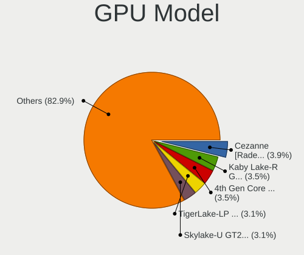

| Model                                                                       | Computers | Percent |
|-----------------------------------------------------------------------------|-----------|---------|
| AMD Cezanne [Radeon Vega Series / Radeon Vega Mobile Series]                | 10        | 3.89%   |
| Intel Kaby Lake-R GT2 [UHD Graphics 620]                                    | 9         | 3.5%    |
| Intel 4th Gen Core Processor Integrated Graphics Controller                 | 9         | 3.5%    |
| Intel TigerLake-LP GT2 [Iris Xe Graphics]                                   | 8         | 3.11%   |
| Intel Skylake-U GT2 [HD Graphics 520]                                       | 8         | 3.11%   |
| AMD Renoir [Radeon Vega Series / Radeon Vega Mobile Series]                 | 7         | 2.72%   |
| Intel WhiskeyLake-U GT2 [UHD Graphics 620]                                  | 6         | 2.33%   |
| Intel CoffeeLake-H GT2 [UHD Graphics 630]                                   | 6         | 2.33%   |
| Intel 2nd Generation Core Processor Family Integrated Graphics Controller   | 6         | 2.33%   |
| Nvidia GA106M [GeForce RTX 3060 Mobile / Max-Q]                             | 5         | 1.95%   |
| Intel Skylake-S GT2 [HD Graphics 530]                                       | 5         | 1.95%   |
| Intel Haswell-ULT Integrated Graphics Controller                            | 5         | 1.95%   |
| Intel 3rd Gen Core processor Graphics Controller                            | 5         | 1.95%   |
| Intel Xeon E3-1200 v3/4th Gen Core Processor Integrated Graphics Controller | 4         | 1.56%   |
| Nvidia GP107M [GeForce GTX 1050 Ti Mobile]                                  | 3         | 1.17%   |
| Nvidia GP107M [GeForce GTX 1050 Mobile]                                     | 3         | 1.17%   |
| Nvidia GA107GLM [RTX A1000 Laptop GPU]                                      | 3         | 1.17%   |
| Intel Kaby Lake-U GT2 [HD Graphics 620]                                     | 3         | 1.17%   |
| Intel CometLake-S GT2 [UHD Graphics 630]                                    | 3         | 1.17%   |
| Intel Broadwell-U GT2 [HD Graphics 5500]                                    | 3         | 1.17%   |
| Intel Alder Lake-HX GT1 [UHD Graphics 770]                                  | 3         | 1.17%   |
| AMD Phoenix1                                                                | 3         | 1.17%   |
| AMD Navi 21 [Radeon RX 6800/6800 XT / 6900 XT]                              | 3         | 1.17%   |
| Nvidia TU117M [GeForce GTX 1650 Mobile / Max-Q]                             | 2         | 0.78%   |
| Nvidia TU117GLM [Quadro T1000 Mobile]                                       | 2         | 0.78%   |
| Nvidia GP108M [GeForce MX250]                                               | 2         | 0.78%   |
| Nvidia GP108M [GeForce MX150]                                               | 2         | 0.78%   |
| Nvidia GP108 [GeForce GT 1030]                                              | 2         | 0.78%   |
| Nvidia GP107 [GeForce GTX 1050 Ti]                                          | 2         | 0.78%   |
| Nvidia GP106 [GeForce GTX 1060 6GB]                                         | 2         | 0.78%   |
| Nvidia GP104 [GeForce GTX 1080]                                             | 2         | 0.78%   |
| Nvidia GM204 [GeForce GTX 970]                                              | 2         | 0.78%   |
| Nvidia GK107GLM [Quadro K1100M]                                             | 2         | 0.78%   |
| Nvidia GA107M [GeForce RTX 3050 Mobile]                                     | 2         | 0.78%   |
| Nvidia GA106 [GeForce RTX 3060 Lite Hash Rate]                              | 2         | 0.78%   |
| Intel TigerLake-H GT1 [UHD Graphics]                                        | 2         | 0.78%   |
| Intel Skylake-Y GT2 [HD Graphics 515]                                       | 2         | 0.78%   |
| Intel Raptor Lake-S GT1 [UHD Graphics 770]                                  | 2         | 0.78%   |
| Intel Mobile 4 Series Chipset Integrated Graphics Controller                | 2         | 0.78%   |
| Intel Kaby Lake-U GT3 [Iris Plus Graphics 640]                              | 2         | 0.78%   |

GPU Combo
---------

Combinations of graphics cards

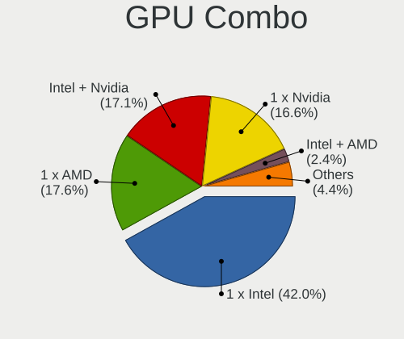

| Name           | Computers | Percent |
|----------------|-----------|---------|
| 1 x Intel      | 86        | 41.95%  |
| 1 x AMD        | 36        | 17.56%  |
| Intel + Nvidia | 35        | 17.07%  |
| 1 x Nvidia     | 34        | 16.59%  |
| Intel + AMD    | 5         | 2.44%   |
| 2 x AMD        | 4         | 1.95%   |
| AMD + Nvidia   | 4         | 1.95%   |
| 2 x Nvidia     | 1         | 0.49%   |

GPU Driver
----------

Free vs proprietary

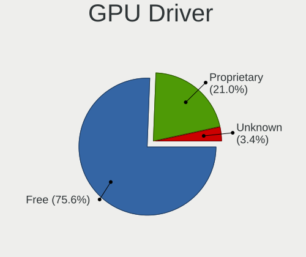

| Driver      | Computers | Percent |
|-------------|-----------|---------|
| Free        | 155       | 75.61%  |
| Proprietary | 43        | 20.98%  |
| Unknown     | 7         | 3.41%   |

GPU Memory
----------

Total video memory

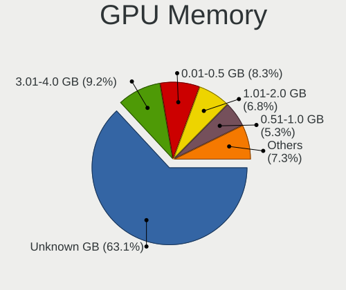

| Size in GB | Computers | Percent |
|------------|-----------|---------|
| Unknown    | 130       | 63.11%  |
| 3.01-4.0   | 19        | 9.22%   |
| 0.01-0.5   | 17        | 8.25%   |
| 1.01-2.0   | 14        | 6.8%    |
| 0.51-1.0   | 11        | 5.34%   |
| 8.01-16.0  | 8         | 3.88%   |
| 7.01-8.0   | 3         | 1.46%   |
| 5.01-6.0   | 3         | 1.46%   |
| 16.01-24.0 | 1         | 0.49%   |

Monitor
-------

Monitor Vendor
--------------

Monitor vendors

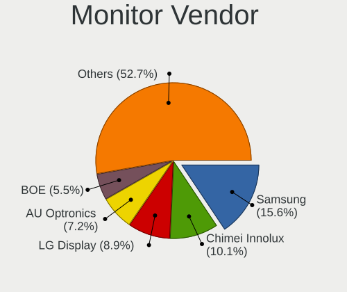

| Vendor                  | Computers | Percent |
|-------------------------|-----------|---------|
| Samsung Electronics     | 37        | 15.61%  |
| Chimei Innolux          | 24        | 10.13%  |
| LG Display              | 21        | 8.86%   |
| AU Optronics            | 17        | 7.17%   |
| BOE                     | 13        | 5.49%   |
| AOC                     | 13        | 5.49%   |
| Goldstar                | 12        | 5.06%   |
| Hewlett-Packard         | 11        | 4.64%   |
| Dell                    | 11        | 4.64%   |
| Sharp                   | 8         | 3.38%   |
| Iiyama                  | 8         | 3.38%   |
| Apple                   | 7         | 2.95%   |
| BenQ                    | 6         | 2.53%   |
| Ancor Communications    | 6         | 2.53%   |
| Philips                 | 5         | 2.11%   |
| Medion                  | 4         | 1.69%   |
| Eizo                    | 3         | 1.27%   |
| Chi Mei Optoelectronics | 3         | 1.27%   |
| Videoseven              | 2         | 0.84%   |
| TMX                     | 2         | 0.84%   |
| PANDA                   | 2         | 0.84%   |
| CSO                     | 2         | 0.84%   |
| Acer                    | 2         | 0.84%   |
| ViewSonic               | 1         | 0.42%   |
| UGD                     | 1         | 0.42%   |
| Sony                    | 1         | 0.42%   |
| RTK                     | 1         | 0.42%   |
| PAR                     | 1         | 0.42%   |
| Panasonic               | 1         | 0.42%   |
| MSI                     | 1         | 0.42%   |
| LG Electronics          | 1         | 0.42%   |
| Lenovo                  | 1         | 0.42%   |
| InnoLux Display         | 1         | 0.42%   |
| InfoVision              | 1         | 0.42%   |
| Hitachi                 | 1         | 0.42%   |
| Gigabyte Technology     | 1         | 0.42%   |
| Fujitsu Siemens         | 1         | 0.42%   |
| DENON                   | 1         | 0.42%   |
| Belinea                 | 1         | 0.42%   |
| ASUSTek Computer        | 1         | 0.42%   |

Monitor Model
-------------

Monitor models

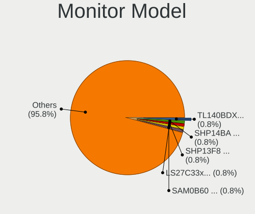

| Model                                                                   | Computers | Percent |
|-------------------------------------------------------------------------|-----------|---------|
| TMX TL140BDXP01-0 TMX1400 2560x1440 310x174mm 14.0-inch                 | 2         | 0.83%   |
| Sharp LCD Monitor SHP14BA 1920x1080 344x194mm 15.5-inch                 | 2         | 0.83%   |
| Sharp LCD Monitor SHP13F8 3200x1800 346x194mm 15.6-inch                 | 2         | 0.83%   |
| Samsung Electronics LS27C33xG SAM7437 1920x1080 598x336mm 27.0-inch     | 2         | 0.83%   |
| Samsung Electronics LCD Monitor SAM0B60 1920x1080 887x500mm 40.1-inch   | 2         | 0.83%   |
| Goldstar ULTRAGEAR GSM5BD3 2560x1440 697x392mm 31.5-inch                | 2         | 0.83%   |
| Chimei Innolux LCD Monitor CMN1735 1920x1080 381x214mm 17.2-inch        | 2         | 0.83%   |
| Chimei Innolux LCD Monitor CMN1604 1920x1080 355x199mm 16.0-inch        | 2         | 0.83%   |
| Chimei Innolux LCD Monitor CMN14D4 1920x1080 309x173mm 13.9-inch        | 2         | 0.83%   |
| Chimei Innolux LCD Monitor CMN14C9 1920x1080 309x173mm 13.9-inch        | 2         | 0.83%   |
| Apple LCD Monitor APP9CC3 1280x800 286x179mm 13.3-inch                  | 2         | 0.83%   |
| AOC 2470W AOC2470 1920x1080 521x293mm 23.5-inch                         | 2         | 0.83%   |
| AOC 2250W AOC2250 1920x1080 477x268mm 21.5-inch                         | 2         | 0.83%   |
| ViewSonic VX2458 series VSC0437 1920x1080 521x293mm 23.5-inch           | 1         | 0.42%   |
| Videoseven L27ADS IGM2700 1920x1080 598x336mm 27.0-inch                 | 1         | 0.42%   |
| Videoseven L236VA IGM2380 1920x1080 521x293mm 23.5-inch                 | 1         | 0.42%   |
| UGD Artist13.3pro UGD1302 1920x1080 294x165mm 13.3-inch                 | 1         | 0.42%   |
| Sony Nvidia Defaul t Flat Panel SNY05FA 1366x768 309x174mm 14.0-inch    | 1         | 0.42%   |
| Sharp LCD Monitor SHP1516 3840x2400 336x210mm 15.6-inch                 | 1         | 0.42%   |
| Sharp LCD Monitor SHP14AE 1920x1080 294x165mm 13.3-inch                 | 1         | 0.42%   |
| Sharp LCD Monitor SHP1476 3840x2160 346x194mm 15.6-inch                 | 1         | 0.42%   |
| Sharp LCD Monitor SHP1421 3200x1800 294x165mm 13.3-inch                 | 1         | 0.42%   |
| Samsung Electronics U28H75x SAM0DFE 3840x2160 608x345mm 27.5-inch       | 1         | 0.42%   |
| Samsung Electronics T24B350 SAM093E 1920x1080 531x299mm 24.0-inch       | 1         | 0.42%   |
| Samsung Electronics SyncMaster SAM0612 1920x1080 604x342mm 27.3-inch    | 1         | 0.42%   |
| Samsung Electronics SyncMaster SAM04DF 1360x768 410x230mm 18.5-inch     | 1         | 0.42%   |
| Samsung Electronics SMT27A950 SAM080F 1920x1080 598x336mm 27.0-inch     | 1         | 0.42%   |
| Samsung Electronics SMS27A650 SAM082E 1920x1080 598x336mm 27.0-inch     | 1         | 0.42%   |
| Samsung Electronics SM2333T SAM0737 1920x1080 510x290mm 23.1-inch       | 1         | 0.42%   |
| Samsung Electronics S27D390 SAM0B67 1920x1080 598x336mm 27.0-inch       | 1         | 0.42%   |
| Samsung Electronics S27C750 SAM0A60 1920x1080 598x336mm 27.0-inch       | 1         | 0.42%   |
| Samsung Electronics S27B350 SAM08DC 1920x1080 598x336mm 27.0-inch       | 1         | 0.42%   |
| Samsung Electronics S24F350 SAM0D20 1920x1080 521x293mm 23.5-inch       | 1         | 0.42%   |
| Samsung Electronics Odyssey G70NC SAM7231 3840x2160 941x529mm 42.5-inch | 1         | 0.42%   |
| Samsung Electronics LF27T450F SAM7097 1920x1080 597x336mm 27.0-inch     | 1         | 0.42%   |
| Samsung Electronics LCD Monitor U28E590 3840x2160                       | 1         | 0.42%   |
| Samsung Electronics LCD Monitor SEC444E 1600x900 310x174mm 14.0-inch    | 1         | 0.42%   |
| Samsung Electronics LCD Monitor SDCA029 3840x2160 344x194mm 15.5-inch   | 1         | 0.42%   |
| Samsung Electronics LCD Monitor SDC5844 1920x1080 344x194mm 15.5-inch   | 1         | 0.42%   |
| Samsung Electronics LCD Monitor SDC4E51 1366x768 344x194mm 15.5-inch    | 1         | 0.42%   |

Monitor Resolution
------------------

Monitor screen resolution

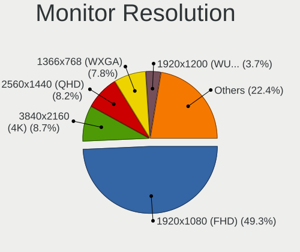

| Resolution         | Computers | Percent |
|--------------------|-----------|---------|
| 1920x1080 (FHD)    | 108       | 49.32%  |
| 3840x2160 (4K)     | 19        | 8.68%   |
| 2560x1440 (QHD)    | 18        | 8.22%   |
| 1366x768 (WXGA)    | 17        | 7.76%   |
| 1920x1200 (WUXGA)  | 8         | 3.65%   |
| 1600x900 (HD+)     | 6         | 2.74%   |
| 2880x1800          | 5         | 2.28%   |
| 3200x1800 (QHD+)   | 4         | 1.83%   |
| 2560x1600          | 4         | 1.83%   |
| 3440x1440          | 3         | 1.37%   |
| 1680x1050 (WSXGA+) | 3         | 1.37%   |
| 1440x900 (WXGA+)   | 3         | 1.37%   |
| 1280x800 (WXGA)    | 3         | 1.37%   |
| 3840x2400          | 2         | 0.91%   |
| 3840x1080          | 2         | 0.91%   |
| 2256x1504          | 2         | 0.91%   |
| 1360x768           | 2         | 0.91%   |
| 1280x1024 (SXGA)   | 2         | 0.91%   |
| 3072x1920          | 1         | 0.46%   |
| 2560x2160          | 1         | 0.46%   |
| 2520x1680          | 1         | 0.46%   |
| 2160x1440          | 1         | 0.46%   |
| 1600x1200          | 1         | 0.46%   |
| 1024x768 (XGA)     | 1         | 0.46%   |
| 1024x600           | 1         | 0.46%   |
| Unknown            | 1         | 0.46%   |

Monitor Diagonal
----------------

Diagonal size in inches

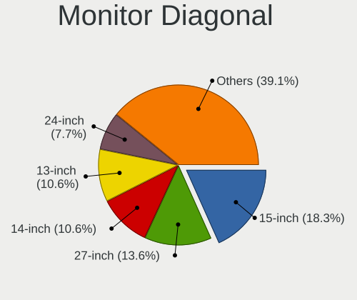

| Inches  | Computers | Percent |
|---------|-----------|---------|
| 15      | 43        | 18.3%   |
| 27      | 32        | 13.62%  |
| 14      | 25        | 10.64%  |
| 13      | 25        | 10.64%  |
| 24      | 18        | 7.66%   |
| 23      | 16        | 6.81%   |
| 17      | 13        | 5.53%   |
| 16      | 10        | 4.26%   |
| 21      | 7         | 2.98%   |
| Unknown | 7         | 2.98%   |
| 31      | 6         | 2.55%   |
| 22      | 5         | 2.13%   |
| 34      | 3         | 1.28%   |
| 18      | 3         | 1.28%   |
| 72      | 2         | 0.85%   |
| 47      | 2         | 0.85%   |
| 32      | 2         | 0.85%   |
| 19      | 2         | 0.85%   |
| 84      | 1         | 0.43%   |
| 65      | 1         | 0.43%   |
| 59      | 1         | 0.43%   |
| 54      | 1         | 0.43%   |
| 49      | 1         | 0.43%   |
| 46      | 1         | 0.43%   |
| 42      | 1         | 0.43%   |
| 40      | 1         | 0.43%   |
| 33      | 1         | 0.43%   |
| 28      | 1         | 0.43%   |
| 26      | 1         | 0.43%   |
| 25      | 1         | 0.43%   |
| 20      | 1         | 0.43%   |
| 11      | 1         | 0.43%   |

Monitor Width
-------------

Physical width

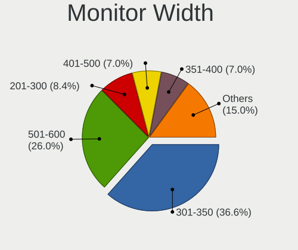

| Width in mm | Computers | Percent |
|-------------|-----------|---------|
| 301-350     | 83        | 36.56%  |
| 501-600     | 59        | 25.99%  |
| 201-300     | 19        | 8.37%   |
| 401-500     | 16        | 7.05%   |
| 351-400     | 16        | 7.05%   |
| 601-700     | 9         | 3.96%   |
| 1001-1500   | 7         | 3.08%   |
| Unknown     | 7         | 3.08%   |
| 701-800     | 6         | 2.64%   |
| 1501-2000   | 3         | 1.32%   |
| 801-900     | 1         | 0.44%   |
| 901-1000    | 1         | 0.44%   |

Aspect Ratio
------------

Proportional relationship between the width and the height

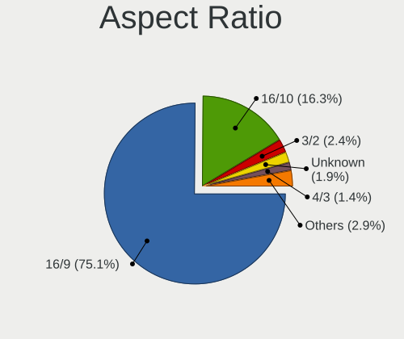

| Ratio   | Computers | Percent |
|---------|-----------|---------|
| 16/9    | 157       | 75.12%  |
| 16/10   | 34        | 16.27%  |
| 3/2     | 5         | 2.39%   |
| Unknown | 4         | 1.91%   |
| 4/3     | 3         | 1.44%   |
| 21/9    | 3         | 1.44%   |
| 5/4     | 2         | 0.96%   |
| 32/9    | 1         | 0.48%   |

Monitor Area
------------

Area in inch²

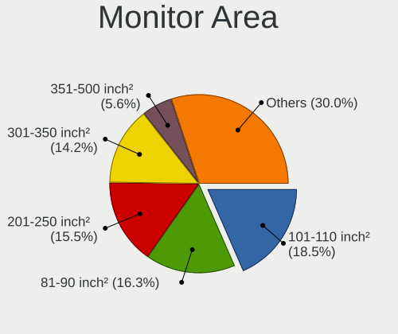

| Area in inch² | Computers | Percent |
|----------------|-----------|---------|
| 101-110        | 43        | 18.45%  |
| 81-90          | 38        | 16.31%  |
| 201-250        | 36        | 15.45%  |
| 301-350        | 33        | 14.16%  |
| 351-500        | 13        | 5.58%   |
| 71-80          | 12        | 5.15%   |
| 121-130        | 10        | 4.29%   |
| 251-300        | 9         | 3.86%   |
| 111-120        | 9         | 3.86%   |
| Unknown        | 7         | 3%      |
| More than 1000 | 6         | 2.58%   |
| 501-1000       | 6         | 2.58%   |
| 141-150        | 4         | 1.72%   |
| 151-200        | 3         | 1.29%   |
| 131-140        | 2         | 0.86%   |
| 51-60          | 1         | 0.43%   |
| 91-100         | 1         | 0.43%   |

Pixel Density
-------------

Pixels per inch

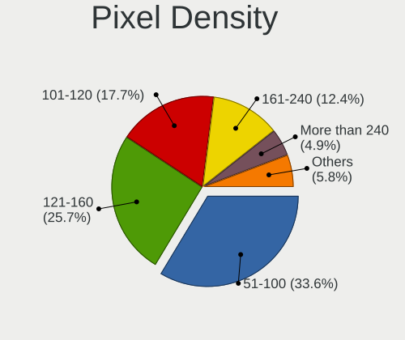

| Density       | Computers | Percent |
|---------------|-----------|---------|
| 51-100        | 76        | 33.63%  |
| 121-160       | 58        | 25.66%  |
| 101-120       | 40        | 17.7%   |
| 161-240       | 28        | 12.39%  |
| More than 240 | 11        | 4.87%   |
| Unknown       | 7         | 3.1%    |
| 1-50          | 6         | 2.65%   |

Multiple Monitors
-----------------

Total monitors connected

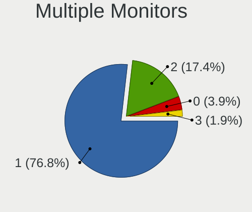

| Total | Computers | Percent |
|-------|-----------|---------|
| 1     | 159       | 76.81%  |
| 2     | 36        | 17.39%  |
| 0     | 8         | 3.86%   |
| 3     | 4         | 1.93%   |

Network
-------

Net Controller Vendor
---------------------

Controller vendors

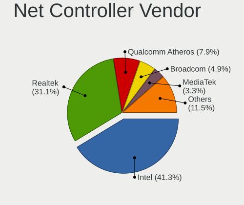

| Vendor                          | Computers | Percent |
|---------------------------------|-----------|---------|
| Intel                           | 126       | 41.31%  |
| Realtek Semiconductor           | 95        | 31.15%  |
| Qualcomm Atheros                | 24        | 7.87%   |
| Broadcom                        | 15        | 4.92%   |
| MediaTek                        | 10        | 3.28%   |
| Marvell Technology Group        | 6         | 1.97%   |
| Broadcom Limited                | 4         | 1.31%   |
| TP-Link                         | 3         | 0.98%   |
| Sierra Wireless                 | 3         | 0.98%   |
| Shenzhen Goodix Technology      | 3         | 0.98%   |
| Ralink Technology               | 2         | 0.66%   |
| DisplayLink                     | 2         | 0.66%   |
| Zinwell                         | 1         | 0.33%   |
| Ralink                          | 1         | 0.33%   |
| Qualcomm Atheros Communications | 1         | 0.33%   |
| Qualcomm                        | 1         | 0.33%   |
| Mellanox Technologies           | 1         | 0.33%   |
| Lenovo                          | 1         | 0.33%   |
| JMicron Technology              | 1         | 0.33%   |
| Huawei Technologies             | 1         | 0.33%   |
| Dell                            | 1         | 0.33%   |
| D-Link                          | 1         | 0.33%   |
| ASIX Electronics                | 1         | 0.33%   |
| Unknown                         | 1         | 0.33%   |

Net Controller Model
--------------------

Controller models

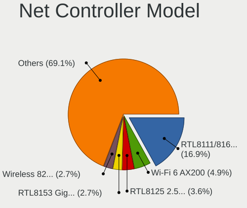

| Model                                                                  | Computers | Percent |
|------------------------------------------------------------------------|-----------|---------|
| Realtek RTL8111/8168/8211/8411 PCI Express Gigabit Ethernet Controller | 62        | 16.94%  |
| Intel Wi-Fi 6 AX200                                                    | 18        | 4.92%   |
| Realtek RTL8125 2.5GbE Controller                                      | 13        | 3.55%   |
| Realtek RTL8153 Gigabit Ethernet Adapter                               | 10        | 2.73%   |
| Intel Wireless 8265 / 8275                                             | 10        | 2.73%   |
| Intel Wireless 8260                                                    | 7         | 1.91%   |
| Intel I211 Gigabit Network Connection                                  | 7         | 1.91%   |
| Intel Wi-Fi 6E(802.11ax) AX210/AX1675* 2x2 [Typhoon Peak]              | 6         | 1.64%   |
| Intel Ethernet Connection (2) I219-V                                   | 6         | 1.64%   |
| Qualcomm Atheros QCA9565 / AR9565 Wireless Network Adapter             | 5         | 1.37%   |
| MediaTek MT7921 802.11ax PCIe Wireless Network Adapter [Filogic 330]   | 5         | 1.37%   |
| Intel Ethernet Controller I225-V                                       | 5         | 1.37%   |
| Intel Cannon Point-LP CNVi [Wireless-AC]                               | 5         | 1.37%   |
| Realtek RTL8822CE 802.11ac PCIe Wireless Network Adapter               | 4         | 1.09%   |
| Realtek RTL810xE PCI Express Fast Ethernet controller                  | 4         | 1.09%   |
| Intel Wireless 7260                                                    | 4         | 1.09%   |
| Intel Ethernet Connection (4) I219-V                                   | 4         | 1.09%   |
| Intel Ethernet Connection (2) I219-LM                                  | 4         | 1.09%   |
| Intel Dual Band Wireless-AC 3168NGW [Stone Peak]                       | 4         | 1.09%   |
| Intel Alder Lake-S PCH CNVi WiFi                                       | 4         | 1.09%   |
| Intel 82579LM Gigabit Network Connection (Lewisville)                  | 4         | 1.09%   |
| Qualcomm Atheros QCA9377 802.11ac Wireless Network Adapter             | 3         | 0.82%   |
| Qualcomm Atheros QCA6174 802.11ac Wireless Network Adapter             | 3         | 0.82%   |
| MediaTek MT7922 802.11ax PCI Express Wireless Network Adapter          | 3         | 0.82%   |
| Intel Wireless 7265                                                    | 3         | 0.82%   |
| Intel Wireless 3160                                                    | 3         | 0.82%   |
| Intel Wi-Fi 6 AX201                                                    | 3         | 0.82%   |
| Intel Ethernet Connection I219-V                                       | 3         | 0.82%   |
| Intel Ethernet Connection I217-LM                                      | 3         | 0.82%   |
| Intel Cannon Lake PCH CNVi WiFi                                        | 3         | 0.82%   |
| Intel 700 Series Chipset CNVi WiFi                                     | 3         | 0.82%   |
| Broadcom NetXtreme BCM57765 Gigabit Ethernet PCIe                      | 3         | 0.82%   |
| Broadcom BCM4331 802.11a/b/g/n                                         | 3         | 0.82%   |
| TP-Link 802.11ac NIC                                                   | 2         | 0.55%   |
| Sierra Wireless EM7305 Modem                                           | 2         | 0.55%   |
| Shenzhen Goodix Fingerprint Reader                                     | 2         | 0.55%   |
| Realtek RTL8852AE 802.11ax PCIe Wireless Network Adapter               | 2         | 0.55%   |
| Realtek RTL8812AU 802.11a/b/g/n/ac 2T2R DB WLAN Adapter                | 2         | 0.55%   |
| Realtek RTL8723BE PCIe Wireless Network Adapter                        | 2         | 0.55%   |
| Realtek Killer E3000 2.5GbE Controller                                 | 2         | 0.55%   |

Wireless Vendor
---------------

Wireless vendors

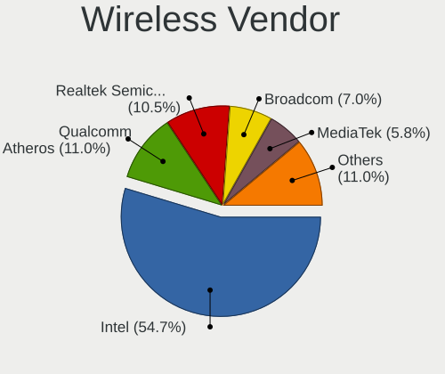

| Vendor                          | Computers | Percent |
|---------------------------------|-----------|---------|
| Intel                           | 94        | 54.65%  |
| Qualcomm Atheros                | 19        | 11.05%  |
| Realtek Semiconductor           | 18        | 10.47%  |
| Broadcom                        | 12        | 6.98%   |
| MediaTek                        | 10        | 5.81%   |
| Broadcom Limited                | 4         | 2.33%   |
| TP-Link                         | 3         | 1.74%   |
| Sierra Wireless                 | 3         | 1.74%   |
| Ralink Technology               | 2         | 1.16%   |
| Zinwell                         | 1         | 0.58%   |
| Ralink                          | 1         | 0.58%   |
| Qualcomm Atheros Communications | 1         | 0.58%   |
| Qualcomm                        | 1         | 0.58%   |
| Marvell Technology Group        | 1         | 0.58%   |
| Dell                            | 1         | 0.58%   |
| D-Link                          | 1         | 0.58%   |

Wireless Model
--------------

Wireless models

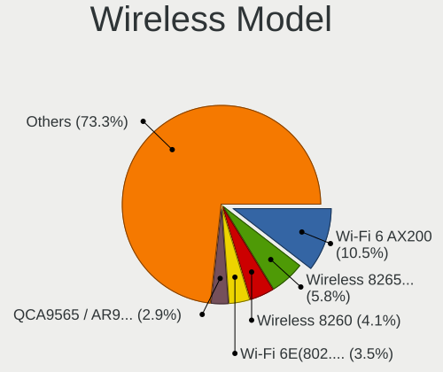

| Model                                                                | Computers | Percent |
|----------------------------------------------------------------------|-----------|---------|
| Intel Wi-Fi 6 AX200                                                  | 18        | 10.47%  |
| Intel Wireless 8265 / 8275                                           | 10        | 5.81%   |
| Intel Wireless 8260                                                  | 7         | 4.07%   |
| Intel Wi-Fi 6E(802.11ax) AX210/AX1675* 2x2 [Typhoon Peak]            | 6         | 3.49%   |
| Qualcomm Atheros QCA9565 / AR9565 Wireless Network Adapter           | 5         | 2.91%   |
| MediaTek MT7921 802.11ax PCIe Wireless Network Adapter [Filogic 330] | 5         | 2.91%   |
| Intel Cannon Point-LP CNVi [Wireless-AC]                             | 5         | 2.91%   |
| Realtek RTL8822CE 802.11ac PCIe Wireless Network Adapter             | 4         | 2.33%   |
| Intel Wireless 7260                                                  | 4         | 2.33%   |
| Intel Dual Band Wireless-AC 3168NGW [Stone Peak]                     | 4         | 2.33%   |
| Qualcomm Atheros QCA9377 802.11ac Wireless Network Adapter           | 3         | 1.74%   |
| Qualcomm Atheros QCA6174 802.11ac Wireless Network Adapter           | 3         | 1.74%   |
| MediaTek MT7922 802.11ax PCI Express Wireless Network Adapter        | 3         | 1.74%   |
| Intel Wireless 7265                                                  | 3         | 1.74%   |
| Intel Wireless 3160                                                  | 3         | 1.74%   |
| Intel Wi-Fi 6 AX201                                                  | 3         | 1.74%   |
| Intel Cannon Lake PCH CNVi WiFi                                      | 3         | 1.74%   |
| Intel 700 Series Chipset CNVi WiFi                                   | 3         | 1.74%   |
| Broadcom BCM4331 802.11a/b/g/n                                       | 3         | 1.74%   |
| TP-Link 802.11ac NIC                                                 | 2         | 1.16%   |
| Sierra Wireless EM7305 Modem                                         | 2         | 1.16%   |
| Realtek RTL8852AE 802.11ax PCIe Wireless Network Adapter             | 2         | 1.16%   |
| Realtek RTL8812AU 802.11a/b/g/n/ac 2T2R DB WLAN Adapter              | 2         | 1.16%   |
| Realtek RTL8723BE PCIe Wireless Network Adapter                      | 2         | 1.16%   |
| Qualcomm Atheros AR928X Wireless Network Adapter (PCI-Express)       | 2         | 1.16%   |
| Qualcomm Atheros AR9285 Wireless Network Adapter (PCI-Express)       | 2         | 1.16%   |
| Intel Wireless 3165                                                  | 2         | 1.16%   |
| Intel Wi-Fi 5(802.11ac) Wireless-AC 9x6x [Thunder Peak]              | 2         | 1.16%   |
| Intel Tiger Lake PCH CNVi WiFi                                       | 2         | 1.16%   |
| Intel Comet Lake PCH CNVi WiFi                                       | 2         | 1.16%   |
| Intel Centrino Wireless-N 1030 [Rainbow Peak]                        | 2         | 1.16%   |
| Intel Centrino Advanced-N 6235                                       | 2         | 1.16%   |
| Intel Alder Lake-P PCH CNVi WiFi                                     | 2         | 1.16%   |
| Broadcom Limited BCM4352 802.11ac Dual Band Wireless Network Adapter | 2         | 1.16%   |
| Broadcom BCM4360 802.11ac Dual Band Wireless Network Adapter         | 2         | 1.16%   |
| Broadcom BCM4313 802.11bgn Wireless Network Adapter                  | 2         | 1.16%   |
| Zinwell ZW-N290 802.11n [Realtek RTL8192U]                           | 1         | 0.58%   |
| TP-Link TL-WN823N v2/v3 [Realtek RTL8192EU]                          | 1         | 0.58%   |
| Sierra Wireless EM7455                                               | 1         | 0.58%   |
| Realtek RTL8852BE PCIe 802.11ax Wireless Network Controller          | 1         | 0.58%   |

Ethernet Vendor
---------------

Ethernet vendors

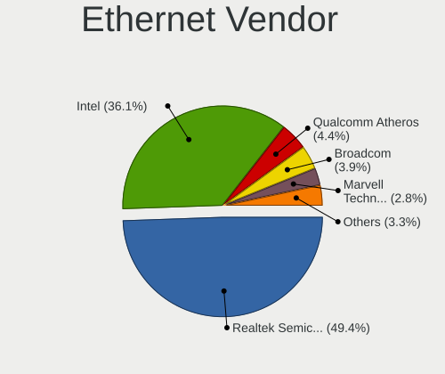

| Vendor                   | Computers | Percent |
|--------------------------|-----------|---------|
| Realtek Semiconductor    | 89        | 49.44%  |
| Intel                    | 65        | 36.11%  |
| Qualcomm Atheros         | 8         | 4.44%   |
| Broadcom                 | 7         | 3.89%   |
| Marvell Technology Group | 5         | 2.78%   |
| DisplayLink              | 2         | 1.11%   |
| Mellanox Technologies    | 1         | 0.56%   |
| Lenovo                   | 1         | 0.56%   |
| JMicron Technology       | 1         | 0.56%   |
| ASIX Electronics         | 1         | 0.56%   |

Ethernet Model
--------------

Ethernet models

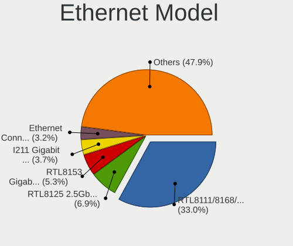

| Model                                                                          | Computers | Percent |
|--------------------------------------------------------------------------------|-----------|---------|
| Realtek RTL8111/8168/8211/8411 PCI Express Gigabit Ethernet Controller         | 62        | 32.98%  |
| Realtek RTL8125 2.5GbE Controller                                              | 13        | 6.91%   |
| Realtek RTL8153 Gigabit Ethernet Adapter                                       | 10        | 5.32%   |
| Intel I211 Gigabit Network Connection                                          | 7         | 3.72%   |
| Intel Ethernet Connection (2) I219-V                                           | 6         | 3.19%   |
| Intel Ethernet Controller I225-V                                               | 5         | 2.66%   |
| Realtek RTL810xE PCI Express Fast Ethernet controller                          | 4         | 2.13%   |
| Intel Ethernet Connection (4) I219-V                                           | 4         | 2.13%   |
| Intel Ethernet Connection (2) I219-LM                                          | 4         | 2.13%   |
| Intel 82579LM Gigabit Network Connection (Lewisville)                          | 4         | 2.13%   |
| Intel Ethernet Connection I219-V                                               | 3         | 1.6%    |
| Intel Ethernet Connection I217-LM                                              | 3         | 1.6%    |
| Intel Alder Lake-S PCH CNVi WiFi                                               | 3         | 1.6%    |
| Broadcom NetXtreme BCM57765 Gigabit Ethernet PCIe                              | 3         | 1.6%    |
| Realtek Killer E3000 2.5GbE Controller                                         | 2         | 1.06%   |
| Marvell Group Yukon Optima 88E8059 [PCIe Gigabit Ethernet Controller with AVB] | 2         | 1.06%   |
| Intel Ethernet Connection I219-LM                                              | 2         | 1.06%   |
| Intel Ethernet Connection I217-V                                               | 2         | 1.06%   |
| Intel Ethernet Connection (7) I219-LM                                          | 2         | 1.06%   |
| Intel Ethernet Connection (6) I219-V                                           | 2         | 1.06%   |
| Intel Ethernet Connection (4) I219-LM                                          | 2         | 1.06%   |
| Intel Ethernet Connection (2) I218-V                                           | 2         | 1.06%   |
| Intel Ethernet Connection (17) I219-LM                                         | 2         | 1.06%   |
| DisplayLink Dell D3100 Docking Station                                         | 2         | 1.06%   |
| Realtek Killer E2600 GbE Controller                                            | 1         | 0.53%   |
| Qualcomm Atheros QCA8172 Fast Ethernet                                         | 1         | 0.53%   |
| Qualcomm Atheros QCA8171 Gigabit Ethernet                                      | 1         | 0.53%   |
| Qualcomm Atheros Killer E2500 Gigabit Ethernet Controller                      | 1         | 0.53%   |
| Qualcomm Atheros Killer E2400 Gigabit Ethernet Controller                      | 1         | 0.53%   |
| Qualcomm Atheros Killer E220x Gigabit Ethernet Controller                      | 1         | 0.53%   |
| Qualcomm Atheros AR8161 Gigabit Ethernet                                       | 1         | 0.53%   |
| Qualcomm Atheros AR8151 v2.0 Gigabit Ethernet                                  | 1         | 0.53%   |
| Qualcomm Atheros AR8131 Gigabit Ethernet                                       | 1         | 0.53%   |
| Mellanox MT26448 [ConnectX EN 10GigE, PCIe 2.0 5GT/s]                          | 1         | 0.53%   |
| Marvell Group 88E8056 PCI-E Gigabit Ethernet Controller                        | 1         | 0.53%   |
| Marvell Group 88E8055 PCI-E Gigabit Ethernet Controller                        | 1         | 0.53%   |
| Marvell Group 88E8040 PCI-E Fast Ethernet Controller                           | 1         | 0.53%   |
| Lenovo ThinkPad Lan                                                            | 1         | 0.53%   |
| JMicron JMC250 PCI Express Gigabit Ethernet Controller                         | 1         | 0.53%   |
| Intel WiMAX Connection 2400m                                                   | 1         | 0.53%   |

Net Controller Kind
-------------------

Ethernet, WiFi or modem

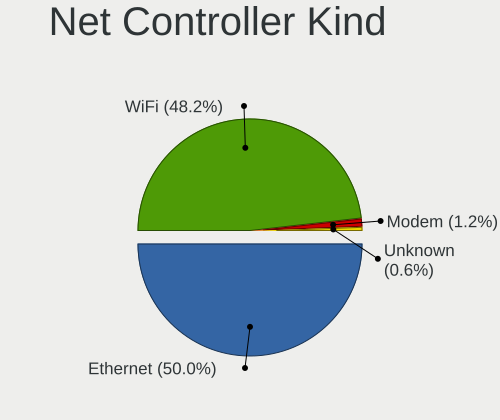

| Kind     | Computers | Percent |
|----------|-----------|---------|
| Ethernet | 168       | 50%     |
| WiFi     | 162       | 48.21%  |
| Modem    | 4         | 1.19%   |
| Unknown  | 2         | 0.6%    |

Used Controller
---------------

Currently used network controller

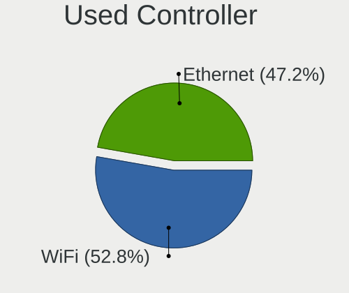

| Kind     | Computers | Percent |
|----------|-----------|---------|
| WiFi     | 114       | 52.78%  |
| Ethernet | 102       | 47.22%  |

NICs
----

Total network controllers on board

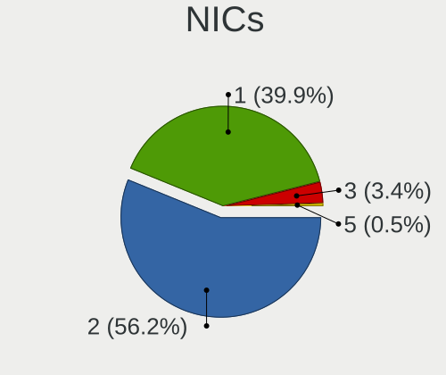

| Total | Computers | Percent |
|-------|-----------|---------|
| 2     | 114       | 56.16%  |
| 1     | 81        | 39.9%   |
| 3     | 7         | 3.45%   |
| 5     | 1         | 0.49%   |

IPv6
----

IPv6 vs IPv4

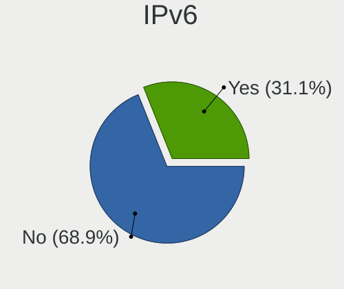

| Used | Computers | Percent |
|------|-----------|---------|
| No   | 142       | 68.93%  |
| Yes  | 64        | 31.07%  |

Bluetooth
---------

Bluetooth Vendor
----------------

Controller vendors

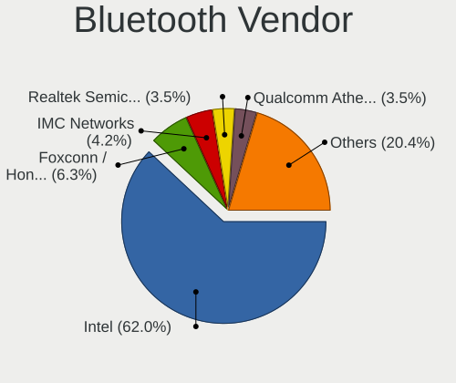

| Vendor                          | Computers | Percent |
|---------------------------------|-----------|---------|
| Intel                           | 88        | 61.97%  |
| Foxconn / Hon Hai               | 9         | 6.34%   |
| IMC Networks                    | 6         | 4.23%   |
| Realtek Semiconductor           | 5         | 3.52%   |
| Qualcomm Atheros Communications | 5         | 3.52%   |
| Cambridge Silicon Radio         | 5         | 3.52%   |
| Apple                           | 5         | 3.52%   |
| Realtek                         | 3         | 2.11%   |
| Lite-On Technology              | 3         | 2.11%   |
| TP-Link                         | 2         | 1.41%   |
| MediaTek                        | 2         | 1.41%   |
| Hewlett-Packard                 | 2         | 1.41%   |
| USI                             | 1         | 0.7%    |
| Toshiba                         | 1         | 0.7%    |
| Ralink                          | 1         | 0.7%    |
| Micro Star International        | 1         | 0.7%    |
| Marvell Semiconductor           | 1         | 0.7%    |
| Broadcom                        | 1         | 0.7%    |
| ASUSTek Computer                | 1         | 0.7%    |

Bluetooth Model
---------------

Controller models

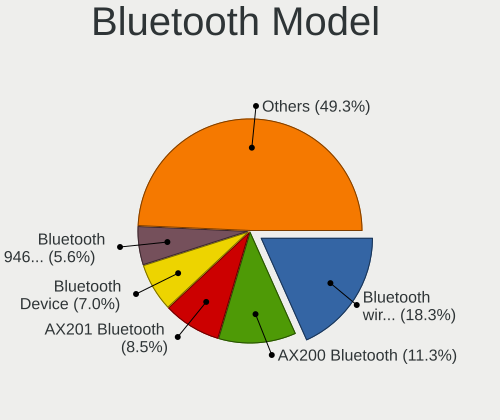

| Model                                                                               | Computers | Percent |
|-------------------------------------------------------------------------------------|-----------|---------|
| Intel Bluetooth wireless interface                                                  | 26        | 18.31%  |
| Intel AX200 Bluetooth                                                               | 16        | 11.27%  |
| Intel AX201 Bluetooth                                                               | 12        | 8.45%   |
| Intel Bluetooth Device                                                              | 10        | 7.04%   |
| Intel Bluetooth 9460/9560 Jefferson Peak (JfP)                                      | 8         | 5.63%   |
| Intel AX210 Bluetooth                                                               | 7         | 4.93%   |
| Realtek Bluetooth Radio                                                             | 5         | 3.52%   |
| Cambridge Silicon Radio Bluetooth Dongle (HCI mode)                                 | 5         | 3.52%   |
| Intel Wireless-AC 3168 Bluetooth                                                    | 4         | 2.82%   |
| Realtek Bluetooth Radio                                                             | 3         | 2.11%   |
| Qualcomm Atheros  Bluetooth Device                                                  | 3         | 2.11%   |
| Lite-On Bluetooth Device                                                            | 3         | 2.11%   |
| IMC Networks Wireless_Device                                                        | 3         | 2.11%   |
| Apple Bluetooth USB Host Controller                                                 | 3         | 2.11%   |
| TP-Link TP-T@- UB500 Adapter                                                        | 2         | 1.41%   |
| MediaTek Wireless_Device                                                            | 2         | 1.41%   |
| Intel Wireless-AC 9260 Bluetooth Adapter                                            | 2         | 1.41%   |
| Intel Centrino Bluetooth Wireless Transceiver                                       | 2         | 1.41%   |
| HP Broadcom 2070 Bluetooth Combo                                                    | 2         | 1.41%   |
| Apple Bluetooth Host Controller                                                     | 2         | 1.41%   |
| USI Bluetooth Device                                                                | 1         | 0.7%    |
| Toshiba Bluetooth Device                                                            | 1         | 0.7%    |
| Ralink RT3290 Bluetooth                                                             | 1         | 0.7%    |
| Qualcomm Atheros QCA61x4 Bluetooth 4.0                                              | 1         | 0.7%    |
| Qualcomm Atheros AR3012 Bluetooth 4.0                                               | 1         | 0.7%    |
| Micro Star International Motorola Bluetooth 2.1+EDR Device                          | 1         | 0.7%    |
| Marvell Bluetooth and Wireless LAN Composite                                        | 1         | 0.7%    |
| Intel Centrino Advanced-N 6230 Bluetooth adapter                                    | 1         | 0.7%    |
| IMC Networks Bluetooth Radio                                                        | 1         | 0.7%    |
| IMC Networks Bluetooth Module                                                       | 1         | 0.7%    |
| IMC Networks Bluetooth Device                                                       | 1         | 0.7%    |
| Foxconn / Hon Hai Wireless_Device                                                   | 1         | 0.7%    |
| Foxconn / Hon Hai MediaTek Bluetooth Adapter                                        | 1         | 0.7%    |
| Foxconn / Hon Hai Foxconn T77H114 BCM2070 [Single-Chip Bluetooth 2.1 + EDR Adapter] | 1         | 0.7%    |
| Foxconn / Hon Hai BT                                                                | 1         | 0.7%    |
| Foxconn / Hon Hai Broadcom BCM20702A1 Bluetooth                                     | 1         | 0.7%    |
| Foxconn / Hon Hai Bluetooth USB Host Controller                                     | 1         | 0.7%    |
| Foxconn / Hon Hai Bluetooth Device                                                  | 1         | 0.7%    |
| Foxconn / Hon Hai BCM43142A0                                                        | 1         | 0.7%    |
| Foxconn / Hon Hai BCM20702A0                                                        | 1         | 0.7%    |

Sound
-----

Sound Vendor
------------

Sound card vendors

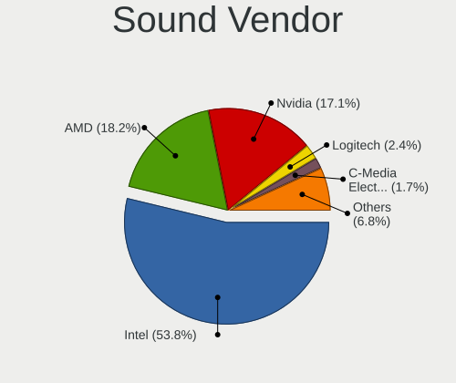

| Vendor                                       | Computers | Percent |
|----------------------------------------------|-----------|---------|
| Intel                                        | 157       | 53.77%  |
| AMD                                          | 53        | 18.15%  |
| Nvidia                                       | 50        | 17.12%  |
| Logitech                                     | 7         | 2.4%    |
| C-Media Electronics                          | 5         | 1.71%   |
| Hewlett-Packard                              | 3         | 1.03%   |
| SteelSeries ApS                              | 2         | 0.68%   |
| Zoran Co. Personal Media Division (Nogatech) | 1         | 0.34%   |
| www.hirestech.com 2012 REV 1.8               | 1         | 0.34%   |
| Texas Instruments                            | 1         | 0.34%   |
| Sony                                         | 1         | 0.34%   |
| Samsung Electronics                          | 1         | 0.34%   |
| Realtek Semiconductor                        | 1         | 0.34%   |
| Micro Star International                     | 1         | 0.34%   |
| Lenovo                                       | 1         | 0.34%   |
| Kingston Technology                          | 1         | 0.34%   |
| GN Netcom                                    | 1         | 0.34%   |
| Generalplus Technology                       | 1         | 0.34%   |
| Dell                                         | 1         | 0.34%   |
| Bose                                         | 1         | 0.34%   |
| beyerdynamic                                 | 1         | 0.34%   |
| Apple                                        | 1         | 0.34%   |

Sound Model
-----------

Sound card models

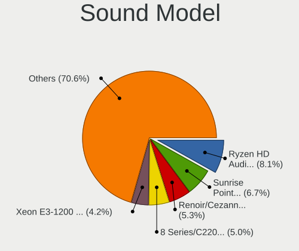

| Model                                                                      | Computers | Percent |
|----------------------------------------------------------------------------|-----------|---------|
| AMD Ryzen HD Audio Controller                                              | 29        | 8.12%   |
| Intel Sunrise Point-LP HD Audio                                            | 24        | 6.72%   |
| AMD Renoir/Cezanne HDMI/DP Audio Controller                                | 19        | 5.32%   |
| Intel 8 Series/C220 Series Chipset High Definition Audio Controller        | 18        | 5.04%   |
| Intel Xeon E3-1200 v3/4th Gen Core Processor HD Audio Controller           | 15        | 4.2%    |
| AMD Starship/Matisse HD Audio Controller                                   | 11        | 3.08%   |
| Intel Tiger Lake-LP Smart Sound Technology Audio Controller                | 8         | 2.24%   |
| Intel Cannon Lake PCH cAVS                                                 | 8         | 2.24%   |
| Nvidia GA106 High Definition Audio Controller                              | 7         | 1.96%   |
| Intel Cannon Point-LP High Definition Audio Controller                     | 7         | 1.96%   |
| Intel 7 Series/C216 Chipset Family High Definition Audio Controller        | 7         | 1.96%   |
| Intel 200 Series PCH HD Audio                                              | 7         | 1.96%   |
| Intel 100 Series/C230 Series Chipset Family HD Audio Controller            | 7         | 1.96%   |
| AMD Radeon High Definition Audio Controller                                | 7         | 1.96%   |
| Intel 82801I (ICH9 Family) HD Audio Controller                             | 6         | 1.68%   |
| Intel 6 Series/C200 Series Chipset Family High Definition Audio Controller | 6         | 1.68%   |
| Intel 5 Series/3400 Series Chipset High Definition Audio                   | 6         | 1.68%   |
| Intel Wildcat Point-LP High Definition Audio Controller                    | 5         | 1.4%    |
| Intel Raptor Lake High Definition Audio Controller                         | 5         | 1.4%    |
| Intel Haswell-ULT HD Audio Controller                                      | 5         | 1.4%    |
| Intel Comet Lake PCH cAVS                                                  | 5         | 1.4%    |
| Intel Broadwell-U Audio Controller                                         | 5         | 1.4%    |
| Intel 8 Series HD Audio Controller                                         | 5         | 1.4%    |
| Nvidia TU106 High Definition Audio Controller                              | 4         | 1.12%   |
| Nvidia GP107GL High Definition Audio Controller                            | 4         | 1.12%   |
| Nvidia GA107 High Definition Audio Controller                              | 4         | 1.12%   |
| Intel Alder Lake-S HD Audio Controller                                     | 4         | 1.12%   |
| AMD Navi 21/23 HDMI/DP Audio Controller                                    | 4         | 1.12%   |
| Nvidia High Definition Audio Controller                                    | 3         | 0.84%   |
| Intel Celeron/Pentium Silver Processor High Definition Audio               | 3         | 0.84%   |
| AMD Raven/Raven2/Fenghuang HDMI/DP Audio Controller                        | 3         | 0.84%   |
| AMD Oland/Hainan/Cape Verde/Pitcairn HDMI Audio [Radeon HD 7000 Series]    | 3         | 0.84%   |
| Nvidia TU107 GeForce GTX 1650 High Definition Audio Controller             | 2         | 0.56%   |
| Nvidia GP108 High Definition Audio Controller                              | 2         | 0.56%   |
| Nvidia GP106 High Definition Audio Controller                              | 2         | 0.56%   |
| Nvidia GP104 High Definition Audio Controller                              | 2         | 0.56%   |
| Nvidia GM204 High Definition Audio Controller                              | 2         | 0.56%   |
| Nvidia GK208 HDMI/DP Audio Controller                                      | 2         | 0.56%   |
| Nvidia GF108 High Definition Audio Controller                              | 2         | 0.56%   |
| Nvidia GB203 High Definition Audio Controller                              | 2         | 0.56%   |

Memory
------

Memory Vendor
-------------

Memory module vendors

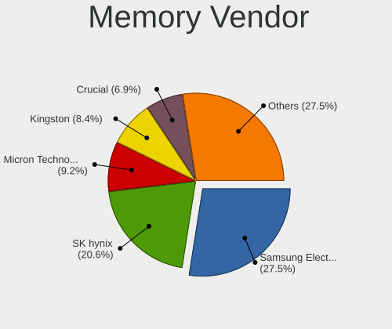

| Vendor                       | Computers | Percent |
|------------------------------|-----------|---------|
| Samsung Electronics          | 36        | 27.48%  |
| SK hynix                     | 27        | 20.61%  |
| Micron Technology            | 12        | 9.16%   |
| Kingston                     | 11        | 8.4%    |
| Crucial                      | 9         | 6.87%   |
| Corsair                      | 9         | 6.87%   |
| Unknown                      | 7         | 5.34%   |
| G.Skill                      | 6         | 4.58%   |
| A-DATA Technology            | 5         | 3.82%   |
| Qimonda                      | 2         | 1.53%   |
| Wilk                         | 1         | 0.76%   |
| Unknown (ABCD)               | 1         | 0.76%   |
| Unknown (0x7F7FB5FFFFFFFFFF) | 1         | 0.76%   |
| Timetec                      | 1         | 0.76%   |
| Patriot                      | 1         | 0.76%   |
| MTASE                        | 1         | 0.76%   |
| Dane-Elec                    | 1         | 0.76%   |

Memory Model
------------

Memory module models

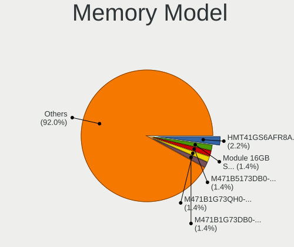

| Model                                                            | Computers | Percent |
|------------------------------------------------------------------|-----------|---------|
| SK hynix RAM HMT41GS6AFR8A-PB 8GiB SODIMM DDR3 2667MT/s          | 3         | 2.17%   |
| SK hynix RAM HMAB2GS6AMR6N-XN 16GB SODIMM DDR4 3200MT/s          | 2         | 1.45%   |
| Samsung RAM Module 16GB SODIMM DDR4 3200MT/s                     | 2         | 1.45%   |
| Samsung RAM M471B5173DB0-YK0 4GB SODIMM DDR3 1600MT/s            | 2         | 1.45%   |
| Samsung RAM M471B1G73QH0-YK0 8GB SODIMM DDR3 1600MT/s            | 2         | 1.45%   |
| Samsung RAM M471B1G73DB0-YK0 8GB SODIMM DDR3 1600MT/s            | 2         | 1.45%   |
| Samsung RAM M471A2K43DB1-CWE 16GB SODIMM DDR4 3200MT/s           | 2         | 1.45%   |
| Samsung RAM M471A2G43AB2-CWE 16GB SODIMM DDR4 3200MT/s           | 2         | 1.45%   |
| Samsung RAM M471A1K43DB1-CTD 8GB SODIMM DDR4 2667MT/s            | 2         | 1.45%   |
| Kingston RAM ACR16D3LS1KNG/4G 4GB SODIMM DDR3 1600MT/s           | 2         | 1.45%   |
| Crucial RAM CT102464BF160B.M16 8GB SODIMM DDR3 1600MT/s          | 2         | 1.45%   |
| Wilk RAM GR3200S464L22S/16G 16GB SODIMM DDR4 3200MT/s            | 1         | 0.72%   |
| Unknown RAM Module 8GB SODIMM DDR3 1333MT/s                      | 1         | 0.72%   |
| Unknown RAM Module 4GB SODIMM LPDDR3 1600MT/s                    | 1         | 0.72%   |
| Unknown RAM Module 4GB SODIMM DDR3                               | 1         | 0.72%   |
| Unknown RAM Module 4096MB DIMM DDR3 1333MT/s                     | 1         | 0.72%   |
| Unknown RAM Module 2GB SODIMM DDR2                               | 1         | 0.72%   |
| Unknown RAM Module 2048MB SODIMM DDR2                            | 1         | 0.72%   |
| Unknown RAM Module 16GB DIMM DDR4 2400MT/s                       | 1         | 0.72%   |
| Unknown RAM Module 1024MB SODIMM DDR2                            | 1         | 0.72%   |
| Unknown (ABCD) RAM 123456789012345678 2GB SODIMM LPDDR4 2400MT/s | 1         | 0.72%   |
| Unknown (0x7F7FB5FFFFFFFFFF) RAM Module 1GB DIMM DDR2 667MT/s    | 1         | 0.72%   |
| Timetec RAM SD3-1333 8GB SODIMM DDR3 1333MT/s                    | 1         | 0.72%   |
| SK hynix RAM Module 8192MB Row Of Chips LPDDR3 2133MT/s          | 1         | 0.72%   |
| SK hynix RAM Module 4GB DIMM DDR3 1066MT/s                       | 1         | 0.72%   |
| SK hynix RAM Module 4096MB Row Of Chips LPDDR3 2133MT/s          | 1         | 0.72%   |
| SK hynix RAM Module 16GB SODIMM DDR5 4800MT/s                    | 1         | 0.72%   |
| SK hynix RAM HMT451S6BFR8A-PB 4GB SODIMM DDR3 1600MT/s           | 1         | 0.72%   |
| SK hynix RAM HMT425S6AFR6A-PB 2GB SODIMM DDR3 3200MT/s           | 1         | 0.72%   |
| SK hynix RAM HMCG88MEBSA092N 32GB SODIMM DDR5 4800MT/s           | 1         | 0.72%   |
| SK hynix RAM HMCG78AGBUA081N 16GB DIMM DDR5 5600MT/s             | 1         | 0.72%   |
| SK hynix RAM HMCG78AGBSA095N 16GB SODIMM DDR5 5600MT/s           | 1         | 0.72%   |
| SK hynix RAM HMAA1GS6CJR6N-XN 8GB SODIMM DDR4 3200MT/s           | 1         | 0.72%   |
| SK hynix RAM HMA851S6AFR6N-UH 4GB SODIMM DDR4 2400MT/s           | 1         | 0.72%   |
| SK hynix RAM HMA82GS6DJR8N-XN 16GB SODIMM DDR4 3200MT/s          | 1         | 0.72%   |
| SK hynix RAM HMA82GS6DJR8N-VK 16GB SODIMM DDR4 2667MT/s          | 1         | 0.72%   |
| SK hynix RAM HMA82GR7CJR8N-VK 16GB DIMM DDR4 2666MT/s            | 1         | 0.72%   |
| SK hynix RAM HMA82GR7AFR8N-VK 16GB DIMM DDR4 2666MT/s            | 1         | 0.72%   |
| SK hynix RAM HMA81GS6MFR8N-UH 8GB SODIMM DDR4 2400MT/s           | 1         | 0.72%   |
| SK hynix RAM HMA81GS6DJR8N-XN 8GB SODIMM DDR4 3200MT/s           | 1         | 0.72%   |

Memory Kind
-----------

Memory module kinds

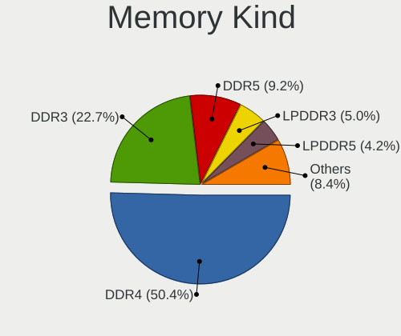

| Kind   | Computers | Percent |
|--------|-----------|---------|
| DDR4   | 60        | 50.42%  |
| DDR3   | 27        | 22.69%  |
| DDR5   | 11        | 9.24%   |
| LPDDR3 | 6         | 5.04%   |
| LPDDR5 | 5         | 4.2%    |
| DDR2   | 5         | 4.2%    |
| SDRAM  | 3         | 2.52%   |
| LPDDR4 | 2         | 1.68%   |

Memory Form Factor
------------------

Physical design of the memory module

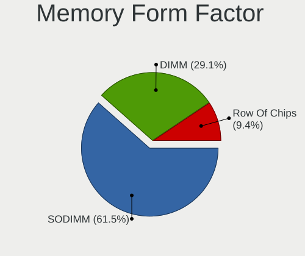

| Name         | Computers | Percent |
|--------------|-----------|---------|
| SODIMM       | 72        | 61.54%  |
| DIMM         | 34        | 29.06%  |
| Row Of Chips | 11        | 9.4%    |

Memory Size
-----------

Memory module size

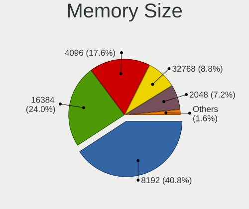

| Size  | Computers | Percent |
|-------|-----------|---------|
| 8192  | 51        | 40.8%   |
| 16384 | 30        | 24%     |
| 4096  | 22        | 17.6%   |
| 32768 | 11        | 8.8%    |
| 2048  | 9         | 7.2%    |
| 1024  | 2         | 1.6%    |

Memory Speed
------------

Memory module speed

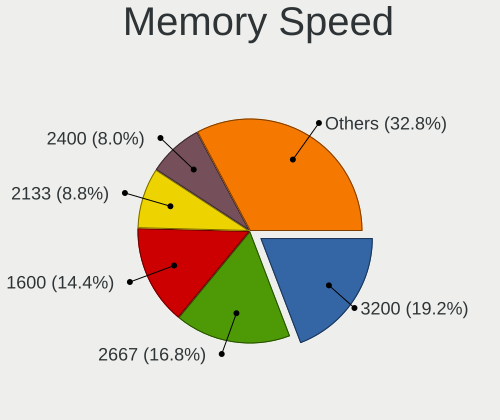

| Speed   | Computers | Percent |
|---------|-----------|---------|
| 3200    | 24        | 19.2%   |
| 2667    | 21        | 16.8%   |
| 1600    | 18        | 14.4%   |
| 2133    | 11        | 8.8%    |
| 2400    | 10        | 8%      |
| 3600    | 8         | 6.4%    |
| 6400    | 5         | 4%      |
| 4800    | 5         | 4%      |
| 5600    | 4         | 3.2%    |
| 1333    | 4         | 3.2%    |
| Unknown | 3         | 2.4%    |
| 800     | 2         | 1.6%    |
| 7500    | 1         | 0.8%    |
| 6000    | 1         | 0.8%    |
| 3500    | 1         | 0.8%    |
| 3400    | 1         | 0.8%    |
| 2933    | 1         | 0.8%    |
| 2666    | 1         | 0.8%    |
| 1867    | 1         | 0.8%    |
| 1067    | 1         | 0.8%    |
| 1066    | 1         | 0.8%    |
| 667     | 1         | 0.8%    |

Printers & scanners
-------------------

Printer Vendor
--------------

Printer device vendors

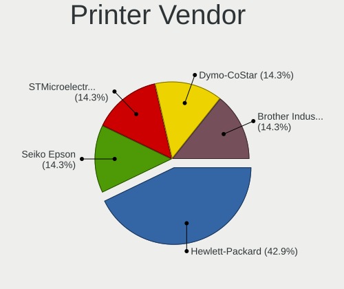

| Vendor             | Computers | Percent |
|--------------------|-----------|---------|
| Hewlett-Packard    | 3         | 42.86%  |
| STMicroelectronics | 1         | 14.29%  |
| Seiko Epson        | 1         | 14.29%  |
| Dymo-CoStar        | 1         | 14.29%  |
| Brother Industries | 1         | 14.29%  |

Printer Model
-------------

Printer device models

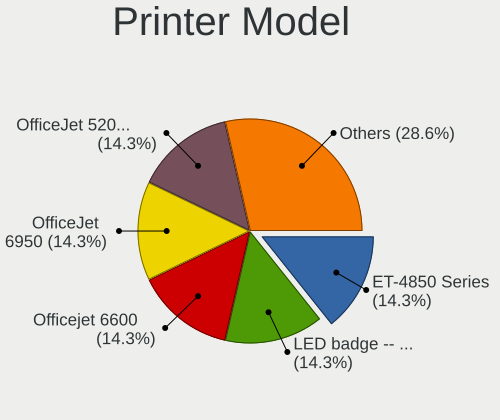

| Model                                                     | Computers | Percent |
|-----------------------------------------------------------|-----------|---------|
| STMicroelectronics LED badge -- mini LED display -- 11x44 | 1         | 14.29%  |
| Seiko Epson ET-4850 Series                                | 1         | 14.29%  |
| HP OfficeJet 6950                                         | 1         | 14.29%  |
| HP Officejet 6600                                         | 1         | 14.29%  |
| HP OfficeJet 5200 series                                  | 1         | 14.29%  |
| Dymo-CoStar LabelWriter 450                               | 1         | 14.29%  |
| Brother HL-3142CW series                                  | 1         | 14.29%  |

Scanner Vendor
--------------

Scanner device vendors

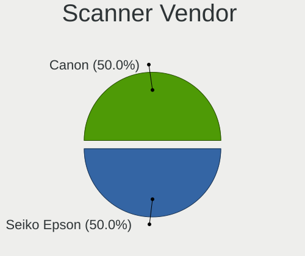

| Vendor      | Computers | Percent |
|-------------|-----------|---------|
| Seiko Epson | 1         | 50%     |
| Canon       | 1         | 50%     |

Scanner Model
-------------

Scanner device models

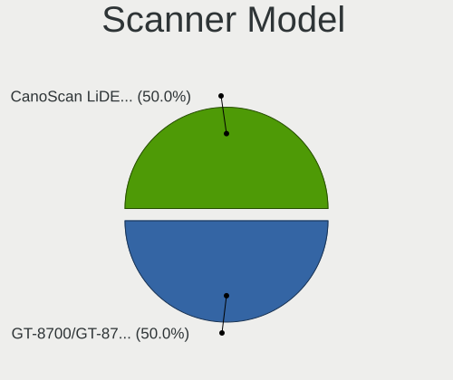

| Model                                                         | Computers | Percent |
|---------------------------------------------------------------|-----------|---------|
| Seiko Epson GT-8700/GT-8700F [Perfection 1640SU/1640SU PHOTO] | 1         | 50%     |
| Canon CanoScan LiDE 220                                       | 1         | 50%     |

Camera
------

Camera Vendor
-------------

Camera device vendors

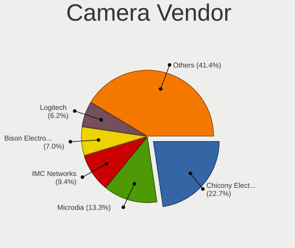

| Vendor                                 | Computers | Percent |
|----------------------------------------|-----------|---------|
| Chicony Electronics                    | 29        | 22.66%  |
| Microdia                               | 17        | 13.28%  |
| IMC Networks                           | 12        | 9.38%   |
| Bison Electronics                      | 9         | 7.03%   |
| Logitech                               | 8         | 6.25%   |
| Realtek Semiconductor                  | 6         | 4.69%   |
| Apple                                  | 6         | 4.69%   |
| Samsung Electronics                    | 5         | 3.91%   |
| Quanta                                 | 4         | 3.13%   |
| Cheng Uei Precision Industry (Foxlink) | 4         | 3.13%   |
| Syntek                                 | 3         | 2.34%   |
| Sunplus Innovation Technology          | 3         | 2.34%   |
| Ricoh                                  | 3         | 2.34%   |
| Luxvisions Innotech Limited            | 3         | 2.34%   |
| Alcor Micro                            | 3         | 2.34%   |
| kingcome                               | 2         | 1.56%   |
| YGTek                                  | 1         | 0.78%   |
| Trust                                  | 1         | 0.78%   |
| Suyin                                  | 1         | 0.78%   |
| Silicon Motion                         | 1         | 0.78%   |
| ShineTech                              | 1         | 0.78%   |
| Shenzhen Kingcome Optoelectronic       | 1         | 0.78%   |
| Lite-On Technology                     | 1         | 0.78%   |
| Huawei Technologies                    | 1         | 0.78%   |
| Cubeternet                             | 1         | 0.78%   |
| ALi                                    | 1         | 0.78%   |
| Unknown                                | 1         | 0.78%   |

Camera Model
------------

Camera device models

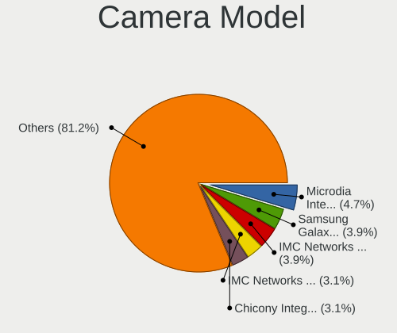

| Model                                            | Computers | Percent |
|--------------------------------------------------|-----------|---------|
| Microdia Integrated_Webcam_HD                    | 6         | 4.69%   |
| Samsung Galaxy series, misc. (MTP mode)          | 5         | 3.91%   |
| IMC Networks USB2.0 HD UVC WebCam                | 5         | 3.91%   |
| IMC Networks Integrated Camera                   | 4         | 3.13%   |
| Chicony Integrated Camera                        | 4         | 3.13%   |
| Realtek Integrated_Webcam_HD                     | 3         | 2.34%   |
| Logitech HD Pro Webcam C920                      | 3         | 2.34%   |
| Logitech B525 HD Webcam                          | 3         | 2.34%   |
| Chicony HD WebCam                                | 3         | 2.34%   |
| Apple FaceTime HD Camera                         | 3         | 2.34%   |
| Syntek Integrated Camera                         | 2         | 1.56%   |
| Quanta HD User Facing                            | 2         | 1.56%   |
| Microdia USB 2.0 Camera                          | 2         | 1.56%   |
| Microdia Integrated_Webcam_FHD                   | 2         | 1.56%   |
| Microdia Integrated Webcam                       | 2         | 1.56%   |
| Luxvisions Innotech Limited HP HD Camera         | 2         | 1.56%   |
| Chicony Integrated IR Camera                     | 2         | 1.56%   |
| Chicony Integrated Camera (1280x720@30)          | 2         | 1.56%   |
| Chicony HP Wide Vision HD Camera                 | 2         | 1.56%   |
| Chicony HP HD Camera                             | 2         | 1.56%   |
| Cheng Uei Precision Industry (Foxlink) HD Camera | 2         | 1.56%   |
| Bison Integrated Camera                          | 2         | 1.56%   |
| Apple iPhone 5/5C/5S/6/SE/7/8/X                  | 2         | 1.56%   |
| Alcor Micro USB 2.0 Camera                       | 2         | 1.56%   |
| YGTek Webcam                                     | 1         | 0.78%   |
| Trust Full HD Webcam                             | 1         | 0.78%   |
| Syntek USB2.0 Camera                             | 1         | 0.78%   |
| Suyin HP Truevision HD                           | 1         | 0.78%   |
| Sunplus Laptop Integrated WebCam HD              | 1         | 0.78%   |
| Sunplus Hy-Usb2.0-1*MIC                          | 1         | 0.78%   |
| Sunplus HP HD Webcam [Fixed]                     | 1         | 0.78%   |
| Silicon Motion Web Camera                        | 1         | 0.78%   |
| ShineTech HD Camera                              | 1         | 0.78%   |
| Shenzhen Kingcome Optoelectronic 720p HD Camera  | 1         | 0.78%   |
| Ricoh USB2.0 Camera                              | 1         | 0.78%   |
| Ricoh Sony Visual Communication Camera           | 1         | 0.78%   |
| Ricoh Sony Vaio Integrated Webcam                | 1         | 0.78%   |
| Realtek Laptop Camera                            | 1         | 0.78%   |
| Realtek Integrated Webcam_HD                     | 1         | 0.78%   |
| Realtek HP Truevision HD                         | 1         | 0.78%   |

Security
--------

Fingerprint Vendor
------------------

Fingerprint sensor vendors

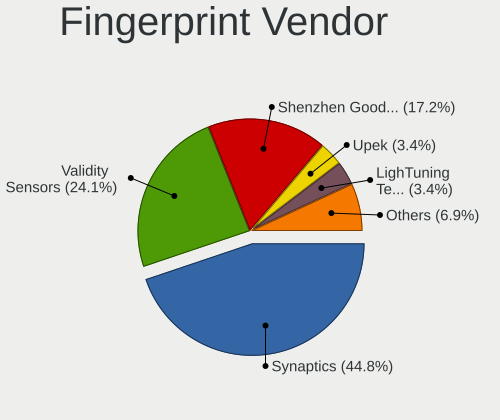

| Vendor                     | Computers | Percent |
|----------------------------|-----------|---------|
| Synaptics                  | 13        | 44.83%  |
| Validity Sensors           | 7         | 24.14%  |
| Shenzhen Goodix Technology | 5         | 17.24%  |
| Upek                       | 1         | 3.45%   |
| LighTuning Technology      | 1         | 3.45%   |
| Elan Microelectronics      | 1         | 3.45%   |
| AuthenTec                  | 1         | 3.45%   |

Fingerprint Model
-----------------

Fingerprint sensor models

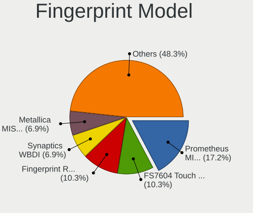

| Model                                                                      | Computers | Percent |
|----------------------------------------------------------------------------|-----------|---------|
| Synaptics Prometheus MIS Touch Fingerprint Reader                          | 5         | 17.24%  |
| Synaptics FS7604 Touch Fingerprint Sensor with PurePrint                   | 3         | 10.34%  |
| Shenzhen Goodix Fingerprint Reader                                         | 3         | 10.34%  |
| Validity Sensors Synaptics WBDI                                            | 2         | 6.9%    |
| Synaptics Metallica MIS Touch Fingerprint Reader                           | 2         | 6.9%    |
| Shenzhen Goodix  Fingerprint Device                                        | 2         | 6.9%    |
| Validity Sensors VFS7552 Touch Fingerprint Sensor                          | 1         | 3.45%   |
| Validity Sensors VFS495 Fingerprint Reader                                 | 1         | 3.45%   |
| Validity Sensors VFS451 Fingerprint Reader                                 | 1         | 3.45%   |
| Validity Sensors Synaptics VFS7552 Touch Fingerprint Sensor with PurePrint | 1         | 3.45%   |
| Validity Sensors Fingerprint scanner                                       | 1         | 3.45%   |
| Upek Biometric Touchchip/Touchstrip Fingerprint Sensor                     | 1         | 3.45%   |
| Synaptics UWP WBDI Device                                                  | 1         | 3.45%   |
| Synaptics UWP WBDI                                                         | 1         | 3.45%   |
| Synaptics Fingerprint reader [HP G6]                                       | 1         | 3.45%   |
| LighTuning ES603 Swipe Fingerprint Sensor                                  | 1         | 3.45%   |
| Elan ELAN:Fingerprint                                                      | 1         | 3.45%   |
| AuthenTec Fingerprint Sensor                                               | 1         | 3.45%   |

Chipcard Vendor
---------------

Chipcard module vendors

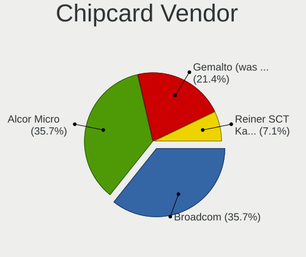

| Vendor                   | Computers | Percent |
|--------------------------|-----------|---------|
| Broadcom                 | 5         | 35.71%  |
| Alcor Micro              | 5         | 35.71%  |
| Gemalto (was Gemplus)    | 3         | 21.43%  |
| Reiner SCT Kartensysteme | 1         | 7.14%   |

Chipcard Model
--------------

Chipcard module models

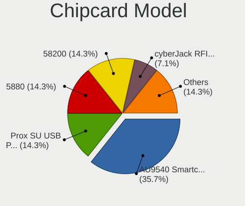

| Model                                                                        | Computers | Percent |
|------------------------------------------------------------------------------|-----------|---------|
| Alcor Micro AU9540 Smartcard Reader                                          | 5         | 35.71%  |
| Gemalto (was Gemplus) Prox SU USB PC Link Reader                             | 2         | 14.29%  |
| Broadcom 5880                                                                | 2         | 14.29%  |
| Broadcom 58200                                                               | 2         | 14.29%  |
| Reiner SCT Kartensysteme cyberJack RFID basis contactless smartcard reader   | 1         | 7.14%   |
| Gemalto (was Gemplus) Compact Smart Card Reader Writer                       | 1         | 7.14%   |
| Broadcom BCM5880 Secure Applications Processor with fingerprint swipe sensor | 1         | 7.14%   |

Unsupported
-----------

Unsupported Devices
-------------------

Total unsupported devices on board

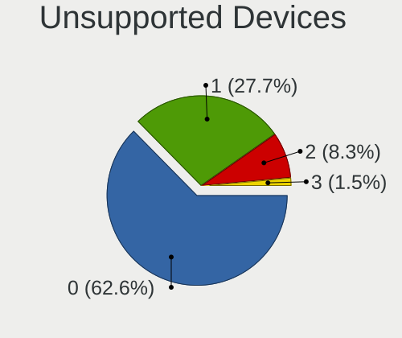

| Total | Computers | Percent |
|-------|-----------|---------|
| 0     | 129       | 62.62%  |
| 1     | 57        | 27.67%  |
| 2     | 17        | 8.25%   |
| 3     | 3         | 1.46%   |

Unsupported Device Types
------------------------

Types of unsupported devices

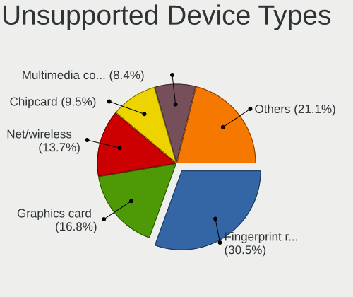

| Type                     | Computers | Percent |
|--------------------------|-----------|---------|
| Fingerprint reader       | 29        | 30.53%  |
| Graphics card            | 16        | 16.84%  |
| Net/wireless             | 13        | 13.68%  |
| Chipcard                 | 9         | 9.47%   |
| Multimedia controller    | 8         | 8.42%   |
| Communication controller | 4         | 4.21%   |
| Unassigned class         | 3         | 3.16%   |
| Network                  | 3         | 3.16%   |
| Card reader              | 3         | 3.16%   |
| Net/ethernet             | 2         | 2.11%   |
| Camera                   | 2         | 2.11%   |
| Bluetooth                | 2         | 2.11%   |
| Sound                    | 1         | 1.05%   |

