Linux in Luxembourg - Tested Hardware & Statistics (Desktops)
-------------------------------------------------------------

A project to collect tested hardware configurations for Linux in Luxembourg.

Anyone can contribute to this report by the [hw-probe](https://github.com/linuxhw/hw-probe) tool:

    sudo -E hw-probe -all -upload

Please contribute! Especially if your hardware is rare.

Contents
--------

* [ Test Cases ](#test-cases)

* [ System ](#system)
  - [ OS                       ](#os)
  - [ OS Family                ](#os-family)
  - [ Kernel                   ](#kernel)
  - [ Kernel Family            ](#kernel-family)
  - [ Kernel Major Ver.        ](#kernel-major-ver)
  - [ Arch                     ](#arch)
  - [ DE                       ](#de)
  - [ Display Server           ](#display-server)
  - [ Display Manager          ](#display-manager)
  - [ OS Lang                  ](#os-lang)
  - [ Boot Mode                ](#boot-mode)
  - [ Filesystem               ](#filesystem)
  - [ Part. scheme             ](#part-scheme)
  - [ Dual Boot with Linux/BSD ](#dual-boot-with-linuxbsd)
  - [ Dual Boot (Win)          ](#dual-boot-win)

* [ Board ](#board)
  - [ Vendor                   ](#vendor)
  - [ Model                    ](#model)
  - [ Model Family             ](#model-family)
  - [ MFG Year                 ](#mfg-year)
  - [ Form Factor              ](#form-factor)
  - [ Secure Boot              ](#secure-boot)
  - [ Coreboot                 ](#coreboot)
  - [ RAM Size                 ](#ram-size)
  - [ RAM Used                 ](#ram-used)
  - [ Total Drives             ](#total-drives)
  - [ Has CD-ROM               ](#has-cd-rom)
  - [ Has Ethernet             ](#has-ethernet)
  - [ Has WiFi                 ](#has-wifi)
  - [ Has Bluetooth            ](#has-bluetooth)

* [ Location ](#location)
  - [ Country                  ](#country)
  - [ City                     ](#city)

* [ Drives ](#drives)
  - [ Drive Vendor             ](#drive-vendor)
  - [ Drive Model              ](#drive-model)
  - [ HDD Vendor               ](#hdd-vendor)
  - [ SSD Vendor               ](#ssd-vendor)
  - [ Drive Kind               ](#drive-kind)
  - [ Drive Connector          ](#drive-connector)
  - [ Drive Size               ](#drive-size)
  - [ Space Total              ](#space-total)
  - [ Space Used               ](#space-used)
  - [ Malfunc. Drives          ](#malfunc-drives)
  - [ Malfunc. Drive Vendor    ](#malfunc-drive-vendor)
  - [ Malfunc. HDD Vendor      ](#malfunc-hdd-vendor)
  - [ Malfunc. Drive Kind      ](#malfunc-drive-kind)
  - [ Failed Drives            ](#failed-drives)
  - [ Failed Drive Vendor      ](#failed-drive-vendor)
  - [ Drive Status             ](#drive-status)

* [ Storage controller ](#storage-controller)
  - [ Storage Vendor           ](#storage-vendor)
  - [ Storage Model            ](#storage-model)
  - [ Storage Kind             ](#storage-kind)

* [ Processor ](#processor)
  - [ CPU Vendor               ](#cpu-vendor)
  - [ CPU Model                ](#cpu-model)
  - [ CPU Model Family         ](#cpu-model-family)
  - [ CPU Cores                ](#cpu-cores)
  - [ CPU Sockets              ](#cpu-sockets)
  - [ CPU Threads              ](#cpu-threads)
  - [ CPU Op-Modes             ](#cpu-op-modes)
  - [ CPU Microcode            ](#cpu-microcode)
  - [ CPU Microarch            ](#cpu-microarch)

* [ Graphics ](#graphics)
  - [ GPU Vendor               ](#gpu-vendor)
  - [ GPU Model                ](#gpu-model)
  - [ GPU Combo                ](#gpu-combo)
  - [ GPU Driver               ](#gpu-driver)
  - [ GPU Memory               ](#gpu-memory)

* [ Monitor ](#monitor)
  - [ Monitor Vendor           ](#monitor-vendor)
  - [ Monitor Model            ](#monitor-model)
  - [ Monitor Resolution       ](#monitor-resolution)
  - [ Monitor Diagonal         ](#monitor-diagonal)
  - [ Monitor Width            ](#monitor-width)
  - [ Aspect Ratio             ](#aspect-ratio)
  - [ Monitor Area             ](#monitor-area)
  - [ Pixel Density            ](#pixel-density)
  - [ Multiple Monitors        ](#multiple-monitors)

* [ Network ](#network)
  - [ Net Controller Vendor    ](#net-controller-vendor)
  - [ Net Controller Model     ](#net-controller-model)
  - [ Wireless Vendor          ](#wireless-vendor)
  - [ Wireless Model           ](#wireless-model)
  - [ Ethernet Vendor          ](#ethernet-vendor)
  - [ Ethernet Model           ](#ethernet-model)
  - [ Net Controller Kind      ](#net-controller-kind)
  - [ Used Controller          ](#used-controller)
  - [ NICs                     ](#nics)
  - [ IPv6                     ](#ipv6)

* [ Bluetooth ](#bluetooth)
  - [ Bluetooth Vendor         ](#bluetooth-vendor)
  - [ Bluetooth Model          ](#bluetooth-model)

* [ Sound ](#sound)
  - [ Sound Vendor             ](#sound-vendor)
  - [ Sound Model              ](#sound-model)

* [ Memory ](#memory)
  - [ Memory Vendor            ](#memory-vendor)
  - [ Memory Model             ](#memory-model)
  - [ Memory Kind              ](#memory-kind)
  - [ Memory Form Factor       ](#memory-form-factor)
  - [ Memory Size              ](#memory-size)
  - [ Memory Speed             ](#memory-speed)

* [ Printers & scanners ](#printers--scanners)
  - [ Printer Vendor           ](#printer-vendor)
  - [ Printer Model            ](#printer-model)
  - [ Scanner Vendor           ](#scanner-vendor)
  - [ Scanner Model            ](#scanner-model)

* [ Camera ](#camera)
  - [ Camera Vendor            ](#camera-vendor)
  - [ Camera Model             ](#camera-model)

* [ Security ](#security)
  - [ Fingerprint Vendor       ](#fingerprint-vendor)
  - [ Fingerprint Model        ](#fingerprint-model)
  - [ Chipcard Vendor          ](#chipcard-vendor)
  - [ Chipcard Model           ](#chipcard-model)

* [ Unsupported ](#unsupported)
  - [ Unsupported Devices      ](#unsupported-devices)
  - [ Unsupported Device Types ](#unsupported-device-types)

Test Cases
----------

Total: 104

| Vendor        | Model                       | Probe                                                      | Date         |
|---------------|-----------------------------|------------------------------------------------------------|--------------|
| MSI           | B360M BAZOOKA               | [e41d8a90ce](https://linux-hardware.org/?probe=e41d8a90ce) | Jan 03, 2026 |
| MSI           | B360M BAZOOKA               | [1816bafc2f](https://linux-hardware.org/?probe=1816bafc2f) | Jan 03, 2026 |
| ASUSTek       | TUF Gaming B550-PLUS        | [d538da03bc](https://linux-hardware.org/?probe=d538da03bc) | Dec 31, 2025 |
| ASUSTek       | TUF Gaming B550-PLUS        | [e7cadd64d4](https://linux-hardware.org/?probe=e7cadd64d4) | Dec 31, 2025 |
| ASRock        | B450M-HDV R4.0              | [a844944aa5](https://linux-hardware.org/?probe=a844944aa5) | Nov 23, 2025 |
| ASUSTek       | Z97-K                       | [d8c30c78f9](https://linux-hardware.org/?probe=d8c30c78f9) | Nov 21, 2025 |
| Gigabyte      | B550M AORUS PRO-P           | [eed1b102d3](https://linux-hardware.org/?probe=eed1b102d3) | Oct 26, 2025 |
| ASRock        | Z790 PG Riptide             | [94387b731c](https://linux-hardware.org/?probe=94387b731c) | Sep 27, 2025 |
| HP            | 198E                        | [3328974183](https://linux-hardware.org/?probe=3328974183) | Aug 16, 2025 |
| ASUSTek       | Maximus VIII RANGER         | [a6e747d14c](https://linux-hardware.org/?probe=a6e747d14c) | Jul 09, 2025 |
| ASUSTek       | PRIME B760M-A WIFI          | [09be7a19bd](https://linux-hardware.org/?probe=09be7a19bd) | May 02, 2025 |
| HP            | 8055                        | [934118175b](https://linux-hardware.org/?probe=934118175b) | Apr 24, 2025 |
| Dell          | 0HD5W2 A01                  | [64d4e9368b](https://linux-hardware.org/?probe=64d4e9368b) | Mar 20, 2025 |
| MSI           | B550-A PRO                  | [1b47f05d08](https://linux-hardware.org/?probe=1b47f05d08) | Mar 14, 2025 |
| Dell          | 0HD5W2 A01                  | [8255f3fa2a](https://linux-hardware.org/?probe=8255f3fa2a) | Mar 14, 2025 |
| MSI           | H81M-E33                    | [901bb986b7](https://linux-hardware.org/?probe=901bb986b7) | Mar 09, 2025 |
| MACHINIST     | E5-D8-MAX V1.1              | [1ddb1470db](https://linux-hardware.org/?probe=1ddb1470db) | Feb 24, 2025 |
| ASRock        | B450M-HDV R4.0              | [363c0bddb9](https://linux-hardware.org/?probe=363c0bddb9) | Feb 18, 2025 |
| ASUSTek       | G16CHR                      | [951c844f51](https://linux-hardware.org/?probe=951c844f51) | Jan 31, 2025 |
| ASUSTek       | G16CHR                      | [d17f1249f5](https://linux-hardware.org/?probe=d17f1249f5) | Jan 31, 2025 |
| Acer          | Predator G5900              | [5e9d88726a](https://linux-hardware.org/?probe=5e9d88726a) | Jan 13, 2025 |
| Acer          | Predator G5900              | [86cd93546c](https://linux-hardware.org/?probe=86cd93546c) | Jan 13, 2025 |
| ASUSTek       | PRIME H510M-E R2.0          | [98d4a70c46](https://linux-hardware.org/?probe=98d4a70c46) | Nov 20, 2024 |
| MACHINIST     | E5-D8-MAX V1.1              | [f162306658](https://linux-hardware.org/?probe=f162306658) | Nov 05, 2024 |
| Gigabyte      | B550M AORUS PRO-P           | [9ad57b30b6](https://linux-hardware.org/?probe=9ad57b30b6) | Oct 13, 2024 |
| Gigabyte      | H270N-WIFI-CF               | [b86b3cb42d](https://linux-hardware.org/?probe=b86b3cb42d) | Oct 03, 2024 |
| Gigabyte      | Z77X-D3H                    | [06e181a534](https://linux-hardware.org/?probe=06e181a534) | Aug 20, 2024 |
| MSI           | B85M-E45                    | [0b7dfbd363](https://linux-hardware.org/?probe=0b7dfbd363) | Jul 29, 2024 |
| ASRock        | H110M-STX                   | [6ed1b1b9b7](https://linux-hardware.org/?probe=6ed1b1b9b7) | Jul 27, 2024 |
| HP            | 89D8 SMVB                   | [1c42d3aa40](https://linux-hardware.org/?probe=1c42d3aa40) | Jul 23, 2024 |
| MSI           | B85M-E45                    | [a8fab1c7ba](https://linux-hardware.org/?probe=a8fab1c7ba) | Jul 15, 2024 |
| MSI           | MAG B650 TOMAHAWK WIFI      | [692f458014](https://linux-hardware.org/?probe=692f458014) | May 01, 2024 |
| JWIPC         | A320I S1                    | [eea8091ffa](https://linux-hardware.org/?probe=eea8091ffa) | Apr 22, 2024 |
| JWIPC         | A320I S1                    | [c8bb6cd872](https://linux-hardware.org/?probe=c8bb6cd872) | Apr 21, 2024 |
| MSI           | MAG B550 TOMAHAWK           | [89107c7d88](https://linux-hardware.org/?probe=89107c7d88) | Apr 18, 2024 |
| ASUSTek       | PRIME B460M-A               | [63a643c790](https://linux-hardware.org/?probe=63a643c790) | Mar 26, 2024 |
| ASUSTek       | P6X58D PREMIUM              | [3e42f1f6bb](https://linux-hardware.org/?probe=3e42f1f6bb) | Mar 24, 2024 |
| Dell          | 0KC9NP A01                  | [ee6bd4e717](https://linux-hardware.org/?probe=ee6bd4e717) | Mar 07, 2024 |
| Gigabyte      | Z77X-D3H                    | [aa69326408](https://linux-hardware.org/?probe=aa69326408) | Jan 29, 2024 |
| HP            | 198E                        | [30e0f75eee](https://linux-hardware.org/?probe=30e0f75eee) | Dec 27, 2023 |
| ASUSTek       | ROG STRIX B550-F GAMING     | [e1e496f1a9](https://linux-hardware.org/?probe=e1e496f1a9) | Dec 15, 2023 |
| Dell          | 02K9CR A02                  | [47ca1834f0](https://linux-hardware.org/?probe=47ca1834f0) | Oct 15, 2023 |
| MSI           | PRO Z790-P WIFI             | [5b9aef438f](https://linux-hardware.org/?probe=5b9aef438f) | Aug 12, 2023 |
| MSI           | PRO Z790-P WIFI             | [1f3f8a869b](https://linux-hardware.org/?probe=1f3f8a869b) | Aug 12, 2023 |
| ASUSTek       | TUF Gaming X570-PLUS        | [50ee937fb2](https://linux-hardware.org/?probe=50ee937fb2) | Aug 02, 2023 |
| BESSTAR Te... | DMAF5 V1.0                  | [93c8724c91](https://linux-hardware.org/?probe=93c8724c91) | Jul 31, 2023 |
| Unknown       | T3 MRD                      | [5539799efa](https://linux-hardware.org/?probe=5539799efa) | Jul 26, 2023 |
| ASUSTek       | ROG STRIX B550-F GAMING     | [a179c222ea](https://linux-hardware.org/?probe=a179c222ea) | Jul 23, 2023 |
| MACHINIST     | E5-D8-MAX V1.1              | [ea68d9762b](https://linux-hardware.org/?probe=ea68d9762b) | Jul 21, 2023 |
| Win Elemen... | M9                          | [2e5ea821f1](https://linux-hardware.org/?probe=2e5ea821f1) | Jul 01, 2023 |
| BESSTAR Te... | DMAF5 V1.0                  | [53f395d7fa](https://linux-hardware.org/?probe=53f395d7fa) | May 15, 2023 |
| ASUSTek       | PRIME Z590-P WIFI           | [5d12a9965b](https://linux-hardware.org/?probe=5d12a9965b) | May 06, 2023 |
| Gigabyte      | X670E AORUS MASTER          | [c8bf9d49d4](https://linux-hardware.org/?probe=c8bf9d49d4) | Apr 15, 2023 |
| Gigabyte      | Z370 AORUS Ultra Gaming-... | [5fe0f2c1fe](https://linux-hardware.org/?probe=5fe0f2c1fe) | Feb 18, 2023 |
| ASRock        | X570 Phantom Gaming 4       | [f91712ea02](https://linux-hardware.org/?probe=f91712ea02) | Feb 15, 2023 |
| Gigabyte      | B550M AORUS PRO-P           | [6666a9b8ca](https://linux-hardware.org/?probe=6666a9b8ca) | Jan 09, 2023 |
| MSI           | B85-G43                     | [a8f28d3f69](https://linux-hardware.org/?probe=a8f28d3f69) | Nov 23, 2022 |
| Intel         | DP35DP AAD81073-207         | [c597415419](https://linux-hardware.org/?probe=c597415419) | Nov 11, 2022 |
| JWIPC         | A320I S1                    | [44689a88d8](https://linux-hardware.org/?probe=44689a88d8) | Oct 16, 2022 |
| LattePanda    | 3 Delta CDJQ-BS-7-S70JR1... | [dbfdcae895](https://linux-hardware.org/?probe=dbfdcae895) | Sep 08, 2022 |
| LattePanda    | 3 Delta CDJQ-BS-7-S70JR1... | [4167167e38](https://linux-hardware.org/?probe=4167167e38) | Sep 08, 2022 |
| Gigabyte      | X99-UD3-CF                  | [75dbdd1681](https://linux-hardware.org/?probe=75dbdd1681) | Jul 26, 2022 |
| Gigabyte      | X99-UD3-CF                  | [7eaa9fa16b](https://linux-hardware.org/?probe=7eaa9fa16b) | Jul 26, 2022 |
| HP            | 2820h                       | [7303ad365d](https://linux-hardware.org/?probe=7303ad365d) | Jul 11, 2022 |
| Intel         | DG41WV AAE90316-104         | [b6dc38eb16](https://linux-hardware.org/?probe=b6dc38eb16) | Feb 25, 2022 |
| ASRock        | H110M-STX                   | [e5876258c7](https://linux-hardware.org/?probe=e5876258c7) | Feb 19, 2022 |
| ASUSTek       | Z97-A                       | [19d74bd6f0](https://linux-hardware.org/?probe=19d74bd6f0) | Jan 31, 2022 |
| ASUSTek       | PRIME X470-PRO              | [2845eaa223](https://linux-hardware.org/?probe=2845eaa223) | Nov 27, 2021 |
| Medion        | Cattle24 1M                 | [05747b9a42](https://linux-hardware.org/?probe=05747b9a42) | Nov 10, 2021 |
| Medion        | Cattle24 1M                 | [9763c21680](https://linux-hardware.org/?probe=9763c21680) | Nov 10, 2021 |
| ASUSTek       | TUF Gaming Z590-PLUS WIF... | [b2f196476a](https://linux-hardware.org/?probe=b2f196476a) | Nov 04, 2021 |
| ASUSTek       | UN62                        | [0702f80222](https://linux-hardware.org/?probe=0702f80222) | Sep 09, 2021 |
| ASUSTek       | ROG CROSSHAIR VIII DARK ... | [ce97f26d1d](https://linux-hardware.org/?probe=ce97f26d1d) | Sep 09, 2021 |
| Intel         | DG41WV AAE90316-104         | [27c162218f](https://linux-hardware.org/?probe=27c162218f) | Sep 05, 2021 |
| ASUSTek       | ROG STRIX X570-E GAMING     | [80a7298343](https://linux-hardware.org/?probe=80a7298343) | Jul 27, 2021 |
| ASRock        | B450M-HDV R4.0              | [b5b8d7a195](https://linux-hardware.org/?probe=b5b8d7a195) | Jun 13, 2021 |
| Intel         | DG965SS AAD41678-308        | [d76e4b9ec3](https://linux-hardware.org/?probe=d76e4b9ec3) | May 04, 2021 |
| ASUSTek       | M5A78L-M LX3                | [565be765f5](https://linux-hardware.org/?probe=565be765f5) | Apr 29, 2021 |
| Intel         | DG41WV AAE90316-104         | [af606a347f](https://linux-hardware.org/?probe=af606a347f) | Mar 15, 2021 |
| Gigabyte      | H81M-DS2                    | [439d425d4b](https://linux-hardware.org/?probe=439d425d4b) | Mar 01, 2021 |
| Gigabyte      | H81M-DS2                    | [3500ce2480](https://linux-hardware.org/?probe=3500ce2480) | Feb 09, 2021 |
| ASUSTek       | Z87-DELUXE                  | [e160eea25a](https://linux-hardware.org/?probe=e160eea25a) | Dec 28, 2020 |
| ASUSTek       | PRIME B450-PLUS             | [ae14c03ffc](https://linux-hardware.org/?probe=ae14c03ffc) | Dec 19, 2020 |
| Gigabyte      | X570 AORUS PRO              | [9ec2d84b9b](https://linux-hardware.org/?probe=9ec2d84b9b) | Dec 10, 2020 |
| ASUSTek       | PRIME H470M-PLUS            | [1d77b8496d](https://linux-hardware.org/?probe=1d77b8496d) | Nov 28, 2020 |
| Gigabyte      | H81M-DS2                    | [e6be700463](https://linux-hardware.org/?probe=e6be700463) | Oct 28, 2020 |
| ASUSTek       | Z87-A                       | [bbe1190702](https://linux-hardware.org/?probe=bbe1190702) | Oct 01, 2020 |
| MSI           | MAG Z490 TOMAHAWK           | [ffd532c8d8](https://linux-hardware.org/?probe=ffd532c8d8) | Aug 16, 2020 |
| Gigabyte      | Z97X-Gaming 5               | [e1c1c22a7b](https://linux-hardware.org/?probe=e1c1c22a7b) | Aug 11, 2020 |
| ASRock        | B450 Gaming-ITX/ac          | [3f740083f9](https://linux-hardware.org/?probe=3f740083f9) | Jul 19, 2020 |
| ASRock        | B450 Gaming-ITX/ac          | [f1c586d370](https://linux-hardware.org/?probe=f1c586d370) | Jul 19, 2020 |
| Medion        | MS-7848                     | [6c60cef00e](https://linux-hardware.org/?probe=6c60cef00e) | May 06, 2020 |
| MSI           | H310M PRO-M2 PLUS           | [33665c7f49](https://linux-hardware.org/?probe=33665c7f49) | May 04, 2020 |
| MSI           | H310M PRO-M2 PLUS           | [6e21e82c58](https://linux-hardware.org/?probe=6e21e82c58) | Mar 26, 2020 |
| ASUSTek       | PRIME B250M-A               | [68e88028d6](https://linux-hardware.org/?probe=68e88028d6) | Jan 09, 2020 |
| ASUSTek       | PRIME B250M-A               | [453044841e](https://linux-hardware.org/?probe=453044841e) | Jan 09, 2020 |
| Foxconn       | 2AA9                        | [2b2a941903](https://linux-hardware.org/?probe=2b2a941903) | Jan 07, 2020 |
| Foxconn       | 2AA9                        | [ed7e0428fb](https://linux-hardware.org/?probe=ed7e0428fb) | Jan 07, 2020 |
| Lenovo        | 3106 SDK0J40697 WIN 3305... | [c1c91fe558](https://linux-hardware.org/?probe=c1c91fe558) | Nov 18, 2019 |
| Lenovo        | 3106 SDK0J40697 WIN 3305... | [9ee20bcfcb](https://linux-hardware.org/?probe=9ee20bcfcb) | Nov 18, 2019 |
| Lenovo        | 3106 SDK0J40697 WIN 3305... | [3b96b0c40d](https://linux-hardware.org/?probe=3b96b0c40d) | Nov 17, 2019 |
| Gigabyte      | Z270M-D3H-CF                | [3bcd649400](https://linux-hardware.org/?probe=3bcd649400) | Jul 14, 2019 |
| HP            | 3048h                       | [ab8f89fdcc](https://linux-hardware.org/?probe=ab8f89fdcc) | Oct 07, 2018 |
| MSI           | NF750-G55                   | [d1b2ddb193](https://linux-hardware.org/?probe=d1b2ddb193) | May 22, 2017 |

System
------

OS
--

Installed operating systems

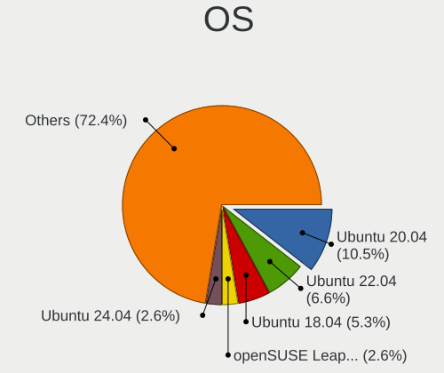

| Name                | Desktops | Percent |
|---------------------|----------|---------|
| Ubuntu 20.04        | 8        | 10.53%  |
| Ubuntu 22.04        | 5        | 6.58%   |
| Ubuntu 18.04        | 4        | 5.26%   |
| Ubuntu 24.04        | 2        | 2.63%   |
| openSUSE Leap-15.2  | 2        | 2.63%   |
| Lubuntu 22.04       | 2        | 2.63%   |
| Linux Mint 20.1     | 2        | 2.63%   |
| Fedora 41           | 2        | 2.63%   |
| Fedora 38           | 2        | 2.63%   |
| EndeavourOS Rolling | 2        | 2.63%   |
| Debian 12           | 2        | 2.63%   |
| Arch Rolling        | 2        | 2.63%   |
| Zorin 17            | 1        | 1.32%   |
| Zorin 16            | 1        | 1.32%   |
| Xubuntu 16.04       | 1        | 1.32%   |
| UbuntuDDE 20.04     | 1        | 1.32%   |
| Ubuntu Studio 20.04 | 1        | 1.32%   |
| Ubuntu MATE 24.04   | 1        | 1.32%   |
| Ubuntu 22.10        | 1        | 1.32%   |
| Ubuntu 20.10        | 1        | 1.32%   |
| Ubuntu 19.10        | 1        | 1.32%   |
| Pop!_OS 22.04       | 1        | 1.32%   |
| openSUSE Leap-15.3  | 1        | 1.32%   |
| OpenMandriva 4.90   | 1        | 1.32%   |
| OpenMandriva 25.90  | 1        | 1.32%   |
| OpenMandriva 25.01  | 1        | 1.32%   |
| OpenMandriva 24.07  | 1        | 1.32%   |
| MX 23               | 1        | 1.32%   |
| Manjaro 25.0.0      | 1        | 1.32%   |
| Manjaro 21.1.0      | 1        | 1.32%   |
| Mageia 7            | 1        | 1.32%   |
| Lubuntu 20.10       | 1        | 1.32%   |
| LMDE 4              | 1        | 1.32%   |
| Kubuntu 23.10       | 1        | 1.32%   |
| Kubuntu 22.04       | 1        | 1.32%   |
| Kubuntu 20.04       | 1        | 1.32%   |
| KDE neon 20.04      | 1        | 1.32%   |
| Kali 2021.3         | 1        | 1.32%   |
| Gentoo 2.14         | 1        | 1.32%   |
| Gentoo 2.13         | 1        | 1.32%   |

OS Family
---------

OS without a version

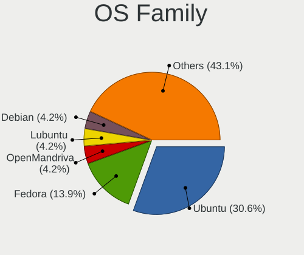

| Name          | Desktops | Percent |
|---------------|----------|---------|
| Ubuntu        | 22       | 30.56%  |
| Fedora        | 10       | 13.89%  |
| OpenMandriva  | 3        | 4.17%   |
| Lubuntu       | 3        | 4.17%   |
| Debian        | 3        | 4.17%   |
| Arch          | 3        | 4.17%   |
| Zorin         | 2        | 2.78%   |
| openSUSE      | 2        | 2.78%   |
| Manjaro       | 2        | 2.78%   |
| Linux Mint    | 2        | 2.78%   |
| Kubuntu       | 2        | 2.78%   |
| Gentoo        | 2        | 2.78%   |
| EndeavourOS   | 2        | 2.78%   |
| Xubuntu       | 1        | 1.39%   |
| UbuntuDDE     | 1        | 1.39%   |
| Ubuntu Studio | 1        | 1.39%   |
| Ubuntu MATE   | 1        | 1.39%   |
| Pop!_OS       | 1        | 1.39%   |
| MX            | 1        | 1.39%   |
| Mageia        | 1        | 1.39%   |
| LMDE          | 1        | 1.39%   |
| KDE neon      | 1        | 1.39%   |
| Kali          | 1        | 1.39%   |
| Elementary    | 1        | 1.39%   |
| CentOS        | 1        | 1.39%   |
| Bazzite       | 1        | 1.39%   |
| ArcoLinux     | 1        | 1.39%   |

Kernel
------

Version of the Linux kernel

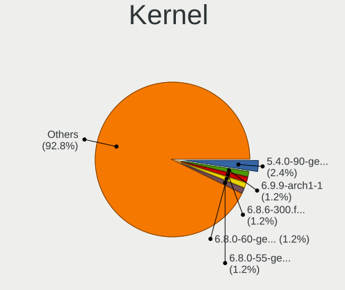

| Version                        | Desktops | Percent |
|--------------------------------|----------|---------|
| 5.4.0-90-generic               | 2        | 2.41%   |
| 6.9.9-arch1-1                  | 1        | 1.2%    |
| 6.8.6-300.fc40.x86_64          | 1        | 1.2%    |
| 6.8.0-60-generic               | 1        | 1.2%    |
| 6.8.0-55-generic               | 1        | 1.2%    |
| 6.8.0-48-generic               | 1        | 1.2%    |
| 6.8.0-45-generic               | 1        | 1.2%    |
| 6.8.0-40-generic               | 1        | 1.2%    |
| 6.6.7-arch1-1                  | 1        | 1.2%    |
| 6.6.29-1-lts                   | 1        | 1.2%    |
| 6.6.22-gentoo-dist-hardened    | 1        | 1.2%    |
| 6.5.0-28-generic               | 1        | 1.2%    |
| 6.5.0-21-generic               | 1        | 1.2%    |
| 6.5.0-15-generic               | 1        | 1.2%    |
| 6.4.7-arch1-1                  | 1        | 1.2%    |
| 6.4.4-zen1-1-zen               | 1        | 1.2%    |
| 6.3.12-200.fc38.x86_64         | 1        | 1.2%    |
| 6.3.1-arch2-1                  | 1        | 1.2%    |
| 6.2.9-300.fc38.x86_64          | 1        | 1.2%    |
| 6.17.13-200.fc42.x86_64        | 1        | 1.2%    |
| 6.17.12-300.fc43.x86_64        | 1        | 1.2%    |
| 6.14.2-desktop-3omv2590        | 1        | 1.2%    |
| 6.14.0-1012-oem                | 1        | 1.2%    |
| 6.13.9-103.bazzite.fc41.x86_64 | 1        | 1.2%    |
| 6.12.9-desktop-1omv2490        | 1        | 1.2%    |
| 6.12.8-200.fc41.x86_64         | 1        | 1.2%    |
| 6.12.17-1-MANJARO              | 1        | 1.2%    |
| 6.12.15-200.fc41.x86_64        | 1        | 1.2%    |
| 6.12.11-2-liquorix-amd64       | 1        | 1.2%    |
| 6.11.5-300.fc41.x86_64         | 1        | 1.2%    |
| 6.11.10-1-liquorix-amd64       | 1        | 1.2%    |
| 6.10.0-desktop-1omv2490        | 1        | 1.2%    |
| 6.1.22-gentoo-dist             | 1        | 1.2%    |
| 6.1.10-200.fc37.x86_64         | 1        | 1.2%    |
| 6.1.0-31-amd64                 | 1        | 1.2%    |
| 5.9.13-zen1-1-zen              | 1        | 1.2%    |
| 5.9.10-200.fc33.x86_64         | 1        | 1.2%    |
| 5.8.0-44-generic               | 1        | 1.2%    |
| 5.8.0-43-generic               | 1        | 1.2%    |
| 5.8.0-26-generic               | 1        | 1.2%    |

Kernel Family
-------------

Linux kernel without a distro release

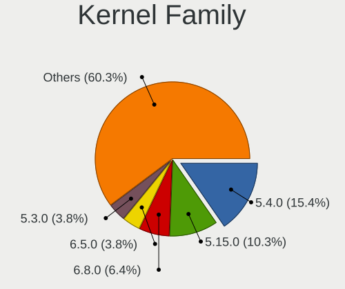

| Version | Desktops | Percent |
|---------|----------|---------|
| 5.4.0   | 12       | 15.38%  |
| 5.15.0  | 8        | 10.26%  |
| 6.8.0   | 5        | 6.41%   |
| 6.5.0   | 3        | 3.85%   |
| 5.3.0   | 3        | 3.85%   |
| 5.19.0  | 3        | 3.85%   |
| 5.3.18  | 2        | 2.56%   |
| 4.18.0  | 2        | 2.56%   |
| 6.9.9   | 1        | 1.28%   |
| 6.8.6   | 1        | 1.28%   |
| 6.6.7   | 1        | 1.28%   |
| 6.6.29  | 1        | 1.28%   |
| 6.6.22  | 1        | 1.28%   |
| 6.4.7   | 1        | 1.28%   |
| 6.4.4   | 1        | 1.28%   |
| 6.3.12  | 1        | 1.28%   |
| 6.3.1   | 1        | 1.28%   |
| 6.2.9   | 1        | 1.28%   |
| 6.17.13 | 1        | 1.28%   |
| 6.17.12 | 1        | 1.28%   |
| 6.14.2  | 1        | 1.28%   |
| 6.14.0  | 1        | 1.28%   |
| 6.13.9  | 1        | 1.28%   |
| 6.12.9  | 1        | 1.28%   |
| 6.12.8  | 1        | 1.28%   |
| 6.12.17 | 1        | 1.28%   |
| 6.12.15 | 1        | 1.28%   |
| 6.12.11 | 1        | 1.28%   |
| 6.11.5  | 1        | 1.28%   |
| 6.11.10 | 1        | 1.28%   |
| 6.10.0  | 1        | 1.28%   |
| 6.1.22  | 1        | 1.28%   |
| 6.1.10  | 1        | 1.28%   |
| 6.1.0   | 1        | 1.28%   |
| 5.9.13  | 1        | 1.28%   |
| 5.9.10  | 1        | 1.28%   |
| 5.8.0   | 1        | 1.28%   |
| 5.7.19  | 1        | 1.28%   |
| 5.18.12 | 1        | 1.28%   |
| 5.13.4  | 1        | 1.28%   |

Kernel Major Ver.
-----------------

Linux kernel major version

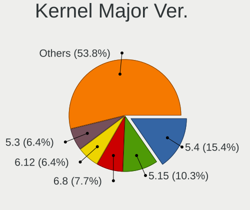

| Version | Desktops | Percent |
|---------|----------|---------|
| 5.4     | 12       | 15.38%  |
| 5.15    | 8        | 10.26%  |
| 6.8     | 6        | 7.69%   |
| 6.12    | 5        | 6.41%   |
| 5.3     | 5        | 6.41%   |
| 6.6     | 3        | 3.85%   |
| 6.5     | 3        | 3.85%   |
| 6.1     | 3        | 3.85%   |
| 5.19    | 3        | 3.85%   |
| 6.4     | 2        | 2.56%   |
| 6.3     | 2        | 2.56%   |
| 6.17    | 2        | 2.56%   |
| 6.14    | 2        | 2.56%   |
| 6.11    | 2        | 2.56%   |
| 5.9     | 2        | 2.56%   |
| 5.10    | 2        | 2.56%   |
| 4.18    | 2        | 2.56%   |
| 6.9     | 1        | 1.28%   |
| 6.2     | 1        | 1.28%   |
| 6.13    | 1        | 1.28%   |
| 6.10    | 1        | 1.28%   |
| 5.8     | 1        | 1.28%   |
| 5.7     | 1        | 1.28%   |
| 5.18    | 1        | 1.28%   |
| 5.13    | 1        | 1.28%   |
| 5.12    | 1        | 1.28%   |
| 5.11    | 1        | 1.28%   |
| 5.0     | 1        | 1.28%   |
| 4.4     | 1        | 1.28%   |
| 4.19    | 1        | 1.28%   |
| 4.15    | 1        | 1.28%   |

Arch
----

OS architecture (x86_64, i586, etc.)

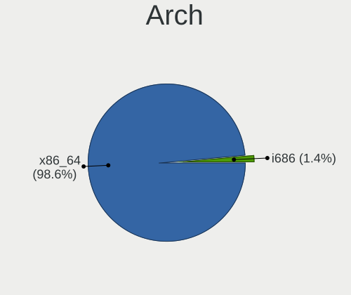

| Name   | Desktops | Percent |
|--------|----------|---------|
| x86_64 | 68       | 98.55%  |
| i686   | 1        | 1.45%   |

DE
--

Desktop Environment

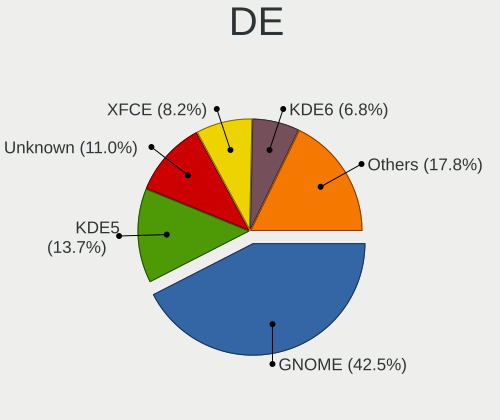

| Name       | Desktops | Percent |
|------------|----------|---------|
| GNOME      | 31       | 42.47%  |
| KDE5       | 10       | 13.7%   |
| Unknown    | 8        | 10.96%  |
| XFCE       | 6        | 8.22%   |
| KDE6       | 5        | 6.85%   |
| X-Cinnamon | 2        | 2.74%   |
| LXQt       | 2        | 2.74%   |
| KDE        | 2        | 2.74%   |
| Deepin     | 2        | 2.74%   |
| Cinnamon   | 2        | 2.74%   |
| Pantheon   | 1        | 1.37%   |
| MATE       | 1        | 1.37%   |
| LXDE       | 1        | 1.37%   |

Display Server
--------------

X11 or Wayland

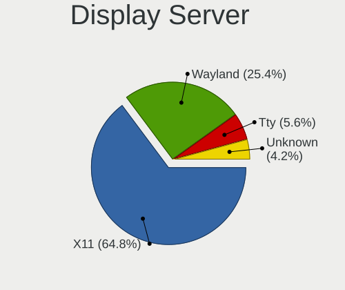

| Name    | Desktops | Percent |
|---------|----------|---------|
| X11     | 46       | 64.79%  |
| Wayland | 18       | 25.35%  |
| Tty     | 4        | 5.63%   |
| Unknown | 3        | 4.23%   |

Display Manager
---------------

SDDM, LightDM, etc.

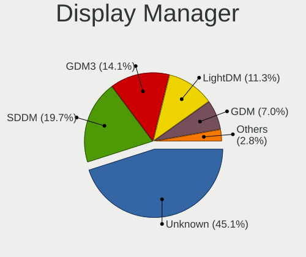

| Name    | Desktops | Percent |
|---------|----------|---------|
| Unknown | 32       | 45.07%  |
| SDDM    | 14       | 19.72%  |
| GDM3    | 10       | 14.08%  |
| LightDM | 8        | 11.27%  |
| GDM     | 5        | 7.04%   |
| XDM     | 1        | 1.41%   |
| TDM     | 1        | 1.41%   |

OS Lang
-------

Language

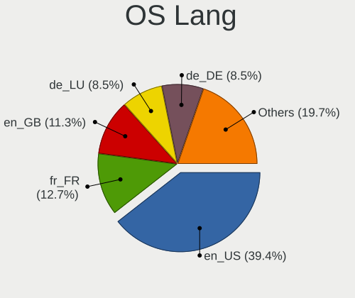

| Lang    | Desktops | Percent |
|---------|----------|---------|
| en_US   | 28       | 39.44%  |
| fr_FR   | 9        | 12.68%  |
| en_GB   | 8        | 11.27%  |
| de_LU   | 6        | 8.45%   |
| de_DE   | 6        | 8.45%   |
| C       | 4        | 5.63%   |
| es_ES   | 3        | 4.23%   |
| Unknown | 2        | 2.82%   |
| nl_NL   | 1        | 1.41%   |
| lb_LU   | 1        | 1.41%   |
| fr_LU   | 1        | 1.41%   |
| de_CH   | 1        | 1.41%   |
| C.UTF8  | 1        | 1.41%   |

Boot Mode
---------

EFI or BIOS

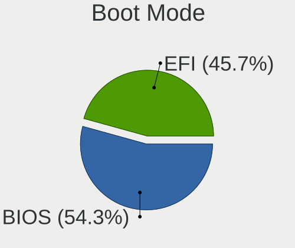

| Mode | Desktops | Percent |
|------|----------|---------|
| BIOS | 38       | 54.29%  |
| EFI  | 32       | 45.71%  |

Filesystem
----------

Type of filesystem

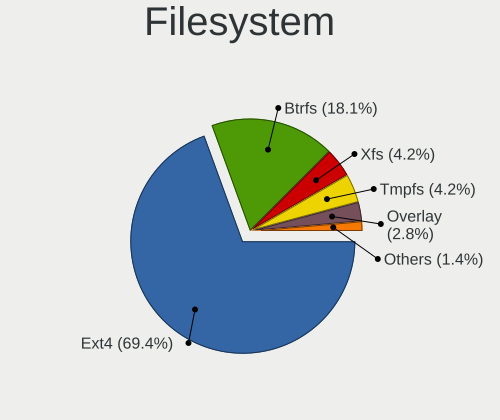

| Type    | Desktops | Percent |
|---------|----------|---------|
| Ext4    | 50       | 69.44%  |
| Btrfs   | 13       | 18.06%  |
| Xfs     | 3        | 4.17%   |
| Tmpfs   | 3        | 4.17%   |
| Overlay | 2        | 2.78%   |
| Zfs     | 1        | 1.39%   |

Part. scheme
------------

Scheme of partitioning

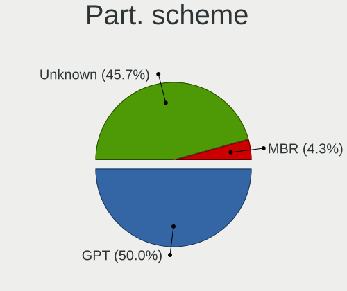

| Type    | Desktops | Percent |
|---------|----------|---------|
| GPT     | 35       | 50%     |
| Unknown | 32       | 45.71%  |
| MBR     | 3        | 4.29%   |

Dual Boot with Linux/BSD
------------------------

Hosting more than one Linux/BSD

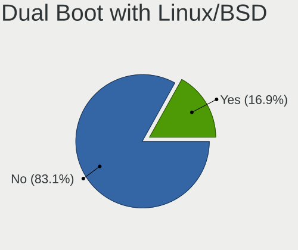

| Dual boot | Desktops | Percent |
|-----------|----------|---------|
| No        | 59       | 83.1%   |
| Yes       | 12       | 16.9%   |

Dual Boot (Win)
---------------

Hosting Linux and Windows

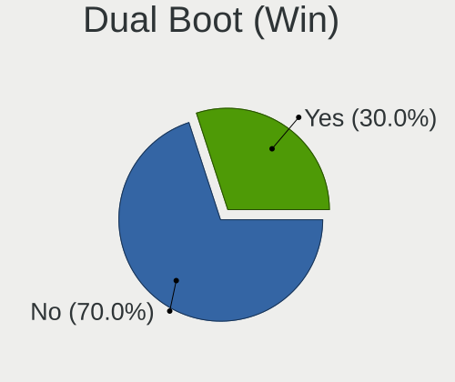

| Dual boot | Desktops | Percent |
|-----------|----------|---------|
| No        | 49       | 70%     |
| Yes       | 21       | 30%     |

Board
-----

Vendor
------

Motherboard manufacturer

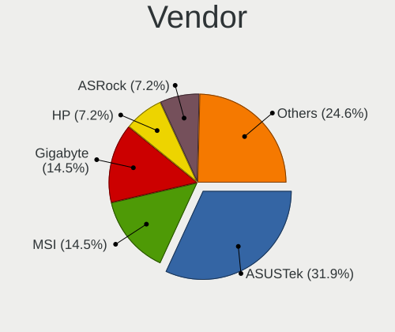

| Name                | Desktops | Percent |
|---------------------|----------|---------|
| ASUSTek Computer    | 22       | 31.88%  |
| MSI                 | 10       | 14.49%  |
| Gigabyte Technology | 10       | 14.49%  |
| Hewlett-Packard     | 5        | 7.25%   |
| ASRock              | 5        | 7.25%   |
| Intel               | 3        | 4.35%   |
| Dell                | 3        | 4.35%   |
| Medion              | 2        | 2.9%    |
| Win Element         | 1        | 1.45%   |
| MACHINIST           | 1        | 1.45%   |
| Lenovo              | 1        | 1.45%   |
| LattePanda          | 1        | 1.45%   |
| JWIPC               | 1        | 1.45%   |
| Foxconn             | 1        | 1.45%   |
| BESSTAR Tech        | 1        | 1.45%   |
| Acer                | 1        | 1.45%   |
| Unknown             | 1        | 1.45%   |

Model
-----

Motherboard model

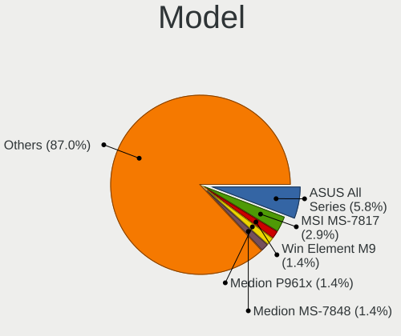

| Name                                      | Desktops | Percent |
|-------------------------------------------|----------|---------|
| ASUS All Series                           | 4        | 5.8%    |
| MSI MS-7817                               | 2        | 2.9%    |
| Win Element M9                            | 1        | 1.45%   |
| MSI MS-7E06                               | 1        | 1.45%   |
| MSI MS-7D75                               | 1        | 1.45%   |
| MSI MS-7C91                               | 1        | 1.45%   |
| MSI MS-7C80                               | 1        | 1.45%   |
| MSI MS-7C56                               | 1        | 1.45%   |
| MSI MS-7C08                               | 1        | 1.45%   |
| MSI MS-7816                               | 1        | 1.45%   |
| MSI B360 Gaming Infinite A (MS-B915)      | 1        | 1.45%   |
| Medion P961x                              | 1        | 1.45%   |
| Medion MS-7848                            | 1        | 1.45%   |
| MACHINIST E5-D8-MAX V1.1                  | 1        | 1.45%   |
| Lenovo ThinkCentre M910s 10MKS02N04       | 1        | 1.45%   |
| LattePanda 3 Delta                        | 1        | 1.45%   |
| JWIPC BF24                                | 1        | 1.45%   |
| Intel DP35DP AAD81073-207                 | 1        | 1.45%   |
| Intel DG965SS AAD41678-308                | 1        | 1.45%   |
| Intel DG41WV AAE90316-104                 | 1        | 1.45%   |
| HP Victus by 15L Gaming Desktop TG02-0xxx | 1        | 1.45%   |
| HP ProDesk 400 G2 MT (TPM DP)             | 1        | 1.45%   |
| HP EliteDesk 800 G2 DM 35W                | 1        | 1.45%   |
| HP Compaq dc5800 Small Form Factor        | 1        | 1.45%   |
| HP Compaq 6000 Pro SFF PC                 | 1        | 1.45%   |
| Gigabyte Z97X-Gaming 5                    | 1        | 1.45%   |
| Gigabyte Z77X-D3H                         | 1        | 1.45%   |
| Gigabyte Z370 AORUS Ultra Gaming          | 1        | 1.45%   |
| Gigabyte Z270M-D3H                        | 1        | 1.45%   |
| Gigabyte X99-UD3-CF                       | 1        | 1.45%   |
| Gigabyte X670E AORUS MASTER               | 1        | 1.45%   |
| Gigabyte X570 AORUS PRO                   | 1        | 1.45%   |
| Gigabyte H81M-DS2                         | 1        | 1.45%   |
| Gigabyte H270N-WIFI                       | 1        | 1.45%   |
| Gigabyte B550M AORUS PRO-P                | 1        | 1.45%   |
| Foxconn p6601fr-m                         | 1        | 1.45%   |
| Dell Precision Tower 3420                 | 1        | 1.45%   |
| Dell OptiPlex 9020                        | 1        | 1.45%   |
| Dell OptiPlex 7040                        | 1        | 1.45%   |
| BESSTAR Tech DMAF5                        | 1        | 1.45%   |

Model Family
------------

Motherboard model prefix

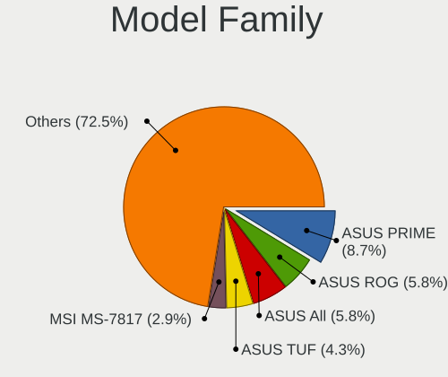

| Name                 | Desktops | Percent |
|----------------------|----------|---------|
| ASUS PRIME           | 6        | 8.7%    |
| ASUS ROG             | 4        | 5.8%    |
| ASUS All             | 4        | 5.8%    |
| ASUS TUF             | 3        | 4.35%   |
| MSI MS-7817          | 2        | 2.9%    |
| HP Compaq            | 2        | 2.9%    |
| Dell OptiPlex        | 2        | 2.9%    |
| Win Element M9       | 1        | 1.45%   |
| MSI MS-7E06          | 1        | 1.45%   |
| MSI MS-7D75          | 1        | 1.45%   |
| MSI MS-7C91          | 1        | 1.45%   |
| MSI MS-7C80          | 1        | 1.45%   |
| MSI MS-7C56          | 1        | 1.45%   |
| MSI MS-7C08          | 1        | 1.45%   |
| MSI MS-7816          | 1        | 1.45%   |
| MSI B360             | 1        | 1.45%   |
| Medion P961x         | 1        | 1.45%   |
| Medion MS-7848       | 1        | 1.45%   |
| MACHINIST E5-D8-MAX  | 1        | 1.45%   |
| Lenovo ThinkCentre   | 1        | 1.45%   |
| LattePanda 3         | 1        | 1.45%   |
| JWIPC BF24           | 1        | 1.45%   |
| Intel DP35DP         | 1        | 1.45%   |
| Intel DG965SS        | 1        | 1.45%   |
| Intel DG41WV         | 1        | 1.45%   |
| HP Victus            | 1        | 1.45%   |
| HP ProDesk           | 1        | 1.45%   |
| HP EliteDesk         | 1        | 1.45%   |
| Gigabyte Z97X-Gaming | 1        | 1.45%   |
| Gigabyte Z77X-D3H    | 1        | 1.45%   |
| Gigabyte Z370        | 1        | 1.45%   |
| Gigabyte Z270M-D3H   | 1        | 1.45%   |
| Gigabyte X99-UD3-CF  | 1        | 1.45%   |
| Gigabyte X670E       | 1        | 1.45%   |
| Gigabyte X570        | 1        | 1.45%   |
| Gigabyte H81M-DS2    | 1        | 1.45%   |
| Gigabyte H270N-WIFI  | 1        | 1.45%   |
| Gigabyte B550M       | 1        | 1.45%   |
| Foxconn p6601fr-m    | 1        | 1.45%   |
| Dell Precision       | 1        | 1.45%   |

MFG Year
--------

Motherboard manufacture year

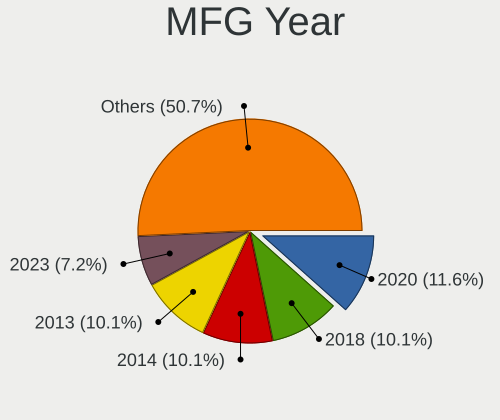

| Year | Desktops | Percent |
|------|----------|---------|
| 2020 | 8        | 11.59%  |
| 2018 | 7        | 10.14%  |
| 2014 | 7        | 10.14%  |
| 2013 | 7        | 10.14%  |
| 2023 | 5        | 7.25%   |
| 2019 | 5        | 7.25%   |
| 2016 | 5        | 7.25%   |
| 2022 | 4        | 5.8%    |
| 2021 | 4        | 5.8%    |
| 2010 | 4        | 5.8%    |
| 2017 | 3        | 4.35%   |
| 2015 | 2        | 2.9%    |
| 2012 | 2        | 2.9%    |
| 2009 | 2        | 2.9%    |
| 2007 | 2        | 2.9%    |
| 2024 | 1        | 1.45%   |
| 2008 | 1        | 1.45%   |

Form Factor
-----------

Physical design of the computer

| Name    | Desktops | Percent |
|---------|----------|---------|
| Desktop | 69       | 100%    |

Secure Boot
-----------

Enabled or disabled

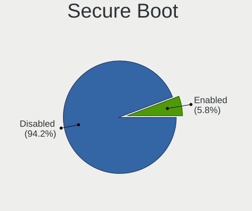

| State    | Desktops | Percent |
|----------|----------|---------|
| Disabled | 65       | 94.2%   |
| Enabled  | 4        | 5.8%    |

Coreboot
--------

Have coreboot on board

| Used | Desktops | Percent |
|------|----------|---------|
| No   | 69       | 100%    |

RAM Size
--------

Total RAM memory

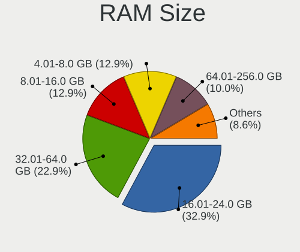

| Size in GB  | Desktops | Percent |
|-------------|----------|---------|
| 16.01-24.0  | 23       | 32.86%  |
| 32.01-64.0  | 16       | 22.86%  |
| 4.01-8.0    | 9        | 12.86%  |
| 8.01-16.0   | 9        | 12.86%  |
| 64.01-256.0 | 7        | 10%     |
| 3.01-4.0    | 5        | 7.14%   |
| 24.01-32.0  | 1        | 1.43%   |

RAM Used
--------

Used RAM memory

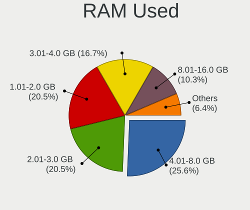

| Used GB    | Desktops | Percent |
|------------|----------|---------|
| 4.01-8.0   | 20       | 25.64%  |
| 2.01-3.0   | 16       | 20.51%  |
| 1.01-2.0   | 16       | 20.51%  |
| 3.01-4.0   | 13       | 16.67%  |
| 8.01-16.0  | 8        | 10.26%  |
| 0.51-1.0   | 2        | 2.56%   |
| 32.01-64.0 | 1        | 1.28%   |
| 16.01-24.0 | 1        | 1.28%   |
| 0.01-0.5   | 1        | 1.28%   |

Total Drives
------------

Number of drives on board

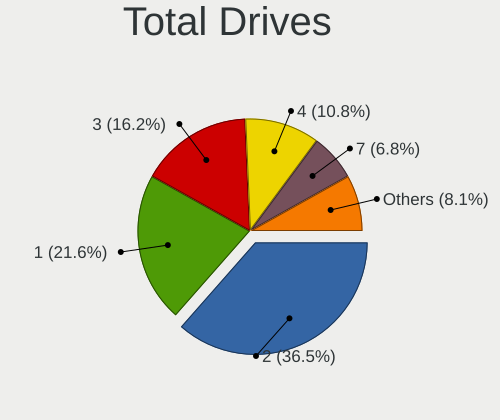

| Drives | Desktops | Percent |
|--------|----------|---------|
| 2      | 27       | 36.49%  |
| 1      | 16       | 21.62%  |
| 3      | 12       | 16.22%  |
| 4      | 8        | 10.81%  |
| 7      | 5        | 6.76%   |
| 5      | 5        | 6.76%   |
| 6      | 1        | 1.35%   |

Has CD-ROM
----------

Has CD-ROM on board

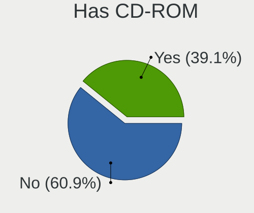

| Presented | Desktops | Percent |
|-----------|----------|---------|
| No        | 42       | 60.87%  |
| Yes       | 27       | 39.13%  |

Has Ethernet
------------

Has Ethernet on board

| Presented | Desktops | Percent |
|-----------|----------|---------|
| Yes       | 69       | 100%    |

Has WiFi
--------

Has WiFi module

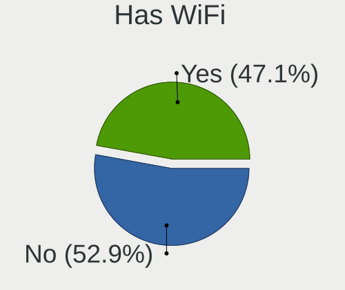

| Presented | Desktops | Percent |
|-----------|----------|---------|
| No        | 37       | 52.86%  |
| Yes       | 33       | 47.14%  |

Has Bluetooth
-------------

Has Bluetooth module

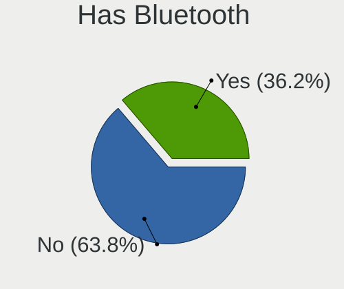

| Presented | Desktops | Percent |
|-----------|----------|---------|
| No        | 44       | 63.77%  |
| Yes       | 25       | 36.23%  |

Location
--------

Country
-------

Geographic location (country)

| Country    | Desktops | Percent |
|------------|----------|---------|
| Luxembourg | 69       | 100%    |

City
----

Geographic location (city)

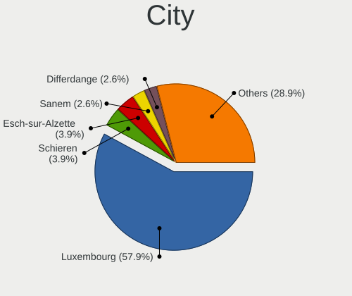

| City              | Desktops | Percent |
|-------------------|----------|---------|
| Luxembourg        | 44       | 57.89%  |
| Schieren          | 3        | 3.95%   |
| Esch-sur-Alzette  | 3        | 3.95%   |
| Sanem             | 2        | 2.63%   |
| Differdange       | 2        | 2.63%   |
| Wormeldange       | 1        | 1.32%   |
| Wasserbillig      | 1        | 1.32%   |
| Useldange         | 1        | 1.32%   |
| Strassen          | 1        | 1.32%   |
| Steinsel          | 1        | 1.32%   |
| Schifflange       | 1        | 1.32%   |
| Roeser            | 1        | 1.32%   |
| Rodange           | 1        | 1.32%   |
| Pontpierre        | 1        | 1.32%   |
| Pétange          | 1        | 1.32%   |
| Mertzig           | 1        | 1.32%   |
| Junglinster       | 1        | 1.32%   |
| Itzig             | 1        | 1.32%   |
| Hosingen          | 1        | 1.32%   |
| Frisange          | 1        | 1.32%   |
| Ehnen             | 1        | 1.32%   |
| Dudelange         | 1        | 1.32%   |
| Contern           | 1        | 1.32%   |
| Clervaux          | 1        | 1.32%   |
| Brouch            | 1        | 1.32%   |
| Bettange-sur-Mess | 1        | 1.32%   |
| Belvaux           | 1        | 1.32%   |

Drives
------

Drive Vendor
------------

Hard drive vendors

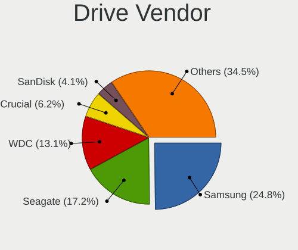

| Vendor                       | Desktops | Drives | Percent |
|------------------------------|----------|--------|---------|
| Samsung Electronics          | 36       | 62     | 24.83%  |
| Seagate                      | 25       | 45     | 17.24%  |
| WDC                          | 19       | 34     | 13.1%   |
| Crucial                      | 9        | 17     | 6.21%   |
| SanDisk                      | 6        | 9      | 4.14%   |
| Kingston                     | 4        | 7      | 2.76%   |
| Hitachi                      | 4        | 7      | 2.76%   |
| Toshiba                      | 3        | 5      | 2.07%   |
| Micron/Crucial Technology    | 3        | 4      | 2.07%   |
| Shenzhen Longsys Electronics | 2        | 2      | 1.38%   |
| Phison                       | 2        | 2      | 1.38%   |
| OCZ                          | 2        | 2      | 1.38%   |
| KingSpec                     | 2        | 5      | 1.38%   |
| Intel                        | 2        | 2      | 1.38%   |
| HGST                         | 2        | 4      | 1.38%   |
| A-DATA Technology            | 2        | 2      | 1.38%   |
| WDC WUH                      | 1        | 1      | 0.69%   |
| Unknown                      | 1        | 2      | 0.69%   |
| Transcend                    | 1        | 1      | 0.69%   |
| TCSUNBOW                     | 1        | 1      | 0.69%   |
| StarTech                     | 1        | 2      | 0.69%   |
| SK hynix                     | 1        | 1      | 0.69%   |
| SABRENT                      | 1        | 1      | 0.69%   |
| PNY                          | 1        | 1      | 0.69%   |
| Micron Technology            | 1        | 1      | 0.69%   |
| Maxtor                       | 1        | 2      | 0.69%   |
| MAXIO Technology (Hangzhou)  | 1        | 6      | 0.69%   |
| LITEONIT                     | 1        | 1      | 0.69%   |
| Kingston Technology Company  | 1        | 1      | 0.69%   |
| JMicron Technology           | 1        | 1      | 0.69%   |
| Intenso                      | 1        | 1      | 0.69%   |
| Inateck                      | 1        | 1      | 0.69%   |
| HGST HTS                     | 1        | 1      | 0.69%   |
| Gigabyte Technology          | 1        | 1      | 0.69%   |
| Fanxiang                     | 1        | 1      | 0.69%   |
| Biwin Storage Technology     | 1        | 1      | 0.69%   |
| ASMT                         | 1        | 4      | 0.69%   |
| Unknown                      | 1        | 1      | 0.69%   |

Drive Model
-----------

Hard drive models

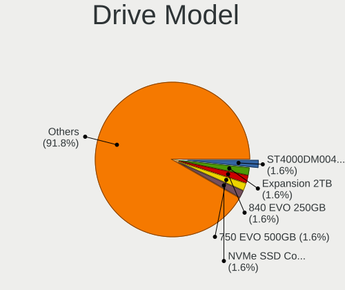

| Model                                              | Desktops | Percent |
|----------------------------------------------------|----------|---------|
| Seagate ST4000DM004-2CV104 4TB                     | 3        | 1.65%   |
| Seagate Expansion 2TB                              | 3        | 1.65%   |
| Samsung SSD 840 EVO 250GB                          | 3        | 1.65%   |
| Samsung SSD 750 EVO 500GB                          | 3        | 1.65%   |
| Samsung NVMe SSD Controller SM981/PM981/PM983 1TB  | 3        | 1.65%   |
| Samsung NVMe SSD Controller PM9A1/PM9A3/980PRO 1TB | 3        | 1.65%   |
| WDC WD40EZRZ-00GXCB0 4TB                           | 2        | 1.1%    |
| WDC WD10EZEX-08WN4A0 1TB                           | 2        | 1.1%    |
| Seagate ST4000DM005-2DP166 4TB                     | 2        | 1.1%    |
| Seagate ST2000DM008-2FR102 2TB                     | 2        | 1.1%    |
| Seagate ST1000LM035-1RK172 1TB                     | 2        | 1.1%    |
| Seagate ST1000DM003-1ER162 1TB                     | 2        | 1.1%    |
| SanDisk SDSSDH3512G 512GB                          | 2        | 1.1%    |
| Samsung SSD 980 1TB                                | 2        | 1.1%    |
| Samsung SSD 870 EVO 1TB                            | 2        | 1.1%    |
| Samsung SSD 860 QVO 2TB                            | 2        | 1.1%    |
| Samsung SSD 860 EVO 250GB                          | 2        | 1.1%    |
| Samsung SSD 850 EVO 250GB                          | 2        | 1.1%    |
| Samsung SP2504C 250GB                              | 2        | 1.1%    |
| Micron/Crucial P2 NVMe PCIe SSD 2TB                | 2        | 1.1%    |
| Kingston SA400S37240G 240GB SSD                    | 2        | 1.1%    |
| Crucial CT1000P2SSD8 1TB                           | 2        | 1.1%    |
| WDC WUH721818ALE6L4 18TB                           | 1        | 0.55%   |
| WDC WUH 721818ALE6L4 18TB                          | 1        | 0.55%   |
| WDC WDS500G3X0C-00SJG0 500GB                       | 1        | 0.55%   |
| WDC WDS250G2B0A-00SM50 250GB SSD                   | 1        | 0.55%   |
| WDC WD80 03FFBX-68B9A 8TB                          | 1        | 0.55%   |
| WDC WD5000AAVS-00ZTB0 500GB                        | 1        | 0.55%   |
| WDC WD5000AAKS-60Z1A0 500GB                        | 1        | 0.55%   |
| WDC WD40EZRZ-75GXCB0 4TB                           | 1        | 0.55%   |
| WDC WD4000FYYZ-01UL1B2 4TB                         | 1        | 0.55%   |
| WDC WD40 EZAZ-00SF3B0 4TB                          | 1        | 0.55%   |
| WDC WD3200LPCX-00VHAT0 320GB                       | 1        | 0.55%   |
| WDC WD3001FFSX-68JNUN0 3TB                         | 1        | 0.55%   |
| WDC WD3000GLFS-01F8U0 304GB                        | 1        | 0.55%   |
| WDC WD20SPZX-22UA7T0 2TB                           | 1        | 0.55%   |
| WDC WD20EFAX-68FB5N0 2TB                           | 1        | 0.55%   |
| WDC WD141KRYZ-01C66B0 14TB                         | 1        | 0.55%   |
| WDC WD10JPVX-22JC3T0 1TB                           | 1        | 0.55%   |
| WDC WD10EZRX-00L4HB0 1TB                           | 1        | 0.55%   |

HDD Vendor
----------

Hard disk drive vendors

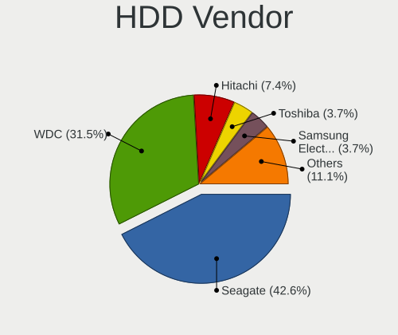

| Vendor              | Desktops | Drives | Percent |
|---------------------|----------|--------|---------|
| Seagate             | 23       | 43     | 42.59%  |
| WDC                 | 17       | 32     | 31.48%  |
| Hitachi             | 4        | 7      | 7.41%   |
| Toshiba             | 2        | 4      | 3.7%    |
| Samsung Electronics | 2        | 2      | 3.7%    |
| HGST                | 2        | 4      | 3.7%    |
| Intenso             | 1        | 1      | 1.85%   |
| Inateck             | 1        | 1      | 1.85%   |
| HGST HTS            | 1        | 1      | 1.85%   |
| ASMT                | 1        | 4      | 1.85%   |

SSD Vendor
----------

Solid state drive vendors

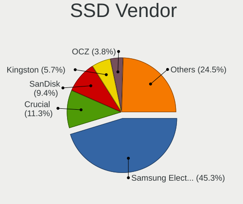

| Vendor              | Desktops | Drives | Percent |
|---------------------|----------|--------|---------|
| Samsung Electronics | 24       | 34     | 45.28%  |
| Crucial             | 6        | 14     | 11.32%  |
| SanDisk             | 5        | 7      | 9.43%   |
| Kingston            | 3        | 5      | 5.66%   |
| OCZ                 | 2        | 2      | 3.77%   |
| KingSpec            | 2        | 5      | 3.77%   |
| A-DATA Technology   | 2        | 2      | 3.77%   |
| WDC                 | 1        | 1      | 1.89%   |
| Transcend           | 1        | 1      | 1.89%   |
| TCSUNBOW            | 1        | 1      | 1.89%   |
| SABRENT             | 1        | 1      | 1.89%   |
| PNY                 | 1        | 1      | 1.89%   |
| Maxtor              | 1        | 2      | 1.89%   |
| LITEONIT            | 1        | 1      | 1.89%   |
| Intel               | 1        | 1      | 1.89%   |
| Unknown             | 1        | 1      | 1.89%   |

Drive Kind
----------

HDD or SSD

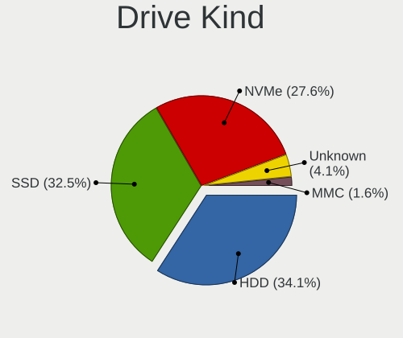

| Kind    | Desktops | Drives | Percent |
|---------|----------|--------|---------|
| HDD     | 42       | 99     | 34.15%  |
| SSD     | 40       | 79     | 32.52%  |
| NVMe    | 34       | 55     | 27.64%  |
| Unknown | 5        | 6      | 4.07%   |
| MMC     | 2        | 3      | 1.63%   |

Drive Connector
---------------

SATA, SAS, NVMe, etc.

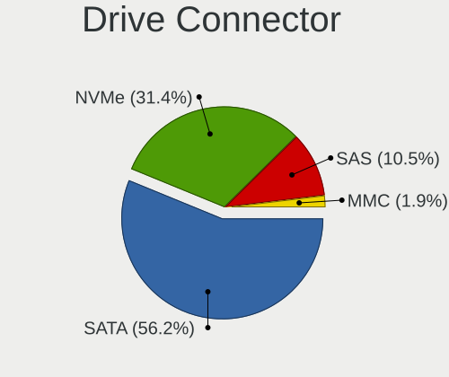

| Type | Desktops | Drives | Percent |
|------|----------|--------|---------|
| SATA | 59       | 161    | 56.19%  |
| NVMe | 33       | 54     | 31.43%  |
| SAS  | 11       | 24     | 10.48%  |
| MMC  | 2        | 3      | 1.9%    |

Drive Size
----------

Size of hard drive

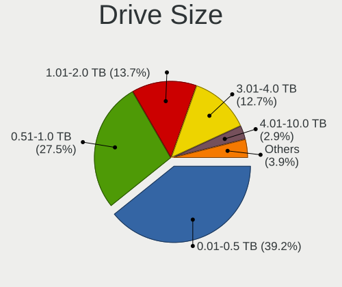

| Size in TB | Desktops | Drives | Percent |
|------------|----------|--------|---------|
| 0.01-0.5   | 40       | 73     | 39.22%  |
| 0.51-1.0   | 28       | 52     | 27.45%  |
| 1.01-2.0   | 14       | 26     | 13.73%  |
| 3.01-4.0   | 13       | 17     | 12.75%  |
| 4.01-10.0  | 3        | 5      | 2.94%   |
| 2.01-3.0   | 2        | 3      | 1.96%   |
| 10.01-20.0 | 2        | 2      | 1.96%   |

Space Total
-----------

Amount of disk space available on the file system

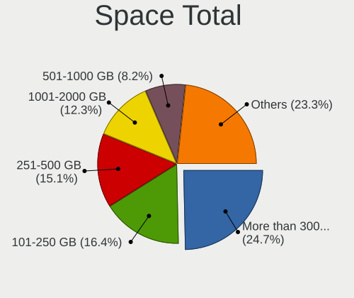

| Size in GB     | Desktops | Percent |
|----------------|----------|---------|
| More than 3000 | 18       | 24.66%  |
| 101-250        | 12       | 16.44%  |
| 251-500        | 11       | 15.07%  |
| 1001-2000      | 9        | 12.33%  |
| 501-1000       | 6        | 8.22%   |
| 2001-3000      | 5        | 6.85%   |
| Unknown        | 5        | 6.85%   |
| 51-100         | 4        | 5.48%   |
| 1-20           | 2        | 2.74%   |
| 21-50          | 1        | 1.37%   |

Space Used
----------

Amount of used disk space

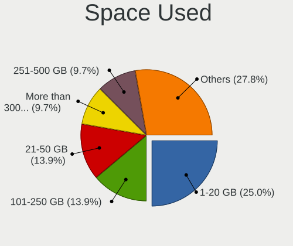

| Used GB        | Desktops | Percent |
|----------------|----------|---------|
| 1-20           | 18       | 25%     |
| 21-50          | 10       | 13.89%  |
| 101-250        | 10       | 13.89%  |
| More than 3000 | 7        | 9.72%   |
| 251-500        | 7        | 9.72%   |
| 1001-2000      | 5        | 6.94%   |
| Unknown        | 5        | 6.94%   |
| 2001-3000      | 4        | 5.56%   |
| 501-1000       | 3        | 4.17%   |
| 51-100         | 3        | 4.17%   |

Malfunc. Drives
---------------

Drive models with a malfunction

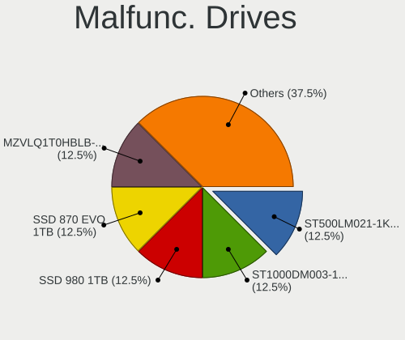

| Model                                         | Desktops | Drives | Percent |
|-----------------------------------------------|----------|--------|---------|
| Seagate ST500LM021-1KJ152 500GB               | 1        | 1      | 12.5%   |
| Seagate ST1000DM003-1ER162 1TB                | 1        | 1      | 12.5%   |
| Samsung Electronics SSD 980 1TB               | 1        | 2      | 12.5%   |
| Samsung Electronics SSD 870 EVO 1TB           | 1        | 1      | 12.5%   |
| Samsung Electronics MZVLQ1T0HBLB-00B00 1024GB | 1        | 1      | 12.5%   |
| Hitachi HTS543232A7A384 320GB                 | 1        | 1      | 12.5%   |
| HGST HTS 541010A9E680 1TB                     | 1        | 1      | 12.5%   |
| Crucial CT128MX100SSD1 128GB                  | 1        | 2      | 12.5%   |

Malfunc. Drive Vendor
---------------------

Vendors of faulty drives

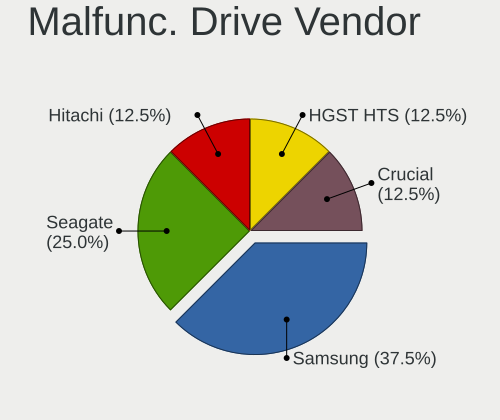

| Vendor              | Desktops | Drives | Percent |
|---------------------|----------|--------|---------|
| Samsung Electronics | 3        | 4      | 37.5%   |
| Seagate             | 2        | 2      | 25%     |
| Hitachi             | 1        | 1      | 12.5%   |
| HGST HTS            | 1        | 1      | 12.5%   |
| Crucial             | 1        | 2      | 12.5%   |

Malfunc. HDD Vendor
-------------------

Vendors of faulty HDD drives

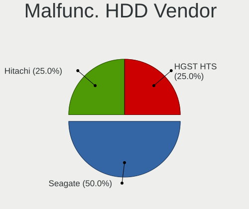

| Vendor   | Desktops | Drives | Percent |
|----------|----------|--------|---------|
| Seagate  | 2        | 2      | 50%     |
| Hitachi  | 1        | 1      | 25%     |
| HGST HTS | 1        | 1      | 25%     |

Malfunc. Drive Kind
-------------------

Kinds of faulty drives

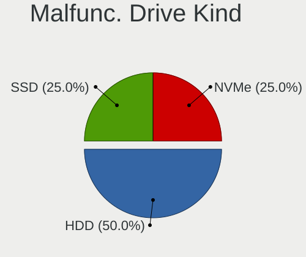

| Kind | Desktops | Drives | Percent |
|------|----------|--------|---------|
| HDD  | 4        | 4      | 50%     |
| NVMe | 2        | 3      | 25%     |
| SSD  | 2        | 3      | 25%     |

Failed Drives
-------------

Failed drive models

Zero info for selected period =(

Failed Drive Vendor
-------------------

Failed drive vendors

Zero info for selected period =(

Drive Status
------------

Number of failed and malfunc. drives

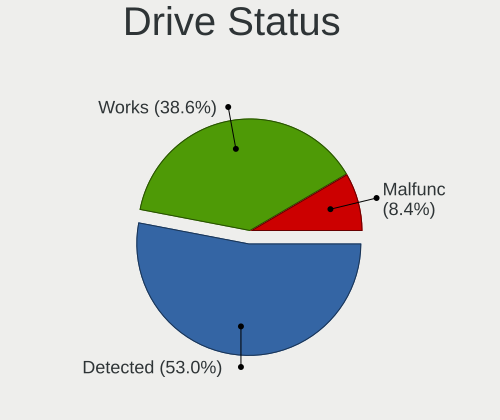

| Status   | Desktops | Drives | Percent |
|----------|----------|--------|---------|
| Detected | 44       | 138    | 53.01%  |
| Works    | 32       | 94     | 38.55%  |
| Malfunc  | 7        | 10     | 8.43%   |

Storage controller
------------------

Storage Vendor
--------------

Storage controller vendors

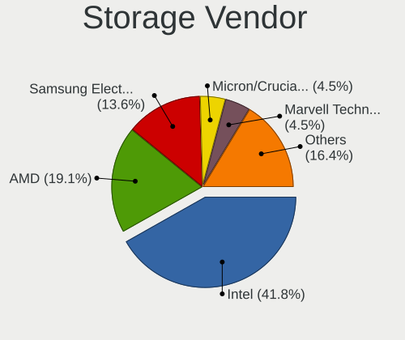

| Vendor                       | Desktops | Percent |
|------------------------------|----------|---------|
| Intel                        | 46       | 41.82%  |
| AMD                          | 21       | 19.09%  |
| Samsung Electronics          | 15       | 13.64%  |
| Micron/Crucial Technology    | 5        | 4.55%   |
| Marvell Technology Group     | 5        | 4.55%   |
| Phison Electronics           | 3        | 2.73%   |
| ASMedia Technology           | 3        | 2.73%   |
| Shenzhen Longsys Electronics | 2        | 1.82%   |
| SanDisk                      | 2        | 1.82%   |
| Kingston Technology Company  | 2        | 1.82%   |
| Toshiba America Info Systems | 1        | 0.91%   |
| SK hynix                     | 1        | 0.91%   |
| Seagate Technology           | 1        | 0.91%   |
| Micron Technology            | 1        | 0.91%   |
| MAXIO Technology (Hangzhou)  | 1        | 0.91%   |
| Biwin Storage Technology     | 1        | 0.91%   |

Storage Model
-------------

Storage controller models

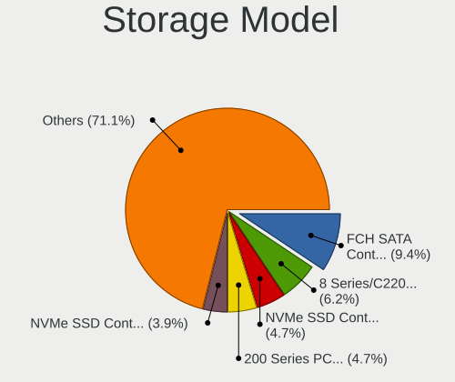

| Model                                                                                                              | Desktops | Percent |
|--------------------------------------------------------------------------------------------------------------------|----------|---------|
| AMD FCH SATA Controller [AHCI mode]                                                                                | 12       | 9.38%   |
| Intel 8 Series/C220 Series Chipset Family 6-port SATA Controller 1 [AHCI mode]                                     | 8        | 6.25%   |
| Samsung NVMe SSD Controller SM981/PM981/PM983                                                                      | 6        | 4.69%   |
| Intel 200 Series PCH SATA controller [AHCI mode]                                                                   | 6        | 4.69%   |
| Samsung NVMe SSD Controller PM9A1/PM9A3/980PRO                                                                     | 5        | 3.91%   |
| AMD 500 Series Chipset SATA Controller                                                                             | 5        | 3.91%   |
| AMD 400 Series Chipset SATA Controller                                                                             | 5        | 3.91%   |
| Micron/Crucial P2 [Nick P2] / P3 / P3 Plus NVMe PCIe SSD (DRAM-less)                                               | 4        | 3.13%   |
| Intel SATA Controller [RAID mode]                                                                                  | 4        | 3.13%   |
| Intel Raptor Lake SATA AHCI Controller                                                                             | 4        | 3.13%   |
| Intel Q170/Q150/B150/H170/H110/Z170/CM236 Chipset SATA Controller [AHCI Mode]                                      | 4        | 3.13%   |
| Samsung NVMe SSD Controller 980 (DRAM-less)                                                                        | 3        | 2.34%   |
| Phison E12 NVMe Controller                                                                                         | 3        | 2.34%   |
| Intel 9 Series Chipset Family SATA Controller [AHCI Mode]                                                          | 3        | 2.34%   |
| ASMedia ASM1061/ASM1062 Serial ATA Controller                                                                      | 3        | 2.34%   |
| SanDisk Extreme Pro / WD Black SN750 / PC SN730 / Red SN700 NVMe SSD                                               | 2        | 1.56%   |
| Samsung NVMe SSD Controller SM961/PM961/SM963                                                                      | 2        | 1.56%   |
| Marvell Group 88SE6101/6102 single-port PATA133 interface                                                          | 2        | 1.56%   |
| Intel RST Volume Management Device Controller                                                                      | 2        | 1.56%   |
| Intel 82801I (ICH9 Family) 2 port SATA Controller [IDE mode]                                                       | 2        | 1.56%   |
| AMD 600 Series Chipset SATA Controller                                                                             | 2        | 1.56%   |
| Toshiba America Info Systems XG4 NVMe SSD Controller                                                               | 1        | 0.78%   |
| SK hynix Gold P31/BC711/PC711 NVMe Solid State Drive                                                               | 1        | 0.78%   |
| Shenzhen Longsys Lexar NM790 / Patriot Viper VP4300 Lite NVMe SSD (DRAM-less)                                      | 1        | 0.78%   |
| Shenzhen Longsys FORESEE XP1000 / Lexar Professional CFexpress Type B Gold series, NM620 PCIe NVME SSD (DRAM-less) | 1        | 0.78%   |
| Seagate FireCuda 520/IronWolf 525 SSD                                                                              | 1        | 0.78%   |
| Samsung NVMe SSD Controller S4LV008[Pascal]                                                                        | 1        | 0.78%   |
| Micron/Crucial P1 NVMe PCIe SSD[Frampton]                                                                          | 1        | 0.78%   |
| Micron 2400 NVMe SSD (DRAM-less)                                                                                   | 1        | 0.78%   |
| MAXIO (Hangzhou) NVMe SSD Controller MAP1202 (DRAM-less)                                                           | 1        | 0.78%   |
| Marvell Group 88SE9215 PCIe 2.0 x1 4-port SATA 6 Gb/s Controller                                                   | 1        | 0.78%   |
| Marvell Group 88SE9172 SATA 6Gb/s Controller                                                                       | 1        | 0.78%   |
| Marvell Group 88SE912x SATA 6Gb/s Controller [IDE mode]                                                            | 1        | 0.78%   |
| Kingston Company NV2 NVMe SSD [SM2267XT] (DRAM-less)                                                               | 1        | 0.78%   |
| Kingston Company A2000 NVMe SSD [SM2263EN]                                                                         | 1        | 0.78%   |
| Intel SSD 660P Series                                                                                              | 1        | 0.78%   |
| Intel NM10/ICH7 Family SATA Controller [IDE mode]                                                                  | 1        | 0.78%   |
| Intel Jasper Lake SATA AHCI Controller                                                                             | 1        | 0.78%   |
| Intel Comet Lake SATA AHCI Controller                                                                              | 1        | 0.78%   |
| Intel Comet Lake PCH-H RAID                                                                                        | 1        | 0.78%   |

Storage Kind
------------

Kind of storage controller (IDE, SATA, NVMe, SAS, ...)

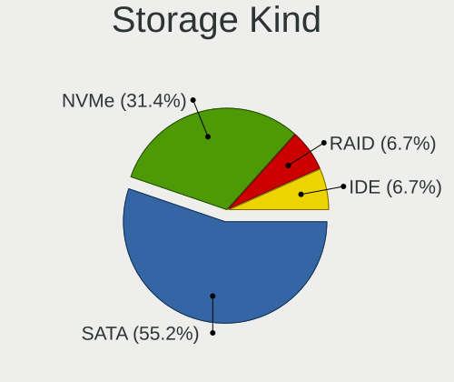

| Kind | Desktops | Percent |
|------|----------|---------|
| SATA | 58       | 55.24%  |
| NVMe | 33       | 31.43%  |
| RAID | 7        | 6.67%   |
| IDE  | 7        | 6.67%   |

Processor
---------

CPU Vendor
----------

Processor vendors

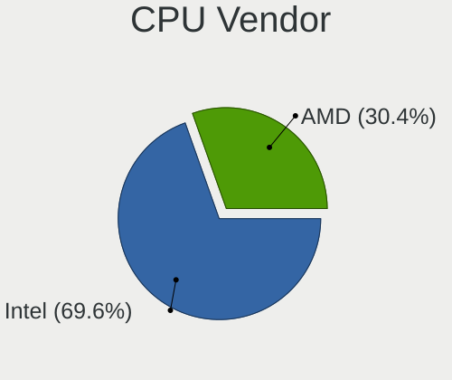

| Vendor | Desktops | Percent |
|--------|----------|---------|
| Intel  | 48       | 69.57%  |
| AMD    | 21       | 30.43%  |

CPU Model
---------

Processor models

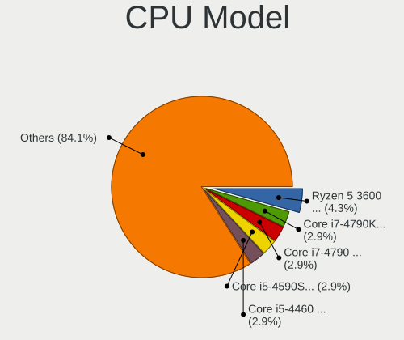

| Model                                       | Desktops | Percent |
|---------------------------------------------|----------|---------|
| AMD Ryzen 5 3600 6-Core Processor           | 3        | 4.35%   |
| Intel Core i7-4790K CPU @ 4.00GHz           | 2        | 2.9%    |
| Intel Core i7-4790 CPU @ 3.60GHz            | 2        | 2.9%    |
| Intel Core i5-4590S CPU @ 3.00GHz           | 2        | 2.9%    |
| Intel Core i5-4460 CPU @ 3.20GHz            | 2        | 2.9%    |
| Intel Core i5-10400 CPU @ 2.90GHz           | 2        | 2.9%    |
| Intel 13th Gen Core i7-13700                | 2        | 2.9%    |
| AMD Ryzen 9 5900X 12-Core Processor         | 2        | 2.9%    |
| AMD Ryzen 7 3700X 8-Core Processor          | 2        | 2.9%    |
| Intel Xeon CPU X5690 @ 3.47GHz              | 1        | 1.45%   |
| Intel Xeon CPU E5-2698 v3 @ 2.30GHz         | 1        | 1.45%   |
| Intel Pentium Dual-Core CPU T4500 @ 2.30GHz | 1        | 1.45%   |
| Intel Pentium CPU G4560T @ 2.90GHz          | 1        | 1.45%   |
| Intel Pentium CPU G4560 @ 3.50GHz           | 1        | 1.45%   |
| Intel Pentium CPU G3250 @ 3.20GHz           | 1        | 1.45%   |
| Intel N100                                  | 1        | 1.45%   |
| Intel Core i7-9700KF CPU @ 3.60GHz          | 1        | 1.45%   |
| Intel Core i7-9700 CPU @ 3.00GHz            | 1        | 1.45%   |
| Intel Core i7-8700K CPU @ 3.70GHz           | 1        | 1.45%   |
| Intel Core i7-7700K CPU @ 4.20GHz           | 1        | 1.45%   |
| Intel Core i7-6800K CPU @ 3.40GHz           | 1        | 1.45%   |
| Intel Core i7-6700 CPU @ 3.40GHz            | 1        | 1.45%   |
| Intel Core i7-4770 CPU @ 3.40GHz            | 1        | 1.45%   |
| Intel Core i7-3770 CPU @ 3.40GHz            | 1        | 1.45%   |
| Intel Core i7-14700KF                       | 1        | 1.45%   |
| Intel Core i7-10700K CPU @ 3.80GHz          | 1        | 1.45%   |
| Intel Core i7-10700 CPU @ 2.90GHz           | 1        | 1.45%   |
| Intel Core i5-7500 CPU @ 3.40GHz            | 1        | 1.45%   |
| Intel Core i5-6600T CPU @ 2.70GHz           | 1        | 1.45%   |
| Intel Core i5-6600K CPU @ 3.50GHz           | 1        | 1.45%   |
| Intel Core i5-6500T CPU @ 2.50GHz           | 1        | 1.45%   |
| Intel Core i5-6500 CPU @ 3.20GHz            | 1        | 1.45%   |
| Intel Core i5 CPU 650 @ 3.20GHz             | 1        | 1.45%   |
| Intel Core i3-4150 CPU @ 3.50GHz            | 1        | 1.45%   |
| Intel Core i3-4130 CPU @ 3.40GHz            | 1        | 1.45%   |
| Intel Core i3-4030U CPU @ 1.90GHz           | 1        | 1.45%   |
| Intel Core 2 Quad CPU Q9550 @ 2.83GHz       | 1        | 1.45%   |
| Intel Core 2 Quad CPU Q9300 @ 2.50GHz       | 1        | 1.45%   |
| Intel Core 2 Quad CPU Q6600 @ 2.40GHz       | 1        | 1.45%   |
| Intel Core 2 Duo CPU E7500 @ 2.93GHz        | 1        | 1.45%   |

CPU Model Family
----------------

Processor model prefix

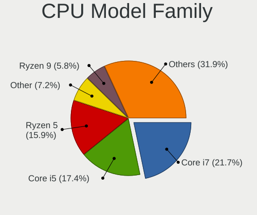

| Model                   | Desktops | Percent |
|-------------------------|----------|---------|
| Intel Core i7           | 15       | 21.74%  |
| Intel Core i5           | 12       | 17.39%  |
| AMD Ryzen 5             | 11       | 15.94%  |
| Other                   | 5        | 7.25%   |
| AMD Ryzen 9             | 4        | 5.8%    |
| Intel Pentium           | 3        | 4.35%   |
| Intel Core i3           | 3        | 4.35%   |
| Intel Core 2 Quad       | 3        | 4.35%   |
| AMD Ryzen 7             | 3        | 4.35%   |
| Intel Xeon              | 2        | 2.9%    |
| Intel Pentium Dual-Core | 1        | 1.45%   |
| Intel Core 2 Duo        | 1        | 1.45%   |
| Intel Core 2            | 1        | 1.45%   |
| Intel Celeron           | 1        | 1.45%   |
| Intel Atom              | 1        | 1.45%   |
| AMD Ryzen 7 PRO         | 1        | 1.45%   |
| AMD Phenom II X4        | 1        | 1.45%   |
| AMD FX                  | 1        | 1.45%   |

CPU Cores
---------

Number of processor cores

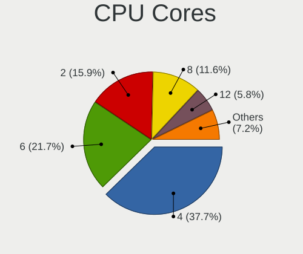

| Number | Desktops | Percent |
|--------|----------|---------|
| 4      | 26       | 37.68%  |
| 6      | 15       | 21.74%  |
| 2      | 11       | 15.94%  |
| 8      | 8        | 11.59%  |
| 12     | 4        | 5.8%    |
| 16     | 3        | 4.35%   |
| 32     | 1        | 1.45%   |
| 20     | 1        | 1.45%   |

CPU Sockets
-----------

Number of sockets

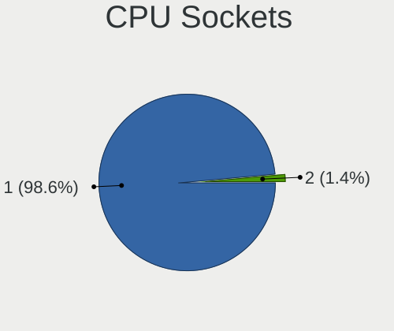

| Number | Desktops | Percent |
|--------|----------|---------|
| 1      | 68       | 98.55%  |
| 2      | 1        | 1.45%   |

CPU Threads
-----------

Threads per core (Hyper-Threading)

| Number | Desktops | Percent |
|--------|----------|---------|
| 2      | 47       | 68.12%  |
| 1      | 22       | 31.88%  |

CPU Op-Modes
------------

CPU Operation Modes (32-bit, 64-bit)

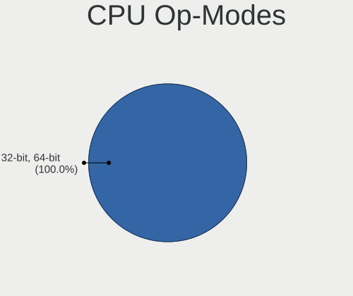

| Op mode        | Desktops | Percent |
|----------------|----------|---------|
| 32-bit, 64-bit | 69       | 100%    |

CPU Microcode
-------------

Microcode number

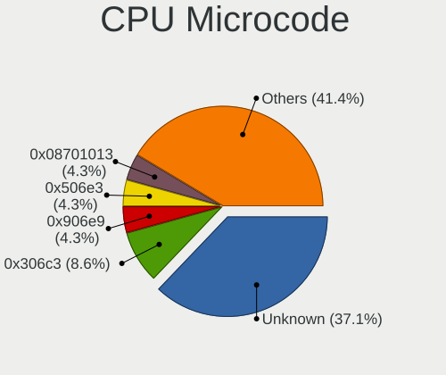

| Number     | Desktops | Percent |
|------------|----------|---------|
| Unknown    | 26       | 37.14%  |
| 0x306c3    | 6        | 8.57%   |
| 0x906e9    | 3        | 4.29%   |
| 0x506e3    | 3        | 4.29%   |
| 0x08701013 | 3        | 4.29%   |
| 0xa0655    | 2        | 2.86%   |
| 0x1067a    | 2        | 2.86%   |
| 0x10677    | 2        | 2.86%   |
| 0x0a20120a | 2        | 2.86%   |
| 0x08701021 | 2        | 2.86%   |
| 0xb06e0    | 1        | 1.43%   |
| 0xa0671    | 1        | 1.43%   |
| 0xa0653    | 1        | 1.43%   |
| 0x906ed    | 1        | 1.43%   |
| 0x906ea    | 1        | 1.43%   |
| 0x906c0    | 1        | 1.43%   |
| 0x6fb      | 1        | 1.43%   |
| 0x6f6      | 1        | 1.43%   |
| 0x406f1    | 1        | 1.43%   |
| 0x406c4    | 1        | 1.43%   |
| 0x40651    | 1        | 1.43%   |
| 0x0a601206 | 1        | 1.43%   |
| 0x0a601203 | 1        | 1.43%   |
| 0x0a201009 | 1        | 1.43%   |
| 0x08600103 | 1        | 1.43%   |
| 0x08108102 | 1        | 1.43%   |
| 0x0810100b | 1        | 1.43%   |
| 0x0800820d | 1        | 1.43%   |
| 0x010000db | 1        | 1.43%   |

CPU Microarch
-------------

Microarchitecture

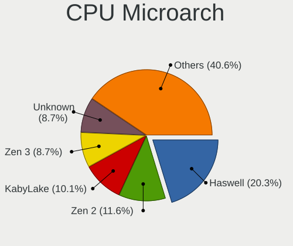

| Name             | Desktops | Percent |
|------------------|----------|---------|
| Haswell          | 14       | 20.29%  |
| Zen 2            | 8        | 11.59%  |
| KabyLake         | 7        | 10.14%  |
| Zen 3            | 6        | 8.7%    |
| Unknown          | 6        | 8.7%    |
| Skylake          | 5        | 7.25%   |
| Penryn           | 4        | 5.8%    |
| CometLake        | 4        | 5.8%    |
| Zen+             | 2        | 2.9%    |
| Westmere         | 2        | 2.9%    |
| Core             | 2        | 2.9%    |
| Alderlake Hybrid | 2        | 2.9%    |
| Zen              | 1        | 1.45%   |
| Silvermont       | 1        | 1.45%   |
| Piledriver       | 1        | 1.45%   |
| K10              | 1        | 1.45%   |
| IvyBridge        | 1        | 1.45%   |
| Icelake          | 1        | 1.45%   |
| Broadwell        | 1        | 1.45%   |

Graphics
--------

GPU Vendor
----------

Vendors of graphics cards

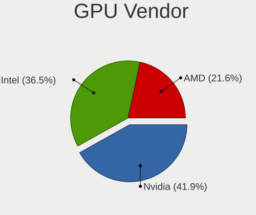

| Vendor | Desktops | Percent |
|--------|----------|---------|
| Nvidia | 31       | 41.89%  |
| Intel  | 27       | 36.49%  |
| AMD    | 16       | 21.62%  |

GPU Model
---------

Graphics card models

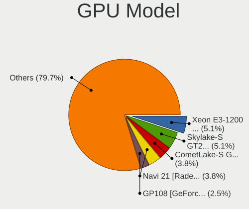

| Model                                                                       | Desktops | Percent |
|-----------------------------------------------------------------------------|----------|---------|
| Intel Xeon E3-1200 v3/4th Gen Core Processor Integrated Graphics Controller | 4        | 5.06%   |
| Intel Skylake-S GT2 [HD Graphics 530]                                       | 4        | 5.06%   |
| Intel CometLake-S GT2 [UHD Graphics 630]                                    | 3        | 3.8%    |
| AMD Navi 21 [Radeon RX 6800/6800 XT / 6900 XT]                              | 3        | 3.8%    |
| Nvidia GP108 [GeForce GT 1030]                                              | 2        | 2.53%   |
| Nvidia GP107 [GeForce GTX 1050 Ti]                                          | 2        | 2.53%   |
| Nvidia GP106 [GeForce GTX 1060 6GB]                                         | 2        | 2.53%   |
| Nvidia GP104 [GeForce GTX 1080]                                             | 2        | 2.53%   |
| Nvidia GM204 [GeForce GTX 970]                                              | 2        | 2.53%   |
| Nvidia GA106 [GeForce RTX 3060 Lite Hash Rate]                              | 2        | 2.53%   |
| Intel Raptor Lake-S GT1 [UHD Graphics 770]                                  | 2        | 2.53%   |
| Intel 4th Generation Core Processor Family Integrated Graphics Controller   | 2        | 2.53%   |
| Nvidia TU116 [GeForce GTX 1660 SUPER]                                       | 1        | 1.27%   |
| Nvidia TU116 [GeForce GTX 1650 SUPER]                                       | 1        | 1.27%   |
| Nvidia TU106 [GeForce RTX 2070 Rev. A]                                      | 1        | 1.27%   |
| Nvidia TU106 [GeForce RTX 2060 SUPER]                                       | 1        | 1.27%   |
| Nvidia TU106 [GeForce RTX 2060 Rev. A]                                      | 1        | 1.27%   |
| Nvidia TU104 [GeForce RTX 2070 SUPER]                                       | 1        | 1.27%   |
| Nvidia GT218 [NVS 300]                                                      | 1        | 1.27%   |
| Nvidia GT218 [GeForce G210]                                                 | 1        | 1.27%   |
| Nvidia GT216M [GeForce GT 330M]                                             | 1        | 1.27%   |
| Nvidia GM107 [GeForce GTX 750 Ti]                                           | 1        | 1.27%   |
| Nvidia GK208B [GeForce GT 730]                                              | 1        | 1.27%   |
| Nvidia GK208B [GeForce GT 710]                                              | 1        | 1.27%   |
| Nvidia GK110GL [Quadro K6000]                                               | 1        | 1.27%   |
| Nvidia GK106 [GeForce GTX 650 Ti]                                           | 1        | 1.27%   |
| Nvidia GF119 [GeForce GT 705]                                               | 1        | 1.27%   |
| Nvidia GB203 [GeForce RTX 5070 Ti]                                          | 1        | 1.27%   |
| Nvidia GA104 [GeForce RTX 3060 Ti]                                          | 1        | 1.27%   |
| Nvidia GA102 [GeForce RTX 3080]                                             | 1        | 1.27%   |
| Nvidia AD104 [GeForce RTX 4070 Ti]                                          | 1        | 1.27%   |
| Nvidia AD104 [GeForce RTX 4070 SUPER]                                       | 1        | 1.27%   |
| Nvidia AD103 [GeForce RTX 4080]                                             | 1        | 1.27%   |
| Intel RocketLake-S GT1 [UHD Graphics 750]                                   | 1        | 1.27%   |
| Intel Kaby Lake-S GT2 [HD Graphics 630]                                     | 1        | 1.27%   |
| Intel Kaby Lake-S GT1 [HD Graphics 610]                                     | 1        | 1.27%   |
| Intel JasperLake [UHD Graphics]                                             | 1        | 1.27%   |
| Intel IvyBridge GT2 [HD Graphics 4000]                                      | 1        | 1.27%   |
| Intel Haswell-ULT Integrated Graphics Controller                            | 1        | 1.27%   |
| Intel DG2 [Arc A380]                                                        | 1        | 1.27%   |

GPU Combo
---------

Combinations of graphics cards

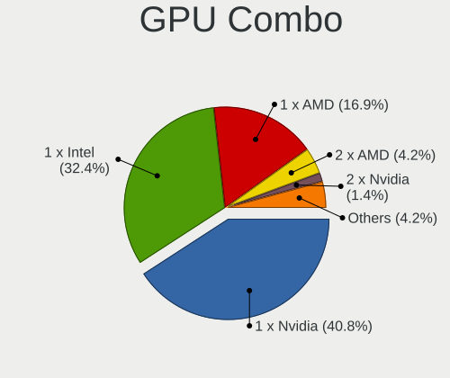

| Name           | Desktops | Percent |
|----------------|----------|---------|
| 1 x Nvidia     | 29       | 40.85%  |
| 1 x Intel      | 23       | 32.39%  |
| 1 x AMD        | 12       | 16.9%   |
| 2 x AMD        | 3        | 4.23%   |
| 2 x Nvidia     | 1        | 1.41%   |
| Intel + Nvidia | 1        | 1.41%   |
| Intel + AMD    | 1        | 1.41%   |
| AMD + Nvidia   | 1        | 1.41%   |

GPU Driver
----------

Free vs proprietary

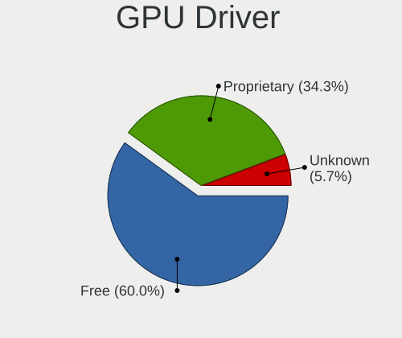

| Driver      | Desktops | Percent |
|-------------|----------|---------|
| Free        | 42       | 60%     |
| Proprietary | 24       | 34.29%  |
| Unknown     | 4        | 5.71%   |

GPU Memory
----------

Total video memory

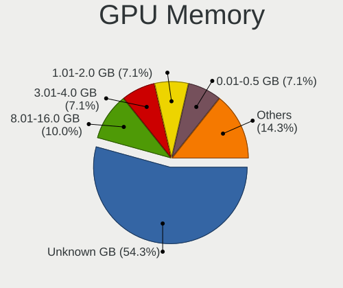

| Size in GB | Desktops | Percent |
|------------|----------|---------|
| Unknown    | 38       | 54.29%  |
| 8.01-16.0  | 7        | 10%     |
| 3.01-4.0   | 5        | 7.14%   |
| 1.01-2.0   | 5        | 7.14%   |
| 0.01-0.5   | 5        | 7.14%   |
| 0.51-1.0   | 4        | 5.71%   |
| 5.01-6.0   | 3        | 4.29%   |
| 7.01-8.0   | 2        | 2.86%   |
| 16.01-24.0 | 1        | 1.43%   |

Monitor
-------

Monitor Vendor
--------------

Monitor vendors

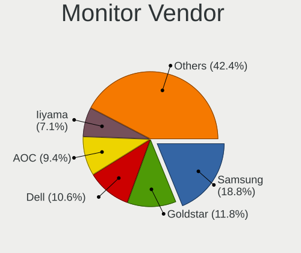

| Vendor               | Desktops | Percent |
|----------------------|----------|---------|
| Samsung Electronics  | 16       | 18.82%  |
| Goldstar             | 10       | 11.76%  |
| Dell                 | 9        | 10.59%  |
| AOC                  | 8        | 9.41%   |
| Iiyama               | 6        | 7.06%   |
| Hewlett-Packard      | 5        | 5.88%   |
| Ancor Communications | 5        | 5.88%   |
| Philips              | 4        | 4.71%   |
| BenQ                 | 4        | 4.71%   |
| Medion               | 3        | 3.53%   |
| Eizo                 | 2        | 2.35%   |
| Acer                 | 2        | 2.35%   |
| ViewSonic            | 1        | 1.18%   |
| Videoseven           | 1        | 1.18%   |
| UGD                  | 1        | 1.18%   |
| RTK                  | 1        | 1.18%   |
| PAR                  | 1        | 1.18%   |
| MSI                  | 1        | 1.18%   |
| LG Electronics       | 1        | 1.18%   |
| Fujitsu Siemens      | 1        | 1.18%   |
| DENON                | 1        | 1.18%   |
| Belinea              | 1        | 1.18%   |
| ASUSTek Computer     | 1        | 1.18%   |

Monitor Model
-------------

Monitor models

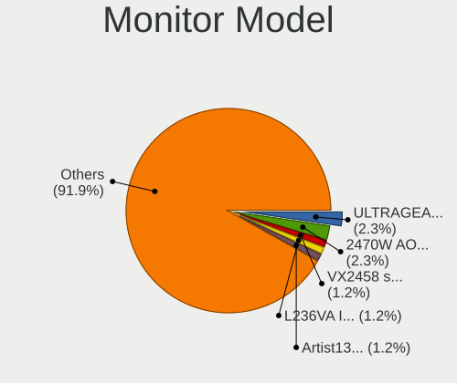

| Model                                                                  | Desktops | Percent |
|------------------------------------------------------------------------|----------|---------|
| Goldstar ULTRAGEAR GSM5BD3 2560x1440 697x392mm 31.5-inch               | 2        | 2.33%   |
| AOC 2470W AOC2470 1920x1080 521x293mm 23.5-inch                        | 2        | 2.33%   |
| ViewSonic VX2458 series VSC0437 1920x1080 521x293mm 23.5-inch          | 1        | 1.16%   |
| Videoseven L236VA IGM2380 1920x1080 521x293mm 23.5-inch                | 1        | 1.16%   |
| UGD Artist13.3pro UGD1302 1920x1080 294x165mm 13.3-inch                | 1        | 1.16%   |
| Samsung Electronics U28H75x SAM0DFE 3840x2160 608x345mm 27.5-inch      | 1        | 1.16%   |
| Samsung Electronics SyncMaster SAM0612 1920x1080 604x342mm 27.3-inch   | 1        | 1.16%   |
| Samsung Electronics SyncMaster SAM04DF 1360x768 410x230mm 18.5-inch    | 1        | 1.16%   |
| Samsung Electronics SMT27A950 SAM080F 1920x1080 598x336mm 27.0-inch    | 1        | 1.16%   |
| Samsung Electronics SMS27A650 SAM082E 1920x1080 598x336mm 27.0-inch    | 1        | 1.16%   |
| Samsung Electronics SM2333T SAM0737 1920x1080 510x290mm 23.1-inch      | 1        | 1.16%   |
| Samsung Electronics S27C750 SAM0A60 1920x1080 598x336mm 27.0-inch      | 1        | 1.16%   |
| Samsung Electronics S27B350 SAM08DC 1920x1080 598x336mm 27.0-inch      | 1        | 1.16%   |
| Samsung Electronics S24F350 SAM0D20 1920x1080 521x293mm 23.5-inch      | 1        | 1.16%   |
| Samsung Electronics LF27T450F SAM7097 1920x1080 597x336mm 27.0-inch    | 1        | 1.16%   |
| Samsung Electronics LCD Monitor U28E590 3840x2160                      | 1        | 1.16%   |
| Samsung Electronics LCD Monitor SAM0B60 1920x1080 887x500mm 40.1-inch  | 1        | 1.16%   |
| Samsung Electronics LCD Monitor SAM090B 1920x1080 1020x570mm 46.0-inch | 1        | 1.16%   |
| Samsung Electronics LCD Monitor SAM07C0 1920x1080 890x500mm 40.2-inch  | 1        | 1.16%   |
| Samsung Electronics C49HG9x SAM0E5E 3840x1080 1200x340mm 49.1-inch     | 1        | 1.16%   |
| Samsung Electronics C49HG9x SAM0E5D 3840x1080 1196x336mm 48.9-inch     | 1        | 1.16%   |
| Samsung Electronics C24F390 SAM0D2C 1920x1080 521x293mm 23.5-inch      | 1        | 1.16%   |
| RTK T007-3 RTK0072 1024x600                                            | 1        | 1.16%   |
| Philips PHL BDM3270 PHL08E7 2560x1440 708x398mm 32.0-inch              | 1        | 1.16%   |
| Philips PHL 275C5 PHLC0E4 1920x1080 600x340mm 27.2-inch                | 1        | 1.16%   |
| Philips PHL 272E1GJ PHLC245 1920x1080 598x336mm 27.0-inch              | 1        | 1.16%   |
| Philips PHL 246V5 PHLC0C5 1920x1080 531x299mm 24.0-inch                | 1        | 1.16%   |
| PAR LED1920X1080 PAR9C63 1920x1080 710x400mm 32.1-inch                 | 1        | 1.16%   |
| MSI MPG27CQ MSI3FA3 2560x1440 600x340mm 27.2-inch                      | 1        | 1.16%   |
| Medion Medion23.6 PC MEDB603 1920x1080 477x268mm 21.5-inch             | 1        | 1.16%   |
| Medion MD20434 MED36C8 1920x1080 521x293mm 23.5-inch                   | 1        | 1.16%   |
| Medion MD 20122 MED3601 1680x1050 474x296mm 22.0-inch                  | 1        | 1.16%   |
| LG Electronics LCD Monitor LG ULTRAWIDE 3440x1440                      | 1        | 1.16%   |
| Iiyama X2485 IVM610F 1920x1200 520x320mm 24.0-inch                     | 1        | 1.16%   |
| Iiyama PLE2483H IVM6113 1920x1080 531x299mm 24.0-inch                  | 1        | 1.16%   |
| Iiyama PL2796HS IVM6669 1920x1080 598x336mm 27.0-inch                  | 1        | 1.16%   |
| Iiyama PL2783Q IVM661F 2560x1440 597x336mm 27.0-inch                   | 1        | 1.16%   |
| Iiyama PL2773H IVM660A 1920x1080 598x336mm 27.0-inch                   | 1        | 1.16%   |
| Iiyama PL2495W IVM619D 1920x1200 528x343mm 24.8-inch                   | 1        | 1.16%   |
| Hewlett-Packard S2331 HWP2907 1920x1080 509x286mm 23.0-inch            | 1        | 1.16%   |

Monitor Resolution
------------------

Monitor screen resolution

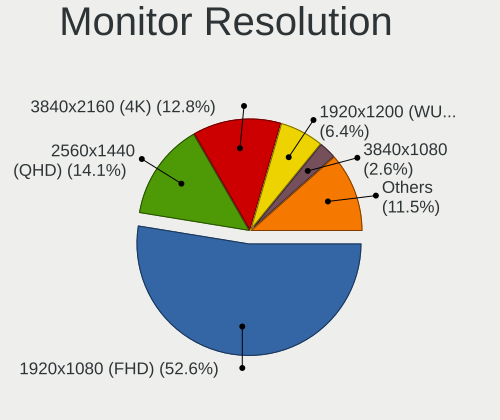

| Resolution         | Desktops | Percent |
|--------------------|----------|---------|
| 1920x1080 (FHD)    | 41       | 52.56%  |
| 2560x1440 (QHD)    | 11       | 14.1%   |
| 3840x2160 (4K)     | 10       | 12.82%  |
| 1920x1200 (WUXGA)  | 5        | 6.41%   |
| 3840x1080          | 2        | 2.56%   |
| 3440x1440          | 2        | 2.56%   |
| 1680x1050 (WSXGA+) | 1        | 1.28%   |
| 1600x1200          | 1        | 1.28%   |
| 1360x768           | 1        | 1.28%   |
| 1280x1024 (SXGA)   | 1        | 1.28%   |
| 1024x768 (XGA)     | 1        | 1.28%   |
| 1024x600           | 1        | 1.28%   |
| Unknown            | 1        | 1.28%   |

Monitor Diagonal
----------------

Diagonal size in inches

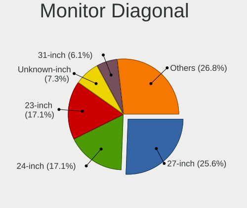

| Inches  | Desktops | Percent |
|---------|----------|---------|
| 27      | 21       | 25.61%  |
| 24      | 14       | 17.07%  |
| 23      | 14       | 17.07%  |
| Unknown | 6        | 7.32%   |
| 31      | 5        | 6.1%    |
| 21      | 4        | 4.88%   |
| 72      | 2        | 2.44%   |
| 32      | 2        | 2.44%   |
| 65      | 1        | 1.22%   |
| 54      | 1        | 1.22%   |
| 49      | 1        | 1.22%   |
| 47      | 1        | 1.22%   |
| 46      | 1        | 1.22%   |
| 34      | 1        | 1.22%   |
| 26      | 1        | 1.22%   |
| 25      | 1        | 1.22%   |
| 22      | 1        | 1.22%   |
| 20      | 1        | 1.22%   |
| 19      | 1        | 1.22%   |
| 18      | 1        | 1.22%   |
| 15      | 1        | 1.22%   |
| 13      | 1        | 1.22%   |

Monitor Width
-------------

Physical width

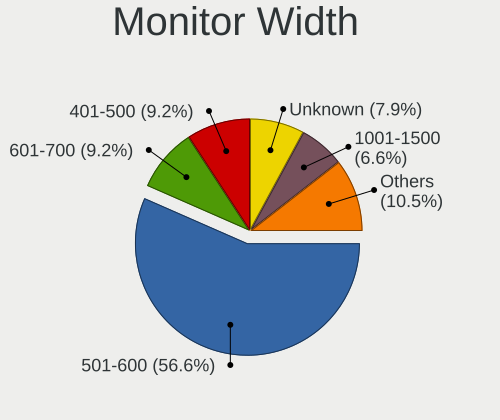

| Width in mm | Desktops | Percent |
|-------------|----------|---------|
| 501-600     | 43       | 56.58%  |
| 601-700     | 7        | 9.21%   |
| 401-500     | 7        | 9.21%   |
| Unknown     | 6        | 7.89%   |
| 1001-1500   | 5        | 6.58%   |
| 701-800     | 3        | 3.95%   |
| 1501-2000   | 2        | 2.63%   |
| 351-400     | 1        | 1.32%   |
| 301-350     | 1        | 1.32%   |
| 201-300     | 1        | 1.32%   |

Aspect Ratio
------------

Proportional relationship between the width and the height

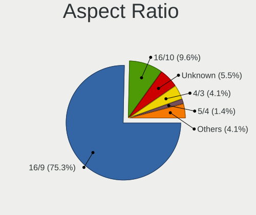

| Ratio   | Desktops | Percent |
|---------|----------|---------|
| 16/9    | 55       | 75.34%  |
| 16/10   | 7        | 9.59%   |
| Unknown | 4        | 5.48%   |
| 4/3     | 3        | 4.11%   |
| 5/4     | 1        | 1.37%   |
| 32/9    | 1        | 1.37%   |
| 3/2     | 1        | 1.37%   |
| 21/9    | 1        | 1.37%   |

Monitor Area
------------

Area in inch²

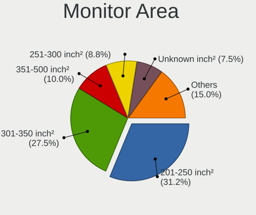

| Area in inch² | Desktops | Percent |
|----------------|----------|---------|
| 201-250        | 25       | 31.25%  |
| 301-350        | 22       | 27.5%   |
| 351-500        | 8        | 10%     |
| 251-300        | 7        | 8.75%   |
| Unknown        | 6        | 7.5%    |
| More than 1000 | 4        | 5%      |
| 501-1000       | 3        | 3.75%   |
| 151-200        | 2        | 2.5%    |
| 71-80          | 1        | 1.25%   |
| 141-150        | 1        | 1.25%   |
| 101-110        | 1        | 1.25%   |

Pixel Density
-------------

Pixels per inch

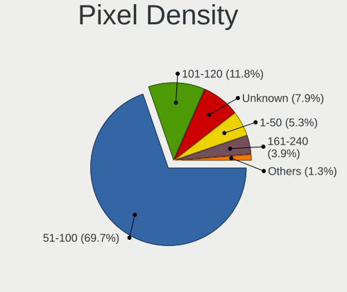

| Density | Desktops | Percent |
|---------|----------|---------|
| 51-100  | 53       | 69.74%  |
| 101-120 | 9        | 11.84%  |
| Unknown | 6        | 7.89%   |
| 1-50    | 4        | 5.26%   |
| 161-240 | 3        | 3.95%   |
| 121-160 | 1        | 1.32%   |

Multiple Monitors
-----------------

Total monitors connected

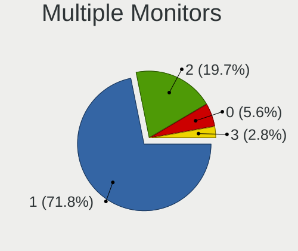

| Total | Desktops | Percent |
|-------|----------|---------|
| 1     | 51       | 71.83%  |
| 2     | 14       | 19.72%  |
| 0     | 4        | 5.63%   |
| 3     | 2        | 2.82%   |

Network
-------

Net Controller Vendor
---------------------

Controller vendors

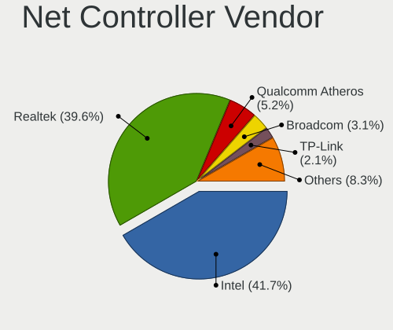

| Vendor                   | Desktops | Percent |
|--------------------------|----------|---------|
| Intel                    | 40       | 41.67%  |
| Realtek Semiconductor    | 38       | 39.58%  |
| Qualcomm Atheros         | 5        | 5.21%   |
| Broadcom                 | 3        | 3.13%   |
| TP-Link                  | 2        | 2.08%   |
| Ralink Technology        | 2        | 2.08%   |
| Zinwell                  | 1        | 1.04%   |
| Mellanox Technologies    | 1        | 1.04%   |
| MediaTek                 | 1        | 1.04%   |
| Marvell Technology Group | 1        | 1.04%   |
| D-Link                   | 1        | 1.04%   |
| Unknown                  | 1        | 1.04%   |

Net Controller Model
--------------------

Controller models

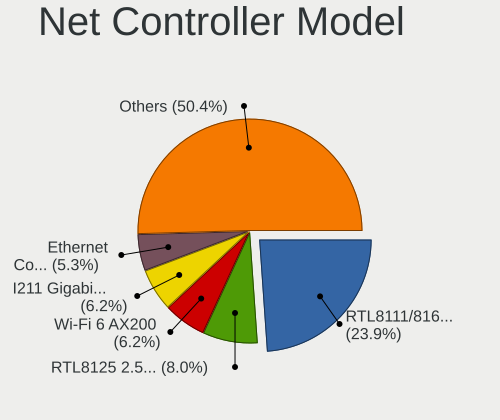

| Model                                                                  | Desktops | Percent |
|------------------------------------------------------------------------|----------|---------|
| Realtek RTL8111/8168/8211/8411 PCI Express Gigabit Ethernet Controller | 27       | 23.89%  |
| Realtek RTL8125 2.5GbE Controller                                      | 9        | 7.96%   |
| Intel Wi-Fi 6 AX200                                                    | 7        | 6.19%   |
| Intel I211 Gigabit Network Connection                                  | 7        | 6.19%   |
| Intel Ethernet Connection (2) I219-V                                   | 6        | 5.31%   |
| Intel Ethernet Controller I225-V                                       | 5        | 4.42%   |
| Intel Ethernet Connection (2) I219-LM                                  | 4        | 3.54%   |
| Intel 700 Series Chipset CNVi WiFi                                     | 3        | 2.65%   |
| Realtek RTL8812AU 802.11a/b/g/n/ac 2T2R DB WLAN Adapter                | 2        | 1.77%   |
| Intel Ethernet Connection (2) I218-V                                   | 2        | 1.77%   |
| Intel Dual Band Wireless-AC 3168NGW [Stone Peak]                       | 2        | 1.77%   |
| Broadcom BCM4360 802.11ac Dual Band Wireless Network Adapter           | 2        | 1.77%   |
| Zinwell ZW-N290 802.11n [Realtek RTL8192U]                             | 1        | 0.88%   |
| TP-Link TL-WN823N v2/v3 [Realtek RTL8192EU]                            | 1        | 0.88%   |
| TP-Link 802.11ac NIC                                                   | 1        | 0.88%   |
| Realtek RTL8852AE 802.11ax PCIe Wireless Network Adapter               | 1        | 0.88%   |
| Realtek RTL8821AE 802.11ac PCIe Wireless Network Adapter               | 1        | 0.88%   |
| Realtek RTL8192EE PCIe Wireless Network Adapter                        | 1        | 0.88%   |
| Realtek RTL8191SEvB Wireless LAN Controller                            | 1        | 0.88%   |
| Realtek RTL8188CUS 802.11n WLAN Adapter                                | 1        | 0.88%   |
| Realtek RTL810xE PCI Express Fast Ethernet controller                  | 1        | 0.88%   |
| Realtek Killer E3000 2.5GbE Controller                                 | 1        | 0.88%   |
| Realtek 802.11ac NIC                                                   | 1        | 0.88%   |
| Ralink RT5370 Wireless Adapter                                         | 1        | 0.88%   |
| Ralink RT2870/RT3070 Wireless Adapter                                  | 1        | 0.88%   |
| Qualcomm Atheros QCA9565 / AR9565 Wireless Network Adapter             | 1        | 0.88%   |
| Qualcomm Atheros QCA8171 Gigabit Ethernet                              | 1        | 0.88%   |
| Qualcomm Atheros Killer E220x Gigabit Ethernet Controller              | 1        | 0.88%   |
| Qualcomm Atheros AR93xx Wireless Network Adapter                       | 1        | 0.88%   |
| Qualcomm Atheros AR8161 Gigabit Ethernet                               | 1        | 0.88%   |
| Mellanox MT26448 [ConnectX EN 10GigE, PCIe 2.0 5GT/s]                  | 1        | 0.88%   |
| MediaTek MT7922 802.11ax PCI Express Wireless Network Adapter          | 1        | 0.88%   |
| Marvell Group 88E8056 PCI-E Gigabit Ethernet Controller                | 1        | 0.88%   |
| Intel Wireless 8265 / 8275                                             | 1        | 0.88%   |
| Intel Wi-Fi 6E(802.11ax) AX210/AX1675* 2x2 [Typhoon Peak]              | 1        | 0.88%   |
| Intel Jasper Lake PCH CNVi WiFi                                        | 1        | 0.88%   |
| Intel I350 Gigabit Network Connection                                  | 1        | 0.88%   |
| Intel Ethernet controller                                              | 1        | 0.88%   |
| Intel Ethernet Connection I217-V                                       | 1        | 0.88%   |
| Intel Ethernet Connection I217-LM                                      | 1        | 0.88%   |

Wireless Vendor
---------------

Wireless vendors

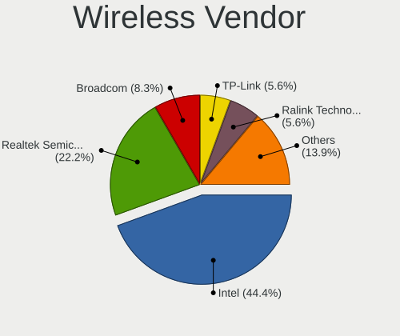

| Vendor                | Desktops | Percent |
|-----------------------|----------|---------|
| Intel                 | 16       | 44.44%  |
| Realtek Semiconductor | 8        | 22.22%  |
| Broadcom              | 3        | 8.33%   |
| TP-Link               | 2        | 5.56%   |
| Ralink Technology     | 2        | 5.56%   |
| Qualcomm Atheros      | 2        | 5.56%   |
| Zinwell               | 1        | 2.78%   |
| MediaTek              | 1        | 2.78%   |
| D-Link                | 1        | 2.78%   |

Wireless Model
--------------

Wireless models

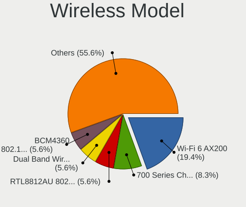

| Model                                                                | Desktops | Percent |
|----------------------------------------------------------------------|----------|---------|
| Intel Wi-Fi 6 AX200                                                  | 7        | 19.44%  |
| Intel 700 Series Chipset CNVi WiFi                                   | 3        | 8.33%   |
| Realtek RTL8812AU 802.11a/b/g/n/ac 2T2R DB WLAN Adapter              | 2        | 5.56%   |
| Intel Dual Band Wireless-AC 3168NGW [Stone Peak]                     | 2        | 5.56%   |
| Broadcom BCM4360 802.11ac Dual Band Wireless Network Adapter         | 2        | 5.56%   |
| Zinwell ZW-N290 802.11n [Realtek RTL8192U]                           | 1        | 2.78%   |
| TP-Link TL-WN823N v2/v3 [Realtek RTL8192EU]                          | 1        | 2.78%   |
| TP-Link 802.11ac NIC                                                 | 1        | 2.78%   |
| Realtek RTL8852AE 802.11ax PCIe Wireless Network Adapter             | 1        | 2.78%   |
| Realtek RTL8821AE 802.11ac PCIe Wireless Network Adapter             | 1        | 2.78%   |
| Realtek RTL8192EE PCIe Wireless Network Adapter                      | 1        | 2.78%   |
| Realtek RTL8191SEvB Wireless LAN Controller                          | 1        | 2.78%   |
| Realtek RTL8188CUS 802.11n WLAN Adapter                              | 1        | 2.78%   |
| Realtek 802.11ac NIC                                                 | 1        | 2.78%   |
| Ralink RT5370 Wireless Adapter                                       | 1        | 2.78%   |
| Ralink RT2870/RT3070 Wireless Adapter                                | 1        | 2.78%   |
| Qualcomm Atheros QCA9565 / AR9565 Wireless Network Adapter           | 1        | 2.78%   |
| Qualcomm Atheros AR93xx Wireless Network Adapter                     | 1        | 2.78%   |
| MediaTek MT7922 802.11ax PCI Express Wireless Network Adapter        | 1        | 2.78%   |
| Intel Wireless 8265 / 8275                                           | 1        | 2.78%   |
| Intel Wi-Fi 6E(802.11ax) AX210/AX1675* 2x2 [Typhoon Peak]            | 1        | 2.78%   |
| Intel Jasper Lake PCH CNVi WiFi                                      | 1        | 2.78%   |
| Intel Alder Lake-N PCH CNVi WiFi                                     | 1        | 2.78%   |
| D-Link DWA-131 Wireless N Nano Adapter (Rev. E1) [Realtek RTL8192EU] | 1        | 2.78%   |
| Broadcom BCM4352 802.11ac Dual Band Wireless Network Adapter         | 1        | 2.78%   |

Ethernet Vendor
---------------

Ethernet vendors

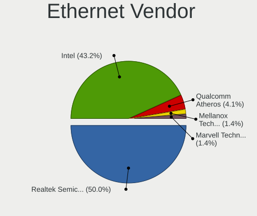

| Vendor                   | Desktops | Percent |
|--------------------------|----------|---------|
| Realtek Semiconductor    | 37       | 50%     |
| Intel                    | 32       | 43.24%  |
| Qualcomm Atheros         | 3        | 4.05%   |
| Mellanox Technologies    | 1        | 1.35%   |
| Marvell Technology Group | 1        | 1.35%   |

Ethernet Model
--------------

Ethernet models

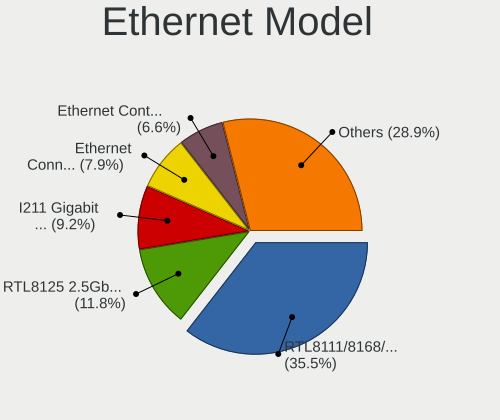

| Model                                                                  | Desktops | Percent |
|------------------------------------------------------------------------|----------|---------|
| Realtek RTL8111/8168/8211/8411 PCI Express Gigabit Ethernet Controller | 27       | 35.53%  |
| Realtek RTL8125 2.5GbE Controller                                      | 9        | 11.84%  |
| Intel I211 Gigabit Network Connection                                  | 7        | 9.21%   |
| Intel Ethernet Connection (2) I219-V                                   | 6        | 7.89%   |
| Intel Ethernet Controller I225-V                                       | 5        | 6.58%   |
| Intel Ethernet Connection (2) I219-LM                                  | 4        | 5.26%   |
| Intel Ethernet Connection (2) I218-V                                   | 2        | 2.63%   |
| Realtek RTL810xE PCI Express Fast Ethernet controller                  | 1        | 1.32%   |
| Realtek Killer E3000 2.5GbE Controller                                 | 1        | 1.32%   |
| Qualcomm Atheros QCA8171 Gigabit Ethernet                              | 1        | 1.32%   |
| Qualcomm Atheros Killer E220x Gigabit Ethernet Controller              | 1        | 1.32%   |
| Qualcomm Atheros AR8161 Gigabit Ethernet                               | 1        | 1.32%   |
| Mellanox MT26448 [ConnectX EN 10GigE, PCIe 2.0 5GT/s]                  | 1        | 1.32%   |
| Marvell Group 88E8056 PCI-E Gigabit Ethernet Controller                | 1        | 1.32%   |
| Intel I350 Gigabit Network Connection                                  | 1        | 1.32%   |
| Intel Ethernet controller                                              | 1        | 1.32%   |
| Intel Ethernet Connection I217-V                                       | 1        | 1.32%   |
| Intel Ethernet Connection I217-LM                                      | 1        | 1.32%   |
| Intel Ethernet Connection (7) I219-V                                   | 1        | 1.32%   |
| Intel Ethernet Connection (11) I219-V                                  | 1        | 1.32%   |
| Intel 82567LM-3 Gigabit Network Connection                             | 1        | 1.32%   |
| Intel 82566DC-2 Gigabit Network Connection                             | 1        | 1.32%   |
| Intel 82566DC Gigabit Network Connection                               | 1        | 1.32%   |

Net Controller Kind
-------------------

Ethernet, WiFi or modem

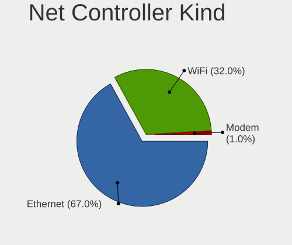

| Kind     | Desktops | Percent |
|----------|----------|---------|
| Ethernet | 69       | 66.99%  |
| WiFi     | 33       | 32.04%  |
| Modem    | 1        | 0.97%   |

Used Controller
---------------

Currently used network controller

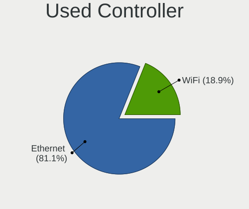

| Kind     | Desktops | Percent |
|----------|----------|---------|
| Ethernet | 60       | 81.08%  |
| WiFi     | 14       | 18.92%  |

NICs
----

Total network controllers on board

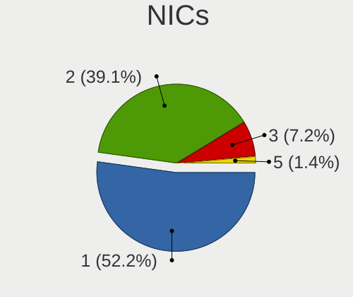

| Total | Desktops | Percent |
|-------|----------|---------|
| 1     | 36       | 52.17%  |
| 2     | 27       | 39.13%  |
| 3     | 5        | 7.25%   |
| 5     | 1        | 1.45%   |

IPv6
----

IPv6 vs IPv4

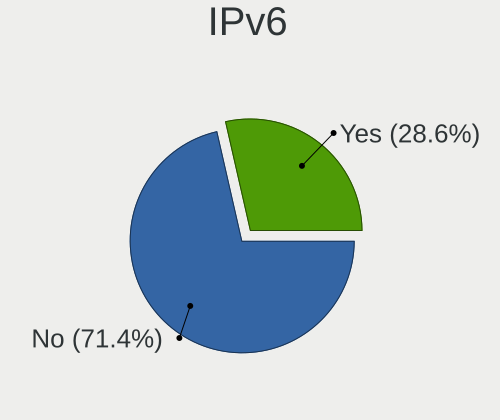

| Used | Desktops | Percent |
|------|----------|---------|
| No   | 50       | 71.43%  |
| Yes  | 20       | 28.57%  |

Bluetooth
---------

Bluetooth Vendor
----------------

Controller vendors

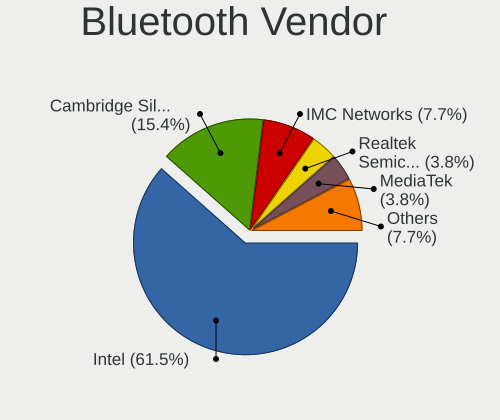

| Vendor                  | Desktops | Percent |
|-------------------------|----------|---------|
| Intel                   | 16       | 61.54%  |
| Cambridge Silicon Radio | 4        | 15.38%  |
| IMC Networks            | 2        | 7.69%   |
| Realtek Semiconductor   | 1        | 3.85%   |
| MediaTek                | 1        | 3.85%   |
| Broadcom                | 1        | 3.85%   |
| ASUSTek Computer        | 1        | 3.85%   |

Bluetooth Model
---------------

Controller models

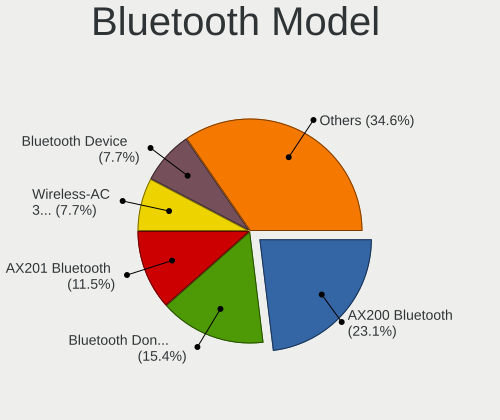

| Model                                               | Desktops | Percent |
|-----------------------------------------------------|----------|---------|
| Intel AX200 Bluetooth                               | 6        | 23.08%  |
| Cambridge Silicon Radio Bluetooth Dongle (HCI mode) | 4        | 15.38%  |
| Intel AX201 Bluetooth                               | 3        | 11.54%  |
| Intel Wireless-AC 3168 Bluetooth                    | 2        | 7.69%   |
| Intel Bluetooth Device                              | 2        | 7.69%   |
| Intel AX210 Bluetooth                               | 2        | 7.69%   |
| Realtek Bluetooth Radio                             | 1        | 3.85%   |
| MediaTek Wireless_Device                            | 1        | 3.85%   |
| Intel Bluetooth wireless interface                  | 1        | 3.85%   |
| IMC Networks Bluetooth Radio                        | 1        | 3.85%   |
| IMC Networks Bluetooth Module                       | 1        | 3.85%   |
| Broadcom Bluetooth 3.0 Device                       | 1        | 3.85%   |
| ASUS BCM20702A0                                     | 1        | 3.85%   |

Sound
-----

Sound Vendor
------------

Sound card vendors

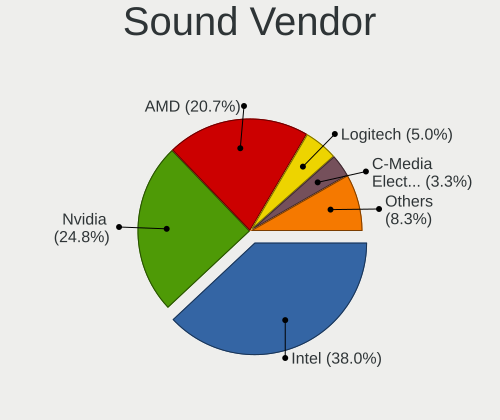

| Vendor                                       | Desktops | Percent |
|----------------------------------------------|----------|---------|
| Intel                                        | 46       | 38.02%  |
| Nvidia                                       | 30       | 24.79%  |
| AMD                                          | 25       | 20.66%  |
| Logitech                                     | 6        | 4.96%   |
| C-Media Electronics                          | 4        | 3.31%   |
| SteelSeries ApS                              | 2        | 1.65%   |
| Zoran Co. Personal Media Division (Nogatech) | 1        | 0.83%   |
| www.hirestech.com 2012 REV 1.8               | 1        | 0.83%   |
| Texas Instruments                            | 1        | 0.83%   |
| Sony                                         | 1        | 0.83%   |
| Micro Star International                     | 1        | 0.83%   |
| Kingston Technology                          | 1        | 0.83%   |
| Generalplus Technology                       | 1        | 0.83%   |
| beyerdynamic                                 | 1        | 0.83%   |

Sound Model
-----------

Sound card models

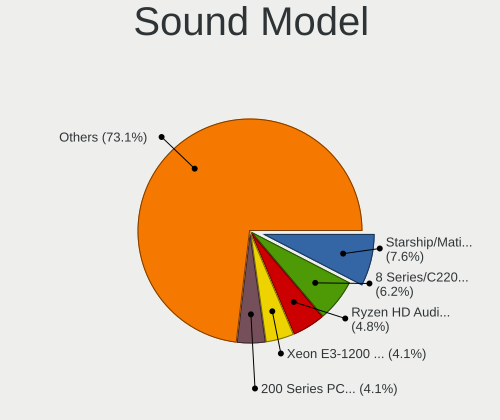

| Model                                                                   | Desktops | Percent |
|-------------------------------------------------------------------------|----------|---------|
| AMD Starship/Matisse HD Audio Controller                                | 11       | 7.59%   |
| Intel 8 Series/C220 Series Chipset High Definition Audio Controller     | 9        | 6.21%   |
| AMD Ryzen HD Audio Controller                                           | 7        | 4.83%   |
| Intel Xeon E3-1200 v3/4th Gen Core Processor HD Audio Controller        | 6        | 4.14%   |
| Intel 200 Series PCH HD Audio                                           | 6        | 4.14%   |
| Intel 100 Series/C230 Series Chipset Family HD Audio Controller         | 5        | 3.45%   |
| Intel Raptor Lake High Definition Audio Controller                      | 4        | 2.76%   |
| AMD Navi 21/23 HDMI/DP Audio Controller                                 | 4        | 2.76%   |
| Nvidia TU106 High Definition Audio Controller                           | 3        | 2.07%   |
| Intel Comet Lake PCH cAVS                                               | 3        | 2.07%   |
| Intel 82801I (ICH9 Family) HD Audio Controller                          | 3        | 2.07%   |
| AMD Renoir/Cezanne HDMI/DP Audio Controller                             | 3        | 2.07%   |
| AMD Oland/Hainan/Cape Verde/Pitcairn HDMI Audio [Radeon HD 7000 Series] | 3        | 2.07%   |
| Nvidia High Definition Audio Controller                                 | 2        | 1.38%   |
| Nvidia GP108 High Definition Audio Controller                           | 2        | 1.38%   |
| Nvidia GP107GL High Definition Audio Controller                         | 2        | 1.38%   |
| Nvidia GP106 High Definition Audio Controller                           | 2        | 1.38%   |
| Nvidia GP104 High Definition Audio Controller                           | 2        | 1.38%   |
| Nvidia GM204 High Definition Audio Controller                           | 2        | 1.38%   |
| Nvidia GK208 HDMI/DP Audio Controller                                   | 2        | 1.38%   |
| Nvidia GA106 High Definition Audio Controller                           | 2        | 1.38%   |
| Nvidia AD104 High Definition Audio Controller                           | 2        | 1.38%   |
| Logitech Blue Microphones                                               | 2        | 1.38%   |
| Intel C610/X99 series chipset HD Audio Controller                       | 2        | 1.38%   |
| Intel 9 Series Chipset Family HD Audio Controller                       | 2        | 1.38%   |
| AMD SBx00 Azalia (Intel HDA)                                            | 2        | 1.38%   |
| AMD Raven/Raven2/Fenghuang HDMI/DP Audio Controller                     | 2        | 1.38%   |
| AMD Navi 31 HDMI/DP Audio                                               | 2        | 1.38%   |
| Zoran Co. Personal Media Division (Nogatech) USB Audio and HID          | 1        | 0.69%   |
| www.hirestech.com 2012 REV 1.8 Music Streamer II                        | 1        | 0.69%   |
| Texas Instruments SMSL AD18 AMP                                         | 1        | 0.69%   |
| SteelSeries ApS SteelSeries Arctis 7                                    | 1        | 0.69%   |
| SteelSeries ApS Arctis Nova 3                                           | 1        | 0.69%   |
| Sony DualShock 4 [CUH-ZCT2x]                                            | 1        | 0.69%   |
| Nvidia TU116 High Definition Audio Controller                           | 1        | 0.69%   |
| Nvidia TU104 HD Audio Controller                                        | 1        | 0.69%   |
| Nvidia GT216 HDMI Audio Controller                                      | 1        | 0.69%   |
| Nvidia GM107 High Definition Audio Controller [GeForce 940MX]           | 1        | 0.69%   |
| Nvidia GK110 High Definition Audio Controller                           | 1        | 0.69%   |
| Nvidia GK106 HDMI Audio Controller                                      | 1        | 0.69%   |

Memory
------

Memory Vendor
-------------

Memory module vendors

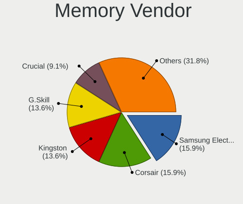

| Vendor                       | Desktops | Percent |
|------------------------------|----------|---------|
| Samsung Electronics          | 7        | 15.91%  |
| Corsair                      | 7        | 15.91%  |
| Kingston                     | 6        | 13.64%  |
| G.Skill                      | 6        | 13.64%  |
| Crucial                      | 4        | 9.09%   |
| SK hynix                     | 3        | 6.82%   |
| Unknown                      | 2        | 4.55%   |
| Qimonda                      | 2        | 4.55%   |
| Micron Technology            | 2        | 4.55%   |
| Unknown (0x7F7FB5FFFFFFFFFF) | 1        | 2.27%   |
| Patriot                      | 1        | 2.27%   |
| MTASE                        | 1        | 2.27%   |
| Dane-Elec                    | 1        | 2.27%   |
| A-DATA Technology            | 1        | 2.27%   |

Memory Model
------------

Memory module models

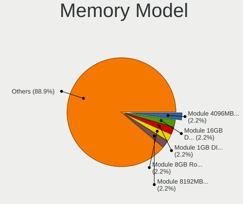

| Model                                                         | Desktops | Percent |
|---------------------------------------------------------------|----------|---------|
| Unknown RAM Module 4096MB DIMM DDR3 1333MT/s                  | 1        | 2.22%   |
| Unknown RAM Module 16GB DIMM DDR4 2400MT/s                    | 1        | 2.22%   |
| Unknown (0x7F7FB5FFFFFFFFFF) RAM Module 1GB DIMM DDR2 667MT/s | 1        | 2.22%   |
| SK hynix RAM Module 4GB DIMM DDR3 1066MT/s                    | 1        | 2.22%   |
| SK hynix RAM HMCG78AGBUA081N 16GB DIMM DDR5 5600MT/s          | 1        | 2.22%   |
| SK hynix RAM HMA451U6AFR8N-TF 4GB DIMM DDR4 2133MT/s          | 1        | 2.22%   |
| Samsung RAM Module 8GB Row Of Chips LPDDR4 2933MT/s           | 1        | 2.22%   |
| Samsung RAM Module 8192MB SODIMM DDR4 2133MT/s                | 1        | 2.22%   |
| Samsung RAM Module 2GB DIMM DDR3 1333MT/s                     | 1        | 2.22%   |
| Samsung RAM M378B5773CH0-CH9 2GB DIMM DDR3 1867MT/s           | 1        | 2.22%   |
| Samsung RAM M378B5673FH0-CH9 2GB DIMM DDR3 1600MT/s           | 1        | 2.22%   |
| Samsung RAM M378A1K43CB2-CRC 8GB DIMM DDR4 3500MT/s           | 1        | 2.22%   |
| Samsung RAM M378A1G44AB0-CWE 8GB DIMM DDR4 3200MT/s           | 1        | 2.22%   |
| Samsung RAM 99U5429-007.A00LF 2GB DIMM DDR2 800MT/s           | 1        | 2.22%   |
| Qimonda RAM Module 2GB DIMM DDR2 667MT/s                      | 1        | 2.22%   |
| Qimonda RAM 64T256020EU2.5C2 2GB DIMM DDR2 800MT/s            | 1        | 2.22%   |
| Patriot RAM 3200 C16 Series 8GB DIMM DDR4 3600MT/s            | 1        | 2.22%   |
| MTASE RAM Module 4GB DIMM DDR3 1600MT/s                       | 1        | 2.22%   |
| Micron RAM 8ATF2G64AZ-3G2E1 16GB DIMM DDR4 3200MT/s           | 1        | 2.22%   |
| Micron RAM 16JTF1G64AZ-1G6E1 8GB DIMM DDR3 1600MT/s           | 1        | 2.22%   |
| Kingston RAM KHX4000C19D4/8GX 8GB DIMM DDR4 3600MT/s          | 1        | 2.22%   |
| Kingston RAM KHX2400C15S4/16G 16GB SODIMM DDR4 2400MT/s       | 1        | 2.22%   |
| Kingston RAM KHX1600C10D3/8G 8GB DIMM DDR3 2133MT/s           | 1        | 2.22%   |
| Kingston RAM 99U5700-028.A00G 8GB SODIMM DDR4 2400MT/s        | 1        | 2.22%   |
| Kingston RAM 9905734-082.A00G 16GB DIMM DDR4 3200MT/s         | 1        | 2.22%   |
| Kingston RAM 9905625-074.A00G 16GB DIMM DDR4 2400MT/s         | 1        | 2.22%   |
| G.Skill RAM F5-6000J3636F16G 16GB DIMM DDR5 6400MT/s          | 1        | 2.22%   |
| G.Skill RAM F5-6000J3040F16G 16GB DIMM DDR5 6000MT/s          | 1        | 2.22%   |
| G.Skill RAM F4-3200C16-16GVK 16GB DIMM DDR4 3600MT/s          | 1        | 2.22%   |
| G.Skill RAM F4-3200C16-16GIS 16GB DIMM DDR4 3600MT/s          | 1        | 2.22%   |
| G.Skill RAM F4-3000C16-8GISB 8GB DIMM DDR4 3200MT/s           | 1        | 2.22%   |
| G.Skill RAM F3-1600C11-8GIS 8GB DIMM DDR3 1600MT/s            | 1        | 2.22%   |
| Dane-Elec RAM Module 1GB DIMM DDR2 667MT/s                    | 1        | 2.22%   |
| Crucial RAM CT8G4DFS8266.C8FE 8GB DIMM DDR4 2667MT/s          | 1        | 2.22%   |
| Crucial RAM CT8G4DFS824A.C8FHD1 8GB DIMM DDR4 3200MT/s        | 1        | 2.22%   |
| Crucial RAM CT102464BF160B.M16 8GB SODIMM DDR3 1600MT/s       | 1        | 2.22%   |
| Crucial RAM CT102464BA160B.C16 8GB DIMM DDR3 1600MT/s         | 1        | 2.22%   |
| Corsair RAM Module 2GB DIMM DDR2 800MT/s                      | 1        | 2.22%   |
| Corsair RAM CMW64GX4M2E3200C16 32GB DIMM DDR4 3200MT/s        | 1        | 2.22%   |
| Corsair RAM CMW16GX4M2A2666C16 8GB DIMM DDR4 2667MT/s         | 1        | 2.22%   |

Memory Kind
-----------

Memory module kinds

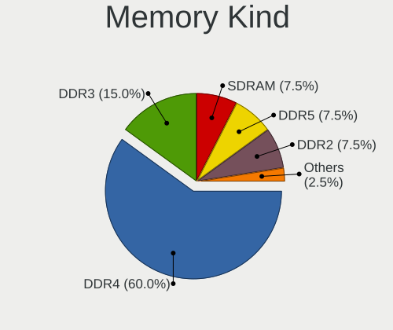

| Kind   | Desktops | Percent |
|--------|----------|---------|
| DDR4   | 24       | 60%     |
| DDR3   | 6        | 15%     |
| SDRAM  | 3        | 7.5%    |
| DDR5   | 3        | 7.5%    |
| DDR2   | 3        | 7.5%    |
| LPDDR4 | 1        | 2.5%    |

Memory Form Factor
------------------

Physical design of the memory module

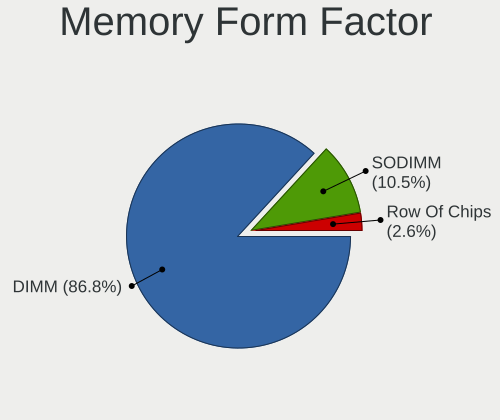

| Name         | Desktops | Percent |
|--------------|----------|---------|
| DIMM         | 33       | 86.84%  |
| SODIMM       | 4        | 10.53%  |
| Row Of Chips | 1        | 2.63%   |

Memory Size
-----------

Memory module size

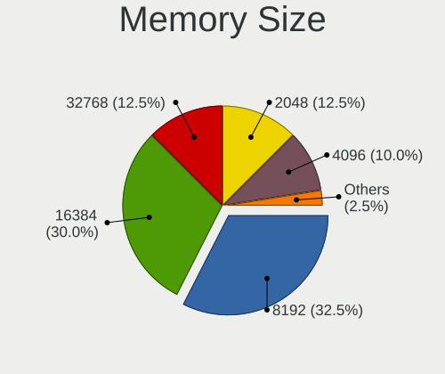

| Size  | Desktops | Percent |
|-------|----------|---------|
| 8192  | 13       | 32.5%   |
| 16384 | 12       | 30%     |
| 32768 | 5        | 12.5%   |
| 2048  | 5        | 12.5%   |
| 4096  | 4        | 10%     |
| 1024  | 1        | 2.5%    |

Memory Speed
------------

Memory module speed

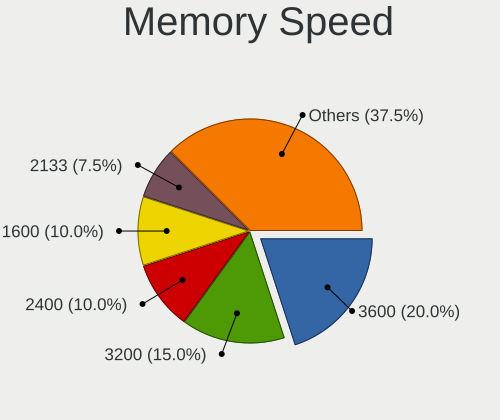

| Speed | Desktops | Percent |
|-------|----------|---------|
| 3600  | 8        | 20%     |
| 3200  | 6        | 15%     |
| 2400  | 4        | 10%     |
| 1600  | 4        | 10%     |
| 2133  | 3        | 7.5%    |
| 2667  | 2        | 5%      |
| 1333  | 2        | 5%      |
| 800   | 2        | 5%      |
| 6400  | 1        | 2.5%    |
| 6000  | 1        | 2.5%    |
| 5600  | 1        | 2.5%    |
| 3500  | 1        | 2.5%    |
| 3400  | 1        | 2.5%    |
| 2933  | 1        | 2.5%    |
| 1867  | 1        | 2.5%    |
| 1066  | 1        | 2.5%    |
| 667   | 1        | 2.5%    |

Printers & scanners
-------------------

Printer Vendor
--------------

Printer device vendors

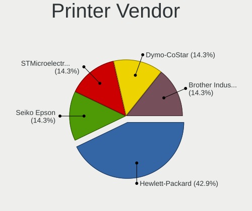

| Vendor             | Desktops | Percent |
|--------------------|----------|---------|
| Hewlett-Packard    | 3        | 42.86%  |
| STMicroelectronics | 1        | 14.29%  |
| Seiko Epson        | 1        | 14.29%  |
| Dymo-CoStar        | 1        | 14.29%  |
| Brother Industries | 1        | 14.29%  |

Printer Model
-------------

Printer device models

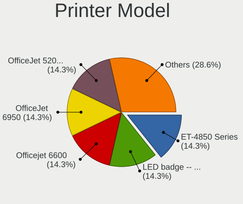

| Model                                                     | Desktops | Percent |
|-----------------------------------------------------------|----------|---------|
| STMicroelectronics LED badge -- mini LED display -- 11x44 | 1        | 14.29%  |
| Seiko Epson ET-4850 Series                                | 1        | 14.29%  |
| HP OfficeJet 6950                                         | 1        | 14.29%  |
| HP Officejet 6600                                         | 1        | 14.29%  |
| HP OfficeJet 5200 series                                  | 1        | 14.29%  |
| Dymo-CoStar LabelWriter 450                               | 1        | 14.29%  |
| Brother HL-3142CW series                                  | 1        | 14.29%  |

Scanner Vendor
--------------

Scanner device vendors

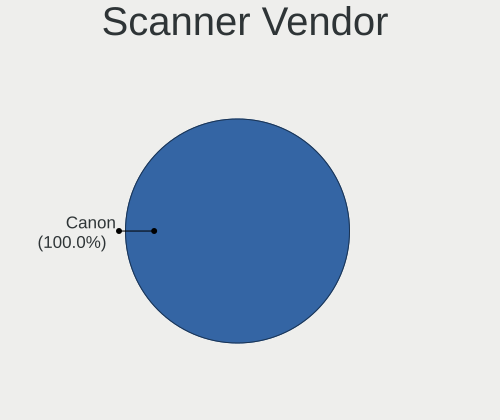

| Vendor | Desktops | Percent |
|--------|----------|---------|
| Canon  | 1        | 100%    |

Scanner Model
-------------

Scanner device models

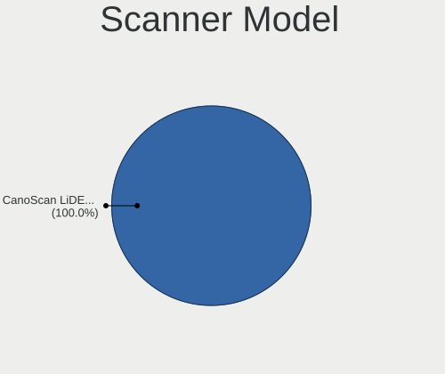

| Model                   | Desktops | Percent |
|-------------------------|----------|---------|
| Canon CanoScan LiDE 220 | 1        | 100%    |

Camera
------

Camera Vendor
-------------

Camera device vendors

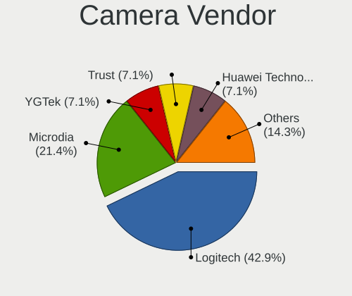

| Vendor              | Desktops | Percent |
|---------------------|----------|---------|
| Logitech            | 6        | 42.86%  |
| Microdia            | 3        | 21.43%  |
| YGTek               | 1        | 7.14%   |
| Trust               | 1        | 7.14%   |
| Huawei Technologies | 1        | 7.14%   |
| Cubeternet          | 1        | 7.14%   |
| Alcor Micro         | 1        | 7.14%   |

Camera Model
------------

Camera device models

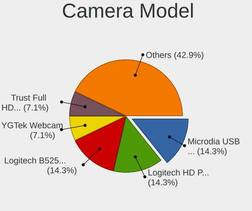

| Model                           | Desktops | Percent |
|---------------------------------|----------|---------|
| Microdia USB 2.0 Camera         | 2        | 14.29%  |
| Logitech HD Pro Webcam C920     | 2        | 14.29%  |
| Logitech B525 HD Webcam         | 2        | 14.29%  |
| YGTek Webcam                    | 1        | 7.14%   |
| Trust Full HD Webcam            | 1        | 7.14%   |
| Microdia Camera                 | 1        | 7.14%   |
| Logitech Webcam C270            | 1        | 7.14%   |
| Logitech HD Webcam C910         | 1        | 7.14%   |
| Huawei HiCamera                 | 1        | 7.14%   |
| Cubeternet GL-UPC822 UVC WebCam | 1        | 7.14%   |
| Alcor Micro USB 2.0 PC Camera   | 1        | 7.14%   |

Security
--------

Fingerprint Vendor
------------------

Fingerprint sensor vendors

Zero info for selected period =(

Fingerprint Model
-----------------

Fingerprint sensor models

Zero info for selected period =(

Chipcard Vendor
---------------

Chipcard module vendors

| Vendor      | Desktops | Percent |
|-------------|----------|---------|
| Alcor Micro | 1        | 100%    |

Chipcard Model
--------------

Chipcard module models

| Model                               | Desktops | Percent |
|-------------------------------------|----------|---------|
| Alcor Micro AU9540 Smartcard Reader | 1        | 100%    |

Unsupported
-----------

Unsupported Devices
-------------------

Total unsupported devices on board

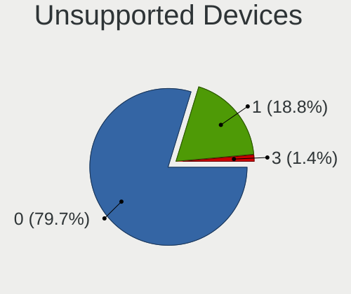

| Total | Desktops | Percent |
|-------|----------|---------|
| 0     | 55       | 79.71%  |
| 1     | 13       | 18.84%  |
| 3     | 1        | 1.45%   |

Unsupported Device Types
------------------------

Types of unsupported devices

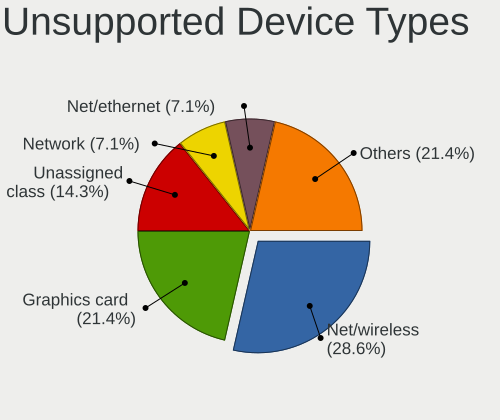

| Type                     | Desktops | Percent |
|--------------------------|----------|---------|
| Net/wireless             | 4        | 28.57%  |
| Graphics card            | 3        | 21.43%  |
| Unassigned class         | 2        | 14.29%  |
| Network                  | 1        | 7.14%   |
| Net/ethernet             | 1        | 7.14%   |
| Multimedia controller    | 1        | 7.14%   |
| Communication controller | 1        | 7.14%   |
| Chipcard                 | 1        | 7.14%   |

