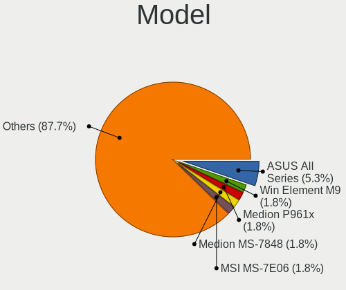
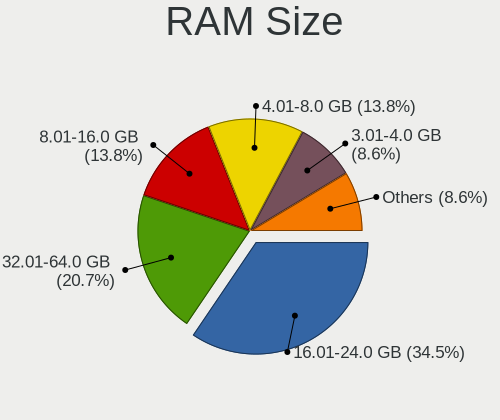
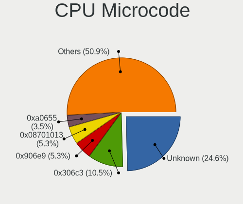
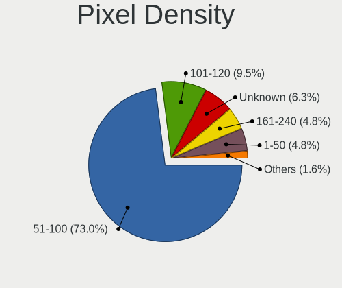
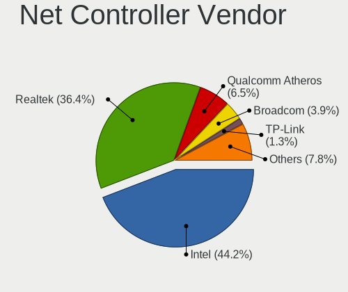
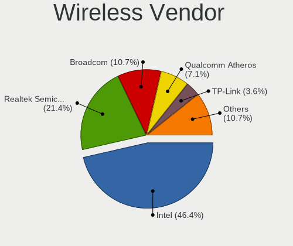
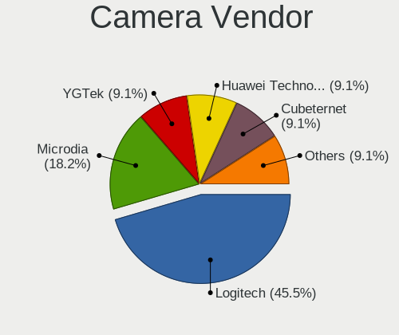

Linux in Luxembourg - Tested Hardware & Statistics (Desktops)
-------------------------------------------------------------

A project to collect tested hardware configurations for Linux in Luxembourg.

Anyone can contribute to this report by the [hw-probe](https://github.com/linuxhw/hw-probe) tool:

    sudo -E hw-probe -all -upload

Please contribute! Especially if your hardware is rare.

Contents
--------

* [ Test Cases ](#test-cases)

* [ System ](#system)
  - [ OS                       ](#os)
  - [ OS Family                ](#os-family)
  - [ Kernel                   ](#kernel)
  - [ Kernel Family            ](#kernel-family)
  - [ Kernel Major Ver.        ](#kernel-major-ver)
  - [ Arch                     ](#arch)
  - [ DE                       ](#de)
  - [ Display Server           ](#display-server)
  - [ Display Manager          ](#display-manager)
  - [ OS Lang                  ](#os-lang)
  - [ Boot Mode                ](#boot-mode)
  - [ Filesystem               ](#filesystem)
  - [ Part. scheme             ](#part-scheme)
  - [ Dual Boot with Linux/BSD ](#dual-boot-with-linuxbsd)
  - [ Dual Boot (Win)          ](#dual-boot-win)

* [ Board ](#board)
  - [ Vendor                   ](#vendor)
  - [ Model                    ](#model)
  - [ Model Family             ](#model-family)
  - [ MFG Year                 ](#mfg-year)
  - [ Form Factor              ](#form-factor)
  - [ Secure Boot              ](#secure-boot)
  - [ Coreboot                 ](#coreboot)
  - [ RAM Size                 ](#ram-size)
  - [ RAM Used                 ](#ram-used)
  - [ Total Drives             ](#total-drives)
  - [ Has CD-ROM               ](#has-cd-rom)
  - [ Has Ethernet             ](#has-ethernet)
  - [ Has WiFi                 ](#has-wifi)
  - [ Has Bluetooth            ](#has-bluetooth)

* [ Location ](#location)
  - [ Country                  ](#country)
  - [ City                     ](#city)

* [ Drives ](#drives)
  - [ Drive Vendor             ](#drive-vendor)
  - [ Drive Model              ](#drive-model)
  - [ HDD Vendor               ](#hdd-vendor)
  - [ SSD Vendor               ](#ssd-vendor)
  - [ Drive Kind               ](#drive-kind)
  - [ Drive Connector          ](#drive-connector)
  - [ Drive Size               ](#drive-size)
  - [ Space Total              ](#space-total)
  - [ Space Used               ](#space-used)
  - [ Malfunc. Drives          ](#malfunc-drives)
  - [ Malfunc. Drive Vendor    ](#malfunc-drive-vendor)
  - [ Malfunc. HDD Vendor      ](#malfunc-hdd-vendor)
  - [ Malfunc. Drive Kind      ](#malfunc-drive-kind)
  - [ Failed Drives            ](#failed-drives)
  - [ Failed Drive Vendor      ](#failed-drive-vendor)
  - [ Drive Status             ](#drive-status)

* [ Storage controller ](#storage-controller)
  - [ Storage Vendor           ](#storage-vendor)
  - [ Storage Model            ](#storage-model)
  - [ Storage Kind             ](#storage-kind)

* [ Processor ](#processor)
  - [ CPU Vendor               ](#cpu-vendor)
  - [ CPU Model                ](#cpu-model)
  - [ CPU Model Family         ](#cpu-model-family)
  - [ CPU Cores                ](#cpu-cores)
  - [ CPU Sockets              ](#cpu-sockets)
  - [ CPU Threads              ](#cpu-threads)
  - [ CPU Op-Modes             ](#cpu-op-modes)
  - [ CPU Microcode            ](#cpu-microcode)
  - [ CPU Microarch            ](#cpu-microarch)

* [ Graphics ](#graphics)
  - [ GPU Vendor               ](#gpu-vendor)
  - [ GPU Model                ](#gpu-model)
  - [ GPU Combo                ](#gpu-combo)
  - [ GPU Driver               ](#gpu-driver)
  - [ GPU Memory               ](#gpu-memory)

* [ Monitor ](#monitor)
  - [ Monitor Vendor           ](#monitor-vendor)
  - [ Monitor Model            ](#monitor-model)
  - [ Monitor Resolution       ](#monitor-resolution)
  - [ Monitor Diagonal         ](#monitor-diagonal)
  - [ Monitor Width            ](#monitor-width)
  - [ Aspect Ratio             ](#aspect-ratio)
  - [ Monitor Area             ](#monitor-area)
  - [ Pixel Density            ](#pixel-density)
  - [ Multiple Monitors        ](#multiple-monitors)

* [ Network ](#network)
  - [ Net Controller Vendor    ](#net-controller-vendor)
  - [ Net Controller Model     ](#net-controller-model)
  - [ Wireless Vendor          ](#wireless-vendor)
  - [ Wireless Model           ](#wireless-model)
  - [ Ethernet Vendor          ](#ethernet-vendor)
  - [ Ethernet Model           ](#ethernet-model)
  - [ Net Controller Kind      ](#net-controller-kind)
  - [ Used Controller          ](#used-controller)
  - [ NICs                     ](#nics)
  - [ IPv6                     ](#ipv6)

* [ Bluetooth ](#bluetooth)
  - [ Bluetooth Vendor         ](#bluetooth-vendor)
  - [ Bluetooth Model          ](#bluetooth-model)

* [ Sound ](#sound)
  - [ Sound Vendor             ](#sound-vendor)
  - [ Sound Model              ](#sound-model)

* [ Memory ](#memory)
  - [ Memory Vendor            ](#memory-vendor)
  - [ Memory Model             ](#memory-model)
  - [ Memory Kind              ](#memory-kind)
  - [ Memory Form Factor       ](#memory-form-factor)
  - [ Memory Size              ](#memory-size)
  - [ Memory Speed             ](#memory-speed)

* [ Printers & scanners ](#printers--scanners)
  - [ Printer Vendor           ](#printer-vendor)
  - [ Printer Model            ](#printer-model)
  - [ Scanner Vendor           ](#scanner-vendor)
  - [ Scanner Model            ](#scanner-model)

* [ Camera ](#camera)
  - [ Camera Vendor            ](#camera-vendor)
  - [ Camera Model             ](#camera-model)

* [ Security ](#security)
  - [ Fingerprint Vendor       ](#fingerprint-vendor)
  - [ Fingerprint Model        ](#fingerprint-model)
  - [ Chipcard Vendor          ](#chipcard-vendor)
  - [ Chipcard Model           ](#chipcard-model)

* [ Unsupported ](#unsupported)
  - [ Unsupported Devices      ](#unsupported-devices)
  - [ Unsupported Device Types ](#unsupported-device-types)

Test Cases
----------

Total: 54

| Vendor        | Model                       | Probe                                                      | Date         |
|---------------|-----------------------------|------------------------------------------------------------|--------------|
| BESSTAR Te... | DMAF5 V1.0                  | [53f395d7fa](https://linux-hardware.org/?probe=53f395d7fa) | May 15, 2023 |
| ASUSTek       | PRIME Z590-P WIFI           | [5d12a9965b](https://linux-hardware.org/?probe=5d12a9965b) | May 06, 2023 |
| Gigabyte      | X670E AORUS MASTER          | [c8bf9d49d4](https://linux-hardware.org/?probe=c8bf9d49d4) | Apr 15, 2023 |
| Gigabyte      | Z370 AORUS Ultra Gaming-... | [5fe0f2c1fe](https://linux-hardware.org/?probe=5fe0f2c1fe) | Feb 18, 2023 |
| ASRock        | X570 Phantom Gaming 4       | [f91712ea02](https://linux-hardware.org/?probe=f91712ea02) | Feb 15, 2023 |
| Gigabyte      | B550M AORUS PRO-P           | [6666a9b8ca](https://linux-hardware.org/?probe=6666a9b8ca) | Jan 09, 2023 |
| MSI           | B85-G43                     | [a8f28d3f69](https://linux-hardware.org/?probe=a8f28d3f69) | Nov 23, 2022 |
| Intel         | DP35DP AAD81073-207         | [c597415419](https://linux-hardware.org/?probe=c597415419) | Nov 11, 2022 |
| JWIPC         | A320I S1                    | [44689a88d8](https://linux-hardware.org/?probe=44689a88d8) | Oct 16, 2022 |
| LattePanda    | 3 Delta CDJQ-BS-7-S70JR1... | [dbfdcae895](https://linux-hardware.org/?probe=dbfdcae895) | Sep 08, 2022 |
| LattePanda    | 3 Delta CDJQ-BS-7-S70JR1... | [4167167e38](https://linux-hardware.org/?probe=4167167e38) | Sep 08, 2022 |
| Gigabyte      | X99-UD3-CF                  | [75dbdd1681](https://linux-hardware.org/?probe=75dbdd1681) | Jul 26, 2022 |
| Gigabyte      | X99-UD3-CF                  | [7eaa9fa16b](https://linux-hardware.org/?probe=7eaa9fa16b) | Jul 26, 2022 |
| HP            | 2820h                       | [7303ad365d](https://linux-hardware.org/?probe=7303ad365d) | Jul 11, 2022 |
| Intel         | DG41WV AAE90316-104         | [b6dc38eb16](https://linux-hardware.org/?probe=b6dc38eb16) | Feb 25, 2022 |
| ASRock        | H110M-STX                   | [e5876258c7](https://linux-hardware.org/?probe=e5876258c7) | Feb 19, 2022 |
| ASUSTek       | Z97-A                       | [19d74bd6f0](https://linux-hardware.org/?probe=19d74bd6f0) | Jan 31, 2022 |
| ASUSTek       | PRIME X470-PRO              | [2845eaa223](https://linux-hardware.org/?probe=2845eaa223) | Nov 27, 2021 |
| Medion        | Cattle24 1M                 | [05747b9a42](https://linux-hardware.org/?probe=05747b9a42) | Nov 10, 2021 |
| Medion        | Cattle24 1M                 | [9763c21680](https://linux-hardware.org/?probe=9763c21680) | Nov 10, 2021 |
| ASUSTek       | TUF Gaming Z590-PLUS WIF... | [b2f196476a](https://linux-hardware.org/?probe=b2f196476a) | Nov 04, 2021 |
| ASUSTek       | UN62                        | [0702f80222](https://linux-hardware.org/?probe=0702f80222) | Sep 09, 2021 |
| ASUSTek       | ROG CROSSHAIR VIII DARK ... | [ce97f26d1d](https://linux-hardware.org/?probe=ce97f26d1d) | Sep 09, 2021 |
| Intel         | DG41WV AAE90316-104         | [27c162218f](https://linux-hardware.org/?probe=27c162218f) | Sep 05, 2021 |
| ASUSTek       | ROG STRIX X570-E GAMING     | [80a7298343](https://linux-hardware.org/?probe=80a7298343) | Jul 27, 2021 |
| ASRock        | B450M-HDV R4.0              | [b5b8d7a195](https://linux-hardware.org/?probe=b5b8d7a195) | Jun 13, 2021 |
| Intel         | DG965SS AAD41678-308        | [d76e4b9ec3](https://linux-hardware.org/?probe=d76e4b9ec3) | May 04, 2021 |
| ASUSTek       | M5A78L-M LX3                | [565be765f5](https://linux-hardware.org/?probe=565be765f5) | Apr 29, 2021 |
| Intel         | DG41WV AAE90316-104         | [af606a347f](https://linux-hardware.org/?probe=af606a347f) | Mar 15, 2021 |
| Gigabyte      | H81M-DS2                    | [439d425d4b](https://linux-hardware.org/?probe=439d425d4b) | Mar 01, 2021 |
| Gigabyte      | H81M-DS2                    | [3500ce2480](https://linux-hardware.org/?probe=3500ce2480) | Feb 09, 2021 |
| ASUSTek       | Z87-DELUXE                  | [e160eea25a](https://linux-hardware.org/?probe=e160eea25a) | Dec 28, 2020 |
| ASUSTek       | PRIME B450-PLUS             | [ae14c03ffc](https://linux-hardware.org/?probe=ae14c03ffc) | Dec 19, 2020 |
| Gigabyte      | X570 AORUS PRO              | [9ec2d84b9b](https://linux-hardware.org/?probe=9ec2d84b9b) | Dec 10, 2020 |
| ASUSTek       | PRIME H470M-PLUS            | [1d77b8496d](https://linux-hardware.org/?probe=1d77b8496d) | Nov 28, 2020 |
| Gigabyte      | H81M-DS2                    | [e6be700463](https://linux-hardware.org/?probe=e6be700463) | Oct 28, 2020 |
| ASUSTek       | Z87-A                       | [bbe1190702](https://linux-hardware.org/?probe=bbe1190702) | Oct 01, 2020 |
| MSI           | MAG Z490 TOMAHAWK           | [ffd532c8d8](https://linux-hardware.org/?probe=ffd532c8d8) | Aug 16, 2020 |
| Gigabyte      | Z97X-Gaming 5               | [e1c1c22a7b](https://linux-hardware.org/?probe=e1c1c22a7b) | Aug 11, 2020 |
| ASRock        | B450 Gaming-ITX/ac          | [3f740083f9](https://linux-hardware.org/?probe=3f740083f9) | Jul 19, 2020 |
| ASRock        | B450 Gaming-ITX/ac          | [f1c586d370](https://linux-hardware.org/?probe=f1c586d370) | Jul 19, 2020 |
| Medion        | MS-7848                     | [6c60cef00e](https://linux-hardware.org/?probe=6c60cef00e) | May 06, 2020 |
| MSI           | H310M PRO-M2 PLUS           | [33665c7f49](https://linux-hardware.org/?probe=33665c7f49) | May 04, 2020 |
| MSI           | H310M PRO-M2 PLUS           | [6e21e82c58](https://linux-hardware.org/?probe=6e21e82c58) | Mar 26, 2020 |
| ASUSTek       | PRIME B250M-A               | [68e88028d6](https://linux-hardware.org/?probe=68e88028d6) | Jan 09, 2020 |
| ASUSTek       | PRIME B250M-A               | [453044841e](https://linux-hardware.org/?probe=453044841e) | Jan 09, 2020 |
| Foxconn       | 2AA9                        | [2b2a941903](https://linux-hardware.org/?probe=2b2a941903) | Jan 07, 2020 |
| Foxconn       | 2AA9                        | [ed7e0428fb](https://linux-hardware.org/?probe=ed7e0428fb) | Jan 07, 2020 |
| Lenovo        | 3106 SDK0J40697 WIN 3305... | [c1c91fe558](https://linux-hardware.org/?probe=c1c91fe558) | Nov 18, 2019 |
| Lenovo        | 3106 SDK0J40697 WIN 3305... | [9ee20bcfcb](https://linux-hardware.org/?probe=9ee20bcfcb) | Nov 18, 2019 |
| Lenovo        | 3106 SDK0J40697 WIN 3305... | [3b96b0c40d](https://linux-hardware.org/?probe=3b96b0c40d) | Nov 17, 2019 |
| Gigabyte      | Z270M-D3H-CF                | [3bcd649400](https://linux-hardware.org/?probe=3bcd649400) | Jul 14, 2019 |
| HP            | 3048h                       | [ab8f89fdcc](https://linux-hardware.org/?probe=ab8f89fdcc) | Oct 07, 2018 |
| MSI           | NF750-G55                   | [d1b2ddb193](https://linux-hardware.org/?probe=d1b2ddb193) | May 22, 2017 |

System
------

OS
--

Installed operating systems

| Name               | Desktops | Percent |
|--------------------|----------|---------|
| Ubuntu 20.04       | 6        | 14.29%  |
| Ubuntu 18.04       | 4        | 9.52%   |
| Ubuntu 22.04       | 3        | 7.14%   |
| openSUSE Leap-15.2 | 2        | 4.76%   |
| Xubuntu 16.04      | 1        | 2.38%   |
| UbuntuDDE 20.04    | 1        | 2.38%   |
| Ubuntu 22.10       | 1        | 2.38%   |
| Ubuntu 20.10       | 1        | 2.38%   |
| Ubuntu 19.10       | 1        | 2.38%   |
| ROSA R9            | 1        | 2.38%   |
| Pop!_OS 22.04      | 1        | 2.38%   |
| openSUSE Leap-15.3 | 1        | 2.38%   |
| Manjaro 21.1.0     | 1        | 2.38%   |
| Mageia 7           | 1        | 2.38%   |
| Lubuntu 20.10      | 1        | 2.38%   |
| LMDE 4             | 1        | 2.38%   |
| Linux Mint 20.1    | 1        | 2.38%   |
| Kubuntu 22.04      | 1        | 2.38%   |
| Kubuntu 20.04      | 1        | 2.38%   |
| KDE neon 20.04     | 1        | 2.38%   |
| Kali 2021.3        | 1        | 2.38%   |
| Gentoo 2.13        | 1        | 2.38%   |
| Fedora 37          | 1        | 2.38%   |
| Fedora 34          | 1        | 2.38%   |
| Fedora 33          | 1        | 2.38%   |
| Fedora 32          | 1        | 2.38%   |
| Elementary 5.1.7   | 1        | 2.38%   |
| Debian 10          | 1        | 2.38%   |
| CentOS 8           | 1        | 2.38%   |
| ArcoLinux Rolling  | 1        | 2.38%   |
| Arch               | 1        | 2.38%   |

OS Family
---------

OS without a version

| Name       | Desktops | Percent |
|------------|----------|---------|
| Ubuntu     | 16       | 39.02%  |
| Fedora     | 4        | 9.76%   |
| openSUSE   | 2        | 4.88%   |
| Kubuntu    | 2        | 4.88%   |
| Xubuntu    | 1        | 2.44%   |
| UbuntuDDE  | 1        | 2.44%   |
| ROSA       | 1        | 2.44%   |
| Pop!_OS    | 1        | 2.44%   |
| Manjaro    | 1        | 2.44%   |
| Mageia     | 1        | 2.44%   |
| Lubuntu    | 1        | 2.44%   |
| LMDE       | 1        | 2.44%   |
| Linux Mint | 1        | 2.44%   |
| KDE neon   | 1        | 2.44%   |
| Kali       | 1        | 2.44%   |
| Gentoo     | 1        | 2.44%   |
| Elementary | 1        | 2.44%   |
| Debian     | 1        | 2.44%   |
| CentOS     | 1        | 2.44%   |
| ArcoLinux  | 1        | 2.44%   |
| Arch       | 1        | 2.44%   |

Kernel
------

Version of the Linux kernel

| Version                         | Desktops | Percent |
|---------------------------------|----------|---------|
| 5.4.0-90-generic                | 2        | 4.44%   |
| 6.3.1-arch2-1                   | 1        | 2.22%   |
| 6.1.22-gentoo-dist              | 1        | 2.22%   |
| 6.1.10-200.fc37.x86_64          | 1        | 2.22%   |
| 5.9.13-zen1-1-zen               | 1        | 2.22%   |
| 5.9.10-200.fc33.x86_64          | 1        | 2.22%   |
| 5.8.0-44-generic                | 1        | 2.22%   |
| 5.8.0-43-generic                | 1        | 2.22%   |
| 5.8.0-26-generic                | 1        | 2.22%   |
| 5.7.19-desktop-3.mga7           | 1        | 2.22%   |
| 5.4.0-91-generic                | 1        | 2.22%   |
| 5.4.0-72-generic                | 1        | 2.22%   |
| 5.4.0-58-generic                | 1        | 2.22%   |
| 5.4.0-47-generic                | 1        | 2.22%   |
| 5.4.0-42-generic                | 1        | 2.22%   |
| 5.4.0-40-generic                | 1        | 2.22%   |
| 5.4.0-21-generic                | 1        | 2.22%   |
| 5.3.18-lp152.66-default         | 1        | 2.22%   |
| 5.3.18-lp152.33-default         | 1        | 2.22%   |
| 5.3.18-59.19-preempt            | 1        | 2.22%   |
| 5.3.18-150300.59.49-preempt     | 1        | 2.22%   |
| 5.3.0-46-generic                | 1        | 2.22%   |
| 5.3.0-42-generic                | 1        | 2.22%   |
| 5.3.0-26-generic                | 1        | 2.22%   |
| 5.3.0-0.bpo.2-686-pae           | 1        | 2.22%   |
| 5.19.0-76051900-generic         | 1        | 2.22%   |
| 5.15.0-60-generic               | 1        | 2.22%   |
| 5.15.0-52-generic               | 1        | 2.22%   |
| 5.15.0-50-generic               | 1        | 2.22%   |
| 5.15.0-41-generic               | 1        | 2.22%   |
| 5.15.0-25-generic               | 1        | 2.22%   |
| 5.15.0-10056-tuxedo             | 1        | 2.22%   |
| 5.13.4-1-MANJARO                | 1        | 2.22%   |
| 5.12.7-300.fc34.x86_64          | 1        | 2.22%   |
| 5.11.0-38-generic               | 1        | 2.22%   |
| 5.10.7-100.fc32.x86_64          | 1        | 2.22%   |
| 5.10.0-kali9-amd64              | 1        | 2.22%   |
| 5.0.0-36-generic                | 1        | 2.22%   |
| 4.9.20-nrj-desktop-1rosa-x86_64 | 1        | 2.22%   |
| 4.4.0-137-generic               | 1        | 2.22%   |

Kernel Family
-------------

Linux kernel without a distro release

| Version | Desktops | Percent |
|---------|----------|---------|
| 5.4.0   | 9        | 22.5%   |
| 5.15.0  | 6        | 15%     |
| 5.3.0   | 3        | 7.5%    |
| 5.3.18  | 2        | 5%      |
| 4.18.0  | 2        | 5%      |
| 6.3.1   | 1        | 2.5%    |
| 6.1.22  | 1        | 2.5%    |
| 6.1.10  | 1        | 2.5%    |
| 5.9.13  | 1        | 2.5%    |
| 5.9.10  | 1        | 2.5%    |
| 5.8.0   | 1        | 2.5%    |
| 5.7.19  | 1        | 2.5%    |
| 5.19.0  | 1        | 2.5%    |
| 5.13.4  | 1        | 2.5%    |
| 5.12.7  | 1        | 2.5%    |
| 5.11.0  | 1        | 2.5%    |
| 5.10.7  | 1        | 2.5%    |
| 5.10.0  | 1        | 2.5%    |
| 5.0.0   | 1        | 2.5%    |
| 4.9.20  | 1        | 2.5%    |
| 4.4.0   | 1        | 2.5%    |
| 4.19.0  | 1        | 2.5%    |
| 4.15.0  | 1        | 2.5%    |

Kernel Major Ver.
-----------------

Linux kernel major version

| Version | Desktops | Percent |
|---------|----------|---------|
| 5.4     | 9        | 22.5%   |
| 5.15    | 6        | 15%     |
| 5.3     | 5        | 12.5%   |
| 6.1     | 2        | 5%      |
| 5.9     | 2        | 5%      |
| 5.10    | 2        | 5%      |
| 4.18    | 2        | 5%      |
| 6.3     | 1        | 2.5%    |
| 5.8     | 1        | 2.5%    |
| 5.7     | 1        | 2.5%    |
| 5.19    | 1        | 2.5%    |
| 5.13    | 1        | 2.5%    |
| 5.12    | 1        | 2.5%    |
| 5.11    | 1        | 2.5%    |
| 5.0     | 1        | 2.5%    |
| 4.9     | 1        | 2.5%    |
| 4.4     | 1        | 2.5%    |
| 4.19    | 1        | 2.5%    |
| 4.15    | 1        | 2.5%    |

Arch
----

OS architecture (x86_64, i586, etc.)

| Name   | Desktops | Percent |
|--------|----------|---------|
| x86_64 | 39       | 97.5%   |
| i686   | 1        | 2.5%    |

DE
--

Desktop Environment

| Name       | Desktops | Percent |
|------------|----------|---------|
| GNOME      | 20       | 47.62%  |
| KDE5       | 8        | 19.05%  |
| Unknown    | 5        | 11.9%   |
| X-Cinnamon | 2        | 4.76%   |
| KDE        | 2        | 4.76%   |
| XFCE       | 1        | 2.38%   |
| Pantheon   | 1        | 2.38%   |
| LXQt       | 1        | 2.38%   |
| Deepin     | 1        | 2.38%   |
| Cinnamon   | 1        | 2.38%   |

Display Server
--------------

X11 or Wayland

| Name    | Desktops | Percent |
|---------|----------|---------|
| X11     | 30       | 71.43%  |
| Wayland | 6        | 14.29%  |
| Tty     | 3        | 7.14%   |
| Unknown | 3        | 7.14%   |

Display Manager
---------------

SDDM, LightDM, etc.

| Name    | Desktops | Percent |
|---------|----------|---------|
| Unknown | 17       | 41.46%  |
| SDDM    | 8        | 19.51%  |
| GDM3    | 6        | 14.63%  |
| GDM     | 5        | 12.2%   |
| LightDM | 4        | 9.76%   |
| TDM     | 1        | 2.44%   |

OS Lang
-------

Language

| Lang    | Desktops | Percent |
|---------|----------|---------|
| en_US   | 15       | 37.5%   |
| fr_FR   | 6        | 15%     |
| de_LU   | 4        | 10%     |
| C       | 4        | 10%     |
| en_GB   | 3        | 7.5%    |
| Unknown | 3        | 7.5%    |
| es_ES   | 2        | 5%      |
| lb_LU   | 1        | 2.5%    |
| de_DE   | 1        | 2.5%    |
| de_CH   | 1        | 2.5%    |

Boot Mode
---------

EFI or BIOS

| Mode | Desktops | Percent |
|------|----------|---------|
| BIOS | 23       | 57.5%   |
| EFI  | 17       | 42.5%   |

Filesystem
----------

Type of filesystem

| Type    | Desktops | Percent |
|---------|----------|---------|
| Ext4    | 28       | 70%     |
| Btrfs   | 6        | 15%     |
| Xfs     | 3        | 7.5%    |
| Zfs     | 1        | 2.5%    |
| Overlay | 1        | 2.5%    |
| Unknown | 1        | 2.5%    |

Part. scheme
------------

Scheme of partitioning

| Type    | Desktops | Percent |
|---------|----------|---------|
| GPT     | 19       | 47.5%   |
| Unknown | 19       | 47.5%   |
| MBR     | 2        | 5%      |

Dual Boot with Linux/BSD
------------------------

Hosting more than one Linux/BSD

| Dual boot | Desktops | Percent |
|-----------|----------|---------|
| No        | 33       | 82.5%   |
| Yes       | 7        | 17.5%   |

Dual Boot (Win)
---------------

Hosting Linux and Windows

| Dual boot | Desktops | Percent |
|-----------|----------|---------|
| No        | 27       | 65.85%  |
| Yes       | 14       | 34.15%  |

Board
-----

Vendor
------

Motherboard manufacturer

| Name                | Desktops | Percent |
|---------------------|----------|---------|
| ASUSTek Computer    | 12       | 30%     |
| Gigabyte Technology | 8        | 20%     |
| MSI                 | 4        | 10%     |
| ASRock              | 4        | 10%     |
| Intel               | 3        | 7.5%    |
| Medion              | 2        | 5%      |
| Hewlett-Packard     | 2        | 5%      |
| Lenovo              | 1        | 2.5%    |
| LattePanda          | 1        | 2.5%    |
| JWIPC               | 1        | 2.5%    |
| Foxconn             | 1        | 2.5%    |
| BESSTAR Tech        | 1        | 2.5%    |

Model
-----

Motherboard model

| Name                                | Desktops | Percent |
|-------------------------------------|----------|---------|
| ASUS All Series                     | 3        | 7.5%    |
| MSI MS-7C80                         | 1        | 2.5%    |
| MSI MS-7C08                         | 1        | 2.5%    |
| MSI MS-7816                         | 1        | 2.5%    |
| MSI MS-7578                         | 1        | 2.5%    |
| Medion P961x                        | 1        | 2.5%    |
| Medion MS-7848                      | 1        | 2.5%    |
| Lenovo ThinkCentre M910s 10MKS02N04 | 1        | 2.5%    |
| LattePanda 3 Delta                  | 1        | 2.5%    |
| JWIPC BF24                          | 1        | 2.5%    |
| Intel DP35DP AAD81073-207           | 1        | 2.5%    |
| Intel DG965SS AAD41678-308          | 1        | 2.5%    |
| Intel DG41WV AAE90316-104           | 1        | 2.5%    |
| HP Compaq dc5800 Small Form Factor  | 1        | 2.5%    |
| HP Compaq 6000 Pro SFF PC           | 1        | 2.5%    |
| Gigabyte Z97X-Gaming 5              | 1        | 2.5%    |
| Gigabyte Z370 AORUS Ultra Gaming    | 1        | 2.5%    |
| Gigabyte Z270M-D3H                  | 1        | 2.5%    |
| Gigabyte X99-UD3-CF                 | 1        | 2.5%    |
| Gigabyte X670E AORUS MASTER         | 1        | 2.5%    |
| Gigabyte X570 AORUS PRO             | 1        | 2.5%    |
| Gigabyte H81M-DS2                   | 1        | 2.5%    |
| Gigabyte B550M AORUS PRO-P          | 1        | 2.5%    |
| Foxconn p6601fr-m                   | 1        | 2.5%    |
| BESSTAR Tech DMAF5                  | 1        | 2.5%    |
| ASUS UN62                           | 1        | 2.5%    |
| ASUS TUF Gaming Z590-PLUS WIFI      | 1        | 2.5%    |
| ASUS ROG STRIX X570-E GAMING        | 1        | 2.5%    |
| ASUS ROG CROSSHAIR VIII DARK HERO   | 1        | 2.5%    |
| ASUS PRIME X470-PRO                 | 1        | 2.5%    |
| ASUS PRIME H470M-PLUS               | 1        | 2.5%    |
| ASUS PRIME B450-PLUS                | 1        | 2.5%    |
| ASUS PRIME B250M-A                  | 1        | 2.5%    |
| ASUS M5A78L-M LX3                   | 1        | 2.5%    |
| ASRock X570 Phantom Gaming 4        | 1        | 2.5%    |
| ASRock H110M-STX                    | 1        | 2.5%    |
| ASRock B450M-HDV R4.0               | 1        | 2.5%    |
| ASRock B450 Gaming-ITX/ac           | 1        | 2.5%    |

Model Family
------------

Motherboard model prefix

| Name                 | Desktops | Percent |
|----------------------|----------|---------|
| ASUS PRIME           | 4        | 10%     |
| ASUS All             | 3        | 7.5%    |
| HP Compaq            | 2        | 5%      |
| ASUS ROG             | 2        | 5%      |
| MSI MS-7C80          | 1        | 2.5%    |
| MSI MS-7C08          | 1        | 2.5%    |
| MSI MS-7816          | 1        | 2.5%    |
| MSI MS-7578          | 1        | 2.5%    |
| Medion P961x         | 1        | 2.5%    |
| Medion MS-7848       | 1        | 2.5%    |
| Lenovo ThinkCentre   | 1        | 2.5%    |
| LattePanda 3         | 1        | 2.5%    |
| JWIPC BF24           | 1        | 2.5%    |
| Intel DP35DP         | 1        | 2.5%    |
| Intel DG965SS        | 1        | 2.5%    |
| Intel DG41WV         | 1        | 2.5%    |
| Gigabyte Z97X-Gaming | 1        | 2.5%    |
| Gigabyte Z370        | 1        | 2.5%    |
| Gigabyte Z270M-D3H   | 1        | 2.5%    |
| Gigabyte X99-UD3-CF  | 1        | 2.5%    |
| Gigabyte X670E       | 1        | 2.5%    |
| Gigabyte X570        | 1        | 2.5%    |
| Gigabyte H81M-DS2    | 1        | 2.5%    |
| Gigabyte B550M       | 1        | 2.5%    |
| Foxconn p6601fr-m    | 1        | 2.5%    |
| BESSTAR Tech DMAF5   | 1        | 2.5%    |
| ASUS UN62            | 1        | 2.5%    |
| ASUS TUF             | 1        | 2.5%    |
| ASUS M5A78L-M        | 1        | 2.5%    |
| ASRock X570          | 1        | 2.5%    |
| ASRock H110M-STX     | 1        | 2.5%    |
| ASRock B450M-HDV     | 1        | 2.5%    |
| ASRock B450          | 1        | 2.5%    |

MFG Year
--------

Motherboard manufacture year

| Year | Desktops | Percent |
|------|----------|---------|
| 2018 | 6        | 15%     |
| 2013 | 5        | 12.5%   |
| 2020 | 4        | 10%     |
| 2010 | 4        | 10%     |
| 2019 | 3        | 7.5%    |
| 2016 | 3        | 7.5%    |
| 2014 | 3        | 7.5%    |
| 2021 | 2        | 5%      |
| 2017 | 2        | 5%      |
| 2007 | 2        | 5%      |
| 2023 | 1        | 2.5%    |
| 2022 | 1        | 2.5%    |
| 2015 | 1        | 2.5%    |
| 2012 | 1        | 2.5%    |
| 2009 | 1        | 2.5%    |
| 2008 | 1        | 2.5%    |

Form Factor
-----------

Physical design of the computer

| Name    | Desktops | Percent |
|---------|----------|---------|
| Desktop | 40       | 100%    |

Secure Boot
-----------

Enabled or disabled

| State    | Desktops | Percent |
|----------|----------|---------|
| Disabled | 38       | 95%     |
| Enabled  | 2        | 5%      |

Coreboot
--------

Have coreboot on board

| Used | Desktops | Percent |
|------|----------|---------|
| No   | 40       | 100%    |

RAM Size
--------

Total RAM memory

| Size in GB  | Desktops | Percent |
|-------------|----------|---------|
| 16.01-24.0  | 14       | 35%     |
| 8.01-16.0   | 8        | 20%     |
| 32.01-64.0  | 7        | 17.5%   |
| 4.01-8.0    | 5        | 12.5%   |
| 3.01-4.0    | 3        | 7.5%    |
| 64.01-256.0 | 2        | 5%      |
| 24.01-32.0  | 1        | 2.5%    |

RAM Used
--------

Used RAM memory

| Used GB   | Desktops | Percent |
|-----------|----------|---------|
| 4.01-8.0  | 10       | 23.81%  |
| 2.01-3.0  | 10       | 23.81%  |
| 1.01-2.0  | 9        | 21.43%  |
| 3.01-4.0  | 6        | 14.29%  |
| 8.01-16.0 | 5        | 11.9%   |
| 0.51-1.0  | 2        | 4.76%   |

Total Drives
------------

Number of drives on board

| Drives | Desktops | Percent |
|--------|----------|---------|
| 2      | 17       | 40.48%  |
| 3      | 8        | 19.05%  |
| 1      | 8        | 19.05%  |
| 4      | 5        | 11.9%   |
| 5      | 3        | 7.14%   |
| 7      | 1        | 2.38%   |

Has CD-ROM
----------

Has CD-ROM on board

| Presented | Desktops | Percent |
|-----------|----------|---------|
| No        | 26       | 65%     |
| Yes       | 14       | 35%     |

Has Ethernet
------------

Has Ethernet on board

| Presented | Desktops | Percent |
|-----------|----------|---------|
| Yes       | 40       | 100%    |

Has WiFi
--------

Has WiFi module

| Presented | Desktops | Percent |
|-----------|----------|---------|
| No        | 22       | 53.66%  |
| Yes       | 19       | 46.34%  |

Has Bluetooth
-------------

Has Bluetooth module

| Presented | Desktops | Percent |
|-----------|----------|---------|
| No        | 25       | 62.5%   |
| Yes       | 15       | 37.5%   |

Location
--------

Country
-------

Geographic location (country)

| Country    | Desktops | Percent |
|------------|----------|---------|
| Luxembourg | 40       | 100%    |

City
----

Geographic location (city)

| City              | Desktops | Percent |
|-------------------|----------|---------|
| Luxembourg        | 22       | 51.16%  |
| Sanem             | 2        | 4.65%   |
| Esch-sur-Alzette  | 2        | 4.65%   |
| Differdange       | 2        | 4.65%   |
| Wormeldange       | 1        | 2.33%   |
| Wasserbillig      | 1        | 2.33%   |
| Useldange         | 1        | 2.33%   |
| Strassen          | 1        | 2.33%   |
| Schieren          | 1        | 2.33%   |
| Roeser            | 1        | 2.33%   |
| Pontpierre        | 1        | 2.33%   |
| Pétange          | 1        | 2.33%   |
| Junglinster       | 1        | 2.33%   |
| Itzig             | 1        | 2.33%   |
| Hosingen          | 1        | 2.33%   |
| Ehnen             | 1        | 2.33%   |
| Dudelange         | 1        | 2.33%   |
| Bettange-sur-Mess | 1        | 2.33%   |
| Belvaux           | 1        | 2.33%   |

Drives
------

Drive Vendor
------------

Hard drive vendors

| Vendor                    | Desktops | Drives | Percent |
|---------------------------|----------|--------|---------|
| Samsung Electronics       | 20       | 31     | 26.67%  |
| Seagate                   | 12       | 20     | 16%     |
| WDC                       | 11       | 20     | 14.67%  |
| Crucial                   | 7        | 9      | 9.33%   |
| Kingston                  | 3        | 4      | 4%      |
| Toshiba                   | 2        | 4      | 2.67%   |
| SanDisk                   | 2        | 3      | 2.67%   |
| Hitachi                   | 2        | 3      | 2.67%   |
| Unknown                   | 1        | 2      | 1.33%   |
| Transcend                 | 1        | 1      | 1.33%   |
| TCSUNBOW                  | 1        | 1      | 1.33%   |
| StarTech                  | 1        | 1      | 1.33%   |
| SABRENT                   | 1        | 1      | 1.33%   |
| Phison                    | 1        | 1      | 1.33%   |
| OCZ                       | 1        | 1      | 1.33%   |
| Micron/Crucial Technology | 1        | 1      | 1.33%   |
| Maxtor                    | 1        | 2      | 1.33%   |
| KingSpec                  | 1        | 1      | 1.33%   |
| Intenso                   | 1        | 1      | 1.33%   |
| Inateck                   | 1        | 1      | 1.33%   |
| HGST                      | 1        | 2      | 1.33%   |
| Gigabyte Technology       | 1        | 1      | 1.33%   |
| ASMT                      | 1        | 2      | 1.33%   |
| A-DATA Technology         | 1        | 1      | 1.33%   |

Drive Model
-----------

Hard drive models

| Model                              | Desktops | Percent |
|------------------------------------|----------|---------|
| WDC WD10EZEX-08WN4A0 1TB           | 2        | 2.11%   |
| Samsung SSD 860 EVO 250GB          | 2        | 2.11%   |
| Samsung SSD 850 EVO 250GB          | 2        | 2.11%   |
| Samsung SSD 840 EVO 250GB          | 2        | 2.11%   |
| Samsung SP2504C 250GB              | 2        | 2.11%   |
| Kingston SA400S37240G 240GB SSD    | 2        | 2.11%   |
| Crucial CT1000P2SSD8 1TB           | 2        | 2.11%   |
| WDC WDS500G3X0C-00SJG0 500GB       | 1        | 1.05%   |
| WDC WD5000AAVS-00ZTB0 500GB        | 1        | 1.05%   |
| WDC WD5000AAKS-60Z1A0 500GB        | 1        | 1.05%   |
| WDC WD40EZRZ-75GXCB0 4TB           | 1        | 1.05%   |
| WDC WD4000FYYZ-01UL1B2 4TB         | 1        | 1.05%   |
| WDC WD3001FFSX-68JNUN0 3TB         | 1        | 1.05%   |
| WDC WD3000GLFS-01F8U0 304GB        | 1        | 1.05%   |
| WDC WD20EFAX-68FB5N0 2TB           | 1        | 1.05%   |
| WDC WD141KRYZ-01C66B0 14TB         | 1        | 1.05%   |
| WDC WD10EZRX-00A8LB0 1TB           | 1        | 1.05%   |
| WDC WD10EZEX-60ZF5A0 1TB           | 1        | 1.05%   |
| WDC WD10EARX-00N0YB0 1TB           | 1        | 1.05%   |
| WDC WD10EARS-00Y5B1 1TB            | 1        | 1.05%   |
| WDC WD10EACS-00D6B1 1TB            | 1        | 1.05%   |
| WDC WD1001FALS-00J7B0 1TB          | 1        | 1.05%   |
| Unknown MMC Card  64GB             | 1        | 1.05%   |
| Unknown DA4064  64GB               | 1        | 1.05%   |
| Transcend TS512GSSD370 512GB       | 1        | 1.05%   |
| Toshiba MG03ACA100 1TB             | 1        | 1.05%   |
| Toshiba DT01ACA050 500GB           | 1        | 1.05%   |
| TCSUNBOW X3 240GB                  | 1        | 1.05%   |
| StarTech M2E1BRU31C 2TB            | 1        | 1.05%   |
| Seagate ST500DM002-1BD142 500GB    | 1        | 1.05%   |
| Seagate ST4000VN008-2DR166 4TB     | 1        | 1.05%   |
| Seagate ST4000DM004-2CV104 4TB     | 1        | 1.05%   |
| Seagate ST3750630AS 752GB          | 1        | 1.05%   |
| Seagate ST3500418AS 500GB          | 1        | 1.05%   |
| Seagate ST3320620AS 320GB          | 1        | 1.05%   |
| Seagate ST2000LM003 HN-M201RAD 2TB | 1        | 1.05%   |
| Seagate ST1000LM035-1RK172 1TB     | 1        | 1.05%   |
| Seagate ST1000DM003-9YN162 1TB     | 1        | 1.05%   |
| Seagate ST1000DM003-1CH162 1TB     | 1        | 1.05%   |
| Seagate M3 Portable 4TB            | 1        | 1.05%   |

HDD Vendor
----------

Hard disk drive vendors

| Vendor              | Desktops | Drives | Percent |
|---------------------|----------|--------|---------|
| WDC                 | 10       | 19     | 33.33%  |
| Seagate             | 10       | 18     | 33.33%  |
| Toshiba             | 2        | 4      | 6.67%   |
| Samsung Electronics | 2        | 2      | 6.67%   |
| Hitachi             | 2        | 3      | 6.67%   |
| Intenso             | 1        | 1      | 3.33%   |
| Inateck             | 1        | 1      | 3.33%   |
| HGST                | 1        | 2      | 3.33%   |
| ASMT                | 1        | 2      | 3.33%   |

SSD Vendor
----------

Solid state drive vendors

| Vendor              | Desktops | Drives | Percent |
|---------------------|----------|--------|---------|
| Samsung Electronics | 15       | 19     | 51.72%  |
| Crucial             | 4        | 6      | 13.79%  |
| Kingston            | 2        | 3      | 6.9%    |
| Transcend           | 1        | 1      | 3.45%   |
| TCSUNBOW            | 1        | 1      | 3.45%   |
| SanDisk             | 1        | 2      | 3.45%   |
| SABRENT             | 1        | 1      | 3.45%   |
| OCZ                 | 1        | 1      | 3.45%   |
| Maxtor              | 1        | 2      | 3.45%   |
| KingSpec            | 1        | 1      | 3.45%   |
| A-DATA Technology   | 1        | 1      | 3.45%   |

Drive Kind
----------

HDD or SSD

| Kind    | Desktops | Drives | Percent |
|---------|----------|--------|---------|
| HDD     | 24       | 52     | 36.36%  |
| SSD     | 23       | 38     | 34.85%  |
| NVMe    | 16       | 20     | 24.24%  |
| Unknown | 2        | 2      | 3.03%   |
| MMC     | 1        | 2      | 1.52%   |

Drive Connector
---------------

SATA, SAS, NVMe, etc.

| Type | Desktops | Drives | Percent |
|------|----------|--------|---------|
| SATA | 33       | 83     | 60%     |
| NVMe | 16       | 20     | 29.09%  |
| SAS  | 5        | 9      | 9.09%   |
| MMC  | 1        | 2      | 1.82%   |

Drive Size
----------

Size of hard drive

| Size in TB | Desktops | Drives | Percent |
|------------|----------|--------|---------|
| 0.01-0.5   | 24       | 46     | 42.86%  |
| 0.51-1.0   | 16       | 25     | 28.57%  |
| 3.01-4.0   | 7        | 8      | 12.5%   |
| 1.01-2.0   | 4        | 5      | 7.14%   |
| 2.01-3.0   | 2        | 3      | 3.57%   |
| 10.01-20.0 | 2        | 2      | 3.57%   |
| 4.01-10.0  | 1        | 1      | 1.79%   |

Space Total
-----------

Amount of disk space available on the file system

| Size in GB     | Desktops | Percent |
|----------------|----------|---------|
| 101-250        | 10       | 25%     |
| More than 3000 | 7        | 17.5%   |
| 251-500        | 7        | 17.5%   |
| Unknown        | 5        | 12.5%   |
| 2001-3000      | 4        | 10%     |
| 501-1000       | 3        | 7.5%    |
| 1001-2000      | 2        | 5%      |
| 1-20           | 1        | 2.5%    |
| 51-100         | 1        | 2.5%    |

Space Used
----------

Amount of used disk space

| Used GB        | Desktops | Percent |
|----------------|----------|---------|
| 1-20           | 12       | 30%     |
| 101-250        | 9        | 22.5%   |
| Unknown        | 5        | 12.5%   |
| 251-500        | 3        | 7.5%    |
| 21-50          | 3        | 7.5%    |
| More than 3000 | 2        | 5%      |
| 2001-3000      | 2        | 5%      |
| 1001-2000      | 2        | 5%      |
| 501-1000       | 1        | 2.5%    |
| 51-100         | 1        | 2.5%    |

Malfunc. Drives
---------------

Drive models with a malfunction

| Model                        | Desktops | Drives | Percent |
|------------------------------|----------|--------|---------|
| Crucial CT128MX100SSD1 128GB | 1        | 2      | 100%    |

Malfunc. Drive Vendor
---------------------

Vendors of faulty drives

| Vendor  | Desktops | Drives | Percent |
|---------|----------|--------|---------|
| Crucial | 1        | 2      | 100%    |

Malfunc. HDD Vendor
-------------------

Vendors of faulty HDD drives

Zero info for selected period =(

Malfunc. Drive Kind
-------------------

Kinds of faulty drives

| Kind | Desktops | Drives | Percent |
|------|----------|--------|---------|
| SSD  | 1        | 2      | 100%    |

Failed Drives
-------------

Failed drive models

Zero info for selected period =(

Failed Drive Vendor
-------------------

Failed drive vendors

Zero info for selected period =(

Drive Status
------------

Number of failed and malfunc. drives

| Status   | Desktops | Drives | Percent |
|----------|----------|--------|---------|
| Detected | 23       | 61     | 51.11%  |
| Works    | 21       | 51     | 46.67%  |
| Malfunc  | 1        | 2      | 2.22%   |

Storage controller
------------------

Storage Vendor
--------------

Storage controller vendors

| Vendor                      | Desktops | Percent |
|-----------------------------|----------|---------|
| Intel                       | 24       | 40.68%  |
| AMD                         | 14       | 23.73%  |
| Samsung Electronics         | 8        | 13.56%  |
| Micron/Crucial Technology   | 4        | 6.78%   |
| SanDisk                     | 2        | 3.39%   |
| Phison Electronics          | 2        | 3.39%   |
| Marvell Technology Group    | 2        | 3.39%   |
| Seagate Technology          | 1        | 1.69%   |
| Kingston Technology Company | 1        | 1.69%   |
| ASMedia Technology          | 1        | 1.69%   |

Storage Model
-------------

Storage controller models

| Model                                                                          | Desktops | Percent |
|--------------------------------------------------------------------------------|----------|---------|
| AMD FCH SATA Controller [AHCI mode]                                            | 11       | 15.71%  |
| Intel 8 Series/C220 Series Chipset Family 6-port SATA Controller 1 [AHCI mode] | 5        | 7.14%   |
| Intel 200 Series PCH SATA controller [AHCI mode]                               | 5        | 7.14%   |
| AMD 400 Series Chipset SATA Controller                                         | 4        | 5.71%   |
| Samsung NVMe SSD Controller SM981/PM981/PM983                                  | 3        | 4.29%   |
| Micron/Crucial P2 NVMe PCIe SSD                                                | 3        | 4.29%   |
| SanDisk WD Black SN750 / PC SN730 NVMe SSD                                     | 2        | 2.86%   |
| Samsung NVMe SSD Controller SM961/PM961/SM963                                  | 2        | 2.86%   |
| Samsung NVMe SSD Controller PM9A1/PM9A3/980PRO                                 | 2        | 2.86%   |
| Phison E12 NVMe Controller                                                     | 2        | 2.86%   |
| Marvell Group 88SE6101/6102 single-port PATA133 interface                      | 2        | 2.86%   |
| Intel 9 Series Chipset Family SATA Controller [AHCI Mode]                      | 2        | 2.86%   |
| Intel 82801I (ICH9 Family) 2 port SATA Controller [IDE mode]                   | 2        | 2.86%   |
| Seagate FireCuda 520 SSD                                                       | 1        | 1.43%   |
| Samsung NVMe SSD Controller 980                                                | 1        | 1.43%   |
| Micron/Crucial P1 NVMe PCIe SSD                                                | 1        | 1.43%   |
| Kingston Company A2000 NVMe SSD                                                | 1        | 1.43%   |
| Intel SATA Controller [RAID mode]                                              | 1        | 1.43%   |
| Intel Q170/Q150/B150/H170/H110/Z170/CM236 Chipset SATA Controller [AHCI Mode]  | 1        | 1.43%   |
| Intel NM10/ICH7 Family SATA Controller [IDE mode]                              | 1        | 1.43%   |
| Intel Jasper Lake SATA AHCI Controller                                         | 1        | 1.43%   |
| Intel Comet Lake SATA AHCI Controller                                          | 1        | 1.43%   |
| Intel 82801JD/DO (ICH10 Family) SATA AHCI Controller                           | 1        | 1.43%   |
| Intel 82801IR/IO/IH (ICH9R/DO/DH) 4 port SATA Controller [IDE mode]            | 1        | 1.43%   |
| Intel 82801IBM/IEM (ICH9M/ICH9M-E) 4 port SATA Controller [AHCI mode]          | 1        | 1.43%   |
| Intel 82801IB (ICH9) 2 port SATA Controller [IDE mode]                         | 1        | 1.43%   |
| Intel 82801HR/HO/HH (ICH8R/DO/DH) 2 port SATA Controller [IDE mode]            | 1        | 1.43%   |
| Intel 82801H (ICH8 Family) 4 port SATA Controller [IDE mode]                   | 1        | 1.43%   |
| Intel 8 Series/C220 Series Chipset Family 4-port SATA Controller 1 [IDE mode]  | 1        | 1.43%   |
| Intel 8 Series/C220 Series Chipset Family 2-port SATA Controller 2 [IDE mode]  | 1        | 1.43%   |
| Intel 8 Series SATA Controller 1 [AHCI mode]                                   | 1        | 1.43%   |
| Intel 500 Series Chipset Family SATA AHCI Controller                           | 1        | 1.43%   |
| ASMedia ASM1062 Serial ATA Controller                                          | 1        | 1.43%   |
| AMD SB7x0/SB8x0/SB9x0 SATA Controller [IDE mode]                               | 1        | 1.43%   |
| AMD SB7x0/SB8x0/SB9x0 SATA Controller [AHCI mode]                              | 1        | 1.43%   |
| AMD SB7x0/SB8x0/SB9x0 IDE Controller                                           | 1        | 1.43%   |
| AMD FCH SATA Controller D                                                      | 1        | 1.43%   |
| AMD 500 Series Chipset SATA Controller                                         | 1        | 1.43%   |

Storage Kind
------------

Kind of storage controller (IDE, SATA, NVMe, SAS, ...)

| Kind | Desktops | Percent |
|------|----------|---------|
| SATA | 33       | 58.93%  |
| NVMe | 16       | 28.57%  |
| IDE  | 6        | 10.71%  |
| RAID | 1        | 1.79%   |

Processor
---------

CPU Vendor
----------

Processor vendors

| Vendor | Desktops | Percent |
|--------|----------|---------|
| Intel  | 25       | 62.5%   |
| AMD    | 15       | 37.5%   |

CPU Model
---------

Processor models

| Model                                         | Desktops | Percent |
|-----------------------------------------------|----------|---------|
| Intel Core i5-4460 CPU @ 3.20GHz              | 2        | 5%      |
| AMD Ryzen 5 3600 6-Core Processor             | 2        | 5%      |
| Intel Pentium Dual-Core CPU T4500 @ 2.30GHz   | 1        | 2.5%    |
| Intel Pentium CPU G4560 @ 3.50GHz             | 1        | 2.5%    |
| Intel Pentium CPU G3250 @ 3.20GHz             | 1        | 2.5%    |
| Intel Core i7-9700KF CPU @ 3.60GHz            | 1        | 2.5%    |
| Intel Core i7-8700K CPU @ 3.70GHz             | 1        | 2.5%    |
| Intel Core i7-7700K CPU @ 4.20GHz             | 1        | 2.5%    |
| Intel Core i7-6800K CPU @ 3.40GHz             | 1        | 2.5%    |
| Intel Core i7-4790K CPU @ 4.00GHz             | 1        | 2.5%    |
| Intel Core i7-4790 CPU @ 3.60GHz              | 1        | 2.5%    |
| Intel Core i7-4770 CPU @ 3.40GHz              | 1        | 2.5%    |
| Intel Core i7-10700K CPU @ 3.80GHz            | 1        | 2.5%    |
| Intel Core i7-10700 CPU @ 2.90GHz             | 1        | 2.5%    |
| Intel Core i5-6600T CPU @ 2.70GHz             | 1        | 2.5%    |
| Intel Core i5-6500 CPU @ 3.20GHz              | 1        | 2.5%    |
| Intel Core i3-4150 CPU @ 3.50GHz              | 1        | 2.5%    |
| Intel Core i3-4030U CPU @ 1.90GHz             | 1        | 2.5%    |
| Intel Core 2 Quad CPU Q9550 @ 2.83GHz         | 1        | 2.5%    |
| Intel Core 2 Quad CPU Q9300 @ 2.50GHz         | 1        | 2.5%    |
| Intel Core 2 Quad CPU Q6600 @ 2.40GHz         | 1        | 2.5%    |
| Intel Core 2 Duo CPU E7500 @ 2.93GHz          | 1        | 2.5%    |
| Intel Core 2 CPU 6420 @ 2.13GHz               | 1        | 2.5%    |
| Intel Celeron N5105 @ 2.00GHz                 | 1        | 2.5%    |
| Intel 11th Gen Core i5-11600K @ 3.90GHz       | 1        | 2.5%    |
| AMD Ryzen 9 7900X 12-Core Processor           | 1        | 2.5%    |
| AMD Ryzen 9 5900X 12-Core Processor           | 1        | 2.5%    |
| AMD Ryzen 9 3900X 12-Core Processor           | 1        | 2.5%    |
| AMD Ryzen 7 PRO 4750G with Radeon Graphics    | 1        | 2.5%    |
| AMD Ryzen 7 5800X 8-Core Processor            | 1        | 2.5%    |
| AMD Ryzen 7 3700X 8-Core Processor            | 1        | 2.5%    |
| AMD Ryzen 5 5600X 6-Core Processor            | 1        | 2.5%    |
| AMD Ryzen 5 3550H with Radeon Vega Mobile Gfx | 1        | 2.5%    |
| AMD Ryzen 5 2400G with Radeon Vega Graphics   | 1        | 2.5%    |
| AMD Ryzen 5 1600 Six-Core Processor           | 1        | 2.5%    |
| AMD Phenom II X4 945 Processor                | 1        | 2.5%    |
| AMD FX-4300 Quad-Core Processor               | 1        | 2.5%    |
| AMD Athlon II X4 640 Processor                | 1        | 2.5%    |

CPU Model Family
----------------

Processor model prefix

| Model                   | Desktops | Percent |
|-------------------------|----------|---------|
| Intel Core i7           | 9        | 22.5%   |
| AMD Ryzen 5             | 6        | 15%     |
| Intel Core i5           | 4        | 10%     |
| Intel Core 2 Quad       | 3        | 7.5%    |
| AMD Ryzen 9             | 3        | 7.5%    |
| Intel Pentium           | 2        | 5%      |
| Intel Core i3           | 2        | 5%      |
| AMD Ryzen 7             | 2        | 5%      |
| Other                   | 1        | 2.5%    |
| Intel Pentium Dual-Core | 1        | 2.5%    |
| Intel Core 2 Duo        | 1        | 2.5%    |
| Intel Core 2            | 1        | 2.5%    |
| Intel Celeron           | 1        | 2.5%    |
| AMD Ryzen 7 PRO         | 1        | 2.5%    |
| AMD Phenom II X4        | 1        | 2.5%    |
| AMD FX                  | 1        | 2.5%    |
| AMD Athlon II X4        | 1        | 2.5%    |

CPU Cores
---------

Number of processor cores

| Number  | Desktops | Percent |
|---------|----------|---------|
| 4       | 15       | 37.5%   |
| 2       | 8        | 20%     |
| 6       | 7        | 17.5%   |
| 8       | 6        | 15%     |
| 12      | 3        | 7.5%    |
| Unknown | 1        | 2.5%    |

CPU Sockets
-----------

Number of sockets

| Number | Desktops | Percent |
|--------|----------|---------|
| 1      | 40       | 100%    |

CPU Threads
-----------

Threads per core (Hyper-Threading)

| Number  | Desktops | Percent |
|---------|----------|---------|
| 2       | 25       | 62.5%   |
| 1       | 14       | 35%     |
| Unknown | 1        | 2.5%    |

CPU Op-Modes
------------

CPU Operation Modes (32-bit, 64-bit)

| Op mode        | Desktops | Percent |
|----------------|----------|---------|
| 32-bit, 64-bit | 40       | 100%    |

CPU Microcode
-------------

Microcode number

| Number     | Desktops | Percent |
|------------|----------|---------|
| 0x306c3    | 5        | 12.5%   |
| Unknown    | 3        | 7.5%    |
| 0xa0655    | 2        | 5%      |
| 0x906e9    | 2        | 5%      |
| 0x506e3    | 2        | 5%      |
| 0x1067a    | 2        | 5%      |
| 0x10677    | 2        | 5%      |
| 0x0a20120a | 2        | 5%      |
| 0x08701021 | 2        | 5%      |
| 0x08701013 | 2        | 5%      |
| 0xa0671    | 1        | 2.5%    |
| 0x906ed    | 1        | 2.5%    |
| 0x906ea    | 1        | 2.5%    |
| 0x906c0    | 1        | 2.5%    |
| 0x6fb      | 1        | 2.5%    |
| 0x6f6      | 1        | 2.5%    |
| 0x406f1    | 1        | 2.5%    |
| 0x40651    | 1        | 2.5%    |
| 0x0a601203 | 1        | 2.5%    |
| 0x0a201009 | 1        | 2.5%    |
| 0x08600103 | 1        | 2.5%    |
| 0x08108102 | 1        | 2.5%    |
| 0x0810100b | 1        | 2.5%    |
| 0x0800820d | 1        | 2.5%    |
| 0x010000db | 1        | 2.5%    |
| 0x010000c8 | 1        | 2.5%    |

CPU Microarch
-------------

Microarchitecture

| Name       | Desktops | Percent |
|------------|----------|---------|
| Haswell    | 8        | 20%     |
| Zen 2      | 5        | 12.5%   |
| Penryn     | 4        | 10%     |
| KabyLake   | 4        | 10%     |
| Zen 3      | 3        | 7.5%    |
| Zen+       | 2        | 5%      |
| Skylake    | 2        | 5%      |
| K10        | 2        | 5%      |
| Core       | 2        | 5%      |
| CometLake  | 2        | 5%      |
| Unknown    | 2        | 5%      |
| Zen        | 1        | 2.5%    |
| Piledriver | 1        | 2.5%    |
| Icelake    | 1        | 2.5%    |
| Broadwell  | 1        | 2.5%    |

Graphics
--------

GPU Vendor
----------

Vendors of graphics cards

| Vendor | Desktops | Percent |
|--------|----------|---------|
| Nvidia | 19       | 47.5%   |
| Intel  | 12       | 30%     |
| AMD    | 9        | 22.5%   |

GPU Model
---------

Graphics card models

| Model                                                                       | Desktops | Percent |
|-----------------------------------------------------------------------------|----------|---------|
| Nvidia GP108 [GeForce GT 1030]                                              | 2        | 4.76%   |
| Nvidia GP107 [GeForce GTX 1050 Ti]                                          | 2        | 4.76%   |
| Intel Xeon E3-1200 v3/4th Gen Core Processor Integrated Graphics Controller | 2        | 4.76%   |
| Intel HD Graphics 530                                                       | 2        | 4.76%   |
| AMD Navi 21 [Radeon RX 6800/6800 XT / 6900 XT]                              | 2        | 4.76%   |
| Nvidia TU116 [GeForce GTX 1650 SUPER]                                       | 1        | 2.38%   |
| Nvidia TU106 [GeForce RTX 2060 Rev. A]                                      | 1        | 2.38%   |
| Nvidia GT218 [NVS 300]                                                      | 1        | 2.38%   |
| Nvidia GT218 [GeForce G210]                                                 | 1        | 2.38%   |
| Nvidia GT216M [GeForce GT 330M]                                             | 1        | 2.38%   |
| Nvidia GP106 [GeForce GTX 1060 6GB]                                         | 1        | 2.38%   |
| Nvidia GP104 [GeForce GTX 1080]                                             | 1        | 2.38%   |
| Nvidia GM204 [GeForce GTX 970]                                              | 1        | 2.38%   |
| Nvidia GM107 [GeForce GTX 750 Ti]                                           | 1        | 2.38%   |
| Nvidia GK208B [GeForce GT 710]                                              | 1        | 2.38%   |
| Nvidia GK106 [GeForce GTX 650 Ti]                                           | 1        | 2.38%   |
| Nvidia GF119 [GeForce GT 705]                                               | 1        | 2.38%   |
| Nvidia GA106 [GeForce RTX 3060 Lite Hash Rate]                              | 1        | 2.38%   |
| Nvidia GA104 [GeForce RTX 3060 Ti]                                          | 1        | 2.38%   |
| Nvidia GA102 [GeForce RTX 3080]                                             | 1        | 2.38%   |
| Intel RocketLake-S GT1 [UHD Graphics 750]                                   | 1        | 2.38%   |
| Intel JasperLake [UHD Graphics]                                             | 1        | 2.38%   |
| Intel Haswell-ULT Integrated Graphics Controller                            | 1        | 2.38%   |
| Intel CometLake-S GT2 [UHD Graphics 630]                                    | 1        | 2.38%   |
| Intel 82Q33 Express Integrated Graphics Controller                          | 1        | 2.38%   |
| Intel 82G965 Integrated Graphics Controller                                 | 1        | 2.38%   |
| Intel 4th Generation Core Processor Family Integrated Graphics Controller   | 1        | 2.38%   |
| Intel 4 Series Chipset Integrated Graphics Controller                       | 1        | 2.38%   |
| AMD Turks PRO [Radeon HD 6570/7570/8550 / R5 230]                           | 1        | 2.38%   |
| AMD RV620 PRO [Radeon HD 3470]                                              | 1        | 2.38%   |
| AMD Renoir                                                                  | 1        | 2.38%   |
| AMD Redwood XT [Radeon HD 5670/5690/5730]                                   | 1        | 2.38%   |
| AMD Raven Ridge [Radeon Vega Series / Radeon Vega Mobile Series]            | 1        | 2.38%   |
| AMD Raphael                                                                 | 1        | 2.38%   |
| AMD Picasso/Raven 2 [Radeon Vega Series / Radeon Vega Mobile Series]        | 1        | 2.38%   |
| AMD Curacao PRO [Radeon R7 370 / R9 270/370 OEM]                            | 1        | 2.38%   |
| AMD Baffin [Radeon Pro WX 4100]                                             | 1        | 2.38%   |

GPU Combo
---------

Combinations of graphics cards

| Name       | Desktops | Percent |
|------------|----------|---------|
| 1 x Nvidia | 20       | 50%     |
| 1 x Intel  | 11       | 27.5%   |
| 1 x AMD    | 7        | 17.5%   |
| 2 x AMD    | 2        | 5%      |

GPU Driver
----------

Free vs proprietary

| Driver      | Desktops | Percent |
|-------------|----------|---------|
| Free        | 22       | 55%     |
| Proprietary | 15       | 37.5%   |
| Unknown     | 3        | 7.5%    |

GPU Memory
----------

Total video memory

| Size in GB | Desktops | Percent |
|------------|----------|---------|
| Unknown    | 16       | 40%     |
| 0.51-1.0   | 5        | 12.5%   |
| 0.01-0.5   | 5        | 12.5%   |
| 3.01-4.0   | 4        | 10%     |
| 1.01-2.0   | 4        | 10%     |
| 8.01-16.0  | 4        | 10%     |
| 5.01-6.0   | 2        | 5%      |

Monitor
-------

Monitor Vendor
--------------

Monitor vendors

| Vendor               | Desktops | Percent |
|----------------------|----------|---------|
| Samsung Electronics  | 9        | 20.45%  |
| Dell                 | 7        | 15.91%  |
| Iiyama               | 4        | 9.09%   |
| Goldstar             | 4        | 9.09%   |
| Philips              | 3        | 6.82%   |
| Hewlett-Packard      | 3        | 6.82%   |
| BenQ                 | 3        | 6.82%   |
| Medion               | 2        | 4.55%   |
| AOC                  | 2        | 4.55%   |
| Ancor Communications | 2        | 4.55%   |
| PAR                  | 1        | 2.27%   |
| MSI                  | 1        | 2.27%   |
| Fujitsu Siemens      | 1        | 2.27%   |
| Belinea              | 1        | 2.27%   |
| Acer                 | 1        | 2.27%   |

Monitor Model
-------------

Monitor models

| Model                                                                 | Desktops | Percent |
|-----------------------------------------------------------------------|----------|---------|
| Samsung Electronics U28H75x SAM0DFE 3840x2160 608x345mm 27.5-inch     | 1        | 2.27%   |
| Samsung Electronics SyncMaster SAM0612 1920x1080 604x342mm 27.3-inch  | 1        | 2.27%   |
| Samsung Electronics SyncMaster SAM04DF 1360x768 410x230mm 18.5-inch   | 1        | 2.27%   |
| Samsung Electronics SMT27A950 SAM080F 1920x1080 598x336mm 27.0-inch   | 1        | 2.27%   |
| Samsung Electronics SM2333T SAM0737 1920x1080 510x290mm 23.1-inch     | 1        | 2.27%   |
| Samsung Electronics S24F350 SAM0D20 1920x1080 521x293mm 23.5-inch     | 1        | 2.27%   |
| Samsung Electronics LCD Monitor U28E590 3840x2160                     | 1        | 2.27%   |
| Samsung Electronics LCD Monitor SAM07C0 1920x1080 890x500mm 40.2-inch | 1        | 2.27%   |
| Samsung Electronics C24F390 SAM0D2C 1920x1080 521x293mm 23.5-inch     | 1        | 2.27%   |
| Philips PHL BDM3270 PHL08E7 2560x1440 708x398mm 32.0-inch             | 1        | 2.27%   |
| Philips PHL 275C5 PHLC0E4 1920x1080 598x336mm 27.0-inch               | 1        | 2.27%   |
| Philips PHL 246V5 PHLC0C5 1920x1080 531x299mm 24.0-inch               | 1        | 2.27%   |
| PAR LED1920X1080 PAR9C63 1920x1080 710x400mm 32.1-inch                | 1        | 2.27%   |
| MSI MPG27CQ MSI3FA3 2560x1440 600x340mm 27.2-inch                     | 1        | 2.27%   |
| Medion Medion23.6 PC MEDB603 1920x1080 477x268mm 21.5-inch            | 1        | 2.27%   |
| Medion MD 20122 MED3601 1680x1050 474x296mm 22.0-inch                 | 1        | 2.27%   |
| Iiyama X2485 IVM610F 1920x1200 518x324mm 24.1-inch                    | 1        | 2.27%   |
| Iiyama PLE2483H IVM6113 1920x1080 531x299mm 24.0-inch                 | 1        | 2.27%   |
| Iiyama PL2796HS IVM6669 1920x1080 598x336mm 27.0-inch                 | 1        | 2.27%   |
| Iiyama PL2773H IVM660A 1920x1080 600x340mm 27.2-inch                  | 1        | 2.27%   |
| Hewlett-Packard S2331 HWP2907 1920x1080 509x286mm 23.0-inch           | 1        | 2.27%   |
| Hewlett-Packard L1950 HWP26E8 1280x1024 380x300mm 19.1-inch           | 1        | 2.27%   |
| Hewlett-Packard 24y HPN3506 1920x1080 528x297mm 23.9-inch             | 1        | 2.27%   |
| Goldstar TV GSMC0A0 3840x2160                                         | 1        | 2.27%   |
| Goldstar LG TV SSCR2 GSMC0C8 3840x2160                                | 1        | 2.27%   |
| Goldstar E2742 GSM58C9 1920x1080 598x337mm 27.0-inch                  | 1        | 2.27%   |
| Goldstar 24EA53 GSM59AC 1920x1080 510x290mm 23.1-inch                 | 1        | 2.27%   |
| Fujitsu Siemens B23T-6 LED FUS07FB 1920x1080 509x286mm 23.0-inch      | 1        | 2.27%   |
| Dell U2515H DELD06F 2560x1440 553x311mm 25.0-inch                     | 1        | 2.27%   |
| Dell U2415 DELA0B8 1920x1200 520x320mm 24.0-inch                      | 1        | 2.27%   |
| Dell U2211H DEL405E 1920x1080 475x267mm 21.5-inch                     | 1        | 2.27%   |
| Dell S3220DGF DELD0F4 2560x1440 697x392mm 31.5-inch                   | 1        | 2.27%   |
| Dell S2721QS DELA196 3840x2160 597x336mm 27.0-inch                    | 1        | 2.27%   |
| Dell P2417H DELA0DC 1920x1080 527x296mm 23.8-inch                     | 1        | 2.27%   |
| Dell LCD Monitor P2715Q 3840x2160                                     | 1        | 2.27%   |
| BenQ PJ BNQ0203 1920x1080                                             | 1        | 2.27%   |
| BenQ GL2780 BNQ78EC 1920x1080 598x336mm 27.0-inch                     | 1        | 2.27%   |
| BenQ GL2250H BNQ78A0 1920x1080 477x268mm 21.5-inch                    | 1        | 2.27%   |
| Belinea Belinea101540 MAX0604 1024x768 307x230mm 15.1-inch            | 1        | 2.27%   |
| AOC 27P2DG5 AOC2702 1920x1080 598x336mm 27.0-inch                     | 1        | 2.27%   |

Monitor Resolution
------------------

Monitor screen resolution

| Resolution         | Desktops | Percent |
|--------------------|----------|---------|
| 1920x1080 (FHD)    | 23       | 54.76%  |
| 3840x2160 (4K)     | 7        | 16.67%  |
| 2560x1440 (QHD)    | 4        | 9.52%   |
| 1920x1200 (WUXGA)  | 2        | 4.76%   |
| 3840x1080          | 1        | 2.38%   |
| 1680x1050 (WSXGA+) | 1        | 2.38%   |
| 1360x768           | 1        | 2.38%   |
| 1280x1024 (SXGA)   | 1        | 2.38%   |
| 1024x768 (XGA)     | 1        | 2.38%   |
| Unknown            | 1        | 2.38%   |

Monitor Diagonal
----------------

Diagonal size in inches

| Inches  | Desktops | Percent |
|---------|----------|---------|
| 27      | 12       | 27.91%  |
| 24      | 7        | 16.28%  |
| 23      | 6        | 13.95%  |
| Unknown | 4        | 9.3%    |
| 21      | 3        | 6.98%   |
| 72      | 2        | 4.65%   |
| 32      | 2        | 4.65%   |
| 46      | 1        | 2.33%   |
| 31      | 1        | 2.33%   |
| 25      | 1        | 2.33%   |
| 22      | 1        | 2.33%   |
| 19      | 1        | 2.33%   |
| 18      | 1        | 2.33%   |
| 15      | 1        | 2.33%   |

Monitor Width
-------------

Physical width

| Width in mm | Desktops | Percent |
|-------------|----------|---------|
| 501-600     | 22       | 53.66%  |
| 401-500     | 5        | 12.2%   |
| Unknown     | 4        | 9.76%   |
| 601-700     | 3        | 7.32%   |
| 701-800     | 2        | 4.88%   |
| 1501-2000   | 2        | 4.88%   |
| 351-400     | 1        | 2.44%   |
| 301-350     | 1        | 2.44%   |
| 1001-1500   | 1        | 2.44%   |

Aspect Ratio
------------

Proportional relationship between the width and the height

| Ratio   | Desktops | Percent |
|---------|----------|---------|
| 16/9    | 31       | 79.49%  |
| 16/10   | 3        | 7.69%   |
| Unknown | 3        | 7.69%   |
| 5/4     | 1        | 2.56%   |
| 4/3     | 1        | 2.56%   |

Monitor Area
------------

Area in inch²

| Area in inch² | Desktops | Percent |
|----------------|----------|---------|
| 201-250        | 15       | 34.88%  |
| 301-350        | 12       | 27.91%  |
| Unknown        | 4        | 9.3%    |
| 351-500        | 3        | 6.98%   |
| 251-300        | 3        | 6.98%   |
| More than 1000 | 2        | 4.65%   |
| 151-200        | 1        | 2.33%   |
| 141-150        | 1        | 2.33%   |
| 101-110        | 1        | 2.33%   |
| 501-1000       | 1        | 2.33%   |

Pixel Density
-------------

Pixels per inch

| Density | Desktops | Percent |
|---------|----------|---------|
| 51-100  | 29       | 72.5%   |
| 101-120 | 5        | 12.5%   |
| Unknown | 4        | 10%     |
| 1-50    | 1        | 2.5%    |
| 161-240 | 1        | 2.5%    |

Multiple Monitors
-----------------

Total monitors connected

| Total | Desktops | Percent |
|-------|----------|---------|
| 1     | 30       | 75%     |
| 2     | 8        | 20%     |
| 0     | 2        | 5%      |

Network
-------

Net Controller Vendor
---------------------

Controller vendors

| Vendor                | Desktops | Percent |
|-----------------------|----------|---------|
| Intel                 | 27       | 49.09%  |
| Realtek Semiconductor | 18       | 32.73%  |
| Qualcomm Atheros      | 4        | 7.27%   |
| Broadcom              | 3        | 5.45%   |
| TP-Link               | 1        | 1.82%   |
| Ralink Technology     | 1        | 1.82%   |
| Unknown               | 1        | 1.82%   |

Net Controller Model
--------------------

Controller models

| Model                                                             | Desktops | Percent |
|-------------------------------------------------------------------|----------|---------|
| Realtek RTL8111/8168/8411 PCI Express Gigabit Ethernet Controller | 13       | 20.63%  |
| Intel Wi-Fi 6 AX200                                               | 6        | 9.52%   |
| Intel I211 Gigabit Network Connection                             | 6        | 9.52%   |
| Realtek RTL8125 2.5GbE Controller                                 | 4        | 6.35%   |
| Intel Ethernet Connection (2) I219-V                              | 4        | 6.35%   |
| Intel Ethernet Controller I225-V                                  | 2        | 3.17%   |
| Intel Ethernet Connection (2) I218-V                              | 2        | 3.17%   |
| Broadcom BCM4360 802.11ac Wireless Network Adapter                | 2        | 3.17%   |
| TP-Link TL-WN823N v2/v3 [Realtek RTL8192EU]                       | 1        | 1.59%   |
| Realtek RTL8821AE 802.11ac PCIe Wireless Network Adapter          | 1        | 1.59%   |
| Realtek RTL8191SEvB Wireless LAN Controller                       | 1        | 1.59%   |
| Realtek RTL8188CUS 802.11n WLAN Adapter                           | 1        | 1.59%   |
| Realtek RTL810xE PCI Express Fast Ethernet controller             | 1        | 1.59%   |
| Realtek 802.11ac NIC                                              | 1        | 1.59%   |
| Ralink RT5370 Wireless Adapter                                    | 1        | 1.59%   |
| Qualcomm Atheros QCA9565 / AR9565 Wireless Network Adapter        | 1        | 1.59%   |
| Qualcomm Atheros QCA8171 Gigabit Ethernet                         | 1        | 1.59%   |
| Qualcomm Atheros Killer E220x Gigabit Ethernet Controller         | 1        | 1.59%   |
| Qualcomm Atheros AR93xx Wireless Network Adapter                  | 1        | 1.59%   |
| Intel Wi-Fi 6 AX210/AX211/AX411 160MHz                            | 1        | 1.59%   |
| Intel Wi-Fi 6 AX201 160MHz                                        | 1        | 1.59%   |
| Intel Ethernet controller                                         | 1        | 1.59%   |
| Intel Ethernet Connection I217-V                                  | 1        | 1.59%   |
| Intel Ethernet Connection (7) I219-V                              | 1        | 1.59%   |
| Intel Ethernet Connection (2) I219-LM                             | 1        | 1.59%   |
| Intel Ethernet Connection (11) I219-V                             | 1        | 1.59%   |
| Intel Dual Band Wireless-AC 3168NGW [Stone Peak]                  | 1        | 1.59%   |
| Intel 82567LM-3 Gigabit Network Connection                        | 1        | 1.59%   |
| Intel 82566DC-2 Gigabit Network Connection                        | 1        | 1.59%   |
| Intel 82566DC Gigabit Network Connection                          | 1        | 1.59%   |
| Broadcom BCM4352 802.11ac Wireless Network Adapter                | 1        | 1.59%   |
| Unknown                                                           | 1        | 1.59%   |

Wireless Vendor
---------------

Wireless vendors

| Vendor                | Desktops | Percent |
|-----------------------|----------|---------|
| Intel                 | 9        | 45%     |
| Realtek Semiconductor | 4        | 20%     |
| Broadcom              | 3        | 15%     |
| Qualcomm Atheros      | 2        | 10%     |
| TP-Link               | 1        | 5%      |
| Ralink Technology     | 1        | 5%      |

Wireless Model
--------------

Wireless models

| Model                                                      | Desktops | Percent |
|------------------------------------------------------------|----------|---------|
| Intel Wi-Fi 6 AX200                                        | 6        | 30%     |
| Broadcom BCM4360 802.11ac Wireless Network Adapter         | 2        | 10%     |
| TP-Link TL-WN823N v2/v3 [Realtek RTL8192EU]                | 1        | 5%      |
| Realtek RTL8821AE 802.11ac PCIe Wireless Network Adapter   | 1        | 5%      |
| Realtek RTL8191SEvB Wireless LAN Controller                | 1        | 5%      |
| Realtek RTL8188CUS 802.11n WLAN Adapter                    | 1        | 5%      |
| Realtek 802.11ac NIC                                       | 1        | 5%      |
| Ralink RT5370 Wireless Adapter                             | 1        | 5%      |
| Qualcomm Atheros QCA9565 / AR9565 Wireless Network Adapter | 1        | 5%      |
| Qualcomm Atheros AR93xx Wireless Network Adapter           | 1        | 5%      |
| Intel Wi-Fi 6 AX210/AX211/AX411 160MHz                     | 1        | 5%      |
| Intel Wi-Fi 6 AX201 160MHz                                 | 1        | 5%      |
| Intel Dual Band Wireless-AC 3168NGW [Stone Peak]           | 1        | 5%      |
| Broadcom BCM4352 802.11ac Wireless Network Adapter         | 1        | 5%      |

Ethernet Vendor
---------------

Ethernet vendors

| Vendor                | Desktops | Percent |
|-----------------------|----------|---------|
| Intel                 | 22       | 52.38%  |
| Realtek Semiconductor | 18       | 42.86%  |
| Qualcomm Atheros      | 2        | 4.76%   |

Ethernet Model
--------------

Ethernet models

| Model                                                             | Desktops | Percent |
|-------------------------------------------------------------------|----------|---------|
| Realtek RTL8111/8168/8411 PCI Express Gigabit Ethernet Controller | 13       | 30.95%  |
| Intel I211 Gigabit Network Connection                             | 6        | 14.29%  |
| Realtek RTL8125 2.5GbE Controller                                 | 4        | 9.52%   |
| Intel Ethernet Connection (2) I219-V                              | 4        | 9.52%   |
| Intel Ethernet Controller I225-V                                  | 2        | 4.76%   |
| Intel Ethernet Connection (2) I218-V                              | 2        | 4.76%   |
| Realtek RTL810xE PCI Express Fast Ethernet controller             | 1        | 2.38%   |
| Qualcomm Atheros QCA8171 Gigabit Ethernet                         | 1        | 2.38%   |
| Qualcomm Atheros Killer E220x Gigabit Ethernet Controller         | 1        | 2.38%   |
| Intel Ethernet controller                                         | 1        | 2.38%   |
| Intel Ethernet Connection I217-V                                  | 1        | 2.38%   |
| Intel Ethernet Connection (7) I219-V                              | 1        | 2.38%   |
| Intel Ethernet Connection (2) I219-LM                             | 1        | 2.38%   |
| Intel Ethernet Connection (11) I219-V                             | 1        | 2.38%   |
| Intel 82567LM-3 Gigabit Network Connection                        | 1        | 2.38%   |
| Intel 82566DC-2 Gigabit Network Connection                        | 1        | 2.38%   |
| Intel 82566DC Gigabit Network Connection                          | 1        | 2.38%   |

Net Controller Kind
-------------------

Ethernet, WiFi or modem

| Kind     | Desktops | Percent |
|----------|----------|---------|
| Ethernet | 39       | 66.1%   |
| WiFi     | 19       | 32.2%   |
| Modem    | 1        | 1.69%   |

Used Controller
---------------

Currently used network controller

| Kind     | Desktops | Percent |
|----------|----------|---------|
| Ethernet | 35       | 85.37%  |
| WiFi     | 6        | 14.63%  |

NICs
----

Total network controllers on board

| Total | Desktops | Percent |
|-------|----------|---------|
| 1     | 22       | 55%     |
| 2     | 14       | 35%     |
| 3     | 4        | 10%     |

IPv6
----

IPv6 vs IPv4

| Used | Desktops | Percent |
|------|----------|---------|
| No   | 32       | 80%     |
| Yes  | 8        | 20%     |

Bluetooth
---------

Bluetooth Vendor
----------------

Controller vendors

| Vendor                  | Desktops | Percent |
|-------------------------|----------|---------|
| Intel                   | 8        | 50%     |
| Cambridge Silicon Radio | 4        | 25%     |
| IMC Networks            | 2        | 12.5%   |
| Broadcom                | 1        | 6.25%   |
| ASUSTek Computer        | 1        | 6.25%   |

Bluetooth Model
---------------

Controller models

| Model                                               | Desktops | Percent |
|-----------------------------------------------------|----------|---------|
| Intel AX200 Bluetooth                               | 5        | 31.25%  |
| Cambridge Silicon Radio Bluetooth Dongle (HCI mode) | 4        | 25%     |
| Intel Wireless-AC 3168 Bluetooth                    | 1        | 6.25%   |
| Intel AX210 Bluetooth                               | 1        | 6.25%   |
| Intel AX201 Bluetooth                               | 1        | 6.25%   |
| IMC Networks Bluetooth Radio                        | 1        | 6.25%   |
| IMC Networks Bluetooth Module                       | 1        | 6.25%   |
| Broadcom Bluetooth 3.0 Device                       | 1        | 6.25%   |
| ASUS BCM20702A0                                     | 1        | 6.25%   |

Sound
-----

Sound Vendor
------------

Sound card vendors

| Vendor                         | Desktops | Percent |
|--------------------------------|----------|---------|
| Intel                          | 25       | 38.46%  |
| Nvidia                         | 18       | 27.69%  |
| AMD                            | 16       | 24.62%  |
| SteelSeries ApS                | 2        | 3.08%   |
| www.hirestech.com 2010 REV 1.4 | 1        | 1.54%   |
| Sony                           | 1        | 1.54%   |
| Logitech                       | 1        | 1.54%   |
| C-Media Electronics            | 1        | 1.54%   |

Sound Model
-----------

Sound card models

| Model                                                               | Desktops | Percent |
|---------------------------------------------------------------------|----------|---------|
| AMD Starship/Matisse HD Audio Controller                            | 7        | 9.09%   |
| Intel 8 Series/C220 Series Chipset High Definition Audio Controller | 5        | 6.49%   |
| Intel 200 Series PCH HD Audio                                       | 5        | 6.49%   |
| AMD Family 17h/19h HD Audio Controller                              | 4        | 5.19%   |
| Intel Xeon E3-1200 v3/4th Gen Core Processor HD Audio Controller    | 3        | 3.9%    |
| Intel 82801I (ICH9 Family) HD Audio Controller                      | 3        | 3.9%    |
| Nvidia High Definition Audio Controller                             | 2        | 2.6%    |
| Nvidia GP108 High Definition Audio Controller                       | 2        | 2.6%    |
| Nvidia GP107GL High Definition Audio Controller                     | 2        | 2.6%    |
| Intel Comet Lake PCH cAVS                                           | 2        | 2.6%    |
| Intel 9 Series Chipset Family HD Audio Controller                   | 2        | 2.6%    |
| AMD SBx00 Azalia (Intel HDA)                                        | 2        | 2.6%    |
| AMD Raven/Raven2/Fenghuang HDMI/DP Audio Controller                 | 2        | 2.6%    |
| AMD Navi 21/23 HDMI/DP Audio Controller                             | 2        | 2.6%    |
| www.hirestech.com 2010 REV 1.4 Music Streamer Pro                   | 1        | 1.3%    |
| SteelSeries ApS SteelSeries Arctis 7                                | 1        | 1.3%    |
| SteelSeries ApS Arctis Nova 3                                       | 1        | 1.3%    |
| Sony DualShock 4 [CUH-ZCT2x]                                        | 1        | 1.3%    |
| Nvidia TU106 High Definition Audio Controller                       | 1        | 1.3%    |
| Nvidia GT216 HDMI Audio Controller                                  | 1        | 1.3%    |
| Nvidia GP106 High Definition Audio Controller                       | 1        | 1.3%    |
| Nvidia GP104 High Definition Audio Controller                       | 1        | 1.3%    |
| Nvidia GM204 High Definition Audio Controller                       | 1        | 1.3%    |
| Nvidia GM107 High Definition Audio Controller [GeForce 940MX]       | 1        | 1.3%    |
| Nvidia GK208 HDMI/DP Audio Controller                               | 1        | 1.3%    |
| Nvidia GK106 HDMI Audio Controller                                  | 1        | 1.3%    |
| Nvidia GF119 HDMI Audio Controller                                  | 1        | 1.3%    |
| Nvidia GA106 High Definition Audio Controller                       | 1        | 1.3%    |
| Nvidia GA104 High Definition Audio Controller                       | 1        | 1.3%    |
| Nvidia GA102 High Definition Audio Controller                       | 1        | 1.3%    |
| Logitech QuickCam Fusion                                            | 1        | 1.3%    |
| Intel USB PnP Sound Device                                          | 1        | 1.3%    |
| Intel NM10/ICH7 Family High Definition Audio Controller             | 1        | 1.3%    |
| Intel Jasper Lake HD Audio                                          | 1        | 1.3%    |
| Intel Haswell-ULT HD Audio Controller                               | 1        | 1.3%    |
| Intel C610/X99 series chipset HD Audio Controller                   | 1        | 1.3%    |
| Intel 82801JD/DO (ICH10 Family) HD Audio Controller                 | 1        | 1.3%    |
| Intel 82801H (ICH8 Family) HD Audio Controller                      | 1        | 1.3%    |
| Intel 8 Series HD Audio Controller                                  | 1        | 1.3%    |
| Intel 100 Series/C230 Series Chipset Family HD Audio Controller     | 1        | 1.3%    |

Memory
------

Memory Vendor
-------------

Memory module vendors

| Vendor                       | Desktops | Percent |
|------------------------------|----------|---------|
| Kingston                     | 6        | 23.08%  |
| Corsair                      | 5        | 19.23%  |
| G.Skill                      | 4        | 15.38%  |
| Samsung Electronics          | 3        | 11.54%  |
| Qimonda                      | 2        | 7.69%   |
| Crucial                      | 2        | 7.69%   |
| Unknown (0x7F7FB5FFFFFFFFFF) | 1        | 3.85%   |
| Unknown                      | 1        | 3.85%   |
| Dane-Elec                    | 1        | 3.85%   |
| A-DATA Technology            | 1        | 3.85%   |

Memory Model
------------

Memory module models

| Model                                                         | Desktops | Percent |
|---------------------------------------------------------------|----------|---------|
| Unknown RAM Module 4096MB DIMM DDR3 1333MT/s                  | 1        | 3.85%   |
| Unknown (0x7F7FB5FFFFFFFFFF) RAM Module 1GB DIMM DDR2 667MT/s | 1        | 3.85%   |
| Samsung RAM Module 8GB Row Of Chips LPDDR4 2933MT/s           | 1        | 3.85%   |
| Samsung RAM M378A1K43CB2-CRC 8GB DIMM DDR4 3500MT/s           | 1        | 3.85%   |
| Samsung RAM 99U5429-007.A00LF 2GB DIMM DDR2 800MT/s           | 1        | 3.85%   |
| Qimonda RAM Module 2GB DIMM DDR2 667MT/s                      | 1        | 3.85%   |
| Qimonda RAM 64T256020EU2.5C2 2048MB DIMM SDRAM                | 1        | 3.85%   |
| Kingston RAM KHX4000C19D4/8GX 8GB DIMM DDR4 3600MT/s          | 1        | 3.85%   |
| Kingston RAM KHX2400C15S4/16G 16GB SODIMM DDR4 2400MT/s       | 1        | 3.85%   |
| Kingston RAM KHX1600C10D3/8G 8GB DIMM DDR3 1600MT/s           | 1        | 3.85%   |
| Kingston RAM 99U5700-028.A00G 8GB SODIMM DDR4 2400MT/s        | 1        | 3.85%   |
| Kingston RAM 9905734-082.A00G 16GB DIMM DDR4 3200MT/s         | 1        | 3.85%   |
| Kingston RAM 9905625-074.A00G 16GB DIMM DDR4 2400MT/s         | 1        | 3.85%   |
| G.Skill RAM F5-6000J3636F16G 16GB DIMM DDR5 6400MT/s          | 1        | 3.85%   |
| G.Skill RAM F4-3200C16-16GVK 16384MB DIMM DDR4 3600MT/s       | 1        | 3.85%   |
| G.Skill RAM F4-3200C16-16GIS 16GB DIMM DDR4 3600MT/s          | 1        | 3.85%   |
| G.Skill RAM F4-3000C16-8GISB 8192MB DIMM DDR4 3200MT/s        | 1        | 3.85%   |
| Dane-Elec RAM Module 1GB DIMM DDR2 667MT/s                    | 1        | 3.85%   |
| Crucial RAM CT8G4DFS8266.C8FE 8GB DIMM DDR4 2667MT/s          | 1        | 3.85%   |
| Crucial RAM CT102464BF160B.M16 8GB SODIMM DDR3 1600MT/s       | 1        | 3.85%   |
| Corsair RAM Module 2GB DIMM DDR2 800MT/s                      | 1        | 3.85%   |
| Corsair RAM CMW64GX4M2E3200C16 32GB DIMM DDR4 3200MT/s        | 1        | 3.85%   |
| Corsair RAM CMW16GX4M2A2666C16 8GB DIMM DDR4 2667MT/s         | 1        | 3.85%   |
| Corsair RAM CMK32GX4M2E3200C16 16GB DIMM DDR4 3534MT/s        | 1        | 3.85%   |
| Corsair RAM CMK16GX4M1B3000C15 16GB DIMM DDR4 3400MT/s        | 1        | 3.85%   |
| A-DATA RAM DDR4 3200 8GB DIMM DDR4 3600MT/s                   | 1        | 3.85%   |

Memory Kind
-----------

Memory module kinds

| Kind   | Desktops | Percent |
|--------|----------|---------|
| DDR4   | 15       | 62.5%   |
| DDR3   | 3        | 12.5%   |
| DDR2   | 3        | 12.5%   |
| SDRAM  | 1        | 4.17%   |
| LPDDR4 | 1        | 4.17%   |
| DDR5   | 1        | 4.17%   |

Memory Form Factor
------------------

Physical design of the memory module

| Name         | Desktops | Percent |
|--------------|----------|---------|
| DIMM         | 19       | 82.61%  |
| SODIMM       | 3        | 13.04%  |
| Row Of Chips | 1        | 4.35%   |

Memory Size
-----------

Memory module size

| Size  | Desktops | Percent |
|-------|----------|---------|
| 8192  | 9        | 37.5%   |
| 16384 | 8        | 33.33%  |
| 2048  | 3        | 12.5%   |
| 32768 | 2        | 8.33%   |
| 4096  | 1        | 4.17%   |
| 1024  | 1        | 4.17%   |

Memory Speed
------------

Memory module speed

| Speed | Desktops | Percent |
|-------|----------|---------|
| 3600  | 4        | 17.39%  |
| 3200  | 3        | 13.04%  |
| 2400  | 3        | 13.04%  |
| 2667  | 2        | 8.7%    |
| 800   | 2        | 8.7%    |
| 6400  | 1        | 4.35%   |
| 3534  | 1        | 4.35%   |
| 3500  | 1        | 4.35%   |
| 3400  | 1        | 4.35%   |
| 2933  | 1        | 4.35%   |
| 1867  | 1        | 4.35%   |
| 1600  | 1        | 4.35%   |
| 1333  | 1        | 4.35%   |
| 667   | 1        | 4.35%   |

Printers & scanners
-------------------

Printer Vendor
--------------

Printer device vendors

| Vendor          | Desktops | Percent |
|-----------------|----------|---------|
| Hewlett-Packard | 3        | 100%    |

Printer Model
-------------

Printer device models

| Model                    | Desktops | Percent |
|--------------------------|----------|---------|
| HP OfficeJet 6950        | 1        | 33.33%  |
| HP Officejet 6600        | 1        | 33.33%  |
| HP OfficeJet 5200 series | 1        | 33.33%  |

Scanner Vendor
--------------

Scanner device vendors

Zero info for selected period =(

Scanner Model
-------------

Scanner device models

Zero info for selected period =(

Camera
------

Camera Vendor
-------------

Camera device vendors

| Vendor              | Desktops | Percent |
|---------------------|----------|---------|
| Logitech            | 4        | 50%     |
| Microdia            | 1        | 12.5%   |
| Huawei Technologies | 1        | 12.5%   |
| HD WEBCAM           | 1        | 12.5%   |
| Alcor Micro         | 1        | 12.5%   |

Camera Model
------------

Camera device models

| Model                         | Desktops | Percent |
|-------------------------------|----------|---------|
| Logitech B525 HD Webcam       | 2        | 25%     |
| Microdia CameraA              | 1        | 12.5%   |
| Logitech Webcam C270          | 1        | 12.5%   |
| Logitech HD Webcam C910       | 1        | 12.5%   |
| Huawei UVC Camera             | 1        | 12.5%   |
| HD WEBCAM Web Camera          | 1        | 12.5%   |
| Alcor Micro USB 2.0 PC Camera | 1        | 12.5%   |

Security
--------

Fingerprint Vendor
------------------

Fingerprint sensor vendors

Zero info for selected period =(

Fingerprint Model
-----------------

Fingerprint sensor models

Zero info for selected period =(

Chipcard Vendor
---------------

Chipcard module vendors

| Vendor      | Desktops | Percent |
|-------------|----------|---------|
| Alcor Micro | 1        | 100%    |

Chipcard Model
--------------

Chipcard module models

| Model                               | Desktops | Percent |
|-------------------------------------|----------|---------|
| Alcor Micro AU9540 Smartcard Reader | 1        | 100%    |

Unsupported
-----------

Unsupported Devices
-------------------

Total unsupported devices on board

| Total | Desktops | Percent |
|-------|----------|---------|
| 0     | 31       | 77.5%   |
| 1     | 9        | 22.5%   |

Unsupported Device Types
------------------------

Types of unsupported devices

| Type                  | Desktops | Percent |
|-----------------------|----------|---------|
| Graphics card         | 2        | 25%     |
| Unassigned class      | 1        | 12.5%   |
| Network               | 1        | 12.5%   |
| Net/wireless          | 1        | 12.5%   |
| Net/ethernet          | 1        | 12.5%   |
| Multimedia controller | 1        | 12.5%   |
| Chipcard              | 1        | 12.5%   |

