Linux in Luxembourg - Tested Hardware & Statistics (Notebooks)
--------------------------------------------------------------

A project to collect tested hardware configurations for Linux in Luxembourg.

Anyone can contribute to this report by the [hw-probe](https://github.com/linuxhw/hw-probe) tool:

    sudo -E hw-probe -all -upload

Please contribute! Especially if your hardware is rare.

Contents
--------

* [ Test Cases ](#test-cases)

* [ System ](#system)
  - [ OS                       ](#os)
  - [ OS Family                ](#os-family)
  - [ Kernel                   ](#kernel)
  - [ Kernel Family            ](#kernel-family)
  - [ Kernel Major Ver.        ](#kernel-major-ver)
  - [ Arch                     ](#arch)
  - [ DE                       ](#de)
  - [ Display Server           ](#display-server)
  - [ Display Manager          ](#display-manager)
  - [ OS Lang                  ](#os-lang)
  - [ Boot Mode                ](#boot-mode)
  - [ Filesystem               ](#filesystem)
  - [ Part. scheme             ](#part-scheme)
  - [ Dual Boot with Linux/BSD ](#dual-boot-with-linuxbsd)
  - [ Dual Boot (Win)          ](#dual-boot-win)

* [ Board ](#board)
  - [ Vendor                   ](#vendor)
  - [ Model                    ](#model)
  - [ Model Family             ](#model-family)
  - [ MFG Year                 ](#mfg-year)
  - [ Form Factor              ](#form-factor)
  - [ Secure Boot              ](#secure-boot)
  - [ Coreboot                 ](#coreboot)
  - [ RAM Size                 ](#ram-size)
  - [ RAM Used                 ](#ram-used)
  - [ Total Drives             ](#total-drives)
  - [ Has CD-ROM               ](#has-cd-rom)
  - [ Has Ethernet             ](#has-ethernet)
  - [ Has WiFi                 ](#has-wifi)
  - [ Has Bluetooth            ](#has-bluetooth)

* [ Location ](#location)
  - [ Country                  ](#country)
  - [ City                     ](#city)

* [ Drives ](#drives)
  - [ Drive Vendor             ](#drive-vendor)
  - [ Drive Model              ](#drive-model)
  - [ HDD Vendor               ](#hdd-vendor)
  - [ SSD Vendor               ](#ssd-vendor)
  - [ Drive Kind               ](#drive-kind)
  - [ Drive Connector          ](#drive-connector)
  - [ Drive Size               ](#drive-size)
  - [ Space Total              ](#space-total)
  - [ Space Used               ](#space-used)
  - [ Malfunc. Drives          ](#malfunc-drives)
  - [ Malfunc. Drive Vendor    ](#malfunc-drive-vendor)
  - [ Malfunc. HDD Vendor      ](#malfunc-hdd-vendor)
  - [ Malfunc. Drive Kind      ](#malfunc-drive-kind)
  - [ Failed Drives            ](#failed-drives)
  - [ Failed Drive Vendor      ](#failed-drive-vendor)
  - [ Drive Status             ](#drive-status)

* [ Storage controller ](#storage-controller)
  - [ Storage Vendor           ](#storage-vendor)
  - [ Storage Model            ](#storage-model)
  - [ Storage Kind             ](#storage-kind)

* [ Processor ](#processor)
  - [ CPU Vendor               ](#cpu-vendor)
  - [ CPU Model                ](#cpu-model)
  - [ CPU Model Family         ](#cpu-model-family)
  - [ CPU Cores                ](#cpu-cores)
  - [ CPU Sockets              ](#cpu-sockets)
  - [ CPU Threads              ](#cpu-threads)
  - [ CPU Op-Modes             ](#cpu-op-modes)
  - [ CPU Microcode            ](#cpu-microcode)
  - [ CPU Microarch            ](#cpu-microarch)

* [ Graphics ](#graphics)
  - [ GPU Vendor               ](#gpu-vendor)
  - [ GPU Model                ](#gpu-model)
  - [ GPU Combo                ](#gpu-combo)
  - [ GPU Driver               ](#gpu-driver)
  - [ GPU Memory               ](#gpu-memory)

* [ Monitor ](#monitor)
  - [ Monitor Vendor           ](#monitor-vendor)
  - [ Monitor Model            ](#monitor-model)
  - [ Monitor Resolution       ](#monitor-resolution)
  - [ Monitor Diagonal         ](#monitor-diagonal)
  - [ Monitor Width            ](#monitor-width)
  - [ Aspect Ratio             ](#aspect-ratio)
  - [ Monitor Area             ](#monitor-area)
  - [ Pixel Density            ](#pixel-density)
  - [ Multiple Monitors        ](#multiple-monitors)

* [ Network ](#network)
  - [ Net Controller Vendor    ](#net-controller-vendor)
  - [ Net Controller Model     ](#net-controller-model)
  - [ Wireless Vendor          ](#wireless-vendor)
  - [ Wireless Model           ](#wireless-model)
  - [ Ethernet Vendor          ](#ethernet-vendor)
  - [ Ethernet Model           ](#ethernet-model)
  - [ Net Controller Kind      ](#net-controller-kind)
  - [ Used Controller          ](#used-controller)
  - [ NICs                     ](#nics)
  - [ IPv6                     ](#ipv6)

* [ Bluetooth ](#bluetooth)
  - [ Bluetooth Vendor         ](#bluetooth-vendor)
  - [ Bluetooth Model          ](#bluetooth-model)

* [ Sound ](#sound)
  - [ Sound Vendor             ](#sound-vendor)
  - [ Sound Model              ](#sound-model)

* [ Memory ](#memory)
  - [ Memory Vendor            ](#memory-vendor)
  - [ Memory Model             ](#memory-model)
  - [ Memory Kind              ](#memory-kind)
  - [ Memory Form Factor       ](#memory-form-factor)
  - [ Memory Size              ](#memory-size)
  - [ Memory Speed             ](#memory-speed)

* [ Printers & scanners ](#printers--scanners)
  - [ Printer Vendor           ](#printer-vendor)
  - [ Printer Model            ](#printer-model)
  - [ Scanner Vendor           ](#scanner-vendor)
  - [ Scanner Model            ](#scanner-model)

* [ Camera ](#camera)
  - [ Camera Vendor            ](#camera-vendor)
  - [ Camera Model             ](#camera-model)

* [ Security ](#security)
  - [ Fingerprint Vendor       ](#fingerprint-vendor)
  - [ Fingerprint Model        ](#fingerprint-model)
  - [ Chipcard Vendor          ](#chipcard-vendor)
  - [ Chipcard Model           ](#chipcard-model)

* [ Unsupported ](#unsupported)
  - [ Unsupported Devices      ](#unsupported-devices)
  - [ Unsupported Device Types ](#unsupported-device-types)

Test Cases
----------

Total: 165

| Vendor        | Model                       | Probe                                                      | Date         |
|---------------|-----------------------------|------------------------------------------------------------|--------------|
| Lenovo        | ThinkPad T470s 20HGS0810... | [115b55b551](https://linux-hardware.org/?probe=115b55b551) | Jan 03, 2026 |
| ASUSTek       | ROG Strix G513QM_G513QM     | [07cb5bda85](https://linux-hardware.org/?probe=07cb5bda85) | Jan 03, 2026 |
| Lenovo        | ThinkPad T470s 20HGS0810... | [b79baca426](https://linux-hardware.org/?probe=b79baca426) | Jan 02, 2026 |
| ASUSTek       | ROG Strix G513QM_G513QM     | [8c986ea841](https://linux-hardware.org/?probe=8c986ea841) | Jan 02, 2026 |
| Acer          | Aspire A314-23P             | [5452aa342a](https://linux-hardware.org/?probe=5452aa342a) | Dec 30, 2025 |
| Acer          | Aspire A314-23P             | [ef59712365](https://linux-hardware.org/?probe=ef59712365) | Dec 30, 2025 |
| HP            | Pavilion 17                 | [bc4c619c70](https://linux-hardware.org/?probe=bc4c619c70) | Dec 24, 2025 |
| ASUSTek       | ROG Strix G513QM_G513QM     | [6e8baed165](https://linux-hardware.org/?probe=6e8baed165) | Dec 18, 2025 |
| Dell          | Latitude E7470              | [8e944785a2](https://linux-hardware.org/?probe=8e944785a2) | Dec 07, 2025 |
| Lenovo        | IdeaPad Slim 5 14IRL8 82... | [75ffc28242](https://linux-hardware.org/?probe=75ffc28242) | Oct 27, 2025 |
| Lenovo        | Unknown                     | [054bdb4dc4](https://linux-hardware.org/?probe=054bdb4dc4) | Oct 20, 2025 |
| ASUSTek       | ROG Strix G513QM_G513QM     | [9ad2cdc7da](https://linux-hardware.org/?probe=9ad2cdc7da) | Sep 23, 2025 |
| Timi          | TM1613                      | [2db759a652](https://linux-hardware.org/?probe=2db759a652) | Aug 12, 2025 |
| ASUSTek       | ROG Zephyrus G14 GA401QM... | [65280e3263](https://linux-hardware.org/?probe=65280e3263) | Jul 29, 2025 |
| TUXEDO        | Stellaris 16 Intel Gen7     | [5eb9612d31](https://linux-hardware.org/?probe=5eb9612d31) | Jul 23, 2025 |
| Lenovo        | ThinkPad T14 Gen 3 21CGS... | [8818350692](https://linux-hardware.org/?probe=8818350692) | May 06, 2025 |
| Lenovo        | ThinkPad T14 Gen 3 21CGS... | [c30de4d76c](https://linux-hardware.org/?probe=c30de4d76c) | May 06, 2025 |
| ASUSTek       | ROG Zephyrus G14 GA401QM... | [0eda7136e3](https://linux-hardware.org/?probe=0eda7136e3) | Apr 28, 2025 |
| MSI           | GF75 Thin 10SER             | [f576959cee](https://linux-hardware.org/?probe=f576959cee) | Feb 04, 2025 |
| Dell          | Inspiron 1545               | [6d2b2655a2](https://linux-hardware.org/?probe=6d2b2655a2) | Jan 13, 2025 |
| Dell          | Inspiron 1545               | [157c5941a3](https://linux-hardware.org/?probe=157c5941a3) | Jan 13, 2025 |
| Acer          | Aspire V3-372               | [09b938a2da](https://linux-hardware.org/?probe=09b938a2da) | Dec 28, 2024 |
| Dell          | Precision 5570              | [225e1aeb1a](https://linux-hardware.org/?probe=225e1aeb1a) | Dec 20, 2024 |
| Apple         | MacBookPro9,2               | [cfc4d7a317](https://linux-hardware.org/?probe=cfc4d7a317) | Dec 13, 2024 |
| Acer          | Aspire F5-572G              | [0968b801ff](https://linux-hardware.org/?probe=0968b801ff) | Nov 25, 2024 |
| HP            | EliteBook 855 G8 Noteboo... | [140fff3e9a](https://linux-hardware.org/?probe=140fff3e9a) | Oct 23, 2024 |
| Lenovo        | ThinkPad E14 Gen 3 20YE0... | [d98d306e9d](https://linux-hardware.org/?probe=d98d306e9d) | Oct 21, 2024 |
| Lenovo        | ThinkPad E14 Gen 3 20YE0... | [1e671e853b](https://linux-hardware.org/?probe=1e671e853b) | Sep 25, 2024 |
| HP            | Pavilion dv7                | [871aaa0215](https://linux-hardware.org/?probe=871aaa0215) | Sep 11, 2024 |
| HP            | Pavilion dv7                | [af8ba6a16b](https://linux-hardware.org/?probe=af8ba6a16b) | Sep 11, 2024 |
| Dell          | XPS 13 9343                 | [e9a7ac7834](https://linux-hardware.org/?probe=e9a7ac7834) | Aug 21, 2024 |
| Framework     | Laptop 13 (AMD Ryzen 704... | [848c3baea2](https://linux-hardware.org/?probe=848c3baea2) | Aug 14, 2024 |
| Lenovo        | ThinkPad P1 Gen 2 20QUS3... | [23f03d0904](https://linux-hardware.org/?probe=23f03d0904) | Jul 28, 2024 |
| Dell          | XPS 13 7390                 | [abd82d0b67](https://linux-hardware.org/?probe=abd82d0b67) | Jul 11, 2024 |
| MSI           | Raider 18 HX A14VGG         | [f052ea706e](https://linux-hardware.org/?probe=f052ea706e) | Jun 26, 2024 |
| Apple         | MacBookPro8,1               | [d8f7a5da03](https://linux-hardware.org/?probe=d8f7a5da03) | Apr 23, 2024 |
| Dell          | Latitude 5490               | [6083d1ad5b](https://linux-hardware.org/?probe=6083d1ad5b) | Apr 09, 2024 |
| Lenovo        | Yoga 3 Pro-1370 80HE        | [529873e41c](https://linux-hardware.org/?probe=529873e41c) | Mar 26, 2024 |
| Lenovo        | IdeaPad Pro 5 16APH8 83A... | [0f6b378c5d](https://linux-hardware.org/?probe=0f6b378c5d) | Mar 22, 2024 |
| Unknown       | Unknown                     | [bad7799ac9](https://linux-hardware.org/?probe=bad7799ac9) | Feb 11, 2024 |
| ASUSTek       | K72JT                       | [51117cd448](https://linux-hardware.org/?probe=51117cd448) | Dec 29, 2023 |
| Dell          | Precision M3800             | [9e8d36821a](https://linux-hardware.org/?probe=9e8d36821a) | Dec 14, 2023 |
| HUAWEI        | HVY-WXX9                    | [6f35ce12bd](https://linux-hardware.org/?probe=6f35ce12bd) | Dec 07, 2023 |
| Dell          | Precision M3800             | [a01e02361f](https://linux-hardware.org/?probe=a01e02361f) | Nov 26, 2023 |
| Lenovo        | Legion 5 15IAH7H 82RB       | [0b974daf24](https://linux-hardware.org/?probe=0b974daf24) | Nov 24, 2023 |
| Framework     | Laptop                      | [ad3c0b1f5c](https://linux-hardware.org/?probe=ad3c0b1f5c) | Nov 10, 2023 |
| Panasonic     | CF-195DCUBML                | [e9e34a8b3b](https://linux-hardware.org/?probe=e9e34a8b3b) | Oct 29, 2023 |
| SLIMBOOK      | EXECUTIVE-14                | [39250155c4](https://linux-hardware.org/?probe=39250155c4) | Oct 26, 2023 |
| Acer          | Swift SFG14-71              | [612557336e](https://linux-hardware.org/?probe=612557336e) | Oct 14, 2023 |
| Samsung       | 550XBE/350XBE               | [3185dde146](https://linux-hardware.org/?probe=3185dde146) | Oct 04, 2023 |
| MSI           | GE63 7RD                    | [b0aac4eb91](https://linux-hardware.org/?probe=b0aac4eb91) | Sep 13, 2023 |
| Dell          | Precision 7670              | [09797bd60c](https://linux-hardware.org/?probe=09797bd60c) | Aug 04, 2023 |
| HP            | ZBook Fury 16 G9 Mobile ... | [2b50e2b375](https://linux-hardware.org/?probe=2b50e2b375) | Jul 29, 2023 |
| HUAWEI        | KLVL-WXXW                   | [f0dcdf797e](https://linux-hardware.org/?probe=f0dcdf797e) | Jul 23, 2023 |
| HUAWEI        | KLVL-WXXW                   | [49fc9fb8ce](https://linux-hardware.org/?probe=49fc9fb8ce) | Jul 23, 2023 |
| HP            | ZBook Fury 15.6 inch G8 ... | [a210e832a8](https://linux-hardware.org/?probe=a210e832a8) | Jun 16, 2023 |
| HP            | ZBook Fury 15.6 inch G8 ... | [eb6365c303](https://linux-hardware.org/?probe=eb6365c303) | Jun 16, 2023 |
| Lenovo        | ThinkPad L14 Gen 2a 20X6... | [e3e61eef7a](https://linux-hardware.org/?probe=e3e61eef7a) | Jun 15, 2023 |
| Dell          | Precision M3800             | [f5f8f44c9e](https://linux-hardware.org/?probe=f5f8f44c9e) | May 10, 2023 |
| Notebook      | NV4XMB,ME,MZ                | [f3b5a181df](https://linux-hardware.org/?probe=f3b5a181df) | May 02, 2023 |
| HUAWEI        | CREM-WXX9                   | [d3ef8c638e](https://linux-hardware.org/?probe=d3ef8c638e) | Apr 30, 2023 |
| SLIMBOOK      | EXECUTIVE-14                | [e66056ac2d](https://linux-hardware.org/?probe=e66056ac2d) | Apr 09, 2023 |
| Dell          | Precision 5570              | [a3d5f928ee](https://linux-hardware.org/?probe=a3d5f928ee) | Mar 31, 2023 |
| Acer          | Aspire A514-54              | [94da64753b](https://linux-hardware.org/?probe=94da64753b) | Mar 30, 2023 |
| ASUSTek       | N751JK                      | [813b5026ad](https://linux-hardware.org/?probe=813b5026ad) | Mar 18, 2023 |
| HUAWEI        | HVY-WXX9                    | [b5ef4ae548](https://linux-hardware.org/?probe=b5ef4ae548) | Mar 14, 2023 |
| HUAWEI        | HVY-WXX9                    | [e79cdeaf10](https://linux-hardware.org/?probe=e79cdeaf10) | Mar 13, 2023 |
| Packard Be... | EasyNote TJ65               | [18f0877a2e](https://linux-hardware.org/?probe=18f0877a2e) | Mar 03, 2023 |
| ASUSTek       | VivoBook_ASUSLaptop X340... | [ac5cf996d9](https://linux-hardware.org/?probe=ac5cf996d9) | Mar 03, 2023 |
| ASUSTek       | VivoBook_ASUSLaptop X340... | [bc56140257](https://linux-hardware.org/?probe=bc56140257) | Jan 25, 2023 |
| HP            | OMEN by Laptop 15-dc0xxx    | [71c2b809fb](https://linux-hardware.org/?probe=71c2b809fb) | Jan 09, 2023 |
| HP            | EliteBook 850 G8 Noteboo... | [5b645cbd36](https://linux-hardware.org/?probe=5b645cbd36) | Dec 22, 2022 |
| Dell          | Precision 7670              | [93f14c8b55](https://linux-hardware.org/?probe=93f14c8b55) | Nov 21, 2022 |
| Dell          | Latitude 5520               | [91cab639f0](https://linux-hardware.org/?probe=91cab639f0) | Nov 17, 2022 |
| Clevo         | W25xHPx                     | [04196b2306](https://linux-hardware.org/?probe=04196b2306) | Oct 13, 2022 |
| HP            | EliteBook 850 G3            | [2eee433657](https://linux-hardware.org/?probe=2eee433657) | Sep 17, 2022 |
| ASUSTek       | N751JK                      | [ca6cba3420](https://linux-hardware.org/?probe=ca6cba3420) | Jul 28, 2022 |
| Wortmann      | MS-1727                     | [4697b4b4e5](https://linux-hardware.org/?probe=4697b4b4e5) | Jul 27, 2022 |
| HP            | EliteBook 8560p             | [584fe927af](https://linux-hardware.org/?probe=584fe927af) | Jul 19, 2022 |
| Apple         | MacBookAir6,2               | [cc9185a171](https://linux-hardware.org/?probe=cc9185a171) | Jul 17, 2022 |
| ASUSTek       | TUF Gaming FX505DY_TUF50... | [df304b4da1](https://linux-hardware.org/?probe=df304b4da1) | Jun 17, 2022 |
| win elemen... | MoreFine S500+              | [eafff91c80](https://linux-hardware.org/?probe=eafff91c80) | Jun 03, 2022 |
| TUXEDO        | Pulse 14 Gen1               | [ca9c5a57a8](https://linux-hardware.org/?probe=ca9c5a57a8) | May 06, 2022 |
| Acer          | Nitro AN515-55              | [731e3d2588](https://linux-hardware.org/?probe=731e3d2588) | Apr 03, 2022 |
| Acer          | Nitro AN515-55              | [ad42ffd24d](https://linux-hardware.org/?probe=ad42ffd24d) | Apr 03, 2022 |
| Sony          | VPCCA4E1E                   | [95fc0956c8](https://linux-hardware.org/?probe=95fc0956c8) | Mar 27, 2022 |
| ASUSTek       | UX430UNR                    | [86dc3583ca](https://linux-hardware.org/?probe=86dc3583ca) | Mar 09, 2022 |
| ASUSTek       | UX430UNR                    | [4c45b3ea17](https://linux-hardware.org/?probe=4c45b3ea17) | Mar 06, 2022 |
| ASUSTek       | UX430UNR                    | [a76e22e410](https://linux-hardware.org/?probe=a76e22e410) | Mar 06, 2022 |
| HP            | 255 G6 Notebook PC          | [30c3320bb3](https://linux-hardware.org/?probe=30c3320bb3) | Feb 12, 2022 |
| HP            | 255 G6 Notebook PC          | [d4f9b2d0e3](https://linux-hardware.org/?probe=d4f9b2d0e3) | Feb 12, 2022 |
| Sony          | VPCEB2E1E                   | [e3df114520](https://linux-hardware.org/?probe=e3df114520) | Feb 11, 2022 |
| HP            | ProBook 450 G6              | [d8a9a9c7d3](https://linux-hardware.org/?probe=d8a9a9c7d3) | Jan 31, 2022 |
| Lenovo        | ThinkPad T490 20N3S5DV0S    | [e619ec0303](https://linux-hardware.org/?probe=e619ec0303) | Jan 31, 2022 |
| Medion        | P6685 MD61138               | [57dfdfb610](https://linux-hardware.org/?probe=57dfdfb610) | Jan 27, 2022 |
| win elemen... | MoreFine S500+              | [d7767ce266](https://linux-hardware.org/?probe=d7767ce266) | Jan 23, 2022 |
| win elemen... | MoreFine S500+              | [d63a6d7de6](https://linux-hardware.org/?probe=d63a6d7de6) | Jan 23, 2022 |
| Lenovo        | ThinkPad T470s W10DG 20J... | [6892ab87e1](https://linux-hardware.org/?probe=6892ab87e1) | Jan 13, 2022 |
| Packard Be... | EasyNote TJ65               | [252c250082](https://linux-hardware.org/?probe=252c250082) | Jan 06, 2022 |
| Fujitsu       | LIFEBOOK E746               | [55ac013e1e](https://linux-hardware.org/?probe=55ac013e1e) | Jan 06, 2022 |
| Fujitsu       | LIFEBOOK E746               | [2f7baecdec](https://linux-hardware.org/?probe=2f7baecdec) | Jan 02, 2022 |
| Fujitsu       | LIFEBOOK E746               | [54248086d3](https://linux-hardware.org/?probe=54248086d3) | Dec 25, 2021 |
| Fujitsu       | LIFEBOOK E746               | [1b53993ffc](https://linux-hardware.org/?probe=1b53993ffc) | Dec 25, 2021 |
| Dell          | XPS 15 7590                 | [63f386f998](https://linux-hardware.org/?probe=63f386f998) | Nov 23, 2021 |
| Sony          | VGN-NS30E_S                 | [a36535818d](https://linux-hardware.org/?probe=a36535818d) | Nov 20, 2021 |
| YJKC          | vBook                       | [42ccc640d7](https://linux-hardware.org/?probe=42ccc640d7) | Nov 03, 2021 |
| MSI           | GF72 8RD                    | [4ac8472977](https://linux-hardware.org/?probe=4ac8472977) | Oct 23, 2021 |
| Wortmann      | TERRA_MOBILE_1749           | [8917a2fc6b](https://linux-hardware.org/?probe=8917a2fc6b) | Oct 15, 2021 |
| Dell          | Precision M2800             | [b046a9dfe3](https://linux-hardware.org/?probe=b046a9dfe3) | Oct 08, 2021 |
| ASUSTek       | UX360CA                     | [52039745c7](https://linux-hardware.org/?probe=52039745c7) | Sep 15, 2021 |
| ASUSTek       | UX360CA                     | [413bad53c5](https://linux-hardware.org/?probe=413bad53c5) | Sep 14, 2021 |
| HP            | ProBook 450 G6              | [03689a5674](https://linux-hardware.org/?probe=03689a5674) | Sep 10, 2021 |
| Lenovo        | ThinkPad L15 Gen 1 20U7S... | [da01ae06a6](https://linux-hardware.org/?probe=da01ae06a6) | Sep 09, 2021 |
| Dell          | Precision M3800             | [5dba4d3bce](https://linux-hardware.org/?probe=5dba4d3bce) | Sep 07, 2021 |
| Dell          | Inspiron 16 7610            | [29c29dc50b](https://linux-hardware.org/?probe=29c29dc50b) | Sep 06, 2021 |
| Lenovo        | ThinkPad L15 Gen 1 20U8S... | [d819b1cc24](https://linux-hardware.org/?probe=d819b1cc24) | Sep 04, 2021 |
| Lenovo        | ThinkPad L15 Gen 1 20U8S... | [b5388437b9](https://linux-hardware.org/?probe=b5388437b9) | Sep 04, 2021 |
| HP            | Pavilion Gaming Notebook    | [3b8bef3c61](https://linux-hardware.org/?probe=3b8bef3c61) | Aug 23, 2021 |
| HP            | Pavilion Gaming Notebook    | [c2a3d9da9e](https://linux-hardware.org/?probe=c2a3d9da9e) | Aug 12, 2021 |
| HP            | ProBook 6450b               | [e607e5a89e](https://linux-hardware.org/?probe=e607e5a89e) | Jul 31, 2021 |
| Acer          | Aspire V5-561G              | [caf0285b12](https://linux-hardware.org/?probe=caf0285b12) | Jul 17, 2021 |
| HP            | ProBook 450 G6              | [f13877e5d4](https://linux-hardware.org/?probe=f13877e5d4) | Jul 08, 2021 |
| Sony          | VPCP11S1R                   | [185fd7ceef](https://linux-hardware.org/?probe=185fd7ceef) | Jul 05, 2021 |
| HP            | EliteBook 850 G8 Noteboo... | [c031043704](https://linux-hardware.org/?probe=c031043704) | Jul 01, 2021 |
| HP            | EliteBook 850 G8 Noteboo... | [28c858a3ad](https://linux-hardware.org/?probe=28c858a3ad) | Jul 01, 2021 |
| Lenovo        | ThinkPad T480s 20L7001PF... | [b54604a23d](https://linux-hardware.org/?probe=b54604a23d) | Jun 10, 2021 |
| HUAWEI        | HLYL-WXX9                   | [22e9ce0306](https://linux-hardware.org/?probe=22e9ce0306) | Jun 10, 2021 |
| HUAWEI        | HLYL-WXX9                   | [4bc5bdf702](https://linux-hardware.org/?probe=4bc5bdf702) | Jun 10, 2021 |
| Fujitsu       | STYLISTIC Q702              | [6af6b1aa99](https://linux-hardware.org/?probe=6af6b1aa99) | May 17, 2021 |
| Wortmann      | TERRA_MOBILE_1749           | [47e02d3203](https://linux-hardware.org/?probe=47e02d3203) | May 14, 2021 |
| Fujitsu       | STYLISTIC Q702              | [ceb707caf8](https://linux-hardware.org/?probe=ceb707caf8) | May 14, 2021 |
| HP            | Pavilion Gaming Notebook    | [f514df9912](https://linux-hardware.org/?probe=f514df9912) | May 02, 2021 |
| ASUSTek       | VivoBook 17_ASUS Laptop ... | [359bf83027](https://linux-hardware.org/?probe=359bf83027) | Apr 05, 2021 |
| Toshiba       | Satellite C55-A-1N0         | [7fe4a33a38](https://linux-hardware.org/?probe=7fe4a33a38) | Mar 27, 2021 |
| Apple         | MacBookPro8,1               | [467f82a695](https://linux-hardware.org/?probe=467f82a695) | Feb 22, 2021 |
| Apple         | MacBookPro14,1              | [34e4083988](https://linux-hardware.org/?probe=34e4083988) | Feb 20, 2021 |
| Dell          | Vostro 3558                 | [176249071b](https://linux-hardware.org/?probe=176249071b) | Feb 13, 2021 |
| HP            | ENVY 15 x360 PC             | [1760641bd6](https://linux-hardware.org/?probe=1760641bd6) | Feb 13, 2021 |
| ASUSTek       | VivoBook 17_ASUS Laptop ... | [cdc7e7e576](https://linux-hardware.org/?probe=cdc7e7e576) | Dec 25, 2020 |
| Lenovo        | IdeaPad 330-15ICH 81FK      | [dfebaa1e1e](https://linux-hardware.org/?probe=dfebaa1e1e) | Dec 06, 2020 |
| Acer          | Aspire 4741                 | [e65bbc0990](https://linux-hardware.org/?probe=e65bbc0990) | Nov 28, 2020 |
| ASUSTek       | VivoBook 17_ASUS Laptop ... | [a6b200eda6](https://linux-hardware.org/?probe=a6b200eda6) | Nov 13, 2020 |
| Dell          | Precision 5540              | [5b3140e7e8](https://linux-hardware.org/?probe=5b3140e7e8) | Oct 29, 2020 |
| Dell          | XPS 15 9560                 | [c2660b6ca0](https://linux-hardware.org/?probe=c2660b6ca0) | Oct 07, 2020 |
| Apple         | MacBookPro15,4              | [2352614158](https://linux-hardware.org/?probe=2352614158) | Sep 25, 2020 |
| Lenovo        | ThinkPad T440p 20AWS24B0... | [8178cca0f9](https://linux-hardware.org/?probe=8178cca0f9) | Sep 16, 2020 |
| Lenovo        | ThinkPad X1 Carbon 7th 2... | [a06e93e3e9](https://linux-hardware.org/?probe=a06e93e3e9) | Sep 04, 2020 |
| Timi          | RedmiBook 14 II             | [6cd091184f](https://linux-hardware.org/?probe=6cd091184f) | Aug 21, 2020 |
| Packard Be... | EasyNote TJ65               | [cce3b0b23c](https://linux-hardware.org/?probe=cce3b0b23c) | Aug 07, 2020 |
| HP            | EliteBook 8470p             | [2de50effb2](https://linux-hardware.org/?probe=2de50effb2) | Jul 26, 2020 |
| HP            | EliteBook 8470p             | [c85723b6bf](https://linux-hardware.org/?probe=c85723b6bf) | Jul 23, 2020 |
| Lenovo        | ThinkPad P1 Gen 2 20QTCT... | [0037393fbf](https://linux-hardware.org/?probe=0037393fbf) | Jul 02, 2020 |
| Clevo         | P170EM                      | [41248f6ae8](https://linux-hardware.org/?probe=41248f6ae8) | Jun 13, 2020 |
| Clevo         | P170EM                      | [6f7578fede](https://linux-hardware.org/?probe=6f7578fede) | Jun 13, 2020 |
| Lenovo        | G50-70 20351                | [fac974e5a6](https://linux-hardware.org/?probe=fac974e5a6) | May 03, 2020 |
| HP            | ENVY Laptop 17-ce1xxx       | [cf98b2c860](https://linux-hardware.org/?probe=cf98b2c860) | Apr 13, 2020 |
| Wortmann      | TERRA_MOBILE_1541H          | [46b44d2d1f](https://linux-hardware.org/?probe=46b44d2d1f) | Apr 12, 2020 |
| Lenovo        | ThinkPad T590 20N4CTO1WW    | [91c4d3ed7c](https://linux-hardware.org/?probe=91c4d3ed7c) | Apr 10, 2020 |
| Acer          | Aspire E5-771G              | [c8a1411a14](https://linux-hardware.org/?probe=c8a1411a14) | Mar 28, 2020 |
| Dell          | Precision M3800             | [33ee2bd8db](https://linux-hardware.org/?probe=33ee2bd8db) | Mar 22, 2020 |
| ASUSTek       | VivoBook_ASUSLaptop X712... | [945a4d4691](https://linux-hardware.org/?probe=945a4d4691) | Mar 21, 2020 |
| HP            | Spectre Laptop 13-af0xx     | [8ee92af301](https://linux-hardware.org/?probe=8ee92af301) | Oct 12, 2019 |
| MSI           | GF72 8RD                    | [b0a808dbdb](https://linux-hardware.org/?probe=b0a808dbdb) | Aug 09, 2019 |
| Sony          | SVF1421E2EW                 | [6fd2106f13](https://linux-hardware.org/?probe=6fd2106f13) | Mar 02, 2019 |
| Medion        | E4254 MD62100               | [660722192a](https://linux-hardware.org/?probe=660722192a) | Jan 25, 2019 |

System
------

OS
--

Installed operating systems

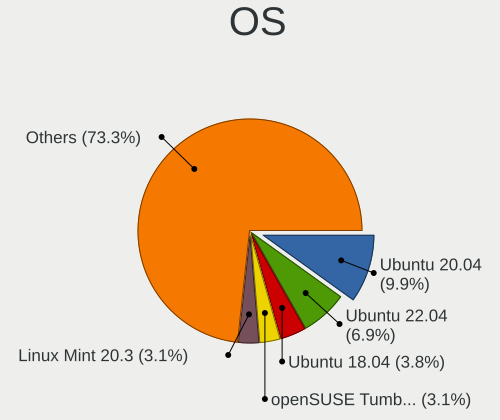

| Name                         | Notebooks | Percent |
|------------------------------|-----------|---------|
| Ubuntu 20.04                 | 13        | 9.92%   |
| Ubuntu 22.04                 | 9         | 6.87%   |
| Ubuntu 18.04                 | 5         | 3.82%   |
| openSUSE Tumbleweed-XXXXXXXX | 4         | 3.05%   |
| Linux Mint 20.3              | 4         | 3.05%   |
| Arch Rolling                 | 4         | 3.05%   |
| Xubuntu 20.04                | 3         | 2.29%   |
| Ubuntu 24.04                 | 3         | 2.29%   |
| Ubuntu 21.04                 | 3         | 2.29%   |
| Pop!_OS 21.04                | 3         | 2.29%   |
| OpenMandriva 4.90            | 3         | 2.29%   |
| OpenMandriva 4.2             | 3         | 2.29%   |
| Linux Mint 21.2              | 3         | 2.29%   |
| Ubuntu 20.10                 | 2         | 1.53%   |
| Pop!_OS 22.04                | 2         | 1.53%   |
| OpenMandriva 25.90           | 2         | 1.53%   |
| OpenMandriva 24.12           | 2         | 1.53%   |
| OpenMandriva 23.03           | 2         | 1.53%   |
| Fedora 39                    | 2         | 1.53%   |
| Fedora 37                    | 2         | 1.53%   |
| CachyOS                      | 2         | 1.53%   |
| ArcoLinux Rolling            | 2         | 1.53%   |
| Zorin 18                     | 1         | 0.76%   |
| Xubuntu 18.04                | 1         | 0.76%   |
| Ubuntu MATE 21.10            | 1         | 0.76%   |
| Ubuntu MATE 20.04            | 1         | 0.76%   |
| Ubuntu 23.10                 | 1         | 0.76%   |
| Ubuntu 18.10                 | 1         | 0.76%   |
| Ubuntu 1.3.4                 | 1         | 0.76%   |
| TUXEDO OS 24.04              | 1         | 0.76%   |
| RHEL 8                       | 1         | 0.76%   |
| Pop!_OS 21.10                | 1         | 0.76%   |
| Pop!_OS 20.10                | 1         | 0.76%   |
| Pop!_OS 20.04                | 1         | 0.76%   |
| Parrot 5.3                   | 1         | 0.76%   |
| Parrot 5.1                   | 1         | 0.76%   |
| openSUSE Leap-15.1           | 1         | 0.76%   |
| OpenMandriva 4.3             | 1         | 0.76%   |
| OpenMandriva 23.10           | 1         | 0.76%   |
| MX 23                        | 1         | 0.76%   |

OS Family
---------

OS without a version

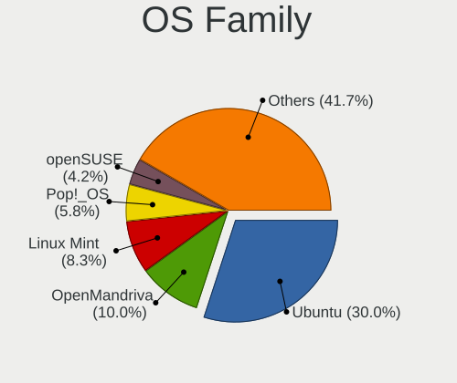

| Name         | Notebooks | Percent |
|--------------|-----------|---------|
| Ubuntu       | 36        | 30%     |
| OpenMandriva | 12        | 10%     |
| Linux Mint   | 10        | 8.33%   |
| Pop!_OS      | 7         | 5.83%   |
| openSUSE     | 5         | 4.17%   |
| Fedora       | 5         | 4.17%   |
| Xubuntu      | 4         | 3.33%   |
| Kubuntu      | 4         | 3.33%   |
| Arch         | 4         | 3.33%   |
| Manjaro      | 3         | 2.5%    |
| CachyOS      | 3         | 2.5%    |
| Ubuntu MATE  | 2         | 1.67%   |
| Parrot       | 2         | 1.67%   |
| Endless      | 2         | 1.67%   |
| Elementary   | 2         | 1.67%   |
| Debian       | 2         | 1.67%   |
| ArcoLinux    | 2         | 1.67%   |
| Zorin        | 1         | 0.83%   |
| TUXEDO OS    | 1         | 0.83%   |
| RHEL         | 1         | 0.83%   |
| MX           | 1         | 0.83%   |
| Lubuntu      | 1         | 0.83%   |
| LMDE         | 1         | 0.83%   |
| KDE neon     | 1         | 0.83%   |
| Kali         | 1         | 0.83%   |
| Gentoo       | 1         | 0.83%   |
| Garuda Linux | 1         | 0.83%   |
| Clear Linux  | 1         | 0.83%   |
| Bluefin      | 1         | 0.83%   |
| BlackPanther | 1         | 0.83%   |
| Bazzite      | 1         | 0.83%   |
| Artix        | 1         | 0.83%   |

Kernel
------

Version of the Linux kernel

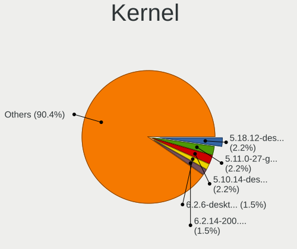

| Version                  | Notebooks | Percent |
|--------------------------|-----------|---------|
| 5.18.12-desktop-3omv4090 | 3         | 2.22%   |
| 5.11.0-27-generic        | 3         | 2.22%   |
| 5.10.14-desktop-1omv4002 | 3         | 2.22%   |
| 6.2.6-desktop-1omv2390   | 2         | 1.48%   |
| 6.2.14-200.fc37.x86_64   | 2         | 1.48%   |
| 6.14.2-desktop-3omv2590  | 2         | 1.48%   |
| 6.14.0-37-generic        | 2         | 1.48%   |
| 6.12.1-desktop-1omv2490  | 2         | 1.48%   |
| 5.8.0-59-generic         | 2         | 1.48%   |
| 5.4.0-96-generic         | 2         | 1.48%   |
| 5.4.0-122-generic        | 2         | 1.48%   |
| 5.19.0-35-generic        | 2         | 1.48%   |
| 5.11.0-34-generic        | 2         | 1.48%   |
| 5.11.0-17-generic        | 2         | 1.48%   |
| 5.0.0-23-generic         | 2         | 1.48%   |
| 6.9.8-arch1-1            | 1         | 0.74%   |
| 6.9.5-zen1-1-zen         | 1         | 0.74%   |
| 6.8.0-86-generic         | 1         | 0.74%   |
| 6.8.0-52-generic         | 1         | 0.74%   |
| 6.8.0-51-generic         | 1         | 0.74%   |
| 6.8.0-40-generic         | 1         | 0.74%   |
| 6.8.0-36-generic         | 1         | 0.74%   |
| 6.7.9-200.fc39.x86_64    | 1         | 0.74%   |
| 6.6.6-200.fc39.x86_64    | 1         | 0.74%   |
| 6.6.54-2-MANJARO         | 1         | 0.74%   |
| 6.6.42-1-lts             | 1         | 0.74%   |
| 6.6.2-arch1-1            | 1         | 0.74%   |
| 6.5.7-2-cachyos          | 1         | 0.74%   |
| 6.5.5-desktop-1omv2390   | 1         | 0.74%   |
| 6.5.12-200.fc38.x86_64   | 1         | 0.74%   |
| 6.5.0-28-generic         | 1         | 0.74%   |
| 6.5.0-27-generic         | 1         | 0.74%   |
| 6.5.0-26-generic         | 1         | 0.74%   |
| 6.5.0-10-generic         | 1         | 0.74%   |
| 6.4.3-1-default          | 1         | 0.74%   |
| 6.4.3-060403-generic     | 1         | 0.74%   |
| 6.2.0-37-generic         | 1         | 0.74%   |
| 6.2.0-26-generic         | 1         | 0.74%   |
| 6.17.8-300.fc43.x86_64   | 1         | 0.74%   |
| 6.17.7-ba20.fc43.x86_64  | 1         | 0.74%   |

Kernel Family
-------------

Linux kernel without a distro release

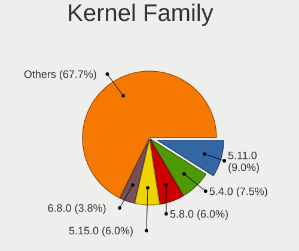

| Version | Notebooks | Percent |
|---------|-----------|---------|
| 5.11.0  | 12        | 9.02%   |
| 5.4.0   | 10        | 7.52%   |
| 5.8.0   | 8         | 6.02%   |
| 5.15.0  | 8         | 6.02%   |
| 6.8.0   | 5         | 3.76%   |
| 5.19.0  | 5         | 3.76%   |
| 6.5.0   | 4         | 3.01%   |
| 6.14.0  | 4         | 3.01%   |
| 5.13.0  | 4         | 3.01%   |
| 5.3.0   | 3         | 2.26%   |
| 5.18.12 | 3         | 2.26%   |
| 5.10.14 | 3         | 2.26%   |
| 4.15.0  | 3         | 2.26%   |
| 6.4.3   | 2         | 1.5%    |
| 6.2.6   | 2         | 1.5%    |
| 6.2.14  | 2         | 1.5%    |
| 6.2.0   | 2         | 1.5%    |
| 6.14.2  | 2         | 1.5%    |
| 6.12.1  | 2         | 1.5%    |
| 6.11.0  | 2         | 1.5%    |
| 5.7.0   | 2         | 1.5%    |
| 5.0.0   | 2         | 1.5%    |
| 4.18.0  | 2         | 1.5%    |
| 6.9.8   | 1         | 0.75%   |
| 6.9.5   | 1         | 0.75%   |
| 6.7.9   | 1         | 0.75%   |
| 6.6.6   | 1         | 0.75%   |
| 6.6.54  | 1         | 0.75%   |
| 6.6.42  | 1         | 0.75%   |
| 6.6.2   | 1         | 0.75%   |
| 6.5.7   | 1         | 0.75%   |
| 6.5.5   | 1         | 0.75%   |
| 6.5.12  | 1         | 0.75%   |
| 6.17.8  | 1         | 0.75%   |
| 6.17.7  | 1         | 0.75%   |
| 6.17.3  | 1         | 0.75%   |
| 6.16.4  | 1         | 0.75%   |
| 6.14.5  | 1         | 0.75%   |
| 6.12.0  | 1         | 0.75%   |
| 6.11.4  | 1         | 0.75%   |

Kernel Major Ver.
-----------------

Linux kernel major version

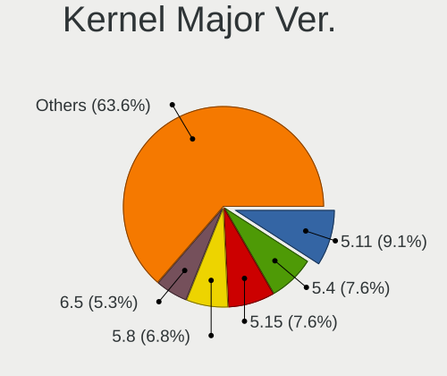

| Version | Notebooks | Percent |
|---------|-----------|---------|
| 5.11    | 12        | 9.09%   |
| 5.4     | 10        | 7.58%   |
| 5.15    | 10        | 7.58%   |
| 5.8     | 9         | 6.82%   |
| 6.5     | 7         | 5.3%    |
| 6.14    | 7         | 5.3%    |
| 6.2     | 6         | 4.55%   |
| 6.8     | 5         | 3.79%   |
| 5.19    | 5         | 3.79%   |
| 5.18    | 5         | 3.79%   |
| 5.10    | 5         | 3.79%   |
| 6.6     | 4         | 3.03%   |
| 5.7     | 4         | 3.03%   |
| 5.13    | 4         | 3.03%   |
| 6.17    | 3         | 2.27%   |
| 6.12    | 3         | 2.27%   |
| 5.3     | 3         | 2.27%   |
| 5.16    | 3         | 2.27%   |
| 4.18    | 3         | 2.27%   |
| 4.15    | 3         | 2.27%   |
| 6.9     | 2         | 1.52%   |
| 6.4     | 2         | 1.52%   |
| 6.11    | 2         | 1.52%   |
| 6.1     | 2         | 1.52%   |
| 6.0     | 2         | 1.52%   |
| 5.0     | 2         | 1.52%   |
| 6.7     | 1         | 0.76%   |
| 6.16    | 1         | 0.76%   |
| 6.10    | 1         | 0.76%   |
| 5.6     | 1         | 0.76%   |
| 5.5     | 1         | 0.76%   |
| 5.14    | 1         | 0.76%   |
| 5.12    | 1         | 0.76%   |
| 4.19    | 1         | 0.76%   |
| 4.12    | 1         | 0.76%   |

Arch
----

OS architecture (x86_64, i586, etc.)

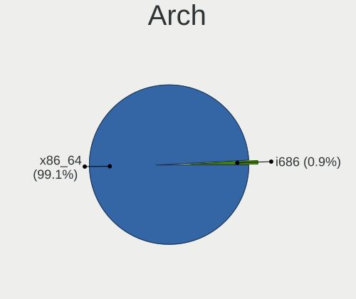

| Name   | Notebooks | Percent |
|--------|-----------|---------|
| x86_64 | 116       | 99.15%  |
| i686   | 1         | 0.85%   |

DE
--

Desktop Environment

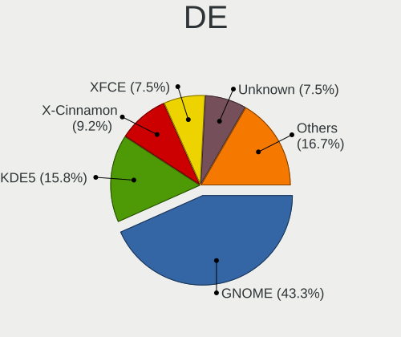

| Name            | Notebooks | Percent |
|-----------------|-----------|---------|
| GNOME           | 52        | 43.33%  |
| KDE5            | 19        | 15.83%  |
| X-Cinnamon      | 11        | 9.17%   |
| XFCE            | 9         | 7.5%    |
| Unknown         | 9         | 7.5%    |
| KDE6            | 5         | 4.17%   |
| MATE            | 4         | 3.33%   |
| KDE             | 4         | 3.33%   |
| Pantheon        | 2         | 1.67%   |
| i3              | 2         | 1.67%   |
| LXQt            | 1         | 0.83%   |
| GNOME Flashback | 1         | 0.83%   |
| Cinnamon        | 1         | 0.83%   |

Display Server
--------------

X11 or Wayland

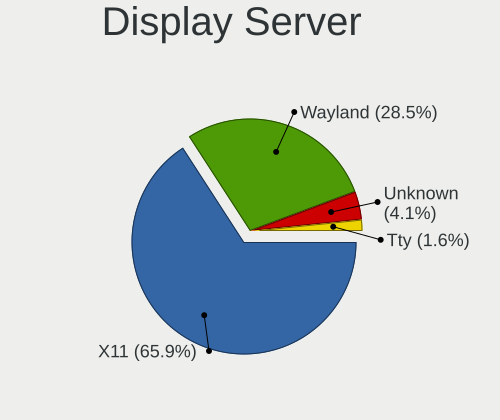

| Name    | Notebooks | Percent |
|---------|-----------|---------|
| X11     | 81        | 65.85%  |
| Wayland | 35        | 28.46%  |
| Unknown | 5         | 4.07%   |
| Tty     | 2         | 1.63%   |

Display Manager
---------------

SDDM, LightDM, etc.

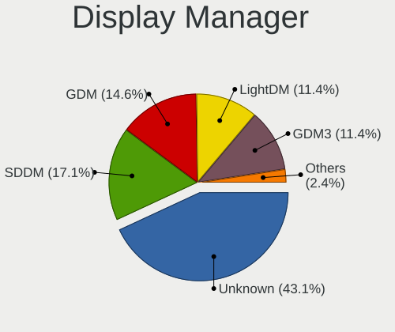

| Name    | Notebooks | Percent |
|---------|-----------|---------|
| Unknown | 53        | 43.09%  |
| SDDM    | 21        | 17.07%  |
| GDM     | 18        | 14.63%  |
| LightDM | 14        | 11.38%  |
| GDM3    | 14        | 11.38%  |
| TDM     | 3         | 2.44%   |

OS Lang
-------

Language

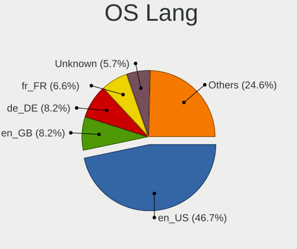

| Lang    | Notebooks | Percent |
|---------|-----------|---------|
| en_US   | 57        | 46.72%  |
| en_GB   | 10        | 8.2%    |
| de_DE   | 10        | 8.2%    |
| fr_FR   | 8         | 6.56%   |
| Unknown | 7         | 5.74%   |
| fr_LU   | 6         | 4.92%   |
| de_LU   | 6         | 4.92%   |
| nl_NL   | 3         | 2.46%   |
| fr_CH   | 2         | 1.64%   |
| C       | 2         | 1.64%   |
| UTF-8   | 1         | 0.82%   |
| unm_US  | 1         | 0.82%   |
| pt_PT   | 1         | 0.82%   |
| pt_BR   | 1         | 0.82%   |
| POSIX   | 1         | 0.82%   |
| it_IT   | 1         | 0.82%   |
| hr_HR   | 1         | 0.82%   |
| fr_BE   | 1         | 0.82%   |
| es_ES   | 1         | 0.82%   |
| en_IE   | 1         | 0.82%   |
| en_AU   | 1         | 0.82%   |

Boot Mode
---------

EFI or BIOS

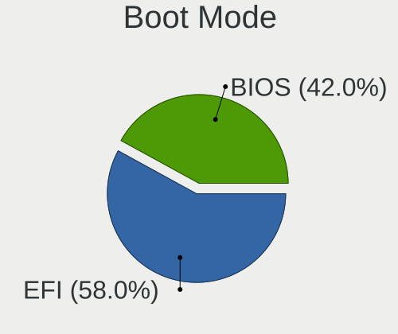

| Mode | Notebooks | Percent |
|------|-----------|---------|
| EFI  | 69        | 57.98%  |
| BIOS | 50        | 42.02%  |

Filesystem
----------

Type of filesystem

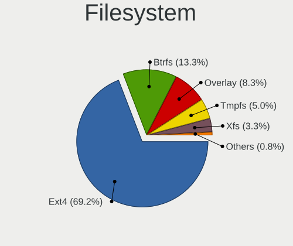

| Type    | Notebooks | Percent |
|---------|-----------|---------|
| Ext4    | 83        | 69.17%  |
| Btrfs   | 16        | 13.33%  |
| Overlay | 10        | 8.33%   |
| Tmpfs   | 6         | 5%      |
| Xfs     | 4         | 3.33%   |
| Unknown | 1         | 0.83%   |

Part. scheme
------------

Scheme of partitioning

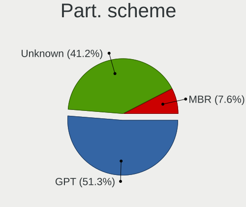

| Type    | Notebooks | Percent |
|---------|-----------|---------|
| GPT     | 61        | 51.26%  |
| Unknown | 49        | 41.18%  |
| MBR     | 9         | 7.56%   |

Dual Boot with Linux/BSD
------------------------

Hosting more than one Linux/BSD

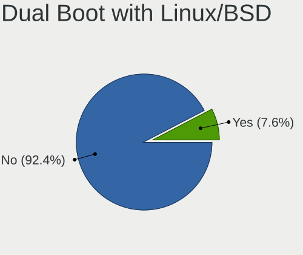

| Dual boot | Notebooks | Percent |
|-----------|-----------|---------|
| No        | 109       | 92.37%  |
| Yes       | 9         | 7.63%   |

Dual Boot (Win)
---------------

Hosting Linux and Windows

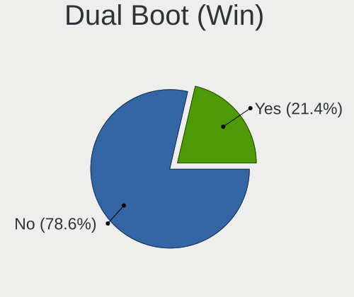

| Dual boot | Notebooks | Percent |
|-----------|-----------|---------|
| No        | 92        | 78.63%  |
| Yes       | 25        | 21.37%  |

Board
-----

Vendor
------

Motherboard manufacturer

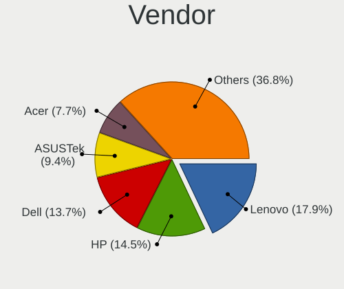

| Name             | Notebooks | Percent |
|------------------|-----------|---------|
| Lenovo           | 21        | 17.95%  |
| Hewlett-Packard  | 17        | 14.53%  |
| Dell             | 16        | 13.68%  |
| ASUSTek Computer | 11        | 9.4%    |
| Acer             | 9         | 7.69%   |
| Apple            | 6         | 5.13%   |
| Sony             | 5         | 4.27%   |
| MSI              | 4         | 3.42%   |
| HUAWEI           | 4         | 3.42%   |
| Wortmann AG      | 3         | 2.56%   |
| win element      | 2         | 1.71%   |
| TUXEDO           | 2         | 1.71%   |
| Timi             | 2         | 1.71%   |
| Medion           | 2         | 1.71%   |
| Fujitsu          | 2         | 1.71%   |
| Framework        | 2         | 1.71%   |
| Clevo            | 2         | 1.71%   |
| YJKC             | 1         | 0.85%   |
| Toshiba          | 1         | 0.85%   |
| SLIMBOOK         | 1         | 0.85%   |
| Panasonic        | 1         | 0.85%   |
| Packard Bell     | 1         | 0.85%   |
| Notebook         | 1         | 0.85%   |
| Unknown          | 1         | 0.85%   |

Model
-----

Motherboard model

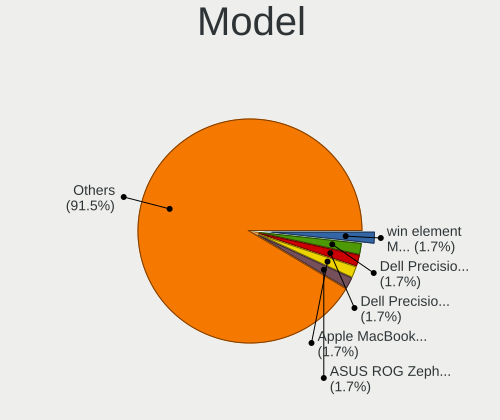

| Name                                     | Notebooks | Percent |
|------------------------------------------|-----------|---------|
| win element MoreFine S500+               | 2         | 1.71%   |
| Dell Precision M3800                     | 2         | 1.71%   |
| Dell Precision 7670                      | 2         | 1.71%   |
| ASUS ROG Zephyrus G14 GA401QM_GA401QM    | 2         | 1.71%   |
| Apple MacBookPro8,1                      | 2         | 1.71%   |
| Unknown                                  | 2         | 1.71%   |
| YJKC vBook                               | 1         | 0.85%   |
| Wortmann AG TERRA_MOBILE_1749            | 1         | 0.85%   |
| Wortmann AG TERRA_MOBILE_1541H           | 1         | 0.85%   |
| Wortmann AG MS-1727                      | 1         | 0.85%   |
| TUXEDO Stellaris 16 Intel Gen7           | 1         | 0.85%   |
| TUXEDO Pulse 14 Gen1                     | 1         | 0.85%   |
| Toshiba Satellite C55-A-1N0              | 1         | 0.85%   |
| Timi TM1613                              | 1         | 0.85%   |
| Timi RedmiBook 14 II                     | 1         | 0.85%   |
| Sony VPCP11S1R                           | 1         | 0.85%   |
| Sony VPCEB2E1E                           | 1         | 0.85%   |
| Sony VPCCA4E1E                           | 1         | 0.85%   |
| Sony VGN-NS30E_S                         | 1         | 0.85%   |
| Sony SVF1421E2EW                         | 1         | 0.85%   |
| SLIMBOOK EXECUTIVE-14                    | 1         | 0.85%   |
| Panasonic CF-195DCUBML                   | 1         | 0.85%   |
| Packard Bell EasyNote TJ65               | 1         | 0.85%   |
| Notebook NV4XMB,ME,MZ                    | 1         | 0.85%   |
| MSI Raider 18 HX A14VGG                  | 1         | 0.85%   |
| MSI GF75 Thin 10SER                      | 1         | 0.85%   |
| MSI GF72 8RD                             | 1         | 0.85%   |
| MSI GE63 7RD                             | 1         | 0.85%   |
| Medion P6685 MD61138                     | 1         | 0.85%   |
| Medion E4254 MD62100                     | 1         | 0.85%   |
| Lenovo Yoga 3 Pro-1370 80HE              | 1         | 0.85%   |
| Lenovo ThinkPad X1 Carbon 7th 20QDCTO1WW | 1         | 0.85%   |
| Lenovo ThinkPad T590 20N4CTO1WW          | 1         | 0.85%   |
| Lenovo ThinkPad T490 20N3S5DV0S          | 1         | 0.85%   |
| Lenovo ThinkPad T480s 20L7001PFR         | 1         | 0.85%   |
| Lenovo ThinkPad T470s W10DG 20JTS0R800   | 1         | 0.85%   |
| Lenovo ThinkPad T470s 20HGS08100         | 1         | 0.85%   |
| Lenovo ThinkPad T440p 20AWS24B00         | 1         | 0.85%   |
| Lenovo ThinkPad T14 Gen 3 21CGS17W00     | 1         | 0.85%   |
| Lenovo ThinkPad P1 Gen 2 20QUS3XF01      | 1         | 0.85%   |

Model Family
------------

Motherboard model prefix

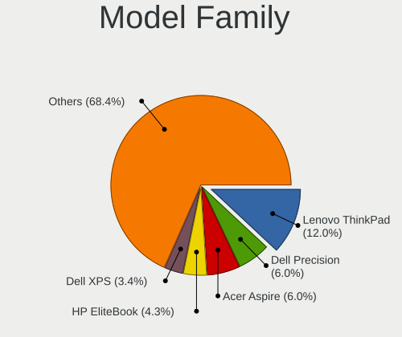

| Name                   | Notebooks | Percent |
|------------------------|-----------|---------|
| Lenovo ThinkPad        | 14        | 11.97%  |
| Dell Precision         | 7         | 5.98%   |
| Acer Aspire            | 7         | 5.98%   |
| HP EliteBook           | 5         | 4.27%   |
| Dell XPS               | 4         | 3.42%   |
| Lenovo IdeaPad         | 3         | 2.56%   |
| HP Pavilion            | 3         | 2.56%   |
| ASUS VivoBook          | 3         | 2.56%   |
| ASUS ROG               | 3         | 2.56%   |
| Wortmann AG TERRA      | 2         | 1.71%   |
| win element MoreFine   | 2         | 1.71%   |
| HP ZBook               | 2         | 1.71%   |
| HP ProBook             | 2         | 1.71%   |
| HP ENVY                | 2         | 1.71%   |
| Framework Laptop       | 2         | 1.71%   |
| Dell Latitude          | 2         | 1.71%   |
| Dell Inspiron          | 2         | 1.71%   |
| Apple MacBookPro8      | 2         | 1.71%   |
| Unknown                | 2         | 1.71%   |
| YJKC vBook             | 1         | 0.85%   |
| Wortmann AG MS-1727    | 1         | 0.85%   |
| TUXEDO Stellaris       | 1         | 0.85%   |
| TUXEDO Pulse           | 1         | 0.85%   |
| Toshiba Satellite      | 1         | 0.85%   |
| Timi TM1613            | 1         | 0.85%   |
| Timi RedmiBook         | 1         | 0.85%   |
| Sony VPCP11S1R         | 1         | 0.85%   |
| Sony VPCEB2E1E         | 1         | 0.85%   |
| Sony VPCCA4E1E         | 1         | 0.85%   |
| Sony VGN-NS30E         | 1         | 0.85%   |
| Sony SVF1421E2EW       | 1         | 0.85%   |
| SLIMBOOK EXECUTIVE-14  | 1         | 0.85%   |
| Panasonic CF-195DCUBML | 1         | 0.85%   |
| Packard Bell EasyNote  | 1         | 0.85%   |
| Notebook NV4XMB        | 1         | 0.85%   |
| MSI Raider             | 1         | 0.85%   |
| MSI GF75               | 1         | 0.85%   |
| MSI GF72               | 1         | 0.85%   |
| MSI GE63               | 1         | 0.85%   |
| Medion P6685           | 1         | 0.85%   |

MFG Year
--------

Motherboard manufacture year

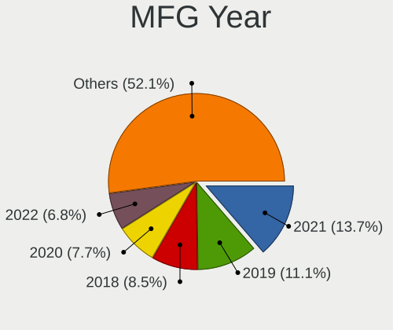

| Year | Notebooks | Percent |
|------|-----------|---------|
| 2021 | 16        | 13.68%  |
| 2019 | 13        | 11.11%  |
| 2018 | 10        | 8.55%   |
| 2020 | 9         | 7.69%   |
| 2022 | 8         | 6.84%   |
| 2017 | 8         | 6.84%   |
| 2014 | 8         | 6.84%   |
| 2013 | 8         | 6.84%   |
| 2011 | 8         | 6.84%   |
| 2015 | 6         | 5.13%   |
| 2010 | 5         | 4.27%   |
| 2023 | 4         | 3.42%   |
| 2012 | 4         | 3.42%   |
| 2016 | 3         | 2.56%   |
| 2024 | 2         | 1.71%   |
| 2009 | 2         | 1.71%   |
| 2008 | 2         | 1.71%   |
| 2025 | 1         | 0.85%   |

Form Factor
-----------

Physical design of the computer

| Name     | Notebooks | Percent |
|----------|-----------|---------|
| Notebook | 117       | 100%    |

Secure Boot
-----------

Enabled or disabled

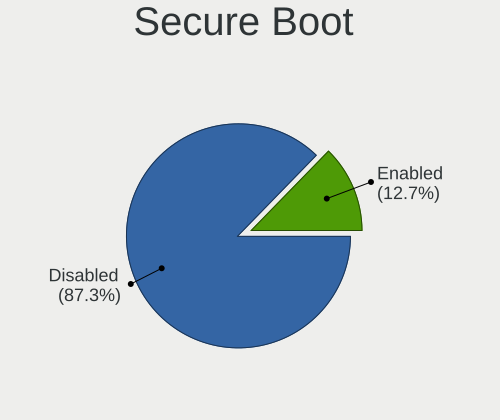

| State    | Notebooks | Percent |
|----------|-----------|---------|
| Disabled | 103       | 87.29%  |
| Enabled  | 15        | 12.71%  |

Coreboot
--------

Have coreboot on board

| Used | Notebooks | Percent |
|------|-----------|---------|
| No   | 117       | 100%    |

RAM Size
--------

Total RAM memory

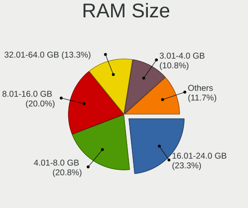

| Size in GB  | Notebooks | Percent |
|-------------|-----------|---------|
| 16.01-24.0  | 28        | 23.33%  |
| 4.01-8.0    | 25        | 20.83%  |
| 8.01-16.0   | 24        | 20%     |
| 32.01-64.0  | 16        | 13.33%  |
| 3.01-4.0    | 13        | 10.83%  |
| 24.01-32.0  | 5         | 4.17%   |
| 64.01-256.0 | 4         | 3.33%   |
| 1.01-2.0    | 3         | 2.5%    |
| 2.01-3.0    | 2         | 1.67%   |

RAM Used
--------

Used RAM memory

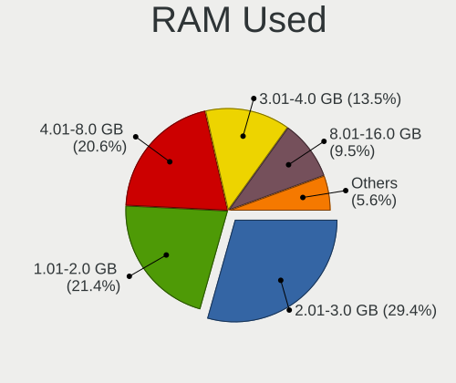

| Used GB    | Notebooks | Percent |
|------------|-----------|---------|
| 2.01-3.0   | 37        | 29.37%  |
| 1.01-2.0   | 27        | 21.43%  |
| 4.01-8.0   | 26        | 20.63%  |
| 3.01-4.0   | 17        | 13.49%  |
| 8.01-16.0  | 12        | 9.52%   |
| 24.01-32.0 | 2         | 1.59%   |
| 16.01-24.0 | 2         | 1.59%   |
| 0.51-1.0   | 2         | 1.59%   |
| 0.01-0.5   | 1         | 0.79%   |

Total Drives
------------

Number of drives on board

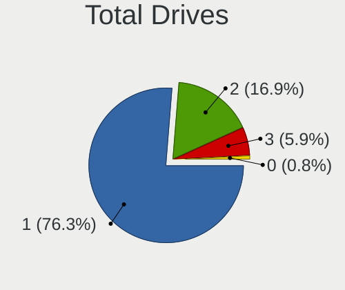

| Drives | Notebooks | Percent |
|--------|-----------|---------|
| 1      | 90        | 76.27%  |
| 2      | 20        | 16.95%  |
| 3      | 7         | 5.93%   |
| 0      | 1         | 0.85%   |

Has CD-ROM
----------

Has CD-ROM on board

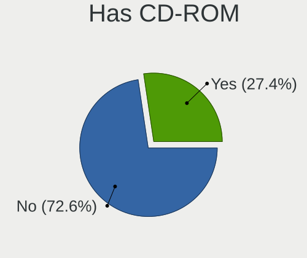

| Presented | Notebooks | Percent |
|-----------|-----------|---------|
| No        | 85        | 72.65%  |
| Yes       | 32        | 27.35%  |

Has Ethernet
------------

Has Ethernet on board

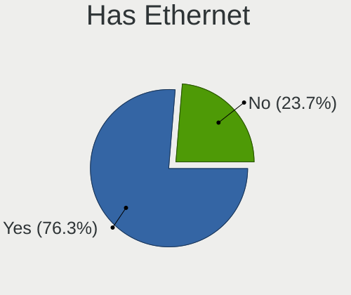

| Presented | Notebooks | Percent |
|-----------|-----------|---------|
| Yes       | 90        | 76.92%  |
| No        | 27        | 23.08%  |

Has WiFi
--------

Has WiFi module

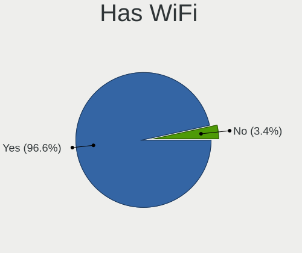

| Presented | Notebooks | Percent |
|-----------|-----------|---------|
| Yes       | 113       | 96.58%  |
| No        | 4         | 3.42%   |

Has Bluetooth
-------------

Has Bluetooth module

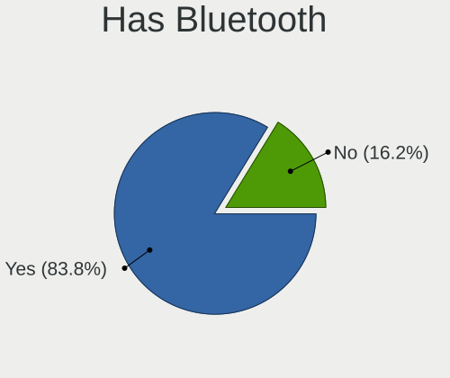

| Presented | Notebooks | Percent |
|-----------|-----------|---------|
| Yes       | 98        | 83.76%  |
| No        | 19        | 16.24%  |

Location
--------

Country
-------

Geographic location (country)

| Country    | Notebooks | Percent |
|------------|-----------|---------|
| Luxembourg | 117       | 100%    |

City
----

Geographic location (city)

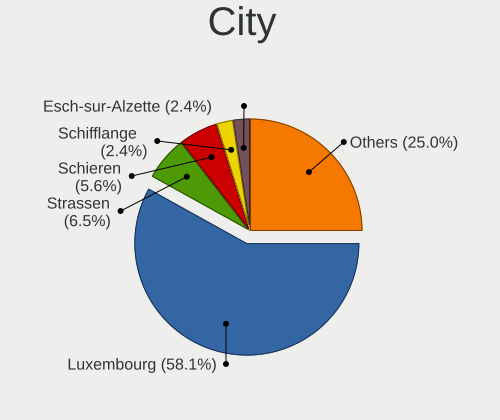

| City              | Notebooks | Percent |
|-------------------|-----------|---------|
| Luxembourg        | 72        | 58.06%  |
| Strassen          | 8         | 6.45%   |
| Schieren          | 7         | 5.65%   |
| Schifflange       | 3         | 2.42%   |
| Esch-sur-Alzette  | 3         | 2.42%   |
| Useldange         | 2         | 1.61%   |
| Steinfort         | 2         | 1.61%   |
| Ehnen             | 2         | 1.61%   |
| Wiltz             | 1         | 0.81%   |
| Wecker            | 1         | 0.81%   |
| Vianden           | 1         | 0.81%   |
| Tetange           | 1         | 0.81%   |
| Steinsel          | 1         | 0.81%   |
| Soleuvre          | 1         | 0.81%   |
| Remich            | 1         | 0.81%   |
| PerlГ©          | 1         | 0.81%   |
| Oberpallen        | 1         | 0.81%   |
| Niederanven       | 1         | 0.81%   |
| Leudelange        | 1         | 0.81%   |
| Hunsdorf          | 1         | 0.81%   |
| Ettelbruck        | 1         | 0.81%   |
| Esch-sur-Sûre    | 1         | 0.81%   |
| Echternach        | 1         | 0.81%   |
| Differdange       | 1         | 0.81%   |
| Diekirch          | 1         | 0.81%   |
| Clervaux          | 1         | 0.81%   |
| Cessange          | 1         | 0.81%   |
| Brouch            | 1         | 0.81%   |
| Bourscheid        | 1         | 0.81%   |
| Bettembourg       | 1         | 0.81%   |
| Bettange-sur-Mess | 1         | 0.81%   |
| Beckerich         | 1         | 0.81%   |
| Aspelt            | 1         | 0.81%   |

Drives
------

Drive Vendor
------------

Hard drive vendors

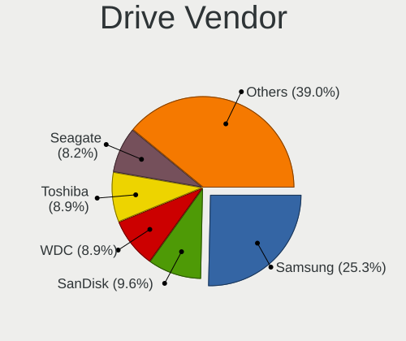

| Vendor                      | Notebooks | Drives | Percent |
|-----------------------------|-----------|--------|---------|
| Samsung Electronics         | 37        | 54     | 25.34%  |
| SanDisk                     | 14        | 17     | 9.59%   |
| WDC                         | 13        | 15     | 8.9%    |
| Toshiba                     | 13        | 14     | 8.9%    |
| Seagate                     | 12        | 12     | 8.22%   |
| Kingston                    | 9         | 11     | 6.16%   |
| Crucial                     | 9         | 11     | 6.16%   |
| SK hynix                    | 7         | 7      | 4.79%   |
| Intel                       | 4         | 5      | 2.74%   |
| Apple                       | 4         | 5      | 2.74%   |
| LITEON                      | 3         | 3      | 2.05%   |
| Micron Technology           | 2         | 3      | 1.37%   |
| LITEONIT                    | 2         | 2      | 1.37%   |
| HGST                        | 2         | 2      | 1.37%   |
| Yangtze Memory Technologies | 1         | 2      | 0.68%   |
| Union Memory (Shenzhen)     | 1         | 1      | 0.68%   |
| Super Talent                | 1         | 1      | 0.68%   |
| Phison Electronics          | 1         | 1      | 0.68%   |
| PHD 3.0                     | 1         | 1      | 0.68%   |
| NT-128                      | 1         | 1      | 0.68%   |
| Lenovo                      | 1         | 3      | 0.68%   |
| LaCie                       | 1         | 1      | 0.68%   |
| Kingston Technology Company | 1         | 2      | 0.68%   |
| KingDian                    | 1         | 1      | 0.68%   |
| Intenso                     | 1         | 2      | 0.68%   |
| HUAWEI                      | 1         | 1      | 0.68%   |
| Hitachi                     | 1         | 1      | 0.68%   |
| FORESEE                     | 1         | 1      | 0.68%   |
| A-DATA Technology           | 1         | 1      | 0.68%   |

Drive Model
-----------

Hard drive models

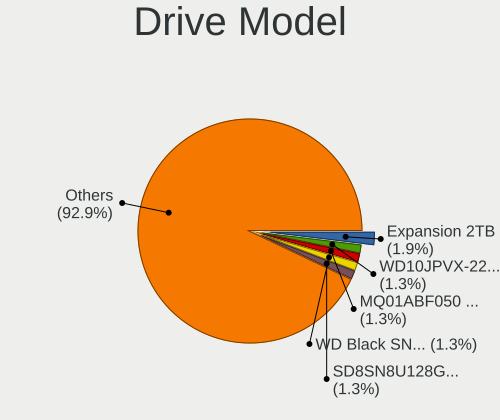

| Model                                              | Notebooks | Percent |
|----------------------------------------------------|-----------|---------|
| Seagate Expansion 2TB                              | 3         | 1.92%   |
| WDC WD10JPVX-22JC3T0 1TB                           | 2         | 1.28%   |
| Toshiba MQ01ABF050 500GB                           | 2         | 1.28%   |
| Sandisk WD Black SN750 / PC SN730 NVMe SSD 500GB   | 2         | 1.28%   |
| SanDisk SD8SN8U128G1122 128GB SSD                  | 2         | 1.28%   |
| SanDisk NVMe SSD Drive 1TB                         | 2         | 1.28%   |
| Samsung SSD 860 QVO 1TB                            | 2         | 1.28%   |
| Samsung NVMe SSD Controller PM9A1/PM9A3/980PRO 1TB | 2         | 1.28%   |
| Samsung MZVLW256HEHP-000L7 256GB                   | 2         | 1.28%   |
| Samsung MZVLQ1T0HBLB-00B00 1024GB                  | 2         | 1.28%   |
| LITEONIT LMT-256L9M-11 MSATA 256GB SSD             | 2         | 1.28%   |
| Crucial CT240BX500SSD1 240GB                       | 2         | 1.28%   |
| Crucial CT1000BX500SSD1 1TB                        | 2         | 1.28%   |
| Yangtze Memory ZHITAI TiPlus5000 1TB               | 1         | 0.64%   |
| WDC WDS250G2B0B-00YS70 250GB SSD                   | 1         | 0.64%   |
| WDC WDS200T1X0E-00AFY0 2TB                         | 1         | 0.64%   |
| WDC WDS100T2G0A-00JH30 1TB SSD                     | 1         | 0.64%   |
| WDC WD3200LPCX-00VHAT0 320GB                       | 1         | 0.64%   |
| WDC WD1600BEVT-75ZCT2 160GB                        | 1         | 0.64%   |
| WDC WD10SPZX-17Z10T0 1TB                           | 1         | 0.64%   |
| WDC WD10SPCX-60HWST0 1TB                           | 1         | 0.64%   |
| WDC PC SN730 SDBQNTY-512G-1001 512GB               | 1         | 0.64%   |
| WDC PC SN730 SDBQNTY-256G-1001 256GB               | 1         | 0.64%   |
| WDC PC SN730 SDBQNTY-1T00-1001 1TB                 | 1         | 0.64%   |
| WDC PC SN730 SDBPNTY-512G-1027 512GB               | 1         | 0.64%   |
| Union Memory (Shenzhen) NVMe SSD Drive 128GB       | 1         | 0.64%   |
| Toshiba XG4 NVMe SSD Controller 256GB              | 1         | 0.64%   |
| Toshiba THNSNJ256G8NY 256GB SSD                    | 1         | 0.64%   |
| Toshiba THNSNJ128GCST 128GB SSD                    | 1         | 0.64%   |
| Toshiba NVMe SSD Drive 512GB                       | 1         | 0.64%   |
| Toshiba MQ02ABD100H 1TB                            | 1         | 0.64%   |
| Toshiba MK7575GSX 752GB                            | 1         | 0.64%   |
| Toshiba MK6459GSXP 640GB                           | 1         | 0.64%   |
| Toshiba MK2555GSX 250GB                            | 1         | 0.64%   |
| Toshiba KXG60PNV2T04 NVMe KIOXIA 2048GB            | 1         | 0.64%   |
| Toshiba KXG50ZNV512G 512GB                         | 1         | 0.64%   |
| Toshiba KXG50ZNV256G 256GB                         | 1         | 0.64%   |
| Super Talent FTM25N325H 250GB SSD                  | 1         | 0.64%   |
| SK hynix SKHynix_HFS001TEJ4X112N 1024GB            | 1         | 0.64%   |
| SK hynix PC801 NVMe 1TB                            | 1         | 0.64%   |

HDD Vendor
----------

Hard disk drive vendors

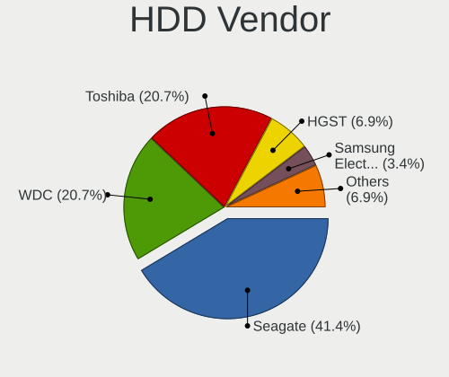

| Vendor              | Notebooks | Drives | Percent |
|---------------------|-----------|--------|---------|
| Seagate             | 12        | 12     | 41.38%  |
| WDC                 | 6         | 8      | 20.69%  |
| Toshiba             | 6         | 7      | 20.69%  |
| HGST                | 2         | 2      | 6.9%    |
| Samsung Electronics | 1         | 1      | 3.45%   |
| Hitachi             | 1         | 1      | 3.45%   |
| Apple               | 1         | 1      | 3.45%   |

SSD Vendor
----------

Solid state drive vendors

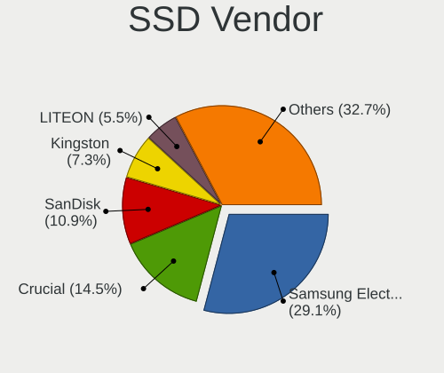

| Vendor              | Notebooks | Drives | Percent |
|---------------------|-----------|--------|---------|
| Samsung Electronics | 16        | 24     | 29.09%  |
| Crucial             | 8         | 10     | 14.55%  |
| SanDisk             | 6         | 7      | 10.91%  |
| Kingston            | 4         | 6      | 7.27%   |
| LITEON              | 3         | 3      | 5.45%   |
| WDC                 | 2         | 2      | 3.64%   |
| Toshiba             | 2         | 2      | 3.64%   |
| Micron Technology   | 2         | 3      | 3.64%   |
| LITEONIT            | 2         | 2      | 3.64%   |
| Super Talent        | 1         | 1      | 1.82%   |
| SK hynix            | 1         | 1      | 1.82%   |
| PHD 3.0             | 1         | 1      | 1.82%   |
| NT-128              | 1         | 1      | 1.82%   |
| Lenovo              | 1         | 3      | 1.82%   |
| KingDian            | 1         | 1      | 1.82%   |
| Intenso             | 1         | 2      | 1.82%   |
| Intel               | 1         | 1      | 1.82%   |
| FORESEE             | 1         | 1      | 1.82%   |
| Apple               | 1         | 1      | 1.82%   |

Drive Kind
----------

HDD or SSD

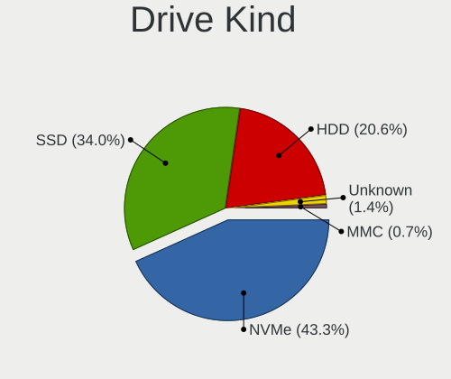

| Kind    | Notebooks | Drives | Percent |
|---------|-----------|--------|---------|
| NVMe    | 61        | 74     | 43.26%  |
| SSD     | 48        | 72     | 34.04%  |
| HDD     | 29        | 32     | 20.57%  |
| Unknown | 2         | 2      | 1.42%   |
| MMC     | 1         | 1      | 0.71%   |

Drive Connector
---------------

SATA, SAS, NVMe, etc.

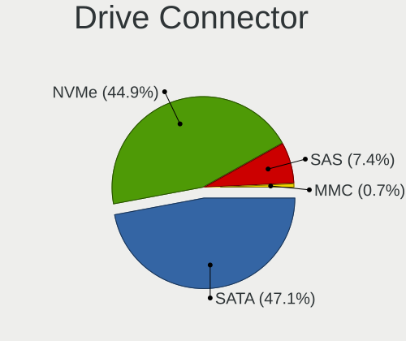

| Type | Notebooks | Drives | Percent |
|------|-----------|--------|---------|
| SATA | 64        | 94     | 47.06%  |
| NVMe | 61        | 74     | 44.85%  |
| SAS  | 10        | 12     | 7.35%   |
| MMC  | 1         | 1      | 0.74%   |

Drive Size
----------

Size of hard drive

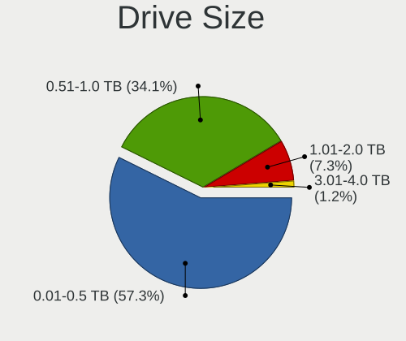

| Size in TB | Notebooks | Drives | Percent |
|------------|-----------|--------|---------|
| 0.01-0.5   | 47        | 61     | 57.32%  |
| 0.51-1.0   | 28        | 34     | 34.15%  |
| 1.01-2.0   | 6         | 8      | 7.32%   |
| 3.01-4.0   | 1         | 1      | 1.22%   |

Space Total
-----------

Amount of disk space available on the file system

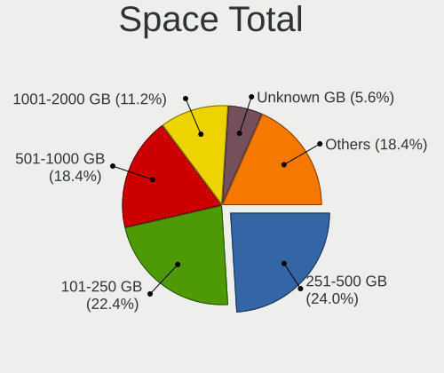

| Size in GB     | Notebooks | Percent |
|----------------|-----------|---------|
| 251-500        | 30        | 24%     |
| 101-250        | 28        | 22.4%   |
| 501-1000       | 23        | 18.4%   |
| 1001-2000      | 14        | 11.2%   |
| Unknown        | 7         | 5.6%    |
| More than 3000 | 6         | 4.8%    |
| 1-20           | 6         | 4.8%    |
| 51-100         | 5         | 4%      |
| 2001-3000      | 4         | 3.2%    |
| 21-50          | 2         | 1.6%    |

Space Used
----------

Amount of used disk space

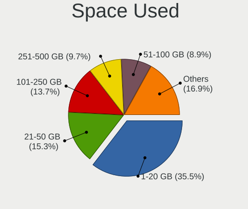

| Used GB   | Notebooks | Percent |
|-----------|-----------|---------|
| 1-20      | 44        | 35.48%  |
| 21-50     | 19        | 15.32%  |
| 101-250   | 17        | 13.71%  |
| 251-500   | 12        | 9.68%   |
| 51-100    | 11        | 8.87%   |
| 501-1000  | 9         | 7.26%   |
| Unknown   | 7         | 5.65%   |
| 2001-3000 | 3         | 2.42%   |
| 1001-2000 | 2         | 1.61%   |

Malfunc. Drives
---------------

Drive models with a malfunction

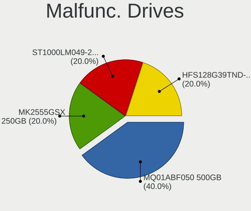

| Model                                 | Notebooks | Drives | Percent |
|---------------------------------------|-----------|--------|---------|
| Toshiba MQ01ABF050 500GB              | 2         | 2      | 40%     |
| Toshiba MK2555GSX 250GB               | 1         | 1      | 20%     |
| SK hynix HFS128G39TND-N210A 128GB SSD | 1         | 1      | 20%     |
| Seagate ST1000LM049-2GH172 1TB        | 1         | 1      | 20%     |

Malfunc. Drive Vendor
---------------------

Vendors of faulty drives

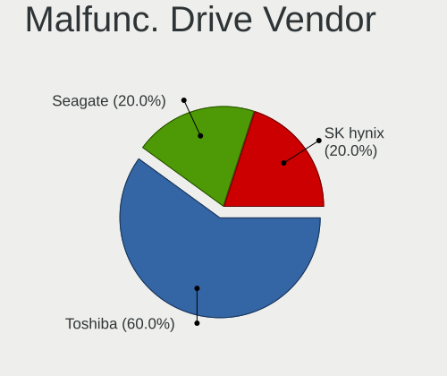

| Vendor   | Notebooks | Drives | Percent |
|----------|-----------|--------|---------|
| Toshiba  | 3         | 3      | 60%     |
| SK hynix | 1         | 1      | 20%     |
| Seagate  | 1         | 1      | 20%     |

Malfunc. HDD Vendor
-------------------

Vendors of faulty HDD drives

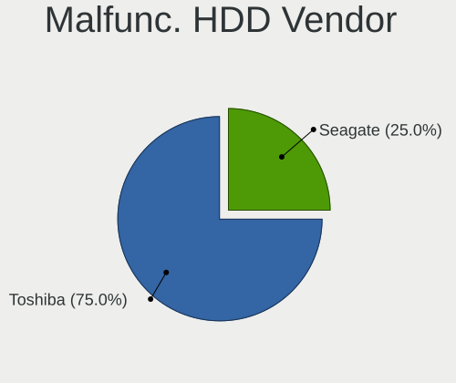

| Vendor  | Notebooks | Drives | Percent |
|---------|-----------|--------|---------|
| Toshiba | 3         | 3      | 75%     |
| Seagate | 1         | 1      | 25%     |

Malfunc. Drive Kind
-------------------

Kinds of faulty drives

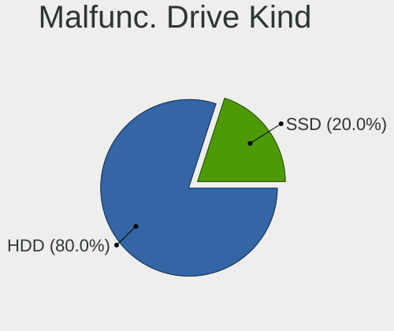

| Kind | Notebooks | Drives | Percent |
|------|-----------|--------|---------|
| HDD  | 4         | 4      | 80%     |
| SSD  | 1         | 1      | 20%     |

Failed Drives
-------------

Failed drive models

Zero info for selected period =(

Failed Drive Vendor
-------------------

Failed drive vendors

Zero info for selected period =(

Drive Status
------------

Number of failed and malfunc. drives

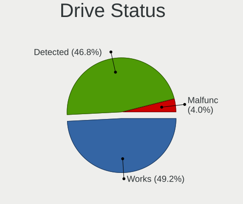

| Status   | Notebooks | Drives | Percent |
|----------|-----------|--------|---------|
| Works    | 62        | 81     | 49.21%  |
| Detected | 59        | 95     | 46.83%  |
| Malfunc  | 5         | 5      | 3.97%   |

Storage controller
------------------

Storage Vendor
--------------

Storage controller vendors

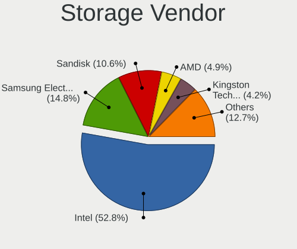

| Vendor                       | Notebooks | Percent |
|------------------------------|-----------|---------|
| Intel                        | 75        | 52.82%  |
| Samsung Electronics          | 21        | 14.79%  |
| Sandisk                      | 15        | 10.56%  |
| AMD                          | 7         | 4.93%   |
| Kingston Technology Company  | 6         | 4.23%   |
| Toshiba America Info Systems | 5         | 3.52%   |
| SK hynix                     | 5         | 3.52%   |
| Apple                        | 2         | 1.41%   |
| Yangtze Memory Technologies  | 1         | 0.7%    |
| Union Memory (Shenzhen)      | 1         | 0.7%    |
| Phison Electronics           | 1         | 0.7%    |
| Micron/Crucial Technology    | 1         | 0.7%    |
| Marvell Technology Group     | 1         | 0.7%    |
| ADATA Technology             | 1         | 0.7%    |

Storage Model
-------------

Storage controller models

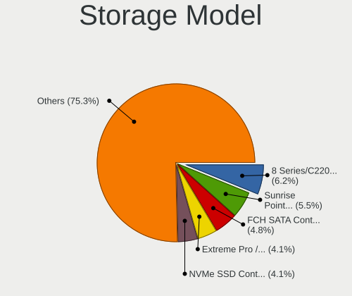

| Model                                                                          | Notebooks | Percent |
|--------------------------------------------------------------------------------|-----------|---------|
| Intel 8 Series/C220 Series Chipset Family 6-port SATA Controller 1 [AHCI mode] | 9         | 6.16%   |
| Intel Sunrise Point-LP SATA Controller [AHCI mode]                             | 8         | 5.48%   |
| AMD FCH SATA Controller [AHCI mode]                                            | 7         | 4.79%   |
| SanDisk Extreme Pro / WD Black SN750 / PC SN730 / Red SN700 NVMe SSD           | 6         | 4.11%   |
| Samsung NVMe SSD Controller 980 (DRAM-less)                                    | 6         | 4.11%   |
| Intel Volume Management Device NVMe RAID Controller                            | 6         | 4.11%   |
| Intel 7 Series Chipset Family 6-port SATA Controller [AHCI mode]               | 6         | 4.11%   |
| Intel 6 Series/C200 Series Chipset Family 6 port Mobile SATA AHCI Controller   | 6         | 4.11%   |
| Samsung NVMe SSD Controller SM981/PM981/PM983                                  | 5         | 3.42%   |
| Intel Cannon Lake Mobile PCH SATA AHCI Controller                              | 5         | 3.42%   |
| Intel 82801 Mobile SATA Controller [RAID mode]                                 | 5         | 3.42%   |
| Samsung NVMe SSD Controller PM9A1/PM9A3/980PRO                                 | 4         | 2.74%   |
| Intel Wildcat Point-LP SATA Controller [AHCI Mode]                             | 4         | 2.74%   |
| Intel 5 Series/3400 Series Chipset 4 port SATA AHCI Controller                 | 4         | 2.74%   |
| SanDisk WD PC SN810 / Black SN850 NVMe SSD                                     | 3         | 2.05%   |
| Samsung NVMe SSD Controller SM961/PM961/SM963                                  | 3         | 2.05%   |
| Intel HM170/QM170 Chipset SATA Controller [AHCI Mode]                          | 3         | 2.05%   |
| Intel Celeron/Pentium Silver Processor SATA Controller                         | 3         | 2.05%   |
| Intel 82801IBM/IEM (ICH9M/ICH9M-E) 4 port SATA Controller [AHCI mode]          | 3         | 2.05%   |
| Intel 8 Series SATA Controller 1 [AHCI mode]                                   | 3         | 2.05%   |
| Toshiba America Info Systems XG6 NVMe SSD Controller                           | 2         | 1.37%   |
| Toshiba America Info Systems XG5 NVMe SSD Controller                           | 2         | 1.37%   |
| SK hynix BC901 NVMe Solid State Drive (DRAM-less)                              | 2         | 1.37%   |
| Sandisk WD Blue SN580 NVMe SSD (DRAM-less)                                     | 2         | 1.37%   |
| SanDisk Ultra 3D / WD PC SN530, IX SN530, Blue SN550 NVMe SSD (DRAM-less)      | 2         | 1.37%   |
| Samsung NVMe SSD Controller S4LV008[Pascal]                                    | 2         | 1.37%   |
| Intel RST Volume Management Device Controller                                  | 2         | 1.37%   |
| Intel Cannon Point-LP SATA Controller [AHCI Mode]                              | 2         | 1.37%   |
| Intel 400 Series Chipset Family SATA AHCI Controller                           | 2         | 1.37%   |
| Yangtze Memory ZHITAI TiPro5000 NVMe SSD                                       | 1         | 0.68%   |
| Union Memory (Shenzhen) AM610 PCIe 3.0 x2 NVMe SSD 128GB, 256GB                | 1         | 0.68%   |
| Toshiba America Info Systems XG4 NVMe SSD Controller                           | 1         | 0.68%   |
| SK hynix Platinum P41/PC801 NVMe Solid State Drive                             | 1         | 0.68%   |
| SK hynix PC601 NVMe Solid State Drive                                          | 1         | 0.68%   |
| SK hynix Gold P31/BC711/PC711 NVMe Solid State Drive                           | 1         | 0.68%   |
| SanDisk WD SN560/SN740/SN770/SN5000 NVMe SSD                                   | 1         | 0.68%   |
| Sandisk WD PC SN740 NVMe SSD 512GB (DRAM-less)                                 | 1         | 0.68%   |
| Samsung NVMe SSD Controller SM951/PM951                                        | 1         | 0.68%   |
| Samsung NVMe SSD Controller PM9B1 (DRAM-less)                                  | 1         | 0.68%   |
| Phison PS5013-E13 PCIe3 NVMe Controller (DRAM-less)                            | 1         | 0.68%   |

Storage Kind
------------

Kind of storage controller (IDE, SATA, NVMe, SAS, ...)

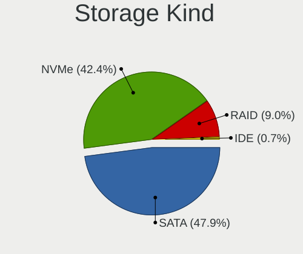

| Kind | Notebooks | Percent |
|------|-----------|---------|
| SATA | 69        | 47.92%  |
| NVMe | 61        | 42.36%  |
| RAID | 13        | 9.03%   |
| IDE  | 1         | 0.69%   |

Processor
---------

CPU Vendor
----------

Processor vendors

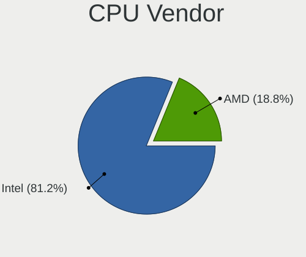

| Vendor | Notebooks | Percent |
|--------|-----------|---------|
| Intel  | 95        | 81.2%   |
| AMD    | 22        | 18.8%   |

CPU Model
---------

Processor models

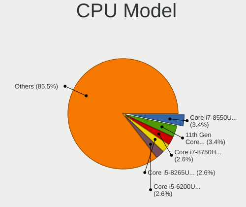

| Model                                       | Notebooks | Percent |
|---------------------------------------------|-----------|---------|
| Intel Core i7-8550U CPU @ 1.80GHz           | 4         | 3.42%   |
| Intel 11th Gen Core i7-1165G7 @ 2.80GHz     | 4         | 3.42%   |
| Intel Core i7-8750H CPU @ 2.20GHz           | 3         | 2.56%   |
| Intel Core i5-8265U CPU @ 1.60GHz           | 3         | 2.56%   |
| Intel Core i5-6200U CPU @ 2.30GHz           | 3         | 2.56%   |
| AMD Ryzen 9 5900HX with Radeon Graphics     | 3         | 2.56%   |
| Intel Core i7-9750H CPU @ 2.60GHz           | 2         | 1.71%   |
| Intel Core i7-7700HQ CPU @ 2.80GHz          | 2         | 1.71%   |
| Intel Core i7-6500U CPU @ 2.50GHz           | 2         | 1.71%   |
| Intel Core i7-5500U CPU @ 2.40GHz           | 2         | 1.71%   |
| Intel Core i7-4702HQ CPU @ 2.20GHz          | 2         | 1.71%   |
| Intel Core i7-10510U CPU @ 1.80GHz          | 2         | 1.71%   |
| Intel Core i5-8250U CPU @ 1.60GHz           | 2         | 1.71%   |
| Intel Core i5-4200U CPU @ 1.60GHz           | 2         | 1.71%   |
| Intel Core i5-10300H CPU @ 2.50GHz          | 2         | 1.71%   |
| Intel Core i3 CPU M 370 @ 2.40GHz           | 2         | 1.71%   |
| Intel 12th Gen Core i7-12700H               | 2         | 1.71%   |
| AMD Ryzen 9 5900HS with Radeon Graphics     | 2         | 1.71%   |
| AMD Ryzen 5 4600H with Radeon Graphics      | 2         | 1.71%   |
| Intel Pentium Silver N5000 CPU @ 1.10GHz    | 1         | 0.85%   |
| Intel Pentium Dual-Core CPU T4300 @ 2.10GHz | 1         | 0.85%   |
| Intel Pentium Dual-Core CPU T4200 @ 2.00GHz | 1         | 0.85%   |
| Intel Pentium CPU P6000 @ 1.87GHz           | 1         | 0.85%   |
| Intel Pentium CPU 987 @ 1.50GHz             | 1         | 0.85%   |
| Intel Core Ultra 9 275HX                    | 1         | 0.85%   |
| Intel Core m5-6Y54 CPU @ 1.10GHz            | 1         | 0.85%   |
| Intel Core M-5Y71 CPU @ 1.20GHz             | 1         | 0.85%   |
| Intel Core i9-9880H CPU @ 2.30GHz           | 1         | 0.85%   |
| Intel Core i9-14900HX                       | 1         | 0.85%   |
| Intel Core i7-9850H CPU @ 2.60GHz           | 1         | 0.85%   |
| Intel Core i7-8665U CPU @ 1.90GHz           | 1         | 0.85%   |
| Intel Core i7-8565U CPU @ 1.80GHz           | 1         | 0.85%   |
| Intel Core i7-6600U CPU @ 2.60GHz           | 1         | 0.85%   |
| Intel Core i7-4810MQ CPU @ 2.80GHz          | 1         | 0.85%   |
| Intel Core i7-4712MQ CPU @ 2.30GHz          | 1         | 0.85%   |
| Intel Core i7-4710HQ CPU @ 2.50GHz          | 1         | 0.85%   |
| Intel Core i7-4702MQ CPU @ 2.20GHz          | 1         | 0.85%   |
| Intel Core i7-3940XM CPU @ 3.00GHz          | 1         | 0.85%   |
| Intel Core i7-3840QM CPU @ 2.80GHz          | 1         | 0.85%   |
| Intel Core i7-2670QM CPU @ 2.20GHz          | 1         | 0.85%   |

CPU Model Family
----------------

Processor model prefix

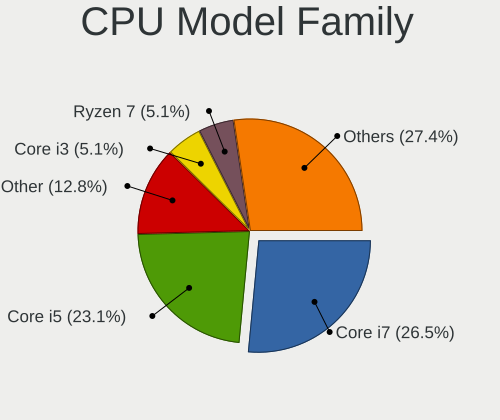

| Model                   | Notebooks | Percent |
|-------------------------|-----------|---------|
| Intel Core i7           | 31        | 26.5%   |
| Intel Core i5           | 27        | 23.08%  |
| Other                   | 15        | 12.82%  |
| Intel Core i3           | 6         | 5.13%   |
| AMD Ryzen 7             | 6         | 5.13%   |
| AMD Ryzen 9             | 5         | 4.27%   |
| AMD Ryzen 5             | 5         | 4.27%   |
| Intel Celeron           | 4         | 3.42%   |
| AMD Ryzen 7 PRO         | 3         | 2.56%   |
| Intel Pentium Dual-Core | 2         | 1.71%   |
| Intel Pentium           | 2         | 1.71%   |
| Intel Core i9           | 2         | 1.71%   |
| AMD Ryzen 5 PRO         | 2         | 1.71%   |
| Intel Pentium Silver    | 1         | 0.85%   |
| Intel Core m5           | 1         | 0.85%   |
| Intel Core M            | 1         | 0.85%   |
| Intel Core              | 1         | 0.85%   |
| Intel Celeron Dual-Core | 1         | 0.85%   |
| Intel Atom              | 1         | 0.85%   |
| AMD E2                  | 1         | 0.85%   |

CPU Cores
---------

Number of processor cores

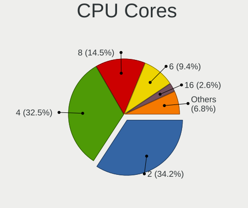

| Number | Notebooks | Percent |
|--------|-----------|---------|
| 2      | 40        | 34.19%  |
| 4      | 38        | 32.48%  |
| 8      | 17        | 14.53%  |
| 6      | 11        | 9.4%    |
| 16     | 3         | 2.56%   |
| 24     | 2         | 1.71%   |
| 14     | 2         | 1.71%   |
| 10     | 2         | 1.71%   |
| 1      | 2         | 1.71%   |

CPU Sockets
-----------

Number of sockets

| Number | Notebooks | Percent |
|--------|-----------|---------|
| 1      | 117       | 100%    |

CPU Threads
-----------

Threads per core (Hyper-Threading)

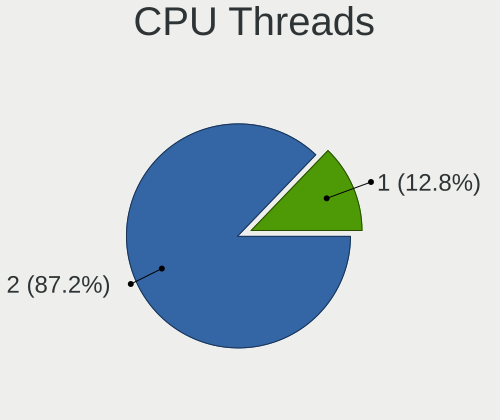

| Number | Notebooks | Percent |
|--------|-----------|---------|
| 2      | 102       | 87.18%  |
| 1      | 15        | 12.82%  |

CPU Op-Modes
------------

CPU Operation Modes (32-bit, 64-bit)

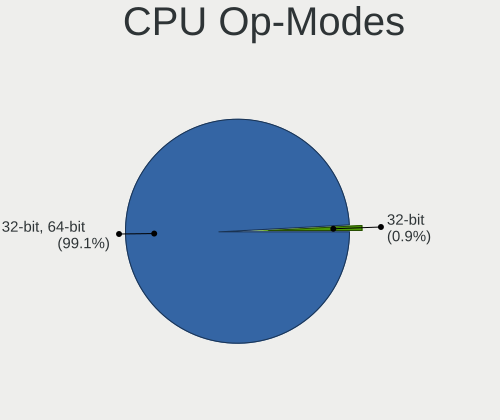

| Op mode        | Notebooks | Percent |
|----------------|-----------|---------|
| 32-bit, 64-bit | 116       | 99.15%  |
| 32-bit         | 1         | 0.85%   |

CPU Microcode
-------------

Microcode number

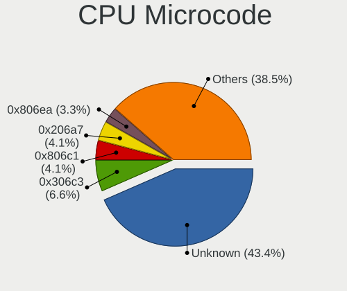

| Number     | Notebooks | Percent |
|------------|-----------|---------|
| Unknown    | 53        | 43.44%  |
| 0x306c3    | 8         | 6.56%   |
| 0x806c1    | 5         | 4.1%    |
| 0x206a7    | 5         | 4.1%    |
| 0x806ea    | 4         | 3.28%   |
| 0x406e3    | 4         | 3.28%   |
| 0x40651    | 4         | 3.28%   |
| 0x20655    | 4         | 3.28%   |
| 0x806eb    | 3         | 2.46%   |
| 0x706a1    | 3         | 2.46%   |
| 0x906ea    | 2         | 1.64%   |
| 0x906e9    | 2         | 1.64%   |
| 0x806ec    | 2         | 1.64%   |
| 0x806d1    | 2         | 1.64%   |
| 0x306d4    | 2         | 1.64%   |
| 0x306a9    | 2         | 1.64%   |
| 0x1067a    | 2         | 1.64%   |
| 0x0a50000c | 2         | 1.64%   |
| 0x08600106 | 2         | 1.64%   |
| 0x906ed    | 1         | 0.82%   |
| 0x806e9    | 1         | 0.82%   |
| 0x20652    | 1         | 0.82%   |
| 0x106c2    | 1         | 0.82%   |
| 0x0a704101 | 1         | 0.82%   |
| 0x0a50000d | 1         | 0.82%   |
| 0x08608102 | 1         | 0.82%   |
| 0x08600104 | 1         | 0.82%   |
| 0x08600103 | 1         | 0.82%   |
| 0x08108102 | 1         | 0.82%   |
| 0x06006705 | 1         | 0.82%   |

CPU Microarch
-------------

Microarchitecture

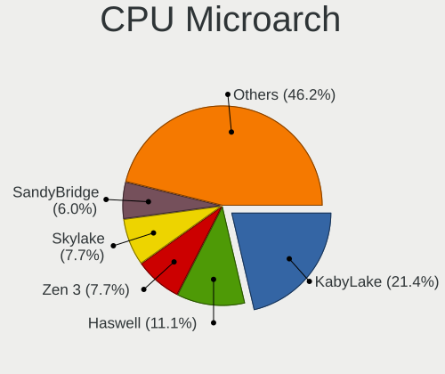

| Name             | Notebooks | Percent |
|------------------|-----------|---------|
| KabyLake         | 25        | 21.37%  |
| Haswell          | 13        | 11.11%  |
| Zen 3            | 9         | 7.69%   |
| Skylake          | 9         | 7.69%   |
| SandyBridge      | 7         | 5.98%   |
| Unknown          | 7         | 5.98%   |
| Zen 2            | 6         | 5.13%   |
| TigerLake        | 6         | 5.13%   |
| Alderlake Hybrid | 6         | 5.13%   |
| Westmere         | 5         | 4.27%   |
| IvyBridge        | 5         | 4.27%   |
| Broadwell        | 4         | 3.42%   |
| Penryn           | 3         | 2.56%   |
| Goldmont plus    | 3         | 2.56%   |
| Icelake          | 2         | 1.71%   |
| CometLake        | 2         | 1.71%   |
| Zen+             | 1         | 0.85%   |
| Lunarlake Hybrid | 1         | 0.85%   |
| Goldmont         | 1         | 0.85%   |
| Excavator        | 1         | 0.85%   |
| Bonnell          | 1         | 0.85%   |

Graphics
--------

GPU Vendor
----------

Vendors of graphics cards

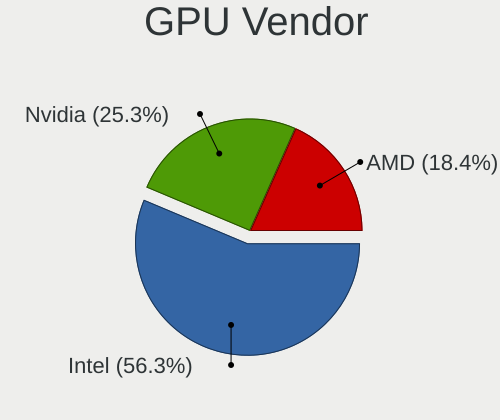

| Vendor | Notebooks | Percent |
|--------|-----------|---------|
| Intel  | 89        | 56.33%  |
| Nvidia | 40        | 25.32%  |
| AMD    | 29        | 18.35%  |

GPU Model
---------

Graphics card models

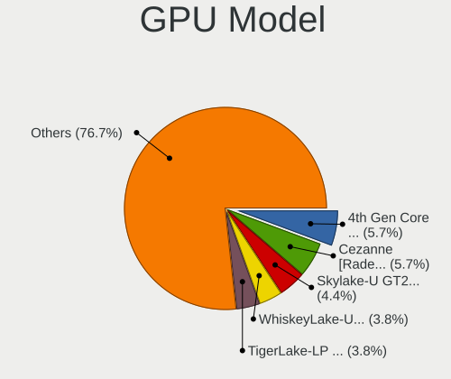

| Model                                                                     | Notebooks | Percent |
|---------------------------------------------------------------------------|-----------|---------|
| Intel 4th Gen Core Processor Integrated Graphics Controller               | 9         | 5.66%   |
| AMD Cezanne [Radeon Vega Series / Radeon Vega Mobile Series]              | 9         | 5.66%   |
| Intel Skylake-U GT2 [HD Graphics 520]                                     | 7         | 4.4%    |
| Intel WhiskeyLake-U GT2 [UHD Graphics 620]                                | 6         | 3.77%   |
| Intel TigerLake-LP GT2 [Iris Xe Graphics]                                 | 6         | 3.77%   |
| Intel Kaby Lake-R GT2 [UHD Graphics 620]                                  | 6         | 3.77%   |
| Intel CoffeeLake-H GT2 [UHD Graphics 630]                                 | 6         | 3.77%   |
| Intel 2nd Generation Core Processor Family Integrated Graphics Controller | 6         | 3.77%   |
| AMD Renoir [Radeon Vega Series / Radeon Vega Mobile Series]               | 6         | 3.77%   |
| Nvidia GA106M [GeForce RTX 3060 Mobile / Max-Q]                           | 5         | 3.14%   |
| Intel 3rd Gen Core processor Graphics Controller                          | 5         | 3.14%   |
| Intel Haswell-ULT Integrated Graphics Controller                          | 4         | 2.52%   |
| Nvidia GP107M [GeForce GTX 1050 Ti Mobile]                                | 3         | 1.89%   |
| Nvidia GA107GLM [RTX A1000 Laptop GPU]                                    | 3         | 1.89%   |
| Intel Alder Lake-HX GT1 [UHD Graphics 770]                                | 3         | 1.89%   |
| Nvidia TU117M [GeForce GTX 1650 Mobile / Max-Q]                           | 2         | 1.26%   |
| Nvidia TU117GLM [Quadro T1000 Mobile]                                     | 2         | 1.26%   |
| Nvidia GP108M [GeForce MX250]                                             | 2         | 1.26%   |
| Nvidia GP108M [GeForce MX150]                                             | 2         | 1.26%   |
| Nvidia GP107M [GeForce GTX 1050 Mobile]                                   | 2         | 1.26%   |
| Nvidia GK107GLM [Quadro K1100M]                                           | 2         | 1.26%   |
| Intel TigerLake-H GT1 [UHD Graphics]                                      | 2         | 1.26%   |
| Intel Mobile 4 Series Chipset Integrated Graphics Controller              | 2         | 1.26%   |
| Intel Kaby Lake-H GT2 [HD Graphics 630]                                   | 2         | 1.26%   |
| Intel GeminiLake [UHD Graphics 600]                                       | 2         | 1.26%   |
| Intel CometLake-U GT2 [UHD Graphics]                                      | 2         | 1.26%   |
| Intel CometLake-H GT2 [UHD Graphics]                                      | 2         | 1.26%   |
| Intel Broadwell-U GT2 [HD Graphics 5500]                                  | 2         | 1.26%   |
| Intel Alder Lake-P GT2 [Iris Xe Graphics]                                 | 2         | 1.26%   |
| AMD Phoenix1                                                              | 2         | 1.26%   |
| Nvidia TU117GLM [Quadro T2000 Mobile / Max-Q]                             | 1         | 0.63%   |
| Nvidia TU106M [GeForce RTX 2060 Mobile]                                   | 1         | 0.63%   |
| Nvidia GT215M [GeForce GTS 250M]                                          | 1         | 0.63%   |
| Nvidia GM108M [GeForce MX110]                                             | 1         | 0.63%   |
| Nvidia GM108M [GeForce 940M]                                              | 1         | 0.63%   |
| Nvidia GM108M [GeForce 940MX]                                             | 1         | 0.63%   |
| Nvidia GM108M [GeForce 840M]                                              | 1         | 0.63%   |
| Nvidia GM107M [GeForce GTX 950M]                                          | 1         | 0.63%   |
| Nvidia GM107M [GeForce GTX 850M]                                          | 1         | 0.63%   |
| Nvidia GK104M [GeForce GTX 680M]                                          | 1         | 0.63%   |

GPU Combo
---------

Combinations of graphics cards

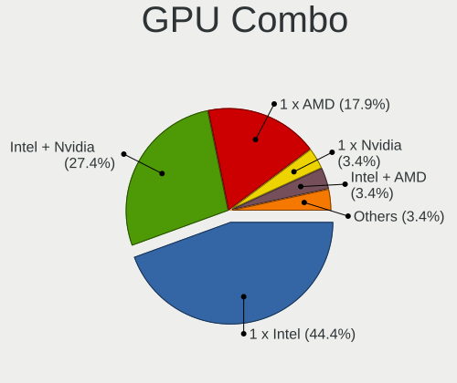

| Name           | Notebooks | Percent |
|----------------|-----------|---------|
| 1 x Intel      | 52        | 44.44%  |
| Intel + Nvidia | 32        | 27.35%  |
| 1 x AMD        | 21        | 17.95%  |
| 1 x Nvidia     | 4         | 3.42%   |
| Intel + AMD    | 4         | 3.42%   |
| AMD + Nvidia   | 3         | 2.56%   |
| 2 x AMD        | 1         | 0.85%   |

GPU Driver
----------

Free vs proprietary

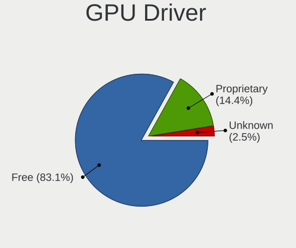

| Driver      | Notebooks | Percent |
|-------------|-----------|---------|
| Free        | 98        | 83.05%  |
| Proprietary | 17        | 14.41%  |
| Unknown     | 3         | 2.54%   |

GPU Memory
----------

Total video memory

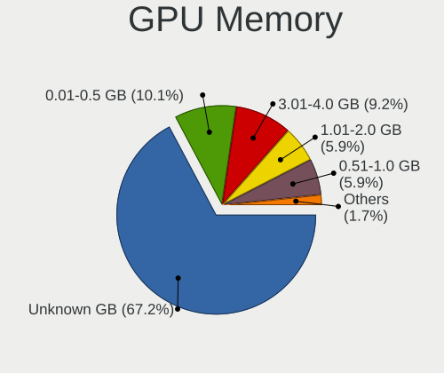

| Size in GB | Notebooks | Percent |
|------------|-----------|---------|
| Unknown    | 80        | 67.23%  |
| 0.01-0.5   | 12        | 10.08%  |
| 3.01-4.0   | 11        | 9.24%   |
| 1.01-2.0   | 7         | 5.88%   |
| 0.51-1.0   | 7         | 5.88%   |
| 7.01-8.0   | 1         | 0.84%   |
| 8.01-16.0  | 1         | 0.84%   |

Monitor
-------

Monitor Vendor
--------------

Monitor vendors

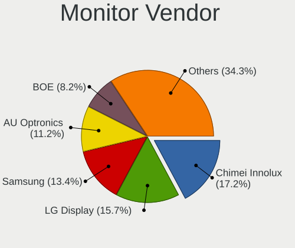

| Vendor                  | Notebooks | Percent |
|-------------------------|-----------|---------|
| Chimei Innolux          | 23        | 17.16%  |
| LG Display              | 21        | 15.67%  |
| Samsung Electronics     | 18        | 13.43%  |
| AU Optronics            | 15        | 11.19%  |
| BOE                     | 11        | 8.21%   |
| Sharp                   | 8         | 5.97%   |
| Apple                   | 6         | 4.48%   |
| Hewlett-Packard         | 4         | 2.99%   |
| AOC                     | 4         | 2.99%   |
| Chi Mei Optoelectronics | 3         | 2.24%   |
| TMX                     | 2         | 1.49%   |
| PANDA                   | 2         | 1.49%   |
| Iiyama                  | 2         | 1.49%   |
| Dell                    | 2         | 1.49%   |
| CSO                     | 2         | 1.49%   |
| Videoseven              | 1         | 0.75%   |
| Sony                    | 1         | 0.75%   |
| Philips                 | 1         | 0.75%   |
| Medion                  | 1         | 0.75%   |
| Lenovo                  | 1         | 0.75%   |
| InnoLux Display         | 1         | 0.75%   |
| InfoVision              | 1         | 0.75%   |
| Goldstar                | 1         | 0.75%   |
| Gigabyte Technology     | 1         | 0.75%   |
| BenQ                    | 1         | 0.75%   |
| Aosiman                 | 1         | 0.75%   |

Monitor Model
-------------

Monitor models

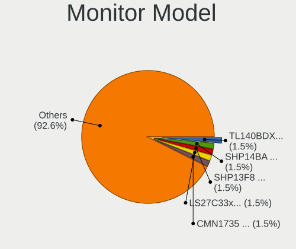

| Model                                                                   | Notebooks | Percent |
|-------------------------------------------------------------------------|-----------|---------|
| TMX TL140BDXP01-0 TMX1400 2560x1440 310x174mm 14.0-inch                 | 2         | 1.47%   |
| Sharp LCD Monitor SHP14BA 1920x1080 344x194mm 15.5-inch                 | 2         | 1.47%   |
| Sharp LCD Monitor SHP13F8 3200x1800 346x194mm 15.6-inch                 | 2         | 1.47%   |
| Samsung Electronics LS27C33xG SAM7437 1920x1080 598x336mm 27.0-inch     | 2         | 1.47%   |
| Chimei Innolux LCD Monitor CMN1735 1920x1080 381x214mm 17.2-inch        | 2         | 1.47%   |
| Chimei Innolux LCD Monitor CMN1604 1920x1080 355x199mm 16.0-inch        | 2         | 1.47%   |
| Chimei Innolux LCD Monitor CMN14D4 1920x1080 309x173mm 13.9-inch        | 2         | 1.47%   |
| Chimei Innolux LCD Monitor CMN14C9 1920x1080 309x173mm 13.9-inch        | 2         | 1.47%   |
| Apple LCD Monitor APP9CC3 1280x800 286x179mm 13.3-inch                  | 2         | 1.47%   |
| AOC 2250W AOC2250 1920x1080 477x268mm 21.5-inch                         | 2         | 1.47%   |
| Videoseven L27ADS IGM2700 1920x1080 598x336mm 27.0-inch                 | 1         | 0.74%   |
| Sony Nvidia Defaul t Flat Panel SNY05FA 1366x768 309x174mm 14.0-inch    | 1         | 0.74%   |
| Sharp LCD Monitor SHP1516 3840x2400 336x210mm 15.6-inch                 | 1         | 0.74%   |
| Sharp LCD Monitor SHP14AE 1920x1080 294x165mm 13.3-inch                 | 1         | 0.74%   |
| Sharp LCD Monitor SHP1476 3840x2160 346x194mm 15.6-inch                 | 1         | 0.74%   |
| Sharp LCD Monitor SHP1421 3200x1800 294x165mm 13.3-inch                 | 1         | 0.74%   |
| Samsung Electronics S27D390 SAM0B67 1920x1080 598x336mm 27.0-inch       | 1         | 0.74%   |
| Samsung Electronics Odyssey G70NC SAM7231 3840x2160 941x529mm 42.5-inch | 1         | 0.74%   |
| Samsung Electronics LCD Monitor SEC444E 1600x900 310x174mm 14.0-inch    | 1         | 0.74%   |
| Samsung Electronics LCD Monitor SDC5844 1920x1080 344x194mm 15.5-inch   | 1         | 0.74%   |
| Samsung Electronics LCD Monitor SDC4E51 1366x768 344x194mm 15.5-inch    | 1         | 0.74%   |
| Samsung Electronics LCD Monitor SDC4C48 1920x1080 293x165mm 13.2-inch   | 1         | 0.74%   |
| Samsung Electronics LCD Monitor SDC434A 3200x1800 293x165mm 13.2-inch   | 1         | 0.74%   |
| Samsung Electronics LCD Monitor SDC4347 1366x768 344x193mm 15.5-inch    | 1         | 0.74%   |
| Samsung Electronics LCD Monitor SDC4259 1920x1080 293x165mm 13.2-inch   | 1         | 0.74%   |
| Samsung Electronics LCD Monitor SDC4187 1920x1200 302x189mm 14.0-inch   | 1         | 0.74%   |
| Samsung Electronics LCD Monitor SDC4181 2880x1800 302x189mm 14.0-inch   | 1         | 0.74%   |
| Samsung Electronics LCD Monitor SDC4171 2880x1800 302x189mm 14.0-inch   | 1         | 0.74%   |
| Samsung Electronics LCD Monitor SDC4141 1366x768 344x194mm 15.5-inch    | 1         | 0.74%   |
| Samsung Electronics LCD Monitor SDC3654 1600x900 382x215mm 17.3-inch    | 1         | 0.74%   |
| Samsung Electronics LCD Monitor SAM0B60 1920x1080 887x500mm 40.1-inch   | 1         | 0.74%   |
| Samsung Electronics C27R50x SAM0F9D 1920x1080 598x336mm 27.0-inch       | 1         | 0.74%   |
| Samsung Electronics C27F390 SAM0D32 1920x1080 598x336mm 27.0-inch       | 1         | 0.74%   |
| Philips PHL 346B1C PHL095C 3440x1440 797x334mm 34.0-inch                | 1         | 0.74%   |
| PANDA LCD Monitor NCP004D 1920x1080 344x194mm 15.5-inch                 | 1         | 0.74%   |
| PANDA LCD Monitor NCP002D 1920x1080 344x194mm 15.5-inch                 | 1         | 0.74%   |
| Medion 42FPDEUDA1 MED222E 1920x1080                                     | 1         | 0.74%   |
| LG Display LP156WH2-TLE1 LGDCF01 1366x768 344x194mm 15.5-inch           | 1         | 0.74%   |
| LG Display LCD Monitor LGD069B 1920x1080 344x194mm 15.5-inch            | 1         | 0.74%   |
| LG Display LCD Monitor LGD0685 1920x1080 309x174mm 14.0-inch            | 1         | 0.74%   |

Monitor Resolution
------------------

Monitor screen resolution

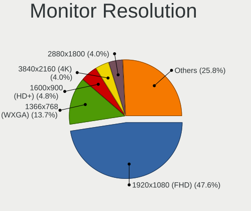

| Resolution         | Notebooks | Percent |
|--------------------|-----------|---------|
| 1920x1080 (FHD)    | 59        | 47.58%  |
| 1366x768 (WXGA)    | 17        | 13.71%  |
| 1600x900 (HD+)     | 6         | 4.84%   |
| 3840x2160 (4K)     | 5         | 4.03%   |
| 2880x1800          | 5         | 4.03%   |
| 2560x1440 (QHD)    | 5         | 4.03%   |
| 3200x1800 (QHD+)   | 4         | 3.23%   |
| 2560x1600          | 3         | 2.42%   |
| 1920x1200 (WUXGA)  | 3         | 2.42%   |
| 1440x900 (WXGA+)   | 3         | 2.42%   |
| 1280x800 (WXGA)    | 3         | 2.42%   |
| 3840x2400          | 2         | 1.61%   |
| 2256x1504          | 2         | 1.61%   |
| 3440x1440          | 1         | 0.81%   |
| 3072x1920          | 1         | 0.81%   |
| 2520x1680          | 1         | 0.81%   |
| 2160x1440          | 1         | 0.81%   |
| 1680x1050 (WSXGA+) | 1         | 0.81%   |
| 1360x768           | 1         | 0.81%   |
| 1280x1024 (SXGA)   | 1         | 0.81%   |

Monitor Diagonal
----------------

Diagonal size in inches

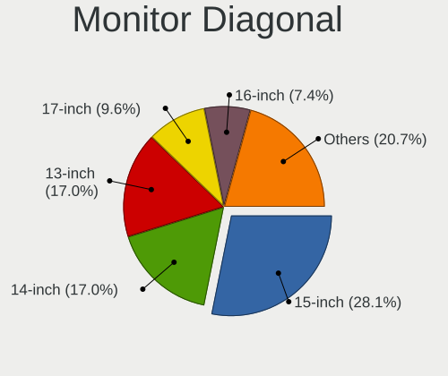

| Inches  | Notebooks | Percent |
|---------|-----------|---------|
| 15      | 38        | 28.15%  |
| 14      | 23        | 17.04%  |
| 13      | 23        | 17.04%  |
| 17      | 13        | 9.63%   |
| 16      | 10        | 7.41%   |
| 27      | 7         | 5.19%   |
| 24      | 3         | 2.22%   |
| 22      | 3         | 2.22%   |
| 21      | 2         | 1.48%   |
| 18      | 2         | 1.48%   |
| 59      | 1         | 0.74%   |
| 47      | 1         | 0.74%   |
| 42      | 1         | 0.74%   |
| 40      | 1         | 0.74%   |
| 34      | 1         | 0.74%   |
| 33      | 1         | 0.74%   |
| 28      | 1         | 0.74%   |
| 23      | 1         | 0.74%   |
| 19      | 1         | 0.74%   |
| 11      | 1         | 0.74%   |
| Unknown | 1         | 0.74%   |

Monitor Width
-------------

Physical width

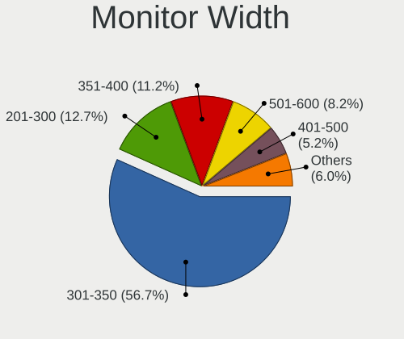

| Width in mm | Notebooks | Percent |
|-------------|-----------|---------|
| 301-350     | 76        | 56.72%  |
| 201-300     | 17        | 12.69%  |
| 351-400     | 15        | 11.19%  |
| 501-600     | 11        | 8.21%   |
| 401-500     | 7         | 5.22%   |
| 701-800     | 2         | 1.49%   |
| 1001-1500   | 2         | 1.49%   |
| 801-900     | 1         | 0.75%   |
| 601-700     | 1         | 0.75%   |
| 901-1000    | 1         | 0.75%   |
| Unknown     | 1         | 0.75%   |

Aspect Ratio
------------

Proportional relationship between the width and the height

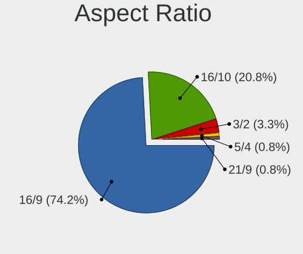

| Ratio | Notebooks | Percent |
|-------|-----------|---------|
| 16/9  | 89        | 74.17%  |
| 16/10 | 25        | 20.83%  |
| 3/2   | 4         | 3.33%   |
| 5/4   | 1         | 0.83%   |
| 21/9  | 1         | 0.83%   |

Monitor Area
------------

Area in inch²

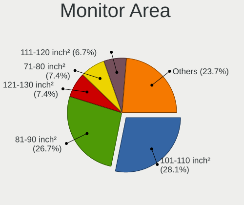

| Area in inch² | Notebooks | Percent |
|----------------|-----------|---------|
| 101-110        | 38        | 28.15%  |
| 81-90          | 36        | 26.67%  |
| 71-80          | 10        | 7.41%   |
| 121-130        | 10        | 7.41%   |
| 111-120        | 9         | 6.67%   |
| 301-350        | 7         | 5.19%   |
| 201-250        | 7         | 5.19%   |
| 351-500        | 3         | 2.22%   |
| 141-150        | 3         | 2.22%   |
| 501-1000       | 3         | 2.22%   |
| 251-300        | 2         | 1.48%   |
| 131-140        | 2         | 1.48%   |
| More than 1000 | 1         | 0.74%   |
| 51-60          | 1         | 0.74%   |
| 151-200        | 1         | 0.74%   |
| 91-100         | 1         | 0.74%   |
| Unknown        | 1         | 0.74%   |

Pixel Density
-------------

Pixels per inch

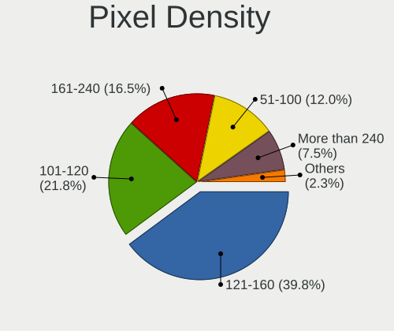

| Density       | Notebooks | Percent |
|---------------|-----------|---------|
| 121-160       | 53        | 39.85%  |
| 101-120       | 29        | 21.8%   |
| 161-240       | 22        | 16.54%  |
| 51-100        | 16        | 12.03%  |
| More than 240 | 10        | 7.52%   |
| 1-50          | 2         | 1.5%    |
| Unknown       | 1         | 0.75%   |

Multiple Monitors
-----------------

Total monitors connected

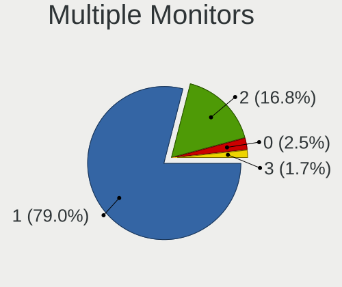

| Total | Notebooks | Percent |
|-------|-----------|---------|
| 1     | 94        | 78.99%  |
| 2     | 20        | 16.81%  |
| 0     | 3         | 2.52%   |
| 3     | 2         | 1.68%   |

Network
-------

Net Controller Vendor
---------------------

Controller vendors

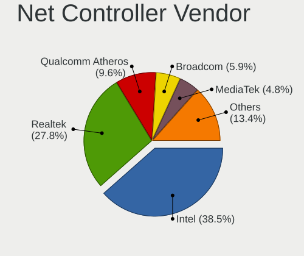

| Vendor                          | Notebooks | Percent |
|---------------------------------|-----------|---------|
| Intel                           | 72        | 38.5%   |
| Realtek Semiconductor           | 52        | 27.81%  |
| Qualcomm Atheros                | 18        | 9.63%   |
| Broadcom                        | 11        | 5.88%   |
| MediaTek                        | 9         | 4.81%   |
| Marvell Technology Group        | 4         | 2.14%   |
| Broadcom Limited                | 4         | 2.14%   |
| Sierra Wireless                 | 3         | 1.6%    |
| Shenzhen Goodix Technology      | 3         | 1.6%    |
| DisplayLink                     | 2         | 1.07%   |
| TP-Link                         | 1         | 0.53%   |
| Ralink                          | 1         | 0.53%   |
| Qualcomm Atheros Communications | 1         | 0.53%   |
| Qualcomm                        | 1         | 0.53%   |
| Lenovo                          | 1         | 0.53%   |
| JMicron Technology              | 1         | 0.53%   |
| Huawei Technologies             | 1         | 0.53%   |
| Dell                            | 1         | 0.53%   |
| ASIX Electronics                | 1         | 0.53%   |

Net Controller Model
--------------------

Controller models

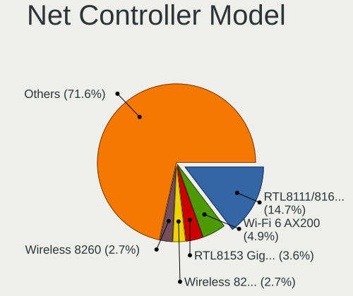

| Model                                                                          | Notebooks | Percent |
|--------------------------------------------------------------------------------|-----------|---------|
| Realtek RTL8111/8168/8211/8411 PCI Express Gigabit Ethernet Controller         | 33        | 14.67%  |
| Intel Wi-Fi 6 AX200                                                            | 11        | 4.89%   |
| Realtek RTL8153 Gigabit Ethernet Adapter                                       | 8         | 3.56%   |
| Intel Wireless 8265 / 8275                                                     | 6         | 2.67%   |
| Intel Wireless 8260                                                            | 6         | 2.67%   |
| MediaTek MT7921 802.11ax PCIe Wireless Network Adapter [Filogic 330]           | 5         | 2.22%   |
| Intel Cannon Point-LP CNVi [Wireless-AC]                                       | 5         | 2.22%   |
| Realtek RTL8822CE 802.11ac PCIe Wireless Network Adapter                       | 4         | 1.78%   |
| Qualcomm Atheros QCA9565 / AR9565 Wireless Network Adapter                     | 4         | 1.78%   |
| Intel Wireless 7260                                                            | 4         | 1.78%   |
| Intel 82579LM Gigabit Network Connection (Lewisville)                          | 4         | 1.78%   |
| Realtek RTL8125 2.5GbE Controller                                              | 3         | 1.33%   |
| Realtek RTL810xE PCI Express Fast Ethernet controller                          | 3         | 1.33%   |
| Qualcomm Atheros QCA9377 802.11ac Wireless Network Adapter                     | 3         | 1.33%   |
| Intel Wireless 3160                                                            | 3         | 1.33%   |
| Intel Cannon Lake PCH CNVi WiFi                                                | 3         | 1.33%   |
| Intel Alder Lake-S PCH CNVi WiFi                                               | 3         | 1.33%   |
| Broadcom NetXtreme BCM57765 Gigabit Ethernet PCIe                              | 3         | 1.33%   |
| Broadcom BCM4331 802.11a/b/g/n                                                 | 3         | 1.33%   |
| Sierra Wireless EM7305 Modem                                                   | 2         | 0.89%   |
| Shenzhen Goodix Fingerprint Reader                                             | 2         | 0.89%   |
| Realtek RTL8723BE PCIe Wireless Network Adapter                                | 2         | 0.89%   |
| Qualcomm Atheros QCA6174 802.11ac Wireless Network Adapter                     | 2         | 0.89%   |
| Qualcomm Atheros AR928X Wireless Network Adapter (PCI-Express)                 | 2         | 0.89%   |
| Qualcomm Atheros AR9285 Wireless Network Adapter (PCI-Express)                 | 2         | 0.89%   |
| MediaTek MT7922 802.11ax PCI Express Wireless Network Adapter                  | 2         | 0.89%   |
| Marvell Group Yukon Optima 88E8059 [PCIe Gigabit Ethernet Controller with AVB] | 2         | 0.89%   |
| Intel Wireless 3165                                                            | 2         | 0.89%   |
| Intel Wi-Fi 6E(802.11ax) AX210/AX1675* 2x2 [Typhoon Peak]                      | 2         | 0.89%   |
| Intel Wi-Fi 6 AX201                                                            | 2         | 0.89%   |
| Intel Wi-Fi 5(802.11ac) Wireless-AC 9x6x [Thunder Peak]                        | 2         | 0.89%   |
| Intel Tiger Lake PCH CNVi WiFi                                                 | 2         | 0.89%   |
| Intel Ethernet Connection I219-V                                               | 2         | 0.89%   |
| Intel Ethernet Connection I219-LM                                              | 2         | 0.89%   |
| Intel Ethernet Connection I217-LM                                              | 2         | 0.89%   |
| Intel Ethernet Connection (7) I219-LM                                          | 2         | 0.89%   |
| Intel Ethernet Connection (6) I219-V                                           | 2         | 0.89%   |
| Intel Ethernet Connection (4) I219-V                                           | 2         | 0.89%   |
| Intel Ethernet Connection (4) I219-LM                                          | 2         | 0.89%   |
| Intel Ethernet Connection (17) I219-LM                                         | 2         | 0.89%   |

Wireless Vendor
---------------

Wireless vendors

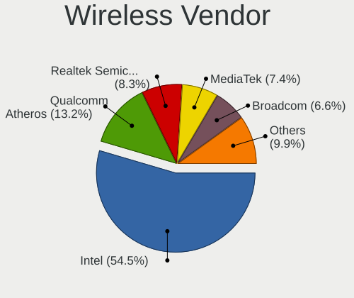

| Vendor                          | Notebooks | Percent |
|---------------------------------|-----------|---------|
| Intel                           | 66        | 54.55%  |
| Qualcomm Atheros                | 16        | 13.22%  |
| Realtek Semiconductor           | 10        | 8.26%   |
| MediaTek                        | 9         | 7.44%   |
| Broadcom                        | 8         | 6.61%   |
| Broadcom Limited                | 4         | 3.31%   |
| Sierra Wireless                 | 3         | 2.48%   |
| TP-Link                         | 1         | 0.83%   |
| Ralink                          | 1         | 0.83%   |
| Qualcomm Atheros Communications | 1         | 0.83%   |
| Qualcomm                        | 1         | 0.83%   |
| Dell                            | 1         | 0.83%   |

Wireless Model
--------------

Wireless models

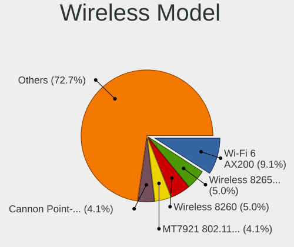

| Model                                                                | Notebooks | Percent |
|----------------------------------------------------------------------|-----------|---------|
| Intel Wi-Fi 6 AX200                                                  | 11        | 9.09%   |
| Intel Wireless 8265 / 8275                                           | 6         | 4.96%   |
| Intel Wireless 8260                                                  | 6         | 4.96%   |
| MediaTek MT7921 802.11ax PCIe Wireless Network Adapter [Filogic 330] | 5         | 4.13%   |
| Intel Cannon Point-LP CNVi [Wireless-AC]                             | 5         | 4.13%   |
| Realtek RTL8822CE 802.11ac PCIe Wireless Network Adapter             | 4         | 3.31%   |
| Qualcomm Atheros QCA9565 / AR9565 Wireless Network Adapter           | 4         | 3.31%   |
| Intel Wireless 7260                                                  | 4         | 3.31%   |
| Qualcomm Atheros QCA9377 802.11ac Wireless Network Adapter           | 3         | 2.48%   |
| Intel Wireless 3160                                                  | 3         | 2.48%   |
| Intel Cannon Lake PCH CNVi WiFi                                      | 3         | 2.48%   |
| Broadcom BCM4331 802.11a/b/g/n                                       | 3         | 2.48%   |
| Sierra Wireless EM7305 Modem                                         | 2         | 1.65%   |
| Realtek RTL8723BE PCIe Wireless Network Adapter                      | 2         | 1.65%   |
| Qualcomm Atheros QCA6174 802.11ac Wireless Network Adapter           | 2         | 1.65%   |
| Qualcomm Atheros AR928X Wireless Network Adapter (PCI-Express)       | 2         | 1.65%   |
| Qualcomm Atheros AR9285 Wireless Network Adapter (PCI-Express)       | 2         | 1.65%   |
| MediaTek MT7922 802.11ax PCI Express Wireless Network Adapter        | 2         | 1.65%   |
| Intel Wireless 3165                                                  | 2         | 1.65%   |
| Intel Wi-Fi 6E(802.11ax) AX210/AX1675* 2x2 [Typhoon Peak]            | 2         | 1.65%   |
| Intel Wi-Fi 6 AX201                                                  | 2         | 1.65%   |
| Intel Wi-Fi 5(802.11ac) Wireless-AC 9x6x [Thunder Peak]              | 2         | 1.65%   |
| Intel Tiger Lake PCH CNVi WiFi                                       | 2         | 1.65%   |
| Intel Dual Band Wireless-AC 3168NGW [Stone Peak]                     | 2         | 1.65%   |
| Intel Comet Lake PCH CNVi WiFi                                       | 2         | 1.65%   |
| Intel Centrino Wireless-N 1030 [Rainbow Peak]                        | 2         | 1.65%   |
| Intel Centrino Advanced-N 6235                                       | 2         | 1.65%   |
| Intel Alder Lake-P PCH CNVi WiFi                                     | 2         | 1.65%   |
| Broadcom Limited BCM4352 802.11ac Dual Band Wireless Network Adapter | 2         | 1.65%   |
| Broadcom BCM4313 802.11bgn Wireless Network Adapter                  | 2         | 1.65%   |
| TP-Link 802.11ac NIC                                                 | 1         | 0.83%   |
| Sierra Wireless EM7455                                               | 1         | 0.83%   |
| Realtek RTL8852BE PCIe 802.11ax Wireless Network Controller          | 1         | 0.83%   |
| Realtek RTL8852AE 802.11ax PCIe Wireless Network Adapter             | 1         | 0.83%   |
| Realtek RTL8821CE 802.11ac PCIe Wireless Network Adapter             | 1         | 0.83%   |
| Realtek RTL8188EUS 802.11n Wireless Network Adapter                  | 1         | 0.83%   |
| Ralink RT3290 Wireless 802.11n 1T/1R PCIe                            | 1         | 0.83%   |
| Qualcomm QCNFA765 Wireless Network Adapter                           | 1         | 0.83%   |
| Qualcomm Atheros AR9271 802.11n                                      | 1         | 0.83%   |
| Qualcomm Atheros AR9485 Wireless Network Adapter                     | 1         | 0.83%   |

Ethernet Vendor
---------------

Ethernet vendors

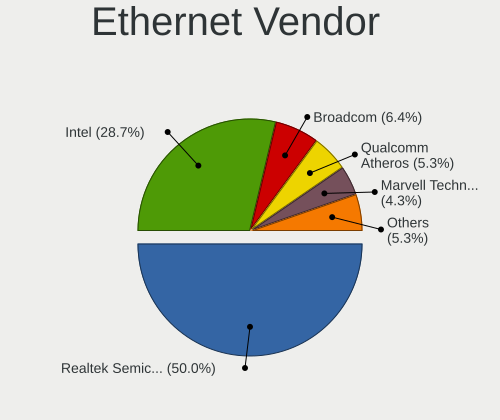

| Vendor                   | Notebooks | Percent |
|--------------------------|-----------|---------|
| Realtek Semiconductor    | 47        | 50%     |
| Intel                    | 27        | 28.72%  |
| Broadcom                 | 6         | 6.38%   |
| Qualcomm Atheros         | 5         | 5.32%   |
| Marvell Technology Group | 4         | 4.26%   |
| DisplayLink              | 2         | 2.13%   |
| Lenovo                   | 1         | 1.06%   |
| JMicron Technology       | 1         | 1.06%   |
| ASIX Electronics         | 1         | 1.06%   |

Ethernet Model
--------------

Ethernet models

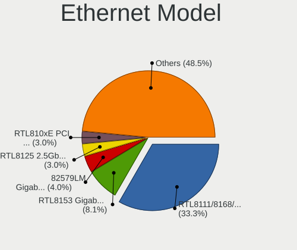

| Model                                                                          | Notebooks | Percent |
|--------------------------------------------------------------------------------|-----------|---------|
| Realtek RTL8111/8168/8211/8411 PCI Express Gigabit Ethernet Controller         | 33        | 33.33%  |
| Realtek RTL8153 Gigabit Ethernet Adapter                                       | 8         | 8.08%   |
| Intel 82579LM Gigabit Network Connection (Lewisville)                          | 4         | 4.04%   |
| Realtek RTL8125 2.5GbE Controller                                              | 3         | 3.03%   |
| Realtek RTL810xE PCI Express Fast Ethernet controller                          | 3         | 3.03%   |
| Intel Alder Lake-S PCH CNVi WiFi                                               | 3         | 3.03%   |
| Broadcom NetXtreme BCM57765 Gigabit Ethernet PCIe                              | 3         | 3.03%   |
| Marvell Group Yukon Optima 88E8059 [PCIe Gigabit Ethernet Controller with AVB] | 2         | 2.02%   |
| Intel Ethernet Connection I219-V                                               | 2         | 2.02%   |
| Intel Ethernet Connection I219-LM                                              | 2         | 2.02%   |
| Intel Ethernet Connection I217-LM                                              | 2         | 2.02%   |
| Intel Ethernet Connection (7) I219-LM                                          | 2         | 2.02%   |
| Intel Ethernet Connection (6) I219-V                                           | 2         | 2.02%   |
| Intel Ethernet Connection (4) I219-V                                           | 2         | 2.02%   |
| Intel Ethernet Connection (4) I219-LM                                          | 2         | 2.02%   |
| Intel Ethernet Connection (17) I219-LM                                         | 2         | 2.02%   |
| DisplayLink Dell D3100 Docking Station                                         | 2         | 2.02%   |
| Realtek Killer E3000 2.5GbE Controller                                         | 1         | 1.01%   |
| Realtek Killer E2600 GbE Controller                                            | 1         | 1.01%   |
| Qualcomm Atheros QCA8172 Fast Ethernet                                         | 1         | 1.01%   |
| Qualcomm Atheros Killer E2500 Gigabit Ethernet Controller                      | 1         | 1.01%   |
| Qualcomm Atheros Killer E2400 Gigabit Ethernet Controller                      | 1         | 1.01%   |
| Qualcomm Atheros AR8151 v2.0 Gigabit Ethernet                                  | 1         | 1.01%   |
| Qualcomm Atheros AR8131 Gigabit Ethernet                                       | 1         | 1.01%   |
| Marvell Group 88E8055 PCI-E Gigabit Ethernet Controller                        | 1         | 1.01%   |
| Marvell Group 88E8040 PCI-E Fast Ethernet Controller                           | 1         | 1.01%   |
| Lenovo ThinkPad Lan                                                            | 1         | 1.01%   |
| JMicron JMC250 PCI Express Gigabit Ethernet Controller                         | 1         | 1.01%   |
| Intel WiMAX Connection 2400m                                                   | 1         | 1.01%   |
| Intel Wi-Fi 7(802.11be) AX1775*/AX1790*/BE20*/BE401/BE1750* 2x2                | 1         | 1.01%   |
| Intel Ethernet Connection I217-V                                               | 1         | 1.01%   |
| Intel Ethernet Connection (6) I219-LM                                          | 1         | 1.01%   |
| Intel Ethernet Connection (17) I219-V                                          | 1         | 1.01%   |
| Intel Ethernet Connection (14) I219-LM                                         | 1         | 1.01%   |
| Intel 82577LC Gigabit Network Connection                                       | 1         | 1.01%   |
| Broadcom NetXtreme BCM57786 Gigabit Ethernet PCIe                              | 1         | 1.01%   |
| Broadcom NetLink BCM5784M Gigabit Ethernet PCIe                                | 1         | 1.01%   |
| Broadcom NetLink BCM57780 Gigabit Ethernet PCIe                                | 1         | 1.01%   |
| ASIX AX88179 Gigabit Ethernet                                                  | 1         | 1.01%   |

Net Controller Kind
-------------------

Ethernet, WiFi or modem

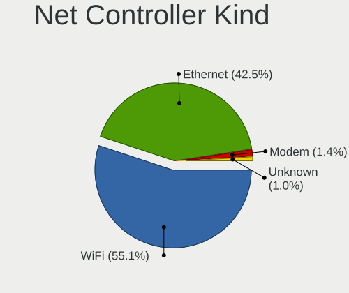

| Kind     | Notebooks | Percent |
|----------|-----------|---------|
| WiFi     | 114       | 55.07%  |
| Ethernet | 88        | 42.51%  |
| Modem    | 3         | 1.45%   |
| Unknown  | 2         | 0.97%   |

Used Controller
---------------

Currently used network controller

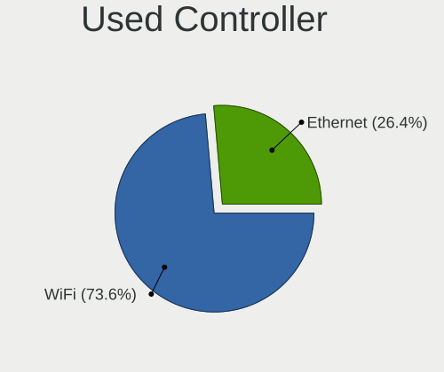

| Kind     | Notebooks | Percent |
|----------|-----------|---------|
| WiFi     | 92        | 73.6%   |
| Ethernet | 33        | 26.4%   |

NICs
----

Total network controllers on board

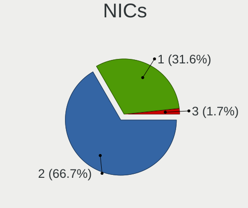

| Total | Notebooks | Percent |
|-------|-----------|---------|
| 2     | 78        | 66.67%  |
| 1     | 37        | 31.62%  |
| 3     | 2         | 1.71%   |

IPv6
----

IPv6 vs IPv4

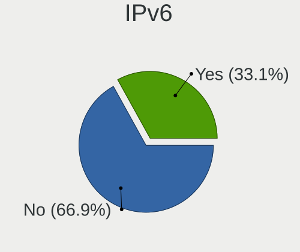

| Used | Notebooks | Percent |
|------|-----------|---------|
| No   | 79        | 66.95%  |
| Yes  | 39        | 33.05%  |

Bluetooth
---------

Bluetooth Vendor
----------------

Controller vendors

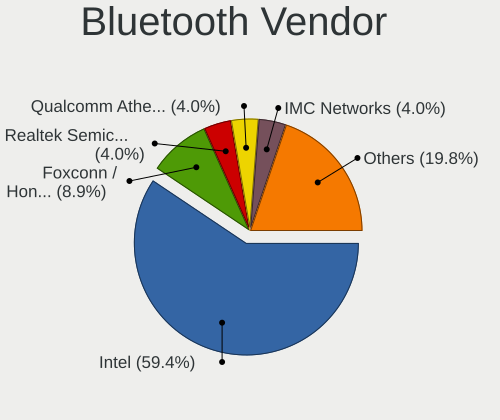

| Vendor                          | Notebooks | Percent |
|---------------------------------|-----------|---------|
| Intel                           | 60        | 59.41%  |
| Foxconn / Hon Hai               | 9         | 8.91%   |
| Realtek Semiconductor           | 4         | 3.96%   |
| Qualcomm Atheros Communications | 4         | 3.96%   |
| IMC Networks                    | 4         | 3.96%   |
| Apple                           | 4         | 3.96%   |
| Realtek                         | 3         | 2.97%   |
| Lite-On Technology              | 3         | 2.97%   |
| TP-Link                         | 2         | 1.98%   |
| Hewlett-Packard                 | 2         | 1.98%   |
| USI                             | 1         | 0.99%   |
| Toshiba                         | 1         | 0.99%   |
| Ralink                          | 1         | 0.99%   |
| Micro Star International        | 1         | 0.99%   |
| MediaTek                        | 1         | 0.99%   |
| Cambridge Silicon Radio         | 1         | 0.99%   |

Bluetooth Model
---------------

Controller models

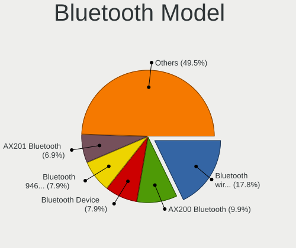

| Model                                                                               | Notebooks | Percent |
|-------------------------------------------------------------------------------------|-----------|---------|
| Intel Bluetooth wireless interface                                                  | 18        | 17.82%  |
| Intel AX200 Bluetooth                                                               | 10        | 9.9%    |
| Intel Bluetooth Device                                                              | 8         | 7.92%   |
| Intel Bluetooth 9460/9560 Jefferson Peak (JfP)                                      | 8         | 7.92%   |
| Intel AX201 Bluetooth                                                               | 7         | 6.93%   |
| Realtek Bluetooth Radio                                                             | 4         | 3.96%   |
| Realtek Bluetooth Radio                                                             | 3         | 2.97%   |
| Qualcomm Atheros  Bluetooth Device                                                  | 3         | 2.97%   |
| Lite-On Bluetooth Device                                                            | 3         | 2.97%   |
| IMC Networks Wireless_Device                                                        | 3         | 2.97%   |
| TP-Link TP-T@- UB500 Adapter                                                        | 2         | 1.98%   |
| Intel Wireless-AC 9260 Bluetooth Adapter                                            | 2         | 1.98%   |
| Intel Wireless-AC 3168 Bluetooth                                                    | 2         | 1.98%   |
| Intel Centrino Bluetooth Wireless Transceiver                                       | 2         | 1.98%   |
| Intel AX210 Bluetooth                                                               | 2         | 1.98%   |
| HP Broadcom 2070 Bluetooth Combo                                                    | 2         | 1.98%   |
| Apple Bluetooth USB Host Controller                                                 | 2         | 1.98%   |
| Apple Bluetooth Host Controller                                                     | 2         | 1.98%   |
| USI Bluetooth Device                                                                | 1         | 0.99%   |
| Toshiba Bluetooth Device                                                            | 1         | 0.99%   |
| Ralink RT3290 Bluetooth                                                             | 1         | 0.99%   |
| Qualcomm Atheros AR3012 Bluetooth 4.0                                               | 1         | 0.99%   |
| Micro Star International Motorola Bluetooth 2.1+EDR Device                          | 1         | 0.99%   |
| MediaTek Wireless_Device                                                            | 1         | 0.99%   |
| Intel Centrino Advanced-N 6230 Bluetooth adapter                                    | 1         | 0.99%   |
| IMC Networks Bluetooth Device                                                       | 1         | 0.99%   |
| Foxconn / Hon Hai Wireless_Device                                                   | 1         | 0.99%   |
| Foxconn / Hon Hai MediaTek Bluetooth Adapter                                        | 1         | 0.99%   |
| Foxconn / Hon Hai Foxconn T77H114 BCM2070 [Single-Chip Bluetooth 2.1 + EDR Adapter] | 1         | 0.99%   |
| Foxconn / Hon Hai BT                                                                | 1         | 0.99%   |
| Foxconn / Hon Hai Broadcom BCM20702A1 Bluetooth                                     | 1         | 0.99%   |
| Foxconn / Hon Hai Bluetooth USB Host Controller                                     | 1         | 0.99%   |
| Foxconn / Hon Hai Bluetooth Device                                                  | 1         | 0.99%   |
| Foxconn / Hon Hai BCM43142A0                                                        | 1         | 0.99%   |
| Foxconn / Hon Hai BCM20702A0                                                        | 1         | 0.99%   |
| Cambridge Silicon Radio Bluetooth Dongle (HCI mode)                                 | 1         | 0.99%   |

Sound
-----

Sound Vendor
------------

Sound card vendors

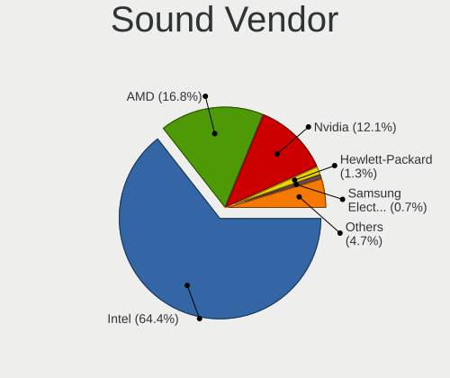

| Vendor              | Notebooks | Percent |
|---------------------|-----------|---------|
| Intel               | 96        | 64.43%  |
| AMD                 | 25        | 16.78%  |
| Nvidia              | 18        | 12.08%  |
| Hewlett-Packard     | 2         | 1.34%   |
| Samsung Electronics | 1         | 0.67%   |
| Logitech            | 1         | 0.67%   |
| Lenovo              | 1         | 0.67%   |
| GN Netcom           | 1         | 0.67%   |
| Dell                | 1         | 0.67%   |
| C-Media Electronics | 1         | 0.67%   |
| Bose                | 1         | 0.67%   |
| Apple               | 1         | 0.67%   |

Sound Model
-----------

Sound card models

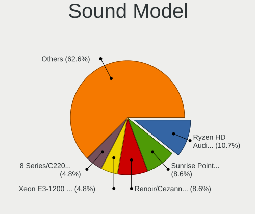

| Model                                                                      | Notebooks | Percent |
|----------------------------------------------------------------------------|-----------|---------|
| AMD Ryzen HD Audio Controller                                              | 20        | 10.7%   |
| Intel Sunrise Point-LP HD Audio                                            | 16        | 8.56%   |
| AMD Renoir/Cezanne HDMI/DP Audio Controller                                | 16        | 8.56%   |
| Intel Xeon E3-1200 v3/4th Gen Core Processor HD Audio Controller           | 9         | 4.81%   |
| Intel 8 Series/C220 Series Chipset High Definition Audio Controller        | 9         | 4.81%   |
| Intel Cannon Point-LP High Definition Audio Controller                     | 7         | 3.74%   |
| Intel Cannon Lake PCH cAVS                                                 | 7         | 3.74%   |
| Intel Tiger Lake-LP Smart Sound Technology Audio Controller                | 6         | 3.21%   |
| Intel 7 Series/C216 Chipset Family High Definition Audio Controller        | 6         | 3.21%   |
| Intel 6 Series/C200 Series Chipset Family High Definition Audio Controller | 6         | 3.21%   |
| Nvidia GA106 High Definition Audio Controller                              | 5         | 2.67%   |
| Intel 5 Series/3400 Series Chipset High Definition Audio                   | 5         | 2.67%   |
| Intel Wildcat Point-LP High Definition Audio Controller                    | 4         | 2.14%   |
| Intel Haswell-ULT HD Audio Controller                                      | 4         | 2.14%   |
| Intel Broadwell-U Audio Controller                                         | 4         | 2.14%   |
| Intel 8 Series HD Audio Controller                                         | 4         | 2.14%   |
| AMD Radeon High Definition Audio Controller                                | 4         | 2.14%   |
| Nvidia GA107 High Definition Audio Controller                              | 3         | 1.6%    |
| Intel Celeron/Pentium Silver Processor High Definition Audio               | 3         | 1.6%    |
| Intel Alder Lake-S HD Audio Controller                                     | 3         | 1.6%    |
| Intel 82801I (ICH9 Family) HD Audio Controller                             | 3         | 1.6%    |
| Nvidia TU107 GeForce GTX 1650 High Definition Audio Controller             | 2         | 1.07%   |
| Nvidia GF108 High Definition Audio Controller                              | 2         | 1.07%   |
| Intel Tiger Lake-H HD Audio Controller                                     | 2         | 1.07%   |
| Intel Raptor Lake-P/U/H cAVS                                               | 2         | 1.07%   |
| Intel Comet Lake PCH-LP cAVS                                               | 2         | 1.07%   |
| Intel Comet Lake PCH cAVS                                                  | 2         | 1.07%   |
| Intel CM238 HD Audio Controller                                            | 2         | 1.07%   |
| Intel Alder Lake PCH-P High Definition Audio Controller                    | 2         | 1.07%   |
| Hewlett-Packard USB Audio                                                  | 2         | 1.07%   |
| AMD Cedar HDMI Audio [Radeon HD 5400/6300/7300 Series]                     | 2         | 1.07%   |
| Samsung Electronics Samsung USB C Earphones                                | 1         | 0.53%   |
| Nvidia TU106 High Definition Audio Controller                              | 1         | 0.53%   |
| Nvidia High Definition Audio Controller                                    | 1         | 0.53%   |
| Nvidia GP107GL High Definition Audio Controller                            | 1         | 0.53%   |
| Nvidia GK104 HDMI Audio Controller                                         | 1         | 0.53%   |
| Nvidia GB203 High Definition Audio Controller                              | 1         | 0.53%   |
| Nvidia AD106M High Definition Audio Controller                             | 1         | 0.53%   |
| Logitech Headset H390                                                      | 1         | 0.53%   |
| Lenovo ThinkPad Dock USB Audio                                             | 1         | 0.53%   |

Memory
------

Memory Vendor
-------------

Memory module vendors

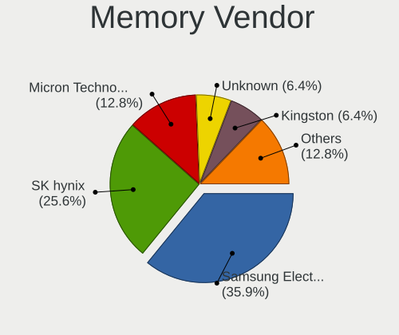

| Vendor              | Notebooks | Percent |
|---------------------|-----------|---------|
| Samsung Electronics | 28        | 35.9%   |
| SK hynix            | 20        | 25.64%  |
| Micron Technology   | 10        | 12.82%  |
| Unknown             | 5         | 6.41%   |
| Kingston            | 5         | 6.41%   |
| Crucial             | 4         | 5.13%   |
| A-DATA Technology   | 3         | 3.85%   |
| Wilk                | 1         | 1.28%   |
| Unknown (ABCD)      | 1         | 1.28%   |
| Timetec             | 1         | 1.28%   |

Memory Model
------------

Memory module models

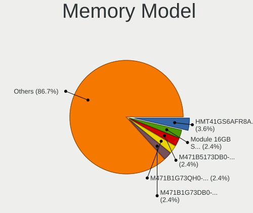

| Model                                                            | Notebooks | Percent |
|------------------------------------------------------------------|-----------|---------|
| SK hynix RAM HMT41GS6AFR8A-PB 8GiB SODIMM DDR3 2667MT/s          | 3         | 3.61%   |
| SK hynix RAM HMAB2GS6AMR6N-XN 16GB SODIMM DDR4 3200MT/s          | 2         | 2.41%   |
| Samsung RAM Module 16GB SODIMM DDR4 3200MT/s                     | 2         | 2.41%   |
| Samsung RAM M471B5173DB0-YK0 4GB SODIMM DDR3 1600MT/s            | 2         | 2.41%   |
| Samsung RAM M471B1G73QH0-YK0 8GB SODIMM DDR3 1600MT/s            | 2         | 2.41%   |
| Samsung RAM M471B1G73DB0-YK0 8GB SODIMM DDR3 1600MT/s            | 2         | 2.41%   |
| Samsung RAM M471A2K43DB1-CWE 16GB SODIMM DDR4 3200MT/s           | 2         | 2.41%   |
| Samsung RAM M471A2G43AB2-CWE 16GB SODIMM DDR4 3200MT/s           | 2         | 2.41%   |
| Samsung RAM M471A1K43DB1-CTD 8GB SODIMM DDR4 2667MT/s            | 2         | 2.41%   |
| Kingston RAM ACR16D3LS1KNG/4G 4GB SODIMM DDR3 1600MT/s           | 2         | 2.41%   |
| Wilk RAM GR3200S464L22S/16G 16GB SODIMM DDR4 3200MT/s            | 1         | 1.2%    |
| Unknown RAM Module 8GB SODIMM DDR3 1333MT/s                      | 1         | 1.2%    |
| Unknown RAM Module 4GB SODIMM LPDDR3 1600MT/s                    | 1         | 1.2%    |
| Unknown RAM Module 4GB SODIMM DDR3                               | 1         | 1.2%    |
| Unknown RAM Module 2GB SODIMM DDR2                               | 1         | 1.2%    |
| Unknown RAM Module 2048MB SODIMM DDR2                            | 1         | 1.2%    |
| Unknown RAM Module 1024MB SODIMM DDR2                            | 1         | 1.2%    |
| Unknown (ABCD) RAM 123456789012345678 2GB SODIMM LPDDR4 2400MT/s | 1         | 1.2%    |
| Timetec RAM SD3-1333 8GB SODIMM DDR3 1333MT/s                    | 1         | 1.2%    |
| SK hynix RAM Module 8192MB Row Of Chips LPDDR3 2133MT/s          | 1         | 1.2%    |
| SK hynix RAM HMT451S6BFR8A-PB 4GB SODIMM DDR3 1600MT/s           | 1         | 1.2%    |
| SK hynix RAM HMT425S6AFR6A-PB 2GB SODIMM DDR3 3200MT/s           | 1         | 1.2%    |
| SK hynix RAM HMCG88MEBSA092N 32GB SODIMM DDR5 4800MT/s           | 1         | 1.2%    |
| SK hynix RAM HMCG78AGBSA095N 16GB SODIMM DDR5 5600MT/s           | 1         | 1.2%    |
| SK hynix RAM HMAA1GS6CJR6N-XN 8GB SODIMM DDR4 3200MT/s           | 1         | 1.2%    |
| SK hynix RAM HMA851S6AFR6N-UH 4GB SODIMM DDR4 2400MT/s           | 1         | 1.2%    |
| SK hynix RAM HMA82GS6DJR8N-XN 16GB SODIMM DDR4 3200MT/s          | 1         | 1.2%    |
| SK hynix RAM HMA82GS6DJR8N-VK 16GB SODIMM DDR4 2667MT/s          | 1         | 1.2%    |
| SK hynix RAM HMA81GS6MFR8N-UH 8GB SODIMM DDR4 2400MT/s           | 1         | 1.2%    |
| SK hynix RAM HMA81GS6DJR8N-XN 8GB SODIMM DDR4 3200MT/s           | 1         | 1.2%    |
| SK hynix RAM HMA41GS6AFR8N-TF 8GB SODIMM DDR4 2667MT/s           | 1         | 1.2%    |
| SK hynix RAM H9JCNNNFA5MLYR-N6E 8GB SODIMM LPDDR5 6400MT/s       | 1         | 1.2%    |
| SK hynix RAM H9JCNNNCP3MLYR-N6E 2GB Row Of Chips LPDDR5 6400MT/s | 1         | 1.2%    |
| SK hynix RAM H9CCNNNCLGALAR-NVD 8GB Row Of Chips LPDDR3 2133MT/s | 1         | 1.2%    |
| SK hynix RAM H58G66BK7BX067 8GB Row Of Chips LPDDR5 7500MT/s     | 1         | 1.2%    |
| Samsung RAM Module 8GB SODIMM DDR4 2133MT/s                      | 1         | 1.2%    |
| Samsung RAM Module 4GB SODIMM DDR3 1600MT/s                      | 1         | 1.2%    |
| Samsung RAM Module 4GB SODIMM DDR3 1067MT/s                      | 1         | 1.2%    |
| Samsung RAM Module 16384MB SODIMM DDR4 3200MT/s                  | 1         | 1.2%    |
| Samsung RAM M471B5673FH0-CH9 2048MB SODIMM DDR3 1600MT/s         | 1         | 1.2%    |

Memory Kind
-----------

Memory module kinds

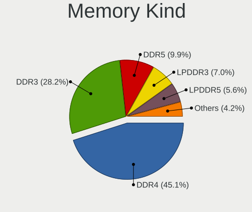

| Kind   | Notebooks | Percent |
|--------|-----------|---------|
| DDR4   | 32        | 45.07%  |
| DDR3   | 20        | 28.17%  |
| DDR5   | 7         | 9.86%   |
| LPDDR3 | 5         | 7.04%   |
| LPDDR5 | 4         | 5.63%   |
| DDR2   | 2         | 2.82%   |
| LPDDR4 | 1         | 1.41%   |

Memory Form Factor
------------------

Physical design of the memory module

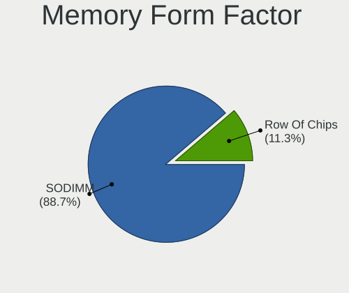

| Name         | Notebooks | Percent |
|--------------|-----------|---------|
| SODIMM       | 63        | 88.73%  |
| Row Of Chips | 8         | 11.27%  |

Memory Size
-----------

Memory module size

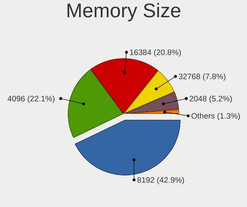

| Size  | Notebooks | Percent |
|-------|-----------|---------|
| 8192  | 33        | 42.86%  |
| 4096  | 17        | 22.08%  |
| 16384 | 16        | 20.78%  |
| 32768 | 6         | 7.79%   |
| 2048  | 4         | 5.19%   |
| 1024  | 1         | 1.3%    |

Memory Speed
------------

Memory module speed

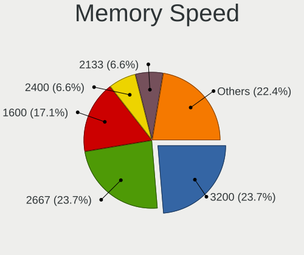

| Speed   | Notebooks | Percent |
|---------|-----------|---------|
| 3200    | 18        | 23.68%  |
| 2667    | 18        | 23.68%  |
| 1600    | 13        | 17.11%  |
| 2400    | 5         | 6.58%   |
| 2133    | 5         | 6.58%   |
| 4800    | 4         | 5.26%   |
| 6400    | 3         | 3.95%   |
| 5600    | 3         | 3.95%   |
| Unknown | 3         | 3.95%   |
| 1333    | 2         | 2.63%   |
| 7500    | 1         | 1.32%   |
| 1067    | 1         | 1.32%   |

Printers & scanners
-------------------

Printer Vendor
--------------

Printer device vendors

Zero info for selected period =(

Printer Model
-------------

Printer device models

Zero info for selected period =(

Scanner Vendor
--------------

Scanner device vendors

| Vendor      | Notebooks | Percent |
|-------------|-----------|---------|
| Seiko Epson | 1         | 100%    |

Scanner Model
-------------

Scanner device models

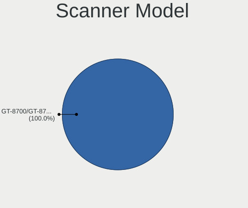

| Model                                                         | Notebooks | Percent |
|---------------------------------------------------------------|-----------|---------|
| Seiko Epson GT-8700/GT-8700F [Perfection 1640SU/1640SU PHOTO] | 1         | 100%    |

Camera
------

Camera Vendor
-------------

Camera device vendors

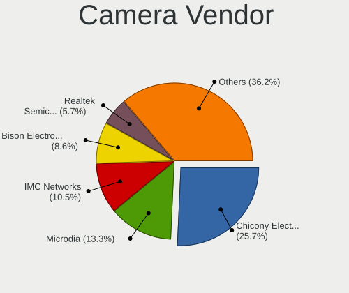

| Vendor                                 | Notebooks | Percent |
|----------------------------------------|-----------|---------|
| Chicony Electronics                    | 27        | 25.71%  |
| Microdia                               | 14        | 13.33%  |
| IMC Networks                           | 11        | 10.48%  |
| Bison Electronics                      | 9         | 8.57%   |
| Realtek Semiconductor                  | 6         | 5.71%   |
| Samsung Electronics                    | 5         | 4.76%   |
| Apple                                  | 5         | 4.76%   |
| Quanta                                 | 4         | 3.81%   |
| Cheng Uei Precision Industry (Foxlink) | 4         | 3.81%   |
| Syntek                                 | 3         | 2.86%   |
| Ricoh                                  | 3         | 2.86%   |
| Luxvisions Innotech Limited            | 3         | 2.86%   |
| Sunplus Innovation Technology          | 2         | 1.9%    |
| Alcor Micro                            | 2         | 1.9%    |
| Suyin                                  | 1         | 0.95%   |
| Silicon Motion                         | 1         | 0.95%   |
| ShineTech                              | 1         | 0.95%   |
| Logitech                               | 1         | 0.95%   |
| kingcome                               | 1         | 0.95%   |
| ALi                                    | 1         | 0.95%   |
| Unknown                                | 1         | 0.95%   |

Camera Model
------------

Camera device models

| Model                                            | Notebooks | Percent |
|--------------------------------------------------|-----------|---------|
| Microdia Integrated_Webcam_HD                    | 6         | 5.71%   |
| Samsung Galaxy series, misc. (MTP mode)          | 5         | 4.76%   |
| IMC Networks USB2.0 HD UVC WebCam                | 5         | 4.76%   |
| IMC Networks Integrated Camera                   | 4         | 3.81%   |
| Chicony Integrated Camera                        | 4         | 3.81%   |
| Realtek Integrated_Webcam_HD                     | 3         | 2.86%   |
| Chicony HD WebCam                                | 3         | 2.86%   |
| Apple FaceTime HD Camera                         | 3         | 2.86%   |
| Syntek Integrated Camera                         | 2         | 1.9%    |
| Quanta HD User Facing                            | 2         | 1.9%    |
| Microdia Integrated_Webcam_FHD                   | 2         | 1.9%    |
| Microdia Integrated Webcam                       | 2         | 1.9%    |
| Luxvisions Innotech Limited HP HD Camera         | 2         | 1.9%    |
| Chicony Integrated IR Camera                     | 2         | 1.9%    |
| Chicony Integrated Camera (1280x720@30)          | 2         | 1.9%    |
| Chicony HP HD Camera                             | 2         | 1.9%    |
| Cheng Uei Precision Industry (Foxlink) HD Camera | 2         | 1.9%    |
| Bison Integrated Camera                          | 2         | 1.9%    |
| Apple iPhone 5/5C/5S/6/SE/7/8/X                  | 2         | 1.9%    |
| Alcor Micro USB 2.0 Camera                       | 2         | 1.9%    |
| Syntek USB2.0 Camera                             | 1         | 0.95%   |
| Suyin HP Truevision HD                           | 1         | 0.95%   |
| Sunplus Laptop Integrated WebCam HD              | 1         | 0.95%   |
| Sunplus HP HD Webcam [Fixed]                     | 1         | 0.95%   |
| Silicon Motion Web Camera                        | 1         | 0.95%   |
| ShineTech HD Camera                              | 1         | 0.95%   |
| Ricoh USB2.0 Camera                              | 1         | 0.95%   |
| Ricoh Sony Visual Communication Camera           | 1         | 0.95%   |
| Ricoh Sony Vaio Integrated Webcam                | 1         | 0.95%   |
| Realtek Laptop Camera                            | 1         | 0.95%   |
| Realtek Integrated Webcam_HD                     | 1         | 0.95%   |
| Realtek HP Truevision HD                         | 1         | 0.95%   |
| Quanta HP Wide Vision HD Camera                  | 1         | 0.95%   |
| Quanta HP Webcam                                 | 1         | 0.95%   |
| Microdia Webcam Vitade AF                        | 1         | 0.95%   |
| Microdia Webcam                                  | 1         | 0.95%   |
| Microdia Integrated_Webcam_1.3M                  | 1         | 0.95%   |
| Microdia Integrated Webcam HD                    | 1         | 0.95%   |
| Luxvisions Innotech Limited HP 5MP Camera        | 1         | 0.95%   |
| Logitech HD Pro Webcam C920                      | 1         | 0.95%   |

Security
--------

Fingerprint Vendor
------------------

Fingerprint sensor vendors

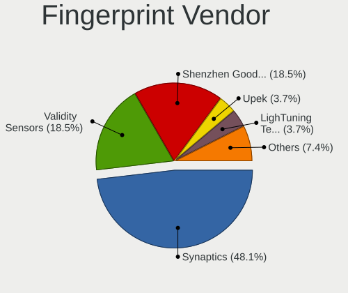

| Vendor                     | Notebooks | Percent |
|----------------------------|-----------|---------|
| Synaptics                  | 13        | 48.15%  |
| Validity Sensors           | 5         | 18.52%  |
| Shenzhen Goodix Technology | 5         | 18.52%  |
| Upek                       | 1         | 3.7%    |
| LighTuning Technology      | 1         | 3.7%    |
| Elan Microelectronics      | 1         | 3.7%    |
| AuthenTec                  | 1         | 3.7%    |

Fingerprint Model
-----------------

Fingerprint sensor models

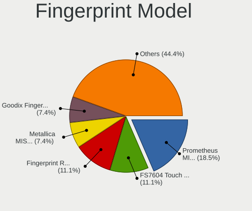

| Model                                                    | Notebooks | Percent |
|----------------------------------------------------------|-----------|---------|
| Synaptics Prometheus MIS Touch Fingerprint Reader        | 5         | 18.52%  |
| Synaptics FS7604 Touch Fingerprint Sensor with PurePrint | 3         | 11.11%  |
| Shenzhen Goodix Fingerprint Reader                       | 3         | 11.11%  |
| Synaptics Metallica MIS Touch Fingerprint Reader         | 2         | 7.41%   |
| Shenzhen Goodix  Fingerprint Device                      | 2         | 7.41%   |
| Validity Sensors VFS7552 Touch Fingerprint Sensor        | 1         | 3.7%    |
| Validity Sensors VFS495 Fingerprint Reader               | 1         | 3.7%    |
| Validity Sensors VFS451 Fingerprint Reader               | 1         | 3.7%    |
| Validity Sensors Synaptics WBDI                          | 1         | 3.7%    |
| Validity Sensors Fingerprint scanner                     | 1         | 3.7%    |
| Upek Biometric Touchchip/Touchstrip Fingerprint Sensor   | 1         | 3.7%    |
| Synaptics UWP WBDI Device                                | 1         | 3.7%    |
| Synaptics UWP WBDI                                       | 1         | 3.7%    |
| Synaptics Fingerprint reader [HP G6]                     | 1         | 3.7%    |
| LighTuning ES603 Swipe Fingerprint Sensor                | 1         | 3.7%    |
| Elan ELAN:Fingerprint                                    | 1         | 3.7%    |
| AuthenTec Fingerprint Sensor                             | 1         | 3.7%    |

Chipcard Vendor
---------------

Chipcard module vendors

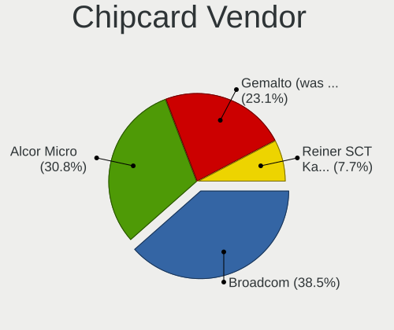

| Vendor                   | Notebooks | Percent |
|--------------------------|-----------|---------|
| Broadcom                 | 5         | 38.46%  |
| Alcor Micro              | 4         | 30.77%  |
| Gemalto (was Gemplus)    | 3         | 23.08%  |
| Reiner SCT Kartensysteme | 1         | 7.69%   |

Chipcard Model
--------------

Chipcard module models

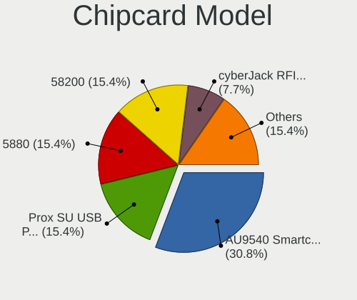

| Model                                                                        | Notebooks | Percent |
|------------------------------------------------------------------------------|-----------|---------|
| Alcor Micro AU9540 Smartcard Reader                                          | 4         | 30.77%  |
| Gemalto (was Gemplus) Prox SU USB PC Link Reader                             | 2         | 15.38%  |
| Broadcom 5880                                                                | 2         | 15.38%  |
| Broadcom 58200                                                               | 2         | 15.38%  |
| Reiner SCT Kartensysteme cyberJack RFID basis contactless smartcard reader   | 1         | 7.69%   |
| Gemalto (was Gemplus) Compact Smart Card Reader Writer                       | 1         | 7.69%   |
| Broadcom BCM5880 Secure Applications Processor with fingerprint swipe sensor | 1         | 7.69%   |

Unsupported
-----------

Unsupported Devices
-------------------

Total unsupported devices on board

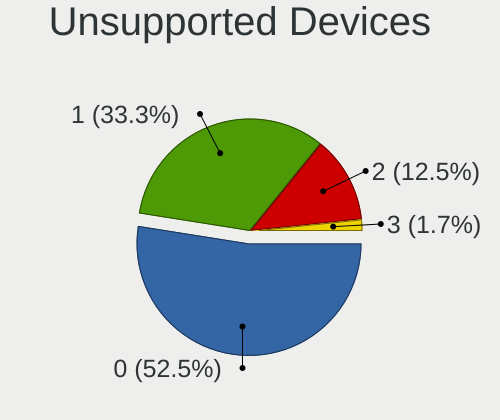

| Total | Notebooks | Percent |
|-------|-----------|---------|
| 0     | 63        | 52.5%   |
| 1     | 40        | 33.33%  |
| 2     | 15        | 12.5%   |
| 3     | 2         | 1.67%   |

Unsupported Device Types
------------------------

Types of unsupported devices

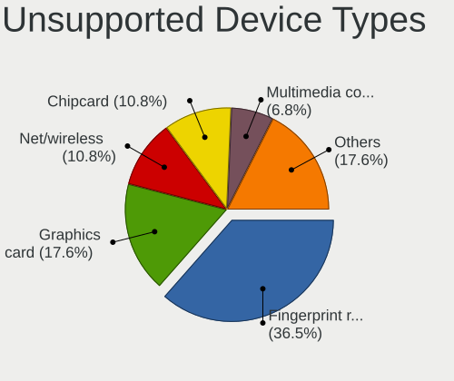

| Type                     | Notebooks | Percent |
|--------------------------|-----------|---------|
| Fingerprint reader       | 27        | 36.49%  |
| Graphics card            | 13        | 17.57%  |
| Net/wireless             | 8         | 10.81%  |
| Chipcard                 | 8         | 10.81%  |
| Multimedia controller    | 5         | 6.76%   |
| Card reader              | 3         | 4.05%   |
| Network                  | 2         | 2.7%    |
| Communication controller | 2         | 2.7%    |
| Camera                   | 2         | 2.7%    |
| Bluetooth                | 2         | 2.7%    |
| Sound                    | 1         | 1.35%   |
| Net/ethernet             | 1         | 1.35%   |

