Linux in Luxembourg - Tested Hardware & Statistics (Notebooks)
--------------------------------------------------------------

A project to collect tested hardware configurations for Linux in Luxembourg.

Anyone can contribute to this report by the [hw-probe](https://github.com/linuxhw/hw-probe) tool:

    sudo -E hw-probe -all -upload

Please contribute! Especially if your hardware is rare.

Contents
--------

* [ Test Cases ](#test-cases)

* [ System ](#system)
  - [ OS                       ](#os)
  - [ OS Family                ](#os-family)
  - [ Kernel                   ](#kernel)
  - [ Kernel Family            ](#kernel-family)
  - [ Kernel Major Ver.        ](#kernel-major-ver)
  - [ Arch                     ](#arch)
  - [ DE                       ](#de)
  - [ Display Server           ](#display-server)
  - [ Display Manager          ](#display-manager)
  - [ OS Lang                  ](#os-lang)
  - [ Boot Mode                ](#boot-mode)
  - [ Filesystem               ](#filesystem)
  - [ Part. scheme             ](#part-scheme)
  - [ Dual Boot with Linux/BSD ](#dual-boot-with-linuxbsd)
  - [ Dual Boot (Win)          ](#dual-boot-win)

* [ Board ](#board)
  - [ Vendor                   ](#vendor)
  - [ Model                    ](#model)
  - [ Model Family             ](#model-family)
  - [ MFG Year                 ](#mfg-year)
  - [ Form Factor              ](#form-factor)
  - [ Secure Boot              ](#secure-boot)
  - [ Coreboot                 ](#coreboot)
  - [ RAM Size                 ](#ram-size)
  - [ RAM Used                 ](#ram-used)
  - [ Total Drives             ](#total-drives)
  - [ Has CD-ROM               ](#has-cd-rom)
  - [ Has Ethernet             ](#has-ethernet)
  - [ Has WiFi                 ](#has-wifi)
  - [ Has Bluetooth            ](#has-bluetooth)

* [ Location ](#location)
  - [ Country                  ](#country)
  - [ City                     ](#city)

* [ Drives ](#drives)
  - [ Drive Vendor             ](#drive-vendor)
  - [ Drive Model              ](#drive-model)
  - [ HDD Vendor               ](#hdd-vendor)
  - [ SSD Vendor               ](#ssd-vendor)
  - [ Drive Kind               ](#drive-kind)
  - [ Drive Connector          ](#drive-connector)
  - [ Drive Size               ](#drive-size)
  - [ Space Total              ](#space-total)
  - [ Space Used               ](#space-used)
  - [ Malfunc. Drives          ](#malfunc-drives)
  - [ Malfunc. Drive Vendor    ](#malfunc-drive-vendor)
  - [ Malfunc. HDD Vendor      ](#malfunc-hdd-vendor)
  - [ Malfunc. Drive Kind      ](#malfunc-drive-kind)
  - [ Failed Drives            ](#failed-drives)
  - [ Failed Drive Vendor      ](#failed-drive-vendor)
  - [ Drive Status             ](#drive-status)

* [ Storage controller ](#storage-controller)
  - [ Storage Vendor           ](#storage-vendor)
  - [ Storage Model            ](#storage-model)
  - [ Storage Kind             ](#storage-kind)

* [ Processor ](#processor)
  - [ CPU Vendor               ](#cpu-vendor)
  - [ CPU Model                ](#cpu-model)
  - [ CPU Model Family         ](#cpu-model-family)
  - [ CPU Cores                ](#cpu-cores)
  - [ CPU Sockets              ](#cpu-sockets)
  - [ CPU Threads              ](#cpu-threads)
  - [ CPU Op-Modes             ](#cpu-op-modes)
  - [ CPU Microcode            ](#cpu-microcode)
  - [ CPU Microarch            ](#cpu-microarch)

* [ Graphics ](#graphics)
  - [ GPU Vendor               ](#gpu-vendor)
  - [ GPU Model                ](#gpu-model)
  - [ GPU Combo                ](#gpu-combo)
  - [ GPU Driver               ](#gpu-driver)
  - [ GPU Memory               ](#gpu-memory)

* [ Monitor ](#monitor)
  - [ Monitor Vendor           ](#monitor-vendor)
  - [ Monitor Model            ](#monitor-model)
  - [ Monitor Resolution       ](#monitor-resolution)
  - [ Monitor Diagonal         ](#monitor-diagonal)
  - [ Monitor Width            ](#monitor-width)
  - [ Aspect Ratio             ](#aspect-ratio)
  - [ Monitor Area             ](#monitor-area)
  - [ Pixel Density            ](#pixel-density)
  - [ Multiple Monitors        ](#multiple-monitors)

* [ Network ](#network)
  - [ Net Controller Vendor    ](#net-controller-vendor)
  - [ Net Controller Model     ](#net-controller-model)
  - [ Wireless Vendor          ](#wireless-vendor)
  - [ Wireless Model           ](#wireless-model)
  - [ Ethernet Vendor          ](#ethernet-vendor)
  - [ Ethernet Model           ](#ethernet-model)
  - [ Net Controller Kind      ](#net-controller-kind)
  - [ Used Controller          ](#used-controller)
  - [ NICs                     ](#nics)
  - [ IPv6                     ](#ipv6)

* [ Bluetooth ](#bluetooth)
  - [ Bluetooth Vendor         ](#bluetooth-vendor)
  - [ Bluetooth Model          ](#bluetooth-model)

* [ Sound ](#sound)
  - [ Sound Vendor             ](#sound-vendor)
  - [ Sound Model              ](#sound-model)

* [ Memory ](#memory)
  - [ Memory Vendor            ](#memory-vendor)
  - [ Memory Model             ](#memory-model)
  - [ Memory Kind              ](#memory-kind)
  - [ Memory Form Factor       ](#memory-form-factor)
  - [ Memory Size              ](#memory-size)
  - [ Memory Speed             ](#memory-speed)

* [ Printers & scanners ](#printers--scanners)
  - [ Printer Vendor           ](#printer-vendor)
  - [ Printer Model            ](#printer-model)
  - [ Scanner Vendor           ](#scanner-vendor)
  - [ Scanner Model            ](#scanner-model)

* [ Camera ](#camera)
  - [ Camera Vendor            ](#camera-vendor)
  - [ Camera Model             ](#camera-model)

* [ Security ](#security)
  - [ Fingerprint Vendor       ](#fingerprint-vendor)
  - [ Fingerprint Model        ](#fingerprint-model)
  - [ Chipcard Vendor          ](#chipcard-vendor)
  - [ Chipcard Model           ](#chipcard-model)

* [ Unsupported ](#unsupported)
  - [ Unsupported Devices      ](#unsupported-devices)
  - [ Unsupported Device Types ](#unsupported-device-types)

Test Cases
----------

Total: 90

| Vendor        | Model                       | Probe                                                      | Date         |
|---------------|-----------------------------|------------------------------------------------------------|--------------|
| HP            | EliteBook 850 G3            | [2eee433657](https://linux-hardware.org/?probe=2eee433657) | Sep 17, 2022 |
| ASUSTek       | N751JK                      | [ca6cba3420](https://linux-hardware.org/?probe=ca6cba3420) | Jul 28, 2022 |
| Wortmann      | MS-1727                     | [4697b4b4e5](https://linux-hardware.org/?probe=4697b4b4e5) | Jul 27, 2022 |
| HP            | EliteBook 8560p             | [584fe927af](https://linux-hardware.org/?probe=584fe927af) | Jul 19, 2022 |
| Apple         | MacBookAir6,2               | [cc9185a171](https://linux-hardware.org/?probe=cc9185a171) | Jul 17, 2022 |
| ASUSTek       | TUF Gaming FX505DY_TUF50... | [df304b4da1](https://linux-hardware.org/?probe=df304b4da1) | Jun 17, 2022 |
| win elemen... | MoreFine S500+              | [eafff91c80](https://linux-hardware.org/?probe=eafff91c80) | Jun 03, 2022 |
| TUXEDO        | Pulse 14 Gen1               | [ca9c5a57a8](https://linux-hardware.org/?probe=ca9c5a57a8) | May 06, 2022 |
| Acer          | Nitro AN515-55              | [731e3d2588](https://linux-hardware.org/?probe=731e3d2588) | Apr 03, 2022 |
| Acer          | Nitro AN515-55              | [ad42ffd24d](https://linux-hardware.org/?probe=ad42ffd24d) | Apr 03, 2022 |
| Sony          | VPCCA4E1E                   | [95fc0956c8](https://linux-hardware.org/?probe=95fc0956c8) | Mar 27, 2022 |
| ASUSTek       | UX430UNR                    | [86dc3583ca](https://linux-hardware.org/?probe=86dc3583ca) | Mar 09, 2022 |
| ASUSTek       | UX430UNR                    | [4c45b3ea17](https://linux-hardware.org/?probe=4c45b3ea17) | Mar 06, 2022 |
| ASUSTek       | UX430UNR                    | [a76e22e410](https://linux-hardware.org/?probe=a76e22e410) | Mar 06, 2022 |
| HP            | 255 G6 Notebook PC          | [30c3320bb3](https://linux-hardware.org/?probe=30c3320bb3) | Feb 12, 2022 |
| HP            | 255 G6 Notebook PC          | [d4f9b2d0e3](https://linux-hardware.org/?probe=d4f9b2d0e3) | Feb 12, 2022 |
| Sony          | VPCEB2E1E                   | [e3df114520](https://linux-hardware.org/?probe=e3df114520) | Feb 11, 2022 |
| HP            | ProBook 450 G6              | [d8a9a9c7d3](https://linux-hardware.org/?probe=d8a9a9c7d3) | Jan 31, 2022 |
| Lenovo        | ThinkPad T490 20N3S5DV0S    | [e619ec0303](https://linux-hardware.org/?probe=e619ec0303) | Jan 31, 2022 |
| Medion        | P6685 MD61138               | [57dfdfb610](https://linux-hardware.org/?probe=57dfdfb610) | Jan 27, 2022 |
| win elemen... | MoreFine S500+              | [d7767ce266](https://linux-hardware.org/?probe=d7767ce266) | Jan 23, 2022 |
| win elemen... | MoreFine S500+              | [d63a6d7de6](https://linux-hardware.org/?probe=d63a6d7de6) | Jan 23, 2022 |
| Lenovo        | ThinkPad T470s W10DG 20J... | [6892ab87e1](https://linux-hardware.org/?probe=6892ab87e1) | Jan 13, 2022 |
| Packard Be... | EasyNote TJ65               | [252c250082](https://linux-hardware.org/?probe=252c250082) | Jan 06, 2022 |
| Fujitsu       | LIFEBOOK E746               | [55ac013e1e](https://linux-hardware.org/?probe=55ac013e1e) | Jan 06, 2022 |
| Fujitsu       | LIFEBOOK E746               | [2f7baecdec](https://linux-hardware.org/?probe=2f7baecdec) | Jan 02, 2022 |
| Fujitsu       | LIFEBOOK E746               | [54248086d3](https://linux-hardware.org/?probe=54248086d3) | Dec 25, 2021 |
| Fujitsu       | LIFEBOOK E746               | [1b53993ffc](https://linux-hardware.org/?probe=1b53993ffc) | Dec 25, 2021 |
| Dell          | XPS 15 7590                 | [63f386f998](https://linux-hardware.org/?probe=63f386f998) | Nov 23, 2021 |
| Sony          | VGN-NS30E_S                 | [a36535818d](https://linux-hardware.org/?probe=a36535818d) | Nov 20, 2021 |
| YJKC          | vBook                       | [42ccc640d7](https://linux-hardware.org/?probe=42ccc640d7) | Nov 03, 2021 |
| MSI           | GF72 8RD                    | [4ac8472977](https://linux-hardware.org/?probe=4ac8472977) | Oct 23, 2021 |
| Wortmann      | TERRA_MOBILE_1749           | [8917a2fc6b](https://linux-hardware.org/?probe=8917a2fc6b) | Oct 15, 2021 |
| Dell          | Precision M2800             | [b046a9dfe3](https://linux-hardware.org/?probe=b046a9dfe3) | Oct 08, 2021 |
| ASUSTek       | UX360CA                     | [52039745c7](https://linux-hardware.org/?probe=52039745c7) | Sep 15, 2021 |
| ASUSTek       | UX360CA                     | [413bad53c5](https://linux-hardware.org/?probe=413bad53c5) | Sep 14, 2021 |
| HP            | ProBook 450 G6              | [03689a5674](https://linux-hardware.org/?probe=03689a5674) | Sep 10, 2021 |
| Lenovo        | ThinkPad L15 Gen 1 20U7S... | [da01ae06a6](https://linux-hardware.org/?probe=da01ae06a6) | Sep 09, 2021 |
| Dell          | Precision M3800             | [5dba4d3bce](https://linux-hardware.org/?probe=5dba4d3bce) | Sep 07, 2021 |
| Dell          | Inspiron 16 7610            | [29c29dc50b](https://linux-hardware.org/?probe=29c29dc50b) | Sep 06, 2021 |
| Lenovo        | ThinkPad L15 Gen 1 20U8S... | [d819b1cc24](https://linux-hardware.org/?probe=d819b1cc24) | Sep 04, 2021 |
| Lenovo        | ThinkPad L15 Gen 1 20U8S... | [b5388437b9](https://linux-hardware.org/?probe=b5388437b9) | Sep 04, 2021 |
| HP            | Pavilion Gaming Notebook    | [3b8bef3c61](https://linux-hardware.org/?probe=3b8bef3c61) | Aug 23, 2021 |
| HP            | Pavilion Gaming Notebook    | [c2a3d9da9e](https://linux-hardware.org/?probe=c2a3d9da9e) | Aug 12, 2021 |
| HP            | ProBook 6450b               | [e607e5a89e](https://linux-hardware.org/?probe=e607e5a89e) | Jul 31, 2021 |
| Acer          | Aspire V5-561G              | [caf0285b12](https://linux-hardware.org/?probe=caf0285b12) | Jul 17, 2021 |
| HP            | ProBook 450 G6              | [f13877e5d4](https://linux-hardware.org/?probe=f13877e5d4) | Jul 08, 2021 |
| Sony          | VPCP11S1R                   | [185fd7ceef](https://linux-hardware.org/?probe=185fd7ceef) | Jul 05, 2021 |
| HP            | EliteBook 850 G8 Noteboo... | [c031043704](https://linux-hardware.org/?probe=c031043704) | Jul 01, 2021 |
| HP            | EliteBook 850 G8 Noteboo... | [28c858a3ad](https://linux-hardware.org/?probe=28c858a3ad) | Jul 01, 2021 |
| Lenovo        | ThinkPad T480s 20L7001PF... | [b54604a23d](https://linux-hardware.org/?probe=b54604a23d) | Jun 10, 2021 |
| HUAWEI        | HLYL-WXX9                   | [22e9ce0306](https://linux-hardware.org/?probe=22e9ce0306) | Jun 10, 2021 |
| HUAWEI        | HLYL-WXX9                   | [4bc5bdf702](https://linux-hardware.org/?probe=4bc5bdf702) | Jun 10, 2021 |
| Fujitsu       | STYLISTIC Q702              | [6af6b1aa99](https://linux-hardware.org/?probe=6af6b1aa99) | May 17, 2021 |
| Wortmann      | TERRA_MOBILE_1749           | [47e02d3203](https://linux-hardware.org/?probe=47e02d3203) | May 14, 2021 |
| Fujitsu       | STYLISTIC Q702              | [ceb707caf8](https://linux-hardware.org/?probe=ceb707caf8) | May 14, 2021 |
| HP            | Pavilion Gaming Notebook    | [f514df9912](https://linux-hardware.org/?probe=f514df9912) | May 02, 2021 |
| ASUSTek       | VivoBook 17_ASUS Laptop ... | [359bf83027](https://linux-hardware.org/?probe=359bf83027) | Apr 05, 2021 |
| Toshiba       | Satellite C55-A-1N0         | [7fe4a33a38](https://linux-hardware.org/?probe=7fe4a33a38) | Mar 27, 2021 |
| Apple         | MacBookPro8,1               | [467f82a695](https://linux-hardware.org/?probe=467f82a695) | Feb 22, 2021 |
| Apple         | MacBookPro14,1              | [34e4083988](https://linux-hardware.org/?probe=34e4083988) | Feb 20, 2021 |
| Dell          | Vostro 3558                 | [176249071b](https://linux-hardware.org/?probe=176249071b) | Feb 13, 2021 |
| HP            | ENVY 15 x360 PC             | [1760641bd6](https://linux-hardware.org/?probe=1760641bd6) | Feb 13, 2021 |
| ASUSTek       | VivoBook 17_ASUS Laptop ... | [cdc7e7e576](https://linux-hardware.org/?probe=cdc7e7e576) | Dec 25, 2020 |
| Lenovo        | IdeaPad 330-15ICH 81FK      | [dfebaa1e1e](https://linux-hardware.org/?probe=dfebaa1e1e) | Dec 06, 2020 |
| Acer          | Aspire 4741                 | [e65bbc0990](https://linux-hardware.org/?probe=e65bbc0990) | Nov 28, 2020 |
| ASUSTek       | VivoBook 17_ASUS Laptop ... | [a6b200eda6](https://linux-hardware.org/?probe=a6b200eda6) | Nov 13, 2020 |
| Dell          | Precision 5540              | [5b3140e7e8](https://linux-hardware.org/?probe=5b3140e7e8) | Oct 29, 2020 |
| Dell          | XPS 15 9560                 | [c2660b6ca0](https://linux-hardware.org/?probe=c2660b6ca0) | Oct 07, 2020 |
| Apple         | MacBookPro15,4              | [2352614158](https://linux-hardware.org/?probe=2352614158) | Sep 25, 2020 |
| Lenovo        | ThinkPad T440p 20AWS24B0... | [8178cca0f9](https://linux-hardware.org/?probe=8178cca0f9) | Sep 16, 2020 |
| Lenovo        | ThinkPad X1 Carbon 7th 2... | [a06e93e3e9](https://linux-hardware.org/?probe=a06e93e3e9) | Sep 04, 2020 |
| Timi          | RedmiBook 14 II             | [6cd091184f](https://linux-hardware.org/?probe=6cd091184f) | Aug 21, 2020 |
| Packard Be... | EasyNote TJ65               | [cce3b0b23c](https://linux-hardware.org/?probe=cce3b0b23c) | Aug 07, 2020 |
| HP            | EliteBook 8470p             | [2de50effb2](https://linux-hardware.org/?probe=2de50effb2) | Jul 26, 2020 |
| HP            | EliteBook 8470p             | [c85723b6bf](https://linux-hardware.org/?probe=c85723b6bf) | Jul 23, 2020 |
| Lenovo        | ThinkPad P1 Gen 2 20QTCT... | [0037393fbf](https://linux-hardware.org/?probe=0037393fbf) | Jul 02, 2020 |
| Clevo         | P170EM                      | [41248f6ae8](https://linux-hardware.org/?probe=41248f6ae8) | Jun 13, 2020 |
| Clevo         | P170EM                      | [6f7578fede](https://linux-hardware.org/?probe=6f7578fede) | Jun 13, 2020 |
| Lenovo        | G50-70 20351                | [fac974e5a6](https://linux-hardware.org/?probe=fac974e5a6) | May 03, 2020 |
| HP            | ENVY Laptop 17-ce1xxx       | [cf98b2c860](https://linux-hardware.org/?probe=cf98b2c860) | Apr 13, 2020 |
| Wortmann      | TERRA_MOBILE_1541H          | [46b44d2d1f](https://linux-hardware.org/?probe=46b44d2d1f) | Apr 12, 2020 |
| Lenovo        | ThinkPad T590 20N4CTO1WW    | [91c4d3ed7c](https://linux-hardware.org/?probe=91c4d3ed7c) | Apr 10, 2020 |
| Acer          | Aspire E5-771G              | [c8a1411a14](https://linux-hardware.org/?probe=c8a1411a14) | Mar 28, 2020 |
| Dell          | Precision M3800             | [33ee2bd8db](https://linux-hardware.org/?probe=33ee2bd8db) | Mar 22, 2020 |
| ASUSTek       | VivoBook_ASUSLaptop X712... | [945a4d4691](https://linux-hardware.org/?probe=945a4d4691) | Mar 21, 2020 |
| HP            | Spectre Laptop 13-af0xx     | [8ee92af301](https://linux-hardware.org/?probe=8ee92af301) | Oct 12, 2019 |
| MSI           | GF72 8RD                    | [b0a808dbdb](https://linux-hardware.org/?probe=b0a808dbdb) | Aug 09, 2019 |
| Sony          | SVF1421E2EW                 | [6fd2106f13](https://linux-hardware.org/?probe=6fd2106f13) | Mar 02, 2019 |
| Medion        | E4254 MD62100               | [660722192a](https://linux-hardware.org/?probe=660722192a) | Jan 25, 2019 |

System
------

OS
--

Installed operating systems

| Name                         | Notebooks | Percent |
|------------------------------|-----------|---------|
| Ubuntu 20.04                 | 12        | 16.9%   |
| Ubuntu 18.04                 | 5         | 7.04%   |
| Linux Mint 20.3              | 4         | 5.63%   |
| Ubuntu 21.04                 | 3         | 4.23%   |
| Pop!_OS 21.04                | 3         | 4.23%   |
| openSUSE Tumbleweed-XXXXXXXX | 3         | 4.23%   |
| OpenMandriva 4.2             | 3         | 4.23%   |
| Xubuntu 20.04                | 2         | 2.82%   |
| Ubuntu 20.10                 | 2         | 2.82%   |
| OpenMandriva 4.90            | 2         | 2.82%   |
| Xubuntu 18.04                | 1         | 1.41%   |
| Ubuntu MATE 21.10            | 1         | 1.41%   |
| Ubuntu MATE 20.04            | 1         | 1.41%   |
| Ubuntu 22.04                 | 1         | 1.41%   |
| Ubuntu 18.10                 | 1         | 1.41%   |
| RHEL 8                       | 1         | 1.41%   |
| Pop!_OS 21.10                | 1         | 1.41%   |
| Pop!_OS 20.10                | 1         | 1.41%   |
| Pop!_OS 20.04                | 1         | 1.41%   |
| openSUSE Leap-15.1           | 1         | 1.41%   |
| OpenMandriva 4.3             | 1         | 1.41%   |
| Manjaro 21.2.6               | 1         | 1.41%   |
| Manjaro 19.0.2               | 1         | 1.41%   |
| Lubuntu 20.04                | 1         | 1.41%   |
| LMDE 4                       | 1         | 1.41%   |
| Linux Mint 20.2              | 1         | 1.41%   |
| Linux Mint 19.2              | 1         | 1.41%   |
| Kubuntu 18.04                | 1         | 1.41%   |
| Garuda Linux Soaring         | 1         | 1.41%   |
| Fedora 36                    | 1         | 1.41%   |
| Fedora 32                    | 1         | 1.41%   |
| Endless 3.9.3                | 1         | 1.41%   |
| Endless 3.9.1                | 1         | 1.41%   |
| Endless 3.9.0                | 1         | 1.41%   |
| Endless 3.7.8                | 1         | 1.41%   |
| Elementary 6.1               | 1         | 1.41%   |
| Debian 11                    | 1         | 1.41%   |
| Debian 10                    | 1         | 1.41%   |
| Clear Linux 32820            | 1         | 1.41%   |
| BlackPanther 18.1            | 1         | 1.41%   |

OS Family
---------

OS without a version

| Name         | Notebooks | Percent |
|--------------|-----------|---------|
| Ubuntu       | 24        | 35.82%  |
| OpenMandriva | 6         | 8.96%   |
| Pop!_OS      | 5         | 7.46%   |
| Linux Mint   | 5         | 7.46%   |
| openSUSE     | 4         | 5.97%   |
| Xubuntu      | 3         | 4.48%   |
| Ubuntu MATE  | 2         | 2.99%   |
| Manjaro      | 2         | 2.99%   |
| Fedora       | 2         | 2.99%   |
| Endless      | 2         | 2.99%   |
| Debian       | 2         | 2.99%   |
| RHEL         | 1         | 1.49%   |
| Lubuntu      | 1         | 1.49%   |
| LMDE         | 1         | 1.49%   |
| Kubuntu      | 1         | 1.49%   |
| Garuda Linux | 1         | 1.49%   |
| Elementary   | 1         | 1.49%   |
| Clear Linux  | 1         | 1.49%   |
| BlackPanther | 1         | 1.49%   |
| ArcoLinux    | 1         | 1.49%   |
| Arch         | 1         | 1.49%   |

Kernel
------

Version of the Linux kernel

| Version                  | Notebooks | Percent |
|--------------------------|-----------|---------|
| 5.11.0-27-generic        | 3         | 4.17%   |
| 5.10.14-desktop-1omv4002 | 3         | 4.17%   |
| 5.8.0-59-generic         | 2         | 2.78%   |
| 5.4.0-96-generic         | 2         | 2.78%   |
| 5.4.0-122-generic        | 2         | 2.78%   |
| 5.18.12-desktop-3omv4090 | 2         | 2.78%   |
| 5.11.0-34-generic        | 2         | 2.78%   |
| 5.11.0-17-generic        | 2         | 2.78%   |
| 5.0.0-23-generic         | 2         | 2.78%   |
| 5.8.11-050811-generic    | 1         | 1.39%   |
| 5.8.0-63-generic         | 1         | 1.39%   |
| 5.8.0-55-generic         | 1         | 1.39%   |
| 5.8.0-43-generic         | 1         | 1.39%   |
| 5.8.0-31-generic         | 1         | 1.39%   |
| 5.8.0-20-generic         | 1         | 1.39%   |
| 5.8.0-14-generic         | 1         | 1.39%   |
| 5.7.6-201.fc32.x86_64    | 1         | 1.39%   |
| 5.7.1-1-default          | 1         | 1.39%   |
| 5.7.0-3-amd64            | 1         | 1.39%   |
| 5.7.0-050700-generic     | 1         | 1.39%   |
| 5.6.3-935.native         | 1         | 1.39%   |
| 5.5.8-1-MANJARO          | 1         | 1.39%   |
| 5.4.0-84-generic         | 1         | 1.39%   |
| 5.4.0-73-generic         | 1         | 1.39%   |
| 5.4.0-52-generic         | 1         | 1.39%   |
| 5.4.0-47-generic         | 1         | 1.39%   |
| 5.4.0-42-generic         | 1         | 1.39%   |
| 5.4.0-37-generic         | 1         | 1.39%   |
| 5.3.0-51-generic         | 1         | 1.39%   |
| 5.3.0-46-generic         | 1         | 1.39%   |
| 5.3.0-28-generic         | 1         | 1.39%   |
| 5.18.5-200.fc36.x86_64   | 1         | 1.39%   |
| 5.16.7-desktop-1omv4003  | 1         | 1.39%   |
| 5.16.2-arch1-1           | 1         | 1.39%   |
| 5.16.11-76051611-generic | 1         | 1.39%   |
| 5.15.4-zen1-1-zen        | 1         | 1.39%   |
| 5.15.32-1-MANJARO        | 1         | 1.39%   |
| 5.15.0-47-generic        | 1         | 1.39%   |
| 5.15.0-23-generic        | 1         | 1.39%   |
| 5.14.0-1-default         | 1         | 1.39%   |

Kernel Family
-------------

Linux kernel without a distro release

| Version | Notebooks | Percent |
|---------|-----------|---------|
| 5.11.0  | 12        | 17.14%  |
| 5.4.0   | 9         | 12.86%  |
| 5.8.0   | 8         | 11.43%  |
| 5.13.0  | 4         | 5.71%   |
| 5.3.0   | 3         | 4.29%   |
| 5.10.14 | 3         | 4.29%   |
| 4.15.0  | 3         | 4.29%   |
| 5.7.0   | 2         | 2.86%   |
| 5.18.12 | 2         | 2.86%   |
| 5.15.0  | 2         | 2.86%   |
| 5.0.0   | 2         | 2.86%   |
| 4.18.0  | 2         | 2.86%   |
| 5.8.11  | 1         | 1.43%   |
| 5.7.6   | 1         | 1.43%   |
| 5.7.1   | 1         | 1.43%   |
| 5.6.3   | 1         | 1.43%   |
| 5.5.8   | 1         | 1.43%   |
| 5.18.5  | 1         | 1.43%   |
| 5.16.7  | 1         | 1.43%   |
| 5.16.2  | 1         | 1.43%   |
| 5.16.11 | 1         | 1.43%   |
| 5.15.4  | 1         | 1.43%   |
| 5.15.32 | 1         | 1.43%   |
| 5.14.0  | 1         | 1.43%   |
| 5.12.13 | 1         | 1.43%   |
| 5.10.26 | 1         | 1.43%   |
| 5.10.0  | 1         | 1.43%   |
| 4.19.0  | 1         | 1.43%   |
| 4.18.16 | 1         | 1.43%   |
| 4.12.14 | 1         | 1.43%   |

Kernel Major Ver.
-----------------

Linux kernel major version

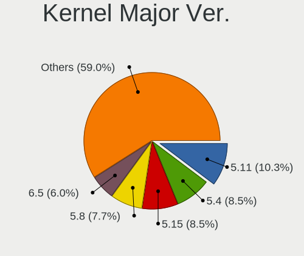

| Version | Notebooks | Percent |
|---------|-----------|---------|
| 5.11    | 12        | 17.14%  |
| 5.8     | 9         | 12.86%  |
| 5.4     | 9         | 12.86%  |
| 5.10    | 5         | 7.14%   |
| 5.7     | 4         | 5.71%   |
| 5.15    | 4         | 5.71%   |
| 5.13    | 4         | 5.71%   |
| 5.3     | 3         | 4.29%   |
| 5.18    | 3         | 4.29%   |
| 5.16    | 3         | 4.29%   |
| 4.18    | 3         | 4.29%   |
| 4.15    | 3         | 4.29%   |
| 5.0     | 2         | 2.86%   |
| 5.6     | 1         | 1.43%   |
| 5.5     | 1         | 1.43%   |
| 5.14    | 1         | 1.43%   |
| 5.12    | 1         | 1.43%   |
| 4.19    | 1         | 1.43%   |
| 4.12    | 1         | 1.43%   |

Arch
----

OS architecture (x86_64, i586, etc.)

| Name   | Notebooks | Percent |
|--------|-----------|---------|
| x86_64 | 65        | 98.48%  |
| i686   | 1         | 1.52%   |

DE
--

Desktop Environment

| Name            | Notebooks | Percent |
|-----------------|-----------|---------|
| GNOME           | 31        | 45.59%  |
| KDE5            | 9         | 13.24%  |
| X-Cinnamon      | 6         | 8.82%   |
| Unknown         | 6         | 8.82%   |
| XFCE            | 5         | 7.35%   |
| KDE             | 3         | 4.41%   |
| MATE            | 2         | 2.94%   |
| i3              | 2         | 2.94%   |
| Pantheon        | 1         | 1.47%   |
| LXQt            | 1         | 1.47%   |
| GNOME Flashback | 1         | 1.47%   |
| Cinnamon        | 1         | 1.47%   |

Display Server
--------------

X11 or Wayland

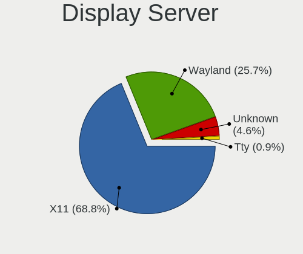

| Name    | Notebooks | Percent |
|---------|-----------|---------|
| X11     | 55        | 83.33%  |
| Wayland | 7         | 10.61%  |
| Unknown | 4         | 6.06%   |

Display Manager
---------------

SDDM, LightDM, etc.

| Name    | Notebooks | Percent |
|---------|-----------|---------|
| Unknown | 35        | 50%     |
| GDM     | 13        | 18.57%  |
| LightDM | 9         | 12.86%  |
| SDDM    | 8         | 11.43%  |
| TDM     | 3         | 4.29%   |
| GDM3    | 2         | 2.86%   |

OS Lang
-------

Language

| Lang    | Notebooks | Percent |
|---------|-----------|---------|
| en_US   | 28        | 41.18%  |
| Unknown | 7         | 10.29%  |
| de_LU   | 5         | 7.35%   |
| de_DE   | 5         | 7.35%   |
| fr_LU   | 4         | 5.88%   |
| fr_FR   | 4         | 5.88%   |
| en_GB   | 4         | 5.88%   |
| nl_NL   | 2         | 2.94%   |
| unm_US  | 1         | 1.47%   |
| pt_PT   | 1         | 1.47%   |
| pt_BR   | 1         | 1.47%   |
| POSIX   | 1         | 1.47%   |
| it_IT   | 1         | 1.47%   |
| hr_HR   | 1         | 1.47%   |
| es_ES   | 1         | 1.47%   |
| en_IE   | 1         | 1.47%   |
| C       | 1         | 1.47%   |

Boot Mode
---------

EFI or BIOS

| Mode | Notebooks | Percent |
|------|-----------|---------|
| EFI  | 38        | 56.72%  |
| BIOS | 29        | 43.28%  |

Filesystem
----------

Type of filesystem

| Type    | Notebooks | Percent |
|---------|-----------|---------|
| Ext4    | 51        | 77.27%  |
| Overlay | 8         | 12.12%  |
| Btrfs   | 4         | 6.06%   |
| Xfs     | 2         | 3.03%   |
| Unknown | 1         | 1.52%   |

Part. scheme
------------

Scheme of partitioning

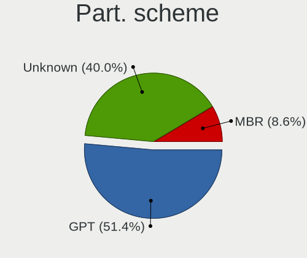

| Type    | Notebooks | Percent |
|---------|-----------|---------|
| Unknown | 34        | 51.52%  |
| GPT     | 28        | 42.42%  |
| MBR     | 4         | 6.06%   |

Dual Boot with Linux/BSD
------------------------

Hosting more than one Linux/BSD

| Dual boot | Notebooks | Percent |
|-----------|-----------|---------|
| No        | 63        | 94.03%  |
| Yes       | 4         | 5.97%   |

Dual Boot (Win)
---------------

Hosting Linux and Windows

| Dual boot | Notebooks | Percent |
|-----------|-----------|---------|
| No        | 48        | 72.73%  |
| Yes       | 18        | 27.27%  |

Board
-----

Vendor
------

Motherboard manufacturer

| Name             | Notebooks | Percent |
|------------------|-----------|---------|
| Lenovo           | 11        | 16.67%  |
| Hewlett-Packard  | 11        | 16.67%  |
| Dell             | 8         | 12.12%  |
| ASUSTek Computer | 6         | 9.09%   |
| Sony             | 5         | 7.58%   |
| Apple            | 4         | 6.06%   |
| Acer             | 4         | 6.06%   |
| Wortmann AG      | 3         | 4.55%   |
| win element      | 2         | 3.03%   |
| Medion           | 2         | 3.03%   |
| Fujitsu          | 2         | 3.03%   |
| YJKC             | 1         | 1.52%   |
| TUXEDO           | 1         | 1.52%   |
| Toshiba          | 1         | 1.52%   |
| Timi             | 1         | 1.52%   |
| Packard Bell     | 1         | 1.52%   |
| MSI              | 1         | 1.52%   |
| HUAWEI           | 1         | 1.52%   |
| Clevo            | 1         | 1.52%   |

Model
-----

Motherboard model

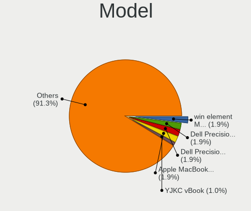

| Name                                     | Notebooks | Percent |
|------------------------------------------|-----------|---------|
| win element MoreFine S500+               | 2         | 3.03%   |
| Dell Precision M3800                     | 2         | 3.03%   |
| YJKC vBook                               | 1         | 1.52%   |
| Wortmann AG TERRA_MOBILE_1749            | 1         | 1.52%   |
| Wortmann AG TERRA_MOBILE_1541H           | 1         | 1.52%   |
| Wortmann AG MS-1727                      | 1         | 1.52%   |
| TUXEDO Pulse 14 Gen1                     | 1         | 1.52%   |
| Toshiba Satellite C55-A-1N0              | 1         | 1.52%   |
| Timi RedmiBook 14 II                     | 1         | 1.52%   |
| Sony VPCP11S1R                           | 1         | 1.52%   |
| Sony VPCEB2E1E                           | 1         | 1.52%   |
| Sony VPCCA4E1E                           | 1         | 1.52%   |
| Sony VGN-NS30E_S                         | 1         | 1.52%   |
| Sony SVF1421E2EW                         | 1         | 1.52%   |
| Packard Bell EasyNote TJ65               | 1         | 1.52%   |
| MSI GF72 8RD                             | 1         | 1.52%   |
| Medion P6685 MD61138                     | 1         | 1.52%   |
| Medion E4254 MD62100                     | 1         | 1.52%   |
| Lenovo ThinkPad X1 Carbon 7th 20QDCTO1WW | 1         | 1.52%   |
| Lenovo ThinkPad T590 20N4CTO1WW          | 1         | 1.52%   |
| Lenovo ThinkPad T490 20N3S5DV0S          | 1         | 1.52%   |
| Lenovo ThinkPad T480s 20L7001PFR         | 1         | 1.52%   |
| Lenovo ThinkPad T470s W10DG 20JTS0R800   | 1         | 1.52%   |
| Lenovo ThinkPad T440p 20AWS24B00         | 1         | 1.52%   |
| Lenovo ThinkPad P1 Gen 2 20QTCTO1WW      | 1         | 1.52%   |
| Lenovo ThinkPad L15 Gen 1 20U8S0AH00     | 1         | 1.52%   |
| Lenovo ThinkPad L15 Gen 1 20U7S05B00     | 1         | 1.52%   |
| Lenovo IdeaPad 330-15ICH 81FK            | 1         | 1.52%   |
| Lenovo G50-70 20351                      | 1         | 1.52%   |
| HUAWEI HLYL-WXX9                         | 1         | 1.52%   |
| HP Spectre Laptop 13-af0xx               | 1         | 1.52%   |
| HP ProBook 6450b                         | 1         | 1.52%   |
| HP ProBook 450 G6                        | 1         | 1.52%   |
| HP Pavilion Gaming Notebook              | 1         | 1.52%   |
| HP ENVY Laptop 17-ce1xxx                 | 1         | 1.52%   |
| HP ENVY 15 x360 PC                       | 1         | 1.52%   |
| HP EliteBook 8560p                       | 1         | 1.52%   |
| HP EliteBook 850 G8 Notebook PC          | 1         | 1.52%   |
| HP EliteBook 850 G3                      | 1         | 1.52%   |
| HP EliteBook 8470p                       | 1         | 1.52%   |

Model Family
------------

Motherboard model prefix

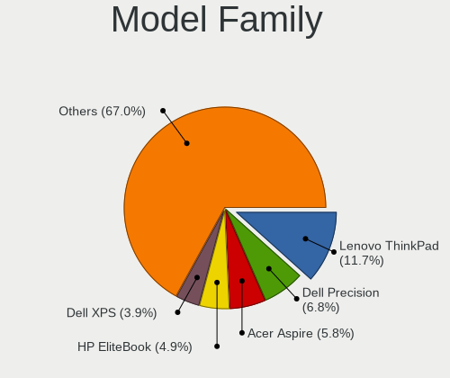

| Name                  | Notebooks | Percent |
|-----------------------|-----------|---------|
| Lenovo ThinkPad       | 9         | 13.64%  |
| HP EliteBook          | 4         | 6.06%   |
| Dell Precision        | 4         | 6.06%   |
| Acer Aspire           | 3         | 4.55%   |
| Wortmann AG TERRA     | 2         | 3.03%   |
| win element MoreFine  | 2         | 3.03%   |
| HP ProBook            | 2         | 3.03%   |
| HP ENVY               | 2         | 3.03%   |
| Dell XPS              | 2         | 3.03%   |
| ASUS VivoBook         | 2         | 3.03%   |
| YJKC vBook            | 1         | 1.52%   |
| Wortmann AG MS-1727   | 1         | 1.52%   |
| TUXEDO Pulse          | 1         | 1.52%   |
| Toshiba Satellite     | 1         | 1.52%   |
| Timi RedmiBook        | 1         | 1.52%   |
| Sony VPCP11S1R        | 1         | 1.52%   |
| Sony VPCEB2E1E        | 1         | 1.52%   |
| Sony VPCCA4E1E        | 1         | 1.52%   |
| Sony VGN-NS30E        | 1         | 1.52%   |
| Sony SVF1421E2EW      | 1         | 1.52%   |
| Packard Bell EasyNote | 1         | 1.52%   |
| MSI GF72              | 1         | 1.52%   |
| Medion P6685          | 1         | 1.52%   |
| Medion E4254          | 1         | 1.52%   |
| Lenovo IdeaPad        | 1         | 1.52%   |
| Lenovo G50-70         | 1         | 1.52%   |
| HUAWEI HLYL-WXX9      | 1         | 1.52%   |
| HP Spectre            | 1         | 1.52%   |
| HP Pavilion           | 1         | 1.52%   |
| HP 255                | 1         | 1.52%   |
| Fujitsu STYLISTIC     | 1         | 1.52%   |
| Fujitsu LIFEBOOK      | 1         | 1.52%   |
| Dell Vostro           | 1         | 1.52%   |
| Dell Inspiron         | 1         | 1.52%   |
| Clevo P170EM          | 1         | 1.52%   |
| ASUS UX430UNR         | 1         | 1.52%   |
| ASUS UX360CA          | 1         | 1.52%   |
| ASUS TUF              | 1         | 1.52%   |
| ASUS N751JK           | 1         | 1.52%   |
| Apple MacBookPro8     | 1         | 1.52%   |

MFG Year
--------

Motherboard manufacture year

| Year | Notebooks | Percent |
|------|-----------|---------|
| 2019 | 11        | 16.67%  |
| 2020 | 7         | 10.61%  |
| 2018 | 7         | 10.61%  |
| 2017 | 7         | 10.61%  |
| 2013 | 7         | 10.61%  |
| 2014 | 5         | 7.58%   |
| 2010 | 5         | 7.58%   |
| 2015 | 4         | 6.06%   |
| 2011 | 4         | 6.06%   |
| 2021 | 3         | 4.55%   |
| 2016 | 2         | 3.03%   |
| 2012 | 2         | 3.03%   |
| 2009 | 2         | 3.03%   |

Form Factor
-----------

Physical design of the computer

| Name     | Notebooks | Percent |
|----------|-----------|---------|
| Notebook | 66        | 100%    |

Secure Boot
-----------

Enabled or disabled

| State    | Notebooks | Percent |
|----------|-----------|---------|
| Disabled | 59        | 89.39%  |
| Enabled  | 7         | 10.61%  |

Coreboot
--------

Have coreboot on board

| Used | Notebooks | Percent |
|------|-----------|---------|
| No   | 66        | 100%    |

RAM Size
--------

Total RAM memory

| Size in GB  | Notebooks | Percent |
|-------------|-----------|---------|
| 16.01-24.0  | 16        | 24.24%  |
| 4.01-8.0    | 15        | 22.73%  |
| 8.01-16.0   | 14        | 21.21%  |
| 3.01-4.0    | 12        | 18.18%  |
| 32.01-64.0  | 4         | 6.06%   |
| 1.01-2.0    | 2         | 3.03%   |
| 24.01-32.0  | 1         | 1.52%   |
| 2.01-3.0    | 1         | 1.52%   |
| 64.01-256.0 | 1         | 1.52%   |

RAM Used
--------

Used RAM memory

| Used GB    | Notebooks | Percent |
|------------|-----------|---------|
| 2.01-3.0   | 22        | 32.35%  |
| 1.01-2.0   | 20        | 29.41%  |
| 4.01-8.0   | 12        | 17.65%  |
| 3.01-4.0   | 6         | 8.82%   |
| 8.01-16.0  | 5         | 7.35%   |
| 24.01-32.0 | 1         | 1.47%   |
| 0.51-1.0   | 1         | 1.47%   |
| 0.01-0.5   | 1         | 1.47%   |

Total Drives
------------

Number of drives on board

| Drives | Notebooks | Percent |
|--------|-----------|---------|
| 1      | 49        | 74.24%  |
| 2      | 12        | 18.18%  |
| 3      | 4         | 6.06%   |
| 0      | 1         | 1.52%   |

Has CD-ROM
----------

Has CD-ROM on board

| Presented | Notebooks | Percent |
|-----------|-----------|---------|
| No        | 41        | 62.12%  |
| Yes       | 25        | 37.88%  |

Has Ethernet
------------

Has Ethernet on board

| Presented | Notebooks | Percent |
|-----------|-----------|---------|
| Yes       | 53        | 80.3%   |
| No        | 13        | 19.7%   |

Has WiFi
--------

Has WiFi module

| Presented | Notebooks | Percent |
|-----------|-----------|---------|
| Yes       | 66        | 100%    |

Has Bluetooth
-------------

Has Bluetooth module

| Presented | Notebooks | Percent |
|-----------|-----------|---------|
| Yes       | 56        | 84.85%  |
| No        | 10        | 15.15%  |

Location
--------

Country
-------

Geographic location (country)

| Country    | Notebooks | Percent |
|------------|-----------|---------|
| Luxembourg | 66        | 100%    |

City
----

Geographic location (city)

| City              | Notebooks | Percent |
|-------------------|-----------|---------|
| Luxembourg        | 32        | 46.38%  |
| Strassen          | 8         | 11.59%  |
| Schifflange       | 3         | 4.35%   |
| Useldange         | 2         | 2.9%    |
| Steinfort         | 2         | 2.9%    |
| Schieren          | 2         | 2.9%    |
| Ehnen             | 2         | 2.9%    |
| Wiltz             | 1         | 1.45%   |
| Wecker            | 1         | 1.45%   |
| Vianden           | 1         | 1.45%   |
| Soleuvre          | 1         | 1.45%   |
| PerlГ©          | 1         | 1.45%   |
| Oberpallen        | 1         | 1.45%   |
| Niederanven       | 1         | 1.45%   |
| Leudelange        | 1         | 1.45%   |
| Hunsdorf          | 1         | 1.45%   |
| Ettelbruck        | 1         | 1.45%   |
| Echternach        | 1         | 1.45%   |
| Differdange       | 1         | 1.45%   |
| Diekirch          | 1         | 1.45%   |
| Bourscheid        | 1         | 1.45%   |
| Bettembourg       | 1         | 1.45%   |
| Bettange-sur-Mess | 1         | 1.45%   |
| Beckerich         | 1         | 1.45%   |
| Aspelt            | 1         | 1.45%   |

Drives
------

Drive Vendor
------------

Hard drive vendors

| Vendor                  | Notebooks | Drives | Percent |
|-------------------------|-----------|--------|---------|
| Samsung Electronics     | 19        | 23     | 22.62%  |
| Seagate                 | 11        | 11     | 13.1%   |
| WDC                     | 9         | 10     | 10.71%  |
| Toshiba                 | 9         | 10     | 10.71%  |
| SanDisk                 | 7         | 10     | 8.33%   |
| Kingston                | 5         | 7      | 5.95%   |
| Crucial                 | 4         | 5      | 4.76%   |
| Apple                   | 4         | 5      | 4.76%   |
| SK hynix                | 2         | 2      | 2.38%   |
| LITEONIT                | 2         | 2      | 2.38%   |
| Intel                   | 2         | 2      | 2.38%   |
| Union Memory (Shenzhen) | 1         | 1      | 1.19%   |
| PHD 3.0                 | 1         | 1      | 1.19%   |
| Micron Technology       | 1         | 2      | 1.19%   |
| LITEON                  | 1         | 1      | 1.19%   |
| LaCie                   | 1         | 1      | 1.19%   |
| KingDian                | 1         | 1      | 1.19%   |
| Intenso                 | 1         | 2      | 1.19%   |
| Hitachi                 | 1         | 1      | 1.19%   |
| HGST                    | 1         | 1      | 1.19%   |
| FORESEE                 | 1         | 1      | 1.19%   |

Drive Model
-----------

Hard drive models

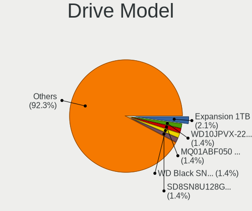

| Model                                        | Notebooks | Percent |
|----------------------------------------------|-----------|---------|
| Seagate Expansion 1TB                        | 3         | 3.41%   |
| WDC WD10JPVX-22JC3T0 1TB                     | 2         | 2.27%   |
| Toshiba MQ01ABF050 500GB                     | 2         | 2.27%   |
| SanDisk SD8SN8U128G1122 128GB SSD            | 2         | 2.27%   |
| SanDisk NVMe SSD Drive 1TB                   | 2         | 2.27%   |
| Samsung SSD 860 QVO 1TB                      | 2         | 2.27%   |
| Samsung MZVLW256HEHP-000L7 256GB             | 2         | 2.27%   |
| LITEONIT LMT-256L9M-11 MSATA 256GB SSD       | 2         | 2.27%   |
| WDC WDS250G2B0B-00YS70 250GB SSD             | 1         | 1.14%   |
| WDC WD3200LPCX-00VHAT0 320GB                 | 1         | 1.14%   |
| WDC WD10SPZX-17Z10T0 1TB                     | 1         | 1.14%   |
| WDC WD10SPCX-60HWST0 1TB                     | 1         | 1.14%   |
| WDC PC SN730 SDBQNTY-512G-1001 512GB         | 1         | 1.14%   |
| WDC PC SN730 SDBQNTY-1T00-1001 1TB           | 1         | 1.14%   |
| WDC PC SN730 SDBPNTY-512G-1027 512GB         | 1         | 1.14%   |
| Union Memory (Shenzhen) NVMe SSD Drive 128GB | 1         | 1.14%   |
| Toshiba NVMe SSD Drive 512GB                 | 1         | 1.14%   |
| Toshiba MQ02ABD100H 1TB                      | 1         | 1.14%   |
| Toshiba MK7575GSX 752GB                      | 1         | 1.14%   |
| Toshiba MK6459GSXP 640GB                     | 1         | 1.14%   |
| Toshiba MK2555GSX 250GB                      | 1         | 1.14%   |
| Toshiba KXG60PNV2T04 NVMe KIOXIA 2048GB      | 1         | 1.14%   |
| Toshiba KXG50ZNV512G 512GB                   | 1         | 1.14%   |
| SK hynix HFS128G39TND-N210A 128GB SSD        | 1         | 1.14%   |
| SK hynix HCG8e  64GB                         | 1         | 1.14%   |
| Seagate ST950042 0ASG 500GB                  | 1         | 1.14%   |
| Seagate ST9320423AS 320GB                    | 1         | 1.14%   |
| Seagate ST750LM022 HN-M750MBB 752GB          | 1         | 1.14%   |
| Seagate ST2000LM015-2E8174 2TB               | 1         | 1.14%   |
| Seagate ST1000LM048-2E7172 1TB               | 1         | 1.14%   |
| Seagate ST1000LM035-1RK172 1TB               | 1         | 1.14%   |
| Seagate ST1000LM024 HN-M101MBB 1TB           | 1         | 1.14%   |
| Seagate ST1000LM014-1EJ164 1TB               | 1         | 1.14%   |
| SanDisk SD9SN8W256G1102 256GB SSD            | 1         | 1.14%   |
| SanDisk SD9SN8W256G 256GB SSD                | 1         | 1.14%   |
| SanDisk SD8SN8U512G1002 512GB SSD            | 1         | 1.14%   |
| SanDisk pSSD-P2 64GB                         | 1         | 1.14%   |
| SanDisk NVMe SSD Drive 512GB                 | 1         | 1.14%   |
| Samsung SSD 870 QVO 1TB                      | 1         | 1.14%   |
| Samsung SSD 860 EVO M.2 500GB                | 1         | 1.14%   |

HDD Vendor
----------

Hard disk drive vendors

| Vendor  | Notebooks | Drives | Percent |
|---------|-----------|--------|---------|
| Seagate | 11        | 11     | 42.31%  |
| Toshiba | 6         | 7      | 23.08%  |
| WDC     | 5         | 6      | 19.23%  |
| PHD 3.0 | 1         | 1      | 3.85%   |
| Hitachi | 1         | 1      | 3.85%   |
| HGST    | 1         | 1      | 3.85%   |
| Apple   | 1         | 1      | 3.85%   |

SSD Vendor
----------

Solid state drive vendors

| Vendor              | Notebooks | Drives | Percent |
|---------------------|-----------|--------|---------|
| Samsung Electronics | 12        | 16     | 35.29%  |
| SanDisk             | 6         | 7      | 17.65%  |
| Crucial             | 4         | 5      | 11.76%  |
| LITEONIT            | 2         | 2      | 5.88%   |
| Kingston            | 2         | 4      | 5.88%   |
| WDC                 | 1         | 1      | 2.94%   |
| SK hynix            | 1         | 1      | 2.94%   |
| Micron Technology   | 1         | 2      | 2.94%   |
| LITEON              | 1         | 1      | 2.94%   |
| KingDian            | 1         | 1      | 2.94%   |
| Intenso             | 1         | 2      | 2.94%   |
| FORESEE             | 1         | 1      | 2.94%   |
| Apple               | 1         | 1      | 2.94%   |

Drive Kind
----------

HDD or SSD

| Kind    | Notebooks | Drives | Percent |
|---------|-----------|--------|---------|
| SSD     | 29        | 44     | 35.8%   |
| HDD     | 26        | 28     | 32.1%   |
| NVMe    | 24        | 25     | 29.63%  |
| MMC     | 1         | 1      | 1.23%   |
| Unknown | 1         | 1      | 1.23%   |

Drive Connector
---------------

SATA, SAS, NVMe, etc.

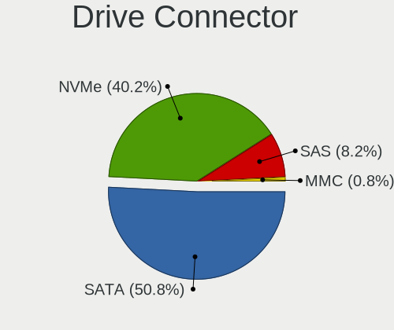

| Type | Notebooks | Drives | Percent |
|------|-----------|--------|---------|
| SATA | 45        | 66     | 59.21%  |
| NVMe | 24        | 25     | 31.58%  |
| SAS  | 6         | 7      | 7.89%   |
| MMC  | 1         | 1      | 1.32%   |

Drive Size
----------

Size of hard drive

| Size in TB | Notebooks | Drives | Percent |
|------------|-----------|--------|---------|
| 0.01-0.5   | 34        | 45     | 60.71%  |
| 0.51-1.0   | 20        | 25     | 35.71%  |
| 1.01-2.0   | 2         | 2      | 3.57%   |

Space Total
-----------

Amount of disk space available on the file system

| Size in GB     | Notebooks | Percent |
|----------------|-----------|---------|
| 251-500        | 17        | 25.37%  |
| 101-250        | 15        | 22.39%  |
| 501-1000       | 10        | 14.93%  |
| 1001-2000      | 7         | 10.45%  |
| Unknown        | 5         | 7.46%   |
| 1-20           | 4         | 5.97%   |
| More than 3000 | 3         | 4.48%   |
| 51-100         | 3         | 4.48%   |
| 2001-3000      | 2         | 2.99%   |
| 21-50          | 1         | 1.49%   |

Space Used
----------

Amount of used disk space

| Used GB   | Notebooks | Percent |
|-----------|-----------|---------|
| 1-20      | 22        | 31.88%  |
| 21-50     | 11        | 15.94%  |
| 101-250   | 10        | 14.49%  |
| 51-100    | 8         | 11.59%  |
| 501-1000  | 7         | 10.14%  |
| Unknown   | 5         | 7.25%   |
| 251-500   | 4         | 5.8%    |
| 2001-3000 | 2         | 2.9%    |

Malfunc. Drives
---------------

Drive models with a malfunction

| Model                                 | Notebooks | Drives | Percent |
|---------------------------------------|-----------|--------|---------|
| Toshiba MQ01ABF050 500GB              | 2         | 2      | 50%     |
| Toshiba MK2555GSX 250GB               | 1         | 1      | 25%     |
| SK hynix HFS128G39TND-N210A 128GB SSD | 1         | 1      | 25%     |

Malfunc. Drive Vendor
---------------------

Vendors of faulty drives

| Vendor   | Notebooks | Drives | Percent |
|----------|-----------|--------|---------|
| Toshiba  | 3         | 3      | 75%     |
| SK hynix | 1         | 1      | 25%     |

Malfunc. HDD Vendor
-------------------

Vendors of faulty HDD drives

| Vendor  | Notebooks | Drives | Percent |
|---------|-----------|--------|---------|
| Toshiba | 3         | 3      | 100%    |

Malfunc. Drive Kind
-------------------

Kinds of faulty drives

| Kind | Notebooks | Drives | Percent |
|------|-----------|--------|---------|
| HDD  | 3         | 3      | 75%     |
| SSD  | 1         | 1      | 25%     |

Failed Drives
-------------

Failed drive models

Zero info for selected period =(

Failed Drive Vendor
-------------------

Failed drive vendors

Zero info for selected period =(

Drive Status
------------

Number of failed and malfunc. drives

| Status   | Notebooks | Drives | Percent |
|----------|-----------|--------|---------|
| Detected | 33        | 56     | 48.53%  |
| Works    | 31        | 39     | 45.59%  |
| Malfunc  | 4         | 4      | 5.88%   |

Storage controller
------------------

Storage Vendor
--------------

Storage controller vendors

| Vendor                       | Notebooks | Percent |
|------------------------------|-----------|---------|
| Intel                        | 48        | 62.34%  |
| Samsung Electronics          | 7         | 9.09%   |
| SanDisk                      | 6         | 7.79%   |
| AMD                          | 6         | 7.79%   |
| Toshiba America Info Systems | 3         | 3.9%    |
| Kingston Technology Company  | 3         | 3.9%    |
| Apple                        | 2         | 2.6%    |
| Union Memory (Shenzhen)      | 1         | 1.3%    |
| Marvell Technology Group     | 1         | 1.3%    |

Storage Model
-------------

Storage controller models

| Model                                                                            | Notebooks | Percent |
|----------------------------------------------------------------------------------|-----------|---------|
| Intel 8 Series/C220 Series Chipset Family 6-port SATA Controller 1 [AHCI mode]   | 8         | 10.26%  |
| AMD FCH SATA Controller [AHCI mode]                                              | 6         | 7.69%   |
| Intel Sunrise Point-LP SATA Controller [AHCI mode]                               | 5         | 6.41%   |
| Intel Cannon Lake Mobile PCH SATA AHCI Controller                                | 4         | 5.13%   |
| Intel 7 Series Chipset Family 6-port SATA Controller [AHCI mode]                 | 4         | 5.13%   |
| SanDisk WD Black SN750 / PC SN730 NVMe SSD                                       | 3         | 3.85%   |
| Samsung NVMe SSD Controller SM981/PM981/PM983                                    | 3         | 3.85%   |
| Samsung NVMe SSD Controller SM961/PM961/SM963                                    | 3         | 3.85%   |
| Intel 8 Series SATA Controller 1 [AHCI mode]                                     | 3         | 3.85%   |
| Intel 6 Series/C200 Series Chipset Family 6 port Mobile SATA AHCI Controller     | 3         | 3.85%   |
| Intel 5 Series/3400 Series Chipset 4 port SATA AHCI Controller                   | 3         | 3.85%   |
| Toshiba America Info Systems XG6 NVMe SSD Controller                             | 2         | 2.56%   |
| SanDisk WD PC SN810 / Black SN850 NVMe SSD                                       | 2         | 2.56%   |
| Intel Wildcat Point-LP SATA Controller [AHCI Mode]                               | 2         | 2.56%   |
| Intel Volume Management Device NVMe RAID Controller                              | 2         | 2.56%   |
| Intel HM170/QM170 Chipset SATA Controller [AHCI Mode]                            | 2         | 2.56%   |
| Intel Celeron/Pentium Silver Processor SATA Controller                           | 2         | 2.56%   |
| Intel 82801IBM/IEM (ICH9M/ICH9M-E) 4 port SATA Controller [AHCI mode]            | 2         | 2.56%   |
| Intel 82801 Mobile SATA Controller [RAID mode]                                   | 2         | 2.56%   |
| Union Memory (Shenzhen) Non-Volatile memory controller                           | 1         | 1.28%   |
| Toshiba America Info Systems Toshiba America Info Non-Volatile memory controller | 1         | 1.28%   |
| SanDisk WD Blue SN550 NVMe SSD                                                   | 1         | 1.28%   |
| Samsung NVMe SSD Controller 980                                                  | 1         | 1.28%   |
| Marvell Group 88SS9183 PCIe SSD Controller                                       | 1         | 1.28%   |
| Kingston Company U-SNS8154P3 NVMe SSD                                            | 1         | 1.28%   |
| Kingston Company OM3PDP3 NVMe SSD                                                | 1         | 1.28%   |
| Kingston Company KC2000 NVMe SSD                                                 | 1         | 1.28%   |
| Intel US15W/US15X/US15L/UL11L SCH [Poulsbo] IDE Controller                       | 1         | 1.28%   |
| Intel SSD Pro 7600p/760p/E 6100p Series                                          | 1         | 1.28%   |
| Intel SSD 660P Series                                                            | 1         | 1.28%   |
| Intel Celeron N3350/Pentium N4200/Atom E3900 Series SATA AHCI Controller         | 1         | 1.28%   |
| Intel Cannon Point-LP SATA Controller [AHCI Mode]                                | 1         | 1.28%   |
| Intel 5 Series/3400 Series Chipset 6 port SATA AHCI Controller                   | 1         | 1.28%   |
| Intel 400 Series Chipset Family SATA AHCI Controller                             | 1         | 1.28%   |
| Apple S3X NVMe Controller                                                        | 1         | 1.28%   |
| Apple ANS2 NVMe Controller                                                       | 1         | 1.28%   |

Storage Kind
------------

Kind of storage controller (IDE, SATA, NVMe, SAS, ...)

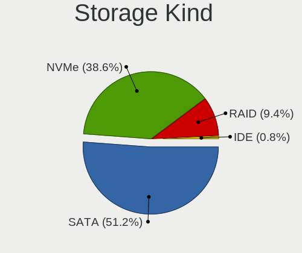

| Kind | Notebooks | Percent |
|------|-----------|---------|
| SATA | 49        | 62.82%  |
| NVMe | 24        | 30.77%  |
| RAID | 4         | 5.13%   |
| IDE  | 1         | 1.28%   |

Processor
---------

CPU Vendor
----------

Processor vendors

| Vendor | Notebooks | Percent |
|--------|-----------|---------|
| Intel  | 57        | 86.36%  |
| AMD    | 9         | 13.64%  |

CPU Model
---------

Processor models

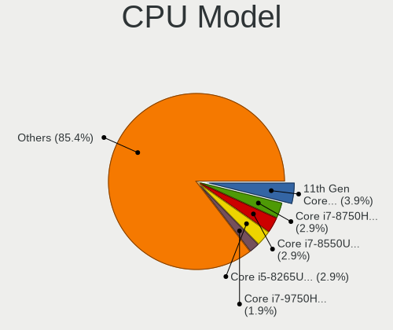

| Model                                       | Notebooks | Percent |
|---------------------------------------------|-----------|---------|
| Intel Core i7-8550U CPU @ 1.80GHz           | 3         | 4.55%   |
| Intel Core i5-8265U CPU @ 1.60GHz           | 3         | 4.55%   |
| Intel Core i7-9750H CPU @ 2.60GHz           | 2         | 3.03%   |
| Intel Core i7-8750H CPU @ 2.20GHz           | 2         | 3.03%   |
| Intel Core i7-4702HQ CPU @ 2.20GHz          | 2         | 3.03%   |
| Intel Core i5-4200U CPU @ 1.60GHz           | 2         | 3.03%   |
| Intel Core i3 CPU M 370 @ 2.40GHz           | 2         | 3.03%   |
| AMD Ryzen 9 5900HX with Radeon Graphics     | 2         | 3.03%   |
| Intel Pentium Silver N5000 CPU @ 1.10GHz    | 1         | 1.52%   |
| Intel Pentium Dual-Core CPU T4300 @ 2.10GHz | 1         | 1.52%   |
| Intel Pentium Dual-Core CPU T4200 @ 2.00GHz | 1         | 1.52%   |
| Intel Pentium CPU P6000 @ 1.87GHz           | 1         | 1.52%   |
| Intel Pentium CPU 987 @ 1.50GHz             | 1         | 1.52%   |
| Intel Core m5-6Y54 CPU @ 1.10GHz            | 1         | 1.52%   |
| Intel Core i9-9880H CPU @ 2.30GHz           | 1         | 1.52%   |
| Intel Core i7-8665U CPU @ 1.90GHz           | 1         | 1.52%   |
| Intel Core i7-8565U CPU @ 1.80GHz           | 1         | 1.52%   |
| Intel Core i7-7700HQ CPU @ 2.80GHz          | 1         | 1.52%   |
| Intel Core i7-6500U CPU @ 2.50GHz           | 1         | 1.52%   |
| Intel Core i7-5500U CPU @ 2.40GHz           | 1         | 1.52%   |
| Intel Core i7-4810MQ CPU @ 2.80GHz          | 1         | 1.52%   |
| Intel Core i7-4712MQ CPU @ 2.30GHz          | 1         | 1.52%   |
| Intel Core i7-4710HQ CPU @ 2.50GHz          | 1         | 1.52%   |
| Intel Core i7-3940XM CPU @ 3.00GHz          | 1         | 1.52%   |
| Intel Core i7-3840QM CPU @ 2.80GHz          | 1         | 1.52%   |
| Intel Core i7-10510U CPU @ 1.80GHz          | 1         | 1.52%   |
| Intel Core i5-8257U CPU @ 1.40GHz           | 1         | 1.52%   |
| Intel Core i5-8250U CPU @ 1.60GHz           | 1         | 1.52%   |
| Intel Core i5-7360U CPU @ 2.30GHz           | 1         | 1.52%   |
| Intel Core i5-6300U CPU @ 2.40GHz           | 1         | 1.52%   |
| Intel Core i5-6300HQ CPU @ 2.30GHz          | 1         | 1.52%   |
| Intel Core i5-6200U CPU @ 2.30GHz           | 1         | 1.52%   |
| Intel Core i5-4330M CPU @ 2.80GHz           | 1         | 1.52%   |
| Intel Core i5-4250U CPU @ 1.30GHz           | 1         | 1.52%   |
| Intel Core i5-4210M CPU @ 2.60GHz           | 1         | 1.52%   |
| Intel Core i5-4200M CPU @ 2.50GHz           | 1         | 1.52%   |
| Intel Core i5-3427U CPU @ 1.80GHz           | 1         | 1.52%   |
| Intel Core i5-2450M CPU @ 2.50GHz           | 1         | 1.52%   |
| Intel Core i5-2435M CPU @ 2.40GHz           | 1         | 1.52%   |
| Intel Core i5-10300H CPU @ 2.50GHz          | 1         | 1.52%   |

CPU Model Family
----------------

Processor model prefix

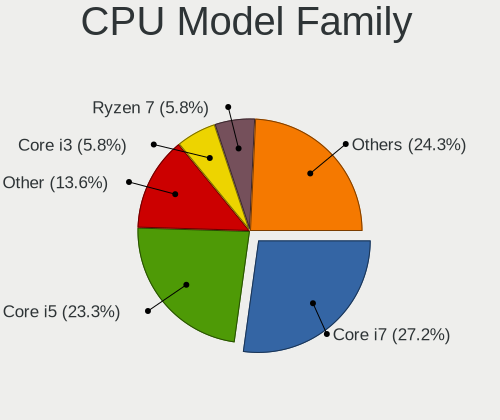

| Model                   | Notebooks | Percent |
|-------------------------|-----------|---------|
| Intel Core i7           | 20        | 30.3%   |
| Intel Core i5           | 20        | 30.3%   |
| Intel Core i3           | 4         | 6.06%   |
| Intel Celeron           | 3         | 4.55%   |
| Other                   | 2         | 3.03%   |
| Intel Pentium Dual-Core | 2         | 3.03%   |
| Intel Pentium           | 2         | 3.03%   |
| AMD Ryzen 9             | 2         | 3.03%   |
| AMD Ryzen 7             | 2         | 3.03%   |
| AMD Ryzen 5             | 2         | 3.03%   |
| Intel Pentium Silver    | 1         | 1.52%   |
| Intel Core m5           | 1         | 1.52%   |
| Intel Core i9           | 1         | 1.52%   |
| Intel Atom              | 1         | 1.52%   |
| AMD Ryzen 7 PRO         | 1         | 1.52%   |
| AMD Ryzen 5 PRO         | 1         | 1.52%   |
| AMD E2                  | 1         | 1.52%   |

CPU Cores
---------

Number of processor cores

| Number | Notebooks | Percent |
|--------|-----------|---------|
| 2      | 27        | 40.91%  |
| 4      | 24        | 36.36%  |
| 8      | 7         | 10.61%  |
| 6      | 6         | 9.09%   |
| 1      | 2         | 3.03%   |

CPU Sockets
-----------

Number of sockets

| Number | Notebooks | Percent |
|--------|-----------|---------|
| 1      | 66        | 100%    |

CPU Threads
-----------

Threads per core (Hyper-Threading)

| Number | Notebooks | Percent |
|--------|-----------|---------|
| 2      | 54        | 81.82%  |
| 1      | 12        | 18.18%  |

CPU Op-Modes
------------

CPU Operation Modes (32-bit, 64-bit)

| Op mode        | Notebooks | Percent |
|----------------|-----------|---------|
| 32-bit, 64-bit | 65        | 98.48%  |
| 32-bit         | 1         | 1.52%   |

CPU Microcode
-------------

Microcode number

| Number     | Notebooks | Percent |
|------------|-----------|---------|
| Unknown    | 13        | 19.12%  |
| 0x306c3    | 8         | 11.76%  |
| 0x806ea    | 4         | 5.88%   |
| 0x40651    | 4         | 5.88%   |
| 0x206a7    | 4         | 5.88%   |
| 0x806eb    | 3         | 4.41%   |
| 0x406e3    | 3         | 4.41%   |
| 0x20655    | 3         | 4.41%   |
| 0x806ec    | 2         | 2.94%   |
| 0x706a1    | 2         | 2.94%   |
| 0x306d4    | 2         | 2.94%   |
| 0x306a9    | 2         | 2.94%   |
| 0x1067a    | 2         | 2.94%   |
| 0x0a50000c | 2         | 2.94%   |
| 0x08600106 | 2         | 2.94%   |
| 0x906ed    | 1         | 1.47%   |
| 0x906ea    | 1         | 1.47%   |
| 0x906e9    | 1         | 1.47%   |
| 0x806e9    | 1         | 1.47%   |
| 0x806d1    | 1         | 1.47%   |
| 0x806c1    | 1         | 1.47%   |
| 0x20652    | 1         | 1.47%   |
| 0x106c2    | 1         | 1.47%   |
| 0x08600104 | 1         | 1.47%   |
| 0x08600103 | 1         | 1.47%   |
| 0x08108102 | 1         | 1.47%   |
| 0x06006705 | 1         | 1.47%   |

CPU Microarch
-------------

Microarchitecture

| Name          | Notebooks | Percent |
|---------------|-----------|---------|
| KabyLake      | 18        | 27.27%  |
| Haswell       | 12        | 18.18%  |
| Zen 2         | 5         | 7.58%   |
| Skylake       | 5         | 7.58%   |
| Westmere      | 4         | 6.06%   |
| SandyBridge   | 4         | 6.06%   |
| IvyBridge     | 3         | 4.55%   |
| Zen 3         | 2         | 3.03%   |
| Penryn        | 2         | 3.03%   |
| Goldmont plus | 2         | 3.03%   |
| Broadwell     | 2         | 3.03%   |
| Zen+          | 1         | 1.52%   |
| TigerLake     | 1         | 1.52%   |
| Icelake       | 1         | 1.52%   |
| Goldmont      | 1         | 1.52%   |
| Excavator     | 1         | 1.52%   |
| CometLake     | 1         | 1.52%   |
| Bonnell       | 1         | 1.52%   |

Graphics
--------

GPU Vendor
----------

Vendors of graphics cards

| Vendor | Notebooks | Percent |
|--------|-----------|---------|
| Intel  | 52        | 59.77%  |
| Nvidia | 21        | 24.14%  |
| AMD    | 14        | 16.09%  |

GPU Model
---------

Graphics card models

| Model                                                                     | Notebooks | Percent |
|---------------------------------------------------------------------------|-----------|---------|
| Intel 4th Gen Core Processor Integrated Graphics Controller               | 8         | 9.09%   |
| Intel WhiskeyLake-U GT2 [UHD Graphics 620]                                | 5         | 5.68%   |
| Intel CoffeeLake-H GT2 [UHD Graphics 630]                                 | 5         | 5.68%   |
| AMD Renoir                                                                | 5         | 5.68%   |
| Intel UHD Graphics 620                                                    | 4         | 4.55%   |
| Intel Haswell-ULT Integrated Graphics Controller                          | 4         | 4.55%   |
| Intel Skylake GT2 [HD Graphics 520]                                       | 3         | 3.41%   |
| Intel 3rd Gen Core processor Graphics Controller                          | 3         | 3.41%   |
| Intel 2nd Generation Core Processor Family Integrated Graphics Controller | 3         | 3.41%   |
| Nvidia GP108M [GeForce MX250]                                             | 2         | 2.27%   |
| Nvidia GP108M [GeForce MX150]                                             | 2         | 2.27%   |
| Nvidia GP107M [GeForce GTX 1050 Mobile]                                   | 2         | 2.27%   |
| Nvidia GK107GLM [Quadro K1100M]                                           | 2         | 2.27%   |
| AMD Cezanne                                                               | 2         | 2.27%   |
| Nvidia TU117M [GeForce GTX 1650 Mobile / Max-Q]                           | 1         | 1.14%   |
| Nvidia TU117GLM [Quadro T2000 Mobile / Max-Q]                             | 1         | 1.14%   |
| Nvidia TU117GLM [Quadro T1000 Mobile]                                     | 1         | 1.14%   |
| Nvidia GT215M [GeForce GTS 250M]                                          | 1         | 1.14%   |
| Nvidia GP107M [GeForce GTX 1050 Ti Mobile]                                | 1         | 1.14%   |
| Nvidia GM108M [GeForce 840M]                                              | 1         | 1.14%   |
| Nvidia GM107M [GeForce GTX 950M]                                          | 1         | 1.14%   |
| Nvidia GM107M [GeForce GTX 850M]                                          | 1         | 1.14%   |
| Nvidia GK104M [GeForce GTX 680M]                                          | 1         | 1.14%   |
| Nvidia GF108M [GeForce GT 415M]                                           | 1         | 1.14%   |
| Nvidia GA107M [GeForce RTX 3050 Mobile]                                   | 1         | 1.14%   |
| Nvidia GA106M [GeForce RTX 3060 Mobile / Max-Q]                           | 1         | 1.14%   |
| Nvidia G98M [GeForce G 105M]                                              | 1         | 1.14%   |
| Intel US15W/US15X SCH [Poulsbo] Graphics Controller                       | 1         | 1.14%   |
| Intel TigerLake-LP GT2 [Iris Xe Graphics]                                 | 1         | 1.14%   |
| Intel TigerLake-H GT1 [UHD Graphics]                                      | 1         | 1.14%   |
| Intel Mobile 4 Series Chipset Integrated Graphics Controller              | 1         | 1.14%   |
| Intel Iris Plus Graphics 640                                              | 1         | 1.14%   |
| Intel HD Graphics 630                                                     | 1         | 1.14%   |
| Intel HD Graphics 5500                                                    | 1         | 1.14%   |
| Intel HD Graphics 530                                                     | 1         | 1.14%   |
| Intel HD Graphics 515                                                     | 1         | 1.14%   |
| Intel HD Graphics 500                                                     | 1         | 1.14%   |
| Intel HD Graphics                                                         | 1         | 1.14%   |
| Intel GeminiLake [UHD Graphics 605]                                       | 1         | 1.14%   |
| Intel GeminiLake [UHD Graphics 600]                                       | 1         | 1.14%   |

GPU Combo
---------

Combinations of graphics cards

| Name           | Notebooks | Percent |
|----------------|-----------|---------|
| 1 x Intel      | 31        | 46.97%  |
| Intel + Nvidia | 18        | 27.27%  |
| 1 x AMD        | 10        | 15.15%  |
| 1 x Nvidia     | 3         | 4.55%   |
| Intel + AMD    | 3         | 4.55%   |
| 2 x AMD        | 1         | 1.52%   |

GPU Driver
----------

Free vs proprietary

| Driver      | Notebooks | Percent |
|-------------|-----------|---------|
| Free        | 56        | 83.58%  |
| Proprietary | 9         | 13.43%  |
| Unknown     | 2         | 2.99%   |

GPU Memory
----------

Total video memory

| Size in GB | Notebooks | Percent |
|------------|-----------|---------|
| Unknown    | 47        | 71.21%  |
| 0.01-0.5   | 7         | 10.61%  |
| 1.01-2.0   | 6         | 9.09%   |
| 3.01-4.0   | 4         | 6.06%   |
| 0.51-1.0   | 2         | 3.03%   |

Monitor
-------

Monitor Vendor
--------------

Monitor vendors

| Vendor                  | Notebooks | Percent |
|-------------------------|-----------|---------|
| Chimei Innolux          | 16        | 20.78%  |
| LG Display              | 13        | 16.88%  |
| Samsung Electronics     | 8         | 10.39%  |
| AU Optronics            | 8         | 10.39%  |
| Sharp                   | 5         | 6.49%   |
| Apple                   | 4         | 5.19%   |
| AOC                     | 4         | 5.19%   |
| Hewlett-Packard         | 3         | 3.9%    |
| Chi Mei Optoelectronics | 3         | 3.9%    |
| BOE                     | 3         | 3.9%    |
| Iiyama                  | 2         | 2.6%    |
| Videoseven              | 1         | 1.3%    |
| Sony                    | 1         | 1.3%    |
| PANDA                   | 1         | 1.3%    |
| Medion                  | 1         | 1.3%    |
| Lenovo                  | 1         | 1.3%    |
| Goldstar                | 1         | 1.3%    |
| BenQ                    | 1         | 1.3%    |
| Aosiman                 | 1         | 1.3%    |

Monitor Model
-------------

Monitor models

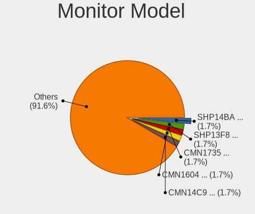

| Model                                                                 | Notebooks | Percent |
|-----------------------------------------------------------------------|-----------|---------|
| Sharp LCD Monitor SHP14BA 1920x1080 344x194mm 15.5-inch               | 2         | 2.56%   |
| Sharp LCD Monitor SHP13F8 3200x1800 346x194mm 15.6-inch               | 2         | 2.56%   |
| Chimei Innolux LCD Monitor CMN1735 1920x1080 382x215mm 17.3-inch      | 2         | 2.56%   |
| Chimei Innolux LCD Monitor CMN14C9 1920x1080 309x173mm 13.9-inch      | 2         | 2.56%   |
| AOC 2250W AOC2250 1920x1080 477x268mm 21.5-inch                       | 2         | 2.56%   |
| Videoseven L27ADS IGM2700 1920x1080 598x336mm 27.0-inch               | 1         | 1.28%   |
| Sony LCD Monitor SNY05FA 1366x768 340x190mm 15.3-inch                 | 1         | 1.28%   |
| Sharp LCD Monitor SHP1476 3840x2160 346x194mm 15.6-inch               | 1         | 1.28%   |
| Samsung Electronics S27D390 SAM0B67 1920x1080 598x336mm 27.0-inch     | 1         | 1.28%   |
| Samsung Electronics LCD Monitor SEC444E 1600x900 310x174mm 14.0-inch  | 1         | 1.28%   |
| Samsung Electronics LCD Monitor SDC5844 1920x1080 344x194mm 15.5-inch | 1         | 1.28%   |
| Samsung Electronics LCD Monitor SDC4E51 1366x768 344x194mm 15.5-inch  | 1         | 1.28%   |
| Samsung Electronics LCD Monitor SDC4C48 1920x1080 344x194mm 15.5-inch | 1         | 1.28%   |
| Samsung Electronics LCD Monitor SDC4347 1366x768 344x193mm 15.5-inch  | 1         | 1.28%   |
| Samsung Electronics LCD Monitor SDC4141 1366x768 344x194mm 15.5-inch  | 1         | 1.28%   |
| Samsung Electronics C27R50x SAM0F9D 1920x1080 598x336mm 27.0-inch     | 1         | 1.28%   |
| Samsung Electronics C27F390 SAM0D32 1920x1080 600x340mm 27.2-inch     | 1         | 1.28%   |
| PANDA LCD Monitor NCP002D 1920x1080 344x194mm 15.5-inch               | 1         | 1.28%   |
| Medion 42FPDEUDA1 MED222E 1920x1080                                   | 1         | 1.28%   |
| LG Display LP156WH2-TLE1 LGDCF01 1366x768 344x194mm 15.5-inch         | 1         | 1.28%   |
| LG Display LCD Monitor LGD064C 1920x1080 344x194mm 15.5-inch          | 1         | 1.28%   |
| LG Display LCD Monitor LGD05EE 2560x1440 309x174mm 14.0-inch          | 1         | 1.28%   |
| LG Display LCD Monitor LGD05CE 1920x1080 344x194mm 15.5-inch          | 1         | 1.28%   |
| LG Display LCD Monitor LGD0521 1920x1080 309x174mm 14.0-inch          | 1         | 1.28%   |
| LG Display LCD Monitor LGD046D 1920x1080 309x174mm 14.0-inch          | 1         | 1.28%   |
| LG Display LCD Monitor LGD046B 1366x768 344x194mm 15.5-inch           | 1         | 1.28%   |
| LG Display LCD Monitor LGD040A 1920x1080 309x175mm 14.0-inch          | 1         | 1.28%   |
| LG Display LCD Monitor LGD03B8 1366x768 310x174mm 14.0-inch           | 1         | 1.28%   |
| LG Display LCD Monitor LGD03B3 1366x768 310x174mm 14.0-inch           | 1         | 1.28%   |
| LG Display LCD Monitor LGD038C 1366x768 256x144mm 11.6-inch           | 1         | 1.28%   |
| LG Display LCD Monitor LGD02EF 1366x768 310x174mm 14.0-inch           | 1         | 1.28%   |
| LG Display LCD Monitor LGD0258 1600x900 345x194mm 15.6-inch           | 1         | 1.28%   |
| Lenovo LCD Monitor LEN40BA 1920x1080 344x194mm 15.5-inch              | 1         | 1.28%   |
| Iiyama PL2492HN IVM6156 1920x1080 527x296mm 23.8-inch                 | 1         | 1.28%   |
| Iiyama PL2209HD IVM560B 1920x1080 478x269mm 21.6-inch                 | 1         | 1.28%   |
| Hewlett-Packard v220 HWP26FE 1680x1050 473x296mm 22.0-inch            | 1         | 1.28%   |
| Hewlett-Packard P244 HPN3620 1920x1080 527x297mm 23.8-inch            | 1         | 1.28%   |
| Hewlett-Packard f1723 HWP2609 1280x1024 338x270mm 17.0-inch           | 1         | 1.28%   |
| Goldstar PJTR GSM36DD 1680x1050 1280x800mm 59.4-inch                  | 1         | 1.28%   |
| Chimei Innolux LCD Monitor CMN1745 1600x900 382x214mm 17.2-inch       | 1         | 1.28%   |

Monitor Resolution
------------------

Monitor screen resolution

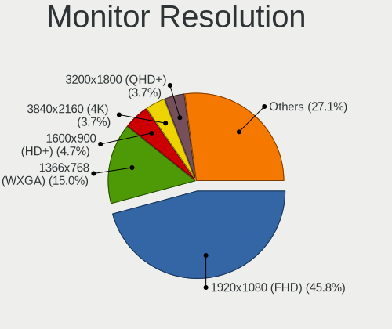

| Resolution         | Notebooks | Percent |
|--------------------|-----------|---------|
| 1920x1080 (FHD)    | 35        | 50.72%  |
| 1366x768 (WXGA)    | 14        | 20.29%  |
| 1600x900 (HD+)     | 4         | 5.8%    |
| 3840x2160 (4K)     | 3         | 4.35%   |
| 3200x1800 (QHD+)   | 2         | 2.9%    |
| 2560x1440 (QHD)    | 2         | 2.9%    |
| 1440x900 (WXGA+)   | 2         | 2.9%    |
| 3072x1920          | 1         | 1.45%   |
| 2880x1800          | 1         | 1.45%   |
| 2560x1600          | 1         | 1.45%   |
| 1680x1050 (WSXGA+) | 1         | 1.45%   |
| 1360x768           | 1         | 1.45%   |
| 1280x800 (WXGA)    | 1         | 1.45%   |
| 1280x1024 (SXGA)   | 1         | 1.45%   |

Monitor Diagonal
----------------

Diagonal size in inches

| Inches  | Notebooks | Percent |
|---------|-----------|---------|
| 15      | 27        | 35.06%  |
| 14      | 11        | 14.29%  |
| 17      | 10        | 12.99%  |
| 13      | 10        | 12.99%  |
| 27      | 5         | 6.49%   |
| 21      | 4         | 5.19%   |
| 23      | 2         | 2.6%    |
| 16      | 2         | 2.6%    |
| 59      | 1         | 1.3%    |
| 33      | 1         | 1.3%    |
| 22      | 1         | 1.3%    |
| 18      | 1         | 1.3%    |
| 11      | 1         | 1.3%    |
| Unknown | 1         | 1.3%    |

Monitor Width
-------------

Physical width

| Width in mm | Notebooks | Percent |
|-------------|-----------|---------|
| 301-350     | 43        | 56.58%  |
| 351-400     | 10        | 13.16%  |
| 501-600     | 7         | 9.21%   |
| 201-300     | 7         | 9.21%   |
| 401-500     | 6         | 7.89%   |
| 701-800     | 1         | 1.32%   |
| 1001-1500   | 1         | 1.32%   |
| Unknown     | 1         | 1.32%   |

Aspect Ratio
------------

Proportional relationship between the width and the height

| Ratio | Notebooks | Percent |
|-------|-----------|---------|
| 16/9  | 56        | 86.15%  |
| 16/10 | 8         | 12.31%  |
| 5/4   | 1         | 1.54%   |

Monitor Area
------------

Area in inch²

| Area in inch² | Notebooks | Percent |
|----------------|-----------|---------|
| 101-110        | 27        | 35.06%  |
| 81-90          | 16        | 20.78%  |
| 121-130        | 7         | 9.09%   |
| 71-80          | 5         | 6.49%   |
| 301-350        | 5         | 6.49%   |
| 201-250        | 5         | 6.49%   |
| 151-200        | 2         | 2.6%    |
| 141-150        | 2         | 2.6%    |
| 131-140        | 2         | 2.6%    |
| More than 1000 | 1         | 1.3%    |
| 51-60          | 1         | 1.3%    |
| 351-500        | 1         | 1.3%    |
| 111-120        | 1         | 1.3%    |
| 91-100         | 1         | 1.3%    |
| Unknown        | 1         | 1.3%    |

Pixel Density
-------------

Pixels per inch

| Density       | Notebooks | Percent |
|---------------|-----------|---------|
| 121-160       | 32        | 42.11%  |
| 101-120       | 22        | 28.95%  |
| 161-240       | 9         | 11.84%  |
| 51-100        | 8         | 10.53%  |
| More than 240 | 3         | 3.95%   |
| 1-50          | 1         | 1.32%   |
| Unknown       | 1         | 1.32%   |

Multiple Monitors
-----------------

Total monitors connected

| Total | Notebooks | Percent |
|-------|-----------|---------|
| 1     | 52        | 76.47%  |
| 2     | 12        | 17.65%  |
| 3     | 2         | 2.94%   |
| 0     | 2         | 2.94%   |

Network
-------

Net Controller Vendor
---------------------

Controller vendors

| Vendor                          | Notebooks | Percent |
|---------------------------------|-----------|---------|
| Intel                           | 46        | 43.4%   |
| Realtek Semiconductor           | 28        | 26.42%  |
| Qualcomm Atheros                | 11        | 10.38%  |
| Broadcom                        | 9         | 8.49%   |
| Marvell Technology Group        | 3         | 2.83%   |
| Sierra Wireless                 | 2         | 1.89%   |
| DisplayLink                     | 2         | 1.89%   |
| Qualcomm Atheros Communications | 1         | 0.94%   |
| MediaTek                        | 1         | 0.94%   |
| Lenovo                          | 1         | 0.94%   |
| Broadcom Limited                | 1         | 0.94%   |
| ASIX Electronics                | 1         | 0.94%   |

Net Controller Model
--------------------

Controller models

| Model                                                                          | Notebooks | Percent |
|--------------------------------------------------------------------------------|-----------|---------|
| Realtek RTL8111/8168/8411 PCI Express Gigabit Ethernet Controller              | 21        | 16.41%  |
| Intel Wi-Fi 6 AX200                                                            | 7         | 5.47%   |
| Intel Cannon Point-LP CNVi [Wireless-AC]                                       | 5         | 3.91%   |
| Intel Wireless 8260                                                            | 4         | 3.13%   |
| Intel Wireless 7260                                                            | 4         | 3.13%   |
| Realtek RTL8153 Gigabit Ethernet Adapter                                       | 3         | 2.34%   |
| Qualcomm Atheros QCA9565 / AR9565 Wireless Network Adapter                     | 3         | 2.34%   |
| Intel Wireless 8265 / 8275                                                     | 3         | 2.34%   |
| Intel Wireless 3160                                                            | 3         | 2.34%   |
| Intel 82579LM Gigabit Network Connection (Lewisville)                          | 3         | 2.34%   |
| Realtek RTL8822CE 802.11ac PCIe Wireless Network Adapter                       | 2         | 1.56%   |
| Realtek RTL8723BE PCIe Wireless Network Adapter                                | 2         | 1.56%   |
| Realtek RTL8125 2.5GbE Controller                                              | 2         | 1.56%   |
| Qualcomm Atheros AR928X Wireless Network Adapter (PCI-Express)                 | 2         | 1.56%   |
| Marvell Group Yukon Optima 88E8059 [PCIe Gigabit Ethernet Controller with AVB] | 2         | 1.56%   |
| Intel Wireless-AC 9260                                                         | 2         | 1.56%   |
| Intel Wireless 3165                                                            | 2         | 1.56%   |
| Intel Ethernet Connection I219-V                                               | 2         | 1.56%   |
| Intel Ethernet Connection I217-LM                                              | 2         | 1.56%   |
| Intel Ethernet Connection (6) I219-V                                           | 2         | 1.56%   |
| Intel Cannon Lake PCH CNVi WiFi                                                | 2         | 1.56%   |
| DisplayLink Dell D3100 Docking Station                                         | 2         | 1.56%   |
| Broadcom BCM4313 802.11bgn Wireless Network Adapter                            | 2         | 1.56%   |
| Sierra Wireless EM7455                                                         | 1         | 0.78%   |
| Sierra Wireless EM7305 Modem                                                   | 1         | 0.78%   |
| Realtek RTL810xE PCI Express Fast Ethernet controller                          | 1         | 0.78%   |
| Realtek Killer E2600 Gigabit Ethernet Controller                               | 1         | 0.78%   |
| Qualcomm Atheros QCA9377 802.11ac Wireless Network Adapter                     | 1         | 0.78%   |
| Qualcomm Atheros QCA8172 Fast Ethernet                                         | 1         | 0.78%   |
| Qualcomm Atheros Killer E2400 Gigabit Ethernet Controller                      | 1         | 0.78%   |
| Qualcomm Atheros AR9271 802.11n                                                | 1         | 0.78%   |
| Qualcomm Atheros AR9485 Wireless Network Adapter                               | 1         | 0.78%   |
| Qualcomm Atheros AR9462 Wireless Network Adapter                               | 1         | 0.78%   |
| Qualcomm Atheros AR9287 Wireless Network Adapter (PCI-Express)                 | 1         | 0.78%   |
| Qualcomm Atheros AR9285 Wireless Network Adapter (PCI-Express)                 | 1         | 0.78%   |
| Qualcomm Atheros AR8151 v2.0 Gigabit Ethernet                                  | 1         | 0.78%   |
| MediaTek MT7630e 802.11bgn Wireless Network Adapter                            | 1         | 0.78%   |
| Marvell Group 88E8055 PCI-E Gigabit Ethernet Controller                        | 1         | 0.78%   |
| Lenovo ThinkPad Lan                                                            | 1         | 0.78%   |
| Intel WiMAX/WiFi Link 5150                                                     | 1         | 0.78%   |

Wireless Vendor
---------------

Wireless vendors

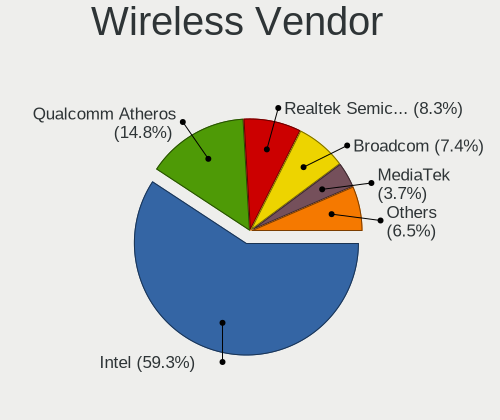

| Vendor                          | Notebooks | Percent |
|---------------------------------|-----------|---------|
| Intel                           | 44        | 63.77%  |
| Qualcomm Atheros                | 10        | 14.49%  |
| Broadcom                        | 6         | 8.7%    |
| Realtek Semiconductor           | 4         | 5.8%    |
| Sierra Wireless                 | 2         | 2.9%    |
| Qualcomm Atheros Communications | 1         | 1.45%   |
| MediaTek                        | 1         | 1.45%   |
| Broadcom Limited                | 1         | 1.45%   |

Wireless Model
--------------

Wireless models

| Model                                                          | Notebooks | Percent |
|----------------------------------------------------------------|-----------|---------|
| Intel Wi-Fi 6 AX200                                            | 7         | 10.14%  |
| Intel Cannon Point-LP CNVi [Wireless-AC]                       | 5         | 7.25%   |
| Intel Wireless 8260                                            | 4         | 5.8%    |
| Intel Wireless 7260                                            | 4         | 5.8%    |
| Qualcomm Atheros QCA9565 / AR9565 Wireless Network Adapter     | 3         | 4.35%   |
| Intel Wireless 8265 / 8275                                     | 3         | 4.35%   |
| Intel Wireless 3160                                            | 3         | 4.35%   |
| Realtek RTL8822CE 802.11ac PCIe Wireless Network Adapter       | 2         | 2.9%    |
| Realtek RTL8723BE PCIe Wireless Network Adapter                | 2         | 2.9%    |
| Qualcomm Atheros AR928X Wireless Network Adapter (PCI-Express) | 2         | 2.9%    |
| Intel Wireless-AC 9260                                         | 2         | 2.9%    |
| Intel Wireless 3165                                            | 2         | 2.9%    |
| Intel Cannon Lake PCH CNVi WiFi                                | 2         | 2.9%    |
| Broadcom BCM4313 802.11bgn Wireless Network Adapter            | 2         | 2.9%    |
| Sierra Wireless EM7455                                         | 1         | 1.45%   |
| Sierra Wireless EM7305 Modem                                   | 1         | 1.45%   |
| Qualcomm Atheros QCA9377 802.11ac Wireless Network Adapter     | 1         | 1.45%   |
| Qualcomm Atheros AR9271 802.11n                                | 1         | 1.45%   |
| Qualcomm Atheros AR9485 Wireless Network Adapter               | 1         | 1.45%   |
| Qualcomm Atheros AR9462 Wireless Network Adapter               | 1         | 1.45%   |
| Qualcomm Atheros AR9287 Wireless Network Adapter (PCI-Express) | 1         | 1.45%   |
| Qualcomm Atheros AR9285 Wireless Network Adapter (PCI-Express) | 1         | 1.45%   |
| MediaTek MT7630e 802.11bgn Wireless Network Adapter            | 1         | 1.45%   |
| Intel WiMAX/WiFi Link 5150                                     | 1         | 1.45%   |
| Intel Wi-Fi 6 AX210/AX211/AX411 160MHz                         | 1         | 1.45%   |
| Intel Wi-Fi 6 AX201                                            | 1         | 1.45%   |
| Intel Tiger Lake PCH CNVi WiFi                                 | 1         | 1.45%   |
| Intel Gemini Lake PCH CNVi WiFi                                | 1         | 1.45%   |
| Intel Dual Band Wireless-AC 3168NGW [Stone Peak]               | 1         | 1.45%   |
| Intel Comet Lake PCH-LP CNVi WiFi                              | 1         | 1.45%   |
| Intel Comet Lake PCH CNVi WiFi                                 | 1         | 1.45%   |
| Intel Centrino Ultimate-N 6300                                 | 1         | 1.45%   |
| Intel Centrino Advanced-N 6235                                 | 1         | 1.45%   |
| Intel Centrino Advanced-N 6205 [Taylor Peak]                   | 1         | 1.45%   |
| Intel Centrino Advanced-N 6200                                 | 1         | 1.45%   |
| Broadcom Limited BCM4360 802.11ac Wireless Network Adapter     | 1         | 1.45%   |
| Broadcom BCM4377b Wireless Network Adapter                     | 1         | 1.45%   |
| Broadcom BCM4350 802.11ac Wireless Network Adapter             | 1         | 1.45%   |
| Broadcom BCM4331 802.11a/b/g/n                                 | 1         | 1.45%   |
| Broadcom BCM43142 802.11b/g/n                                  | 1         | 1.45%   |

Ethernet Vendor
---------------

Ethernet vendors

| Vendor                   | Notebooks | Percent |
|--------------------------|-----------|---------|
| Realtek Semiconductor    | 26        | 46.43%  |
| Intel                    | 16        | 28.57%  |
| Broadcom                 | 4         | 7.14%   |
| Qualcomm Atheros         | 3         | 5.36%   |
| Marvell Technology Group | 3         | 5.36%   |
| DisplayLink              | 2         | 3.57%   |
| Lenovo                   | 1         | 1.79%   |
| ASIX Electronics         | 1         | 1.79%   |

Ethernet Model
--------------

Ethernet models

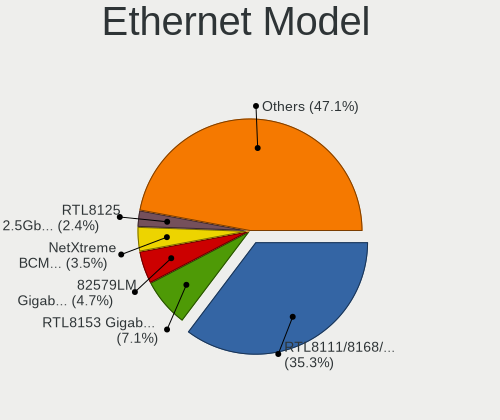

| Model                                                                          | Notebooks | Percent |
|--------------------------------------------------------------------------------|-----------|---------|
| Realtek RTL8111/8168/8411 PCI Express Gigabit Ethernet Controller              | 21        | 36.21%  |
| Realtek RTL8153 Gigabit Ethernet Adapter                                       | 3         | 5.17%   |
| Intel 82579LM Gigabit Network Connection (Lewisville)                          | 3         | 5.17%   |
| Realtek RTL8125 2.5GbE Controller                                              | 2         | 3.45%   |
| Marvell Group Yukon Optima 88E8059 [PCIe Gigabit Ethernet Controller with AVB] | 2         | 3.45%   |
| Intel Ethernet Connection I219-V                                               | 2         | 3.45%   |
| Intel Ethernet Connection I217-LM                                              | 2         | 3.45%   |
| Intel Ethernet Connection (6) I219-V                                           | 2         | 3.45%   |
| DisplayLink Dell D3100 Docking Station                                         | 2         | 3.45%   |
| Realtek RTL810xE PCI Express Fast Ethernet controller                          | 1         | 1.72%   |
| Realtek Killer E2600 Gigabit Ethernet Controller                               | 1         | 1.72%   |
| Qualcomm Atheros QCA8172 Fast Ethernet                                         | 1         | 1.72%   |
| Qualcomm Atheros Killer E2400 Gigabit Ethernet Controller                      | 1         | 1.72%   |
| Qualcomm Atheros AR8151 v2.0 Gigabit Ethernet                                  | 1         | 1.72%   |
| Marvell Group 88E8055 PCI-E Gigabit Ethernet Controller                        | 1         | 1.72%   |
| Lenovo ThinkPad Lan                                                            | 1         | 1.72%   |
| Intel WiMAX Connection 2400m                                                   | 1         | 1.72%   |
| Intel Ethernet Connection I219-LM                                              | 1         | 1.72%   |
| Intel Ethernet Connection I217-V                                               | 1         | 1.72%   |
| Intel Ethernet Connection (7) I219-LM                                          | 1         | 1.72%   |
| Intel Ethernet Connection (6) I219-LM                                          | 1         | 1.72%   |
| Intel Ethernet Connection (4) I219-V                                           | 1         | 1.72%   |
| Intel 82577LC Gigabit Network Connection                                       | 1         | 1.72%   |
| Broadcom NetXtreme BCM57786 Gigabit Ethernet PCIe                              | 1         | 1.72%   |
| Broadcom NetXtreme BCM57765 Gigabit Ethernet PCIe                              | 1         | 1.72%   |
| Broadcom NetLink BCM5784M Gigabit Ethernet PCIe                                | 1         | 1.72%   |
| Broadcom NetLink BCM57780 Gigabit Ethernet PCIe                                | 1         | 1.72%   |
| ASIX AX88179 Gigabit Ethernet                                                  | 1         | 1.72%   |

Net Controller Kind
-------------------

Ethernet, WiFi or modem

| Kind     | Notebooks | Percent |
|----------|-----------|---------|
| WiFi     | 66        | 55%     |
| Ethernet | 53        | 44.17%  |
| Unknown  | 1         | 0.83%   |

Used Controller
---------------

Currently used network controller

| Kind     | Notebooks | Percent |
|----------|-----------|---------|
| WiFi     | 56        | 77.78%  |
| Ethernet | 16        | 22.22%  |

NICs
----

Total network controllers on board

| Total | Notebooks | Percent |
|-------|-----------|---------|
| 2     | 47        | 71.21%  |
| 1     | 17        | 25.76%  |
| 3     | 2         | 3.03%   |

IPv6
----

IPv6 vs IPv4

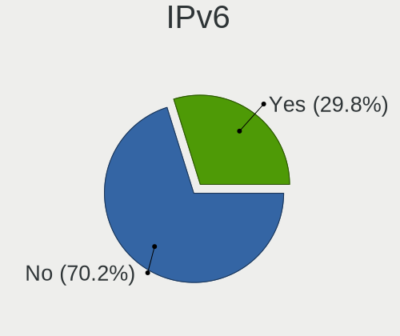

| Used | Notebooks | Percent |
|------|-----------|---------|
| No   | 56        | 83.58%  |
| Yes  | 11        | 16.42%  |

Bluetooth
---------

Bluetooth Vendor
----------------

Controller vendors

| Vendor                          | Notebooks | Percent |
|---------------------------------|-----------|---------|
| Intel                           | 38        | 67.86%  |
| Foxconn / Hon Hai               | 5         | 8.93%   |
| Realtek                         | 2         | 3.57%   |
| Qualcomm Atheros Communications | 2         | 3.57%   |
| Hewlett-Packard                 | 2         | 3.57%   |
| Apple                           | 2         | 3.57%   |
| Toshiba                         | 1         | 1.79%   |
| Realtek Semiconductor           | 1         | 1.79%   |
| Micro Star International        | 1         | 1.79%   |
| Lite-On Technology              | 1         | 1.79%   |
| IMC Networks                    | 1         | 1.79%   |

Bluetooth Model
---------------

Controller models

| Model                                                                               | Notebooks | Percent |
|-------------------------------------------------------------------------------------|-----------|---------|
| Intel Bluetooth wireless interface                                                  | 15        | 26.79%  |
| Intel Bluetooth 9460/9560 Jefferson Peak (JfP)                                      | 7         | 12.5%   |
| Intel AX200 Bluetooth                                                               | 7         | 12.5%   |
| Intel AX201 Bluetooth                                                               | 4         | 7.14%   |
| Realtek Bluetooth Radio                                                             | 2         | 3.57%   |
| Intel Wireless-AC 9260 Bluetooth Adapter                                            | 2         | 3.57%   |
| HP Broadcom 2070 Bluetooth Combo                                                    | 2         | 3.57%   |
| Toshiba Bluetooth Device                                                            | 1         | 1.79%   |
| Realtek Bluetooth Radio                                                             | 1         | 1.79%   |
| Qualcomm Atheros  Bluetooth Device                                                  | 1         | 1.79%   |
| Qualcomm Atheros AR3012 Bluetooth 4.0                                               | 1         | 1.79%   |
| Micro Star International Motorola Bluetooth 2.1+EDR Device                          | 1         | 1.79%   |
| Lite-On Bluetooth Device                                                            | 1         | 1.79%   |
| Intel Wireless-AC 3168 Bluetooth                                                    | 1         | 1.79%   |
| Intel Centrino Bluetooth Wireless Transceiver                                       | 1         | 1.79%   |
| Intel AX210 Bluetooth                                                               | 1         | 1.79%   |
| IMC Networks Bluetooth Device                                                       | 1         | 1.79%   |
| Foxconn / Hon Hai Foxconn T77H114 BCM2070 [Single-Chip Bluetooth 2.1 + EDR Adapter] | 1         | 1.79%   |
| Foxconn / Hon Hai BT                                                                | 1         | 1.79%   |
| Foxconn / Hon Hai Bluetooth USB Host Controller                                     | 1         | 1.79%   |
| Foxconn / Hon Hai BCM43142A0                                                        | 1         | 1.79%   |
| Foxconn / Hon Hai BCM20702A0                                                        | 1         | 1.79%   |
| Apple Bluetooth USB Host Controller                                                 | 1         | 1.79%   |
| Apple Bluetooth Host Controller                                                     | 1         | 1.79%   |

Sound
-----

Sound Vendor
------------

Sound card vendors

| Vendor   | Notebooks | Percent |
|----------|-----------|---------|
| Intel    | 57        | 74.03%  |
| AMD      | 11        | 14.29%  |
| Nvidia   | 5         | 6.49%   |
| Logitech | 1         | 1.3%    |
| Lenovo   | 1         | 1.3%    |
| Bose     | 1         | 1.3%    |
| Apple    | 1         | 1.3%    |

Sound Model
-----------

Sound card models

| Model                                                                             | Notebooks | Percent |
|-----------------------------------------------------------------------------------|-----------|---------|
| Intel Sunrise Point-LP HD Audio                                                   | 9         | 9%      |
| Intel Xeon E3-1200 v3/4th Gen Core Processor HD Audio Controller                  | 8         | 8%      |
| Intel 8 Series/C220 Series Chipset High Definition Audio Controller               | 8         | 8%      |
| AMD Family 17h/19h HD Audio Controller                                            | 8         | 8%      |
| AMD Renoir Radeon High Definition Audio Controller                                | 7         | 7%      |
| Intel Cannon Point-LP High Definition Audio Controller                            | 6         | 6%      |
| Intel Cannon Lake PCH cAVS                                                        | 5         | 5%      |
| Intel Haswell-ULT HD Audio Controller                                             | 4         | 4%      |
| Intel 8 Series HD Audio Controller                                                | 4         | 4%      |
| Intel 7 Series/C216 Chipset Family High Definition Audio Controller               | 4         | 4%      |
| Intel 5 Series/3400 Series Chipset High Definition Audio                          | 4         | 4%      |
| Intel 6 Series/C200 Series Chipset Family High Definition Audio Controller        | 3         | 3%      |
| Intel Wildcat Point-LP High Definition Audio Controller                           | 2         | 2%      |
| Intel Celeron/Pentium Silver Processor High Definition Audio                      | 2         | 2%      |
| Intel Broadwell-U Audio Controller                                                | 2         | 2%      |
| Intel 82801I (ICH9 Family) HD Audio Controller                                    | 2         | 2%      |
| Nvidia TU107 GeForce GTX 1650 High Definition Audio Controller                    | 1         | 1%      |
| Nvidia High Definition Audio Controller                                           | 1         | 1%      |
| Nvidia GK104 HDMI Audio Controller                                                | 1         | 1%      |
| Nvidia GF108 High Definition Audio Controller                                     | 1         | 1%      |
| Nvidia GA106 High Definition Audio Controller                                     | 1         | 1%      |
| Logitech Headset H390                                                             | 1         | 1%      |
| Lenovo ThinkPad Dock USB Audio                                                    | 1         | 1%      |
| Intel US15W/US15X/US15L/UL11L SCH [Poulsbo] HD Audio Controller                   | 1         | 1%      |
| Intel Tiger Lake-LP Smart Sound Technology Audio Controller                       | 1         | 1%      |
| Intel Tiger Lake-H HD Audio Controller                                            | 1         | 1%      |
| Intel Comet Lake PCH-LP cAVS                                                      | 1         | 1%      |
| Intel Comet Lake PCH cAVS                                                         | 1         | 1%      |
| Intel CM238 HD Audio Controller                                                   | 1         | 1%      |
| Intel Celeron N3350/Pentium N4200/Atom E3900 Series Audio Cluster                 | 1         | 1%      |
| Intel 100 Series/C230 Series Chipset Family HD Audio Controller                   | 1         | 1%      |
| Bose Revolve SoundLink                                                            | 1         | 1%      |
| Apple Audio Device                                                                | 1         | 1%      |
| AMD Raven/Raven2/Fenghuang HDMI/DP Audio Controller                               | 1         | 1%      |
| AMD High Definition Audio Controller                                              | 1         | 1%      |
| AMD Family 15h (Models 60h-6fh) Audio Controller                                  | 1         | 1%      |
| AMD Cedar HDMI Audio [Radeon HD 5400/6300/7300 Series]                            | 1         | 1%      |
| AMD Caicos HDMI Audio [Radeon HD 6450 / 7450/8450/8490 OEM / R5 230/235/235X OEM] | 1         | 1%      |

Memory
------

Memory Vendor
-------------

Memory module vendors

| Vendor              | Notebooks | Percent |
|---------------------|-----------|---------|
| Samsung Electronics | 22        | 51.16%  |
| SK hynix            | 10        | 23.26%  |
| Micron Technology   | 5         | 11.63%  |
| Unknown             | 3         | 6.98%   |
| Kingston            | 1         | 2.33%   |
| Crucial             | 1         | 2.33%   |
| A-DATA Technology   | 1         | 2.33%   |

Memory Model
------------

Memory module models

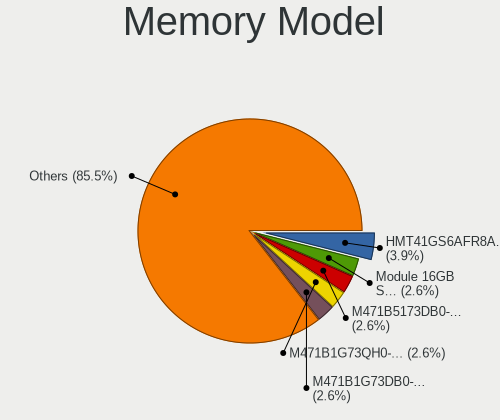

| Model                                                            | Notebooks | Percent |
|------------------------------------------------------------------|-----------|---------|
| SK hynix RAM HMT41GS6AFR8A-PB 8GB SODIMM DDR3 1600MT/s           | 3         | 6.38%   |
| Samsung RAM M471B5173DB0-YK0 4GB SODIMM DDR3 1600MT/s            | 2         | 4.26%   |
| Samsung RAM M471B1G73QH0-YK0 8192MB SODIMM DDR3 1600MT/s         | 2         | 4.26%   |
| Samsung RAM M471B1G73DB0-YK0 8GB SODIMM DDR3 1600MT/s            | 2         | 4.26%   |
| Samsung RAM M471A2K43DB1-CWE 16GB SODIMM DDR4 3200MT/s           | 2         | 4.26%   |
| Unknown RAM Module 4GB SODIMM DDR3                               | 1         | 2.13%   |
| Unknown RAM Module 2GB SODIMM DDR2                               | 1         | 2.13%   |
| Unknown RAM Module 2048MB SODIMM DDR2                            | 1         | 2.13%   |
| Unknown RAM Module 1024MB SODIMM DDR2                            | 1         | 2.13%   |
| SK hynix RAM Module 8192MB Row Of Chips LPDDR3 2133MT/s          | 1         | 2.13%   |
| SK hynix RAM HMT451S6BFR8A-PB 4096MB SODIMM DDR3 1600MT/s        | 1         | 2.13%   |
| SK hynix RAM HMT425S6AFR6A-PB 2GB SODIMM DDR3 3200MT/s           | 1         | 2.13%   |
| SK hynix RAM HMA851S6AFR6N-UH 4GB SODIMM DDR4 2400MT/s           | 1         | 2.13%   |
| SK hynix RAM HMA82GS6DJR8N-XN 16384MB SODIMM DDR4 3200MT/s       | 1         | 2.13%   |
| SK hynix RAM HMA82GS6DJR8N-VK 16GB SODIMM DDR4 2667MT/s          | 1         | 2.13%   |
| SK hynix RAM HMA81GS6MFR8N-UH 8192MB SODIMM DDR4 2400MT/s        | 1         | 2.13%   |
| SK hynix RAM HMA41GS6AFR8N-TF 8GB SODIMM DDR4 2667MT/s           | 1         | 2.13%   |
| Samsung RAM Module 8GB SODIMM DDR4 2133MT/s                      | 1         | 2.13%   |
| Samsung RAM Module 4GB SODIMM DDR3 1600MT/s                      | 1         | 2.13%   |
| Samsung RAM Module 4GB SODIMM DDR3 1067MT/s                      | 1         | 2.13%   |
| Samsung RAM Module 16384MB SODIMM DDR4 3200MT/s                  | 1         | 2.13%   |
| Samsung RAM M471B5673FH0-CH9 2GB SODIMM DDR3 1334MT/s            | 1         | 2.13%   |
| Samsung RAM M471B5673FH0-CF8 2048MB SODIMM DDR3 1067MT/s         | 1         | 2.13%   |
| Samsung RAM M471B5173EB0-YK0 4GB SODIMM DDR3 1600MT/s            | 1         | 2.13%   |
| Samsung RAM M471A5244CB0-CRC 4GB SODIMM DDR4 2667MT/s            | 1         | 2.13%   |
| Samsung RAM M471A2K43CB1-CRC 16GB SODIMM DDR4 2667MT/s           | 1         | 2.13%   |
| Samsung RAM M471A2G44AM0-CTD 16GB SODIMM DDR4 2667MT/s           | 1         | 2.13%   |
| Samsung RAM M471A1K43DB1-CTD 8GB SODIMM DDR4 2667MT/s            | 1         | 2.13%   |
| Samsung RAM M471A1K43CB1-CTD 8GB SODIMM DDR4 2667MT/s            | 1         | 2.13%   |
| Samsung RAM M471A1K43BB1-CRC 8GB SODIMM DDR4 2667MT/s            | 1         | 2.13%   |
| Samsung RAM M471A1G44AB0-CWE 8GB SODIMM DDR4 3200MT/s            | 1         | 2.13%   |
| Samsung RAM M471A1G44AB0-CTD 8GB SODIMM DDR4 2667MT/s            | 1         | 2.13%   |
| Samsung RAM M471A1G44AB0-CTD 8GB Row Of Chips DDR4 2667MT/s      | 1         | 2.13%   |
| Micron RAM MT52L512M32D2PF-09 4GB Row Of Chips LPDDR3 2133MT/s   | 1         | 2.13%   |
| Micron RAM MT52L1G32D4PG-093 8192MB Row Of Chips LPDDR3 2133MT/s | 1         | 2.13%   |
| Micron RAM Module 8192MB SODIMM DDR4 2667MT/s                    | 1         | 2.13%   |
| Micron RAM 8ATF1G64HZ-2G6E1 8GB SODIMM DDR4 2667MT/s             | 1         | 2.13%   |
| Micron RAM 4ATF51264HZ-2G3B2 4GB SODIMM DDR4 2400MT/s            | 1         | 2.13%   |
| Kingston RAM 9905624-033.A00G 8GB SODIMM DDR4 2400MT/s           | 1         | 2.13%   |
| Crucial RAM CT8G4SFS824A.C8FDD1 8GB SODIMM DDR4 2400MT/s         | 1         | 2.13%   |

Memory Kind
-----------

Memory module kinds

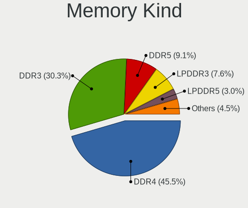

| Kind   | Notebooks | Percent |
|--------|-----------|---------|
| DDR4   | 20        | 50%     |
| DDR3   | 15        | 37.5%   |
| LPDDR3 | 3         | 7.5%    |
| DDR2   | 2         | 5%      |

Memory Form Factor
------------------

Physical design of the memory module

| Name         | Notebooks | Percent |
|--------------|-----------|---------|
| SODIMM       | 36        | 90%     |
| Row Of Chips | 4         | 10%     |

Memory Size
-----------

Memory module size

| Size  | Notebooks | Percent |
|-------|-----------|---------|
| 8192  | 19        | 42.22%  |
| 4096  | 12        | 26.67%  |
| 16384 | 8         | 17.78%  |
| 2048  | 5         | 11.11%  |
| 1024  | 1         | 2.22%   |

Memory Speed
------------

Memory module speed

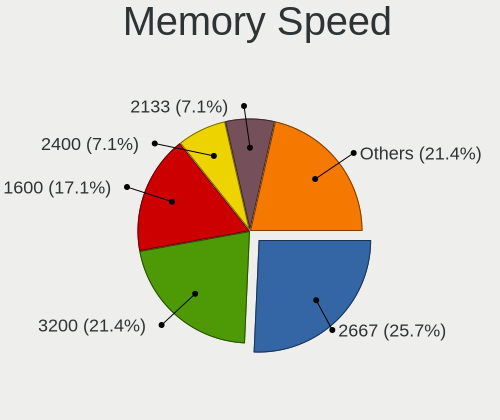

| Speed   | Notebooks | Percent |
|---------|-----------|---------|
| 2667    | 13        | 30.95%  |
| 1600    | 10        | 23.81%  |
| 3200    | 6         | 14.29%  |
| 2400    | 4         | 9.52%   |
| 2133    | 4         | 9.52%   |
| Unknown | 3         | 7.14%   |
| 1334    | 1         | 2.38%   |
| 1067    | 1         | 2.38%   |

Printers & scanners
-------------------

Printer Vendor
--------------

Printer device vendors

Zero info for selected period =(

Printer Model
-------------

Printer device models

Zero info for selected period =(

Scanner Vendor
--------------

Scanner device vendors

| Vendor      | Notebooks | Percent |
|-------------|-----------|---------|
| Seiko Epson | 1         | 100%    |

Scanner Model
-------------

Scanner device models

| Model                                                         | Notebooks | Percent |
|---------------------------------------------------------------|-----------|---------|
| Seiko Epson GT-8700/GT-8700F [Perfection 1640SU/1640SU PHOTO] | 1         | 100%    |

Camera
------

Camera Vendor
-------------

Camera device vendors

| Vendor                                 | Notebooks | Percent |
|----------------------------------------|-----------|---------|
| Chicony Electronics                    | 21        | 36.84%  |
| IMC Networks                           | 8         | 14.04%  |
| Microdia                               | 7         | 12.28%  |
| Ricoh                                  | 3         | 5.26%   |
| Realtek Semiconductor                  | 3         | 5.26%   |
| Sunplus Innovation Technology          | 2         | 3.51%   |
| Samsung Electronics                    | 2         | 3.51%   |
| Quanta                                 | 2         | 3.51%   |
| Alcor Micro                            | 2         | 3.51%   |
| Acer                                   | 2         | 3.51%   |
| Luxvisions Innotech Limited            | 1         | 1.75%   |
| Logitech                               | 1         | 1.75%   |
| Cheng Uei Precision Industry (Foxlink) | 1         | 1.75%   |
| Apple                                  | 1         | 1.75%   |
| ALi                                    | 1         | 1.75%   |

Camera Model
------------

Camera device models

| Model                                               | Notebooks | Percent |
|-----------------------------------------------------|-----------|---------|
| Microdia Integrated_Webcam_HD                       | 4         | 7.02%   |
| IMC Networks USB2.0 HD UVC WebCam                   | 4         | 7.02%   |
| IMC Networks Integrated Camera                      | 3         | 5.26%   |
| Chicony Integrated Camera                           | 3         | 5.26%   |
| Samsung Galaxy A5 (MTP)                             | 2         | 3.51%   |
| Realtek Integrated_Webcam_HD                        | 2         | 3.51%   |
| Microdia Integrated Webcam                          | 2         | 3.51%   |
| Chicony Integrated Camera (1280x720@30)             | 2         | 3.51%   |
| Chicony HP HD Camera                                | 2         | 3.51%   |
| Chicony HD Webcam                                   | 2         | 3.51%   |
| Sunplus Laptop Integrated WebCam HD                 | 1         | 1.75%   |
| Sunplus HP HD Webcam [Fixed]                        | 1         | 1.75%   |
| Ricoh USB2.0 Camera                                 | 1         | 1.75%   |
| Ricoh Sony Visual Communication Camera              | 1         | 1.75%   |
| Ricoh Sony Vaio Integrated Webcam                   | 1         | 1.75%   |
| Realtek HP Truevision HD                            | 1         | 1.75%   |
| Quanta HP Webcam                                    | 1         | 1.75%   |
| Quanta HD User Facing                               | 1         | 1.75%   |
| Microdia Webcam                                     | 1         | 1.75%   |
| Luxvisions Innotech Limited HP HD Camera            | 1         | 1.75%   |
| Logitech HD Pro Webcam C920                         | 1         | 1.75%   |
| IMC Networks ov9734_azurewave_camera                | 1         | 1.75%   |
| Chicony USB2.0 VGA UVC WebCam                       | 1         | 1.75%   |
| Chicony USB2.0 HD UVC WebCam                        | 1         | 1.75%   |
| Chicony USB 2.0 Camera                              | 1         | 1.75%   |
| Chicony TOSHIBA Web Camera - HD                     | 1         | 1.75%   |
| Chicony ThinkPad T490 Webcam                        | 1         | 1.75%   |
| Chicony Integrated HP HD Webcam                     | 1         | 1.75%   |
| Chicony HP Wide Vision HD Camera                    | 1         | 1.75%   |
| Chicony HP Truevision HD                            | 1         | 1.75%   |
| Chicony HD WebCam (Asus N-series)                   | 1         | 1.75%   |
| Chicony FJ Camera                                   | 1         | 1.75%   |
| Chicony EasyCamera                                  | 1         | 1.75%   |
| Chicony Acer CrystalEye Webcam                      | 1         | 1.75%   |
| Cheng Uei Precision Industry (Foxlink) FJ 5M Camera | 1         | 1.75%   |
| Apple FaceTime HD Camera                            | 1         | 1.75%   |
| ALi Gateway Webcam                                  | 1         | 1.75%   |
| Alcor Micro USB 2.0 Camera                          | 1         | 1.75%   |
| Alcor Micro SHUNCCM2MP                              | 1         | 1.75%   |
| Acer Front Camera                                   | 1         | 1.75%   |

Security
--------

Fingerprint Vendor
------------------

Fingerprint sensor vendors

| Vendor                     | Notebooks | Percent |
|----------------------------|-----------|---------|
| Synaptics                  | 8         | 42.11%  |
| Validity Sensors           | 4         | 21.05%  |
| Shenzhen Goodix Technology | 3         | 15.79%  |
| Upek                       | 1         | 5.26%   |
| LighTuning Technology      | 1         | 5.26%   |
| Elan Microelectronics      | 1         | 5.26%   |
| AuthenTec                  | 1         | 5.26%   |

Fingerprint Model
-----------------

Fingerprint sensor models

| Model                                                      | Notebooks | Percent |
|------------------------------------------------------------|-----------|---------|
| Synaptics Prometheus MIS Touch Fingerprint Reader          | 4         | 21.05%  |
| Shenzhen Goodix Fingerprint Reader                         | 3         | 15.79%  |
| Unknown                                                    | 2         | 10.53%  |
| Validity Sensors VFS7552 Touch Fingerprint Sensor          | 1         | 5.26%   |
| Validity Sensors VFS495 Fingerprint Reader                 | 1         | 5.26%   |
| Validity Sensors VFS451 Fingerprint Reader                 | 1         | 5.26%   |
| Validity Sensors Synaptics WBDI                            | 1         | 5.26%   |
| Upek Biometric Touchchip/Touchstrip Fingerprint Sensor     | 1         | 5.26%   |
| Synaptics  VFS7552 Touch Fingerprint Sensor with PurePrint | 1         | 5.26%   |
| Synaptics Metallica MIS Touch Fingerprint Reader           | 1         | 5.26%   |
| LighTuning ES603 Swipe Fingerprint Sensor                  | 1         | 5.26%   |
| Elan ELAN:Fingerprint                                      | 1         | 5.26%   |
| AuthenTec Fingerprint Sensor                               | 1         | 5.26%   |

Chipcard Vendor
---------------

Chipcard module vendors

| Vendor                | Notebooks | Percent |
|-----------------------|-----------|---------|
| Alcor Micro           | 4         | 50%     |
| Gemalto (was Gemplus) | 3         | 37.5%   |
| Broadcom              | 1         | 12.5%   |

Chipcard Model
--------------

Chipcard module models

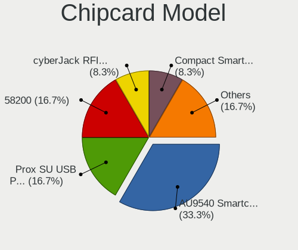

| Model                                                                        | Notebooks | Percent |
|------------------------------------------------------------------------------|-----------|---------|
| Alcor Micro AU9540 Smartcard Reader                                          | 4         | 50%     |
| Gemalto (was Gemplus) Prox SU USB PC Link Reader                             | 2         | 25%     |
| Gemalto (was Gemplus) Compact Smart Card Reader Writer                       | 1         | 12.5%   |
| Broadcom BCM5880 Secure Applications Processor with fingerprint swipe sensor | 1         | 12.5%   |

Unsupported
-----------

Unsupported Devices
-------------------

Total unsupported devices on board

| Total | Notebooks | Percent |
|-------|-----------|---------|
| 0     | 34        | 50%     |
| 1     | 20        | 29.41%  |
| 2     | 12        | 17.65%  |
| 3     | 2         | 2.94%   |

Unsupported Device Types
------------------------

Types of unsupported devices

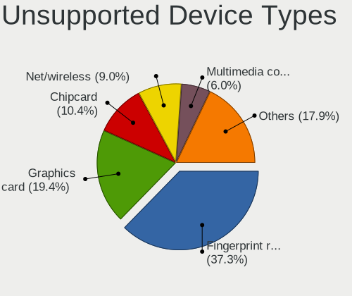

| Type                     | Notebooks | Percent |
|--------------------------|-----------|---------|
| Fingerprint reader       | 19        | 39.58%  |
| Graphics card            | 10        | 20.83%  |
| Chipcard                 | 4         | 8.33%   |
| Multimedia controller    | 3         | 6.25%   |
| Card reader              | 3         | 6.25%   |
| Network                  | 2         | 4.17%   |
| Net/wireless             | 2         | 4.17%   |
| Communication controller | 2         | 4.17%   |
| Sound                    | 1         | 2.08%   |
| Camera                   | 1         | 2.08%   |
| Bluetooth                | 1         | 2.08%   |

