Linux in Luxembourg - Tested Hardware & Statistics
--------------------------------------------------

A project to collect tested hardware configurations for Linux in Luxembourg.

Anyone can contribute to this report by the [hw-probe](https://github.com/linuxhw/hw-probe) tool:

    sudo -E hw-probe -all -upload

Please contribute! Especially if your hardware is rare.

This is a report for all computer types. See also reports for [desktops](/Location/Luxembourg/Desktop/README.md) and [notebooks](/Location/Luxembourg/Notebook/README.md).

Contents
--------

* [ Test Cases ](#test-cases)

* [ System ](#system)
  - [ OS                       ](#os)
  - [ OS Family                ](#os-family)
  - [ Kernel                   ](#kernel)
  - [ Kernel Family            ](#kernel-family)
  - [ Kernel Major Ver.        ](#kernel-major-ver)
  - [ Arch                     ](#arch)
  - [ DE                       ](#de)
  - [ Display Server           ](#display-server)
  - [ Display Manager          ](#display-manager)
  - [ OS Lang                  ](#os-lang)
  - [ Boot Mode                ](#boot-mode)
  - [ Filesystem               ](#filesystem)
  - [ Part. scheme             ](#part-scheme)
  - [ Dual Boot with Linux/BSD ](#dual-boot-with-linuxbsd)
  - [ Dual Boot (Win)          ](#dual-boot-win)

* [ Board ](#board)
  - [ Vendor                   ](#vendor)
  - [ Model                    ](#model)
  - [ Model Family             ](#model-family)
  - [ MFG Year                 ](#mfg-year)
  - [ Form Factor              ](#form-factor)
  - [ Secure Boot              ](#secure-boot)
  - [ Coreboot                 ](#coreboot)
  - [ RAM Size                 ](#ram-size)
  - [ RAM Used                 ](#ram-used)
  - [ Total Drives             ](#total-drives)
  - [ Has CD-ROM               ](#has-cd-rom)
  - [ Has Ethernet             ](#has-ethernet)
  - [ Has WiFi                 ](#has-wifi)
  - [ Has Bluetooth            ](#has-bluetooth)

* [ Location ](#location)
  - [ Country                  ](#country)
  - [ City                     ](#city)

* [ Drives ](#drives)
  - [ Drive Vendor             ](#drive-vendor)
  - [ Drive Model              ](#drive-model)
  - [ HDD Vendor               ](#hdd-vendor)
  - [ SSD Vendor               ](#ssd-vendor)
  - [ Drive Kind               ](#drive-kind)
  - [ Drive Connector          ](#drive-connector)
  - [ Drive Size               ](#drive-size)
  - [ Space Total              ](#space-total)
  - [ Space Used               ](#space-used)
  - [ Malfunc. Drives          ](#malfunc-drives)
  - [ Malfunc. Drive Vendor    ](#malfunc-drive-vendor)
  - [ Malfunc. HDD Vendor      ](#malfunc-hdd-vendor)
  - [ Malfunc. Drive Kind      ](#malfunc-drive-kind)
  - [ Failed Drives            ](#failed-drives)
  - [ Failed Drive Vendor      ](#failed-drive-vendor)
  - [ Drive Status             ](#drive-status)

* [ Storage controller ](#storage-controller)
  - [ Storage Vendor           ](#storage-vendor)
  - [ Storage Model            ](#storage-model)
  - [ Storage Kind             ](#storage-kind)

* [ Processor ](#processor)
  - [ CPU Vendor               ](#cpu-vendor)
  - [ CPU Model                ](#cpu-model)
  - [ CPU Model Family         ](#cpu-model-family)
  - [ CPU Cores                ](#cpu-cores)
  - [ CPU Sockets              ](#cpu-sockets)
  - [ CPU Threads              ](#cpu-threads)
  - [ CPU Op-Modes             ](#cpu-op-modes)
  - [ CPU Microcode            ](#cpu-microcode)
  - [ CPU Microarch            ](#cpu-microarch)

* [ Graphics ](#graphics)
  - [ GPU Vendor               ](#gpu-vendor)
  - [ GPU Model                ](#gpu-model)
  - [ GPU Combo                ](#gpu-combo)
  - [ GPU Driver               ](#gpu-driver)
  - [ GPU Memory               ](#gpu-memory)

* [ Monitor ](#monitor)
  - [ Monitor Vendor           ](#monitor-vendor)
  - [ Monitor Model            ](#monitor-model)
  - [ Monitor Resolution       ](#monitor-resolution)
  - [ Monitor Diagonal         ](#monitor-diagonal)
  - [ Monitor Width            ](#monitor-width)
  - [ Aspect Ratio             ](#aspect-ratio)
  - [ Monitor Area             ](#monitor-area)
  - [ Pixel Density            ](#pixel-density)
  - [ Multiple Monitors        ](#multiple-monitors)

* [ Network ](#network)
  - [ Net Controller Vendor    ](#net-controller-vendor)
  - [ Net Controller Model     ](#net-controller-model)
  - [ Wireless Vendor          ](#wireless-vendor)
  - [ Wireless Model           ](#wireless-model)
  - [ Ethernet Vendor          ](#ethernet-vendor)
  - [ Ethernet Model           ](#ethernet-model)
  - [ Net Controller Kind      ](#net-controller-kind)
  - [ Used Controller          ](#used-controller)
  - [ NICs                     ](#nics)
  - [ IPv6                     ](#ipv6)

* [ Bluetooth ](#bluetooth)
  - [ Bluetooth Vendor         ](#bluetooth-vendor)
  - [ Bluetooth Model          ](#bluetooth-model)

* [ Sound ](#sound)
  - [ Sound Vendor             ](#sound-vendor)
  - [ Sound Model              ](#sound-model)

* [ Memory ](#memory)
  - [ Memory Vendor            ](#memory-vendor)
  - [ Memory Model             ](#memory-model)
  - [ Memory Kind              ](#memory-kind)
  - [ Memory Form Factor       ](#memory-form-factor)
  - [ Memory Size              ](#memory-size)
  - [ Memory Speed             ](#memory-speed)

* [ Printers & scanners ](#printers--scanners)
  - [ Printer Vendor           ](#printer-vendor)
  - [ Printer Model            ](#printer-model)
  - [ Scanner Vendor           ](#scanner-vendor)
  - [ Scanner Model            ](#scanner-model)

* [ Camera ](#camera)
  - [ Camera Vendor            ](#camera-vendor)
  - [ Camera Model             ](#camera-model)

* [ Security ](#security)
  - [ Fingerprint Vendor       ](#fingerprint-vendor)
  - [ Fingerprint Model        ](#fingerprint-model)
  - [ Chipcard Vendor          ](#chipcard-vendor)
  - [ Chipcard Model           ](#chipcard-model)

* [ Unsupported ](#unsupported)
  - [ Unsupported Devices      ](#unsupported-devices)
  - [ Unsupported Device Types ](#unsupported-device-types)

Test Cases
----------

Total: 221

| Vendor        | Model                       | Form-Factor | Probe                                                      | Date         |
|---------------|-----------------------------|-------------|------------------------------------------------------------|--------------|
| MSI           | MAG B650 TOMAHAWK WIFI      | Desktop     | [692f458014](https://linux-hardware.org/?probe=692f458014) | May 01, 2024 |
| Apple         | MacBookPro8,1               | Notebook    | [d8f7a5da03](https://linux-hardware.org/?probe=d8f7a5da03) | Apr 23, 2024 |
| JWIPC         | A320I S1                    | Desktop     | [eea8091ffa](https://linux-hardware.org/?probe=eea8091ffa) | Apr 22, 2024 |
| JWIPC         | A320I S1                    | Desktop     | [c8bb6cd872](https://linux-hardware.org/?probe=c8bb6cd872) | Apr 21, 2024 |
| MSI           | MAG B550 TOMAHAWK           | Desktop     | [89107c7d88](https://linux-hardware.org/?probe=89107c7d88) | Apr 18, 2024 |
| Dell          | Latitude 5490               | Notebook    | [6083d1ad5b](https://linux-hardware.org/?probe=6083d1ad5b) | Apr 09, 2024 |
| ASUSTek       | PRIME B460M-A               | Desktop     | [63a643c790](https://linux-hardware.org/?probe=63a643c790) | Mar 26, 2024 |
| Lenovo        | Yoga 3 Pro-1370 80HE        | Notebook    | [529873e41c](https://linux-hardware.org/?probe=529873e41c) | Mar 26, 2024 |
| ASUSTek       | P6X58D PREMIUM              | Desktop     | [3e42f1f6bb](https://linux-hardware.org/?probe=3e42f1f6bb) | Mar 24, 2024 |
| Lenovo        | IdeaPad Pro 5 16APH8 83A... | Notebook    | [0f6b378c5d](https://linux-hardware.org/?probe=0f6b378c5d) | Mar 22, 2024 |
| Dell          | 0KC9NP A01                  | Desktop     | [ee6bd4e717](https://linux-hardware.org/?probe=ee6bd4e717) | Mar 07, 2024 |
| Unknown       | Unknown                     | Notebook    | [bad7799ac9](https://linux-hardware.org/?probe=bad7799ac9) | Feb 11, 2024 |
| Gigabyte      | Z77X-D3H                    | Desktop     | [aa69326408](https://linux-hardware.org/?probe=aa69326408) | Jan 29, 2024 |
| ASUSTek       | K72JT                       | Notebook    | [51117cd448](https://linux-hardware.org/?probe=51117cd448) | Dec 29, 2023 |
| HP            | 198E                        | Desktop     | [30e0f75eee](https://linux-hardware.org/?probe=30e0f75eee) | Dec 27, 2023 |
| ASUSTek       | ROG STRIX B550-F GAMING     | Desktop     | [e1e496f1a9](https://linux-hardware.org/?probe=e1e496f1a9) | Dec 15, 2023 |
| Dell          | Precision M3800             | Notebook    | [9e8d36821a](https://linux-hardware.org/?probe=9e8d36821a) | Dec 14, 2023 |
| ASUSTek       | UN65U                       | Mini pc     | [83a33710cc](https://linux-hardware.org/?probe=83a33710cc) | Dec 13, 2023 |
| HUAWEI        | HVY-WXX9                    | Notebook    | [6f35ce12bd](https://linux-hardware.org/?probe=6f35ce12bd) | Dec 07, 2023 |
| Dell          | Precision M3800             | Notebook    | [a01e02361f](https://linux-hardware.org/?probe=a01e02361f) | Nov 26, 2023 |
| Lenovo        | Legion 5 15IAH7H 82RB       | Notebook    | [0b974daf24](https://linux-hardware.org/?probe=0b974daf24) | Nov 24, 2023 |
| Framework     | Laptop                      | Notebook    | [ad3c0b1f5c](https://linux-hardware.org/?probe=ad3c0b1f5c) | Nov 10, 2023 |
| Tactus        | GeoFlex 140                 | Convertible | [a386eceffe](https://linux-hardware.org/?probe=a386eceffe) | Nov 05, 2023 |
| Panasonic     | CF-195DCUBML                | Notebook    | [e9e34a8b3b](https://linux-hardware.org/?probe=e9e34a8b3b) | Oct 29, 2023 |
| SLIMBOOK      | EXECUTIVE-14                | Notebook    | [39250155c4](https://linux-hardware.org/?probe=39250155c4) | Oct 26, 2023 |
| Dell          | 02K9CR A02                  | Desktop     | [47ca1834f0](https://linux-hardware.org/?probe=47ca1834f0) | Oct 15, 2023 |
| Acer          | Swift SFG14-71              | Notebook    | [612557336e](https://linux-hardware.org/?probe=612557336e) | Oct 14, 2023 |
| Lenovo        | ThinkPad X1 Yoga 2nd 20J... | Convertible | [19d2454b52](https://linux-hardware.org/?probe=19d2454b52) | Oct 07, 2023 |
| Lenovo        | ThinkPad X1 Yoga 2nd 20J... | Convertible | [4599ccbd45](https://linux-hardware.org/?probe=4599ccbd45) | Oct 07, 2023 |
| Samsung       | 550XBE/350XBE               | Notebook    | [3185dde146](https://linux-hardware.org/?probe=3185dde146) | Oct 04, 2023 |
| Lenovo        | ThinkPad X1 Yoga 2nd 20J... | Convertible | [2953047bfa](https://linux-hardware.org/?probe=2953047bfa) | Sep 25, 2023 |
| MSI           | GE63 7RD                    | Notebook    | [b0aac4eb91](https://linux-hardware.org/?probe=b0aac4eb91) | Sep 13, 2023 |
| MSI           | PRO Z790-P WIFI             | Desktop     | [5b9aef438f](https://linux-hardware.org/?probe=5b9aef438f) | Aug 12, 2023 |
| MSI           | PRO Z790-P WIFI             | Desktop     | [1f3f8a869b](https://linux-hardware.org/?probe=1f3f8a869b) | Aug 12, 2023 |
| Dell          | Precision 7670              | Notebook    | [09797bd60c](https://linux-hardware.org/?probe=09797bd60c) | Aug 04, 2023 |
| ASUSTek       | TUF Gaming X570-PLUS        | Desktop     | [50ee937fb2](https://linux-hardware.org/?probe=50ee937fb2) | Aug 02, 2023 |
| BESSTAR Te... | DMAF5 V1.0                  | Desktop     | [93c8724c91](https://linux-hardware.org/?probe=93c8724c91) | Jul 31, 2023 |
| HP            | ZBook Fury 16 G9 Mobile ... | Notebook    | [2b50e2b375](https://linux-hardware.org/?probe=2b50e2b375) | Jul 29, 2023 |
| Unknown       | T3 MRD                      | Desktop     | [5539799efa](https://linux-hardware.org/?probe=5539799efa) | Jul 26, 2023 |
| ASUSTek       | ROG STRIX B550-F GAMING     | Desktop     | [a179c222ea](https://linux-hardware.org/?probe=a179c222ea) | Jul 23, 2023 |
| HUAWEI        | KLVL-WXXW                   | Notebook    | [f0dcdf797e](https://linux-hardware.org/?probe=f0dcdf797e) | Jul 23, 2023 |
| HUAWEI        | KLVL-WXXW                   | Notebook    | [49fc9fb8ce](https://linux-hardware.org/?probe=49fc9fb8ce) | Jul 23, 2023 |
| MACHINIST     | E5-D8-MAX V1.1              | Desktop     | [ea68d9762b](https://linux-hardware.org/?probe=ea68d9762b) | Jul 21, 2023 |
| Win Elemen... | M9                          | Desktop     | [2e5ea821f1](https://linux-hardware.org/?probe=2e5ea821f1) | Jul 01, 2023 |
| HP            | ZBook Fury 15.6 inch G8 ... | Notebook    | [a210e832a8](https://linux-hardware.org/?probe=a210e832a8) | Jun 16, 2023 |
| HP            | ZBook Fury 15.6 inch G8 ... | Notebook    | [eb6365c303](https://linux-hardware.org/?probe=eb6365c303) | Jun 16, 2023 |
| Lenovo        | ThinkPad L14 Gen 2a 20X6... | Notebook    | [e3e61eef7a](https://linux-hardware.org/?probe=e3e61eef7a) | Jun 15, 2023 |
| Lenovo        | 1038 NO DPK                 | Server      | [e91c644324](https://linux-hardware.org/?probe=e91c644324) | Jun 02, 2023 |
| BESSTAR Te... | DMAF5 V1.0                  | Desktop     | [53f395d7fa](https://linux-hardware.org/?probe=53f395d7fa) | May 15, 2023 |
| Dell          | Precision M3800             | Notebook    | [f5f8f44c9e](https://linux-hardware.org/?probe=f5f8f44c9e) | May 10, 2023 |
| ASUSTek       | PRIME Z590-P WIFI           | Desktop     | [5d12a9965b](https://linux-hardware.org/?probe=5d12a9965b) | May 06, 2023 |
| Notebook      | NV4XMB,ME,MZ                | Notebook    | [f3b5a181df](https://linux-hardware.org/?probe=f3b5a181df) | May 02, 2023 |
| HUAWEI        | CREM-WXX9                   | Notebook    | [d3ef8c638e](https://linux-hardware.org/?probe=d3ef8c638e) | Apr 30, 2023 |
| Gigabyte      | X670E AORUS MASTER          | Desktop     | [c8bf9d49d4](https://linux-hardware.org/?probe=c8bf9d49d4) | Apr 15, 2023 |
| SLIMBOOK      | EXECUTIVE-14                | Notebook    | [e66056ac2d](https://linux-hardware.org/?probe=e66056ac2d) | Apr 09, 2023 |
| Dell          | Precision 5570              | Notebook    | [a3d5f928ee](https://linux-hardware.org/?probe=a3d5f928ee) | Mar 31, 2023 |
| Acer          | Aspire A514-54              | Notebook    | [94da64753b](https://linux-hardware.org/?probe=94da64753b) | Mar 30, 2023 |
| ASUSTek       | N751JK                      | Notebook    | [813b5026ad](https://linux-hardware.org/?probe=813b5026ad) | Mar 18, 2023 |
| HUAWEI        | HVY-WXX9                    | Notebook    | [b5ef4ae548](https://linux-hardware.org/?probe=b5ef4ae548) | Mar 14, 2023 |
| HUAWEI        | HVY-WXX9                    | Notebook    | [e79cdeaf10](https://linux-hardware.org/?probe=e79cdeaf10) | Mar 13, 2023 |
| Packard Be... | EasyNote TJ65               | Notebook    | [18f0877a2e](https://linux-hardware.org/?probe=18f0877a2e) | Mar 03, 2023 |
| ASUSTek       | VivoBook_ASUSLaptop X340... | Notebook    | [ac5cf996d9](https://linux-hardware.org/?probe=ac5cf996d9) | Mar 03, 2023 |
| Gigabyte      | Z370 AORUS Ultra Gaming-... | Desktop     | [5fe0f2c1fe](https://linux-hardware.org/?probe=5fe0f2c1fe) | Feb 18, 2023 |
| ASRock        | X570 Phantom Gaming 4       | Desktop     | [f91712ea02](https://linux-hardware.org/?probe=f91712ea02) | Feb 15, 2023 |
| ASUSTek       | VivoBook_ASUSLaptop X340... | Notebook    | [bc56140257](https://linux-hardware.org/?probe=bc56140257) | Jan 25, 2023 |
| HP            | EliteBook x360 1030 G3      | Convertible | [e5ab68f182](https://linux-hardware.org/?probe=e5ab68f182) | Jan 14, 2023 |
| Gigabyte      | B550M AORUS PRO-P           | Desktop     | [6666a9b8ca](https://linux-hardware.org/?probe=6666a9b8ca) | Jan 09, 2023 |
| HP            | OMEN by Laptop 15-dc0xxx    | Notebook    | [71c2b809fb](https://linux-hardware.org/?probe=71c2b809fb) | Jan 09, 2023 |
| HP            | EliteBook 850 G8 Noteboo... | Notebook    | [5b645cbd36](https://linux-hardware.org/?probe=5b645cbd36) | Dec 22, 2022 |
| MSI           | B85-G43                     | Desktop     | [a8f28d3f69](https://linux-hardware.org/?probe=a8f28d3f69) | Nov 23, 2022 |
| Dell          | Precision 7670              | Notebook    | [93f14c8b55](https://linux-hardware.org/?probe=93f14c8b55) | Nov 21, 2022 |
| Dell          | Latitude 5520               | Notebook    | [91cab639f0](https://linux-hardware.org/?probe=91cab639f0) | Nov 17, 2022 |
| Intel         | DP35DP AAD81073-207         | Desktop     | [c597415419](https://linux-hardware.org/?probe=c597415419) | Nov 11, 2022 |
| Intel         | NUC6i3SYB H81132-503        | Mini pc     | [91aef8cd0f](https://linux-hardware.org/?probe=91aef8cd0f) | Oct 31, 2022 |
| JWIPC         | A320I S1                    | Desktop     | [44689a88d8](https://linux-hardware.org/?probe=44689a88d8) | Oct 16, 2022 |
| Clevo         | W25xHPx                     | Notebook    | [04196b2306](https://linux-hardware.org/?probe=04196b2306) | Oct 13, 2022 |
| HP            | EliteBook 850 G3            | Notebook    | [2eee433657](https://linux-hardware.org/?probe=2eee433657) | Sep 17, 2022 |
| LattePanda    | 3 Delta CDJQ-BS-7-S70JR1... | Desktop     | [dbfdcae895](https://linux-hardware.org/?probe=dbfdcae895) | Sep 08, 2022 |
| LattePanda    | 3 Delta CDJQ-BS-7-S70JR1... | Desktop     | [4167167e38](https://linux-hardware.org/?probe=4167167e38) | Sep 08, 2022 |
| ASUSTek       | N751JK                      | Notebook    | [ca6cba3420](https://linux-hardware.org/?probe=ca6cba3420) | Jul 28, 2022 |
| Wortmann      | MS-1727                     | Notebook    | [4697b4b4e5](https://linux-hardware.org/?probe=4697b4b4e5) | Jul 27, 2022 |
| Gigabyte      | X99-UD3-CF                  | Desktop     | [75dbdd1681](https://linux-hardware.org/?probe=75dbdd1681) | Jul 26, 2022 |
| Gigabyte      | X99-UD3-CF                  | Desktop     | [7eaa9fa16b](https://linux-hardware.org/?probe=7eaa9fa16b) | Jul 26, 2022 |
| HP            | EliteBook 8560p             | Notebook    | [584fe927af](https://linux-hardware.org/?probe=584fe927af) | Jul 19, 2022 |
| Apple         | MacBookAir6,2               | Notebook    | [cc9185a171](https://linux-hardware.org/?probe=cc9185a171) | Jul 17, 2022 |
| HP            | 2820h                       | Desktop     | [7303ad365d](https://linux-hardware.org/?probe=7303ad365d) | Jul 11, 2022 |
| ASUSTek       | TUF Gaming FX505DY_TUF50... | Notebook    | [df304b4da1](https://linux-hardware.org/?probe=df304b4da1) | Jun 17, 2022 |
| win elemen... | MoreFine S500+              | Notebook    | [eafff91c80](https://linux-hardware.org/?probe=eafff91c80) | Jun 03, 2022 |
| TUXEDO        | Pulse 14 Gen1               | Notebook    | [ca9c5a57a8](https://linux-hardware.org/?probe=ca9c5a57a8) | May 06, 2022 |
| Acer          | Nitro AN515-55              | Notebook    | [731e3d2588](https://linux-hardware.org/?probe=731e3d2588) | Apr 03, 2022 |
| Acer          | Nitro AN515-55              | Notebook    | [ad42ffd24d](https://linux-hardware.org/?probe=ad42ffd24d) | Apr 03, 2022 |
| Sony          | VPCCA4E1E                   | Notebook    | [95fc0956c8](https://linux-hardware.org/?probe=95fc0956c8) | Mar 27, 2022 |
| Intel         | NUC7i5BNB J31144-303        | Mini pc     | [09ac53276d](https://linux-hardware.org/?probe=09ac53276d) | Mar 16, 2022 |
| ASUSTek       | UX430UNR                    | Notebook    | [86dc3583ca](https://linux-hardware.org/?probe=86dc3583ca) | Mar 09, 2022 |
| ASUSTek       | UX430UNR                    | Notebook    | [4c45b3ea17](https://linux-hardware.org/?probe=4c45b3ea17) | Mar 06, 2022 |
| ASUSTek       | UX430UNR                    | Notebook    | [a76e22e410](https://linux-hardware.org/?probe=a76e22e410) | Mar 06, 2022 |
| Intel         | DG41WV AAE90316-104         | Desktop     | [b6dc38eb16](https://linux-hardware.org/?probe=b6dc38eb16) | Feb 25, 2022 |
| ASRock        | H110M-STX                   | Desktop     | [e5876258c7](https://linux-hardware.org/?probe=e5876258c7) | Feb 19, 2022 |
| HP            | 255 G6 Notebook PC          | Notebook    | [30c3320bb3](https://linux-hardware.org/?probe=30c3320bb3) | Feb 12, 2022 |
| HP            | 255 G6 Notebook PC          | Notebook    | [d4f9b2d0e3](https://linux-hardware.org/?probe=d4f9b2d0e3) | Feb 12, 2022 |
| Sony          | VPCEB2E1E                   | Notebook    | [e3df114520](https://linux-hardware.org/?probe=e3df114520) | Feb 11, 2022 |
| HP            | ProBook 450 G6              | Notebook    | [d8a9a9c7d3](https://linux-hardware.org/?probe=d8a9a9c7d3) | Jan 31, 2022 |
| Lenovo        | ThinkPad T490 20N3S5DV0S    | Notebook    | [e619ec0303](https://linux-hardware.org/?probe=e619ec0303) | Jan 31, 2022 |
| ASUSTek       | Z97-A                       | Desktop     | [19d74bd6f0](https://linux-hardware.org/?probe=19d74bd6f0) | Jan 31, 2022 |
| Medion        | P6685 MD61138               | Notebook    | [57dfdfb610](https://linux-hardware.org/?probe=57dfdfb610) | Jan 27, 2022 |
| win elemen... | MoreFine S500+              | Notebook    | [d7767ce266](https://linux-hardware.org/?probe=d7767ce266) | Jan 23, 2022 |
| win elemen... | MoreFine S500+              | Notebook    | [d63a6d7de6](https://linux-hardware.org/?probe=d63a6d7de6) | Jan 23, 2022 |
| Lenovo        | ThinkPad T470s W10DG 20J... | Notebook    | [6892ab87e1](https://linux-hardware.org/?probe=6892ab87e1) | Jan 13, 2022 |
| Packard Be... | EasyNote TJ65               | Notebook    | [252c250082](https://linux-hardware.org/?probe=252c250082) | Jan 06, 2022 |
| Fujitsu       | LIFEBOOK E746               | Notebook    | [55ac013e1e](https://linux-hardware.org/?probe=55ac013e1e) | Jan 06, 2022 |
| Fujitsu       | LIFEBOOK E746               | Notebook    | [2f7baecdec](https://linux-hardware.org/?probe=2f7baecdec) | Jan 02, 2022 |
| Fujitsu       | LIFEBOOK E746               | Notebook    | [54248086d3](https://linux-hardware.org/?probe=54248086d3) | Dec 25, 2021 |
| Fujitsu       | LIFEBOOK E746               | Notebook    | [1b53993ffc](https://linux-hardware.org/?probe=1b53993ffc) | Dec 25, 2021 |
| ASUSTek       | PRIME X470-PRO              | Desktop     | [2845eaa223](https://linux-hardware.org/?probe=2845eaa223) | Nov 27, 2021 |
| Dell          | XPS 15 7590                 | Notebook    | [63f386f998](https://linux-hardware.org/?probe=63f386f998) | Nov 23, 2021 |
| Sony          | VGN-NS30E_S                 | Notebook    | [a36535818d](https://linux-hardware.org/?probe=a36535818d) | Nov 20, 2021 |
| Medion        | Cattle24 1M                 | Desktop     | [05747b9a42](https://linux-hardware.org/?probe=05747b9a42) | Nov 10, 2021 |
| Medion        | Cattle24 1M                 | Desktop     | [9763c21680](https://linux-hardware.org/?probe=9763c21680) | Nov 10, 2021 |
| ASUSTek       | TUF Gaming Z590-PLUS WIF... | Desktop     | [b2f196476a](https://linux-hardware.org/?probe=b2f196476a) | Nov 04, 2021 |
| YJKC          | vBook                       | Notebook    | [42ccc640d7](https://linux-hardware.org/?probe=42ccc640d7) | Nov 03, 2021 |
| MSI           | GF72 8RD                    | Notebook    | [4ac8472977](https://linux-hardware.org/?probe=4ac8472977) | Oct 23, 2021 |
| Wortmann      | TERRA_MOBILE_1749           | Notebook    | [8917a2fc6b](https://linux-hardware.org/?probe=8917a2fc6b) | Oct 15, 2021 |
| Dell          | Precision M2800             | Notebook    | [b046a9dfe3](https://linux-hardware.org/?probe=b046a9dfe3) | Oct 08, 2021 |
| ASUSTek       | UX360CA                     | Notebook    | [52039745c7](https://linux-hardware.org/?probe=52039745c7) | Sep 15, 2021 |
| ASUSTek       | UX360CA                     | Notebook    | [413bad53c5](https://linux-hardware.org/?probe=413bad53c5) | Sep 14, 2021 |
| HP            | ProBook 450 G6              | Notebook    | [03689a5674](https://linux-hardware.org/?probe=03689a5674) | Sep 10, 2021 |
| Lenovo        | ThinkPad L15 Gen 1 20U7S... | Notebook    | [da01ae06a6](https://linux-hardware.org/?probe=da01ae06a6) | Sep 09, 2021 |
| ASUSTek       | UN62                        | Desktop     | [0702f80222](https://linux-hardware.org/?probe=0702f80222) | Sep 09, 2021 |
| ASUSTek       | ROG CROSSHAIR VIII DARK ... | Desktop     | [ce97f26d1d](https://linux-hardware.org/?probe=ce97f26d1d) | Sep 09, 2021 |
| Dell          | Precision M3800             | Notebook    | [5dba4d3bce](https://linux-hardware.org/?probe=5dba4d3bce) | Sep 07, 2021 |
| Dell          | Inspiron 16 7610            | Notebook    | [29c29dc50b](https://linux-hardware.org/?probe=29c29dc50b) | Sep 06, 2021 |
| Intel         | DG41WV AAE90316-104         | Desktop     | [27c162218f](https://linux-hardware.org/?probe=27c162218f) | Sep 05, 2021 |
| Lenovo        | ThinkPad L15 Gen 1 20U8S... | Notebook    | [d819b1cc24](https://linux-hardware.org/?probe=d819b1cc24) | Sep 04, 2021 |
| Lenovo        | ThinkPad L15 Gen 1 20U8S... | Notebook    | [b5388437b9](https://linux-hardware.org/?probe=b5388437b9) | Sep 04, 2021 |
| HP            | 829A                        | Mini pc     | [1f3d092233](https://linux-hardware.org/?probe=1f3d092233) | Aug 30, 2021 |
| Samsung       | 950QDB                      | Convertible | [c0dedecfe1](https://linux-hardware.org/?probe=c0dedecfe1) | Aug 26, 2021 |
| Samsung       | 950QDB                      | Convertible | [21ac7cda75](https://linux-hardware.org/?probe=21ac7cda75) | Aug 26, 2021 |
| HP            | Pavilion Gaming Notebook    | Notebook    | [3b8bef3c61](https://linux-hardware.org/?probe=3b8bef3c61) | Aug 23, 2021 |
| HP            | Pavilion Gaming Notebook    | Notebook    | [c2a3d9da9e](https://linux-hardware.org/?probe=c2a3d9da9e) | Aug 12, 2021 |
| HP            | ProBook 6450b               | Notebook    | [e607e5a89e](https://linux-hardware.org/?probe=e607e5a89e) | Jul 31, 2021 |
| ASUSTek       | ROG STRIX X570-E GAMING     | Desktop     | [80a7298343](https://linux-hardware.org/?probe=80a7298343) | Jul 27, 2021 |
| Acer          | Aspire V5-561G              | Notebook    | [caf0285b12](https://linux-hardware.org/?probe=caf0285b12) | Jul 17, 2021 |
| HP            | ProBook 450 G6              | Notebook    | [f13877e5d4](https://linux-hardware.org/?probe=f13877e5d4) | Jul 08, 2021 |
| Sony          | VPCP11S1R                   | Notebook    | [185fd7ceef](https://linux-hardware.org/?probe=185fd7ceef) | Jul 05, 2021 |
| HP            | EliteBook 850 G8 Noteboo... | Notebook    | [c031043704](https://linux-hardware.org/?probe=c031043704) | Jul 01, 2021 |
| HP            | EliteBook 850 G8 Noteboo... | Notebook    | [28c858a3ad](https://linux-hardware.org/?probe=28c858a3ad) | Jul 01, 2021 |
| ASRock        | B450M-HDV R4.0              | Desktop     | [b5b8d7a195](https://linux-hardware.org/?probe=b5b8d7a195) | Jun 13, 2021 |
| Lenovo        | ThinkPad T480s 20L7001PF... | Notebook    | [b54604a23d](https://linux-hardware.org/?probe=b54604a23d) | Jun 10, 2021 |
| HUAWEI        | HLYL-WXX9                   | Notebook    | [22e9ce0306](https://linux-hardware.org/?probe=22e9ce0306) | Jun 10, 2021 |
| HUAWEI        | HLYL-WXX9                   | Notebook    | [4bc5bdf702](https://linux-hardware.org/?probe=4bc5bdf702) | Jun 10, 2021 |
| Fujitsu       | STYLISTIC Q702              | Notebook    | [6af6b1aa99](https://linux-hardware.org/?probe=6af6b1aa99) | May 17, 2021 |
| Wortmann      | TERRA_MOBILE_1749           | Notebook    | [47e02d3203](https://linux-hardware.org/?probe=47e02d3203) | May 14, 2021 |
| Fujitsu       | STYLISTIC Q702              | Notebook    | [ceb707caf8](https://linux-hardware.org/?probe=ceb707caf8) | May 14, 2021 |
| Intel         | DG965SS AAD41678-308        | Desktop     | [d76e4b9ec3](https://linux-hardware.org/?probe=d76e4b9ec3) | May 04, 2021 |
| HP            | Pavilion Gaming Notebook    | Notebook    | [f514df9912](https://linux-hardware.org/?probe=f514df9912) | May 02, 2021 |
| ASUSTek       | M5A78L-M LX3                | Desktop     | [565be765f5](https://linux-hardware.org/?probe=565be765f5) | Apr 29, 2021 |
| ASUSTek       | VivoBook 17_ASUS Laptop ... | Notebook    | [359bf83027](https://linux-hardware.org/?probe=359bf83027) | Apr 05, 2021 |
| Toshiba       | Satellite C55-A-1N0         | Notebook    | [7fe4a33a38](https://linux-hardware.org/?probe=7fe4a33a38) | Mar 27, 2021 |
| Intel         | DG41WV AAE90316-104         | Desktop     | [af606a347f](https://linux-hardware.org/?probe=af606a347f) | Mar 15, 2021 |
| Gigabyte      | H81M-DS2                    | Desktop     | [439d425d4b](https://linux-hardware.org/?probe=439d425d4b) | Mar 01, 2021 |
| Apple         | MacBookPro8,1               | Notebook    | [467f82a695](https://linux-hardware.org/?probe=467f82a695) | Feb 22, 2021 |
| Apple         | MacBookPro14,1              | Notebook    | [34e4083988](https://linux-hardware.org/?probe=34e4083988) | Feb 20, 2021 |
| Dell          | Vostro 3558                 | Notebook    | [176249071b](https://linux-hardware.org/?probe=176249071b) | Feb 13, 2021 |
| HP            | ENVY 15 x360 PC             | Notebook    | [1760641bd6](https://linux-hardware.org/?probe=1760641bd6) | Feb 13, 2021 |
| Gigabyte      | H81M-DS2                    | Desktop     | [3500ce2480](https://linux-hardware.org/?probe=3500ce2480) | Feb 09, 2021 |
| ASUSTek       | Z87-DELUXE                  | Desktop     | [e160eea25a](https://linux-hardware.org/?probe=e160eea25a) | Dec 28, 2020 |
| ASUSTek       | VivoBook 17_ASUS Laptop ... | Notebook    | [cdc7e7e576](https://linux-hardware.org/?probe=cdc7e7e576) | Dec 25, 2020 |
| ASUSTek       | PRIME B450-PLUS             | Desktop     | [ae14c03ffc](https://linux-hardware.org/?probe=ae14c03ffc) | Dec 19, 2020 |
| Gigabyte      | X570 AORUS PRO              | Desktop     | [9ec2d84b9b](https://linux-hardware.org/?probe=9ec2d84b9b) | Dec 10, 2020 |
| Lenovo        | IdeaPad 330-15ICH 81FK      | Notebook    | [dfebaa1e1e](https://linux-hardware.org/?probe=dfebaa1e1e) | Dec 06, 2020 |
| Apple         | Mac-BE088AF8C5EB4FA2 iMa... | All in one  | [47f9230c3a](https://linux-hardware.org/?probe=47f9230c3a) | Dec 01, 2020 |
| ASUSTek       | PRIME H470M-PLUS            | Desktop     | [1d77b8496d](https://linux-hardware.org/?probe=1d77b8496d) | Nov 28, 2020 |
| Acer          | Aspire 4741                 | Notebook    | [e65bbc0990](https://linux-hardware.org/?probe=e65bbc0990) | Nov 28, 2020 |
| ASUSTek       | VivoBook 17_ASUS Laptop ... | Notebook    | [a6b200eda6](https://linux-hardware.org/?probe=a6b200eda6) | Nov 13, 2020 |
| Dell          | Precision 5540              | Notebook    | [5b3140e7e8](https://linux-hardware.org/?probe=5b3140e7e8) | Oct 29, 2020 |
| Gigabyte      | H81M-DS2                    | Desktop     | [e6be700463](https://linux-hardware.org/?probe=e6be700463) | Oct 28, 2020 |
| Dell          | XPS 15 9560                 | Notebook    | [c2660b6ca0](https://linux-hardware.org/?probe=c2660b6ca0) | Oct 07, 2020 |
| ASUSTek       | Z87-A                       | Desktop     | [bbe1190702](https://linux-hardware.org/?probe=bbe1190702) | Oct 01, 2020 |
| Apple         | MacBookPro15,4              | Notebook    | [2352614158](https://linux-hardware.org/?probe=2352614158) | Sep 25, 2020 |
| Lenovo        | ThinkPad T440p 20AWS24B0... | Notebook    | [8178cca0f9](https://linux-hardware.org/?probe=8178cca0f9) | Sep 16, 2020 |
| Lenovo        | ThinkPad X1 Carbon 7th 2... | Notebook    | [a06e93e3e9](https://linux-hardware.org/?probe=a06e93e3e9) | Sep 04, 2020 |
| HP            | ENVY x360 Convertible 15... | Convertible | [0c09e0b8ba](https://linux-hardware.org/?probe=0c09e0b8ba) | Sep 03, 2020 |
| Timi          | RedmiBook 14 II             | Notebook    | [6cd091184f](https://linux-hardware.org/?probe=6cd091184f) | Aug 21, 2020 |
| MSI           | MAG Z490 TOMAHAWK           | Desktop     | [ffd532c8d8](https://linux-hardware.org/?probe=ffd532c8d8) | Aug 16, 2020 |
| Gigabyte      | Z97X-Gaming 5               | Desktop     | [e1c1c22a7b](https://linux-hardware.org/?probe=e1c1c22a7b) | Aug 11, 2020 |
| Packard Be... | EasyNote TJ65               | Notebook    | [cce3b0b23c](https://linux-hardware.org/?probe=cce3b0b23c) | Aug 07, 2020 |
| HP            | EliteBook 8470p             | Notebook    | [2de50effb2](https://linux-hardware.org/?probe=2de50effb2) | Jul 26, 2020 |
| HP            | EliteBook 8470p             | Notebook    | [c85723b6bf](https://linux-hardware.org/?probe=c85723b6bf) | Jul 23, 2020 |
| ASRock        | B450 Gaming-ITX/ac          | Desktop     | [3f740083f9](https://linux-hardware.org/?probe=3f740083f9) | Jul 19, 2020 |
| ASRock        | B450 Gaming-ITX/ac          | Desktop     | [f1c586d370](https://linux-hardware.org/?probe=f1c586d370) | Jul 19, 2020 |
| Lenovo        | ThinkPad P1 Gen 2 20QTCT... | Notebook    | [0037393fbf](https://linux-hardware.org/?probe=0037393fbf) | Jul 02, 2020 |
| Clevo         | P170EM                      | Notebook    | [41248f6ae8](https://linux-hardware.org/?probe=41248f6ae8) | Jun 13, 2020 |
| Clevo         | P170EM                      | Notebook    | [6f7578fede](https://linux-hardware.org/?probe=6f7578fede) | Jun 13, 2020 |
| Medion        | MS-7848                     | Desktop     | [6c60cef00e](https://linux-hardware.org/?probe=6c60cef00e) | May 06, 2020 |
| MSI           | H310M PRO-M2 PLUS           | Desktop     | [33665c7f49](https://linux-hardware.org/?probe=33665c7f49) | May 04, 2020 |
| Lenovo        | G50-70 20351                | Notebook    | [fac974e5a6](https://linux-hardware.org/?probe=fac974e5a6) | May 03, 2020 |
| HP            | ENVY Laptop 17-ce1xxx       | Notebook    | [cf98b2c860](https://linux-hardware.org/?probe=cf98b2c860) | Apr 13, 2020 |
| Wortmann      | TERRA_MOBILE_1541H          | Notebook    | [46b44d2d1f](https://linux-hardware.org/?probe=46b44d2d1f) | Apr 12, 2020 |
| Lenovo        | ThinkPad T590 20N4CTO1WW    | Notebook    | [91c4d3ed7c](https://linux-hardware.org/?probe=91c4d3ed7c) | Apr 10, 2020 |
| Acer          | Aspire E5-771G              | Notebook    | [c8a1411a14](https://linux-hardware.org/?probe=c8a1411a14) | Mar 28, 2020 |
| MSI           | H310M PRO-M2 PLUS           | Desktop     | [6e21e82c58](https://linux-hardware.org/?probe=6e21e82c58) | Mar 26, 2020 |
| Dell          | Precision M3800             | Notebook    | [33ee2bd8db](https://linux-hardware.org/?probe=33ee2bd8db) | Mar 22, 2020 |
| ASUSTek       | VivoBook_ASUSLaptop X712... | Notebook    | [945a4d4691](https://linux-hardware.org/?probe=945a4d4691) | Mar 21, 2020 |
| ASUSTek       | PRIME B250M-A               | Desktop     | [68e88028d6](https://linux-hardware.org/?probe=68e88028d6) | Jan 09, 2020 |
| ASUSTek       | PRIME B250M-A               | Desktop     | [453044841e](https://linux-hardware.org/?probe=453044841e) | Jan 09, 2020 |
| Foxconn       | 2AA9                        | Desktop     | [2b2a941903](https://linux-hardware.org/?probe=2b2a941903) | Jan 07, 2020 |
| Foxconn       | 2AA9                        | Desktop     | [ed7e0428fb](https://linux-hardware.org/?probe=ed7e0428fb) | Jan 07, 2020 |
| Lenovo        | 3106 SDK0J40697 WIN 3305... | Desktop     | [c1c91fe558](https://linux-hardware.org/?probe=c1c91fe558) | Nov 18, 2019 |
| Lenovo        | 3106 SDK0J40697 WIN 3305... | Desktop     | [9ee20bcfcb](https://linux-hardware.org/?probe=9ee20bcfcb) | Nov 18, 2019 |
| Lenovo        | 3106 SDK0J40697 WIN 3305... | Desktop     | [3b96b0c40d](https://linux-hardware.org/?probe=3b96b0c40d) | Nov 17, 2019 |
| HP            | Spectre Laptop 13-af0xx     | Notebook    | [8ee92af301](https://linux-hardware.org/?probe=8ee92af301) | Oct 12, 2019 |
| MSI           | GF72 8RD                    | Notebook    | [b0a808dbdb](https://linux-hardware.org/?probe=b0a808dbdb) | Aug 09, 2019 |
| Gigabyte      | Z270M-D3H-CF                | Desktop     | [3bcd649400](https://linux-hardware.org/?probe=3bcd649400) | Jul 14, 2019 |
| Samsung       | Galaxy TabPro S LTE         | Tablet      | [d7b5599247](https://linux-hardware.org/?probe=d7b5599247) | May 28, 2019 |
| Samsung       | Galaxy TabPro S LTE         | Tablet      | [8a3fcf81ad](https://linux-hardware.org/?probe=8a3fcf81ad) | May 28, 2019 |
| Sony          | SVF1421E2EW                 | Notebook    | [6fd2106f13](https://linux-hardware.org/?probe=6fd2106f13) | Mar 02, 2019 |
| Medion        | E4254 MD62100               | Notebook    | [660722192a](https://linux-hardware.org/?probe=660722192a) | Jan 25, 2019 |
| Microsoft     | Surface Book 2              | Tablet      | [cc42cece8a](https://linux-hardware.org/?probe=cc42cece8a) | Jan 19, 2019 |
| HP            | 3048h                       | Desktop     | [ab8f89fdcc](https://linux-hardware.org/?probe=ab8f89fdcc) | Oct 07, 2018 |
| Intel         | NUC5i3RYB H41000-505        | Mini pc     | [7fcdfdf9e4](https://linux-hardware.org/?probe=7fcdfdf9e4) | Jul 05, 2017 |
| MSI           | NF750-G55                   | Desktop     | [d1b2ddb193](https://linux-hardware.org/?probe=d1b2ddb193) | May 22, 2017 |

System
------

OS
--

Installed operating systems

| Name                         | Computers | Percent |
|------------------------------|-----------|---------|
| Ubuntu 20.04                 | 22        | 12.57%  |
| Ubuntu 22.04                 | 15        | 8.57%   |
| Ubuntu 18.04                 | 10        | 5.71%   |
| Ubuntu 21.04                 | 4         | 2.29%   |
| openSUSE Tumbleweed-XXXXXXXX | 4         | 2.29%   |
| OpenMandriva 4.90            | 4         | 2.29%   |
| Linux Mint 20.3              | 4         | 2.29%   |
| Fedora 38                    | 4         | 2.29%   |
| Arch Rolling                 | 4         | 2.29%   |
| Ubuntu 20.10                 | 3         | 1.71%   |
| Pop!_OS 22.04                | 3         | 1.71%   |
| Pop!_OS 21.04                | 3         | 1.71%   |
| OpenMandriva 4.2             | 3         | 1.71%   |
| Linux Mint 21.2              | 3         | 1.71%   |
| Fedora 39                    | 3         | 1.71%   |
| Fedora 37                    | 3         | 1.71%   |
| Fedora 32                    | 3         | 1.71%   |
| Zorin 16                     | 2         | 1.14%   |
| Xubuntu 20.04                | 2         | 1.14%   |
| Ubuntu 23.10                 | 2         | 1.14%   |
| Ubuntu 18.10                 | 2         | 1.14%   |
| Pop!_OS 21.10                | 2         | 1.14%   |
| openSUSE Leap-15.2           | 2         | 1.14%   |
| OpenMandriva 23.03           | 2         | 1.14%   |
| LMDE 4                       | 2         | 1.14%   |
| Linux Mint 20.1              | 2         | 1.14%   |
| Kubuntu 22.04                | 2         | 1.14%   |
| Debian 10                    | 2         | 1.14%   |
| ArcoLinux Rolling            | 2         | 1.14%   |
| Xubuntu 18.04                | 1         | 0.57%   |
| Xubuntu 16.04                | 1         | 0.57%   |
| UbuntuDDE 20.04              | 1         | 0.57%   |
| Ubuntu Studio 20.04          | 1         | 0.57%   |
| Ubuntu MATE 21.10            | 1         | 0.57%   |
| Ubuntu MATE 20.04            | 1         | 0.57%   |
| Ubuntu 22.10                 | 1         | 0.57%   |
| Ubuntu 19.10                 | 1         | 0.57%   |
| ROSA R9                      | 1         | 0.57%   |
| RHEL 8                       | 1         | 0.57%   |
| Pop!_OS 20.10                | 1         | 0.57%   |

OS Family
---------

OS without a version

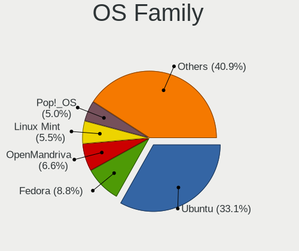

| Name          | Computers | Percent |
|---------------|-----------|---------|
| Ubuntu        | 58        | 35.37%  |
| Fedora        | 15        | 9.15%   |
| OpenMandriva  | 10        | 6.1%    |
| Linux Mint    | 10        | 6.1%    |
| Pop!_OS       | 9         | 5.49%   |
| openSUSE      | 8         | 4.88%   |
| Kubuntu       | 5         | 3.05%   |
| Arch          | 5         | 3.05%   |
| Xubuntu       | 4         | 2.44%   |
| Manjaro       | 3         | 1.83%   |
| Lubuntu       | 3         | 1.83%   |
| Debian        | 3         | 1.83%   |
| Zorin         | 2         | 1.22%   |
| Ubuntu MATE   | 2         | 1.22%   |
| Parrot        | 2         | 1.22%   |
| LMDE          | 2         | 1.22%   |
| KDE neon      | 2         | 1.22%   |
| Kali          | 2         | 1.22%   |
| Gentoo        | 2         | 1.22%   |
| Endless       | 2         | 1.22%   |
| Elementary    | 2         | 1.22%   |
| ArcoLinux     | 2         | 1.22%   |
| UbuntuDDE     | 1         | 0.61%   |
| Ubuntu Studio | 1         | 0.61%   |
| ROSA          | 1         | 0.61%   |
| RHEL          | 1         | 0.61%   |
| Mageia        | 1         | 0.61%   |
| Garuda Linux  | 1         | 0.61%   |
| EndeavourOS   | 1         | 0.61%   |
| Clear Linux   | 1         | 0.61%   |
| CentOS        | 1         | 0.61%   |
| CachyOS       | 1         | 0.61%   |
| BlackPanther  | 1         | 0.61%   |

Kernel
------

Version of the Linux kernel

| Version                     | Computers | Percent |
|-----------------------------|-----------|---------|
| 5.18.12-desktop-3omv4090    | 4         | 2.2%    |
| 5.8.0-43-generic            | 3         | 1.65%   |
| 5.15.0-52-generic           | 3         | 1.65%   |
| 5.11.0-27-generic           | 3         | 1.65%   |
| 5.10.14-desktop-1omv4002    | 3         | 1.65%   |
| 6.5.0-28-generic            | 2         | 1.1%    |
| 6.2.6-desktop-1omv2390      | 2         | 1.1%    |
| 6.2.14-200.fc37.x86_64      | 2         | 1.1%    |
| 5.8.0-59-generic            | 2         | 1.1%    |
| 5.4.0-96-generic            | 2         | 1.1%    |
| 5.4.0-90-generic            | 2         | 1.1%    |
| 5.4.0-47-generic            | 2         | 1.1%    |
| 5.4.0-42-generic            | 2         | 1.1%    |
| 5.4.0-122-generic           | 2         | 1.1%    |
| 5.3.0-46-generic            | 2         | 1.1%    |
| 5.19.0-35-generic           | 2         | 1.1%    |
| 5.16.11-76051611-generic    | 2         | 1.1%    |
| 5.11.0-34-generic           | 2         | 1.1%    |
| 5.11.0-17-generic           | 2         | 1.1%    |
| 5.0.0-23-generic            | 2         | 1.1%    |
| 4.19.0-17-amd64             | 2         | 1.1%    |
| 6.8.6-300.fc40.x86_64       | 1         | 0.55%   |
| 6.7.9-200.fc39.x86_64       | 1         | 0.55%   |
| 6.6.7-arch1-1               | 1         | 0.55%   |
| 6.6.6-200.fc39.x86_64       | 1         | 0.55%   |
| 6.6.4-200.fc39.x86_64       | 1         | 0.55%   |
| 6.6.29-1-lts                | 1         | 0.55%   |
| 6.6.22-gentoo-dist-hardened | 1         | 0.55%   |
| 6.6.2-arch1-1               | 1         | 0.55%   |
| 6.5.7-2-cachyos             | 1         | 0.55%   |
| 6.5.5-desktop-1omv2390      | 1         | 0.55%   |
| 6.5.12-200.fc38.x86_64      | 1         | 0.55%   |
| 6.5.0-7-generic             | 1         | 0.55%   |
| 6.5.0-27-generic            | 1         | 0.55%   |
| 6.5.0-26-generic            | 1         | 0.55%   |
| 6.5.0-21-generic            | 1         | 0.55%   |
| 6.5.0-15-generic            | 1         | 0.55%   |
| 6.5.0-10-generic            | 1         | 0.55%   |
| 6.4.7-arch1-1               | 1         | 0.55%   |
| 6.4.4-zen1-1-zen            | 1         | 0.55%   |

Kernel Family
-------------

Linux kernel without a distro release

| Version | Computers | Percent |
|---------|-----------|---------|
| 5.4.0   | 21        | 12%     |
| 5.15.0  | 18        | 10.29%  |
| 5.11.0  | 14        | 8%      |
| 5.8.0   | 10        | 5.71%   |
| 6.5.0   | 8         | 4.57%   |
| 5.19.0  | 7         | 4%      |
| 5.3.0   | 6         | 3.43%   |
| 4.18.0  | 6         | 3.43%   |
| 5.18.12 | 4         | 2.29%   |
| 5.13.0  | 4         | 2.29%   |
| 4.15.0  | 4         | 2.29%   |
| 5.10.14 | 3         | 1.71%   |
| 5.0.0   | 3         | 1.71%   |
| 6.4.3   | 2         | 1.14%   |
| 6.2.6   | 2         | 1.14%   |
| 6.2.14  | 2         | 1.14%   |
| 6.2.0   | 2         | 1.14%   |
| 5.7.0   | 2         | 1.14%   |
| 5.3.18  | 2         | 1.14%   |
| 5.16.11 | 2         | 1.14%   |
| 5.10.0  | 2         | 1.14%   |
| 4.19.0  | 2         | 1.14%   |
| 6.8.6   | 1         | 0.57%   |
| 6.7.9   | 1         | 0.57%   |
| 6.6.7   | 1         | 0.57%   |
| 6.6.6   | 1         | 0.57%   |
| 6.6.4   | 1         | 0.57%   |
| 6.6.29  | 1         | 0.57%   |
| 6.6.22  | 1         | 0.57%   |
| 6.6.2   | 1         | 0.57%   |
| 6.5.7   | 1         | 0.57%   |
| 6.5.5   | 1         | 0.57%   |
| 6.5.12  | 1         | 0.57%   |
| 6.4.7   | 1         | 0.57%   |
| 6.4.4   | 1         | 0.57%   |
| 6.4.15  | 1         | 0.57%   |
| 6.3.12  | 1         | 0.57%   |
| 6.3.1   | 1         | 0.57%   |
| 6.2.9   | 1         | 0.57%   |
| 6.1.8   | 1         | 0.57%   |

Kernel Major Ver.
-----------------

Linux kernel major version

| Version | Computers | Percent |
|---------|-----------|---------|
| 5.4     | 21        | 12%     |
| 5.15    | 20        | 11.43%  |
| 5.11    | 14        | 8%      |
| 6.5     | 11        | 6.29%   |
| 5.8     | 11        | 6.29%   |
| 5.3     | 8         | 4.57%   |
| 6.2     | 7         | 4%      |
| 5.19    | 7         | 4%      |
| 5.10    | 7         | 4%      |
| 4.18    | 7         | 4%      |
| 6.6     | 6         | 3.43%   |
| 5.7     | 6         | 3.43%   |
| 5.18    | 6         | 3.43%   |
| 6.4     | 5         | 2.86%   |
| 5.13    | 5         | 2.86%   |
| 6.1     | 4         | 2.29%   |
| 5.16    | 4         | 2.29%   |
| 4.15    | 4         | 2.29%   |
| 5.0     | 3         | 1.71%   |
| 6.3     | 2         | 1.14%   |
| 6.0     | 2         | 1.14%   |
| 5.9     | 2         | 1.14%   |
| 5.14    | 2         | 1.14%   |
| 5.12    | 2         | 1.14%   |
| 4.19    | 2         | 1.14%   |
| 6.8     | 1         | 0.57%   |
| 6.7     | 1         | 0.57%   |
| 5.6     | 1         | 0.57%   |
| 5.5     | 1         | 0.57%   |
| 4.9     | 1         | 0.57%   |
| 4.4     | 1         | 0.57%   |
| 4.12    | 1         | 0.57%   |

Arch
----

OS architecture (x86_64, i586, etc.)

| Name   | Computers | Percent |
|--------|-----------|---------|
| x86_64 | 156       | 98.73%  |
| i686   | 2         | 1.27%   |

DE
--

Desktop Environment

| Name            | Computers | Percent |
|-----------------|-----------|---------|
| GNOME           | 73        | 44.79%  |
| KDE5            | 28        | 17.18%  |
| Unknown         | 18        | 11.04%  |
| X-Cinnamon      | 11        | 6.75%   |
| XFCE            | 10        | 6.13%   |
| KDE             | 5         | 3.07%   |
| MATE            | 4         | 2.45%   |
| LXQt            | 3         | 1.84%   |
| Cinnamon        | 3         | 1.84%   |
| Pantheon        | 2         | 1.23%   |
| i3              | 2         | 1.23%   |
| Deepin          | 2         | 1.23%   |
| KDE6            | 1         | 0.61%   |
| GNOME Flashback | 1         | 0.61%   |

Display Server
--------------

X11 or Wayland

| Name    | Computers | Percent |
|---------|-----------|---------|
| X11     | 113       | 68.48%  |
| Wayland | 37        | 22.42%  |
| Unknown | 11        | 6.67%   |
| Tty     | 4         | 2.42%   |

Display Manager
---------------

SDDM, LightDM, etc.

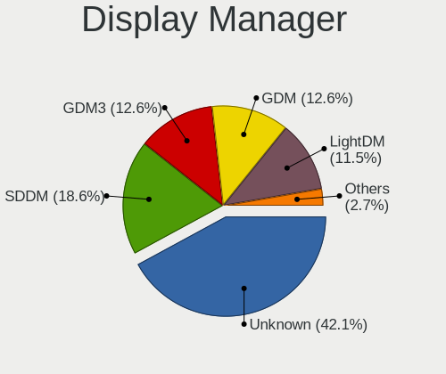

| Name    | Computers | Percent |
|---------|-----------|---------|
| Unknown | 72        | 43.64%  |
| SDDM    | 26        | 15.76%  |
| GDM     | 22        | 13.33%  |
| GDM3    | 21        | 12.73%  |
| LightDM | 20        | 12.12%  |
| TDM     | 4         | 2.42%   |

OS Lang
-------

Language

| Lang    | Computers | Percent |
|---------|-----------|---------|
| en_US   | 76        | 46.63%  |
| en_GB   | 15        | 9.2%    |
| fr_FR   | 12        | 7.36%   |
| Unknown | 12        | 7.36%   |
| de_LU   | 11        | 6.75%   |
| de_DE   | 8         | 4.91%   |
| C       | 6         | 3.68%   |
| fr_LU   | 4         | 2.45%   |
| es_ES   | 3         | 1.84%   |
| POSIX   | 2         | 1.23%   |
| nl_NL   | 2         | 1.23%   |
| unm_US  | 1         | 0.61%   |
| pt_PT   | 1         | 0.61%   |
| pt_BR   | 1         | 0.61%   |
| lb_LU   | 1         | 0.61%   |
| it_IT   | 1         | 0.61%   |
| hr_HR   | 1         | 0.61%   |
| fr_CH   | 1         | 0.61%   |
| fr_BE   | 1         | 0.61%   |
| en_IE   | 1         | 0.61%   |
| en_AU   | 1         | 0.61%   |
| de_CH   | 1         | 0.61%   |
| C.UTF8  | 1         | 0.61%   |

Boot Mode
---------

EFI or BIOS

| Mode | Computers | Percent |
|------|-----------|---------|
| EFI  | 90        | 55.9%   |
| BIOS | 71        | 44.1%   |

Filesystem
----------

Type of filesystem

| Type    | Computers | Percent |
|---------|-----------|---------|
| Ext4    | 110       | 68.32%  |
| Btrfs   | 22        | 13.66%  |
| Overlay | 10        | 6.21%   |
| Tmpfs   | 9         | 5.59%   |
| Xfs     | 6         | 3.73%   |
| Unknown | 3         | 1.86%   |
| Zfs     | 1         | 0.62%   |

Part. scheme
------------

Scheme of partitioning

| Type    | Computers | Percent |
|---------|-----------|---------|
| GPT     | 79        | 49.07%  |
| Unknown | 70        | 43.48%  |
| MBR     | 12        | 7.45%   |

Dual Boot with Linux/BSD
------------------------

Hosting more than one Linux/BSD

| Dual boot | Computers | Percent |
|-----------|-----------|---------|
| No        | 142       | 88.75%  |
| Yes       | 18        | 11.25%  |

Dual Boot (Win)
---------------

Hosting Linux and Windows

| Dual boot | Computers | Percent |
|-----------|-----------|---------|
| No        | 117       | 73.58%  |
| Yes       | 42        | 26.42%  |

Board
-----

Vendor
------

Motherboard manufacturer

| Name                | Computers | Percent |
|---------------------|-----------|---------|
| ASUSTek Computer    | 25        | 15.82%  |
| Hewlett-Packard     | 20        | 12.66%  |
| Lenovo              | 18        | 11.39%  |
| Dell                | 14        | 8.86%   |
| Gigabyte Technology | 9         | 5.7%    |
| MSI                 | 8         | 5.06%   |
| Intel               | 6         | 3.8%    |
| Apple               | 6         | 3.8%    |
| Acer                | 6         | 3.8%    |
| Sony                | 5         | 3.16%   |
| Medion              | 4         | 2.53%   |
| HUAWEI              | 4         | 2.53%   |
| ASRock              | 4         | 2.53%   |
| Wortmann AG         | 3         | 1.9%    |
| win element         | 3         | 1.9%    |
| Samsung Electronics | 2         | 1.27%   |
| Fujitsu             | 2         | 1.27%   |
| Clevo               | 2         | 1.27%   |
| Unknown             | 2         | 1.27%   |
| YJKC                | 1         | 0.63%   |
| TUXEDO              | 1         | 0.63%   |
| Toshiba             | 1         | 0.63%   |
| Timi                | 1         | 0.63%   |
| SLIMBOOK            | 1         | 0.63%   |
| Panasonic           | 1         | 0.63%   |
| Packard Bell        | 1         | 0.63%   |
| Notebook            | 1         | 0.63%   |
| Microsoft           | 1         | 0.63%   |
| MACHINIST           | 1         | 0.63%   |
| LattePanda          | 1         | 0.63%   |
| JWIPC               | 1         | 0.63%   |
| Framework           | 1         | 0.63%   |
| Foxconn             | 1         | 0.63%   |
| BESSTAR Tech        | 1         | 0.63%   |

Model
-----

Motherboard model

| Name                           | Computers | Percent |
|--------------------------------|-----------|---------|
| ASUS All Series                | 3         | 1.9%    |
| win element MoreFine S500+     | 2         | 1.27%   |
| Dell Precision M3800           | 2         | 1.27%   |
| Dell Precision 7670            | 2         | 1.27%   |
| Apple MacBookPro8,1            | 2         | 1.27%   |
| Unknown                        | 2         | 1.27%   |
| YJKC vBook                     | 1         | 0.63%   |
| Wortmann AG TERRA_MOBILE_1749  | 1         | 0.63%   |
| Wortmann AG TERRA_MOBILE_1541H | 1         | 0.63%   |
| Wortmann AG MS-1727            | 1         | 0.63%   |
| Win Element M9                 | 1         | 0.63%   |
| TUXEDO Pulse 14 Gen1           | 1         | 0.63%   |
| Toshiba Satellite C55-A-1N0    | 1         | 0.63%   |
| Timi RedmiBook 14 II           | 1         | 0.63%   |
| Sony VPCP11S1R                 | 1         | 0.63%   |
| Sony VPCEB2E1E                 | 1         | 0.63%   |
| Sony VPCCA4E1E                 | 1         | 0.63%   |
| Sony VGN-NS30E_S               | 1         | 0.63%   |
| Sony SVF1421E2EW               | 1         | 0.63%   |
| SLIMBOOK EXECUTIVE-14          | 1         | 0.63%   |
| Samsung Galaxy TabPro S LTE    | 1         | 0.63%   |
| Samsung 950QDB                 | 1         | 0.63%   |
| Panasonic CF-195DCUBML         | 1         | 0.63%   |
| Packard Bell EasyNote TJ65     | 1         | 0.63%   |
| Notebook NV4XMB,ME,MZ          | 1         | 0.63%   |
| MSI MS-7E06                    | 1         | 0.63%   |
| MSI MS-7D75                    | 1         | 0.63%   |
| MSI MS-7C91                    | 1         | 0.63%   |
| MSI MS-7C80                    | 1         | 0.63%   |
| MSI MS-7C08                    | 1         | 0.63%   |
| MSI MS-7816                    | 1         | 0.63%   |
| MSI GF72 8RD                   | 1         | 0.63%   |
| MSI GE63 7RD                   | 1         | 0.63%   |
| Microsoft Surface Book 2       | 1         | 0.63%   |
| Medion P961x                   | 1         | 0.63%   |
| Medion P6685 MD61138           | 1         | 0.63%   |
| Medion MS-7848                 | 1         | 0.63%   |
| Medion E4254 MD62100           | 1         | 0.63%   |
| MACHINIST E5-D8-MAX V1.1       | 1         | 0.63%   |
| Lenovo Yoga 3 Pro-1370 80HE    | 1         | 0.63%   |

Model Family
------------

Motherboard model prefix

| Name                   | Computers | Percent |
|------------------------|-----------|---------|
| Lenovo ThinkPad        | 11        | 6.96%   |
| Dell Precision         | 8         | 5.06%   |
| HP EliteBook           | 5         | 3.16%   |
| ASUS PRIME             | 4         | 2.53%   |
| Acer Aspire            | 4         | 2.53%   |
| HP ENVY                | 3         | 1.9%    |
| ASUS VivoBook          | 3         | 1.9%    |
| ASUS TUF               | 3         | 1.9%    |
| ASUS ROG               | 3         | 1.9%    |
| ASUS All               | 3         | 1.9%    |
| Wortmann AG TERRA      | 2         | 1.27%   |
| win element MoreFine   | 2         | 1.27%   |
| Lenovo IdeaPad         | 2         | 1.27%   |
| HP ZBook               | 2         | 1.27%   |
| HP ProBook             | 2         | 1.27%   |
| HP Compaq              | 2         | 1.27%   |
| Dell XPS               | 2         | 1.27%   |
| Apple MacBookPro8      | 2         | 1.27%   |
| Unknown                | 2         | 1.27%   |
| YJKC vBook             | 1         | 0.63%   |
| Wortmann AG MS-1727    | 1         | 0.63%   |
| Win Element M9         | 1         | 0.63%   |
| TUXEDO Pulse           | 1         | 0.63%   |
| Toshiba Satellite      | 1         | 0.63%   |
| Timi RedmiBook         | 1         | 0.63%   |
| Sony VPCP11S1R         | 1         | 0.63%   |
| Sony VPCEB2E1E         | 1         | 0.63%   |
| Sony VPCCA4E1E         | 1         | 0.63%   |
| Sony VGN-NS30E         | 1         | 0.63%   |
| Sony SVF1421E2EW       | 1         | 0.63%   |
| SLIMBOOK EXECUTIVE-14  | 1         | 0.63%   |
| Samsung Galaxy         | 1         | 0.63%   |
| Samsung 950QDB         | 1         | 0.63%   |
| Panasonic CF-195DCUBML | 1         | 0.63%   |
| Packard Bell EasyNote  | 1         | 0.63%   |
| Notebook NV4XMB        | 1         | 0.63%   |
| MSI MS-7E06            | 1         | 0.63%   |
| MSI MS-7D75            | 1         | 0.63%   |
| MSI MS-7C91            | 1         | 0.63%   |
| MSI MS-7C80            | 1         | 0.63%   |

MFG Year
--------

Motherboard manufacture year

| Year | Computers | Percent |
|------|-----------|---------|
| 2018 | 19        | 12.03%  |
| 2019 | 18        | 11.39%  |
| 2021 | 15        | 9.49%   |
| 2020 | 15        | 9.49%   |
| 2014 | 15        | 9.49%   |
| 2017 | 13        | 8.23%   |
| 2013 | 12        | 7.59%   |
| 2022 | 9         | 5.7%    |
| 2010 | 9         | 5.7%    |
| 2016 | 7         | 4.43%   |
| 2011 | 7         | 4.43%   |
| 2023 | 5         | 3.16%   |
| 2012 | 5         | 3.16%   |
| 2015 | 3         | 1.9%    |
| 2009 | 3         | 1.9%    |
| 2007 | 2         | 1.27%   |
| 2008 | 1         | 0.63%   |

Form Factor
-----------

Physical design of the computer

| Name        | Computers | Percent |
|-------------|-----------|---------|
| Notebook    | 92        | 58.23%  |
| Desktop     | 53        | 33.54%  |
| Mini pc     | 5         | 3.16%   |
| Convertible | 4         | 2.53%   |
| Tablet      | 2         | 1.27%   |
| All in one  | 1         | 0.63%   |
| Server      | 1         | 0.63%   |

Secure Boot
-----------

Enabled or disabled

| State    | Computers | Percent |
|----------|-----------|---------|
| Disabled | 142       | 89.31%  |
| Enabled  | 17        | 10.69%  |

Coreboot
--------

Have coreboot on board

| Used | Computers | Percent |
|------|-----------|---------|
| No   | 158       | 100%    |

RAM Size
--------

Total RAM memory

| Size in GB      | Computers | Percent |
|-----------------|-----------|---------|
| 16.01-24.0      | 45        | 27.95%  |
| 4.01-8.0        | 30        | 18.63%  |
| 8.01-16.0       | 29        | 18.01%  |
| 32.01-64.0      | 23        | 14.29%  |
| 3.01-4.0        | 19        | 11.8%   |
| 64.01-256.0     | 6         | 3.73%   |
| 24.01-32.0      | 4         | 2.48%   |
| 2.01-3.0        | 2         | 1.24%   |
| 1.01-2.0        | 2         | 1.24%   |
| More than 256.0 | 1         | 0.62%   |

RAM Used
--------

Used RAM memory

| Used GB    | Computers | Percent |
|------------|-----------|---------|
| 2.01-3.0   | 49        | 28.82%  |
| 1.01-2.0   | 40        | 23.53%  |
| 4.01-8.0   | 34        | 20%     |
| 3.01-4.0   | 22        | 12.94%  |
| 8.01-16.0  | 17        | 10%     |
| 0.51-1.0   | 4         | 2.35%   |
| 24.01-32.0 | 2         | 1.18%   |
| 16.01-24.0 | 1         | 0.59%   |
| 0.01-0.5   | 1         | 0.59%   |

Total Drives
------------

Number of drives on board

| Drives | Computers | Percent |
|--------|-----------|---------|
| 1      | 91        | 56.52%  |
| 2      | 38        | 23.6%   |
| 3      | 16        | 9.94%   |
| 4      | 8         | 4.97%   |
| 5      | 3         | 1.86%   |
| 7      | 2         | 1.24%   |
| 0      | 2         | 1.24%   |
| 6      | 1         | 0.62%   |

Has CD-ROM
----------

Has CD-ROM on board

| Presented | Computers | Percent |
|-----------|-----------|---------|
| No        | 109       | 68.99%  |
| Yes       | 49        | 31.01%  |

Has Ethernet
------------

Has Ethernet on board

| Presented | Computers | Percent |
|-----------|-----------|---------|
| Yes       | 132       | 83.54%  |
| No        | 26        | 16.46%  |

Has WiFi
--------

Has WiFi module

| Presented | Computers | Percent |
|-----------|-----------|---------|
| Yes       | 128       | 80.5%   |
| No        | 31        | 19.5%   |

Has Bluetooth
-------------

Has Bluetooth module

| Presented | Computers | Percent |
|-----------|-----------|---------|
| Yes       | 110       | 69.62%  |
| No        | 48        | 30.38%  |

Location
--------

Country
-------

Geographic location (country)

| Country    | Computers | Percent |
|------------|-----------|---------|
| Luxembourg | 158       | 100%    |

City
----

Geographic location (city)

| City              | Computers | Percent |
|-------------------|-----------|---------|
| Luxembourg        | 98        | 58.33%  |
| Strassen          | 10        | 5.95%   |
| Useldange         | 3         | 1.79%   |
| Schifflange       | 3         | 1.79%   |
| Schieren          | 3         | 1.79%   |
| Esch-sur-Alzette  | 3         | 1.79%   |
| Ehnen             | 3         | 1.79%   |
| Differdange       | 3         | 1.79%   |
| Wormeldange       | 2         | 1.19%   |
| Steinfort         | 2         | 1.19%   |
| Sanem             | 2         | 1.19%   |
| Dudelange         | 2         | 1.19%   |
| Bettange-sur-Mess | 2         | 1.19%   |
| Wiltz             | 1         | 0.6%    |
| Wecker            | 1         | 0.6%    |
| Wasserbillig      | 1         | 0.6%    |
| Vianden           | 1         | 0.6%    |
| Tetange           | 1         | 0.6%    |
| Steinsel          | 1         | 0.6%    |
| Soleuvre          | 1         | 0.6%    |
| Sandweiler        | 1         | 0.6%    |
| Roeser            | 1         | 0.6%    |
| Pontpierre        | 1         | 0.6%    |
| Ptange          | 1         | 0.6%    |
| Perl          | 1         | 0.6%    |
| Oberpallen        | 1         | 0.6%    |
| Niederanven       | 1         | 0.6%    |
| Leudelange        | 1         | 0.6%    |
| Kopstal           | 1         | 0.6%    |
| Junglinster       | 1         | 0.6%    |
| Itzig             | 1         | 0.6%    |
| Hunsdorf          | 1         | 0.6%    |
| Hosingen          | 1         | 0.6%    |
| Hesperange        | 1         | 0.6%    |
| Ettelbruck        | 1         | 0.6%    |
| Echternach        | 1         | 0.6%    |
| Diekirch          | 1         | 0.6%    |
| Contern           | 1         | 0.6%    |
| Clervaux          | 1         | 0.6%    |
| Brouch            | 1         | 0.6%    |

Drives
------

Drive Vendor
------------

Hard drive vendors

| Vendor                       | Computers | Drives | Percent |
|------------------------------|-----------|--------|---------|
| Samsung Electronics          | 63        | 93     | 26.36%  |
| Seagate                      | 30        | 40     | 12.55%  |
| WDC                          | 27        | 38     | 11.3%   |
| Crucial                      | 15        | 22     | 6.28%   |
| Toshiba                      | 14        | 17     | 5.86%   |
| SanDisk                      | 14        | 20     | 5.86%   |
| Kingston                     | 11        | 16     | 4.6%    |
| SK hynix                     | 6         | 6      | 2.51%   |
| Intel                        | 5         | 6      | 2.09%   |
| Apple                        | 5         | 6      | 2.09%   |
| Hitachi                      | 4         | 6      | 1.67%   |
| HGST                         | 4         | 6      | 1.67%   |
| Transcend                    | 2         | 2      | 0.84%   |
| Shenzhen Longsys Electronics | 2         | 2      | 0.84%   |
| Phison                       | 2         | 2      | 0.84%   |
| Micron Technology            | 2         | 3      | 0.84%   |
| LITEONIT                     | 2         | 2      | 0.84%   |
| LITEON                       | 2         | 2      | 0.84%   |
| Lenovo                       | 2         | 5      | 0.84%   |
| Intenso                      | 2         | 3      | 0.84%   |
| A-DATA Technology            | 2         | 2      | 0.84%   |
| Unknown                      | 1         | 2      | 0.42%   |
| Union Memory (Shenzhen)      | 1         | 1      | 0.42%   |
| TCSUNBOW                     | 1         | 1      | 0.42%   |
| StarTech                     | 1         | 2      | 0.42%   |
| SABRENT                      | 1         | 1      | 0.42%   |
| PNY                          | 1         | 1      | 0.42%   |
| Phison Electronics           | 1         | 1      | 0.42%   |
| PHD 3.0                      | 1         | 1      | 0.42%   |
| OCZ                          | 1         | 1      | 0.42%   |
| NT-128                       | 1         | 1      | 0.42%   |
| Micron/Crucial Technology    | 1         | 1      | 0.42%   |
| Maxtor                       | 1         | 2      | 0.42%   |
| MAXIO Technology (Hangzhou)  | 1         | 2      | 0.42%   |
| LaCie                        | 1         | 1      | 0.42%   |
| Kingston Technology Company  | 1         | 2      | 0.42%   |
| KingSpec                     | 1         | 1      | 0.42%   |
| KingDian                     | 1         | 1      | 0.42%   |
| JMicron Technology           | 1         | 1      | 0.42%   |
| Inateck                      | 1         | 1      | 0.42%   |

Drive Model
-----------

Hard drive models

| Model                                              | Computers | Percent |
|----------------------------------------------------|-----------|---------|
| Samsung NVMe SSD Controller SM981/PM981/PM983 1TB  | 5         | 1.82%   |
| Seagate Expansion 2TB                              | 4         | 1.46%   |
| Samsung SSD 840 EVO 250GB                          | 4         | 1.46%   |
| Samsung NVMe SSD Controller PM9A1/PM9A3/980PRO 1TB | 4         | 1.46%   |
| WDC WD10JPVX-22JC3T0 1TB                           | 3         | 1.09%   |
| Samsung SSD 860 EVO 250GB                          | 3         | 1.09%   |
| Samsung SSD 750 EVO 500GB                          | 3         | 1.09%   |
| Kingston SA400S37240G 240GB SSD                    | 3         | 1.09%   |
| Crucial CT1000P2SSD8 1TB                           | 3         | 1.09%   |
| WDC WD10EZEX-08WN4A0 1TB                           | 2         | 0.73%   |
| WDC WD10EACS-00D6B1 1TB                            | 2         | 0.73%   |
| Toshiba MQ01ABF050 500GB                           | 2         | 0.73%   |
| Seagate ST4000DM004-2CV104 4TB                     | 2         | 0.73%   |
| Seagate ST2000DM008-2FR102 2TB                     | 2         | 0.73%   |
| Seagate ST1000LM035-1RK172 1TB                     | 2         | 0.73%   |
| Sandisk WD Black SN750 / PC SN730 NVMe SSD 512GB   | 2         | 0.73%   |
| SanDisk SDSSDH3512G 512GB                          | 2         | 0.73%   |
| SanDisk SD8SN8U128G1122 128GB SSD                  | 2         | 0.73%   |
| SanDisk NVMe SSD Drive 1TB                         | 2         | 0.73%   |
| Samsung SSD 860 QVO 2TB                            | 2         | 0.73%   |
| Samsung SSD 860 QVO 1TB                            | 2         | 0.73%   |
| Samsung SSD 850 EVO 250GB                          | 2         | 0.73%   |
| Samsung SP2504C 250GB                              | 2         | 0.73%   |
| Samsung MZVLW256HEHP-000L7 256GB                   | 2         | 0.73%   |
| LITEONIT LMT-256L9M-11 MSATA 256GB SSD             | 2         | 0.73%   |
| Kingston SA400S37120G 120GB SSD                    | 2         | 0.73%   |
| Crucial CT240BX500SSD1 240GB                       | 2         | 0.73%   |
| Crucial CT1000MX500SSD1 1TB                        | 2         | 0.73%   |
| WDC WDS500G3X0C-00SJG0 500GB                       | 1         | 0.36%   |
| WDC WDS250G2B0B-00YS70 250GB SSD                   | 1         | 0.36%   |
| WDC WDS250G2B0A-00SM50 250GB SSD                   | 1         | 0.36%   |
| WDC WDS200T1X0E-00AFY0 2TB                         | 1         | 0.36%   |
| WDC WDS100T2G0A-00JH30 1TB SSD                     | 1         | 0.36%   |
| WDC WD5000AAVS-00ZTB0 500GB                        | 1         | 0.36%   |
| WDC WD5000AAKS-60Z1A0 500GB                        | 1         | 0.36%   |
| WDC WD40EZRZ-75GXCB0 4TB                           | 1         | 0.36%   |
| WDC WD4000FYYZ-01UL1B2 4TB                         | 1         | 0.36%   |
| WDC WD3200LPCX-00VHAT0 320GB                       | 1         | 0.36%   |
| WDC WD3001FFSX-68JNUN0 3TB                         | 1         | 0.36%   |
| WDC WD3000GLFS-01F8U0 304GB                        | 1         | 0.36%   |

HDD Vendor
----------

Hard disk drive vendors

| Vendor              | Computers | Drives | Percent |
|---------------------|-----------|--------|---------|
| Seagate             | 28        | 38     | 39.44%  |
| WDC                 | 18        | 29     | 25.35%  |
| Toshiba             | 8         | 11     | 11.27%  |
| Hitachi             | 4         | 6      | 5.63%   |
| HGST                | 4         | 6      | 5.63%   |
| Samsung Electronics | 3         | 3      | 4.23%   |
| Apple               | 2         | 2      | 2.82%   |
| SABRENT             | 1         | 1      | 1.41%   |
| Intenso             | 1         | 1      | 1.41%   |
| Inateck             | 1         | 1      | 1.41%   |
| ASMT                | 1         | 4      | 1.41%   |

SSD Vendor
----------

Solid state drive vendors

| Vendor              | Computers | Drives | Percent |
|---------------------|-----------|--------|---------|
| Samsung Electronics | 35        | 47     | 38.04%  |
| SanDisk             | 11        | 14     | 11.96%  |
| Crucial             | 11        | 18     | 11.96%  |
| Kingston            | 6         | 10     | 6.52%   |
| WDC                 | 3         | 3      | 3.26%   |
| Transcend           | 2         | 2      | 2.17%   |
| Toshiba             | 2         | 2      | 2.17%   |
| Micron Technology   | 2         | 3      | 2.17%   |
| LITEONIT            | 2         | 2      | 2.17%   |
| LITEON              | 2         | 2      | 2.17%   |
| Intel               | 2         | 2      | 2.17%   |
| TCSUNBOW            | 1         | 1      | 1.09%   |
| SK hynix            | 1         | 1      | 1.09%   |
| PNY                 | 1         | 1      | 1.09%   |
| PHD 3.0             | 1         | 1      | 1.09%   |
| OCZ                 | 1         | 1      | 1.09%   |
| NT-128              | 1         | 1      | 1.09%   |
| Maxtor              | 1         | 2      | 1.09%   |
| Lenovo              | 1         | 3      | 1.09%   |
| KingSpec            | 1         | 1      | 1.09%   |
| KingDian            | 1         | 1      | 1.09%   |
| Intenso             | 1         | 2      | 1.09%   |
| FORESEE             | 1         | 1      | 1.09%   |
| Apple               | 1         | 1      | 1.09%   |
| A-DATA Technology   | 1         | 1      | 1.09%   |

Drive Kind
----------

HDD or SSD

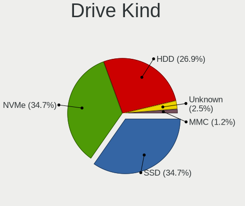

| Kind    | Computers | Drives | Percent |
|---------|-----------|--------|---------|
| SSD     | 76        | 123    | 34.7%   |
| NVMe    | 74        | 95     | 33.79%  |
| HDD     | 61        | 102    | 27.85%  |
| Unknown | 5         | 6      | 2.28%   |
| MMC     | 3         | 4      | 1.37%   |

Drive Connector
---------------

SATA, SAS, NVMe, etc.

| Type | Computers | Drives | Percent |
|------|-----------|--------|---------|
| SATA | 107       | 208    | 53.77%  |
| NVMe | 74        | 95     | 37.19%  |
| SAS  | 15        | 23     | 7.54%   |
| MMC  | 3         | 4      | 1.51%   |

Drive Size
----------

Size of hard drive

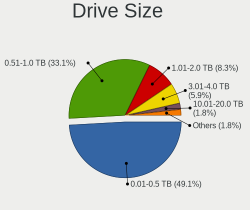

| Size in TB | Computers | Drives | Percent |
|------------|-----------|--------|---------|
| 0.01-0.5   | 79        | 124    | 50.64%  |
| 0.51-1.0   | 49        | 67     | 31.41%  |
| 1.01-2.0   | 16        | 21     | 10.26%  |
| 3.01-4.0   | 7         | 7      | 4.49%   |
| 2.01-3.0   | 2         | 3      | 1.28%   |
| 4.01-10.0  | 2         | 2      | 1.28%   |
| 10.01-20.0 | 1         | 1      | 0.64%   |

Space Total
-----------

Amount of disk space available on the file system

| Size in GB     | Computers | Percent |
|----------------|-----------|---------|
| 251-500        | 37        | 22.29%  |
| 101-250        | 36        | 21.69%  |
| 501-1000       | 25        | 15.06%  |
| More than 3000 | 17        | 10.24%  |
| 1001-2000      | 15        | 9.04%   |
| Unknown        | 11        | 6.63%   |
| 51-100         | 9         | 5.42%   |
| 2001-3000      | 7         | 4.22%   |
| 1-20           | 7         | 4.22%   |
| 21-50          | 2         | 1.2%    |

Space Used
----------

Amount of used disk space

| Used GB        | Computers | Percent |
|----------------|-----------|---------|
| 1-20           | 56        | 33.73%  |
| 21-50          | 23        | 13.86%  |
| 101-250        | 22        | 13.25%  |
| 251-500        | 14        | 8.43%   |
| 51-100         | 13        | 7.83%   |
| Unknown        | 11        | 6.63%   |
| 501-1000       | 10        | 6.02%   |
| 1001-2000      | 8         | 4.82%   |
| 2001-3000      | 6         | 3.61%   |
| More than 3000 | 3         | 1.81%   |

Malfunc. Drives
---------------

Drive models with a malfunction

| Model                                         | Computers | Drives | Percent |
|-----------------------------------------------|-----------|--------|---------|
| Toshiba MQ01ABF050 500GB                      | 2         | 2      | 25%     |
| Toshiba MK2555GSX 250GB                       | 1         | 1      | 12.5%   |
| SK hynix HFS128G39TND-N210A 128GB SSD         | 1         | 1      | 12.5%   |
| Seagate ST1000LM049-2GH172 1TB                | 1         | 1      | 12.5%   |
| Samsung Electronics MZVLQ1T0HBLB-00B00 1024GB | 1         | 1      | 12.5%   |
| Hitachi HTS543232A7A384 320GB                 | 1         | 1      | 12.5%   |
| Crucial CT128MX100SSD1 128GB                  | 1         | 2      | 12.5%   |

Malfunc. Drive Vendor
---------------------

Vendors of faulty drives

| Vendor              | Computers | Drives | Percent |
|---------------------|-----------|--------|---------|
| Toshiba             | 3         | 3      | 37.5%   |
| SK hynix            | 1         | 1      | 12.5%   |
| Seagate             | 1         | 1      | 12.5%   |
| Samsung Electronics | 1         | 1      | 12.5%   |
| Hitachi             | 1         | 1      | 12.5%   |
| Crucial             | 1         | 2      | 12.5%   |

Malfunc. HDD Vendor
-------------------

Vendors of faulty HDD drives

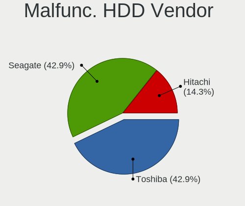

| Vendor  | Computers | Drives | Percent |
|---------|-----------|--------|---------|
| Toshiba | 3         | 3      | 60%     |
| Seagate | 1         | 1      | 20%     |
| Hitachi | 1         | 1      | 20%     |

Malfunc. Drive Kind
-------------------

Kinds of faulty drives

| Kind | Computers | Drives | Percent |
|------|-----------|--------|---------|
| HDD  | 5         | 5      | 62.5%   |
| SSD  | 2         | 3      | 25%     |
| NVMe | 1         | 1      | 12.5%   |

Failed Drives
-------------

Failed drive models

Zero info for selected period =(

Failed Drive Vendor
-------------------

Failed drive vendors

Zero info for selected period =(

Drive Status
------------

Number of failed and malfunc. drives

| Status   | Computers | Drives | Percent |
|----------|-----------|--------|---------|
| Detected | 88        | 184    | 50.57%  |
| Works    | 78        | 137    | 44.83%  |
| Malfunc  | 8         | 9      | 4.6%    |

Storage controller
------------------

Storage Vendor
--------------

Storage controller vendors

| Vendor                       | Computers | Percent |
|------------------------------|-----------|---------|
| Intel                        | 105       | 49.3%   |
| Samsung Electronics          | 33        | 15.49%  |
| AMD                          | 25        | 11.74%  |
| SanDisk                      | 11        | 5.16%   |
| Kingston Technology Company  | 6         | 2.82%   |
| Micron/Crucial Technology    | 5         | 2.35%   |
| Marvell Technology Group     | 5         | 2.35%   |
| Toshiba America Info Systems | 4         | 1.88%   |
| SK hynix                     | 4         | 1.88%   |
| Phison Electronics           | 4         | 1.88%   |
| Shenzhen Longsys Electronics | 2         | 0.94%   |
| ASMedia Technology           | 2         | 0.94%   |
| Apple                        | 2         | 0.94%   |
| Union Memory (Shenzhen)      | 1         | 0.47%   |
| Seagate Technology           | 1         | 0.47%   |
| MAXIO Technology (Hangzhou)  | 1         | 0.47%   |
| Lenovo                       | 1         | 0.47%   |
| ADATA Technology             | 1         | 0.47%   |

Storage Model
-------------

Storage controller models

| Model                                                                          | Computers | Percent |
|--------------------------------------------------------------------------------|-----------|---------|
| AMD FCH SATA Controller [AHCI mode]                                            | 18        | 7.79%   |
| Intel 8 Series/C220 Series Chipset Family 6-port SATA Controller 1 [AHCI mode] | 14        | 6.06%   |
| Samsung NVMe SSD Controller SM981/PM981/PM983                                  | 13        | 5.63%   |
| Intel Sunrise Point-LP SATA Controller [AHCI mode]                             | 10        | 4.33%   |
| Samsung NVMe SSD Controller PM9A1/PM9A3/980PRO                                 | 8         | 3.46%   |
| SanDisk Extreme Pro / WD Black SN750 / PC SN730 / Red SN700 NVMe SSD           | 7         | 3.03%   |
| Samsung NVMe SSD Controller SM961/PM961/SM963                                  | 6         | 2.6%    |
| Samsung NVMe SSD Controller 980 (DRAM-less)                                    | 6         | 2.6%    |
| Intel Volume Management Device NVMe RAID Controller                            | 6         | 2.6%    |
| Intel 200 Series PCH SATA controller [AHCI mode]                               | 6         | 2.6%    |
| Intel 7 Series Chipset Family 6-port SATA Controller [AHCI mode]               | 5         | 2.16%   |
| Intel 6 Series/C200 Series Chipset Family 6 port Mobile SATA AHCI Controller   | 5         | 2.16%   |
| Micron/Crucial P2 [Nick P2] / P3 / P3 Plus NVMe PCIe SSD (DRAM-less)           | 4         | 1.73%   |
| Intel Wildcat Point-LP SATA Controller [AHCI Mode]                             | 4         | 1.73%   |
| Intel Cannon Lake Mobile PCH SATA AHCI Controller                              | 4         | 1.73%   |
| Intel 82801 Mobile SATA Controller [RAID mode]                                 | 4         | 1.73%   |
| Intel 8 Series SATA Controller 1 [AHCI mode]                                   | 4         | 1.73%   |
| Intel 5 Series/3400 Series Chipset 4 port SATA AHCI Controller                 | 4         | 1.73%   |
| AMD 400 Series Chipset SATA Controller                                         | 4         | 1.73%   |
| SanDisk WD PC SN810 / Black SN850 NVMe SSD                                     | 3         | 1.3%    |
| Phison E12 NVMe Controller                                                     | 3         | 1.3%    |
| Intel SATA Controller [RAID mode]                                              | 3         | 1.3%    |
| Intel HM170/QM170 Chipset SATA Controller [AHCI Mode]                          | 3         | 1.3%    |
| Intel Celeron/Pentium Silver Processor SATA Controller                         | 3         | 1.3%    |
| Intel 82801IBM/IEM (ICH9M/ICH9M-E) 4 port SATA Controller [AHCI mode]          | 3         | 1.3%    |
| AMD 500 Series Chipset SATA Controller                                         | 3         | 1.3%    |
| Toshiba America Info Systems XG6 NVMe SSD Controller                           | 2         | 0.87%   |
| Toshiba America Info Systems XG5 NVMe SSD Controller                           | 2         | 0.87%   |
| Marvell Group 88SE6101/6102 single-port PATA133 interface                      | 2         | 0.87%   |
| Intel Q170/Q150/B150/H170/H110/Z170/CM236 Chipset SATA Controller [AHCI Mode]  | 2         | 0.87%   |
| Intel Cannon Point-LP SATA Controller [AHCI Mode]                              | 2         | 0.87%   |
| Intel 9 Series Chipset Family SATA Controller [AHCI Mode]                      | 2         | 0.87%   |
| Intel 82801I (ICH9 Family) 2 port SATA Controller [IDE mode]                   | 2         | 0.87%   |
| Intel 400 Series Chipset Family SATA AHCI Controller                           | 2         | 0.87%   |
| ASMedia ASM1061/ASM1062 Serial ATA Controller                                  | 2         | 0.87%   |
| AMD 600 Series Chipset SATA Controller                                         | 2         | 0.87%   |
| Union Memory (Shenzhen) AM610 PCIe 3.0 x2 NVMe SSD 128GB, 256GB                | 1         | 0.43%   |
| SK hynix Platinum P41/PC801 NVMe Solid State Drive                             | 1         | 0.43%   |
| SK hynix PC401 NVMe Solid State Drive 256GB                                    | 1         | 0.43%   |
| SK hynix Gold P31/BC711/PC711 NVMe Solid State Drive                           | 1         | 0.43%   |

Storage Kind
------------

Kind of storage controller (IDE, SATA, NVMe, SAS, ...)

| Kind | Computers | Percent |
|------|-----------|---------|
| SATA | 112       | 53.33%  |
| NVMe | 75        | 35.71%  |
| RAID | 14        | 6.67%   |
| IDE  | 9         | 4.29%   |

Processor
---------

CPU Vendor
----------

Processor vendors

| Vendor | Computers | Percent |
|--------|-----------|---------|
| Intel  | 126       | 79.75%  |
| AMD    | 32        | 20.25%  |

CPU Model
---------

Processor models

| Model                                         | Computers | Percent |
|-----------------------------------------------|-----------|---------|
| Intel 11th Gen Core i7-1165G7 @ 2.80GHz       | 5         | 3.16%   |
| Intel Core i7-8550U CPU @ 1.80GHz             | 4         | 2.53%   |
| Intel Core i7-8750H CPU @ 2.20GHz             | 3         | 1.9%    |
| Intel Core i5-8265U CPU @ 1.60GHz             | 3         | 1.9%    |
| AMD Ryzen 5 3600 6-Core Processor             | 3         | 1.9%    |
| Intel Core i7-9750H CPU @ 2.60GHz             | 2         | 1.27%   |
| Intel Core i7-8650U CPU @ 1.90GHz             | 2         | 1.27%   |
| Intel Core i7-7700HQ CPU @ 2.80GHz            | 2         | 1.27%   |
| Intel Core i7-4702HQ CPU @ 2.20GHz            | 2         | 1.27%   |
| Intel Core i5-8250U CPU @ 1.60GHz             | 2         | 1.27%   |
| Intel Core i5-7500 CPU @ 3.40GHz              | 2         | 1.27%   |
| Intel Core i5-4590S CPU @ 3.00GHz             | 2         | 1.27%   |
| Intel Core i5-4460 CPU @ 3.20GHz              | 2         | 1.27%   |
| Intel Core i5-4200U CPU @ 1.60GHz             | 2         | 1.27%   |
| Intel Core i3-4030U CPU @ 1.90GHz             | 2         | 1.27%   |
| Intel Core i3 CPU M 370 @ 2.40GHz             | 2         | 1.27%   |
| Intel 12th Gen Core i7-12700H                 | 2         | 1.27%   |
| AMD Ryzen 9 5900HX with Radeon Graphics       | 2         | 1.27%   |
| AMD Ryzen 7 3700X 8-Core Processor            | 2         | 1.27%   |
| AMD Ryzen 5 4600H with Radeon Graphics        | 2         | 1.27%   |
| AMD Ryzen 5 3550H with Radeon Vega Mobile Gfx | 2         | 1.27%   |
| Intel Xeon Gold 6154 CPU @ 3.00GHz            | 1         | 0.63%   |
| Intel Xeon CPU X5690 @ 3.47GHz                | 1         | 0.63%   |
| Intel Xeon CPU E5-2698 v3 @ 2.30GHz           | 1         | 0.63%   |
| Intel Pentium Silver N5000 CPU @ 1.10GHz      | 1         | 0.63%   |
| Intel Pentium Dual-Core CPU T4500 @ 2.30GHz   | 1         | 0.63%   |
| Intel Pentium Dual-Core CPU T4300 @ 2.10GHz   | 1         | 0.63%   |
| Intel Pentium Dual-Core CPU T4200 @ 2.00GHz   | 1         | 0.63%   |
| Intel Pentium CPU P6000 @ 1.87GHz             | 1         | 0.63%   |
| Intel Pentium CPU G4560 @ 3.50GHz             | 1         | 0.63%   |
| Intel Pentium CPU G3250 @ 3.20GHz             | 1         | 0.63%   |
| Intel Pentium CPU 987 @ 1.50GHz               | 1         | 0.63%   |
| Intel N100                                    | 1         | 0.63%   |
| Intel Core m5-6Y54 CPU @ 1.10GHz              | 1         | 0.63%   |
| Intel Core m3-6Y30 CPU @ 0.90GHz              | 1         | 0.63%   |
| Intel Core M-5Y71 CPU @ 1.20GHz               | 1         | 0.63%   |
| Intel Core i9-9880H CPU @ 2.30GHz             | 1         | 0.63%   |
| Intel Core i7-9700KF CPU @ 3.60GHz            | 1         | 0.63%   |
| Intel Core i7-8700K CPU @ 3.70GHz             | 1         | 0.63%   |
| Intel Core i7-8665U CPU @ 1.90GHz             | 1         | 0.63%   |

CPU Model Family
----------------

Processor model prefix

| Model                   | Computers | Percent |
|-------------------------|-----------|---------|
| Intel Core i7           | 37        | 23.42%  |
| Intel Core i5           | 34        | 21.52%  |
| Other                   | 18        | 11.39%  |
| AMD Ryzen 5             | 13        | 8.23%   |
| Intel Core i3           | 10        | 6.33%   |
| AMD Ryzen 7             | 7         | 4.43%   |
| Intel Celeron           | 5         | 3.16%   |
| AMD Ryzen 9             | 5         | 3.16%   |
| Intel Pentium           | 4         | 2.53%   |
| Intel Pentium Dual-Core | 3         | 1.9%    |
| Intel Core 2 Quad       | 3         | 1.9%    |
| Intel Xeon              | 2         | 1.27%   |
| Intel Atom              | 2         | 1.27%   |
| AMD Ryzen 7 PRO         | 2         | 1.27%   |
| AMD Ryzen 5 PRO         | 2         | 1.27%   |
| Intel Xeon Gold         | 1         | 0.63%   |
| Intel Pentium Silver    | 1         | 0.63%   |
| Intel Core m5           | 1         | 0.63%   |
| Intel Core m3           | 1         | 0.63%   |
| Intel Core M            | 1         | 0.63%   |
| Intel Core i9           | 1         | 0.63%   |
| Intel Core 2 Duo        | 1         | 0.63%   |
| Intel Core 2            | 1         | 0.63%   |
| AMD Phenom II X4        | 1         | 0.63%   |
| AMD FX                  | 1         | 0.63%   |
| AMD E2                  | 1         | 0.63%   |

CPU Cores
---------

Number of processor cores

| Number | Computers | Percent |
|--------|-----------|---------|
| 4      | 59        | 37.34%  |
| 2      | 46        | 29.11%  |
| 6      | 22        | 13.92%  |
| 8      | 17        | 10.76%  |
| 16     | 4         | 2.53%   |
| 12     | 3         | 1.9%    |
| 14     | 2         | 1.27%   |
| 1      | 2         | 1.27%   |
| 36     | 1         | 0.63%   |
| 32     | 1         | 0.63%   |
| 10     | 1         | 0.63%   |

CPU Sockets
-----------

Number of sockets

| Number | Computers | Percent |
|--------|-----------|---------|
| 1      | 156       | 98.73%  |
| 2      | 2         | 1.27%   |

CPU Threads
-----------

Threads per core (Hyper-Threading)

| Number | Computers | Percent |
|--------|-----------|---------|
| 2      | 124       | 78.48%  |
| 1      | 34        | 21.52%  |

CPU Op-Modes
------------

CPU Operation Modes (32-bit, 64-bit)

| Op mode        | Computers | Percent |
|----------------|-----------|---------|
| 32-bit, 64-bit | 157       | 99.37%  |
| 32-bit         | 1         | 0.63%   |

CPU Microcode
-------------

Microcode number

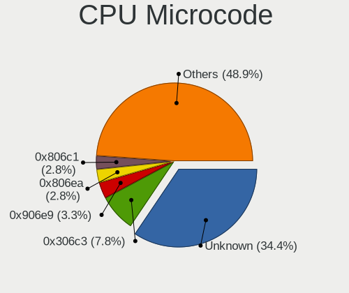

| Number     | Computers | Percent |
|------------|-----------|---------|
| Unknown    | 46        | 28.22%  |
| 0x306c3    | 14        | 8.59%   |
| 0x906e9    | 6         | 3.68%   |
| 0x806ea    | 5         | 3.07%   |
| 0x806c1    | 5         | 3.07%   |
| 0x40651    | 5         | 3.07%   |
| 0x206a7    | 5         | 3.07%   |
| 0x406e3    | 4         | 2.45%   |
| 0x20655    | 4         | 2.45%   |
| 0x1067a    | 4         | 2.45%   |
| 0x906ea    | 3         | 1.84%   |
| 0x806eb    | 3         | 1.84%   |
| 0x706a1    | 3         | 1.84%   |
| 0x506e3    | 3         | 1.84%   |
| 0x306d4    | 3         | 1.84%   |
| 0x08701013 | 3         | 1.84%   |
| 0xa0655    | 2         | 1.23%   |
| 0x906ed    | 2         | 1.23%   |
| 0x806ec    | 2         | 1.23%   |
| 0x806d1    | 2         | 1.23%   |
| 0x306a9    | 2         | 1.23%   |
| 0x10677    | 2         | 1.23%   |
| 0x0a50000c | 2         | 1.23%   |
| 0x0a20120a | 2         | 1.23%   |
| 0x08701021 | 2         | 1.23%   |
| 0x08600106 | 2         | 1.23%   |
| 0x08600103 | 2         | 1.23%   |
| 0x08108102 | 2         | 1.23%   |
| 0xb06e0    | 1         | 0.61%   |
| 0xa0671    | 1         | 0.61%   |
| 0xa0653    | 1         | 0.61%   |
| 0x906c0    | 1         | 0.61%   |
| 0x806e9    | 1         | 0.61%   |
| 0x6fb      | 1         | 0.61%   |
| 0x6f6      | 1         | 0.61%   |
| 0x50654    | 1         | 0.61%   |
| 0x406f1    | 1         | 0.61%   |
| 0x406c4    | 1         | 0.61%   |
| 0x20652    | 1         | 0.61%   |
| 0x106c2    | 1         | 0.61%   |

CPU Microarch
-------------

Microarchitecture

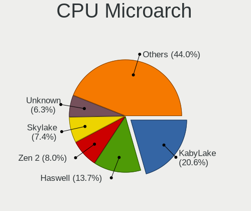

| Name             | Computers | Percent |
|------------------|-----------|---------|
| KabyLake         | 33        | 20.89%  |
| Haswell          | 23        | 14.56%  |
| Zen 2            | 14        | 8.86%   |
| Skylake          | 11        | 6.96%   |
| Unknown          | 8         | 5.06%   |
| Zen 3            | 7         | 4.43%   |
| TigerLake        | 7         | 4.43%   |
| Westmere         | 6         | 3.8%    |
| SandyBridge      | 6         | 3.8%    |
| Penryn           | 6         | 3.8%    |
| IvyBridge        | 5         | 3.16%   |
| Broadwell        | 5         | 3.16%   |
| Alderlake Hybrid | 5         | 3.16%   |
| CometLake        | 4         | 2.53%   |
| Zen+             | 3         | 1.9%    |
| Icelake          | 3         | 1.9%    |
| Goldmont plus    | 3         | 1.9%    |
| Core             | 2         | 1.27%   |
| Zen              | 1         | 0.63%   |
| Silvermont       | 1         | 0.63%   |
| Piledriver       | 1         | 0.63%   |
| K10              | 1         | 0.63%   |
| Goldmont         | 1         | 0.63%   |
| Excavator        | 1         | 0.63%   |
| Bonnell          | 1         | 0.63%   |

Graphics
--------

GPU Vendor
----------

Vendors of graphics cards

| Vendor | Computers | Percent |
|--------|-----------|---------|
| Intel  | 105       | 54.12%  |
| Nvidia | 55        | 28.35%  |
| AMD    | 34        | 17.53%  |

GPU Model
---------

Graphics card models

| Model                                                                       | Computers | Percent |
|-----------------------------------------------------------------------------|-----------|---------|
| Intel UHD Graphics 620                                                      | 8         | 4.04%   |
| Intel 4th Gen Core Processor Integrated Graphics Controller                 | 8         | 4.04%   |
| Intel TigerLake-LP GT2 [Iris Xe Graphics]                                   | 7         | 3.54%   |
| AMD Renoir [Radeon RX Vega 6 (Ryzen 4000/5000 Mobile Series)]               | 7         | 3.54%   |
| Intel WhiskeyLake-U GT2 [UHD Graphics 620]                                  | 6         | 3.03%   |
| Intel CoffeeLake-H GT2 [UHD Graphics 630]                                   | 6         | 3.03%   |
| Intel Haswell-ULT Integrated Graphics Controller                            | 5         | 2.53%   |
| Intel 2nd Generation Core Processor Family Integrated Graphics Controller   | 5         | 2.53%   |
| Intel Xeon E3-1200 v3/4th Gen Core Processor Integrated Graphics Controller | 4         | 2.02%   |
| Intel Skylake GT2 [HD Graphics 520]                                         | 4         | 2.02%   |
| Intel HD Graphics 530                                                       | 4         | 2.02%   |
| Intel 3rd Gen Core processor Graphics Controller                            | 4         | 2.02%   |
| AMD Cezanne [Radeon Vega Series / Radeon Vega Mobile Series]                | 4         | 2.02%   |
| Nvidia GP107M [GeForce GTX 1050 Ti Mobile]                                  | 3         | 1.52%   |
| Nvidia GP107M [GeForce GTX 1050 Mobile]                                     | 3         | 1.52%   |
| Nvidia GA107GLM [RTX A1000 Laptop GPU]                                      | 3         | 1.52%   |
| Intel HD Graphics 630                                                       | 3         | 1.52%   |
| Intel Alder Lake-HX GT1 [UHD Graphics 770]                                  | 3         | 1.52%   |
| AMD Navi 21 [Radeon RX 6800/6800 XT / 6900 XT]                              | 3         | 1.52%   |
| Nvidia TU117M [GeForce GTX 1650 Mobile / Max-Q]                             | 2         | 1.01%   |
| Nvidia GP108M [GeForce MX250]                                               | 2         | 1.01%   |
| Nvidia GP108M [GeForce MX150]                                               | 2         | 1.01%   |
| Nvidia GP108 [GeForce GT 1030]                                              | 2         | 1.01%   |
| Nvidia GP107 [GeForce GTX 1050 Ti]                                          | 2         | 1.01%   |
| Nvidia GK107GLM [Quadro K1100M]                                             | 2         | 1.01%   |
| Nvidia GA106M [GeForce RTX 3060 Mobile / Max-Q]                             | 2         | 1.01%   |
| Nvidia GA106 [GeForce RTX 3060 Lite Hash Rate]                              | 2         | 1.01%   |
| Intel TigerLake-H GT1 [UHD Graphics]                                        | 2         | 1.01%   |
| Intel Iris Plus Graphics 640                                                | 2         | 1.01%   |
| Intel HD Graphics 620                                                       | 2         | 1.01%   |
| Intel HD Graphics 5500                                                      | 2         | 1.01%   |
| Intel HD Graphics 515                                                       | 2         | 1.01%   |
| Intel GeminiLake [UHD Graphics 600]                                         | 2         | 1.01%   |
| Intel CometLake-S GT2 [UHD Graphics 630]                                    | 2         | 1.01%   |
| Intel Alder Lake-P GT2 [Iris Xe Graphics]                                   | 2         | 1.01%   |
| AMD Picasso/Raven 2 [Radeon Vega Series / Radeon Vega Mobile Series]        | 2         | 1.01%   |
| Nvidia TU117GLM [Quadro T2000 Mobile / Max-Q]                               | 1         | 0.51%   |
| Nvidia TU117GLM [Quadro T1000 Mobile]                                       | 1         | 0.51%   |
| Nvidia TU116 [GeForce GTX 1650 SUPER]                                       | 1         | 0.51%   |
| Nvidia TU106 [GeForce RTX 2060 Rev. A]                                      | 1         | 0.51%   |

GPU Combo
---------

Combinations of graphics cards

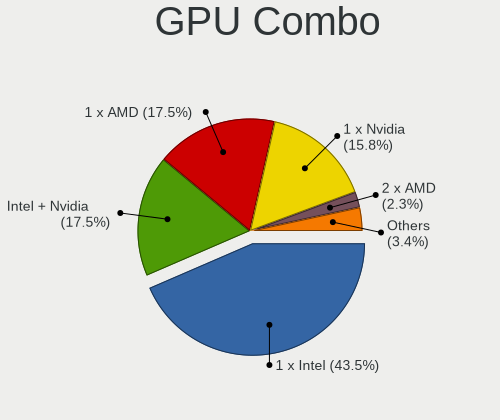

| Name           | Computers | Percent |
|----------------|-----------|---------|
| 1 x Intel      | 70        | 44.03%  |
| Intel + Nvidia | 28        | 17.61%  |
| 1 x AMD        | 27        | 16.98%  |
| 1 x Nvidia     | 26        | 16.35%  |
| 2 x AMD        | 4         | 2.52%   |
| Intel + AMD    | 4         | 2.52%   |

GPU Driver
----------

Free vs proprietary

| Driver      | Computers | Percent |
|-------------|-----------|---------|
| Free        | 122       | 76.73%  |
| Proprietary | 31        | 19.5%   |
| Unknown     | 6         | 3.77%   |

GPU Memory
----------

Total video memory

| Size in GB | Computers | Percent |
|------------|-----------|---------|
| Unknown    | 100       | 62.89%  |
| 3.01-4.0   | 17        | 10.69%  |
| 0.01-0.5   | 13        | 8.18%   |
| 1.01-2.0   | 12        | 7.55%   |
| 0.51-1.0   | 9         | 5.66%   |
| 8.01-16.0  | 6         | 3.77%   |
| 5.01-6.0   | 2         | 1.26%   |

Monitor
-------

Monitor Vendor
--------------

Monitor vendors

| Vendor                  | Computers | Percent |
|-------------------------|-----------|---------|
| Samsung Electronics     | 27        | 14.75%  |
| Chimei Innolux          | 22        | 12.02%  |
| LG Display              | 16        | 8.74%   |
| AU Optronics            | 13        | 7.1%    |
| Hewlett-Packard         | 10        | 5.46%   |
| BOE                     | 10        | 5.46%   |
| Goldstar                | 9         | 4.92%   |
| Dell                    | 9         | 4.92%   |
| AOC                     | 8         | 4.37%   |
| Iiyama                  | 7         | 3.83%   |
| Sharp                   | 6         | 3.28%   |
| Apple                   | 6         | 3.28%   |
| Philips                 | 5         | 2.73%   |
| BenQ                    | 5         | 2.73%   |
| Medion                  | 4         | 2.19%   |
| Ancor Communications    | 4         | 2.19%   |
| Eizo                    | 3         | 1.64%   |
| Chi Mei Optoelectronics | 3         | 1.64%   |
| CSO                     | 2         | 1.09%   |
| Acer                    | 2         | 1.09%   |
| ViewSonic               | 1         | 0.55%   |
| Videoseven              | 1         | 0.55%   |
| UGD                     | 1         | 0.55%   |
| Sony                    | 1         | 0.55%   |
| PAR                     | 1         | 0.55%   |
| PANDA                   | 1         | 0.55%   |
| Panasonic               | 1         | 0.55%   |
| MSI                     | 1         | 0.55%   |
| Lenovo                  | 1         | 0.55%   |
| Fujitsu Siemens         | 1         | 0.55%   |
| Belinea                 | 1         | 0.55%   |
| Aosiman                 | 1         | 0.55%   |

Monitor Model
-------------

Monitor models

| Model                                                                 | Computers | Percent |
|-----------------------------------------------------------------------|-----------|---------|
| Sharp LCD Monitor SHP14BA 1920x1080 344x194mm 15.5-inch               | 2         | 1.08%   |
| Sharp LCD Monitor SHP13F8 3200x1800 346x194mm 15.6-inch               | 2         | 1.08%   |
| Goldstar ULTRAGEAR GSM5BD3 2560x1440 697x392mm 31.5-inch              | 2         | 1.08%   |
| Chimei Innolux LCD Monitor CMN1735 1920x1080 382x215mm 17.3-inch      | 2         | 1.08%   |
| Chimei Innolux LCD Monitor CMN1604 1920x1080 355x199mm 16.0-inch      | 2         | 1.08%   |
| Chimei Innolux LCD Monitor CMN14C9 1920x1080 309x173mm 13.9-inch      | 2         | 1.08%   |
| AOC 2250W AOC2250 1920x1080 477x268mm 21.5-inch                       | 2         | 1.08%   |
| ViewSonic VX2458 series VSC0437 1920x1080 521x293mm 23.5-inch         | 1         | 0.54%   |
| Videoseven L27ADS IGM2700 1920x1080 598x336mm 27.0-inch               | 1         | 0.54%   |
| UGD Artist13.3pro UGD1302 1920x1080 294x165mm 13.3-inch               | 1         | 0.54%   |
| Sony LCD Monitor SNY05FA 1366x768 340x190mm 15.3-inch                 | 1         | 0.54%   |
| Sharp LCD Monitor SHP1516 3840x2400 336x210mm 15.6-inch               | 1         | 0.54%   |
| Sharp LCD Monitor SHP1476 3840x2160 346x194mm 15.6-inch               | 1         | 0.54%   |
| Samsung Electronics U28H75x SAM0DFE 3840x2160 608x345mm 27.5-inch     | 1         | 0.54%   |
| Samsung Electronics T24B350 SAM093E 1920x1080 531x299mm 24.0-inch     | 1         | 0.54%   |
| Samsung Electronics SyncMaster SAM0612 1920x1080 600x340mm 27.2-inch  | 1         | 0.54%   |
| Samsung Electronics SyncMaster SAM04DF 1360x768 410x230mm 18.5-inch   | 1         | 0.54%   |
| Samsung Electronics SMT27A950 SAM080F 1920x1080 598x336mm 27.0-inch   | 1         | 0.54%   |
| Samsung Electronics SMS27A650 SAM082E 1920x1080 598x336mm 27.0-inch   | 1         | 0.54%   |
| Samsung Electronics SM2333T SAM0737 1920x1080 510x290mm 23.1-inch     | 1         | 0.54%   |
| Samsung Electronics S27D390 SAM0B67 1920x1080 598x336mm 27.0-inch     | 1         | 0.54%   |
| Samsung Electronics S24F350 SAM0D20 1920x1080 521x293mm 23.5-inch     | 1         | 0.54%   |
| Samsung Electronics Odyssey G8 SAM7231 3440x1440 809x354mm 34.8-inch  | 1         | 0.54%   |
| Samsung Electronics LCD Monitor U28E590 3840x2160                     | 1         | 0.54%   |
| Samsung Electronics LCD Monitor SEC444E 1600x900 310x174mm 14.0-inch  | 1         | 0.54%   |
| Samsung Electronics LCD Monitor SDCA029 3840x2160 344x194mm 15.5-inch | 1         | 0.54%   |
| Samsung Electronics LCD Monitor SDC5844 1920x1080 344x194mm 15.5-inch | 1         | 0.54%   |
| Samsung Electronics LCD Monitor SDC4E51 1366x768 344x194mm 15.5-inch  | 1         | 0.54%   |
| Samsung Electronics LCD Monitor SDC4C48 1920x1080 344x194mm 15.5-inch | 1         | 0.54%   |
| Samsung Electronics LCD Monitor SDC434A 3200x1800 293x165mm 13.2-inch | 1         | 0.54%   |
| Samsung Electronics LCD Monitor SDC4347 1366x768 344x193mm 15.5-inch  | 1         | 0.54%   |
| Samsung Electronics LCD Monitor SDC4181 2880x1800 302x189mm 14.0-inch | 1         | 0.54%   |
| Samsung Electronics LCD Monitor SDC4171 2880x1800 302x189mm 14.0-inch | 1         | 0.54%   |
| Samsung Electronics LCD Monitor SDC4159 1920x1080 344x194mm 15.5-inch | 1         | 0.54%   |
| Samsung Electronics LCD Monitor SDC4141 1366x768 344x194mm 15.5-inch  | 1         | 0.54%   |
| Samsung Electronics LCD Monitor SAM0B60 1920x1080 887x500mm 40.1-inch | 1         | 0.54%   |
| Samsung Electronics LCD Monitor SAM07C0 1920x1080 700x390mm 31.5-inch | 1         | 0.54%   |
| Samsung Electronics C49HG9x SAM0E5E 3840x1080 1196x336mm 48.9-inch    | 1         | 0.54%   |
| Samsung Electronics C49HG9x SAM0E5D 3840x1080 1196x336mm 48.9-inch    | 1         | 0.54%   |
| Samsung Electronics C27R50x SAM0F9D 1920x1080 598x336mm 27.0-inch     | 1         | 0.54%   |

Monitor Resolution
------------------

Monitor screen resolution

| Resolution         | Computers | Percent |
|--------------------|-----------|---------|
| 1920x1080 (FHD)    | 84        | 50%     |
| 1366x768 (WXGA)    | 16        | 9.52%   |
| 3840x2160 (4K)     | 14        | 8.33%   |
| 2560x1440 (QHD)    | 12        | 7.14%   |
| 1920x1200 (WUXGA)  | 6         | 3.57%   |
| 2880x1800          | 4         | 2.38%   |
| 1600x900 (HD+)     | 4         | 2.38%   |
| 3200x1800 (QHD+)   | 3         | 1.79%   |
| 1680x1050 (WSXGA+) | 3         | 1.79%   |
| 3840x1080          | 2         | 1.19%   |
| 3440x1440          | 2         | 1.19%   |
| 2560x1600          | 2         | 1.19%   |
| 1440x900 (WXGA+)   | 2         | 1.19%   |
| 1360x768           | 2         | 1.19%   |
| 1280x800 (WXGA)    | 2         | 1.19%   |
| 1280x1024 (SXGA)   | 2         | 1.19%   |
| 3840x2400          | 1         | 0.6%    |
| 3072x1920          | 1         | 0.6%    |
| 2520x1680          | 1         | 0.6%    |
| 2256x1504          | 1         | 0.6%    |
| 2160x1440          | 1         | 0.6%    |
| 1600x1200          | 1         | 0.6%    |
| 1024x768 (XGA)     | 1         | 0.6%    |
| Unknown            | 1         | 0.6%    |

Monitor Diagonal
----------------

Diagonal size in inches

| Inches  | Computers | Percent |
|---------|-----------|---------|
| 15      | 38        | 20.88%  |
| 27      | 24        | 13.19%  |
| 14      | 18        | 9.89%   |
| 13      | 18        | 9.89%   |
| 23      | 14        | 7.69%   |
| 24      | 13        | 7.14%   |
| 17      | 11        | 6.04%   |
| 21      | 8         | 4.4%    |
| 16      | 8         | 4.4%    |
| Unknown | 5         | 2.75%   |
| 31      | 3         | 1.65%   |
| 22      | 3         | 1.65%   |
| 72      | 2         | 1.1%    |
| 34      | 2         | 1.1%    |
| 32      | 2         | 1.1%    |
| 18      | 2         | 1.1%    |
| 59      | 1         | 0.55%   |
| 49      | 1         | 0.55%   |
| 47      | 1         | 0.55%   |
| 46      | 1         | 0.55%   |
| 40      | 1         | 0.55%   |
| 33      | 1         | 0.55%   |
| 28      | 1         | 0.55%   |
| 25      | 1         | 0.55%   |
| 20      | 1         | 0.55%   |
| 19      | 1         | 0.55%   |
| 11      | 1         | 0.55%   |

Monitor Width
-------------

Physical width

| Width in mm | Computers | Percent |
|-------------|-----------|---------|
| 301-350     | 68        | 38.64%  |
| 501-600     | 45        | 25.57%  |
| 401-500     | 14        | 7.95%   |
| 351-400     | 13        | 7.39%   |
| 201-300     | 13        | 7.39%   |
| 601-700     | 6         | 3.41%   |
| Unknown     | 5         | 2.84%   |
| 701-800     | 4         | 2.27%   |
| 1001-1500   | 4         | 2.27%   |
| 801-900     | 2         | 1.14%   |
| 1501-2000   | 2         | 1.14%   |

Aspect Ratio
------------

Proportional relationship between the width and the height

| Ratio   | Computers | Percent |
|---------|-----------|---------|
| 16/9    | 123       | 77.36%  |
| 16/10   | 23        | 14.47%  |
| 3/2     | 3         | 1.89%   |
| Unknown | 3         | 1.89%   |
| 5/4     | 2         | 1.26%   |
| 4/3     | 2         | 1.26%   |
| 21/9    | 2         | 1.26%   |
| 32/9    | 1         | 0.63%   |

Monitor Area
------------

Area in inch

| Area in inch | Computers | Percent |
|----------------|-----------|---------|
| 101-110        | 38        | 20.99%  |
| 201-250        | 33        | 18.23%  |
| 81-90          | 28        | 15.47%  |
| 301-350        | 24        | 13.26%  |
| 351-500        | 9         | 4.97%   |
| 71-80          | 8         | 4.42%   |
| 121-130        | 8         | 4.42%   |
| 111-120        | 7         | 3.87%   |
| 251-300        | 5         | 2.76%   |
| Unknown        | 5         | 2.76%   |
| 501-1000       | 4         | 2.21%   |
| More than 1000 | 3         | 1.66%   |
| 141-150        | 3         | 1.66%   |
| 151-200        | 2         | 1.1%    |
| 131-140        | 2         | 1.1%    |
| 51-60          | 1         | 0.55%   |
| 91-100         | 1         | 0.55%   |

Pixel Density
-------------

Pixels per inch

| Density       | Computers | Percent |
|---------------|-----------|---------|
| 51-100        | 56        | 32%     |
| 121-160       | 47        | 26.86%  |
| 101-120       | 35        | 20%     |
| 161-240       | 18        | 10.29%  |
| More than 240 | 10        | 5.71%   |
| Unknown       | 5         | 2.86%   |
| 1-50          | 4         | 2.29%   |

Multiple Monitors
-----------------

Total monitors connected

| Total | Computers | Percent |
|-------|-----------|---------|
| 1     | 121       | 75.16%  |
| 2     | 30        | 18.63%  |
| 0     | 7         | 4.35%   |
| 3     | 3         | 1.86%   |

Network
-------

Net Controller Vendor
---------------------

Controller vendors

| Vendor                          | Computers | Percent |
|---------------------------------|-----------|---------|
| Intel                           | 105       | 44.87%  |
| Realtek Semiconductor           | 66        | 28.21%  |
| Qualcomm Atheros                | 22        | 9.4%    |
| Broadcom                        | 14        | 5.98%   |
| MediaTek                        | 5         | 2.14%   |
| Marvell Technology Group        | 5         | 2.14%   |
| Sierra Wireless                 | 3         | 1.28%   |
| DisplayLink                     | 2         | 0.85%   |
| Broadcom Limited                | 2         | 0.85%   |
| TP-Link                         | 1         | 0.43%   |
| Shenzhen Goodix Technology      | 1         | 0.43%   |
| Ralink Technology               | 1         | 0.43%   |
| Qualcomm Atheros Communications | 1         | 0.43%   |
| Lenovo                          | 1         | 0.43%   |
| JMicron Technology              | 1         | 0.43%   |
| Huawei Technologies             | 1         | 0.43%   |
| D-Link                          | 1         | 0.43%   |
| ASIX Electronics                | 1         | 0.43%   |
| Unknown                         | 1         | 0.43%   |

Net Controller Model
--------------------

Controller models

| Model                                                                          | Computers | Percent |
|--------------------------------------------------------------------------------|-----------|---------|
| Realtek RTL8111/8168/8211/8411 PCI Express Gigabit Ethernet Controller         | 46        | 16.14%  |
| Intel Wi-Fi 6 AX200                                                            | 16        | 5.61%   |
| Realtek RTL8153 Gigabit Ethernet Adapter                                       | 8         | 2.81%   |
| Realtek RTL8125 2.5GbE Controller                                              | 8         | 2.81%   |
| Intel Wireless 8265 / 8275                                                     | 7         | 2.46%   |
| Intel I211 Gigabit Network Connection                                          | 6         | 2.11%   |
| Qualcomm Atheros QCA9565 / AR9565 Wireless Network Adapter                     | 5         | 1.75%   |
| Intel Wireless 8260                                                            | 5         | 1.75%   |
| Intel Ethernet Controller I225-V                                               | 5         | 1.75%   |
| Intel Cannon Point-LP CNVi [Wireless-AC]                                       | 5         | 1.75%   |
| Intel Wireless 7260                                                            | 4         | 1.4%    |
| Intel Wi-Fi 6E(802.11ax) AX210/AX1675* 2x2 [Typhoon Peak]                      | 4         | 1.4%    |
| Intel Ethernet Connection (2) I219-V                                           | 4         | 1.4%    |
| Intel 82579LM Gigabit Network Connection (Lewisville)                          | 4         | 1.4%    |
| Realtek RTL8822CE 802.11ac PCIe Wireless Network Adapter                       | 3         | 1.05%   |
| Realtek RTL810xE PCI Express Fast Ethernet controller                          | 3         | 1.05%   |
| Intel Wireless 7265                                                            | 3         | 1.05%   |
| Intel Wireless 3160                                                            | 3         | 1.05%   |
| Intel Ethernet Connection I219-V                                               | 3         | 1.05%   |
| Intel Ethernet Connection I217-LM                                              | 3         | 1.05%   |
| Intel Ethernet Connection (4) I219-V                                           | 3         | 1.05%   |
| Intel Dual Band Wireless-AC 3168NGW [Stone Peak]                               | 3         | 1.05%   |
| Intel Cannon Lake PCH CNVi WiFi                                                | 3         | 1.05%   |
| Intel Alder Lake-S PCH CNVi WiFi                                               | 3         | 1.05%   |
| Sierra Wireless EM7305 Modem                                                   | 2         | 0.7%    |
| Realtek RTL8723BE PCIe Wireless Network Adapter                                | 2         | 0.7%    |
| Qualcomm Atheros QCA9377 802.11ac Wireless Network Adapter                     | 2         | 0.7%    |
| Qualcomm Atheros QCA6174 802.11ac Wireless Network Adapter                     | 2         | 0.7%    |
| Qualcomm Atheros AR928X Wireless Network Adapter (PCI-Express)                 | 2         | 0.7%    |
| Qualcomm Atheros AR9285 Wireless Network Adapter (PCI-Express)                 | 2         | 0.7%    |
| MediaTek MT7922 802.11ax PCI Express Wireless Network Adapter                  | 2         | 0.7%    |
| MediaTek MT7921 802.11ax PCI Express Wireless Network Adapter                  | 2         | 0.7%    |
| Marvell Group Yukon Optima 88E8059 [PCIe Gigabit Ethernet Controller with AVB] | 2         | 0.7%    |
| Intel Wireless 3165                                                            | 2         | 0.7%    |
| Intel Wi-Fi 6 AX201                                                            | 2         | 0.7%    |
| Intel Wi-Fi 5(802.11ac) Wireless-AC 9x6x [Thunder Peak]                        | 2         | 0.7%    |
| Intel Tiger Lake PCH CNVi WiFi                                                 | 2         | 0.7%    |
| Intel Ethernet Connection I217-V                                               | 2         | 0.7%    |
| Intel Ethernet Connection (6) I219-V                                           | 2         | 0.7%    |
| Intel Ethernet Connection (2) I219-LM                                          | 2         | 0.7%    |

Wireless Vendor
---------------

Wireless vendors

| Vendor                          | Computers | Percent |
|---------------------------------|-----------|---------|
| Intel                           | 80        | 59.26%  |
| Qualcomm Atheros                | 17        | 12.59%  |
| Realtek Semiconductor           | 12        | 8.89%   |
| Broadcom                        | 11        | 8.15%   |
| MediaTek                        | 5         | 3.7%    |
| Sierra Wireless                 | 3         | 2.22%   |
| Broadcom Limited                | 2         | 1.48%   |
| TP-Link                         | 1         | 0.74%   |
| Ralink Technology               | 1         | 0.74%   |
| Qualcomm Atheros Communications | 1         | 0.74%   |
| Marvell Technology Group        | 1         | 0.74%   |
| D-Link                          | 1         | 0.74%   |

Wireless Model
--------------

Wireless models

| Model                                                          | Computers | Percent |
|----------------------------------------------------------------|-----------|---------|
| Intel Wi-Fi 6 AX200                                            | 16        | 11.85%  |
| Intel Wireless 8265 / 8275                                     | 7         | 5.19%   |
| Qualcomm Atheros QCA9565 / AR9565 Wireless Network Adapter     | 5         | 3.7%    |
| Intel Wireless 8260                                            | 5         | 3.7%    |
| Intel Cannon Point-LP CNVi [Wireless-AC]                       | 5         | 3.7%    |
| Intel Wireless 7260                                            | 4         | 2.96%   |
| Intel Wi-Fi 6E(802.11ax) AX210/AX1675* 2x2 [Typhoon Peak]      | 4         | 2.96%   |
| Realtek RTL8822CE 802.11ac PCIe Wireless Network Adapter       | 3         | 2.22%   |
| Intel Wireless 7265                                            | 3         | 2.22%   |
| Intel Wireless 3160                                            | 3         | 2.22%   |
| Intel Dual Band Wireless-AC 3168NGW [Stone Peak]               | 3         | 2.22%   |
| Intel Cannon Lake PCH CNVi WiFi                                | 3         | 2.22%   |
| Intel Alder Lake-S PCH CNVi WiFi                               | 3         | 2.22%   |
| Sierra Wireless EM7305 Modem                                   | 2         | 1.48%   |
| Realtek RTL8723BE PCIe Wireless Network Adapter                | 2         | 1.48%   |
| Qualcomm Atheros QCA9377 802.11ac Wireless Network Adapter     | 2         | 1.48%   |
| Qualcomm Atheros QCA6174 802.11ac Wireless Network Adapter     | 2         | 1.48%   |
| Qualcomm Atheros AR928X Wireless Network Adapter (PCI-Express) | 2         | 1.48%   |
| Qualcomm Atheros AR9285 Wireless Network Adapter (PCI-Express) | 2         | 1.48%   |
| MediaTek MT7922 802.11ax PCI Express Wireless Network Adapter  | 2         | 1.48%   |
| MediaTek MT7921 802.11ax PCI Express Wireless Network Adapter  | 2         | 1.48%   |
| Intel Wireless 3165                                            | 2         | 1.48%   |
| Intel Wi-Fi 6 AX201                                            | 2         | 1.48%   |
| Intel Wi-Fi 5(802.11ac) Wireless-AC 9x6x [Thunder Peak]        | 2         | 1.48%   |
| Intel Tiger Lake PCH CNVi WiFi                                 | 2         | 1.48%   |
| Intel Centrino Advanced-N 6235                                 | 2         | 1.48%   |
| Intel Alder Lake-P PCH CNVi WiFi                               | 2         | 1.48%   |
| Broadcom BCM4360 802.11ac Dual Band Wireless Network Adapter   | 2         | 1.48%   |
| Broadcom BCM4331 802.11a/b/g/n                                 | 2         | 1.48%   |
| Broadcom BCM4313 802.11bgn Wireless Network Adapter            | 2         | 1.48%   |
| TP-Link TL-WN823N v2/v3 [Realtek RTL8192EU]                    | 1         | 0.74%   |
| Sierra Wireless EM7455                                         | 1         | 0.74%   |
| Realtek RTL8821CE 802.11ac PCIe Wireless Network Adapter       | 1         | 0.74%   |
| Realtek RTL8821AE 802.11ac PCIe Wireless Network Adapter       | 1         | 0.74%   |
| Realtek RTL8192EE PCIe Wireless Network Adapter                | 1         | 0.74%   |
| Realtek RTL8191SEvB Wireless LAN Controller                    | 1         | 0.74%   |
| Realtek RTL8188EUS 802.11n Wireless Network Adapter            | 1         | 0.74%   |
| Realtek RTL8188CUS 802.11n WLAN Adapter                        | 1         | 0.74%   |
| Realtek 802.11ac NIC                                           | 1         | 0.74%   |
| Ralink RT5370 Wireless Adapter                                 | 1         | 0.74%   |

Ethernet Vendor
---------------

Ethernet vendors

| Vendor                   | Computers | Percent |
|--------------------------|-----------|---------|
| Realtek Semiconductor    | 63        | 44.37%  |
| Intel                    | 56        | 39.44%  |
| Qualcomm Atheros         | 8         | 5.63%   |
| Broadcom                 | 6         | 4.23%   |
| Marvell Technology Group | 4         | 2.82%   |
| DisplayLink              | 2         | 1.41%   |
| Lenovo                   | 1         | 0.7%    |
| JMicron Technology       | 1         | 0.7%    |
| ASIX Electronics         | 1         | 0.7%    |

Ethernet Model
--------------

Ethernet models

| Model                                                                          | Computers | Percent |
|--------------------------------------------------------------------------------|-----------|---------|
| Realtek RTL8111/8168/8211/8411 PCI Express Gigabit Ethernet Controller         | 46        | 31.51%  |
| Realtek RTL8153 Gigabit Ethernet Adapter                                       | 8         | 5.48%   |
| Realtek RTL8125 2.5GbE Controller                                              | 8         | 5.48%   |
| Intel I211 Gigabit Network Connection                                          | 6         | 4.11%   |
| Intel Ethernet Controller I225-V                                               | 5         | 3.42%   |
| Intel Ethernet Connection (2) I219-V                                           | 4         | 2.74%   |
| Intel 82579LM Gigabit Network Connection (Lewisville)                          | 4         | 2.74%   |
| Realtek RTL810xE PCI Express Fast Ethernet controller                          | 3         | 2.05%   |
| Intel Ethernet Connection I219-V                                               | 3         | 2.05%   |
| Intel Ethernet Connection I217-LM                                              | 3         | 2.05%   |
| Intel Ethernet Connection (4) I219-V                                           | 3         | 2.05%   |
| Marvell Group Yukon Optima 88E8059 [PCIe Gigabit Ethernet Controller with AVB] | 2         | 1.37%   |
| Intel Ethernet Connection I217-V                                               | 2         | 1.37%   |
| Intel Ethernet Connection (6) I219-V                                           | 2         | 1.37%   |
| Intel Ethernet Connection (2) I219-LM                                          | 2         | 1.37%   |
| Intel Ethernet Connection (2) I218-V                                           | 2         | 1.37%   |
| Intel Ethernet Connection (17) I219-LM                                         | 2         | 1.37%   |
| DisplayLink Dell D3100 Docking Station                                         | 2         | 1.37%   |
| Broadcom NetXtreme BCM57765 Gigabit Ethernet PCIe                              | 2         | 1.37%   |
| Realtek Killer E2600 GbE Controller                                            | 1         | 0.68%   |
| Qualcomm Atheros QCA8172 Fast Ethernet                                         | 1         | 0.68%   |
| Qualcomm Atheros QCA8171 Gigabit Ethernet                                      | 1         | 0.68%   |
| Qualcomm Atheros Killer E2500 Gigabit Ethernet Controller                      | 1         | 0.68%   |
| Qualcomm Atheros Killer E2400 Gigabit Ethernet Controller                      | 1         | 0.68%   |
| Qualcomm Atheros Killer E220x Gigabit Ethernet Controller                      | 1         | 0.68%   |
| Qualcomm Atheros AR8161 Gigabit Ethernet                                       | 1         | 0.68%   |
| Qualcomm Atheros AR8151 v2.0 Gigabit Ethernet                                  | 1         | 0.68%   |
| Qualcomm Atheros AR8131 Gigabit Ethernet                                       | 1         | 0.68%   |
| Marvell Group 88E8056 PCI-E Gigabit Ethernet Controller                        | 1         | 0.68%   |
| Marvell Group 88E8055 PCI-E Gigabit Ethernet Controller                        | 1         | 0.68%   |
| Lenovo ThinkPad Lan                                                            | 1         | 0.68%   |
| JMicron JMC250 PCI Express Gigabit Ethernet Controller                         | 1         | 0.68%   |
| Intel WiMAX Connection 2400m                                                   | 1         | 0.68%   |
| Intel I350 Gigabit Network Connection                                          | 1         | 0.68%   |
| Intel I210 Gigabit Network Connection                                          | 1         | 0.68%   |
| Intel Ethernet controller                                                      | 1         | 0.68%   |
| Intel Ethernet Connection I219-LM                                              | 1         | 0.68%   |
| Intel Ethernet Connection (7) I219-V                                           | 1         | 0.68%   |
| Intel Ethernet Connection (7) I219-LM                                          | 1         | 0.68%   |
| Intel Ethernet Connection (6) I219-LM                                          | 1         | 0.68%   |

Net Controller Kind
-------------------

Ethernet, WiFi or modem

| Kind     | Computers | Percent |
|----------|-----------|---------|
| Ethernet | 132       | 49.81%  |
| WiFi     | 129       | 48.68%  |
| Modem    | 2         | 0.75%   |
| Unknown  | 2         | 0.75%   |

Used Controller
---------------

Currently used network controller

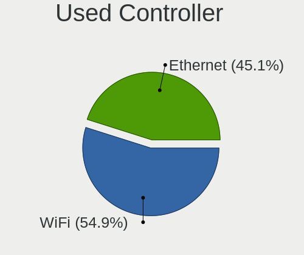

| Kind     | Computers | Percent |
|----------|-----------|---------|
| WiFi     | 93        | 55.36%  |
| Ethernet | 75        | 44.64%  |

NICs
----

Total network controllers on board

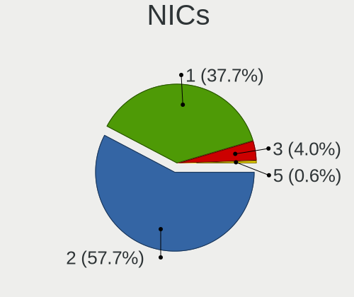

| Total | Computers | Percent |
|-------|-----------|---------|
| 2     | 91        | 57.59%  |
| 1     | 60        | 37.97%  |
| 3     | 6         | 3.8%    |
| 5     | 1         | 0.63%   |

IPv6
----

IPv6 vs IPv4

| Used | Computers | Percent |
|------|-----------|---------|
| No   | 118       | 73.75%  |
| Yes  | 42        | 26.25%  |

Bluetooth
---------

Bluetooth Vendor
----------------

Controller vendors

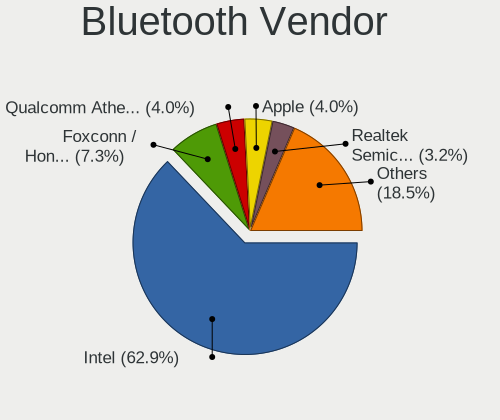

| Vendor                          | Computers | Percent |
|---------------------------------|-----------|---------|
| Intel                           | 72        | 64.29%  |
| Foxconn / Hon Hai               | 8         | 7.14%   |
| Qualcomm Atheros Communications | 5         | 4.46%   |
| IMC Networks                    | 4         | 3.57%   |
| Cambridge Silicon Radio         | 4         | 3.57%   |
| Apple                           | 4         | 3.57%   |
| Realtek                         | 3         | 2.68%   |
| Realtek Semiconductor           | 2         | 1.79%   |
| Lite-On Technology              | 2         | 1.79%   |
| Hewlett-Packard                 | 2         | 1.79%   |
| Toshiba                         | 1         | 0.89%   |
| Micro Star International        | 1         | 0.89%   |
| MediaTek                        | 1         | 0.89%   |
| Marvell Semiconductor           | 1         | 0.89%   |
| Broadcom                        | 1         | 0.89%   |
| ASUSTek Computer                | 1         | 0.89%   |

Bluetooth Model
---------------

Controller models

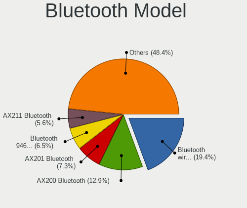

| Model                                                                               | Computers | Percent |
|-------------------------------------------------------------------------------------|-----------|---------|
| Intel AX200 Bluetooth                                                               | 15        | 13.39%  |
| Intel Bluetooth Device                                                              | 12        | 10.71%  |
| Intel Bluetooth wireless interface                                                  | 11        | 9.82%   |
| Intel Bluetooth 9460/9560 Jefferson Peak (JfP)                                      | 8         | 7.14%   |
| Intel AX201 Bluetooth                                                               | 8         | 7.14%   |
| Intel AX211 Bluetooth                                                               | 7         | 6.25%   |
| Intel AX210 Bluetooth                                                               | 4         | 3.57%   |
| Cambridge Silicon Radio Bluetooth Dongle (HCI mode)                                 | 4         | 3.57%   |
| Realtek Bluetooth Radio                                                             | 3         | 2.68%   |
| Qualcomm Atheros  Bluetooth Device                                                  | 3         | 2.68%   |
| Intel Wireless-AC 3168 Bluetooth                                                    | 3         | 2.68%   |
| Realtek Bluetooth Radio                                                             | 2         | 1.79%   |
| Lite-On Bluetooth Device                                                            | 2         | 1.79%   |
| Intel Wireless-AC 9260 Bluetooth Adapter                                            | 2         | 1.79%   |
| Intel Centrino Bluetooth Wireless Transceiver                                       | 2         | 1.79%   |
| HP Broadcom 2070 Bluetooth Combo                                                    | 2         | 1.79%   |
| Apple Bluetooth USB Host Controller                                                 | 2         | 1.79%   |
| Apple Bluetooth Host Controller                                                     | 2         | 1.79%   |
| Toshiba Bluetooth Device                                                            | 1         | 0.89%   |
| Qualcomm Atheros QCA61x4 Bluetooth 4.0                                              | 1         | 0.89%   |
| Qualcomm Atheros AR3012 Bluetooth 4.0                                               | 1         | 0.89%   |
| Micro Star International Motorola Bluetooth 2.1+EDR Device                          | 1         | 0.89%   |
| MediaTek Wireless_Device                                                            | 1         | 0.89%   |
| Marvell Bluetooth and Wireless LAN Composite                                        | 1         | 0.89%   |
| IMC Networks Wireless_Device                                                        | 1         | 0.89%   |
| IMC Networks Bluetooth Radio                                                        | 1         | 0.89%   |
| IMC Networks Bluetooth Module                                                       | 1         | 0.89%   |
| IMC Networks Bluetooth Device                                                       | 1         | 0.89%   |
| Foxconn / Hon Hai Wireless_Device                                                   | 1         | 0.89%   |
| Foxconn / Hon Hai MediaTek Bluetooth Adapter                                        | 1         | 0.89%   |
| Foxconn / Hon Hai Foxconn T77H114 BCM2070 [Single-Chip Bluetooth 2.1 + EDR Adapter] | 1         | 0.89%   |
| Foxconn / Hon Hai BT                                                                | 1         | 0.89%   |
| Foxconn / Hon Hai Broadcom BCM20702A1 Bluetooth                                     | 1         | 0.89%   |
| Foxconn / Hon Hai Bluetooth USB Host Controller                                     | 1         | 0.89%   |
| Foxconn / Hon Hai BCM43142A0                                                        | 1         | 0.89%   |
| Foxconn / Hon Hai BCM20702A0                                                        | 1         | 0.89%   |
| Broadcom Bluetooth 3.0 Device                                                       | 1         | 0.89%   |
| ASUS BCM20702A0                                                                     | 1         | 0.89%   |

Sound
-----

Sound Vendor
------------

Sound card vendors

| Vendor                                       | Computers | Percent |
|----------------------------------------------|-----------|---------|
| Intel                                        | 126       | 57.01%  |
| AMD                                          | 39        | 17.65%  |
| Nvidia                                       | 33        | 14.93%  |
| Logitech                                     | 5         | 2.26%   |
| C-Media Electronics                          | 4         | 1.81%   |
| SteelSeries ApS                              | 2         | 0.9%    |
| Hewlett-Packard                              | 2         | 0.9%    |
| Zoran Co. Personal Media Division (Nogatech) | 1         | 0.45%   |
| www.hirestech.com 2012 REV 1.8               | 1         | 0.45%   |
| Sony                                         | 1         | 0.45%   |
| Realtek Semiconductor                        | 1         | 0.45%   |
| Micro Star International                     | 1         | 0.45%   |
| Lenovo                                       | 1         | 0.45%   |
| Kingston Technology                          | 1         | 0.45%   |
| Generalplus Technology                       | 1         | 0.45%   |
| Bose                                         | 1         | 0.45%   |
| Apple                                        | 1         | 0.45%   |

Sound Model
-----------

Sound card models

| Model                                                                      | Computers | Percent |
|----------------------------------------------------------------------------|-----------|---------|
| Intel Sunrise Point-LP HD Audio                                            | 18        | 6.72%   |
| AMD Family 17h/19h HD Audio Controller                                     | 17        | 6.34%   |
| Intel 8 Series/C220 Series Chipset High Definition Audio Controller        | 15        | 5.6%    |
| Intel Xeon E3-1200 v3/4th Gen Core Processor HD Audio Controller           | 13        | 4.85%   |
| AMD Renoir Radeon High Definition Audio Controller                         | 12        | 4.48%   |
| AMD Starship/Matisse HD Audio Controller                                   | 10        | 3.73%   |
| Intel Tiger Lake-LP Smart Sound Technology Audio Controller                | 7         | 2.61%   |
| Intel Cannon Point-LP High Definition Audio Controller                     | 7         | 2.61%   |
| Intel Cannon Lake PCH cAVS                                                 | 6         | 2.24%   |
| Intel 7 Series/C216 Chipset Family High Definition Audio Controller        | 6         | 2.24%   |
| Intel 200 Series PCH HD Audio                                              | 6         | 2.24%   |
| Intel Haswell-ULT HD Audio Controller                                      | 5         | 1.87%   |
| Intel 82801I (ICH9 Family) HD Audio Controller                             | 5         | 1.87%   |
| Intel 8 Series HD Audio Controller                                         | 5         | 1.87%   |
| Intel 6 Series/C200 Series Chipset Family High Definition Audio Controller | 5         | 1.87%   |
| Intel 5 Series/3400 Series Chipset High Definition Audio                   | 5         | 1.87%   |
| Nvidia GP107GL High Definition Audio Controller                            | 4         | 1.49%   |
| Nvidia GA106 High Definition Audio Controller                              | 4         | 1.49%   |
| Intel Wildcat Point-LP High Definition Audio Controller                    | 4         | 1.49%   |
| Intel Broadwell-U Audio Controller                                         | 4         | 1.49%   |
| Intel 100 Series/C230 Series Chipset Family HD Audio Controller            | 4         | 1.49%   |
| AMD Navi 21/23 HDMI/DP Audio Controller                                    | 4         | 1.49%   |
| Nvidia High Definition Audio Controller                                    | 3         | 1.12%   |
| Nvidia Audio device                                                        | 3         | 1.12%   |
| Intel Comet Lake PCH cAVS                                                  | 3         | 1.12%   |
| Intel Celeron/Pentium Silver Processor High Definition Audio               | 3         | 1.12%   |
| Intel Alder Lake-S HD Audio Controller                                     | 3         | 1.12%   |
| AMD Raven/Raven2/Fenghuang HDMI/DP Audio Controller                        | 3         | 1.12%   |
| Nvidia GP108 High Definition Audio Controller                              | 2         | 0.75%   |
| Nvidia GK208 HDMI/DP Audio Controller                                      | 2         | 0.75%   |
| Nvidia GF108 High Definition Audio Controller                              | 2         | 0.75%   |
| Logitech Blue Microphones                                                  | 2         | 0.75%   |
| Intel Tiger Lake-H HD Audio Controller                                     | 2         | 0.75%   |
| Intel CM238 HD Audio Controller                                            | 2         | 0.75%   |
| Intel C610/X99 series chipset HD Audio Controller                          | 2         | 0.75%   |
| Intel Alder Lake PCH-P High Definition Audio Controller                    | 2         | 0.75%   |
| Intel 9 Series Chipset Family HD Audio Controller                          | 2         | 0.75%   |
| Hewlett-Packard USB Audio                                                  | 2         | 0.75%   |
| C-Media Electronics Audio Adapter (Unitek Y-247A)                          | 2         | 0.75%   |
| AMD SBx00 Azalia (Intel HDA)                                               | 2         | 0.75%   |

Memory
------

Memory Vendor
-------------

Memory module vendors

| Vendor                       | Computers | Percent |
|------------------------------|-----------|---------|
| Samsung Electronics          | 32        | 32%     |
| SK hynix                     | 17        | 17%     |
| Kingston                     | 8         | 8%      |
| Micron Technology            | 7         | 7%      |
| Crucial                      | 7         | 7%      |
| Corsair                      | 7         | 7%      |
| Unknown                      | 5         | 5%      |
| G.Skill                      | 5         | 5%      |
| A-DATA Technology            | 4         | 4%      |
| Qimonda                      | 2         | 2%      |
| Wilk                         | 1         | 1%      |
| Unknown (ABCD)               | 1         | 1%      |
| Unknown (0x7F7FB5FFFFFFFFFF) | 1         | 1%      |
| Timetec                      | 1         | 1%      |
| Patriot                      | 1         | 1%      |
| Dane-Elec                    | 1         | 1%      |

Memory Model
------------

Memory module models

| Model                                                            | Computers | Percent |
|------------------------------------------------------------------|-----------|---------|
| SK hynix RAM HMT41GS6AFR8A-PB 8GB SODIMM DDR3 1600MT/s           | 3         | 2.8%    |
| Samsung RAM Module 16GB SODIMM DDR4 3200MT/s                     | 2         | 1.87%   |
| Samsung RAM M471B5173DB0-YK0 4GB SODIMM DDR3 1600MT/s            | 2         | 1.87%   |
| Samsung RAM M471B1G73QH0-YK0 8GB SODIMM DDR3 1600MT/s            | 2         | 1.87%   |
| Samsung RAM M471B1G73DB0-YK0 8GB SODIMM DDR3 1600MT/s            | 2         | 1.87%   |
| Samsung RAM M471A2K43DB1-CWE 16GB SODIMM DDR4 3200MT/s           | 2         | 1.87%   |
| Samsung RAM M471A1K43DB1-CTD 8GB SODIMM DDR4 2667MT/s            | 2         | 1.87%   |
| Crucial RAM CT102464BF160B.M16 8GB SODIMM DDR3 1600MT/s          | 2         | 1.87%   |
| Wilk RAM GR3200S464L22S/16G 16GB SODIMM DDR4 3200MT/s            | 1         | 0.93%   |
| Unknown RAM Module 4GB SODIMM LPDDR3 1600MT/s                    | 1         | 0.93%   |
| Unknown RAM Module 4GB SODIMM DDR3                               | 1         | 0.93%   |
| Unknown RAM Module 4096MB DIMM DDR3 1333MT/s                     | 1         | 0.93%   |
| Unknown RAM Module 2GB SODIMM DDR2                               | 1         | 0.93%   |
| Unknown RAM Module 2048MB SODIMM DDR2                            | 1         | 0.93%   |
| Unknown RAM Module 1024MB SODIMM DDR2                            | 1         | 0.93%   |
| Unknown (ABCD) RAM 123456789012345678 2GB SODIMM LPDDR4 2400MT/s | 1         | 0.93%   |
| Unknown (0x7F7FB5FFFFFFFFFF) RAM Module 1GB DIMM DDR2 667MT/s    | 1         | 0.93%   |
| Timetec RAM SD3-1333 8GB SODIMM DDR3 1333MT/s                    | 1         | 0.93%   |
| SK hynix RAM Module 8192MB Row Of Chips LPDDR3 2133MT/s          | 1         | 0.93%   |
| SK hynix RAM Module 4GB DIMM DDR3 1066MT/s                       | 1         | 0.93%   |
| SK hynix RAM Module 4096MB Row Of Chips LPDDR3 2133MT/s          | 1         | 0.93%   |
| SK hynix RAM HMT451S6BFR8A-PB 4GB SODIMM DDR3 1600MT/s           | 1         | 0.93%   |
| SK hynix RAM HMT425S6AFR6A-PB 2GB SODIMM DDR3 3200MT/s           | 1         | 0.93%   |
| SK hynix RAM HMCG88MEBSA092N 32GB SODIMM DDR5 4800MT/s           | 1         | 0.93%   |
| SK hynix RAM HMAA1GS6CJR6N-XN 8GB SODIMM DDR4 3200MT/s           | 1         | 0.93%   |
| SK hynix RAM HMA851S6AFR6N-UH 4GB SODIMM DDR4 2400MT/s           | 1         | 0.93%   |
| SK hynix RAM HMA82GS6DJR8N-XN 16GB SODIMM DDR4 3200MT/s          | 1         | 0.93%   |
| SK hynix RAM HMA82GS6DJR8N-VK 16GB SODIMM DDR4 2667MT/s          | 1         | 0.93%   |
| SK hynix RAM HMA82GR7CJR8N-VK 16GB DIMM DDR4 2666MT/s            | 1         | 0.93%   |
| SK hynix RAM HMA82GR7AFR8N-VK 16GB DIMM DDR4 2666MT/s            | 1         | 0.93%   |
| SK hynix RAM HMA81GS6MFR8N-UH 8GB SODIMM DDR4 2400MT/s           | 1         | 0.93%   |
| SK hynix RAM HMA41GS6AFR8N-TF 8GB SODIMM DDR4 2667MT/s           | 1         | 0.93%   |
| SK hynix RAM H9JCNNNCP3MLYR-N6E 2GB Row Of Chips LPDDR5 6400MT/s | 1         | 0.93%   |
| SK hynix RAM H58G66BK7BX067 8GB Row Of Chips LPDDR5 7500MT/s     | 1         | 0.93%   |
| Samsung RAM Module 8GB SODIMM DDR4 2133MT/s                      | 1         | 0.93%   |
| Samsung RAM Module 8GB Row Of Chips LPDDR4 2933MT/s              | 1         | 0.93%   |
| Samsung RAM Module 4GB SODIMM DDR3 1600MT/s                      | 1         | 0.93%   |
| Samsung RAM Module 4GB SODIMM DDR3 1067MT/s                      | 1         | 0.93%   |
| Samsung RAM Module 16384MB SODIMM DDR4 3200MT/s                  | 1         | 0.93%   |
| Samsung RAM M471B5673FH0-CH9 2GB SODIMM DDR3 1334MT/s            | 1         | 0.93%   |

Memory Kind
-----------

Memory module kinds

| Kind   | Computers | Percent |
|--------|-----------|---------|
| DDR4   | 50        | 53.76%  |
| DDR3   | 21        | 22.58%  |
| DDR5   | 6         | 6.45%   |
| LPDDR3 | 5         | 5.38%   |
| DDR2   | 5         | 5.38%   |
| SDRAM  | 2         | 2.15%   |
| LPDDR5 | 2         | 2.15%   |
| LPDDR4 | 2         | 2.15%   |

Memory Form Factor
------------------

Physical design of the memory module

| Name         | Computers | Percent |
|--------------|-----------|---------|
| SODIMM       | 58        | 63.04%  |
| DIMM         | 25        | 27.17%  |
| Row Of Chips | 9         | 9.78%   |

Memory Size
-----------

Memory module size

| Size  | Computers | Percent |
|-------|-----------|---------|
| 8192  | 41        | 41.41%  |
| 16384 | 22        | 22.22%  |
| 4096  | 18        | 18.18%  |
| 2048  | 9         | 9.09%   |
| 32768 | 7         | 7.07%   |
| 1024  | 2         | 2.02%   |

Memory Speed
------------

Memory module speed

| Speed   | Computers | Percent |
|---------|-----------|---------|
| 3200    | 18        | 18.56%  |
| 2667    | 18        | 18.56%  |
| 1600    | 14        | 14.43%  |
| 2400    | 9         | 9.28%   |
| 2133    | 7         | 7.22%   |
| 3600    | 5         | 5.15%   |
| 4800    | 4         | 4.12%   |
| Unknown | 3         | 3.09%   |
| 6400    | 2         | 2.06%   |
| 1867    | 2         | 2.06%   |
| 1333    | 2         | 2.06%   |
| 800     | 2         | 2.06%   |
| 7500    | 1         | 1.03%   |
| 6000    | 1         | 1.03%   |
| 3534    | 1         | 1.03%   |
| 3500    | 1         | 1.03%   |
| 3400    | 1         | 1.03%   |
| 2933    | 1         | 1.03%   |
| 2666    | 1         | 1.03%   |
| 1334    | 1         | 1.03%   |
| 1067    | 1         | 1.03%   |
| 1066    | 1         | 1.03%   |
| 667     | 1         | 1.03%   |

Printers & scanners
-------------------

Printer Vendor
--------------

Printer device vendors

| Vendor          | Computers | Percent |
|-----------------|-----------|---------|
| Hewlett-Packard | 3         | 100%    |

Printer Model
-------------

Printer device models

| Model                    | Computers | Percent |
|--------------------------|-----------|---------|
| HP OfficeJet 6950        | 1         | 33.33%  |
| HP Officejet 6600        | 1         | 33.33%  |
| HP OfficeJet 5200 series | 1         | 33.33%  |

Scanner Vendor
--------------

Scanner device vendors

| Vendor      | Computers | Percent |
|-------------|-----------|---------|
| Seiko Epson | 1         | 100%    |

Scanner Model
-------------

Scanner device models

| Model                                                         | Computers | Percent |
|---------------------------------------------------------------|-----------|---------|
| Seiko Epson GT-8700/GT-8700F [Perfection 1640SU/1640SU PHOTO] | 1         | 100%    |

Camera
------

Camera Vendor
-------------

Camera device vendors

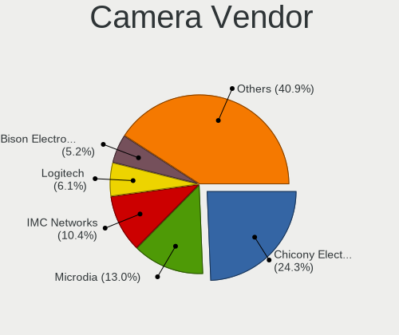

| Vendor                                 | Computers | Percent |
|----------------------------------------|-----------|---------|
| Chicony Electronics                    | 24        | 23.76%  |
| Microdia                               | 13        | 12.87%  |
| IMC Networks                           | 11        | 10.89%  |
| Logitech                               | 6         | 5.94%   |
| Bison Electronics                      | 5         | 4.95%   |
| Samsung Electronics                    | 4         | 3.96%   |
| Realtek Semiconductor                  | 4         | 3.96%   |
| Quanta                                 | 4         | 3.96%   |
| Apple                                  | 4         | 3.96%   |
| Ricoh                                  | 3         | 2.97%   |
| Luxvisions Innotech Limited            | 3         | 2.97%   |
| Cheng Uei Precision Industry (Foxlink) | 3         | 2.97%   |
| Alcor Micro                            | 3         | 2.97%   |
| Syntek                                 | 2         | 1.98%   |
| Sunplus Innovation Technology          | 2         | 1.98%   |
| YGTek                                  | 1         | 0.99%   |
| Silicon Motion                         | 1         | 0.99%   |
| ShineTech                              | 1         | 0.99%   |
| Shenzhen Kingcome Optoelectronic       | 1         | 0.99%   |
| Lite-On Technology                     | 1         | 0.99%   |
| Huawei Technologies                    | 1         | 0.99%   |
| Cubeternet                             | 1         | 0.99%   |
| ALi                                    | 1         | 0.99%   |
| Acer                                   | 1         | 0.99%   |
| Unknown                                | 1         | 0.99%   |

Camera Model
------------

Camera device models

| Model                                            | Computers | Percent |
|--------------------------------------------------|-----------|---------|
| Microdia Integrated_Webcam_HD                    | 5         | 4.95%   |
| IMC Networks USB2.0 HD UVC WebCam                | 5         | 4.95%   |
| Samsung Galaxy series, misc. (MTP mode)          | 4         | 3.96%   |
| Logitech B525 HD Webcam                          | 3         | 2.97%   |
| IMC Networks Integrated Camera                   | 3         | 2.97%   |
| Chicony Integrated Camera                        | 3         | 2.97%   |
| Realtek Integrated_Webcam_HD                     | 2         | 1.98%   |
| Quanta HD User Facing                            | 2         | 1.98%   |
| Microdia Integrated_Webcam_FHD                   | 2         | 1.98%   |
| Microdia Integrated Webcam                       | 2         | 1.98%   |
| Luxvisions Innotech Limited HP HD Camera         | 2         | 1.98%   |
| Chicony Integrated IR Camera                     | 2         | 1.98%   |
| Chicony Integrated Camera (1280x720@30)          | 2         | 1.98%   |
| Chicony HP Wide Vision HD Camera                 | 2         | 1.98%   |
| Chicony HP HD Camera                             | 2         | 1.98%   |
| Cheng Uei Precision Industry (Foxlink) HD Camera | 2         | 1.98%   |
| Apple FaceTime HD Camera                         | 2         | 1.98%   |
| YGTek Webcam                                     | 1         | 0.99%   |
| Syntek USB2.0 Camera                             | 1         | 0.99%   |
| Syntek Integrated Camera                         | 1         | 0.99%   |
| Sunplus Laptop Integrated WebCam HD              | 1         | 0.99%   |
| Sunplus HP HD Webcam [Fixed]                     | 1         | 0.99%   |
| Silicon Motion Web Camera                        | 1         | 0.99%   |
| ShineTech HD Camera                              | 1         | 0.99%   |
| Shenzhen Kingcome Optoelectronic 720p HD Camera  | 1         | 0.99%   |
| Ricoh USB2.0 Camera                              | 1         | 0.99%   |
| Ricoh Sony Visual Communication Camera           | 1         | 0.99%   |
| Ricoh Sony Vaio Integrated Webcam                | 1         | 0.99%   |
| Realtek Integrated Webcam_HD                     | 1         | 0.99%   |
| Realtek HP Truevision HD                         | 1         | 0.99%   |
| Quanta HP Wide Vision HD Camera                  | 1         | 0.99%   |
| Quanta HP Webcam                                 | 1         | 0.99%   |
| Microdia Webcam Vitade AF                        | 1         | 0.99%   |
| Microdia Webcam                                  | 1         | 0.99%   |
| Microdia USB 2.0 Camera                          | 1         | 0.99%   |
| Microdia Camera                                  | 1         | 0.99%   |
| Luxvisions Innotech Limited HP 5MP Camera        | 1         | 0.99%   |
| Logitech Webcam C270                             | 1         | 0.99%   |
| Logitech HD Webcam C910                          | 1         | 0.99%   |
| Logitech HD Pro Webcam C920                      | 1         | 0.99%   |

Security
--------

Fingerprint Vendor
------------------

Fingerprint sensor vendors

| Vendor                     | Computers | Percent |
|----------------------------|-----------|---------|
| Synaptics                  | 9         | 37.5%   |
| Validity Sensors           | 6         | 25%     |
| Shenzhen Goodix Technology | 5         | 20.83%  |
| Upek                       | 1         | 4.17%   |
| LighTuning Technology      | 1         | 4.17%   |
| Elan Microelectronics      | 1         | 4.17%   |
| AuthenTec                  | 1         | 4.17%   |

Fingerprint Model
-----------------

Fingerprint sensor models

| Model                                                                      | Computers | Percent |
|----------------------------------------------------------------------------|-----------|---------|
| Synaptics Prometheus MIS Touch Fingerprint Reader                          | 4         | 16.67%  |
| Shenzhen Goodix Fingerprint Reader                                         | 3         | 12.5%   |
| Validity Sensors Synaptics WBDI                                            | 2         | 8.33%   |
| Synaptics FS7604 Touch Fingerprint Sensor with PurePrint                   | 2         | 8.33%   |
| Shenzhen Goodix  Fingerprint Device                                        | 2         | 8.33%   |
| Validity Sensors VFS7552 Touch Fingerprint Sensor                          | 1         | 4.17%   |
| Validity Sensors VFS495 Fingerprint Reader                                 | 1         | 4.17%   |
| Validity Sensors VFS451 Fingerprint Reader                                 | 1         | 4.17%   |
| Validity Sensors Synaptics VFS7552 Touch Fingerprint Sensor with PurePrint | 1         | 4.17%   |
| Upek Biometric Touchchip/Touchstrip Fingerprint Sensor                     | 1         | 4.17%   |
| Synaptics UWP WBDI                                                         | 1         | 4.17%   |
| Synaptics Metallica MIS Touch Fingerprint Reader                           | 1         | 4.17%   |
| Synaptics Fingerprint reader [HP G6]                                       | 1         | 4.17%   |
| LighTuning ES603 Swipe Fingerprint Sensor                                  | 1         | 4.17%   |
| Elan ELAN:Fingerprint                                                      | 1         | 4.17%   |
| AuthenTec Fingerprint Sensor                                               | 1         | 4.17%   |

Chipcard Vendor
---------------

Chipcard module vendors

| Vendor                   | Computers | Percent |
|--------------------------|-----------|---------|
| Alcor Micro              | 5         | 38.46%  |
| Broadcom                 | 4         | 30.77%  |
| Gemalto (was Gemplus)    | 3         | 23.08%  |
| Reiner SCT Kartensysteme | 1         | 7.69%   |

Chipcard Model
--------------

Chipcard module models

| Model                                                                        | Computers | Percent |
|------------------------------------------------------------------------------|-----------|---------|
| Alcor Micro AU9540 Smartcard Reader                                          | 5         | 38.46%  |
| Gemalto (was Gemplus) Prox SU USB PC Link Reader                             | 2         | 15.38%  |
| Broadcom 58200                                                               | 2         | 15.38%  |
| Reiner SCT Kartensysteme cyberJack RFID basis contactless smartcard reader   | 1         | 7.69%   |
| Gemalto (was Gemplus) Compact Smart Card Reader Writer                       | 1         | 7.69%   |
| Broadcom BCM5880 Secure Applications Processor with fingerprint swipe sensor | 1         | 7.69%   |
| Broadcom 5880                                                                | 1         | 7.69%   |

Unsupported
-----------

Unsupported Devices
-------------------

Total unsupported devices on board

| Total | Computers | Percent |
|-------|-----------|---------|
| 0     | 99        | 61.49%  |
| 1     | 44        | 27.33%  |
| 2     | 15        | 9.32%   |
| 3     | 3         | 1.86%   |

Unsupported Device Types
------------------------

Types of unsupported devices

| Type                     | Computers | Percent |
|--------------------------|-----------|---------|
| Fingerprint reader       | 24        | 30.77%  |
| Graphics card            | 15        | 19.23%  |
| Chipcard                 | 8         | 10.26%  |
| Net/wireless             | 6         | 7.69%   |
| Multimedia controller    | 6         | 7.69%   |
| Network                  | 4         | 5.13%   |
| Communication controller | 4         | 5.13%   |
| Unassigned class         | 3         | 3.85%   |
| Card reader              | 3         | 3.85%   |
| Net/ethernet             | 2         | 2.56%   |
| Sound                    | 1         | 1.28%   |
| Camera                   | 1         | 1.28%   |
| Bluetooth                | 1         | 1.28%   |

