Linux in Malaysia - Tested Hardware & Statistics
------------------------------------------------

A project to collect tested hardware configurations for Linux in Malaysia.

Anyone can contribute to this report by the [hw-probe](https://github.com/linuxhw/hw-probe) tool:

    sudo -E hw-probe -all -upload

Please contribute! Especially if your hardware is rare.

This is a report for all computer types. See also reports for [desktops](/Location/Malaysia/Desktop/README.md) and [notebooks](/Location/Malaysia/Notebook/README.md).

Contents
--------

* [ Test Cases ](#test-cases)

* [ System ](#system)
  - [ OS                       ](#os)
  - [ OS Family                ](#os-family)
  - [ Kernel                   ](#kernel)
  - [ Kernel Family            ](#kernel-family)
  - [ Kernel Major Ver.        ](#kernel-major-ver)
  - [ Arch                     ](#arch)
  - [ DE                       ](#de)
  - [ Display Server           ](#display-server)
  - [ Display Manager          ](#display-manager)
  - [ OS Lang                  ](#os-lang)
  - [ Boot Mode                ](#boot-mode)
  - [ Filesystem               ](#filesystem)
  - [ Part. scheme             ](#part-scheme)
  - [ Dual Boot with Linux/BSD ](#dual-boot-with-linuxbsd)
  - [ Dual Boot (Win)          ](#dual-boot-win)

* [ Board ](#board)
  - [ Vendor                   ](#vendor)
  - [ Model                    ](#model)
  - [ Model Family             ](#model-family)
  - [ MFG Year                 ](#mfg-year)
  - [ Form Factor              ](#form-factor)
  - [ Secure Boot              ](#secure-boot)
  - [ Coreboot                 ](#coreboot)
  - [ RAM Size                 ](#ram-size)
  - [ RAM Used                 ](#ram-used)
  - [ Total Drives             ](#total-drives)
  - [ Has CD-ROM               ](#has-cd-rom)
  - [ Has Ethernet             ](#has-ethernet)
  - [ Has WiFi                 ](#has-wifi)
  - [ Has Bluetooth            ](#has-bluetooth)

* [ Location ](#location)
  - [ Country                  ](#country)
  - [ City                     ](#city)

* [ Drives ](#drives)
  - [ Drive Vendor             ](#drive-vendor)
  - [ Drive Model              ](#drive-model)
  - [ HDD Vendor               ](#hdd-vendor)
  - [ SSD Vendor               ](#ssd-vendor)
  - [ Drive Kind               ](#drive-kind)
  - [ Drive Connector          ](#drive-connector)
  - [ Drive Size               ](#drive-size)
  - [ Space Total              ](#space-total)
  - [ Space Used               ](#space-used)
  - [ Malfunc. Drives          ](#malfunc-drives)
  - [ Malfunc. Drive Vendor    ](#malfunc-drive-vendor)
  - [ Malfunc. HDD Vendor      ](#malfunc-hdd-vendor)
  - [ Malfunc. Drive Kind      ](#malfunc-drive-kind)
  - [ Failed Drives            ](#failed-drives)
  - [ Failed Drive Vendor      ](#failed-drive-vendor)
  - [ Drive Status             ](#drive-status)

* [ Storage controller ](#storage-controller)
  - [ Storage Vendor           ](#storage-vendor)
  - [ Storage Model            ](#storage-model)
  - [ Storage Kind             ](#storage-kind)

* [ Processor ](#processor)
  - [ CPU Vendor               ](#cpu-vendor)
  - [ CPU Model                ](#cpu-model)
  - [ CPU Model Family         ](#cpu-model-family)
  - [ CPU Cores                ](#cpu-cores)
  - [ CPU Sockets              ](#cpu-sockets)
  - [ CPU Threads              ](#cpu-threads)
  - [ CPU Op-Modes             ](#cpu-op-modes)
  - [ CPU Microcode            ](#cpu-microcode)
  - [ CPU Microarch            ](#cpu-microarch)

* [ Graphics ](#graphics)
  - [ GPU Vendor               ](#gpu-vendor)
  - [ GPU Model                ](#gpu-model)
  - [ GPU Combo                ](#gpu-combo)
  - [ GPU Driver               ](#gpu-driver)
  - [ GPU Memory               ](#gpu-memory)

* [ Monitor ](#monitor)
  - [ Monitor Vendor           ](#monitor-vendor)
  - [ Monitor Model            ](#monitor-model)
  - [ Monitor Resolution       ](#monitor-resolution)
  - [ Monitor Diagonal         ](#monitor-diagonal)
  - [ Monitor Width            ](#monitor-width)
  - [ Aspect Ratio             ](#aspect-ratio)
  - [ Monitor Area             ](#monitor-area)
  - [ Pixel Density            ](#pixel-density)
  - [ Multiple Monitors        ](#multiple-monitors)

* [ Network ](#network)
  - [ Net Controller Vendor    ](#net-controller-vendor)
  - [ Net Controller Model     ](#net-controller-model)
  - [ Wireless Vendor          ](#wireless-vendor)
  - [ Wireless Model           ](#wireless-model)
  - [ Ethernet Vendor          ](#ethernet-vendor)
  - [ Ethernet Model           ](#ethernet-model)
  - [ Net Controller Kind      ](#net-controller-kind)
  - [ Used Controller          ](#used-controller)
  - [ NICs                     ](#nics)
  - [ IPv6                     ](#ipv6)

* [ Bluetooth ](#bluetooth)
  - [ Bluetooth Vendor         ](#bluetooth-vendor)
  - [ Bluetooth Model          ](#bluetooth-model)

* [ Sound ](#sound)
  - [ Sound Vendor             ](#sound-vendor)
  - [ Sound Model              ](#sound-model)

* [ Memory ](#memory)
  - [ Memory Vendor            ](#memory-vendor)
  - [ Memory Model             ](#memory-model)
  - [ Memory Kind              ](#memory-kind)
  - [ Memory Form Factor       ](#memory-form-factor)
  - [ Memory Size              ](#memory-size)
  - [ Memory Speed             ](#memory-speed)

* [ Printers & scanners ](#printers--scanners)
  - [ Printer Vendor           ](#printer-vendor)
  - [ Printer Model            ](#printer-model)
  - [ Scanner Vendor           ](#scanner-vendor)
  - [ Scanner Model            ](#scanner-model)

* [ Camera ](#camera)
  - [ Camera Vendor            ](#camera-vendor)
  - [ Camera Model             ](#camera-model)

* [ Security ](#security)
  - [ Fingerprint Vendor       ](#fingerprint-vendor)
  - [ Fingerprint Model        ](#fingerprint-model)
  - [ Chipcard Vendor          ](#chipcard-vendor)
  - [ Chipcard Model           ](#chipcard-model)

* [ Unsupported ](#unsupported)
  - [ Unsupported Devices      ](#unsupported-devices)
  - [ Unsupported Device Types ](#unsupported-device-types)

Test Cases
----------

Total: 1237

| Vendor        | Model                       | Form-Factor | Probe                                                      | Date         |
|---------------|-----------------------------|-------------|------------------------------------------------------------|--------------|
| Lenovo        | Yoga Pro 7 14AHP9 83E3      | Notebook    | [9e387d5413](https://linux-hardware.org/?probe=9e387d5413) | Jan 02, 2026 |
| Dell          | Latitude E6520              | Notebook    | [08b381e9b7](https://linux-hardware.org/?probe=08b381e9b7) | Jan 01, 2026 |
| Dell          | Latitude E6520              | Notebook    | [6a58063da2](https://linux-hardware.org/?probe=6a58063da2) | Jan 01, 2026 |
| Apple         | MacBookAir6,2               | Notebook    | [4c7327e543](https://linux-hardware.org/?probe=4c7327e543) | Dec 30, 2025 |
| HUAWEI        | MCLG-XX                     | Notebook    | [3090557392](https://linux-hardware.org/?probe=3090557392) | Dec 28, 2025 |
| MSI           | Bravo 15 C7UDXK             | Notebook    | [726eb26f5c](https://linux-hardware.org/?probe=726eb26f5c) | Dec 26, 2025 |
| Acer          | AN515-45-R69U               | Notebook    | [d35ffdd842](https://linux-hardware.org/?probe=d35ffdd842) | Dec 24, 2025 |
| Lenovo        | ThinkPad X220 42911H8       | Notebook    | [0e1ecf2a65](https://linux-hardware.org/?probe=0e1ecf2a65) | Dec 21, 2025 |
| MSI           | A520M-A PRO                 | Desktop     | [a9a1ca2123](https://linux-hardware.org/?probe=a9a1ca2123) | Dec 20, 2025 |
| Dell          | 04Y8V0 A02                  | Desktop     | [1ecdb24581](https://linux-hardware.org/?probe=1ecdb24581) | Dec 20, 2025 |
| ASUSTek       | H81M-C                      | Desktop     | [ed3c5b543a](https://linux-hardware.org/?probe=ed3c5b543a) | Dec 19, 2025 |
| eMachines     | D525                        | Notebook    | [d005c4a481](https://linux-hardware.org/?probe=d005c4a481) | Dec 18, 2025 |
| Gigabyte      | H410M H V3                  | Desktop     | [42573dd434](https://linux-hardware.org/?probe=42573dd434) | Dec 18, 2025 |
| Gigabyte      | H410M H V3                  | Desktop     | [49fd737bca](https://linux-hardware.org/?probe=49fd737bca) | Dec 18, 2025 |
| HP            | ProBook 430 G8 Notebook ... | Notebook    | [90fcca3650](https://linux-hardware.org/?probe=90fcca3650) | Dec 15, 2025 |
| HP            | Pavilion Laptop 15-cs3xx... | Notebook    | [9542b6a9ed](https://linux-hardware.org/?probe=9542b6a9ed) | Dec 14, 2025 |
| Teclast       | F5                          | Convertible | [af3e9661b0](https://linux-hardware.org/?probe=af3e9661b0) | Dec 12, 2025 |
| Teclast       | F5                          | Convertible | [41542d260d](https://linux-hardware.org/?probe=41542d260d) | Dec 12, 2025 |
| Dell          | Precision 5540              | Notebook    | [bf6869856f](https://linux-hardware.org/?probe=bf6869856f) | Dec 09, 2025 |
| ASRock        | A320M-HDV                   | Desktop     | [8edcb1cb11](https://linux-hardware.org/?probe=8edcb1cb11) | Dec 06, 2025 |
| Lenovo        | G50-70 20351                | Notebook    | [ec18c4db6d](https://linux-hardware.org/?probe=ec18c4db6d) | Dec 06, 2025 |
| LattePanda    | 3 Delta LP-BS-7-S70JR200... | Desktop     | [068350c8f9](https://linux-hardware.org/?probe=068350c8f9) | Dec 05, 2025 |
| Lenovo        | ThinkPad T14 Gen 6 21QCC... | Notebook    | [13ccc7af02](https://linux-hardware.org/?probe=13ccc7af02) | Dec 05, 2025 |
| ASUSTek       | PRIME B550M-A               | Desktop     | [32b9f41c9d](https://linux-hardware.org/?probe=32b9f41c9d) | Dec 04, 2025 |
| MSI           | PRO B550M-P GEN3            | Desktop     | [bd5a2b72e8](https://linux-hardware.org/?probe=bd5a2b72e8) | Dec 03, 2025 |
| ASRock        | A320M-HDV                   | Desktop     | [faf4b591a4](https://linux-hardware.org/?probe=faf4b591a4) | Dec 02, 2025 |
| Raspberry ... | Raspberry Pi Compute Mod... | Soc         | [24deaf7aa4](https://linux-hardware.org/?probe=24deaf7aa4) | Dec 02, 2025 |
| Dell          | Latitude E7470              | Notebook    | [d8f2ca4e86](https://linux-hardware.org/?probe=d8f2ca4e86) | Dec 02, 2025 |
| Dell          | Latitude E5540              | Notebook    | [69f68aeaf1](https://linux-hardware.org/?probe=69f68aeaf1) | Nov 28, 2025 |
| Lenovo        | ThinkPad T14 Gen 6 21QCC... | Notebook    | [6f5f9858bb](https://linux-hardware.org/?probe=6f5f9858bb) | Nov 26, 2025 |
| MSI           | PRO A620M-E                 | Desktop     | [f288a26226](https://linux-hardware.org/?probe=f288a26226) | Nov 25, 2025 |
| Lenovo        | G50-70 20351                | Notebook    | [f9ae2712ea](https://linux-hardware.org/?probe=f9ae2712ea) | Nov 24, 2025 |
| Lenovo        | G50-70 20351                | Notebook    | [b2e6a7efd3](https://linux-hardware.org/?probe=b2e6a7efd3) | Nov 24, 2025 |
| Dell          | XPS 17 9700                 | Notebook    | [6e351e73d3](https://linux-hardware.org/?probe=6e351e73d3) | Nov 19, 2025 |
| Dell          | XPS 17 9700                 | Notebook    | [548eaf6754](https://linux-hardware.org/?probe=548eaf6754) | Nov 18, 2025 |
| Unknown       | OneThing Cloud OES Plus     | Soc         | [79c12f8675](https://linux-hardware.org/?probe=79c12f8675) | Nov 18, 2025 |
| Dell          | Latitude 3450               | Notebook    | [2bb99481ca](https://linux-hardware.org/?probe=2bb99481ca) | Nov 17, 2025 |
| Acer          | Veriton S6620G v1.0         | Desktop     | [0fc5657263](https://linux-hardware.org/?probe=0fc5657263) | Nov 15, 2025 |
| Dell          | 0PHYDR A00                  | Server      | [ae1802b0da](https://linux-hardware.org/?probe=ae1802b0da) | Nov 14, 2025 |
| ASRock        | G31M-VS2                    | Desktop     | [571a1f6de3](https://linux-hardware.org/?probe=571a1f6de3) | Nov 12, 2025 |
| Lenovo        | SHARKBAY SDK0E50515 STD     | Desktop     | [6e927658ce](https://linux-hardware.org/?probe=6e927658ce) | Nov 12, 2025 |
| MSI           | A520M-A PRO                 | Desktop     | [abb1c92010](https://linux-hardware.org/?probe=abb1c92010) | Nov 08, 2025 |
| Dell          | 04Y8V0 A02                  | Desktop     | [a569f58d29](https://linux-hardware.org/?probe=a569f58d29) | Nov 08, 2025 |
| HP            | Notebook                    | Notebook    | [7c2b67903f](https://linux-hardware.org/?probe=7c2b67903f) | Nov 08, 2025 |
| ASUSTek       | X550CC                      | Notebook    | [29f3367ad3](https://linux-hardware.org/?probe=29f3367ad3) | Nov 07, 2025 |
| AMI           | Aptio CRB                   | Mini pc     | [b861542abb](https://linux-hardware.org/?probe=b861542abb) | Nov 07, 2025 |
| Dell          | Latitude E5540              | Notebook    | [d9af58509d](https://linux-hardware.org/?probe=d9af58509d) | Nov 07, 2025 |
| HP            | Notebook                    | Notebook    | [1cbc1d3b81](https://linux-hardware.org/?probe=1cbc1d3b81) | Nov 05, 2025 |
| Lenovo        | ThinkPad X13 Gen 1 20UFS... | Notebook    | [01d330361d](https://linux-hardware.org/?probe=01d330361d) | Nov 04, 2025 |
| Lenovo        | Y50-70 20378                | Notebook    | [5f539bd46e](https://linux-hardware.org/?probe=5f539bd46e) | Nov 02, 2025 |
| Dell          | Latitude 3380               | Notebook    | [4e7e438b9a](https://linux-hardware.org/?probe=4e7e438b9a) | Nov 02, 2025 |
| HP            | Pavilion Notebook           | Notebook    | [9e0d2963d0](https://linux-hardware.org/?probe=9e0d2963d0) | Oct 31, 2025 |
| Fujitsu       | FARV04001Z                  | Tablet      | [b9f7f0433a](https://linux-hardware.org/?probe=b9f7f0433a) | Oct 29, 2025 |
| Acer          | Aspire V3-371               | Notebook    | [09460e5cbd](https://linux-hardware.org/?probe=09460e5cbd) | Oct 29, 2025 |
| HP            | 18E9                        | Desktop     | [b858215142](https://linux-hardware.org/?probe=b858215142) | Oct 24, 2025 |
| MSI           | B450M-A PRO MAX II          | Desktop     | [d080790c77](https://linux-hardware.org/?probe=d080790c77) | Oct 20, 2025 |
| Lenovo        | V110-14IAP 80TF             | Notebook    | [bccf03f9eb](https://linux-hardware.org/?probe=bccf03f9eb) | Oct 17, 2025 |
| HP            | 18E9                        | Desktop     | [1cdc36fb15](https://linux-hardware.org/?probe=1cdc36fb15) | Oct 17, 2025 |
| Dell          | 02GDWG A00                  | Desktop     | [8c7e23d284](https://linux-hardware.org/?probe=8c7e23d284) | Oct 15, 2025 |
| Unknown       | sun60iw2 (DT)               | Soc         | [375497e2bf](https://linux-hardware.org/?probe=375497e2bf) | Oct 14, 2025 |
| HP            | Laptop 14s-fq0xxx           | Notebook    | [ed5d630026](https://linux-hardware.org/?probe=ed5d630026) | Oct 11, 2025 |
| HP            | Laptop 14s-fq0xxx           | Notebook    | [ebe9fa2537](https://linux-hardware.org/?probe=ebe9fa2537) | Oct 11, 2025 |
| MSI           | A520M-A PRO                 | Desktop     | [6dca5e72b6](https://linux-hardware.org/?probe=6dca5e72b6) | Oct 11, 2025 |
| Dell          | 04Y8V0 A02                  | Desktop     | [6a7bce14b2](https://linux-hardware.org/?probe=6a7bce14b2) | Oct 11, 2025 |
| HUAWEI        | MCLG-XX                     | Notebook    | [aa8db64c91](https://linux-hardware.org/?probe=aa8db64c91) | Oct 11, 2025 |
| Dell          | 06NWYK A00                  | Desktop     | [b55512c466](https://linux-hardware.org/?probe=b55512c466) | Oct 08, 2025 |
| ASUSTek       | TUF X470-PLUS GAMING        | Desktop     | [da8edc054d](https://linux-hardware.org/?probe=da8edc054d) | Oct 08, 2025 |
| MSI           | MAG B650M MORTAR WIFI       | Desktop     | [a08f851625](https://linux-hardware.org/?probe=a08f851625) | Oct 08, 2025 |
| ASUSTek       | TUF Gaming B550M-PLUS       | Desktop     | [718663e076](https://linux-hardware.org/?probe=718663e076) | Oct 05, 2025 |
| HUAWEI        | BOHK-WAX9X                  | Notebook    | [a9d9340959](https://linux-hardware.org/?probe=a9d9340959) | Oct 04, 2025 |
| HP            | Pavilion Aero Laptop 13-... | Notebook    | [62ce33cf19](https://linux-hardware.org/?probe=62ce33cf19) | Sep 30, 2025 |
| Lenovo        | ThinkBook 16 G7+ IAH 21T... | Notebook    | [e44c58e13a](https://linux-hardware.org/?probe=e44c58e13a) | Sep 30, 2025 |
| ASRock        | X570 Taichi Razer Editio... | Desktop     | [c606fb016b](https://linux-hardware.org/?probe=c606fb016b) | Sep 22, 2025 |
| Lenovo        | G50-70 20351                | Notebook    | [28071d54a9](https://linux-hardware.org/?probe=28071d54a9) | Sep 22, 2025 |
| Gigabyte      | B760M E                     | Desktop     | [e1cc904620](https://linux-hardware.org/?probe=e1cc904620) | Sep 22, 2025 |
| Google        | Liara                       | Notebook    | [c4b0401ab1](https://linux-hardware.org/?probe=c4b0401ab1) | Sep 22, 2025 |
| HP            | Pavilion Aero Laptop 13-... | Notebook    | [a33c158e83](https://linux-hardware.org/?probe=a33c158e83) | Sep 20, 2025 |
| ECS           | G31T-M7                     | Desktop     | [ec0caa28f9](https://linux-hardware.org/?probe=ec0caa28f9) | Sep 19, 2025 |
| HP            | OMEN by Laptop 15-ce0xx     | Notebook    | [a08ee6c630](https://linux-hardware.org/?probe=a08ee6c630) | Sep 16, 2025 |
| Dell          | 0HHV7N A00                  | Desktop     | [170dc1ae12](https://linux-hardware.org/?probe=170dc1ae12) | Sep 10, 2025 |
| Dell          | Latitude E7470              | Notebook    | [d2ff88be31](https://linux-hardware.org/?probe=d2ff88be31) | Sep 10, 2025 |
| Gigabyte      | A520M K V2                  | Desktop     | [2411d964f4](https://linux-hardware.org/?probe=2411d964f4) | Sep 10, 2025 |
| Lenovo        | Legion 5 15AKP10 83F1       | Notebook    | [f3a129f9fc](https://linux-hardware.org/?probe=f3a129f9fc) | Sep 09, 2025 |
| MSI           | B450 GAMING PLUS MAX        | Desktop     | [ca63e890c0](https://linux-hardware.org/?probe=ca63e890c0) | Sep 07, 2025 |
| Dell          | 04Y8V0 A02                  | Desktop     | [e1f255977e](https://linux-hardware.org/?probe=e1f255977e) | Sep 06, 2025 |
| Dell          | 04Y8V0 A02                  | Desktop     | [19dd944fe5](https://linux-hardware.org/?probe=19dd944fe5) | Sep 06, 2025 |
| MSI           | A520M-A PRO                 | Desktop     | [b14fca1d44](https://linux-hardware.org/?probe=b14fca1d44) | Sep 05, 2025 |
| ASUSTek       | X441SA                      | Notebook    | [f8ec81dd03](https://linux-hardware.org/?probe=f8ec81dd03) | Sep 02, 2025 |
| Dell          | Latitude E6520              | Notebook    | [01d670c3ad](https://linux-hardware.org/?probe=01d670c3ad) | Sep 02, 2025 |
| Lenovo        | G50-70 20351                | Notebook    | [8c6aa95e00](https://linux-hardware.org/?probe=8c6aa95e00) | Sep 01, 2025 |
| Dell          | Latitude E5540              | Notebook    | [7c3d4faa3e](https://linux-hardware.org/?probe=7c3d4faa3e) | Aug 30, 2025 |
| Acer          | Nitro AN515-58              | Notebook    | [2225d921c2](https://linux-hardware.org/?probe=2225d921c2) | Aug 27, 2025 |
| Dell          | Latitude 7490               | Notebook    | [e2c19f63b1](https://linux-hardware.org/?probe=e2c19f63b1) | Aug 20, 2025 |
| Google        | Liara                       | Notebook    | [333115be2b](https://linux-hardware.org/?probe=333115be2b) | Aug 19, 2025 |
| Dell          | 0DR845                      | Desktop     | [1b99b0c1fa](https://linux-hardware.org/?probe=1b99b0c1fa) | Aug 18, 2025 |
| Gigabyte      | B760M E                     | Desktop     | [50de3e7a38](https://linux-hardware.org/?probe=50de3e7a38) | Aug 16, 2025 |
| Dell          | 0WR7PY A02                  | Desktop     | [fb4850222f](https://linux-hardware.org/?probe=fb4850222f) | Aug 16, 2025 |
| Gigabyte      | A520M K V2                  | Desktop     | [1178c17711](https://linux-hardware.org/?probe=1178c17711) | Aug 15, 2025 |
| Apple         | MacBook7,1                  | Notebook    | [509dec3e81](https://linux-hardware.org/?probe=509dec3e81) | Aug 09, 2025 |
| HP            | EliteBook Folio 9470m       | Notebook    | [a8e5de89a2](https://linux-hardware.org/?probe=a8e5de89a2) | Aug 09, 2025 |
| Google        | Treeya                      | Notebook    | [57c5dfda3f](https://linux-hardware.org/?probe=57c5dfda3f) | Aug 09, 2025 |
| Intel         | X79 V1.0                    | Desktop     | [e88a004d4e](https://linux-hardware.org/?probe=e88a004d4e) | Aug 07, 2025 |
| Gigabyte      | GA-78LMT-S2                 | Desktop     | [c2b22d87ec](https://linux-hardware.org/?probe=c2b22d87ec) | Aug 06, 2025 |
| Google        | Liara                       | Notebook    | [424c088749](https://linux-hardware.org/?probe=424c088749) | Aug 06, 2025 |
| Lenovo        | Legion Slim 5 16AHP9 83D... | Notebook    | [1698db525d](https://linux-hardware.org/?probe=1698db525d) | Aug 06, 2025 |
| Dell          | XPS 13 7390                 | Notebook    | [fc2f770ede](https://linux-hardware.org/?probe=fc2f770ede) | Aug 04, 2025 |
| ASUSTek       | ROG Zephyrus G14 GA402RJ... | Notebook    | [1b2037d93a](https://linux-hardware.org/?probe=1b2037d93a) | Aug 02, 2025 |
| ASUSTek       | ROG Zephyrus G14 GA402RJ... | Notebook    | [82ec9b72ba](https://linux-hardware.org/?probe=82ec9b72ba) | Aug 02, 2025 |
| ASRock        | A320M-HDV                   | Desktop     | [ca9fac8c39](https://linux-hardware.org/?probe=ca9fac8c39) | Aug 02, 2025 |
| Lenovo        | G50-70 20351                | Notebook    | [448e3f888b](https://linux-hardware.org/?probe=448e3f888b) | Aug 01, 2025 |
| ASRock        | X570 Taichi Razer Editio... | Desktop     | [eb943d7fe9](https://linux-hardware.org/?probe=eb943d7fe9) | Aug 01, 2025 |
| MSI           | Bravo 15 A4DCR              | Notebook    | [1fd4178703](https://linux-hardware.org/?probe=1fd4178703) | Jul 29, 2025 |
| Lenovo        | IdeaPad 3 14ITL6 82H7       | Notebook    | [fc862c29df](https://linux-hardware.org/?probe=fc862c29df) | Jul 29, 2025 |
| Kontron Eu... | COMe-bCL6R E2S.0            | Desktop     | [0813069343](https://linux-hardware.org/?probe=0813069343) | Jul 28, 2025 |
| Acer          | Predator PH315-52           | Notebook    | [56b22a8441](https://linux-hardware.org/?probe=56b22a8441) | Jul 24, 2025 |
| ASUSTek       | P8B75-M LX PLUS             | Desktop     | [bf7c310578](https://linux-hardware.org/?probe=bf7c310578) | Jul 24, 2025 |
| Dell          | XPS 13 7390                 | Notebook    | [3e277e0740](https://linux-hardware.org/?probe=3e277e0740) | Jul 23, 2025 |
| Lenovo        | Legion 5 Pro 16ACH6H 82J... | Notebook    | [50ad7f0414](https://linux-hardware.org/?probe=50ad7f0414) | Jul 23, 2025 |
| Lenovo        | Legion 5 Pro 16ACH6H 82J... | Notebook    | [4f1a9b731c](https://linux-hardware.org/?probe=4f1a9b731c) | Jul 22, 2025 |
| Intel         | DH61WW AAG23116-204         | Desktop     | [7f0616033b](https://linux-hardware.org/?probe=7f0616033b) | Jul 14, 2025 |
| HP            | Laptop 15-bs0xx             | Notebook    | [a1be8988bf](https://linux-hardware.org/?probe=a1be8988bf) | Jul 13, 2025 |
| Lenovo        | ThinkPad X131e 33722VU      | Notebook    | [7b7a6c22a6](https://linux-hardware.org/?probe=7b7a6c22a6) | Jul 11, 2025 |
| HP            | Laptop 15-bs0xx             | Notebook    | [7023a17b65](https://linux-hardware.org/?probe=7023a17b65) | Jul 09, 2025 |
| Dell          | Inspiron 3501               | Notebook    | [f5f3d83172](https://linux-hardware.org/?probe=f5f3d83172) | Jul 09, 2025 |
| MSI           | Bravo 15 A4DCR              | Notebook    | [4890ca5516](https://linux-hardware.org/?probe=4890ca5516) | Jul 05, 2025 |
| MSI           | MEG X570 UNIFY              | Desktop     | [041c4cf8e8](https://linux-hardware.org/?probe=041c4cf8e8) | Jul 04, 2025 |
| Lenovo        | ThinkPad X1 Carbon 7th 2... | Notebook    | [92c5113b8e](https://linux-hardware.org/?probe=92c5113b8e) | Jul 03, 2025 |
| Dell          | 0WMJ54 A01                  | Desktop     | [89f53b6c82](https://linux-hardware.org/?probe=89f53b6c82) | Jul 01, 2025 |
| MSI           | B760 GAMING PLUS WIFI       | Desktop     | [ba8983be94](https://linux-hardware.org/?probe=ba8983be94) | Jun 30, 2025 |
| Gigabyte      | G41M-Combo                  | Desktop     | [97d0d9ab65](https://linux-hardware.org/?probe=97d0d9ab65) | Jun 29, 2025 |
| Gigabyte      | Z890 AORUS ELITE WIFI7 I... | Desktop     | [ac668a3a8f](https://linux-hardware.org/?probe=ac668a3a8f) | Jun 29, 2025 |
| Gigabyte      | Z890 AORUS ELITE WIFI7 I... | Desktop     | [f124cda7c9](https://linux-hardware.org/?probe=f124cda7c9) | Jun 28, 2025 |
| Gigabyte      | A520M K V2                  | Desktop     | [4b0141efb7](https://linux-hardware.org/?probe=4b0141efb7) | Jun 27, 2025 |
| MSI           | B760 GAMING PLUS WIFI       | Desktop     | [87a044c46e](https://linux-hardware.org/?probe=87a044c46e) | Jun 26, 2025 |
| Dell          | Inspiron 15 3515            | Notebook    | [1492eb0ce1](https://linux-hardware.org/?probe=1492eb0ce1) | Jun 26, 2025 |
| MSI           | B550M PRO-VDH WIFI          | Desktop     | [9c000b7b78](https://linux-hardware.org/?probe=9c000b7b78) | Jun 25, 2025 |
| MSI           | B550M PRO-VDH WIFI          | Desktop     | [64dd0037ee](https://linux-hardware.org/?probe=64dd0037ee) | Jun 25, 2025 |
| MSI           | Bravo 15 A4DCR              | Notebook    | [418a65a5f7](https://linux-hardware.org/?probe=418a65a5f7) | Jun 23, 2025 |
| Lenovo        | ThinkPad E14 Gen 4 21EBC... | Notebook    | [f3ca605115](https://linux-hardware.org/?probe=f3ca605115) | Jun 20, 2025 |
| HP            | EliteBook 845 14 inch G1... | Notebook    | [c11f1fd19b](https://linux-hardware.org/?probe=c11f1fd19b) | Jun 16, 2025 |
| Dell          | 07HXY6 A01                  | Desktop     | [db3025e3a1](https://linux-hardware.org/?probe=db3025e3a1) | Jun 14, 2025 |
| Lenovo        | ThinkPad L380 Yoga 20M8S... | Convertible | [18d008edd1](https://linux-hardware.org/?probe=18d008edd1) | Jun 14, 2025 |
| Intel         | ITX40D                      | Desktop     | [7e77dbf34a](https://linux-hardware.org/?probe=7e77dbf34a) | Jun 13, 2025 |
| HP            | Compaq Presario CQ41        | Notebook    | [1a7e70e0a3](https://linux-hardware.org/?probe=1a7e70e0a3) | Jun 12, 2025 |
| Shenzhen M... | F7BSW                       | Mini pc     | [550c9f392d](https://linux-hardware.org/?probe=550c9f392d) | Jun 11, 2025 |
| Dell          | 0GDG8Y A00                  | Desktop     | [95d58e989b](https://linux-hardware.org/?probe=95d58e989b) | Jun 06, 2025 |
| Dell          | 0478VN A00                  | Desktop     | [d2a8302e8a](https://linux-hardware.org/?probe=d2a8302e8a) | Jun 05, 2025 |
| Gigabyte      | H510M H V2                  | Desktop     | [0d50dcdd44](https://linux-hardware.org/?probe=0d50dcdd44) | Jun 04, 2025 |
| Lenovo        | IdeaPad 3 15ABA7 82RN       | Notebook    | [2b8f723d5b](https://linux-hardware.org/?probe=2b8f723d5b) | Jun 03, 2025 |
| Apple         | MacBook9,1                  | Notebook    | [22a2056c60](https://linux-hardware.org/?probe=22a2056c60) | Jun 02, 2025 |
| Panasonic     | CF-NX3JDGCS                 | Notebook    | [2b952e82f2](https://linux-hardware.org/?probe=2b952e82f2) | Jun 02, 2025 |
| Apple         | MacBookAir6,2               | Notebook    | [6db04e9ade](https://linux-hardware.org/?probe=6db04e9ade) | Jun 02, 2025 |
| ASRock        | B660M Pro RS/AX             | Desktop     | [8e137ed184](https://linux-hardware.org/?probe=8e137ed184) | Jun 01, 2025 |
| Lenovo        | IdeaPad 3 15ABA7 82RN       | Notebook    | [e40ef7ed1d](https://linux-hardware.org/?probe=e40ef7ed1d) | May 30, 2025 |
| MSI           | A520M-A PRO                 | Desktop     | [0f14c973c7](https://linux-hardware.org/?probe=0f14c973c7) | May 25, 2025 |
| Dell          | 04Y8V0 A02                  | Desktop     | [859356470d](https://linux-hardware.org/?probe=859356470d) | May 24, 2025 |
| ASRock        | A320M-HDV                   | Desktop     | [7630dae377](https://linux-hardware.org/?probe=7630dae377) | May 20, 2025 |
| Gigabyte      | B450 AORUS PRO-CF           | Desktop     | [97e4f96067](https://linux-hardware.org/?probe=97e4f96067) | May 20, 2025 |
| Gigabyte      | B450 AORUS PRO-CF           | Desktop     | [47273171b2](https://linux-hardware.org/?probe=47273171b2) | May 20, 2025 |
| Gigabyte      | Z690 UD AX                  | Desktop     | [aa7d604864](https://linux-hardware.org/?probe=aa7d604864) | May 19, 2025 |
| Gigabyte      | X570 AORUS MASTER           | Desktop     | [e32d896c3d](https://linux-hardware.org/?probe=e32d896c3d) | May 18, 2025 |
| Lenovo        | ThinkPad P16 Gen 2 21FAC... | Notebook    | [03be1ef490](https://linux-hardware.org/?probe=03be1ef490) | May 17, 2025 |
| ASUSTek       | X555BP                      | Notebook    | [18cde063db](https://linux-hardware.org/?probe=18cde063db) | May 12, 2025 |
| Apple         | Mac-00BE6ED71E35EB86 iMa... | All in one  | [0fbbcf31f9](https://linux-hardware.org/?probe=0fbbcf31f9) | May 10, 2025 |
| ILLEGEAR      | RAVEN SE                    | Notebook    | [0d1bb89bfc](https://linux-hardware.org/?probe=0d1bb89bfc) | May 07, 2025 |
| ILLEGEAR      | RAVEN SE                    | Notebook    | [fcb99b57fa](https://linux-hardware.org/?probe=fcb99b57fa) | May 06, 2025 |
| Gigabyte      | B450 AORUS PRO-CF           | Desktop     | [fc962217fe](https://linux-hardware.org/?probe=fc962217fe) | May 03, 2025 |
| Dell          | Inspiron 5570               | Notebook    | [4294c99409](https://linux-hardware.org/?probe=4294c99409) | May 03, 2025 |
| Lenovo        | IdeaPad 3 14ITL6 82H7       | Notebook    | [f521f9d85c](https://linux-hardware.org/?probe=f521f9d85c) | May 02, 2025 |
| MSI           | Bravo 15 A4DCR              | Notebook    | [6d8c81832f](https://linux-hardware.org/?probe=6d8c81832f) | May 01, 2025 |
| Lenovo        | IdeaPad 3 14ITL6 82H7       | Notebook    | [1d1aeb5926](https://linux-hardware.org/?probe=1d1aeb5926) | May 01, 2025 |
| MSI           | Bravo 15 A4DCR              | Notebook    | [81c75eb107](https://linux-hardware.org/?probe=81c75eb107) | May 01, 2025 |
| Unknown       | Unknown                     | Notebook    | [fdd7be4c5d](https://linux-hardware.org/?probe=fdd7be4c5d) | Apr 30, 2025 |
| Dell          | 04Y8V0 A02                  | Desktop     | [4613538efc](https://linux-hardware.org/?probe=4613538efc) | Apr 30, 2025 |
| Lenovo        | IdeaPad 3 14ITL6 82H7       | Notebook    | [7a28b56db0](https://linux-hardware.org/?probe=7a28b56db0) | Apr 29, 2025 |
| Lenovo        | IdeaPad 3 14ITL6 82H7       | Notebook    | [794ec60086](https://linux-hardware.org/?probe=794ec60086) | Apr 29, 2025 |
| Acer          | AOD270                      | Notebook    | [b8cefbefaf](https://linux-hardware.org/?probe=b8cefbefaf) | Apr 29, 2025 |
| sunxi         | OrangePi Zero3              | Soc         | [02ab7b823b](https://linux-hardware.org/?probe=02ab7b823b) | Apr 27, 2025 |
| LXY           | MN                          | Desktop     | [19bb886b8d](https://linux-hardware.org/?probe=19bb886b8d) | Apr 26, 2025 |
| Gigabyte      | A320M-S2H V2-CF             | Desktop     | [37156dd1de](https://linux-hardware.org/?probe=37156dd1de) | Apr 25, 2025 |
| MSI           | A520M-A PRO                 | Desktop     | [6c674f7497](https://linux-hardware.org/?probe=6c674f7497) | Apr 19, 2025 |
| Dell          | 04Y8V0 A02                  | Desktop     | [0b8d4f8fa6](https://linux-hardware.org/?probe=0b8d4f8fa6) | Apr 19, 2025 |
| Lenovo        | ThinkBook 13s G2 ITL 20V... | Notebook    | [0022a40aa5](https://linux-hardware.org/?probe=0022a40aa5) | Apr 18, 2025 |
| Lenovo        | SHARKBAY SDK0E50515 STD     | Desktop     | [50069c6280](https://linux-hardware.org/?probe=50069c6280) | Apr 17, 2025 |
| ILLEGEAR      | RAVEN SE                    | Notebook    | [bdad2d59e1](https://linux-hardware.org/?probe=bdad2d59e1) | Apr 16, 2025 |
| ILLEGEAR      | RAVEN SE                    | Notebook    | [549e09f72b](https://linux-hardware.org/?probe=549e09f72b) | Apr 16, 2025 |
| ASRock        | A320M-HDV R4.0              | Desktop     | [5f5a576b99](https://linux-hardware.org/?probe=5f5a576b99) | Apr 16, 2025 |
| Lenovo        | SHARKBAY SDK0E50515 STD     | Desktop     | [63e7cb0712](https://linux-hardware.org/?probe=63e7cb0712) | Apr 15, 2025 |
| Lenovo        | SHARKBAY SDK0E50515 STD     | Desktop     | [8f185476a7](https://linux-hardware.org/?probe=8f185476a7) | Apr 15, 2025 |
| Gigabyte      | B550M DS3H                  | Desktop     | [24213eace9](https://linux-hardware.org/?probe=24213eace9) | Apr 14, 2025 |
| HP            | Notebook                    | Notebook    | [5e4148a50e](https://linux-hardware.org/?probe=5e4148a50e) | Apr 13, 2025 |
| Gigabyte      | B550M DS3H                  | Desktop     | [946db7634f](https://linux-hardware.org/?probe=946db7634f) | Apr 13, 2025 |
| Gigabyte      | B550M DS3H                  | Desktop     | [31ab1864b7](https://linux-hardware.org/?probe=31ab1864b7) | Apr 13, 2025 |
| ASUSTek       | ROG STRIX B450-F GAMING ... | Desktop     | [b18bf11bc1](https://linux-hardware.org/?probe=b18bf11bc1) | Apr 12, 2025 |
| ASUSTek       | ROG STRIX B450-F GAMING ... | Desktop     | [243c205836](https://linux-hardware.org/?probe=243c205836) | Apr 12, 2025 |
| Dell          | 0H1DC6 A00                  | Desktop     | [f39367ebe4](https://linux-hardware.org/?probe=f39367ebe4) | Apr 12, 2025 |
| HP            | Elite x2 1012 G2            | Tablet      | [cba009ddf3](https://linux-hardware.org/?probe=cba009ddf3) | Apr 09, 2025 |
| MSI           | A520M-A PRO                 | Desktop     | [6545410d08](https://linux-hardware.org/?probe=6545410d08) | Apr 06, 2025 |
| Gigabyte      | B85M-D3H                    | Desktop     | [834493aafd](https://linux-hardware.org/?probe=834493aafd) | Apr 05, 2025 |
| Lenovo        | MAHOBAY NOK                 | Desktop     | [a5f6871640](https://linux-hardware.org/?probe=a5f6871640) | Apr 05, 2025 |
| Dell          | 04Y8V0 A02                  | Desktop     | [34d23aafc3](https://linux-hardware.org/?probe=34d23aafc3) | Apr 05, 2025 |
| Dell          | Inspiron 15 3511            | Notebook    | [c0795c22f0](https://linux-hardware.org/?probe=c0795c22f0) | Apr 01, 2025 |
| HP            | Victus by Laptop 16-e0xx... | Notebook    | [476a35d8ab](https://linux-hardware.org/?probe=476a35d8ab) | Mar 31, 2025 |
| Google        | Parrot                      | Notebook    | [d0c354acf1](https://linux-hardware.org/?probe=d0c354acf1) | Mar 30, 2025 |
| Lenovo        | MAHOBAY NOK                 | Desktop     | [7ace8e30e7](https://linux-hardware.org/?probe=7ace8e30e7) | Mar 30, 2025 |
| Google        | Parrot                      | Notebook    | [faeb6bbf72](https://linux-hardware.org/?probe=faeb6bbf72) | Mar 27, 2025 |
| Google        | Parrot                      | Notebook    | [7e2fe2d8af](https://linux-hardware.org/?probe=7e2fe2d8af) | Mar 27, 2025 |
| Lenovo        | IdeaPad Z370                | Notebook    | [702b59f5e6](https://linux-hardware.org/?probe=702b59f5e6) | Mar 24, 2025 |
| Lenovo        | MAHOBAY NOK                 | Desktop     | [4d73e244a7](https://linux-hardware.org/?probe=4d73e244a7) | Mar 24, 2025 |
| Lenovo        | IdeaPad S410 20301          | Notebook    | [4ffe1209f7](https://linux-hardware.org/?probe=4ffe1209f7) | Mar 23, 2025 |
| Lenovo        | ThinkPad X13 Gen 1 20UFS... | Notebook    | [00173327ea](https://linux-hardware.org/?probe=00173327ea) | Mar 22, 2025 |
| ASRock        | X570 Taichi Razer Editio... | Desktop     | [3bb7cab5c8](https://linux-hardware.org/?probe=3bb7cab5c8) | Mar 21, 2025 |
| Acer          | Swift SF114-32              | Notebook    | [0378c6bc0f](https://linux-hardware.org/?probe=0378c6bc0f) | Mar 16, 2025 |
| MSI           | A520M-A PRO                 | Desktop     | [0249442ba0](https://linux-hardware.org/?probe=0249442ba0) | Mar 15, 2025 |
| Dell          | 04Y8V0 A02                  | Desktop     | [d1ac02636b](https://linux-hardware.org/?probe=d1ac02636b) | Mar 15, 2025 |
| ASUSTek       | X99-E WS                    | Desktop     | [2cbf20c66a](https://linux-hardware.org/?probe=2cbf20c66a) | Mar 15, 2025 |
| ASRock        | B550M Steel Legend          | Desktop     | [dc02459a55](https://linux-hardware.org/?probe=dc02459a55) | Mar 14, 2025 |
| ASUSTek       | VivoBook_ASUSLaptop X509... | Notebook    | [451d98b334](https://linux-hardware.org/?probe=451d98b334) | Mar 12, 2025 |
| Dell          | XPS 12-9Q33                 | Notebook    | [483f527b03](https://linux-hardware.org/?probe=483f527b03) | Mar 10, 2025 |
| ASUSTek       | ASUS EXPERTBOOK P5405CSA    | Notebook    | [11837fe152](https://linux-hardware.org/?probe=11837fe152) | Mar 07, 2025 |
| ILLEGEAR      | RAVEN SE                    | Notebook    | [6a3012db0e](https://linux-hardware.org/?probe=6a3012db0e) | Mar 07, 2025 |
| ILLEGEAR      | RAVEN SE                    | Notebook    | [53df1c6839](https://linux-hardware.org/?probe=53df1c6839) | Mar 07, 2025 |
| Acer          | Predator G9-791             | Notebook    | [5848305bfc](https://linux-hardware.org/?probe=5848305bfc) | Mar 06, 2025 |
| Lenovo        | ThinkPad T490 20N2S04T00    | Notebook    | [76918274cc](https://linux-hardware.org/?probe=76918274cc) | Mar 05, 2025 |
| Lenovo        | IdeaPad Y500 20193          | Notebook    | [4e2ee3eb13](https://linux-hardware.org/?probe=4e2ee3eb13) | Feb 28, 2025 |
| HP            | Notebook                    | Notebook    | [a2b0535403](https://linux-hardware.org/?probe=a2b0535403) | Feb 28, 2025 |
| ASUSTek       | TUF Gaming B550M-PLUS       | Desktop     | [9ffb67e5c2](https://linux-hardware.org/?probe=9ffb67e5c2) | Feb 27, 2025 |
| MSI           | Katana GF66 11UE            | Notebook    | [248c4e0045](https://linux-hardware.org/?probe=248c4e0045) | Feb 26, 2025 |
| ASRock        | B550M Steel Legend          | Desktop     | [7adab063d0](https://linux-hardware.org/?probe=7adab063d0) | Feb 25, 2025 |
| ASRock        | B550M Steel Legend          | Desktop     | [20f2f256fb](https://linux-hardware.org/?probe=20f2f256fb) | Feb 25, 2025 |
| HP            | 1850                        | Desktop     | [3cbbed0bff](https://linux-hardware.org/?probe=3cbbed0bff) | Feb 24, 2025 |
| MSI           | A520M-A PRO                 | Desktop     | [c120612a6e](https://linux-hardware.org/?probe=c120612a6e) | Feb 22, 2025 |
| Dell          | 04Y8V0 A02                  | Desktop     | [56f4f5f2e8](https://linux-hardware.org/?probe=56f4f5f2e8) | Feb 21, 2025 |
| Lenovo        | IdeaPad 100-15IBY 80MJ      | Notebook    | [49de3e4bf4](https://linux-hardware.org/?probe=49de3e4bf4) | Feb 21, 2025 |
| Acer          | Veriton X4650G V:1.0        | Desktop     | [930f58dc07](https://linux-hardware.org/?probe=930f58dc07) | Feb 19, 2025 |
| Lenovo        | ThinkPad T480s 20L8S3441... | Notebook    | [c2df102bc5](https://linux-hardware.org/?probe=c2df102bc5) | Feb 18, 2025 |
| Lenovo        | IdeaPad 110-15IBR 80T7      | Notebook    | [62f2c93d92](https://linux-hardware.org/?probe=62f2c93d92) | Feb 18, 2025 |
| ASRock        | H410M-HDV                   | Desktop     | [a60e462440](https://linux-hardware.org/?probe=a60e462440) | Feb 16, 2025 |
| Google        | Auron_Paine                 | Notebook    | [df8c2426d6](https://linux-hardware.org/?probe=df8c2426d6) | Feb 12, 2025 |
| Dell          | Latitude E6400              | Notebook    | [5588db61fb](https://linux-hardware.org/?probe=5588db61fb) | Feb 12, 2025 |
| Dell          | 04Y8V0 A02                  | Desktop     | [bb4798a1cd](https://linux-hardware.org/?probe=bb4798a1cd) | Feb 06, 2025 |
| ASUSTek       | H110M-K                     | Desktop     | [e2253cce1a](https://linux-hardware.org/?probe=e2253cce1a) | Feb 05, 2025 |
| ASRock        | H81M-HDS                    | Desktop     | [544a4dcf55](https://linux-hardware.org/?probe=544a4dcf55) | Feb 05, 2025 |
| Chuwi         | MiniBook X                  | Notebook    | [776c25666e](https://linux-hardware.org/?probe=776c25666e) | Feb 03, 2025 |
| Chuwi         | MiniBook X                  | Notebook    | [e7fcb625bd](https://linux-hardware.org/?probe=e7fcb625bd) | Feb 03, 2025 |
| Lenovo        | Legion Slim 5 16AHP9 83D... | Notebook    | [2b7e55727c](https://linux-hardware.org/?probe=2b7e55727c) | Feb 01, 2025 |
| Google        | Candy                       | Notebook    | [f304abcaa9](https://linux-hardware.org/?probe=f304abcaa9) | Jan 31, 2025 |
| ASUSTek       | PRIME B550M-A               | Desktop     | [360edbbf3d](https://linux-hardware.org/?probe=360edbbf3d) | Jan 30, 2025 |
| ASUSTek       | ASUS EXPERTBOOK P5405CSA    | Notebook    | [2d5ca42969](https://linux-hardware.org/?probe=2d5ca42969) | Jan 26, 2025 |
| Dell          | 04Y8V0 A02                  | Desktop     | [89385aa6bc](https://linux-hardware.org/?probe=89385aa6bc) | Jan 25, 2025 |
| ASUSTek       | ASUS EXPERTBOOK P5405CSA    | Notebook    | [77fbc27d2e](https://linux-hardware.org/?probe=77fbc27d2e) | Jan 24, 2025 |
| ASUSTek       | ASUS EXPERTBOOK P5405CSA    | Notebook    | [9fe2f9e466](https://linux-hardware.org/?probe=9fe2f9e466) | Jan 23, 2025 |
| Gigabyte      | H270-Gaming 3               | Desktop     | [021429e6cb](https://linux-hardware.org/?probe=021429e6cb) | Jan 21, 2025 |
| HP            | 82A2                        | Desktop     | [88b72425b0](https://linux-hardware.org/?probe=88b72425b0) | Jan 21, 2025 |
| Gigabyte      | B450M S2H                   | Desktop     | [bce9d97eaa](https://linux-hardware.org/?probe=bce9d97eaa) | Jan 21, 2025 |
| Dell          | Latitude E6410              | Notebook    | [3f00a77f93](https://linux-hardware.org/?probe=3f00a77f93) | Jan 18, 2025 |
| Lenovo        | ThinkPad T14 Gen 1 20UDC... | Notebook    | [7ee03e45bf](https://linux-hardware.org/?probe=7ee03e45bf) | Jan 17, 2025 |
| Apple         | MacBook7,1                  | Notebook    | [79f5ece0e2](https://linux-hardware.org/?probe=79f5ece0e2) | Jan 16, 2025 |
| HP            | EliteBook x360 1040 G6      | Convertible | [5650130ea6](https://linux-hardware.org/?probe=5650130ea6) | Jan 16, 2025 |
| Acer          | Aspire 4750                 | Notebook    | [6347595382](https://linux-hardware.org/?probe=6347595382) | Jan 14, 2025 |
| HP            | EliteBook 840 G2            | Notebook    | [589cbcc79f](https://linux-hardware.org/?probe=589cbcc79f) | Jan 09, 2025 |
| ASUSTek       | VivoBook_ASUSLaptop X409... | Notebook    | [da33bae58c](https://linux-hardware.org/?probe=da33bae58c) | Jan 09, 2025 |
| Lenovo        | Legion Slim 5 16AHP9 83D... | Notebook    | [4d9c98b2a9](https://linux-hardware.org/?probe=4d9c98b2a9) | Jan 09, 2025 |
| Gigabyte      | B450M S2H                   | Desktop     | [e7f4b93095](https://linux-hardware.org/?probe=e7f4b93095) | Jan 09, 2025 |
| MSI           | PRO H610M-G DDR4            | Desktop     | [ca580450d2](https://linux-hardware.org/?probe=ca580450d2) | Jan 08, 2025 |
| HP            | Laptop 15-bs0xx             | Notebook    | [298112f1e2](https://linux-hardware.org/?probe=298112f1e2) | Jan 07, 2025 |
| ASUSTek       | VivoBook_ASUSLaptop M160... | Notebook    | [d48ba90fd7](https://linux-hardware.org/?probe=d48ba90fd7) | Jan 07, 2025 |
| ASUSTek       | VivoBook_ASUSLaptop M160... | Notebook    | [84c18c7903](https://linux-hardware.org/?probe=84c18c7903) | Jan 07, 2025 |
| Gigabyte      | B760M DS3H DDR4             | Desktop     | [735622d487](https://linux-hardware.org/?probe=735622d487) | Jan 05, 2025 |
| ASUSTek       | VivoBook_ASUSLaptop M160... | Notebook    | [51be04fcd7](https://linux-hardware.org/?probe=51be04fcd7) | Jan 03, 2025 |
| Lenovo        | ThinkPad T510 4313A11       | Notebook    | [ecf4a20d48](https://linux-hardware.org/?probe=ecf4a20d48) | Jan 01, 2025 |
| HP            | 3032h                       | Desktop     | [fb4af81907](https://linux-hardware.org/?probe=fb4af81907) | Dec 31, 2024 |
| HP            | ProBook 440 G2              | Notebook    | [8f1c0b45da](https://linux-hardware.org/?probe=8f1c0b45da) | Dec 31, 2024 |
| HP            | ProBook 440 G2              | Notebook    | [98d64b84a8](https://linux-hardware.org/?probe=98d64b84a8) | Dec 31, 2024 |
| Gigabyte      | B450M S2H                   | Desktop     | [27c0c9eacb](https://linux-hardware.org/?probe=27c0c9eacb) | Dec 31, 2024 |
| Google        | Auron_Paine                 | Notebook    | [9603115c16](https://linux-hardware.org/?probe=9603115c16) | Dec 31, 2024 |
| ASUSTek       | VivoBook_ASUSLaptop X409... | Notebook    | [0831cecc24](https://linux-hardware.org/?probe=0831cecc24) | Dec 30, 2024 |
| HP            | 2B47                        | Desktop     | [1415963334](https://linux-hardware.org/?probe=1415963334) | Dec 28, 2024 |
| ASRock        | A620M-HDV/M.2               | Desktop     | [7bd64010ea](https://linux-hardware.org/?probe=7bd64010ea) | Dec 28, 2024 |
| MSI           | A520M-A PRO                 | Desktop     | [e3ba91e9a3](https://linux-hardware.org/?probe=e3ba91e9a3) | Dec 28, 2024 |
| Acer          | Veriton S6630G V:1.0        | Desktop     | [2cbeac15c3](https://linux-hardware.org/?probe=2cbeac15c3) | Dec 26, 2024 |
| Dell          | 04Y8V0 A02                  | Desktop     | [3cd26b82de](https://linux-hardware.org/?probe=3cd26b82de) | Dec 25, 2024 |
| Apple         | MacBook9,1                  | Notebook    | [ebdeaba538](https://linux-hardware.org/?probe=ebdeaba538) | Dec 24, 2024 |
| Lenovo        | ThinkPad T560 20FH001RUS    | Notebook    | [dbc1f4abf5](https://linux-hardware.org/?probe=dbc1f4abf5) | Dec 20, 2024 |
| MSI           | H81M-P33                    | Desktop     | [7fa7cfc46d](https://linux-hardware.org/?probe=7fa7cfc46d) | Dec 18, 2024 |
| Dell          | 02GDWG A00                  | Desktop     | [0576666072](https://linux-hardware.org/?probe=0576666072) | Dec 15, 2024 |
| Lenovo        | Legion Slim 5 16AHP9 83D... | Notebook    | [c67af7e433](https://linux-hardware.org/?probe=c67af7e433) | Dec 13, 2024 |
| MSI           | A520M-A PRO                 | Desktop     | [d72d3b5ba5](https://linux-hardware.org/?probe=d72d3b5ba5) | Dec 13, 2024 |
| Google        | Auron_Paine                 | Notebook    | [58c2386219](https://linux-hardware.org/?probe=58c2386219) | Dec 13, 2024 |
| Lenovo        | Legion Slim 5 16AHP9 83D... | Notebook    | [02c452576f](https://linux-hardware.org/?probe=02c452576f) | Dec 12, 2024 |
| Intel         | H61                         | Desktop     | [2f69f512f3](https://linux-hardware.org/?probe=2f69f512f3) | Dec 12, 2024 |
| ASUSTek       | VivoBook_ASUSLaptop X512... | Notebook    | [7b600860b9](https://linux-hardware.org/?probe=7b600860b9) | Dec 12, 2024 |
| ASUSTek       | VivoBook_ASUSLaptop M160... | Notebook    | [6b5111843a](https://linux-hardware.org/?probe=6b5111843a) | Dec 09, 2024 |
| Dell          | 0CRWCR A01                  | All in one  | [a552eb99ee](https://linux-hardware.org/?probe=a552eb99ee) | Dec 09, 2024 |
| HP            | ENVY x360 Convertible 13... | Convertible | [4e75b83008](https://linux-hardware.org/?probe=4e75b83008) | Dec 08, 2024 |
| HP            | ENVY x360 Convertible 13... | Convertible | [56d85b7552](https://linux-hardware.org/?probe=56d85b7552) | Dec 07, 2024 |
| Acer          | FIH57                       | All in one  | [aa23301e4b](https://linux-hardware.org/?probe=aa23301e4b) | Dec 06, 2024 |
| HP            | Unknown                     | Notebook    | [0fa9417cad](https://linux-hardware.org/?probe=0fa9417cad) | Dec 05, 2024 |
| ECS           | G31T-M7                     | Desktop     | [fc3fdf0841](https://linux-hardware.org/?probe=fc3fdf0841) | Dec 03, 2024 |
| Gigabyte      | B450M S2H                   | Desktop     | [13478eefd3](https://linux-hardware.org/?probe=13478eefd3) | Nov 30, 2024 |
| Unknown       | Unknown                     | Desktop     | [e5904a131c](https://linux-hardware.org/?probe=e5904a131c) | Nov 29, 2024 |
| Dell          | 04Y8V0 A02                  | Desktop     | [46151592a2](https://linux-hardware.org/?probe=46151592a2) | Nov 26, 2024 |
| Google        | Reks                        | Notebook    | [14fec8c05b](https://linux-hardware.org/?probe=14fec8c05b) | Nov 21, 2024 |
| MSI           | H410M BOMBER                | Desktop     | [0fdf3b3e0b](https://linux-hardware.org/?probe=0fdf3b3e0b) | Nov 21, 2024 |
| MSI           | H410M BOMBER                | Desktop     | [97ed06f147](https://linux-hardware.org/?probe=97ed06f147) | Nov 21, 2024 |
| ASUSTek       | VivoBook_ASUSLaptop M160... | Notebook    | [1ed45c318d](https://linux-hardware.org/?probe=1ed45c318d) | Nov 20, 2024 |
| HP            | Pavilion Notebook           | Notebook    | [c382838a7e](https://linux-hardware.org/?probe=c382838a7e) | Nov 14, 2024 |
| Acer          | Nitro AN515-52              | Notebook    | [583860bb6e](https://linux-hardware.org/?probe=583860bb6e) | Nov 12, 2024 |
| Dell          | XPS 15 7590                 | Notebook    | [324fcc00f0](https://linux-hardware.org/?probe=324fcc00f0) | Nov 08, 2024 |
| HP            | Pavilion Notebook           | Notebook    | [4f13f8529a](https://linux-hardware.org/?probe=4f13f8529a) | Nov 08, 2024 |
| Google        | Reks                        | Notebook    | [812c11b90a](https://linux-hardware.org/?probe=812c11b90a) | Nov 06, 2024 |
| HP            | EliteBook 845 14 inch G1... | Notebook    | [e550cab5bc](https://linux-hardware.org/?probe=e550cab5bc) | Nov 01, 2024 |
| Lenovo        | SHARKBAY SDK0E50515 STD     | Desktop     | [72f8654114](https://linux-hardware.org/?probe=72f8654114) | Oct 29, 2024 |
| HP            | 1906                        | Desktop     | [2d314c1b57](https://linux-hardware.org/?probe=2d314c1b57) | Oct 28, 2024 |
| ASRock        | A320M-HDV                   | Desktop     | [7ae06e5667](https://linux-hardware.org/?probe=7ae06e5667) | Oct 27, 2024 |
| ASRock        | B450M Steel Legend          | Desktop     | [4710ecffdc](https://linux-hardware.org/?probe=4710ecffdc) | Oct 22, 2024 |
| ASRock        | B450M Steel Legend          | Desktop     | [841c88c37f](https://linux-hardware.org/?probe=841c88c37f) | Oct 22, 2024 |
| MSI           | Katana GF66 11UG            | Notebook    | [5aa616e2ec](https://linux-hardware.org/?probe=5aa616e2ec) | Oct 21, 2024 |
| MSI           | Katana GF66 11UG            | Notebook    | [5e01b1b5d6](https://linux-hardware.org/?probe=5e01b1b5d6) | Oct 21, 2024 |
| Dell          | 04Y8V0 A02                  | Desktop     | [b89abab194](https://linux-hardware.org/?probe=b89abab194) | Oct 19, 2024 |
| MSI           | MS-7388                     | Desktop     | [2bd3894bc8](https://linux-hardware.org/?probe=2bd3894bc8) | Oct 19, 2024 |
| MSI           | MS-7388                     | Desktop     | [422aa52e15](https://linux-hardware.org/?probe=422aa52e15) | Oct 16, 2024 |
| ILLEGEAR      | RAVEN SE                    | Notebook    | [8306979b1b](https://linux-hardware.org/?probe=8306979b1b) | Oct 14, 2024 |
| HP            | Pavilion Notebook           | Notebook    | [ecbc7507b4](https://linux-hardware.org/?probe=ecbc7507b4) | Oct 13, 2024 |
| MSI           | MS-7388                     | Desktop     | [99b0ab9f8b](https://linux-hardware.org/?probe=99b0ab9f8b) | Oct 11, 2024 |
| Lenovo        | G50-70 20351                | Notebook    | [1b5dcb7d94](https://linux-hardware.org/?probe=1b5dcb7d94) | Oct 11, 2024 |
| Gigabyte      | B85-D3V                     | Desktop     | [80e0a9b3bf](https://linux-hardware.org/?probe=80e0a9b3bf) | Oct 09, 2024 |
| Dell          | 0V0D45 A01                  | All in one  | [3dc4874e0a](https://linux-hardware.org/?probe=3dc4874e0a) | Oct 04, 2024 |
| Dell          | 0V0D45 A01                  | All in one  | [abf164d886](https://linux-hardware.org/?probe=abf164d886) | Oct 03, 2024 |
| HP            | Compaq Presario CQ41        | Notebook    | [8883290af4](https://linux-hardware.org/?probe=8883290af4) | Oct 03, 2024 |
| ASUSTek       | PRIME A320M-K               | Desktop     | [f1755431ef](https://linux-hardware.org/?probe=f1755431ef) | Oct 02, 2024 |
| Intel         | X99                         | Desktop     | [02e8e3a503](https://linux-hardware.org/?probe=02e8e3a503) | Oct 01, 2024 |
| SZMZ          | X99M-G2                     | Desktop     | [382a390721](https://linux-hardware.org/?probe=382a390721) | Oct 01, 2024 |
| ASRock        | A320M-HDV                   | Desktop     | [23c6bbe37a](https://linux-hardware.org/?probe=23c6bbe37a) | Sep 25, 2024 |
| HUAWEI        | NBLK-WAX9X                  | Notebook    | [10e3fce76a](https://linux-hardware.org/?probe=10e3fce76a) | Sep 21, 2024 |
| HP            | Laptop 15-bs0xx             | Notebook    | [c22b23aa7e](https://linux-hardware.org/?probe=c22b23aa7e) | Sep 20, 2024 |
| Toshiba       | Satellite L745              | Notebook    | [b60f22f240](https://linux-hardware.org/?probe=b60f22f240) | Sep 19, 2024 |
| MSI           | Thin GF63 12UCX             | Notebook    | [0e28e2e5d1](https://linux-hardware.org/?probe=0e28e2e5d1) | Sep 16, 2024 |
| HP            | 802E                        | Desktop     | [4962c81f46](https://linux-hardware.org/?probe=4962c81f46) | Sep 15, 2024 |
| ASUSTek       | H170M-PLUS                  | Desktop     | [302ff2daa0](https://linux-hardware.org/?probe=302ff2daa0) | Sep 11, 2024 |
| ASUSTek       | H170M-PLUS                  | Desktop     | [f7d4189909](https://linux-hardware.org/?probe=f7d4189909) | Sep 11, 2024 |
| Lenovo        | LOQ 15IAX9 83GS             | Notebook    | [201f5c142b](https://linux-hardware.org/?probe=201f5c142b) | Sep 11, 2024 |
| Gigabyte      | H310M S2                    | Desktop     | [8761a4e0d3](https://linux-hardware.org/?probe=8761a4e0d3) | Sep 10, 2024 |
| Gigabyte      | H310M S2                    | Desktop     | [81d62ee509](https://linux-hardware.org/?probe=81d62ee509) | Sep 10, 2024 |
| HP            | Pavilion Gaming Laptop 1... | Notebook    | [75baa3ca2a](https://linux-hardware.org/?probe=75baa3ca2a) | Sep 02, 2024 |
| Lenovo        | MIIX 520-12IKB 81CG         | Tablet      | [c14be2a0ff](https://linux-hardware.org/?probe=c14be2a0ff) | Aug 31, 2024 |
| MSI           | MS-7388                     | Desktop     | [54d27d1746](https://linux-hardware.org/?probe=54d27d1746) | Aug 31, 2024 |
| Dell          | 04Y8V0 A02                  | Desktop     | [ffdb47e443](https://linux-hardware.org/?probe=ffdb47e443) | Aug 31, 2024 |
| Lenovo        | IdeaPad 120S-14IAP 81A5     | Notebook    | [62b809ea1a](https://linux-hardware.org/?probe=62b809ea1a) | Aug 28, 2024 |
| Apple         | Mac-F2268DC8                | All in one  | [3d8dd6c9ee](https://linux-hardware.org/?probe=3d8dd6c9ee) | Aug 24, 2024 |
| Lenovo        | ThinkPad X201 36809D4       | Notebook    | [8911266341](https://linux-hardware.org/?probe=8911266341) | Aug 22, 2024 |
| HP            | Laptop 15-bs0xx             | Notebook    | [244824354d](https://linux-hardware.org/?probe=244824354d) | Aug 22, 2024 |
| HP            | EliteBook 845 14 inch G1... | Notebook    | [4625259735](https://linux-hardware.org/?probe=4625259735) | Aug 20, 2024 |
| Lenovo        | G50-70 20351                | Notebook    | [d076181f00](https://linux-hardware.org/?probe=d076181f00) | Aug 16, 2024 |
| Toshiba       | Satellite A660              | Notebook    | [1a5131aae1](https://linux-hardware.org/?probe=1a5131aae1) | Aug 13, 2024 |
| HP            | 2B2C                        | Desktop     | [5cfdd8de1c](https://linux-hardware.org/?probe=5cfdd8de1c) | Aug 12, 2024 |
| Lenovo        | G50-70 20351                | Notebook    | [5ed76d1753](https://linux-hardware.org/?probe=5ed76d1753) | Aug 11, 2024 |
| HP            | 81C5 MVB                    | Desktop     | [e933142655](https://linux-hardware.org/?probe=e933142655) | Aug 08, 2024 |
| ASRock        | X570 Taichi Razer Editio... | Desktop     | [519a8e1780](https://linux-hardware.org/?probe=519a8e1780) | Aug 04, 2024 |
| Apple         | Mac-F2268DC8                | All in one  | [d94adc0177](https://linux-hardware.org/?probe=d94adc0177) | Aug 04, 2024 |
| ASUSTek       | VivoBook_ASUSLaptop M160... | Notebook    | [684edc9afe](https://linux-hardware.org/?probe=684edc9afe) | Aug 02, 2024 |
| Intel         | DH61WW AAG23116-204         | Desktop     | [1c61147d91](https://linux-hardware.org/?probe=1c61147d91) | Aug 01, 2024 |
| Lenovo        | ThinkPad E16 Gen 2 21M5C... | Notebook    | [f8e8647224](https://linux-hardware.org/?probe=f8e8647224) | Jul 30, 2024 |
| HP            | Laptop 15s-fq2xxx           | Notebook    | [3eee89f1db](https://linux-hardware.org/?probe=3eee89f1db) | Jul 30, 2024 |
| Dell          | 04Y8V0 A02                  | Desktop     | [4a933ffcd7](https://linux-hardware.org/?probe=4a933ffcd7) | Jul 30, 2024 |
| HP            | Notebook                    | Notebook    | [5624ada989](https://linux-hardware.org/?probe=5624ada989) | Jul 29, 2024 |
| Unknown       | Unknown                     | Notebook    | [a385aca400](https://linux-hardware.org/?probe=a385aca400) | Jul 29, 2024 |
| ASUSTek       | VivoBook_ASUSLaptop M160... | Notebook    | [f621a647f0](https://linux-hardware.org/?probe=f621a647f0) | Jul 29, 2024 |
| ASUSTek       | VivoBook_ASUSLaptop M160... | Notebook    | [d6d176ebe7](https://linux-hardware.org/?probe=d6d176ebe7) | Jul 27, 2024 |
| ASRock        | Q1900M                      | Desktop     | [a91507fe3f](https://linux-hardware.org/?probe=a91507fe3f) | Jul 25, 2024 |
| Intel         | H61S                        | Desktop     | [e71f6eb2d9](https://linux-hardware.org/?probe=e71f6eb2d9) | Jul 21, 2024 |
| ASUSTek       | VivoBook_ASUSLaptop M160... | Notebook    | [98a9cbc497](https://linux-hardware.org/?probe=98a9cbc497) | Jul 21, 2024 |
| AMI           | XT-J1X00E-DZP               | Desktop     | [3da1f9c6d9](https://linux-hardware.org/?probe=3da1f9c6d9) | Jul 17, 2024 |
| ASUSTek       | X550LC                      | Notebook    | [c07ee31aaf](https://linux-hardware.org/?probe=c07ee31aaf) | Jul 16, 2024 |
| ASUSTek       | ROG STRIX X370-F GAMING     | Desktop     | [eadc051df3](https://linux-hardware.org/?probe=eadc051df3) | Jul 13, 2024 |
| Dell          | 04Y8V0 A02                  | Desktop     | [96ddb17c0f](https://linux-hardware.org/?probe=96ddb17c0f) | Jul 13, 2024 |
| Lenovo        | G50-70 20351                | Notebook    | [e58422e1b4](https://linux-hardware.org/?probe=e58422e1b4) | Jul 12, 2024 |
| Gigabyte      | G7 GE                       | Notebook    | [c0c18a4870](https://linux-hardware.org/?probe=c0c18a4870) | Jul 11, 2024 |
| HP            | ProLiant ML10               | Desktop     | [040e4b5264](https://linux-hardware.org/?probe=040e4b5264) | Jul 10, 2024 |
| HP            | ProLiant ML10               | Desktop     | [b71e8110c0](https://linux-hardware.org/?probe=b71e8110c0) | Jul 09, 2024 |
| Dell          | 04Y8V0 A02                  | Desktop     | [ffcfcb65e7](https://linux-hardware.org/?probe=ffcfcb65e7) | Jul 06, 2024 |
| Gigabyte      | Z77M-D3H                    | Desktop     | [b541df6068](https://linux-hardware.org/?probe=b541df6068) | Jul 06, 2024 |
| Lenovo        | IdeaPad Z370                | Notebook    | [42eeaeef31](https://linux-hardware.org/?probe=42eeaeef31) | Jul 06, 2024 |
| HP            | Notebook                    | Notebook    | [2c8a9c40ff](https://linux-hardware.org/?probe=2c8a9c40ff) | Jul 03, 2024 |
| ASUSTek       | TUF Gaming B760M-PLUS       | Desktop     | [8473676081](https://linux-hardware.org/?probe=8473676081) | Jul 03, 2024 |
| Lenovo        | G50-70 20351                | Notebook    | [1f9560d5f1](https://linux-hardware.org/?probe=1f9560d5f1) | Jun 30, 2024 |
| ASRock        | B550M Pro4                  | Notebook    | [71d8153a82](https://linux-hardware.org/?probe=71d8153a82) | Jun 29, 2024 |
| Dell          | Latitude 7330               | Convertible | [ff939f558c](https://linux-hardware.org/?probe=ff939f558c) | Jun 29, 2024 |
| HP            | 2B2C                        | Desktop     | [c370ca2da9](https://linux-hardware.org/?probe=c370ca2da9) | Jun 26, 2024 |
| Toshiba       | dynabook Satellite B65/R    | Notebook    | [d7dbb83ddf](https://linux-hardware.org/?probe=d7dbb83ddf) | Jun 26, 2024 |
| ECS           | G31T-M7                     | Desktop     | [26b4fc8ac7](https://linux-hardware.org/?probe=26b4fc8ac7) | Jun 25, 2024 |
| Lenovo        | G50-70 20351                | Notebook    | [f40ec91ddf](https://linux-hardware.org/?probe=f40ec91ddf) | Jun 24, 2024 |
| Dell          | Latitude E6230              | Notebook    | [dcc280d724](https://linux-hardware.org/?probe=dcc280d724) | Jun 22, 2024 |
| Valve         | Jupiter                     | Notebook    | [0fa52f5fa6](https://linux-hardware.org/?probe=0fa52f5fa6) | Jun 18, 2024 |
| Lenovo        | MIIX 3-1030 80HV            | Tablet      | [35aed6a35b](https://linux-hardware.org/?probe=35aed6a35b) | Jun 13, 2024 |
| Lenovo        | MIIX 3-1030 80HV            | Tablet      | [a3cf66797a](https://linux-hardware.org/?probe=a3cf66797a) | Jun 13, 2024 |
| Raspberry ... | Raspberry Pi Compute Mod... | Soc         | [d3f3aa71b0](https://linux-hardware.org/?probe=d3f3aa71b0) | Jun 12, 2024 |
| HP            | ENVY Laptop 13-aq1xxx       | Notebook    | [3ef8d7d35a](https://linux-hardware.org/?probe=3ef8d7d35a) | Jun 08, 2024 |
| MSI           | Bravo 15 A4DCR              | Notebook    | [5c198c5fc1](https://linux-hardware.org/?probe=5c198c5fc1) | Jun 05, 2024 |
| HP            | Laptop 15-bs0xx             | Notebook    | [1f24db13b9](https://linux-hardware.org/?probe=1f24db13b9) | Jun 03, 2024 |
| Gigabyte      | G41M-Combo                  | Desktop     | [075953fb1c](https://linux-hardware.org/?probe=075953fb1c) | Jun 03, 2024 |
| MSI           | MS-7388                     | Desktop     | [a805fbfd2a](https://linux-hardware.org/?probe=a805fbfd2a) | Jun 02, 2024 |
| Dell          | 04Y8V0 A02                  | Desktop     | [24a4f4c934](https://linux-hardware.org/?probe=24a4f4c934) | Jun 02, 2024 |
| MSI           | MS-7388                     | Desktop     | [f9a5f38d58](https://linux-hardware.org/?probe=f9a5f38d58) | May 31, 2024 |
| Lenovo        | ThinkPad T470 20HES0171P    | Notebook    | [98a7aec6dd](https://linux-hardware.org/?probe=98a7aec6dd) | May 30, 2024 |
| Lenovo        | 30D2 SDK0J40705 WIN 3425... | Desktop     | [7d884ed9cf](https://linux-hardware.org/?probe=7d884ed9cf) | May 30, 2024 |
| Dell          | Latitude E6230              | Notebook    | [7167a7a5aa](https://linux-hardware.org/?probe=7167a7a5aa) | May 29, 2024 |
| Gigabyte      | X570 AORUS MASTER           | Desktop     | [3986408709](https://linux-hardware.org/?probe=3986408709) | May 29, 2024 |
| Gigabyte      | B550M DS3H                  | Desktop     | [19082ee33f](https://linux-hardware.org/?probe=19082ee33f) | May 28, 2024 |
| Apple         | Mac-F226BEC8 PVT            | All in one  | [493e19c3c5](https://linux-hardware.org/?probe=493e19c3c5) | May 27, 2024 |
| Gigabyte      | Z370P D3-CF                 | Desktop     | [46d4ec8068](https://linux-hardware.org/?probe=46d4ec8068) | May 27, 2024 |
| Lenovo        | ThinkBook 13s G2 ITL 20V... | Notebook    | [ea849a415f](https://linux-hardware.org/?probe=ea849a415f) | May 24, 2024 |
| Lenovo        | ThinkBook 13s G2 ITL 20V... | Notebook    | [ec9ce7305d](https://linux-hardware.org/?probe=ec9ce7305d) | May 23, 2024 |
| ASUSTek       | VivoBook_ASUSLaptop M340... | Notebook    | [21bf4b6407](https://linux-hardware.org/?probe=21bf4b6407) | May 17, 2024 |
| ILLEGEAR      | RAVEN SE                    | Notebook    | [faac458723](https://linux-hardware.org/?probe=faac458723) | May 15, 2024 |
| ILLEGEAR      | RAVEN SE                    | Notebook    | [97f3382524](https://linux-hardware.org/?probe=97f3382524) | May 14, 2024 |
| ASUSTek       | K73TK                       | Notebook    | [d125c9715c](https://linux-hardware.org/?probe=d125c9715c) | May 13, 2024 |
| HP            | Laptop 15-bs0xx             | Notebook    | [f95460ab80](https://linux-hardware.org/?probe=f95460ab80) | May 13, 2024 |
| Dell          | Inspiron 3476               | Notebook    | [e40be330be](https://linux-hardware.org/?probe=e40be330be) | May 12, 2024 |
| Dell          | Inspiron 3476               | Notebook    | [b023057ee3](https://linux-hardware.org/?probe=b023057ee3) | May 11, 2024 |
| HP            | EliteBook 845 14 inch G1... | Notebook    | [666c42747e](https://linux-hardware.org/?probe=666c42747e) | May 10, 2024 |
| Lenovo        | ThinkPad Edge 031946U       | Notebook    | [8f8fb39c6e](https://linux-hardware.org/?probe=8f8fb39c6e) | May 08, 2024 |
| Apple         | MacBookPro9,2               | Notebook    | [7cf91d002b](https://linux-hardware.org/?probe=7cf91d002b) | May 04, 2024 |
| Lenovo        | ThinkPad T480s 20L8S3KR0... | Notebook    | [3853332c92](https://linux-hardware.org/?probe=3853332c92) | May 04, 2024 |
| Lenovo        | Legion 5 Pro 16ACH6H 82J... | Notebook    | [456554dd36](https://linux-hardware.org/?probe=456554dd36) | May 04, 2024 |
| Dell          | 0V0D45 A01                  | All in one  | [8ac266bc9b](https://linux-hardware.org/?probe=8ac266bc9b) | May 03, 2024 |
| Lenovo        | ThinkPad Edge 031946U       | Notebook    | [192d9bc00a](https://linux-hardware.org/?probe=192d9bc00a) | May 03, 2024 |
| ASUSTek       | VivoBook_ASUSLaptop X150... | Notebook    | [db48550f51](https://linux-hardware.org/?probe=db48550f51) | May 02, 2024 |
| Apple         | Mac-F226BEC8 PVT            | All in one  | [cd0f207f60](https://linux-hardware.org/?probe=cd0f207f60) | Apr 28, 2024 |
| Apple         | Mac-F226BEC8 PVT            | All in one  | [82b1b1485a](https://linux-hardware.org/?probe=82b1b1485a) | Apr 28, 2024 |
| Gigabyte      | H410M S2 V2                 | Desktop     | [a1fbe8858b](https://linux-hardware.org/?probe=a1fbe8858b) | Apr 26, 2024 |
| HP            | Notebook                    | Notebook    | [98ad243a7d](https://linux-hardware.org/?probe=98ad243a7d) | Apr 26, 2024 |
| Dell          | 04Y8V0 A02                  | Desktop     | [069de8abaf](https://linux-hardware.org/?probe=069de8abaf) | Apr 24, 2024 |
| Lenovo        | IdeaPad Gaming 3 15ACH6 ... | Notebook    | [8cff3fe858](https://linux-hardware.org/?probe=8cff3fe858) | Apr 20, 2024 |
| Gigabyte      | X570 UD                     | Desktop     | [5240449916](https://linux-hardware.org/?probe=5240449916) | Apr 18, 2024 |
| ASRock        | B550 Pro4                   | Desktop     | [f906fa4f7c](https://linux-hardware.org/?probe=f906fa4f7c) | Apr 18, 2024 |
| Unknown       | Unknown                     | Desktop     | [9be7b4bfdc](https://linux-hardware.org/?probe=9be7b4bfdc) | Apr 17, 2024 |
| ECS           | G31T-M7                     | Desktop     | [fa7e63c25c](https://linux-hardware.org/?probe=fa7e63c25c) | Apr 17, 2024 |
| Dell          | 06D7TR A02                  | Desktop     | [8b107755d6](https://linux-hardware.org/?probe=8b107755d6) | Apr 17, 2024 |
| ILLEGEAR      | RAVEN SE                    | Notebook    | [7b641eb6ba](https://linux-hardware.org/?probe=7b641eb6ba) | Apr 16, 2024 |
| Gigabyte      | B85M-D3H                    | Desktop     | [0428aaf36d](https://linux-hardware.org/?probe=0428aaf36d) | Apr 15, 2024 |
| ASUSTek       | CROSSHAIR VI HERO           | Desktop     | [8f232e4e6c](https://linux-hardware.org/?probe=8f232e4e6c) | Apr 11, 2024 |
| Fujitsu       | FARQ01024                   | Notebook    | [11340c8636](https://linux-hardware.org/?probe=11340c8636) | Apr 09, 2024 |
| HP            | 18E7                        | Desktop     | [467ac72efe](https://linux-hardware.org/?probe=467ac72efe) | Apr 07, 2024 |
| ECS           | G31T-M7                     | Desktop     | [ce42a0a99a](https://linux-hardware.org/?probe=ce42a0a99a) | Apr 01, 2024 |
| MSI           | MS-7388                     | Desktop     | [7ece0030bf](https://linux-hardware.org/?probe=7ece0030bf) | Mar 30, 2024 |
| Dell          | 04Y8V0 A02                  | Desktop     | [f6d71cfa9f](https://linux-hardware.org/?probe=f6d71cfa9f) | Mar 30, 2024 |
| Gigabyte      | X570 UD                     | Desktop     | [539238d399](https://linux-hardware.org/?probe=539238d399) | Mar 29, 2024 |
| ASRock        | B550 Pro4                   | Desktop     | [9144eb7fe4](https://linux-hardware.org/?probe=9144eb7fe4) | Mar 29, 2024 |
| Gigabyte      | B550 AORUS PRO V2           | Desktop     | [d84d712a77](https://linux-hardware.org/?probe=d84d712a77) | Mar 29, 2024 |
| Acer          | Aspire TC-1660 V:1.1        | Desktop     | [c0dfdce31b](https://linux-hardware.org/?probe=c0dfdce31b) | Mar 21, 2024 |
| Toshiba       | PORTEGE R930                | Notebook    | [c0ac0e9072](https://linux-hardware.org/?probe=c0ac0e9072) | Mar 21, 2024 |
| MSI           | A520M-A PRO                 | Desktop     | [8ff1245537](https://linux-hardware.org/?probe=8ff1245537) | Mar 19, 2024 |
| ASUSTek       | TUF Gaming B550M-PLUS       | Desktop     | [a19c2ddfef](https://linux-hardware.org/?probe=a19c2ddfef) | Mar 14, 2024 |
| Dell          | Latitude 5490               | Notebook    | [8eee3b1f21](https://linux-hardware.org/?probe=8eee3b1f21) | Mar 11, 2024 |
| Dell          | Latitude 5490               | Notebook    | [ace23bd1bf](https://linux-hardware.org/?probe=ace23bd1bf) | Mar 09, 2024 |
| Acer          | Nitro AN515-52              | Notebook    | [edd6400e24](https://linux-hardware.org/?probe=edd6400e24) | Mar 08, 2024 |
| Dell          | Inspiron 11-3168            | Notebook    | [fb161333d5](https://linux-hardware.org/?probe=fb161333d5) | Mar 07, 2024 |
| Dell          | 06D7TR A02                  | Desktop     | [e92342cc9d](https://linux-hardware.org/?probe=e92342cc9d) | Mar 06, 2024 |
| Gigabyte      | H110M-DS2-CF                | Desktop     | [363dfceefd](https://linux-hardware.org/?probe=363dfceefd) | Mar 06, 2024 |
| MSI           | X470 GAMING PLUS MAX        | Desktop     | [d746e0ee2c](https://linux-hardware.org/?probe=d746e0ee2c) | Mar 05, 2024 |
| ASUSTek       | ASUS TUF Gaming F15 FX50... | Notebook    | [b75f098f59](https://linux-hardware.org/?probe=b75f098f59) | Mar 04, 2024 |
| Valve         | Jupiter                     | Notebook    | [f1068af6ca](https://linux-hardware.org/?probe=f1068af6ca) | Mar 03, 2024 |
| MSI           | Z97 GAMING 7                | Desktop     | [be7cf8b3fc](https://linux-hardware.org/?probe=be7cf8b3fc) | Mar 01, 2024 |
| ASUSTek       | Zenbook UX5401ZAS_UX5401... | Notebook    | [5b10f28295](https://linux-hardware.org/?probe=5b10f28295) | Mar 01, 2024 |
| ASUSTek       | Zenbook UX3404VA_UX3404V... | Notebook    | [b6042aa087](https://linux-hardware.org/?probe=b6042aa087) | Feb 25, 2024 |
| Raspberry ... | Raspberry Pi 3 Model B P... | Soc         | [1b1f6e6704](https://linux-hardware.org/?probe=1b1f6e6704) | Feb 25, 2024 |
| MSI           | MS-7388                     | Desktop     | [2429edf24b](https://linux-hardware.org/?probe=2429edf24b) | Feb 24, 2024 |
| HP            | ProLiant DL320 G6           | Server      | [a3f006e207](https://linux-hardware.org/?probe=a3f006e207) | Feb 22, 2024 |
| MSI           | A520M-A PRO                 | Desktop     | [4958d63fb4](https://linux-hardware.org/?probe=4958d63fb4) | Feb 20, 2024 |
| Lenovo        | ThinkPad X230 2325CY4       | Notebook    | [6491a02f07](https://linux-hardware.org/?probe=6491a02f07) | Feb 20, 2024 |
| ASUSTek       | PRIME B760M-A WIFI D4       | Desktop     | [68ae08681c](https://linux-hardware.org/?probe=68ae08681c) | Feb 18, 2024 |
| Unknown       | Unknown                     | Desktop     | [89d1e82e1f](https://linux-hardware.org/?probe=89d1e82e1f) | Feb 16, 2024 |
| Dell          | Latitude E5510              | Notebook    | [5f80ee2a3d](https://linux-hardware.org/?probe=5f80ee2a3d) | Feb 12, 2024 |
| Dell          | Latitude E5510              | Notebook    | [caaa63a7ad](https://linux-hardware.org/?probe=caaa63a7ad) | Feb 12, 2024 |
| ASUSTek       | TUF B450M-PLUS GAMING       | Desktop     | [1bbac9a561](https://linux-hardware.org/?probe=1bbac9a561) | Feb 06, 2024 |
| Raspberry ... | Raspberry Pi 5 Model B R... | Soc         | [14fa3f411f](https://linux-hardware.org/?probe=14fa3f411f) | Feb 03, 2024 |
| Raspberry ... | Raspberry Pi 5 Model B R... | Soc         | [378bef57f2](https://linux-hardware.org/?probe=378bef57f2) | Feb 03, 2024 |
| Lenovo        | Legion Go 8APU1 83E1        | Tablet      | [5661819818](https://linux-hardware.org/?probe=5661819818) | Feb 02, 2024 |
| Intel         | NUC7i5BNB J31144-302        | Mini pc     | [b7e8bed4cd](https://linux-hardware.org/?probe=b7e8bed4cd) | Jan 30, 2024 |
| ASUSTek       | TUF B450M-PLUS GAMING       | Desktop     | [c737ef78e9](https://linux-hardware.org/?probe=c737ef78e9) | Jan 30, 2024 |
| AZW           | MINI S 10                   | Desktop     | [a209f8ae32](https://linux-hardware.org/?probe=a209f8ae32) | Jan 30, 2024 |
| ASRock        | X370 Professional Gaming    | Desktop     | [ddff1295a4](https://linux-hardware.org/?probe=ddff1295a4) | Jan 30, 2024 |
| Dell          | 0W0CHX A00                  | Desktop     | [e57642d0d4](https://linux-hardware.org/?probe=e57642d0d4) | Jan 28, 2024 |
| Machenike     | ARB19                       | Desktop     | [3002916884](https://linux-hardware.org/?probe=3002916884) | Jan 28, 2024 |
| Machenike     | ARB19                       | Desktop     | [4f289b9a02](https://linux-hardware.org/?probe=4f289b9a02) | Jan 28, 2024 |
| NEC Comput... | PC-VK27MXZCG                | Notebook    | [3ff2676eeb](https://linux-hardware.org/?probe=3ff2676eeb) | Jan 27, 2024 |
| Google        | Kefka                       | Notebook    | [810d5a47f7](https://linux-hardware.org/?probe=810d5a47f7) | Jan 27, 2024 |
| Dell          | 0427JK A00                  | Desktop     | [7f8cfea83b](https://linux-hardware.org/?probe=7f8cfea83b) | Jan 20, 2024 |
| MSI           | MS-7388                     | Desktop     | [e151be731a](https://linux-hardware.org/?probe=e151be731a) | Jan 20, 2024 |
| Dell          | 04Y8V0 A02                  | Desktop     | [c7ac75fb19](https://linux-hardware.org/?probe=c7ac75fb19) | Jan 20, 2024 |
| Gigabyte      | A520M K V2                  | Desktop     | [65409c0132](https://linux-hardware.org/?probe=65409c0132) | Jan 19, 2024 |
| ASUSTek       | VivoBook_ASUSLaptop X150... | Notebook    | [553986db8b](https://linux-hardware.org/?probe=553986db8b) | Jan 18, 2024 |
| Lenovo        | Legion Pro 5 16ARX8 82WM    | Notebook    | [dddcaf6303](https://linux-hardware.org/?probe=dddcaf6303) | Jan 16, 2024 |
| Lenovo        | Legion Pro 5 16ARX8 82WM    | Notebook    | [26452561bd](https://linux-hardware.org/?probe=26452561bd) | Jan 16, 2024 |
| ASUSTek       | VivoBook_ASUSLaptop X150... | Notebook    | [b54faba218](https://linux-hardware.org/?probe=b54faba218) | Jan 14, 2024 |
| Rockchip      | RK3566 OPi 3B               | Soc         | [1ad7806df7](https://linux-hardware.org/?probe=1ad7806df7) | Jan 12, 2024 |
| HP            | 2B2C                        | Desktop     | [6e5219edb5](https://linux-hardware.org/?probe=6e5219edb5) | Jan 11, 2024 |
| HP            | 2B2C                        | Desktop     | [5ac47f9e43](https://linux-hardware.org/?probe=5ac47f9e43) | Jan 04, 2024 |
| Lenovo        | G480                        | Notebook    | [e9a25c068d](https://linux-hardware.org/?probe=e9a25c068d) | Jan 03, 2024 |
| Lenovo        | Yoga 910-13IKB 80VF         | Convertible | [de165da202](https://linux-hardware.org/?probe=de165da202) | Dec 27, 2023 |
| Acer          | Aspire 4750                 | Notebook    | [9f4b6b970d](https://linux-hardware.org/?probe=9f4b6b970d) | Dec 26, 2023 |
| MSI           | MS-7388                     | Desktop     | [efab378a60](https://linux-hardware.org/?probe=efab378a60) | Dec 24, 2023 |
| Dell          | Latitude E5510              | Notebook    | [379ebf6111](https://linux-hardware.org/?probe=379ebf6111) | Dec 23, 2023 |
| Dell          | 04Y8V0 A02                  | Desktop     | [1c3e40ac13](https://linux-hardware.org/?probe=1c3e40ac13) | Dec 23, 2023 |
| MSI           | MS-7388                     | Desktop     | [5027d4b8ed](https://linux-hardware.org/?probe=5027d4b8ed) | Dec 23, 2023 |
| Sony          | VPCEG18FG                   | Notebook    | [e1b5fa6cac](https://linux-hardware.org/?probe=e1b5fa6cac) | Dec 15, 2023 |
| Sony          | VPCEG18FG                   | Notebook    | [3cf20aa9ea](https://linux-hardware.org/?probe=3cf20aa9ea) | Dec 14, 2023 |
| ASUSTek       | VivoBook_ASUSLaptop X150... | Notebook    | [68e68f1683](https://linux-hardware.org/?probe=68e68f1683) | Dec 13, 2023 |
| HP            | 2129                        | Desktop     | [3a95965680](https://linux-hardware.org/?probe=3a95965680) | Dec 13, 2023 |
| Dell          | Latitude E5510              | Notebook    | [1e0f4dcd24](https://linux-hardware.org/?probe=1e0f4dcd24) | Dec 13, 2023 |
| Dell          | Latitude E5510              | Notebook    | [a980a75837](https://linux-hardware.org/?probe=a980a75837) | Dec 12, 2023 |
| Acer          | AOD257                      | Notebook    | [79c121ca0e](https://linux-hardware.org/?probe=79c121ca0e) | Dec 09, 2023 |
| Acer          | AOD257                      | Notebook    | [c817dc5cca](https://linux-hardware.org/?probe=c817dc5cca) | Dec 08, 2023 |
| Lenovo        | V14 G2 ALC 82KC             | Notebook    | [31de30cc0e](https://linux-hardware.org/?probe=31de30cc0e) | Dec 06, 2023 |
| Fujitsu       | LIFEBOOK UH554              | Notebook    | [cfdc07bd6d](https://linux-hardware.org/?probe=cfdc07bd6d) | Dec 05, 2023 |
| HP            | EliteBook 2740p             | Notebook    | [796859e80e](https://linux-hardware.org/?probe=796859e80e) | Dec 05, 2023 |
| Lenovo        | G480                        | Notebook    | [e82d31d252](https://linux-hardware.org/?probe=e82d31d252) | Dec 05, 2023 |
| HP            | EliteBook 2740p             | Notebook    | [d6e3212623](https://linux-hardware.org/?probe=d6e3212623) | Dec 02, 2023 |
| Valve         | Jupiter                     | Notebook    | [e5546145aa](https://linux-hardware.org/?probe=e5546145aa) | Dec 02, 2023 |
| ILLEGEAR      | RAVEN SE                    | Notebook    | [3248206a01](https://linux-hardware.org/?probe=3248206a01) | Nov 30, 2023 |
| ILLEGEAR      | RAVEN SE                    | Notebook    | [f3b42d14f6](https://linux-hardware.org/?probe=f3b42d14f6) | Nov 30, 2023 |
| HP            | Pavilion Gaming Laptop 1... | Notebook    | [11d4048dc9](https://linux-hardware.org/?probe=11d4048dc9) | Nov 28, 2023 |
| Samsung       | RV413/RV513                 | Notebook    | [42fb4ae911](https://linux-hardware.org/?probe=42fb4ae911) | Nov 28, 2023 |
| Lenovo        | ThinkPad T450 20BUS0390B    | Notebook    | [9b37545fa9](https://linux-hardware.org/?probe=9b37545fa9) | Nov 28, 2023 |
| Dell          | Latitude E5510              | Notebook    | [5f68594a94](https://linux-hardware.org/?probe=5f68594a94) | Nov 28, 2023 |
| Intel         | H61                         | Desktop     | [97a16fcd1b](https://linux-hardware.org/?probe=97a16fcd1b) | Nov 27, 2023 |
| Gigabyte      | H410M S2 V2                 | Desktop     | [c6955988fb](https://linux-hardware.org/?probe=c6955988fb) | Nov 25, 2023 |
| IBM           | ThinkPad T42 2374GB1        | Notebook    | [455a2c937b](https://linux-hardware.org/?probe=455a2c937b) | Nov 19, 2023 |
| Lenovo        | 30C7 SDK0K13468 WIN 3273... | Desktop     | [27b54b9945](https://linux-hardware.org/?probe=27b54b9945) | Nov 19, 2023 |
| Lenovo        | ThinkPad Edge 03282XA       | Notebook    | [c46ed26c69](https://linux-hardware.org/?probe=c46ed26c69) | Nov 18, 2023 |
| ASUSTek       | ASUS TUF Dash F15 FX516P... | Notebook    | [98f59c07de](https://linux-hardware.org/?probe=98f59c07de) | Nov 16, 2023 |
| ASUSTek       | ASUS TUF Dash F15 FX516P... | Notebook    | [386450b69c](https://linux-hardware.org/?probe=386450b69c) | Nov 15, 2023 |
| ASRock        | B550 Pro4                   | Desktop     | [1063cc1572](https://linux-hardware.org/?probe=1063cc1572) | Nov 15, 2023 |
| ASRock        | B550 Pro4                   | Desktop     | [8ee2dc1361](https://linux-hardware.org/?probe=8ee2dc1361) | Nov 15, 2023 |
| ASUSTek       | ROG STRIX X670E-E GAMING... | Desktop     | [6ff4b2ddd5](https://linux-hardware.org/?probe=6ff4b2ddd5) | Nov 15, 2023 |
| Gigabyte      | B550 AORUS PRO V2           | Desktop     | [e8e0ef7485](https://linux-hardware.org/?probe=e8e0ef7485) | Nov 15, 2023 |
| Xiaomi        | Technologies, Inc. Polar... | Phone       | [83199a2c2d](https://linux-hardware.org/?probe=83199a2c2d) | Nov 13, 2023 |
| Dell          | Latitude E7250              | Notebook    | [265c13751a](https://linux-hardware.org/?probe=265c13751a) | Nov 10, 2023 |
| Toshiba       | Satellite L745              | Notebook    | [4dbd78f68d](https://linux-hardware.org/?probe=4dbd78f68d) | Nov 09, 2023 |
| Raspberry ... | Raspberry Pi 3 Model B R... | Soc         | [31c6154826](https://linux-hardware.org/?probe=31c6154826) | Nov 08, 2023 |
| HP            | Pavilion Notebook           | Notebook    | [8cf5696a9e](https://linux-hardware.org/?probe=8cf5696a9e) | Nov 07, 2023 |
| Toshiba       | Satellite L745              | Notebook    | [c126c9e041](https://linux-hardware.org/?probe=c126c9e041) | Oct 27, 2023 |
| Unknown       | Unknown                     | Desktop     | [49baeb0911](https://linux-hardware.org/?probe=49baeb0911) | Oct 25, 2023 |
| Unknown       | Unknown                     | Desktop     | [03fbe0b1a4](https://linux-hardware.org/?probe=03fbe0b1a4) | Oct 24, 2023 |
| ECS           | G31T-M7                     | Desktop     | [297db99cc3](https://linux-hardware.org/?probe=297db99cc3) | Oct 20, 2023 |
| HP            | Compaq Presario CQ40        | Notebook    | [5ddf61741f](https://linux-hardware.org/?probe=5ddf61741f) | Oct 20, 2023 |
| ASRock        | B550 Pro4                   | Desktop     | [0d55c2a6af](https://linux-hardware.org/?probe=0d55c2a6af) | Oct 20, 2023 |
| Dell          | 0WWR83 A04                  | Server      | [e0d564d8c4](https://linux-hardware.org/?probe=e0d564d8c4) | Oct 17, 2023 |
| Gigabyte      | X670 AORUS ELITE AX         | Desktop     | [67365133d9](https://linux-hardware.org/?probe=67365133d9) | Oct 17, 2023 |
| Acer          | Aspire VN7-592G             | Notebook    | [13b64fc9bd](https://linux-hardware.org/?probe=13b64fc9bd) | Oct 15, 2023 |
| HP            | Compaq Presario CQ40        | Notebook    | [f6373646f3](https://linux-hardware.org/?probe=f6373646f3) | Oct 14, 2023 |
| ASUSTek       | PRIME B560M-K               | Desktop     | [954eecec42](https://linux-hardware.org/?probe=954eecec42) | Oct 09, 2023 |
| ASUSTek       | ROG STRIX X670E-E GAMING... | Desktop     | [5295ac09d9](https://linux-hardware.org/?probe=5295ac09d9) | Oct 06, 2023 |
| HP            | ElitePad 1000 G2            | Notebook    | [fcfe482832](https://linux-hardware.org/?probe=fcfe482832) | Oct 04, 2023 |
| Lenovo        | ThinkPad P50 20EQS0T52R     | Notebook    | [39983ac5b1](https://linux-hardware.org/?probe=39983ac5b1) | Oct 04, 2023 |
| ASUSTek       | PRIME B560M-K               | Desktop     | [ee02fff8df](https://linux-hardware.org/?probe=ee02fff8df) | Sep 28, 2023 |
| Gigabyte      | B550 AORUS PRO V2           | Desktop     | [273b056209](https://linux-hardware.org/?probe=273b056209) | Sep 25, 2023 |
| Dell          | Latitude E7450              | Notebook    | [6ba017a802](https://linux-hardware.org/?probe=6ba017a802) | Sep 23, 2023 |
| MSI           | MS-7388                     | Desktop     | [f5ee235af0](https://linux-hardware.org/?probe=f5ee235af0) | Sep 23, 2023 |
| Lenovo        | ThinkPad L380 Yoga 20M8S... | Convertible | [e935ac4c0a](https://linux-hardware.org/?probe=e935ac4c0a) | Sep 22, 2023 |
| Lenovo        | ThinkPad E480 20KNS0MM00    | Notebook    | [ef56d33374](https://linux-hardware.org/?probe=ef56d33374) | Sep 19, 2023 |
| ASRock        | B550 Pro4                   | Desktop     | [af2217289d](https://linux-hardware.org/?probe=af2217289d) | Sep 19, 2023 |
| MSI           | Modern 14 C11M              | Notebook    | [4c6156df05](https://linux-hardware.org/?probe=4c6156df05) | Sep 18, 2023 |
| Dell          | Latitude E7470              | Notebook    | [8b06be8e07](https://linux-hardware.org/?probe=8b06be8e07) | Sep 18, 2023 |
| Dell          | Latitude E7470              | Notebook    | [c2acf11095](https://linux-hardware.org/?probe=c2acf11095) | Sep 18, 2023 |
| Fujitsu       | LIFEBOOK UH554              | Notebook    | [92f2e6135e](https://linux-hardware.org/?probe=92f2e6135e) | Sep 13, 2023 |
| Acer          | AOD270                      | Notebook    | [d7d4474d69](https://linux-hardware.org/?probe=d7d4474d69) | Sep 11, 2023 |
| Apple         | MacBookPro11,3              | Notebook    | [bfdd099826](https://linux-hardware.org/?probe=bfdd099826) | Sep 06, 2023 |
| HP            | EliteBook 830 G5            | Notebook    | [8a0ad0652e](https://linux-hardware.org/?probe=8a0ad0652e) | Sep 06, 2023 |
| Acer          | Aspire 4738Z                | Notebook    | [88b34596c0](https://linux-hardware.org/?probe=88b34596c0) | Sep 05, 2023 |
| Acer          | Aspire 4741                 | Notebook    | [2f2b673625](https://linux-hardware.org/?probe=2f2b673625) | Sep 04, 2023 |
| ASUSTek       | M5A78L-M LX V2              | Desktop     | [92b5ca6639](https://linux-hardware.org/?probe=92b5ca6639) | Sep 03, 2023 |
| ASUSTek       | PRIME B760M-A WIFI D4       | Desktop     | [f2eccf0aa8](https://linux-hardware.org/?probe=f2eccf0aa8) | Sep 02, 2023 |
| ASRock        | A620M-HDV/M.2+              | Desktop     | [674da4ba95](https://linux-hardware.org/?probe=674da4ba95) | Sep 02, 2023 |
| Gigabyte      | B85M-D3H                    | Desktop     | [4660dc9f99](https://linux-hardware.org/?probe=4660dc9f99) | Sep 01, 2023 |
| Dell          | Inspiron 15 3511            | Notebook    | [d53deba94a](https://linux-hardware.org/?probe=d53deba94a) | Aug 31, 2023 |
| Lenovo        | ThinkPad X201 36809D4       | Notebook    | [1e4311af0b](https://linux-hardware.org/?probe=1e4311af0b) | Aug 28, 2023 |
| ECS           | G31T-M7                     | Desktop     | [f095887170](https://linux-hardware.org/?probe=f095887170) | Aug 28, 2023 |
| Dell          | Latitude 5580               | Notebook    | [eb2a994e98](https://linux-hardware.org/?probe=eb2a994e98) | Aug 28, 2023 |
| Acer          | Aspire 4810T                | Notebook    | [4e72e77dc6](https://linux-hardware.org/?probe=4e72e77dc6) | Aug 27, 2023 |
| MSI           | MS-7388                     | Desktop     | [42530086f2](https://linux-hardware.org/?probe=42530086f2) | Aug 27, 2023 |
| Dell          | 04Y8V0 A02                  | Desktop     | [629b07f8bc](https://linux-hardware.org/?probe=629b07f8bc) | Aug 27, 2023 |
| MSI           | MS-7388                     | Desktop     | [5c1e4b0c2b](https://linux-hardware.org/?probe=5c1e4b0c2b) | Aug 25, 2023 |
| ASUSTek       | ROG Strix G532LWS_G532LW... | Notebook    | [d28f06dcc5](https://linux-hardware.org/?probe=d28f06dcc5) | Aug 25, 2023 |
| Intel         | X99                         | Desktop     | [785fcd2a1d](https://linux-hardware.org/?probe=785fcd2a1d) | Aug 21, 2023 |
| Intel         | X99                         | Desktop     | [b54ecfbbc3](https://linux-hardware.org/?probe=b54ecfbbc3) | Aug 21, 2023 |
| MSI           | PRO B760M-A WIFI DDR4       | Desktop     | [109c0dbb17](https://linux-hardware.org/?probe=109c0dbb17) | Aug 20, 2023 |
| Acer          | Veriton M2611G v1.0         | Desktop     | [1527c20b46](https://linux-hardware.org/?probe=1527c20b46) | Aug 19, 2023 |
| HP            | Notebook                    | Notebook    | [dd8c90afbe](https://linux-hardware.org/?probe=dd8c90afbe) | Aug 16, 2023 |
| HP            | EliteBook 2740p             | Notebook    | [b288a65e53](https://linux-hardware.org/?probe=b288a65e53) | Aug 16, 2023 |
| Intel         | S1200SP H57532-210          | Server      | [65dc0edd69](https://linux-hardware.org/?probe=65dc0edd69) | Aug 14, 2023 |
| ECS           | G31T-M7                     | Desktop     | [2d35b5e140](https://linux-hardware.org/?probe=2d35b5e140) | Aug 14, 2023 |
| Gigabyte      | H410M S2 V2                 | Desktop     | [d4c5a12d06](https://linux-hardware.org/?probe=d4c5a12d06) | Aug 10, 2023 |
| Dell          | 0WR7PY A03                  | Desktop     | [becf318878](https://linux-hardware.org/?probe=becf318878) | Aug 07, 2023 |
| ASUSTek       | VivoBook_ASUSLaptop X409... | Notebook    | [1b9794e2e3](https://linux-hardware.org/?probe=1b9794e2e3) | Aug 06, 2023 |
| Gigabyte      | G31M-S2C                    | Desktop     | [9cda5ca576](https://linux-hardware.org/?probe=9cda5ca576) | Aug 05, 2023 |
| HP            | OMEN by Laptop              | Notebook    | [78566a197e](https://linux-hardware.org/?probe=78566a197e) | Aug 05, 2023 |
| ASUSTek       | P5G41T-M LX3                | Desktop     | [f82f03bf86](https://linux-hardware.org/?probe=f82f03bf86) | Aug 04, 2023 |
| Apple         | MacBookAir5,2               | Notebook    | [1a77aeef9d](https://linux-hardware.org/?probe=1a77aeef9d) | Jul 30, 2023 |
| Apple         | MacBookAir5,2               | Notebook    | [a6e35103c8](https://linux-hardware.org/?probe=a6e35103c8) | Jul 30, 2023 |
| ASUSTek       | P5G41T-M LX3                | Desktop     | [356e8a0637](https://linux-hardware.org/?probe=356e8a0637) | Jul 28, 2023 |
| Raspberry ... | Raspberry Pi Compute Mod... | Soc         | [dcab108dc9](https://linux-hardware.org/?probe=dcab108dc9) | Jul 27, 2023 |
| Raspberry ... | Raspberry Pi Zero Rev 1.... | Soc         | [7d14afe547](https://linux-hardware.org/?probe=7d14afe547) | Jul 26, 2023 |
| Raspberry ... | Raspberry Pi Zero 2 W Re... | Soc         | [c7373023dd](https://linux-hardware.org/?probe=c7373023dd) | Jul 26, 2023 |
| HP            | Laptop 14-bs0xx             | Notebook    | [e074ee90be](https://linux-hardware.org/?probe=e074ee90be) | Jul 25, 2023 |
| Gigabyte      | B450M S2H                   | Desktop     | [f2f1f87d0c](https://linux-hardware.org/?probe=f2f1f87d0c) | Jul 23, 2023 |
| ASUSTek       | VivoBook_ASUSLaptop X531... | Notebook    | [fee4019ae0](https://linux-hardware.org/?probe=fee4019ae0) | Jul 22, 2023 |
| Intel         | NUC11PABi5 K90634-302       | Mini pc     | [eb68b04a83](https://linux-hardware.org/?probe=eb68b04a83) | Jul 22, 2023 |
| Lenovo        | MAHOBAY NOK                 | Desktop     | [9b6d9b3e96](https://linux-hardware.org/?probe=9b6d9b3e96) | Jul 21, 2023 |
| MSI           | PRO B660M-E DDR4            | Desktop     | [62aa29ec8e](https://linux-hardware.org/?probe=62aa29ec8e) | Jul 19, 2023 |
| Dell          | 05XKKK A05                  | Server      | [3e627de1a2](https://linux-hardware.org/?probe=3e627de1a2) | Jul 19, 2023 |
| HP            | Spectre x360 2-in-1 Lapt... | Convertible | [556e1f1fd7](https://linux-hardware.org/?probe=556e1f1fd7) | Jul 19, 2023 |
| HP            | ElitePad 1000 G2            | Notebook    | [0878c1fae6](https://linux-hardware.org/?probe=0878c1fae6) | Jul 18, 2023 |
| ASUSTek       | VivoBook_ASUSLaptop X531... | Notebook    | [a8779931a8](https://linux-hardware.org/?probe=a8779931a8) | Jul 18, 2023 |
| MSI           | Z97 GAMING 7                | Desktop     | [28c6cd48b8](https://linux-hardware.org/?probe=28c6cd48b8) | Jul 16, 2023 |
| MSI           | Z97 GAMING 7                | Desktop     | [9ef499d31f](https://linux-hardware.org/?probe=9ef499d31f) | Jul 16, 2023 |
| Unknown       | Unknown                     | Notebook    | [85d7cb63b8](https://linux-hardware.org/?probe=85d7cb63b8) | Jul 16, 2023 |
| Acer          | Veriton X6610G              | Desktop     | [e1189e3406](https://linux-hardware.org/?probe=e1189e3406) | Jul 13, 2023 |
| HP            | Notebook                    | Notebook    | [50376757dd](https://linux-hardware.org/?probe=50376757dd) | Jul 13, 2023 |
| ASRockRack    | ROMED8QM-2T                 | Desktop     | [a4fe5ea9c9](https://linux-hardware.org/?probe=a4fe5ea9c9) | Jul 13, 2023 |
| HP            | OMEN by Laptop              | Notebook    | [87a1bbb5cc](https://linux-hardware.org/?probe=87a1bbb5cc) | Jul 08, 2023 |
| HP            | Laptop 14s-dk0xxx           | Notebook    | [8f01854bc7](https://linux-hardware.org/?probe=8f01854bc7) | Jul 07, 2023 |
| ASUSTek       | P5G41T-M LX3                | Desktop     | [8287d6e8e3](https://linux-hardware.org/?probe=8287d6e8e3) | Jul 04, 2023 |
| Dell          | Latitude E5440              | Notebook    | [03ed0e9ebb](https://linux-hardware.org/?probe=03ed0e9ebb) | Jul 03, 2023 |
| ASUSTek       | VivoBook_ASUSLaptop S540... | Notebook    | [51d003ae6a](https://linux-hardware.org/?probe=51d003ae6a) | Jul 02, 2023 |
| Gigabyte      | A320M-S2H V2-CF             | Desktop     | [18b6484d81](https://linux-hardware.org/?probe=18b6484d81) | Jul 01, 2023 |
| Acer          | Nitro AN515-52              | Notebook    | [3932620fb9](https://linux-hardware.org/?probe=3932620fb9) | Jun 30, 2023 |
| HP            | OMEN by Laptop              | Notebook    | [971852cb38](https://linux-hardware.org/?probe=971852cb38) | Jun 28, 2023 |
| MSI           | A320M PRO-VH                | Desktop     | [1a84c61bd4](https://linux-hardware.org/?probe=1a84c61bd4) | Jun 27, 2023 |
| HP            | 2B2C                        | Desktop     | [a8ec805431](https://linux-hardware.org/?probe=a8ec805431) | Jun 27, 2023 |
| Gigabyte      | B550 AORUS PRO V2           | Desktop     | [1143a7eebc](https://linux-hardware.org/?probe=1143a7eebc) | Jun 27, 2023 |
| Infinix       | INBook X1 Pro               | Notebook    | [a03717af50](https://linux-hardware.org/?probe=a03717af50) | Jun 26, 2023 |
| Lenovo        | ThinkPad T430 34766TT       | Notebook    | [06ad7b4a25](https://linux-hardware.org/?probe=06ad7b4a25) | Jun 26, 2023 |
| HP            | 2B2C                        | Desktop     | [3b82186362](https://linux-hardware.org/?probe=3b82186362) | Jun 26, 2023 |
| Intel         | DH61WW AAG23116-204         | Desktop     | [4269ca2c0b](https://linux-hardware.org/?probe=4269ca2c0b) | Jun 25, 2023 |
| AZW           | GT-R                        | Notebook    | [11f032f354](https://linux-hardware.org/?probe=11f032f354) | Jun 24, 2023 |
| HP            | 2B2C                        | Desktop     | [4303d28839](https://linux-hardware.org/?probe=4303d28839) | Jun 22, 2023 |
| Unknown       | Unknown                     | Phone       | [32b03337ba](https://linux-hardware.org/?probe=32b03337ba) | Jun 19, 2023 |
| Gigabyte      | A320M-S2H V2-CF             | Desktop     | [1623fa6455](https://linux-hardware.org/?probe=1623fa6455) | Jun 11, 2023 |
| MSI           | MS-7388                     | Desktop     | [6d3a406400](https://linux-hardware.org/?probe=6d3a406400) | Jun 10, 2023 |
| Fujitsu       | FMVNA4NE-                   | Notebook    | [59c8fdd841](https://linux-hardware.org/?probe=59c8fdd841) | Jun 08, 2023 |
| Fujitsu       | FMVNA4NE-                   | Notebook    | [626a677331](https://linux-hardware.org/?probe=626a677331) | Jun 06, 2023 |
| Fujitsu       | FMVNA4NE-                   | Notebook    | [b1c1176a5b](https://linux-hardware.org/?probe=b1c1176a5b) | Jun 05, 2023 |
| MSI           | MS-7388                     | Desktop     | [fc12ac6b90](https://linux-hardware.org/?probe=fc12ac6b90) | Jun 02, 2023 |
| ASUSTek       | H81M-K                      | Desktop     | [f65eac842b](https://linux-hardware.org/?probe=f65eac842b) | May 23, 2023 |
| Gigabyte      | H410M S2 V2                 | Desktop     | [9d2439e8d7](https://linux-hardware.org/?probe=9d2439e8d7) | May 18, 2023 |
| Gigabyte      | B450 AORUS ELITE            | Desktop     | [7957c81218](https://linux-hardware.org/?probe=7957c81218) | May 17, 2023 |
| Gigabyte      | B450 AORUS ELITE            | Desktop     | [1aedc7da48](https://linux-hardware.org/?probe=1aedc7da48) | May 17, 2023 |
| Lenovo        | ThinkBook 15p Gen 2 21B1    | Notebook    | [83537861c1](https://linux-hardware.org/?probe=83537861c1) | May 14, 2023 |
| Chuwi         | GemiBook Pro                | Notebook    | [1f22322c4a](https://linux-hardware.org/?probe=1f22322c4a) | May 11, 2023 |
| MSI           | Stealth 14Studio A13VE      | Notebook    | [86f43bbff1](https://linux-hardware.org/?probe=86f43bbff1) | May 10, 2023 |
| Samsung       | 535U3C                      | Notebook    | [5f2e46be0a](https://linux-hardware.org/?probe=5f2e46be0a) | May 05, 2023 |
| MSI           | MS-7388                     | Desktop     | [948e1d2358](https://linux-hardware.org/?probe=948e1d2358) | May 03, 2023 |
| Lenovo        | ThinkBook 15p Gen 2 21B1    | Notebook    | [0a9bdb3cea](https://linux-hardware.org/?probe=0a9bdb3cea) | May 02, 2023 |
| MSI           | MS-7388                     | Desktop     | [ec819aca80](https://linux-hardware.org/?probe=ec819aca80) | May 01, 2023 |
| Gigabyte      | Z77M-D3H                    | Desktop     | [6da1ddcef5](https://linux-hardware.org/?probe=6da1ddcef5) | May 01, 2023 |
| ASUSTek       | X455LJ                      | Notebook    | [4e252eab9f](https://linux-hardware.org/?probe=4e252eab9f) | May 01, 2023 |
| Gigabyte      | Z77M-D3H                    | Desktop     | [a3d2b3dcd3](https://linux-hardware.org/?probe=a3d2b3dcd3) | Apr 30, 2023 |
| HUAWEI        | BOHK-WAX9X                  | Notebook    | [9b560392f5](https://linux-hardware.org/?probe=9b560392f5) | Apr 29, 2023 |
| Gigabyte      | Z77M-D3H                    | Desktop     | [915147a191](https://linux-hardware.org/?probe=915147a191) | Apr 25, 2023 |
| Gigabyte      | Z77M-D3H                    | Desktop     | [92a968e58d](https://linux-hardware.org/?probe=92a968e58d) | Apr 25, 2023 |
| Dell          | 0F373D A00                  | Desktop     | [206de0188d](https://linux-hardware.org/?probe=206de0188d) | Apr 22, 2023 |
| Acer          | Aspire XC-710 V:1.1         | Desktop     | [a09ea158cc](https://linux-hardware.org/?probe=a09ea158cc) | Apr 20, 2023 |
| ASRock        | B550 Pro4                   | Desktop     | [2d4578e52a](https://linux-hardware.org/?probe=2d4578e52a) | Apr 20, 2023 |
| MSI           | MS-7388                     | Desktop     | [4efa2b04da](https://linux-hardware.org/?probe=4efa2b04da) | Apr 14, 2023 |
| Gigabyte      | B550 AORUS PRO V2           | Desktop     | [f4cbe67033](https://linux-hardware.org/?probe=f4cbe67033) | Apr 14, 2023 |
| Lenovo        | IdeaPad 320S-14IKB 81BN     | Notebook    | [c17cfe4d6d](https://linux-hardware.org/?probe=c17cfe4d6d) | Apr 13, 2023 |
| HP            | Notebook                    | Notebook    | [5fc60b1d5f](https://linux-hardware.org/?probe=5fc60b1d5f) | Apr 13, 2023 |
| HP            | ENVY Laptop 15-ep0xxx       | Notebook    | [04eb10296f](https://linux-hardware.org/?probe=04eb10296f) | Apr 13, 2023 |
| Gigabyte      | Z77M-D3H                    | Desktop     | [ffdcd55e2e](https://linux-hardware.org/?probe=ffdcd55e2e) | Apr 13, 2023 |
| MSI           | MS-7388                     | Desktop     | [d7f892b3e2](https://linux-hardware.org/?probe=d7f892b3e2) | Apr 12, 2023 |
| Lenovo        | IdeaPad Gaming 3 15ACH6 ... | Notebook    | [eb03b75c27](https://linux-hardware.org/?probe=eb03b75c27) | Apr 11, 2023 |
| Gigabyte      | Z77M-D3H                    | Desktop     | [d76bd92923](https://linux-hardware.org/?probe=d76bd92923) | Apr 07, 2023 |
| NEC Comput... | PC-VK27MCZCK                | Notebook    | [e9572ebd2e](https://linux-hardware.org/?probe=e9572ebd2e) | Apr 06, 2023 |
| Lenovo        | ThinkPad A485 20MUCTO1WW    | Notebook    | [f64cf6a2ae](https://linux-hardware.org/?probe=f64cf6a2ae) | Apr 02, 2023 |
| MSI           | B450M-A PRO MAX             | Desktop     | [54789b15f3](https://linux-hardware.org/?probe=54789b15f3) | Mar 29, 2023 |
| HP            | ProLiant DL380 G7           | Server      | [798462942d](https://linux-hardware.org/?probe=798462942d) | Mar 25, 2023 |
| ASRockRack    | ROMED8-2T                   | Server      | [eb1d734a53](https://linux-hardware.org/?probe=eb1d734a53) | Mar 25, 2023 |
| ASUSTek       | Pro WS WRX80E-SAGE SE WI... | Desktop     | [b9d321c70e](https://linux-hardware.org/?probe=b9d321c70e) | Mar 25, 2023 |
| Biostar       | G41D3+                      | Desktop     | [ebb9a17568](https://linux-hardware.org/?probe=ebb9a17568) | Mar 23, 2023 |
| Gigabyte      | GA-890GPA-UD3H              | Desktop     | [b54b641b36](https://linux-hardware.org/?probe=b54b641b36) | Mar 14, 2023 |
| ASUSTek       | Pro WS WRX80E-SAGE SE WI... | Desktop     | [5545b43cf0](https://linux-hardware.org/?probe=5545b43cf0) | Mar 13, 2023 |
| ASUSTek       | Pro WS WRX80E-SAGE SE WI... | Desktop     | [0211c6712f](https://linux-hardware.org/?probe=0211c6712f) | Mar 13, 2023 |
| Gigabyte      | X570 UD                     | Desktop     | [839a069bc4](https://linux-hardware.org/?probe=839a069bc4) | Mar 13, 2023 |
| Dell          | 084J0R A00                  | Desktop     | [dcde5e81ed](https://linux-hardware.org/?probe=dcde5e81ed) | Mar 04, 2023 |
| Intel         | DH61WW AAG23116-204         | Desktop     | [c9b32e7136](https://linux-hardware.org/?probe=c9b32e7136) | Mar 03, 2023 |
| Dell          | Latitude 5420               | Notebook    | [b763e54ded](https://linux-hardware.org/?probe=b763e54ded) | Mar 03, 2023 |
| Unknown       | J3160-4L                    | Desktop     | [8089ba23b4](https://linux-hardware.org/?probe=8089ba23b4) | Mar 01, 2023 |
| MSI           | A320M GRENADE               | Desktop     | [1a5ffd0fc4](https://linux-hardware.org/?probe=1a5ffd0fc4) | Mar 01, 2023 |
| Gigabyte      | H370 AORUS GAMING 3-CF      | Desktop     | [59d082bd5f](https://linux-hardware.org/?probe=59d082bd5f) | Feb 26, 2023 |
| ASUSTek       | ZenBook UX462DA             | Convertible | [4f45a3b6bd](https://linux-hardware.org/?probe=4f45a3b6bd) | Feb 25, 2023 |
| Gigabyte      | B550 AORUS PRO V2           | Desktop     | [8f202b88fa](https://linux-hardware.org/?probe=8f202b88fa) | Feb 16, 2023 |
| ASRockRack    | ROMED8-2T                   | Server      | [c812182e32](https://linux-hardware.org/?probe=c812182e32) | Feb 16, 2023 |
| ASRock        | B550 Pro4                   | Desktop     | [9ad890517a](https://linux-hardware.org/?probe=9ad890517a) | Feb 16, 2023 |
| Samsung       | 730U3E/740U3E               | Notebook    | [9763d78500](https://linux-hardware.org/?probe=9763d78500) | Feb 15, 2023 |
| ASUSTek       | B85M-G                      | Desktop     | [c803a7f9e8](https://linux-hardware.org/?probe=c803a7f9e8) | Feb 15, 2023 |
| ASUSTek       | B85M-G                      | Desktop     | [3a660768c0](https://linux-hardware.org/?probe=3a660768c0) | Feb 15, 2023 |
| Dell          | 0MGK50 A02                  | Desktop     | [43bd1ca5e1](https://linux-hardware.org/?probe=43bd1ca5e1) | Feb 15, 2023 |
| Gigabyte      | B550 AORUS PRO V2           | Desktop     | [27fa84ce56](https://linux-hardware.org/?probe=27fa84ce56) | Feb 14, 2023 |
| ASUSTek       | Pro WS WRX80E-SAGE SE WI... | Desktop     | [8895a873ab](https://linux-hardware.org/?probe=8895a873ab) | Feb 14, 2023 |
| ASRockRack    | ROMED8-2T                   | Server      | [0a0e30ba0a](https://linux-hardware.org/?probe=0a0e30ba0a) | Feb 14, 2023 |
| ASUSTek       | Pro WS WRX80E-SAGE SE WI... | Desktop     | [fb00615692](https://linux-hardware.org/?probe=fb00615692) | Feb 14, 2023 |
| Gigabyte      | X570 UD                     | Desktop     | [ae563f7bfe](https://linux-hardware.org/?probe=ae563f7bfe) | Feb 14, 2023 |
| MSI           | 970A-G46                    | Desktop     | [6012e644eb](https://linux-hardware.org/?probe=6012e644eb) | Feb 13, 2023 |
| Samsung       | 730U3E/740U3E               | Notebook    | [91ac69dfa1](https://linux-hardware.org/?probe=91ac69dfa1) | Feb 13, 2023 |
| HP            | 18E4                        | Desktop     | [55972b87dd](https://linux-hardware.org/?probe=55972b87dd) | Feb 11, 2023 |
| HP            | ENVY 4                      | Notebook    | [0344f89eea](https://linux-hardware.org/?probe=0344f89eea) | Feb 07, 2023 |
| Acer          | Nitro AN515-54              | Notebook    | [56e5f689ab](https://linux-hardware.org/?probe=56e5f689ab) | Feb 06, 2023 |
| Lenovo        | ThinkPad E590 20NBCTO1WW    | Notebook    | [5260560c15](https://linux-hardware.org/?probe=5260560c15) | Feb 06, 2023 |
| ASUSTek       | ROG Strix G532LWS_G532LW... | Notebook    | [2d40451b53](https://linux-hardware.org/?probe=2d40451b53) | Feb 06, 2023 |
| Gigabyte      | B560M AORUS ELITE           | Desktop     | [05b252ac05](https://linux-hardware.org/?probe=05b252ac05) | Feb 05, 2023 |
| Gigabyte      | B85M-D3H                    | Desktop     | [903e8715e4](https://linux-hardware.org/?probe=903e8715e4) | Feb 03, 2023 |
| Gigabyte      | B85M-D3H                    | Desktop     | [6013489300](https://linux-hardware.org/?probe=6013489300) | Feb 03, 2023 |
| Dell          | Latitude E6400              | Notebook    | [a195487665](https://linux-hardware.org/?probe=a195487665) | Jan 30, 2023 |
| Lenovo        | ThinkPad T480 20L5000UUS    | Notebook    | [d356c9846a](https://linux-hardware.org/?probe=d356c9846a) | Jan 30, 2023 |
| Gigabyte      | GA-890GPA-UD3H              | Desktop     | [e660f922a4](https://linux-hardware.org/?probe=e660f922a4) | Jan 27, 2023 |
| HP            | ENVY 4                      | Notebook    | [55ee9d4ca9](https://linux-hardware.org/?probe=55ee9d4ca9) | Jan 27, 2023 |
| ASUSTek       | H81M-K                      | Desktop     | [cb932accdb](https://linux-hardware.org/?probe=cb932accdb) | Jan 24, 2023 |
| Lenovo        | ThinkPad T480 20L5000UUS    | Notebook    | [d3e44e2970](https://linux-hardware.org/?probe=d3e44e2970) | Jan 20, 2023 |
| Acidanther... | Mac-CFF7D910A743CAAF iMa... | All in one  | [d16f5ca08a](https://linux-hardware.org/?probe=d16f5ca08a) | Jan 19, 2023 |
| Dell          | Latitude 3410               | Notebook    | [187aebc2cd](https://linux-hardware.org/?probe=187aebc2cd) | Jan 19, 2023 |
| Apple         | Mac-031B6874CF7F642A iMa... | All in one  | [0fe4db1f37](https://linux-hardware.org/?probe=0fe4db1f37) | Jan 16, 2023 |
| Apple         | Mac-031B6874CF7F642A iMa... | All in one  | [20e990e236](https://linux-hardware.org/?probe=20e990e236) | Jan 16, 2023 |
| Valve         | Jupiter                     | Notebook    | [5d228e798d](https://linux-hardware.org/?probe=5d228e798d) | Jan 16, 2023 |
| Samsung       | RV413/RV513                 | Notebook    | [4acb924b75](https://linux-hardware.org/?probe=4acb924b75) | Jan 14, 2023 |
| ASUSTek       | ROG Strix G532LWS_G532LW... | Notebook    | [f34e2c982f](https://linux-hardware.org/?probe=f34e2c982f) | Jan 13, 2023 |
| HP            | EliteBook 840 G2            | Notebook    | [72a6b9a90b](https://linux-hardware.org/?probe=72a6b9a90b) | Jan 11, 2023 |
| Lenovo        | ThinkPad X1 Carbon 6th 2... | Notebook    | [a712e2524b](https://linux-hardware.org/?probe=a712e2524b) | Jan 09, 2023 |
| HP            | 2B2C                        | Desktop     | [1a74d92aaf](https://linux-hardware.org/?probe=1a74d92aaf) | Jan 08, 2023 |
| ASRock        | A320M-DVS R4.0              | Desktop     | [f82bf510be](https://linux-hardware.org/?probe=f82bf510be) | Dec 31, 2022 |
| Dell          | Latitude 5420               | Notebook    | [06dc453cbc](https://linux-hardware.org/?probe=06dc453cbc) | Dec 27, 2022 |
| HP            | Notebook                    | Notebook    | [8ba42c8ebc](https://linux-hardware.org/?probe=8ba42c8ebc) | Dec 27, 2022 |
| Lenovo        | IdeaPad Duet 5 12IAU7 82... | Tablet      | [44d3b06704](https://linux-hardware.org/?probe=44d3b06704) | Dec 23, 2022 |
| Dell          | Inspiron 3505               | Notebook    | [fd4611b301](https://linux-hardware.org/?probe=fd4611b301) | Dec 21, 2022 |
| Acidanther... | Mac-CFF7D910A743CAAF iMa... | All in one  | [4efe19137d](https://linux-hardware.org/?probe=4efe19137d) | Dec 21, 2022 |
| Dell          | Inspiron 15 3511            | Notebook    | [3d33008fb2](https://linux-hardware.org/?probe=3d33008fb2) | Dec 19, 2022 |
| Lenovo        | ThinkPad X1 Tablet Gen 3... | Tablet      | [2b0d31db9d](https://linux-hardware.org/?probe=2b0d31db9d) | Dec 18, 2022 |
| Gigabyte      | G5 KC                       | Notebook    | [e482b827aa](https://linux-hardware.org/?probe=e482b827aa) | Dec 17, 2022 |
| Gigabyte      | B85M-D3H                    | Desktop     | [1550136432](https://linux-hardware.org/?probe=1550136432) | Dec 06, 2022 |
| Acer          | Aspire V5-471G              | Notebook    | [10a6f30aeb](https://linux-hardware.org/?probe=10a6f30aeb) | Dec 04, 2022 |
| Acer          | Aspire V5-471G              | Notebook    | [725404aadb](https://linux-hardware.org/?probe=725404aadb) | Dec 04, 2022 |
| Sony          | VPCEG16EG                   | Notebook    | [ee22559858](https://linux-hardware.org/?probe=ee22559858) | Nov 23, 2022 |
| MSI           | Modern 14 B5M               | Notebook    | [18b7141401](https://linux-hardware.org/?probe=18b7141401) | Nov 22, 2022 |
| HP            | 2B2C                        | Desktop     | [91862a2497](https://linux-hardware.org/?probe=91862a2497) | Nov 19, 2022 |
| Dell          | Latitude E6220              | Notebook    | [c92cd25690](https://linux-hardware.org/?probe=c92cd25690) | Nov 19, 2022 |
| HP            | 2B2C                        | Desktop     | [2eb8311f18](https://linux-hardware.org/?probe=2eb8311f18) | Nov 16, 2022 |
| Lenovo        | ThinkPad T450 20BUS1S81K    | Notebook    | [ee3fb9c9d2](https://linux-hardware.org/?probe=ee3fb9c9d2) | Nov 14, 2022 |
| MSI           | MPG X570 GAMING EDGE WIF... | Desktop     | [1fef4a8aa5](https://linux-hardware.org/?probe=1fef4a8aa5) | Nov 13, 2022 |
| MSI           | B450M-A PRO MAX             | Desktop     | [e5fa54bf6f](https://linux-hardware.org/?probe=e5fa54bf6f) | Nov 10, 2022 |
| Lenovo        | ThinkPad P15v Gen 3 21D8... | Notebook    | [098d4ab9ec](https://linux-hardware.org/?probe=098d4ab9ec) | Nov 09, 2022 |
| Gigabyte      | X570 UD                     | Desktop     | [29641e8b7c](https://linux-hardware.org/?probe=29641e8b7c) | Nov 09, 2022 |
| Dell          | 0V52N7 A02                  | Server      | [3151a21ebf](https://linux-hardware.org/?probe=3151a21ebf) | Nov 09, 2022 |
| Dell          | Latitude E6230              | Notebook    | [da1e32759d](https://linux-hardware.org/?probe=da1e32759d) | Nov 05, 2022 |
| ASUSTek       | P7H55-M LE                  | Desktop     | [383066ca1c](https://linux-hardware.org/?probe=383066ca1c) | Nov 02, 2022 |
| Dell          | Latitude E5450              | Notebook    | [b39c12a9a4](https://linux-hardware.org/?probe=b39c12a9a4) | Nov 02, 2022 |
| ASUSTek       | P7H55-M LE                  | Desktop     | [66acf8991e](https://linux-hardware.org/?probe=66acf8991e) | Nov 02, 2022 |
| Seco          | C40 C                       | Desktop     | [08509c30b6](https://linux-hardware.org/?probe=08509c30b6) | Oct 31, 2022 |
| ASUSTek       | X555QG                      | Notebook    | [bace747804](https://linux-hardware.org/?probe=bace747804) | Oct 28, 2022 |
| Gigabyte      | AX370M-Gaming 3-CF          | Desktop     | [abe170cf19](https://linux-hardware.org/?probe=abe170cf19) | Oct 27, 2022 |
| NEC Comput... | PC-VK27MXZCG                | Notebook    | [04c88c4087](https://linux-hardware.org/?probe=04c88c4087) | Oct 24, 2022 |
| Dell          | Precision 3561              | Notebook    | [dcf74e5715](https://linux-hardware.org/?probe=dcf74e5715) | Oct 22, 2022 |
| Dell          | Precision 3561              | Notebook    | [f514228295](https://linux-hardware.org/?probe=f514228295) | Oct 22, 2022 |
| ASUSTek       | N551ZU                      | Notebook    | [090ebd8eee](https://linux-hardware.org/?probe=090ebd8eee) | Oct 20, 2022 |
| Acer          | Predator PH517-61           | Notebook    | [6f191c90c1](https://linux-hardware.org/?probe=6f191c90c1) | Oct 20, 2022 |
| ASUSTek       | X441SA                      | Notebook    | [31e3f95d58](https://linux-hardware.org/?probe=31e3f95d58) | Oct 18, 2022 |
| ASUSTek       | UN65U                       | Mini pc     | [f0bab8d97c](https://linux-hardware.org/?probe=f0bab8d97c) | Oct 06, 2022 |
| HP            | Victus by Gaming Laptop ... | Notebook    | [1cceb45dea](https://linux-hardware.org/?probe=1cceb45dea) | Oct 04, 2022 |
| HP            | 2B2C                        | Desktop     | [df8a8ec9bc](https://linux-hardware.org/?probe=df8a8ec9bc) | Sep 29, 2022 |
| Lenovo        | ThinkPad X220 4286PJ2       | Notebook    | [2d0c850c3a](https://linux-hardware.org/?probe=2d0c850c3a) | Sep 28, 2022 |
| ASUSTek       | VivoBook_ASUSLaptop X515... | Notebook    | [acbd9cc9af](https://linux-hardware.org/?probe=acbd9cc9af) | Sep 25, 2022 |
| ASUSTek       | VivoBook_ASUSLaptop X515... | Notebook    | [3e5af3e86c](https://linux-hardware.org/?probe=3e5af3e86c) | Sep 25, 2022 |
| HP            | 18E7                        | Desktop     | [71a12280de](https://linux-hardware.org/?probe=71a12280de) | Sep 24, 2022 |
| ASUSTek       | PN51                        | Mini pc     | [3f33a64102](https://linux-hardware.org/?probe=3f33a64102) | Sep 21, 2022 |
| ASUSTek       | PN51                        | Mini pc     | [0d8e7f2e92](https://linux-hardware.org/?probe=0d8e7f2e92) | Sep 21, 2022 |
| ASUSTek       | ProArt Z690-CREATOR WIFI    | Desktop     | [48479f01c1](https://linux-hardware.org/?probe=48479f01c1) | Sep 19, 2022 |
| Alienware     | M14xR1                      | Notebook    | [a4064c0342](https://linux-hardware.org/?probe=a4064c0342) | Sep 12, 2022 |
| HP            | Compaq Presario CQ40        | Notebook    | [3162a68bf5](https://linux-hardware.org/?probe=3162a68bf5) | Sep 12, 2022 |
| HP            | Compaq Presario CQ40        | Notebook    | [d764e72d74](https://linux-hardware.org/?probe=d764e72d74) | Sep 12, 2022 |
| Alienware     | M14xR1                      | Notebook    | [ea2adf914b](https://linux-hardware.org/?probe=ea2adf914b) | Sep 10, 2022 |
| Intel         | DH61WW AAG23116-204         | Desktop     | [3310a4c592](https://linux-hardware.org/?probe=3310a4c592) | Sep 02, 2022 |
| Acer          | Aspire 4349                 | Notebook    | [1918459ea4](https://linux-hardware.org/?probe=1918459ea4) | Sep 02, 2022 |
| Vorke         | V1 Plus                     | Desktop     | [0f36a3adcb](https://linux-hardware.org/?probe=0f36a3adcb) | Aug 31, 2022 |
| MSI           | B450M MORTAR MAX            | Desktop     | [25e7e97937](https://linux-hardware.org/?probe=25e7e97937) | Aug 29, 2022 |
| MSI           | B450M MORTAR MAX            | Desktop     | [9b0e2c480f](https://linux-hardware.org/?probe=9b0e2c480f) | Aug 28, 2022 |
| Alienware     | M14xR1                      | Notebook    | [498d5f5254](https://linux-hardware.org/?probe=498d5f5254) | Aug 27, 2022 |
| Dell          | Inspiron 5459               | Notebook    | [398f6d4b78](https://linux-hardware.org/?probe=398f6d4b78) | Aug 25, 2022 |
| Dell          | 0PU052                      | Desktop     | [2bffd37724](https://linux-hardware.org/?probe=2bffd37724) | Aug 24, 2022 |
| ASUSTek       | X556UF                      | Notebook    | [23316377ee](https://linux-hardware.org/?probe=23316377ee) | Aug 23, 2022 |
| ASUSTek       | X556UF                      | Notebook    | [9630e2d4f5](https://linux-hardware.org/?probe=9630e2d4f5) | Aug 21, 2022 |
| HP            | EliteBook 6930p             | Notebook    | [ee6cfb6de5](https://linux-hardware.org/?probe=ee6cfb6de5) | Aug 19, 2022 |
| ASUSTek       | X441SA                      | Notebook    | [cb26c73037](https://linux-hardware.org/?probe=cb26c73037) | Aug 16, 2022 |
| ASUSTek       | P5G41T-M LX3                | Desktop     | [0aefa0613d](https://linux-hardware.org/?probe=0aefa0613d) | Aug 15, 2022 |
| ASUSTek       | P5G41T-M LX3                | Desktop     | [d000ce4d8c](https://linux-hardware.org/?probe=d000ce4d8c) | Aug 15, 2022 |
| Lenovo        | Y520-15IKBN 80WK            | Notebook    | [66a759db9c](https://linux-hardware.org/?probe=66a759db9c) | Aug 14, 2022 |
| Acer          | Peppy                       | Notebook    | [cc1c91fca6](https://linux-hardware.org/?probe=cc1c91fca6) | Aug 04, 2022 |
| Intel         | DH61WW AAG23116-204         | Desktop     | [30715e2f04](https://linux-hardware.org/?probe=30715e2f04) | Aug 01, 2022 |
| GPD           | G1619-02                    | Notebook    | [c61c4280c8](https://linux-hardware.org/?probe=c61c4280c8) | Jul 31, 2022 |
| Lenovo        | ThinkCentre M58 7359DHJ     | Desktop     | [46c2c1db62](https://linux-hardware.org/?probe=46c2c1db62) | Jul 26, 2022 |
| ONDA          | H110-MINI V3.00 Ver:3.00    | Desktop     | [62b2a7897b](https://linux-hardware.org/?probe=62b2a7897b) | Jul 24, 2022 |
| Dell          | Latitude 3410               | Notebook    | [8dd3e52620](https://linux-hardware.org/?probe=8dd3e52620) | Jul 21, 2022 |
| Gigabyte      | Z390 GAMING X-CF            | Desktop     | [0e3950303c](https://linux-hardware.org/?probe=0e3950303c) | Jul 18, 2022 |
| Dell          | XPS 13 7390                 | Notebook    | [82b077a668](https://linux-hardware.org/?probe=82b077a668) | Jul 15, 2022 |
| Gigabyte      | X570 AORUS MASTER           | Desktop     | [aa2a721361](https://linux-hardware.org/?probe=aa2a721361) | Jul 15, 2022 |
| HP            | Laptop 15s-eq1xxx           | Notebook    | [1c3c80b88e](https://linux-hardware.org/?probe=1c3c80b88e) | Jul 13, 2022 |
| Gigabyte      | B450M S2H                   | Desktop     | [0287348f80](https://linux-hardware.org/?probe=0287348f80) | Jul 12, 2022 |
| HP            | Laptop 14s-dq2xxx           | Notebook    | [616a2b7524](https://linux-hardware.org/?probe=616a2b7524) | Jul 12, 2022 |
| ASUSTek       | X453MA                      | Notebook    | [da05c4539d](https://linux-hardware.org/?probe=da05c4539d) | Jul 11, 2022 |
| Dell          | Latitude 3420               | Notebook    | [71758de9e1](https://linux-hardware.org/?probe=71758de9e1) | Jul 06, 2022 |
| Intel         | MAHOBAY                     | Desktop     | [39c0379cee](https://linux-hardware.org/?probe=39c0379cee) | Jul 04, 2022 |
| ASUSTek       | K401UQK                     | Notebook    | [5540b74d09](https://linux-hardware.org/?probe=5540b74d09) | Jul 03, 2022 |
| ASUSTek       | K401UQK                     | Notebook    | [c793608515](https://linux-hardware.org/?probe=c793608515) | Jul 03, 2022 |
| Gigabyte      | H470 HD3                    | Desktop     | [4857a7b7bf](https://linux-hardware.org/?probe=4857a7b7bf) | Jun 30, 2022 |
| Dell          | Latitude 3420               | Notebook    | [5fef19c107](https://linux-hardware.org/?probe=5fef19c107) | Jun 29, 2022 |
| ASUSTek       | ROG Maximus Z690 HERO       | Desktop     | [73d9748926](https://linux-hardware.org/?probe=73d9748926) | Jun 29, 2022 |
| MSI           | MAG B660M MORTAR WIFI DD... | Desktop     | [c5a5b25674](https://linux-hardware.org/?probe=c5a5b25674) | Jun 28, 2022 |
| Intel         | MAHOBAY                     | Desktop     | [c292904665](https://linux-hardware.org/?probe=c292904665) | Jun 24, 2022 |
| ASUSTek       | CROSSHAIR VI HERO           | Desktop     | [2a4d1c8a0b](https://linux-hardware.org/?probe=2a4d1c8a0b) | Jun 19, 2022 |
| Lenovo        | 102F SDK0E50510 WIN 2625... | Desktop     | [35c05116d1](https://linux-hardware.org/?probe=35c05116d1) | Jun 16, 2022 |
| ASUSTek       | TUF Gaming B660M-PLUS WI... | Desktop     | [0b792ecaef](https://linux-hardware.org/?probe=0b792ecaef) | Jun 14, 2022 |
| ASUSTek       | TUF Gaming B660M-PLUS WI... | Desktop     | [9dae5c70a5](https://linux-hardware.org/?probe=9dae5c70a5) | Jun 14, 2022 |
| ASUSTek       | TUF Gaming B660M-PLUS WI... | Desktop     | [1d0ca4cb7a](https://linux-hardware.org/?probe=1d0ca4cb7a) | Jun 12, 2022 |
| ASUSTek       | TUF Gaming B660M-PLUS WI... | Desktop     | [ded6b87e98](https://linux-hardware.org/?probe=ded6b87e98) | Jun 12, 2022 |
| Gigabyte      | X570 AORUS ELITE WIFI       | Desktop     | [568b23271e](https://linux-hardware.org/?probe=568b23271e) | Jun 11, 2022 |
| Acer          | Aspire E5-475G              | Notebook    | [4692c93a71](https://linux-hardware.org/?probe=4692c93a71) | Jun 02, 2022 |
| ASUSTek       | ROG Zephyrus G15 GA503QM... | Notebook    | [bc911a9c04](https://linux-hardware.org/?probe=bc911a9c04) | May 21, 2022 |
| ASUSTek       | K42Jc                       | Notebook    | [29538e9e80](https://linux-hardware.org/?probe=29538e9e80) | May 21, 2022 |
| Fujitsu       | LIFEBOOK T5010              | Notebook    | [e0aab70a85](https://linux-hardware.org/?probe=e0aab70a85) | May 16, 2022 |
| Lenovo        | Legion 5 15ARH05H 82B1      | Notebook    | [d525e0eb0c](https://linux-hardware.org/?probe=d525e0eb0c) | May 10, 2022 |
| Lenovo        | Legion 5 15ARH05H 82B1      | Notebook    | [0a9f8b0a4a](https://linux-hardware.org/?probe=0a9f8b0a4a) | May 09, 2022 |
| Lenovo        | ThinkPad T480 20L6S1RN00    | Notebook    | [eb55b73c5a](https://linux-hardware.org/?probe=eb55b73c5a) | May 03, 2022 |
| Acer          | Aspire 4349                 | Notebook    | [f34555b3d6](https://linux-hardware.org/?probe=f34555b3d6) | Apr 30, 2022 |
| ASUSTek       | P5G41T-M LX3                | Desktop     | [43adb86887](https://linux-hardware.org/?probe=43adb86887) | Apr 25, 2022 |
| ASUSTek       | P5G41T-M LX3                | Desktop     | [ba9b8d5ac1](https://linux-hardware.org/?probe=ba9b8d5ac1) | Apr 25, 2022 |
| ECS           | Iris8                       | Desktop     | [1cff4313c1](https://linux-hardware.org/?probe=1cff4313c1) | Apr 23, 2022 |
| HP            | 2B2C                        | Desktop     | [195e5473e9](https://linux-hardware.org/?probe=195e5473e9) | Apr 20, 2022 |
| Acer          | Nitro AN515-45              | Notebook    | [c4456aaa4f](https://linux-hardware.org/?probe=c4456aaa4f) | Apr 19, 2022 |
| HP            | 2B2C                        | Desktop     | [f88798fff2](https://linux-hardware.org/?probe=f88798fff2) | Apr 15, 2022 |
| ASUSTek       | B85M-G                      | Desktop     | [c6dd82e724](https://linux-hardware.org/?probe=c6dd82e724) | Apr 14, 2022 |
| ASUSTek       | B85M-G                      | Desktop     | [e525a26ca8](https://linux-hardware.org/?probe=e525a26ca8) | Apr 14, 2022 |
| ILLEGEAR      | ROGUE                       | Notebook    | [441caeb4e6](https://linux-hardware.org/?probe=441caeb4e6) | Apr 12, 2022 |
| Gigabyte      | G5 KC                       | Notebook    | [fc21d0150f](https://linux-hardware.org/?probe=fc21d0150f) | Apr 10, 2022 |
| Gigabyte      | H470 HD3                    | Desktop     | [5ce5c54ecd](https://linux-hardware.org/?probe=5ce5c54ecd) | Apr 09, 2022 |
| Apple         | MacBookPro5,5               | Notebook    | [9ddd1338d3](https://linux-hardware.org/?probe=9ddd1338d3) | Apr 08, 2022 |
| Intel         | DH61WW AAG23116-204         | Desktop     | [7ec10d98e3](https://linux-hardware.org/?probe=7ec10d98e3) | Apr 03, 2022 |
| Lenovo        | ThinkPad L15 Gen 2a 20X7... | Notebook    | [6cd967267b](https://linux-hardware.org/?probe=6cd967267b) | Mar 31, 2022 |
| Lenovo        | 30D9 NOK                    | Desktop     | [c378cd6fd3](https://linux-hardware.org/?probe=c378cd6fd3) | Mar 27, 2022 |
| Dell          | Latitude D630               | Notebook    | [d9e3d65314](https://linux-hardware.org/?probe=d9e3d65314) | Mar 24, 2022 |
| HUAWEI        | WRT-WX9                     | Notebook    | [70ec26bed6](https://linux-hardware.org/?probe=70ec26bed6) | Mar 22, 2022 |
| Dell          | Inspiron 15 5501            | Notebook    | [1865c91af0](https://linux-hardware.org/?probe=1865c91af0) | Mar 20, 2022 |
| Intel         | DH61WW AAG23116-204         | Desktop     | [a1c0612337](https://linux-hardware.org/?probe=a1c0612337) | Mar 17, 2022 |
| ASUSTek       | P8B75-M LX                  | Desktop     | [d52d9feb9e](https://linux-hardware.org/?probe=d52d9feb9e) | Mar 09, 2022 |
| Dell          | Precision 7730              | Notebook    | [9e9710e890](https://linux-hardware.org/?probe=9e9710e890) | Mar 08, 2022 |
| ASUSTek       | P8B75-M LX                  | Desktop     | [8d3f72c54f](https://linux-hardware.org/?probe=8d3f72c54f) | Mar 03, 2022 |
| Biostar       | G41D3+                      | Desktop     | [62ba30cf71](https://linux-hardware.org/?probe=62ba30cf71) | Mar 02, 2022 |
| Dell          | 0D441T A03                  | Desktop     | [bbedea92ea](https://linux-hardware.org/?probe=bbedea92ea) | Mar 01, 2022 |
| Dell          | 0D441T A03                  | Desktop     | [297c168632](https://linux-hardware.org/?probe=297c168632) | Mar 01, 2022 |
| Shuttle       | FH170                       | Desktop     | [768e13fd34](https://linux-hardware.org/?probe=768e13fd34) | Feb 25, 2022 |
| ASUSTek       | H110M-D                     | Desktop     | [1dec2ddfad](https://linux-hardware.org/?probe=1dec2ddfad) | Feb 19, 2022 |
| Dell          | Inspiron 5537               | Notebook    | [747515703c](https://linux-hardware.org/?probe=747515703c) | Jan 25, 2022 |
| ASUSTek       | GL553VD                     | Notebook    | [5d1c8ba7f2](https://linux-hardware.org/?probe=5d1c8ba7f2) | Jan 18, 2022 |
| Dell          | Precision 5550              | Notebook    | [6b866b7c2f](https://linux-hardware.org/?probe=6b866b7c2f) | Jan 18, 2022 |
| HONOR         | HLYL-WXX9                   | Notebook    | [7e0ee3374e](https://linux-hardware.org/?probe=7e0ee3374e) | Jan 16, 2022 |
| MSI           | B450 TOMAHAWK               | Desktop     | [6b15f755b0](https://linux-hardware.org/?probe=6b15f755b0) | Jan 12, 2022 |
| Gigabyte      | H470 HD3                    | Desktop     | [ff2f0db3fe](https://linux-hardware.org/?probe=ff2f0db3fe) | Jan 09, 2022 |
| Acidanther... | Mac-42FD25EABCABB274 iMa... | All in one  | [545dd570a9](https://linux-hardware.org/?probe=545dd570a9) | Jan 04, 2022 |
| Lenovo        | ThinkStation S10 6483CTO    | Desktop     | [0d867912a7](https://linux-hardware.org/?probe=0d867912a7) | Jan 01, 2022 |
| MSI           | GT70 2OC/2OD                | Notebook    | [baefd0bda3](https://linux-hardware.org/?probe=baefd0bda3) | Dec 30, 2021 |
| Dell          | Latitude 7490               | Notebook    | [4ac5151ac0](https://linux-hardware.org/?probe=4ac5151ac0) | Dec 29, 2021 |
| MSI           | GT70 2OC/2OD                | Notebook    | [8445e5b6fe](https://linux-hardware.org/?probe=8445e5b6fe) | Dec 27, 2021 |
| MSI           | GT70 2OC/2OD                | Notebook    | [624f5a11a8](https://linux-hardware.org/?probe=624f5a11a8) | Dec 27, 2021 |
| MSI           | GL62M 7RDX                  | Notebook    | [3f8cb0706d](https://linux-hardware.org/?probe=3f8cb0706d) | Dec 27, 2021 |
| Apple         | MacBookPro8,1               | Notebook    | [9fe5f60531](https://linux-hardware.org/?probe=9fe5f60531) | Dec 26, 2021 |
| Lenovo        | ThinkPad X201 3323LWA       | Notebook    | [8910de29bc](https://linux-hardware.org/?probe=8910de29bc) | Dec 25, 2021 |
| Lenovo        | ThinkPad X201 3323LWA       | Notebook    | [7768babe1d](https://linux-hardware.org/?probe=7768babe1d) | Dec 24, 2021 |
| ECS           | H61H2-M12                   | Desktop     | [c8ca1c8cc8](https://linux-hardware.org/?probe=c8ca1c8cc8) | Dec 24, 2021 |
| Lenovo        | ThinkPad X220 42912WA       | Notebook    | [c4e472298a](https://linux-hardware.org/?probe=c4e472298a) | Dec 23, 2021 |
| Acer          | E3-112M-C6BV                | Notebook    | [81a7f64292](https://linux-hardware.org/?probe=81a7f64292) | Dec 15, 2021 |
| MSI           | Modern 14 B5M               | Notebook    | [5274b5a06c](https://linux-hardware.org/?probe=5274b5a06c) | Dec 13, 2021 |
| MSI           | MAG B460 TOMAHAWK           | Desktop     | [c748f77108](https://linux-hardware.org/?probe=c748f77108) | Dec 12, 2021 |
| HP            | 2B44                        | Desktop     | [b62df43777](https://linux-hardware.org/?probe=b62df43777) | Dec 03, 2021 |
| Dell          | Latitude E6520              | Notebook    | [faf1be45ae](https://linux-hardware.org/?probe=faf1be45ae) | Dec 03, 2021 |
| Dell          | Latitude E6520              | Notebook    | [16b69bfefc](https://linux-hardware.org/?probe=16b69bfefc) | Dec 01, 2021 |
| Dell          | XPS 13 9310 2-in-1          | Convertible | [eb4fb496ae](https://linux-hardware.org/?probe=eb4fb496ae) | Dec 01, 2021 |
| ASUSTek       | TUF Gaming B550-PLUS        | Desktop     | [5c4ae3bd8c](https://linux-hardware.org/?probe=5c4ae3bd8c) | Nov 30, 2021 |
| ECS           | H61H2-M12                   | Desktop     | [c731d25471](https://linux-hardware.org/?probe=c731d25471) | Nov 30, 2021 |
| Dell          | 048DY8 A01                  | Desktop     | [6e5e669c60](https://linux-hardware.org/?probe=6e5e669c60) | Nov 25, 2021 |
| Lenovo        | ThinkPad T460 20FMA0J6MY    | Notebook    | [644d197332](https://linux-hardware.org/?probe=644d197332) | Nov 17, 2021 |
| Lenovo        | ThinkPad T460 20FMA0J6MY    | Notebook    | [bece194d5a](https://linux-hardware.org/?probe=bece194d5a) | Nov 17, 2021 |
| Unknown       | Unknown                     | Notebook    | [7027abd4e6](https://linux-hardware.org/?probe=7027abd4e6) | Nov 17, 2021 |
| ECS           | H61H2-M12                   | Desktop     | [b5393ad660](https://linux-hardware.org/?probe=b5393ad660) | Nov 12, 2021 |
| ASUSTek       | T200TA                      | Notebook    | [1f55c83774](https://linux-hardware.org/?probe=1f55c83774) | Nov 04, 2021 |
| ASUSTek       | M2N32-SLI DELUXE            | Desktop     | [87fff05f0f](https://linux-hardware.org/?probe=87fff05f0f) | Nov 03, 2021 |
| Lenovo        | U310                        | Notebook    | [986ba47618](https://linux-hardware.org/?probe=986ba47618) | Oct 24, 2021 |
| Lenovo        | U310                        | Notebook    | [c74a07756c](https://linux-hardware.org/?probe=c74a07756c) | Oct 24, 2021 |
| Intel         | B75                         | Desktop     | [fef715f491](https://linux-hardware.org/?probe=fef715f491) | Oct 23, 2021 |
| Dell          | Latitude 7390 2-in-1        | Convertible | [ccd587fde5](https://linux-hardware.org/?probe=ccd587fde5) | Oct 21, 2021 |
| Acer          | Aspire 4752                 | Notebook    | [c4e21818b1](https://linux-hardware.org/?probe=c4e21818b1) | Oct 20, 2021 |
| HP            | Notebook                    | Notebook    | [2761140513](https://linux-hardware.org/?probe=2761140513) | Oct 14, 2021 |
| Gigabyte      | H370M D3H-CF                | Desktop     | [8fee3106f7](https://linux-hardware.org/?probe=8fee3106f7) | Oct 12, 2021 |
| Gigabyte      | H370M D3H-CF                | Desktop     | [f79000e059](https://linux-hardware.org/?probe=f79000e059) | Oct 12, 2021 |
| Dell          | Inspiron 3537               | Notebook    | [9614492711](https://linux-hardware.org/?probe=9614492711) | Oct 11, 2021 |
| Biostar       | G41D3C                      | Desktop     | [433bc7cf78](https://linux-hardware.org/?probe=433bc7cf78) | Oct 10, 2021 |
| Acer          | Nitro AN515-45              | Notebook    | [09b2cd1736](https://linux-hardware.org/?probe=09b2cd1736) | Oct 06, 2021 |
| Biostar       | G41D3C                      | Desktop     | [90dc88db01](https://linux-hardware.org/?probe=90dc88db01) | Oct 02, 2021 |
| ASUSTek       | GL553VD                     | Notebook    | [07b1aa0f24](https://linux-hardware.org/?probe=07b1aa0f24) | Sep 27, 2021 |
| ASUSTek       | GL553VD                     | Notebook    | [2cdb257de7](https://linux-hardware.org/?probe=2cdb257de7) | Sep 27, 2021 |
| HP            | Notebook                    | Notebook    | [32d9b71796](https://linux-hardware.org/?probe=32d9b71796) | Sep 25, 2021 |
| Apple         | MacBookAir3,2               | Notebook    | [17c3d61831](https://linux-hardware.org/?probe=17c3d61831) | Sep 21, 2021 |
| Acer          | Nitro AN515-45              | Notebook    | [1292424ff8](https://linux-hardware.org/?probe=1292424ff8) | Sep 17, 2021 |
| Gigabyte      | B85M-D3H                    | Desktop     | [9de4382874](https://linux-hardware.org/?probe=9de4382874) | Sep 15, 2021 |
| ASUSTek       | X556UR                      | Notebook    | [7441498212](https://linux-hardware.org/?probe=7441498212) | Sep 14, 2021 |
| Lenovo        | Flex 6-11IGM 81A7           | Convertible | [17e78af479](https://linux-hardware.org/?probe=17e78af479) | Sep 14, 2021 |
| Lenovo        | MAHOBAY NOK                 | Desktop     | [c2533e9d48](https://linux-hardware.org/?probe=c2533e9d48) | Sep 11, 2021 |
| MSI           | H81M-P33                    | Desktop     | [92b799f852](https://linux-hardware.org/?probe=92b799f852) | Sep 08, 2021 |
| ASUSTek       | X550LC                      | Notebook    | [930ad79fe0](https://linux-hardware.org/?probe=930ad79fe0) | Sep 08, 2021 |
| Biostar       | G41D3C                      | Desktop     | [8137e09a97](https://linux-hardware.org/?probe=8137e09a97) | Sep 08, 2021 |
| Biostar       | G41D3C                      | Desktop     | [fc87e33227](https://linux-hardware.org/?probe=fc87e33227) | Sep 07, 2021 |
| HP            | EliteBook 8470p             | Notebook    | [9c46f65e1d](https://linux-hardware.org/?probe=9c46f65e1d) | Sep 06, 2021 |
| Toshiba       | dynabook Satellite B552/... | Notebook    | [9532ae1c30](https://linux-hardware.org/?probe=9532ae1c30) | Sep 05, 2021 |
| HP            | ENVY 4                      | Notebook    | [b61e9946e0](https://linux-hardware.org/?probe=b61e9946e0) | Sep 04, 2021 |
| Gigabyte      | B85M-D3H                    | Desktop     | [5377e486bc](https://linux-hardware.org/?probe=5377e486bc) | Sep 03, 2021 |
| ASUSTek       | VivoBook_ASUSLaptop TP41... | Convertible | [acc6c11a97](https://linux-hardware.org/?probe=acc6c11a97) | Sep 01, 2021 |
| HP            | Notebook                    | Notebook    | [7b28a98a35](https://linux-hardware.org/?probe=7b28a98a35) | Sep 01, 2021 |
| HP            | Notebook                    | Notebook    | [7fada0ab8c](https://linux-hardware.org/?probe=7fada0ab8c) | Sep 01, 2021 |
| MSI           | MAG B460 TOMAHAWK           | Desktop     | [a61ee6d83a](https://linux-hardware.org/?probe=a61ee6d83a) | Sep 01, 2021 |
| Biostar       | G41D3C                      | Desktop     | [985970ad93](https://linux-hardware.org/?probe=985970ad93) | Sep 01, 2021 |
| Biostar       | G41D3C                      | Desktop     | [a94c446d8d](https://linux-hardware.org/?probe=a94c446d8d) | Sep 01, 2021 |
| MSI           | MAG B460 TOMAHAWK           | Desktop     | [a1ec21ae3f](https://linux-hardware.org/?probe=a1ec21ae3f) | Aug 29, 2021 |
| ASRock        | H81M-VG4 R2.0               | Desktop     | [cac6720bff](https://linux-hardware.org/?probe=cac6720bff) | Aug 29, 2021 |
| Lenovo        | G400s VILG1                 | Notebook    | [20d6b25fd3](https://linux-hardware.org/?probe=20d6b25fd3) | Aug 29, 2021 |
| Gigabyte      | B450M S2H V2                | Desktop     | [777faedb05](https://linux-hardware.org/?probe=777faedb05) | Aug 27, 2021 |
| Gigabyte      | B85M-D3H                    | Desktop     | [906a3e006c](https://linux-hardware.org/?probe=906a3e006c) | Aug 24, 2021 |
| Gigabyte      | B85M-D3H                    | Desktop     | [9f369218ff](https://linux-hardware.org/?probe=9f369218ff) | Aug 24, 2021 |
| Gigabyte      | B450M S2H V2                | Desktop     | [9e8fa8f32d](https://linux-hardware.org/?probe=9e8fa8f32d) | Aug 23, 2021 |
| HP            | Notebook                    | Notebook    | [4028a5fb73](https://linux-hardware.org/?probe=4028a5fb73) | Aug 21, 2021 |
| Lenovo        | 1046 SDK0T08861 WIN 3305... | Desktop     | [de1fa2ccc0](https://linux-hardware.org/?probe=de1fa2ccc0) | Aug 20, 2021 |
| Apple         | MacBookAir3,2               | Notebook    | [e359985b75](https://linux-hardware.org/?probe=e359985b75) | Aug 14, 2021 |
| ASUSTek       | K43SD                       | Notebook    | [bb82d97c94](https://linux-hardware.org/?probe=bb82d97c94) | Aug 10, 2021 |
| ASUSTek       | K43SD                       | Notebook    | [38abf3b8e9](https://linux-hardware.org/?probe=38abf3b8e9) | Aug 10, 2021 |
| Intel         | DH61WW AAG23116-204         | Desktop     | [89188fe3ca](https://linux-hardware.org/?probe=89188fe3ca) | Aug 08, 2021 |
| Gigabyte      | B85M-D3H                    | Desktop     | [3e56e95f2f](https://linux-hardware.org/?probe=3e56e95f2f) | Aug 05, 2021 |
| Lenovo        | ThinkPad X131e 33682YU      | Notebook    | [b10f021bef](https://linux-hardware.org/?probe=b10f021bef) | Aug 01, 2021 |
| ASUSTek       | P8Z77-V LX                  | Desktop     | [36562061d6](https://linux-hardware.org/?probe=36562061d6) | Jul 30, 2021 |
| Lenovo        | ThinkPad X131e 33682YU      | Notebook    | [4cf28c3600](https://linux-hardware.org/?probe=4cf28c3600) | Jul 27, 2021 |
| Dell          | Inspiron 7420               | Notebook    | [5b2e06697e](https://linux-hardware.org/?probe=5b2e06697e) | Jul 27, 2021 |
| Dell          | Inspiron 7420               | Notebook    | [567612e805](https://linux-hardware.org/?probe=567612e805) | Jul 27, 2021 |
| HP            | Notebook                    | Notebook    | [458741e8e2](https://linux-hardware.org/?probe=458741e8e2) | Jul 23, 2021 |
| ASUSTek       | P8B75-M LE                  | Desktop     | [e71a7fc65b](https://linux-hardware.org/?probe=e71a7fc65b) | Jul 23, 2021 |
| HP            | Pavilion 14                 | Notebook    | [0556a517ff](https://linux-hardware.org/?probe=0556a517ff) | Jul 23, 2021 |
| HP            | EliteBook 8470p             | Notebook    | [fe43d29e0e](https://linux-hardware.org/?probe=fe43d29e0e) | Jul 22, 2021 |
| Dell          | 0427JK A00                  | Desktop     | [3e66028cf8](https://linux-hardware.org/?probe=3e66028cf8) | Jul 22, 2021 |
| ASUSTek       | K43SA                       | Notebook    | [3c81cd98ac](https://linux-hardware.org/?probe=3c81cd98ac) | Jul 21, 2021 |
| Dell          | Inspiron 1018               | Notebook    | [2e26e3540a](https://linux-hardware.org/?probe=2e26e3540a) | Jul 20, 2021 |
| Dell          | Inspiron 1018               | Notebook    | [b74062f49d](https://linux-hardware.org/?probe=b74062f49d) | Jul 20, 2021 |
| ASUSTek       | K43SA                       | Notebook    | [3da0ea28fa](https://linux-hardware.org/?probe=3da0ea28fa) | Jul 20, 2021 |
| ASUSTek       | P8B75-M                     | Desktop     | [ce3ef21b15](https://linux-hardware.org/?probe=ce3ef21b15) | Jul 19, 2021 |
| ASUSTek       | P8B75-M                     | Desktop     | [70e6e81263](https://linux-hardware.org/?probe=70e6e81263) | Jul 19, 2021 |
| ASUSTek       | PRIME H310M-D R2.0          | Desktop     | [5a349c4952](https://linux-hardware.org/?probe=5a349c4952) | Jul 19, 2021 |
| Intel         | DH61WW AAG23116-204         | Desktop     | [275304e806](https://linux-hardware.org/?probe=275304e806) | Jul 19, 2021 |
| Intel         | DH61WW AAG23116-204         | Desktop     | [99df792e3b](https://linux-hardware.org/?probe=99df792e3b) | Jul 18, 2021 |
| Gigabyte      | M61PME-S2P                  | Desktop     | [02dc77286f](https://linux-hardware.org/?probe=02dc77286f) | Jul 17, 2021 |
| HP            | EliteBook 8470p             | Notebook    | [9ffbb5bc79](https://linux-hardware.org/?probe=9ffbb5bc79) | Jul 15, 2021 |
| Acer          | Nitro AN515-45              | Notebook    | [0e8b29c721](https://linux-hardware.org/?probe=0e8b29c721) | Jul 15, 2021 |
| Acer          | Nitro AN515-45              | Notebook    | [da8679ccca](https://linux-hardware.org/?probe=da8679ccca) | Jul 14, 2021 |
| Intel         | DH61WW AAG23116-204         | Desktop     | [2495cf9be5](https://linux-hardware.org/?probe=2495cf9be5) | Jul 12, 2021 |
| HP            | Compaq 6530b (VA036PA#UU... | Notebook    | [ac0b6b96cc](https://linux-hardware.org/?probe=ac0b6b96cc) | Jul 11, 2021 |
| Gigabyte      | B85M-D3H                    | Desktop     | [b551baea7d](https://linux-hardware.org/?probe=b551baea7d) | Jul 11, 2021 |
| ASUSTek       | X556UR                      | Notebook    | [477a92a37e](https://linux-hardware.org/?probe=477a92a37e) | Jul 11, 2021 |
| HP            | Notebook                    | Notebook    | [2f040042a3](https://linux-hardware.org/?probe=2f040042a3) | Jul 10, 2021 |
| Dell          | 0427JK A00                  | Desktop     | [82c73cf6be](https://linux-hardware.org/?probe=82c73cf6be) | Jul 09, 2021 |
| ASUSTek       | X556UR                      | Notebook    | [4e555accb1](https://linux-hardware.org/?probe=4e555accb1) | Jul 08, 2021 |
| Acer          | Nitro AN515-45              | Notebook    | [416014c8b8](https://linux-hardware.org/?probe=416014c8b8) | Jul 07, 2021 |
| Acer          | Nitro AN515-45              | Notebook    | [a630867e0a](https://linux-hardware.org/?probe=a630867e0a) | Jul 06, 2021 |
| MSI           | B450M MORTAR                | Desktop     | [e8965c736d](https://linux-hardware.org/?probe=e8965c736d) | Jul 05, 2021 |
| Lenovo        | XiaoXinAir 14+ ACN 2021 ... | Notebook    | [e1a02c3dcb](https://linux-hardware.org/?probe=e1a02c3dcb) | Jul 04, 2021 |
| Acer          | Nitro AN515-45              | Notebook    | [939fe39f71](https://linux-hardware.org/?probe=939fe39f71) | Jul 01, 2021 |
| Acer          | Nitro AN515-45              | Notebook    | [44c1472c85](https://linux-hardware.org/?probe=44c1472c85) | Jun 30, 2021 |
| AZW           | GT-R                        | Notebook    | [feaf90902f](https://linux-hardware.org/?probe=feaf90902f) | Jun 28, 2021 |
| Acer          | Nitro AN515-45              | Notebook    | [de1dbcbd7f](https://linux-hardware.org/?probe=de1dbcbd7f) | Jun 27, 2021 |
| Acer          | Nitro AN515-45              | Notebook    | [ddb8152ea4](https://linux-hardware.org/?probe=ddb8152ea4) | Jun 27, 2021 |
| HUAWEI        | KLVL-WXX9                   | Notebook    | [1104a3ca5a](https://linux-hardware.org/?probe=1104a3ca5a) | Jun 26, 2021 |
| Intel         | DH61WW AAG23116-204         | Desktop     | [a5a80d3f13](https://linux-hardware.org/?probe=a5a80d3f13) | Jun 24, 2021 |
| Dell          | 0427JK A00                  | Desktop     | [d9270ab2c1](https://linux-hardware.org/?probe=d9270ab2c1) | Jun 23, 2021 |
| Lenovo        | ThinkPad X201 3626RZ4       | Notebook    | [737819a617](https://linux-hardware.org/?probe=737819a617) | Jun 22, 2021 |
| HP            | Notebook                    | Notebook    | [0f663cf796](https://linux-hardware.org/?probe=0f663cf796) | Jun 20, 2021 |
| Acer          | Aspire A515-41G             | Notebook    | [9a397ba3b9](https://linux-hardware.org/?probe=9a397ba3b9) | Jun 14, 2021 |
| ASUSTek       | ASUS TUF Gaming A15 FA50... | Notebook    | [60fe7f2653](https://linux-hardware.org/?probe=60fe7f2653) | Jun 13, 2021 |
| MSI           | B450M MORTAR                | Desktop     | [0183eeb644](https://linux-hardware.org/?probe=0183eeb644) | Jun 12, 2021 |
| Lenovo        | IdeaPad S340-14API 81NB     | Notebook    | [b0ded1652a](https://linux-hardware.org/?probe=b0ded1652a) | Jun 12, 2021 |
| Apple         | MacBookPro8,1               | Notebook    | [e4a2d2d3c9](https://linux-hardware.org/?probe=e4a2d2d3c9) | Jun 06, 2021 |
| MSI           | H81M-P33                    | Desktop     | [69a8b43e74](https://linux-hardware.org/?probe=69a8b43e74) | Jun 02, 2021 |
| MSI           | H81M-P33                    | Desktop     | [a67e6bcfce](https://linux-hardware.org/?probe=a67e6bcfce) | Jun 02, 2021 |
| Dell          | Inspiron 5548               | Notebook    | [49a2755ccd](https://linux-hardware.org/?probe=49a2755ccd) | May 31, 2021 |
| Gigabyte      | AB350M-Gaming 3-CF          | Desktop     | [00658a23ab](https://linux-hardware.org/?probe=00658a23ab) | May 27, 2021 |
| Lenovo        | ThinkPad X120e 0611CTO      | Notebook    | [72608b2ea0](https://linux-hardware.org/?probe=72608b2ea0) | May 27, 2021 |
| ASUSTek       | H97M-E                      | Desktop     | [5f39051050](https://linux-hardware.org/?probe=5f39051050) | May 26, 2021 |
| Dell          | Inspiron 3443               | Notebook    | [1a314f201b](https://linux-hardware.org/?probe=1a314f201b) | May 26, 2021 |
| Gigabyte      | B450M S2H                   | Desktop     | [4c5c7570f6](https://linux-hardware.org/?probe=4c5c7570f6) | May 25, 2021 |
| HP            | Notebook                    | Notebook    | [a075cb3a8d](https://linux-hardware.org/?probe=a075cb3a8d) | May 24, 2021 |
| ASUSTek       | P8Z68-V PRO                 | Desktop     | [2b0de1ba10](https://linux-hardware.org/?probe=2b0de1ba10) | May 21, 2021 |

...

See full list of test cases in the file [Test_Cases.md](</Location/Malaysia/All/Test_Cases.md>).

System
------

OS
--

Installed operating systems

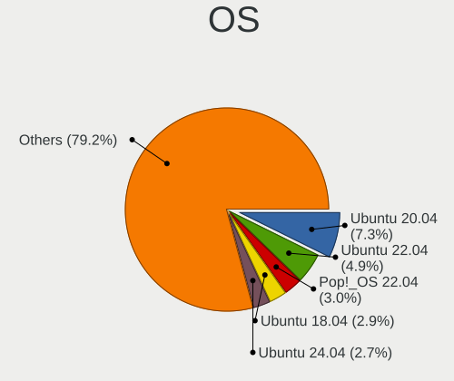

| Name                         | Computers | Percent |
|------------------------------|-----------|---------|
| Ubuntu 20.04                 | 64        | 7.32%   |
| Ubuntu 22.04                 | 43        | 4.92%   |
| Pop!_OS 22.04                | 26        | 2.97%   |
| Ubuntu 18.04                 | 25        | 2.86%   |
| Ubuntu 24.04                 | 24        | 2.75%   |
| Debian 11                    | 24        | 2.75%   |
| Arch Rolling                 | 23        | 2.63%   |
| Debian 12                    | 17        | 1.95%   |
| Zorin 16                     | 14        | 1.6%    |
| OpenMandriva 24.12           | 14        | 1.6%    |
| Fedora 41                    | 14        | 1.6%    |
| ArcoLinux Rolling            | 14        | 1.6%    |
| Zorin 17                     | 13        | 1.49%   |
| OpenMandriva 4.3             | 13        | 1.49%   |
| OpenMandriva 23.08           | 13        | 1.49%   |
| OpenMandriva 5.0             | 12        | 1.37%   |
| OpenMandriva 4.2             | 11        | 1.26%   |
| LMDE 6                       | 11        | 1.26%   |
| Fedora 40                    | 11        | 1.26%   |
| Pop!_OS 20.10                | 10        | 1.14%   |
| OpenMandriva 23.01           | 10        | 1.14%   |
| Linux Mint 22.1              | 10        | 1.14%   |
| Pop!_OS 21.04                | 9         | 1.03%   |
| OpenMandriva 4.50            | 9         | 1.03%   |
| OpenMandriva 25.90           | 9         | 1.03%   |
| KDE neon 20.04               | 9         | 1.03%   |
| Pop!_OS 20.04                | 8         | 0.92%   |
| OpenMandriva 23.03           | 8         | 0.92%   |
| Fedora 43                    | 8         | 0.92%   |
| Fedora 42                    | 8         | 0.92%   |
| Fedora 33                    | 8         | 0.92%   |
| EndeavourOS Rolling          | 8         | 0.92%   |
| Ubuntu 19.04                 | 7         | 0.8%    |
| openSUSE Tumbleweed-XXXXXXXX | 7         | 0.8%    |
| Fedora 39                    | 7         | 0.8%    |
| Fedora 37                    | 7         | 0.8%    |
| Debian 13                    | 7         | 0.8%    |
| Ubuntu 23.04                 | 6         | 0.69%   |
| Linux Mint 19.3              | 6         | 0.69%   |
| Fedora 34                    | 6         | 0.69%   |

OS Family
---------

OS without a version

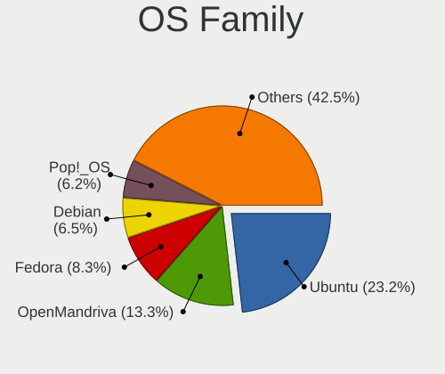

| Name          | Computers | Percent |
|---------------|-----------|---------|
| Ubuntu        | 190       | 23.2%   |
| OpenMandriva  | 109       | 13.31%  |
| Fedora        | 68        | 8.3%    |
| Debian        | 53        | 6.47%   |
| Pop!_OS       | 51        | 6.23%   |
| Linux Mint    | 47        | 5.74%   |
| Zorin         | 35        | 4.27%   |
| Arch          | 28        | 3.42%   |
| KDE neon      | 17        | 2.08%   |
| Elementary    | 16        | 1.95%   |
| LMDE          | 14        | 1.71%   |
| ArcoLinux     | 14        | 1.71%   |
| Manjaro       | 13        | 1.59%   |
| Kubuntu       | 12        | 1.47%   |
| Lubuntu       | 11        | 1.34%   |
| Xubuntu       | 10        | 1.22%   |
| openSUSE      | 10        | 1.22%   |
| Kali          | 10        | 1.22%   |
| EndeavourOS   | 9         | 1.1%    |
| Endless       | 8         | 0.98%   |
| SteamOS       | 6         | 0.73%   |
| Nobara        | 6         | 0.73%   |
| Ubuntu MATE   | 5         | 0.61%   |
| ROSA          | 5         | 0.61%   |
| Raspbian      | 5         | 0.61%   |
| MX            | 5         | 0.61%   |
| CentOS        | 5         | 0.61%   |
| Android       | 5         | 0.61%   |
| Xero          | 4         | 0.49%   |
| CachyOS       | 4         | 0.49%   |
| Bazzite       | 4         | 0.49%   |
| Ubuntu Unity  | 3         | 0.37%   |
| Ubuntu Budgie | 3         | 0.37%   |
| Rocky Linux   | 3         | 0.37%   |
| Ultramarine   | 2         | 0.24%   |
| NixOS         | 2         | 0.24%   |
| Linux Lite    | 2         | 0.24%   |
| Gentoo        | 2         | 0.24%   |
| ChimeraOS     | 2         | 0.24%   |
| Archcraft     | 2         | 0.24%   |

Kernel
------

Version of the Linux kernel

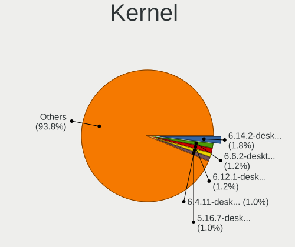

| Version                  | Computers | Percent |
|--------------------------|-----------|---------|
| 6.14.2-desktop-3omv2590  | 18        | 1.81%   |
| 6.6.2-desktop-1omv2390   | 12        | 1.21%   |
| 6.12.1-desktop-1omv2490  | 12        | 1.21%   |
| 6.4.11-desktop-1omv2390  | 10        | 1.01%   |
| 5.16.7-desktop-1omv4003  | 10        | 1.01%   |
| 5.10.14-desktop-1omv4002 | 10        | 1.01%   |
| 6.2.6-desktop-1omv2390   | 9         | 0.9%    |
| 5.4.0-58-generic         | 8         | 0.8%    |
| 5.4.0-42-generic         | 8         | 0.8%    |
| 6.8.0-51-generic         | 7         | 0.7%    |
| 6.1.1-desktop-1omv2290   | 7         | 0.7%    |
| 6.12.48+deb13-amd64      | 6         | 0.6%    |
| 5.15.0-58-generic        | 6         | 0.6%    |
| 5.15.0-52-generic        | 6         | 0.6%    |
| 5.13.19-6-pve            | 6         | 0.6%    |
| 5.11.0-7620-generic      | 6         | 0.6%    |
| 6.8.0-60-generic         | 5         | 0.5%    |
| 6.8.0-31-generic         | 5         | 0.5%    |
| 6.5.0-27-generic         | 5         | 0.5%    |
| 6.5.0-14-generic         | 5         | 0.5%    |
| 6.2.6-76060206-generic   | 5         | 0.5%    |
| 6.17.12-300.fc43.x86_64  | 5         | 0.5%    |
| 6.1.0-25-amd64           | 5         | 0.5%    |
| 5.19.0-46-generic        | 5         | 0.5%    |
| 5.12.4-desktop-1omv4050  | 5         | 0.5%    |
| 5.11.0-27-generic        | 5         | 0.5%    |
| 6.9.3-76060903-generic   | 4         | 0.4%    |
| 6.8.0-85-generic         | 4         | 0.4%    |
| 6.8.0-49-generic         | 4         | 0.4%    |
| 6.3.9-arch1-1            | 4         | 0.4%    |
| 6.11.0-19-generic        | 4         | 0.4%    |
| 5.4.0-7634-generic       | 4         | 0.4%    |
| 5.4.0-40-generic         | 4         | 0.4%    |
| 5.15.126-1-pve           | 4         | 0.4%    |
| 5.15.108-1-pve           | 4         | 0.4%    |
| 5.15.0-91-generic        | 4         | 0.4%    |
| 5.15.0-89-generic        | 4         | 0.4%    |
| 5.15.0-56-generic        | 4         | 0.4%    |
| 5.13.0-22-generic        | 4         | 0.4%    |
| 5.0.0-37-generic         | 4         | 0.4%    |

Kernel Family
-------------

Linux kernel without a distro release

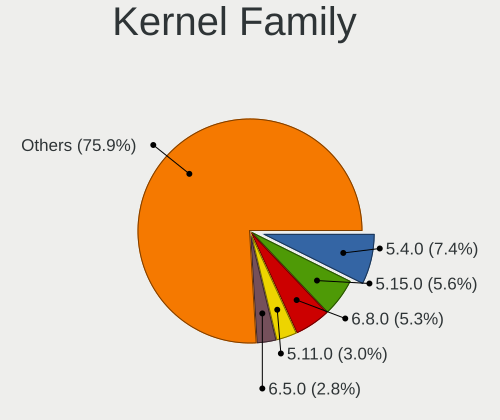

| Version | Computers | Percent |
|---------|-----------|---------|
| 5.4.0   | 70        | 7.35%   |
| 5.15.0  | 53        | 5.57%   |
| 6.8.0   | 50        | 5.25%   |
| 5.11.0  | 29        | 3.05%   |
| 6.5.0   | 27        | 2.84%   |
| 6.1.0   | 26        | 2.73%   |
| 5.8.0   | 26        | 2.73%   |
| 6.14.2  | 21        | 2.21%   |
| 5.13.0  | 20        | 2.1%    |
| 4.15.0  | 20        | 2.1%    |
| 5.3.0   | 19        | 2%      |
| 6.14.0  | 18        | 1.89%   |
| 5.0.0   | 18        | 1.89%   |
| 5.19.0  | 17        | 1.79%   |
| 6.11.0  | 15        | 1.58%   |
| 6.2.6   | 14        | 1.47%   |
| 6.6.2   | 13        | 1.37%   |
| 6.2.0   | 12        | 1.26%   |
| 6.12.1  | 12        | 1.26%   |
| 6.4.11  | 11        | 1.16%   |
| 5.16.7  | 10        | 1.05%   |
| 5.10.14 | 10        | 1.05%   |
| 6.1.1   | 8         | 0.84%   |
| 5.10.0  | 8         | 0.84%   |
| 4.18.0  | 7         | 0.74%   |
| 6.3.9   | 6         | 0.63%   |
| 6.12.48 | 6         | 0.63%   |
| 5.13.19 | 6         | 0.63%   |
| 6.9.3   | 5         | 0.53%   |
| 6.17.12 | 5         | 0.53%   |
| 6.16.3  | 5         | 0.53%   |
| 6.14.6  | 5         | 0.53%   |
| 6.14.4  | 5         | 0.53%   |
| 6.1.21  | 5         | 0.53%   |
| 6.0.12  | 5         | 0.53%   |
| 5.17.1  | 5         | 0.53%   |
| 5.12.4  | 5         | 0.53%   |
| 6.8.11  | 4         | 0.42%   |
| 6.5.6   | 4         | 0.42%   |
| 6.4.8   | 4         | 0.42%   |

Kernel Major Ver.
-----------------

Linux kernel major version

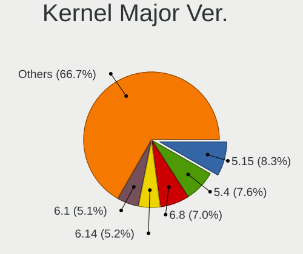

| Version | Computers | Percent |
|---------|-----------|---------|
| 5.15    | 76        | 8.29%   |
| 5.4     | 70        | 7.63%   |
| 6.8     | 64        | 6.98%   |
| 6.14    | 48        | 5.23%   |
| 6.1     | 47        | 5.13%   |
| 6.12    | 43        | 4.69%   |
| 6.2     | 37        | 4.03%   |
| 6.5     | 35        | 3.82%   |
| 5.11    | 34        | 3.71%   |
| 5.8     | 33        | 3.6%    |
| 6.6     | 29        | 3.16%   |
| 5.13    | 29        | 3.16%   |
| 5.10    | 28        | 3.05%   |
| 6.11    | 27        | 2.94%   |
| 6.4     | 26        | 2.84%   |
| 5.19    | 24        | 2.62%   |
| 5.16    | 20        | 2.18%   |
| 4.15    | 20        | 2.18%   |
| 5.3     | 19        | 2.07%   |
| 5.0     | 18        | 1.96%   |
| 6.17    | 17        | 1.85%   |
| 6.10    | 17        | 1.85%   |
| 6.3     | 14        | 1.53%   |
| 6.9     | 13        | 1.42%   |
| 6.16    | 13        | 1.42%   |
| 5.12    | 13        | 1.42%   |
| 5.14    | 12        | 1.31%   |
| 6.13    | 10        | 1.09%   |
| 6.0     | 10        | 1.09%   |
| 5.18    | 9         | 0.98%   |
| 5.17    | 9         | 0.98%   |
| 6.7     | 8         | 0.87%   |
| 6.15    | 8         | 0.87%   |
| 5.9     | 8         | 0.87%   |
| 4.18    | 8         | 0.87%   |
| 3.10    | 4         | 0.44%   |
| 4.9     | 3         | 0.33%   |
| 6.18    | 2         | 0.22%   |
| 5.7     | 2         | 0.22%   |
| 5.6     | 2         | 0.22%   |

Arch
----

OS architecture (x86_64, i586, etc.)

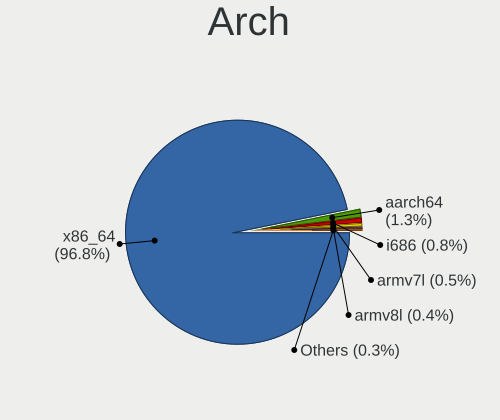

| Name    | Computers | Percent |
|---------|-----------|---------|
| x86_64  | 756       | 96.8%   |
| aarch64 | 10        | 1.28%   |
| i686    | 6         | 0.77%   |
| armv7l  | 4         | 0.51%   |
| armv8l  | 3         | 0.38%   |
| armv6l  | 2         | 0.26%   |

DE
--

Desktop Environment

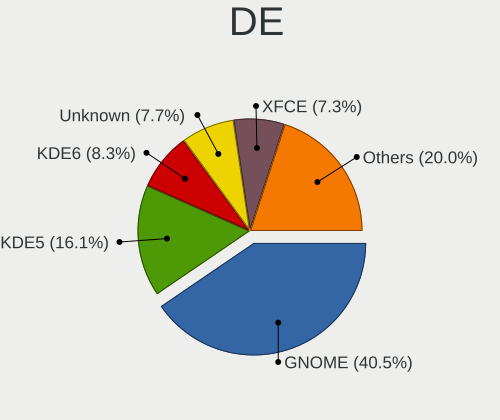

| Name          | Computers | Percent |
|---------------|-----------|---------|
| GNOME         | 336       | 40.48%  |
| KDE5          | 134       | 16.14%  |
| KDE6          | 69        | 8.31%   |
| Unknown       | 64        | 7.71%   |
| XFCE          | 61        | 7.35%   |
| X-Cinnamon    | 47        | 5.66%   |
| LXQt          | 20        | 2.41%   |
| Pantheon      | 16        | 1.93%   |
| MATE          | 16        | 1.93%   |
| KDE           | 15        | 1.81%   |
| Openbox       | 13        | 1.57%   |
| Hyprland      | 7         | 0.84%   |
| Budgie        | 5         | 0.6%    |
| KDE4          | 4         | 0.48%   |
| Unity         | 3         | 0.36%   |
| i3            | 3         | 0.36%   |
| wayfire       | 2         | 0.24%   |
| LXDE          | 2         | 0.24%   |
| herbstluftwm  | 2         | 0.24%   |
| GNOME Classic | 2         | 0.24%   |
| Cinnamon      | 2         | 0.24%   |
| bspwm         | 2         | 0.24%   |
| Peppermint    | 1         | 0.12%   |
| labwc:wlroots | 1         | 0.12%   |
| fvwm3         | 1         | 0.12%   |
| chadwm        | 1         | 0.12%   |
| BunsenLabs    | 1         | 0.12%   |

Display Server
--------------

X11 or Wayland

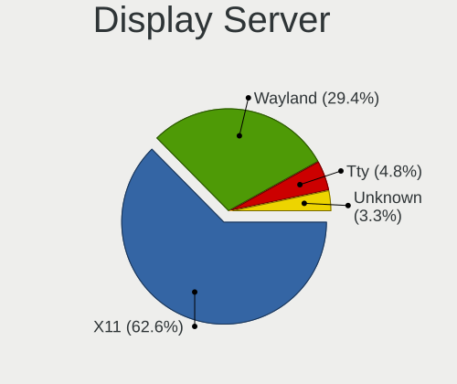

| Name    | Computers | Percent |
|---------|-----------|---------|
| X11     | 514       | 62.61%  |
| Wayland | 241       | 29.35%  |
| Tty     | 39        | 4.75%   |
| Unknown | 27        | 3.29%   |

Display Manager
---------------

SDDM, LightDM, etc.

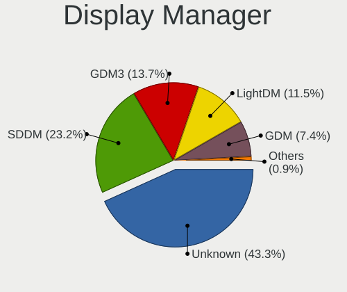

| Name    | Computers | Percent |
|---------|-----------|---------|
| Unknown | 350       | 43.26%  |
| SDDM    | 188       | 23.24%  |
| GDM3    | 111       | 13.72%  |
| LightDM | 93        | 11.5%   |
| GDM     | 60        | 7.42%   |
| TDM     | 5         | 0.62%   |
| LXDM    | 2         | 0.25%   |

OS Lang
-------

Language

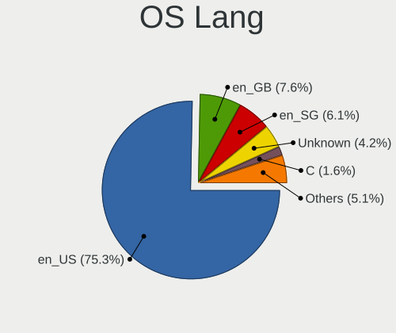

| Lang       | Computers | Percent |
|------------|-----------|---------|
| en_US      | 604       | 75.31%  |
| en_GB      | 61        | 7.61%   |
| en_SG      | 49        | 6.11%   |
| Unknown    | 34        | 4.24%   |
| C          | 13        | 1.62%   |
| zh_CN      | 7         | 0.87%   |
| de_DE      | 6         | 0.75%   |
| en_AU      | 5         | 0.62%   |
| ms_MY      | 4         | 0.5%    |
| en_HK      | 4         | 0.5%    |
| en_MY      | 3         | 0.37%   |
| zh_TW      | 2         | 0.25%   |
| ja_JP      | 2         | 0.25%   |
| en_PH      | 2         | 0.25%   |
| zh_SG      | 1         | 0.12%   |
| zh_CN.UTF8 | 1         | 0.12%   |
| POSIX      | 1         | 0.12%   |
| it_IT      | 1         | 0.12%   |
| id_ID      | 1         | 0.12%   |
| es_ES      | 1         | 0.12%   |

Boot Mode
---------

EFI or BIOS

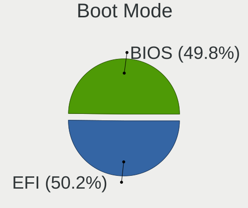

| Mode | Computers | Percent |
|------|-----------|---------|
| EFI  | 399       | 50.19%  |
| BIOS | 396       | 49.81%  |

Filesystem
----------

Type of filesystem

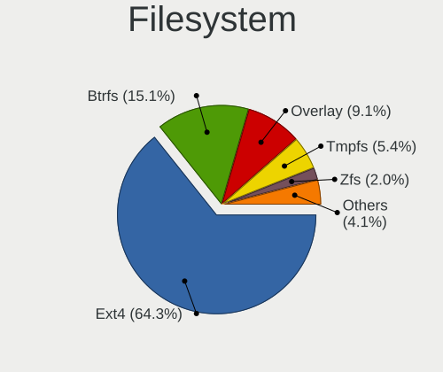

| Type     | Computers | Percent |
|----------|-----------|---------|
| Ext4     | 522       | 64.29%  |
| Btrfs    | 123       | 15.15%  |
| Overlay  | 74        | 9.11%   |
| Tmpfs    | 44        | 5.42%   |
| Zfs      | 16        | 1.97%   |
| Xfs      | 15        | 1.85%   |
| Unknown  | 14        | 1.72%   |
| Ext2     | 2         | 0.25%   |
| Ext3     | 1         | 0.12%   |
| Bcachefs | 1         | 0.12%   |

Part. scheme
------------

Scheme of partitioning

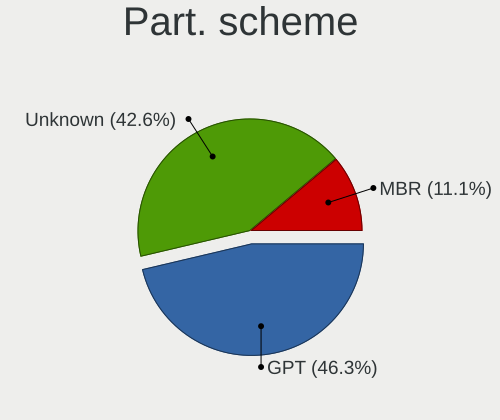

| Type    | Computers | Percent |
|---------|-----------|---------|
| GPT     | 371       | 46.32%  |
| Unknown | 341       | 42.57%  |
| MBR     | 89        | 11.11%  |

Dual Boot with Linux/BSD
------------------------

Hosting more than one Linux/BSD

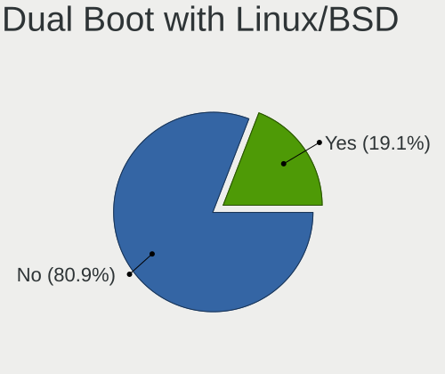

| Dual boot | Computers | Percent |
|-----------|-----------|---------|
| No        | 647       | 80.88%  |
| Yes       | 153       | 19.13%  |

Dual Boot (Win)
---------------

Hosting Linux and Windows

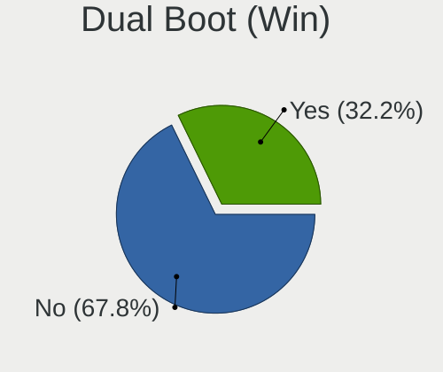

| Dual boot | Computers | Percent |
|-----------|-----------|---------|
| No        | 540       | 67.75%  |
| Yes       | 257       | 32.25%  |

Board
-----

Vendor
------

Motherboard manufacturer

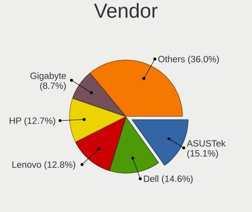

| Name                                 | Computers | Percent |
|--------------------------------------|-----------|---------|
| ASUSTek Computer                     | 118       | 15.13%  |
| Dell                                 | 114       | 14.62%  |
| Lenovo                               | 100       | 12.82%  |
| Hewlett-Packard                      | 99        | 12.69%  |
| Gigabyte Technology                  | 68        | 8.72%   |
| MSI                                  | 49        | 6.28%   |
| Acer                                 | 46        | 5.9%    |
| Intel                                | 26        | 3.33%   |
| ASRock                               | 24        | 3.08%   |
| Apple                                | 19        | 2.44%   |
| Unknown                              | 16        | 2.05%   |
| Google                               | 10        | 1.28%   |
| Raspberry Pi Foundation              | 9         | 1.15%   |
| Fujitsu                              | 7         | 0.9%    |
| HUAWEI                               | 6         | 0.77%   |
| Toshiba                              | 5         | 0.64%   |
| Sony                                 | 5         | 0.64%   |
| Biostar                              | 5         | 0.64%   |
| Valve                                | 4         | 0.51%   |
| Samsung Electronics                  | 3         | 0.38%   |
| ILLEGEAR                             | 3         | 0.38%   |
| ECS                                  | 3         | 0.38%   |
| Chuwi                                | 3         | 0.38%   |
| AMI                                  | 3         | 0.38%   |
| Teclast                              | 2         | 0.26%   |
| NEC Computers                        | 2         | 0.26%   |
| AZW                                  | 2         | 0.26%   |
| ASRockRack                           | 2         | 0.26%   |
| Acidanthera                          | 2         | 0.26%   |
| Xiaomi                               | 1         | 0.13%   |
| Vorke                                | 1         | 0.13%   |
| Timi                                 | 1         | 0.13%   |
| SZMZ                                 | 1         | 0.13%   |
| System76                             | 1         | 0.13%   |
| Supermicro                           | 1         | 0.13%   |
| sunxi                                | 1         | 0.13%   |
| SNS Network (M)                      | 1         | 0.13%   |
| Shuttle                              | 1         | 0.13%   |
| Shenzhen Meigao Electronic Equipment | 1         | 0.13%   |
| Seco                                 | 1         | 0.13%   |

Model
-----

Motherboard model

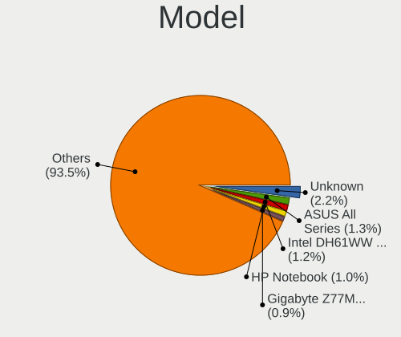

| Name                                     | Computers | Percent |
|------------------------------------------|-----------|---------|
| Unknown                                  | 17        | 2.18%   |
| ASUS All Series                          | 10        | 1.28%   |
| Intel DH61WW AAG23116-204                | 9         | 1.15%   |
| HP Notebook                              | 8         | 1.03%   |
| Gigabyte Z77M-D3H                        | 7         | 0.9%    |
| MSI MS-7C52                              | 6         | 0.77%   |
| Gigabyte B85M-D3H                        | 6         | 0.77%   |
| Valve Jupiter                            | 4         | 0.51%   |
| MSI MS-7817                              | 4         | 0.51%   |
| Lenovo ThinkCentre M93p 10A8S4B200       | 4         | 0.51%   |
| Gigabyte X570 UD                         | 4         | 0.51%   |
| Gigabyte B450M S2H                       | 4         | 0.51%   |
| Dell OptiPlex 755                        | 4         | 0.51%   |
| Intel DH61WW AAG23116-300                | 3         | 0.38%   |
| HP Pavilion Notebook                     | 3         | 0.38%   |
| HP Laptop 15-bs0xx                       | 3         | 0.38%   |
| HP EliteBook 840 G2                      | 3         | 0.38%   |
| HP Compaq Presario CQ40                  | 3         | 0.38%   |
| Google Auron_Paine                       | 3         | 0.38%   |
| Gigabyte A520M K V2                      | 3         | 0.38%   |
| Dell XPS 15 7590                         | 3         | 0.38%   |
| Dell OptiPlex 7010                       | 3         | 0.38%   |
| Dell Latitude E7470                      | 3         | 0.38%   |
| Dell Latitude E6520                      | 3         | 0.38%   |
| ASUS VivoBook_ASUSLaptop M1605YA_M1605YA | 3         | 0.38%   |
| ASUS TUF Gaming B550M-PLUS               | 3         | 0.38%   |
| ASRock B550 Pro4                         | 3         | 0.38%   |
| Teclast F5                               | 2         | 0.26%   |
| MSI MS-7D46                              | 2         | 0.26%   |
| MSI MS-7C96                              | 2         | 0.26%   |
| MSI MS-7C81                              | 2         | 0.26%   |
| MSI MS-7B89                              | 2         | 0.26%   |
| MSI Modern 14 B5M                        | 2         | 0.26%   |
| Lenovo ThinkBook 13s G2 ITL 20V9         | 2         | 0.26%   |
| Lenovo IdeaPad Gaming 3 15ACH6 82K2      | 2         | 0.26%   |
| Lenovo IdeaPad 3 15ABA7 82RN             | 2         | 0.26%   |
| Lenovo G50-70 20351                      | 2         | 0.26%   |
| Intel X99                                | 2         | 0.26%   |
| Intel MAHOBAY                            | 2         | 0.26%   |
| ILLEGEAR RAVEN SE                        | 2         | 0.26%   |

Model Family
------------

Motherboard model prefix

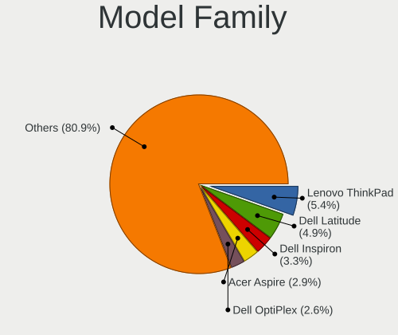

| Name               | Computers | Percent |
|--------------------|-----------|---------|
| Lenovo ThinkPad    | 42        | 5.38%   |
| Dell Latitude      | 38        | 4.87%   |
| Dell Inspiron      | 26        | 3.33%   |
| Acer Aspire        | 23        | 2.95%   |
| Dell OptiPlex      | 20        | 2.56%   |
| ASUS VivoBook      | 17        | 2.18%   |
| Unknown            | 17        | 2.18%   |
| Lenovo IdeaPad     | 15        | 1.92%   |
| HP Pavilion        | 15        | 1.92%   |
| HP EliteBook       | 13        | 1.67%   |
| HP Compaq          | 13        | 1.67%   |
| Intel DH61WW       | 12        | 1.54%   |
| Dell XPS           | 11        | 1.41%   |
| Dell Precision     | 11        | 1.41%   |
| Lenovo ThinkCentre | 10        | 1.28%   |
| HP Laptop          | 10        | 1.28%   |
| ASUS TUF           | 10        | 1.28%   |
| ASUS ROG           | 10        | 1.28%   |
| ASUS All           | 10        | 1.28%   |
| RPi Raspberry      | 9         | 1.15%   |
| HP Notebook        | 8         | 1.03%   |
| Gigabyte Z77M-D3H  | 7         | 0.9%    |
| ASUS PRIME         | 7         | 0.9%    |
| Acer Veriton       | 7         | 0.9%    |
| MSI MS-7C52        | 6         | 0.77%   |
| Lenovo Legion      | 6         | 0.77%   |
| Gigabyte X570      | 6         | 0.77%   |
| Gigabyte B85M-D3H  | 6         | 0.77%   |
| HP ENVY            | 5         | 0.64%   |
| Gigabyte B450M     | 5         | 0.64%   |
| Valve Jupiter      | 4         | 0.51%   |
| MSI MS-7817        | 4         | 0.51%   |
| Lenovo Yoga        | 4         | 0.51%   |
| Lenovo ThinkBook   | 4         | 0.51%   |
| HP ProLiant        | 4         | 0.51%   |
| HP ProDesk         | 4         | 0.51%   |
| HP ProBook         | 4         | 0.51%   |
| Fujitsu LIFEBOOK   | 4         | 0.51%   |
| Dell PowerEdge     | 4         | 0.51%   |
| ASUS ZenBook       | 4         | 0.51%   |

MFG Year
--------

Motherboard manufacture year

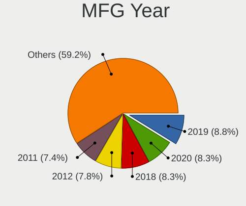

| Year    | Computers | Percent |
|---------|-----------|---------|
| 2019    | 69        | 8.85%   |
| 2020    | 65        | 8.33%   |
| 2018    | 65        | 8.33%   |
| 2012    | 61        | 7.82%   |
| 2011    | 58        | 7.44%   |
| 2013    | 55        | 7.05%   |
| 2021    | 48        | 6.15%   |
| 2015    | 46        | 5.9%    |
| 2017    | 42        | 5.38%   |
| 2022    | 39        | 5%      |
| 2014    | 39        | 5%      |
| 2023    | 34        | 4.36%   |
| 2010    | 32        | 4.1%    |
| 2008    | 25        | 3.21%   |
| 2009    | 22        | 2.82%   |
| 2016    | 20        | 2.56%   |
| Unknown | 18        | 2.31%   |
| 2024    | 15        | 1.92%   |
| 2025    | 13        | 1.67%   |
| 2007    | 12        | 1.54%   |
| 2006    | 1         | 0.13%   |
| 2004    | 1         | 0.13%   |

Form Factor
-----------

Physical design of the computer

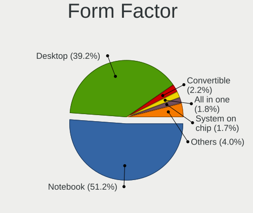

| Name           | Computers | Percent |
|----------------|-----------|---------|
| Notebook       | 399       | 51.15%  |
| Desktop        | 306       | 39.23%  |
| Convertible    | 17        | 2.18%   |
| All in one     | 14        | 1.79%   |
| System on chip | 13        | 1.67%   |
| Server         | 10        | 1.28%   |
| Tablet         | 9         | 1.15%   |
| Mini pc        | 7         | 0.9%    |
| Phone          | 5         | 0.64%   |

Secure Boot
-----------

Enabled or disabled

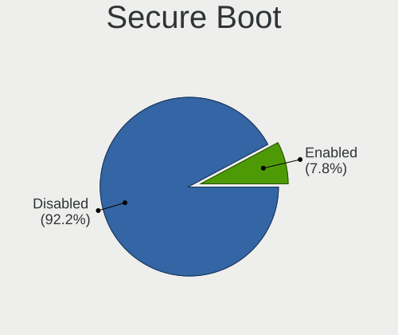

| State    | Computers | Percent |
|----------|-----------|---------|
| Disabled | 723       | 92.22%  |
| Enabled  | 61        | 7.78%   |

Coreboot
--------

Have coreboot on board

| Used | Computers | Percent |
|------|-----------|---------|
| No   | 768       | 98.46%  |
| Yes  | 12        | 1.54%   |

RAM Size
--------

Total RAM memory

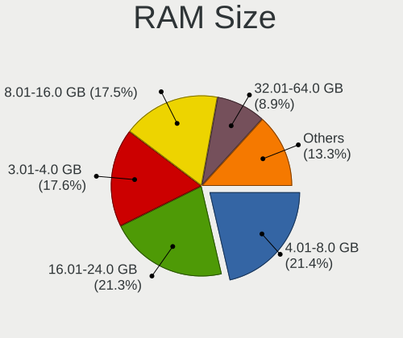

| Size in GB      | Computers | Percent |
|-----------------|-----------|---------|
| 4.01-8.0        | 171       | 21.4%   |
| 16.01-24.0      | 170       | 21.28%  |
| 3.01-4.0        | 141       | 17.65%  |
| 8.01-16.0       | 140       | 17.52%  |
| 32.01-64.0      | 71        | 8.89%   |
| 64.01-256.0     | 35        | 4.38%   |
| 24.01-32.0      | 25        | 3.13%   |
| 1.01-2.0        | 22        | 2.75%   |
| 2.01-3.0        | 13        | 1.63%   |
| 0.51-1.0        | 7         | 0.88%   |
| 0.01-0.5        | 3         | 0.38%   |
| More than 256.0 | 1         | 0.13%   |

RAM Used
--------

Used RAM memory

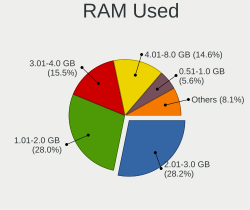

| Used GB     | Computers | Percent |
|-------------|-----------|---------|
| 2.01-3.0    | 251       | 28.2%   |
| 1.01-2.0    | 249       | 27.98%  |
| 3.01-4.0    | 138       | 15.51%  |
| 4.01-8.0    | 130       | 14.61%  |
| 0.51-1.0    | 50        | 5.62%   |
| 8.01-16.0   | 33        | 3.71%   |
| 0.01-0.5    | 15        | 1.69%   |
| 16.01-24.0  | 8         | 0.9%    |
| 32.01-64.0  | 7         | 0.79%   |
| 24.01-32.0  | 4         | 0.45%   |
| 64.01-256.0 | 4         | 0.45%   |
| Unknown     | 1         | 0.11%   |

Total Drives
------------

Number of drives on board

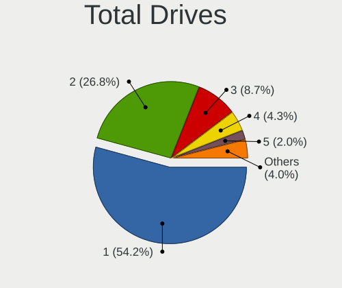

| Drives | Computers | Percent |
|--------|-----------|---------|
| 1      | 437       | 54.22%  |
| 2      | 216       | 26.8%   |
| 3      | 70        | 8.68%   |
| 4      | 35        | 4.34%   |
| 5      | 16        | 1.99%   |
| 7      | 10        | 1.24%   |
| 8      | 7         | 0.87%   |
| 6      | 5         | 0.62%   |
| 0      | 5         | 0.62%   |
| 11     | 2         | 0.25%   |
| 10     | 2         | 0.25%   |
| 9      | 1         | 0.12%   |

Has CD-ROM
----------

Has CD-ROM on board

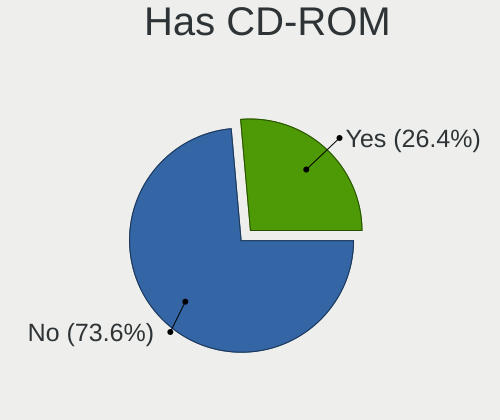

| Presented | Computers | Percent |
|-----------|-----------|---------|
| No        | 577       | 73.6%   |
| Yes       | 207       | 26.4%   |

Has Ethernet
------------

Has Ethernet on board

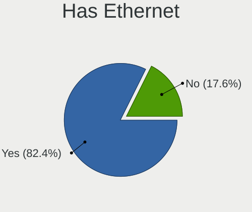

| Presented | Computers | Percent |
|-----------|-----------|---------|
| Yes       | 645       | 82.38%  |
| No        | 138       | 17.62%  |

Has WiFi
--------

Has WiFi module

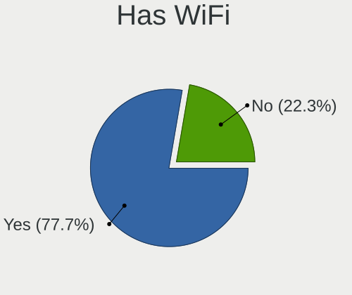

| Presented | Computers | Percent |
|-----------|-----------|---------|
| Yes       | 613       | 77.69%  |
| No        | 176       | 22.31%  |

Has Bluetooth
-------------

Has Bluetooth module

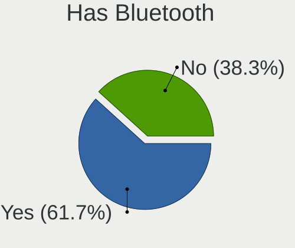

| Presented | Computers | Percent |
|-----------|-----------|---------|
| Yes       | 487       | 61.72%  |
| No        | 302       | 38.28%  |

Location
--------

Country
-------

Geographic location (country)

| Country  | Computers | Percent |
|----------|-----------|---------|
| Malaysia | 780       | 100%    |

City
----

Geographic location (city)

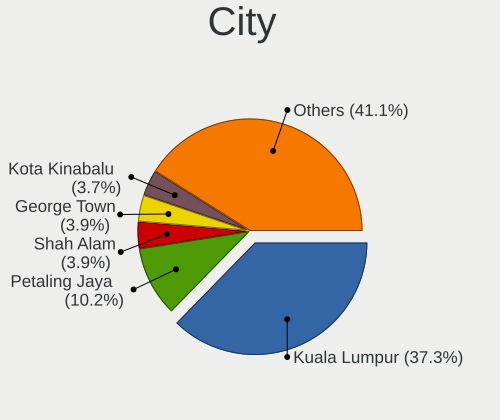

| City                   | Computers | Percent |
|------------------------|-----------|---------|
| Kuala Lumpur           | 319       | 37.31%  |
| Petaling Jaya          | 87        | 10.18%  |
| Shah Alam              | 33        | 3.86%   |
| George Town            | 33        | 3.86%   |
| Kota Kinabalu          | 32        | 3.74%   |
| Johor Bahru            | 30        | 3.51%   |
| Ipoh                   | 27        | 3.16%   |
| Seremban               | 24        | 2.81%   |
| Seri Kembangan         | 21        | 2.46%   |
| Puchong Batu Dua Belas | 20        | 2.34%   |
| Kajang                 | 19        | 2.22%   |
| Subang Jaya            | 18        | 2.11%   |
| Kuching                | 17        | 1.99%   |
| Kota Bharu             | 14        | 1.64%   |
| Malacca                | 10        | 1.17%   |
| Sungai Petani          | 9         | 1.05%   |
| Sungai Buloh           | 9         | 1.05%   |
| Cheras                 | 8         | 0.94%   |
| Marabu                 | 7         | 0.82%   |
| Kulim                  | 6         | 0.7%    |
| Kulai                  | 5         | 0.58%   |
| Klang                  | 5         | 0.58%   |
| Butterworth            | 5         | 0.58%   |
| Tawau                  | 4         | 0.47%   |
| Taman Prai             | 4         | 0.47%   |
| Sungai Besar           | 4         | 0.47%   |
| Skudai                 | 4         | 0.47%   |
| Cyberjaya              | 4         | 0.47%   |
| Bayan Lepas            | 4         | 0.47%   |
| Batu Pahat             | 4         | 0.47%   |
| Ampang                 | 4         | 0.47%   |
| Sibu                   | 3         | 0.35%   |
| Semenyih               | 3         | 0.35%   |
| Putrajaya              | 3         | 0.35%   |
| Bukit Mertajam         | 3         | 0.35%   |
| Tanjung Bungah         | 2         | 0.23%   |
| Rumah Bubong           | 2         | 0.23%   |
| Rawang                 | 2         | 0.23%   |
| Nibong Tebal           | 2         | 0.23%   |
| Long Seridan           | 2         | 0.23%   |

Drives
------

Drive Vendor
------------

Hard drive vendors

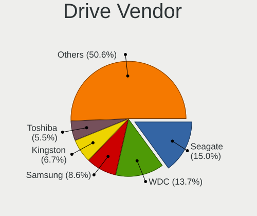

| Vendor                      | Computers | Drives | Percent |
|-----------------------------|-----------|--------|---------|
| Seagate                     | 186       | 319    | 14.95%  |
| WDC                         | 170       | 276    | 13.67%  |
| Samsung Electronics         | 107       | 164    | 8.6%    |
| Kingston                    | 83        | 138    | 6.67%   |
| Toshiba                     | 69        | 87     | 5.55%   |
| Sandisk                     | 68        | 94     | 5.47%   |
| Unknown                     | 53        | 68     | 4.26%   |
| A-DATA Technology           | 39        | 66     | 3.14%   |
| Intel                       | 31        | 45     | 2.49%   |
| HGST                        | 26        | 35     | 2.09%   |
| SK hynix                    | 24        | 28     | 1.93%   |
| Micron Technology           | 24        | 35     | 1.93%   |
| Hitachi                     | 22        | 28     | 1.77%   |
| Crucial                     | 22        | 53     | 1.77%   |
| PNY                         | 21        | 61     | 1.69%   |
| Apacer                      | 19        | 28     | 1.53%   |
| Kingston Technology Company | 16        | 18     | 1.29%   |
| Phison Electronics          | 14        | 15     | 1.13%   |
| Silicon Motion              | 12        | 31     | 0.96%   |
| KIOXIA                      | 12        | 17     | 0.96%   |
| Transcend                   | 11        | 20     | 0.88%   |
| SPCC                        | 11        | 12     | 0.88%   |
| ADATA Technology            | 11        | 16     | 0.88%   |
| China                       | 10        | 10     | 0.8%    |
| Phison                      | 8         | 11     | 0.64%   |
| Patriot                     | 8         | 9      | 0.64%   |
| Unknown                     | 8         | 8      | 0.64%   |
| Hewlett-Packard             | 7         | 11     | 0.56%   |
| Apple                       | 7         | 11     | 0.56%   |
| TO Exter                    | 6         | 8      | 0.48%   |
| Team                        | 6         | 6      | 0.48%   |
| Gigabyte Technology         | 6         | 8      | 0.48%   |
| Corsair                     | 6         | 17     | 0.48%   |
| AGI                         | 6         | 7      | 0.48%   |
| Micron/Crucial Technology   | 5         | 6      | 0.4%    |
| Verbatim                    | 4         | 6      | 0.32%   |
| Realtek Semiconductor       | 4         | 5      | 0.32%   |
| LITEON                      | 4         | 5      | 0.32%   |
| Kingchuxing                 | 4         | 6      | 0.32%   |
| JMicron Technology          | 4         | 4      | 0.32%   |

Drive Model
-----------

Hard drive models

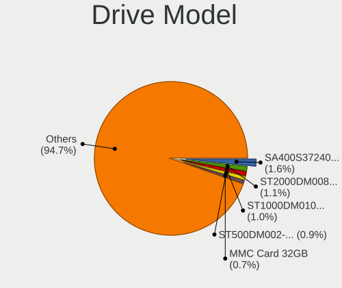

| Model                                                              | Computers | Percent |
|--------------------------------------------------------------------|-----------|---------|
| Kingston SA400S37240G 240GB SSD                                    | 22        | 1.61%   |
| Seagate ST2000DM008-2UB102 2TB                                     | 15        | 1.1%    |
| Seagate ST1000DM010-2EP102 1TB                                     | 14        | 1.02%   |
| Seagate ST500DM002-1BD142 500GB                                    | 12        | 0.88%   |
| Unknown MMC Card  32GB                                             | 10        | 0.73%   |
| Toshiba MQ01ABD100 1TB                                             | 10        | 0.73%   |
| Seagate ST3500414CS 500GB                                          | 10        | 0.73%   |
| PNY 1TB SATA SSD                                                   | 10        | 0.73%   |
| Kingston SA400S37480G 480GB SSD                                    | 10        | 0.73%   |
| Seagate ST1000LM024 HN-M101MBB 1TB                                 | 9         | 0.66%   |
| Samsung NVMe SSD Controller SM981/PM981/PM983 1TB                  | 9         | 0.66%   |
| Silicon Motion SM2263EN/SM2263XT SSD Controller 512GB              | 8         | 0.59%   |
| Seagate ST1000LM035-1RK172 1TB                                     | 8         | 0.59%   |
| Samsung HD103SJ 1TB                                                | 8         | 0.59%   |
| HGST HTS545050A7E680 500GB                                         | 8         | 0.59%   |
| Unknown                                                            | 8         | 0.59%   |
| WDC WD5000AAKX-75U6AA0 500GB                                       | 7         | 0.51%   |
| WDC WD2500AAKX-753CA1 250GB                                        | 7         | 0.51%   |
| Unknown MMC Card  64GB                                             | 7         | 0.51%   |
| Seagate ST500LT012-1DG142 500GB                                    | 7         | 0.51%   |
| Crucial CT500MX500SSD1 500GB                                       | 7         | 0.51%   |
| ADATA XPG SX8200 Pro PCIe Gen3x4 M.2 2280 Solid State Drive 1024GB | 7         | 0.51%   |
| A-DATA SX8200PNP 256GB                                             | 7         | 0.51%   |
| WDC WD20EZRX-00D8PB0 2TB                                           | 6         | 0.44%   |
| Toshiba MQ04ABF100 1TB                                             | 6         | 0.44%   |
| TO Exter nal USB 3.0 250GB                                         | 6         | 0.44%   |
| Seagate ST380815AS 80GB                                            | 6         | 0.44%   |
| Samsung SSD 860 EVO 500GB                                          | 6         | 0.44%   |
| Samsung SSD 860 EVO 250GB                                          | 6         | 0.44%   |
| Samsung NVMe SSD Controller PM9A1/PM9A3/980PRO 1TB                 | 6         | 0.44%   |
| Phison PS5013 E13 NVMe Controller 500GB                            | 6         | 0.44%   |
| Kingston SEDC500R1920G 2TB SSD                                     | 6         | 0.44%   |
| Corsair Force MP510 240GB                                          | 6         | 0.44%   |
| Apacer AS340 120GB SSD                                             | 6         | 0.44%   |
| A-DATA SX8200PNP 512GB                                             | 6         | 0.44%   |
| A-DATA SU650 120GB SSD                                             | 6         | 0.44%   |
| WDC WDS480G2G0A-00JH30 480GB SSD                                   | 5         | 0.37%   |
| WDC WD5000AAKX-08U6AA0 500GB                                       | 5         | 0.37%   |
| WDC WD5000AAKX-00ERMA0 500GB                                       | 5         | 0.37%   |
| Toshiba MQ01ABF050 500GB                                           | 5         | 0.37%   |

HDD Vendor
----------

Hard disk drive vendors

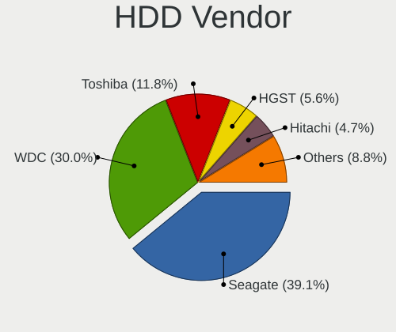

| Vendor              | Computers | Drives | Percent |
|---------------------|-----------|--------|---------|
| Seagate             | 182       | 315    | 39.06%  |
| WDC                 | 140       | 246    | 30.04%  |
| Toshiba             | 55        | 71     | 11.8%   |
| HGST                | 26        | 35     | 5.58%   |
| Hitachi             | 22        | 28     | 4.72%   |
| Samsung Electronics | 13        | 19     | 2.79%   |
| TO Exter            | 6         | 8      | 1.29%   |
| Unknown             | 5         | 5      | 1.07%   |
| Hewlett-Packard     | 3         | 3      | 0.64%   |
| USB3.0              | 2         | 2      | 0.43%   |
| JMicron Technology  | 2         | 2      | 0.43%   |
| Fujitsu             | 2         | 2      | 0.43%   |
| External            | 2         | 2      | 0.43%   |
| Apple               | 2         | 2      | 0.43%   |
| WALRAM              | 1         | 1      | 0.21%   |
| SATAFIRM            | 1         | 1      | 0.21%   |
| Maxtor              | 1         | 4      | 0.21%   |
| ASMT                | 1         | 1      | 0.21%   |

SSD Vendor
----------

Solid state drive vendors

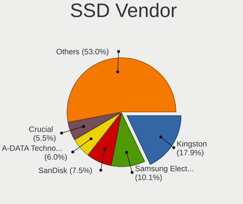

| Vendor              | Computers | Drives | Percent |
|---------------------|-----------|--------|---------|
| Kingston            | 69        | 101    | 17.92%  |
| Samsung Electronics | 39        | 63     | 10.13%  |
| SanDisk             | 29        | 34     | 7.53%   |
| A-DATA Technology   | 23        | 33     | 5.97%   |
| Crucial             | 21        | 52     | 5.45%   |
| PNY                 | 20        | 60     | 5.19%   |
| Apacer              | 19        | 28     | 4.94%   |
| WDC                 | 15        | 15     | 3.9%    |
| Intel               | 12        | 18     | 3.12%   |
| China               | 10        | 10     | 2.6%    |
| Transcend           | 9         | 11     | 2.34%   |
| SPCC                | 8         | 9      | 2.08%   |
| SK hynix            | 7         | 7      | 1.82%   |
| Team                | 6         | 6      | 1.56%   |
| Patriot             | 6         | 7      | 1.56%   |
| Micron Technology   | 6         | 11     | 1.56%   |
| AGI                 | 5         | 5      | 1.3%    |
| Verbatim            | 4         | 6      | 1.04%   |
| Toshiba             | 4         | 5      | 1.04%   |
| LITEON              | 4         | 5      | 1.04%   |
| Apple               | 4         | 5      | 1.04%   |
| Plextor             | 3         | 3      | 0.78%   |
| Pioneer             | 3         | 3      | 0.78%   |
| KingSpec            | 3         | 4      | 0.78%   |
| KimMiDi             | 3         | 3      | 0.78%   |
| Hewlett-Packard     | 3         | 5      | 0.78%   |
| Gigabyte Technology | 3         | 3      | 0.78%   |
| Colorful            | 3         | 3      | 0.78%   |
| Zheino              | 2         | 2      | 0.52%   |
| Seagate             | 2         | 2      | 0.52%   |
| ORICO               | 2         | 2      | 0.52%   |
| OCZ                 | 2         | 8      | 0.52%   |
| Netac               | 2         | 2      | 0.52%   |
| KIOXIA-EXCERIA      | 2         | 5      | 0.52%   |
| Kingchuxing         | 2         | 3      | 0.52%   |
| GAMER               | 2         | 2      | 0.52%   |
| WISE                | 1         | 1      | 0.26%   |
| WDC WDS1            | 1         | 1      | 0.26%   |
| WALRAM              | 1         | 1      | 0.26%   |
| Vi550               | 1         | 1      | 0.26%   |

Drive Kind
----------

HDD or SSD

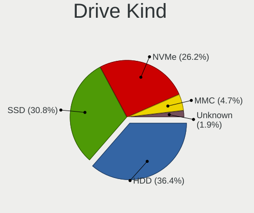

| Kind    | Computers | Drives | Percent |
|---------|-----------|--------|---------|
| HDD     | 387       | 747    | 36.37%  |
| SSD     | 328       | 573    | 30.83%  |
| NVMe    | 279       | 495    | 26.22%  |
| MMC     | 50        | 66     | 4.7%    |
| Unknown | 20        | 25     | 1.88%   |

Drive Connector
---------------

SATA, SAS, NVMe, etc.

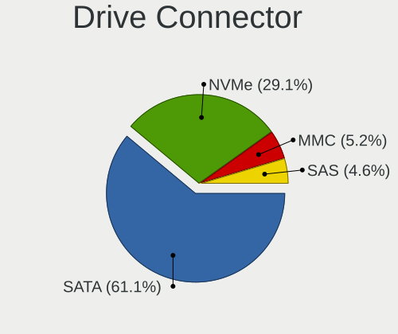

| Type | Computers | Drives | Percent |
|------|-----------|--------|---------|
| SATA | 582       | 1294   | 61.07%  |
| NVMe | 277       | 490    | 29.07%  |
| MMC  | 50        | 66     | 5.25%   |
| SAS  | 44        | 56     | 4.62%   |

Drive Size
----------

Size of hard drive

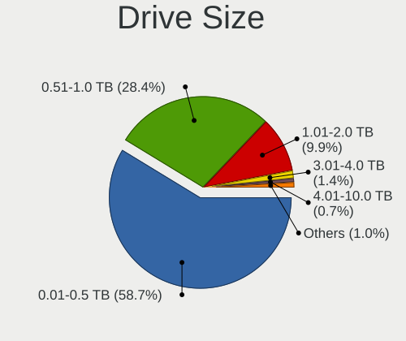

| Size in TB | Computers | Drives | Percent |
|------------|-----------|--------|---------|
| 0.01-0.5   | 428       | 707    | 58.71%  |
| 0.51-1.0   | 207       | 337    | 28.4%   |
| 1.01-2.0   | 72        | 225    | 9.88%   |
| 3.01-4.0   | 10        | 20     | 1.37%   |
| 2.01-3.0   | 5         | 7      | 0.69%   |
| 4.01-10.0  | 5         | 12     | 0.69%   |
| 10.01-20.0 | 2         | 12     | 0.27%   |

Space Total
-----------

Amount of disk space available on the file system

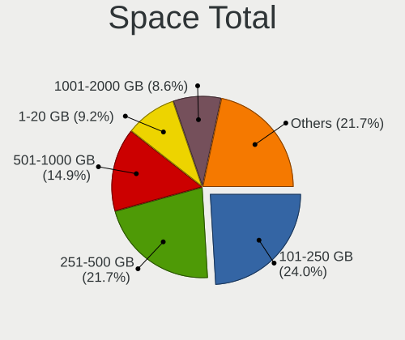

| Size in GB     | Computers | Percent |
|----------------|-----------|---------|
| 101-250        | 202       | 24.05%  |
| 251-500        | 182       | 21.67%  |
| 501-1000       | 125       | 14.88%  |
| 1-20           | 77        | 9.17%   |
| 1001-2000      | 72        | 8.57%   |
| 51-100         | 62        | 7.38%   |
| 21-50          | 38        | 4.52%   |
| More than 3000 | 33        | 3.93%   |
| Unknown        | 29        | 3.45%   |
| 2001-3000      | 20        | 2.38%   |

Space Used
----------

Amount of used disk space

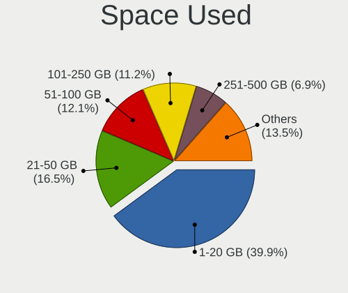

| Used GB        | Computers | Percent |
|----------------|-----------|---------|
| 1-20           | 347       | 39.93%  |
| 21-50          | 143       | 16.46%  |
| 51-100         | 105       | 12.08%  |
| 101-250        | 97        | 11.16%  |
| 251-500        | 60        | 6.9%    |
| 501-1000       | 40        | 4.6%    |
| Unknown        | 29        | 3.34%   |
| 1001-2000      | 28        | 3.22%   |
| More than 3000 | 11        | 1.27%   |
| 2001-3000      | 8         | 0.92%   |
| 0              | 1         | 0.12%   |

Malfunc. Drives
---------------

Drive models with a malfunction

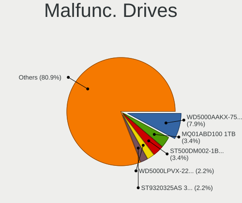

| Model                                 | Computers | Drives | Percent |
|---------------------------------------|-----------|--------|---------|
| WDC WD5000AAKX-75U6AA0 500GB          | 7         | 7      | 7.87%   |
| Toshiba MQ01ABD100 1TB                | 3         | 3      | 3.37%   |
| Seagate ST500DM002-1BD142 500GB       | 3         | 3      | 3.37%   |
| WDC WD5000LPVX-22V0TT0 500GB          | 2         | 2      | 2.25%   |
| Seagate ST9320325AS 320GB             | 2         | 2      | 2.25%   |
| Seagate ST3500414CS 500GB             | 2         | 3      | 2.25%   |
| Seagate ST1000DM010-2EP102 1TB        | 2         | 2      | 2.25%   |
| Hitachi HDS721680PLA380 80GB          | 2         | 2      | 2.25%   |
| HGST HTS721010A9E630 1TB              | 2         | 2      | 2.25%   |
| HGST HTS541010A9E680 1TB              | 2         | 2      | 2.25%   |
| WDC WDS480G2G0A-00JH30 480GB SSD      | 1         | 1      | 1.12%   |
| WDC WD800AAJS-00PSA0 80GB             | 1         | 1      | 1.12%   |
| WDC WD5000LPCX-24VHAT0 500GB          | 1         | 1      | 1.12%   |
| WDC WD5000BPVT-24HXZT3 500GB          | 1         | 1      | 1.12%   |
| WDC WD5000BPVT-00HXZT1 500GB          | 1         | 1      | 1.12%   |
| WDC WD5000AVDS-73U7B1 500GB           | 1         | 1      | 1.12%   |
| WDC WD5000AAKX-753CA1 500GB           | 1         | 1      | 1.12%   |
| WDC WD5000AAKX-08U6AA0 500GB          | 1         | 1      | 1.12%   |
| WDC WD5000AAKX-00ERMA0 500GB          | 1         | 1      | 1.12%   |
| WDC WD5000AADS-00S9B0 500GB           | 1         | 1      | 1.12%   |
| WDC WD3200BEVT-60A23T0 320GB          | 1         | 1      | 1.12%   |
| WDC WD3200AAKS-75L9A0 320GB           | 1         | 1      | 1.12%   |
| WDC WD30EZRX-00SPEB0 3TB              | 1         | 1      | 1.12%   |
| WDC WD10SPZX-60Z10T0 1TB              | 1         | 1      | 1.12%   |
| WDC WD10JPVX-22JC3T0 1TB              | 1         | 1      | 1.12%   |
| WDC WD10JPVX-08JC3T5 1TB              | 1         | 1      | 1.12%   |
| WDC WD10JPVT-75A1YT0 1TB              | 1         | 1      | 1.12%   |
| WDC WD10EZEX-60WN4A0 1TB              | 1         | 1      | 1.12%   |
| WDC WD10EZEX-60M2NA0 1TB              | 1         | 1      | 1.12%   |
| WDC WD10EZEX-08WN4A0 1TB              | 1         | 1      | 1.12%   |
| WDC WD Green 2.5 240GB                | 1         | 1      | 1.12%   |
| WALRAM SSD 128GB                      | 1         | 1      | 1.12%   |
| Transcend TS1TMTE662TI-KAI 1TB        | 1         | 1      | 1.12%   |
| Toshiba MK5065GSX 500GB               | 1         | 1      | 1.12%   |
| Toshiba MK1059GSMP 1TB                | 1         | 1      | 1.12%   |
| Toshiba DT01ACA100 1TB                | 1         | 1      | 1.12%   |
| SPCC Solid State Disk 256GB           | 1         | 1      | 1.12%   |
| SK hynix HFS128G32TND-N210A 128GB SSD | 1         | 1      | 1.12%   |
| Seagate ST9750420AS 752GB             | 1         | 1      | 1.12%   |
| Seagate ST9250315AS 250GB             | 1         | 1      | 1.12%   |

Malfunc. Drive Vendor
---------------------

Vendors of faulty drives

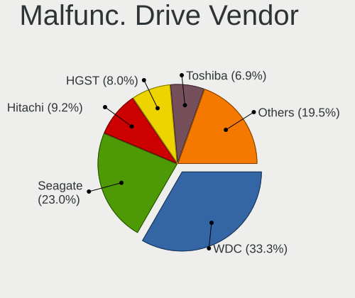

| Vendor                    | Computers | Drives | Percent |
|---------------------------|-----------|--------|---------|
| WDC                       | 29        | 30     | 33.33%  |
| Seagate                   | 20        | 22     | 22.99%  |
| Hitachi                   | 8         | 11     | 9.2%    |
| HGST                      | 7         | 7      | 8.05%   |
| Toshiba                   | 6         | 6      | 6.9%    |
| Samsung Electronics       | 3         | 3      | 3.45%   |
| WALRAM                    | 1         | 1      | 1.15%   |
| Transcend                 | 1         | 1      | 1.15%   |
| SPCC                      | 1         | 1      | 1.15%   |
| SK hynix                  | 1         | 1      | 1.15%   |
| PNY                       | 1         | 6      | 1.15%   |
| Micron/Crucial Technology | 1         | 2      | 1.15%   |
| Micron Technology         | 1         | 1      | 1.15%   |
| Kingston                  | 1         | 1      | 1.15%   |
| Intel                     | 1         | 1      | 1.15%   |
| IMP-SSD3                  | 1         | 1      | 1.15%   |
| Hewlett-Packard           | 1         | 1      | 1.15%   |
| Crucial                   | 1         | 2      | 1.15%   |
| A-DATA Technology         | 1         | 1      | 1.15%   |
| Unknown                   | 1         | 1      | 1.15%   |

Malfunc. HDD Vendor
-------------------

Vendors of faulty HDD drives

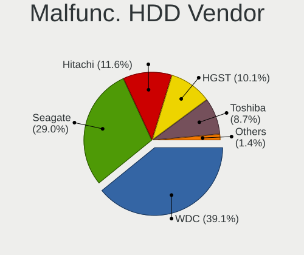

| Vendor              | Computers | Drives | Percent |
|---------------------|-----------|--------|---------|
| WDC                 | 27        | 28     | 39.13%  |
| Seagate             | 20        | 22     | 28.99%  |
| Hitachi             | 8         | 11     | 11.59%  |
| HGST                | 7         | 7      | 10.14%  |
| Toshiba             | 6         | 6      | 8.7%    |
| Samsung Electronics | 1         | 1      | 1.45%   |

Malfunc. Drive Kind
-------------------

Kinds of faulty drives

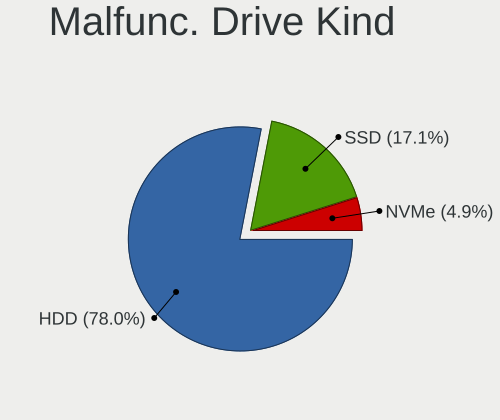

| Kind | Computers | Drives | Percent |
|------|-----------|--------|---------|
| HDD  | 64        | 75     | 78.05%  |
| SSD  | 14        | 20     | 17.07%  |
| NVMe | 4         | 5      | 4.88%   |

Failed Drives
-------------

Failed drive models

Zero info for selected period =(

Failed Drive Vendor
-------------------

Failed drive vendors

Zero info for selected period =(

Drive Status
------------

Number of failed and malfunc. drives

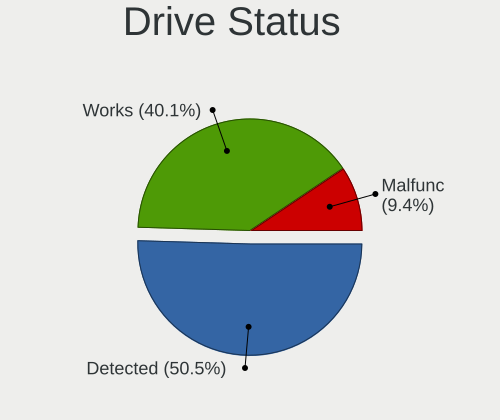

| Status   | Computers | Drives | Percent |
|----------|-----------|--------|---------|
| Detected | 435       | 973    | 50.46%  |
| Works    | 346       | 833    | 40.14%  |
| Malfunc  | 81        | 100    | 9.4%    |

Storage controller
------------------

Storage Vendor
--------------

Storage controller vendors

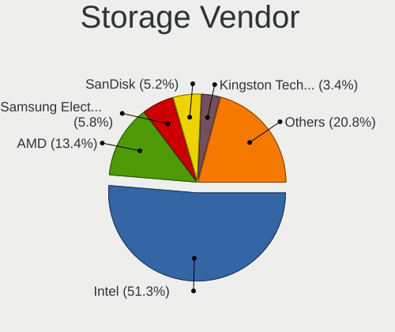

| Vendor                                  | Computers | Percent |
|-----------------------------------------|-----------|---------|
| Intel                                   | 522       | 51.33%  |
| AMD                                     | 136       | 13.37%  |
| Samsung Electronics                     | 59        | 5.8%    |
| SanDisk                                 | 53        | 5.21%   |
| Kingston Technology Company             | 35        | 3.44%   |
| Phison Electronics                      | 33        | 3.24%   |
| ADATA Technology                        | 24        | 2.36%   |
| Micron Technology                       | 19        | 1.87%   |
| SK hynix                                | 18        | 1.77%   |
| Silicon Motion                          | 18        | 1.77%   |
| ASMedia Technology                      | 18        | 1.77%   |
| KIOXIA                                  | 14        | 1.38%   |
| Toshiba America Info Systems            | 9         | 0.88%   |
| Nvidia                                  | 9         | 0.88%   |
| Realtek Semiconductor                   | 6         | 0.59%   |
| MAXIO Technology (Hangzhou)             | 6         | 0.59%   |
| Marvell Technology Group                | 6         | 0.59%   |
| Micron/Crucial Technology               | 5         | 0.49%   |
| LSI Logic / Symbios Logic               | 4         | 0.39%   |
| JMicron Technology                      | 4         | 0.39%   |
| Broadcom / LSI                          | 4         | 0.39%   |
| Transcend                               | 3         | 0.29%   |
| Union Memory (Shenzhen)                 | 2         | 0.2%    |
| Shenzhen Unionmemory Information System | 2         | 0.2%    |
| Shenzhen Longsys Electronics            | 2         | 0.2%    |
| Silicon Image                           | 1         | 0.1%    |
| Lite-On IT Corp. / Plextor              | 1         | 0.1%    |
| INNOGRIT                                | 1         | 0.1%    |
| Hewlett-Packard                         | 1         | 0.1%    |
| Biwin Storage Technology                | 1         | 0.1%    |
| Apple                                   | 1         | 0.1%    |

Storage Model
-------------

Storage controller models

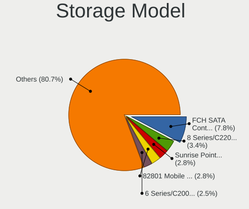

| Model                                                                            | Computers | Percent |
|----------------------------------------------------------------------------------|-----------|---------|
| AMD FCH SATA Controller [AHCI mode]                                              | 90        | 7.77%   |
| Intel 8 Series/C220 Series Chipset Family 6-port SATA Controller 1 [AHCI mode]   | 39        | 3.36%   |
| Intel Sunrise Point-LP SATA Controller [AHCI mode]                               | 33        | 2.85%   |
| Intel 82801 Mobile SATA Controller [RAID mode]                                   | 33        | 2.85%   |
| Intel 6 Series/C200 Series Chipset Family 6 port Mobile SATA AHCI Controller     | 29        | 2.5%    |
| Intel 7 Series Chipset Family 6-port SATA Controller [AHCI mode]                 | 27        | 2.33%   |
| Intel 6 Series/C200 Series Chipset Family 6 port Desktop SATA AHCI Controller    | 23        | 1.98%   |
| AMD 500 Series Chipset SATA Controller                                           | 23        | 1.98%   |
| AMD 400 Series Chipset SATA Controller                                           | 21        | 1.81%   |
| ADATA XPG SX8200 Pro PCIe Gen3x4 M.2 2280 Solid State Drive                      | 20        | 1.73%   |
| Samsung NVMe SSD Controller SM981/PM981/PM983                                    | 19        | 1.64%   |
| Intel Volume Management Device NVMe RAID Controller                              | 19        | 1.64%   |
| Intel SATA Controller [RAID mode]                                                | 19        | 1.64%   |
| Intel Wildcat Point-LP SATA Controller [AHCI Mode]                               | 17        | 1.47%   |
| Intel 8 Series SATA Controller 1 [AHCI mode]                                     | 17        | 1.47%   |
| Intel 7 Series/C210 Series Chipset Family 6-port SATA Controller [AHCI mode]     | 17        | 1.47%   |
| Intel Q170/Q150/B150/H170/H110/Z170/CM236 Chipset SATA Controller [AHCI Mode]    | 16        | 1.38%   |
| SanDisk Extreme Pro / WD Black SN750 / PC SN730 / Red SN700 NVMe SSD             | 13        | 1.12%   |
| Phison E12 NVMe Controller                                                       | 13        | 1.12%   |
| ASMedia ASM1061/ASM1062 Serial ATA Controller                                    | 13        | 1.12%   |
| Silicon Motion SM2263EN/SM2263XT (DRAM-less) NVMe SSD Controllers                | 12        | 1.04%   |
| Samsung NVMe SSD Controller PM9A1/PM9A3/980PRO                                   | 12        | 1.04%   |
| Samsung NVMe SSD Controller 980 (DRAM-less)                                      | 12        | 1.04%   |
| Intel NM10/ICH7 Family SATA Controller [IDE mode]                                | 12        | 1.04%   |
| Phison PS5013-E13 PCIe3 NVMe Controller (DRAM-less)                              | 11        | 0.95%   |
| Intel Cannon Lake Mobile PCH SATA AHCI Controller                                | 11        | 0.95%   |
| Intel 82801IBM/IEM (ICH9M/ICH9M-E) 4 port SATA Controller [AHCI mode]            | 11        | 0.95%   |
| Intel 7 Series/C210 Series Chipset Family 4-port SATA Controller [IDE mode]      | 11        | 0.95%   |
| Intel 7 Series/C210 Series Chipset Family 2-port SATA Controller [IDE mode]      | 11        | 0.95%   |
| Intel 5 Series/3400 Series Chipset 4 port SATA AHCI Controller                   | 11        | 0.95%   |
| Intel Celeron/Pentium Silver Processor SATA Controller                           | 10        | 0.86%   |
| Intel 82801G (ICH7 Family) IDE Controller                                        | 10        | 0.86%   |
| AMD A320 Chipset SATA Controller [AHCI mode]                                     | 9         | 0.78%   |
| SK hynix Gold P31/BC711/PC711 NVMe Solid State Drive                             | 8         | 0.69%   |
| KIOXIA NVMe SSD Controller BG4 (DRAM-less)                                       | 8         | 0.69%   |
| Intel SSD 660P Series                                                            | 8         | 0.69%   |
| Intel Comet Lake SATA AHCI Controller                                            | 8         | 0.69%   |
| Intel Atom/Celeron/Pentium Processor x5-E8000/J3xxx/N3xxx Series SATA Controller | 8         | 0.69%   |
| Intel Alder Lake-S PCH SATA Controller [AHCI Mode]                               | 8         | 0.69%   |
| Intel 5 Series/3400 Series Chipset 6 port SATA AHCI Controller                   | 8         | 0.69%   |

Storage Kind
------------

Kind of storage controller (IDE, SATA, NVMe, SAS, ...)

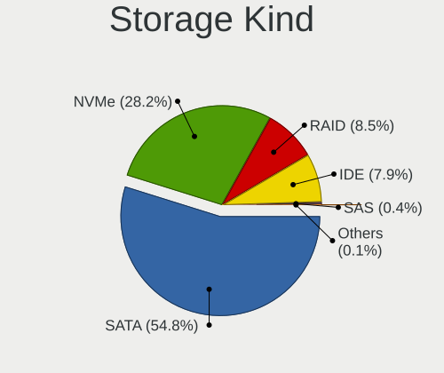

| Kind | Computers | Percent |
|------|-----------|---------|
| SATA | 540       | 54.82%  |
| NVMe | 278       | 28.22%  |
| RAID | 84        | 8.53%   |
| IDE  | 78        | 7.92%   |
| SAS  | 4         | 0.41%   |
| SCSI | 1         | 0.1%    |

Processor
---------

CPU Vendor
----------

Processor vendors

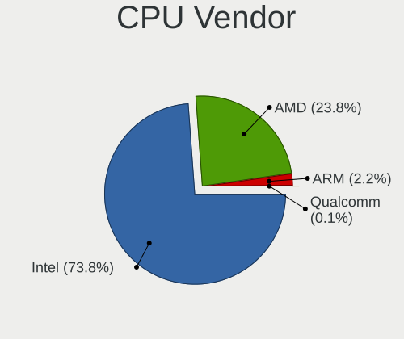

| Vendor   | Computers | Percent |
|----------|-----------|---------|
| Intel    | 576       | 73.85%  |
| AMD      | 186       | 23.85%  |
| ARM      | 17        | 2.18%   |
| Qualcomm | 1         | 0.13%   |

CPU Model
---------

Processor models

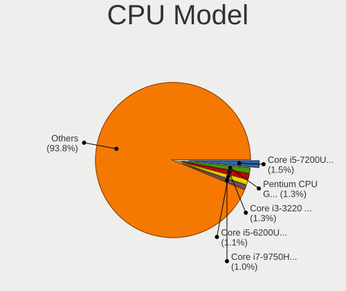

| Model                                         | Computers | Percent |
|-----------------------------------------------|-----------|---------|
| Intel Core i5-7200U CPU @ 2.50GHz             | 12        | 1.53%   |
| Intel Pentium CPU G620 @ 2.60GHz              | 10        | 1.27%   |
| Intel Core i3-3220 CPU @ 3.30GHz              | 10        | 1.27%   |
| Intel Core i5-6200U CPU @ 2.30GHz             | 9         | 1.15%   |
| Intel Core i7-9750H CPU @ 2.60GHz             | 8         | 1.02%   |
| Intel Celeron CPU N3060 @ 1.60GHz             | 8         | 1.02%   |
| ARM Processor                                 | 8         | 1.02%   |
| AMD Ryzen 9 5950X 16-Core Processor           | 8         | 1.02%   |
| Intel Core i5-8250U CPU @ 1.60GHz             | 7         | 0.89%   |
| Intel Core i5-4590 CPU @ 3.30GHz              | 7         | 0.89%   |
| AMD Ryzen 5 5600G with Radeon Graphics        | 7         | 0.89%   |
| AMD Ryzen 5 3500U with Radeon Vega Mobile Gfx | 7         | 0.89%   |
| Intel Core i5-5300U CPU @ 2.30GHz             | 6         | 0.76%   |
| Intel 11th Gen Core i5-1135G7 @ 2.40GHz       | 6         | 0.76%   |
| ARM BCM2835 Processor                         | 6         | 0.76%   |
| AMD Ryzen 5 5600 6-Core Processor             | 6         | 0.76%   |
| AMD Ryzen 5 3600 6-Core Processor             | 6         | 0.76%   |
| Intel Core i7-7700HQ CPU @ 2.80GHz            | 5         | 0.64%   |
| Intel Core i7-3770 CPU @ 3.40GHz              | 5         | 0.64%   |
| Intel Core i5-8400 CPU @ 2.80GHz              | 5         | 0.64%   |
| Intel Core i5-8350U CPU @ 1.70GHz             | 5         | 0.64%   |
| Intel Core i5-8265U CPU @ 1.60GHz             | 5         | 0.64%   |
| Intel Core i5-5200U CPU @ 2.20GHz             | 5         | 0.64%   |
| Intel Core i5-2410M CPU @ 2.30GHz             | 5         | 0.64%   |
| Intel Core i5-2400 CPU @ 3.10GHz              | 5         | 0.64%   |
| Intel Core i3-4130 CPU @ 3.40GHz              | 5         | 0.64%   |
| Intel Core 2 Duo CPU P8600 @ 2.40GHz          | 5         | 0.64%   |
| Intel 11th Gen Core i3-1115G4 @ 3.00GHz       | 5         | 0.64%   |
| Intel Core i5-7300U CPU @ 2.60GHz             | 4         | 0.51%   |
| Intel Core i5-6500 CPU @ 3.20GHz              | 4         | 0.51%   |
| Intel Core i5-4570 CPU @ 3.20GHz              | 4         | 0.51%   |
| Intel Core i5-4210U CPU @ 1.70GHz             | 4         | 0.51%   |
| Intel Core i5-4200U CPU @ 1.60GHz             | 4         | 0.51%   |
| Intel Core i5-3570 CPU @ 3.40GHz              | 4         | 0.51%   |
| Intel Core i5-3320M CPU @ 2.60GHz             | 4         | 0.51%   |
| Intel Core i5-3210M CPU @ 2.50GHz             | 4         | 0.51%   |
| Intel Core i5-2450M CPU @ 2.50GHz             | 4         | 0.51%   |
| Intel Core i5-10400 CPU @ 2.90GHz             | 4         | 0.51%   |
| Intel Core i3-4150 CPU @ 3.50GHz              | 4         | 0.51%   |
| Intel Core i3-3240 CPU @ 3.40GHz              | 4         | 0.51%   |

CPU Model Family
----------------

Processor model prefix

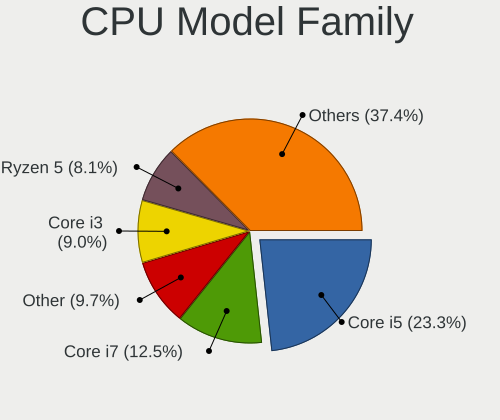

| Model                   | Computers | Percent |
|-------------------------|-----------|---------|
| Intel Core i5           | 183       | 23.28%  |
| Intel Core i7           | 98        | 12.47%  |
| Other                   | 76        | 9.67%   |
| Intel Core i3           | 71        | 9.03%   |
| AMD Ryzen 5             | 64        | 8.14%   |
| Intel Celeron           | 40        | 5.09%   |
| AMD Ryzen 7             | 37        | 4.71%   |
| Intel Core 2 Duo        | 30        | 3.82%   |
| Intel Xeon              | 29        | 3.69%   |
| Intel Pentium           | 26        | 3.31%   |
| AMD Ryzen 9             | 16        | 2.04%   |
| Intel Atom              | 13        | 1.65%   |
| AMD Ryzen 3             | 11        | 1.4%    |
| Intel Pentium Dual-Core | 8         | 1.02%   |
| Intel Core 2 Quad       | 8         | 1.02%   |
| ARM BCM                 | 6         | 0.76%   |
| AMD A6                  | 6         | 0.76%   |
| AMD A4                  | 6         | 0.76%   |
| Intel Core              | 5         | 0.64%   |
| AMD Ryzen 7 PRO         | 5         | 0.64%   |
| AMD Athlon              | 5         | 0.64%   |
| AMD FX                  | 4         | 0.51%   |
| AMD A10                 | 4         | 0.51%   |
| Intel Core i9           | 3         | 0.38%   |
| AMD Ryzen Threadripper  | 3         | 0.38%   |
| AMD Ryzen 5 PRO         | 3         | 0.38%   |
| Intel Genuine           | 2         | 0.25%   |
| ARM AArch64             | 2         | 0.25%   |
| AMD EPYC                | 2         | 0.25%   |
| AMD E                   | 2         | 0.25%   |
| AMD Athlon 64 X2        | 2         | 0.25%   |
| AMD A12                 | 2         | 0.25%   |
| Intel Xeon Gold         | 1         | 0.13%   |
| Intel Pentium Silver    | 1         | 0.13%   |
| Intel Pentium M         | 1         | 0.13%   |
| Intel Pentium Gold      | 1         | 0.13%   |
| Intel Pentium Dual      | 1         | 0.13%   |
| Intel Core m5           | 1         | 0.13%   |
| Intel Core m3           | 1         | 0.13%   |
| AMD Ryzen Embedded      | 1         | 0.13%   |

CPU Cores
---------

Number of processor cores

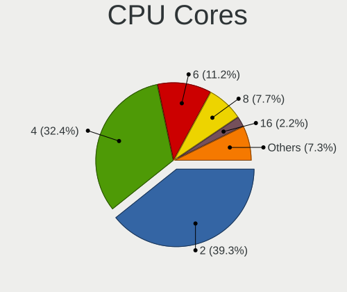

| Number  | Computers | Percent |
|---------|-----------|---------|
| 2       | 308       | 39.29%  |
| 4       | 254       | 32.4%   |
| 6       | 88        | 11.22%  |
| 8       | 60        | 7.65%   |
| 16      | 17        | 2.17%   |
| 10      | 12        | 1.53%   |
| 1       | 11        | 1.4%    |
| 12      | 10        | 1.28%   |
| 14      | 8         | 1.02%   |
| Unknown | 5         | 0.64%   |
| 20      | 4         | 0.51%   |
| 64      | 1         | 0.13%   |
| 36      | 1         | 0.13%   |
| 32      | 1         | 0.13%   |
| 28      | 1         | 0.13%   |
| 24      | 1         | 0.13%   |
| 18      | 1         | 0.13%   |
| 3       | 1         | 0.13%   |

CPU Sockets
-----------

Number of sockets

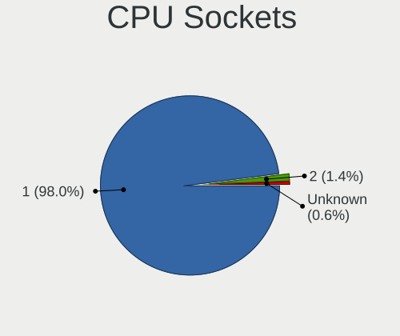

| Number  | Computers | Percent |
|---------|-----------|---------|
| 1       | 765       | 97.95%  |
| 2       | 11        | 1.41%   |
| Unknown | 5         | 0.64%   |

CPU Threads
-----------

Threads per core (Hyper-Threading)

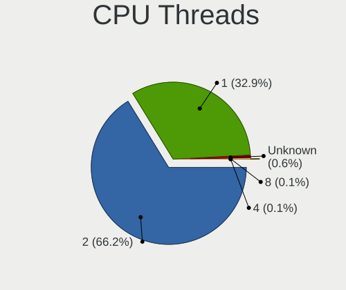

| Number  | Computers | Percent |
|---------|-----------|---------|
| 2       | 520       | 66.24%  |
| 1       | 258       | 32.87%  |
| Unknown | 5         | 0.64%   |
| 8       | 1         | 0.13%   |
| 4       | 1         | 0.13%   |

CPU Op-Modes
------------

CPU Operation Modes (32-bit, 64-bit)

| Op mode        | Computers | Percent |
|----------------|-----------|---------|
| 32-bit, 64-bit | 772       | 98.72%  |
| Unknown        | 9         | 1.15%   |
| 32-bit         | 1         | 0.13%   |

CPU Microcode
-------------

Microcode number

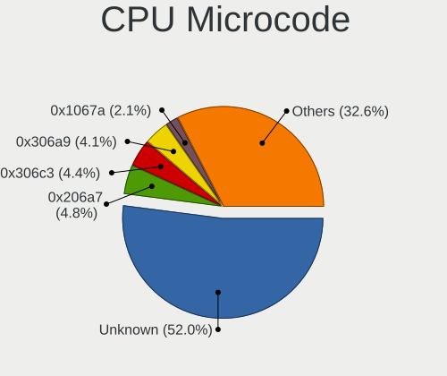

| Number     | Computers | Percent |
|------------|-----------|---------|
| Unknown    | 423       | 52.03%  |
| 0x206a7    | 39        | 4.8%    |
| 0x306c3    | 36        | 4.43%   |
| 0x306a9    | 33        | 4.06%   |
| 0x1067a    | 17        | 2.09%   |
| 0x906ea    | 13        | 1.6%    |
| 0x806e9    | 12        | 1.48%   |
| 0x08108109 | 12        | 1.48%   |
| 0x40651    | 11        | 1.35%   |
| 0x20655    | 11        | 1.35%   |
| 0x506e3    | 8         | 0.98%   |
| 0x806ec    | 7         | 0.86%   |
| 0x306d4    | 7         | 0.86%   |
| 0x806ea    | 6         | 0.74%   |
| 0x406e3    | 6         | 0.74%   |
| 0x08701021 | 6         | 0.74%   |
| 0xa0652    | 5         | 0.62%   |
| 0x90672    | 5         | 0.62%   |
| 0x6fb      | 5         | 0.62%   |
| 0x406c4    | 5         | 0.62%   |
| 0x20652    | 5         | 0.62%   |
| 0x906e9    | 4         | 0.49%   |
| 0x806eb    | 4         | 0.49%   |
| 0x806c1    | 4         | 0.49%   |
| 0x706a1    | 4         | 0.49%   |
| 0x6fd      | 4         | 0.49%   |
| 0x30678    | 4         | 0.49%   |
| 0x10676    | 4         | 0.49%   |
| 0x0a601203 | 4         | 0.49%   |
| 0x0a20120a | 4         | 0.49%   |
| 0x08600104 | 4         | 0.49%   |
| 0x0810100b | 4         | 0.49%   |
| 0x06001119 | 4         | 0.49%   |
| 0xa0653    | 3         | 0.37%   |
| 0x806d1    | 3         | 0.37%   |
| 0x706a8    | 3         | 0.37%   |
| 0x106ca    | 3         | 0.37%   |
| 0x0a50000d | 3         | 0.37%   |
| 0x0a50000b | 3         | 0.37%   |
| 0x0830104d | 3         | 0.37%   |

CPU Microarch
-------------

Microarchitecture

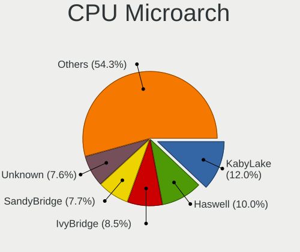

| Name               | Computers | Percent |
|--------------------|-----------|---------|
| KabyLake           | 94        | 12.04%  |
| Haswell            | 78        | 9.99%   |
| IvyBridge          | 66        | 8.45%   |
| SandyBridge        | 60        | 7.68%   |
| Unknown            | 59        | 7.55%   |
| Zen 3              | 50        | 6.4%    |
| Penryn             | 39        | 4.99%   |
| Skylake            | 36        | 4.61%   |
| Zen+               | 30        | 3.84%   |
| Zen 2              | 27        | 3.46%   |
| Westmere           | 26        | 3.33%   |
| Alderlake Hybrid   | 26        | 3.33%   |
| Silvermont         | 25        | 3.2%    |
| Broadwell          | 23        | 2.94%   |
| CometLake          | 19        | 2.43%   |
| Zen                | 17        | 2.18%   |
| TigerLake          | 16        | 2.05%   |
| Icelake            | 12        | 1.54%   |
| Core               | 12        | 1.54%   |
| Goldmont plus      | 10        | 1.28%   |
| Piledriver         | 9         | 1.15%   |
| Excavator          | 9         | 1.15%   |
| Nehalem            | 5         | 0.64%   |
| Bonnell            | 5         | 0.64%   |
| K10                | 4         | 0.51%   |
| Goldmont           | 4         | 0.51%   |
| Lunarlake Hybrid   | 3         | 0.38%   |
| Bobcat             | 3         | 0.38%   |
| Steamroller        | 2         | 0.26%   |
| K8 Hammer          | 2         | 0.26%   |
| K10 Llano          | 2         | 0.26%   |
| Jaguar             | 2         | 0.26%   |
| Gracemont          | 2         | 0.26%   |
| Tremont            | 1         | 0.13%   |
| P6                 | 1         | 0.13%   |
| K8 & K10 hybrid    | 1         | 0.13%   |
| ArrowLake-H Hybrid | 1         | 0.13%   |

Graphics
--------

GPU Vendor
----------

Vendors of graphics cards

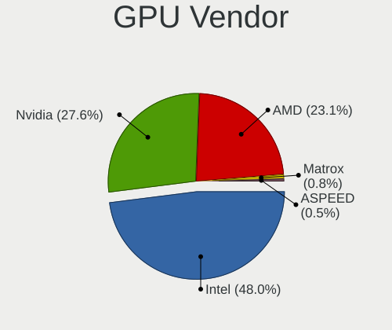

| Vendor                     | Computers | Percent |
|----------------------------|-----------|---------|
| Intel                      | 445       | 48%     |
| Nvidia                     | 256       | 27.62%  |
| AMD                        | 214       | 23.09%  |
| Matrox Electronics Systems | 7         | 0.76%   |
| ASPEED Technology          | 5         | 0.54%   |

GPU Model
---------

Graphics card models

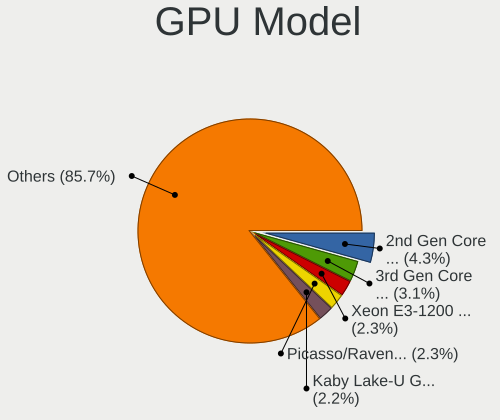

| Model                                                                                    | Computers | Percent |
|------------------------------------------------------------------------------------------|-----------|---------|
| Intel 2nd Generation Core Processor Family Integrated Graphics Controller                | 41        | 4.33%   |
| Intel 3rd Gen Core processor Graphics Controller                                         | 29        | 3.06%   |
| Intel Xeon E3-1200 v2/3rd Gen Core processor Graphics Controller                         | 22        | 2.32%   |
| AMD Picasso/Raven 2 [Radeon Vega Series / Radeon Vega Mobile Series]                     | 22        | 2.32%   |
| Intel Kaby Lake-U GT2 [HD Graphics 620]                                                  | 21        | 2.22%   |
| Intel Haswell-ULT Integrated Graphics Controller                                         | 21        | 2.22%   |
| AMD Cezanne [Radeon Vega Series / Radeon Vega Mobile Series]                             | 19        | 2.01%   |
| Intel Core Processor Integrated Graphics Controller                                      | 18        | 1.9%    |
| Intel Xeon E3-1200 v3/4th Gen Core Processor Integrated Graphics Controller              | 17        | 1.8%    |
| Intel Kaby Lake-R GT2 [UHD Graphics 620]                                                 | 17        | 1.8%    |
| Intel Broadwell-U GT2 [HD Graphics 5500]                                                 | 16        | 1.69%   |
| Intel CoffeeLake-H GT2 [UHD Graphics 630]                                                | 15        | 1.58%   |
| AMD Sun XT [Radeon HD 8670A/8670M/8690M / R5 M330 / M430 / Radeon 520 Mobile]            | 15        | 1.58%   |
| Intel Skylake-U GT2 [HD Graphics 520]                                                    | 13        | 1.37%   |
| Intel Atom/Celeron/Pentium Processor x5-E8000/J3xxx/N3xxx Integrated Graphics Controller | 13        | 1.37%   |
| AMD Ellesmere [Radeon RX 470/480/570/570X/580/580X/590]                                  | 13        | 1.37%   |
| Nvidia GA106 [GeForce RTX 3060 Lite Hash Rate]                                           | 12        | 1.27%   |
| Intel Atom Processor Z36xxx/Z37xxx Series Graphics & Display                             | 12        | 1.27%   |
| Nvidia TU117M [GeForce GTX 1650 Mobile / Max-Q]                                          | 11        | 1.16%   |
| Intel TigerLake-LP GT2 [Iris Xe Graphics]                                                | 11        | 1.16%   |
| Intel WhiskeyLake-U GT2 [UHD Graphics 620]                                               | 10        | 1.06%   |
| Intel Mobile 4 Series Chipset Integrated Graphics Controller                             | 10        | 1.06%   |
| Intel 4th Generation Core Processor Family Integrated Graphics Controller                | 10        | 1.06%   |
| AMD Renoir [Radeon Vega Series / Radeon Vega Mobile Series]                              | 10        | 1.06%   |
| Nvidia GP107M [GeForce GTX 1050 Mobile]                                                  | 9         | 0.95%   |
| Intel Skylake-S GT2 [HD Graphics 530]                                                    | 9         | 0.95%   |
| Intel GeminiLake [UHD Graphics 600]                                                      | 9         | 0.95%   |
| AMD Raven Ridge [Radeon Vega Series / Radeon Vega Mobile Series]                         | 9         | 0.95%   |
| Intel 4th Gen Core Processor Integrated Graphics Controller                              | 8         | 0.84%   |
| Intel 4 Series Chipset Integrated Graphics Controller                                    | 8         | 0.84%   |
| AMD Navi 23 [Radeon RX 6600/6600 XT/6600M]                                               | 8         | 0.84%   |
| Nvidia GF108 [GeForce GT 630]                                                            | 7         | 0.74%   |
| Nvidia GK208B [GeForce GT 710]                                                           | 6         | 0.63%   |
| Nvidia GA106M [GeForce RTX 3060 Mobile / Max-Q]                                          | 6         | 0.63%   |
| Intel TigerLake-H GT1 [UHD Graphics]                                                     | 6         | 0.63%   |
| AMD Rembrandt [Radeon 680M]                                                              | 6         | 0.63%   |
| AMD Raphael                                                                              | 6         | 0.63%   |
| AMD Barcelo                                                                              | 6         | 0.63%   |
| Nvidia GK208B [GeForce GT 730]                                                           | 5         | 0.53%   |
| Nvidia GF108 [GeForce GT 430]                                                            | 5         | 0.53%   |

GPU Combo
---------

Combinations of graphics cards

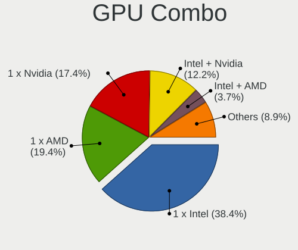

| Name                 | Computers | Percent |
|----------------------|-----------|---------|
| 1 x Intel            | 302       | 38.37%  |
| 1 x AMD              | 153       | 19.44%  |
| 1 x Nvidia           | 137       | 17.41%  |
| Intel + Nvidia       | 96        | 12.2%   |
| Intel + AMD          | 29        | 3.68%   |
| Other                | 19        | 2.41%   |
| AMD + Nvidia         | 19        | 2.41%   |
| 2 x AMD              | 14        | 1.78%   |
| 1 x Matrox           | 6         | 0.76%   |
| 2 x Intel            | 5         | 0.64%   |
| Nvidia + ASPEED      | 4         | 0.51%   |
| 2 x AMD + 3 x Nvidia | 1         | 0.13%   |
| Nvidia + Matrox      | 1         | 0.13%   |
| 1 x ASPEED           | 1         | 0.13%   |

GPU Driver
----------

Free vs proprietary

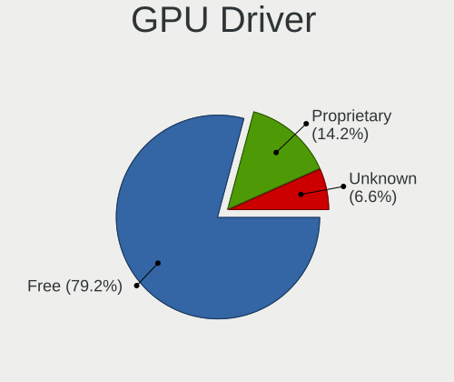

| Driver      | Computers | Percent |
|-------------|-----------|---------|
| Free        | 631       | 79.17%  |
| Proprietary | 113       | 14.18%  |
| Unknown     | 53        | 6.65%   |

GPU Memory
----------

Total video memory

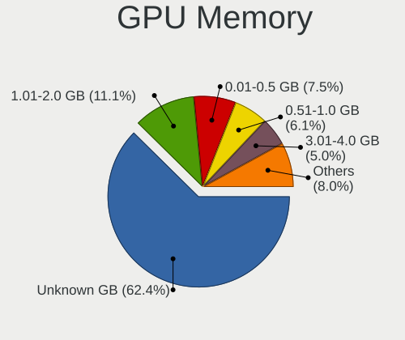

| Size in GB | Computers | Percent |
|------------|-----------|---------|
| Unknown    | 501       | 62.39%  |
| 1.01-2.0   | 89        | 11.08%  |
| 0.01-0.5   | 60        | 7.47%   |
| 0.51-1.0   | 49        | 6.1%    |
| 3.01-4.0   | 40        | 4.98%   |
| 7.01-8.0   | 37        | 4.61%   |
| 5.01-6.0   | 10        | 1.25%   |
| 8.01-16.0  | 9         | 1.12%   |
| 2.01-3.0   | 5         | 0.62%   |
| 24.01-32.0 | 2         | 0.25%   |
| 32.01-64.0 | 1         | 0.12%   |

Monitor
-------

Monitor Vendor
--------------

Monitor vendors

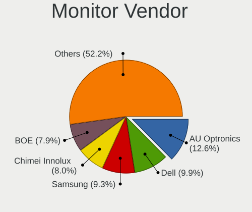

| Vendor                  | Computers | Percent |
|-------------------------|-----------|---------|
| AU Optronics            | 105       | 12.57%  |
| Dell                    | 83        | 9.94%   |
| Samsung Electronics     | 78        | 9.34%   |
| Chimei Innolux          | 67        | 8.02%   |
| BOE                     | 66        | 7.9%    |
| LG Display              | 63        | 7.54%   |
| Acer                    | 43        | 5.15%   |
| Hewlett-Packard         | 32        | 3.83%   |
| Goldstar                | 29        | 3.47%   |
| BenQ                    | 29        | 3.47%   |
| AOC                     | 27        | 3.23%   |
| Lenovo                  | 23        | 2.75%   |
| Philips                 | 20        | 2.4%    |
| Sharp                   | 19        | 2.28%   |
| Apple                   | 17        | 2.04%   |
| ViewSonic               | 12        | 1.44%   |
| MSI                     | 9         | 1.08%   |
| Chi Mei Optoelectronics | 9         | 1.08%   |
| PANDA                   | 8         | 0.96%   |
| Denver                  | 6         | 0.72%   |
| ASUSTek Computer        | 6         | 0.72%   |
| Toshiba                 | 5         | 0.6%    |
| Panasonic               | 5         | 0.6%    |
| Mi                      | 5         | 0.6%    |
| Unknown                 | 4         | 0.48%   |
| RTK                     | 4         | 0.48%   |
| Valve                   | 3         | 0.36%   |
| Sony                    | 3         | 0.36%   |
| CSOT                    | 3         | 0.36%   |
| Unknown                 | 3         | 0.36%   |
| LG Electronics          | 2         | 0.24%   |
| IPS                     | 2         | 0.24%   |
| InnoLux Display         | 2         | 0.24%   |
| InfoVision              | 2         | 0.24%   |
| Gigabyte Technology     | 2         | 0.24%   |
| Fujitsu Siemens         | 2         | 0.24%   |
| EXP                     | 2         | 0.24%   |
| Envision Peripherals    | 2         | 0.24%   |
| AOpen                   | 2         | 0.24%   |
| Xiaomi                  | 1         | 0.12%   |

Monitor Model
-------------

Monitor models

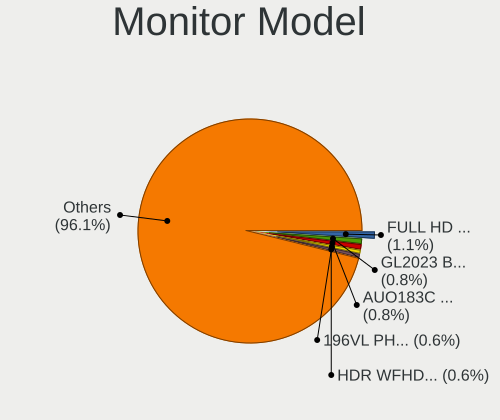

| Model                                                                | Computers | Percent |
|----------------------------------------------------------------------|-----------|---------|
| Goldstar FULL HD GSM5B55 1920x1080 480x270mm 21.7-inch               | 9         | 1.05%   |
| BenQ GL2023 BNQ78CC 1600x900 443x249mm 20.0-inch                     | 7         | 0.82%   |
| AU Optronics LCD Monitor AUO183C 1366x768 309x173mm 13.9-inch        | 7         | 0.82%   |
| Philips 196VL PHLC07F 1366x768 409x230mm 18.5-inch                   | 5         | 0.58%   |
| Goldstar HDR WFHD GSM7714 2560x1080 798x334mm 34.1-inch              | 5         | 0.58%   |
| Chimei Innolux LCD Monitor CMN1521 1920x1080 344x193mm 15.5-inch     | 5         | 0.58%   |
| BenQ GW2270 BNQ78DB 1920x1080 476x268mm 21.5-inch                    | 5         | 0.58%   |
| AU Optronics LCD Monitor AUO2D3C 1366x768 309x173mm 13.9-inch        | 5         | 0.58%   |
| AU Optronics LCD Monitor AUO21ED 1920x1080 344x193mm 15.5-inch       | 5         | 0.58%   |
| Samsung Electronics S24F350 SAM0D21 1920x1080 521x293mm 23.5-inch    | 4         | 0.47%   |
| Samsung Electronics C24F390 SAM0D2C 1920x1080 521x293mm 23.5-inch    | 4         | 0.47%   |
| Denver MO-HHS-32C LHCFFFF 1920x1080 699x393mm 31.6-inch              | 4         | 0.47%   |
| Dell E2720HS DELA15E 1920x1080 598x336mm 27.0-inch                   | 4         | 0.47%   |
| BOE LCD Monitor BOE06A4 1366x768 344x194mm 15.5-inch                 | 4         | 0.47%   |
| BenQ EX3203R BNQ7F66 2560x1440 698x393mm 31.5-inch                   | 4         | 0.47%   |
| AU Optronics LCD Monitor AUO403D 1920x1080 309x174mm 14.0-inch       | 4         | 0.47%   |
| Apple Color LCD APP9CF0 1440x900 290x180mm 13.4-inch                 | 4         | 0.47%   |
| AOC 2470W AOC2470 1920x1080 521x293mm 23.5-inch                      | 4         | 0.47%   |
| Valve ANX7530 U VLV3001 800x1280 100x150mm 7.1-inch                  | 3         | 0.35%   |
| Sharp HDMI SHP10A1 1360x768 700x390mm 31.5-inch                      | 3         | 0.35%   |
| Samsung Electronics S24F350 SAM0D20 1920x1080 521x293mm 23.5-inch    | 3         | 0.35%   |
| Samsung Electronics LCD Monitor SEC3849 1366x768 309x174mm 14.0-inch | 3         | 0.35%   |
| PANDA LCD Monitor NCP004D 1920x1080 344x194mm 15.5-inch              | 3         | 0.35%   |
| Panasonic TV MEIA296 1920x1080 698x392mm 31.5-inch                   | 3         | 0.35%   |
| Lenovo T24i-10 LEN61A6 1920x1080 527x296mm 23.8-inch                 | 3         | 0.35%   |
| Lenovo LCD Monitor LEN4011 1280x800 261x163mm 12.1-inch              | 3         | 0.35%   |
| Goldstar W1943 GSM4BAD 1360x768 406x229mm 18.4-inch                  | 3         | 0.35%   |
| Dell S2340L DELD058 1920x1080 509x286mm 23.0-inch                    | 3         | 0.35%   |
| Dell E1916H DELF064 1366x768 410x230mm 18.5-inch                     | 3         | 0.35%   |
| Chimei Innolux LCD Monitor CMN1618 1920x1200 344x215mm 16.0-inch     | 3         | 0.35%   |
| Chimei Innolux LCD Monitor CMN15E6 1366x768 344x193mm 15.5-inch      | 3         | 0.35%   |
| Chimei Innolux LCD Monitor CMN14D6 1366x768 309x173mm 13.9-inch      | 3         | 0.35%   |
| Chimei Innolux LCD Monitor CMN14D4 1920x1080 309x173mm 13.9-inch     | 3         | 0.35%   |
| Chimei Innolux LCD Monitor CMN1495 1366x768 309x173mm 13.9-inch      | 3         | 0.35%   |
| AU Optronics LCD Monitor AUO315C 1366x768 256x144mm 11.6-inch        | 3         | 0.35%   |
| AU Optronics LCD Monitor AUO235C 1366x768 256x144mm 11.6-inch        | 3         | 0.35%   |
| AU Optronics LCD Monitor AUO103C 1366x768 309x173mm 13.9-inch        | 3         | 0.35%   |
| Acer VG270 E ACR0B02 1920x1080 598x336mm 27.0-inch                   | 3         | 0.35%   |
| Acer K242HL ACR03E3 1920x1080 531x299mm 24.0-inch                    | 3         | 0.35%   |
| Unknown                                                              | 3         | 0.35%   |

Monitor Resolution
------------------

Monitor screen resolution

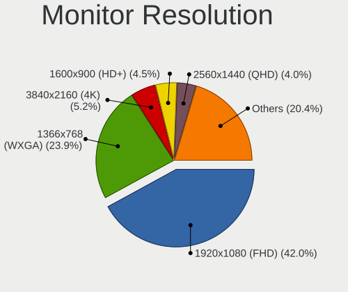

| Resolution         | Computers | Percent |
|--------------------|-----------|---------|
| 1920x1080 (FHD)    | 338       | 42.04%  |
| 1366x768 (WXGA)    | 192       | 23.88%  |
| 3840x2160 (4K)     | 42        | 5.22%   |
| 1600x900 (HD+)     | 36        | 4.48%   |
| 2560x1440 (QHD)    | 32        | 3.98%   |
| 1920x1200 (WUXGA)  | 20        | 2.49%   |
| 1280x800 (WXGA)    | 17        | 2.11%   |
| 1440x900 (WXGA+)   | 14        | 1.74%   |
| 1680x1050 (WSXGA+) | 13        | 1.62%   |
| 2560x1080          | 11        | 1.37%   |
| 1360x768           | 9         | 1.12%   |
| 1280x1024 (SXGA)   | 9         | 1.12%   |
| 2560x1600          | 8         | 1%      |
| Unknown            | 8         | 1%      |
| 3440x1440          | 4         | 0.5%    |
| 1024x768 (XGA)     | 4         | 0.5%    |
| 1024x600           | 4         | 0.5%    |
| 800x1280           | 3         | 0.37%   |
| 3840x1080          | 3         | 0.37%   |
| 2880x1800          | 3         | 0.37%   |
| 2160x1440          | 3         | 0.37%   |
| 1280x720 (HD)      | 3         | 0.37%   |
| 5760x1080          | 2         | 0.25%   |
| 2520x1680          | 2         | 0.25%   |
| 1920x540           | 2         | 0.25%   |
| 1920x1280          | 2         | 0.25%   |
| 1600x1200          | 2         | 0.25%   |
| 1280x960           | 2         | 0.25%   |
| 5440x1080          | 1         | 0.12%   |
| 5120x1440          | 1         | 0.12%   |
| 3840x2400          | 1         | 0.12%   |
| 3200x2000          | 1         | 0.12%   |
| 3120x1600          | 1         | 0.12%   |
| 3072x1920          | 1         | 0.12%   |
| 3000x2120          | 1         | 0.12%   |
| 3000x2000          | 1         | 0.12%   |
| 2880x1920          | 1         | 0.12%   |
| 2880x1620          | 1         | 0.12%   |
| 2736x1824          | 1         | 0.12%   |
| 2304x1440          | 1         | 0.12%   |

Monitor Diagonal
----------------

Diagonal size in inches

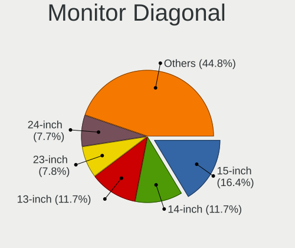

| Inches  | Computers | Percent |
|---------|-----------|---------|
| 15      | 136       | 16.37%  |
| 14      | 97        | 11.67%  |
| 13      | 97        | 11.67%  |
| 23      | 65        | 7.82%   |
| 24      | 64        | 7.7%    |
| 27      | 51        | 6.14%   |
| 18      | 39        | 4.69%   |
| 21      | 36        | 4.33%   |
| 31      | 32        | 3.85%   |
| Unknown | 27        | 3.25%   |
| 20      | 23        | 2.77%   |
| 17      | 22        | 2.65%   |
| 12      | 20        | 2.41%   |
| 19      | 18        | 2.17%   |
| 11      | 18        | 2.17%   |
| 16      | 12        | 1.44%   |
| 22      | 10        | 1.2%    |
| 34      | 7         | 0.84%   |
| 32      | 7         | 0.84%   |
| 10      | 6         | 0.72%   |
| 72      | 5         | 0.6%    |
| 63      | 5         | 0.6%    |
| 7       | 5         | 0.6%    |
| 84      | 4         | 0.48%   |
| 49      | 4         | 0.48%   |
| 52      | 3         | 0.36%   |
| 28      | 3         | 0.36%   |
| 25      | 3         | 0.36%   |
| 40      | 2         | 0.24%   |
| 142     | 1         | 0.12%   |
| 67      | 1         | 0.12%   |
| 65      | 1         | 0.12%   |
| 57      | 1         | 0.12%   |
| 55      | 1         | 0.12%   |
| 54      | 1         | 0.12%   |
| 48      | 1         | 0.12%   |
| 39      | 1         | 0.12%   |
| 29      | 1         | 0.12%   |
| 8       | 1         | 0.12%   |

Monitor Width
-------------

Physical width

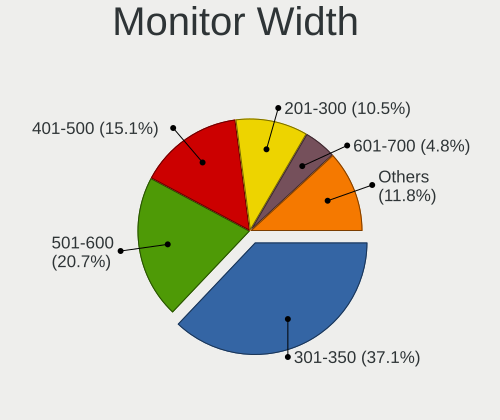

| Width in mm    | Computers | Percent |
|----------------|-----------|---------|
| 301-350        | 304       | 37.07%  |
| 501-600        | 170       | 20.73%  |
| 401-500        | 124       | 15.12%  |
| 201-300        | 86        | 10.49%  |
| 601-700        | 39        | 4.76%   |
| Unknown        | 27        | 3.29%   |
| 351-400        | 19        | 2.32%   |
| 1001-1500      | 16        | 1.95%   |
| 701-800        | 15        | 1.83%   |
| 1501-2000      | 9         | 1.1%    |
| 801-900        | 4         | 0.49%   |
| 101-200        | 3         | 0.37%   |
| 1-100          | 3         | 0.37%   |
| More than 2000 | 1         | 0.12%   |

Aspect Ratio
------------

Proportional relationship between the width and the height

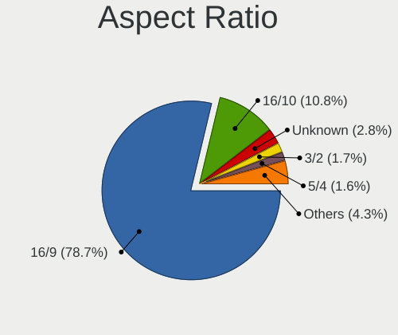

| Ratio   | Computers | Percent |
|---------|-----------|---------|
| 16/9    | 589       | 78.74%  |
| 16/10   | 81        | 10.83%  |
| Unknown | 21        | 2.81%   |
| 3/2     | 13        | 1.74%   |
| 5/4     | 12        | 1.6%    |
| 21/9    | 9         | 1.2%    |
| 4/3     | 8         | 1.07%   |
| 32/9    | 7         | 0.94%   |
| 0.67    | 3         | 0.4%    |
| 1.00    | 2         | 0.27%   |
| 0.63    | 1         | 0.13%   |
| 0.56    | 1         | 0.13%   |
| 0.45    | 1         | 0.13%   |

Monitor Area
------------

Area in inch²

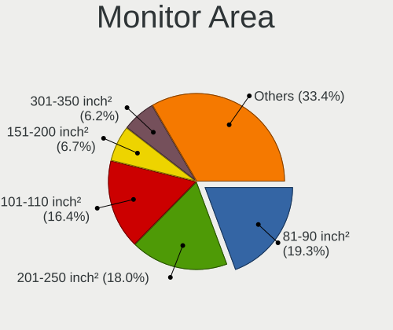

| Area in inch² | Computers | Percent |
|----------------|-----------|---------|
| 81-90          | 160       | 19.35%  |
| 201-250        | 149       | 18.02%  |
| 101-110        | 136       | 16.44%  |
| 151-200        | 55        | 6.65%   |
| 301-350        | 51        | 6.17%   |
| 351-500        | 48        | 5.8%    |
| 141-150        | 46        | 5.56%   |
| 71-80          | 30        | 3.63%   |
| Unknown        | 27        | 3.26%   |
| More than 1000 | 23        | 2.78%   |
| 61-70          | 18        | 2.18%   |
| 51-60          | 18        | 2.18%   |
| 251-300        | 17        | 2.06%   |
| 121-130        | 11        | 1.33%   |
| 111-120        | 11        | 1.33%   |
| 501-1000       | 8         | 0.97%   |
| 41-50          | 6         | 0.73%   |
| 1-40           | 6         | 0.73%   |
| 91-100         | 6         | 0.73%   |
| 131-140        | 1         | 0.12%   |

Pixel Density
-------------

Pixels per inch

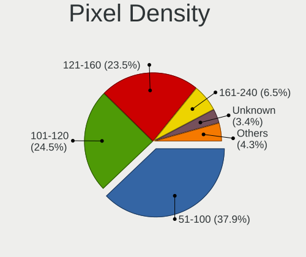

| Density       | Computers | Percent |
|---------------|-----------|---------|
| 51-100        | 305       | 37.89%  |
| 101-120       | 197       | 24.47%  |
| 121-160       | 189       | 23.48%  |
| 161-240       | 52        | 6.46%   |
| Unknown       | 27        | 3.35%   |
| 1-50          | 23        | 2.86%   |
| More than 240 | 12        | 1.49%   |

Multiple Monitors
-----------------

Total monitors connected

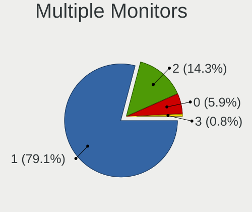

| Total | Computers | Percent |
|-------|-----------|---------|
| 1     | 632       | 79.1%   |
| 2     | 114       | 14.27%  |
| 0     | 47        | 5.88%   |
| 3     | 6         | 0.75%   |

Network
-------

Net Controller Vendor
---------------------

Controller vendors

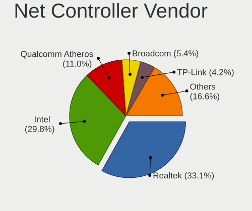

| Vendor                            | Computers | Percent |
|-----------------------------------|-----------|---------|
| Realtek Semiconductor             | 413       | 33.12%  |
| Intel                             | 371       | 29.75%  |
| Qualcomm Atheros                  | 137       | 10.99%  |
| Broadcom                          | 67        | 5.37%   |
| TP-Link                           | 52        | 4.17%   |
| MediaTek                          | 32        | 2.57%   |
| Ralink Technology                 | 31        | 2.49%   |
| D-Link                            | 15        | 1.2%    |
| Broadcom Limited                  | 14        | 1.12%   |
| Xiaomi                            | 11        | 0.88%   |
| Qualcomm Atheros Communications   | 11        | 0.88%   |
| Samsung Electronics               | 8         | 0.64%   |
| Nvidia                            | 7         | 0.56%   |
| ASIX Electronics                  | 7         | 0.56%   |
| OPPO Electronics                  | 6         | 0.48%   |
| Ralink                            | 5         | 0.4%    |
| Microchip Technology              | 5         | 0.4%    |
| Shenzhen Goodix Technology        | 4         | 0.32%   |
| Qualcomm                          | 4         | 0.32%   |
| Huawei Technologies               | 4         | 0.32%   |
| Dell                              | 4         | 0.32%   |
| Marvell Technology Group          | 3         | 0.24%   |
| Aquantia                          | 3         | 0.24%   |
| Mercucys                          | 2         | 0.16%   |
| InterBiometrics                   | 2         | 0.16%   |
| Google                            | 2         | 0.16%   |
| D-Link System                     | 2         | 0.16%   |
| American Megatrends               | 2         | 0.16%   |
| Winbond Electronics               | 1         | 0.08%   |
| VIA Technologies                  | 1         | 0.08%   |
| Toshiba                           | 1         | 0.08%   |
| Tehuti Networks                   | 1         | 0.08%   |
| T & A Mobile Phones               | 1         | 0.08%   |
| Sundance Technology Inc / IC Plus | 1         | 0.08%   |
| Spreadtrum Communications         | 1         | 0.08%   |
| Sierra Wireless                   | 1         | 0.08%   |
| Raspberry Pi                      | 1         | 0.08%   |
| Qualcomm Technologies             | 1         | 0.08%   |
| Motorola PCS                      | 1         | 0.08%   |
| Mellanox Technologies             | 1         | 0.08%   |

Net Controller Model
--------------------

Controller models

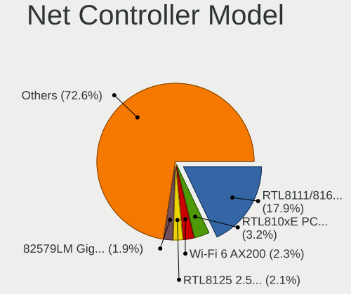

| Model                                                                  | Computers | Percent |
|------------------------------------------------------------------------|-----------|---------|
| Realtek RTL8111/8168/8211/8411 PCI Express Gigabit Ethernet Controller | 260       | 17.93%  |
| Realtek RTL810xE PCI Express Fast Ethernet controller                  | 47        | 3.24%   |
| Intel Wi-Fi 6 AX200                                                    | 33        | 2.28%   |
| Realtek RTL8125 2.5GbE Controller                                      | 30        | 2.07%   |
| Intel 82579LM Gigabit Network Connection (Lewisville)                  | 28        | 1.93%   |
| Intel Wireless 8265 / 8275                                             | 26        | 1.79%   |
| Realtek 802.11ac NIC                                                   | 19        | 1.31%   |
| Ralink MT7601U Wireless Adapter                                        | 18        | 1.24%   |
| Qualcomm Atheros QCA9565 / AR9565 Wireless Network Adapter             | 18        | 1.24%   |
| Intel Wireless 7265                                                    | 18        | 1.24%   |
| Qualcomm Atheros AR9285 Wireless Network Adapter (PCI-Express)         | 17        | 1.17%   |
| Realtek RTL8153 Gigabit Ethernet Adapter                               | 16        | 1.1%    |
| Qualcomm Atheros AR9485 Wireless Network Adapter                       | 16        | 1.1%    |
| Qualcomm Atheros AR8151 v2.0 Gigabit Ethernet                          | 16        | 1.1%    |
| Realtek RTL8822CE 802.11ac PCIe Wireless Network Adapter               | 15        | 1.03%   |
| Intel Wi-Fi 6E(802.11ax) AX210/AX1675* 2x2 [Typhoon Peak]              | 15        | 1.03%   |
| Intel Ethernet Connection I217-LM                                      | 15        | 1.03%   |
| Qualcomm Atheros QCA6174 802.11ac Wireless Network Adapter             | 14        | 0.97%   |
| Intel Wireless 7260                                                    | 13        | 0.9%    |
| TP-Link Archer T4U ver.3                                               | 12        | 0.83%   |
| Realtek RTL8723BE PCIe Wireless Network Adapter                        | 12        | 0.83%   |
| Qualcomm Atheros AR9462 Wireless Network Adapter                       | 12        | 0.83%   |
| Realtek RTL88x2bu [AC1200 Techkey]                                     | 11        | 0.76%   |
| Realtek RTL8821CE 802.11ac PCIe Wireless Network Adapter               | 11        | 0.76%   |
| Qualcomm Atheros AR9287 Wireless Network Adapter (PCI-Express)         | 11        | 0.76%   |
| MediaTek MT7921 802.11ax PCIe Wireless Network Adapter [Filogic 330]   | 11        | 0.76%   |
| Intel Wi-Fi 6 AX201                                                    | 11        | 0.76%   |
| Intel I211 Gigabit Network Connection                                  | 11        | 0.76%   |
| Intel Ethernet Connection (4) I219-LM                                  | 11        | 0.76%   |
| Intel 82579V Gigabit Network Connection                                | 11        | 0.76%   |
| Qualcomm Atheros QCA9377 802.11ac Wireless Network Adapter             | 10        | 0.69%   |
| TP-Link 802.11n NIC                                                    | 9         | 0.62%   |
| Ralink RT2870/RT3070 Wireless Adapter                                  | 9         | 0.62%   |
| Intel Ethernet Controller I225-V                                       | 9         | 0.62%   |
| Intel Ethernet Connection (3) I218-LM                                  | 9         | 0.62%   |
| Intel Comet Lake PCH CNVi WiFi                                         | 9         | 0.62%   |
| Intel Centrino Advanced-N 6205 [Taylor Peak]                           | 9         | 0.62%   |
| Intel Alder Lake-P PCH CNVi WiFi                                       | 9         | 0.62%   |
| TP-Link TL-WN823N v2/v3 [Realtek RTL8192EU]                            | 8         | 0.55%   |
| TP-Link 802.11ac WLAN Adapter                                          | 8         | 0.55%   |

Wireless Vendor
---------------

Wireless vendors

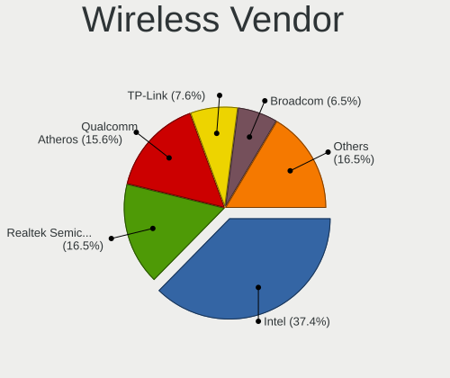

| Vendor                          | Computers | Percent |
|---------------------------------|-----------|---------|
| Intel                           | 254       | 37.35%  |
| Realtek Semiconductor           | 112       | 16.47%  |
| Qualcomm Atheros                | 106       | 15.59%  |
| TP-Link                         | 52        | 7.65%   |
| Broadcom                        | 44        | 6.47%   |
| Ralink Technology               | 31        | 4.56%   |
| MediaTek                        | 30        | 4.41%   |
| D-Link                          | 15        | 2.21%   |
| Qualcomm Atheros Communications | 11        | 1.62%   |
| Broadcom Limited                | 9         | 1.32%   |
| Ralink                          | 5         | 0.74%   |
| Dell                            | 3         | 0.44%   |
| Mercucys                        | 2         | 0.29%   |
| D-Link System                   | 2         | 0.29%   |
| Sierra Wireless                 | 1         | 0.15%   |
| Belkin Components               | 1         | 0.15%   |
| ASUSTek Computer                | 1         | 0.15%   |
| AboCom Systems                  | 1         | 0.15%   |

Wireless Model
--------------

Wireless models

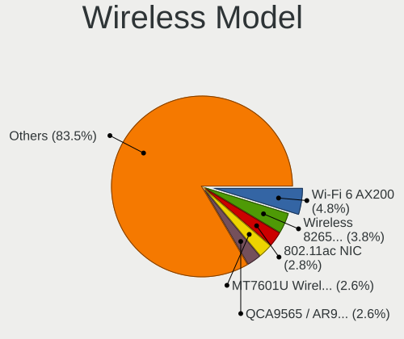

| Model                                                                | Computers | Percent |
|----------------------------------------------------------------------|-----------|---------|
| Intel Wi-Fi 6 AX200                                                  | 33        | 4.79%   |
| Intel Wireless 8265 / 8275                                           | 26        | 3.77%   |
| Realtek 802.11ac NIC                                                 | 19        | 2.76%   |
| Ralink MT7601U Wireless Adapter                                      | 18        | 2.61%   |
| Qualcomm Atheros QCA9565 / AR9565 Wireless Network Adapter           | 18        | 2.61%   |
| Intel Wireless 7265                                                  | 18        | 2.61%   |
| Qualcomm Atheros AR9285 Wireless Network Adapter (PCI-Express)       | 17        | 2.47%   |
| Qualcomm Atheros AR9485 Wireless Network Adapter                     | 16        | 2.32%   |
| Realtek RTL8822CE 802.11ac PCIe Wireless Network Adapter             | 15        | 2.18%   |
| Intel Wi-Fi 6E(802.11ax) AX210/AX1675* 2x2 [Typhoon Peak]            | 15        | 2.18%   |
| Qualcomm Atheros QCA6174 802.11ac Wireless Network Adapter           | 14        | 2.03%   |
| Intel Wireless 7260                                                  | 13        | 1.89%   |
| TP-Link Archer T4U ver.3                                             | 12        | 1.74%   |
| Realtek RTL8723BE PCIe Wireless Network Adapter                      | 12        | 1.74%   |
| Qualcomm Atheros AR9462 Wireless Network Adapter                     | 12        | 1.74%   |
| Realtek RTL88x2bu [AC1200 Techkey]                                   | 11        | 1.6%    |
| Realtek RTL8821CE 802.11ac PCIe Wireless Network Adapter             | 11        | 1.6%    |
| Qualcomm Atheros AR9287 Wireless Network Adapter (PCI-Express)       | 11        | 1.6%    |
| MediaTek MT7921 802.11ax PCIe Wireless Network Adapter [Filogic 330] | 11        | 1.6%    |
| Intel Wi-Fi 6 AX201                                                  | 11        | 1.6%    |
| Qualcomm Atheros QCA9377 802.11ac Wireless Network Adapter           | 10        | 1.45%   |
| TP-Link 802.11n NIC                                                  | 9         | 1.31%   |
| Ralink RT2870/RT3070 Wireless Adapter                                | 9         | 1.31%   |
| Intel Comet Lake PCH CNVi WiFi                                       | 9         | 1.31%   |
| Intel Centrino Advanced-N 6205 [Taylor Peak]                         | 9         | 1.31%   |
| TP-Link TL-WN823N v2/v3 [Realtek RTL8192EU]                          | 8         | 1.16%   |
| TP-Link 802.11ac WLAN Adapter                                        | 8         | 1.16%   |
| Intel Cannon Point-LP CNVi [Wireless-AC]                             | 8         | 1.16%   |
| Intel Cannon Lake PCH CNVi WiFi                                      | 8         | 1.16%   |
| D-Link DWA-123 Wireless N 150 Adapter (rev.D1)                       | 8         | 1.16%   |
| Realtek RTL8192CU 802.11n WLAN Adapter                               | 7         | 1.02%   |
| Qualcomm Atheros AR9271 802.11n                                      | 7         | 1.02%   |
| Intel Wireless 3165                                                  | 7         | 1.02%   |
| Intel Alder Lake-P PCH CNVi WiFi                                     | 7         | 1.02%   |
| Realtek RTL8188EUS 802.11n Wireless Network Adapter                  | 6         | 0.87%   |
| Intel Centrino Ultimate-N 6300                                       | 6         | 0.87%   |
| Broadcom BCM4360 802.11ac Dual Band Wireless Network Adapter         | 6         | 0.87%   |
| TP-Link Archer T3U [Realtek RTL8812BU]                               | 5         | 0.73%   |
| Realtek RTL8822BE 802.11a/b/g/n/ac WiFi adapter                      | 5         | 0.73%   |
| Qualcomm Atheros AR928X Wireless Network Adapter (PCI-Express)       | 5         | 0.73%   |

Ethernet Vendor
---------------

Ethernet vendors

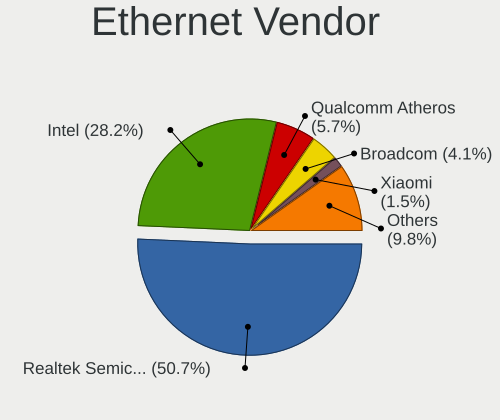

| Vendor                            | Computers | Percent |
|-----------------------------------|-----------|---------|
| Realtek Semiconductor             | 362       | 50.7%   |
| Intel                             | 201       | 28.15%  |
| Qualcomm Atheros                  | 41        | 5.74%   |
| Broadcom                          | 29        | 4.06%   |
| Xiaomi                            | 11        | 1.54%   |
| Samsung Electronics               | 8         | 1.12%   |
| Nvidia                            | 7         | 0.98%   |
| ASIX Electronics                  | 7         | 0.98%   |
| OPPO Electronics                  | 6         | 0.84%   |
| Microchip Technology              | 5         | 0.7%    |
| Broadcom Limited                  | 5         | 0.7%    |
| Qualcomm                          | 4         | 0.56%   |
| Huawei Technologies               | 4         | 0.56%   |
| Marvell Technology Group          | 3         | 0.42%   |
| Aquantia                          | 3         | 0.42%   |
| MediaTek                          | 2         | 0.28%   |
| American Megatrends               | 2         | 0.28%   |
| VIA Technologies                  | 1         | 0.14%   |
| Tehuti Networks                   | 1         | 0.14%   |
| T & A Mobile Phones               | 1         | 0.14%   |
| Sundance Technology Inc / IC Plus | 1         | 0.14%   |
| Spreadtrum Communications         | 1         | 0.14%   |
| Raspberry Pi                      | 1         | 0.14%   |
| Qualcomm Technologies             | 1         | 0.14%   |
| Motorola PCS                      | 1         | 0.14%   |
| Mellanox Technologies             | 1         | 0.14%   |
| JMicron Technology                | 1         | 0.14%   |
| ICS Advent                        | 1         | 0.14%   |
| DisplayLink                       | 1         | 0.14%   |
| Attansic Technology               | 1         | 0.14%   |
| Apple                             | 1         | 0.14%   |

Ethernet Model
--------------

Ethernet models

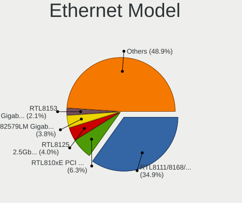

| Model                                                                  | Computers | Percent |
|------------------------------------------------------------------------|-----------|---------|
| Realtek RTL8111/8168/8211/8411 PCI Express Gigabit Ethernet Controller | 260       | 34.85%  |
| Realtek RTL810xE PCI Express Fast Ethernet controller                  | 47        | 6.3%    |
| Realtek RTL8125 2.5GbE Controller                                      | 30        | 4.02%   |
| Intel 82579LM Gigabit Network Connection (Lewisville)                  | 28        | 3.75%   |
| Realtek RTL8153 Gigabit Ethernet Adapter                               | 16        | 2.14%   |
| Qualcomm Atheros AR8151 v2.0 Gigabit Ethernet                          | 16        | 2.14%   |
| Intel Ethernet Connection I217-LM                                      | 15        | 2.01%   |
| Intel I211 Gigabit Network Connection                                  | 11        | 1.47%   |
| Intel Ethernet Connection (4) I219-LM                                  | 11        | 1.47%   |
| Intel 82579V Gigabit Network Connection                                | 11        | 1.47%   |
| Intel Ethernet Controller I225-V                                       | 9         | 1.21%   |
| Intel Ethernet Connection (3) I218-LM                                  | 9         | 1.21%   |
| Intel 82599ES 10-Gigabit SFI/SFP+ Network Connection                   | 8         | 1.07%   |
| Xiaomi Mi/Redmi series (RNDIS)                                         | 7         | 0.94%   |
| Intel I210 Gigabit Network Connection                                  | 7         | 0.94%   |
| Intel 82577LM Gigabit Network Connection                               | 7         | 0.94%   |
| Broadcom NetLink BCM57785 Gigabit Ethernet PCIe                        | 6         | 0.8%    |
| Xiaomi Mi/Redmi series (RNDIS + ADB)                                   | 5         | 0.67%   |
| Intel Ethernet Connection (2) I219-V                                   | 5         | 0.67%   |
| Intel Ethernet Connection (2) I219-LM                                  | 5         | 0.67%   |
| Intel Ethernet Connection (11) I219-V                                  | 5         | 0.67%   |
| Intel 82567LM-3 Gigabit Network Connection                             | 5         | 0.67%   |
| Intel 82567LM Gigabit Network Connection                               | 5         | 0.67%   |
| Intel 82566DM-2 Gigabit Network Connection                             | 5         | 0.67%   |
| Broadcom NetXtreme BCM57765 Gigabit Ethernet PCIe                      | 5         | 0.67%   |
| ASIX AX88179 Gigabit Ethernet                                          | 5         | 0.67%   |
| Samsung GT-I9070 (network tethering, USB debugging enabled)            | 4         | 0.54%   |
| Samsung Galaxy series, misc. (tethering mode)                          | 4         | 0.54%   |
| Realtek RTL8152 Fast Ethernet Adapter                                  | 4         | 0.54%   |
| Realtek Killer E2600 GbE Controller                                    | 4         | 0.54%   |
| Qualcomm Atheros Killer E2500 Gigabit Ethernet Controller              | 4         | 0.54%   |
| Qualcomm Atheros Killer E220x Gigabit Ethernet Controller              | 4         | 0.54%   |
| OPPO Ace 3V                                                            | 4         | 0.54%   |
| Microchip SMSC9512/9514 Fast Ethernet Adapter                          | 4         | 0.54%   |
| Intel I350 Gigabit Network Connection                                  | 4         | 0.54%   |
| Intel Ethernet Connection I219-LM                                      | 4         | 0.54%   |
| Intel Ethernet Connection I218-LM                                      | 4         | 0.54%   |
| Intel Ethernet Connection (7) I219-V                                   | 4         | 0.54%   |
| Huawei FOA-LX9                                                         | 4         | 0.54%   |
| Realtek RTL8111/8168/8411 PCI Express Gigabit Ethernet Controller      | 3         | 0.4%    |

Net Controller Kind
-------------------

Ethernet, WiFi or modem

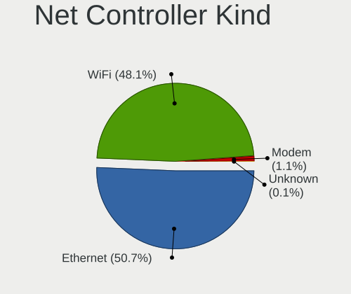

| Kind     | Computers | Percent |
|----------|-----------|---------|
| Ethernet | 643       | 50.67%  |
| WiFi     | 611       | 48.15%  |
| Modem    | 14        | 1.1%    |
| Unknown  | 1         | 0.08%   |

Used Controller
---------------

Currently used network controller

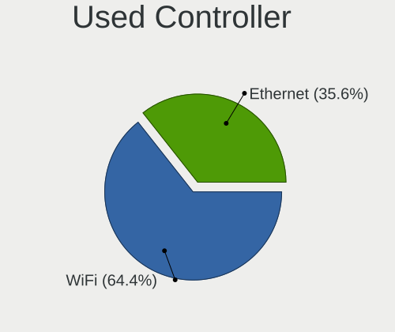

| Kind     | Computers | Percent |
|----------|-----------|---------|
| WiFi     | 504       | 64.37%  |
| Ethernet | 279       | 35.63%  |

NICs
----

Total network controllers on board

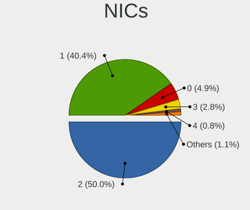

| Total | Computers | Percent |
|-------|-----------|---------|
| 2     | 394       | 50%     |
| 1     | 318       | 40.36%  |
| 0     | 39        | 4.95%   |
| 3     | 22        | 2.79%   |
| 4     | 6         | 0.76%   |
| 5     | 3         | 0.38%   |
| 6     | 2         | 0.25%   |
| 14    | 1         | 0.13%   |
| 11    | 1         | 0.13%   |
| 9     | 1         | 0.13%   |
| 8     | 1         | 0.13%   |

IPv6
----

IPv6 vs IPv4

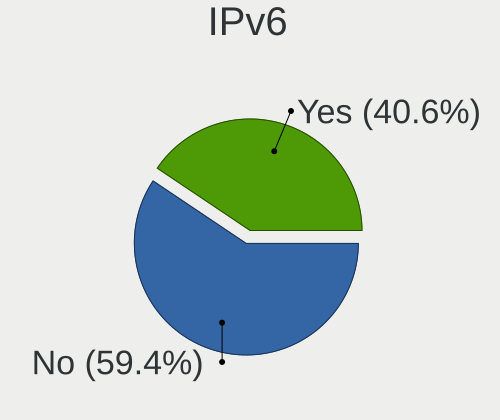

| Used | Computers | Percent |
|------|-----------|---------|
| No   | 480       | 59.41%  |
| Yes  | 328       | 40.59%  |

Bluetooth
---------

Bluetooth Vendor
----------------

Controller vendors

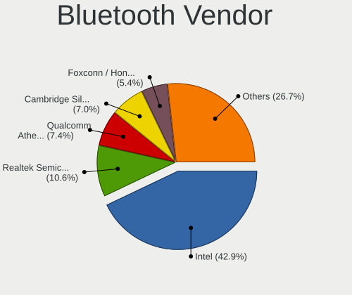

| Vendor                          | Computers | Percent |
|---------------------------------|-----------|---------|
| Intel                           | 215       | 42.91%  |
| Realtek Semiconductor           | 53        | 10.58%  |
| Qualcomm Atheros Communications | 37        | 7.39%   |
| Cambridge Silicon Radio         | 35        | 6.99%   |
| Foxconn / Hon Hai               | 27        | 5.39%   |
| IMC Networks                    | 26        | 5.19%   |
| Apple                           | 22        | 4.39%   |
| Broadcom                        | 18        | 3.59%   |
| Lite-On Technology              | 13        | 2.59%   |
| TP-Link                         | 10        | 2%      |
| Dell                            | 9         | 1.8%    |
| MediaTek                        | 8         | 1.6%    |
| Hewlett-Packard                 | 7         | 1.4%    |
| Realtek                         | 5         | 1%      |
| Unknown                         | 4         | 0.8%    |
| Ralink                          | 2         | 0.4%    |
| D-Link                          | 2         | 0.4%    |
| AICSemi                         | 2         | 0.4%    |
| SINO WEALTH                     | 1         | 0.2%    |
| Ralink Technology               | 1         | 0.2%    |
| Chicony Electronics             | 1         | 0.2%    |
| ASUSTek Computer                | 1         | 0.2%    |
| Askey Computer                  | 1         | 0.2%    |
| Alps Electric                   | 1         | 0.2%    |

Bluetooth Model
---------------

Controller models

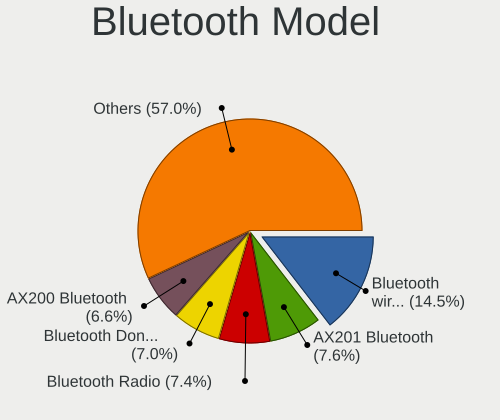

| Model                                               | Computers | Percent |
|-----------------------------------------------------|-----------|---------|
| Intel Bluetooth wireless interface                  | 73        | 14.54%  |
| Intel AX201 Bluetooth                               | 38        | 7.57%   |
| Realtek Bluetooth Radio                             | 37        | 7.37%   |
| Cambridge Silicon Radio Bluetooth Dongle (HCI mode) | 35        | 6.97%   |
| Intel AX200 Bluetooth                               | 33        | 6.57%   |
| Intel Bluetooth 9460/9560 Jefferson Peak (JfP)      | 23        | 4.58%   |
| Intel Bluetooth Device                              | 18        | 3.59%   |
| Qualcomm Atheros  Bluetooth Device                  | 16        | 3.19%   |
| Intel AX210 Bluetooth                               | 13        | 2.59%   |
| Apple Bluetooth Host Controller                     | 11        | 2.19%   |
| TP-Link TP-T@- UB500 Adapter                        | 10        | 1.99%   |
| Realtek  Bluetooth 4.2 Adapter                      | 10        | 1.99%   |
| Intel Centrino Bluetooth Wireless Transceiver       | 8         | 1.59%   |
| IMC Networks Bluetooth Device                       | 8         | 1.59%   |
| Qualcomm Atheros QCA61x4 Bluetooth 4.0              | 7         | 1.39%   |
| Qualcomm Atheros AR3011 Bluetooth                   | 7         | 1.39%   |
| MediaTek Wireless_Device                            | 7         | 1.39%   |
| IMC Networks Wireless_Device                        | 7         | 1.39%   |
| IMC Networks Bluetooth Radio                        | 6         | 1.2%    |
| Foxconn / Hon Hai Bluetooth Device                  | 6         | 1.2%    |
| Realtek Bluetooth Radio                             | 5         | 1%      |
| Lite-On Bluetooth Device                            | 5         | 1%      |
| HP Broadcom 2070 Bluetooth Combo                    | 5         | 1%      |
| Foxconn / Hon Hai Wireless_Device                   | 5         | 1%      |
| Foxconn / Hon Hai MediaTek Bluetooth Adapter        | 5         | 1%      |
| Broadcom BCM2045B (BDC-2.1)                         | 5         | 1%      |
| Apple Bluetooth USB Host Controller                 | 5         | 1%      |
| Intel Wireless-AC 3168 Bluetooth                    | 4         | 0.8%    |
| IMC Networks Atheros AR3012 Bluetooth 4.0 Adapter   | 4         | 0.8%    |
| Dell DW375 Bluetooth Module                         | 4         | 0.8%    |
| Broadcom HP Portable Bumble Bee                     | 4         | 0.8%    |
| Apple Built-in Bluetooth 2.0+EDR HCI                | 4         | 0.8%    |
| Unknown                                             | 4         | 0.8%    |
| Qualcomm Atheros AR9462 Bluetooth                   | 3         | 0.6%    |
| Qualcomm Atheros AR3012 Bluetooth 4.0               | 3         | 0.6%    |
| Lite-On Qualcomm Atheros QCA9377 Bluetooth          | 3         | 0.6%    |
| Intel Wireless-AC 9260 Bluetooth Adapter            | 3         | 0.6%    |
| Foxconn / Hon Hai Bluetooth USB Host Controller     | 3         | 0.6%    |
| Broadcom BCM20702A0                                 | 3         | 0.6%    |
| Realtek RTL8822BE Bluetooth 4.2 Adapter             | 2         | 0.4%    |

Sound
-----

Sound Vendor
------------

Sound card vendors

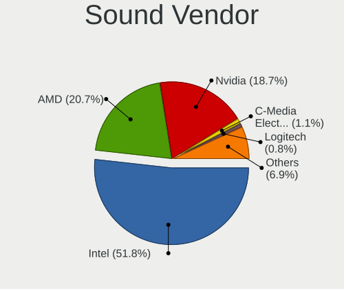

| Vendor                                       | Computers | Percent |
|----------------------------------------------|-----------|---------|
| Intel                                        | 544       | 51.76%  |
| AMD                                          | 218       | 20.74%  |
| Nvidia                                       | 197       | 18.74%  |
| C-Media Electronics                          | 12        | 1.14%   |
| Logitech                                     | 8         | 0.76%   |
| Texas Instruments                            | 7         | 0.67%   |
| JMTek                                        | 7         | 0.67%   |
| KTMicro                                      | 6         | 0.57%   |
| ASUSTek Computer                             | 6         | 0.57%   |
| Realtek Semiconductor                        | 3         | 0.29%   |
| Tenx Technology                              | 2         | 0.19%   |
| Sony                                         | 2         | 0.19%   |
| Samsung Electronics                          | 2         | 0.19%   |
| RODE Microphones                             | 2         | 0.19%   |
| Generalplus Technology                       | 2         | 0.19%   |
| Creative Technology                          | 2         | 0.19%   |
| Zoran Co. Personal Media Division (Nogatech) | 1         | 0.1%    |
| Yamaha                                       | 1         | 0.1%    |
| XMOS                                         | 1         | 0.1%    |
| Walmart                                      | 1         | 0.1%    |
| TTGK Technology                              | 1         | 0.1%    |
| Thesycon Systemsoftware & Consulting         | 1         | 0.1%    |
| Synaptics                                    | 1         | 0.1%    |
| SteelSeries ApS                              | 1         | 0.1%    |
| Shenzhen Maono Teochnology                   | 1         | 0.1%    |
| Setek Elektronik                             | 1         | 0.1%    |
| SAVITECH                                     | 1         | 0.1%    |
| Razer USA                                    | 1         | 0.1%    |
| Plantronics                                  | 1         | 0.1%    |
| Philips (or NXP)                             | 1         | 0.1%    |
| ONIX                                         | 1         | 0.1%    |
| MVSILICON.INC.                               | 1         | 0.1%    |
| MosArt Semiconductor                         | 1         | 0.1%    |
| Micro Star International                     | 1         | 0.1%    |
| Maono                                        | 1         | 0.1%    |
| Jieli Technology                             | 1         | 0.1%    |
| Huawei Technologies                          | 1         | 0.1%    |
| GYROCOM C&C                                  | 1         | 0.1%    |
| GN Netcom                                    | 1         | 0.1%    |
| FiiO Electronics Technology                  | 1         | 0.1%    |

Sound Model
-----------

Sound card models

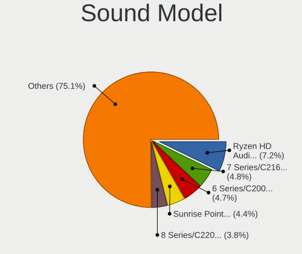

| Model                                                                                             | Computers | Percent |
|---------------------------------------------------------------------------------------------------|-----------|---------|
| AMD Ryzen HD Audio Controller                                                                     | 91        | 7.24%   |
| Intel 7 Series/C216 Chipset Family High Definition Audio Controller                               | 60        | 4.77%   |
| Intel 6 Series/C200 Series Chipset Family High Definition Audio Controller                        | 59        | 4.69%   |
| Intel Sunrise Point-LP HD Audio                                                                   | 55        | 4.38%   |
| Intel 8 Series/C220 Series Chipset High Definition Audio Controller                               | 48        | 3.82%   |
| AMD Renoir/Cezanne HDMI/DP Audio Controller                                                       | 38        | 3.02%   |
| AMD Starship/Matisse HD Audio Controller                                                          | 36        | 2.86%   |
| AMD Raven/Raven2/Fenghuang HDMI/DP Audio Controller                                               | 30        | 2.39%   |
| Intel Xeon E3-1200 v3/4th Gen Core Processor HD Audio Controller                                  | 28        | 2.23%   |
| Intel 5 Series/3400 Series Chipset High Definition Audio                                          | 25        | 1.99%   |
| Intel 82801I (ICH9 Family) HD Audio Controller                                                    | 23        | 1.83%   |
| Intel Cannon Lake PCH cAVS                                                                        | 22        | 1.75%   |
| Intel 8 Series HD Audio Controller                                                                | 21        | 1.67%   |
| AMD Radeon High Definition Audio Controller                                                       | 21        | 1.67%   |
| Nvidia GA106 High Definition Audio Controller                                                     | 20        | 1.59%   |
| Intel Haswell-ULT HD Audio Controller                                                             | 20        | 1.59%   |
| Nvidia GF108 High Definition Audio Controller                                                     | 19        | 1.51%   |
| Intel Wildcat Point-LP High Definition Audio Controller                                           | 19        | 1.51%   |
| Intel Broadwell-U Audio Controller                                                                | 19        | 1.51%   |
| Intel 100 Series/C230 Series Chipset Family HD Audio Controller                                   | 19        | 1.51%   |
| Nvidia GK208 HDMI/DP Audio Controller                                                             | 16        | 1.27%   |
| Intel Tiger Lake-LP Smart Sound Technology Audio Controller                                       | 16        | 1.27%   |
| Intel NM10/ICH7 Family High Definition Audio Controller                                           | 16        | 1.27%   |
| AMD Ellesmere HDMI Audio [Radeon RX 470/480 / 570/580/590]                                        | 16        | 1.27%   |
| AMD Navi 21/23 HDMI/DP Audio Controller                                                           | 15        | 1.19%   |
| AMD Family 17h (Models 00h-0fh) HD Audio Controller                                               | 14        | 1.11%   |
| Nvidia GP107GL High Definition Audio Controller                                                   | 13        | 1.03%   |
| AMD FCH Azalia Controller                                                                         | 13        | 1.03%   |
| Intel Cannon Point-LP High Definition Audio Controller                                            | 11        | 0.88%   |
| Intel 200 Series PCH HD Audio                                                                     | 11        | 0.88%   |
| Intel Comet Lake PCH cAVS                                                                         | 10        | 0.8%    |
| Intel Celeron/Pentium Silver Processor High Definition Audio                                      | 10        | 0.8%    |
| Intel Atom/Celeron/Pentium Processor x5-E8000/J3xxx/N3xxx Series High Definition Audio Controller | 10        | 0.8%    |
| Intel Alder Lake PCH-P High Definition Audio Controller                                           | 10        | 0.8%    |
| Nvidia TU116 High Definition Audio Controller                                                     | 9         | 0.72%   |
| Nvidia TU107 GeForce GTX 1650 High Definition Audio Controller                                    | 9         | 0.72%   |
| Nvidia GM107 High Definition Audio Controller [GeForce 940MX]                                     | 9         | 0.72%   |
| Nvidia AD107 High Definition Audio Controller                                                     | 9         | 0.72%   |
| Intel Alder Lake-S HD Audio Controller                                                            | 9         | 0.72%   |
| Nvidia TU106 High Definition Audio Controller                                                     | 8         | 0.64%   |

Memory
------

Memory Vendor
-------------

Memory module vendors

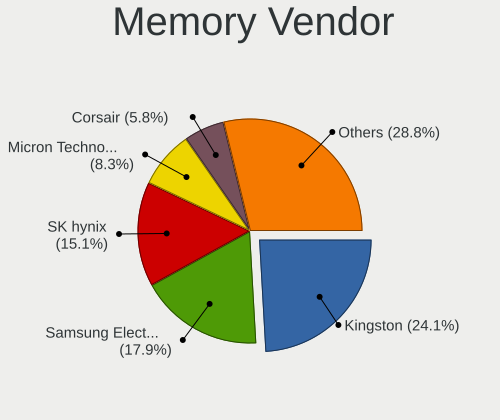

| Vendor                                  | Computers | Percent |
|-----------------------------------------|-----------|---------|
| Kingston                                | 128       | 24.11%  |
| Samsung Electronics                     | 95        | 17.89%  |
| SK hynix                                | 80        | 15.07%  |
| Micron Technology                       | 44        | 8.29%   |
| Corsair                                 | 31        | 5.84%   |
| Unknown                                 | 26        | 4.9%    |
| A-DATA Technology                       | 20        | 3.77%   |
| Ramaxel Technology                      | 11        | 2.07%   |
| Nanya Technology                        | 11        | 2.07%   |
| Crucial                                 | 11        | 2.07%   |
| Unknown                                 | 11        | 2.07%   |
| Team                                    | 7         | 1.32%   |
| Apacer                                  | 7         | 1.32%   |
| PNY                                     | 5         | 0.94%   |
| Kingmax                                 | 5         | 0.94%   |
| Elpida                                  | 5         | 0.94%   |
| Unknown (ABCD)                          | 3         | 0.56%   |
| Transcend                               | 3         | 0.56%   |
| Silicon Power                           | 3         | 0.56%   |
| SemsoTai                                | 3         | 0.56%   |
| G.Skill                                 | 3         | 0.56%   |
| Unknown (0x0CAE)                        | 2         | 0.38%   |
| Kimtigo                                 | 2         | 0.38%   |
| Unknown (08AE)                          | 1         | 0.19%   |
| Unknown (05BA)                          | 1         | 0.19%   |
| Silicon Power Computer & Communications | 1         | 0.19%   |
| Qimonda                                 | 1         | 0.19%   |
| PUSKILL                                 | 1         | 0.19%   |
| Patriot Memory                          | 1         | 0.19%   |
| MAXSUN                                  | 1         | 0.19%   |
| Lexar Co Limited                        | 1         | 0.19%   |
| Lexar                                   | 1         | 0.19%   |
| KLEVV                                   | 1         | 0.19%   |
| Kinlstuo                                | 1         | 0.19%   |
| Hikvision                               | 1         | 0.19%   |
| Hewlett-Packard                         | 1         | 0.19%   |
| H                                       | 1         | 0.19%   |
| Goldenmars                              | 1         | 0.19%   |

Memory Model
------------

Memory module models

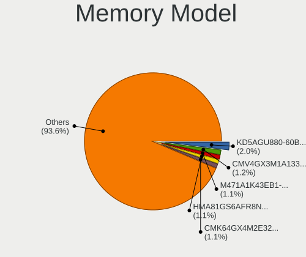

| Model                                                            | Computers | Percent |
|------------------------------------------------------------------|-----------|---------|
| Unknown                                                          | 11        | 1.95%   |
| Corsair RAM CMV4GX3M1A1333C9 4GB DIMM DDR3 1600MT/s              | 7         | 1.24%   |
| SK hynix RAM HMA81GS6AFR8N-UH 8GB SODIMM DDR4 2667MT/s           | 6         | 1.06%   |
| Samsung RAM M471A1K43EB1-CWE 8GB SODIMM DDR4 3200MT/s            | 6         | 1.06%   |
| Corsair RAM CMK64GX4M2E3200C16 32GB DIMM DDR4 3600MT/s           | 6         | 1.06%   |
| Unknown RAM Module 2GB DIMM SDRAM                                | 5         | 0.89%   |
| Kingston RAM 99U5471-054.A00LF 8GB DIMM DDR3 1600MT/s            | 5         | 0.89%   |
| Samsung RAM M471B5173DB0-YK0 4GB SODIMM DDR3 1600MT/s            | 4         | 0.71%   |
| Kingston RAM KF3200C16D4/32GX 32GB DIMM DDR4 3933MT/s            | 4         | 0.71%   |
| SK hynix RAM HMT425S6CFR6A-PB 2GB SODIMM DDR3 1600MT/s           | 3         | 0.53%   |
| SK hynix RAM HMT351U6CFR8C-PB 4GB DIMM DDR3 1800MT/s             | 3         | 0.53%   |
| SK hynix RAM HMT351S6CFR8C-PB 4096MB SODIMM DDR3 1600MT/s        | 3         | 0.53%   |
| SK hynix RAM HMA451S6AFR8N-TF 4GB SODIMM DDR4 2133MT/s           | 3         | 0.53%   |
| Samsung RAM M471B5273DH0-CK0 4GB SODIMM DDR3 2400MT/s            | 3         | 0.53%   |
| Samsung RAM M471B5273DH0-CH9 4GB SODIMM DDR3 1600MT/s            | 3         | 0.53%   |
| Samsung RAM M471B5173QH0-YK0 4GB SODIMM DDR3 1600MT/s            | 3         | 0.53%   |
| Samsung RAM M471B1G73QH0-YK0 8GB SODIMM DDR3 1600MT/s            | 3         | 0.53%   |
| Samsung RAM M471A5244CB0-CWE 4GB SODIMM DDR4 3200MT/s            | 3         | 0.53%   |
| Samsung RAM M471A5244CB0-CTD 4GB SODIMM DDR4 3266MT/s            | 3         | 0.53%   |
| Samsung RAM M471A1K43CB1-CRC 8GB SODIMM DDR4 8400MT/s            | 3         | 0.53%   |
| PNY RAM 8GBF1X08QFHH38-135-K 8GB DIMM DDR4 3600MT/s              | 3         | 0.53%   |
| Nanya RAM NT4GC64B8HG0NS-CG 4GB SODIMM DDR3 1600MT/s             | 3         | 0.53%   |
| Micron RAM 4ATF51264HZ-2G6E1 4GB SODIMM DDR4 2667MT/s            | 3         | 0.53%   |
| Micron RAM 4ATF51264HZ-2G3E1 4GB SODIMM DDR4 2667MT/s            | 3         | 0.53%   |
| Micron RAM 4ATF1G64HZ-3G2F1 8GB SODIMM DDR4 3200MT/s             | 3         | 0.53%   |
| Kingston RAM KF3200C16D4/16GX 16GB DIMM DDR4 3733MT/s            | 3         | 0.53%   |
| Kingston RAM 99U5471-050.A00LF 8GB DIMM DDR3 1600MT/s            | 3         | 0.53%   |
| Kingmax RAM FLFE85F-C8KM9 2GB DIMM DDR3 1333MT/s                 | 3         | 0.53%   |
| Kingmax RAM FLFE85F-C8KL9 2GB DIMM DDR3 1333MT/s                 | 3         | 0.53%   |
| A-DATA RAM Module 8GB SODIMM DDR4 3200MT/s                       | 3         | 0.53%   |
| A-DATA RAM DDR4 3200 16GB DIMM DDR4 3600MT/s                     | 3         | 0.53%   |
| Unknown RAM Module 8GB DIMM DDR3 1600MT/s                        | 2         | 0.35%   |
| Unknown RAM Module 4GB DIMM SDRAM                                | 2         | 0.35%   |
| Unknown RAM Module 2GB Row Of Chips LPDDR4 4267MT/s              | 2         | 0.35%   |
| Unknown (ABCD) RAM 123456789012345678 2GB SODIMM LPDDR4 2400MT/s | 2         | 0.35%   |
| Unknown (0x0CAE) RAM UD5124G72D 24GB DIMM DDR5 7200MT/s          | 2         | 0.35%   |
| Team RAM TEAMGROUP-SD4-3200 16GB SODIMM DDR4 3200MT/s            | 2         | 0.35%   |
| SK hynix RAM Module 4096MB SODIMM DDR3 1600MT/s                  | 2         | 0.35%   |
| SK hynix RAM Module 2GB SODIMM DDR3 1066MT/s                     | 2         | 0.35%   |
| SK hynix RAM HMT451S6AFR8A-PB 4GB SODIMM DDR3 1600MT/s           | 2         | 0.35%   |

Memory Kind
-----------

Memory module kinds

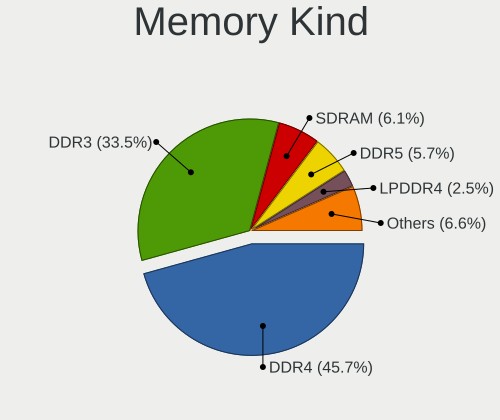

| Kind    | Computers | Percent |
|---------|-----------|---------|
| DDR4    | 202       | 45.7%   |
| DDR3    | 148       | 33.48%  |
| SDRAM   | 27        | 6.11%   |
| DDR5    | 25        | 5.66%   |
| LPDDR4  | 11        | 2.49%   |
| DDR2    | 10        | 2.26%   |
| LPDDR3  | 8         | 1.81%   |
| Unknown | 5         | 1.13%   |
| LPDDR5  | 3         | 0.68%   |
| DDR     | 2         | 0.45%   |
| DRAM    | 1         | 0.23%   |

Memory Form Factor
------------------

Physical design of the memory module

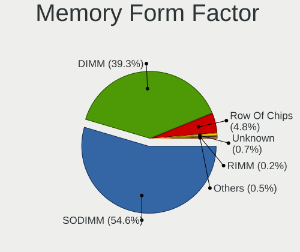

| Name         | Computers | Percent |
|--------------|-----------|---------|
| SODIMM       | 239       | 54.57%  |
| DIMM         | 172       | 39.27%  |
| Row Of Chips | 21        | 4.79%   |
| Unknown      | 3         | 0.68%   |
| RIMM         | 1         | 0.23%   |
| FB-DIMM      | 1         | 0.23%   |
| Chip         | 1         | 0.23%   |

Memory Size
-----------

Memory module size

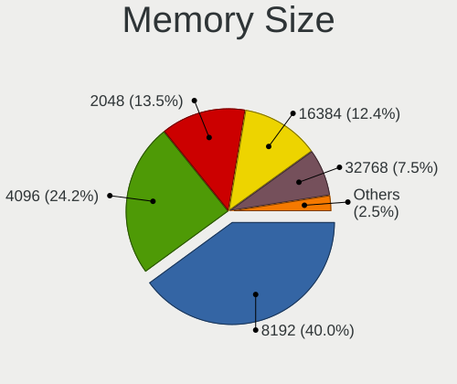

| Size  | Computers | Percent |
|-------|-----------|---------|
| 8192  | 193       | 39.96%  |
| 4096  | 117       | 24.22%  |
| 2048  | 65        | 13.46%  |
| 16384 | 60        | 12.42%  |
| 32768 | 36        | 7.45%   |
| 1024  | 9         | 1.86%   |
| 24576 | 2         | 0.41%   |
| 49152 | 1         | 0.21%   |

Memory Speed
------------

Memory module speed

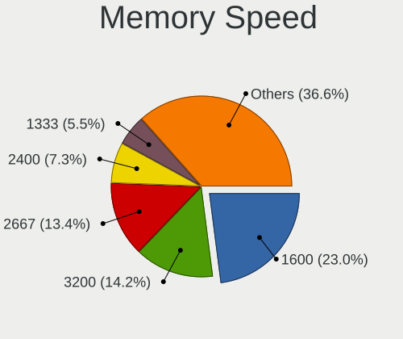

| Speed   | Computers | Percent |
|---------|-----------|---------|
| 1600    | 113       | 22.97%  |
| 3200    | 70        | 14.23%  |
| 2667    | 66        | 13.41%  |
| 2400    | 36        | 7.32%   |
| 1333    | 27        | 5.49%   |
| 2133    | 22        | 4.47%   |
| 3600    | 17        | 3.46%   |
| 1334    | 12        | 2.44%   |
| 5600    | 11        | 2.24%   |
| 1067    | 10        | 2.03%   |
| 800     | 8         | 1.63%   |
| 667     | 8         | 1.63%   |
| Unknown | 8         | 1.63%   |
| 1867    | 7         | 1.42%   |
| 5200    | 6         | 1.22%   |
| 4800    | 6         | 1.22%   |
| 3733    | 6         | 1.22%   |
| 4267    | 5         | 1.02%   |
| 2048    | 5         | 1.02%   |
| 8400    | 4         | 0.81%   |
| 3933    | 4         | 0.81%   |
| 1800    | 4         | 0.81%   |
| 1066    | 4         | 0.81%   |
| 3266    | 3         | 0.61%   |
| 2666    | 3         | 0.61%   |
| 7200    | 2         | 0.41%   |
| 6400    | 2         | 0.41%   |
| 4199    | 2         | 0.41%   |
| 3400    | 2         | 0.41%   |
| 2933    | 2         | 0.41%   |
| 2134    | 2         | 0.41%   |
| 1866    | 2         | 0.41%   |
| 1639    | 2         | 0.41%   |
| 49926   | 1         | 0.2%    |
| 8533    | 1         | 0.2%    |
| 6000    | 1         | 0.2%    |
| 3800    | 1         | 0.2%    |
| 3666    | 1         | 0.2%    |
| 3466    | 1         | 0.2%    |
| 3334    | 1         | 0.2%    |

Printers & scanners
-------------------

Printer Vendor
--------------

Printer device vendors

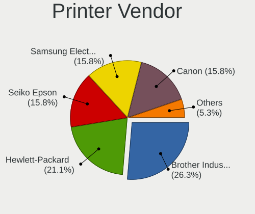

| Vendor              | Computers | Percent |
|---------------------|-----------|---------|
| Brother Industries  | 5         | 26.32%  |
| Hewlett-Packard     | 4         | 21.05%  |
| Seiko Epson         | 3         | 15.79%  |
| Samsung Electronics | 3         | 15.79%  |
| Canon               | 3         | 15.79%  |
| Prolific Technology | 1         | 5.26%   |

Printer Model
-------------

Printer device models

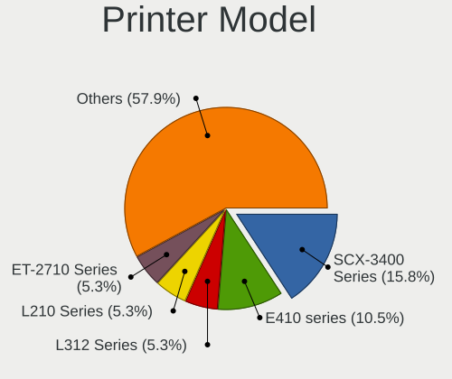

| Model                         | Computers | Percent |
|-------------------------------|-----------|---------|
| Samsung SCX-3400 Series       | 3         | 15.79%  |
| Canon E410 series             | 2         | 10.53%  |
| Seiko Epson L312 Series       | 1         | 5.26%   |
| Seiko Epson L210 Series       | 1         | 5.26%   |
| Seiko Epson ET-2710 Series    | 1         | 5.26%   |
| Prolific PL2305 Parallel Port | 1         | 5.26%   |
| HP LaserJet P1006             | 1         | 5.26%   |
| HP Ink Tank 110 series        | 1         | 5.26%   |
| HP DeskJet F4200 series       | 1         | 5.26%   |
| HP DeskJet 2700 series        | 1         | 5.26%   |
| Canon LBP6030/6030B/6018L     | 1         | 5.26%   |
| Brother MFC-T4500DW           | 1         | 5.26%   |
| Brother MFC-1910W             | 1         | 5.26%   |
| Brother DCP-J105              | 1         | 5.26%   |
| Brother DCP-1610W             | 1         | 5.26%   |
| Brother DCP-1510              | 1         | 5.26%   |

Scanner Vendor
--------------

Scanner device vendors

Zero info for selected period =(

Scanner Model
-------------

Scanner device models

Zero info for selected period =(

Camera
------

Camera Vendor
-------------

Camera device vendors

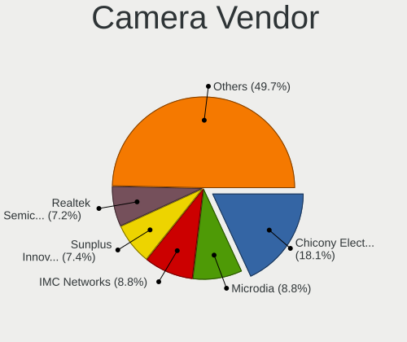

| Vendor                                 | Computers | Percent |
|----------------------------------------|-----------|---------|
| Chicony Electronics                    | 78        | 18.1%   |
| Microdia                               | 38        | 8.82%   |
| IMC Networks                           | 38        | 8.82%   |
| Sunplus Innovation Technology          | 32        | 7.42%   |
| Realtek Semiconductor                  | 31        | 7.19%   |
| Bison Electronics                      | 31        | 7.19%   |
| Suyin                                  | 21        | 4.87%   |
| Logitech                               | 20        | 4.64%   |
| Apple                                  | 19        | 4.41%   |
| Quanta                                 | 17        | 3.94%   |
| Cheng Uei Precision Industry (Foxlink) | 14        | 3.25%   |
| Syntek                                 | 11        | 2.55%   |
| Luxvisions Innotech Limited            | 10        | 2.32%   |
| Generalplus Technology                 | 9         | 2.09%   |
| Lite-On Technology                     | 6         | 1.39%   |
| Alcor Micro                            | 6         | 1.39%   |
| ShineTech                              | 4         | 0.93%   |
| Samsung Electronics                    | 4         | 0.93%   |
| YGTek                                  | 3         | 0.7%    |
| Silicon Motion                         | 3         | 0.7%    |
| Cubeternet                             | 3         | 0.7%    |
| WCM_USB                                | 2         | 0.46%   |
| vivo                                   | 2         | 0.46%   |
| Sonix Technology                       | 2         | 0.46%   |
| SN0002                                 | 2         | 0.46%   |
| Lenovo                                 | 2         | 0.46%   |
| Jieli Technology                       | 2         | 0.46%   |
| Google                                 | 2         | 0.46%   |
| Genesys Logic                          | 2         | 0.46%   |
| Z-Star Microelectronics                | 1         | 0.23%   |
| Trust                                  | 1         | 0.23%   |
| Sunwingroup                            | 1         | 0.23%   |
| SunplusIT                              | 1         | 0.23%   |
| Sunplus Technology                     | 1         | 0.23%   |
| Ricoh                                  | 1         | 0.23%   |
| Remo Tech                              | 1         | 0.23%   |
| Razer USA                              | 1         | 0.23%   |
| Primax Electronics                     | 1         | 0.23%   |
| OmniVision Technologies                | 1         | 0.23%   |
| Mimaki Engineering                     | 1         | 0.23%   |

Camera Model
------------

Camera device models

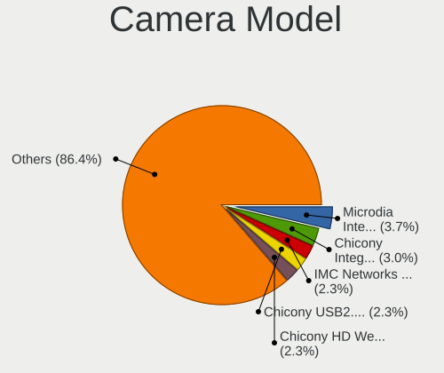

| Model                                                   | Computers | Percent |
|---------------------------------------------------------|-----------|---------|
| Microdia Integrated_Webcam_HD                           | 16        | 3.7%    |
| Chicony Integrated Camera                               | 13        | 3%      |
| IMC Networks Integrated Camera                          | 10        | 2.31%   |
| Chicony USB2.0 VGA UVC WebCam                           | 10        | 2.31%   |
| Chicony HD Webcam                                       | 10        | 2.31%   |
| Sunplus Integrated_Webcam_HD                            | 9         | 2.08%   |
| IMC Networks USB2.0 HD UVC WebCam                       | 8         | 1.85%   |
| IMC Networks USB2.0 VGA UVC WebCam                      | 6         | 1.39%   |
| Chicony Integrated Camera (1280x720@30)                 | 6         | 1.39%   |
| Bison HD Webcam                                         | 6         | 1.39%   |
| Apple Built-in iSight                                   | 6         | 1.39%   |
| Realtek Integrated_Webcam_HD                            | 5         | 1.15%   |
| Microdia USB 2.0 Camera                                 | 5         | 1.15%   |
| Microdia Laptop_Integrated_Webcam_HD                    | 5         | 1.15%   |
| Logitech Webcam C270                                    | 5         | 1.15%   |
| Lite-On Integrated Camera                               | 5         | 1.15%   |
| Generalplus GENERAL WEBCAM                              | 5         | 1.15%   |
| Chicony USB2.0 HD UVC WebCam                            | 5         | 1.15%   |
| Cheng Uei Precision Industry (Foxlink) HP TrueVision HD | 5         | 1.15%   |
| Bison Lenovo Integrated Webcam                          | 5         | 1.15%   |
| Bison Integrated Camera                                 | 5         | 1.15%   |
| Syntek USB Camera Device                                | 4         | 0.92%   |
| Syntek Integrated Camera                                | 4         | 0.92%   |
| Suyin 1.3M HD WebCam                                    | 4         | 0.92%   |
| Sunplus Laptop Integrated WebCam HD                     | 4         | 0.92%   |
| ShineTech USB2.0 HD UVC WebCam                          | 4         | 0.92%   |
| Samsung Galaxy series, misc. (MTP mode)                 | 4         | 0.92%   |
| Luxvisions Innotech Limited HP TrueVision HD Camera     | 4         | 0.92%   |
| Logitech HD Pro Webcam C920                             | 4         | 0.92%   |
| IMC Networks USB2.0 UVC HD Webcam                       | 4         | 0.92%   |
| Chicony HP HD Webcam                                    | 4         | 0.92%   |
| Bison Lenovo EasyCamera                                 | 4         | 0.92%   |
| Apple iPhone 5/5C/5S/6/SE/7/8/X                         | 4         | 0.92%   |
| Apple FaceTime HD Camera (Built-in)                     | 4         | 0.92%   |
| Apple FaceTime HD Camera                                | 4         | 0.92%   |
| YGTek Webcam                                            | 3         | 0.69%   |
| Suyin WebCam                                            | 3         | 0.69%   |
| Suyin Acer/HP Integrated Webcam [CN0314]                | 3         | 0.69%   |
| Sunplus Integrated_Webcam_FHD                           | 3         | 0.69%   |
| Realtek Integrated Webcam_HD                            | 3         | 0.69%   |

Security
--------

Fingerprint Vendor
------------------

Fingerprint sensor vendors

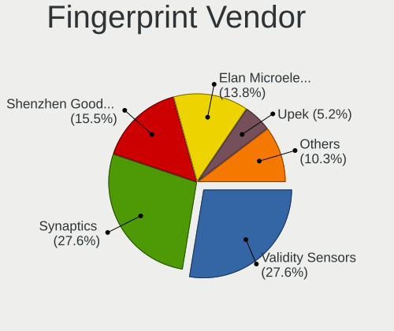

| Vendor                     | Computers | Percent |
|----------------------------|-----------|---------|
| Validity Sensors           | 16        | 27.59%  |
| Synaptics                  | 16        | 27.59%  |
| Shenzhen Goodix Technology | 9         | 15.52%  |
| Elan Microelectronics      | 8         | 13.79%  |
| Upek                       | 3         | 5.17%   |
| AuthenTec                  | 3         | 5.17%   |
| LighTuning Technology      | 2         | 3.45%   |
| Focal-systems.Corp         | 1         | 1.72%   |

Fingerprint Model
-----------------

Fingerprint sensor models

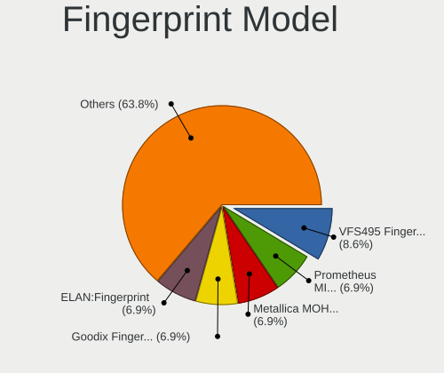

| Model                                                       | Computers | Percent |
|-------------------------------------------------------------|-----------|---------|
| Validity Sensors VFS495 Fingerprint Reader                  | 5         | 8.62%   |
| Synaptics Prometheus MIS Touch Fingerprint Reader           | 4         | 6.9%    |
| Synaptics Metallica MOH Touch Fingerprint Reader            | 4         | 6.9%    |
| Shenzhen Goodix  Fingerprint Device                         | 4         | 6.9%    |
| Elan ELAN:Fingerprint                                       | 4         | 6.9%    |
| Elan ELAN:ARM-M4                                            | 4         | 6.9%    |
| Upek Biometric Touchchip/Touchstrip Fingerprint Sensor      | 3         | 5.17%   |
| Synaptics Metallica MIS Touch Fingerprint Reader            | 3         | 5.17%   |
| Shenzhen Goodix Fingerprint Reader                          | 3         | 5.17%   |
| Validity Sensors VFS451 Fingerprint Reader                  | 2         | 3.45%   |
| Validity Sensors VFS 5011 fingerprint sensor                | 2         | 3.45%   |
| Shenzhen Goodix FingerPrint                                 | 2         | 3.45%   |
| LighTuning EgisTec Touch Fingerprint Sensor                 | 2         | 3.45%   |
| Validity Sensors VFS7500 Touch Fingerprint Sensor           | 1         | 1.72%   |
| Validity Sensors VFS491                                     | 1         | 1.72%   |
| Validity Sensors VFS471 Fingerprint Reader                  | 1         | 1.72%   |
| Validity Sensors Synaptics WBDI                             | 1         | 1.72%   |
| Validity Sensors Synaptics VFS7552 Touch Fingerprint Sensor | 1         | 1.72%   |
| Validity Sensors Swipe Fingerprint Sensor                   | 1         | 1.72%   |
| Validity Sensors Fingerprint scanner                        | 1         | 1.72%   |
| Synaptics WBDI Fingerprint Reader USB 086                   | 1         | 1.72%   |
| Synaptics UWP WBDI                                          | 1         | 1.72%   |
| Synaptics  WBDI                                             | 1         | 1.72%   |
| Synaptics FS7604 Touch Fingerprint Sensor with PurePrint    | 1         | 1.72%   |
| Synaptics Fingerprint reader [HP G6]                        | 1         | 1.72%   |
| Focal-systems.Corp FT9201Fingerprint.                       | 1         | 1.72%   |
| AuthenTec Fingerprint Sensor                                | 1         | 1.72%   |
| AuthenTec AES2550 Fingerprint Sensor                        | 1         | 1.72%   |
| AuthenTec AES1660 Fingerprint Sensor                        | 1         | 1.72%   |

Chipcard Vendor
---------------

Chipcard module vendors

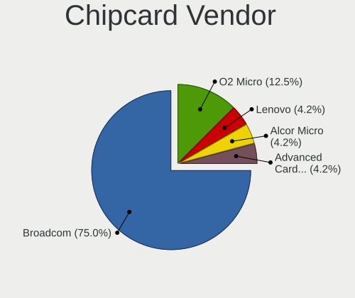

| Vendor                | Computers | Percent |
|-----------------------|-----------|---------|
| Broadcom              | 18        | 75%     |
| O2 Micro              | 3         | 12.5%   |
| Lenovo                | 1         | 4.17%   |
| Alcor Micro           | 1         | 4.17%   |
| Advanced Card Systems | 1         | 4.17%   |

Chipcard Model
--------------

Chipcard module models

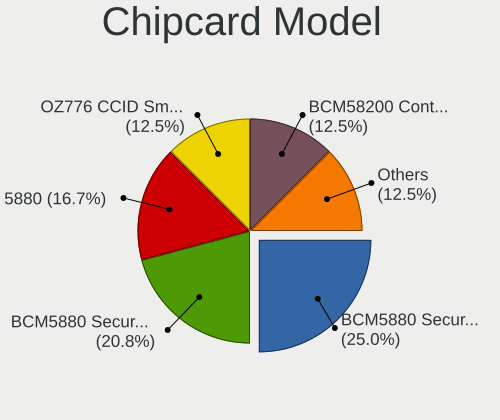

| Model                                                                        | Computers | Percent |
|------------------------------------------------------------------------------|-----------|---------|
| Broadcom BCM5880 Secure Applications Processor                               | 6         | 25%     |
| Broadcom BCM5880 Secure Applications Processor with fingerprint swipe sensor | 5         | 20.83%  |
| Broadcom 5880                                                                | 4         | 16.67%  |
| O2 Micro OZ776 CCID Smartcard Reader                                         | 3         | 12.5%   |
| Broadcom BCM58200 ControlVault 3 (FingerPrint sensor + Contacted SmartCard)  | 3         | 12.5%   |
| Lenovo Integrated Smart Card Reader                                          | 1         | 4.17%   |
| Alcor Micro AU9540 Smartcard Reader                                          | 1         | 4.17%   |
| Advanced Card Systems ACR1252 Dual Reader                                    | 1         | 4.17%   |

Unsupported
-----------

Unsupported Devices
-------------------

Total unsupported devices on board

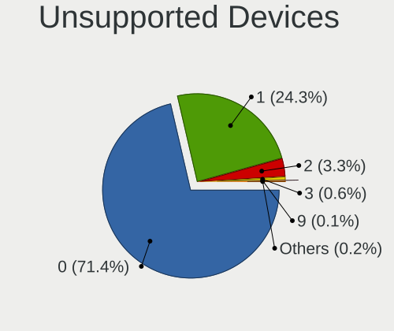

| Total | Computers | Percent |
|-------|-----------|---------|
| 0     | 576       | 71.38%  |
| 1     | 196       | 24.29%  |
| 2     | 27        | 3.35%   |
| 3     | 5         | 0.62%   |
| 9     | 1         | 0.12%   |
| 6     | 1         | 0.12%   |
| 5     | 1         | 0.12%   |

Unsupported Device Types
------------------------

Types of unsupported devices

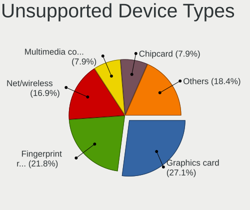

| Type                     | Computers | Percent |
|--------------------------|-----------|---------|
| Graphics card            | 72        | 27.07%  |
| Fingerprint reader       | 58        | 21.8%   |
| Net/wireless             | 45        | 16.92%  |
| Multimedia controller    | 21        | 7.89%   |
| Chipcard                 | 21        | 7.89%   |
| Communication controller | 11        | 4.14%   |
| Unassigned class         | 8         | 3.01%   |
| Bluetooth                | 7         | 2.63%   |
| Sound                    | 6         | 2.26%   |
| Storage                  | 4         | 1.5%    |
| Net/ethernet             | 3         | 1.13%   |
| Camera                   | 3         | 1.13%   |
| Storage/ide              | 2         | 0.75%   |
| Card reader              | 2         | 0.75%   |
| Wireless                 | 1         | 0.38%   |
| Network                  | 1         | 0.38%   |
| Modem                    | 1         | 0.38%   |

