Linux in Malaysia - Tested Hardware & Statistics
------------------------------------------------

A project to collect tested hardware configurations for Linux in Malaysia.

Anyone can contribute to this report by the [hw-probe](https://github.com/linuxhw/hw-probe) tool:

    sudo -E hw-probe -all -upload

Please contribute! Especially if your hardware is rare.

This is a report for all computer types. See also reports for [desktops](/Location/Malaysia/Desktop/README.md) and [notebooks](/Location/Malaysia/Notebook/README.md).

Contents
--------

* [ Test Cases ](#test-cases)

* [ System ](#system)
  - [ OS                       ](#os)
  - [ OS Family                ](#os-family)
  - [ Kernel                   ](#kernel)
  - [ Kernel Family            ](#kernel-family)
  - [ Kernel Major Ver.        ](#kernel-major-ver)
  - [ Arch                     ](#arch)
  - [ DE                       ](#de)
  - [ Display Server           ](#display-server)
  - [ Display Manager          ](#display-manager)
  - [ OS Lang                  ](#os-lang)
  - [ Boot Mode                ](#boot-mode)
  - [ Filesystem               ](#filesystem)
  - [ Part. scheme             ](#part-scheme)
  - [ Dual Boot with Linux/BSD ](#dual-boot-with-linuxbsd)
  - [ Dual Boot (Win)          ](#dual-boot-win)

* [ Board ](#board)
  - [ Vendor                   ](#vendor)
  - [ Model                    ](#model)
  - [ Model Family             ](#model-family)
  - [ MFG Year                 ](#mfg-year)
  - [ Form Factor              ](#form-factor)
  - [ Secure Boot              ](#secure-boot)
  - [ Coreboot                 ](#coreboot)
  - [ RAM Size                 ](#ram-size)
  - [ RAM Used                 ](#ram-used)
  - [ Total Drives             ](#total-drives)
  - [ Has CD-ROM               ](#has-cd-rom)
  - [ Has Ethernet             ](#has-ethernet)
  - [ Has WiFi                 ](#has-wifi)
  - [ Has Bluetooth            ](#has-bluetooth)

* [ Location ](#location)
  - [ Country                  ](#country)
  - [ City                     ](#city)

* [ Drives ](#drives)
  - [ Drive Vendor             ](#drive-vendor)
  - [ Drive Model              ](#drive-model)
  - [ HDD Vendor               ](#hdd-vendor)
  - [ SSD Vendor               ](#ssd-vendor)
  - [ Drive Kind               ](#drive-kind)
  - [ Drive Connector          ](#drive-connector)
  - [ Drive Size               ](#drive-size)
  - [ Space Total              ](#space-total)
  - [ Space Used               ](#space-used)
  - [ Malfunc. Drives          ](#malfunc-drives)
  - [ Malfunc. Drive Vendor    ](#malfunc-drive-vendor)
  - [ Malfunc. HDD Vendor      ](#malfunc-hdd-vendor)
  - [ Malfunc. Drive Kind      ](#malfunc-drive-kind)
  - [ Failed Drives            ](#failed-drives)
  - [ Failed Drive Vendor      ](#failed-drive-vendor)
  - [ Drive Status             ](#drive-status)

* [ Storage controller ](#storage-controller)
  - [ Storage Vendor           ](#storage-vendor)
  - [ Storage Model            ](#storage-model)
  - [ Storage Kind             ](#storage-kind)

* [ Processor ](#processor)
  - [ CPU Vendor               ](#cpu-vendor)
  - [ CPU Model                ](#cpu-model)
  - [ CPU Model Family         ](#cpu-model-family)
  - [ CPU Cores                ](#cpu-cores)
  - [ CPU Sockets              ](#cpu-sockets)
  - [ CPU Threads              ](#cpu-threads)
  - [ CPU Op-Modes             ](#cpu-op-modes)
  - [ CPU Microcode            ](#cpu-microcode)
  - [ CPU Microarch            ](#cpu-microarch)

* [ Graphics ](#graphics)
  - [ GPU Vendor               ](#gpu-vendor)
  - [ GPU Model                ](#gpu-model)
  - [ GPU Combo                ](#gpu-combo)
  - [ GPU Driver               ](#gpu-driver)
  - [ GPU Memory               ](#gpu-memory)

* [ Monitor ](#monitor)
  - [ Monitor Vendor           ](#monitor-vendor)
  - [ Monitor Model            ](#monitor-model)
  - [ Monitor Resolution       ](#monitor-resolution)
  - [ Monitor Diagonal         ](#monitor-diagonal)
  - [ Monitor Width            ](#monitor-width)
  - [ Aspect Ratio             ](#aspect-ratio)
  - [ Monitor Area             ](#monitor-area)
  - [ Pixel Density            ](#pixel-density)
  - [ Multiple Monitors        ](#multiple-monitors)

* [ Network ](#network)
  - [ Net Controller Vendor    ](#net-controller-vendor)
  - [ Net Controller Model     ](#net-controller-model)
  - [ Wireless Vendor          ](#wireless-vendor)
  - [ Wireless Model           ](#wireless-model)
  - [ Ethernet Vendor          ](#ethernet-vendor)
  - [ Ethernet Model           ](#ethernet-model)
  - [ Net Controller Kind      ](#net-controller-kind)
  - [ Used Controller          ](#used-controller)
  - [ NICs                     ](#nics)
  - [ IPv6                     ](#ipv6)

* [ Bluetooth ](#bluetooth)
  - [ Bluetooth Vendor         ](#bluetooth-vendor)
  - [ Bluetooth Model          ](#bluetooth-model)

* [ Sound ](#sound)
  - [ Sound Vendor             ](#sound-vendor)
  - [ Sound Model              ](#sound-model)

* [ Memory ](#memory)
  - [ Memory Vendor            ](#memory-vendor)
  - [ Memory Model             ](#memory-model)
  - [ Memory Kind              ](#memory-kind)
  - [ Memory Form Factor       ](#memory-form-factor)
  - [ Memory Size              ](#memory-size)
  - [ Memory Speed             ](#memory-speed)

* [ Printers & scanners ](#printers--scanners)
  - [ Printer Vendor           ](#printer-vendor)
  - [ Printer Model            ](#printer-model)
  - [ Scanner Vendor           ](#scanner-vendor)
  - [ Scanner Model            ](#scanner-model)

* [ Camera ](#camera)
  - [ Camera Vendor            ](#camera-vendor)
  - [ Camera Model             ](#camera-model)

* [ Security ](#security)
  - [ Fingerprint Vendor       ](#fingerprint-vendor)
  - [ Fingerprint Model        ](#fingerprint-model)
  - [ Chipcard Vendor          ](#chipcard-vendor)
  - [ Chipcard Model           ](#chipcard-model)

* [ Unsupported ](#unsupported)
  - [ Unsupported Devices      ](#unsupported-devices)
  - [ Unsupported Device Types ](#unsupported-device-types)

Test Cases
----------

Total: 441

| Vendor        | Model                       | Form-Factor | Probe                                                      | Date         |
|---------------|-----------------------------|-------------|------------------------------------------------------------|--------------|
| Intel         | DH61WW AAG23116-204         | Desktop     | [30715e2f04](https://linux-hardware.org/?probe=30715e2f04) | Aug 01, 2022 |
| GPD           | G1619-02                    | Notebook    | [c61c4280c8](https://linux-hardware.org/?probe=c61c4280c8) | Jul 31, 2022 |
| Lenovo        | ThinkCentre M58 7359DHJ     | Desktop     | [46c2c1db62](https://linux-hardware.org/?probe=46c2c1db62) | Jul 26, 2022 |
| ONDA          | H110-MINI V3.00 Ver:3.00    | Desktop     | [62b2a7897b](https://linux-hardware.org/?probe=62b2a7897b) | Jul 24, 2022 |
| Dell          | Latitude 3410               | Notebook    | [8dd3e52620](https://linux-hardware.org/?probe=8dd3e52620) | Jul 21, 2022 |
| Gigabyte      | Z390 GAMING X-CF            | Desktop     | [0e3950303c](https://linux-hardware.org/?probe=0e3950303c) | Jul 18, 2022 |
| Dell          | XPS 13 7390                 | Notebook    | [82b077a668](https://linux-hardware.org/?probe=82b077a668) | Jul 15, 2022 |
| Gigabyte      | X570 AORUS MASTER           | Desktop     | [aa2a721361](https://linux-hardware.org/?probe=aa2a721361) | Jul 15, 2022 |
| HP            | Laptop 15s-eq1xxx           | Notebook    | [1c3c80b88e](https://linux-hardware.org/?probe=1c3c80b88e) | Jul 13, 2022 |
| Gigabyte      | B450M S2H                   | Desktop     | [0287348f80](https://linux-hardware.org/?probe=0287348f80) | Jul 12, 2022 |
| HP            | Laptop 14s-dq2xxx           | Notebook    | [616a2b7524](https://linux-hardware.org/?probe=616a2b7524) | Jul 12, 2022 |
| ASUSTek       | X453MA                      | Notebook    | [da05c4539d](https://linux-hardware.org/?probe=da05c4539d) | Jul 11, 2022 |
| Dell          | Latitude 3420               | Notebook    | [71758de9e1](https://linux-hardware.org/?probe=71758de9e1) | Jul 06, 2022 |
| Intel         | MAHOBAY                     | Desktop     | [39c0379cee](https://linux-hardware.org/?probe=39c0379cee) | Jul 04, 2022 |
| ASUSTek       | K401UQK                     | Notebook    | [5540b74d09](https://linux-hardware.org/?probe=5540b74d09) | Jul 03, 2022 |
| ASUSTek       | K401UQK                     | Notebook    | [c793608515](https://linux-hardware.org/?probe=c793608515) | Jul 03, 2022 |
| Gigabyte      | H470 HD3                    | Desktop     | [4857a7b7bf](https://linux-hardware.org/?probe=4857a7b7bf) | Jun 30, 2022 |
| Dell          | Latitude 3420               | Notebook    | [5fef19c107](https://linux-hardware.org/?probe=5fef19c107) | Jun 29, 2022 |
| ASUSTek       | ROG Maximus Z690 HERO       | Desktop     | [73d9748926](https://linux-hardware.org/?probe=73d9748926) | Jun 29, 2022 |
| MSI           | MAG B660M MORTAR WIFI DD... | Desktop     | [c5a5b25674](https://linux-hardware.org/?probe=c5a5b25674) | Jun 28, 2022 |
| Intel         | MAHOBAY                     | Desktop     | [c292904665](https://linux-hardware.org/?probe=c292904665) | Jun 24, 2022 |
| ASUSTek       | CROSSHAIR VI HERO           | Desktop     | [2a4d1c8a0b](https://linux-hardware.org/?probe=2a4d1c8a0b) | Jun 19, 2022 |
| Lenovo        | 102F SDK0E50510 WIN 2625... | Desktop     | [35c05116d1](https://linux-hardware.org/?probe=35c05116d1) | Jun 16, 2022 |
| ASUSTek       | TUF Gaming B660M-PLUS WI... | Desktop     | [0b792ecaef](https://linux-hardware.org/?probe=0b792ecaef) | Jun 14, 2022 |
| ASUSTek       | TUF Gaming B660M-PLUS WI... | Desktop     | [9dae5c70a5](https://linux-hardware.org/?probe=9dae5c70a5) | Jun 14, 2022 |
| ASUSTek       | TUF Gaming B660M-PLUS WI... | Desktop     | [1d0ca4cb7a](https://linux-hardware.org/?probe=1d0ca4cb7a) | Jun 12, 2022 |
| ASUSTek       | TUF Gaming B660M-PLUS WI... | Desktop     | [ded6b87e98](https://linux-hardware.org/?probe=ded6b87e98) | Jun 12, 2022 |
| Gigabyte      | X570 AORUS ELITE WIFI       | Desktop     | [568b23271e](https://linux-hardware.org/?probe=568b23271e) | Jun 11, 2022 |
| Acer          | Aspire E5-475G              | Notebook    | [4692c93a71](https://linux-hardware.org/?probe=4692c93a71) | Jun 02, 2022 |
| ASUSTek       | ROG Zephyrus G15 GA503QM... | Notebook    | [bc911a9c04](https://linux-hardware.org/?probe=bc911a9c04) | May 21, 2022 |
| ASUSTek       | K42Jc                       | Notebook    | [29538e9e80](https://linux-hardware.org/?probe=29538e9e80) | May 21, 2022 |
| Fujitsu       | LIFEBOOK T5010              | Notebook    | [e0aab70a85](https://linux-hardware.org/?probe=e0aab70a85) | May 16, 2022 |
| Lenovo        | Legion 5 15ARH05H 82B1      | Notebook    | [d525e0eb0c](https://linux-hardware.org/?probe=d525e0eb0c) | May 10, 2022 |
| Lenovo        | Legion 5 15ARH05H 82B1      | Notebook    | [0a9f8b0a4a](https://linux-hardware.org/?probe=0a9f8b0a4a) | May 09, 2022 |
| Lenovo        | ThinkPad T480 20L6S1RN00    | Notebook    | [eb55b73c5a](https://linux-hardware.org/?probe=eb55b73c5a) | May 03, 2022 |
| Acer          | Aspire 4349                 | Notebook    | [f34555b3d6](https://linux-hardware.org/?probe=f34555b3d6) | Apr 30, 2022 |
| ASUSTek       | P5G41T-M LX3                | Desktop     | [43adb86887](https://linux-hardware.org/?probe=43adb86887) | Apr 25, 2022 |
| ASUSTek       | P5G41T-M LX3                | Desktop     | [ba9b8d5ac1](https://linux-hardware.org/?probe=ba9b8d5ac1) | Apr 25, 2022 |
| ECS           | Iris8                       | Desktop     | [1cff4313c1](https://linux-hardware.org/?probe=1cff4313c1) | Apr 23, 2022 |
| HP            | 2B2C                        | Desktop     | [195e5473e9](https://linux-hardware.org/?probe=195e5473e9) | Apr 20, 2022 |
| Acer          | Nitro AN515-45              | Notebook    | [c4456aaa4f](https://linux-hardware.org/?probe=c4456aaa4f) | Apr 19, 2022 |
| HP            | 2B2C                        | Desktop     | [f88798fff2](https://linux-hardware.org/?probe=f88798fff2) | Apr 15, 2022 |
| ASUSTek       | B85M-G                      | Desktop     | [c6dd82e724](https://linux-hardware.org/?probe=c6dd82e724) | Apr 14, 2022 |
| ASUSTek       | B85M-G                      | Desktop     | [e525a26ca8](https://linux-hardware.org/?probe=e525a26ca8) | Apr 14, 2022 |
| ILLEGEAR      | ROGUE                       | Notebook    | [441caeb4e6](https://linux-hardware.org/?probe=441caeb4e6) | Apr 12, 2022 |
| Gigabyte      | G5 KC                       | Notebook    | [fc21d0150f](https://linux-hardware.org/?probe=fc21d0150f) | Apr 10, 2022 |
| Gigabyte      | H470 HD3                    | Desktop     | [5ce5c54ecd](https://linux-hardware.org/?probe=5ce5c54ecd) | Apr 09, 2022 |
| Apple         | MacBookPro5,5               | Notebook    | [9ddd1338d3](https://linux-hardware.org/?probe=9ddd1338d3) | Apr 08, 2022 |
| Intel         | DH61WW AAG23116-204         | Desktop     | [7ec10d98e3](https://linux-hardware.org/?probe=7ec10d98e3) | Apr 03, 2022 |
| Lenovo        | ThinkPad L15 Gen 2a 20X7... | Notebook    | [6cd967267b](https://linux-hardware.org/?probe=6cd967267b) | Mar 31, 2022 |
| Lenovo        | 30D9 NOK                    | Desktop     | [c378cd6fd3](https://linux-hardware.org/?probe=c378cd6fd3) | Mar 27, 2022 |
| Dell          | Latitude D630               | Notebook    | [d9e3d65314](https://linux-hardware.org/?probe=d9e3d65314) | Mar 24, 2022 |
| HUAWEI        | WRT-WX9                     | Notebook    | [70ec26bed6](https://linux-hardware.org/?probe=70ec26bed6) | Mar 22, 2022 |
| Dell          | Inspiron 15 5501            | Notebook    | [1865c91af0](https://linux-hardware.org/?probe=1865c91af0) | Mar 20, 2022 |
| Intel         | DH61WW AAG23116-204         | Desktop     | [a1c0612337](https://linux-hardware.org/?probe=a1c0612337) | Mar 17, 2022 |
| ASUSTek       | P8B75-M LX                  | Desktop     | [d52d9feb9e](https://linux-hardware.org/?probe=d52d9feb9e) | Mar 09, 2022 |
| Dell          | Precision 7730              | Notebook    | [9e9710e890](https://linux-hardware.org/?probe=9e9710e890) | Mar 08, 2022 |
| ASUSTek       | P8B75-M LX                  | Desktop     | [8d3f72c54f](https://linux-hardware.org/?probe=8d3f72c54f) | Mar 03, 2022 |
| Biostar       | G41D3+                      | Desktop     | [62ba30cf71](https://linux-hardware.org/?probe=62ba30cf71) | Mar 02, 2022 |
| Dell          | 0D441T A03                  | Desktop     | [bbedea92ea](https://linux-hardware.org/?probe=bbedea92ea) | Mar 01, 2022 |
| Dell          | 0D441T A03                  | Desktop     | [297c168632](https://linux-hardware.org/?probe=297c168632) | Mar 01, 2022 |
| Shuttle       | FH170                       | Desktop     | [768e13fd34](https://linux-hardware.org/?probe=768e13fd34) | Feb 25, 2022 |
| ASUSTek       | H110M-D                     | Desktop     | [1dec2ddfad](https://linux-hardware.org/?probe=1dec2ddfad) | Feb 19, 2022 |
| Dell          | Inspiron 5537               | Notebook    | [747515703c](https://linux-hardware.org/?probe=747515703c) | Jan 25, 2022 |
| ASUSTek       | GL553VD                     | Notebook    | [5d1c8ba7f2](https://linux-hardware.org/?probe=5d1c8ba7f2) | Jan 18, 2022 |
| Dell          | Precision 5550              | Notebook    | [6b866b7c2f](https://linux-hardware.org/?probe=6b866b7c2f) | Jan 18, 2022 |
| HONOR         | HLYL-WXX9                   | Notebook    | [7e0ee3374e](https://linux-hardware.org/?probe=7e0ee3374e) | Jan 16, 2022 |
| MSI           | B450 TOMAHAWK               | Desktop     | [6b15f755b0](https://linux-hardware.org/?probe=6b15f755b0) | Jan 12, 2022 |
| Gigabyte      | H470 HD3                    | Desktop     | [ff2f0db3fe](https://linux-hardware.org/?probe=ff2f0db3fe) | Jan 09, 2022 |
| Acidanther... | Mac-42FD25EABCABB274 iMa... | All in one  | [545dd570a9](https://linux-hardware.org/?probe=545dd570a9) | Jan 04, 2022 |
| Lenovo        | ThinkStation S10 6483CTO    | Desktop     | [0d867912a7](https://linux-hardware.org/?probe=0d867912a7) | Jan 01, 2022 |
| MSI           | GT70 2OC/2OD                | Notebook    | [baefd0bda3](https://linux-hardware.org/?probe=baefd0bda3) | Dec 30, 2021 |
| Dell          | Latitude 7490               | Notebook    | [4ac5151ac0](https://linux-hardware.org/?probe=4ac5151ac0) | Dec 29, 2021 |
| MSI           | GT70 2OC/2OD                | Notebook    | [8445e5b6fe](https://linux-hardware.org/?probe=8445e5b6fe) | Dec 27, 2021 |
| MSI           | GT70 2OC/2OD                | Notebook    | [624f5a11a8](https://linux-hardware.org/?probe=624f5a11a8) | Dec 27, 2021 |
| MSI           | GL62M 7RDX                  | Notebook    | [3f8cb0706d](https://linux-hardware.org/?probe=3f8cb0706d) | Dec 27, 2021 |
| Apple         | MacBookPro8,1               | Notebook    | [9fe5f60531](https://linux-hardware.org/?probe=9fe5f60531) | Dec 26, 2021 |
| Lenovo        | ThinkPad X201 3323LWA       | Notebook    | [8910de29bc](https://linux-hardware.org/?probe=8910de29bc) | Dec 25, 2021 |
| Lenovo        | ThinkPad X201 3323LWA       | Notebook    | [7768babe1d](https://linux-hardware.org/?probe=7768babe1d) | Dec 24, 2021 |
| ECS           | H61H2-M12                   | Desktop     | [c8ca1c8cc8](https://linux-hardware.org/?probe=c8ca1c8cc8) | Dec 24, 2021 |
| Lenovo        | ThinkPad X220 42912WA       | Notebook    | [c4e472298a](https://linux-hardware.org/?probe=c4e472298a) | Dec 23, 2021 |
| Acer          | E3-112M-C6BV                | Notebook    | [81a7f64292](https://linux-hardware.org/?probe=81a7f64292) | Dec 15, 2021 |
| MSI           | Modern 14 B5M               | Notebook    | [5274b5a06c](https://linux-hardware.org/?probe=5274b5a06c) | Dec 13, 2021 |
| MSI           | MAG B460 TOMAHAWK           | Desktop     | [c748f77108](https://linux-hardware.org/?probe=c748f77108) | Dec 12, 2021 |
| HP            | 2B44                        | Desktop     | [b62df43777](https://linux-hardware.org/?probe=b62df43777) | Dec 03, 2021 |
| Dell          | Latitude E6520              | Notebook    | [faf1be45ae](https://linux-hardware.org/?probe=faf1be45ae) | Dec 03, 2021 |
| Dell          | Latitude E6520              | Notebook    | [16b69bfefc](https://linux-hardware.org/?probe=16b69bfefc) | Dec 01, 2021 |
| Dell          | XPS 13 9310 2-in-1          | Convertible | [eb4fb496ae](https://linux-hardware.org/?probe=eb4fb496ae) | Dec 01, 2021 |
| ASUSTek       | TUF Gaming B550-PLUS        | Desktop     | [5c4ae3bd8c](https://linux-hardware.org/?probe=5c4ae3bd8c) | Nov 30, 2021 |
| ECS           | H61H2-M12                   | Desktop     | [c731d25471](https://linux-hardware.org/?probe=c731d25471) | Nov 30, 2021 |
| Dell          | 048DY8 A01                  | Desktop     | [6e5e669c60](https://linux-hardware.org/?probe=6e5e669c60) | Nov 25, 2021 |
| Lenovo        | ThinkPad T460 20FMA0J6MY    | Notebook    | [644d197332](https://linux-hardware.org/?probe=644d197332) | Nov 17, 2021 |
| Lenovo        | ThinkPad T460 20FMA0J6MY    | Notebook    | [bece194d5a](https://linux-hardware.org/?probe=bece194d5a) | Nov 17, 2021 |
| Unknown       | Unknown                     | Notebook    | [7027abd4e6](https://linux-hardware.org/?probe=7027abd4e6) | Nov 17, 2021 |
| ECS           | H61H2-M12                   | Desktop     | [b5393ad660](https://linux-hardware.org/?probe=b5393ad660) | Nov 12, 2021 |
| ASUSTek       | T200TA                      | Notebook    | [1f55c83774](https://linux-hardware.org/?probe=1f55c83774) | Nov 04, 2021 |
| ASUSTek       | M2N32-SLI DELUXE            | Desktop     | [87fff05f0f](https://linux-hardware.org/?probe=87fff05f0f) | Nov 03, 2021 |
| Lenovo        | U310                        | Notebook    | [986ba47618](https://linux-hardware.org/?probe=986ba47618) | Oct 24, 2021 |
| Lenovo        | U310                        | Notebook    | [c74a07756c](https://linux-hardware.org/?probe=c74a07756c) | Oct 24, 2021 |
| Intel         | B75                         | Desktop     | [fef715f491](https://linux-hardware.org/?probe=fef715f491) | Oct 23, 2021 |
| Dell          | Latitude 7390 2-in-1        | Convertible | [ccd587fde5](https://linux-hardware.org/?probe=ccd587fde5) | Oct 21, 2021 |
| Acer          | Aspire 4752                 | Notebook    | [c4e21818b1](https://linux-hardware.org/?probe=c4e21818b1) | Oct 20, 2021 |
| HP            | Notebook                    | Notebook    | [2761140513](https://linux-hardware.org/?probe=2761140513) | Oct 14, 2021 |
| Gigabyte      | H370M D3H-CF                | Desktop     | [8fee3106f7](https://linux-hardware.org/?probe=8fee3106f7) | Oct 12, 2021 |
| Gigabyte      | H370M D3H-CF                | Desktop     | [f79000e059](https://linux-hardware.org/?probe=f79000e059) | Oct 12, 2021 |
| Dell          | Inspiron 3537               | Notebook    | [9614492711](https://linux-hardware.org/?probe=9614492711) | Oct 11, 2021 |
| Biostar       | G41D3C                      | Desktop     | [433bc7cf78](https://linux-hardware.org/?probe=433bc7cf78) | Oct 10, 2021 |
| Acer          | Nitro AN515-45              | Notebook    | [09b2cd1736](https://linux-hardware.org/?probe=09b2cd1736) | Oct 06, 2021 |
| Biostar       | G41D3C                      | Desktop     | [90dc88db01](https://linux-hardware.org/?probe=90dc88db01) | Oct 02, 2021 |
| ASUSTek       | GL553VD                     | Notebook    | [07b1aa0f24](https://linux-hardware.org/?probe=07b1aa0f24) | Sep 27, 2021 |
| ASUSTek       | GL553VD                     | Notebook    | [2cdb257de7](https://linux-hardware.org/?probe=2cdb257de7) | Sep 27, 2021 |
| HP            | Notebook                    | Notebook    | [32d9b71796](https://linux-hardware.org/?probe=32d9b71796) | Sep 25, 2021 |
| Apple         | MacBookAir3,2               | Notebook    | [17c3d61831](https://linux-hardware.org/?probe=17c3d61831) | Sep 21, 2021 |
| Acer          | Nitro AN515-45              | Notebook    | [1292424ff8](https://linux-hardware.org/?probe=1292424ff8) | Sep 17, 2021 |
| Gigabyte      | B85M-D3H                    | Desktop     | [9de4382874](https://linux-hardware.org/?probe=9de4382874) | Sep 15, 2021 |
| ASUSTek       | X556UR                      | Notebook    | [7441498212](https://linux-hardware.org/?probe=7441498212) | Sep 14, 2021 |
| Lenovo        | Flex 6-11IGM 81A7           | Convertible | [17e78af479](https://linux-hardware.org/?probe=17e78af479) | Sep 14, 2021 |
| Lenovo        | MAHOBAY NOK                 | Desktop     | [c2533e9d48](https://linux-hardware.org/?probe=c2533e9d48) | Sep 11, 2021 |
| MSI           | H81M-P33                    | Desktop     | [92b799f852](https://linux-hardware.org/?probe=92b799f852) | Sep 08, 2021 |
| ASUSTek       | X550LC                      | Notebook    | [930ad79fe0](https://linux-hardware.org/?probe=930ad79fe0) | Sep 08, 2021 |
| Biostar       | G41D3C                      | Desktop     | [8137e09a97](https://linux-hardware.org/?probe=8137e09a97) | Sep 08, 2021 |
| Biostar       | G41D3C                      | Desktop     | [fc87e33227](https://linux-hardware.org/?probe=fc87e33227) | Sep 07, 2021 |
| HP            | EliteBook 8470p             | Notebook    | [9c46f65e1d](https://linux-hardware.org/?probe=9c46f65e1d) | Sep 06, 2021 |
| Toshiba       | dynabook Satellite B552/... | Notebook    | [9532ae1c30](https://linux-hardware.org/?probe=9532ae1c30) | Sep 05, 2021 |
| HP            | ENVY 4                      | Notebook    | [b61e9946e0](https://linux-hardware.org/?probe=b61e9946e0) | Sep 04, 2021 |
| Gigabyte      | B85M-D3H                    | Desktop     | [5377e486bc](https://linux-hardware.org/?probe=5377e486bc) | Sep 03, 2021 |
| ASUSTek       | VivoBook_ASUSLaptop TP41... | Convertible | [acc6c11a97](https://linux-hardware.org/?probe=acc6c11a97) | Sep 01, 2021 |
| HP            | Notebook                    | Notebook    | [7b28a98a35](https://linux-hardware.org/?probe=7b28a98a35) | Sep 01, 2021 |
| HP            | Notebook                    | Notebook    | [7fada0ab8c](https://linux-hardware.org/?probe=7fada0ab8c) | Sep 01, 2021 |
| MSI           | MAG B460 TOMAHAWK           | Desktop     | [a61ee6d83a](https://linux-hardware.org/?probe=a61ee6d83a) | Sep 01, 2021 |
| Biostar       | G41D3C                      | Desktop     | [985970ad93](https://linux-hardware.org/?probe=985970ad93) | Sep 01, 2021 |
| Biostar       | G41D3C                      | Desktop     | [a94c446d8d](https://linux-hardware.org/?probe=a94c446d8d) | Sep 01, 2021 |
| MSI           | MAG B460 TOMAHAWK           | Desktop     | [a1ec21ae3f](https://linux-hardware.org/?probe=a1ec21ae3f) | Aug 29, 2021 |
| ASRock        | H81M-VG4 R2.0               | Desktop     | [cac6720bff](https://linux-hardware.org/?probe=cac6720bff) | Aug 29, 2021 |
| Lenovo        | G400s VILG1                 | Notebook    | [20d6b25fd3](https://linux-hardware.org/?probe=20d6b25fd3) | Aug 29, 2021 |
| Gigabyte      | B450M S2H V2                | Desktop     | [777faedb05](https://linux-hardware.org/?probe=777faedb05) | Aug 27, 2021 |
| Gigabyte      | B85M-D3H                    | Desktop     | [906a3e006c](https://linux-hardware.org/?probe=906a3e006c) | Aug 24, 2021 |
| Gigabyte      | B85M-D3H                    | Desktop     | [9f369218ff](https://linux-hardware.org/?probe=9f369218ff) | Aug 24, 2021 |
| Gigabyte      | B450M S2H V2                | Desktop     | [9e8fa8f32d](https://linux-hardware.org/?probe=9e8fa8f32d) | Aug 23, 2021 |
| HP            | Notebook                    | Notebook    | [4028a5fb73](https://linux-hardware.org/?probe=4028a5fb73) | Aug 21, 2021 |
| Lenovo        | 1046 SDK0T08861 WIN 3305... | Desktop     | [de1fa2ccc0](https://linux-hardware.org/?probe=de1fa2ccc0) | Aug 20, 2021 |
| Apple         | MacBookAir3,2               | Notebook    | [e359985b75](https://linux-hardware.org/?probe=e359985b75) | Aug 14, 2021 |
| ASUSTek       | K43SD                       | Notebook    | [bb82d97c94](https://linux-hardware.org/?probe=bb82d97c94) | Aug 10, 2021 |
| ASUSTek       | K43SD                       | Notebook    | [38abf3b8e9](https://linux-hardware.org/?probe=38abf3b8e9) | Aug 10, 2021 |
| Intel         | DH61WW AAG23116-204         | Desktop     | [89188fe3ca](https://linux-hardware.org/?probe=89188fe3ca) | Aug 08, 2021 |
| Gigabyte      | B85M-D3H                    | Desktop     | [3e56e95f2f](https://linux-hardware.org/?probe=3e56e95f2f) | Aug 05, 2021 |
| Lenovo        | ThinkPad X131e 33682YU      | Notebook    | [b10f021bef](https://linux-hardware.org/?probe=b10f021bef) | Aug 01, 2021 |
| ASUSTek       | P8Z77-V LX                  | Desktop     | [36562061d6](https://linux-hardware.org/?probe=36562061d6) | Jul 30, 2021 |
| Lenovo        | ThinkPad X131e 33682YU      | Notebook    | [4cf28c3600](https://linux-hardware.org/?probe=4cf28c3600) | Jul 27, 2021 |
| Dell          | Inspiron 7420               | Notebook    | [5b2e06697e](https://linux-hardware.org/?probe=5b2e06697e) | Jul 27, 2021 |
| Dell          | Inspiron 7420               | Notebook    | [567612e805](https://linux-hardware.org/?probe=567612e805) | Jul 27, 2021 |
| HP            | Notebook                    | Notebook    | [458741e8e2](https://linux-hardware.org/?probe=458741e8e2) | Jul 23, 2021 |
| ASUSTek       | P8B75-M LE                  | Desktop     | [e71a7fc65b](https://linux-hardware.org/?probe=e71a7fc65b) | Jul 23, 2021 |
| HP            | Pavilion 14                 | Notebook    | [0556a517ff](https://linux-hardware.org/?probe=0556a517ff) | Jul 23, 2021 |
| HP            | EliteBook 8470p             | Notebook    | [fe43d29e0e](https://linux-hardware.org/?probe=fe43d29e0e) | Jul 22, 2021 |
| Dell          | 0427JK A00                  | Desktop     | [3e66028cf8](https://linux-hardware.org/?probe=3e66028cf8) | Jul 22, 2021 |
| ASUSTek       | K43SA                       | Notebook    | [3c81cd98ac](https://linux-hardware.org/?probe=3c81cd98ac) | Jul 21, 2021 |
| Dell          | Inspiron 1018               | Notebook    | [2e26e3540a](https://linux-hardware.org/?probe=2e26e3540a) | Jul 20, 2021 |
| Dell          | Inspiron 1018               | Notebook    | [b74062f49d](https://linux-hardware.org/?probe=b74062f49d) | Jul 20, 2021 |
| ASUSTek       | K43SA                       | Notebook    | [3da0ea28fa](https://linux-hardware.org/?probe=3da0ea28fa) | Jul 20, 2021 |
| ASUSTek       | P8B75-M                     | Desktop     | [ce3ef21b15](https://linux-hardware.org/?probe=ce3ef21b15) | Jul 19, 2021 |
| ASUSTek       | P8B75-M                     | Desktop     | [70e6e81263](https://linux-hardware.org/?probe=70e6e81263) | Jul 19, 2021 |
| ASUSTek       | PRIME H310M-D R2.0          | Desktop     | [5a349c4952](https://linux-hardware.org/?probe=5a349c4952) | Jul 19, 2021 |
| Intel         | DH61WW AAG23116-204         | Desktop     | [275304e806](https://linux-hardware.org/?probe=275304e806) | Jul 19, 2021 |
| Intel         | DH61WW AAG23116-204         | Desktop     | [99df792e3b](https://linux-hardware.org/?probe=99df792e3b) | Jul 18, 2021 |
| Gigabyte      | M61PME-S2P                  | Desktop     | [02dc77286f](https://linux-hardware.org/?probe=02dc77286f) | Jul 17, 2021 |
| HP            | EliteBook 8470p             | Notebook    | [9ffbb5bc79](https://linux-hardware.org/?probe=9ffbb5bc79) | Jul 15, 2021 |
| Acer          | Nitro AN515-45              | Notebook    | [0e8b29c721](https://linux-hardware.org/?probe=0e8b29c721) | Jul 15, 2021 |
| Acer          | Nitro AN515-45              | Notebook    | [da8679ccca](https://linux-hardware.org/?probe=da8679ccca) | Jul 14, 2021 |
| Intel         | DH61WW AAG23116-204         | Desktop     | [2495cf9be5](https://linux-hardware.org/?probe=2495cf9be5) | Jul 12, 2021 |
| HP            | Compaq 6530b (VA036PA#UU... | Notebook    | [ac0b6b96cc](https://linux-hardware.org/?probe=ac0b6b96cc) | Jul 11, 2021 |
| Gigabyte      | B85M-D3H                    | Desktop     | [b551baea7d](https://linux-hardware.org/?probe=b551baea7d) | Jul 11, 2021 |
| ASUSTek       | X556UR                      | Notebook    | [477a92a37e](https://linux-hardware.org/?probe=477a92a37e) | Jul 11, 2021 |
| HP            | Notebook                    | Notebook    | [2f040042a3](https://linux-hardware.org/?probe=2f040042a3) | Jul 10, 2021 |
| Dell          | 0427JK A00                  | Desktop     | [82c73cf6be](https://linux-hardware.org/?probe=82c73cf6be) | Jul 09, 2021 |
| ASUSTek       | X556UR                      | Notebook    | [4e555accb1](https://linux-hardware.org/?probe=4e555accb1) | Jul 08, 2021 |
| Acer          | Nitro AN515-45              | Notebook    | [416014c8b8](https://linux-hardware.org/?probe=416014c8b8) | Jul 07, 2021 |
| Acer          | Nitro AN515-45              | Notebook    | [a630867e0a](https://linux-hardware.org/?probe=a630867e0a) | Jul 06, 2021 |
| MSI           | B450M MORTAR                | Desktop     | [e8965c736d](https://linux-hardware.org/?probe=e8965c736d) | Jul 05, 2021 |
| Lenovo        | XiaoXinAir 14+ ACN 2021 ... | Notebook    | [e1a02c3dcb](https://linux-hardware.org/?probe=e1a02c3dcb) | Jul 04, 2021 |
| Acer          | Nitro AN515-45              | Notebook    | [939fe39f71](https://linux-hardware.org/?probe=939fe39f71) | Jul 01, 2021 |
| Acer          | Nitro AN515-45              | Notebook    | [44c1472c85](https://linux-hardware.org/?probe=44c1472c85) | Jun 30, 2021 |
| AZW           | GT-R                        | Notebook    | [feaf90902f](https://linux-hardware.org/?probe=feaf90902f) | Jun 28, 2021 |
| Acer          | Nitro AN515-45              | Notebook    | [de1dbcbd7f](https://linux-hardware.org/?probe=de1dbcbd7f) | Jun 27, 2021 |
| Acer          | Nitro AN515-45              | Notebook    | [ddb8152ea4](https://linux-hardware.org/?probe=ddb8152ea4) | Jun 27, 2021 |
| HUAWEI        | KLVL-WXX9                   | Notebook    | [1104a3ca5a](https://linux-hardware.org/?probe=1104a3ca5a) | Jun 26, 2021 |
| Intel         | DH61WW AAG23116-204         | Desktop     | [a5a80d3f13](https://linux-hardware.org/?probe=a5a80d3f13) | Jun 24, 2021 |
| Dell          | 0427JK A00                  | Desktop     | [d9270ab2c1](https://linux-hardware.org/?probe=d9270ab2c1) | Jun 23, 2021 |
| Lenovo        | ThinkPad X201 3626RZ4       | Notebook    | [737819a617](https://linux-hardware.org/?probe=737819a617) | Jun 22, 2021 |
| HP            | Notebook                    | Notebook    | [0f663cf796](https://linux-hardware.org/?probe=0f663cf796) | Jun 20, 2021 |
| Acer          | Aspire A515-41G             | Notebook    | [9a397ba3b9](https://linux-hardware.org/?probe=9a397ba3b9) | Jun 14, 2021 |
| ASUSTek       | ASUS TUF Gaming A15 FA50... | Notebook    | [60fe7f2653](https://linux-hardware.org/?probe=60fe7f2653) | Jun 13, 2021 |
| MSI           | B450M MORTAR                | Desktop     | [0183eeb644](https://linux-hardware.org/?probe=0183eeb644) | Jun 12, 2021 |
| Lenovo        | IdeaPad S340-14API 81NB     | Notebook    | [b0ded1652a](https://linux-hardware.org/?probe=b0ded1652a) | Jun 12, 2021 |
| Apple         | MacBookPro8,1               | Notebook    | [e4a2d2d3c9](https://linux-hardware.org/?probe=e4a2d2d3c9) | Jun 06, 2021 |
| MSI           | H81M-P33                    | Desktop     | [69a8b43e74](https://linux-hardware.org/?probe=69a8b43e74) | Jun 02, 2021 |
| MSI           | H81M-P33                    | Desktop     | [a67e6bcfce](https://linux-hardware.org/?probe=a67e6bcfce) | Jun 02, 2021 |
| Dell          | Inspiron 5548               | Notebook    | [49a2755ccd](https://linux-hardware.org/?probe=49a2755ccd) | May 31, 2021 |
| Gigabyte      | AB350M-Gaming 3-CF          | Desktop     | [00658a23ab](https://linux-hardware.org/?probe=00658a23ab) | May 27, 2021 |
| Lenovo        | ThinkPad X120e 0611CTO      | Notebook    | [72608b2ea0](https://linux-hardware.org/?probe=72608b2ea0) | May 27, 2021 |
| ASUSTek       | H97M-E                      | Desktop     | [5f39051050](https://linux-hardware.org/?probe=5f39051050) | May 26, 2021 |
| Dell          | Inspiron 3443               | Notebook    | [1a314f201b](https://linux-hardware.org/?probe=1a314f201b) | May 26, 2021 |
| Gigabyte      | B450M S2H                   | Desktop     | [4c5c7570f6](https://linux-hardware.org/?probe=4c5c7570f6) | May 25, 2021 |
| HP            | Notebook                    | Notebook    | [a075cb3a8d](https://linux-hardware.org/?probe=a075cb3a8d) | May 24, 2021 |
| ASUSTek       | P8Z68-V PRO                 | Desktop     | [2b0de1ba10](https://linux-hardware.org/?probe=2b0de1ba10) | May 21, 2021 |
| HP            | Pavilion dv6                | Notebook    | [021e17aa96](https://linux-hardware.org/?probe=021e17aa96) | May 19, 2021 |
| ASUSTek       | GRYPHON Z87                 | Desktop     | [0cd0f0c51f](https://linux-hardware.org/?probe=0cd0f0c51f) | May 13, 2021 |
| HP            | Pavilion dv6                | Notebook    | [71f7778600](https://linux-hardware.org/?probe=71f7778600) | May 13, 2021 |
| HP            | Elite x2 1012 G2            | Tablet      | [d6ab5352b8](https://linux-hardware.org/?probe=d6ab5352b8) | May 10, 2021 |
| ASUSTek       | K45VD                       | Notebook    | [67e6985b08](https://linux-hardware.org/?probe=67e6985b08) | May 02, 2021 |
| ASUSTek       | K45VD                       | Notebook    | [8624f1c148](https://linux-hardware.org/?probe=8624f1c148) | Apr 30, 2021 |
| HP            | 0AA8h                       | Desktop     | [5f350b471f](https://linux-hardware.org/?probe=5f350b471f) | Apr 29, 2021 |
| ASUSTek       | ROG Strix G513QR_G513QR     | Notebook    | [6bb8ea7872](https://linux-hardware.org/?probe=6bb8ea7872) | Apr 23, 2021 |
| System76      | Galago Pro                  | Notebook    | [e712e1fadc](https://linux-hardware.org/?probe=e712e1fadc) | Apr 21, 2021 |
| Gigabyte      | Z97X-Gaming G1              | Desktop     | [07efcf431f](https://linux-hardware.org/?probe=07efcf431f) | Apr 14, 2021 |
| Gigabyte      | Z97X-Gaming G1              | Desktop     | [9f265d798d](https://linux-hardware.org/?probe=9f265d798d) | Apr 14, 2021 |
| AMI           | Cherry Trail Tablet         | Desktop     | [87041c97fb](https://linux-hardware.org/?probe=87041c97fb) | Apr 14, 2021 |
| ASUSTek       | P5QPL-VM EPU                | Desktop     | [6d3642385e](https://linux-hardware.org/?probe=6d3642385e) | Apr 11, 2021 |
| HP            | 2B1C MVB,A                  | All in one  | [ea47f5adbe](https://linux-hardware.org/?probe=ea47f5adbe) | Apr 05, 2021 |
| Dell          | XPS L412Z                   | Notebook    | [e383c24416](https://linux-hardware.org/?probe=e383c24416) | Apr 01, 2021 |
| Dell          | Inspiron 1564               | Notebook    | [006be2bbab](https://linux-hardware.org/?probe=006be2bbab) | Mar 22, 2021 |
| HP            | Pavilion dv6                | Notebook    | [1a6bdfe860](https://linux-hardware.org/?probe=1a6bdfe860) | Mar 22, 2021 |
| Dell          | Inspiron 5548               | Notebook    | [7a17fa61d9](https://linux-hardware.org/?probe=7a17fa61d9) | Mar 17, 2021 |
| HP            | Compaq Presario CQ40        | Notebook    | [d476794634](https://linux-hardware.org/?probe=d476794634) | Mar 16, 2021 |
| ASUSTek       | P5QPL-VM EPU                | Desktop     | [fc405347a5](https://linux-hardware.org/?probe=fc405347a5) | Mar 12, 2021 |
| Sony          | VPCEA42EG                   | Notebook    | [e49095cfef](https://linux-hardware.org/?probe=e49095cfef) | Mar 09, 2021 |
| ASUSTek       | S550CM                      | Notebook    | [5ac3e9de20](https://linux-hardware.org/?probe=5ac3e9de20) | Mar 08, 2021 |
| ASUSTek       | K43SD                       | Notebook    | [597b4f88b9](https://linux-hardware.org/?probe=597b4f88b9) | Mar 08, 2021 |
| HP            | Presario CQ43               | Notebook    | [4f9c0e744c](https://linux-hardware.org/?probe=4f9c0e744c) | Feb 28, 2021 |
| Timi          | RedmiBook 14 II             | Notebook    | [082f8fd3e5](https://linux-hardware.org/?probe=082f8fd3e5) | Feb 27, 2021 |
| Timi          | RedmiBook 14 II             | Notebook    | [1555ed8743](https://linux-hardware.org/?probe=1555ed8743) | Feb 27, 2021 |
| ASUSTek       | H110M-D                     | Desktop     | [19e3cff2be](https://linux-hardware.org/?probe=19e3cff2be) | Feb 27, 2021 |
| HP            | Pavilion dv6                | Notebook    | [4f82ee745a](https://linux-hardware.org/?probe=4f82ee745a) | Feb 25, 2021 |
| HP            | Presario CQ43               | Notebook    | [e6e7199511](https://linux-hardware.org/?probe=e6e7199511) | Feb 22, 2021 |
| ASUSTek       | X456UF                      | Notebook    | [f69a109f5c](https://linux-hardware.org/?probe=f69a109f5c) | Feb 14, 2021 |
| HP            | G42                         | Notebook    | [7e1ebb9cf3](https://linux-hardware.org/?probe=7e1ebb9cf3) | Feb 13, 2021 |
| Dell          | Inspiron 1420               | Notebook    | [6c0820678b](https://linux-hardware.org/?probe=6c0820678b) | Feb 13, 2021 |
| HP            | Pavilion dv6                | Notebook    | [92518dacfe](https://linux-hardware.org/?probe=92518dacfe) | Feb 11, 2021 |
| ASUSTek       | ASUS TUF Gaming A15 FA50... | Notebook    | [4f8464acc9](https://linux-hardware.org/?probe=4f8464acc9) | Feb 10, 2021 |
| Gigabyte      | A320M-S2H V2-CF             | Desktop     | [ea93e4d3cd](https://linux-hardware.org/?probe=ea93e4d3cd) | Feb 09, 2021 |
| Acer          | MCP73VE NVIDIA MCP73        | Desktop     | [b50872caf4](https://linux-hardware.org/?probe=b50872caf4) | Feb 07, 2021 |
| MSI           | A320M-A PRO MAX             | Desktop     | [7daa68908c](https://linux-hardware.org/?probe=7daa68908c) | Feb 06, 2021 |
| Acer          | MCP73VE NVIDIA MCP73        | Desktop     | [acb369859f](https://linux-hardware.org/?probe=acb369859f) | Feb 06, 2021 |
| ASUSTek       | VivoBook_ASUSLaptop X412... | Notebook    | [aa40d0ff2b](https://linux-hardware.org/?probe=aa40d0ff2b) | Feb 04, 2021 |
| Acer          | Veriton X6630G V:1.0        | Desktop     | [d6126d9f25](https://linux-hardware.org/?probe=d6126d9f25) | Jan 27, 2021 |
| Acer          | Veriton X6630G V:1.0        | Desktop     | [9e5a28d45d](https://linux-hardware.org/?probe=9e5a28d45d) | Jan 27, 2021 |
| Dell          | 0WR7PY A01                  | Desktop     | [9b13ab689f](https://linux-hardware.org/?probe=9b13ab689f) | Jan 24, 2021 |
| Dell          | Latitude E6440              | Notebook    | [31faebfa48](https://linux-hardware.org/?probe=31faebfa48) | Jan 23, 2021 |
| Dell          | Latitude 3440               | Notebook    | [ba52d4afcf](https://linux-hardware.org/?probe=ba52d4afcf) | Jan 22, 2021 |
| MSI           | Prestige 15 A10SC           | Notebook    | [353fb07166](https://linux-hardware.org/?probe=353fb07166) | Jan 20, 2021 |
| Dell          | 0WMJ54 A01                  | Desktop     | [dd87c824a0](https://linux-hardware.org/?probe=dd87c824a0) | Jan 18, 2021 |
| HP            | G42                         | Notebook    | [b4a8c3727b](https://linux-hardware.org/?probe=b4a8c3727b) | Jan 13, 2021 |
| ASUSTek       | P8Z77-V LX                  | Desktop     | [9e291d5782](https://linux-hardware.org/?probe=9e291d5782) | Jan 12, 2021 |
| HP            | Notebook                    | Notebook    | [6bb93d5d1d](https://linux-hardware.org/?probe=6bb93d5d1d) | Jan 03, 2021 |
| HP            | Presario CQ43               | Notebook    | [d410f07eef](https://linux-hardware.org/?probe=d410f07eef) | Jan 03, 2021 |
| HP            | Presario CQ43               | Notebook    | [15ba146bfe](https://linux-hardware.org/?probe=15ba146bfe) | Jan 03, 2021 |
| Intel         | DH77KC AAG39641-400         | Desktop     | [f3c691cbf8](https://linux-hardware.org/?probe=f3c691cbf8) | Jan 01, 2021 |
| MSI           | H81M-P33                    | Desktop     | [e8d73a49e5](https://linux-hardware.org/?probe=e8d73a49e5) | Dec 30, 2020 |
| HP            | Pavilion g4                 | Notebook    | [c495b342b0](https://linux-hardware.org/?probe=c495b342b0) | Dec 30, 2020 |
| ASUSTek       | TP500LN                     | Notebook    | [36ae52e7d3](https://linux-hardware.org/?probe=36ae52e7d3) | Dec 27, 2020 |
| Apple         | Mac-F2238BAE iMac11,3       | All in one  | [fa76a31b79](https://linux-hardware.org/?probe=fa76a31b79) | Dec 24, 2020 |
| Intel         | DH61WW AAG23116-300         | Desktop     | [7e473c8d12](https://linux-hardware.org/?probe=7e473c8d12) | Dec 24, 2020 |
| Intel         | DH61WW AAG23116-300         | Desktop     | [645dfe5a80](https://linux-hardware.org/?probe=645dfe5a80) | Dec 23, 2020 |
| Dell          | 0PU052                      | Desktop     | [520a4ef3d0](https://linux-hardware.org/?probe=520a4ef3d0) | Dec 23, 2020 |
| Biostar       | A320MH                      | Desktop     | [a6b1134a37](https://linux-hardware.org/?probe=a6b1134a37) | Dec 18, 2020 |
| HP            | EliteBook 840 G2            | Notebook    | [41d76fb580](https://linux-hardware.org/?probe=41d76fb580) | Dec 17, 2020 |
| Gigabyte      | F2A88XM-HD3P                | Desktop     | [a0b90b128d](https://linux-hardware.org/?probe=a0b90b128d) | Dec 16, 2020 |
| Lenovo        | Yoga 500-15IBD 80N6         | Notebook    | [9af064ae47](https://linux-hardware.org/?probe=9af064ae47) | Dec 16, 2020 |
| Gigabyte      | H77M-D3H                    | Desktop     | [170d95c5c3](https://linux-hardware.org/?probe=170d95c5c3) | Dec 05, 2020 |
| Gigabyte      | H77M-D3H                    | Desktop     | [d00d18cbda](https://linux-hardware.org/?probe=d00d18cbda) | Dec 05, 2020 |
| Intel         | DH61WW AAG23116-300         | Desktop     | [414fc579a1](https://linux-hardware.org/?probe=414fc579a1) | Dec 02, 2020 |
| HP            | 2B1C MVB,A                  | All in one  | [4d1d3b1722](https://linux-hardware.org/?probe=4d1d3b1722) | Dec 02, 2020 |
| Intel         | DH61WW AAG23116-300         | Desktop     | [cf6242caca](https://linux-hardware.org/?probe=cf6242caca) | Dec 02, 2020 |
| Intel         | DH61WW AAG23116-300         | Desktop     | [afbf8ce7bc](https://linux-hardware.org/?probe=afbf8ce7bc) | Dec 01, 2020 |
| HP            | Laptop 15s-eq0xxx           | Notebook    | [967bb7f4d6](https://linux-hardware.org/?probe=967bb7f4d6) | Nov 30, 2020 |
| HP            | 2B1C MVB,A                  | All in one  | [400561434f](https://linux-hardware.org/?probe=400561434f) | Nov 27, 2020 |
| Dell          | XPS 15 7590                 | Notebook    | [151262b7a2](https://linux-hardware.org/?probe=151262b7a2) | Nov 26, 2020 |
| HP            | Pavilion Gaming Laptop 1... | Notebook    | [eecae3dcbf](https://linux-hardware.org/?probe=eecae3dcbf) | Nov 26, 2020 |
| Dell          | G3 3590                     | Notebook    | [d76accb676](https://linux-hardware.org/?probe=d76accb676) | Nov 18, 2020 |
| ASRock        | G41C-GS                     | Desktop     | [c323f09a39](https://linux-hardware.org/?probe=c323f09a39) | Nov 17, 2020 |
| HP            | Pavilion Gaming Laptop 1... | Notebook    | [db8eeca79f](https://linux-hardware.org/?probe=db8eeca79f) | Nov 15, 2020 |
| Lenovo        | IdeaPad S540-14API 81NH     | Notebook    | [f617d36143](https://linux-hardware.org/?probe=f617d36143) | Nov 12, 2020 |
| Gigabyte      | Z490 VISION D               | Desktop     | [af58d1579d](https://linux-hardware.org/?probe=af58d1579d) | Nov 09, 2020 |
| Acer          | TM4750                      | Notebook    | [8380f08a89](https://linux-hardware.org/?probe=8380f08a89) | Nov 07, 2020 |
| HP            | Compaq Presario CQ60        | Notebook    | [4c1052e401](https://linux-hardware.org/?probe=4c1052e401) | Nov 06, 2020 |
| Dell          | G3 3590                     | Notebook    | [b2a86aaf94](https://linux-hardware.org/?probe=b2a86aaf94) | Nov 04, 2020 |
| Dell          | Latitude E6530              | Notebook    | [50772450d3](https://linux-hardware.org/?probe=50772450d3) | Nov 04, 2020 |
| Dell          | Inspiron N5110              | Notebook    | [1a5aef928b](https://linux-hardware.org/?probe=1a5aef928b) | Nov 01, 2020 |
| ASUSTek       | B85M-G                      | Desktop     | [5021546be8](https://linux-hardware.org/?probe=5021546be8) | Oct 30, 2020 |
| Acer          | Aspire V3-571G              | Notebook    | [adc51544ee](https://linux-hardware.org/?probe=adc51544ee) | Oct 29, 2020 |
| Lenovo        | ThinkPad E590 20NBS03S00    | Notebook    | [29ae827508](https://linux-hardware.org/?probe=29ae827508) | Oct 29, 2020 |
| Acer          | TM4750                      | Notebook    | [2f46c4d024](https://linux-hardware.org/?probe=2f46c4d024) | Oct 27, 2020 |
| Acer          | TM4750                      | Notebook    | [29124f29f8](https://linux-hardware.org/?probe=29124f29f8) | Oct 23, 2020 |
| Dell          | G3 3590                     | Notebook    | [3e9d16279b](https://linux-hardware.org/?probe=3e9d16279b) | Oct 21, 2020 |
| ASUSTek       | PRIME B350-PLUS             | Desktop     | [b6aa803efb](https://linux-hardware.org/?probe=b6aa803efb) | Oct 21, 2020 |
| ASUSTek       | PRIME B350-PLUS             | Desktop     | [02a2657831](https://linux-hardware.org/?probe=02a2657831) | Oct 20, 2020 |
| Dell          | 09WH54 A00                  | Desktop     | [5c8d0c0991](https://linux-hardware.org/?probe=5c8d0c0991) | Oct 15, 2020 |
| Raspberry ... | Raspberry Pi 4 Model B R... | Soc         | [1a37736727](https://linux-hardware.org/?probe=1a37736727) | Oct 13, 2020 |
| Dell          | 06D7TR A02                  | Desktop     | [1fff522fa1](https://linux-hardware.org/?probe=1fff522fa1) | Oct 13, 2020 |
| Dell          | 09WH54 A00                  | Desktop     | [e8e5a3c2ac](https://linux-hardware.org/?probe=e8e5a3c2ac) | Oct 12, 2020 |
| Sony          | VGN-Z27GN_X                 | Notebook    | [a9230212d3](https://linux-hardware.org/?probe=a9230212d3) | Oct 03, 2020 |
| Unknown       | Unknown                     | Notebook    | [e50c3910d9](https://linux-hardware.org/?probe=e50c3910d9) | Oct 02, 2020 |
| ASUSTek       | K45VD                       | Notebook    | [80297bebea](https://linux-hardware.org/?probe=80297bebea) | Sep 17, 2020 |
| HP            | Pavilion dv6                | Notebook    | [f48a018bbb](https://linux-hardware.org/?probe=f48a018bbb) | Sep 16, 2020 |
| ASUSTek       | K45VD                       | Notebook    | [5eaf26f820](https://linux-hardware.org/?probe=5eaf26f820) | Sep 15, 2020 |
| ASUSTek       | K45VD                       | Notebook    | [4e3ee75e9b](https://linux-hardware.org/?probe=4e3ee75e9b) | Sep 15, 2020 |
| Lenovo        | G50-70 20351                | Notebook    | [f7f932b330](https://linux-hardware.org/?probe=f7f932b330) | Sep 14, 2020 |
| Acer          | Aspire ES1-420              | Notebook    | [730ae12528](https://linux-hardware.org/?probe=730ae12528) | Sep 10, 2020 |
| Acer          | Aspire E5-575G              | Notebook    | [828c695fab](https://linux-hardware.org/?probe=828c695fab) | Sep 06, 2020 |
| HP            | Pavilion dv6                | Notebook    | [47c4b0fdaa](https://linux-hardware.org/?probe=47c4b0fdaa) | Sep 03, 2020 |
| Dell          | Inspiron 5482               | Convertible | [4085a729ac](https://linux-hardware.org/?probe=4085a729ac) | Sep 03, 2020 |
| Dell          | 0RW203                      | Desktop     | [594ab9e6d3](https://linux-hardware.org/?probe=594ab9e6d3) | Sep 02, 2020 |
| Gigabyte      | B450M S2H                   | Desktop     | [0930a62ca5](https://linux-hardware.org/?probe=0930a62ca5) | Aug 21, 2020 |
| ASUSTek       | Z170 PRO GAMING             | Desktop     | [a43507c564](https://linux-hardware.org/?probe=a43507c564) | Aug 12, 2020 |
| ASUSTek       | VivoBook S15 X530UN         | Notebook    | [64e65fe674](https://linux-hardware.org/?probe=64e65fe674) | Aug 11, 2020 |
| ASUSTek       | H110M-D                     | Desktop     | [bc44361c47](https://linux-hardware.org/?probe=bc44361c47) | Aug 02, 2020 |
| ASUSTek       | H110M-D                     | Desktop     | [e8cc620228](https://linux-hardware.org/?probe=e8cc620228) | Aug 02, 2020 |
| Unknown       | Unknown                     | Phone       | [38378b572a](https://linux-hardware.org/?probe=38378b572a) | Aug 01, 2020 |
| HP            | Presario CQ43               | Notebook    | [df780756ee](https://linux-hardware.org/?probe=df780756ee) | Jul 31, 2020 |
| HP            | Presario CQ43               | Notebook    | [102ab797a7](https://linux-hardware.org/?probe=102ab797a7) | Jul 31, 2020 |
| Gigabyte      | B85M-D3H                    | Desktop     | [3f99c1674c](https://linux-hardware.org/?probe=3f99c1674c) | Jul 30, 2020 |
| Dell          | 0D6H9T A00                  | Desktop     | [dbbc5219fd](https://linux-hardware.org/?probe=dbbc5219fd) | Jul 27, 2020 |
| HP            | Pavilion Laptop 14-ce3xx... | Notebook    | [c85ae35bff](https://linux-hardware.org/?probe=c85ae35bff) | Jul 25, 2020 |
| Dell          | Latitude 7285               | Tablet      | [ed3aa05fd5](https://linux-hardware.org/?probe=ed3aa05fd5) | Jul 25, 2020 |
| Lenovo        | Yoga 720-13IKB 80X6         | Convertible | [81e5774167](https://linux-hardware.org/?probe=81e5774167) | Jul 24, 2020 |
| Lenovo        | Yoga 720-13IKB 80X6         | Convertible | [1856c4ccbf](https://linux-hardware.org/?probe=1856c4ccbf) | Jul 23, 2020 |
| Dell          | Latitude 7480               | Notebook    | [7fa880215f](https://linux-hardware.org/?probe=7fa880215f) | Jul 21, 2020 |
| Gigabyte      | B85M-D3H                    | Desktop     | [2bfaffc9c5](https://linux-hardware.org/?probe=2bfaffc9c5) | Jul 21, 2020 |
| Gigabyte      | H61M-S2P-R3                 | Desktop     | [7b83e5785f](https://linux-hardware.org/?probe=7b83e5785f) | Jul 19, 2020 |
| Fujitsu       | LIFEBOOK LH531              | Notebook    | [d45acf2543](https://linux-hardware.org/?probe=d45acf2543) | Jul 18, 2020 |
| Unknown       | Unknown                     | Phone       | [c0d8474803](https://linux-hardware.org/?probe=c0d8474803) | Jul 18, 2020 |
| Gigabyte      | B85M-D3H                    | Desktop     | [ab9fa86313](https://linux-hardware.org/?probe=ab9fa86313) | Jul 16, 2020 |
| Fujitsu       | LIFEBOOK LH531              | Notebook    | [4b144fb616](https://linux-hardware.org/?probe=4b144fb616) | Jul 14, 2020 |
| Gigabyte      | GA-890GPA-UD3H              | Desktop     | [7d9a43933e](https://linux-hardware.org/?probe=7d9a43933e) | Jul 14, 2020 |
| Biostar       | H81MHV3                     | Desktop     | [48cdbb3d36](https://linux-hardware.org/?probe=48cdbb3d36) | Jul 11, 2020 |
| Dell          | XPS 15 7590                 | Notebook    | [f5ff1447a7](https://linux-hardware.org/?probe=f5ff1447a7) | Jul 08, 2020 |
| Biostar       | H81MHV3                     | Desktop     | [a97a2e14e2](https://linux-hardware.org/?probe=a97a2e14e2) | Jul 06, 2020 |
| ILLEGEAR      | RAVEN SE                    | Notebook    | [0aa18d5241](https://linux-hardware.org/?probe=0aa18d5241) | Jul 05, 2020 |
| Dell          | Latitude E6440              | Notebook    | [521818b099](https://linux-hardware.org/?probe=521818b099) | Jul 02, 2020 |
| Gigabyte      | B85M-D3H                    | Desktop     | [5d32eb1d75](https://linux-hardware.org/?probe=5d32eb1d75) | Jun 30, 2020 |
| Apple         | Mac-942B59F58194171B iMa... | All in one  | [33534eca13](https://linux-hardware.org/?probe=33534eca13) | Jun 28, 2020 |
| Apple         | Mac-942B59F58194171B iMa... | All in one  | [6ae79e439f](https://linux-hardware.org/?probe=6ae79e439f) | Jun 28, 2020 |
| Acer          | Aspire 4738                 | Notebook    | [519a7577c0](https://linux-hardware.org/?probe=519a7577c0) | Jun 28, 2020 |
| Acer          | Aspire 4730Z                | Notebook    | [0cd3f983c9](https://linux-hardware.org/?probe=0cd3f983c9) | Jun 26, 2020 |
| Acer          | Aspire 4730Z                | Notebook    | [bad4de6363](https://linux-hardware.org/?probe=bad4de6363) | Jun 26, 2020 |
| Dell          | Latitude E6440              | Notebook    | [1ffde1aa78](https://linux-hardware.org/?probe=1ffde1aa78) | Jun 24, 2020 |
| HP            | Pavilion dv6                | Notebook    | [4833031b9b](https://linux-hardware.org/?probe=4833031b9b) | Jun 23, 2020 |
| Acer          | Aspire XC600 v1.0           | Desktop     | [99ff555015](https://linux-hardware.org/?probe=99ff555015) | Jun 21, 2020 |
| Gigabyte      | GA-890GPA-UD3H              | Desktop     | [05556ef252](https://linux-hardware.org/?probe=05556ef252) | Jun 19, 2020 |
| Dell          | Venue 11 Pro 5130           | Notebook    | [0a15b3f355](https://linux-hardware.org/?probe=0a15b3f355) | Jun 18, 2020 |
| Acer          | Aspire XC600 v1.0           | Desktop     | [eac1260628](https://linux-hardware.org/?probe=eac1260628) | Jun 17, 2020 |
| Unknown       | Unknown                     | Phone       | [6566b884d6](https://linux-hardware.org/?probe=6566b884d6) | Jun 15, 2020 |
| ASUSTek       | G551JM                      | Notebook    | [3ab69ab51e](https://linux-hardware.org/?probe=3ab69ab51e) | Jun 10, 2020 |
| ASRock        | Z77 Extreme4                | Desktop     | [ba4a677fab](https://linux-hardware.org/?probe=ba4a677fab) | Jun 10, 2020 |
| HP            | 14                          | Notebook    | [5a36b38b50](https://linux-hardware.org/?probe=5a36b38b50) | Jun 07, 2020 |
| Fujitsu       | LIFEBOOK S761               | Notebook    | [7d4e0682de](https://linux-hardware.org/?probe=7d4e0682de) | Jun 07, 2020 |
| Intel         | NUC8BEB J72692-308          | Mini pc     | [6c1d889b0d](https://linux-hardware.org/?probe=6c1d889b0d) | Jun 06, 2020 |
| Intel         | NUC8BEB J72692-308          | Mini pc     | [709dcae624](https://linux-hardware.org/?probe=709dcae624) | Jun 06, 2020 |
| MSI           | A320M-A PRO MAX             | Desktop     | [11c6b72a1b](https://linux-hardware.org/?probe=11c6b72a1b) | Jun 03, 2020 |
| MSI           | A320M-A PRO MAX             | Desktop     | [ecf8e72f94](https://linux-hardware.org/?probe=ecf8e72f94) | May 31, 2020 |
| HP            | EliteBook 8470p             | Notebook    | [b335d617f7](https://linux-hardware.org/?probe=b335d617f7) | May 26, 2020 |
| ASRock        | Z77 Extreme4                | Desktop     | [865933043f](https://linux-hardware.org/?probe=865933043f) | May 26, 2020 |
| Acer          | EQ45M                       | Desktop     | [a682473a39](https://linux-hardware.org/?probe=a682473a39) | May 23, 2020 |
| Gigabyte      | B85M-D3H                    | Desktop     | [d2113ac640](https://linux-hardware.org/?probe=d2113ac640) | May 21, 2020 |
| Sony          | VPCSB26FG                   | Notebook    | [1882c535de](https://linux-hardware.org/?probe=1882c535de) | May 21, 2020 |
| HP            | EliteBook 8470p             | Notebook    | [445fc4fef9](https://linux-hardware.org/?probe=445fc4fef9) | May 19, 2020 |
| Dell          | 0PU052                      | Desktop     | [40ab4a84b5](https://linux-hardware.org/?probe=40ab4a84b5) | May 18, 2020 |
| Gigabyte      | B85M-D3H                    | Desktop     | [8156a3eef6](https://linux-hardware.org/?probe=8156a3eef6) | May 11, 2020 |
| SNS Networ... | JOI Book 150                | Notebook    | [3d61c3722c](https://linux-hardware.org/?probe=3d61c3722c) | May 11, 2020 |
| Sony          | VPCSB26FG                   | Notebook    | [f92d9768ce](https://linux-hardware.org/?probe=f92d9768ce) | May 07, 2020 |
| Sony          | VPCSB26FG                   | Notebook    | [b119ccc5f2](https://linux-hardware.org/?probe=b119ccc5f2) | May 07, 2020 |
| HP            | Pavilion x360 Convertibl... | Convertible | [4893a0cfcd](https://linux-hardware.org/?probe=4893a0cfcd) | May 06, 2020 |
| Dell          | 0RY007                      | Desktop     | [4d44e2723d](https://linux-hardware.org/?probe=4d44e2723d) | May 04, 2020 |
| HP            | 14                          | Notebook    | [c0318bc179](https://linux-hardware.org/?probe=c0318bc179) | Apr 30, 2020 |
| Acer          | EQ45M                       | Desktop     | [03e154e2dc](https://linux-hardware.org/?probe=03e154e2dc) | Apr 21, 2020 |
| Dell          | 0C3YXR A01                  | Desktop     | [b50f6391f3](https://linux-hardware.org/?probe=b50f6391f3) | Apr 19, 2020 |
| BUSH          | Windows tablet              | Notebook    | [a25abad9de](https://linux-hardware.org/?probe=a25abad9de) | Apr 18, 2020 |
| HP            | EliteBook 8460p             | Notebook    | [9c68002e3d](https://linux-hardware.org/?probe=9c68002e3d) | Apr 13, 2020 |
| ASUSTek       | TUF B360-PLUS GAMING        | Desktop     | [0444963962](https://linux-hardware.org/?probe=0444963962) | Apr 12, 2020 |
| MSI           | B150M Night Elf             | Desktop     | [01013b611d](https://linux-hardware.org/?probe=01013b611d) | Apr 11, 2020 |
| Gigabyte      | H61M-S2P-R3                 | Desktop     | [1211d7770c](https://linux-hardware.org/?probe=1211d7770c) | Mar 15, 2020 |
| Acer          | TM4750                      | Notebook    | [bedf724360](https://linux-hardware.org/?probe=bedf724360) | Mar 11, 2020 |
| Acer          | TM4750                      | Notebook    | [db9b7453f2](https://linux-hardware.org/?probe=db9b7453f2) | Mar 11, 2020 |
| Acer          | TM4750                      | Notebook    | [69bbe5f0ee](https://linux-hardware.org/?probe=69bbe5f0ee) | Mar 11, 2020 |
| Dell          | Inspiron 1464               | Notebook    | [d6a38ddcea](https://linux-hardware.org/?probe=d6a38ddcea) | Mar 08, 2020 |
| Dell          | 0JWGHC A01                  | All in one  | [46ad418d75](https://linux-hardware.org/?probe=46ad418d75) | Feb 24, 2020 |
| Dell          | 0JWGHC A01                  | All in one  | [c1b65d99ff](https://linux-hardware.org/?probe=c1b65d99ff) | Feb 23, 2020 |
| Teclast       | F5                          | Convertible | [23690a5a6e](https://linux-hardware.org/?probe=23690a5a6e) | Feb 16, 2020 |
| Acer          | Aspire 4736Z                | Notebook    | [a6e2ff9c02](https://linux-hardware.org/?probe=a6e2ff9c02) | Feb 15, 2020 |
| ASUSTek       | P6T SE                      | Desktop     | [05737b4c23](https://linux-hardware.org/?probe=05737b4c23) | Feb 11, 2020 |
| HP            | 3647h                       | Desktop     | [06df72e240](https://linux-hardware.org/?probe=06df72e240) | Feb 08, 2020 |
| HP            | ProBook 645 G1              | Notebook    | [18fb680615](https://linux-hardware.org/?probe=18fb680615) | Feb 04, 2020 |
| Apple         | MacBookPro8,2               | Notebook    | [5ab23205d8](https://linux-hardware.org/?probe=5ab23205d8) | Jan 21, 2020 |
| ASUSTek       | P8Z77-M                     | Desktop     | [9247337003](https://linux-hardware.org/?probe=9247337003) | Jan 20, 2020 |
| Apple         | MacBookPro8,2               | Notebook    | [1b04478121](https://linux-hardware.org/?probe=1b04478121) | Jan 14, 2020 |
| Chuwi         | LapBook Pro                 | Notebook    | [f9d248ac7c](https://linux-hardware.org/?probe=f9d248ac7c) | Jan 03, 2020 |
| HP            | Laptop 15-bs0xx             | Notebook    | [3b64de1ec8](https://linux-hardware.org/?probe=3b64de1ec8) | Dec 31, 2019 |
| HP            | Laptop 15-bs0xx             | Notebook    | [31643f4ace](https://linux-hardware.org/?probe=31643f4ace) | Dec 31, 2019 |
| Lenovo        | G500s 20245                 | Notebook    | [82346138d0](https://linux-hardware.org/?probe=82346138d0) | Dec 30, 2019 |
| HP            | ProBook 4545s               | Notebook    | [66e278f8a6](https://linux-hardware.org/?probe=66e278f8a6) | Dec 29, 2019 |
| HP            | ProBook 4545s               | Notebook    | [7c1a6a786f](https://linux-hardware.org/?probe=7c1a6a786f) | Dec 29, 2019 |
| ASUSTek       | P6T SE                      | Desktop     | [02d013ad00](https://linux-hardware.org/?probe=02d013ad00) | Dec 20, 2019 |
| ASUSTek       | ZenBook Pro 15 UX550GDX_... | Notebook    | [f4689330d7](https://linux-hardware.org/?probe=f4689330d7) | Dec 14, 2019 |
| ASUSTek       | ZenBook Pro 15 UX550GDX_... | Notebook    | [d651477524](https://linux-hardware.org/?probe=d651477524) | Dec 14, 2019 |
| Raspberry ... | Raspberry Pi 4 Model B R... | Soc         | [c0c7973b78](https://linux-hardware.org/?probe=c0c7973b78) | Nov 20, 2019 |
| Supermicro    | K1SPE-IN001                 | Server      | [5f6d0233a8](https://linux-hardware.org/?probe=5f6d0233a8) | Nov 18, 2019 |
| ASUSTek       | P6T SE                      | Desktop     | [9e78c03471](https://linux-hardware.org/?probe=9e78c03471) | Nov 17, 2019 |
| ASUSTek       | F1A55-M LX PLUS             | Desktop     | [875f14ed53](https://linux-hardware.org/?probe=875f14ed53) | Nov 13, 2019 |
| Dell          | Vostro V130                 | Notebook    | [ca716fdbad](https://linux-hardware.org/?probe=ca716fdbad) | Nov 09, 2019 |
| Dell          | Vostro V130                 | Notebook    | [0ba8558483](https://linux-hardware.org/?probe=0ba8558483) | Nov 08, 2019 |
| ASUSTek       | P6T SE                      | Desktop     | [7ce70fa206](https://linux-hardware.org/?probe=7ce70fa206) | Oct 25, 2019 |
| Acer          | Swift SF314-55G             | Notebook    | [8526e89541](https://linux-hardware.org/?probe=8526e89541) | Oct 16, 2019 |
| ASUSTek       | X456URK                     | Notebook    | [03b7432783](https://linux-hardware.org/?probe=03b7432783) | Oct 10, 2019 |
| ASUSTek       | P5QPL-AM                    | Desktop     | [b37e090603](https://linux-hardware.org/?probe=b37e090603) | Oct 06, 2019 |
| HP            | 0AA8h                       | Desktop     | [a60543a450](https://linux-hardware.org/?probe=a60543a450) | Sep 07, 2019 |
| HP            | ZBook 15                    | Notebook    | [f9aaccbfe0](https://linux-hardware.org/?probe=f9aaccbfe0) | Sep 06, 2019 |
| Dell          | Latitude E7440              | Notebook    | [04bd492077](https://linux-hardware.org/?probe=04bd492077) | Sep 06, 2019 |
| MSI           | GP70 2PE                    | Notebook    | [ae117eb491](https://linux-hardware.org/?probe=ae117eb491) | Sep 03, 2019 |
| Dell          | 0RY007                      | Desktop     | [576ec7dcd0](https://linux-hardware.org/?probe=576ec7dcd0) | Aug 22, 2019 |
| ASUSTek       | Maximus VII RANGER          | Desktop     | [d9d789a4f2](https://linux-hardware.org/?probe=d9d789a4f2) | Aug 21, 2019 |
| MSI           | GP70 2PE                    | Notebook    | [3442bbe40c](https://linux-hardware.org/?probe=3442bbe40c) | Aug 05, 2019 |
| ASUSTek       | ZenBook Pro 15 UX550GDX_... | Notebook    | [f8d49fa793](https://linux-hardware.org/?probe=f8d49fa793) | Aug 03, 2019 |
| ASUSTek       | ZenBook Pro 15 UX550GDX_... | Notebook    | [46b9ff1fff](https://linux-hardware.org/?probe=46b9ff1fff) | Aug 03, 2019 |
| ASUSTek       | P6T SE                      | Desktop     | [a91c21a426](https://linux-hardware.org/?probe=a91c21a426) | Aug 02, 2019 |
| HP            | ProLiant DL60 Gen9          | Server      | [140daf886e](https://linux-hardware.org/?probe=140daf886e) | Jul 24, 2019 |
| ASUSTek       | H81M-C                      | Desktop     | [38a96dff85](https://linux-hardware.org/?probe=38a96dff85) | Jul 02, 2019 |
| ASUSTek       | ROG STRIX Z370-F GAMING     | Desktop     | [62b0b05a66](https://linux-hardware.org/?probe=62b0b05a66) | Jul 01, 2019 |
| ASUSTek       | X450CP                      | Notebook    | [2931234c98](https://linux-hardware.org/?probe=2931234c98) | May 02, 2019 |
| ASUSTek       | TUF Gaming FX504GD_FX80G... | Notebook    | [c7b00947af](https://linux-hardware.org/?probe=c7b00947af) | Apr 30, 2019 |
| HP            | EliteBook 8440p             | Notebook    | [35e3cab7fd](https://linux-hardware.org/?probe=35e3cab7fd) | Apr 24, 2019 |
| HP            | Laptop 15-bs0xx             | Notebook    | [3783735e9b](https://linux-hardware.org/?probe=3783735e9b) | Apr 23, 2019 |
| HP            | Laptop 15-bs0xx             | Notebook    | [672cf7aa7f](https://linux-hardware.org/?probe=672cf7aa7f) | Apr 20, 2019 |
| ASUSTek       | X550DP                      | Notebook    | [5202aae85e](https://linux-hardware.org/?probe=5202aae85e) | Feb 26, 2019 |
| ASUSTek       | X101H                       | Notebook    | [bfa018d76d](https://linux-hardware.org/?probe=bfa018d76d) | Jan 21, 2019 |
| ASUSTek       | X550DP                      | Notebook    | [323f6e2eeb](https://linux-hardware.org/?probe=323f6e2eeb) | Dec 17, 2018 |
| ASRock        | X79 Extreme9                | Desktop     | [c96c05c47b](https://linux-hardware.org/?probe=c96c05c47b) | Nov 30, 2018 |
| Dell          | XPS L521X                   | Notebook    | [3f3c8f2571](https://linux-hardware.org/?probe=3f3c8f2571) | Nov 25, 2018 |
| Dell          | Latitude E6520              | Notebook    | [166d529d12](https://linux-hardware.org/?probe=166d529d12) | Nov 12, 2018 |
| HP            | 2820h                       | Desktop     | [1f42af0283](https://linux-hardware.org/?probe=1f42af0283) | Dec 17, 2017 |
| Dell          | XPS L412Z                   | Notebook    | [8381b26177](https://linux-hardware.org/?probe=8381b26177) | Jan 27, 2017 |
| Dell          | XPS L412Z                   | Notebook    | [799ee32fce](https://linux-hardware.org/?probe=799ee32fce) | Jan 21, 2017 |

System
------

OS
--

Installed operating systems

| Name                         | Computers | Percent |
|------------------------------|-----------|---------|
| Ubuntu 20.04                 | 59        | 18.15%  |
| Ubuntu 18.04                 | 23        | 7.08%   |
| OpenMandriva 4.2             | 11        | 3.38%   |
| Pop!_OS 20.10                | 10        | 3.08%   |
| Pop!_OS 21.04                | 9         | 2.77%   |
| KDE neon 20.04               | 9         | 2.77%   |
| Pop!_OS 20.04                | 8         | 2.46%   |
| Fedora 33                    | 8         | 2.46%   |
| Ubuntu 19.04                 | 7         | 2.15%   |
| OpenMandriva 4.50            | 7         | 2.15%   |
| OpenMandriva 4.3             | 7         | 2.15%   |
| Linux Mint 19.3              | 6         | 1.85%   |
| Fedora 34                    | 6         | 1.85%   |
| ArcoLinux Rolling            | 6         | 1.85%   |
| Zorin 16                     | 5         | 1.54%   |
| Ubuntu 16.04                 | 5         | 1.54%   |
| Arch                         | 5         | 1.54%   |
| Zorin 15                     | 4         | 1.23%   |
| Ubuntu 21.04                 | 4         | 1.23%   |
| Ubuntu 20.10                 | 4         | 1.23%   |
| Ubuntu 19.10                 | 4         | 1.23%   |
| Manjaro                      | 4         | 1.23%   |
| Linux Mint 20.2              | 4         | 1.23%   |
| Elementary 5.1.7             | 4         | 1.23%   |
| Debian 11                    | 4         | 1.23%   |
| Xubuntu 18.04                | 3         | 0.92%   |
| Ubuntu 22.04                 | 3         | 0.92%   |
| Ubuntu 21.10                 | 3         | 0.92%   |
| Linux Mint 20.1              | 3         | 0.92%   |
| Android                      | 3         | 0.92%   |
| Ubuntu MATE 20.04            | 2         | 0.62%   |
| Pop!_OS 22.04                | 2         | 0.62%   |
| Pop!_OS 21.10                | 2         | 0.62%   |
| openSUSE Tumbleweed-XXXXXXXX | 2         | 0.62%   |
| Manjaro 21.2.6               | 2         | 0.62%   |
| Manjaro 21.0.7               | 2         | 0.62%   |
| Manjaro 21.0.5               | 2         | 0.62%   |
| Lubuntu 19.10                | 2         | 0.62%   |
| Lubuntu 18.04                | 2         | 0.62%   |
| Linux Mint 20.3              | 2         | 0.62%   |
| Linux Mint 18.3              | 2         | 0.62%   |
| Kubuntu 22.04                | 2         | 0.62%   |
| Kali 2020.4                  | 2         | 0.62%   |
| Fedora 35                    | 2         | 0.62%   |
| Fedora 32                    | 2         | 0.62%   |
| EndeavourOS Rolling          | 2         | 0.62%   |
| Elementary 6.1               | 2         | 0.62%   |
| Elementary 5.1.4             | 2         | 0.62%   |
| CentOS 8                     | 2         | 0.62%   |
| Arch Rolling                 | 2         | 0.62%   |
| Zorin 12                     | 1         | 0.31%   |
| Xubuntu 22.04                | 1         | 0.31%   |
| Xubuntu 19.10                | 1         | 0.31%   |
| Xero Rolling                 | 1         | 0.31%   |
| Ultramarine Linux 36         | 1         | 0.31%   |
| Ubuntu Budgie 21.10          | 1         | 0.31%   |
| Ubuntu Budgie 20.04          | 1         | 0.31%   |
| SteamOS 3.2                  | 1         | 0.31%   |
| ROSA R8                      | 1         | 0.31%   |
| ROSA R10                     | 1         | 0.31%   |

OS Family
---------

OS without a version

| Name              | Computers | Percent |
|-------------------|-----------|---------|
| Ubuntu            | 109       | 35.16%  |
| Pop!_OS           | 27        | 8.71%   |
| OpenMandriva      | 24        | 7.74%   |
| Linux Mint        | 17        | 5.48%   |
| Fedora            | 17        | 5.48%   |
| Manjaro           | 13        | 4.19%   |
| Zorin             | 10        | 3.23%   |
| KDE neon          | 10        | 3.23%   |
| Elementary        | 9         | 2.9%    |
| Endless           | 8         | 2.58%   |
| Arch              | 7         | 2.26%   |
| Lubuntu           | 6         | 1.94%   |
| Debian            | 6         | 1.94%   |
| ArcoLinux         | 6         | 1.94%   |
| Xubuntu           | 5         | 1.61%   |
| Kali              | 5         | 1.61%   |
| Kubuntu           | 3         | 0.97%   |
| EndeavourOS       | 3         | 0.97%   |
| Android           | 3         | 0.97%   |
| Ubuntu MATE       | 2         | 0.65%   |
| Ubuntu Budgie     | 2         | 0.65%   |
| ROSA              | 2         | 0.65%   |
| openSUSE          | 2         | 0.65%   |
| CentOS            | 2         | 0.65%   |
| Xero              | 1         | 0.32%   |
| Ultramarine Linux | 1         | 0.32%   |
| SteamOS           | 1         | 0.32%   |
| Rocky Linux       | 1         | 0.32%   |
| Reborn OS         | 1         | 0.32%   |
| Raspbian          | 1         | 0.32%   |
| Peppermint        | 1         | 0.32%   |
| MX                | 1         | 0.32%   |
| LMDE              | 1         | 0.32%   |
| Linux Lite        | 1         | 0.32%   |
| Gentoo            | 1         | 0.32%   |
| BuildRoot         | 1         | 0.32%   |

Kernel
------

Version of the Linux kernel

| Version                       | Computers | Percent |
|-------------------------------|-----------|---------|
| 5.10.14-desktop-1omv4002      | 10        | 2.88%   |
| 5.4.0-58-generic              | 8         | 2.31%   |
| 5.4.0-42-generic              | 8         | 2.31%   |
| 5.11.0-7620-generic           | 6         | 1.73%   |
| 5.16.7-desktop-1omv4003       | 5         | 1.44%   |
| 5.12.4-desktop-1omv4050       | 5         | 1.44%   |
| 5.11.0-27-generic             | 5         | 1.44%   |
| 5.4.0-7634-generic            | 4         | 1.15%   |
| 5.4.0-40-generic              | 4         | 1.15%   |
| 5.0.0-37-generic              | 4         | 1.15%   |
| 5.8.0-7642-generic            | 3         | 0.86%   |
| 5.8.0-7630-generic            | 3         | 0.86%   |
| 5.4.0-54-generic              | 3         | 0.86%   |
| 5.4.0-52-generic              | 3         | 0.86%   |
| 5.4.0-48-generic              | 3         | 0.86%   |
| 5.4.0-37-generic              | 3         | 0.86%   |
| 5.3.0-53-generic              | 3         | 0.86%   |
| 5.3.0-46-generic              | 3         | 0.86%   |
| 5.15.0-40-generic             | 3         | 0.86%   |
| 5.15.0-39-generic             | 3         | 0.86%   |
| 5.13.0-7614-generic           | 3         | 0.86%   |
| 5.13.0-22-generic             | 3         | 0.86%   |
| 5.11.0-7614-generic           | 3         | 0.86%   |
| 5.11.0-46-generic             | 3         | 0.86%   |
| 5.11.0-43-generic             | 3         | 0.86%   |
| 5.11.0-34-generic             | 3         | 0.86%   |
| 5.0.0-32-generic              | 3         | 0.86%   |
| 5.0.0-25-generic              | 3         | 0.86%   |
| 5.0.0-23-generic              | 3         | 0.86%   |
| 4.15.0-76-generic             | 3         | 0.86%   |
| 4.15.0-45-generic             | 3         | 0.86%   |
| 5.9.0-kali1-amd64             | 2         | 0.58%   |
| 5.8.0-53-generic              | 2         | 0.58%   |
| 5.8.0-45-generic              | 2         | 0.58%   |
| 5.8.0-44-generic              | 2         | 0.58%   |
| 5.8.0-41-generic              | 2         | 0.58%   |
| 5.4.0-89-generic              | 2         | 0.58%   |
| 5.4.0-77-generic              | 2         | 0.58%   |
| 5.4.0-74-generic              | 2         | 0.58%   |
| 5.4.0-64-generic              | 2         | 0.58%   |
| 5.4.0-45-generic              | 2         | 0.58%   |
| 5.4.0-39-generic              | 2         | 0.58%   |
| 5.4.0-33-generic              | 2         | 0.58%   |
| 5.4.0-29-generic              | 2         | 0.58%   |
| 5.3.0-51-generic              | 2         | 0.58%   |
| 5.3.0-40-generic              | 2         | 0.58%   |
| 5.3.0-29-generic              | 2         | 0.58%   |
| 5.3.0-24-generic              | 2         | 0.58%   |
| 5.3.0-23-generic              | 2         | 0.58%   |
| 5.3.0-18-generic              | 2         | 0.58%   |
| 5.18.0-2-amd64                | 2         | 0.58%   |
| 5.17.5-76051705-generic       | 2         | 0.58%   |
| 5.16.3-desktop-2omv4050       | 2         | 0.58%   |
| 5.15.35-3-pve                 | 2         | 0.58%   |
| 5.13.0-30-generic             | 2         | 0.58%   |
| 5.12.7-desktop-clang-1omv4003 | 2         | 0.58%   |
| 5.12.15-300.fc34.x86_64       | 2         | 0.58%   |
| 5.11.0-41-generic             | 2         | 0.58%   |
| 5.11.0-40-generic             | 2         | 0.58%   |
| 5.11.0-35-generic             | 2         | 0.58%   |

Kernel Family
-------------

Linux kernel without a distro release

| Version | Computers | Percent |
|---------|-----------|---------|
| 5.4.0   | 68        | 20.86%  |
| 5.11.0  | 29        | 8.9%    |
| 5.8.0   | 26        | 7.98%   |
| 4.15.0  | 20        | 6.13%   |
| 5.3.0   | 19        | 5.83%   |
| 5.0.0   | 18        | 5.52%   |
| 5.13.0  | 17        | 5.21%   |
| 5.10.14 | 10        | 3.07%   |
| 5.15.0  | 7         | 2.15%   |
| 4.18.0  | 6         | 1.84%   |
| 5.16.7  | 5         | 1.53%   |
| 5.12.4  | 5         | 1.53%   |
| 5.10.0  | 5         | 1.53%   |
| 5.9.0   | 3         | 0.92%   |
| 5.18.0  | 3         | 0.92%   |
| 5.17.1  | 3         | 0.92%   |
| 5.16.15 | 3         | 0.92%   |
| 5.9.1   | 2         | 0.61%   |
| 5.17.5  | 2         | 0.61%   |
| 5.16.3  | 2         | 0.61%   |
| 5.15.35 | 2         | 0.61%   |
| 5.14.18 | 2         | 0.61%   |
| 5.14.0  | 2         | 0.61%   |
| 5.13.13 | 2         | 0.61%   |
| 5.12.9  | 2         | 0.61%   |
| 5.12.7  | 2         | 0.61%   |
| 5.12.15 | 2         | 0.61%   |
| 5.11.18 | 2         | 0.61%   |
| 5.10.79 | 2         | 0.61%   |
| 5.10.42 | 2         | 0.61%   |
| 5.10.13 | 2         | 0.61%   |
| 5.9.8   | 1         | 0.31%   |
| 5.9.15  | 1         | 0.31%   |
| 5.9.14  | 1         | 0.31%   |
| 5.8.8   | 1         | 0.31%   |
| 5.8.6   | 1         | 0.31%   |
| 5.8.4   | 1         | 0.31%   |
| 5.8.17  | 1         | 0.31%   |
| 5.8.16  | 1         | 0.31%   |
| 5.8.11  | 1         | 0.31%   |
| 5.8.10  | 1         | 0.31%   |
| 5.7.7   | 1         | 0.31%   |
| 5.7.0   | 1         | 0.31%   |
| 5.6.8   | 1         | 0.31%   |
| 5.6.16  | 1         | 0.31%   |
| 5.18.7  | 1         | 0.31%   |
| 5.18.12 | 1         | 0.31%   |
| 5.18.10 | 1         | 0.31%   |
| 5.17.3  | 1         | 0.31%   |
| 5.16.19 | 1         | 0.31%   |
| 5.16.0  | 1         | 0.31%   |
| 5.15.8  | 1         | 0.31%   |
| 5.15.38 | 1         | 0.31%   |
| 5.15.15 | 1         | 0.31%   |
| 5.15.13 | 1         | 0.31%   |
| 5.15.12 | 1         | 0.31%   |
| 5.15.11 | 1         | 0.31%   |
| 5.14.3  | 1         | 0.31%   |
| 5.14.12 | 1         | 0.31%   |
| 5.14.11 | 1         | 0.31%   |

Kernel Major Ver.
-----------------

Linux kernel major version

| Version | Computers | Percent |
|---------|-----------|---------|
| 5.4     | 68        | 21.05%  |
| 5.11    | 34        | 10.53%  |
| 5.8     | 33        | 10.22%  |
| 5.10    | 25        | 7.74%   |
| 5.13    | 20        | 6.19%   |
| 4.15    | 20        | 6.19%   |
| 5.3     | 19        | 5.88%   |
| 5.0     | 18        | 5.57%   |
| 5.15    | 15        | 4.64%   |
| 5.12    | 13        | 4.02%   |
| 5.16    | 12        | 3.72%   |
| 5.9     | 8         | 2.48%   |
| 5.14    | 8         | 2.48%   |
| 5.18    | 6         | 1.86%   |
| 5.17    | 6         | 1.86%   |
| 4.18    | 6         | 1.86%   |
| 5.7     | 2         | 0.62%   |
| 5.6     | 2         | 0.62%   |
| 3.18    | 2         | 0.62%   |
| 4.9     | 1         | 0.31%   |
| 4.4     | 1         | 0.31%   |
| 4.19    | 1         | 0.31%   |
| 4.10    | 1         | 0.31%   |
| 4.1     | 1         | 0.31%   |
| 3.10    | 1         | 0.31%   |

Arch
----

OS architecture (x86_64, i586, etc.)

| Name   | Computers | Percent |
|--------|-----------|---------|
| x86_64 | 286       | 96.62%  |
| i686   | 5         | 1.69%   |
| armv8l | 3         | 1.01%   |
| armv7l | 2         | 0.68%   |

DE
--

Desktop Environment

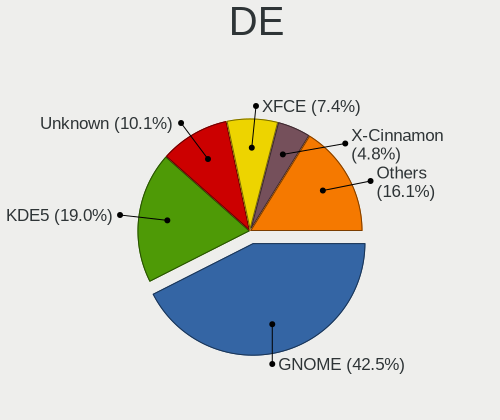

| Name          | Computers | Percent |
|---------------|-----------|---------|
| GNOME         | 140       | 45.6%   |
| KDE5          | 50        | 16.29%  |
| Unknown       | 38        | 12.38%  |
| XFCE          | 21        | 6.84%   |
| X-Cinnamon    | 13        | 4.23%   |
| KDE           | 12        | 3.91%   |
| MATE          | 10        | 3.26%   |
| Pantheon      | 9         | 2.93%   |
| LXQt          | 4         | 1.3%    |
| Unity         | 2         | 0.65%   |
| Openbox       | 2         | 0.65%   |
| Budgie        | 2         | 0.65%   |
| Peppermint    | 1         | 0.33%   |
| LXDE          | 1         | 0.33%   |
| GNOME Classic | 1         | 0.33%   |
| Cinnamon      | 1         | 0.33%   |

Display Server
--------------

X11 or Wayland

| Name    | Computers | Percent |
|---------|-----------|---------|
| X11     | 249       | 81.64%  |
| Wayland | 29        | 9.51%   |
| Unknown | 20        | 6.56%   |
| Tty     | 7         | 2.3%    |

Display Manager
---------------

SDDM, LightDM, etc.

| Name    | Computers | Percent |
|---------|-----------|---------|
| Unknown | 191       | 63.04%  |
| SDDM    | 48        | 15.84%  |
| GDM     | 28        | 9.24%   |
| LightDM | 17        | 5.61%   |
| GDM3    | 14        | 4.62%   |
| TDM     | 5         | 1.65%   |

OS Lang
-------

Language

| Lang    | Computers | Percent |
|---------|-----------|---------|
| en_US   | 223       | 74.33%  |
| Unknown | 31        | 10.33%  |
| en_GB   | 22        | 7.33%   |
| en_SG   | 11        | 3.67%   |
| en_AU   | 3         | 1%      |
| zh_CN   | 2         | 0.67%   |
| en_MY   | 2         | 0.67%   |
| C       | 2         | 0.67%   |
| ms_MY   | 1         | 0.33%   |
| ja_JP   | 1         | 0.33%   |
| id_ID   | 1         | 0.33%   |
| en_HK   | 1         | 0.33%   |

Boot Mode
---------

EFI or BIOS

| Mode | Computers | Percent |
|------|-----------|---------|
| BIOS | 169       | 56.33%  |
| EFI  | 131       | 43.67%  |

Filesystem
----------

Type of filesystem

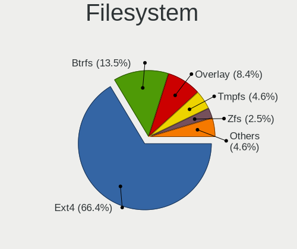

| Type    | Computers | Percent |
|---------|-----------|---------|
| Ext4    | 242       | 79.87%  |
| Overlay | 20        | 6.6%    |
| Btrfs   | 17        | 5.61%   |
| Unknown | 12        | 3.96%   |
| Xfs     | 6         | 1.98%   |
| Zfs     | 3         | 0.99%   |
| Ext2    | 2         | 0.66%   |
| Ext3    | 1         | 0.33%   |

Part. scheme
------------

Scheme of partitioning

| Type    | Computers | Percent |
|---------|-----------|---------|
| Unknown | 197       | 65.89%  |
| GPT     | 61        | 20.4%   |
| MBR     | 41        | 13.71%  |

Dual Boot with Linux/BSD
------------------------

Hosting more than one Linux/BSD

| Dual boot | Computers | Percent |
|-----------|-----------|---------|
| No        | 248       | 82.12%  |
| Yes       | 54        | 17.88%  |

Dual Boot (Win)
---------------

Hosting Linux and Windows

| Dual boot | Computers | Percent |
|-----------|-----------|---------|
| No        | 208       | 68.87%  |
| Yes       | 94        | 31.13%  |

Board
-----

Vendor
------

Motherboard manufacturer

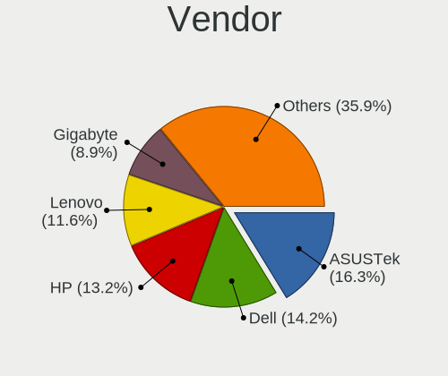

| Name                    | Computers | Percent |
|-------------------------|-----------|---------|
| ASUSTek Computer        | 57        | 19.26%  |
| Dell                    | 53        | 17.91%  |
| Hewlett-Packard         | 41        | 13.85%  |
| Lenovo                  | 26        | 8.78%   |
| Gigabyte Technology     | 21        | 7.09%   |
| Acer                    | 18        | 6.08%   |
| MSI                     | 16        | 5.41%   |
| Intel                   | 14        | 4.73%   |
| Apple                   | 7         | 2.36%   |
| Biostar                 | 5         | 1.69%   |
| Unknown                 | 5         | 1.69%   |
| ASRock                  | 4         | 1.35%   |
| Sony                    | 3         | 1.01%   |
| Fujitsu                 | 3         | 1.01%   |
| Raspberry Pi Foundation | 2         | 0.68%   |
| ILLEGEAR                | 2         | 0.68%   |
| HUAWEI                  | 2         | 0.68%   |
| ECS                     | 2         | 0.68%   |
| Toshiba                 | 1         | 0.34%   |
| Timi                    | 1         | 0.34%   |
| Teclast                 | 1         | 0.34%   |
| System76                | 1         | 0.34%   |
| Supermicro              | 1         | 0.34%   |
| SNS Network (M)         | 1         | 0.34%   |
| Shuttle                 | 1         | 0.34%   |
| ONDA                    | 1         | 0.34%   |
| HONOR                   | 1         | 0.34%   |
| GPD                     | 1         | 0.34%   |
| Chuwi                   | 1         | 0.34%   |
| BUSH                    | 1         | 0.34%   |
| AZW                     | 1         | 0.34%   |
| AMI                     | 1         | 0.34%   |
| Acidanthera             | 1         | 0.34%   |

Model
-----

Motherboard model

| Name                                | Computers | Percent |
|-------------------------------------|-----------|---------|
| Intel DH61WW AAG23116-204           | 6         | 2.03%   |
| ASUS All Series                     | 6         | 2.03%   |
| Unknown                             | 5         | 1.69%   |
| HP Notebook                         | 4         | 1.35%   |
| MSI MS-7817                         | 3         | 1.01%   |
| Intel DH61WW AAG23116-300           | 3         | 1.01%   |
| Gigabyte B85M-D3H                   | 3         | 1.01%   |
| MSI MS-7C81                         | 2         | 0.68%   |
| MSI MS-7C52                         | 2         | 0.68%   |
| Intel MAHOBAY                       | 2         | 0.68%   |
| HP Pavilion dv6                     | 2         | 0.68%   |
| HP Laptop 15-bs0xx                  | 2         | 0.68%   |
| HP EliteBook 8470p                  | 2         | 0.68%   |
| Gigabyte B450M S2H                  | 2         | 0.68%   |
| Dell XPS 8940                       | 2         | 0.68%   |
| Dell XPS 15 7590                    | 2         | 0.68%   |
| Dell OptiPlex 990                   | 2         | 0.68%   |
| Dell OptiPlex 755                   | 2         | 0.68%   |
| Dell Latitude E6520                 | 2         | 0.68%   |
| Dell Latitude E6440                 | 2         | 0.68%   |
| Biostar G41D3C                      | 2         | 0.68%   |
| ASUS P8Z77-V LX                     | 2         | 0.68%   |
| ASUS K45VD                          | 2         | 0.68%   |
| ASUS K43SD                          | 2         | 0.68%   |
| Apple MacBookPro8,1                 | 2         | 0.68%   |
| Toshiba dynabook Satellite B552/H   | 1         | 0.34%   |
| Timi RedmiBook 14 II                | 1         | 0.34%   |
| Teclast F5                          | 1         | 0.34%   |
| System76 Galago Pro                 | 1         | 0.34%   |
| Supermicro PIO-5038K-I-IN001        | 1         | 0.34%   |
| Sony VPCSB26FG                      | 1         | 0.34%   |
| Sony VPCEA42EG                      | 1         | 0.34%   |
| Sony VGN-Z27GN_X                    | 1         | 0.34%   |
| SNS Network (M) JOI Book 150        | 1         | 0.34%   |
| Shuttle DH170                       | 1         | 0.34%   |
| RPi Raspberry Pi 4 Model B Rev 1.2  | 1         | 0.34%   |
| RPi Raspberry Pi 4 Model B Rev 1.1  | 1         | 0.34%   |
| ONDA H110-MINI V3.00                | 1         | 0.34%   |
| MSI Prestige 15 A10SC               | 1         | 0.34%   |
| MSI MS-7D42                         | 1         | 0.34%   |
| MSI MS-7C02                         | 1         | 0.34%   |
| MSI MS-7B89                         | 1         | 0.34%   |
| MSI MS-7979                         | 1         | 0.34%   |
| MSI Modern 14 B5M                   | 1         | 0.34%   |
| MSI GT70 2OC/2OD                    | 1         | 0.34%   |
| MSI GP70 2PE                        | 1         | 0.34%   |
| MSI GL62M 7RDX                      | 1         | 0.34%   |
| Lenovo Yoga 720-13IKB 80X6          | 1         | 0.34%   |
| Lenovo Yoga 500-15IBD 80N6          | 1         | 0.34%   |
| Lenovo XiaoXinAir 14+ ACN 2021 82L7 | 1         | 0.34%   |
| Lenovo U310                         | 1         | 0.34%   |
| Lenovo ThinkStation S10 6483CTO     | 1         | 0.34%   |
| Lenovo ThinkStation P620 30E0S0E000 | 1         | 0.34%   |
| Lenovo ThinkStation P500 30A6S1B50X | 1         | 0.34%   |
| Lenovo ThinkPad X220 42912WA        | 1         | 0.34%   |
| Lenovo ThinkPad X201 3626RZ4        | 1         | 0.34%   |
| Lenovo ThinkPad X201 3323LWA        | 1         | 0.34%   |
| Lenovo ThinkPad X131e 33682YU       | 1         | 0.34%   |
| Lenovo ThinkPad X120e 0611CTO       | 1         | 0.34%   |
| Lenovo ThinkPad T480 20L6S1RN00     | 1         | 0.34%   |

Model Family
------------

Motherboard model prefix

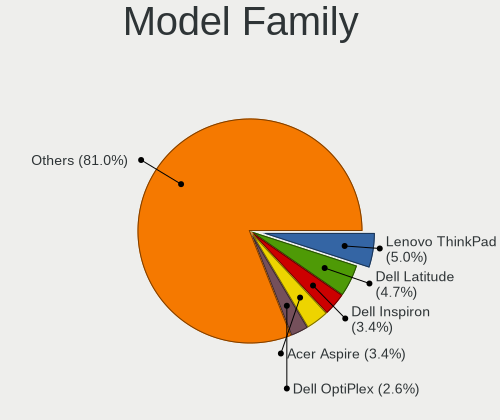

| Name                         | Computers | Percent |
|------------------------------|-----------|---------|
| Dell Latitude                | 14        | 4.73%   |
| Dell Inspiron                | 14        | 4.73%   |
| Acer Aspire                  | 12        | 4.05%   |
| Lenovo ThinkPad              | 9         | 3.04%   |
| Intel DH61WW                 | 9         | 3.04%   |
| HP Pavilion                  | 8         | 2.7%    |
| Dell XPS                     | 8         | 2.7%    |
| Dell OptiPlex                | 8         | 2.7%    |
| HP Compaq                    | 7         | 2.36%   |
| Dell Precision               | 6         | 2.03%   |
| ASUS All                     | 6         | 2.03%   |
| HP Laptop                    | 5         | 1.69%   |
| HP EliteBook                 | 5         | 1.69%   |
| Unknown                      | 5         | 1.69%   |
| HP Notebook                  | 4         | 1.35%   |
| ASUS TUF                     | 4         | 1.35%   |
| ASUS ROG                     | 4         | 1.35%   |
| MSI MS-7817                  | 3         | 1.01%   |
| Lenovo ThinkStation          | 3         | 1.01%   |
| Lenovo ThinkCentre           | 3         | 1.01%   |
| Gigabyte B85M-D3H            | 3         | 1.01%   |
| Gigabyte B450M               | 3         | 1.01%   |
| Fujitsu LIFEBOOK             | 3         | 1.01%   |
| ASUS VivoBook                | 3         | 1.01%   |
| ASUS P8B75-M                 | 3         | 1.01%   |
| Apple MacBookPro8            | 3         | 1.01%   |
| RPi Raspberry                | 2         | 0.68%   |
| MSI MS-7C81                  | 2         | 0.68%   |
| MSI MS-7C52                  | 2         | 0.68%   |
| Lenovo Yoga                  | 2         | 0.68%   |
| Lenovo IdeaPad               | 2         | 0.68%   |
| Intel MAHOBAY                | 2         | 0.68%   |
| HP ProBook                   | 2         | 0.68%   |
| Gigabyte X570                | 2         | 0.68%   |
| Biostar G41D3C               | 2         | 0.68%   |
| ASUS PRIME                   | 2         | 0.68%   |
| ASUS P8Z77-V                 | 2         | 0.68%   |
| ASUS K45VD                   | 2         | 0.68%   |
| ASUS K43SD                   | 2         | 0.68%   |
| Acer Veriton                 | 2         | 0.68%   |
| Toshiba dynabook             | 1         | 0.34%   |
| Timi RedmiBook               | 1         | 0.34%   |
| Teclast F5                   | 1         | 0.34%   |
| System76 Galago              | 1         | 0.34%   |
| Supermicro PIO-5038K-I-IN001 | 1         | 0.34%   |
| Sony VPCSB26FG               | 1         | 0.34%   |
| Sony VPCEA42EG               | 1         | 0.34%   |
| Sony VGN-Z27GN               | 1         | 0.34%   |
| SNS Network (M) JOI          | 1         | 0.34%   |
| Shuttle DH170                | 1         | 0.34%   |
| ONDA H110-MINI               | 1         | 0.34%   |
| MSI Prestige                 | 1         | 0.34%   |
| MSI MS-7D42                  | 1         | 0.34%   |
| MSI MS-7C02                  | 1         | 0.34%   |
| MSI MS-7B89                  | 1         | 0.34%   |
| MSI MS-7979                  | 1         | 0.34%   |
| MSI Modern                   | 1         | 0.34%   |
| MSI GT70                     | 1         | 0.34%   |
| MSI GP70                     | 1         | 0.34%   |
| MSI GL62M                    | 1         | 0.34%   |

MFG Year
--------

Motherboard manufacture year

| Year    | Computers | Percent |
|---------|-----------|---------|
| 2011    | 35        | 11.82%  |
| 2013    | 32        | 10.81%  |
| 2019    | 26        | 8.78%   |
| 2018    | 26        | 8.78%   |
| 2012    | 25        | 8.45%   |
| 2020    | 23        | 7.77%   |
| 2021    | 18        | 6.08%   |
| 2010    | 18        | 6.08%   |
| 2015    | 17        | 5.74%   |
| 2017    | 15        | 5.07%   |
| 2014    | 13        | 4.39%   |
| 2009    | 12        | 4.05%   |
| 2008    | 12        | 4.05%   |
| 2016    | 8         | 2.7%    |
| 2007    | 8         | 2.7%    |
| Unknown | 5         | 1.69%   |
| 2022    | 2         | 0.68%   |
| 2006    | 1         | 0.34%   |

Form Factor
-----------

Physical design of the computer

| Name           | Computers | Percent |
|----------------|-----------|---------|
| Notebook       | 155       | 52.36%  |
| Desktop        | 118       | 39.86%  |
| Convertible    | 8         | 2.7%    |
| All in one     | 5         | 1.69%   |
| Phone          | 3         | 1.01%   |
| System on chip | 2         | 0.68%   |
| Tablet         | 2         | 0.68%   |
| Server         | 2         | 0.68%   |
| Mini pc        | 1         | 0.34%   |

Secure Boot
-----------

Enabled or disabled

| State    | Computers | Percent |
|----------|-----------|---------|
| Disabled | 277       | 93.58%  |
| Enabled  | 19        | 6.42%   |

Coreboot
--------

Have coreboot on board

| Used | Computers | Percent |
|------|-----------|---------|
| No   | 295       | 99.66%  |
| Yes  | 1         | 0.34%   |

RAM Size
--------

Total RAM memory

| Size in GB  | Computers | Percent |
|-------------|-----------|---------|
| 4.01-8.0    | 70        | 23.41%  |
| 3.01-4.0    | 62        | 20.74%  |
| 8.01-16.0   | 62        | 20.74%  |
| 16.01-24.0  | 49        | 16.39%  |
| 32.01-64.0  | 22        | 7.36%   |
| 1.01-2.0    | 16        | 5.35%   |
| 2.01-3.0    | 6         | 2.01%   |
| 64.01-256.0 | 6         | 2.01%   |
| 24.01-32.0  | 4         | 1.34%   |
| 0.51-1.0    | 2         | 0.67%   |

RAM Used
--------

Used RAM memory

| Used GB    | Computers | Percent |
|------------|-----------|---------|
| 1.01-2.0   | 113       | 34.56%  |
| 2.01-3.0   | 92        | 28.13%  |
| 3.01-4.0   | 50        | 15.29%  |
| 4.01-8.0   | 31        | 9.48%   |
| 0.51-1.0   | 27        | 8.26%   |
| 8.01-16.0  | 9         | 2.75%   |
| 0.01-0.5   | 3         | 0.92%   |
| 24.01-32.0 | 1         | 0.31%   |
| Unknown    | 1         | 0.31%   |

Total Drives
------------

Number of drives on board

| Drives | Computers | Percent |
|--------|-----------|---------|
| 1      | 174       | 57.43%  |
| 2      | 89        | 29.37%  |
| 3      | 17        | 5.61%   |
| 4      | 9         | 2.97%   |
| 5      | 8         | 2.64%   |
| 7      | 3         | 0.99%   |
| 6      | 2         | 0.66%   |
| 8      | 1         | 0.33%   |

Has CD-ROM
----------

Has CD-ROM on board

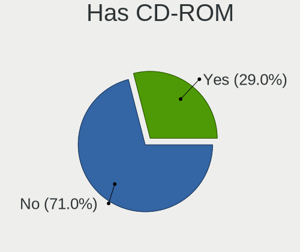

| Presented | Computers | Percent |
|-----------|-----------|---------|
| No        | 184       | 61.95%  |
| Yes       | 113       | 38.05%  |

Has Ethernet
------------

Has Ethernet on board

| Presented | Computers | Percent |
|-----------|-----------|---------|
| Yes       | 248       | 83.78%  |
| No        | 48        | 16.22%  |

Has WiFi
--------

Has WiFi module

| Presented | Computers | Percent |
|-----------|-----------|---------|
| Yes       | 241       | 80.87%  |
| No        | 57        | 19.13%  |

Has Bluetooth
-------------

Has Bluetooth module

| Presented | Computers | Percent |
|-----------|-----------|---------|
| Yes       | 183       | 61.41%  |
| No        | 115       | 38.59%  |

Location
--------

Country
-------

Geographic location (country)

| Country  | Computers | Percent |
|----------|-----------|---------|
| Malaysia | 296       | 100%    |

City
----

Geographic location (city)

| City                   | Computers | Percent |
|------------------------|-----------|---------|
| Kuala Lumpur           | 105       | 32.92%  |
| Petaling Jaya          | 36        | 11.29%  |
| Shah Alam              | 13        | 4.08%   |
| Puchong Batu Dua Belas | 12        | 3.76%   |
| Johor Bahru            | 11        | 3.45%   |
| Sungai Buloh           | 9         | 2.82%   |
| Subang Jaya            | 8         | 2.51%   |
| Seremban               | 7         | 2.19%   |
| Kota Kinabalu          | 7         | 2.19%   |
| Kajang                 | 7         | 2.19%   |
| Kota Bharu             | 6         | 1.88%   |
| George Town            | 6         | 1.88%   |
| Malacca                | 5         | 1.57%   |
| Tawau                  | 4         | 1.25%   |
| Marabu                 | 4         | 1.25%   |
| Kulim                  | 4         | 1.25%   |
| Kulai                  | 4         | 1.25%   |
| Ipoh                   | 4         | 1.25%   |
| Cyberjaya              | 4         | 1.25%   |
| Butterworth            | 4         | 1.25%   |
| Ampang                 | 4         | 1.25%   |
| Sungai Petani          | 3         | 0.94%   |
| Skudai                 | 3         | 0.94%   |
| Seri Kembangan         | 3         | 0.94%   |
| Putrajaya              | 3         | 0.94%   |
| Kuching                | 3         | 0.94%   |
| Bayan Lepas            | 3         | 0.94%   |
| Rawang                 | 2         | 0.63%   |
| Long Seridan           | 2         | 0.63%   |
| Klang                  | 2         | 0.63%   |
| Cheras                 | 2         | 0.63%   |
| Bukit Mertajam         | 2         | 0.63%   |
| Ayer Itam              | 2         | 0.63%   |
| Alor Star              | 2         | 0.63%   |
| Taiping                | 1         | 0.31%   |
| Sibu                   | 1         | 0.31%   |
| Sepang                 | 1         | 0.31%   |
| Semenyih               | 1         | 0.31%   |
| Penampang              | 1         | 0.31%   |
| Pasir Gudang           | 1         | 0.31%   |
| Padang Serai           | 1         | 0.31%   |
| Muar town              | 1         | 0.31%   |
| Labuan                 | 1         | 0.31%   |
| Kuantan                | 1         | 0.31%   |
| Kuala Terengganu       | 1         | 0.31%   |
| Kuala Nerang           | 1         | 0.31%   |
| Kuala Kangsar          | 1         | 0.31%   |
| Kota Tinggi            | 1         | 0.31%   |
| Kamunting              | 1         | 0.31%   |
| Jitra                  | 1         | 0.31%   |
| Hutan Melintang        | 1         | 0.31%   |
| Gambang                | 1         | 0.31%   |
| Cukai                  | 1         | 0.31%   |
| Bukit Asahan           | 1         | 0.31%   |
| Batu Caves             | 1         | 0.31%   |
| Bandar Tenggara        | 1         | 0.31%   |
| Ajil                   | 1         | 0.31%   |

Drives
------

Drive Vendor
------------

Hard drive vendors

| Vendor                    | Computers | Drives | Percent |
|---------------------------|-----------|--------|---------|
| Seagate                   | 87        | 114    | 19.51%  |
| WDC                       | 72        | 128    | 16.14%  |
| Kingston                  | 38        | 52     | 8.52%   |
| Samsung Electronics       | 35        | 52     | 7.85%   |
| Toshiba                   | 34        | 41     | 7.62%   |
| Unknown                   | 20        | 28     | 4.48%   |
| SanDisk                   | 16        | 23     | 3.59%   |
| HGST                      | 14        | 17     | 3.14%   |
| Intel                     | 10        | 14     | 2.24%   |
| A-DATA Technology         | 10        | 13     | 2.24%   |
| Crucial                   | 9         | 16     | 2.02%   |
| Apacer                    | 8         | 12     | 1.79%   |
| SK hynix                  | 7         | 7      | 1.57%   |
| Phison                    | 7         | 9      | 1.57%   |
| Micron Technology         | 6         | 10     | 1.35%   |
| KIOXIA                    | 6         | 7      | 1.35%   |
| Hitachi                   | 6         | 10     | 1.35%   |
| China                     | 6         | 6      | 1.35%   |
| Transcend                 | 4         | 4      | 0.9%    |
| Silicon Motion            | 4         | 5      | 0.9%    |
| Patriot                   | 4         | 5      | 0.9%    |
| Hewlett-Packard           | 4         | 4      | 0.9%    |
| SPCC                      | 3         | 4      | 0.67%   |
| XPG                       | 2         | 3      | 0.45%   |
| Verbatim                  | 2         | 2      | 0.45%   |
| TO Exter                  | 2         | 4      | 0.45%   |
| PNY                       | 2         | 2      | 0.45%   |
| Plextor                   | 2         | 2      | 0.45%   |
| Gigabyte Technology       | 2         | 2      | 0.45%   |
| Colorful                  | 2         | 2      | 0.45%   |
| winstar                   | 1         | 1      | 0.22%   |
| Teclast                   | 1         | 1      | 0.22%   |
| SATAFIRM                  | 1         | 1      | 0.22%   |
| OCZ                       | 1         | 1      | 0.22%   |
| Netac                     | 1         | 1      | 0.22%   |
| Morebeck-S100             | 1         | 1      | 0.22%   |
| Micron/Crucial Technology | 1         | 1      | 0.22%   |
| Maxtor                    | 1         | 1      | 0.22%   |
| MAX                       | 1         | 1      | 0.22%   |
| LS                        | 1         | 1      | 0.22%   |
| LITEON                    | 1         | 1      | 0.22%   |
| KIOXIA-EXCERIA            | 1         | 3      | 0.22%   |
| Kingmax                   | 1         | 1      | 0.22%   |
| Kingchuxing               | 1         | 1      | 0.22%   |
| JMicron Technology        | 1         | 1      | 0.22%   |
| Hikvision                 | 1         | 2      | 0.22%   |
| GAMER                     | 1         | 1      | 0.22%   |
| Fujitsu                   | 1         | 1      | 0.22%   |
| External                  | 1         | 1      | 0.22%   |
| ASMT                      | 1         | 2      | 0.22%   |
| Apple                     | 1         | 2      | 0.22%   |
| AGI                       | 1         | 2      | 0.22%   |

Drive Model
-----------

Hard drive models

| Model                              | Computers | Percent |
|------------------------------------|-----------|---------|
| Kingston SA400S37240G 240GB SSD    | 11        | 2.22%   |
| WDC WD5000AAKX-00ERMA0 500GB       | 5         | 1.01%   |
| Seagate ST500LT012-1DG142 500GB    | 5         | 1.01%   |
| Seagate ST380815AS 80GB            | 5         | 1.01%   |
| Seagate ST1000DM010-2EP102 1TB     | 5         | 1.01%   |
| WDC WD20EZRX-00D8PB0 2TB           | 4         | 0.81%   |
| Unknown MMC Card  32GB             | 4         | 0.81%   |
| Toshiba MQ04ABF100 1TB             | 4         | 0.81%   |
| Toshiba MQ01ABD100 1TB             | 4         | 0.81%   |
| Seagate ST3160815AS 160GB          | 4         | 0.81%   |
| Seagate ST1000LM024 HN-M101MBB 1TB | 4         | 0.81%   |
| SanDisk SSD PLUS 240GB             | 4         | 0.81%   |
| Samsung SSD 860 EVO 250GB          | 4         | 0.81%   |
| Samsung HD103SJ 1TB                | 4         | 0.81%   |
| HGST HTS545050A7E680 500GB         | 4         | 0.81%   |
| Crucial CT500MX500SSD1 500GB       | 4         | 0.81%   |
| Apacer AS340 120GB SSD             | 4         | 0.81%   |
| WDC WD20EZAZ-00GGJB0 2TB           | 3         | 0.61%   |
| Unknown MMC Card  64GB             | 3         | 0.61%   |
| Unknown MMC Card                   | 3         | 0.61%   |
| SK hynix NVMe SSD Drive 512GB      | 3         | 0.61%   |
| Seagate ST9320325AS 320GB          | 3         | 0.61%   |
| Seagate ST500DM002-1BC142 500GB    | 3         | 0.61%   |
| Seagate ST320LT020-9YG142 320GB    | 3         | 0.61%   |
| Seagate ST1000LM035-1RK172 1TB     | 3         | 0.61%   |
| Seagate ST1000DM003-1ER162 1TB     | 3         | 0.61%   |
| Seagate ST1000DM003-1CH162 1TB     | 3         | 0.61%   |
| SanDisk NVMe SSD Drive 512GB       | 3         | 0.61%   |
| Kingston NVMe SSD Drive 500GB      | 3         | 0.61%   |
| Intel NVMe SSD Drive 512GB         | 3         | 0.61%   |
| HGST HTS725050A7E630 500GB         | 3         | 0.61%   |
| HGST HTS721010A9E630 1TB           | 3         | 0.61%   |
| Crucial CT250MX500SSD1 250GB       | 3         | 0.61%   |
| XPG NVMe SSD Drive 512GB           | 2         | 0.4%    |
| WDC WD800JD-22MSA1 80GB            | 2         | 0.4%    |
| WDC WD5000AAKX-22ERMA0 500GB       | 2         | 0.4%    |
| WDC WD5000AAKX-08U6AA0 500GB       | 2         | 0.4%    |
| WDC WD5000AAKX-001CA0 500GB        | 2         | 0.4%    |
| WDC WD40EZRZ-00WN9B0 4TB           | 2         | 0.4%    |
| WDC WD360ADFD-00NLR1 37GB          | 2         | 0.4%    |
| WDC WD3200AAKS-00SBA0 320GB        | 2         | 0.4%    |
| WDC WD2500AAKX-753CA1 250GB        | 2         | 0.4%    |
| WDC WD10JPVX-22JC3T0 1TB           | 2         | 0.4%    |
| WDC WD10EZEX-08WN4A0 1TB           | 2         | 0.4%    |
| WDC WD10EZEX-00MFCA0 1TB           | 2         | 0.4%    |
| WDC WD10EZEX-00BN5A0 1TB           | 2         | 0.4%    |
| WDC PC SN730 NVMe 1024GB           | 2         | 0.4%    |
| Verbatim Vi550 S3 SSD 128GB        | 2         | 0.4%    |
| Unknown MMC Card  128GB            | 2         | 0.4%    |
| Toshiba NVMe SSD Drive 512GB       | 2         | 0.4%    |
| Toshiba MQ01ABD050 500GB           | 2         | 0.4%    |
| Toshiba MK5065GSXF 500GB           | 2         | 0.4%    |
| Toshiba DT01ACA050 500GB           | 2         | 0.4%    |
| TO Exter nal USB 3.0 1TB           | 2         | 0.4%    |
| Seagate ST9750420AS 752GB          | 2         | 0.4%    |
| Seagate ST9500325AS 500GB          | 2         | 0.4%    |
| Seagate ST500LM000-1EJ162 500GB    | 2         | 0.4%    |
| Seagate ST500DM002-1BD142 500GB    | 2         | 0.4%    |
| Seagate ST3500414CS 500GB          | 2         | 0.4%    |
| Seagate ST3408111AS 40GB           | 2         | 0.4%    |

HDD Vendor
----------

Hard disk drive vendors

| Vendor              | Computers | Drives | Percent |
|---------------------|-----------|--------|---------|
| Seagate             | 84        | 111    | 39.81%  |
| WDC                 | 63        | 119    | 29.86%  |
| Toshiba             | 29        | 35     | 13.74%  |
| HGST                | 14        | 17     | 6.64%   |
| Samsung Electronics | 9         | 15     | 4.27%   |
| Hitachi             | 6         | 10     | 2.84%   |
| Hewlett-Packard     | 2         | 2      | 0.95%   |
| SATAFIRM            | 1         | 1      | 0.47%   |
| Maxtor              | 1         | 1      | 0.47%   |
| Fujitsu             | 1         | 1      | 0.47%   |
| ASMT                | 1         | 2      | 0.47%   |

SSD Vendor
----------

Solid state drive vendors

| Vendor              | Computers | Drives | Percent |
|---------------------|-----------|--------|---------|
| Kingston            | 31        | 40     | 22.79%  |
| Samsung Electronics | 16        | 24     | 11.76%  |
| SanDisk             | 12        | 15     | 8.82%   |
| Crucial             | 9         | 16     | 6.62%   |
| Apacer              | 8         | 12     | 5.88%   |
| A-DATA Technology   | 7         | 7      | 5.15%   |
| China               | 6         | 6      | 4.41%   |
| Transcend           | 4         | 4      | 2.94%   |
| Patriot             | 4         | 5      | 2.94%   |
| Micron Technology   | 4         | 8      | 2.94%   |
| Intel               | 4         | 7      | 2.94%   |
| WDC                 | 3         | 3      | 2.21%   |
| SPCC                | 3         | 4      | 2.21%   |
| Verbatim            | 2         | 2      | 1.47%   |
| Toshiba             | 2         | 2      | 1.47%   |
| TO Exter            | 2         | 4      | 1.47%   |
| Seagate             | 2         | 2      | 1.47%   |
| Plextor             | 2         | 2      | 1.47%   |
| Colorful            | 2         | 2      | 1.47%   |
| Teclast             | 1         | 1      | 0.74%   |
| SK hynix            | 1         | 1      | 0.74%   |
| PNY                 | 1         | 1      | 0.74%   |
| OCZ                 | 1         | 1      | 0.74%   |
| Netac               | 1         | 1      | 0.74%   |
| LS                  | 1         | 1      | 0.74%   |
| LITEON              | 1         | 1      | 0.74%   |
| KIOXIA-EXCERIA      | 1         | 3      | 0.74%   |
| Kingmax             | 1         | 1      | 0.74%   |
| JMicron Technology  | 1         | 1      | 0.74%   |
| Hikvision           | 1         | 2      | 0.74%   |
| Hewlett-Packard     | 1         | 1      | 0.74%   |
| Apple               | 1         | 2      | 0.74%   |

Drive Kind
----------

HDD or SSD

| Kind    | Computers | Drives | Percent |
|---------|-----------|--------|---------|
| HDD     | 183       | 314    | 47.04%  |
| SSD     | 119       | 182    | 30.59%  |
| NVMe    | 61        | 95     | 15.68%  |
| MMC     | 18        | 25     | 4.63%   |
| Unknown | 8         | 10     | 2.06%   |

Drive Connector
---------------

SATA, SAS, NVMe, etc.

| Type | Computers | Drives | Percent |
|------|-----------|--------|---------|
| SATA | 246       | 487    | 72.35%  |
| NVMe | 61        | 94     | 17.94%  |
| MMC  | 18        | 25     | 5.29%   |
| SAS  | 15        | 20     | 4.41%   |

Drive Size
----------

Size of hard drive

| Size in TB | Computers | Drives | Percent |
|------------|-----------|--------|---------|
| 0.01-0.5   | 195       | 303    | 62.9%   |
| 0.51-1.0   | 87        | 139    | 28.06%  |
| 1.01-2.0   | 22        | 39     | 7.1%    |
| 3.01-4.0   | 3         | 11     | 0.97%   |
| 4.01-10.0  | 2         | 3      | 0.65%   |
| 2.01-3.0   | 1         | 1      | 0.32%   |

Space Total
-----------

Amount of disk space available on the file system

| Size in GB     | Computers | Percent |
|----------------|-----------|---------|
| 101-250        | 91        | 28.89%  |
| 251-500        | 75        | 23.81%  |
| 501-1000       | 40        | 12.7%   |
| 1-20           | 25        | 7.94%   |
| 51-100         | 22        | 6.98%   |
| 1001-2000      | 20        | 6.35%   |
| 21-50          | 17        | 5.4%    |
| More than 3000 | 10        | 3.17%   |
| Unknown        | 10        | 3.17%   |
| 2001-3000      | 5         | 1.59%   |

Space Used
----------

Amount of used disk space

| Used GB        | Computers | Percent |
|----------------|-----------|---------|
| 1-20           | 146       | 45.34%  |
| 21-50          | 47        | 14.6%   |
| 101-250        | 40        | 12.42%  |
| 51-100         | 31        | 9.63%   |
| 251-500        | 23        | 7.14%   |
| 501-1000       | 10        | 3.11%   |
| Unknown        | 10        | 3.11%   |
| 1001-2000      | 8         | 2.48%   |
| More than 3000 | 6         | 1.86%   |
| 2001-3000      | 1         | 0.31%   |

Malfunc. Drives
---------------

Drive models with a malfunction

| Model                                       | Computers | Drives | Percent |
|---------------------------------------------|-----------|--------|---------|
| Seagate ST9320325AS 320GB                   | 2         | 2      | 6.45%   |
| Seagate ST3500414CS 500GB                   | 2         | 3      | 6.45%   |
| WDC WD800AAJS-00PSA0 80GB                   | 1         | 1      | 3.23%   |
| WDC WD5000BPVT-00HXZT1 500GB                | 1         | 1      | 3.23%   |
| WDC WD5000AAKX-753CA1 500GB                 | 1         | 1      | 3.23%   |
| WDC WD5000AAKX-00ERMA0 500GB                | 1         | 1      | 3.23%   |
| WDC WD10JPVX-22JC3T0 1TB                    | 1         | 1      | 3.23%   |
| WDC WD10JPVT-75A1YT0 1TB                    | 1         | 1      | 3.23%   |
| WDC WD10EZEX-60WN4A0 1TB                    | 1         | 1      | 3.23%   |
| WDC WD10EZEX-08WN4A0 1TB                    | 1         | 1      | 3.23%   |
| Toshiba MQ01ABD100 1TB                      | 1         | 1      | 3.23%   |
| Toshiba MK5065GSX 500GB                     | 1         | 1      | 3.23%   |
| Toshiba MK1059GSMP 1TB                      | 1         | 1      | 3.23%   |
| SPCC Solid State Disk 256GB                 | 1         | 1      | 3.23%   |
| Seagate ST9750420AS 752GB                   | 1         | 1      | 3.23%   |
| Seagate ST9250315AS 250GB                   | 1         | 1      | 3.23%   |
| Seagate ST380211AS 80GB                     | 1         | 1      | 3.23%   |
| Seagate ST3320620A 320GB                    | 1         | 1      | 3.23%   |
| Seagate ST1000LM024 HN-M101MBB 1TB          | 1         | 1      | 3.23%   |
| Samsung Electronics SSD PM830 2.5 7mm 512GB | 1         | 1      | 3.23%   |
| Samsung Electronics HM160HI 160GB           | 1         | 1      | 3.23%   |
| Micron Technology 1100 SATA 512GB SSD       | 1         | 1      | 3.23%   |
| Kingston SV300S37A120G 120GB SSD            | 1         | 1      | 3.23%   |
| Hitachi HTS723232A7A364 320GB               | 1         | 1      | 3.23%   |
| Hitachi HTS547575A9E384 752GB               | 1         | 3      | 3.23%   |
| Hitachi HDS721050CLA362 500GB               | 1         | 1      | 3.23%   |
| HGST HTS541075A9E680 752GB                  | 1         | 1      | 3.23%   |
| HGST HTS541010A9E680 1TB                    | 1         | 1      | 3.23%   |
| Hewlett-Packard SSD S700 120GB              | 1         | 1      | 3.23%   |

Malfunc. Drive Vendor
---------------------

Vendors of faulty drives

| Vendor              | Computers | Drives | Percent |
|---------------------|-----------|--------|---------|
| WDC                 | 8         | 8      | 26.67%  |
| Seagate             | 8         | 10     | 26.67%  |
| Toshiba             | 3         | 3      | 10%     |
| Hitachi             | 3         | 5      | 10%     |
| Samsung Electronics | 2         | 2      | 6.67%   |
| HGST                | 2         | 2      | 6.67%   |
| SPCC                | 1         | 1      | 3.33%   |
| Micron Technology   | 1         | 1      | 3.33%   |
| Kingston            | 1         | 1      | 3.33%   |
| Hewlett-Packard     | 1         | 1      | 3.33%   |

Malfunc. HDD Vendor
-------------------

Vendors of faulty HDD drives

| Vendor              | Computers | Drives | Percent |
|---------------------|-----------|--------|---------|
| WDC                 | 8         | 8      | 32%     |
| Seagate             | 8         | 10     | 32%     |
| Toshiba             | 3         | 3      | 12%     |
| Hitachi             | 3         | 5      | 12%     |
| HGST                | 2         | 2      | 8%      |
| Samsung Electronics | 1         | 1      | 4%      |

Malfunc. Drive Kind
-------------------

Kinds of faulty drives

| Kind | Computers | Drives | Percent |
|------|-----------|--------|---------|
| HDD  | 24        | 29     | 82.76%  |
| SSD  | 5         | 5      | 17.24%  |

Failed Drives
-------------

Failed drive models

Zero info for selected period =(

Failed Drive Vendor
-------------------

Failed drive vendors

Zero info for selected period =(

Drive Status
------------

Number of failed and malfunc. drives

| Status   | Computers | Drives | Percent |
|----------|-----------|--------|---------|
| Detected | 206       | 459    | 64.78%  |
| Works    | 84        | 133    | 26.42%  |
| Malfunc  | 28        | 34     | 8.81%   |

Storage controller
------------------

Storage Vendor
--------------

Storage controller vendors

| Vendor                       | Computers | Percent |
|------------------------------|-----------|---------|
| Intel                        | 223       | 65.01%  |
| AMD                          | 35        | 10.2%   |
| Samsung Electronics          | 11        | 3.21%   |
| SanDisk                      | 10        | 2.92%   |
| Phison Electronics           | 10        | 2.92%   |
| Nvidia                       | 7         | 2.04%   |
| Kingston Technology Company  | 7         | 2.04%   |
| SK hynix                     | 6         | 1.75%   |
| KIOXIA                       | 6         | 1.75%   |
| Silicon Motion               | 5         | 1.46%   |
| Marvell Technology Group     | 4         | 1.17%   |
| ASMedia Technology           | 4         | 1.17%   |
| Toshiba America Info Systems | 3         | 0.87%   |
| JMicron Technology           | 3         | 0.87%   |
| ADATA Technology             | 3         | 0.87%   |
| Micron Technology            | 2         | 0.58%   |
| Silicon Image                | 1         | 0.29%   |
| Micron/Crucial Technology    | 1         | 0.29%   |
| Lite-On IT Corp. / Plextor   | 1         | 0.29%   |
| Biwin Storage Technology     | 1         | 0.29%   |

Storage Model
-------------

Storage controller models

| Model                                                                          | Computers | Percent |
|--------------------------------------------------------------------------------|-----------|---------|
| AMD FCH SATA Controller [AHCI mode]                                            | 30        | 7.41%   |
| Intel 6 Series/C200 Series Chipset Family 6 port Mobile SATA AHCI Controller   | 19        | 4.69%   |
| Intel 8 Series/C220 Series Chipset Family 6-port SATA Controller 1 [AHCI mode] | 18        | 4.44%   |
| Intel 7 Series Chipset Family 6-port SATA Controller [AHCI mode]               | 15        | 3.7%    |
| Intel Sunrise Point-LP SATA Controller [AHCI mode]                             | 14        | 3.46%   |
| Intel 6 Series/C200 Series Chipset Family 6 port Desktop SATA AHCI Controller  | 14        | 3.46%   |
| Intel 82801 Mobile SATA Controller [RAID mode]                                 | 13        | 3.21%   |
| Intel SATA Controller [RAID mode]                                              | 9         | 2.22%   |
| Intel 7 Series/C210 Series Chipset Family 6-port SATA Controller [AHCI mode]   | 9         | 2.22%   |
| Intel Q170/Q150/B150/H170/H110/Z170/CM236 Chipset SATA Controller [AHCI Mode]  | 7         | 1.73%   |
| Intel NM10/ICH7 Family SATA Controller [IDE mode]                              | 7         | 1.73%   |
| Intel 82801G (ICH7 Family) IDE Controller                                      | 7         | 1.73%   |
| Intel 8 Series SATA Controller 1 [AHCI mode]                                   | 7         | 1.73%   |
| SanDisk WD Black SN750 / PC SN730 NVMe SSD                                     | 6         | 1.48%   |
| Samsung NVMe SSD Controller SM981/PM981/PM983                                  | 6         | 1.48%   |
| Intel 82801IBM/IEM (ICH9M/ICH9M-E) 4 port SATA Controller [AHCI mode]          | 6         | 1.48%   |
| Intel 5 Series/3400 Series Chipset 4 port SATA AHCI Controller                 | 6         | 1.48%   |
| KIOXIA NVMe SSD Controller BG4                                                 | 5         | 1.23%   |
| Intel Volume Management Device NVMe RAID Controller                            | 5         | 1.23%   |
| Intel Cannon Lake Mobile PCH SATA AHCI Controller                              | 5         | 1.23%   |
| Intel 82801I (ICH9 Family) 2 port SATA Controller [IDE mode]                   | 5         | 1.23%   |
| AMD 400 Series Chipset SATA Controller                                         | 5         | 1.23%   |
| Phison E12 NVMe Controller                                                     | 4         | 0.99%   |
| Intel Wildcat Point-LP SATA Controller [AHCI Mode]                             | 4         | 0.99%   |
| Intel Celeron/Pentium Silver Processor SATA Controller                         | 4         | 0.99%   |
| Intel Cannon Lake PCH SATA AHCI Controller                                     | 4         | 0.99%   |
| Intel 82Q35 Express PT IDER Controller                                         | 4         | 0.99%   |
| Intel 82801IR/IO/IH (ICH9R/DO/DH) 4 port SATA Controller [IDE mode]            | 4         | 0.99%   |
| Intel 7 Series/C210 Series Chipset Family 4-port SATA Controller [IDE mode]    | 4         | 0.99%   |
| Intel 7 Series/C210 Series Chipset Family 2-port SATA Controller [IDE mode]    | 4         | 0.99%   |
| Intel 5 Series/3400 Series Chipset 6 port SATA AHCI Controller                 | 4         | 0.99%   |
| Intel 400 Series Chipset Family SATA AHCI Controller                           | 4         | 0.99%   |
| ASMedia ASM1062 Serial ATA Controller                                          | 4         | 0.99%   |
| SK hynix Gold P31 SSD                                                          | 3         | 0.74%   |
| Silicon Motion SM2262/SM2262EN SSD Controller                                  | 3         | 0.74%   |
| Samsung NVMe SSD Controller SM961/PM961/SM963                                  | 3         | 0.74%   |
| Phison PS5013 E13 NVMe Controller                                              | 3         | 0.74%   |
| Marvell Group 88SE9172 SATA 6Gb/s Controller                                   | 3         | 0.74%   |
| Kingston Company Company Non-Volatile memory controller                        | 3         | 0.74%   |
| Intel SSD 660P Series                                                          | 3         | 0.74%   |
| Intel Comet Lake SATA AHCI Controller                                          | 3         | 0.74%   |
| Intel Cannon Point-LP SATA Controller [AHCI Mode]                              | 3         | 0.74%   |
| Intel C610/X99 series chipset 6-Port SATA Controller [AHCI mode]               | 3         | 0.74%   |
| Intel Alder Lake-S PCH SATA Controller [AHCI Mode]                             | 3         | 0.74%   |
| Intel 9 Series Chipset Family SATA Controller [AHCI Mode]                      | 3         | 0.74%   |
| AMD FCH SATA Controller D                                                      | 3         | 0.74%   |
| AMD 300 Series Chipset SATA Controller                                         | 3         | 0.74%   |
| ADATA XPG SX8200 Pro PCIe Gen3x4 M.2 2280 Solid State Drive                    | 3         | 0.74%   |
| SK hynix BC501 NVMe Solid State Drive                                          | 2         | 0.49%   |
| Silicon Motion SM2263EN/SM2263XT SSD Controller                                | 2         | 0.49%   |
| SanDisk WD Black 2018/SN750 / PC SN720 NVMe SSD                                | 2         | 0.49%   |
| Samsung NVMe SSD Controller PM9A1/PM9A3/980PRO                                 | 2         | 0.49%   |
| Phison E16 PCIe4 NVMe Controller                                               | 2         | 0.49%   |
| Nvidia MCP61 SATA Controller                                                   | 2         | 0.49%   |
| Nvidia MCP61 IDE                                                               | 2         | 0.49%   |
| Micron Non-Volatile memory controller                                          | 2         | 0.49%   |
| Kingston Company KC2000 NVMe SSD                                               | 2         | 0.49%   |
| JMicron JMB363 SATA/IDE Controller                                             | 2         | 0.49%   |
| Intel NM10/ICH7 Family SATA Controller [AHCI mode]                             | 2         | 0.49%   |
| Intel HM170/QM170 Chipset SATA Controller [AHCI Mode]                          | 2         | 0.49%   |

Storage Kind
------------

Kind of storage controller (IDE, SATA, NVMe, SAS, ...)

| Kind | Computers | Percent |
|------|-----------|---------|
| SATA | 208       | 61%     |
| NVMe | 61        | 17.89%  |
| IDE  | 41        | 12.02%  |
| RAID | 31        | 9.09%   |

Processor
---------

CPU Vendor
----------

Processor vendors

| Vendor | Computers | Percent |
|--------|-----------|---------|
| Intel  | 240       | 81.08%  |
| AMD    | 51        | 17.23%  |
| ARM    | 5         | 1.69%   |

CPU Model
---------

Processor models

| Model                                            | Computers | Percent |
|--------------------------------------------------|-----------|---------|
| Intel Pentium CPU G620 @ 2.60GHz                 | 7         | 2.36%   |
| Intel Core i5-6200U CPU @ 2.30GHz                | 6         | 2.02%   |
| Intel Core i5-7200U CPU @ 2.50GHz                | 4         | 1.35%   |
| Intel Core i5-2450M CPU @ 2.50GHz                | 4         | 1.35%   |
| Intel Core i5-2400 CPU @ 3.10GHz                 | 4         | 1.35%   |
| Intel Core i3-4130 CPU @ 3.40GHz                 | 4         | 1.35%   |
| Intel Pentium CPU G630 @ 2.70GHz                 | 3         | 1.01%   |
| Intel Core i7-9750H CPU @ 2.60GHz                | 3         | 1.01%   |
| Intel Core i7-3770 CPU @ 3.40GHz                 | 3         | 1.01%   |
| Intel Core i5-4590 CPU @ 3.30GHz                 | 3         | 1.01%   |
| Intel Core i5-4570 CPU @ 3.20GHz                 | 3         | 1.01%   |
| Intel Core i5-4210U CPU @ 1.70GHz                | 3         | 1.01%   |
| Intel Core i5-4200U CPU @ 1.60GHz                | 3         | 1.01%   |
| Intel Core i5-3570 CPU @ 3.40GHz                 | 3         | 1.01%   |
| Intel Core i5-2410M CPU @ 2.30GHz                | 3         | 1.01%   |
| Intel Celeron N4100 CPU @ 1.10GHz                | 3         | 1.01%   |
| AMD Ryzen 5 3500U with Radeon Vega Mobile Gfx    | 3         | 1.01%   |
| AMD Ryzen 3 3200G with Radeon Vega Graphics      | 3         | 1.01%   |
| Intel Xeon CPU X5450 @ 3.00GHz                   | 2         | 0.67%   |
| Intel Pentium Dual-Core CPU T4400 @ 2.20GHz      | 2         | 0.67%   |
| Intel Pentium Dual-Core CPU E5700 @ 3.00GHz      | 2         | 0.67%   |
| Intel Core i7-8750H CPU @ 2.20GHz                | 2         | 0.67%   |
| Intel Core i7-8565U CPU @ 1.80GHz                | 2         | 0.67%   |
| Intel Core i7-7700HQ CPU @ 2.80GHz               | 2         | 0.67%   |
| Intel Core i7-5500U CPU @ 2.40GHz                | 2         | 0.67%   |
| Intel Core i7-4790K CPU @ 4.00GHz                | 2         | 0.67%   |
| Intel Core i7-4790 CPU @ 3.60GHz                 | 2         | 0.67%   |
| Intel Core i7-4710HQ CPU @ 2.50GHz               | 2         | 0.67%   |
| Intel Core i7-1065G7 CPU @ 1.30GHz               | 2         | 0.67%   |
| Intel Core i5-8400 CPU @ 2.80GHz                 | 2         | 0.67%   |
| Intel Core i5-7300U CPU @ 2.60GHz                | 2         | 0.67%   |
| Intel Core i5-6400 CPU @ 2.70GHz                 | 2         | 0.67%   |
| Intel Core i5-3470 CPU @ 3.20GHz                 | 2         | 0.67%   |
| Intel Core i5-3210M CPU @ 2.50GHz                | 2         | 0.67%   |
| Intel Core i5-2540M CPU @ 2.60GHz                | 2         | 0.67%   |
| Intel Core i5-2435M CPU @ 2.40GHz                | 2         | 0.67%   |
| Intel Core i5-10400 CPU @ 2.90GHz                | 2         | 0.67%   |
| Intel Core i3-9100 CPU @ 3.60GHz                 | 2         | 0.67%   |
| Intel Core i3-8145U CPU @ 2.10GHz                | 2         | 0.67%   |
| Intel Core i3-3220 CPU @ 3.30GHz                 | 2         | 0.67%   |
| Intel Core i3-3110M CPU @ 2.40GHz                | 2         | 0.67%   |
| Intel Core i3-2367M CPU @ 1.40GHz                | 2         | 0.67%   |
| Intel Core i3-2350M CPU @ 2.30GHz                | 2         | 0.67%   |
| Intel Core i3 CPU M 380 @ 2.53GHz                | 2         | 0.67%   |
| Intel Core i3 CPU M 330 @ 2.13GHz                | 2         | 0.67%   |
| Intel Core 2 Quad CPU Q9550 @ 2.83GHz            | 2         | 0.67%   |
| Intel Core 2 Duo CPU P8600 @ 2.40GHz             | 2         | 0.67%   |
| Intel Core 2 Duo CPU E8400 @ 3.00GHz             | 2         | 0.67%   |
| Intel Core 2 Duo CPU E7500 @ 2.93GHz             | 2         | 0.67%   |
| Intel Core 2 Duo CPU E6750 @ 2.66GHz             | 2         | 0.67%   |
| Intel 12th Gen Core i7-12700                     | 2         | 0.67%   |
| Intel 11th Gen Core i7-11700 @ 2.50GHz           | 2         | 0.67%   |
| Intel 11th Gen Core i7-1165G7 @ 2.80GHz          | 2         | 0.67%   |
| ARM Qualcomm Technologies, Inc MSM8937 Processor | 2         | 0.67%   |
| ARM BCM2835 Processor                            | 2         | 0.67%   |
| AMD Ryzen 7 4800H with Radeon Graphics           | 2         | 0.67%   |
| AMD Ryzen 7 1700X Eight-Core Processor           | 2         | 0.67%   |
| AMD Ryzen 5 4600H with Radeon Graphics           | 2         | 0.67%   |
| AMD Ryzen 5 3600 6-Core Processor                | 2         | 0.67%   |
| AMD Ryzen 5 3400G with Radeon Vega Graphics      | 2         | 0.67%   |

CPU Model Family
----------------

Processor model prefix

| Model                   | Computers | Percent |
|-------------------------|-----------|---------|
| Intel Core i5           | 79        | 26.6%   |
| Intel Core i7           | 50        | 16.84%  |
| Intel Core i3           | 31        | 10.44%  |
| Intel Core 2 Duo        | 18        | 6.06%   |
| AMD Ryzen 5             | 18        | 6.06%   |
| Intel Pentium           | 16        | 5.39%   |
| Other                   | 12        | 4.04%   |
| Intel Xeon              | 10        | 3.37%   |
| Intel Celeron           | 8         | 2.69%   |
| AMD Ryzen 7             | 8         | 2.69%   |
| Intel Atom              | 6         | 2.02%   |
| Intel Pentium Dual-Core | 5         | 1.68%   |
| Intel Core 2 Quad       | 4         | 1.35%   |
| AMD A6                  | 4         | 1.35%   |
| AMD Ryzen 3             | 3         | 1.01%   |
| AMD A10                 | 3         | 1.01%   |
| Intel Core i9           | 2         | 0.67%   |
| ARM BCM                 | 2         | 0.67%   |
| AMD Ryzen 9             | 2         | 0.67%   |
| AMD Ryzen 7 PRO         | 2         | 0.67%   |
| AMD Athlon 64 X2        | 2         | 0.67%   |
| AMD Athlon              | 2         | 0.67%   |
| AMD A4                  | 2         | 0.67%   |
| Intel Pentium Dual      | 1         | 0.34%   |
| Intel Genuine           | 1         | 0.34%   |
| ARM AArch64             | 1         | 0.34%   |
| AMD Ryzen Threadripper  | 1         | 0.34%   |
| AMD Phenom II X6        | 1         | 0.34%   |
| AMD E                   | 1         | 0.34%   |
| AMD Athlon X2           | 1         | 0.34%   |
| AMD A12                 | 1         | 0.34%   |

CPU Cores
---------

Number of processor cores

| Number | Computers | Percent |
|--------|-----------|---------|
| 2      | 134       | 45.27%  |
| 4      | 106       | 35.81%  |
| 6      | 30        | 10.14%  |
| 8      | 15        | 5.07%   |
| 1      | 5         | 1.69%   |
| 12     | 3         | 1.01%   |
| 64     | 1         | 0.34%   |
| 10     | 1         | 0.34%   |
| 3      | 1         | 0.34%   |

CPU Sockets
-----------

Number of sockets

| Number | Computers | Percent |
|--------|-----------|---------|
| 1      | 293       | 98.99%  |
| 2      | 3         | 1.01%   |

CPU Threads
-----------

Threads per core (Hyper-Threading)

| Number | Computers | Percent |
|--------|-----------|---------|
| 2      | 185       | 62.29%  |
| 1      | 111       | 37.37%  |
| 4      | 1         | 0.34%   |

CPU Op-Modes
------------

CPU Operation Modes (32-bit, 64-bit)

| Op mode        | Computers | Percent |
|----------------|-----------|---------|
| 32-bit, 64-bit | 292       | 98.32%  |
| Unknown        | 5         | 1.68%   |

CPU Microcode
-------------

Microcode number

| Number     | Computers | Percent |
|------------|-----------|---------|
| Unknown    | 57        | 18.75%  |
| 0x206a7    | 30        | 9.87%   |
| 0x306c3    | 27        | 8.88%   |
| 0x306a9    | 23        | 7.57%   |
| 0x1067a    | 16        | 5.26%   |
| 0x806e9    | 10        | 3.29%   |
| 0x906ea    | 9         | 2.96%   |
| 0x40651    | 7         | 2.3%    |
| 0x08108109 | 7         | 2.3%    |
| 0x406e3    | 6         | 1.97%   |
| 0x20655    | 6         | 1.97%   |
| 0x506e3    | 5         | 1.64%   |
| 0x706a1    | 4         | 1.32%   |
| 0x6fd      | 4         | 1.32%   |
| 0x6fb      | 4         | 1.32%   |
| 0x306d4    | 4         | 1.32%   |
| 0x20652    | 4         | 1.32%   |
| 0x08600104 | 4         | 1.32%   |
| 0x06001119 | 4         | 1.32%   |
| 0xa0652    | 3         | 0.99%   |
| 0x906e9    | 3         | 0.99%   |
| 0x806ec    | 3         | 0.99%   |
| 0x806eb    | 3         | 0.99%   |
| 0x806ea    | 3         | 0.99%   |
| 0x806c1    | 3         | 0.99%   |
| 0x30678    | 3         | 0.99%   |
| 0x10676    | 3         | 0.99%   |
| 0x08701021 | 3         | 0.99%   |
| 0xa0671    | 2         | 0.66%   |
| 0xa0655    | 2         | 0.66%   |
| 0x906eb    | 2         | 0.66%   |
| 0x90672    | 2         | 0.66%   |
| 0x706e5    | 2         | 0.66%   |
| 0x406c3    | 2         | 0.66%   |
| 0x106ca    | 2         | 0.66%   |
| 0x0a50000b | 2         | 0.66%   |
| 0x08108102 | 2         | 0.66%   |
| 0x0700010f | 2         | 0.66%   |
| 0xa0660    | 1         | 0.33%   |
| 0xa0653    | 1         | 0.33%   |
| 0x806d1    | 1         | 0.33%   |
| 0x50671    | 1         | 0.33%   |
| 0x406f1    | 1         | 0.33%   |
| 0x406c4    | 1         | 0.33%   |
| 0x306f2    | 1         | 0.33%   |
| 0x206d7    | 1         | 0.33%   |
| 0x106e5    | 1         | 0.33%   |
| 0x106a5    | 1         | 0.33%   |
| 0x0a50000c | 1         | 0.33%   |
| 0x0a20120a | 1         | 0.33%   |
| 0x0a201009 | 1         | 0.33%   |
| 0x08701013 | 1         | 0.33%   |
| 0x08608103 | 1         | 0.33%   |
| 0x08600106 | 1         | 0.33%   |
| 0x08301039 | 1         | 0.33%   |
| 0x08101016 | 1         | 0.33%   |
| 0x08001136 | 1         | 0.33%   |
| 0x08001126 | 1         | 0.33%   |
| 0x06006118 | 1         | 0.33%   |
| 0x06003106 | 1         | 0.33%   |

CPU Microarch
-------------

Microarchitecture

| Name             | Computers | Percent |
|------------------|-----------|---------|
| SandyBridge      | 39        | 13.18%  |
| KabyLake         | 39        | 13.18%  |
| Haswell          | 37        | 12.5%   |
| IvyBridge        | 30        | 10.14%  |
| Penryn           | 22        | 7.43%   |
| Zen+             | 12        | 4.05%   |
| Skylake          | 12        | 4.05%   |
| Zen 2            | 11        | 3.72%   |
| Westmere         | 11        | 3.72%   |
| Unknown          | 10        | 3.38%   |
| Core             | 9         | 3.04%   |
| CometLake        | 8         | 2.7%    |
| Zen 3            | 7         | 2.36%   |
| Silvermont       | 7         | 2.36%   |
| Broadwell        | 5         | 1.69%   |
| Zen              | 4         | 1.35%   |
| TigerLake        | 4         | 1.35%   |
| Piledriver       | 4         | 1.35%   |
| Goldmont plus    | 4         | 1.35%   |
| Icelake          | 3         | 1.01%   |
| Nehalem          | 2         | 0.68%   |
| K8 Hammer        | 2         | 0.68%   |
| K10              | 2         | 0.68%   |
| Jaguar           | 2         | 0.68%   |
| Excavator        | 2         | 0.68%   |
| Bonnell          | 2         | 0.68%   |
| Alderlake Hybrid | 2         | 0.68%   |
| Steamroller      | 1         | 0.34%   |
| K8 & K10 hybrid  | 1         | 0.34%   |
| K10 Llano        | 1         | 0.34%   |
| Bobcat           | 1         | 0.34%   |

Graphics
--------

GPU Vendor
----------

Vendors of graphics cards

| Vendor                     | Computers | Percent |
|----------------------------|-----------|---------|
| Intel                      | 179       | 48.77%  |
| Nvidia                     | 106       | 28.88%  |
| AMD                        | 80        | 21.8%   |
| Matrox Electronics Systems | 1         | 0.27%   |
| ASPEED Technology          | 1         | 0.27%   |

GPU Model
---------

Graphics card models

| Model                                                                                    | Computers | Percent |
|------------------------------------------------------------------------------------------|-----------|---------|
| Intel 2nd Generation Core Processor Family Integrated Graphics Controller                | 27        | 7.24%   |
| Intel 3rd Gen Core processor Graphics Controller                                         | 15        | 4.02%   |
| AMD Picasso/Raven 2 [Radeon Vega Series / Radeon Vega Mobile Series]                     | 11        | 2.95%   |
| Intel Core Processor Integrated Graphics Controller                                      | 10        | 2.68%   |
| Intel HD Graphics 620                                                                    | 9         | 2.41%   |
| AMD Sun XT [Radeon HD 8670A/8670M/8690M / R5 M330 / M430 / Radeon 520 Mobile]            | 9         | 2.41%   |
| Intel Xeon E3-1200 v3/4th Gen Core Processor Integrated Graphics Controller              | 8         | 2.14%   |
| Intel Haswell-ULT Integrated Graphics Controller                                         | 8         | 2.14%   |
| Intel CoffeeLake-H GT2 [UHD Graphics 630]                                                | 8         | 2.14%   |
| AMD Ellesmere [Radeon RX 470/480/570/570X/580/580X/590]                                  | 8         | 2.14%   |
| Intel Xeon E3-1200 v2/3rd Gen Core processor Graphics Controller                         | 7         | 1.88%   |
| Intel Skylake GT2 [HD Graphics 520]                                                      | 7         | 1.88%   |
| Intel 4th Gen Core Processor Integrated Graphics Controller                              | 7         | 1.88%   |
| Nvidia TU117M [GeForce GTX 1650 Mobile / Max-Q]                                          | 6         | 1.61%   |
| Nvidia GP107M [GeForce GTX 1050 Mobile]                                                  | 6         | 1.61%   |
| AMD Renoir                                                                               | 6         | 1.61%   |
| Nvidia GF108 [GeForce GT 630]                                                            | 5         | 1.34%   |
| Nvidia GF108 [GeForce GT 430]                                                            | 5         | 1.34%   |
| Intel WhiskeyLake-U GT2 [UHD Graphics 620]                                               | 5         | 1.34%   |
| Intel Mobile 4 Series Chipset Integrated Graphics Controller                             | 5         | 1.34%   |
| Intel 4 Series Chipset Integrated Graphics Controller                                    | 5         | 1.34%   |
| AMD Cezanne                                                                              | 5         | 1.34%   |
| Intel HD Graphics 5500                                                                   | 4         | 1.07%   |
| Intel HD Graphics 530                                                                    | 4         | 1.07%   |
| Intel GeminiLake [UHD Graphics 600]                                                      | 4         | 1.07%   |
| Intel Atom Processor Z36xxx/Z37xxx Series Graphics & Display                             | 4         | 1.07%   |
| Intel 4th Generation Core Processor Family Integrated Graphics Controller                | 4         | 1.07%   |
| Nvidia GM108M [GeForce 840M]                                                             | 3         | 0.8%    |
| Nvidia GK107M [GeForce GT 640M]                                                          | 3         | 0.8%    |
| Intel UHD Graphics 620                                                                   | 3         | 0.8%    |
| Intel TigerLake-LP GT2 [Iris Xe Graphics]                                                | 3         | 0.8%    |
| Intel HD Graphics 630                                                                    | 3         | 0.8%    |
| Intel Atom/Celeron/Pentium Processor x5-E8000/J3xxx/N3xxx Integrated Graphics Controller | 3         | 0.8%    |
| AMD Caicos [Radeon HD 6450/7450/8450 / R5 230 OEM]                                       | 3         | 0.8%    |
| Nvidia GP108M [GeForce MX150]                                                            | 2         | 0.54%   |
| Nvidia GP107 [GeForce GTX 1050 Ti]                                                       | 2         | 0.54%   |
| Nvidia GP104 [GeForce GTX 1070 Ti]                                                       | 2         | 0.54%   |
| Nvidia GM206 [GeForce GTX 950]                                                           | 2         | 0.54%   |
| Nvidia GM204 [GeForce GTX 970]                                                           | 2         | 0.54%   |
| Nvidia GM108M [GeForce 930MX]                                                            | 2         | 0.54%   |
| Nvidia GM107 [GeForce GTX 750 Ti]                                                        | 2         | 0.54%   |
| Nvidia GM107 [GeForce 940MX]                                                             | 2         | 0.54%   |
| Nvidia GK208B [GeForce GT 710]                                                           | 2         | 0.54%   |
| Nvidia GK107 [GeForce GT 640]                                                            | 2         | 0.54%   |
| Nvidia GF119M [GeForce 610M]                                                             | 2         | 0.54%   |
| Nvidia GF117M [GeForce 610M/710M/810M/820M / GT 620M/625M/630M/720M]                     | 2         | 0.54%   |
| Nvidia GA106M [GeForce RTX 3060 Mobile / Max-Q]                                          | 2         | 0.54%   |
| Nvidia C61 [GeForce 6150SE nForce 430]                                                   | 2         | 0.54%   |
| Intel Iris Plus Graphics G7                                                              | 2         | 0.54%   |
| Intel CometLake-U GT2 [UHD Graphics]                                                     | 2         | 0.54%   |
| Intel CometLake-S GT2 [UHD Graphics 630]                                                 | 2         | 0.54%   |
| Intel CometLake-H GT2 [UHD Graphics]                                                     | 2         | 0.54%   |
| Intel CoffeeLake-S GT2 [UHD Graphics 630]                                                | 2         | 0.54%   |
| Intel Atom Processor D4xx/D5xx/N4xx/N5xx Integrated Graphics Controller                  | 2         | 0.54%   |
| Intel 82Q35 Express Integrated Graphics Controller                                       | 2         | 0.54%   |
| AMD Whistler [Radeon HD 6730M/6770M/7690M XT]                                            | 2         | 0.54%   |
| AMD Wani [Radeon R5/R6/R7 Graphics]                                                      | 2         | 0.54%   |
| AMD Turks XT [Radeon HD 6670/7670]                                                       | 2         | 0.54%   |
| AMD Seymour [Radeon HD 6400M/7400M Series]                                               | 2         | 0.54%   |
| AMD Richland [Radeon HD 8450G]                                                           | 2         | 0.54%   |

GPU Combo
---------

Combinations of graphics cards

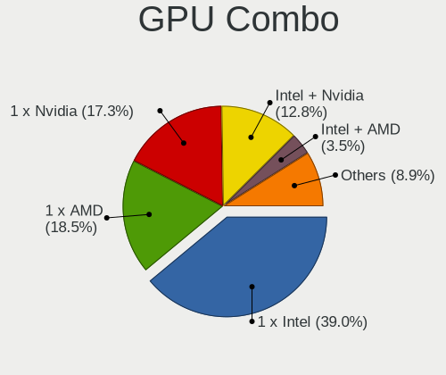

| Name           | Computers | Percent |
|----------------|-----------|---------|
| 1 x Intel      | 109       | 36.7%   |
| 1 x AMD        | 54        | 18.18%  |
| 1 x Nvidia     | 53        | 17.85%  |
| Intel + Nvidia | 47        | 15.82%  |
| Intel + AMD    | 16        | 5.39%   |
| AMD + Nvidia   | 6         | 2.02%   |
| Other          | 5         | 1.68%   |
| 2 x AMD        | 5         | 1.68%   |
| 1 x Matrox     | 1         | 0.34%   |
| 1 x ASPEED     | 1         | 0.34%   |

GPU Driver
----------

Free vs proprietary

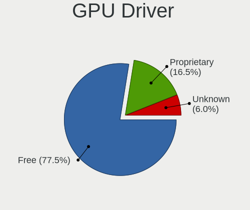

| Driver      | Computers | Percent |
|-------------|-----------|---------|
| Free        | 227       | 76.17%  |
| Proprietary | 59        | 19.8%   |
| Unknown     | 12        | 4.03%   |

GPU Memory
----------

Total video memory

| Size in GB | Computers | Percent |
|------------|-----------|---------|
| Unknown    | 145       | 48.33%  |
| 1.01-2.0   | 59        | 19.67%  |
| 0.51-1.0   | 27        | 9%      |
| 3.01-4.0   | 25        | 8.33%   |
| 0.01-0.5   | 25        | 8.33%   |
| 7.01-8.0   | 12        | 4%      |
| 5.01-6.0   | 4         | 1.33%   |
| 8.01-16.0  | 2         | 0.67%   |
| 2.01-3.0   | 1         | 0.33%   |

Monitor
-------

Monitor Vendor
--------------

Monitor vendors

| Vendor                  | Computers | Percent |
|-------------------------|-----------|---------|
| AU Optronics            | 40        | 12.86%  |
| Samsung Electronics     | 34        | 10.93%  |
| Dell                    | 33        | 10.61%  |
| Chimei Innolux          | 26        | 8.36%   |
| BOE                     | 24        | 7.72%   |
| LG Display              | 21        | 6.75%   |
| Hewlett-Packard         | 17        | 5.47%   |
| Acer                    | 16        | 5.14%   |
| Sharp                   | 11        | 3.54%   |
| BenQ                    | 11        | 3.54%   |
| AOC                     | 11        | 3.54%   |
| Goldstar                | 10        | 3.22%   |
| ViewSonic               | 7         | 2.25%   |
| Philips                 | 7         | 2.25%   |
| Apple                   | 6         | 1.93%   |
| Lenovo                  | 5         | 1.61%   |
| Chi Mei Optoelectronics | 4         | 1.29%   |
| Toshiba                 | 3         | 0.96%   |
| ASUSTek Computer        | 3         | 0.96%   |
| Panasonic               | 2         | 0.64%   |
| LG Electronics          | 2         | 0.64%   |
| InnoLux Display         | 2         | 0.64%   |
| Unknown                 | 1         | 0.32%   |
| Sony                    | 1         | 0.32%   |
| PANDA                   | 1         | 0.32%   |
| MStar                   | 1         | 0.32%   |
| LTM                     | 1         | 0.32%   |
| LG Philips              | 1         | 0.32%   |
| InfoVision              | 1         | 0.32%   |
| HUYINIUDA               | 1         | 0.32%   |
| EXP                     | 1         | 0.32%   |
| Envision Peripherals    | 1         | 0.32%   |
| Dinner                  | 1         | 0.32%   |
| Denver                  | 1         | 0.32%   |
| CVT                     | 1         | 0.32%   |
| Armaggeddon             | 1         | 0.32%   |
| Ancor Communications    | 1         | 0.32%   |
| Unknown                 | 1         | 0.32%   |

Monitor Model
-------------

Monitor models

| Model                                                                     | Computers | Percent |
|---------------------------------------------------------------------------|-----------|---------|
| Goldstar FULL HD GSM5B55 1920x1080 480x270mm 21.7-inch                    | 5         | 1.56%   |
| Samsung Electronics C24F390 SAM0D2C 1920x1080 521x293mm 23.5-inch         | 3         | 0.93%   |
| Dell E2720HS DELA15E 1920x1080 598x336mm 27.0-inch                        | 3         | 0.93%   |
| BenQ GW2270 BNQ78DB 1920x1080 476x268mm 21.5-inch                         | 3         | 0.93%   |
| BenQ EX3203R BNQ7F66 2560x1440 698x393mm 31.5-inch                        | 3         | 0.93%   |
| AU Optronics LCD Monitor AUO2D3C 1366x768 309x173mm 13.9-inch             | 3         | 0.93%   |
| AU Optronics LCD Monitor AUO183C 1366x768 309x173mm 13.9-inch             | 3         | 0.93%   |
| Acer K242HL ACR03E3 1920x1080 531x299mm 24.0-inch                         | 3         | 0.93%   |
| Sharp LCD SHP10C9 1920x540                                                | 2         | 0.62%   |
| Samsung Electronics S24F350 SAM0D21 1920x1080 521x293mm 23.5-inch         | 2         | 0.62%   |
| Samsung Electronics S19D300 SAM0B34 1366x768 410x230mm 18.5-inch          | 2         | 0.62%   |
| Samsung Electronics LCD Monitor SEC3849 1366x768 309x174mm 14.0-inch      | 2         | 0.62%   |
| Samsung Electronics LCD Monitor SDC4E51 1366x768 344x194mm 15.5-inch      | 2         | 0.62%   |
| Philips 196VL PHLC07F 1366x768 409x230mm 18.5-inch                        | 2         | 0.62%   |
| Lenovo LCD Monitor LEN4011 1280x800 261x163mm 12.1-inch                   | 2         | 0.62%   |
| InnoLux Display LCD Monitor INL0016 1366x768 309x174mm 14.0-inch          | 2         | 0.62%   |
| Hewlett-Packard LCD Monitor P221                                          | 2         | 0.62%   |
| Goldstar HDR WFHD GSM7714 2560x1080 798x334mm 34.1-inch                   | 2         | 0.62%   |
| Dell U2913WM DEL408A 2560x1080 673x284mm 28.8-inch                        | 2         | 0.62%   |
| Dell LCD Monitor E2720HS 1920x1080                                        | 2         | 0.62%   |
| Dell 2007FP DELA021 1600x1200 367x275mm 18.1-inch                         | 2         | 0.62%   |
| Chimei Innolux LCD Monitor CMN15E8 1920x1080 344x193mm 15.5-inch          | 2         | 0.62%   |
| Chimei Innolux LCD Monitor CMN15AB 1366x768 344x193mm 15.5-inch           | 2         | 0.62%   |
| Chimei Innolux LCD Monitor CMN14D4 1920x1080 309x173mm 13.9-inch          | 2         | 0.62%   |
| Chimei Innolux LCD Monitor CMN1495 1366x768 309x173mm 13.9-inch           | 2         | 0.62%   |
| Chimei Innolux LCD Monitor CMN1493 1366x768 309x173mm 13.9-inch           | 2         | 0.62%   |
| Chimei Innolux LCD Monitor CMN1490 1366x768 309x173mm 13.9-inch           | 2         | 0.62%   |
| Chi Mei Optoelectronics LCD Monitor CMO1720 1920x1080 382x215mm 17.3-inch | 2         | 0.62%   |
| BOE LCD Monitor BOE06A4 1366x768 344x194mm 15.5-inch                      | 2         | 0.62%   |
| AU Optronics LCD Monitor AUO61ED 1920x1080 344x193mm 15.5-inch            | 2         | 0.62%   |
| AU Optronics LCD Monitor AUO38ED 1920x1080 344x193mm 15.5-inch            | 2         | 0.62%   |
| AU Optronics LCD Monitor AUO223E 1600x900 309x174mm 14.0-inch             | 2         | 0.62%   |
| AU Optronics LCD Monitor AUO10ED 1920x1080 344x193mm 15.5-inch            | 2         | 0.62%   |
| AU Optronics LCD Monitor AUO103C 1366x768 309x173mm 13.9-inch             | 2         | 0.62%   |
| ASUSTek Computer XG32VQR AUS32B2 2560x1440 697x393mm 31.5-inch            | 2         | 0.62%   |
| AOC LCD Monitor 936W 1366x768                                             | 2         | 0.62%   |
| AOC 936W AOC1936 1366x768 410x230mm 18.5-inch                             | 2         | 0.62%   |
| AOC 1950w AOC1950 1366x768 410x230mm 18.5-inch                            | 2         | 0.62%   |
| Acer K202HQLA ACR0498 1366x768 434x236mm 19.4-inch                        | 2         | 0.62%   |
| ViewSonic XG2401 SERIES VSCBB31 1920x1080 531x299mm 24.0-inch             | 1         | 0.31%   |
| ViewSonic VX3211-4K VSCC336 3840x2160 698x393mm 31.5-inch                 | 1         | 0.31%   |
| ViewSonic VX3209-2K VSC328E 2560x1440 698x393mm 31.5-inch                 | 1         | 0.31%   |
| ViewSonic VX2453 Series VSC0C28 1920x1080 520x290mm 23.4-inch             | 1         | 0.31%   |
| ViewSonic VA2432-FHD VSCB639 1920x1080 527x296mm 23.8-inch                | 1         | 0.31%   |
| ViewSonic VA1931 Series VSCAC25 1366x768 410x230mm 18.5-inch              | 1         | 0.31%   |
| ViewSonic V3D231 Series VSC4C29 1920x1080 510x290mm 23.1-inch             | 1         | 0.31%   |
| Unknown LCD Monitor Sony Nvidia Default Flat Panel 1600x900               | 1         | 0.31%   |
| Toshiba TV TSB0113 1920x1080 1220x680mm 55.0-inch                         | 1         | 0.31%   |
| Toshiba TV TSB010B 1920x1080 926x523mm 41.9-inch                          | 1         | 0.31%   |
| Toshiba Crystal View LCD0001 1920x1080 408x255mm 18.9-inch                | 1         | 0.31%   |
| Sony TV SNY0902 1360x768                                                  | 1         | 0.31%   |
| Sharp LQ156M1JW25 SHP152C 1920x1080 344x194mm 15.5-inch                   | 1         | 0.31%   |
| Sharp LQ156M1JW03 SHP14C5 1920x1080 344x194mm 15.5-inch                   | 1         | 0.31%   |
| Sharp LCD Monitor SHP1542 1920x1080 309x174mm 14.0-inch                   | 1         | 0.31%   |
| Sharp LCD Monitor SHP14F7 1920x1200 288x180mm 13.4-inch                   | 1         | 0.31%   |
| Sharp LCD Monitor SHP14D1 1920x1200 336x210mm 15.6-inch                   | 1         | 0.31%   |
| Sharp LCD Monitor SHP14BA 1920x1080 344x194mm 15.5-inch                   | 1         | 0.31%   |
| Sharp LCD Monitor SHP1482 2880x1920 259x173mm 12.3-inch                   | 1         | 0.31%   |
| Sharp LC-22LE420M SHP2242 1920x1080 477x268mm 21.5-inch                   | 1         | 0.31%   |
| Sharp HDMI SHP10A1 1360x768 700x390mm 31.5-inch                           | 1         | 0.31%   |

Monitor Resolution
------------------

Monitor screen resolution

| Resolution         | Computers | Percent |
|--------------------|-----------|---------|
| 1920x1080 (FHD)    | 124       | 41.06%  |
| 1366x768 (WXGA)    | 90        | 29.8%   |
| 2560x1440 (QHD)    | 15        | 4.97%   |
| 3840x2160 (4K)     | 11        | 3.64%   |
| 1600x900 (HD+)     | 10        | 3.31%   |
| 1280x800 (WXGA)    | 8         | 2.65%   |
| 1440x900 (WXGA+)   | 6         | 1.99%   |
| 2560x1080          | 5         | 1.66%   |
| Unknown            | 4         | 1.32%   |
| 1920x1200 (WUXGA)  | 3         | 0.99%   |
| 1280x1024 (SXGA)   | 3         | 0.99%   |
| 5760x1080          | 2         | 0.66%   |
| 2160x1440          | 2         | 0.66%   |
| 1920x540           | 2         | 0.66%   |
| 1680x1050 (WSXGA+) | 2         | 0.66%   |
| 1600x1200          | 2         | 0.66%   |
| 1024x768 (XGA)     | 2         | 0.66%   |
| 5440x1080          | 1         | 0.33%   |
| 5120x1440          | 1         | 0.33%   |
| 3840x1080          | 1         | 0.33%   |
| 3440x1440          | 1         | 0.33%   |
| 2880x1920          | 1         | 0.33%   |
| 2240x1400          | 1         | 0.33%   |
| 1360x768           | 1         | 0.33%   |
| 1360x765           | 1         | 0.33%   |
| 1280x960           | 1         | 0.33%   |
| 1280x720 (HD)      | 1         | 0.33%   |
| 1024x600           | 1         | 0.33%   |

Monitor Diagonal
----------------

Diagonal size in inches

| Inches  | Computers | Percent |
|---------|-----------|---------|
| 15      | 59        | 18.97%  |
| 14      | 40        | 12.86%  |
| 13      | 34        | 10.93%  |
| 23      | 26        | 8.36%   |
| 24      | 22        | 7.07%   |
| 21      | 19        | 6.11%   |
| Unknown | 16        | 5.14%   |
| 27      | 15        | 4.82%   |
| 18      | 15        | 4.82%   |
| 19      | 12        | 3.86%   |
| 31      | 11        | 3.54%   |
| 17      | 8         | 2.57%   |
| 20      | 5         | 1.61%   |
| 11      | 5         | 1.61%   |
| 12      | 4         | 1.29%   |
| 34      | 3         | 0.96%   |
| 72      | 2         | 0.64%   |
| 52      | 2         | 0.64%   |
| 28      | 2         | 0.64%   |
| 25      | 2         | 0.64%   |
| 22      | 2         | 0.64%   |
| 84      | 1         | 0.32%   |
| 55      | 1         | 0.32%   |
| 39      | 1         | 0.32%   |
| 32      | 1         | 0.32%   |
| 16      | 1         | 0.32%   |
| 10      | 1         | 0.32%   |
| 7       | 1         | 0.32%   |

Monitor Width
-------------

Physical width

| Width in mm | Computers | Percent |
|-------------|-----------|---------|
| 301-350     | 123       | 39.81%  |
| 501-600     | 60        | 19.42%  |
| 401-500     | 52        | 16.83%  |
| 201-300     | 22        | 7.12%   |
| Unknown     | 16        | 5.18%   |
| 601-700     | 15        | 4.85%   |
| 351-400     | 9         | 2.91%   |
| 701-800     | 4         | 1.29%   |
| 1501-2000   | 3         | 0.97%   |
| 1001-1500   | 3         | 0.97%   |
| 801-900     | 1         | 0.32%   |
| 101-200     | 1         | 0.32%   |

Aspect Ratio
------------

Proportional relationship between the width and the height

| Ratio   | Computers | Percent |
|---------|-----------|---------|
| 16/9    | 225       | 80.07%  |
| 16/10   | 21        | 7.47%   |
| Unknown | 14        | 4.98%   |
| 5/4     | 5         | 1.78%   |
| 3/2     | 5         | 1.78%   |
| 21/9    | 5         | 1.78%   |
| 4/3     | 3         | 1.07%   |
| 32/9    | 2         | 0.71%   |
| 1.00    | 1         | 0.36%   |

Monitor Area
------------

Area in inch

| Area in inch | Computers | Percent |
|----------------|-----------|---------|
| 81-90          | 65        | 21.1%   |
| 101-110        | 60        | 19.48%  |
| 201-250        | 59        | 19.16%  |
| 151-200        | 23        | 7.47%   |
| 141-150        | 16        | 5.19%   |
| Unknown        | 16        | 5.19%   |
| 351-500        | 15        | 4.87%   |
| 301-350        | 15        | 4.87%   |
| 71-80          | 9         | 2.92%   |
| 251-300        | 7         | 2.27%   |
| More than 1000 | 6         | 1.95%   |
| 51-60          | 5         | 1.62%   |
| 121-130        | 5         | 1.62%   |
| 61-70          | 4         | 1.3%    |
| 41-50          | 1         | 0.32%   |
| 1-40           | 1         | 0.32%   |
| 501-1000       | 1         | 0.32%   |

Pixel Density
-------------

Pixels per inch

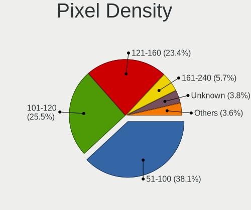

| Density       | Computers | Percent |
|---------------|-----------|---------|
| 51-100        | 105       | 34.65%  |
| 101-120       | 96        | 31.68%  |
| 121-160       | 67        | 22.11%  |
| Unknown       | 16        | 5.28%   |
| 161-240       | 9         | 2.97%   |
| 1-50          | 8         | 2.64%   |
| More than 240 | 2         | 0.66%   |

Multiple Monitors
-----------------

Total monitors connected

| Total | Computers | Percent |
|-------|-----------|---------|
| 1     | 244       | 81.88%  |
| 2     | 39        | 13.09%  |
| 0     | 13        | 4.36%   |
| 3     | 2         | 0.67%   |

Network
-------

Net Controller Vendor
---------------------

Controller vendors

| Vendor                            | Computers | Percent |
|-----------------------------------|-----------|---------|
| Realtek Semiconductor             | 152       | 31.67%  |
| Intel                             | 130       | 27.08%  |
| Qualcomm Atheros                  | 69        | 14.38%  |
| Broadcom                          | 30        | 6.25%   |
| TP-Link                           | 19        | 3.96%   |
| Ralink Technology                 | 16        | 3.33%   |
| D-Link                            | 10        | 2.08%   |
| Xiaomi                            | 7         | 1.46%   |
| Ralink                            | 5         | 1.04%   |
| Qualcomm Atheros Communications   | 5         | 1.04%   |
| Nvidia                            | 5         | 1.04%   |
| MediaTek                          | 5         | 1.04%   |
| Broadcom Limited                  | 5         | 1.04%   |
| Huawei Technologies               | 3         | 0.63%   |
| Samsung Electronics               | 2         | 0.42%   |
| OPPO Electronics                  | 2         | 0.42%   |
| InterBiometrics                   | 2         | 0.42%   |
| ASIX Electronics                  | 2         | 0.42%   |
| Sundance Technology Inc / IC Plus | 1         | 0.21%   |
| Marvell Technology Group          | 1         | 0.21%   |
| JMicron Technology                | 1         | 0.21%   |
| Hewlett-Packard                   | 1         | 0.21%   |
| DisplayLink                       | 1         | 0.21%   |
| D-Link System                     | 1         | 0.21%   |
| Attansic Technology               | 1         | 0.21%   |
| ASUSTek Computer                  | 1         | 0.21%   |
| Aquantia                          | 1         | 0.21%   |
| Apple                             | 1         | 0.21%   |
| AboCom Systems                    | 1         | 0.21%   |

Net Controller Model
--------------------

Controller models

| Model                                                                                | Computers | Percent |
|--------------------------------------------------------------------------------------|-----------|---------|
| Realtek RTL8111/8168/8411 PCI Express Gigabit Ethernet Controller                    | 98        | 17.82%  |
| Realtek RTL810xE PCI Express Fast Ethernet controller                                | 20        | 3.64%   |
| Intel 82579LM Gigabit Network Connection (Lewisville)                                | 12        | 2.18%   |
| Qualcomm Atheros AR9485 Wireless Network Adapter                                     | 10        | 1.82%   |
| Intel Wi-Fi 6 AX200                                                                  | 10        | 1.82%   |
| Ralink MT7601U Wireless Adapter                                                      | 9         | 1.64%   |
| Qualcomm Atheros QCA9565 / AR9565 Wireless Network Adapter                           | 9         | 1.64%   |
| Qualcomm Atheros AR9285 Wireless Network Adapter (PCI-Express)                       | 9         | 1.64%   |
| TP-Link 802.11ac NIC                                                                 | 8         | 1.45%   |
| Qualcomm Atheros AR9287 Wireless Network Adapter (PCI-Express)                       | 8         | 1.45%   |
| Intel 82579V Gigabit Network Connection                                              | 8         | 1.45%   |
| Realtek RTL8153 Gigabit Ethernet Adapter                                             | 7         | 1.27%   |
| Realtek RTL8125 2.5GbE Controller                                                    | 7         | 1.27%   |
| Realtek 802.11ac NIC                                                                 | 7         | 1.27%   |
| Intel Wireless 8265 / 8275                                                           | 7         | 1.27%   |
| TP-Link 802.11n NIC                                                                  | 6         | 1.09%   |
| Realtek RTL8192CU 802.11n WLAN Adapter                                               | 6         | 1.09%   |
| Ralink RT2870/RT3070 Wireless Adapter                                                | 6         | 1.09%   |
| Intel Comet Lake PCH CNVi WiFi                                                       | 6         | 1.09%   |
| Realtek RTL8822CE 802.11ac PCIe Wireless Network Adapter                             | 5         | 0.91%   |
| Qualcomm Atheros QCA9377 802.11ac Wireless Network Adapter                           | 5         | 0.91%   |
| Qualcomm Atheros AR9462 Wireless Network Adapter                                     | 5         | 0.91%   |
| Intel Ethernet Connection I217-LM                                                    | 5         | 0.91%   |
| Intel Centrino Advanced-N 6205 [Taylor Peak]                                         | 5         | 0.91%   |
| Intel Cannon Point-LP CNVi [Wireless-AC]                                             | 5         | 0.91%   |
| D-Link DWA-123 Wireless N 150 Adapter (rev.D1)                                       | 5         | 0.91%   |
| Xiaomi Mi/Redmi series (RNDIS)                                                       | 4         | 0.73%   |
| Realtek RTL8723BE PCIe Wireless Network Adapter                                      | 4         | 0.73%   |
| Realtek RTL8188EUS 802.11n Wireless Network Adapter                                  | 4         | 0.73%   |
| Qualcomm Atheros AR8151 v2.0 Gigabit Ethernet                                        | 4         | 0.73%   |
| Intel Wireless 3165                                                                  | 4         | 0.73%   |
| Intel I211 Gigabit Network Connection                                                | 4         | 0.73%   |
| Intel Ethernet Connection (11) I219-V                                                | 4         | 0.73%   |
| Intel Cannon Lake PCH CNVi WiFi                                                      | 4         | 0.73%   |
| Broadcom NetXtreme BCM57765 Gigabit Ethernet PCIe                                    | 4         | 0.73%   |
| Xiaomi Mi/Redmi series (RNDIS + ADB)                                                 | 3         | 0.55%   |
| Realtek RTL8821CE 802.11ac PCIe Wireless Network Adapter                             | 3         | 0.55%   |
| Qualcomm Atheros QCA6174 802.11ac Wireless Network Adapter                           | 3         | 0.55%   |
| Qualcomm Atheros Killer E220x Gigabit Ethernet Controller                            | 3         | 0.55%   |
| Qualcomm Atheros TP-Link TL-WN821N v3 / TL-WN822N v2 802.11n [Atheros AR7010+AR9287] | 3         | 0.55%   |
| Qualcomm Atheros AR928X Wireless Network Adapter (PCI-Express)                       | 3         | 0.55%   |
| Qualcomm Atheros AR8152 v2.0 Fast Ethernet                                           | 3         | 0.55%   |
| MediaTek MT7921 802.11ax PCI Express Wireless Network Adapter                        | 3         | 0.55%   |
| Intel Wireless-AC 9260                                                               | 3         | 0.55%   |
| Intel Wireless 7265                                                                  | 3         | 0.55%   |
| Intel Wireless 7260                                                                  | 3         | 0.55%   |
| Intel Wireless 3160                                                                  | 3         | 0.55%   |
| Intel Wi-Fi 6 AX201                                                                  | 3         | 0.55%   |
| Intel Ethernet Controller I225-V                                                     | 3         | 0.55%   |
| Intel Ethernet Connection (7) I219-V                                                 | 3         | 0.55%   |
| Intel Ethernet Connection (4) I219-LM                                                | 3         | 0.55%   |
| Intel Ethernet Connection (2) I219-V                                                 | 3         | 0.55%   |
| Intel Centrino Wireless-N 2230                                                       | 3         | 0.55%   |
| Intel Centrino Ultimate-N 6300                                                       | 3         | 0.55%   |
| Intel 82577LM Gigabit Network Connection                                             | 3         | 0.55%   |
| Intel 82567LM-3 Gigabit Network Connection                                           | 3         | 0.55%   |
| Intel 82566DM-2 Gigabit Network Connection                                           | 3         | 0.55%   |
| Huawei LYA-L09                                                                       | 3         | 0.55%   |
| Broadcom NetLink BCM57785 Gigabit Ethernet PCIe                                      | 3         | 0.55%   |
| Broadcom BCM4360 802.11ac Wireless Network Adapter                                   | 3         | 0.55%   |

Wireless Vendor
---------------

Wireless vendors

| Vendor                          | Computers | Percent |
|---------------------------------|-----------|---------|
| Intel                           | 84        | 31.58%  |
| Qualcomm Atheros                | 55        | 20.68%  |
| Realtek Semiconductor           | 41        | 15.41%  |
| TP-Link                         | 19        | 7.14%   |
| Broadcom                        | 19        | 7.14%   |
| Ralink Technology               | 16        | 6.02%   |
| D-Link                          | 10        | 3.76%   |
| Ralink                          | 5         | 1.88%   |
| Qualcomm Atheros Communications | 5         | 1.88%   |
| MediaTek                        | 5         | 1.88%   |
| Broadcom Limited                | 4         | 1.5%    |
| D-Link System                   | 1         | 0.38%   |
| ASUSTek Computer                | 1         | 0.38%   |
| AboCom Systems                  | 1         | 0.38%   |

Wireless Model
--------------

Wireless models

| Model                                                                                | Computers | Percent |
|--------------------------------------------------------------------------------------|-----------|---------|
| Qualcomm Atheros AR9485 Wireless Network Adapter                                     | 10        | 3.7%    |
| Intel Wi-Fi 6 AX200                                                                  | 10        | 3.7%    |
| Ralink MT7601U Wireless Adapter                                                      | 9         | 3.33%   |
| Qualcomm Atheros QCA9565 / AR9565 Wireless Network Adapter                           | 9         | 3.33%   |
| Qualcomm Atheros AR9285 Wireless Network Adapter (PCI-Express)                       | 9         | 3.33%   |
| TP-Link 802.11ac NIC                                                                 | 8         | 2.96%   |
| Qualcomm Atheros AR9287 Wireless Network Adapter (PCI-Express)                       | 8         | 2.96%   |
| Realtek 802.11ac NIC                                                                 | 7         | 2.59%   |
| Intel Wireless 8265 / 8275                                                           | 7         | 2.59%   |
| TP-Link 802.11n NIC                                                                  | 6         | 2.22%   |
| Realtek RTL8192CU 802.11n WLAN Adapter                                               | 6         | 2.22%   |
| Ralink RT2870/RT3070 Wireless Adapter                                                | 6         | 2.22%   |
| Intel Comet Lake PCH CNVi WiFi                                                       | 6         | 2.22%   |
| Realtek RTL8822CE 802.11ac PCIe Wireless Network Adapter                             | 5         | 1.85%   |
| Qualcomm Atheros QCA9377 802.11ac Wireless Network Adapter                           | 5         | 1.85%   |
| Qualcomm Atheros AR9462 Wireless Network Adapter                                     | 5         | 1.85%   |
| Intel Centrino Advanced-N 6205 [Taylor Peak]                                         | 5         | 1.85%   |
| Intel Cannon Point-LP CNVi [Wireless-AC]                                             | 5         | 1.85%   |
| D-Link DWA-123 Wireless N 150 Adapter (rev.D1)                                       | 5         | 1.85%   |
| Realtek RTL8723BE PCIe Wireless Network Adapter                                      | 4         | 1.48%   |
| Realtek RTL8188EUS 802.11n Wireless Network Adapter                                  | 4         | 1.48%   |
| Intel Wireless 3165                                                                  | 4         | 1.48%   |
| Intel Cannon Lake PCH CNVi WiFi                                                      | 4         | 1.48%   |
| Realtek RTL8821CE 802.11ac PCIe Wireless Network Adapter                             | 3         | 1.11%   |
| Qualcomm Atheros QCA6174 802.11ac Wireless Network Adapter                           | 3         | 1.11%   |
| Qualcomm Atheros TP-Link TL-WN821N v3 / TL-WN822N v2 802.11n [Atheros AR7010+AR9287] | 3         | 1.11%   |
| Qualcomm Atheros AR928X Wireless Network Adapter (PCI-Express)                       | 3         | 1.11%   |
| MediaTek MT7921 802.11ax PCI Express Wireless Network Adapter                        | 3         | 1.11%   |
| Intel Wireless-AC 9260                                                               | 3         | 1.11%   |
| Intel Wireless 7265                                                                  | 3         | 1.11%   |
| Intel Wireless 7260                                                                  | 3         | 1.11%   |
| Intel Wireless 3160                                                                  | 3         | 1.11%   |
| Intel Wi-Fi 6 AX201                                                                  | 3         | 1.11%   |
| Intel Centrino Wireless-N 2230                                                       | 3         | 1.11%   |
| Intel Centrino Ultimate-N 6300                                                       | 3         | 1.11%   |
| Broadcom BCM4360 802.11ac Wireless Network Adapter                                   | 3         | 1.11%   |
| Broadcom BCM4331 802.11a/b/g/n                                                       | 3         | 1.11%   |
| Broadcom BCM43228 802.11a/b/g/n                                                      | 3         | 1.11%   |
| TP-Link Archer T9UH v1 [Realtek RTL8814AU]                                           | 2         | 0.74%   |
| Realtek RTL8822BE 802.11a/b/g/n/ac WiFi adapter                                      | 2         | 0.74%   |
| Realtek RTL8723DE Wireless Network Adapter                                           | 2         | 0.74%   |
| Realtek RTL8192EE PCIe Wireless Network Adapter                                      | 2         | 0.74%   |
| Realtek RTL8188CE 802.11b/g/n WiFi Adapter                                           | 2         | 0.74%   |
| Ralink RT5370 Wireless Adapter                                                       | 2         | 0.74%   |
| Ralink RT3290 Wireless 802.11n 1T/1R PCIe                                            | 2         | 0.74%   |
| Qualcomm Atheros AR9271 802.11n                                                      | 2         | 0.74%   |
| Qualcomm Atheros AR9227 Wireless Network Adapter                                     | 2         | 0.74%   |
| Intel Wi-Fi 6 AX210/AX211/AX411 160MHz                                               | 2         | 0.74%   |
| Intel PRO/Wireless 3945ABG [Golan] Network Connection                                | 2         | 0.74%   |
| Intel Dual Band Wireless-AC 3168NGW [Stone Peak]                                     | 2         | 0.74%   |
| Intel Centrino Advanced-N 6235                                                       | 2         | 0.74%   |
| Intel Centrino Advanced-N 6200                                                       | 2         | 0.74%   |
| Intel Alder Lake-S PCH CNVi WiFi                                                     | 2         | 0.74%   |
| Broadcom Limited BCM4312 802.11b/g LP-PHY                                            | 2         | 0.74%   |
| Broadcom BCM43224 802.11a/b/g/n                                                      | 2         | 0.74%   |
| Broadcom BCM43142 802.11b/g/n                                                        | 2         | 0.74%   |
| Broadcom BCM4312 802.11b/g LP-PHY                                                    | 2         | 0.74%   |
| TP-Link TL-WN823N v2/v3 [Realtek RTL8192EU]                                          | 1         | 0.37%   |
| TP-Link TL-WN8200ND [Realtek RTL8192CU]                                              | 1         | 0.37%   |
| TP-Link TL-WN722N v2/v3 [Realtek RTL8188EUS]                                         | 1         | 0.37%   |

Ethernet Vendor
---------------

Ethernet vendors

| Vendor                            | Computers | Percent |
|-----------------------------------|-----------|---------|
| Realtek Semiconductor             | 134       | 49.81%  |
| Intel                             | 74        | 27.51%  |
| Qualcomm Atheros                  | 18        | 6.69%   |
| Broadcom                          | 14        | 5.2%    |
| Xiaomi                            | 7         | 2.6%    |
| Nvidia                            | 5         | 1.86%   |
| Huawei Technologies               | 3         | 1.12%   |
| Samsung Electronics               | 2         | 0.74%   |
| OPPO Electronics                  | 2         | 0.74%   |
| ASIX Electronics                  | 2         | 0.74%   |
| Sundance Technology Inc / IC Plus | 1         | 0.37%   |
| Marvell Technology Group          | 1         | 0.37%   |
| JMicron Technology                | 1         | 0.37%   |
| DisplayLink                       | 1         | 0.37%   |
| Broadcom Limited                  | 1         | 0.37%   |
| Attansic Technology               | 1         | 0.37%   |
| Aquantia                          | 1         | 0.37%   |
| Apple                             | 1         | 0.37%   |

Ethernet Model
--------------

Ethernet models

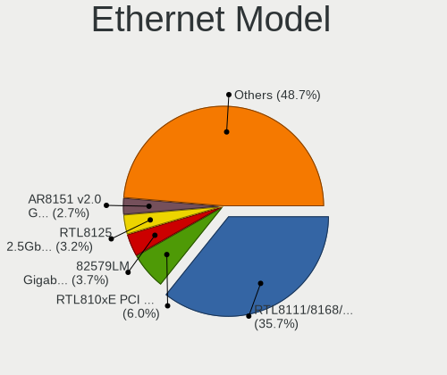

| Model                                                                          | Computers | Percent |
|--------------------------------------------------------------------------------|-----------|---------|
| Realtek RTL8111/8168/8411 PCI Express Gigabit Ethernet Controller              | 98        | 35.38%  |
| Realtek RTL810xE PCI Express Fast Ethernet controller                          | 20        | 7.22%   |
| Intel 82579LM Gigabit Network Connection (Lewisville)                          | 12        | 4.33%   |
| Intel 82579V Gigabit Network Connection                                        | 8         | 2.89%   |
| Realtek RTL8153 Gigabit Ethernet Adapter                                       | 7         | 2.53%   |
| Realtek RTL8125 2.5GbE Controller                                              | 7         | 2.53%   |
| Intel Ethernet Connection I217-LM                                              | 5         | 1.81%   |
| Xiaomi Mi/Redmi series (RNDIS)                                                 | 4         | 1.44%   |
| Qualcomm Atheros AR8151 v2.0 Gigabit Ethernet                                  | 4         | 1.44%   |
| Intel I211 Gigabit Network Connection                                          | 4         | 1.44%   |
| Intel Ethernet Connection (11) I219-V                                          | 4         | 1.44%   |
| Broadcom NetXtreme BCM57765 Gigabit Ethernet PCIe                              | 4         | 1.44%   |
| Xiaomi Mi/Redmi series (RNDIS + ADB)                                           | 3         | 1.08%   |
| Qualcomm Atheros Killer E220x Gigabit Ethernet Controller                      | 3         | 1.08%   |
| Qualcomm Atheros AR8152 v2.0 Fast Ethernet                                     | 3         | 1.08%   |
| Intel Ethernet Controller I225-V                                               | 3         | 1.08%   |
| Intel Ethernet Connection (7) I219-V                                           | 3         | 1.08%   |
| Intel Ethernet Connection (4) I219-LM                                          | 3         | 1.08%   |
| Intel Ethernet Connection (2) I219-V                                           | 3         | 1.08%   |
| Intel 82577LM Gigabit Network Connection                                       | 3         | 1.08%   |
| Intel 82567LM-3 Gigabit Network Connection                                     | 3         | 1.08%   |
| Intel 82566DM-2 Gigabit Network Connection                                     | 3         | 1.08%   |
| Huawei LYA-L09                                                                 | 3         | 1.08%   |
| Broadcom NetLink BCM57785 Gigabit Ethernet PCIe                                | 3         | 1.08%   |
| Realtek Killer E2600 Gigabit Ethernet Controller                               | 2         | 0.72%   |
| Qualcomm Atheros QCA8172 Fast Ethernet                                         | 2         | 0.72%   |
| Qualcomm Atheros AR8161 Gigabit Ethernet                                       | 2         | 0.72%   |
| Qualcomm Atheros AR8121/AR8113/AR8114 Gigabit or Fast Ethernet                 | 2         | 0.72%   |
| OPPO SDM720G-IDP _SN:B922E265                                                  | 2         | 0.72%   |
| Intel I350 Gigabit Network Connection                                          | 2         | 0.72%   |
| Intel I350 Gigabit Fiber Network Connection                                    | 2         | 0.72%   |
| Intel Ethernet Connection I217-V                                               | 2         | 0.72%   |
| Intel Ethernet Connection (7) I219-LM                                          | 2         | 0.72%   |
| Intel Ethernet Connection (2) I219-LM                                          | 2         | 0.72%   |
| Intel 82583V Gigabit Network Connection                                        | 2         | 0.72%   |
| Intel 82567LM Gigabit Network Connection                                       | 2         | 0.72%   |
| Intel 82562V-2 10/100 Network Connection                                       | 2         | 0.72%   |
| Broadcom NetXtreme BCM5754 Gigabit Ethernet PCI Express                        | 2         | 0.72%   |
| Broadcom NetLink BCM57781 Gigabit Ethernet PCIe                                | 2         | 0.72%   |
| Sundance Inc / IC Plus IC Plus IP100A Integrated 10/100 Ethernet MAC + PHY     | 1         | 0.36%   |
| Samsung GT-I9070 (network tethering, USB debugging enabled)                    | 1         | 0.36%   |
| Samsung Galaxy series, misc. (tethering mode)                                  | 1         | 0.36%   |
| Realtek RTL8152 Fast Ethernet Adapter                                          | 1         | 0.36%   |
| Realtek Realtek Ethernet controller                                            | 1         | 0.36%   |
| Qualcomm Atheros QCA8171 Gigabit Ethernet                                      | 1         | 0.36%   |
| Qualcomm Atheros AR8131 Gigabit Ethernet                                       | 1         | 0.36%   |
| Nvidia MCP79 Ethernet                                                          | 1         | 0.36%   |
| Nvidia MCP77 Ethernet                                                          | 1         | 0.36%   |
| Nvidia MCP73 Ethernet                                                          | 1         | 0.36%   |
| Nvidia MCP61 Ethernet                                                          | 1         | 0.36%   |
| Nvidia MCP55 Ethernet                                                          | 1         | 0.36%   |
| Marvell Group Yukon Optima 88E8059 [PCIe Gigabit Ethernet Controller with AVB] | 1         | 0.36%   |
| JMicron JMC250 PCI Express Gigabit Ethernet Controller                         | 1         | 0.36%   |
| Intel Ethernet Connection I219-V                                               | 1         | 0.36%   |
| Intel Ethernet Connection I218-LM                                              | 1         | 0.36%   |
| Intel Ethernet Connection (6) I219-V                                           | 1         | 0.36%   |
| Intel Ethernet Connection (3) I218-LM                                          | 1         | 0.36%   |
| Intel Ethernet Connection (2) I218-V                                           | 1         | 0.36%   |
| Intel Ethernet Connection (2) I218-LM                                          | 1         | 0.36%   |
| Intel Centrino Advanced-N + WiMAX 6250                                         | 1         | 0.36%   |

Net Controller Kind
-------------------

Ethernet, WiFi or modem

| Kind     | Computers | Percent |
|----------|-----------|---------|
| Ethernet | 247       | 50.31%  |
| WiFi     | 241       | 49.08%  |
| Modem    | 3         | 0.61%   |

Used Controller
---------------

Currently used network controller

| Kind     | Computers | Percent |
|----------|-----------|---------|
| WiFi     | 193       | 65.65%  |
| Ethernet | 101       | 34.35%  |

NICs
----

Total network controllers on board

| Total | Computers | Percent |
|-------|-----------|---------|
| 2     | 158       | 53.2%   |
| 1     | 111       | 37.37%  |
| 0     | 20        | 6.73%   |
| 3     | 6         | 2.02%   |
| 9     | 1         | 0.34%   |
| 8     | 1         | 0.34%   |

IPv6
----

IPv6 vs IPv4

| Used | Computers | Percent |
|------|-----------|---------|
| No   | 232       | 76.82%  |
| Yes  | 70        | 23.18%  |

Bluetooth
---------

Bluetooth Vendor
----------------

Controller vendors

| Vendor                          | Computers | Percent |
|---------------------------------|-----------|---------|
| Intel                           | 64        | 34.41%  |
| Cambridge Silicon Radio         | 20        | 10.75%  |
| Qualcomm Atheros Communications | 15        | 8.06%   |
| Realtek Semiconductor           | 14        | 7.53%   |
| Broadcom                        | 14        | 7.53%   |
| IMC Networks                    | 11        | 5.91%   |
| Foxconn / Hon Hai               | 10        | 5.38%   |
| Apple                           | 10        | 5.38%   |
| Lite-On Technology              | 9         | 4.84%   |
| Realtek                         | 3         | 1.61%   |
| Hewlett-Packard                 | 3         | 1.61%   |
| Dell                            | 3         | 1.61%   |
| Ralink                          | 2         | 1.08%   |
| MediaTek                        | 2         | 1.08%   |
| TP-Link                         | 1         | 0.54%   |
| Ralink Technology               | 1         | 0.54%   |
| D-Link                          | 1         | 0.54%   |
| ASUSTek Computer                | 1         | 0.54%   |
| Askey Computer                  | 1         | 0.54%   |
| Alps Electric                   | 1         | 0.54%   |

Bluetooth Model
---------------

Controller models

| Model                                                                               | Computers | Percent |
|-------------------------------------------------------------------------------------|-----------|---------|
| Cambridge Silicon Radio Bluetooth Dongle (HCI mode)                                 | 20        | 10.75%  |
| Intel Bluetooth wireless interface                                                  | 19        | 10.22%  |
| Intel AX201 Bluetooth                                                               | 13        | 6.99%   |
| Intel Bluetooth 9460/9560 Jefferson Peak (JfP)                                      | 10        | 5.38%   |
| Intel AX200 Bluetooth                                                               | 10        | 5.38%   |
| Realtek Bluetooth Radio                                                             | 7         | 3.76%   |
| Qualcomm Atheros  Bluetooth Device                                                  | 5         | 2.69%   |
| Apple Bluetooth Host Controller                                                     | 5         | 2.69%   |
| Realtek  Bluetooth 4.2 Adapter                                                      | 4         | 2.15%   |
| Qualcomm Atheros AR3011 Bluetooth                                                   | 4         | 2.15%   |
| Intel Centrino Bluetooth Wireless Transceiver                                       | 4         | 2.15%   |
| Intel Bluetooth Device                                                              | 4         | 2.15%   |
| IMC Networks Atheros AR3012 Bluetooth 4.0 Adapter                                   | 4         | 2.15%   |
| Broadcom BCM2045B (BDC-2.1)                                                         | 4         | 2.15%   |
| Realtek Bluetooth Radio                                                             | 3         | 1.61%   |
| Qualcomm Atheros AR9462 Bluetooth                                                   | 3         | 1.61%   |
| Lite-On Qualcomm Atheros QCA9377 Bluetooth                                          | 3         | 1.61%   |
| IMC Networks Bluetooth Device                                                       | 3         | 1.61%   |
| Apple Bluetooth USB Host Controller                                                 | 3         | 1.61%   |
| Realtek RTL8822BE Bluetooth 4.2 Adapter                                             | 2         | 1.08%   |
| Ralink RT3290 Bluetooth                                                             | 2         | 1.08%   |
| Qualcomm Atheros AR3012 Bluetooth 4.0                                               | 2         | 1.08%   |
| Lite-On Bluetooth Device                                                            | 2         | 1.08%   |
| Lite-On Atheros Bluetooth                                                           | 2         | 1.08%   |
| Intel Wireless-AC 3168 Bluetooth                                                    | 2         | 1.08%   |
| Intel AX210 Bluetooth                                                               | 2         | 1.08%   |
| IMC Networks Bluetooth Radio                                                        | 2         | 1.08%   |
| HP Broadcom 2070 Bluetooth Combo                                                    | 2         | 1.08%   |
| Foxconn / Hon Hai Foxconn T77H114 BCM2070 [Single-Chip Bluetooth 2.1 + EDR Adapter] | 2         | 1.08%   |
| Foxconn / Hon Hai Bluetooth USB Host Controller                                     | 2         | 1.08%   |
| Foxconn / Hon Hai Bluetooth Device                                                  | 2         | 1.08%   |
| Dell Wireless 365 Bluetooth                                                         | 2         | 1.08%   |
| Broadcom HP Portable SoftSailing                                                    | 2         | 1.08%   |
| Broadcom HP Portable Bumble Bee                                                     | 2         | 1.08%   |
| Broadcom BCM43142A0 Bluetooth 4.0                                                   | 2         | 1.08%   |
| Broadcom BCM20702A0                                                                 | 2         | 1.08%   |
| Apple Built-in Bluetooth 2.0+EDR HCI                                                | 2         | 1.08%   |
| TP-Link TP-hink UB500 Adapter                                                       | 1         | 0.54%   |
| Realtek RTL8723B Bluetooth                                                          | 1         | 0.54%   |
| Ralink CSR BS8510                                                                   | 1         | 0.54%   |
| Qualcomm Atheros Bluetooth                                                          | 1         | 0.54%   |
| MediaTek Wireless_Device                                                            | 1         | 0.54%   |
| MediaTek BT                                                                         | 1         | 0.54%   |
| Lite-On Wireless_Device                                                             | 1         | 0.54%   |
| Lite-On Atheros AR3012 Bluetooth                                                    | 1         | 0.54%   |
| IMC Networks Wireless_Device                                                        | 1         | 0.54%   |
| IMC Networks Atheros AR3012 Bluetooth                                               | 1         | 0.54%   |
| HP Bluetooth 2.0 Interface [Broadcom BCM2045]                                       | 1         | 0.54%   |
| Foxconn / Hon Hai Wireless_Device                                                   | 1         | 0.54%   |
| Foxconn / Hon Hai BCM20702A0                                                        | 1         | 0.54%   |
| Foxconn / Hon Hai BCM2045A0                                                         | 1         | 0.54%   |
| Foxconn / Hon Hai Acer Module                                                       | 1         | 0.54%   |
| Dell Wireless 355 Bluetooth                                                         | 1         | 0.54%   |
| D-Link DBT-122 Bluetooth adapter                                                    | 1         | 0.54%   |
| Broadcom BCM2070 Bluetooth 2.1 + EDR                                                | 1         | 0.54%   |
| Broadcom BCM2045 Bluetooth                                                          | 1         | 0.54%   |
| ASUS BT-270 Bluetooth Adapter                                                       | 1         | 0.54%   |
| Askey Bluetooth Device                                                              | 1         | 0.54%   |
| Alps Electric BCM2046 Bluetooth Device                                              | 1         | 0.54%   |

Sound
-----

Sound Vendor
------------

Sound card vendors

| Vendor                      | Computers | Percent |
|-----------------------------|-----------|---------|
| Intel                       | 226       | 55.67%  |
| Nvidia                      | 75        | 18.47%  |
| AMD                         | 70        | 17.24%  |
| C-Media Electronics         | 8         | 1.97%   |
| Logitech                    | 6         | 1.48%   |
| JMTek                       | 3         | 0.74%   |
| Samsung Electronics         | 2         | 0.49%   |
| RODE Microphones            | 2         | 0.49%   |
| Realtek Semiconductor       | 2         | 0.49%   |
| Unknown                     | 1         | 0.25%   |
| Texas Instruments           | 1         | 0.25%   |
| Plantronics                 | 1         | 0.25%   |
| MVSILICON.INC.              | 1         | 0.25%   |
| MosArt Semiconductor        | 1         | 0.25%   |
| GN Netcom                   | 1         | 0.25%   |
| Generalplus Technology      | 1         | 0.25%   |
| FiiO Electronics Technology | 1         | 0.25%   |
| Creative Labs               | 1         | 0.25%   |
| Cooler Master               | 1         | 0.25%   |
| Cambridge Audio             | 1         | 0.25%   |
| ASUSTek Computer            | 1         | 0.25%   |

Sound Model
-----------

Sound card models

| Model                                                                             | Computers | Percent |
|-----------------------------------------------------------------------------------|-----------|---------|
| Intel 6 Series/C200 Series Chipset Family High Definition Audio Controller        | 35        | 7.48%   |
| Intel 7 Series/C216 Chipset Family High Definition Audio Controller               | 29        | 6.2%    |
| AMD Family 17h/19h HD Audio Controller                                            | 24        | 5.13%   |
| Intel 8 Series/C220 Series Chipset High Definition Audio Controller               | 21        | 4.49%   |
| Intel Sunrise Point-LP HD Audio                                                   | 20        | 4.27%   |
| Nvidia GF108 High Definition Audio Controller                                     | 14        | 2.99%   |
| Intel Xeon E3-1200 v3/4th Gen Core Processor HD Audio Controller                  | 14        | 2.99%   |
| Intel 82801I (ICH9 Family) HD Audio Controller                                    | 14        | 2.99%   |
| Intel Cannon Lake PCH cAVS                                                        | 12        | 2.56%   |
| Intel 5 Series/3400 Series Chipset High Definition Audio                          | 12        | 2.56%   |
| AMD Raven/Raven2/Fenghuang HDMI/DP Audio Controller                               | 12        | 2.56%   |
| AMD Renoir Radeon High Definition Audio Controller                                | 10        | 2.14%   |
| Intel NM10/ICH7 Family High Definition Audio Controller                           | 9         | 1.92%   |
| Intel 8 Series HD Audio Controller                                                | 8         | 1.71%   |
| AMD FCH Azalia Controller                                                         | 8         | 1.71%   |
| AMD Ellesmere HDMI Audio [Radeon RX 470/480 / 570/580/590]                        | 8         | 1.71%   |
| Intel Haswell-ULT HD Audio Controller                                             | 7         | 1.5%    |
| Intel 100 Series/C230 Series Chipset Family HD Audio Controller                   | 7         | 1.5%    |
| Intel Cannon Point-LP High Definition Audio Controller                            | 6         | 1.28%   |
| AMD Starship/Matisse HD Audio Controller                                          | 6         | 1.28%   |
| Nvidia GP107GL High Definition Audio Controller                                   | 5         | 1.07%   |
| Nvidia GP104 High Definition Audio Controller                                     | 5         | 1.07%   |
| Nvidia GM107 High Definition Audio Controller [GeForce 940MX]                     | 5         | 1.07%   |
| Intel Comet Lake PCH cAVS                                                         | 5         | 1.07%   |
| AMD Caicos HDMI Audio [Radeon HD 6450 / 7450/8450/8490 OEM / R5 230/235/235X OEM] | 5         | 1.07%   |
| Nvidia TU107 GeForce GTX 1650 High Definition Audio Controller                    | 4         | 0.85%   |
| Nvidia TU106 High Definition Audio Controller                                     | 4         | 0.85%   |
| Nvidia High Definition Audio Controller                                           | 4         | 0.85%   |
| Nvidia GK208 HDMI/DP Audio Controller                                             | 4         | 0.85%   |
| Nvidia GK107 HDMI Audio Controller                                                | 4         | 0.85%   |
| Intel Wildcat Point-LP High Definition Audio Controller                           | 4         | 0.85%   |
| Intel Tiger Lake-LP Smart Sound Technology Audio Controller                       | 4         | 0.85%   |
| Intel Celeron/Pentium Silver Processor High Definition Audio                      | 4         | 0.85%   |
| Intel Broadwell-U Audio Controller                                                | 4         | 0.85%   |
| AMD Trinity HDMI Audio Controller                                                 | 4         | 0.85%   |
| AMD Kabini HDMI/DP Audio                                                          | 4         | 0.85%   |
| Nvidia TU116 High Definition Audio Controller                                     | 3         | 0.64%   |
| Nvidia GK104 HDMI Audio Controller                                                | 3         | 0.64%   |
| Logitech H600 [Wireless Headset]                                                  | 3         | 0.64%   |
| JMTek USB PnP Audio Device                                                        | 3         | 0.64%   |
| Intel Comet Lake PCH-LP cAVS                                                      | 3         | 0.64%   |
| Intel Alder Lake-S HD Audio Controller                                            | 3         | 0.64%   |
| Intel 9 Series Chipset Family HD Audio Controller                                 | 3         | 0.64%   |
| Intel 82801JD/DO (ICH10 Family) HD Audio Controller                               | 3         | 0.64%   |
| AMD Turks HDMI Audio [Radeon HD 6500/6600 / 6700M Series]                         | 3         | 0.64%   |
| AMD Family 17h (Models 00h-0fh) HD Audio Controller                               | 3         | 0.64%   |
| AMD Baffin HDMI/DP Audio [Radeon RX 550 640SP / RX 560/560X]                      | 3         | 0.64%   |
| RODE Microphones RODE NT-USB Mini                                                 | 2         | 0.43%   |
| Realtek Semiconductor USB Audio                                                   | 2         | 0.43%   |
| Nvidia MCP61 High Definition Audio                                                | 2         | 0.43%   |
| Nvidia GM206 High Definition Audio Controller                                     | 2         | 0.43%   |
| Nvidia GM204 High Definition Audio Controller                                     | 2         | 0.43%   |
| Nvidia GF119 HDMI Audio Controller                                                | 2         | 0.43%   |
| Nvidia GA106 High Definition Audio Controller                                     | 2         | 0.43%   |
| Logitech USB Headset H540                                                         | 2         | 0.43%   |
| Intel USB PnP Sound Device                                                        | 2         | 0.43%   |
| Intel Ice Lake-LP Smart Sound Technology Audio Controller                         | 2         | 0.43%   |
| Intel Comet Lake PCH-V cAVS                                                       | 2         | 0.43%   |
| Intel CM238 HD Audio Controller                                                   | 2         | 0.43%   |
| Intel Audio device                                                                | 2         | 0.43%   |

Memory
------

Memory Vendor
-------------

Memory module vendors

| Vendor              | Computers | Percent |
|---------------------|-----------|---------|
| Kingston            | 41        | 26.28%  |
| Samsung Electronics | 28        | 17.95%  |
| SK hynix            | 25        | 16.03%  |
| Unknown             | 10        | 6.41%   |
| Micron Technology   | 10        | 6.41%   |
| Corsair             | 7         | 4.49%   |
| Nanya Technology    | 6         | 3.85%   |
| A-DATA Technology   | 5         | 3.21%   |
| Ramaxel Technology  | 4         | 2.56%   |
| Kingmax             | 4         | 2.56%   |
| Crucial             | 3         | 1.92%   |
| Silicon Power       | 2         | 1.28%   |
| Kimtigo             | 2         | 1.28%   |
| Unknown (ABCD)      | 1         | 0.64%   |
| Team                | 1         | 0.64%   |
| SemsoTai            | 1         | 0.64%   |
| PNY                 | 1         | 0.64%   |
| Kinlstuo            | 1         | 0.64%   |
| Hewlett-Packard     | 1         | 0.64%   |
| G.Skill             | 1         | 0.64%   |
| Elpida              | 1         | 0.64%   |
| Apacer              | 1         | 0.64%   |

Memory Model
------------

Memory module models

| Model                                                            | Computers | Percent |
|------------------------------------------------------------------|-----------|---------|
| Samsung RAM M471B5173DB0-YK0 4GB SODIMM DDR3 1600MT/s            | 4         | 2.38%   |
| Kingston RAM 99U5471-054.A00LF 8GB DIMM DDR3 1600MT/s            | 4         | 2.38%   |
| Unknown RAM Module 2GB DIMM SDRAM                                | 3         | 1.79%   |
| Nanya RAM NT4GC64B8HG0NS-CG 4GB SODIMM DDR3 1334MT/s             | 3         | 1.79%   |
| Unknown RAM Module 4GB DIMM SDRAM                                | 2         | 1.19%   |
| SK hynix RAM HMT351S6CFR8C-PB 4GB SODIMM DDR3 1600MT/s           | 2         | 1.19%   |
| SK hynix RAM HMA451S6AFR8N-TF 4GB SODIMM DDR4 2133MT/s           | 2         | 1.19%   |
| Samsung RAM M471B5273CH0-CH9 4GB SODIMM DDR3 1334MT/s            | 2         | 1.19%   |
| Samsung RAM M471B5173EB0-YK0 4GB SODIMM DDR3 1600MT/s            | 2         | 1.19%   |
| Micron RAM 8ATF51264HZ-2G3B1 4GB SODIMM DDR4 2400MT/s            | 2         | 1.19%   |
| Kingston RAM 99U5428-082.A00LF 8GB SODIMM DDR3 1600MT/s          | 2         | 1.19%   |
| Kingmax RAM FLFE85F-C8KL9 2GB DIMM DDR3 1333MT/s                 | 2         | 1.19%   |
| Kimtigo RAM KT8GS3EDF 8GB SODIMM DDR3 1600MT/s                   | 2         | 1.19%   |
| Crucial RAM CT102464BF160B.C16 8GB SODIMM DDR3 1600MT/s          | 2         | 1.19%   |
| Unknown RAM Module 4GB SODIMM DDR3 1333MT/s                      | 1         | 0.6%    |
| Unknown RAM Module 2GB SODIMM DDR3                               | 1         | 0.6%    |
| Unknown RAM Module 2GB Row Of Chips LPDDR4 4267MT/s              | 1         | 0.6%    |
| Unknown RAM Module 2GB DIMM DDR3 1067MT/s                        | 1         | 0.6%    |
| Unknown RAM Module 2GB DIMM 800MT/s                              | 1         | 0.6%    |
| Unknown RAM Module 2GB DIMM 667MT/s                              | 1         | 0.6%    |
| Unknown (ABCD) RAM 123456789012345678 4GB SODIMM LPDDR4 2400MT/s | 1         | 0.6%    |
| Team RAM Elite-800 2048MB DIMM SDRAM 2048MT/s                    | 1         | 0.6%    |
| SK hynix RAM Module 4GB SODIMM DDR4 2400MT/s                     | 1         | 0.6%    |
| SK hynix RAM Module 4GB Row Of Chips LPDDR3 1867MT/s             | 1         | 0.6%    |
| SK hynix RAM Module 4096MB SODIMM DDR3 1600MT/s                  | 1         | 0.6%    |
| SK hynix RAM Module 2GB SODIMM DDR3 1333MT/s                     | 1         | 0.6%    |
| SK hynix RAM Module 2048MB DIMM DDR3 1066MT/s                    | 1         | 0.6%    |
| SK hynix RAM HYMP112F72CP8N3-Y5 1024MB FB-DIMM DDR2 667MT/s      | 1         | 0.6%    |
| SK hynix RAM HMT451S6AFR8A-PB 4GB SODIMM DDR3 1600MT/s           | 1         | 0.6%    |
| SK hynix RAM HMT451S6AFR8A-PB 4096MB SODIMM DDR3 1600MT/s        | 1         | 0.6%    |
| SK hynix RAM HMT41GU7BFR8A-PB 8GB DIMM DDR3 1600MT/s             | 1         | 0.6%    |
| SK hynix RAM HMT351U6EFR8C-PB 4GB DIMM DDR3 1800MT/s             | 1         | 0.6%    |
| SK hynix RAM HMT351U6CFR8C-PB 4096MB DIMM DDR3 1800MT/s          | 1         | 0.6%    |
| SK hynix RAM HMT351S6CFR8A-PB 4GB SODIMM DDR3 1600MT/s           | 1         | 0.6%    |
| SK hynix RAM HMT325S6CFR8C-PB 2GB SODIMM DDR3 1600MT/s           | 1         | 0.6%    |
| SK hynix RAM HMT112S6TFR8C-H9 1GB SODIMM DDR3 1333MT/s           | 1         | 0.6%    |
| SK hynix RAM HMAA4GS6AJR8N-XN 32GB SODIMM DDR4 3200MT/s          | 1         | 0.6%    |
| SK hynix RAM HMAA2GS6CJR8N-XN 16384MB SODIMM DDR4 3200MT/s       | 1         | 0.6%    |
| SK hynix RAM HMA851S6JJR6N-VK 4GB SODIMM DDR4 2667MT/s           | 1         | 0.6%    |
| SK hynix RAM HMA84GR7CJR4N-XN 32GB DIMM DDR4 3200MT/s            | 1         | 0.6%    |
| SK hynix RAM HMA82GS6DJR8N-VK 16384MB SODIMM DDR4 2667MT/s       | 1         | 0.6%    |
| SK hynix RAM HMA81GS6DJR8N-XN 8GB SODIMM DDR4 3200MT/s           | 1         | 0.6%    |
| SK hynix RAM HMA81GS6AFR8N-UH 8GB SODIMM DDR4 2667MT/s           | 1         | 0.6%    |
| SK hynix RAM HMA451R7MFR8N-TF 4GB DIMM DDR4 2133MT/s             | 1         | 0.6%    |
| SK hynix RAM H9CCNNNBJTALAR-NVD 4GB Row Of Chips LPDDR3 2133MT/s | 1         | 0.6%    |
| Silicon Power RAM SP004GBSFU213N02 4GB SODIMM DDR4 2133MT/s      | 1         | 0.6%    |
| Silicon Power RAM DBLT2GN568S 2048MB DIMM DDR3 1333MT/s          | 1         | 0.6%    |
| SemsoTai RAM Module 8GB DIMM DDR4 2667MT/s                       | 1         | 0.6%    |
| Samsung RAM Module 4GB SODIMM DDR3 1333MT/s                      | 1         | 0.6%    |
| Samsung RAM M471B5673FH0-CH9 2GB SODIMM DDR3 1334MT/s            | 1         | 0.6%    |
| Samsung RAM M471B5273DH0-YK0 4GB SODIMM DDR3 1600MT/s            | 1         | 0.6%    |
| Samsung RAM M471B5273DH0-CK0 4GB SODIMM DDR3 1600MT/s            | 1         | 0.6%    |
| Samsung RAM M471B5273DH0-CH9 4GB SODIMM DDR3 1334MT/s            | 1         | 0.6%    |
| Samsung RAM M471B5173QH0-YK0 4GB SODIMM DDR3 1600MT/s            | 1         | 0.6%    |
| Samsung RAM M471B2873EH1-CF8 1GB SODIMM 1067MT/s                 | 1         | 0.6%    |
| Samsung RAM M471A5244CB0-CWE 4GB SODIMM DDR4 3200MT/s            | 1         | 0.6%    |
| Samsung RAM M471A5244CB0-CTD 4096MB SODIMM DDR4 3266MT/s         | 1         | 0.6%    |
| Samsung RAM M471A4G43MB1-CTD 32GB SODIMM DDR4 2667MT/s           | 1         | 0.6%    |
| Samsung RAM M471A1K43EB1-CWE 8192MB SODIMM DDR4 3200MT/s         | 1         | 0.6%    |
| Samsung RAM M471A1K43DB1-CWE 8GB SODIMM DDR4 3200MT/s            | 1         | 0.6%    |

Memory Kind
-----------

Memory module kinds

| Kind    | Computers | Percent |
|---------|-----------|---------|
| DDR3    | 62        | 46.97%  |
| DDR4    | 52        | 39.39%  |
| SDRAM   | 6         | 4.55%   |
| DDR2    | 4         | 3.03%   |
| LPDDR3  | 3         | 2.27%   |
| LPDDR4  | 2         | 1.52%   |
| Unknown | 2         | 1.52%   |
| DDR     | 1         | 0.76%   |

Memory Form Factor
------------------

Physical design of the memory module

| Name         | Computers | Percent |
|--------------|-----------|---------|
| SODIMM       | 73        | 55.73%  |
| DIMM         | 52        | 39.69%  |
| Row Of Chips | 5         | 3.82%   |
| FB-DIMM      | 1         | 0.76%   |

Memory Size
-----------

Memory module size

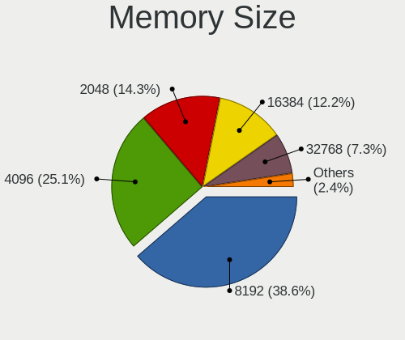

| Size  | Computers | Percent |
|-------|-----------|---------|
| 4096  | 55        | 38.19%  |
| 8192  | 43        | 29.86%  |
| 2048  | 24        | 16.67%  |
| 16384 | 11        | 7.64%   |
| 32768 | 7         | 4.86%   |
| 1024  | 4         | 2.78%   |

Memory Speed
------------

Memory module speed

| Speed   | Computers | Percent |
|---------|-----------|---------|
| 1600    | 36        | 25%     |
| 2667    | 19        | 13.19%  |
| 3200    | 16        | 11.11%  |
| 1334    | 12        | 8.33%   |
| 1333    | 12        | 8.33%   |
| 2400    | 10        | 6.94%   |
| 2133    | 7         | 4.86%   |
| 800     | 5         | 3.47%   |
| Unknown | 5         | 3.47%   |
| 1067    | 4         | 2.78%   |
| 3600    | 3         | 2.08%   |
| 667     | 3         | 2.08%   |
| 1867    | 2         | 1.39%   |
| 1066    | 2         | 1.39%   |
| 4267    | 1         | 0.69%   |
| 3400    | 1         | 0.69%   |
| 3266    | 1         | 0.69%   |
| 3000    | 1         | 0.69%   |
| 2933    | 1         | 0.69%   |
| 2048    | 1         | 0.69%   |
| 1866    | 1         | 0.69%   |
| 1800    | 1         | 0.69%   |

Printers & scanners
-------------------

Printer Vendor
--------------

Printer device vendors

| Vendor              | Computers | Percent |
|---------------------|-----------|---------|
| Seiko Epson         | 3         | 27.27%  |
| Samsung Electronics | 2         | 18.18%  |
| Canon               | 2         | 18.18%  |
| Brother Industries  | 2         | 18.18%  |
| Prolific Technology | 1         | 9.09%   |
| Hewlett-Packard     | 1         | 9.09%   |

Printer Model
-------------

Printer device models

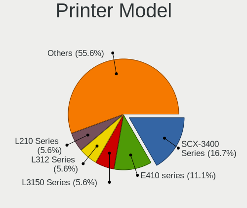

| Model                         | Computers | Percent |
|-------------------------------|-----------|---------|
| Samsung SCX-3400 Series       | 2         | 18.18%  |
| Seiko Epson L3150 Series      | 1         | 9.09%   |
| Seiko Epson L312 Series       | 1         | 9.09%   |
| Seiko Epson L210 Series       | 1         | 9.09%   |
| Prolific PL2305 Parallel Port | 1         | 9.09%   |
| HP Ink Tank 110 series        | 1         | 9.09%   |
| Canon LBP6030/6030B/6018L     | 1         | 9.09%   |
| Canon E410 series             | 1         | 9.09%   |
| Brother DCP-J105              | 1         | 9.09%   |
| Brother DCP-1610W             | 1         | 9.09%   |

Scanner Vendor
--------------

Scanner device vendors

Zero info for selected period =(

Scanner Model
-------------

Scanner device models

Zero info for selected period =(

Camera
------

Camera Vendor
-------------

Camera device vendors

| Vendor                                 | Computers | Percent |
|----------------------------------------|-----------|---------|
| Chicony Electronics                    | 29        | 17.58%  |
| Microdia                               | 18        | 10.91%  |
| Realtek Semiconductor                  | 15        | 9.09%   |
| IMC Networks                           | 15        | 9.09%   |
| Suyin                                  | 11        | 6.67%   |
| Sunplus Innovation Technology          | 11        | 6.67%   |
| Acer                                   | 11        | 6.67%   |
| Apple                                  | 9         | 5.45%   |
| Logitech                               | 7         | 4.24%   |
| Generalplus Technology                 | 6         | 3.64%   |
| Cheng Uei Precision Industry (Foxlink) | 6         | 3.64%   |
| Quanta                                 | 4         | 2.42%   |
| Alcor Micro                            | 4         | 2.42%   |
| YGTek                                  | 2         | 1.21%   |
| Syntek                                 | 2         | 1.21%   |
| Luxvisions Innotech Limited            | 2         | 1.21%   |
| Lite-On Technology                     | 2         | 1.21%   |
| Z-Star Microelectronics                | 1         | 0.61%   |
| WCM_USB                                | 1         | 0.61%   |
| Samsung Electronics                    | 1         | 0.61%   |
| Ricoh                                  | 1         | 0.61%   |
| Primax Electronics                     | 1         | 0.61%   |
| OmniVision Technologies                | 1         | 0.61%   |
| Lenovo                                 | 1         | 0.61%   |
| Jieli Technology                       | 1         | 0.61%   |
| icSpring                               | 1         | 0.61%   |
| Cubeternet                             | 1         | 0.61%   |
| ARC International                      | 1         | 0.61%   |

Camera Model
------------

Camera device models

| Model                                                   | Computers | Percent |
|---------------------------------------------------------|-----------|---------|
| Microdia Integrated_Webcam_HD                           | 8         | 4.85%   |
| Chicony USB2.0 VGA UVC WebCam                           | 6         | 3.64%   |
| Sunplus Integrated_Webcam_HD                            | 4         | 2.42%   |
| IMC Networks USB2.0 HD UVC WebCam                       | 4         | 2.42%   |
| Generalplus WEB CAM                                     | 4         | 2.42%   |
| Chicony HD WebCam                                       | 4         | 2.42%   |
| Realtek Integrated_Webcam_HD                            | 3         | 1.82%   |
| Logitech HD Pro Webcam C920                             | 3         | 1.82%   |
| IMC Networks USB2.0 UVC HD Webcam                       | 3         | 1.82%   |
| Chicony USB2.0 HD UVC WebCam                            | 3         | 1.82%   |
| Chicony HP HD Webcam                                    | 3         | 1.82%   |
| Cheng Uei Precision Industry (Foxlink) HP TrueVision HD | 3         | 1.82%   |
| Apple FaceTime HD Camera                                | 3         | 1.82%   |
| Acer Lenovo Integrated Webcam                           | 3         | 1.82%   |
| YGTek Webcam                                            | 2         | 1.21%   |
| Suyin Laptop_Integrated_Webcam_HD                       | 2         | 1.21%   |
| Suyin Acer/HP Integrated Webcam [CN0314]                | 2         | 1.21%   |
| Suyin 1.3M HD WebCam                                    | 2         | 1.21%   |
| Sunplus HP HD Webcam [Fixed]                            | 2         | 1.21%   |
| Realtek USB Camera                                      | 2         | 1.21%   |
| Realtek HD WebCam                                       | 2         | 1.21%   |
| Quanta HP TrueVision HD Camera                          | 2         | 1.21%   |
| Microdia USB 2.0 Camera                                 | 2         | 1.21%   |
| Microdia Laptop_Integrated_Webcam_HD                    | 2         | 1.21%   |
| Luxvisions Innotech Limited HP TrueVision HD Camera     | 2         | 1.21%   |
| IMC Networks Integrated Camera                          | 2         | 1.21%   |
| Generalplus 808 Camera                                  | 2         | 1.21%   |
| Chicony Integrated Camera (1280x720@30)                 | 2         | 1.21%   |
| Chicony Integrated Camera                               | 2         | 1.21%   |
| Apple iPhone 5/5C/5S/6/SE                               | 2         | 1.21%   |
| Apple Built-in iSight                                   | 2         | 1.21%   |
| Alcor Micro Asus Integrated Webcam                      | 2         | 1.21%   |
| Acer EasyCamera                                         | 2         | 1.21%   |
| Acer BisonCam,NB Pro                                    | 2         | 1.21%   |
| Z-Star Sirius USB2.0 Camera                             | 1         | 0.61%   |
| WCM_USB WEB CAM                                         | 1         | 0.61%   |
| Syntek Lenovo EasyCamera                                | 1         | 0.61%   |
| Syntek Laptop_Integrated_Webcam_1.3M                    | 1         | 0.61%   |
| Suyin WebCam                                            | 1         | 0.61%   |
| Suyin Integrated Webcam                                 | 1         | 0.61%   |
| Suyin HP Webcam-101                                     | 1         | 0.61%   |
| Suyin HP Webcam 101                                     | 1         | 0.61%   |
| Suyin HP Truevision HD                                  | 1         | 0.61%   |
| Sunplus Laptop Integrated Webcam HD                     | 1         | 0.61%   |
| Sunplus Laptop Integrated Webcam FHD                    | 1         | 0.61%   |
| Sunplus Integrated_Webcam_FHD                           | 1         | 0.61%   |
| Sunplus Full HD webcam                                  | 1         | 0.61%   |
| Sunplus Dell HD Webcam                                  | 1         | 0.61%   |
| Samsung Galaxy A5 (MTP)                                 | 1         | 0.61%   |
| Ricoh Sony Vaio Integrated Webcam                       | 1         | 0.61%   |
| Realtek USB2.0 HD UVC WebCam                            | 1         | 0.61%   |
| Realtek USB HD Webcam                                   | 1         | 0.61%   |
| Realtek MTD camera                                      | 1         | 0.61%   |
| Realtek Lenovo EasyCamera                               | 1         | 0.61%   |
| Realtek Integrated Webcam_HD                            | 1         | 0.61%   |
| Realtek HP Truevision HD                                | 1         | 0.61%   |
| Realtek HP High Definition 1MP Webcam                   | 1         | 0.61%   |
| Realtek Acer 640 x 480 laptop camera                    | 1         | 0.61%   |
| Quanta HP Wide Vision HD Camera                         | 1         | 0.61%   |
| Quanta HD User Facing                                   | 1         | 0.61%   |

Security
--------

Fingerprint Vendor
------------------

Fingerprint sensor vendors

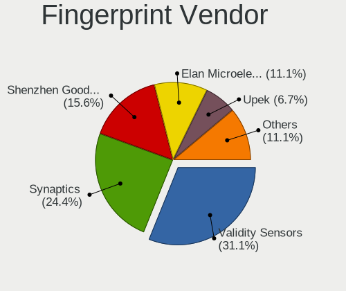

| Vendor                     | Computers | Percent |
|----------------------------|-----------|---------|
| Validity Sensors           | 7         | 28%     |
| Shenzhen Goodix Technology | 5         | 20%     |
| Synaptics                  | 3         | 12%     |
| Elan Microelectronics      | 3         | 12%     |
| AuthenTec                  | 3         | 12%     |
| Upek                       | 2         | 8%      |
| LighTuning Technology      | 1         | 4%      |
| Focal-systems.Corp         | 1         | 4%      |

Fingerprint Model
-----------------

Fingerprint sensor models

| Model                                                       | Computers | Percent |
|-------------------------------------------------------------|-----------|---------|
| Shenzhen Goodix Fingerprint Reader                          | 3         | 12%     |
| Upek Biometric Touchchip/Touchstrip Fingerprint Sensor      | 2         | 8%      |
| Elan ELAN:ARM-M4                                            | 2         | 8%      |
| Validity Sensors VFS495 Fingerprint Reader                  | 1         | 4%      |
| Validity Sensors VFS491                                     | 1         | 4%      |
| Validity Sensors VFS471 Fingerprint Reader                  | 1         | 4%      |
| Validity Sensors VFS451 Fingerprint Reader                  | 1         | 4%      |
| Validity Sensors VFS 5011 fingerprint sensor                | 1         | 4%      |
| Validity Sensors Synaptics VFS7552 Touch Fingerprint Sensor | 1         | 4%      |
| Validity Sensors Fingerprint scanner                        | 1         | 4%      |
| Synaptics  WBDI                                             | 1         | 4%      |
| Synaptics Metallica MOH Touch Fingerprint Reader            | 1         | 4%      |
| Shenzhen Goodix  Fingerprint Device                         | 1         | 4%      |
| Shenzhen Goodix FingerPrint                                 | 1         | 4%      |
| LighTuning EgisTec Touch Fingerprint Sensor                 | 1         | 4%      |
| Focal-systems.Corp FT9201Fingerprint.                       | 1         | 4%      |
| Elan ELAN:Fingerprint                                       | 1         | 4%      |
| AuthenTec Fingerprint Sensor                                | 1         | 4%      |
| AuthenTec AES2550 Fingerprint Sensor                        | 1         | 4%      |
| AuthenTec AES1660 Fingerprint Sensor                        | 1         | 4%      |
| Unknown                                                     | 1         | 4%      |

Chipcard Vendor
---------------

Chipcard module vendors

| Vendor      | Computers | Percent |
|-------------|-----------|---------|
| Broadcom    | 4         | 66.67%  |
| O2 Micro    | 1         | 16.67%  |
| Alcor Micro | 1         | 16.67%  |

Chipcard Model
--------------

Chipcard module models

| Model                                                                        | Computers | Percent |
|------------------------------------------------------------------------------|-----------|---------|
| Broadcom BCM5880 Secure Applications Processor                               | 2         | 33.33%  |
| O2 Micro OZ776 CCID Smartcard Reader                                         | 1         | 16.67%  |
| Broadcom BCM5880 Secure Applications Processor with fingerprint swipe sensor | 1         | 16.67%  |
| Broadcom 5880                                                                | 1         | 16.67%  |
| Alcor Micro AU9540 Smartcard Reader                                          | 1         | 16.67%  |

Unsupported
-----------

Unsupported Devices
-------------------

Total unsupported devices on board

| Total | Computers | Percent |
|-------|-----------|---------|
| 0     | 226       | 75.33%  |
| 1     | 62        | 20.67%  |
| 2     | 9         | 3%      |
| 3     | 2         | 0.67%   |
| 4     | 1         | 0.33%   |

Unsupported Device Types
------------------------

Types of unsupported devices

| Type                     | Computers | Percent |
|--------------------------|-----------|---------|
| Fingerprint reader       | 25        | 29.41%  |
| Net/wireless             | 18        | 21.18%  |
| Graphics card            | 13        | 15.29%  |
| Multimedia controller    | 6         | 7.06%   |
| Communication controller | 5         | 5.88%   |
| Chipcard                 | 4         | 4.71%   |
| Unassigned class         | 3         | 3.53%   |
| Bluetooth                | 3         | 3.53%   |
| Storage/ide              | 2         | 2.35%   |
| Storage                  | 2         | 2.35%   |
| Sound                    | 1         | 1.18%   |
| Network                  | 1         | 1.18%   |
| Net/ethernet             | 1         | 1.18%   |
| Card reader              | 1         | 1.18%   |

