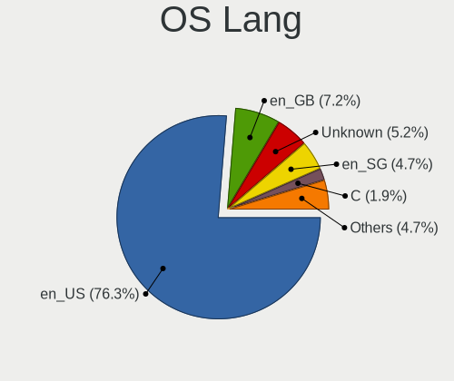
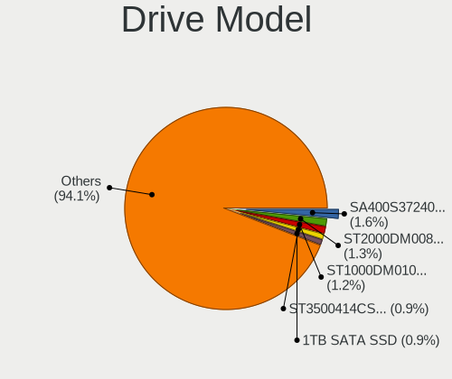
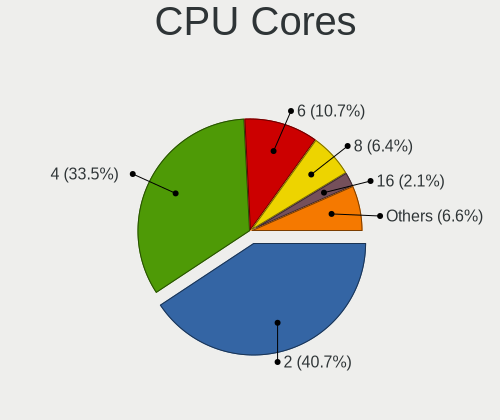
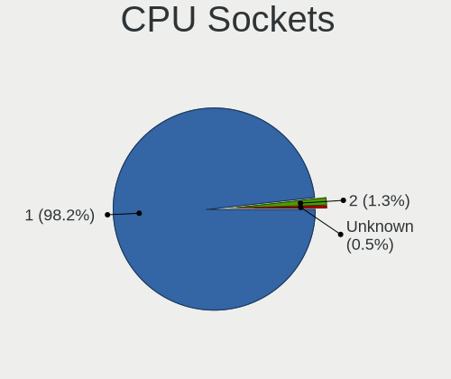
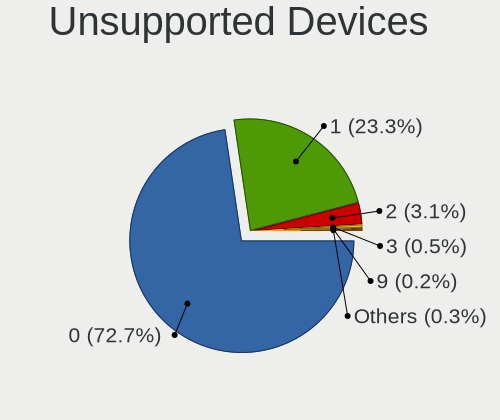

Linux in Malaysia - Tested Hardware & Statistics
------------------------------------------------

A project to collect tested hardware configurations for Linux in Malaysia.

Anyone can contribute to this report by the [hw-probe](https://github.com/linuxhw/hw-probe) tool:

    sudo -E hw-probe -all -upload

Please contribute! Especially if your hardware is rare.

This is a report for all computer types. See also reports for [desktops](/Location/Malaysia/Desktop/README.md) and [notebooks](/Location/Malaysia/Notebook/README.md).

Contents
--------

* [ Test Cases ](#test-cases)

* [ System ](#system)
  - [ OS                       ](#os)
  - [ OS Family                ](#os-family)
  - [ Kernel                   ](#kernel)
  - [ Kernel Family            ](#kernel-family)
  - [ Kernel Major Ver.        ](#kernel-major-ver)
  - [ Arch                     ](#arch)
  - [ DE                       ](#de)
  - [ Display Server           ](#display-server)
  - [ Display Manager          ](#display-manager)
  - [ OS Lang                  ](#os-lang)
  - [ Boot Mode                ](#boot-mode)
  - [ Filesystem               ](#filesystem)
  - [ Part. scheme             ](#part-scheme)
  - [ Dual Boot with Linux/BSD ](#dual-boot-with-linuxbsd)
  - [ Dual Boot (Win)          ](#dual-boot-win)

* [ Board ](#board)
  - [ Vendor                   ](#vendor)
  - [ Model                    ](#model)
  - [ Model Family             ](#model-family)
  - [ MFG Year                 ](#mfg-year)
  - [ Form Factor              ](#form-factor)
  - [ Secure Boot              ](#secure-boot)
  - [ Coreboot                 ](#coreboot)
  - [ RAM Size                 ](#ram-size)
  - [ RAM Used                 ](#ram-used)
  - [ Total Drives             ](#total-drives)
  - [ Has CD-ROM               ](#has-cd-rom)
  - [ Has Ethernet             ](#has-ethernet)
  - [ Has WiFi                 ](#has-wifi)
  - [ Has Bluetooth            ](#has-bluetooth)

* [ Location ](#location)
  - [ Country                  ](#country)
  - [ City                     ](#city)

* [ Drives ](#drives)
  - [ Drive Vendor             ](#drive-vendor)
  - [ Drive Model              ](#drive-model)
  - [ HDD Vendor               ](#hdd-vendor)
  - [ SSD Vendor               ](#ssd-vendor)
  - [ Drive Kind               ](#drive-kind)
  - [ Drive Connector          ](#drive-connector)
  - [ Drive Size               ](#drive-size)
  - [ Space Total              ](#space-total)
  - [ Space Used               ](#space-used)
  - [ Malfunc. Drives          ](#malfunc-drives)
  - [ Malfunc. Drive Vendor    ](#malfunc-drive-vendor)
  - [ Malfunc. HDD Vendor      ](#malfunc-hdd-vendor)
  - [ Malfunc. Drive Kind      ](#malfunc-drive-kind)
  - [ Failed Drives            ](#failed-drives)
  - [ Failed Drive Vendor      ](#failed-drive-vendor)
  - [ Drive Status             ](#drive-status)

* [ Storage controller ](#storage-controller)
  - [ Storage Vendor           ](#storage-vendor)
  - [ Storage Model            ](#storage-model)
  - [ Storage Kind             ](#storage-kind)

* [ Processor ](#processor)
  - [ CPU Vendor               ](#cpu-vendor)
  - [ CPU Model                ](#cpu-model)
  - [ CPU Model Family         ](#cpu-model-family)
  - [ CPU Cores                ](#cpu-cores)
  - [ CPU Sockets              ](#cpu-sockets)
  - [ CPU Threads              ](#cpu-threads)
  - [ CPU Op-Modes             ](#cpu-op-modes)
  - [ CPU Microcode            ](#cpu-microcode)
  - [ CPU Microarch            ](#cpu-microarch)

* [ Graphics ](#graphics)
  - [ GPU Vendor               ](#gpu-vendor)
  - [ GPU Model                ](#gpu-model)
  - [ GPU Combo                ](#gpu-combo)
  - [ GPU Driver               ](#gpu-driver)
  - [ GPU Memory               ](#gpu-memory)

* [ Monitor ](#monitor)
  - [ Monitor Vendor           ](#monitor-vendor)
  - [ Monitor Model            ](#monitor-model)
  - [ Monitor Resolution       ](#monitor-resolution)
  - [ Monitor Diagonal         ](#monitor-diagonal)
  - [ Monitor Width            ](#monitor-width)
  - [ Aspect Ratio             ](#aspect-ratio)
  - [ Monitor Area             ](#monitor-area)
  - [ Pixel Density            ](#pixel-density)
  - [ Multiple Monitors        ](#multiple-monitors)

* [ Network ](#network)
  - [ Net Controller Vendor    ](#net-controller-vendor)
  - [ Net Controller Model     ](#net-controller-model)
  - [ Wireless Vendor          ](#wireless-vendor)
  - [ Wireless Model           ](#wireless-model)
  - [ Ethernet Vendor          ](#ethernet-vendor)
  - [ Ethernet Model           ](#ethernet-model)
  - [ Net Controller Kind      ](#net-controller-kind)
  - [ Used Controller          ](#used-controller)
  - [ NICs                     ](#nics)
  - [ IPv6                     ](#ipv6)

* [ Bluetooth ](#bluetooth)
  - [ Bluetooth Vendor         ](#bluetooth-vendor)
  - [ Bluetooth Model          ](#bluetooth-model)

* [ Sound ](#sound)
  - [ Sound Vendor             ](#sound-vendor)
  - [ Sound Model              ](#sound-model)

* [ Memory ](#memory)
  - [ Memory Vendor            ](#memory-vendor)
  - [ Memory Model             ](#memory-model)
  - [ Memory Kind              ](#memory-kind)
  - [ Memory Form Factor       ](#memory-form-factor)
  - [ Memory Size              ](#memory-size)
  - [ Memory Speed             ](#memory-speed)

* [ Printers & scanners ](#printers--scanners)
  - [ Printer Vendor           ](#printer-vendor)
  - [ Printer Model            ](#printer-model)
  - [ Scanner Vendor           ](#scanner-vendor)
  - [ Scanner Model            ](#scanner-model)

* [ Camera ](#camera)
  - [ Camera Vendor            ](#camera-vendor)
  - [ Camera Model             ](#camera-model)

* [ Security ](#security)
  - [ Fingerprint Vendor       ](#fingerprint-vendor)
  - [ Fingerprint Model        ](#fingerprint-model)
  - [ Chipcard Vendor          ](#chipcard-vendor)
  - [ Chipcard Model           ](#chipcard-model)

* [ Unsupported ](#unsupported)
  - [ Unsupported Devices      ](#unsupported-devices)
  - [ Unsupported Device Types ](#unsupported-device-types)

Test Cases
----------

Total: 734

| Vendor        | Model                       | Form-Factor | Probe                                                      | Date         |
|---------------|-----------------------------|-------------|------------------------------------------------------------|--------------|
| Dell          | Latitude E5510              | Notebook    | [379ebf6111](https://linux-hardware.org/?probe=379ebf6111) | Dec 23, 2023 |
| Dell          | 04Y8V0 A02                  | Desktop     | [1c3e40ac13](https://linux-hardware.org/?probe=1c3e40ac13) | Dec 23, 2023 |
| MSI           | MS-7388                     | Desktop     | [5027d4b8ed](https://linux-hardware.org/?probe=5027d4b8ed) | Dec 23, 2023 |
| Sony          | VPCEG18FG                   | Notebook    | [e1b5fa6cac](https://linux-hardware.org/?probe=e1b5fa6cac) | Dec 15, 2023 |
| Sony          | VPCEG18FG                   | Notebook    | [3cf20aa9ea](https://linux-hardware.org/?probe=3cf20aa9ea) | Dec 14, 2023 |
| ASUSTek       | VivoBook_ASUSLaptop X150... | Notebook    | [68e68f1683](https://linux-hardware.org/?probe=68e68f1683) | Dec 13, 2023 |
| HP            | 2129                        | Desktop     | [3a95965680](https://linux-hardware.org/?probe=3a95965680) | Dec 13, 2023 |
| Dell          | Latitude E5510              | Notebook    | [1e0f4dcd24](https://linux-hardware.org/?probe=1e0f4dcd24) | Dec 13, 2023 |
| Dell          | Latitude E5510              | Notebook    | [a980a75837](https://linux-hardware.org/?probe=a980a75837) | Dec 12, 2023 |
| Acer          | AOD257                      | Notebook    | [79c121ca0e](https://linux-hardware.org/?probe=79c121ca0e) | Dec 09, 2023 |
| Acer          | AOD257                      | Notebook    | [c817dc5cca](https://linux-hardware.org/?probe=c817dc5cca) | Dec 08, 2023 |
| Lenovo        | V14 G2 ALC 82KC             | Notebook    | [31de30cc0e](https://linux-hardware.org/?probe=31de30cc0e) | Dec 06, 2023 |
| Fujitsu       | LIFEBOOK UH554              | Notebook    | [cfdc07bd6d](https://linux-hardware.org/?probe=cfdc07bd6d) | Dec 05, 2023 |
| HP            | EliteBook 2740p             | Notebook    | [796859e80e](https://linux-hardware.org/?probe=796859e80e) | Dec 05, 2023 |
| Lenovo        | G480                        | Notebook    | [e82d31d252](https://linux-hardware.org/?probe=e82d31d252) | Dec 05, 2023 |
| HP            | EliteBook 2740p             | Notebook    | [d6e3212623](https://linux-hardware.org/?probe=d6e3212623) | Dec 02, 2023 |
| Valve         | Jupiter                     | Notebook    | [e5546145aa](https://linux-hardware.org/?probe=e5546145aa) | Dec 02, 2023 |
| ILLEGEAR      | RAVEN SE                    | Notebook    | [3248206a01](https://linux-hardware.org/?probe=3248206a01) | Nov 30, 2023 |
| ILLEGEAR      | RAVEN SE                    | Notebook    | [f3b42d14f6](https://linux-hardware.org/?probe=f3b42d14f6) | Nov 30, 2023 |
| HP            | Pavilion Gaming Laptop 1... | Notebook    | [11d4048dc9](https://linux-hardware.org/?probe=11d4048dc9) | Nov 28, 2023 |
| Samsung       | RV413/RV513                 | Notebook    | [42fb4ae911](https://linux-hardware.org/?probe=42fb4ae911) | Nov 28, 2023 |
| Lenovo        | ThinkPad T450 20BUS0390B    | Notebook    | [9b37545fa9](https://linux-hardware.org/?probe=9b37545fa9) | Nov 28, 2023 |
| Dell          | Latitude E5510              | Notebook    | [5f68594a94](https://linux-hardware.org/?probe=5f68594a94) | Nov 28, 2023 |
| Intel         | H61                         | Desktop     | [97a16fcd1b](https://linux-hardware.org/?probe=97a16fcd1b) | Nov 27, 2023 |
| Gigabyte      | H410M S2 V2                 | Desktop     | [c6955988fb](https://linux-hardware.org/?probe=c6955988fb) | Nov 25, 2023 |
| IBM           | ThinkPad T42 2374GB1        | Notebook    | [455a2c937b](https://linux-hardware.org/?probe=455a2c937b) | Nov 19, 2023 |
| Lenovo        | 30C7 SDK0K13468 WIN 3273... | Desktop     | [27b54b9945](https://linux-hardware.org/?probe=27b54b9945) | Nov 19, 2023 |
| Lenovo        | ThinkPad Edge 03282XA       | Notebook    | [c46ed26c69](https://linux-hardware.org/?probe=c46ed26c69) | Nov 18, 2023 |
| ASUSTek       | ASUS TUF Dash F15 FX516P... | Notebook    | [98f59c07de](https://linux-hardware.org/?probe=98f59c07de) | Nov 16, 2023 |
| ASUSTek       | ASUS TUF Dash F15 FX516P... | Notebook    | [386450b69c](https://linux-hardware.org/?probe=386450b69c) | Nov 15, 2023 |
| ASRock        | B550 Pro4                   | Desktop     | [1063cc1572](https://linux-hardware.org/?probe=1063cc1572) | Nov 15, 2023 |
| ASRock        | B550 Pro4                   | Desktop     | [8ee2dc1361](https://linux-hardware.org/?probe=8ee2dc1361) | Nov 15, 2023 |
| ASUSTek       | ROG STRIX X670E-E GAMING... | Desktop     | [6ff4b2ddd5](https://linux-hardware.org/?probe=6ff4b2ddd5) | Nov 15, 2023 |
| Gigabyte      | B550 AORUS PRO V2           | Desktop     | [e8e0ef7485](https://linux-hardware.org/?probe=e8e0ef7485) | Nov 15, 2023 |
| Xiaomi        | Technologies, Inc. Polar... | Phone       | [83199a2c2d](https://linux-hardware.org/?probe=83199a2c2d) | Nov 13, 2023 |
| Dell          | Latitude E7250              | Notebook    | [265c13751a](https://linux-hardware.org/?probe=265c13751a) | Nov 10, 2023 |
| Toshiba       | Satellite L745              | Notebook    | [4dbd78f68d](https://linux-hardware.org/?probe=4dbd78f68d) | Nov 09, 2023 |
| Raspberry ... | Raspberry Pi 3 Model B R... | Soc         | [31c6154826](https://linux-hardware.org/?probe=31c6154826) | Nov 08, 2023 |
| HP            | Pavilion Notebook           | Notebook    | [8cf5696a9e](https://linux-hardware.org/?probe=8cf5696a9e) | Nov 07, 2023 |
| Toshiba       | Satellite L745              | Notebook    | [c126c9e041](https://linux-hardware.org/?probe=c126c9e041) | Oct 27, 2023 |
| Unknown       | Unknown                     | Desktop     | [49baeb0911](https://linux-hardware.org/?probe=49baeb0911) | Oct 25, 2023 |
| Unknown       | Unknown                     | Desktop     | [03fbe0b1a4](https://linux-hardware.org/?probe=03fbe0b1a4) | Oct 24, 2023 |
| ECS           | G31T-M7                     | Desktop     | [297db99cc3](https://linux-hardware.org/?probe=297db99cc3) | Oct 20, 2023 |
| HP            | Compaq Presario CQ40        | Notebook    | [5ddf61741f](https://linux-hardware.org/?probe=5ddf61741f) | Oct 20, 2023 |
| ASRock        | B550 Pro4                   | Desktop     | [0d55c2a6af](https://linux-hardware.org/?probe=0d55c2a6af) | Oct 20, 2023 |
| Dell          | 0WWR83 A04                  | Server      | [e0d564d8c4](https://linux-hardware.org/?probe=e0d564d8c4) | Oct 17, 2023 |
| Gigabyte      | X670 AORUS ELITE AX         | Desktop     | [67365133d9](https://linux-hardware.org/?probe=67365133d9) | Oct 17, 2023 |
| Acer          | Aspire VN7-592G             | Notebook    | [13b64fc9bd](https://linux-hardware.org/?probe=13b64fc9bd) | Oct 15, 2023 |
| HP            | Compaq Presario CQ40        | Notebook    | [f6373646f3](https://linux-hardware.org/?probe=f6373646f3) | Oct 14, 2023 |
| ASUSTek       | PRIME B560M-K               | Desktop     | [954eecec42](https://linux-hardware.org/?probe=954eecec42) | Oct 09, 2023 |
| ASUSTek       | ROG STRIX X670E-E GAMING... | Desktop     | [5295ac09d9](https://linux-hardware.org/?probe=5295ac09d9) | Oct 06, 2023 |
| HP            | ElitePad 1000 G2            | Notebook    | [fcfe482832](https://linux-hardware.org/?probe=fcfe482832) | Oct 04, 2023 |
| Lenovo        | ThinkPad P50 20EQS0T52R     | Notebook    | [39983ac5b1](https://linux-hardware.org/?probe=39983ac5b1) | Oct 04, 2023 |
| ASUSTek       | PRIME B560M-K               | Desktop     | [ee02fff8df](https://linux-hardware.org/?probe=ee02fff8df) | Sep 28, 2023 |
| Gigabyte      | B550 AORUS PRO V2           | Desktop     | [273b056209](https://linux-hardware.org/?probe=273b056209) | Sep 25, 2023 |
| Dell          | Latitude E7450              | Notebook    | [6ba017a802](https://linux-hardware.org/?probe=6ba017a802) | Sep 23, 2023 |
| MSI           | MS-7388                     | Desktop     | [f5ee235af0](https://linux-hardware.org/?probe=f5ee235af0) | Sep 23, 2023 |
| Lenovo        | ThinkPad L380 Yoga 20M8S... | Convertible | [e935ac4c0a](https://linux-hardware.org/?probe=e935ac4c0a) | Sep 22, 2023 |
| Lenovo        | ThinkPad E480 20KNS0MM00    | Notebook    | [ef56d33374](https://linux-hardware.org/?probe=ef56d33374) | Sep 19, 2023 |
| ASRock        | B550 Pro4                   | Desktop     | [af2217289d](https://linux-hardware.org/?probe=af2217289d) | Sep 19, 2023 |
| MSI           | Modern 14 C11M              | Notebook    | [4c6156df05](https://linux-hardware.org/?probe=4c6156df05) | Sep 18, 2023 |
| Dell          | Latitude E7470              | Notebook    | [8b06be8e07](https://linux-hardware.org/?probe=8b06be8e07) | Sep 18, 2023 |
| Dell          | Latitude E7470              | Notebook    | [c2acf11095](https://linux-hardware.org/?probe=c2acf11095) | Sep 18, 2023 |
| Fujitsu       | LIFEBOOK UH554              | Notebook    | [92f2e6135e](https://linux-hardware.org/?probe=92f2e6135e) | Sep 13, 2023 |
| Acer          | AOD270                      | Notebook    | [d7d4474d69](https://linux-hardware.org/?probe=d7d4474d69) | Sep 11, 2023 |
| Apple         | MacBookPro11,3              | Notebook    | [bfdd099826](https://linux-hardware.org/?probe=bfdd099826) | Sep 06, 2023 |
| HP            | EliteBook 830 G5            | Notebook    | [8a0ad0652e](https://linux-hardware.org/?probe=8a0ad0652e) | Sep 06, 2023 |
| Acer          | Aspire 4738Z                | Notebook    | [88b34596c0](https://linux-hardware.org/?probe=88b34596c0) | Sep 05, 2023 |
| Acer          | Aspire 4741                 | Notebook    | [2f2b673625](https://linux-hardware.org/?probe=2f2b673625) | Sep 04, 2023 |
| ASUSTek       | M5A78L-M LX V2              | Desktop     | [92b5ca6639](https://linux-hardware.org/?probe=92b5ca6639) | Sep 03, 2023 |
| ASUSTek       | PRIME B760M-A WIFI D4       | Desktop     | [f2eccf0aa8](https://linux-hardware.org/?probe=f2eccf0aa8) | Sep 02, 2023 |
| ASRock        | A620M-HDV/M.2+              | Desktop     | [674da4ba95](https://linux-hardware.org/?probe=674da4ba95) | Sep 02, 2023 |
| Gigabyte      | B85M-D3H                    | Desktop     | [4660dc9f99](https://linux-hardware.org/?probe=4660dc9f99) | Sep 01, 2023 |
| Dell          | Inspiron 15 3511            | Notebook    | [d53deba94a](https://linux-hardware.org/?probe=d53deba94a) | Aug 31, 2023 |
| Lenovo        | ThinkPad X201 36809D4       | Notebook    | [1e4311af0b](https://linux-hardware.org/?probe=1e4311af0b) | Aug 28, 2023 |
| ECS           | G31T-M7                     | Desktop     | [f095887170](https://linux-hardware.org/?probe=f095887170) | Aug 28, 2023 |
| Dell          | Latitude 5580               | Notebook    | [eb2a994e98](https://linux-hardware.org/?probe=eb2a994e98) | Aug 28, 2023 |
| Acer          | Aspire 4810T                | Notebook    | [4e72e77dc6](https://linux-hardware.org/?probe=4e72e77dc6) | Aug 27, 2023 |
| MSI           | MS-7388                     | Desktop     | [42530086f2](https://linux-hardware.org/?probe=42530086f2) | Aug 27, 2023 |
| Dell          | 04Y8V0 A02                  | Desktop     | [629b07f8bc](https://linux-hardware.org/?probe=629b07f8bc) | Aug 27, 2023 |
| MSI           | MS-7388                     | Desktop     | [5c1e4b0c2b](https://linux-hardware.org/?probe=5c1e4b0c2b) | Aug 25, 2023 |
| ASUSTek       | ROG Strix G532LWS_G532LW... | Notebook    | [d28f06dcc5](https://linux-hardware.org/?probe=d28f06dcc5) | Aug 25, 2023 |
| Intel         | X99                         | Desktop     | [785fcd2a1d](https://linux-hardware.org/?probe=785fcd2a1d) | Aug 21, 2023 |
| Intel         | X99                         | Desktop     | [b54ecfbbc3](https://linux-hardware.org/?probe=b54ecfbbc3) | Aug 21, 2023 |
| MSI           | PRO B760M-A WIFI DDR4       | Desktop     | [109c0dbb17](https://linux-hardware.org/?probe=109c0dbb17) | Aug 20, 2023 |
| Acer          | Veriton M2611G v1.0         | Desktop     | [1527c20b46](https://linux-hardware.org/?probe=1527c20b46) | Aug 19, 2023 |
| HP            | Notebook                    | Notebook    | [dd8c90afbe](https://linux-hardware.org/?probe=dd8c90afbe) | Aug 16, 2023 |
| HP            | EliteBook 2740p             | Notebook    | [b288a65e53](https://linux-hardware.org/?probe=b288a65e53) | Aug 16, 2023 |
| Intel         | S1200SP H57532-210          | Server      | [65dc0edd69](https://linux-hardware.org/?probe=65dc0edd69) | Aug 14, 2023 |
| ECS           | G31T-M7                     | Desktop     | [2d35b5e140](https://linux-hardware.org/?probe=2d35b5e140) | Aug 14, 2023 |
| Gigabyte      | H410M S2 V2                 | Desktop     | [d4c5a12d06](https://linux-hardware.org/?probe=d4c5a12d06) | Aug 10, 2023 |
| Dell          | 0WR7PY A03                  | Desktop     | [becf318878](https://linux-hardware.org/?probe=becf318878) | Aug 07, 2023 |
| ASUSTek       | VivoBook_ASUSLaptop X409... | Notebook    | [1b9794e2e3](https://linux-hardware.org/?probe=1b9794e2e3) | Aug 06, 2023 |
| Gigabyte      | G31M-S2C                    | Desktop     | [9cda5ca576](https://linux-hardware.org/?probe=9cda5ca576) | Aug 05, 2023 |
| HP            | OMEN by Laptop              | Notebook    | [78566a197e](https://linux-hardware.org/?probe=78566a197e) | Aug 05, 2023 |
| ASUSTek       | P5G41T-M LX3                | Desktop     | [f82f03bf86](https://linux-hardware.org/?probe=f82f03bf86) | Aug 04, 2023 |
| Apple         | MacBookAir5,2               | Notebook    | [1a77aeef9d](https://linux-hardware.org/?probe=1a77aeef9d) | Jul 30, 2023 |
| Apple         | MacBookAir5,2               | Notebook    | [a6e35103c8](https://linux-hardware.org/?probe=a6e35103c8) | Jul 30, 2023 |
| ASUSTek       | P5G41T-M LX3                | Desktop     | [356e8a0637](https://linux-hardware.org/?probe=356e8a0637) | Jul 28, 2023 |
| Raspberry ... | Raspberry Pi Zero Rev 1.... | Soc         | [dcab108dc9](https://linux-hardware.org/?probe=dcab108dc9) | Jul 27, 2023 |
| Raspberry ... | Raspberry Pi Zero Rev 1.... | Soc         | [7d14afe547](https://linux-hardware.org/?probe=7d14afe547) | Jul 26, 2023 |
| Raspberry ... | Raspberry Pi Zero 2 W Re... | Soc         | [c7373023dd](https://linux-hardware.org/?probe=c7373023dd) | Jul 26, 2023 |
| HP            | Laptop 14-bs0xx             | Notebook    | [e074ee90be](https://linux-hardware.org/?probe=e074ee90be) | Jul 25, 2023 |
| Gigabyte      | B450M S2H                   | Desktop     | [f2f1f87d0c](https://linux-hardware.org/?probe=f2f1f87d0c) | Jul 23, 2023 |
| ASUSTek       | VivoBook_ASUSLaptop X531... | Notebook    | [fee4019ae0](https://linux-hardware.org/?probe=fee4019ae0) | Jul 22, 2023 |
| Intel         | NUC11PABi5 K90634-302       | Mini pc     | [eb68b04a83](https://linux-hardware.org/?probe=eb68b04a83) | Jul 22, 2023 |
| Lenovo        | MAHOBAY NOK                 | Desktop     | [9b6d9b3e96](https://linux-hardware.org/?probe=9b6d9b3e96) | Jul 21, 2023 |
| MSI           | PRO B660M-E DDR4            | Desktop     | [62aa29ec8e](https://linux-hardware.org/?probe=62aa29ec8e) | Jul 19, 2023 |
| Dell          | 05XKKK A05                  | Server      | [3e627de1a2](https://linux-hardware.org/?probe=3e627de1a2) | Jul 19, 2023 |
| HP            | Spectre x360 2-in-1 Lapt... | Convertible | [556e1f1fd7](https://linux-hardware.org/?probe=556e1f1fd7) | Jul 19, 2023 |
| HP            | ElitePad 1000 G2            | Notebook    | [0878c1fae6](https://linux-hardware.org/?probe=0878c1fae6) | Jul 18, 2023 |
| ASUSTek       | VivoBook_ASUSLaptop X531... | Notebook    | [a8779931a8](https://linux-hardware.org/?probe=a8779931a8) | Jul 18, 2023 |
| MSI           | Z97 GAMING 7                | Desktop     | [28c6cd48b8](https://linux-hardware.org/?probe=28c6cd48b8) | Jul 16, 2023 |
| MSI           | Z97 GAMING 7                | Desktop     | [9ef499d31f](https://linux-hardware.org/?probe=9ef499d31f) | Jul 16, 2023 |
| Unknown       | Unknown                     | Notebook    | [85d7cb63b8](https://linux-hardware.org/?probe=85d7cb63b8) | Jul 16, 2023 |
| Acer          | Veriton X6610G              | Desktop     | [e1189e3406](https://linux-hardware.org/?probe=e1189e3406) | Jul 13, 2023 |
| HP            | Notebook                    | Notebook    | [50376757dd](https://linux-hardware.org/?probe=50376757dd) | Jul 13, 2023 |
| ASRockRack    | ROMED8QM-2T                 | Desktop     | [a4fe5ea9c9](https://linux-hardware.org/?probe=a4fe5ea9c9) | Jul 13, 2023 |
| HP            | OMEN by Laptop              | Notebook    | [87a1bbb5cc](https://linux-hardware.org/?probe=87a1bbb5cc) | Jul 08, 2023 |
| HP            | Laptop 14s-dk0xxx           | Notebook    | [8f01854bc7](https://linux-hardware.org/?probe=8f01854bc7) | Jul 07, 2023 |
| ASUSTek       | P5G41T-M LX3                | Desktop     | [8287d6e8e3](https://linux-hardware.org/?probe=8287d6e8e3) | Jul 04, 2023 |
| Dell          | Latitude E5440              | Notebook    | [03ed0e9ebb](https://linux-hardware.org/?probe=03ed0e9ebb) | Jul 03, 2023 |
| ASUSTek       | VivoBook_ASUSLaptop S540... | Notebook    | [51d003ae6a](https://linux-hardware.org/?probe=51d003ae6a) | Jul 02, 2023 |
| Gigabyte      | A320M-S2H V2-CF             | Desktop     | [18b6484d81](https://linux-hardware.org/?probe=18b6484d81) | Jul 01, 2023 |
| Acer          | Nitro AN515-52              | Notebook    | [3932620fb9](https://linux-hardware.org/?probe=3932620fb9) | Jun 30, 2023 |
| HP            | OMEN by Laptop              | Notebook    | [971852cb38](https://linux-hardware.org/?probe=971852cb38) | Jun 28, 2023 |
| MSI           | A320M PRO-VH                | Desktop     | [1a84c61bd4](https://linux-hardware.org/?probe=1a84c61bd4) | Jun 27, 2023 |
| HP            | 2B2C                        | Desktop     | [a8ec805431](https://linux-hardware.org/?probe=a8ec805431) | Jun 27, 2023 |
| Gigabyte      | B550 AORUS PRO V2           | Desktop     | [1143a7eebc](https://linux-hardware.org/?probe=1143a7eebc) | Jun 27, 2023 |
| Infinix       | INBook X1 Pro               | Notebook    | [a03717af50](https://linux-hardware.org/?probe=a03717af50) | Jun 26, 2023 |
| Lenovo        | ThinkPad T430 34766TT       | Notebook    | [06ad7b4a25](https://linux-hardware.org/?probe=06ad7b4a25) | Jun 26, 2023 |
| HP            | 2B2C                        | Desktop     | [3b82186362](https://linux-hardware.org/?probe=3b82186362) | Jun 26, 2023 |
| Intel         | DH61WW AAG23116-204         | Desktop     | [4269ca2c0b](https://linux-hardware.org/?probe=4269ca2c0b) | Jun 25, 2023 |
| AZW           | GT-R                        | Notebook    | [11f032f354](https://linux-hardware.org/?probe=11f032f354) | Jun 24, 2023 |
| HP            | 2B2C                        | Desktop     | [4303d28839](https://linux-hardware.org/?probe=4303d28839) | Jun 22, 2023 |
| Unknown       | Unknown                     | Phone       | [32b03337ba](https://linux-hardware.org/?probe=32b03337ba) | Jun 19, 2023 |
| Gigabyte      | A320M-S2H V2-CF             | Desktop     | [1623fa6455](https://linux-hardware.org/?probe=1623fa6455) | Jun 11, 2023 |
| MSI           | MS-7388                     | Desktop     | [6d3a406400](https://linux-hardware.org/?probe=6d3a406400) | Jun 10, 2023 |
| Fujitsu       | FMVNA4NE-                   | Notebook    | [59c8fdd841](https://linux-hardware.org/?probe=59c8fdd841) | Jun 08, 2023 |
| Fujitsu       | FMVNA4NE-                   | Notebook    | [626a677331](https://linux-hardware.org/?probe=626a677331) | Jun 06, 2023 |
| Fujitsu       | FMVNA4NE-                   | Notebook    | [b1c1176a5b](https://linux-hardware.org/?probe=b1c1176a5b) | Jun 05, 2023 |
| MSI           | MS-7388                     | Desktop     | [fc12ac6b90](https://linux-hardware.org/?probe=fc12ac6b90) | Jun 02, 2023 |
| ASUSTek       | H81M-K                      | Desktop     | [f65eac842b](https://linux-hardware.org/?probe=f65eac842b) | May 23, 2023 |
| Gigabyte      | H410M S2 V2                 | Desktop     | [9d2439e8d7](https://linux-hardware.org/?probe=9d2439e8d7) | May 18, 2023 |
| Gigabyte      | B450 AORUS ELITE            | Desktop     | [7957c81218](https://linux-hardware.org/?probe=7957c81218) | May 17, 2023 |
| Gigabyte      | B450 AORUS ELITE            | Desktop     | [1aedc7da48](https://linux-hardware.org/?probe=1aedc7da48) | May 17, 2023 |
| Lenovo        | ThinkBook 15p Gen 2 21B1    | Notebook    | [83537861c1](https://linux-hardware.org/?probe=83537861c1) | May 14, 2023 |
| Chuwi         | GemiBook Pro                | Notebook    | [1f22322c4a](https://linux-hardware.org/?probe=1f22322c4a) | May 11, 2023 |
| MSI           | Stealth 14Studio A13VE      | Notebook    | [86f43bbff1](https://linux-hardware.org/?probe=86f43bbff1) | May 10, 2023 |
| Samsung       | 535U3C                      | Notebook    | [5f2e46be0a](https://linux-hardware.org/?probe=5f2e46be0a) | May 05, 2023 |
| MSI           | MS-7388                     | Desktop     | [948e1d2358](https://linux-hardware.org/?probe=948e1d2358) | May 03, 2023 |
| Lenovo        | ThinkBook 15p Gen 2 21B1    | Notebook    | [0a9bdb3cea](https://linux-hardware.org/?probe=0a9bdb3cea) | May 02, 2023 |
| MSI           | MS-7388                     | Desktop     | [ec819aca80](https://linux-hardware.org/?probe=ec819aca80) | May 01, 2023 |
| Gigabyte      | Z77M-D3H                    | Desktop     | [6da1ddcef5](https://linux-hardware.org/?probe=6da1ddcef5) | May 01, 2023 |
| ASUSTek       | X455LJ                      | Notebook    | [4e252eab9f](https://linux-hardware.org/?probe=4e252eab9f) | May 01, 2023 |
| Gigabyte      | Z77M-D3H                    | Desktop     | [a3d2b3dcd3](https://linux-hardware.org/?probe=a3d2b3dcd3) | Apr 30, 2023 |
| HUAWEI        | BOHK-WAX9X                  | Notebook    | [9b560392f5](https://linux-hardware.org/?probe=9b560392f5) | Apr 29, 2023 |
| Gigabyte      | Z77M-D3H                    | Desktop     | [915147a191](https://linux-hardware.org/?probe=915147a191) | Apr 25, 2023 |
| Gigabyte      | Z77M-D3H                    | Desktop     | [92a968e58d](https://linux-hardware.org/?probe=92a968e58d) | Apr 25, 2023 |
| Dell          | 0F373D A00                  | Desktop     | [206de0188d](https://linux-hardware.org/?probe=206de0188d) | Apr 22, 2023 |
| Acer          | Aspire XC-710 V:1.1         | Desktop     | [a09ea158cc](https://linux-hardware.org/?probe=a09ea158cc) | Apr 20, 2023 |
| ASRock        | B550 Pro4                   | Desktop     | [2d4578e52a](https://linux-hardware.org/?probe=2d4578e52a) | Apr 20, 2023 |
| MSI           | MS-7388                     | Desktop     | [4efa2b04da](https://linux-hardware.org/?probe=4efa2b04da) | Apr 14, 2023 |
| Gigabyte      | B550 AORUS PRO V2           | Desktop     | [f4cbe67033](https://linux-hardware.org/?probe=f4cbe67033) | Apr 14, 2023 |
| Lenovo        | IdeaPad 320S-14IKB 81BN     | Notebook    | [c17cfe4d6d](https://linux-hardware.org/?probe=c17cfe4d6d) | Apr 13, 2023 |
| HP            | Notebook                    | Notebook    | [5fc60b1d5f](https://linux-hardware.org/?probe=5fc60b1d5f) | Apr 13, 2023 |
| HP            | ENVY Laptop 15-ep0xxx       | Notebook    | [04eb10296f](https://linux-hardware.org/?probe=04eb10296f) | Apr 13, 2023 |
| Gigabyte      | Z77M-D3H                    | Desktop     | [ffdcd55e2e](https://linux-hardware.org/?probe=ffdcd55e2e) | Apr 13, 2023 |
| MSI           | MS-7388                     | Desktop     | [d7f892b3e2](https://linux-hardware.org/?probe=d7f892b3e2) | Apr 12, 2023 |
| Lenovo        | IdeaPad Gaming 3 15ACH6 ... | Notebook    | [eb03b75c27](https://linux-hardware.org/?probe=eb03b75c27) | Apr 11, 2023 |
| Gigabyte      | Z77M-D3H                    | Desktop     | [d76bd92923](https://linux-hardware.org/?probe=d76bd92923) | Apr 07, 2023 |
| NEC Comput... | PC-VK27MCZCK                | Notebook    | [e9572ebd2e](https://linux-hardware.org/?probe=e9572ebd2e) | Apr 06, 2023 |
| Lenovo        | ThinkPad A485 20MUCTO1WW    | Notebook    | [f64cf6a2ae](https://linux-hardware.org/?probe=f64cf6a2ae) | Apr 02, 2023 |
| MSI           | B450M-A PRO MAX             | Desktop     | [54789b15f3](https://linux-hardware.org/?probe=54789b15f3) | Mar 29, 2023 |
| HP            | ProLiant DL380 G7           | Server      | [798462942d](https://linux-hardware.org/?probe=798462942d) | Mar 25, 2023 |
| ASRockRack    | ROMED8-2T                   | Server      | [eb1d734a53](https://linux-hardware.org/?probe=eb1d734a53) | Mar 25, 2023 |
| ASUSTek       | Pro WS WRX80E-SAGE SE WI... | Desktop     | [b9d321c70e](https://linux-hardware.org/?probe=b9d321c70e) | Mar 25, 2023 |
| Biostar       | G41D3+                      | Desktop     | [ebb9a17568](https://linux-hardware.org/?probe=ebb9a17568) | Mar 23, 2023 |
| Gigabyte      | GA-890GPA-UD3H              | Desktop     | [b54b641b36](https://linux-hardware.org/?probe=b54b641b36) | Mar 14, 2023 |
| ASUSTek       | Pro WS WRX80E-SAGE SE WI... | Desktop     | [5545b43cf0](https://linux-hardware.org/?probe=5545b43cf0) | Mar 13, 2023 |
| ASUSTek       | Pro WS WRX80E-SAGE SE WI... | Desktop     | [0211c6712f](https://linux-hardware.org/?probe=0211c6712f) | Mar 13, 2023 |
| Gigabyte      | X570 UD                     | Desktop     | [839a069bc4](https://linux-hardware.org/?probe=839a069bc4) | Mar 13, 2023 |
| Dell          | 084J0R A00                  | Desktop     | [dcde5e81ed](https://linux-hardware.org/?probe=dcde5e81ed) | Mar 04, 2023 |
| Intel         | DH61WW AAG23116-204         | Desktop     | [c9b32e7136](https://linux-hardware.org/?probe=c9b32e7136) | Mar 03, 2023 |
| Dell          | Latitude 5420               | Notebook    | [b763e54ded](https://linux-hardware.org/?probe=b763e54ded) | Mar 03, 2023 |
| Unknown       | J3160-4L                    | Desktop     | [8089ba23b4](https://linux-hardware.org/?probe=8089ba23b4) | Mar 01, 2023 |
| MSI           | A320M GRENADE               | Desktop     | [1a5ffd0fc4](https://linux-hardware.org/?probe=1a5ffd0fc4) | Mar 01, 2023 |
| Gigabyte      | H370 AORUS GAMING 3-CF      | Desktop     | [59d082bd5f](https://linux-hardware.org/?probe=59d082bd5f) | Feb 26, 2023 |
| ASUSTek       | ZenBook UX462DA             | Convertible | [4f45a3b6bd](https://linux-hardware.org/?probe=4f45a3b6bd) | Feb 25, 2023 |
| Gigabyte      | B550 AORUS PRO V2           | Desktop     | [8f202b88fa](https://linux-hardware.org/?probe=8f202b88fa) | Feb 16, 2023 |
| ASRockRack    | ROMED8-2T                   | Server      | [c812182e32](https://linux-hardware.org/?probe=c812182e32) | Feb 16, 2023 |
| ASRock        | B550 Pro4                   | Desktop     | [9ad890517a](https://linux-hardware.org/?probe=9ad890517a) | Feb 16, 2023 |
| Samsung       | 730U3E/740U3E               | Notebook    | [9763d78500](https://linux-hardware.org/?probe=9763d78500) | Feb 15, 2023 |
| ASUSTek       | B85M-G                      | Desktop     | [c803a7f9e8](https://linux-hardware.org/?probe=c803a7f9e8) | Feb 15, 2023 |
| ASUSTek       | B85M-G                      | Desktop     | [3a660768c0](https://linux-hardware.org/?probe=3a660768c0) | Feb 15, 2023 |
| Dell          | 0MGK50 A02                  | Desktop     | [43bd1ca5e1](https://linux-hardware.org/?probe=43bd1ca5e1) | Feb 15, 2023 |
| Gigabyte      | B550 AORUS PRO V2           | Desktop     | [27fa84ce56](https://linux-hardware.org/?probe=27fa84ce56) | Feb 14, 2023 |
| ASUSTek       | Pro WS WRX80E-SAGE SE WI... | Desktop     | [8895a873ab](https://linux-hardware.org/?probe=8895a873ab) | Feb 14, 2023 |
| ASRockRack    | ROMED8-2T                   | Server      | [0a0e30ba0a](https://linux-hardware.org/?probe=0a0e30ba0a) | Feb 14, 2023 |
| ASUSTek       | Pro WS WRX80E-SAGE SE WI... | Desktop     | [fb00615692](https://linux-hardware.org/?probe=fb00615692) | Feb 14, 2023 |
| Gigabyte      | X570 UD                     | Desktop     | [ae563f7bfe](https://linux-hardware.org/?probe=ae563f7bfe) | Feb 14, 2023 |
| MSI           | 970A-G46                    | Desktop     | [6012e644eb](https://linux-hardware.org/?probe=6012e644eb) | Feb 13, 2023 |
| Samsung       | 730U3E/740U3E               | Notebook    | [91ac69dfa1](https://linux-hardware.org/?probe=91ac69dfa1) | Feb 13, 2023 |
| HP            | 18E4                        | Desktop     | [55972b87dd](https://linux-hardware.org/?probe=55972b87dd) | Feb 11, 2023 |
| HP            | ENVY 4                      | Notebook    | [0344f89eea](https://linux-hardware.org/?probe=0344f89eea) | Feb 07, 2023 |
| Acer          | Nitro AN515-54              | Notebook    | [56e5f689ab](https://linux-hardware.org/?probe=56e5f689ab) | Feb 06, 2023 |
| Lenovo        | ThinkPad E590 20NBCTO1WW    | Notebook    | [5260560c15](https://linux-hardware.org/?probe=5260560c15) | Feb 06, 2023 |
| ASUSTek       | ROG Strix G532LWS_G532LW... | Notebook    | [2d40451b53](https://linux-hardware.org/?probe=2d40451b53) | Feb 06, 2023 |
| Gigabyte      | B560M AORUS ELITE           | Desktop     | [05b252ac05](https://linux-hardware.org/?probe=05b252ac05) | Feb 05, 2023 |
| Gigabyte      | B85M-D3H                    | Desktop     | [903e8715e4](https://linux-hardware.org/?probe=903e8715e4) | Feb 03, 2023 |
| Gigabyte      | B85M-D3H                    | Desktop     | [6013489300](https://linux-hardware.org/?probe=6013489300) | Feb 03, 2023 |
| Dell          | Latitude E6400              | Notebook    | [a195487665](https://linux-hardware.org/?probe=a195487665) | Jan 30, 2023 |
| Lenovo        | ThinkPad T480 20L5000UUS    | Notebook    | [d356c9846a](https://linux-hardware.org/?probe=d356c9846a) | Jan 30, 2023 |
| Gigabyte      | GA-890GPA-UD3H              | Desktop     | [e660f922a4](https://linux-hardware.org/?probe=e660f922a4) | Jan 27, 2023 |
| HP            | ENVY 4                      | Notebook    | [55ee9d4ca9](https://linux-hardware.org/?probe=55ee9d4ca9) | Jan 27, 2023 |
| ASUSTek       | H81M-K                      | Desktop     | [cb932accdb](https://linux-hardware.org/?probe=cb932accdb) | Jan 24, 2023 |
| Lenovo        | ThinkPad T480 20L5000UUS    | Notebook    | [d3e44e2970](https://linux-hardware.org/?probe=d3e44e2970) | Jan 20, 2023 |
| Acidanther... | Mac-CFF7D910A743CAAF iMa... | All in one  | [d16f5ca08a](https://linux-hardware.org/?probe=d16f5ca08a) | Jan 19, 2023 |
| Dell          | Latitude 3410               | Notebook    | [187aebc2cd](https://linux-hardware.org/?probe=187aebc2cd) | Jan 19, 2023 |
| Apple         | Mac-031B6874CF7F642A iMa... | All in one  | [0fe4db1f37](https://linux-hardware.org/?probe=0fe4db1f37) | Jan 16, 2023 |
| Apple         | Mac-031B6874CF7F642A iMa... | All in one  | [20e990e236](https://linux-hardware.org/?probe=20e990e236) | Jan 16, 2023 |
| Valve         | Jupiter                     | Notebook    | [5d228e798d](https://linux-hardware.org/?probe=5d228e798d) | Jan 16, 2023 |
| Samsung       | RV413/RV513                 | Notebook    | [4acb924b75](https://linux-hardware.org/?probe=4acb924b75) | Jan 14, 2023 |
| ASUSTek       | ROG Strix G532LWS_G532LW... | Notebook    | [f34e2c982f](https://linux-hardware.org/?probe=f34e2c982f) | Jan 13, 2023 |
| HP            | EliteBook 840 G2            | Notebook    | [72a6b9a90b](https://linux-hardware.org/?probe=72a6b9a90b) | Jan 11, 2023 |
| Lenovo        | ThinkPad X1 Carbon 6th 2... | Notebook    | [a712e2524b](https://linux-hardware.org/?probe=a712e2524b) | Jan 09, 2023 |
| HP            | 2B2C                        | Desktop     | [1a74d92aaf](https://linux-hardware.org/?probe=1a74d92aaf) | Jan 08, 2023 |
| ASRock        | A320M-DVS R4.0              | Desktop     | [f82bf510be](https://linux-hardware.org/?probe=f82bf510be) | Dec 31, 2022 |
| Dell          | Latitude 5420               | Notebook    | [06dc453cbc](https://linux-hardware.org/?probe=06dc453cbc) | Dec 27, 2022 |
| HP            | Notebook                    | Notebook    | [8ba42c8ebc](https://linux-hardware.org/?probe=8ba42c8ebc) | Dec 27, 2022 |
| Lenovo        | IdeaPad Duet 5 12IAU7 82... | Tablet      | [44d3b06704](https://linux-hardware.org/?probe=44d3b06704) | Dec 23, 2022 |
| Dell          | Inspiron 3505               | Notebook    | [fd4611b301](https://linux-hardware.org/?probe=fd4611b301) | Dec 21, 2022 |
| Acidanther... | Mac-CFF7D910A743CAAF iMa... | All in one  | [4efe19137d](https://linux-hardware.org/?probe=4efe19137d) | Dec 21, 2022 |
| Dell          | Inspiron 15 3511            | Notebook    | [3d33008fb2](https://linux-hardware.org/?probe=3d33008fb2) | Dec 19, 2022 |
| Lenovo        | ThinkPad X1 Tablet Gen 3... | Tablet      | [2b0d31db9d](https://linux-hardware.org/?probe=2b0d31db9d) | Dec 18, 2022 |
| Gigabyte      | G5 KC                       | Notebook    | [e482b827aa](https://linux-hardware.org/?probe=e482b827aa) | Dec 17, 2022 |
| Gigabyte      | B85M-D3H                    | Desktop     | [1550136432](https://linux-hardware.org/?probe=1550136432) | Dec 06, 2022 |
| Acer          | Aspire V5-471G              | Notebook    | [10a6f30aeb](https://linux-hardware.org/?probe=10a6f30aeb) | Dec 04, 2022 |
| Acer          | Aspire V5-471G              | Notebook    | [725404aadb](https://linux-hardware.org/?probe=725404aadb) | Dec 04, 2022 |
| Sony          | VPCEG16EG                   | Notebook    | [ee22559858](https://linux-hardware.org/?probe=ee22559858) | Nov 23, 2022 |
| MSI           | Modern 14 B5M               | Notebook    | [18b7141401](https://linux-hardware.org/?probe=18b7141401) | Nov 22, 2022 |
| HP            | 2B2C                        | Desktop     | [91862a2497](https://linux-hardware.org/?probe=91862a2497) | Nov 19, 2022 |
| Dell          | Latitude E6220              | Notebook    | [c92cd25690](https://linux-hardware.org/?probe=c92cd25690) | Nov 19, 2022 |
| HP            | 2B2C                        | Desktop     | [2eb8311f18](https://linux-hardware.org/?probe=2eb8311f18) | Nov 16, 2022 |
| Lenovo        | ThinkPad T450 20BUS1S81K    | Notebook    | [ee3fb9c9d2](https://linux-hardware.org/?probe=ee3fb9c9d2) | Nov 14, 2022 |
| MSI           | MPG X570 GAMING EDGE WIF... | Desktop     | [1fef4a8aa5](https://linux-hardware.org/?probe=1fef4a8aa5) | Nov 13, 2022 |
| MSI           | B450M-A PRO MAX             | Desktop     | [e5fa54bf6f](https://linux-hardware.org/?probe=e5fa54bf6f) | Nov 10, 2022 |
| Lenovo        | ThinkPad P15v Gen 3 21D8... | Notebook    | [098d4ab9ec](https://linux-hardware.org/?probe=098d4ab9ec) | Nov 09, 2022 |
| Gigabyte      | X570 UD                     | Desktop     | [29641e8b7c](https://linux-hardware.org/?probe=29641e8b7c) | Nov 09, 2022 |
| Dell          | 0V52N7 A02                  | Server      | [3151a21ebf](https://linux-hardware.org/?probe=3151a21ebf) | Nov 09, 2022 |
| Dell          | Latitude E6230              | Notebook    | [da1e32759d](https://linux-hardware.org/?probe=da1e32759d) | Nov 05, 2022 |
| ASUSTek       | P7H55-M LE                  | Desktop     | [383066ca1c](https://linux-hardware.org/?probe=383066ca1c) | Nov 02, 2022 |
| Dell          | Latitude E5450              | Notebook    | [b39c12a9a4](https://linux-hardware.org/?probe=b39c12a9a4) | Nov 02, 2022 |
| ASUSTek       | P7H55-M LE                  | Desktop     | [66acf8991e](https://linux-hardware.org/?probe=66acf8991e) | Nov 02, 2022 |
| Seco          | C40 C                       | Desktop     | [08509c30b6](https://linux-hardware.org/?probe=08509c30b6) | Oct 31, 2022 |
| ASUSTek       | X555QG                      | Notebook    | [bace747804](https://linux-hardware.org/?probe=bace747804) | Oct 28, 2022 |
| Gigabyte      | AX370M-Gaming 3-CF          | Desktop     | [abe170cf19](https://linux-hardware.org/?probe=abe170cf19) | Oct 27, 2022 |
| NEC Comput... | PC-VK27MXZCG                | Notebook    | [04c88c4087](https://linux-hardware.org/?probe=04c88c4087) | Oct 24, 2022 |
| Dell          | Precision 3561              | Notebook    | [dcf74e5715](https://linux-hardware.org/?probe=dcf74e5715) | Oct 22, 2022 |
| Dell          | Precision 3561              | Notebook    | [f514228295](https://linux-hardware.org/?probe=f514228295) | Oct 22, 2022 |
| ASUSTek       | N551ZU                      | Notebook    | [090ebd8eee](https://linux-hardware.org/?probe=090ebd8eee) | Oct 20, 2022 |
| Acer          | Predator PH517-61           | Notebook    | [6f191c90c1](https://linux-hardware.org/?probe=6f191c90c1) | Oct 20, 2022 |
| ASUSTek       | X441SA                      | Notebook    | [31e3f95d58](https://linux-hardware.org/?probe=31e3f95d58) | Oct 18, 2022 |
| ASUSTek       | UN65U                       | Mini pc     | [f0bab8d97c](https://linux-hardware.org/?probe=f0bab8d97c) | Oct 06, 2022 |
| HP            | Victus by Gaming Laptop ... | Notebook    | [1cceb45dea](https://linux-hardware.org/?probe=1cceb45dea) | Oct 04, 2022 |
| HP            | 2B2C                        | Desktop     | [df8a8ec9bc](https://linux-hardware.org/?probe=df8a8ec9bc) | Sep 29, 2022 |
| Lenovo        | ThinkPad X220 4286PJ2       | Notebook    | [2d0c850c3a](https://linux-hardware.org/?probe=2d0c850c3a) | Sep 28, 2022 |
| ASUSTek       | VivoBook_ASUSLaptop X515... | Notebook    | [acbd9cc9af](https://linux-hardware.org/?probe=acbd9cc9af) | Sep 25, 2022 |
| ASUSTek       | VivoBook_ASUSLaptop X515... | Notebook    | [3e5af3e86c](https://linux-hardware.org/?probe=3e5af3e86c) | Sep 25, 2022 |
| HP            | 18E7                        | Desktop     | [71a12280de](https://linux-hardware.org/?probe=71a12280de) | Sep 24, 2022 |
| ASUSTek       | PN51                        | Mini pc     | [3f33a64102](https://linux-hardware.org/?probe=3f33a64102) | Sep 21, 2022 |
| ASUSTek       | PN51                        | Mini pc     | [0d8e7f2e92](https://linux-hardware.org/?probe=0d8e7f2e92) | Sep 21, 2022 |
| ASUSTek       | ProArt Z690-CREATOR WIFI    | Desktop     | [48479f01c1](https://linux-hardware.org/?probe=48479f01c1) | Sep 19, 2022 |
| Alienware     | M14xR1                      | Notebook    | [a4064c0342](https://linux-hardware.org/?probe=a4064c0342) | Sep 12, 2022 |
| HP            | Compaq Presario CQ40        | Notebook    | [3162a68bf5](https://linux-hardware.org/?probe=3162a68bf5) | Sep 12, 2022 |
| HP            | Compaq Presario CQ40        | Notebook    | [d764e72d74](https://linux-hardware.org/?probe=d764e72d74) | Sep 12, 2022 |
| Alienware     | M14xR1                      | Notebook    | [ea2adf914b](https://linux-hardware.org/?probe=ea2adf914b) | Sep 10, 2022 |
| Intel         | DH61WW AAG23116-204         | Desktop     | [3310a4c592](https://linux-hardware.org/?probe=3310a4c592) | Sep 02, 2022 |
| Acer          | Aspire 4349                 | Notebook    | [1918459ea4](https://linux-hardware.org/?probe=1918459ea4) | Sep 02, 2022 |
| Vorke         | V1 Plus                     | Desktop     | [0f36a3adcb](https://linux-hardware.org/?probe=0f36a3adcb) | Aug 31, 2022 |
| MSI           | B450M MORTAR MAX            | Desktop     | [25e7e97937](https://linux-hardware.org/?probe=25e7e97937) | Aug 29, 2022 |
| MSI           | B450M MORTAR MAX            | Desktop     | [9b0e2c480f](https://linux-hardware.org/?probe=9b0e2c480f) | Aug 28, 2022 |
| Alienware     | M14xR1                      | Notebook    | [498d5f5254](https://linux-hardware.org/?probe=498d5f5254) | Aug 27, 2022 |
| Dell          | Inspiron 5459               | Notebook    | [398f6d4b78](https://linux-hardware.org/?probe=398f6d4b78) | Aug 25, 2022 |
| Dell          | 0PU052                      | Desktop     | [2bffd37724](https://linux-hardware.org/?probe=2bffd37724) | Aug 24, 2022 |
| ASUSTek       | X556UF                      | Notebook    | [23316377ee](https://linux-hardware.org/?probe=23316377ee) | Aug 23, 2022 |
| ASUSTek       | X556UF                      | Notebook    | [9630e2d4f5](https://linux-hardware.org/?probe=9630e2d4f5) | Aug 21, 2022 |
| HP            | EliteBook 6930p             | Notebook    | [ee6cfb6de5](https://linux-hardware.org/?probe=ee6cfb6de5) | Aug 19, 2022 |
| ASUSTek       | X441SA                      | Notebook    | [cb26c73037](https://linux-hardware.org/?probe=cb26c73037) | Aug 16, 2022 |
| ASUSTek       | P5G41T-M LX3                | Desktop     | [0aefa0613d](https://linux-hardware.org/?probe=0aefa0613d) | Aug 15, 2022 |
| ASUSTek       | P5G41T-M LX3                | Desktop     | [d000ce4d8c](https://linux-hardware.org/?probe=d000ce4d8c) | Aug 15, 2022 |
| Lenovo        | Y520-15IKBN 80WK            | Notebook    | [66a759db9c](https://linux-hardware.org/?probe=66a759db9c) | Aug 14, 2022 |
| Acer          | Peppy                       | Notebook    | [cc1c91fca6](https://linux-hardware.org/?probe=cc1c91fca6) | Aug 04, 2022 |
| Intel         | DH61WW AAG23116-204         | Desktop     | [30715e2f04](https://linux-hardware.org/?probe=30715e2f04) | Aug 01, 2022 |
| GPD           | G1619-02                    | Notebook    | [c61c4280c8](https://linux-hardware.org/?probe=c61c4280c8) | Jul 31, 2022 |
| Lenovo        | ThinkCentre M58 7359DHJ     | Desktop     | [46c2c1db62](https://linux-hardware.org/?probe=46c2c1db62) | Jul 26, 2022 |
| ONDA          | H110-MINI V3.00 Ver:3.00    | Desktop     | [62b2a7897b](https://linux-hardware.org/?probe=62b2a7897b) | Jul 24, 2022 |
| Dell          | Latitude 3410               | Notebook    | [8dd3e52620](https://linux-hardware.org/?probe=8dd3e52620) | Jul 21, 2022 |
| Gigabyte      | Z390 GAMING X-CF            | Desktop     | [0e3950303c](https://linux-hardware.org/?probe=0e3950303c) | Jul 18, 2022 |
| Dell          | XPS 13 7390                 | Notebook    | [82b077a668](https://linux-hardware.org/?probe=82b077a668) | Jul 15, 2022 |
| Gigabyte      | X570 AORUS MASTER           | Desktop     | [aa2a721361](https://linux-hardware.org/?probe=aa2a721361) | Jul 15, 2022 |
| HP            | Laptop 15s-eq1xxx           | Notebook    | [1c3c80b88e](https://linux-hardware.org/?probe=1c3c80b88e) | Jul 13, 2022 |
| Gigabyte      | B450M S2H                   | Desktop     | [0287348f80](https://linux-hardware.org/?probe=0287348f80) | Jul 12, 2022 |
| HP            | Laptop 14s-dq2xxx           | Notebook    | [616a2b7524](https://linux-hardware.org/?probe=616a2b7524) | Jul 12, 2022 |
| ASUSTek       | X453MA                      | Notebook    | [da05c4539d](https://linux-hardware.org/?probe=da05c4539d) | Jul 11, 2022 |
| Dell          | Latitude 3420               | Notebook    | [71758de9e1](https://linux-hardware.org/?probe=71758de9e1) | Jul 06, 2022 |
| Intel         | MAHOBAY                     | Desktop     | [39c0379cee](https://linux-hardware.org/?probe=39c0379cee) | Jul 04, 2022 |
| ASUSTek       | K401UQK                     | Notebook    | [5540b74d09](https://linux-hardware.org/?probe=5540b74d09) | Jul 03, 2022 |
| ASUSTek       | K401UQK                     | Notebook    | [c793608515](https://linux-hardware.org/?probe=c793608515) | Jul 03, 2022 |
| Gigabyte      | H470 HD3                    | Desktop     | [4857a7b7bf](https://linux-hardware.org/?probe=4857a7b7bf) | Jun 30, 2022 |
| Dell          | Latitude 3420               | Notebook    | [5fef19c107](https://linux-hardware.org/?probe=5fef19c107) | Jun 29, 2022 |
| ASUSTek       | ROG Maximus Z690 HERO       | Desktop     | [73d9748926](https://linux-hardware.org/?probe=73d9748926) | Jun 29, 2022 |
| MSI           | MAG B660M MORTAR WIFI DD... | Desktop     | [c5a5b25674](https://linux-hardware.org/?probe=c5a5b25674) | Jun 28, 2022 |
| Intel         | MAHOBAY                     | Desktop     | [c292904665](https://linux-hardware.org/?probe=c292904665) | Jun 24, 2022 |
| ASUSTek       | CROSSHAIR VI HERO           | Desktop     | [2a4d1c8a0b](https://linux-hardware.org/?probe=2a4d1c8a0b) | Jun 19, 2022 |
| Lenovo        | 102F SDK0E50510 WIN 2625... | Desktop     | [35c05116d1](https://linux-hardware.org/?probe=35c05116d1) | Jun 16, 2022 |
| ASUSTek       | TUF Gaming B660M-PLUS WI... | Desktop     | [0b792ecaef](https://linux-hardware.org/?probe=0b792ecaef) | Jun 14, 2022 |
| ASUSTek       | TUF Gaming B660M-PLUS WI... | Desktop     | [9dae5c70a5](https://linux-hardware.org/?probe=9dae5c70a5) | Jun 14, 2022 |
| ASUSTek       | TUF Gaming B660M-PLUS WI... | Desktop     | [1d0ca4cb7a](https://linux-hardware.org/?probe=1d0ca4cb7a) | Jun 12, 2022 |
| ASUSTek       | TUF Gaming B660M-PLUS WI... | Desktop     | [ded6b87e98](https://linux-hardware.org/?probe=ded6b87e98) | Jun 12, 2022 |
| Gigabyte      | X570 AORUS ELITE WIFI       | Desktop     | [568b23271e](https://linux-hardware.org/?probe=568b23271e) | Jun 11, 2022 |
| Acer          | Aspire E5-475G              | Notebook    | [4692c93a71](https://linux-hardware.org/?probe=4692c93a71) | Jun 02, 2022 |
| ASUSTek       | ROG Zephyrus G15 GA503QM... | Notebook    | [bc911a9c04](https://linux-hardware.org/?probe=bc911a9c04) | May 21, 2022 |
| ASUSTek       | K42Jc                       | Notebook    | [29538e9e80](https://linux-hardware.org/?probe=29538e9e80) | May 21, 2022 |
| Fujitsu       | LIFEBOOK T5010              | Notebook    | [e0aab70a85](https://linux-hardware.org/?probe=e0aab70a85) | May 16, 2022 |
| Lenovo        | Legion 5 15ARH05H 82B1      | Notebook    | [d525e0eb0c](https://linux-hardware.org/?probe=d525e0eb0c) | May 10, 2022 |
| Lenovo        | Legion 5 15ARH05H 82B1      | Notebook    | [0a9f8b0a4a](https://linux-hardware.org/?probe=0a9f8b0a4a) | May 09, 2022 |
| Lenovo        | ThinkPad T480 20L6S1RN00    | Notebook    | [eb55b73c5a](https://linux-hardware.org/?probe=eb55b73c5a) | May 03, 2022 |
| Acer          | Aspire 4349                 | Notebook    | [f34555b3d6](https://linux-hardware.org/?probe=f34555b3d6) | Apr 30, 2022 |
| ASUSTek       | P5G41T-M LX3                | Desktop     | [43adb86887](https://linux-hardware.org/?probe=43adb86887) | Apr 25, 2022 |
| ASUSTek       | P5G41T-M LX3                | Desktop     | [ba9b8d5ac1](https://linux-hardware.org/?probe=ba9b8d5ac1) | Apr 25, 2022 |
| ECS           | Iris8                       | Desktop     | [1cff4313c1](https://linux-hardware.org/?probe=1cff4313c1) | Apr 23, 2022 |
| HP            | 2B2C                        | Desktop     | [195e5473e9](https://linux-hardware.org/?probe=195e5473e9) | Apr 20, 2022 |
| Acer          | Nitro AN515-45              | Notebook    | [c4456aaa4f](https://linux-hardware.org/?probe=c4456aaa4f) | Apr 19, 2022 |
| HP            | 2B2C                        | Desktop     | [f88798fff2](https://linux-hardware.org/?probe=f88798fff2) | Apr 15, 2022 |
| ASUSTek       | B85M-G                      | Desktop     | [c6dd82e724](https://linux-hardware.org/?probe=c6dd82e724) | Apr 14, 2022 |
| ASUSTek       | B85M-G                      | Desktop     | [e525a26ca8](https://linux-hardware.org/?probe=e525a26ca8) | Apr 14, 2022 |
| ILLEGEAR      | ROGUE                       | Notebook    | [441caeb4e6](https://linux-hardware.org/?probe=441caeb4e6) | Apr 12, 2022 |
| Gigabyte      | G5 KC                       | Notebook    | [fc21d0150f](https://linux-hardware.org/?probe=fc21d0150f) | Apr 10, 2022 |
| Gigabyte      | H470 HD3                    | Desktop     | [5ce5c54ecd](https://linux-hardware.org/?probe=5ce5c54ecd) | Apr 09, 2022 |
| Apple         | MacBookPro5,5               | Notebook    | [9ddd1338d3](https://linux-hardware.org/?probe=9ddd1338d3) | Apr 08, 2022 |
| Intel         | DH61WW AAG23116-204         | Desktop     | [7ec10d98e3](https://linux-hardware.org/?probe=7ec10d98e3) | Apr 03, 2022 |
| Lenovo        | ThinkPad L15 Gen 2a 20X7... | Notebook    | [6cd967267b](https://linux-hardware.org/?probe=6cd967267b) | Mar 31, 2022 |
| Lenovo        | 30D9 NOK                    | Desktop     | [c378cd6fd3](https://linux-hardware.org/?probe=c378cd6fd3) | Mar 27, 2022 |
| Dell          | Latitude D630               | Notebook    | [d9e3d65314](https://linux-hardware.org/?probe=d9e3d65314) | Mar 24, 2022 |
| HUAWEI        | WRT-WX9                     | Notebook    | [70ec26bed6](https://linux-hardware.org/?probe=70ec26bed6) | Mar 22, 2022 |
| Dell          | Inspiron 15 5501            | Notebook    | [1865c91af0](https://linux-hardware.org/?probe=1865c91af0) | Mar 20, 2022 |
| Intel         | DH61WW AAG23116-204         | Desktop     | [a1c0612337](https://linux-hardware.org/?probe=a1c0612337) | Mar 17, 2022 |
| ASUSTek       | P8B75-M LX                  | Desktop     | [d52d9feb9e](https://linux-hardware.org/?probe=d52d9feb9e) | Mar 09, 2022 |
| Dell          | Precision 7730              | Notebook    | [9e9710e890](https://linux-hardware.org/?probe=9e9710e890) | Mar 08, 2022 |
| ASUSTek       | P8B75-M LX                  | Desktop     | [8d3f72c54f](https://linux-hardware.org/?probe=8d3f72c54f) | Mar 03, 2022 |
| Biostar       | G41D3+                      | Desktop     | [62ba30cf71](https://linux-hardware.org/?probe=62ba30cf71) | Mar 02, 2022 |
| Dell          | 0D441T A03                  | Desktop     | [bbedea92ea](https://linux-hardware.org/?probe=bbedea92ea) | Mar 01, 2022 |
| Dell          | 0D441T A03                  | Desktop     | [297c168632](https://linux-hardware.org/?probe=297c168632) | Mar 01, 2022 |
| Shuttle       | FH170                       | Desktop     | [768e13fd34](https://linux-hardware.org/?probe=768e13fd34) | Feb 25, 2022 |
| ASUSTek       | H110M-D                     | Desktop     | [1dec2ddfad](https://linux-hardware.org/?probe=1dec2ddfad) | Feb 19, 2022 |
| Dell          | Inspiron 5537               | Notebook    | [747515703c](https://linux-hardware.org/?probe=747515703c) | Jan 25, 2022 |
| ASUSTek       | GL553VD                     | Notebook    | [5d1c8ba7f2](https://linux-hardware.org/?probe=5d1c8ba7f2) | Jan 18, 2022 |
| Dell          | Precision 5550              | Notebook    | [6b866b7c2f](https://linux-hardware.org/?probe=6b866b7c2f) | Jan 18, 2022 |
| HONOR         | HLYL-WXX9                   | Notebook    | [7e0ee3374e](https://linux-hardware.org/?probe=7e0ee3374e) | Jan 16, 2022 |
| MSI           | B450 TOMAHAWK               | Desktop     | [6b15f755b0](https://linux-hardware.org/?probe=6b15f755b0) | Jan 12, 2022 |
| Gigabyte      | H470 HD3                    | Desktop     | [ff2f0db3fe](https://linux-hardware.org/?probe=ff2f0db3fe) | Jan 09, 2022 |
| Acidanther... | Mac-42FD25EABCABB274 iMa... | All in one  | [545dd570a9](https://linux-hardware.org/?probe=545dd570a9) | Jan 04, 2022 |
| Lenovo        | ThinkStation S10 6483CTO    | Desktop     | [0d867912a7](https://linux-hardware.org/?probe=0d867912a7) | Jan 01, 2022 |
| MSI           | GT70 2OC/2OD                | Notebook    | [baefd0bda3](https://linux-hardware.org/?probe=baefd0bda3) | Dec 30, 2021 |
| Dell          | Latitude 7490               | Notebook    | [4ac5151ac0](https://linux-hardware.org/?probe=4ac5151ac0) | Dec 29, 2021 |
| MSI           | GT70 2OC/2OD                | Notebook    | [8445e5b6fe](https://linux-hardware.org/?probe=8445e5b6fe) | Dec 27, 2021 |
| MSI           | GT70 2OC/2OD                | Notebook    | [624f5a11a8](https://linux-hardware.org/?probe=624f5a11a8) | Dec 27, 2021 |
| MSI           | GL62M 7RDX                  | Notebook    | [3f8cb0706d](https://linux-hardware.org/?probe=3f8cb0706d) | Dec 27, 2021 |
| Apple         | MacBookPro8,1               | Notebook    | [9fe5f60531](https://linux-hardware.org/?probe=9fe5f60531) | Dec 26, 2021 |
| Lenovo        | ThinkPad X201 3323LWA       | Notebook    | [8910de29bc](https://linux-hardware.org/?probe=8910de29bc) | Dec 25, 2021 |
| Lenovo        | ThinkPad X201 3323LWA       | Notebook    | [7768babe1d](https://linux-hardware.org/?probe=7768babe1d) | Dec 24, 2021 |
| ECS           | H61H2-M12                   | Desktop     | [c8ca1c8cc8](https://linux-hardware.org/?probe=c8ca1c8cc8) | Dec 24, 2021 |
| Lenovo        | ThinkPad X220 42912WA       | Notebook    | [c4e472298a](https://linux-hardware.org/?probe=c4e472298a) | Dec 23, 2021 |
| Acer          | E3-112M-C6BV                | Notebook    | [81a7f64292](https://linux-hardware.org/?probe=81a7f64292) | Dec 15, 2021 |
| MSI           | Modern 14 B5M               | Notebook    | [5274b5a06c](https://linux-hardware.org/?probe=5274b5a06c) | Dec 13, 2021 |
| MSI           | MAG B460 TOMAHAWK           | Desktop     | [c748f77108](https://linux-hardware.org/?probe=c748f77108) | Dec 12, 2021 |
| HP            | 2B44                        | Desktop     | [b62df43777](https://linux-hardware.org/?probe=b62df43777) | Dec 03, 2021 |
| Dell          | Latitude E6520              | Notebook    | [faf1be45ae](https://linux-hardware.org/?probe=faf1be45ae) | Dec 03, 2021 |
| Dell          | Latitude E6520              | Notebook    | [16b69bfefc](https://linux-hardware.org/?probe=16b69bfefc) | Dec 01, 2021 |
| Dell          | XPS 13 9310 2-in-1          | Convertible | [eb4fb496ae](https://linux-hardware.org/?probe=eb4fb496ae) | Dec 01, 2021 |
| ASUSTek       | TUF Gaming B550-PLUS        | Desktop     | [5c4ae3bd8c](https://linux-hardware.org/?probe=5c4ae3bd8c) | Nov 30, 2021 |
| ECS           | H61H2-M12                   | Desktop     | [c731d25471](https://linux-hardware.org/?probe=c731d25471) | Nov 30, 2021 |
| Dell          | 048DY8 A01                  | Desktop     | [6e5e669c60](https://linux-hardware.org/?probe=6e5e669c60) | Nov 25, 2021 |
| Lenovo        | ThinkPad T460 20FMA0J6MY    | Notebook    | [644d197332](https://linux-hardware.org/?probe=644d197332) | Nov 17, 2021 |
| Lenovo        | ThinkPad T460 20FMA0J6MY    | Notebook    | [bece194d5a](https://linux-hardware.org/?probe=bece194d5a) | Nov 17, 2021 |
| Unknown       | Unknown                     | Notebook    | [7027abd4e6](https://linux-hardware.org/?probe=7027abd4e6) | Nov 17, 2021 |
| ECS           | H61H2-M12                   | Desktop     | [b5393ad660](https://linux-hardware.org/?probe=b5393ad660) | Nov 12, 2021 |
| ASUSTek       | T200TA                      | Notebook    | [1f55c83774](https://linux-hardware.org/?probe=1f55c83774) | Nov 04, 2021 |
| ASUSTek       | M2N32-SLI DELUXE            | Desktop     | [87fff05f0f](https://linux-hardware.org/?probe=87fff05f0f) | Nov 03, 2021 |
| Lenovo        | U310                        | Notebook    | [986ba47618](https://linux-hardware.org/?probe=986ba47618) | Oct 24, 2021 |
| Lenovo        | U310                        | Notebook    | [c74a07756c](https://linux-hardware.org/?probe=c74a07756c) | Oct 24, 2021 |
| Intel         | B75                         | Desktop     | [fef715f491](https://linux-hardware.org/?probe=fef715f491) | Oct 23, 2021 |
| Dell          | Latitude 7390 2-in-1        | Convertible | [ccd587fde5](https://linux-hardware.org/?probe=ccd587fde5) | Oct 21, 2021 |
| Acer          | Aspire 4752                 | Notebook    | [c4e21818b1](https://linux-hardware.org/?probe=c4e21818b1) | Oct 20, 2021 |
| HP            | Notebook                    | Notebook    | [2761140513](https://linux-hardware.org/?probe=2761140513) | Oct 14, 2021 |
| Gigabyte      | H370M D3H-CF                | Desktop     | [8fee3106f7](https://linux-hardware.org/?probe=8fee3106f7) | Oct 12, 2021 |
| Gigabyte      | H370M D3H-CF                | Desktop     | [f79000e059](https://linux-hardware.org/?probe=f79000e059) | Oct 12, 2021 |
| Dell          | Inspiron 3537               | Notebook    | [9614492711](https://linux-hardware.org/?probe=9614492711) | Oct 11, 2021 |
| Biostar       | G41D3C                      | Desktop     | [433bc7cf78](https://linux-hardware.org/?probe=433bc7cf78) | Oct 10, 2021 |
| Acer          | Nitro AN515-45              | Notebook    | [09b2cd1736](https://linux-hardware.org/?probe=09b2cd1736) | Oct 06, 2021 |
| Biostar       | G41D3C                      | Desktop     | [90dc88db01](https://linux-hardware.org/?probe=90dc88db01) | Oct 02, 2021 |
| ASUSTek       | GL553VD                     | Notebook    | [07b1aa0f24](https://linux-hardware.org/?probe=07b1aa0f24) | Sep 27, 2021 |
| ASUSTek       | GL553VD                     | Notebook    | [2cdb257de7](https://linux-hardware.org/?probe=2cdb257de7) | Sep 27, 2021 |
| HP            | Notebook                    | Notebook    | [32d9b71796](https://linux-hardware.org/?probe=32d9b71796) | Sep 25, 2021 |
| Apple         | MacBookAir3,2               | Notebook    | [17c3d61831](https://linux-hardware.org/?probe=17c3d61831) | Sep 21, 2021 |
| Acer          | Nitro AN515-45              | Notebook    | [1292424ff8](https://linux-hardware.org/?probe=1292424ff8) | Sep 17, 2021 |
| Gigabyte      | B85M-D3H                    | Desktop     | [9de4382874](https://linux-hardware.org/?probe=9de4382874) | Sep 15, 2021 |
| ASUSTek       | X556UR                      | Notebook    | [7441498212](https://linux-hardware.org/?probe=7441498212) | Sep 14, 2021 |
| Lenovo        | Flex 6-11IGM 81A7           | Convertible | [17e78af479](https://linux-hardware.org/?probe=17e78af479) | Sep 14, 2021 |
| Lenovo        | MAHOBAY NOK                 | Desktop     | [c2533e9d48](https://linux-hardware.org/?probe=c2533e9d48) | Sep 11, 2021 |
| MSI           | H81M-P33                    | Desktop     | [92b799f852](https://linux-hardware.org/?probe=92b799f852) | Sep 08, 2021 |
| ASUSTek       | X550LC                      | Notebook    | [930ad79fe0](https://linux-hardware.org/?probe=930ad79fe0) | Sep 08, 2021 |
| Biostar       | G41D3C                      | Desktop     | [8137e09a97](https://linux-hardware.org/?probe=8137e09a97) | Sep 08, 2021 |
| Biostar       | G41D3C                      | Desktop     | [fc87e33227](https://linux-hardware.org/?probe=fc87e33227) | Sep 07, 2021 |
| HP            | EliteBook 8470p             | Notebook    | [9c46f65e1d](https://linux-hardware.org/?probe=9c46f65e1d) | Sep 06, 2021 |
| Toshiba       | dynabook Satellite B552/... | Notebook    | [9532ae1c30](https://linux-hardware.org/?probe=9532ae1c30) | Sep 05, 2021 |
| HP            | ENVY 4                      | Notebook    | [b61e9946e0](https://linux-hardware.org/?probe=b61e9946e0) | Sep 04, 2021 |
| Gigabyte      | B85M-D3H                    | Desktop     | [5377e486bc](https://linux-hardware.org/?probe=5377e486bc) | Sep 03, 2021 |
| ASUSTek       | VivoBook_ASUSLaptop TP41... | Convertible | [acc6c11a97](https://linux-hardware.org/?probe=acc6c11a97) | Sep 01, 2021 |
| HP            | Notebook                    | Notebook    | [7b28a98a35](https://linux-hardware.org/?probe=7b28a98a35) | Sep 01, 2021 |
| HP            | Notebook                    | Notebook    | [7fada0ab8c](https://linux-hardware.org/?probe=7fada0ab8c) | Sep 01, 2021 |
| MSI           | MAG B460 TOMAHAWK           | Desktop     | [a61ee6d83a](https://linux-hardware.org/?probe=a61ee6d83a) | Sep 01, 2021 |
| Biostar       | G41D3C                      | Desktop     | [985970ad93](https://linux-hardware.org/?probe=985970ad93) | Sep 01, 2021 |
| Biostar       | G41D3C                      | Desktop     | [a94c446d8d](https://linux-hardware.org/?probe=a94c446d8d) | Sep 01, 2021 |
| MSI           | MAG B460 TOMAHAWK           | Desktop     | [a1ec21ae3f](https://linux-hardware.org/?probe=a1ec21ae3f) | Aug 29, 2021 |
| ASRock        | H81M-VG4 R2.0               | Desktop     | [cac6720bff](https://linux-hardware.org/?probe=cac6720bff) | Aug 29, 2021 |
| Lenovo        | G400s VILG1                 | Notebook    | [20d6b25fd3](https://linux-hardware.org/?probe=20d6b25fd3) | Aug 29, 2021 |
| Gigabyte      | B450M S2H V2                | Desktop     | [777faedb05](https://linux-hardware.org/?probe=777faedb05) | Aug 27, 2021 |
| Gigabyte      | B85M-D3H                    | Desktop     | [906a3e006c](https://linux-hardware.org/?probe=906a3e006c) | Aug 24, 2021 |
| Gigabyte      | B85M-D3H                    | Desktop     | [9f369218ff](https://linux-hardware.org/?probe=9f369218ff) | Aug 24, 2021 |
| Gigabyte      | B450M S2H V2                | Desktop     | [9e8fa8f32d](https://linux-hardware.org/?probe=9e8fa8f32d) | Aug 23, 2021 |
| HP            | Notebook                    | Notebook    | [4028a5fb73](https://linux-hardware.org/?probe=4028a5fb73) | Aug 21, 2021 |
| Lenovo        | 1046 SDK0T08861 WIN 3305... | Desktop     | [de1fa2ccc0](https://linux-hardware.org/?probe=de1fa2ccc0) | Aug 20, 2021 |
| Apple         | MacBookAir3,2               | Notebook    | [e359985b75](https://linux-hardware.org/?probe=e359985b75) | Aug 14, 2021 |
| ASUSTek       | K43SD                       | Notebook    | [bb82d97c94](https://linux-hardware.org/?probe=bb82d97c94) | Aug 10, 2021 |
| ASUSTek       | K43SD                       | Notebook    | [38abf3b8e9](https://linux-hardware.org/?probe=38abf3b8e9) | Aug 10, 2021 |
| Intel         | DH61WW AAG23116-204         | Desktop     | [89188fe3ca](https://linux-hardware.org/?probe=89188fe3ca) | Aug 08, 2021 |
| Gigabyte      | B85M-D3H                    | Desktop     | [3e56e95f2f](https://linux-hardware.org/?probe=3e56e95f2f) | Aug 05, 2021 |
| Lenovo        | ThinkPad X131e 33682YU      | Notebook    | [b10f021bef](https://linux-hardware.org/?probe=b10f021bef) | Aug 01, 2021 |
| ASUSTek       | P8Z77-V LX                  | Desktop     | [36562061d6](https://linux-hardware.org/?probe=36562061d6) | Jul 30, 2021 |
| Lenovo        | ThinkPad X131e 33682YU      | Notebook    | [4cf28c3600](https://linux-hardware.org/?probe=4cf28c3600) | Jul 27, 2021 |
| Dell          | Inspiron 7420               | Notebook    | [5b2e06697e](https://linux-hardware.org/?probe=5b2e06697e) | Jul 27, 2021 |
| Dell          | Inspiron 7420               | Notebook    | [567612e805](https://linux-hardware.org/?probe=567612e805) | Jul 27, 2021 |
| HP            | Notebook                    | Notebook    | [458741e8e2](https://linux-hardware.org/?probe=458741e8e2) | Jul 23, 2021 |
| ASUSTek       | P8B75-M LE                  | Desktop     | [e71a7fc65b](https://linux-hardware.org/?probe=e71a7fc65b) | Jul 23, 2021 |
| HP            | Pavilion 14                 | Notebook    | [0556a517ff](https://linux-hardware.org/?probe=0556a517ff) | Jul 23, 2021 |
| HP            | EliteBook 8470p             | Notebook    | [fe43d29e0e](https://linux-hardware.org/?probe=fe43d29e0e) | Jul 22, 2021 |
| Dell          | 0427JK A00                  | Desktop     | [3e66028cf8](https://linux-hardware.org/?probe=3e66028cf8) | Jul 22, 2021 |
| ASUSTek       | K43SA                       | Notebook    | [3c81cd98ac](https://linux-hardware.org/?probe=3c81cd98ac) | Jul 21, 2021 |
| Dell          | Inspiron 1018               | Notebook    | [2e26e3540a](https://linux-hardware.org/?probe=2e26e3540a) | Jul 20, 2021 |
| Dell          | Inspiron 1018               | Notebook    | [b74062f49d](https://linux-hardware.org/?probe=b74062f49d) | Jul 20, 2021 |
| ASUSTek       | K43SA                       | Notebook    | [3da0ea28fa](https://linux-hardware.org/?probe=3da0ea28fa) | Jul 20, 2021 |
| ASUSTek       | P8B75-M                     | Desktop     | [ce3ef21b15](https://linux-hardware.org/?probe=ce3ef21b15) | Jul 19, 2021 |
| ASUSTek       | P8B75-M                     | Desktop     | [70e6e81263](https://linux-hardware.org/?probe=70e6e81263) | Jul 19, 2021 |
| ASUSTek       | PRIME H310M-D R2.0          | Desktop     | [5a349c4952](https://linux-hardware.org/?probe=5a349c4952) | Jul 19, 2021 |
| Intel         | DH61WW AAG23116-204         | Desktop     | [275304e806](https://linux-hardware.org/?probe=275304e806) | Jul 19, 2021 |
| Intel         | DH61WW AAG23116-204         | Desktop     | [99df792e3b](https://linux-hardware.org/?probe=99df792e3b) | Jul 18, 2021 |
| Gigabyte      | M61PME-S2P                  | Desktop     | [02dc77286f](https://linux-hardware.org/?probe=02dc77286f) | Jul 17, 2021 |
| HP            | EliteBook 8470p             | Notebook    | [9ffbb5bc79](https://linux-hardware.org/?probe=9ffbb5bc79) | Jul 15, 2021 |
| Acer          | Nitro AN515-45              | Notebook    | [0e8b29c721](https://linux-hardware.org/?probe=0e8b29c721) | Jul 15, 2021 |
| Acer          | Nitro AN515-45              | Notebook    | [da8679ccca](https://linux-hardware.org/?probe=da8679ccca) | Jul 14, 2021 |
| Intel         | DH61WW AAG23116-204         | Desktop     | [2495cf9be5](https://linux-hardware.org/?probe=2495cf9be5) | Jul 12, 2021 |
| HP            | Compaq 6530b (VA036PA#UU... | Notebook    | [ac0b6b96cc](https://linux-hardware.org/?probe=ac0b6b96cc) | Jul 11, 2021 |
| Gigabyte      | B85M-D3H                    | Desktop     | [b551baea7d](https://linux-hardware.org/?probe=b551baea7d) | Jul 11, 2021 |
| ASUSTek       | X556UR                      | Notebook    | [477a92a37e](https://linux-hardware.org/?probe=477a92a37e) | Jul 11, 2021 |
| HP            | Notebook                    | Notebook    | [2f040042a3](https://linux-hardware.org/?probe=2f040042a3) | Jul 10, 2021 |
| Dell          | 0427JK A00                  | Desktop     | [82c73cf6be](https://linux-hardware.org/?probe=82c73cf6be) | Jul 09, 2021 |
| ASUSTek       | X556UR                      | Notebook    | [4e555accb1](https://linux-hardware.org/?probe=4e555accb1) | Jul 08, 2021 |
| Acer          | Nitro AN515-45              | Notebook    | [416014c8b8](https://linux-hardware.org/?probe=416014c8b8) | Jul 07, 2021 |
| Acer          | Nitro AN515-45              | Notebook    | [a630867e0a](https://linux-hardware.org/?probe=a630867e0a) | Jul 06, 2021 |
| MSI           | B450M MORTAR                | Desktop     | [e8965c736d](https://linux-hardware.org/?probe=e8965c736d) | Jul 05, 2021 |
| Lenovo        | XiaoXinAir 14+ ACN 2021 ... | Notebook    | [e1a02c3dcb](https://linux-hardware.org/?probe=e1a02c3dcb) | Jul 04, 2021 |
| Acer          | Nitro AN515-45              | Notebook    | [939fe39f71](https://linux-hardware.org/?probe=939fe39f71) | Jul 01, 2021 |
| Acer          | Nitro AN515-45              | Notebook    | [44c1472c85](https://linux-hardware.org/?probe=44c1472c85) | Jun 30, 2021 |
| AZW           | GT-R                        | Notebook    | [feaf90902f](https://linux-hardware.org/?probe=feaf90902f) | Jun 28, 2021 |
| Acer          | Nitro AN515-45              | Notebook    | [de1dbcbd7f](https://linux-hardware.org/?probe=de1dbcbd7f) | Jun 27, 2021 |
| Acer          | Nitro AN515-45              | Notebook    | [ddb8152ea4](https://linux-hardware.org/?probe=ddb8152ea4) | Jun 27, 2021 |
| HUAWEI        | KLVL-WXX9                   | Notebook    | [1104a3ca5a](https://linux-hardware.org/?probe=1104a3ca5a) | Jun 26, 2021 |
| Intel         | DH61WW AAG23116-204         | Desktop     | [a5a80d3f13](https://linux-hardware.org/?probe=a5a80d3f13) | Jun 24, 2021 |
| Dell          | 0427JK A00                  | Desktop     | [d9270ab2c1](https://linux-hardware.org/?probe=d9270ab2c1) | Jun 23, 2021 |
| Lenovo        | ThinkPad X201 3626RZ4       | Notebook    | [737819a617](https://linux-hardware.org/?probe=737819a617) | Jun 22, 2021 |
| HP            | Notebook                    | Notebook    | [0f663cf796](https://linux-hardware.org/?probe=0f663cf796) | Jun 20, 2021 |
| Acer          | Aspire A515-41G             | Notebook    | [9a397ba3b9](https://linux-hardware.org/?probe=9a397ba3b9) | Jun 14, 2021 |
| ASUSTek       | ASUS TUF Gaming A15 FA50... | Notebook    | [60fe7f2653](https://linux-hardware.org/?probe=60fe7f2653) | Jun 13, 2021 |
| MSI           | B450M MORTAR                | Desktop     | [0183eeb644](https://linux-hardware.org/?probe=0183eeb644) | Jun 12, 2021 |
| Lenovo        | IdeaPad S340-14API 81NB     | Notebook    | [b0ded1652a](https://linux-hardware.org/?probe=b0ded1652a) | Jun 12, 2021 |
| Apple         | MacBookPro8,1               | Notebook    | [e4a2d2d3c9](https://linux-hardware.org/?probe=e4a2d2d3c9) | Jun 06, 2021 |
| MSI           | H81M-P33                    | Desktop     | [69a8b43e74](https://linux-hardware.org/?probe=69a8b43e74) | Jun 02, 2021 |
| MSI           | H81M-P33                    | Desktop     | [a67e6bcfce](https://linux-hardware.org/?probe=a67e6bcfce) | Jun 02, 2021 |
| Dell          | Inspiron 5548               | Notebook    | [49a2755ccd](https://linux-hardware.org/?probe=49a2755ccd) | May 31, 2021 |
| Gigabyte      | AB350M-Gaming 3-CF          | Desktop     | [00658a23ab](https://linux-hardware.org/?probe=00658a23ab) | May 27, 2021 |
| Lenovo        | ThinkPad X120e 0611CTO      | Notebook    | [72608b2ea0](https://linux-hardware.org/?probe=72608b2ea0) | May 27, 2021 |
| ASUSTek       | H97M-E                      | Desktop     | [5f39051050](https://linux-hardware.org/?probe=5f39051050) | May 26, 2021 |
| Dell          | Inspiron 3443               | Notebook    | [1a314f201b](https://linux-hardware.org/?probe=1a314f201b) | May 26, 2021 |
| Gigabyte      | B450M S2H                   | Desktop     | [4c5c7570f6](https://linux-hardware.org/?probe=4c5c7570f6) | May 25, 2021 |
| HP            | Notebook                    | Notebook    | [a075cb3a8d](https://linux-hardware.org/?probe=a075cb3a8d) | May 24, 2021 |
| ASUSTek       | P8Z68-V PRO                 | Desktop     | [2b0de1ba10](https://linux-hardware.org/?probe=2b0de1ba10) | May 21, 2021 |
| HP            | Pavilion dv6                | Notebook    | [021e17aa96](https://linux-hardware.org/?probe=021e17aa96) | May 19, 2021 |
| ASUSTek       | GRYPHON Z87                 | Desktop     | [0cd0f0c51f](https://linux-hardware.org/?probe=0cd0f0c51f) | May 13, 2021 |
| HP            | Pavilion dv6                | Notebook    | [71f7778600](https://linux-hardware.org/?probe=71f7778600) | May 13, 2021 |
| HP            | Elite x2 1012 G2            | Tablet      | [d6ab5352b8](https://linux-hardware.org/?probe=d6ab5352b8) | May 10, 2021 |
| ASUSTek       | K45VD                       | Notebook    | [67e6985b08](https://linux-hardware.org/?probe=67e6985b08) | May 02, 2021 |
| ASUSTek       | K45VD                       | Notebook    | [8624f1c148](https://linux-hardware.org/?probe=8624f1c148) | Apr 30, 2021 |
| HP            | 0AA8h                       | Desktop     | [5f350b471f](https://linux-hardware.org/?probe=5f350b471f) | Apr 29, 2021 |
| ASUSTek       | ROG Strix G513QR_G513QR     | Notebook    | [6bb8ea7872](https://linux-hardware.org/?probe=6bb8ea7872) | Apr 23, 2021 |
| System76      | Galago Pro                  | Notebook    | [e712e1fadc](https://linux-hardware.org/?probe=e712e1fadc) | Apr 21, 2021 |
| Gigabyte      | Z97X-Gaming G1              | Desktop     | [07efcf431f](https://linux-hardware.org/?probe=07efcf431f) | Apr 14, 2021 |
| Gigabyte      | Z97X-Gaming G1              | Desktop     | [9f265d798d](https://linux-hardware.org/?probe=9f265d798d) | Apr 14, 2021 |
| AMI           | Cherry Trail Tablet         | Desktop     | [87041c97fb](https://linux-hardware.org/?probe=87041c97fb) | Apr 14, 2021 |
| ASUSTek       | P5QPL-VM EPU                | Desktop     | [6d3642385e](https://linux-hardware.org/?probe=6d3642385e) | Apr 11, 2021 |
| HP            | 2B1C MVB,A                  | All in one  | [ea47f5adbe](https://linux-hardware.org/?probe=ea47f5adbe) | Apr 05, 2021 |
| Dell          | XPS L412Z                   | Notebook    | [e383c24416](https://linux-hardware.org/?probe=e383c24416) | Apr 01, 2021 |
| Dell          | Inspiron 1564               | Notebook    | [006be2bbab](https://linux-hardware.org/?probe=006be2bbab) | Mar 22, 2021 |
| HP            | Pavilion dv6                | Notebook    | [1a6bdfe860](https://linux-hardware.org/?probe=1a6bdfe860) | Mar 22, 2021 |
| Dell          | Inspiron 5548               | Notebook    | [7a17fa61d9](https://linux-hardware.org/?probe=7a17fa61d9) | Mar 17, 2021 |
| HP            | Compaq Presario CQ40        | Notebook    | [d476794634](https://linux-hardware.org/?probe=d476794634) | Mar 16, 2021 |
| ASUSTek       | P5QPL-VM EPU                | Desktop     | [fc405347a5](https://linux-hardware.org/?probe=fc405347a5) | Mar 12, 2021 |
| Sony          | VPCEA42EG                   | Notebook    | [e49095cfef](https://linux-hardware.org/?probe=e49095cfef) | Mar 09, 2021 |
| ASUSTek       | S550CM                      | Notebook    | [5ac3e9de20](https://linux-hardware.org/?probe=5ac3e9de20) | Mar 08, 2021 |
| ASUSTek       | K43SD                       | Notebook    | [597b4f88b9](https://linux-hardware.org/?probe=597b4f88b9) | Mar 08, 2021 |
| HP            | Presario CQ43               | Notebook    | [4f9c0e744c](https://linux-hardware.org/?probe=4f9c0e744c) | Feb 28, 2021 |
| Timi          | RedmiBook 14 II             | Notebook    | [082f8fd3e5](https://linux-hardware.org/?probe=082f8fd3e5) | Feb 27, 2021 |
| Timi          | RedmiBook 14 II             | Notebook    | [1555ed8743](https://linux-hardware.org/?probe=1555ed8743) | Feb 27, 2021 |
| ASUSTek       | H110M-D                     | Desktop     | [19e3cff2be](https://linux-hardware.org/?probe=19e3cff2be) | Feb 27, 2021 |
| HP            | Pavilion dv6                | Notebook    | [4f82ee745a](https://linux-hardware.org/?probe=4f82ee745a) | Feb 25, 2021 |
| HP            | Presario CQ43               | Notebook    | [e6e7199511](https://linux-hardware.org/?probe=e6e7199511) | Feb 22, 2021 |
| ASUSTek       | X456UF                      | Notebook    | [f69a109f5c](https://linux-hardware.org/?probe=f69a109f5c) | Feb 14, 2021 |
| HP            | G42                         | Notebook    | [7e1ebb9cf3](https://linux-hardware.org/?probe=7e1ebb9cf3) | Feb 13, 2021 |
| Dell          | Inspiron 1420               | Notebook    | [6c0820678b](https://linux-hardware.org/?probe=6c0820678b) | Feb 13, 2021 |
| HP            | Pavilion dv6                | Notebook    | [92518dacfe](https://linux-hardware.org/?probe=92518dacfe) | Feb 11, 2021 |
| ASUSTek       | ASUS TUF Gaming A15 FA50... | Notebook    | [4f8464acc9](https://linux-hardware.org/?probe=4f8464acc9) | Feb 10, 2021 |
| Gigabyte      | A320M-S2H V2-CF             | Desktop     | [ea93e4d3cd](https://linux-hardware.org/?probe=ea93e4d3cd) | Feb 09, 2021 |
| Acer          | MCP73VE NVIDIA MCP73        | Desktop     | [b50872caf4](https://linux-hardware.org/?probe=b50872caf4) | Feb 07, 2021 |
| MSI           | A320M-A PRO MAX             | Desktop     | [7daa68908c](https://linux-hardware.org/?probe=7daa68908c) | Feb 06, 2021 |
| Acer          | MCP73VE NVIDIA MCP73        | Desktop     | [acb369859f](https://linux-hardware.org/?probe=acb369859f) | Feb 06, 2021 |
| ASUSTek       | VivoBook_ASUSLaptop X412... | Notebook    | [aa40d0ff2b](https://linux-hardware.org/?probe=aa40d0ff2b) | Feb 04, 2021 |
| Acer          | Veriton X6630G V:1.0        | Desktop     | [d6126d9f25](https://linux-hardware.org/?probe=d6126d9f25) | Jan 27, 2021 |
| Acer          | Veriton X6630G V:1.0        | Desktop     | [9e5a28d45d](https://linux-hardware.org/?probe=9e5a28d45d) | Jan 27, 2021 |
| Dell          | 0WR7PY A01                  | Desktop     | [9b13ab689f](https://linux-hardware.org/?probe=9b13ab689f) | Jan 24, 2021 |
| Dell          | Latitude E6440              | Notebook    | [31faebfa48](https://linux-hardware.org/?probe=31faebfa48) | Jan 23, 2021 |
| Dell          | Latitude 3440               | Notebook    | [ba52d4afcf](https://linux-hardware.org/?probe=ba52d4afcf) | Jan 22, 2021 |
| MSI           | Prestige 15 A10SC           | Notebook    | [353fb07166](https://linux-hardware.org/?probe=353fb07166) | Jan 20, 2021 |
| Dell          | 0WMJ54 A01                  | Desktop     | [dd87c824a0](https://linux-hardware.org/?probe=dd87c824a0) | Jan 18, 2021 |
| HP            | G42                         | Notebook    | [b4a8c3727b](https://linux-hardware.org/?probe=b4a8c3727b) | Jan 13, 2021 |
| ASUSTek       | P8Z77-V LX                  | Desktop     | [9e291d5782](https://linux-hardware.org/?probe=9e291d5782) | Jan 12, 2021 |
| HP            | Notebook                    | Notebook    | [6bb93d5d1d](https://linux-hardware.org/?probe=6bb93d5d1d) | Jan 03, 2021 |
| HP            | Presario CQ43               | Notebook    | [d410f07eef](https://linux-hardware.org/?probe=d410f07eef) | Jan 03, 2021 |
| HP            | Presario CQ43               | Notebook    | [15ba146bfe](https://linux-hardware.org/?probe=15ba146bfe) | Jan 03, 2021 |
| Intel         | DH77KC AAG39641-400         | Desktop     | [f3c691cbf8](https://linux-hardware.org/?probe=f3c691cbf8) | Jan 01, 2021 |
| MSI           | H81M-P33                    | Desktop     | [e8d73a49e5](https://linux-hardware.org/?probe=e8d73a49e5) | Dec 30, 2020 |
| HP            | Pavilion g4                 | Notebook    | [c495b342b0](https://linux-hardware.org/?probe=c495b342b0) | Dec 30, 2020 |
| ASUSTek       | TP500LN                     | Notebook    | [36ae52e7d3](https://linux-hardware.org/?probe=36ae52e7d3) | Dec 27, 2020 |
| Apple         | Mac-F2238BAE iMac11,3       | All in one  | [fa76a31b79](https://linux-hardware.org/?probe=fa76a31b79) | Dec 24, 2020 |
| Intel         | DH61WW AAG23116-300         | Desktop     | [7e473c8d12](https://linux-hardware.org/?probe=7e473c8d12) | Dec 24, 2020 |
| Intel         | DH61WW AAG23116-300         | Desktop     | [645dfe5a80](https://linux-hardware.org/?probe=645dfe5a80) | Dec 23, 2020 |
| Dell          | 0PU052                      | Desktop     | [520a4ef3d0](https://linux-hardware.org/?probe=520a4ef3d0) | Dec 23, 2020 |
| Biostar       | A320MH                      | Desktop     | [a6b1134a37](https://linux-hardware.org/?probe=a6b1134a37) | Dec 18, 2020 |
| HP            | EliteBook 840 G2            | Notebook    | [41d76fb580](https://linux-hardware.org/?probe=41d76fb580) | Dec 17, 2020 |
| Gigabyte      | F2A88XM-HD3P                | Desktop     | [a0b90b128d](https://linux-hardware.org/?probe=a0b90b128d) | Dec 16, 2020 |
| Lenovo        | Yoga 500-15IBD 80N6         | Notebook    | [9af064ae47](https://linux-hardware.org/?probe=9af064ae47) | Dec 16, 2020 |
| Gigabyte      | H77M-D3H                    | Desktop     | [170d95c5c3](https://linux-hardware.org/?probe=170d95c5c3) | Dec 05, 2020 |
| Gigabyte      | H77M-D3H                    | Desktop     | [d00d18cbda](https://linux-hardware.org/?probe=d00d18cbda) | Dec 05, 2020 |
| Intel         | DH61WW AAG23116-300         | Desktop     | [414fc579a1](https://linux-hardware.org/?probe=414fc579a1) | Dec 02, 2020 |
| HP            | 2B1C MVB,A                  | All in one  | [4d1d3b1722](https://linux-hardware.org/?probe=4d1d3b1722) | Dec 02, 2020 |
| Intel         | DH61WW AAG23116-300         | Desktop     | [cf6242caca](https://linux-hardware.org/?probe=cf6242caca) | Dec 02, 2020 |
| Intel         | DH61WW AAG23116-300         | Desktop     | [afbf8ce7bc](https://linux-hardware.org/?probe=afbf8ce7bc) | Dec 01, 2020 |
| HP            | Laptop 15s-eq0xxx           | Notebook    | [967bb7f4d6](https://linux-hardware.org/?probe=967bb7f4d6) | Nov 30, 2020 |
| HP            | 2B1C MVB,A                  | All in one  | [400561434f](https://linux-hardware.org/?probe=400561434f) | Nov 27, 2020 |
| Dell          | XPS 15 7590                 | Notebook    | [151262b7a2](https://linux-hardware.org/?probe=151262b7a2) | Nov 26, 2020 |
| HP            | Pavilion Gaming Laptop 1... | Notebook    | [eecae3dcbf](https://linux-hardware.org/?probe=eecae3dcbf) | Nov 26, 2020 |
| Dell          | G3 3590                     | Notebook    | [d76accb676](https://linux-hardware.org/?probe=d76accb676) | Nov 18, 2020 |
| ASRock        | G41C-GS                     | Desktop     | [c323f09a39](https://linux-hardware.org/?probe=c323f09a39) | Nov 17, 2020 |
| HP            | Pavilion Gaming Laptop 1... | Notebook    | [db8eeca79f](https://linux-hardware.org/?probe=db8eeca79f) | Nov 15, 2020 |
| Lenovo        | IdeaPad S540-14API 81NH     | Notebook    | [f617d36143](https://linux-hardware.org/?probe=f617d36143) | Nov 12, 2020 |
| Gigabyte      | Z490 VISION D               | Desktop     | [af58d1579d](https://linux-hardware.org/?probe=af58d1579d) | Nov 09, 2020 |
| Acer          | TM4750                      | Notebook    | [8380f08a89](https://linux-hardware.org/?probe=8380f08a89) | Nov 07, 2020 |
| HP            | Compaq Presario CQ60        | Notebook    | [4c1052e401](https://linux-hardware.org/?probe=4c1052e401) | Nov 06, 2020 |
| Dell          | G3 3590                     | Notebook    | [b2a86aaf94](https://linux-hardware.org/?probe=b2a86aaf94) | Nov 04, 2020 |
| Dell          | Latitude E6530              | Notebook    | [50772450d3](https://linux-hardware.org/?probe=50772450d3) | Nov 04, 2020 |
| Dell          | Inspiron N5110              | Notebook    | [1a5aef928b](https://linux-hardware.org/?probe=1a5aef928b) | Nov 01, 2020 |
| ASUSTek       | B85M-G                      | Desktop     | [5021546be8](https://linux-hardware.org/?probe=5021546be8) | Oct 30, 2020 |
| Acer          | Aspire V3-571G              | Notebook    | [adc51544ee](https://linux-hardware.org/?probe=adc51544ee) | Oct 29, 2020 |
| Lenovo        | ThinkPad E590 20NBS03S00    | Notebook    | [29ae827508](https://linux-hardware.org/?probe=29ae827508) | Oct 29, 2020 |
| Acer          | TM4750                      | Notebook    | [2f46c4d024](https://linux-hardware.org/?probe=2f46c4d024) | Oct 27, 2020 |
| Acer          | TM4750                      | Notebook    | [29124f29f8](https://linux-hardware.org/?probe=29124f29f8) | Oct 23, 2020 |
| Dell          | G3 3590                     | Notebook    | [3e9d16279b](https://linux-hardware.org/?probe=3e9d16279b) | Oct 21, 2020 |
| ASUSTek       | PRIME B350-PLUS             | Desktop     | [b6aa803efb](https://linux-hardware.org/?probe=b6aa803efb) | Oct 21, 2020 |
| ASUSTek       | PRIME B350-PLUS             | Desktop     | [02a2657831](https://linux-hardware.org/?probe=02a2657831) | Oct 20, 2020 |
| Dell          | 09WH54 A00                  | Desktop     | [5c8d0c0991](https://linux-hardware.org/?probe=5c8d0c0991) | Oct 15, 2020 |
| Raspberry ... | Raspberry Pi 4 Model B R... | Soc         | [1a37736727](https://linux-hardware.org/?probe=1a37736727) | Oct 13, 2020 |
| Dell          | 06D7TR A02                  | Desktop     | [1fff522fa1](https://linux-hardware.org/?probe=1fff522fa1) | Oct 13, 2020 |
| Dell          | 09WH54 A00                  | Desktop     | [e8e5a3c2ac](https://linux-hardware.org/?probe=e8e5a3c2ac) | Oct 12, 2020 |
| Sony          | VGN-Z27GN_X                 | Notebook    | [a9230212d3](https://linux-hardware.org/?probe=a9230212d3) | Oct 03, 2020 |
| Unknown       | Unknown                     | Notebook    | [e50c3910d9](https://linux-hardware.org/?probe=e50c3910d9) | Oct 02, 2020 |
| ASUSTek       | K45VD                       | Notebook    | [80297bebea](https://linux-hardware.org/?probe=80297bebea) | Sep 17, 2020 |
| HP            | Pavilion dv6                | Notebook    | [f48a018bbb](https://linux-hardware.org/?probe=f48a018bbb) | Sep 16, 2020 |
| ASUSTek       | K45VD                       | Notebook    | [5eaf26f820](https://linux-hardware.org/?probe=5eaf26f820) | Sep 15, 2020 |
| ASUSTek       | K45VD                       | Notebook    | [4e3ee75e9b](https://linux-hardware.org/?probe=4e3ee75e9b) | Sep 15, 2020 |
| Lenovo        | G50-70 20351                | Notebook    | [f7f932b330](https://linux-hardware.org/?probe=f7f932b330) | Sep 14, 2020 |
| Acer          | Aspire ES1-420              | Notebook    | [730ae12528](https://linux-hardware.org/?probe=730ae12528) | Sep 10, 2020 |
| Acer          | Aspire E5-575G              | Notebook    | [828c695fab](https://linux-hardware.org/?probe=828c695fab) | Sep 06, 2020 |
| HP            | Pavilion dv6                | Notebook    | [47c4b0fdaa](https://linux-hardware.org/?probe=47c4b0fdaa) | Sep 03, 2020 |
| Dell          | Inspiron 5482               | Convertible | [4085a729ac](https://linux-hardware.org/?probe=4085a729ac) | Sep 03, 2020 |
| Dell          | 0RW203                      | Desktop     | [594ab9e6d3](https://linux-hardware.org/?probe=594ab9e6d3) | Sep 02, 2020 |
| Gigabyte      | B450M S2H                   | Desktop     | [0930a62ca5](https://linux-hardware.org/?probe=0930a62ca5) | Aug 21, 2020 |
| ASUSTek       | Z170 PRO GAMING             | Desktop     | [a43507c564](https://linux-hardware.org/?probe=a43507c564) | Aug 12, 2020 |
| ASUSTek       | VivoBook S15 X530UN         | Notebook    | [64e65fe674](https://linux-hardware.org/?probe=64e65fe674) | Aug 11, 2020 |
| ASUSTek       | H110M-D                     | Desktop     | [bc44361c47](https://linux-hardware.org/?probe=bc44361c47) | Aug 02, 2020 |
| ASUSTek       | H110M-D                     | Desktop     | [e8cc620228](https://linux-hardware.org/?probe=e8cc620228) | Aug 02, 2020 |
| Unknown       | Unknown                     | Phone       | [38378b572a](https://linux-hardware.org/?probe=38378b572a) | Aug 01, 2020 |
| HP            | Presario CQ43               | Notebook    | [df780756ee](https://linux-hardware.org/?probe=df780756ee) | Jul 31, 2020 |
| HP            | Presario CQ43               | Notebook    | [102ab797a7](https://linux-hardware.org/?probe=102ab797a7) | Jul 31, 2020 |
| Gigabyte      | B85M-D3H                    | Desktop     | [3f99c1674c](https://linux-hardware.org/?probe=3f99c1674c) | Jul 30, 2020 |
| Dell          | 0D6H9T A00                  | Desktop     | [dbbc5219fd](https://linux-hardware.org/?probe=dbbc5219fd) | Jul 27, 2020 |
| HP            | Pavilion Laptop 14-ce3xx... | Notebook    | [c85ae35bff](https://linux-hardware.org/?probe=c85ae35bff) | Jul 25, 2020 |
| Dell          | Latitude 7285               | Tablet      | [ed3aa05fd5](https://linux-hardware.org/?probe=ed3aa05fd5) | Jul 25, 2020 |
| Lenovo        | Yoga 720-13IKB 80X6         | Convertible | [81e5774167](https://linux-hardware.org/?probe=81e5774167) | Jul 24, 2020 |
| Lenovo        | Yoga 720-13IKB 80X6         | Convertible | [1856c4ccbf](https://linux-hardware.org/?probe=1856c4ccbf) | Jul 23, 2020 |
| Dell          | Latitude 7480               | Notebook    | [7fa880215f](https://linux-hardware.org/?probe=7fa880215f) | Jul 21, 2020 |
| Gigabyte      | B85M-D3H                    | Desktop     | [2bfaffc9c5](https://linux-hardware.org/?probe=2bfaffc9c5) | Jul 21, 2020 |
| Gigabyte      | H61M-S2P-R3                 | Desktop     | [7b83e5785f](https://linux-hardware.org/?probe=7b83e5785f) | Jul 19, 2020 |
| Fujitsu       | LIFEBOOK LH531              | Notebook    | [d45acf2543](https://linux-hardware.org/?probe=d45acf2543) | Jul 18, 2020 |
| Unknown       | Unknown                     | Phone       | [c0d8474803](https://linux-hardware.org/?probe=c0d8474803) | Jul 18, 2020 |
| Gigabyte      | B85M-D3H                    | Desktop     | [ab9fa86313](https://linux-hardware.org/?probe=ab9fa86313) | Jul 16, 2020 |
| Fujitsu       | LIFEBOOK LH531              | Notebook    | [4b144fb616](https://linux-hardware.org/?probe=4b144fb616) | Jul 14, 2020 |
| Gigabyte      | GA-890GPA-UD3H              | Desktop     | [7d9a43933e](https://linux-hardware.org/?probe=7d9a43933e) | Jul 14, 2020 |
| Biostar       | H81MHV3                     | Desktop     | [48cdbb3d36](https://linux-hardware.org/?probe=48cdbb3d36) | Jul 11, 2020 |
| Dell          | XPS 15 7590                 | Notebook    | [f5ff1447a7](https://linux-hardware.org/?probe=f5ff1447a7) | Jul 08, 2020 |
| Biostar       | H81MHV3                     | Desktop     | [a97a2e14e2](https://linux-hardware.org/?probe=a97a2e14e2) | Jul 06, 2020 |
| ILLEGEAR      | RAVEN SE                    | Notebook    | [0aa18d5241](https://linux-hardware.org/?probe=0aa18d5241) | Jul 05, 2020 |
| Dell          | Latitude E6440              | Notebook    | [521818b099](https://linux-hardware.org/?probe=521818b099) | Jul 02, 2020 |
| Gigabyte      | B85M-D3H                    | Desktop     | [5d32eb1d75](https://linux-hardware.org/?probe=5d32eb1d75) | Jun 30, 2020 |
| Apple         | Mac-942B59F58194171B iMa... | All in one  | [33534eca13](https://linux-hardware.org/?probe=33534eca13) | Jun 28, 2020 |
| Apple         | Mac-942B59F58194171B iMa... | All in one  | [6ae79e439f](https://linux-hardware.org/?probe=6ae79e439f) | Jun 28, 2020 |
| Acer          | Aspire 4738                 | Notebook    | [519a7577c0](https://linux-hardware.org/?probe=519a7577c0) | Jun 28, 2020 |
| Acer          | Aspire 4730Z                | Notebook    | [0cd3f983c9](https://linux-hardware.org/?probe=0cd3f983c9) | Jun 26, 2020 |
| Acer          | Aspire 4730Z                | Notebook    | [bad4de6363](https://linux-hardware.org/?probe=bad4de6363) | Jun 26, 2020 |
| Dell          | Latitude E6440              | Notebook    | [1ffde1aa78](https://linux-hardware.org/?probe=1ffde1aa78) | Jun 24, 2020 |
| HP            | Pavilion dv6                | Notebook    | [4833031b9b](https://linux-hardware.org/?probe=4833031b9b) | Jun 23, 2020 |
| Acer          | Aspire XC600 v1.0           | Desktop     | [99ff555015](https://linux-hardware.org/?probe=99ff555015) | Jun 21, 2020 |
| Gigabyte      | GA-890GPA-UD3H              | Desktop     | [05556ef252](https://linux-hardware.org/?probe=05556ef252) | Jun 19, 2020 |
| Dell          | Venue 11 Pro 5130           | Notebook    | [0a15b3f355](https://linux-hardware.org/?probe=0a15b3f355) | Jun 18, 2020 |
| Acer          | Aspire XC600 v1.0           | Desktop     | [eac1260628](https://linux-hardware.org/?probe=eac1260628) | Jun 17, 2020 |
| Unknown       | Unknown                     | Phone       | [6566b884d6](https://linux-hardware.org/?probe=6566b884d6) | Jun 15, 2020 |
| ASUSTek       | G551JM                      | Notebook    | [3ab69ab51e](https://linux-hardware.org/?probe=3ab69ab51e) | Jun 10, 2020 |
| ASRock        | Z77 Extreme4                | Desktop     | [ba4a677fab](https://linux-hardware.org/?probe=ba4a677fab) | Jun 10, 2020 |
| HP            | 14                          | Notebook    | [5a36b38b50](https://linux-hardware.org/?probe=5a36b38b50) | Jun 07, 2020 |
| Fujitsu       | LIFEBOOK S761               | Notebook    | [7d4e0682de](https://linux-hardware.org/?probe=7d4e0682de) | Jun 07, 2020 |
| Intel         | NUC8BEB J72692-308          | Mini pc     | [6c1d889b0d](https://linux-hardware.org/?probe=6c1d889b0d) | Jun 06, 2020 |
| Intel         | NUC8BEB J72692-308          | Mini pc     | [709dcae624](https://linux-hardware.org/?probe=709dcae624) | Jun 06, 2020 |
| MSI           | A320M-A PRO MAX             | Desktop     | [11c6b72a1b](https://linux-hardware.org/?probe=11c6b72a1b) | Jun 03, 2020 |
| MSI           | A320M-A PRO MAX             | Desktop     | [ecf8e72f94](https://linux-hardware.org/?probe=ecf8e72f94) | May 31, 2020 |
| HP            | EliteBook 8470p             | Notebook    | [b335d617f7](https://linux-hardware.org/?probe=b335d617f7) | May 26, 2020 |
| ASRock        | Z77 Extreme4                | Desktop     | [865933043f](https://linux-hardware.org/?probe=865933043f) | May 26, 2020 |
| Acer          | EQ45M                       | Desktop     | [a682473a39](https://linux-hardware.org/?probe=a682473a39) | May 23, 2020 |
| Gigabyte      | B85M-D3H                    | Desktop     | [d2113ac640](https://linux-hardware.org/?probe=d2113ac640) | May 21, 2020 |
| Sony          | VPCSB26FG                   | Notebook    | [1882c535de](https://linux-hardware.org/?probe=1882c535de) | May 21, 2020 |
| HP            | EliteBook 8470p             | Notebook    | [445fc4fef9](https://linux-hardware.org/?probe=445fc4fef9) | May 19, 2020 |
| Dell          | 0PU052                      | Desktop     | [40ab4a84b5](https://linux-hardware.org/?probe=40ab4a84b5) | May 18, 2020 |
| Gigabyte      | B85M-D3H                    | Desktop     | [8156a3eef6](https://linux-hardware.org/?probe=8156a3eef6) | May 11, 2020 |
| SNS Networ... | JOI Book 150                | Notebook    | [3d61c3722c](https://linux-hardware.org/?probe=3d61c3722c) | May 11, 2020 |
| Sony          | VPCSB26FG                   | Notebook    | [f92d9768ce](https://linux-hardware.org/?probe=f92d9768ce) | May 07, 2020 |
| Sony          | VPCSB26FG                   | Notebook    | [b119ccc5f2](https://linux-hardware.org/?probe=b119ccc5f2) | May 07, 2020 |
| HP            | Pavilion x360 Convertibl... | Convertible | [4893a0cfcd](https://linux-hardware.org/?probe=4893a0cfcd) | May 06, 2020 |
| Dell          | 0RY007                      | Desktop     | [4d44e2723d](https://linux-hardware.org/?probe=4d44e2723d) | May 04, 2020 |
| HP            | 14                          | Notebook    | [c0318bc179](https://linux-hardware.org/?probe=c0318bc179) | Apr 30, 2020 |
| Acer          | EQ45M                       | Desktop     | [03e154e2dc](https://linux-hardware.org/?probe=03e154e2dc) | Apr 21, 2020 |
| Dell          | 0C3YXR A01                  | Desktop     | [b50f6391f3](https://linux-hardware.org/?probe=b50f6391f3) | Apr 19, 2020 |
| BUSH          | Windows tablet              | Notebook    | [a25abad9de](https://linux-hardware.org/?probe=a25abad9de) | Apr 18, 2020 |
| HP            | EliteBook 8460p             | Notebook    | [9c68002e3d](https://linux-hardware.org/?probe=9c68002e3d) | Apr 13, 2020 |
| ASUSTek       | TUF B360-PLUS GAMING        | Desktop     | [0444963962](https://linux-hardware.org/?probe=0444963962) | Apr 12, 2020 |
| MSI           | B150M Night Elf             | Desktop     | [01013b611d](https://linux-hardware.org/?probe=01013b611d) | Apr 11, 2020 |
| Gigabyte      | H61M-S2P-R3                 | Desktop     | [1211d7770c](https://linux-hardware.org/?probe=1211d7770c) | Mar 15, 2020 |
| Acer          | TM4750                      | Notebook    | [bedf724360](https://linux-hardware.org/?probe=bedf724360) | Mar 11, 2020 |
| Acer          | TM4750                      | Notebook    | [db9b7453f2](https://linux-hardware.org/?probe=db9b7453f2) | Mar 11, 2020 |
| Acer          | TM4750                      | Notebook    | [69bbe5f0ee](https://linux-hardware.org/?probe=69bbe5f0ee) | Mar 11, 2020 |
| Dell          | Inspiron 1464               | Notebook    | [d6a38ddcea](https://linux-hardware.org/?probe=d6a38ddcea) | Mar 08, 2020 |
| Dell          | 0JWGHC A01                  | All in one  | [46ad418d75](https://linux-hardware.org/?probe=46ad418d75) | Feb 24, 2020 |
| Dell          | 0JWGHC A01                  | All in one  | [c1b65d99ff](https://linux-hardware.org/?probe=c1b65d99ff) | Feb 23, 2020 |
| Teclast       | F5                          | Convertible | [23690a5a6e](https://linux-hardware.org/?probe=23690a5a6e) | Feb 16, 2020 |
| Acer          | Aspire 4736Z                | Notebook    | [a6e2ff9c02](https://linux-hardware.org/?probe=a6e2ff9c02) | Feb 15, 2020 |
| ASUSTek       | P6T SE                      | Desktop     | [05737b4c23](https://linux-hardware.org/?probe=05737b4c23) | Feb 11, 2020 |
| HP            | 3647h                       | Desktop     | [06df72e240](https://linux-hardware.org/?probe=06df72e240) | Feb 08, 2020 |
| HP            | ProBook 645 G1              | Notebook    | [18fb680615](https://linux-hardware.org/?probe=18fb680615) | Feb 04, 2020 |
| Apple         | MacBookPro8,2               | Notebook    | [5ab23205d8](https://linux-hardware.org/?probe=5ab23205d8) | Jan 21, 2020 |
| ASUSTek       | P8Z77-M                     | Desktop     | [9247337003](https://linux-hardware.org/?probe=9247337003) | Jan 20, 2020 |
| Apple         | MacBookPro8,2               | Notebook    | [1b04478121](https://linux-hardware.org/?probe=1b04478121) | Jan 14, 2020 |
| Chuwi         | LapBook Pro                 | Notebook    | [f9d248ac7c](https://linux-hardware.org/?probe=f9d248ac7c) | Jan 03, 2020 |
| HP            | Laptop 15-bs0xx             | Notebook    | [3b64de1ec8](https://linux-hardware.org/?probe=3b64de1ec8) | Dec 31, 2019 |
| HP            | Laptop 15-bs0xx             | Notebook    | [31643f4ace](https://linux-hardware.org/?probe=31643f4ace) | Dec 31, 2019 |
| Lenovo        | G500s 20245                 | Notebook    | [82346138d0](https://linux-hardware.org/?probe=82346138d0) | Dec 30, 2019 |
| HP            | ProBook 4545s               | Notebook    | [66e278f8a6](https://linux-hardware.org/?probe=66e278f8a6) | Dec 29, 2019 |
| HP            | ProBook 4545s               | Notebook    | [7c1a6a786f](https://linux-hardware.org/?probe=7c1a6a786f) | Dec 29, 2019 |
| ASUSTek       | P6T SE                      | Desktop     | [02d013ad00](https://linux-hardware.org/?probe=02d013ad00) | Dec 20, 2019 |
| ASUSTek       | ZenBook Pro 15 UX550GDX_... | Notebook    | [f4689330d7](https://linux-hardware.org/?probe=f4689330d7) | Dec 14, 2019 |
| ASUSTek       | ZenBook Pro 15 UX550GDX_... | Notebook    | [d651477524](https://linux-hardware.org/?probe=d651477524) | Dec 14, 2019 |
| Raspberry ... | Raspberry Pi 4 Model B R... | Soc         | [c0c7973b78](https://linux-hardware.org/?probe=c0c7973b78) | Nov 20, 2019 |
| Supermicro    | K1SPE-IN001                 | Server      | [5f6d0233a8](https://linux-hardware.org/?probe=5f6d0233a8) | Nov 18, 2019 |
| ASUSTek       | P6T SE                      | Desktop     | [9e78c03471](https://linux-hardware.org/?probe=9e78c03471) | Nov 17, 2019 |
| ASUSTek       | F1A55-M LX PLUS             | Desktop     | [875f14ed53](https://linux-hardware.org/?probe=875f14ed53) | Nov 13, 2019 |
| Dell          | Vostro V130                 | Notebook    | [ca716fdbad](https://linux-hardware.org/?probe=ca716fdbad) | Nov 09, 2019 |
| Dell          | Vostro V130                 | Notebook    | [0ba8558483](https://linux-hardware.org/?probe=0ba8558483) | Nov 08, 2019 |
| ASUSTek       | P6T SE                      | Desktop     | [7ce70fa206](https://linux-hardware.org/?probe=7ce70fa206) | Oct 25, 2019 |
| Acer          | Swift SF314-55G             | Notebook    | [8526e89541](https://linux-hardware.org/?probe=8526e89541) | Oct 16, 2019 |
| ASUSTek       | X456URK                     | Notebook    | [03b7432783](https://linux-hardware.org/?probe=03b7432783) | Oct 10, 2019 |
| ASUSTek       | P5QPL-AM                    | Desktop     | [b37e090603](https://linux-hardware.org/?probe=b37e090603) | Oct 06, 2019 |
| HP            | 0AA8h                       | Desktop     | [a60543a450](https://linux-hardware.org/?probe=a60543a450) | Sep 07, 2019 |
| HP            | ZBook 15                    | Notebook    | [f9aaccbfe0](https://linux-hardware.org/?probe=f9aaccbfe0) | Sep 06, 2019 |
| Dell          | Latitude E7440              | Notebook    | [04bd492077](https://linux-hardware.org/?probe=04bd492077) | Sep 06, 2019 |
| MSI           | GP70 2PE                    | Notebook    | [ae117eb491](https://linux-hardware.org/?probe=ae117eb491) | Sep 03, 2019 |
| Dell          | 0RY007                      | Desktop     | [576ec7dcd0](https://linux-hardware.org/?probe=576ec7dcd0) | Aug 22, 2019 |
| ASUSTek       | Maximus VII RANGER          | Desktop     | [d9d789a4f2](https://linux-hardware.org/?probe=d9d789a4f2) | Aug 21, 2019 |
| MSI           | GP70 2PE                    | Notebook    | [3442bbe40c](https://linux-hardware.org/?probe=3442bbe40c) | Aug 05, 2019 |
| ASUSTek       | ZenBook Pro 15 UX550GDX_... | Notebook    | [f8d49fa793](https://linux-hardware.org/?probe=f8d49fa793) | Aug 03, 2019 |
| ASUSTek       | ZenBook Pro 15 UX550GDX_... | Notebook    | [46b9ff1fff](https://linux-hardware.org/?probe=46b9ff1fff) | Aug 03, 2019 |
| ASUSTek       | P6T SE                      | Desktop     | [a91c21a426](https://linux-hardware.org/?probe=a91c21a426) | Aug 02, 2019 |
| HP            | ProLiant DL60 Gen9          | Server      | [140daf886e](https://linux-hardware.org/?probe=140daf886e) | Jul 24, 2019 |
| ASUSTek       | H81M-C                      | Desktop     | [38a96dff85](https://linux-hardware.org/?probe=38a96dff85) | Jul 02, 2019 |
| ASUSTek       | ROG STRIX Z370-F GAMING     | Desktop     | [62b0b05a66](https://linux-hardware.org/?probe=62b0b05a66) | Jul 01, 2019 |
| ASUSTek       | X450CP                      | Notebook    | [2931234c98](https://linux-hardware.org/?probe=2931234c98) | May 02, 2019 |
| ASUSTek       | TUF Gaming FX504GD_FX80G... | Notebook    | [c7b00947af](https://linux-hardware.org/?probe=c7b00947af) | Apr 30, 2019 |
| HP            | EliteBook 8440p             | Notebook    | [35e3cab7fd](https://linux-hardware.org/?probe=35e3cab7fd) | Apr 24, 2019 |
| HP            | Laptop 15-bs0xx             | Notebook    | [3783735e9b](https://linux-hardware.org/?probe=3783735e9b) | Apr 23, 2019 |
| HP            | Laptop 15-bs0xx             | Notebook    | [672cf7aa7f](https://linux-hardware.org/?probe=672cf7aa7f) | Apr 20, 2019 |
| ASUSTek       | X550DP                      | Notebook    | [5202aae85e](https://linux-hardware.org/?probe=5202aae85e) | Feb 26, 2019 |
| ASUSTek       | X101H                       | Notebook    | [bfa018d76d](https://linux-hardware.org/?probe=bfa018d76d) | Jan 21, 2019 |
| ASUSTek       | X550DP                      | Notebook    | [323f6e2eeb](https://linux-hardware.org/?probe=323f6e2eeb) | Dec 17, 2018 |
| ASRock        | X79 Extreme9                | Desktop     | [c96c05c47b](https://linux-hardware.org/?probe=c96c05c47b) | Nov 30, 2018 |
| Dell          | XPS L521X                   | Notebook    | [3f3c8f2571](https://linux-hardware.org/?probe=3f3c8f2571) | Nov 25, 2018 |
| Dell          | Latitude E6520              | Notebook    | [166d529d12](https://linux-hardware.org/?probe=166d529d12) | Nov 12, 2018 |
| HP            | 2820h                       | Desktop     | [1f42af0283](https://linux-hardware.org/?probe=1f42af0283) | Dec 17, 2017 |
| Dell          | XPS L412Z                   | Notebook    | [8381b26177](https://linux-hardware.org/?probe=8381b26177) | Jan 27, 2017 |
| Dell          | XPS L412Z                   | Notebook    | [799ee32fce](https://linux-hardware.org/?probe=799ee32fce) | Jan 21, 2017 |

...

See full list of test cases in the file [Test_Cases.md](</Location/Malaysia/All/Test_Cases.md>).

System
------

OS
--

Installed operating systems

| Name                | Computers | Percent |
|---------------------|-----------|---------|
| Ubuntu 20.04        | 63        | 11.8%   |
| Ubuntu 22.04        | 31        | 5.81%   |
| Ubuntu 18.04        | 25        | 4.68%   |
| Debian 11           | 20        | 3.75%   |
| Pop!_OS 22.04       | 14        | 2.62%   |
| Zorin 16            | 13        | 2.43%   |
| OpenMandriva 4.3    | 13        | 2.43%   |
| ArcoLinux Rolling   | 12        | 2.25%   |
| OpenMandriva 4.2    | 11        | 2.06%   |
| Pop!_OS 20.10       | 10        | 1.87%   |
| OpenMandriva 23.01  | 10        | 1.87%   |
| Pop!_OS 21.04       | 9         | 1.69%   |
| OpenMandriva 4.50   | 9         | 1.69%   |
| KDE neon 20.04      | 9         | 1.69%   |
| Pop!_OS 20.04       | 8         | 1.5%    |
| OpenMandriva 23.08  | 8         | 1.5%    |
| OpenMandriva 23.03  | 8         | 1.5%    |
| Fedora 33           | 8         | 1.5%    |
| Debian 12           | 8         | 1.5%    |
| Ubuntu 19.04        | 7         | 1.31%   |
| Fedora 37           | 7         | 1.31%   |
| Arch Rolling        | 7         | 1.31%   |
| Ubuntu 23.04        | 6         | 1.12%   |
| Linux Mint 19.3     | 6         | 1.12%   |
| Fedora 34           | 6         | 1.12%   |
| Linux Mint 21.1     | 5         | 0.94%   |
| Fedora 38           | 5         | 0.94%   |
| EndeavourOS Rolling | 5         | 0.94%   |
| Arch                | 5         | 0.94%   |
| Android             | 5         | 0.94%   |
| Zorin 15            | 4         | 0.75%   |
| Xero Rolling        | 4         | 0.75%   |
| Ubuntu 21.04        | 4         | 0.75%   |
| Ubuntu 20.10        | 4         | 0.75%   |
| Ubuntu 19.10        | 4         | 0.75%   |
| Ubuntu 16.04        | 4         | 0.75%   |
| Manjaro             | 4         | 0.75%   |
| Linux Mint 20.2     | 4         | 0.75%   |
| KDE neon 22.04      | 4         | 0.75%   |
| Elementary 6.1      | 4         | 0.75%   |

OS Family
---------

OS without a version

| Name          | Computers | Percent |
|---------------|-----------|---------|
| Ubuntu        | 147       | 28.82%  |
| OpenMandriva  | 59        | 11.57%  |
| Pop!_OS       | 39        | 7.65%   |
| Fedora        | 34        | 6.67%   |
| Debian        | 30        | 5.88%   |
| Linux Mint    | 25        | 4.9%    |
| Zorin         | 18        | 3.53%   |
| KDE neon      | 14        | 2.75%   |
| Manjaro       | 13        | 2.55%   |
| ArcoLinux     | 12        | 2.35%   |
| Arch          | 12        | 2.35%   |
| Elementary    | 11        | 2.16%   |
| Lubuntu       | 8         | 1.57%   |
| Endless       | 8         | 1.57%   |
| Xubuntu       | 7         | 1.37%   |
| Kali          | 7         | 1.37%   |
| Kubuntu       | 6         | 1.18%   |
| EndeavourOS   | 6         | 1.18%   |
| Android       | 5         | 0.98%   |
| Xero          | 4         | 0.78%   |
| SteamOS       | 4         | 0.78%   |
| Raspbian      | 4         | 0.78%   |
| CentOS        | 4         | 0.78%   |
| ROSA          | 3         | 0.59%   |
| openSUSE      | 3         | 0.59%   |
| Nobara        | 3         | 0.59%   |
| Ultramarine   | 2         | 0.39%   |
| Ubuntu Unity  | 2         | 0.39%   |
| Ubuntu MATE   | 2         | 0.39%   |
| Ubuntu Budgie | 2         | 0.39%   |
| LMDE          | 2         | 0.39%   |
| Gentoo        | 2         | 0.39%   |
| Archcraft     | 2         | 0.39%   |
| Rocky Linux   | 1         | 0.2%    |
| Reborn OS     | 1         | 0.2%    |
| Peppermint    | 1         | 0.2%    |
| MX            | 1         | 0.2%    |
| Linux Lite    | 1         | 0.2%    |
| ChimeraOS     | 1         | 0.2%    |
| BunsenLabs    | 1         | 0.2%    |

Kernel
------

Version of the Linux kernel

| Version                  | Computers | Percent |
|--------------------------|-----------|---------|
| 5.16.7-desktop-1omv4003  | 10        | 1.72%   |
| 5.10.14-desktop-1omv4002 | 10        | 1.72%   |
| 6.2.6-desktop-1omv2390   | 9         | 1.55%   |
| 5.4.0-58-generic         | 8         | 1.37%   |
| 5.4.0-42-generic         | 8         | 1.37%   |
| 6.4.11-desktop-1omv2390  | 7         | 1.2%    |
| 6.1.1-desktop-1omv2290   | 7         | 1.2%    |
| 5.15.0-58-generic        | 6         | 1.03%   |
| 5.15.0-52-generic        | 6         | 1.03%   |
| 5.13.19-6-pve            | 6         | 1.03%   |
| 5.11.0-7620-generic      | 6         | 1.03%   |
| 6.2.6-76060206-generic   | 5         | 0.86%   |
| 5.19.0-46-generic        | 5         | 0.86%   |
| 5.12.4-desktop-1omv4050  | 5         | 0.86%   |
| 5.11.0-27-generic        | 5         | 0.86%   |
| 6.3.9-arch1-1            | 4         | 0.69%   |
| 5.4.0-7634-generic       | 4         | 0.69%   |
| 5.4.0-40-generic         | 4         | 0.69%   |
| 5.15.108-1-pve           | 4         | 0.69%   |
| 5.15.0-56-generic        | 4         | 0.69%   |
| 5.0.0-37-generic         | 4         | 0.69%   |
| 6.2.0-33-generic         | 3         | 0.52%   |
| 6.0.12-76060006-generic  | 3         | 0.52%   |
| 5.8.0-7642-generic       | 3         | 0.52%   |
| 5.8.0-7630-generic       | 3         | 0.52%   |
| 5.4.0-54-generic         | 3         | 0.52%   |
| 5.4.0-52-generic         | 3         | 0.52%   |
| 5.4.0-48-generic         | 3         | 0.52%   |
| 5.4.0-37-generic         | 3         | 0.52%   |
| 5.3.0-53-generic         | 3         | 0.52%   |
| 5.3.0-46-generic         | 3         | 0.52%   |
| 5.19.0-38-generic        | 3         | 0.52%   |
| 5.19.0-32-generic        | 3         | 0.52%   |
| 5.16.3-desktop-2omv4050  | 3         | 0.52%   |
| 5.15.126-1-pve           | 3         | 0.52%   |
| 5.15.0-89-generic        | 3         | 0.52%   |
| 5.15.0-46-generic        | 3         | 0.52%   |
| 5.15.0-40-generic        | 3         | 0.52%   |
| 5.15.0-39-generic        | 3         | 0.52%   |
| 5.15.0-25-generic        | 3         | 0.52%   |

Kernel Family
-------------

Linux kernel without a distro release

| Version  | Computers | Percent |
|----------|-----------|---------|
| 5.4.0    | 70        | 12.59%  |
| 5.15.0   | 44        | 7.91%   |
| 5.11.0   | 30        | 5.4%    |
| 5.8.0    | 26        | 4.68%   |
| 4.15.0   | 20        | 3.6%    |
| 5.3.0    | 19        | 3.42%   |
| 5.13.0   | 19        | 3.42%   |
| 5.0.0    | 18        | 3.24%   |
| 5.19.0   | 17        | 3.06%   |
| 6.2.6    | 14        | 2.52%   |
| 6.2.0    | 11        | 1.98%   |
| 5.16.7   | 10        | 1.8%    |
| 5.10.14  | 10        | 1.8%    |
| 6.4.11   | 8         | 1.44%   |
| 6.1.1    | 8         | 1.44%   |
| 5.10.0   | 8         | 1.44%   |
| 6.1.0    | 7         | 1.26%   |
| 6.3.9    | 6         | 1.08%   |
| 5.13.19  | 6         | 1.08%   |
| 4.18.0   | 6         | 1.08%   |
| 6.0.12   | 5         | 0.9%    |
| 5.17.1   | 5         | 0.9%    |
| 5.12.4   | 5         | 0.9%    |
| 6.2.16   | 4         | 0.72%   |
| 6.1.21   | 4         | 0.72%   |
| 5.18.0   | 4         | 0.72%   |
| 5.15.108 | 4         | 0.72%   |
| 6.5.6    | 3         | 0.54%   |
| 6.5.5    | 3         | 0.54%   |
| 5.9.0    | 3         | 0.54%   |
| 5.16.3   | 3         | 0.54%   |
| 5.16.15  | 3         | 0.54%   |
| 5.15.126 | 3         | 0.54%   |
| 6.6.7    | 2         | 0.36%   |
| 6.6.2    | 2         | 0.36%   |
| 6.4.8    | 2         | 0.36%   |
| 6.4.2    | 2         | 0.36%   |
| 6.4.10   | 2         | 0.36%   |
| 6.3.5    | 2         | 0.36%   |
| 6.2.9    | 2         | 0.36%   |

Kernel Major Ver.
-----------------

Linux kernel major version

| Version | Computers | Percent |
|---------|-----------|---------|
| 5.4     | 70        | 12.84%  |
| 5.15    | 62        | 11.38%  |
| 6.2     | 36        | 6.61%   |
| 5.11    | 35        | 6.42%   |
| 5.8     | 33        | 6.06%   |
| 5.13    | 28        | 5.14%   |
| 5.10    | 28        | 5.14%   |
| 6.1     | 25        | 4.59%   |
| 5.19    | 24        | 4.4%    |
| 6.4     | 20        | 3.67%   |
| 4.15    | 20        | 3.67%   |
| 5.3     | 19        | 3.49%   |
| 5.16    | 19        | 3.49%   |
| 5.0     | 18        | 3.3%    |
| 6.3     | 14        | 2.57%   |
| 5.12    | 13        | 2.39%   |
| 6.0     | 10        | 1.83%   |
| 5.18    | 9         | 1.65%   |
| 5.17    | 9         | 1.65%   |
| 6.5     | 8         | 1.47%   |
| 5.9     | 8         | 1.47%   |
| 5.14    | 8         | 1.47%   |
| 6.6     | 6         | 1.1%    |
| 4.18    | 6         | 1.1%    |
| 4.9     | 3         | 0.55%   |
| 3.10    | 3         | 0.55%   |
| 5.7     | 2         | 0.37%   |
| 5.6     | 2         | 0.37%   |
| 4.4     | 2         | 0.37%   |
| 3.18    | 2         | 0.37%   |
| 4.19    | 1         | 0.18%   |
| 4.10    | 1         | 0.18%   |
| 4.1     | 1         | 0.18%   |

Arch
----

OS architecture (x86_64, i586, etc.)

| Name    | Computers | Percent |
|---------|-----------|---------|
| x86_64  | 471       | 96.52%  |
| i686    | 6         | 1.23%   |
| armv8l  | 3         | 0.61%   |
| armv7l  | 3         | 0.61%   |
| aarch64 | 3         | 0.61%   |
| armv6l  | 2         | 0.41%   |

DE
--

Desktop Environment

| Name          | Computers | Percent |
|---------------|-----------|---------|
| GNOME         | 224       | 43.66%  |
| KDE5          | 104       | 20.27%  |
| Unknown       | 50        | 9.75%   |
| XFCE          | 40        | 7.8%    |
| X-Cinnamon    | 22        | 4.29%   |
| KDE           | 13        | 2.53%   |
| Openbox       | 12        | 2.34%   |
| Pantheon      | 11        | 2.14%   |
| MATE          | 11        | 2.14%   |
| LXQt          | 9         | 1.75%   |
| Budgie        | 3         | 0.58%   |
| Unity         | 2         | 0.39%   |
| LXDE          | 2         | 0.39%   |
| i3            | 2         | 0.39%   |
| GNOME Classic | 2         | 0.39%   |
| bspwm         | 2         | 0.39%   |
| Peppermint    | 1         | 0.19%   |
| Hyprland      | 1         | 0.19%   |
| herbstluftwm  | 1         | 0.19%   |
| Cinnamon      | 1         | 0.19%   |

Display Server
--------------

X11 or Wayland

| Name    | Computers | Percent |
|---------|-----------|---------|
| X11     | 372       | 73.23%  |
| Wayland | 92        | 18.11%  |
| Tty     | 22        | 4.33%   |
| Unknown | 22        | 4.33%   |

Display Manager
---------------

SDDM, LightDM, etc.

| Name    | Computers | Percent |
|---------|-----------|---------|
| Unknown | 244       | 48.51%  |
| SDDM    | 102       | 20.28%  |
| GDM3    | 59        | 11.73%  |
| LightDM | 48        | 9.54%   |
| GDM     | 43        | 8.55%   |
| TDM     | 5         | 0.99%   |
| LXDM    | 2         | 0.4%    |

OS Lang
-------

Language

| Lang    | Computers | Percent |
|---------|-----------|---------|
| en_US   | 381       | 76.81%  |
| en_GB   | 37        | 7.46%   |
| Unknown | 32        | 6.45%   |
| en_SG   | 21        | 4.23%   |
| C       | 6         | 1.21%   |
| zh_CN   | 3         | 0.6%    |
| ms_MY   | 3         | 0.6%    |
| en_AU   | 3         | 0.6%    |
| de_DE   | 3         | 0.6%    |
| en_MY   | 2         | 0.4%    |
| zh_TW   | 1         | 0.2%    |
| zh_SG   | 1         | 0.2%    |
| ja_JP   | 1         | 0.2%    |
| id_ID   | 1         | 0.2%    |
| en_HK   | 1         | 0.2%    |

Boot Mode
---------

EFI or BIOS

| Mode | Computers | Percent |
|------|-----------|---------|
| BIOS | 262       | 52.82%  |
| EFI  | 234       | 47.18%  |

Filesystem
----------

Type of filesystem

| Type    | Computers | Percent |
|---------|-----------|---------|
| Ext4    | 354       | 70.38%  |
| Btrfs   | 53        | 10.54%  |
| Overlay | 43        | 8.55%   |
| Zfs     | 16        | 3.18%   |
| Unknown | 14        | 2.78%   |
| Tmpfs   | 11        | 2.19%   |
| Xfs     | 9         | 1.79%   |
| Ext2    | 2         | 0.4%    |
| Ext3    | 1         | 0.2%    |

Part. scheme
------------

Scheme of partitioning

| Type    | Computers | Percent |
|---------|-----------|---------|
| Unknown | 246       | 49.3%   |
| GPT     | 183       | 36.67%  |
| MBR     | 70        | 14.03%  |

Dual Boot with Linux/BSD
------------------------

Hosting more than one Linux/BSD

| Dual boot | Computers | Percent |
|-----------|-----------|---------|
| No        | 401       | 80.2%   |
| Yes       | 99        | 19.8%   |

Dual Boot (Win)
---------------

Hosting Linux and Windows

| Dual boot | Computers | Percent |
|-----------|-----------|---------|
| No        | 333       | 66.73%  |
| Yes       | 166       | 33.27%  |

Board
-----

Vendor
------

Motherboard manufacturer

| Name                    | Computers | Percent |
|-------------------------|-----------|---------|
| ASUSTek Computer        | 83        | 17.01%  |
| Dell                    | 78        | 15.98%  |
| Hewlett-Packard         | 63        | 12.91%  |
| Lenovo                  | 50        | 10.25%  |
| Gigabyte Technology     | 42        | 8.61%   |
| Acer                    | 32        | 6.56%   |
| MSI                     | 30        | 6.15%   |
| Intel                   | 20        | 4.1%    |
| Apple                   | 10        | 2.05%   |
| Unknown                 | 9         | 1.84%   |
| ASRock                  | 8         | 1.64%   |
| Raspberry Pi Foundation | 6         | 1.23%   |
| Sony                    | 5         | 1.02%   |
| Fujitsu                 | 5         | 1.02%   |
| Biostar                 | 5         | 1.02%   |
| Samsung Electronics     | 3         | 0.61%   |
| ILLEGEAR                | 3         | 0.61%   |
| HUAWEI                  | 3         | 0.61%   |
| ECS                     | 3         | 0.61%   |
| Valve                   | 2         | 0.41%   |
| Toshiba                 | 2         | 0.41%   |
| NEC Computers           | 2         | 0.41%   |
| Chuwi                   | 2         | 0.41%   |
| ASRockRack              | 2         | 0.41%   |
| Acidanthera             | 2         | 0.41%   |
| Xiaomi                  | 1         | 0.2%    |
| Vorke                   | 1         | 0.2%    |
| Timi                    | 1         | 0.2%    |
| Teclast                 | 1         | 0.2%    |
| System76                | 1         | 0.2%    |
| Supermicro              | 1         | 0.2%    |
| SNS Network (M)         | 1         | 0.2%    |
| Shuttle                 | 1         | 0.2%    |
| Seco                    | 1         | 0.2%    |
| ONDA                    | 1         | 0.2%    |
| Infinix                 | 1         | 0.2%    |
| IBM                     | 1         | 0.2%    |
| HONOR                   | 1         | 0.2%    |
| GPD                     | 1         | 0.2%    |
| BUSH                    | 1         | 0.2%    |

Model
-----

Motherboard model

| Name                               | Computers | Percent |
|------------------------------------|-----------|---------|
| Unknown                            | 9         | 1.84%   |
| Intel DH61WW AAG23116-204          | 8         | 1.64%   |
| ASUS All Series                    | 8         | 1.64%   |
| Gigabyte Z77M-D3H                  | 6         | 1.23%   |
| Gigabyte B85M-D3H                  | 6         | 1.23%   |
| MSI MS-7C52                        | 5         | 1.02%   |
| HP Notebook                        | 5         | 1.02%   |
| MSI MS-7817                        | 3         | 0.61%   |
| Intel DH61WW AAG23116-300          | 3         | 0.61%   |
| HP Compaq Presario CQ40            | 3         | 0.61%   |
| Gigabyte B450M S2H                 | 3         | 0.61%   |
| Dell OptiPlex 755                  | 3         | 0.61%   |
| Valve Jupiter                      | 2         | 0.41%   |
| RPi Raspberry Pi Zero Rev 1.3      | 2         | 0.41%   |
| MSI MS-7C81                        | 2         | 0.41%   |
| MSI MS-7B89                        | 2         | 0.41%   |
| MSI Modern 14 B5M                  | 2         | 0.41%   |
| Intel MAHOBAY                      | 2         | 0.41%   |
| ILLEGEAR RAVEN SE                  | 2         | 0.41%   |
| HP Pavilion dv6                    | 2         | 0.41%   |
| HP Laptop 15-bs0xx                 | 2         | 0.41%   |
| HP ENVY 4                          | 2         | 0.41%   |
| HP ElitePad 1000 G2                | 2         | 0.41%   |
| HP EliteBook 8470p                 | 2         | 0.41%   |
| HP EliteBook 840 G2                | 2         | 0.41%   |
| Gigabyte X570 UD                   | 2         | 0.41%   |
| Gigabyte B550 AORUS PRO V2         | 2         | 0.41%   |
| Dell XPS 8940                      | 2         | 0.41%   |
| Dell XPS 15 7590                   | 2         | 0.41%   |
| Dell OptiPlex 990                  | 2         | 0.41%   |
| Dell OptiPlex 7010                 | 2         | 0.41%   |
| Dell Latitude E6520                | 2         | 0.41%   |
| Dell Latitude E6440                | 2         | 0.41%   |
| Dell Latitude 3410                 | 2         | 0.41%   |
| Biostar G41D3C                     | 2         | 0.41%   |
| ASUS ROG STRIX X670E-E GAMING WIFI | 2         | 0.41%   |
| ASUS Pro WS WRX80E-SAGE SE WIFI    | 2         | 0.41%   |
| ASUS P8Z77-V LX                    | 2         | 0.41%   |
| ASUS K45VD                         | 2         | 0.41%   |
| ASUS K43SD                         | 2         | 0.41%   |

Model Family
------------

Motherboard model prefix

| Name                | Computers | Percent |
|---------------------|-----------|---------|
| Dell Latitude       | 26        | 5.33%   |
| Lenovo ThinkPad     | 24        | 4.92%   |
| Dell Inspiron       | 18        | 3.69%   |
| Acer Aspire         | 18        | 3.69%   |
| Dell OptiPlex       | 13        | 2.66%   |
| Intel DH61WW        | 11        | 2.25%   |
| HP Pavilion         | 10        | 2.05%   |
| HP EliteBook        | 9         | 1.84%   |
| HP Compaq           | 9         | 1.84%   |
| Unknown             | 9         | 1.84%   |
| Dell XPS            | 8         | 1.64%   |
| ASUS VivoBook       | 8         | 1.64%   |
| ASUS All            | 8         | 1.64%   |
| HP Laptop           | 7         | 1.43%   |
| Dell Precision      | 7         | 1.43%   |
| ASUS ROG            | 7         | 1.43%   |
| RPi Raspberry       | 6         | 1.23%   |
| Gigabyte Z77M-D3H   | 6         | 1.23%   |
| Gigabyte B85M-D3H   | 6         | 1.23%   |
| MSI MS-7C52         | 5         | 1.02%   |
| Lenovo IdeaPad      | 5         | 1.02%   |
| HP Notebook         | 5         | 1.02%   |
| Lenovo ThinkCentre  | 4         | 0.82%   |
| Gigabyte X570       | 4         | 0.82%   |
| Gigabyte B450M      | 4         | 0.82%   |
| Fujitsu LIFEBOOK    | 4         | 0.82%   |
| ASUS TUF            | 4         | 0.82%   |
| ASUS PRIME          | 4         | 0.82%   |
| Acer Veriton        | 4         | 0.82%   |
| MSI MS-7817         | 3         | 0.61%   |
| MSI Modern          | 3         | 0.61%   |
| Lenovo ThinkStation | 3         | 0.61%   |
| HP ENVY             | 3         | 0.61%   |
| Dell PowerEdge      | 3         | 0.61%   |
| ASUS P8B75-M        | 3         | 0.61%   |
| Apple MacBookPro8   | 3         | 0.61%   |
| Acer Nitro          | 3         | 0.61%   |
| Valve Jupiter       | 2         | 0.41%   |
| MSI MS-7C81         | 2         | 0.41%   |
| MSI MS-7B89         | 2         | 0.41%   |

MFG Year
--------

Motherboard manufacture year

| Year    | Computers | Percent |
|---------|-----------|---------|
| 2011    | 50        | 10.25%  |
| 2012    | 47        | 9.63%   |
| 2018    | 44        | 9.02%   |
| 2019    | 40        | 8.2%    |
| 2013    | 40        | 8.2%    |
| 2020    | 37        | 7.58%   |
| 2021    | 35        | 7.17%   |
| 2015    | 30        | 6.15%   |
| 2017    | 26        | 5.33%   |
| 2010    | 26        | 5.33%   |
| 2014    | 24        | 4.92%   |
| 2008    | 20        | 4.1%    |
| 2022    | 17        | 3.48%   |
| 2009    | 13        | 2.66%   |
| 2016    | 12        | 2.46%   |
| 2007    | 11        | 2.25%   |
| Unknown | 10        | 2.05%   |
| 2023    | 4         | 0.82%   |
| 2006    | 1         | 0.2%    |
| 2004    | 1         | 0.2%    |

Form Factor
-----------

Physical design of the computer

| Name           | Computers | Percent |
|----------------|-----------|---------|
| Notebook       | 254       | 52.05%  |
| Desktop        | 189       | 38.73%  |
| Convertible    | 11        | 2.25%   |
| Server         | 8         | 1.64%   |
| All in one     | 7         | 1.43%   |
| System on chip | 6         | 1.23%   |
| Phone          | 5         | 1.02%   |
| Tablet         | 4         | 0.82%   |
| Mini pc        | 4         | 0.82%   |

Secure Boot
-----------

Enabled or disabled

| State    | Computers | Percent |
|----------|-----------|---------|
| Disabled | 454       | 92.84%  |
| Enabled  | 35        | 7.16%   |

Coreboot
--------

Have coreboot on board

| Used | Computers | Percent |
|------|-----------|---------|
| No   | 486       | 99.59%  |
| Yes  | 2         | 0.41%   |

RAM Size
--------

Total RAM memory

| Size in GB  | Computers | Percent |
|-------------|-----------|---------|
| 4.01-8.0    | 115       | 23.33%  |
| 16.01-24.0  | 99        | 20.08%  |
| 3.01-4.0    | 92        | 18.66%  |
| 8.01-16.0   | 86        | 17.44%  |
| 32.01-64.0  | 37        | 7.51%   |
| 64.01-256.0 | 18        | 3.65%   |
| 1.01-2.0    | 18        | 3.65%   |
| 2.01-3.0    | 11        | 2.23%   |
| 24.01-32.0  | 10        | 2.03%   |
| 0.51-1.0    | 4         | 0.81%   |
| 0.01-0.5    | 3         | 0.61%   |

RAM Used
--------

Used RAM memory

| Used GB     | Computers | Percent |
|-------------|-----------|---------|
| 1.01-2.0    | 169       | 31.01%  |
| 2.01-3.0    | 159       | 29.17%  |
| 3.01-4.0    | 78        | 14.31%  |
| 4.01-8.0    | 59        | 10.83%  |
| 0.51-1.0    | 35        | 6.42%   |
| 8.01-16.0   | 18        | 3.3%    |
| 0.01-0.5    | 9         | 1.65%   |
| 32.01-64.0  | 5         | 0.92%   |
| 24.01-32.0  | 4         | 0.73%   |
| 64.01-256.0 | 4         | 0.73%   |
| 16.01-24.0  | 4         | 0.73%   |
| Unknown     | 1         | 0.18%   |

Total Drives
------------

Number of drives on board

| Drives | Computers | Percent |
|--------|-----------|---------|
| 1      | 271       | 53.77%  |
| 2      | 136       | 26.98%  |
| 3      | 42        | 8.33%   |
| 4      | 23        | 4.56%   |
| 5      | 9         | 1.79%   |
| 7      | 8         | 1.59%   |
| 8      | 5         | 0.99%   |
| 6      | 5         | 0.99%   |
| 0      | 2         | 0.4%    |
| 11     | 1         | 0.2%    |
| 10     | 1         | 0.2%    |
| 9      | 1         | 0.2%    |

Has CD-ROM
----------

Has CD-ROM on board

| Presented | Computers | Percent |
|-----------|-----------|---------|
| No        | 337       | 68.78%  |
| Yes       | 153       | 31.22%  |

Has Ethernet
------------

Has Ethernet on board

| Presented | Computers | Percent |
|-----------|-----------|---------|
| Yes       | 412       | 84.43%  |
| No        | 76        | 15.57%  |

Has WiFi
--------

Has WiFi module

| Presented | Computers | Percent |
|-----------|-----------|---------|
| Yes       | 389       | 79.07%  |
| No        | 103       | 20.93%  |

Has Bluetooth
-------------

Has Bluetooth module

| Presented | Computers | Percent |
|-----------|-----------|---------|
| Yes       | 290       | 58.94%  |
| No        | 202       | 41.06%  |

Location
--------

Country
-------

Geographic location (country)

| Country  | Computers | Percent |
|----------|-----------|---------|
| Malaysia | 488       | 100%    |

City
----

Geographic location (city)

| City                   | Computers | Percent |
|------------------------|-----------|---------|
| Kuala Lumpur           | 194       | 36.74%  |
| Petaling Jaya          | 58        | 10.98%  |
| Johor Bahru            | 20        | 3.79%   |
| Shah Alam              | 18        | 3.41%   |
| George Town            | 15        | 2.84%   |
| Puchong Batu Dua Belas | 14        | 2.65%   |
| Kota Kinabalu          | 14        | 2.65%   |
| Ipoh                   | 14        | 2.65%   |
| Subang Jaya            | 13        | 2.46%   |
| Seremban               | 13        | 2.46%   |
| Kajang                 | 12        | 2.27%   |
| Kuching                | 10        | 1.89%   |
| Sungai Buloh           | 9         | 1.7%    |
| Malacca                | 8         | 1.52%   |
| Kota Bharu             | 8         | 1.52%   |
| Sungai Petani          | 6         | 1.14%   |
| Cheras                 | 6         | 1.14%   |
| Seri Kembangan         | 5         | 0.95%   |
| Kulim                  | 5         | 0.95%   |
| Kulai                  | 5         | 0.95%   |
| Klang                  | 5         | 0.95%   |
| Butterworth            | 5         | 0.95%   |
| Tawau                  | 4         | 0.76%   |
| Skudai                 | 4         | 0.76%   |
| Marabu                 | 4         | 0.76%   |
| Cyberjaya              | 4         | 0.76%   |
| Bayan Lepas            | 4         | 0.76%   |
| Ampang                 | 4         | 0.76%   |
| Putrajaya              | 3         | 0.57%   |
| Semenyih               | 2         | 0.38%   |
| Rawang                 | 2         | 0.38%   |
| Nibong Tebal           | 2         | 0.38%   |
| Long Seridan           | 2         | 0.38%   |
| Labuan                 | 2         | 0.38%   |
| Bukit Mertajam         | 2         | 0.38%   |
| Batu Pahat             | 2         | 0.38%   |
| Ayer Itam              | 2         | 0.38%   |
| Alor Star              | 2         | 0.38%   |
| Tuaran                 | 1         | 0.19%   |
| Tangkak                | 1         | 0.19%   |

Drives
------

Drive Vendor
------------

Hard drive vendors

| Vendor                      | Computers | Drives | Percent |
|-----------------------------|-----------|--------|---------|
| Seagate                     | 140       | 239    | 18.06%  |
| WDC                         | 120       | 203    | 15.48%  |
| Kingston                    | 61        | 93     | 7.87%   |
| Samsung Electronics         | 58        | 82     | 7.48%   |
| Toshiba                     | 46        | 55     | 5.94%   |
| SanDisk                     | 35        | 47     | 4.52%   |
| Unknown                     | 34        | 43     | 4.39%   |
| A-DATA Technology           | 23        | 37     | 2.97%   |
| HGST                        | 19        | 26     | 2.45%   |
| Intel                       | 17        | 28     | 2.19%   |
| PNY                         | 15        | 48     | 1.94%   |
| Micron Technology           | 14        | 19     | 1.81%   |
| Crucial                     | 14        | 22     | 1.81%   |
| Apacer                      | 14        | 21     | 1.81%   |
| SK hynix                    | 10        | 10     | 1.29%   |
| Hitachi                     | 10        | 16     | 1.29%   |
| Phison                      | 7         | 10     | 0.9%    |
| KIOXIA                      | 7         | 8      | 0.9%    |
| China                       | 7         | 7      | 0.9%    |
| Transcend                   | 6         | 8      | 0.77%   |
| SPCC                        | 6         | 7      | 0.77%   |
| Phison Electronics          | 6         | 7      | 0.77%   |
| Kingston Technology Company | 6         | 6      | 0.77%   |
| Corsair                     | 6         | 17     | 0.77%   |
| TO Exter                    | 5         | 7      | 0.65%   |
| Silicon Motion              | 5         | 6      | 0.65%   |
| Hewlett-Packard             | 5         | 5      | 0.65%   |
| Patriot                     | 4         | 5      | 0.52%   |
| Kingchuxing                 | 4         | 5      | 0.52%   |
| Gigabyte Technology         | 4         | 4      | 0.52%   |
| Apple                       | 4         | 5      | 0.52%   |
| ADATA Technology            | 4         | 4      | 0.52%   |
| Team                        | 3         | 3      | 0.39%   |
| Plextor                     | 3         | 3      | 0.39%   |
| KIOXIA-EXCERIA              | 3         | 5      | 0.39%   |
| JMicron Technology          | 3         | 3      | 0.39%   |
| XPG                         | 2         | 3      | 0.26%   |
| Verbatim                    | 2         | 2      | 0.26%   |
| Pioneer                     | 2         | 2      | 0.26%   |
| OCZ                         | 2         | 7      | 0.26%   |

Drive Model
-----------

Hard drive models

| Model                                                           | Computers | Percent |
|-----------------------------------------------------------------|-----------|---------|
| Kingston SA400S37240G 240GB SSD                                 | 15        | 1.75%   |
| Seagate ST2000DM008-2UB102 2TB                                  | 12        | 1.4%    |
| Seagate ST1000DM010-2EP102 1TB                                  | 10        | 1.16%   |
| Toshiba MQ01ABD100 1TB                                          | 9         | 1.05%   |
| Seagate ST3500414CS 500GB                                       | 9         | 1.05%   |
| Seagate ST1000LM024 HN-M101MBB 1TB                              | 8         | 0.93%   |
| WDC WD5000AAKX-75U6AA0 500GB                                    | 7         | 0.81%   |
| WDC WD2500AAKX-753CA1 250GB                                     | 7         | 0.81%   |
| PNY 1TB SATA SSD                                                | 7         | 0.81%   |
| Toshiba MQ04ABF100 1TB                                          | 6         | 0.7%    |
| Seagate ST1000LM035-1RK172 1TB                                  | 6         | 0.7%    |
| HGST HTS545050A7E680 500GB                                      | 6         | 0.7%    |
| Crucial CT500MX500SSD1 500GB                                    | 6         | 0.7%    |
| Corsair Force MP510 240GB                                       | 6         | 0.7%    |
| A-DATA SX8200PNP 256GB                                          | 6         | 0.7%    |
| WDC WD5000AAKX-00ERMA0 500GB                                    | 5         | 0.58%   |
| WDC WD20EZRX-00D8PB0 2TB                                        | 5         | 0.58%   |
| Unknown MMC Card  64GB                                          | 5         | 0.58%   |
| Unknown MMC Card  32GB                                          | 5         | 0.58%   |
| TO Exter nal USB 3.0 1TB                                        | 5         | 0.58%   |
| Seagate ST500LT012-1DG142 500GB                                 | 5         | 0.58%   |
| Seagate ST500DM002-1BD142 500GB                                 | 5         | 0.58%   |
| Seagate ST380815AS 80GB                                         | 5         | 0.58%   |
| Samsung HD103SJ 1TB                                             | 5         | 0.58%   |
| Kingston SA400S37480G 480GB SSD                                 | 5         | 0.58%   |
| Apacer AS340 120GB SSD                                          | 5         | 0.58%   |
| WDC WDS480G2G0A-00JH30 480GB SSD                                | 4         | 0.47%   |
| Seagate ST500DM002-1BC142 500GB                                 | 4         | 0.47%   |
| Seagate ST3160815AS 160GB                                       | 4         | 0.47%   |
| Seagate ST1000LM048-2E7172 1TB                                  | 4         | 0.47%   |
| Seagate ST1000DM003-1ER162 1TB                                  | 4         | 0.47%   |
| SanDisk SSD PLUS 240GB                                          | 4         | 0.47%   |
| Samsung SSD 860 EVO 500GB                                       | 4         | 0.47%   |
| Samsung SSD 860 EVO 250GB                                       | 4         | 0.47%   |
| Samsung NVMe SSD Controller SM981/PM981/PM983 250GB             | 4         | 0.47%   |
| PNY CS900 120GB SSD                                             | 4         | 0.47%   |
| Kingston SV300S37A120G 120GB SSD                                | 4         | 0.47%   |
| Kingston SA400S37120G 120GB SSD                                 | 4         | 0.47%   |
| HGST HTS721010A9E630 1TB                                        | 4         | 0.47%   |
| ADATA XPG SX8200 Pro PCIe Gen3x4 M.2 2280 Solid State Drive 1TB | 4         | 0.47%   |

HDD Vendor
----------

Hard disk drive vendors

| Vendor              | Computers | Drives | Percent |
|---------------------|-----------|--------|---------|
| Seagate             | 137       | 236    | 40.65%  |
| WDC                 | 104       | 187    | 30.86%  |
| Toshiba             | 38        | 45     | 11.28%  |
| HGST                | 19        | 26     | 5.64%   |
| Samsung Electronics | 10        | 16     | 2.97%   |
| Hitachi             | 10        | 16     | 2.97%   |
| TO Exter            | 5         | 7      | 1.48%   |
| Unknown             | 3         | 3      | 0.89%   |
| Hewlett-Packard     | 2         | 2      | 0.59%   |
| Fujitsu             | 2         | 2      | 0.59%   |
| External            | 2         | 2      | 0.59%   |
| WALRAM              | 1         | 1      | 0.3%    |
| USB3.0              | 1         | 1      | 0.3%    |
| Maxtor              | 1         | 4      | 0.3%    |
| JMicron Technology  | 1         | 1      | 0.3%    |
| Apple               | 1         | 1      | 0.3%    |

SSD Vendor
----------

Solid state drive vendors

| Vendor              | Computers | Drives | Percent |
|---------------------|-----------|--------|---------|
| Kingston            | 51        | 70     | 21.25%  |
| Samsung Electronics | 25        | 36     | 10.42%  |
| SanDisk             | 17        | 21     | 7.08%   |
| PNY                 | 14        | 47     | 5.83%   |
| Crucial             | 14        | 22     | 5.83%   |
| Apacer              | 14        | 21     | 5.83%   |
| A-DATA Technology   | 12        | 12     | 5%      |
| Intel               | 7         | 10     | 2.92%   |
| China               | 7         | 7      | 2.92%   |
| WDC                 | 6         | 6      | 2.5%    |
| Transcend           | 6         | 7      | 2.5%    |
| Micron Technology   | 6         | 11     | 2.5%    |
| SPCC                | 5         | 6      | 2.08%   |
| Patriot             | 4         | 5      | 1.67%   |
| Toshiba             | 3         | 4      | 1.25%   |
| Team                | 3         | 3      | 1.25%   |
| Plextor             | 3         | 3      | 1.25%   |
| Apple               | 3         | 4      | 1.25%   |
| Verbatim            | 2         | 2      | 0.83%   |
| SK hynix            | 2         | 2      | 0.83%   |
| Seagate             | 2         | 2      | 0.83%   |
| Pioneer             | 2         | 2      | 0.83%   |
| OCZ                 | 2         | 7      | 0.83%   |
| Netac               | 2         | 2      | 0.83%   |
| KIOXIA-EXCERIA      | 2         | 4      | 0.83%   |
| Kingchuxing         | 2         | 2      | 0.83%   |
| KimMiDi             | 2         | 2      | 0.83%   |
| JMicron Technology  | 2         | 2      | 0.83%   |
| Hewlett-Packard     | 2         | 2      | 0.83%   |
| Colorful            | 2         | 2      | 0.83%   |
| ASMT                | 2         | 3      | 0.83%   |
| Zheino              | 1         | 1      | 0.42%   |
| Teclast             | 1         | 1      | 0.42%   |
| sk600               | 1         | 1      | 0.42%   |
| SATAFIRM            | 1         | 1      | 0.42%   |
| MAXSUN              | 1         | 1      | 0.42%   |
| LS                  | 1         | 1      | 0.42%   |
| LITEON              | 1         | 1      | 0.42%   |
| Kingmax             | 1         | 1      | 0.42%   |
| Hikvision           | 1         | 2      | 0.42%   |

Drive Kind
----------

HDD or SSD

| Kind    | Computers | Drives | Percent |
|---------|-----------|--------|---------|
| HDD     | 278       | 550    | 41.87%  |
| SSD     | 207       | 344    | 31.17%  |
| NVMe    | 137       | 227    | 20.63%  |
| MMC     | 29        | 38     | 4.37%   |
| Unknown | 13        | 16     | 1.96%   |

Drive Connector
---------------

SATA, SAS, NVMe, etc.

| Type | Computers | Drives | Percent |
|------|-----------|--------|---------|
| SATA | 389       | 874    | 66.61%  |
| NVMe | 137       | 226    | 23.46%  |
| SAS  | 29        | 37     | 4.97%   |
| MMC  | 29        | 38     | 4.97%   |

Drive Size
----------

Size of hard drive

| Size in TB | Computers | Drives | Percent |
|------------|-----------|--------|---------|
| 0.01-0.5   | 291       | 481    | 58.08%  |
| 0.51-1.0   | 155       | 279    | 30.94%  |
| 1.01-2.0   | 42        | 109    | 8.38%   |
| 3.01-4.0   | 7         | 16     | 1.4%    |
| 2.01-3.0   | 3         | 4      | 0.6%    |
| 4.01-10.0  | 3         | 5      | 0.6%    |

Space Total
-----------

Amount of disk space available on the file system

| Size in GB     | Computers | Percent |
|----------------|-----------|---------|
| 101-250        | 134       | 25.77%  |
| 251-500        | 117       | 22.5%   |
| 501-1000       | 74        | 14.23%  |
| 1-20           | 50        | 9.62%   |
| 51-100         | 38        | 7.31%   |
| 1001-2000      | 34        | 6.54%   |
| 21-50          | 27        | 5.19%   |
| Unknown        | 21        | 4.04%   |
| More than 3000 | 15        | 2.88%   |
| 2001-3000      | 10        | 1.92%   |

Space Used
----------

Amount of used disk space

| Used GB        | Computers | Percent |
|----------------|-----------|---------|
| 1-20           | 235       | 43.68%  |
| 21-50          | 86        | 15.99%  |
| 101-250        | 58        | 10.78%  |
| 51-100         | 55        | 10.22%  |
| 251-500        | 36        | 6.69%   |
| Unknown        | 21        | 3.9%    |
| 501-1000       | 20        | 3.72%   |
| 1001-2000      | 16        | 2.97%   |
| More than 3000 | 7         | 1.3%    |
| 2001-3000      | 3         | 0.56%   |
| 0              | 1         | 0.19%   |

Malfunc. Drives
---------------

Drive models with a malfunction

| Model                                          | Computers | Drives | Percent |
|------------------------------------------------|-----------|--------|---------|
| WDC WD5000AAKX-75U6AA0 500GB                   | 7         | 7      | 12.73%  |
| Toshiba MQ01ABD100 1TB                         | 2         | 2      | 3.64%   |
| Seagate ST9320325AS 320GB                      | 2         | 2      | 3.64%   |
| Seagate ST3500414CS 500GB                      | 2         | 3      | 3.64%   |
| WDC WDS480G2G0A-00JH30 480GB SSD               | 1         | 1      | 1.82%   |
| WDC WD800AAJS-00PSA0 80GB                      | 1         | 1      | 1.82%   |
| WDC WD5000LPVX-22V0TT0 500GB                   | 1         | 1      | 1.82%   |
| WDC WD5000BPVT-24HXZT3 500GB                   | 1         | 1      | 1.82%   |
| WDC WD5000BPVT-00HXZT1 500GB                   | 1         | 1      | 1.82%   |
| WDC WD5000AAKX-753CA1 500GB                    | 1         | 1      | 1.82%   |
| WDC WD5000AAKX-00ERMA0 500GB                   | 1         | 1      | 1.82%   |
| WDC WD5000AADS-00S9B0 500GB                    | 1         | 1      | 1.82%   |
| WDC WD10JPVX-22JC3T0 1TB                       | 1         | 1      | 1.82%   |
| WDC WD10JPVT-75A1YT0 1TB                       | 1         | 1      | 1.82%   |
| WDC WD10EZEX-60WN4A0 1TB                       | 1         | 1      | 1.82%   |
| WDC WD10EZEX-08WN4A0 1TB                       | 1         | 1      | 1.82%   |
| Toshiba MK5065GSX 500GB                        | 1         | 1      | 1.82%   |
| Toshiba MK1059GSMP 1TB                         | 1         | 1      | 1.82%   |
| SPCC Solid State Disk 256GB                    | 1         | 1      | 1.82%   |
| Seagate ST9750420AS 752GB                      | 1         | 1      | 1.82%   |
| Seagate ST9250315AS 250GB                      | 1         | 1      | 1.82%   |
| Seagate ST500DM002-1BD142 500GB                | 1         | 1      | 1.82%   |
| Seagate ST380211AS 80GB                        | 1         | 1      | 1.82%   |
| Seagate ST3320620A 320GB                       | 1         | 1      | 1.82%   |
| Seagate ST31000322CS 1TB                       | 1         | 1      | 1.82%   |
| Seagate ST1000LM024 HN-M101MBB 1TB             | 1         | 1      | 1.82%   |
| Seagate ST1000DM010-2EP102 1TB                 | 1         | 1      | 1.82%   |
| Samsung Electronics SSD PM830 2.5 7mm 512GB    | 1         | 1      | 1.82%   |
| Samsung Electronics HM160HI 160GB              | 1         | 1      | 1.82%   |
| PNY 1TB SATA SSD                               | 1         | 6      | 1.82%   |
| Micron/Crucial Technology P1 NVMe PCIe SSD 1TB | 1         | 2      | 1.82%   |
| Micron Technology 1100 SATA 512GB SSD          | 1         | 1      | 1.82%   |
| Kingston SV300S37A120G 120GB SSD               | 1         | 1      | 1.82%   |
| Intel SSDSCKKW120H6 120GB                      | 1         | 1      | 1.82%   |
| Hitachi HTS723232A7A364 320GB                  | 1         | 1      | 1.82%   |
| Hitachi HTS547575A9E384 752GB                  | 1         | 3      | 1.82%   |
| Hitachi HTS545050B9A300 500GB                  | 1         | 2      | 1.82%   |
| Hitachi HDS721680PLA380 80GB                   | 1         | 1      | 1.82%   |
| Hitachi HDS721050CLA362 500GB                  | 1         | 1      | 1.82%   |
| HGST HTS721010A9E630 1TB                       | 1         | 1      | 1.82%   |

Malfunc. Drive Vendor
---------------------

Vendors of faulty drives

| Vendor                    | Computers | Drives | Percent |
|---------------------------|-----------|--------|---------|
| WDC                       | 19        | 19     | 35.19%  |
| Seagate                   | 11        | 13     | 20.37%  |
| Hitachi                   | 5         | 8      | 9.26%   |
| Toshiba                   | 4         | 4      | 7.41%   |
| HGST                      | 4         | 4      | 7.41%   |
| Samsung Electronics       | 2         | 2      | 3.7%    |
| SPCC                      | 1         | 1      | 1.85%   |
| PNY                       | 1         | 6      | 1.85%   |
| Micron/Crucial Technology | 1         | 2      | 1.85%   |
| Micron Technology         | 1         | 1      | 1.85%   |
| Kingston                  | 1         | 1      | 1.85%   |
| Intel                     | 1         | 1      | 1.85%   |
| Hewlett-Packard           | 1         | 1      | 1.85%   |
| A-DATA Technology         | 1         | 1      | 1.85%   |
| Unknown                   | 1         | 1      | 1.85%   |

Malfunc. HDD Vendor
-------------------

Vendors of faulty HDD drives

| Vendor              | Computers | Drives | Percent |
|---------------------|-----------|--------|---------|
| WDC                 | 18        | 18     | 41.86%  |
| Seagate             | 11        | 13     | 25.58%  |
| Hitachi             | 5         | 8      | 11.63%  |
| Toshiba             | 4         | 4      | 9.3%    |
| HGST                | 4         | 4      | 9.3%    |
| Samsung Electronics | 1         | 1      | 2.33%   |

Malfunc. Drive Kind
-------------------

Kinds of faulty drives

| Kind | Computers | Drives | Percent |
|------|-----------|--------|---------|
| HDD  | 42        | 48     | 79.25%  |
| SSD  | 9         | 14     | 16.98%  |
| NVMe | 2         | 3      | 3.77%   |

Failed Drives
-------------

Failed drive models

Zero info for selected period =(

Failed Drive Vendor
-------------------

Failed drive vendors

Zero info for selected period =(

Drive Status
------------

Number of failed and malfunc. drives

| Status   | Computers | Drives | Percent |
|----------|-----------|--------|---------|
| Detected | 289       | 639    | 53.62%  |
| Works    | 198       | 471    | 36.73%  |
| Malfunc  | 52        | 65     | 9.65%   |

Storage controller
------------------

Storage Vendor
--------------

Storage controller vendors

| Vendor                       | Computers | Percent |
|------------------------------|-----------|---------|
| Intel                        | 350       | 57.76%  |
| AMD                          | 74        | 12.21%  |
| Sandisk                      | 27        | 4.46%   |
| Samsung Electronics          | 26        | 4.29%   |
| Phison Electronics           | 24        | 3.96%   |
| Kingston Technology Company  | 18        | 2.97%   |
| ADATA Technology             | 12        | 1.98%   |
| ASMedia Technology           | 11        | 1.82%   |
| Silicon Motion               | 9         | 1.49%   |
| SK hynix                     | 8         | 1.32%   |
| Micron Technology            | 8         | 1.32%   |
| KIOXIA                       | 8         | 1.32%   |
| Nvidia                       | 7         | 1.16%   |
| Toshiba America Info Systems | 5         | 0.83%   |
| Marvell Technology Group     | 4         | 0.66%   |
| JMicron Technology           | 4         | 0.66%   |
| Broadcom / LSI               | 3         | 0.5%    |
| Micron/Crucial Technology    | 2         | 0.33%   |
| Silicon Image                | 1         | 0.17%   |
| Realtek Semiconductor        | 1         | 0.17%   |
| LSI Logic / Symbios Logic    | 1         | 0.17%   |
| Lite-On IT Corp. / Plextor   | 1         | 0.17%   |
| Hewlett-Packard              | 1         | 0.17%   |
| Biwin Storage Technology     | 1         | 0.17%   |

Storage Model
-------------

Storage controller models

| Model                                                                          | Computers | Percent |
|--------------------------------------------------------------------------------|-----------|---------|
| AMD FCH SATA Controller [AHCI mode]                                            | 58        | 8.19%   |
| Intel 8 Series/C220 Series Chipset Family 6-port SATA Controller 1 [AHCI mode] | 27        | 3.81%   |
| Intel 6 Series/C200 Series Chipset Family 6 port Mobile SATA AHCI Controller   | 26        | 3.67%   |
| Intel 82801 Mobile SATA Controller [RAID mode]                                 | 25        | 3.53%   |
| Intel Sunrise Point-LP SATA Controller [AHCI mode]                             | 19        | 2.68%   |
| Intel 7 Series Chipset Family 6-port SATA Controller [AHCI mode]               | 19        | 2.68%   |
| Intel 6 Series/C200 Series Chipset Family 6 port Desktop SATA AHCI Controller  | 19        | 2.68%   |
| Samsung NVMe SSD Controller SM981/PM981/PM983                                  | 13        | 1.84%   |
| Phison E12 NVMe Controller                                                     | 12        | 1.69%   |
| Intel Volume Management Device NVMe RAID Controller                            | 12        | 1.69%   |
| Intel Q170/Q150/B150/H170/H110/Z170/CM236 Chipset SATA Controller [AHCI Mode]  | 12        | 1.69%   |
| ADATA XPG SX8200 Pro PCIe Gen3x4 M.2 2280 Solid State Drive                    | 12        | 1.69%   |
| Intel 7 Series/C210 Series Chipset Family 6-port SATA Controller [AHCI mode]   | 11        | 1.55%   |
| AMD 400 Series Chipset SATA Controller                                         | 11        | 1.55%   |
| Intel 82801IBM/IEM (ICH9M/ICH9M-E) 4 port SATA Controller [AHCI mode]          | 10        | 1.41%   |
| Intel 7 Series/C210 Series Chipset Family 4-port SATA Controller [IDE mode]    | 10        | 1.41%   |
| Intel 7 Series/C210 Series Chipset Family 2-port SATA Controller [IDE mode]    | 10        | 1.41%   |
| Intel Wildcat Point-LP SATA Controller [AHCI Mode]                             | 9         | 1.27%   |
| Intel SATA Controller [RAID mode]                                              | 9         | 1.27%   |
| Intel NM10/ICH7 Family SATA Controller [IDE mode]                              | 9         | 1.27%   |
| Intel 82801G (ICH7 Family) IDE Controller                                      | 9         | 1.27%   |
| Intel 8 Series SATA Controller 1 [AHCI mode]                                   | 9         | 1.27%   |
| Intel 5 Series/3400 Series Chipset 4 port SATA AHCI Controller                 | 9         | 1.27%   |
| SanDisk Extreme Pro / WD Black SN750 / PC SN730 / Red SN700 NVMe SSD           | 8         | 1.13%   |
| Phison PS5013-E13 PCIe3 NVMe Controller (DRAM-less)                            | 8         | 1.13%   |
| ASMedia ASM1062 Serial ATA Controller                                          | 8         | 1.13%   |
| Intel Cannon Lake Mobile PCH SATA AHCI Controller                              | 7         | 0.99%   |
| Intel 5 Series/3400 Series Chipset 6 port SATA AHCI Controller                 | 7         | 0.99%   |
| Samsung NVMe SSD Controller PM9A1/PM9A3/980PRO                                 | 6         | 0.85%   |
| Intel Comet Lake SATA AHCI Controller                                          | 6         | 0.85%   |
| Intel Celeron/Pentium Silver Processor SATA Controller                         | 6         | 0.85%   |
| Intel Cannon Lake PCH SATA AHCI Controller                                     | 6         | 0.85%   |
| Intel 400 Series Chipset Family SATA AHCI Controller                           | 6         | 0.85%   |
| AMD FCH SATA Controller D                                                      | 6         | 0.85%   |
| KIOXIA NVMe SSD Controller BG4 (DRAM-less)                                     | 5         | 0.71%   |
| Intel SSD 660P Series                                                          | 5         | 0.71%   |
| Intel HM170/QM170 Chipset SATA Controller [AHCI Mode]                          | 5         | 0.71%   |
| Intel C610/X99 series chipset 6-Port SATA Controller [AHCI mode]               | 5         | 0.71%   |
| Intel Alder Lake-S PCH SATA Controller [AHCI Mode]                             | 5         | 0.71%   |
| Intel 82Q35 Express PT IDER Controller                                         | 5         | 0.71%   |

Storage Kind
------------

Kind of storage controller (IDE, SATA, NVMe, SAS, ...)

| Kind | Computers | Percent |
|------|-----------|---------|
| SATA | 339       | 56.78%  |
| NVMe | 137       | 22.95%  |
| IDE  | 64        | 10.72%  |
| RAID | 54        | 9.05%   |
| SAS  | 2         | 0.34%   |
| SCSI | 1         | 0.17%   |

Processor
---------

CPU Vendor
----------

Processor vendors

| Vendor   | Computers | Percent |
|----------|-----------|---------|
| Intel    | 380       | 77.87%  |
| AMD      | 97        | 19.88%  |
| ARM      | 10        | 2.05%   |
| Qualcomm | 1         | 0.2%    |

CPU Model
---------

Processor models

| Model                                         | Computers | Percent |
|-----------------------------------------------|-----------|---------|
| Intel Pentium CPU G620 @ 2.60GHz              | 9         | 1.84%   |
| Intel Core i5-6200U CPU @ 2.30GHz             | 8         | 1.63%   |
| Intel Core i3-3220 CPU @ 3.30GHz              | 8         | 1.63%   |
| Intel Core i5-7200U CPU @ 2.50GHz             | 6         | 1.22%   |
| Intel Core i7-9750H CPU @ 2.60GHz             | 5         | 1.02%   |
| Intel Core i5-8250U CPU @ 1.60GHz             | 5         | 1.02%   |
| Intel Core i5-5300U CPU @ 2.30GHz             | 5         | 1.02%   |
| Intel Core i5-4590 CPU @ 3.30GHz              | 5         | 1.02%   |
| Intel Core i5-2400 CPU @ 3.10GHz              | 5         | 1.02%   |
| Intel Core i3-4130 CPU @ 3.40GHz              | 5         | 1.02%   |
| ARM BCM2835 Processor                         | 5         | 1.02%   |
| AMD Ryzen 5 3500U with Radeon Vega Mobile Gfx | 5         | 1.02%   |
| Intel Core i7-7700HQ CPU @ 2.80GHz            | 4         | 0.82%   |
| Intel Core i7-3770 CPU @ 3.40GHz              | 4         | 0.82%   |
| Intel Core i5-4570 CPU @ 3.20GHz              | 4         | 0.82%   |
| Intel Core i5-2450M CPU @ 2.50GHz             | 4         | 0.82%   |
| Intel Core i5-2410M CPU @ 2.30GHz             | 4         | 0.82%   |
| Intel Core i5-10400 CPU @ 2.90GHz             | 4         | 0.82%   |
| Intel Core i3-3240 CPU @ 3.40GHz              | 4         | 0.82%   |
| Intel Core 2 Duo CPU P8600 @ 2.40GHz          | 4         | 0.82%   |
| Intel 11th Gen Core i5-1135G7 @ 2.40GHz       | 4         | 0.82%   |
| AMD Ryzen 9 5950X 16-Core Processor           | 4         | 0.82%   |
| AMD Ryzen 5 3600 6-Core Processor             | 4         | 0.82%   |
| AMD Ryzen 3 3200G with Radeon Vega Graphics   | 4         | 0.82%   |
| Intel Pentium CPU G630 @ 2.70GHz              | 3         | 0.61%   |
| Intel Core i7-1065G7 CPU @ 1.30GHz            | 3         | 0.61%   |
| Intel Core i5-8400 CPU @ 2.80GHz              | 3         | 0.61%   |
| Intel Core i5-6400 CPU @ 2.70GHz              | 3         | 0.61%   |
| Intel Core i5-5200U CPU @ 2.20GHz             | 3         | 0.61%   |
| Intel Core i5-4210U CPU @ 1.70GHz             | 3         | 0.61%   |
| Intel Core i5-4200U CPU @ 1.60GHz             | 3         | 0.61%   |
| Intel Core i5-3570 CPU @ 3.40GHz              | 3         | 0.61%   |
| Intel Core i5-3320M CPU @ 2.60GHz             | 3         | 0.61%   |
| Intel Core i5-3210M CPU @ 2.50GHz             | 3         | 0.61%   |
| Intel Core i5-10210U CPU @ 1.60GHz            | 3         | 0.61%   |
| Intel Celeron N4100 CPU @ 1.10GHz             | 3         | 0.61%   |
| Intel Celeron CPU N3060 @ 1.60GHz             | 3         | 0.61%   |
| Intel Atom CPU Z3795 @ 1.60GHz                | 3         | 0.61%   |
| Intel 11th Gen Core i7-11800H @ 2.30GHz       | 3         | 0.61%   |
| AMD Ryzen 5 5600H with Radeon Graphics        | 3         | 0.61%   |

CPU Model Family
----------------

Processor model prefix

| Model                   | Computers | Percent |
|-------------------------|-----------|---------|
| Intel Core i5           | 129       | 26.33%  |
| Intel Core i7           | 71        | 14.49%  |
| Intel Core i3           | 47        | 9.59%   |
| Other                   | 34        | 6.94%   |
| AMD Ryzen 5             | 34        | 6.94%   |
| Intel Core 2 Duo        | 22        | 4.49%   |
| Intel Pentium           | 20        | 4.08%   |
| Intel Celeron           | 18        | 3.67%   |
| Intel Xeon              | 17        | 3.47%   |
| Intel Atom              | 11        | 2.24%   |
| AMD Ryzen 7             | 11        | 2.24%   |
| AMD Ryzen 9             | 9         | 1.84%   |
| Intel Pentium Dual-Core | 7         | 1.43%   |
| Intel Core 2 Quad       | 6         | 1.22%   |
| AMD Ryzen 3             | 6         | 1.22%   |
| ARM BCM                 | 5         | 1.02%   |
| AMD A6                  | 5         | 1.02%   |
| AMD Athlon              | 4         | 0.82%   |
| AMD Ryzen Threadripper  | 3         | 0.61%   |
| AMD Ryzen 7 PRO         | 3         | 0.61%   |
| AMD FX                  | 3         | 0.61%   |
| AMD A10                 | 3         | 0.61%   |
| Intel Genuine           | 2         | 0.41%   |
| Intel Core i9           | 2         | 0.41%   |
| ARM AArch64             | 2         | 0.41%   |
| AMD EPYC                | 2         | 0.41%   |
| AMD E                   | 2         | 0.41%   |
| AMD Athlon 64 X2        | 2         | 0.41%   |
| AMD A4                  | 2         | 0.41%   |
| AMD A12                 | 2         | 0.41%   |
| Intel Pentium M         | 1         | 0.2%    |
| Intel Pentium Dual      | 1         | 0.2%    |
| AMD Ryzen Embedded      | 1         | 0.2%    |
| AMD Phenom II X6        | 1         | 0.2%    |
| AMD Phenom II X4        | 1         | 0.2%    |
| AMD Athlon X2           | 1         | 0.2%    |

CPU Cores
---------

Number of processor cores

| Number | Computers | Percent |
|--------|-----------|---------|
| 2      | 210       | 42.94%  |
| 4      | 167       | 34.15%  |
| 6      | 51        | 10.43%  |
| 8      | 22        | 4.5%    |
| 16     | 10        | 2.04%   |
| 1      | 10        | 2.04%   |
| 12     | 6         | 1.23%   |
| 10     | 5         | 1.02%   |
| 14     | 3         | 0.61%   |
| 64     | 1         | 0.2%    |
| 36     | 1         | 0.2%    |
| 32     | 1         | 0.2%    |
| 28     | 1         | 0.2%    |
| 3      | 1         | 0.2%    |

CPU Sockets
-----------

Number of sockets

| Number | Computers | Percent |
|--------|-----------|---------|
| 1      | 481       | 98.57%  |
| 2      | 7         | 1.43%   |

CPU Threads
-----------

Threads per core (Hyper-Threading)

| Number | Computers | Percent |
|--------|-----------|---------|
| 2      | 323       | 65.92%  |
| 1      | 165       | 33.67%  |
| 8      | 1         | 0.2%    |
| 4      | 1         | 0.2%    |

CPU Op-Modes
------------

CPU Operation Modes (32-bit, 64-bit)

| Op mode        | Computers | Percent |
|----------------|-----------|---------|
| 32-bit, 64-bit | 480       | 98.16%  |
| Unknown        | 8         | 1.64%   |
| 32-bit         | 1         | 0.2%    |

CPU Microcode
-------------

Microcode number

| Number     | Computers | Percent |
|------------|-----------|---------|
| Unknown    | 158       | 31.1%   |
| 0x206a7    | 38        | 7.48%   |
| 0x306c3    | 31        | 6.1%    |
| 0x306a9    | 31        | 6.1%    |
| 0x1067a    | 17        | 3.35%   |
| 0x906ea    | 12        | 2.36%   |
| 0x08108109 | 11        | 2.17%   |
| 0x806e9    | 10        | 1.97%   |
| 0x20655    | 10        | 1.97%   |
| 0x40651    | 8         | 1.57%   |
| 0x506e3    | 7         | 1.38%   |
| 0x306d4    | 7         | 1.38%   |
| 0x806ea    | 6         | 1.18%   |
| 0x406e3    | 6         | 1.18%   |
| 0xa0652    | 5         | 0.98%   |
| 0x90672    | 5         | 0.98%   |
| 0x806ec    | 5         | 0.98%   |
| 0x6fb      | 5         | 0.98%   |
| 0x20652    | 5         | 0.98%   |
| 0x08701021 | 5         | 0.98%   |
| 0x906e9    | 4         | 0.79%   |
| 0x806eb    | 4         | 0.79%   |
| 0x806c1    | 4         | 0.79%   |
| 0x706a1    | 4         | 0.79%   |
| 0x6fd      | 4         | 0.79%   |
| 0x30678    | 4         | 0.79%   |
| 0x10676    | 4         | 0.79%   |
| 0x08600104 | 4         | 0.79%   |
| 0x06001119 | 4         | 0.79%   |
| 0xa0653    | 3         | 0.59%   |
| 0x806d1    | 3         | 0.59%   |
| 0x406c4    | 3         | 0.59%   |
| 0x106ca    | 3         | 0.59%   |
| 0x0a601203 | 3         | 0.59%   |
| 0x0a50000d | 3         | 0.59%   |
| 0x0a50000b | 3         | 0.59%   |
| 0x0a20120a | 3         | 0.59%   |
| 0x0830104d | 3         | 0.59%   |
| 0xa0671    | 2         | 0.39%   |
| 0xa0655    | 2         | 0.39%   |

CPU Microarch
-------------

Microarchitecture

| Name             | Computers | Percent |
|------------------|-----------|---------|
| KabyLake         | 60        | 12.3%   |
| Haswell          | 52        | 10.66%  |
| SandyBridge      | 50        | 10.25%  |
| IvyBridge        | 49        | 10.04%  |
| Penryn           | 29        | 5.94%   |
| Unknown          | 27        | 5.53%   |
| Zen+             | 21        | 4.3%    |
| Skylake          | 21        | 4.3%    |
| Westmere         | 19        | 3.89%   |
| Zen 3            | 18        | 3.69%   |
| Zen 2            | 16        | 3.28%   |
| CometLake        | 13        | 2.66%   |
| Broadwell        | 13        | 2.66%   |
| Silvermont       | 12        | 2.46%   |
| Core             | 11        | 2.25%   |
| Alderlake Hybrid | 11        | 2.25%   |
| TigerLake        | 9         | 1.84%   |
| Zen              | 8         | 1.64%   |
| Icelake          | 8         | 1.64%   |
| Piledriver       | 7         | 1.43%   |
| Goldmont plus    | 6         | 1.23%   |
| Nehalem          | 5         | 1.02%   |
| Bonnell          | 4         | 0.82%   |
| K10              | 3         | 0.61%   |
| Excavator        | 3         | 0.61%   |
| Steamroller      | 2         | 0.41%   |
| K8 Hammer        | 2         | 0.41%   |
| Jaguar           | 2         | 0.41%   |
| Goldmont         | 2         | 0.41%   |
| Bobcat           | 2         | 0.41%   |
| P6               | 1         | 0.2%    |
| K8 & K10 hybrid  | 1         | 0.2%    |
| K10 Llano        | 1         | 0.2%    |

Graphics
--------

GPU Vendor
----------

Vendors of graphics cards

| Vendor                     | Computers | Percent |
|----------------------------|-----------|---------|
| Intel                      | 288       | 48.73%  |
| Nvidia                     | 169       | 28.6%   |
| AMD                        | 124       | 20.98%  |
| Matrox Electronics Systems | 5         | 0.85%   |
| ASPEED Technology          | 5         | 0.85%   |

GPU Model
---------

Graphics card models

| Model                                                                                    | Computers | Percent |
|------------------------------------------------------------------------------------------|-----------|---------|
| Intel 2nd Generation Core Processor Family Integrated Graphics Controller                | 33        | 5.46%   |
| Intel 3rd Gen Core processor Graphics Controller                                         | 23        | 3.81%   |
| Intel Xeon E3-1200 v2/3rd Gen Core processor Graphics Controller                         | 17        | 2.81%   |
| AMD Picasso/Raven 2 [Radeon Vega Series / Radeon Vega Mobile Series]                     | 17        | 2.81%   |
| Intel Core Processor Integrated Graphics Controller                                      | 15        | 2.48%   |
| Intel Xeon E3-1200 v3/4th Gen Core Processor Integrated Graphics Controller              | 13        | 2.15%   |
| Intel HD Graphics 620                                                                    | 13        | 2.15%   |
| AMD Sun XT [Radeon HD 8670A/8670M/8690M / R5 M330 / M430 / Radeon 520 Mobile]            | 12        | 1.99%   |
| Intel HD Graphics 5500                                                                   | 11        | 1.82%   |
| Intel Haswell-ULT Integrated Graphics Controller                                         | 11        | 1.82%   |
| Intel CoffeeLake-H GT2 [UHD Graphics 630]                                                | 11        | 1.82%   |
| Intel UHD Graphics 620                                                                   | 10        | 1.66%   |
| Intel Skylake GT2 [HD Graphics 520]                                                      | 10        | 1.66%   |
| AMD Cezanne [Radeon Vega Series / Radeon Vega Mobile Series]                             | 10        | 1.66%   |
| Nvidia TU117M [GeForce GTX 1650 Mobile / Max-Q]                                          | 9         | 1.49%   |
| Nvidia GP107M [GeForce GTX 1050 Mobile]                                                  | 9         | 1.49%   |
| AMD Ellesmere [Radeon RX 470/480/570/570X/580/580X/590]                                  | 9         | 1.49%   |
| Intel Mobile 4 Series Chipset Integrated Graphics Controller                             | 8         | 1.32%   |
| Nvidia GF108 [GeForce GT 630]                                                            | 7         | 1.16%   |
| Intel TigerLake-LP GT2 [Iris Xe Graphics]                                                | 7         | 1.16%   |
| Intel HD Graphics 530                                                                    | 7         | 1.16%   |
| Intel 4th Gen Core Processor Integrated Graphics Controller                              | 7         | 1.16%   |
| Nvidia GA106 [GeForce RTX 3060 Lite Hash Rate]                                           | 6         | 0.99%   |
| Intel WhiskeyLake-U GT2 [UHD Graphics 620]                                               | 6         | 0.99%   |
| Intel GeminiLake [UHD Graphics 600]                                                      | 6         | 0.99%   |
| Intel Atom/Celeron/Pentium Processor x5-E8000/J3xxx/N3xxx Integrated Graphics Controller | 6         | 0.99%   |
| Intel Atom Processor Z36xxx/Z37xxx Series Graphics & Display                             | 6         | 0.99%   |
| Intel 4 Series Chipset Integrated Graphics Controller                                    | 6         | 0.99%   |
| AMD Renoir [Radeon RX Vega 6 (Ryzen 4000/5000 Mobile Series)]                            | 6         | 0.99%   |
| Nvidia GF108 [GeForce GT 430]                                                            | 5         | 0.83%   |
| Intel HD Graphics 630                                                                    | 5         | 0.83%   |
| Intel 4th Generation Core Processor Family Integrated Graphics Controller                | 5         | 0.83%   |
| ASPEED Technology ASPEED Graphics Family                                                 | 5         | 0.83%   |
| Nvidia GA102 [GeForce RTX 3090]                                                          | 4         | 0.66%   |
| Intel CometLake-U GT2 [UHD Graphics]                                                     | 4         | 0.66%   |
| Intel CometLake-S GT2 [UHD Graphics 630]                                                 | 4         | 0.66%   |
| Intel CometLake-H GT2 [UHD Graphics]                                                     | 4         | 0.66%   |
| AMD Raven Ridge [Radeon Vega Series / Radeon Vega Mobile Series]                         | 4         | 0.66%   |
| AMD Raphael                                                                              | 4         | 0.66%   |
| AMD Lucienne                                                                             | 4         | 0.66%   |

GPU Combo
---------

Combinations of graphics cards

| Name                 | Computers | Percent |
|----------------------|-----------|---------|
| 1 x Intel            | 188       | 38.37%  |
| 1 x AMD              | 84        | 17.14%  |
| 1 x Nvidia           | 83        | 16.94%  |
| Intel + Nvidia       | 70        | 14.29%  |
| Intel + AMD          | 21        | 4.29%   |
| Other                | 12        | 2.45%   |
| AMD + Nvidia         | 11        | 2.24%   |
| 2 x AMD              | 9         | 1.84%   |
| 1 x Matrox           | 5         | 1.02%   |
| Nvidia + ASPEED      | 4         | 0.82%   |
| 2 x Intel            | 1         | 0.2%    |
| 2 x AMD + 3 x Nvidia | 1         | 0.2%    |
| 1 x ASPEED           | 1         | 0.2%    |

GPU Driver
----------

Free vs proprietary

| Driver      | Computers | Percent |
|-------------|-----------|---------|
| Free        | 381       | 76.66%  |
| Proprietary | 87        | 17.51%  |
| Unknown     | 29        | 5.84%   |

GPU Memory
----------

Total video memory

| Size in GB | Computers | Percent |
|------------|-----------|---------|
| Unknown    | 282       | 56.4%   |
| 1.01-2.0   | 74        | 14.8%   |
| 0.51-1.0   | 40        | 8%      |
| 0.01-0.5   | 36        | 7.2%    |
| 3.01-4.0   | 34        | 6.8%    |
| 7.01-8.0   | 18        | 3.6%    |
| 5.01-6.0   | 8         | 1.6%    |
| 8.01-16.0  | 4         | 0.8%    |
| 2.01-3.0   | 3         | 0.6%    |
| 32.01-64.0 | 1         | 0.2%    |

Monitor
-------

Monitor Vendor
--------------

Monitor vendors

| Vendor                  | Computers | Percent |
|-------------------------|-----------|---------|
| AU Optronics            | 65        | 12.67%  |
| Samsung Electronics     | 52        | 10.14%  |
| Dell                    | 52        | 10.14%  |
| Chimei Innolux          | 44        | 8.58%   |
| LG Display              | 42        | 8.19%   |
| BOE                     | 40        | 7.8%    |
| Acer                    | 26        | 5.07%   |
| BenQ                    | 22        | 4.29%   |
| Hewlett-Packard         | 20        | 3.9%    |
| Goldstar                | 20        | 3.9%    |
| AOC                     | 17        | 3.31%   |
| Sharp                   | 13        | 2.53%   |
| Philips                 | 13        | 2.53%   |
| Lenovo                  | 9         | 1.75%   |
| ViewSonic               | 8         | 1.56%   |
| Apple                   | 8         | 1.56%   |
| Chi Mei Optoelectronics | 6         | 1.17%   |
| PANDA                   | 4         | 0.78%   |
| Panasonic               | 4         | 0.78%   |
| Toshiba                 | 3         | 0.58%   |
| ASUSTek Computer        | 3         | 0.58%   |
| Valve                   | 2         | 0.39%   |
| Unknown                 | 2         | 0.39%   |
| MSI                     | 2         | 0.39%   |
| LG Electronics          | 2         | 0.39%   |
| InnoLux Display         | 2         | 0.39%   |
| InfoVision              | 2         | 0.39%   |
| EXP                     | 2         | 0.39%   |
| Denver                  | 2         | 0.39%   |
| Unknown                 | 2         | 0.39%   |
| Xiaomi                  | 1         | 0.19%   |
| TRI                     | 1         | 0.19%   |
| Sony                    | 1         | 0.19%   |
| QCM                     | 1         | 0.19%   |
| NCS                     | 1         | 0.19%   |
| MStar                   | 1         | 0.19%   |
| MSG                     | 1         | 0.19%   |
| Mi                      | 1         | 0.19%   |
| LTM                     | 1         | 0.19%   |
| LG Philips              | 1         | 0.19%   |

Monitor Model
-------------

Monitor models

| Model                                                                | Computers | Percent |
|----------------------------------------------------------------------|-----------|---------|
| Goldstar FULL HD GSM5B55 1920x1080 480x270mm 21.7-inch               | 7         | 1.33%   |
| BenQ GL2023 BNQ78CC 1600x900 443x249mm 20.0-inch                     | 6         | 1.14%   |
| AU Optronics LCD Monitor AUO183C 1366x768 309x173mm 13.9-inch        | 5         | 0.95%   |
| Samsung Electronics C24F390 SAM0D2C 1920x1080 521x293mm 23.5-inch    | 4         | 0.76%   |
| Goldstar HDR WFHD GSM7714 2560x1080 798x334mm 34.1-inch              | 4         | 0.76%   |
| Dell E2720HS DELA15E 1920x1080 600x340mm 27.2-inch                   | 4         | 0.76%   |
| BenQ EX3203R BNQ7F66 2560x1440 698x393mm 31.5-inch                   | 4         | 0.76%   |
| AU Optronics LCD Monitor AUO2D3C 1366x768 309x173mm 13.9-inch        | 4         | 0.76%   |
| Samsung Electronics S24F350 SAM0D21 1920x1080 521x293mm 23.5-inch    | 3         | 0.57%   |
| Samsung Electronics S24F350 SAM0D20 1920x1080 521x293mm 23.5-inch    | 3         | 0.57%   |
| Samsung Electronics LCD Monitor SEC3849 1366x768 309x174mm 14.0-inch | 3         | 0.57%   |
| Philips 196VL PHLC07F 1366x768 409x230mm 18.5-inch                   | 3         | 0.57%   |
| Lenovo LCD Monitor LEN4011 1280x800 261x163mm 12.1-inch              | 3         | 0.57%   |
| Goldstar W1943 GSM4BAD 1360x768 406x229mm 18.4-inch                  | 3         | 0.57%   |
| Chimei Innolux LCD Monitor CMN15E6 1366x768 344x193mm 15.5-inch      | 3         | 0.57%   |
| Chimei Innolux LCD Monitor CMN14D4 1920x1080 309x173mm 13.9-inch     | 3         | 0.57%   |
| BOE LCD Monitor BOE06A4 1366x768 344x194mm 15.5-inch                 | 3         | 0.57%   |
| BenQ GW2270 BNQ78DB 1920x1080 476x268mm 21.5-inch                    | 3         | 0.57%   |
| Acer K242HL ACR03E3 1920x1080 531x299mm 24.0-inch                    | 3         | 0.57%   |
| Valve ANX7530 U VLV3001 800x1280 100x150mm 7.1-inch                  | 2         | 0.38%   |
| Sharp LCD SHP10C9 1920x540                                           | 2         | 0.38%   |
| Samsung Electronics S19D300 SAM0B34 1366x768 410x230mm 18.5-inch     | 2         | 0.38%   |
| Samsung Electronics LCD Monitor SEC5441 1366x768 309x174mm 14.0-inch | 2         | 0.38%   |
| Samsung Electronics LCD Monitor SDC4E51 1366x768 344x194mm 15.5-inch | 2         | 0.38%   |
| PANDA LCD Monitor NCP004D 1920x1080 344x194mm 15.5-inch              | 2         | 0.38%   |
| Panasonic TV MEIA296 1920x1080 698x392mm 31.5-inch                   | 2         | 0.38%   |
| LG Display LCD Monitor LGD02E3 1366x768 344x194mm 15.5-inch          | 2         | 0.38%   |
| InnoLux Display LCD Monitor INL0016 1366x768 309x174mm 14.0-inch     | 2         | 0.38%   |
| Hewlett-Packard LCD Monitor P221                                     | 2         | 0.38%   |
| Hewlett-Packard L1506 HWP265B 1024x768 300x220mm 14.6-inch           | 2         | 0.38%   |
| Goldstar HDR WFHD GSM7715 2560x1080 798x334mm 34.1-inch              | 2         | 0.38%   |
| Dell U2913WM DEL408A 2560x1080 673x284mm 28.8-inch                   | 2         | 0.38%   |
| Dell U2412M DELA07A 1920x1200 518x324mm 24.1-inch                    | 2         | 0.38%   |
| Dell LCD Monitor E2720HS 1920x1080                                   | 2         | 0.38%   |
| Dell 2007FP DELA021 1600x1200 367x275mm 18.1-inch                    | 2         | 0.38%   |
| Chimei Innolux LCD Monitor CMN15E8 1920x1080 344x193mm 15.5-inch     | 2         | 0.38%   |
| Chimei Innolux LCD Monitor CMN15CA 1366x768 344x193mm 15.5-inch      | 2         | 0.38%   |
| Chimei Innolux LCD Monitor CMN15AB 1366x768 344x193mm 15.5-inch      | 2         | 0.38%   |
| Chimei Innolux LCD Monitor CMN14D6 1366x768 309x173mm 13.9-inch      | 2         | 0.38%   |
| Chimei Innolux LCD Monitor CMN14C3 1366x768 309x173mm 13.9-inch      | 2         | 0.38%   |

Monitor Resolution
------------------

Monitor screen resolution

| Resolution         | Computers | Percent |
|--------------------|-----------|---------|
| 1920x1080 (FHD)    | 201       | 40.52%  |
| 1366x768 (WXGA)    | 134       | 27.02%  |
| 1600x900 (HD+)     | 25        | 5.04%   |
| 3840x2160 (4K)     | 24        | 4.84%   |
| 2560x1440 (QHD)    | 17        | 3.43%   |
| 1280x800 (WXGA)    | 12        | 2.42%   |
| 1440x900 (WXGA+)   | 9         | 1.81%   |
| 2560x1080          | 8         | 1.61%   |
| 1920x1200 (WUXGA)  | 8         | 1.61%   |
| 1680x1050 (WSXGA+) | 8         | 1.61%   |
| 1360x768           | 7         | 1.41%   |
| Unknown            | 5         | 1.01%   |
| 2160x1440          | 3         | 0.6%    |
| 1280x720 (HD)      | 3         | 0.6%    |
| 1280x1024 (SXGA)   | 3         | 0.6%    |
| 1024x768 (XGA)     | 3         | 0.6%    |
| 1024x600           | 3         | 0.6%    |
| 800x1280           | 2         | 0.4%    |
| 5760x1080          | 2         | 0.4%    |
| 3440x1440          | 2         | 0.4%    |
| 1920x540           | 2         | 0.4%    |
| 1600x1200          | 2         | 0.4%    |
| 5440x1080          | 1         | 0.2%    |
| 5120x1440          | 1         | 0.2%    |
| 3840x1080          | 1         | 0.2%    |
| 3120x1600          | 1         | 0.2%    |
| 3000x2000          | 1         | 0.2%    |
| 2880x1920          | 1         | 0.2%    |
| 2880x1800          | 1         | 0.2%    |
| 2800x1752          | 1         | 0.2%    |
| 2560x1600          | 1         | 0.2%    |
| 2240x1400          | 1         | 0.2%    |
| 1920x1280          | 1         | 0.2%    |
| 1360x765           | 1         | 0.2%    |
| 1280x960           | 1         | 0.2%    |

Monitor Diagonal
----------------

Diagonal size in inches

| Inches  | Computers | Percent |
|---------|-----------|---------|
| 15      | 94        | 18.36%  |
| 14      | 65        | 12.7%   |
| 13      | 60        | 11.72%  |
| 23      | 39        | 7.62%   |
| 24      | 36        | 7.03%   |
| 27      | 27        | 5.27%   |
| 21      | 26        | 5.08%   |
| 18      | 26        | 5.08%   |
| Unknown | 21        | 4.1%    |
| 31      | 16        | 3.13%   |
| 19      | 15        | 2.93%   |
| 20      | 13        | 2.54%   |
| 12      | 12        | 2.34%   |
| 17      | 10        | 1.95%   |
| 34      | 7         | 1.37%   |
| 22      | 7         | 1.37%   |
| 11      | 7         | 1.37%   |
| 32      | 6         | 1.17%   |
| 10      | 5         | 0.98%   |
| 84      | 3         | 0.59%   |
| 7       | 3         | 0.59%   |
| 72      | 2         | 0.39%   |
| 52      | 2         | 0.39%   |
| 28      | 2         | 0.39%   |
| 25      | 2         | 0.39%   |
| 67      | 1         | 0.2%    |
| 65      | 1         | 0.2%    |
| 55      | 1         | 0.2%    |
| 49      | 1         | 0.2%    |
| 39      | 1         | 0.2%    |
| 16      | 1         | 0.2%    |

Monitor Width
-------------

Physical width

| Width in mm | Computers | Percent |
|-------------|-----------|---------|
| 301-350     | 198       | 38.98%  |
| 501-600     | 97        | 19.09%  |
| 401-500     | 86        | 16.93%  |
| 201-300     | 45        | 8.86%   |
| 601-700     | 21        | 4.13%   |
| Unknown     | 21        | 4.13%   |
| 701-800     | 14        | 2.76%   |
| 351-400     | 12        | 2.36%   |
| 1501-2000   | 5         | 0.98%   |
| 1001-1500   | 5         | 0.98%   |
| 1-100       | 2         | 0.39%   |
| 801-900     | 1         | 0.2%    |
| 101-200     | 1         | 0.2%    |

Aspect Ratio
------------

Proportional relationship between the width and the height

| Ratio   | Computers | Percent |
|---------|-----------|---------|
| 16/9    | 368       | 79.48%  |
| 16/10   | 41        | 8.86%   |
| Unknown | 17        | 3.67%   |
| 3/2     | 9         | 1.94%   |
| 21/9    | 9         | 1.94%   |
| 4/3     | 7         | 1.51%   |
| 5/4     | 5         | 1.08%   |
| 32/9    | 3         | 0.65%   |
| 0.67    | 2         | 0.43%   |
| 1.00    | 1         | 0.22%   |
| 0.45    | 1         | 0.22%   |

Monitor Area
------------

Area in inch

| Area in inch | Computers | Percent |
|----------------|-----------|---------|
| 81-90          | 108       | 21.26%  |
| 201-250        | 93        | 18.31%  |
| 101-110        | 93        | 18.31%  |
| 151-200        | 35        | 6.89%   |
| 351-500        | 29        | 5.71%   |
| 301-350        | 27        | 5.31%   |
| 141-150        | 27        | 5.31%   |
| Unknown        | 21        | 4.13%   |
| 71-80          | 17        | 3.35%   |
| 251-300        | 11        | 2.17%   |
| More than 1000 | 10        | 1.97%   |
| 61-70          | 10        | 1.97%   |
| 51-60          | 7         | 1.38%   |
| 121-130        | 7         | 1.38%   |
| 41-50          | 5         | 0.98%   |
| 1-40           | 3         | 0.59%   |
| 501-1000       | 2         | 0.39%   |
| 91-100         | 2         | 0.39%   |
| 111-120        | 1         | 0.2%    |

Pixel Density
-------------

Pixels per inch

| Density       | Computers | Percent |
|---------------|-----------|---------|
| 51-100        | 180       | 36.22%  |
| 101-120       | 140       | 28.17%  |
| 121-160       | 120       | 24.14%  |
| 161-240       | 23        | 4.63%   |
| Unknown       | 21        | 4.23%   |
| 1-50          | 10        | 2.01%   |
| More than 240 | 3         | 0.6%    |

Multiple Monitors
-----------------

Total monitors connected

| Total | Computers | Percent |
|-------|-----------|---------|
| 1     | 391       | 79.15%  |
| 2     | 67        | 13.56%  |
| 0     | 33        | 6.68%   |
| 3     | 3         | 0.61%   |

Network
-------

Net Controller Vendor
---------------------

Controller vendors

| Vendor                            | Computers | Percent |
|-----------------------------------|-----------|---------|
| Realtek Semiconductor             | 248       | 31.84%  |
| Intel                             | 230       | 29.53%  |
| Qualcomm Atheros                  | 101       | 12.97%  |
| Broadcom                          | 48        | 6.16%   |
| TP-Link                           | 29        | 3.72%   |
| Ralink Technology                 | 21        | 2.7%    |
| D-Link                            | 11        | 1.41%   |
| Xiaomi                            | 10        | 1.28%   |
| Qualcomm Atheros Communications   | 10        | 1.28%   |
| MediaTek                          | 10        | 1.28%   |
| Broadcom Limited                  | 8         | 1.03%   |
| Ralink                            | 5         | 0.64%   |
| Nvidia                            | 5         | 0.64%   |
| ASIX Electronics                  | 5         | 0.64%   |
| Samsung Electronics               | 4         | 0.51%   |
| OPPO Electronics                  | 3         | 0.39%   |
| Microchip Technology              | 3         | 0.39%   |
| Huawei Technologies               | 3         | 0.39%   |
| Mercucys                          | 2         | 0.26%   |
| InterBiometrics                   | 2         | 0.26%   |
| Dell                              | 2         | 0.26%   |
| Aquantia                          | 2         | 0.26%   |
| American Megatrends               | 2         | 0.26%   |
| Tehuti Networks                   | 1         | 0.13%   |
| T & A Mobile Phones               | 1         | 0.13%   |
| Sundance Technology Inc / IC Plus | 1         | 0.13%   |
| Spreadtrum Communications         | 1         | 0.13%   |
| Qualcomm                          | 1         | 0.13%   |
| Mellanox Technologies             | 1         | 0.13%   |
| Marvell Technology Group          | 1         | 0.13%   |
| JMicron Technology                | 1         | 0.13%   |
| Hewlett-Packard                   | 1         | 0.13%   |
| DisplayLink                       | 1         | 0.13%   |
| D-Link System                     | 1         | 0.13%   |
| Attansic Technology               | 1         | 0.13%   |
| ASUSTek Computer                  | 1         | 0.13%   |
| Apple                             | 1         | 0.13%   |
| AboCom Systems                    | 1         | 0.13%   |

Net Controller Model
--------------------

Controller models

| Model                                                             | Computers | Percent |
|-------------------------------------------------------------------|-----------|---------|
| Realtek RTL8111/8168/8411 PCI Express Gigabit Ethernet Controller | 164       | 18.1%   |
| Realtek RTL810xE PCI Express Fast Ethernet controller             | 29        | 3.2%    |
| Intel 82579LM Gigabit Network Connection (Lewisville)             | 18        | 1.99%   |
| Intel Wi-Fi 6 AX200                                               | 16        | 1.77%   |
| Qualcomm Atheros QCA9565 / AR9565 Wireless Network Adapter        | 14        | 1.55%   |
| Qualcomm Atheros AR9285 Wireless Network Adapter (PCI-Express)    | 14        | 1.55%   |
| Qualcomm Atheros AR8151 v2.0 Gigabit Ethernet                     | 14        | 1.55%   |
| Intel Wireless 8265 / 8275                                        | 14        | 1.55%   |
| Realtek RTL8125 2.5GbE Controller                                 | 13        | 1.43%   |
| Realtek 802.11ac NIC                                              | 13        | 1.43%   |
| Realtek RTL8153 Gigabit Ethernet Adapter                          | 12        | 1.32%   |
| Qualcomm Atheros AR9485 Wireless Network Adapter                  | 12        | 1.32%   |
| Ralink MT7601U Wireless Adapter                                   | 11        | 1.21%   |
| Intel Wireless 7265                                               | 10        | 1.1%    |
| Intel 82579V Gigabit Network Connection                           | 10        | 1.1%    |
| TP-Link Archer T4U ver.3                                          | 9         | 0.99%   |
| Realtek RTL8822CE 802.11ac PCIe Wireless Network Adapter          | 8         | 0.88%   |
| Qualcomm Atheros AR9462 Wireless Network Adapter                  | 8         | 0.88%   |
| Qualcomm Atheros AR9287 Wireless Network Adapter (PCI-Express)    | 8         | 0.88%   |
| Intel Comet Lake PCH CNVi WiFi                                    | 8         | 0.88%   |
| Intel Centrino Advanced-N 6205 [Taylor Peak]                      | 8         | 0.88%   |
| TP-Link 802.11n NIC                                               | 7         | 0.77%   |
| Ralink RT2870/RT3070 Wireless Adapter                             | 7         | 0.77%   |
| Qualcomm Atheros AR9271 802.11n                                   | 7         | 0.77%   |
| Intel Wi-Fi 6 AX210/AX211/AX411 160MHz                            | 7         | 0.77%   |
| Intel Wi-Fi 6 AX201                                               | 7         | 0.77%   |
| Intel Ethernet Controller I225-V                                  | 7         | 0.77%   |
| Intel Ethernet Connection I217-LM                                 | 7         | 0.77%   |
| Intel Ethernet Connection (3) I218-LM                             | 7         | 0.77%   |
| Xiaomi Mi/Redmi series (RNDIS)                                    | 6         | 0.66%   |
| Realtek RTL88x2bu [AC1200 Techkey]                                | 6         | 0.66%   |
| Realtek RTL8821CE 802.11ac PCIe Wireless Network Adapter          | 6         | 0.66%   |
| Realtek RTL8723BE PCIe Wireless Network Adapter                   | 6         | 0.66%   |
| Realtek RTL8192CU 802.11n WLAN Adapter                            | 6         | 0.66%   |
| Qualcomm Atheros QCA9377 802.11ac Wireless Network Adapter        | 6         | 0.66%   |
| Qualcomm Atheros QCA6174 802.11ac Wireless Network Adapter        | 6         | 0.66%   |
| Intel Wireless 7260                                               | 6         | 0.66%   |
| Intel Ethernet Connection (4) I219-LM                             | 6         | 0.66%   |
| Intel Cannon Lake PCH CNVi WiFi                                   | 6         | 0.66%   |
| D-Link DWA-123 Wireless N 150 Adapter (rev.D1)                    | 6         | 0.66%   |

Wireless Vendor
---------------

Wireless vendors

| Vendor                          | Computers | Percent |
|---------------------------------|-----------|---------|
| Intel                           | 158       | 37%     |
| Qualcomm Atheros                | 74        | 17.33%  |
| Realtek Semiconductor           | 66        | 15.46%  |
| Broadcom                        | 31        | 7.26%   |
| TP-Link                         | 29        | 6.79%   |
| Ralink Technology               | 21        | 4.92%   |
| D-Link                          | 11        | 2.58%   |
| Qualcomm Atheros Communications | 10        | 2.34%   |
| MediaTek                        | 10        | 2.34%   |
| Ralink                          | 5         | 1.17%   |
| Broadcom Limited                | 5         | 1.17%   |
| Mercucys                        | 2         | 0.47%   |
| Dell                            | 2         | 0.47%   |
| D-Link System                   | 1         | 0.23%   |
| ASUSTek Computer                | 1         | 0.23%   |
| AboCom Systems                  | 1         | 0.23%   |

Wireless Model
--------------

Wireless models

| Model                                                          | Computers | Percent |
|----------------------------------------------------------------|-----------|---------|
| Intel Wi-Fi 6 AX200                                            | 16        | 3.71%   |
| Qualcomm Atheros QCA9565 / AR9565 Wireless Network Adapter     | 14        | 3.25%   |
| Qualcomm Atheros AR9285 Wireless Network Adapter (PCI-Express) | 14        | 3.25%   |
| Intel Wireless 8265 / 8275                                     | 14        | 3.25%   |
| Realtek 802.11ac NIC                                           | 13        | 3.02%   |
| Qualcomm Atheros AR9485 Wireless Network Adapter               | 12        | 2.78%   |
| Ralink MT7601U Wireless Adapter                                | 11        | 2.55%   |
| Intel Wireless 7265                                            | 10        | 2.32%   |
| TP-Link Archer T4U ver.3                                       | 9         | 2.09%   |
| Realtek RTL8822CE 802.11ac PCIe Wireless Network Adapter       | 8         | 1.86%   |
| Qualcomm Atheros AR9462 Wireless Network Adapter               | 8         | 1.86%   |
| Qualcomm Atheros AR9287 Wireless Network Adapter (PCI-Express) | 8         | 1.86%   |
| Intel Comet Lake PCH CNVi WiFi                                 | 8         | 1.86%   |
| Intel Centrino Advanced-N 6205 [Taylor Peak]                   | 8         | 1.86%   |
| TP-Link 802.11n NIC                                            | 7         | 1.62%   |
| Ralink RT2870/RT3070 Wireless Adapter                          | 7         | 1.62%   |
| Qualcomm Atheros AR9271 802.11n                                | 7         | 1.62%   |
| Intel Wi-Fi 6 AX210/AX211/AX411 160MHz                         | 7         | 1.62%   |
| Intel Wi-Fi 6 AX201                                            | 7         | 1.62%   |
| Realtek RTL88x2bu [AC1200 Techkey]                             | 6         | 1.39%   |
| Realtek RTL8821CE 802.11ac PCIe Wireless Network Adapter       | 6         | 1.39%   |
| Realtek RTL8723BE PCIe Wireless Network Adapter                | 6         | 1.39%   |
| Realtek RTL8192CU 802.11n WLAN Adapter                         | 6         | 1.39%   |
| Qualcomm Atheros QCA9377 802.11ac Wireless Network Adapter     | 6         | 1.39%   |
| Qualcomm Atheros QCA6174 802.11ac Wireless Network Adapter     | 6         | 1.39%   |
| Intel Wireless 7260                                            | 6         | 1.39%   |
| Intel Cannon Lake PCH CNVi WiFi                                | 6         | 1.39%   |
| D-Link DWA-123 Wireless N 150 Adapter (rev.D1)                 | 6         | 1.39%   |
| Realtek RTL8188EUS 802.11n Wireless Network Adapter            | 5         | 1.16%   |
| MediaTek MT7921 802.11ax PCI Express Wireless Network Adapter  | 5         | 1.16%   |
| Intel Wireless 3165                                            | 5         | 1.16%   |
| Intel Centrino Wireless-N 2230                                 | 5         | 1.16%   |
| Intel Cannon Point-LP CNVi [Wireless-AC]                       | 5         | 1.16%   |
| Broadcom BCM4360 802.11ac Dual Band Wireless Network Adapter   | 5         | 1.16%   |
| TP-Link TL-WN823N v2/v3 [Realtek RTL8192EU]                    | 4         | 0.93%   |
| Intel Wireless-AC 9260                                         | 4         | 0.93%   |
| Intel Wireless 8260                                            | 4         | 0.93%   |
| Intel Wireless 3160                                            | 4         | 0.93%   |
| Intel Dual Band Wireless-AC 3165 Plus Bluetooth                | 4         | 0.93%   |
| Intel Centrino Ultimate-N 6300                                 | 4         | 0.93%   |

Ethernet Vendor
---------------

Ethernet vendors

| Vendor                            | Computers | Percent |
|-----------------------------------|-----------|---------|
| Realtek Semiconductor             | 219       | 48.45%  |
| Intel                             | 128       | 28.32%  |
| Qualcomm Atheros                  | 34        | 7.52%   |
| Broadcom                          | 22        | 4.87%   |
| Xiaomi                            | 10        | 2.21%   |
| Nvidia                            | 5         | 1.11%   |
| ASIX Electronics                  | 5         | 1.11%   |
| OPPO Electronics                  | 3         | 0.66%   |
| Microchip Technology              | 3         | 0.66%   |
| Huawei Technologies               | 3         | 0.66%   |
| Broadcom Limited                  | 3         | 0.66%   |
| Samsung Electronics               | 2         | 0.44%   |
| Aquantia                          | 2         | 0.44%   |
| American Megatrends               | 2         | 0.44%   |
| Tehuti Networks                   | 1         | 0.22%   |
| T & A Mobile Phones               | 1         | 0.22%   |
| Sundance Technology Inc / IC Plus | 1         | 0.22%   |
| Spreadtrum Communications         | 1         | 0.22%   |
| Qualcomm                          | 1         | 0.22%   |
| Mellanox Technologies             | 1         | 0.22%   |
| Marvell Technology Group          | 1         | 0.22%   |
| JMicron Technology                | 1         | 0.22%   |
| DisplayLink                       | 1         | 0.22%   |
| Attansic Technology               | 1         | 0.22%   |
| Apple                             | 1         | 0.22%   |

Ethernet Model
--------------

Ethernet models

| Model                                                             | Computers | Percent |
|-------------------------------------------------------------------|-----------|---------|
| Realtek RTL8111/8168/8411 PCI Express Gigabit Ethernet Controller | 164       | 34.97%  |
| Realtek RTL810xE PCI Express Fast Ethernet controller             | 29        | 6.18%   |
| Intel 82579LM Gigabit Network Connection (Lewisville)             | 18        | 3.84%   |
| Qualcomm Atheros AR8151 v2.0 Gigabit Ethernet                     | 14        | 2.99%   |
| Realtek RTL8125 2.5GbE Controller                                 | 13        | 2.77%   |
| Realtek RTL8153 Gigabit Ethernet Adapter                          | 12        | 2.56%   |
| Intel 82579V Gigabit Network Connection                           | 10        | 2.13%   |
| Intel Ethernet Controller I225-V                                  | 7         | 1.49%   |
| Intel Ethernet Connection I217-LM                                 | 7         | 1.49%   |
| Intel Ethernet Connection (3) I218-LM                             | 7         | 1.49%   |
| Xiaomi Mi/Redmi series (RNDIS)                                    | 6         | 1.28%   |
| Intel Ethernet Connection (4) I219-LM                             | 6         | 1.28%   |
| Intel I211 Gigabit Network Connection                             | 5         | 1.07%   |
| Intel Ethernet Connection (11) I219-V                             | 5         | 1.07%   |
| Intel 82599ES 10-Gigabit SFI/SFP+ Network Connection              | 5         | 1.07%   |
| Intel 82577LM Gigabit Network Connection                          | 5         | 1.07%   |
| Xiaomi Mi/Redmi series (RNDIS + ADB)                              | 4         | 0.85%   |
| Qualcomm Atheros Killer E220x Gigabit Ethernet Controller         | 4         | 0.85%   |
| Intel Ethernet Connection (7) I219-V                              | 4         | 0.85%   |
| Intel 82567LM-3 Gigabit Network Connection                        | 4         | 0.85%   |
| Intel 82567LM Gigabit Network Connection                          | 4         | 0.85%   |
| Intel 82566DM-2 Gigabit Network Connection                        | 4         | 0.85%   |
| Broadcom NetXtreme BCM57765 Gigabit Ethernet PCIe                 | 4         | 0.85%   |
| Qualcomm Atheros AR8152 v2.0 Fast Ethernet                        | 3         | 0.64%   |
| OPPO RMX3623                                                      | 3         | 0.64%   |
| Microchip SMSC9512/9514 Fast Ethernet Adapter                     | 3         | 0.64%   |
| Intel I210 Gigabit Network Connection                             | 3         | 0.64%   |
| Intel Ethernet Controller X550                                    | 3         | 0.64%   |
| Intel Ethernet Connection (2) I219-V                              | 3         | 0.64%   |
| Intel Ethernet Connection (2) I219-LM                             | 3         | 0.64%   |
| Huawei MAR-LX1M                                                   | 3         | 0.64%   |
| Broadcom NetLink BCM57785 Gigabit Ethernet PCIe                   | 3         | 0.64%   |
| Broadcom NetLink BCM57780 Gigabit Ethernet PCIe                   | 3         | 0.64%   |
| ASIX AX88179 Gigabit Ethernet                                     | 3         | 0.64%   |
| Samsung Galaxy series, misc. (tethering mode)                     | 2         | 0.43%   |
| Realtek RTL8152 Fast Ethernet Adapter                             | 2         | 0.43%   |
| Realtek PCIe GbE Family Controller                                | 2         | 0.43%   |
| Realtek Killer E2600 Gigabit Ethernet Controller                  | 2         | 0.43%   |
| Qualcomm Atheros QCA8172 Fast Ethernet                            | 2         | 0.43%   |
| Qualcomm Atheros Killer E2500 Gigabit Ethernet Controller         | 2         | 0.43%   |

Net Controller Kind
-------------------

Ethernet, WiFi or modem

| Kind     | Computers | Percent |
|----------|-----------|---------|
| Ethernet | 411       | 50.99%  |
| WiFi     | 389       | 48.26%  |
| Modem    | 6         | 0.74%   |

Used Controller
---------------

Currently used network controller

| Kind     | Computers | Percent |
|----------|-----------|---------|
| WiFi     | 310       | 63.01%  |
| Ethernet | 182       | 36.99%  |

NICs
----

Total network controllers on board

| Total | Computers | Percent |
|-------|-----------|---------|
| 2     | 257       | 52.45%  |
| 1     | 179       | 36.53%  |
| 0     | 31        | 6.33%   |
| 3     | 13        | 2.65%   |
| 4     | 4         | 0.82%   |
| 5     | 2         | 0.41%   |
| 11    | 1         | 0.2%    |
| 9     | 1         | 0.2%    |
| 8     | 1         | 0.2%    |
| 6     | 1         | 0.2%    |

IPv6
----

IPv6 vs IPv4

| Used | Computers | Percent |
|------|-----------|---------|
| No   | 348       | 69.18%  |
| Yes  | 155       | 30.82%  |

Bluetooth
---------

Bluetooth Vendor
----------------

Controller vendors

| Vendor                          | Computers | Percent |
|---------------------------------|-----------|---------|
| Intel                           | 123       | 41.84%  |
| Cambridge Silicon Radio         | 25        | 8.5%    |
| Realtek Semiconductor           | 24        | 8.16%   |
| Qualcomm Atheros Communications | 21        | 7.14%   |
| IMC Networks                    | 18        | 6.12%   |
| Foxconn / Hon Hai               | 15        | 5.1%    |
| Broadcom                        | 15        | 5.1%    |
| Apple                           | 14        | 4.76%   |
| Lite-On Technology              | 11        | 3.74%   |
| Dell                            | 6         | 2.04%   |
| Hewlett-Packard                 | 5         | 1.7%    |
| TP-Link                         | 3         | 1.02%   |
| Realtek                         | 3         | 1.02%   |
| MediaTek                        | 3         | 1.02%   |
| Ralink                          | 2         | 0.68%   |
| D-Link                          | 2         | 0.68%   |
| Ralink Technology               | 1         | 0.34%   |
| ASUSTek Computer                | 1         | 0.34%   |
| Askey Computer                  | 1         | 0.34%   |
| Alps Electric                   | 1         | 0.34%   |

Bluetooth Model
---------------

Controller models

| Model                                               | Computers | Percent |
|-----------------------------------------------------|-----------|---------|
| Intel Bluetooth wireless interface                  | 43        | 14.63%  |
| Cambridge Silicon Radio Bluetooth Dongle (HCI mode) | 25        | 8.5%    |
| Intel AX201 Bluetooth                               | 21        | 7.14%   |
| Intel AX200 Bluetooth                               | 17        | 5.78%   |
| Intel Bluetooth 9460/9560 Jefferson Peak (JfP)      | 14        | 4.76%   |
| Realtek Bluetooth Radio                             | 13        | 4.42%   |
| Apple Bluetooth Host Controller                     | 10        | 3.4%    |
| Qualcomm Atheros AR3011 Bluetooth                   | 7         | 2.38%   |
| Intel Centrino Bluetooth Wireless Transceiver       | 7         | 2.38%   |
| Intel AX210 Bluetooth                               | 7         | 2.38%   |
| Realtek  Bluetooth 4.2 Adapter                      | 6         | 2.04%   |
| Qualcomm Atheros  Bluetooth Device                  | 6         | 2.04%   |
| Intel Bluetooth Device                              | 6         | 2.04%   |
| IMC Networks Bluetooth Device                       | 6         | 2.04%   |
| Broadcom BCM2045B (BDC-2.1)                         | 5         | 1.7%    |
| Lite-On Bluetooth Device                            | 4         | 1.36%   |
| IMC Networks Bluetooth Radio                        | 4         | 1.36%   |
| IMC Networks Atheros AR3012 Bluetooth 4.0 Adapter   | 4         | 1.36%   |
| Foxconn / Hon Hai Bluetooth Device                  | 4         | 1.36%   |
| TP-Link TP-Cdj+ UB5A Adapter                        | 3         | 1.02%   |
| Qualcomm Atheros AR9462 Bluetooth                   | 3         | 1.02%   |
| Lite-On Qualcomm Atheros QCA9377 Bluetooth          | 3         | 1.02%   |
| Intel Wireless-AC 9260 Bluetooth Adapter            | 3         | 1.02%   |
| Intel Wireless-AC 3168 Bluetooth                    | 3         | 1.02%   |
| IMC Networks Wireless_Device                        | 3         | 1.02%   |
| HP Broadcom 2070 Bluetooth Combo                    | 3         | 1.02%   |
| Foxconn / Hon Hai Bluetooth USB Host Controller     | 3         | 1.02%   |
| Dell DW375 Bluetooth Module                         | 3         | 1.02%   |
| Apple Built-in Bluetooth 2.0+EDR HCI                | 3         | 1.02%   |
| Realtek RTL8822BE Bluetooth 4.2 Adapter             | 2         | 0.68%   |
| Realtek 802.11ac WLAN Adapter                       | 2         | 0.68%   |
| Realtek 802.11ac WLAN Adapter                       | 2         | 0.68%   |
| Ralink RT3290 Bluetooth                             | 2         | 0.68%   |
| Qualcomm Atheros QCA61x4 Bluetooth 4.0              | 2         | 0.68%   |
| Qualcomm Atheros AR3012 Bluetooth 4.0               | 2         | 0.68%   |
| MediaTek Wireless_Device                            | 2         | 0.68%   |
| Lite-On Atheros Bluetooth                           | 2         | 0.68%   |
| Intel Centrino Advanced-N 6230 Bluetooth adapter    | 2         | 0.68%   |
| HP Bluetooth 2.0 Interface [Broadcom BCM2045]       | 2         | 0.68%   |
| Foxconn / Hon Hai MediaTek Bluetooth Adapter        | 2         | 0.68%   |

Sound
-----

Sound Vendor
------------

Sound card vendors

| Vendor                               | Computers | Percent |
|--------------------------------------|-----------|---------|
| Intel                                | 357       | 54.17%  |
| Nvidia                               | 124       | 18.82%  |
| AMD                                  | 120       | 18.21%  |
| C-Media Electronics                  | 10        | 1.52%   |
| Logitech                             | 7         | 1.06%   |
| ASUSTek Computer                     | 5         | 0.76%   |
| JMTek                                | 4         | 0.61%   |
| Texas Instruments                    | 3         | 0.46%   |
| Samsung Electronics                  | 2         | 0.3%    |
| RODE Microphones                     | 2         | 0.3%    |
| Realtek Semiconductor                | 2         | 0.3%    |
| Generalplus Technology               | 2         | 0.3%    |
| Yamaha                               | 1         | 0.15%   |
| XMOS                                 | 1         | 0.15%   |
| Thesycon Systemsoftware & Consulting | 1         | 0.15%   |
| Tenx Technology                      | 1         | 0.15%   |
| SteelSeries ApS                      | 1         | 0.15%   |
| Setek Elektronik                     | 1         | 0.15%   |
| Razer USA                            | 1         | 0.15%   |
| Plantronics                          | 1         | 0.15%   |
| MVSILICON.INC.                       | 1         | 0.15%   |
| MosArt Semiconductor                 | 1         | 0.15%   |
| GYROCOM C&C                          | 1         | 0.15%   |
| GN Netcom                            | 1         | 0.15%   |
| FiiO Electronics Technology          | 1         | 0.15%   |
| DCMT Technology                      | 1         | 0.15%   |
| Creative Technology                  | 1         | 0.15%   |
| Creative Labs                        | 1         | 0.15%   |
| Cooler Master                        | 1         | 0.15%   |
| Cambridge Audio                      | 1         | 0.15%   |
| BR25                                 | 1         | 0.15%   |
| Barco Display Systems                | 1         | 0.15%   |
| Anlya.cn                             | 1         | 0.15%   |

Sound Model
-----------

Sound card models

| Model                                                                             | Computers | Percent |
|-----------------------------------------------------------------------------------|-----------|---------|
| Intel 6 Series/C200 Series Chipset Family High Definition Audio Controller        | 49        | 6.39%   |
| Intel 7 Series/C216 Chipset Family High Definition Audio Controller               | 45        | 5.87%   |
| AMD Family 17h/19h HD Audio Controller                                            | 44        | 5.74%   |
| Intel Sunrise Point-LP HD Audio                                                   | 34        | 4.43%   |
| Intel 8 Series/C220 Series Chipset High Definition Audio Controller               | 31        | 4.04%   |
| Intel 82801I (ICH9 Family) HD Audio Controller                                    | 20        | 2.61%   |
| AMD Raven/Raven2/Fenghuang HDMI/DP Audio Controller                               | 20        | 2.61%   |
| Intel Xeon E3-1200 v3/4th Gen Core Processor HD Audio Controller                  | 19        | 2.48%   |
| Intel 5 Series/3400 Series Chipset High Definition Audio                          | 19        | 2.48%   |
| Nvidia GF108 High Definition Audio Controller                                     | 18        | 2.35%   |
| AMD Renoir Radeon High Definition Audio Controller                                | 18        | 2.35%   |
| Intel Cannon Lake PCH cAVS                                                        | 17        | 2.22%   |
| AMD Starship/Matisse HD Audio Controller                                          | 16        | 2.09%   |
| Intel NM10/ICH7 Family High Definition Audio Controller                           | 13        | 1.69%   |
| Intel 100 Series/C230 Series Chipset Family HD Audio Controller                   | 12        | 1.56%   |
| Intel Wildcat Point-LP High Definition Audio Controller                           | 11        | 1.43%   |
| Intel Broadwell-U Audio Controller                                                | 11        | 1.43%   |
| Intel 8 Series HD Audio Controller                                                | 11        | 1.43%   |
| Intel Haswell-ULT HD Audio Controller                                             | 10        | 1.3%    |
| AMD FCH Azalia Controller                                                         | 10        | 1.3%    |
| AMD Ellesmere HDMI Audio [Radeon RX 470/480 / 570/580/590]                        | 10        | 1.3%    |
| Nvidia GP107GL High Definition Audio Controller                                   | 9         | 1.17%   |
| Nvidia GK208 HDMI/DP Audio Controller                                             | 9         | 1.17%   |
| Nvidia GA106 High Definition Audio Controller                                     | 9         | 1.17%   |
| Intel Tiger Lake-LP Smart Sound Technology Audio Controller                       | 9         | 1.17%   |
| Intel Comet Lake PCH cAVS                                                         | 8         | 1.04%   |
| Nvidia TU116 High Definition Audio Controller                                     | 7         | 0.91%   |
| Nvidia GM107 High Definition Audio Controller [GeForce 940MX]                     | 7         | 0.91%   |
| Intel Cannon Point-LP High Definition Audio Controller                            | 7         | 0.91%   |
| Nvidia TU107 GeForce GTX 1650 High Definition Audio Controller                    | 6         | 0.78%   |
| Nvidia GK107 HDMI Audio Controller                                                | 6         | 0.78%   |
| Intel Celeron/Pentium Silver Processor High Definition Audio                      | 6         | 0.78%   |
| AMD SBx00 Azalia (Intel HDA)                                                      | 6         | 0.78%   |
| AMD Rembrandt Radeon High Definition Audio Controller                             | 6         | 0.78%   |
| AMD Navi 21/23 HDMI/DP Audio Controller                                           | 6         | 0.78%   |
| AMD Family 17h (Models 00h-0fh) HD Audio Controller                               | 6         | 0.78%   |
| AMD Caicos HDMI Audio [Radeon HD 6450 / 7450/8450/8490 OEM / R5 230/235/235X OEM] | 6         | 0.78%   |
| Nvidia TU106 High Definition Audio Controller                                     | 5         | 0.65%   |
| Nvidia High Definition Audio Controller                                           | 5         | 0.65%   |
| Nvidia GP104 High Definition Audio Controller                                     | 5         | 0.65%   |

Memory
------

Memory Vendor
-------------

Memory module vendors

| Vendor              | Computers | Percent |
|---------------------|-----------|---------|
| Kingston            | 85        | 26.98%  |
| Samsung Electronics | 59        | 18.73%  |
| SK hynix            | 45        | 14.29%  |
| Corsair             | 21        | 6.67%   |
| Micron Technology   | 20        | 6.35%   |
| Unknown             | 16        | 5.08%   |
| A-DATA Technology   | 10        | 3.17%   |
| Nanya Technology    | 9         | 2.86%   |
| Ramaxel Technology  | 6         | 1.9%    |
| Kingmax             | 5         | 1.59%   |
| Crucial             | 5         | 1.59%   |
| Apacer              | 5         | 1.59%   |
| Team                | 4         | 1.27%   |
| Elpida              | 4         | 1.27%   |
| Unknown (ABCD)      | 3         | 0.95%   |
| Silicon Power       | 2         | 0.63%   |
| PNY                 | 2         | 0.63%   |
| Kimtigo             | 2         | 0.63%   |
| G.Skill             | 2         | 0.63%   |
| Unknown             | 2         | 0.63%   |
| Unknown (08AE)      | 1         | 0.32%   |
| Transcend           | 1         | 0.32%   |
| SemsoTai            | 1         | 0.32%   |
| Patriot Memory      | 1         | 0.32%   |
| MAXSUN              | 1         | 0.32%   |
| Lexar               | 1         | 0.32%   |
| Kinlstuo            | 1         | 0.32%   |
| Hewlett-Packard     | 1         | 0.32%   |

Memory Model
------------

Memory module models

| Model                                                            | Computers | Percent |
|------------------------------------------------------------------|-----------|---------|
| Corsair RAM CMV4GX3M1A1333C9 4GB DIMM DDR3 1600MT/s              | 6         | 1.79%   |
| Kingston RAM 99U5471-054.A00LF 8192MB DIMM DDR3 1600MT/s         | 5         | 1.49%   |
| Unknown RAM Module 2GB DIMM SDRAM                                | 4         | 1.19%   |
| Samsung RAM M471B5173DB0-YK0 4GB SODIMM DDR3 1600MT/s            | 4         | 1.19%   |
| Corsair RAM CMK64GX4M2E3200C16 32GB DIMM DDR4 3200MT/s           | 4         | 1.19%   |
| Samsung RAM M471B5273DH0-CH9 4GB SODIMM DDR3 1334MT/s            | 3         | 0.9%    |
| Nanya RAM NT4GC64B8HG0NS-CG 4GB SODIMM DDR3 1334MT/s             | 3         | 0.9%    |
| Kingston RAM KF3200C16D4/32GX 32GB DIMM DDR4 3933MT/s            | 3         | 0.9%    |
| Kingmax RAM FLFE85F-C8KL9 2GB DIMM DDR3 1333MT/s                 | 3         | 0.9%    |
| Unknown RAM Module 4GB DIMM SDRAM                                | 2         | 0.6%    |
| Unknown (ABCD) RAM 123456789012345678 2GB SODIMM LPDDR4 2400MT/s | 2         | 0.6%    |
| SK hynix RAM Module 2GB SODIMM DDR3 1066MT/s                     | 2         | 0.6%    |
| SK hynix RAM HMT451S6AFR8A-PB 4GB SODIMM DDR3 1600MT/s           | 2         | 0.6%    |
| SK hynix RAM HMT351U6CFR8C-PB 4GB DIMM DDR3 1800MT/s             | 2         | 0.6%    |
| SK hynix RAM HMT351S6CFR8C-PB 4GB SODIMM DDR3 1600MT/s           | 2         | 0.6%    |
| SK hynix RAM HMAA2GS6CJR8N-XN 16GB SODIMM DDR4 3200MT/s          | 2         | 0.6%    |
| SK hynix RAM HMA851S6JJR6N-VK 4GB SODIMM DDR4 2667MT/s           | 2         | 0.6%    |
| SK hynix RAM HMA81GS6AFR8N-UH 8GB SODIMM DDR4 2667MT/s           | 2         | 0.6%    |
| SK hynix RAM HMA451S6AFR8N-TF 4GB SODIMM DDR4 2133MT/s           | 2         | 0.6%    |
| SK hynix RAM H9CCNNNBJTALAR-NVD 4GB Row Of Chips LPDDR3 2133MT/s | 2         | 0.6%    |
| Samsung RAM M471B5773CHS-CH9 2GB SODIMM DDR3 4199MT/s            | 2         | 0.6%    |
| Samsung RAM M471B5673FH0-CH9 2GB SODIMM DDR3 1334MT/s            | 2         | 0.6%    |
| Samsung RAM M471B5273DH0-CK0 4GB SODIMM DDR3 1600MT/s            | 2         | 0.6%    |
| Samsung RAM M471B5273CH0-CH9 4GB SODIMM DDR3 1334MT/s            | 2         | 0.6%    |
| Samsung RAM M471B5173QH0-YK0 4GB SODIMM DDR3 1600MT/s            | 2         | 0.6%    |
| Samsung RAM M471B5173EB0-YK0 4GB SODIMM DDR3 1600MT/s            | 2         | 0.6%    |
| Samsung RAM M471B2873EH1-CF8 1GB SODIMM 1067MT/s                 | 2         | 0.6%    |
| Samsung RAM M471A5244CB0-CWE 4GB SODIMM DDR4 3200MT/s            | 2         | 0.6%    |
| Samsung RAM M471A5244CB0-CTD 4GB SODIMM DDR4 3266MT/s            | 2         | 0.6%    |
| Samsung RAM M471A1K43EB1-CWE 8GB SODIMM DDR4 3200MT/s            | 2         | 0.6%    |
| Samsung RAM M471A1K43DB1-CWE 8GB SODIMM DDR4 3200MT/s            | 2         | 0.6%    |
| Micron RAM 8ATF51264HZ-2G3B1 4GB SODIMM DDR4 2400MT/s            | 2         | 0.6%    |
| Micron RAM 4ATF51264HZ-2G3E1 4GB SODIMM DDR4 2667MT/s            | 2         | 0.6%    |
| Micron RAM 4ATF1G64HZ-3G2E2 8GB SODIMM DDR4 3200MT/s             | 2         | 0.6%    |
| Kingston RAM KHX3200C16D4/8GX 8GB DIMM DDR4 3733MT/s             | 2         | 0.6%    |
| Kingston RAM KF552C36-16 16GB DIMM 5200MT/s                      | 2         | 0.6%    |
| Kingston RAM KF3200C16D4/16GX 16GB DIMM DDR4 3200MT/s            | 2         | 0.6%    |
| Kingston RAM KF2666C15S4/8G 8GB SODIMM DDR4 2667MT/s             | 2         | 0.6%    |
| Kingston RAM 99U5471-050.A00LF 8GB DIMM DDR3 1600MT/s            | 2         | 0.6%    |
| Kingston RAM 99U5428-082.A00LF 8GB SODIMM DDR3 1600MT/s          | 2         | 0.6%    |

Memory Kind
-----------

Memory module kinds

| Kind    | Computers | Percent |
|---------|-----------|---------|
| DDR4    | 112       | 42.91%  |
| DDR3    | 101       | 38.7%   |
| SDRAM   | 17        | 6.51%   |
| DDR2    | 8         | 3.07%   |
| LPDDR4  | 7         | 2.68%   |
| DDR5    | 6         | 2.3%    |
| LPDDR3  | 4         | 1.53%   |
| Unknown | 3         | 1.15%   |
| DDR     | 2         | 0.77%   |
| DRAM    | 1         | 0.38%   |

Memory Form Factor
------------------

Physical design of the memory module

| Name         | Computers | Percent |
|--------------|-----------|---------|
| SODIMM       | 142       | 54.83%  |
| DIMM         | 106       | 40.93%  |
| Row Of Chips | 10        | 3.86%   |
| FB-DIMM      | 1         | 0.39%   |

Memory Size
-----------

Memory module size

| Size  | Computers | Percent |
|-------|-----------|---------|
| 8192  | 103       | 35.76%  |
| 4096  | 81        | 28.13%  |
| 2048  | 43        | 14.93%  |
| 16384 | 32        | 11.11%  |
| 32768 | 21        | 7.29%   |
| 1024  | 8         | 2.78%   |

Memory Speed
------------

Memory module speed

| Speed   | Computers | Percent |
|---------|-----------|---------|
| 1600    | 62        | 21.38%  |
| 3200    | 42        | 14.48%  |
| 2667    | 38        | 13.1%   |
| 1333    | 22        | 7.59%   |
| 1334    | 19        | 6.55%   |
| 2400    | 18        | 6.21%   |
| 2133    | 13        | 4.48%   |
| 667     | 8         | 2.76%   |
| 1067    | 7         | 2.41%   |
| Unknown | 7         | 2.41%   |
| 800     | 5         | 1.72%   |
| 3600    | 4         | 1.38%   |
| 1867    | 4         | 1.38%   |
| 1066    | 4         | 1.38%   |
| 5200    | 3         | 1.03%   |
| 4800    | 3         | 1.03%   |
| 4267    | 3         | 1.03%   |
| 3933    | 3         | 1.03%   |
| 3733    | 3         | 1.03%   |
| 1800    | 3         | 1.03%   |
| 4199    | 2         | 0.69%   |
| 3266    | 2         | 0.69%   |
| 2134    | 2         | 0.69%   |
| 2048    | 2         | 0.69%   |
| 1866    | 2         | 0.69%   |
| 8400    | 1         | 0.34%   |
| 5600    | 1         | 0.34%   |
| 3666    | 1         | 0.34%   |
| 3534    | 1         | 0.34%   |
| 3466    | 1         | 0.34%   |
| 3333    | 1         | 0.34%   |
| 3000    | 1         | 0.34%   |
| 2933    | 1         | 0.34%   |
| 2666    | 1         | 0.34%   |

Printers & scanners
-------------------

Printer Vendor
--------------

Printer device vendors

| Vendor              | Computers | Percent |
|---------------------|-----------|---------|
| Seiko Epson         | 3         | 20%     |
| Samsung Electronics | 3         | 20%     |
| Canon               | 3         | 20%     |
| Brother Industries  | 3         | 20%     |
| Hewlett-Packard     | 2         | 13.33%  |
| Prolific Technology | 1         | 6.67%   |

Printer Model
-------------

Printer device models

| Model                         | Computers | Percent |
|-------------------------------|-----------|---------|
| Samsung SCX-3400 Series       | 3         | 20%     |
| Canon E410 series             | 2         | 13.33%  |
| Seiko Epson L3150 Series      | 1         | 6.67%   |
| Seiko Epson L310 Series       | 1         | 6.67%   |
| Seiko Epson L210 Series       | 1         | 6.67%   |
| Prolific PL2305 Parallel Port | 1         | 6.67%   |
| HP Ink Tank 110 series        | 1         | 6.67%   |
| HP DeskJet F4200 series       | 1         | 6.67%   |
| Canon LBP6030w/6018w          | 1         | 6.67%   |
| Brother DCP-J105              | 1         | 6.67%   |
| Brother DCP-1610W             | 1         | 6.67%   |
| Brother DCP-1510              | 1         | 6.67%   |

Scanner Vendor
--------------

Scanner device vendors

Zero info for selected period =(

Scanner Model
-------------

Scanner device models

Zero info for selected period =(

Camera
------

Camera Vendor
-------------

Camera device vendors

| Vendor                                 | Computers | Percent |
|----------------------------------------|-----------|---------|
| Chicony Electronics                    | 49        | 18.7%   |
| Microdia                               | 28        | 10.69%  |
| IMC Networks                           | 24        | 9.16%   |
| Sunplus Innovation Technology          | 20        | 7.63%   |
| Realtek Semiconductor                  | 18        | 6.87%   |
| Suyin                                  | 15        | 5.73%   |
| Logitech                               | 14        | 5.34%   |
| Bison Electronics                      | 11        | 4.2%    |
| Apple                                  | 11        | 4.2%    |
| Cheng Uei Precision Industry (Foxlink) | 10        | 3.82%   |
| Quanta                                 | 8         | 3.05%   |
| Generalplus Technology                 | 7         | 2.67%   |
| Acer                                   | 7         | 2.67%   |
| Alcor Micro                            | 5         | 1.91%   |
| Syntek                                 | 4         | 1.53%   |
| Lite-On Technology                     | 4         | 1.53%   |
| YGTek                                  | 3         | 1.15%   |
| Silicon Motion                         | 3         | 1.15%   |
| Luxvisions Innotech Limited            | 3         | 1.15%   |
| Lenovo                                 | 2         | 0.76%   |
| Z-Star Microelectronics                | 1         | 0.38%   |
| WCM_USB                                | 1         | 0.38%   |
| vivo                                   | 1         | 0.38%   |
| Sunplus Technology                     | 1         | 0.38%   |
| Sonix Technology                       | 1         | 0.38%   |
| ShineTech                              | 1         | 0.38%   |
| Samsung Electronics                    | 1         | 0.38%   |
| Ricoh                                  | 1         | 0.38%   |
| Primax Electronics                     | 1         | 0.38%   |
| OmniVision Technologies                | 1         | 0.38%   |
| Jieli Technology                       | 1         | 0.38%   |
| icSpring                               | 1         | 0.38%   |
| Genesys Logic                          | 1         | 0.38%   |
| eMPIA Technology                       | 1         | 0.38%   |
| Cubeternet                             | 1         | 0.38%   |
| ARC International                      | 1         | 0.38%   |

Camera Model
------------

Camera device models

| Model                                                       | Computers | Percent |
|-------------------------------------------------------------|-----------|---------|
| Microdia Integrated_Webcam_HD                               | 11        | 4.2%    |
| Chicony USB2.0 VGA UVC WebCam                               | 9         | 3.44%   |
| Chicony Integrated Camera                                   | 7         | 2.67%   |
| Sunplus Integrated_Webcam_HD                                | 6         | 2.29%   |
| Chicony HD Webcam                                           | 5         | 1.91%   |
| Realtek Integrated_Webcam_HD                                | 4         | 1.53%   |
| IMC Networks USB2.0 UVC HD Webcam                           | 4         | 1.53%   |
| IMC Networks USB2.0 HD UVC WebCam                           | 4         | 1.53%   |
| IMC Networks Integrated Camera                              | 4         | 1.53%   |
| Generalplus GENERAL WEBCAM                                  | 4         | 1.53%   |
| Chicony USB2.0 HD UVC WebCam                                | 4         | 1.53%   |
| Cheng Uei Precision Industry (Foxlink) HP TrueVision HD     | 4         | 1.53%   |
| YGTek Webcam                                                | 3         | 1.15%   |
| Suyin 1.3M HD WebCam                                        | 3         | 1.15%   |
| Sunplus Laptop Integrated Webcam HD                         | 3         | 1.15%   |
| Realtek USB Camera                                          | 3         | 1.15%   |
| Quanta HP TrueVision HD Camera                              | 3         | 1.15%   |
| Microdia Laptop_Integrated_Webcam_HD                        | 3         | 1.15%   |
| Logitech Webcam C270                                        | 3         | 1.15%   |
| Logitech HD Pro Webcam C920                                 | 3         | 1.15%   |
| Lite-On Integrated Camera                                   | 3         | 1.15%   |
| IMC Networks USB2.0 VGA UVC WebCam                          | 3         | 1.15%   |
| Chicony Integrated Camera (1280x720@30)                     | 3         | 1.15%   |
| Chicony HP HD Webcam                                        | 3         | 1.15%   |
| Bison Lenovo Integrated Webcam                              | 3         | 1.15%   |
| Apple FaceTime HD Camera (Built-in)                         | 3         | 1.15%   |
| Apple FaceTime HD Camera                                    | 3         | 1.15%   |
| Syntek USB Camera Device                                    | 2         | 0.76%   |
| Suyin WebCam                                                | 2         | 0.76%   |
| Suyin Laptop_Integrated_Webcam_HD                           | 2         | 0.76%   |
| Suyin Acer/HP Integrated Webcam [CN0314]                    | 2         | 0.76%   |
| Suyin 1.3M WebCam (notebook emachines E730, Acer sub-brand) | 2         | 0.76%   |
| Sunplus HP HD Webcam [Fixed]                                | 2         | 0.76%   |
| Sunplus HD WebCam                                           | 2         | 0.76%   |
| Realtek HD WebCam                                           | 2         | 0.76%   |
| Quanta HD Webcam                                            | 2         | 0.76%   |
| Microdia Webcam Vitade AF                                   | 2         | 0.76%   |
| Microdia USB Camera                                         | 2         | 0.76%   |
| Microdia USB 2.0 Camera                                     | 2         | 0.76%   |
| Luxvisions Innotech Limited HP TrueVision HD Camera         | 2         | 0.76%   |

Security
--------

Fingerprint Vendor
------------------

Fingerprint sensor vendors

| Vendor                     | Computers | Percent |
|----------------------------|-----------|---------|
| Validity Sensors           | 11        | 29.73%  |
| Synaptics                  | 9         | 24.32%  |
| Shenzhen Goodix Technology | 6         | 16.22%  |
| Upek                       | 3         | 8.11%   |
| Elan Microelectronics      | 3         | 8.11%   |
| AuthenTec                  | 3         | 8.11%   |
| LighTuning Technology      | 1         | 2.7%    |
| Focal-systems.Corp         | 1         | 2.7%    |

Fingerprint Model
-----------------

Fingerprint sensor models

| Model                                                       | Computers | Percent |
|-------------------------------------------------------------|-----------|---------|
| Synaptics Metallica MOH Touch Fingerprint Reader            | 4         | 10.81%  |
| Validity Sensors VFS495 Fingerprint Reader                  | 3         | 8.11%   |
| Upek Biometric Touchchip/Touchstrip Fingerprint Sensor      | 3         | 8.11%   |
| Shenzhen Goodix Fingerprint Reader                          | 3         | 8.11%   |
| Validity Sensors VFS451 Fingerprint Reader                  | 2         | 5.41%   |
| Synaptics Metallica MIS Touch Fingerprint Reader            | 2         | 5.41%   |
| Shenzhen Goodix  Fingerprint Device                         | 2         | 5.41%   |
| Elan ELAN:ARM-M4                                            | 2         | 5.41%   |
| Validity Sensors VFS7500 Touch Fingerprint Sensor           | 1         | 2.7%    |
| Validity Sensors VFS491                                     | 1         | 2.7%    |
| Validity Sensors VFS471 Fingerprint Reader                  | 1         | 2.7%    |
| Validity Sensors VFS 5011 fingerprint sensor                | 1         | 2.7%    |
| Validity Sensors Synaptics VFS7552 Touch Fingerprint Sensor | 1         | 2.7%    |
| Validity Sensors Fingerprint scanner                        | 1         | 2.7%    |
| Synaptics WBDI Fingerprint Reader USB 086                   | 1         | 2.7%    |
| Synaptics  WBDI                                             | 1         | 2.7%    |
| Synaptics Prometheus MIS Touch Fingerprint Reader           | 1         | 2.7%    |
| Shenzhen Goodix FingerPrint                                 | 1         | 2.7%    |
| LighTuning EgisTec Touch Fingerprint Sensor                 | 1         | 2.7%    |
| Focal-systems.Corp FT9201Fingerprint.                       | 1         | 2.7%    |
| Elan ELAN:Fingerprint                                       | 1         | 2.7%    |
| AuthenTec Fingerprint Sensor                                | 1         | 2.7%    |
| AuthenTec AES2550 Fingerprint Sensor                        | 1         | 2.7%    |
| AuthenTec AES1660 Fingerprint Sensor                        | 1         | 2.7%    |

Chipcard Vendor
---------------

Chipcard module vendors

| Vendor      | Computers | Percent |
|-------------|-----------|---------|
| Broadcom    | 11        | 78.57%  |
| O2 Micro    | 1         | 7.14%   |
| Lenovo      | 1         | 7.14%   |
| Alcor Micro | 1         | 7.14%   |

Chipcard Model
--------------

Chipcard module models

| Model                                                                        | Computers | Percent |
|------------------------------------------------------------------------------|-----------|---------|
| Broadcom BCM5880 Secure Applications Processor                               | 4         | 28.57%  |
| Broadcom BCM5880 Secure Applications Processor with fingerprint swipe sensor | 3         | 21.43%  |
| Broadcom 5880                                                                | 2         | 14.29%  |
| Broadcom 58200                                                               | 2         | 14.29%  |
| O2 Micro OZ776 CCID Smartcard Reader                                         | 1         | 7.14%   |
| Lenovo Integrated Smart Card Reader                                          | 1         | 7.14%   |
| Alcor Micro AU9540 Smartcard Reader                                          | 1         | 7.14%   |

Unsupported
-----------

Unsupported Devices
-------------------

Total unsupported devices on board

| Total | Computers | Percent |
|-------|-----------|---------|
| 0     | 359       | 71.94%  |
| 1     | 119       | 23.85%  |
| 2     | 16        | 3.21%   |
| 3     | 3         | 0.6%    |
| 6     | 1         | 0.2%    |
| 4     | 1         | 0.2%    |

Unsupported Device Types
------------------------

Types of unsupported devices

| Type                     | Computers | Percent |
|--------------------------|-----------|---------|
| Graphics card            | 46        | 28.75%  |
| Fingerprint reader       | 37        | 23.13%  |
| Net/wireless             | 25        | 15.63%  |
| Chipcard                 | 12        | 7.5%    |
| Multimedia controller    | 10        | 6.25%   |
| Communication controller | 7         | 4.38%   |
| Unassigned class         | 5         | 3.13%   |
| Bluetooth                | 4         | 2.5%    |
| Storage                  | 3         | 1.88%   |
| Sound                    | 3         | 1.88%   |
| Storage/ide              | 2         | 1.25%   |
| Net/ethernet             | 2         | 1.25%   |
| Camera                   | 2         | 1.25%   |
| Network                  | 1         | 0.63%   |
| Card reader              | 1         | 0.63%   |

