Linux in Malaysia - Tested Hardware & Statistics (Desktops)
-----------------------------------------------------------

A project to collect tested hardware configurations for Linux in Malaysia.

Anyone can contribute to this report by the [hw-probe](https://github.com/linuxhw/hw-probe) tool:

    sudo -E hw-probe -all -upload

Please contribute! Especially if your hardware is rare.

Contents
--------

* [ Test Cases ](#test-cases)

* [ System ](#system)
  - [ OS                       ](#os)
  - [ OS Family                ](#os-family)
  - [ Kernel                   ](#kernel)
  - [ Kernel Family            ](#kernel-family)
  - [ Kernel Major Ver.        ](#kernel-major-ver)
  - [ Arch                     ](#arch)
  - [ DE                       ](#de)
  - [ Display Server           ](#display-server)
  - [ Display Manager          ](#display-manager)
  - [ OS Lang                  ](#os-lang)
  - [ Boot Mode                ](#boot-mode)
  - [ Filesystem               ](#filesystem)
  - [ Part. scheme             ](#part-scheme)
  - [ Dual Boot with Linux/BSD ](#dual-boot-with-linuxbsd)
  - [ Dual Boot (Win)          ](#dual-boot-win)

* [ Board ](#board)
  - [ Vendor                   ](#vendor)
  - [ Model                    ](#model)
  - [ Model Family             ](#model-family)
  - [ MFG Year                 ](#mfg-year)
  - [ Form Factor              ](#form-factor)
  - [ Secure Boot              ](#secure-boot)
  - [ Coreboot                 ](#coreboot)
  - [ RAM Size                 ](#ram-size)
  - [ RAM Used                 ](#ram-used)
  - [ Total Drives             ](#total-drives)
  - [ Has CD-ROM               ](#has-cd-rom)
  - [ Has Ethernet             ](#has-ethernet)
  - [ Has WiFi                 ](#has-wifi)
  - [ Has Bluetooth            ](#has-bluetooth)

* [ Location ](#location)
  - [ Country                  ](#country)
  - [ City                     ](#city)

* [ Drives ](#drives)
  - [ Drive Vendor             ](#drive-vendor)
  - [ Drive Model              ](#drive-model)
  - [ HDD Vendor               ](#hdd-vendor)
  - [ SSD Vendor               ](#ssd-vendor)
  - [ Drive Kind               ](#drive-kind)
  - [ Drive Connector          ](#drive-connector)
  - [ Drive Size               ](#drive-size)
  - [ Space Total              ](#space-total)
  - [ Space Used               ](#space-used)
  - [ Malfunc. Drives          ](#malfunc-drives)
  - [ Malfunc. Drive Vendor    ](#malfunc-drive-vendor)
  - [ Malfunc. HDD Vendor      ](#malfunc-hdd-vendor)
  - [ Malfunc. Drive Kind      ](#malfunc-drive-kind)
  - [ Failed Drives            ](#failed-drives)
  - [ Failed Drive Vendor      ](#failed-drive-vendor)
  - [ Drive Status             ](#drive-status)

* [ Storage controller ](#storage-controller)
  - [ Storage Vendor           ](#storage-vendor)
  - [ Storage Model            ](#storage-model)
  - [ Storage Kind             ](#storage-kind)

* [ Processor ](#processor)
  - [ CPU Vendor               ](#cpu-vendor)
  - [ CPU Model                ](#cpu-model)
  - [ CPU Model Family         ](#cpu-model-family)
  - [ CPU Cores                ](#cpu-cores)
  - [ CPU Sockets              ](#cpu-sockets)
  - [ CPU Threads              ](#cpu-threads)
  - [ CPU Op-Modes             ](#cpu-op-modes)
  - [ CPU Microcode            ](#cpu-microcode)
  - [ CPU Microarch            ](#cpu-microarch)

* [ Graphics ](#graphics)
  - [ GPU Vendor               ](#gpu-vendor)
  - [ GPU Model                ](#gpu-model)
  - [ GPU Combo                ](#gpu-combo)
  - [ GPU Driver               ](#gpu-driver)
  - [ GPU Memory               ](#gpu-memory)

* [ Monitor ](#monitor)
  - [ Monitor Vendor           ](#monitor-vendor)
  - [ Monitor Model            ](#monitor-model)
  - [ Monitor Resolution       ](#monitor-resolution)
  - [ Monitor Diagonal         ](#monitor-diagonal)
  - [ Monitor Width            ](#monitor-width)
  - [ Aspect Ratio             ](#aspect-ratio)
  - [ Monitor Area             ](#monitor-area)
  - [ Pixel Density            ](#pixel-density)
  - [ Multiple Monitors        ](#multiple-monitors)

* [ Network ](#network)
  - [ Net Controller Vendor    ](#net-controller-vendor)
  - [ Net Controller Model     ](#net-controller-model)
  - [ Wireless Vendor          ](#wireless-vendor)
  - [ Wireless Model           ](#wireless-model)
  - [ Ethernet Vendor          ](#ethernet-vendor)
  - [ Ethernet Model           ](#ethernet-model)
  - [ Net Controller Kind      ](#net-controller-kind)
  - [ Used Controller          ](#used-controller)
  - [ NICs                     ](#nics)
  - [ IPv6                     ](#ipv6)

* [ Bluetooth ](#bluetooth)
  - [ Bluetooth Vendor         ](#bluetooth-vendor)
  - [ Bluetooth Model          ](#bluetooth-model)

* [ Sound ](#sound)
  - [ Sound Vendor             ](#sound-vendor)
  - [ Sound Model              ](#sound-model)

* [ Memory ](#memory)
  - [ Memory Vendor            ](#memory-vendor)
  - [ Memory Model             ](#memory-model)
  - [ Memory Kind              ](#memory-kind)
  - [ Memory Form Factor       ](#memory-form-factor)
  - [ Memory Size              ](#memory-size)
  - [ Memory Speed             ](#memory-speed)

* [ Printers & scanners ](#printers--scanners)
  - [ Printer Vendor           ](#printer-vendor)
  - [ Printer Model            ](#printer-model)
  - [ Scanner Vendor           ](#scanner-vendor)
  - [ Scanner Model            ](#scanner-model)

* [ Camera ](#camera)
  - [ Camera Vendor            ](#camera-vendor)
  - [ Camera Model             ](#camera-model)

* [ Security ](#security)
  - [ Fingerprint Vendor       ](#fingerprint-vendor)
  - [ Fingerprint Model        ](#fingerprint-model)
  - [ Chipcard Vendor          ](#chipcard-vendor)
  - [ Chipcard Model           ](#chipcard-model)

* [ Unsupported ](#unsupported)
  - [ Unsupported Devices      ](#unsupported-devices)
  - [ Unsupported Device Types ](#unsupported-device-types)

Test Cases
----------

Total: 520

| Vendor        | Model                       | Probe                                                      | Date         |
|---------------|-----------------------------|------------------------------------------------------------|--------------|
| MSI           | A520M-A PRO                 | [a9a1ca2123](https://linux-hardware.org/?probe=a9a1ca2123) | Dec 20, 2025 |
| Dell          | 04Y8V0 A02                  | [1ecdb24581](https://linux-hardware.org/?probe=1ecdb24581) | Dec 20, 2025 |
| ASUSTek       | H81M-C                      | [ed3c5b543a](https://linux-hardware.org/?probe=ed3c5b543a) | Dec 19, 2025 |
| Gigabyte      | H410M H V3                  | [42573dd434](https://linux-hardware.org/?probe=42573dd434) | Dec 18, 2025 |
| Gigabyte      | H410M H V3                  | [49fd737bca](https://linux-hardware.org/?probe=49fd737bca) | Dec 18, 2025 |
| ASRock        | A320M-HDV                   | [8edcb1cb11](https://linux-hardware.org/?probe=8edcb1cb11) | Dec 06, 2025 |
| LattePanda    | 3 Delta LP-BS-7-S70JR200... | [068350c8f9](https://linux-hardware.org/?probe=068350c8f9) | Dec 05, 2025 |
| ASUSTek       | PRIME B550M-A               | [32b9f41c9d](https://linux-hardware.org/?probe=32b9f41c9d) | Dec 04, 2025 |
| MSI           | PRO B550M-P GEN3            | [bd5a2b72e8](https://linux-hardware.org/?probe=bd5a2b72e8) | Dec 03, 2025 |
| ASRock        | A320M-HDV                   | [faf4b591a4](https://linux-hardware.org/?probe=faf4b591a4) | Dec 02, 2025 |
| MSI           | PRO A620M-E                 | [f288a26226](https://linux-hardware.org/?probe=f288a26226) | Nov 25, 2025 |
| Acer          | Veriton S6620G v1.0         | [0fc5657263](https://linux-hardware.org/?probe=0fc5657263) | Nov 15, 2025 |
| ASRock        | G31M-VS2                    | [571a1f6de3](https://linux-hardware.org/?probe=571a1f6de3) | Nov 12, 2025 |
| Lenovo        | SHARKBAY SDK0E50515 STD     | [6e927658ce](https://linux-hardware.org/?probe=6e927658ce) | Nov 12, 2025 |
| MSI           | A520M-A PRO                 | [abb1c92010](https://linux-hardware.org/?probe=abb1c92010) | Nov 08, 2025 |
| Dell          | 04Y8V0 A02                  | [a569f58d29](https://linux-hardware.org/?probe=a569f58d29) | Nov 08, 2025 |
| HP            | 18E9                        | [b858215142](https://linux-hardware.org/?probe=b858215142) | Oct 24, 2025 |
| MSI           | B450M-A PRO MAX II          | [d080790c77](https://linux-hardware.org/?probe=d080790c77) | Oct 20, 2025 |
| HP            | 18E9                        | [1cdc36fb15](https://linux-hardware.org/?probe=1cdc36fb15) | Oct 17, 2025 |
| Dell          | 02GDWG A00                  | [8c7e23d284](https://linux-hardware.org/?probe=8c7e23d284) | Oct 15, 2025 |
| MSI           | A520M-A PRO                 | [6dca5e72b6](https://linux-hardware.org/?probe=6dca5e72b6) | Oct 11, 2025 |
| Dell          | 04Y8V0 A02                  | [6a7bce14b2](https://linux-hardware.org/?probe=6a7bce14b2) | Oct 11, 2025 |
| Dell          | 06NWYK A00                  | [b55512c466](https://linux-hardware.org/?probe=b55512c466) | Oct 08, 2025 |
| ASUSTek       | TUF X470-PLUS GAMING        | [da8edc054d](https://linux-hardware.org/?probe=da8edc054d) | Oct 08, 2025 |
| MSI           | MAG B650M MORTAR WIFI       | [a08f851625](https://linux-hardware.org/?probe=a08f851625) | Oct 08, 2025 |
| ASUSTek       | TUF Gaming B550M-PLUS       | [718663e076](https://linux-hardware.org/?probe=718663e076) | Oct 05, 2025 |
| ASRock        | X570 Taichi Razer Editio... | [c606fb016b](https://linux-hardware.org/?probe=c606fb016b) | Sep 22, 2025 |
| Gigabyte      | B760M E                     | [e1cc904620](https://linux-hardware.org/?probe=e1cc904620) | Sep 22, 2025 |
| ECS           | G31T-M7                     | [ec0caa28f9](https://linux-hardware.org/?probe=ec0caa28f9) | Sep 19, 2025 |
| Dell          | 0HHV7N A00                  | [170dc1ae12](https://linux-hardware.org/?probe=170dc1ae12) | Sep 10, 2025 |
| Gigabyte      | A520M K V2                  | [2411d964f4](https://linux-hardware.org/?probe=2411d964f4) | Sep 10, 2025 |
| MSI           | B450 GAMING PLUS MAX        | [ca63e890c0](https://linux-hardware.org/?probe=ca63e890c0) | Sep 07, 2025 |
| Dell          | 04Y8V0 A02                  | [e1f255977e](https://linux-hardware.org/?probe=e1f255977e) | Sep 06, 2025 |
| Dell          | 04Y8V0 A02                  | [19dd944fe5](https://linux-hardware.org/?probe=19dd944fe5) | Sep 06, 2025 |
| MSI           | A520M-A PRO                 | [b14fca1d44](https://linux-hardware.org/?probe=b14fca1d44) | Sep 05, 2025 |
| Dell          | 0DR845                      | [1b99b0c1fa](https://linux-hardware.org/?probe=1b99b0c1fa) | Aug 18, 2025 |
| Gigabyte      | B760M E                     | [50de3e7a38](https://linux-hardware.org/?probe=50de3e7a38) | Aug 16, 2025 |
| Dell          | 0WR7PY A02                  | [fb4850222f](https://linux-hardware.org/?probe=fb4850222f) | Aug 16, 2025 |
| Gigabyte      | A520M K V2                  | [1178c17711](https://linux-hardware.org/?probe=1178c17711) | Aug 15, 2025 |
| Intel         | X79 V1.0                    | [e88a004d4e](https://linux-hardware.org/?probe=e88a004d4e) | Aug 07, 2025 |
| Gigabyte      | GA-78LMT-S2                 | [c2b22d87ec](https://linux-hardware.org/?probe=c2b22d87ec) | Aug 06, 2025 |
| ASRock        | A320M-HDV                   | [ca9fac8c39](https://linux-hardware.org/?probe=ca9fac8c39) | Aug 02, 2025 |
| ASRock        | X570 Taichi Razer Editio... | [eb943d7fe9](https://linux-hardware.org/?probe=eb943d7fe9) | Aug 01, 2025 |
| Kontron Eu... | COMe-bCL6R E2S.0            | [0813069343](https://linux-hardware.org/?probe=0813069343) | Jul 28, 2025 |
| ASUSTek       | P8B75-M LX PLUS             | [bf7c310578](https://linux-hardware.org/?probe=bf7c310578) | Jul 24, 2025 |
| Intel         | DH61WW AAG23116-204         | [7f0616033b](https://linux-hardware.org/?probe=7f0616033b) | Jul 14, 2025 |
| MSI           | MEG X570 UNIFY              | [041c4cf8e8](https://linux-hardware.org/?probe=041c4cf8e8) | Jul 04, 2025 |
| Dell          | 0WMJ54 A01                  | [89f53b6c82](https://linux-hardware.org/?probe=89f53b6c82) | Jul 01, 2025 |
| MSI           | B760 GAMING PLUS WIFI       | [ba8983be94](https://linux-hardware.org/?probe=ba8983be94) | Jun 30, 2025 |
| Gigabyte      | G41M-Combo                  | [97d0d9ab65](https://linux-hardware.org/?probe=97d0d9ab65) | Jun 29, 2025 |
| Gigabyte      | Z890 AORUS ELITE WIFI7 I... | [ac668a3a8f](https://linux-hardware.org/?probe=ac668a3a8f) | Jun 29, 2025 |
| Gigabyte      | Z890 AORUS ELITE WIFI7 I... | [f124cda7c9](https://linux-hardware.org/?probe=f124cda7c9) | Jun 28, 2025 |
| Gigabyte      | A520M K V2                  | [4b0141efb7](https://linux-hardware.org/?probe=4b0141efb7) | Jun 27, 2025 |
| MSI           | B760 GAMING PLUS WIFI       | [87a044c46e](https://linux-hardware.org/?probe=87a044c46e) | Jun 26, 2025 |
| MSI           | B550M PRO-VDH WIFI          | [9c000b7b78](https://linux-hardware.org/?probe=9c000b7b78) | Jun 25, 2025 |
| MSI           | B550M PRO-VDH WIFI          | [64dd0037ee](https://linux-hardware.org/?probe=64dd0037ee) | Jun 25, 2025 |
| Dell          | 07HXY6 A01                  | [db3025e3a1](https://linux-hardware.org/?probe=db3025e3a1) | Jun 14, 2025 |
| Intel         | ITX40D                      | [7e77dbf34a](https://linux-hardware.org/?probe=7e77dbf34a) | Jun 13, 2025 |
| Dell          | 0GDG8Y A00                  | [95d58e989b](https://linux-hardware.org/?probe=95d58e989b) | Jun 06, 2025 |
| Dell          | 0478VN A00                  | [d2a8302e8a](https://linux-hardware.org/?probe=d2a8302e8a) | Jun 05, 2025 |
| Gigabyte      | H510M H V2                  | [0d50dcdd44](https://linux-hardware.org/?probe=0d50dcdd44) | Jun 04, 2025 |
| ASRock        | B660M Pro RS/AX             | [8e137ed184](https://linux-hardware.org/?probe=8e137ed184) | Jun 01, 2025 |
| MSI           | A520M-A PRO                 | [0f14c973c7](https://linux-hardware.org/?probe=0f14c973c7) | May 25, 2025 |
| Dell          | 04Y8V0 A02                  | [859356470d](https://linux-hardware.org/?probe=859356470d) | May 24, 2025 |
| ASRock        | A320M-HDV                   | [7630dae377](https://linux-hardware.org/?probe=7630dae377) | May 20, 2025 |
| Gigabyte      | B450 AORUS PRO-CF           | [97e4f96067](https://linux-hardware.org/?probe=97e4f96067) | May 20, 2025 |
| Gigabyte      | B450 AORUS PRO-CF           | [47273171b2](https://linux-hardware.org/?probe=47273171b2) | May 20, 2025 |
| Gigabyte      | Z690 UD AX                  | [aa7d604864](https://linux-hardware.org/?probe=aa7d604864) | May 19, 2025 |
| Gigabyte      | X570 AORUS MASTER           | [e32d896c3d](https://linux-hardware.org/?probe=e32d896c3d) | May 18, 2025 |
| Gigabyte      | B450 AORUS PRO-CF           | [fc962217fe](https://linux-hardware.org/?probe=fc962217fe) | May 03, 2025 |
| Dell          | 04Y8V0 A02                  | [4613538efc](https://linux-hardware.org/?probe=4613538efc) | Apr 30, 2025 |
| LXY           | MN                          | [19bb886b8d](https://linux-hardware.org/?probe=19bb886b8d) | Apr 26, 2025 |
| Gigabyte      | A320M-S2H V2-CF             | [37156dd1de](https://linux-hardware.org/?probe=37156dd1de) | Apr 25, 2025 |
| MSI           | A520M-A PRO                 | [6c674f7497](https://linux-hardware.org/?probe=6c674f7497) | Apr 19, 2025 |
| Dell          | 04Y8V0 A02                  | [0b8d4f8fa6](https://linux-hardware.org/?probe=0b8d4f8fa6) | Apr 19, 2025 |
| Lenovo        | SHARKBAY SDK0E50515 STD     | [50069c6280](https://linux-hardware.org/?probe=50069c6280) | Apr 17, 2025 |
| ASRock        | A320M-HDV R4.0              | [5f5a576b99](https://linux-hardware.org/?probe=5f5a576b99) | Apr 16, 2025 |
| Lenovo        | SHARKBAY SDK0E50515 STD     | [63e7cb0712](https://linux-hardware.org/?probe=63e7cb0712) | Apr 15, 2025 |
| Lenovo        | SHARKBAY SDK0E50515 STD     | [8f185476a7](https://linux-hardware.org/?probe=8f185476a7) | Apr 15, 2025 |
| Gigabyte      | B550M DS3H                  | [24213eace9](https://linux-hardware.org/?probe=24213eace9) | Apr 14, 2025 |
| Gigabyte      | B550M DS3H                  | [946db7634f](https://linux-hardware.org/?probe=946db7634f) | Apr 13, 2025 |
| Gigabyte      | B550M DS3H                  | [31ab1864b7](https://linux-hardware.org/?probe=31ab1864b7) | Apr 13, 2025 |
| ASUSTek       | ROG STRIX B450-F GAMING ... | [b18bf11bc1](https://linux-hardware.org/?probe=b18bf11bc1) | Apr 12, 2025 |
| ASUSTek       | ROG STRIX B450-F GAMING ... | [243c205836](https://linux-hardware.org/?probe=243c205836) | Apr 12, 2025 |
| Dell          | 0H1DC6 A00                  | [f39367ebe4](https://linux-hardware.org/?probe=f39367ebe4) | Apr 12, 2025 |
| MSI           | A520M-A PRO                 | [6545410d08](https://linux-hardware.org/?probe=6545410d08) | Apr 06, 2025 |
| Gigabyte      | B85M-D3H                    | [834493aafd](https://linux-hardware.org/?probe=834493aafd) | Apr 05, 2025 |
| Lenovo        | MAHOBAY NOK                 | [a5f6871640](https://linux-hardware.org/?probe=a5f6871640) | Apr 05, 2025 |
| Dell          | 04Y8V0 A02                  | [34d23aafc3](https://linux-hardware.org/?probe=34d23aafc3) | Apr 05, 2025 |
| Lenovo        | MAHOBAY NOK                 | [7ace8e30e7](https://linux-hardware.org/?probe=7ace8e30e7) | Mar 30, 2025 |
| Lenovo        | MAHOBAY NOK                 | [4d73e244a7](https://linux-hardware.org/?probe=4d73e244a7) | Mar 24, 2025 |
| ASRock        | X570 Taichi Razer Editio... | [3bb7cab5c8](https://linux-hardware.org/?probe=3bb7cab5c8) | Mar 21, 2025 |
| MSI           | A520M-A PRO                 | [0249442ba0](https://linux-hardware.org/?probe=0249442ba0) | Mar 15, 2025 |
| Dell          | 04Y8V0 A02                  | [d1ac02636b](https://linux-hardware.org/?probe=d1ac02636b) | Mar 15, 2025 |
| ASUSTek       | X99-E WS                    | [2cbf20c66a](https://linux-hardware.org/?probe=2cbf20c66a) | Mar 15, 2025 |
| ASRock        | B550M Steel Legend          | [dc02459a55](https://linux-hardware.org/?probe=dc02459a55) | Mar 14, 2025 |
| ASUSTek       | TUF Gaming B550M-PLUS       | [9ffb67e5c2](https://linux-hardware.org/?probe=9ffb67e5c2) | Feb 27, 2025 |
| ASRock        | B550M Steel Legend          | [7adab063d0](https://linux-hardware.org/?probe=7adab063d0) | Feb 25, 2025 |
| ASRock        | B550M Steel Legend          | [20f2f256fb](https://linux-hardware.org/?probe=20f2f256fb) | Feb 25, 2025 |
| HP            | 1850                        | [3cbbed0bff](https://linux-hardware.org/?probe=3cbbed0bff) | Feb 24, 2025 |
| MSI           | A520M-A PRO                 | [c120612a6e](https://linux-hardware.org/?probe=c120612a6e) | Feb 22, 2025 |
| Dell          | 04Y8V0 A02                  | [56f4f5f2e8](https://linux-hardware.org/?probe=56f4f5f2e8) | Feb 21, 2025 |
| Acer          | Veriton X4650G V:1.0        | [930f58dc07](https://linux-hardware.org/?probe=930f58dc07) | Feb 19, 2025 |
| ASRock        | H410M-HDV                   | [a60e462440](https://linux-hardware.org/?probe=a60e462440) | Feb 16, 2025 |
| Dell          | 04Y8V0 A02                  | [bb4798a1cd](https://linux-hardware.org/?probe=bb4798a1cd) | Feb 06, 2025 |
| ASUSTek       | H110M-K                     | [e2253cce1a](https://linux-hardware.org/?probe=e2253cce1a) | Feb 05, 2025 |
| ASRock        | H81M-HDS                    | [544a4dcf55](https://linux-hardware.org/?probe=544a4dcf55) | Feb 05, 2025 |
| ASUSTek       | PRIME B550M-A               | [360edbbf3d](https://linux-hardware.org/?probe=360edbbf3d) | Jan 30, 2025 |
| Dell          | 04Y8V0 A02                  | [89385aa6bc](https://linux-hardware.org/?probe=89385aa6bc) | Jan 25, 2025 |
| Gigabyte      | H270-Gaming 3               | [021429e6cb](https://linux-hardware.org/?probe=021429e6cb) | Jan 21, 2025 |
| HP            | 82A2                        | [88b72425b0](https://linux-hardware.org/?probe=88b72425b0) | Jan 21, 2025 |
| Gigabyte      | B450M S2H                   | [bce9d97eaa](https://linux-hardware.org/?probe=bce9d97eaa) | Jan 21, 2025 |
| Gigabyte      | B450M S2H                   | [e7f4b93095](https://linux-hardware.org/?probe=e7f4b93095) | Jan 09, 2025 |
| MSI           | PRO H610M-G DDR4            | [ca580450d2](https://linux-hardware.org/?probe=ca580450d2) | Jan 08, 2025 |
| Gigabyte      | B760M DS3H DDR4             | [735622d487](https://linux-hardware.org/?probe=735622d487) | Jan 05, 2025 |
| HP            | 3032h                       | [fb4af81907](https://linux-hardware.org/?probe=fb4af81907) | Dec 31, 2024 |
| Gigabyte      | B450M S2H                   | [27c0c9eacb](https://linux-hardware.org/?probe=27c0c9eacb) | Dec 31, 2024 |
| HP            | 2B47                        | [1415963334](https://linux-hardware.org/?probe=1415963334) | Dec 28, 2024 |
| ASRock        | A620M-HDV/M.2               | [7bd64010ea](https://linux-hardware.org/?probe=7bd64010ea) | Dec 28, 2024 |
| MSI           | A520M-A PRO                 | [e3ba91e9a3](https://linux-hardware.org/?probe=e3ba91e9a3) | Dec 28, 2024 |
| Acer          | Veriton S6630G V:1.0        | [2cbeac15c3](https://linux-hardware.org/?probe=2cbeac15c3) | Dec 26, 2024 |
| Dell          | 04Y8V0 A02                  | [3cd26b82de](https://linux-hardware.org/?probe=3cd26b82de) | Dec 25, 2024 |
| MSI           | H81M-P33                    | [7fa7cfc46d](https://linux-hardware.org/?probe=7fa7cfc46d) | Dec 18, 2024 |
| Dell          | 02GDWG A00                  | [0576666072](https://linux-hardware.org/?probe=0576666072) | Dec 15, 2024 |
| MSI           | A520M-A PRO                 | [d72d3b5ba5](https://linux-hardware.org/?probe=d72d3b5ba5) | Dec 13, 2024 |
| Intel         | H61                         | [2f69f512f3](https://linux-hardware.org/?probe=2f69f512f3) | Dec 12, 2024 |
| ECS           | G31T-M7                     | [fc3fdf0841](https://linux-hardware.org/?probe=fc3fdf0841) | Dec 03, 2024 |
| Gigabyte      | B450M S2H                   | [13478eefd3](https://linux-hardware.org/?probe=13478eefd3) | Nov 30, 2024 |
| Unknown       | Unknown                     | [e5904a131c](https://linux-hardware.org/?probe=e5904a131c) | Nov 29, 2024 |
| Dell          | 04Y8V0 A02                  | [46151592a2](https://linux-hardware.org/?probe=46151592a2) | Nov 26, 2024 |
| MSI           | H410M BOMBER                | [0fdf3b3e0b](https://linux-hardware.org/?probe=0fdf3b3e0b) | Nov 21, 2024 |
| MSI           | H410M BOMBER                | [97ed06f147](https://linux-hardware.org/?probe=97ed06f147) | Nov 21, 2024 |
| Lenovo        | SHARKBAY SDK0E50515 STD     | [72f8654114](https://linux-hardware.org/?probe=72f8654114) | Oct 29, 2024 |
| HP            | 1906                        | [2d314c1b57](https://linux-hardware.org/?probe=2d314c1b57) | Oct 28, 2024 |
| ASRock        | A320M-HDV                   | [7ae06e5667](https://linux-hardware.org/?probe=7ae06e5667) | Oct 27, 2024 |
| ASRock        | B450M Steel Legend          | [4710ecffdc](https://linux-hardware.org/?probe=4710ecffdc) | Oct 22, 2024 |
| ASRock        | B450M Steel Legend          | [841c88c37f](https://linux-hardware.org/?probe=841c88c37f) | Oct 22, 2024 |
| Dell          | 04Y8V0 A02                  | [b89abab194](https://linux-hardware.org/?probe=b89abab194) | Oct 19, 2024 |
| MSI           | MS-7388                     | [2bd3894bc8](https://linux-hardware.org/?probe=2bd3894bc8) | Oct 19, 2024 |
| MSI           | MS-7388                     | [422aa52e15](https://linux-hardware.org/?probe=422aa52e15) | Oct 16, 2024 |
| MSI           | MS-7388                     | [99b0ab9f8b](https://linux-hardware.org/?probe=99b0ab9f8b) | Oct 11, 2024 |
| Gigabyte      | B85-D3V                     | [80e0a9b3bf](https://linux-hardware.org/?probe=80e0a9b3bf) | Oct 09, 2024 |
| ASUSTek       | PRIME A320M-K               | [f1755431ef](https://linux-hardware.org/?probe=f1755431ef) | Oct 02, 2024 |
| Intel         | X99                         | [02e8e3a503](https://linux-hardware.org/?probe=02e8e3a503) | Oct 01, 2024 |
| SZMZ          | X99M-G2                     | [382a390721](https://linux-hardware.org/?probe=382a390721) | Oct 01, 2024 |
| ASRock        | A320M-HDV                   | [23c6bbe37a](https://linux-hardware.org/?probe=23c6bbe37a) | Sep 25, 2024 |
| HP            | 802E                        | [4962c81f46](https://linux-hardware.org/?probe=4962c81f46) | Sep 15, 2024 |
| ASUSTek       | H170M-PLUS                  | [302ff2daa0](https://linux-hardware.org/?probe=302ff2daa0) | Sep 11, 2024 |
| ASUSTek       | H170M-PLUS                  | [f7d4189909](https://linux-hardware.org/?probe=f7d4189909) | Sep 11, 2024 |
| Gigabyte      | H310M S2                    | [8761a4e0d3](https://linux-hardware.org/?probe=8761a4e0d3) | Sep 10, 2024 |
| Gigabyte      | H310M S2                    | [81d62ee509](https://linux-hardware.org/?probe=81d62ee509) | Sep 10, 2024 |
| MSI           | MS-7388                     | [54d27d1746](https://linux-hardware.org/?probe=54d27d1746) | Aug 31, 2024 |
| Dell          | 04Y8V0 A02                  | [ffdb47e443](https://linux-hardware.org/?probe=ffdb47e443) | Aug 31, 2024 |
| HP            | 2B2C                        | [5cfdd8de1c](https://linux-hardware.org/?probe=5cfdd8de1c) | Aug 12, 2024 |
| HP            | 81C5 MVB                    | [e933142655](https://linux-hardware.org/?probe=e933142655) | Aug 08, 2024 |
| ASRock        | X570 Taichi Razer Editio... | [519a8e1780](https://linux-hardware.org/?probe=519a8e1780) | Aug 04, 2024 |
| Intel         | DH61WW AAG23116-204         | [1c61147d91](https://linux-hardware.org/?probe=1c61147d91) | Aug 01, 2024 |
| Dell          | 04Y8V0 A02                  | [4a933ffcd7](https://linux-hardware.org/?probe=4a933ffcd7) | Jul 30, 2024 |
| ASRock        | Q1900M                      | [a91507fe3f](https://linux-hardware.org/?probe=a91507fe3f) | Jul 25, 2024 |
| Intel         | H61S                        | [e71f6eb2d9](https://linux-hardware.org/?probe=e71f6eb2d9) | Jul 21, 2024 |
| AMI           | XT-J1X00E-DZP               | [3da1f9c6d9](https://linux-hardware.org/?probe=3da1f9c6d9) | Jul 17, 2024 |
| ASUSTek       | ROG STRIX X370-F GAMING     | [eadc051df3](https://linux-hardware.org/?probe=eadc051df3) | Jul 13, 2024 |
| Dell          | 04Y8V0 A02                  | [96ddb17c0f](https://linux-hardware.org/?probe=96ddb17c0f) | Jul 13, 2024 |
| HP            | ProLiant ML10               | [040e4b5264](https://linux-hardware.org/?probe=040e4b5264) | Jul 10, 2024 |
| HP            | ProLiant ML10               | [b71e8110c0](https://linux-hardware.org/?probe=b71e8110c0) | Jul 09, 2024 |
| Dell          | 04Y8V0 A02                  | [ffcfcb65e7](https://linux-hardware.org/?probe=ffcfcb65e7) | Jul 06, 2024 |
| Gigabyte      | Z77M-D3H                    | [b541df6068](https://linux-hardware.org/?probe=b541df6068) | Jul 06, 2024 |
| ASUSTek       | TUF Gaming B760M-PLUS       | [8473676081](https://linux-hardware.org/?probe=8473676081) | Jul 03, 2024 |
| HP            | 2B2C                        | [c370ca2da9](https://linux-hardware.org/?probe=c370ca2da9) | Jun 26, 2024 |
| ECS           | G31T-M7                     | [26b4fc8ac7](https://linux-hardware.org/?probe=26b4fc8ac7) | Jun 25, 2024 |
| Gigabyte      | G41M-Combo                  | [075953fb1c](https://linux-hardware.org/?probe=075953fb1c) | Jun 03, 2024 |
| MSI           | MS-7388                     | [a805fbfd2a](https://linux-hardware.org/?probe=a805fbfd2a) | Jun 02, 2024 |
| Dell          | 04Y8V0 A02                  | [24a4f4c934](https://linux-hardware.org/?probe=24a4f4c934) | Jun 02, 2024 |
| MSI           | MS-7388                     | [f9a5f38d58](https://linux-hardware.org/?probe=f9a5f38d58) | May 31, 2024 |
| Lenovo        | 30D2 SDK0J40705 WIN 3425... | [7d884ed9cf](https://linux-hardware.org/?probe=7d884ed9cf) | May 30, 2024 |
| Gigabyte      | X570 AORUS MASTER           | [3986408709](https://linux-hardware.org/?probe=3986408709) | May 29, 2024 |
| Gigabyte      | B550M DS3H                  | [19082ee33f](https://linux-hardware.org/?probe=19082ee33f) | May 28, 2024 |
| Gigabyte      | Z370P D3-CF                 | [46d4ec8068](https://linux-hardware.org/?probe=46d4ec8068) | May 27, 2024 |
| Gigabyte      | H410M S2 V2                 | [a1fbe8858b](https://linux-hardware.org/?probe=a1fbe8858b) | Apr 26, 2024 |
| Dell          | 04Y8V0 A02                  | [069de8abaf](https://linux-hardware.org/?probe=069de8abaf) | Apr 24, 2024 |
| Gigabyte      | X570 UD                     | [5240449916](https://linux-hardware.org/?probe=5240449916) | Apr 18, 2024 |
| ASRock        | B550 Pro4                   | [f906fa4f7c](https://linux-hardware.org/?probe=f906fa4f7c) | Apr 18, 2024 |
| Unknown       | Unknown                     | [9be7b4bfdc](https://linux-hardware.org/?probe=9be7b4bfdc) | Apr 17, 2024 |
| ECS           | G31T-M7                     | [fa7e63c25c](https://linux-hardware.org/?probe=fa7e63c25c) | Apr 17, 2024 |
| Dell          | 06D7TR A02                  | [8b107755d6](https://linux-hardware.org/?probe=8b107755d6) | Apr 17, 2024 |
| Gigabyte      | B85M-D3H                    | [0428aaf36d](https://linux-hardware.org/?probe=0428aaf36d) | Apr 15, 2024 |
| ASUSTek       | CROSSHAIR VI HERO           | [8f232e4e6c](https://linux-hardware.org/?probe=8f232e4e6c) | Apr 11, 2024 |
| HP            | 18E7                        | [467ac72efe](https://linux-hardware.org/?probe=467ac72efe) | Apr 07, 2024 |
| ECS           | G31T-M7                     | [ce42a0a99a](https://linux-hardware.org/?probe=ce42a0a99a) | Apr 01, 2024 |
| MSI           | MS-7388                     | [7ece0030bf](https://linux-hardware.org/?probe=7ece0030bf) | Mar 30, 2024 |
| Dell          | 04Y8V0 A02                  | [f6d71cfa9f](https://linux-hardware.org/?probe=f6d71cfa9f) | Mar 30, 2024 |
| Gigabyte      | X570 UD                     | [539238d399](https://linux-hardware.org/?probe=539238d399) | Mar 29, 2024 |
| ASRock        | B550 Pro4                   | [9144eb7fe4](https://linux-hardware.org/?probe=9144eb7fe4) | Mar 29, 2024 |
| Gigabyte      | B550 AORUS PRO V2           | [d84d712a77](https://linux-hardware.org/?probe=d84d712a77) | Mar 29, 2024 |
| Acer          | Aspire TC-1660 V:1.1        | [c0dfdce31b](https://linux-hardware.org/?probe=c0dfdce31b) | Mar 21, 2024 |
| MSI           | A520M-A PRO                 | [8ff1245537](https://linux-hardware.org/?probe=8ff1245537) | Mar 19, 2024 |
| ASUSTek       | TUF Gaming B550M-PLUS       | [a19c2ddfef](https://linux-hardware.org/?probe=a19c2ddfef) | Mar 14, 2024 |
| Dell          | 06D7TR A02                  | [e92342cc9d](https://linux-hardware.org/?probe=e92342cc9d) | Mar 06, 2024 |
| Gigabyte      | H110M-DS2-CF                | [363dfceefd](https://linux-hardware.org/?probe=363dfceefd) | Mar 06, 2024 |
| MSI           | X470 GAMING PLUS MAX        | [d746e0ee2c](https://linux-hardware.org/?probe=d746e0ee2c) | Mar 05, 2024 |
| MSI           | Z97 GAMING 7                | [be7cf8b3fc](https://linux-hardware.org/?probe=be7cf8b3fc) | Mar 01, 2024 |
| MSI           | MS-7388                     | [2429edf24b](https://linux-hardware.org/?probe=2429edf24b) | Feb 24, 2024 |
| MSI           | A520M-A PRO                 | [4958d63fb4](https://linux-hardware.org/?probe=4958d63fb4) | Feb 20, 2024 |
| ASUSTek       | PRIME B760M-A WIFI D4       | [68ae08681c](https://linux-hardware.org/?probe=68ae08681c) | Feb 18, 2024 |
| Unknown       | Unknown                     | [89d1e82e1f](https://linux-hardware.org/?probe=89d1e82e1f) | Feb 16, 2024 |
| ASUSTek       | TUF B450M-PLUS GAMING       | [1bbac9a561](https://linux-hardware.org/?probe=1bbac9a561) | Feb 06, 2024 |
| ASUSTek       | TUF B450M-PLUS GAMING       | [c737ef78e9](https://linux-hardware.org/?probe=c737ef78e9) | Jan 30, 2024 |
| AZW           | MINI S 10                   | [a209f8ae32](https://linux-hardware.org/?probe=a209f8ae32) | Jan 30, 2024 |
| ASRock        | X370 Professional Gaming    | [ddff1295a4](https://linux-hardware.org/?probe=ddff1295a4) | Jan 30, 2024 |
| Dell          | 0W0CHX A00                  | [e57642d0d4](https://linux-hardware.org/?probe=e57642d0d4) | Jan 28, 2024 |
| Machenike     | ARB19                       | [3002916884](https://linux-hardware.org/?probe=3002916884) | Jan 28, 2024 |
| Machenike     | ARB19                       | [4f289b9a02](https://linux-hardware.org/?probe=4f289b9a02) | Jan 28, 2024 |
| Dell          | 0427JK A00                  | [7f8cfea83b](https://linux-hardware.org/?probe=7f8cfea83b) | Jan 20, 2024 |
| MSI           | MS-7388                     | [e151be731a](https://linux-hardware.org/?probe=e151be731a) | Jan 20, 2024 |
| Dell          | 04Y8V0 A02                  | [c7ac75fb19](https://linux-hardware.org/?probe=c7ac75fb19) | Jan 20, 2024 |
| Gigabyte      | A520M K V2                  | [65409c0132](https://linux-hardware.org/?probe=65409c0132) | Jan 19, 2024 |
| HP            | 2B2C                        | [6e5219edb5](https://linux-hardware.org/?probe=6e5219edb5) | Jan 11, 2024 |
| HP            | 2B2C                        | [5ac47f9e43](https://linux-hardware.org/?probe=5ac47f9e43) | Jan 04, 2024 |
| MSI           | MS-7388                     | [efab378a60](https://linux-hardware.org/?probe=efab378a60) | Dec 24, 2023 |
| Dell          | 04Y8V0 A02                  | [1c3e40ac13](https://linux-hardware.org/?probe=1c3e40ac13) | Dec 23, 2023 |
| MSI           | MS-7388                     | [5027d4b8ed](https://linux-hardware.org/?probe=5027d4b8ed) | Dec 23, 2023 |
| HP            | 2129                        | [3a95965680](https://linux-hardware.org/?probe=3a95965680) | Dec 13, 2023 |
| Intel         | H61                         | [97a16fcd1b](https://linux-hardware.org/?probe=97a16fcd1b) | Nov 27, 2023 |
| Gigabyte      | H410M S2 V2                 | [c6955988fb](https://linux-hardware.org/?probe=c6955988fb) | Nov 25, 2023 |
| Lenovo        | 30C7 SDK0K13468 WIN 3273... | [27b54b9945](https://linux-hardware.org/?probe=27b54b9945) | Nov 19, 2023 |
| ASRock        | B550 Pro4                   | [1063cc1572](https://linux-hardware.org/?probe=1063cc1572) | Nov 15, 2023 |
| ASRock        | B550 Pro4                   | [8ee2dc1361](https://linux-hardware.org/?probe=8ee2dc1361) | Nov 15, 2023 |
| ASUSTek       | ROG STRIX X670E-E GAMING... | [6ff4b2ddd5](https://linux-hardware.org/?probe=6ff4b2ddd5) | Nov 15, 2023 |
| Gigabyte      | B550 AORUS PRO V2           | [e8e0ef7485](https://linux-hardware.org/?probe=e8e0ef7485) | Nov 15, 2023 |
| Unknown       | Unknown                     | [49baeb0911](https://linux-hardware.org/?probe=49baeb0911) | Oct 25, 2023 |
| Unknown       | Unknown                     | [03fbe0b1a4](https://linux-hardware.org/?probe=03fbe0b1a4) | Oct 24, 2023 |
| ECS           | G31T-M7                     | [297db99cc3](https://linux-hardware.org/?probe=297db99cc3) | Oct 20, 2023 |
| ASRock        | B550 Pro4                   | [0d55c2a6af](https://linux-hardware.org/?probe=0d55c2a6af) | Oct 20, 2023 |
| Gigabyte      | X670 AORUS ELITE AX         | [67365133d9](https://linux-hardware.org/?probe=67365133d9) | Oct 17, 2023 |
| ASUSTek       | PRIME B560M-K               | [954eecec42](https://linux-hardware.org/?probe=954eecec42) | Oct 09, 2023 |
| ASUSTek       | ROG STRIX X670E-E GAMING... | [5295ac09d9](https://linux-hardware.org/?probe=5295ac09d9) | Oct 06, 2023 |
| ASUSTek       | PRIME B560M-K               | [ee02fff8df](https://linux-hardware.org/?probe=ee02fff8df) | Sep 28, 2023 |
| Gigabyte      | B550 AORUS PRO V2           | [273b056209](https://linux-hardware.org/?probe=273b056209) | Sep 25, 2023 |
| MSI           | MS-7388                     | [f5ee235af0](https://linux-hardware.org/?probe=f5ee235af0) | Sep 23, 2023 |
| ASRock        | B550 Pro4                   | [af2217289d](https://linux-hardware.org/?probe=af2217289d) | Sep 19, 2023 |
| ASUSTek       | M5A78L-M LX V2              | [92b5ca6639](https://linux-hardware.org/?probe=92b5ca6639) | Sep 03, 2023 |
| ASUSTek       | PRIME B760M-A WIFI D4       | [f2eccf0aa8](https://linux-hardware.org/?probe=f2eccf0aa8) | Sep 02, 2023 |
| ASRock        | A620M-HDV/M.2+              | [674da4ba95](https://linux-hardware.org/?probe=674da4ba95) | Sep 02, 2023 |
| Gigabyte      | B85M-D3H                    | [4660dc9f99](https://linux-hardware.org/?probe=4660dc9f99) | Sep 01, 2023 |
| ECS           | G31T-M7                     | [f095887170](https://linux-hardware.org/?probe=f095887170) | Aug 28, 2023 |
| MSI           | MS-7388                     | [42530086f2](https://linux-hardware.org/?probe=42530086f2) | Aug 27, 2023 |
| Dell          | 04Y8V0 A02                  | [629b07f8bc](https://linux-hardware.org/?probe=629b07f8bc) | Aug 27, 2023 |
| MSI           | MS-7388                     | [5c1e4b0c2b](https://linux-hardware.org/?probe=5c1e4b0c2b) | Aug 25, 2023 |
| Intel         | X99                         | [785fcd2a1d](https://linux-hardware.org/?probe=785fcd2a1d) | Aug 21, 2023 |
| Intel         | X99                         | [b54ecfbbc3](https://linux-hardware.org/?probe=b54ecfbbc3) | Aug 21, 2023 |
| MSI           | PRO B760M-A WIFI DDR4       | [109c0dbb17](https://linux-hardware.org/?probe=109c0dbb17) | Aug 20, 2023 |
| Acer          | Veriton M2611G v1.0         | [1527c20b46](https://linux-hardware.org/?probe=1527c20b46) | Aug 19, 2023 |
| ECS           | G31T-M7                     | [2d35b5e140](https://linux-hardware.org/?probe=2d35b5e140) | Aug 14, 2023 |
| Gigabyte      | H410M S2 V2                 | [d4c5a12d06](https://linux-hardware.org/?probe=d4c5a12d06) | Aug 10, 2023 |
| Dell          | 0WR7PY A03                  | [becf318878](https://linux-hardware.org/?probe=becf318878) | Aug 07, 2023 |
| Gigabyte      | G31M-S2C                    | [9cda5ca576](https://linux-hardware.org/?probe=9cda5ca576) | Aug 05, 2023 |
| ASUSTek       | P5G41T-M LX3                | [f82f03bf86](https://linux-hardware.org/?probe=f82f03bf86) | Aug 04, 2023 |
| ASUSTek       | P5G41T-M LX3                | [356e8a0637](https://linux-hardware.org/?probe=356e8a0637) | Jul 28, 2023 |
| Gigabyte      | B450M S2H                   | [f2f1f87d0c](https://linux-hardware.org/?probe=f2f1f87d0c) | Jul 23, 2023 |
| Lenovo        | MAHOBAY NOK                 | [9b6d9b3e96](https://linux-hardware.org/?probe=9b6d9b3e96) | Jul 21, 2023 |
| MSI           | PRO B660M-E DDR4            | [62aa29ec8e](https://linux-hardware.org/?probe=62aa29ec8e) | Jul 19, 2023 |
| MSI           | Z97 GAMING 7                | [28c6cd48b8](https://linux-hardware.org/?probe=28c6cd48b8) | Jul 16, 2023 |
| MSI           | Z97 GAMING 7                | [9ef499d31f](https://linux-hardware.org/?probe=9ef499d31f) | Jul 16, 2023 |
| Acer          | Veriton X6610G              | [e1189e3406](https://linux-hardware.org/?probe=e1189e3406) | Jul 13, 2023 |
| ASRockRack    | ROMED8QM-2T                 | [a4fe5ea9c9](https://linux-hardware.org/?probe=a4fe5ea9c9) | Jul 13, 2023 |
| ASUSTek       | P5G41T-M LX3                | [8287d6e8e3](https://linux-hardware.org/?probe=8287d6e8e3) | Jul 04, 2023 |
| Gigabyte      | A320M-S2H V2-CF             | [18b6484d81](https://linux-hardware.org/?probe=18b6484d81) | Jul 01, 2023 |
| MSI           | A320M PRO-VH                | [1a84c61bd4](https://linux-hardware.org/?probe=1a84c61bd4) | Jun 27, 2023 |
| HP            | 2B2C                        | [a8ec805431](https://linux-hardware.org/?probe=a8ec805431) | Jun 27, 2023 |
| Gigabyte      | B550 AORUS PRO V2           | [1143a7eebc](https://linux-hardware.org/?probe=1143a7eebc) | Jun 27, 2023 |
| HP            | 2B2C                        | [3b82186362](https://linux-hardware.org/?probe=3b82186362) | Jun 26, 2023 |
| Intel         | DH61WW AAG23116-204         | [4269ca2c0b](https://linux-hardware.org/?probe=4269ca2c0b) | Jun 25, 2023 |
| HP            | 2B2C                        | [4303d28839](https://linux-hardware.org/?probe=4303d28839) | Jun 22, 2023 |
| Gigabyte      | A320M-S2H V2-CF             | [1623fa6455](https://linux-hardware.org/?probe=1623fa6455) | Jun 11, 2023 |
| MSI           | MS-7388                     | [6d3a406400](https://linux-hardware.org/?probe=6d3a406400) | Jun 10, 2023 |
| MSI           | MS-7388                     | [fc12ac6b90](https://linux-hardware.org/?probe=fc12ac6b90) | Jun 02, 2023 |
| ASUSTek       | H81M-K                      | [f65eac842b](https://linux-hardware.org/?probe=f65eac842b) | May 23, 2023 |
| Gigabyte      | H410M S2 V2                 | [9d2439e8d7](https://linux-hardware.org/?probe=9d2439e8d7) | May 18, 2023 |
| Gigabyte      | B450 AORUS ELITE            | [7957c81218](https://linux-hardware.org/?probe=7957c81218) | May 17, 2023 |
| Gigabyte      | B450 AORUS ELITE            | [1aedc7da48](https://linux-hardware.org/?probe=1aedc7da48) | May 17, 2023 |
| MSI           | MS-7388                     | [948e1d2358](https://linux-hardware.org/?probe=948e1d2358) | May 03, 2023 |
| MSI           | MS-7388                     | [ec819aca80](https://linux-hardware.org/?probe=ec819aca80) | May 01, 2023 |
| Gigabyte      | Z77M-D3H                    | [6da1ddcef5](https://linux-hardware.org/?probe=6da1ddcef5) | May 01, 2023 |
| Gigabyte      | Z77M-D3H                    | [a3d2b3dcd3](https://linux-hardware.org/?probe=a3d2b3dcd3) | Apr 30, 2023 |
| Gigabyte      | Z77M-D3H                    | [915147a191](https://linux-hardware.org/?probe=915147a191) | Apr 25, 2023 |
| Gigabyte      | Z77M-D3H                    | [92a968e58d](https://linux-hardware.org/?probe=92a968e58d) | Apr 25, 2023 |
| Dell          | 0F373D A00                  | [206de0188d](https://linux-hardware.org/?probe=206de0188d) | Apr 22, 2023 |
| Acer          | Aspire XC-710 V:1.1         | [a09ea158cc](https://linux-hardware.org/?probe=a09ea158cc) | Apr 20, 2023 |
| ASRock        | B550 Pro4                   | [2d4578e52a](https://linux-hardware.org/?probe=2d4578e52a) | Apr 20, 2023 |
| MSI           | MS-7388                     | [4efa2b04da](https://linux-hardware.org/?probe=4efa2b04da) | Apr 14, 2023 |
| Gigabyte      | B550 AORUS PRO V2           | [f4cbe67033](https://linux-hardware.org/?probe=f4cbe67033) | Apr 14, 2023 |
| Gigabyte      | Z77M-D3H                    | [ffdcd55e2e](https://linux-hardware.org/?probe=ffdcd55e2e) | Apr 13, 2023 |
| MSI           | MS-7388                     | [d7f892b3e2](https://linux-hardware.org/?probe=d7f892b3e2) | Apr 12, 2023 |
| Gigabyte      | Z77M-D3H                    | [d76bd92923](https://linux-hardware.org/?probe=d76bd92923) | Apr 07, 2023 |
| MSI           | B450M-A PRO MAX             | [54789b15f3](https://linux-hardware.org/?probe=54789b15f3) | Mar 29, 2023 |
| ASUSTek       | Pro WS WRX80E-SAGE SE WI... | [b9d321c70e](https://linux-hardware.org/?probe=b9d321c70e) | Mar 25, 2023 |
| Biostar       | G41D3+                      | [ebb9a17568](https://linux-hardware.org/?probe=ebb9a17568) | Mar 23, 2023 |
| Gigabyte      | GA-890GPA-UD3H              | [b54b641b36](https://linux-hardware.org/?probe=b54b641b36) | Mar 14, 2023 |
| ASUSTek       | Pro WS WRX80E-SAGE SE WI... | [5545b43cf0](https://linux-hardware.org/?probe=5545b43cf0) | Mar 13, 2023 |
| ASUSTek       | Pro WS WRX80E-SAGE SE WI... | [0211c6712f](https://linux-hardware.org/?probe=0211c6712f) | Mar 13, 2023 |
| Gigabyte      | X570 UD                     | [839a069bc4](https://linux-hardware.org/?probe=839a069bc4) | Mar 13, 2023 |
| Dell          | 084J0R A00                  | [dcde5e81ed](https://linux-hardware.org/?probe=dcde5e81ed) | Mar 04, 2023 |
| Intel         | DH61WW AAG23116-204         | [c9b32e7136](https://linux-hardware.org/?probe=c9b32e7136) | Mar 03, 2023 |
| Unknown       | J3160-4L                    | [8089ba23b4](https://linux-hardware.org/?probe=8089ba23b4) | Mar 01, 2023 |
| MSI           | A320M GRENADE               | [1a5ffd0fc4](https://linux-hardware.org/?probe=1a5ffd0fc4) | Mar 01, 2023 |
| Gigabyte      | H370 AORUS GAMING 3-CF      | [59d082bd5f](https://linux-hardware.org/?probe=59d082bd5f) | Feb 26, 2023 |
| Gigabyte      | B550 AORUS PRO V2           | [8f202b88fa](https://linux-hardware.org/?probe=8f202b88fa) | Feb 16, 2023 |
| ASRock        | B550 Pro4                   | [9ad890517a](https://linux-hardware.org/?probe=9ad890517a) | Feb 16, 2023 |
| ASUSTek       | B85M-G                      | [c803a7f9e8](https://linux-hardware.org/?probe=c803a7f9e8) | Feb 15, 2023 |
| ASUSTek       | B85M-G                      | [3a660768c0](https://linux-hardware.org/?probe=3a660768c0) | Feb 15, 2023 |
| Dell          | 0MGK50 A02                  | [43bd1ca5e1](https://linux-hardware.org/?probe=43bd1ca5e1) | Feb 15, 2023 |
| Gigabyte      | B550 AORUS PRO V2           | [27fa84ce56](https://linux-hardware.org/?probe=27fa84ce56) | Feb 14, 2023 |
| ASUSTek       | Pro WS WRX80E-SAGE SE WI... | [8895a873ab](https://linux-hardware.org/?probe=8895a873ab) | Feb 14, 2023 |
| ASUSTek       | Pro WS WRX80E-SAGE SE WI... | [fb00615692](https://linux-hardware.org/?probe=fb00615692) | Feb 14, 2023 |
| Gigabyte      | X570 UD                     | [ae563f7bfe](https://linux-hardware.org/?probe=ae563f7bfe) | Feb 14, 2023 |
| MSI           | 970A-G46                    | [6012e644eb](https://linux-hardware.org/?probe=6012e644eb) | Feb 13, 2023 |
| HP            | 18E4                        | [55972b87dd](https://linux-hardware.org/?probe=55972b87dd) | Feb 11, 2023 |
| Gigabyte      | B560M AORUS ELITE           | [05b252ac05](https://linux-hardware.org/?probe=05b252ac05) | Feb 05, 2023 |
| Gigabyte      | B85M-D3H                    | [903e8715e4](https://linux-hardware.org/?probe=903e8715e4) | Feb 03, 2023 |
| Gigabyte      | B85M-D3H                    | [6013489300](https://linux-hardware.org/?probe=6013489300) | Feb 03, 2023 |
| Gigabyte      | GA-890GPA-UD3H              | [e660f922a4](https://linux-hardware.org/?probe=e660f922a4) | Jan 27, 2023 |
| ASUSTek       | H81M-K                      | [cb932accdb](https://linux-hardware.org/?probe=cb932accdb) | Jan 24, 2023 |
| HP            | 2B2C                        | [1a74d92aaf](https://linux-hardware.org/?probe=1a74d92aaf) | Jan 08, 2023 |
| ASRock        | A320M-DVS R4.0              | [f82bf510be](https://linux-hardware.org/?probe=f82bf510be) | Dec 31, 2022 |
| Gigabyte      | B85M-D3H                    | [1550136432](https://linux-hardware.org/?probe=1550136432) | Dec 06, 2022 |
| HP            | 2B2C                        | [91862a2497](https://linux-hardware.org/?probe=91862a2497) | Nov 19, 2022 |
| HP            | 2B2C                        | [2eb8311f18](https://linux-hardware.org/?probe=2eb8311f18) | Nov 16, 2022 |
| MSI           | MPG X570 GAMING EDGE WIF... | [1fef4a8aa5](https://linux-hardware.org/?probe=1fef4a8aa5) | Nov 13, 2022 |
| MSI           | B450M-A PRO MAX             | [e5fa54bf6f](https://linux-hardware.org/?probe=e5fa54bf6f) | Nov 10, 2022 |
| Gigabyte      | X570 UD                     | [29641e8b7c](https://linux-hardware.org/?probe=29641e8b7c) | Nov 09, 2022 |
| ASUSTek       | P7H55-M LE                  | [383066ca1c](https://linux-hardware.org/?probe=383066ca1c) | Nov 02, 2022 |
| ASUSTek       | P7H55-M LE                  | [66acf8991e](https://linux-hardware.org/?probe=66acf8991e) | Nov 02, 2022 |
| Seco          | C40 C                       | [08509c30b6](https://linux-hardware.org/?probe=08509c30b6) | Oct 31, 2022 |
| Gigabyte      | AX370M-Gaming 3-CF          | [abe170cf19](https://linux-hardware.org/?probe=abe170cf19) | Oct 27, 2022 |
| HP            | 2B2C                        | [df8a8ec9bc](https://linux-hardware.org/?probe=df8a8ec9bc) | Sep 29, 2022 |
| HP            | 18E7                        | [71a12280de](https://linux-hardware.org/?probe=71a12280de) | Sep 24, 2022 |
| ASUSTek       | ProArt Z690-CREATOR WIFI    | [48479f01c1](https://linux-hardware.org/?probe=48479f01c1) | Sep 19, 2022 |
| Intel         | DH61WW AAG23116-204         | [3310a4c592](https://linux-hardware.org/?probe=3310a4c592) | Sep 02, 2022 |
| Vorke         | V1 Plus                     | [0f36a3adcb](https://linux-hardware.org/?probe=0f36a3adcb) | Aug 31, 2022 |
| MSI           | B450M MORTAR MAX            | [25e7e97937](https://linux-hardware.org/?probe=25e7e97937) | Aug 29, 2022 |
| MSI           | B450M MORTAR MAX            | [9b0e2c480f](https://linux-hardware.org/?probe=9b0e2c480f) | Aug 28, 2022 |
| Dell          | 0PU052                      | [2bffd37724](https://linux-hardware.org/?probe=2bffd37724) | Aug 24, 2022 |
| ASUSTek       | P5G41T-M LX3                | [0aefa0613d](https://linux-hardware.org/?probe=0aefa0613d) | Aug 15, 2022 |
| ASUSTek       | P5G41T-M LX3                | [d000ce4d8c](https://linux-hardware.org/?probe=d000ce4d8c) | Aug 15, 2022 |
| Intel         | DH61WW AAG23116-204         | [30715e2f04](https://linux-hardware.org/?probe=30715e2f04) | Aug 01, 2022 |
| Lenovo        | ThinkCentre M58 7359DHJ     | [46c2c1db62](https://linux-hardware.org/?probe=46c2c1db62) | Jul 26, 2022 |
| ONDA          | H110-MINI V3.00 Ver:3.00    | [62b2a7897b](https://linux-hardware.org/?probe=62b2a7897b) | Jul 24, 2022 |
| Gigabyte      | Z390 GAMING X-CF            | [0e3950303c](https://linux-hardware.org/?probe=0e3950303c) | Jul 18, 2022 |
| Gigabyte      | X570 AORUS MASTER           | [aa2a721361](https://linux-hardware.org/?probe=aa2a721361) | Jul 15, 2022 |
| Gigabyte      | B450M S2H                   | [0287348f80](https://linux-hardware.org/?probe=0287348f80) | Jul 12, 2022 |
| Intel         | MAHOBAY                     | [39c0379cee](https://linux-hardware.org/?probe=39c0379cee) | Jul 04, 2022 |
| Gigabyte      | H470 HD3                    | [4857a7b7bf](https://linux-hardware.org/?probe=4857a7b7bf) | Jun 30, 2022 |
| ASUSTek       | ROG Maximus Z690 HERO       | [73d9748926](https://linux-hardware.org/?probe=73d9748926) | Jun 29, 2022 |
| MSI           | MAG B660M MORTAR WIFI DD... | [c5a5b25674](https://linux-hardware.org/?probe=c5a5b25674) | Jun 28, 2022 |
| Intel         | MAHOBAY                     | [c292904665](https://linux-hardware.org/?probe=c292904665) | Jun 24, 2022 |
| ASUSTek       | CROSSHAIR VI HERO           | [2a4d1c8a0b](https://linux-hardware.org/?probe=2a4d1c8a0b) | Jun 19, 2022 |
| Lenovo        | 102F SDK0E50510 WIN 2625... | [35c05116d1](https://linux-hardware.org/?probe=35c05116d1) | Jun 16, 2022 |
| ASUSTek       | TUF Gaming B660M-PLUS WI... | [0b792ecaef](https://linux-hardware.org/?probe=0b792ecaef) | Jun 14, 2022 |
| ASUSTek       | TUF Gaming B660M-PLUS WI... | [9dae5c70a5](https://linux-hardware.org/?probe=9dae5c70a5) | Jun 14, 2022 |
| ASUSTek       | TUF Gaming B660M-PLUS WI... | [1d0ca4cb7a](https://linux-hardware.org/?probe=1d0ca4cb7a) | Jun 12, 2022 |
| ASUSTek       | TUF Gaming B660M-PLUS WI... | [ded6b87e98](https://linux-hardware.org/?probe=ded6b87e98) | Jun 12, 2022 |
| Gigabyte      | X570 AORUS ELITE WIFI       | [568b23271e](https://linux-hardware.org/?probe=568b23271e) | Jun 11, 2022 |
| ASUSTek       | P5G41T-M LX3                | [43adb86887](https://linux-hardware.org/?probe=43adb86887) | Apr 25, 2022 |
| ASUSTek       | P5G41T-M LX3                | [ba9b8d5ac1](https://linux-hardware.org/?probe=ba9b8d5ac1) | Apr 25, 2022 |
| ECS           | Iris8                       | [1cff4313c1](https://linux-hardware.org/?probe=1cff4313c1) | Apr 23, 2022 |
| HP            | 2B2C                        | [195e5473e9](https://linux-hardware.org/?probe=195e5473e9) | Apr 20, 2022 |
| HP            | 2B2C                        | [f88798fff2](https://linux-hardware.org/?probe=f88798fff2) | Apr 15, 2022 |
| ASUSTek       | B85M-G                      | [c6dd82e724](https://linux-hardware.org/?probe=c6dd82e724) | Apr 14, 2022 |
| ASUSTek       | B85M-G                      | [e525a26ca8](https://linux-hardware.org/?probe=e525a26ca8) | Apr 14, 2022 |
| Gigabyte      | H470 HD3                    | [5ce5c54ecd](https://linux-hardware.org/?probe=5ce5c54ecd) | Apr 09, 2022 |
| Intel         | DH61WW AAG23116-204         | [7ec10d98e3](https://linux-hardware.org/?probe=7ec10d98e3) | Apr 03, 2022 |
| Lenovo        | 30D9 NOK                    | [c378cd6fd3](https://linux-hardware.org/?probe=c378cd6fd3) | Mar 27, 2022 |
| Intel         | DH61WW AAG23116-204         | [a1c0612337](https://linux-hardware.org/?probe=a1c0612337) | Mar 17, 2022 |
| ASUSTek       | P8B75-M LX                  | [d52d9feb9e](https://linux-hardware.org/?probe=d52d9feb9e) | Mar 09, 2022 |
| ASUSTek       | P8B75-M LX                  | [8d3f72c54f](https://linux-hardware.org/?probe=8d3f72c54f) | Mar 03, 2022 |
| Biostar       | G41D3+                      | [62ba30cf71](https://linux-hardware.org/?probe=62ba30cf71) | Mar 02, 2022 |
| Dell          | 0D441T A03                  | [bbedea92ea](https://linux-hardware.org/?probe=bbedea92ea) | Mar 01, 2022 |
| Dell          | 0D441T A03                  | [297c168632](https://linux-hardware.org/?probe=297c168632) | Mar 01, 2022 |
| Shuttle       | FH170                       | [768e13fd34](https://linux-hardware.org/?probe=768e13fd34) | Feb 25, 2022 |
| ASUSTek       | H110M-D                     | [1dec2ddfad](https://linux-hardware.org/?probe=1dec2ddfad) | Feb 19, 2022 |
| MSI           | B450 TOMAHAWK               | [6b15f755b0](https://linux-hardware.org/?probe=6b15f755b0) | Jan 12, 2022 |
| Gigabyte      | H470 HD3                    | [ff2f0db3fe](https://linux-hardware.org/?probe=ff2f0db3fe) | Jan 09, 2022 |
| Lenovo        | ThinkStation S10 6483CTO    | [0d867912a7](https://linux-hardware.org/?probe=0d867912a7) | Jan 01, 2022 |
| ECS           | H61H2-M12                   | [c8ca1c8cc8](https://linux-hardware.org/?probe=c8ca1c8cc8) | Dec 24, 2021 |
| MSI           | MAG B460 TOMAHAWK           | [c748f77108](https://linux-hardware.org/?probe=c748f77108) | Dec 12, 2021 |
| HP            | 2B44                        | [b62df43777](https://linux-hardware.org/?probe=b62df43777) | Dec 03, 2021 |
| ASUSTek       | TUF Gaming B550-PLUS        | [5c4ae3bd8c](https://linux-hardware.org/?probe=5c4ae3bd8c) | Nov 30, 2021 |
| ECS           | H61H2-M12                   | [c731d25471](https://linux-hardware.org/?probe=c731d25471) | Nov 30, 2021 |
| Dell          | 048DY8 A01                  | [6e5e669c60](https://linux-hardware.org/?probe=6e5e669c60) | Nov 25, 2021 |
| ECS           | H61H2-M12                   | [b5393ad660](https://linux-hardware.org/?probe=b5393ad660) | Nov 12, 2021 |
| ASUSTek       | M2N32-SLI DELUXE            | [87fff05f0f](https://linux-hardware.org/?probe=87fff05f0f) | Nov 03, 2021 |
| Intel         | B75                         | [fef715f491](https://linux-hardware.org/?probe=fef715f491) | Oct 23, 2021 |
| Gigabyte      | H370M D3H-CF                | [8fee3106f7](https://linux-hardware.org/?probe=8fee3106f7) | Oct 12, 2021 |
| Gigabyte      | H370M D3H-CF                | [f79000e059](https://linux-hardware.org/?probe=f79000e059) | Oct 12, 2021 |
| Biostar       | G41D3C                      | [433bc7cf78](https://linux-hardware.org/?probe=433bc7cf78) | Oct 10, 2021 |
| Biostar       | G41D3C                      | [90dc88db01](https://linux-hardware.org/?probe=90dc88db01) | Oct 02, 2021 |
| Gigabyte      | B85M-D3H                    | [9de4382874](https://linux-hardware.org/?probe=9de4382874) | Sep 15, 2021 |
| Lenovo        | MAHOBAY NOK                 | [c2533e9d48](https://linux-hardware.org/?probe=c2533e9d48) | Sep 11, 2021 |
| MSI           | H81M-P33                    | [92b799f852](https://linux-hardware.org/?probe=92b799f852) | Sep 08, 2021 |
| Biostar       | G41D3C                      | [8137e09a97](https://linux-hardware.org/?probe=8137e09a97) | Sep 08, 2021 |
| Biostar       | G41D3C                      | [fc87e33227](https://linux-hardware.org/?probe=fc87e33227) | Sep 07, 2021 |
| Gigabyte      | B85M-D3H                    | [5377e486bc](https://linux-hardware.org/?probe=5377e486bc) | Sep 03, 2021 |
| MSI           | MAG B460 TOMAHAWK           | [a61ee6d83a](https://linux-hardware.org/?probe=a61ee6d83a) | Sep 01, 2021 |
| Biostar       | G41D3C                      | [985970ad93](https://linux-hardware.org/?probe=985970ad93) | Sep 01, 2021 |
| Biostar       | G41D3C                      | [a94c446d8d](https://linux-hardware.org/?probe=a94c446d8d) | Sep 01, 2021 |
| MSI           | MAG B460 TOMAHAWK           | [a1ec21ae3f](https://linux-hardware.org/?probe=a1ec21ae3f) | Aug 29, 2021 |
| ASRock        | H81M-VG4 R2.0               | [cac6720bff](https://linux-hardware.org/?probe=cac6720bff) | Aug 29, 2021 |
| Gigabyte      | B450M S2H V2                | [777faedb05](https://linux-hardware.org/?probe=777faedb05) | Aug 27, 2021 |
| Gigabyte      | B85M-D3H                    | [906a3e006c](https://linux-hardware.org/?probe=906a3e006c) | Aug 24, 2021 |
| Gigabyte      | B85M-D3H                    | [9f369218ff](https://linux-hardware.org/?probe=9f369218ff) | Aug 24, 2021 |
| Gigabyte      | B450M S2H V2                | [9e8fa8f32d](https://linux-hardware.org/?probe=9e8fa8f32d) | Aug 23, 2021 |
| Lenovo        | 1046 SDK0T08861 WIN 3305... | [de1fa2ccc0](https://linux-hardware.org/?probe=de1fa2ccc0) | Aug 20, 2021 |
| Intel         | DH61WW AAG23116-204         | [89188fe3ca](https://linux-hardware.org/?probe=89188fe3ca) | Aug 08, 2021 |
| Gigabyte      | B85M-D3H                    | [3e56e95f2f](https://linux-hardware.org/?probe=3e56e95f2f) | Aug 05, 2021 |
| ASUSTek       | P8Z77-V LX                  | [36562061d6](https://linux-hardware.org/?probe=36562061d6) | Jul 30, 2021 |
| ASUSTek       | P8B75-M LE                  | [e71a7fc65b](https://linux-hardware.org/?probe=e71a7fc65b) | Jul 23, 2021 |
| Dell          | 0427JK A00                  | [3e66028cf8](https://linux-hardware.org/?probe=3e66028cf8) | Jul 22, 2021 |
| ASUSTek       | P8B75-M                     | [ce3ef21b15](https://linux-hardware.org/?probe=ce3ef21b15) | Jul 19, 2021 |
| ASUSTek       | P8B75-M                     | [70e6e81263](https://linux-hardware.org/?probe=70e6e81263) | Jul 19, 2021 |
| ASUSTek       | PRIME H310M-D R2.0          | [5a349c4952](https://linux-hardware.org/?probe=5a349c4952) | Jul 19, 2021 |
| Intel         | DH61WW AAG23116-204         | [275304e806](https://linux-hardware.org/?probe=275304e806) | Jul 19, 2021 |
| Intel         | DH61WW AAG23116-204         | [99df792e3b](https://linux-hardware.org/?probe=99df792e3b) | Jul 18, 2021 |
| Gigabyte      | M61PME-S2P                  | [02dc77286f](https://linux-hardware.org/?probe=02dc77286f) | Jul 17, 2021 |
| Intel         | DH61WW AAG23116-204         | [2495cf9be5](https://linux-hardware.org/?probe=2495cf9be5) | Jul 12, 2021 |
| Gigabyte      | B85M-D3H                    | [b551baea7d](https://linux-hardware.org/?probe=b551baea7d) | Jul 11, 2021 |
| Dell          | 0427JK A00                  | [82c73cf6be](https://linux-hardware.org/?probe=82c73cf6be) | Jul 09, 2021 |
| MSI           | B450M MORTAR                | [e8965c736d](https://linux-hardware.org/?probe=e8965c736d) | Jul 05, 2021 |
| Intel         | DH61WW AAG23116-204         | [a5a80d3f13](https://linux-hardware.org/?probe=a5a80d3f13) | Jun 24, 2021 |
| Dell          | 0427JK A00                  | [d9270ab2c1](https://linux-hardware.org/?probe=d9270ab2c1) | Jun 23, 2021 |
| MSI           | B450M MORTAR                | [0183eeb644](https://linux-hardware.org/?probe=0183eeb644) | Jun 12, 2021 |
| MSI           | H81M-P33                    | [69a8b43e74](https://linux-hardware.org/?probe=69a8b43e74) | Jun 02, 2021 |
| MSI           | H81M-P33                    | [a67e6bcfce](https://linux-hardware.org/?probe=a67e6bcfce) | Jun 02, 2021 |
| Gigabyte      | AB350M-Gaming 3-CF          | [00658a23ab](https://linux-hardware.org/?probe=00658a23ab) | May 27, 2021 |
| ASUSTek       | H97M-E                      | [5f39051050](https://linux-hardware.org/?probe=5f39051050) | May 26, 2021 |
| Gigabyte      | B450M S2H                   | [4c5c7570f6](https://linux-hardware.org/?probe=4c5c7570f6) | May 25, 2021 |
| ASUSTek       | P8Z68-V PRO                 | [2b0de1ba10](https://linux-hardware.org/?probe=2b0de1ba10) | May 21, 2021 |
| ASUSTek       | GRYPHON Z87                 | [0cd0f0c51f](https://linux-hardware.org/?probe=0cd0f0c51f) | May 13, 2021 |
| HP            | 0AA8h                       | [5f350b471f](https://linux-hardware.org/?probe=5f350b471f) | Apr 29, 2021 |
| Gigabyte      | Z97X-Gaming G1              | [07efcf431f](https://linux-hardware.org/?probe=07efcf431f) | Apr 14, 2021 |
| Gigabyte      | Z97X-Gaming G1              | [9f265d798d](https://linux-hardware.org/?probe=9f265d798d) | Apr 14, 2021 |
| AMI           | Cherry Trail Tablet         | [87041c97fb](https://linux-hardware.org/?probe=87041c97fb) | Apr 14, 2021 |
| ASUSTek       | P5QPL-VM EPU                | [6d3642385e](https://linux-hardware.org/?probe=6d3642385e) | Apr 11, 2021 |
| ASUSTek       | P5QPL-VM EPU                | [fc405347a5](https://linux-hardware.org/?probe=fc405347a5) | Mar 12, 2021 |
| ASUSTek       | H110M-D                     | [19e3cff2be](https://linux-hardware.org/?probe=19e3cff2be) | Feb 27, 2021 |
| Gigabyte      | A320M-S2H V2-CF             | [ea93e4d3cd](https://linux-hardware.org/?probe=ea93e4d3cd) | Feb 09, 2021 |
| Acer          | MCP73VE NVIDIA MCP73        | [b50872caf4](https://linux-hardware.org/?probe=b50872caf4) | Feb 07, 2021 |
| MSI           | A320M-A PRO MAX             | [7daa68908c](https://linux-hardware.org/?probe=7daa68908c) | Feb 06, 2021 |
| Acer          | MCP73VE NVIDIA MCP73        | [acb369859f](https://linux-hardware.org/?probe=acb369859f) | Feb 06, 2021 |
| Acer          | Veriton X6630G V:1.0        | [d6126d9f25](https://linux-hardware.org/?probe=d6126d9f25) | Jan 27, 2021 |
| Acer          | Veriton X6630G V:1.0        | [9e5a28d45d](https://linux-hardware.org/?probe=9e5a28d45d) | Jan 27, 2021 |
| Dell          | 0WR7PY A01                  | [9b13ab689f](https://linux-hardware.org/?probe=9b13ab689f) | Jan 24, 2021 |
| Dell          | 0WMJ54 A01                  | [dd87c824a0](https://linux-hardware.org/?probe=dd87c824a0) | Jan 18, 2021 |
| ASUSTek       | P8Z77-V LX                  | [9e291d5782](https://linux-hardware.org/?probe=9e291d5782) | Jan 12, 2021 |
| Intel         | DH77KC AAG39641-400         | [f3c691cbf8](https://linux-hardware.org/?probe=f3c691cbf8) | Jan 01, 2021 |
| MSI           | H81M-P33                    | [e8d73a49e5](https://linux-hardware.org/?probe=e8d73a49e5) | Dec 30, 2020 |
| Intel         | DH61WW AAG23116-300         | [7e473c8d12](https://linux-hardware.org/?probe=7e473c8d12) | Dec 24, 2020 |
| Intel         | DH61WW AAG23116-300         | [645dfe5a80](https://linux-hardware.org/?probe=645dfe5a80) | Dec 23, 2020 |
| Dell          | 0PU052                      | [520a4ef3d0](https://linux-hardware.org/?probe=520a4ef3d0) | Dec 23, 2020 |
| Biostar       | A320MH                      | [a6b1134a37](https://linux-hardware.org/?probe=a6b1134a37) | Dec 18, 2020 |
| Gigabyte      | F2A88XM-HD3P                | [a0b90b128d](https://linux-hardware.org/?probe=a0b90b128d) | Dec 16, 2020 |
| Gigabyte      | H77M-D3H                    | [170d95c5c3](https://linux-hardware.org/?probe=170d95c5c3) | Dec 05, 2020 |
| Gigabyte      | H77M-D3H                    | [d00d18cbda](https://linux-hardware.org/?probe=d00d18cbda) | Dec 05, 2020 |
| Intel         | DH61WW AAG23116-300         | [414fc579a1](https://linux-hardware.org/?probe=414fc579a1) | Dec 02, 2020 |
| Intel         | DH61WW AAG23116-300         | [cf6242caca](https://linux-hardware.org/?probe=cf6242caca) | Dec 02, 2020 |
| Intel         | DH61WW AAG23116-300         | [afbf8ce7bc](https://linux-hardware.org/?probe=afbf8ce7bc) | Dec 01, 2020 |
| ASRock        | G41C-GS                     | [c323f09a39](https://linux-hardware.org/?probe=c323f09a39) | Nov 17, 2020 |
| Gigabyte      | Z490 VISION D               | [af58d1579d](https://linux-hardware.org/?probe=af58d1579d) | Nov 09, 2020 |
| ASUSTek       | B85M-G                      | [5021546be8](https://linux-hardware.org/?probe=5021546be8) | Oct 30, 2020 |
| ASUSTek       | PRIME B350-PLUS             | [b6aa803efb](https://linux-hardware.org/?probe=b6aa803efb) | Oct 21, 2020 |
| ASUSTek       | PRIME B350-PLUS             | [02a2657831](https://linux-hardware.org/?probe=02a2657831) | Oct 20, 2020 |
| Dell          | 09WH54 A00                  | [5c8d0c0991](https://linux-hardware.org/?probe=5c8d0c0991) | Oct 15, 2020 |
| Dell          | 06D7TR A02                  | [1fff522fa1](https://linux-hardware.org/?probe=1fff522fa1) | Oct 13, 2020 |
| Dell          | 09WH54 A00                  | [e8e5a3c2ac](https://linux-hardware.org/?probe=e8e5a3c2ac) | Oct 12, 2020 |
| Dell          | 0RW203                      | [594ab9e6d3](https://linux-hardware.org/?probe=594ab9e6d3) | Sep 02, 2020 |
| Gigabyte      | B450M S2H                   | [0930a62ca5](https://linux-hardware.org/?probe=0930a62ca5) | Aug 21, 2020 |
| ASUSTek       | Z170 PRO GAMING             | [a43507c564](https://linux-hardware.org/?probe=a43507c564) | Aug 12, 2020 |
| ASUSTek       | H110M-D                     | [bc44361c47](https://linux-hardware.org/?probe=bc44361c47) | Aug 02, 2020 |
| ASUSTek       | H110M-D                     | [e8cc620228](https://linux-hardware.org/?probe=e8cc620228) | Aug 02, 2020 |
| Gigabyte      | B85M-D3H                    | [3f99c1674c](https://linux-hardware.org/?probe=3f99c1674c) | Jul 30, 2020 |
| Dell          | 0D6H9T A00                  | [dbbc5219fd](https://linux-hardware.org/?probe=dbbc5219fd) | Jul 27, 2020 |
| Gigabyte      | B85M-D3H                    | [2bfaffc9c5](https://linux-hardware.org/?probe=2bfaffc9c5) | Jul 21, 2020 |
| Gigabyte      | H61M-S2P-R3                 | [7b83e5785f](https://linux-hardware.org/?probe=7b83e5785f) | Jul 19, 2020 |
| Gigabyte      | B85M-D3H                    | [ab9fa86313](https://linux-hardware.org/?probe=ab9fa86313) | Jul 16, 2020 |
| Gigabyte      | GA-890GPA-UD3H              | [7d9a43933e](https://linux-hardware.org/?probe=7d9a43933e) | Jul 14, 2020 |
| Biostar       | H81MHV3                     | [48cdbb3d36](https://linux-hardware.org/?probe=48cdbb3d36) | Jul 11, 2020 |
| Biostar       | H81MHV3                     | [a97a2e14e2](https://linux-hardware.org/?probe=a97a2e14e2) | Jul 06, 2020 |
| Gigabyte      | B85M-D3H                    | [5d32eb1d75](https://linux-hardware.org/?probe=5d32eb1d75) | Jun 30, 2020 |
| Acer          | Aspire XC600 v1.0           | [99ff555015](https://linux-hardware.org/?probe=99ff555015) | Jun 21, 2020 |
| Gigabyte      | GA-890GPA-UD3H              | [05556ef252](https://linux-hardware.org/?probe=05556ef252) | Jun 19, 2020 |
| Acer          | Aspire XC600 v1.0           | [eac1260628](https://linux-hardware.org/?probe=eac1260628) | Jun 17, 2020 |
| ASRock        | Z77 Extreme4                | [ba4a677fab](https://linux-hardware.org/?probe=ba4a677fab) | Jun 10, 2020 |
| MSI           | A320M-A PRO MAX             | [11c6b72a1b](https://linux-hardware.org/?probe=11c6b72a1b) | Jun 03, 2020 |
| MSI           | A320M-A PRO MAX             | [ecf8e72f94](https://linux-hardware.org/?probe=ecf8e72f94) | May 31, 2020 |
| ASRock        | Z77 Extreme4                | [865933043f](https://linux-hardware.org/?probe=865933043f) | May 26, 2020 |
| Acer          | EQ45M                       | [a682473a39](https://linux-hardware.org/?probe=a682473a39) | May 23, 2020 |
| Gigabyte      | B85M-D3H                    | [d2113ac640](https://linux-hardware.org/?probe=d2113ac640) | May 21, 2020 |
| Dell          | 0PU052                      | [40ab4a84b5](https://linux-hardware.org/?probe=40ab4a84b5) | May 18, 2020 |
| Gigabyte      | B85M-D3H                    | [8156a3eef6](https://linux-hardware.org/?probe=8156a3eef6) | May 11, 2020 |
| Dell          | 0RY007                      | [4d44e2723d](https://linux-hardware.org/?probe=4d44e2723d) | May 04, 2020 |
| Acer          | EQ45M                       | [03e154e2dc](https://linux-hardware.org/?probe=03e154e2dc) | Apr 21, 2020 |
| Dell          | 0C3YXR A01                  | [b50f6391f3](https://linux-hardware.org/?probe=b50f6391f3) | Apr 19, 2020 |
| ASUSTek       | TUF B360-PLUS GAMING        | [0444963962](https://linux-hardware.org/?probe=0444963962) | Apr 12, 2020 |
| MSI           | B150M Night Elf             | [01013b611d](https://linux-hardware.org/?probe=01013b611d) | Apr 11, 2020 |
| Gigabyte      | H61M-S2P-R3                 | [1211d7770c](https://linux-hardware.org/?probe=1211d7770c) | Mar 15, 2020 |
| ASUSTek       | P6T SE                      | [05737b4c23](https://linux-hardware.org/?probe=05737b4c23) | Feb 11, 2020 |
| HP            | 3647h                       | [06df72e240](https://linux-hardware.org/?probe=06df72e240) | Feb 08, 2020 |
| ASUSTek       | P8Z77-M                     | [9247337003](https://linux-hardware.org/?probe=9247337003) | Jan 20, 2020 |
| ASUSTek       | P6T SE                      | [02d013ad00](https://linux-hardware.org/?probe=02d013ad00) | Dec 20, 2019 |
| ASUSTek       | P6T SE                      | [9e78c03471](https://linux-hardware.org/?probe=9e78c03471) | Nov 17, 2019 |
| ASUSTek       | F1A55-M LX PLUS             | [875f14ed53](https://linux-hardware.org/?probe=875f14ed53) | Nov 13, 2019 |
| ASUSTek       | P6T SE                      | [7ce70fa206](https://linux-hardware.org/?probe=7ce70fa206) | Oct 25, 2019 |
| ASUSTek       | P5QPL-AM                    | [b37e090603](https://linux-hardware.org/?probe=b37e090603) | Oct 06, 2019 |
| HP            | 0AA8h                       | [a60543a450](https://linux-hardware.org/?probe=a60543a450) | Sep 07, 2019 |
| Dell          | 0RY007                      | [576ec7dcd0](https://linux-hardware.org/?probe=576ec7dcd0) | Aug 22, 2019 |
| ASUSTek       | Maximus VII RANGER          | [d9d789a4f2](https://linux-hardware.org/?probe=d9d789a4f2) | Aug 21, 2019 |
| ASUSTek       | P6T SE                      | [a91c21a426](https://linux-hardware.org/?probe=a91c21a426) | Aug 02, 2019 |
| ASUSTek       | H81M-C                      | [38a96dff85](https://linux-hardware.org/?probe=38a96dff85) | Jul 02, 2019 |
| ASUSTek       | ROG STRIX Z370-F GAMING     | [62b0b05a66](https://linux-hardware.org/?probe=62b0b05a66) | Jul 01, 2019 |
| ASRock        | X79 Extreme9                | [c96c05c47b](https://linux-hardware.org/?probe=c96c05c47b) | Nov 30, 2018 |
| HP            | 2820h                       | [1f42af0283](https://linux-hardware.org/?probe=1f42af0283) | Dec 17, 2017 |

...

See full list of test cases in the file [Test_Cases.md](</Location/Malaysia/Desktop/Test_Cases.md>).

System
------

OS
--

Installed operating systems

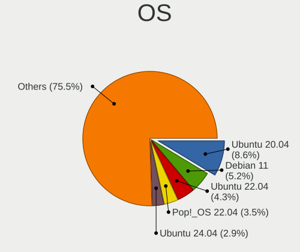

| Name                         | Desktops | Percent |
|------------------------------|----------|---------|
| Ubuntu 20.04                 | 30       | 8.65%   |
| Debian 11                    | 18       | 5.19%   |
| Ubuntu 22.04                 | 15       | 4.32%   |
| Pop!_OS 22.04                | 12       | 3.46%   |
| Ubuntu 24.04                 | 10       | 2.88%   |
| Ubuntu 18.04                 | 9        | 2.59%   |
| Zorin 16                     | 8        | 2.31%   |
| OpenMandriva 4.3             | 8        | 2.31%   |
| OpenMandriva 25.90           | 7        | 2.02%   |
| OpenMandriva 23.08           | 7        | 2.02%   |
| OpenMandriva 23.03           | 7        | 2.02%   |
| Fedora 41                    | 7        | 2.02%   |
| ArcoLinux Rolling            | 7        | 2.02%   |
| OpenMandriva 4.2             | 6        | 1.73%   |
| OpenMandriva 24.12           | 6        | 1.73%   |
| LMDE 6                       | 6        | 1.73%   |
| Pop!_OS 20.04                | 5        | 1.44%   |
| OpenMandriva 5.0             | 5        | 1.44%   |
| OpenMandriva 4.50            | 5        | 1.44%   |
| Debian 12                    | 5        | 1.44%   |
| Zorin 17                     | 4        | 1.15%   |
| Ubuntu 19.04                 | 4        | 1.15%   |
| OpenMandriva 23.01           | 4        | 1.15%   |
| Linux Mint 22.1              | 4        | 1.15%   |
| Fedora 40                    | 4        | 1.15%   |
| Bazzite 42                   | 4        | 1.15%   |
| Xubuntu 18.04                | 3        | 0.86%   |
| Ubuntu MATE 24.04            | 3        | 0.86%   |
| openSUSE Tumbleweed-XXXXXXXX | 3        | 0.86%   |
| OpenMandriva 6.0             | 3        | 0.86%   |
| Linux Mint 21.3              | 3        | 0.86%   |
| Linux Mint 19.3              | 3        | 0.86%   |
| Fedora 42                    | 3        | 0.86%   |
| Fedora 39                    | 3        | 0.86%   |
| Fedora 37                    | 3        | 0.86%   |
| Fedora 33                    | 3        | 0.86%   |
| Arch Rolling                 | 3        | 0.86%   |
| Zorin 15                     | 2        | 0.58%   |
| Ubuntu 24.10                 | 2        | 0.58%   |
| Ubuntu 23.10                 | 2        | 0.58%   |

OS Family
---------

OS without a version

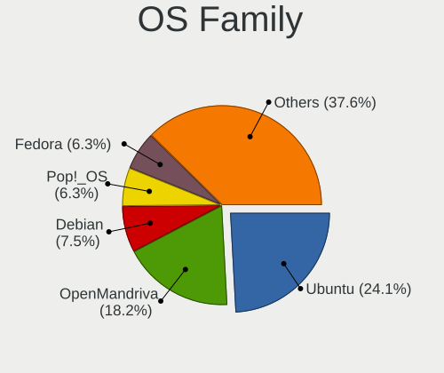

| Name          | Desktops | Percent |
|---------------|----------|---------|
| Ubuntu        | 77       | 24.14%  |
| OpenMandriva  | 58       | 18.18%  |
| Debian        | 24       | 7.52%   |
| Pop!_OS       | 20       | 6.27%   |
| Fedora        | 20       | 6.27%   |
| Linux Mint    | 19       | 5.96%   |
| Zorin         | 14       | 4.39%   |
| LMDE          | 7        | 2.19%   |
| ArcoLinux     | 7        | 2.19%   |
| Manjaro       | 5        | 1.57%   |
| Lubuntu       | 5        | 1.57%   |
| KDE neon      | 5        | 1.57%   |
| Arch          | 5        | 1.57%   |
| Ubuntu MATE   | 4        | 1.25%   |
| openSUSE      | 4        | 1.25%   |
| Elementary    | 4        | 1.25%   |
| Bazzite       | 4        | 1.25%   |
| Xubuntu       | 3        | 0.94%   |
| ROSA          | 3        | 0.94%   |
| Kubuntu       | 3        | 0.94%   |
| Endless       | 3        | 0.94%   |
| EndeavourOS   | 3        | 0.94%   |
| Nobara        | 2        | 0.63%   |
| MX            | 2        | 0.63%   |
| Linux Lite    | 2        | 0.63%   |
| Kali          | 2        | 0.63%   |
| CentOS        | 2        | 0.63%   |
| CachyOS       | 2        | 0.63%   |
| Ubuntu Unity  | 1        | 0.31%   |
| Ubuntu Budgie | 1        | 0.31%   |
| SteamOS       | 1        | 0.31%   |
| Slackware     | 1        | 0.31%   |
| Rocky Linux   | 1        | 0.31%   |
| Parrot        | 1        | 0.31%   |
| Mageia        | 1        | 0.31%   |
| Gentoo        | 1        | 0.31%   |
| ChimeraOS     | 1        | 0.31%   |
| Aurora        | 1        | 0.31%   |

Kernel
------

Version of the Linux kernel

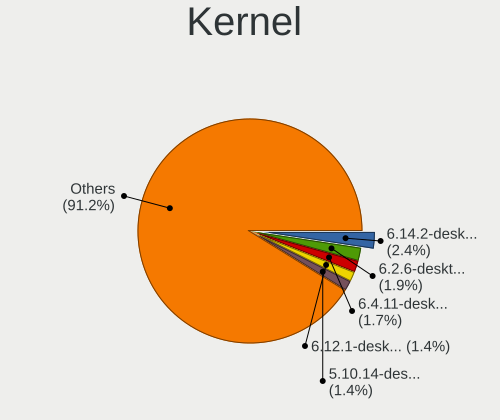

| Version                             | Desktops | Percent |
|-------------------------------------|----------|---------|
| 6.14.2-desktop-3omv2590             | 10       | 2.39%   |
| 6.2.6-desktop-1omv2390              | 8        | 1.91%   |
| 6.4.11-desktop-1omv2390             | 7        | 1.67%   |
| 6.12.1-desktop-1omv2490             | 6        | 1.43%   |
| 5.10.14-desktop-1omv4002            | 6        | 1.43%   |
| 6.6.2-desktop-1omv2390              | 5        | 1.19%   |
| 5.4.0-58-generic                    | 5        | 1.19%   |
| 5.16.7-desktop-1omv4003             | 5        | 1.19%   |
| 5.13.19-6-pve                       | 5        | 1.19%   |
| 5.4.0-42-generic                    | 4        | 0.95%   |
| 5.15.126-1-pve                      | 4        | 0.95%   |
| 5.15.108-1-pve                      | 4        | 0.95%   |
| 6.8.0-57-generic                    | 3        | 0.72%   |
| 6.8.0-51-generic                    | 3        | 0.72%   |
| 6.5.0-27-generic                    | 3        | 0.72%   |
| 6.5.0-14-generic                    | 3        | 0.72%   |
| 6.1.0-25-amd64                      | 3        | 0.72%   |
| 5.4.0-40-generic                    | 3        | 0.72%   |
| 5.3.0-53-generic                    | 3        | 0.72%   |
| 5.3.0-46-generic                    | 3        | 0.72%   |
| 5.16.3-desktop-2omv4050             | 3        | 0.72%   |
| 5.15.0-52-generic                   | 3        | 0.72%   |
| 5.11.0-27-generic                   | 3        | 0.72%   |
| 6.9.6-arch1-1                       | 2        | 0.48%   |
| 6.9.3-76060903-generic              | 2        | 0.48%   |
| 6.8.2-300.fc40.x86_64               | 2        | 0.48%   |
| 6.8.11-300.fc40.x86_64              | 2        | 0.48%   |
| 6.8.0-85-generic                    | 2        | 0.48%   |
| 6.8.0-76060800daily20240311-generic | 2        | 0.48%   |
| 6.8.0-71-generic                    | 2        | 0.48%   |
| 6.8.0-31-generic                    | 2        | 0.48%   |
| 6.6.7-200.fc39.x86_64               | 2        | 0.48%   |
| 6.6.11-200.fc39.x86_64              | 2        | 0.48%   |
| 6.5.0-15-generic                    | 2        | 0.48%   |
| 6.3.5-desktop-3omv2390              | 2        | 0.48%   |
| 6.2.6-76060206-generic              | 2        | 0.48%   |
| 6.17.7-300.fc43.x86_64              | 2        | 0.48%   |
| 6.17.12-300.fc43.x86_64             | 2        | 0.48%   |
| 6.16.4-200.fc42.x86_64              | 2        | 0.48%   |
| 6.14.6-300.fc42.x86_64              | 2        | 0.48%   |

Kernel Family
-------------

Linux kernel without a distro release

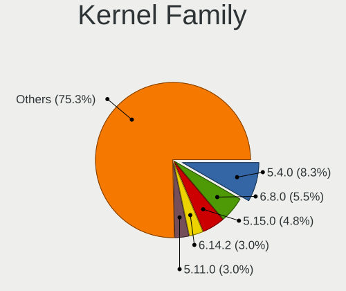

| Version  | Desktops | Percent |
|----------|----------|---------|
| 5.4.0    | 33       | 8.31%   |
| 6.8.0    | 22       | 5.54%   |
| 5.15.0   | 19       | 4.79%   |
| 6.14.2   | 12       | 3.02%   |
| 5.11.0   | 12       | 3.02%   |
| 6.5.0    | 11       | 2.77%   |
| 6.1.0    | 11       | 2.77%   |
| 5.8.0    | 11       | 2.77%   |
| 6.2.6    | 10       | 2.52%   |
| 6.14.0   | 9        | 2.27%   |
| 5.3.0    | 8        | 2.02%   |
| 6.4.11   | 7        | 1.76%   |
| 6.11.0   | 7        | 1.76%   |
| 5.19.0   | 7        | 1.76%   |
| 5.0.0    | 7        | 1.76%   |
| 6.12.1   | 6        | 1.51%   |
| 5.10.14  | 6        | 1.51%   |
| 4.15.0   | 6        | 1.51%   |
| 6.6.2    | 5        | 1.26%   |
| 6.14.6   | 5        | 1.26%   |
| 5.16.7   | 5        | 1.26%   |
| 5.13.19  | 5        | 1.26%   |
| 5.13.0   | 5        | 1.26%   |
| 6.2.0    | 4        | 1.01%   |
| 5.15.126 | 4        | 1.01%   |
| 5.15.108 | 4        | 1.01%   |
| 6.8.2    | 3        | 0.76%   |
| 6.8.11   | 3        | 0.76%   |
| 6.6.11   | 3        | 0.76%   |
| 6.5.6    | 3        | 0.76%   |
| 5.16.3   | 3        | 0.76%   |
| 6.9.6    | 2        | 0.5%    |
| 6.9.3    | 2        | 0.5%    |
| 6.6.7    | 2        | 0.5%    |
| 6.3.5    | 2        | 0.5%    |
| 6.2.16   | 2        | 0.5%    |
| 6.17.7   | 2        | 0.5%    |
| 6.17.12  | 2        | 0.5%    |
| 6.17.1   | 2        | 0.5%    |
| 6.16.4   | 2        | 0.5%    |

Kernel Major Ver.
-----------------

Linux kernel major version

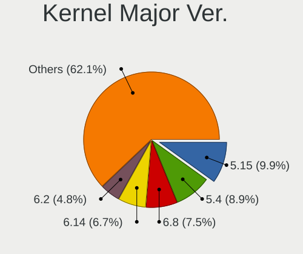

| Version | Desktops | Percent |
|---------|----------|---------|
| 5.15    | 37       | 9.95%   |
| 5.4     | 33       | 8.87%   |
| 6.8     | 28       | 7.53%   |
| 6.14    | 25       | 6.72%   |
| 6.2     | 18       | 4.84%   |
| 6.12    | 17       | 4.57%   |
| 6.5     | 15       | 4.03%   |
| 6.6     | 13       | 3.49%   |
| 6.1     | 13       | 3.49%   |
| 5.11    | 13       | 3.49%   |
| 6.11    | 12       | 3.23%   |
| 5.16    | 12       | 3.23%   |
| 5.8     | 11       | 2.96%   |
| 5.13    | 11       | 2.96%   |
| 6.4     | 10       | 2.69%   |
| 5.19    | 9        | 2.42%   |
| 5.10    | 9        | 2.42%   |
| 5.3     | 8        | 2.15%   |
| 5.0     | 7        | 1.88%   |
| 6.9     | 6        | 1.61%   |
| 6.3     | 6        | 1.61%   |
| 6.10    | 6        | 1.61%   |
| 5.12    | 6        | 1.61%   |
| 4.15    | 6        | 1.61%   |
| 6.17    | 5        | 1.34%   |
| 6.16    | 5        | 1.34%   |
| 6.0     | 5        | 1.34%   |
| 6.13    | 4        | 1.08%   |
| 5.18    | 4        | 1.08%   |
| 5.14    | 4        | 1.08%   |
| 6.7     | 3        | 0.81%   |
| 5.9     | 3        | 0.81%   |
| 5.17    | 3        | 0.81%   |
| 4.18    | 2        | 0.54%   |
| 6.18    | 1        | 0.27%   |
| 4.9     | 1        | 0.27%   |
| 3.10    | 1        | 0.27%   |

Arch
----

OS architecture (x86_64, i586, etc.)

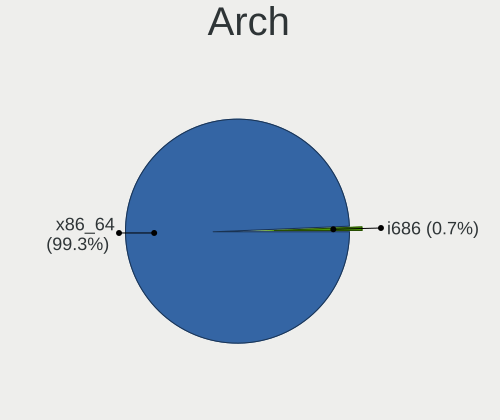

| Name   | Desktops | Percent |
|--------|----------|---------|
| x86_64 | 304      | 99.35%  |
| i686   | 2        | 0.65%   |

DE
--

Desktop Environment

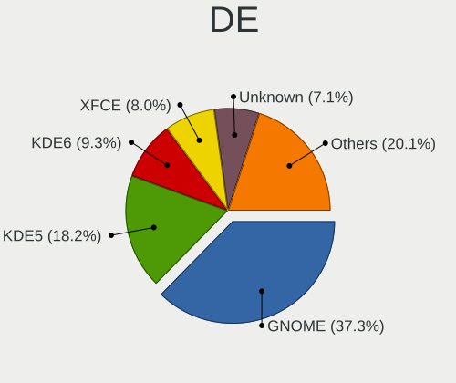

| Name         | Desktops | Percent |
|--------------|----------|---------|
| GNOME        | 121      | 37.35%  |
| KDE5         | 59       | 18.21%  |
| KDE6         | 30       | 9.26%   |
| XFCE         | 26       | 8.02%   |
| Unknown      | 23       | 7.1%    |
| X-Cinnamon   | 22       | 6.79%   |
| MATE         | 10       | 3.09%   |
| Openbox      | 9        | 2.78%   |
| LXQt         | 8        | 2.47%   |
| Pantheon     | 4        | 1.23%   |
| KDE          | 3        | 0.93%   |
| wayfire      | 2        | 0.62%   |
| Unity        | 1        | 0.31%   |
| LXDE         | 1        | 0.31%   |
| KDE4         | 1        | 0.31%   |
| herbstluftwm | 1        | 0.31%   |
| Cinnamon     | 1        | 0.31%   |
| Budgie       | 1        | 0.31%   |
| bspwm        | 1        | 0.31%   |

Display Server
--------------

X11 or Wayland

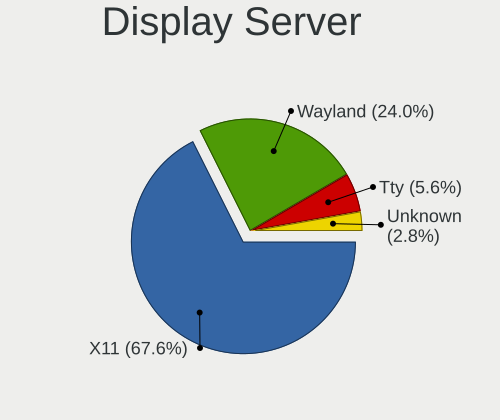

| Name    | Desktops | Percent |
|---------|----------|---------|
| X11     | 217      | 67.6%   |
| Wayland | 77       | 23.99%  |
| Tty     | 18       | 5.61%   |
| Unknown | 9        | 2.8%    |

Display Manager
---------------

SDDM, LightDM, etc.

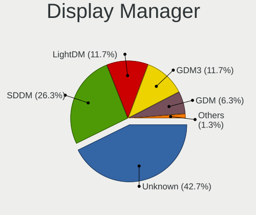

| Name    | Desktops | Percent |
|---------|----------|---------|
| Unknown | 135      | 42.72%  |
| SDDM    | 83       | 26.27%  |
| LightDM | 37       | 11.71%  |
| GDM3    | 37       | 11.71%  |
| GDM     | 20       | 6.33%   |
| TDM     | 3        | 0.95%   |
| LXDM    | 1        | 0.32%   |

OS Lang
-------

Language

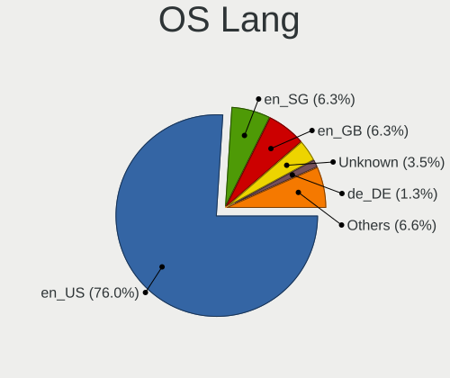

| Lang       | Desktops | Percent |
|------------|----------|---------|
| en_US      | 241      | 76.03%  |
| en_SG      | 20       | 6.31%   |
| en_GB      | 20       | 6.31%   |
| Unknown    | 11       | 3.47%   |
| de_DE      | 4        | 1.26%   |
| C          | 4        | 1.26%   |
| zh_CN      | 3        | 0.95%   |
| en_AU      | 3        | 0.95%   |
| en_MY      | 2        | 0.63%   |
| en_HK      | 2        | 0.63%   |
| zh_TW      | 1        | 0.32%   |
| zh_SG      | 1        | 0.32%   |
| zh_CN.UTF8 | 1        | 0.32%   |
| ms_MY      | 1        | 0.32%   |
| ja_JP      | 1        | 0.32%   |
| es_ES      | 1        | 0.32%   |
| en_PH      | 1        | 0.32%   |

Boot Mode
---------

EFI or BIOS

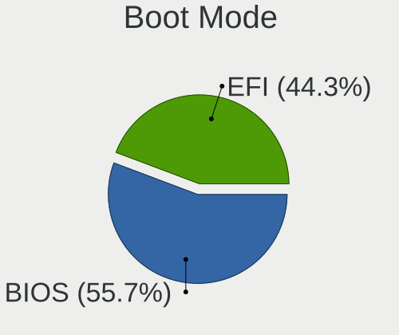

| Mode | Desktops | Percent |
|------|----------|---------|
| BIOS | 175      | 55.73%  |
| EFI  | 139      | 44.27%  |

Filesystem
----------

Type of filesystem

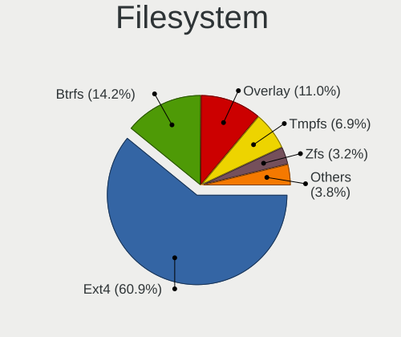

| Type    | Desktops | Percent |
|---------|----------|---------|
| Ext4    | 193      | 60.88%  |
| Btrfs   | 45       | 14.2%   |
| Overlay | 35       | 11.04%  |
| Tmpfs   | 22       | 6.94%   |
| Zfs     | 10       | 3.15%   |
| Xfs     | 6        | 1.89%   |
| Unknown | 4        | 1.26%   |
| Ext3    | 1        | 0.32%   |
| Ext2    | 1        | 0.32%   |

Part. scheme
------------

Scheme of partitioning

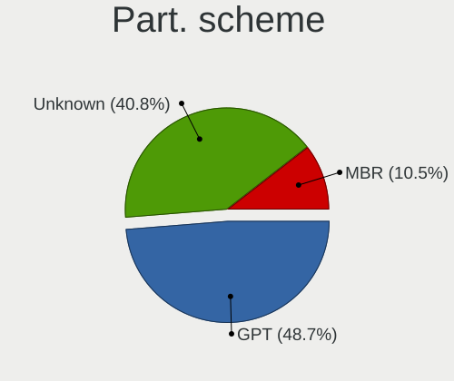

| Type    | Desktops | Percent |
|---------|----------|---------|
| GPT     | 153      | 48.73%  |
| Unknown | 128      | 40.76%  |
| MBR     | 33       | 10.51%  |

Dual Boot with Linux/BSD
------------------------

Hosting more than one Linux/BSD

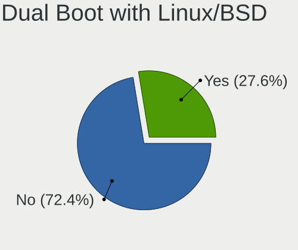

| Dual boot | Desktops | Percent |
|-----------|----------|---------|
| No        | 231      | 72.41%  |
| Yes       | 88       | 27.59%  |

Dual Boot (Win)
---------------

Hosting Linux and Windows

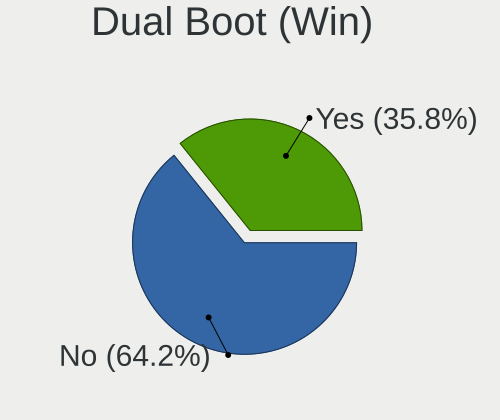

| Dual boot | Desktops | Percent |
|-----------|----------|---------|
| No        | 201      | 64.22%  |
| Yes       | 112      | 35.78%  |

Board
-----

Vendor
------

Motherboard manufacturer

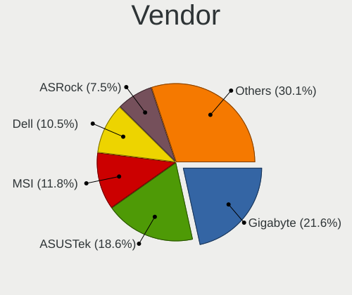

| Name                | Desktops | Percent |
|---------------------|----------|---------|
| Gigabyte Technology | 66       | 21.57%  |
| ASUSTek Computer    | 57       | 18.63%  |
| MSI                 | 36       | 11.76%  |
| Dell                | 32       | 10.46%  |
| ASRock              | 23       | 7.52%   |
| Intel               | 22       | 7.19%   |
| Hewlett-Packard     | 19       | 6.21%   |
| Lenovo              | 14       | 4.58%   |
| Acer                | 11       | 3.59%   |
| Biostar             | 5        | 1.63%   |
| Unknown             | 5        | 1.63%   |
| ECS                 | 3        | 0.98%   |
| AMI                 | 2        | 0.65%   |
| Vorke               | 1        | 0.33%   |
| SZMZ                | 1        | 0.33%   |
| Shuttle             | 1        | 0.33%   |
| Seco                | 1        | 0.33%   |
| ONDA                | 1        | 0.33%   |
| Machenike           | 1        | 0.33%   |
| LXY                 | 1        | 0.33%   |
| LattePanda          | 1        | 0.33%   |
| Kontron Europe      | 1        | 0.33%   |
| AZW                 | 1        | 0.33%   |
| ASRockRack          | 1        | 0.33%   |

Model
-----

Motherboard model

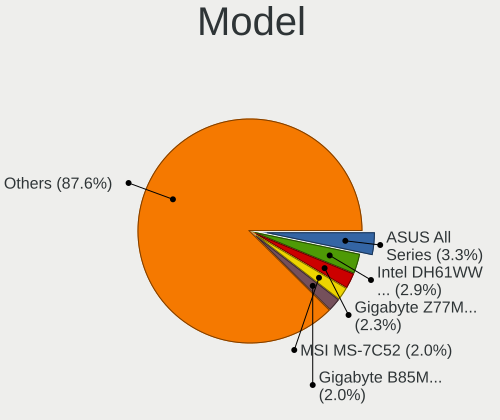

| Name                                | Desktops | Percent |
|-------------------------------------|----------|---------|
| ASUS All Series                     | 10       | 3.27%   |
| Intel DH61WW AAG23116-204           | 9        | 2.94%   |
| Gigabyte Z77M-D3H                   | 7        | 2.29%   |
| MSI MS-7C52                         | 6        | 1.96%   |
| Gigabyte B85M-D3H                   | 6        | 1.96%   |
| Unknown                             | 5        | 1.63%   |
| MSI MS-7817                         | 4        | 1.31%   |
| Lenovo ThinkCentre M93p 10A8S4B200  | 4        | 1.31%   |
| Gigabyte X570 UD                    | 4        | 1.31%   |
| Gigabyte B450M S2H                  | 4        | 1.31%   |
| Dell OptiPlex 755                   | 4        | 1.31%   |
| Intel DH61WW AAG23116-300           | 3        | 0.98%   |
| Gigabyte A520M K V2                 | 3        | 0.98%   |
| Dell OptiPlex 7010                  | 3        | 0.98%   |
| ASUS TUF Gaming B550M-PLUS          | 3        | 0.98%   |
| ASRock B550 Pro4                    | 3        | 0.98%   |
| MSI MS-7D46                         | 2        | 0.65%   |
| MSI MS-7C96                         | 2        | 0.65%   |
| MSI MS-7C81                         | 2        | 0.65%   |
| MSI MS-7B89                         | 2        | 0.65%   |
| Intel X99                           | 2        | 0.65%   |
| Intel MAHOBAY                       | 2        | 0.65%   |
| Gigabyte Z890 AORUS ELITE WIFI7 ICE | 2        | 0.65%   |
| Gigabyte B550M DS3H                 | 2        | 0.65%   |
| Gigabyte B550 AORUS PRO V2          | 2        | 0.65%   |
| Gigabyte B450 AORUS PRO             | 2        | 0.65%   |
| Dell XPS 8940                       | 2        | 0.65%   |
| Dell OptiPlex 990                   | 2        | 0.65%   |
| Dell OptiPlex 3020                  | 2        | 0.65%   |
| Biostar G41D3C                      | 2        | 0.65%   |
| ASUS ROG STRIX X670E-E GAMING WIFI  | 2        | 0.65%   |
| ASUS Pro WS WRX80E-SAGE SE WIFI     | 2        | 0.65%   |
| ASUS PRIME B550M-A                  | 2        | 0.65%   |
| ASUS P8Z77-V LX                     | 2        | 0.65%   |
| ASUS CROSSHAIR VI HERO              | 2        | 0.65%   |
| ASRock X570 Taichi Razer Edition    | 2        | 0.65%   |
| ASRock B550M Steel Legend           | 2        | 0.65%   |
| Vorke V1 Plus                       | 1        | 0.33%   |
| SZMZ X99M-G2                        | 1        | 0.33%   |
| Shuttle DH170                       | 1        | 0.33%   |

Model Family
------------

Motherboard model prefix

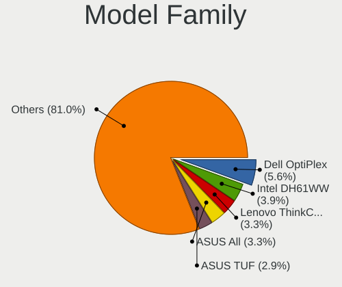

| Name                | Desktops | Percent |
|---------------------|----------|---------|
| Dell OptiPlex       | 17       | 5.56%   |
| Intel DH61WW        | 12       | 3.92%   |
| Lenovo ThinkCentre  | 10       | 3.27%   |
| ASUS All            | 10       | 3.27%   |
| ASUS TUF            | 9        | 2.94%   |
| Gigabyte Z77M-D3H   | 7        | 2.29%   |
| Dell Precision      | 7        | 2.29%   |
| ASUS PRIME          | 7        | 2.29%   |
| Acer Veriton        | 7        | 2.29%   |
| MSI MS-7C52         | 6        | 1.96%   |
| HP Compaq           | 6        | 1.96%   |
| Gigabyte X570       | 6        | 1.96%   |
| Gigabyte B85M-D3H   | 6        | 1.96%   |
| ASUS ROG            | 6        | 1.96%   |
| Gigabyte B450M      | 5        | 1.63%   |
| Dell Inspiron       | 5        | 1.63%   |
| Unknown             | 5        | 1.63%   |
| MSI MS-7817         | 4        | 1.31%   |
| HP ProDesk          | 4        | 1.31%   |
| ASUS P8B75-M        | 4        | 1.31%   |
| Acer Aspire         | 4        | 1.31%   |
| Lenovo ThinkStation | 3        | 0.98%   |
| Gigabyte B450       | 3        | 0.98%   |
| Gigabyte A520M      | 3        | 0.98%   |
| ASRock B550         | 3        | 0.98%   |
| MSI MS-7D46         | 2        | 0.65%   |
| MSI MS-7C96         | 2        | 0.65%   |
| MSI MS-7C81         | 2        | 0.65%   |
| MSI MS-7B89         | 2        | 0.65%   |
| Intel X99           | 2        | 0.65%   |
| Intel MAHOBAY       | 2        | 0.65%   |
| Gigabyte Z890       | 2        | 0.65%   |
| Gigabyte H410M      | 2        | 0.65%   |
| Gigabyte B760M      | 2        | 0.65%   |
| Gigabyte B550M      | 2        | 0.65%   |
| Gigabyte B550       | 2        | 0.65%   |
| Dell XPS            | 2        | 0.65%   |
| Biostar G41D3C      | 2        | 0.65%   |
| ASUS Pro            | 2        | 0.65%   |
| ASUS P8Z77-V        | 2        | 0.65%   |

MFG Year
--------

Motherboard manufacture year

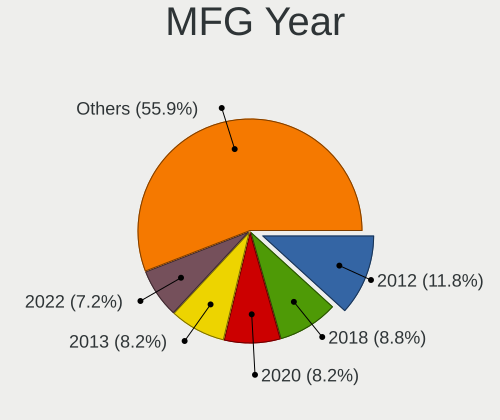

| Year    | Desktops | Percent |
|---------|----------|---------|
| 2012    | 36       | 11.76%  |
| 2018    | 27       | 8.82%   |
| 2020    | 25       | 8.17%   |
| 2013    | 25       | 8.17%   |
| 2022    | 22       | 7.19%   |
| 2019    | 22       | 7.19%   |
| 2015    | 20       | 6.54%   |
| 2023    | 18       | 5.88%   |
| 2011    | 18       | 5.88%   |
| 2017    | 16       | 5.23%   |
| 2021    | 13       | 4.25%   |
| 2014    | 13       | 4.25%   |
| 2008    | 12       | 3.92%   |
| 2007    | 10       | 3.27%   |
| 2010    | 9        | 2.94%   |
| 2009    | 7        | 2.29%   |
| 2025    | 5        | 1.63%   |
| 2016    | 5        | 1.63%   |
| 2024    | 1        | 0.33%   |
| 2006    | 1        | 0.33%   |
| Unknown | 1        | 0.33%   |

Form Factor
-----------

Physical design of the computer

| Name    | Desktops | Percent |
|---------|----------|---------|
| Desktop | 306      | 100%    |

Secure Boot
-----------

Enabled or disabled

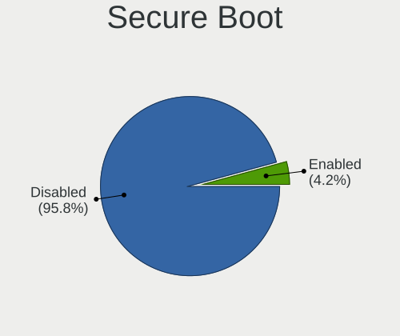

| State    | Desktops | Percent |
|----------|----------|---------|
| Disabled | 293      | 95.75%  |
| Enabled  | 13       | 4.25%   |

Coreboot
--------

Have coreboot on board

| Used | Desktops | Percent |
|------|----------|---------|
| No   | 306      | 100%    |

RAM Size
--------

Total RAM memory

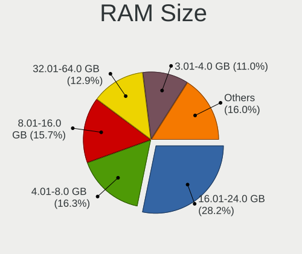

| Size in GB  | Desktops | Percent |
|-------------|----------|---------|
| 16.01-24.0  | 90       | 28.21%  |
| 4.01-8.0    | 52       | 16.3%   |
| 8.01-16.0   | 50       | 15.67%  |
| 32.01-64.0  | 41       | 12.85%  |
| 3.01-4.0    | 35       | 10.97%  |
| 64.01-256.0 | 27       | 8.46%   |
| 24.01-32.0  | 14       | 4.39%   |
| 1.01-2.0    | 8        | 2.51%   |
| 2.01-3.0    | 2        | 0.63%   |

RAM Used
--------

Used RAM memory

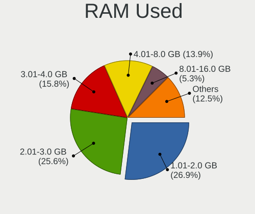

| Used GB     | Desktops | Percent |
|-------------|----------|---------|
| 1.01-2.0    | 97       | 26.94%  |
| 2.01-3.0    | 92       | 25.56%  |
| 3.01-4.0    | 57       | 15.83%  |
| 4.01-8.0    | 50       | 13.89%  |
| 8.01-16.0   | 19       | 5.28%   |
| 0.51-1.0    | 19       | 5.28%   |
| 16.01-24.0  | 8        | 2.22%   |
| 32.01-64.0  | 7        | 1.94%   |
| 24.01-32.0  | 4        | 1.11%   |
| 0.01-0.5    | 4        | 1.11%   |
| 64.01-256.0 | 3        | 0.83%   |

Total Drives
------------

Number of drives on board

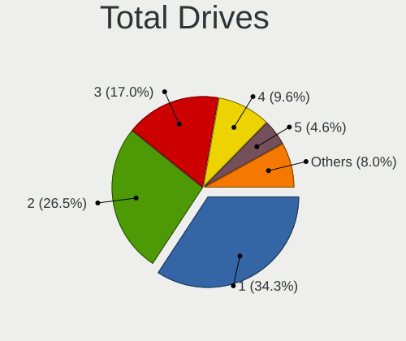

| Drives | Desktops | Percent |
|--------|----------|---------|
| 1      | 111      | 34.26%  |
| 2      | 86       | 26.54%  |
| 3      | 55       | 16.98%  |
| 4      | 31       | 9.57%   |
| 5      | 15       | 4.63%   |
| 7      | 10       | 3.09%   |
| 8      | 6        | 1.85%   |
| 6      | 5        | 1.54%   |
| 11     | 2        | 0.62%   |
| 10     | 2        | 0.62%   |
| 9      | 1        | 0.31%   |

Has CD-ROM
----------

Has CD-ROM on board

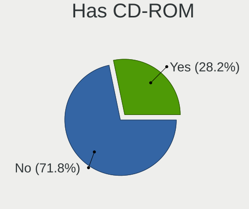

| Presented | Desktops | Percent |
|-----------|----------|---------|
| No        | 221      | 71.75%  |
| Yes       | 87       | 28.25%  |

Has Ethernet
------------

Has Ethernet on board

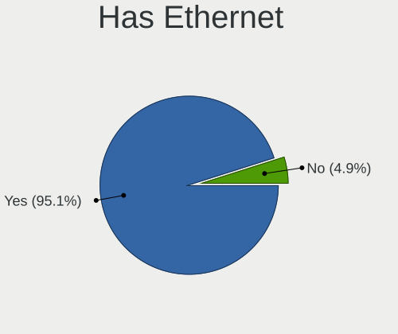

| Presented | Desktops | Percent |
|-----------|----------|---------|
| Yes       | 291      | 95.1%   |
| No        | 15       | 4.9%    |

Has WiFi
--------

Has WiFi module

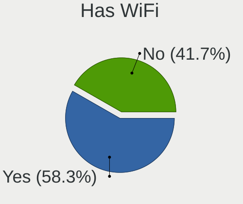

| Presented | Desktops | Percent |
|-----------|----------|---------|
| Yes       | 183      | 58.28%  |
| No        | 131      | 41.72%  |

Has Bluetooth
-------------

Has Bluetooth module

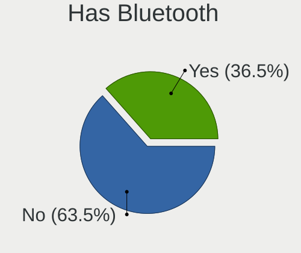

| Presented | Desktops | Percent |
|-----------|----------|---------|
| No        | 198      | 63.46%  |
| Yes       | 114      | 36.54%  |

Location
--------

Country
-------

Geographic location (country)

| Country  | Desktops | Percent |
|----------|----------|---------|
| Malaysia | 306      | 100%    |

City
----

Geographic location (city)

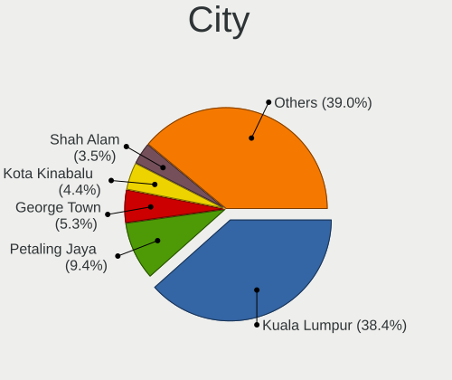

| City                   | Desktops | Percent |
|------------------------|----------|---------|
| Kuala Lumpur           | 131      | 38.42%  |
| Petaling Jaya          | 32       | 9.38%   |
| George Town            | 18       | 5.28%   |
| Kota Kinabalu          | 15       | 4.4%    |
| Shah Alam              | 12       | 3.52%   |
| Seremban               | 11       | 3.23%   |
| Kuching                | 9        | 2.64%   |
| Kajang                 | 8        | 2.35%   |
| Johor Bahru            | 8        | 2.35%   |
| Ipoh                   | 8        | 2.35%   |
| Seri Kembangan         | 7        | 2.05%   |
| Subang Jaya            | 6        | 1.76%   |
| Kota Bharu             | 6        | 1.76%   |
| Puchong Batu Dua Belas | 5        | 1.47%   |
| Malacca                | 5        | 1.47%   |
| Kulim                  | 4        | 1.17%   |
| Cheras                 | 4        | 1.17%   |
| Butterworth            | 4        | 1.17%   |
| Sungai Buloh           | 3        | 0.88%   |
| Bukit Mertajam         | 3        | 0.88%   |
| Bayan Lepas            | 3        | 0.88%   |
| Tawau                  | 2        | 0.59%   |
| Sungai Petani          | 2        | 0.59%   |
| Sungai Besar           | 2        | 0.59%   |
| Labuan                 | 2        | 0.59%   |
| Kuantan                | 2        | 0.59%   |
| Ampang                 | 2        | 0.59%   |
| Alor Star              | 2        | 0.59%   |
| Tasek Glugor           | 1        | 0.29%   |
| Taman Senai            | 1        | 0.29%   |
| Taman Prai             | 1        | 0.29%   |
| Taiping                | 1        | 0.29%   |
| Sibu                   | 1        | 0.29%   |
| Semenyih               | 1        | 0.29%   |
| Rawang                 | 1        | 0.29%   |
| Putrajaya              | 1        | 0.29%   |
| Penampang              | 1        | 0.29%   |
| Padang Serai           | 1        | 0.29%   |
| Muar town              | 1        | 0.29%   |
| Marabu                 | 1        | 0.29%   |

Drives
------

Drive Vendor
------------

Hard drive vendors

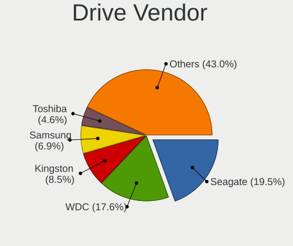

| Vendor                      | Desktops | Drives | Percent |
|-----------------------------|----------|--------|---------|
| Seagate                     | 122      | 233    | 19.49%  |
| WDC                         | 110      | 201    | 17.57%  |
| Kingston                    | 53       | 105    | 8.47%   |
| Samsung Electronics         | 43       | 75     | 6.87%   |
| Toshiba                     | 29       | 37     | 4.63%   |
| A-DATA Technology           | 24       | 41     | 3.83%   |
| SanDisk                     | 22       | 35     | 3.51%   |
| PNY                         | 16       | 51     | 2.56%   |
| Crucial                     | 13       | 40     | 2.08%   |
| Intel                       | 11       | 18     | 1.76%   |
| Apacer                      | 10       | 16     | 1.6%    |
| Phison Electronics          | 9        | 9      | 1.44%   |
| Hitachi                     | 9        | 9      | 1.44%   |
| Unknown                     | 8        | 10     | 1.28%   |
| Micron Technology           | 8        | 16     | 1.28%   |
| ADATA Technology            | 8        | 13     | 1.28%   |
| Kingston Technology Company | 7        | 7      | 1.12%   |
| Transcend                   | 6        | 13     | 0.96%   |
| Silicon Motion              | 6        | 25     | 0.96%   |
| HGST                        | 6        | 6      | 0.96%   |
| Corsair                     | 6        | 17     | 0.96%   |
| SPCC                        | 5        | 5      | 0.8%    |
| Gigabyte Technology         | 5        | 7      | 0.8%    |
| China                       | 5        | 5      | 0.8%    |
| Phison                      | 4        | 5      | 0.64%   |
| AGI                         | 4        | 4      | 0.64%   |
| Verbatim                    | 3        | 5      | 0.48%   |
| TO Exter                    | 3        | 5      | 0.48%   |
| Team                        | 3        | 3      | 0.48%   |
| Realtek Semiconductor       | 3        | 4      | 0.48%   |
| KIOXIA-EXCERIA              | 3        | 6      | 0.48%   |
| GAMER                       | 3        | 3      | 0.48%   |
| XPG                         | 2        | 3      | 0.32%   |
| WALRAM                      | 2        | 3      | 0.32%   |
| SK hynix                    | 2        | 2      | 0.32%   |
| Realtek                     | 2        | 3      | 0.32%   |
| Plextor                     | 2        | 2      | 0.32%   |
| Pioneer                     | 2        | 2      | 0.32%   |
| Patriot                     | 2        | 2      | 0.32%   |
| OCZ                         | 2        | 8      | 0.32%   |

Drive Model
-----------

Hard drive models

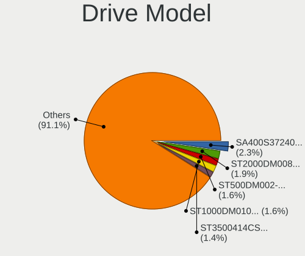

| Model                                                              | Desktops | Percent |
|--------------------------------------------------------------------|----------|---------|
| Kingston SA400S37240G 240GB SSD                                    | 17       | 2.34%   |
| Seagate ST2000DM008-2UB102 2TB                                     | 14       | 1.92%   |
| Seagate ST500DM002-1BD142 500GB                                    | 12       | 1.65%   |
| Seagate ST1000DM010-2EP102 1TB                                     | 12       | 1.65%   |
| Seagate ST3500414CS 500GB                                          | 10       | 1.37%   |
| PNY 1TB SATA SSD                                                   | 9        | 1.24%   |
| Kingston SA400S37480G 480GB SSD                                    | 8        | 1.1%    |
| WDC WD5000AAKX-75U6AA0 500GB                                       | 7        | 0.96%   |
| WDC WD2500AAKX-753CA1 250GB                                        | 7        | 0.96%   |
| Samsung HD103SJ 1TB                                                | 7        | 0.96%   |
| WDC WD20EZRX-00D8PB0 2TB                                           | 6        | 0.82%   |
| Seagate ST380815AS 80GB                                            | 6        | 0.82%   |
| Kingston SEDC500R1920G 2TB SSD                                     | 6        | 0.82%   |
| Corsair Force MP510 240GB                                          | 6        | 0.82%   |
| A-DATA SX8200PNP 256GB                                             | 6        | 0.82%   |
| A-DATA SU650 120GB SSD                                             | 6        | 0.82%   |
| WDC WD5000AAKX-08U6AA0 500GB                                       | 5        | 0.69%   |
| WDC WD5000AAKX-00ERMA0 500GB                                       | 5        | 0.69%   |
| Toshiba MQ01ABD100 1TB                                             | 5        | 0.69%   |
| Seagate ST1000LM024 HN-M101MBB 1TB                                 | 5        | 0.69%   |
| Samsung NVMe SSD Controller SM981/PM981/PM983 1TB                  | 5        | 0.69%   |
| PNY CS900 1TB SSD                                                  | 5        | 0.69%   |
| Phison PS5013 E13 NVMe Controller 500GB                            | 5        | 0.69%   |
| Kingston SEDC1000BM8960G 960GB                                     | 5        | 0.69%   |
| ADATA XPG SX8200 Pro PCIe Gen3x4 M.2 2280 Solid State Drive 1024GB | 5        | 0.69%   |
| A-DATA SX8200PNP 512GB                                             | 5        | 0.69%   |
| Toshiba DT01ACA100 1TB                                             | 4        | 0.55%   |
| Silicon Motion SM2263EN/SM2263XT SSD Controller 512GB              | 4        | 0.55%   |
| Seagate ST500DM002-1BC142 500GB                                    | 4        | 0.55%   |
| Seagate ST3320418AS 320GB                                          | 4        | 0.55%   |
| Seagate ST3160815AS 160GB                                          | 4        | 0.55%   |
| Seagate ST2000DM008-2FR102 2TB                                     | 4        | 0.55%   |
| Seagate ST2000DM006-2DM164 2TB                                     | 4        | 0.55%   |
| Seagate ST1000DM003-1CH162 1TB                                     | 4        | 0.55%   |
| Sandisk WD Green SN350 1TB                                         | 4        | 0.55%   |
| Samsung SSD 850 EVO 250GB                                          | 4        | 0.55%   |
| WDC WD5000AAKX-22ERMA0 500GB                                       | 3        | 0.41%   |
| WDC WD3200AAKS-00SBA0 320GB                                        | 3        | 0.41%   |
| WDC WD20EZAZ-00GGJB0 2TB                                           | 3        | 0.41%   |
| WDC WD10EZEX-60M2NA0 1TB                                           | 3        | 0.41%   |

HDD Vendor
----------

Hard disk drive vendors

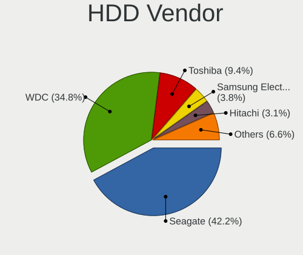

| Vendor              | Desktops | Drives | Percent |
|---------------------|----------|--------|---------|
| Seagate             | 121      | 232    | 42.16%  |
| WDC                 | 100      | 191    | 34.84%  |
| Toshiba             | 27       | 35     | 9.41%   |
| Samsung Electronics | 11       | 15     | 3.83%   |
| Hitachi             | 9        | 9      | 3.14%   |
| HGST                | 6        | 6      | 2.09%   |
| Unknown             | 4        | 4      | 1.39%   |
| TO Exter            | 3        | 5      | 1.05%   |
| External            | 2        | 2      | 0.7%    |
| USB3.0              | 1        | 1      | 0.35%   |
| SATAFIRM            | 1        | 1      | 0.35%   |
| Maxtor              | 1        | 4      | 0.35%   |
| Hewlett-Packard     | 1        | 1      | 0.35%   |

SSD Vendor
----------

Solid state drive vendors

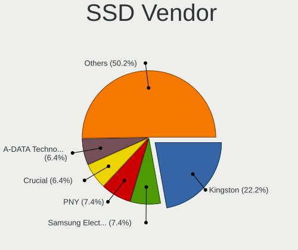

| Vendor              | Desktops | Drives | Percent |
|---------------------|----------|--------|---------|
| Kingston            | 45       | 76     | 22.17%  |
| Samsung Electronics | 15       | 33     | 7.39%   |
| PNY                 | 15       | 50     | 7.39%   |
| Crucial             | 13       | 40     | 6.4%    |
| A-DATA Technology   | 13       | 16     | 6.4%    |
| SanDisk             | 11       | 15     | 5.42%   |
| Apacer              | 10       | 16     | 4.93%   |
| WDC                 | 9        | 9      | 4.43%   |
| Intel               | 7        | 13     | 3.45%   |
| Transcend           | 5        | 7      | 2.46%   |
| China               | 5        | 5      | 2.46%   |
| SPCC                | 4        | 4      | 1.97%   |
| AGI                 | 4        | 4      | 1.97%   |
| Verbatim            | 3        | 5      | 1.48%   |
| Team                | 3        | 3      | 1.48%   |
| Plextor             | 2        | 2      | 0.99%   |
| Pioneer             | 2        | 2      | 0.99%   |
| OCZ                 | 2        | 8      | 0.99%   |
| Micron Technology   | 2        | 6      | 0.99%   |
| LITEON              | 2        | 2      | 0.99%   |
| KIOXIA-EXCERIA      | 2        | 5      | 0.99%   |
| KingSpec            | 2        | 3      | 0.99%   |
| KimMiDi             | 2        | 2      | 0.99%   |
| Gigabyte Technology | 2        | 2      | 0.99%   |
| GAMER               | 2        | 2      | 0.99%   |
| WDC WDS1            | 1        | 1      | 0.49%   |
| WALRAM              | 1        | 1      | 0.49%   |
| sk600               | 1        | 1      | 0.49%   |
| SK hynix            | 1        | 1      | 0.49%   |
| Seagate             | 1        | 1      | 0.49%   |
| PNY CS90            | 1        | 1      | 0.49%   |
| ORICO               | 1        | 1      | 0.49%   |
| Moment              | 1        | 1      | 0.49%   |
| MAXSUN              | 1        | 1      | 0.49%   |
| Lexar               | 1        | 2      | 0.49%   |
| JMicron Technology  | 1        | 1      | 0.49%   |
| Hikvision           | 1        | 2      | 0.49%   |
| Hewlett-Packard     | 1        | 1      | 0.49%   |
| GeIL                | 1        | 1      | 0.49%   |
| Galaxy              | 1        | 1      | 0.49%   |

Drive Kind
----------

HDD or SSD

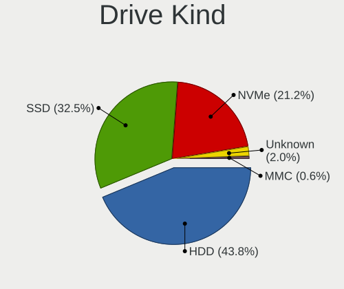

| Kind    | Desktops | Drives | Percent |
|---------|----------|--------|---------|
| HDD     | 217      | 506    | 43.75%  |
| SSD     | 161      | 354    | 32.46%  |
| NVMe    | 105      | 229    | 21.17%  |
| Unknown | 10       | 14     | 2.02%   |
| MMC     | 3        | 3      | 0.6%    |

Drive Connector
---------------

SATA, SAS, NVMe, etc.

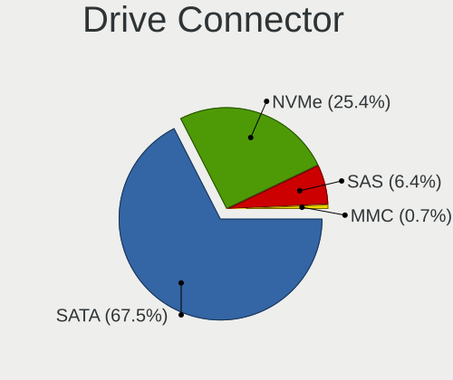

| Type | Desktops | Drives | Percent |
|------|----------|--------|---------|
| SATA | 276      | 840    | 67.48%  |
| NVMe | 104      | 226    | 25.43%  |
| SAS  | 26       | 37     | 6.36%   |
| MMC  | 3        | 3      | 0.73%   |

Drive Size
----------

Size of hard drive

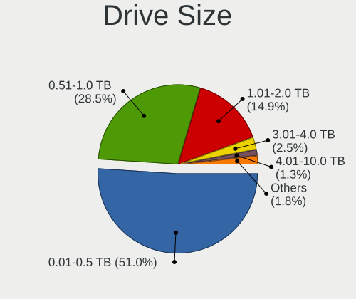

| Size in TB | Desktops | Drives | Percent |
|------------|----------|--------|---------|
| 0.01-0.5   | 202      | 407    | 51.01%  |
| 0.51-1.0   | 113      | 206    | 28.54%  |
| 1.01-2.0   | 59       | 196    | 14.9%   |
| 3.01-4.0   | 10       | 20     | 2.53%   |
| 2.01-3.0   | 5        | 7      | 1.26%   |
| 4.01-10.0  | 5        | 12     | 1.26%   |
| 10.01-20.0 | 2        | 12     | 0.51%   |

Space Total
-----------

Amount of disk space available on the file system

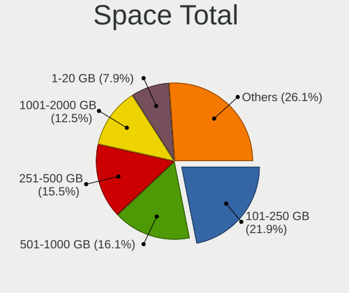

| Size in GB     | Desktops | Percent |
|----------------|----------|---------|
| 101-250        | 72       | 21.88%  |
| 501-1000       | 53       | 16.11%  |
| 251-500        | 51       | 15.5%   |
| 1001-2000      | 41       | 12.46%  |
| 1-20           | 26       | 7.9%    |
| More than 3000 | 23       | 6.99%   |
| 51-100         | 21       | 6.38%   |
| 2001-3000      | 15       | 4.56%   |
| Unknown        | 14       | 4.26%   |
| 21-50          | 13       | 3.95%   |

Space Used
----------

Amount of used disk space

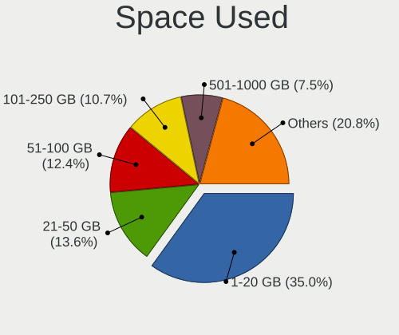

| Used GB        | Desktops | Percent |
|----------------|----------|---------|
| 1-20           | 121      | 34.97%  |
| 21-50          | 47       | 13.58%  |
| 51-100         | 43       | 12.43%  |
| 101-250        | 37       | 10.69%  |
| 501-1000       | 26       | 7.51%   |
| 251-500        | 23       | 6.65%   |
| 1001-2000      | 20       | 5.78%   |
| Unknown        | 14       | 4.05%   |
| More than 3000 | 10       | 2.89%   |
| 2001-3000      | 5        | 1.45%   |

Malfunc. Drives
---------------

Drive models with a malfunction

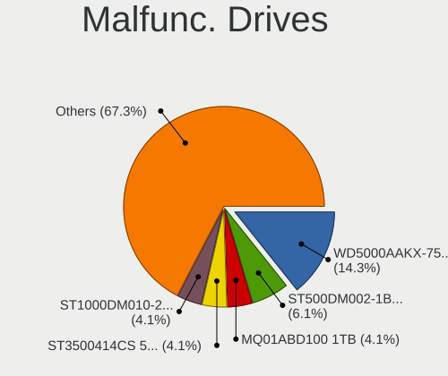

| Model                              | Desktops | Drives | Percent |
|------------------------------------|----------|--------|---------|
| WDC WD5000AAKX-75U6AA0 500GB       | 7        | 7      | 14.29%  |
| Seagate ST500DM002-1BD142 500GB    | 3        | 3      | 6.12%   |
| Toshiba MQ01ABD100 1TB             | 2        | 2      | 4.08%   |
| Seagate ST3500414CS 500GB          | 2        | 3      | 4.08%   |
| Seagate ST1000DM010-2EP102 1TB     | 2        | 2      | 4.08%   |
| Hitachi HDS721680PLA380 80GB       | 2        | 2      | 4.08%   |
| WDC WD800AAJS-00PSA0 80GB          | 1        | 1      | 2.04%   |
| WDC WD5000AVDS-73U7B1 500GB        | 1        | 1      | 2.04%   |
| WDC WD5000AAKX-753CA1 500GB        | 1        | 1      | 2.04%   |
| WDC WD5000AAKX-08U6AA0 500GB       | 1        | 1      | 2.04%   |
| WDC WD5000AAKX-00ERMA0 500GB       | 1        | 1      | 2.04%   |
| WDC WD5000AADS-00S9B0 500GB        | 1        | 1      | 2.04%   |
| WDC WD3200AAKS-75L9A0 320GB        | 1        | 1      | 2.04%   |
| WDC WD30EZRX-00SPEB0 3TB           | 1        | 1      | 2.04%   |
| WDC WD10SPZX-60Z10T0 1TB           | 1        | 1      | 2.04%   |
| WDC WD10JPVX-08JC3T5 1TB           | 1        | 1      | 2.04%   |
| WDC WD10EZEX-60WN4A0 1TB           | 1        | 1      | 2.04%   |
| WDC WD10EZEX-60M2NA0 1TB           | 1        | 1      | 2.04%   |
| WDC WD Green 2.5 240GB             | 1        | 1      | 2.04%   |
| WALRAM SSD 128GB                   | 1        | 1      | 2.04%   |
| Transcend TS1TMTE662TI-KAI 1TB     | 1        | 1      | 2.04%   |
| Toshiba DT01ACA100 1TB             | 1        | 1      | 2.04%   |
| Seagate ST380815AS 80GB            | 1        | 1      | 2.04%   |
| Seagate ST380211AS 80GB            | 1        | 1      | 2.04%   |
| Seagate ST3320620A 320GB           | 1        | 1      | 2.04%   |
| Seagate ST31000524AS 1TB           | 1        | 1      | 2.04%   |
| Seagate ST31000322CS 1TB           | 1        | 1      | 2.04%   |
| Seagate ST1000LM024 HN-M101MBB 1TB | 1        | 1      | 2.04%   |
| Seagate ST1000DM003-1CH162 1TB     | 1        | 1      | 2.04%   |
| Samsung Electronics SSD 980 1TB    | 1        | 1      | 2.04%   |
| Samsung Electronics HM160HI 160GB  | 1        | 1      | 2.04%   |
| Kingston SV300S37A120G 120GB SSD   | 1        | 1      | 2.04%   |
| Intel SSDSCKKW120H6 120GB          | 1        | 1      | 2.04%   |
| Hitachi HUA722020ALA330 2TB        | 1        | 1      | 2.04%   |
| Hitachi HTS541612J9SA00 120GB      | 1        | 1      | 2.04%   |
| Hitachi HDS721050CLA362 500GB      | 1        | 1      | 2.04%   |
| Hewlett-Packard SSD S700 120GB     | 1        | 1      | 2.04%   |

Malfunc. Drive Vendor
---------------------

Vendors of faulty drives

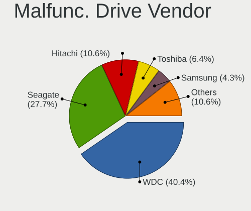

| Vendor              | Desktops | Drives | Percent |
|---------------------|----------|--------|---------|
| WDC                 | 19       | 20     | 40.43%  |
| Seagate             | 13       | 15     | 27.66%  |
| Hitachi             | 5        | 5      | 10.64%  |
| Toshiba             | 3        | 3      | 6.38%   |
| Samsung Electronics | 2        | 2      | 4.26%   |
| WALRAM              | 1        | 1      | 2.13%   |
| Transcend           | 1        | 1      | 2.13%   |
| Kingston            | 1        | 1      | 2.13%   |
| Intel               | 1        | 1      | 2.13%   |
| Hewlett-Packard     | 1        | 1      | 2.13%   |

Malfunc. HDD Vendor
-------------------

Vendors of faulty HDD drives

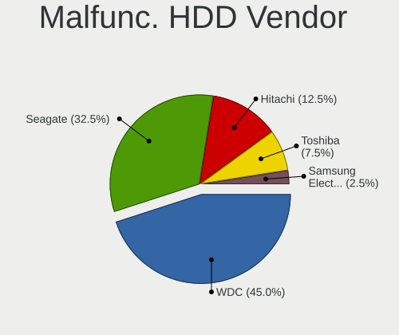

| Vendor              | Desktops | Drives | Percent |
|---------------------|----------|--------|---------|
| WDC                 | 18       | 19     | 45%     |
| Seagate             | 13       | 15     | 32.5%   |
| Hitachi             | 5        | 5      | 12.5%   |
| Toshiba             | 3        | 3      | 7.5%    |
| Samsung Electronics | 1        | 1      | 2.5%    |

Malfunc. Drive Kind
-------------------

Kinds of faulty drives

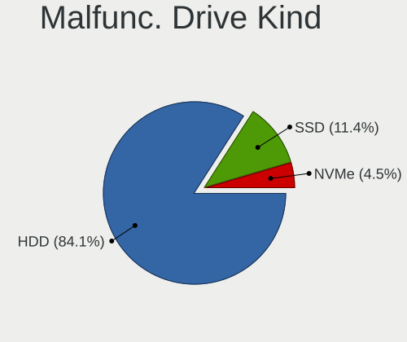

| Kind | Desktops | Drives | Percent |
|------|----------|--------|---------|
| HDD  | 37       | 43     | 84.09%  |
| SSD  | 5        | 5      | 11.36%  |
| NVMe | 2        | 2      | 4.55%   |

Failed Drives
-------------

Failed drive models

Zero info for selected period =(

Failed Drive Vendor
-------------------

Failed drive vendors

Zero info for selected period =(

Drive Status
------------

Number of failed and malfunc. drives

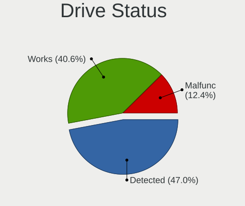

| Status   | Desktops | Drives | Percent |
|----------|----------|--------|---------|
| Detected | 167      | 531    | 47.04%  |
| Works    | 144      | 525    | 40.56%  |
| Malfunc  | 44       | 50     | 12.39%  |

Storage controller
------------------

Storage Vendor
--------------

Storage controller vendors

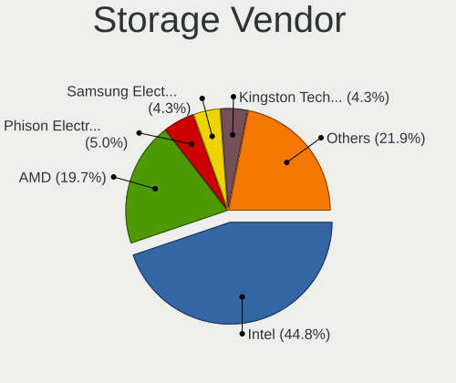

| Vendor                       | Desktops | Percent |
|------------------------------|----------|---------|
| Intel                        | 207      | 44.81%  |
| AMD                          | 91       | 19.7%   |
| Phison Electronics           | 23       | 4.98%   |
| Samsung Electronics          | 20       | 4.33%   |
| Kingston Technology Company  | 20       | 4.33%   |
| ADATA Technology             | 19       | 4.11%   |
| ASMedia Technology           | 16       | 3.46%   |
| Sandisk                      | 14       | 3.03%   |
| Silicon Motion               | 9        | 1.95%   |
| Micron Technology            | 6        | 1.3%    |
| MAXIO Technology (Hangzhou)  | 5        | 1.08%   |
| Marvell Technology Group     | 5        | 1.08%   |
| Nvidia                       | 4        | 0.87%   |
| JMicron Technology           | 4        | 0.87%   |
| Realtek Semiconductor        | 3        | 0.65%   |
| Broadcom / LSI               | 3        | 0.65%   |
| Toshiba America Info Systems | 2        | 0.43%   |
| Shenzhen Longsys Electronics | 2        | 0.43%   |
| Micron/Crucial Technology    | 2        | 0.43%   |
| LSI Logic / Symbios Logic    | 2        | 0.43%   |
| Transcend                    | 1        | 0.22%   |
| SK hynix                     | 1        | 0.22%   |
| Silicon Image                | 1        | 0.22%   |
| Lite-On IT Corp. / Plextor   | 1        | 0.22%   |
| KIOXIA                       | 1        | 0.22%   |

Storage Model
-------------

Storage controller models

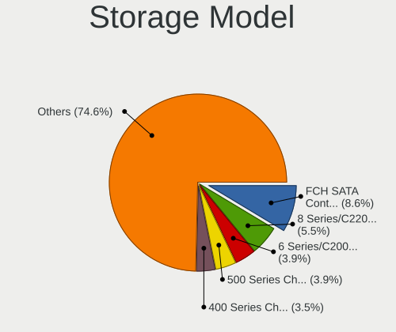

| Model                                                                          | Desktops | Percent |
|--------------------------------------------------------------------------------|----------|---------|
| AMD FCH SATA Controller [AHCI mode]                                            | 49       | 8.63%   |
| Intel 8 Series/C220 Series Chipset Family 6-port SATA Controller 1 [AHCI mode] | 31       | 5.46%   |
| Intel 6 Series/C200 Series Chipset Family 6 port Desktop SATA AHCI Controller  | 22       | 3.87%   |
| AMD 500 Series Chipset SATA Controller                                         | 22       | 3.87%   |
| AMD 400 Series Chipset SATA Controller                                         | 20       | 3.52%   |
| Intel SATA Controller [RAID mode]                                              | 18       | 3.17%   |
| ADATA XPG SX8200 Pro PCIe Gen3x4 M.2 2280 Solid State Drive                    | 16       | 2.82%   |
| Intel 7 Series/C210 Series Chipset Family 6-port SATA Controller [AHCI mode]   | 15       | 2.64%   |
| Intel Q170/Q150/B150/H170/H110/Z170/CM236 Chipset SATA Controller [AHCI Mode]  | 14       | 2.46%   |
| Intel NM10/ICH7 Family SATA Controller [IDE mode]                              | 12       | 2.11%   |
| ASMedia ASM1061/ASM1062 Serial ATA Controller                                  | 12       | 2.11%   |
| Intel 7 Series/C210 Series Chipset Family 4-port SATA Controller [IDE mode]    | 11       | 1.94%   |
| Intel 7 Series/C210 Series Chipset Family 2-port SATA Controller [IDE mode]    | 11       | 1.94%   |
| Phison PS5013-E13 PCIe3 NVMe Controller (DRAM-less)                            | 10       | 1.76%   |
| Intel 82801G (ICH7 Family) IDE Controller                                      | 10       | 1.76%   |
| AMD A320 Chipset SATA Controller [AHCI mode]                                   | 9        | 1.58%   |
| Samsung NVMe SSD Controller SM981/PM981/PM983                                  | 8        | 1.41%   |
| Phison E12 NVMe Controller                                                     | 8        | 1.41%   |
| Intel Alder Lake-S PCH SATA Controller [AHCI Mode]                             | 8        | 1.41%   |
| Silicon Motion SM2263EN/SM2263XT (DRAM-less) NVMe SSD Controllers              | 7        | 1.23%   |
| Intel 200 Series PCH SATA controller [AHCI mode]                               | 7        | 1.23%   |
| AMD 600 Series Chipset SATA Controller                                         | 7        | 1.23%   |
| Intel Raptor Lake SATA AHCI Controller                                         | 6        | 1.06%   |
| Intel 82Q35 Express PT IDER Controller                                         | 6        | 1.06%   |
| Samsung NVMe SSD Controller S4LV008[Pascal]                                    | 5        | 0.88%   |
| MAXIO (Hangzhou) NVMe SSD Controller MAP1202 (DRAM-less)                       | 5        | 0.88%   |
| Kingston Company DC1000B NVMe SSD [E12DC]                                      | 5        | 0.88%   |
| Intel Comet Lake SATA AHCI Controller                                          | 5        | 0.88%   |
| Intel Cannon Lake PCH SATA AHCI Controller                                     | 5        | 0.88%   |
| Intel 82801I (ICH9 Family) 2 port SATA Controller [IDE mode]                   | 5        | 0.88%   |
| AMD X370 Series Chipset SATA Controller                                        | 5        | 0.88%   |
| SanDisk WD PC SN540 / Green SN350 NVMe SSD 1 TB (DRAM-less)                    | 4        | 0.7%    |
| Sandisk WD Black SN850X NVMe SSD                                               | 4        | 0.7%    |
| Samsung NVMe SSD Controller PM9A1/PM9A3/980PRO                                 | 4        | 0.7%    |
| Intel Volume Management Device NVMe RAID Controller                            | 4        | 0.7%    |
| Intel C610/X99 series chipset 6-Port SATA Controller [AHCI mode]               | 4        | 0.7%    |
| Intel 9 Series Chipset Family SATA Controller [AHCI Mode]                      | 4        | 0.7%    |
| Intel 82801IR/IO/IH (ICH9R/DO/DH) 6 port SATA Controller [AHCI mode]           | 4        | 0.7%    |
| Intel 82801IR/IO/IH (ICH9R/DO/DH) 4 port SATA Controller [IDE mode]            | 4        | 0.7%    |
| Intel 400 Series Chipset Family SATA AHCI Controller                           | 4        | 0.7%    |

Storage Kind
------------

Kind of storage controller (IDE, SATA, NVMe, SAS, ...)

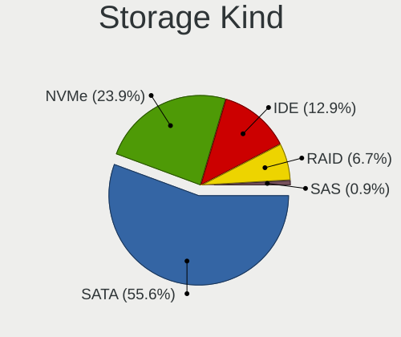

| Kind | Desktops | Percent |
|------|----------|---------|
| SATA | 242      | 55.63%  |
| NVMe | 104      | 23.91%  |
| IDE  | 56       | 12.87%  |
| RAID | 29       | 6.67%   |
| SAS  | 4        | 0.92%   |

Processor
---------

CPU Vendor
----------

Processor vendors

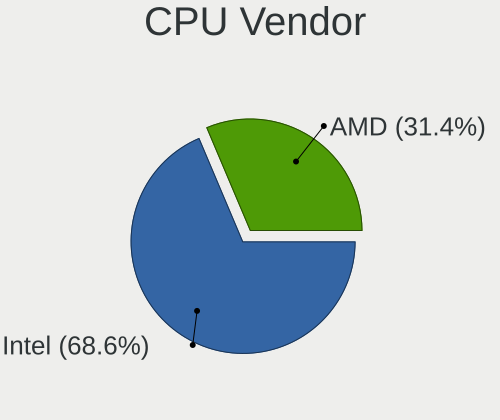

| Vendor | Desktops | Percent |
|--------|----------|---------|
| Intel  | 210      | 68.63%  |
| AMD    | 96       | 31.37%  |

CPU Model
---------

Processor models

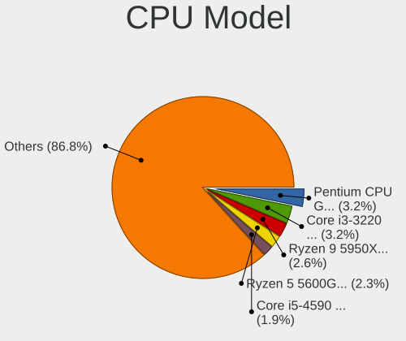

| Model                                       | Desktops | Percent |
|---------------------------------------------|----------|---------|
| Intel Pentium CPU G620 @ 2.60GHz            | 10       | 3.23%   |
| Intel Core i3-3220 CPU @ 3.30GHz            | 10       | 3.23%   |
| AMD Ryzen 9 5950X 16-Core Processor         | 8        | 2.58%   |
| AMD Ryzen 5 5600G with Radeon Graphics      | 7        | 2.26%   |
| Intel Core i5-4590 CPU @ 3.30GHz            | 6        | 1.94%   |
| AMD Ryzen 5 3600 6-Core Processor           | 6        | 1.94%   |
| Intel Core i7-3770 CPU @ 3.40GHz            | 5        | 1.61%   |
| Intel Core i5-8400 CPU @ 2.80GHz            | 5        | 1.61%   |
| Intel Core i3-4130 CPU @ 3.40GHz            | 5        | 1.61%   |
| AMD Ryzen 5 5600 6-Core Processor           | 5        | 1.61%   |
| Intel Core i5-4570 CPU @ 3.20GHz            | 4        | 1.29%   |
| Intel Core i5-3570 CPU @ 3.40GHz            | 4        | 1.29%   |
| Intel Core i5-2400 CPU @ 3.10GHz            | 4        | 1.29%   |
| Intel Core i3-4150 CPU @ 3.50GHz            | 4        | 1.29%   |
| Intel Core i3-3240 CPU @ 3.40GHz            | 4        | 1.29%   |
| AMD Ryzen 3 3200G with Radeon Vega Graphics | 4        | 1.29%   |
| Intel Pentium CPU G630 @ 2.70GHz            | 3        | 0.97%   |
| Intel Core i7-4790 CPU @ 3.60GHz            | 3        | 0.97%   |
| Intel Core i5-6500 CPU @ 3.20GHz            | 3        | 0.97%   |
| Intel Core i5-6400 CPU @ 2.70GHz            | 3        | 0.97%   |
| Intel Core i5-3470 CPU @ 3.20GHz            | 3        | 0.97%   |
| Intel Core i5-10400 CPU @ 2.90GHz           | 3        | 0.97%   |
| Intel Core 2 Duo CPU E8400 @ 3.00GHz        | 3        | 0.97%   |
| Intel Core 2 Duo CPU E7500 @ 2.93GHz        | 3        | 0.97%   |
| AMD Ryzen 5 2600 Six-Core Processor         | 3        | 0.97%   |
| AMD Ryzen 5 2400G with Radeon Vega Graphics | 3        | 0.97%   |
| Intel Xeon CPU X5450 @ 3.00GHz              | 2        | 0.65%   |
| Intel Xeon CPU E3-1220 V2 @ 3.10GHz         | 2        | 0.65%   |
| Intel Pentium Dual-Core CPU E5700 @ 3.00GHz | 2        | 0.65%   |
| Intel Pentium Dual-Core CPU E5400 @ 2.70GHz | 2        | 0.65%   |
| Intel Pentium CPU G4560 @ 3.50GHz           | 2        | 0.65%   |
| Intel Pentium CPU G3220 @ 3.00GHz           | 2        | 0.65%   |
| Intel Core Ultra 7 265K                     | 2        | 0.65%   |
| Intel Core i7-6700 CPU @ 3.40GHz            | 2        | 0.65%   |
| Intel Core i7-4790K CPU @ 4.00GHz           | 2        | 0.65%   |
| Intel Core i7-4770 CPU @ 3.40GHz            | 2        | 0.65%   |
| Intel Core i5-6500T CPU @ 2.50GHz           | 2        | 0.65%   |
| Intel Core i5-4670 CPU @ 3.40GHz            | 2        | 0.65%   |
| Intel Core i5-4460 CPU @ 3.20GHz            | 2        | 0.65%   |
| Intel Core i3-9100 CPU @ 3.60GHz            | 2        | 0.65%   |

CPU Model Family
----------------

Processor model prefix

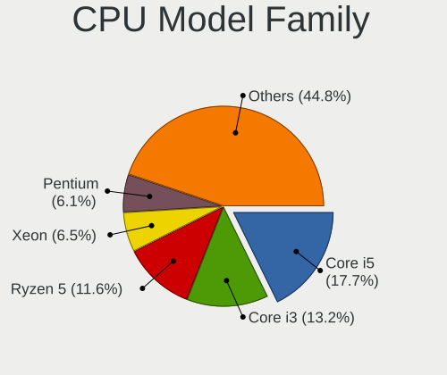

| Model                   | Desktops | Percent |
|-------------------------|----------|---------|
| Intel Core i5           | 55       | 17.74%  |
| Intel Core i3           | 41       | 13.23%  |
| AMD Ryzen 5             | 36       | 11.61%  |
| Intel Xeon              | 20       | 6.45%   |
| Intel Pentium           | 19       | 6.13%   |
| Intel Core i7           | 19       | 6.13%   |
| AMD Ryzen 7             | 18       | 5.81%   |
| Other                   | 17       | 5.48%   |
| Intel Core 2 Duo        | 15       | 4.84%   |
| AMD Ryzen 9             | 13       | 4.19%   |
| AMD Ryzen 3             | 9        | 2.9%    |
| Intel Core 2 Quad       | 8        | 2.58%   |
| Intel Celeron           | 7        | 2.26%   |
| Intel Pentium Dual-Core | 4        | 1.29%   |
| AMD Ryzen Threadripper  | 3        | 0.97%   |
| AMD Ryzen 5 PRO         | 3        | 0.97%   |
| AMD FX                  | 3        | 0.97%   |
| Intel Core i9           | 2        | 0.65%   |
| Intel Core              | 2        | 0.65%   |
| Intel Atom              | 2        | 0.65%   |
| AMD Athlon 64 X2        | 2        | 0.65%   |
| AMD A10                 | 2        | 0.65%   |
| Intel Pentium Gold      | 1        | 0.32%   |
| Intel Pentium Dual      | 1        | 0.32%   |
| AMD Ryzen Embedded      | 1        | 0.32%   |
| AMD Phenom II X6        | 1        | 0.32%   |
| AMD Phenom II X4        | 1        | 0.32%   |
| AMD EPYC                | 1        | 0.32%   |
| AMD Athlon X2           | 1        | 0.32%   |
| AMD Athlon              | 1        | 0.32%   |
| AMD A8                  | 1        | 0.32%   |
| AMD A6                  | 1        | 0.32%   |

CPU Cores
---------

Number of processor cores

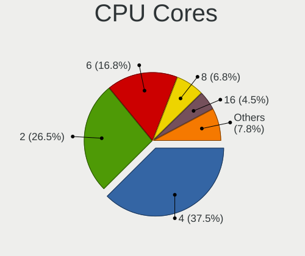

| Number | Desktops | Percent |
|--------|----------|---------|
| 4      | 116      | 37.54%  |
| 2      | 82       | 26.54%  |
| 6      | 52       | 16.83%  |
| 8      | 21       | 6.8%    |
| 16     | 14       | 4.53%   |
| 12     | 8        | 2.59%   |
| 10     | 6        | 1.94%   |
| 20     | 3        | 0.97%   |
| 36     | 1        | 0.32%   |
| 32     | 1        | 0.32%   |
| 28     | 1        | 0.32%   |
| 24     | 1        | 0.32%   |
| 18     | 1        | 0.32%   |
| 14     | 1        | 0.32%   |
| 3      | 1        | 0.32%   |

CPU Sockets
-----------

Number of sockets

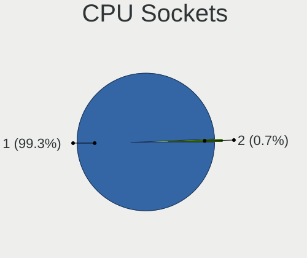

| Number | Desktops | Percent |
|--------|----------|---------|
| 1      | 304      | 99.35%  |
| 2      | 2        | 0.65%   |

CPU Threads
-----------

Threads per core (Hyper-Threading)

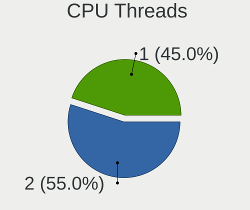

| Number | Desktops | Percent |
|--------|----------|---------|
| 2      | 170      | 55.02%  |
| 1      | 139      | 44.98%  |

CPU Op-Modes
------------

CPU Operation Modes (32-bit, 64-bit)

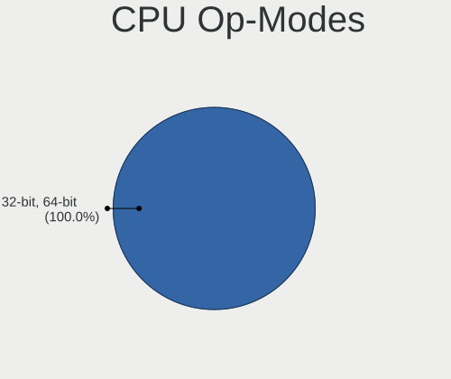

| Op mode        | Desktops | Percent |
|----------------|----------|---------|
| 32-bit, 64-bit | 306      | 100%    |

CPU Microcode
-------------

Microcode number

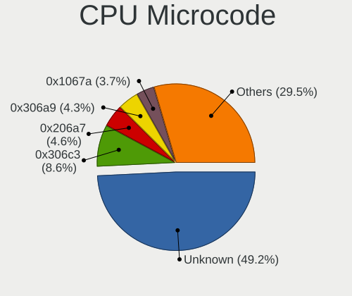

| Number     | Desktops | Percent |
|------------|----------|---------|
| Unknown    | 160      | 49.23%  |
| 0x306c3    | 28       | 8.62%   |
| 0x206a7    | 15       | 4.62%   |
| 0x306a9    | 14       | 4.31%   |
| 0x1067a    | 12       | 3.69%   |
| 0x506e3    | 6        | 1.85%   |
| 0x08701021 | 6        | 1.85%   |
| 0x08108109 | 6        | 1.85%   |
| 0x90672    | 5        | 1.54%   |
| 0x906ea    | 4        | 1.23%   |
| 0x6fb      | 4        | 1.23%   |
| 0x0a20120a | 4        | 1.23%   |
| 0x6fd      | 3        | 0.92%   |
| 0x0a601203 | 3        | 0.92%   |
| 0x0810100b | 3        | 0.92%   |
| 0xa0671    | 2        | 0.62%   |
| 0xa0655    | 2        | 0.62%   |
| 0xa0653    | 2        | 0.62%   |
| 0x906e9    | 2        | 0.62%   |
| 0x10676    | 2        | 0.62%   |
| 0x0a601206 | 2        | 0.62%   |
| 0x0a201025 | 2        | 0.62%   |
| 0x0830104d | 2        | 0.62%   |
| 0x0800820d | 2        | 0.62%   |
| 0xb0671    | 1        | 0.31%   |
| 0x906eb    | 1        | 0.31%   |
| 0x706a8    | 1        | 0.31%   |
| 0x506f1    | 1        | 0.31%   |
| 0x506c9    | 1        | 0.31%   |
| 0x406f1    | 1        | 0.31%   |
| 0x406c4    | 1        | 0.31%   |
| 0x406c3    | 1        | 0.31%   |
| 0x306f2    | 1        | 0.31%   |
| 0x206d7    | 1        | 0.31%   |
| 0x20652    | 1        | 0.31%   |
| 0x106a5    | 1        | 0.31%   |
| 0x0a50000f | 1        | 0.31%   |
| 0x0a50000d | 1        | 0.31%   |
| 0x0a50000b | 1        | 0.31%   |
| 0x0a404102 | 1        | 0.31%   |

CPU Microarch
-------------

Microarchitecture

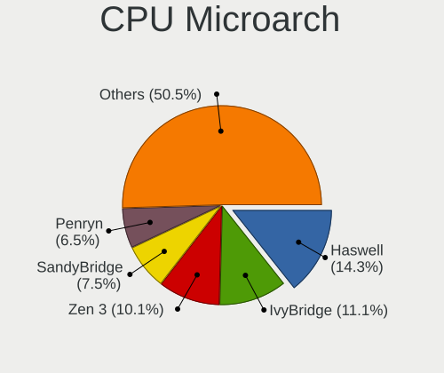

| Name             | Desktops | Percent |
|------------------|----------|---------|
| Haswell          | 44       | 14.33%  |
| IvyBridge        | 34       | 11.07%  |
| Zen 3            | 31       | 10.1%   |
| SandyBridge      | 23       | 7.49%   |
| Penryn           | 20       | 6.51%   |
| Unknown          | 19       | 6.19%   |
| Zen 2            | 17       | 5.54%   |
| Skylake          | 16       | 5.21%   |
| KabyLake         | 16       | 5.21%   |
| Zen+             | 14       | 4.56%   |
| Zen              | 13       | 4.23%   |
| CometLake        | 11       | 3.58%   |
| Alderlake Hybrid | 10       | 3.26%   |
| Core             | 9        | 2.93%   |
| Silvermont       | 4        | 1.3%    |
| Piledriver       | 4        | 1.3%    |
| K10              | 3        | 0.98%   |
| Broadwell        | 3        | 0.98%   |
| Westmere         | 2        | 0.65%   |
| Lunarlake Hybrid | 2        | 0.65%   |
| K8 Hammer        | 2        | 0.65%   |
| Goldmont         | 2        | 0.65%   |
| Tremont          | 1        | 0.33%   |
| Steamroller      | 1        | 0.33%   |
| Nehalem          | 1        | 0.33%   |
| K10 Llano        | 1        | 0.33%   |
| Icelake          | 1        | 0.33%   |
| Gracemont        | 1        | 0.33%   |
| Goldmont plus    | 1        | 0.33%   |
| Excavator        | 1        | 0.33%   |

Graphics
--------

GPU Vendor
----------

Vendors of graphics cards

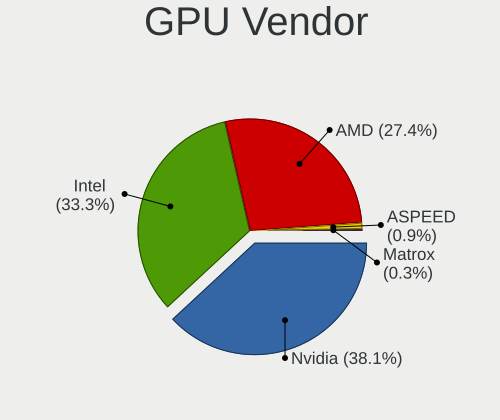

| Vendor                     | Desktops | Percent |
|----------------------------|----------|---------|
| Nvidia                     | 128      | 38.1%   |
| Intel                      | 112      | 33.33%  |
| AMD                        | 92       | 27.38%  |
| ASPEED Technology          | 3        | 0.89%   |
| Matrox Electronics Systems | 1        | 0.3%    |

GPU Model
---------

Graphics card models

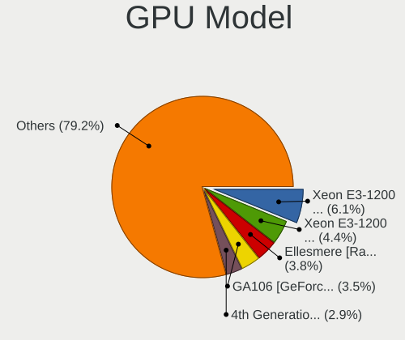

| Model                                                                       | Desktops | Percent |
|-----------------------------------------------------------------------------|----------|---------|
| Intel Xeon E3-1200 v2/3rd Gen Core processor Graphics Controller            | 21       | 6.14%   |
| Intel Xeon E3-1200 v3/4th Gen Core Processor Integrated Graphics Controller | 15       | 4.39%   |
| AMD Ellesmere [Radeon RX 470/480/570/570X/580/580X/590]                     | 13       | 3.8%    |
| Nvidia GA106 [GeForce RTX 3060 Lite Hash Rate]                              | 12       | 3.51%   |
| Intel 4th Generation Core Processor Family Integrated Graphics Controller   | 10       | 2.92%   |
| Intel Skylake-S GT2 [HD Graphics 530]                                       | 8        | 2.34%   |
| Intel 4 Series Chipset Integrated Graphics Controller                       | 8        | 2.34%   |
| AMD Cezanne [Radeon Vega Series / Radeon Vega Mobile Series]                | 8        | 2.34%   |
| Nvidia GF108 [GeForce GT 630]                                               | 7        | 2.05%   |
| Intel 2nd Generation Core Processor Family Integrated Graphics Controller   | 7        | 2.05%   |
| AMD Navi 23 [Radeon RX 6600/6600 XT/6600M]                                  | 7        | 2.05%   |
| Nvidia GK208B [GeForce GT 710]                                              | 6        | 1.75%   |
| AMD Raven Ridge [Radeon Vega Series / Radeon Vega Mobile Series]            | 6        | 1.75%   |
| AMD Picasso/Raven 2 [Radeon Vega Series / Radeon Vega Mobile Series]        | 6        | 1.75%   |
| Nvidia GK208B [GeForce GT 730]                                              | 5        | 1.46%   |
| Nvidia GF108 [GeForce GT 430]                                               | 5        | 1.46%   |
| AMD Raphael                                                                 | 5        | 1.46%   |
| AMD Navi 10 [Radeon RX 5600 OEM/5600 XT / 5700/5700 XT]                     | 5        | 1.46%   |
| Nvidia GP107 [GeForce GTX 1050 Ti]                                          | 4        | 1.17%   |
| Nvidia GA102 [GeForce RTX 3090]                                             | 4        | 1.17%   |
| Nvidia AD107 [GeForce RTX 4060]                                             | 4        | 1.17%   |
| AMD Navi 22 [Radeon RX 6700/6700 XT/6750 XT / 6800M/6850M XT]               | 4        | 1.17%   |
| Nvidia TU117 [GeForce GTX 1650]                                             | 3        | 0.88%   |
| Nvidia TU104 [GeForce RTX 2080]                                             | 3        | 0.88%   |
| Nvidia GM206 [GeForce GTX 950]                                              | 3        | 0.88%   |
| Nvidia GM204 [GeForce GTX 970]                                              | 3        | 0.88%   |
| Nvidia GM107 [GeForce GTX 750 Ti]                                           | 3        | 0.88%   |
| Nvidia GA104 [GeForce RTX 3060 Ti Lite Hash Rate]                           | 3        | 0.88%   |
| Intel CometLake-S GT2 [UHD Graphics 630]                                    | 3        | 0.88%   |
| Intel CoffeeLake-S GT2 [UHD Graphics 630]                                   | 3        | 0.88%   |
| Intel Alder Lake-S GT1 [UHD Graphics 730]                                   | 3        | 0.88%   |
| Intel 82Q35 Express Integrated Graphics Controller                          | 3        | 0.88%   |
| Intel 82G33/G31 Express Integrated Graphics Controller                      | 3        | 0.88%   |
| ASPEED Technology ASPEED Graphics Family                                    | 3        | 0.88%   |
| AMD Polaris 20 XL [Radeon RX 580 2048SP]                                    | 3        | 0.88%   |
| AMD Caicos [Radeon HD 6450/7450/8450 / R5 230 OEM]                          | 3        | 0.88%   |
| AMD Baffin [Radeon RX 550 640SP / RX 560/560X]                              | 3        | 0.88%   |
| Nvidia TU116 [GeForce GTX 1660 SUPER]                                       | 2        | 0.58%   |
| Nvidia TU116 [GeForce GTX 1650 SUPER]                                       | 2        | 0.58%   |
| Nvidia TU106 [GeForce RTX 2070]                                             | 2        | 0.58%   |

GPU Combo
---------

Combinations of graphics cards

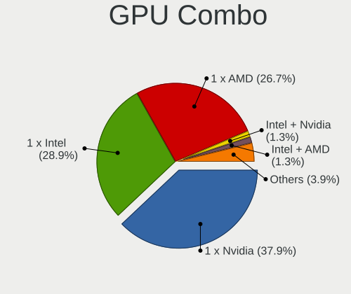

| Name                 | Desktops | Percent |
|----------------------|----------|---------|
| 1 x Nvidia           | 118      | 37.94%  |
| 1 x Intel            | 90       | 28.94%  |
| 1 x AMD              | 83       | 26.69%  |
| Intel + Nvidia       | 4        | 1.29%   |
| Intel + AMD          | 4        | 1.29%   |
| Nvidia + ASPEED      | 3        | 0.96%   |
| AMD + Nvidia         | 3        | 0.96%   |
| 2 x Intel            | 2        | 0.64%   |
| Other                | 1        | 0.32%   |
| 2 x AMD + 3 x Nvidia | 1        | 0.32%   |
| 2 x AMD              | 1        | 0.32%   |
| Nvidia + Matrox      | 1        | 0.32%   |

GPU Driver
----------

Free vs proprietary

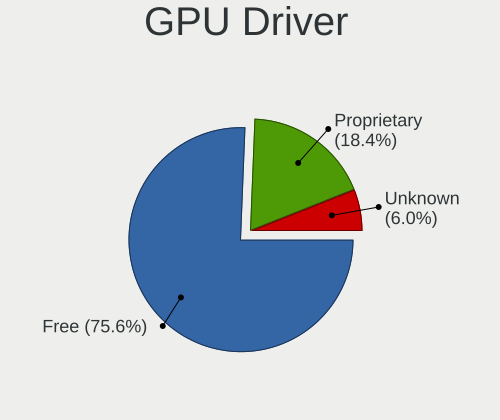

| Driver      | Desktops | Percent |
|-------------|----------|---------|
| Free        | 239      | 75.63%  |
| Proprietary | 58       | 18.35%  |
| Unknown     | 19       | 6.01%   |

GPU Memory
----------

Total video memory

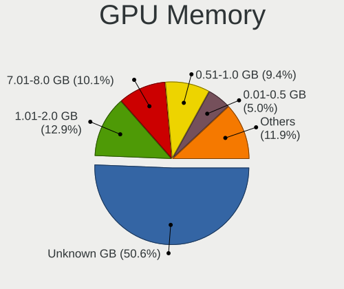

| Size in GB | Desktops | Percent |
|------------|----------|---------|
| Unknown    | 161      | 50.63%  |
| 1.01-2.0   | 41       | 12.89%  |
| 7.01-8.0   | 32       | 10.06%  |
| 0.51-1.0   | 30       | 9.43%   |
| 0.01-0.5   | 16       | 5.03%   |
| 3.01-4.0   | 15       | 4.72%   |
| 8.01-16.0  | 9        | 2.83%   |
| 5.01-6.0   | 8        | 2.52%   |
| 2.01-3.0   | 3        | 0.94%   |
| 24.01-32.0 | 2        | 0.63%   |
| 32.01-64.0 | 1        | 0.31%   |

Monitor
-------

Monitor Vendor
--------------

Monitor vendors

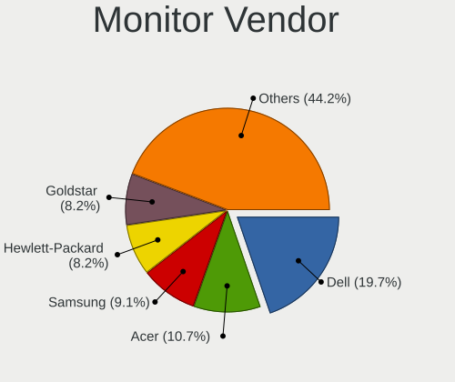

| Vendor                  | Desktops | Percent |
|-------------------------|----------|---------|
| Dell                    | 63       | 19.75%  |
| Acer                    | 34       | 10.66%  |
| Samsung Electronics     | 29       | 9.09%   |
| Hewlett-Packard         | 26       | 8.15%   |
| Goldstar                | 26       | 8.15%   |
| AOC                     | 23       | 7.21%   |
| BenQ                    | 20       | 6.27%   |
| Philips                 | 14       | 4.39%   |
| Lenovo                  | 12       | 3.76%   |
| ViewSonic               | 11       | 3.45%   |
| MSI                     | 6        | 1.88%   |
| Sharp                   | 5        | 1.57%   |
| Denver                  | 5        | 1.57%   |
| ASUSTek Computer        | 5        | 1.57%   |
| Unknown                 | 3        | 0.94%   |
| Toshiba                 | 3        | 0.94%   |
| Unknown                 | 3        | 0.94%   |
| RTK                     | 2        | 0.63%   |
| Panasonic               | 2        | 0.63%   |
| Mi                      | 2        | 0.63%   |
| LG Electronics          | 2        | 0.63%   |
| Fujitsu Siemens         | 2        | 0.63%   |
| Envision Peripherals    | 2        | 0.63%   |
| AOpen                   | 2        | 0.63%   |
| SGT                     | 1        | 0.31%   |
| NCS                     | 1        | 0.31%   |
| MSG                     | 1        | 0.31%   |
| Lenovo Group Limited    | 1        | 0.31%   |
| IPS                     | 1        | 0.31%   |
| Iiyama                  | 1        | 0.31%   |
| HUYINIUDA               | 1        | 0.31%   |
| HMX                     | 1        | 0.31%   |
| Gigabyte Technology     | 1        | 0.31%   |
| GAOMON                  | 1        | 0.31%   |
| Eizo                    | 1        | 0.31%   |
| Dinner                  | 1        | 0.31%   |
| CVT                     | 1        | 0.31%   |
| CMT                     | 1        | 0.31%   |
| Chi Mei Optoelectronics | 1        | 0.31%   |
| AU Optronics            | 1        | 0.31%   |

Monitor Model
-------------

Monitor models

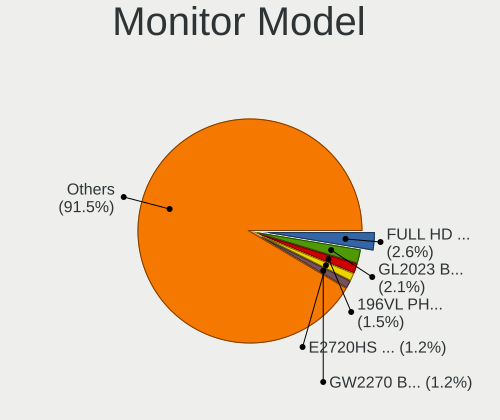

| Model                                                                | Desktops | Percent |
|----------------------------------------------------------------------|----------|---------|
| Goldstar FULL HD GSM5B55 1920x1080 480x270mm 21.7-inch               | 9        | 2.64%   |
| BenQ GL2023 BNQ78CC 1600x900 443x249mm 20.0-inch                     | 7        | 2.05%   |
| Philips 196VL PHLC07F 1366x768 409x230mm 18.5-inch                   | 5        | 1.47%   |
| Dell E2720HS DELA15E 1920x1080 598x336mm 27.0-inch                   | 4        | 1.17%   |
| BenQ GW2270 BNQ78DB 1920x1080 476x268mm 21.5-inch                    | 4        | 1.17%   |
| AOC 2470W AOC2470 1920x1080 521x293mm 23.5-inch                      | 4        | 1.17%   |
| Samsung Electronics S24F350 SAM0D21 1920x1080 521x293mm 23.5-inch    | 3        | 0.88%   |
| Samsung Electronics C24F390 SAM0D2C 1920x1080 521x293mm 23.5-inch    | 3        | 0.88%   |
| Lenovo T24i-10 LEN61A6 1920x1080 527x296mm 23.8-inch                 | 3        | 0.88%   |
| Goldstar W1943 GSM4BAD 1360x768 406x229mm 18.4-inch                  | 3        | 0.88%   |
| Goldstar HDR WFHD GSM7714 2560x1080 798x334mm 34.1-inch              | 3        | 0.88%   |
| Denver MO-HHS-32C LHCFFFF 1920x1080 699x393mm 31.6-inch              | 3        | 0.88%   |
| Dell S2340L DELD058 1920x1080 509x286mm 23.0-inch                    | 3        | 0.88%   |
| Dell E1916H DELF064 1366x768 410x230mm 18.5-inch                     | 3        | 0.88%   |
| Acer K242HL ACR03E3 1920x1080 531x299mm 24.0-inch                    | 3        | 0.88%   |
| Unknown                                                              | 3        | 0.88%   |
| ViewSonic VA3209-QHD VSCA93D 2560x1440 698x393mm 31.5-inch           | 2        | 0.59%   |
| Sharp HDMI SHP10A1 1360x768 700x390mm 31.5-inch                      | 2        | 0.59%   |
| Samsung Electronics S19D300 SAM0B34 1366x768 410x230mm 18.5-inch     | 2        | 0.59%   |
| RTK '' RTK00ED 2520x1680 300x200mm 14.2-inch                         | 2        | 0.59%   |
| Mi Monitor XMI23CB 1920x1080 527x296mm 23.8-inch                     | 2        | 0.59%   |
| Hewlett-Packard LCD Monitor P221                                     | 2        | 0.59%   |
| Hewlett-Packard E231 HWP3063 1920x1080 510x287mm 23.0-inch           | 2        | 0.59%   |
| Hewlett-Packard 20wd HWP3144 1600x900 432x239mm 19.4-inch            | 2        | 0.59%   |
| Goldstar HDR WFHD GSM7715 2560x1080 798x334mm 34.1-inch              | 2        | 0.59%   |
| Envision Peripherals LED 2473w ENV2473 1920x1080 521x293mm 23.5-inch | 2        | 0.59%   |
| Dell SE2719HR DELF115 1920x1080 598x336mm 27.0-inch                  | 2        | 0.59%   |
| Dell P170S DEL4058 1280x1024 338x270mm 17.0-inch                     | 2        | 0.59%   |
| Dell LCD Monitor E2720HS 1920x1080                                   | 2        | 0.59%   |
| Dell E1916H DELF065 1366x768 410x230mm 18.5-inch                     | 2        | 0.59%   |
| Dell 2007FP DELA021 1600x1200 367x275mm 18.1-inch                    | 2        | 0.59%   |
| BenQ LCD Monitor GW2270 1920x1080                                    | 2        | 0.59%   |
| ASUSTek Computer XG32VQR AUS32B2 2560x1440 697x393mm 31.5-inch       | 2        | 0.59%   |
| AOC LCD Monitor 936W 1366x768                                        | 2        | 0.59%   |
| AOC 936W AOC1936 1366x768 410x230mm 18.5-inch                        | 2        | 0.59%   |
| AOC 24G2W1G3 AOC2402 1920x1080 527x296mm 23.8-inch                   | 2        | 0.59%   |
| AOC 1950W AOC1950 1366x768 410x230mm 18.5-inch                       | 2        | 0.59%   |
| Acer XV240Y P ACR0734 1920x1080 527x296mm 23.8-inch                  | 2        | 0.59%   |
| Acer VG270 E ACR0B02 1920x1080 598x336mm 27.0-inch                   | 2        | 0.59%   |
| Acer V203HL ACR01A4 1600x900 443x249mm 20.0-inch                     | 2        | 0.59%   |

Monitor Resolution
------------------

Monitor screen resolution

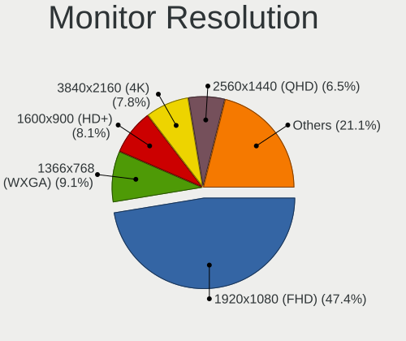

| Resolution         | Desktops | Percent |
|--------------------|----------|---------|
| 1920x1080 (FHD)    | 146      | 47.4%   |
| 1366x768 (WXGA)    | 28       | 9.09%   |
| 1600x900 (HD+)     | 25       | 8.12%   |
| 3840x2160 (4K)     | 24       | 7.79%   |
| 2560x1440 (QHD)    | 20       | 6.49%   |
| 1440x900 (WXGA+)   | 9        | 2.92%   |
| 2560x1080          | 8        | 2.6%    |
| 1680x1050 (WSXGA+) | 7        | 2.27%   |
| 1280x1024 (SXGA)   | 7        | 2.27%   |
| 1360x768           | 6        | 1.95%   |
| Unknown            | 6        | 1.95%   |
| 3840x1080          | 3        | 0.97%   |
| 1920x1200 (WUXGA)  | 3        | 0.97%   |
| 5760x1080          | 2        | 0.65%   |
| 3440x1440          | 2        | 0.65%   |
| 2520x1680          | 2        | 0.65%   |
| 1600x1200          | 2        | 0.65%   |
| 5440x1080          | 1        | 0.32%   |
| 5120x1440          | 1        | 0.32%   |
| 3120x1600          | 1        | 0.32%   |
| 2288x1287          | 1        | 0.32%   |
| 1920x540           | 1        | 0.32%   |
| 1280x960           | 1        | 0.32%   |
| 1280x720 (HD)      | 1        | 0.32%   |
| 1024x768 (XGA)     | 1        | 0.32%   |

Monitor Diagonal
----------------

Diagonal size in inches

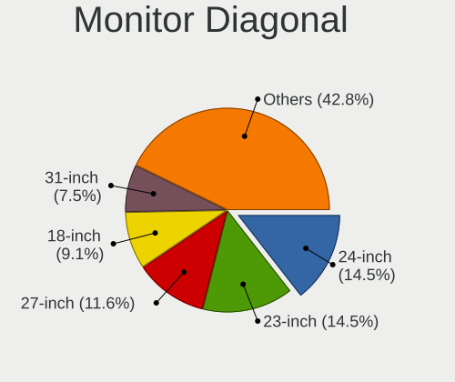

| Inches  | Desktops | Percent |
|---------|----------|---------|
| 24      | 46       | 14.47%  |
| 23      | 46       | 14.47%  |
| 27      | 37       | 11.64%  |
| 18      | 29       | 9.12%   |
| 31      | 24       | 7.55%   |
| 21      | 24       | 7.55%   |
| Unknown | 22       | 6.92%   |
| 20      | 21       | 6.6%    |
| 19      | 17       | 5.35%   |
| 22      | 10       | 3.14%   |
| 17      | 7        | 2.2%    |
| 34      | 5        | 1.57%   |
| 32      | 4        | 1.26%   |
| 63      | 3        | 0.94%   |
| 49      | 3        | 0.94%   |
| 14      | 3        | 0.94%   |
| 12      | 3        | 0.94%   |
| 84      | 2        | 0.63%   |
| 40      | 2        | 0.63%   |
| 28      | 2        | 0.63%   |
| 142     | 1        | 0.31%   |
| 55      | 1        | 0.31%   |
| 54      | 1        | 0.31%   |
| 48      | 1        | 0.31%   |
| 39      | 1        | 0.31%   |
| 29      | 1        | 0.31%   |
| 25      | 1        | 0.31%   |
| 15      | 1        | 0.31%   |

Monitor Width
-------------

Physical width

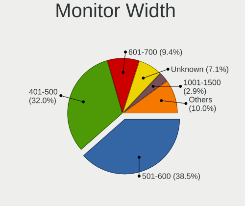

| Width in mm    | Desktops | Percent |
|----------------|----------|---------|
| 501-600        | 119      | 38.51%  |
| 401-500        | 99       | 32.04%  |
| 601-700        | 29       | 9.39%   |
| Unknown        | 22       | 7.12%   |
| 701-800        | 9        | 2.91%   |
| 301-350        | 9        | 2.91%   |
| 1001-1500      | 9        | 2.91%   |
| 201-300        | 5        | 1.62%   |
| 801-900        | 3        | 0.97%   |
| 351-400        | 2        | 0.65%   |
| 1501-2000      | 2        | 0.65%   |
| More than 2000 | 1        | 0.32%   |

Aspect Ratio
------------

Proportional relationship between the width and the height

| Ratio   | Desktops | Percent |
|---------|----------|---------|
| 16/9    | 222      | 75.51%  |
| 16/10   | 25       | 8.5%    |
| Unknown | 19       | 6.46%   |
| 5/4     | 9        | 3.06%   |
| 21/9    | 6        | 2.04%   |
| 4/3     | 5        | 1.7%    |
| 32/9    | 5        | 1.7%    |
| 3/2     | 2        | 0.68%   |
| 1.00    | 1        | 0.34%   |

Monitor Area
------------

Area in inch²

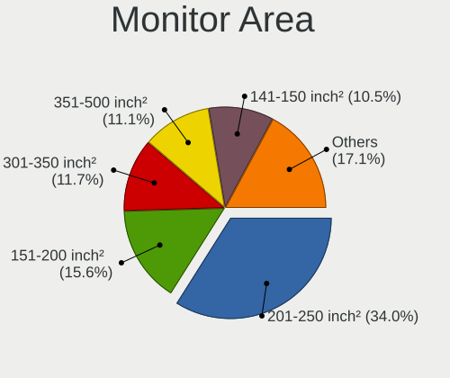

| Area in inch² | Desktops | Percent |
|----------------|----------|---------|
| 201-250        | 107      | 33.97%  |
| 151-200        | 49       | 15.56%  |
| 301-350        | 37       | 11.75%  |
| 351-500        | 35       | 11.11%  |
| 141-150        | 33       | 10.48%  |
| Unknown        | 22       | 6.98%   |
| 251-300        | 10       | 3.17%   |
| More than 1000 | 8        | 2.54%   |
| 501-1000       | 7        | 2.22%   |
| 71-80          | 2        | 0.63%   |
| 91-100         | 2        | 0.63%   |
| 81-90          | 1        | 0.32%   |
| 61-70          | 1        | 0.32%   |
| 101-110        | 1        | 0.32%   |

Pixel Density
-------------

Pixels per inch

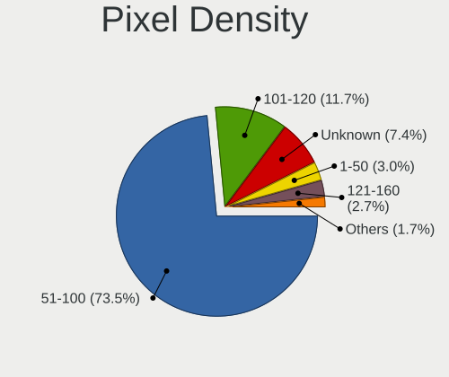

| Density | Desktops | Percent |
|---------|----------|---------|
| 51-100  | 219      | 73.49%  |
| 101-120 | 35       | 11.74%  |
| Unknown | 22       | 7.38%   |
| 1-50    | 9        | 3.02%   |
| 121-160 | 8        | 2.68%   |
| 161-240 | 5        | 1.68%   |

Multiple Monitors
-----------------

Total monitors connected

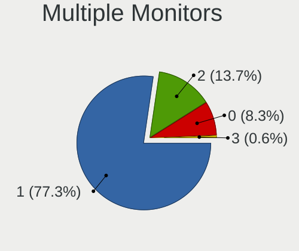

| Total | Desktops | Percent |
|-------|----------|---------|
| 1     | 242      | 77.32%  |
| 2     | 43       | 13.74%  |
| 0     | 26       | 8.31%   |
| 3     | 2        | 0.64%   |

Network
-------

Net Controller Vendor
---------------------

Controller vendors

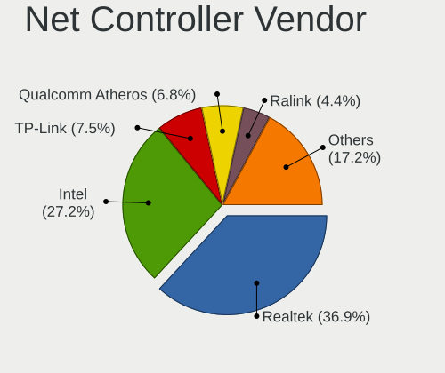

| Vendor                            | Desktops | Percent |
|-----------------------------------|----------|---------|
| Realtek Semiconductor             | 191      | 36.87%  |
| Intel                             | 141      | 27.22%  |
| TP-Link                           | 39       | 7.53%   |
| Qualcomm Atheros                  | 35       | 6.76%   |
| Ralink Technology                 | 23       | 4.44%   |
| Broadcom                          | 14       | 2.7%    |
| D-Link                            | 13       | 2.51%   |
| Qualcomm Atheros Communications   | 10       | 1.93%   |
| MediaTek                          | 8        | 1.54%   |
| Xiaomi                            | 6        | 1.16%   |
| Broadcom Limited                  | 4        | 0.77%   |
| Samsung Electronics               | 3        | 0.58%   |
| OPPO Electronics                  | 3        | 0.58%   |
| Nvidia                            | 3        | 0.58%   |
| Aquantia                          | 3        | 0.58%   |
| Qualcomm                          | 2        | 0.39%   |
| Google                            | 2        | 0.39%   |
| Winbond Electronics               | 1        | 0.19%   |
| VIA Technologies                  | 1        | 0.19%   |
| Tehuti Networks                   | 1        | 0.19%   |
| T & A Mobile Phones               | 1        | 0.19%   |
| Sundance Technology Inc / IC Plus | 1        | 0.19%   |
| Ralink                            | 1        | 0.19%   |
| Qualcomm Technologies             | 1        | 0.19%   |
| Mercucys                          | 1        | 0.19%   |
| Mellanox Technologies             | 1        | 0.19%   |
| InterBiometrics                   | 1        | 0.19%   |
| ICS Advent                        | 1        | 0.19%   |
| Huawei Technologies               | 1        | 0.19%   |
| D-Link System                     | 1        | 0.19%   |
| ASIX Electronics                  | 1        | 0.19%   |
| Apple                             | 1        | 0.19%   |
| American Megatrends               | 1        | 0.19%   |
| AboCom Systems                    | 1        | 0.19%   |
| Unknown                           | 1        | 0.19%   |

Net Controller Model
--------------------

Controller models

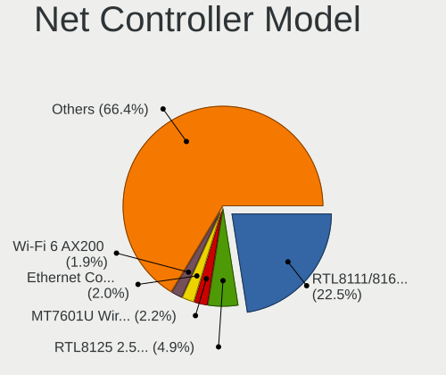

| Model                                                                  | Desktops | Percent |
|------------------------------------------------------------------------|----------|---------|
| Realtek RTL8111/8168/8211/8411 PCI Express Gigabit Ethernet Controller | 132      | 22.53%  |
| Realtek RTL8125 2.5GbE Controller                                      | 29       | 4.95%   |
| Ralink MT7601U Wireless Adapter                                        | 13       | 2.22%   |
| Intel Ethernet Connection I217-LM                                      | 12       | 2.05%   |
| Intel Wi-Fi 6 AX200                                                    | 11       | 1.88%   |
| Intel I211 Gigabit Network Connection                                  | 11       | 1.88%   |
| TP-Link Archer T4U ver.3                                               | 10       | 1.71%   |
| Realtek RTL88x2bu [AC1200 Techkey]                                     | 10       | 1.71%   |
| Realtek 802.11ac NIC                                                   | 10       | 1.71%   |
| Intel 82579V Gigabit Network Connection                                | 10       | 1.71%   |
| Qualcomm Atheros AR8151 v2.0 Gigabit Ethernet                          | 9        | 1.54%   |
| Intel Wi-Fi 6E(802.11ax) AX210/AX1675* 2x2 [Typhoon Peak]              | 9        | 1.54%   |
| Intel 82579LM Gigabit Network Connection (Lewisville)                  | 9        | 1.54%   |
| Ralink RT2870/RT3070 Wireless Adapter                                  | 8        | 1.37%   |
| Intel 82599ES 10-Gigabit SFI/SFP+ Network Connection                   | 8        | 1.37%   |
| D-Link DWA-123 Wireless N 150 Adapter (rev.D1)                         | 8        | 1.37%   |
| TP-Link TL-WN823N v2/v3 [Realtek RTL8192EU]                            | 7        | 1.19%   |
| TP-Link 802.11ac WLAN Adapter                                          | 7        | 1.19%   |
| Intel Ethernet Controller I225-V                                       | 7        | 1.19%   |
| TP-Link 802.11n NIC                                                    | 6        | 1.02%   |
| Qualcomm Atheros AR9271 802.11n                                        | 6        | 1.02%   |
| Intel I210 Gigabit Network Connection                                  | 6        | 1.02%   |
| Realtek RTL8188EUS 802.11n Wireless Network Adapter                    | 5        | 0.85%   |
| Qualcomm Atheros AR9485 Wireless Network Adapter                       | 5        | 0.85%   |
| Qualcomm Atheros AR9287 Wireless Network Adapter (PCI-Express)         | 5        | 0.85%   |
| Intel Ethernet Connection (2) I219-V                                   | 5        | 0.85%   |
| Intel Ethernet Connection (11) I219-V                                  | 5        | 0.85%   |
| Intel Alder Lake-S PCH CNVi WiFi                                       | 5        | 0.85%   |
| Intel 82567LM-3 Gigabit Network Connection                             | 5        | 0.85%   |
| Intel 82566DM-2 Gigabit Network Connection                             | 5        | 0.85%   |
| Xiaomi Mi/Redmi series (RNDIS)                                         | 4        | 0.68%   |
| TP-Link Archer T3U [Realtek RTL8812BU]                                 | 4        | 0.68%   |
| Realtek RTL8192CU 802.11n WLAN Adapter                                 | 4        | 0.68%   |
| Realtek RTL8153 Gigabit Ethernet Adapter                               | 4        | 0.68%   |
| Realtek RTL810xE PCI Express Fast Ethernet controller                  | 4        | 0.68%   |
| Intel Ethernet Connection (7) I219-V                                   | 4        | 0.68%   |
| Intel Ethernet Connection (2) I219-LM                                  | 4        | 0.68%   |
| Intel Comet Lake PCH CNVi WiFi                                         | 4        | 0.68%   |
| Broadcom BCM4360 802.11ac Dual Band Wireless Network Adapter           | 4        | 0.68%   |
| Realtek RTL8192EE PCIe Wireless Network Adapter                        | 3        | 0.51%   |

Wireless Vendor
---------------

Wireless vendors

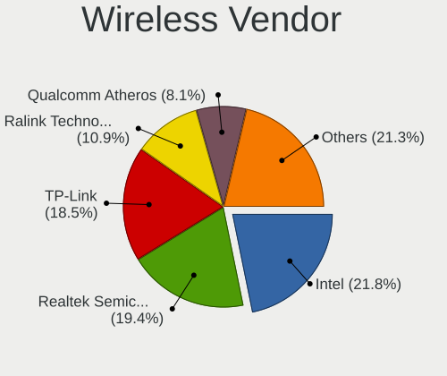

| Vendor                          | Desktops | Percent |
|---------------------------------|----------|---------|
| Intel                           | 46       | 21.8%   |
| Realtek Semiconductor           | 41       | 19.43%  |
| TP-Link                         | 39       | 18.48%  |
| Ralink Technology               | 23       | 10.9%   |
| Qualcomm Atheros                | 17       | 8.06%   |
| D-Link                          | 13       | 6.16%   |
| Qualcomm Atheros Communications | 10       | 4.74%   |
| Broadcom                        | 9        | 4.27%   |
| MediaTek                        | 8        | 3.79%   |
| Ralink                          | 1        | 0.47%   |
| Mercucys                        | 1        | 0.47%   |
| D-Link System                   | 1        | 0.47%   |
| Broadcom Limited                | 1        | 0.47%   |
| AboCom Systems                  | 1        | 0.47%   |

Wireless Model
--------------

Wireless models

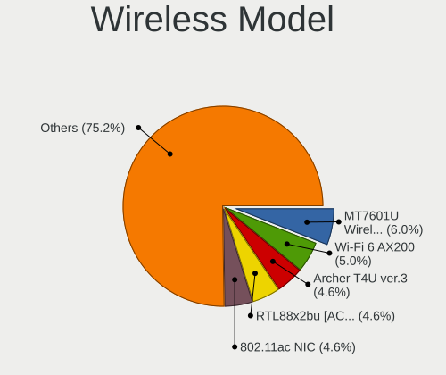

| Model                                                                                | Desktops | Percent |
|--------------------------------------------------------------------------------------|----------|---------|
| Ralink MT7601U Wireless Adapter                                                      | 13       | 5.96%   |
| Intel Wi-Fi 6 AX200                                                                  | 11       | 5.05%   |
| TP-Link Archer T4U ver.3                                                             | 10       | 4.59%   |
| Realtek RTL88x2bu [AC1200 Techkey]                                                   | 10       | 4.59%   |
| Realtek 802.11ac NIC                                                                 | 10       | 4.59%   |
| Intel Wi-Fi 6E(802.11ax) AX210/AX1675* 2x2 [Typhoon Peak]                            | 9        | 4.13%   |
| Ralink RT2870/RT3070 Wireless Adapter                                                | 8        | 3.67%   |
| D-Link DWA-123 Wireless N 150 Adapter (rev.D1)                                       | 8        | 3.67%   |
| TP-Link TL-WN823N v2/v3 [Realtek RTL8192EU]                                          | 7        | 3.21%   |
| TP-Link 802.11ac WLAN Adapter                                                        | 7        | 3.21%   |
| TP-Link 802.11n NIC                                                                  | 6        | 2.75%   |
| Qualcomm Atheros AR9271 802.11n                                                      | 6        | 2.75%   |
| Realtek RTL8188EUS 802.11n Wireless Network Adapter                                  | 5        | 2.29%   |
| Qualcomm Atheros AR9485 Wireless Network Adapter                                     | 5        | 2.29%   |
| Qualcomm Atheros AR9287 Wireless Network Adapter (PCI-Express)                       | 5        | 2.29%   |
| TP-Link Archer T3U [Realtek RTL8812BU]                                               | 4        | 1.83%   |
| Realtek RTL8192CU 802.11n WLAN Adapter                                               | 4        | 1.83%   |
| Intel Comet Lake PCH CNVi WiFi                                                       | 4        | 1.83%   |
| Broadcom BCM4360 802.11ac Dual Band Wireless Network Adapter                         | 4        | 1.83%   |
| Realtek RTL8192EE PCIe Wireless Network Adapter                                      | 3        | 1.38%   |
| Ralink RT5370 Wireless Adapter                                                       | 3        | 1.38%   |
| Qualcomm Atheros TP-Link TL-WN821N v3 / TL-WN822N v2 802.11n [Atheros AR7010+AR9287] | 3        | 1.38%   |
| Qualcomm Atheros AR9462 Wireless Network Adapter                                     | 3        | 1.38%   |
| MediaTek WiFi                                                                        | 3        | 1.38%   |
| Intel Alder Lake-S PCH CNVi WiFi                                                     | 3        | 1.38%   |
| Intel 700 Series Chipset CNVi WiFi                                                   | 3        | 1.38%   |
| TP-Link TL-WN821N v5/v6 [RTL8192EU]                                                  | 2        | 0.92%   |
| TP-Link Archer T9UH v1 [Realtek RTL8814AU]                                           | 2        | 0.92%   |
| TP-Link Archer T2U PLUS [RTL8821AU]                                                  | 2        | 0.92%   |
| TP-Link AC600 wireless Realtek RTL8811AU [Archer T2U Nano]                           | 2        | 0.92%   |
| Realtek RTL8812AE 802.11ac PCIe Wireless Network Adapter                             | 2        | 0.92%   |
| Realtek RTL8188CUS 802.11n WLAN Adapter                                              | 2        | 0.92%   |
| Qualcomm Atheros QCA9565 / AR9565 Wireless Network Adapter                           | 2        | 0.92%   |
| Qualcomm Atheros AR9227 Wireless Network Adapter                                     | 2        | 0.92%   |
| MediaTek MT7925 802.11be 160MHz 2x2 PCIe Wireless Network Adapter [Filogic 360]      | 2        | 0.92%   |
| MediaTek MT7922 802.11ax PCI Express Wireless Network Adapter                        | 2        | 0.92%   |
| Intel Wireless 3165                                                                  | 2        | 0.92%   |
| Intel Wi-Fi 5(802.11ac) Wireless-AC 9x6x [Thunder Peak]                              | 2        | 0.92%   |
| Intel Jasper Lake PCH CNVi WiFi                                                      | 2        | 0.92%   |
| Intel Dual Band Wireless-AC 3165 Plus Bluetooth                                      | 2        | 0.92%   |

Ethernet Vendor
---------------

Ethernet vendors

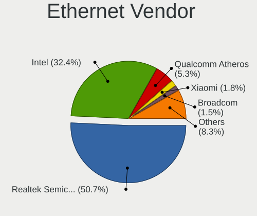

| Vendor                            | Desktops | Percent |
|-----------------------------------|----------|---------|
| Realtek Semiconductor             | 172      | 50.74%  |
| Intel                             | 110      | 32.45%  |
| Qualcomm Atheros                  | 18       | 5.31%   |
| Xiaomi                            | 6        | 1.77%   |
| Broadcom                          | 5        | 1.47%   |
| Samsung Electronics               | 3        | 0.88%   |
| OPPO Electronics                  | 3        | 0.88%   |
| Nvidia                            | 3        | 0.88%   |
| Broadcom Limited                  | 3        | 0.88%   |
| Aquantia                          | 3        | 0.88%   |
| Qualcomm                          | 2        | 0.59%   |
| VIA Technologies                  | 1        | 0.29%   |
| Tehuti Networks                   | 1        | 0.29%   |
| T & A Mobile Phones               | 1        | 0.29%   |
| Sundance Technology Inc / IC Plus | 1        | 0.29%   |
| Qualcomm Technologies             | 1        | 0.29%   |
| Mellanox Technologies             | 1        | 0.29%   |
| ICS Advent                        | 1        | 0.29%   |
| Huawei Technologies               | 1        | 0.29%   |
| ASIX Electronics                  | 1        | 0.29%   |
| Apple                             | 1        | 0.29%   |
| American Megatrends               | 1        | 0.29%   |

Ethernet Model
--------------

Ethernet models

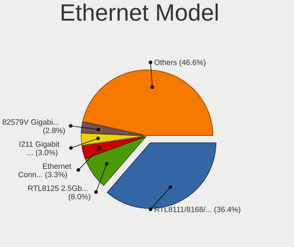

| Model                                                                  | Desktops | Percent |
|------------------------------------------------------------------------|----------|---------|
| Realtek RTL8111/8168/8211/8411 PCI Express Gigabit Ethernet Controller | 132      | 36.36%  |
| Realtek RTL8125 2.5GbE Controller                                      | 29       | 7.99%   |
| Intel Ethernet Connection I217-LM                                      | 12       | 3.31%   |
| Intel I211 Gigabit Network Connection                                  | 11       | 3.03%   |
| Intel 82579V Gigabit Network Connection                                | 10       | 2.75%   |
| Qualcomm Atheros AR8151 v2.0 Gigabit Ethernet                          | 9        | 2.48%   |
| Intel 82579LM Gigabit Network Connection (Lewisville)                  | 9        | 2.48%   |
| Intel 82599ES 10-Gigabit SFI/SFP+ Network Connection                   | 8        | 2.2%    |
| Intel Ethernet Controller I225-V                                       | 7        | 1.93%   |
| Intel I210 Gigabit Network Connection                                  | 6        | 1.65%   |
| Intel Ethernet Connection (2) I219-V                                   | 5        | 1.38%   |
| Intel Ethernet Connection (11) I219-V                                  | 5        | 1.38%   |
| Intel 82567LM-3 Gigabit Network Connection                             | 5        | 1.38%   |
| Intel 82566DM-2 Gigabit Network Connection                             | 5        | 1.38%   |
| Xiaomi Mi/Redmi series (RNDIS)                                         | 4        | 1.1%    |
| Realtek RTL8153 Gigabit Ethernet Adapter                               | 4        | 1.1%    |
| Realtek RTL810xE PCI Express Fast Ethernet controller                  | 4        | 1.1%    |
| Intel Ethernet Connection (7) I219-V                                   | 4        | 1.1%    |
| Intel Ethernet Connection (2) I219-LM                                  | 4        | 1.1%    |
| Realtek RTL8111/8168/8411 PCI Express Gigabit Ethernet Controller      | 3        | 0.83%   |
| Intel Ethernet Controller X550                                         | 3        | 0.83%   |
| Intel Ethernet Connection (2) I218-LM                                  | 3        | 0.83%   |
| Intel Ethernet Connection (17) I219-V                                  | 3        | 0.83%   |
| Intel Ethernet 10G 2P X520 Adapter                                     | 3        | 0.83%   |
| Xiaomi Mi/Redmi series (RNDIS + ADB)                                   | 2        | 0.55%   |
| Samsung GT-I9070 (network tethering, USB debugging enabled)            | 2        | 0.55%   |
| Realtek RTL8152 Fast Ethernet Adapter                                  | 2        | 0.55%   |
| Realtek Killer E3000 2.5GbE Controller                                 | 2        | 0.55%   |
| Qualcomm YUPIK-QRD _SN:AC1D5909                                        | 2        | 0.55%   |
| Qualcomm Atheros Killer E220x Gigabit Ethernet Controller              | 2        | 0.55%   |
| Qualcomm Atheros AR8152 v2.0 Fast Ethernet                             | 2        | 0.55%   |
| Qualcomm Atheros AR8121/AR8113/AR8114 Gigabit or Fast Ethernet         | 2        | 0.55%   |
| OPPO Ace 3V                                                            | 2        | 0.55%   |
| Intel I350 Gigabit Fiber Network Connection                            | 2        | 0.55%   |
| Intel Ethernet Connection I217-V                                       | 2        | 0.55%   |
| Intel Ethernet Connection (14) I219-V                                  | 2        | 0.55%   |
| Intel Alder Lake-S PCH CNVi WiFi                                       | 2        | 0.55%   |
| Intel 82583V Gigabit Network Connection                                | 2        | 0.55%   |
| Intel 82562V-2 10/100 Network Connection                               | 2        | 0.55%   |
| Broadcom NetXtreme BCM5754 Gigabit Ethernet PCI Express                | 2        | 0.55%   |

Net Controller Kind
-------------------

Ethernet, WiFi or modem

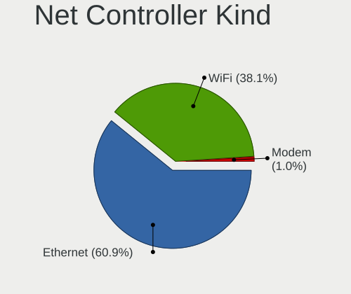

| Kind     | Desktops | Percent |
|----------|----------|---------|
| Ethernet | 291      | 60.88%  |
| WiFi     | 182      | 38.08%  |
| Modem    | 5        | 1.05%   |

Used Controller
---------------

Currently used network controller

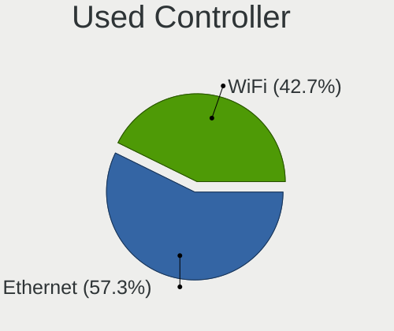

| Kind     | Desktops | Percent |
|----------|----------|---------|
| Ethernet | 181      | 57.28%  |
| WiFi     | 135      | 42.72%  |

NICs
----

Total network controllers on board

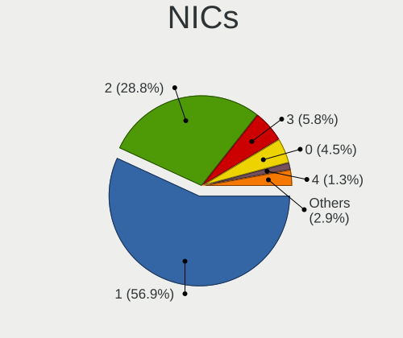

| Total | Desktops | Percent |
|-------|----------|---------|
| 1     | 178      | 56.87%  |
| 2     | 90       | 28.75%  |
| 3     | 18       | 5.75%   |
| 0     | 14       | 4.47%   |
| 4     | 4        | 1.28%   |
| 5     | 3        | 0.96%   |
| 6     | 2        | 0.64%   |
| 14    | 1        | 0.32%   |
| 11    | 1        | 0.32%   |
| 9     | 1        | 0.32%   |
| 8     | 1        | 0.32%   |

IPv6
----

IPv6 vs IPv4

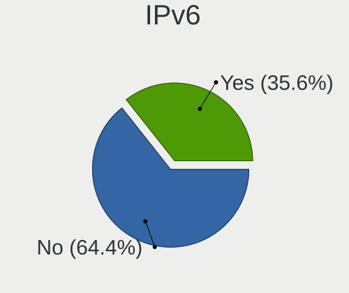

| Used | Desktops | Percent |
|------|----------|---------|
| No   | 204      | 64.35%  |
| Yes  | 113      | 35.65%  |

Bluetooth
---------

Bluetooth Vendor
----------------

Controller vendors

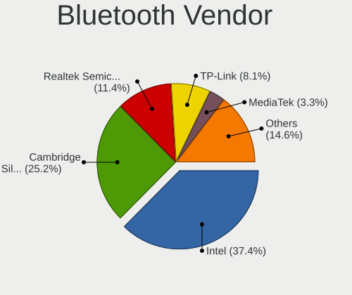

| Vendor                          | Desktops | Percent |
|---------------------------------|----------|---------|
| Intel                           | 46       | 37.4%   |
| Cambridge Silicon Radio         | 31       | 25.2%   |
| Realtek Semiconductor           | 14       | 11.38%  |
| TP-Link                         | 10       | 8.13%   |
| MediaTek                        | 4        | 3.25%   |
| Foxconn / Hon Hai               | 4        | 3.25%   |
| Unknown                         | 4        | 3.25%   |
| IMC Networks                    | 2        | 1.63%   |
| D-Link                          | 2        | 1.63%   |
| Broadcom                        | 2        | 1.63%   |
| Apple                           | 2        | 1.63%   |
| SINO WEALTH                     | 1        | 0.81%   |
| Qualcomm Atheros Communications | 1        | 0.81%   |

Bluetooth Model
---------------

Controller models

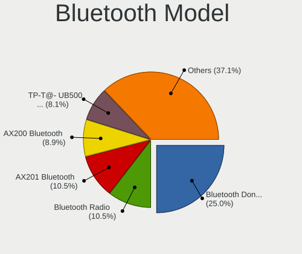

| Model                                               | Desktops | Percent |
|-----------------------------------------------------|----------|---------|
| Cambridge Silicon Radio Bluetooth Dongle (HCI mode) | 31       | 25%     |
| Realtek Bluetooth Radio                             | 13       | 10.48%  |
| Intel AX201 Bluetooth                               | 13       | 10.48%  |
| Intel AX200 Bluetooth                               | 11       | 8.87%   |
| TP-Link TP-T@- UB500 Adapter                        | 10       | 8.06%   |
| Intel AX210 Bluetooth                               | 8        | 6.45%   |
| Intel Bluetooth wireless interface                  | 7        | 5.65%   |
| MediaTek Wireless_Device                            | 4        | 3.23%   |
| Intel Bluetooth Device                              | 4        | 3.23%   |
| Unknown                                             | 4        | 3.23%   |
| Intel Wireless-AC 3168 Bluetooth                    | 2        | 1.61%   |
| Foxconn / Hon Hai Wireless_Device                   | 2        | 1.61%   |
| D-Link DBT-122 Bluetooth adapter                    | 2        | 1.61%   |
| Apple Bluetooth Host Controller                     | 2        | 1.61%   |
| SINO WEALTH Bluetooth Keyboard                      | 1        | 0.81%   |
| Realtek Bluetooth 5.4 Radio                         | 1        | 0.81%   |
| Realtek Bluetooth 5.3 Radio                         | 1        | 0.81%   |
| Qualcomm Atheros  Bluetooth Device                  | 1        | 0.81%   |
| Intel Wireless-AC 9260 Bluetooth Adapter            | 1        | 0.81%   |
| IMC Networks Bluetooth Radio                        | 1        | 0.81%   |
| IMC Networks Bluetooth Device                       | 1        | 0.81%   |
| Foxconn / Hon Hai Bluetooth USB Host Controller     | 1        | 0.81%   |
| Foxconn / Hon Hai Bluetooth Device                  | 1        | 0.81%   |
| Broadcom BCM43142A0 Bluetooth 4.0                   | 1        | 0.81%   |
| Broadcom BCM20702A0                                 | 1        | 0.81%   |

Sound
-----

Sound Vendor
------------

Sound card vendors

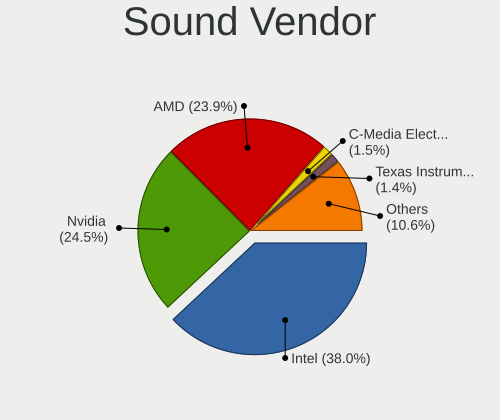

| Vendor                                       | Desktops | Percent |
|----------------------------------------------|----------|---------|
| Intel                                        | 197      | 38.03%  |
| Nvidia                                       | 127      | 24.52%  |
| AMD                                          | 124      | 23.94%  |
| C-Media Electronics                          | 8        | 1.54%   |
| Texas Instruments                            | 7        | 1.35%   |
| Logitech                                     | 7        | 1.35%   |
| JMTek                                        | 7        | 1.35%   |
| ASUSTek Computer                             | 6        | 1.16%   |
| KTMicro                                      | 5        | 0.97%   |
| Tenx Technology                              | 2        | 0.39%   |
| Creative Technology                          | 2        | 0.39%   |
| Zoran Co. Personal Media Division (Nogatech) | 1        | 0.19%   |
| Yamaha                                       | 1        | 0.19%   |
| XMOS                                         | 1        | 0.19%   |
| Walmart                                      | 1        | 0.19%   |
| Synaptics                                    | 1        | 0.19%   |
| SteelSeries ApS                              | 1        | 0.19%   |
| Setek Elektronik                             | 1        | 0.19%   |
| SAVITECH                                     | 1        | 0.19%   |
| RODE Microphones                             | 1        | 0.19%   |
| Realtek Semiconductor                        | 1        | 0.19%   |
| Razer USA                                    | 1        | 0.19%   |
| Philips (or NXP)                             | 1        | 0.19%   |
| Micro Star International                     | 1        | 0.19%   |
| Maono                                        | 1        | 0.19%   |
| Jieli Technology                             | 1        | 0.19%   |
| Huawei Technologies                          | 1        | 0.19%   |
| GYROCOM C&C                                  | 1        | 0.19%   |
| GN Netcom                                    | 1        | 0.19%   |
| Generalplus Technology                       | 1        | 0.19%   |
| FiiO Electronics Technology                  | 1        | 0.19%   |
| Ensoniq                                      | 1        | 0.19%   |
| Edifier Technology                           | 1        | 0.19%   |
| Creative Labs                                | 1        | 0.19%   |
| Cooler Master                                | 1        | 0.19%   |
| Barco Display Systems                        | 1        | 0.19%   |
| Audio-Technica                               | 1        | 0.19%   |

Sound Model
-----------

Sound card models

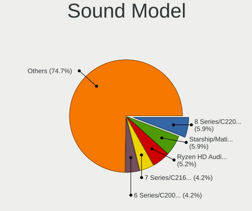

| Model                                                                             | Desktops | Percent |
|-----------------------------------------------------------------------------------|----------|---------|
| Intel 8 Series/C220 Series Chipset High Definition Audio Controller               | 35       | 5.85%   |
| AMD Starship/Matisse HD Audio Controller                                          | 35       | 5.85%   |
| AMD Ryzen HD Audio Controller                                                     | 31       | 5.18%   |
| Intel 7 Series/C216 Chipset Family High Definition Audio Controller               | 25       | 4.18%   |
| Intel 6 Series/C200 Series Chipset Family High Definition Audio Controller        | 25       | 4.18%   |
| Intel Xeon E3-1200 v3/4th Gen Core Processor HD Audio Controller                  | 20       | 3.34%   |
| Intel 100 Series/C230 Series Chipset Family HD Audio Controller                   | 16       | 2.68%   |
| AMD Ellesmere HDMI Audio [Radeon RX 470/480 / 570/580/590]                        | 16       | 2.68%   |
| Nvidia GF108 High Definition Audio Controller                                     | 15       | 2.51%   |
| Nvidia GA106 High Definition Audio Controller                                     | 14       | 2.34%   |
| Nvidia GK208 HDMI/DP Audio Controller                                             | 13       | 2.17%   |
| AMD Family 17h (Models 00h-0fh) HD Audio Controller                               | 13       | 2.17%   |
| AMD Renoir/Cezanne HDMI/DP Audio Controller                                       | 12       | 2.01%   |
| AMD Raven/Raven2/Fenghuang HDMI/DP Audio Controller                               | 12       | 2.01%   |
| AMD Navi 21/23 HDMI/DP Audio Controller                                           | 12       | 2.01%   |
| Intel NM10/ICH7 Family High Definition Audio Controller                           | 11       | 1.84%   |
| Intel 200 Series PCH HD Audio                                                     | 10       | 1.67%   |
| Intel 82801I (ICH9 Family) HD Audio Controller                                    | 9        | 1.51%   |
| Intel Alder Lake-S HD Audio Controller                                            | 8        | 1.34%   |
| AMD Radeon High Definition Audio Controller                                       | 8        | 1.34%   |
| Nvidia TU116 High Definition Audio Controller                                     | 6        | 1%      |
| Nvidia TU106 High Definition Audio Controller                                     | 6        | 1%      |
| Nvidia GP107GL High Definition Audio Controller                                   | 6        | 1%      |
| Nvidia GM107 High Definition Audio Controller [GeForce 940MX]                     | 6        | 1%      |
| JMTek USB PnP Audio Device                                                        | 6        | 1%      |
| Intel Raptor Lake High Definition Audio Controller                                | 6        | 1%      |
| Intel Cannon Lake PCH cAVS                                                        | 6        | 1%      |
| AMD Caicos HDMI Audio [Radeon HD 6450 / 7450/8450/8490 OEM / R5 230/235/235X OEM] | 6        | 1%      |
| AMD Baffin HDMI/DP Audio [Radeon RX 550 640SP / RX 560/560X]                      | 6        | 1%      |
| Texas Instruments PCM2902 Audio Codec                                             | 5        | 0.84%   |
| Nvidia GP104 High Definition Audio Controller                                     | 5        | 0.84%   |
| Nvidia GA104 High Definition Audio Controller                                     | 5        | 0.84%   |
| Nvidia GA102 High Definition Audio Controller                                     | 5        | 0.84%   |
| Nvidia AD107 High Definition Audio Controller                                     | 5        | 0.84%   |
| Intel C610/X99 series chipset HD Audio Controller                                 | 5        | 0.84%   |
| Intel 82801JD/DO (ICH10 Family) HD Audio Controller                               | 5        | 0.84%   |
| ASUSTek Computer USB Audio                                                        | 5        | 0.84%   |
| AMD SBx00 Azalia (Intel HDA)                                                      | 5        | 0.84%   |
| AMD Navi 10 HDMI Audio                                                            | 5        | 0.84%   |
| Nvidia TU104 HD Audio Controller                                                  | 4        | 0.67%   |

Memory
------

Memory Vendor
-------------

Memory module vendors

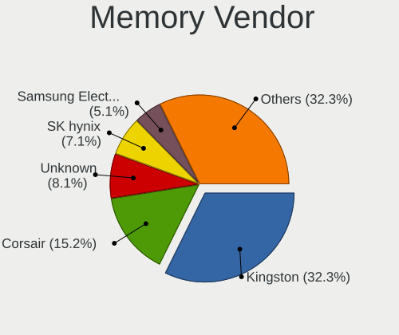

| Vendor              | Desktops | Percent |
|---------------------|----------|---------|
| Kingston            | 64       | 32.32%  |
| Corsair             | 30       | 15.15%  |
| Unknown             | 16       | 8.08%   |
| SK hynix            | 14       | 7.07%   |
| Samsung Electronics | 10       | 5.05%   |
| Micron Technology   | 7        | 3.54%   |
| A-DATA Technology   | 7        | 3.54%   |
| Unknown             | 6        | 3.03%   |
| PNY                 | 5        | 2.53%   |
| Team                | 4        | 2.02%   |
| Kingmax             | 4        | 2.02%   |
| SemsoTai            | 3        | 1.52%   |
| G.Skill             | 3        | 1.52%   |
| Crucial             | 3        | 1.52%   |
| Unknown (0x0CAE)    | 2        | 1.01%   |
| Silicon Power       | 2        | 1.01%   |
| Ramaxel Technology  | 2        | 1.01%   |
| Kimtigo             | 2        | 1.01%   |
| Apacer              | 2        | 1.01%   |
| Unknown (ABCD)      | 1        | 0.51%   |
| Unknown (05BA)      | 1        | 0.51%   |
| Transcend           | 1        | 0.51%   |
| Patriot Memory      | 1        | 0.51%   |
| Nanya Technology    | 1        | 0.51%   |
| MAXSUN              | 1        | 0.51%   |
| Lexar Co Limited    | 1        | 0.51%   |
| Lexar               | 1        | 0.51%   |
| KLEVV               | 1        | 0.51%   |
| Kinlstuo            | 1        | 0.51%   |
| Hikvision           | 1        | 0.51%   |
| H                   | 1        | 0.51%   |

Memory Model
------------

Memory module models

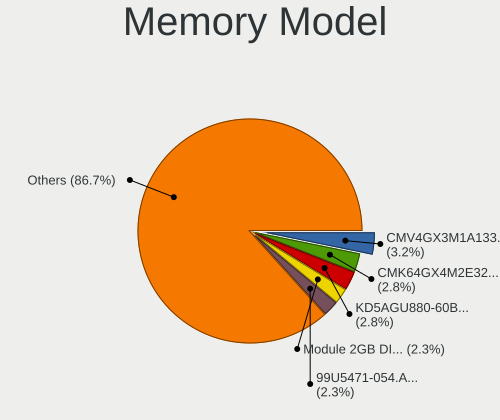

| Model                                                            | Desktops | Percent |
|------------------------------------------------------------------|----------|---------|
| Corsair RAM CMV4GX3M1A1333C9 4GB DIMM DDR3 1600MT/s              | 7        | 3.21%   |
| Corsair RAM CMK64GX4M2E3200C16 32GB DIMM DDR4 3600MT/s           | 6        | 2.75%   |
| Unknown                                                          | 6        | 2.75%   |
| Unknown RAM Module 2GB DIMM SDRAM                                | 5        | 2.29%   |
| Kingston RAM 99U5471-054.A00LF 8GB DIMM DDR3 1600MT/s            | 5        | 2.29%   |
| Kingston RAM KF3200C16D4/32GX 32GB DIMM DDR4 3933MT/s            | 4        | 1.83%   |
| SK hynix RAM HMT351U6CFR8C-PB 4GB DIMM DDR3 1800MT/s             | 3        | 1.38%   |
| PNY RAM 8GBF1X08QFHH38-135-K 8GB DIMM DDR4 3600MT/s              | 3        | 1.38%   |
| Kingston RAM KF3200C16D4/16GX 16GB DIMM DDR4 3733MT/s            | 3        | 1.38%   |
| Kingston RAM 99U5471-050.A00LF 8GB DIMM DDR3 1600MT/s            | 3        | 1.38%   |
| Kingmax RAM FLFE85F-C8KM9 2GB DIMM DDR3 1333MT/s                 | 3        | 1.38%   |
| Kingmax RAM FLFE85F-C8KL9 2GB DIMM DDR3 1333MT/s                 | 3        | 1.38%   |
| A-DATA RAM DDR4 3200 16GB DIMM DDR4 3600MT/s                     | 3        | 1.38%   |
| Unknown RAM Module 8GB DIMM DDR3 1600MT/s                        | 2        | 0.92%   |
| Unknown RAM Module 4GB DIMM SDRAM                                | 2        | 0.92%   |
| Unknown (0x0CAE) RAM UD5124G72D 24GB DIMM DDR5 7200MT/s          | 2        | 0.92%   |
| SemsoTai RAM Module 8GB DIMM DDR4 2667MT/s                       | 2        | 0.92%   |
| PNY RAM 8GBF1X08LFHH35-12-K 8GB DIMM DDR4 2667MT/s               | 2        | 0.92%   |
| Micron RAM 16JTF1G64AZ-1G6E1 8GB DIMM DDR3 1600MT/s              | 2        | 0.92%   |
| Kingston RAM KHX3200C16D4/8GX 8GB DIMM DDR4 3733MT/s             | 2        | 0.92%   |
| Kingston RAM KF552C36-16 16GB DIMM DDR5 5200MT/s                 | 2        | 0.92%   |
| Kingston RAM KF3200C16D4/8GX 8GiB DIMM DDR4 3600MT/s             | 2        | 0.92%   |
| Kingston RAM KF2666C16D4/8G 8GB DIMM DDR4 2667MT/s               | 2        | 0.92%   |
| Kingston RAM 9905743-151.A00G 8GB DIMM DDR4 3200MT/s             | 2        | 0.92%   |
| Kingston RAM 9905702-120.A00G 8GB DIMM DDR4 2667MT/s             | 2        | 0.92%   |
| Kimtigo RAM KT8GS3EDF 8GB SODIMM DDR3 1600MT/s                   | 2        | 0.92%   |
| Unknown RAM Module 8GB DIMM 667MT/s                              | 1        | 0.46%   |
| Unknown RAM Module 8GB DIMM 1600MT/s                             | 1        | 0.46%   |
| Unknown RAM Module 8192MB DIMM DDR4 2400MT/s                     | 1        | 0.46%   |
| Unknown RAM Module 4GB DIMM DDR3 1600MT/s                        | 1        | 0.46%   |
| Unknown RAM Module 4GB DIMM 400MT/s                              | 1        | 0.46%   |
| Unknown RAM Module 2GB DIMM DDR3 1067MT/s                        | 1        | 0.46%   |
| Unknown RAM Module 2GB DIMM DDR2 800MT/s                         | 1        | 0.46%   |
| Unknown RAM Module 2GB DIMM DDR2 667MT/s                         | 1        | 0.46%   |
| Unknown RAM Module 2GB DIMM 800MT/s                              | 1        | 0.46%   |
| Unknown RAM Module 2GB DIMM 667MT/s                              | 1        | 0.46%   |
| Unknown (ABCD) RAM 123456789012345678 2GB DIMM LPDDR4 2133MT/s   | 1        | 0.46%   |
| Unknown (05BA) RAM VL41A4G63A-N8SA-CS1 32GB SODIMM DDR4 2667MT/s | 1        | 0.46%   |
| Transcend RAM Module 2GB DIMM DDR3 1333MT/s                      | 1        | 0.46%   |
| Team RAM TEAMGROUP-UD4-3200 8GB DIMM DDR4 3800MT/s               | 1        | 0.46%   |

Memory Kind
-----------

Memory module kinds

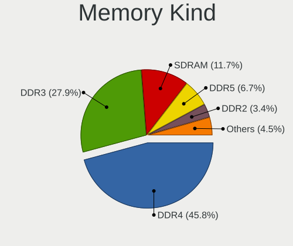

| Kind    | Desktops | Percent |
|---------|----------|---------|
| DDR4    | 82       | 45.81%  |
| DDR3    | 50       | 27.93%  |
| SDRAM   | 21       | 11.73%  |
| DDR5    | 12       | 6.7%    |
| DDR2    | 6        | 3.35%   |
| Unknown | 5        | 2.79%   |
| LPDDR4  | 2        | 1.12%   |
| DRAM    | 1        | 0.56%   |

Memory Form Factor
------------------

Physical design of the memory module

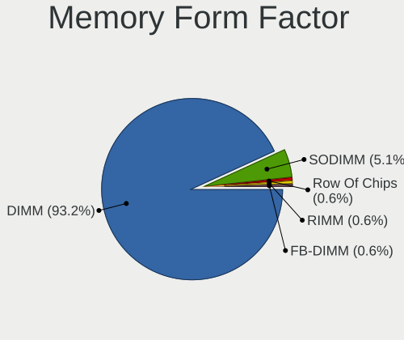

| Name         | Desktops | Percent |
|--------------|----------|---------|
| DIMM         | 164      | 93.18%  |
| SODIMM       | 9        | 5.11%   |
| Row Of Chips | 1        | 0.57%   |
| RIMM         | 1        | 0.57%   |
| FB-DIMM      | 1        | 0.57%   |

Memory Size
-----------

Memory module size

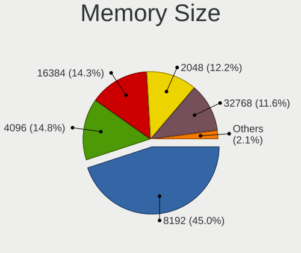

| Size  | Desktops | Percent |
|-------|----------|---------|
| 8192  | 85       | 44.97%  |
| 4096  | 28       | 14.81%  |
| 16384 | 27       | 14.29%  |
| 2048  | 23       | 12.17%  |
| 32768 | 22       | 11.64%  |
| 24576 | 2        | 1.06%   |
| 49152 | 1        | 0.53%   |
| 1024  | 1        | 0.53%   |

Memory Speed
------------

Memory module speed

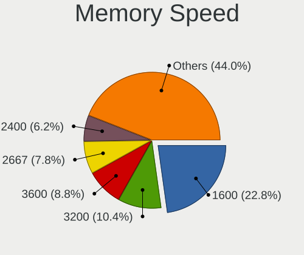

| Speed   | Desktops | Percent |
|---------|----------|---------|
| 1600    | 44       | 22.8%   |
| 3200    | 20       | 10.36%  |
| 3600    | 17       | 8.81%   |
| 2667    | 15       | 7.77%   |
| 2400    | 12       | 6.22%   |
| 1333    | 9        | 4.66%   |
| 2133    | 7        | 3.63%   |
| 5200    | 6        | 3.11%   |
| 3733    | 6        | 3.11%   |
| Unknown | 6        | 3.11%   |
| 800     | 5        | 2.59%   |
| 667     | 5        | 2.59%   |
| 3933    | 4        | 2.07%   |
| 1800    | 4        | 2.07%   |
| 2666    | 3        | 1.55%   |
| 1867    | 3        | 1.55%   |
| 7200    | 2        | 1.04%   |
| 4800    | 2        | 1.04%   |
| 3400    | 2        | 1.04%   |
| 2933    | 2        | 1.04%   |
| 2048    | 2        | 1.04%   |
| 1866    | 2        | 1.04%   |
| 1639    | 2        | 1.04%   |
| 1066    | 2        | 1.04%   |
| 49926   | 1        | 0.52%   |
| 6000    | 1        | 0.52%   |
| 5600    | 1        | 0.52%   |
| 3800    | 1        | 0.52%   |
| 3666    | 1        | 0.52%   |
| 3466    | 1        | 0.52%   |
| 3334    | 1        | 0.52%   |
| 3000    | 1        | 0.52%   |
| 2800    | 1        | 0.52%   |
| 1067    | 1        | 0.52%   |
| 400     | 1        | 0.52%   |

Printers & scanners
-------------------

Printer Vendor
--------------

Printer device vendors

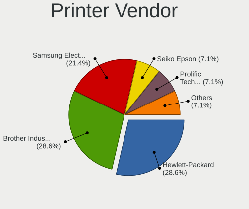

| Vendor              | Desktops | Percent |
|---------------------|----------|---------|
| Hewlett-Packard     | 4        | 28.57%  |
| Brother Industries  | 4        | 28.57%  |
| Samsung Electronics | 3        | 21.43%  |
| Seiko Epson         | 1        | 7.14%   |
| Prolific Technology | 1        | 7.14%   |
| Canon               | 1        | 7.14%   |

Printer Model
-------------

Printer device models

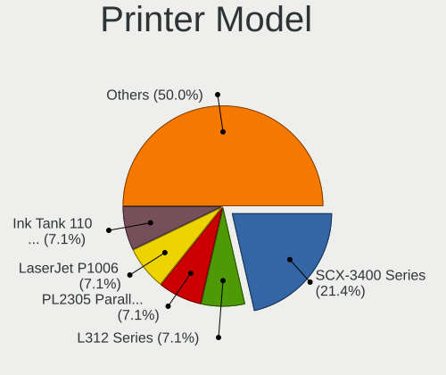

| Model                         | Desktops | Percent |
|-------------------------------|----------|---------|
| Samsung SCX-3400 Series       | 3        | 21.43%  |
| Seiko Epson L312 Series       | 1        | 7.14%   |
| Prolific PL2305 Parallel Port | 1        | 7.14%   |
| HP LaserJet P1006             | 1        | 7.14%   |
| HP Ink Tank 110 series        | 1        | 7.14%   |
| HP DeskJet F4200 series       | 1        | 7.14%   |
| HP DeskJet 2700 series        | 1        | 7.14%   |
| Canon E410 series             | 1        | 7.14%   |
| Brother MFC-T4500DW           | 1        | 7.14%   |
| Brother MFC-1910W             | 1        | 7.14%   |
| Brother DCP-J105              | 1        | 7.14%   |
| Brother DCP-1610W             | 1        | 7.14%   |

Scanner Vendor
--------------

Scanner device vendors

Zero info for selected period =(

Scanner Model
-------------

Scanner device models

Zero info for selected period =(

Camera
------

Camera Vendor
-------------

Camera device vendors

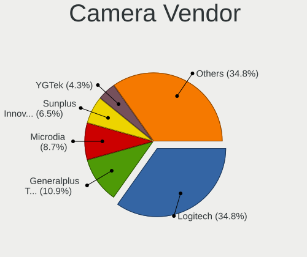

| Vendor                        | Desktops | Percent |
|-------------------------------|----------|---------|
| Logitech                      | 16       | 34.78%  |
| Generalplus Technology        | 5        | 10.87%  |
| Microdia                      | 4        | 8.7%    |
| Sunplus Innovation Technology | 3        | 6.52%   |
| YGTek                         | 2        | 4.35%   |
| Samsung Electronics           | 2        | 4.35%   |
| Genesys Logic                 | 2        | 4.35%   |
| Apple                         | 2        | 4.35%   |
| WCM_USB                       | 1        | 2.17%   |
| Trust                         | 1        | 2.17%   |
| SN0002                        | 1        | 2.17%   |
| Realtek Semiconductor         | 1        | 2.17%   |
| Razer USA                     | 1        | 2.17%   |
| Mimaki Engineering            | 1        | 2.17%   |
| Lenovo                        | 1        | 2.17%   |
| Jieli Technology              | 1        | 2.17%   |
| Cubeternet                    | 1        | 2.17%   |
| ARC International             | 1        | 2.17%   |

Camera Model
------------

Camera device models

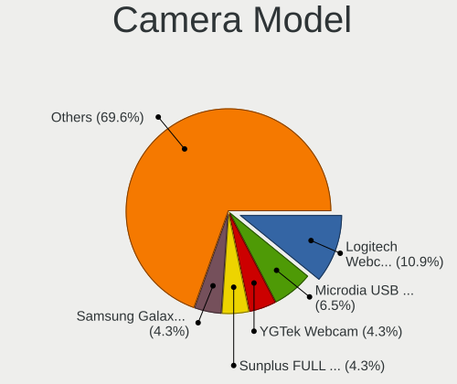

| Model                                    | Desktops | Percent |
|------------------------------------------|----------|---------|
| Logitech Webcam C270                     | 5        | 10.87%  |
| Microdia USB 2.0 Camera                  | 3        | 6.52%   |
| YGTek Webcam                             | 2        | 4.35%   |
| Sunplus FULL HD webcam                   | 2        | 4.35%   |
| Samsung Galaxy series, misc. (MTP mode)  | 2        | 4.35%   |
| Logitech Webcam C310                     | 2        | 4.35%   |
| Logitech Webcam C170                     | 2        | 4.35%   |
| Logitech Webcam B500                     | 2        | 4.35%   |
| Logitech HD Pro Webcam C920              | 2        | 4.35%   |
| Genesys Logic Camera                     | 2        | 4.35%   |
| Generalplus GENERAL WEBCAM               | 2        | 4.35%   |
| Generalplus 808 Camera #9 (web-cam mode) | 2        | 4.35%   |
| Apple iPhone 5/5C/5S/6/SE/7/8/X          | 2        | 4.35%   |
| WCM_USB WEB CAM                          | 1        | 2.17%   |
| Trust USB 2.0 Camera                     | 1        | 2.17%   |
| Sunplus USB 2.0 Camera                   | 1        | 2.17%   |
| SN0002 1080P Web Camera                  | 1        | 2.17%   |
| Realtek HP High Definition 1MP Webcam    | 1        | 2.17%   |
| Razer USA Razer Kiyo X                   | 1        | 2.17%   |
| Mimaki Engineering USB 2.0 Camera        | 1        | 2.17%   |
| Microdia Camera                          | 1        | 2.17%   |
| Logitech Webcam C250                     | 1        | 2.17%   |
| Logitech HD Webcam C510                  | 1        | 2.17%   |
| Logitech C920 PRO HD Webcam              | 1        | 2.17%   |
| Lenovo Lenovo FHD Webcam Audio           | 1        | 2.17%   |
| Jieli USB PHY 2.0                        | 1        | 2.17%   |
| Generalplus WEB CAM                      | 1        | 2.17%   |
| Cubeternet GL-UPC822 UVC WebCam          | 1        | 2.17%   |
| ARC International Camera                 | 1        | 2.17%   |

Security
--------

Fingerprint Vendor
------------------

Fingerprint sensor vendors

Zero info for selected period =(

Fingerprint Model
-----------------

Fingerprint sensor models

Zero info for selected period =(

Chipcard Vendor
---------------

Chipcard module vendors

Zero info for selected period =(

Chipcard Model
--------------

Chipcard module models

Zero info for selected period =(

Unsupported
-----------

Unsupported Devices
-------------------

Total unsupported devices on board

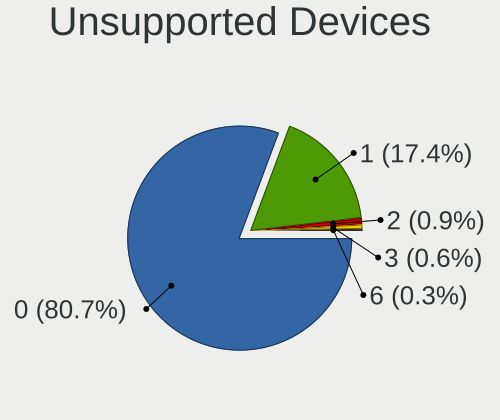

| Total | Desktops | Percent |
|-------|----------|---------|
| 0     | 259      | 80.69%  |
| 1     | 56       | 17.45%  |
| 2     | 3        | 0.93%   |
| 3     | 2        | 0.62%   |
| 6     | 1        | 0.31%   |

Unsupported Device Types
------------------------

Types of unsupported devices

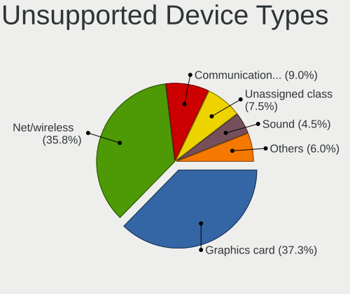

| Type                     | Desktops | Percent |
|--------------------------|----------|---------|
| Graphics card            | 25       | 37.31%  |
| Net/wireless             | 24       | 35.82%  |
| Communication controller | 6        | 8.96%   |
| Unassigned class         | 5        | 7.46%   |
| Sound                    | 3        | 4.48%   |
| Storage/ide              | 1        | 1.49%   |
| Network                  | 1        | 1.49%   |
| Net/ethernet             | 1        | 1.49%   |
| Bluetooth                | 1        | 1.49%   |

