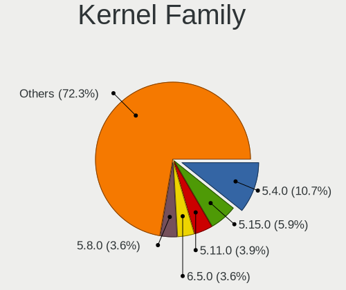
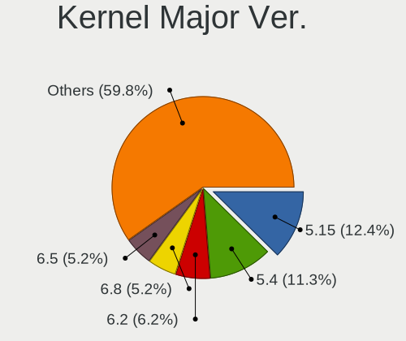
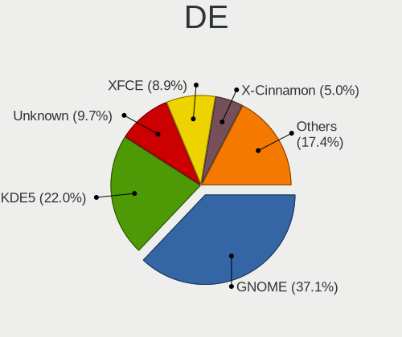
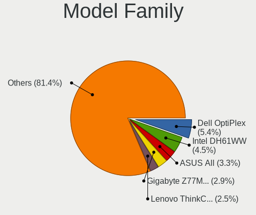
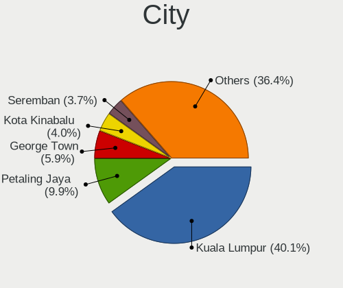
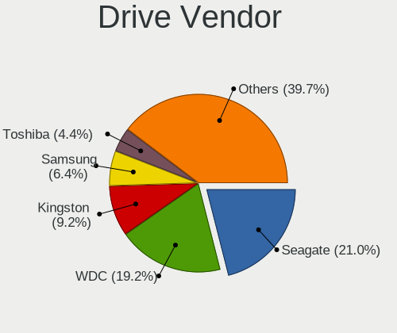
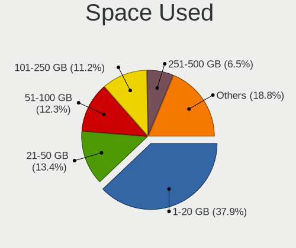
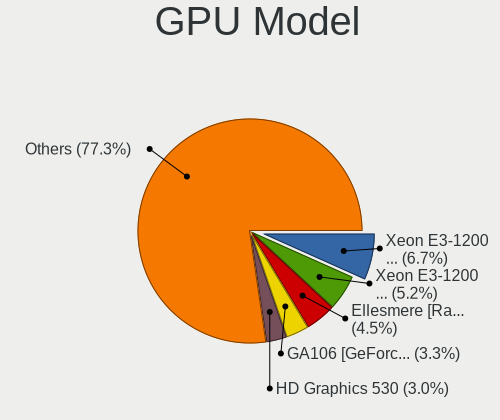
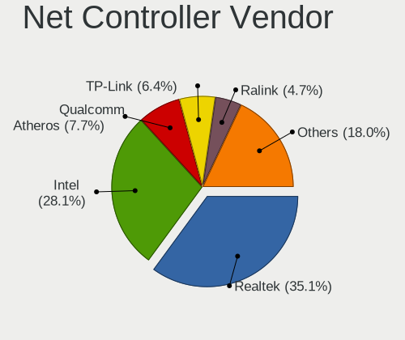
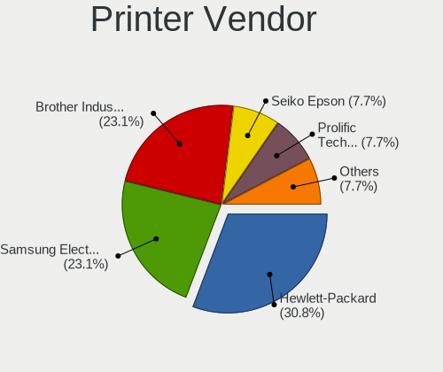

Linux in Malaysia - Tested Hardware & Statistics (Desktops)
-----------------------------------------------------------

A project to collect tested hardware configurations for Linux in Malaysia.

Anyone can contribute to this report by the [hw-probe](https://github.com/linuxhw/hw-probe) tool:

    sudo -E hw-probe -all -upload

Please contribute! Especially if your hardware is rare.

Contents
--------

* [ Test Cases ](#test-cases)

* [ System ](#system)
  - [ OS                       ](#os)
  - [ OS Family                ](#os-family)
  - [ Kernel                   ](#kernel)
  - [ Kernel Family            ](#kernel-family)
  - [ Kernel Major Ver.        ](#kernel-major-ver)
  - [ Arch                     ](#arch)
  - [ DE                       ](#de)
  - [ Display Server           ](#display-server)
  - [ Display Manager          ](#display-manager)
  - [ OS Lang                  ](#os-lang)
  - [ Boot Mode                ](#boot-mode)
  - [ Filesystem               ](#filesystem)
  - [ Part. scheme             ](#part-scheme)
  - [ Dual Boot with Linux/BSD ](#dual-boot-with-linuxbsd)
  - [ Dual Boot (Win)          ](#dual-boot-win)

* [ Board ](#board)
  - [ Vendor                   ](#vendor)
  - [ Model                    ](#model)
  - [ Model Family             ](#model-family)
  - [ MFG Year                 ](#mfg-year)
  - [ Form Factor              ](#form-factor)
  - [ Secure Boot              ](#secure-boot)
  - [ Coreboot                 ](#coreboot)
  - [ RAM Size                 ](#ram-size)
  - [ RAM Used                 ](#ram-used)
  - [ Total Drives             ](#total-drives)
  - [ Has CD-ROM               ](#has-cd-rom)
  - [ Has Ethernet             ](#has-ethernet)
  - [ Has WiFi                 ](#has-wifi)
  - [ Has Bluetooth            ](#has-bluetooth)

* [ Location ](#location)
  - [ Country                  ](#country)
  - [ City                     ](#city)

* [ Drives ](#drives)
  - [ Drive Vendor             ](#drive-vendor)
  - [ Drive Model              ](#drive-model)
  - [ HDD Vendor               ](#hdd-vendor)
  - [ SSD Vendor               ](#ssd-vendor)
  - [ Drive Kind               ](#drive-kind)
  - [ Drive Connector          ](#drive-connector)
  - [ Drive Size               ](#drive-size)
  - [ Space Total              ](#space-total)
  - [ Space Used               ](#space-used)
  - [ Malfunc. Drives          ](#malfunc-drives)
  - [ Malfunc. Drive Vendor    ](#malfunc-drive-vendor)
  - [ Malfunc. HDD Vendor      ](#malfunc-hdd-vendor)
  - [ Malfunc. Drive Kind      ](#malfunc-drive-kind)
  - [ Failed Drives            ](#failed-drives)
  - [ Failed Drive Vendor      ](#failed-drive-vendor)
  - [ Drive Status             ](#drive-status)

* [ Storage controller ](#storage-controller)
  - [ Storage Vendor           ](#storage-vendor)
  - [ Storage Model            ](#storage-model)
  - [ Storage Kind             ](#storage-kind)

* [ Processor ](#processor)
  - [ CPU Vendor               ](#cpu-vendor)
  - [ CPU Model                ](#cpu-model)
  - [ CPU Model Family         ](#cpu-model-family)
  - [ CPU Cores                ](#cpu-cores)
  - [ CPU Sockets              ](#cpu-sockets)
  - [ CPU Threads              ](#cpu-threads)
  - [ CPU Op-Modes             ](#cpu-op-modes)
  - [ CPU Microcode            ](#cpu-microcode)
  - [ CPU Microarch            ](#cpu-microarch)

* [ Graphics ](#graphics)
  - [ GPU Vendor               ](#gpu-vendor)
  - [ GPU Model                ](#gpu-model)
  - [ GPU Combo                ](#gpu-combo)
  - [ GPU Driver               ](#gpu-driver)
  - [ GPU Memory               ](#gpu-memory)

* [ Monitor ](#monitor)
  - [ Monitor Vendor           ](#monitor-vendor)
  - [ Monitor Model            ](#monitor-model)
  - [ Monitor Resolution       ](#monitor-resolution)
  - [ Monitor Diagonal         ](#monitor-diagonal)
  - [ Monitor Width            ](#monitor-width)
  - [ Aspect Ratio             ](#aspect-ratio)
  - [ Monitor Area             ](#monitor-area)
  - [ Pixel Density            ](#pixel-density)
  - [ Multiple Monitors        ](#multiple-monitors)

* [ Network ](#network)
  - [ Net Controller Vendor    ](#net-controller-vendor)
  - [ Net Controller Model     ](#net-controller-model)
  - [ Wireless Vendor          ](#wireless-vendor)
  - [ Wireless Model           ](#wireless-model)
  - [ Ethernet Vendor          ](#ethernet-vendor)
  - [ Ethernet Model           ](#ethernet-model)
  - [ Net Controller Kind      ](#net-controller-kind)
  - [ Used Controller          ](#used-controller)
  - [ NICs                     ](#nics)
  - [ IPv6                     ](#ipv6)

* [ Bluetooth ](#bluetooth)
  - [ Bluetooth Vendor         ](#bluetooth-vendor)
  - [ Bluetooth Model          ](#bluetooth-model)

* [ Sound ](#sound)
  - [ Sound Vendor             ](#sound-vendor)
  - [ Sound Model              ](#sound-model)

* [ Memory ](#memory)
  - [ Memory Vendor            ](#memory-vendor)
  - [ Memory Model             ](#memory-model)
  - [ Memory Kind              ](#memory-kind)
  - [ Memory Form Factor       ](#memory-form-factor)
  - [ Memory Size              ](#memory-size)
  - [ Memory Speed             ](#memory-speed)

* [ Printers & scanners ](#printers--scanners)
  - [ Printer Vendor           ](#printer-vendor)
  - [ Printer Model            ](#printer-model)
  - [ Scanner Vendor           ](#scanner-vendor)
  - [ Scanner Model            ](#scanner-model)

* [ Camera ](#camera)
  - [ Camera Vendor            ](#camera-vendor)
  - [ Camera Model             ](#camera-model)

* [ Security ](#security)
  - [ Fingerprint Vendor       ](#fingerprint-vendor)
  - [ Fingerprint Model        ](#fingerprint-model)
  - [ Chipcard Vendor          ](#chipcard-vendor)
  - [ Chipcard Model           ](#chipcard-model)

* [ Unsupported ](#unsupported)
  - [ Unsupported Devices      ](#unsupported-devices)
  - [ Unsupported Device Types ](#unsupported-device-types)

Test Cases
----------

Total: 167

| Vendor   | Model                       | Probe                                                      | Date         |
|----------|-----------------------------|------------------------------------------------------------|--------------|
| ASUSTek  | P5G41T-M LX3                | [43adb86887](https://linux-hardware.org/?probe=43adb86887) | Apr 25, 2022 |
| ASUSTek  | P5G41T-M LX3                | [ba9b8d5ac1](https://linux-hardware.org/?probe=ba9b8d5ac1) | Apr 25, 2022 |
| ECS      | Iris8                       | [1cff4313c1](https://linux-hardware.org/?probe=1cff4313c1) | Apr 23, 2022 |
| HP       | 2B2C                        | [195e5473e9](https://linux-hardware.org/?probe=195e5473e9) | Apr 20, 2022 |
| HP       | 2B2C                        | [5c21edefdc](https://linux-hardware.org/?probe=5c21edefdc) | Apr 18, 2022 |
| HP       | 2B2C                        | [f88798fff2](https://linux-hardware.org/?probe=f88798fff2) | Apr 15, 2022 |
| ASUSTek  | B85M-G                      | [c6dd82e724](https://linux-hardware.org/?probe=c6dd82e724) | Apr 14, 2022 |
| ASUSTek  | B85M-G                      | [e525a26ca8](https://linux-hardware.org/?probe=e525a26ca8) | Apr 14, 2022 |
| Gigabyte | H470 HD3                    | [5ce5c54ecd](https://linux-hardware.org/?probe=5ce5c54ecd) | Apr 09, 2022 |
| Intel    | DH61WW AAG23116-204         | [7ec10d98e3](https://linux-hardware.org/?probe=7ec10d98e3) | Apr 03, 2022 |
| Lenovo   | 30D9 NOK                    | [c378cd6fd3](https://linux-hardware.org/?probe=c378cd6fd3) | Mar 27, 2022 |
| Intel    | DH61WW AAG23116-204         | [a1c0612337](https://linux-hardware.org/?probe=a1c0612337) | Mar 17, 2022 |
| ASUSTek  | P8B75-M LX                  | [d52d9feb9e](https://linux-hardware.org/?probe=d52d9feb9e) | Mar 09, 2022 |
| ASUSTek  | P8B75-M LX                  | [8d3f72c54f](https://linux-hardware.org/?probe=8d3f72c54f) | Mar 03, 2022 |
| Biostar  | G41D3+                      | [62ba30cf71](https://linux-hardware.org/?probe=62ba30cf71) | Mar 02, 2022 |
| Dell     | 0D441T A03                  | [bbedea92ea](https://linux-hardware.org/?probe=bbedea92ea) | Mar 01, 2022 |
| Dell     | 0D441T A03                  | [297c168632](https://linux-hardware.org/?probe=297c168632) | Mar 01, 2022 |
| Shuttle  | FH170                       | [768e13fd34](https://linux-hardware.org/?probe=768e13fd34) | Feb 25, 2022 |
| ASUSTek  | H110M-D                     | [1dec2ddfad](https://linux-hardware.org/?probe=1dec2ddfad) | Feb 19, 2022 |
| MSI      | B450 TOMAHAWK               | [6b15f755b0](https://linux-hardware.org/?probe=6b15f755b0) | Jan 12, 2022 |
| Gigabyte | H470 HD3                    | [ff2f0db3fe](https://linux-hardware.org/?probe=ff2f0db3fe) | Jan 09, 2022 |
| Lenovo   | ThinkStation S10 6483CTO    | [0d867912a7](https://linux-hardware.org/?probe=0d867912a7) | Jan 01, 2022 |
| ECS      | H61H2-M12                   | [c8ca1c8cc8](https://linux-hardware.org/?probe=c8ca1c8cc8) | Dec 24, 2021 |
| MSI      | MAG B460 TOMAHAWK           | [c748f77108](https://linux-hardware.org/?probe=c748f77108) | Dec 12, 2021 |
| HP       | 2B44                        | [b62df43777](https://linux-hardware.org/?probe=b62df43777) | Dec 03, 2021 |
| ASUSTek  | TUF GAMING B550-PLUS        | [5c4ae3bd8c](https://linux-hardware.org/?probe=5c4ae3bd8c) | Nov 30, 2021 |
| ECS      | H61H2-M12                   | [c731d25471](https://linux-hardware.org/?probe=c731d25471) | Nov 30, 2021 |
| Dell     | 048DY8 A01                  | [6e5e669c60](https://linux-hardware.org/?probe=6e5e669c60) | Nov 25, 2021 |
| ECS      | H61H2-M12                   | [6deb58a412](https://linux-hardware.org/?probe=6deb58a412) | Nov 21, 2021 |
| ECS      | H61H2-M12                   | [2675bc3f2a](https://linux-hardware.org/?probe=2675bc3f2a) | Nov 16, 2021 |
| ECS      | H61H2-M12                   | [b5393ad660](https://linux-hardware.org/?probe=b5393ad660) | Nov 12, 2021 |
| ASUSTek  | M2N32-SLI DELUXE            | [87fff05f0f](https://linux-hardware.org/?probe=87fff05f0f) | Nov 03, 2021 |
| Intel    | B75                         | [fef715f491](https://linux-hardware.org/?probe=fef715f491) | Oct 23, 2021 |
| Gigabyte | H370M D3H-CF                | [8fee3106f7](https://linux-hardware.org/?probe=8fee3106f7) | Oct 12, 2021 |
| Gigabyte | H370M D3H-CF                | [f79000e059](https://linux-hardware.org/?probe=f79000e059) | Oct 12, 2021 |
| Biostar  | G41D3C                      | [433bc7cf78](https://linux-hardware.org/?probe=433bc7cf78) | Oct 10, 2021 |
| Biostar  | G41D3C                      | [90dc88db01](https://linux-hardware.org/?probe=90dc88db01) | Oct 02, 2021 |
| Gigabyte | B85M-D3H                    | [9de4382874](https://linux-hardware.org/?probe=9de4382874) | Sep 15, 2021 |
| Lenovo   | MAHOBAY NOK                 | [c2533e9d48](https://linux-hardware.org/?probe=c2533e9d48) | Sep 11, 2021 |
| MSI      | H81M-P33                    | [92b799f852](https://linux-hardware.org/?probe=92b799f852) | Sep 08, 2021 |
| Biostar  | G41D3C                      | [8137e09a97](https://linux-hardware.org/?probe=8137e09a97) | Sep 08, 2021 |
| Biostar  | G41D3C                      | [fc87e33227](https://linux-hardware.org/?probe=fc87e33227) | Sep 07, 2021 |
| Gigabyte | B85M-D3H                    | [5377e486bc](https://linux-hardware.org/?probe=5377e486bc) | Sep 03, 2021 |
| MSI      | MAG B460 TOMAHAWK           | [a61ee6d83a](https://linux-hardware.org/?probe=a61ee6d83a) | Sep 01, 2021 |
| Biostar  | G41D3C                      | [985970ad93](https://linux-hardware.org/?probe=985970ad93) | Sep 01, 2021 |
| Biostar  | G41D3C                      | [a94c446d8d](https://linux-hardware.org/?probe=a94c446d8d) | Sep 01, 2021 |
| MSI      | MAG B460 TOMAHAWK           | [1b1b02b651](https://linux-hardware.org/?probe=1b1b02b651) | Aug 30, 2021 |
| MSI      | MAG B460 TOMAHAWK           | [a1ec21ae3f](https://linux-hardware.org/?probe=a1ec21ae3f) | Aug 29, 2021 |
| ASRock   | H81M-VG4 R2.0               | [cac6720bff](https://linux-hardware.org/?probe=cac6720bff) | Aug 29, 2021 |
| Gigabyte | B450M S2H V2                | [777faedb05](https://linux-hardware.org/?probe=777faedb05) | Aug 27, 2021 |
| Gigabyte | B85M-D3H                    | [906a3e006c](https://linux-hardware.org/?probe=906a3e006c) | Aug 24, 2021 |
| Gigabyte | B85M-D3H                    | [9f369218ff](https://linux-hardware.org/?probe=9f369218ff) | Aug 24, 2021 |
| Gigabyte | B450M S2H V2                | [9e8fa8f32d](https://linux-hardware.org/?probe=9e8fa8f32d) | Aug 23, 2021 |
| Lenovo   | 1046 SDK0T08861 WIN 3305... | [de1fa2ccc0](https://linux-hardware.org/?probe=de1fa2ccc0) | Aug 20, 2021 |
| Intel    | DH61WW AAG23116-204         | [89188fe3ca](https://linux-hardware.org/?probe=89188fe3ca) | Aug 08, 2021 |
| Gigabyte | B85M-D3H                    | [3e56e95f2f](https://linux-hardware.org/?probe=3e56e95f2f) | Aug 05, 2021 |
| ASUSTek  | P8Z77-V LX                  | [36562061d6](https://linux-hardware.org/?probe=36562061d6) | Jul 30, 2021 |
| ASUSTek  | P8B75-M LE                  | [e71a7fc65b](https://linux-hardware.org/?probe=e71a7fc65b) | Jul 23, 2021 |
| Dell     | 0427JK A00                  | [3e66028cf8](https://linux-hardware.org/?probe=3e66028cf8) | Jul 22, 2021 |
| ASUSTek  | P8B75-M                     | [ce3ef21b15](https://linux-hardware.org/?probe=ce3ef21b15) | Jul 19, 2021 |
| ASUSTek  | P8B75-M                     | [70e6e81263](https://linux-hardware.org/?probe=70e6e81263) | Jul 19, 2021 |
| ASUSTek  | PRIME H310M-D R2.0          | [5a349c4952](https://linux-hardware.org/?probe=5a349c4952) | Jul 19, 2021 |
| Intel    | DH61WW AAG23116-204         | [275304e806](https://linux-hardware.org/?probe=275304e806) | Jul 19, 2021 |
| Intel    | DH61WW AAG23116-204         | [99df792e3b](https://linux-hardware.org/?probe=99df792e3b) | Jul 18, 2021 |
| Gigabyte | M61PME-S2P                  | [02dc77286f](https://linux-hardware.org/?probe=02dc77286f) | Jul 17, 2021 |
| Intel    | DH61WW AAG23116-204         | [2495cf9be5](https://linux-hardware.org/?probe=2495cf9be5) | Jul 12, 2021 |
| Gigabyte | B85M-D3H                    | [b551baea7d](https://linux-hardware.org/?probe=b551baea7d) | Jul 11, 2021 |
| Dell     | 0427JK A00                  | [82c73cf6be](https://linux-hardware.org/?probe=82c73cf6be) | Jul 09, 2021 |
| MSI      | B450M MORTAR                | [e8965c736d](https://linux-hardware.org/?probe=e8965c736d) | Jul 05, 2021 |
| Intel    | DH61WW AAG23116-204         | [a5a80d3f13](https://linux-hardware.org/?probe=a5a80d3f13) | Jun 24, 2021 |
| Dell     | 0427JK A00                  | [d9270ab2c1](https://linux-hardware.org/?probe=d9270ab2c1) | Jun 23, 2021 |
| MSI      | B450M MORTAR                | [0183eeb644](https://linux-hardware.org/?probe=0183eeb644) | Jun 12, 2021 |
| MSI      | H81M-P33                    | [69a8b43e74](https://linux-hardware.org/?probe=69a8b43e74) | Jun 02, 2021 |
| MSI      | H81M-P33                    | [a67e6bcfce](https://linux-hardware.org/?probe=a67e6bcfce) | Jun 02, 2021 |
| Gigabyte | AB350M-Gaming 3-CF          | [00658a23ab](https://linux-hardware.org/?probe=00658a23ab) | May 27, 2021 |
| ASUSTek  | H97M-E                      | [5f39051050](https://linux-hardware.org/?probe=5f39051050) | May 26, 2021 |
| Gigabyte | B450M S2H                   | [4c5c7570f6](https://linux-hardware.org/?probe=4c5c7570f6) | May 25, 2021 |
| ASUSTek  | P8Z68-V PRO                 | [2b0de1ba10](https://linux-hardware.org/?probe=2b0de1ba10) | May 21, 2021 |
| ASUSTek  | GRYPHON Z87                 | [0cd0f0c51f](https://linux-hardware.org/?probe=0cd0f0c51f) | May 13, 2021 |
| HP       | 0AA8h                       | [5f350b471f](https://linux-hardware.org/?probe=5f350b471f) | Apr 29, 2021 |
| Gigabyte | Z97X-Gaming G1              | [07efcf431f](https://linux-hardware.org/?probe=07efcf431f) | Apr 14, 2021 |
| Gigabyte | Z97X-Gaming G1              | [9f265d798d](https://linux-hardware.org/?probe=9f265d798d) | Apr 14, 2021 |
| AMI      | Cherry Trail Tablet         | [87041c97fb](https://linux-hardware.org/?probe=87041c97fb) | Apr 14, 2021 |
| ASUSTek  | P5QPL-VM EPU                | [6d3642385e](https://linux-hardware.org/?probe=6d3642385e) | Apr 11, 2021 |
| ASUSTek  | P5QPL-VM EPU                | [fc405347a5](https://linux-hardware.org/?probe=fc405347a5) | Mar 12, 2021 |
| ASUSTek  | H110M-D                     | [19e3cff2be](https://linux-hardware.org/?probe=19e3cff2be) | Feb 27, 2021 |
| Gigabyte | A320M-S2H V2-CF             | [ea93e4d3cd](https://linux-hardware.org/?probe=ea93e4d3cd) | Feb 09, 2021 |
| Acer     | MCP73VE NVIDIA MCP73        | [b50872caf4](https://linux-hardware.org/?probe=b50872caf4) | Feb 07, 2021 |
| MSI      | A320M-A PRO MAX             | [7daa68908c](https://linux-hardware.org/?probe=7daa68908c) | Feb 06, 2021 |
| Acer     | MCP73VE NVIDIA MCP73        | [acb369859f](https://linux-hardware.org/?probe=acb369859f) | Feb 06, 2021 |
| Acer     | Veriton X6630G V:1.0        | [d6126d9f25](https://linux-hardware.org/?probe=d6126d9f25) | Jan 27, 2021 |
| Acer     | Veriton X6630G V:1.0        | [9e5a28d45d](https://linux-hardware.org/?probe=9e5a28d45d) | Jan 27, 2021 |
| Dell     | 0WR7PY A01                  | [9b13ab689f](https://linux-hardware.org/?probe=9b13ab689f) | Jan 24, 2021 |
| Dell     | 0WMJ54 A01                  | [dd87c824a0](https://linux-hardware.org/?probe=dd87c824a0) | Jan 18, 2021 |
| ASUSTek  | P8Z77-V LX                  | [9e291d5782](https://linux-hardware.org/?probe=9e291d5782) | Jan 12, 2021 |
| Intel    | DH77KC AAG39641-400         | [f3c691cbf8](https://linux-hardware.org/?probe=f3c691cbf8) | Jan 01, 2021 |
| MSI      | H81M-P33                    | [e8d73a49e5](https://linux-hardware.org/?probe=e8d73a49e5) | Dec 30, 2020 |
| Intel    | DH61WW AAG23116-300         | [7e473c8d12](https://linux-hardware.org/?probe=7e473c8d12) | Dec 24, 2020 |
| Intel    | DH61WW AAG23116-300         | [645dfe5a80](https://linux-hardware.org/?probe=645dfe5a80) | Dec 23, 2020 |
| Dell     | 0PU052                      | [520a4ef3d0](https://linux-hardware.org/?probe=520a4ef3d0) | Dec 23, 2020 |
| Biostar  | A320MH                      | [a6b1134a37](https://linux-hardware.org/?probe=a6b1134a37) | Dec 18, 2020 |
| Gigabyte | F2A88XM-HD3P                | [a0b90b128d](https://linux-hardware.org/?probe=a0b90b128d) | Dec 16, 2020 |
| Gigabyte | H77M-D3H                    | [170d95c5c3](https://linux-hardware.org/?probe=170d95c5c3) | Dec 05, 2020 |
| Gigabyte | H77M-D3H                    | [d00d18cbda](https://linux-hardware.org/?probe=d00d18cbda) | Dec 05, 2020 |
| Intel    | DH61WW AAG23116-300         | [414fc579a1](https://linux-hardware.org/?probe=414fc579a1) | Dec 02, 2020 |
| Intel    | DH61WW AAG23116-300         | [1af98993aa](https://linux-hardware.org/?probe=1af98993aa) | Dec 02, 2020 |
| Intel    | DH61WW AAG23116-300         | [cf6242caca](https://linux-hardware.org/?probe=cf6242caca) | Dec 02, 2020 |
| Intel    | DH61WW AAG23116-300         | [afbf8ce7bc](https://linux-hardware.org/?probe=afbf8ce7bc) | Dec 01, 2020 |
| ASRock   | G41C-GS                     | [c323f09a39](https://linux-hardware.org/?probe=c323f09a39) | Nov 17, 2020 |
| Gigabyte | Z490 VISION D               | [af58d1579d](https://linux-hardware.org/?probe=af58d1579d) | Nov 09, 2020 |
| ASUSTek  | B85M-G                      | [5021546be8](https://linux-hardware.org/?probe=5021546be8) | Oct 30, 2020 |
| ASUSTek  | PRIME B350-PLUS             | [b6aa803efb](https://linux-hardware.org/?probe=b6aa803efb) | Oct 21, 2020 |
| ASUSTek  | PRIME B350-PLUS             | [02a2657831](https://linux-hardware.org/?probe=02a2657831) | Oct 20, 2020 |
| Dell     | 09WH54 A00                  | [5c8d0c0991](https://linux-hardware.org/?probe=5c8d0c0991) | Oct 15, 2020 |
| Dell     | 06D7TR A02                  | [1fff522fa1](https://linux-hardware.org/?probe=1fff522fa1) | Oct 13, 2020 |
| Dell     | 09WH54 A00                  | [e8e5a3c2ac](https://linux-hardware.org/?probe=e8e5a3c2ac) | Oct 12, 2020 |
| Dell     | 0RW203                      | [594ab9e6d3](https://linux-hardware.org/?probe=594ab9e6d3) | Sep 02, 2020 |
| Gigabyte | B450M S2H                   | [0930a62ca5](https://linux-hardware.org/?probe=0930a62ca5) | Aug 21, 2020 |
| ASUSTek  | Z170 PRO GAMING             | [a43507c564](https://linux-hardware.org/?probe=a43507c564) | Aug 12, 2020 |
| ASUSTek  | H110M-D                     | [bc44361c47](https://linux-hardware.org/?probe=bc44361c47) | Aug 02, 2020 |
| ASUSTek  | H110M-D                     | [e8cc620228](https://linux-hardware.org/?probe=e8cc620228) | Aug 02, 2020 |
| Gigabyte | B85M-D3H                    | [3f99c1674c](https://linux-hardware.org/?probe=3f99c1674c) | Jul 30, 2020 |
| Dell     | 0D6H9T A00                  | [dbbc5219fd](https://linux-hardware.org/?probe=dbbc5219fd) | Jul 27, 2020 |
| Gigabyte | B85M-D3H                    | [2bfaffc9c5](https://linux-hardware.org/?probe=2bfaffc9c5) | Jul 21, 2020 |
| Gigabyte | H61M-S2P-R3                 | [7b83e5785f](https://linux-hardware.org/?probe=7b83e5785f) | Jul 19, 2020 |
| Gigabyte | B85M-D3H                    | [ab9fa86313](https://linux-hardware.org/?probe=ab9fa86313) | Jul 16, 2020 |
| Gigabyte | GA-890GPA-UD3H              | [7d9a43933e](https://linux-hardware.org/?probe=7d9a43933e) | Jul 14, 2020 |
| Biostar  | H81MHV3                     | [48cdbb3d36](https://linux-hardware.org/?probe=48cdbb3d36) | Jul 11, 2020 |
| Biostar  | H81MHV3                     | [825bd5faa5](https://linux-hardware.org/?probe=825bd5faa5) | Jul 06, 2020 |
| Biostar  | H81MHV3                     | [a97a2e14e2](https://linux-hardware.org/?probe=a97a2e14e2) | Jul 06, 2020 |
| Gigabyte | B85M-D3H                    | [5d32eb1d75](https://linux-hardware.org/?probe=5d32eb1d75) | Jun 30, 2020 |
| Acer     | Aspire XC600 v1.0           | [99ff555015](https://linux-hardware.org/?probe=99ff555015) | Jun 21, 2020 |
| Gigabyte | GA-890GPA-UD3H              | [05556ef252](https://linux-hardware.org/?probe=05556ef252) | Jun 19, 2020 |
| Acer     | Aspire XC600 v1.0           | [ae87c0f388](https://linux-hardware.org/?probe=ae87c0f388) | Jun 17, 2020 |
| Acer     | Aspire XC600 v1.0           | [eac1260628](https://linux-hardware.org/?probe=eac1260628) | Jun 17, 2020 |
| ASRock   | Z77 Extreme4                | [ba4a677fab](https://linux-hardware.org/?probe=ba4a677fab) | Jun 10, 2020 |
| MSI      | A320M-A PRO MAX             | [11c6b72a1b](https://linux-hardware.org/?probe=11c6b72a1b) | Jun 03, 2020 |
| MSI      | A320M-A PRO MAX             | [ecf8e72f94](https://linux-hardware.org/?probe=ecf8e72f94) | May 31, 2020 |
| ASRock   | Z77 Extreme4                | [865933043f](https://linux-hardware.org/?probe=865933043f) | May 26, 2020 |
| Acer     | EQ45M                       | [a682473a39](https://linux-hardware.org/?probe=a682473a39) | May 23, 2020 |
| Gigabyte | B85M-D3H                    | [d2113ac640](https://linux-hardware.org/?probe=d2113ac640) | May 21, 2020 |
| Dell     | 0PU052                      | [40ab4a84b5](https://linux-hardware.org/?probe=40ab4a84b5) | May 18, 2020 |
| Gigabyte | B85M-D3H                    | [8156a3eef6](https://linux-hardware.org/?probe=8156a3eef6) | May 11, 2020 |
| Dell     | 0RY007                      | [4d44e2723d](https://linux-hardware.org/?probe=4d44e2723d) | May 04, 2020 |
| Acer     | EQ45M                       | [03e154e2dc](https://linux-hardware.org/?probe=03e154e2dc) | Apr 21, 2020 |
| Dell     | 0C3YXR A01                  | [b50f6391f3](https://linux-hardware.org/?probe=b50f6391f3) | Apr 19, 2020 |
| ASUSTek  | TUF B360-PLUS GAMING        | [0444963962](https://linux-hardware.org/?probe=0444963962) | Apr 12, 2020 |
| MSI      | B150M Night Elf             | [01013b611d](https://linux-hardware.org/?probe=01013b611d) | Apr 11, 2020 |
| Gigabyte | H61M-S2P-R3                 | [1211d7770c](https://linux-hardware.org/?probe=1211d7770c) | Mar 15, 2020 |
| ASUSTek  | P6T SE                      | [05737b4c23](https://linux-hardware.org/?probe=05737b4c23) | Feb 11, 2020 |
| HP       | 3647h                       | [06df72e240](https://linux-hardware.org/?probe=06df72e240) | Feb 08, 2020 |
| ASUSTek  | P8Z77-M                     | [9247337003](https://linux-hardware.org/?probe=9247337003) | Jan 20, 2020 |
| ASUSTek  | P6T SE                      | [02d013ad00](https://linux-hardware.org/?probe=02d013ad00) | Dec 20, 2019 |
| ASUSTek  | P6T SE                      | [d64213ed44](https://linux-hardware.org/?probe=d64213ed44) | Dec 01, 2019 |
| ASUSTek  | P6T SE                      | [f212c4aa4c](https://linux-hardware.org/?probe=f212c4aa4c) | Nov 30, 2019 |
| ASUSTek  | P6T SE                      | [9e78c03471](https://linux-hardware.org/?probe=9e78c03471) | Nov 17, 2019 |
| ASUSTek  | F1A55-M LX PLUS             | [875f14ed53](https://linux-hardware.org/?probe=875f14ed53) | Nov 13, 2019 |
| ASUSTek  | P6T SE                      | [7ce70fa206](https://linux-hardware.org/?probe=7ce70fa206) | Oct 25, 2019 |
| ASUSTek  | P5QPL-AM                    | [b37e090603](https://linux-hardware.org/?probe=b37e090603) | Oct 06, 2019 |
| HP       | 0AA8h                       | [a60543a450](https://linux-hardware.org/?probe=a60543a450) | Sep 07, 2019 |
| Dell     | 0RY007                      | [576ec7dcd0](https://linux-hardware.org/?probe=576ec7dcd0) | Aug 22, 2019 |
| ASUSTek  | Maximus VII RANGER          | [d9d789a4f2](https://linux-hardware.org/?probe=d9d789a4f2) | Aug 21, 2019 |
| ASUSTek  | P6T SE                      | [a91c21a426](https://linux-hardware.org/?probe=a91c21a426) | Aug 02, 2019 |
| ASUSTek  | H81M-C                      | [38a96dff85](https://linux-hardware.org/?probe=38a96dff85) | Jul 02, 2019 |
| ASUSTek  | ROG STRIX Z370-F GAMING     | [62b0b05a66](https://linux-hardware.org/?probe=62b0b05a66) | Jul 01, 2019 |
| ASRock   | X79 Extreme9                | [c96c05c47b](https://linux-hardware.org/?probe=c96c05c47b) | Nov 30, 2018 |
| HP       | 2820h                       | [1f42af0283](https://linux-hardware.org/?probe=1f42af0283) | Dec 17, 2017 |

System
------

OS
--

Installed operating systems

| Name                         | Desktops | Percent |
|------------------------------|----------|---------|
| Ubuntu 20.04                 | 28       | 24.56%  |
| Ubuntu 18.04                 | 8        | 7.02%   |
| Pop!_OS 20.04                | 5        | 4.39%   |
| OpenMandriva 4.2             | 5        | 4.39%   |
| Ubuntu 19.04                 | 4        | 3.51%   |
| OpenMandriva 4.50            | 4        | 3.51%   |
| OpenMandriva 4.3             | 4        | 3.51%   |
| Zorin 16                     | 3        | 2.63%   |
| Xubuntu 18.04                | 3        | 2.63%   |
| Linux Mint 19.3              | 3        | 2.63%   |
| Fedora 33                    | 3        | 2.63%   |
| ArcoLinux Rolling            | 3        | 2.63%   |
| Zorin 15                     | 2        | 1.75%   |
| Ubuntu 19.10                 | 2        | 1.75%   |
| Pop!_OS 21.04                | 2        | 1.75%   |
| Pop!_OS 20.10                | 2        | 1.75%   |
| Linux Mint 20.3              | 2        | 1.75%   |
| KDE neon 20.04               | 2        | 1.75%   |
| Fedora 34                    | 2        | 1.75%   |
| Arch                         | 2        | 1.75%   |
| Xubuntu 20.04                | 1        | 0.88%   |
| Ubuntu 21.10                 | 1        | 0.88%   |
| Ubuntu 21.04                 | 1        | 0.88%   |
| Ubuntu 20.10                 | 1        | 0.88%   |
| ROSA R10                     | 1        | 0.88%   |
| Pop!_OS 21.10                | 1        | 0.88%   |
| openSUSE Tumbleweed-20220110 | 1        | 0.88%   |
| Manjaro 21.1.1               | 1        | 0.88%   |
| Manjaro 21.0.5               | 1        | 0.88%   |
| Manjaro                      | 1        | 0.88%   |
| Lubuntu 20.10                | 1        | 0.88%   |
| Lubuntu 20.04                | 1        | 0.88%   |
| Linux Mint 20.2              | 1        | 0.88%   |
| Linux Mint 20.1              | 1        | 0.88%   |
| Linux Mint 20                | 1        | 0.88%   |
| Linux Mint 18.3              | 1        | 0.88%   |
| Kali 2021.3                  | 1        | 0.88%   |
| Gentoo 2.8                   | 1        | 0.88%   |
| Endless 4.0.3                | 1        | 0.88%   |
| Endless 3.7.3                | 1        | 0.88%   |
| Elementary 6.1               | 1        | 0.88%   |
| Elementary 5.1.7             | 1        | 0.88%   |
| Elementary 5.1.4             | 1        | 0.88%   |
| Elementary 5.1.3             | 1        | 0.88%   |
| CentOS 8                     | 1        | 0.88%   |

OS Family
---------

OS without a version

| Name         | Desktops | Percent |
|--------------|----------|---------|
| Ubuntu       | 43       | 39.81%  |
| OpenMandriva | 12       | 11.11%  |
| Linux Mint   | 9        | 8.33%   |
| Pop!_OS      | 8        | 7.41%   |
| Zorin        | 5        | 4.63%   |
| Fedora       | 5        | 4.63%   |
| Xubuntu      | 4        | 3.7%    |
| Manjaro      | 3        | 2.78%   |
| Elementary   | 3        | 2.78%   |
| ArcoLinux    | 3        | 2.78%   |
| Lubuntu      | 2        | 1.85%   |
| KDE neon     | 2        | 1.85%   |
| Endless      | 2        | 1.85%   |
| Arch         | 2        | 1.85%   |
| ROSA         | 1        | 0.93%   |
| openSUSE     | 1        | 0.93%   |
| Kali         | 1        | 0.93%   |
| Gentoo       | 1        | 0.93%   |
| CentOS       | 1        | 0.93%   |

Kernel
------

Version of the Linux kernel

| Version                       | Desktops | Percent |
|-------------------------------|----------|---------|
| 5.4.0-58-generic              | 5        | 4.07%   |
| 5.10.14-desktop-1omv4002      | 5        | 4.07%   |
| 5.4.0-42-generic              | 4        | 3.25%   |
| 5.4.0-40-generic              | 3        | 2.44%   |
| 5.3.0-53-generic              | 3        | 2.44%   |
| 5.3.0-46-generic              | 3        | 2.44%   |
| 5.11.0-27-generic             | 3        | 2.44%   |
| 5.8.0-53-generic              | 2        | 1.63%   |
| 5.8.0-44-generic              | 2        | 1.63%   |
| 5.8.0-41-generic              | 2        | 1.63%   |
| 5.4.0-77-generic              | 2        | 1.63%   |
| 5.4.0-7634-generic            | 2        | 1.63%   |
| 5.4.0-48-generic              | 2        | 1.63%   |
| 5.4.0-37-generic              | 2        | 1.63%   |
| 5.4.0-29-generic              | 2        | 1.63%   |
| 5.16.7-desktop-1omv4003       | 2        | 1.63%   |
| 5.16.3-desktop-2omv4050       | 2        | 1.63%   |
| 5.12.7-desktop-clang-1omv4003 | 2        | 1.63%   |
| 5.12.4-desktop-1omv4050       | 2        | 1.63%   |
| 5.12.15-300.fc34.x86_64       | 2        | 1.63%   |
| 5.11.0-41-generic             | 2        | 1.63%   |
| 5.11.0-34-generic             | 2        | 1.63%   |
| 5.0.0-27-generic              | 2        | 1.63%   |
| 5.9.8-arch1-1                 | 1        | 0.81%   |
| 5.9.14-200.fc33.x86_64        | 1        | 0.81%   |
| 5.9.1-1-MANJARO               | 1        | 0.81%   |
| 5.8.0-7630-generic            | 1        | 0.81%   |
| 5.8.0-59-generic              | 1        | 0.81%   |
| 5.8.0-49-generic              | 1        | 0.81%   |
| 5.8.0-48-generic              | 1        | 0.81%   |
| 5.8.0-40-generic              | 1        | 0.81%   |
| 5.8.0-31-generic              | 1        | 0.81%   |
| 5.4.0-88-generic              | 1        | 0.81%   |
| 5.4.0-84-generic              | 1        | 0.81%   |
| 5.4.0-7625-generic            | 1        | 0.81%   |
| 5.4.0-74-generic              | 1        | 0.81%   |
| 5.4.0-65-generic              | 1        | 0.81%   |
| 5.4.0-63-generic              | 1        | 0.81%   |
| 5.4.0-56-generic              | 1        | 0.81%   |
| 5.4.0-52-generic              | 1        | 0.81%   |
| 5.4.0-47-generic              | 1        | 0.81%   |
| 5.4.0-45-generic              | 1        | 0.81%   |
| 5.4.0-39-generic              | 1        | 0.81%   |
| 5.4.0-31-generic              | 1        | 0.81%   |
| 5.4.0-109-generic             | 1        | 0.81%   |
| 5.4.0-100-generic             | 1        | 0.81%   |
| 5.3.0-40-generic              | 1        | 0.81%   |
| 5.3.0-29-generic              | 1        | 0.81%   |
| 5.3.0-23-generic              | 1        | 0.81%   |
| 5.3.0-19-generic              | 1        | 0.81%   |
| 5.3.0-18-generic              | 1        | 0.81%   |
| 5.3.0-12-generic              | 1        | 0.81%   |
| 5.17.3-arch1-1                | 1        | 0.81%   |
| 5.17.1-gentoo-r1-x86_64       | 1        | 0.81%   |
| 5.16.19-76051619-generic      | 1        | 0.81%   |
| 5.15.8-76051508-generic       | 1        | 0.81%   |
| 5.15.15-76051515-generic      | 1        | 0.81%   |
| 5.15.13-arch1-1               | 1        | 0.81%   |
| 5.15.12-1-default             | 1        | 0.81%   |
| 5.14.18-100.fc33.x86_64       | 1        | 0.81%   |

Kernel Family
-------------

Linux kernel without a distro release

| Version | Desktops | Percent |
|---------|----------|---------|
| 5.4.0   | 32       | 28.57%  |
| 5.8.0   | 11       | 9.82%   |
| 5.11.0  | 10       | 8.93%   |
| 5.3.0   | 8        | 7.14%   |
| 5.0.0   | 7        | 6.25%   |
| 4.15.0  | 6        | 5.36%   |
| 5.10.14 | 5        | 4.46%   |
| 5.13.0  | 4        | 3.57%   |
| 5.16.7  | 2        | 1.79%   |
| 5.16.3  | 2        | 1.79%   |
| 5.12.7  | 2        | 1.79%   |
| 5.12.4  | 2        | 1.79%   |
| 5.12.15 | 2        | 1.79%   |
| 4.18.0  | 2        | 1.79%   |
| 5.9.8   | 1        | 0.89%   |
| 5.9.14  | 1        | 0.89%   |
| 5.9.1   | 1        | 0.89%   |
| 5.17.3  | 1        | 0.89%   |
| 5.17.1  | 1        | 0.89%   |
| 5.16.19 | 1        | 0.89%   |
| 5.15.8  | 1        | 0.89%   |
| 5.15.15 | 1        | 0.89%   |
| 5.15.13 | 1        | 0.89%   |
| 5.15.12 | 1        | 0.89%   |
| 5.14.18 | 1        | 0.89%   |
| 5.14.11 | 1        | 0.89%   |
| 5.14.0  | 1        | 0.89%   |
| 5.13.12 | 1        | 0.89%   |
| 5.11.15 | 1        | 0.89%   |
| 5.10.61 | 1        | 0.89%   |
| 4.9.60  | 1        | 0.89%   |

Kernel Major Ver.
-----------------

Linux kernel major version

| Version | Desktops | Percent |
|---------|----------|---------|
| 5.4     | 32       | 28.57%  |
| 5.8     | 11       | 9.82%   |
| 5.11    | 11       | 9.82%   |
| 5.3     | 8        | 7.14%   |
| 5.0     | 7        | 6.25%   |
| 5.12    | 6        | 5.36%   |
| 5.10    | 6        | 5.36%   |
| 4.15    | 6        | 5.36%   |
| 5.16    | 5        | 4.46%   |
| 5.13    | 5        | 4.46%   |
| 5.15    | 4        | 3.57%   |
| 5.9     | 3        | 2.68%   |
| 5.14    | 3        | 2.68%   |
| 5.17    | 2        | 1.79%   |
| 4.18    | 2        | 1.79%   |
| 4.9     | 1        | 0.89%   |

Arch
----

OS architecture (x86_64, i586, etc.)

| Name   | Desktops | Percent |
|--------|----------|---------|
| x86_64 | 102      | 98.08%  |
| i686   | 2        | 1.92%   |

DE
--

Desktop Environment

| Name       | Desktops | Percent |
|------------|----------|---------|
| GNOME      | 51       | 48.11%  |
| KDE5       | 15       | 14.15%  |
| Unknown    | 11       | 10.38%  |
| XFCE       | 9        | 8.49%   |
| X-Cinnamon | 7        | 6.6%    |
| MATE       | 4        | 3.77%   |
| Pantheon   | 3        | 2.83%   |
| KDE        | 3        | 2.83%   |
| LXQt       | 2        | 1.89%   |
| Cinnamon   | 1        | 0.94%   |

Display Server
--------------

X11 or Wayland

| Name    | Desktops | Percent |
|---------|----------|---------|
| X11     | 92       | 87.62%  |
| Unknown | 7        | 6.67%   |
| Wayland | 5        | 4.76%   |
| Tty     | 1        | 0.95%   |

Display Manager
---------------

SDDM, LightDM, etc.

| Name    | Desktops | Percent |
|---------|----------|---------|
| Unknown | 69       | 65.71%  |
| SDDM    | 17       | 16.19%  |
| GDM     | 8        | 7.62%   |
| LightDM | 6        | 5.71%   |
| TDM     | 3        | 2.86%   |
| GDM3    | 2        | 1.9%    |

OS Lang
-------

Language

| Lang    | Desktops | Percent |
|---------|----------|---------|
| en_US   | 76       | 71.7%   |
| Unknown | 10       | 9.43%   |
| en_GB   | 9        | 8.49%   |
| en_SG   | 6        | 5.66%   |
| en_AU   | 3        | 2.83%   |
| zh_CN   | 1        | 0.94%   |
| en_HK   | 1        | 0.94%   |

Boot Mode
---------

EFI or BIOS

| Mode | Desktops | Percent |
|------|----------|---------|
| BIOS | 71       | 66.98%  |
| EFI  | 35       | 33.02%  |

Filesystem
----------

Type of filesystem

| Type    | Desktops | Percent |
|---------|----------|---------|
| Ext4    | 82       | 77.36%  |
| Overlay | 8        | 7.55%   |
| Btrfs   | 6        | 5.66%   |
| Unknown | 4        | 3.77%   |
| Xfs     | 3        | 2.83%   |
| Zfs     | 1        | 0.94%   |
| Ext3    | 1        | 0.94%   |
| Ext2    | 1        | 0.94%   |

Part. scheme
------------

Scheme of partitioning

| Type    | Desktops | Percent |
|---------|----------|---------|
| Unknown | 69       | 66.35%  |
| MBR     | 19       | 18.27%  |
| GPT     | 16       | 15.38%  |

Dual Boot with Linux/BSD
------------------------

Hosting more than one Linux/BSD

| Dual boot | Desktops | Percent |
|-----------|----------|---------|
| No        | 81       | 75.7%   |
| Yes       | 26       | 24.3%   |

Dual Boot (Win)
---------------

Hosting Linux and Windows

| Dual boot | Desktops | Percent |
|-----------|----------|---------|
| No        | 69       | 65.09%  |
| Yes       | 37       | 34.91%  |

Board
-----

Vendor
------

Motherboard manufacturer

| Name                | Desktops | Percent |
|---------------------|----------|---------|
| ASUSTek Computer    | 26       | 25%     |
| Gigabyte Technology | 16       | 15.38%  |
| Dell                | 15       | 14.42%  |
| MSI                 | 10       | 9.62%   |
| Intel               | 10       | 9.62%   |
| Hewlett-Packard     | 6        | 5.77%   |
| Biostar             | 5        | 4.81%   |
| Lenovo              | 4        | 3.85%   |
| ASRock              | 4        | 3.85%   |
| Acer                | 4        | 3.85%   |
| ECS                 | 2        | 1.92%   |
| Shuttle             | 1        | 0.96%   |
| AMI                 | 1        | 0.96%   |

Model
-----

Motherboard model

| Name                                | Desktops | Percent |
|-------------------------------------|----------|---------|
| ASUS All Series                     | 6        | 5.77%   |
| Intel DH61WW AAG23116-204           | 5        | 4.81%   |
| MSI MS-7817                         | 3        | 2.88%   |
| Intel DH61WW AAG23116-300           | 3        | 2.88%   |
| Gigabyte B85M-D3H                   | 3        | 2.88%   |
| MSI MS-7C81                         | 2        | 1.92%   |
| MSI MS-7C52                         | 2        | 1.92%   |
| Dell XPS 8940                       | 2        | 1.92%   |
| Dell OptiPlex 990                   | 2        | 1.92%   |
| Dell OptiPlex 755                   | 2        | 1.92%   |
| Biostar G41D3C                      | 2        | 1.92%   |
| ASUS P8Z77-V LX                     | 2        | 1.92%   |
| Shuttle DH170                       | 1        | 0.96%   |
| MSI MS-7C02                         | 1        | 0.96%   |
| MSI MS-7B89                         | 1        | 0.96%   |
| MSI MS-7979                         | 1        | 0.96%   |
| Lenovo ThinkStation S10 6483CTO     | 1        | 0.96%   |
| Lenovo ThinkStation P620 30E0S0E000 | 1        | 0.96%   |
| Lenovo ThinkCentre M72e 32673M3     | 1        | 0.96%   |
| Lenovo ThinkCentre M700 10GQCTO1WW  | 1        | 0.96%   |
| Intel DH77KC AAG39641-400           | 1        | 0.96%   |
| Intel B75                           | 1        | 0.96%   |
| HP Compaq dc7800p Small Form Factor | 1        | 0.96%   |
| HP Compaq dc7800 Small Form Factor  | 1        | 0.96%   |
| HP Compaq dc5800 Small Form Factor  | 1        | 0.96%   |
| HP Compaq 8000 Elite CMT PC         | 1        | 0.96%   |
| HP 500-536d                         | 1        | 0.96%   |
| HP 23-q145d                         | 1        | 0.96%   |
| Gigabyte Z97X-Gaming G1             | 1        | 0.96%   |
| Gigabyte Z490 VISION D              | 1        | 0.96%   |
| Gigabyte M61PME-S2P                 | 1        | 0.96%   |
| Gigabyte H77M-D3H                   | 1        | 0.96%   |
| Gigabyte H61M-S2P-R3                | 1        | 0.96%   |
| Gigabyte H470 HD3                   | 1        | 0.96%   |
| Gigabyte H370M-D3H                  | 1        | 0.96%   |
| Gigabyte GA-890GPA-UD3H             | 1        | 0.96%   |
| Gigabyte F2A88XM-HD3P               | 1        | 0.96%   |
| Gigabyte B450M S2H V2               | 1        | 0.96%   |
| Gigabyte B450M S2H                  | 1        | 0.96%   |
| Gigabyte AB350M-Gaming 3            | 1        | 0.96%   |
| Gigabyte A320M-S2H V2               | 1        | 0.96%   |
| ECS KZ224AA-AB4 g3620l              | 1        | 0.96%   |
| ECS H61H2-M12                       | 1        | 0.96%   |
| Dell Precision WorkStation T5400    | 1        | 0.96%   |
| Dell Precision Tower 3620           | 1        | 0.96%   |
| Dell Precision T1700                | 1        | 0.96%   |
| Dell Precision T1650                | 1        | 0.96%   |
| Dell OptiPlex 980                   | 1        | 0.96%   |
| Dell OptiPlex 7010                  | 1        | 0.96%   |
| Dell OptiPlex 3020                  | 1        | 0.96%   |
| Dell Inspiron 530s                  | 1        | 0.96%   |
| Dell Inspiron 530                   | 1        | 0.96%   |
| Biostar H81MHV3                     | 1        | 0.96%   |
| Biostar G41D3+                      | 1        | 0.96%   |
| Biostar A320MH                      | 1        | 0.96%   |
| ASUS Z170 PRO GAMING                | 1        | 0.96%   |
| ASUS TUF GAMING B550-PLUS           | 1        | 0.96%   |
| ASUS TUF B360-PLUS GAMING           | 1        | 0.96%   |
| ASUS ROG STRIX Z370-F GAMING        | 1        | 0.96%   |
| ASUS PRIME H310M-D R2.0             | 1        | 0.96%   |

Model Family
------------

Motherboard model prefix

| Name                    | Desktops | Percent |
|-------------------------|----------|---------|
| Intel DH61WW            | 8        | 7.69%   |
| Dell OptiPlex           | 7        | 6.73%   |
| ASUS All                | 6        | 5.77%   |
| HP Compaq               | 4        | 3.85%   |
| Dell Precision          | 4        | 3.85%   |
| MSI MS-7817             | 3        | 2.88%   |
| Gigabyte B85M-D3H       | 3        | 2.88%   |
| ASUS P8B75-M            | 3        | 2.88%   |
| MSI MS-7C81             | 2        | 1.92%   |
| MSI MS-7C52             | 2        | 1.92%   |
| Lenovo ThinkStation     | 2        | 1.92%   |
| Lenovo ThinkCentre      | 2        | 1.92%   |
| Gigabyte B450M          | 2        | 1.92%   |
| Dell XPS                | 2        | 1.92%   |
| Dell Inspiron           | 2        | 1.92%   |
| Biostar G41D3C          | 2        | 1.92%   |
| ASUS TUF                | 2        | 1.92%   |
| ASUS PRIME              | 2        | 1.92%   |
| ASUS P8Z77-V            | 2        | 1.92%   |
| Acer Veriton            | 2        | 1.92%   |
| Acer Aspire             | 2        | 1.92%   |
| Shuttle DH170           | 1        | 0.96%   |
| MSI MS-7C02             | 1        | 0.96%   |
| MSI MS-7B89             | 1        | 0.96%   |
| MSI MS-7979             | 1        | 0.96%   |
| Intel DH77KC            | 1        | 0.96%   |
| Intel B75               | 1        | 0.96%   |
| HP 500-536d             | 1        | 0.96%   |
| HP 23-q145d             | 1        | 0.96%   |
| Gigabyte Z97X-Gaming    | 1        | 0.96%   |
| Gigabyte Z490           | 1        | 0.96%   |
| Gigabyte M61PME-S2P     | 1        | 0.96%   |
| Gigabyte H77M-D3H       | 1        | 0.96%   |
| Gigabyte H61M-S2P-R3    | 1        | 0.96%   |
| Gigabyte H470           | 1        | 0.96%   |
| Gigabyte H370M-D3H      | 1        | 0.96%   |
| Gigabyte GA-890GPA-UD3H | 1        | 0.96%   |
| Gigabyte F2A88XM-HD3P   | 1        | 0.96%   |
| Gigabyte AB350M-Gaming  | 1        | 0.96%   |
| Gigabyte A320M-S2H      | 1        | 0.96%   |
| ECS KZ224AA-AB4         | 1        | 0.96%   |
| ECS H61H2-M12           | 1        | 0.96%   |
| Biostar H81MHV3         | 1        | 0.96%   |
| Biostar G41D3+          | 1        | 0.96%   |
| Biostar A320MH          | 1        | 0.96%   |
| ASUS Z170               | 1        | 0.96%   |
| ASUS ROG                | 1        | 0.96%   |
| ASUS P8Z77-M            | 1        | 0.96%   |
| ASUS P8Z68-V            | 1        | 0.96%   |
| ASUS P6T                | 1        | 0.96%   |
| ASUS P5QPL-VM           | 1        | 0.96%   |
| ASUS P5QPL-AM           | 1        | 0.96%   |
| ASUS P5G41T-M           | 1        | 0.96%   |
| ASUS M2N32-SLI          | 1        | 0.96%   |
| ASUS H110M-D            | 1        | 0.96%   |
| ASUS F1A55-M            | 1        | 0.96%   |
| ASRock Z77              | 1        | 0.96%   |
| ASRock X79              | 1        | 0.96%   |
| ASRock H81M-VG4         | 1        | 0.96%   |
| ASRock G41C-GS          | 1        | 0.96%   |

MFG Year
--------

Motherboard manufacture year

| Year | Desktops | Percent |
|------|----------|---------|
| 2012 | 16       | 15.38%  |
| 2013 | 12       | 11.54%  |
| 2018 | 11       | 10.58%  |
| 2011 | 10       | 9.62%   |
| 2015 | 9        | 8.65%   |
| 2020 | 8        | 7.69%   |
| 2010 | 6        | 5.77%   |
| 2009 | 6        | 5.77%   |
| 2008 | 6        | 5.77%   |
| 2007 | 6        | 5.77%   |
| 2014 | 5        | 4.81%   |
| 2017 | 4        | 3.85%   |
| 2021 | 2        | 1.92%   |
| 2019 | 2        | 1.92%   |
| 2006 | 1        | 0.96%   |

Form Factor
-----------

Physical design of the computer

| Name    | Desktops | Percent |
|---------|----------|---------|
| Desktop | 104      | 100%    |

Secure Boot
-----------

Enabled or disabled

| State    | Desktops | Percent |
|----------|----------|---------|
| Disabled | 101      | 97.12%  |
| Enabled  | 3        | 2.88%   |

Coreboot
--------

Have coreboot on board

| Used | Desktops | Percent |
|------|----------|---------|
| No   | 104      | 100%    |

RAM Size
--------

Total RAM memory

| Size in GB  | Desktops | Percent |
|-------------|----------|---------|
| 16.01-24.0  | 22       | 20.75%  |
| 8.01-16.0   | 22       | 20.75%  |
| 4.01-8.0    | 20       | 18.87%  |
| 3.01-4.0    | 16       | 15.09%  |
| 32.01-64.0  | 11       | 10.38%  |
| 1.01-2.0    | 7        | 6.6%    |
| 24.01-32.0  | 3        | 2.83%   |
| 64.01-256.0 | 3        | 2.83%   |
| 2.01-3.0    | 2        | 1.89%   |

RAM Used
--------

Used RAM memory

| Used GB    | Desktops | Percent |
|------------|----------|---------|
| 1.01-2.0   | 41       | 35.65%  |
| 2.01-3.0   | 35       | 30.43%  |
| 3.01-4.0   | 12       | 10.43%  |
| 0.51-1.0   | 12       | 10.43%  |
| 4.01-8.0   | 9        | 7.83%   |
| 8.01-16.0  | 3        | 2.61%   |
| 0.01-0.5   | 2        | 1.74%   |
| 24.01-32.0 | 1        | 0.87%   |

Total Drives
------------

Number of drives on board

| Drives | Desktops | Percent |
|--------|----------|---------|
| 1      | 45       | 41.28%  |
| 2      | 31       | 28.44%  |
| 3      | 14       | 12.84%  |
| 5      | 8        | 7.34%   |
| 4      | 6        | 5.5%    |
| 7      | 2        | 1.83%   |
| 6      | 2        | 1.83%   |
| 8      | 1        | 0.92%   |

Has CD-ROM
----------

Has CD-ROM on board

| Presented | Desktops | Percent |
|-----------|----------|---------|
| No        | 60       | 57.14%  |
| Yes       | 45       | 42.86%  |

Has Ethernet
------------

Has Ethernet on board

| Presented | Desktops | Percent |
|-----------|----------|---------|
| Yes       | 92       | 88.46%  |
| No        | 12       | 11.54%  |

Has WiFi
--------

Has WiFi module

| Presented | Desktops | Percent |
|-----------|----------|---------|
| Yes       | 67       | 63.21%  |
| No        | 39       | 36.79%  |

Has Bluetooth
-------------

Has Bluetooth module

| Presented | Desktops | Percent |
|-----------|----------|---------|
| No        | 77       | 73.33%  |
| Yes       | 28       | 26.67%  |

Location
--------

Country
-------

Geographic location (country)

| Country  | Desktops | Percent |
|----------|----------|---------|
| Malaysia | 104      | 100%    |

City
----

Geographic location (city)

| City                   | Desktops | Percent |
|------------------------|----------|---------|
| Kuala Lumpur           | 32       | 28.57%  |
| Petaling Jaya          | 17       | 15.18%  |
| Shah Alam              | 6        | 5.36%   |
| Puchong Batu Dua Belas | 5        | 4.46%   |
| Kota Kinabalu          | 5        | 4.46%   |
| Johor Bahru            | 3        | 2.68%   |
| Subang Jaya            | 2        | 1.79%   |
| Simpang Empat          | 2        | 1.79%   |
| Seremban               | 2        | 1.79%   |
| Putrajaya              | 2        | 1.79%   |
| Kuching                | 2        | 1.79%   |
| Kuala Terengganu       | 2        | 1.79%   |
| Kota Bharu             | 2        | 1.79%   |
| Klang                  | 2        | 1.79%   |
| George Town            | 2        | 1.79%   |
| Cheras                 | 2        | 1.79%   |
| Butterworth            | 2        | 1.79%   |
| Bayan Lepas            | 2        | 1.79%   |
| Bandar Baru Bangi      | 2        | 1.79%   |
| Sungai Petani          | 1        | 0.89%   |
| Sungai Buloh           | 1        | 0.89%   |
| Seri Kembangan         | 1        | 0.89%   |
| Port Klang             | 1        | 0.89%   |
| Perai                  | 1        | 0.89%   |
| Marabu                 | 1        | 0.89%   |
| Malacca                | 1        | 0.89%   |
| Long Seridan           | 1        | 0.89%   |
| Kulim                  | 1        | 0.89%   |
| Kuantan                | 1        | 0.89%   |
| Kota Tinggi            | 1        | 0.89%   |
| Kajang                 | 1        | 0.89%   |
| Ipoh                   | 1        | 0.89%   |
| Bukit Mertajam         | 1        | 0.89%   |
| Batu Pahat             | 1        | 0.89%   |
| Bandar Tenggara        | 1        | 0.89%   |
| Ampang                 | 1        | 0.89%   |
| Alor Star              | 1        | 0.89%   |

Drives
------

Drive Vendor
------------

Hard drive vendors

| Vendor              | Desktops | Drives | Percent |
|---------------------|----------|--------|---------|
| WDC                 | 46       | 94     | 24.21%  |
| Seagate             | 41       | 60     | 21.58%  |
| Kingston            | 20       | 32     | 10.53%  |
| Samsung Electronics | 15       | 23     | 7.89%   |
| Toshiba             | 11       | 12     | 5.79%   |
| Crucial             | 6        | 9      | 3.16%   |
| SanDisk             | 4        | 7      | 2.11%   |
| Intel               | 4        | 8      | 2.11%   |
| Apacer              | 4        | 8      | 2.11%   |
| A-DATA Technology   | 4        | 5      | 2.11%   |
| Phison              | 3        | 4      | 1.58%   |
| XPG                 | 2        | 3      | 1.05%   |
| Unknown             | 2        | 3      | 1.05%   |
| TO Exter            | 2        | 4      | 1.05%   |
| Silicon Motion      | 2        | 3      | 1.05%   |
| PLEXTOR             | 2        | 2      | 1.05%   |
| Hitachi             | 2        | 2      | 1.05%   |
| Hewlett-Packard     | 2        | 2      | 1.05%   |
| Verbatim            | 1        | 1      | 0.53%   |
| Transcend           | 1        | 1      | 0.53%   |
| SK Hynix            | 1        | 1      | 0.53%   |
| SATAFIRM            | 1        | 1      | 0.53%   |
| PNY                 | 1        | 1      | 0.53%   |
| Micron Technology   | 1        | 5      | 0.53%   |
| MAXTOR              | 1        | 1      | 0.53%   |
| MAX                 | 1        | 1      | 0.53%   |
| KIOXIA-EXCERIA      | 1        | 3      | 0.53%   |
| Kingchuxing         | 1        | 1      | 0.53%   |
| JMicron             | 1        | 1      | 0.53%   |
| Hikvision           | 1        | 2      | 0.53%   |
| Gigabyte Technology | 1        | 1      | 0.53%   |
| GAMER               | 1        | 1      | 0.53%   |
| External            | 1        | 1      | 0.53%   |
| Colorful            | 1        | 1      | 0.53%   |
| China               | 1        | 1      | 0.53%   |
| ASMT                | 1        | 2      | 0.53%   |

Drive Model
-----------

Hard drive models

| Model                           | Desktops | Percent |
|---------------------------------|----------|---------|
| Kingston SA400S37240G 240GB SSD | 9        | 3.91%   |
| Seagate ST380815AS 80GB         | 5        | 2.17%   |
| WDC WD5000AAKX-00ERMA0 500GB    | 4        | 1.74%   |
| WDC WD20EZRX-00D8PB0 2TB        | 4        | 1.74%   |
| Seagate ST3160815AS 160GB       | 4        | 1.74%   |
| Seagate ST1000DM010-2EP102 1TB  | 4        | 1.74%   |
| Samsung HD103SJ 1TB             | 4        | 1.74%   |
| WDC WD20EZAZ-00GGJB0 2TB        | 3        | 1.3%    |
| Seagate ST1000DM003-1ER162 1TB  | 3        | 1.3%    |
| Seagate ST1000DM003-1CH162 1TB  | 3        | 1.3%    |
| XPG NVMe SSD Drive 512GB        | 2        | 0.87%   |
| WDC WD800JD-22MSA1 80GB         | 2        | 0.87%   |
| WDC WD5000AAKX-22ERMA0 500GB    | 2        | 0.87%   |
| WDC WD5000AAKX-08U6AA0 500GB    | 2        | 0.87%   |
| WDC WD5000AAKX-001CA0 500GB     | 2        | 0.87%   |
| WDC WD40EZRZ-00WN9B0 4TB        | 2        | 0.87%   |
| WDC WD360ADFD-00NLR1 37GB       | 2        | 0.87%   |
| WDC WD3200AAKS-00SBA0 320GB     | 2        | 0.87%   |
| WDC WD2500AAKX-753CA1 250GB     | 2        | 0.87%   |
| WDC WD10EZEX-00MFCA0 1TB        | 2        | 0.87%   |
| WDC WD10EZEX-00BN5A0 1TB        | 2        | 0.87%   |
| Toshiba DT01ACA050 500GB        | 2        | 0.87%   |
| TO Exter nal USB 3.0 128GB      | 2        | 0.87%   |
| Seagate ST500DM002-1BD142 500GB | 2        | 0.87%   |
| Seagate ST500DM002-1BC142 500GB | 2        | 0.87%   |
| Seagate ST3500414CS 500GB       | 2        | 0.87%   |
| Seagate ST3408111AS 40GB        | 2        | 0.87%   |
| Seagate ST3320620A 320GB        | 2        | 0.87%   |
| Seagate ST2000DM006-2DM164 2TB  | 2        | 0.87%   |
| Seagate ST2000DM001-1ER164 2TB  | 2        | 0.87%   |
| SanDisk SDSSDH3 250G            | 2        | 0.87%   |
| Samsung SSD 860 EVO 250GB       | 2        | 0.87%   |
| Kingston SV300S37A60G 64GB SSD  | 2        | 0.87%   |
| Kingston SA400S37480G 480GB SSD | 2        | 0.87%   |
| Crucial CT500MX500SSD1 500GB    | 2        | 0.87%   |
| Crucial CT480BX500SSD1 480GB    | 2        | 0.87%   |
| Crucial CT1000MX500SSD1 1TB     | 2        | 0.87%   |
| A-DATA SX8200PNP 512GB          | 2        | 0.87%   |
| A-DATA SU650 120GB SSD          | 2        | 0.87%   |
| XPG NVMe SSD Drive 1TB          | 1        | 0.43%   |
| WDC WD800BEVT-75ZCT2 80GB       | 1        | 0.43%   |
| WDC WD800AAJS-00PSA0 80GB       | 1        | 0.43%   |
| WDC WD6400AAKS-00A7B0 640GB     | 1        | 0.43%   |
| WDC WD5000AAKX-753CA1 500GB     | 1        | 0.43%   |
| WDC WD5000AADS-00S9B0 500GB     | 1        | 0.43%   |
| WDC WD50 00BEVT-60A0RT0 500GB   | 1        | 0.43%   |
| WDC WD40EZRX-00SPEB0 4TB        | 1        | 0.43%   |
| WDC WD3200AAKS-75VYA0 320GB     | 1        | 0.43%   |
| WDC WD3200AAKS-00L9A0 320GB     | 1        | 0.43%   |
| WDC WD3200AAJS-00L7A0 320GB     | 1        | 0.43%   |
| WDC WD30EZRX-00D8PB0 3TB        | 1        | 0.43%   |
| WDC WD2500JS-60NCB1 250GB       | 1        | 0.43%   |
| WDC WD2500JS-23MHB0 250GB       | 1        | 0.43%   |
| WDC WD2500AAKX-603CA0 250GB     | 1        | 0.43%   |
| WDC WD20PURX-64P6ZY0 2TB        | 1        | 0.43%   |
| WDC WD20EZRZ-00Z5HB0 2TB        | 1        | 0.43%   |
| WDC WD20EARX-00ZUDB0 2TB        | 1        | 0.43%   |
| WDC WD20EARX-008FB0 2TB         | 1        | 0.43%   |
| WDC WD2003FYYS-18W0B0 2TB       | 1        | 0.43%   |
| WDC WD2003FYYS-05T9B0 2TB       | 1        | 0.43%   |

HDD Vendor
----------

Hard disk drive vendors

| Vendor              | Desktops | Drives | Percent |
|---------------------|----------|--------|---------|
| WDC                 | 45       | 93     | 40.91%  |
| Seagate             | 40       | 59     | 36.36%  |
| Toshiba             | 11       | 12     | 10%     |
| Samsung Electronics | 8        | 12     | 7.27%   |
| Hitachi             | 2        | 2      | 1.82%   |
| MAXTOR              | 1        | 1      | 0.91%   |
| JMicron             | 1        | 1      | 0.91%   |
| Hewlett-Packard     | 1        | 1      | 0.91%   |
| ASMT                | 1        | 2      | 0.91%   |

SSD Vendor
----------

Solid state drive vendors

| Vendor              | Desktops | Drives | Percent |
|---------------------|----------|--------|---------|
| Kingston            | 19       | 28     | 32.2%   |
| Samsung Electronics | 6        | 8      | 10.17%  |
| Crucial             | 6        | 9      | 10.17%  |
| Apacer              | 4        | 8      | 6.78%   |
| SanDisk             | 3        | 6      | 5.08%   |
| Intel               | 3        | 6      | 5.08%   |
| TO Exter            | 2        | 4      | 3.39%   |
| PLEXTOR             | 2        | 2      | 3.39%   |
| A-DATA Technology   | 2        | 2      | 3.39%   |
| Verbatim            | 1        | 1      | 1.69%   |
| Transcend           | 1        | 1      | 1.69%   |
| SK Hynix            | 1        | 1      | 1.69%   |
| Seagate             | 1        | 1      | 1.69%   |
| SATAFIRM            | 1        | 1      | 1.69%   |
| Micron Technology   | 1        | 5      | 1.69%   |
| KIOXIA-EXCERIA      | 1        | 3      | 1.69%   |
| Hikvision           | 1        | 2      | 1.69%   |
| Hewlett-Packard     | 1        | 1      | 1.69%   |
| External            | 1        | 1      | 1.69%   |
| Colorful            | 1        | 1      | 1.69%   |
| China               | 1        | 1      | 1.69%   |

Drive Kind
----------

HDD or SSD

| Kind    | Desktops | Drives | Percent |
|---------|----------|--------|---------|
| HDD     | 86       | 183    | 55.48%  |
| SSD     | 50       | 92     | 32.26%  |
| NVMe    | 14       | 26     | 9.03%   |
| Unknown | 4        | 5      | 2.58%   |
| MMC     | 1        | 1      | 0.65%   |

Drive Connector
---------------

SATA, SAS, NVMe, etc.

| Type | Desktops | Drives | Percent |
|------|----------|--------|---------|
| SATA | 99       | 266    | 80.49%  |
| NVMe | 14       | 26     | 11.38%  |
| SAS  | 9        | 14     | 7.32%   |
| MMC  | 1        | 1      | 0.81%   |

Drive Size
----------

Size of hard drive

| Size in TB | Desktops | Drives | Percent |
|------------|----------|--------|---------|
| 0.01-0.5   | 86       | 163    | 58.5%   |
| 0.51-1.0   | 38       | 68     | 25.85%  |
| 1.01-2.0   | 18       | 32     | 12.24%  |
| 3.01-4.0   | 2        | 8      | 1.36%   |
| 4.01-10.0  | 2        | 3      | 1.36%   |
| 2.01-3.0   | 1        | 1      | 0.68%   |

Space Total
-----------

Amount of disk space available on the file system

| Size in GB     | Desktops | Percent |
|----------------|----------|---------|
| 101-250        | 34       | 30.63%  |
| 251-500        | 15       | 13.51%  |
| 501-1000       | 13       | 11.71%  |
| 1001-2000      | 12       | 10.81%  |
| 51-100         | 10       | 9.01%   |
| More than 3000 | 8        | 7.21%   |
| 21-50          | 7        | 6.31%   |
| 1-20           | 6        | 5.41%   |
| 2001-3000      | 4        | 3.6%    |
| Unknown        | 2        | 1.8%    |

Space Used
----------

Amount of used disk space

| Used GB        | Desktops | Percent |
|----------------|----------|---------|
| 1-20           | 49       | 42.98%  |
| 21-50          | 13       | 11.4%   |
| 51-100         | 13       | 11.4%   |
| 101-250        | 12       | 10.53%  |
| 251-500        | 9        | 7.89%   |
| More than 3000 | 6        | 5.26%   |
| 1001-2000      | 5        | 4.39%   |
| 501-1000       | 4        | 3.51%   |
| Unknown        | 2        | 1.75%   |
| 2001-3000      | 1        | 0.88%   |

Malfunc. Drives
---------------

Drive models with a malfunction

| Model                             | Desktops | Drives | Percent |
|-----------------------------------|----------|--------|---------|
| Seagate ST3500414CS 500GB         | 2        | 3      | 20%     |
| WDC WD800AAJS-00PSA0 80GB         | 1        | 1      | 10%     |
| WDC WD5000AAKX-753CA1 500GB       | 1        | 1      | 10%     |
| WDC WD10EZEX-60WN4A0 1TB          | 1        | 1      | 10%     |
| Seagate ST380211AS 80GB           | 1        | 1      | 10%     |
| Seagate ST3320620A 320GB          | 1        | 1      | 10%     |
| Samsung Electronics HM160HI 160GB | 1        | 1      | 10%     |
| Hitachi HDS721050CLA362 500GB     | 1        | 1      | 10%     |
| Hewlett-Packard SSD S700 120GB    | 1        | 1      | 10%     |

Malfunc. Drive Vendor
---------------------

Vendors of faulty drives

| Vendor              | Desktops | Drives | Percent |
|---------------------|----------|--------|---------|
| WDC                 | 3        | 3      | 33.33%  |
| Seagate             | 3        | 5      | 33.33%  |
| Samsung Electronics | 1        | 1      | 11.11%  |
| Hitachi             | 1        | 1      | 11.11%  |
| Hewlett-Packard     | 1        | 1      | 11.11%  |

Malfunc. HDD Vendor
-------------------

Vendors of faulty HDD drives

| Vendor              | Desktops | Drives | Percent |
|---------------------|----------|--------|---------|
| WDC                 | 3        | 3      | 37.5%   |
| Seagate             | 3        | 5      | 37.5%   |
| Samsung Electronics | 1        | 1      | 12.5%   |
| Hitachi             | 1        | 1      | 12.5%   |

Malfunc. Drive Kind
-------------------

Kinds of faulty drives

| Kind | Desktops | Drives | Percent |
|------|----------|--------|---------|
| HDD  | 8        | 10     | 88.89%  |
| SSD  | 1        | 1      | 11.11%  |

Failed Drives
-------------

Failed drive models

Zero info for selected period =(

Failed Drive Vendor
-------------------

Failed drive vendors

Zero info for selected period =(

Drive Status
------------

Number of failed and malfunc. drives

| Status   | Desktops | Drives | Percent |
|----------|----------|--------|---------|
| Detected | 74       | 242    | 65.49%  |
| Works    | 30       | 54     | 26.55%  |
| Malfunc  | 9        | 11     | 7.96%   |

Storage controller
------------------

Storage Vendor
--------------

Storage controller vendors

| Vendor                      | Desktops | Percent |
|-----------------------------|----------|---------|
| Intel                       | 83       | 65.35%  |
| AMD                         | 16       | 12.6%   |
| Phison Electronics          | 5        | 3.94%   |
| Nvidia                      | 4        | 3.15%   |
| Marvell Technology Group    | 4        | 3.15%   |
| JMicron Technology          | 3        | 2.36%   |
| Silicon Motion              | 2        | 1.57%   |
| Sandisk                     | 2        | 1.57%   |
| Samsung Electronics         | 2        | 1.57%   |
| ADATA Technology            | 2        | 1.57%   |
| Silicon Image               | 1        | 0.79%   |
| Lite-On IT Corp. / Plextor  | 1        | 0.79%   |
| Kingston Technology Company | 1        | 0.79%   |
| ASMedia Technology          | 1        | 0.79%   |

Storage Model
-------------

Storage controller models

| Model                                                                                   | Desktops | Percent |
|-----------------------------------------------------------------------------------------|----------|---------|
| Intel 8 Series/C220 Series Chipset Family 6-port SATA Controller 1 [AHCI mode]          | 13       | 7.6%    |
| Intel 6 Series/C200 Series Chipset Family 6 port Desktop SATA AHCI Controller           | 12       | 7.02%   |
| AMD FCH SATA Controller [AHCI mode]                                                     | 12       | 7.02%   |
| Intel SATA Controller [RAID mode]                                                       | 9        | 5.26%   |
| Intel NM10/ICH7 Family SATA Controller [IDE mode]                                       | 7        | 4.09%   |
| Intel 82801G (ICH7 Family) IDE Controller                                               | 7        | 4.09%   |
| Intel 7 Series/C210 Series Chipset Family 6-port SATA Controller [AHCI mode]            | 7        | 4.09%   |
| Intel Q170/Q150/B150/H170/H110/Z170/CM236 Chipset SATA Controller [AHCI Mode]           | 6        | 3.51%   |
| Intel 82801I (ICH9 Family) 2 port SATA Controller [IDE mode]                            | 5        | 2.92%   |
| Intel 82Q35 Express PT IDER Controller                                                  | 4        | 2.34%   |
| Intel 82801IR/IO/IH (ICH9R/DO/DH) 4 port SATA Controller [IDE mode]                     | 4        | 2.34%   |
| Intel 7 Series/C210 Series Chipset Family 4-port SATA Controller [IDE mode]             | 4        | 2.34%   |
| Intel 7 Series/C210 Series Chipset Family 2-port SATA Controller [IDE mode]             | 4        | 2.34%   |
| AMD 400 Series Chipset SATA Controller                                                  | 4        | 2.34%   |
| Phison PS5013 E13 NVMe Controller                                                       | 3        | 1.75%   |
| Marvell Group 88SE9172 SATA 6Gb/s Controller                                            | 3        | 1.75%   |
| Intel 9 Series Chipset Family SATA Controller [AHCI Mode]                               | 3        | 1.75%   |
| AMD FCH SATA Controller D                                                               | 3        | 1.75%   |
| AMD 300 Series Chipset SATA Controller                                                  | 3        | 1.75%   |
| Samsung NVMe SSD Controller SM981/PM981/PM983                                           | 2        | 1.17%   |
| Nvidia MCP61 SATA Controller                                                            | 2        | 1.17%   |
| Nvidia MCP61 IDE                                                                        | 2        | 1.17%   |
| JMicron JMB363 SATA/IDE Controller                                                      | 2        | 1.17%   |
| Intel Comet Lake SATA AHCI Controller                                                   | 2        | 1.17%   |
| Intel Comet Lake PCH-H RAID                                                             | 2        | 1.17%   |
| Intel Cannon Lake PCH SATA AHCI Controller                                              | 2        | 1.17%   |
| Intel 82801IR/IO/IH (ICH9R/DO/DH) 6 port SATA Controller [AHCI mode]                    | 2        | 1.17%   |
| Intel 400 Series Chipset Family SATA AHCI Controller                                    | 2        | 1.17%   |
| ADATA XPG SX8200 Pro PCIe Gen3x4 M.2 2280 Solid State Drive                             | 2        | 1.17%   |
| Silicon Motion SM2263EN/SM2263XT SSD Controller                                         | 1        | 0.58%   |
| Silicon Motion SM2262/SM2262EN SSD Controller                                           | 1        | 0.58%   |
| Silicon Image SiI 3132 Serial ATA Raid II Controller                                    | 1        | 0.58%   |
| Sandisk WD Black SN750 / PC SN730 NVMe SSD                                              | 1        | 0.58%   |
| Sandisk WD Black 2018/SN750 / PC SN720 NVMe SSD                                         | 1        | 0.58%   |
| Phison E16 PCIe4 NVMe Controller                                                        | 1        | 0.58%   |
| Phison E12 NVMe Controller                                                              | 1        | 0.58%   |
| Nvidia MCP73 SATA RAID Controller                                                       | 1        | 0.58%   |
| Nvidia MCP73 IDE Controller                                                             | 1        | 0.58%   |
| Nvidia MCP55 SATA Controller                                                            | 1        | 0.58%   |
| Nvidia MCP55 IDE                                                                        | 1        | 0.58%   |
| Marvell Group 88SE9220 PCIe 2.0 x2 2-port SATA 6 Gb/s RAID Controller                   | 1        | 0.58%   |
| Marvell Group 88SE9215 PCIe 2.0 x1 4-port SATA 6 Gb/s Controller                        | 1        | 0.58%   |
| Lite-On IT Corp. / Plextor M6e PCI Express SSD [Marvell 88SS9183]                       | 1        | 0.58%   |
| Kingston Company A2000 NVMe SSD                                                         | 1        | 0.58%   |
| JMicron JMB362 SATA Controller                                                          | 1        | 0.58%   |
| Intel NVMe Optane Memory Series                                                         | 1        | 0.58%   |
| Intel C600/X79 series chipset 6-Port SATA AHCI Controller                               | 1        | 0.58%   |
| Intel 82801JI (ICH10 Family) 4 port SATA IDE Controller #1                              | 1        | 0.58%   |
| Intel 82801JI (ICH10 Family) 2 port SATA IDE Controller #2                              | 1        | 0.58%   |
| Intel 82801JD/DO (ICH10 Family) 4-port SATA IDE Controller                              | 1        | 0.58%   |
| Intel 82801JD/DO (ICH10 Family) 2-port SATA IDE Controller                              | 1        | 0.58%   |
| Intel 82801IB (ICH9) 2 port SATA Controller [IDE mode]                                  | 1        | 0.58%   |
| Intel 8 Series/C220 Series Chipset Family 4-port SATA Controller 1 [IDE mode]           | 1        | 0.58%   |
| Intel 8 Series/C220 Series Chipset Family 2-port SATA Controller 2 [IDE mode]           | 1        | 0.58%   |
| Intel 631xESB/632xESB SATA AHCI Controller                                              | 1        | 0.58%   |
| Intel 631xESB/632xESB IDE Controller                                                    | 1        | 0.58%   |
| Intel 6 Series/C200 Series Chipset Family Desktop SATA Controller (IDE mode, ports 4-5) | 1        | 0.58%   |
| Intel 6 Series/C200 Series Chipset Family Desktop SATA Controller (IDE mode, ports 0-3) | 1        | 0.58%   |
| Intel 5 Series/3400 Series Chipset 4 port SATA IDE Controller                           | 1        | 0.58%   |
| Intel 5 Series/3400 Series Chipset 2 port SATA IDE Controller                           | 1        | 0.58%   |

Storage Kind
------------

Kind of storage controller (IDE, SATA, NVMe, SAS, ...)

| Kind | Desktops | Percent |
|------|----------|---------|
| SATA | 69       | 54.33%  |
| IDE  | 31       | 24.41%  |
| NVMe | 14       | 11.02%  |
| RAID | 13       | 10.24%  |

Processor
---------

CPU Vendor
----------

Processor vendors

| Vendor | Desktops | Percent |
|--------|----------|---------|
| Intel  | 85       | 81.73%  |
| AMD    | 19       | 18.27%  |

CPU Model
---------

Processor models

| Model                                       | Desktops | Percent |
|---------------------------------------------|----------|---------|
| Intel Pentium CPU G620 @ 2.60GHz            | 6        | 5.77%   |
| Intel Core i3-4130 CPU @ 3.40GHz            | 4        | 3.85%   |
| Intel Pentium CPU G630 @ 2.70GHz            | 3        | 2.88%   |
| Intel Core i7-3770 CPU @ 3.40GHz            | 3        | 2.88%   |
| Intel Core i5-4570 CPU @ 3.20GHz            | 3        | 2.88%   |
| AMD Ryzen 3 3200G with Radeon Vega Graphics | 3        | 2.88%   |
| Intel Xeon CPU X5450 @ 3.00GHz              | 2        | 1.92%   |
| Intel Pentium Dual-Core CPU E5700 @ 3.00GHz | 2        | 1.92%   |
| Intel Core i7-4790K CPU @ 4.00GHz           | 2        | 1.92%   |
| Intel Core i7-4790 CPU @ 3.60GHz            | 2        | 1.92%   |
| Intel Core i5-8400 CPU @ 2.80GHz            | 2        | 1.92%   |
| Intel Core i5-6400 CPU @ 2.70GHz            | 2        | 1.92%   |
| Intel Core i5-4590 CPU @ 3.30GHz            | 2        | 1.92%   |
| Intel Core i5-3570 CPU @ 3.40GHz            | 2        | 1.92%   |
| Intel Core i5-3470 CPU @ 3.20GHz            | 2        | 1.92%   |
| Intel Core i5-2400 CPU @ 3.10GHz            | 2        | 1.92%   |
| Intel Core i5-10400 CPU @ 2.90GHz           | 2        | 1.92%   |
| Intel Core i3-3220 CPU @ 3.30GHz            | 2        | 1.92%   |
| Intel Core 2 Quad CPU Q9550 @ 2.83GHz       | 2        | 1.92%   |
| Intel Core 2 Duo CPU E8400 @ 3.00GHz        | 2        | 1.92%   |
| Intel Core 2 Duo CPU E7500 @ 2.93GHz        | 2        | 1.92%   |
| Intel Core 2 Duo CPU E6750 @ 2.66GHz        | 2        | 1.92%   |
| Intel 11th Gen Core i7-11700 @ 2.50GHz      | 2        | 1.92%   |
| AMD Ryzen 5 3600 6-Core Processor           | 2        | 1.92%   |
| AMD Athlon 64 X2 Dual Core Processor 5000+  | 2        | 1.92%   |
| Intel Xeon CPU E5-2609 0 @ 2.40GHz          | 1        | 0.96%   |
| Intel Xeon CPU E3-1226 v3 @ 3.30GHz         | 1        | 0.96%   |
| Intel Xeon CPU E3-1220 v3 @ 3.10GHz         | 1        | 0.96%   |
| Intel Xeon CPU E3-1220 V2 @ 3.10GHz         | 1        | 0.96%   |
| Intel Pentium Dual CPU E2200 @ 2.20GHz      | 1        | 0.96%   |
| Intel Pentium CPU G3240 @ 3.10GHz           | 1        | 0.96%   |
| Intel Pentium CPU G2020 @ 2.90GHz           | 1        | 0.96%   |
| Intel Core i9-10850K CPU @ 3.60GHz          | 1        | 0.96%   |
| Intel Core i7-8700K CPU @ 3.70GHz           | 1        | 0.96%   |
| Intel Core i7-6700K CPU @ 4.00GHz           | 1        | 0.96%   |
| Intel Core i7-6700 CPU @ 3.40GHz            | 1        | 0.96%   |
| Intel Core i7 CPU 920 @ 2.67GHz             | 1        | 0.96%   |
| Intel Core i5-6500 CPU @ 3.20GHz            | 1        | 0.96%   |
| Intel Core i5-4460 CPU @ 3.20GHz            | 1        | 0.96%   |
| Intel Core i5-3470S CPU @ 2.90GHz           | 1        | 0.96%   |
| Intel Core i5-3450 CPU @ 3.10GHz            | 1        | 0.96%   |
| Intel Core i5-2500K CPU @ 3.30GHz           | 1        | 0.96%   |
| Intel Core i5-2500 CPU @ 3.30GHz            | 1        | 0.96%   |
| Intel Core i3-9100 CPU @ 3.60GHz            | 1        | 0.96%   |
| Intel Core i3-7100 CPU @ 3.90GHz            | 1        | 0.96%   |
| Intel Core i3-4170 CPU @ 3.70GHz            | 1        | 0.96%   |
| Intel Core i3-4160 CPU @ 3.60GHz            | 1        | 0.96%   |
| Intel Core i3-3240 CPU @ 3.40GHz            | 1        | 0.96%   |
| Intel Core i3-10100F CPU @ 3.60GHz          | 1        | 0.96%   |
| Intel Core i3 CPU 550 @ 3.20GHz             | 1        | 0.96%   |
| Intel Core 2 Quad CPU Q9400 @ 2.66GHz       | 1        | 0.96%   |
| Intel Core 2 Quad CPU Q8400 @ 2.66GHz       | 1        | 0.96%   |
| Intel Core 2 Duo CPU E8600 @ 3.33GHz        | 1        | 0.96%   |
| Intel Core 2 Duo CPU E6550 @ 2.33GHz        | 1        | 0.96%   |
| Intel Core 2 Duo CPU E4600 @ 2.40GHz        | 1        | 0.96%   |
| Intel Core 2 Duo CPU E4500 @ 2.20GHz        | 1        | 0.96%   |
| Intel Atom x5-Z8500 CPU @ 1.44GHz           | 1        | 0.96%   |
| AMD Ryzen Threadripper PRO 3945WX 12-Cores  | 1        | 0.96%   |
| AMD Ryzen 7 1700X Eight-Core Processor      | 1        | 0.96%   |
| AMD Ryzen 5 5600X 6-Core Processor          | 1        | 0.96%   |

CPU Model Family
----------------

Processor model prefix

| Model                   | Desktops | Percent |
|-------------------------|----------|---------|
| Intel Core i5           | 23       | 22.12%  |
| Intel Core i3           | 13       | 12.5%   |
| Intel Pentium           | 11       | 10.58%  |
| Intel Core i7           | 11       | 10.58%  |
| Intel Core 2 Duo        | 10       | 9.62%   |
| AMD Ryzen 5             | 7        | 6.73%   |
| Intel Xeon              | 6        | 5.77%   |
| Intel Core 2 Quad       | 4        | 3.85%   |
| AMD Ryzen 3             | 3        | 2.88%   |
| Other                   | 2        | 1.92%   |
| Intel Pentium Dual-Core | 2        | 1.92%   |
| AMD Athlon 64 X2        | 2        | 1.92%   |
| AMD A10                 | 2        | 1.92%   |
| Intel Pentium Dual      | 1        | 0.96%   |
| Intel Core i9           | 1        | 0.96%   |
| Intel Atom              | 1        | 0.96%   |
| AMD Ryzen Threadripper  | 1        | 0.96%   |
| AMD Ryzen 7             | 1        | 0.96%   |
| AMD Phenom II X6        | 1        | 0.96%   |
| AMD Athlon X2           | 1        | 0.96%   |
| AMD A6                  | 1        | 0.96%   |

CPU Cores
---------

Number of processor cores

| Number | Desktops | Percent |
|--------|----------|---------|
| 4      | 46       | 44.23%  |
| 2      | 40       | 38.46%  |
| 6      | 12       | 11.54%  |
| 8      | 3        | 2.88%   |
| 12     | 1        | 0.96%   |
| 10     | 1        | 0.96%   |
| 3      | 1        | 0.96%   |

CPU Sockets
-----------

Number of sockets

| Number | Desktops | Percent |
|--------|----------|---------|
| 1      | 104      | 100%    |

CPU Threads
-----------

Threads per core (Hyper-Threading)

| Number | Desktops | Percent |
|--------|----------|---------|
| 1      | 66       | 63.46%  |
| 2      | 38       | 36.54%  |

CPU Op-Modes
------------

CPU Operation Modes (32-bit, 64-bit)

| Op mode        | Desktops | Percent |
|----------------|----------|---------|
| 32-bit, 64-bit | 104      | 100%    |

CPU Microcode
-------------

Microcode number

| Number     | Desktops | Percent |
|------------|----------|---------|
| 0x306c3    | 19       | 17.76%  |
| Unknown    | 16       | 14.95%  |
| 0x306a9    | 11       | 10.28%  |
| 0x206a7    | 11       | 10.28%  |
| 0x1067a    | 11       | 10.28%  |
| 0x506e3    | 5        | 4.67%   |
| 0x08108109 | 4        | 3.74%   |
| 0x6fd      | 3        | 2.8%    |
| 0x6fb      | 3        | 2.8%    |
| 0xa0671    | 2        | 1.87%   |
| 0xa0655    | 2        | 1.87%   |
| 0x906ea    | 2        | 1.87%   |
| 0x10676    | 2        | 1.87%   |
| 0x08701021 | 2        | 1.87%   |
| 0xa0653    | 1        | 0.93%   |
| 0x906eb    | 1        | 0.93%   |
| 0x906e9    | 1        | 0.93%   |
| 0x406c3    | 1        | 0.93%   |
| 0x206d7    | 1        | 0.93%   |
| 0x106a5    | 1        | 0.93%   |
| 0x0a201009 | 1        | 0.93%   |
| 0x08701013 | 1        | 0.93%   |
| 0x08301039 | 1        | 0.93%   |
| 0x08001136 | 1        | 0.93%   |
| 0x06003106 | 1        | 0.93%   |
| 0x03000027 | 1        | 0.93%   |
| 0x010000dc | 1        | 0.93%   |
| 0x00000000 | 1        | 0.93%   |

CPU Microarch
-------------

Microarchitecture

| Name        | Desktops | Percent |
|-------------|----------|---------|
| Haswell     | 19       | 18.27%  |
| SandyBridge | 14       | 13.46%  |
| IvyBridge   | 14       | 13.46%  |
| Penryn      | 13       | 12.5%   |
| Core        | 6        | 5.77%   |
| Zen+        | 5        | 4.81%   |
| Skylake     | 5        | 4.81%   |
| KabyLake    | 5        | 4.81%   |
| Zen 2       | 4        | 3.85%   |
| CometLake   | 4        | 3.85%   |
| Zen         | 2        | 1.92%   |
| K8 Hammer   | 2        | 1.92%   |
| K10         | 2        | 1.92%   |
| Unknown     | 2        | 1.92%   |
| Zen 3       | 1        | 0.96%   |
| Westmere    | 1        | 0.96%   |
| Steamroller | 1        | 0.96%   |
| Silvermont  | 1        | 0.96%   |
| Nehalem     | 1        | 0.96%   |
| K10 Llano   | 1        | 0.96%   |
| Excavator   | 1        | 0.96%   |

Graphics
--------

GPU Vendor
----------

Vendors of graphics cards

| Vendor | Desktops | Percent |
|--------|----------|---------|
| Nvidia | 45       | 40.18%  |
| Intel  | 39       | 34.82%  |
| AMD    | 28       | 25%     |

GPU Model
---------

Graphics card models

| Model                                                                                    | Desktops | Percent |
|------------------------------------------------------------------------------------------|----------|---------|
| AMD Ellesmere [Radeon RX 470/480/570/570X/580/580X/590]                                  | 8        | 7.08%   |
| Intel Xeon E3-1200 v3/4th Gen Core Processor Integrated Graphics Controller              | 6        | 5.31%   |
| Intel Xeon E3-1200 v2/3rd Gen Core processor Graphics Controller                         | 6        | 5.31%   |
| Nvidia GF108 [GeForce GT 630]                                                            | 5        | 4.42%   |
| Nvidia GF108 [GeForce GT 430]                                                            | 5        | 4.42%   |
| Intel HD Graphics 530                                                                    | 4        | 3.54%   |
| Intel 4th Generation Core Processor Family Integrated Graphics Controller                | 4        | 3.54%   |
| Intel 4 Series Chipset Integrated Graphics Controller                                    | 4        | 3.54%   |
| AMD Picasso/Raven 2 [Radeon Vega Series / Radeon Vega Mobile Series]                     | 4        | 3.54%   |
| Intel 2nd Generation Core Processor Family Integrated Graphics Controller                | 3        | 2.65%   |
| AMD Caicos [Radeon HD 6450/7450/8450 / R5 230 OEM]                                       | 3        | 2.65%   |
| Nvidia GP107 [GeForce GTX 1050 Ti]                                                       | 2        | 1.77%   |
| Nvidia GP104 [GeForce GTX 1070 Ti]                                                       | 2        | 1.77%   |
| Nvidia GM206 [GeForce GTX 950]                                                           | 2        | 1.77%   |
| Nvidia GM204 [GeForce GTX 970]                                                           | 2        | 1.77%   |
| Nvidia GM107 [GeForce GTX 750 Ti]                                                        | 2        | 1.77%   |
| Nvidia GK208B [GeForce GT 710]                                                           | 2        | 1.77%   |
| Nvidia GK107 [GeForce GT 640]                                                            | 2        | 1.77%   |
| Nvidia C61 [GeForce 6150SE nForce 430]                                                   | 2        | 1.77%   |
| Intel CometLake-S GT2 [UHD Graphics 630]                                                 | 2        | 1.77%   |
| Intel 82Q35 Express Integrated Graphics Controller                                       | 2        | 1.77%   |
| AMD Turks XT [Radeon HD 6670/7670]                                                       | 2        | 1.77%   |
| AMD Bonaire XT [Radeon HD 7790/8770 / R7 360 / R9 260/360 OEM]                           | 2        | 1.77%   |
| Nvidia TU116 [GeForce GTX 1650]                                                          | 1        | 0.88%   |
| Nvidia TU116 [GeForce GTX 1650 SUPER]                                                    | 1        | 0.88%   |
| Nvidia TU106 [GeForce RTX 2060 Rev. A]                                                   | 1        | 0.88%   |
| Nvidia TU106 [GeForce GTX 1650]                                                          | 1        | 0.88%   |
| Nvidia GT218 [GeForce G210]                                                              | 1        | 0.88%   |
| Nvidia GT218 [GeForce 310]                                                               | 1        | 0.88%   |
| Nvidia GT218 [GeForce 210]                                                               | 1        | 0.88%   |
| Nvidia GP104 [GeForce GTX 1070]                                                          | 1        | 0.88%   |
| Nvidia GP102 [GeForce GTX 1080 Ti]                                                       | 1        | 0.88%   |
| Nvidia GM107 [GeForce GTX 750]                                                           | 1        | 0.88%   |
| Nvidia GK107GL [Quadro K420]                                                             | 1        | 0.88%   |
| Nvidia GK106GL [Quadro K4000]                                                            | 1        | 0.88%   |
| Nvidia GK104 [GeForce GTX 690]                                                           | 1        | 0.88%   |
| Nvidia GK104 [GeForce GTX 670]                                                           | 1        | 0.88%   |
| Nvidia GF116 [GeForce GTX 550 Ti]                                                        | 1        | 0.88%   |
| Nvidia GF108 [GeForce GT 730]                                                            | 1        | 0.88%   |
| Nvidia GF108 [GeForce GT 620]                                                            | 1        | 0.88%   |
| Nvidia G84GL [Quadro FX 1700]                                                            | 1        | 0.88%   |
| Nvidia C73 [GeForce 7100 / nForce 620i]                                                  | 1        | 0.88%   |
| Intel RocketLake-S GT1 [UHD Graphics 750]                                                | 1        | 0.88%   |
| Intel IvyBridge GT2 [HD Graphics 4000]                                                   | 1        | 0.88%   |
| Intel HD Graphics 630                                                                    | 1        | 0.88%   |
| Intel Core Processor Integrated Graphics Controller                                      | 1        | 0.88%   |
| Intel CoffeeLake-S GT2 [UHD Graphics 630]                                                | 1        | 0.88%   |
| Intel Atom/Celeron/Pentium Processor x5-E8000/J3xxx/N3xxx Integrated Graphics Controller | 1        | 0.88%   |
| Intel 82Q33 Express Integrated Graphics Controller                                       | 1        | 0.88%   |
| Intel 82G33/G31 Express Integrated Graphics Controller                                   | 1        | 0.88%   |
| AMD Wani [Radeon R5/R6/R7 Graphics]                                                      | 1        | 0.88%   |
| AMD RV516 [Radeon X1300/X1550 Series] (Secondary)                                        | 1        | 0.88%   |
| AMD RV516 [Radeon X1300/X1550 Series]                                                    | 1        | 0.88%   |
| AMD Redwood PRO [Radeon HD 5550/5570/5630/6510/6610/7570]                                | 1        | 0.88%   |
| AMD Kaveri [Radeon R7 Graphics]                                                          | 1        | 0.88%   |
| AMD Curacao XT / Trinidad XT [Radeon R7 370 / R9 270X/370X]                              | 1        | 0.88%   |
| AMD Cape Verde XT [Radeon HD 7770/8760 / R7 250X]                                        | 1        | 0.88%   |
| AMD Caicos XT [Radeon HD 7470/8470 / R5 235/310 OEM]                                     | 1        | 0.88%   |
| AMD Bonaire XTX [Radeon R7 260X/360]                                                     | 1        | 0.88%   |
| AMD Baffin [Radeon RX 550 640SP / RX 560/560X]                                           | 1        | 0.88%   |

GPU Combo
---------

Combinations of graphics cards

| Name           | Desktops | Percent |
|----------------|----------|---------|
| 1 x Nvidia     | 44       | 42.31%  |
| 1 x Intel      | 31       | 29.81%  |
| 1 x AMD        | 26       | 25%     |
| 2 x AMD        | 1        | 0.96%   |
| Intel + Nvidia | 1        | 0.96%   |
| Intel + AMD    | 1        | 0.96%   |

GPU Driver
----------

Free vs proprietary

| Driver      | Desktops | Percent |
|-------------|----------|---------|
| Free        | 81       | 77.14%  |
| Proprietary | 20       | 19.05%  |
| Unknown     | 4        | 3.81%   |

GPU Memory
----------

Total video memory

| Size in GB | Desktops | Percent |
|------------|----------|---------|
| Unknown    | 37       | 35.58%  |
| 1.01-2.0   | 25       | 24.04%  |
| 0.51-1.0   | 17       | 16.35%  |
| 7.01-8.0   | 8        | 7.69%   |
| 3.01-4.0   | 7        | 6.73%   |
| 0.01-0.5   | 7        | 6.73%   |
| 5.01-6.0   | 1        | 0.96%   |
| 2.01-3.0   | 1        | 0.96%   |
| 8.01-16.0  | 1        | 0.96%   |

Monitor
-------

Monitor Vendor
--------------

Monitor vendors

| Vendor               | Desktops | Percent |
|----------------------|----------|---------|
| Dell                 | 23       | 21.3%   |
| Hewlett-Packard      | 14       | 12.96%  |
| Samsung Electronics  | 13       | 12.04%  |
| Goldstar             | 10       | 9.26%   |
| Acer                 | 10       | 9.26%   |
| AOC                  | 9        | 8.33%   |
| BenQ                 | 7        | 6.48%   |
| ViewSonic            | 6        | 5.56%   |
| Philips              | 4        | 3.7%    |
| Toshiba              | 2        | 1.85%   |
| Sharp                | 2        | 1.85%   |
| LG Electronics       | 1        | 0.93%   |
| Lenovo               | 1        | 0.93%   |
| HUYINIUDA            | 1        | 0.93%   |
| Envision Peripherals | 1        | 0.93%   |
| Dinner               | 1        | 0.93%   |
| Denver               | 1        | 0.93%   |
| CVT                  | 1        | 0.93%   |
| ASUSTek Computer     | 1        | 0.93%   |

Monitor Model
-------------

Monitor models

| Model                                                                | Desktops | Percent |
|----------------------------------------------------------------------|----------|---------|
| Goldstar FULL HD GSM5B55 1920x1080 480x270mm 21.7-inch               | 5        | 4.27%   |
| Dell E2720HS DELA15E 1920x1080 598x336mm 27.0-inch                   | 3        | 2.56%   |
| BenQ GW2270 BNQ78DB 1920x1080 480x270mm 21.7-inch                    | 3        | 2.56%   |
| Samsung Electronics S19D300 SAM0B34 1366x768 410x230mm 18.5-inch     | 2        | 1.71%   |
| Philips 196VL PHLC07F 1366x768 409x230mm 18.5-inch                   | 2        | 1.71%   |
| Hewlett-Packard LCD Monitor P221                                     | 2        | 1.71%   |
| Goldstar HDR WFHD GSM7714 2560x1080 798x334mm 34.1-inch              | 2        | 1.71%   |
| Dell LCD Monitor E2720HS 1920x1080                                   | 2        | 1.71%   |
| Dell 2007FP DELA021 1600x1200 367x275mm 18.1-inch                    | 2        | 1.71%   |
| AOC LCD Monitor 936W 1366x768                                        | 2        | 1.71%   |
| AOC 936W AOC1936 1366x768 410x230mm 18.5-inch                        | 2        | 1.71%   |
| ViewSonic VX3211-4K VSCC336 3840x2160 698x393mm 31.5-inch            | 1        | 0.85%   |
| ViewSonic VX3209-2K VSC328E 2560x1440 698x393mm 31.5-inch            | 1        | 0.85%   |
| ViewSonic VX2453 Series VSC0C28 1920x1080 520x290mm 23.4-inch        | 1        | 0.85%   |
| ViewSonic VA2432-FHD VSCB639 1920x1080 527x296mm 23.8-inch           | 1        | 0.85%   |
| ViewSonic VA1931 Series VSCAC25 1366x768 410x230mm 18.5-inch         | 1        | 0.85%   |
| ViewSonic LCD Monitor VSCBB31 1920x1080 530x300mm 24.0-inch          | 1        | 0.85%   |
| Toshiba TV TSB0113 1920x1080 1220x680mm 55.0-inch                    | 1        | 0.85%   |
| Toshiba Crystal View LCD0001 1920x1080 408x255mm 18.9-inch           | 1        | 0.85%   |
| Sharp LCD SHP10C9 1920x540                                           | 1        | 0.85%   |
| Sharp LC-22LE420M SHP2242 1920x1080 477x268mm 21.5-inch              | 1        | 0.85%   |
| Samsung Electronics U28E590 SAM0C4D 3840x2160 607x345mm 27.5-inch    | 1        | 0.85%   |
| Samsung Electronics SME1920 SAM06B7 1366x768 410x230mm 18.5-inch     | 1        | 0.85%   |
| Samsung Electronics S24F350 SAM0D21 1920x1080 521x293mm 23.5-inch    | 1        | 0.85%   |
| Samsung Electronics S24C350 SAM0A3C 1920x1080 520x290mm 23.4-inch    | 1        | 0.85%   |
| Samsung Electronics S23C350 SAM0A35 1920x1080 510x287mm 23.0-inch    | 1        | 0.85%   |
| Samsung Electronics S22B150 SAM08A3 1920x1080 477x268mm 21.5-inch    | 1        | 0.85%   |
| Samsung Electronics S20D300 SAM0BDB 1366x768 432x240mm 19.5-inch     | 1        | 0.85%   |
| Samsung Electronics LCD Monitor SAM0E9B 1366x768 609x347mm 27.6-inch | 1        | 0.85%   |
| Samsung Electronics LCD Monitor S24B350 1920x1080                    | 1        | 0.85%   |
| Samsung Electronics C27FG70 SAM0DC9 1920x1080 598x337mm 27.0-inch    | 1        | 0.85%   |
| Samsung Electronics C24F390 SAM0D2C 1920x1080 521x293mm 23.5-inch    | 1        | 0.85%   |
| Philips PHL 274E5 PHLC0C8 1920x1080 598x336mm 27.0-inch              | 1        | 0.85%   |
| Philips LCD Monitor 40PFA4509 1920x1080                              | 1        | 0.85%   |
| LG Electronics LCD Monitor LG TV 1920x1080                           | 1        | 0.85%   |
| Lenovo E24-20 LEN62A5 1920x1080 527x296mm 23.8-inch                  | 1        | 0.85%   |
| HUYINIUDA HUYINIUDA HUY3200 1920x1080 376x301mm 19.0-inch            | 1        | 0.85%   |
| Hewlett-Packard ZR24w HWP286A 1920x1200 546x352mm 25.6-inch          | 1        | 0.85%   |
| Hewlett-Packard x2401 HWP303E 1920x1080 530x300mm 24.0-inch          | 1        | 0.85%   |
| Hewlett-Packard w1907 HWP26A3 1440x900 408x255mm 18.9-inch           | 1        | 0.85%   |
| Hewlett-Packard V24i HPN36AC 1920x1080 530x300mm 24.0-inch           | 1        | 0.85%   |
| Hewlett-Packard LE1901w HWP2842 1440x900 410x256mm 19.0-inch         | 1        | 0.85%   |
| Hewlett-Packard LE1711 HWP2856 1280x1024 340x270mm 17.1-inch         | 1        | 0.85%   |
| Hewlett-Packard LCD Monitor Z23i                                     | 1        | 0.85%   |
| Hewlett-Packard LCD Monitor P221 1920x1080                           | 1        | 0.85%   |
| Hewlett-Packard LCD Monitor P201 5440x1080                           | 1        | 0.85%   |
| Hewlett-Packard L1710 HWP26EB 1280x1024 340x270mm 17.1-inch          | 1        | 0.85%   |
| Hewlett-Packard L1506 HWP265B 1024x768 300x220mm 14.6-inch           | 1        | 0.85%   |
| Hewlett-Packard E231 HWP3063 1920x1080 510x287mm 23.0-inch           | 1        | 0.85%   |
| Hewlett-Packard ALL-in-One HWP4225 1920x1080 509x286mm 23.0-inch     | 1        | 0.85%   |
| Hewlett-Packard 24mq HPN366F 2560x1440 527x296mm 23.8-inch           | 1        | 0.85%   |
| Hewlett-Packard 20wd HWP3144 1600x900 432x239mm 19.4-inch            | 1        | 0.85%   |
| Goldstar IPS FULLHD GSM5AB6 1920x1080 480x270mm 21.7-inch            | 1        | 0.85%   |
| Goldstar HDR WFHD GSM7715 2560x1080 798x334mm 34.1-inch              | 1        | 0.85%   |
| Goldstar E2350 GSM578F 1920x1080 510x290mm 23.1-inch                 | 1        | 0.85%   |
| Envision Peripherals LED 2473w ENV2473 1920x1080 521x293mm 23.5-inch | 1        | 0.85%   |
| Dinner TEW215FHG1 DIC2409 1920x1080 478x269mm 21.6-inch              | 1        | 0.85%   |
| Denver X340 PRO 144 LHC3401 3440x1440 797x334mm 34.0-inch            | 1        | 0.85%   |
| Dell U2913WM DEL408A 2560x1080 673x284mm 28.8-inch                   | 1        | 0.85%   |
| Dell SE2419HR DELF113 1920x1080 527x296mm 23.8-inch                  | 1        | 0.85%   |

Monitor Resolution
------------------

Monitor screen resolution

| Resolution         | Desktops | Percent |
|--------------------|----------|---------|
| 1920x1080 (FHD)    | 50       | 46.3%   |
| 1366x768 (WXGA)    | 14       | 12.96%  |
| 3840x2160 (4K)     | 7        | 6.48%   |
| 1600x900 (HD+)     | 6        | 5.56%   |
| 1440x900 (WXGA+)   | 5        | 4.63%   |
| 2560x1080          | 4        | 3.7%    |
| 2560x1440 (QHD)    | 3        | 2.78%   |
| 1280x1024 (SXGA)   | 3        | 2.78%   |
| Unknown            | 3        | 2.78%   |
| 5760x1080          | 2        | 1.85%   |
| 1680x1050 (WSXGA+) | 2        | 1.85%   |
| 1600x1200          | 2        | 1.85%   |
| 5440x1080          | 1        | 0.93%   |
| 3840x1080          | 1        | 0.93%   |
| 3440x1440          | 1        | 0.93%   |
| 1920x540           | 1        | 0.93%   |
| 1920x1200 (WUXGA)  | 1        | 0.93%   |
| 1280x960           | 1        | 0.93%   |
| 1024x768 (XGA)     | 1        | 0.93%   |

Monitor Diagonal
----------------

Diagonal size in inches

| Inches  | Desktops | Percent |
|---------|----------|---------|
| 21      | 15       | 13.89%  |
| 23      | 14       | 12.96%  |
| 24      | 13       | 12.04%  |
| Unknown | 13       | 12.04%  |
| 18      | 12       | 11.11%  |
| 19      | 11       | 10.19%  |
| 27      | 10       | 9.26%   |
| 20      | 5        | 4.63%   |
| 34      | 3        | 2.78%   |
| 17      | 3        | 2.78%   |
| 31      | 2        | 1.85%   |
| 22      | 2        | 1.85%   |
| 55      | 1        | 0.93%   |
| 39      | 1        | 0.93%   |
| 28      | 1        | 0.93%   |
| 25      | 1        | 0.93%   |
| 15      | 1        | 0.93%   |

Monitor Width
-------------

Physical width

| Width in mm | Desktops | Percent |
|-------------|----------|---------|
| 401-500     | 43       | 40.57%  |
| 501-600     | 34       | 32.08%  |
| Unknown     | 13       | 12.26%  |
| 601-700     | 5        | 4.72%   |
| 301-350     | 4        | 3.77%   |
| 701-800     | 3        | 2.83%   |
| 351-400     | 2        | 1.89%   |
| 801-900     | 1        | 0.94%   |
| 1001-1500   | 1        | 0.94%   |

Aspect Ratio
------------

Proportional relationship between the width and the height

| Ratio   | Desktops | Percent |
|---------|----------|---------|
| 16/9    | 69       | 66.99%  |
| Unknown | 12       | 11.65%  |
| 16/10   | 9        | 8.74%   |
| 5/4     | 5        | 4.85%   |
| 21/9    | 4        | 3.88%   |
| 4/3     | 3        | 2.91%   |
| 32/9    | 1        | 0.97%   |

Monitor Area
------------

Area in inch

| Area in inch | Desktops | Percent |
|----------------|----------|---------|
| 201-250        | 38       | 36.19%  |
| 151-200        | 20       | 19.05%  |
| 141-150        | 13       | 12.38%  |
| Unknown        | 13       | 12.38%  |
| 301-350        | 10       | 9.52%   |
| 351-500        | 5        | 4.76%   |
| 251-300        | 3        | 2.86%   |
| More than 1000 | 1        | 0.95%   |
| 101-110        | 1        | 0.95%   |
| 501-1000       | 1        | 0.95%   |

Pixel Density
-------------

Pixels per inch

| Density | Desktops | Percent |
|---------|----------|---------|
| 51-100  | 68       | 66.02%  |
| 101-120 | 18       | 17.48%  |
| Unknown | 13       | 12.62%  |
| 121-160 | 3        | 2.91%   |
| 1-50    | 1        | 0.97%   |

Multiple Monitors
-----------------

Total monitors connected

| Total | Desktops | Percent |
|-------|----------|---------|
| 1     | 89       | 85.58%  |
| 2     | 9        | 8.65%   |
| 0     | 4        | 3.85%   |
| 3     | 2        | 1.92%   |

Network
-------

Net Controller Vendor
---------------------

Controller vendors

| Vendor                            | Desktops | Percent |
|-----------------------------------|----------|---------|
| Realtek Semiconductor             | 54       | 31.76%  |
| Intel                             | 38       | 22.35%  |
| Qualcomm Atheros                  | 15       | 8.82%   |
| TP-Link                           | 14       | 8.24%   |
| Ralink Technology                 | 12       | 7.06%   |
| D-Link                            | 9        | 5.29%   |
| Broadcom                          | 8        | 4.71%   |
| Qualcomm Atheros Communications   | 5        | 2.94%   |
| Xiaomi                            | 4        | 2.35%   |
| Nvidia                            | 3        | 1.76%   |
| Samsung Electronics               | 2        | 1.18%   |
| Sundance Technology Inc / IC Plus | 1        | 0.59%   |
| Ralink                            | 1        | 0.59%   |
| OPPO Electronics                  | 1        | 0.59%   |
| D-Link System                     | 1        | 0.59%   |
| Broadcom Limited                  | 1        | 0.59%   |
| Aquantia                          | 1        | 0.59%   |

Net Controller Model
--------------------

Controller models

| Model                                                                                | Desktops | Percent |
|--------------------------------------------------------------------------------------|----------|---------|
| Realtek RTL8111/8168/8411 PCI Express Gigabit Ethernet Controller                    | 41       | 22.04%  |
| TP-Link Archer T4U ver.3                                                             | 8        | 4.3%    |
| Ralink MT7601U Wireless Adapter                                                      | 7        | 3.76%   |
| Intel 82579V Gigabit Network Connection                                              | 6        | 3.23%   |
| D-Link DWA-123 Wireless N 150 Adapter (rev.D1)                                       | 5        | 2.69%   |
| Realtek RTL8192CU 802.11n WLAN Adapter                                               | 4        | 2.15%   |
| Ralink RT2870/RT3070 Wireless Adapter                                                | 4        | 2.15%   |
| Qualcomm Atheros AR9287 Wireless Network Adapter (PCI-Express)                       | 4        | 2.15%   |
| Intel Ethernet Connection (11) I219-V                                                | 4        | 2.15%   |
| Intel Comet Lake PCH CNVi WiFi                                                       | 4        | 2.15%   |
| Intel 82579LM Gigabit Network Connection (Lewisville)                                | 4        | 2.15%   |
| Xiaomi Mi/Redmi series (RNDIS)                                                       | 3        | 1.61%   |
| TP-Link 802.11n NIC                                                                  | 3        | 1.61%   |
| Realtek RTL8188EUS 802.11n Wireless Network Adapter                                  | 3        | 1.61%   |
| Realtek RTL8125 2.5GbE Controller                                                    | 3        | 1.61%   |
| Realtek 802.11ac NIC                                                                 | 3        | 1.61%   |
| Qualcomm Atheros TP-Link TL-WN821N v3 / TL-WN822N v2 802.11n [Atheros AR7010+AR9287] | 3        | 1.61%   |
| Intel Ethernet Connection (2) I219-V                                                 | 3        | 1.61%   |
| Intel 82566DM-2 Gigabit Network Connection                                           | 3        | 1.61%   |
| TP-Link Archer T9UH v1 [Realtek RTL8814AU]                                           | 2        | 1.08%   |
| Realtek RTL8192EE PCIe Wireless Network Adapter                                      | 2        | 1.08%   |
| Ralink RT5370 Wireless Adapter                                                       | 2        | 1.08%   |
| Qualcomm Atheros AR9271 802.11n                                                      | 2        | 1.08%   |
| Qualcomm Atheros AR9227 Wireless Network Adapter                                     | 2        | 1.08%   |
| Qualcomm Atheros AR8152 v2.0 Fast Ethernet                                           | 2        | 1.08%   |
| Qualcomm Atheros AR8121/AR8113/AR8114 Gigabit or Fast Ethernet                       | 2        | 1.08%   |
| Intel Ethernet Connection I217-V                                                     | 2        | 1.08%   |
| Intel Ethernet Connection I217-LM                                                    | 2        | 1.08%   |
| Intel Ethernet Connection (7) I219-V                                                 | 2        | 1.08%   |
| Intel Ethernet Connection (2) I219-LM                                                | 2        | 1.08%   |
| Intel 82567LM-3 Gigabit Network Connection                                           | 2        | 1.08%   |
| Intel 82562V-2 10/100 Network Connection                                             | 2        | 1.08%   |
| Broadcom NetXtreme BCM5754 Gigabit Ethernet PCI Express                              | 2        | 1.08%   |
| Broadcom NetLink BCM57781 Gigabit Ethernet PCIe                                      | 2        | 1.08%   |
| Broadcom BCM4360 802.11ac Wireless Network Adapter                                   | 2        | 1.08%   |
| Xiaomi Mi/Redmi series (RNDIS + ADB)                                                 | 1        | 0.54%   |
| TP-Link TL-WN823N v2/v3 [Realtek RTL8192EU]                                          | 1        | 0.54%   |
| Sundance Inc / IC Plus IC Plus IP100A Integrated 10/100 Ethernet MAC + PHY           | 1        | 0.54%   |
| Samsung GT-I9070 (network tethering, USB debugging enabled)                          | 1        | 0.54%   |
| Samsung Galaxy series, misc. (tethering mode)                                        | 1        | 0.54%   |
| Realtek RTL88x2bu [AC1200 Techkey]                                                   | 1        | 0.54%   |
| Realtek RTL8821AE 802.11ac PCIe Wireless Network Adapter                             | 1        | 0.54%   |
| Realtek RTL8812AE 802.11ac PCIe Wireless Network Adapter                             | 1        | 0.54%   |
| Realtek RTL8188EE Wireless Network Adapter                                           | 1        | 0.54%   |
| Realtek RTL8153 Gigabit Ethernet Adapter                                             | 1        | 0.54%   |
| Realtek RTL810xE PCI Express Fast Ethernet controller                                | 1        | 0.54%   |
| Realtek Killer E2600 Gigabit Ethernet Controller                                     | 1        | 0.54%   |
| Ralink RT5572 Wireless Adapter                                                       | 1        | 0.54%   |
| Ralink RT5392 PCIe Wireless Network Adapter                                          | 1        | 0.54%   |
| Qualcomm Atheros Killer E220x Gigabit Ethernet Controller                            | 1        | 0.54%   |
| Qualcomm Atheros AR9485 Wireless Network Adapter                                     | 1        | 0.54%   |
| Qualcomm Atheros AR9462 Wireless Network Adapter                                     | 1        | 0.54%   |
| Qualcomm Atheros AR8161 Gigabit Ethernet                                             | 1        | 0.54%   |
| Qualcomm Atheros AR8151 v2.0 Gigabit Ethernet                                        | 1        | 0.54%   |
| OPPO SDM665-IDP _SN:18689828                                                         | 1        | 0.54%   |
| Nvidia MCP73 Ethernet                                                                | 1        | 0.54%   |
| Nvidia MCP61 Ethernet                                                                | 1        | 0.54%   |
| Nvidia MCP55 Ethernet                                                                | 1        | 0.54%   |
| Intel Wireless 3165                                                                  | 1        | 0.54%   |
| Intel I211 Gigabit Network Connection                                                | 1        | 0.54%   |

Wireless Vendor
---------------

Wireless vendors

| Vendor                          | Desktops | Percent |
|---------------------------------|----------|---------|
| Realtek Semiconductor           | 16       | 21.05%  |
| TP-Link                         | 14       | 18.42%  |
| Ralink Technology               | 12       | 15.79%  |
| D-Link                          | 9        | 11.84%  |
| Qualcomm Atheros                | 8        | 10.53%  |
| Qualcomm Atheros Communications | 5        | 6.58%   |
| Intel                           | 5        | 6.58%   |
| Broadcom                        | 4        | 5.26%   |
| Ralink                          | 1        | 1.32%   |
| D-Link System                   | 1        | 1.32%   |
| Broadcom Limited                | 1        | 1.32%   |

Wireless Model
--------------

Wireless models

| Model                                                                                | Desktops | Percent |
|--------------------------------------------------------------------------------------|----------|---------|
| TP-Link Archer T4U ver.3                                                             | 8        | 10.26%  |
| Ralink MT7601U Wireless Adapter                                                      | 7        | 8.97%   |
| D-Link DWA-123 Wireless N 150 Adapter (rev.D1)                                       | 5        | 6.41%   |
| Realtek RTL8192CU 802.11n WLAN Adapter                                               | 4        | 5.13%   |
| Ralink RT2870/RT3070 Wireless Adapter                                                | 4        | 5.13%   |
| Qualcomm Atheros AR9287 Wireless Network Adapter (PCI-Express)                       | 4        | 5.13%   |
| Intel Comet Lake PCH CNVi WiFi                                                       | 4        | 5.13%   |
| TP-Link 802.11n NIC                                                                  | 3        | 3.85%   |
| Realtek RTL8188EUS 802.11n Wireless Network Adapter                                  | 3        | 3.85%   |
| Realtek 802.11ac NIC                                                                 | 3        | 3.85%   |
| Qualcomm Atheros TP-Link TL-WN821N v3 / TL-WN822N v2 802.11n [Atheros AR7010+AR9287] | 3        | 3.85%   |
| TP-Link Archer T9UH v1 [Realtek RTL8814AU]                                           | 2        | 2.56%   |
| Realtek RTL8192EE PCIe Wireless Network Adapter                                      | 2        | 2.56%   |
| Ralink RT5370 Wireless Adapter                                                       | 2        | 2.56%   |
| Qualcomm Atheros AR9271 802.11n                                                      | 2        | 2.56%   |
| Qualcomm Atheros AR9227 Wireless Network Adapter                                     | 2        | 2.56%   |
| Broadcom BCM4360 802.11ac Wireless Network Adapter                                   | 2        | 2.56%   |
| TP-Link TL-WN823N v2/v3 [Realtek RTL8192EU]                                          | 1        | 1.28%   |
| Realtek RTL88x2bu [AC1200 Techkey]                                                   | 1        | 1.28%   |
| Realtek RTL8821AE 802.11ac PCIe Wireless Network Adapter                             | 1        | 1.28%   |
| Realtek RTL8812AE 802.11ac PCIe Wireless Network Adapter                             | 1        | 1.28%   |
| Realtek RTL8188EE Wireless Network Adapter                                           | 1        | 1.28%   |
| Ralink RT5572 Wireless Adapter                                                       | 1        | 1.28%   |
| Ralink RT5392 PCIe Wireless Network Adapter                                          | 1        | 1.28%   |
| Qualcomm Atheros AR9485 Wireless Network Adapter                                     | 1        | 1.28%   |
| Qualcomm Atheros AR9462 Wireless Network Adapter                                     | 1        | 1.28%   |
| Intel Wireless 3165                                                                  | 1        | 1.28%   |
| D-Link System DWA-110 Wireless G Adapter(rev.A1) [Ralink RT2571W]                    | 1        | 1.28%   |
| D-Link DWA-182 Wireless AC Dualband Adapter(rev.C) [Realtek RTL8812AU]               | 1        | 1.28%   |
| D-Link 802.11n WLAN Adapter                                                          | 1        | 1.28%   |
| D-Link 802.11ac NIC                                                                  | 1        | 1.28%   |
| D-Link 11ac adapter                                                                  | 1        | 1.28%   |
| Broadcom Limited BCM4352 802.11ac Wireless Network Adapter                           | 1        | 1.28%   |
| Broadcom BCM43228 802.11a/b/g/n                                                      | 1        | 1.28%   |
| Broadcom BCM43142 802.11b/g/n                                                        | 1        | 1.28%   |

Ethernet Vendor
---------------

Ethernet vendors

| Vendor                            | Desktops | Percent |
|-----------------------------------|----------|---------|
| Realtek Semiconductor             | 47       | 44.76%  |
| Intel                             | 35       | 33.33%  |
| Qualcomm Atheros                  | 7        | 6.67%   |
| Xiaomi                            | 4        | 3.81%   |
| Broadcom                          | 4        | 3.81%   |
| Nvidia                            | 3        | 2.86%   |
| Samsung Electronics               | 2        | 1.9%    |
| Sundance Technology Inc / IC Plus | 1        | 0.95%   |
| OPPO Electronics                  | 1        | 0.95%   |
| Aquantia                          | 1        | 0.95%   |

Ethernet Model
--------------

Ethernet models

| Model                                                                      | Desktops | Percent |
|----------------------------------------------------------------------------|----------|---------|
| Realtek RTL8111/8168/8411 PCI Express Gigabit Ethernet Controller          | 41       | 37.96%  |
| Intel 82579V Gigabit Network Connection                                    | 6        | 5.56%   |
| Intel Ethernet Connection (11) I219-V                                      | 4        | 3.7%    |
| Intel 82579LM Gigabit Network Connection (Lewisville)                      | 4        | 3.7%    |
| Xiaomi Mi/Redmi series (RNDIS)                                             | 3        | 2.78%   |
| Realtek RTL8125 2.5GbE Controller                                          | 3        | 2.78%   |
| Intel Ethernet Connection (2) I219-V                                       | 3        | 2.78%   |
| Intel 82566DM-2 Gigabit Network Connection                                 | 3        | 2.78%   |
| Qualcomm Atheros AR8152 v2.0 Fast Ethernet                                 | 2        | 1.85%   |
| Qualcomm Atheros AR8121/AR8113/AR8114 Gigabit or Fast Ethernet             | 2        | 1.85%   |
| Intel Ethernet Connection I217-V                                           | 2        | 1.85%   |
| Intel Ethernet Connection I217-LM                                          | 2        | 1.85%   |
| Intel Ethernet Connection (7) I219-V                                       | 2        | 1.85%   |
| Intel Ethernet Connection (2) I219-LM                                      | 2        | 1.85%   |
| Intel 82567LM-3 Gigabit Network Connection                                 | 2        | 1.85%   |
| Intel 82562V-2 10/100 Network Connection                                   | 2        | 1.85%   |
| Broadcom NetXtreme BCM5754 Gigabit Ethernet PCI Express                    | 2        | 1.85%   |
| Broadcom NetLink BCM57781 Gigabit Ethernet PCIe                            | 2        | 1.85%   |
| Xiaomi Mi/Redmi series (RNDIS + ADB)                                       | 1        | 0.93%   |
| Sundance Inc / IC Plus IC Plus IP100A Integrated 10/100 Ethernet MAC + PHY | 1        | 0.93%   |
| Samsung GT-I9070 (network tethering, USB debugging enabled)                | 1        | 0.93%   |
| Samsung Galaxy series, misc. (tethering mode)                              | 1        | 0.93%   |
| Realtek RTL8153 Gigabit Ethernet Adapter                                   | 1        | 0.93%   |
| Realtek RTL810xE PCI Express Fast Ethernet controller                      | 1        | 0.93%   |
| Realtek Killer E2600 Gigabit Ethernet Controller                           | 1        | 0.93%   |
| Qualcomm Atheros Killer E220x Gigabit Ethernet Controller                  | 1        | 0.93%   |
| Qualcomm Atheros AR8161 Gigabit Ethernet                                   | 1        | 0.93%   |
| Qualcomm Atheros AR8151 v2.0 Gigabit Ethernet                              | 1        | 0.93%   |
| OPPO SDM665-IDP _SN:18689828                                               | 1        | 0.93%   |
| Nvidia MCP73 Ethernet                                                      | 1        | 0.93%   |
| Nvidia MCP61 Ethernet                                                      | 1        | 0.93%   |
| Nvidia MCP55 Ethernet                                                      | 1        | 0.93%   |
| Intel I211 Gigabit Network Connection                                      | 1        | 0.93%   |
| Intel Ethernet Controller I225-V                                           | 1        | 0.93%   |
| Intel Ethernet Connection (2) I218-V                                       | 1        | 0.93%   |
| Intel 82578DM Gigabit Network Connection                                   | 1        | 0.93%   |
| Intel 82557/8/9/0/1 Ethernet Pro 100                                       | 1        | 0.93%   |
| Broadcom NetXtreme BCM5755 Gigabit Ethernet PCI Express                    | 1        | 0.93%   |
| Aquantia AQC107 NBase-T/IEEE 802.3bz Ethernet Controller [AQtion]          | 1        | 0.93%   |

Net Controller Kind
-------------------

Ethernet, WiFi or modem

| Kind     | Desktops | Percent |
|----------|----------|---------|
| Ethernet | 92       | 57.86%  |
| WiFi     | 67       | 42.14%  |

Used Controller
---------------

Currently used network controller

| Kind     | Desktops | Percent |
|----------|----------|---------|
| Ethernet | 62       | 52.1%   |
| WiFi     | 57       | 47.9%   |

NICs
----

Total network controllers on board

| Total | Desktops | Percent |
|-------|----------|---------|
| 1     | 64       | 60.95%  |
| 2     | 26       | 24.76%  |
| 0     | 11       | 10.48%  |
| 3     | 4        | 3.81%   |

IPv6
----

IPv6 vs IPv4

| Used | Desktops | Percent |
|------|----------|---------|
| No   | 84       | 79.25%  |
| Yes  | 22       | 20.75%  |

Bluetooth
---------

Bluetooth Vendor
----------------

Controller vendors

| Vendor                  | Desktops | Percent |
|-------------------------|----------|---------|
| Cambridge Silicon Radio | 16       | 55.17%  |
| Intel                   | 5        | 17.24%  |
| Realtek Semiconductor   | 2        | 6.9%    |
| Broadcom                | 2        | 6.9%    |
| Apple                   | 2        | 6.9%    |
| IMC Networks            | 1        | 3.45%   |
| D-Link                  | 1        | 3.45%   |

Bluetooth Model
---------------

Controller models

| Model                                               | Desktops | Percent |
|-----------------------------------------------------|----------|---------|
| Cambridge Silicon Radio Bluetooth Dongle (HCI mode) | 16       | 55.17%  |
| Intel AX201 Bluetooth                               | 4        | 13.79%  |
| Realtek Bluetooth Radio                             | 2        | 6.9%    |
| Apple Bluetooth USB Host Controller                 | 2        | 6.9%    |
| Intel Bluetooth wireless interface                  | 1        | 3.45%   |
| IMC Networks Bluetooth Radio                        | 1        | 3.45%   |
| D-Link DBT-122 Bluetooth adapter                    | 1        | 3.45%   |
| Broadcom BCM43142A0 Bluetooth 4.0                   | 1        | 3.45%   |
| Broadcom BCM20702A0                                 | 1        | 3.45%   |

Sound
-----

Sound Vendor
------------

Sound card vendors

| Vendor              | Desktops | Percent |
|---------------------|----------|---------|
| Intel               | 80       | 46.78%  |
| Nvidia              | 45       | 26.32%  |
| AMD                 | 30       | 17.54%  |
| Logitech            | 6        | 3.51%   |
| JMTek               | 3        | 1.75%   |
| C-Media Electronics | 3        | 1.75%   |
| Unknown             | 1        | 0.58%   |
| Texas Instruments   | 1        | 0.58%   |
| GN Netcom           | 1        | 0.58%   |
| Creative Labs       | 1        | 0.58%   |

Sound Model
-----------

Sound card models

| Model                                                                             | Desktops | Percent |
|-----------------------------------------------------------------------------------|----------|---------|
| Intel 6 Series/C200 Series Chipset Family High Definition Audio Controller        | 14       | 7.45%   |
| Nvidia GF108 High Definition Audio Controller                                     | 12       | 6.38%   |
| Intel 8 Series/C220 Series Chipset High Definition Audio Controller               | 12       | 6.38%   |
| Intel 7 Series/C216 Chipset Family High Definition Audio Controller               | 12       | 6.38%   |
| Intel Xeon E3-1200 v3/4th Gen Core Processor HD Audio Controller                  | 8        | 4.26%   |
| AMD Ellesmere HDMI Audio [Radeon RX 470/480 / 570/580/590]                        | 8        | 4.26%   |
| Intel NM10/ICH7 Family High Definition Audio Controller                           | 7        | 3.72%   |
| Intel 82801I (ICH9 Family) HD Audio Controller                                    | 7        | 3.72%   |
| Intel 100 Series/C230 Series Chipset Family HD Audio Controller                   | 6        | 3.19%   |
| AMD Starship/Matisse HD Audio Controller                                          | 4        | 2.13%   |
| AMD Raven/Raven2/Fenghuang HDMI/DP Audio Controller                               | 4        | 2.13%   |
| AMD Family 17h/19h HD Audio Controller                                            | 4        | 2.13%   |
| AMD Caicos HDMI Audio [Radeon HD 6450 / 7450/8450/8490 OEM / R5 230/235/235X OEM] | 4        | 2.13%   |
| Nvidia High Definition Audio Controller                                           | 3        | 1.6%    |
| Nvidia GP104 High Definition Audio Controller                                     | 3        | 1.6%    |
| Nvidia GM107 High Definition Audio Controller [GeForce 940MX]                     | 3        | 1.6%    |
| Nvidia GK107 HDMI Audio Controller                                                | 3        | 1.6%    |
| Logitech H600 [Wireless Headset]                                                  | 3        | 1.6%    |
| Intel 9 Series Chipset Family HD Audio Controller                                 | 3        | 1.6%    |
| Nvidia TU116 High Definition Audio Controller                                     | 2        | 1.06%   |
| Nvidia TU106 High Definition Audio Controller                                     | 2        | 1.06%   |
| Nvidia MCP61 High Definition Audio                                                | 2        | 1.06%   |
| Nvidia GP107GL High Definition Audio Controller                                   | 2        | 1.06%   |
| Nvidia GM206 High Definition Audio Controller                                     | 2        | 1.06%   |
| Nvidia GM204 High Definition Audio Controller                                     | 2        | 1.06%   |
| Nvidia GK208 HDMI/DP Audio Controller                                             | 2        | 1.06%   |
| Nvidia GK104 HDMI Audio Controller                                                | 2        | 1.06%   |
| Logitech USB Headset H540                                                         | 2        | 1.06%   |
| JMTek USB PnP Audio Device                                                        | 2        | 1.06%   |
| Intel Comet Lake PCH-V cAVS                                                       | 2        | 1.06%   |
| Intel Comet Lake PCH cAVS                                                         | 2        | 1.06%   |
| Intel Cannon Lake PCH cAVS                                                        | 2        | 1.06%   |
| Intel Audio device                                                                | 2        | 1.06%   |
| Intel 82801JD/DO (ICH10 Family) HD Audio Controller                               | 2        | 1.06%   |
| Intel 200 Series PCH HD Audio                                                     | 2        | 1.06%   |
| AMD Turks HDMI Audio [Radeon HD 6500/6600 / 6700M Series]                         | 2        | 1.06%   |
| AMD Oland/Hainan/Cape Verde/Pitcairn HDMI Audio [Radeon HD 7000 Series]           | 2        | 1.06%   |
| AMD FCH Azalia Controller                                                         | 2        | 1.06%   |
| AMD Family 17h (Models 00h-0fh) HD Audio Controller                               | 2        | 1.06%   |
| AMD Bonaire HDMI Audio                                                            | 2        | 1.06%   |
| Unknown Realtek USB Audio Rear                                                    | 1        | 0.53%   |
| Unknown Realtek USB Audio Front                                                   | 1        | 0.53%   |
| Texas Instruments PCM2902 Audio Codec                                             | 1        | 0.53%   |
| Nvidia MCP73 High Definition Audio                                                | 1        | 0.53%   |
| Nvidia MCP55 High Definition Audio                                                | 1        | 0.53%   |
| Nvidia GP102 HDMI Audio Controller                                                | 1        | 0.53%   |
| Nvidia GK106 HDMI Audio Controller                                                | 1        | 0.53%   |
| Nvidia GF116 High Definition Audio Controller                                     | 1        | 0.53%   |
| Logitech Z205                                                                     | 1        | 0.53%   |
| JMTek USB PnP Audio Device(EEPROM)                                                | 1        | 0.53%   |
| Intel C600/X79 series chipset High Definition Audio Controller                    | 1        | 0.53%   |
| Intel 82801JI (ICH10 Family) HD Audio Controller                                  | 1        | 0.53%   |
| Intel 631xESB/632xESB High Definition Audio Controller                            | 1        | 0.53%   |
| Intel 5 Series/3400 Series Chipset High Definition Audio                          | 1        | 0.53%   |
| GN Netcom Jabra UC VOICE 550a MS                                                  | 1        | 0.53%   |
| Creative Labs EMU20k2 [Sound Blaster X-Fi Titanium Series]                        | 1        | 0.53%   |
| C-Media Electronics CMI8788 [Oxygen HD Audio]                                     | 1        | 0.53%   |
| C-Media Electronics CM108 Audio Controller                                        | 1        | 0.53%   |
| C-Media Electronics CM102-A+/102S+ Audio Controller                               | 1        | 0.53%   |
| AMD Tobago HDMI Audio [Radeon R7 360 / R9 360 OEM]                                | 1        | 0.53%   |

Memory
------

Memory Vendor
-------------

Memory module vendors

| Vendor              | Desktops | Percent |
|---------------------|----------|---------|
| Kingston            | 19       | 40.43%  |
| Unknown             | 7        | 14.89%  |
| SK Hynix            | 5        | 10.64%  |
| Corsair             | 5        | 10.64%  |
| Micron Technology   | 2        | 4.26%   |
| Kingmax             | 2        | 4.26%   |
| Team                | 1        | 2.13%   |
| Silicon Power       | 1        | 2.13%   |
| SemsoTai            | 1        | 2.13%   |
| Samsung Electronics | 1        | 2.13%   |
| PNY                 | 1        | 2.13%   |
| Kinlstuo            | 1        | 2.13%   |
| G.Skill             | 1        | 2.13%   |

Memory Model
------------

Memory module models

| Model                                                       | Desktops | Percent |
|-------------------------------------------------------------|----------|---------|
| Kingston RAM 99U5471-054.A00LF 8GB DIMM DDR3 1600MT/s       | 4        | 7.14%   |
| Unknown RAM Module 2GB DIMM SDRAM                           | 3        | 5.36%   |
| Unknown RAM Module 4GB DIMM SDRAM                           | 2        | 3.57%   |
| Unknown RAM Module 2GB DIMM DDR3 1067MT/s                   | 1        | 1.79%   |
| Unknown RAM Module 2GB DIMM 800MT/s                         | 1        | 1.79%   |
| Unknown RAM Module 2GB DIMM 667MT/s                         | 1        | 1.79%   |
| Team RAM Elite-800 2048MB DIMM SDRAM 2048MT/s               | 1        | 1.79%   |
| SK Hynix RAM Module 2048MB DIMM DDR3 1066MT/s               | 1        | 1.79%   |
| SK Hynix RAM HYMP112F72CP8N3-Y5 1024MB FB-DIMM DDR2 667MT/s | 1        | 1.79%   |
| SK Hynix RAM HMT41GU7BFR8A-PB 8GB DIMM DDR3 1600MT/s        | 1        | 1.79%   |
| SK Hynix RAM HMT351U6EFR8C-PB 4096MB DIMM DDR3 1800MT/s     | 1        | 1.79%   |
| SK Hynix RAM HMT351U6CFR8C-PB 4GB DIMM DDR3 1800MT/s        | 1        | 1.79%   |
| SK Hynix RAM HMA84GR7CJR4N-XN 32GB DIMM DDR4 3200MT/s       | 1        | 1.79%   |
| Silicon Power RAM DBLT2GN568S 2048MB DIMM DDR3 1333MT/s     | 1        | 1.79%   |
| SemsoTai RAM Module 8GB DIMM DDR4 2667MT/s                  | 1        | 1.79%   |
| Samsung RAM M378B5673EH1-CH9 2GB DIMM 1333MT/s              | 1        | 1.79%   |
| PNY RAM 8GBF1X08LFHH35-12-K 8GB DIMM DDR4 2667MT/s          | 1        | 1.79%   |
| Micron RAM 8JTF51264AZ-1G6E1 4GB DIMM DDR3 1600MT/s         | 1        | 1.79%   |
| Micron RAM 18JSF25672AZ 2048MB DIMM DDR3 1066MT/s           | 1        | 1.79%   |
| Kinlstuo RAM Module 8192MB DIMM DDR3 1600MT/s               | 1        | 1.79%   |
| Kingston RAM Module 2GB DIMM DDR2 667MT/s                   | 1        | 1.79%   |
| Kingston RAM Module 2048MB DIMM DDR2 800MT/s                | 1        | 1.79%   |
| Kingston RAM KHX2666C16/16G 16GB DIMM DDR4 3200MT/s         | 1        | 1.79%   |
| Kingston RAM KHX2400C15D4/8G 8192MB DIMM DDR4 2400MT/s      | 1        | 1.79%   |
| Kingston RAM KHX1866C9D3/8GX 8GB DIMM DDR3 1866MT/s         | 1        | 1.79%   |
| Kingston RAM 99U5474-041.A00LF 4GB DIMM DDR3 1333MT/s       | 1        | 1.79%   |
| Kingston RAM 99U5474-028.A00LF 4GB DIMM DDR3 1600MT/s       | 1        | 1.79%   |
| Kingston RAM 99U5471-037.A00LF 8GB DIMM DDR3 1600MT/s       | 1        | 1.79%   |
| Kingston RAM 99U5471-036.A00LF 8GB DIMM DDR3 1600MT/s       | 1        | 1.79%   |
| Kingston RAM 99U5471-020.A00LF 4GB DIMM DDR3 1600MT/s       | 1        | 1.79%   |
| Kingston RAM 99U5428-082.A00LF 8GB SODIMM DDR3 1600MT/s     | 1        | 1.79%   |
| Kingston RAM 99P5471-043.A00LF 8GB DIMM DDR3 1600MT/s       | 1        | 1.79%   |
| Kingston RAM 99P5471-004.A01LF 4096MB DIMM DDR3 1333MT/s    | 1        | 1.79%   |
| Kingston RAM 99P5471-004.A01L12 4096MB DIMM DDR3 1333MT/s   | 1        | 1.79%   |
| Kingston RAM 9965525-005.A 2048MB DIMM DDR3 1066MT/s        | 1        | 1.79%   |
| Kingston RAM 9965432-033.A 2048MB DIMM DDR3 1066MT/s        | 1        | 1.79%   |
| Kingston RAM 9905702-120.A00G 8GB DIMM DDR4 2667MT/s        | 1        | 1.79%   |
| Kingston RAM 9905702-082.B00G 8GB DIMM DDR4 2667MT/s        | 1        | 1.79%   |
| Kingston RAM 9905702-017.A00G 8GB DIMM DDR4 2933MT/s        | 1        | 1.79%   |
| Kingston RAM 9905678-173.A00G 8192MB DIMM DDR4 2400MT/s     | 1        | 1.79%   |
| Kingston RAM 9905316-173.A00LF 2048MB DIMM DDR2 800MT/s     | 1        | 1.79%   |
| Kingmax RAM KLDE88F-B8KY6 2048MB DIMM DDR 800MT/s           | 1        | 1.79%   |
| Kingmax RAM FLFE85F-C8KM9 2048MB DIMM DDR3 1333MT/s         | 1        | 1.79%   |
| Kingmax RAM FLFE85F-C8KL9 2GB DIMM DDR3 1333MT/s            | 1        | 1.79%   |
| G.Skill RAM F4-2400C15-8GFT 8192MB DIMM DDR4 2400MT/s       | 1        | 1.79%   |
| Corsair RAM CMZ8GX3M2A1600C9 4096MB DIMM DDR3 1600MT/s      | 1        | 1.79%   |
| Corsair RAM CMZ16GX3M2A1600C10 8GB DIMM DDR3 1600MT/s       | 1        | 1.79%   |
| Corsair RAM CMY8GX3M2A1866C9 4GB DIMM DDR3 1867MT/s         | 1        | 1.79%   |
| Corsair RAM CMK32GX4M1D3000C16 32GB DIMM DDR4 3000MT/s      | 1        | 1.79%   |
| Corsair RAM CMK16GX4M2Z3200C16 8192MB DIMM DDR4 3200MT/s    | 1        | 1.79%   |

Memory Kind
-----------

Memory module kinds

| Kind    | Desktops | Percent |
|---------|----------|---------|
| DDR3    | 22       | 48.89%  |
| DDR4    | 11       | 24.44%  |
| SDRAM   | 6        | 13.33%  |
| DDR2    | 4        | 8.89%   |
| Unknown | 2        | 4.44%   |

Memory Form Factor
------------------

Physical design of the memory module

| Name    | Desktops | Percent |
|---------|----------|---------|
| DIMM    | 42       | 95.45%  |
| SODIMM  | 1        | 2.27%   |
| FB-DIMM | 1        | 2.27%   |

Memory Size
-----------

Memory module size

| Size  | Desktops | Percent |
|-------|----------|---------|
| 8192  | 19       | 41.3%   |
| 2048  | 14       | 30.43%  |
| 4096  | 9        | 19.57%  |
| 32768 | 2        | 4.35%   |
| 16384 | 1        | 2.17%   |
| 1024  | 1        | 2.17%   |

Memory Speed
------------

Memory module speed

| Speed   | Desktops | Percent |
|---------|----------|---------|
| 1600    | 13       | 27.66%  |
| 1333    | 5        | 10.64%  |
| 2667    | 4        | 8.51%   |
| Unknown | 4        | 8.51%   |
| 3200    | 3        | 6.38%   |
| 2400    | 3        | 6.38%   |
| 800     | 3        | 6.38%   |
| 667     | 3        | 6.38%   |
| 1066    | 2        | 4.26%   |
| 3000    | 1        | 2.13%   |
| 2933    | 1        | 2.13%   |
| 2048    | 1        | 2.13%   |
| 1867    | 1        | 2.13%   |
| 1866    | 1        | 2.13%   |
| 1800    | 1        | 2.13%   |
| 1067    | 1        | 2.13%   |

Printers & scanners
-------------------

Printer Vendor
--------------

Printer device vendors

| Vendor              | Desktops | Percent |
|---------------------|----------|---------|
| Samsung Electronics | 2        | 28.57%  |
| Brother Industries  | 2        | 28.57%  |
| Seiko Epson         | 1        | 14.29%  |
| Prolific Technology | 1        | 14.29%  |
| Hewlett-Packard     | 1        | 14.29%  |

Printer Model
-------------

Printer device models

| Model                         | Desktops | Percent |
|-------------------------------|----------|---------|
| Samsung SCX-3400 Series       | 2        | 28.57%  |
| Seiko Epson L312 Series       | 1        | 14.29%  |
| Prolific PL2305 Parallel Port | 1        | 14.29%  |
| HP Ink Tank 110 series        | 1        | 14.29%  |
| Brother DCP-J105              | 1        | 14.29%  |
| Brother DCP-1610W             | 1        | 14.29%  |

Scanner Vendor
--------------

Scanner device vendors

Zero info for selected period =(

Scanner Model
-------------

Scanner device models

Zero info for selected period =(

Camera
------

Camera Vendor
-------------

Camera device vendors

| Vendor                        | Desktops | Percent |
|-------------------------------|----------|---------|
| Logitech                      | 3        | 30%     |
| YGTek                         | 1        | 10%     |
| WCM_USB                       | 1        | 10%     |
| Sunplus Innovation Technology | 1        | 10%     |
| Realtek Semiconductor         | 1        | 10%     |
| Jieli Technology              | 1        | 10%     |
| Generalplus Technology        | 1        | 10%     |
| ARC International             | 1        | 10%     |

Camera Model
------------

Camera device models

| Model                                    | Desktops | Percent |
|------------------------------------------|----------|---------|
| YGTek Webcam                             | 1        | 10%     |
| WCM_USB WEB CAM                          | 1        | 10%     |
| Sunplus Full HD webcam                   | 1        | 10%     |
| Realtek HP High Definition 1MP Webcam    | 1        | 10%     |
| Logitech Webcam C310                     | 1        | 10%     |
| Logitech Webcam C170                     | 1        | 10%     |
| Logitech HD Webcam C510                  | 1        | 10%     |
| Jieli USB PHY 2.0                        | 1        | 10%     |
| Generalplus 808 Camera #9 (web-cam mode) | 1        | 10%     |
| ARC International Camera                 | 1        | 10%     |

Security
--------

Fingerprint Vendor
------------------

Fingerprint sensor vendors

Zero info for selected period =(

Fingerprint Model
-----------------

Fingerprint sensor models

Zero info for selected period =(

Chipcard Vendor
---------------

Chipcard module vendors

Zero info for selected period =(

Chipcard Model
--------------

Chipcard module models

Zero info for selected period =(

Unsupported
-----------

Unsupported Devices
-------------------

Total unsupported devices on board

| Total | Desktops | Percent |
|-------|----------|---------|
| 0     | 89       | 83.96%  |
| 1     | 15       | 14.15%  |
| 3     | 1        | 0.94%   |
| 2     | 1        | 0.94%   |

Unsupported Device Types
------------------------

Types of unsupported devices

| Type                     | Desktops | Percent |
|--------------------------|----------|---------|
| Net/wireless             | 9        | 47.37%  |
| Graphics card            | 5        | 26.32%  |
| Communication controller | 3        | 15.79%  |
| Sound                    | 1        | 5.26%   |
| Network                  | 1        | 5.26%   |

