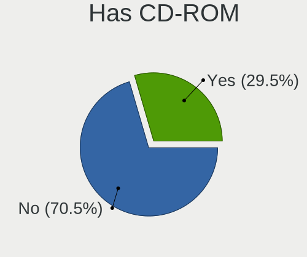
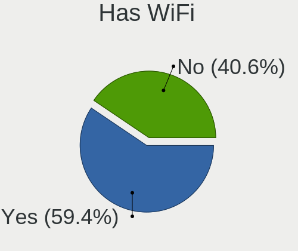
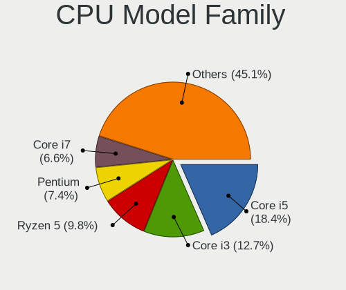
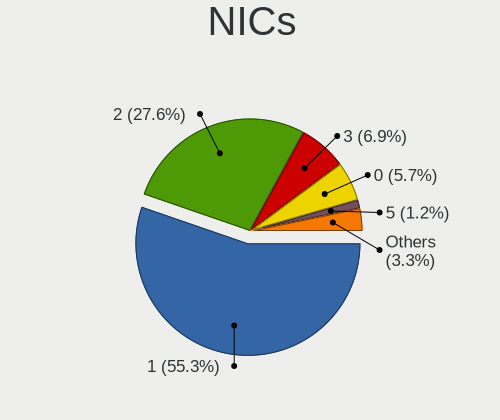

Linux in Malaysia - Tested Hardware & Statistics (Desktops)
-----------------------------------------------------------

A project to collect tested hardware configurations for Linux in Malaysia.

Anyone can contribute to this report by the [hw-probe](https://github.com/linuxhw/hw-probe) tool:

    sudo -E hw-probe -all -upload

Please contribute! Especially if your hardware is rare.

Contents
--------

* [ Test Cases ](#test-cases)

* [ System ](#system)
  - [ OS                       ](#os)
  - [ OS Family                ](#os-family)
  - [ Kernel                   ](#kernel)
  - [ Kernel Family            ](#kernel-family)
  - [ Kernel Major Ver.        ](#kernel-major-ver)
  - [ Arch                     ](#arch)
  - [ DE                       ](#de)
  - [ Display Server           ](#display-server)
  - [ Display Manager          ](#display-manager)
  - [ OS Lang                  ](#os-lang)
  - [ Boot Mode                ](#boot-mode)
  - [ Filesystem               ](#filesystem)
  - [ Part. scheme             ](#part-scheme)
  - [ Dual Boot with Linux/BSD ](#dual-boot-with-linuxbsd)
  - [ Dual Boot (Win)          ](#dual-boot-win)

* [ Board ](#board)
  - [ Vendor                   ](#vendor)
  - [ Model                    ](#model)
  - [ Model Family             ](#model-family)
  - [ MFG Year                 ](#mfg-year)
  - [ Form Factor              ](#form-factor)
  - [ Secure Boot              ](#secure-boot)
  - [ Coreboot                 ](#coreboot)
  - [ RAM Size                 ](#ram-size)
  - [ RAM Used                 ](#ram-used)
  - [ Total Drives             ](#total-drives)
  - [ Has CD-ROM               ](#has-cd-rom)
  - [ Has Ethernet             ](#has-ethernet)
  - [ Has WiFi                 ](#has-wifi)
  - [ Has Bluetooth            ](#has-bluetooth)

* [ Location ](#location)
  - [ Country                  ](#country)
  - [ City                     ](#city)

* [ Drives ](#drives)
  - [ Drive Vendor             ](#drive-vendor)
  - [ Drive Model              ](#drive-model)
  - [ HDD Vendor               ](#hdd-vendor)
  - [ SSD Vendor               ](#ssd-vendor)
  - [ Drive Kind               ](#drive-kind)
  - [ Drive Connector          ](#drive-connector)
  - [ Drive Size               ](#drive-size)
  - [ Space Total              ](#space-total)
  - [ Space Used               ](#space-used)
  - [ Malfunc. Drives          ](#malfunc-drives)
  - [ Malfunc. Drive Vendor    ](#malfunc-drive-vendor)
  - [ Malfunc. HDD Vendor      ](#malfunc-hdd-vendor)
  - [ Malfunc. Drive Kind      ](#malfunc-drive-kind)
  - [ Failed Drives            ](#failed-drives)
  - [ Failed Drive Vendor      ](#failed-drive-vendor)
  - [ Drive Status             ](#drive-status)

* [ Storage controller ](#storage-controller)
  - [ Storage Vendor           ](#storage-vendor)
  - [ Storage Model            ](#storage-model)
  - [ Storage Kind             ](#storage-kind)

* [ Processor ](#processor)
  - [ CPU Vendor               ](#cpu-vendor)
  - [ CPU Model                ](#cpu-model)
  - [ CPU Model Family         ](#cpu-model-family)
  - [ CPU Cores                ](#cpu-cores)
  - [ CPU Sockets              ](#cpu-sockets)
  - [ CPU Threads              ](#cpu-threads)
  - [ CPU Op-Modes             ](#cpu-op-modes)
  - [ CPU Microcode            ](#cpu-microcode)
  - [ CPU Microarch            ](#cpu-microarch)

* [ Graphics ](#graphics)
  - [ GPU Vendor               ](#gpu-vendor)
  - [ GPU Model                ](#gpu-model)
  - [ GPU Combo                ](#gpu-combo)
  - [ GPU Driver               ](#gpu-driver)
  - [ GPU Memory               ](#gpu-memory)

* [ Monitor ](#monitor)
  - [ Monitor Vendor           ](#monitor-vendor)
  - [ Monitor Model            ](#monitor-model)
  - [ Monitor Resolution       ](#monitor-resolution)
  - [ Monitor Diagonal         ](#monitor-diagonal)
  - [ Monitor Width            ](#monitor-width)
  - [ Aspect Ratio             ](#aspect-ratio)
  - [ Monitor Area             ](#monitor-area)
  - [ Pixel Density            ](#pixel-density)
  - [ Multiple Monitors        ](#multiple-monitors)

* [ Network ](#network)
  - [ Net Controller Vendor    ](#net-controller-vendor)
  - [ Net Controller Model     ](#net-controller-model)
  - [ Wireless Vendor          ](#wireless-vendor)
  - [ Wireless Model           ](#wireless-model)
  - [ Ethernet Vendor          ](#ethernet-vendor)
  - [ Ethernet Model           ](#ethernet-model)
  - [ Net Controller Kind      ](#net-controller-kind)
  - [ Used Controller          ](#used-controller)
  - [ NICs                     ](#nics)
  - [ IPv6                     ](#ipv6)

* [ Bluetooth ](#bluetooth)
  - [ Bluetooth Vendor         ](#bluetooth-vendor)
  - [ Bluetooth Model          ](#bluetooth-model)

* [ Sound ](#sound)
  - [ Sound Vendor             ](#sound-vendor)
  - [ Sound Model              ](#sound-model)

* [ Memory ](#memory)
  - [ Memory Vendor            ](#memory-vendor)
  - [ Memory Model             ](#memory-model)
  - [ Memory Kind              ](#memory-kind)
  - [ Memory Form Factor       ](#memory-form-factor)
  - [ Memory Size              ](#memory-size)
  - [ Memory Speed             ](#memory-speed)

* [ Printers & scanners ](#printers--scanners)
  - [ Printer Vendor           ](#printer-vendor)
  - [ Printer Model            ](#printer-model)
  - [ Scanner Vendor           ](#scanner-vendor)
  - [ Scanner Model            ](#scanner-model)

* [ Camera ](#camera)
  - [ Camera Vendor            ](#camera-vendor)
  - [ Camera Model             ](#camera-model)

* [ Security ](#security)
  - [ Fingerprint Vendor       ](#fingerprint-vendor)
  - [ Fingerprint Model        ](#fingerprint-model)
  - [ Chipcard Vendor          ](#chipcard-vendor)
  - [ Chipcard Model           ](#chipcard-model)

* [ Unsupported ](#unsupported)
  - [ Unsupported Devices      ](#unsupported-devices)
  - [ Unsupported Device Types ](#unsupported-device-types)

Test Cases
----------

Total: 284

| Vendor     | Model                       | Probe                                                      | Date         |
|------------|-----------------------------|------------------------------------------------------------|--------------|
| ASUSTek    | PRIME B560M-K               | [ee02fff8df](https://linux-hardware.org/?probe=ee02fff8df) | Sep 28, 2023 |
| Gigabyte   | B550 AORUS PRO V2           | [273b056209](https://linux-hardware.org/?probe=273b056209) | Sep 25, 2023 |
| MSI        | MS-7388                     | [f5ee235af0](https://linux-hardware.org/?probe=f5ee235af0) | Sep 23, 2023 |
| ASRock     | B550 Pro4                   | [af2217289d](https://linux-hardware.org/?probe=af2217289d) | Sep 19, 2023 |
| ASUSTek    | M5A78L-M LX V2              | [92b5ca6639](https://linux-hardware.org/?probe=92b5ca6639) | Sep 03, 2023 |
| ASUSTek    | PRIME B760M-A WIFI D4       | [f2eccf0aa8](https://linux-hardware.org/?probe=f2eccf0aa8) | Sep 02, 2023 |
| ASRock     | A620M-HDV/M.2+              | [674da4ba95](https://linux-hardware.org/?probe=674da4ba95) | Sep 02, 2023 |
| Gigabyte   | B85M-D3H                    | [4660dc9f99](https://linux-hardware.org/?probe=4660dc9f99) | Sep 01, 2023 |
| ECS        | G31T-M7                     | [f095887170](https://linux-hardware.org/?probe=f095887170) | Aug 28, 2023 |
| MSI        | MS-7388                     | [42530086f2](https://linux-hardware.org/?probe=42530086f2) | Aug 27, 2023 |
| Dell       | 04Y8V0 A02                  | [629b07f8bc](https://linux-hardware.org/?probe=629b07f8bc) | Aug 27, 2023 |
| MSI        | MS-7388                     | [5c1e4b0c2b](https://linux-hardware.org/?probe=5c1e4b0c2b) | Aug 25, 2023 |
| Intel      | X99                         | [785fcd2a1d](https://linux-hardware.org/?probe=785fcd2a1d) | Aug 21, 2023 |
| Intel      | X99                         | [b54ecfbbc3](https://linux-hardware.org/?probe=b54ecfbbc3) | Aug 21, 2023 |
| MSI        | PRO B760M-A WIFI DDR4       | [109c0dbb17](https://linux-hardware.org/?probe=109c0dbb17) | Aug 20, 2023 |
| Acer       | Veriton M2611G v1.0         | [1527c20b46](https://linux-hardware.org/?probe=1527c20b46) | Aug 19, 2023 |
| ECS        | G31T-M7                     | [2d35b5e140](https://linux-hardware.org/?probe=2d35b5e140) | Aug 14, 2023 |
| Gigabyte   | H410M S2 V2                 | [d4c5a12d06](https://linux-hardware.org/?probe=d4c5a12d06) | Aug 10, 2023 |
| Dell       | 0WR7PY A03                  | [becf318878](https://linux-hardware.org/?probe=becf318878) | Aug 07, 2023 |
| Gigabyte   | G31M-S2C                    | [9cda5ca576](https://linux-hardware.org/?probe=9cda5ca576) | Aug 05, 2023 |
| ASUSTek    | P5G41T-M LX3                | [f82f03bf86](https://linux-hardware.org/?probe=f82f03bf86) | Aug 04, 2023 |
| ASUSTek    | P5G41T-M LX3                | [356e8a0637](https://linux-hardware.org/?probe=356e8a0637) | Jul 28, 2023 |
| Gigabyte   | B450M S2H                   | [f2f1f87d0c](https://linux-hardware.org/?probe=f2f1f87d0c) | Jul 23, 2023 |
| Lenovo     | MAHOBAY NOK                 | [9b6d9b3e96](https://linux-hardware.org/?probe=9b6d9b3e96) | Jul 21, 2023 |
| MSI        | PRO B660M-E DDR4            | [62aa29ec8e](https://linux-hardware.org/?probe=62aa29ec8e) | Jul 19, 2023 |
| MSI        | Z97 GAMING 7                | [28c6cd48b8](https://linux-hardware.org/?probe=28c6cd48b8) | Jul 16, 2023 |
| MSI        | Z97 GAMING 7                | [9ef499d31f](https://linux-hardware.org/?probe=9ef499d31f) | Jul 16, 2023 |
| Acer       | Veriton X6610G              | [e1189e3406](https://linux-hardware.org/?probe=e1189e3406) | Jul 13, 2023 |
| ASRockRack | ROMED8QM-2T                 | [a4fe5ea9c9](https://linux-hardware.org/?probe=a4fe5ea9c9) | Jul 13, 2023 |
| ASUSTek    | P5G41T-M LX3                | [8287d6e8e3](https://linux-hardware.org/?probe=8287d6e8e3) | Jul 04, 2023 |
| Gigabyte   | A320M-S2H V2-CF             | [18b6484d81](https://linux-hardware.org/?probe=18b6484d81) | Jul 01, 2023 |
| MSI        | A320M PRO-VH                | [1a84c61bd4](https://linux-hardware.org/?probe=1a84c61bd4) | Jun 27, 2023 |
| HP         | 2B2C                        | [a8ec805431](https://linux-hardware.org/?probe=a8ec805431) | Jun 27, 2023 |
| Gigabyte   | B550 AORUS PRO V2           | [1143a7eebc](https://linux-hardware.org/?probe=1143a7eebc) | Jun 27, 2023 |
| HP         | 2B2C                        | [3b82186362](https://linux-hardware.org/?probe=3b82186362) | Jun 26, 2023 |
| Intel      | DH61WW AAG23116-204         | [4269ca2c0b](https://linux-hardware.org/?probe=4269ca2c0b) | Jun 25, 2023 |
| HP         | 2B2C                        | [4303d28839](https://linux-hardware.org/?probe=4303d28839) | Jun 22, 2023 |
| Gigabyte   | A320M-S2H V2-CF             | [1623fa6455](https://linux-hardware.org/?probe=1623fa6455) | Jun 11, 2023 |
| MSI        | MS-7388                     | [6d3a406400](https://linux-hardware.org/?probe=6d3a406400) | Jun 10, 2023 |
| MSI        | MS-7388                     | [fc12ac6b90](https://linux-hardware.org/?probe=fc12ac6b90) | Jun 02, 2023 |
| ASUSTek    | H81M-K                      | [f65eac842b](https://linux-hardware.org/?probe=f65eac842b) | May 23, 2023 |
| Gigabyte   | H410M S2 V2                 | [9d2439e8d7](https://linux-hardware.org/?probe=9d2439e8d7) | May 18, 2023 |
| Gigabyte   | B450 AORUS ELITE            | [7957c81218](https://linux-hardware.org/?probe=7957c81218) | May 17, 2023 |
| Gigabyte   | B450 AORUS ELITE            | [1aedc7da48](https://linux-hardware.org/?probe=1aedc7da48) | May 17, 2023 |
| MSI        | MS-7388                     | [948e1d2358](https://linux-hardware.org/?probe=948e1d2358) | May 03, 2023 |
| MSI        | MS-7388                     | [ec819aca80](https://linux-hardware.org/?probe=ec819aca80) | May 01, 2023 |
| Gigabyte   | Z77M-D3H                    | [6da1ddcef5](https://linux-hardware.org/?probe=6da1ddcef5) | May 01, 2023 |
| Gigabyte   | Z77M-D3H                    | [a3d2b3dcd3](https://linux-hardware.org/?probe=a3d2b3dcd3) | Apr 30, 2023 |
| Gigabyte   | Z77M-D3H                    | [915147a191](https://linux-hardware.org/?probe=915147a191) | Apr 25, 2023 |
| Gigabyte   | Z77M-D3H                    | [92a968e58d](https://linux-hardware.org/?probe=92a968e58d) | Apr 25, 2023 |
| Dell       | 0F373D A00                  | [206de0188d](https://linux-hardware.org/?probe=206de0188d) | Apr 22, 2023 |
| Acer       | Aspire XC-710 V:1.1         | [a09ea158cc](https://linux-hardware.org/?probe=a09ea158cc) | Apr 20, 2023 |
| ASRock     | B550 Pro4                   | [2d4578e52a](https://linux-hardware.org/?probe=2d4578e52a) | Apr 20, 2023 |
| MSI        | MS-7388                     | [4efa2b04da](https://linux-hardware.org/?probe=4efa2b04da) | Apr 14, 2023 |
| Gigabyte   | B550 AORUS PRO V2           | [f4cbe67033](https://linux-hardware.org/?probe=f4cbe67033) | Apr 14, 2023 |
| Gigabyte   | Z77M-D3H                    | [ffdcd55e2e](https://linux-hardware.org/?probe=ffdcd55e2e) | Apr 13, 2023 |
| MSI        | MS-7388                     | [d7f892b3e2](https://linux-hardware.org/?probe=d7f892b3e2) | Apr 12, 2023 |
| Gigabyte   | Z77M-D3H                    | [d76bd92923](https://linux-hardware.org/?probe=d76bd92923) | Apr 07, 2023 |
| MSI        | B450M-A PRO MAX             | [54789b15f3](https://linux-hardware.org/?probe=54789b15f3) | Mar 29, 2023 |
| ASUSTek    | Pro WS WRX80E-SAGE SE WI... | [b9d321c70e](https://linux-hardware.org/?probe=b9d321c70e) | Mar 25, 2023 |
| Biostar    | G41D3+                      | [ebb9a17568](https://linux-hardware.org/?probe=ebb9a17568) | Mar 23, 2023 |
| Gigabyte   | GA-890GPA-UD3H              | [b54b641b36](https://linux-hardware.org/?probe=b54b641b36) | Mar 14, 2023 |
| ASUSTek    | Pro WS WRX80E-SAGE SE WI... | [5545b43cf0](https://linux-hardware.org/?probe=5545b43cf0) | Mar 13, 2023 |
| ASUSTek    | Pro WS WRX80E-SAGE SE WI... | [0211c6712f](https://linux-hardware.org/?probe=0211c6712f) | Mar 13, 2023 |
| Gigabyte   | X570 UD                     | [839a069bc4](https://linux-hardware.org/?probe=839a069bc4) | Mar 13, 2023 |
| Dell       | 084J0R A00                  | [dcde5e81ed](https://linux-hardware.org/?probe=dcde5e81ed) | Mar 04, 2023 |
| Intel      | DH61WW AAG23116-204         | [c9b32e7136](https://linux-hardware.org/?probe=c9b32e7136) | Mar 03, 2023 |
| Unknown    | J3160-4L                    | [8089ba23b4](https://linux-hardware.org/?probe=8089ba23b4) | Mar 01, 2023 |
| MSI        | A320M GRENADE               | [1a5ffd0fc4](https://linux-hardware.org/?probe=1a5ffd0fc4) | Mar 01, 2023 |
| Gigabyte   | H370 AORUS GAMING 3-CF      | [59d082bd5f](https://linux-hardware.org/?probe=59d082bd5f) | Feb 26, 2023 |
| Gigabyte   | B550 AORUS PRO V2           | [8f202b88fa](https://linux-hardware.org/?probe=8f202b88fa) | Feb 16, 2023 |
| ASRock     | B550 Pro4                   | [9ad890517a](https://linux-hardware.org/?probe=9ad890517a) | Feb 16, 2023 |
| ASUSTek    | B85M-G                      | [c803a7f9e8](https://linux-hardware.org/?probe=c803a7f9e8) | Feb 15, 2023 |
| ASUSTek    | B85M-G                      | [3a660768c0](https://linux-hardware.org/?probe=3a660768c0) | Feb 15, 2023 |
| Dell       | 0MGK50 A02                  | [43bd1ca5e1](https://linux-hardware.org/?probe=43bd1ca5e1) | Feb 15, 2023 |
| Gigabyte   | B550 AORUS PRO V2           | [27fa84ce56](https://linux-hardware.org/?probe=27fa84ce56) | Feb 14, 2023 |
| ASUSTek    | Pro WS WRX80E-SAGE SE WI... | [8895a873ab](https://linux-hardware.org/?probe=8895a873ab) | Feb 14, 2023 |
| ASUSTek    | Pro WS WRX80E-SAGE SE WI... | [fb00615692](https://linux-hardware.org/?probe=fb00615692) | Feb 14, 2023 |
| Gigabyte   | X570 UD                     | [ae563f7bfe](https://linux-hardware.org/?probe=ae563f7bfe) | Feb 14, 2023 |
| MSI        | 970A-G46                    | [6012e644eb](https://linux-hardware.org/?probe=6012e644eb) | Feb 13, 2023 |
| HP         | 18E4                        | [55972b87dd](https://linux-hardware.org/?probe=55972b87dd) | Feb 11, 2023 |
| Gigabyte   | B560M AORUS ELITE           | [05b252ac05](https://linux-hardware.org/?probe=05b252ac05) | Feb 05, 2023 |
| Gigabyte   | B85M-D3H                    | [903e8715e4](https://linux-hardware.org/?probe=903e8715e4) | Feb 03, 2023 |
| Gigabyte   | B85M-D3H                    | [6013489300](https://linux-hardware.org/?probe=6013489300) | Feb 03, 2023 |
| Gigabyte   | GA-890GPA-UD3H              | [e660f922a4](https://linux-hardware.org/?probe=e660f922a4) | Jan 27, 2023 |
| ASUSTek    | H81M-K                      | [cb932accdb](https://linux-hardware.org/?probe=cb932accdb) | Jan 24, 2023 |
| HP         | 2B2C                        | [1a74d92aaf](https://linux-hardware.org/?probe=1a74d92aaf) | Jan 08, 2023 |
| ASRock     | A320M-DVS R4.0              | [f82bf510be](https://linux-hardware.org/?probe=f82bf510be) | Dec 31, 2022 |
| Gigabyte   | B85M-D3H                    | [1550136432](https://linux-hardware.org/?probe=1550136432) | Dec 06, 2022 |
| HP         | 2B2C                        | [91862a2497](https://linux-hardware.org/?probe=91862a2497) | Nov 19, 2022 |
| HP         | 2B2C                        | [2eb8311f18](https://linux-hardware.org/?probe=2eb8311f18) | Nov 16, 2022 |
| MSI        | MPG X570 GAMING EDGE WIF... | [1fef4a8aa5](https://linux-hardware.org/?probe=1fef4a8aa5) | Nov 13, 2022 |
| MSI        | B450M-A PRO MAX             | [e5fa54bf6f](https://linux-hardware.org/?probe=e5fa54bf6f) | Nov 10, 2022 |
| Gigabyte   | X570 UD                     | [29641e8b7c](https://linux-hardware.org/?probe=29641e8b7c) | Nov 09, 2022 |
| ASUSTek    | P7H55-M LE                  | [383066ca1c](https://linux-hardware.org/?probe=383066ca1c) | Nov 02, 2022 |
| ASUSTek    | P7H55-M LE                  | [66acf8991e](https://linux-hardware.org/?probe=66acf8991e) | Nov 02, 2022 |
| Seco       | C40 C                       | [08509c30b6](https://linux-hardware.org/?probe=08509c30b6) | Oct 31, 2022 |
| Gigabyte   | AX370M-Gaming 3-CF          | [abe170cf19](https://linux-hardware.org/?probe=abe170cf19) | Oct 27, 2022 |
| HP         | 2B2C                        | [df8a8ec9bc](https://linux-hardware.org/?probe=df8a8ec9bc) | Sep 29, 2022 |
| HP         | 18E7                        | [71a12280de](https://linux-hardware.org/?probe=71a12280de) | Sep 24, 2022 |
| ASUSTek    | ProArt Z690-CREATOR WIFI    | [48479f01c1](https://linux-hardware.org/?probe=48479f01c1) | Sep 19, 2022 |
| Intel      | DH61WW AAG23116-204         | [3310a4c592](https://linux-hardware.org/?probe=3310a4c592) | Sep 02, 2022 |
| Vorke      | V1 Plus                     | [0f36a3adcb](https://linux-hardware.org/?probe=0f36a3adcb) | Aug 31, 2022 |
| MSI        | B450M MORTAR MAX            | [25e7e97937](https://linux-hardware.org/?probe=25e7e97937) | Aug 29, 2022 |
| MSI        | B450M MORTAR MAX            | [9b0e2c480f](https://linux-hardware.org/?probe=9b0e2c480f) | Aug 28, 2022 |
| Dell       | 0PU052                      | [2bffd37724](https://linux-hardware.org/?probe=2bffd37724) | Aug 24, 2022 |
| ASUSTek    | P5G41T-M LX3                | [0aefa0613d](https://linux-hardware.org/?probe=0aefa0613d) | Aug 15, 2022 |
| ASUSTek    | P5G41T-M LX3                | [d000ce4d8c](https://linux-hardware.org/?probe=d000ce4d8c) | Aug 15, 2022 |
| Intel      | DH61WW AAG23116-204         | [30715e2f04](https://linux-hardware.org/?probe=30715e2f04) | Aug 01, 2022 |
| Lenovo     | ThinkCentre M58 7359DHJ     | [46c2c1db62](https://linux-hardware.org/?probe=46c2c1db62) | Jul 26, 2022 |
| ONDA       | H110-MINI V3.00 Ver:3.00    | [62b2a7897b](https://linux-hardware.org/?probe=62b2a7897b) | Jul 24, 2022 |
| Gigabyte   | Z390 GAMING X-CF            | [0e3950303c](https://linux-hardware.org/?probe=0e3950303c) | Jul 18, 2022 |
| Gigabyte   | X570 AORUS MASTER           | [aa2a721361](https://linux-hardware.org/?probe=aa2a721361) | Jul 15, 2022 |
| Gigabyte   | B450M S2H                   | [0287348f80](https://linux-hardware.org/?probe=0287348f80) | Jul 12, 2022 |
| Intel      | MAHOBAY                     | [39c0379cee](https://linux-hardware.org/?probe=39c0379cee) | Jul 04, 2022 |
| Gigabyte   | H470 HD3                    | [4857a7b7bf](https://linux-hardware.org/?probe=4857a7b7bf) | Jun 30, 2022 |
| ASUSTek    | ROG Maximus Z690 HERO       | [73d9748926](https://linux-hardware.org/?probe=73d9748926) | Jun 29, 2022 |
| MSI        | MAG B660M MORTAR WIFI DD... | [c5a5b25674](https://linux-hardware.org/?probe=c5a5b25674) | Jun 28, 2022 |
| Intel      | MAHOBAY                     | [c292904665](https://linux-hardware.org/?probe=c292904665) | Jun 24, 2022 |
| ASUSTek    | CROSSHAIR VI HERO           | [2a4d1c8a0b](https://linux-hardware.org/?probe=2a4d1c8a0b) | Jun 19, 2022 |
| Lenovo     | 102F SDK0E50510 WIN 2625... | [35c05116d1](https://linux-hardware.org/?probe=35c05116d1) | Jun 16, 2022 |
| ASUSTek    | TUF Gaming B660M-PLUS WI... | [0b792ecaef](https://linux-hardware.org/?probe=0b792ecaef) | Jun 14, 2022 |
| ASUSTek    | TUF Gaming B660M-PLUS WI... | [9dae5c70a5](https://linux-hardware.org/?probe=9dae5c70a5) | Jun 14, 2022 |
| ASUSTek    | TUF Gaming B660M-PLUS WI... | [1d0ca4cb7a](https://linux-hardware.org/?probe=1d0ca4cb7a) | Jun 12, 2022 |
| ASUSTek    | TUF Gaming B660M-PLUS WI... | [ded6b87e98](https://linux-hardware.org/?probe=ded6b87e98) | Jun 12, 2022 |
| Gigabyte   | X570 AORUS ELITE WIFI       | [568b23271e](https://linux-hardware.org/?probe=568b23271e) | Jun 11, 2022 |
| ASUSTek    | P5G41T-M LX3                | [43adb86887](https://linux-hardware.org/?probe=43adb86887) | Apr 25, 2022 |
| ASUSTek    | P5G41T-M LX3                | [ba9b8d5ac1](https://linux-hardware.org/?probe=ba9b8d5ac1) | Apr 25, 2022 |
| ECS        | Iris8                       | [1cff4313c1](https://linux-hardware.org/?probe=1cff4313c1) | Apr 23, 2022 |
| HP         | 2B2C                        | [195e5473e9](https://linux-hardware.org/?probe=195e5473e9) | Apr 20, 2022 |
| HP         | 2B2C                        | [f88798fff2](https://linux-hardware.org/?probe=f88798fff2) | Apr 15, 2022 |
| ASUSTek    | B85M-G                      | [c6dd82e724](https://linux-hardware.org/?probe=c6dd82e724) | Apr 14, 2022 |
| ASUSTek    | B85M-G                      | [e525a26ca8](https://linux-hardware.org/?probe=e525a26ca8) | Apr 14, 2022 |
| Gigabyte   | H470 HD3                    | [5ce5c54ecd](https://linux-hardware.org/?probe=5ce5c54ecd) | Apr 09, 2022 |
| Intel      | DH61WW AAG23116-204         | [7ec10d98e3](https://linux-hardware.org/?probe=7ec10d98e3) | Apr 03, 2022 |
| Lenovo     | 30D9 NOK                    | [c378cd6fd3](https://linux-hardware.org/?probe=c378cd6fd3) | Mar 27, 2022 |
| Intel      | DH61WW AAG23116-204         | [a1c0612337](https://linux-hardware.org/?probe=a1c0612337) | Mar 17, 2022 |
| ASUSTek    | P8B75-M LX                  | [d52d9feb9e](https://linux-hardware.org/?probe=d52d9feb9e) | Mar 09, 2022 |
| ASUSTek    | P8B75-M LX                  | [8d3f72c54f](https://linux-hardware.org/?probe=8d3f72c54f) | Mar 03, 2022 |
| Biostar    | G41D3+                      | [62ba30cf71](https://linux-hardware.org/?probe=62ba30cf71) | Mar 02, 2022 |
| Dell       | 0D441T A03                  | [bbedea92ea](https://linux-hardware.org/?probe=bbedea92ea) | Mar 01, 2022 |
| Dell       | 0D441T A03                  | [297c168632](https://linux-hardware.org/?probe=297c168632) | Mar 01, 2022 |
| Shuttle    | FH170                       | [768e13fd34](https://linux-hardware.org/?probe=768e13fd34) | Feb 25, 2022 |
| ASUSTek    | H110M-D                     | [1dec2ddfad](https://linux-hardware.org/?probe=1dec2ddfad) | Feb 19, 2022 |
| MSI        | B450 TOMAHAWK               | [6b15f755b0](https://linux-hardware.org/?probe=6b15f755b0) | Jan 12, 2022 |
| Gigabyte   | H470 HD3                    | [ff2f0db3fe](https://linux-hardware.org/?probe=ff2f0db3fe) | Jan 09, 2022 |
| Lenovo     | ThinkStation S10 6483CTO    | [0d867912a7](https://linux-hardware.org/?probe=0d867912a7) | Jan 01, 2022 |
| ECS        | H61H2-M12                   | [c8ca1c8cc8](https://linux-hardware.org/?probe=c8ca1c8cc8) | Dec 24, 2021 |
| MSI        | MAG B460 TOMAHAWK           | [c748f77108](https://linux-hardware.org/?probe=c748f77108) | Dec 12, 2021 |
| HP         | 2B44                        | [b62df43777](https://linux-hardware.org/?probe=b62df43777) | Dec 03, 2021 |
| ASUSTek    | TUF Gaming B550-PLUS        | [5c4ae3bd8c](https://linux-hardware.org/?probe=5c4ae3bd8c) | Nov 30, 2021 |
| ECS        | H61H2-M12                   | [c731d25471](https://linux-hardware.org/?probe=c731d25471) | Nov 30, 2021 |
| Dell       | 048DY8 A01                  | [6e5e669c60](https://linux-hardware.org/?probe=6e5e669c60) | Nov 25, 2021 |
| ECS        | H61H2-M12                   | [b5393ad660](https://linux-hardware.org/?probe=b5393ad660) | Nov 12, 2021 |
| ASUSTek    | M2N32-SLI DELUXE            | [87fff05f0f](https://linux-hardware.org/?probe=87fff05f0f) | Nov 03, 2021 |
| Intel      | B75                         | [fef715f491](https://linux-hardware.org/?probe=fef715f491) | Oct 23, 2021 |
| Gigabyte   | H370M D3H-CF                | [8fee3106f7](https://linux-hardware.org/?probe=8fee3106f7) | Oct 12, 2021 |
| Gigabyte   | H370M D3H-CF                | [f79000e059](https://linux-hardware.org/?probe=f79000e059) | Oct 12, 2021 |
| Biostar    | G41D3C                      | [433bc7cf78](https://linux-hardware.org/?probe=433bc7cf78) | Oct 10, 2021 |
| Biostar    | G41D3C                      | [90dc88db01](https://linux-hardware.org/?probe=90dc88db01) | Oct 02, 2021 |
| Gigabyte   | B85M-D3H                    | [9de4382874](https://linux-hardware.org/?probe=9de4382874) | Sep 15, 2021 |
| Lenovo     | MAHOBAY NOK                 | [c2533e9d48](https://linux-hardware.org/?probe=c2533e9d48) | Sep 11, 2021 |
| MSI        | H81M-P33                    | [92b799f852](https://linux-hardware.org/?probe=92b799f852) | Sep 08, 2021 |
| Biostar    | G41D3C                      | [8137e09a97](https://linux-hardware.org/?probe=8137e09a97) | Sep 08, 2021 |
| Biostar    | G41D3C                      | [fc87e33227](https://linux-hardware.org/?probe=fc87e33227) | Sep 07, 2021 |
| Gigabyte   | B85M-D3H                    | [5377e486bc](https://linux-hardware.org/?probe=5377e486bc) | Sep 03, 2021 |
| MSI        | MAG B460 TOMAHAWK           | [a61ee6d83a](https://linux-hardware.org/?probe=a61ee6d83a) | Sep 01, 2021 |
| Biostar    | G41D3C                      | [985970ad93](https://linux-hardware.org/?probe=985970ad93) | Sep 01, 2021 |
| Biostar    | G41D3C                      | [a94c446d8d](https://linux-hardware.org/?probe=a94c446d8d) | Sep 01, 2021 |
| MSI        | MAG B460 TOMAHAWK           | [a1ec21ae3f](https://linux-hardware.org/?probe=a1ec21ae3f) | Aug 29, 2021 |
| ASRock     | H81M-VG4 R2.0               | [cac6720bff](https://linux-hardware.org/?probe=cac6720bff) | Aug 29, 2021 |
| Gigabyte   | B450M S2H V2                | [777faedb05](https://linux-hardware.org/?probe=777faedb05) | Aug 27, 2021 |
| Gigabyte   | B85M-D3H                    | [906a3e006c](https://linux-hardware.org/?probe=906a3e006c) | Aug 24, 2021 |
| Gigabyte   | B85M-D3H                    | [9f369218ff](https://linux-hardware.org/?probe=9f369218ff) | Aug 24, 2021 |
| Gigabyte   | B450M S2H V2                | [9e8fa8f32d](https://linux-hardware.org/?probe=9e8fa8f32d) | Aug 23, 2021 |
| Lenovo     | 1046 SDK0T08861 WIN 3305... | [de1fa2ccc0](https://linux-hardware.org/?probe=de1fa2ccc0) | Aug 20, 2021 |
| Intel      | DH61WW AAG23116-204         | [89188fe3ca](https://linux-hardware.org/?probe=89188fe3ca) | Aug 08, 2021 |
| Gigabyte   | B85M-D3H                    | [3e56e95f2f](https://linux-hardware.org/?probe=3e56e95f2f) | Aug 05, 2021 |
| ASUSTek    | P8Z77-V LX                  | [36562061d6](https://linux-hardware.org/?probe=36562061d6) | Jul 30, 2021 |
| ASUSTek    | P8B75-M LE                  | [e71a7fc65b](https://linux-hardware.org/?probe=e71a7fc65b) | Jul 23, 2021 |
| Dell       | 0427JK A00                  | [3e66028cf8](https://linux-hardware.org/?probe=3e66028cf8) | Jul 22, 2021 |
| ASUSTek    | P8B75-M                     | [ce3ef21b15](https://linux-hardware.org/?probe=ce3ef21b15) | Jul 19, 2021 |
| ASUSTek    | P8B75-M                     | [70e6e81263](https://linux-hardware.org/?probe=70e6e81263) | Jul 19, 2021 |
| ASUSTek    | PRIME H310M-D R2.0          | [5a349c4952](https://linux-hardware.org/?probe=5a349c4952) | Jul 19, 2021 |
| Intel      | DH61WW AAG23116-204         | [275304e806](https://linux-hardware.org/?probe=275304e806) | Jul 19, 2021 |
| Intel      | DH61WW AAG23116-204         | [99df792e3b](https://linux-hardware.org/?probe=99df792e3b) | Jul 18, 2021 |
| Gigabyte   | M61PME-S2P                  | [02dc77286f](https://linux-hardware.org/?probe=02dc77286f) | Jul 17, 2021 |
| Intel      | DH61WW AAG23116-204         | [2495cf9be5](https://linux-hardware.org/?probe=2495cf9be5) | Jul 12, 2021 |
| Gigabyte   | B85M-D3H                    | [b551baea7d](https://linux-hardware.org/?probe=b551baea7d) | Jul 11, 2021 |
| Dell       | 0427JK A00                  | [82c73cf6be](https://linux-hardware.org/?probe=82c73cf6be) | Jul 09, 2021 |
| MSI        | B450M MORTAR                | [e8965c736d](https://linux-hardware.org/?probe=e8965c736d) | Jul 05, 2021 |
| Intel      | DH61WW AAG23116-204         | [a5a80d3f13](https://linux-hardware.org/?probe=a5a80d3f13) | Jun 24, 2021 |
| Dell       | 0427JK A00                  | [d9270ab2c1](https://linux-hardware.org/?probe=d9270ab2c1) | Jun 23, 2021 |
| MSI        | B450M MORTAR                | [0183eeb644](https://linux-hardware.org/?probe=0183eeb644) | Jun 12, 2021 |
| MSI        | H81M-P33                    | [69a8b43e74](https://linux-hardware.org/?probe=69a8b43e74) | Jun 02, 2021 |
| MSI        | H81M-P33                    | [a67e6bcfce](https://linux-hardware.org/?probe=a67e6bcfce) | Jun 02, 2021 |
| Gigabyte   | AB350M-Gaming 3-CF          | [00658a23ab](https://linux-hardware.org/?probe=00658a23ab) | May 27, 2021 |
| ASUSTek    | H97M-E                      | [5f39051050](https://linux-hardware.org/?probe=5f39051050) | May 26, 2021 |
| Gigabyte   | B450M S2H                   | [4c5c7570f6](https://linux-hardware.org/?probe=4c5c7570f6) | May 25, 2021 |
| ASUSTek    | P8Z68-V PRO                 | [2b0de1ba10](https://linux-hardware.org/?probe=2b0de1ba10) | May 21, 2021 |
| ASUSTek    | GRYPHON Z87                 | [0cd0f0c51f](https://linux-hardware.org/?probe=0cd0f0c51f) | May 13, 2021 |
| HP         | 0AA8h                       | [5f350b471f](https://linux-hardware.org/?probe=5f350b471f) | Apr 29, 2021 |
| Gigabyte   | Z97X-Gaming G1              | [07efcf431f](https://linux-hardware.org/?probe=07efcf431f) | Apr 14, 2021 |
| Gigabyte   | Z97X-Gaming G1              | [9f265d798d](https://linux-hardware.org/?probe=9f265d798d) | Apr 14, 2021 |
| AMI        | Cherry Trail Tablet         | [87041c97fb](https://linux-hardware.org/?probe=87041c97fb) | Apr 14, 2021 |
| ASUSTek    | P5QPL-VM EPU                | [6d3642385e](https://linux-hardware.org/?probe=6d3642385e) | Apr 11, 2021 |
| ASUSTek    | P5QPL-VM EPU                | [fc405347a5](https://linux-hardware.org/?probe=fc405347a5) | Mar 12, 2021 |
| ASUSTek    | H110M-D                     | [19e3cff2be](https://linux-hardware.org/?probe=19e3cff2be) | Feb 27, 2021 |
| Gigabyte   | A320M-S2H V2-CF             | [ea93e4d3cd](https://linux-hardware.org/?probe=ea93e4d3cd) | Feb 09, 2021 |
| Acer       | MCP73VE NVIDIA MCP73        | [b50872caf4](https://linux-hardware.org/?probe=b50872caf4) | Feb 07, 2021 |
| MSI        | A320M-A PRO MAX             | [7daa68908c](https://linux-hardware.org/?probe=7daa68908c) | Feb 06, 2021 |
| Acer       | MCP73VE NVIDIA MCP73        | [acb369859f](https://linux-hardware.org/?probe=acb369859f) | Feb 06, 2021 |
| Acer       | Veriton X6630G V:1.0        | [d6126d9f25](https://linux-hardware.org/?probe=d6126d9f25) | Jan 27, 2021 |
| Acer       | Veriton X6630G V:1.0        | [9e5a28d45d](https://linux-hardware.org/?probe=9e5a28d45d) | Jan 27, 2021 |
| Dell       | 0WR7PY A01                  | [9b13ab689f](https://linux-hardware.org/?probe=9b13ab689f) | Jan 24, 2021 |
| Dell       | 0WMJ54 A01                  | [dd87c824a0](https://linux-hardware.org/?probe=dd87c824a0) | Jan 18, 2021 |
| ASUSTek    | P8Z77-V LX                  | [9e291d5782](https://linux-hardware.org/?probe=9e291d5782) | Jan 12, 2021 |
| Intel      | DH77KC AAG39641-400         | [f3c691cbf8](https://linux-hardware.org/?probe=f3c691cbf8) | Jan 01, 2021 |
| MSI        | H81M-P33                    | [e8d73a49e5](https://linux-hardware.org/?probe=e8d73a49e5) | Dec 30, 2020 |
| Intel      | DH61WW AAG23116-300         | [7e473c8d12](https://linux-hardware.org/?probe=7e473c8d12) | Dec 24, 2020 |
| Intel      | DH61WW AAG23116-300         | [645dfe5a80](https://linux-hardware.org/?probe=645dfe5a80) | Dec 23, 2020 |
| Dell       | 0PU052                      | [520a4ef3d0](https://linux-hardware.org/?probe=520a4ef3d0) | Dec 23, 2020 |
| Biostar    | A320MH                      | [a6b1134a37](https://linux-hardware.org/?probe=a6b1134a37) | Dec 18, 2020 |
| Gigabyte   | F2A88XM-HD3P                | [a0b90b128d](https://linux-hardware.org/?probe=a0b90b128d) | Dec 16, 2020 |
| Gigabyte   | H77M-D3H                    | [170d95c5c3](https://linux-hardware.org/?probe=170d95c5c3) | Dec 05, 2020 |
| Gigabyte   | H77M-D3H                    | [d00d18cbda](https://linux-hardware.org/?probe=d00d18cbda) | Dec 05, 2020 |
| Intel      | DH61WW AAG23116-300         | [414fc579a1](https://linux-hardware.org/?probe=414fc579a1) | Dec 02, 2020 |
| Intel      | DH61WW AAG23116-300         | [cf6242caca](https://linux-hardware.org/?probe=cf6242caca) | Dec 02, 2020 |
| Intel      | DH61WW AAG23116-300         | [afbf8ce7bc](https://linux-hardware.org/?probe=afbf8ce7bc) | Dec 01, 2020 |
| ASRock     | G41C-GS                     | [c323f09a39](https://linux-hardware.org/?probe=c323f09a39) | Nov 17, 2020 |
| Gigabyte   | Z490 VISION D               | [af58d1579d](https://linux-hardware.org/?probe=af58d1579d) | Nov 09, 2020 |
| ASUSTek    | B85M-G                      | [5021546be8](https://linux-hardware.org/?probe=5021546be8) | Oct 30, 2020 |
| ASUSTek    | PRIME B350-PLUS             | [b6aa803efb](https://linux-hardware.org/?probe=b6aa803efb) | Oct 21, 2020 |
| ASUSTek    | PRIME B350-PLUS             | [02a2657831](https://linux-hardware.org/?probe=02a2657831) | Oct 20, 2020 |
| Dell       | 09WH54 A00                  | [5c8d0c0991](https://linux-hardware.org/?probe=5c8d0c0991) | Oct 15, 2020 |
| Dell       | 06D7TR A02                  | [1fff522fa1](https://linux-hardware.org/?probe=1fff522fa1) | Oct 13, 2020 |
| Dell       | 09WH54 A00                  | [e8e5a3c2ac](https://linux-hardware.org/?probe=e8e5a3c2ac) | Oct 12, 2020 |
| Dell       | 0RW203                      | [594ab9e6d3](https://linux-hardware.org/?probe=594ab9e6d3) | Sep 02, 2020 |
| Gigabyte   | B450M S2H                   | [0930a62ca5](https://linux-hardware.org/?probe=0930a62ca5) | Aug 21, 2020 |
| ASUSTek    | Z170 PRO GAMING             | [a43507c564](https://linux-hardware.org/?probe=a43507c564) | Aug 12, 2020 |
| ASUSTek    | H110M-D                     | [bc44361c47](https://linux-hardware.org/?probe=bc44361c47) | Aug 02, 2020 |
| ASUSTek    | H110M-D                     | [e8cc620228](https://linux-hardware.org/?probe=e8cc620228) | Aug 02, 2020 |
| Gigabyte   | B85M-D3H                    | [3f99c1674c](https://linux-hardware.org/?probe=3f99c1674c) | Jul 30, 2020 |
| Dell       | 0D6H9T A00                  | [dbbc5219fd](https://linux-hardware.org/?probe=dbbc5219fd) | Jul 27, 2020 |
| Gigabyte   | B85M-D3H                    | [2bfaffc9c5](https://linux-hardware.org/?probe=2bfaffc9c5) | Jul 21, 2020 |
| Gigabyte   | H61M-S2P-R3                 | [7b83e5785f](https://linux-hardware.org/?probe=7b83e5785f) | Jul 19, 2020 |
| Gigabyte   | B85M-D3H                    | [ab9fa86313](https://linux-hardware.org/?probe=ab9fa86313) | Jul 16, 2020 |
| Gigabyte   | GA-890GPA-UD3H              | [7d9a43933e](https://linux-hardware.org/?probe=7d9a43933e) | Jul 14, 2020 |
| Biostar    | H81MHV3                     | [48cdbb3d36](https://linux-hardware.org/?probe=48cdbb3d36) | Jul 11, 2020 |
| Biostar    | H81MHV3                     | [a97a2e14e2](https://linux-hardware.org/?probe=a97a2e14e2) | Jul 06, 2020 |
| Gigabyte   | B85M-D3H                    | [5d32eb1d75](https://linux-hardware.org/?probe=5d32eb1d75) | Jun 30, 2020 |
| Acer       | Aspire XC600 v1.0           | [99ff555015](https://linux-hardware.org/?probe=99ff555015) | Jun 21, 2020 |
| Gigabyte   | GA-890GPA-UD3H              | [05556ef252](https://linux-hardware.org/?probe=05556ef252) | Jun 19, 2020 |
| Acer       | Aspire XC600 v1.0           | [eac1260628](https://linux-hardware.org/?probe=eac1260628) | Jun 17, 2020 |
| ASRock     | Z77 Extreme4                | [ba4a677fab](https://linux-hardware.org/?probe=ba4a677fab) | Jun 10, 2020 |
| MSI        | A320M-A PRO MAX             | [11c6b72a1b](https://linux-hardware.org/?probe=11c6b72a1b) | Jun 03, 2020 |
| MSI        | A320M-A PRO MAX             | [ecf8e72f94](https://linux-hardware.org/?probe=ecf8e72f94) | May 31, 2020 |
| ASRock     | Z77 Extreme4                | [865933043f](https://linux-hardware.org/?probe=865933043f) | May 26, 2020 |
| Acer       | EQ45M                       | [a682473a39](https://linux-hardware.org/?probe=a682473a39) | May 23, 2020 |
| Gigabyte   | B85M-D3H                    | [d2113ac640](https://linux-hardware.org/?probe=d2113ac640) | May 21, 2020 |
| Dell       | 0PU052                      | [40ab4a84b5](https://linux-hardware.org/?probe=40ab4a84b5) | May 18, 2020 |
| Gigabyte   | B85M-D3H                    | [8156a3eef6](https://linux-hardware.org/?probe=8156a3eef6) | May 11, 2020 |
| Dell       | 0RY007                      | [4d44e2723d](https://linux-hardware.org/?probe=4d44e2723d) | May 04, 2020 |
| Acer       | EQ45M                       | [03e154e2dc](https://linux-hardware.org/?probe=03e154e2dc) | Apr 21, 2020 |
| Dell       | 0C3YXR A01                  | [b50f6391f3](https://linux-hardware.org/?probe=b50f6391f3) | Apr 19, 2020 |
| ASUSTek    | TUF B360-PLUS GAMING        | [0444963962](https://linux-hardware.org/?probe=0444963962) | Apr 12, 2020 |
| MSI        | B150M Night Elf             | [01013b611d](https://linux-hardware.org/?probe=01013b611d) | Apr 11, 2020 |
| Gigabyte   | H61M-S2P-R3                 | [1211d7770c](https://linux-hardware.org/?probe=1211d7770c) | Mar 15, 2020 |
| ASUSTek    | P6T SE                      | [05737b4c23](https://linux-hardware.org/?probe=05737b4c23) | Feb 11, 2020 |
| HP         | 3647h                       | [06df72e240](https://linux-hardware.org/?probe=06df72e240) | Feb 08, 2020 |
| ASUSTek    | P8Z77-M                     | [9247337003](https://linux-hardware.org/?probe=9247337003) | Jan 20, 2020 |
| ASUSTek    | P6T SE                      | [02d013ad00](https://linux-hardware.org/?probe=02d013ad00) | Dec 20, 2019 |
| ASUSTek    | P6T SE                      | [9e78c03471](https://linux-hardware.org/?probe=9e78c03471) | Nov 17, 2019 |
| ASUSTek    | F1A55-M LX PLUS             | [875f14ed53](https://linux-hardware.org/?probe=875f14ed53) | Nov 13, 2019 |
| ASUSTek    | P6T SE                      | [7ce70fa206](https://linux-hardware.org/?probe=7ce70fa206) | Oct 25, 2019 |
| ASUSTek    | P5QPL-AM                    | [b37e090603](https://linux-hardware.org/?probe=b37e090603) | Oct 06, 2019 |
| HP         | 0AA8h                       | [a60543a450](https://linux-hardware.org/?probe=a60543a450) | Sep 07, 2019 |
| Dell       | 0RY007                      | [576ec7dcd0](https://linux-hardware.org/?probe=576ec7dcd0) | Aug 22, 2019 |
| ASUSTek    | Maximus VII RANGER          | [d9d789a4f2](https://linux-hardware.org/?probe=d9d789a4f2) | Aug 21, 2019 |
| ASUSTek    | P6T SE                      | [a91c21a426](https://linux-hardware.org/?probe=a91c21a426) | Aug 02, 2019 |
| ASUSTek    | H81M-C                      | [38a96dff85](https://linux-hardware.org/?probe=38a96dff85) | Jul 02, 2019 |
| ASUSTek    | ROG STRIX Z370-F GAMING     | [62b0b05a66](https://linux-hardware.org/?probe=62b0b05a66) | Jul 01, 2019 |
| ASRock     | X79 Extreme9                | [c96c05c47b](https://linux-hardware.org/?probe=c96c05c47b) | Nov 30, 2018 |
| HP         | 2820h                       | [1f42af0283](https://linux-hardware.org/?probe=1f42af0283) | Dec 17, 2017 |

System
------

OS
--

Installed operating systems

| Name                         | Desktops | Percent |
|------------------------------|----------|---------|
| Ubuntu 20.04                 | 28       | 14.07%  |
| Debian 11                    | 13       | 6.53%   |
| Ubuntu 22.04                 | 9        | 4.52%   |
| Ubuntu 18.04                 | 9        | 4.52%   |
| Zorin 16                     | 8        | 4.02%   |
| OpenMandriva 4.3             | 8        | 4.02%   |
| OpenMandriva 23.03           | 7        | 3.52%   |
| OpenMandriva 4.2             | 6        | 3.02%   |
| Pop!_OS 22.04                | 5        | 2.51%   |
| Pop!_OS 20.04                | 5        | 2.51%   |
| OpenMandriva 4.50            | 5        | 2.51%   |
| ArcoLinux Rolling            | 5        | 2.51%   |
| Ubuntu 19.04                 | 4        | 2.01%   |
| OpenMandriva 23.01           | 4        | 2.01%   |
| Xubuntu 18.04                | 3        | 1.51%   |
| OpenMandriva 23.08           | 3        | 1.51%   |
| Linux Mint 19.3              | 3        | 1.51%   |
| Fedora 37                    | 3        | 1.51%   |
| Fedora 33                    | 3        | 1.51%   |
| Zorin 15                     | 2        | 1.01%   |
| Ubuntu 23.04                 | 2        | 1.01%   |
| Ubuntu 19.10                 | 2        | 1.01%   |
| Pop!_OS 21.04                | 2        | 1.01%   |
| Pop!_OS 20.10                | 2        | 1.01%   |
| openSUSE Tumbleweed-XXXXXXXX | 2        | 1.01%   |
| OpenMandriva 23.07           | 2        | 1.01%   |
| Manjaro 21.2.6               | 2        | 1.01%   |
| Linux Mint 20.3              | 2        | 1.01%   |
| KDE neon 22.04               | 2        | 1.01%   |
| KDE neon 20.04               | 2        | 1.01%   |
| Fedora 34                    | 2        | 1.01%   |
| Arch                         | 2        | 1.01%   |
| Ubuntu MATE 20.04            | 1        | 0.5%    |
| Ubuntu 22.10                 | 1        | 0.5%    |
| Ubuntu 21.10                 | 1        | 0.5%    |
| Ubuntu 21.04                 | 1        | 0.5%    |
| Ubuntu 20.10                 | 1        | 0.5%    |
| SteamOS 3.4                  | 1        | 0.5%    |
| ROSA R10                     | 1        | 0.5%    |
| Pop!_OS 21.10                | 1        | 0.5%    |

OS Family
---------

OS without a version

| Name         | Desktops | Percent |
|--------------|----------|---------|
| Ubuntu       | 55       | 29.1%   |
| OpenMandriva | 32       | 16.93%  |
| Debian       | 15       | 7.94%   |
| Pop!_OS      | 13       | 6.88%   |
| Zorin        | 10       | 5.29%   |
| Linux Mint   | 10       | 5.29%   |
| Fedora       | 10       | 5.29%   |
| Manjaro      | 5        | 2.65%   |
| ArcoLinux    | 5        | 2.65%   |
| KDE neon     | 4        | 2.12%   |
| Xubuntu      | 3        | 1.59%   |
| Lubuntu      | 3        | 1.59%   |
| Endless      | 3        | 1.59%   |
| Elementary   | 3        | 1.59%   |
| Arch         | 3        | 1.59%   |
| openSUSE     | 2        | 1.06%   |
| Kubuntu      | 2        | 1.06%   |
| Kali         | 2        | 1.06%   |
| EndeavourOS  | 2        | 1.06%   |
| Ubuntu MATE  | 1        | 0.53%   |
| SteamOS      | 1        | 0.53%   |
| ROSA         | 1        | 0.53%   |
| Linux Lite   | 1        | 0.53%   |
| Gentoo       | 1        | 0.53%   |
| ChimeraOS    | 1        | 0.53%   |
| CentOS       | 1        | 0.53%   |

Kernel
------

Version of the Linux kernel

| Version                       | Desktops | Percent |
|-------------------------------|----------|---------|
| 6.2.6-desktop-1omv2390        | 8        | 3.62%   |
| 5.10.14-desktop-1omv4002      | 6        | 2.71%   |
| 5.4.0-58-generic              | 5        | 2.26%   |
| 5.16.7-desktop-1omv4003       | 5        | 2.26%   |
| 5.13.19-6-pve                 | 5        | 2.26%   |
| 5.4.0-42-generic              | 4        | 1.81%   |
| 5.15.108-1-pve                | 4        | 1.81%   |
| 6.4.11-desktop-1omv2390       | 3        | 1.36%   |
| 5.4.0-40-generic              | 3        | 1.36%   |
| 5.3.0-53-generic              | 3        | 1.36%   |
| 5.3.0-46-generic              | 3        | 1.36%   |
| 5.16.3-desktop-2omv4050       | 3        | 1.36%   |
| 5.15.0-52-generic             | 3        | 1.36%   |
| 5.11.0-27-generic             | 3        | 1.36%   |
| 6.3.5-desktop-3omv2390        | 2        | 0.9%    |
| 6.2.6-76060206-generic        | 2        | 0.9%    |
| 6.0.12-76060006-generic       | 2        | 0.9%    |
| 5.8.0-53-generic              | 2        | 0.9%    |
| 5.8.0-44-generic              | 2        | 0.9%    |
| 5.8.0-41-generic              | 2        | 0.9%    |
| 5.4.0-77-generic              | 2        | 0.9%    |
| 5.4.0-7634-generic            | 2        | 0.9%    |
| 5.4.0-48-generic              | 2        | 0.9%    |
| 5.4.0-37-generic              | 2        | 0.9%    |
| 5.4.0-29-generic              | 2        | 0.9%    |
| 5.19.0-46-generic             | 2        | 0.9%    |
| 5.19.0-32-generic             | 2        | 0.9%    |
| 5.15.35-3-pve                 | 2        | 0.9%    |
| 5.15.0-58-generic             | 2        | 0.9%    |
| 5.15.0-39-generic             | 2        | 0.9%    |
| 5.12.7-desktop-clang-1omv4003 | 2        | 0.9%    |
| 5.12.4-desktop-1omv4050       | 2        | 0.9%    |
| 5.12.15-300.fc34.x86_64       | 2        | 0.9%    |
| 5.11.0-41-generic             | 2        | 0.9%    |
| 5.11.0-35-generic             | 2        | 0.9%    |
| 5.11.0-34-generic             | 2        | 0.9%    |
| 5.0.0-27-generic              | 2        | 0.9%    |
| 6.5.5-lqx1-1-liquorix         | 1        | 0.45%   |
| 6.4.4-273-tkg-pds             | 1        | 0.45%   |
| 6.4.15-200.fc38.x86_64        | 1        | 0.45%   |

Kernel Family
-------------

Linux kernel without a distro release

| Version  | Desktops | Percent |
|----------|----------|---------|
| 5.4.0    | 32       | 15.46%  |
| 5.15.0   | 14       | 6.76%   |
| 5.11.0   | 12       | 5.8%    |
| 5.8.0    | 11       | 5.31%   |
| 6.2.6    | 10       | 4.83%   |
| 5.3.0    | 8        | 3.86%   |
| 5.19.0   | 7        | 3.38%   |
| 5.0.0    | 7        | 3.38%   |
| 5.10.14  | 6        | 2.9%    |
| 4.15.0   | 6        | 2.9%    |
| 5.16.7   | 5        | 2.42%   |
| 5.13.19  | 5        | 2.42%   |
| 5.13.0   | 5        | 2.42%   |
| 5.15.108 | 4        | 1.93%   |
| 6.4.11   | 3        | 1.45%   |
| 6.2.0    | 3        | 1.45%   |
| 5.16.3   | 3        | 1.45%   |
| 6.3.5    | 2        | 0.97%   |
| 6.1.0    | 2        | 0.97%   |
| 6.0.12   | 2        | 0.97%   |
| 5.18.0   | 2        | 0.97%   |
| 5.17.1   | 2        | 0.97%   |
| 5.15.35  | 2        | 0.97%   |
| 5.12.7   | 2        | 0.97%   |
| 5.12.4   | 2        | 0.97%   |
| 5.12.15  | 2        | 0.97%   |
| 5.10.0   | 2        | 0.97%   |
| 4.18.0   | 2        | 0.97%   |
| 6.5.5    | 1        | 0.48%   |
| 6.4.4    | 1        | 0.48%   |
| 6.4.15   | 1        | 0.48%   |
| 6.4.12   | 1        | 0.48%   |
| 6.4.10   | 1        | 0.48%   |
| 6.3.9    | 1        | 0.48%   |
| 6.3.8    | 1        | 0.48%   |
| 6.3.4    | 1        | 0.48%   |
| 6.3.2    | 1        | 0.48%   |
| 6.2.13   | 1        | 0.48%   |
| 6.2.10   | 1        | 0.48%   |
| 6.2.1    | 1        | 0.48%   |

Kernel Major Ver.
-----------------

Linux kernel major version

| Version | Desktops | Percent |
|---------|----------|---------|
| 5.4     | 32       | 15.69%  |
| 5.15    | 28       | 13.73%  |
| 6.2     | 15       | 7.35%   |
| 5.11    | 13       | 6.37%   |
| 5.8     | 11       | 5.39%   |
| 5.16    | 11       | 5.39%   |
| 5.13    | 11       | 5.39%   |
| 5.19    | 9        | 4.41%   |
| 5.10    | 9        | 4.41%   |
| 5.3     | 8        | 3.92%   |
| 5.0     | 7        | 3.43%   |
| 6.4     | 6        | 2.94%   |
| 6.3     | 6        | 2.94%   |
| 5.12    | 6        | 2.94%   |
| 4.15    | 6        | 2.94%   |
| 6.0     | 5        | 2.45%   |
| 6.1     | 4        | 1.96%   |
| 5.18    | 4        | 1.96%   |
| 5.9     | 3        | 1.47%   |
| 5.17    | 3        | 1.47%   |
| 5.14    | 3        | 1.47%   |
| 4.18    | 2        | 0.98%   |
| 6.5     | 1        | 0.49%   |
| 4.9     | 1        | 0.49%   |

Arch
----

OS architecture (x86_64, i586, etc.)

| Name   | Desktops | Percent |
|--------|----------|---------|
| x86_64 | 179      | 98.9%   |
| i686   | 2        | 1.1%    |

DE
--

Desktop Environment

| Name         | Desktops | Percent |
|--------------|----------|---------|
| GNOME        | 79       | 41.58%  |
| KDE5         | 44       | 23.16%  |
| XFCE         | 16       | 8.42%   |
| Unknown      | 14       | 7.37%   |
| Openbox      | 9        | 4.74%   |
| X-Cinnamon   | 8        | 4.21%   |
| MATE         | 6        | 3.16%   |
| LXQt         | 4        | 2.11%   |
| Pantheon     | 3        | 1.58%   |
| KDE          | 3        | 1.58%   |
| LXDE         | 1        | 0.53%   |
| herbstluftwm | 1        | 0.53%   |
| Cinnamon     | 1        | 0.53%   |
| bspwm        | 1        | 0.53%   |

Display Server
--------------

X11 or Wayland

| Name    | Desktops | Percent |
|---------|----------|---------|
| X11     | 149      | 79.68%  |
| Wayland | 22       | 11.76%  |
| Tty     | 9        | 4.81%   |
| Unknown | 7        | 3.74%   |

Display Manager
---------------

SDDM, LightDM, etc.

| Name    | Desktops | Percent |
|---------|----------|---------|
| Unknown | 89       | 47.85%  |
| SDDM    | 45       | 24.19%  |
| LightDM | 21       | 11.29%  |
| GDM3    | 16       | 8.6%    |
| GDM     | 11       | 5.91%   |
| TDM     | 3        | 1.61%   |
| LXDM    | 1        | 0.54%   |

OS Lang
-------

Language

| Lang    | Desktops | Percent |
|---------|----------|---------|
| en_US   | 142      | 76.76%  |
| en_GB   | 15       | 8.11%   |
| Unknown | 10       | 5.41%   |
| en_SG   | 9        | 4.86%   |
| en_AU   | 3        | 1.62%   |
| zh_SG   | 1        | 0.54%   |
| zh_CN   | 1        | 0.54%   |
| ms_MY   | 1        | 0.54%   |
| en_MY   | 1        | 0.54%   |
| en_HK   | 1        | 0.54%   |
| de_DE   | 1        | 0.54%   |

Boot Mode
---------

EFI or BIOS

| Mode | Desktops | Percent |
|------|----------|---------|
| BIOS | 115      | 61.83%  |
| EFI  | 71       | 38.17%  |

Filesystem
----------

Type of filesystem

| Type    | Desktops | Percent |
|---------|----------|---------|
| Ext4    | 129      | 69.35%  |
| Overlay | 18       | 9.68%   |
| Btrfs   | 18       | 9.68%   |
| Zfs     | 8        | 4.3%    |
| Tmpfs   | 4        | 2.15%   |
| Unknown | 4        | 2.15%   |
| Xfs     | 3        | 1.61%   |
| Ext3    | 1        | 0.54%   |
| Ext2    | 1        | 0.54%   |

Part. scheme
------------

Scheme of partitioning

| Type    | Desktops | Percent |
|---------|----------|---------|
| Unknown | 89       | 48.37%  |
| GPT     | 67       | 36.41%  |
| MBR     | 28       | 15.22%  |

Dual Boot with Linux/BSD
------------------------

Hosting more than one Linux/BSD

| Dual boot | Desktops | Percent |
|-----------|----------|---------|
| No        | 139      | 73.54%  |
| Yes       | 50       | 26.46%  |

Dual Boot (Win)
---------------

Hosting Linux and Windows

| Dual boot | Desktops | Percent |
|-----------|----------|---------|
| No        | 113      | 61.08%  |
| Yes       | 72       | 38.92%  |

Board
-----

Vendor
------

Motherboard manufacturer

| Name                | Desktops | Percent |
|---------------------|----------|---------|
| Gigabyte Technology | 40       | 22.1%   |
| ASUSTek Computer    | 38       | 20.99%  |
| MSI                 | 22       | 12.15%  |
| Dell                | 20       | 11.05%  |
| Intel               | 16       | 8.84%   |
| Hewlett-Packard     | 8        | 4.42%   |
| ASRock              | 8        | 4.42%   |
| Lenovo              | 7        | 3.87%   |
| Acer                | 7        | 3.87%   |
| Biostar             | 5        | 2.76%   |
| ECS                 | 3        | 1.66%   |
| Vorke               | 1        | 0.55%   |
| Shuttle             | 1        | 0.55%   |
| Seco                | 1        | 0.55%   |
| ONDA                | 1        | 0.55%   |
| ASRockRack          | 1        | 0.55%   |
| AMI                 | 1        | 0.55%   |
| Unknown             | 1        | 0.55%   |

Model
-----

Motherboard model

| Name                                | Desktops | Percent |
|-------------------------------------|----------|---------|
| Intel DH61WW AAG23116-204           | 8        | 4.42%   |
| ASUS All Series                     | 8        | 4.42%   |
| Gigabyte Z77M-D3H                   | 6        | 3.31%   |
| Gigabyte B85M-D3H                   | 6        | 3.31%   |
| MSI MS-7C52                         | 5        | 2.76%   |
| MSI MS-7817                         | 3        | 1.66%   |
| Intel DH61WW AAG23116-300           | 3        | 1.66%   |
| Gigabyte B450M S2H                  | 3        | 1.66%   |
| Dell OptiPlex 755                   | 3        | 1.66%   |
| MSI MS-7C81                         | 2        | 1.1%    |
| MSI MS-7B89                         | 2        | 1.1%    |
| Intel MAHOBAY                       | 2        | 1.1%    |
| Gigabyte X570 UD                    | 2        | 1.1%    |
| Gigabyte B550 AORUS PRO V2          | 2        | 1.1%    |
| Dell XPS 8940                       | 2        | 1.1%    |
| Dell OptiPlex 990                   | 2        | 1.1%    |
| Dell OptiPlex 7010                  | 2        | 1.1%    |
| Biostar G41D3C                      | 2        | 1.1%    |
| ASUS Pro WS WRX80E-SAGE SE WIFI     | 2        | 1.1%    |
| ASUS P8Z77-V LX                     | 2        | 1.1%    |
| ASRock B550 Pro4                    | 2        | 1.1%    |
| Vorke V1 Plus                       | 1        | 0.55%   |
| Shuttle DH170                       | 1        | 0.55%   |
| Seco C40                            | 1        | 0.55%   |
| ONDA H110-MINI V3.00                | 1        | 0.55%   |
| MSI MS-7D99                         | 1        | 0.55%   |
| MSI MS-7D46                         | 1        | 0.55%   |
| MSI MS-7D42                         | 1        | 0.55%   |
| MSI MS-7C37                         | 1        | 0.55%   |
| MSI MS-7C02                         | 1        | 0.55%   |
| MSI MS-7A39                         | 1        | 0.55%   |
| MSI MS-7979                         | 1        | 0.55%   |
| MSI MS-7916                         | 1        | 0.55%   |
| MSI MS-7693                         | 1        | 0.55%   |
| MSI MS-7388                         | 1        | 0.55%   |
| Lenovo ThinkStation S10 6483CTO     | 1        | 0.55%   |
| Lenovo ThinkStation P620 30E0S0E000 | 1        | 0.55%   |
| Lenovo ThinkStation P500 30A6S1B50X | 1        | 0.55%   |
| Lenovo ThinkCentre M72e 32673M3     | 1        | 0.55%   |
| Lenovo ThinkCentre M72e 2116CTO     | 1        | 0.55%   |

Model Family
------------

Motherboard model prefix

| Name                | Desktops | Percent |
|---------------------|----------|---------|
| Intel DH61WW        | 11       | 6.08%   |
| Dell OptiPlex       | 11       | 6.08%   |
| ASUS All            | 8        | 4.42%   |
| Gigabyte Z77M-D3H   | 6        | 3.31%   |
| Gigabyte B85M-D3H   | 6        | 3.31%   |
| MSI MS-7C52         | 5        | 2.76%   |
| Lenovo ThinkCentre  | 4        | 2.21%   |
| HP Compaq           | 4        | 2.21%   |
| Gigabyte X570       | 4        | 2.21%   |
| Gigabyte B450M      | 4        | 2.21%   |
| Dell Precision      | 4        | 2.21%   |
| ASUS PRIME          | 4        | 2.21%   |
| Acer Veriton        | 4        | 2.21%   |
| MSI MS-7817         | 3        | 1.66%   |
| Lenovo ThinkStation | 3        | 1.66%   |
| Dell Inspiron       | 3        | 1.66%   |
| ASUS TUF            | 3        | 1.66%   |
| ASUS P8B75-M        | 3        | 1.66%   |
| Acer Aspire         | 3        | 1.66%   |
| MSI MS-7C81         | 2        | 1.1%    |
| MSI MS-7B89         | 2        | 1.1%    |
| Intel MAHOBAY       | 2        | 1.1%    |
| Gigabyte B550       | 2        | 1.1%    |
| Dell XPS            | 2        | 1.1%    |
| Biostar G41D3C      | 2        | 1.1%    |
| ASUS ROG            | 2        | 1.1%    |
| ASUS Pro            | 2        | 1.1%    |
| ASUS P8Z77-V        | 2        | 1.1%    |
| ASRock B550         | 2        | 1.1%    |
| Vorke V1            | 1        | 0.55%   |
| Shuttle DH170       | 1        | 0.55%   |
| Seco C40            | 1        | 0.55%   |
| ONDA H110-MINI      | 1        | 0.55%   |
| MSI MS-7D99         | 1        | 0.55%   |
| MSI MS-7D46         | 1        | 0.55%   |
| MSI MS-7D42         | 1        | 0.55%   |
| MSI MS-7C37         | 1        | 0.55%   |
| MSI MS-7C02         | 1        | 0.55%   |
| MSI MS-7A39         | 1        | 0.55%   |
| MSI MS-7979         | 1        | 0.55%   |

MFG Year
--------

Motherboard manufacture year

| Year | Desktops | Percent |
|------|----------|---------|
| 2013 | 23       | 12.71%  |
| 2012 | 23       | 12.71%  |
| 2018 | 18       | 9.94%   |
| 2011 | 15       | 8.29%   |
| 2019 | 13       | 7.18%   |
| 2020 | 11       | 6.08%   |
| 2008 | 11       | 6.08%   |
| 2021 | 10       | 5.52%   |
| 2015 | 10       | 5.52%   |
| 2017 | 9        | 4.97%   |
| 2007 | 9        | 4.97%   |
| 2022 | 7        | 3.87%   |
| 2014 | 7        | 3.87%   |
| 2010 | 7        | 3.87%   |
| 2009 | 6        | 3.31%   |
| 2023 | 1        | 0.55%   |
| 2006 | 1        | 0.55%   |

Form Factor
-----------

Physical design of the computer

| Name    | Desktops | Percent |
|---------|----------|---------|
| Desktop | 181      | 100%    |

Secure Boot
-----------

Enabled or disabled

| State    | Desktops | Percent |
|----------|----------|---------|
| Disabled | 175      | 96.69%  |
| Enabled  | 6        | 3.31%   |

Coreboot
--------

Have coreboot on board

| Used | Desktops | Percent |
|------|----------|---------|
| No   | 181      | 100%    |

RAM Size
--------

Total RAM memory

| Size in GB  | Desktops | Percent |
|-------------|----------|---------|
| 16.01-24.0  | 55       | 29.89%  |
| 4.01-8.0    | 32       | 17.39%  |
| 8.01-16.0   | 31       | 16.85%  |
| 3.01-4.0    | 23       | 12.5%   |
| 32.01-64.0  | 19       | 10.33%  |
| 64.01-256.0 | 11       | 5.98%   |
| 1.01-2.0    | 8        | 4.35%   |
| 24.01-32.0  | 3        | 1.63%   |
| 2.01-3.0    | 2        | 1.09%   |

RAM Used
--------

Used RAM memory

| Used GB     | Desktops | Percent |
|-------------|----------|---------|
| 1.01-2.0    | 63       | 30.58%  |
| 2.01-3.0    | 60       | 29.13%  |
| 3.01-4.0    | 31       | 15.05%  |
| 4.01-8.0    | 15       | 7.28%   |
| 0.51-1.0    | 14       | 6.8%    |
| 8.01-16.0   | 8        | 3.88%   |
| 32.01-64.0  | 5        | 2.43%   |
| 24.01-32.0  | 3        | 1.46%   |
| 16.01-24.0  | 3        | 1.46%   |
| 0.01-0.5    | 3        | 1.46%   |
| 64.01-256.0 | 1        | 0.49%   |

Total Drives
------------

Number of drives on board

| Drives | Desktops | Percent |
|--------|----------|---------|
| 1      | 62       | 32.8%   |
| 2      | 54       | 28.57%  |
| 3      | 29       | 15.34%  |
| 4      | 18       | 9.52%   |
| 5      | 9        | 4.76%   |
| 7      | 7        | 3.7%    |
| 6      | 5        | 2.65%   |
| 8      | 3        | 1.59%   |
| 10     | 1        | 0.53%   |
| 9      | 1        | 0.53%   |

Has CD-ROM
----------

Has CD-ROM on board

| Presented | Desktops | Percent |
|-----------|----------|---------|
| No        | 126      | 68.85%  |
| Yes       | 57       | 31.15%  |

Has Ethernet
------------

Has Ethernet on board

| Presented | Desktops | Percent |
|-----------|----------|---------|
| Yes       | 166      | 91.71%  |
| No        | 15       | 8.29%   |

Has WiFi
--------

Has WiFi module

| Presented | Desktops | Percent |
|-----------|----------|---------|
| Yes       | 110      | 59.46%  |
| No        | 75       | 40.54%  |

Has Bluetooth
-------------

Has Bluetooth module

| Presented | Desktops | Percent |
|-----------|----------|---------|
| No        | 124      | 68.13%  |
| Yes       | 58       | 31.87%  |

Location
--------

Country
-------

Geographic location (country)

| Country  | Desktops | Percent |
|----------|----------|---------|
| Malaysia | 181      | 100%    |

City
----

Geographic location (city)

| City                   | Desktops | Percent |
|------------------------|----------|---------|
| Kuala Lumpur           | 77       | 38.69%  |
| Petaling Jaya          | 19       | 9.55%   |
| George Town            | 9        | 4.52%   |
| Kuching                | 6        | 3.02%   |
| Kota Kinabalu          | 6        | 3.02%   |
| Shah Alam              | 5        | 2.51%   |
| Seremban               | 5        | 2.51%   |
| Kajang                 | 5        | 2.51%   |
| Subang Jaya            | 4        | 2.01%   |
| Malacca                | 4        | 2.01%   |
| Butterworth            | 4        | 2.01%   |
| Sungai Buloh           | 3        | 1.51%   |
| Puchong Batu Dua Belas | 3        | 1.51%   |
| Kulim                  | 3        | 1.51%   |
| Kota Bharu             | 3        | 1.51%   |
| Johor Bahru            | 3        | 1.51%   |
| Ipoh                   | 3        | 1.51%   |
| Cheras                 | 3        | 1.51%   |
| Bayan Lepas            | 3        | 1.51%   |
| Tawau                  | 2        | 1.01%   |
| Labuan                 | 2        | 1.01%   |
| Bukit Mertajam         | 2        | 1.01%   |
| Ampang                 | 2        | 1.01%   |
| Alor Star              | 2        | 1.01%   |
| Taman Senai            | 1        | 0.5%    |
| Taiping                | 1        | 0.5%    |
| Sungai Petani          | 1        | 0.5%    |
| Seri Kembangan         | 1        | 0.5%    |
| Semenyih               | 1        | 0.5%    |
| Rawang                 | 1        | 0.5%    |
| Putrajaya              | 1        | 0.5%    |
| Penampang              | 1        | 0.5%    |
| Padang Serai           | 1        | 0.5%    |
| Muar town              | 1        | 0.5%    |
| Marabu                 | 1        | 0.5%    |
| Long Seridan           | 1        | 0.5%    |
| Kulai                  | 1        | 0.5%    |
| Kuantan                | 1        | 0.5%    |
| Klang                  | 1        | 0.5%    |
| Cukai                  | 1        | 0.5%    |

Drives
------

Drive Vendor
------------

Hard drive vendors

| Vendor                      | Desktops | Drives | Percent |
|-----------------------------|----------|--------|---------|
| Seagate                     | 79       | 151    | 21.64%  |
| WDC                         | 78       | 149    | 21.37%  |
| Kingston                    | 37       | 54     | 10.14%  |
| Samsung Electronics         | 24       | 38     | 6.58%   |
| Toshiba                     | 16       | 18     | 4.38%   |
| PNY                         | 13       | 35     | 3.56%   |
| A-DATA Technology           | 12       | 21     | 3.29%   |
| Crucial                     | 8        | 14     | 2.19%   |
| SanDisk                     | 7        | 10     | 1.92%   |
| Intel                       | 7        | 11     | 1.92%   |
| Apacer                      | 6        | 11     | 1.64%   |
| Unknown                     | 5        | 6      | 1.37%   |
| Corsair                     | 5        | 13     | 1.37%   |
| Phison Electronics          | 3        | 3      | 0.82%   |
| Phison                      | 3        | 4      | 0.82%   |
| Micron Technology           | 3        | 7      | 0.82%   |
| KIOXIA-EXCERIA              | 3        | 5      | 0.82%   |
| Hitachi                     | 3        | 3      | 0.82%   |
| HGST                        | 3        | 3      | 0.82%   |
| Gigabyte Technology         | 3        | 3      | 0.82%   |
| China                       | 3        | 3      | 0.82%   |
| XPG                         | 2        | 3      | 0.55%   |
| Transcend                   | 2        | 3      | 0.55%   |
| TO Exter                    | 2        | 4      | 0.55%   |
| SPCC                        | 2        | 2      | 0.55%   |
| Silicon Motion              | 2        | 3      | 0.55%   |
| Plextor                     | 2        | 2      | 0.55%   |
| OCZ                         | 2        | 6      | 0.55%   |
| Kingston Technology Company | 2        | 2      | 0.55%   |
| Hewlett-Packard             | 2        | 2      | 0.55%   |
| GAMER                       | 2        | 2      | 0.55%   |
| External                    | 2        | 2      | 0.55%   |
| ADATA Technology            | 2        | 2      | 0.55%   |
| Verbatim                    | 1        | 1      | 0.27%   |
| sk600                       | 1        | 1      | 0.27%   |
| SK hynix                    | 1        | 1      | 0.27%   |
| SATAFIRM                    | 1        | 1      | 0.27%   |
| Realtek                     | 1        | 1      | 0.27%   |
| Pioneer                     | 1        | 1      | 0.27%   |
| Micron/Crucial Technology   | 1        | 1      | 0.27%   |

Drive Model
-----------

Hard drive models

| Model                              | Desktops | Percent |
|------------------------------------|----------|---------|
| Kingston SA400S37240G 240GB SSD    | 13       | 3%      |
| Seagate ST3500414CS 500GB          | 9        | 2.07%   |
| Seagate ST2000DM008-2UB102 2TB     | 9        | 2.07%   |
| Seagate ST1000DM010-2EP102 1TB     | 8        | 1.84%   |
| WDC WD5000AAKX-75U6AA0 500GB       | 7        | 1.61%   |
| WDC WD2500AAKX-753CA1 250GB        | 7        | 1.61%   |
| PNY 1TB SATA SSD                   | 6        | 1.38%   |
| WDC WD5000AAKX-00ERMA0 500GB       | 5        | 1.15%   |
| WDC WD20EZRX-00D8PB0 2TB           | 5        | 1.15%   |
| Seagate ST500DM002-1BD142 500GB    | 5        | 1.15%   |
| Seagate ST380815AS 80GB            | 5        | 1.15%   |
| Samsung HD103SJ 1TB                | 5        | 1.15%   |
| Corsair Force MP510 240GB          | 5        | 1.15%   |
| Toshiba MQ01ABD100 1TB             | 4        | 0.92%   |
| Seagate ST500DM002-1BC142 500GB    | 4        | 0.92%   |
| Seagate ST3160815AS 160GB          | 4        | 0.92%   |
| Seagate ST1000LM024 HN-M101MBB 1TB | 4        | 0.92%   |
| Kingston SA400S37480G 480GB SSD    | 4        | 0.92%   |
| A-DATA SX8200PNP 256GB             | 4        | 0.92%   |
| A-DATA SU650 120GB SSD             | 4        | 0.92%   |
| WDC WD5000AAKX-22ERMA0 500GB       | 3        | 0.69%   |
| WDC WD5000AAKX-08U6AA0 500GB       | 3        | 0.69%   |
| WDC WD3200AAKS-00SBA0 320GB        | 3        | 0.69%   |
| WDC WD20EZAZ-00GGJB0 2TB           | 3        | 0.69%   |
| WDC WD10EZEX-22MFCA0 1TB           | 3        | 0.69%   |
| Seagate ST3320418AS 320GB          | 3        | 0.69%   |
| Seagate ST2000DM006-2DM164 2TB     | 3        | 0.69%   |
| Seagate ST1000DM003-1ER162 1TB     | 3        | 0.69%   |
| Seagate ST1000DM003-1CH162 1TB     | 3        | 0.69%   |
| PNY CS900 1TB SSD                  | 3        | 0.69%   |
| PNY CS900 120GB SSD                | 3        | 0.69%   |
| Kingston SV300S37A120G 120GB SSD   | 3        | 0.69%   |
| Kingston SA400S37120G 120GB SSD    | 3        | 0.69%   |
| Kingston NVMe SSD Drive 500GB      | 3        | 0.69%   |
| Crucial CT500MX500SSD1 500GB       | 3        | 0.69%   |
| XPG NVMe SSD Drive 512GB           | 2        | 0.46%   |
| WDC WD800JD-22MSA1 80GB            | 2        | 0.46%   |
| WDC WD5000AAKX-001CA0 500GB        | 2        | 0.46%   |
| WDC WD5000AADS-00S9B0 500GB        | 2        | 0.46%   |
| WDC WD40EZRZ-00WN9B0 4TB           | 2        | 0.46%   |

HDD Vendor
----------

Hard disk drive vendors

| Vendor              | Desktops | Drives | Percent |
|---------------------|----------|--------|---------|
| Seagate             | 78       | 150    | 41.05%  |
| WDC                 | 75       | 146    | 39.47%  |
| Toshiba             | 16       | 18     | 8.42%   |
| Samsung Electronics | 9        | 13     | 4.74%   |
| Hitachi             | 3        | 3      | 1.58%   |
| HGST                | 3        | 3      | 1.58%   |
| External            | 2        | 2      | 1.05%   |
| Unknown             | 1        | 1      | 0.53%   |
| Maxtor              | 1        | 4      | 0.53%   |
| JMicron Technology  | 1        | 1      | 0.53%   |
| Hewlett-Packard     | 1        | 1      | 0.53%   |

SSD Vendor
----------

Solid state drive vendors

| Vendor              | Desktops | Drives | Percent |
|---------------------|----------|--------|---------|
| Kingston            | 32       | 43     | 27.59%  |
| PNY                 | 12       | 34     | 10.34%  |
| Samsung Electronics | 9        | 13     | 7.76%   |
| Crucial             | 8        | 14     | 6.9%    |
| Apacer              | 6        | 11     | 5.17%   |
| A-DATA Technology   | 6        | 6      | 5.17%   |
| SanDisk             | 5        | 8      | 4.31%   |
| Intel               | 5        | 8      | 4.31%   |
| China               | 3        | 3      | 2.59%   |
| WDC                 | 2        | 2      | 1.72%   |
| Transcend           | 2        | 3      | 1.72%   |
| TO Exter            | 2        | 4      | 1.72%   |
| SPCC                | 2        | 2      | 1.72%   |
| Plextor             | 2        | 2      | 1.72%   |
| OCZ                 | 2        | 6      | 1.72%   |
| KIOXIA-EXCERIA      | 2        | 4      | 1.72%   |
| Verbatim            | 1        | 1      | 0.86%   |
| sk600               | 1        | 1      | 0.86%   |
| SK hynix            | 1        | 1      | 0.86%   |
| Seagate             | 1        | 1      | 0.86%   |
| SATAFIRM            | 1        | 1      | 0.86%   |
| Pioneer             | 1        | 1      | 0.86%   |
| Micron Technology   | 1        | 5      | 0.86%   |
| MAXSUN              | 1        | 1      | 0.86%   |
| LITEON              | 1        | 1      | 0.86%   |
| KimMiDi             | 1        | 1      | 0.86%   |
| Hikvision           | 1        | 2      | 0.86%   |
| Hewlett-Packard     | 1        | 1      | 0.86%   |
| GAMER               | 1        | 1      | 0.86%   |
| FORESEE             | 1        | 1      | 0.86%   |
| Colorful            | 1        | 1      | 0.86%   |
| ASMT                | 1        | 2      | 0.86%   |

Drive Kind
----------

HDD or SSD

| Kind    | Desktops | Drives | Percent |
|---------|----------|--------|---------|
| HDD     | 143      | 342    | 49.31%  |
| SSD     | 95       | 185    | 32.76%  |
| NVMe    | 43       | 83     | 14.83%  |
| Unknown | 7        | 9      | 2.41%   |
| MMC     | 2        | 2      | 0.69%   |

Drive Connector
---------------

SATA, SAS, NVMe, etc.

| Type | Desktops | Drives | Percent |
|------|----------|--------|---------|
| SATA | 168      | 516    | 74.01%  |
| NVMe | 43       | 82     | 18.94%  |
| SAS  | 14       | 21     | 6.17%   |
| MMC  | 2        | 2      | 0.88%   |

Drive Size
----------

Size of hard drive

| Size in TB | Desktops | Drives | Percent |
|------------|----------|--------|---------|
| 0.01-0.5   | 138      | 282    | 54.76%  |
| 0.51-1.0   | 73       | 147    | 28.97%  |
| 1.01-2.0   | 31       | 77     | 12.3%   |
| 3.01-4.0   | 6        | 15     | 2.38%   |
| 2.01-3.0   | 2        | 3      | 0.79%   |
| 4.01-10.0  | 2        | 3      | 0.79%   |

Space Total
-----------

Amount of disk space available on the file system

| Size in GB     | Desktops | Percent |
|----------------|----------|---------|
| 101-250        | 50       | 25.91%  |
| 251-500        | 30       | 15.54%  |
| 501-1000       | 30       | 15.54%  |
| 1001-2000      | 19       | 9.84%   |
| 51-100         | 15       | 7.77%   |
| 1-20           | 14       | 7.25%   |
| More than 3000 | 11       | 5.7%    |
| 21-50          | 9        | 4.66%   |
| Unknown        | 9        | 4.66%   |
| 2001-3000      | 6        | 3.11%   |

Space Used
----------

Amount of used disk space

| Used GB        | Desktops | Percent |
|----------------|----------|---------|
| 1-20           | 83       | 41.09%  |
| 21-50          | 25       | 12.38%  |
| 51-100         | 24       | 11.88%  |
| 101-250        | 20       | 9.9%    |
| 251-500        | 14       | 6.93%   |
| 1001-2000      | 10       | 4.95%   |
| 501-1000       | 9        | 4.46%   |
| Unknown        | 9        | 4.46%   |
| More than 3000 | 6        | 2.97%   |
| 2001-3000      | 2        | 0.99%   |

Malfunc. Drives
---------------

Drive models with a malfunction

| Model                              | Desktops | Drives | Percent |
|------------------------------------|----------|--------|---------|
| WDC WD5000AAKX-75U6AA0 500GB       | 7        | 7      | 26.92%  |
| Seagate ST3500414CS 500GB          | 2        | 3      | 7.69%   |
| WDC WD800AAJS-00PSA0 80GB          | 1        | 1      | 3.85%   |
| WDC WD5000AAKX-753CA1 500GB        | 1        | 1      | 3.85%   |
| WDC WD5000AAKX-00ERMA0 500GB       | 1        | 1      | 3.85%   |
| WDC WD5000AADS-00S9B0 500GB        | 1        | 1      | 3.85%   |
| WDC WD10EZEX-60WN4A0 1TB           | 1        | 1      | 3.85%   |
| Toshiba MQ01ABD100 1TB             | 1        | 1      | 3.85%   |
| Seagate ST500DM002-1BD142 500GB    | 1        | 1      | 3.85%   |
| Seagate ST380211AS 80GB            | 1        | 1      | 3.85%   |
| Seagate ST3320620A 320GB           | 1        | 1      | 3.85%   |
| Seagate ST1000LM024 HN-M101MBB 1TB | 1        | 1      | 3.85%   |
| Seagate ST1000DM010-2EP102 1TB     | 1        | 1      | 3.85%   |
| Samsung Electronics HM160HI 160GB  | 1        | 1      | 3.85%   |
| Kingston SV300S37A120G 120GB SSD   | 1        | 1      | 3.85%   |
| Intel SSDSCKKW120H6 120GB          | 1        | 1      | 3.85%   |
| Hitachi HDS721680PLA380 80GB       | 1        | 1      | 3.85%   |
| Hitachi HDS721050CLA362 500GB      | 1        | 1      | 3.85%   |
| Hewlett-Packard SSD S700 120GB     | 1        | 1      | 3.85%   |

Malfunc. Drive Vendor
---------------------

Vendors of faulty drives

| Vendor              | Desktops | Drives | Percent |
|---------------------|----------|--------|---------|
| WDC                 | 12       | 12     | 48%     |
| Seagate             | 6        | 8      | 24%     |
| Hitachi             | 2        | 2      | 8%      |
| Toshiba             | 1        | 1      | 4%      |
| Samsung Electronics | 1        | 1      | 4%      |
| Kingston            | 1        | 1      | 4%      |
| Intel               | 1        | 1      | 4%      |
| Hewlett-Packard     | 1        | 1      | 4%      |

Malfunc. HDD Vendor
-------------------

Vendors of faulty HDD drives

| Vendor              | Desktops | Drives | Percent |
|---------------------|----------|--------|---------|
| WDC                 | 12       | 12     | 54.55%  |
| Seagate             | 6        | 8      | 27.27%  |
| Hitachi             | 2        | 2      | 9.09%   |
| Toshiba             | 1        | 1      | 4.55%   |
| Samsung Electronics | 1        | 1      | 4.55%   |

Malfunc. Drive Kind
-------------------

Kinds of faulty drives

| Kind | Desktops | Drives | Percent |
|------|----------|--------|---------|
| HDD  | 22       | 24     | 88%     |
| SSD  | 3        | 3      | 12%     |

Failed Drives
-------------

Failed drive models

Zero info for selected period =(

Failed Drive Vendor
-------------------

Failed drive vendors

Zero info for selected period =(

Drive Status
------------

Number of failed and malfunc. drives

| Status   | Desktops | Drives | Percent |
|----------|----------|--------|---------|
| Detected | 105      | 343    | 50.24%  |
| Works    | 79       | 251    | 37.8%   |
| Malfunc  | 25       | 27     | 11.96%  |

Storage controller
------------------

Storage Vendor
--------------

Storage controller vendors

| Vendor                      | Desktops | Percent |
|-----------------------------|----------|---------|
| Intel                       | 132      | 53.01%  |
| AMD                         | 44       | 17.67%  |
| Phison Electronics          | 15       | 6.02%   |
| ASMedia Technology          | 9        | 3.61%   |
| Samsung Electronics         | 8        | 3.21%   |
| Kingston Technology Company | 8        | 3.21%   |
| ADATA Technology            | 8        | 3.21%   |
| Nvidia                      | 4        | 1.61%   |
| Marvell Technology Group    | 4        | 1.61%   |
| JMicron Technology          | 4        | 1.61%   |
| Silicon Motion              | 3        | 1.2%    |
| SanDisk                     | 3        | 1.2%    |
| Micron Technology           | 2        | 0.8%    |
| Silicon Image               | 1        | 0.4%    |
| Micron/Crucial Technology   | 1        | 0.4%    |
| Lite-On IT Corp. / Plextor  | 1        | 0.4%    |
| KIOXIA                      | 1        | 0.4%    |
| Broadcom / LSI              | 1        | 0.4%    |

Storage Model
-------------

Storage controller models

| Model                                                                          | Desktops | Percent |
|--------------------------------------------------------------------------------|----------|---------|
| AMD FCH SATA Controller [AHCI mode]                                            | 30       | 9.15%   |
| Intel 8 Series/C220 Series Chipset Family 6-port SATA Controller 1 [AHCI mode] | 20       | 6.1%    |
| Intel 6 Series/C200 Series Chipset Family 6 port Desktop SATA AHCI Controller  | 17       | 5.18%   |
| Intel 7 Series/C210 Series Chipset Family 6-port SATA Controller [AHCI mode]   | 11       | 3.35%   |
| Intel 7 Series/C210 Series Chipset Family 4-port SATA Controller [IDE mode]    | 10       | 3.05%   |
| Intel 7 Series/C210 Series Chipset Family 2-port SATA Controller [IDE mode]    | 10       | 3.05%   |
| AMD 400 Series Chipset SATA Controller                                         | 10       | 3.05%   |
| Intel SATA Controller [RAID mode]                                              | 9        | 2.74%   |
| Intel Q170/Q150/B150/H170/H110/Z170/CM236 Chipset SATA Controller [AHCI Mode]  | 9        | 2.74%   |
| Intel NM10/ICH7 Family SATA Controller [IDE mode]                              | 9        | 2.74%   |
| Intel 82801G (ICH7 Family) IDE Controller                                      | 9        | 2.74%   |
| ADATA XPG SX8200 Pro PCIe Gen3x4 M.2 2280 Solid State Drive                    | 8        | 2.44%   |
| Phison PS5013 E13 NVMe Controller                                              | 7        | 2.13%   |
| ASMedia ASM1062 Serial ATA Controller                                          | 7        | 2.13%   |
| Phison E12 NVMe Controller                                                     | 6        | 1.83%   |
| AMD FCH SATA Controller D                                                      | 6        | 1.83%   |
| Samsung NVMe SSD Controller SM981/PM981/PM983                                  | 5        | 1.52%   |
| Intel Alder Lake-S PCH SATA Controller [AHCI Mode]                             | 5        | 1.52%   |
| Intel 82Q35 Express PT IDER Controller                                         | 5        | 1.52%   |
| Intel 82801I (ICH9 Family) 2 port SATA Controller [IDE mode]                   | 5        | 1.52%   |
| AMD 500 Series Chipset SATA Controller                                         | 5        | 1.52%   |
| Intel Volume Management Device NVMe RAID Controller                            | 4        | 1.22%   |
| Intel Cannon Lake PCH SATA AHCI Controller                                     | 4        | 1.22%   |
| Intel 9 Series Chipset Family SATA Controller [AHCI Mode]                      | 4        | 1.22%   |
| Intel 82801IR/IO/IH (ICH9R/DO/DH) 4 port SATA Controller [IDE mode]            | 4        | 1.22%   |
| Samsung NVMe SSD Controller PM9A1/PM9A3/980PRO                                 | 3        | 0.91%   |
| Marvell Group 88SE9172 SATA 6Gb/s Controller                                   | 3        | 0.91%   |
| Intel Comet Lake SATA AHCI Controller                                          | 3        | 0.91%   |
| Intel 82801IR/IO/IH (ICH9R/DO/DH) 6 port SATA Controller [AHCI mode]           | 3        | 0.91%   |
| Intel 4 Series Chipset PT IDER Controller                                      | 3        | 0.91%   |
| AMD 300 Series Chipset SATA Controller                                         | 3        | 0.91%   |
| Silicon Motion SM2263EN/SM2263XT (DRAM-less) NVMe SSD Controllers              | 2        | 0.61%   |
| Samsung NVMe SSD Controller SM961/PM961/SM963                                  | 2        | 0.61%   |
| Phison E16 PCIe4 NVMe Controller                                               | 2        | 0.61%   |
| Nvidia MCP61 SATA Controller                                                   | 2        | 0.61%   |
| Nvidia MCP61 IDE                                                               | 2        | 0.61%   |
| Kingston Company Company Non-Volatile memory controller                        | 2        | 0.61%   |
| Kingston Company NVMe Controller                                               | 2        | 0.61%   |
| JMicron JMB363 SATA/IDE Controller                                             | 2        | 0.61%   |
| Intel Comet Lake PCH-H RAID                                                    | 2        | 0.61%   |

Storage Kind
------------

Kind of storage controller (IDE, SATA, NVMe, SAS, ...)

| Kind | Desktops | Percent |
|------|----------|---------|
| SATA | 135      | 55.33%  |
| IDE  | 48       | 19.67%  |
| NVMe | 43       | 17.62%  |
| RAID | 17       | 6.97%   |
| SAS  | 1        | 0.41%   |

Processor
---------

CPU Vendor
----------

Processor vendors

| Vendor | Desktops | Percent |
|--------|----------|---------|
| Intel  | 134      | 74.03%  |
| AMD    | 47       | 25.97%  |

CPU Model
---------

Processor models

| Model                                       | Desktops | Percent |
|---------------------------------------------|----------|---------|
| Intel Pentium CPU G620 @ 2.60GHz            | 9        | 4.95%   |
| Intel Core i3-3220 CPU @ 3.30GHz            | 8        | 4.4%    |
| Intel Core i3-4130 CPU @ 3.40GHz            | 5        | 2.75%   |
| Intel Core i7-3770 CPU @ 3.40GHz            | 4        | 2.2%    |
| Intel Core i5-4590 CPU @ 3.30GHz            | 4        | 2.2%    |
| Intel Core i5-4570 CPU @ 3.20GHz            | 4        | 2.2%    |
| Intel Core i5-2400 CPU @ 3.10GHz            | 4        | 2.2%    |
| AMD Ryzen 9 5950X 16-Core Processor         | 4        | 2.2%    |
| AMD Ryzen 5 3600 6-Core Processor           | 4        | 2.2%    |
| AMD Ryzen 3 3200G with Radeon Vega Graphics | 4        | 2.2%    |
| Intel Pentium CPU G630 @ 2.70GHz            | 3        | 1.65%   |
| Intel Core i5-8400 CPU @ 2.80GHz            | 3        | 1.65%   |
| Intel Core i5-6400 CPU @ 2.70GHz            | 3        | 1.65%   |
| Intel Core i5-3570 CPU @ 3.40GHz            | 3        | 1.65%   |
| Intel Core i5-10400 CPU @ 2.90GHz           | 3        | 1.65%   |
| Intel Core i3-3240 CPU @ 3.40GHz            | 3        | 1.65%   |
| AMD Ryzen 5 5600G with Radeon Graphics      | 3        | 1.65%   |
| Intel Xeon CPU X5450 @ 3.00GHz              | 2        | 1.1%    |
| Intel Pentium Dual-Core CPU E5700 @ 3.00GHz | 2        | 1.1%    |
| Intel Core i7-4790K CPU @ 4.00GHz           | 2        | 1.1%    |
| Intel Core i7-4790 CPU @ 3.60GHz            | 2        | 1.1%    |
| Intel Core i5-3470 CPU @ 3.20GHz            | 2        | 1.1%    |
| Intel Core 2 Quad CPU Q9550 @ 2.83GHz       | 2        | 1.1%    |
| Intel Core 2 Quad CPU Q6600 @ 2.40GHz       | 2        | 1.1%    |
| Intel Core 2 Duo CPU E8400 @ 3.00GHz        | 2        | 1.1%    |
| Intel Core 2 Duo CPU E7500 @ 2.93GHz        | 2        | 1.1%    |
| Intel Core 2 Duo CPU E6750 @ 2.66GHz        | 2        | 1.1%    |
| Intel 12th Gen Core i7-12700                | 2        | 1.1%    |
| Intel 12th Gen Core i5-12400F               | 2        | 1.1%    |
| Intel 11th Gen Core i7-11700 @ 2.50GHz      | 2        | 1.1%    |
| AMD Ryzen 7 1700X Eight-Core Processor      | 2        | 1.1%    |
| AMD Ryzen 5 5600 6-Core Processor           | 2        | 1.1%    |
| AMD Ryzen 5 3400G with Radeon Vega Graphics | 2        | 1.1%    |
| AMD Ryzen 5 2600 Six-Core Processor         | 2        | 1.1%    |
| AMD Athlon 64 X2 Dual Core Processor 5000+  | 2        | 1.1%    |
| Intel Xeon CPU E5-2699 v3 @ 2.30GHz         | 1        | 0.55%   |
| Intel Xeon CPU E5-2609 0 @ 2.40GHz          | 1        | 0.55%   |
| Intel Xeon CPU E5-1650 v3 @ 3.50GHz         | 1        | 0.55%   |
| Intel Xeon CPU E3-1226 v3 @ 3.30GHz         | 1        | 0.55%   |
| Intel Xeon CPU E3-1220 v3 @ 3.10GHz         | 1        | 0.55%   |

CPU Model Family
----------------

Processor model prefix

| Model                   | Desktops | Percent |
|-------------------------|----------|---------|
| Intel Core i5           | 37       | 20.33%  |
| Intel Core i3           | 24       | 13.19%  |
| AMD Ryzen 5             | 18       | 9.89%   |
| Intel Pentium           | 16       | 8.79%   |
| Intel Core i7           | 14       | 7.69%   |
| Intel Core 2 Duo        | 12       | 6.59%   |
| Other                   | 10       | 5.49%   |
| Intel Xeon              | 8        | 4.4%    |
| Intel Core 2 Quad       | 6        | 3.3%    |
| AMD Ryzen 7             | 5        | 2.75%   |
| AMD Ryzen 9             | 4        | 2.2%    |
| AMD Ryzen 3             | 4        | 2.2%    |
| Intel Pentium Dual-Core | 3        | 1.65%   |
| AMD Ryzen Threadripper  | 3        | 1.65%   |
| Intel Celeron           | 2        | 1.1%    |
| AMD FX                  | 2        | 1.1%    |
| AMD Athlon 64 X2        | 2        | 1.1%    |
| AMD A10                 | 2        | 1.1%    |
| Intel Pentium Dual      | 1        | 0.55%   |
| Intel Core i9           | 1        | 0.55%   |
| Intel Atom              | 1        | 0.55%   |
| AMD Ryzen Embedded      | 1        | 0.55%   |
| AMD Phenom II X6        | 1        | 0.55%   |
| AMD Phenom II X4        | 1        | 0.55%   |
| AMD EPYC                | 1        | 0.55%   |
| AMD Athlon X2           | 1        | 0.55%   |
| AMD Athlon              | 1        | 0.55%   |
| AMD A6                  | 1        | 0.55%   |

CPU Cores
---------

Number of processor cores

| Number | Desktops | Percent |
|--------|----------|---------|
| 4      | 70       | 38.46%  |
| 2      | 61       | 33.52%  |
| 6      | 28       | 15.38%  |
| 16     | 7        | 3.85%   |
| 8      | 7        | 3.85%   |
| 12     | 4        | 2.2%    |
| 10     | 2        | 1.1%    |
| 36     | 1        | 0.55%   |
| 32     | 1        | 0.55%   |
| 3      | 1        | 0.55%   |

CPU Sockets
-----------

Number of sockets

| Number | Desktops | Percent |
|--------|----------|---------|
| 1      | 180      | 99.45%  |
| 2      | 1        | 0.55%   |

CPU Threads
-----------

Threads per core (Hyper-Threading)

| Number | Desktops | Percent |
|--------|----------|---------|
| 1      | 93       | 51.1%   |
| 2      | 89       | 48.9%   |

CPU Op-Modes
------------

CPU Operation Modes (32-bit, 64-bit)

| Op mode        | Desktops | Percent |
|----------------|----------|---------|
| 32-bit, 64-bit | 181      | 100%    |

CPU Microcode
-------------

Microcode number

| Number     | Desktops | Percent |
|------------|----------|---------|
| Unknown    | 52       | 27.51%  |
| 0x306c3    | 23       | 12.17%  |
| 0x206a7    | 15       | 7.94%   |
| 0x306a9    | 13       | 6.88%   |
| 0x1067a    | 12       | 6.35%   |
| 0x506e3    | 6        | 3.17%   |
| 0x08108109 | 6        | 3.17%   |
| 0x90672    | 5        | 2.65%   |
| 0x08701021 | 5        | 2.65%   |
| 0x6fb      | 4        | 2.12%   |
| 0x906ea    | 3        | 1.59%   |
| 0x6fd      | 3        | 1.59%   |
| 0x0a20120a | 3        | 1.59%   |
| 0xa0671    | 2        | 1.06%   |
| 0xa0655    | 2        | 1.06%   |
| 0xa0653    | 2        | 1.06%   |
| 0x906e9    | 2        | 1.06%   |
| 0x10676    | 2        | 1.06%   |
| 0x0830104d | 2        | 1.06%   |
| 0x906eb    | 1        | 0.53%   |
| 0x506c9    | 1        | 0.53%   |
| 0x406c4    | 1        | 0.53%   |
| 0x406c3    | 1        | 0.53%   |
| 0x306f2    | 1        | 0.53%   |
| 0x206d7    | 1        | 0.53%   |
| 0x20652    | 1        | 0.53%   |
| 0x106a5    | 1        | 0.53%   |
| 0x0a601203 | 1        | 0.53%   |
| 0x0a50000d | 1        | 0.53%   |
| 0x0a50000b | 1        | 0.53%   |
| 0x0a201016 | 1        | 0.53%   |
| 0x0a201009 | 1        | 0.53%   |
| 0x0a008203 | 1        | 0.53%   |
| 0x08701013 | 1        | 0.53%   |
| 0x08301039 | 1        | 0.53%   |
| 0x0810100b | 1        | 0.53%   |
| 0x0800820d | 1        | 0.53%   |
| 0x08001138 | 1        | 0.53%   |
| 0x08001136 | 1        | 0.53%   |
| 0x08001126 | 1        | 0.53%   |

CPU Microarch
-------------

Microarchitecture

| Name             | Desktops | Percent |
|------------------|----------|---------|
| Haswell          | 29       | 16.02%  |
| IvyBridge        | 25       | 13.81%  |
| SandyBridge      | 19       | 10.5%   |
| Penryn           | 16       | 8.84%   |
| Zen 3            | 11       | 6.08%   |
| Zen+             | 9        | 4.97%   |
| Zen 2            | 9        | 4.97%   |
| KabyLake         | 8        | 4.42%   |
| Core             | 8        | 4.42%   |
| Skylake          | 7        | 3.87%   |
| Zen              | 6        | 3.31%   |
| CometLake        | 6        | 3.31%   |
| Unknown          | 6        | 3.31%   |
| Alderlake Hybrid | 5        | 2.76%   |
| K10              | 3        | 1.66%   |
| Westmere         | 2        | 1.1%    |
| Silvermont       | 2        | 1.1%    |
| Piledriver       | 2        | 1.1%    |
| K8 Hammer        | 2        | 1.1%    |
| Steamroller      | 1        | 0.55%   |
| Nehalem          | 1        | 0.55%   |
| K10 Llano        | 1        | 0.55%   |
| Icelake          | 1        | 0.55%   |
| Goldmont         | 1        | 0.55%   |
| Excavator        | 1        | 0.55%   |

Graphics
--------

GPU Vendor
----------

Vendors of graphics cards

| Vendor            | Desktops | Percent |
|-------------------|----------|---------|
| Nvidia            | 78       | 39.59%  |
| Intel             | 67       | 34.01%  |
| AMD               | 49       | 24.87%  |
| ASPEED Technology | 3        | 1.52%   |

GPU Model
---------

Graphics card models

| Model                                                                                    | Desktops | Percent |
|------------------------------------------------------------------------------------------|----------|---------|
| Intel Xeon E3-1200 v2/3rd Gen Core processor Graphics Controller                         | 16       | 8%      |
| Intel Xeon E3-1200 v3/4th Gen Core Processor Integrated Graphics Controller              | 11       | 5.5%    |
| AMD Ellesmere [Radeon RX 470/480/570/570X/580/580X/590]                                  | 9        | 4.5%    |
| Nvidia GF108 [GeForce GT 630]                                                            | 7        | 3.5%    |
| Intel 4 Series Chipset Integrated Graphics Controller                                    | 6        | 3%      |
| AMD Picasso/Raven 2 [Radeon Vega Series / Radeon Vega Mobile Series]                     | 6        | 3%      |
| Nvidia GF108 [GeForce GT 430]                                                            | 5        | 2.5%    |
| Nvidia GA106 [GeForce RTX 3060 Lite Hash Rate]                                           | 5        | 2.5%    |
| Intel HD Graphics 530                                                                    | 5        | 2.5%    |
| Intel 4th Generation Core Processor Family Integrated Graphics Controller                | 5        | 2.5%    |
| Intel 2nd Generation Core Processor Family Integrated Graphics Controller                | 5        | 2.5%    |
| Nvidia GP107 [GeForce GTX 1050 Ti]                                                       | 3        | 1.5%    |
| Nvidia GM206 [GeForce GTX 950]                                                           | 3        | 1.5%    |
| Nvidia GM204 [GeForce GTX 970]                                                           | 3        | 1.5%    |
| Nvidia GM107 [GeForce GTX 750 Ti]                                                        | 3        | 1.5%    |
| Nvidia GK208B [GeForce GT 710]                                                           | 3        | 1.5%    |
| Nvidia GA104 [GeForce RTX 3060 Ti Lite Hash Rate]                                        | 3        | 1.5%    |
| Nvidia GA102 [GeForce RTX 3090]                                                          | 3        | 1.5%    |
| Intel CometLake-S GT2 [UHD Graphics 630]                                                 | 3        | 1.5%    |
| ASPEED Technology ASPEED Graphics Family                                                 | 3        | 1.5%    |
| AMD Navi 22 [Radeon RX 6700/6700 XT/6750 XT / 6800M/6850M XT]                            | 3        | 1.5%    |
| AMD Cezanne [Radeon Vega Series / Radeon Vega Mobile Series]                             | 3        | 1.5%    |
| AMD Caicos [Radeon HD 6450/7450/8450 / R5 230 OEM]                                       | 3        | 1.5%    |
| Nvidia TU116 [GeForce GTX 1660 SUPER]                                                    | 2        | 1%      |
| Nvidia TU106 [GeForce RTX 2060 Rev. A]                                                   | 2        | 1%      |
| Nvidia GP104 [GeForce GTX 1070 Ti]                                                       | 2        | 1%      |
| Nvidia GK208B [GeForce GT 730]                                                           | 2        | 1%      |
| Nvidia GK107 [GeForce GT 640]                                                            | 2        | 1%      |
| Nvidia C61 [GeForce 6150SE nForce 430]                                                   | 2        | 1%      |
| Intel IvyBridge GT2 [HD Graphics 4000]                                                   | 2        | 1%      |
| Intel Atom/Celeron/Pentium Processor x5-E8000/J3xxx/N3xxx Integrated Graphics Controller | 2        | 1%      |
| Intel 82Q35 Express Integrated Graphics Controller                                       | 2        | 1%      |
| Intel 82G33/G31 Express Integrated Graphics Controller                                   | 2        | 1%      |
| AMD Turks XT [Radeon HD 6670/7670]                                                       | 2        | 1%      |
| AMD Raven Ridge [Radeon Vega Series / Radeon Vega Mobile Series]                         | 2        | 1%      |
| AMD Navi 23 [Radeon RX 6600/6600 XT/6600M]                                               | 2        | 1%      |
| AMD Navi 10 [Radeon RX 5600 OEM/5600 XT / 5700/5700 XT]                                  | 2        | 1%      |
| AMD Caicos XT [Radeon HD 7470/8470 / R5 235/310 OEM]                                     | 2        | 1%      |
| AMD Bonaire XT [Radeon HD 7790/8770 / R7 360 / R9 260/360 OEM]                           | 2        | 1%      |
| AMD Baffin [Radeon RX 550 640SP / RX 560/560X]                                           | 2        | 1%      |

GPU Combo
---------

Combinations of graphics cards

| Name                 | Desktops | Percent |
|----------------------|----------|---------|
| 1 x Nvidia           | 70       | 38.67%  |
| 1 x Intel            | 57       | 31.49%  |
| 1 x AMD              | 44       | 24.31%  |
| Nvidia + ASPEED      | 3        | 1.66%   |
| Intel + Nvidia       | 2        | 1.1%    |
| AMD + Nvidia         | 2        | 1.1%    |
| 2 x AMD + 3 x Nvidia | 1        | 0.55%   |
| 2 x AMD              | 1        | 0.55%   |
| Intel + AMD          | 1        | 0.55%   |

GPU Driver
----------

Free vs proprietary

| Driver      | Desktops | Percent |
|-------------|----------|---------|
| Free        | 139      | 74.73%  |
| Proprietary | 39       | 20.97%  |
| Unknown     | 8        | 4.3%    |

GPU Memory
----------

Total video memory

| Size in GB | Desktops | Percent |
|------------|----------|---------|
| Unknown    | 82       | 44.32%  |
| 1.01-2.0   | 31       | 16.76%  |
| 0.51-1.0   | 23       | 12.43%  |
| 7.01-8.0   | 15       | 8.11%   |
| 3.01-4.0   | 11       | 5.95%   |
| 0.01-0.5   | 10       | 5.41%   |
| 5.01-6.0   | 6        | 3.24%   |
| 8.01-16.0  | 4        | 2.16%   |
| 2.01-3.0   | 2        | 1.08%   |
| 32.01-64.0 | 1        | 0.54%   |

Monitor
-------

Monitor Vendor
--------------

Monitor vendors

| Vendor               | Desktops | Percent |
|----------------------|----------|---------|
| Dell                 | 38       | 20.21%  |
| Acer                 | 20       | 10.64%  |
| Samsung Electronics  | 19       | 10.11%  |
| Goldstar             | 18       | 9.57%   |
| BenQ                 | 16       | 8.51%   |
| Hewlett-Packard      | 15       | 7.98%   |
| AOC                  | 14       | 7.45%   |
| Philips              | 8        | 4.26%   |
| ViewSonic            | 7        | 3.72%   |
| Lenovo               | 4        | 2.13%   |
| Sharp                | 3        | 1.6%    |
| ASUSTek Computer     | 3        | 1.6%    |
| Toshiba              | 2        | 1.06%   |
| Panasonic            | 2        | 1.06%   |
| LG Electronics       | 2        | 1.06%   |
| Denver               | 2        | 1.06%   |
| Unknown              | 2        | 1.06%   |
| Unknown              | 1        | 0.53%   |
| NCS                  | 1        | 0.53%   |
| MSI                  | 1        | 0.53%   |
| MSG                  | 1        | 0.53%   |
| Mi                   | 1        | 0.53%   |
| HUYINIUDA            | 1        | 0.53%   |
| GAOMON               | 1        | 0.53%   |
| Envision Peripherals | 1        | 0.53%   |
| Eizo                 | 1        | 0.53%   |
| Dinner               | 1        | 0.53%   |
| CVT                  | 1        | 0.53%   |
| AOpen                | 1        | 0.53%   |
| AGO                  | 1        | 0.53%   |

Monitor Model
-------------

Monitor models

| Model                                                             | Desktops | Percent |
|-------------------------------------------------------------------|----------|---------|
| Goldstar FULL HD GSM5B55 1920x1080 480x270mm 21.7-inch            | 7        | 3.5%    |
| BenQ GL2023 BNQ78CC 1600x900 443x249mm 20.0-inch                  | 6        | 3%      |
| Dell E2720HS DELA15E 1920x1080 600x340mm 27.2-inch                | 4        | 2%      |
| Samsung Electronics C24F390 SAM0D2C 1920x1080 521x293mm 23.5-inch | 3        | 1.5%    |
| Philips 196VL PHLC07F 1366x768 409x230mm 18.5-inch                | 3        | 1.5%    |
| Goldstar W1943 GSM4BAD 1360x768 406x229mm 18.4-inch               | 3        | 1.5%    |
| Goldstar HDR WFHD GSM7714 2560x1080 798x334mm 34.1-inch           | 3        | 1.5%    |
| BenQ GW2270 BNQ78DB 1920x1080 476x268mm 21.5-inch                 | 3        | 1.5%    |
| Acer K242HL ACR03E3 1920x1080 531x299mm 24.0-inch                 | 3        | 1.5%    |
| Samsung Electronics S24F350 SAM0D21 1920x1080 520x290mm 23.4-inch | 2        | 1%      |
| Samsung Electronics S19D300 SAM0B34 1366x768 410x230mm 18.5-inch  | 2        | 1%      |
| Hewlett-Packard LCD Monitor P221                                  | 2        | 1%      |
| Goldstar HDR WFHD GSM7715 2560x1080 798x334mm 34.1-inch           | 2        | 1%      |
| Dell LCD Monitor E2720HS 1920x1080                                | 2        | 1%      |
| Dell 2007FP DELA021 1600x1200 367x275mm 18.1-inch                 | 2        | 1%      |
| BenQ LCD Monitor GW2270 1920x1080                                 | 2        | 1%      |
| ASUSTek Computer XG32VQR AUS32B2 2560x1440 697x393mm 31.5-inch    | 2        | 1%      |
| AOC LCD Monitor 936W 1366x768                                     | 2        | 1%      |
| AOC 936W AOC1936 1366x768 410x230mm 18.5-inch                     | 2        | 1%      |
| AOC 2470W AOC2470 1920x1080 521x293mm 23.5-inch                   | 2        | 1%      |
| AOC 1950w AOC1950 1366x768 410x230mm 18.5-inch                    | 2        | 1%      |
| Acer V193HQL ACR027C 1366x768 410x230mm 18.5-inch                 | 2        | 1%      |
| Unknown                                                           | 2        | 1%      |
| ViewSonic XG2401 SERIES VSCBB31 1920x1080 531x299mm 24.0-inch     | 1        | 0.5%    |
| ViewSonic VX3211-4K VSCC336 3840x2160 698x393mm 31.5-inch         | 1        | 0.5%    |
| ViewSonic VX3209-2K VSC328E 2560x1440 698x393mm 31.5-inch         | 1        | 0.5%    |
| ViewSonic VX2453 Series VSC0C28 1920x1080 520x290mm 23.4-inch     | 1        | 0.5%    |
| ViewSonic VA2732-FHD VSC0D3A 1920x1080 598x336mm 27.0-inch        | 1        | 0.5%    |
| ViewSonic VA2432-FHD VSCB639 1920x1080 527x296mm 23.8-inch        | 1        | 0.5%    |
| ViewSonic VA1931 Series VSCAC25 1366x768 410x230mm 18.5-inch      | 1        | 0.5%    |
| Unknown LCD Monitor SAMSUNG 3840x2160                             | 1        | 0.5%    |
| Toshiba TV TSB0113 1920x1080 1220x680mm 55.0-inch                 | 1        | 0.5%    |
| Toshiba Crystal View LCD0001 1920x1080 408x255mm 18.9-inch        | 1        | 0.5%    |
| Sharp LCD SHP10C9 1920x540                                        | 1        | 0.5%    |
| Sharp LCD SHP10A2 1360x768                                        | 1        | 0.5%    |
| Sharp LC-22LE420M SHP2242 1920x1080 477x268mm 21.5-inch           | 1        | 0.5%    |
| Samsung Electronics U28E590 SAM0C4D 3840x2160 610x350mm 27.7-inch | 1        | 0.5%    |
| Samsung Electronics SME1920 SAM06B7 1366x768 410x230mm 18.5-inch  | 1        | 0.5%    |
| Samsung Electronics S24F350 SAM0D20 1920x1080 521x293mm 23.5-inch | 1        | 0.5%    |
| Samsung Electronics S24C350 SAM0A3C 1920x1080 521x293mm 23.5-inch | 1        | 0.5%    |

Monitor Resolution
------------------

Monitor screen resolution

| Resolution         | Desktops | Percent |
|--------------------|----------|---------|
| 1920x1080 (FHD)    | 79       | 42.47%  |
| 1366x768 (WXGA)    | 20       | 10.75%  |
| 3840x2160 (4K)     | 17       | 9.14%   |
| 1600x900 (HD+)     | 15       | 8.06%   |
| 2560x1440 (QHD)    | 9        | 4.84%   |
| 1440x900 (WXGA+)   | 7        | 3.76%   |
| 2560x1080          | 6        | 3.23%   |
| 1680x1050 (WSXGA+) | 5        | 2.69%   |
| 1360x768           | 5        | 2.69%   |
| Unknown            | 5        | 2.69%   |
| 1280x1024 (SXGA)   | 3        | 1.61%   |
| 5760x1080          | 2        | 1.08%   |
| 1920x1200 (WUXGA)  | 2        | 1.08%   |
| 1600x1200          | 2        | 1.08%   |
| 5440x1080          | 1        | 0.54%   |
| 5120x1440          | 1        | 0.54%   |
| 3840x1080          | 1        | 0.54%   |
| 3440x1440          | 1        | 0.54%   |
| 3120x1600          | 1        | 0.54%   |
| 1920x540           | 1        | 0.54%   |
| 1280x960           | 1        | 0.54%   |
| 1280x720 (HD)      | 1        | 0.54%   |
| 1024x768 (XGA)     | 1        | 0.54%   |

Monitor Diagonal
----------------

Diagonal size in inches

| Inches  | Desktops | Percent |
|---------|----------|---------|
| 24      | 24       | 12.83%  |
| 23      | 23       | 12.3%   |
| 18      | 21       | 11.23%  |
| 21      | 20       | 10.7%   |
| Unknown | 18       | 9.63%   |
| 27      | 16       | 8.56%   |
| 19      | 14       | 7.49%   |
| 20      | 13       | 6.95%   |
| 31      | 10       | 5.35%   |
| 22      | 6        | 3.21%   |
| 34      | 5        | 2.67%   |
| 32      | 3        | 1.6%    |
| 17      | 3        | 1.6%    |
| 84      | 2        | 1.07%   |
| 15      | 2        | 1.07%   |
| 12      | 2        | 1.07%   |
| 55      | 1        | 0.53%   |
| 39      | 1        | 0.53%   |
| 35      | 1        | 0.53%   |
| 28      | 1        | 0.53%   |
| 25      | 1        | 0.53%   |

Monitor Width
-------------

Physical width

| Width in mm | Desktops | Percent |
|-------------|----------|---------|
| 401-500     | 72       | 39.13%  |
| 501-600     | 59       | 32.07%  |
| Unknown     | 18       | 9.78%   |
| 601-700     | 13       | 7.07%   |
| 701-800     | 8        | 4.35%   |
| 301-350     | 5        | 2.72%   |
| 801-900     | 2        | 1.09%   |
| 351-400     | 2        | 1.09%   |
| 201-300     | 2        | 1.09%   |
| 1501-2000   | 2        | 1.09%   |
| 1001-1500   | 1        | 0.54%   |

Aspect Ratio
------------

Proportional relationship between the width and the height

| Ratio   | Desktops | Percent |
|---------|----------|---------|
| 16/9    | 127      | 71.35%  |
| 16/10   | 17       | 9.55%   |
| Unknown | 16       | 8.99%   |
| 21/9    | 7        | 3.93%   |
| 5/4     | 5        | 2.81%   |
| 4/3     | 5        | 2.81%   |
| 32/9    | 1        | 0.56%   |

Monitor Area
------------

Area in inch

| Area in inch | Desktops | Percent |
|----------------|----------|---------|
| 201-250        | 64       | 34.78%  |
| 151-200        | 32       | 17.39%  |
| 141-150        | 22       | 11.96%  |
| 351-500        | 19       | 10.33%  |
| Unknown        | 18       | 9.78%   |
| 301-350        | 16       | 8.7%    |
| 251-300        | 5        | 2.72%   |
| More than 1000 | 3        | 1.63%   |
| 71-80          | 2        | 1.09%   |
| 101-110        | 2        | 1.09%   |
| 501-1000       | 1        | 0.54%   |

Pixel Density
-------------

Pixels per inch

| Density | Desktops | Percent |
|---------|----------|---------|
| 51-100  | 124      | 68.89%  |
| 101-120 | 26       | 14.44%  |
| Unknown | 18       | 10%     |
| 121-160 | 6        | 3.33%   |
| 1-50    | 3        | 1.67%   |
| 161-240 | 3        | 1.67%   |

Multiple Monitors
-----------------

Total monitors connected

| Total | Desktops | Percent |
|-------|----------|---------|
| 1     | 153      | 83.61%  |
| 2     | 17       | 9.29%   |
| 0     | 11       | 6.01%   |
| 3     | 2        | 1.09%   |

Network
-------

Net Controller Vendor
---------------------

Controller vendors

| Vendor                            | Desktops | Percent |
|-----------------------------------|----------|---------|
| Realtek Semiconductor             | 101      | 33.67%  |
| Intel                             | 79       | 26.33%  |
| Qualcomm Atheros                  | 26       | 8.67%   |
| TP-Link                           | 21       | 7%      |
| Ralink Technology                 | 14       | 4.67%   |
| D-Link                            | 10       | 3.33%   |
| Broadcom                          | 10       | 3.33%   |
| Qualcomm Atheros Communications   | 9        | 3%      |
| Xiaomi                            | 6        | 2%      |
| Nvidia                            | 3        | 1%      |
| Samsung Electronics               | 2        | 0.67%   |
| OPPO Electronics                  | 2        | 0.67%   |
| Broadcom Limited                  | 2        | 0.67%   |
| Aquantia                          | 2        | 0.67%   |
| Tehuti Networks                   | 1        | 0.33%   |
| T & A Mobile Phones               | 1        | 0.33%   |
| Sundance Technology Inc / IC Plus | 1        | 0.33%   |
| Ralink                            | 1        | 0.33%   |
| Qualcomm                          | 1        | 0.33%   |
| Mercucys                          | 1        | 0.33%   |
| Mellanox Technologies             | 1        | 0.33%   |
| MediaTek                          | 1        | 0.33%   |
| InterBiometrics                   | 1        | 0.33%   |
| D-Link System                     | 1        | 0.33%   |
| Apple                             | 1        | 0.33%   |
| American Megatrends               | 1        | 0.33%   |
| AboCom Systems                    | 1        | 0.33%   |

Net Controller Model
--------------------

Controller models

| Model                                                                                | Desktops | Percent |
|--------------------------------------------------------------------------------------|----------|---------|
| Realtek RTL8111/8168/8411 PCI Express Gigabit Ethernet Controller                    | 73       | 22.05%  |
| Realtek RTL8125 2.5GbE Controller                                                    | 11       | 3.32%   |
| TP-Link Archer T4U ver.3                                                             | 9        | 2.72%   |
| Intel 82579V Gigabit Network Connection                                              | 9        | 2.72%   |
| Realtek 802.11ac NIC                                                                 | 7        | 2.11%   |
| Ralink MT7601U Wireless Adapter                                                      | 7        | 2.11%   |
| Qualcomm Atheros AR8151 v2.0 Gigabit Ethernet                                        | 7        | 2.11%   |
| Realtek RTL88x2bu [AC1200 Techkey]                                                   | 6        | 1.81%   |
| Ralink RT2870/RT3070 Wireless Adapter                                                | 6        | 1.81%   |
| Qualcomm Atheros AR9271 802.11n                                                      | 6        | 1.81%   |
| Intel 82579LM Gigabit Network Connection (Lewisville)                                | 6        | 1.81%   |
| D-Link DWA-123 Wireless N 150 Adapter (rev.D1)                                       | 6        | 1.81%   |
| Intel I211 Gigabit Network Connection                                                | 5        | 1.51%   |
| Intel Ethernet Connection (11) I219-V                                                | 5        | 1.51%   |
| Xiaomi Mi/Redmi series (RNDIS)                                                       | 4        | 1.21%   |
| TP-Link 802.11n NIC                                                                  | 4        | 1.21%   |
| Realtek RTL8192CU 802.11n WLAN Adapter                                               | 4        | 1.21%   |
| Realtek RTL8188EUS 802.11n Wireless Network Adapter                                  | 4        | 1.21%   |
| Realtek RTL8153 Gigabit Ethernet Adapter                                             | 4        | 1.21%   |
| Qualcomm Atheros AR9287 Wireless Network Adapter (PCI-Express)                       | 4        | 1.21%   |
| Intel Ethernet Connection I217-LM                                                    | 4        | 1.21%   |
| Intel Ethernet Connection (7) I219-V                                                 | 4        | 1.21%   |
| Intel Comet Lake PCH CNVi WiFi                                                       | 4        | 1.21%   |
| Intel 82599ES 10-Gigabit SFI/SFP+ Network Connection                                 | 4        | 1.21%   |
| Intel 82567LM-3 Gigabit Network Connection                                           | 4        | 1.21%   |
| Intel 82566DM-2 Gigabit Network Connection                                           | 4        | 1.21%   |
| TP-Link TL-WN823N v2/v3 [Realtek RTL8192EU]                                          | 3        | 0.91%   |
| Qualcomm Atheros TP-Link TL-WN821N v3 / TL-WN822N v2 802.11n [Atheros AR7010+AR9287] | 3        | 0.91%   |
| Qualcomm Atheros AR9485 Wireless Network Adapter                                     | 3        | 0.91%   |
| Intel Ethernet Controller X550                                                       | 3        | 0.91%   |
| Intel Ethernet Controller I225-V                                                     | 3        | 0.91%   |
| Intel Ethernet Connection (2) I219-V                                                 | 3        | 0.91%   |
| Broadcom BCM4360 802.11ac Wireless Network Adapter                                   | 3        | 0.91%   |
| Xiaomi Mi/Redmi series (RNDIS + ADB)                                                 | 2        | 0.6%    |
| TP-Link TL-WN821N Version 5 RTL8192EU                                                | 2        | 0.6%    |
| TP-Link Archer T9UH v1 [Realtek RTL8814AU]                                           | 2        | 0.6%    |
| Realtek RTL8192EE PCIe Wireless Network Adapter                                      | 2        | 0.6%    |
| Ralink RT5370 Wireless Adapter                                                       | 2        | 0.6%    |
| Qualcomm Atheros Killer E220x Gigabit Ethernet Controller                            | 2        | 0.6%    |
| Qualcomm Atheros AR9227 Wireless Network Adapter                                     | 2        | 0.6%    |

Wireless Vendor
---------------

Wireless vendors

| Vendor                          | Desktops | Percent |
|---------------------------------|----------|---------|
| Realtek Semiconductor           | 27       | 21.95%  |
| TP-Link                         | 21       | 17.07%  |
| Intel                           | 19       | 15.45%  |
| Ralink Technology               | 14       | 11.38%  |
| Qualcomm Atheros                | 11       | 8.94%   |
| D-Link                          | 10       | 8.13%   |
| Qualcomm Atheros Communications | 9        | 7.32%   |
| Broadcom                        | 6        | 4.88%   |
| Ralink                          | 1        | 0.81%   |
| Mercucys                        | 1        | 0.81%   |
| MediaTek                        | 1        | 0.81%   |
| D-Link System                   | 1        | 0.81%   |
| Broadcom Limited                | 1        | 0.81%   |
| AboCom Systems                  | 1        | 0.81%   |

Wireless Model
--------------

Wireless models

| Model                                                                                | Desktops | Percent |
|--------------------------------------------------------------------------------------|----------|---------|
| TP-Link Archer T4U ver.3                                                             | 9        | 7.2%    |
| Realtek 802.11ac NIC                                                                 | 7        | 5.6%    |
| Ralink MT7601U Wireless Adapter                                                      | 7        | 5.6%    |
| Realtek RTL88x2bu [AC1200 Techkey]                                                   | 6        | 4.8%    |
| Ralink RT2870/RT3070 Wireless Adapter                                                | 6        | 4.8%    |
| Qualcomm Atheros AR9271 802.11n                                                      | 6        | 4.8%    |
| D-Link DWA-123 Wireless N 150 Adapter (rev.D1)                                       | 6        | 4.8%    |
| TP-Link 802.11n NIC                                                                  | 4        | 3.2%    |
| Realtek RTL8192CU 802.11n WLAN Adapter                                               | 4        | 3.2%    |
| Realtek RTL8188EUS 802.11n Wireless Network Adapter                                  | 4        | 3.2%    |
| Qualcomm Atheros AR9287 Wireless Network Adapter (PCI-Express)                       | 4        | 3.2%    |
| Intel Comet Lake PCH CNVi WiFi                                                       | 4        | 3.2%    |
| TP-Link TL-WN823N v2/v3 [Realtek RTL8192EU]                                          | 3        | 2.4%    |
| Qualcomm Atheros TP-Link TL-WN821N v3 / TL-WN822N v2 802.11n [Atheros AR7010+AR9287] | 3        | 2.4%    |
| Qualcomm Atheros AR9485 Wireless Network Adapter                                     | 3        | 2.4%    |
| Broadcom BCM4360 802.11ac Wireless Network Adapter                                   | 3        | 2.4%    |
| TP-Link TL-WN821N Version 5 RTL8192EU                                                | 2        | 1.6%    |
| TP-Link Archer T9UH v1 [Realtek RTL8814AU]                                           | 2        | 1.6%    |
| Realtek RTL8192EE PCIe Wireless Network Adapter                                      | 2        | 1.6%    |
| Ralink RT5370 Wireless Adapter                                                       | 2        | 1.6%    |
| Qualcomm Atheros AR9227 Wireless Network Adapter                                     | 2        | 1.6%    |
| Intel Wireless 3165                                                                  | 2        | 1.6%    |
| Intel Wi-Fi 6 AX210/AX211/AX411 160MHz                                               | 2        | 1.6%    |
| Intel Wi-Fi 6 AX200                                                                  | 2        | 1.6%    |
| Intel Alder Lake-S PCH CNVi WiFi                                                     | 2        | 1.6%    |
| Intel 700 Series Chipset Family Wi-Fi                                                | 2        | 1.6%    |
| TP-Link 802.11ac WLAN Adapter                                                        | 1        | 0.8%    |
| Realtek RTL8821AE 802.11ac PCIe Wireless Network Adapter                             | 1        | 0.8%    |
| Realtek RTL8812AE 802.11ac PCIe Wireless Network Adapter                             | 1        | 0.8%    |
| Realtek RTL8188EE Wireless Network Adapter                                           | 1        | 0.8%    |
| Realtek RTL-8185 IEEE 802.11a/b/g Wireless LAN Controller                            | 1        | 0.8%    |
| Ralink RT5572 Wireless Adapter                                                       | 1        | 0.8%    |
| Ralink RT5392 PCIe Wireless Network Adapter                                          | 1        | 0.8%    |
| Qualcomm Atheros QCA9565 / AR9565 Wireless Network Adapter                           | 1        | 0.8%    |
| Qualcomm Atheros AR9462 Wireless Network Adapter                                     | 1        | 0.8%    |
| Mercucys 802.11n NIC                                                                 | 1        | 0.8%    |
| MediaTek WiFi                                                                        | 1        | 0.8%    |
| Intel Wireless-AC 9260                                                               | 1        | 0.8%    |
| Intel Wireless 8260                                                                  | 1        | 0.8%    |
| Intel Wireless 7260                                                                  | 1        | 0.8%    |

Ethernet Vendor
---------------

Ethernet vendors

| Vendor                            | Desktops | Percent |
|-----------------------------------|----------|---------|
| Realtek Semiconductor             | 88       | 44.67%  |
| Intel                             | 67       | 34.01%  |
| Qualcomm Atheros                  | 15       | 7.61%   |
| Xiaomi                            | 6        | 3.05%   |
| Broadcom                          | 4        | 2.03%   |
| Nvidia                            | 3        | 1.52%   |
| Samsung Electronics               | 2        | 1.02%   |
| OPPO Electronics                  | 2        | 1.02%   |
| Aquantia                          | 2        | 1.02%   |
| Tehuti Networks                   | 1        | 0.51%   |
| T & A Mobile Phones               | 1        | 0.51%   |
| Sundance Technology Inc / IC Plus | 1        | 0.51%   |
| Qualcomm                          | 1        | 0.51%   |
| Mellanox Technologies             | 1        | 0.51%   |
| Broadcom Limited                  | 1        | 0.51%   |
| Apple                             | 1        | 0.51%   |
| American Megatrends               | 1        | 0.51%   |

Ethernet Model
--------------

Ethernet models

| Model                                                                      | Desktops | Percent |
|----------------------------------------------------------------------------|----------|---------|
| Realtek RTL8111/8168/8411 PCI Express Gigabit Ethernet Controller          | 73       | 35.61%  |
| Realtek RTL8125 2.5GbE Controller                                          | 11       | 5.37%   |
| Intel 82579V Gigabit Network Connection                                    | 9        | 4.39%   |
| Qualcomm Atheros AR8151 v2.0 Gigabit Ethernet                              | 7        | 3.41%   |
| Intel 82579LM Gigabit Network Connection (Lewisville)                      | 6        | 2.93%   |
| Intel I211 Gigabit Network Connection                                      | 5        | 2.44%   |
| Intel Ethernet Connection (11) I219-V                                      | 5        | 2.44%   |
| Xiaomi Mi/Redmi series (RNDIS)                                             | 4        | 1.95%   |
| Realtek RTL8153 Gigabit Ethernet Adapter                                   | 4        | 1.95%   |
| Intel Ethernet Connection I217-LM                                          | 4        | 1.95%   |
| Intel Ethernet Connection (7) I219-V                                       | 4        | 1.95%   |
| Intel 82599ES 10-Gigabit SFI/SFP+ Network Connection                       | 4        | 1.95%   |
| Intel 82567LM-3 Gigabit Network Connection                                 | 4        | 1.95%   |
| Intel 82566DM-2 Gigabit Network Connection                                 | 4        | 1.95%   |
| Intel Ethernet Controller X550                                             | 3        | 1.46%   |
| Intel Ethernet Controller I225-V                                           | 3        | 1.46%   |
| Intel Ethernet Connection (2) I219-V                                       | 3        | 1.46%   |
| Xiaomi Mi/Redmi series (RNDIS + ADB)                                       | 2        | 0.98%   |
| Qualcomm Atheros Killer E220x Gigabit Ethernet Controller                  | 2        | 0.98%   |
| Qualcomm Atheros AR8152 v2.0 Fast Ethernet                                 | 2        | 0.98%   |
| Qualcomm Atheros AR8121/AR8113/AR8114 Gigabit or Fast Ethernet             | 2        | 0.98%   |
| OPPO 8                                                                     | 2        | 0.98%   |
| Intel I350 Gigabit Fiber Network Connection                                | 2        | 0.98%   |
| Intel Ethernet Connection I217-V                                           | 2        | 0.98%   |
| Intel Ethernet Connection (2) I219-LM                                      | 2        | 0.98%   |
| Intel 82583V Gigabit Network Connection                                    | 2        | 0.98%   |
| Intel 82562V-2 10/100 Network Connection                                   | 2        | 0.98%   |
| Broadcom NetXtreme BCM5754 Gigabit Ethernet PCI Express                    | 2        | 0.98%   |
| Broadcom NetLink BCM57781 Gigabit Ethernet PCIe                            | 2        | 0.98%   |
| Tehuti Networks TN9310 10GbE SFP+ Ethernet Adapter                         | 1        | 0.49%   |
| T & A Mobile Phones Alcatel 3X                                             | 1        | 0.49%   |
| Sundance Inc / IC Plus IC Plus IP100A Integrated 10/100 Ethernet MAC + PHY | 1        | 0.49%   |
| Samsung GT-I9070 (network tethering, USB debugging enabled)                | 1        | 0.49%   |
| Samsung Galaxy series, misc. (tethering mode)                              | 1        | 0.49%   |
| Realtek RTL8152 Fast Ethernet Adapter                                      | 1        | 0.49%   |
| Realtek RTL810xE PCI Express Fast Ethernet controller                      | 1        | 0.49%   |
| Realtek Killer E2600 Gigabit Ethernet Controller                           | 1        | 0.49%   |
| Qualcomm POCO M2 Pro                                                       | 1        | 0.49%   |
| Qualcomm Atheros Attansic L2 Fast Ethernet                                 | 1        | 0.49%   |
| Qualcomm Atheros AR8161 Gigabit Ethernet                                   | 1        | 0.49%   |

Net Controller Kind
-------------------

Ethernet, WiFi or modem

| Kind     | Desktops | Percent |
|----------|----------|---------|
| Ethernet | 166      | 59.71%  |
| WiFi     | 111      | 39.93%  |
| Modem    | 1        | 0.36%   |

Used Controller
---------------

Currently used network controller

| Kind     | Desktops | Percent |
|----------|----------|---------|
| Ethernet | 106      | 57.61%  |
| WiFi     | 78       | 42.39%  |

NICs
----

Total network controllers on board

| Total | Desktops | Percent |
|-------|----------|---------|
| 1     | 107      | 58.47%  |
| 2     | 45       | 24.59%  |
| 0     | 14       | 7.65%   |
| 3     | 11       | 6.01%   |
| 5     | 2        | 1.09%   |
| 4     | 2        | 1.09%   |
| 9     | 1        | 0.55%   |
| 8     | 1        | 0.55%   |

IPv6
----

IPv6 vs IPv4

| Used | Desktops | Percent |
|------|----------|---------|
| No   | 140      | 74.87%  |
| Yes  | 47       | 25.13%  |

Bluetooth
---------

Bluetooth Vendor
----------------

Controller vendors

| Vendor                  | Desktops | Percent |
|-------------------------|----------|---------|
| Cambridge Silicon Radio | 23       | 38.98%  |
| Intel                   | 20       | 33.9%   |
| Realtek Semiconductor   | 4        | 6.78%   |
| TP-Link                 | 3        | 5.08%   |
| IMC Networks            | 2        | 3.39%   |
| D-Link                  | 2        | 3.39%   |
| Broadcom                | 2        | 3.39%   |
| Apple                   | 2        | 3.39%   |
| Foxconn / Hon Hai       | 1        | 1.69%   |

Bluetooth Model
---------------

Controller models

| Model                                               | Desktops | Percent |
|-----------------------------------------------------|----------|---------|
| Cambridge Silicon Radio Bluetooth Dongle (HCI mode) | 23       | 38.98%  |
| Intel AX201 Bluetooth                               | 7        | 11.86%  |
| Intel Bluetooth wireless interface                  | 5        | 8.47%   |
| Realtek Bluetooth Radio                             | 4        | 6.78%   |
| TP-Link UB5A Adapter                                | 3        | 5.08%   |
| Intel AX200 Bluetooth                               | 3        | 5.08%   |
| Intel AX210 Bluetooth                               | 2        | 3.39%   |
| D-Link DBT-122 Bluetooth adapter                    | 2        | 3.39%   |
| Apple Bluetooth Host Controller                     | 2        | 3.39%   |
| Intel Wireless-AC 9260 Bluetooth Adapter            | 1        | 1.69%   |
| Intel Wireless-AC 3168 Bluetooth                    | 1        | 1.69%   |
| Intel Bluetooth Device                              | 1        | 1.69%   |
| IMC Networks Bluetooth Radio                        | 1        | 1.69%   |
| IMC Networks Bluetooth Device                       | 1        | 1.69%   |
| Foxconn / Hon Hai Bluetooth USB Host Controller     | 1        | 1.69%   |
| Broadcom BCM43142A0 Bluetooth 4.0                   | 1        | 1.69%   |
| Broadcom BCM20702A0                                 | 1        | 1.69%   |

Sound
-----

Sound Vendor
------------

Sound card vendors

| Vendor                      | Desktops | Percent |
|-----------------------------|----------|---------|
| Intel                       | 126      | 41.18%  |
| Nvidia                      | 77       | 25.16%  |
| AMD                         | 65       | 21.24%  |
| Logitech                    | 7        | 2.29%   |
| C-Media Electronics         | 6        | 1.96%   |
| JMTek                       | 4        | 1.31%   |
| Texas Instruments           | 3        | 0.98%   |
| ASUSTek Computer            | 3        | 0.98%   |
| Yamaha                      | 1        | 0.33%   |
| XMOS                        | 1        | 0.33%   |
| SteelSeries ApS             | 1        | 0.33%   |
| Setek Elektronik            | 1        | 0.33%   |
| RODE Microphones            | 1        | 0.33%   |
| Razer USA                   | 1        | 0.33%   |
| GYROCOM C&C                 | 1        | 0.33%   |
| GN Netcom                   | 1        | 0.33%   |
| Generalplus Technology      | 1        | 0.33%   |
| FiiO Electronics Technology | 1        | 0.33%   |
| DCMT Technology             | 1        | 0.33%   |
| Creative Labs               | 1        | 0.33%   |
| Cooler Master               | 1        | 0.33%   |
| Barco Display Systems       | 1        | 0.33%   |
| Anlya.cn                    | 1        | 0.33%   |

Sound Model
-----------

Sound card models

| Model                                                                             | Desktops | Percent |
|-----------------------------------------------------------------------------------|----------|---------|
| Intel 7 Series/C216 Chipset Family High Definition Audio Controller               | 20       | 5.87%   |
| Intel 8 Series/C220 Series Chipset High Definition Audio Controller               | 19       | 5.57%   |
| Intel 6 Series/C200 Series Chipset Family High Definition Audio Controller        | 19       | 5.57%   |
| AMD Starship/Matisse HD Audio Controller                                          | 16       | 4.69%   |
| Nvidia GF108 High Definition Audio Controller                                     | 14       | 4.11%   |
| AMD Family 17h/19h HD Audio Controller                                            | 13       | 3.81%   |
| Intel Xeon E3-1200 v3/4th Gen Core Processor HD Audio Controller                  | 12       | 3.52%   |
| AMD Ellesmere HDMI Audio [Radeon RX 470/480 / 570/580/590]                        | 10       | 2.93%   |
| Intel NM10/ICH7 Family High Definition Audio Controller                           | 9        | 2.64%   |
| Intel 100 Series/C230 Series Chipset Family HD Audio Controller                   | 9        | 2.64%   |
| Intel 82801I (ICH9 Family) HD Audio Controller                                    | 8        | 2.35%   |
| AMD Raven/Raven2/Fenghuang HDMI/DP Audio Controller                               | 8        | 2.35%   |
| Nvidia TU106 High Definition Audio Controller                                     | 5        | 1.47%   |
| Nvidia GK208 HDMI/DP Audio Controller                                             | 5        | 1.47%   |
| Nvidia GA106 High Definition Audio Controller                                     | 5        | 1.47%   |
| Intel Alder Lake-S HD Audio Controller                                            | 5        | 1.47%   |
| AMD Navi 21/23 HDMI/DP Audio Controller                                           | 5        | 1.47%   |
| AMD Family 17h (Models 00h-0fh) HD Audio Controller                               | 5        | 1.47%   |
| AMD Caicos HDMI Audio [Radeon HD 6450 / 7450/8450/8490 OEM / R5 230/235/235X OEM] | 5        | 1.47%   |
| Nvidia TU116 High Definition Audio Controller                                     | 4        | 1.17%   |
| Nvidia GP104 High Definition Audio Controller                                     | 4        | 1.17%   |
| Nvidia GM107 High Definition Audio Controller [GeForce 940MX]                     | 4        | 1.17%   |
| Nvidia GK107 HDMI Audio Controller                                                | 4        | 1.17%   |
| Nvidia GA104 High Definition Audio Controller                                     | 4        | 1.17%   |
| Logitech H600 [Wireless Headset]                                                  | 4        | 1.17%   |
| JMTek USB PnP Audio Device                                                        | 4        | 1.17%   |
| Intel Cannon Lake PCH cAVS                                                        | 4        | 1.17%   |
| Intel 9 Series Chipset Family HD Audio Controller                                 | 4        | 1.17%   |
| Intel 82801JD/DO (ICH10 Family) HD Audio Controller                               | 4        | 1.17%   |
| AMD SBx00 Azalia (Intel HDA)                                                      | 4        | 1.17%   |
| Texas Instruments PCM2902 Audio Codec                                             | 3        | 0.88%   |
| Nvidia High Definition Audio Controller                                           | 3        | 0.88%   |
| Nvidia GP107GL High Definition Audio Controller                                   | 3        | 0.88%   |
| Nvidia GM206 High Definition Audio Controller                                     | 3        | 0.88%   |
| Nvidia GM204 High Definition Audio Controller                                     | 3        | 0.88%   |
| Nvidia GA102 High Definition Audio Controller                                     | 3        | 0.88%   |
| Intel Comet Lake PCH cAVS                                                         | 3        | 0.88%   |
| ASUSTek Computer USB Audio                                                        | 3        | 0.88%   |
| AMD Renoir Radeon High Definition Audio Controller                                | 3        | 0.88%   |
| AMD Baffin HDMI/DP Audio [Radeon RX 550 640SP / RX 560/560X]                      | 3        | 0.88%   |

Memory
------

Memory Vendor
-------------

Memory module vendors

| Vendor              | Desktops | Percent |
|---------------------|----------|---------|
| Kingston            | 34       | 32.38%  |
| Corsair             | 21       | 20%     |
| Unknown             | 10       | 9.52%   |
| SK hynix            | 7        | 6.67%   |
| Samsung Electronics | 5        | 4.76%   |
| Kingmax             | 4        | 3.81%   |
| Micron Technology   | 3        | 2.86%   |
| Team                | 2        | 1.9%    |
| Ramaxel Technology  | 2        | 1.9%    |
| PNY                 | 2        | 1.9%    |
| Kimtigo             | 2        | 1.9%    |
| G.Skill             | 2        | 1.9%    |
| A-DATA Technology   | 2        | 1.9%    |
| Unknown (ABCD)      | 1        | 0.95%   |
| Silicon Power       | 1        | 0.95%   |
| SemsoTai            | 1        | 0.95%   |
| Patriot Memory      | 1        | 0.95%   |
| MAXSUN              | 1        | 0.95%   |
| Kinlstuo            | 1        | 0.95%   |
| Crucial             | 1        | 0.95%   |
| Apacer              | 1        | 0.95%   |
| Unknown             | 1        | 0.95%   |

Memory Model
------------

Memory module models

| Model                                                          | Desktops | Percent |
|----------------------------------------------------------------|----------|---------|
| Corsair RAM CMV4GX3M1A1333C9 4GB DIMM DDR3 1600MT/s            | 6        | 5.17%   |
| Kingston RAM 99U5471-054.A00LF 8GB DIMM DDR3 1600MT/s          | 5        | 4.31%   |
| Unknown RAM Module 2GB DIMM SDRAM                              | 4        | 3.45%   |
| Corsair RAM CMK64GX4M2E3200C16 32GB DIMM DDR4 3200MT/s         | 4        | 3.45%   |
| Kingston RAM KF3200C16D4/32GX 32GB DIMM DDR4 3933MT/s          | 3        | 2.59%   |
| Kingmax RAM FLFE85F-C8KL9 2GB DIMM DDR3 1333MT/s               | 3        | 2.59%   |
| Unknown RAM Module 4GB DIMM SDRAM                              | 2        | 1.72%   |
| SK hynix RAM HMT351U6CFR8C-PB 4GB DIMM DDR3 1800MT/s           | 2        | 1.72%   |
| Kingston RAM KHX3200C16D4/8GX 8GB DIMM DDR4 3600MT/s           | 2        | 1.72%   |
| Kingston RAM KF3200C16D4/16GX 16GB DIMM DDR4 3200MT/s          | 2        | 1.72%   |
| Kingston RAM 99U5471-050.A00LF 8GB DIMM DDR3 1600MT/s          | 2        | 1.72%   |
| Kingmax RAM FLFE85F-C8KM9 2GB DIMM DDR3 1333MT/s               | 2        | 1.72%   |
| Kimtigo RAM KT8GS3EDF 8GB SODIMM DDR3 1600MT/s                 | 2        | 1.72%   |
| A-DATA RAM DDR4 3200 8GB DIMM DDR4 3600MT/s                    | 2        | 1.72%   |
| Unknown RAM Module 8GB DIMM 667MT/s                            | 1        | 0.86%   |
| Unknown RAM Module 2GB DIMM DDR3 1067MT/s                      | 1        | 0.86%   |
| Unknown RAM Module 2GB DIMM DDR2 667MT/s                       | 1        | 0.86%   |
| Unknown RAM Module 2GB DIMM 800MT/s                            | 1        | 0.86%   |
| Unknown RAM Module 2GB DIMM 667MT/s                            | 1        | 0.86%   |
| Unknown (ABCD) RAM 123456789012345678 4GB DIMM LPDDR4 2400MT/s | 1        | 0.86%   |
| Team RAM TEAMGROUP-UD4-3000 8GB DIMM DDR4 3200MT/s             | 1        | 0.86%   |
| Team RAM Elite-800 2GB DIMM SDRAM 2048MT/s                     | 1        | 0.86%   |
| SK hynix RAM Module 2048MB DIMM DDR3 1066MT/s                  | 1        | 0.86%   |
| SK hynix RAM HYMP112F72CP8N3-Y5 1024MB FB-DIMM DDR2 667MT/s    | 1        | 0.86%   |
| SK hynix RAM HMT41GU7BFR8A-PB 8GB DIMM DDR3 1600MT/s           | 1        | 0.86%   |
| SK hynix RAM HMT351U6EFR8C-PB 4GB DIMM DDR3 1800MT/s           | 1        | 0.86%   |
| SK hynix RAM HMA84GR7CJR4N-XN 32GB DIMM DDR4 3200MT/s          | 1        | 0.86%   |
| SK hynix RAM HMA451R7MFR8N-TF 4GB DIMM DDR4 2133MT/s           | 1        | 0.86%   |
| Silicon Power RAM DBLT2GN568S 2GB DIMM DDR3 1333MT/s           | 1        | 0.86%   |
| SemsoTai RAM Module 8GB DIMM DDR4 2667MT/s                     | 1        | 0.86%   |
| Samsung RAM M471B1G73EB0-YK0 8GB SODIMM DDR3 1600MT/s          | 1        | 0.86%   |
| Samsung RAM M393A4K40DB3-CWE 32GB DIMM DDR4 3200MT/s           | 1        | 0.86%   |
| Samsung RAM M393A2G40DB0-CPB 16GB DIMM DDR4 2133MT/s           | 1        | 0.86%   |
| Samsung RAM M378B5673EH1-CH9 2048MB DIMM DDR3 1333MT/s         | 1        | 0.86%   |
| Samsung RAM M378B5173QH0-CK0 4GB DIMM DDR3 1600MT/s            | 1        | 0.86%   |
| Ramaxel RAM RMR5030MN68F9F1600 4GB DIMM DDR3 1600MT/s          | 1        | 0.86%   |
| Ramaxel RAM RMR5030EF68F9W1600 4GB DIMM DDR3 1600MT/s          | 1        | 0.86%   |
| PNY RAM 8GBF1X08QFHH38-135-K 8GB DIMM DDR4 3600MT/s            | 1        | 0.86%   |
| PNY RAM 8GBF1X08LFHH35-12-K 8GB DIMM DDR4 2667MT/s             | 1        | 0.86%   |
| Patriot Memory RAM 3200 C16 Series 16GB DIMM DDR4 3200MT/s     | 1        | 0.86%   |

Memory Kind
-----------

Memory module kinds

| Kind    | Desktops | Percent |
|---------|----------|---------|
| DDR4    | 39       | 39.39%  |
| DDR3    | 36       | 36.36%  |
| SDRAM   | 13       | 13.13%  |
| DDR2    | 5        | 5.05%   |
| Unknown | 3        | 3.03%   |
| LPDDR4  | 1        | 1.01%   |
| DRAM    | 1        | 1.01%   |
| DDR5    | 1        | 1.01%   |

Memory Form Factor
------------------

Physical design of the memory module

| Name    | Desktops | Percent |
|---------|----------|---------|
| DIMM    | 93       | 94.9%   |
| SODIMM  | 4        | 4.08%   |
| FB-DIMM | 1        | 1.02%   |

Memory Size
-----------

Memory module size

| Size  | Desktops | Percent |
|-------|----------|---------|
| 8192  | 45       | 44.12%  |
| 2048  | 18       | 17.65%  |
| 4096  | 15       | 14.71%  |
| 32768 | 13       | 12.75%  |
| 16384 | 10       | 9.8%    |
| 1024  | 1        | 0.98%   |

Memory Speed
------------

Memory module speed

| Speed   | Desktops | Percent |
|---------|----------|---------|
| 1600    | 29       | 27.88%  |
| 3200    | 15       | 14.42%  |
| 3600    | 7        | 6.73%   |
| 1333    | 7        | 6.73%   |
| 2667    | 6        | 5.77%   |
| 667     | 5        | 4.81%   |
| Unknown | 5        | 4.81%   |
| 2400    | 4        | 3.85%   |
| 3933    | 3        | 2.88%   |
| 2133    | 3        | 2.88%   |
| 1800    | 3        | 2.88%   |
| 800     | 3        | 2.88%   |
| 1867    | 2        | 1.92%   |
| 1866    | 2        | 1.92%   |
| 1066    | 2        | 1.92%   |
| 4800    | 1        | 0.96%   |
| 3666    | 1        | 0.96%   |
| 3534    | 1        | 0.96%   |
| 3466    | 1        | 0.96%   |
| 3000    | 1        | 0.96%   |
| 2933    | 1        | 0.96%   |
| 2048    | 1        | 0.96%   |
| 1067    | 1        | 0.96%   |

Printers & scanners
-------------------

Printer Vendor
--------------

Printer device vendors

| Vendor              | Desktops | Percent |
|---------------------|----------|---------|
| Samsung Electronics | 3        | 30%     |
| Hewlett-Packard     | 2        | 20%     |
| Brother Industries  | 2        | 20%     |
| Seiko Epson         | 1        | 10%     |
| Prolific Technology | 1        | 10%     |
| Canon               | 1        | 10%     |

Printer Model
-------------

Printer device models

| Model                         | Desktops | Percent |
|-------------------------------|----------|---------|
| Samsung SCX-3400 Series       | 3        | 30%     |
| Seiko Epson L310 Series       | 1        | 10%     |
| Prolific PL2305 Parallel Port | 1        | 10%     |
| HP Ink Tank 110 series        | 1        | 10%     |
| HP DeskJet F4200 series       | 1        | 10%     |
| Canon E410 series             | 1        | 10%     |
| Brother DCP-J105              | 1        | 10%     |
| Brother DCP-1610W             | 1        | 10%     |

Scanner Vendor
--------------

Scanner device vendors

Zero info for selected period =(

Scanner Model
-------------

Scanner device models

Zero info for selected period =(

Camera
------

Camera Vendor
-------------

Camera device vendors

| Vendor                        | Desktops | Percent |
|-------------------------------|----------|---------|
| Logitech                      | 11       | 42.31%  |
| Generalplus Technology        | 3        | 11.54%  |
| Fifine K420                   | 2        | 7.69%   |
| Apple                         | 2        | 7.69%   |
| WCM_USB                       | 1        | 3.85%   |
| Sunplus Innovation Technology | 1        | 3.85%   |
| Realtek Semiconductor         | 1        | 3.85%   |
| Microdia                      | 1        | 3.85%   |
| Lenovo                        | 1        | 3.85%   |
| Jieli Technology              | 1        | 3.85%   |
| Genesys Logic                 | 1        | 3.85%   |
| ARC International             | 1        | 3.85%   |

Camera Model
------------

Camera device models

| Model                                 | Desktops | Percent |
|---------------------------------------|----------|---------|
| Logitech Webcam C270                  | 3        | 11.54%  |
| Logitech Webcam C170                  | 2        | 7.69%   |
| Logitech HD Pro Webcam C920           | 2        | 7.69%   |
| Generalplus 808 Camera                | 2        | 7.69%   |
| Fifine K420 Fifine K420               | 2        | 7.69%   |
| Apple iPhone 5/5C/5S/6/SE/7/8/X/XR    | 2        | 7.69%   |
| WCM_USB WEB CAM                       | 1        | 3.85%   |
| Sunplus Full HD webcam                | 1        | 3.85%   |
| Realtek HP High Definition 1MP Webcam | 1        | 3.85%   |
| Microdia USB 2.0 Camera               | 1        | 3.85%   |
| Logitech Webcam C310                  | 1        | 3.85%   |
| Logitech Webcam C250                  | 1        | 3.85%   |
| Logitech Webcam B500                  | 1        | 3.85%   |
| Logitech HD Webcam C510               | 1        | 3.85%   |
| Lenovo FHD Webcam                     | 1        | 3.85%   |
| Jieli USB PHY 2.0                     | 1        | 3.85%   |
| Genesys Logic Camera                  | 1        | 3.85%   |
| Generalplus CAMERA - UVC              | 1        | 3.85%   |
| ARC International Camera              | 1        | 3.85%   |

Security
--------

Fingerprint Vendor
------------------

Fingerprint sensor vendors

Zero info for selected period =(

Fingerprint Model
-----------------

Fingerprint sensor models

Zero info for selected period =(

Chipcard Vendor
---------------

Chipcard module vendors

Zero info for selected period =(

Chipcard Model
--------------

Chipcard module models

Zero info for selected period =(

Unsupported
-----------

Unsupported Devices
-------------------

Total unsupported devices on board

| Total | Desktops | Percent |
|-------|----------|---------|
| 0     | 151      | 80.75%  |
| 1     | 33       | 17.65%  |
| 6     | 1        | 0.53%   |
| 3     | 1        | 0.53%   |
| 2     | 1        | 0.53%   |

Unsupported Device Types
------------------------

Types of unsupported devices

| Type                     | Desktops | Percent |
|--------------------------|----------|---------|
| Graphics card            | 16       | 42.11%  |
| Net/wireless             | 13       | 34.21%  |
| Communication controller | 3        | 7.89%   |
| Unassigned class         | 2        | 5.26%   |
| Sound                    | 2        | 5.26%   |
| Storage/ide              | 1        | 2.63%   |
| Network                  | 1        | 2.63%   |

