Linux in Malaysia - Tested Hardware & Statistics (Notebooks)
------------------------------------------------------------

A project to collect tested hardware configurations for Linux in Malaysia.

Anyone can contribute to this report by the [hw-probe](https://github.com/linuxhw/hw-probe) tool:

    sudo -E hw-probe -all -upload

Please contribute! Especially if your hardware is rare.

Contents
--------

* [ Test Cases ](#test-cases)

* [ System ](#system)
  - [ OS                       ](#os)
  - [ OS Family                ](#os-family)
  - [ Kernel                   ](#kernel)
  - [ Kernel Family            ](#kernel-family)
  - [ Kernel Major Ver.        ](#kernel-major-ver)
  - [ Arch                     ](#arch)
  - [ DE                       ](#de)
  - [ Display Server           ](#display-server)
  - [ Display Manager          ](#display-manager)
  - [ OS Lang                  ](#os-lang)
  - [ Boot Mode                ](#boot-mode)
  - [ Filesystem               ](#filesystem)
  - [ Part. scheme             ](#part-scheme)
  - [ Dual Boot with Linux/BSD ](#dual-boot-with-linuxbsd)
  - [ Dual Boot (Win)          ](#dual-boot-win)

* [ Board ](#board)
  - [ Vendor                   ](#vendor)
  - [ Model                    ](#model)
  - [ Model Family             ](#model-family)
  - [ MFG Year                 ](#mfg-year)
  - [ Form Factor              ](#form-factor)
  - [ Secure Boot              ](#secure-boot)
  - [ Coreboot                 ](#coreboot)
  - [ RAM Size                 ](#ram-size)
  - [ RAM Used                 ](#ram-used)
  - [ Total Drives             ](#total-drives)
  - [ Has CD-ROM               ](#has-cd-rom)
  - [ Has Ethernet             ](#has-ethernet)
  - [ Has WiFi                 ](#has-wifi)
  - [ Has Bluetooth            ](#has-bluetooth)

* [ Location ](#location)
  - [ Country                  ](#country)
  - [ City                     ](#city)

* [ Drives ](#drives)
  - [ Drive Vendor             ](#drive-vendor)
  - [ Drive Model              ](#drive-model)
  - [ HDD Vendor               ](#hdd-vendor)
  - [ SSD Vendor               ](#ssd-vendor)
  - [ Drive Kind               ](#drive-kind)
  - [ Drive Connector          ](#drive-connector)
  - [ Drive Size               ](#drive-size)
  - [ Space Total              ](#space-total)
  - [ Space Used               ](#space-used)
  - [ Malfunc. Drives          ](#malfunc-drives)
  - [ Malfunc. Drive Vendor    ](#malfunc-drive-vendor)
  - [ Malfunc. HDD Vendor      ](#malfunc-hdd-vendor)
  - [ Malfunc. Drive Kind      ](#malfunc-drive-kind)
  - [ Failed Drives            ](#failed-drives)
  - [ Failed Drive Vendor      ](#failed-drive-vendor)
  - [ Drive Status             ](#drive-status)

* [ Storage controller ](#storage-controller)
  - [ Storage Vendor           ](#storage-vendor)
  - [ Storage Model            ](#storage-model)
  - [ Storage Kind             ](#storage-kind)

* [ Processor ](#processor)
  - [ CPU Vendor               ](#cpu-vendor)
  - [ CPU Model                ](#cpu-model)
  - [ CPU Model Family         ](#cpu-model-family)
  - [ CPU Cores                ](#cpu-cores)
  - [ CPU Sockets              ](#cpu-sockets)
  - [ CPU Threads              ](#cpu-threads)
  - [ CPU Op-Modes             ](#cpu-op-modes)
  - [ CPU Microcode            ](#cpu-microcode)
  - [ CPU Microarch            ](#cpu-microarch)

* [ Graphics ](#graphics)
  - [ GPU Vendor               ](#gpu-vendor)
  - [ GPU Model                ](#gpu-model)
  - [ GPU Combo                ](#gpu-combo)
  - [ GPU Driver               ](#gpu-driver)
  - [ GPU Memory               ](#gpu-memory)

* [ Monitor ](#monitor)
  - [ Monitor Vendor           ](#monitor-vendor)
  - [ Monitor Model            ](#monitor-model)
  - [ Monitor Resolution       ](#monitor-resolution)
  - [ Monitor Diagonal         ](#monitor-diagonal)
  - [ Monitor Width            ](#monitor-width)
  - [ Aspect Ratio             ](#aspect-ratio)
  - [ Monitor Area             ](#monitor-area)
  - [ Pixel Density            ](#pixel-density)
  - [ Multiple Monitors        ](#multiple-monitors)

* [ Network ](#network)
  - [ Net Controller Vendor    ](#net-controller-vendor)
  - [ Net Controller Model     ](#net-controller-model)
  - [ Wireless Vendor          ](#wireless-vendor)
  - [ Wireless Model           ](#wireless-model)
  - [ Ethernet Vendor          ](#ethernet-vendor)
  - [ Ethernet Model           ](#ethernet-model)
  - [ Net Controller Kind      ](#net-controller-kind)
  - [ Used Controller          ](#used-controller)
  - [ NICs                     ](#nics)
  - [ IPv6                     ](#ipv6)

* [ Bluetooth ](#bluetooth)
  - [ Bluetooth Vendor         ](#bluetooth-vendor)
  - [ Bluetooth Model          ](#bluetooth-model)

* [ Sound ](#sound)
  - [ Sound Vendor             ](#sound-vendor)
  - [ Sound Model              ](#sound-model)

* [ Memory ](#memory)
  - [ Memory Vendor            ](#memory-vendor)
  - [ Memory Model             ](#memory-model)
  - [ Memory Kind              ](#memory-kind)
  - [ Memory Form Factor       ](#memory-form-factor)
  - [ Memory Size              ](#memory-size)
  - [ Memory Speed             ](#memory-speed)

* [ Printers & scanners ](#printers--scanners)
  - [ Printer Vendor           ](#printer-vendor)
  - [ Printer Model            ](#printer-model)
  - [ Scanner Vendor           ](#scanner-vendor)
  - [ Scanner Model            ](#scanner-model)

* [ Camera ](#camera)
  - [ Camera Vendor            ](#camera-vendor)
  - [ Camera Model             ](#camera-model)

* [ Security ](#security)
  - [ Fingerprint Vendor       ](#fingerprint-vendor)
  - [ Fingerprint Model        ](#fingerprint-model)
  - [ Chipcard Vendor          ](#chipcard-vendor)
  - [ Chipcard Model           ](#chipcard-model)

* [ Unsupported ](#unsupported)
  - [ Unsupported Devices      ](#unsupported-devices)
  - [ Unsupported Device Types ](#unsupported-device-types)

Test Cases
----------

Total: 225

| Vendor        | Model                       | Probe                                                      | Date         |
|---------------|-----------------------------|------------------------------------------------------------|--------------|
| ASUSTek       | ROG Zephyrus G15 GA503QM... | [bc911a9c04](https://linux-hardware.org/?probe=bc911a9c04) | May 21, 2022 |
| ASUSTek       | K42Jc                       | [29538e9e80](https://linux-hardware.org/?probe=29538e9e80) | May 21, 2022 |
| Fujitsu       | LIFEBOOK T5010              | [e0aab70a85](https://linux-hardware.org/?probe=e0aab70a85) | May 16, 2022 |
| Lenovo        | Legion 5 15ARH05H 82B1      | [d525e0eb0c](https://linux-hardware.org/?probe=d525e0eb0c) | May 10, 2022 |
| Lenovo        | Legion 5 15ARH05H 82B1      | [0a9f8b0a4a](https://linux-hardware.org/?probe=0a9f8b0a4a) | May 09, 2022 |
| Lenovo        | ThinkPad T480 20L6S1RN00    | [eb55b73c5a](https://linux-hardware.org/?probe=eb55b73c5a) | May 03, 2022 |
| Acer          | Aspire 4349                 | [f34555b3d6](https://linux-hardware.org/?probe=f34555b3d6) | Apr 30, 2022 |
| Acer          | Nitro AN515-45              | [c4456aaa4f](https://linux-hardware.org/?probe=c4456aaa4f) | Apr 19, 2022 |
| ILLEGEAR      | ROGUE                       | [441caeb4e6](https://linux-hardware.org/?probe=441caeb4e6) | Apr 12, 2022 |
| Gigabyte      | G5 KC                       | [fc21d0150f](https://linux-hardware.org/?probe=fc21d0150f) | Apr 10, 2022 |
| Apple         | MacBookPro5,5               | [9ddd1338d3](https://linux-hardware.org/?probe=9ddd1338d3) | Apr 08, 2022 |
| Lenovo        | ThinkPad L15 Gen 2a 20X7... | [6cd967267b](https://linux-hardware.org/?probe=6cd967267b) | Mar 31, 2022 |
| Dell          | Latitude D630               | [d9e3d65314](https://linux-hardware.org/?probe=d9e3d65314) | Mar 24, 2022 |
| HUAWEI        | WRT-WX9                     | [70ec26bed6](https://linux-hardware.org/?probe=70ec26bed6) | Mar 22, 2022 |
| Dell          | Inspiron 15 5501            | [1865c91af0](https://linux-hardware.org/?probe=1865c91af0) | Mar 20, 2022 |
| Dell          | Precision 7730              | [9e9710e890](https://linux-hardware.org/?probe=9e9710e890) | Mar 08, 2022 |
| Dell          | Inspiron 5537               | [747515703c](https://linux-hardware.org/?probe=747515703c) | Jan 25, 2022 |
| ASUSTek       | GL553VD                     | [5d1c8ba7f2](https://linux-hardware.org/?probe=5d1c8ba7f2) | Jan 18, 2022 |
| Dell          | Precision 5550              | [6b866b7c2f](https://linux-hardware.org/?probe=6b866b7c2f) | Jan 18, 2022 |
| HONOR         | HLYL-WXX9                   | [7e0ee3374e](https://linux-hardware.org/?probe=7e0ee3374e) | Jan 16, 2022 |
| MSI           | GT70 2OC/2OD                | [baefd0bda3](https://linux-hardware.org/?probe=baefd0bda3) | Dec 30, 2021 |
| Dell          | Latitude 7490               | [4ac5151ac0](https://linux-hardware.org/?probe=4ac5151ac0) | Dec 29, 2021 |
| MSI           | GT70 2OC/2OD                | [8445e5b6fe](https://linux-hardware.org/?probe=8445e5b6fe) | Dec 27, 2021 |
| MSI           | GT70 2OC/2OD                | [624f5a11a8](https://linux-hardware.org/?probe=624f5a11a8) | Dec 27, 2021 |
| MSI           | GL62M 7RDX                  | [3f8cb0706d](https://linux-hardware.org/?probe=3f8cb0706d) | Dec 27, 2021 |
| Apple         | MacBookPro8,1               | [9fe5f60531](https://linux-hardware.org/?probe=9fe5f60531) | Dec 26, 2021 |
| Lenovo        | ThinkPad X201 3323LWA       | [8910de29bc](https://linux-hardware.org/?probe=8910de29bc) | Dec 25, 2021 |
| Lenovo        | ThinkPad X201 3323LWA       | [7768babe1d](https://linux-hardware.org/?probe=7768babe1d) | Dec 24, 2021 |
| Lenovo        | ThinkPad X220 42912WA       | [c4e472298a](https://linux-hardware.org/?probe=c4e472298a) | Dec 23, 2021 |
| Acer          | E3-112M-C6BV                | [81a7f64292](https://linux-hardware.org/?probe=81a7f64292) | Dec 15, 2021 |
| MSI           | Modern 14 B5M               | [5274b5a06c](https://linux-hardware.org/?probe=5274b5a06c) | Dec 13, 2021 |
| Dell          | Latitude E6520              | [faf1be45ae](https://linux-hardware.org/?probe=faf1be45ae) | Dec 03, 2021 |
| Dell          | Latitude E6520              | [16b69bfefc](https://linux-hardware.org/?probe=16b69bfefc) | Dec 01, 2021 |
| Lenovo        | ThinkPad T460 20FMA0J6MY    | [644d197332](https://linux-hardware.org/?probe=644d197332) | Nov 17, 2021 |
| Lenovo        | ThinkPad T460 20FMA0J6MY    | [bece194d5a](https://linux-hardware.org/?probe=bece194d5a) | Nov 17, 2021 |
| Unknown       | Unknown                     | [7027abd4e6](https://linux-hardware.org/?probe=7027abd4e6) | Nov 17, 2021 |
| ASUSTek       | T200TA                      | [1f55c83774](https://linux-hardware.org/?probe=1f55c83774) | Nov 04, 2021 |
| Lenovo        | U310                        | [986ba47618](https://linux-hardware.org/?probe=986ba47618) | Oct 24, 2021 |
| Lenovo        | U310                        | [c74a07756c](https://linux-hardware.org/?probe=c74a07756c) | Oct 24, 2021 |
| Acer          | Aspire 4752                 | [c4e21818b1](https://linux-hardware.org/?probe=c4e21818b1) | Oct 20, 2021 |
| HP            | Notebook                    | [2761140513](https://linux-hardware.org/?probe=2761140513) | Oct 14, 2021 |
| Dell          | Inspiron 3537               | [9614492711](https://linux-hardware.org/?probe=9614492711) | Oct 11, 2021 |
| Acer          | Nitro AN515-45              | [09b2cd1736](https://linux-hardware.org/?probe=09b2cd1736) | Oct 06, 2021 |
| ASUSTek       | GL553VD                     | [07b1aa0f24](https://linux-hardware.org/?probe=07b1aa0f24) | Sep 27, 2021 |
| ASUSTek       | GL553VD                     | [2cdb257de7](https://linux-hardware.org/?probe=2cdb257de7) | Sep 27, 2021 |
| HP            | Notebook                    | [32d9b71796](https://linux-hardware.org/?probe=32d9b71796) | Sep 25, 2021 |
| Apple         | MacBookAir3,2               | [17c3d61831](https://linux-hardware.org/?probe=17c3d61831) | Sep 21, 2021 |
| Acer          | Nitro AN515-45              | [1292424ff8](https://linux-hardware.org/?probe=1292424ff8) | Sep 17, 2021 |
| ASUSTek       | X556UR                      | [7441498212](https://linux-hardware.org/?probe=7441498212) | Sep 14, 2021 |
| ASUSTek       | X550LC                      | [930ad79fe0](https://linux-hardware.org/?probe=930ad79fe0) | Sep 08, 2021 |
| HP            | EliteBook 8470p             | [9c46f65e1d](https://linux-hardware.org/?probe=9c46f65e1d) | Sep 06, 2021 |
| Toshiba       | dynabook Satellite B552/... | [9532ae1c30](https://linux-hardware.org/?probe=9532ae1c30) | Sep 05, 2021 |
| HP            | ENVY 4                      | [b61e9946e0](https://linux-hardware.org/?probe=b61e9946e0) | Sep 04, 2021 |
| HP            | Notebook                    | [7b28a98a35](https://linux-hardware.org/?probe=7b28a98a35) | Sep 01, 2021 |
| HP            | Notebook                    | [7fada0ab8c](https://linux-hardware.org/?probe=7fada0ab8c) | Sep 01, 2021 |
| Lenovo        | G400s VILG1                 | [20d6b25fd3](https://linux-hardware.org/?probe=20d6b25fd3) | Aug 29, 2021 |
| HP            | Notebook                    | [4028a5fb73](https://linux-hardware.org/?probe=4028a5fb73) | Aug 21, 2021 |
| Apple         | MacBookAir3,2               | [e359985b75](https://linux-hardware.org/?probe=e359985b75) | Aug 14, 2021 |
| ASUSTek       | K43SD                       | [bb82d97c94](https://linux-hardware.org/?probe=bb82d97c94) | Aug 10, 2021 |
| ASUSTek       | K43SD                       | [38abf3b8e9](https://linux-hardware.org/?probe=38abf3b8e9) | Aug 10, 2021 |
| Lenovo        | ThinkPad X131e 33682YU      | [b10f021bef](https://linux-hardware.org/?probe=b10f021bef) | Aug 01, 2021 |
| Lenovo        | ThinkPad X131e 33682YU      | [4cf28c3600](https://linux-hardware.org/?probe=4cf28c3600) | Jul 27, 2021 |
| Dell          | Inspiron 7420               | [5b2e06697e](https://linux-hardware.org/?probe=5b2e06697e) | Jul 27, 2021 |
| Dell          | Inspiron 7420               | [567612e805](https://linux-hardware.org/?probe=567612e805) | Jul 27, 2021 |
| HP            | Notebook                    | [458741e8e2](https://linux-hardware.org/?probe=458741e8e2) | Jul 23, 2021 |
| HP            | Pavilion 14                 | [0556a517ff](https://linux-hardware.org/?probe=0556a517ff) | Jul 23, 2021 |
| HP            | EliteBook 8470p             | [fe43d29e0e](https://linux-hardware.org/?probe=fe43d29e0e) | Jul 22, 2021 |
| ASUSTek       | K43SA                       | [3c81cd98ac](https://linux-hardware.org/?probe=3c81cd98ac) | Jul 21, 2021 |
| Dell          | Inspiron 1018               | [2e26e3540a](https://linux-hardware.org/?probe=2e26e3540a) | Jul 20, 2021 |
| Dell          | Inspiron 1018               | [b74062f49d](https://linux-hardware.org/?probe=b74062f49d) | Jul 20, 2021 |
| ASUSTek       | K43SA                       | [3da0ea28fa](https://linux-hardware.org/?probe=3da0ea28fa) | Jul 20, 2021 |
| HP            | EliteBook 8470p             | [9ffbb5bc79](https://linux-hardware.org/?probe=9ffbb5bc79) | Jul 15, 2021 |
| Acer          | Nitro AN515-45              | [0e8b29c721](https://linux-hardware.org/?probe=0e8b29c721) | Jul 15, 2021 |
| Acer          | Nitro AN515-45              | [da8679ccca](https://linux-hardware.org/?probe=da8679ccca) | Jul 14, 2021 |
| HP            | Compaq 6530b (VA036PA#UU... | [ac0b6b96cc](https://linux-hardware.org/?probe=ac0b6b96cc) | Jul 11, 2021 |
| ASUSTek       | X556UR                      | [477a92a37e](https://linux-hardware.org/?probe=477a92a37e) | Jul 11, 2021 |
| HP            | Notebook                    | [2f040042a3](https://linux-hardware.org/?probe=2f040042a3) | Jul 10, 2021 |
| ASUSTek       | X556UR                      | [4e555accb1](https://linux-hardware.org/?probe=4e555accb1) | Jul 08, 2021 |
| Acer          | Nitro AN515-45              | [416014c8b8](https://linux-hardware.org/?probe=416014c8b8) | Jul 07, 2021 |
| Acer          | Nitro AN515-45              | [a630867e0a](https://linux-hardware.org/?probe=a630867e0a) | Jul 06, 2021 |
| Lenovo        | XiaoXinAir 14+ ACN 2021 ... | [e1a02c3dcb](https://linux-hardware.org/?probe=e1a02c3dcb) | Jul 04, 2021 |
| Acer          | Nitro AN515-45              | [939fe39f71](https://linux-hardware.org/?probe=939fe39f71) | Jul 01, 2021 |
| Acer          | Nitro AN515-45              | [44c1472c85](https://linux-hardware.org/?probe=44c1472c85) | Jun 30, 2021 |
| AZW           | GT-R                        | [feaf90902f](https://linux-hardware.org/?probe=feaf90902f) | Jun 28, 2021 |
| Acer          | Nitro AN515-45              | [de1dbcbd7f](https://linux-hardware.org/?probe=de1dbcbd7f) | Jun 27, 2021 |
| Acer          | Nitro AN515-45              | [ddb8152ea4](https://linux-hardware.org/?probe=ddb8152ea4) | Jun 27, 2021 |
| HUAWEI        | KLVL-WXX9                   | [1104a3ca5a](https://linux-hardware.org/?probe=1104a3ca5a) | Jun 26, 2021 |
| Lenovo        | ThinkPad X201 3626RZ4       | [737819a617](https://linux-hardware.org/?probe=737819a617) | Jun 22, 2021 |
| HP            | Notebook                    | [0f663cf796](https://linux-hardware.org/?probe=0f663cf796) | Jun 20, 2021 |
| Acer          | Aspire A515-41G             | [9a397ba3b9](https://linux-hardware.org/?probe=9a397ba3b9) | Jun 14, 2021 |
| ASUSTek       | ASUS TUF Gaming A15 FA50... | [60fe7f2653](https://linux-hardware.org/?probe=60fe7f2653) | Jun 13, 2021 |
| Lenovo        | IdeaPad S340-14API 81NB     | [b0ded1652a](https://linux-hardware.org/?probe=b0ded1652a) | Jun 12, 2021 |
| Apple         | MacBookPro8,1               | [e4a2d2d3c9](https://linux-hardware.org/?probe=e4a2d2d3c9) | Jun 06, 2021 |
| Dell          | Inspiron 5548               | [49a2755ccd](https://linux-hardware.org/?probe=49a2755ccd) | May 31, 2021 |
| Lenovo        | ThinkPad X120e 0611CTO      | [72608b2ea0](https://linux-hardware.org/?probe=72608b2ea0) | May 27, 2021 |
| Dell          | Inspiron 3443               | [1a314f201b](https://linux-hardware.org/?probe=1a314f201b) | May 26, 2021 |
| HP            | Notebook                    | [a075cb3a8d](https://linux-hardware.org/?probe=a075cb3a8d) | May 24, 2021 |
| HP            | Pavilion dv6                | [021e17aa96](https://linux-hardware.org/?probe=021e17aa96) | May 19, 2021 |
| HP            | Pavilion dv6                | [71f7778600](https://linux-hardware.org/?probe=71f7778600) | May 13, 2021 |
| ASUSTek       | K45VD                       | [67e6985b08](https://linux-hardware.org/?probe=67e6985b08) | May 02, 2021 |
| ASUSTek       | K45VD                       | [8624f1c148](https://linux-hardware.org/?probe=8624f1c148) | Apr 30, 2021 |
| ASUSTek       | ROG Strix G513QR_G513QR     | [6bb8ea7872](https://linux-hardware.org/?probe=6bb8ea7872) | Apr 23, 2021 |
| System76      | Galago Pro                  | [e712e1fadc](https://linux-hardware.org/?probe=e712e1fadc) | Apr 21, 2021 |
| Dell          | XPS L412Z                   | [e383c24416](https://linux-hardware.org/?probe=e383c24416) | Apr 01, 2021 |
| Dell          | Inspiron 1564               | [006be2bbab](https://linux-hardware.org/?probe=006be2bbab) | Mar 22, 2021 |
| HP            | Pavilion dv6                | [1a6bdfe860](https://linux-hardware.org/?probe=1a6bdfe860) | Mar 22, 2021 |
| Dell          | Inspiron 5548               | [7a17fa61d9](https://linux-hardware.org/?probe=7a17fa61d9) | Mar 17, 2021 |
| HP            | Compaq Presario CQ40        | [d476794634](https://linux-hardware.org/?probe=d476794634) | Mar 16, 2021 |
| Sony          | VPCEA42EG                   | [e49095cfef](https://linux-hardware.org/?probe=e49095cfef) | Mar 09, 2021 |
| ASUSTek       | S550CM                      | [5ac3e9de20](https://linux-hardware.org/?probe=5ac3e9de20) | Mar 08, 2021 |
| ASUSTek       | K43SD                       | [597b4f88b9](https://linux-hardware.org/?probe=597b4f88b9) | Mar 08, 2021 |
| HP            | Presario CQ43               | [4f9c0e744c](https://linux-hardware.org/?probe=4f9c0e744c) | Feb 28, 2021 |
| Timi          | RedmiBook 14 II             | [082f8fd3e5](https://linux-hardware.org/?probe=082f8fd3e5) | Feb 27, 2021 |
| Timi          | RedmiBook 14 II             | [1555ed8743](https://linux-hardware.org/?probe=1555ed8743) | Feb 27, 2021 |
| HP            | Pavilion dv6                | [4f82ee745a](https://linux-hardware.org/?probe=4f82ee745a) | Feb 25, 2021 |
| HP            | Presario CQ43               | [e6e7199511](https://linux-hardware.org/?probe=e6e7199511) | Feb 22, 2021 |
| ASUSTek       | X456UF                      | [f69a109f5c](https://linux-hardware.org/?probe=f69a109f5c) | Feb 14, 2021 |
| HP            | G42                         | [7e1ebb9cf3](https://linux-hardware.org/?probe=7e1ebb9cf3) | Feb 13, 2021 |
| Dell          | Inspiron 1420               | [6c0820678b](https://linux-hardware.org/?probe=6c0820678b) | Feb 13, 2021 |
| HP            | Pavilion dv6                | [92518dacfe](https://linux-hardware.org/?probe=92518dacfe) | Feb 11, 2021 |
| ASUSTek       | ASUS TUF Gaming A15 FA50... | [4f8464acc9](https://linux-hardware.org/?probe=4f8464acc9) | Feb 10, 2021 |
| ASUSTek       | VivoBook_ASUSLaptop X412... | [aa40d0ff2b](https://linux-hardware.org/?probe=aa40d0ff2b) | Feb 04, 2021 |
| Dell          | Latitude E6440              | [31faebfa48](https://linux-hardware.org/?probe=31faebfa48) | Jan 23, 2021 |
| Dell          | Latitude 3440               | [ba52d4afcf](https://linux-hardware.org/?probe=ba52d4afcf) | Jan 22, 2021 |
| MSI           | Prestige 15 A10SC           | [353fb07166](https://linux-hardware.org/?probe=353fb07166) | Jan 20, 2021 |
| HP            | G42                         | [b4a8c3727b](https://linux-hardware.org/?probe=b4a8c3727b) | Jan 13, 2021 |
| HP            | Notebook                    | [6bb93d5d1d](https://linux-hardware.org/?probe=6bb93d5d1d) | Jan 03, 2021 |
| HP            | Presario CQ43               | [d410f07eef](https://linux-hardware.org/?probe=d410f07eef) | Jan 03, 2021 |
| HP            | Presario CQ43               | [15ba146bfe](https://linux-hardware.org/?probe=15ba146bfe) | Jan 03, 2021 |
| HP            | Pavilion g4                 | [c495b342b0](https://linux-hardware.org/?probe=c495b342b0) | Dec 30, 2020 |
| ASUSTek       | TP500LN                     | [36ae52e7d3](https://linux-hardware.org/?probe=36ae52e7d3) | Dec 27, 2020 |
| HP            | EliteBook 840 G2            | [41d76fb580](https://linux-hardware.org/?probe=41d76fb580) | Dec 17, 2020 |
| Lenovo        | Yoga 500-15IBD 80N6         | [9af064ae47](https://linux-hardware.org/?probe=9af064ae47) | Dec 16, 2020 |
| HP            | Laptop 15s-eq0xxx           | [967bb7f4d6](https://linux-hardware.org/?probe=967bb7f4d6) | Nov 30, 2020 |
| Dell          | XPS 15 7590                 | [151262b7a2](https://linux-hardware.org/?probe=151262b7a2) | Nov 26, 2020 |
| HP            | Pavilion Gaming Laptop 1... | [eecae3dcbf](https://linux-hardware.org/?probe=eecae3dcbf) | Nov 26, 2020 |
| Dell          | G3 3590                     | [d76accb676](https://linux-hardware.org/?probe=d76accb676) | Nov 18, 2020 |
| HP            | Pavilion Gaming Laptop 1... | [db8eeca79f](https://linux-hardware.org/?probe=db8eeca79f) | Nov 15, 2020 |
| Lenovo        | IdeaPad S540-14API 81NH     | [f617d36143](https://linux-hardware.org/?probe=f617d36143) | Nov 12, 2020 |
| Acer          | TM4750                      | [8380f08a89](https://linux-hardware.org/?probe=8380f08a89) | Nov 07, 2020 |
| HP            | Compaq Presario CQ60        | [4c1052e401](https://linux-hardware.org/?probe=4c1052e401) | Nov 06, 2020 |
| Dell          | G3 3590                     | [b2a86aaf94](https://linux-hardware.org/?probe=b2a86aaf94) | Nov 04, 2020 |
| Dell          | Latitude E6530              | [50772450d3](https://linux-hardware.org/?probe=50772450d3) | Nov 04, 2020 |
| Dell          | Inspiron N5110              | [1a5aef928b](https://linux-hardware.org/?probe=1a5aef928b) | Nov 01, 2020 |
| Acer          | Aspire V3-571G              | [adc51544ee](https://linux-hardware.org/?probe=adc51544ee) | Oct 29, 2020 |
| Lenovo        | ThinkPad E590 20NBS03S00    | [29ae827508](https://linux-hardware.org/?probe=29ae827508) | Oct 29, 2020 |
| Acer          | TM4750                      | [2f46c4d024](https://linux-hardware.org/?probe=2f46c4d024) | Oct 27, 2020 |
| Acer          | TM4750                      | [29124f29f8](https://linux-hardware.org/?probe=29124f29f8) | Oct 23, 2020 |
| Dell          | G3 3590                     | [3e9d16279b](https://linux-hardware.org/?probe=3e9d16279b) | Oct 21, 2020 |
| Sony          | VGN-Z27GN_X                 | [a9230212d3](https://linux-hardware.org/?probe=a9230212d3) | Oct 03, 2020 |
| Unknown       | Unknown                     | [e50c3910d9](https://linux-hardware.org/?probe=e50c3910d9) | Oct 02, 2020 |
| ASUSTek       | K45VD                       | [80297bebea](https://linux-hardware.org/?probe=80297bebea) | Sep 17, 2020 |
| HP            | Pavilion dv6                | [f48a018bbb](https://linux-hardware.org/?probe=f48a018bbb) | Sep 16, 2020 |
| ASUSTek       | K45VD                       | [5eaf26f820](https://linux-hardware.org/?probe=5eaf26f820) | Sep 15, 2020 |
| ASUSTek       | K45VD                       | [4e3ee75e9b](https://linux-hardware.org/?probe=4e3ee75e9b) | Sep 15, 2020 |
| Lenovo        | G50-70 20351                | [f7f932b330](https://linux-hardware.org/?probe=f7f932b330) | Sep 14, 2020 |
| Acer          | Aspire ES1-420              | [730ae12528](https://linux-hardware.org/?probe=730ae12528) | Sep 10, 2020 |
| Acer          | Aspire E5-575G              | [828c695fab](https://linux-hardware.org/?probe=828c695fab) | Sep 06, 2020 |
| HP            | Pavilion dv6                | [47c4b0fdaa](https://linux-hardware.org/?probe=47c4b0fdaa) | Sep 03, 2020 |
| ASUSTek       | VivoBook S15 X530UN         | [64e65fe674](https://linux-hardware.org/?probe=64e65fe674) | Aug 11, 2020 |
| HP            | Presario CQ43               | [df780756ee](https://linux-hardware.org/?probe=df780756ee) | Jul 31, 2020 |
| HP            | Presario CQ43               | [102ab797a7](https://linux-hardware.org/?probe=102ab797a7) | Jul 31, 2020 |
| HP            | Pavilion Laptop 14-ce3xx... | [c85ae35bff](https://linux-hardware.org/?probe=c85ae35bff) | Jul 25, 2020 |
| Dell          | Latitude 7480               | [7fa880215f](https://linux-hardware.org/?probe=7fa880215f) | Jul 21, 2020 |
| Fujitsu       | LIFEBOOK LH531              | [d45acf2543](https://linux-hardware.org/?probe=d45acf2543) | Jul 18, 2020 |
| Fujitsu       | LIFEBOOK LH531              | [4b144fb616](https://linux-hardware.org/?probe=4b144fb616) | Jul 14, 2020 |
| Dell          | XPS 15 7590                 | [f5ff1447a7](https://linux-hardware.org/?probe=f5ff1447a7) | Jul 08, 2020 |
| ILLEGEAR      | RAVEN SE                    | [0aa18d5241](https://linux-hardware.org/?probe=0aa18d5241) | Jul 05, 2020 |
| Dell          | Latitude E6440              | [521818b099](https://linux-hardware.org/?probe=521818b099) | Jul 02, 2020 |
| Acer          | Aspire 4738                 | [519a7577c0](https://linux-hardware.org/?probe=519a7577c0) | Jun 28, 2020 |
| Acer          | Aspire 4730Z                | [0cd3f983c9](https://linux-hardware.org/?probe=0cd3f983c9) | Jun 26, 2020 |
| Acer          | Aspire 4730Z                | [bad4de6363](https://linux-hardware.org/?probe=bad4de6363) | Jun 26, 2020 |
| Dell          | Latitude E6440              | [1ffde1aa78](https://linux-hardware.org/?probe=1ffde1aa78) | Jun 24, 2020 |
| HP            | Pavilion dv6                | [4833031b9b](https://linux-hardware.org/?probe=4833031b9b) | Jun 23, 2020 |
| Dell          | Venue 11 Pro 5130           | [0a15b3f355](https://linux-hardware.org/?probe=0a15b3f355) | Jun 18, 2020 |
| ASUSTek       | G551JM                      | [3ab69ab51e](https://linux-hardware.org/?probe=3ab69ab51e) | Jun 10, 2020 |
| HP            | 14                          | [5a36b38b50](https://linux-hardware.org/?probe=5a36b38b50) | Jun 07, 2020 |
| Fujitsu       | LIFEBOOK S761               | [7d4e0682de](https://linux-hardware.org/?probe=7d4e0682de) | Jun 07, 2020 |
| HP            | EliteBook 8470p             | [b335d617f7](https://linux-hardware.org/?probe=b335d617f7) | May 26, 2020 |
| Sony          | VPCSB26FG                   | [1882c535de](https://linux-hardware.org/?probe=1882c535de) | May 21, 2020 |
| HP            | EliteBook 8470p             | [445fc4fef9](https://linux-hardware.org/?probe=445fc4fef9) | May 19, 2020 |
| SNS Networ... | JOI Book 150                | [3d61c3722c](https://linux-hardware.org/?probe=3d61c3722c) | May 11, 2020 |
| Sony          | VPCSB26FG                   | [f92d9768ce](https://linux-hardware.org/?probe=f92d9768ce) | May 07, 2020 |
| Sony          | VPCSB26FG                   | [b119ccc5f2](https://linux-hardware.org/?probe=b119ccc5f2) | May 07, 2020 |
| HP            | 14                          | [c0318bc179](https://linux-hardware.org/?probe=c0318bc179) | Apr 30, 2020 |
| BUSH          | Windows tablet              | [a25abad9de](https://linux-hardware.org/?probe=a25abad9de) | Apr 18, 2020 |
| HP            | EliteBook 8460p             | [9c68002e3d](https://linux-hardware.org/?probe=9c68002e3d) | Apr 13, 2020 |
| Acer          | TM4750                      | [bedf724360](https://linux-hardware.org/?probe=bedf724360) | Mar 11, 2020 |
| Acer          | TM4750                      | [db9b7453f2](https://linux-hardware.org/?probe=db9b7453f2) | Mar 11, 2020 |
| Acer          | TM4750                      | [69bbe5f0ee](https://linux-hardware.org/?probe=69bbe5f0ee) | Mar 11, 2020 |
| Dell          | Inspiron 1464               | [d6a38ddcea](https://linux-hardware.org/?probe=d6a38ddcea) | Mar 08, 2020 |
| Acer          | Aspire 4736Z                | [a6e2ff9c02](https://linux-hardware.org/?probe=a6e2ff9c02) | Feb 15, 2020 |
| HP            | ProBook 645 G1              | [18fb680615](https://linux-hardware.org/?probe=18fb680615) | Feb 04, 2020 |
| Apple         | MacBookPro8,2               | [5ab23205d8](https://linux-hardware.org/?probe=5ab23205d8) | Jan 21, 2020 |
| Apple         | MacBookPro8,2               | [1b04478121](https://linux-hardware.org/?probe=1b04478121) | Jan 14, 2020 |
| Chuwi         | LapBook Pro                 | [f9d248ac7c](https://linux-hardware.org/?probe=f9d248ac7c) | Jan 03, 2020 |
| HP            | Laptop 15-bs0xx             | [3b64de1ec8](https://linux-hardware.org/?probe=3b64de1ec8) | Dec 31, 2019 |
| HP            | Laptop 15-bs0xx             | [31643f4ace](https://linux-hardware.org/?probe=31643f4ace) | Dec 31, 2019 |
| Lenovo        | G500s 20245                 | [82346138d0](https://linux-hardware.org/?probe=82346138d0) | Dec 30, 2019 |
| HP            | ProBook 4545s               | [66e278f8a6](https://linux-hardware.org/?probe=66e278f8a6) | Dec 29, 2019 |
| HP            | ProBook 4545s               | [7c1a6a786f](https://linux-hardware.org/?probe=7c1a6a786f) | Dec 29, 2019 |
| ASUSTek       | ZenBook Pro 15 UX550GDX_... | [f4689330d7](https://linux-hardware.org/?probe=f4689330d7) | Dec 14, 2019 |
| ASUSTek       | ZenBook Pro 15 UX550GDX_... | [d651477524](https://linux-hardware.org/?probe=d651477524) | Dec 14, 2019 |
| Dell          | Vostro V130                 | [ca716fdbad](https://linux-hardware.org/?probe=ca716fdbad) | Nov 09, 2019 |
| Dell          | Vostro V130                 | [0ba8558483](https://linux-hardware.org/?probe=0ba8558483) | Nov 08, 2019 |
| Acer          | Swift SF314-55G             | [8526e89541](https://linux-hardware.org/?probe=8526e89541) | Oct 16, 2019 |
| ASUSTek       | X456URK                     | [03b7432783](https://linux-hardware.org/?probe=03b7432783) | Oct 10, 2019 |
| HP            | ZBook 15                    | [f9aaccbfe0](https://linux-hardware.org/?probe=f9aaccbfe0) | Sep 06, 2019 |
| Dell          | Latitude E7440              | [04bd492077](https://linux-hardware.org/?probe=04bd492077) | Sep 06, 2019 |
| MSI           | GP70 2PE                    | [ae117eb491](https://linux-hardware.org/?probe=ae117eb491) | Sep 03, 2019 |
| MSI           | GP70 2PE                    | [3442bbe40c](https://linux-hardware.org/?probe=3442bbe40c) | Aug 05, 2019 |
| ASUSTek       | ZenBook Pro 15 UX550GDX_... | [f8d49fa793](https://linux-hardware.org/?probe=f8d49fa793) | Aug 03, 2019 |
| ASUSTek       | ZenBook Pro 15 UX550GDX_... | [46b9ff1fff](https://linux-hardware.org/?probe=46b9ff1fff) | Aug 03, 2019 |
| ASUSTek       | X450CP                      | [2931234c98](https://linux-hardware.org/?probe=2931234c98) | May 02, 2019 |
| ASUSTek       | TUF Gaming FX504GD_FX80G... | [c7b00947af](https://linux-hardware.org/?probe=c7b00947af) | Apr 30, 2019 |
| HP            | EliteBook 8440p             | [35e3cab7fd](https://linux-hardware.org/?probe=35e3cab7fd) | Apr 24, 2019 |
| HP            | Laptop 15-bs0xx             | [3783735e9b](https://linux-hardware.org/?probe=3783735e9b) | Apr 23, 2019 |
| HP            | Laptop 15-bs0xx             | [672cf7aa7f](https://linux-hardware.org/?probe=672cf7aa7f) | Apr 20, 2019 |
| ASUSTek       | X550DP                      | [5202aae85e](https://linux-hardware.org/?probe=5202aae85e) | Feb 26, 2019 |
| ASUSTek       | X101H                       | [bfa018d76d](https://linux-hardware.org/?probe=bfa018d76d) | Jan 21, 2019 |
| ASUSTek       | X550DP                      | [323f6e2eeb](https://linux-hardware.org/?probe=323f6e2eeb) | Dec 17, 2018 |
| Dell          | XPS L521X                   | [3f3c8f2571](https://linux-hardware.org/?probe=3f3c8f2571) | Nov 25, 2018 |
| Dell          | Latitude E6520              | [166d529d12](https://linux-hardware.org/?probe=166d529d12) | Nov 12, 2018 |
| Dell          | XPS L412Z                   | [8381b26177](https://linux-hardware.org/?probe=8381b26177) | Jan 27, 2017 |
| Dell          | XPS L412Z                   | [799ee32fce](https://linux-hardware.org/?probe=799ee32fce) | Jan 21, 2017 |

System
------

OS
--

Installed operating systems

| Name                | Notebooks | Percent |
|---------------------|-----------|---------|
| Ubuntu 20.04        | 28        | 17.28%  |
| Ubuntu 18.04        | 12        | 7.41%   |
| Pop!_OS 20.10       | 8         | 4.94%   |
| Pop!_OS 21.04       | 6         | 3.7%    |
| KDE neon 20.04      | 6         | 3.7%    |
| Ubuntu 16.04        | 5         | 3.09%   |
| OpenMandriva 4.2    | 5         | 3.09%   |
| Fedora 33           | 4         | 2.47%   |
| Ubuntu 21.04        | 3         | 1.85%   |
| Ubuntu 19.04        | 3         | 1.85%   |
| OpenMandriva 4.50   | 3         | 1.85%   |
| Linux Mint 20.2     | 3         | 1.85%   |
| Linux Mint 19.3     | 3         | 1.85%   |
| Fedora 34           | 3         | 1.85%   |
| ArcoLinux Rolling   | 3         | 1.85%   |
| Arch                | 3         | 1.85%   |
| Zorin 16            | 2         | 1.23%   |
| Zorin 15            | 2         | 1.23%   |
| Ubuntu 20.10        | 2         | 1.23%   |
| Ubuntu 19.10        | 2         | 1.23%   |
| Pop!_OS 22.04       | 2         | 1.23%   |
| Pop!_OS 20.04       | 2         | 1.23%   |
| Manjaro 21.0.7      | 2         | 1.23%   |
| Manjaro             | 2         | 1.23%   |
| Lubuntu 18.04       | 2         | 1.23%   |
| Linux Mint 20.1     | 2         | 1.23%   |
| Fedora 35           | 2         | 1.23%   |
| EndeavourOS Rolling | 2         | 1.23%   |
| Elementary 5.1.7    | 2         | 1.23%   |
| Arch Rolling        | 2         | 1.23%   |
| Zorin 12            | 1         | 0.62%   |
| Xubuntu 19.10       | 1         | 0.62%   |
| Xero Rolling        | 1         | 0.62%   |
| Ubuntu MATE 20.04   | 1         | 0.62%   |
| Ubuntu Budgie 21.10 | 1         | 0.62%   |
| Ubuntu Budgie 20.04 | 1         | 0.62%   |
| Ubuntu 21.10        | 1         | 0.62%   |
| ROSA R8             | 1         | 0.62%   |
| Rocky Linux 8.4     | 1         | 0.62%   |
| Pop!_OS 21.10       | 1         | 0.62%   |
| Peppermint 10       | 1         | 0.62%   |
| OpenMandriva 4.3    | 1         | 0.62%   |
| MX 21               | 1         | 0.62%   |
| Manjaro 21.0.5      | 1         | 0.62%   |
| Manjaro 20.2.1      | 1         | 0.62%   |
| Manjaro 20.1.1      | 1         | 0.62%   |
| Manjaro 20.0.3      | 1         | 0.62%   |
| Lubuntu 19.10       | 1         | 0.62%   |
| LMDE 5              | 1         | 0.62%   |
| Linux Mint 18.3     | 1         | 0.62%   |
| Kubuntu 19.10       | 1         | 0.62%   |
| Kali 2020.4         | 1         | 0.62%   |
| Kali 2020.3         | 1         | 0.62%   |
| Kali 2020.2         | 1         | 0.62%   |
| Kali 2020.1         | 1         | 0.62%   |
| Fedora 32           | 1         | 0.62%   |
| Endless 3.9.5       | 1         | 0.62%   |
| Endless 3.8.0       | 1         | 0.62%   |
| Endless 3.7.6       | 1         | 0.62%   |
| Endless 3.6.4       | 1         | 0.62%   |

OS Family
---------

OS without a version

| Name          | Notebooks | Percent |
|---------------|-----------|---------|
| Ubuntu        | 55        | 35.71%  |
| Pop!_OS       | 17        | 11.04%  |
| OpenMandriva  | 9         | 5.84%   |
| Fedora        | 9         | 5.84%   |
| Linux Mint    | 8         | 5.19%   |
| Manjaro       | 7         | 4.55%   |
| KDE neon      | 6         | 3.9%    |
| Zorin         | 5         | 3.25%   |
| Endless       | 5         | 3.25%   |
| Arch          | 5         | 3.25%   |
| Elementary    | 4         | 2.6%    |
| Lubuntu       | 3         | 1.95%   |
| ArcoLinux     | 3         | 1.95%   |
| Ubuntu Budgie | 2         | 1.3%    |
| Kali          | 2         | 1.3%    |
| EndeavourOS   | 2         | 1.3%    |
| Xubuntu       | 1         | 0.65%   |
| Xero          | 1         | 0.65%   |
| Ubuntu MATE   | 1         | 0.65%   |
| ROSA          | 1         | 0.65%   |
| Rocky Linux   | 1         | 0.65%   |
| Peppermint    | 1         | 0.65%   |
| MX            | 1         | 0.65%   |
| LMDE          | 1         | 0.65%   |
| Kubuntu       | 1         | 0.65%   |
| Debian        | 1         | 0.65%   |
| CentOS        | 1         | 0.65%   |
| BuildRoot     | 1         | 0.65%   |

Kernel
------

Version of the Linux kernel

| Version                   | Notebooks | Percent |
|---------------------------|-----------|---------|
| 5.11.0-7620-generic       | 5         | 2.87%   |
| 5.10.14-desktop-1omv4002  | 4         | 2.3%    |
| 5.0.0-37-generic          | 4         | 2.3%    |
| 5.8.0-7642-generic        | 3         | 1.72%   |
| 5.4.0-58-generic          | 3         | 1.72%   |
| 5.4.0-54-generic          | 3         | 1.72%   |
| 5.4.0-42-generic          | 3         | 1.72%   |
| 5.12.4-desktop-1omv4050   | 3         | 1.72%   |
| 5.11.0-46-generic         | 3         | 1.72%   |
| 5.0.0-23-generic          | 3         | 1.72%   |
| 4.15.0-45-generic         | 3         | 1.72%   |
| 5.8.0-7630-generic        | 2         | 1.15%   |
| 5.8.0-45-generic          | 2         | 1.15%   |
| 5.4.0-89-generic          | 2         | 1.15%   |
| 5.4.0-64-generic          | 2         | 1.15%   |
| 5.4.0-52-generic          | 2         | 1.15%   |
| 5.3.0-51-generic          | 2         | 1.15%   |
| 5.17.5-76051705-generic   | 2         | 1.15%   |
| 5.13.0-7614-generic       | 2         | 1.15%   |
| 5.13.0-22-generic         | 2         | 1.15%   |
| 5.11.0-7614-generic       | 2         | 1.15%   |
| 5.11.0-40-generic         | 2         | 1.15%   |
| 5.11.0-27-generic         | 2         | 1.15%   |
| 5.10.79-1-lts             | 2         | 1.15%   |
| 5.10.42-1-MANJARO         | 2         | 1.15%   |
| 5.10.13-200.fc33.x86_64   | 2         | 1.15%   |
| 5.10.0-13-amd64           | 2         | 1.15%   |
| 5.0.0-25-generic          | 2         | 1.15%   |
| 4.15.0-72-generic         | 2         | 1.15%   |
| 5.9.1-1.el8.elrepo.x86_64 | 1         | 0.57%   |
| 5.9.0-kali1-amd64         | 1         | 0.57%   |
| 5.9.0-050900-generic      | 1         | 0.57%   |
| 5.8.8-arch1-1             | 1         | 0.57%   |
| 5.8.6-arch1-1             | 1         | 0.57%   |
| 5.8.4-200.fc32.x86_64     | 1         | 0.57%   |
| 5.8.17-300.fc33.x86_64    | 1         | 0.57%   |
| 5.8.16-300.fc33.x86_64    | 1         | 0.57%   |
| 5.8.11-1-MANJARO          | 1         | 0.57%   |
| 5.8.10-17-tkg-upds        | 1         | 0.57%   |
| 5.8.0-kali3-amd64         | 1         | 0.57%   |
| 5.8.0-7625-generic        | 1         | 0.57%   |
| 5.8.0-63-generic          | 1         | 0.57%   |
| 5.8.0-55-generic          | 1         | 0.57%   |
| 5.8.0-43-generic          | 1         | 0.57%   |
| 5.8.0-38-generic          | 1         | 0.57%   |
| 5.8.0-34-generic          | 1         | 0.57%   |
| 5.8.0-29-generic          | 1         | 0.57%   |
| 5.8.0-14-generic          | 1         | 0.57%   |
| 5.7.7-arch1-1             | 1         | 0.57%   |
| 5.7.0-kali1-amd64         | 1         | 0.57%   |
| 5.6.16-1-MANJARO          | 1         | 0.57%   |
| 5.4.0-kali4-amd64         | 1         | 0.57%   |
| 5.4.0-91-generic          | 1         | 0.57%   |
| 5.4.0-86-generic          | 1         | 0.57%   |
| 5.4.0-7642-generic        | 1         | 0.57%   |
| 5.4.0-7634-generic        | 1         | 0.57%   |
| 5.4.0-74-generic          | 1         | 0.57%   |
| 5.4.0-72-generic          | 1         | 0.57%   |
| 5.4.0-60-generic          | 1         | 0.57%   |
| 5.4.0-53-generic          | 1         | 0.57%   |

Kernel Family
-------------

Linux kernel without a distro release

| Version | Notebooks | Percent |
|---------|-----------|---------|
| 5.4.0   | 30        | 18.18%  |
| 5.11.0  | 17        | 10.3%   |
| 5.8.0   | 15        | 9.09%   |
| 4.15.0  | 12        | 7.27%   |
| 5.0.0   | 10        | 6.06%   |
| 5.3.0   | 9         | 5.45%   |
| 5.13.0  | 9         | 5.45%   |
| 5.10.14 | 4         | 2.42%   |
| 4.18.0  | 4         | 2.42%   |
| 5.16.15 | 3         | 1.82%   |
| 5.12.4  | 3         | 1.82%   |
| 5.10.0  | 3         | 1.82%   |
| 5.9.0   | 2         | 1.21%   |
| 5.17.5  | 2         | 1.21%   |
| 5.12.9  | 2         | 1.21%   |
| 5.10.79 | 2         | 1.21%   |
| 5.10.42 | 2         | 1.21%   |
| 5.10.13 | 2         | 1.21%   |
| 5.9.1   | 1         | 0.61%   |
| 5.8.8   | 1         | 0.61%   |
| 5.8.6   | 1         | 0.61%   |
| 5.8.4   | 1         | 0.61%   |
| 5.8.17  | 1         | 0.61%   |
| 5.8.16  | 1         | 0.61%   |
| 5.8.11  | 1         | 0.61%   |
| 5.8.10  | 1         | 0.61%   |
| 5.7.7   | 1         | 0.61%   |
| 5.7.0   | 1         | 0.61%   |
| 5.6.16  | 1         | 0.61%   |
| 5.17.1  | 1         | 0.61%   |
| 5.16.7  | 1         | 0.61%   |
| 5.15.11 | 1         | 0.61%   |
| 5.14.3  | 1         | 0.61%   |
| 5.14.18 | 1         | 0.61%   |
| 5.14.12 | 1         | 0.61%   |
| 5.14.10 | 1         | 0.61%   |
| 5.14.0  | 1         | 0.61%   |
| 5.13.13 | 1         | 0.61%   |
| 5.12.14 | 1         | 0.61%   |
| 5.12.13 | 1         | 0.61%   |
| 5.11.18 | 1         | 0.61%   |
| 5.11.12 | 1         | 0.61%   |
| 5.11.1  | 1         | 0.61%   |
| 5.10.60 | 1         | 0.61%   |
| 5.10.49 | 1         | 0.61%   |
| 5.10.36 | 1         | 0.61%   |
| 5.10.32 | 1         | 0.61%   |
| 5.10.23 | 1         | 0.61%   |
| 5.10.19 | 1         | 0.61%   |
| 4.4.0   | 1         | 0.61%   |
| 4.10.0  | 1         | 0.61%   |
| 4.1.34  | 1         | 0.61%   |

Kernel Major Ver.
-----------------

Linux kernel major version

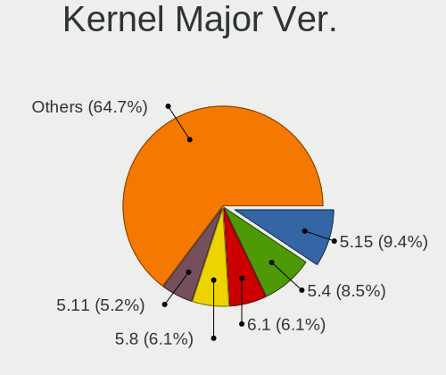

| Version | Notebooks | Percent |
|---------|-----------|---------|
| 5.4     | 30        | 18.52%  |
| 5.8     | 22        | 13.58%  |
| 5.11    | 20        | 12.35%  |
| 5.10    | 16        | 9.88%   |
| 4.15    | 12        | 7.41%   |
| 5.13    | 10        | 6.17%   |
| 5.0     | 10        | 6.17%   |
| 5.3     | 9         | 5.56%   |
| 5.12    | 7         | 4.32%   |
| 5.14    | 5         | 3.09%   |
| 5.16    | 4         | 2.47%   |
| 4.18    | 4         | 2.47%   |
| 5.9     | 3         | 1.85%   |
| 5.17    | 3         | 1.85%   |
| 5.7     | 2         | 1.23%   |
| 5.6     | 1         | 0.62%   |
| 5.15    | 1         | 0.62%   |
| 4.4     | 1         | 0.62%   |
| 4.10    | 1         | 0.62%   |
| 4.1     | 1         | 0.62%   |

Arch
----

OS architecture (x86_64, i586, etc.)

| Name   | Notebooks | Percent |
|--------|-----------|---------|
| x86_64 | 143       | 97.95%  |
| i686   | 3         | 2.05%   |

DE
--

Desktop Environment

| Name       | Notebooks | Percent |
|------------|-----------|---------|
| GNOME      | 70        | 45.45%  |
| KDE5       | 24        | 15.58%  |
| Unknown    | 22        | 14.29%  |
| XFCE       | 10        | 6.49%   |
| KDE        | 7         | 4.55%   |
| X-Cinnamon | 6         | 3.9%    |
| Pantheon   | 4         | 2.6%    |
| MATE       | 4         | 2.6%    |
| Unity      | 2         | 1.3%    |
| Budgie     | 2         | 1.3%    |
| Peppermint | 1         | 0.65%   |
| LXQt       | 1         | 0.65%   |
| LXDE       | 1         | 0.65%   |

Display Server
--------------

X11 or Wayland

| Name    | Notebooks | Percent |
|---------|-----------|---------|
| X11     | 126       | 81.82%  |
| Wayland | 16        | 10.39%  |
| Unknown | 9         | 5.84%   |
| Tty     | 3         | 1.95%   |

Display Manager
---------------

SDDM, LightDM, etc.

| Name    | Notebooks | Percent |
|---------|-----------|---------|
| Unknown | 95        | 63.33%  |
| SDDM    | 24        | 16%     |
| GDM     | 16        | 10.67%  |
| GDM3    | 7         | 4.67%   |
| LightDM | 6         | 4%      |
| TDM     | 2         | 1.33%   |

OS Lang
-------

Language

| Lang    | Notebooks | Percent |
|---------|-----------|---------|
| en_US   | 115       | 77.7%   |
| Unknown | 17        | 11.49%  |
| en_GB   | 8         | 5.41%   |
| en_SG   | 3         | 2.03%   |
| ms_MY   | 1         | 0.68%   |
| ja_JP   | 1         | 0.68%   |
| id_ID   | 1         | 0.68%   |
| en_MY   | 1         | 0.68%   |
| C       | 1         | 0.68%   |

Boot Mode
---------

EFI or BIOS

| Mode | Notebooks | Percent |
|------|-----------|---------|
| BIOS | 80        | 54.42%  |
| EFI  | 67        | 45.58%  |

Filesystem
----------

Type of filesystem

| Type    | Notebooks | Percent |
|---------|-----------|---------|
| Ext4    | 125       | 83.33%  |
| Overlay | 8         | 5.33%   |
| Btrfs   | 8         | 5.33%   |
| Unknown | 5         | 3.33%   |
| Xfs     | 2         | 1.33%   |
| Zfs     | 1         | 0.67%   |
| Ext2    | 1         | 0.67%   |

Part. scheme
------------

Scheme of partitioning

| Type    | Notebooks | Percent |
|---------|-----------|---------|
| Unknown | 100       | 67.11%  |
| GPT     | 30        | 20.13%  |
| MBR     | 19        | 12.75%  |

Dual Boot with Linux/BSD
------------------------

Hosting more than one Linux/BSD

| Dual boot | Notebooks | Percent |
|-----------|-----------|---------|
| No        | 128       | 85.91%  |
| Yes       | 21        | 14.09%  |

Dual Boot (Win)
---------------

Hosting Linux and Windows

| Dual boot | Notebooks | Percent |
|-----------|-----------|---------|
| No        | 104       | 69.8%   |
| Yes       | 45        | 30.2%   |

Board
-----

Vendor
------

Motherboard manufacturer

| Name                | Notebooks | Percent |
|---------------------|-----------|---------|
| Dell                | 30        | 20.55%  |
| Hewlett-Packard     | 29        | 19.86%  |
| ASUSTek Computer    | 25        | 17.12%  |
| Lenovo              | 18        | 12.33%  |
| Acer                | 13        | 8.9%    |
| MSI                 | 5         | 3.42%   |
| Apple               | 5         | 3.42%   |
| Sony                | 3         | 2.05%   |
| Fujitsu             | 3         | 2.05%   |
| ILLEGEAR            | 2         | 1.37%   |
| HUAWEI              | 2         | 1.37%   |
| Unknown             | 2         | 1.37%   |
| Toshiba             | 1         | 0.68%   |
| Timi                | 1         | 0.68%   |
| System76            | 1         | 0.68%   |
| SNS Network (M)     | 1         | 0.68%   |
| HONOR               | 1         | 0.68%   |
| Gigabyte Technology | 1         | 0.68%   |
| Chuwi               | 1         | 0.68%   |
| BUSH                | 1         | 0.68%   |
| AZW                 | 1         | 0.68%   |

Model
-----

Motherboard model

| Name                                  | Notebooks | Percent |
|---------------------------------------|-----------|---------|
| HP Notebook                           | 4         | 2.74%   |
| HP Pavilion dv6                       | 2         | 1.37%   |
| HP Laptop 15-bs0xx                    | 2         | 1.37%   |
| HP EliteBook 8470p                    | 2         | 1.37%   |
| Dell XPS 15 7590                      | 2         | 1.37%   |
| Dell Latitude E6520                   | 2         | 1.37%   |
| Dell Latitude E6440                   | 2         | 1.37%   |
| ASUS K45VD                            | 2         | 1.37%   |
| ASUS K43SD                            | 2         | 1.37%   |
| Apple MacBookPro8,1                   | 2         | 1.37%   |
| Unknown                               | 2         | 1.37%   |
| Toshiba dynabook Satellite B552/H     | 1         | 0.68%   |
| Timi RedmiBook 14 II                  | 1         | 0.68%   |
| System76 Galago Pro                   | 1         | 0.68%   |
| Sony VPCSB26FG                        | 1         | 0.68%   |
| Sony VPCEA42EG                        | 1         | 0.68%   |
| Sony VGN-Z27GN_X                      | 1         | 0.68%   |
| SNS Network (M) JOI Book 150          | 1         | 0.68%   |
| MSI Prestige 15 A10SC                 | 1         | 0.68%   |
| MSI Modern 14 B5M                     | 1         | 0.68%   |
| MSI GT70 2OC/2OD                      | 1         | 0.68%   |
| MSI GP70 2PE                          | 1         | 0.68%   |
| MSI GL62M 7RDX                        | 1         | 0.68%   |
| Lenovo Yoga 500-15IBD 80N6            | 1         | 0.68%   |
| Lenovo XiaoXinAir 14+ ACN 2021 82L7   | 1         | 0.68%   |
| Lenovo U310                           | 1         | 0.68%   |
| Lenovo ThinkPad X220 42912WA          | 1         | 0.68%   |
| Lenovo ThinkPad X201 3626RZ4          | 1         | 0.68%   |
| Lenovo ThinkPad X201 3323LWA          | 1         | 0.68%   |
| Lenovo ThinkPad X131e 33682YU         | 1         | 0.68%   |
| Lenovo ThinkPad X120e 0611CTO         | 1         | 0.68%   |
| Lenovo ThinkPad T480 20L6S1RN00       | 1         | 0.68%   |
| Lenovo ThinkPad T460 20FMA0J6MY       | 1         | 0.68%   |
| Lenovo ThinkPad L15 Gen 2a 20X7CTO1WW | 1         | 0.68%   |
| Lenovo ThinkPad E590 20NBS03S00       | 1         | 0.68%   |
| Lenovo Legion 5 15ARH05H 82B1         | 1         | 0.68%   |
| Lenovo IdeaPad S540-14API 81NH        | 1         | 0.68%   |
| Lenovo IdeaPad S340-14API 81NB        | 1         | 0.68%   |
| Lenovo G500s 20245                    | 1         | 0.68%   |
| Lenovo G50-70 20351                   | 1         | 0.68%   |
| Lenovo G400s VILG1                    | 1         | 0.68%   |
| ILLEGEAR ROGUE                        | 1         | 0.68%   |
| ILLEGEAR RAVEN SE                     | 1         | 0.68%   |
| HUAWEI WRT-WX9                        | 1         | 0.68%   |
| HUAWEI KLVL-WXX9                      | 1         | 0.68%   |
| HONOR HLYL-WXX9                       | 1         | 0.68%   |
| HP ZBook 15                           | 1         | 0.68%   |
| HP ProBook 645 G1                     | 1         | 0.68%   |
| HP ProBook 4545s                      | 1         | 0.68%   |
| HP Presario CQ43                      | 1         | 0.68%   |
| HP Pavilion Laptop 14-ce3xxx          | 1         | 0.68%   |
| HP Pavilion Gaming Laptop 15-dk0xxx   | 1         | 0.68%   |
| HP Pavilion Gaming Laptop 15-cx0xxx   | 1         | 0.68%   |
| HP Pavilion g4                        | 1         | 0.68%   |
| HP Pavilion 14                        | 1         | 0.68%   |
| HP Laptop 15s-eq0xxx                  | 1         | 0.68%   |
| HP G42                                | 1         | 0.68%   |
| HP ENVY 4                             | 1         | 0.68%   |
| HP EliteBook 8460p                    | 1         | 0.68%   |
| HP EliteBook 8440p                    | 1         | 0.68%   |

Model Family
------------

Motherboard model prefix

| Name                | Notebooks | Percent |
|---------------------|-----------|---------|
| Dell Inspiron       | 11        | 7.53%   |
| Dell Latitude       | 10        | 6.85%   |
| Lenovo ThinkPad     | 9         | 6.16%   |
| Acer Aspire         | 9         | 6.16%   |
| HP Pavilion         | 7         | 4.79%   |
| HP EliteBook        | 5         | 3.42%   |
| HP Notebook         | 4         | 2.74%   |
| Dell XPS            | 4         | 2.74%   |
| HP Laptop           | 3         | 2.05%   |
| HP Compaq           | 3         | 2.05%   |
| Fujitsu LIFEBOOK    | 3         | 2.05%   |
| Apple MacBookPro8   | 3         | 2.05%   |
| Lenovo IdeaPad      | 2         | 1.37%   |
| HP ProBook          | 2         | 1.37%   |
| Dell Precision      | 2         | 1.37%   |
| ASUS VivoBook       | 2         | 1.37%   |
| ASUS ROG            | 2         | 1.37%   |
| ASUS K45VD          | 2         | 1.37%   |
| ASUS K43SD          | 2         | 1.37%   |
| Unknown             | 2         | 1.37%   |
| Toshiba dynabook    | 1         | 0.68%   |
| Timi RedmiBook      | 1         | 0.68%   |
| System76 Galago     | 1         | 0.68%   |
| Sony VPCSB26FG      | 1         | 0.68%   |
| Sony VPCEA42EG      | 1         | 0.68%   |
| Sony VGN-Z27GN      | 1         | 0.68%   |
| SNS Network (M) JOI | 1         | 0.68%   |
| MSI Prestige        | 1         | 0.68%   |
| MSI Modern          | 1         | 0.68%   |
| MSI GT70            | 1         | 0.68%   |
| MSI GP70            | 1         | 0.68%   |
| MSI GL62M           | 1         | 0.68%   |
| Lenovo Yoga         | 1         | 0.68%   |
| Lenovo XiaoXinAir   | 1         | 0.68%   |
| Lenovo U310         | 1         | 0.68%   |
| Lenovo Legion       | 1         | 0.68%   |
| Lenovo G500s        | 1         | 0.68%   |
| Lenovo G50-70       | 1         | 0.68%   |
| Lenovo G400s        | 1         | 0.68%   |
| ILLEGEAR ROGUE      | 1         | 0.68%   |
| ILLEGEAR RAVEN      | 1         | 0.68%   |
| HUAWEI WRT-WX9      | 1         | 0.68%   |
| HUAWEI KLVL-WXX9    | 1         | 0.68%   |
| HONOR HLYL-WXX9     | 1         | 0.68%   |
| HP ZBook            | 1         | 0.68%   |
| HP Presario         | 1         | 0.68%   |
| HP G42              | 1         | 0.68%   |
| HP ENVY             | 1         | 0.68%   |
| HP 14               | 1         | 0.68%   |
| Gigabyte G5         | 1         | 0.68%   |
| Dell Vostro         | 1         | 0.68%   |
| Dell Venue          | 1         | 0.68%   |
| Dell G3             | 1         | 0.68%   |
| Chuwi LapBook       | 1         | 0.68%   |
| BUSH Windows        | 1         | 0.68%   |
| AZW GT-R            | 1         | 0.68%   |
| ASUS ZenBook        | 1         | 0.68%   |
| ASUS X556UR         | 1         | 0.68%   |
| ASUS X550LC         | 1         | 0.68%   |
| ASUS X550DP         | 1         | 0.68%   |

MFG Year
--------

Motherboard manufacture year

| Year | Notebooks | Percent |
|------|-----------|---------|
| 2011 | 23        | 15.75%  |
| 2013 | 19        | 13.01%  |
| 2019 | 15        | 10.27%  |
| 2020 | 12        | 8.22%   |
| 2010 | 11        | 7.53%   |
| 2021 | 9         | 6.16%   |
| 2018 | 9         | 6.16%   |
| 2012 | 9         | 6.16%   |
| 2015 | 8         | 5.48%   |
| 2017 | 7         | 4.79%   |
| 2014 | 7         | 4.79%   |
| 2009 | 6         | 4.11%   |
| 2008 | 5         | 3.42%   |
| 2016 | 4         | 2.74%   |
| 2007 | 2         | 1.37%   |

Form Factor
-----------

Physical design of the computer

| Name     | Notebooks | Percent |
|----------|-----------|---------|
| Notebook | 146       | 100%    |

Secure Boot
-----------

Enabled or disabled

| State    | Notebooks | Percent |
|----------|-----------|---------|
| Disabled | 135       | 92.47%  |
| Enabled  | 11        | 7.53%   |

Coreboot
--------

Have coreboot on board

| Used | Notebooks | Percent |
|------|-----------|---------|
| No   | 145       | 99.32%  |
| Yes  | 1         | 0.68%   |

RAM Size
--------

Total RAM memory

| Size in GB  | Notebooks | Percent |
|-------------|-----------|---------|
| 4.01-8.0    | 41        | 27.89%  |
| 3.01-4.0    | 36        | 24.49%  |
| 8.01-16.0   | 35        | 23.81%  |
| 16.01-24.0  | 15        | 10.2%   |
| 1.01-2.0    | 7         | 4.76%   |
| 32.01-64.0  | 6         | 4.08%   |
| 2.01-3.0    | 2         | 1.36%   |
| 64.01-256.0 | 2         | 1.36%   |
| 0.51-1.0    | 2         | 1.36%   |
| 24.01-32.0  | 1         | 0.68%   |

RAM Used
--------

Used RAM memory

| Used GB   | Notebooks | Percent |
|-----------|-----------|---------|
| 1.01-2.0  | 59        | 36.2%   |
| 2.01-3.0  | 42        | 25.77%  |
| 3.01-4.0  | 27        | 16.56%  |
| 4.01-8.0  | 17        | 10.43%  |
| 0.51-1.0  | 15        | 9.2%    |
| 8.01-16.0 | 3         | 1.84%   |

Total Drives
------------

Number of drives on board

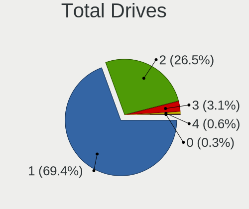

| Drives | Notebooks | Percent |
|--------|-----------|---------|
| 1      | 101       | 68.24%  |
| 2      | 45        | 30.41%  |
| 4      | 1         | 0.68%   |
| 3      | 1         | 0.68%   |

Has CD-ROM
----------

Has CD-ROM on board

| Presented | Notebooks | Percent |
|-----------|-----------|---------|
| No        | 85        | 58.22%  |
| Yes       | 61        | 41.78%  |

Has Ethernet
------------

Has Ethernet on board

| Presented | Notebooks | Percent |
|-----------|-----------|---------|
| Yes       | 125       | 85.62%  |
| No        | 21        | 14.38%  |

Has WiFi
--------

Has WiFi module

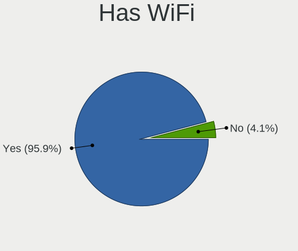

| Presented | Notebooks | Percent |
|-----------|-----------|---------|
| Yes       | 141       | 96.58%  |
| No        | 5         | 3.42%   |

Has Bluetooth
-------------

Has Bluetooth module

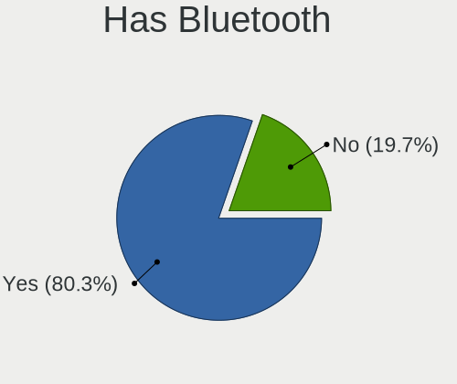

| Presented | Notebooks | Percent |
|-----------|-----------|---------|
| Yes       | 123       | 83.67%  |
| No        | 24        | 16.33%  |

Location
--------

Country
-------

Geographic location (country)

| Country  | Notebooks | Percent |
|----------|-----------|---------|
| Malaysia | 146       | 100%    |

City
----

Geographic location (city)

| City                   | Notebooks | Percent |
|------------------------|-----------|---------|
| Kuala Lumpur           | 56        | 35.9%   |
| Petaling Jaya          | 17        | 10.9%   |
| Shah Alam              | 8         | 5.13%   |
| Puchong Batu Dua Belas | 8         | 5.13%   |
| Johor Bahru            | 8         | 5.13%   |
| Sungai Buloh           | 5         | 3.21%   |
| Subang Jaya            | 4         | 2.56%   |
| Kota Kinabalu          | 4         | 2.56%   |
| Seremban               | 3         | 1.92%   |
| Kulai                  | 3         | 1.92%   |
| Kota Bharu             | 3         | 1.92%   |
| Kajang                 | 3         | 1.92%   |
| Ipoh                   | 3         | 1.92%   |
| Cyberjaya              | 3         | 1.92%   |
| Tawau                  | 2         | 1.28%   |
| Sungai Petani          | 2         | 1.28%   |
| Skudai                 | 2         | 1.28%   |
| Marabu                 | 2         | 1.28%   |
| Sepang                 | 1         | 0.64%   |
| Rawang                 | 1         | 0.64%   |
| Putrajaya              | 1         | 0.64%   |
| Pasir Gudang           | 1         | 0.64%   |
| Malacca                | 1         | 0.64%   |
| Long Seridan           | 1         | 0.64%   |
| Kulim                  | 1         | 0.64%   |
| Kuching                | 1         | 0.64%   |
| Kuala Terengganu       | 1         | 0.64%   |
| Kuala Kangsar          | 1         | 0.64%   |
| Kota Tinggi            | 1         | 0.64%   |
| Klang                  | 1         | 0.64%   |
| Kamunting              | 1         | 0.64%   |
| Jitra                  | 1         | 0.64%   |
| Hutan Melintang        | 1         | 0.64%   |
| Gambang                | 1         | 0.64%   |
| Cheras                 | 1         | 0.64%   |
| Butterworth            | 1         | 0.64%   |
| Ayer Itam              | 1         | 0.64%   |
| Ampang                 | 1         | 0.64%   |

Drives
------

Drive Vendor
------------

Hard drive vendors

| Vendor              | Notebooks | Drives | Percent |
|---------------------|-----------|--------|---------|
| Seagate             | 32        | 37     | 17.2%   |
| WDC                 | 21        | 27     | 11.29%  |
| Toshiba             | 19        | 24     | 10.22%  |
| Samsung Electronics | 15        | 23     | 8.06%   |
| Kingston            | 14        | 15     | 7.53%   |
| Unknown             | 12        | 18     | 6.45%   |
| HGST                | 12        | 15     | 6.45%   |
| Sandisk             | 11        | 15     | 5.91%   |
| A-DATA Technology   | 5         | 5      | 2.69%   |
| SK Hynix            | 4         | 4      | 2.15%   |
| Micron Technology   | 4         | 4      | 2.15%   |
| Hitachi             | 4         | 8      | 2.15%   |
| Transcend           | 3         | 3      | 1.61%   |
| Intel               | 3         | 3      | 1.61%   |
| China               | 3         | 3      | 1.61%   |
| Apacer              | 3         | 3      | 1.61%   |
| SPCC                | 2         | 3      | 1.08%   |
| Silicon Motion      | 2         | 2      | 1.08%   |
| Phison              | 2         | 3      | 1.08%   |
| Patriot             | 2         | 2      | 1.08%   |
| KIOXIA              | 2         | 2      | 1.08%   |
| winstar             | 1         | 1      | 0.54%   |
| Verbatim            | 1         | 1      | 0.54%   |
| PNY                 | 1         | 1      | 0.54%   |
| Netac               | 1         | 1      | 0.54%   |
| Morebeck-S100       | 1         | 1      | 0.54%   |
| LS                  | 1         | 1      | 0.54%   |
| Fujitsu             | 1         | 1      | 0.54%   |
| Crucial             | 1         | 1      | 0.54%   |
| Colorful            | 1         | 1      | 0.54%   |
| Apple               | 1         | 2      | 0.54%   |
| AGI                 | 1         | 2      | 0.54%   |

Drive Model
-----------

Hard drive models

| Model                                | Notebooks | Percent |
|--------------------------------------|-----------|---------|
| Unknown MMC Card  32GB               | 4         | 2.09%   |
| HGST HTS545050A7E680 500GB           | 4         | 2.09%   |
| Toshiba MQ04ABF100 1TB               | 3         | 1.57%   |
| Toshiba MQ01ABD100 1TB               | 3         | 1.57%   |
| Seagate ST9320325AS 320GB            | 3         | 1.57%   |
| Seagate ST500LT012-1DG142 500GB      | 3         | 1.57%   |
| SanDisk SSD PLUS 240GB               | 3         | 1.57%   |
| Sandisk NVMe SSD Drive 512GB         | 3         | 1.57%   |
| WDC WD10JPVX-22JC3T0 1TB             | 2         | 1.05%   |
| WDC PC SN730 NVMe 1024GB             | 2         | 1.05%   |
| Unknown MMC Card  64GB               | 2         | 1.05%   |
| Unknown MMC Card  128GB              | 2         | 1.05%   |
| Toshiba MK5065GSXF 500GB             | 2         | 1.05%   |
| SK Hynix NVMe SSD Drive 512GB        | 2         | 1.05%   |
| Seagate ST9750420AS 752GB            | 2         | 1.05%   |
| Seagate ST9500325AS 500GB            | 2         | 1.05%   |
| Seagate ST500LM000-1EJ162 500GB      | 2         | 1.05%   |
| Seagate ST320LT020-9YG142 320GB      | 2         | 1.05%   |
| Seagate ST1000LM035-1RK172 1TB       | 2         | 1.05%   |
| Samsung SSD 860 EVO 250GB            | 2         | 1.05%   |
| Samsung NVMe SSD Drive 512GB         | 2         | 1.05%   |
| Micron 1100 SATA 512GB SSD           | 2         | 1.05%   |
| Kingston SA400S37240G 240GB SSD      | 2         | 1.05%   |
| Intel NVMe SSD Drive 512GB           | 2         | 1.05%   |
| Hitachi HTS723232A7A364 320GB        | 2         | 1.05%   |
| HGST HTS725050A7E630 500GB           | 2         | 1.05%   |
| HGST HTS721010A9E630 1TB             | 2         | 1.05%   |
| HGST HTS541010A9E680 1TB             | 2         | 1.05%   |
| Apacer AS340 120GB SSD               | 2         | 1.05%   |
| A-DATA SU650 240GB SSD               | 2         | 1.05%   |
| winstar 120GB                        | 1         | 0.52%   |
| WDC WDS480G2G0A-00JH30 480GB SSD     | 1         | 0.52%   |
| WDC WDS250G1B0A-00H9H0 250GB SSD     | 1         | 0.52%   |
| WDC WD5000LPVX-75V0TT0 500GB         | 1         | 0.52%   |
| WDC WD5000LPCX-24C6HT0 500GB         | 1         | 0.52%   |
| WDC WD5000BPVT-75HXZT3 500GB         | 1         | 0.52%   |
| WDC WD5000BPVT-24HXZT3 500GB         | 1         | 0.52%   |
| WDC WD5000BPVT-22HXZT3 500GB         | 1         | 0.52%   |
| WDC WD5000BPVT-16HXZT3 500GB         | 1         | 0.52%   |
| WDC WD5000BPVT-00HXZT1 500GB         | 1         | 0.52%   |
| WDC WD5000BPKT-75PK4T0 500GB         | 1         | 0.52%   |
| WDC WD5000BEVT-22ZAT0 500GB          | 1         | 0.52%   |
| WDC WD1600BEVT-60ZCT0 160GB          | 1         | 0.52%   |
| WDC WD10JPVX-60JC3T0 1TB             | 1         | 0.52%   |
| WDC WD10JPVT-75A1YT0 1TB             | 1         | 0.52%   |
| WDC PC SN730 SDBPNTY-512G-1101 512GB | 1         | 0.52%   |
| WDC PC SN730 SDBPNTY-512G-1027 512GB | 1         | 0.52%   |
| WDC PC SN720 SDAPNTW-512G-1027 512GB | 1         | 0.52%   |
| Verbatim Vi550 S3 SSD 256GB          | 1         | 0.52%   |
| Unknown SD32G  32GB                  | 1         | 0.52%   |
| Unknown SD08G  8GB                   | 1         | 0.52%   |
| Unknown SB32G  32GB                  | 1         | 0.52%   |
| Unknown SB128  128GB                 | 1         | 0.52%   |
| Unknown SA08G  7GB                   | 1         | 0.52%   |
| Unknown NVMe SSD Drive 256GB         | 1         | 0.52%   |
| Unknown MMC Card  7GB                | 1         | 0.52%   |
| Unknown MMC Card  16GB               | 1         | 0.52%   |
| Transcend TS256GMSA230S 256GB SSD    | 1         | 0.52%   |
| Transcend TS1GSDOM22V 1GB SSD        | 1         | 0.52%   |
| Transcend TS128GSSD370 128GB         | 1         | 0.52%   |

HDD Vendor
----------

Hard disk drive vendors

| Vendor              | Notebooks | Drives | Percent |
|---------------------|-----------|--------|---------|
| Seagate             | 31        | 36     | 38.75%  |
| Toshiba             | 17        | 21     | 21.25%  |
| WDC                 | 14        | 20     | 17.5%   |
| HGST                | 12        | 15     | 15%     |
| Hitachi             | 4         | 8      | 5%      |
| Samsung Electronics | 1         | 3      | 1.25%   |
| Fujitsu             | 1         | 1      | 1.25%   |

SSD Vendor
----------

Solid state drive vendors

| Vendor              | Notebooks | Drives | Percent |
|---------------------|-----------|--------|---------|
| Kingston            | 10        | 10     | 17.24%  |
| Samsung Electronics | 9         | 15     | 15.52%  |
| SanDisk             | 8         | 8      | 13.79%  |
| A-DATA Technology   | 4         | 4      | 6.9%    |
| Transcend           | 3         | 3      | 5.17%   |
| Micron Technology   | 3         | 3      | 5.17%   |
| China               | 3         | 3      | 5.17%   |
| Apacer              | 3         | 3      | 5.17%   |
| WDC                 | 2         | 2      | 3.45%   |
| SPCC                | 2         | 3      | 3.45%   |
| Patriot             | 2         | 2      | 3.45%   |
| Verbatim            | 1         | 1      | 1.72%   |
| Toshiba             | 1         | 1      | 1.72%   |
| PNY                 | 1         | 1      | 1.72%   |
| Netac               | 1         | 1      | 1.72%   |
| LS                  | 1         | 1      | 1.72%   |
| Intel               | 1         | 1      | 1.72%   |
| Crucial             | 1         | 1      | 1.72%   |
| Colorful            | 1         | 1      | 1.72%   |
| Apple               | 1         | 2      | 1.72%   |

Drive Kind
----------

HDD or SSD

| Kind    | Notebooks | Drives | Percent |
|---------|-----------|--------|---------|
| HDD     | 78        | 104    | 44.83%  |
| SSD     | 53        | 66     | 30.46%  |
| NVMe    | 28        | 40     | 16.09%  |
| MMC     | 11        | 17     | 6.32%   |
| Unknown | 4         | 5      | 2.3%    |

Drive Connector
---------------

SATA, SAS, NVMe, etc.

| Type | Notebooks | Drives | Percent |
|------|-----------|--------|---------|
| SATA | 119       | 171    | 73.46%  |
| NVMe | 28        | 40     | 17.28%  |
| MMC  | 11        | 17     | 6.79%   |
| SAS  | 4         | 4      | 2.47%   |

Drive Size
----------

Size of hard drive

| Size in TB | Notebooks | Drives | Percent |
|------------|-----------|--------|---------|
| 0.01-0.5   | 89        | 116    | 68.99%  |
| 0.51-1.0   | 40        | 54     | 31.01%  |

Space Total
-----------

Amount of disk space available on the file system

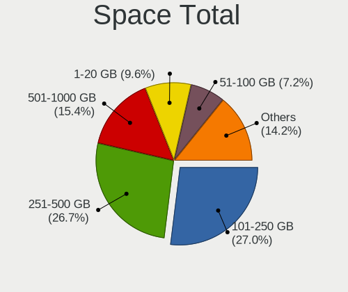

| Size in GB     | Notebooks | Percent |
|----------------|-----------|---------|
| 251-500        | 53        | 33.97%  |
| 101-250        | 41        | 26.28%  |
| 501-1000       | 20        | 12.82%  |
| 1-20           | 13        | 8.33%   |
| 51-100         | 10        | 6.41%   |
| 21-50          | 9         | 5.77%   |
| 1001-2000      | 4         | 2.56%   |
| Unknown        | 4         | 2.56%   |
| More than 3000 | 1         | 0.64%   |
| 2001-3000      | 1         | 0.64%   |

Space Used
----------

Amount of used disk space

| Used GB   | Notebooks | Percent |
|-----------|-----------|---------|
| 1-20      | 71        | 44.38%  |
| 21-50     | 29        | 18.13%  |
| 101-250   | 21        | 13.13%  |
| 51-100    | 16        | 10%     |
| 251-500   | 14        | 8.75%   |
| 501-1000  | 4         | 2.5%    |
| Unknown   | 4         | 2.5%    |
| 1001-2000 | 1         | 0.63%   |

Malfunc. Drives
---------------

Drive models with a malfunction

| Model                                       | Notebooks | Drives | Percent |
|---------------------------------------------|-----------|--------|---------|
| Seagate ST9320325AS 320GB                   | 2         | 2      | 11.76%  |
| WDC WD5000BPVT-00HXZT1 500GB                | 1         | 1      | 5.88%   |
| WDC WD10JPVX-22JC3T0 1TB                    | 1         | 1      | 5.88%   |
| WDC WD10JPVT-75A1YT0 1TB                    | 1         | 1      | 5.88%   |
| Toshiba MQ01ABD100 1TB                      | 1         | 1      | 5.88%   |
| Toshiba MK5065GSX 500GB                     | 1         | 1      | 5.88%   |
| Toshiba MK1059GSMP 1TB                      | 1         | 1      | 5.88%   |
| SPCC Solid State Disk 256GB                 | 1         | 1      | 5.88%   |
| Seagate ST9750420AS 752GB                   | 1         | 1      | 5.88%   |
| Seagate ST9250315AS 250GB                   | 1         | 1      | 5.88%   |
| Samsung Electronics SSD PM830 2.5 7mm 512GB | 1         | 1      | 5.88%   |
| Micron Technology 1100 SATA 512GB SSD       | 1         | 1      | 5.88%   |
| Hitachi HTS723232A7A364 320GB               | 1         | 1      | 5.88%   |
| Hitachi HTS547575A9E384 752GB               | 1         | 3      | 5.88%   |
| HGST HTS541075A9E680 752GB                  | 1         | 1      | 5.88%   |
| HGST HTS541010A9E680 1TB                    | 1         | 1      | 5.88%   |

Malfunc. Drive Vendor
---------------------

Vendors of faulty drives

| Vendor              | Notebooks | Drives | Percent |
|---------------------|-----------|--------|---------|
| Seagate             | 4         | 4      | 23.53%  |
| WDC                 | 3         | 3      | 17.65%  |
| Toshiba             | 3         | 3      | 17.65%  |
| Hitachi             | 2         | 4      | 11.76%  |
| HGST                | 2         | 2      | 11.76%  |
| SPCC                | 1         | 1      | 5.88%   |
| Samsung Electronics | 1         | 1      | 5.88%   |
| Micron Technology   | 1         | 1      | 5.88%   |

Malfunc. HDD Vendor
-------------------

Vendors of faulty HDD drives

| Vendor  | Notebooks | Drives | Percent |
|---------|-----------|--------|---------|
| Seagate | 4         | 4      | 28.57%  |
| WDC     | 3         | 3      | 21.43%  |
| Toshiba | 3         | 3      | 21.43%  |
| Hitachi | 2         | 4      | 14.29%  |
| HGST    | 2         | 2      | 14.29%  |

Malfunc. Drive Kind
-------------------

Kinds of faulty drives

| Kind | Notebooks | Drives | Percent |
|------|-----------|--------|---------|
| HDD  | 13        | 16     | 81.25%  |
| SSD  | 3         | 3      | 18.75%  |

Failed Drives
-------------

Failed drive models

Zero info for selected period =(

Failed Drive Vendor
-------------------

Failed drive vendors

Zero info for selected period =(

Drive Status
------------

Number of failed and malfunc. drives

| Status   | Notebooks | Drives | Percent |
|----------|-----------|--------|---------|
| Detected | 103       | 166    | 66.45%  |
| Works    | 37        | 47     | 23.87%  |
| Malfunc  | 15        | 19     | 9.68%   |

Storage controller
------------------

Storage Vendor
--------------

Storage controller vendors

| Vendor                       | Notebooks | Percent |
|------------------------------|-----------|---------|
| Intel                        | 109       | 68.55%  |
| AMD                          | 15        | 9.43%   |
| Sandisk                      | 8         | 5.03%   |
| Samsung Electronics          | 5         | 3.14%   |
| SK Hynix                     | 4         | 2.52%   |
| Kingston Technology Company  | 4         | 2.52%   |
| Silicon Motion               | 3         | 1.89%   |
| Nvidia                       | 3         | 1.89%   |
| Phison Electronics           | 2         | 1.26%   |
| KIOXIA                       | 2         | 1.26%   |
| Toshiba America Info Systems | 1         | 0.63%   |
| Micron Technology            | 1         | 0.63%   |
| ASMedia Technology           | 1         | 0.63%   |
| ADATA Technology             | 1         | 0.63%   |

Storage Model
-------------

Storage controller models

| Model                                                                            | Notebooks | Percent |
|----------------------------------------------------------------------------------|-----------|---------|
| Intel 6 Series/C200 Series Chipset Family 6 port Mobile SATA AHCI Controller     | 19        | 11.45%  |
| Intel 7 Series Chipset Family 6-port SATA Controller [AHCI mode]                 | 15        | 9.04%   |
| AMD FCH SATA Controller [AHCI mode]                                              | 14        | 8.43%   |
| Intel Sunrise Point-LP SATA Controller [AHCI mode]                               | 12        | 7.23%   |
| Intel 82801 Mobile SATA Controller [RAID mode]                                   | 10        | 6.02%   |
| Intel 8 Series SATA Controller 1 [AHCI mode]                                     | 7         | 4.22%   |
| Intel 82801IBM/IEM (ICH9M/ICH9M-E) 4 port SATA Controller [AHCI mode]            | 6         | 3.61%   |
| Intel 5 Series/3400 Series Chipset 4 port SATA AHCI Controller                   | 6         | 3.61%   |
| Sandisk WD Black SN750 / PC SN730 NVMe SSD                                       | 5         | 3.01%   |
| Intel Cannon Lake Mobile PCH SATA AHCI Controller                                | 5         | 3.01%   |
| Intel Wildcat Point-LP SATA Controller [AHCI Mode]                               | 4         | 2.41%   |
| Samsung NVMe SSD Controller SM981/PM981/PM983                                    | 3         | 1.81%   |
| Intel 8 Series/C220 Series Chipset Family 6-port SATA Controller 1 [AHCI mode]   | 3         | 1.81%   |
| Intel 5 Series/3400 Series Chipset 6 port SATA AHCI Controller                   | 3         | 1.81%   |
| SK Hynix Gold P31 SSD                                                            | 2         | 1.2%    |
| Silicon Motion SM2262/SM2262EN SSD Controller                                    | 2         | 1.2%    |
| KIOXIA Non-Volatile memory controller                                            | 2         | 1.2%    |
| Kingston Company KC2000 NVMe SSD                                                 | 2         | 1.2%    |
| Intel SSD 660P Series                                                            | 2         | 1.2%    |
| Intel NM10/ICH7 Family SATA Controller [AHCI mode]                               | 2         | 1.2%    |
| Intel HM170/QM170 Chipset SATA Controller [AHCI Mode]                            | 2         | 1.2%    |
| Intel Celeron/Pentium Silver Processor SATA Controller                           | 2         | 1.2%    |
| Intel 82801HM/HEM (ICH8M/ICH8M-E) SATA Controller [IDE mode]                     | 2         | 1.2%    |
| Intel 82801HM/HEM (ICH8M/ICH8M-E) IDE Controller                                 | 2         | 1.2%    |
| Intel 400 Series Chipset Family SATA AHCI Controller                             | 2         | 1.2%    |
| Toshiba America Info Systems NVMe Controller                                     | 1         | 0.6%    |
| SK Hynix Non-Volatile memory controller                                          | 1         | 0.6%    |
| SK Hynix BC501 NVMe Solid State Drive                                            | 1         | 0.6%    |
| Silicon Motion SM2263EN/SM2263XT SSD Controller                                  | 1         | 0.6%    |
| Sandisk WD Blue SN550 NVMe SSD                                                   | 1         | 0.6%    |
| Sandisk WD Black 2018/SN750 / PC SN720 NVMe SSD                                  | 1         | 0.6%    |
| Sandisk PC SN520 NVMe SSD                                                        | 1         | 0.6%    |
| Samsung NVMe SSD Controller PM9A1/PM9A3/980PRO                                   | 1         | 0.6%    |
| Samsung NVMe SSD Controller 980                                                  | 1         | 0.6%    |
| Phison NVMe Storage Controller                                                   | 1         | 0.6%    |
| Phison E12 NVMe Controller                                                       | 1         | 0.6%    |
| Nvidia MCP89 SATA Controller (AHCI mode)                                         | 1         | 0.6%    |
| Nvidia MCP79 AHCI Controller                                                     | 1         | 0.6%    |
| Nvidia MCP78S [GeForce 8200] SATA Controller (non-AHCI mode)                     | 1         | 0.6%    |
| Nvidia MCP78S [GeForce 8200] IDE                                                 | 1         | 0.6%    |
| Micron Non-Volatile memory controller                                            | 1         | 0.6%    |
| Kingston Company Company Non-Volatile memory controller                          | 1         | 0.6%    |
| Kingston Company SNVS2000G [NV1 NVMe PCIe SSD 2TB]                               | 1         | 0.6%    |
| Intel Mobile 4 Series Chipset PT IDER Controller                                 | 1         | 0.6%    |
| Intel Cannon Point-LP SATA Controller [AHCI Mode]                                | 1         | 0.6%    |
| Intel Atom/Celeron/Pentium Processor x5-E8000/J3xxx/N3xxx Series SATA Controller | 1         | 0.6%    |
| Intel Atom Processor E3800 Series SATA AHCI Controller                           | 1         | 0.6%    |
| Intel 82801IBM/IEM (ICH9M/ICH9M-E) 2 port SATA Controller [IDE mode]             | 1         | 0.6%    |
| Intel 8 Series Chipset Family 4-port SATA Controller 1 [IDE mode] - Mobile       | 1         | 0.6%    |
| Intel 7 Series Chipset Family 4-port SATA Controller [IDE mode]                  | 1         | 0.6%    |
| Intel 7 Series Chipset Family 2-port SATA Controller [IDE mode]                  | 1         | 0.6%    |
| Intel 500 Series Chipset Family SATA AHCI Controller                             | 1         | 0.6%    |
| Intel 5 Series/3400 Series Chipset 4 port SATA IDE Controller                    | 1         | 0.6%    |
| Intel 5 Series/3400 Series Chipset 2 port SATA IDE Controller                    | 1         | 0.6%    |
| ASMedia ASM1062 Serial ATA Controller                                            | 1         | 0.6%    |
| AMD SB7x0/SB8x0/SB9x0 SATA Controller [AHCI mode]                                | 1         | 0.6%    |
| ADATA XPG SX8200 Pro PCIe Gen3x4 M.2 2280 Solid State Drive                      | 1         | 0.6%    |

Storage Kind
------------

Kind of storage controller (IDE, SATA, NVMe, SAS, ...)

| Kind | Notebooks | Percent |
|------|-----------|---------|
| SATA | 109       | 70.32%  |
| NVMe | 28        | 18.06%  |
| RAID | 10        | 6.45%   |
| IDE  | 8         | 5.16%   |

Processor
---------

CPU Vendor
----------

Processor vendors

| Vendor | Notebooks | Percent |
|--------|-----------|---------|
| Intel  | 120       | 82.19%  |
| AMD    | 26        | 17.81%  |

CPU Model
---------

Processor models

| Model                                         | Notebooks | Percent |
|-----------------------------------------------|-----------|---------|
| Intel Core i5-6200U CPU @ 2.30GHz             | 5         | 3.4%    |
| Intel Core i5-2450M CPU @ 2.50GHz             | 4         | 2.72%   |
| Intel Core i7-9750H CPU @ 2.60GHz             | 3         | 2.04%   |
| Intel Core i5-7200U CPU @ 2.50GHz             | 3         | 2.04%   |
| Intel Core i5-4210U CPU @ 1.70GHz             | 3         | 2.04%   |
| Intel Core i5-4200U CPU @ 1.60GHz             | 3         | 2.04%   |
| Intel Core i5-2410M CPU @ 2.30GHz             | 3         | 2.04%   |
| AMD Ryzen 5 3500U with Radeon Vega Mobile Gfx | 3         | 2.04%   |
| Intel Pentium Dual-Core CPU T4400 @ 2.20GHz   | 2         | 1.36%   |
| Intel Core i7-8750H CPU @ 2.20GHz             | 2         | 1.36%   |
| Intel Core i7-8565U CPU @ 1.80GHz             | 2         | 1.36%   |
| Intel Core i7-7700HQ CPU @ 2.80GHz            | 2         | 1.36%   |
| Intel Core i7-5500U CPU @ 2.40GHz             | 2         | 1.36%   |
| Intel Core i7-4710HQ CPU @ 2.50GHz            | 2         | 1.36%   |
| Intel Core i7-1065G7 CPU @ 1.30GHz            | 2         | 1.36%   |
| Intel Core i5-3210M CPU @ 2.50GHz             | 2         | 1.36%   |
| Intel Core i5-2540M CPU @ 2.60GHz             | 2         | 1.36%   |
| Intel Core i5-2435M CPU @ 2.40GHz             | 2         | 1.36%   |
| Intel Core i3-3110M CPU @ 2.40GHz             | 2         | 1.36%   |
| Intel Core i3-2367M CPU @ 1.40GHz             | 2         | 1.36%   |
| Intel Core i3-2350M CPU @ 2.30GHz             | 2         | 1.36%   |
| Intel Core i3 CPU M 380 @ 2.53GHz             | 2         | 1.36%   |
| Intel Core i3 CPU M 330 @ 2.13GHz             | 2         | 1.36%   |
| Intel Core 2 Duo CPU P8600 @ 2.40GHz          | 2         | 1.36%   |
| Intel Celeron N4100 CPU @ 1.10GHz             | 2         | 1.36%   |
| AMD Ryzen 7 4800H with Radeon Graphics        | 2         | 1.36%   |
| AMD Ryzen 5 4600H with Radeon Graphics        | 2         | 1.36%   |
| AMD A6-5350M APU with Radeon HD Graphics      | 2         | 1.36%   |
| Intel Xeon W-10855M CPU @ 2.80GHz             | 1         | 0.68%   |
| Intel Pentium Dual-Core CPU T4200 @ 2.00GHz   | 1         | 0.68%   |
| Intel Pentium CPU B970 @ 2.30GHz              | 1         | 0.68%   |
| Intel Pentium CPU B960 @ 2.20GHz              | 1         | 0.68%   |
| Intel Pentium 3558U @ 1.70GHz                 | 1         | 0.68%   |
| Intel Genuine CPU T1700 @ 1.83GHz             | 1         | 0.68%   |
| Intel Core i9-8950HK CPU @ 2.90GHz            | 1         | 0.68%   |
| Intel Core i7-8650U CPU @ 1.90GHz             | 1         | 0.68%   |
| Intel Core i7-7600U CPU @ 2.80GHz             | 1         | 0.68%   |
| Intel Core i7-5600U CPU @ 2.60GHz             | 1         | 0.68%   |
| Intel Core i7-4800MQ CPU @ 2.70GHz            | 1         | 0.68%   |
| Intel Core i7-4700MQ CPU @ 2.40GHz            | 1         | 0.68%   |
| Intel Core i7-4700HQ CPU @ 2.40GHz            | 1         | 0.68%   |
| Intel Core i7-4610M CPU @ 3.00GHz             | 1         | 0.68%   |
| Intel Core i7-4500U CPU @ 1.80GHz             | 1         | 0.68%   |
| Intel Core i7-3740QM CPU @ 2.70GHz            | 1         | 0.68%   |
| Intel Core i7-3632QM CPU @ 2.20GHz            | 1         | 0.68%   |
| Intel Core i7-3612QM CPU @ 2.10GHz            | 1         | 0.68%   |
| Intel Core i7-3610QM CPU @ 2.30GHz            | 1         | 0.68%   |
| Intel Core i7-3517U CPU @ 1.90GHz             | 1         | 0.68%   |
| Intel Core i7-2720QM CPU @ 2.20GHz            | 1         | 0.68%   |
| Intel Core i7-2670QM CPU @ 2.20GHz            | 1         | 0.68%   |
| Intel Core i7-2640M CPU @ 2.80GHz             | 1         | 0.68%   |
| Intel Core i7-2635QM CPU @ 2.00GHz            | 1         | 0.68%   |
| Intel Core i7-2630QM CPU @ 2.00GHz            | 1         | 0.68%   |
| Intel Core i7-10710U CPU @ 1.10GHz            | 1         | 0.68%   |
| Intel Core i7 CPU M 620 @ 2.67GHz             | 1         | 0.68%   |
| Intel Core i5-9300H CPU @ 2.40GHz             | 1         | 0.68%   |
| Intel Core i5-8300H CPU @ 2.30GHz             | 1         | 0.68%   |
| Intel Core i5-8265U CPU @ 1.60GHz             | 1         | 0.68%   |
| Intel Core i5-8250U CPU @ 1.60GHz             | 1         | 0.68%   |
| Intel Core i5-7300U CPU @ 2.60GHz             | 1         | 0.68%   |

CPU Model Family
----------------

Processor model prefix

| Model                   | Notebooks | Percent |
|-------------------------|-----------|---------|
| Intel Core i5           | 44        | 29.93%  |
| Intel Core i7           | 35        | 23.81%  |
| Intel Core i3           | 14        | 9.52%   |
| AMD Ryzen 5             | 10        | 6.8%    |
| Intel Core 2 Duo        | 7         | 4.76%   |
| Intel Celeron           | 5         | 3.4%    |
| Intel Atom              | 5         | 3.4%    |
| Intel Pentium Dual-Core | 3         | 2.04%   |
| Intel Pentium           | 3         | 2.04%   |
| AMD Ryzen 7             | 3         | 2.04%   |
| AMD A6                  | 3         | 2.04%   |
| Other                   | 2         | 1.36%   |
| AMD Ryzen 9             | 2         | 1.36%   |
| AMD Ryzen 7 PRO         | 2         | 1.36%   |
| AMD A4                  | 2         | 1.36%   |
| Intel Xeon              | 1         | 0.68%   |
| Intel Genuine           | 1         | 0.68%   |
| Intel Core i9           | 1         | 0.68%   |
| AMD E                   | 1         | 0.68%   |
| AMD Athlon              | 1         | 0.68%   |
| AMD A12                 | 1         | 0.68%   |
| AMD A10                 | 1         | 0.68%   |

CPU Cores
---------

Number of processor cores

| Number | Notebooks | Percent |
|--------|-----------|---------|
| 2      | 80        | 54.79%  |
| 4      | 40        | 27.4%   |
| 6      | 15        | 10.27%  |
| 8      | 6         | 4.11%   |
| 1      | 5         | 3.42%   |

CPU Sockets
-----------

Number of sockets

| Number | Notebooks | Percent |
|--------|-----------|---------|
| 1      | 146       | 100%    |

CPU Threads
-----------

Threads per core (Hyper-Threading)

| Number | Notebooks | Percent |
|--------|-----------|---------|
| 2      | 120       | 81.63%  |
| 1      | 27        | 18.37%  |

CPU Op-Modes
------------

CPU Operation Modes (32-bit, 64-bit)

| Op mode        | Notebooks | Percent |
|----------------|-----------|---------|
| 32-bit, 64-bit | 144       | 97.96%  |
| Unknown        | 3         | 2.04%   |

CPU Microcode
-------------

Microcode number

| Number     | Notebooks | Percent |
|------------|-----------|---------|
| Unknown    | 28        | 18.67%  |
| 0x206a7    | 16        | 10.67%  |
| 0x306a9    | 11        | 7.33%   |
| 0x906ea    | 7         | 4.67%   |
| 0x40651    | 7         | 4.67%   |
| 0x306c3    | 7         | 4.67%   |
| 0x406e3    | 6         | 4%      |
| 0x20655    | 6         | 4%      |
| 0x806e9    | 5         | 3.33%   |
| 0x306d4    | 4         | 2.67%   |
| 0x20652    | 4         | 2.67%   |
| 0x1067a    | 4         | 2.67%   |
| 0x08600104 | 4         | 2.67%   |
| 0x06001119 | 4         | 2.67%   |
| 0xa0652    | 3         | 2%      |
| 0x806eb    | 2         | 1.33%   |
| 0x806ea    | 2         | 1.33%   |
| 0x706e5    | 2         | 1.33%   |
| 0x706a1    | 2         | 1.33%   |
| 0x30678    | 2         | 1.33%   |
| 0x106ca    | 2         | 1.33%   |
| 0x0a50000b | 2         | 1.33%   |
| 0x08108102 | 2         | 1.33%   |
| 0x0700010f | 2         | 1.33%   |
| 0xa0660    | 1         | 0.67%   |
| 0x906e9    | 1         | 0.67%   |
| 0x806ec    | 1         | 0.67%   |
| 0x806d1    | 1         | 0.67%   |
| 0x6fd      | 1         | 0.67%   |
| 0x6fb      | 1         | 0.67%   |
| 0x406c4    | 1         | 0.67%   |
| 0x406c3    | 1         | 0.67%   |
| 0x10676    | 1         | 0.67%   |
| 0x0a50000c | 1         | 0.67%   |
| 0x08608103 | 1         | 0.67%   |
| 0x08600106 | 1         | 0.67%   |
| 0x08108109 | 1         | 0.67%   |
| 0x08101016 | 1         | 0.67%   |
| 0x06006118 | 1         | 0.67%   |
| 0x05000028 | 1         | 0.67%   |

CPU Microarch
-------------

Microarchitecture

| Name            | Notebooks | Percent |
|-----------------|-----------|---------|
| SandyBridge     | 22        | 15.07%  |
| KabyLake        | 20        | 13.7%   |
| IvyBridge       | 15        | 10.27%  |
| Haswell         | 15        | 10.27%  |
| Westmere        | 10        | 6.85%   |
| Penryn          | 8         | 5.48%   |
| Skylake         | 6         | 4.11%   |
| Zen+            | 5         | 3.42%   |
| Zen 3           | 5         | 3.42%   |
| Zen 2           | 5         | 3.42%   |
| Silvermont      | 5         | 3.42%   |
| Piledriver      | 4         | 2.74%   |
| CometLake       | 4         | 2.74%   |
| Broadwell       | 4         | 2.74%   |
| IceLake         | 3         | 2.05%   |
| Core            | 3         | 2.05%   |
| Jaguar          | 2         | 1.37%   |
| Goldmont plus   | 2         | 1.37%   |
| Bonnell         | 2         | 1.37%   |
| Zen             | 1         | 0.68%   |
| TigerLake       | 1         | 0.68%   |
| K8 & K10 hybrid | 1         | 0.68%   |
| Excavator       | 1         | 0.68%   |
| Bobcat          | 1         | 0.68%   |
| Unknown         | 1         | 0.68%   |

Graphics
--------

GPU Vendor
----------

Vendors of graphics cards

| Vendor | Notebooks | Percent |
|--------|-----------|---------|
| Intel  | 113       | 53.81%  |
| Nvidia | 55        | 26.19%  |
| AMD    | 42        | 20%     |

GPU Model
---------

Graphics card models

| Model                                                                                    | Notebooks | Percent |
|------------------------------------------------------------------------------------------|-----------|---------|
| Intel 2nd Generation Core Processor Family Integrated Graphics Controller                | 21        | 9.77%   |
| Intel 3rd Gen Core processor Graphics Controller                                         | 15        | 6.98%   |
| Intel Core Processor Integrated Graphics Controller                                      | 9         | 4.19%   |
| AMD Sun XT [Radeon HD 8670A/8670M/8690M / R5 M330 / M430 / Radeon 520 Mobile]            | 9         | 4.19%   |
| Intel Haswell-ULT Integrated Graphics Controller                                         | 8         | 3.72%   |
| Intel CoffeeLake-H GT2 [UHD Graphics 630]                                                | 8         | 3.72%   |
| Intel 4th Gen Core Processor Integrated Graphics Controller                              | 7         | 3.26%   |
| Nvidia TU117M [GeForce GTX 1650 Mobile / Max-Q]                                          | 6         | 2.79%   |
| Nvidia GP107M [GeForce GTX 1050 Mobile]                                                  | 6         | 2.79%   |
| Intel Skylake GT2 [HD Graphics 520]                                                      | 6         | 2.79%   |
| Intel Mobile 4 Series Chipset Integrated Graphics Controller                             | 5         | 2.33%   |
| Intel HD Graphics 620                                                                    | 5         | 2.33%   |
| AMD Renoir                                                                               | 5         | 2.33%   |
| AMD Picasso/Raven 2 [Radeon Vega Series / Radeon Vega Mobile Series]                     | 5         | 2.33%   |
| AMD Cezanne                                                                              | 5         | 2.33%   |
| Intel HD Graphics 5500                                                                   | 4         | 1.86%   |
| Nvidia GM108M [GeForce 840M]                                                             | 3         | 1.4%    |
| Nvidia GK107M [GeForce GT 640M]                                                          | 3         | 1.4%    |
| Intel WhiskeyLake-U GT2 [UHD Graphics 620]                                               | 3         | 1.4%    |
| Intel Atom Processor Z36xxx/Z37xxx Series Graphics & Display                             | 3         | 1.4%    |
| Nvidia GP108M [GeForce MX150]                                                            | 2         | 0.93%   |
| Nvidia GM108M [GeForce 930MX]                                                            | 2         | 0.93%   |
| Nvidia GF119M [GeForce 610M]                                                             | 2         | 0.93%   |
| Nvidia GF117M [GeForce 610M/710M/810M/820M / GT 620M/625M/630M/720M]                     | 2         | 0.93%   |
| Nvidia GA106M [GeForce RTX 3060 Mobile / Max-Q]                                          | 2         | 0.93%   |
| Intel UHD Graphics 620                                                                   | 2         | 0.93%   |
| Intel Iris Plus Graphics G7                                                              | 2         | 0.93%   |
| Intel HD Graphics 630                                                                    | 2         | 0.93%   |
| Intel GeminiLake [UHD Graphics 600]                                                      | 2         | 0.93%   |
| Intel CometLake-H GT2 [UHD Graphics]                                                     | 2         | 0.93%   |
| Intel Atom/Celeron/Pentium Processor x5-E8000/J3xxx/N3xxx Integrated Graphics Controller | 2         | 0.93%   |
| Intel Atom Processor D4xx/D5xx/N4xx/N5xx Integrated Graphics Controller                  | 2         | 0.93%   |
| AMD Whistler [Radeon HD 6730M/6770M/7690M XT]                                            | 2         | 0.93%   |
| AMD Seymour [Radeon HD 6400M/7400M Series]                                               | 2         | 0.93%   |
| AMD Richland [Radeon HD 8450G]                                                           | 2         | 0.93%   |
| AMD Lexa PRO [Radeon 540/540X/550/550X / RX 540X/550/550X]                               | 2         | 0.93%   |
| Nvidia TU117M [GeForce MX450]                                                            | 1         | 0.47%   |
| Nvidia TU117M [GeForce GTX 1650 Ti Mobile]                                               | 1         | 0.47%   |
| Nvidia TU117M                                                                            | 1         | 0.47%   |
| Nvidia TU117GLM [Quadro T2000 Mobile / Max-Q]                                            | 1         | 0.47%   |
| Nvidia TU116M [GeForce GTX 1660 Ti Mobile]                                               | 1         | 0.47%   |
| Nvidia MCP89 [GeForce 320M]                                                              | 1         | 0.47%   |
| Nvidia GT218M [NVS 3100M]                                                                | 1         | 0.47%   |
| Nvidia GP108M [GeForce MX330]                                                            | 1         | 0.47%   |
| Nvidia GP108M [GeForce MX250]                                                            | 1         | 0.47%   |
| Nvidia GP108BM [GeForce MX250]                                                           | 1         | 0.47%   |
| Nvidia GP104GLM [Quadro P5200 Mobile]                                                    | 1         | 0.47%   |
| Nvidia GM204M [GeForce GTX 970M]                                                         | 1         | 0.47%   |
| Nvidia GM108M [GeForce 930M]                                                             | 1         | 0.47%   |
| Nvidia GM107M [GeForce GTX 860M]                                                         | 1         | 0.47%   |
| Nvidia GM107 [GeForce 940MX]                                                             | 1         | 0.47%   |
| Nvidia GK208GLM [Quadro K610M]                                                           | 1         | 0.47%   |
| Nvidia GK208BM [GeForce 920M]                                                            | 1         | 0.47%   |
| Nvidia GK104M [GeForce GTX 780M]                                                         | 1         | 0.47%   |
| Nvidia GF119M [NVS 4200M]                                                                | 1         | 0.47%   |
| Nvidia GF119M [GeForce GT 520M]                                                          | 1         | 0.47%   |
| Nvidia GF108M [GeForce 610M]                                                             | 1         | 0.47%   |
| Nvidia GF108GLM [NVS 5200M]                                                              | 1         | 0.47%   |
| Nvidia GA104M [GeForce RTX 3070 Mobile / Max-Q]                                          | 1         | 0.47%   |
| Nvidia G98M [GeForce 9300M GS]                                                           | 1         | 0.47%   |

GPU Combo
---------

Combinations of graphics cards

| Name           | Notebooks | Percent |
|----------------|-----------|---------|
| 1 x Intel      | 55        | 37.41%  |
| Intel + Nvidia | 44        | 29.93%  |
| 1 x AMD        | 19        | 12.93%  |
| Intel + AMD    | 14        | 9.52%   |
| AMD + Nvidia   | 6         | 4.08%   |
| 1 x Nvidia     | 5         | 3.4%    |
| 2 x AMD        | 4         | 2.72%   |

GPU Driver
----------

Free vs proprietary

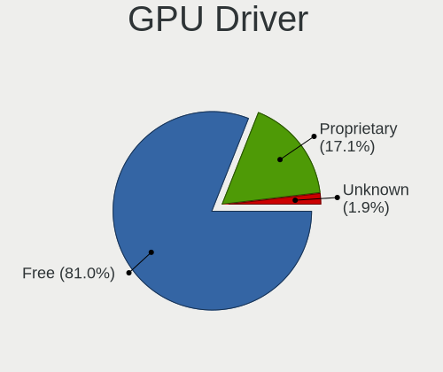

| Driver      | Notebooks | Percent |
|-------------|-----------|---------|
| Free        | 111       | 75.51%  |
| Proprietary | 34        | 23.13%  |
| Unknown     | 2         | 1.36%   |

GPU Memory
----------

Total video memory

| Size in GB | Notebooks | Percent |
|------------|-----------|---------|
| Unknown    | 75        | 50%     |
| 1.01-2.0   | 33        | 22%     |
| 0.01-0.5   | 17        | 11.33%  |
| 3.01-4.0   | 15        | 10%     |
| 0.51-1.0   | 8         | 5.33%   |
| 7.01-8.0   | 1         | 0.67%   |
| 5.01-6.0   | 1         | 0.67%   |

Monitor
-------

Monitor Vendor
--------------

Monitor vendors

| Vendor                  | Notebooks | Percent |
|-------------------------|-----------|---------|
| AU Optronics            | 35        | 21.88%  |
| Chimei Innolux          | 24        | 15%     |
| BOE                     | 21        | 13.13%  |
| Samsung Electronics     | 18        | 11.25%  |
| LG Display              | 18        | 11.25%  |
| Dell                    | 7         | 4.38%   |
| Sharp                   | 6         | 3.75%   |
| Chi Mei Optoelectronics | 4         | 2.5%    |
| Apple                   | 4         | 2.5%    |
| Lenovo                  | 3         | 1.88%   |
| Acer                    | 3         | 1.88%   |
| InnoLux Display         | 2         | 1.25%   |
| Hewlett-Packard         | 2         | 1.25%   |
| ViewSonic               | 1         | 0.63%   |
| Unknown                 | 1         | 0.63%   |
| Toshiba                 | 1         | 0.63%   |
| Sony                    | 1         | 0.63%   |
| Philips                 | 1         | 0.63%   |
| PANDA                   | 1         | 0.63%   |
| Panasonic               | 1         | 0.63%   |
| LG Philips              | 1         | 0.63%   |
| InfoVision              | 1         | 0.63%   |
| EXP                     | 1         | 0.63%   |
| Armaggeddon             | 1         | 0.63%   |
| AOC                     | 1         | 0.63%   |
| Ancor Communications    | 1         | 0.63%   |

Monitor Model
-------------

Monitor models

| Model                                                                     | Notebooks | Percent |
|---------------------------------------------------------------------------|-----------|---------|
| AU Optronics LCD Monitor AUO183C 1366x768 309x173mm 13.9-inch             | 3         | 1.88%   |
| Samsung Electronics LCD Monitor SEC3849 1366x768 309x174mm 14.0-inch      | 2         | 1.25%   |
| Samsung Electronics LCD Monitor SDC4E51 1366x768 344x194mm 15.5-inch      | 2         | 1.25%   |
| Lenovo LCD Monitor LEN4011 1280x800 261x163mm 12.1-inch                   | 2         | 1.25%   |
| InnoLux Display LCD Monitor INL0016 1366x768 309x174mm 14.0-inch          | 2         | 1.25%   |
| Chimei Innolux LCD Monitor CMN15E8 1920x1080 344x193mm 15.5-inch          | 2         | 1.25%   |
| Chimei Innolux LCD Monitor CMN15AB 1366x768 344x193mm 15.5-inch           | 2         | 1.25%   |
| Chimei Innolux LCD Monitor CMN1495 1366x768 309x173mm 13.9-inch           | 2         | 1.25%   |
| Chimei Innolux LCD Monitor CMN1493 1366x768 309x173mm 13.9-inch           | 2         | 1.25%   |
| Chimei Innolux LCD Monitor CMN1490 1366x768 309x173mm 13.9-inch           | 2         | 1.25%   |
| Chi Mei Optoelectronics LCD Monitor CMO1720 1920x1080 382x215mm 17.3-inch | 2         | 1.25%   |
| BOE LCD Monitor BOE06A4 1366x768 344x194mm 15.5-inch                      | 2         | 1.25%   |
| AU Optronics LCD Monitor AUO61ED 1920x1080 344x194mm 15.5-inch            | 2         | 1.25%   |
| AU Optronics LCD Monitor AUO38ED 1920x1080 344x193mm 15.5-inch            | 2         | 1.25%   |
| AU Optronics LCD Monitor AUO2D3C 1366x768 309x173mm 13.9-inch             | 2         | 1.25%   |
| AU Optronics LCD Monitor AUO223E 1600x900 309x174mm 14.0-inch             | 2         | 1.25%   |
| AU Optronics LCD Monitor AUO10ED 1920x1080 344x193mm 15.5-inch            | 2         | 1.25%   |
| AU Optronics LCD Monitor AUO103C 1366x768 309x173mm 13.9-inch             | 2         | 1.25%   |
| ViewSonic V3D231 Series VSC4C29 1920x1080 510x290mm 23.1-inch             | 1         | 0.63%   |
| Unknown LCD Monitor Sony Nvidia Default Flat Panel 1600x900               | 1         | 0.63%   |
| Toshiba TV TSB010B 1920x1080 926x523mm 41.9-inch                          | 1         | 0.63%   |
| Sony TV SNY0902 1360x768                                                  | 1         | 0.63%   |
| Sharp LQ156M1JW25 SHP152C 1920x1080 344x194mm 15.5-inch                   | 1         | 0.63%   |
| Sharp LQ156M1JW03 SHP14C5 1920x1080 344x194mm 15.5-inch                   | 1         | 0.63%   |
| Sharp LCD SHP10C9 1920x540                                                | 1         | 0.63%   |
| Sharp LCD Monitor SHP14D1 1920x1200 336x210mm 15.6-inch                   | 1         | 0.63%   |
| Sharp LCD Monitor SHP14BA 1920x1080 344x194mm 15.5-inch                   | 1         | 0.63%   |
| Sharp HDMI SHP10A1 1360x768 700x390mm 31.5-inch                           | 1         | 0.63%   |
| Samsung Electronics S24F350 SAM0D20 1920x1080 521x293mm 23.5-inch         | 1         | 0.63%   |
| Samsung Electronics S24D590 SAM0B47 1920x1080 521x293mm 23.5-inch         | 1         | 0.63%   |
| Samsung Electronics LCD Monitor SEC5742 1366x768 309x174mm 14.0-inch      | 1         | 0.63%   |
| Samsung Electronics LCD Monitor SEC5441 1366x768 309x174mm 14.0-inch      | 1         | 0.63%   |
| Samsung Electronics LCD Monitor SEC5142 1280x800 303x190mm 14.1-inch      | 1         | 0.63%   |
| Samsung Electronics LCD Monitor SEC4C42 1280x800 303x190mm 14.1-inch      | 1         | 0.63%   |
| Samsung Electronics LCD Monitor SEC4542 1366x768 309x174mm 14.0-inch      | 1         | 0.63%   |
| Samsung Electronics LCD Monitor SEC3642 1366x768 309x174mm 14.0-inch      | 1         | 0.63%   |
| Samsung Electronics LCD Monitor SEC3354 1600x900 382x215mm 17.3-inch      | 1         | 0.63%   |
| Samsung Electronics LCD Monitor SEC334A 1366x768 344x194mm 15.5-inch      | 1         | 0.63%   |
| Samsung Electronics LCD Monitor SDCA029 3840x2160 344x194mm 15.5-inch     | 1         | 0.63%   |
| Samsung Electronics LCD Monitor SDC5344 1920x1080 344x194mm 15.5-inch     | 1         | 0.63%   |
| Samsung Electronics LCD Monitor SDC4C48 1920x1080 344x194mm 15.5-inch     | 1         | 0.63%   |
| Samsung Electronics C24F390 SAM0D2C 1920x1080 521x293mm 23.5-inch         | 1         | 0.63%   |
| Philips PHL 241V8 PHLC212 1920x1080 527x296mm 23.8-inch                   | 1         | 0.63%   |
| PANDA LCD Monitor NCP004D 1920x1080 344x194mm 15.5-inch                   | 1         | 0.63%   |
| Panasonic TV MEIA296 1360x768                                             | 1         | 0.63%   |
| LG Philips LCD Monitor LPL0C01 1280x800 304x190mm 14.1-inch               | 1         | 0.63%   |
| LG Display LCD Monitor LGD05EC 1920x1080 309x174mm 14.0-inch              | 1         | 0.63%   |
| LG Display LCD Monitor LGD04E1 1366x768 344x194mm 15.5-inch               | 1         | 0.63%   |
| LG Display LCD Monitor LGD0456 1366x768 344x194mm 15.5-inch               | 1         | 0.63%   |
| LG Display LCD Monitor LGD03DF 1366x768 344x194mm 15.5-inch               | 1         | 0.63%   |
| LG Display LCD Monitor LGD03D7 1366x768 310x174mm 14.0-inch               | 1         | 0.63%   |
| LG Display LCD Monitor LGD03B3 1366x768 309x174mm 14.0-inch               | 1         | 0.63%   |
| LG Display LCD Monitor LGD03AB 1366x768 344x194mm 15.5-inch               | 1         | 0.63%   |
| LG Display LCD Monitor LGD033A 1366x768 344x194mm 15.5-inch               | 1         | 0.63%   |
| LG Display LCD Monitor LGD0335 1366x768 310x174mm 14.0-inch               | 1         | 0.63%   |
| LG Display LCD Monitor LGD0327 1366x768 309x174mm 14.0-inch               | 1         | 0.63%   |
| LG Display LCD Monitor LGD0311 1366x768 293x165mm 13.2-inch               | 1         | 0.63%   |
| LG Display LCD Monitor LGD02F8 1366x768 309x174mm 14.0-inch               | 1         | 0.63%   |
| LG Display LCD Monitor LGD02EC 1366x768 293x165mm 13.2-inch               | 1         | 0.63%   |
| LG Display LCD Monitor LGD02E3 1366x768 344x194mm 15.5-inch               | 1         | 0.63%   |

Monitor Resolution
------------------

Monitor screen resolution

| Resolution        | Notebooks | Percent |
|-------------------|-----------|---------|
| 1366x768 (WXGA)   | 69        | 45.39%  |
| 1920x1080 (FHD)   | 56        | 36.84%  |
| 1280x800 (WXGA)   | 8         | 5.26%   |
| 2560x1440 (QHD)   | 4         | 2.63%   |
| 1600x900 (HD+)    | 4         | 2.63%   |
| 3840x2160 (4K)    | 2         | 1.32%   |
| 2160x1440         | 2         | 1.32%   |
| 2560x1080         | 1         | 0.66%   |
| 2240x1400         | 1         | 0.66%   |
| 1920x540          | 1         | 0.66%   |
| 1920x1200 (WUXGA) | 1         | 0.66%   |
| 1440x900 (WXGA+)  | 1         | 0.66%   |
| 1360x768          | 1         | 0.66%   |
| 1024x600          | 1         | 0.66%   |

Monitor Diagonal
----------------

Diagonal size in inches

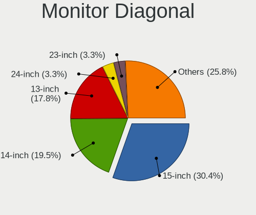

| Inches  | Notebooks | Percent |
|---------|-----------|---------|
| 15      | 57        | 35.63%  |
| 14      | 35        | 21.88%  |
| 13      | 26        | 16.25%  |
| 23      | 9         | 5.63%   |
| 17      | 5         | 3.13%   |
| 11      | 4         | 2.5%    |
| 24      | 3         | 1.88%   |
| 21      | 3         | 1.88%   |
| 12      | 3         | 1.88%   |
| 72      | 2         | 1.25%   |
| 27      | 2         | 1.25%   |
| Unknown | 2         | 1.25%   |
| 84      | 1         | 0.63%   |
| 52      | 1         | 0.63%   |
| 31      | 1         | 0.63%   |
| 28      | 1         | 0.63%   |
| 25      | 1         | 0.63%   |
| 19      | 1         | 0.63%   |
| 18      | 1         | 0.63%   |
| 16      | 1         | 0.63%   |
| 10      | 1         | 0.63%   |

Monitor Width
-------------

Physical width

| Width in mm | Notebooks | Percent |
|-------------|-----------|---------|
| 301-350     | 109       | 68.13%  |
| 201-300     | 16        | 10%     |
| 501-600     | 14        | 8.75%   |
| 351-400     | 7         | 4.38%   |
| 401-500     | 6         | 3.75%   |
| 1501-2000   | 3         | 1.88%   |
| 601-700     | 2         | 1.25%   |
| Unknown     | 2         | 1.25%   |
| 1001-1500   | 1         | 0.63%   |

Aspect Ratio
------------

Proportional relationship between the width and the height

| Ratio   | Notebooks | Percent |
|---------|-----------|---------|
| 16/9    | 122       | 87.77%  |
| 16/10   | 10        | 7.19%   |
| 3/2     | 4         | 2.88%   |
| 32/9    | 1         | 0.72%   |
| 21/9    | 1         | 0.72%   |
| Unknown | 1         | 0.72%   |

Monitor Area
------------

Area in inch

| Area in inch | Notebooks | Percent |
|----------------|-----------|---------|
| 101-110        | 58        | 36.25%  |
| 81-90          | 56        | 35%     |
| 201-250        | 13        | 8.13%   |
| 71-80          | 5         | 3.13%   |
| 121-130        | 5         | 3.13%   |
| More than 1000 | 4         | 2.5%    |
| 51-60          | 4         | 2.5%    |
| 61-70          | 3         | 1.88%   |
| 151-200        | 3         | 1.88%   |
| 301-350        | 2         | 1.25%   |
| 251-300        | 2         | 1.25%   |
| Unknown        | 2         | 1.25%   |
| 351-500        | 1         | 0.63%   |
| 41-50          | 1         | 0.63%   |
| 141-150        | 1         | 0.63%   |

Pixel Density
-------------

Pixels per inch

| Density       | Notebooks | Percent |
|---------------|-----------|---------|
| 101-120       | 70        | 44.59%  |
| 121-160       | 56        | 35.67%  |
| 51-100        | 20        | 12.74%  |
| 1-50          | 4         | 2.55%   |
| 161-240       | 4         | 2.55%   |
| Unknown       | 2         | 1.27%   |
| More than 240 | 1         | 0.64%   |

Multiple Monitors
-----------------

Total monitors connected

| Total | Notebooks | Percent |
|-------|-----------|---------|
| 1     | 120       | 81.08%  |
| 2     | 25        | 16.89%  |
| 0     | 3         | 2.03%   |

Network
-------

Net Controller Vendor
---------------------

Controller vendors

| Vendor                   | Notebooks | Percent |
|--------------------------|-----------|---------|
| Realtek Semiconductor    | 81        | 32.93%  |
| Intel                    | 65        | 26.42%  |
| Qualcomm Atheros         | 45        | 18.29%  |
| Broadcom                 | 17        | 6.91%   |
| TP-Link                  | 5         | 2.03%   |
| MEDIATEK                 | 5         | 2.03%   |
| Ralink                   | 4         | 1.63%   |
| Broadcom Limited         | 4         | 1.63%   |
| Ralink Technology        | 3         | 1.22%   |
| Huawei Technologies      | 3         | 1.22%   |
| Xiaomi                   | 2         | 0.81%   |
| Nvidia                   | 2         | 0.81%   |
| ASIX Electronics         | 2         | 0.81%   |
| OPPO Electronics         | 1         | 0.41%   |
| Marvell Technology Group | 1         | 0.41%   |
| JMicron Technology       | 1         | 0.41%   |
| Hewlett-Packard          | 1         | 0.41%   |
| DisplayLink              | 1         | 0.41%   |
| D-Link                   | 1         | 0.41%   |
| Attansic Technology      | 1         | 0.41%   |
| ASUSTek Computer         | 1         | 0.41%   |

Net Controller Model
--------------------

Controller models

| Model                                                             | Notebooks | Percent |
|-------------------------------------------------------------------|-----------|---------|
| Realtek RTL8111/8168/8411 PCI Express Gigabit Ethernet Controller | 49        | 16.9%   |
| Realtek RTL810xE PCI Express Fast Ethernet controller             | 18        | 6.21%   |
| Qualcomm Atheros AR9285 Wireless Network Adapter (PCI-Express)    | 9         | 3.1%    |
| Qualcomm Atheros QCA9565 / AR9565 Wireless Network Adapter        | 8         | 2.76%   |
| Qualcomm Atheros AR9485 Wireless Network Adapter                  | 8         | 2.76%   |
| Intel Wi-Fi 6 AX200                                               | 8         | 2.76%   |
| Intel 82579LM Gigabit Network Connection (Lewisville)             | 8         | 2.76%   |
| Intel Wireless 8265 / 8275                                        | 5         | 1.72%   |
| Intel Centrino Advanced-N 6205 [Taylor Peak]                      | 5         | 1.72%   |
| Realtek RTL8822CE 802.11ac PCIe Wireless Network Adapter          | 4         | 1.38%   |
| Realtek RTL8723BE PCIe Wireless Network Adapter                   | 4         | 1.38%   |
| Qualcomm Atheros AR9287 Wireless Network Adapter (PCI-Express)    | 4         | 1.38%   |
| Intel Cannon Lake PCH CNVi WiFi                                   | 4         | 1.38%   |
| TP-Link 802.11n NIC                                               | 3         | 1.03%   |
| Realtek 802.11ac NIC                                              | 3         | 1.03%   |
| Qualcomm Atheros QCA9377 802.11ac Wireless Network Adapter        | 3         | 1.03%   |
| Qualcomm Atheros AR9462 Wireless Network Adapter                  | 3         | 1.03%   |
| Qualcomm Atheros AR8151 v2.0 Gigabit Ethernet                     | 3         | 1.03%   |
| MEDIATEK MT7921 802.11ax PCI Express Wireless Network Adapter     | 3         | 1.03%   |
| Intel Wireless 7260                                               | 3         | 1.03%   |
| Intel Wireless 3160                                               | 3         | 1.03%   |
| Intel Ethernet Connection I217-LM                                 | 3         | 1.03%   |
| Intel Ethernet Connection (4) I219-LM                             | 3         | 1.03%   |
| Intel Centrino Wireless-N 2230                                    | 3         | 1.03%   |
| Intel Centrino Ultimate-N 6300                                    | 3         | 1.03%   |
| Intel 82577LM Gigabit Network Connection                          | 3         | 1.03%   |
| Huawei MAR-LX1A                                                   | 3         | 1.03%   |
| Broadcom NetXtreme BCM57765 Gigabit Ethernet PCIe                 | 3         | 1.03%   |
| Broadcom NetLink BCM57785 Gigabit Ethernet PCIe                   | 3         | 1.03%   |
| Broadcom BCM4331 802.11a/b/g/n                                    | 3         | 1.03%   |
| Realtek RTL8822BE 802.11a/b/g/n/ac WiFi adapter                   | 2         | 0.69%   |
| Realtek RTL8821CE 802.11ac PCIe Wireless Network Adapter          | 2         | 0.69%   |
| Realtek RTL8723DE Wireless Network Adapter                        | 2         | 0.69%   |
| Realtek RTL8192CU 802.11n WLAN Adapter                            | 2         | 0.69%   |
| Realtek RTL8188CE 802.11b/g/n WiFi Adapter                        | 2         | 0.69%   |
| Ralink MT7601U Wireless Adapter                                   | 2         | 0.69%   |
| Ralink RT3290 Wireless 802.11n 1T/1R PCIe                         | 2         | 0.69%   |
| Qualcomm Atheros QCA8172 Fast Ethernet                            | 2         | 0.69%   |
| Qualcomm Atheros Killer E220x Gigabit Ethernet Controller         | 2         | 0.69%   |
| Qualcomm Atheros AR928X Wireless Network Adapter (PCI-Express)    | 2         | 0.69%   |
| Intel Wireless-AC 9260                                            | 2         | 0.69%   |
| Intel Wireless 7265                                               | 2         | 0.69%   |
| Intel Wireless 3165                                               | 2         | 0.69%   |
| Intel PRO/Wireless 3945ABG [Golan] Network Connection             | 2         | 0.69%   |
| Intel Comet Lake PCH CNVi WiFi                                    | 2         | 0.69%   |
| Intel Centrino Advanced-N 6235                                    | 2         | 0.69%   |
| Intel Centrino Advanced-N 6200                                    | 2         | 0.69%   |
| Intel Cannon Point-LP CNVi [Wireless-AC]                          | 2         | 0.69%   |
| Intel 82567LM Gigabit Network Connection                          | 2         | 0.69%   |
| Broadcom Limited BCM4312 802.11b/g LP-PHY                         | 2         | 0.69%   |
| Broadcom BCM43224 802.11a/b/g/n                                   | 2         | 0.69%   |
| Broadcom BCM4312 802.11b/g LP-PHY                                 | 2         | 0.69%   |
| Xiaomi Mi/Redmi series (RNDIS)                                    | 1         | 0.34%   |
| Xiaomi Mi/Redmi series (RNDIS + ADB)                              | 1         | 0.34%   |
| TP-Link TL-WN8200ND [Realtek RTL8192CU]                           | 1         | 0.34%   |
| TP-Link TL-WN722N v2/v3 [Realtek RTL8188EUS]                      | 1         | 0.34%   |
| Realtek RTL8723BU 802.11b/g/n WLAN Adapter                        | 1         | 0.34%   |
| Realtek RTL8188FTV 802.11b/g/n 1T1R 2.4G WLAN Adapter             | 1         | 0.34%   |
| Realtek RTL8188EUS 802.11n Wireless Network Adapter               | 1         | 0.34%   |
| Realtek RTL8153 Gigabit Ethernet Adapter                          | 1         | 0.34%   |

Wireless Vendor
---------------

Wireless vendors

| Vendor                | Notebooks | Percent |
|-----------------------|-----------|---------|
| Intel                 | 62        | 39.74%  |
| Qualcomm Atheros      | 38        | 24.36%  |
| Realtek Semiconductor | 22        | 14.1%   |
| Broadcom              | 12        | 7.69%   |
| TP-Link               | 5         | 3.21%   |
| MEDIATEK              | 5         | 3.21%   |
| Ralink                | 4         | 2.56%   |
| Ralink Technology     | 3         | 1.92%   |
| Broadcom Limited      | 3         | 1.92%   |
| D-Link                | 1         | 0.64%   |
| ASUSTek Computer      | 1         | 0.64%   |

Wireless Model
--------------

Wireless models

| Model                                                            | Notebooks | Percent |
|------------------------------------------------------------------|-----------|---------|
| Qualcomm Atheros AR9285 Wireless Network Adapter (PCI-Express)   | 9         | 5.7%    |
| Qualcomm Atheros QCA9565 / AR9565 Wireless Network Adapter       | 8         | 5.06%   |
| Qualcomm Atheros AR9485 Wireless Network Adapter                 | 8         | 5.06%   |
| Intel Wi-Fi 6 AX200                                              | 8         | 5.06%   |
| Intel Wireless 8265 / 8275                                       | 5         | 3.16%   |
| Intel Centrino Advanced-N 6205 [Taylor Peak]                     | 5         | 3.16%   |
| Realtek RTL8822CE 802.11ac PCIe Wireless Network Adapter         | 4         | 2.53%   |
| Realtek RTL8723BE PCIe Wireless Network Adapter                  | 4         | 2.53%   |
| Qualcomm Atheros AR9287 Wireless Network Adapter (PCI-Express)   | 4         | 2.53%   |
| Intel Cannon Lake PCH CNVi WiFi                                  | 4         | 2.53%   |
| TP-Link 802.11n NIC                                              | 3         | 1.9%    |
| Realtek 802.11ac NIC                                             | 3         | 1.9%    |
| Qualcomm Atheros QCA9377 802.11ac Wireless Network Adapter       | 3         | 1.9%    |
| Qualcomm Atheros AR9462 Wireless Network Adapter                 | 3         | 1.9%    |
| MEDIATEK MT7921 802.11ax PCI Express Wireless Network Adapter    | 3         | 1.9%    |
| Intel Wireless 7260                                              | 3         | 1.9%    |
| Intel Wireless 3160                                              | 3         | 1.9%    |
| Intel Centrino Wireless-N 2230                                   | 3         | 1.9%    |
| Intel Centrino Ultimate-N 6300                                   | 3         | 1.9%    |
| Broadcom BCM4331 802.11a/b/g/n                                   | 3         | 1.9%    |
| Realtek RTL8822BE 802.11a/b/g/n/ac WiFi adapter                  | 2         | 1.27%   |
| Realtek RTL8821CE 802.11ac PCIe Wireless Network Adapter         | 2         | 1.27%   |
| Realtek RTL8723DE Wireless Network Adapter                       | 2         | 1.27%   |
| Realtek RTL8192CU 802.11n WLAN Adapter                           | 2         | 1.27%   |
| Realtek RTL8188CE 802.11b/g/n WiFi Adapter                       | 2         | 1.27%   |
| Ralink MT7601U Wireless Adapter                                  | 2         | 1.27%   |
| Ralink RT3290 Wireless 802.11n 1T/1R PCIe                        | 2         | 1.27%   |
| Qualcomm Atheros AR928X Wireless Network Adapter (PCI-Express)   | 2         | 1.27%   |
| Intel Wireless-AC 9260                                           | 2         | 1.27%   |
| Intel Wireless 7265                                              | 2         | 1.27%   |
| Intel Wireless 3165                                              | 2         | 1.27%   |
| Intel PRO/Wireless 3945ABG [Golan] Network Connection            | 2         | 1.27%   |
| Intel Comet Lake PCH CNVi WiFi                                   | 2         | 1.27%   |
| Intel Centrino Advanced-N 6235                                   | 2         | 1.27%   |
| Intel Centrino Advanced-N 6200                                   | 2         | 1.27%   |
| Intel Cannon Point-LP CNVi [Wireless-AC]                         | 2         | 1.27%   |
| Broadcom Limited BCM4312 802.11b/g LP-PHY                        | 2         | 1.27%   |
| Broadcom BCM43224 802.11a/b/g/n                                  | 2         | 1.27%   |
| Broadcom BCM4312 802.11b/g LP-PHY                                | 2         | 1.27%   |
| TP-Link TL-WN8200ND [Realtek RTL8192CU]                          | 1         | 0.63%   |
| TP-Link TL-WN722N v2/v3 [Realtek RTL8188EUS]                     | 1         | 0.63%   |
| Realtek RTL8723BU 802.11b/g/n WLAN Adapter                       | 1         | 0.63%   |
| Realtek RTL8188FTV 802.11b/g/n 1T1R 2.4G WLAN Adapter            | 1         | 0.63%   |
| Realtek RTL8188EUS 802.11n Wireless Network Adapter              | 1         | 0.63%   |
| Ralink RT2870/RT3070 Wireless Adapter                            | 1         | 0.63%   |
| Ralink RT5390 [802.11 b/g/n 1T1R G-band PCI Express Single Chip] | 1         | 0.63%   |
| Ralink RT2790 Wireless 802.11n 1T/2R PCIe                        | 1         | 0.63%   |
| Qualcomm Atheros QCA6174 802.11ac Wireless Network Adapter       | 1         | 0.63%   |
| MEDIATEK MT7921K (RZ608) Wi-Fi 6E 80MHz                          | 1         | 0.63%   |
| MEDIATEK MT7630e 802.11bgn Wireless Network Adapter              | 1         | 0.63%   |
| Intel Wireless 8260                                              | 1         | 0.63%   |
| Intel WiFi Link 5100                                             | 1         | 0.63%   |
| Intel Wi-Fi 6 AX210/AX211/AX411 160MHz                           | 1         | 0.63%   |
| Intel Wi-Fi 6 AX201                                              | 1         | 0.63%   |
| Intel Tiger Lake PCH CNVi WiFi                                   | 1         | 0.63%   |
| Intel PRO/Wireless 5100 AGN [Shiloh] Network Connection          | 1         | 0.63%   |
| Intel Ice Lake-LP PCH CNVi WiFi                                  | 1         | 0.63%   |
| Intel Dual Band Wireless-AC 3168NGW [Stone Peak]                 | 1         | 0.63%   |
| Intel Centrino Wireless-N 1030 [Rainbow Peak]                    | 1         | 0.63%   |
| Intel Centrino Wireless-N 1000 [Condor Peak]                     | 1         | 0.63%   |

Ethernet Vendor
---------------

Ethernet vendors

| Vendor                   | Notebooks | Percent |
|--------------------------|-----------|---------|
| Realtek Semiconductor    | 72        | 55.38%  |
| Intel                    | 24        | 18.46%  |
| Qualcomm Atheros         | 11        | 8.46%   |
| Broadcom                 | 8         | 6.15%   |
| Huawei Technologies      | 3         | 2.31%   |
| Xiaomi                   | 2         | 1.54%   |
| Nvidia                   | 2         | 1.54%   |
| ASIX Electronics         | 2         | 1.54%   |
| OPPO Electronics         | 1         | 0.77%   |
| Marvell Technology Group | 1         | 0.77%   |
| JMicron Technology       | 1         | 0.77%   |
| DisplayLink              | 1         | 0.77%   |
| Broadcom Limited         | 1         | 0.77%   |
| Attansic Technology      | 1         | 0.77%   |

Ethernet Model
--------------

Ethernet models

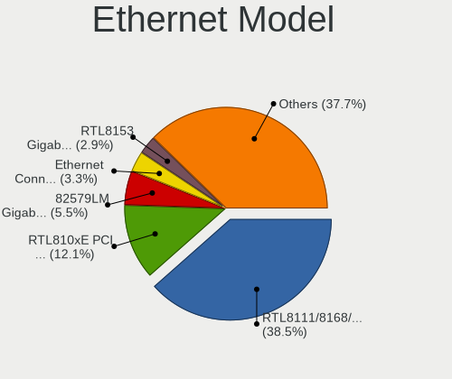

| Model                                                                          | Notebooks | Percent |
|--------------------------------------------------------------------------------|-----------|---------|
| Realtek RTL8111/8168/8411 PCI Express Gigabit Ethernet Controller              | 49        | 37.4%   |
| Realtek RTL810xE PCI Express Fast Ethernet controller                          | 18        | 13.74%  |
| Intel 82579LM Gigabit Network Connection (Lewisville)                          | 8         | 6.11%   |
| Qualcomm Atheros AR8151 v2.0 Gigabit Ethernet                                  | 3         | 2.29%   |
| Intel Ethernet Connection I217-LM                                              | 3         | 2.29%   |
| Intel Ethernet Connection (4) I219-LM                                          | 3         | 2.29%   |
| Intel 82577LM Gigabit Network Connection                                       | 3         | 2.29%   |
| Huawei MAR-LX1A                                                                | 3         | 2.29%   |
| Broadcom NetXtreme BCM57765 Gigabit Ethernet PCIe                              | 3         | 2.29%   |
| Broadcom NetLink BCM57785 Gigabit Ethernet PCIe                                | 3         | 2.29%   |
| Qualcomm Atheros QCA8172 Fast Ethernet                                         | 2         | 1.53%   |
| Qualcomm Atheros Killer E220x Gigabit Ethernet Controller                      | 2         | 1.53%   |
| Intel 82567LM Gigabit Network Connection                                       | 2         | 1.53%   |
| Xiaomi Mi/Redmi series (RNDIS)                                                 | 1         | 0.76%   |
| Xiaomi Mi/Redmi series (RNDIS + ADB)                                           | 1         | 0.76%   |
| Realtek RTL8153 Gigabit Ethernet Adapter                                       | 1         | 0.76%   |
| Realtek RTL8152 Fast Ethernet Adapter                                          | 1         | 0.76%   |
| Realtek RTL8125 2.5GbE Controller                                              | 1         | 0.76%   |
| Realtek Realtek Ethernet controller                                            | 1         | 0.76%   |
| Realtek Killer E2600 Gigabit Ethernet Controller                               | 1         | 0.76%   |
| Qualcomm Atheros QCA8171 Gigabit Ethernet                                      | 1         | 0.76%   |
| Qualcomm Atheros AR8161 Gigabit Ethernet                                       | 1         | 0.76%   |
| Qualcomm Atheros AR8152 v2.0 Fast Ethernet                                     | 1         | 0.76%   |
| Qualcomm Atheros AR8131 Gigabit Ethernet                                       | 1         | 0.76%   |
| OPPO realme X50 5G                                                             | 1         | 0.76%   |
| Nvidia MCP79 Ethernet                                                          | 1         | 0.76%   |
| Nvidia MCP77 Ethernet                                                          | 1         | 0.76%   |
| Marvell Group Yukon Optima 88E8059 [PCIe Gigabit Ethernet Controller with AVB] | 1         | 0.76%   |
| JMicron JMC250 PCI Express Gigabit Ethernet Controller                         | 1         | 0.76%   |
| Intel Ethernet Connection I219-V                                               | 1         | 0.76%   |
| Intel Ethernet Connection I218-LM                                              | 1         | 0.76%   |
| Intel Ethernet Connection (7) I219-LM                                          | 1         | 0.76%   |
| Intel Ethernet Connection (3) I218-LM                                          | 1         | 0.76%   |
| Intel Centrino Advanced-N + WiMAX 6250                                         | 1         | 0.76%   |
| Intel 82579V Gigabit Network Connection                                        | 1         | 0.76%   |
| DisplayLink Dell Universal Dock D6000                                          | 1         | 0.76%   |
| Broadcom NetLink BCM5906M Fast Ethernet PCI Express                            | 1         | 0.76%   |
| Broadcom NetLink BCM57780 Gigabit Ethernet PCIe                                | 1         | 0.76%   |
| Broadcom Limited NetLink BCM5787M Gigabit Ethernet PCI Express                 | 1         | 0.76%   |
| Attansic AR8152 v2.0 Fast Ethernet                                             | 1         | 0.76%   |
| ASIX AX88772B                                                                  | 1         | 0.76%   |
| ASIX AX88179 Gigabit Ethernet                                                  | 1         | 0.76%   |

Net Controller Kind
-------------------

Ethernet, WiFi or modem

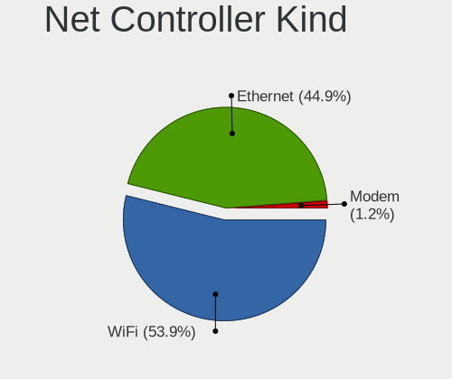

| Kind     | Notebooks | Percent |
|----------|-----------|---------|
| WiFi     | 141       | 52.81%  |
| Ethernet | 125       | 46.82%  |
| Modem    | 1         | 0.37%   |

Used Controller
---------------

Currently used network controller

| Kind     | Notebooks | Percent |
|----------|-----------|---------|
| WiFi     | 115       | 77.18%  |
| Ethernet | 34        | 22.82%  |

NICs
----

Total network controllers on board

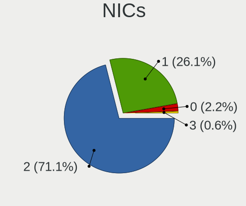

| Total | Notebooks | Percent |
|-------|-----------|---------|
| 2     | 114       | 78.08%  |
| 1     | 27        | 18.49%  |
| 0     | 4         | 2.74%   |
| 3     | 1         | 0.68%   |

IPv6
----

IPv6 vs IPv4

| Used | Notebooks | Percent |
|------|-----------|---------|
| No   | 111       | 74%     |
| Yes  | 39        | 26%     |

Bluetooth
---------

Bluetooth Vendor
----------------

Controller vendors

| Vendor                          | Notebooks | Percent |
|---------------------------------|-----------|---------|
| Intel                           | 43        | 34.4%   |
| Qualcomm Atheros Communications | 12        | 9.6%    |
| Broadcom                        | 11        | 8.8%    |
| Realtek Semiconductor           | 10        | 8%      |
| IMC Networks                    | 9         | 7.2%    |
| Foxconn / Hon Hai               | 9         | 7.2%    |
| Lite-On Technology              | 7         | 5.6%    |
| Apple                           | 5         | 4%      |
| Realtek                         | 3         | 2.4%    |
| Hewlett-Packard                 | 3         | 2.4%    |
| Dell                            | 3         | 2.4%    |
| Ralink                          | 2         | 1.6%    |
| MediaTek                        | 2         | 1.6%    |
| Cambridge Silicon Radio         | 2         | 1.6%    |
| Ralink Technology               | 1         | 0.8%    |
| ASUSTek Computer                | 1         | 0.8%    |
| Askey Computer                  | 1         | 0.8%    |
| Alps Electric                   | 1         | 0.8%    |

Bluetooth Model
---------------

Controller models

| Model                                                                               | Notebooks | Percent |
|-------------------------------------------------------------------------------------|-----------|---------|
| Intel Bluetooth wireless interface                                                  | 15        | 12%     |
| Intel AX200 Bluetooth                                                               | 8         | 6.4%    |
| Intel Bluetooth 9460/9560 Jefferson Peak (JfP)                                      | 7         | 5.6%    |
| Qualcomm Atheros  Bluetooth Device                                                  | 5         | 4%      |
| Realtek Bluetooth Radio                                                             | 4         | 3.2%    |
| Qualcomm Atheros AR3011 Bluetooth                                                   | 4         | 3.2%    |
| Intel Centrino Bluetooth Wireless Transceiver                                       | 4         | 3.2%    |
| Intel AX201 Bluetooth                                                               | 4         | 3.2%    |
| IMC Networks Atheros AR3012 Bluetooth 4.0 Adapter                                   | 4         | 3.2%    |
| Broadcom BCM2045B (BDC-2.1)                                                         | 4         | 3.2%    |
| Apple Bluetooth Host Controller                                                     | 4         | 3.2%    |
| Realtek  Bluetooth 4.2 Adapter                                                      | 3         | 2.4%    |
| Realtek Bluetooth Radio                                                             | 3         | 2.4%    |
| Realtek RTL8822BE Bluetooth 4.2 Adapter                                             | 2         | 1.6%    |
| Ralink RT3290 Bluetooth                                                             | 2         | 1.6%    |
| Qualcomm Atheros AR3012 Bluetooth 4.0                                               | 2         | 1.6%    |
| Lite-On Qualcomm Atheros QCA9377 Bluetooth                                          | 2         | 1.6%    |
| Lite-On Atheros Bluetooth                                                           | 2         | 1.6%    |
| Intel Centrino Advanced-N 6230 Bluetooth adapter                                    | 2         | 1.6%    |
| IMC Networks Bluetooth Device                                                       | 2         | 1.6%    |
| HP Broadcom 2070 Bluetooth Combo                                                    | 2         | 1.6%    |
| Foxconn / Hon Hai Foxconn T77H114 BCM2070 [Single-Chip Bluetooth 2.1 + EDR Adapter] | 2         | 1.6%    |
| Foxconn / Hon Hai Bluetooth Device                                                  | 2         | 1.6%    |
| Dell Wireless 365 Bluetooth                                                         | 2         | 1.6%    |
| Cambridge Silicon Radio Bluetooth Dongle (HCI mode)                                 | 2         | 1.6%    |
| Broadcom HP Portable SoftSailing                                                    | 2         | 1.6%    |
| Realtek RTL8723B Bluetooth                                                          | 1         | 0.8%    |
| Ralink CSR BS8510                                                                   | 1         | 0.8%    |
| Qualcomm Atheros Bluetooth                                                          | 1         | 0.8%    |
| MediaTek Wireless_Device                                                            | 1         | 0.8%    |
| MediaTek BT                                                                         | 1         | 0.8%    |
| Lite-On Wireless_Device                                                             | 1         | 0.8%    |
| Lite-On Bluetooth Device                                                            | 1         | 0.8%    |
| Lite-On Atheros AR3012 Bluetooth                                                    | 1         | 0.8%    |
| Intel Wireless-AC 9260 Bluetooth Adapter                                            | 1         | 0.8%    |
| Intel Wireless-AC 3168 Bluetooth                                                    | 1         | 0.8%    |
| Intel AX210 Bluetooth                                                               | 1         | 0.8%    |
| IMC Networks Wireless_Device                                                        | 1         | 0.8%    |
| IMC Networks Bluetooth Radio                                                        | 1         | 0.8%    |
| IMC Networks Atheros AR3012 Bluetooth                                               | 1         | 0.8%    |
| HP Bluetooth 2.0 Interface [Broadcom BCM2045]                                       | 1         | 0.8%    |
| Foxconn / Hon Hai Wireless_Device                                                   | 1         | 0.8%    |
| Foxconn / Hon Hai Bluetooth USB Host Controller                                     | 1         | 0.8%    |
| Foxconn / Hon Hai BCM20702A0                                                        | 1         | 0.8%    |
| Foxconn / Hon Hai BCM2045A0                                                         | 1         | 0.8%    |
| Foxconn / Hon Hai Acer Module                                                       | 1         | 0.8%    |
| Dell Wireless 355 Bluetooth                                                         | 1         | 0.8%    |
| Broadcom HP Portable Bumble Bee                                                     | 1         | 0.8%    |
| Broadcom BCM43142A0 Bluetooth 4.0                                                   | 1         | 0.8%    |
| Broadcom BCM20702A0                                                                 | 1         | 0.8%    |
| Broadcom BCM2070 Bluetooth 2.1 + EDR                                                | 1         | 0.8%    |
| Broadcom BCM2045 Bluetooth                                                          | 1         | 0.8%    |
| ASUS BT-270 Bluetooth Adapter                                                       | 1         | 0.8%    |
| Askey Bluetooth Device                                                              | 1         | 0.8%    |
| Apple Bluetooth USB Host Controller                                                 | 1         | 0.8%    |
| Alps Electric BCM2046 Bluetooth Device                                              | 1         | 0.8%    |

Sound
-----

Sound Vendor
------------

Sound card vendors

| Vendor                 | Notebooks | Percent |
|------------------------|-----------|---------|
| Intel                  | 115       | 64.97%  |
| AMD                    | 28        | 15.82%  |
| Nvidia                 | 25        | 14.12%  |
| C-Media Electronics    | 3         | 1.69%   |
| Samsung Electronics    | 2         | 1.13%   |
| Realtek Semiconductor  | 1         | 0.56%   |
| Plantronics            | 1         | 0.56%   |
| MVSILICON.INC.         | 1         | 0.56%   |
| Generalplus Technology | 1         | 0.56%   |

Sound Model
-----------

Sound card models

| Model                                                                                             | Notebooks | Percent |
|---------------------------------------------------------------------------------------------------|-----------|---------|
| Intel 6 Series/C200 Series Chipset Family High Definition Audio Controller                        | 20        | 9.22%   |
| Intel 7 Series/C216 Chipset Family High Definition Audio Controller                               | 17        | 7.83%   |
| AMD Family 17h/19h HD Audio Controller                                                            | 17        | 7.83%   |
| Intel Sunrise Point-LP HD Audio                                                                   | 13        | 5.99%   |
| Intel 5 Series/3400 Series Chipset High Definition Audio                                          | 10        | 4.61%   |
| AMD Renoir Radeon High Definition Audio Controller                                                | 9         | 4.15%   |
| Intel Cannon Lake PCH cAVS                                                                        | 8         | 3.69%   |
| Intel 8 Series HD Audio Controller                                                                | 8         | 3.69%   |
| Intel Haswell-ULT HD Audio Controller                                                             | 7         | 3.23%   |
| Intel 82801I (ICH9 Family) HD Audio Controller                                                    | 7         | 3.23%   |
| Intel 8 Series/C220 Series Chipset High Definition Audio Controller                               | 7         | 3.23%   |
| AMD Raven/Raven2/Fenghuang HDMI/DP Audio Controller                                               | 6         | 2.76%   |
| AMD FCH Azalia Controller                                                                         | 6         | 2.76%   |
| Intel Xeon E3-1200 v3/4th Gen Core Processor HD Audio Controller                                  | 5         | 2.3%    |
| Nvidia TU107 GeForce GTX 1650 High Definition Audio Controller                                    | 4         | 1.84%   |
| Intel Wildcat Point-LP High Definition Audio Controller                                           | 4         | 1.84%   |
| Intel Broadwell-U Audio Controller                                                                | 4         | 1.84%   |
| AMD Trinity HDMI Audio Controller                                                                 | 4         | 1.84%   |
| Nvidia GP107GL High Definition Audio Controller                                                   | 3         | 1.38%   |
| Intel Comet Lake PCH cAVS                                                                         | 3         | 1.38%   |
| Intel Cannon Point-LP High Definition Audio Controller                                            | 3         | 1.38%   |
| AMD Kabini HDMI/DP Audio                                                                          | 3         | 1.38%   |
| Nvidia GK208 HDMI/DP Audio Controller                                                             | 2         | 0.92%   |
| Nvidia GF119 HDMI Audio Controller                                                                | 2         | 0.92%   |
| Nvidia GF108 High Definition Audio Controller                                                     | 2         | 0.92%   |
| Nvidia Audio device                                                                               | 2         | 0.92%   |
| Intel NM10/ICH7 Family High Definition Audio Controller                                           | 2         | 0.92%   |
| Intel Ice Lake-LP Smart Sound Technology Audio Controller                                         | 2         | 0.92%   |
| Intel CM238 HD Audio Controller                                                                   | 2         | 0.92%   |
| Intel Celeron/Pentium Silver Processor High Definition Audio                                      | 2         | 0.92%   |
| Intel 82801H (ICH8 Family) HD Audio Controller                                                    | 2         | 0.92%   |
| Samsung Electronics USBC Headset                                                                  | 1         | 0.46%   |
| Samsung Electronics USB C Earphones                                                               | 1         | 0.46%   |
| Realtek Semiconductor USB Audio                                                                   | 1         | 0.46%   |
| Plantronics C320-M                                                                                | 1         | 0.46%   |
| Nvidia TU116 High Definition Audio Controller                                                     | 1         | 0.46%   |
| Nvidia MCP89 High Definition Audio                                                                | 1         | 0.46%   |
| Nvidia MCP79 High Definition Audio                                                                | 1         | 0.46%   |
| Nvidia MCP72XE/MCP72P/MCP78U/MCP78S High Definition Audio                                         | 1         | 0.46%   |
| Nvidia High Definition Audio Controller                                                           | 1         | 0.46%   |
| Nvidia GP104 High Definition Audio Controller                                                     | 1         | 0.46%   |
| Nvidia GM107 High Definition Audio Controller [GeForce 940MX]                                     | 1         | 0.46%   |
| Nvidia GK107 HDMI Audio Controller                                                                | 1         | 0.46%   |
| Nvidia GK104 HDMI Audio Controller                                                                | 1         | 0.46%   |
| Nvidia GA104 High Definition Audio Controller                                                     | 1         | 0.46%   |
| MVSILICON.INC. EDIFIER Sound To Go+                                                               | 1         | 0.46%   |
| Intel USB PnP Sound Device                                                                        | 1         | 0.46%   |
| Intel Tiger Lake-LP Smart Sound Technology Audio Controller                                       | 1         | 0.46%   |
| Intel Tiger Lake-H HD Audio Controller                                                            | 1         | 0.46%   |
| Intel Comet Lake PCH-LP cAVS                                                                      | 1         | 0.46%   |
| Intel Atom/Celeron/Pentium Processor x5-E8000/J3xxx/N3xxx Series High Definition Audio Controller | 1         | 0.46%   |
| Intel Atom Processor Z36xxx/Z37xxx Series High Definition Audio Controller                        | 1         | 0.46%   |
| Generalplus Technology Usb Audio Device                                                           | 1         | 0.46%   |
| C-Media Electronics SADES Luna                                                                    | 1         | 0.46%   |
| C-Media Electronics Audio Adapter (Unitek Y-247A)                                                 | 1         | 0.46%   |
| C-Media Electronics Audio Adapter                                                                 | 1         | 0.46%   |
| AMD Wrestler HDMI Audio                                                                           | 1         | 0.46%   |
| AMD Turks HDMI Audio [Radeon HD 6500/6600 / 6700M Series]                                         | 1         | 0.46%   |
| AMD SBx00 Azalia (Intel HDA)                                                                      | 1         | 0.46%   |
| AMD RV710/730 HDMI Audio [Radeon HD 4000 series]                                                  | 1         | 0.46%   |

Memory
------

Memory Vendor
-------------

Memory module vendors

| Vendor              | Notebooks | Percent |
|---------------------|-----------|---------|
| Samsung Electronics | 24        | 27.91%  |
| Kingston            | 18        | 20.93%  |
| SK Hynix            | 15        | 17.44%  |
| Micron Technology   | 7         | 8.14%   |
| Nanya Technology    | 6         | 6.98%   |
| Ramaxel Technology  | 4         | 4.65%   |
| A-DATA Technology   | 4         | 4.65%   |
| Crucial             | 2         | 2.33%   |
| Unknown (ABCD)      | 1         | 1.16%   |
| Unknown             | 1         | 1.16%   |
| Silicon Power       | 1         | 1.16%   |
| Kingmax             | 1         | 1.16%   |
| Elpida              | 1         | 1.16%   |
| Apacer              | 1         | 1.16%   |

Memory Model
------------

Memory module models

| Model                                                            | Notebooks | Percent |
|------------------------------------------------------------------|-----------|---------|
| Samsung RAM M471B5173DB0-YK0 4GB SODIMM DDR3 1600MT/s            | 4         | 4.49%   |
| Nanya RAM NT4GC64B8HG0NS-CG 4GB SODIMM DDR3 1334MT/s             | 3         | 3.37%   |
| SK Hynix RAM HMT451S6AFR8A-PB 4GB SODIMM DDR3 1600MT/s           | 2         | 2.25%   |
| SK Hynix RAM HMT351S6CFR8C-PB 4GB SODIMM DDR3 1600MT/s           | 2         | 2.25%   |
| SK Hynix RAM HMA451S6AFR8N-TF 4GB SODIMM DDR4 2133MT/s           | 2         | 2.25%   |
| Samsung RAM M471B5273CH0-CH9 4GB SODIMM DDR3 1334MT/s            | 2         | 2.25%   |
| Samsung RAM M471B5173EB0-YK0 4GB SODIMM DDR3 1600MT/s            | 2         | 2.25%   |
| Crucial RAM CT102464BF160B.C16 8192MB SODIMM DDR3 1600MT/s       | 2         | 2.25%   |
| Unknown RAM Module 2GB SODIMM DDR3                               | 1         | 1.12%   |
| Unknown (ABCD) RAM 123456789012345678 2GB SODIMM DDR4 2400MT/s   | 1         | 1.12%   |
| SK Hynix RAM Module 4096MB SODIMM DDR3 1600MT/s                  | 1         | 1.12%   |
| SK Hynix RAM HMT351S6CFR8A-PB 4096MB SODIMM DDR3 1600MT/s        | 1         | 1.12%   |
| SK Hynix RAM HMT325S6CFR8C-PB 2GB SODIMM DDR3 1600MT/s           | 1         | 1.12%   |
| SK Hynix RAM HMT112S6TFR8C-H9 1GB SODIMM DDR3 1333MT/s           | 1         | 1.12%   |
| SK Hynix RAM HMAA4GS6AJR8N-XN 32GB SODIMM DDR4 3200MT/s          | 1         | 1.12%   |
| SK Hynix RAM HMAA2GS6CJR8N-XN 16384MB SODIMM DDR4 3200MT/s       | 1         | 1.12%   |
| SK Hynix RAM HMA82GS6DJR8N-VK 16384MB SODIMM DDR4 2667MT/s       | 1         | 1.12%   |
| SK Hynix RAM HMA81GS6DJR8N-XN 8GB SODIMM DDR4 3200MT/s           | 1         | 1.12%   |
| SK Hynix RAM HMA81GS6AFR8N-UH 8GB SODIMM DDR4 2667MT/s           | 1         | 1.12%   |
| SK Hynix RAM H9CCNNNBJTALAR-NVD 4GB Row Of Chips LPDDR3 2133MT/s | 1         | 1.12%   |
| Silicon Power RAM SP004GBSFU213N02 4GB SODIMM DDR4 2133MT/s      | 1         | 1.12%   |
| Samsung RAM M471B5673FH0-CH9 2GB SODIMM DDR3 1334MT/s            | 1         | 1.12%   |
| Samsung RAM M471B5273DH0-YK0 4GB SODIMM DDR3 1600MT/s            | 1         | 1.12%   |
| Samsung RAM M471B5273DH0-CK0 4096MB SODIMM DDR3 1600MT/s         | 1         | 1.12%   |
| Samsung RAM M471B5273DH0-CH9 4GB SODIMM DDR3 1334MT/s            | 1         | 1.12%   |
| Samsung RAM M471B5173QH0-YK0 4GB SODIMM DDR3 1600MT/s            | 1         | 1.12%   |
| Samsung RAM M471B2873EH1-CF8 1GB SODIMM 1067MT/s                 | 1         | 1.12%   |
| Samsung RAM M471A5244CB0-CTD 4GB SODIMM DDR4 3266MT/s            | 1         | 1.12%   |
| Samsung RAM M471A4G43MB1-CTD 32GB SODIMM DDR4 2667MT/s           | 1         | 1.12%   |
| Samsung RAM M471A1K43EB1-CWE 8GB SODIMM DDR4 3200MT/s            | 1         | 1.12%   |
| Samsung RAM M471A1K43DB1-CWE 8GB SODIMM DDR4 3200MT/s            | 1         | 1.12%   |
| Samsung RAM M471A1K43CB1-CRC 8GB SODIMM DDR4 2667MT/s            | 1         | 1.12%   |
| Samsung RAM M471A1G44AB0-CTD 8GB SODIMM DDR4 2667MT/s            | 1         | 1.12%   |
| Samsung RAM M471A1G44AB0-CTD 8GB Row Of Chips DDR4 2667MT/s      | 1         | 1.12%   |
| Samsung RAM M04GD08P1600C10 4096MB SODIMM DDR3 800MT/s           | 1         | 1.12%   |
| Samsung RAM 8G3200CL22 8192MB SODIMM DDR4 3200MT/s               | 1         | 1.12%   |
| Samsung RAM 4D34373142353237 4GB SODIMM DDR3 1333MT/s            | 1         | 1.12%   |
| Samsung RAM 4D34373142323837 1GB SODIMM DDR3 1333MT/s            | 1         | 1.12%   |
| Samsung RAM 16G3200CL22 16GB SODIMM DDR4 3200MT/s                | 1         | 1.12%   |
| Ramaxel RAM RMT3170EF68F9W1600 4GB SODIMM DDR3 1600MT/s          | 1         | 1.12%   |
| Ramaxel RAM RMT3160ED58E9W1600 4GB SODIMM DDR3 1600MT/s          | 1         | 1.12%   |
| Ramaxel RAM RMT3010KC58E8F1333 2GB SODIMM DDR3 1334MT/s          | 1         | 1.12%   |
| Ramaxel RAM RMT1970ED48E8F1066 2GB SODIMM DDR3 1067MT/s          | 1         | 1.12%   |
| Nanya RAM NT4GC64B8HB0NS-CG 4GB SODIMM DDR3 1334MT/s             | 1         | 1.12%   |
| Nanya RAM NT2GC64B8HC0NS-BE 2GB SODIMM DDR3 1067MT/s             | 1         | 1.12%   |
| Nanya RAM M2S4G64CB8HG5N-CG 4GB SODIMM DDR3 1334MT/s             | 1         | 1.12%   |
| Micron RAM 8ATF51264HZ-2G3B1 4GB SODIMM DDR4 2400MT/s            | 1         | 1.12%   |
| Micron RAM 8ATF51264HZ-2G1A1 4GB SODIMM DDR4 2133MT/s            | 1         | 1.12%   |
| Micron RAM 8ATF1G64HZ-2G3H1R 8GB SODIMM DDR4 2400MT/s            | 1         | 1.12%   |
| Micron RAM 4ATF51264HZ-2G6E1 4GB SODIMM DDR4 2667MT/s            | 1         | 1.12%   |
| Micron RAM 4ATF51264HZ-2G3E1 4GB SODIMM DDR4 2667MT/s            | 1         | 1.12%   |
| Micron RAM 4ATF1G64HZ-3G2E1 8GB SODIMM DDR4 3200MT/s             | 1         | 1.12%   |
| Micron RAM 16JSF51264HZ-1G4D1 4GB SODIMM DDR3 1334MT/s           | 1         | 1.12%   |
| Kingston RAM Module 4096MB SODIMM DDR3 1333MT/s                  | 1         | 1.12%   |
| Kingston RAM Module 2GB SODIMM DDR 800MT/s                       | 1         | 1.12%   |
| Kingston RAM KNWMX1-HYA 4GB SODIMM DDR3 1600MT/s                 | 1         | 1.12%   |
| Kingston RAM KHX2666C15S4/16G 16GB SODIMM DDR4 2667MT/s          | 1         | 1.12%   |
| Kingston RAM KHX2400C14S4/8G 8GB SODIMM DDR4 2400MT/s            | 1         | 1.12%   |
| Kingston RAM HP16D3LS1KBG/4G 4096MB SODIMM DDR3 1600MT/s         | 1         | 1.12%   |
| Kingston RAM 99U5624-001.A00G 8GB SODIMM DDR4 2400MT/s           | 1         | 1.12%   |

Memory Kind
-----------

Memory module kinds

| Kind   | Notebooks | Percent |
|--------|-----------|---------|
| DDR3   | 35        | 53.85%  |
| DDR4   | 27        | 41.54%  |
| LPDDR4 | 1         | 1.54%   |
| LPDDR3 | 1         | 1.54%   |
| DDR    | 1         | 1.54%   |

Memory Form Factor
------------------

Physical design of the memory module

| Name         | Notebooks | Percent |
|--------------|-----------|---------|
| SODIMM       | 63        | 96.92%  |
| Row Of Chips | 2         | 3.08%   |

Memory Size
-----------

Memory module size

| Size  | Notebooks | Percent |
|-------|-----------|---------|
| 4096  | 37        | 49.33%  |
| 8192  | 18        | 24%     |
| 16384 | 7         | 9.33%   |
| 2048  | 7         | 9.33%   |
| 32768 | 3         | 4%      |
| 1024  | 3         | 4%      |

Memory Speed
------------

Memory module speed

| Speed   | Notebooks | Percent |
|---------|-----------|---------|
| 1600    | 21        | 28%     |
| 2667    | 14        | 18.67%  |
| 1334    | 12        | 16%     |
| 3200    | 9         | 12%     |
| 2400    | 4         | 5.33%   |
| 2133    | 4         | 5.33%   |
| 1333    | 4         | 5.33%   |
| 1067    | 3         | 4%      |
| 800     | 2         | 2.67%   |
| 3266    | 1         | 1.33%   |
| Unknown | 1         | 1.33%   |

Printers & scanners
-------------------

Printer Vendor
--------------

Printer device vendors

| Vendor      | Notebooks | Percent |
|-------------|-----------|---------|
| Seiko Epson | 2         | 66.67%  |
| Canon       | 1         | 33.33%  |

Printer Model
-------------

Printer device models

| Model                      | Notebooks | Percent |
|----------------------------|-----------|---------|
| Seiko Epson L210 Series    | 1         | 33.33%  |
| Seiko Epson ET-2710 Series | 1         | 33.33%  |
| Canon E410 series          | 1         | 33.33%  |

Scanner Vendor
--------------

Scanner device vendors

Zero info for selected period =(

Scanner Model
-------------

Scanner device models

Zero info for selected period =(

Camera
------

Camera Vendor
-------------

Camera device vendors

| Vendor                                 | Notebooks | Percent |
|----------------------------------------|-----------|---------|
| Chicony Electronics                    | 23        | 18.25%  |
| IMC Networks                           | 15        | 11.9%   |
| Microdia                               | 14        | 11.11%  |
| Realtek Semiconductor                  | 12        | 9.52%   |
| Suyin                                  | 11        | 8.73%   |
| Acer                                   | 9         | 7.14%   |
| Sunplus Innovation Technology          | 8         | 6.35%   |
| Cheng Uei Precision Industry (Foxlink) | 6         | 4.76%   |
| Apple                                  | 5         | 3.97%   |
| Alcor Micro                            | 4         | 3.17%   |
| Quanta                                 | 3         | 2.38%   |
| Syntek                                 | 2         | 1.59%   |
| Lite-On Technology                     | 2         | 1.59%   |
| Generalplus Technology                 | 2         | 1.59%   |
| Z-Star Microelectronics                | 1         | 0.79%   |
| USB Camera                             | 1         | 0.79%   |
| Samsung Electronics                    | 1         | 0.79%   |
| Ricoh                                  | 1         | 0.79%   |
| Primax Electronics                     | 1         | 0.79%   |
| OmniVision Technologies                | 1         | 0.79%   |
| Luxvisions Innotech Limited            | 1         | 0.79%   |
| Logitech                               | 1         | 0.79%   |
| Lenovo                                 | 1         | 0.79%   |
| HD WEBCAM                              | 1         | 0.79%   |

Camera Model
------------

Camera device models

| Model                                                   | Notebooks | Percent |
|---------------------------------------------------------|-----------|---------|
| Microdia Integrated_Webcam_HD                           | 4         | 3.17%   |
| IMC Networks USB2.0 HD UVC WebCam                       | 4         | 3.17%   |
| Sunplus Integrated_Webcam_HD                            | 3         | 2.38%   |
| IMC Networks USB2.0 UVC HD Webcam                       | 3         | 2.38%   |
| Chicony USB2.0 VGA UVC WebCam                           | 3         | 2.38%   |
| Chicony USB2.0 HD UVC WebCam                            | 3         | 2.38%   |
| Chicony HP HD Webcam                                    | 3         | 2.38%   |
| Chicony HD WebCam                                       | 3         | 2.38%   |
| Cheng Uei Precision Industry (Foxlink) HP TrueVision HD | 3         | 2.38%   |
| Apple FaceTime HD Camera                                | 3         | 2.38%   |
| Acer Lenovo Integrated Webcam                           | 3         | 2.38%   |
| Suyin Laptop_Integrated_Webcam_HD                       | 2         | 1.59%   |
| Suyin Acer/HP Integrated Webcam [CN0314]                | 2         | 1.59%   |
| Suyin 1.3M HD WebCam                                    | 2         | 1.59%   |
| Sunplus HP HD Webcam [Fixed]                            | 2         | 1.59%   |
| Realtek USB Camera                                      | 2         | 1.59%   |
| Realtek Integrated_Webcam_HD                            | 2         | 1.59%   |
| Realtek HD WebCam                                       | 2         | 1.59%   |
| Microdia USB 2.0 Camera                                 | 2         | 1.59%   |
| Microdia Laptop_Integrated_Webcam_HD                    | 2         | 1.59%   |
| IMC Networks Integrated Camera                          | 2         | 1.59%   |
| Chicony Integrated Camera (1280x720@30)                 | 2         | 1.59%   |
| Chicony Integrated Camera                               | 2         | 1.59%   |
| Alcor Micro Asus Integrated Webcam                      | 2         | 1.59%   |
| Acer BisonCam,NB Pro                                    | 2         | 1.59%   |
| Z-Star Sirius USB2.0 Camera                             | 1         | 0.79%   |
| USB Camera USB Camera                                   | 1         | 0.79%   |
| Syntek Lenovo EasyCamera                                | 1         | 0.79%   |
| Syntek Laptop_Integrated_Webcam_1.3M                    | 1         | 0.79%   |
| Suyin WebCam                                            | 1         | 0.79%   |
| Suyin Integrated Webcam                                 | 1         | 0.79%   |
| Suyin HP Webcam-101                                     | 1         | 0.79%   |
| Suyin HP Webcam 101                                     | 1         | 0.79%   |
| Suyin HP TrueVision HD                                  | 1         | 0.79%   |
| Sunplus Laptop Integrated Webcam HD                     | 1         | 0.79%   |
| Sunplus Laptop Integrated Webcam FHD                    | 1         | 0.79%   |
| Sunplus Dell HD Webcam                                  | 1         | 0.79%   |
| Samsung Galaxy A5 (MTP)                                 | 1         | 0.79%   |
| Ricoh Sony Vaio Integrated Webcam                       | 1         | 0.79%   |
| Realtek USB2.0 HD UVC WebCam                            | 1         | 0.79%   |
| Realtek USB HD Webcam                                   | 1         | 0.79%   |
| Realtek Lenovo EasyCamera                               | 1         | 0.79%   |
| Realtek Integrated Webcam_HD                            | 1         | 0.79%   |
| Realtek HP Truevision HD                                | 1         | 0.79%   |
| Realtek Acer 640 x 480 laptop camera                    | 1         | 0.79%   |
| Quanta HP Wide Vision HD Camera                         | 1         | 0.79%   |
| Quanta HP TrueVision HD Camera                          | 1         | 0.79%   |
| Quanta HD User Facing                                   | 1         | 0.79%   |
| Primax HP HD Webcam [Fixed]                             | 1         | 0.79%   |
| OmniVision OV2640 Webcam                                | 1         | 0.79%   |
| Microdia Webcam Vitade AF                               | 1         | 0.79%   |
| Microdia Sonix 1.3 MP Laptop Integrated Webcam          | 1         | 0.79%   |
| Microdia Laptop_Integrated_Webcam_1.3M                  | 1         | 0.79%   |
| Microdia Integrated Webcam                              | 1         | 0.79%   |
| Microdia Dell Integrated HD Webcam                      | 1         | 0.79%   |
| Microdia 1.3 MPixel Integrated Webcam                   | 1         | 0.79%   |
| Luxvisions Innotech Limited HP TrueVision HD Camera     | 1         | 0.79%   |
| Logitech HD Webcam C615                                 | 1         | 0.79%   |
| Lite-On Integrated Camera                               | 1         | 0.79%   |
| Lite-On HP Wide Vision HD Camera                        | 1         | 0.79%   |

Security
--------

Fingerprint Vendor
------------------

Fingerprint sensor vendors

| Vendor                     | Notebooks | Percent |
|----------------------------|-----------|---------|
| Validity Sensors           | 6         | 27.27%  |
| Shenzhen Goodix Technology | 5         | 22.73%  |
| AuthenTec                  | 3         | 13.64%  |
| Upek                       | 2         | 9.09%   |
| Synaptics                  | 2         | 9.09%   |
| Elan Microelectronics      | 2         | 9.09%   |
| LighTuning Technology      | 1         | 4.55%   |
| Focal-systems.Corp         | 1         | 4.55%   |

Fingerprint Model
-----------------

Fingerprint sensor models

| Model                                                  | Notebooks | Percent |
|--------------------------------------------------------|-----------|---------|
| Shenzhen Goodix Fingerprint Reader                     | 3         | 13.64%  |
| Upek Biometric Touchchip/Touchstrip Fingerprint Sensor | 2         | 9.09%   |
| Validity Sensors VFS495 Fingerprint Reader             | 1         | 4.55%   |
| Validity Sensors VFS491                                | 1         | 4.55%   |
| Validity Sensors VFS471 Fingerprint Reader             | 1         | 4.55%   |
| Validity Sensors VFS451 Fingerprint Reader             | 1         | 4.55%   |
| Validity Sensors VFS 5011 fingerprint sensor           | 1         | 4.55%   |
| Validity Sensors Fingerprint scanner                   | 1         | 4.55%   |
| Synaptics Metallica MOH Touch Fingerprint Reader       | 1         | 4.55%   |
| Shenzhen Goodix  Fingerprint Device                    | 1         | 4.55%   |
| Shenzhen Goodix FingerPrint                            | 1         | 4.55%   |
| LighTuning EgisTec Touch Fingerprint Sensor            | 1         | 4.55%   |
| Focal-systems.Corp FT9201Fingerprint.                  | 1         | 4.55%   |
| Elan ELAN:Fingerprint                                  | 1         | 4.55%   |
| Elan ELAN:ARM-M4                                       | 1         | 4.55%   |
| AuthenTec Fingerprint Sensor                           | 1         | 4.55%   |
| AuthenTec AES2550 Fingerprint Sensor                   | 1         | 4.55%   |
| AuthenTec AES1660 Fingerprint Sensor                   | 1         | 4.55%   |
| Unknown                                                | 1         | 4.55%   |

Chipcard Vendor
---------------

Chipcard module vendors

| Vendor      | Notebooks | Percent |
|-------------|-----------|---------|
| Broadcom    | 4         | 66.67%  |
| O2 Micro    | 1         | 16.67%  |
| Alcor Micro | 1         | 16.67%  |

Chipcard Model
--------------

Chipcard module models

| Model                                                                        | Notebooks | Percent |
|------------------------------------------------------------------------------|-----------|---------|
| Broadcom BCM5880 Secure Applications Processor                               | 2         | 33.33%  |
| O2 Micro OZ776 CCID Smartcard Reader                                         | 1         | 16.67%  |
| Broadcom BCM5880 Secure Applications Processor with fingerprint swipe sensor | 1         | 16.67%  |
| Broadcom 5880                                                                | 1         | 16.67%  |
| Alcor Micro AU9540 Smartcard Reader                                          | 1         | 16.67%  |

Unsupported
-----------

Unsupported Devices
-------------------

Total unsupported devices on board

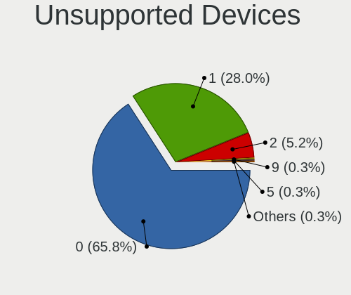

| Total | Notebooks | Percent |
|-------|-----------|---------|
| 0     | 101       | 68.24%  |
| 1     | 39        | 26.35%  |
| 2     | 7         | 4.73%   |
| 4     | 1         | 0.68%   |

Unsupported Device Types
------------------------

Types of unsupported devices

| Type                     | Notebooks | Percent |
|--------------------------|-----------|---------|
| Fingerprint reader       | 22        | 41.51%  |
| Net/wireless             | 8         | 15.09%  |
| Graphics card            | 6         | 11.32%  |
| Multimedia controller    | 5         | 9.43%   |
| Chipcard                 | 4         | 7.55%   |
| Bluetooth                | 3         | 5.66%   |
| Storage                  | 2         | 3.77%   |
| Storage/ide              | 1         | 1.89%   |
| Communication controller | 1         | 1.89%   |
| Card reader              | 1         | 1.89%   |

