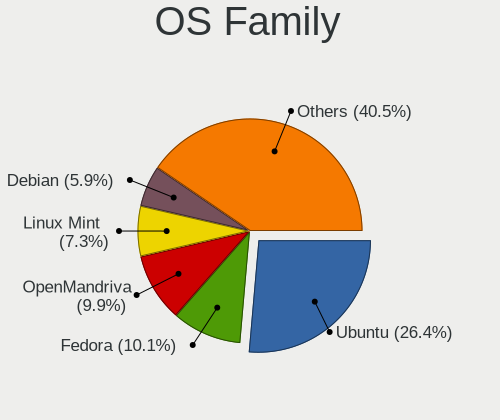
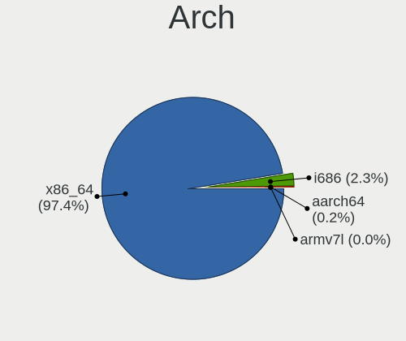
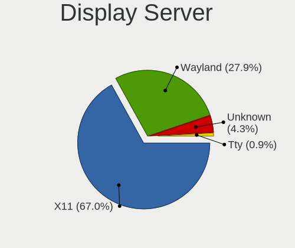
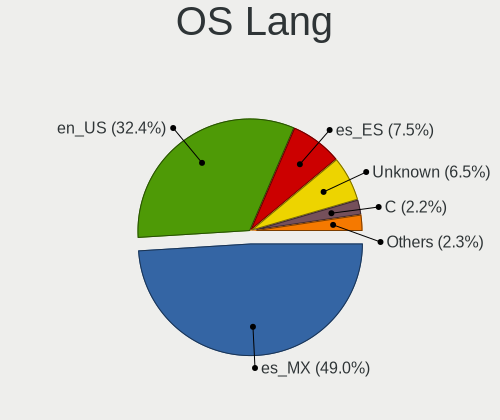
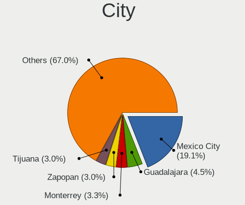
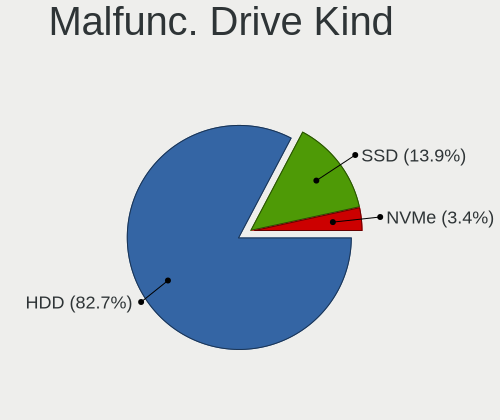
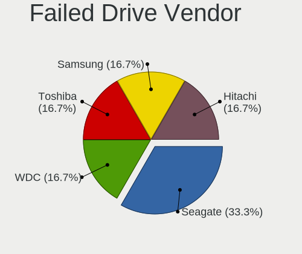
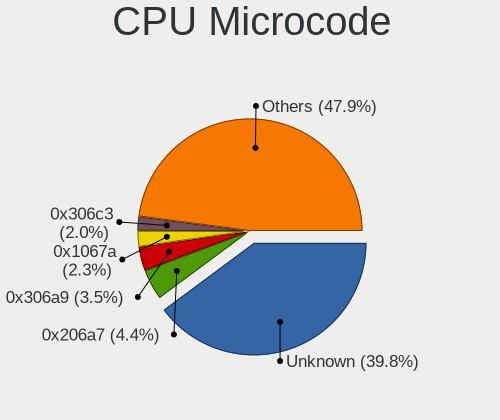

Linux in Mexico - Tested Hardware & Statistics
----------------------------------------------

A project to collect tested hardware configurations for Linux in Mexico.

Anyone can contribute to this report by the [hw-probe](https://github.com/linuxhw/hw-probe) tool:

    sudo -E hw-probe -all -upload

Please contribute! Especially if your hardware is rare.

This is a report for all computer types. See also reports for [desktops](/Location/Mexico/Desktop/README.md) and [notebooks](/Location/Mexico/Notebook/README.md).

Contents
--------

* [ Test Cases ](#test-cases)

* [ System ](#system)
  - [ OS                       ](#os)
  - [ OS Family                ](#os-family)
  - [ Kernel                   ](#kernel)
  - [ Kernel Family            ](#kernel-family)
  - [ Kernel Major Ver.        ](#kernel-major-ver)
  - [ Arch                     ](#arch)
  - [ DE                       ](#de)
  - [ Display Server           ](#display-server)
  - [ Display Manager          ](#display-manager)
  - [ OS Lang                  ](#os-lang)
  - [ Boot Mode                ](#boot-mode)
  - [ Filesystem               ](#filesystem)
  - [ Part. scheme             ](#part-scheme)
  - [ Dual Boot with Linux/BSD ](#dual-boot-with-linuxbsd)
  - [ Dual Boot (Win)          ](#dual-boot-win)

* [ Board ](#board)
  - [ Vendor                   ](#vendor)
  - [ Model                    ](#model)
  - [ Model Family             ](#model-family)
  - [ MFG Year                 ](#mfg-year)
  - [ Form Factor              ](#form-factor)
  - [ Secure Boot              ](#secure-boot)
  - [ Coreboot                 ](#coreboot)
  - [ RAM Size                 ](#ram-size)
  - [ RAM Used                 ](#ram-used)
  - [ Total Drives             ](#total-drives)
  - [ Has CD-ROM               ](#has-cd-rom)
  - [ Has Ethernet             ](#has-ethernet)
  - [ Has WiFi                 ](#has-wifi)
  - [ Has Bluetooth            ](#has-bluetooth)

* [ Location ](#location)
  - [ Country                  ](#country)
  - [ City                     ](#city)

* [ Drives ](#drives)
  - [ Drive Vendor             ](#drive-vendor)
  - [ Drive Model              ](#drive-model)
  - [ HDD Vendor               ](#hdd-vendor)
  - [ SSD Vendor               ](#ssd-vendor)
  - [ Drive Kind               ](#drive-kind)
  - [ Drive Connector          ](#drive-connector)
  - [ Drive Size               ](#drive-size)
  - [ Space Total              ](#space-total)
  - [ Space Used               ](#space-used)
  - [ Malfunc. Drives          ](#malfunc-drives)
  - [ Malfunc. Drive Vendor    ](#malfunc-drive-vendor)
  - [ Malfunc. HDD Vendor      ](#malfunc-hdd-vendor)
  - [ Malfunc. Drive Kind      ](#malfunc-drive-kind)
  - [ Failed Drives            ](#failed-drives)
  - [ Failed Drive Vendor      ](#failed-drive-vendor)
  - [ Drive Status             ](#drive-status)

* [ Storage controller ](#storage-controller)
  - [ Storage Vendor           ](#storage-vendor)
  - [ Storage Model            ](#storage-model)
  - [ Storage Kind             ](#storage-kind)

* [ Processor ](#processor)
  - [ CPU Vendor               ](#cpu-vendor)
  - [ CPU Model                ](#cpu-model)
  - [ CPU Model Family         ](#cpu-model-family)
  - [ CPU Cores                ](#cpu-cores)
  - [ CPU Sockets              ](#cpu-sockets)
  - [ CPU Threads              ](#cpu-threads)
  - [ CPU Op-Modes             ](#cpu-op-modes)
  - [ CPU Microcode            ](#cpu-microcode)
  - [ CPU Microarch            ](#cpu-microarch)

* [ Graphics ](#graphics)
  - [ GPU Vendor               ](#gpu-vendor)
  - [ GPU Model                ](#gpu-model)
  - [ GPU Combo                ](#gpu-combo)
  - [ GPU Driver               ](#gpu-driver)
  - [ GPU Memory               ](#gpu-memory)

* [ Monitor ](#monitor)
  - [ Monitor Vendor           ](#monitor-vendor)
  - [ Monitor Model            ](#monitor-model)
  - [ Monitor Resolution       ](#monitor-resolution)
  - [ Monitor Diagonal         ](#monitor-diagonal)
  - [ Monitor Width            ](#monitor-width)
  - [ Aspect Ratio             ](#aspect-ratio)
  - [ Monitor Area             ](#monitor-area)
  - [ Pixel Density            ](#pixel-density)
  - [ Multiple Monitors        ](#multiple-monitors)

* [ Network ](#network)
  - [ Net Controller Vendor    ](#net-controller-vendor)
  - [ Net Controller Model     ](#net-controller-model)
  - [ Wireless Vendor          ](#wireless-vendor)
  - [ Wireless Model           ](#wireless-model)
  - [ Ethernet Vendor          ](#ethernet-vendor)
  - [ Ethernet Model           ](#ethernet-model)
  - [ Net Controller Kind      ](#net-controller-kind)
  - [ Used Controller          ](#used-controller)
  - [ NICs                     ](#nics)
  - [ IPv6                     ](#ipv6)

* [ Bluetooth ](#bluetooth)
  - [ Bluetooth Vendor         ](#bluetooth-vendor)
  - [ Bluetooth Model          ](#bluetooth-model)

* [ Sound ](#sound)
  - [ Sound Vendor             ](#sound-vendor)
  - [ Sound Model              ](#sound-model)

* [ Memory ](#memory)
  - [ Memory Vendor            ](#memory-vendor)
  - [ Memory Model             ](#memory-model)
  - [ Memory Kind              ](#memory-kind)
  - [ Memory Form Factor       ](#memory-form-factor)
  - [ Memory Size              ](#memory-size)
  - [ Memory Speed             ](#memory-speed)

* [ Printers & scanners ](#printers--scanners)
  - [ Printer Vendor           ](#printer-vendor)
  - [ Printer Model            ](#printer-model)
  - [ Scanner Vendor           ](#scanner-vendor)
  - [ Scanner Model            ](#scanner-model)

* [ Camera ](#camera)
  - [ Camera Vendor            ](#camera-vendor)
  - [ Camera Model             ](#camera-model)

* [ Security ](#security)
  - [ Fingerprint Vendor       ](#fingerprint-vendor)
  - [ Fingerprint Model        ](#fingerprint-model)
  - [ Chipcard Vendor          ](#chipcard-vendor)
  - [ Chipcard Model           ](#chipcard-model)

* [ Unsupported ](#unsupported)
  - [ Unsupported Devices      ](#unsupported-devices)
  - [ Unsupported Device Types ](#unsupported-device-types)

Test Cases
----------

Total: 3279

| Vendor        | Model                       | Form-Factor | Probe                                                      | Date         |
|---------------|-----------------------------|-------------|------------------------------------------------------------|--------------|
| Lenovo        | IdeaPad 320-15AST 80XV      | Notebook    | [0784fc9b1c](https://linux-hardware.org/?probe=0784fc9b1c) | Apr 30, 2023 |
| Dell          | Latitude 5580               | Notebook    | [556abc1561](https://linux-hardware.org/?probe=556abc1561) | Apr 30, 2023 |
| Lenovo        | IdeaPad 320-15AST 80XV      | Notebook    | [9c07454907](https://linux-hardware.org/?probe=9c07454907) | Apr 30, 2023 |
| HP            | Laptop 15-dw1xxx            | Notebook    | [3056c07eb6](https://linux-hardware.org/?probe=3056c07eb6) | Apr 29, 2023 |
| HUAWEI        | BOHK-WAX9X                  | Notebook    | [4490476bd2](https://linux-hardware.org/?probe=4490476bd2) | Apr 29, 2023 |
| Gigabyte      | H410M H                     | Desktop     | [3ea3271f4a](https://linux-hardware.org/?probe=3ea3271f4a) | Apr 29, 2023 |
| Biostar       | A10N-9630E                  | Desktop     | [e9df412284](https://linux-hardware.org/?probe=e9df412284) | Apr 28, 2023 |
| HP            | Laptop 15-dy2xxx            | Notebook    | [210ceedb6d](https://linux-hardware.org/?probe=210ceedb6d) | Apr 28, 2023 |
| HP            | Pavilion Laptop 15-cw1xx... | Notebook    | [7aa3832621](https://linux-hardware.org/?probe=7aa3832621) | Apr 28, 2023 |
| ASUSTek       | PRIME A320M-K               | Desktop     | [155ce08a00](https://linux-hardware.org/?probe=155ce08a00) | Apr 27, 2023 |
| ASUSTek       | AM1M-A                      | Desktop     | [ab3c4ea199](https://linux-hardware.org/?probe=ab3c4ea199) | Apr 26, 2023 |
| Acer          | Aspire A315-56              | Notebook    | [1fb0741f20](https://linux-hardware.org/?probe=1fb0741f20) | Apr 26, 2023 |
| Acer          | Aspire A315-56              | Notebook    | [f43777b85b](https://linux-hardware.org/?probe=f43777b85b) | Apr 26, 2023 |
| Lenovo        | 30FD SDK0J40697 WIN 3305... | Desktop     | [07e9099105](https://linux-hardware.org/?probe=07e9099105) | Apr 26, 2023 |
| Lenovo        | Y720-15IKB 80VR             | Notebook    | [c9ef115a29](https://linux-hardware.org/?probe=c9ef115a29) | Apr 26, 2023 |
| Dell          | 0WR7PY A01                  | Desktop     | [6eeb692185](https://linux-hardware.org/?probe=6eeb692185) | Apr 25, 2023 |
| Lenovo        | Y720-15IKB 80VR             | Notebook    | [1602540ab8](https://linux-hardware.org/?probe=1602540ab8) | Apr 25, 2023 |
| Lenovo        | Legion 5 15IMH05H 81Y6      | Notebook    | [93b15a590f](https://linux-hardware.org/?probe=93b15a590f) | Apr 25, 2023 |
| HUAWEI        | BOHB-WAX9                   | Notebook    | [e05975b1cc](https://linux-hardware.org/?probe=e05975b1cc) | Apr 25, 2023 |
| Dell          | 03FV9K A00                  | Server      | [4d9f06ca7b](https://linux-hardware.org/?probe=4d9f06ca7b) | Apr 24, 2023 |
| DERE          | X16                         | Notebook    | [8c51699ade](https://linux-hardware.org/?probe=8c51699ade) | Apr 23, 2023 |
| HP            | 805D                        | Desktop     | [091e90cae0](https://linux-hardware.org/?probe=091e90cae0) | Apr 23, 2023 |
| Acer          | AOD270                      | Notebook    | [d7d653d3d6](https://linux-hardware.org/?probe=d7d653d3d6) | Apr 23, 2023 |
| Gigabyte      | G41MT-S2P                   | Desktop     | [9f5177c657](https://linux-hardware.org/?probe=9f5177c657) | Apr 23, 2023 |
| Gigabyte      | G41MT-S2P                   | Desktop     | [e263516539](https://linux-hardware.org/?probe=e263516539) | Apr 23, 2023 |
| ASUSTek       | PRIME A320M-K               | Desktop     | [880ee85934](https://linux-hardware.org/?probe=880ee85934) | Apr 21, 2023 |
| ASUSTek       | 970 PRO GAMING/AURA         | Desktop     | [7215ce49dd](https://linux-hardware.org/?probe=7215ce49dd) | Apr 21, 2023 |
| Dell          | G15 5510                    | Notebook    | [724945ee92](https://linux-hardware.org/?probe=724945ee92) | Apr 20, 2023 |
| ASUSTek       | PRIME A320M-K               | Desktop     | [d8025962bf](https://linux-hardware.org/?probe=d8025962bf) | Apr 20, 2023 |
| ASUSTek       | T100TAF                     | Notebook    | [9e59d428d2](https://linux-hardware.org/?probe=9e59d428d2) | Apr 19, 2023 |
| Dell          | 0HR330                      | Desktop     | [1619f09258](https://linux-hardware.org/?probe=1619f09258) | Apr 19, 2023 |
| ASUSTek       | ASUS TUF Gaming F15 FX50... | Notebook    | [2cb8ecb34d](https://linux-hardware.org/?probe=2cb8ecb34d) | Apr 19, 2023 |
| HP            | EliteBook 8460p             | Notebook    | [33b92210c7](https://linux-hardware.org/?probe=33b92210c7) | Apr 19, 2023 |
| HP            | EliteBook 8460p             | Notebook    | [fe26aeffdd](https://linux-hardware.org/?probe=fe26aeffdd) | Apr 19, 2023 |
| HP            | Unknown                     | Notebook    | [5a295b02bc](https://linux-hardware.org/?probe=5a295b02bc) | Apr 19, 2023 |
| Apple         | MacBook4,1                  | Notebook    | [39057bb60a](https://linux-hardware.org/?probe=39057bb60a) | Apr 18, 2023 |
| Apple         | MacBook4,1                  | Notebook    | [ebfd8fec1b](https://linux-hardware.org/?probe=ebfd8fec1b) | Apr 18, 2023 |
| Apple         | MacBookPro12,1              | Notebook    | [28f6e6e6c6](https://linux-hardware.org/?probe=28f6e6e6c6) | Apr 18, 2023 |
| Intel         | DZ68DB AAG27985-105         | Desktop     | [aa030a4054](https://linux-hardware.org/?probe=aa030a4054) | Apr 18, 2023 |
| Gigabyte      | H370 AORUS GAMING 3-CF      | Desktop     | [8b585cf135](https://linux-hardware.org/?probe=8b585cf135) | Apr 18, 2023 |
| HP            | ProBook 645 G1              | Notebook    | [e7d992accf](https://linux-hardware.org/?probe=e7d992accf) | Apr 17, 2023 |
| ASUSTek       | ASUS TUF Gaming F17 FX70... | Notebook    | [ad381ae6d8](https://linux-hardware.org/?probe=ad381ae6d8) | Apr 17, 2023 |
| Lenovo        | ThinkPad E15 Gen 3 20YHS... | Notebook    | [94f62c41e5](https://linux-hardware.org/?probe=94f62c41e5) | Apr 17, 2023 |
| Gigabyte      | GA-IMB410TN                 | Desktop     | [44293ba6b9](https://linux-hardware.org/?probe=44293ba6b9) | Apr 17, 2023 |
| ASUSTek       | ASUS TUF Gaming F17 FX70... | Notebook    | [4644eb92ef](https://linux-hardware.org/?probe=4644eb92ef) | Apr 17, 2023 |
| Gigabyte      | GA-IMB410TN                 | Desktop     | [983906ed11](https://linux-hardware.org/?probe=983906ed11) | Apr 17, 2023 |
| ASUSTek       | ASUS TUF Gaming F15 FX50... | Notebook    | [52e4ec34e1](https://linux-hardware.org/?probe=52e4ec34e1) | Apr 16, 2023 |
| HP            | 1850                        | Desktop     | [9ba17e1d9c](https://linux-hardware.org/?probe=9ba17e1d9c) | Apr 16, 2023 |
| Biostar       | A10N-8800E                  | Desktop     | [31557d5e8c](https://linux-hardware.org/?probe=31557d5e8c) | Apr 15, 2023 |
| HP            | 1850                        | Desktop     | [d30cea781b](https://linux-hardware.org/?probe=d30cea781b) | Apr 15, 2023 |
| Dell          | 0HR330                      | Desktop     | [4fd4f887bd](https://linux-hardware.org/?probe=4fd4f887bd) | Apr 14, 2023 |
| HUAWEI        | NBLB-WAX9N                  | Notebook    | [2e6b5600aa](https://linux-hardware.org/?probe=2e6b5600aa) | Apr 14, 2023 |
| Dell          | Inspiron 20 Model 3043      | All in one  | [73b41d39ba](https://linux-hardware.org/?probe=73b41d39ba) | Apr 14, 2023 |
| Dell          | Inspiron 1525               | Notebook    | [9ab8e04a20](https://linux-hardware.org/?probe=9ab8e04a20) | Apr 14, 2023 |
| Dell          | Inspiron 1525               | Notebook    | [1a327ce647](https://linux-hardware.org/?probe=1a327ce647) | Apr 13, 2023 |
| HP            | 1589                        | Desktop     | [b1ca06250e](https://linux-hardware.org/?probe=b1ca06250e) | Apr 13, 2023 |
| Dell          | Vostro 14-3468              | Notebook    | [947f70ebf7](https://linux-hardware.org/?probe=947f70ebf7) | Apr 13, 2023 |
| Dell          | Inspiron 1525               | Notebook    | [bc3ccff50c](https://linux-hardware.org/?probe=bc3ccff50c) | Apr 13, 2023 |
| Lenovo        | IdeaPad 5 15ITL05 82FG      | Notebook    | [77384847ef](https://linux-hardware.org/?probe=77384847ef) | Apr 12, 2023 |
| Gigabyte      | G1.Sniper M3-CF             | Desktop     | [d3ecd3c066](https://linux-hardware.org/?probe=d3ecd3c066) | Apr 12, 2023 |
| Dell          | Inspiron 15-3567            | Notebook    | [23c158b19b](https://linux-hardware.org/?probe=23c158b19b) | Apr 12, 2023 |
| ASUSTek       | 970 PRO GAMING/AURA         | Desktop     | [4c217a8a03](https://linux-hardware.org/?probe=4c217a8a03) | Apr 11, 2023 |
| HP            | ProBook 655 G1              | Notebook    | [aaef8a36db](https://linux-hardware.org/?probe=aaef8a36db) | Apr 10, 2023 |
| eMachines     | EL1852G                     | Desktop     | [e99e4b1fac](https://linux-hardware.org/?probe=e99e4b1fac) | Apr 10, 2023 |
| Lanix         | ChiefRiver                  | Desktop     | [ef23ac88e4](https://linux-hardware.org/?probe=ef23ac88e4) | Apr 10, 2023 |
| ASRock        | X570 Pro4                   | Desktop     | [feb08fab62](https://linux-hardware.org/?probe=feb08fab62) | Apr 09, 2023 |
| Gateway       | M-6812M                     | Notebook    | [6101b79a06](https://linux-hardware.org/?probe=6101b79a06) | Apr 08, 2023 |
| eMachines     | EL1852G                     | Desktop     | [e9dde876e9](https://linux-hardware.org/?probe=e9dde876e9) | Apr 08, 2023 |
| Samsung       | RV415/RV515                 | Notebook    | [fe77afbdfa](https://linux-hardware.org/?probe=fe77afbdfa) | Apr 07, 2023 |
| HP            | ProBook 6360b               | Notebook    | [bfa6c44b14](https://linux-hardware.org/?probe=bfa6c44b14) | Apr 07, 2023 |
| HP            | 895C                        | Desktop     | [27de3e2244](https://linux-hardware.org/?probe=27de3e2244) | Apr 06, 2023 |
| HP            | 895C                        | Desktop     | [3c87e6de19](https://linux-hardware.org/?probe=3c87e6de19) | Apr 05, 2023 |
| ASRock        | B450M Steel Legend          | Desktop     | [fb0dc3cc20](https://linux-hardware.org/?probe=fb0dc3cc20) | Apr 05, 2023 |
| Acer          | Aspire 3680                 | Notebook    | [b5511d9060](https://linux-hardware.org/?probe=b5511d9060) | Apr 05, 2023 |
| HP            | 8522 A01                    | Mini pc     | [28b79ea28b](https://linux-hardware.org/?probe=28b79ea28b) | Apr 04, 2023 |
| Apple         | Mac-63001698E7A34814 iMa... | All in one  | [f17cf21fbe](https://linux-hardware.org/?probe=f17cf21fbe) | Apr 04, 2023 |
| Apple         | MacBookPro10,2              | Notebook    | [ad5d8f611a](https://linux-hardware.org/?probe=ad5d8f611a) | Apr 04, 2023 |
| Notebook      | L140PU                      | Notebook    | [628319771e](https://linux-hardware.org/?probe=628319771e) | Apr 04, 2023 |
| HUAWEI        | HVY-WXX9                    | Notebook    | [9da88b2a33](https://linux-hardware.org/?probe=9da88b2a33) | Apr 04, 2023 |
| HP            | 1850                        | Desktop     | [04243d9db8](https://linux-hardware.org/?probe=04243d9db8) | Apr 03, 2023 |
| HP            | 1850                        | Desktop     | [62b8f8056b](https://linux-hardware.org/?probe=62b8f8056b) | Apr 03, 2023 |
| Sony          | VPCF236FM                   | Notebook    | [d02623453c](https://linux-hardware.org/?probe=d02623453c) | Apr 03, 2023 |
| Valve         | Jupiter                     | Notebook    | [7a6dcc077f](https://linux-hardware.org/?probe=7a6dcc077f) | Apr 03, 2023 |
| HP            | Unknown                     | Notebook    | [bd783cf180](https://linux-hardware.org/?probe=bd783cf180) | Apr 03, 2023 |
| HP            | 2000                        | Notebook    | [3fffec7875](https://linux-hardware.org/?probe=3fffec7875) | Apr 03, 2023 |
| ASUSTek       | M5A78L-M PLUS/USB3          | Desktop     | [a225e27910](https://linux-hardware.org/?probe=a225e27910) | Apr 03, 2023 |
| HUAWEI        | HVY-WXX9                    | Notebook    | [63d38ddebf](https://linux-hardware.org/?probe=63d38ddebf) | Apr 02, 2023 |
| Gateway       | ZX6900                      | All in one  | [83a5f64b3f](https://linux-hardware.org/?probe=83a5f64b3f) | Apr 02, 2023 |
| Apple         | Mac-63001698E7A34814 iMa... | All in one  | [5b3fcb351b](https://linux-hardware.org/?probe=5b3fcb351b) | Apr 02, 2023 |
| Dell          | System XPS L502X            | Notebook    | [2ed08c70a9](https://linux-hardware.org/?probe=2ed08c70a9) | Apr 01, 2023 |
| Apple         | MacBookPro9,2               | Notebook    | [111eeac3b3](https://linux-hardware.org/?probe=111eeac3b3) | Apr 01, 2023 |
| Apple         | MacBookPro9,2               | Notebook    | [2fcab6a925](https://linux-hardware.org/?probe=2fcab6a925) | Apr 01, 2023 |
| ASUSTek       | PRIME B550M-A AC            | Desktop     | [2cc7a15de5](https://linux-hardware.org/?probe=2cc7a15de5) | Apr 01, 2023 |
| Gigabyte      | B550M DS3H AC               | Desktop     | [f8e723a8dc](https://linux-hardware.org/?probe=f8e723a8dc) | Mar 31, 2023 |
| Gigabyte      | B460M AORUS ELITE           | Desktop     | [87145cd4b2](https://linux-hardware.org/?probe=87145cd4b2) | Mar 31, 2023 |
| Gigabyte      | B550M DS3H AC               | Desktop     | [4693b65922](https://linux-hardware.org/?probe=4693b65922) | Mar 31, 2023 |
| EVOO          | EVC156-1                    | Notebook    | [8e665ae8b2](https://linux-hardware.org/?probe=8e665ae8b2) | Mar 31, 2023 |
| HP            | Pavilion Laptop 15-cw1xx... | Notebook    | [f5db7a6030](https://linux-hardware.org/?probe=f5db7a6030) | Mar 30, 2023 |
| HP            | Notebook                    | Notebook    | [e631e8e62a](https://linux-hardware.org/?probe=e631e8e62a) | Mar 29, 2023 |
| HUAWEI        | HVY-WXX9                    | Notebook    | [31d94ffb5f](https://linux-hardware.org/?probe=31d94ffb5f) | Mar 29, 2023 |
| Apple         | MacBookPro8,3               | Notebook    | [90fadbf903](https://linux-hardware.org/?probe=90fadbf903) | Mar 28, 2023 |
| Dell          | 073MMW A02                  | Desktop     | [311057a095](https://linux-hardware.org/?probe=311057a095) | Mar 28, 2023 |
| Apple         | MacBookPro9,2               | Notebook    | [bce7f8b531](https://linux-hardware.org/?probe=bce7f8b531) | Mar 27, 2023 |
| Alienware     | 17 R4                       | Notebook    | [4a61d300b5](https://linux-hardware.org/?probe=4a61d300b5) | Mar 27, 2023 |
| Lenovo        | IdeaPad Y910-17ISK 80V1     | Notebook    | [5e4e7975c1](https://linux-hardware.org/?probe=5e4e7975c1) | Mar 26, 2023 |
| HUAWEI        | BOHB-WAX9                   | Notebook    | [4cc097dbcf](https://linux-hardware.org/?probe=4cc097dbcf) | Mar 26, 2023 |
| Toshiba       | Satellite C845D             | Notebook    | [32341bde2a](https://linux-hardware.org/?probe=32341bde2a) | Mar 26, 2023 |
| Gigabyte      | H410M H V3                  | Desktop     | [c47ec8c99a](https://linux-hardware.org/?probe=c47ec8c99a) | Mar 26, 2023 |
| Lenovo        | Y50-70 20378                | Notebook    | [61897b32de](https://linux-hardware.org/?probe=61897b32de) | Mar 25, 2023 |
| American M... | XA133PR110                  | Notebook    | [7e49d89ca8](https://linux-hardware.org/?probe=7e49d89ca8) | Mar 25, 2023 |
| Biostar       | A10N-9630E                  | Desktop     | [46af7d1f6d](https://linux-hardware.org/?probe=46af7d1f6d) | Mar 25, 2023 |
| ASUSTek       | N56VJ                       | Notebook    | [da2c5d6ff1](https://linux-hardware.org/?probe=da2c5d6ff1) | Mar 24, 2023 |
| HP            | Unknown                     | Notebook    | [c27dcda931](https://linux-hardware.org/?probe=c27dcda931) | Mar 24, 2023 |
| Gigabyte      | GA-880GM-USB3               | Desktop     | [e6219dd355](https://linux-hardware.org/?probe=e6219dd355) | Mar 24, 2023 |
| Dell          | Inspiron 7559               | Notebook    | [51aab276a2](https://linux-hardware.org/?probe=51aab276a2) | Mar 23, 2023 |
| MSI           | B360M PRO-VH                | Desktop     | [2706ed39b7](https://linux-hardware.org/?probe=2706ed39b7) | Mar 23, 2023 |
| ASUSTek       | X202EP                      | Notebook    | [5cc1f3216b](https://linux-hardware.org/?probe=5cc1f3216b) | Mar 23, 2023 |
| HP            | Unknown                     | Notebook    | [913aa678bf](https://linux-hardware.org/?probe=913aa678bf) | Mar 23, 2023 |
| Lenovo        | Yoga 500-14IBD 80N4         | Notebook    | [f364402e8a](https://linux-hardware.org/?probe=f364402e8a) | Mar 23, 2023 |
| HONOR         | BBR-WAX9                    | Notebook    | [b16e6324ed](https://linux-hardware.org/?probe=b16e6324ed) | Mar 22, 2023 |
| Dell          | G15 5511                    | Notebook    | [6d71997e08](https://linux-hardware.org/?probe=6d71997e08) | Mar 21, 2023 |
| Dell          | G15 5510                    | Notebook    | [3ddfc82bcd](https://linux-hardware.org/?probe=3ddfc82bcd) | Mar 21, 2023 |
| Lenovo        | MAHOBAY NO DPK              | Desktop     | [7ccc7e9ae1](https://linux-hardware.org/?probe=7ccc7e9ae1) | Mar 21, 2023 |
| Lenovo        | MAHOBAY NO DPK              | Desktop     | [4544e68d4a](https://linux-hardware.org/?probe=4544e68d4a) | Mar 21, 2023 |
| HUAWEI        | KLVL-WXXW                   | Notebook    | [8a70a156a4](https://linux-hardware.org/?probe=8a70a156a4) | Mar 21, 2023 |
| HUAWEI        | KLVL-WXXW                   | Notebook    | [6dc3256710](https://linux-hardware.org/?probe=6dc3256710) | Mar 21, 2023 |
| HP            | Unknown                     | Notebook    | [66723d18e0](https://linux-hardware.org/?probe=66723d18e0) | Mar 21, 2023 |
| Acer          | Aspire 5253                 | Notebook    | [56b1138062](https://linux-hardware.org/?probe=56b1138062) | Mar 21, 2023 |
| Acer          | Aspire 5253                 | Notebook    | [1fe782c379](https://linux-hardware.org/?probe=1fe782c379) | Mar 21, 2023 |
| ASUSTek       | PRIME X570-P                | Desktop     | [417d3cf9b7](https://linux-hardware.org/?probe=417d3cf9b7) | Mar 19, 2023 |
| HP            | ENVY x360 Convertible 15... | Convertible | [cb27b0fbaf](https://linux-hardware.org/?probe=cb27b0fbaf) | Mar 19, 2023 |
| HP            | Laptop 14-cm0xxx            | Notebook    | [b939c61b5a](https://linux-hardware.org/?probe=b939c61b5a) | Mar 18, 2023 |
| Biostar       | A10N-9630E                  | Desktop     | [a38995d817](https://linux-hardware.org/?probe=a38995d817) | Mar 18, 2023 |
| Lenovo        | G40-80 80E4                 | Notebook    | [70b2fab92b](https://linux-hardware.org/?probe=70b2fab92b) | Mar 17, 2023 |
| Lenovo        | ThinkPad A485 20MVS0C300    | Notebook    | [70812fb9c8](https://linux-hardware.org/?probe=70812fb9c8) | Mar 17, 2023 |
| Dell          | 0V52N7 A02                  | Server      | [f22446cb1d](https://linux-hardware.org/?probe=f22446cb1d) | Mar 16, 2023 |
| HP            | Pavilion Notebook           | Notebook    | [40c232c45d](https://linux-hardware.org/?probe=40c232c45d) | Mar 16, 2023 |
| ASUSTek       | Z10PE-D16 WS                | Server      | [74269b72b0](https://linux-hardware.org/?probe=74269b72b0) | Mar 15, 2023 |
| Toshiba       | Satellite P55t-B            | Notebook    | [7bd981d445](https://linux-hardware.org/?probe=7bd981d445) | Mar 15, 2023 |
| ASUSTek       | Q525UAR                     | Convertible | [42443a4950](https://linux-hardware.org/?probe=42443a4950) | Mar 14, 2023 |
| Lenovo        | ThinkPad A485 20MVS0C300    | Notebook    | [f3dd1409f6](https://linux-hardware.org/?probe=f3dd1409f6) | Mar 14, 2023 |
| ASUSTek       | Q525UAR                     | Convertible | [5bd1e69a10](https://linux-hardware.org/?probe=5bd1e69a10) | Mar 14, 2023 |
| HUAWEI        | NBM-WXX9                    | Notebook    | [27b710cd68](https://linux-hardware.org/?probe=27b710cd68) | Mar 12, 2023 |
| Dell          | Inspiron 5593               | Notebook    | [631b554e46](https://linux-hardware.org/?probe=631b554e46) | Mar 12, 2023 |
| Apple         | MacBookPro9,2               | Notebook    | [fd63e92774](https://linux-hardware.org/?probe=fd63e92774) | Mar 12, 2023 |
| Apple         | MacBookPro9,2               | Notebook    | [6a0426cb65](https://linux-hardware.org/?probe=6a0426cb65) | Mar 12, 2023 |
| Lenovo        | Y520-15IKBN 80WK            | Notebook    | [f91bf005b0](https://linux-hardware.org/?probe=f91bf005b0) | Mar 11, 2023 |
| HP            | Pavilion Notebook           | Notebook    | [158d246d65](https://linux-hardware.org/?probe=158d246d65) | Mar 11, 2023 |
| Lenovo        | G50-45 80E3                 | Notebook    | [e2b7d998d8](https://linux-hardware.org/?probe=e2b7d998d8) | Mar 11, 2023 |
| ASUSTek       | P5QPL-AM                    | Desktop     | [2e94546c02](https://linux-hardware.org/?probe=2e94546c02) | Mar 11, 2023 |
| Acer          | Aspire R3-131T              | Notebook    | [94435f58ed](https://linux-hardware.org/?probe=94435f58ed) | Mar 11, 2023 |
| Microsoft     | Surface Pro 7               | Tablet      | [9535f3676b](https://linux-hardware.org/?probe=9535f3676b) | Mar 10, 2023 |
| Microsoft     | Surface Pro 7               | Tablet      | [fca941c098](https://linux-hardware.org/?probe=fca941c098) | Mar 10, 2023 |
| Lenovo        | Y520-15IKBN 80WK            | Notebook    | [e770c2f24c](https://linux-hardware.org/?probe=e770c2f24c) | Mar 10, 2023 |
| Samsung       | R430/R480/R440              | Notebook    | [cdb2525b51](https://linux-hardware.org/?probe=cdb2525b51) | Mar 10, 2023 |
| Dell          | G3 3500                     | Notebook    | [5cfed5bee9](https://linux-hardware.org/?probe=5cfed5bee9) | Mar 10, 2023 |
| HP            | Pavilion dv4                | Notebook    | [79a8c505ef](https://linux-hardware.org/?probe=79a8c505ef) | Mar 09, 2023 |
| Gigabyte      | GA-MA69VM-S2                | Desktop     | [c81f97ee71](https://linux-hardware.org/?probe=c81f97ee71) | Mar 09, 2023 |
| ASUSTek       | ASUS TUF Gaming F17 FX70... | Notebook    | [b7fd2dfa30](https://linux-hardware.org/?probe=b7fd2dfa30) | Mar 09, 2023 |
| Dell          | 0HR330                      | Desktop     | [314bd7b2be](https://linux-hardware.org/?probe=314bd7b2be) | Mar 08, 2023 |
| Lenovo        | ThinkCentre M91p 4524CB9    | Desktop     | [a56b16b410](https://linux-hardware.org/?probe=a56b16b410) | Mar 08, 2023 |
| Dell          | 0HR330                      | Desktop     | [a652a631f1](https://linux-hardware.org/?probe=a652a631f1) | Mar 08, 2023 |
| Lenovo        | IdeaPad 3 14IGL05 81WH      | Notebook    | [d677609a51](https://linux-hardware.org/?probe=d677609a51) | Mar 07, 2023 |
| Lenovo        | G50-45 80E3                 | Notebook    | [ade979391f](https://linux-hardware.org/?probe=ade979391f) | Mar 07, 2023 |
| Lenovo        | IdeaPad 5 14ITL05 82FE      | Notebook    | [67d9219fc2](https://linux-hardware.org/?probe=67d9219fc2) | Mar 07, 2023 |
| Dell          | Inspiron 5567               | Notebook    | [780dc15bcc](https://linux-hardware.org/?probe=780dc15bcc) | Mar 06, 2023 |
| Dell          | 0VRWRC A00                  | Desktop     | [4810cd01e3](https://linux-hardware.org/?probe=4810cd01e3) | Mar 06, 2023 |
| ASUSTek       | PRIME A320M-K               | Desktop     | [f163816260](https://linux-hardware.org/?probe=f163816260) | Mar 04, 2023 |
| ASUSTek       | VivoBook_ASUSLaptop X515... | Notebook    | [6f7e8084e5](https://linux-hardware.org/?probe=6f7e8084e5) | Mar 04, 2023 |
| Biostar       | A10N-9630E                  | Desktop     | [e1bd95af21](https://linux-hardware.org/?probe=e1bd95af21) | Mar 03, 2023 |
| HP            | ProBook 6360b               | Notebook    | [8b6826988f](https://linux-hardware.org/?probe=8b6826988f) | Mar 03, 2023 |
| A-DATA Tec... | XENIAXe15TI7G11GXELX        | Notebook    | [c3113c9da6](https://linux-hardware.org/?probe=c3113c9da6) | Mar 02, 2023 |
| A-DATA Tec... | XENIAXe15TI7G11GXELX        | Notebook    | [73efff8199](https://linux-hardware.org/?probe=73efff8199) | Mar 02, 2023 |
| Dell          | 073MMW A02                  | Desktop     | [5915c17b3a](https://linux-hardware.org/?probe=5915c17b3a) | Mar 01, 2023 |
| Dell          | 073MMW A02                  | Desktop     | [e3ba0ef4b7](https://linux-hardware.org/?probe=e3ba0ef4b7) | Mar 01, 2023 |
| Gigabyte      | Z77X-UP4 TH                 | Desktop     | [b80cb49656](https://linux-hardware.org/?probe=b80cb49656) | Mar 01, 2023 |
| HP            | Pavilion 14                 | Notebook    | [ae0e65f5d1](https://linux-hardware.org/?probe=ae0e65f5d1) | Feb 28, 2023 |
| Dell          | Latitude E7270              | Notebook    | [2718026d03](https://linux-hardware.org/?probe=2718026d03) | Feb 28, 2023 |
| Dell          | Latitude E7450              | Notebook    | [0e5fe9d2a7](https://linux-hardware.org/?probe=0e5fe9d2a7) | Feb 28, 2023 |
| Gigabyte      | Z97M-D3H                    | Desktop     | [d93d9bff7f](https://linux-hardware.org/?probe=d93d9bff7f) | Feb 27, 2023 |
| A-DATA Tec... | XENIAXe15TI7G11GXELX        | Notebook    | [d6e0c6c0ac](https://linux-hardware.org/?probe=d6e0c6c0ac) | Feb 26, 2023 |
| Acer          | Nitro AN515-52              | Notebook    | [f589c3687b](https://linux-hardware.org/?probe=f589c3687b) | Feb 26, 2023 |
| Dell          | 0HR330                      | Desktop     | [9110acd156](https://linux-hardware.org/?probe=9110acd156) | Feb 26, 2023 |
| HP            | Pavilion 14                 | Notebook    | [c9b9f213b5](https://linux-hardware.org/?probe=c9b9f213b5) | Feb 26, 2023 |
| ASUSTek       | PRIME A320M-K               | Desktop     | [8a2a361aff](https://linux-hardware.org/?probe=8a2a361aff) | Feb 26, 2023 |
| Lenovo        | B40-45 20394                | Notebook    | [8472ed364a](https://linux-hardware.org/?probe=8472ed364a) | Feb 26, 2023 |
| HUAWEI        | WRT-WX9                     | Notebook    | [d49316c5e8](https://linux-hardware.org/?probe=d49316c5e8) | Feb 25, 2023 |
| Quanta        | 2AC7 011                    | Desktop     | [3505fadb68](https://linux-hardware.org/?probe=3505fadb68) | Feb 25, 2023 |
| Alienware     | 17 R4                       | Notebook    | [bfeccbf9f3](https://linux-hardware.org/?probe=bfeccbf9f3) | Feb 25, 2023 |
| Acer          | Aspire X3990                | Desktop     | [c83e31d66b](https://linux-hardware.org/?probe=c83e31d66b) | Feb 25, 2023 |
| Acer          | Aspire X3990                | Desktop     | [4be9f68049](https://linux-hardware.org/?probe=4be9f68049) | Feb 25, 2023 |
| Valve         | Jupiter                     | Notebook    | [0ec37b6ef2](https://linux-hardware.org/?probe=0ec37b6ef2) | Feb 25, 2023 |
| ASRock        | FM2A58M-VG3+ R2.0           | Desktop     | [92ac86c31b](https://linux-hardware.org/?probe=92ac86c31b) | Feb 25, 2023 |
| Chuwi         | HeroBook Air                | Notebook    | [8daed679c2](https://linux-hardware.org/?probe=8daed679c2) | Feb 24, 2023 |
| ASUSTek       | PRIME B460M-A R2.0          | Desktop     | [0ccac8edb4](https://linux-hardware.org/?probe=0ccac8edb4) | Feb 24, 2023 |
| Lenovo        | IdeaPad Y510P 20217         | Notebook    | [bfd3019210](https://linux-hardware.org/?probe=bfd3019210) | Feb 22, 2023 |
| Dell          | Latitude E6430              | Notebook    | [80c9785ef0](https://linux-hardware.org/?probe=80c9785ef0) | Feb 21, 2023 |
| HP            | 158B                        | Desktop     | [4d6199df48](https://linux-hardware.org/?probe=4d6199df48) | Feb 20, 2023 |
| Toshiba       | Satellite C50D-A            | Notebook    | [3e9201a0fe](https://linux-hardware.org/?probe=3e9201a0fe) | Feb 20, 2023 |
| Gigabyte      | B460 AORUS PRO AC           | Desktop     | [dc6b25dcef](https://linux-hardware.org/?probe=dc6b25dcef) | Feb 19, 2023 |
| HP            | Pavilion g6                 | Notebook    | [2b4de6efbe](https://linux-hardware.org/?probe=2b4de6efbe) | Feb 18, 2023 |
| Gigabyte      | GA-MA69VM-S2                | Desktop     | [b01f6d7a1f](https://linux-hardware.org/?probe=b01f6d7a1f) | Feb 17, 2023 |
| Biostar       | B450MH                      | Desktop     | [963e90387d](https://linux-hardware.org/?probe=963e90387d) | Feb 17, 2023 |
| ASRock        | FM2A58M-VG3+ R2.0           | Desktop     | [27501ca342](https://linux-hardware.org/?probe=27501ca342) | Feb 17, 2023 |
| Dell          | Studio 1558                 | Notebook    | [4a2f0524b9](https://linux-hardware.org/?probe=4a2f0524b9) | Feb 17, 2023 |
| Lenovo        | ThinkCentre M91 4518E4S     | Desktop     | [91b1fb7e03](https://linux-hardware.org/?probe=91b1fb7e03) | Feb 16, 2023 |
| Dell          | G15 5515                    | Notebook    | [17ff15f50e](https://linux-hardware.org/?probe=17ff15f50e) | Feb 16, 2023 |
| Dell          | Latitude E7440              | Notebook    | [86f8d34ba7](https://linux-hardware.org/?probe=86f8d34ba7) | Feb 16, 2023 |
| Biostar       | B450MH                      | Desktop     | [34591a7516](https://linux-hardware.org/?probe=34591a7516) | Feb 15, 2023 |
| Biostar       | B450MH                      | Desktop     | [12142a9f86](https://linux-hardware.org/?probe=12142a9f86) | Feb 15, 2023 |
| Lenovo        | ThinkPad A485 20MVS0C300    | Notebook    | [269420c3fe](https://linux-hardware.org/?probe=269420c3fe) | Feb 15, 2023 |
| ASUSTek       | ROG Zephyrus G14 GA401IV... | Notebook    | [de592b6218](https://linux-hardware.org/?probe=de592b6218) | Feb 14, 2023 |
| Dell          | Latitude E7270              | Notebook    | [03199b7612](https://linux-hardware.org/?probe=03199b7612) | Feb 14, 2023 |
| Lenovo        | 30FD SDK0J40697 WIN 3305... | Desktop     | [b6b09f6455](https://linux-hardware.org/?probe=b6b09f6455) | Feb 14, 2023 |
| HP            | Laptop 15-da2xxx            | Notebook    | [41bf5d50f8](https://linux-hardware.org/?probe=41bf5d50f8) | Feb 14, 2023 |
| Dell          | Inspiron 5555               | Notebook    | [395077145c](https://linux-hardware.org/?probe=395077145c) | Feb 13, 2023 |
| HP            | 1493                        | Desktop     | [641106a383](https://linux-hardware.org/?probe=641106a383) | Feb 13, 2023 |
| ZOTAC         | ZBOX                        | Mini pc     | [762cb319c6](https://linux-hardware.org/?probe=762cb319c6) | Feb 13, 2023 |
| HP            | Stream Laptop 14-ax0XX      | Notebook    | [cfeb6479d1](https://linux-hardware.org/?probe=cfeb6479d1) | Feb 13, 2023 |
| Gigabyte      | Z77M-D3H                    | Desktop     | [6d428a3fb9](https://linux-hardware.org/?probe=6d428a3fb9) | Feb 13, 2023 |
| Apple         | MacBookPro10,2              | Notebook    | [4a6ea9bd99](https://linux-hardware.org/?probe=4a6ea9bd99) | Feb 12, 2023 |
| Apple         | MacBookPro10,2              | Notebook    | [063d6eb482](https://linux-hardware.org/?probe=063d6eb482) | Feb 12, 2023 |
| Dell          | Latitude E7270              | Notebook    | [c684709755](https://linux-hardware.org/?probe=c684709755) | Feb 11, 2023 |
| HP            | Laptop 15-da2xxx            | Notebook    | [200150e4e3](https://linux-hardware.org/?probe=200150e4e3) | Feb 10, 2023 |
| HONOR         | NMH-WCX9                    | Notebook    | [d5bb6335d4](https://linux-hardware.org/?probe=d5bb6335d4) | Feb 08, 2023 |
| ZOTAC         | ZBOX                        | Mini pc     | [04b52cc9f4](https://linux-hardware.org/?probe=04b52cc9f4) | Feb 08, 2023 |
| ZOTAC         | ZBOX                        | Mini pc     | [4206b31f46](https://linux-hardware.org/?probe=4206b31f46) | Feb 08, 2023 |
| HP            | 240 G3                      | Notebook    | [e3a0318824](https://linux-hardware.org/?probe=e3a0318824) | Feb 07, 2023 |
| HP            | 1905                        | Desktop     | [a442e1de06](https://linux-hardware.org/?probe=a442e1de06) | Feb 07, 2023 |
| HP            | Laptop 15-bw0xx             | Notebook    | [da8dac3c03](https://linux-hardware.org/?probe=da8dac3c03) | Feb 07, 2023 |
| Lenovo        | IdeaPad S340-15IIL 81VW     | Notebook    | [f7c5e9e498](https://linux-hardware.org/?probe=f7c5e9e498) | Feb 06, 2023 |
| Gigabyte      | B450M DS3H V2               | Desktop     | [781dc9da09](https://linux-hardware.org/?probe=781dc9da09) | Feb 06, 2023 |
| Lenovo        | ThinkPad E15 Gen 3 20YHS... | Notebook    | [413341361a](https://linux-hardware.org/?probe=413341361a) | Feb 05, 2023 |
| HP            | Pavilion Laptop 15-cw1xx... | Notebook    | [44aed7e81a](https://linux-hardware.org/?probe=44aed7e81a) | Feb 04, 2023 |
| HUAWEI        | NBLB-WAX9N                  | Notebook    | [5acc007668](https://linux-hardware.org/?probe=5acc007668) | Feb 04, 2023 |
| HP            | 240 G3                      | Notebook    | [43e56d3ae5](https://linux-hardware.org/?probe=43e56d3ae5) | Feb 03, 2023 |
| Gigabyte      | X570 UD                     | Desktop     | [909d48ecda](https://linux-hardware.org/?probe=909d48ecda) | Feb 03, 2023 |
| Dell          | 00V62H A01                  | Desktop     | [5b3fa12024](https://linux-hardware.org/?probe=5b3fa12024) | Feb 03, 2023 |
| HP            | 240 G3                      | Notebook    | [a977b66ced](https://linux-hardware.org/?probe=a977b66ced) | Feb 02, 2023 |
| HP            | 240 G3                      | Notebook    | [816a3f4b28](https://linux-hardware.org/?probe=816a3f4b28) | Feb 02, 2023 |
| HUAWEI        | KLVD-WXX9                   | Notebook    | [6546c6e279](https://linux-hardware.org/?probe=6546c6e279) | Feb 02, 2023 |
| HP            | Pavilion Gaming Laptop 1... | Notebook    | [73230e9490](https://linux-hardware.org/?probe=73230e9490) | Feb 02, 2023 |
| Acer          | Predator PH315-52           | Notebook    | [4f59d41c11](https://linux-hardware.org/?probe=4f59d41c11) | Feb 02, 2023 |
| ASUSTek       | N56VB                       | Notebook    | [d5b5c983c9](https://linux-hardware.org/?probe=d5b5c983c9) | Feb 02, 2023 |
| ASUSTek       | M5A78L-M LX PLUS            | Desktop     | [cad4d19ab7](https://linux-hardware.org/?probe=cad4d19ab7) | Feb 02, 2023 |
| Apple         | MacBookPro15,2              | Notebook    | [7c17db143e](https://linux-hardware.org/?probe=7c17db143e) | Feb 01, 2023 |
| Apple         | MacBookPro8,1               | Notebook    | [13467e9e83](https://linux-hardware.org/?probe=13467e9e83) | Feb 01, 2023 |
| Dell          | Latitude 5430               | Notebook    | [2afa57d0fa](https://linux-hardware.org/?probe=2afa57d0fa) | Feb 01, 2023 |
| Gigabyte      | GA-MA69VM-S2                | Desktop     | [72dae43046](https://linux-hardware.org/?probe=72dae43046) | Feb 01, 2023 |
| Apple         | MacBookPro15,2              | Notebook    | [7612aba4cb](https://linux-hardware.org/?probe=7612aba4cb) | Jan 31, 2023 |
| Lenovo        | ThinkPad T430 2349A44       | Notebook    | [9f8528c5da](https://linux-hardware.org/?probe=9f8528c5da) | Jan 31, 2023 |
| Dell          | G15 5511                    | Notebook    | [36214ba4de](https://linux-hardware.org/?probe=36214ba4de) | Jan 30, 2023 |
| ASUSTek       | PRIME B550M-A AC            | Desktop     | [c11ff840dd](https://linux-hardware.org/?probe=c11ff840dd) | Jan 29, 2023 |
| Dell          | G15 5515                    | Notebook    | [1be125c3cd](https://linux-hardware.org/?probe=1be125c3cd) | Jan 29, 2023 |
| HP            | Laptop 15-da2xxx            | Notebook    | [8384a02b4b](https://linux-hardware.org/?probe=8384a02b4b) | Jan 28, 2023 |
| Apple         | MacBookPro9,2               | Notebook    | [1aa83fb987](https://linux-hardware.org/?probe=1aa83fb987) | Jan 28, 2023 |
| ASUSTek       | PRIME H510M-E               | Desktop     | [fa464af5fb](https://linux-hardware.org/?probe=fa464af5fb) | Jan 27, 2023 |
| Chuwi         | UBook X                     | Tablet      | [3f983d6ce7](https://linux-hardware.org/?probe=3f983d6ce7) | Jan 27, 2023 |
| ASUSTek       | ROG STRIX X570-E GAMING     | Desktop     | [edfd032f00](https://linux-hardware.org/?probe=edfd032f00) | Jan 26, 2023 |
| Gigabyte      | X570 UD                     | Desktop     | [75e92725f5](https://linux-hardware.org/?probe=75e92725f5) | Jan 26, 2023 |
| HP            | Laptop 15-dw1xxx            | Notebook    | [c7d825c34c](https://linux-hardware.org/?probe=c7d825c34c) | Jan 26, 2023 |
| Dell          | 0773VG A00                  | Desktop     | [328dae4014](https://linux-hardware.org/?probe=328dae4014) | Jan 26, 2023 |
| AZW           | U59                         | Desktop     | [6d2b672b77](https://linux-hardware.org/?probe=6d2b672b77) | Jan 25, 2023 |
| ASUSTek       | TUF Gaming FX505DT_FX505... | Notebook    | [bd58d910f7](https://linux-hardware.org/?probe=bd58d910f7) | Jan 25, 2023 |
| Dell          | Latitude E5440              | Notebook    | [f8e7f1785b](https://linux-hardware.org/?probe=f8e7f1785b) | Jan 24, 2023 |
| PCChips       | P49G                        | Desktop     | [24a7d0e02b](https://linux-hardware.org/?probe=24a7d0e02b) | Jan 24, 2023 |
| ASUSTek       | TUF Gaming FX505DT_FX505... | Notebook    | [65b6391803](https://linux-hardware.org/?probe=65b6391803) | Jan 24, 2023 |
| Lenovo        | ThinkPad E15 Gen 3 20YHS... | Notebook    | [fd6d2ec3c2](https://linux-hardware.org/?probe=fd6d2ec3c2) | Jan 23, 2023 |
| Dell          | Inspiron 5558               | Notebook    | [bf87467519](https://linux-hardware.org/?probe=bf87467519) | Jan 23, 2023 |
| Gigabyte      | B250M-DS3H-CF               | Desktop     | [af23cdf7e9](https://linux-hardware.org/?probe=af23cdf7e9) | Jan 23, 2023 |
| ASRock        | N68-VGS3 FX                 | Desktop     | [d25d4580a9](https://linux-hardware.org/?probe=d25d4580a9) | Jan 23, 2023 |
| Lenovo        | IdeaPad 3 15IGL05 81WQ      | Notebook    | [57ed6980d4](https://linux-hardware.org/?probe=57ed6980d4) | Jan 22, 2023 |
| Lenovo        | ThinkPad T470s 20HGS27Y0... | Notebook    | [e1678320fc](https://linux-hardware.org/?probe=e1678320fc) | Jan 22, 2023 |
| Lenovo        | IdeaPad 3 14IGL05 81WH      | Notebook    | [0667ad7cee](https://linux-hardware.org/?probe=0667ad7cee) | Jan 22, 2023 |
| Lenovo        | 31900004 STD                | All in one  | [55c11b6b87](https://linux-hardware.org/?probe=55c11b6b87) | Jan 21, 2023 |
| HP            | Pavilion x360 Convertibl... | Convertible | [863666d76f](https://linux-hardware.org/?probe=863666d76f) | Jan 20, 2023 |
| HP            | Pavilion x360 Convertibl... | Convertible | [019527cd61](https://linux-hardware.org/?probe=019527cd61) | Jan 20, 2023 |
| Apple         | MacBook5,1                  | Notebook    | [9732bb65cd](https://linux-hardware.org/?probe=9732bb65cd) | Jan 20, 2023 |
| ASUSTek       | PRIME B350M-A               | Desktop     | [17bdbada47](https://linux-hardware.org/?probe=17bdbada47) | Jan 20, 2023 |
| Gigabyte      | Z390 I AORUS PRO WIFI-CF    | Desktop     | [0f21d67175](https://linux-hardware.org/?probe=0f21d67175) | Jan 20, 2023 |
| HP            | Laptop 15-dy1xxx            | Notebook    | [4b76c154f3](https://linux-hardware.org/?probe=4b76c154f3) | Jan 20, 2023 |
| Lenovo        | IdeaPad 100S-11IBY 80R2     | Notebook    | [9c9279b845](https://linux-hardware.org/?probe=9c9279b845) | Jan 19, 2023 |
| ASUSTek       | PRIME A320M-K               | Desktop     | [b48e8ac2ee](https://linux-hardware.org/?probe=b48e8ac2ee) | Jan 19, 2023 |
| Lenovo        | ThinkPad T15 Gen 2i 20W5... | Notebook    | [393e6cd6d2](https://linux-hardware.org/?probe=393e6cd6d2) | Jan 18, 2023 |
| Intel         | DG41RQ AAE54511-205         | Desktop     | [1125db7cfd](https://linux-hardware.org/?probe=1125db7cfd) | Jan 18, 2023 |
| Lenovo        | IdeaPad 330-15AST 81D6      | Notebook    | [7be5d0d09b](https://linux-hardware.org/?probe=7be5d0d09b) | Jan 18, 2023 |
| HP            | Laptop 15-dy2xxx            | Notebook    | [7e61f98275](https://linux-hardware.org/?probe=7e61f98275) | Jan 18, 2023 |
| ECS           | Iris8                       | Desktop     | [ed85f79aaa](https://linux-hardware.org/?probe=ed85f79aaa) | Jan 16, 2023 |
| Acer          | IAXBT-BL                    | All in one  | [ff4762d139](https://linux-hardware.org/?probe=ff4762d139) | Jan 15, 2023 |
| ASUSTek       | ASUS TUF Gaming F15 FX50... | Notebook    | [5661d09dd0](https://linux-hardware.org/?probe=5661d09dd0) | Jan 15, 2023 |
| Gigabyte      | B550M DS3H                  | Desktop     | [d667bf6bb2](https://linux-hardware.org/?probe=d667bf6bb2) | Jan 15, 2023 |
| HUAWEI        | EMD-WXX                     | Notebook    | [3709c83303](https://linux-hardware.org/?probe=3709c83303) | Jan 15, 2023 |
| HUAWEI        | EMD-WXX                     | Notebook    | [6eeac14bb9](https://linux-hardware.org/?probe=6eeac14bb9) | Jan 15, 2023 |
| Gigabyte      | H410M H                     | Desktop     | [85605e8c5b](https://linux-hardware.org/?probe=85605e8c5b) | Jan 14, 2023 |
| Dell          | Latitude E6440              | Notebook    | [d04d05f246](https://linux-hardware.org/?probe=d04d05f246) | Jan 14, 2023 |
| ASRock        | B450 Gaming-ITX/ac          | Desktop     | [aade436557](https://linux-hardware.org/?probe=aade436557) | Jan 14, 2023 |
| Lenovo        | B490 20205                  | Notebook    | [14243e79d2](https://linux-hardware.org/?probe=14243e79d2) | Jan 13, 2023 |
| HP            | 2ADC                        | Desktop     | [69bb1386c0](https://linux-hardware.org/?probe=69bb1386c0) | Jan 13, 2023 |
| HP            | ProBook 4230s               | Notebook    | [63a87864b9](https://linux-hardware.org/?probe=63a87864b9) | Jan 12, 2023 |
| HP            | ProBook 4230s               | Notebook    | [9a6505c0aa](https://linux-hardware.org/?probe=9a6505c0aa) | Jan 12, 2023 |
| Lenovo        | Y50-70 20378                | Notebook    | [64ec4b6816](https://linux-hardware.org/?probe=64ec4b6816) | Jan 12, 2023 |
| Lenovo        | ThinkPad P1 20MDCTO1WW      | Notebook    | [d859e0ff10](https://linux-hardware.org/?probe=d859e0ff10) | Jan 12, 2023 |
| MSI           | MPG B550 GAMING EDGE WIF... | Desktop     | [306315e4d8](https://linux-hardware.org/?probe=306315e4d8) | Jan 12, 2023 |
| Gateway       | M-6854m                     | Notebook    | [76f293b62b](https://linux-hardware.org/?probe=76f293b62b) | Jan 12, 2023 |
| Dell          | Precision M4400             | Notebook    | [27da7825fb](https://linux-hardware.org/?probe=27da7825fb) | Jan 12, 2023 |
| Lenovo        | IdeaPad 3 15ALC6 82KU       | Notebook    | [8c1eb7fc02](https://linux-hardware.org/?probe=8c1eb7fc02) | Jan 11, 2023 |
| Lenovo        | Y50-70 20378                | Notebook    | [9cd68b4513](https://linux-hardware.org/?probe=9cd68b4513) | Jan 11, 2023 |
| Sony          | VPCEH1AFX                   | Notebook    | [3f64681bc7](https://linux-hardware.org/?probe=3f64681bc7) | Jan 11, 2023 |
| Gigabyte      | B550M DS3H                  | Desktop     | [1058c3d279](https://linux-hardware.org/?probe=1058c3d279) | Jan 11, 2023 |
| HP            | Pavilion Notebook           | Notebook    | [2132701432](https://linux-hardware.org/?probe=2132701432) | Jan 11, 2023 |
| Dell          | 0D28YY A00                  | Desktop     | [736f7a2f65](https://linux-hardware.org/?probe=736f7a2f65) | Jan 11, 2023 |
| MSI           | Boston                      | Desktop     | [00949f3199](https://linux-hardware.org/?probe=00949f3199) | Jan 10, 2023 |
| HUAWEI        | NBLB-WAX9N                  | Notebook    | [04a9deb0c1](https://linux-hardware.org/?probe=04a9deb0c1) | Jan 10, 2023 |
| Valve         | Jupiter                     | Notebook    | [57b570af42](https://linux-hardware.org/?probe=57b570af42) | Jan 09, 2023 |
| ASUSTek       | Leonite2                    | Desktop     | [cf4fe3c8d7](https://linux-hardware.org/?probe=cf4fe3c8d7) | Jan 09, 2023 |
| Intel         | NUC11ATBC4 M53051-303       | Mini pc     | [fcc9b4bbcc](https://linux-hardware.org/?probe=fcc9b4bbcc) | Jan 09, 2023 |
| HP            | Pavilion 15                 | Notebook    | [2937882035](https://linux-hardware.org/?probe=2937882035) | Jan 08, 2023 |
| Notebook      | W9x0LU                      | Notebook    | [a81dd09b0c](https://linux-hardware.org/?probe=a81dd09b0c) | Jan 07, 2023 |
| HP            | 1497                        | Desktop     | [71550a0f21](https://linux-hardware.org/?probe=71550a0f21) | Jan 07, 2023 |
| ASUSTek       | TUF Gaming X570-PLUS        | Desktop     | [f09e26eaa3](https://linux-hardware.org/?probe=f09e26eaa3) | Jan 07, 2023 |
| ASUSTek       | H61M-C                      | Desktop     | [494e552521](https://linux-hardware.org/?probe=494e552521) | Jan 07, 2023 |
| Gigabyte      | Z390 UD                     | Desktop     | [74859544a4](https://linux-hardware.org/?probe=74859544a4) | Jan 06, 2023 |
| HP            | Stream Laptop 11-y0XX       | Notebook    | [b40a3e32e9](https://linux-hardware.org/?probe=b40a3e32e9) | Jan 06, 2023 |
| HP            | Stream Laptop 11-y0XX       | Notebook    | [73db1ffcf6](https://linux-hardware.org/?probe=73db1ffcf6) | Jan 06, 2023 |
| Samsung       | 300E4C/300E5C/300E7C        | Notebook    | [3245d27cb7](https://linux-hardware.org/?probe=3245d27cb7) | Jan 05, 2023 |
| Lenovo        | G580 20157                  | Notebook    | [c0199fa7bf](https://linux-hardware.org/?probe=c0199fa7bf) | Jan 05, 2023 |
| Dell          | 0M5DCD A00                  | Desktop     | [c64a1198cd](https://linux-hardware.org/?probe=c64a1198cd) | Jan 04, 2023 |
| Lenovo        | ThinkPad P1 20MDCTO1WW      | Notebook    | [23bfcb7f4c](https://linux-hardware.org/?probe=23bfcb7f4c) | Jan 04, 2023 |
| HP            | EliteBook 840 G5            | Notebook    | [f7bf32067f](https://linux-hardware.org/?probe=f7bf32067f) | Jan 03, 2023 |
| Lenovo        | ThinkPad T590 20N5S2NC1V    | Notebook    | [c621679405](https://linux-hardware.org/?probe=c621679405) | Jan 03, 2023 |
| Dell          | 0MM599                      | Desktop     | [95763443e3](https://linux-hardware.org/?probe=95763443e3) | Jan 03, 2023 |
| HP            | EliteBook 8460p             | Notebook    | [3365055862](https://linux-hardware.org/?probe=3365055862) | Jan 02, 2023 |
| HP            | EliteBook 8460p             | Notebook    | [45184e1f70](https://linux-hardware.org/?probe=45184e1f70) | Jan 02, 2023 |
| HP            | Laptop 15-dy2xxx            | Notebook    | [8c76b9ad8e](https://linux-hardware.org/?probe=8c76b9ad8e) | Jan 01, 2023 |
| HP            | Laptop 15-da2xxx            | Notebook    | [a96e5b892b](https://linux-hardware.org/?probe=a96e5b892b) | Jan 01, 2023 |
| Lenovo        | IdeaPad 100S-11IBY 80R2     | Notebook    | [0179007813](https://linux-hardware.org/?probe=0179007813) | Jan 01, 2023 |
| ASUSTek       | E410                        | Desktop     | [d284787f09](https://linux-hardware.org/?probe=d284787f09) | Jan 01, 2023 |
| ASUSTek       | E410                        | Desktop     | [4dabf86358](https://linux-hardware.org/?probe=4dabf86358) | Jan 01, 2023 |
| Chuwi         | UBook X                     | Tablet      | [cc5cc14d77](https://linux-hardware.org/?probe=cc5cc14d77) | Jan 01, 2023 |
| Chuwi         | UBook X                     | Tablet      | [735746822f](https://linux-hardware.org/?probe=735746822f) | Jan 01, 2023 |
| Acer          | Aspire A114-33              | Notebook    | [bba53b0159](https://linux-hardware.org/?probe=bba53b0159) | Jan 01, 2023 |
| Toshiba       | Satellite A305D             | Notebook    | [b85a377462](https://linux-hardware.org/?probe=b85a377462) | Dec 31, 2022 |
| ASUSTek       | E410                        | Desktop     | [98e0007b65](https://linux-hardware.org/?probe=98e0007b65) | Dec 31, 2022 |
| Acer          | Aspire R7-371T              | Notebook    | [057e717cb7](https://linux-hardware.org/?probe=057e717cb7) | Dec 30, 2022 |
| HP            | 240 G7 Notebook PC          | Notebook    | [414db30bff](https://linux-hardware.org/?probe=414db30bff) | Dec 30, 2022 |
| ASUSTek       | N56VB                       | Notebook    | [6201ddc028](https://linux-hardware.org/?probe=6201ddc028) | Dec 30, 2022 |
| Apple         | MacBook4,1                  | Notebook    | [41a9d09ec8](https://linux-hardware.org/?probe=41a9d09ec8) | Dec 29, 2022 |
| HP            | ENVY x360 Convertible 15... | Convertible | [51f9de5f53](https://linux-hardware.org/?probe=51f9de5f53) | Dec 29, 2022 |
| GPU Compan... | GWNR71517                   | Notebook    | [bc9e41ea0d](https://linux-hardware.org/?probe=bc9e41ea0d) | Dec 29, 2022 |
| GPU Compan... | GWNR71517                   | Notebook    | [65f3d3dd65](https://linux-hardware.org/?probe=65f3d3dd65) | Dec 29, 2022 |
| Dell          | Inspiron MM061              | Notebook    | [34804f8a34](https://linux-hardware.org/?probe=34804f8a34) | Dec 29, 2022 |
| HP            | ENVY x360 Convertible 15... | Convertible | [47f95e17c5](https://linux-hardware.org/?probe=47f95e17c5) | Dec 28, 2022 |
| Lanix         | P55M-UD2 LNXACT             | Desktop     | [5575ce838c](https://linux-hardware.org/?probe=5575ce838c) | Dec 28, 2022 |
| HUAWEI        | HVY-WXX9                    | Notebook    | [069f0917d6](https://linux-hardware.org/?probe=069f0917d6) | Dec 28, 2022 |
| Lenovo        | IdeaPad S340-15API 81NC     | Notebook    | [0f15c0b801](https://linux-hardware.org/?probe=0f15c0b801) | Dec 28, 2022 |
| HP            | Laptop 14-fq0xxx            | Notebook    | [e020678b51](https://linux-hardware.org/?probe=e020678b51) | Dec 28, 2022 |
| Dell          | 0M017G A00                  | Desktop     | [5c41315695](https://linux-hardware.org/?probe=5c41315695) | Dec 27, 2022 |
| HP            | Laptop 15-dy2xxx            | Notebook    | [8e2393e7b4](https://linux-hardware.org/?probe=8e2393e7b4) | Dec 26, 2022 |
| Acer          | Aspire E1-522               | Notebook    | [8bf37cf82d](https://linux-hardware.org/?probe=8bf37cf82d) | Dec 26, 2022 |
| ASUSTek       | PRIME A320M-K               | Desktop     | [d90a9cdcd3](https://linux-hardware.org/?probe=d90a9cdcd3) | Dec 26, 2022 |
| ASUSTek       | PRIME A320M-K               | Desktop     | [fc0eac877c](https://linux-hardware.org/?probe=fc0eac877c) | Dec 26, 2022 |
| HP            | ProBook 6470b               | Notebook    | [880f8d51d3](https://linux-hardware.org/?probe=880f8d51d3) | Dec 24, 2022 |
| HP            | ProBook 6470b               | Notebook    | [315e362044](https://linux-hardware.org/?probe=315e362044) | Dec 24, 2022 |
| Google        | Bobba360                    | Notebook    | [bdad461cec](https://linux-hardware.org/?probe=bdad461cec) | Dec 23, 2022 |
| Lenovo        | ThinkBook 14s Yoga G2 IA... | Convertible | [3ea5c420b1](https://linux-hardware.org/?probe=3ea5c420b1) | Dec 23, 2022 |
| HUAWEI        | NBLB-WAX9N                  | Notebook    | [77e30fee83](https://linux-hardware.org/?probe=77e30fee83) | Dec 23, 2022 |
| ASUSTek       | PRIME A320M-K               | Desktop     | [bc1c9956b3](https://linux-hardware.org/?probe=bc1c9956b3) | Dec 23, 2022 |
| Schenker      | VIA 15 Pro                  | Notebook    | [b1a40c91d2](https://linux-hardware.org/?probe=b1a40c91d2) | Dec 22, 2022 |
| Schenker      | VIA 15 Pro                  | Notebook    | [75efe6fb52](https://linux-hardware.org/?probe=75efe6fb52) | Dec 22, 2022 |
| Dell          | Inspiron 7559               | Notebook    | [52cf8ddc0f](https://linux-hardware.org/?probe=52cf8ddc0f) | Dec 22, 2022 |
| HP            | Laptop 15-dy2xxx            | Notebook    | [482001243a](https://linux-hardware.org/?probe=482001243a) | Dec 22, 2022 |
| HP            | Laptop 15-dy2xxx            | Notebook    | [95a82bb7e0](https://linux-hardware.org/?probe=95a82bb7e0) | Dec 22, 2022 |
| ASUSTek       | H110M-E/M.2                 | Desktop     | [82584d7e83](https://linux-hardware.org/?probe=82584d7e83) | Dec 20, 2022 |
| Biostar       | A10N-9630E                  | Desktop     | [bc183b5af7](https://linux-hardware.org/?probe=bc183b5af7) | Dec 20, 2022 |
| Apple         | Mac-63001698E7A34814 iMa... | All in one  | [6fdcb5b8b4](https://linux-hardware.org/?probe=6fdcb5b8b4) | Dec 20, 2022 |
| Acer          | Aspire A515-51              | Notebook    | [29af4c3712](https://linux-hardware.org/?probe=29af4c3712) | Dec 20, 2022 |
| Biostar       | A10N-9630E                  | Desktop     | [65c72d297e](https://linux-hardware.org/?probe=65c72d297e) | Dec 19, 2022 |
| Gigabyte      | H61M-DS2                    | Desktop     | [b5c4e6cf61](https://linux-hardware.org/?probe=b5c4e6cf61) | Dec 19, 2022 |
| ASUSTek       | ROG STRIX B550-F GAMING ... | Desktop     | [743b2176f1](https://linux-hardware.org/?probe=743b2176f1) | Dec 19, 2022 |
| Google        | Coral                       | Notebook    | [8e2407d4b2](https://linux-hardware.org/?probe=8e2407d4b2) | Dec 19, 2022 |
| Lenovo        | Y720-15IKB 80VR             | Notebook    | [96dcb47ba1](https://linux-hardware.org/?probe=96dcb47ba1) | Dec 18, 2022 |
| Dell          | 0M858N A00                  | Desktop     | [e46a95080d](https://linux-hardware.org/?probe=e46a95080d) | Dec 18, 2022 |
| Acer          | Aspire A515-46              | Notebook    | [fab35bfa42](https://linux-hardware.org/?probe=fab35bfa42) | Dec 18, 2022 |
| ASUSTek       | PRIME A320M-K               | Desktop     | [7adfddc31e](https://linux-hardware.org/?probe=7adfddc31e) | Dec 16, 2022 |
| Biostar       | A10N-9630E                  | Desktop     | [5dce29a057](https://linux-hardware.org/?probe=5dce29a057) | Dec 16, 2022 |
| Biostar       | A10N-9630E                  | Desktop     | [702d391e89](https://linux-hardware.org/?probe=702d391e89) | Dec 16, 2022 |
| Dell          | 0RW203                      | Desktop     | [2f5bede488](https://linux-hardware.org/?probe=2f5bede488) | Dec 16, 2022 |
| Lenovo        | IdeaPad 3 15ALC6 82KU       | Notebook    | [7c678e18cd](https://linux-hardware.org/?probe=7c678e18cd) | Dec 16, 2022 |
| Biostar       | A10N-9630E                  | Desktop     | [a884fddf53](https://linux-hardware.org/?probe=a884fddf53) | Dec 16, 2022 |
| HUAWEI        | HVY-WXX9                    | Notebook    | [5c6f8cd52d](https://linux-hardware.org/?probe=5c6f8cd52d) | Dec 16, 2022 |
| Lenovo        | ThinkPad X240 20AMA40QLM    | Notebook    | [ec9133f05d](https://linux-hardware.org/?probe=ec9133f05d) | Dec 16, 2022 |
| HUAWEI        | HVY-WXX9                    | Notebook    | [87603a034e](https://linux-hardware.org/?probe=87603a034e) | Dec 15, 2022 |
| Gigabyte      | X570 AORUS PRO WIFI         | Desktop     | [535643e246](https://linux-hardware.org/?probe=535643e246) | Dec 15, 2022 |
| ASUSTek       | TUF Gaming X570-PLUS        | Desktop     | [7d15ecff86](https://linux-hardware.org/?probe=7d15ecff86) | Dec 15, 2022 |
| Valve         | Jupiter                     | Notebook    | [f89644c711](https://linux-hardware.org/?probe=f89644c711) | Dec 15, 2022 |
| Biostar       | A10N-9630E                  | Desktop     | [b90f6a6980](https://linux-hardware.org/?probe=b90f6a6980) | Dec 14, 2022 |
| HP            | Laptop 15-da2xxx            | Notebook    | [cd64f27416](https://linux-hardware.org/?probe=cd64f27416) | Dec 14, 2022 |
| MSI           | GL75 Leopard 10SDK          | Notebook    | [03dc950ee5](https://linux-hardware.org/?probe=03dc950ee5) | Dec 14, 2022 |
| Lenovo        | IdeaPad 3 15ALC6 82KU       | Notebook    | [b2d808ab85](https://linux-hardware.org/?probe=b2d808ab85) | Dec 14, 2022 |
| ASUSTek       | M5A78L-M PLUS/USB3          | Desktop     | [0a564c9f0f](https://linux-hardware.org/?probe=0a564c9f0f) | Dec 14, 2022 |
| Acer          | Aspire ES1-531              | Notebook    | [36bd6688bb](https://linux-hardware.org/?probe=36bd6688bb) | Dec 14, 2022 |
| Acer          | Aspire ES1-531              | Notebook    | [ed5d274c1a](https://linux-hardware.org/?probe=ed5d274c1a) | Dec 14, 2022 |
| HUAWEI        | NBLK-WAX9X                  | Notebook    | [5ea80edee8](https://linux-hardware.org/?probe=5ea80edee8) | Dec 14, 2022 |
| Alienware     | 15 R4                       | Notebook    | [f365266667](https://linux-hardware.org/?probe=f365266667) | Dec 14, 2022 |
| Lenovo        | ThinkPad E15 Gen 3 20YHS... | Notebook    | [14f87b8695](https://linux-hardware.org/?probe=14f87b8695) | Dec 13, 2022 |
| Toshiba       | TECRA A10                   | Notebook    | [760bda2b7d](https://linux-hardware.org/?probe=760bda2b7d) | Dec 13, 2022 |
| HUAWEI        | KLVL-WXX9                   | Notebook    | [469a37f1e4](https://linux-hardware.org/?probe=469a37f1e4) | Dec 12, 2022 |
| HUAWEI        | KLVL-WXX9                   | Notebook    | [bdddbb7807](https://linux-hardware.org/?probe=bdddbb7807) | Dec 12, 2022 |
| ASUSTek       | VivoBook_ASUSLaptop X512... | Notebook    | [4a5f657daf](https://linux-hardware.org/?probe=4a5f657daf) | Dec 12, 2022 |
| Toshiba       | Satellite L855              | Notebook    | [932d8fec2d](https://linux-hardware.org/?probe=932d8fec2d) | Dec 12, 2022 |
| Sony          | VGN-NS220TH                 | Notebook    | [29e1373be4](https://linux-hardware.org/?probe=29e1373be4) | Dec 11, 2022 |
| Sony          | VPCEE27FL                   | Notebook    | [dd2bc8b6ff](https://linux-hardware.org/?probe=dd2bc8b6ff) | Dec 10, 2022 |
| Dell          | Latitude E6420              | Notebook    | [acd81c73d0](https://linux-hardware.org/?probe=acd81c73d0) | Dec 09, 2022 |
| HUAWEI        | NBLB-WAX9N                  | Notebook    | [38d274571d](https://linux-hardware.org/?probe=38d274571d) | Dec 09, 2022 |
| Lenovo        | IdeaPad 3 15ALC6 82KU       | Notebook    | [1595cc246a](https://linux-hardware.org/?probe=1595cc246a) | Dec 09, 2022 |
| Lenovo        | IdeaPad 3 15ALC6 82KU       | Notebook    | [94c151e95d](https://linux-hardware.org/?probe=94c151e95d) | Dec 09, 2022 |
| HP            | Pavilion dv5                | Notebook    | [cdd08235ff](https://linux-hardware.org/?probe=cdd08235ff) | Dec 09, 2022 |
| Acer          | TravelMate 5720             | Notebook    | [d0a54f621e](https://linux-hardware.org/?probe=d0a54f621e) | Dec 09, 2022 |
| GPU Compan... | GWNR71517                   | Notebook    | [148040d1fd](https://linux-hardware.org/?probe=148040d1fd) | Dec 09, 2022 |
| Acer          | TravelMate B117-M           | Notebook    | [00ff19b078](https://linux-hardware.org/?probe=00ff19b078) | Dec 08, 2022 |
| Gigabyte      | 970A-UD3P                   | Desktop     | [4a41ed7fae](https://linux-hardware.org/?probe=4a41ed7fae) | Dec 07, 2022 |
| Acer          | Aspire A315-51              | Notebook    | [3ab56a93d6](https://linux-hardware.org/?probe=3ab56a93d6) | Dec 07, 2022 |
| HP            | Pavilion dv6000 (RV009UA... | Notebook    | [6dcd661136](https://linux-hardware.org/?probe=6dcd661136) | Dec 05, 2022 |
| HP            | EliteBook x360 1040 G5      | Convertible | [02c80899f7](https://linux-hardware.org/?probe=02c80899f7) | Dec 05, 2022 |
| Lenovo        | Yoga 720-15IKB 80X7         | Convertible | [a7f86279b6](https://linux-hardware.org/?probe=a7f86279b6) | Dec 04, 2022 |
| HP            | 15                          | Notebook    | [132fad5c38](https://linux-hardware.org/?probe=132fad5c38) | Dec 04, 2022 |
| Acer          | TravelMate B117-M           | Notebook    | [0b86a9c3b9](https://linux-hardware.org/?probe=0b86a9c3b9) | Dec 03, 2022 |
| HP            | Pavilion g4                 | Notebook    | [c6a564dce1](https://linux-hardware.org/?probe=c6a564dce1) | Dec 02, 2022 |
| Gigabyte      | GA-E6010N                   | Desktop     | [5fddeb1852](https://linux-hardware.org/?probe=5fddeb1852) | Dec 02, 2022 |
| MSI           | GE75 Raider 10SE            | Notebook    | [88245a0df3](https://linux-hardware.org/?probe=88245a0df3) | Nov 30, 2022 |
| HP            | Pavilion 14                 | Notebook    | [dedd30adc4](https://linux-hardware.org/?probe=dedd30adc4) | Nov 30, 2022 |
| Sony          | VGN-NS150FJ                 | Notebook    | [e675a19a27](https://linux-hardware.org/?probe=e675a19a27) | Nov 29, 2022 |
| Apple         | MacBookPro8,1               | Notebook    | [7ba1690c68](https://linux-hardware.org/?probe=7ba1690c68) | Nov 28, 2022 |
| HP            | OMEN Laptop 15-ek0xxx       | Notebook    | [a7b7f4f100](https://linux-hardware.org/?probe=a7b7f4f100) | Nov 25, 2022 |
| Lenovo        | ThinkPad X250 20CLS3AX05    | Notebook    | [c4a2ce46ca](https://linux-hardware.org/?probe=c4a2ce46ca) | Nov 24, 2022 |
| HUAWEI        | CREM-WXX9                   | Notebook    | [240694e932](https://linux-hardware.org/?probe=240694e932) | Nov 23, 2022 |
| HP            | Notebook                    | Notebook    | [616c071073](https://linux-hardware.org/?probe=616c071073) | Nov 23, 2022 |
| ASUSTek       | PRIME B450M-A               | Desktop     | [69d71bba75](https://linux-hardware.org/?probe=69d71bba75) | Nov 23, 2022 |
| Dell          | G3 3579                     | Notebook    | [7f4d27ea26](https://linux-hardware.org/?probe=7f4d27ea26) | Nov 23, 2022 |
| Lenovo        | SHARKBAY 0B98401 PRO        | Desktop     | [9cbe89c328](https://linux-hardware.org/?probe=9cbe89c328) | Nov 22, 2022 |
| Unknown       | Unknown                     | Notebook    | [1de34b67e2](https://linux-hardware.org/?probe=1de34b67e2) | Nov 22, 2022 |
| ASUSTek       | PRIME A320M-K               | Desktop     | [9a74fdb05b](https://linux-hardware.org/?probe=9a74fdb05b) | Nov 22, 2022 |
| Toshiba       | Satellite L45Dt-B           | Notebook    | [9cdcee20dc](https://linux-hardware.org/?probe=9cdcee20dc) | Nov 22, 2022 |
| OEM           | SHARKBAY JHS695             | Desktop     | [03c915bbd9](https://linux-hardware.org/?probe=03c915bbd9) | Nov 22, 2022 |
| Valve         | Jupiter                     | Notebook    | [e9f2caddf6](https://linux-hardware.org/?probe=e9f2caddf6) | Nov 21, 2022 |
| MSI           | Stealth GS66 12UGS          | Notebook    | [ca3d88f38d](https://linux-hardware.org/?probe=ca3d88f38d) | Nov 21, 2022 |
| Intel         | JSL MRD                     | Desktop     | [469567b71f](https://linux-hardware.org/?probe=469567b71f) | Nov 20, 2022 |
| Dell          | Latitude E5440              | Notebook    | [f423bbe9b0](https://linux-hardware.org/?probe=f423bbe9b0) | Nov 19, 2022 |
| Dell          | 02YRK5 A02                  | Desktop     | [da08e08dec](https://linux-hardware.org/?probe=da08e08dec) | Nov 18, 2022 |
| TPV-INVENT... | 2AC6 A01                    | Desktop     | [04b3ba4242](https://linux-hardware.org/?probe=04b3ba4242) | Nov 18, 2022 |
| ASUSTek       | PRIME A320M-K               | Desktop     | [41266bf8f0](https://linux-hardware.org/?probe=41266bf8f0) | Nov 18, 2022 |
| Dell          | Latitude E5440              | Notebook    | [0f98fe6066](https://linux-hardware.org/?probe=0f98fe6066) | Nov 18, 2022 |
| HP            | Laptop 15-da2xxx            | Notebook    | [e55a0e2ae1](https://linux-hardware.org/?probe=e55a0e2ae1) | Nov 18, 2022 |
| HP            | 2B3B                        | All in one  | [ae8821c392](https://linux-hardware.org/?probe=ae8821c392) | Nov 18, 2022 |
| HP            | 2B3B                        | All in one  | [84028321b8](https://linux-hardware.org/?probe=84028321b8) | Nov 18, 2022 |
| ASUSTek       | VivoBook_ASUSLaptop M760... | Notebook    | [c08218542c](https://linux-hardware.org/?probe=c08218542c) | Nov 18, 2022 |
| ASUSTek       | VivoBook_ASUSLaptop M760... | Notebook    | [4830cb0a27](https://linux-hardware.org/?probe=4830cb0a27) | Nov 17, 2022 |
| ASUSTek       | X556UQK                     | Notebook    | [fb33c2bdea](https://linux-hardware.org/?probe=fb33c2bdea) | Nov 16, 2022 |
| ASUSTek       | X556UQK                     | Notebook    | [b4f8d67230](https://linux-hardware.org/?probe=b4f8d67230) | Nov 16, 2022 |
| ASUSTek       | VivoBook_ASUSLaptop M760... | Notebook    | [f29e7d7659](https://linux-hardware.org/?probe=f29e7d7659) | Nov 16, 2022 |
| HP            | Laptop 15-da2xxx            | Notebook    | [b1ed3e6190](https://linux-hardware.org/?probe=b1ed3e6190) | Nov 16, 2022 |
| HP            | 871A                        | Mini pc     | [ac658f992a](https://linux-hardware.org/?probe=ac658f992a) | Nov 15, 2022 |
| HP            | EliteBook 820 G3            | Notebook    | [fe84036164](https://linux-hardware.org/?probe=fe84036164) | Nov 15, 2022 |
| ASUSTek       | PRIME A320M-K               | Desktop     | [9a7cae7b96](https://linux-hardware.org/?probe=9a7cae7b96) | Nov 15, 2022 |
| Lenovo        | IdeaPad 3 15ITL6 82H8       | Notebook    | [b9d92c6041](https://linux-hardware.org/?probe=b9d92c6041) | Nov 15, 2022 |
| Dell          | 0VNP2H A00                  | Desktop     | [8a9b31c73c](https://linux-hardware.org/?probe=8a9b31c73c) | Nov 14, 2022 |
| Dell          | 0VNP2H A00                  | Desktop     | [b49e089cbc](https://linux-hardware.org/?probe=b49e089cbc) | Nov 14, 2022 |
| HUAWEI        | BOHK-WAX9X                  | Notebook    | [61b131a3ae](https://linux-hardware.org/?probe=61b131a3ae) | Nov 13, 2022 |
| HP            | 1850                        | Desktop     | [0b5e36c27b](https://linux-hardware.org/?probe=0b5e36c27b) | Nov 13, 2022 |
| ASUSTek       | VivoBook_ASUSLaptop X412... | Notebook    | [3f3280fa71](https://linux-hardware.org/?probe=3f3280fa71) | Nov 13, 2022 |
| Dell          | 0DF42J A00                  | Desktop     | [52e8355edf](https://linux-hardware.org/?probe=52e8355edf) | Nov 12, 2022 |
| Apple         | Mac-63001698E7A34814 iMa... | All in one  | [e0aaa027a0](https://linux-hardware.org/?probe=e0aaa027a0) | Nov 11, 2022 |
| Lenovo        | ThinkPad P1 Gen 2 20QT00... | Notebook    | [9a69ea4724](https://linux-hardware.org/?probe=9a69ea4724) | Nov 10, 2022 |
| HUAWEI        | CREM-WXX9                   | Notebook    | [416c73c293](https://linux-hardware.org/?probe=416c73c293) | Nov 09, 2022 |
| HUAWEI        | BOHK-WAX9X                  | Notebook    | [eac572ee3d](https://linux-hardware.org/?probe=eac572ee3d) | Nov 09, 2022 |
| HP            | 304Bh                       | Desktop     | [441e27ba6f](https://linux-hardware.org/?probe=441e27ba6f) | Nov 09, 2022 |
| HP            | 304Bh                       | Desktop     | [ec223d7334](https://linux-hardware.org/?probe=ec223d7334) | Nov 09, 2022 |
| Toshiba       | All In One PC MP            | All in one  | [2c34dbcccf](https://linux-hardware.org/?probe=2c34dbcccf) | Nov 09, 2022 |
| Lenovo        | ThinkPad E15 Gen 3 20YHS... | Notebook    | [6b1f5f2c2a](https://linux-hardware.org/?probe=6b1f5f2c2a) | Nov 08, 2022 |
| Chuwi         | GemiBook Pro                | Notebook    | [315d8b6ff7](https://linux-hardware.org/?probe=315d8b6ff7) | Nov 08, 2022 |
| A-DATA Tec... | XENIAXe15TI7G11GXELX        | Notebook    | [5285abf94f](https://linux-hardware.org/?probe=5285abf94f) | Nov 08, 2022 |
| A-DATA Tec... | XENIAXe15TI7G11GXELX        | Notebook    | [5cfd9a145a](https://linux-hardware.org/?probe=5cfd9a145a) | Nov 08, 2022 |
| Google        | Grunt                       | Notebook    | [dc9067b4b6](https://linux-hardware.org/?probe=dc9067b4b6) | Nov 07, 2022 |
| HP            | OMEN by Laptop 15-dc0xxx    | Notebook    | [20826ec148](https://linux-hardware.org/?probe=20826ec148) | Nov 06, 2022 |
| Lenovo        | G485 20136                  | Notebook    | [f8ee5082f8](https://linux-hardware.org/?probe=f8ee5082f8) | Nov 06, 2022 |
| Gigabyte      | A320M-H-CF                  | Desktop     | [fa33ccff27](https://linux-hardware.org/?probe=fa33ccff27) | Nov 05, 2022 |
| ASUSTek       | ROG STRIX B450-F GAMING ... | Desktop     | [56db615f30](https://linux-hardware.org/?probe=56db615f30) | Nov 05, 2022 |
| Lenovo        | G40-30 80FY                 | Notebook    | [2313029c70](https://linux-hardware.org/?probe=2313029c70) | Nov 04, 2022 |
| Intel         | DG33BU AAD79951-407         | Desktop     | [e692849b95](https://linux-hardware.org/?probe=e692849b95) | Nov 04, 2022 |
| ASUSTek       | ROG Zephyrus G15 GA503QS... | Notebook    | [41e941e3ca](https://linux-hardware.org/?probe=41e941e3ca) | Nov 03, 2022 |
| Intel         | DG31PR AAD97573-300         | Desktop     | [b2006d028b](https://linux-hardware.org/?probe=b2006d028b) | Nov 03, 2022 |
| HP            | Laptop 17-ca0xxx            | Notebook    | [af3aa996df](https://linux-hardware.org/?probe=af3aa996df) | Nov 03, 2022 |
| HP            | Pavilion Notebook           | Notebook    | [caaca6d1f1](https://linux-hardware.org/?probe=caaca6d1f1) | Nov 03, 2022 |
| Lenovo        | ThinkPad E15 Gen 3 20YHS... | Notebook    | [7a5f1eaf6c](https://linux-hardware.org/?probe=7a5f1eaf6c) | Nov 03, 2022 |
| Lenovo        | ThinkPad E15 Gen 3 20YHS... | Notebook    | [cecc0cca9d](https://linux-hardware.org/?probe=cecc0cca9d) | Nov 03, 2022 |
| Toshiba       | Satellite L55-B             | Notebook    | [ca03715db3](https://linux-hardware.org/?probe=ca03715db3) | Nov 03, 2022 |
| Acer          | Aspire E5-522               | Notebook    | [32f73c64a6](https://linux-hardware.org/?probe=32f73c64a6) | Nov 02, 2022 |
| Acer          | Aspire E5-522               | Notebook    | [412b8c701e](https://linux-hardware.org/?probe=412b8c701e) | Nov 02, 2022 |
| Lenovo        | IdeaPad 110-15ACL 80TJ      | Notebook    | [0a79270558](https://linux-hardware.org/?probe=0a79270558) | Nov 02, 2022 |
| Acer          | Nitro AN515-57              | Notebook    | [44f768478e](https://linux-hardware.org/?probe=44f768478e) | Nov 02, 2022 |
| HP            | Pavilion Notebook           | Notebook    | [95d825cd94](https://linux-hardware.org/?probe=95d825cd94) | Nov 01, 2022 |
| MSI           | PRO B660M-A DDR4            | Desktop     | [f6b6afc8a3](https://linux-hardware.org/?probe=f6b6afc8a3) | Nov 01, 2022 |
| HP            | Laptop 15-da2xxx            | Notebook    | [ea7591794a](https://linux-hardware.org/?probe=ea7591794a) | Nov 01, 2022 |
| ASUSTek       | PRIME A320M-K               | Desktop     | [689b5a4022](https://linux-hardware.org/?probe=689b5a4022) | Nov 01, 2022 |
| MSI           | A320M PRO-M2 V2             | Desktop     | [d7c699118b](https://linux-hardware.org/?probe=d7c699118b) | Oct 30, 2022 |
| Dell          | Inspiron 5537               | Notebook    | [4cd1e12a5d](https://linux-hardware.org/?probe=4cd1e12a5d) | Oct 30, 2022 |
| ASUSTek       | X556UQK                     | Notebook    | [f8bdcbce4e](https://linux-hardware.org/?probe=f8bdcbce4e) | Oct 29, 2022 |
| ASUSTek       | ROG STRIX X570-E GAMING     | Desktop     | [98fe919d0e](https://linux-hardware.org/?probe=98fe919d0e) | Oct 29, 2022 |
| ASUSTek       | ROG STRIX X570-E GAMING     | Desktop     | [9a6e9239e1](https://linux-hardware.org/?probe=9a6e9239e1) | Oct 29, 2022 |
| GPU Compan... | GWNR71517                   | Notebook    | [168f199ffd](https://linux-hardware.org/?probe=168f199ffd) | Oct 29, 2022 |
| Supermicro    | X12DPU-6A                   | Server      | [28c143d1f2](https://linux-hardware.org/?probe=28c143d1f2) | Oct 28, 2022 |
| Dell          | Latitude 3590               | Notebook    | [d1b6c7cd85](https://linux-hardware.org/?probe=d1b6c7cd85) | Oct 28, 2022 |
| HP            | EliteBook 845 G7 Noteboo... | Notebook    | [0957761dea](https://linux-hardware.org/?probe=0957761dea) | Oct 28, 2022 |
| HP            | Laptop 15-da2xxx            | Notebook    | [071938b19a](https://linux-hardware.org/?probe=071938b19a) | Oct 28, 2022 |
| HUAWEI        | DRC-WXX                     | Tablet      | [5d0f250345](https://linux-hardware.org/?probe=5d0f250345) | Oct 27, 2022 |
| GPU Compan... | GWNR71517                   | Notebook    | [e03f1db8e1](https://linux-hardware.org/?probe=e03f1db8e1) | Oct 27, 2022 |
| HP            | Laptop 15-dy2xxx            | Notebook    | [16b3338525](https://linux-hardware.org/?probe=16b3338525) | Oct 27, 2022 |
| HP            | EliteBook 8570w             | Notebook    | [7d30f96368](https://linux-hardware.org/?probe=7d30f96368) | Oct 27, 2022 |
| Gigabyte      | B365M DS3H                  | Desktop     | [2dd0f7f115](https://linux-hardware.org/?probe=2dd0f7f115) | Oct 26, 2022 |
| Dell          | 0WR7PY A03                  | Desktop     | [fa0daeab26](https://linux-hardware.org/?probe=fa0daeab26) | Oct 26, 2022 |
| Dell          | Inspiron 3421               | Notebook    | [6ebaad0374](https://linux-hardware.org/?probe=6ebaad0374) | Oct 25, 2022 |
| HP            | 21B4 A01                    | Desktop     | [ec46b18fd5](https://linux-hardware.org/?probe=ec46b18fd5) | Oct 25, 2022 |
| Dell          | Inspiron 3421               | Notebook    | [d10106fb33](https://linux-hardware.org/?probe=d10106fb33) | Oct 24, 2022 |
| Dell          | Latitude 9420               | Notebook    | [ab37e0d841](https://linux-hardware.org/?probe=ab37e0d841) | Oct 24, 2022 |
| HP            | Pavilion g4                 | Notebook    | [3b6666b5ba](https://linux-hardware.org/?probe=3b6666b5ba) | Oct 24, 2022 |
| Dell          | Inspiron 3505               | Notebook    | [891f846aac](https://linux-hardware.org/?probe=891f846aac) | Oct 24, 2022 |
| Biostar       | B450MH                      | Desktop     | [048cd18957](https://linux-hardware.org/?probe=048cd18957) | Oct 24, 2022 |
| HP            | Pavilion g4                 | Notebook    | [487a972bda](https://linux-hardware.org/?probe=487a972bda) | Oct 23, 2022 |
| HP            | OMEN Notebook PC 15         | Notebook    | [1d5ebc92c4](https://linux-hardware.org/?probe=1d5ebc92c4) | Oct 23, 2022 |
| HP            | Laptop 15-da2xxx            | Notebook    | [a9de489f26](https://linux-hardware.org/?probe=a9de489f26) | Oct 21, 2022 |
| Lenovo        | ThinkBook 14 G2 ITL 20VD    | Notebook    | [914bab2302](https://linux-hardware.org/?probe=914bab2302) | Oct 20, 2022 |
| Dell          | Inspiron 7460               | Notebook    | [879fabd350](https://linux-hardware.org/?probe=879fabd350) | Oct 20, 2022 |
| GPU Compan... | GWNR71517                   | Notebook    | [f467f29abf](https://linux-hardware.org/?probe=f467f29abf) | Oct 19, 2022 |
| Lenovo        | Yoga 900-13ISK2 80UE        | Notebook    | [efadc96c65](https://linux-hardware.org/?probe=efadc96c65) | Oct 19, 2022 |
| ASUSTek       | ASUS TUF Gaming A15 FA50... | Notebook    | [c14937070e](https://linux-hardware.org/?probe=c14937070e) | Oct 19, 2022 |
| Lenovo        | G450 2949                   | Notebook    | [13c0232085](https://linux-hardware.org/?probe=13c0232085) | Oct 19, 2022 |
| Lenovo        | G450 2949                   | Notebook    | [1e5a91a31d](https://linux-hardware.org/?probe=1e5a91a31d) | Oct 18, 2022 |
| Gigabyte      | A320M-S2H-CF                | Desktop     | [bcf4fa1baf](https://linux-hardware.org/?probe=bcf4fa1baf) | Oct 18, 2022 |
| ASUSTek       | H110M-E/M.2                 | Desktop     | [fb73fb5efc](https://linux-hardware.org/?probe=fb73fb5efc) | Oct 18, 2022 |
| ASUSTek       | H110M-E/M.2                 | Desktop     | [77fd87ca91](https://linux-hardware.org/?probe=77fd87ca91) | Oct 18, 2022 |
| Dell          | Latitude 7430               | Notebook    | [d4d6f89390](https://linux-hardware.org/?probe=d4d6f89390) | Oct 18, 2022 |
| HP            | Unknown                     | Notebook    | [4a0df43034](https://linux-hardware.org/?probe=4a0df43034) | Oct 17, 2022 |
| Dell          | 0WG864                      | Desktop     | [2feb42b3cf](https://linux-hardware.org/?probe=2feb42b3cf) | Oct 17, 2022 |
| Dell          | Vostro 14-3468              | Notebook    | [c0958ba47f](https://linux-hardware.org/?probe=c0958ba47f) | Oct 17, 2022 |
| Lenovo        | IdeaPad S340-15IIL 81VW     | Notebook    | [2dd84a41e8](https://linux-hardware.org/?probe=2dd84a41e8) | Oct 17, 2022 |
| ASUSTek       | PN41                        | Mini pc     | [29f6ba9612](https://linux-hardware.org/?probe=29f6ba9612) | Oct 17, 2022 |
| Gigabyte      | X570 AORUS PRO WIFI         | Desktop     | [b140bed0ec](https://linux-hardware.org/?probe=b140bed0ec) | Oct 17, 2022 |
| HP            | 245 G7 Notebook PC          | Notebook    | [c164c2ab59](https://linux-hardware.org/?probe=c164c2ab59) | Oct 16, 2022 |
| A-DATA Tec... | XENIAXe15TI7G11GXELX        | Notebook    | [87cf4b398b](https://linux-hardware.org/?probe=87cf4b398b) | Oct 16, 2022 |
| Toshiba       | All In One PC MP            | All in one  | [5fbd89ac63](https://linux-hardware.org/?probe=5fbd89ac63) | Oct 15, 2022 |
| Toshiba       | All In One PC MP            | All in one  | [1d17da22db](https://linux-hardware.org/?probe=1d17da22db) | Oct 15, 2022 |
| Intel         | DP45SG AAE27733-403         | Desktop     | [f391a78f4d](https://linux-hardware.org/?probe=f391a78f4d) | Oct 15, 2022 |
| HUAWEI        | CREM-WXX9                   | Notebook    | [3edd19f985](https://linux-hardware.org/?probe=3edd19f985) | Oct 15, 2022 |
| Dell          | Latitude E5440              | Notebook    | [432aa93109](https://linux-hardware.org/?probe=432aa93109) | Oct 14, 2022 |
| ASUSTek       | PRIME H510M-E               | Desktop     | [2b217ec76a](https://linux-hardware.org/?probe=2b217ec76a) | Oct 14, 2022 |
| Gigabyte      | B450M DS3H-CF               | Desktop     | [ede8c7fa36](https://linux-hardware.org/?probe=ede8c7fa36) | Oct 13, 2022 |
| HP            | Laptop 14-bw0xx             | Notebook    | [3a190d5718](https://linux-hardware.org/?probe=3a190d5718) | Oct 13, 2022 |
| HP            | Laptop 15-da2xxx            | Notebook    | [2813d441b5](https://linux-hardware.org/?probe=2813d441b5) | Oct 13, 2022 |
| HP            | Laptop 15-da2xxx            | Notebook    | [4039ed6d6f](https://linux-hardware.org/?probe=4039ed6d6f) | Oct 13, 2022 |
| HP            | 2B26 A01                    | All in one  | [dec1b9e40f](https://linux-hardware.org/?probe=dec1b9e40f) | Oct 12, 2022 |
| HP            | 2B26 A01                    | All in one  | [3a0980d3d4](https://linux-hardware.org/?probe=3a0980d3d4) | Oct 12, 2022 |
| Toshiba       | Satellite P55t-A            | Notebook    | [60d52e85a0](https://linux-hardware.org/?probe=60d52e85a0) | Oct 12, 2022 |
| EVOO          | EG-LP10                     | Notebook    | [f8895e9483](https://linux-hardware.org/?probe=f8895e9483) | Oct 11, 2022 |
| Lenovo        | Yoga 7 14ITL5 82BH          | Convertible | [0761be6b86](https://linux-hardware.org/?probe=0761be6b86) | Oct 11, 2022 |
| Intel         | DX79SI AAG28808-600         | Desktop     | [6e3b794116](https://linux-hardware.org/?probe=6e3b794116) | Oct 11, 2022 |
| Biostar       | A10N-9630E                  | Desktop     | [94e5ada4d2](https://linux-hardware.org/?probe=94e5ada4d2) | Oct 11, 2022 |
| Gigabyte      | B450M H                     | Desktop     | [36fc5f2c90](https://linux-hardware.org/?probe=36fc5f2c90) | Oct 10, 2022 |
| Gigabyte      | B450M H                     | Desktop     | [c3dc2e33df](https://linux-hardware.org/?probe=c3dc2e33df) | Oct 10, 2022 |
| MSI           | GV62 8RD                    | Notebook    | [8902a355f4](https://linux-hardware.org/?probe=8902a355f4) | Oct 09, 2022 |
| eMachines     | EMCP61M                     | Desktop     | [711594c5b4](https://linux-hardware.org/?probe=711594c5b4) | Oct 09, 2022 |
| Dell          | System XPS L502X            | Notebook    | [cd40a3f168](https://linux-hardware.org/?probe=cd40a3f168) | Oct 08, 2022 |
| Dell          | Inspiron 3520               | Notebook    | [5cf6d495ff](https://linux-hardware.org/?probe=5cf6d495ff) | Oct 08, 2022 |
| HP            | ZBook 17 G5                 | Notebook    | [19db5a4e7c](https://linux-hardware.org/?probe=19db5a4e7c) | Oct 07, 2022 |
| HP            | ZBook 17 G5                 | Notebook    | [005d2d7671](https://linux-hardware.org/?probe=005d2d7671) | Oct 07, 2022 |
| Dell          | Precision 5530              | Notebook    | [db48ac269b](https://linux-hardware.org/?probe=db48ac269b) | Oct 07, 2022 |
| HP            | ProLiant ML110 Gen9         | Desktop     | [de23da6c1d](https://linux-hardware.org/?probe=de23da6c1d) | Oct 07, 2022 |
| Lenovo        | IdeaPad S145-15AST 81N3     | Notebook    | [167321509c](https://linux-hardware.org/?probe=167321509c) | Oct 07, 2022 |
| Apple         | MacBookPro8,1               | Notebook    | [0d9e169836](https://linux-hardware.org/?probe=0d9e169836) | Oct 06, 2022 |
| ASRock        | N68-VS3 UCC                 | Desktop     | [e4d5236ae6](https://linux-hardware.org/?probe=e4d5236ae6) | Oct 06, 2022 |
| ASUSTek       | ROG STRIX B365-F GAMING     | Desktop     | [c5cc32bb50](https://linux-hardware.org/?probe=c5cc32bb50) | Oct 05, 2022 |
| ASRock        | B450M Steel Legend          | Desktop     | [4f4352de45](https://linux-hardware.org/?probe=4f4352de45) | Oct 04, 2022 |
| Gigabyte      | X570 AORUS PRO WIFI         | Desktop     | [4a364c0802](https://linux-hardware.org/?probe=4a364c0802) | Oct 04, 2022 |
| Acer          | Aspire E5-575G              | Notebook    | [330f866cf3](https://linux-hardware.org/?probe=330f866cf3) | Oct 03, 2022 |
| HP            | Pavilion Gaming Laptop 1... | Notebook    | [0382d1ec36](https://linux-hardware.org/?probe=0382d1ec36) | Oct 02, 2022 |
| Lenovo        | ThinkCentre M58p 6234FB9    | Desktop     | [3c772e3e1d](https://linux-hardware.org/?probe=3c772e3e1d) | Oct 02, 2022 |
| ASUSTek       | TUF Gaming X570-PLUS        | Desktop     | [668ad3e30a](https://linux-hardware.org/?probe=668ad3e30a) | Oct 02, 2022 |
| HP            | ProBook 6470b               | Notebook    | [10438199c4](https://linux-hardware.org/?probe=10438199c4) | Oct 02, 2022 |
| HP            | Unknown                     | Notebook    | [72a00fa1a2](https://linux-hardware.org/?probe=72a00fa1a2) | Oct 02, 2022 |
| Lenovo        | ThinkPad E15 Gen 3 20YHS... | Notebook    | [9cd72ed352](https://linux-hardware.org/?probe=9cd72ed352) | Oct 01, 2022 |
| HP            | Pavilion                    | Notebook    | [124e8b760a](https://linux-hardware.org/?probe=124e8b760a) | Oct 01, 2022 |
| EVOO          | EG-LP10                     | Notebook    | [32c1a174d1](https://linux-hardware.org/?probe=32c1a174d1) | Oct 01, 2022 |
| Gigabyte      | B75M-D3H                    | Desktop     | [162334ac1e](https://linux-hardware.org/?probe=162334ac1e) | Sep 30, 2022 |
| ECS           | A320AM4-M3D/3.x/5.x         | Desktop     | [570ff509ac](https://linux-hardware.org/?probe=570ff509ac) | Sep 30, 2022 |
| Gigabyte      | Z390 UD                     | Desktop     | [afe1282d38](https://linux-hardware.org/?probe=afe1282d38) | Sep 29, 2022 |
| GHIA          | LFI3H                       | Notebook    | [4233e4e6c5](https://linux-hardware.org/?probe=4233e4e6c5) | Sep 29, 2022 |
| MSI           | A68HM-E33 V2                | Desktop     | [3e8f63475d](https://linux-hardware.org/?probe=3e8f63475d) | Sep 29, 2022 |
| GHIA          | LFI3H                       | Notebook    | [482e78460a](https://linux-hardware.org/?probe=482e78460a) | Sep 29, 2022 |
| HP            | Pavilion Notebook           | Notebook    | [ee72cbd627](https://linux-hardware.org/?probe=ee72cbd627) | Sep 29, 2022 |
| HUAWEI        | HVY-WXX9                    | Notebook    | [4f2655de78](https://linux-hardware.org/?probe=4f2655de78) | Sep 29, 2022 |
| Lenovo        | ThinkPad T430 23501K0       | Notebook    | [124afba97e](https://linux-hardware.org/?probe=124afba97e) | Sep 28, 2022 |
| Gigabyte      | B450 AORUS PRO WIFI-CF      | Desktop     | [27ce89f701](https://linux-hardware.org/?probe=27ce89f701) | Sep 28, 2022 |
| Gigabyte      | M68MT-S2                    | Desktop     | [55db3c3775](https://linux-hardware.org/?probe=55db3c3775) | Sep 27, 2022 |
| Apple         | MacBookPro8,1               | Notebook    | [c0d2617a28](https://linux-hardware.org/?probe=c0d2617a28) | Sep 27, 2022 |
| HUAWEI        | NBLK-WAX9X                  | Notebook    | [c60d7e3375](https://linux-hardware.org/?probe=c60d7e3375) | Sep 27, 2022 |
| Dell          | Latitude E7440              | Notebook    | [d211ff97c6](https://linux-hardware.org/?probe=d211ff97c6) | Sep 27, 2022 |
| Dell          | Latitude E5450              | Notebook    | [8738ac7280](https://linux-hardware.org/?probe=8738ac7280) | Sep 26, 2022 |
| ASUSTek       | PRIME H410M-A               | Desktop     | [dafae8d45b](https://linux-hardware.org/?probe=dafae8d45b) | Sep 26, 2022 |
| Intel         | NUC5i3MYBE H47781-211       | Mini pc     | [ec2541f624](https://linux-hardware.org/?probe=ec2541f624) | Sep 26, 2022 |
| HP            | Unknown                     | Notebook    | [63af86aa38](https://linux-hardware.org/?probe=63af86aa38) | Sep 25, 2022 |
| Gigabyte      | B550M AORUS ELITE           | Desktop     | [e5b4fe8914](https://linux-hardware.org/?probe=e5b4fe8914) | Sep 25, 2022 |
| Gigabyte      | H410M H V3                  | Desktop     | [68f3d2bdba](https://linux-hardware.org/?probe=68f3d2bdba) | Sep 25, 2022 |
| ASUSTek       | Leonite2                    | Desktop     | [f7e1dc7c9d](https://linux-hardware.org/?probe=f7e1dc7c9d) | Sep 24, 2022 |
| ASUSTek       | Leonite2                    | Desktop     | [63d494787f](https://linux-hardware.org/?probe=63d494787f) | Sep 24, 2022 |
| HP            | ENVY x360 Convertible 15... | Convertible | [0170bcbb42](https://linux-hardware.org/?probe=0170bcbb42) | Sep 24, 2022 |
| Lenovo        | IdeaPad 5 15ITL05 82FG      | Notebook    | [f72f370511](https://linux-hardware.org/?probe=f72f370511) | Sep 23, 2022 |
| Chuwi         | CoreBook XPro               | Notebook    | [5ace2b3ea5](https://linux-hardware.org/?probe=5ace2b3ea5) | Sep 23, 2022 |
| MSI           | Prestige 14Evo A11M         | Notebook    | [609225524a](https://linux-hardware.org/?probe=609225524a) | Sep 23, 2022 |
| ASUSTek       | G750JM                      | Notebook    | [2e53c11312](https://linux-hardware.org/?probe=2e53c11312) | Sep 22, 2022 |
| MSI           | GT70 2OC/2OD                | Notebook    | [c6a0b0d987](https://linux-hardware.org/?probe=c6a0b0d987) | Sep 22, 2022 |
| Lenovo        | G40-80 80E4                 | Notebook    | [575b85b038](https://linux-hardware.org/?probe=575b85b038) | Sep 21, 2022 |
| Lenovo        | G40-80 80E4                 | Notebook    | [18a0a2158c](https://linux-hardware.org/?probe=18a0a2158c) | Sep 21, 2022 |
| Gateway       | NE46R                       | Notebook    | [61ee26263b](https://linux-hardware.org/?probe=61ee26263b) | Sep 20, 2022 |
| American M... | XA133PR110                  | Notebook    | [b79d35c0bd](https://linux-hardware.org/?probe=b79d35c0bd) | Sep 19, 2022 |
| ASUSTek       | ROG STRIX B450-F GAMING     | Desktop     | [841474a64b](https://linux-hardware.org/?probe=841474a64b) | Sep 19, 2022 |
| Toshiba       | Satellite L40t-A            | Notebook    | [b09254248d](https://linux-hardware.org/?probe=b09254248d) | Sep 19, 2022 |
| HUAWEI        | NBLK-WAX9X                  | Notebook    | [bb8fdeb489](https://linux-hardware.org/?probe=bb8fdeb489) | Sep 19, 2022 |
| Sony          | VPCF236FM                   | Notebook    | [397f485cfc](https://linux-hardware.org/?probe=397f485cfc) | Sep 19, 2022 |
| Intel         | DG33BU AAD79951-407         | Desktop     | [d35104af13](https://linux-hardware.org/?probe=d35104af13) | Sep 19, 2022 |
| Wistron       | ProLiant ML110 G6           | Desktop     | [c986542d56](https://linux-hardware.org/?probe=c986542d56) | Sep 18, 2022 |
| Wistron       | ProLiant ML110 G6           | Desktop     | [a17cc62b40](https://linux-hardware.org/?probe=a17cc62b40) | Sep 18, 2022 |
| HP            | EliteBook 2740p             | Notebook    | [6643773237](https://linux-hardware.org/?probe=6643773237) | Sep 18, 2022 |
| HP            | Notebook                    | Notebook    | [9fcfcab16e](https://linux-hardware.org/?probe=9fcfcab16e) | Sep 17, 2022 |
| ASUSTek       | X555DG                      | Notebook    | [c46c229dfb](https://linux-hardware.org/?probe=c46c229dfb) | Sep 16, 2022 |
| ASUSTek       | X555DG                      | Notebook    | [e39d4a8247](https://linux-hardware.org/?probe=e39d4a8247) | Sep 16, 2022 |
| Toshiba       | Satellite L855              | Notebook    | [1065197a6e](https://linux-hardware.org/?probe=1065197a6e) | Sep 15, 2022 |
| ASUSTek       | G501VW                      | Notebook    | [cf04ceb420](https://linux-hardware.org/?probe=cf04ceb420) | Sep 15, 2022 |
| Dell          | 0CYTN6 A00                  | All in one  | [e0bddcbf09](https://linux-hardware.org/?probe=e0bddcbf09) | Sep 15, 2022 |
| HUAWEI        | KLVD-WXX9                   | Notebook    | [9e0c10b8e3](https://linux-hardware.org/?probe=9e0c10b8e3) | Sep 14, 2022 |
| Gigabyte      | M68MT-S2                    | Desktop     | [1a5358a3c1](https://linux-hardware.org/?probe=1a5358a3c1) | Sep 14, 2022 |
| HUAWEI        | HVY-WXX9                    | Notebook    | [8fab790c57](https://linux-hardware.org/?probe=8fab790c57) | Sep 14, 2022 |
| Dell          | Latitude E6400              | Notebook    | [0c6b0c35e6](https://linux-hardware.org/?probe=0c6b0c35e6) | Sep 14, 2022 |
| Dell          | Latitude E6400              | Notebook    | [b4c9fcf4c3](https://linux-hardware.org/?probe=b4c9fcf4c3) | Sep 14, 2022 |
| Lanix         | AL V9                       | Notebook    | [03e7c7ece5](https://linux-hardware.org/?probe=03e7c7ece5) | Sep 14, 2022 |
| Toshiba       | Satellite L55-B             | Notebook    | [b593ff9e20](https://linux-hardware.org/?probe=b593ff9e20) | Sep 14, 2022 |
| Chuwi         | GemiBook Pro                | Notebook    | [5b62dddb37](https://linux-hardware.org/?probe=5b62dddb37) | Sep 13, 2022 |
| HUAWEI        | HVY-WXX9                    | Notebook    | [d574f5da9b](https://linux-hardware.org/?probe=d574f5da9b) | Sep 13, 2022 |
| HUAWEI        | HVY-WXX9                    | Notebook    | [d1b95841a4](https://linux-hardware.org/?probe=d1b95841a4) | Sep 13, 2022 |
| HP            | EliteBook 745 G6            | Notebook    | [61da5fee97](https://linux-hardware.org/?probe=61da5fee97) | Sep 13, 2022 |
| Lanix         | AL V9                       | Notebook    | [e03f9aecc3](https://linux-hardware.org/?probe=e03f9aecc3) | Sep 12, 2022 |
| Gigabyte      | H77M-D3H                    | Desktop     | [3767b84078](https://linux-hardware.org/?probe=3767b84078) | Sep 12, 2022 |
| ECS           | G31T-M9                     | Desktop     | [547762d8bf](https://linux-hardware.org/?probe=547762d8bf) | Sep 11, 2022 |
| ASUSTek       | X553MA                      | Notebook    | [32c5b56788](https://linux-hardware.org/?probe=32c5b56788) | Sep 11, 2022 |
| Lenovo        | G50-45 80E3                 | Notebook    | [2f4b4e4203](https://linux-hardware.org/?probe=2f4b4e4203) | Sep 10, 2022 |
| Gateway       | NE56R                       | Notebook    | [c928861fb0](https://linux-hardware.org/?probe=c928861fb0) | Sep 09, 2022 |
| Gateway       | NE56R                       | Notebook    | [3167a59b9b](https://linux-hardware.org/?probe=3167a59b9b) | Sep 09, 2022 |
| Raspberry ... | Raspberry Pi 3 Model B R... | Soc         | [c008fc6206](https://linux-hardware.org/?probe=c008fc6206) | Sep 09, 2022 |
| ASUSTek       | X553MA                      | Notebook    | [32edc5cfad](https://linux-hardware.org/?probe=32edc5cfad) | Sep 08, 2022 |
| Biostar       | H310MHP                     | Desktop     | [6063bede72](https://linux-hardware.org/?probe=6063bede72) | Sep 07, 2022 |
| Apple         | MacBook4,1                  | Notebook    | [500d050ad6](https://linux-hardware.org/?probe=500d050ad6) | Sep 06, 2022 |
| Dell          | Latitude D410               | Notebook    | [6782e0a28f](https://linux-hardware.org/?probe=6782e0a28f) | Sep 05, 2022 |
| Gigabyte      | X570 AORUS ULTRA            | Desktop     | [518aa50eb0](https://linux-hardware.org/?probe=518aa50eb0) | Sep 04, 2022 |
| HP            | Laptop 15-bw0xx             | Notebook    | [68406339d5](https://linux-hardware.org/?probe=68406339d5) | Sep 04, 2022 |
| Apple         | MacBook4,1                  | Notebook    | [01b8531ddf](https://linux-hardware.org/?probe=01b8531ddf) | Sep 04, 2022 |
| Apple         | MacBook4,1                  | Notebook    | [9e4c1bc292](https://linux-hardware.org/?probe=9e4c1bc292) | Sep 04, 2022 |
| Gigabyte      | H410M H V3                  | Desktop     | [a5f7ef09b8](https://linux-hardware.org/?probe=a5f7ef09b8) | Sep 03, 2022 |
| ASUSTek       | PRIME H310M-E R2.0          | Desktop     | [a138be9eb6](https://linux-hardware.org/?probe=a138be9eb6) | Sep 03, 2022 |
| Dell          | Latitude E7450              | Notebook    | [de66677d3d](https://linux-hardware.org/?probe=de66677d3d) | Sep 03, 2022 |
| HP            | Pavilion 14                 | Notebook    | [7a2b6c5f4b](https://linux-hardware.org/?probe=7a2b6c5f4b) | Sep 02, 2022 |
| Dell          | Inspiron 5559               | Notebook    | [7da5af06fb](https://linux-hardware.org/?probe=7da5af06fb) | Sep 02, 2022 |
| Dell          | Inspiron 5559               | Notebook    | [c7b43caa52](https://linux-hardware.org/?probe=c7b43caa52) | Sep 01, 2022 |
| Dell          | 02YRK5 A02                  | Desktop     | [bc316a8d3f](https://linux-hardware.org/?probe=bc316a8d3f) | Sep 01, 2022 |
| ASUSTek       | ROG STRIX Z590-A GAMING ... | Desktop     | [e311938d4a](https://linux-hardware.org/?probe=e311938d4a) | Sep 01, 2022 |
| HP            | 871A                        | Mini pc     | [d6261d6fb1](https://linux-hardware.org/?probe=d6261d6fb1) | Sep 01, 2022 |
| HP            | Compaq 6830s (FR883LA#AB... | Notebook    | [bceac5a658](https://linux-hardware.org/?probe=bceac5a658) | Aug 30, 2022 |
| Apple         | Mac-65CE76090165799A iMa... | All in one  | [47049b9a6a](https://linux-hardware.org/?probe=47049b9a6a) | Aug 30, 2022 |
| Toshiba       | Satellite C845              | Notebook    | [58d3152512](https://linux-hardware.org/?probe=58d3152512) | Aug 29, 2022 |
| Lenovo        | Legion 5 15ARH05 82B5       | Notebook    | [c44a50e117](https://linux-hardware.org/?probe=c44a50e117) | Aug 29, 2022 |
| Lenovo        | IdeaPad Gaming 3 15ACH6 ... | Notebook    | [6f169db96b](https://linux-hardware.org/?probe=6f169db96b) | Aug 29, 2022 |
| HUAWEI        | KLVL-WXXW                   | Notebook    | [829a45ed6f](https://linux-hardware.org/?probe=829a45ed6f) | Aug 28, 2022 |
| Apple         | Mac-65CE76090165799A iMa... | All in one  | [dd47181665](https://linux-hardware.org/?probe=dd47181665) | Aug 28, 2022 |
| Chuwi         | UBook X                     | Tablet      | [27c118eaf1](https://linux-hardware.org/?probe=27c118eaf1) | Aug 28, 2022 |
| GHIA          | 2 en 1                      | Tablet      | [5ed07e6854](https://linux-hardware.org/?probe=5ed07e6854) | Aug 27, 2022 |
| HP            | 240 G7 Notebook PC          | Notebook    | [af418375d3](https://linux-hardware.org/?probe=af418375d3) | Aug 27, 2022 |
| ASUSTek       | PRIME H310M-E R2.0          | Desktop     | [a1f434a97c](https://linux-hardware.org/?probe=a1f434a97c) | Aug 27, 2022 |
| ECS           | A320AM4-M3D                 | Desktop     | [685960846a](https://linux-hardware.org/?probe=685960846a) | Aug 26, 2022 |
| Dell          | 0WG864                      | Desktop     | [a333ec7f99](https://linux-hardware.org/?probe=a333ec7f99) | Aug 25, 2022 |
| HP            | 8245 001                    | All in one  | [d8ed4c408d](https://linux-hardware.org/?probe=d8ed4c408d) | Aug 25, 2022 |
| Dell          | 01TKCC A01                  | Desktop     | [9a362ed844](https://linux-hardware.org/?probe=9a362ed844) | Aug 25, 2022 |
| Lenovo        | IdeaPad L340-15IRH Gamin... | Notebook    | [8021bbb58b](https://linux-hardware.org/?probe=8021bbb58b) | Aug 24, 2022 |
| Dell          | Inspiron M5030              | Notebook    | [59eec9a80d](https://linux-hardware.org/?probe=59eec9a80d) | Aug 24, 2022 |
| Dell          | Inspiron M5030              | Notebook    | [a43c618dbb](https://linux-hardware.org/?probe=a43c618dbb) | Aug 23, 2022 |
| MSI           | GL75 Leopard 10SDK          | Notebook    | [7004b23b33](https://linux-hardware.org/?probe=7004b23b33) | Aug 23, 2022 |
| Pegatron      | E60                         | Desktop     | [c1aba90f51](https://linux-hardware.org/?probe=c1aba90f51) | Aug 23, 2022 |
| Dell          | 0WG864                      | Desktop     | [e199a1a176](https://linux-hardware.org/?probe=e199a1a176) | Aug 23, 2022 |
| HP            | ENVY m6 Notebook            | Notebook    | [c51af546e7](https://linux-hardware.org/?probe=c51af546e7) | Aug 22, 2022 |
| HP            | Pavilion dv7                | Notebook    | [81b7ddb4e9](https://linux-hardware.org/?probe=81b7ddb4e9) | Aug 21, 2022 |
| Dell          | Inspiron 5447               | Notebook    | [aa44fba5de](https://linux-hardware.org/?probe=aa44fba5de) | Aug 21, 2022 |
| Dell          | Inspiron 5447               | Notebook    | [21d9982f20](https://linux-hardware.org/?probe=21d9982f20) | Aug 21, 2022 |
| HUAWEI        | EMD-WXX                     | Notebook    | [1ee66f2c65](https://linux-hardware.org/?probe=1ee66f2c65) | Aug 20, 2022 |
| ASUSTek       | PRIME B450M-A II            | Desktop     | [56a34e0816](https://linux-hardware.org/?probe=56a34e0816) | Aug 20, 2022 |
| ASUSTek       | PRIME B460M-A R2.0          | Desktop     | [e29f13e0b6](https://linux-hardware.org/?probe=e29f13e0b6) | Aug 19, 2022 |
| HUAWEI        | EMD-WXX                     | Notebook    | [9c4217c76b](https://linux-hardware.org/?probe=9c4217c76b) | Aug 19, 2022 |
| Lenovo        | IdeaPad 3 14IGL05 81WH      | Notebook    | [d78fb85708](https://linux-hardware.org/?probe=d78fb85708) | Aug 18, 2022 |
| Acer          | Aspire E5-573               | Notebook    | [1815c3a2f2](https://linux-hardware.org/?probe=1815c3a2f2) | Aug 17, 2022 |
| HP            | 240 G7 Notebook PC          | Notebook    | [ffa5707dc9](https://linux-hardware.org/?probe=ffa5707dc9) | Aug 17, 2022 |
| HP            | Pavilion TS 14              | Notebook    | [145fc8369f](https://linux-hardware.org/?probe=145fc8369f) | Aug 16, 2022 |
| Acer          | Aspire E5-573               | Notebook    | [d3bd05f20b](https://linux-hardware.org/?probe=d3bd05f20b) | Aug 16, 2022 |
| Dell          | 02YRK5 A02                  | Desktop     | [959d35921a](https://linux-hardware.org/?probe=959d35921a) | Aug 15, 2022 |
| Toshiba       | Satellite P200              | Notebook    | [83fcabac55](https://linux-hardware.org/?probe=83fcabac55) | Aug 13, 2022 |
| Dell          | Vostro 1520                 | Notebook    | [9dab88f3ee](https://linux-hardware.org/?probe=9dab88f3ee) | Aug 13, 2022 |
| ASUSTek       | PRIME B450M-A II            | Desktop     | [fd41ccab04](https://linux-hardware.org/?probe=fd41ccab04) | Aug 13, 2022 |
| ASUSTek       | PRIME B450M-A II            | Desktop     | [32bf5bd8b8](https://linux-hardware.org/?probe=32bf5bd8b8) | Aug 13, 2022 |
| Samsung       | 300E4C/300E5C/300E7C        | Notebook    | [94eb72e4ac](https://linux-hardware.org/?probe=94eb72e4ac) | Aug 13, 2022 |
| Dell          | 0DFRFW A01                  | Desktop     | [9e59d35488](https://linux-hardware.org/?probe=9e59d35488) | Aug 12, 2022 |
| System76      | Thelio thelio-r1            | Desktop     | [5b24d3e87b](https://linux-hardware.org/?probe=5b24d3e87b) | Aug 12, 2022 |
| HP            | Pavilion Notebook           | Notebook    | [3dd4d44be4](https://linux-hardware.org/?probe=3dd4d44be4) | Aug 12, 2022 |
| Dell          | 0WG864                      | Desktop     | [de74f89735](https://linux-hardware.org/?probe=de74f89735) | Aug 12, 2022 |
| Dell          | 0DFRFW A01                  | Desktop     | [4a9c41e3fd](https://linux-hardware.org/?probe=4a9c41e3fd) | Aug 12, 2022 |
| Lenovo        | Yoga 520-14IKB 81C8         | Convertible | [6e1650d26d](https://linux-hardware.org/?probe=6e1650d26d) | Aug 11, 2022 |
| Sony          | VPCYB20AL                   | Notebook    | [f886e2ff98](https://linux-hardware.org/?probe=f886e2ff98) | Aug 10, 2022 |
| Lenovo        | L340-15API 81LW             | Notebook    | [50eca7fa1e](https://linux-hardware.org/?probe=50eca7fa1e) | Aug 10, 2022 |
| HUAWEI        | WRT-WX9                     | Notebook    | [f9c85afff2](https://linux-hardware.org/?probe=f9c85afff2) | Aug 10, 2022 |
| Lenovo        | 36ED SDK0M26027 WIN 3273... | All in one  | [6481787b51](https://linux-hardware.org/?probe=6481787b51) | Aug 09, 2022 |
| ECS           | A55F-M4                     | Desktop     | [9c032723ab](https://linux-hardware.org/?probe=9c032723ab) | Aug 09, 2022 |
| Lenovo        | ThinkPad T14 Gen 1 20UES... | Notebook    | [dee5c21fb7](https://linux-hardware.org/?probe=dee5c21fb7) | Aug 09, 2022 |
| ASRock        | H61M-DGS                    | Desktop     | [726b790d1a](https://linux-hardware.org/?probe=726b790d1a) | Aug 09, 2022 |
| Intel         | D975XBX2 AAD53350-503       | Desktop     | [67f56805b0](https://linux-hardware.org/?probe=67f56805b0) | Aug 07, 2022 |
| Lenovo        | IdeaPad 100S-11IBY 80R2     | Notebook    | [699bd44c36](https://linux-hardware.org/?probe=699bd44c36) | Aug 07, 2022 |
| Lenovo        | ThinkPad T14 Gen 1 20UES... | Notebook    | [7dc1825a38](https://linux-hardware.org/?probe=7dc1825a38) | Aug 06, 2022 |
| Lenovo        | ThinkPad T14 Gen 1 20UES... | Notebook    | [0a6068ab6b](https://linux-hardware.org/?probe=0a6068ab6b) | Aug 06, 2022 |
| ASUSTek       | VivoBook_ASUSLaptop X421... | Notebook    | [2ff6a7fe85](https://linux-hardware.org/?probe=2ff6a7fe85) | Aug 06, 2022 |
| ASUSTek       | VivoBook_ASUSLaptop X421... | Notebook    | [d54acf14ff](https://linux-hardware.org/?probe=d54acf14ff) | Aug 06, 2022 |
| Gigabyte      | A520M S2H                   | Desktop     | [daa1f68f01](https://linux-hardware.org/?probe=daa1f68f01) | Aug 06, 2022 |
| Google        | Blorb                       | Notebook    | [b893b34702](https://linux-hardware.org/?probe=b893b34702) | Aug 06, 2022 |
| Acer          | AO756                       | Notebook    | [4bc715a31c](https://linux-hardware.org/?probe=4bc715a31c) | Aug 05, 2022 |
| Dell          | Inspiron 5559               | Notebook    | [3e02305524](https://linux-hardware.org/?probe=3e02305524) | Aug 04, 2022 |
| Lenovo        | IdeaPad S340-15API 81NC     | Notebook    | [5ab9ae3992](https://linux-hardware.org/?probe=5ab9ae3992) | Aug 03, 2022 |
| ASUSTek       | PRIME X570-P                | Desktop     | [e962ba603d](https://linux-hardware.org/?probe=e962ba603d) | Jul 31, 2022 |
| HP            | ProBook 4520s               | Notebook    | [8e03860e5f](https://linux-hardware.org/?probe=8e03860e5f) | Jul 30, 2022 |
| HP            | EliteBook 8570w             | Notebook    | [1876d4e53d](https://linux-hardware.org/?probe=1876d4e53d) | Jul 30, 2022 |
| Alienware     | 17 R4                       | Notebook    | [ae2cd7095b](https://linux-hardware.org/?probe=ae2cd7095b) | Jul 29, 2022 |
| ASRock        | B450M Steel Legend          | Desktop     | [7cb85f4322](https://linux-hardware.org/?probe=7cb85f4322) | Jul 29, 2022 |
| ASUSTek       | VivoBook_ASUSLaptop X509... | Notebook    | [057703210a](https://linux-hardware.org/?probe=057703210a) | Jul 28, 2022 |
| ASUSTek       | PRIME B450M-A II            | Desktop     | [d85cd905fd](https://linux-hardware.org/?probe=d85cd905fd) | Jul 28, 2022 |
| Sony          | VPCS110FL                   | Notebook    | [8576955f3c](https://linux-hardware.org/?probe=8576955f3c) | Jul 28, 2022 |
| Dell          | 0WR7PY A03                  | Desktop     | [0cabe39a74](https://linux-hardware.org/?probe=0cabe39a74) | Jul 27, 2022 |
| ASUSTek       | Z170M-PLUS                  | Desktop     | [8d563bf194](https://linux-hardware.org/?probe=8d563bf194) | Jul 27, 2022 |
| HP            | 0AACh                       | Desktop     | [d7df31df8c](https://linux-hardware.org/?probe=d7df31df8c) | Jul 26, 2022 |
| HP            | 0AACh                       | Desktop     | [357aa343ec](https://linux-hardware.org/?probe=357aa343ec) | Jul 26, 2022 |
| HP            | ProBook 4520s               | Notebook    | [80024f9b67](https://linux-hardware.org/?probe=80024f9b67) | Jul 26, 2022 |
| HP            | Pavilion x360 Convertibl... | Convertible | [85d557665e](https://linux-hardware.org/?probe=85d557665e) | Jul 25, 2022 |
| HP            | 245 G7 Notebook PC          | Notebook    | [07c70033f5](https://linux-hardware.org/?probe=07c70033f5) | Jul 25, 2022 |
| MSI           | PRO Z690-A                  | Desktop     | [9264d3b652](https://linux-hardware.org/?probe=9264d3b652) | Jul 22, 2022 |
| Alienware     | M11xR3                      | Notebook    | [e479dcdefb](https://linux-hardware.org/?probe=e479dcdefb) | Jul 22, 2022 |
| Dell          | Inspiron 3505               | Notebook    | [5bec1168d0](https://linux-hardware.org/?probe=5bec1168d0) | Jul 22, 2022 |
| Gigabyte      | M68M-S2P                    | Desktop     | [7d4ba4168a](https://linux-hardware.org/?probe=7d4ba4168a) | Jul 22, 2022 |
| HP            | 240 G4                      | Notebook    | [449fb8b8f8](https://linux-hardware.org/?probe=449fb8b8f8) | Jul 21, 2022 |
| ASUSTek       | PRIME B450-PLUS             | Desktop     | [afb076562c](https://linux-hardware.org/?probe=afb076562c) | Jul 21, 2022 |
| Unknown       | W1415A                      | Notebook    | [3a2f4f9848](https://linux-hardware.org/?probe=3a2f4f9848) | Jul 21, 2022 |
| Lenovo        | ThinkPad T14s Gen 2i 20W... | Notebook    | [8bf06ee1c1](https://linux-hardware.org/?probe=8bf06ee1c1) | Jul 21, 2022 |
| Dell          | Latitude E7250              | Notebook    | [5fdb8cad05](https://linux-hardware.org/?probe=5fdb8cad05) | Jul 21, 2022 |
| GHIA          | Notebook                    | Notebook    | [2193ab1cd3](https://linux-hardware.org/?probe=2193ab1cd3) | Jul 20, 2022 |
| Lenovo        | IdeaPad 120S-14IAP 81A5     | Notebook    | [5859932a73](https://linux-hardware.org/?probe=5859932a73) | Jul 20, 2022 |
| HP            | 3397                        | Desktop     | [81b550875a](https://linux-hardware.org/?probe=81b550875a) | Jul 19, 2022 |
| HP            | EliteBook 8570w             | Notebook    | [6b8bf59f68](https://linux-hardware.org/?probe=6b8bf59f68) | Jul 19, 2022 |
| Sony          | VPCYB20AL                   | Notebook    | [17169107a8](https://linux-hardware.org/?probe=17169107a8) | Jul 19, 2022 |
| Dell          | 0D28YY A00                  | Desktop     | [129009177c](https://linux-hardware.org/?probe=129009177c) | Jul 18, 2022 |
| Dell          | 0D28YY A00                  | Desktop     | [3a633633a2](https://linux-hardware.org/?probe=3a633633a2) | Jul 18, 2022 |
| Dell          | Inspiron 3421               | Notebook    | [d4c15eb5fd](https://linux-hardware.org/?probe=d4c15eb5fd) | Jul 18, 2022 |
| Lenovo        | IdeaPad 120S-14IAP 81A5     | Notebook    | [27f6399025](https://linux-hardware.org/?probe=27f6399025) | Jul 16, 2022 |
| Dell          | Precision M4600             | Notebook    | [96f8364d87](https://linux-hardware.org/?probe=96f8364d87) | Jul 15, 2022 |
| AMI           | Aptio CRB                   | Mini pc     | [3feffc8f41](https://linux-hardware.org/?probe=3feffc8f41) | Jul 14, 2022 |
| Gigabyte      | GA-MA785GM-US2H             | Desktop     | [639c8172d1](https://linux-hardware.org/?probe=639c8172d1) | Jul 14, 2022 |
| Lenovo        | IdeaPad 5 14ITL05 82FE      | Notebook    | [1cf6844d33](https://linux-hardware.org/?probe=1cf6844d33) | Jul 14, 2022 |
| Toshiba       | Satellite L55-B             | Notebook    | [0e0ba8274b](https://linux-hardware.org/?probe=0e0ba8274b) | Jul 13, 2022 |
| Toshiba       | Satellite L55-B             | Notebook    | [a7bebd622f](https://linux-hardware.org/?probe=a7bebd622f) | Jul 13, 2022 |
| Dell          | Inspiron 7460               | Notebook    | [316285fb12](https://linux-hardware.org/?probe=316285fb12) | Jul 13, 2022 |
| Lenovo        | IdeaPad 3 15ADA05 81W1      | Notebook    | [3d9f189ad0](https://linux-hardware.org/?probe=3d9f189ad0) | Jul 13, 2022 |
| Dell          | Latitude E5530 non-vPro     | Notebook    | [0ab6a30f98](https://linux-hardware.org/?probe=0ab6a30f98) | Jul 12, 2022 |
| Sony          | VPCYB20AL                   | Notebook    | [c9645d6952](https://linux-hardware.org/?probe=c9645d6952) | Jul 10, 2022 |
| Lenovo        | IdeaPad Y430 2781           | Notebook    | [b8960364cb](https://linux-hardware.org/?probe=b8960364cb) | Jul 10, 2022 |
| Dell          | Inspiron 3558               | Notebook    | [14cacca8ad](https://linux-hardware.org/?probe=14cacca8ad) | Jul 09, 2022 |
| MSI           | GF63 Thin 11UC              | Notebook    | [ecfb5f39c5](https://linux-hardware.org/?probe=ecfb5f39c5) | Jul 09, 2022 |
| Pegatron      | 2AC3                        | Desktop     | [e1d3204cf2](https://linux-hardware.org/?probe=e1d3204cf2) | Jul 09, 2022 |
| HP            | 18E4                        | Desktop     | [bf615fe0ae](https://linux-hardware.org/?probe=bf615fe0ae) | Jul 08, 2022 |
| Lenovo        | IdeaPad 3 14IML05 81WA      | Notebook    | [a64c483143](https://linux-hardware.org/?probe=a64c483143) | Jul 08, 2022 |
| Lenovo        | IdeaPad 3 14IML05 81WA      | Notebook    | [39e56d90b1](https://linux-hardware.org/?probe=39e56d90b1) | Jul 07, 2022 |
| Acer          | Nitro AN515-51              | Notebook    | [0b57ab5b5b](https://linux-hardware.org/?probe=0b57ab5b5b) | Jul 07, 2022 |
| ASUSTek       | X555DG                      | Notebook    | [b7a2c97bf2](https://linux-hardware.org/?probe=b7a2c97bf2) | Jul 07, 2022 |
| ASUSTek       | PRIME X570-P                | Desktop     | [28b43e6c1f](https://linux-hardware.org/?probe=28b43e6c1f) | Jul 06, 2022 |
| Acer          | Aspire E3-112M              | Notebook    | [6de763aad6](https://linux-hardware.org/?probe=6de763aad6) | Jul 06, 2022 |
| ASUSTek       | ASUS TUF Gaming F15 FX50... | Notebook    | [7e53f712c5](https://linux-hardware.org/?probe=7e53f712c5) | Jul 06, 2022 |
| Acer          | Aspire F5-573               | Notebook    | [1ada0ad162](https://linux-hardware.org/?probe=1ada0ad162) | Jul 06, 2022 |
| Lenovo        | IdeaPad 3 15ALC6 82KU       | Notebook    | [1b94ade16a](https://linux-hardware.org/?probe=1b94ade16a) | Jul 05, 2022 |
| ASUSTek       | VivoBook_ASUSLaptop X512... | Notebook    | [a673b1557d](https://linux-hardware.org/?probe=a673b1557d) | Jul 05, 2022 |
| HP            | Pavilion dv4                | Notebook    | [d40a5bd13e](https://linux-hardware.org/?probe=d40a5bd13e) | Jul 04, 2022 |
| Lenovo        | G40-45 80E1                 | Notebook    | [bce4ceea50](https://linux-hardware.org/?probe=bce4ceea50) | Jul 03, 2022 |
| Lenovo        | ThinkPad W520 4284D47       | Notebook    | [a5ad48eeb5](https://linux-hardware.org/?probe=a5ad48eeb5) | Jul 03, 2022 |
| Lenovo        | IdeaPad 110-14IBR 80T6      | Notebook    | [c364b347a5](https://linux-hardware.org/?probe=c364b347a5) | Jul 02, 2022 |
| Dell          | Precision M4600             | Notebook    | [ea07b9e45f](https://linux-hardware.org/?probe=ea07b9e45f) | Jul 01, 2022 |
| Dell          | Precision M4600             | Notebook    | [535d6029bc](https://linux-hardware.org/?probe=535d6029bc) | Jul 01, 2022 |
| HUAWEI        | NBM-WXX9                    | Notebook    | [6ed674f77e](https://linux-hardware.org/?probe=6ed674f77e) | Jul 01, 2022 |
| Acer          | Aspire E5-573               | Notebook    | [01f3150f60](https://linux-hardware.org/?probe=01f3150f60) | Jul 01, 2022 |
| Gigabyte      | Z87-HD3                     | Desktop     | [d3fab53889](https://linux-hardware.org/?probe=d3fab53889) | Jul 01, 2022 |
| ASUSTek       | PRIME X570-P                | Desktop     | [7eeeee6c93](https://linux-hardware.org/?probe=7eeeee6c93) | Jun 30, 2022 |
| ASUSTek       | PRIME X570-P                | Desktop     | [53dac35f18](https://linux-hardware.org/?probe=53dac35f18) | Jun 30, 2022 |
| HP            | Pavilion Gaming Laptop 1... | Notebook    | [1f66ba5535](https://linux-hardware.org/?probe=1f66ba5535) | Jun 30, 2022 |
| HUAWEI        | HVY-WXX9                    | Notebook    | [e7f3ea5cf5](https://linux-hardware.org/?probe=e7f3ea5cf5) | Jun 30, 2022 |
| Gigabyte      | B450 AORUS M                | Desktop     | [b85b1f9277](https://linux-hardware.org/?probe=b85b1f9277) | Jun 30, 2022 |
| Biostar       | H510MH/E                    | Desktop     | [7b28198a82](https://linux-hardware.org/?probe=7b28198a82) | Jun 30, 2022 |
| ASUSTek       | M5A97 R2.0                  | Desktop     | [05e7378ad8](https://linux-hardware.org/?probe=05e7378ad8) | Jun 29, 2022 |
| Gigabyte      | B450 AORUS M                | Desktop     | [67dc174a62](https://linux-hardware.org/?probe=67dc174a62) | Jun 29, 2022 |
| ASUSTek       | ROG CROSSHAIR VIII HERO     | Desktop     | [01d9100427](https://linux-hardware.org/?probe=01d9100427) | Jun 29, 2022 |
| HP            | Compaq CQ45                 | Notebook    | [74948790d0](https://linux-hardware.org/?probe=74948790d0) | Jun 29, 2022 |
| HP            | 18E9                        | Desktop     | [67a4877415](https://linux-hardware.org/?probe=67a4877415) | Jun 29, 2022 |
| ASUSTek       | ROG STRIX X570-E GAMING     | Desktop     | [5873a7a8dd](https://linux-hardware.org/?probe=5873a7a8dd) | Jun 29, 2022 |
| Apple         | MacBookAir6,1               | Notebook    | [c3172fd9cf](https://linux-hardware.org/?probe=c3172fd9cf) | Jun 28, 2022 |
| Dell          | Latitude E6400              | Notebook    | [df93b48c3c](https://linux-hardware.org/?probe=df93b48c3c) | Jun 28, 2022 |
| Dell          | Latitude 7420               | Notebook    | [3730ffb739](https://linux-hardware.org/?probe=3730ffb739) | Jun 27, 2022 |
| Lenovo        | ThinkPad L390 Yoga 20NT0... | Convertible | [f20fc8c349](https://linux-hardware.org/?probe=f20fc8c349) | Jun 27, 2022 |
| MSI           | MAG B550 TOMAHAWK           | Desktop     | [e457a60dd4](https://linux-hardware.org/?probe=e457a60dd4) | Jun 26, 2022 |
| Gigabyte      | GA-880GM-USB3               | Desktop     | [4d48252e22](https://linux-hardware.org/?probe=4d48252e22) | Jun 26, 2022 |
| HP            | OMEN Notebook PC 15         | Notebook    | [66f845b63e](https://linux-hardware.org/?probe=66f845b63e) | Jun 25, 2022 |
| Sony          | VPCF236FM                   | Notebook    | [b2af243689](https://linux-hardware.org/?probe=b2af243689) | Jun 25, 2022 |
| Google        | Kip                         | Notebook    | [d21adde488](https://linux-hardware.org/?probe=d21adde488) | Jun 24, 2022 |
| Gigabyte      | B550M AORUS ELITE           | Desktop     | [4a8c282d59](https://linux-hardware.org/?probe=4a8c282d59) | Jun 24, 2022 |
| HP            | Pavilion dv5                | Notebook    | [4009a4fd8c](https://linux-hardware.org/?probe=4009a4fd8c) | Jun 24, 2022 |
| HP            | Laptop 15-bw0xx             | Notebook    | [a55d01829f](https://linux-hardware.org/?probe=a55d01829f) | Jun 23, 2022 |
| Dell          | Latitude E6400              | Notebook    | [6198dd2784](https://linux-hardware.org/?probe=6198dd2784) | Jun 22, 2022 |
| Alienware     | 17 R4                       | Notebook    | [74b66aebc5](https://linux-hardware.org/?probe=74b66aebc5) | Jun 21, 2022 |
| Gigabyte      | M68MT-S2                    | Desktop     | [c52b07844d](https://linux-hardware.org/?probe=c52b07844d) | Jun 21, 2022 |
| Gigabyte      | M68MT-S2                    | Desktop     | [31f786c1ff](https://linux-hardware.org/?probe=31f786c1ff) | Jun 21, 2022 |
| Lenovo        | ThinkPad L13 Yoga 20R5CT... | Convertible | [79c59719f7](https://linux-hardware.org/?probe=79c59719f7) | Jun 21, 2022 |
| ASUSTek       | ZenBook UX434DA_UM433DA     | Notebook    | [68ca5e600d](https://linux-hardware.org/?probe=68ca5e600d) | Jun 18, 2022 |
| Apple         | MacBookAir6,1               | Notebook    | [665cfa446b](https://linux-hardware.org/?probe=665cfa446b) | Jun 18, 2022 |
| HP            | Laptop 15-bs0xx             | Notebook    | [aa89682b09](https://linux-hardware.org/?probe=aa89682b09) | Jun 18, 2022 |
| Google        | Kindred                     | Notebook    | [c12b15c596](https://linux-hardware.org/?probe=c12b15c596) | Jun 17, 2022 |
| Lenovo        | ThinkPad T540p 20BE003NU... | Notebook    | [e05c2e42c2](https://linux-hardware.org/?probe=e05c2e42c2) | Jun 17, 2022 |
| Gateway       | NE513                       | Notebook    | [c33ad72253](https://linux-hardware.org/?probe=c33ad72253) | Jun 17, 2022 |
| Lenovo        | IdeaPad 3 15ALC6 82KU       | Notebook    | [e4d5856a72](https://linux-hardware.org/?probe=e4d5856a72) | Jun 16, 2022 |
| ASUSTek       | ROG STRIX B450-F GAMING ... | Desktop     | [8d106f8677](https://linux-hardware.org/?probe=8d106f8677) | Jun 16, 2022 |
| Lenovo        | IdeaPad Z480                | Notebook    | [1e34fa546d](https://linux-hardware.org/?probe=1e34fa546d) | Jun 15, 2022 |
| Gigabyte      | M68MT-S2                    | Desktop     | [ded75509fb](https://linux-hardware.org/?probe=ded75509fb) | Jun 15, 2022 |
| Dell          | Latitude E6410              | Notebook    | [6194911b41](https://linux-hardware.org/?probe=6194911b41) | Jun 15, 2022 |
| Dell          | XPS 15 9560                 | Notebook    | [8faa0f9e6a](https://linux-hardware.org/?probe=8faa0f9e6a) | Jun 14, 2022 |
| ASUSTek       | PRIME H310M-E               | Desktop     | [f0e0fc8360](https://linux-hardware.org/?probe=f0e0fc8360) | Jun 13, 2022 |
| Lenovo        | Y50-70 20378                | Notebook    | [6153f90073](https://linux-hardware.org/?probe=6153f90073) | Jun 13, 2022 |
| Apple         | MacBookPro14,1              | Notebook    | [537b26aaf0](https://linux-hardware.org/?probe=537b26aaf0) | Jun 12, 2022 |
| Dell          | Latitude E6410              | Notebook    | [005799b9bf](https://linux-hardware.org/?probe=005799b9bf) | Jun 12, 2022 |
| Apple         | MacBookPro14,1              | Notebook    | [ca2c0e822c](https://linux-hardware.org/?probe=ca2c0e822c) | Jun 11, 2022 |
| Dell          | Studio XPS 1340             | Notebook    | [36f61b29b5](https://linux-hardware.org/?probe=36f61b29b5) | Jun 11, 2022 |
| HP            | Pavilion dv6                | Notebook    | [c8e7eea8fc](https://linux-hardware.org/?probe=c8e7eea8fc) | Jun 11, 2022 |
| Foxconn       | 2AB7                        | Desktop     | [339721d187](https://linux-hardware.org/?probe=339721d187) | Jun 10, 2022 |
| Corporativ... | Neuron LT                   | Notebook    | [84ed262694](https://linux-hardware.org/?probe=84ed262694) | Jun 10, 2022 |
| Corporativ... | Neuron LT                   | Notebook    | [ad265d5197](https://linux-hardware.org/?probe=ad265d5197) | Jun 10, 2022 |
| HP            | 2AF9                        | Desktop     | [005b85e6bb](https://linux-hardware.org/?probe=005b85e6bb) | Jun 10, 2022 |
| Lenovo        | IdeaPad Y700-15ACZ 80NY     | Notebook    | [479a01b8d8](https://linux-hardware.org/?probe=479a01b8d8) | Jun 10, 2022 |
| ASUSTek       | K43E                        | Notebook    | [cd9e7dab5e](https://linux-hardware.org/?probe=cd9e7dab5e) | Jun 09, 2022 |
| Acer          | Aspire E5-573               | Notebook    | [bb17805ada](https://linux-hardware.org/?probe=bb17805ada) | Jun 08, 2022 |
| Lenovo        | ThinkPad T400 2767AL9       | Notebook    | [8084a9ed95](https://linux-hardware.org/?probe=8084a9ed95) | Jun 08, 2022 |
| Toshiba       | Satellite L55-B             | Notebook    | [38c0d1cebc](https://linux-hardware.org/?probe=38c0d1cebc) | Jun 07, 2022 |
| HP            | Laptop 15-dy0xxx            | Notebook    | [e2a9ba60e2](https://linux-hardware.org/?probe=e2a9ba60e2) | Jun 07, 2022 |
| HP            | Laptop 15-dy2xxx            | Notebook    | [ecc580e75f](https://linux-hardware.org/?probe=ecc580e75f) | Jun 06, 2022 |
| HP            | Laptop 15-dy2xxx            | Notebook    | [e737d522f2](https://linux-hardware.org/?probe=e737d522f2) | Jun 06, 2022 |
| INET          | Z12B                        | Mini pc     | [c6362e368b](https://linux-hardware.org/?probe=c6362e368b) | Jun 05, 2022 |
| HUAWEI        | NBLK-WAX9X                  | Notebook    | [63467c4755](https://linux-hardware.org/?probe=63467c4755) | Jun 05, 2022 |
| HUAWEI        | NBLK-WAX9X                  | Notebook    | [8577975269](https://linux-hardware.org/?probe=8577975269) | Jun 05, 2022 |
| ASUSTek       | VivoBook_ASUSLaptop X515... | Notebook    | [84d72b2b06](https://linux-hardware.org/?probe=84d72b2b06) | Jun 05, 2022 |
| Lenovo        | IdeaPad S145-14IIL 81W6     | Notebook    | [058bd1f6b9](https://linux-hardware.org/?probe=058bd1f6b9) | Jun 04, 2022 |
| Lenovo        | G470 20078                  | Notebook    | [44e0643923](https://linux-hardware.org/?probe=44e0643923) | Jun 03, 2022 |
| TPV-INVENT... | 2AD6 A01                    | Desktop     | [f2a54a7cc4](https://linux-hardware.org/?probe=f2a54a7cc4) | Jun 03, 2022 |
| TPV-INVENT... | 2AD6 A01                    | Desktop     | [deed95f1d2](https://linux-hardware.org/?probe=deed95f1d2) | Jun 03, 2022 |
| EVOO          | EV-C-116-7                  | Notebook    | [1955955afc](https://linux-hardware.org/?probe=1955955afc) | Jun 02, 2022 |
| Lenovo        | ThinkPad T14 Gen 2a 20XL... | Notebook    | [978a80c358](https://linux-hardware.org/?probe=978a80c358) | Jun 02, 2022 |
| Gigabyte      | H410M S2H V3                | Desktop     | [b57b3a635c](https://linux-hardware.org/?probe=b57b3a635c) | Jun 02, 2022 |
| SK hynix      | Onnyx III                   | Notebook    | [a04d3f7fd9](https://linux-hardware.org/?probe=a04d3f7fd9) | Jun 01, 2022 |
| ECS           | A58F2P-M4                   | Desktop     | [295c085967](https://linux-hardware.org/?probe=295c085967) | Jun 01, 2022 |
| ASUSTek       | VivoBook_ASUSLaptop X515... | Notebook    | [a3e63f04e7](https://linux-hardware.org/?probe=a3e63f04e7) | May 31, 2022 |
| Dell          | G7 7588                     | Notebook    | [3e41b876c2](https://linux-hardware.org/?probe=3e41b876c2) | May 31, 2022 |
| ASUSTek       | PRIME A320M-K               | Desktop     | [bee74ec003](https://linux-hardware.org/?probe=bee74ec003) | May 31, 2022 |
| Dell          | Inspiron 5547               | Notebook    | [066f6369b2](https://linux-hardware.org/?probe=066f6369b2) | May 31, 2022 |
| Lenovo        | IdeaPad S300 20197          | Notebook    | [fcb07ac9aa](https://linux-hardware.org/?probe=fcb07ac9aa) | May 31, 2022 |
| ASUSTek       | PRIME A320M-K               | Desktop     | [d078b8d5dd](https://linux-hardware.org/?probe=d078b8d5dd) | May 30, 2022 |
| Lenovo        | IdeaPad Z480                | Notebook    | [b1cf8ca505](https://linux-hardware.org/?probe=b1cf8ca505) | May 30, 2022 |
| Lenovo        | G50-30 80G0                 | Notebook    | [0bf1fadaa2](https://linux-hardware.org/?probe=0bf1fadaa2) | May 29, 2022 |
| Lenovo        | G50-30 80G0                 | Notebook    | [8895ea240a](https://linux-hardware.org/?probe=8895ea240a) | May 29, 2022 |
| Lenovo        | IdeaPad 320-15AST 80XV      | Notebook    | [55dfdf01c6](https://linux-hardware.org/?probe=55dfdf01c6) | May 29, 2022 |
| HP            | Presario CQ62               | Notebook    | [fe3cac8868](https://linux-hardware.org/?probe=fe3cac8868) | May 27, 2022 |
| Dell          | Inspiron 5570               | Notebook    | [ea74ff47bc](https://linux-hardware.org/?probe=ea74ff47bc) | May 27, 2022 |
| Dell          | Inspiron 5570               | Notebook    | [83e0c49ab0](https://linux-hardware.org/?probe=83e0c49ab0) | May 27, 2022 |
| MSI           | Boston                      | Desktop     | [7e3c443fb1](https://linux-hardware.org/?probe=7e3c443fb1) | May 27, 2022 |
| Acer          | Swift SF113-31              | Notebook    | [2bdba73cfa](https://linux-hardware.org/?probe=2bdba73cfa) | May 26, 2022 |
| Acer          | Aspire E3-112M              | Notebook    | [240ed3197a](https://linux-hardware.org/?probe=240ed3197a) | May 26, 2022 |
| HP            | Pavilion Laptop 15-cd0xx    | Notebook    | [ad9da27671](https://linux-hardware.org/?probe=ad9da27671) | May 26, 2022 |
| HP            | Pavilion g4                 | Notebook    | [0c943e458a](https://linux-hardware.org/?probe=0c943e458a) | May 25, 2022 |
| Toshiba       | Satellite C55-C             | Notebook    | [0c52032af4](https://linux-hardware.org/?probe=0c52032af4) | May 24, 2022 |
| ASUSTek       | PRIME B450M-A II            | Desktop     | [ee4d26d407](https://linux-hardware.org/?probe=ee4d26d407) | May 23, 2022 |
| Dell          | 0KRC95 A00                  | Desktop     | [8b45e8387c](https://linux-hardware.org/?probe=8b45e8387c) | May 23, 2022 |
| ASUSTek       | X402CA                      | Notebook    | [eb6132725e](https://linux-hardware.org/?probe=eb6132725e) | May 21, 2022 |
| HUAWEI        | HVY-WXX9                    | Notebook    | [93bb32d1b2](https://linux-hardware.org/?probe=93bb32d1b2) | May 21, 2022 |
| Acer          | Aspire 5332                 | Notebook    | [f48da95c17](https://linux-hardware.org/?probe=f48da95c17) | May 21, 2022 |
| Lenovo        | Yoga 710-14IKB 80V4         | Convertible | [75100b20cc](https://linux-hardware.org/?probe=75100b20cc) | May 19, 2022 |
| HP            | 158A                        | Desktop     | [befd0b5756](https://linux-hardware.org/?probe=befd0b5756) | May 18, 2022 |
| Gigabyte      | GA-E6010N                   | Desktop     | [679cd1e540](https://linux-hardware.org/?probe=679cd1e540) | May 18, 2022 |
| System76      | Oryx Pro                    | Notebook    | [b68edfe15c](https://linux-hardware.org/?probe=b68edfe15c) | May 17, 2022 |
| Gigabyte      | B550M AORUS ELITE           | Desktop     | [6d1b1bca17](https://linux-hardware.org/?probe=6d1b1bca17) | May 16, 2022 |
| Lenovo        | ThinkPad W520 4284D47       | Notebook    | [f0fef230c2](https://linux-hardware.org/?probe=f0fef230c2) | May 15, 2022 |
| Lenovo        | ThinkPad W520 4284D47       | Notebook    | [2f0e46cc27](https://linux-hardware.org/?probe=2f0e46cc27) | May 15, 2022 |
| Lenovo        | S10-3                       | Notebook    | [b2eb29a65e](https://linux-hardware.org/?probe=b2eb29a65e) | May 14, 2022 |
| HP            | 2129                        | Desktop     | [d0babde387](https://linux-hardware.org/?probe=d0babde387) | May 14, 2022 |
| Lenovo        | IdeaPad 320-15AST 80XV      | Notebook    | [4316b121b1](https://linux-hardware.org/?probe=4316b121b1) | May 14, 2022 |
| Dell          | Studio 1558                 | Notebook    | [ccffb59f97](https://linux-hardware.org/?probe=ccffb59f97) | May 13, 2022 |
| HP            | 158A                        | Desktop     | [a6bbb73cc3](https://linux-hardware.org/?probe=a6bbb73cc3) | May 13, 2022 |
| Toshiba       | Satellite C55-C             | Notebook    | [2695dd828d](https://linux-hardware.org/?probe=2695dd828d) | May 13, 2022 |
| HUAWEI        | HVY-WXX9                    | Notebook    | [2bd7babedc](https://linux-hardware.org/?probe=2bd7babedc) | May 13, 2022 |
| Biostar       | A10N-9630E                  | Desktop     | [d3151cce7a](https://linux-hardware.org/?probe=d3151cce7a) | May 12, 2022 |
| Toshiba       | TECRA Z50-A                 | Notebook    | [985d5869bf](https://linux-hardware.org/?probe=985d5869bf) | May 12, 2022 |
| Intel         | D946GZIS AAD66165-501       | Desktop     | [4eb1cdd501](https://linux-hardware.org/?probe=4eb1cdd501) | May 11, 2022 |
| Gigabyte      | X58A-UD3R                   | Desktop     | [838a99f17a](https://linux-hardware.org/?probe=838a99f17a) | May 10, 2022 |
| Dell          | XPS 15 9550                 | Notebook    | [de90425a28](https://linux-hardware.org/?probe=de90425a28) | May 09, 2022 |
| Google        | Blooglet                    | Notebook    | [64b4f18c1c](https://linux-hardware.org/?probe=64b4f18c1c) | May 09, 2022 |
| Google        | Blooglet                    | Notebook    | [f3dc91bf66](https://linux-hardware.org/?probe=f3dc91bf66) | May 09, 2022 |
| HP            | Laptop 17z-ca300            | Notebook    | [c43f2b0e29](https://linux-hardware.org/?probe=c43f2b0e29) | May 08, 2022 |
| Acer          | Aspire ES1-531              | Notebook    | [a7927b8b27](https://linux-hardware.org/?probe=a7927b8b27) | May 08, 2022 |
| Dell          | 0Y958C A00                  | Desktop     | [5ae3c49fcd](https://linux-hardware.org/?probe=5ae3c49fcd) | May 08, 2022 |
| Acer          | Aspire F5-573               | Notebook    | [d6961632c4](https://linux-hardware.org/?probe=d6961632c4) | May 07, 2022 |
| HP            | Notebook                    | Notebook    | [04f5e602de](https://linux-hardware.org/?probe=04f5e602de) | May 07, 2022 |
| Lenovo        | IdeaPad 330S-15IKB 81F5     | Notebook    | [46d0c349d6](https://linux-hardware.org/?probe=46d0c349d6) | May 07, 2022 |
| HP            | OMEN Laptop 15-en0xxx       | Notebook    | [38f5d37dcc](https://linux-hardware.org/?probe=38f5d37dcc) | May 07, 2022 |
| Dell          | 008R9M A02                  | Server      | [02f8e21fa8](https://linux-hardware.org/?probe=02f8e21fa8) | May 06, 2022 |
| Dell          | 072T6D A01                  | Server      | [4b88759a98](https://linux-hardware.org/?probe=4b88759a98) | May 06, 2022 |
| HP            | Pavilion 14                 | Notebook    | [2bd48eeb41](https://linux-hardware.org/?probe=2bd48eeb41) | May 06, 2022 |
| HP            | 158A                        | Desktop     | [842aab71bd](https://linux-hardware.org/?probe=842aab71bd) | May 06, 2022 |
| HP            | 158B                        | Desktop     | [a613debdee](https://linux-hardware.org/?probe=a613debdee) | May 06, 2022 |
| HP            | 158B                        | Desktop     | [21f9c188f3](https://linux-hardware.org/?probe=21f9c188f3) | May 06, 2022 |
| Dell          | 072T6D A01                  | Server      | [1c1e47824e](https://linux-hardware.org/?probe=1c1e47824e) | May 06, 2022 |
| Dell          | 0X2MKR A00                  | All in one  | [23c1cdc921](https://linux-hardware.org/?probe=23c1cdc921) | May 05, 2022 |
| Apple         | MacBookAir6,2               | Notebook    | [d04d5e927d](https://linux-hardware.org/?probe=d04d5e927d) | May 05, 2022 |
| Gigabyte      | B550M AORUS ELITE           | Desktop     | [3a3a4e634d](https://linux-hardware.org/?probe=3a3a4e634d) | May 05, 2022 |
| Dell          | 00V62H A01                  | Desktop     | [fc3604980a](https://linux-hardware.org/?probe=fc3604980a) | May 04, 2022 |
| Lenovo        | ThinkPad L412 0585AV3       | Notebook    | [4208da52ad](https://linux-hardware.org/?probe=4208da52ad) | May 04, 2022 |
| Dell          | 072T6D A01                  | Server      | [4fe1d33c99](https://linux-hardware.org/?probe=4fe1d33c99) | May 04, 2022 |
| ASUSTek       | VM65N-K                     | Desktop     | [9df63c1d99](https://linux-hardware.org/?probe=9df63c1d99) | May 04, 2022 |
| HP            | Compaq 6830s (FR883LA#AB... | Notebook    | [a3eb29c75d](https://linux-hardware.org/?probe=a3eb29c75d) | May 04, 2022 |
| HP            | 3047h                       | Desktop     | [bc2b3d4c04](https://linux-hardware.org/?probe=bc2b3d4c04) | May 04, 2022 |
| Dell          | Latitude 7420               | Notebook    | [a0bd1ee0f4](https://linux-hardware.org/?probe=a0bd1ee0f4) | May 03, 2022 |
| Dell          | Inspiron 7506 2n1           | Convertible | [d943b0302e](https://linux-hardware.org/?probe=d943b0302e) | May 02, 2022 |
| Sony          | VPCF236FM                   | Notebook    | [ec0af02205](https://linux-hardware.org/?probe=ec0af02205) | May 02, 2022 |
| Gigabyte      | G1.Sniper A88X-CF           | Desktop     | [7f9e8dd9f6](https://linux-hardware.org/?probe=7f9e8dd9f6) | May 02, 2022 |
| Acer          | Aspire V5-561               | Notebook    | [e9dfda82d4](https://linux-hardware.org/?probe=e9dfda82d4) | May 02, 2022 |
| Dell          | Latitude E5550              | Notebook    | [42a576bd39](https://linux-hardware.org/?probe=42a576bd39) | May 01, 2022 |
| HP            | Pavilion 13 x2 PC           | Notebook    | [fbb6d3b97e](https://linux-hardware.org/?probe=fbb6d3b97e) | May 01, 2022 |
| HP            | Pavilion 13 x2 PC           | Notebook    | [d594f3335c](https://linux-hardware.org/?probe=d594f3335c) | May 01, 2022 |
| ASUSTek       | X202E                       | Notebook    | [37ad2923f5](https://linux-hardware.org/?probe=37ad2923f5) | May 01, 2022 |
| Lenovo        | IdeaPad Flex-14API 81SS     | Notebook    | [f5d70fb9d3](https://linux-hardware.org/?probe=f5d70fb9d3) | Apr 30, 2022 |
| ASUSTek       | Lancaster8                  | Desktop     | [912f9bb3f9](https://linux-hardware.org/?probe=912f9bb3f9) | Apr 30, 2022 |
| Gigabyte      | G1.Sniper A88X-CF           | Desktop     | [89323fb22d](https://linux-hardware.org/?probe=89323fb22d) | Apr 30, 2022 |
| HP            | 1497                        | Desktop     | [559a844943](https://linux-hardware.org/?probe=559a844943) | Apr 30, 2022 |
| Lenovo        | S10-3                       | Notebook    | [712c2dced9](https://linux-hardware.org/?probe=712c2dced9) | Apr 30, 2022 |
| ASUSTek       | M5A78L-M PLUS/USB3          | Desktop     | [88c6676e7b](https://linux-hardware.org/?probe=88c6676e7b) | Apr 29, 2022 |
| ASUSTek       | M5A78L-M PLUS/USB3          | Desktop     | [f2bdbd2a4a](https://linux-hardware.org/?probe=f2bdbd2a4a) | Apr 29, 2022 |
| HUAWEI        | HVY-WXX9                    | Notebook    | [824ccc1317](https://linux-hardware.org/?probe=824ccc1317) | Apr 27, 2022 |
| Lanix         | EQ45M-S2 LNXACT             | Desktop     | [485f464d12](https://linux-hardware.org/?probe=485f464d12) | Apr 27, 2022 |
| Toshiba       | Satellite C55-C             | Notebook    | [35e8d13a74](https://linux-hardware.org/?probe=35e8d13a74) | Apr 27, 2022 |
| Lenovo        | IdeaPad 310-14ISK 80SL      | Notebook    | [a57363e60a](https://linux-hardware.org/?probe=a57363e60a) | Apr 27, 2022 |
| Toshiba       | Satellite L735D             | Notebook    | [4bd23809e6](https://linux-hardware.org/?probe=4bd23809e6) | Apr 27, 2022 |
| Toshiba       | Satellite C55-C             | Notebook    | [d48006a0b2](https://linux-hardware.org/?probe=d48006a0b2) | Apr 26, 2022 |
| Toshiba       | Satellite C55-C             | Notebook    | [e9bc1aaf05](https://linux-hardware.org/?probe=e9bc1aaf05) | Apr 26, 2022 |
| Gigabyte      | G1.Sniper A88X-CF           | Desktop     | [392c7e4d0d](https://linux-hardware.org/?probe=392c7e4d0d) | Apr 25, 2022 |
| Dell          | Inspiron 5577               | Notebook    | [0925d92173](https://linux-hardware.org/?probe=0925d92173) | Apr 25, 2022 |
| ASUSTek       | PRO A320M-R WI-FI           | Desktop     | [0cbc3290f0](https://linux-hardware.org/?probe=0cbc3290f0) | Apr 25, 2022 |
| Lenovo        | ThinkPad E460 20ET000YLM    | Notebook    | [c82beac367](https://linux-hardware.org/?probe=c82beac367) | Apr 23, 2022 |
| HUAWEI        | HVY-WXX9                    | Notebook    | [56d949b3bb](https://linux-hardware.org/?probe=56d949b3bb) | Apr 23, 2022 |
| ASUSTek       | K46CA                       | Notebook    | [e762eba391](https://linux-hardware.org/?probe=e762eba391) | Apr 23, 2022 |
| HP            | EliteBook 8570w             | Notebook    | [0a4b339d0f](https://linux-hardware.org/?probe=0a4b339d0f) | Apr 23, 2022 |
| ASUSTek       | ROG STRIX B450-F GAMING ... | Desktop     | [2bcb31328e](https://linux-hardware.org/?probe=2bcb31328e) | Apr 23, 2022 |
| Chuwi         | Unknown                     | Notebook    | [96105ecbb2](https://linux-hardware.org/?probe=96105ecbb2) | Apr 23, 2022 |
| Gigabyte      | B550M AORUS ELITE           | Desktop     | [acc082b594](https://linux-hardware.org/?probe=acc082b594) | Apr 22, 2022 |
| Gigabyte      | B560M AORUS PRO AX          | Desktop     | [61ca629904](https://linux-hardware.org/?probe=61ca629904) | Apr 20, 2022 |
| Gigabyte      | B560M AORUS PRO AX          | Desktop     | [c722e417a1](https://linux-hardware.org/?probe=c722e417a1) | Apr 20, 2022 |
| HP            | 3047h                       | Desktop     | [36a3e2ab98](https://linux-hardware.org/?probe=36a3e2ab98) | Apr 20, 2022 |
| AMI           | Aptio CRB                   | Mini pc     | [b720cd5fc5](https://linux-hardware.org/?probe=b720cd5fc5) | Apr 20, 2022 |
| Lenovo        | ThinkPad W530 2463A49       | Notebook    | [202b5d34a1](https://linux-hardware.org/?probe=202b5d34a1) | Apr 18, 2022 |
| Lenovo        | ThinkPad L412 0585AV3       | Notebook    | [55186a3c2e](https://linux-hardware.org/?probe=55186a3c2e) | Apr 18, 2022 |
| Lenovo        | ThinkPad L420 7829BH2       | Notebook    | [726f69890c](https://linux-hardware.org/?probe=726f69890c) | Apr 17, 2022 |
| HP            | 14                          | Notebook    | [71f296bd93](https://linux-hardware.org/?probe=71f296bd93) | Apr 17, 2022 |
| Lenovo        | ThinkPad L412 0585AV3       | Notebook    | [382836d952](https://linux-hardware.org/?probe=382836d952) | Apr 16, 2022 |
| Acer          | Aspire R3-131T              | Notebook    | [776575ecdb](https://linux-hardware.org/?probe=776575ecdb) | Apr 16, 2022 |
| Gigabyte      | G1.Sniper A88X-CF           | Desktop     | [5971999c12](https://linux-hardware.org/?probe=5971999c12) | Apr 16, 2022 |
| ASUSTek       | PRIME B450M-A II            | Desktop     | [bdc8f9b39e](https://linux-hardware.org/?probe=bdc8f9b39e) | Apr 15, 2022 |
| Lenovo        | G40-45 80E1                 | Notebook    | [840ffde0c4](https://linux-hardware.org/?probe=840ffde0c4) | Apr 15, 2022 |
| Lenovo        | ThinkPad X1 Carbon 5th 2... | Notebook    | [086a94d83c](https://linux-hardware.org/?probe=086a94d83c) | Apr 15, 2022 |
| Sony          | VPCEE23FX                   | Notebook    | [4c7634a096](https://linux-hardware.org/?probe=4c7634a096) | Apr 15, 2022 |
| Dell          | 0WMJ54 A01                  | Desktop     | [d113301081](https://linux-hardware.org/?probe=d113301081) | Apr 14, 2022 |
| HP            | 0A54h                       | Desktop     | [11c5e77be7](https://linux-hardware.org/?probe=11c5e77be7) | Apr 14, 2022 |
| Lenovo        | Legion 7 15IMH05 81YT       | Notebook    | [25c2200e11](https://linux-hardware.org/?probe=25c2200e11) | Apr 14, 2022 |
| HP            | Laptop 14-cm0xxx            | Notebook    | [d6463e4014](https://linux-hardware.org/?probe=d6463e4014) | Apr 14, 2022 |
| HUAWEI        | KLVL-WXXW                   | Notebook    | [8888d86504](https://linux-hardware.org/?probe=8888d86504) | Apr 13, 2022 |
| Dell          | 0C2XKD A00                  | Desktop     | [4ece5fe0b7](https://linux-hardware.org/?probe=4ece5fe0b7) | Apr 13, 2022 |
| Acer          | Nitro AN515-41              | Notebook    | [b938e715f4](https://linux-hardware.org/?probe=b938e715f4) | Apr 13, 2022 |
| HP            | ProBook 650 G1              | Notebook    | [5d153a1030](https://linux-hardware.org/?probe=5d153a1030) | Apr 12, 2022 |

...

See full list of test cases in the file [Test_Cases.md](</Location/Mexico/All/Test_Cases.md>).

System
------

OS
--

Installed operating systems

| Name               | Computers | Percent |
|--------------------|-----------|---------|
| Ubuntu 20.04       | 273       | 11.81%  |
| Ubuntu 18.04       | 174       | 7.53%   |
| Ubuntu 22.04       | 106       | 4.58%   |
| OpenMandriva 4.2   | 89        | 3.85%   |
| OpenMandriva 4.3   | 84        | 3.63%   |
| Debian 11          | 72        | 3.11%   |
| Zorin 16           | 52        | 2.25%   |
| KDE neon 20.04     | 51        | 2.21%   |
| Manjaro            | 45        | 1.95%   |
| Linux Mint 20.3    | 43        | 1.86%   |
| Fedora 36          | 41        | 1.77%   |
| Arch               | 34        | 1.47%   |
| Pop!_OS 20.04      | 33        | 1.43%   |
| Pop!_OS 22.04      | 31        | 1.34%   |
| Zorin 15           | 28        | 1.21%   |
| Ubuntu 19.10       | 26        | 1.12%   |
| Linux Mint 20      | 26        | 1.12%   |
| Fedora 35          | 26        | 1.12%   |
| Ubuntu 21.10       | 25        | 1.08%   |
| Linux Mint 19.3    | 24        | 1.04%   |
| Ubuntu 19.04       | 23        | 0.99%   |
| OpenMandriva 23.01 | 23        | 0.99%   |
| Fedora 37          | 23        | 0.99%   |
| Debian 10          | 23        | 0.99%   |
| Ubuntu 20.10       | 22        | 0.95%   |
| Pop!_OS 21.04      | 22        | 0.95%   |
| Kubuntu 20.04      | 20        | 0.87%   |
| Ubuntu 22.10       | 19        | 0.82%   |
| Linux Mint 21      | 19        | 0.82%   |
| Linux Mint 20.1    | 19        | 0.82%   |
| Fedora 34          | 19        | 0.82%   |
| ArcoLinux Rolling  | 19        | 0.82%   |
| Xubuntu 18.04      | 18        | 0.78%   |
| Xubuntu 20.04      | 17        | 0.74%   |
| Linux Mint 20.2    | 17        | 0.74%   |
| KDE neon 22.04     | 16        | 0.69%   |
| Fedora 33          | 16        | 0.69%   |
| Elementary 6.1     | 16        | 0.69%   |
| Ubuntu 18.10       | 15        | 0.65%   |
| Fedora 32          | 15        | 0.65%   |

OS Family
---------

OS without a version

| Name          | Computers | Percent |
|---------------|-----------|---------|
| Ubuntu        | 685       | 30.9%   |
| OpenMandriva  | 211       | 9.52%   |
| Linux Mint    | 171       | 7.71%   |
| Fedora        | 151       | 6.81%   |
| Debian        | 104       | 4.69%   |
| Pop!_OS       | 101       | 4.56%   |
| Manjaro       | 92        | 4.15%   |
| Zorin         | 85        | 3.83%   |
| KDE neon      | 68        | 3.07%   |
| Arch          | 48        | 2.17%   |
| ROSA          | 46        | 2.07%   |
| Kubuntu       | 46        | 2.07%   |
| Endless       | 46        | 2.07%   |
| Xubuntu       | 45        | 2.03%   |
| Elementary    | 37        | 1.67%   |
| Kali          | 27        | 1.22%   |
| openSUSE      | 23        | 1.04%   |
| ArcoLinux     | 19        | 0.86%   |
| Lubuntu       | 15        | 0.68%   |
| Clear Linux   | 14        | 0.63%   |
| Gentoo        | 13        | 0.59%   |
| Ubuntu Budgie | 12        | 0.54%   |
| LMDE          | 11        | 0.5%    |
| EndeavourOS   | 11        | 0.5%    |
| Ubuntu Unity  | 10        | 0.45%   |
| Ubuntu MATE   | 10        | 0.45%   |
| Nobara        | 10        | 0.45%   |
| Parrot        | 9         | 0.41%   |
| CentOS        | 9         | 0.41%   |
| Garuda Linux  | 7         | 0.32%   |
| SteamOS       | 6         | 0.27%   |
| MX            | 6         | 0.27%   |
| Peppermint    | 5         | 0.23%   |
| Linux Lite    | 5         | 0.23%   |
| Archcraft     | 5         | 0.23%   |
| RHEL          | 4         | 0.18%   |
| BlackPanther  | 4         | 0.18%   |
| Xero          | 3         | 0.14%   |
| Reborn OS     | 3         | 0.14%   |
| LinuxFX       | 3         | 0.14%   |

Kernel
------

Version of the Linux kernel

| Version                  | Computers | Percent |
|--------------------------|-----------|---------|
| 5.10.14-desktop-1omv4002 | 88        | 3.49%   |
| 5.16.7-desktop-1omv4003  | 78        | 3.09%   |
| 5.4.0-42-generic         | 44        | 1.74%   |
| 5.4.0-58-generic         | 26        | 1.03%   |
| 5.15.0-56-generic        | 25        | 0.99%   |
| 6.1.1-desktop-1omv2290   | 21        | 0.83%   |
| 5.8.0-14-generic         | 21        | 0.83%   |
| 5.3.0-40-generic         | 20        | 0.79%   |
| 5.15.0-58-generic        | 20        | 0.79%   |
| 5.4.0-91-generic         | 19        | 0.75%   |
| 5.11.0-27-generic        | 19        | 0.75%   |
| 5.4.0-52-generic         | 18        | 0.71%   |
| 5.4.0-48-generic         | 18        | 0.71%   |
| 5.15.0-52-generic        | 18        | 0.71%   |
| 5.4.0-40-generic         | 17        | 0.67%   |
| 5.19.0-35-generic        | 17        | 0.67%   |
| 5.3.0-46-generic         | 16        | 0.63%   |
| 5.15.0-48-generic        | 16        | 0.63%   |
| 5.11.0-37-generic        | 16        | 0.63%   |
| 5.4.0-65-generic         | 15        | 0.59%   |
| 5.4.0-54-generic         | 14        | 0.56%   |
| 5.4.0-37-generic         | 14        | 0.56%   |
| 5.3.0-42-generic         | 14        | 0.56%   |
| 5.3.0-28-generic         | 14        | 0.56%   |
| 5.19.0-38-generic        | 14        | 0.56%   |
| 5.13.0-40-generic        | 14        | 0.56%   |
| 5.15.0-47-generic        | 13        | 0.52%   |
| 5.13.0-39-generic        | 13        | 0.52%   |
| 5.11.0-7620-generic      | 13        | 0.52%   |
| 5.4.0-7642-generic       | 12        | 0.48%   |
| 5.4.0-33-generic         | 12        | 0.48%   |
| 5.15.0-43-generic        | 12        | 0.48%   |
| 5.15.0-41-generic        | 12        | 0.48%   |
| 5.13.0-28-generic        | 12        | 0.48%   |
| 5.11.0-43-generic        | 12        | 0.48%   |
| 5.0.0-37-generic         | 12        | 0.48%   |
| 5.4.0-77-generic         | 11        | 0.44%   |
| 5.4.0-74-generic         | 11        | 0.44%   |
| 5.4.0-45-generic         | 11        | 0.44%   |
| 5.15.0-60-generic        | 11        | 0.44%   |

Kernel Family
-------------

Linux kernel without a distro release

| Version | Computers | Percent |
|---------|-----------|---------|
| 5.4.0   | 388       | 16.32%  |
| 5.15.0  | 189       | 7.95%   |
| 5.11.0  | 134       | 5.64%   |
| 5.13.0  | 121       | 5.09%   |
| 5.8.0   | 120       | 5.05%   |
| 5.3.0   | 111       | 4.67%   |
| 4.15.0  | 111       | 4.67%   |
| 5.10.14 | 88        | 3.7%    |
| 5.16.7  | 79        | 3.32%   |
| 5.10.0  | 79        | 3.32%   |
| 4.18.0  | 73        | 3.07%   |
| 5.0.0   | 72        | 3.03%   |
| 5.19.0  | 61        | 2.57%   |
| 4.19.0  | 35        | 1.47%   |
| 6.1.1   | 28        | 1.18%   |
| 6.2.6   | 13        | 0.55%   |
| 6.0.12  | 11        | 0.46%   |
| 6.1.0   | 10        | 0.42%   |
| 5.17.5  | 10        | 0.42%   |
| 5.16.13 | 9         | 0.38%   |
| 5.14.0  | 9         | 0.38%   |
| 4.9.20  | 9         | 0.38%   |
| 6.0.0   | 8         | 0.34%   |
| 6.0.11  | 7         | 0.29%   |
| 5.12.4  | 7         | 0.29%   |
| 5.11.12 | 7         | 0.29%   |
| 6.2.2   | 6         | 0.25%   |
| 5.9.16  | 6         | 0.25%   |
| 5.3.18  | 6         | 0.25%   |
| 5.17.0  | 6         | 0.25%   |
| 4.9.60  | 6         | 0.25%   |
| 4.4.0   | 6         | 0.25%   |
| 6.2.0   | 5         | 0.21%   |
| 6.1.9   | 5         | 0.21%   |
| 5.9.1   | 5         | 0.21%   |
| 5.4.32  | 5         | 0.21%   |
| 5.19.12 | 5         | 0.21%   |
| 5.19.11 | 5         | 0.21%   |
| 5.18.6  | 5         | 0.21%   |
| 5.18.0  | 5         | 0.21%   |

Kernel Major Ver.
-----------------

Linux kernel major version

| Version | Computers | Percent |
|---------|-----------|---------|
| 5.4     | 417       | 17.79%  |
| 5.15    | 259       | 11.05%  |
| 5.10    | 206       | 8.79%   |
| 5.11    | 152       | 6.48%   |
| 5.13    | 139       | 5.93%   |
| 5.8     | 135       | 5.76%   |
| 5.3     | 128       | 5.46%   |
| 5.16    | 121       | 5.16%   |
| 4.15    | 111       | 4.74%   |
| 5.19    | 96        | 4.1%    |
| 4.18    | 75        | 3.2%    |
| 5.0     | 73        | 3.11%   |
| 6.1     | 59        | 2.52%   |
| 6.0     | 51        | 2.18%   |
| 4.19    | 40        | 1.71%   |
| 5.18    | 36        | 1.54%   |
| 6.2     | 35        | 1.49%   |
| 5.17    | 34        | 1.45%   |
| 5.14    | 29        | 1.24%   |
| 5.9     | 25        | 1.07%   |
| 4.9     | 25        | 1.07%   |
| 5.7     | 22        | 0.94%   |
| 5.12    | 21        | 0.9%    |
| 5.6     | 19        | 0.81%   |
| 5.5     | 9         | 0.38%   |
| 4.4     | 6         | 0.26%   |
| 5.2     | 4         | 0.17%   |
| 4.12    | 4         | 0.17%   |
| 4.13    | 3         | 0.13%   |
| 4.1     | 3         | 0.13%   |
| 4.10    | 2         | 0.09%   |
| 3.10    | 2         | 0.09%   |
| 5.1     | 1         | 0.04%   |
| 4.20    | 1         | 0.04%   |
| 3.2     | 1         | 0.04%   |

Arch
----

OS architecture (x86_64, i586, etc.)

| Name    | Computers | Percent |
|---------|-----------|---------|
| x86_64  | 2061      | 96.4%   |
| i686    | 73        | 3.41%   |
| aarch64 | 3         | 0.14%   |
| armv7l  | 1         | 0.05%   |

DE
--

Desktop Environment

| Name              | Computers | Percent |
|-------------------|-----------|---------|
| GNOME             | 983       | 44.12%  |
| KDE5              | 412       | 18.49%  |
| Unknown           | 228       | 10.23%  |
| XFCE              | 162       | 7.27%   |
| X-Cinnamon        | 127       | 5.7%    |
| KDE               | 72        | 3.23%   |
| MATE              | 65        | 2.92%   |
| Pantheon          | 35        | 1.57%   |
| Cinnamon          | 27        | 1.21%   |
| KDE4              | 22        | 0.99%   |
| LXQt              | 19        | 0.85%   |
| LXDE              | 15        | 0.67%   |
| Budgie            | 15        | 0.67%   |
| Unity             | 10        | 0.45%   |
| Deepin            | 7         | 0.31%   |
| openbox           | 5         | 0.22%   |
| GNOME Classic     | 4         | 0.18%   |
| Trinity           | 3         | 0.13%   |
| qtile             | 3         | 0.13%   |
| i3                | 3         | 0.13%   |
| lightdm-xsession  | 2         | 0.09%   |
| GNOME Flashback   | 2         | 0.09%   |
| Enlightenment     | 2         | 0.09%   |
| Yaru:ubuntu:GNOME | 1         | 0.04%   |
| xmonad            | 1         | 0.04%   |
| chadwm            | 1         | 0.04%   |
| bspwm             | 1         | 0.04%   |
| awesome           | 1         | 0.04%   |

Display Server
--------------

X11 or Wayland

| Name    | Computers | Percent |
|---------|-----------|---------|
| X11     | 1711      | 77.77%  |
| Wayland | 337       | 15.32%  |
| Unknown | 137       | 6.23%   |
| Tty     | 15        | 0.68%   |

Display Manager
---------------

SDDM, LightDM, etc.

| Name    | Computers | Percent |
|---------|-----------|---------|
| Unknown | 1129      | 51.06%  |
| SDDM    | 361       | 16.33%  |
| GDM     | 234       | 10.58%  |
| GDM3    | 208       | 9.41%   |
| LightDM | 192       | 8.68%   |
| TDM     | 53        | 2.4%    |
| KDM     | 23        | 1.04%   |
| XDM     | 4         | 0.18%   |
| SLiM    | 4         | 0.18%   |
| MDM     | 1         | 0.05%   |
| Ly      | 1         | 0.05%   |
| LXDM    | 1         | 0.05%   |

OS Lang
-------

Language

| Lang       | Computers | Percent |
|------------|-----------|---------|
| es_MX      | 1062      | 48.52%  |
| en_US      | 673       | 30.74%  |
| Unknown    | 223       | 10.19%  |
| es_ES      | 142       | 6.49%   |
| C          | 39        | 1.78%   |
| en_GB      | 15        | 0.69%   |
| es_US      | 8         | 0.37%   |
| en_CA      | 4         | 0.18%   |
| POSIX      | 2         | 0.09%   |
| fr_FR      | 2         | 0.09%   |
| es_MX.UTF8 | 2         | 0.09%   |
| es_AR      | 2         | 0.09%   |
| en_MX      | 2         | 0.09%   |
| C.UTF8     | 2         | 0.09%   |
| uk_UA      | 1         | 0.05%   |
| pt_BR      | 1         | 0.05%   |
| nhn_MX     | 1         | 0.05%   |
| it_IT      | 1         | 0.05%   |
| es_CR      | 1         | 0.05%   |
| es_CO      | 1         | 0.05%   |
| es_419     | 1         | 0.05%   |
| en_US.UTF8 | 1         | 0.05%   |
| en_IE      | 1         | 0.05%   |
| de_DE      | 1         | 0.05%   |
| Default    | 1         | 0.05%   |

Boot Mode
---------

EFI or BIOS

| Mode | Computers | Percent |
|------|-----------|---------|
| BIOS | 1160      | 53.14%  |
| EFI  | 1023      | 46.86%  |

Filesystem
----------

Type of filesystem

| Type    | Computers | Percent |
|---------|-----------|---------|
| Ext4    | 1668      | 76.62%  |
| Overlay | 224       | 10.29%  |
| Btrfs   | 160       | 7.35%   |
| Unknown | 68        | 3.12%   |
| Xfs     | 28        | 1.29%   |
| Zfs     | 11        | 0.51%   |
| Ext2    | 8         | 0.37%   |
| Tmpfs   | 4         | 0.18%   |
| XXXXXXX | 2         | 0.09%   |
| Ext3    | 2         | 0.09%   |
| F2fs    | 1         | 0.05%   |
| Aufs    | 1         | 0.05%   |

Part. scheme
------------

Scheme of partitioning

| Type    | Computers | Percent |
|---------|-----------|---------|
| Unknown | 1244      | 56.99%  |
| GPT     | 683       | 31.29%  |
| MBR     | 256       | 11.73%  |

Dual Boot with Linux/BSD
------------------------

Hosting more than one Linux/BSD

| Dual boot | Computers | Percent |
|-----------|-----------|---------|
| No        | 1894      | 87.2%   |
| Yes       | 278       | 12.8%   |

Dual Boot (Win)
---------------

Hosting Linux and Windows

| Dual boot | Computers | Percent |
|-----------|-----------|---------|
| No        | 1457      | 66.93%  |
| Yes       | 720       | 33.07%  |

Board
-----

Vendor
------

Motherboard manufacturer

| Name                    | Computers | Percent |
|-------------------------|-----------|---------|
| Hewlett-Packard         | 430       | 20.12%  |
| Lenovo                  | 299       | 13.99%  |
| Dell                    | 286       | 13.38%  |
| ASUSTek Computer        | 232       | 10.86%  |
| Gigabyte Technology     | 156       | 7.3%    |
| Acer                    | 120       | 5.62%   |
| Toshiba                 | 67        | 3.14%   |
| Apple                   | 61        | 2.85%   |
| HUAWEI                  | 52        | 2.43%   |
| MSI                     | 44        | 2.06%   |
| Sony                    | 40        | 1.87%   |
| Intel                   | 34        | 1.59%   |
| ASRock                  | 34        | 1.59%   |
| ECS                     | 30        | 1.4%    |
| Biostar                 | 24        | 1.12%   |
| Samsung Electronics     | 20        | 0.94%   |
| Gateway                 | 20        | 0.94%   |
| Lanix                   | 15        | 0.7%    |
| Pegatron                | 14        | 0.66%   |
| Google                  | 14        | 0.66%   |
| Alienware               | 14        | 0.66%   |
| Chuwi                   | 9         | 0.42%   |
| Unknown                 | 8         | 0.37%   |
| Microsoft               | 7         | 0.33%   |
| Foxconn                 | 7         | 0.33%   |
| AMI                     | 7         | 0.33%   |
| PCChips                 | 6         | 0.28%   |
| eMachines               | 6         | 0.28%   |
| Valve                   | 5         | 0.23%   |
| GHIA                    | 5         | 0.23%   |
| System76                | 4         | 0.19%   |
| Raspberry Pi Foundation | 4         | 0.19%   |
| EVOO                    | 4         | 0.19%   |
| A-DATA Technology       | 4         | 0.19%   |
| TPV-INVENTA             | 3         | 0.14%   |
| Timi                    | 3         | 0.14%   |
| Supermicro              | 3         | 0.14%   |
| Notebook                | 3         | 0.14%   |
| HONOR                   | 3         | 0.14%   |
| GPU Company             | 3         | 0.14%   |

Model
-----

Motherboard model

| Name                                  | Computers | Percent |
|---------------------------------------|-----------|---------|
| HP Notebook                           | 27        | 1.26%   |
| Unknown                               | 22        | 1.03%   |
| ASUS PRIME A320M-K                    | 18        | 0.84%   |
| HP Pavilion Laptop 15-cw0xxx          | 16        | 0.75%   |
| HUAWEI HVY-WXX9                       | 13        | 0.61%   |
| HP Pavilion g4                        | 13        | 0.61%   |
| HP Pavilion Notebook                  | 12        | 0.56%   |
| HP Pavilion Laptop 15-cw1xxx          | 9         | 0.42%   |
| HP Laptop 15-da0xxx                   | 9         | 0.42%   |
| Apple MacBookPro9,2                   | 9         | 0.42%   |
| Lenovo IdeaPad 330-14AST 81D5         | 8         | 0.37%   |
| HP Laptop 15-bw0xx                    | 8         | 0.37%   |
| HP EliteBook 8460p                    | 8         | 0.37%   |
| Gigabyte B450M DS3H                   | 8         | 0.37%   |
| Dell Latitude E6430                   | 8         | 0.37%   |
| HP Pavilion dv4                       | 7         | 0.33%   |
| ECS A320AM4-M3D                       | 7         | 0.33%   |
| Dell OptiPlex 7010                    | 7         | 0.33%   |
| ASUS All Series                       | 7         | 0.33%   |
| Apple MacBookPro8,1                   | 7         | 0.33%   |
| HP Pavilion dv5                       | 6         | 0.28%   |
| HP Compaq 6200 Pro SFF PC             | 6         | 0.28%   |
| Dell OptiPlex 9020                    | 6         | 0.28%   |
| Dell Inspiron 5559                    | 6         | 0.28%   |
| Dell Inspiron 3421                    | 6         | 0.28%   |
| ASUS PRIME B450M-A II                 | 6         | 0.28%   |
| Valve Jupiter                         | 5         | 0.23%   |
| Lenovo Y50-70 20378                   | 5         | 0.23%   |
| HUAWEI NBLB-WAX9N                     | 5         | 0.23%   |
| HP Pavilion x360 Convertible 14-ba0xx | 5         | 0.23%   |
| HP Pavilion 14                        | 5         | 0.23%   |
| HP Laptop 15-da2xxx                   | 5         | 0.23%   |
| HP Laptop 14-cm0xxx                   | 5         | 0.23%   |
| Gigabyte GA-880GM-USB3                | 5         | 0.23%   |
| Gigabyte A320M-S2H                    | 5         | 0.23%   |
| Dell OptiPlex 790                     | 5         | 0.23%   |
| Dell OptiPlex 755                     | 5         | 0.23%   |
| Dell OptiPlex 745                     | 5         | 0.23%   |
| ASUS ROG STRIX B450-F GAMING          | 5         | 0.23%   |
| Acer Aspire E5-573                    | 5         | 0.23%   |

Model Family
------------

Motherboard model prefix

| Name               | Computers | Percent |
|--------------------|-----------|---------|
| HP Pavilion        | 114       | 5.33%   |
| Lenovo ThinkPad    | 99        | 4.63%   |
| Lenovo IdeaPad     | 93        | 4.35%   |
| Dell Inspiron      | 90        | 4.21%   |
| Acer Aspire        | 85        | 3.98%   |
| Dell Latitude      | 76        | 3.56%   |
| Toshiba Satellite  | 61        | 2.85%   |
| HP Laptop          | 57        | 2.67%   |
| ASUS PRIME         | 52        | 2.43%   |
| Dell OptiPlex      | 50        | 2.34%   |
| HP Compaq          | 41        | 1.92%   |
| HP Notebook        | 27        | 1.26%   |
| HP EliteBook       | 26        | 1.22%   |
| HP ProBook         | 24        | 1.12%   |
| Unknown            | 22        | 1.03%   |
| ASUS ROG           | 21        | 0.98%   |
| ASUS VivoBook      | 20        | 0.94%   |
| Lenovo ThinkCentre | 17        | 0.8%    |
| HUAWEI HVY-WXX9    | 13        | 0.61%   |
| HP ENVY            | 13        | 0.61%   |
| Lenovo Yoga        | 12        | 0.56%   |
| Dell Precision     | 12        | 0.56%   |
| HP 240             | 11        | 0.51%   |
| Gigabyte B450M     | 11        | 0.51%   |
| Dell Vostro        | 11        | 0.51%   |
| Dell XPS           | 10        | 0.47%   |
| Dell Studio        | 10        | 0.47%   |
| ASUS TUF           | 10        | 0.47%   |
| Apple MacBookPro9  | 10        | 0.47%   |
| Gigabyte A320M-S2H | 9         | 0.42%   |
| Lenovo Legion      | 8         | 0.37%   |
| HP ProDesk         | 8         | 0.37%   |
| HP OMEN            | 8         | 0.37%   |
| Gigabyte X570      | 8         | 0.37%   |
| Apple MacBookPro8  | 8         | 0.37%   |
| Microsoft Surface  | 7         | 0.33%   |
| Gigabyte B450      | 7         | 0.33%   |
| ECS A320AM4-M3D    | 7         | 0.33%   |
| ASUS M5A97         | 7         | 0.33%   |
| ASUS M5A78L-M      | 7         | 0.33%   |

MFG Year
--------

Motherboard manufacture year

| Year    | Computers | Percent |
|---------|-----------|---------|
| 2018    | 210       | 9.83%   |
| 2011    | 191       | 8.94%   |
| 2019    | 176       | 8.24%   |
| 2012    | 172       | 8.05%   |
| 2017    | 168       | 7.86%   |
| 2020    | 155       | 7.25%   |
| 2014    | 144       | 6.74%   |
| 2015    | 139       | 6.5%    |
| 2013    | 138       | 6.46%   |
| 2010    | 117       | 5.47%   |
| 2021    | 110       | 5.15%   |
| 2016    | 105       | 4.91%   |
| 2008    | 99        | 4.63%   |
| 2009    | 87        | 4.07%   |
| 2007    | 53        | 2.48%   |
| 2022    | 30        | 1.4%    |
| 2006    | 24        | 1.12%   |
| 2005    | 11        | 0.51%   |
| Unknown | 5         | 0.23%   |
| 2004    | 2         | 0.09%   |
| 2003    | 1         | 0.05%   |

Form Factor
-----------

Physical design of the computer

| Name           | Computers | Percent |
|----------------|-----------|---------|
| Notebook       | 1330      | 62.24%  |
| Desktop        | 660       | 30.88%  |
| All in one     | 45        | 2.11%   |
| Convertible    | 38        | 1.78%   |
| Tablet         | 23        | 1.08%   |
| Mini pc        | 21        | 0.98%   |
| Server         | 16        | 0.75%   |
| System on chip | 4         | 0.19%   |

Secure Boot
-----------

Enabled or disabled

| State    | Computers | Percent |
|----------|-----------|---------|
| Disabled | 1961      | 90.96%  |
| Enabled  | 195       | 9.04%   |

Coreboot
--------

Have coreboot on board

| Used | Computers | Percent |
|------|-----------|---------|
| No   | 2122      | 99.3%   |
| Yes  | 15        | 0.7%    |

RAM Size
--------

Total RAM memory

| Size in GB      | Computers | Percent |
|-----------------|-----------|---------|
| 4.01-8.0        | 588       | 27.13%  |
| 3.01-4.0        | 497       | 22.93%  |
| 8.01-16.0       | 415       | 19.15%  |
| 16.01-24.0      | 280       | 12.92%  |
| 1.01-2.0        | 144       | 6.65%   |
| 32.01-64.0      | 111       | 5.12%   |
| 2.01-3.0        | 42        | 1.94%   |
| 24.01-32.0      | 33        | 1.52%   |
| 64.01-256.0     | 30        | 1.38%   |
| 0.51-1.0        | 23        | 1.06%   |
| More than 256.0 | 3         | 0.14%   |
| 0.01-0.5        | 1         | 0.05%   |

RAM Used
--------

Used RAM memory

| Used GB     | Computers | Percent |
|-------------|-----------|---------|
| 1.01-2.0    | 882       | 37.55%  |
| 2.01-3.0    | 628       | 26.73%  |
| 3.01-4.0    | 292       | 12.43%  |
| 4.01-8.0    | 273       | 11.62%  |
| 0.51-1.0    | 166       | 7.07%   |
| 8.01-16.0   | 72        | 3.07%   |
| 0.01-0.5    | 21        | 0.89%   |
| 16.01-24.0  | 10        | 0.43%   |
| 24.01-32.0  | 2         | 0.09%   |
| 32.01-64.0  | 1         | 0.04%   |
| 64.01-256.0 | 1         | 0.04%   |
| Unknown     | 1         | 0.04%   |

Total Drives
------------

Number of drives on board

| Drives  | Computers | Percent |
|---------|-----------|---------|
| 1       | 1458      | 66.36%  |
| 2       | 518       | 23.58%  |
| 3       | 111       | 5.05%   |
| 4       | 47        | 2.14%   |
| 0       | 31        | 1.41%   |
| 5       | 14        | 0.64%   |
| 6       | 10        | 0.46%   |
| 7       | 4         | 0.18%   |
| 37      | 1         | 0.05%   |
| 18      | 1         | 0.05%   |
| 8       | 1         | 0.05%   |
| Unknown | 1         | 0.05%   |

Has CD-ROM
----------

Has CD-ROM on board

| Presented | Computers | Percent |
|-----------|-----------|---------|
| No        | 1323      | 61.45%  |
| Yes       | 830       | 38.55%  |

Has Ethernet
------------

Has Ethernet on board

| Presented | Computers | Percent |
|-----------|-----------|---------|
| Yes       | 1852      | 86.62%  |
| No        | 286       | 13.38%  |

Has WiFi
--------

Has WiFi module

| Presented | Computers | Percent |
|-----------|-----------|---------|
| Yes       | 1748      | 81.61%  |
| No        | 394       | 18.39%  |

Has Bluetooth
-------------

Has Bluetooth module

| Presented | Computers | Percent |
|-----------|-----------|---------|
| Yes       | 1258      | 58.03%  |
| No        | 910       | 41.97%  |

Location
--------

Country
-------

Geographic location (country)

| Country | Computers | Percent |
|---------|-----------|---------|
| Mexico  | 2137      | 100%    |

City
----

Geographic location (city)

| City                  | Computers | Percent |
|-----------------------|-----------|---------|
| Mexico City           | 457       | 20.17%  |
| Guadalajara           | 122       | 5.38%   |
| Monterrey             | 80        | 3.53%   |
| Zapopan               | 61        | 2.69%   |
| Tijuana               | 57        | 2.52%   |
| Queretaro             | 54        | 2.38%   |
| Puebla City           | 53        | 2.34%   |
| Mrida               | 44        | 1.94%   |
| Cancn               | 34        | 1.5%    |
| Hermosillo            | 32        | 1.41%   |
| Toluca                | 31        | 1.37%   |
| Ciudad Jurez        | 29        | 1.28%   |
| Morelia               | 28        | 1.24%   |
| Tlalnepantla          | 27        | 1.19%   |
| Naucalpan             | 26        | 1.15%   |
| Len                 | 26        | 1.15%   |
| Ciudad Lopez Mateos   | 25        | 1.1%    |
| Mexico                | 24        | 1.06%   |
| Mexicali              | 23        | 1.02%   |
| Chihuahua City        | 23        | 1.02%   |
| Xalapa                | 22        | 0.97%   |
| Ecatepec              | 22        | 0.97%   |
| Ciudad Nezahualcoyotl | 22        | 0.97%   |
| Apodaca               | 22        | 0.97%   |
| Oaxaca City           | 20        | 0.88%   |
| Cuernavaca            | 20        | 0.88%   |
| San Luis Potos City | 19        | 0.84%   |
| Culiacn             | 19        | 0.84%   |
| Veracruz              | 18        | 0.79%   |
| Guadalupe             | 17        | 0.75%   |
| Zacatecas City        | 16        | 0.71%   |
| Villahermosa          | 16        | 0.71%   |
| Pachuca               | 16        | 0.71%   |
| Ensenada              | 16        | 0.71%   |
| Celaya                | 15        | 0.66%   |
| Iztapalapa            | 14        | 0.62%   |
| Saltillo              | 13        | 0.57%   |
| Puerto Vallarta       | 13        | 0.57%   |
| Ixtapaluca            | 12        | 0.53%   |
| Gustavo Adolfo Madero | 12        | 0.53%   |

Drives
------

Drive Vendor
------------

Hard drive vendors

| Vendor                      | Computers | Drives | Percent |
|-----------------------------|-----------|--------|---------|
| Seagate                     | 533       | 774    | 18.46%  |
| WDC                         | 470       | 617    | 16.27%  |
| Kingston                    | 276       | 350    | 9.56%   |
| Toshiba                     | 260       | 313    | 9%      |
| A-DATA Technology           | 207       | 248    | 7.17%   |
| Samsung Electronics         | 180       | 226    | 6.23%   |
| Hitachi                     | 151       | 191    | 5.23%   |
| Unknown                     | 134       | 169    | 4.64%   |
| HGST                        | 83        | 96     | 2.87%   |
| SanDisk                     | 79        | 102    | 2.74%   |
| Intel                       | 46        | 76     | 1.59%   |
| SK hynix                    | 45        | 59     | 1.56%   |
| Crucial                     | 38        | 46     | 1.32%   |
| XPG                         | 29        | 40     | 1%      |
| Apple                       | 28        | 38     | 0.97%   |
| Fujitsu                     | 24        | 29     | 0.83%   |
| Micron Technology           | 22        | 25     | 0.76%   |
| Realtek Semiconductor       | 18        | 24     | 0.62%   |
| PNY                         | 18        | 22     | 0.62%   |
| Phison                      | 14        | 15     | 0.48%   |
| LITEON                      | 12        | 17     | 0.42%   |
| KIOXIA                      | 12        | 14     | 0.42%   |
| ADATA Technology            | 12        | 13     | 0.42%   |
| Netac                       | 10        | 11     | 0.35%   |
| China                       | 10        | 10     | 0.35%   |
| JMicron Technology          | 9         | 9      | 0.31%   |
| Unknown                     | 9         | 9      | 0.31%   |
| YMTC                        | 8         | 9      | 0.28%   |
| Maxtor                      | 8         | 10     | 0.28%   |
| Silicon Motion              | 7         | 8      | 0.24%   |
| Gigabyte Technology         | 7         | 8      | 0.24%   |
| Phison Electronics          | 6         | 6      | 0.21%   |
| Hewlett-Packard             | 6         | 6      | 0.21%   |
| Acer                        | 6         | 6      | 0.21%   |
| Patriot                     | 5         | 8      | 0.17%   |
| Kingston Technology Company | 5         | 5      | 0.17%   |
| Union Memory (Shenzhen)     | 4         | 4      | 0.14%   |
| SABRENT                     | 4         | 4      | 0.14%   |
| Micron/Crucial Technology   | 4         | 5      | 0.14%   |
| LITEONIT                    | 4         | 4      | 0.14%   |

Drive Model
-----------

Hard drive models

| Model                              | Computers | Percent |
|------------------------------------|-----------|---------|
| Kingston SA400S37240G 240GB SSD    | 70        | 2.27%   |
| Seagate ST1000LM035-1RK172 970GB   | 64        | 2.07%   |
| Kingston SA400S37480G 480GB SSD    | 57        | 1.85%   |
| Toshiba MQ01ABD100 1TB             | 44        | 1.42%   |
| A-DATA SU650 120GB SSD             | 42        | 1.36%   |
| Toshiba MQ04ABF100 1TB             | 39        | 1.26%   |
| Seagate ST1000LM024 HN-M101MBB 1TB | 35        | 1.13%   |
| Unknown MMC Card  32GB             | 31        | 1%      |
| Seagate ST500DM002-1BD142 500GB    | 28        | 0.91%   |
| A-DATA SU630 240GB SSD             | 28        | 0.91%   |
| Kingston SA400S37120G 120GB SSD    | 27        | 0.87%   |
| Toshiba MQ01ABF050 500GB           | 26        | 0.84%   |
| Seagate ST500LT012-1DG142 500GB    | 25        | 0.81%   |
| Seagate ST1000DM010-2EP102 1TB     | 20        | 0.65%   |
| A-DATA SU650 240GB SSD             | 20        | 0.65%   |
| Kingston SA400S37960G 960GB SSD    | 16        | 0.52%   |
| Unknown MMC Card  16GB             | 15        | 0.49%   |
| HGST HTS541010A9E680 1TB           | 15        | 0.49%   |
| XPG GAMMIX S11 Pro 1TB             | 13        | 0.42%   |
| WDC WDS240G2G0A-00JH30 240GB SSD   | 13        | 0.42%   |
| Unknown SD/MMC/MS PRO 249GB        | 13        | 0.42%   |
| Unknown MMC Card  64GB             | 13        | 0.42%   |
| Toshiba DT01ACA050 500GB           | 13        | 0.42%   |
| Seagate ST9500325AS 500GB          | 13        | 0.42%   |
| Seagate ST3500418AS 500GB          | 13        | 0.42%   |
| Samsung NVMe SSD Drive 512GB       | 13        | 0.42%   |
| HGST HTS725050A7E630 500GB         | 13        | 0.42%   |
| A-DATA SU630 480GB SSD             | 13        | 0.42%   |
| WDC WD5000LPCX-60VHAT0 500GB       | 12        | 0.39%   |
| Seagate ST2000LM007-1R8174 2TB     | 12        | 0.39%   |
| Kingston SV300S37A120G 120GB SSD   | 12        | 0.39%   |
| Toshiba DT01ACA200 2TB             | 11        | 0.36%   |
| Seagate ST500LM021-1KJ152 500GB    | 11        | 0.36%   |
| HGST HTS545050A7E680 500GB         | 11        | 0.36%   |
| WDC WD5000LPCX-24VHAT0 500GB       | 10        | 0.32%   |
| Seagate ST1000DM003-1SB102 1TB     | 10        | 0.32%   |
| Seagate Expansion 4TB              | 10        | 0.32%   |
| Hitachi HTS547550A9E384 500GB      | 10        | 0.32%   |
| HGST HTS721010A9E630 1TB           | 10        | 0.32%   |
| A-DATA SU800 512GB SSD             | 10        | 0.32%   |

HDD Vendor
----------

Hard disk drive vendors

| Vendor              | Computers | Drives | Percent |
|---------------------|-----------|--------|---------|
| Seagate             | 531       | 770    | 35.17%  |
| WDC                 | 407       | 520    | 26.95%  |
| Toshiba             | 233       | 281    | 15.43%  |
| Hitachi             | 151       | 191    | 10%     |
| HGST                | 83        | 96     | 5.5%    |
| Samsung Electronics | 33        | 37     | 2.19%   |
| Fujitsu             | 24        | 29     | 1.59%   |
| Unknown             | 13        | 14     | 0.86%   |
| Maxtor              | 8         | 10     | 0.53%   |
| Apple               | 8         | 11     | 0.53%   |
| JMicron Technology  | 5         | 5      | 0.33%   |
| Hewlett-Packard     | 3         | 3      | 0.2%    |
| Pioneer             | 2         | 3      | 0.13%   |
| USB3.0              | 1         | 1      | 0.07%   |
| SAGE                | 1         | 1      | 0.07%   |
| QUANTUM             | 1         | 2      | 0.07%   |
| MaxDigital          | 1         | 4      | 0.07%   |
| LaCie               | 1         | 2      | 0.07%   |
| IBM/Hitachi         | 1         | 1      | 0.07%   |
| HPE                 | 1         | 1      | 0.07%   |
| DELLBOSS            | 1         | 1      | 0.07%   |
| ASMedia             | 1         | 1      | 0.07%   |

SSD Vendor
----------

Solid state drive vendors

| Vendor              | Computers | Drives | Percent |
|---------------------|-----------|--------|---------|
| Kingston            | 253       | 314    | 31.55%  |
| A-DATA Technology   | 194       | 234    | 24.19%  |
| Samsung Electronics | 58        | 68     | 7.23%   |
| WDC                 | 49        | 65     | 6.11%   |
| SanDisk             | 36        | 42     | 4.49%   |
| Crucial             | 33        | 36     | 4.11%   |
| PNY                 | 18        | 22     | 2.24%   |
| Apple               | 15        | 17     | 1.87%   |
| SK hynix            | 13        | 18     | 1.62%   |
| Intel               | 13        | 17     | 1.62%   |
| LITEON              | 11        | 16     | 1.37%   |
| Netac               | 10        | 11     | 1.25%   |
| Micron Technology   | 10        | 13     | 1.25%   |
| China               | 10        | 10     | 1.25%   |
| Gigabyte Technology | 6         | 7      | 0.75%   |
| Acer                | 6         | 6      | 0.75%   |
| Toshiba             | 4         | 4      | 0.5%    |
| Patriot             | 4         | 7      | 0.5%    |
| LITEONIT            | 4         | 4      | 0.5%    |
| AS201               | 4         | 4      | 0.5%    |
| Yeyian              | 3         | 5      | 0.37%   |
| Unknown             | 3         | 3      | 0.37%   |
| Transcend           | 3         | 3      | 0.37%   |
| SPCC                | 3         | 3      | 0.37%   |
| Blackpcs            | 3         | 3      | 0.37%   |
| Unknown             | 3         | 3      | 0.37%   |
| Team                | 2         | 2      | 0.25%   |
| OCZ                 | 2         | 4      | 0.25%   |
| KingSpec            | 2         | 5      | 0.25%   |
| Hewlett-Packard     | 2         | 2      | 0.25%   |
| BHT                 | 2         | 2      | 0.25%   |
| ZTC                 | 1         | 1      | 0.12%   |
| ZOTAC               | 1         | 1      | 0.12%   |
| Zheino              | 1         | 1      | 0.12%   |
| Wibtek              | 1         | 1      | 0.12%   |
| WDC WDS4            | 1         | 1      | 0.12%   |
| VERICO              | 1         | 1      | 0.12%   |
| VALK                | 1         | 1      | 0.12%   |
| StoreJet            | 1         | 1      | 0.12%   |
| SSSTC               | 1         | 1      | 0.12%   |

Drive Kind
----------

HDD or SSD

| Kind    | Computers | Drives | Percent |
|---------|-----------|--------|---------|
| HDD     | 1333      | 1984   | 50.63%  |
| SSD     | 730       | 979    | 27.73%  |
| NVMe    | 420       | 582    | 15.95%  |
| MMC     | 119       | 151    | 4.52%   |
| Unknown | 31        | 40     | 1.18%   |

Drive Connector
---------------

SATA, SAS, NVMe, etc.

| Type | Computers | Drives | Percent |
|------|-----------|--------|---------|
| SATA | 1777      | 2887   | 73.73%  |
| NVMe | 417       | 579    | 17.3%   |
| MMC  | 119       | 151    | 4.94%   |
| SAS  | 97        | 119    | 4.02%   |

Drive Size
----------

Size of hard drive

| Size in TB | Computers | Drives | Percent |
|------------|-----------|--------|---------|
| 0.01-0.5   | 1295      | 1849   | 61.46%  |
| 0.51-1.0   | 616       | 802    | 29.24%  |
| 1.01-2.0   | 122       | 167    | 5.79%   |
| 3.01-4.0   | 39        | 64     | 1.85%   |
| 2.01-3.0   | 21        | 28     | 1%      |
| 4.01-10.0  | 9         | 30     | 0.43%   |
| 10.01-20.0 | 5         | 23     | 0.24%   |

Space Total
-----------

Amount of disk space available on the file system

| Size in GB     | Computers | Percent |
|----------------|-----------|---------|
| 101-250        | 577       | 25.63%  |
| 251-500        | 511       | 22.7%   |
| 501-1000       | 353       | 15.68%  |
| 1-20           | 204       | 9.06%   |
| 51-100         | 184       | 8.17%   |
| 1001-2000      | 149       | 6.62%   |
| 21-50          | 121       | 5.38%   |
| More than 3000 | 66        | 2.93%   |
| 2001-3000      | 44        | 1.95%   |
| Unknown        | 42        | 1.87%   |

Space Used
----------

Amount of used disk space

| Used GB        | Computers | Percent |
|----------------|-----------|---------|
| 1-20           | 992       | 42.56%  |
| 21-50          | 445       | 19.09%  |
| 101-250        | 260       | 11.15%  |
| 51-100         | 247       | 10.6%   |
| 251-500        | 146       | 6.26%   |
| 501-1000       | 107       | 4.59%   |
| 1001-2000      | 61        | 2.62%   |
| Unknown        | 42        | 1.8%    |
| More than 3000 | 20        | 0.86%   |
| 2001-3000      | 11        | 0.47%   |

Malfunc. Drives
---------------

Drive models with a malfunction

| Model                               | Computers | Drives | Percent |
|-------------------------------------|-----------|--------|---------|
| Toshiba MQ01ABD100 1TB              | 8         | 9      | 3.24%   |
| Seagate ST500LT012-1DG142 500GB     | 6         | 6      | 2.43%   |
| Seagate ST1000LM024 HN-M101MBB 1TB  | 5         | 5      | 2.02%   |
| HGST HTS541010A9E680 1TB            | 5         | 5      | 2.02%   |
| Toshiba MQ04ABF100 1TB              | 4         | 4      | 1.62%   |
| Hitachi HTS545050B9A300 500GB       | 4         | 4      | 1.62%   |
| HGST HTS541075A9E680 752GB          | 4         | 4      | 1.62%   |
| Toshiba MQ01ABF050 500GB            | 3         | 3      | 1.21%   |
| Seagate ST9500420AS 500GB           | 3         | 3      | 1.21%   |
| Seagate ST3160815AS 160GB           | 3         | 3      | 1.21%   |
| Seagate ST2000DL003-9VT166 2TB      | 3         | 3      | 1.21%   |
| Seagate ST1000LM035-1RK172 970GB    | 3         | 3      | 1.21%   |
| LITEON CV8-8E128-HP 128GB SSD       | 3         | 3      | 1.21%   |
| HGST HTS545050A7E380 500GB          | 3         | 4      | 1.21%   |
| HGST HTS541010A7E630 1TB            | 3         | 3      | 1.21%   |
| China SSD 256GB                     | 3         | 3      | 1.21%   |
| A-DATA Technology SU650 240GB SSD   | 3         | 3      | 1.21%   |
| WDC WD5000LPCX-60VHAT0 500GB        | 2         | 2      | 0.81%   |
| WDC WD2500BEVS-60UST0 250GB         | 2         | 2      | 0.81%   |
| Seagate ST500LM021-1KJ152 500GB     | 2         | 2      | 0.81%   |
| Seagate ST3500418AS 500GB           | 2         | 2      | 0.81%   |
| Seagate ST31000524AS 1TB            | 2         | 4      | 0.81%   |
| Seagate ST2000DM001-1CH164 2TB      | 2         | 2      | 0.81%   |
| Seagate ST1500DL003-9VT16L 1TB      | 2         | 2      | 0.81%   |
| SanDisk SD9SN8W-128G-1006 128GB SSD | 2         | 2      | 0.81%   |
| Maxtor 6Y080M0 82GB                 | 2         | 2      | 0.81%   |
| Kingston SUV400S37480G 480GB SSD    | 2         | 2      | 0.81%   |
| Kingston SA400S37240G 240GB SSD     | 2         | 2      | 0.81%   |
| Kingston SA400S37120G 120GB SSD     | 2         | 2      | 0.81%   |
| Hitachi HTS723232A7A364 320GB       | 2         | 2      | 0.81%   |
| Hitachi HTS545016B9A300 160GB       | 2         | 2      | 0.81%   |
| Hitachi HTS543232A7A384 320GB       | 2         | 2      | 0.81%   |
| Hitachi HDS721010CLA332 1TB         | 2         | 2      | 0.81%   |
| WDC WD800JD-00MSA1 80GB             | 1         | 1      | 0.4%    |
| WDC WD6400BEVT-60A0RT0 640GB        | 1         | 1      | 0.4%    |
| WDC WD5002ABYS-02B1B0 500GB         | 1         | 1      | 0.4%    |
| WDC WD5000LPVX-22V0TT0 500GB        | 1         | 1      | 0.4%    |
| WDC WD5000BPVT-22HXZT1 500GB        | 1         | 2      | 0.4%    |
| WDC WD5000AVDS-61U7B1 500GB         | 1         | 1      | 0.4%    |
| WDC WD5000AAKX-75U6AA0 500GB        | 1         | 1      | 0.4%    |

Malfunc. Drive Vendor
---------------------

Vendors of faulty drives

| Vendor                    | Computers | Drives | Percent |
|---------------------------|-----------|--------|---------|
| Seagate                   | 71        | 95     | 29.46%  |
| WDC                       | 47        | 54     | 19.5%   |
| Toshiba                   | 31        | 42     | 12.86%  |
| Hitachi                   | 30        | 33     | 12.45%  |
| HGST                      | 18        | 19     | 7.47%   |
| Kingston                  | 12        | 12     | 4.98%   |
| Samsung Electronics       | 7         | 7      | 2.9%    |
| A-DATA Technology         | 6         | 6      | 2.49%   |
| SanDisk                   | 4         | 4      | 1.66%   |
| Fujitsu                   | 4         | 4      | 1.66%   |
| LITEON                    | 3         | 3      | 1.24%   |
| China                     | 3         | 3      | 1.24%   |
| Maxtor                    | 2         | 2      | 0.83%   |
| Micron/Crucial Technology | 1         | 1      | 0.41%   |
| Micron Technology         | 1         | 1      | 0.41%   |
| Crucial                   | 1         | 1      | 0.41%   |

Malfunc. HDD Vendor
-------------------

Vendors of faulty HDD drives

| Vendor              | Computers | Drives | Percent |
|---------------------|-----------|--------|---------|
| Seagate             | 71        | 95     | 33.97%  |
| WDC                 | 47        | 54     | 22.49%  |
| Toshiba             | 31        | 42     | 14.83%  |
| Hitachi             | 30        | 33     | 14.35%  |
| HGST                | 18        | 19     | 8.61%   |
| Samsung Electronics | 6         | 6      | 2.87%   |
| Fujitsu             | 4         | 4      | 1.91%   |
| Maxtor              | 2         | 2      | 0.96%   |

Malfunc. Drive Kind
-------------------

Kinds of faulty drives

| Kind | Computers | Drives | Percent |
|------|-----------|--------|---------|
| HDD  | 198       | 255    | 86.09%  |
| SSD  | 28        | 28     | 12.17%  |
| NVMe | 4         | 4      | 1.74%   |

Failed Drives
-------------

Failed drive models

| Model                             | Computers | Drives | Percent |
|-----------------------------------|-----------|--------|---------|
| WDC WD1600BEVT-75A23T0 160GB      | 1         | 1      | 20%     |
| Seagate ST3500410AS 500GB         | 1         | 2      | 20%     |
| Seagate ST31500341AS 1TB          | 1         | 2      | 20%     |
| Samsung Electronics HD161GJ 160GB | 1         | 1      | 20%     |
| Hitachi HTS545016B9A300 160GB     | 1         | 1      | 20%     |

Failed Drive Vendor
-------------------

Failed drive vendors

| Vendor              | Computers | Drives | Percent |
|---------------------|-----------|--------|---------|
| WDC                 | 1         | 1      | 25%     |
| Seagate             | 1         | 4      | 25%     |
| Samsung Electronics | 1         | 1      | 25%     |
| Hitachi             | 1         | 1      | 25%     |

Drive Status
------------

Number of failed and malfunc. drives

| Status   | Computers | Drives | Percent |
|----------|-----------|--------|---------|
| Detected | 1366      | 2322   | 59.91%  |
| Works    | 685       | 1120   | 30.04%  |
| Malfunc  | 225       | 287    | 9.87%   |
| Failed   | 4         | 7      | 0.18%   |

Storage controller
------------------

Storage Vendor
--------------

Storage controller vendors

| Vendor                           | Computers | Percent |
|----------------------------------|-----------|---------|
| Intel                            | 1341      | 55.57%  |
| AMD                              | 545       | 22.59%  |
| Samsung Electronics              | 95        | 3.94%   |
| SanDisk                          | 64        | 2.65%   |
| Nvidia                           | 59        | 2.45%   |
| ADATA Technology                 | 39        | 1.62%   |
| SK hynix                         | 32        | 1.33%   |
| Realtek Semiconductor            | 31        | 1.28%   |
| Kingston Technology Company      | 30        | 1.24%   |
| Toshiba America Info Systems     | 24        | 0.99%   |
| Phison Electronics               | 22        | 0.91%   |
| Marvell Technology Group         | 20        | 0.83%   |
| KIOXIA                           | 13        | 0.54%   |
| Micron Technology                | 12        | 0.5%    |
| Micron/Crucial Technology        | 10        | 0.41%   |
| Yangtze Memory Technologies      | 9         | 0.37%   |
| Union Memory (Shenzhen)          | 8         | 0.33%   |
| JMicron Technology               | 8         | 0.33%   |
| Silicon Motion                   | 7         | 0.29%   |
| LSI Logic / Symbios Logic        | 7         | 0.29%   |
| ASMedia Technology               | 6         | 0.25%   |
| Apple                            | 5         | 0.21%   |
| VIA Technologies                 | 4         | 0.17%   |
| Silicon Image                    | 3         | 0.12%   |
| Hewlett-Packard                  | 3         | 0.12%   |
| Broadcom / LSI                   | 3         | 0.12%   |
| MAXIO Technology (Hangzhou)      | 2         | 0.08%   |
| Lite-On Technology               | 2         | 0.08%   |
| Solid State Storage Technology   | 1         | 0.04%   |
| Silicon Integrated Systems [SiS] | 1         | 0.04%   |
| Seagate Technology               | 1         | 0.04%   |
| Lenovo                           | 1         | 0.04%   |
| INNOGRIT                         | 1         | 0.04%   |
| Broadcom                         | 1         | 0.04%   |
| Biwin Storage Technology         | 1         | 0.04%   |
| Adaptec                          | 1         | 0.04%   |
| Unknown                          | 1         | 0.04%   |

Storage Model
-------------

Storage controller models

| Model                                                                                   | Computers | Percent |
|-----------------------------------------------------------------------------------------|-----------|---------|
| AMD FCH SATA Controller [AHCI mode]                                                     | 387       | 13.51%  |
| Intel 82801 Mobile SATA Controller [RAID mode]                                          | 111       | 3.88%   |
| Intel 7 Series Chipset Family 6-port SATA Controller [AHCI mode]                        | 107       | 3.74%   |
| Intel Sunrise Point-LP SATA Controller [AHCI mode]                                      | 92        | 3.21%   |
| Intel 6 Series/C200 Series Chipset Family 6 port Mobile SATA AHCI Controller            | 76        | 2.65%   |
| AMD SB7x0/SB8x0/SB9x0 SATA Controller [AHCI mode]                                       | 65        | 2.27%   |
| Intel 8 Series/C220 Series Chipset Family 6-port SATA Controller 1 [AHCI mode]          | 51        | 1.78%   |
| AMD 400 Series Chipset SATA Controller                                                  | 51        | 1.78%   |
| Intel 8 Series SATA Controller 1 [AHCI mode]                                            | 48        | 1.68%   |
| Intel NM10/ICH7 Family SATA Controller [IDE mode]                                       | 47        | 1.64%   |
| Intel 6 Series/C200 Series Chipset Family 6 port Desktop SATA AHCI Controller           | 46        | 1.61%   |
| Samsung NVMe SSD Controller SM981/PM981/PM983                                           | 45        | 1.57%   |
| Intel 82801IBM/IEM (ICH9M/ICH9M-E) 4 port SATA Controller [AHCI mode]                   | 44        | 1.54%   |
| AMD SB7x0/SB8x0/SB9x0 IDE Controller                                                    | 44        | 1.54%   |
| Intel Atom/Celeron/Pentium Processor x5-E8000/J3xxx/N3xxx Series SATA Controller        | 43        | 1.5%    |
| Intel Wildcat Point-LP SATA Controller [AHCI Mode]                                      | 41        | 1.43%   |
| Intel SATA Controller [RAID mode]                                                       | 41        | 1.43%   |
| Intel Atom Processor E3800 Series SATA AHCI Controller                                  | 40        | 1.4%    |
| Intel 82801G (ICH7 Family) IDE Controller                                               | 39        | 1.36%   |
| AMD FCH SATA Controller D                                                               | 36        | 1.26%   |
| Intel Q170/Q150/B150/H170/H110/Z170/CM236 Chipset SATA Controller [AHCI Mode]           | 32        | 1.12%   |
| Intel 82801HM/HEM (ICH8M/ICH8M-E) IDE Controller                                        | 31        | 1.08%   |
| AMD SB7x0/SB8x0/SB9x0 SATA Controller [IDE mode]                                        | 31        | 1.08%   |
| Intel Celeron/Pentium Silver Processor SATA Controller                                  | 30        | 1.05%   |
| Intel 82801HM/HEM (ICH8M/ICH8M-E) SATA Controller [AHCI mode]                           | 29        | 1.01%   |
| Samsung NVMe SSD Controller 980                                                         | 28        | 0.98%   |
| Intel 5 Series/3400 Series Chipset 4 port SATA AHCI Controller                          | 28        | 0.98%   |
| ADATA XPG SX8200 Pro PCIe Gen3x4 M.2 2280 Solid State Drive                             | 28        | 0.98%   |
| Intel HM170/QM170 Chipset SATA Controller [AHCI Mode]                                   | 26        | 0.91%   |
| Nvidia MCP61 SATA Controller                                                            | 25        | 0.87%   |
| Intel 6 Series/C200 Series Chipset Family Desktop SATA Controller (IDE mode, ports 4-5) | 24        | 0.84%   |
| Intel 6 Series/C200 Series Chipset Family Desktop SATA Controller (IDE mode, ports 0-3) | 24        | 0.84%   |
| Intel Volume Management Device NVMe RAID Controller                                     | 22        | 0.77%   |
| Intel NM10/ICH7 Family SATA Controller [AHCI mode]                                      | 22        | 0.77%   |
| Intel Comet Lake SATA AHCI Controller                                                   | 21        | 0.73%   |
| Intel Celeron N3350/Pentium N4200/Atom E3900 Series SATA AHCI Controller                | 21        | 0.73%   |
| Intel Cannon Lake Mobile PCH SATA AHCI Controller                                       | 21        | 0.73%   |
| Intel 5 Series/3400 Series Chipset 6 port SATA AHCI Controller                          | 21        | 0.73%   |
| Realtek NVMe Controller                                                                 | 20        | 0.7%    |
| Nvidia MCP61 IDE                                                                        | 19        | 0.66%   |

Storage Kind
------------

Kind of storage controller (IDE, SATA, NVMe, SAS, ...)

| Kind | Computers | Percent |
|------|-----------|---------|
| SATA | 1569      | 61.82%  |
| NVMe | 419       | 16.51%  |
| IDE  | 337       | 13.28%  |
| RAID | 201       | 7.92%   |
| SAS  | 11        | 0.43%   |
| SCSI | 1         | 0.04%   |

Processor
---------

CPU Vendor
----------

Processor vendors

| Vendor | Computers | Percent |
|--------|-----------|---------|
| Intel  | 1491      | 69.77%  |
| AMD    | 642       | 30.04%  |
| ARM    | 4         | 0.19%   |

CPU Model
---------

Processor models

| Model                                         | Computers | Percent |
|-----------------------------------------------|-----------|---------|
| Intel Celeron CPU N2840 @ 2.16GHz             | 23        | 1.07%   |
| Intel Core i5-7200U CPU @ 2.50GHz             | 20        | 0.93%   |
| Intel Core i5-3210M CPU @ 2.50GHz             | 20        | 0.93%   |
| Intel Celeron CPU N3050 @ 1.60GHz             | 19        | 0.89%   |
| AMD Ryzen 5 3500U with Radeon Vega Mobile Gfx | 19        | 0.89%   |
| Intel Core i7-8750H CPU @ 2.20GHz             | 18        | 0.84%   |
| AMD Ryzen 5 4600H with Radeon Graphics        | 18        | 0.84%   |
| Intel Core i7-6700HQ CPU @ 2.60GHz            | 17        | 0.79%   |
| Intel Core i5-8265U CPU @ 1.60GHz             | 16        | 0.75%   |
| Intel Core i5-8250U CPU @ 1.60GHz             | 15        | 0.7%    |
| Intel Celeron CPU N3350 @ 1.10GHz             | 15        | 0.7%    |
| Intel Celeron CPU N3060 @ 1.60GHz             | 15        | 0.7%    |
| Intel 11th Gen Core i5-1135G7 @ 2.40GHz       | 15        | 0.7%    |
| Intel Core i5-5200U CPU @ 2.20GHz             | 14        | 0.65%   |
| Intel Celeron N4000 CPU @ 1.10GHz             | 13        | 0.61%   |
| AMD Ryzen 7 3700U with Radeon Vega Mobile Gfx | 13        | 0.61%   |
| Intel Core i7-8565U CPU @ 1.80GHz             | 12        | 0.56%   |
| Intel Core i7-8550U CPU @ 1.80GHz             | 12        | 0.56%   |
| Intel 11th Gen Core i7-1165G7 @ 2.80GHz       | 12        | 0.56%   |
| AMD Athlon 3000G with Radeon Vega Graphics    | 12        | 0.56%   |
| Intel Core i7-9750H CPU @ 2.60GHz             | 11        | 0.51%   |
| Intel Core i7-7500U CPU @ 2.70GHz             | 11        | 0.51%   |
| Intel Core i7-6500U CPU @ 2.50GHz             | 11        | 0.51%   |
| Intel Core i5-4200U CPU @ 1.60GHz             | 11        | 0.51%   |
| Intel Core i5-2400 CPU @ 3.10GHz              | 11        | 0.51%   |
| Intel Core i3-5005U CPU @ 2.00GHz             | 11        | 0.51%   |
| Intel Celeron N4020 CPU @ 1.10GHz             | 11        | 0.51%   |
| AMD Ryzen 5 2500U with Radeon Vega Mobile Gfx | 11        | 0.51%   |
| AMD Ryzen 3 2300U with Radeon Vega Mobile Gfx | 11        | 0.51%   |
| AMD Ryzen 3 2200G with Radeon Vega Graphics   | 11        | 0.51%   |
| Intel Core i7-7700HQ CPU @ 2.80GHz            | 10        | 0.47%   |
| Intel Core i7-3770 CPU @ 3.40GHz              | 10        | 0.47%   |
| Intel Core i7-10510U CPU @ 1.80GHz            | 10        | 0.47%   |
| Intel Core i5-6200U CPU @ 2.30GHz             | 10        | 0.47%   |
| Intel Core i5-3320M CPU @ 2.60GHz             | 10        | 0.47%   |
| Intel Core i5-10300H CPU @ 2.50GHz            | 10        | 0.47%   |
| Intel Core i5-10210U CPU @ 1.60GHz            | 10        | 0.47%   |
| Intel Core i3-7020U CPU @ 2.30GHz             | 10        | 0.47%   |
| Intel Core i3-10110U CPU @ 2.10GHz            | 10        | 0.47%   |
| Intel Core 2 Duo CPU E8400 @ 3.00GHz          | 10        | 0.47%   |

CPU Model Family
----------------

Processor model prefix

| Model                   | Computers | Percent |
|-------------------------|-----------|---------|
| Intel Core i5           | 383       | 17.91%  |
| Intel Core i7           | 323       | 15.1%   |
| Intel Celeron           | 189       | 8.84%   |
| Intel Core i3           | 176       | 8.23%   |
| AMD Ryzen 5             | 119       | 5.56%   |
| Intel Core 2 Duo        | 94        | 4.39%   |
| Other                   | 86        | 4.02%   |
| AMD Ryzen 7             | 62        | 2.9%    |
| Intel Atom              | 58        | 2.71%   |
| AMD A6                  | 46        | 2.15%   |
| Intel Pentium           | 45        | 2.1%    |
| AMD A8                  | 44        | 2.06%   |
| Intel Xeon              | 42        | 1.96%   |
| AMD Ryzen 3             | 41        | 1.92%   |
| AMD A4                  | 34        | 1.59%   |
| AMD FX                  | 30        | 1.4%    |
| AMD A10                 | 28        | 1.31%   |
| AMD Athlon              | 27        | 1.26%   |
| AMD E                   | 26        | 1.22%   |
| Intel Pentium Dual-Core | 23        | 1.08%   |
| Intel Pentium Dual      | 23        | 1.08%   |
| AMD Ryzen 9             | 18        | 0.84%   |
| AMD Athlon II X2        | 16        | 0.75%   |
| Intel Core 2 Quad       | 15        | 0.7%    |
| Intel Core 2            | 14        | 0.65%   |
| AMD E1                  | 14        | 0.65%   |
| AMD Athlon 64 X2        | 12        | 0.56%   |
| AMD Sempron             | 11        | 0.51%   |
| Intel Pentium 4         | 10        | 0.47%   |
| AMD Turion 64 X2 Mobile | 10        | 0.47%   |
| Intel Genuine           | 9         | 0.42%   |
| AMD Athlon II           | 9         | 0.42%   |
| AMD Ryzen 5 PRO         | 8         | 0.37%   |
| AMD Phenom II X4        | 7         | 0.33%   |
| AMD E2                  | 6         | 0.28%   |
| Intel Core i9           | 5         | 0.23%   |
| AMD Ryzen 3 PRO         | 5         | 0.23%   |
| AMD A12                 | 5         | 0.23%   |
| AMD Phenom II X6        | 4         | 0.19%   |
| Intel Pentium Silver    | 3         | 0.14%   |

CPU Cores
---------

Number of processor cores

| Number  | Computers | Percent |
|---------|-----------|---------|
| 2       | 1093      | 51.07%  |
| 4       | 653       | 30.51%  |
| 6       | 165       | 7.71%   |
| 1       | 111       | 5.19%   |
| 8       | 77        | 3.6%    |
| 3       | 10        | 0.47%   |
| 12      | 9         | 0.42%   |
| 16      | 7         | 0.33%   |
| 10      | 6         | 0.28%   |
| 28      | 3         | 0.14%   |
| 14      | 2         | 0.09%   |
| 56      | 1         | 0.05%   |
| 32      | 1         | 0.05%   |
| 24      | 1         | 0.05%   |
| Unknown | 1         | 0.05%   |

CPU Sockets
-----------

Number of sockets

| Number | Computers | Percent |
|--------|-----------|---------|
| 1      | 2122      | 99.3%   |
| 2      | 15        | 0.7%    |

CPU Threads
-----------

Threads per core (Hyper-Threading)

| Number  | Computers | Percent |
|---------|-----------|---------|
| 2       | 1269      | 59.33%  |
| 1       | 869       | 40.63%  |
| Unknown | 1         | 0.05%   |

CPU Op-Modes
------------

CPU Operation Modes (32-bit, 64-bit)

| Op mode        | Computers | Percent |
|----------------|-----------|---------|
| 32-bit, 64-bit | 2076      | 96.96%  |
| Unknown        | 33        | 1.54%   |
| 32-bit         | 21        | 0.98%   |
| 64-bit         | 11        | 0.51%   |

CPU Microcode
-------------

Microcode number

| Number     | Computers | Percent |
|------------|-----------|---------|
| Unknown    | 452       | 20.39%  |
| 0x206a7    | 141       | 6.36%   |
| 0x306a9    | 109       | 4.92%   |
| 0x1067a    | 73        | 3.29%   |
| 0x306c3    | 58        | 2.62%   |
| 0x40651    | 53        | 2.39%   |
| 0x806ec    | 50        | 2.26%   |
| 0x30678    | 48        | 2.17%   |
| 0x806e9    | 44        | 1.98%   |
| 0x906ea    | 41        | 1.85%   |
| 0x306d4    | 40        | 1.8%    |
| 0x08108109 | 39        | 1.76%   |
| 0x806ea    | 38        | 1.71%   |
| 0x6fd      | 35        | 1.58%   |
| 0x506e3    | 34        | 1.53%   |
| 0x406e3    | 33        | 1.49%   |
| 0x010000c8 | 33        | 1.49%   |
| 0x806c1    | 32        | 1.44%   |
| 0x406c4    | 30        | 1.35%   |
| 0x906e9    | 29        | 1.31%   |
| 0x20655    | 29        | 1.31%   |
| 0x06006705 | 29        | 1.31%   |
| 0x06001119 | 29        | 1.31%   |
| 0x0810100b | 26        | 1.17%   |
| 0x406c3    | 25        | 1.13%   |
| 0x10676    | 25        | 1.13%   |
| 0x07030105 | 23        | 1.04%   |
| 0x106ca    | 21        | 0.95%   |
| 0x08108102 | 21        | 0.95%   |
| 0x08600106 | 20        | 0.9%    |
| 0x08101016 | 20        | 0.9%    |
| 0x0600611a | 20        | 0.9%    |
| 0x20652    | 19        | 0.86%   |
| 0x0800820d | 18        | 0.81%   |
| 0x05000119 | 18        | 0.81%   |
| 0x706a1    | 17        | 0.77%   |
| 0x6fb      | 17        | 0.77%   |
| 0x506c9    | 17        | 0.77%   |
| 0x706e5    | 16        | 0.72%   |
| 0xa0652    | 14        | 0.63%   |

CPU Microarch
-------------

Microarchitecture

| Name             | Computers | Percent |
|------------------|-----------|---------|
| KabyLake         | 269       | 12.59%  |
| SandyBridge      | 175       | 8.19%   |
| Haswell          | 141       | 6.6%    |
| IvyBridge        | 140       | 6.55%   |
| Silvermont       | 117       | 5.47%   |
| Penryn           | 110       | 5.15%   |
| Zen+             | 99        | 4.63%   |
| Skylake          | 90        | 4.21%   |
| Excavator        | 85        | 3.98%   |
| Core             | 79        | 3.7%    |
| Zen              | 63        | 2.95%   |
| Zen 2            | 62        | 2.9%    |
| K10              | 56        | 2.62%   |
| Broadwell        | 56        | 2.62%   |
| Piledriver       | 55        | 2.57%   |
| Westmere         | 54        | 2.53%   |
| CometLake        | 40        | 1.87%   |
| TigerLake        | 39        | 1.82%   |
| K8 Hammer        | 39        | 1.82%   |
| Bobcat           | 38        | 1.78%   |
| Bonnell          | 37        | 1.73%   |
| Goldmont plus    | 35        | 1.64%   |
| Unknown          | 35        | 1.64%   |
| Zen 3            | 34        | 1.59%   |
| Puma             | 32        | 1.5%    |
| IceLake          | 25        | 1.17%   |
| Goldmont         | 22        | 1.03%   |
| Nehalem          | 16        | 0.75%   |
| Jaguar           | 16        | 0.75%   |
| Steamroller      | 14        | 0.66%   |
| NetBurst         | 13        | 0.61%   |
| K10 Llano        | 11        | 0.51%   |
| P6               | 10        | 0.47%   |
| K8 & K10 hybrid  | 9         | 0.42%   |
| Bulldozer        | 9         | 0.42%   |
| Alderlake Hybrid | 7         | 0.33%   |
| Tremont          | 5         | 0.23%   |

Graphics
--------

GPU Vendor
----------

Vendors of graphics cards

| Vendor                           | Computers | Percent |
|----------------------------------|-----------|---------|
| Intel                            | 1261      | 52.37%  |
| AMD                              | 666       | 27.66%  |
| Nvidia                           | 462       | 19.19%  |
| Matrox Electronics Systems       | 11        | 0.46%   |
| ASPEED Technology                | 3         | 0.12%   |
| VIA Technologies                 | 2         | 0.08%   |
| ATI Technologies                 | 2         | 0.08%   |
| Silicon Integrated Systems [SiS] | 1         | 0.04%   |

GPU Model
---------

Graphics card models

| Model                                                                                    | Computers | Percent |
|------------------------------------------------------------------------------------------|-----------|---------|
| Intel 2nd Generation Core Processor Family Integrated Graphics Controller                | 146       | 5.83%   |
| Intel 3rd Gen Core processor Graphics Controller                                         | 84        | 3.35%   |
| AMD Picasso/Raven 2 [Radeon Vega Series / Radeon Vega Mobile Series]                     | 73        | 2.91%   |
| Intel Haswell-ULT Integrated Graphics Controller                                         | 61        | 2.44%   |
| Intel Atom Processor Z36xxx/Z37xxx Series Graphics & Display                             | 60        | 2.4%    |
| Intel Atom/Celeron/Pentium Processor x5-E8000/J3xxx/N3xxx Integrated Graphics Controller | 57        | 2.28%   |
| AMD Raven Ridge [Radeon Vega Series / Radeon Vega Mobile Series]                         | 50        | 2%      |
| Intel HD Graphics 620                                                                    | 48        | 1.92%   |
| Intel HD Graphics 5500                                                                   | 47        | 1.88%   |
| AMD Stoney [Radeon R2/R3/R4/R5 Graphics]                                                 | 43        | 1.72%   |
| Intel Core Processor Integrated Graphics Controller                                      | 42        | 1.68%   |
| Intel Mobile 4 Series Chipset Integrated Graphics Controller                             | 41        | 1.64%   |
| AMD Wani [Radeon R5/R6/R7 Graphics]                                                      | 40        | 1.6%    |
| Intel UHD Graphics 620                                                                   | 39        | 1.56%   |
| Intel CoffeeLake-H GT2 [UHD Graphics 630]                                                | 39        | 1.56%   |
| Intel Skylake GT2 [HD Graphics 520]                                                      | 35        | 1.4%    |
| AMD Renoir                                                                               | 35        | 1.4%    |
| Intel WhiskeyLake-U GT2 [UHD Graphics 620]                                               | 34        | 1.36%   |
| Intel TigerLake-LP GT2 [Iris Xe Graphics]                                                | 34        | 1.36%   |
| Intel Xeon E3-1200 v3/4th Gen Core Processor Integrated Graphics Controller              | 32        | 1.28%   |
| Intel GeminiLake [UHD Graphics 600]                                                      | 32        | 1.28%   |
| Intel HD Graphics 530                                                                    | 31        | 1.24%   |
| Intel CometLake-U GT2 [UHD Graphics]                                                     | 30        | 1.2%    |
| Intel Mobile GM965/GL960 Integrated Graphics Controller (secondary)                      | 29        | 1.16%   |
| Intel Mobile GM965/GL960 Integrated Graphics Controller (primary)                        | 29        | 1.16%   |
| Intel Xeon E3-1200 v2/3rd Gen Core processor Graphics Controller                         | 27        | 1.08%   |
| Intel HD Graphics 630                                                                    | 26        | 1.04%   |
| Intel 4 Series Chipset Integrated Graphics Controller                                    | 26        | 1.04%   |
| Intel 4th Gen Core Processor Integrated Graphics Controller                              | 24        | 0.96%   |
| Intel CometLake-H GT2 [UHD Graphics]                                                     | 22        | 0.88%   |
| Intel Atom Processor D4xx/D5xx/N4xx/N5xx Integrated Graphics Controller                  | 22        | 0.88%   |
| AMD Mullins [Radeon R4/R5 Graphics]                                                      | 21        | 0.84%   |
| Intel HD Graphics 500                                                                    | 19        | 0.76%   |
| AMD Ellesmere [Radeon RX 470/480/570/570X/580/580X/590]                                  | 18        | 0.72%   |
| Intel Mobile 945GM/GMS/GME, 943/940GML Express Integrated Graphics Controller            | 17        | 0.68%   |
| AMD Sun XT [Radeon HD 8670A/8670M/8690M / R5 M330 / M430 / Radeon 520 Mobile]            | 17        | 0.68%   |
| AMD RS880M [Mobility Radeon HD 4225/4250]                                                | 17        | 0.68%   |
| AMD Cedar [Radeon HD 5000/6000/7350/8350 Series]                                         | 17        | 0.68%   |
| AMD Wrestler [Radeon HD 6310]                                                            | 16        | 0.64%   |
| AMD Cezanne [Radeon Vega Series / Radeon Vega Mobile Series]                             | 16        | 0.64%   |

GPU Combo
---------

Combinations of graphics cards

| Name            | Computers | Percent |
|-----------------|-----------|---------|
| 1 x Intel       | 1020      | 47.46%  |
| 1 x AMD         | 561       | 26.11%  |
| 1 x Nvidia      | 248       | 11.54%  |
| Intel + Nvidia  | 176       | 8.19%   |
| Intel + AMD     | 41        | 1.91%   |
| 2 x AMD         | 40        | 1.86%   |
| AMD + Nvidia    | 27        | 1.26%   |
| 1 x Matrox      | 10        | 0.47%   |
| Other           | 8         | 0.37%   |
| 2 x Nvidia      | 7         | 0.33%   |
| 2 x Intel       | 3         | 0.14%   |
| 1 x ASPEED      | 3         | 0.14%   |
| 3 x AMD         | 1         | 0.05%   |
| 1 x VIA         | 1         | 0.05%   |
| 1 x SiS         | 1         | 0.05%   |
| Nvidia + VIA    | 1         | 0.05%   |
| Nvidia + Matrox | 1         | 0.05%   |

GPU Driver
----------

Free vs proprietary

| Driver      | Computers | Percent |
|-------------|-----------|---------|
| Free        | 1879      | 87.11%  |
| Proprietary | 225       | 10.43%  |
| Unknown     | 53        | 2.46%   |

GPU Memory
----------

Total video memory

| Size in GB | Computers | Percent |
|------------|-----------|---------|
| Unknown    | 1255      | 57.33%  |
| 0.01-0.5   | 335       | 15.3%   |
| 1.01-2.0   | 226       | 10.32%  |
| 0.51-1.0   | 187       | 8.54%   |
| 3.01-4.0   | 79        | 3.61%   |
| 7.01-8.0   | 49        | 2.24%   |
| 5.01-6.0   | 38        | 1.74%   |
| 2.01-3.0   | 14        | 0.64%   |
| 8.01-16.0  | 4         | 0.18%   |
| 16.01-24.0 | 2         | 0.09%   |

Monitor
-------

Monitor Vendor
--------------

Monitor vendors

| Vendor                  | Computers | Percent |
|-------------------------|-----------|---------|
| AU Optronics            | 270       | 11.71%  |
| Samsung Electronics     | 259       | 11.24%  |
| BOE                     | 250       | 10.85%  |
| Chimei Innolux          | 223       | 9.67%   |
| LG Display              | 215       | 9.33%   |
| Hewlett-Packard         | 175       | 7.59%   |
| Dell                    | 130       | 5.64%   |
| Goldstar                | 75        | 3.25%   |
| Acer                    | 67        | 2.91%   |
| BenQ                    | 63        | 2.73%   |
| Apple                   | 62        | 2.69%   |
| AOC                     | 41        | 1.78%   |
| Lenovo                  | 38        | 1.65%   |
| Chi Mei Optoelectronics | 37        | 1.61%   |
| Unknown                 | 31        | 1.34%   |
| LG Philips              | 21        | 0.91%   |
| Sony                    | 20        | 0.87%   |
| Sharp                   | 20        | 0.87%   |
| Gateway                 | 19        | 0.82%   |
| ASUSTek Computer        | 19        | 0.82%   |
| Ancor Communications    | 18        | 0.78%   |
| ViewSonic               | 17        | 0.74%   |
| PANDA                   | 17        | 0.74%   |
| InfoVision              | 12        | 0.52%   |
| HannStar                | 10        | 0.43%   |
| VOR                     | 9         | 0.39%   |
| ___                     | 6         | 0.26%   |
| Toshiba                 | 6         | 0.26%   |
| SAC                     | 6         | 0.26%   |
| Hitachi                 | 6         | 0.26%   |
| FOX                     | 6         | 0.26%   |
| Philips                 | 5         | 0.22%   |
| Panasonic               | 5         | 0.22%   |
| NEC Computers           | 5         | 0.22%   |
| Insignia                | 5         | 0.22%   |
| InnoLux Display         | 5         | 0.22%   |
| HUAWEI                  | 5         | 0.22%   |
| Unknown                 | 5         | 0.22%   |
| Vizio                   | 4         | 0.17%   |
| Valve                   | 4         | 0.17%   |

Monitor Model
-------------

Monitor models

| Model                                                                | Computers | Percent |
|----------------------------------------------------------------------|-----------|---------|
| BOE LCD Monitor BOE06A4 1366x768 344x194mm 15.5-inch                 | 17        | 0.72%   |
| BOE LCD Monitor BOE076F 1366x768 344x194mm 15.5-inch                 | 16        | 0.68%   |
| Samsung Electronics C24F390 SAM0D2C 1920x1080 521x293mm 23.5-inch    | 15        | 0.64%   |
| Chimei Innolux LCD Monitor CMN14C3 1366x768 309x173mm 13.9-inch      | 13        | 0.55%   |
| Chimei Innolux LCD Monitor CMN15DC 1366x768 344x193mm 15.5-inch      | 12        | 0.51%   |
| Chimei Innolux LCD Monitor CMN14D6 1366x768 309x173mm 13.9-inch      | 12        | 0.51%   |
| BOE LCD Monitor BOE0878 1920x1080 355x200mm 16.0-inch                | 12        | 0.51%   |
| BOE LCD Monitor BOE0696 1366x768 309x173mm 13.9-inch                 | 12        | 0.51%   |
| AU Optronics LCD Monitor AUO235C 1366x768 256x144mm 11.6-inch        | 12        | 0.51%   |
| Hewlett-Packard w1907 HWP26A2 1440x900 408x255mm 18.9-inch           | 11        | 0.47%   |
| AU Optronics LCD Monitor AUO2E3C 1366x768 309x173mm 13.9-inch        | 11        | 0.47%   |
| AU Optronics LCD Monitor AUO183C 1366x768 309x173mm 13.9-inch        | 11        | 0.47%   |
| Samsung Electronics LCD Monitor SEC5441 1366x768 344x194mm 15.5-inch | 10        | 0.43%   |
| LG Display LCD Monitor LGD0456 1366x768 344x194mm 15.5-inch          | 10        | 0.43%   |
| AU Optronics LCD Monitor AUO70EC 1366x768 344x193mm 15.5-inch        | 10        | 0.43%   |
| AU Optronics LCD Monitor AUO21ED 1920x1080 344x193mm 15.5-inch       | 10        | 0.43%   |
| LG Display LCD Monitor LGD02E9 1366x768 309x174mm 14.0-inch          | 9         | 0.38%   |
| Chimei Innolux LCD Monitor CMN15E6 1366x768 344x193mm 15.5-inch      | 9         | 0.38%   |
| Chimei Innolux LCD Monitor CMN14C4 1366x768 309x173mm 13.9-inch      | 9         | 0.38%   |
| HannStar LCD Monitor HSD03E9 1024x600 220x129mm 10.0-inch            | 8         | 0.34%   |
| Goldstar FULL HD GSM5B55 1920x1080 480x270mm 21.7-inch               | 8         | 0.34%   |
| Chimei Innolux LCD Monitor CMN15F5 1920x1080 344x193mm 15.5-inch     | 8         | 0.34%   |
| Chimei Innolux LCD Monitor CMN1487 1366x768 309x173mm 13.9-inch      | 8         | 0.34%   |
| Chimei Innolux LCD Monitor CMN1476 1366x768 309x174mm 14.0-inch      | 8         | 0.34%   |
| BenQ GW2480 BNQ78E7 1920x1080 527x296mm 23.8-inch                    | 8         | 0.34%   |
| LG Display LCD Monitor LGD04A7 1920x1080 344x194mm 15.5-inch         | 7         | 0.3%    |
| Chimei Innolux LCD Monitor CMN15FD 1366x768 344x193mm 15.5-inch      | 7         | 0.3%    |
| Chimei Innolux LCD Monitor CMN1490 1366x768 309x173mm 13.9-inch      | 7         | 0.3%    |
| Chimei Innolux LCD Monitor CMN1472 1366x768 309x174mm 14.0-inch      | 7         | 0.3%    |
| BenQ GW2270 BNQ78DB 1920x1080 476x268mm 21.5-inch                    | 7         | 0.3%    |
| AU Optronics LCD Monitor AUO36ED 1920x1080 344x193mm 15.5-inch       | 7         | 0.3%    |
| Apple LCD Monitor APP9CC3 1280x800 286x179mm 13.3-inch               | 7         | 0.3%    |
| Samsung Electronics LCD Monitor SAM0C3C 1366x768 609x347mm 27.6-inch | 6         | 0.26%   |
| LG Display LCD Monitor LGD05E5 1920x1080 344x194mm 15.5-inch         | 6         | 0.26%   |
| LG Display LCD Monitor LGD045E 1366x768 310x174mm 14.0-inch          | 6         | 0.26%   |
| LG Display LCD Monitor LGD033A 1366x768 344x194mm 15.5-inch          | 6         | 0.26%   |
| Goldstar MP59G GSM5B34 1920x1080 480x270mm 21.7-inch                 | 6         | 0.26%   |
| FOX FBC TV FOX9C01 1366x768 698x393mm 31.5-inch                      | 6         | 0.26%   |
| Chimei Innolux P130ZFA-BA1 CMN8201 2160x1440 275x183mm 13.0-inch     | 6         | 0.26%   |
| Chimei Innolux LCD Monitor CMN15E7 1920x1080 344x193mm 15.5-inch     | 6         | 0.26%   |

Monitor Resolution
------------------

Monitor screen resolution

| Resolution         | Computers | Percent |
|--------------------|-----------|---------|
| 1366x768 (WXGA)    | 806       | 36.42%  |
| 1920x1080 (FHD)    | 710       | 32.08%  |
| 1600x900 (HD+)     | 100       | 4.52%   |
| 1280x800 (WXGA)    | 90        | 4.07%   |
| 1440x900 (WXGA+)   | 81        | 3.66%   |
| 1280x1024 (SXGA)   | 65        | 2.94%   |
| 3840x2160 (4K)     | 57        | 2.58%   |
| 1360x768           | 32        | 1.45%   |
| 1680x1050 (WSXGA+) | 28        | 1.27%   |
| 2560x1440 (QHD)    | 25        | 1.13%   |
| 1024x768 (XGA)     | 25        | 1.13%   |
| 1024x600           | 25        | 1.13%   |
| 2560x1080          | 21        | 0.95%   |
| Unknown            | 19        | 0.86%   |
| 2160x1440          | 17        | 0.77%   |
| 3440x1440          | 16        | 0.72%   |
| 1920x1200 (WUXGA)  | 11        | 0.5%    |
| 3840x1080          | 9         | 0.41%   |
| 2560x1600          | 9         | 0.41%   |
| 2288x1287          | 6         | 0.27%   |
| 1600x1200          | 6         | 0.27%   |
| 800x1280           | 5         | 0.23%   |
| 3000x2000          | 5         | 0.23%   |
| 2880x1800          | 5         | 0.23%   |
| 3200x1800 (QHD+)   | 4         | 0.18%   |
| 2736x1824          | 4         | 0.18%   |
| 2520x1680          | 3         | 0.14%   |
| 1280x960           | 3         | 0.14%   |
| 3840x2400          | 2         | 0.09%   |
| 3600x1080          | 2         | 0.09%   |
| 3360x1080          | 2         | 0.09%   |
| 1920x540           | 2         | 0.09%   |
| 1400x1050          | 2         | 0.09%   |
| 1280x768           | 2         | 0.09%   |
| 1152x864           | 2         | 0.09%   |
| 6720x1440          | 1         | 0.05%   |
| 4721x1050          | 1         | 0.05%   |
| 4310x1080          | 1         | 0.05%   |
| 4093x4093          | 1         | 0.05%   |
| 3286x1080          | 1         | 0.05%   |

Monitor Diagonal
----------------

Diagonal size in inches

| Inches  | Computers | Percent |
|---------|-----------|---------|
| 15      | 604       | 26.38%  |
| 13      | 298       | 13.01%  |
| 14      | 252       | 11%     |
| 21      | 128       | 5.59%   |
| 23      | 111       | 4.85%   |
| 18      | 94        | 4.1%    |
| 19      | 93        | 4.06%   |
| 17      | 86        | 3.76%   |
| 24      | 81        | 3.54%   |
| Unknown | 75        | 3.28%   |
| 27      | 69        | 3.01%   |
| 20      | 59        | 2.58%   |
| 11      | 59        | 2.58%   |
| 12      | 41        | 1.79%   |
| 31      | 32        | 1.4%    |
| 34      | 31        | 1.35%   |
| 10      | 25        | 1.09%   |
| 22      | 22        | 0.96%   |
| 16      | 18        | 0.79%   |
| 84      | 16        | 0.7%    |
| 72      | 16        | 0.7%    |
| 40      | 11        | 0.48%   |
| 54      | 9         | 0.39%   |
| 32      | 8         | 0.35%   |
| 46      | 5         | 0.22%   |
| 29      | 5         | 0.22%   |
| 26      | 5         | 0.22%   |
| 25      | 4         | 0.17%   |
| 7       | 4         | 0.17%   |
| 142     | 3         | 0.13%   |
| 52      | 3         | 0.13%   |
| 48      | 3         | 0.13%   |
| 39      | 3         | 0.13%   |
| 49      | 2         | 0.09%   |
| 47      | 2         | 0.09%   |
| 42      | 2         | 0.09%   |
| 37      | 2         | 0.09%   |
| 8       | 2         | 0.09%   |
| 74      | 1         | 0.04%   |
| 64      | 1         | 0.04%   |

Monitor Width
-------------

Physical width

| Width in mm    | Computers | Percent |
|----------------|-----------|---------|
| 301-350        | 1065      | 47.08%  |
| 401-500        | 363       | 16.05%  |
| 501-600        | 258       | 11.41%  |
| 201-300        | 233       | 10.3%   |
| 351-400        | 98        | 4.33%   |
| Unknown        | 75        | 3.32%   |
| 601-700        | 41        | 1.81%   |
| 701-800        | 40        | 1.77%   |
| 1501-2000      | 33        | 1.46%   |
| 1001-1500      | 27        | 1.19%   |
| 801-900        | 17        | 0.75%   |
| 1-100          | 4         | 0.18%   |
| More than 2000 | 3         | 0.13%   |
| 901-1000       | 3         | 0.13%   |
| 101-200        | 2         | 0.09%   |

Aspect Ratio
------------

Proportional relationship between the width and the height

| Ratio   | Computers | Percent |
|---------|-----------|---------|
| 16/9    | 1613      | 77.51%  |
| 16/10   | 225       | 10.81%  |
| 5/4     | 62        | 2.98%   |
| Unknown | 61        | 2.93%   |
| 4/3     | 42        | 2.02%   |
| 3/2     | 33        | 1.59%   |
| 21/9    | 33        | 1.59%   |
| 1.00    | 4         | 0.19%   |
| 0.67    | 4         | 0.19%   |
| 32/9    | 3         | 0.14%   |
| 0.62    | 1         | 0.05%   |

Monitor Area
------------

Area in inch

| Area in inch | Computers | Percent |
|----------------|-----------|---------|
| 101-110        | 615       | 27.15%  |
| 81-90          | 486       | 21.46%  |
| 201-250        | 280       | 12.36%  |
| 151-200        | 192       | 8.48%   |
| 141-150        | 122       | 5.39%   |
| Unknown        | 75        | 3.31%   |
| 301-350        | 73        | 3.22%   |
| 351-500        | 69        | 3.05%   |
| 71-80          | 68        | 3%      |
| 51-60          | 59        | 2.6%    |
| More than 1000 | 52        | 2.3%    |
| 121-130        | 34        | 1.5%    |
| 61-70          | 33        | 1.46%   |
| 501-1000       | 30        | 1.32%   |
| 41-50          | 25        | 1.1%    |
| 251-300        | 21        | 0.93%   |
| 131-140        | 12        | 0.53%   |
| 111-120        | 9         | 0.4%    |
| 1-40           | 6         | 0.26%   |
| 91-100         | 4         | 0.18%   |

Pixel Density
-------------

Pixels per inch

| Density       | Computers | Percent |
|---------------|-----------|---------|
| 101-120       | 856       | 38.7%   |
| 51-100        | 670       | 30.29%  |
| 121-160       | 441       | 19.94%  |
| Unknown       | 75        | 3.39%   |
| 161-240       | 73        | 3.3%    |
| 1-50          | 69        | 3.12%   |
| More than 240 | 28        | 1.27%   |

Multiple Monitors
-----------------

Total monitors connected

| Total | Computers | Percent |
|-------|-----------|---------|
| 1     | 1764      | 80.7%   |
| 2     | 320       | 14.64%  |
| 0     | 68        | 3.11%   |
| 3     | 32        | 1.46%   |
| 4     | 2         | 0.09%   |

Network
-------

Net Controller Vendor
---------------------

Controller vendors

| Vendor                                 | Computers | Percent |
|----------------------------------------|-----------|---------|
| Realtek Semiconductor                  | 1262      | 38.97%  |
| Intel                                  | 782       | 24.15%  |
| Qualcomm Atheros                       | 425       | 13.13%  |
| Broadcom                               | 241       | 7.44%   |
| Ralink Technology                      | 69        | 2.13%   |
| Ralink                                 | 63        | 1.95%   |
| Broadcom Limited                       | 54        | 1.67%   |
| Nvidia                                 | 50        | 1.54%   |
| Marvell Technology Group               | 45        | 1.39%   |
| TP-Link                                | 42        | 1.3%    |
| Qualcomm Atheros Communications        | 27        | 0.83%   |
| MediaTek                               | 19        | 0.59%   |
| Huawei Technologies                    | 18        | 0.56%   |
| ASIX Electronics                       | 14        | 0.43%   |
| Motorola PCS                           | 11        | 0.34%   |
| Mercucys                               | 10        | 0.31%   |
| Samsung Electronics                    | 9         | 0.28%   |
| DisplayLink                            | 8         | 0.25%   |
| Xiaomi                                 | 7         | 0.22%   |
| Linksys                                | 6         | 0.19%   |
| ICS Advent                             | 5         | 0.15%   |
| VIA Technologies                       | 4         | 0.12%   |
| Qualcomm                               | 4         | 0.12%   |
| Lenovo                                 | 4         | 0.12%   |
| Dell                                   | 4         | 0.12%   |
| D-Link System                          | 4         | 0.12%   |
| D-Link                                 | 4         | 0.12%   |
| Spreadtrum Communications              | 3         | 0.09%   |
| NetGear                                | 3         | 0.09%   |
| Microchip Technology                   | 3         | 0.09%   |
| IBM                                    | 3         | 0.09%   |
| Google                                 | 3         | 0.09%   |
| 802.11g Adapter [Linksys WUSB54GC v3]  | 3         | 0.09%   |
| Wacom                                  | 2         | 0.06%   |
| LG Electronics                         | 2         | 0.06%   |
| JMicron Technology                     | 2         | 0.06%   |
| ZTE WCDMA Technologies MSM             | 1         | 0.03%   |
| Tenda                                  | 1         | 0.03%   |
| T & A Mobile Phones                    | 1         | 0.03%   |
| Sony Ericsson Mobile Communications AB | 1         | 0.03%   |

Net Controller Model
--------------------

Controller models

| Model                                                             | Computers | Percent |
|-------------------------------------------------------------------|-----------|---------|
| Realtek RTL8111/8168/8411 PCI Express Gigabit Ethernet Controller | 750       | 19.32%  |
| Realtek RTL810xE PCI Express Fast Ethernet controller             | 289       | 7.44%   |
| Realtek RTL8821CE 802.11ac PCIe Wireless Network Adapter          | 92        | 2.37%   |
| Intel 82579LM Gigabit Network Connection (Lewisville)             | 89        | 2.29%   |
| Qualcomm Atheros QCA9565 / AR9565 Wireless Network Adapter        | 67        | 1.73%   |
| Intel Wi-Fi 6 AX200                                               | 64        | 1.65%   |
| Qualcomm Atheros AR9285 Wireless Network Adapter (PCI-Express)    | 58        | 1.49%   |
| Qualcomm Atheros AR9485 Wireless Network Adapter                  | 55        | 1.42%   |
| Qualcomm Atheros QCA9377 802.11ac Wireless Network Adapter        | 54        | 1.39%   |
| Realtek RTL8723BE PCIe Wireless Network Adapter                   | 53        | 1.37%   |
| Realtek RTL8723DE Wireless Network Adapter                        | 47        | 1.21%   |
| Realtek RTL8822CE 802.11ac PCIe Wireless Network Adapter          | 43        | 1.11%   |
| Broadcom BCM43142 802.11b/g/n                                     | 41        | 1.06%   |
| Intel Wireless 7265                                               | 38        | 0.98%   |
| Realtek RTL8188EUS 802.11n Wireless Network Adapter               | 36        | 0.93%   |
| Intel Wireless 8265 / 8275                                        | 34        | 0.88%   |
| Realtek RTL8153 Gigabit Ethernet Adapter                          | 32        | 0.82%   |
| Intel Wireless 7260                                               | 32        | 0.82%   |
| Intel Wi-Fi 6 AX201                                               | 32        | 0.82%   |
| Ralink RT2870/RT3070 Wireless Adapter                             | 31        | 0.8%    |
| Qualcomm Atheros QCA6174 802.11ac Wireless Network Adapter        | 31        | 0.8%    |
| Intel Cannon Lake PCH CNVi WiFi                                   | 31        | 0.8%    |
| Broadcom BCM4313 802.11bgn Wireless Network Adapter               | 31        | 0.8%    |
| Intel I211 Gigabit Network Connection                             | 30        | 0.77%   |
| Realtek RTL8188EE Wireless Network Adapter                        | 29        | 0.75%   |
| Intel Ethernet Connection I217-LM                                 | 28        | 0.72%   |
| Intel Centrino Advanced-N 6205 [Taylor Peak]                      | 28        | 0.72%   |
| Ralink MT7601U Wireless Adapter                                   | 27        | 0.7%    |
| Intel Wireless 8260                                               | 27        | 0.7%    |
| Intel Wireless 3165                                               | 25        | 0.64%   |
| Intel Comet Lake PCH-LP CNVi WiFi                                 | 24        | 0.62%   |
| Qualcomm Atheros AR9271 802.11n                                   | 23        | 0.59%   |
| Qualcomm Atheros AR8151 v2.0 Gigabit Ethernet                     | 21        | 0.54%   |
| Intel PRO/Wireless 3945ABG [Golan] Network Connection             | 21        | 0.54%   |
| Intel Comet Lake PCH CNVi WiFi                                    | 21        | 0.54%   |
| Broadcom NetXtreme BCM57765 Gigabit Ethernet PCIe                 | 21        | 0.54%   |
| Nvidia MCP61 Ethernet                                             | 20        | 0.52%   |
| Intel Wireless 3160                                               | 20        | 0.52%   |
| Broadcom BCM4331 802.11a/b/g/n                                    | 20        | 0.52%   |
| Intel Cannon Point-LP CNVi [Wireless-AC]                          | 19        | 0.49%   |

Wireless Vendor
---------------

Wireless vendors

| Vendor                                | Computers | Percent |
|---------------------------------------|-----------|---------|
| Intel                                 | 575       | 30.96%  |
| Realtek Semiconductor                 | 458       | 24.66%  |
| Qualcomm Atheros                      | 354       | 19.06%  |
| Broadcom                              | 177       | 9.53%   |
| Ralink Technology                     | 69        | 3.72%   |
| Ralink                                | 63        | 3.39%   |
| TP-Link                               | 40        | 2.15%   |
| Broadcom Limited                      | 35        | 1.88%   |
| Qualcomm Atheros Communications       | 27        | 1.45%   |
| MediaTek                              | 15        | 0.81%   |
| Mercucys                              | 10        | 0.54%   |
| Marvell Technology Group              | 6         | 0.32%   |
| Linksys                               | 4         | 0.22%   |
| D-Link                                | 4         | 0.22%   |
| NetGear                               | 3         | 0.16%   |
| Dell                                  | 3         | 0.16%   |
| D-Link System                         | 3         | 0.16%   |
| 802.11g Adapter [Linksys WUSB54GC v3] | 3         | 0.16%   |
| Wacom                                 | 2         | 0.11%   |
| Qualcomm                              | 2         | 0.11%   |
| Tenda                                 | 1         | 0.05%   |
| Micro Star International              | 1         | 0.05%   |
| Gemtek                                | 1         | 0.05%   |
| Belkin Components                     | 1         | 0.05%   |

Wireless Model
--------------

Wireless models

| Model                                                                   | Computers | Percent |
|-------------------------------------------------------------------------|-----------|---------|
| Realtek RTL8821CE 802.11ac PCIe Wireless Network Adapter                | 92        | 4.88%   |
| Qualcomm Atheros QCA9565 / AR9565 Wireless Network Adapter              | 67        | 3.56%   |
| Intel Wi-Fi 6 AX200                                                     | 64        | 3.4%    |
| Qualcomm Atheros AR9285 Wireless Network Adapter (PCI-Express)          | 58        | 3.08%   |
| Qualcomm Atheros AR9485 Wireless Network Adapter                        | 55        | 2.92%   |
| Qualcomm Atheros QCA9377 802.11ac Wireless Network Adapter              | 54        | 2.87%   |
| Realtek RTL8723BE PCIe Wireless Network Adapter                         | 53        | 2.81%   |
| Realtek RTL8723DE Wireless Network Adapter                              | 47        | 2.49%   |
| Realtek RTL8822CE 802.11ac PCIe Wireless Network Adapter                | 43        | 2.28%   |
| Broadcom BCM43142 802.11b/g/n                                           | 41        | 2.18%   |
| Intel Wireless 7265                                                     | 38        | 2.02%   |
| Realtek RTL8188EUS 802.11n Wireless Network Adapter                     | 36        | 1.91%   |
| Intel Wireless 8265 / 8275                                              | 34        | 1.8%    |
| Intel Wireless 7260                                                     | 32        | 1.7%    |
| Intel Wi-Fi 6 AX201                                                     | 32        | 1.7%    |
| Ralink RT2870/RT3070 Wireless Adapter                                   | 31        | 1.65%   |
| Qualcomm Atheros QCA6174 802.11ac Wireless Network Adapter              | 31        | 1.65%   |
| Intel Cannon Lake PCH CNVi WiFi                                         | 31        | 1.65%   |
| Broadcom BCM4313 802.11bgn Wireless Network Adapter                     | 31        | 1.65%   |
| Realtek RTL8188EE Wireless Network Adapter                              | 29        | 1.54%   |
| Intel Centrino Advanced-N 6205 [Taylor Peak]                            | 28        | 1.49%   |
| Ralink MT7601U Wireless Adapter                                         | 27        | 1.43%   |
| Intel Wireless 8260                                                     | 27        | 1.43%   |
| Intel Wireless 3165                                                     | 25        | 1.33%   |
| Intel Comet Lake PCH-LP CNVi WiFi                                       | 24        | 1.27%   |
| Qualcomm Atheros AR9271 802.11n                                         | 23        | 1.22%   |
| Intel PRO/Wireless 3945ABG [Golan] Network Connection                   | 21        | 1.11%   |
| Intel Comet Lake PCH CNVi WiFi                                          | 21        | 1.11%   |
| Intel Wireless 3160                                                     | 20        | 1.06%   |
| Broadcom BCM4331 802.11a/b/g/n                                          | 20        | 1.06%   |
| Intel Cannon Point-LP CNVi [Wireless-AC]                                | 19        | 1.01%   |
| Realtek RTL8188CE 802.11b/g/n WiFi Adapter                              | 18        | 0.96%   |
| Ralink RT3290 Wireless 802.11n 1T/1R PCIe                               | 18        | 0.96%   |
| Ralink RT3090 Wireless 802.11n 1T/1R PCIe                               | 17        | 0.9%    |
| Broadcom BCM4312 802.11b/g LP-PHY                                       | 17        | 0.9%    |
| Realtek RTL8822BE 802.11a/b/g/n/ac WiFi adapter                         | 16        | 0.85%   |
| Realtek 802.11ac NIC                                                    | 16        | 0.85%   |
| Broadcom Limited BCM4312 802.11b/g LP-PHY                               | 16        | 0.85%   |
| Qualcomm Atheros AR9287 Wireless Network Adapter (PCI-Express)          | 15        | 0.8%    |
| Qualcomm Atheros AR242x / AR542x Wireless Network Adapter (PCI-Express) | 15        | 0.8%    |

Ethernet Vendor
---------------

Ethernet vendors

| Vendor                                 | Computers | Percent |
|----------------------------------------|-----------|---------|
| Realtek Semiconductor                  | 1097      | 56.46%  |
| Intel                                  | 403       | 20.74%  |
| Qualcomm Atheros                       | 128       | 6.59%   |
| Broadcom                               | 99        | 5.1%    |
| Nvidia                                 | 50        | 2.57%   |
| Marvell Technology Group               | 39        | 2.01%   |
| Broadcom Limited                       | 19        | 0.98%   |
| Huawei Technologies                    | 17        | 0.87%   |
| ASIX Electronics                       | 14        | 0.72%   |
| DisplayLink                            | 8         | 0.41%   |
| Xiaomi                                 | 7         | 0.36%   |
| Motorola PCS                           | 7         | 0.36%   |
| ICS Advent                             | 5         | 0.26%   |
| VIA Technologies                       | 4         | 0.21%   |
| Samsung Electronics                    | 4         | 0.21%   |
| MediaTek                               | 4         | 0.21%   |
| Spreadtrum Communications              | 3         | 0.15%   |
| Lenovo                                 | 3         | 0.15%   |
| IBM                                    | 3         | 0.15%   |
| Google                                 | 3         | 0.15%   |
| TP-Link                                | 2         | 0.1%    |
| Qualcomm                               | 2         | 0.1%    |
| Microchip Technology                   | 2         | 0.1%    |
| Linksys                                | 2         | 0.1%    |
| LG Electronics                         | 2         | 0.1%    |
| JMicron Technology                     | 2         | 0.1%    |
| ZTE WCDMA Technologies MSM             | 1         | 0.05%   |
| T & A Mobile Phones                    | 1         | 0.05%   |
| Sony Ericsson Mobile Communications AB | 1         | 0.05%   |
| Silicon Integrated Systems [SiS]       | 1         | 0.05%   |
| OPPO Electronics                       | 1         | 0.05%   |
| Microsoft                              | 1         | 0.05%   |
| Lab126                                 | 1         | 0.05%   |
| Insyde Software                        | 1         | 0.05%   |
| Hisense                                | 1         | 0.05%   |
| Foxconn / Hon Hai                      | 1         | 0.05%   |
| D-Link System                          | 1         | 0.05%   |
| ADMtek                                 | 1         | 0.05%   |
| Accton Technology                      | 1         | 0.05%   |
| 3Com                                   | 1         | 0.05%   |

Ethernet Model
--------------

Ethernet models

| Model                                                             | Computers | Percent |
|-------------------------------------------------------------------|-----------|---------|
| Realtek RTL8111/8168/8411 PCI Express Gigabit Ethernet Controller | 750       | 38.01%  |
| Realtek RTL810xE PCI Express Fast Ethernet controller             | 289       | 14.65%  |
| Intel 82579LM Gigabit Network Connection (Lewisville)             | 89        | 4.51%   |
| Realtek RTL8153 Gigabit Ethernet Adapter                          | 32        | 1.62%   |
| Intel I211 Gigabit Network Connection                             | 30        | 1.52%   |
| Intel Ethernet Connection I217-LM                                 | 28        | 1.42%   |
| Qualcomm Atheros AR8151 v2.0 Gigabit Ethernet                     | 21        | 1.06%   |
| Broadcom NetXtreme BCM57765 Gigabit Ethernet PCIe                 | 21        | 1.06%   |
| Nvidia MCP61 Ethernet                                             | 20        | 1.01%   |
| Intel Ethernet Connection I218-LM                                 | 17        | 0.86%   |
| Qualcomm Atheros AR8152 v2.0 Fast Ethernet                        | 15        | 0.76%   |
| Huawei ATU-L21                                                    | 15        | 0.76%   |
| Realtek RTL8125 2.5GbE Controller                                 | 14        | 0.71%   |
| Intel Ethernet Connection (2) I219-V                              | 14        | 0.71%   |
| Qualcomm Atheros AR8131 Gigabit Ethernet                          | 13        | 0.66%   |
| Intel Ethernet Connection (7) I219-V                              | 13        | 0.66%   |
| Intel Ethernet Connection (3) I218-LM                             | 13        | 0.66%   |
| Intel 82579V Gigabit Network Connection                           | 13        | 0.66%   |
| Qualcomm Atheros AR8162 Fast Ethernet                             | 12        | 0.61%   |
| Qualcomm Atheros AR8161 Gigabit Ethernet                          | 12        | 0.61%   |
| Intel 82577LM Gigabit Network Connection                          | 12        | 0.61%   |
| Qualcomm Atheros QCA8171 Gigabit Ethernet                         | 11        | 0.56%   |
| Nvidia MCP79 Ethernet                                             | 11        | 0.56%   |
| Marvell Group 88E8040 PCI-E Fast Ethernet Controller              | 11        | 0.56%   |
| Intel Ethernet Connection (4) I219-LM                             | 11        | 0.56%   |
| Intel 82567LM Gigabit Network Connection                          | 11        | 0.56%   |
| ASIX AX88179 Gigabit Ethernet                                     | 11        | 0.56%   |
| Qualcomm Atheros Killer E2500 Gigabit Ethernet Controller         | 10        | 0.51%   |
| Intel 82574L Gigabit Network Connection                           | 10        | 0.51%   |
| Broadcom NetLink BCM57785 Gigabit Ethernet PCIe                   | 10        | 0.51%   |
| Realtek RTL8152 Fast Ethernet Adapter                             | 9         | 0.46%   |
| Qualcomm Atheros Killer E2400 Gigabit Ethernet Controller         | 9         | 0.46%   |
| Qualcomm Atheros AR8132 Fast Ethernet                             | 9         | 0.46%   |
| Intel Ethernet Connection (2) I219-LM                             | 9         | 0.46%   |
| Nvidia MCP67 Ethernet                                             | 8         | 0.41%   |
| Intel Ethernet Controller I225-V                                  | 8         | 0.41%   |
| Intel Ethernet Connection I217-V                                  | 8         | 0.41%   |
| Intel Ethernet Connection (6) I219-V                              | 8         | 0.41%   |
| Intel 82567LM-3 Gigabit Network Connection                        | 8         | 0.41%   |
| Intel 82566DM-2 Gigabit Network Connection                        | 8         | 0.41%   |

Net Controller Kind
-------------------

Ethernet, WiFi or modem

| Kind     | Computers | Percent |
|----------|-----------|---------|
| Ethernet | 1850      | 51.09%  |
| WiFi     | 1746      | 48.22%  |
| Modem    | 16        | 0.44%   |
| Unknown  | 9         | 0.25%   |

Used Controller
---------------

Currently used network controller

| Kind     | Computers | Percent |
|----------|-----------|---------|
| WiFi     | 1374      | 61.2%   |
| Ethernet | 869       | 38.71%  |
| Unknown  | 2         | 0.09%   |

NICs
----

Total network controllers on board

| Total | Computers | Percent |
|-------|-----------|---------|
| 2     | 1270      | 59.32%  |
| 1     | 804       | 37.55%  |
| 0     | 38        | 1.77%   |
| 3     | 19        | 0.89%   |
| 4     | 6         | 0.28%   |
| 8     | 3         | 0.14%   |
| 6     | 1         | 0.05%   |

IPv6
----

IPv6 vs IPv4

| Used | Computers | Percent |
|------|-----------|---------|
| No   | 1574      | 71.74%  |
| Yes  | 620       | 28.26%  |

Bluetooth
---------

Bluetooth Vendor
----------------

Controller vendors

| Vendor                          | Computers | Percent |
|---------------------------------|-----------|---------|
| Intel                           | 430       | 33.94%  |
| Realtek Semiconductor           | 223       | 17.6%   |
| Qualcomm Atheros Communications | 117       | 9.23%   |
| Cambridge Silicon Radio         | 97        | 7.66%   |
| Broadcom                        | 82        | 6.47%   |
| Apple                           | 54        | 4.26%   |
| Lite-On Technology              | 48        | 3.79%   |
| IMC Networks                    | 39        | 3.08%   |
| Foxconn / Hon Hai               | 36        | 2.84%   |
| Dell                            | 27        | 2.13%   |
| Hewlett-Packard                 | 20        | 1.58%   |
| Toshiba                         | 18        | 1.42%   |
| Ralink                          | 18        | 1.42%   |
| Realtek                         | 17        | 1.34%   |
| ASUSTek Computer                | 11        | 0.87%   |
| Ralink Technology               | 6         | 0.47%   |
| Marvell Semiconductor           | 6         | 0.47%   |
| TP-Link                         | 4         | 0.32%   |
| Alps Electric                   | 4         | 0.32%   |
| Foxconn International           | 3         | 0.24%   |
| MediaTek                        | 2         | 0.16%   |
| Roper                           | 1         | 0.08%   |
| Micro Star International        | 1         | 0.08%   |
| Integrated System Solution      | 1         | 0.08%   |
| Dynex                           | 1         | 0.08%   |
| Chicony Electronics             | 1         | 0.08%   |

Bluetooth Model
---------------

Controller models

| Model                                                                               | Computers | Percent |
|-------------------------------------------------------------------------------------|-----------|---------|
| Intel Bluetooth wireless interface                                                  | 169       | 13.32%  |
| Cambridge Silicon Radio Bluetooth Dongle (HCI mode)                                 | 97        | 7.64%   |
| Realtek Bluetooth Radio                                                             | 95        | 7.49%   |
| Realtek  Bluetooth 4.2 Adapter                                                      | 94        | 7.41%   |
| Intel Bluetooth 9460/9560 Jefferson Peak (JfP)                                      | 86        | 6.78%   |
| Qualcomm Atheros  Bluetooth Device                                                  | 75        | 5.91%   |
| Intel AX200 Bluetooth                                                               | 62        | 4.89%   |
| Intel AX201 Bluetooth                                                               | 61        | 4.81%   |
| Broadcom BCM43142A0 Bluetooth 4.0                                                   | 24        | 1.89%   |
| Apple Bluetooth USB Host Controller                                                 | 19        | 1.5%    |
| Apple Bluetooth Host Controller                                                     | 19        | 1.5%    |
| Ralink RT3290 Bluetooth                                                             | 18        | 1.42%   |
| Qualcomm Atheros AR3012 Bluetooth 4.0                                               | 18        | 1.42%   |
| IMC Networks Bluetooth Radio                                                        | 18        | 1.42%   |
| Realtek 802.11ac WLAN Adapter                                                       | 17        | 1.34%   |
| Foxconn / Hon Hai Bluetooth Device                                                  | 16        | 1.26%   |
| Realtek RTL8723B Bluetooth                                                          | 15        | 1.18%   |
| Lite-On Qualcomm Atheros QCA9377 Bluetooth                                          | 15        | 1.18%   |
| Intel Centrino Bluetooth Wireless Transceiver                                       | 15        | 1.18%   |
| Intel Centrino Advanced-N 6230 Bluetooth adapter                                    | 15        | 1.18%   |
| Lite-On Bluetooth Device                                                            | 14        | 1.1%    |
| Lite-On Atheros AR3012 Bluetooth                                                    | 14        | 1.1%    |
| Realtek RTL8821A Bluetooth                                                          | 11        | 0.87%   |
| Qualcomm Atheros AR3011 Bluetooth                                                   | 11        | 0.87%   |
| HP Broadcom 2070 Bluetooth Combo                                                    | 11        | 0.87%   |
| Intel Wireless-AC 9260 Bluetooth Adapter                                            | 10        | 0.79%   |
| Broadcom BCM2045B (BDC-2.1)                                                         | 10        | 0.79%   |
| Apple Built-in Bluetooth 2.0+EDR HCI                                                | 10        | 0.79%   |
| Qualcomm Atheros AR9462 Bluetooth                                                   | 9         | 0.71%   |
| HP Bluetooth 2.0 Interface [Broadcom BCM2045]                                       | 9         | 0.71%   |
| Foxconn / Hon Hai Foxconn T77H114 BCM2070 [Single-Chip Bluetooth 2.1 + EDR Adapter] | 8         | 0.63%   |
| Dell Wireless 370 Bluetooth Mini-card                                               | 8         | 0.63%   |
| Broadcom BCM20702 Bluetooth 4.0 [ThinkPad]                                          | 8         | 0.63%   |
| Intel Wireless-AC 3168 Bluetooth                                                    | 7         | 0.55%   |
| IMC Networks Wireless_Device                                                        | 6         | 0.47%   |
| IMC Networks Bluetooth Device                                                       | 6         | 0.47%   |
| Dell Wireless 355 Bluetooth                                                         | 6         | 0.47%   |
| Dell BCM20702A0 Bluetooth Module                                                    | 6         | 0.47%   |
| Broadcom HP Portable Bumble Bee                                                     | 6         | 0.47%   |
| Apple Bluetooth HCI                                                                 | 6         | 0.47%   |

Sound
-----

Sound Vendor
------------

Sound card vendors

| Vendor                                          | Computers | Percent |
|-------------------------------------------------|-----------|---------|
| Intel                                           | 1429      | 54.4%   |
| AMD                                             | 674       | 25.66%  |
| Nvidia                                          | 354       | 13.48%  |
| C-Media Electronics                             | 24        | 0.91%   |
| Logitech                                        | 18        | 0.69%   |
| Texas Instruments                               | 13        | 0.49%   |
| Generalplus Technology                          | 13        | 0.49%   |
| Realtek Semiconductor                           | 7         | 0.27%   |
| Plantronics                                     | 6         | 0.23%   |
| Kingston Technology                             | 6         | 0.23%   |
| GN Netcom                                       | 6         | 0.23%   |
| Creative Labs                                   | 6         | 0.23%   |
| VIA Technologies                                | 5         | 0.19%   |
| Tenx Technology                                 | 5         | 0.19%   |
| JMTek                                           | 5         | 0.19%   |
| Syntek                                          | 4         | 0.15%   |
| Razer USA                                       | 4         | 0.15%   |
| Lenovo                                          | 4         | 0.15%   |
| Creative Technology                             | 4         | 0.15%   |
| Corsair                                         | 4         | 0.15%   |
| Samson Technologies                             | 2         | 0.08%   |
| M-Audio                                         | 2         | 0.08%   |
| Focusrite-Novation                              | 2         | 0.08%   |
| BR25                                            | 2         | 0.08%   |
| ATI Technologies                                | 2         | 0.08%   |
| ASUSTek Computer                                | 2         | 0.08%   |
| Apple                                           | 2         | 0.08%   |
| Yamaha                                          | 1         | 0.04%   |
| Thesycon Systemsoftware & Consulting            | 1         | 0.04%   |
| Synaptics                                       | 1         | 0.04%   |
| Sony                                            | 1         | 0.04%   |
| Silicon Integrated Systems [SiS]                | 1         | 0.04%   |
| Shure                                           | 1         | 0.04%   |
| Sennheiser Communications                       | 1         | 0.04%   |
| SAVITECH                                        | 1         | 0.04%   |
| Samsung Electronics                             | 1         | 0.04%   |
| Microsoft                                       | 1         | 0.04%   |
| Licensed by Sony Computer Entertainment America | 1         | 0.04%   |
| Giga-Byte Technology                            | 1         | 0.04%   |
| FiiO Electronics Technology                     | 1         | 0.04%   |

Sound Model
-----------

Sound card models

| Model                                                                                             | Computers | Percent |
|---------------------------------------------------------------------------------------------------|-----------|---------|
| AMD Family 17h/19h HD Audio Controller                                                            | 177       | 5.4%    |
| Intel 6 Series/C200 Series Chipset Family High Definition Audio Controller                        | 154       | 4.7%    |
| Intel 7 Series/C216 Chipset Family High Definition Audio Controller                               | 146       | 4.45%   |
| Intel Sunrise Point-LP HD Audio                                                                   | 137       | 4.18%   |
| AMD FCH Azalia Controller                                                                         | 128       | 3.9%    |
| AMD Raven/Raven2/Fenghuang HDMI/DP Audio Controller                                               | 120       | 3.66%   |
| AMD SBx00 Azalia (Intel HDA)                                                                      | 103       | 3.14%   |
| Intel NM10/ICH7 Family High Definition Audio Controller                                           | 86        | 2.62%   |
| AMD Kabini HDMI/DP Audio                                                                          | 86        | 2.62%   |
| AMD Family 15h (Models 60h-6fh) Audio Controller                                                  | 83        | 2.53%   |
| Intel 8 Series/C220 Series Chipset High Definition Audio Controller                               | 70        | 2.13%   |
| Intel 82801I (ICH9 Family) HD Audio Controller                                                    | 67        | 2.04%   |
| Intel 8 Series HD Audio Controller                                                                | 62        | 1.89%   |
| Intel Haswell-ULT HD Audio Controller                                                             | 61        | 1.86%   |
| AMD Renoir Radeon High Definition Audio Controller                                                | 61        | 1.86%   |
| Intel Cannon Lake PCH cAVS                                                                        | 59        | 1.8%    |
| Intel Xeon E3-1200 v3/4th Gen Core Processor HD Audio Controller                                  | 58        | 1.77%   |
| Intel 5 Series/3400 Series Chipset High Definition Audio                                          | 56        | 1.71%   |
| Intel Broadwell-U Audio Controller                                                                | 52        | 1.59%   |
| Intel Wildcat Point-LP High Definition Audio Controller                                           | 51        | 1.56%   |
| Intel Atom Processor Z36xxx/Z37xxx Series High Definition Audio Controller                        | 49        | 1.49%   |
| Intel 100 Series/C230 Series Chipset Family HD Audio Controller                                   | 49        | 1.49%   |
| Intel Atom/Celeron/Pentium Processor x5-E8000/J3xxx/N3xxx Series High Definition Audio Controller | 47        | 1.43%   |
| Intel 82801H (ICH8 Family) HD Audio Controller                                                    | 45        | 1.37%   |
| AMD High Definition Audio Controller                                                              | 43        | 1.31%   |
| AMD Starship/Matisse HD Audio Controller                                                          | 40        | 1.22%   |
| Intel Tiger Lake-LP Smart Sound Technology Audio Controller                                       | 39        | 1.19%   |
| Intel Cannon Point-LP High Definition Audio Controller                                            | 37        | 1.13%   |
| AMD Family 17h (Models 00h-0fh) HD Audio Controller                                               | 37        | 1.13%   |
| AMD Trinity HDMI Audio Controller                                                                 | 36        | 1.1%    |
| Intel Celeron/Pentium Silver Processor High Definition Audio                                      | 35        | 1.07%   |
| Intel Comet Lake PCH-LP cAVS                                                                      | 34        | 1.04%   |
| Nvidia GP107GL High Definition Audio Controller                                                   | 33        | 1.01%   |
| Intel Comet Lake PCH cAVS                                                                         | 28        | 0.85%   |
| Nvidia MCP61 High Definition Audio                                                                | 25        | 0.76%   |
| AMD RS880 HDMI Audio [Radeon HD 4200 Series]                                                      | 23        | 0.7%    |
| Nvidia GP106 High Definition Audio Controller                                                     | 22        | 0.67%   |
| Nvidia GF108 High Definition Audio Controller                                                     | 22        | 0.67%   |
| Intel Celeron N3350/Pentium N4200/Atom E3900 Series Audio Cluster                                 | 22        | 0.67%   |
| Nvidia TU107 GeForce GTX 1650 High Definition Audio Controller                                    | 21        | 0.64%   |

Memory
------

Memory Vendor
-------------

Memory module vendors

| Vendor                                           | Computers | Percent |
|--------------------------------------------------|-----------|---------|
| Samsung Electronics                              | 288       | 22.54%  |
| SK hynix                                         | 229       | 17.92%  |
| Kingston                                         | 211       | 16.51%  |
| Micron Technology                                | 135       | 10.56%  |
| Unknown                                          | 107       | 8.37%   |
| A-DATA Technology                                | 101       | 7.9%    |
| Ramaxel Technology                               | 33        | 2.58%   |
| Corsair                                          | 33        | 2.58%   |
| Crucial                                          | 21        | 1.64%   |
| Elpida                                           | 18        | 1.41%   |
| Nanya Technology                                 | 17        | 1.33%   |
| Unknown (ABCD)                                   | 15        | 1.17%   |
| Team                                             | 12        | 0.94%   |
| Patriot                                          | 9         | 0.7%    |
| PNY                                              | 7         | 0.55%   |
| Qimonda                                          | 6         | 0.47%   |
| G.Skill                                          | 4         | 0.31%   |
| Unknown                                          | 4         | 0.31%   |
| Transcend                                        | 3         | 0.23%   |
| Timetec                                          | 3         | 0.23%   |
| Hewlett-Packard                                  | 2         | 0.16%   |
| ChangXin Memory                                  | 2         | 0.16%   |
| Avant                                            | 2         | 0.16%   |
| Unknown (0x8AF1)                                 | 1         | 0.08%   |
| Unknown (0x4D342037305435363633515A332D43453620) | 1         | 0.08%   |
| Unknown (0x29E)                                  | 1         | 0.08%   |
| Silicon Power                                    | 1         | 0.08%   |
| SHARETRONIC                                      | 1         | 0.08%   |
| SGS/Thomson                                      | 1         | 0.08%   |
| S                                                | 1         | 0.08%   |
| Patriot Memory                                   | 1         | 0.08%   |
| MKF_SMBIOS_TYPE17_MANUFACTURER                   | 1         | 0.08%   |
| Goldkey                                          | 1         | 0.08%   |
| Gigabyte Technology                              | 1         | 0.08%   |
| CSX                                              | 1         | 0.08%   |
| Apacer                                           | 1         | 0.08%   |
| Aeneon                                           | 1         | 0.08%   |
| 3235CB0010E4                                     | 1         | 0.08%   |
| 0161000080AD                                     | 1         | 0.08%   |

Memory Model
------------

Memory module models

| Model                                                            | Computers | Percent |
|------------------------------------------------------------------|-----------|---------|
| Samsung RAM M471A5244CB0-CTD 4GB SODIMM DDR4 3266MT/s            | 25        | 1.79%   |
| SK hynix RAM HMT451S6BFR8A-PB 4GB SODIMM DDR3 1600MT/s           | 17        | 1.22%   |
| Unknown (ABCD) RAM 123456789012345678 3GB SODIMM LPDDR4 2400MT/s | 14        | 1%      |
| Samsung RAM M471A1K43DB1-CTD 8GB SODIMM DDR4 2667MT/s            | 13        | 0.93%   |
| SK hynix RAM HMA81GS6AFR8N-UH 8GB SODIMM DDR4 2667MT/s           | 11        | 0.79%   |
| Samsung RAM M471B5173QH0-YK0 4GB SODIMM DDR3 1600MT/s            | 11        | 0.79%   |
| Micron RAM 4ATF1G64HZ-3G2E1 8GB Row Of Chips DDR4 3200MT/s       | 11        | 0.79%   |
| A-DATA RAM DDR4 3200 8GB DIMM DDR4 3600MT/s                      | 11        | 0.79%   |
| SK hynix RAM HMT41GS6BFR8A-PB 8GB SODIMM DDR3 1600MT/s           | 10        | 0.72%   |
| Samsung RAM M471B5273DH0-CH9 4GB SODIMM DDR3 1334MT/s            | 10        | 0.72%   |
| Micron RAM 4ATF51264HZ-2G6E1 4GB SODIMM DDR4 2667MT/s            | 10        | 0.72%   |
| Samsung RAM M471B5173DB0-YK0 4GB SODIMM DDR3 1600MT/s            | 9         | 0.65%   |
| Micron RAM 8KTF51264HZ-1G6E1 4GB SODIMM DDR3 1600MT/s            | 9         | 0.65%   |
| SK hynix RAM HMT351S6CFR8C-PB 4GB SODIMM DDR3 1600MT/s           | 8         | 0.57%   |
| Samsung RAM M471B5173EB0-YK0 4GB SODIMM DDR3 1600MT/s            | 8         | 0.57%   |
| Samsung RAM M471B1G73DB0-YK0 8GB SODIMM DDR3 1600MT/s            | 8         | 0.57%   |
| Unknown RAM Module 2GB SODIMM DDR2 667MT/s                       | 7         | 0.5%    |
| SK hynix RAM HMT41GS6AFR8A-PB 8GB SODIMM DDR3 1600MT/s           | 7         | 0.5%    |
| SK hynix RAM HMA81GS6JJR8N-VK 8GB SODIMM DDR4 2667MT/s           | 7         | 0.5%    |
| Samsung RAM M471B1G73EB0-YK0 8GB SODIMM DDR3 1600MT/s            | 7         | 0.5%    |
| Samsung RAM M471A1K43CB1-CTD 8GB SODIMM DDR4 2667MT/s            | 7         | 0.5%    |
| Samsung RAM M471A1K43CB1-CRC 8GB SODIMM DDR4 2667MT/s            | 7         | 0.5%    |
| Kingston RAM 99U5428-018.A00LF 8GB SODIMM DDR3 1600MT/s          | 7         | 0.5%    |
| Unknown RAM Module 4GB DIMM 1333MT/s                             | 6         | 0.43%   |
| SK hynix RAM HMT451S6AFR8A-PB 4GB SODIMM DDR3 1600MT/s           | 6         | 0.43%   |
| SK hynix RAM HMA851S6AFR6N-UH 4GB SODIMM DDR4 2400MT/s           | 6         | 0.43%   |
| SK hynix RAM HMA81GS6CJR8N-VK 8GB SODIMM DDR4 2667MT/s           | 6         | 0.43%   |
| Samsung RAM M471B5273DH0-CK0 4GB SODIMM DDR3 1600MT/s            | 6         | 0.43%   |
| Samsung RAM M471B1G73QH0-YK0 8GB SODIMM DDR3 1867MT/s            | 6         | 0.43%   |
| Samsung RAM M471A1K43BB0-CPB 8192MB SODIMM DDR4 2133MT/s         | 6         | 0.43%   |
| Kingston RAM KHX2666C16/8G 8GB DIMM DDR4 3466MT/s                | 6         | 0.43%   |
| Kingston RAM KF3200C16D4/8GX 8GB DIMM DDR4 3600MT/s              | 6         | 0.43%   |
| Unknown RAM Module 4GB SODIMM DDR3 1600MT/s                      | 5         | 0.36%   |
| Unknown RAM Module 4GB DIMM DDR3 1333MT/s                        | 5         | 0.36%   |
| Team RAM TEAMGROUP-UD4-2666 16GB DIMM DDR4 2933MT/s              | 5         | 0.36%   |
| SK hynix RAM HYMP125S64CP8-S6 2GB SODIMM DDR 800MT/s             | 5         | 0.36%   |
| SK hynix RAM HMA82GS6JJR8N-VK 16GB SODIMM DDR4 2667MT/s          | 5         | 0.36%   |
| Samsung RAM M471B5273CH0-CH9 4GB SODIMM DDR3 1334MT/s            | 5         | 0.36%   |
| Samsung RAM M471A5244CB0-CTD 4GB Row Of Chips DDR4 2667MT/s      | 5         | 0.36%   |
| Samsung RAM M471A1G44AB0-CWE 8GB Row Of Chips DDR4 3200MT/s      | 5         | 0.36%   |

Memory Kind
-----------

Memory module kinds

| Kind    | Computers | Percent |
|---------|-----------|---------|
| DDR4    | 441       | 41.37%  |
| DDR3    | 415       | 38.93%  |
| DDR2    | 74        | 6.94%   |
| LPDDR4  | 34        | 3.19%   |
| SDRAM   | 32        | 3%      |
| LPDDR3  | 26        | 2.44%   |
| Unknown | 26        | 2.44%   |
| DDR     | 12        | 1.13%   |
| LPDDR5  | 2         | 0.19%   |
| DDR5    | 2         | 0.19%   |
| RAM     | 1         | 0.09%   |
| DRAM    | 1         | 0.09%   |

Memory Form Factor
------------------

Physical design of the memory module

| Name         | Computers | Percent |
|--------------|-----------|---------|
| SODIMM       | 652       | 61.98%  |
| DIMM         | 315       | 29.94%  |
| Row Of Chips | 77        | 7.32%   |
| Chip         | 4         | 0.38%   |
| Unknown      | 2         | 0.19%   |
| RIMM         | 1         | 0.1%    |
| FB-DIMM      | 1         | 0.1%    |

Memory Size
-----------

Memory module size

| Size  | Computers | Percent |
|-------|-----------|---------|
| 8192  | 419       | 34.71%  |
| 4096  | 390       | 32.31%  |
| 2048  | 190       | 15.74%  |
| 16384 | 107       | 8.86%   |
| 1024  | 56        | 4.64%   |
| 32768 | 32        | 2.65%   |
| 512   | 8         | 0.66%   |
| 256   | 2         | 0.17%   |
| 65536 | 1         | 0.08%   |
| 32767 | 1         | 0.08%   |
| 128   | 1         | 0.08%   |

Memory Speed
------------

Memory module speed

| Speed   | Computers | Percent |
|---------|-----------|---------|
| 1600    | 281       | 23.85%  |
| 2667    | 174       | 14.77%  |
| 3200    | 107       | 9.08%   |
| 1333    | 96        | 8.15%   |
| 2400    | 82        | 6.96%   |
| 2133    | 58        | 4.92%   |
| 667     | 44        | 3.74%   |
| 1334    | 39        | 3.31%   |
| 800     | 32        | 2.72%   |
| 3600    | 31        | 2.63%   |
| Unknown | 28        | 2.38%   |
| 3266    | 27        | 2.29%   |
| 1867    | 16        | 1.36%   |
| 1067    | 14        | 1.19%   |
| 4267    | 13        | 1.1%    |
| 1066    | 10        | 0.85%   |
| 3000    | 9         | 0.76%   |
| 2048    | 9         | 0.76%   |
| 533     | 9         | 0.76%   |
| 3733    | 8         | 0.68%   |
| 2933    | 8         | 0.68%   |
| 3466    | 7         | 0.59%   |
| 1866    | 7         | 0.59%   |
| 975     | 7         | 0.59%   |
| 2800    | 6         | 0.51%   |
| 2666    | 6         | 0.51%   |
| 3400    | 5         | 0.42%   |
| 49926   | 4         | 0.34%   |
| 4199    | 4         | 0.34%   |
| 8400    | 3         | 0.25%   |
| 4800    | 3         | 0.25%   |
| 3933    | 3         | 0.25%   |
| 3800    | 3         | 0.25%   |
| 400     | 3         | 0.25%   |
| 6400    | 2         | 0.17%   |
| 1800    | 2         | 0.17%   |
| 1332    | 2         | 0.17%   |
| 1331    | 2         | 0.17%   |
| 333     | 2         | 0.17%   |
| 266     | 2         | 0.17%   |

Printers & scanners
-------------------

Printer Vendor
--------------

Printer device vendors

| Vendor                 | Computers | Percent |
|------------------------|-----------|---------|
| Seiko Epson            | 14        | 25.45%  |
| Hewlett-Packard        | 13        | 23.64%  |
| Brother Industries     | 11        | 20%     |
| Samsung Electronics    | 6         | 10.91%  |
| Canon                  | 6         | 10.91%  |
| Kyocera                | 2         | 3.64%   |
| TSC Auto ID Technology | 1         | 1.82%   |
| QinHeng Electronics    | 1         | 1.82%   |
| BIXOLON                | 1         | 1.82%   |

Printer Model
-------------

Printer device models

| Model                                   | Computers | Percent |
|-----------------------------------------|-----------|---------|
| Seiko Epson L120 Series                 | 6         | 10.71%  |
| HP DeskJet 1110 series                  | 3         | 5.36%   |
| HP LaserJet Professional P 1102w        | 2         | 3.57%   |
| HP DeskJet 2300 series                  | 2         | 3.57%   |
| Canon G3000 series                      | 2         | 3.57%   |
| Brother MFC-J470DW                      | 2         | 3.57%   |
| Brother HL-1110 series                  | 2         | 3.57%   |
| TSC Auto ID Printer                     | 1         | 1.79%   |
| Seiko Epson XP-230 Series               | 1         | 1.79%   |
| Seiko Epson Printer                     | 1         | 1.79%   |
| Seiko Epson L6160 Series                | 1         | 1.79%   |
| Seiko Epson L555 Series                 | 1         | 1.79%   |
| Seiko Epson L300 Series                 | 1         | 1.79%   |
| Seiko Epson L210 Series                 | 1         | 1.79%   |
| Seiko Epson L200 Series                 | 1         | 1.79%   |
| Seiko Epson L1300 Series                | 1         | 1.79%   |
| Seiko Epson ET-2700 Series              | 1         | 1.79%   |
| Samsung Xerox Phaser 3117 Laser Printer | 1         | 1.79%   |
| Samsung SCX-4600 Series                 | 1         | 1.79%   |
| Samsung ML-1660 Series                  | 1         | 1.79%   |
| Samsung ML-1640 Series Laser Printer    | 1         | 1.79%   |
| Samsung M283x Series                    | 1         | 1.79%   |
| Samsung M2020 Series                    | 1         | 1.79%   |
| QinHeng CH340S                          | 1         | 1.79%   |
| Kyocera FS-1116MFP                      | 1         | 1.79%   |
| Kyocera FS-1030D printer                | 1         | 1.79%   |
| HP OfficeJet Pro 7740 series            | 1         | 1.79%   |
| HP DeskJet F4200 series                 | 1         | 1.79%   |
| HP DeskJet 4720 series                  | 1         | 1.79%   |
| HP DeskJet 3700 series                  | 1         | 1.79%   |
| HP DeskJet 2620 All-in-One Printer      | 1         | 1.79%   |
| HP Deskjet 2540 series                  | 1         | 1.79%   |
| Canon PIXMA MG3500 Series               | 1         | 1.79%   |
| Canon PIXMA iP3000x Printer             | 1         | 1.79%   |
| Canon iP2600 series                     | 1         | 1.79%   |
| Canon G1010 series                      | 1         | 1.79%   |
| Brother MFC-T910DW                      | 1         | 1.79%   |
| Brother MFC-L3770CDW series             | 1         | 1.79%   |
| Brother MFC-J460DW                      | 1         | 1.79%   |
| Brother DCP-T710W                       | 1         | 1.79%   |

Scanner Vendor
--------------

Scanner device vendors

| Vendor          | Computers | Percent |
|-----------------|-----------|---------|
| Hewlett-Packard | 5         | 83.33%  |
| Seiko Epson     | 1         | 16.67%  |

Scanner Model
-------------

Scanner device models

| Model                                              | Computers | Percent |
|----------------------------------------------------|-----------|---------|
| HP ScanJet 5590                                    | 2         | 33.33%  |
| HP ScanJet 4500C/5550C                             | 2         | 33.33%  |
| Seiko Epson GT-8400UF [Perfection 1670/1670 PHOTO] | 1         | 16.67%  |
| HP ScanJet 3300c                                   | 1         | 16.67%  |

Camera
------

Camera Vendor
-------------

Camera device vendors

| Vendor                                 | Computers | Percent |
|----------------------------------------|-----------|---------|
| Chicony Electronics                    | 317       | 21.83%  |
| Microdia                               | 134       | 9.23%   |
| IMC Networks                           | 123       | 8.47%   |
| Realtek Semiconductor                  | 98        | 6.75%   |
| Cheng Uei Precision Industry (Foxlink) | 80        | 5.51%   |
| Sunplus Innovation Technology          | 69        | 4.75%   |
| Suyin                                  | 65        | 4.48%   |
| Quanta                                 | 57        | 3.93%   |
| Logitech                               | 54        | 3.72%   |
| Apple                                  | 50        | 3.44%   |
| Syntek                                 | 47        | 3.24%   |
| Acer                                   | 44        | 3.03%   |
| Bison Electronics                      | 39        | 2.69%   |
| Lite-On Technology                     | 38        | 2.62%   |
| Silicon Motion                         | 21        | 1.45%   |
| Ricoh                                  | 21        | 1.45%   |
| Generalplus Technology                 | 19        | 1.31%   |
| Importek                               | 16        | 1.1%    |
| Alcor Micro                            | 16        | 1.1%    |
| Microsoft                              | 11        | 0.76%   |
| Luxvisions Innotech Limited            | 10        | 0.69%   |
| Jieli Technology                       | 8         | 0.55%   |
| GEMBIRD                                | 8         | 0.55%   |
| ALi                                    | 8         | 0.55%   |
| Z-Star Microelectronics                | 7         | 0.48%   |
| Samsung Electronics                    | 7         | 0.48%   |
| OmniVision Technologies                | 7         | 0.48%   |
| Primax Electronics                     | 6         | 0.41%   |
| Genesys Logic                          | 6         | 0.41%   |
| Y Media                                | 5         | 0.34%   |
| Sonix Technology                       | 4         | 0.28%   |
| MacroSilicon                           | 4         | 0.28%   |
| LG Electronics                         | 4         | 0.28%   |
| KYE Systems (Mouse Systems)            | 4         | 0.28%   |
| Xiongmai                               | 3         | 0.21%   |
| Sunplus Technology                     | 3         | 0.21%   |
| Lenovo                                 | 3         | 0.21%   |
| icSpring                               | 3         | 0.21%   |
| Cubeternet                             | 3         | 0.21%   |
| BKX                                    | 3         | 0.21%   |

Camera Model
------------

Camera device models

| Model                                                                      | Computers | Percent |
|----------------------------------------------------------------------------|-----------|---------|
| Microdia Integrated_Webcam_HD                                              | 44        | 3.01%   |
| Chicony Integrated Camera                                                  | 43        | 2.94%   |
| Chicony HD WebCam                                                          | 33        | 2.25%   |
| IMC Networks Integrated Camera                                             | 25        | 1.71%   |
| IMC Networks HD Camera                                                     | 22        | 1.5%    |
| Realtek Integrated_Webcam_HD                                               | 21        | 1.43%   |
| Chicony HP Webcam                                                          | 21        | 1.43%   |
| Sunplus Integrated_Webcam_HD                                               | 20        | 1.37%   |
| Logitech HD Pro Webcam C920                                                | 19        | 1.3%    |
| Acer Integrated Camera                                                     | 18        | 1.23%   |
| IMC Networks USB2.0 VGA UVC WebCam                                         | 17        | 1.16%   |
| Apple FaceTime HD Camera                                                   | 17        | 1.16%   |
| Syntek Lenovo EasyCamera                                                   | 15        | 1.02%   |
| Syntek Integrated Camera                                                   | 15        | 1.02%   |
| Quanta HP Webcam                                                           | 15        | 1.02%   |
| Microdia Integrated Webcam                                                 | 15        | 1.02%   |
| Lite-On HP Wide Vision HD Camera                                           | 15        | 1.02%   |
| Generalplus GENERAL WEBCAM                                                 | 15        | 1.02%   |
| Chicony HP Truevision HD camera                                            | 15        | 1.02%   |
| Chicony HP Truevision HD                                                   | 15        | 1.02%   |
| IMC Networks USB2.0 HD UVC WebCam                                          | 14        | 0.96%   |
| IMC Networks EasyCamera                                                    | 14        | 0.96%   |
| Cheng Uei Precision Industry (Foxlink) HD Camera                           | 14        | 0.96%   |
| Logitech Webcam C270                                                       | 13        | 0.89%   |
| Chicony USB 2.0 Camera                                                     | 13        | 0.89%   |
| Bison Integrated Camera                                                    | 13        | 0.89%   |
| Sunplus HD Webcam                                                          | 12        | 0.82%   |
| Cheng Uei Precision Industry (Foxlink) HP TrueVision HD Camera             | 12        | 0.82%   |
| Chicony HP Wide Vision HD Camera                                           | 11        | 0.75%   |
| Suyin HP Truevision HD                                                     | 10        | 0.68%   |
| Chicony TOSHIBA Web Camera - HD                                            | 10        | 0.68%   |
| Chicony HP HD Camera                                                       | 10        | 0.68%   |
| Cheng Uei Precision Industry (Foxlink) HP Wide Vision HD Integrated Webcam | 10        | 0.68%   |
| Cheng Uei Precision Industry (Foxlink) HP Truevision HD                    | 10        | 0.68%   |
| Microdia Sonix USB 2.0 Camera                                              | 9         | 0.61%   |
| Microdia Lenovo EasyCamera                                                 | 9         | 0.61%   |
| Apple FaceTime HD Camera (Built-in)                                        | 9         | 0.61%   |
| Apple Built-in iSight                                                      | 9         | 0.61%   |
| Realtek HP Truevision HD                                                   | 8         | 0.55%   |
| Realtek HD WebCam                                                          | 8         | 0.55%   |

Security
--------

Fingerprint Vendor
------------------

Fingerprint sensor vendors

| Vendor                             | Computers | Percent |
|------------------------------------|-----------|---------|
| Validity Sensors                   | 81        | 34.91%  |
| Shenzhen Goodix Technology         | 50        | 21.55%  |
| Synaptics                          | 39        | 16.81%  |
| AuthenTec                          | 19        | 8.19%   |
| Upek                               | 15        | 6.47%   |
| Elan Microelectronics              | 10        | 4.31%   |
| STMicroelectronics                 | 5         | 2.16%   |
| Focal-systems.Corp                 | 5         | 2.16%   |
| LighTuning Technology              | 3         | 1.29%   |
| Realtek USB2.0 Finger Print Bridge | 2         | 0.86%   |
| Suprema                            | 1         | 0.43%   |
| Samsung Electronics                | 1         | 0.43%   |
| DigitalPersona                     | 1         | 0.43%   |

Fingerprint Model
-----------------

Fingerprint sensor models

| Model                                                                      | Computers | Percent |
|----------------------------------------------------------------------------|-----------|---------|
| Shenzhen Goodix  Fingerprint Device                                        | 42        | 18.1%   |
| Validity Sensors VFS495 Fingerprint Reader                                 | 19        | 8.19%   |
| Upek Biometric Touchchip/Touchstrip Fingerprint Sensor                     | 13        | 5.6%    |
| Synaptics Prometheus MIS Touch Fingerprint Reader                          | 13        | 5.6%    |
| Validity Sensors VFS 5011 fingerprint sensor                               | 11        | 4.74%   |
| Validity Sensors VFS471 Fingerprint Reader                                 | 10        | 4.31%   |
| Synaptics Metallica MIS Touch Fingerprint Reader                           | 10        | 4.31%   |
| AuthenTec AES2501 Fingerprint Sensor                                       | 10        | 4.31%   |
| Validity Sensors VFS5011 Fingerprint Reader                                | 8         | 3.45%   |
| Shenzhen Goodix Fingerprint Reader                                         | 7         | 3.02%   |
| Validity Sensors VFS451 Fingerprint Reader                                 | 5         | 2.16%   |
| Validity Sensors VFS101 Fingerprint Reader                                 | 5         | 2.16%   |
| Validity Sensors Synaptics VFS7552 Touch Fingerprint Sensor with PurePrint | 5         | 2.16%   |
| STMicroelectronics Fingerprint Reader                                      | 5         | 2.16%   |
| Focal-systems.Corp FT9201Fingerprint.                                      | 5         | 2.16%   |
| Elan ELAN:Fingerprint                                                      | 5         | 2.16%   |
| Elan ELAN:ARM-M4                                                           | 5         | 2.16%   |
| AuthenTec AES2810                                                          | 5         | 2.16%   |
| Validity Sensors VFS7500 Touch Fingerprint Sensor                          | 4         | 1.72%   |
| Validity Sensors VFS491                                                    | 4         | 1.72%   |
| Synaptics WBDI Fingerprint Reader USB 086                                  | 3         | 1.29%   |
| Synaptics WBDI                                                             | 3         | 1.29%   |
| Synaptics  VFS7552 Touch Fingerprint Sensor with PurePrint                 | 3         | 1.29%   |
| LighTuning EgisTec Touch Fingerprint Sensor                                | 3         | 1.29%   |
| AuthenTec AES1600                                                          | 3         | 1.29%   |
| Validity Sensors VFS Fingerprint sensor                                    | 2         | 0.86%   |
| Validity Sensors Synaptics WBDI                                            | 2         | 0.86%   |
| Validity Sensors Swipe Fingerprint Sensor                                  | 2         | 0.86%   |
| Validity Sensors Fingerprint scanner                                       | 2         | 0.86%   |
| Upek TCS5B Fingerprint sensor                                              | 2         | 0.86%   |
| Synaptics UWP WBDI                                                         | 2         | 0.86%   |
| Realtek USB2.0 Finger Print Bridge FocalTech Fingerprint Device            | 2         | 0.86%   |
| Validity Sensors VFS7552 Touch Fingerprint Sensor                          | 1         | 0.43%   |
| Validity Sensors VFS301 Fingerprint Reader                                 | 1         | 0.43%   |
| Synaptics WBDI Fingerprint Reader USB 102                                  | 1         | 0.43%   |
| Synaptics UWP WBDI Device                                                  | 1         | 0.43%   |
| Synaptics  WBDI                                                            | 1         | 0.43%   |
| Synaptics  FS7604 Touch Fingerprint Sensor with PurePrint                  | 1         | 0.43%   |
| Synaptics Metallica MOH Touch Fingerprint Reader                           | 1         | 0.43%   |
| Suprema SUP-SFR400(A) BioMini Fingerprint Reader                           | 1         | 0.43%   |

Chipcard Vendor
---------------

Chipcard module vendors

| Vendor                | Computers | Percent |
|-----------------------|-----------|---------|
| Broadcom              | 37        | 59.68%  |
| Alcor Micro           | 12        | 19.35%  |
| Upek                  | 7         | 11.29%  |
| Lenovo                | 5         | 8.06%   |
| Gemalto (was Gemplus) | 1         | 1.61%   |

Chipcard Model
--------------

Chipcard module models

| Model                                                                        | Computers | Percent |
|------------------------------------------------------------------------------|-----------|---------|
| Broadcom BCM5880 Secure Applications Processor                               | 14        | 22.58%  |
| Broadcom BCM5880 Secure Applications Processor with fingerprint swipe sensor | 12        | 19.35%  |
| Alcor Micro AU9540 Smartcard Reader                                          | 12        | 19.35%  |
| Upek TouchChip Fingerprint Coprocessor (WBF advanced mode)                   | 7         | 11.29%  |
| Broadcom 58200                                                               | 6         | 9.68%   |
| Lenovo Integrated Smart Card Reader                                          | 5         | 8.06%   |
| Broadcom 5880                                                                | 4         | 6.45%   |
| Gemalto (was Gemplus) Compact Smart Card Reader Writer                       | 1         | 1.61%   |
| Broadcom BCM5880 Secure Applications Processor with fingerprint touch sensor | 1         | 1.61%   |

Unsupported
-----------

Unsupported Devices
-------------------

Total unsupported devices on board

| Total | Computers | Percent |
|-------|-----------|---------|
| 0     | 1518      | 69.6%   |
| 1     | 549       | 25.17%  |
| 2     | 95        | 4.36%   |
| 3     | 14        | 0.64%   |
| 6     | 2         | 0.09%   |
| 5     | 2         | 0.09%   |
| 7     | 1         | 0.05%   |

Unsupported Device Types
------------------------

Types of unsupported devices

| Type                     | Computers | Percent |
|--------------------------|-----------|---------|
| Fingerprint reader       | 229       | 29.21%  |
| Graphics card            | 154       | 19.64%  |
| Net/wireless             | 134       | 17.09%  |
| Chipcard                 | 58        | 7.4%    |
| Multimedia controller    | 51        | 6.51%   |
| Communication controller | 40        | 5.1%    |
| Bluetooth                | 24        | 3.06%   |
| Camera                   | 21        | 2.68%   |
| Unassigned class         | 13        | 1.66%   |
| Storage                  | 11        | 1.4%    |
| Net/ethernet             | 11        | 1.4%    |
| Sound                    | 10        | 1.28%   |
| Network                  | 6         | 0.77%   |
| Modem                    | 6         | 0.77%   |
| Card reader              | 6         | 0.77%   |
| Storage/raid             | 3         | 0.38%   |
| Storage/ide              | 2         | 0.26%   |
| Firewire controller      | 2         | 0.26%   |
| Video                    | 1         | 0.13%   |
| Tv card                  | 1         | 0.13%   |
| Dvb card                 | 1         | 0.13%   |

