Linux in Mexico - Tested Hardware & Statistics
----------------------------------------------

A project to collect tested hardware configurations for Linux in Mexico.

Anyone can contribute to this report by the [hw-probe](https://github.com/linuxhw/hw-probe) tool:

    sudo -E hw-probe -all -upload

Please contribute! Especially if your hardware is rare.

This is a report for all computer types. See also reports for [desktops](/Location/Mexico/Desktop/README.md) and [notebooks](/Location/Mexico/Notebook/README.md).

Contents
--------

* [ Test Cases ](#test-cases)

* [ System ](#system)
  - [ OS                       ](#os)
  - [ OS Family                ](#os-family)
  - [ Kernel                   ](#kernel)
  - [ Kernel Family            ](#kernel-family)
  - [ Kernel Major Ver.        ](#kernel-major-ver)
  - [ Arch                     ](#arch)
  - [ DE                       ](#de)
  - [ Display Server           ](#display-server)
  - [ Display Manager          ](#display-manager)
  - [ OS Lang                  ](#os-lang)
  - [ Boot Mode                ](#boot-mode)
  - [ Filesystem               ](#filesystem)
  - [ Part. scheme             ](#part-scheme)
  - [ Dual Boot with Linux/BSD ](#dual-boot-with-linuxbsd)
  - [ Dual Boot (Win)          ](#dual-boot-win)

* [ Board ](#board)
  - [ Vendor                   ](#vendor)
  - [ Model                    ](#model)
  - [ Model Family             ](#model-family)
  - [ MFG Year                 ](#mfg-year)
  - [ Form Factor              ](#form-factor)
  - [ Secure Boot              ](#secure-boot)
  - [ Coreboot                 ](#coreboot)
  - [ RAM Size                 ](#ram-size)
  - [ RAM Used                 ](#ram-used)
  - [ Total Drives             ](#total-drives)
  - [ Has CD-ROM               ](#has-cd-rom)
  - [ Has Ethernet             ](#has-ethernet)
  - [ Has WiFi                 ](#has-wifi)
  - [ Has Bluetooth            ](#has-bluetooth)

* [ Location ](#location)
  - [ Country                  ](#country)
  - [ City                     ](#city)

* [ Drives ](#drives)
  - [ Drive Vendor             ](#drive-vendor)
  - [ Drive Model              ](#drive-model)
  - [ HDD Vendor               ](#hdd-vendor)
  - [ SSD Vendor               ](#ssd-vendor)
  - [ Drive Kind               ](#drive-kind)
  - [ Drive Connector          ](#drive-connector)
  - [ Drive Size               ](#drive-size)
  - [ Space Total              ](#space-total)
  - [ Space Used               ](#space-used)
  - [ Malfunc. Drives          ](#malfunc-drives)
  - [ Malfunc. Drive Vendor    ](#malfunc-drive-vendor)
  - [ Malfunc. HDD Vendor      ](#malfunc-hdd-vendor)
  - [ Malfunc. Drive Kind      ](#malfunc-drive-kind)
  - [ Failed Drives            ](#failed-drives)
  - [ Failed Drive Vendor      ](#failed-drive-vendor)
  - [ Drive Status             ](#drive-status)

* [ Storage controller ](#storage-controller)
  - [ Storage Vendor           ](#storage-vendor)
  - [ Storage Model            ](#storage-model)
  - [ Storage Kind             ](#storage-kind)

* [ Processor ](#processor)
  - [ CPU Vendor               ](#cpu-vendor)
  - [ CPU Model                ](#cpu-model)
  - [ CPU Model Family         ](#cpu-model-family)
  - [ CPU Cores                ](#cpu-cores)
  - [ CPU Sockets              ](#cpu-sockets)
  - [ CPU Threads              ](#cpu-threads)
  - [ CPU Op-Modes             ](#cpu-op-modes)
  - [ CPU Microcode            ](#cpu-microcode)
  - [ CPU Microarch            ](#cpu-microarch)

* [ Graphics ](#graphics)
  - [ GPU Vendor               ](#gpu-vendor)
  - [ GPU Model                ](#gpu-model)
  - [ GPU Combo                ](#gpu-combo)
  - [ GPU Driver               ](#gpu-driver)
  - [ GPU Memory               ](#gpu-memory)

* [ Monitor ](#monitor)
  - [ Monitor Vendor           ](#monitor-vendor)
  - [ Monitor Model            ](#monitor-model)
  - [ Monitor Resolution       ](#monitor-resolution)
  - [ Monitor Diagonal         ](#monitor-diagonal)
  - [ Monitor Width            ](#monitor-width)
  - [ Aspect Ratio             ](#aspect-ratio)
  - [ Monitor Area             ](#monitor-area)
  - [ Pixel Density            ](#pixel-density)
  - [ Multiple Monitors        ](#multiple-monitors)

* [ Network ](#network)
  - [ Net Controller Vendor    ](#net-controller-vendor)
  - [ Net Controller Model     ](#net-controller-model)
  - [ Wireless Vendor          ](#wireless-vendor)
  - [ Wireless Model           ](#wireless-model)
  - [ Ethernet Vendor          ](#ethernet-vendor)
  - [ Ethernet Model           ](#ethernet-model)
  - [ Net Controller Kind      ](#net-controller-kind)
  - [ Used Controller          ](#used-controller)
  - [ NICs                     ](#nics)
  - [ IPv6                     ](#ipv6)

* [ Bluetooth ](#bluetooth)
  - [ Bluetooth Vendor         ](#bluetooth-vendor)
  - [ Bluetooth Model          ](#bluetooth-model)

* [ Sound ](#sound)
  - [ Sound Vendor             ](#sound-vendor)
  - [ Sound Model              ](#sound-model)

* [ Memory ](#memory)
  - [ Memory Vendor            ](#memory-vendor)
  - [ Memory Model             ](#memory-model)
  - [ Memory Kind              ](#memory-kind)
  - [ Memory Form Factor       ](#memory-form-factor)
  - [ Memory Size              ](#memory-size)
  - [ Memory Speed             ](#memory-speed)

* [ Printers & scanners ](#printers--scanners)
  - [ Printer Vendor           ](#printer-vendor)
  - [ Printer Model            ](#printer-model)
  - [ Scanner Vendor           ](#scanner-vendor)
  - [ Scanner Model            ](#scanner-model)

* [ Camera ](#camera)
  - [ Camera Vendor            ](#camera-vendor)
  - [ Camera Model             ](#camera-model)

* [ Security ](#security)
  - [ Fingerprint Vendor       ](#fingerprint-vendor)
  - [ Fingerprint Model        ](#fingerprint-model)
  - [ Chipcard Vendor          ](#chipcard-vendor)
  - [ Chipcard Model           ](#chipcard-model)

* [ Unsupported ](#unsupported)
  - [ Unsupported Devices      ](#unsupported-devices)
  - [ Unsupported Device Types ](#unsupported-device-types)

Test Cases
----------

Total: 5182

| Vendor        | Model                       | Form-Factor | Probe                                                      | Date         |
|---------------|-----------------------------|-------------|------------------------------------------------------------|--------------|
| ASUSTek       | ROG STRIX B650E-F GAMING... | Desktop     | [f66034865a](https://linux-hardware.org/?probe=f66034865a) | Jan 05, 2025 |
| Lenovo        | ThinkPad X1 Carbon 4th 2... | Notebook    | [8d1fc60351](https://linux-hardware.org/?probe=8d1fc60351) | Jan 05, 2025 |
| Gigabyte      | GA-MA785GMT-UD2H            | Desktop     | [7808d0395e](https://linux-hardware.org/?probe=7808d0395e) | Jan 05, 2025 |
| HUAWEI        | BoDE-WXX9                   | Notebook    | [d5f19c64ad](https://linux-hardware.org/?probe=d5f19c64ad) | Jan 04, 2025 |
| Apple         | MacBookPro9,2               | Notebook    | [cfa406503c](https://linux-hardware.org/?probe=cfa406503c) | Jan 04, 2025 |
| ASUSTek       | ROG STRIX B550-F GAMING     | Desktop     | [ce85824476](https://linux-hardware.org/?probe=ce85824476) | Jan 03, 2025 |
| Dell          | Vostro 3420                 | Notebook    | [03772e7414](https://linux-hardware.org/?probe=03772e7414) | Jan 03, 2025 |
| Dell          | Latitude D630               | Notebook    | [3b6bae784e](https://linux-hardware.org/?probe=3b6bae784e) | Jan 03, 2025 |
| Lenovo        | V110-14IAP 80TF             | Notebook    | [5fbac9f592](https://linux-hardware.org/?probe=5fbac9f592) | Jan 03, 2025 |
| Dell          | Inspiron 7420               | Notebook    | [643874a1e2](https://linux-hardware.org/?probe=643874a1e2) | Jan 03, 2025 |
| HUAWEI        | BoDE-WXX9                   | Notebook    | [cacf1ad26f](https://linux-hardware.org/?probe=cacf1ad26f) | Jan 02, 2025 |
| Lenovo        | ThinkPad X1 Yoga 1st 20F... | Convertible | [ca8b287117](https://linux-hardware.org/?probe=ca8b287117) | Jan 02, 2025 |
| Microsoft     | Surface Go 3                | Tablet      | [fd805ceeb5](https://linux-hardware.org/?probe=fd805ceeb5) | Jan 02, 2025 |
| Dell          | Inspiron 7420               | Notebook    | [f4cfceadf3](https://linux-hardware.org/?probe=f4cfceadf3) | Jan 01, 2025 |
| ASUSTek       | G20CB                       | Desktop     | [3f76019e9e](https://linux-hardware.org/?probe=3f76019e9e) | Dec 31, 2024 |
| HP            | 1850                        | Desktop     | [e75a7ec226](https://linux-hardware.org/?probe=e75a7ec226) | Dec 31, 2024 |
| HP            | 1850                        | Desktop     | [935c16c9b6](https://linux-hardware.org/?probe=935c16c9b6) | Dec 31, 2024 |
| Dell          | Vostro 13 5310              | Notebook    | [b7f2eb4035](https://linux-hardware.org/?probe=b7f2eb4035) | Dec 31, 2024 |
| ASUSTek       | ROG CROSSHAIR VIII HERO     | Desktop     | [f9183ea9f9](https://linux-hardware.org/?probe=f9183ea9f9) | Dec 31, 2024 |
| HP            | OMEN by Laptop 15-dc0xxx    | Notebook    | [83d420ab00](https://linux-hardware.org/?probe=83d420ab00) | Dec 30, 2024 |
| HP            | Pavilion dv4                | Notebook    | [e09129add9](https://linux-hardware.org/?probe=e09129add9) | Dec 30, 2024 |
| HUAWEI        | FLMH-XX                     | Notebook    | [00d586da79](https://linux-hardware.org/?probe=00d586da79) | Dec 30, 2024 |
| Dell          | 0MWYPT A02                  | Desktop     | [3a7c58054c](https://linux-hardware.org/?probe=3a7c58054c) | Dec 29, 2024 |
| Lenovo        | ThinkPad E490 20N8CTO1WW    | Notebook    | [61fe1222c2](https://linux-hardware.org/?probe=61fe1222c2) | Dec 29, 2024 |
| Acer          | Aspire A315-44P             | Notebook    | [cb17e760e0](https://linux-hardware.org/?probe=cb17e760e0) | Dec 29, 2024 |
| Sony          | VPCEB24FX                   | Notebook    | [b2006d7959](https://linux-hardware.org/?probe=b2006d7959) | Dec 29, 2024 |
| HP            | Pavilion dv4                | Notebook    | [ad6955799f](https://linux-hardware.org/?probe=ad6955799f) | Dec 29, 2024 |
| HUAWEI        | FLMH-XX                     | Notebook    | [c469820693](https://linux-hardware.org/?probe=c469820693) | Dec 27, 2024 |
| Lenovo        | ThinkPad X250 20CLA32VLM    | Notebook    | [c62f3b52e2](https://linux-hardware.org/?probe=c62f3b52e2) | Dec 27, 2024 |
| Sony          | SVF14213CLB                 | Notebook    | [dbcabf3c36](https://linux-hardware.org/?probe=dbcabf3c36) | Dec 27, 2024 |
| Lenovo        | ThinkPad X1 Tablet Gen 3... | Tablet      | [454126ac6e](https://linux-hardware.org/?probe=454126ac6e) | Dec 26, 2024 |
| ASUSTek       | PRIME B550M-A AC            | Desktop     | [51670d2ccf](https://linux-hardware.org/?probe=51670d2ccf) | Dec 25, 2024 |
| HP            | Pavilion Notebook           | Notebook    | [ab8938203b](https://linux-hardware.org/?probe=ab8938203b) | Dec 25, 2024 |
| HP            | Pavilion Notebook           | Notebook    | [ac422e1a6c](https://linux-hardware.org/?probe=ac422e1a6c) | Dec 25, 2024 |
| Lenovo        | 312D SDK0J40697 WIN 3305... | Mini pc     | [247cc9f886](https://linux-hardware.org/?probe=247cc9f886) | Dec 24, 2024 |
| Apple         | MacBookPro8,1               | Notebook    | [22add9e52c](https://linux-hardware.org/?probe=22add9e52c) | Dec 24, 2024 |
| Apple         | MacBookPro8,1               | Notebook    | [4d3d45eab1](https://linux-hardware.org/?probe=4d3d45eab1) | Dec 24, 2024 |
| Acer          | Nitro AN515-54              | Notebook    | [1205a81135](https://linux-hardware.org/?probe=1205a81135) | Dec 23, 2024 |
| Acer          | Aspire A315-510P            | Notebook    | [2bb943950c](https://linux-hardware.org/?probe=2bb943950c) | Dec 23, 2024 |
| Acer          | Nitro AN515-54              | Notebook    | [d6756e38c9](https://linux-hardware.org/?probe=d6756e38c9) | Dec 23, 2024 |
| Lenovo        | Bantry CRB SDK0E50510 WI... | Desktop     | [a97fbd8b52](https://linux-hardware.org/?probe=a97fbd8b52) | Dec 23, 2024 |
| Lenovo        | Bantry CRB SDK0E50510 WI... | Desktop     | [a00f095086](https://linux-hardware.org/?probe=a00f095086) | Dec 23, 2024 |
| HP            | 18E7                        | Desktop     | [8aadcc618f](https://linux-hardware.org/?probe=8aadcc618f) | Dec 23, 2024 |
| MSI           | B550-A PRO                  | Desktop     | [27c4858497](https://linux-hardware.org/?probe=27c4858497) | Dec 22, 2024 |
| HP            | G42                         | Notebook    | [3ce0d8feac](https://linux-hardware.org/?probe=3ce0d8feac) | Dec 22, 2024 |
| Lenovo        | ThinkPad T14 Gen 1 20UES... | Notebook    | [7bfad25e97](https://linux-hardware.org/?probe=7bfad25e97) | Dec 22, 2024 |
| Dell          | Latitude E6430              | Notebook    | [e4c5d9fdb7](https://linux-hardware.org/?probe=e4c5d9fdb7) | Dec 22, 2024 |
| Lenovo        | ThinkPad T14 Gen 1 20UES... | Notebook    | [f4f76c3079](https://linux-hardware.org/?probe=f4f76c3079) | Dec 22, 2024 |
| Gigabyte      | B450 AORUS ELITE            | Desktop     | [51f6c29054](https://linux-hardware.org/?probe=51f6c29054) | Dec 22, 2024 |
| Gateway       | NE572                       | Notebook    | [2d716e759d](https://linux-hardware.org/?probe=2d716e759d) | Dec 21, 2024 |
| Lenovo        | ThinkPad X230 2306CTO       | Notebook    | [5fddd22cc1](https://linux-hardware.org/?probe=5fddd22cc1) | Dec 20, 2024 |
| Unknown       | Unknown                     | Notebook    | [cec2654e16](https://linux-hardware.org/?probe=cec2654e16) | Dec 20, 2024 |
| Unknown       | Unknown                     | Desktop     | [36c61263b0](https://linux-hardware.org/?probe=36c61263b0) | Dec 19, 2024 |
| ASRock        | B550 Phantom Gaming-ITX/... | Desktop     | [ab0167e7ef](https://linux-hardware.org/?probe=ab0167e7ef) | Dec 19, 2024 |
| HP            | 3396                        | Desktop     | [6036453dd4](https://linux-hardware.org/?probe=6036453dd4) | Dec 18, 2024 |
| Lenovo        | V110-14IAP 80TF             | Notebook    | [472709edd8](https://linux-hardware.org/?probe=472709edd8) | Dec 18, 2024 |
| Toshiba       | Satellite L745              | Notebook    | [55a3a3c512](https://linux-hardware.org/?probe=55a3a3c512) | Dec 18, 2024 |
| Dell          | Latitude 5400               | Notebook    | [3ad4d847a7](https://linux-hardware.org/?probe=3ad4d847a7) | Dec 18, 2024 |
| HP            | 3396                        | Desktop     | [5c7c904cb4](https://linux-hardware.org/?probe=5c7c904cb4) | Dec 17, 2024 |
| Timi          | TM1801                      | Notebook    | [5d632bcba3](https://linux-hardware.org/?probe=5d632bcba3) | Dec 17, 2024 |
| Huanan        | X99-F8 GAMING V5.0          | Desktop     | [28d3412139](https://linux-hardware.org/?probe=28d3412139) | Dec 17, 2024 |
| Lenovo        | IdeaPad 1 15IGL7 82V7       | Notebook    | [273d602adb](https://linux-hardware.org/?probe=273d602adb) | Dec 16, 2024 |
| HP            | ENVY Laptop 13-ad0xx        | Notebook    | [2364d38dd3](https://linux-hardware.org/?probe=2364d38dd3) | Dec 16, 2024 |
| HP            | Laptop 14-dq0xxx            | Notebook    | [be39b7b958](https://linux-hardware.org/?probe=be39b7b958) | Dec 15, 2024 |
| HP            | Laptop 14-dq0xxx            | Notebook    | [039c1af4f6](https://linux-hardware.org/?probe=039c1af4f6) | Dec 15, 2024 |
| Lenovo        | Inagua CRB                  | All in one  | [85283e62fd](https://linux-hardware.org/?probe=85283e62fd) | Dec 15, 2024 |
| ASUSTek       | PRIME A320M-K               | Desktop     | [cb6994a81c](https://linux-hardware.org/?probe=cb6994a81c) | Dec 15, 2024 |
| Dell          | Inspiron 3558               | Notebook    | [d2b0dd8e1c](https://linux-hardware.org/?probe=d2b0dd8e1c) | Dec 15, 2024 |
| Google        | Pirika                      | Notebook    | [374b76ee47](https://linux-hardware.org/?probe=374b76ee47) | Dec 14, 2024 |
| ASRock        | B650M PG Lightning WiFi     | Desktop     | [1ec00fae66](https://linux-hardware.org/?probe=1ec00fae66) | Dec 14, 2024 |
| Dell          | Vostro 3360                 | Notebook    | [e31bd273ad](https://linux-hardware.org/?probe=e31bd273ad) | Dec 13, 2024 |
| Microsoft     | Surface Go 3                | Tablet      | [a85057dd13](https://linux-hardware.org/?probe=a85057dd13) | Dec 12, 2024 |
| Dell          | Latitude 7490               | Notebook    | [f97f9efaf8](https://linux-hardware.org/?probe=f97f9efaf8) | Dec 12, 2024 |
| Lenovo        | SHARKBAY NOK                | Desktop     | [5cd46a0402](https://linux-hardware.org/?probe=5cd46a0402) | Dec 11, 2024 |
| Gateway       | NE56R                       | Notebook    | [cefc202761](https://linux-hardware.org/?probe=cefc202761) | Dec 10, 2024 |
| Gigabyte      | GA-78LMT-USB3 x.x           | Desktop     | [b7088d6396](https://linux-hardware.org/?probe=b7088d6396) | Dec 10, 2024 |
| HP            | OMEN by Laptop 15-ce0xx     | Notebook    | [aae09c5d04](https://linux-hardware.org/?probe=aae09c5d04) | Dec 10, 2024 |
| Apple         | MacBookPro6,2               | Notebook    | [b632a4d566](https://linux-hardware.org/?probe=b632a4d566) | Dec 10, 2024 |
| Lenovo        | ThinkPad T540p 20BE004EU... | Notebook    | [78000a21a2](https://linux-hardware.org/?probe=78000a21a2) | Dec 09, 2024 |
| Biostar       | J3060NH                     | Desktop     | [b5c164dd0c](https://linux-hardware.org/?probe=b5c164dd0c) | Dec 09, 2024 |
| ASUSTek       | TUF Gaming X570-PLUS        | Desktop     | [6e3a564716](https://linux-hardware.org/?probe=6e3a564716) | Dec 08, 2024 |
| HP            | Notebook                    | Notebook    | [d10a25040e](https://linux-hardware.org/?probe=d10a25040e) | Dec 08, 2024 |
| Google        | Caroline                    | Notebook    | [1cb302691a](https://linux-hardware.org/?probe=1cb302691a) | Dec 08, 2024 |
| Lenovo        | ThinkPad T470s W10DG 20J... | Notebook    | [d9e0314d14](https://linux-hardware.org/?probe=d9e0314d14) | Dec 07, 2024 |
| HP            | Pavilion Laptop 15-cw0xx... | Notebook    | [86f767d519](https://linux-hardware.org/?probe=86f767d519) | Dec 07, 2024 |
| SK hynix      | 10WWA464B                   | Tablet      | [56ca392159](https://linux-hardware.org/?probe=56ca392159) | Dec 07, 2024 |
| ASUSTek       | PRIME A320M-K               | Desktop     | [2d2064c328](https://linux-hardware.org/?probe=2d2064c328) | Dec 06, 2024 |
| HP            | 8299                        | Desktop     | [8fb4eb84e5](https://linux-hardware.org/?probe=8fb4eb84e5) | Dec 05, 2024 |
| MSI           | B450M PRO-VDH MAX           | Desktop     | [b0ff4ecc5f](https://linux-hardware.org/?probe=b0ff4ecc5f) | Dec 05, 2024 |
| ASUSTek       | VivoBook_ASUSLaptop X512... | Notebook    | [d455f5fa7a](https://linux-hardware.org/?probe=d455f5fa7a) | Dec 04, 2024 |
| HP            | Notebook                    | Notebook    | [0171dcd515](https://linux-hardware.org/?probe=0171dcd515) | Dec 04, 2024 |
| HP            | Notebook                    | Notebook    | [b9a4b1639e](https://linux-hardware.org/?probe=b9a4b1639e) | Dec 04, 2024 |
| ASUSTek       | VivoBook_ASUSLaptop X512... | Notebook    | [1728511572](https://linux-hardware.org/?probe=1728511572) | Dec 04, 2024 |
| HUAWEI        | NBLK-WAX9X                  | Notebook    | [2277464b80](https://linux-hardware.org/?probe=2277464b80) | Dec 04, 2024 |
| Foxconn       | 2ABF                        | Desktop     | [a809f902f0](https://linux-hardware.org/?probe=a809f902f0) | Dec 03, 2024 |
| HP            | 8299                        | Desktop     | [5de364edd7](https://linux-hardware.org/?probe=5de364edd7) | Dec 02, 2024 |
| ASUSTek       | X450LN                      | Notebook    | [e249015d69](https://linux-hardware.org/?probe=e249015d69) | Dec 01, 2024 |
| HP            | EliteBook 645 14 inch G9... | Notebook    | [7ac5dd88d8](https://linux-hardware.org/?probe=7ac5dd88d8) | Dec 01, 2024 |
| ASRock        | A520M-HDV                   | Desktop     | [b29fed8a2b](https://linux-hardware.org/?probe=b29fed8a2b) | Nov 30, 2024 |
| Toshiba       | Satellite L745D             | Notebook    | [de3749718c](https://linux-hardware.org/?probe=de3749718c) | Nov 29, 2024 |
| Biostar       | H81MLV3                     | Desktop     | [0b38f93635](https://linux-hardware.org/?probe=0b38f93635) | Nov 29, 2024 |
| Fanless Mi... | Rev JSL62                   | Mini pc     | [23a07d616d](https://linux-hardware.org/?probe=23a07d616d) | Nov 29, 2024 |
| Lenovo        | ThinkPad T420 4236MBS       | Notebook    | [fa4e312428](https://linux-hardware.org/?probe=fa4e312428) | Nov 29, 2024 |
| Lenovo        | ThinkPad T420 4236MBS       | Notebook    | [a0c22f5c5c](https://linux-hardware.org/?probe=a0c22f5c5c) | Nov 29, 2024 |
| Huanan        | X99-F8 GAMING V5.0          | Desktop     | [dbc6940414](https://linux-hardware.org/?probe=dbc6940414) | Nov 29, 2024 |
| Gigabyte      | B550 AORUS ELITE AX V2      | Desktop     | [82b135ce96](https://linux-hardware.org/?probe=82b135ce96) | Nov 29, 2024 |
| ASUSTek       | X541SA                      | Notebook    | [6e168a52c2](https://linux-hardware.org/?probe=6e168a52c2) | Nov 29, 2024 |
| Lenovo        | ThinkPad E14 Gen 2 20TBS... | Notebook    | [0e80cc35d3](https://linux-hardware.org/?probe=0e80cc35d3) | Nov 28, 2024 |
| Google        | Bobba                       | Notebook    | [e7941e2ee4](https://linux-hardware.org/?probe=e7941e2ee4) | Nov 28, 2024 |
| Gigabyte      | Z790 UD AC                  | Desktop     | [1344bf2b23](https://linux-hardware.org/?probe=1344bf2b23) | Nov 28, 2024 |
| HP            | Pavilion Laptop 15-eh0xx... | Notebook    | [c8ec259d05](https://linux-hardware.org/?probe=c8ec259d05) | Nov 28, 2024 |
| ASUSTek       | Leonite2                    | Desktop     | [725af27634](https://linux-hardware.org/?probe=725af27634) | Nov 28, 2024 |
| Dell          | Precision 7520              | Notebook    | [414d389f1b](https://linux-hardware.org/?probe=414d389f1b) | Nov 28, 2024 |
| Lenovo        | IdeaPad 720-15IKB 81AG      | Notebook    | [44c34cb1e1](https://linux-hardware.org/?probe=44c34cb1e1) | Nov 27, 2024 |
| HP            | Pavilion Laptop 15-eh0xx... | Notebook    | [13184efc28](https://linux-hardware.org/?probe=13184efc28) | Nov 27, 2024 |
| IBM           | 00D3729 SVT                 | Server      | [c15b3de94e](https://linux-hardware.org/?probe=c15b3de94e) | Nov 27, 2024 |
| ECS           | 945GCT-M3                   | Desktop     | [47b8e0556e](https://linux-hardware.org/?probe=47b8e0556e) | Nov 26, 2024 |
| IBM           | 00D3729 SVT                 | Server      | [0b20352c06](https://linux-hardware.org/?probe=0b20352c06) | Nov 26, 2024 |
| HP            | 18E7                        | Desktop     | [6dbb855fd6](https://linux-hardware.org/?probe=6dbb855fd6) | Nov 26, 2024 |
| HP            | Unknown                     | Notebook    | [cf8fe45f43](https://linux-hardware.org/?probe=cf8fe45f43) | Nov 26, 2024 |
| Apple         | Mac-031B6874CF7F642A iMa... | All in one  | [e01d704491](https://linux-hardware.org/?probe=e01d704491) | Nov 26, 2024 |
| HP            | ENVY Laptop 16-h1xxx        | Notebook    | [b575ef56e5](https://linux-hardware.org/?probe=b575ef56e5) | Nov 25, 2024 |
| Intel         | X99                         | Notebook    | [345df95f7d](https://linux-hardware.org/?probe=345df95f7d) | Nov 25, 2024 |
| HP            | Pavilion Laptop 15-cw1xx... | Notebook    | [bd42e89f36](https://linux-hardware.org/?probe=bd42e89f36) | Nov 25, 2024 |
| Lenovo        | Legion Y540-15IRH-PG0 81... | Notebook    | [ea8d4bb295](https://linux-hardware.org/?probe=ea8d4bb295) | Nov 24, 2024 |
| HUAWEI        | NBLK-WAX9X                  | Notebook    | [98d3557c1e](https://linux-hardware.org/?probe=98d3557c1e) | Nov 24, 2024 |
| Lenovo        | ThinkPad X12 Detachable ... | Tablet      | [57d1ec52e3](https://linux-hardware.org/?probe=57d1ec52e3) | Nov 24, 2024 |
| MSI           | A320M-A PRO                 | Desktop     | [7e203e22f7](https://linux-hardware.org/?probe=7e203e22f7) | Nov 23, 2024 |
| MSI           | A320M-A PRO                 | Desktop     | [fed882cc64](https://linux-hardware.org/?probe=fed882cc64) | Nov 23, 2024 |
| MSI           | A320M-A PRO                 | Desktop     | [df4b8946cb](https://linux-hardware.org/?probe=df4b8946cb) | Nov 23, 2024 |
| HP            | Laptop 14-dq1xxx            | Notebook    | [a949f1c4ec](https://linux-hardware.org/?probe=a949f1c4ec) | Nov 23, 2024 |
| HP            | 1497                        | Desktop     | [a0ee162b98](https://linux-hardware.org/?probe=a0ee162b98) | Nov 23, 2024 |
| HP            | ENVY x360 Convertible 13... | Convertible | [d8fd405416](https://linux-hardware.org/?probe=d8fd405416) | Nov 23, 2024 |
| HP            | ENVY x360 Convertible 13... | Convertible | [8ca6a30820](https://linux-hardware.org/?probe=8ca6a30820) | Nov 23, 2024 |
| ASUSTek       | Z170-A                      | Desktop     | [34197f3732](https://linux-hardware.org/?probe=34197f3732) | Nov 23, 2024 |
| MSI           | MAG X570 TOMAHAWK WIFI      | Desktop     | [ffd1398e1b](https://linux-hardware.org/?probe=ffd1398e1b) | Nov 23, 2024 |
| Alienware     | M11xR3                      | Notebook    | [a2b355d751](https://linux-hardware.org/?probe=a2b355d751) | Nov 23, 2024 |
| Intel         | D945GCCR AAD78647-300       | Desktop     | [1b7eecc546](https://linux-hardware.org/?probe=1b7eecc546) | Nov 22, 2024 |
| HP            | 240 G8 Notebook PC          | Notebook    | [33374fdc29](https://linux-hardware.org/?probe=33374fdc29) | Nov 22, 2024 |
| Apple         | Mac-35C5E08120C7EEAF Mac... | Mini pc     | [1963359dee](https://linux-hardware.org/?probe=1963359dee) | Nov 21, 2024 |
| HP            | Notebook                    | Notebook    | [dc1055fc34](https://linux-hardware.org/?probe=dc1055fc34) | Nov 21, 2024 |
| HP            | 8924 0100                   | All in one  | [67175c1b82](https://linux-hardware.org/?probe=67175c1b82) | Nov 21, 2024 |
| ASUSTek       | K55A                        | Notebook    | [a201300a29](https://linux-hardware.org/?probe=a201300a29) | Nov 21, 2024 |
| Lenovo        | G575 20081                  | Notebook    | [7b80d78f81](https://linux-hardware.org/?probe=7b80d78f81) | Nov 21, 2024 |
| HP            | Laptop 14-dk1xxx            | Notebook    | [4ece0e89f1](https://linux-hardware.org/?probe=4ece0e89f1) | Nov 20, 2024 |
| Acer          | Aspire ES1-420              | Notebook    | [b3cb011199](https://linux-hardware.org/?probe=b3cb011199) | Nov 18, 2024 |
| AYANEO        | AB05-AMD                    | Notebook    | [60390b6f89](https://linux-hardware.org/?probe=60390b6f89) | Nov 16, 2024 |
| Acer          | Aspire R3-131T              | Notebook    | [94cd35b768](https://linux-hardware.org/?probe=94cd35b768) | Nov 16, 2024 |
| Acer          | Aspire R3-131T              | Notebook    | [8280a1c1a6](https://linux-hardware.org/?probe=8280a1c1a6) | Nov 16, 2024 |
| Lenovo        | 30BC SDK0J40697 WIN 3305... | Desktop     | [976962bd2c](https://linux-hardware.org/?probe=976962bd2c) | Nov 15, 2024 |
| HP            | EliteBook 2730p             | Notebook    | [5ce55a50da](https://linux-hardware.org/?probe=5ce55a50da) | Nov 15, 2024 |
| Apple         | Mac-4B682C642B45593E iMa... | All in one  | [727b7184c9](https://linux-hardware.org/?probe=727b7184c9) | Nov 15, 2024 |
| MSI           | GT73EVR 7RF                 | Notebook    | [e18de4cdc1](https://linux-hardware.org/?probe=e18de4cdc1) | Nov 15, 2024 |
| HP            | 8523 A01                    | Mini pc     | [25028b7f54](https://linux-hardware.org/?probe=25028b7f54) | Nov 15, 2024 |
| HP            | Pavilion Laptop 15-cw1xx... | Notebook    | [e89b4f9ddd](https://linux-hardware.org/?probe=e89b4f9ddd) | Nov 15, 2024 |
| Apple         | Mac-F65AE981FFA204ED Mac... | Mini pc     | [bedb68494e](https://linux-hardware.org/?probe=bedb68494e) | Nov 15, 2024 |
| Valve         | Jupiter                     | Notebook    | [5e6f8b0b19](https://linux-hardware.org/?probe=5e6f8b0b19) | Nov 14, 2024 |
| Lenovo        | ThinkPad T14 Gen 3 21AJS... | Notebook    | [79c0a5ec49](https://linux-hardware.org/?probe=79c0a5ec49) | Nov 14, 2024 |
| MSI           | GT73EVR 7RF                 | Notebook    | [eeb9fb2448](https://linux-hardware.org/?probe=eeb9fb2448) | Nov 14, 2024 |
| HP            | Pavilion Laptop 15-cw1xx... | Notebook    | [3c549a908f](https://linux-hardware.org/?probe=3c549a908f) | Nov 14, 2024 |
| GPU Compan... | GWTC51427                   | Notebook    | [564c6457d2](https://linux-hardware.org/?probe=564c6457d2) | Nov 14, 2024 |
| GPU Compan... | GWTC51427                   | Notebook    | [167dd94e5a](https://linux-hardware.org/?probe=167dd94e5a) | Nov 13, 2024 |
| Dell          | XPS 13 9310                 | Notebook    | [7443fb3ad9](https://linux-hardware.org/?probe=7443fb3ad9) | Nov 13, 2024 |
| Lenovo        | ThinkPad L430 2466DN6       | Notebook    | [4f5a0a5c17](https://linux-hardware.org/?probe=4f5a0a5c17) | Nov 13, 2024 |
| HP            | Laptop 14-dk1xxx            | Notebook    | [888308f02a](https://linux-hardware.org/?probe=888308f02a) | Nov 13, 2024 |
| HP            | 2B02                        | Desktop     | [a0b3253900](https://linux-hardware.org/?probe=a0b3253900) | Nov 13, 2024 |
| HP            | 2B02                        | Desktop     | [d5120d2bd5](https://linux-hardware.org/?probe=d5120d2bd5) | Nov 12, 2024 |
| Unknown       | Unknown                     | Desktop     | [e4bf1d127b](https://linux-hardware.org/?probe=e4bf1d127b) | Nov 12, 2024 |
| HUAWEI        | NBM-WXX9                    | Notebook    | [3693ff954e](https://linux-hardware.org/?probe=3693ff954e) | Nov 12, 2024 |
| HP            | Pavilion Laptop 15-cw1xx... | Notebook    | [5fb9bf3774](https://linux-hardware.org/?probe=5fb9bf3774) | Nov 11, 2024 |
| ASUSTek       | GL503VD                     | Notebook    | [d395d04c9f](https://linux-hardware.org/?probe=d395d04c9f) | Nov 11, 2024 |
| HUAWEI        | NBM-WXX9                    | Notebook    | [184f5c7feb](https://linux-hardware.org/?probe=184f5c7feb) | Nov 11, 2024 |
| Acer          | Aspire A315-24P             | Notebook    | [d26e55e7ac](https://linux-hardware.org/?probe=d26e55e7ac) | Nov 10, 2024 |
| Toshiba       | Satellite S40Dt-A           | Notebook    | [9df604ab8c](https://linux-hardware.org/?probe=9df604ab8c) | Nov 08, 2024 |
| HP            | 250 G7 Notebook PC          | Notebook    | [0ce79c7374](https://linux-hardware.org/?probe=0ce79c7374) | Nov 08, 2024 |
| Sony          | SVE1412BCXB                 | Notebook    | [5ea1638ede](https://linux-hardware.org/?probe=5ea1638ede) | Nov 06, 2024 |
| Lenovo        | ThinkPad T470s W10DG 20J... | Notebook    | [ab5b3b7cf9](https://linux-hardware.org/?probe=ab5b3b7cf9) | Nov 06, 2024 |
| Intel         | NUC8i3PNB K60000-403        | Mini pc     | [23dde7a5e9](https://linux-hardware.org/?probe=23dde7a5e9) | Nov 06, 2024 |
| Lenovo        | ThinkPad T14 Gen 1 20S1S... | Notebook    | [49ad033cb1](https://linux-hardware.org/?probe=49ad033cb1) | Nov 05, 2024 |
| Lenovo        | ThinkBook 14s G2 ITL 20V... | Notebook    | [239a991b05](https://linux-hardware.org/?probe=239a991b05) | Nov 04, 2024 |
| Lenovo        | ThinkPad P14s Gen 2i 20V... | Notebook    | [a29a5590ed](https://linux-hardware.org/?probe=a29a5590ed) | Nov 04, 2024 |
| Acer          | Aspire A315-44P             | Notebook    | [2bffbcc4e0](https://linux-hardware.org/?probe=2bffbcc4e0) | Nov 04, 2024 |
| HP            | Pavilion x360 Convertibl... | Convertible | [cc75b776fc](https://linux-hardware.org/?probe=cc75b776fc) | Nov 04, 2024 |
| ASUSTek       | GL503VD                     | Notebook    | [a6175c9826](https://linux-hardware.org/?probe=a6175c9826) | Nov 04, 2024 |
| HUAWEI        | BOM-WXX9                    | Notebook    | [f0b28bde30](https://linux-hardware.org/?probe=f0b28bde30) | Nov 03, 2024 |
| ASUSTek       | PRIME B450M-A               | Desktop     | [6de3f9f5d4](https://linux-hardware.org/?probe=6de3f9f5d4) | Nov 03, 2024 |
| Lenovo        | ThinkPad T470s W10DG 20J... | Notebook    | [9c733e6728](https://linux-hardware.org/?probe=9c733e6728) | Nov 03, 2024 |
| ASUSTek       | X450LN                      | Notebook    | [029f170b3e](https://linux-hardware.org/?probe=029f170b3e) | Nov 02, 2024 |
| Valve         | Jupiter                     | Notebook    | [b2b7dd85c2](https://linux-hardware.org/?probe=b2b7dd85c2) | Nov 02, 2024 |
| HP            | 250 15.6 inch G9 Noteboo... | Notebook    | [e0bb43c354](https://linux-hardware.org/?probe=e0bb43c354) | Nov 01, 2024 |
| HP            | 8245 001                    | All in one  | [f1a5b9bd1b](https://linux-hardware.org/?probe=f1a5b9bd1b) | Nov 01, 2024 |
| Lenovo        | IdeaPad 330-15AST 81D6      | Notebook    | [06801a2213](https://linux-hardware.org/?probe=06801a2213) | Nov 01, 2024 |
| Lenovo        | ThinkPad Edge E430 62715... | Notebook    | [42b4397dc0](https://linux-hardware.org/?probe=42b4397dc0) | Nov 01, 2024 |
| Dell          | Latitude 5490               | Notebook    | [d8b5b59d4e](https://linux-hardware.org/?probe=d8b5b59d4e) | Nov 01, 2024 |
| Lenovo        | IdeaPad Y400 20192          | Notebook    | [af8c167505](https://linux-hardware.org/?probe=af8c167505) | Oct 31, 2024 |
| Dell          | 0KN5W4 A03                  | Desktop     | [a6e1913365](https://linux-hardware.org/?probe=a6e1913365) | Oct 31, 2024 |
| Dell          | 0KN5W4 A03                  | Desktop     | [297650f218](https://linux-hardware.org/?probe=297650f218) | Oct 31, 2024 |
| Lenovo        | ThinkPad Edge E430 3254A... | Notebook    | [645dabbfd9](https://linux-hardware.org/?probe=645dabbfd9) | Oct 30, 2024 |
| ASUSTek       | VivoBook_ASUSLaptop X513... | Notebook    | [eb3134b841](https://linux-hardware.org/?probe=eb3134b841) | Oct 30, 2024 |
| PELADN        | HA-4                        | Desktop     | [fbd2547c43](https://linux-hardware.org/?probe=fbd2547c43) | Oct 29, 2024 |
| HUAWEI        | MCLF-XX                     | Notebook    | [6a8410a585](https://linux-hardware.org/?probe=6a8410a585) | Oct 29, 2024 |
| HUAWEI        | MCLF-XX                     | Notebook    | [eb4b7fdf89](https://linux-hardware.org/?probe=eb4b7fdf89) | Oct 29, 2024 |
| Gigabyte      | GA-78LMT-S2                 | Desktop     | [0008dc905f](https://linux-hardware.org/?probe=0008dc905f) | Oct 29, 2024 |
| Gigabyte      | H170N-WIFI-CF               | Desktop     | [3648083e1b](https://linux-hardware.org/?probe=3648083e1b) | Oct 28, 2024 |
| ASUSTek       | PRIME A320M-K               | Desktop     | [d6dd06cfca](https://linux-hardware.org/?probe=d6dd06cfca) | Oct 28, 2024 |
| HP            | 3047h                       | Desktop     | [42a80cd524](https://linux-hardware.org/?probe=42a80cd524) | Oct 28, 2024 |
| HP            | 3047h                       | Desktop     | [a0af71f769](https://linux-hardware.org/?probe=a0af71f769) | Oct 28, 2024 |
| Gigabyte      | B460M DS3H                  | Desktop     | [929c2648b4](https://linux-hardware.org/?probe=929c2648b4) | Oct 28, 2024 |
| ASUSTek       | Z170-A                      | Desktop     | [3cb746ec85](https://linux-hardware.org/?probe=3cb746ec85) | Oct 27, 2024 |
| HP            | Compaq 6710b (GJ679LA#AB... | Notebook    | [09df69c2c4](https://linux-hardware.org/?probe=09df69c2c4) | Oct 27, 2024 |
| HP            | ProBook 445 G8 Notebook ... | Notebook    | [cb6b18c765](https://linux-hardware.org/?probe=cb6b18c765) | Oct 27, 2024 |
| Google        | Treeya                      | Notebook    | [bd2d5d31a6](https://linux-hardware.org/?probe=bd2d5d31a6) | Oct 27, 2024 |
| HP            | ProBook 440 G2              | Notebook    | [13e06ebe3b](https://linux-hardware.org/?probe=13e06ebe3b) | Oct 26, 2024 |
| HP            | ProBook 440 G2              | Notebook    | [8b0d8388f4](https://linux-hardware.org/?probe=8b0d8388f4) | Oct 26, 2024 |
| Lenovo        | ThinkPad E470 20H1002FLM    | Notebook    | [7f9f628051](https://linux-hardware.org/?probe=7f9f628051) | Oct 25, 2024 |
| Unknown       | W1415A                      | Notebook    | [d8206d7318](https://linux-hardware.org/?probe=d8206d7318) | Oct 24, 2024 |
| HP            | 8245 001                    | All in one  | [1d5f9df42e](https://linux-hardware.org/?probe=1d5f9df42e) | Oct 24, 2024 |
| MSI           | GF63 Thin 10SC              | Notebook    | [264705b101](https://linux-hardware.org/?probe=264705b101) | Oct 24, 2024 |
| Unknown       | Unknown                     | Desktop     | [f39ba553f4](https://linux-hardware.org/?probe=f39ba553f4) | Oct 23, 2024 |
| Toshiba       | Satellite L55-B             | Notebook    | [e3b609b13a](https://linux-hardware.org/?probe=e3b609b13a) | Oct 22, 2024 |
| Lenovo        | Win8 STD EM DPK IPG         | All in one  | [5cca2e9488](https://linux-hardware.org/?probe=5cca2e9488) | Oct 22, 2024 |
| Dell          | G16 7630                    | Notebook    | [602255e1da](https://linux-hardware.org/?probe=602255e1da) | Oct 22, 2024 |
| HP            | EliteBook 820 G2            | Notebook    | [8b3172d505](https://linux-hardware.org/?probe=8b3172d505) | Oct 22, 2024 |
| Lenovo        | IdeaPad L340-15IWL 81LG     | Notebook    | [daa5ac9d61](https://linux-hardware.org/?probe=daa5ac9d61) | Oct 22, 2024 |
| Dell          | Latitude E6420              | Notebook    | [c8c280e248](https://linux-hardware.org/?probe=c8c280e248) | Oct 21, 2024 |
| Lenovo        | Unknown                     | Notebook    | [0c10558175](https://linux-hardware.org/?probe=0c10558175) | Oct 21, 2024 |
| MSI           | PRO B550-VC                 | Desktop     | [4fc9f18923](https://linux-hardware.org/?probe=4fc9f18923) | Oct 20, 2024 |
| HUAWEI        | KLVL-WXX9                   | Notebook    | [14a0caaf5b](https://linux-hardware.org/?probe=14a0caaf5b) | Oct 20, 2024 |
| Dell          | XPS 15 9500                 | Notebook    | [7c3a7635b9](https://linux-hardware.org/?probe=7c3a7635b9) | Oct 20, 2024 |
| ASUSTek       | ROG STRIX B650E-F GAMING... | Desktop     | [454576f29c](https://linux-hardware.org/?probe=454576f29c) | Oct 19, 2024 |
| Dell          | 042P49 A02                  | Desktop     | [ac7fc8a57f](https://linux-hardware.org/?probe=ac7fc8a57f) | Oct 19, 2024 |
| Dell          | 042P49 A02                  | Desktop     | [7c06334b64](https://linux-hardware.org/?probe=7c06334b64) | Oct 19, 2024 |
| ASUSTek       | ROG Zephyrus G16 GU603VV... | Notebook    | [7bcbf1f6c4](https://linux-hardware.org/?probe=7bcbf1f6c4) | Oct 18, 2024 |
| Lenovo        | Win8 STD EM DPK IPG         | All in one  | [4792d62928](https://linux-hardware.org/?probe=4792d62928) | Oct 17, 2024 |
| HP            | 2B3B                        | All in one  | [83af71f2e9](https://linux-hardware.org/?probe=83af71f2e9) | Oct 16, 2024 |
| HP            | 2B3B                        | All in one  | [6eb2a2cd32](https://linux-hardware.org/?probe=6eb2a2cd32) | Oct 16, 2024 |
| Google        | Pirika                      | Notebook    | [e41945c3f4](https://linux-hardware.org/?probe=e41945c3f4) | Oct 16, 2024 |
| Google        | Bobba                       | Notebook    | [816d2f51b3](https://linux-hardware.org/?probe=816d2f51b3) | Oct 16, 2024 |
| Raspberry ... | Raspberry Pi 4 Model B R... | Soc         | [92a2bec937](https://linux-hardware.org/?probe=92a2bec937) | Oct 15, 2024 |
| Lenovo        | ThinkPad X1 Carbon Gen 9... | Notebook    | [329cd43769](https://linux-hardware.org/?probe=329cd43769) | Oct 14, 2024 |
| OEM           | X79G                        | Desktop     | [c6b10f3799](https://linux-hardware.org/?probe=c6b10f3799) | Oct 14, 2024 |
| ASUSTek       | ASUS TUF Dash F15 FX517Z... | Notebook    | [4379a607c2](https://linux-hardware.org/?probe=4379a607c2) | Oct 14, 2024 |
| ASUSTek       | ASUS TUF Dash F15 FX517Z... | Notebook    | [ea6a9feccf](https://linux-hardware.org/?probe=ea6a9feccf) | Oct 14, 2024 |
| MSI           | A320M-A PRO MAX             | Desktop     | [e5702c1d8a](https://linux-hardware.org/?probe=e5702c1d8a) | Oct 14, 2024 |
| Acer          | Aspire E5-523               | Notebook    | [a248ae3561](https://linux-hardware.org/?probe=a248ae3561) | Oct 14, 2024 |
| ASUSTek       | ROG Strix G731GT_G731GT     | Notebook    | [06da3c14ff](https://linux-hardware.org/?probe=06da3c14ff) | Oct 14, 2024 |
| ASUSTek       | SABERTOOTH Z77              | Desktop     | [d2d748abb7](https://linux-hardware.org/?probe=d2d748abb7) | Oct 14, 2024 |
| Pegatron      | Benicia                     | Desktop     | [cd156adfd2](https://linux-hardware.org/?probe=cd156adfd2) | Oct 14, 2024 |
| Dell          | Latitude 7480               | Notebook    | [99ebe96b8f](https://linux-hardware.org/?probe=99ebe96b8f) | Oct 14, 2024 |
| Acer          | Veriton X2631G V:1.0        | Desktop     | [c16aec5e6a](https://linux-hardware.org/?probe=c16aec5e6a) | Oct 14, 2024 |
| ASUSTek       | ROG CROSSHAIR X870E HERO    | Desktop     | [c7983f7064](https://linux-hardware.org/?probe=c7983f7064) | Oct 14, 2024 |
| ASUSTek       | ROG CROSSHAIR X870E HERO    | Desktop     | [b1b2088801](https://linux-hardware.org/?probe=b1b2088801) | Oct 14, 2024 |
| Dell          | Inspiron 5391               | Notebook    | [95dbc4c9eb](https://linux-hardware.org/?probe=95dbc4c9eb) | Oct 13, 2024 |
| Dell          | Inspiron 5391               | Notebook    | [c533b0bf2f](https://linux-hardware.org/?probe=c533b0bf2f) | Oct 13, 2024 |
| Sony          | VPCYB25AL                   | Notebook    | [42ecfd4572](https://linux-hardware.org/?probe=42ecfd4572) | Oct 12, 2024 |
| Sony          | VPCYB25AL                   | Notebook    | [c3b93f9f40](https://linux-hardware.org/?probe=c3b93f9f40) | Oct 12, 2024 |
| HP            | 1000                        | Notebook    | [27c136a8c5](https://linux-hardware.org/?probe=27c136a8c5) | Oct 11, 2024 |
| Dell          | Latitude 7430               | Notebook    | [fbee722228](https://linux-hardware.org/?probe=fbee722228) | Oct 11, 2024 |
| ASUSTek       | ROG Strix G16 G614JVR_G6... | Notebook    | [78f651233a](https://linux-hardware.org/?probe=78f651233a) | Oct 11, 2024 |
| HP            | 455                         | Notebook    | [1cf38a08fd](https://linux-hardware.org/?probe=1cf38a08fd) | Oct 10, 2024 |
| Unknown       | Unknown                     | Desktop     | [30ad957960](https://linux-hardware.org/?probe=30ad957960) | Oct 09, 2024 |
| MACHINIST     | X99 PR9-H                   | Desktop     | [a0ead70204](https://linux-hardware.org/?probe=a0ead70204) | Oct 09, 2024 |
| ASUSTek       | CM6870                      | Desktop     | [d5ea6e7667](https://linux-hardware.org/?probe=d5ea6e7667) | Oct 09, 2024 |
| Lenovo        | Win8 STD EM DPK IPG         | All in one  | [c6f89b972d](https://linux-hardware.org/?probe=c6f89b972d) | Oct 09, 2024 |
| Lenovo        | Win8 STD EM DPK IPG         | All in one  | [425000adaf](https://linux-hardware.org/?probe=425000adaf) | Oct 08, 2024 |
| Supermicro    | X13DEMA                     | Desktop     | [4ce14b1603](https://linux-hardware.org/?probe=4ce14b1603) | Oct 08, 2024 |
| Acer          | Aspire A515-57              | Notebook    | [e443d58fd6](https://linux-hardware.org/?probe=e443d58fd6) | Oct 08, 2024 |
| Dell          | Latitude E6410              | Notebook    | [67c1dd89e4](https://linux-hardware.org/?probe=67c1dd89e4) | Oct 08, 2024 |
| ASUSTek       | VivoBook_ASUSLaptop X340... | Notebook    | [97910147cd](https://linux-hardware.org/?probe=97910147cd) | Oct 08, 2024 |
| Unknown       | Unknown                     | Desktop     | [51d8f5f774](https://linux-hardware.org/?probe=51d8f5f774) | Oct 08, 2024 |
| ASUSTek       | VivoBook_ASUSLaptop X340... | Notebook    | [120c7de6a8](https://linux-hardware.org/?probe=120c7de6a8) | Oct 08, 2024 |
| Microsoft     | Surface Laptop Studio       | Tablet      | [79c895b3a3](https://linux-hardware.org/?probe=79c895b3a3) | Oct 08, 2024 |
| Unknown       | W1415A                      | Notebook    | [a0c0ca59b5](https://linux-hardware.org/?probe=a0c0ca59b5) | Oct 07, 2024 |
| ASUSTek       | TUF X470-PLUS GAMING        | Desktop     | [01da3dd8a1](https://linux-hardware.org/?probe=01da3dd8a1) | Oct 06, 2024 |
| Alienware     | M11xR3                      | Notebook    | [c7e78bc700](https://linux-hardware.org/?probe=c7e78bc700) | Oct 06, 2024 |
| HP            | 1791                        | Desktop     | [91267fb5b8](https://linux-hardware.org/?probe=91267fb5b8) | Oct 05, 2024 |
| Lenovo        | LOQ 15ARP9 83JC             | Notebook    | [5e68ee72a1](https://linux-hardware.org/?probe=5e68ee72a1) | Oct 05, 2024 |
| Lenovo        | LOQ 15ARP9 83JC             | Notebook    | [5c547f2dac](https://linux-hardware.org/?probe=5c547f2dac) | Oct 05, 2024 |
| ASUSTek       | ROG STRIX B450-F GAMING ... | Desktop     | [0029a3c75b](https://linux-hardware.org/?probe=0029a3c75b) | Oct 04, 2024 |
| ASUSTek       | ROG STRIX B450-F GAMING ... | Desktop     | [9e8b6b6991](https://linux-hardware.org/?probe=9e8b6b6991) | Oct 03, 2024 |
| HP            | Pavilion Laptop 15-cw1xx... | Notebook    | [bdc1ce0ed5](https://linux-hardware.org/?probe=bdc1ce0ed5) | Oct 03, 2024 |
| Dell          | XPS L322X                   | Notebook    | [c099977ba3](https://linux-hardware.org/?probe=c099977ba3) | Oct 03, 2024 |
| HP            | Pavilion Laptop 15-cw1xx... | Notebook    | [0fe758dc03](https://linux-hardware.org/?probe=0fe758dc03) | Oct 03, 2024 |
| Dell          | 0F7N3R A00                  | Desktop     | [c2c4334b39](https://linux-hardware.org/?probe=c2c4334b39) | Oct 02, 2024 |
| Dell          | Inspiron 3521               | Notebook    | [603ca0f8d7](https://linux-hardware.org/?probe=603ca0f8d7) | Oct 02, 2024 |
| HUAWEI        | BOM-WXX9                    | Notebook    | [c23e41e809](https://linux-hardware.org/?probe=c23e41e809) | Oct 02, 2024 |
| Dell          | Latitude E6320              | Notebook    | [14bcade039](https://linux-hardware.org/?probe=14bcade039) | Oct 01, 2024 |
| HP            | Victus by Gaming Laptop ... | Notebook    | [ee4039dadc](https://linux-hardware.org/?probe=ee4039dadc) | Sep 30, 2024 |
| HP            | 240 G6 Notebook PC          | Notebook    | [68dd78918a](https://linux-hardware.org/?probe=68dd78918a) | Sep 30, 2024 |
| ASUSTek       | Vivobook Go E1504FA_E150... | Notebook    | [7745667e53](https://linux-hardware.org/?probe=7745667e53) | Sep 29, 2024 |
| AZW           | SER V1.0                    | Mini pc     | [df2e6a1264](https://linux-hardware.org/?probe=df2e6a1264) | Sep 28, 2024 |
| AZW           | SER V1.0                    | Mini pc     | [eb13dd35fb](https://linux-hardware.org/?probe=eb13dd35fb) | Sep 28, 2024 |
| Lenovo        | Unknown                     | Tablet      | [811d729065](https://linux-hardware.org/?probe=811d729065) | Sep 28, 2024 |
| Dell          | Latitude 3340               | Notebook    | [f0db951167](https://linux-hardware.org/?probe=f0db951167) | Sep 28, 2024 |
| Lenovo        | ThinkBook 14s Yoga G2 IA... | Convertible | [5327f05e91](https://linux-hardware.org/?probe=5327f05e91) | Sep 27, 2024 |
| ASRock        | H61M-VG3                    | Desktop     | [ba3fb7838a](https://linux-hardware.org/?probe=ba3fb7838a) | Sep 26, 2024 |
| HP            | Pavilion g7                 | Notebook    | [7b0ba395dd](https://linux-hardware.org/?probe=7b0ba395dd) | Sep 26, 2024 |
| HP            | 8298                        | Desktop     | [423a0fac41](https://linux-hardware.org/?probe=423a0fac41) | Sep 26, 2024 |
| HP            | 8298                        | Desktop     | [0abd7f6c7a](https://linux-hardware.org/?probe=0abd7f6c7a) | Sep 26, 2024 |
| Valve         | Jupiter                     | Notebook    | [24f9793fb2](https://linux-hardware.org/?probe=24f9793fb2) | Sep 26, 2024 |
| ASUSTek       | ASUS ExpertBook P2451FA     | Notebook    | [76efe6a713](https://linux-hardware.org/?probe=76efe6a713) | Sep 26, 2024 |
| Gigabyte      | F2A78M-DASHV                | Desktop     | [ebba91d68c](https://linux-hardware.org/?probe=ebba91d68c) | Sep 26, 2024 |
| Lenovo        | Yoga Book C930 ZA3S         | Convertible | [8d7fe9b923](https://linux-hardware.org/?probe=8d7fe9b923) | Sep 26, 2024 |
| MSI           | Bravo 17 A4DDR              | Notebook    | [994fcd21ee](https://linux-hardware.org/?probe=994fcd21ee) | Sep 25, 2024 |
| Gigabyte      | A320M-S2H-CF                | Desktop     | [fcf3d67e7b](https://linux-hardware.org/?probe=fcf3d67e7b) | Sep 25, 2024 |
| Lenovo        | IdeaPad Flex-15IWL 81SR     | Convertible | [1cd7de2c86](https://linux-hardware.org/?probe=1cd7de2c86) | Sep 25, 2024 |
| Alienware     | 15 R3                       | Notebook    | [6c47406fd9](https://linux-hardware.org/?probe=6c47406fd9) | Sep 25, 2024 |
| HP            | Victus by Gaming Laptop ... | Notebook    | [adf809b073](https://linux-hardware.org/?probe=adf809b073) | Sep 25, 2024 |
| Alienware     | M11xR3                      | Notebook    | [640a59c53a](https://linux-hardware.org/?probe=640a59c53a) | Sep 25, 2024 |
| Dell          | Inspiron 15 3511            | Notebook    | [a82fe56465](https://linux-hardware.org/?probe=a82fe56465) | Sep 24, 2024 |
| HUAWEI        | NBLK-WAX9X                  | Notebook    | [d94733433a](https://linux-hardware.org/?probe=d94733433a) | Sep 24, 2024 |
| Lenovo        | Inagua CRB                  | All in one  | [5397aee0d2](https://linux-hardware.org/?probe=5397aee0d2) | Sep 24, 2024 |
| Gigabyte      | GA-78LMT-USB3               | Desktop     | [4d7ee90e04](https://linux-hardware.org/?probe=4d7ee90e04) | Sep 24, 2024 |
| Lenovo        | IdeaPad 3 15ABA7 82RN       | Notebook    | [833cd06b6e](https://linux-hardware.org/?probe=833cd06b6e) | Sep 23, 2024 |
| Lenovo        | Unknown                     | Tablet      | [4d6cd33327](https://linux-hardware.org/?probe=4d6cd33327) | Sep 23, 2024 |
| Lenovo        | ThinkPad E16 Gen 2 21M6C... | Notebook    | [2235485166](https://linux-hardware.org/?probe=2235485166) | Sep 22, 2024 |
| HP            | ENVY x360 Convertible 15... | Convertible | [292924c892](https://linux-hardware.org/?probe=292924c892) | Sep 22, 2024 |
| Dell          | 0HY9JP A00                  | Desktop     | [61ca1b22ed](https://linux-hardware.org/?probe=61ca1b22ed) | Sep 22, 2024 |
| Dell          | 0HY9JP A00                  | Desktop     | [6a8448c74c](https://linux-hardware.org/?probe=6a8448c74c) | Sep 21, 2024 |
| Unknown       | Unknown                     | Desktop     | [19aa901316](https://linux-hardware.org/?probe=19aa901316) | Sep 21, 2024 |
| Lenovo        | Yoga 300-11IBY 80M0         | Notebook    | [566f0612c9](https://linux-hardware.org/?probe=566f0612c9) | Sep 21, 2024 |
| Dell          | G15 5530                    | Notebook    | [2f8b770f56](https://linux-hardware.org/?probe=2f8b770f56) | Sep 20, 2024 |
| Lenovo        | Inagua CRB                  | All in one  | [b8c075b823](https://linux-hardware.org/?probe=b8c075b823) | Sep 20, 2024 |
| ASUSTek       | Leonite2                    | Desktop     | [88b4de550a](https://linux-hardware.org/?probe=88b4de550a) | Sep 20, 2024 |
| Google        | Bobba                       | Notebook    | [679d38c680](https://linux-hardware.org/?probe=679d38c680) | Sep 19, 2024 |
| MSI           | Bravo 15 B5DD               | Notebook    | [513ec12448](https://linux-hardware.org/?probe=513ec12448) | Sep 19, 2024 |
| Lenovo        | Legion Go 8APU1 83E1        | Tablet      | [a0965b1544](https://linux-hardware.org/?probe=a0965b1544) | Sep 19, 2024 |
| ASUSTek       | VivoBook_ASUSLaptop X512... | Notebook    | [801351cbf3](https://linux-hardware.org/?probe=801351cbf3) | Sep 19, 2024 |
| Lenovo        | IdeaPad 330-14AST 81D5      | Notebook    | [1fd97ac5d4](https://linux-hardware.org/?probe=1fd97ac5d4) | Sep 19, 2024 |
| Dell          | Inspiron 5593               | Notebook    | [f0cb4e0c5d](https://linux-hardware.org/?probe=f0cb4e0c5d) | Sep 19, 2024 |
| Acer          | Aspire C20-720              | All in one  | [7c92d3c678](https://linux-hardware.org/?probe=7c92d3c678) | Sep 18, 2024 |
| Dell          | 018D1Y A00                  | Desktop     | [a1f2dfcebf](https://linux-hardware.org/?probe=a1f2dfcebf) | Sep 18, 2024 |
| Chuwi         | GemiBook Pro                | Notebook    | [dde72fe9cf](https://linux-hardware.org/?probe=dde72fe9cf) | Sep 17, 2024 |
| Samsung       | 730QDA                      | Convertible | [1394b7b8f0](https://linux-hardware.org/?probe=1394b7b8f0) | Sep 17, 2024 |
| ASRock        | X670E Steel Legend          | Desktop     | [ac862d0253](https://linux-hardware.org/?probe=ac862d0253) | Sep 15, 2024 |
| VIOS          | Notebook                    | Notebook    | [c9c6fdacab](https://linux-hardware.org/?probe=c9c6fdacab) | Sep 15, 2024 |
| HP            | Laptop 15-da0xxx            | Notebook    | [a219e18d0a](https://linux-hardware.org/?probe=a219e18d0a) | Sep 15, 2024 |
| Dell          | Inspiron 3521               | Notebook    | [4dff294dbf](https://linux-hardware.org/?probe=4dff294dbf) | Sep 14, 2024 |
| Dell          | Inspiron 1440               | Notebook    | [7371036197](https://linux-hardware.org/?probe=7371036197) | Sep 14, 2024 |
| Apple         | MacBookPro12,1              | Notebook    | [e264945c26](https://linux-hardware.org/?probe=e264945c26) | Sep 14, 2024 |
| Apple         | MacBookPro12,1              | Notebook    | [e73d847f61](https://linux-hardware.org/?probe=e73d847f61) | Sep 14, 2024 |
| Lenovo        | MAHOBAY                     | Desktop     | [5f38b02c30](https://linux-hardware.org/?probe=5f38b02c30) | Sep 13, 2024 |
| Dell          | Inspiron 3521               | Notebook    | [e1e9fecf7c](https://linux-hardware.org/?probe=e1e9fecf7c) | Sep 12, 2024 |
| Lenovo        | IdeaPad 3 15ALC6 82KU       | Notebook    | [a06804b41f](https://linux-hardware.org/?probe=a06804b41f) | Sep 12, 2024 |
| Lenovo        | IdeaPad 330-14AST 81D5      | Notebook    | [71465e244f](https://linux-hardware.org/?probe=71465e244f) | Sep 12, 2024 |
| HP            | 240 G6 Notebook PC          | Notebook    | [25e6acf5fe](https://linux-hardware.org/?probe=25e6acf5fe) | Sep 11, 2024 |
| Foxconn       | 2ABF                        | Desktop     | [048cbe8a70](https://linux-hardware.org/?probe=048cbe8a70) | Sep 11, 2024 |
| Dell          | XPS 15 9560                 | Notebook    | [688fac4b96](https://linux-hardware.org/?probe=688fac4b96) | Sep 11, 2024 |
| Dell          | XPS 15 9560                 | Notebook    | [a9af5198f1](https://linux-hardware.org/?probe=a9af5198f1) | Sep 11, 2024 |
| MACHINIST     | H97M-PRO V1.1               | Desktop     | [46a6e285e0](https://linux-hardware.org/?probe=46a6e285e0) | Sep 11, 2024 |
| HUAWEI        | BOM-WXX9                    | Notebook    | [326ac4228a](https://linux-hardware.org/?probe=326ac4228a) | Sep 11, 2024 |
| HP            | Laptop 17z-ca300            | Notebook    | [04d1bcbe7c](https://linux-hardware.org/?probe=04d1bcbe7c) | Sep 10, 2024 |
| Intel         | CRESCENTBAY                 | Desktop     | [14865f8a73](https://linux-hardware.org/?probe=14865f8a73) | Sep 10, 2024 |
| MSI           | Bravo 17 A4DDR              | Notebook    | [1dfeb24a87](https://linux-hardware.org/?probe=1dfeb24a87) | Sep 10, 2024 |
| HUAWEI        | KLVF-XX                     | Notebook    | [acd8da64d4](https://linux-hardware.org/?probe=acd8da64d4) | Sep 09, 2024 |
| Apple         | MacBookAir5,1               | Notebook    | [1f5216c05b](https://linux-hardware.org/?probe=1f5216c05b) | Sep 08, 2024 |
| HP            | Laptop 15-da0xxx            | Notebook    | [4924216d62](https://linux-hardware.org/?probe=4924216d62) | Sep 08, 2024 |
| Dell          | Inspiron 3585               | Notebook    | [16ca949774](https://linux-hardware.org/?probe=16ca949774) | Sep 07, 2024 |
| Dell          | Latitude 7430               | Notebook    | [015bd38100](https://linux-hardware.org/?probe=015bd38100) | Sep 07, 2024 |
| Dell          | System XPS L502X            | Notebook    | [e540019a47](https://linux-hardware.org/?probe=e540019a47) | Sep 07, 2024 |
| ASUSTek       | Vivobook Go E1404FA_E140... | Notebook    | [238cff7f74](https://linux-hardware.org/?probe=238cff7f74) | Sep 07, 2024 |
| Dell          | 0P301D A02                  | Desktop     | [3643e9b293](https://linux-hardware.org/?probe=3643e9b293) | Sep 06, 2024 |
| Dell          | 0P301D A02                  | Desktop     | [a37947e498](https://linux-hardware.org/?probe=a37947e498) | Sep 06, 2024 |
| HP            | Pavilion Laptop 15-cw1xx... | Notebook    | [d8463507ba](https://linux-hardware.org/?probe=d8463507ba) | Sep 06, 2024 |
| Timi          | Redmi Book Pro 14 2022      | Notebook    | [9eae2aa3e9](https://linux-hardware.org/?probe=9eae2aa3e9) | Sep 06, 2024 |
| HP            | Pavilion dv4                | Notebook    | [3cef9d23cb](https://linux-hardware.org/?probe=3cef9d23cb) | Sep 04, 2024 |
| HUAWEI        | BOHB-WAX9                   | Notebook    | [865f1eb417](https://linux-hardware.org/?probe=865f1eb417) | Sep 04, 2024 |
| HUAWEI        | BOHB-WAX9                   | Notebook    | [f77ded39c0](https://linux-hardware.org/?probe=f77ded39c0) | Sep 04, 2024 |
| HP            | ENVY Laptop 16-h1xxx        | Notebook    | [f3ad64f1c1](https://linux-hardware.org/?probe=f3ad64f1c1) | Sep 04, 2024 |
| HP            | ENVY Laptop 16-h1xxx        | Notebook    | [fc08756d03](https://linux-hardware.org/?probe=fc08756d03) | Sep 03, 2024 |
| Lenovo        | LOQ 15IAX9 83GS             | Notebook    | [ae94cd873c](https://linux-hardware.org/?probe=ae94cd873c) | Sep 03, 2024 |
| Toshiba       | Satellite C75D-A            | Notebook    | [686997c539](https://linux-hardware.org/?probe=686997c539) | Sep 03, 2024 |
| ASUSTek       | A88X-PLUS                   | Desktop     | [2c57038ccf](https://linux-hardware.org/?probe=2c57038ccf) | Sep 03, 2024 |
| HP            | Victus by Gaming Laptop ... | Notebook    | [6f54154dcc](https://linux-hardware.org/?probe=6f54154dcc) | Sep 03, 2024 |
| HP            | Pavilion dv4                | Notebook    | [3ffc38c179](https://linux-hardware.org/?probe=3ffc38c179) | Sep 03, 2024 |
| Lenovo        | IdeaPad 3 15ALC6 82KU       | Notebook    | [7a3f39e1c7](https://linux-hardware.org/?probe=7a3f39e1c7) | Sep 03, 2024 |
| Google        | Auron_Paine                 | Notebook    | [1b6d737594](https://linux-hardware.org/?probe=1b6d737594) | Sep 02, 2024 |
| ASUSTek       | ROG Zephyrus G15 GA503RW... | Notebook    | [0abd493e22](https://linux-hardware.org/?probe=0abd493e22) | Sep 02, 2024 |
| Gigabyte      | A520M DS3H V2               | Desktop     | [62736db2f5](https://linux-hardware.org/?probe=62736db2f5) | Sep 02, 2024 |
| Samsung       | 900X3N                      | Notebook    | [72ed80a1f8](https://linux-hardware.org/?probe=72ed80a1f8) | Sep 01, 2024 |
| HUAWEI        | MACH-WX9                    | Notebook    | [40bceeb7e3](https://linux-hardware.org/?probe=40bceeb7e3) | Sep 01, 2024 |
| ASUSTek       | K53TA                       | Notebook    | [97e98f408d](https://linux-hardware.org/?probe=97e98f408d) | Sep 01, 2024 |
| Lenovo        | ThinkPad T450s 20BX001EU... | Notebook    | [fd7ece1b23](https://linux-hardware.org/?probe=fd7ece1b23) | Sep 01, 2024 |
| Dell          | Precision 7740              | Notebook    | [49c0dd0ae9](https://linux-hardware.org/?probe=49c0dd0ae9) | Sep 01, 2024 |
| Dell          | Precision 7740              | Notebook    | [5f67818a4c](https://linux-hardware.org/?probe=5f67818a4c) | Aug 31, 2024 |
| ASUSTek       | TUF Gaming FX505DT_FX505... | Notebook    | [d1faa56159](https://linux-hardware.org/?probe=d1faa56159) | Aug 30, 2024 |
| Lenovo        | ThinkPad X12 Detachable ... | Tablet      | [10adf4213b](https://linux-hardware.org/?probe=10adf4213b) | Aug 30, 2024 |
| ASUSTek       | TUF Gaming A520M-PLUS WI... | Desktop     | [f4202099ef](https://linux-hardware.org/?probe=f4202099ef) | Aug 30, 2024 |
| Lenovo        | ThinkPad X240 20AL009ALM    | Notebook    | [74185c03a6](https://linux-hardware.org/?probe=74185c03a6) | Aug 30, 2024 |
| ASUSTek       | Vivobook Go E1404GAB_E14... | Notebook    | [5a3dac80c0](https://linux-hardware.org/?probe=5a3dac80c0) | Aug 29, 2024 |
| Lenovo        | ThinkPad X1 Carbon 4th 2... | Notebook    | [b50d13ed69](https://linux-hardware.org/?probe=b50d13ed69) | Aug 29, 2024 |
| Dell          | System XPS 15Z              | Notebook    | [64925b60e9](https://linux-hardware.org/?probe=64925b60e9) | Aug 29, 2024 |
| Valve         | Jupiter                     | Notebook    | [a5dc4542d4](https://linux-hardware.org/?probe=a5dc4542d4) | Aug 29, 2024 |
| Lenovo        | ThinkPad T440p 20AWS17U0... | Notebook    | [006961bc3f](https://linux-hardware.org/?probe=006961bc3f) | Aug 29, 2024 |
| Apple         | Mac-42FD25EABCABB274 iMa... | All in one  | [eda8ce1d0b](https://linux-hardware.org/?probe=eda8ce1d0b) | Aug 28, 2024 |
| ASUSTek       | Leonite2                    | Desktop     | [0a9a41d095](https://linux-hardware.org/?probe=0a9a41d095) | Aug 28, 2024 |
| Dell          | Inspiron 3481               | Notebook    | [eb002a3b83](https://linux-hardware.org/?probe=eb002a3b83) | Aug 27, 2024 |
| ASUSTek       | Vivobook Go E1404GAB_E14... | Notebook    | [2a9a9f5672](https://linux-hardware.org/?probe=2a9a9f5672) | Aug 27, 2024 |
| Acer          | Nitro AN515-58              | Notebook    | [d87a56b08b](https://linux-hardware.org/?probe=d87a56b08b) | Aug 27, 2024 |
| HUAWEI        | BOM-WXX9                    | Notebook    | [1853009eca](https://linux-hardware.org/?probe=1853009eca) | Aug 26, 2024 |
| HP            | 8430 1000                   | All in one  | [c7a6319d88](https://linux-hardware.org/?probe=c7a6319d88) | Aug 26, 2024 |
| Lenovo        | ThinkPad X230 2325S4N       | Notebook    | [cb8bc76587](https://linux-hardware.org/?probe=cb8bc76587) | Aug 25, 2024 |
| HP            | 18E7                        | Desktop     | [a763da759b](https://linux-hardware.org/?probe=a763da759b) | Aug 25, 2024 |
| Lenovo        | ThinkPad X1 Carbon 4th 2... | Notebook    | [9c03be6f50](https://linux-hardware.org/?probe=9c03be6f50) | Aug 24, 2024 |
| ASUSTek       | ASUS ExpertBook P2451FA     | Notebook    | [774d6bb1e9](https://linux-hardware.org/?probe=774d6bb1e9) | Aug 24, 2024 |
| ASUSTek       | ROG STRIX B450-F GAMING     | Desktop     | [7e637c2a6c](https://linux-hardware.org/?probe=7e637c2a6c) | Aug 22, 2024 |
| Lenovo        | IdeaPad 330-15AST 81D6      | Notebook    | [91adaea4ea](https://linux-hardware.org/?probe=91adaea4ea) | Aug 22, 2024 |
| Lenovo        | IdeaPad S145-14IKB 81VB     | Notebook    | [3292387b69](https://linux-hardware.org/?probe=3292387b69) | Aug 22, 2024 |
| Unknown       | Unknown                     | Notebook    | [12370cc137](https://linux-hardware.org/?probe=12370cc137) | Aug 21, 2024 |
| Gigabyte      | H310M DS2 x.x               | Desktop     | [bb51e6272b](https://linux-hardware.org/?probe=bb51e6272b) | Aug 21, 2024 |
| Dell          | G15 5511                    | Notebook    | [814c811429](https://linux-hardware.org/?probe=814c811429) | Aug 21, 2024 |
| Dell          | Precision 3541              | Notebook    | [1c2a5e45f3](https://linux-hardware.org/?probe=1c2a5e45f3) | Aug 21, 2024 |
| Unknown       | Unknown                     | Notebook    | [140fc6ae6e](https://linux-hardware.org/?probe=140fc6ae6e) | Aug 20, 2024 |
| HP            | 829A                        | Mini pc     | [9068ab1126](https://linux-hardware.org/?probe=9068ab1126) | Aug 19, 2024 |
| HUAWEI        | BOHB-WAX9                   | Notebook    | [380d202ac2](https://linux-hardware.org/?probe=380d202ac2) | Aug 19, 2024 |
| HP            | Pavilion x360 Convertibl... | Convertible | [3da8570525](https://linux-hardware.org/?probe=3da8570525) | Aug 18, 2024 |
| HP            | 1497                        | Desktop     | [34025b9702](https://linux-hardware.org/?probe=34025b9702) | Aug 18, 2024 |
| Apple         | MacBook7,1                  | Notebook    | [170ffff080](https://linux-hardware.org/?probe=170ffff080) | Aug 18, 2024 |
| HP            | 8298                        | Desktop     | [7c08836a71](https://linux-hardware.org/?probe=7c08836a71) | Aug 18, 2024 |
| HP            | 8298                        | Desktop     | [9cdee21525](https://linux-hardware.org/?probe=9cdee21525) | Aug 18, 2024 |
| ASUSTek       | ROG GU501GM                 | Notebook    | [96dae2959d](https://linux-hardware.org/?probe=96dae2959d) | Aug 17, 2024 |
| ASUSTek       | TUF Gaming B550M-PLUS       | Desktop     | [759583ad00](https://linux-hardware.org/?probe=759583ad00) | Aug 17, 2024 |
| HP            | Laptop 17-cp0xxx            | Notebook    | [7ff2415cb9](https://linux-hardware.org/?probe=7ff2415cb9) | Aug 17, 2024 |
| HP            | OMEN Notebook PC 15         | Notebook    | [6a6777ac97](https://linux-hardware.org/?probe=6a6777ac97) | Aug 16, 2024 |
| Dell          | Latitude 7280               | Notebook    | [95439ce6aa](https://linux-hardware.org/?probe=95439ce6aa) | Aug 15, 2024 |
| Dell          | Latitude D630               | Notebook    | [38c235a5eb](https://linux-hardware.org/?probe=38c235a5eb) | Aug 15, 2024 |
| Dell          | G15 5510                    | Notebook    | [bd868cf551](https://linux-hardware.org/?probe=bd868cf551) | Aug 15, 2024 |
| Lenovo        | V14 G3 IAP 82TS             | Notebook    | [53cc5d896d](https://linux-hardware.org/?probe=53cc5d896d) | Aug 14, 2024 |
| Acer          | Aspire ES1-431              | Notebook    | [7dd0a748d7](https://linux-hardware.org/?probe=7dd0a748d7) | Aug 14, 2024 |
| Intel         | H81                         | Desktop     | [07e80ac91e](https://linux-hardware.org/?probe=07e80ac91e) | Aug 14, 2024 |
| Lenovo        | IdeaPad 3 15IIL05 81WE      | Notebook    | [b6ee09c245](https://linux-hardware.org/?probe=b6ee09c245) | Aug 14, 2024 |
| Lenovo        | IdeaPad 3 15IIL05 81WE      | Notebook    | [53a28ccde0](https://linux-hardware.org/?probe=53a28ccde0) | Aug 14, 2024 |
| Lenovo        | IdeaPad 330-14IGM 81D0      | Notebook    | [a8e5c14cab](https://linux-hardware.org/?probe=a8e5c14cab) | Aug 13, 2024 |
| HP            | Pavilion Laptop 15-cw1xx... | Notebook    | [305bb79998](https://linux-hardware.org/?probe=305bb79998) | Aug 13, 2024 |
| Lenovo        | ThinkPad X1 Carbon 4th 2... | Notebook    | [e0b1e65bfc](https://linux-hardware.org/?probe=e0b1e65bfc) | Aug 13, 2024 |
| Dell          | Precision 3541              | Notebook    | [c5f2dba49c](https://linux-hardware.org/?probe=c5f2dba49c) | Aug 13, 2024 |
| ASUSTek       | PRIME B650M-A AX            | Desktop     | [de4b50fd56](https://linux-hardware.org/?probe=de4b50fd56) | Aug 13, 2024 |
| Apple         | MacBookPro14,1              | Notebook    | [8cea41010d](https://linux-hardware.org/?probe=8cea41010d) | Aug 13, 2024 |
| Lenovo        | ThinkPad A485 20MVS0C300    | Notebook    | [df71891fdb](https://linux-hardware.org/?probe=df71891fdb) | Aug 13, 2024 |
| Lenovo        | ThinkPad A485 20MVS0C300    | Notebook    | [2413c94c6b](https://linux-hardware.org/?probe=2413c94c6b) | Aug 12, 2024 |
| Alienware     | m15 R7 AMD                  | Notebook    | [a2e5c69278](https://linux-hardware.org/?probe=a2e5c69278) | Aug 12, 2024 |
| ASUSTek       | TUF Z370-PRO GAMING         | Desktop     | [2b574e09d7](https://linux-hardware.org/?probe=2b574e09d7) | Aug 11, 2024 |
| HP            | Laptop 15-ef1xxx            | Notebook    | [d7aabf44f3](https://linux-hardware.org/?probe=d7aabf44f3) | Aug 11, 2024 |
| Lenovo        | IdeaPadFlex 5 14ALC7 82R... | Convertible | [d2470b5368](https://linux-hardware.org/?probe=d2470b5368) | Aug 11, 2024 |
| HP            | OMEN Notebook PC 15         | Notebook    | [2060db8449](https://linux-hardware.org/?probe=2060db8449) | Aug 11, 2024 |
| HP            | OMEN Notebook PC 15         | Notebook    | [51669bf4c0](https://linux-hardware.org/?probe=51669bf4c0) | Aug 11, 2024 |
| SK hynix      | HT14CCIC42E                 | Notebook    | [eb41114fc3](https://linux-hardware.org/?probe=eb41114fc3) | Aug 10, 2024 |
| Intel         | 945GCT-M                    | Desktop     | [105ce7af34](https://linux-hardware.org/?probe=105ce7af34) | Aug 10, 2024 |
| ASUSTek       | VivoBook_ASUSLaptop X515... | Notebook    | [ef94c4980f](https://linux-hardware.org/?probe=ef94c4980f) | Aug 10, 2024 |
| ASUSTek       | ROG STRIX B450-F GAMING     | Desktop     | [4b9ae0316a](https://linux-hardware.org/?probe=4b9ae0316a) | Aug 09, 2024 |
| HP            | Laptop 17t-cn200            | Notebook    | [7459965a0b](https://linux-hardware.org/?probe=7459965a0b) | Aug 09, 2024 |
| HP            | ZBook 15 G3                 | Notebook    | [3b8ae377f0](https://linux-hardware.org/?probe=3b8ae377f0) | Aug 09, 2024 |
| Apple         | MacBookPro8,2               | Notebook    | [9c5578c1ae](https://linux-hardware.org/?probe=9c5578c1ae) | Aug 09, 2024 |
| HP            | 3396                        | Desktop     | [3d56a6e197](https://linux-hardware.org/?probe=3d56a6e197) | Aug 08, 2024 |
| Apple         | MacBookPro12,1              | Notebook    | [9fc4bdeeee](https://linux-hardware.org/?probe=9fc4bdeeee) | Aug 08, 2024 |
| HP            | Laptop 14-bs0xx             | Notebook    | [6923eb858a](https://linux-hardware.org/?probe=6923eb858a) | Aug 08, 2024 |
| HP            | OMEN by Laptop 17t-ck000    | Notebook    | [8426f0e738](https://linux-hardware.org/?probe=8426f0e738) | Aug 07, 2024 |
| Gigabyte      | B550M K                     | Desktop     | [f086bb22e5](https://linux-hardware.org/?probe=f086bb22e5) | Aug 07, 2024 |
| MACHINIST     | X99 PR9-H                   | Desktop     | [0cdafef2f4](https://linux-hardware.org/?probe=0cdafef2f4) | Aug 07, 2024 |
| Toshiba       | Satellite C55-B             | Notebook    | [e8aacc0d86](https://linux-hardware.org/?probe=e8aacc0d86) | Aug 06, 2024 |
| HP            | Pavilion Laptop 15-cw1xx... | Notebook    | [691dbbb763](https://linux-hardware.org/?probe=691dbbb763) | Aug 06, 2024 |
| Intel         | JSL MRD                     | Desktop     | [3652164504](https://linux-hardware.org/?probe=3652164504) | Aug 06, 2024 |
| Acer          | Aspire A314-32              | Notebook    | [4273c3c32a](https://linux-hardware.org/?probe=4273c3c32a) | Aug 05, 2024 |
| HP            | Pavilion 15                 | Notebook    | [a402c52e8a](https://linux-hardware.org/?probe=a402c52e8a) | Aug 05, 2024 |
| MSI           | PRESTIGE X570 CREATION      | Desktop     | [c2b5e93b29](https://linux-hardware.org/?probe=c2b5e93b29) | Aug 05, 2024 |
| Acer          | Aspire A314-32              | Notebook    | [c65a701fae](https://linux-hardware.org/?probe=c65a701fae) | Aug 05, 2024 |
| ASUSTek       | X541NA                      | Notebook    | [8abc4f8b8b](https://linux-hardware.org/?probe=8abc4f8b8b) | Aug 04, 2024 |
| Lanix         | Flex V10                    | Convertible | [b0452e100f](https://linux-hardware.org/?probe=b0452e100f) | Aug 04, 2024 |
| ASUSTek       | M5A78L-M/USB3               | Desktop     | [af2003adc8](https://linux-hardware.org/?probe=af2003adc8) | Aug 04, 2024 |
| ASUSTek       | M5A78L-M/USB3               | Desktop     | [79da988f6d](https://linux-hardware.org/?probe=79da988f6d) | Aug 04, 2024 |
| ASUSTek       | PRIME A520M-A II            | Desktop     | [7c75a536c6](https://linux-hardware.org/?probe=7c75a536c6) | Aug 03, 2024 |
| ASUSTek       | ROG STRIX B550-F GAMING ... | Desktop     | [99e5eb0e27](https://linux-hardware.org/?probe=99e5eb0e27) | Aug 03, 2024 |
| HP            | Laptop 14-fq1xxx            | Notebook    | [718ac5e26d](https://linux-hardware.org/?probe=718ac5e26d) | Aug 03, 2024 |
| ASUSTek       | Leonite2                    | Desktop     | [3ee5a64f70](https://linux-hardware.org/?probe=3ee5a64f70) | Aug 03, 2024 |
| HP            | EliteBook 840 G8 Noteboo... | Notebook    | [54edaca514](https://linux-hardware.org/?probe=54edaca514) | Aug 02, 2024 |
| HP            | Compaq 6720s                | Notebook    | [c87610c4eb](https://linux-hardware.org/?probe=c87610c4eb) | Aug 02, 2024 |
| Apple         | MacBookPro12,1              | Notebook    | [7c337a24b0](https://linux-hardware.org/?probe=7c337a24b0) | Aug 02, 2024 |
| HP            | 859B                        | Desktop     | [172155a762](https://linux-hardware.org/?probe=172155a762) | Aug 01, 2024 |
| AMI           | Cherry Trail Tablet         | Desktop     | [8e07c86651](https://linux-hardware.org/?probe=8e07c86651) | Aug 01, 2024 |
| HP            | 8054                        | Desktop     | [718b5d5274](https://linux-hardware.org/?probe=718b5d5274) | Aug 01, 2024 |
| Razer         | Blade                       | Notebook    | [cb5b0f9a9f](https://linux-hardware.org/?probe=cb5b0f9a9f) | Jul 31, 2024 |
| Dell          | Latitude E6430              | Notebook    | [bdf4eb5fc6](https://linux-hardware.org/?probe=bdf4eb5fc6) | Jul 29, 2024 |
| HP            | EliteBook Folio 9470m       | Notebook    | [3840cedae6](https://linux-hardware.org/?probe=3840cedae6) | Jul 29, 2024 |
| HP            | EliteBook Folio 9470m       | Notebook    | [c63a9cada7](https://linux-hardware.org/?probe=c63a9cada7) | Jul 29, 2024 |
| ASUSTek       | PRIME A320M-K               | Desktop     | [861b1da144](https://linux-hardware.org/?probe=861b1da144) | Jul 28, 2024 |
| Dell          | 0D28YY A00                  | Desktop     | [959057ccab](https://linux-hardware.org/?probe=959057ccab) | Jul 28, 2024 |
| Gateway       | M-6812M                     | Notebook    | [194c5e01e6](https://linux-hardware.org/?probe=194c5e01e6) | Jul 28, 2024 |
| Lenovo        | ThinkPad T470 20HES0J500    | Notebook    | [3debb91c2a](https://linux-hardware.org/?probe=3debb91c2a) | Jul 28, 2024 |
| ASUSTek       | N3050I-C                    | Desktop     | [2a6d292b88](https://linux-hardware.org/?probe=2a6d292b88) | Jul 28, 2024 |
| Dell          | 0T10XW A01                  | Desktop     | [e37e6d3743](https://linux-hardware.org/?probe=e37e6d3743) | Jul 27, 2024 |
| Biostar       | A10N-9830E                  | Desktop     | [83b8876a72](https://linux-hardware.org/?probe=83b8876a72) | Jul 26, 2024 |
| Biostar       | A10N-9830E                  | Desktop     | [a22cda8c8f](https://linux-hardware.org/?probe=a22cda8c8f) | Jul 26, 2024 |
| ASUSTek       | ROG Zephyrus G14 GA401QH... | Notebook    | [38f7f25e92](https://linux-hardware.org/?probe=38f7f25e92) | Jul 26, 2024 |
| ASUSTek       | ROG Zephyrus G14 GA401QH... | Notebook    | [3266ad91bd](https://linux-hardware.org/?probe=3266ad91bd) | Jul 26, 2024 |
| ASUSTek       | M5A88-M                     | Desktop     | [5d3d3f7de7](https://linux-hardware.org/?probe=5d3d3f7de7) | Jul 26, 2024 |
| Biostar       | A68MD PRO                   | Desktop     | [2d33bbdbd9](https://linux-hardware.org/?probe=2d33bbdbd9) | Jul 25, 2024 |
| Lenovo        | IdeaPad 3 14ALC6 82KT       | Notebook    | [ab4c1f06d7](https://linux-hardware.org/?probe=ab4c1f06d7) | Jul 25, 2024 |
| Dell          | Latitude 5410               | Notebook    | [f9695c1934](https://linux-hardware.org/?probe=f9695c1934) | Jul 25, 2024 |
| Dell          | Inspiron 5542               | Notebook    | [058371d745](https://linux-hardware.org/?probe=058371d745) | Jul 25, 2024 |
| Dell          | 08NPPY A00                  | Desktop     | [d0b5c3ac7b](https://linux-hardware.org/?probe=d0b5c3ac7b) | Jul 25, 2024 |
| Gigabyte      | H310M H x.x                 | Desktop     | [c89938fbbb](https://linux-hardware.org/?probe=c89938fbbb) | Jul 25, 2024 |
| HP            | Laptop 14-dq2xxx            | Notebook    | [cd7a402b73](https://linux-hardware.org/?probe=cd7a402b73) | Jul 23, 2024 |
| Dell          | Inspiron 7559               | Notebook    | [46c8716ad7](https://linux-hardware.org/?probe=46c8716ad7) | Jul 23, 2024 |
| Dell          | Inspiron 7559               | Notebook    | [2cba5715de](https://linux-hardware.org/?probe=2cba5715de) | Jul 23, 2024 |
| Notebook      | W9x0LU                      | Notebook    | [fb556c4ca6](https://linux-hardware.org/?probe=fb556c4ca6) | Jul 22, 2024 |
| Lenovo        | IdeaPad 1 15AMN7 82VG       | Notebook    | [a3623eb22b](https://linux-hardware.org/?probe=a3623eb22b) | Jul 22, 2024 |
| HP            | 859B                        | Desktop     | [2126228654](https://linux-hardware.org/?probe=2126228654) | Jul 21, 2024 |
| Intel         | powered classmate PC        | Notebook    | [6186007b81](https://linux-hardware.org/?probe=6186007b81) | Jul 21, 2024 |
| HP            | 3047h                       | Desktop     | [98266a1fb3](https://linux-hardware.org/?probe=98266a1fb3) | Jul 21, 2024 |
| Lenovo        | IdeaPad L340-15API 81LW     | Notebook    | [c705ba0cd6](https://linux-hardware.org/?probe=c705ba0cd6) | Jul 21, 2024 |
| MSI           | PRO B760M-P DDR4            | Desktop     | [de6efe8006](https://linux-hardware.org/?probe=de6efe8006) | Jul 21, 2024 |
| MSI           | PRO B760M-P DDR4            | Desktop     | [c2902561c9](https://linux-hardware.org/?probe=c2902561c9) | Jul 20, 2024 |
| Lenovo        | LOQ 16APH8 82XU             | Notebook    | [77b8df78b2](https://linux-hardware.org/?probe=77b8df78b2) | Jul 19, 2024 |
| HP            | 240 G4                      | Notebook    | [74ad43cd86](https://linux-hardware.org/?probe=74ad43cd86) | Jul 19, 2024 |
| ASUSTek       | P7P55 WS SUPERCOMPUTER      | Desktop     | [9b3886ffb5](https://linux-hardware.org/?probe=9b3886ffb5) | Jul 19, 2024 |
| Gigabyte      | B650M AORUS ELITE AX        | Desktop     | [ccf113e5b3](https://linux-hardware.org/?probe=ccf113e5b3) | Jul 19, 2024 |
| HP            | Pavilion Laptop 15-cw1xx... | Notebook    | [04aa911ebd](https://linux-hardware.org/?probe=04aa911ebd) | Jul 18, 2024 |
| Acer          | Aspire VX5-591G             | Notebook    | [d3c21ed37e](https://linux-hardware.org/?probe=d3c21ed37e) | Jul 18, 2024 |
| Acer          | Aspire VX5-591G             | Notebook    | [3b7905e5c0](https://linux-hardware.org/?probe=3b7905e5c0) | Jul 17, 2024 |
| ASUSTek       | ROG STRIX B550-F GAMING ... | Desktop     | [8caedf9b79](https://linux-hardware.org/?probe=8caedf9b79) | Jul 17, 2024 |
| MSI           | MS-7267                     | Desktop     | [4d4740079c](https://linux-hardware.org/?probe=4d4740079c) | Jul 17, 2024 |
| Gateway       | FX6850                      | Desktop     | [ded6f2ea7e](https://linux-hardware.org/?probe=ded6f2ea7e) | Jul 17, 2024 |
| Google        | Babytiger                   | Notebook    | [69ef38ce4f](https://linux-hardware.org/?probe=69ef38ce4f) | Jul 15, 2024 |
| ASUSTek       | VivoBook_ASUSLaptop M160... | Notebook    | [b1ce1f2db5](https://linux-hardware.org/?probe=b1ce1f2db5) | Jul 15, 2024 |
| Lenovo        | ThinkPad T470 20HES0J500    | Notebook    | [d4dd892eb5](https://linux-hardware.org/?probe=d4dd892eb5) | Jul 14, 2024 |
| HUAWEI        | NBLB-WAX9N                  | Notebook    | [1ede86a24c](https://linux-hardware.org/?probe=1ede86a24c) | Jul 13, 2024 |
| Acer          | Aspire A315-24P             | Notebook    | [bdcf25104f](https://linux-hardware.org/?probe=bdcf25104f) | Jul 11, 2024 |
| Acer          | Aspire A315-24P             | Notebook    | [020379aeaa](https://linux-hardware.org/?probe=020379aeaa) | Jul 11, 2024 |
| Unknown       | Unknown                     | Desktop     | [1d5c11385f](https://linux-hardware.org/?probe=1d5c11385f) | Jul 11, 2024 |
| Unknown       | Unknown                     | Desktop     | [fbb9aa2f4f](https://linux-hardware.org/?probe=fbb9aa2f4f) | Jul 11, 2024 |
| HUAWEI        | HVY-WXX9                    | Notebook    | [6ad8913d16](https://linux-hardware.org/?probe=6ad8913d16) | Jul 09, 2024 |
| HUAWEI        | HVY-WXX9                    | Notebook    | [4d4543ae64](https://linux-hardware.org/?probe=4d4543ae64) | Jul 09, 2024 |
| Acer          | Aspire V3-572P              | Notebook    | [941733f1d2](https://linux-hardware.org/?probe=941733f1d2) | Jul 09, 2024 |
| Machenike     | ARB19X                      | Desktop     | [e3a9737d4e](https://linux-hardware.org/?probe=e3a9737d4e) | Jul 08, 2024 |
| Dell          | Latitude E6230              | Notebook    | [7beec55f65](https://linux-hardware.org/?probe=7beec55f65) | Jul 08, 2024 |
| Dell          | Inspiron 3501               | Notebook    | [1822df7d9c](https://linux-hardware.org/?probe=1822df7d9c) | Jul 08, 2024 |
| HP            | Laptop 14-cm0xxx            | Notebook    | [64eb92c646](https://linux-hardware.org/?probe=64eb92c646) | Jul 07, 2024 |
| Sony          | VPCEG13EL                   | Notebook    | [17cb1e5512](https://linux-hardware.org/?probe=17cb1e5512) | Jul 07, 2024 |
| Gigabyte      | A520M DS3H V2               | Desktop     | [021b2d59ab](https://linux-hardware.org/?probe=021b2d59ab) | Jul 07, 2024 |
| Shenzhen M... | F6BFC                       | Desktop     | [e1b127fedb](https://linux-hardware.org/?probe=e1b127fedb) | Jul 06, 2024 |
| HP            | ProLiant ML310e Gen8        | Desktop     | [11f1a32973](https://linux-hardware.org/?probe=11f1a32973) | Jul 06, 2024 |
| HUAWEI        | BOHB-WAX9                   | Notebook    | [358385a88c](https://linux-hardware.org/?probe=358385a88c) | Jul 06, 2024 |
| SK hynix      | HYBOOK_ERENY_PLUS           | Notebook    | [216a64ef92](https://linux-hardware.org/?probe=216a64ef92) | Jul 06, 2024 |
| Gigabyte      | B550M DS3H AC               | Desktop     | [fa4d7809ee](https://linux-hardware.org/?probe=fa4d7809ee) | Jul 06, 2024 |
| HP            | Pavilion Laptop 15-cw1xx... | Notebook    | [5a42db871b](https://linux-hardware.org/?probe=5a42db871b) | Jul 05, 2024 |
| Lenovo        | SHARKBAY 0B98401 PRO        | Desktop     | [6cadfd61f0](https://linux-hardware.org/?probe=6cadfd61f0) | Jul 05, 2024 |
| Dell          | Latitude 5520               | Notebook    | [9e0650f0e0](https://linux-hardware.org/?probe=9e0650f0e0) | Jul 05, 2024 |
| HUAWEI        | BOM-WXX9                    | Notebook    | [4b9b724545](https://linux-hardware.org/?probe=4b9b724545) | Jul 05, 2024 |
| Lenovo        | IdeaPad 100-14IBY 80MH      | Notebook    | [03c3b55154](https://linux-hardware.org/?probe=03c3b55154) | Jul 05, 2024 |
| HP            | EliteBook 845 G8 Noteboo... | Notebook    | [0813773fa7](https://linux-hardware.org/?probe=0813773fa7) | Jul 04, 2024 |
| Dell          | G15 5511                    | Notebook    | [47334e9910](https://linux-hardware.org/?probe=47334e9910) | Jul 04, 2024 |
| Dell          | Latitude 5520               | Notebook    | [6e951ce59a](https://linux-hardware.org/?probe=6e951ce59a) | Jul 04, 2024 |
| HUAWEI        | HN-WX9X                     | Notebook    | [6cf6299f2c](https://linux-hardware.org/?probe=6cf6299f2c) | Jul 03, 2024 |
| Apple         | MacBookPro7,1               | Notebook    | [9be18c393b](https://linux-hardware.org/?probe=9be18c393b) | Jul 02, 2024 |
| ASUSTek       | PRIME B550M-A AC            | Desktop     | [2b113f3bda](https://linux-hardware.org/?probe=2b113f3bda) | Jul 02, 2024 |
| Alienware     | m16 R2                      | Notebook    | [feb28e6188](https://linux-hardware.org/?probe=feb28e6188) | Jul 01, 2024 |
| Gigabyte      | 990FXA-UD3                  | Desktop     | [d8060e3528](https://linux-hardware.org/?probe=d8060e3528) | Jul 01, 2024 |
| HP            | Pavilion Notebook           | Notebook    | [a086ac5af6](https://linux-hardware.org/?probe=a086ac5af6) | Jun 30, 2024 |
| HP            | Pavilion Notebook           | Notebook    | [d6d93f5f6d](https://linux-hardware.org/?probe=d6d93f5f6d) | Jun 30, 2024 |
| ASUSTek       | ASUS TUF Gaming F15 FX50... | Notebook    | [1843d51f38](https://linux-hardware.org/?probe=1843d51f38) | Jun 30, 2024 |
| Lenovo        | IdeaPad L340-15API 81LW     | Notebook    | [39e7d93f02](https://linux-hardware.org/?probe=39e7d93f02) | Jun 30, 2024 |
| HP            | ProLiant ML310e Gen8        | Desktop     | [286b2efa5d](https://linux-hardware.org/?probe=286b2efa5d) | Jun 30, 2024 |
| ASUSTek       | Maximus VII HERO            | Desktop     | [1aa8fd6ffd](https://linux-hardware.org/?probe=1aa8fd6ffd) | Jun 30, 2024 |
| Apple         | MacBook4,1                  | Notebook    | [d1d6e0ff42](https://linux-hardware.org/?probe=d1d6e0ff42) | Jun 29, 2024 |
| Pegatron      | 2ACB                        | Desktop     | [88a6be55cc](https://linux-hardware.org/?probe=88a6be55cc) | Jun 29, 2024 |
| DITECMA       | LP14123                     | Notebook    | [56f0d438da](https://linux-hardware.org/?probe=56f0d438da) | Jun 28, 2024 |
| ASUSTek       | PRIME B550M-A AC            | Desktop     | [34e04923f3](https://linux-hardware.org/?probe=34e04923f3) | Jun 28, 2024 |
| Dell          | Inspiron 14-3452            | Notebook    | [6d0fd62ea1](https://linux-hardware.org/?probe=6d0fd62ea1) | Jun 28, 2024 |
| Dell          | Inspiron 15 3535            | Notebook    | [92ca1ed430](https://linux-hardware.org/?probe=92ca1ed430) | Jun 27, 2024 |
| Gigabyte      | B550M DS3H AC               | Desktop     | [fff6a78cc3](https://linux-hardware.org/?probe=fff6a78cc3) | Jun 27, 2024 |
| Samsung       | 305V4A/305V5A               | Notebook    | [e4f376bd36](https://linux-hardware.org/?probe=e4f376bd36) | Jun 26, 2024 |
| Dell          | Latitude 7300               | Notebook    | [3b2e0050fe](https://linux-hardware.org/?probe=3b2e0050fe) | Jun 26, 2024 |
| Dell          | Latitude E4310              | Notebook    | [c2303e5967](https://linux-hardware.org/?probe=c2303e5967) | Jun 25, 2024 |
| Dell          | 08NPPY A00                  | Desktop     | [a16f3c2982](https://linux-hardware.org/?probe=a16f3c2982) | Jun 25, 2024 |
| Dell          | Latitude E4310              | Notebook    | [f985372e98](https://linux-hardware.org/?probe=f985372e98) | Jun 25, 2024 |
| HP            | Pavilion dv4                | Notebook    | [4d8fa0dcd3](https://linux-hardware.org/?probe=4d8fa0dcd3) | Jun 23, 2024 |
| HP            | 2215                        | Desktop     | [1dfbd879f8](https://linux-hardware.org/?probe=1dfbd879f8) | Jun 22, 2024 |
| Lenovo        | ThinkPad E14 Gen 4 21ECS... | Notebook    | [c9db237075](https://linux-hardware.org/?probe=c9db237075) | Jun 22, 2024 |
| Dell          | Inspiron 1525               | Notebook    | [764ec8ea06](https://linux-hardware.org/?probe=764ec8ea06) | Jun 21, 2024 |
| Dynabook      | TECRA A50-K                 | Notebook    | [be01c2ee3b](https://linux-hardware.org/?probe=be01c2ee3b) | Jun 21, 2024 |
| DITECMA       | LP14123                     | Notebook    | [a232c24cf7](https://linux-hardware.org/?probe=a232c24cf7) | Jun 20, 2024 |
| Lenovo        | ThinkPad T470 W10DG 20JN... | Notebook    | [855be4b944](https://linux-hardware.org/?probe=855be4b944) | Jun 20, 2024 |
| ASUSTek       | ROG CROSSHAIR X670E HERO    | Desktop     | [70b8ec0c77](https://linux-hardware.org/?probe=70b8ec0c77) | Jun 19, 2024 |
| HUAWEI        | HVY-WXX9                    | Notebook    | [f0e4c170c1](https://linux-hardware.org/?probe=f0e4c170c1) | Jun 18, 2024 |
| ECS           | H110M-C3D/C3V               | Desktop     | [0029341c8c](https://linux-hardware.org/?probe=0029341c8c) | Jun 18, 2024 |
| HONOR         | BMH-WCX9                    | Notebook    | [2e4fd94768](https://linux-hardware.org/?probe=2e4fd94768) | Jun 18, 2024 |
| HONOR         | BMH-WCX9                    | Notebook    | [ee3eee56d2](https://linux-hardware.org/?probe=ee3eee56d2) | Jun 18, 2024 |
| Lenovo        | ThinkPad E14 Gen 2 20TBS... | Notebook    | [6c0c315866](https://linux-hardware.org/?probe=6c0c315866) | Jun 18, 2024 |
| Gigabyte      | Z270-Gaming 3               | Desktop     | [57218bf21e](https://linux-hardware.org/?probe=57218bf21e) | Jun 18, 2024 |
| ASUSTek       | ROG CROSSHAIR VIII HERO     | Desktop     | [2a2ea78d33](https://linux-hardware.org/?probe=2a2ea78d33) | Jun 16, 2024 |
| Gigabyte      | X670 AORUS ELITE AX         | Desktop     | [0bb7bfc506](https://linux-hardware.org/?probe=0bb7bfc506) | Jun 16, 2024 |
| Acer          | Aspire A315-44P             | Notebook    | [b38280e5a6](https://linux-hardware.org/?probe=b38280e5a6) | Jun 16, 2024 |
| Dell          | Vostro 3550                 | Notebook    | [bd4f65c637](https://linux-hardware.org/?probe=bd4f65c637) | Jun 15, 2024 |
| Gigabyte      | B450 AORUS M                | Desktop     | [e259295bd7](https://linux-hardware.org/?probe=e259295bd7) | Jun 15, 2024 |
| Gigabyte      | B450 AORUS M                | Desktop     | [f95a8e81b3](https://linux-hardware.org/?probe=f95a8e81b3) | Jun 15, 2024 |
| HP            | ZBook 17 G6                 | Notebook    | [d8bc159b17](https://linux-hardware.org/?probe=d8bc159b17) | Jun 14, 2024 |
| ASUSTek       | VivoBook_ASUSLaptop S540... | Notebook    | [a23580444f](https://linux-hardware.org/?probe=a23580444f) | Jun 14, 2024 |
| Dell          | 0K837J A02                  | Desktop     | [2dda8ebea3](https://linux-hardware.org/?probe=2dda8ebea3) | Jun 13, 2024 |
| ASUSTek       | VivoBook_ASUSLaptop X412... | Notebook    | [6d71054af1](https://linux-hardware.org/?probe=6d71054af1) | Jun 13, 2024 |
| MSI           | Raider GE76 12UE            | Notebook    | [9318afd1a8](https://linux-hardware.org/?probe=9318afd1a8) | Jun 11, 2024 |
| HP            | Laptop 17t-cn200            | Notebook    | [3c291f6923](https://linux-hardware.org/?probe=3c291f6923) | Jun 11, 2024 |
| HUAWEI        | BOHB-WAX9                   | Notebook    | [2f30502b91](https://linux-hardware.org/?probe=2f30502b91) | Jun 11, 2024 |
| Lenovo        | ThinkPad P53s 20N7S0AC03    | Notebook    | [ea3cf319d9](https://linux-hardware.org/?probe=ea3cf319d9) | Jun 10, 2024 |
| HP            | OMEN by Gaming Laptop 16... | Notebook    | [63bc17b94f](https://linux-hardware.org/?probe=63bc17b94f) | Jun 10, 2024 |
| Acer          | Aspire E1-422               | Notebook    | [6693bdfdae](https://linux-hardware.org/?probe=6693bdfdae) | Jun 09, 2024 |
| Dell          | Latitude 7420               | Notebook    | [102756201a](https://linux-hardware.org/?probe=102756201a) | Jun 09, 2024 |
| Acer          | Aspire A315-44P             | Notebook    | [a6300b245c](https://linux-hardware.org/?probe=a6300b245c) | Jun 08, 2024 |
| Dell          | 06FW8P A01                  | Desktop     | [9e76ad18ea](https://linux-hardware.org/?probe=9e76ad18ea) | Jun 07, 2024 |
| HP            | Laptop 15-ef2xxx            | Notebook    | [8e9f45ecb0](https://linux-hardware.org/?probe=8e9f45ecb0) | Jun 06, 2024 |
| HP            | Laptop 15-ef2xxx            | Notebook    | [db1a99c7ab](https://linux-hardware.org/?probe=db1a99c7ab) | Jun 06, 2024 |
| Lenovo        | ThinkPad T450s 20BXCTO1W... | Notebook    | [e4314e18b2](https://linux-hardware.org/?probe=e4314e18b2) | Jun 05, 2024 |
| Dell          | 0WG0VR A03                  | Desktop     | [cd02cdd9d6](https://linux-hardware.org/?probe=cd02cdd9d6) | Jun 05, 2024 |
| HP            | Laptop 15-da0xxx            | Notebook    | [d3d6ff816d](https://linux-hardware.org/?probe=d3d6ff816d) | Jun 05, 2024 |
| Sony          | SVF14211CLB                 | Notebook    | [fc31dc9f92](https://linux-hardware.org/?probe=fc31dc9f92) | Jun 05, 2024 |
| HP            | OMEN by Gaming Laptop 16... | Notebook    | [08c0ab63a7](https://linux-hardware.org/?probe=08c0ab63a7) | Jun 05, 2024 |
| Apple         | MacBookPro9,1               | Notebook    | [992174cd5e](https://linux-hardware.org/?probe=992174cd5e) | Jun 04, 2024 |
| Dell          | 0D8M0M A00                  | Desktop     | [5ea76637ef](https://linux-hardware.org/?probe=5ea76637ef) | Jun 04, 2024 |
| Toshiba       | Satellite C55D-A            | Notebook    | [057a330a3f](https://linux-hardware.org/?probe=057a330a3f) | Jun 03, 2024 |
| Lenovo        | IdeaPad 3 15IML05 81WB      | Notebook    | [8b162a0c87](https://linux-hardware.org/?probe=8b162a0c87) | Jun 01, 2024 |
| Dell          | Latitude 3490               | Notebook    | [b1e2e4cff4](https://linux-hardware.org/?probe=b1e2e4cff4) | Jun 01, 2024 |
| HP            | 2215                        | Desktop     | [20e9b7d9d3](https://linux-hardware.org/?probe=20e9b7d9d3) | Jun 01, 2024 |
| ASUSTek       | PD500TC                     | Desktop     | [26dadbf071](https://linux-hardware.org/?probe=26dadbf071) | Jun 01, 2024 |
| Apple         | MacBookPro11,1              | Notebook    | [93932a640f](https://linux-hardware.org/?probe=93932a640f) | Jun 01, 2024 |
| ASUSTek       | P9X79 WS                    | Desktop     | [272fdc5776](https://linux-hardware.org/?probe=272fdc5776) | May 29, 2024 |
| ASRock        | B450M Pro4 R2.0             | Desktop     | [60af80c38c](https://linux-hardware.org/?probe=60af80c38c) | May 29, 2024 |
| Microsoft     | Surface Laptop              | Tablet      | [48281eaad7](https://linux-hardware.org/?probe=48281eaad7) | May 29, 2024 |
| HP            | Stream Laptop 11-y0XX       | Notebook    | [4b5824ff7f](https://linux-hardware.org/?probe=4b5824ff7f) | May 27, 2024 |
| HP            | Laptop 15-da1xxx            | Notebook    | [d3dee446d4](https://linux-hardware.org/?probe=d3dee446d4) | May 27, 2024 |
| HP            | 18E7                        | Desktop     | [42046a0b95](https://linux-hardware.org/?probe=42046a0b95) | May 27, 2024 |
| Gigabyte      | F2A68HM-H                   | Desktop     | [9e6afa37bf](https://linux-hardware.org/?probe=9e6afa37bf) | May 26, 2024 |
| Gigabyte      | F2A68HM-H                   | Desktop     | [9e973e0b8b](https://linux-hardware.org/?probe=9e973e0b8b) | May 26, 2024 |
| Lenovo        | ThinkPad L13 Yoga 20R5CT... | Convertible | [5207bc8e22](https://linux-hardware.org/?probe=5207bc8e22) | May 25, 2024 |
| ASUSTek       | TUF Gaming B760-PLUS WIF... | Desktop     | [2038324227](https://linux-hardware.org/?probe=2038324227) | May 25, 2024 |
| HP            | 250 15.6 inch G9 Noteboo... | Notebook    | [d7a87b7100](https://linux-hardware.org/?probe=d7a87b7100) | May 24, 2024 |
| Dell          | 018D1Y A00                  | Desktop     | [10d18b74b7](https://linux-hardware.org/?probe=10d18b74b7) | May 24, 2024 |
| HP            | ZBook 17 G2                 | Notebook    | [d0afc361c9](https://linux-hardware.org/?probe=d0afc361c9) | May 24, 2024 |
| ASUSTek       | TUF Gaming X570-PLUS        | Desktop     | [57ba2db209](https://linux-hardware.org/?probe=57ba2db209) | May 23, 2024 |
| Biostar       | A10N-9630E                  | Desktop     | [581dcc6f2e](https://linux-hardware.org/?probe=581dcc6f2e) | May 22, 2024 |
| HP            | 3646h                       | Desktop     | [cf1eb9f877](https://linux-hardware.org/?probe=cf1eb9f877) | May 22, 2024 |
| Dell          | Latitude 5430               | Notebook    | [2879e77c6e](https://linux-hardware.org/?probe=2879e77c6e) | May 22, 2024 |
| HP            | ProBook 440 G3              | Notebook    | [6442d2a4a0](https://linux-hardware.org/?probe=6442d2a4a0) | May 21, 2024 |
| Dell          | 018D1Y A00                  | Desktop     | [41cef7a181](https://linux-hardware.org/?probe=41cef7a181) | May 20, 2024 |
| Dell          | System XPS L502X            | Notebook    | [85c8dde0b4](https://linux-hardware.org/?probe=85c8dde0b4) | May 19, 2024 |
| ASUSTek       | VivoBook_ASUSLaptop M160... | Notebook    | [3b13e762e7](https://linux-hardware.org/?probe=3b13e762e7) | May 19, 2024 |
| HP            | 240 G4                      | Notebook    | [fd6f9163ea](https://linux-hardware.org/?probe=fd6f9163ea) | May 19, 2024 |
| HP            | ZBook Studio G7 Mobile W... | Notebook    | [ab845a047c](https://linux-hardware.org/?probe=ab845a047c) | May 18, 2024 |
| SDZ           | X133                        | Notebook    | [41def77caf](https://linux-hardware.org/?probe=41def77caf) | May 18, 2024 |
| Gigabyte      | H310M H x.x                 | Desktop     | [6c986e95fa](https://linux-hardware.org/?probe=6c986e95fa) | May 17, 2024 |
| Lenovo        | Unknown                     | Notebook    | [d427cb3b64](https://linux-hardware.org/?probe=d427cb3b64) | May 17, 2024 |
| SDZ           | X133                        | Notebook    | [b2e5b00298](https://linux-hardware.org/?probe=b2e5b00298) | May 16, 2024 |
| HP            | Pavilion Laptop 15-cw1xx... | Notebook    | [a2aeeeee5c](https://linux-hardware.org/?probe=a2aeeeee5c) | May 16, 2024 |
| HP            | Notebook                    | Notebook    | [d845adfa73](https://linux-hardware.org/?probe=d845adfa73) | May 16, 2024 |
| ASUSTek       | ASUS TUF Gaming F15 FX50... | Notebook    | [7642e68170](https://linux-hardware.org/?probe=7642e68170) | May 16, 2024 |
| HP            | Pavilion Laptop 15-cw1xx... | Notebook    | [2498e9e756](https://linux-hardware.org/?probe=2498e9e756) | May 16, 2024 |
| Apple         | MacBookPro11,5              | Notebook    | [cfe353d661](https://linux-hardware.org/?probe=cfe353d661) | May 16, 2024 |
| HP            | Notebook                    | Notebook    | [cfbfe1b77e](https://linux-hardware.org/?probe=cfbfe1b77e) | May 16, 2024 |
| Gateway       | FIH57                       | Desktop     | [c89097a7c3](https://linux-hardware.org/?probe=c89097a7c3) | May 15, 2024 |
| Dell          | 08VX12 A00                  | Desktop     | [da62c2beb8](https://linux-hardware.org/?probe=da62c2beb8) | May 14, 2024 |
| HP            | Stream Laptop 11-y0XX       | Notebook    | [0eaa393b8a](https://linux-hardware.org/?probe=0eaa393b8a) | May 14, 2024 |
| Google        | Lick                        | Notebook    | [9919fb3050](https://linux-hardware.org/?probe=9919fb3050) | May 14, 2024 |
| Intel         | B75 V1.6B                   | Desktop     | [7bce87034c](https://linux-hardware.org/?probe=7bce87034c) | May 14, 2024 |
| ASUSTek       | GL502VML                    | Notebook    | [02323aec0b](https://linux-hardware.org/?probe=02323aec0b) | May 14, 2024 |
| Acer          | Veriton X4620G v1.0         | Desktop     | [0bdc1651c3](https://linux-hardware.org/?probe=0bdc1651c3) | May 14, 2024 |
| Lenovo        | IdeaPad Y700 Touch-15ISK... | Notebook    | [eb4ddf0adb](https://linux-hardware.org/?probe=eb4ddf0adb) | May 13, 2024 |
| Dell          | OptiPlex 5070               | Desktop     | [5ccb9c687c](https://linux-hardware.org/?probe=5ccb9c687c) | May 13, 2024 |
| Gigabyte      | B660M GAMING X AX DDR4      | Desktop     | [76e26350ae](https://linux-hardware.org/?probe=76e26350ae) | May 13, 2024 |
| Lenovo        | ThinkPad X1 Carbon 4th 2... | Notebook    | [804c4c9ce6](https://linux-hardware.org/?probe=804c4c9ce6) | May 11, 2024 |
| ASUSTek       | VivoBook_ASUSLaptop X140... | Notebook    | [da2ad0241c](https://linux-hardware.org/?probe=da2ad0241c) | May 11, 2024 |
| HP            | ZBook Firefly 14 inch G8... | Notebook    | [4723a24766](https://linux-hardware.org/?probe=4723a24766) | May 11, 2024 |
| ASUSTek       | PRIME B650M-A AX            | Desktop     | [9001cd39d2](https://linux-hardware.org/?probe=9001cd39d2) | May 11, 2024 |
| MSI           | GF65 Thin 10UE              | Notebook    | [72b3aea048](https://linux-hardware.org/?probe=72b3aea048) | May 10, 2024 |
| ASUSTek       | PRIME B560M-A AC            | Desktop     | [c166fb3c82](https://linux-hardware.org/?probe=c166fb3c82) | May 10, 2024 |
| Apple         | MacBookPro9,2               | Notebook    | [39f2854a8f](https://linux-hardware.org/?probe=39f2854a8f) | May 10, 2024 |
| Apple         | Mac-63001698E7A34814 iMa... | All in one  | [649e45771f](https://linux-hardware.org/?probe=649e45771f) | May 10, 2024 |
| HP            | ENVY m6                     | Notebook    | [73cac9c76c](https://linux-hardware.org/?probe=73cac9c76c) | May 10, 2024 |
| HP            | ENVY m6                     | Notebook    | [2a3b768042](https://linux-hardware.org/?probe=2a3b768042) | May 10, 2024 |
| Sony          | SVD11225CLB                 | Notebook    | [cbc4c57710](https://linux-hardware.org/?probe=cbc4c57710) | May 09, 2024 |
| SDZ           | X133                        | Notebook    | [442d4da2a4](https://linux-hardware.org/?probe=442d4da2a4) | May 09, 2024 |
| HP            | Pavilion Plus Laptop 14-... | Notebook    | [161509c62b](https://linux-hardware.org/?probe=161509c62b) | May 09, 2024 |
| Dell          | Vostro 1220                 | Notebook    | [a4ee382052](https://linux-hardware.org/?probe=a4ee382052) | May 09, 2024 |
| Dell          | Vostro 1220                 | Notebook    | [7f6372d340](https://linux-hardware.org/?probe=7f6372d340) | May 08, 2024 |
| Dell          | Inspiron 5420               | Notebook    | [24c2d41566](https://linux-hardware.org/?probe=24c2d41566) | May 08, 2024 |
| Sony          | SVE1412BCXB                 | Notebook    | [593942e0e3](https://linux-hardware.org/?probe=593942e0e3) | May 08, 2024 |
| ASUSTek       | ROG Zephyrus G14 GA403UI... | Notebook    | [61b3a490a8](https://linux-hardware.org/?probe=61b3a490a8) | May 07, 2024 |
| Dell          | 03W3VW A02                  | Desktop     | [ee02b7cd0b](https://linux-hardware.org/?probe=ee02b7cd0b) | May 05, 2024 |
| ASUSTek       | ROG STRIX B450-F GAMING ... | Desktop     | [b5517c3d77](https://linux-hardware.org/?probe=b5517c3d77) | May 04, 2024 |
| Acer          | Aspire A315-24P             | Notebook    | [3fbbffc4e8](https://linux-hardware.org/?probe=3fbbffc4e8) | May 04, 2024 |
| Gigabyte      | 970A-UD3P                   | Desktop     | [99f91f2965](https://linux-hardware.org/?probe=99f91f2965) | May 04, 2024 |
| Gigabyte      | 970A-UD3P                   | Desktop     | [519d12ee29](https://linux-hardware.org/?probe=519d12ee29) | May 04, 2024 |
| Chuwi         | CoreBook X                  | Notebook    | [b1b4be48b3](https://linux-hardware.org/?probe=b1b4be48b3) | May 04, 2024 |
| OEM           | X79-Turbo                   | Desktop     | [da79944407](https://linux-hardware.org/?probe=da79944407) | May 03, 2024 |
| ASUSTek       | PRIME H310M-E R2.0          | Desktop     | [024f668f69](https://linux-hardware.org/?probe=024f668f69) | May 03, 2024 |
| ECS           | H110M-SI02                  | Desktop     | [6e2344c648](https://linux-hardware.org/?probe=6e2344c648) | May 03, 2024 |
| ASUSTek       | PRIME B350M-A               | Desktop     | [3d11f9d342](https://linux-hardware.org/?probe=3d11f9d342) | May 03, 2024 |
| Toshiba       | Satellite L745              | Notebook    | [797c23bdbc](https://linux-hardware.org/?probe=797c23bdbc) | May 03, 2024 |
| Apple         | MacBookPro11,5              | Notebook    | [fdf75026c9](https://linux-hardware.org/?probe=fdf75026c9) | May 03, 2024 |
| Gigabyte      | A320M-S2H-CF                | Desktop     | [962196d889](https://linux-hardware.org/?probe=962196d889) | May 02, 2024 |
| Gigabyte      | B450M DS3H-CF               | Notebook    | [eb1d061242](https://linux-hardware.org/?probe=eb1d061242) | May 02, 2024 |
| Gigabyte      | A320M-S2H-CF                | Desktop     | [fd5584ca3b](https://linux-hardware.org/?probe=fd5584ca3b) | May 02, 2024 |
| ASUSTek       | ROG Flow Z13 GZ301ZC_GZ3... | Tablet      | [fb39aaf8f2](https://linux-hardware.org/?probe=fb39aaf8f2) | May 01, 2024 |
| Acer          | Aspire A315-23              | Notebook    | [ee01c6ee48](https://linux-hardware.org/?probe=ee01c6ee48) | May 01, 2024 |
| Unknown       | Unknown                     | Desktop     | [8ea1b853ad](https://linux-hardware.org/?probe=8ea1b853ad) | May 01, 2024 |
| MSI           | Bravo 15 B5DD               | Notebook    | [c3ea06def8](https://linux-hardware.org/?probe=c3ea06def8) | May 01, 2024 |
| Lenovo        | ThinkPad T460s 20FAS1QU0... | Notebook    | [5429ec2fa3](https://linux-hardware.org/?probe=5429ec2fa3) | Apr 30, 2024 |
| Lenovo        | ThinkPad T460s 20FAS1QU0... | Notebook    | [60d21b08c6](https://linux-hardware.org/?probe=60d21b08c6) | Apr 30, 2024 |
| Dell          | System Vostro 3450          | Notebook    | [eede1fda8a](https://linux-hardware.org/?probe=eede1fda8a) | Apr 30, 2024 |
| Toshiba       | Satellite C75D-A            | Notebook    | [cf14ec8d91](https://linux-hardware.org/?probe=cf14ec8d91) | Apr 30, 2024 |
| Toshiba       | Satellite C75D-A            | Notebook    | [2aa3b0b51b](https://linux-hardware.org/?probe=2aa3b0b51b) | Apr 30, 2024 |
| Lenovo        | IdeaPad 330-15IKB 81DE      | Notebook    | [fc7d5ed265](https://linux-hardware.org/?probe=fc7d5ed265) | Apr 29, 2024 |
| Lenovo        | IdeaPad 330-15IKB 81DE      | Notebook    | [b6a512b4fc](https://linux-hardware.org/?probe=b6a512b4fc) | Apr 29, 2024 |
| HP            | 14                          | Notebook    | [e3828c3dc9](https://linux-hardware.org/?probe=e3828c3dc9) | Apr 29, 2024 |
| HP            | 14                          | Notebook    | [a1017c1b83](https://linux-hardware.org/?probe=a1017c1b83) | Apr 29, 2024 |
| ASUSTek       | ROG Flow Z13 GZ301ZC_GZ3... | Tablet      | [9e12aaba51](https://linux-hardware.org/?probe=9e12aaba51) | Apr 29, 2024 |
| Lenovo        | ThinkPad X12 Detachable ... | Tablet      | [bf5c2a7930](https://linux-hardware.org/?probe=bf5c2a7930) | Apr 29, 2024 |
| HP            | ProBook 4510s               | Notebook    | [8de734fc37](https://linux-hardware.org/?probe=8de734fc37) | Apr 28, 2024 |
| HUAWEI        | HVY-WXX9                    | Notebook    | [0f16f57261](https://linux-hardware.org/?probe=0f16f57261) | Apr 28, 2024 |
| Timi          | Redmi G 2022                | Notebook    | [42d8e2e055](https://linux-hardware.org/?probe=42d8e2e055) | Apr 28, 2024 |
| Lenovo        | ThinkPad T430 2349G87       | Notebook    | [44960bd729](https://linux-hardware.org/?probe=44960bd729) | Apr 27, 2024 |
| HP            | ZBook 14                    | Notebook    | [42c92ec19d](https://linux-hardware.org/?probe=42c92ec19d) | Apr 27, 2024 |
| Lenovo        | ThinkPad T430 2349G87       | Notebook    | [f84eda1847](https://linux-hardware.org/?probe=f84eda1847) | Apr 27, 2024 |
| HUAWEI        | HVY-WXX9                    | Notebook    | [5d98ce8c7a](https://linux-hardware.org/?probe=5d98ce8c7a) | Apr 27, 2024 |
| Acer          | Aspire A314-35              | Notebook    | [b81c267e1b](https://linux-hardware.org/?probe=b81c267e1b) | Apr 27, 2024 |
| HP            | Laptop 17t-cn200            | Notebook    | [d2301475ae](https://linux-hardware.org/?probe=d2301475ae) | Apr 26, 2024 |
| HP            | ZBook 14                    | Notebook    | [d6e2400956](https://linux-hardware.org/?probe=d6e2400956) | Apr 26, 2024 |
| GPD           | G1618-04                    | Notebook    | [2c1da6a68d](https://linux-hardware.org/?probe=2c1da6a68d) | Apr 26, 2024 |
| HP            | 3029h                       | Desktop     | [70cd5cbc22](https://linux-hardware.org/?probe=70cd5cbc22) | Apr 26, 2024 |
| ASUSTek       | VivoBook 15_ASUS Laptop ... | Notebook    | [256b1160a5](https://linux-hardware.org/?probe=256b1160a5) | Apr 25, 2024 |
| Apple         | MacBookPro11,5              | Notebook    | [cfd10a22a4](https://linux-hardware.org/?probe=cfd10a22a4) | Apr 25, 2024 |
| Dell          | Inspiron 15 3520            | Notebook    | [3c7367dc40](https://linux-hardware.org/?probe=3c7367dc40) | Apr 25, 2024 |
| Unknown       | W1415A                      | Notebook    | [50907a4878](https://linux-hardware.org/?probe=50907a4878) | Apr 25, 2024 |
| Sony          | SVF14211CLB                 | Notebook    | [715b8f68ea](https://linux-hardware.org/?probe=715b8f68ea) | Apr 25, 2024 |
| HP            | 2AF7                        | Desktop     | [dcff3bbb91](https://linux-hardware.org/?probe=dcff3bbb91) | Apr 25, 2024 |
| Notebook      | PA70ES                      | Notebook    | [866c7351b4](https://linux-hardware.org/?probe=866c7351b4) | Apr 24, 2024 |
| ASUSTek       | PRIME B550M-A AC            | Desktop     | [7e76ea0f76](https://linux-hardware.org/?probe=7e76ea0f76) | Apr 24, 2024 |
| THUNDEROBO... | ZERO                        | Notebook    | [9f1b5806e2](https://linux-hardware.org/?probe=9f1b5806e2) | Apr 23, 2024 |
| Raspberry ... | Raspberry Pi 5 Model B R... | Soc         | [243bad5b00](https://linux-hardware.org/?probe=243bad5b00) | Apr 23, 2024 |
| Raspberry ... | Raspberry Pi 5 Model B R... | Soc         | [5401009569](https://linux-hardware.org/?probe=5401009569) | Apr 23, 2024 |
| Acer          | Aspire A315-59              | Notebook    | [ecc36cef1b](https://linux-hardware.org/?probe=ecc36cef1b) | Apr 23, 2024 |
| Acer          | Aspire A315-59              | Notebook    | [5a88798ad6](https://linux-hardware.org/?probe=5a88798ad6) | Apr 22, 2024 |
| Dell          | XPS MXC062                  | Notebook    | [3d7326b94d](https://linux-hardware.org/?probe=3d7326b94d) | Apr 22, 2024 |
| Dell          | XPS MXC062                  | Notebook    | [d217b8e5ee](https://linux-hardware.org/?probe=d217b8e5ee) | Apr 22, 2024 |
| Dell          | Latitude E5400              | Notebook    | [fba5edc10c](https://linux-hardware.org/?probe=fba5edc10c) | Apr 21, 2024 |
| ASUSTek       | PRIME H310M-E R2.0          | Desktop     | [03eb665cce](https://linux-hardware.org/?probe=03eb665cce) | Apr 20, 2024 |
| Dell          | 0R790T A00                  | Desktop     | [82b384c367](https://linux-hardware.org/?probe=82b384c367) | Apr 20, 2024 |
| Valve         | Jupiter                     | Notebook    | [da44a88ec3](https://linux-hardware.org/?probe=da44a88ec3) | Apr 19, 2024 |
| HP            | Pavilion Aero Laptop 13-... | Notebook    | [b3e2fd82b1](https://linux-hardware.org/?probe=b3e2fd82b1) | Apr 18, 2024 |
| ECS           | H110M-C3D/C3V               | Desktop     | [7fffccead5](https://linux-hardware.org/?probe=7fffccead5) | Apr 17, 2024 |
| HP            | 2215                        | Desktop     | [593b80f28b](https://linux-hardware.org/?probe=593b80f28b) | Apr 16, 2024 |
| HP            | ZBook 15                    | Notebook    | [f581a351ed](https://linux-hardware.org/?probe=f581a351ed) | Apr 15, 2024 |
| HUAWEI        | HVY-WXX9                    | Notebook    | [8e08ea7707](https://linux-hardware.org/?probe=8e08ea7707) | Apr 15, 2024 |
| Apple         | MacBookPro9,2               | Notebook    | [a34c77d581](https://linux-hardware.org/?probe=a34c77d581) | Apr 15, 2024 |
| Apple         | MacBookPro9,2               | Notebook    | [64dad1f2cc](https://linux-hardware.org/?probe=64dad1f2cc) | Apr 15, 2024 |
| Lenovo        | IdeaPad 1 15AMN7 82VG       | Notebook    | [4d70d7056d](https://linux-hardware.org/?probe=4d70d7056d) | Apr 15, 2024 |
| MSI           | GF63 Thin 9SCSR             | Notebook    | [f0aa2a4553](https://linux-hardware.org/?probe=f0aa2a4553) | Apr 14, 2024 |
| ASUSTek       | PRIME A320M-K               | Desktop     | [f3d0eefe93](https://linux-hardware.org/?probe=f3d0eefe93) | Apr 14, 2024 |
| Unknown       | Unknown                     | Notebook    | [b6ce023a2a](https://linux-hardware.org/?probe=b6ce023a2a) | Apr 13, 2024 |
| Gigabyte      | H81M-DS2                    | Desktop     | [b8407eb44d](https://linux-hardware.org/?probe=b8407eb44d) | Apr 13, 2024 |
| HP            | 829A                        | Mini pc     | [f9c3cc7bef](https://linux-hardware.org/?probe=f9c3cc7bef) | Apr 12, 2024 |
| Dell          | 0M858N A01                  | Desktop     | [c8afa6f863](https://linux-hardware.org/?probe=c8afa6f863) | Apr 12, 2024 |
| Toshiba       | Satellite S55t-A            | Notebook    | [83f4844e2a](https://linux-hardware.org/?probe=83f4844e2a) | Apr 12, 2024 |
| Toshiba       | Satellite M645              | Notebook    | [f5c39a1c49](https://linux-hardware.org/?probe=f5c39a1c49) | Apr 12, 2024 |
| Dell          | Inspiron 15-3567            | Notebook    | [7e75593e22](https://linux-hardware.org/?probe=7e75593e22) | Apr 11, 2024 |
| Dell          | Inspiron 15 3525            | Notebook    | [a10b3d14be](https://linux-hardware.org/?probe=a10b3d14be) | Apr 11, 2024 |
| HP            | 2215                        | Desktop     | [278221c29e](https://linux-hardware.org/?probe=278221c29e) | Apr 11, 2024 |
| Chuwi         | GemiBook Pro                | Notebook    | [1e7a6a55d7](https://linux-hardware.org/?probe=1e7a6a55d7) | Apr 11, 2024 |
| ASUSTek       | PRIME B450M-A II            | Desktop     | [761e4bd03b](https://linux-hardware.org/?probe=761e4bd03b) | Apr 10, 2024 |
| HP            | ProBook 440 G2              | Notebook    | [1761f221f8](https://linux-hardware.org/?probe=1761f221f8) | Apr 09, 2024 |
| HP            | ProBook 440 G2              | Notebook    | [84b8f6128b](https://linux-hardware.org/?probe=84b8f6128b) | Apr 09, 2024 |
| HP            | Pavilion Gaming Laptop 1... | Notebook    | [c149854fdc](https://linux-hardware.org/?probe=c149854fdc) | Apr 09, 2024 |
| HP            | Pavilion Gaming Laptop 1... | Notebook    | [072ce57a20](https://linux-hardware.org/?probe=072ce57a20) | Apr 09, 2024 |
| HP            | ZBook Firefly 14 inch G8... | Notebook    | [009000b54c](https://linux-hardware.org/?probe=009000b54c) | Apr 09, 2024 |
| HUAWEI        | HVY-WXX9                    | Notebook    | [15856bf371](https://linux-hardware.org/?probe=15856bf371) | Apr 08, 2024 |
| HUAWEI        | HVY-WXX9                    | Notebook    | [9e68874b1d](https://linux-hardware.org/?probe=9e68874b1d) | Apr 08, 2024 |
| HP            | ProBook 650 G2              | Notebook    | [693d207c41](https://linux-hardware.org/?probe=693d207c41) | Apr 07, 2024 |
| HP            | ProBook 650 G2              | Notebook    | [5e5491e5cd](https://linux-hardware.org/?probe=5e5491e5cd) | Apr 07, 2024 |
| Lenovo        | G50-30 80G0                 | Notebook    | [901e9f9640](https://linux-hardware.org/?probe=901e9f9640) | Apr 07, 2024 |
| Apple         | MacBookAir5,1               | Notebook    | [b78a1f13a5](https://linux-hardware.org/?probe=b78a1f13a5) | Apr 06, 2024 |
| Apple         | MacBookAir5,1               | Notebook    | [4fcbb0c76e](https://linux-hardware.org/?probe=4fcbb0c76e) | Apr 06, 2024 |
| HP            | 1497                        | Desktop     | [bc9fcab61a](https://linux-hardware.org/?probe=bc9fcab61a) | Apr 06, 2024 |
| ASRock        | 970A-G                      | Desktop     | [e1e0f99df4](https://linux-hardware.org/?probe=e1e0f99df4) | Apr 06, 2024 |
| Valve         | Jupiter                     | Notebook    | [70c2145a5e](https://linux-hardware.org/?probe=70c2145a5e) | Apr 06, 2024 |
| HP            | ZBook Firefly 14 inch G8... | Notebook    | [1c39800ffb](https://linux-hardware.org/?probe=1c39800ffb) | Apr 06, 2024 |
| HP            | ZBook Firefly 14 inch G8... | Notebook    | [d7dbb4d491](https://linux-hardware.org/?probe=d7dbb4d491) | Apr 06, 2024 |
| Gigabyte      | GA-880GM-USB3               | Desktop     | [2ad3b3efa3](https://linux-hardware.org/?probe=2ad3b3efa3) | Apr 06, 2024 |
| HUAWEI        | NBLK-WAX9X                  | Notebook    | [fb40c0b7f8](https://linux-hardware.org/?probe=fb40c0b7f8) | Apr 06, 2024 |
| Valve         | Jupiter                     | Notebook    | [04c5de9351](https://linux-hardware.org/?probe=04c5de9351) | Apr 05, 2024 |
| Valve         | Jupiter                     | Notebook    | [a981f41f5c](https://linux-hardware.org/?probe=a981f41f5c) | Apr 05, 2024 |
| Toshiba       | Satellite C645D             | Notebook    | [b7665d5de2](https://linux-hardware.org/?probe=b7665d5de2) | Apr 05, 2024 |
| HP            | Pavilion dm4                | Notebook    | [928ce1826d](https://linux-hardware.org/?probe=928ce1826d) | Apr 04, 2024 |
| Toshiba       | Satellite NB15t-A           | Notebook    | [812de2aaae](https://linux-hardware.org/?probe=812de2aaae) | Apr 04, 2024 |
| Lenovo        | G50-30 80G0                 | Notebook    | [8ad07875a5](https://linux-hardware.org/?probe=8ad07875a5) | Apr 04, 2024 |
| HP            | 18E7                        | Desktop     | [9dadc64d70](https://linux-hardware.org/?probe=9dadc64d70) | Apr 03, 2024 |
| ASUSTek       | ROG Strix G731GU_G731GU     | Notebook    | [8dfb911855](https://linux-hardware.org/?probe=8dfb911855) | Apr 03, 2024 |
| Alienware     | 17 R4                       | Notebook    | [0c83302e22](https://linux-hardware.org/?probe=0c83302e22) | Apr 02, 2024 |
| HP            | Laptop 15-bs0xx             | Notebook    | [1e796b8f8c](https://linux-hardware.org/?probe=1e796b8f8c) | Apr 01, 2024 |
| AZW           | SER V2.0                    | Mini pc     | [b5f8522b51](https://linux-hardware.org/?probe=b5f8522b51) | Apr 01, 2024 |
| Lenovo        | NO DPK                      | Desktop     | [75c9f4eed3](https://linux-hardware.org/?probe=75c9f4eed3) | Apr 01, 2024 |
| Acer          | Aspire A315-24P             | Notebook    | [e8817f1766](https://linux-hardware.org/?probe=e8817f1766) | Apr 01, 2024 |
| Apple         | MacBookPro9,2               | Notebook    | [cccef069f7](https://linux-hardware.org/?probe=cccef069f7) | Apr 01, 2024 |
| Rockchip      | RK3588 OPi 5 Plus           | Soc         | [2af9e98058](https://linux-hardware.org/?probe=2af9e98058) | Mar 31, 2024 |
| HP            | Laptop 15-dw1xxx            | Notebook    | [e28e296839](https://linux-hardware.org/?probe=e28e296839) | Mar 30, 2024 |
| Intel         | B75 V1.6B                   | Desktop     | [6cdcc4a3c5](https://linux-hardware.org/?probe=6cdcc4a3c5) | Mar 30, 2024 |
| ASUSTek       | ASUS TUF Gaming F17 FX70... | Notebook    | [a6e6eec43a](https://linux-hardware.org/?probe=a6e6eec43a) | Mar 30, 2024 |
| ASUSTek       | ASUS TUF Gaming F17 FX70... | Notebook    | [e49cbff800](https://linux-hardware.org/?probe=e49cbff800) | Mar 30, 2024 |
| ASUSTek       | M4A785-M                    | Desktop     | [cb33f5a0f5](https://linux-hardware.org/?probe=cb33f5a0f5) | Mar 30, 2024 |
| ASUSTek       | ROG STRIX B650E-F GAMING... | Desktop     | [f0d50801ff](https://linux-hardware.org/?probe=f0d50801ff) | Mar 30, 2024 |
| Gigabyte      | B450 AORUS M                | Desktop     | [ba62c18a47](https://linux-hardware.org/?probe=ba62c18a47) | Mar 29, 2024 |
| Gigabyte      | B450 AORUS M                | Desktop     | [d58ea5ec2c](https://linux-hardware.org/?probe=d58ea5ec2c) | Mar 29, 2024 |
| ASUSTek       | Zenbook UX3402ZA_UX3402Z... | Notebook    | [b75c8663ed](https://linux-hardware.org/?probe=b75c8663ed) | Mar 29, 2024 |
| MSI           | MAG X570 TOMAHAWK WIFI      | Desktop     | [943c4e0f41](https://linux-hardware.org/?probe=943c4e0f41) | Mar 29, 2024 |
| Dell          | 0K837J A02                  | Desktop     | [d4e979b93a](https://linux-hardware.org/?probe=d4e979b93a) | Mar 29, 2024 |
| Dell          | 0K837J A02                  | Desktop     | [86c44e64e6](https://linux-hardware.org/?probe=86c44e64e6) | Mar 29, 2024 |
| HP            | ENVY x360 2-in-1 Laptop ... | Convertible | [38974aebbd](https://linux-hardware.org/?probe=38974aebbd) | Mar 28, 2024 |
| Lenovo        | IdeaPad 330-14IGM 81D0      | Notebook    | [8d88a75722](https://linux-hardware.org/?probe=8d88a75722) | Mar 27, 2024 |
| Lenovo        | ThinkPad E14 Gen 2 20T7S... | Notebook    | [e23a935b8e](https://linux-hardware.org/?probe=e23a935b8e) | Mar 27, 2024 |
| Lenovo        | ThinkPad E14 Gen 2 20T7S... | Notebook    | [650cc5973f](https://linux-hardware.org/?probe=650cc5973f) | Mar 27, 2024 |
| ASUSTek       | PRIME B450M-A II            | Desktop     | [f4fd925d7e](https://linux-hardware.org/?probe=f4fd925d7e) | Mar 27, 2024 |
| ASUSTek       | ROG STRIX B650E-F GAMING... | Desktop     | [c405404136](https://linux-hardware.org/?probe=c405404136) | Mar 26, 2024 |
| ASUSTek       | ROG STRIX B760-A GAMING ... | Desktop     | [d25ea2498d](https://linux-hardware.org/?probe=d25ea2498d) | Mar 26, 2024 |
| ASUSTek       | PRIME A320M-K               | Desktop     | [bd7efcd022](https://linux-hardware.org/?probe=bd7efcd022) | Mar 25, 2024 |
| ASUSTek       | PRIME B450M-A               | Desktop     | [d45555c1f3](https://linux-hardware.org/?probe=d45555c1f3) | Mar 25, 2024 |
| Apple         | MacBookPro9,1               | Notebook    | [b0266d88c6](https://linux-hardware.org/?probe=b0266d88c6) | Mar 25, 2024 |
| Lenovo        | ThinkPad T470p 20J7A004L... | Notebook    | [7aa99b8f2b](https://linux-hardware.org/?probe=7aa99b8f2b) | Mar 24, 2024 |
| Gigabyte      | X570 AORUS PRO WIFI         | Desktop     | [302c96a79d](https://linux-hardware.org/?probe=302c96a79d) | Mar 24, 2024 |
| HP            | OMEN by Laptop 16-c0xxx     | Notebook    | [e22abd24d3](https://linux-hardware.org/?probe=e22abd24d3) | Mar 24, 2024 |
| HP            | ENVY Notebook               | Notebook    | [cc51a9f994](https://linux-hardware.org/?probe=cc51a9f994) | Mar 23, 2024 |
| Gigabyte      | AB350M-DS3H-CF              | Desktop     | [3cc247be79](https://linux-hardware.org/?probe=3cc247be79) | Mar 23, 2024 |
| Lenovo        | ThinkCentre M58p 6234FB9    | Desktop     | [38a5a34e54](https://linux-hardware.org/?probe=38a5a34e54) | Mar 23, 2024 |
| ASUSTek       | TUF Gaming X570-PRO         | Desktop     | [1c26aa3298](https://linux-hardware.org/?probe=1c26aa3298) | Mar 21, 2024 |
| Lenovo        | 317F SDK0J40697 WIN 3305... | Desktop     | [b632b0cce4](https://linux-hardware.org/?probe=b632b0cce4) | Mar 20, 2024 |
| HUAWEI        | BoDE-WXX9                   | Notebook    | [7a3e14e618](https://linux-hardware.org/?probe=7a3e14e618) | Mar 20, 2024 |
| Intel         | H55                         | Desktop     | [bb1c373ea6](https://linux-hardware.org/?probe=bb1c373ea6) | Mar 20, 2024 |
| Dell          | Latitude E7470              | Notebook    | [ab8a5e8ce5](https://linux-hardware.org/?probe=ab8a5e8ce5) | Mar 20, 2024 |
| Intel         | X99H                        | Desktop     | [d2bcb78b08](https://linux-hardware.org/?probe=d2bcb78b08) | Mar 19, 2024 |
| Acer          | Aspire E1-422               | Notebook    | [e6ff98fb07](https://linux-hardware.org/?probe=e6ff98fb07) | Mar 19, 2024 |
| Alienware     | 17 R3                       | Notebook    | [7a56c80abc](https://linux-hardware.org/?probe=7a56c80abc) | Mar 19, 2024 |
| HP            | Stream Laptop 14-ds0xxx     | Notebook    | [e003a1215d](https://linux-hardware.org/?probe=e003a1215d) | Mar 19, 2024 |
| Lenovo        | IdeaPad 1 15IGL7 82V7       | Notebook    | [5603a5896d](https://linux-hardware.org/?probe=5603a5896d) | Mar 17, 2024 |
| Sony          | VPCF236FM                   | Notebook    | [82b1f5dd66](https://linux-hardware.org/?probe=82b1f5dd66) | Mar 17, 2024 |
| ASUSTek       | PB50                        | Desktop     | [48a3c760f1](https://linux-hardware.org/?probe=48a3c760f1) | Mar 17, 2024 |
| Dell          | 0VRWRC A00                  | Desktop     | [858ec63e4e](https://linux-hardware.org/?probe=858ec63e4e) | Mar 17, 2024 |
| HUAWEI        | BOHK-WAX9X                  | Notebook    | [250f1255fd](https://linux-hardware.org/?probe=250f1255fd) | Mar 16, 2024 |
| HUAWEI        | BOHK-WAX9X                  | Notebook    | [b24d70c129](https://linux-hardware.org/?probe=b24d70c129) | Mar 16, 2024 |
| Acer          | Aspire 5745                 | Notebook    | [512b58fc90](https://linux-hardware.org/?probe=512b58fc90) | Mar 16, 2024 |
| ASUSTek       | PRIME B550M-A AC            | Desktop     | [45edcadc55](https://linux-hardware.org/?probe=45edcadc55) | Mar 15, 2024 |
| Lenovo        | ThinkPad T460s 20FAS1QU0... | Notebook    | [0aeadde0d2](https://linux-hardware.org/?probe=0aeadde0d2) | Mar 15, 2024 |
| Lenovo        | ThinkBook 14s-IWL 20RM      | Notebook    | [597ac47473](https://linux-hardware.org/?probe=597ac47473) | Mar 15, 2024 |
| HP            | Pavilion g6                 | Notebook    | [992ebee68f](https://linux-hardware.org/?probe=992ebee68f) | Mar 15, 2024 |
| Google        | Celes                       | Notebook    | [996befe940](https://linux-hardware.org/?probe=996befe940) | Mar 13, 2024 |
| ASUSTek       | PRIME A320M-K               | Desktop     | [08974481fa](https://linux-hardware.org/?probe=08974481fa) | Mar 13, 2024 |
| Toshiba       | Satellite C845D             | Notebook    | [dba3c8f7b1](https://linux-hardware.org/?probe=dba3c8f7b1) | Mar 12, 2024 |
| DIEBOLD       | Canyon                      | Desktop     | [109f1d1d93](https://linux-hardware.org/?probe=109f1d1d93) | Mar 12, 2024 |
| DIEBOLD       | Canyon                      | Desktop     | [a92906b4f5](https://linux-hardware.org/?probe=a92906b4f5) | Mar 12, 2024 |
| Dell          | Inspiron 15 3515            | Notebook    | [ed5c4423dc](https://linux-hardware.org/?probe=ed5c4423dc) | Mar 12, 2024 |
| Dell          | Inspiron 15 3525            | Notebook    | [5fc6a99a63](https://linux-hardware.org/?probe=5fc6a99a63) | Mar 11, 2024 |
| Lenovo        | 30BC SDK0J40697 WIN 3305... | Desktop     | [cb4201e540](https://linux-hardware.org/?probe=cb4201e540) | Mar 11, 2024 |
| HUAWEI        | BOHB-WAX9                   | Notebook    | [dd6d973cd5](https://linux-hardware.org/?probe=dd6d973cd5) | Mar 11, 2024 |
| ASUSTek       | VivoBook_ASUSLaptop X415... | Notebook    | [b7c41acc81](https://linux-hardware.org/?probe=b7c41acc81) | Mar 11, 2024 |
| ASUSTek       | PRIME B450M-A II            | Desktop     | [c37a273452](https://linux-hardware.org/?probe=c37a273452) | Mar 11, 2024 |
| Gigabyte      | B550M DS3H AC               | Notebook    | [1550ac647f](https://linux-hardware.org/?probe=1550ac647f) | Mar 10, 2024 |
| HUAWEI        | MACH-WX9                    | Notebook    | [c0ec9884e2](https://linux-hardware.org/?probe=c0ec9884e2) | Mar 10, 2024 |
| Acer          | Aspire XC-603               | Desktop     | [68c8512ceb](https://linux-hardware.org/?probe=68c8512ceb) | Mar 09, 2024 |
| ASUSTek       | ROG Maximus XII HERO        | Desktop     | [01df88881b](https://linux-hardware.org/?probe=01df88881b) | Mar 08, 2024 |
| Acer          | Aspire 4552                 | Notebook    | [37b07d052c](https://linux-hardware.org/?probe=37b07d052c) | Mar 08, 2024 |
| HP            | Victus by Gaming Laptop ... | Notebook    | [4ba0cd9d57](https://linux-hardware.org/?probe=4ba0cd9d57) | Mar 08, 2024 |
| Dell          | 0M3918                      | Desktop     | [28a616adee](https://linux-hardware.org/?probe=28a616adee) | Mar 08, 2024 |
| Dell          | 0M3918                      | Desktop     | [4f73764337](https://linux-hardware.org/?probe=4f73764337) | Mar 08, 2024 |
| HP            | Pavilion Notebook           | Notebook    | [83525aec38](https://linux-hardware.org/?probe=83525aec38) | Mar 07, 2024 |
| Apple         | MacBookAir7,2               | Notebook    | [9dae6d704f](https://linux-hardware.org/?probe=9dae6d704f) | Mar 07, 2024 |
| HUAWEI        | NBM-WXX9                    | Notebook    | [164e1486c4](https://linux-hardware.org/?probe=164e1486c4) | Mar 07, 2024 |
| Intel         | DG33BU AAD79951-405         | Desktop     | [2cdebaa501](https://linux-hardware.org/?probe=2cdebaa501) | Mar 07, 2024 |
| HUAWEI        | NBM-WXX9                    | Notebook    | [97f11050b4](https://linux-hardware.org/?probe=97f11050b4) | Mar 06, 2024 |
| MSI           | Katana GF66 12UC            | Notebook    | [13e9499bcc](https://linux-hardware.org/?probe=13e9499bcc) | Mar 05, 2024 |
| MSI           | Katana GF66 12UC            | Notebook    | [27e54c1325](https://linux-hardware.org/?probe=27e54c1325) | Mar 05, 2024 |
| HP            | ENVY x360 2-in-1 Laptop ... | Convertible | [127a5b1c8a](https://linux-hardware.org/?probe=127a5b1c8a) | Mar 05, 2024 |
| HP            | Victus by Gaming Laptop ... | Notebook    | [f6557a8982](https://linux-hardware.org/?probe=f6557a8982) | Mar 04, 2024 |
| Gigabyte      | M61PME-S2P                  | Desktop     | [3a3676f133](https://linux-hardware.org/?probe=3a3676f133) | Mar 04, 2024 |
| Apple         | MacBookAir7,1               | Notebook    | [f50392faa6](https://linux-hardware.org/?probe=f50392faa6) | Mar 02, 2024 |
| Valve         | Jupiter                     | Notebook    | [8b06ba52f8](https://linux-hardware.org/?probe=8b06ba52f8) | Mar 02, 2024 |
| HP            | 8434 11                     | Desktop     | [aa98b6327d](https://linux-hardware.org/?probe=aa98b6327d) | Mar 02, 2024 |
| Valve         | Jupiter                     | Notebook    | [610fa788bb](https://linux-hardware.org/?probe=610fa788bb) | Mar 01, 2024 |
| Acer          | Nitro AN515-42              | Notebook    | [d0b8c0c8e3](https://linux-hardware.org/?probe=d0b8c0c8e3) | Mar 01, 2024 |
| Acer          | Nitro AN515-42              | Notebook    | [ea076d2fa1](https://linux-hardware.org/?probe=ea076d2fa1) | Mar 01, 2024 |
| ASUSTek       | P8H61-M LE/CSM              | Desktop     | [41206d8b5d](https://linux-hardware.org/?probe=41206d8b5d) | Mar 01, 2024 |
| Apple         | MacBookAir7,1               | Notebook    | [35c1cbf028](https://linux-hardware.org/?probe=35c1cbf028) | Mar 01, 2024 |
| HP            | 8434 11                     | Desktop     | [5b25b65016](https://linux-hardware.org/?probe=5b25b65016) | Mar 01, 2024 |
| Lenovo        | ThinkCentre M91p 7033A75    | Desktop     | [b5798ae74e](https://linux-hardware.org/?probe=b5798ae74e) | Mar 01, 2024 |
| HP            | 18E9                        | Desktop     | [9bdda08a35](https://linux-hardware.org/?probe=9bdda08a35) | Mar 01, 2024 |
| Acer          | Aspire VN7-592G             | Notebook    | [85e5cb8bbf](https://linux-hardware.org/?probe=85e5cb8bbf) | Feb 29, 2024 |
| ASUSTek       | PRIME A320M-K               | Desktop     | [4fa18e40f9](https://linux-hardware.org/?probe=4fa18e40f9) | Feb 29, 2024 |
| HP            | 8158 A01                    | Mini pc     | [7237c09d8b](https://linux-hardware.org/?probe=7237c09d8b) | Feb 29, 2024 |
| Toshiba       | PORTEGE Z10t-A              | Notebook    | [6eae7deb8c](https://linux-hardware.org/?probe=6eae7deb8c) | Feb 28, 2024 |
| ASUSTek       | ASUS TUF Gaming F15 FX50... | Notebook    | [fb716bf15a](https://linux-hardware.org/?probe=fb716bf15a) | Feb 27, 2024 |
| HP            | Pavilion Laptop 15-cw1xx... | Notebook    | [135aa487e2](https://linux-hardware.org/?probe=135aa487e2) | Feb 27, 2024 |
| HP            | ZBook Firefly 14 inch G8... | Notebook    | [e82d50f527](https://linux-hardware.org/?probe=e82d50f527) | Feb 26, 2024 |
| Apple         | MacBookPro12,1              | Notebook    | [3e204ee57c](https://linux-hardware.org/?probe=3e204ee57c) | Feb 25, 2024 |
| Lenovo        | 80VR                        | Notebook    | [28bf028644](https://linux-hardware.org/?probe=28bf028644) | Feb 25, 2024 |
| HP            | Pavilion dv6                | Notebook    | [2f035fa111](https://linux-hardware.org/?probe=2f035fa111) | Feb 24, 2024 |
| Apple         | MacBookPro11,3              | Notebook    | [024ce1892f](https://linux-hardware.org/?probe=024ce1892f) | Feb 24, 2024 |
| ASUSTek       | ROG Zephyrus G14 GA402XV... | Notebook    | [854b480d0e](https://linux-hardware.org/?probe=854b480d0e) | Feb 23, 2024 |
| HUAWEI        | BOM-WXX9                    | Notebook    | [31008e9ce3](https://linux-hardware.org/?probe=31008e9ce3) | Feb 23, 2024 |
| HUAWEI        | NBM-WXX9                    | Notebook    | [4e5db7ef0b](https://linux-hardware.org/?probe=4e5db7ef0b) | Feb 23, 2024 |
| Apple         | MacBookPro11,3              | Notebook    | [39c63d2ac1](https://linux-hardware.org/?probe=39c63d2ac1) | Feb 23, 2024 |
| MSI           | MAG B550M MORTAR WIFI       | Desktop     | [9470ab96b2](https://linux-hardware.org/?probe=9470ab96b2) | Feb 23, 2024 |
| MSI           | MAG B550M MORTAR WIFI       | Desktop     | [d32fba0e96](https://linux-hardware.org/?probe=d32fba0e96) | Feb 23, 2024 |
| Dell          | Precision 5520              | Notebook    | [ef95414cdd](https://linux-hardware.org/?probe=ef95414cdd) | Feb 22, 2024 |
| Chuwi         | LarkBox X                   | Mini pc     | [6660279cb8](https://linux-hardware.org/?probe=6660279cb8) | Feb 21, 2024 |
| Lenovo        | ThinkPad T420 4236MBS       | Notebook    | [bcba4e78e0](https://linux-hardware.org/?probe=bcba4e78e0) | Feb 21, 2024 |
| GMKtec        | NucBox3                     | Desktop     | [a4d524a507](https://linux-hardware.org/?probe=a4d524a507) | Feb 20, 2024 |
| Acer          | Aspire one                  | Notebook    | [39289d9272](https://linux-hardware.org/?probe=39289d9272) | Feb 19, 2024 |
| HP            | ZBook Firefly 15.6 inch ... | Notebook    | [d0562f4f40](https://linux-hardware.org/?probe=d0562f4f40) | Feb 19, 2024 |
| Lenovo        | ThinkPad T470s 20HGS15V0... | Notebook    | [60bc5e5ff6](https://linux-hardware.org/?probe=60bc5e5ff6) | Feb 19, 2024 |
| HP            | 240 G7 Notebook PC          | Notebook    | [5d25d52442](https://linux-hardware.org/?probe=5d25d52442) | Feb 18, 2024 |
| Dell          | Latitude 5430               | Notebook    | [87697e2371](https://linux-hardware.org/?probe=87697e2371) | Feb 18, 2024 |
| Lenovo        | IdeaPad L340-15API 81LW     | Notebook    | [f934645327](https://linux-hardware.org/?probe=f934645327) | Feb 17, 2024 |
| Dell          | Latitude E7270              | Notebook    | [1fa10e0cbb](https://linux-hardware.org/?probe=1fa10e0cbb) | Feb 17, 2024 |
| HUAWEI        | HVY-WXX9                    | Notebook    | [47841ddf05](https://linux-hardware.org/?probe=47841ddf05) | Feb 17, 2024 |
| Lenovo        | IdeaPad S340-15API 81NC     | Notebook    | [0139d27bce](https://linux-hardware.org/?probe=0139d27bce) | Feb 17, 2024 |
| ASUSTek       | X550EA                      | Notebook    | [9e0a3e5b40](https://linux-hardware.org/?probe=9e0a3e5b40) | Feb 16, 2024 |
| HP            | Laptop 14-ck0xxx            | Notebook    | [d36ca0b771](https://linux-hardware.org/?probe=d36ca0b771) | Feb 16, 2024 |
| HP            | Laptop 14-ck0xxx            | Notebook    | [4317b0643f](https://linux-hardware.org/?probe=4317b0643f) | Feb 16, 2024 |
| HP            | 2ABA A01                    | Desktop     | [033f5b54b6](https://linux-hardware.org/?probe=033f5b54b6) | Feb 15, 2024 |
| ASUSTek       | X550EA                      | Notebook    | [2b9bdf9093](https://linux-hardware.org/?probe=2b9bdf9093) | Feb 15, 2024 |
| Lenovo        | IdeaPad 3 15IGL05 81WQ      | Notebook    | [b5bad706ef](https://linux-hardware.org/?probe=b5bad706ef) | Feb 15, 2024 |
| Valve         | Jupiter                     | Notebook    | [3cc9a72587](https://linux-hardware.org/?probe=3cc9a72587) | Feb 15, 2024 |
| HUAWEI        | HVY-WXX9                    | Notebook    | [c26220f7e3](https://linux-hardware.org/?probe=c26220f7e3) | Feb 14, 2024 |
| Unknown       | W1415A                      | Notebook    | [923b811bb5](https://linux-hardware.org/?probe=923b811bb5) | Feb 14, 2024 |
| ASUSTek       | PRIME A320M-K               | Desktop     | [03140aeb75](https://linux-hardware.org/?probe=03140aeb75) | Feb 14, 2024 |
| Lenovo        | 315F NOK                    | Desktop     | [620272c63f](https://linux-hardware.org/?probe=620272c63f) | Feb 13, 2024 |
| Unknown       | W1415A                      | Notebook    | [a0c020f290](https://linux-hardware.org/?probe=a0c020f290) | Feb 13, 2024 |
| Dell          | Inspiron 5570               | Notebook    | [6d494e469d](https://linux-hardware.org/?probe=6d494e469d) | Feb 12, 2024 |
| ECS           | Iris8                       | Desktop     | [6fc3d3a721](https://linux-hardware.org/?probe=6fc3d3a721) | Feb 11, 2024 |
| Lenovo        | IdeaPad 5 14ITL05 82FE      | Notebook    | [fd93dfb574](https://linux-hardware.org/?probe=fd93dfb574) | Feb 10, 2024 |
| Toshiba       | PORTEGE Z30-A               | Notebook    | [bdaddeea3c](https://linux-hardware.org/?probe=bdaddeea3c) | Feb 10, 2024 |
| Toshiba       | PORTEGE Z30-A               | Notebook    | [695c229b60](https://linux-hardware.org/?probe=695c229b60) | Feb 10, 2024 |
| Dell          | Latitude E7440              | Notebook    | [e4f0f96f3d](https://linux-hardware.org/?probe=e4f0f96f3d) | Feb 10, 2024 |
| HP            | Laptop 15-da0xxx            | Notebook    | [cc4ac646f5](https://linux-hardware.org/?probe=cc4ac646f5) | Feb 10, 2024 |
| ASUSTek       | PRIME B550M-A AC            | Desktop     | [982dc2cfb4](https://linux-hardware.org/?probe=982dc2cfb4) | Feb 09, 2024 |
| HP            | 2B02                        | Desktop     | [c3260325dc](https://linux-hardware.org/?probe=c3260325dc) | Feb 09, 2024 |
| Apple         | MacBookPro11,3              | Notebook    | [911f8b9339](https://linux-hardware.org/?probe=911f8b9339) | Feb 08, 2024 |
| HP            | Laptop 17t-cn200            | Notebook    | [ade07084cc](https://linux-hardware.org/?probe=ade07084cc) | Feb 06, 2024 |
| Lenovo        | ThinkPad E14 Gen 2 20T7S... | Notebook    | [578f387ae6](https://linux-hardware.org/?probe=578f387ae6) | Feb 06, 2024 |
| Dell          | 0N4YC8 A00                  | Desktop     | [fa06b6e98c](https://linux-hardware.org/?probe=fa06b6e98c) | Feb 06, 2024 |
| Apple         | MacBookPro11,3              | Notebook    | [7ae8f18923](https://linux-hardware.org/?probe=7ae8f18923) | Feb 06, 2024 |
| Biostar       | B450NH                      | Desktop     | [79535237f8](https://linux-hardware.org/?probe=79535237f8) | Feb 05, 2024 |
| LG Electro... | 13ZD970-GX3PK               | Notebook    | [30c8b7026c](https://linux-hardware.org/?probe=30c8b7026c) | Feb 04, 2024 |
| Dell          | 0C522T A03                  | Desktop     | [8a0946f2b4](https://linux-hardware.org/?probe=8a0946f2b4) | Feb 04, 2024 |
| ASUSTek       | H81M-A                      | Desktop     | [5e0fe80dae](https://linux-hardware.org/?probe=5e0fe80dae) | Feb 04, 2024 |
| ASUSTek       | ROG STRIX B450-F GAMING     | Desktop     | [f27df69b16](https://linux-hardware.org/?probe=f27df69b16) | Feb 03, 2024 |
| ASUSTek       | ROG STRIX B450-F GAMING     | Desktop     | [8a962ab826](https://linux-hardware.org/?probe=8a962ab826) | Feb 03, 2024 |
| Valve         | Jupiter                     | Notebook    | [6c300e05f5](https://linux-hardware.org/?probe=6c300e05f5) | Feb 03, 2024 |
| HUAWEI        | NBM-WXX9                    | Notebook    | [b0956fb9c4](https://linux-hardware.org/?probe=b0956fb9c4) | Feb 02, 2024 |
| Toshiba       | Satellite L55-C             | Notebook    | [f32d9dc51a](https://linux-hardware.org/?probe=f32d9dc51a) | Feb 02, 2024 |
| Microsoft     | Surface Pro 4               | Tablet      | [07e24523f9](https://linux-hardware.org/?probe=07e24523f9) | Feb 02, 2024 |
| Foxconn       | 2ADA                        | Desktop     | [e92639ba10](https://linux-hardware.org/?probe=e92639ba10) | Feb 02, 2024 |
| HP            | 158A                        | Desktop     | [1ec6b139ac](https://linux-hardware.org/?probe=1ec6b139ac) | Feb 02, 2024 |
| HP            | Pavilion dv4                | Notebook    | [09400a55bb](https://linux-hardware.org/?probe=09400a55bb) | Feb 01, 2024 |
| Lenovo        | IdeaPad 300-17ISK 80QH      | Notebook    | [4f9b6c7262](https://linux-hardware.org/?probe=4f9b6c7262) | Jan 31, 2024 |
| ASUSTek       | TUF Gaming B550M-PLUS       | Desktop     | [f8d19ad525](https://linux-hardware.org/?probe=f8d19ad525) | Jan 31, 2024 |
| Lenovo        | IdeaPad 3 14ALC6 82KT       | Notebook    | [40f306477e](https://linux-hardware.org/?probe=40f306477e) | Jan 31, 2024 |
| Lenovo        | IdeaPad 300-17ISK 80QH      | Notebook    | [0e068176e4](https://linux-hardware.org/?probe=0e068176e4) | Jan 31, 2024 |
| Lenovo        | IdeaPad 3 14ALC6 82KT       | Notebook    | [25fe740321](https://linux-hardware.org/?probe=25fe740321) | Jan 30, 2024 |
| Dell          | Inspiron 1545               | Notebook    | [3cffc989aa](https://linux-hardware.org/?probe=3cffc989aa) | Jan 29, 2024 |
| Dell          | Inspiron 1545               | Notebook    | [31ce3ae751](https://linux-hardware.org/?probe=31ce3ae751) | Jan 29, 2024 |
| HUAWEI        | NbDE-WXX9                   | Notebook    | [39f2e4dc9e](https://linux-hardware.org/?probe=39f2e4dc9e) | Jan 29, 2024 |
| HUAWEI        | NbDE-WXX9                   | Notebook    | [bf90b37fe4](https://linux-hardware.org/?probe=bf90b37fe4) | Jan 29, 2024 |
| Biostar       | A68MDE                      | Desktop     | [ab1aaeac91](https://linux-hardware.org/?probe=ab1aaeac91) | Jan 29, 2024 |
| HP            | Laptop 15-da0xxx            | Notebook    | [0001a7672a](https://linux-hardware.org/?probe=0001a7672a) | Jan 29, 2024 |
| ASUSTek       | PRIME B550M-A AC            | Desktop     | [35b6b0dd05](https://linux-hardware.org/?probe=35b6b0dd05) | Jan 28, 2024 |
| Lenovo        | IdeaPad 3 15IML05 81WB      | Notebook    | [67781b5f97](https://linux-hardware.org/?probe=67781b5f97) | Jan 28, 2024 |
| Gigabyte      | A520M DS3H V2               | Desktop     | [507d3e9bbf](https://linux-hardware.org/?probe=507d3e9bbf) | Jan 27, 2024 |
| ASUSTek       | PRIME B450-PLUS             | Desktop     | [fe40514847](https://linux-hardware.org/?probe=fe40514847) | Jan 27, 2024 |
| Lenovo        | ThinkPad E14 Gen 2 20T7S... | Notebook    | [32f526010e](https://linux-hardware.org/?probe=32f526010e) | Jan 27, 2024 |
| VPU Compan... | VWNC71429-S                 | Notebook    | [5f72f42958](https://linux-hardware.org/?probe=5f72f42958) | Jan 27, 2024 |
| Lenovo        | ThinkPad T430s 2356GRS      | Notebook    | [c12736937f](https://linux-hardware.org/?probe=c12736937f) | Jan 26, 2024 |
| Apple         | MacBookPro9,2               | Notebook    | [5591f82595](https://linux-hardware.org/?probe=5591f82595) | Jan 26, 2024 |
| ASUSTek       | ROG STRIX B450-F GAMING ... | Desktop     | [8ac63955c7](https://linux-hardware.org/?probe=8ac63955c7) | Jan 26, 2024 |
| ASUSTek       | TUF Gaming B650-PLUS WIF... | Desktop     | [7af9e0c4ba](https://linux-hardware.org/?probe=7af9e0c4ba) | Jan 26, 2024 |
| Acer          | Aspire ES1-531              | Notebook    | [7faffb7f83](https://linux-hardware.org/?probe=7faffb7f83) | Jan 25, 2024 |
| ASUSTek       | PRIME H310M-E R2.0          | Desktop     | [0786b58816](https://linux-hardware.org/?probe=0786b58816) | Jan 24, 2024 |
| Dell          | OptiPlex 780                | Desktop     | [3c444c1e27](https://linux-hardware.org/?probe=3c444c1e27) | Jan 24, 2024 |
| ASUSTek       | PRIME A320M-K               | Desktop     | [0bdecdf839](https://linux-hardware.org/?probe=0bdecdf839) | Jan 24, 2024 |
| Lenovo        | Yoga 330-11IGM 81A6         | Convertible | [551769e726](https://linux-hardware.org/?probe=551769e726) | Jan 24, 2024 |
| ECS           | Iris8                       | Desktop     | [91dd8156df](https://linux-hardware.org/?probe=91dd8156df) | Jan 24, 2024 |
| Dell          | 0KN5W4 A03                  | Desktop     | [4665315883](https://linux-hardware.org/?probe=4665315883) | Jan 23, 2024 |
| Lenovo        | IdeaPad 330S-15IKB 81F5     | Notebook    | [3361cf9ae9](https://linux-hardware.org/?probe=3361cf9ae9) | Jan 23, 2024 |
| ASUSTek       | ROG Zephyrus M16 GU603ZW... | Notebook    | [7ea2706c0f](https://linux-hardware.org/?probe=7ea2706c0f) | Jan 23, 2024 |
| Gigabyte      | Z270-Gaming 3               | Desktop     | [3977f0ba53](https://linux-hardware.org/?probe=3977f0ba53) | Jan 23, 2024 |
| HP            | 240 G7 Notebook PC          | Notebook    | [5225ed2250](https://linux-hardware.org/?probe=5225ed2250) | Jan 22, 2024 |
| Dell          | Inspiron 5559               | Notebook    | [a0c06abcbd](https://linux-hardware.org/?probe=a0c06abcbd) | Jan 22, 2024 |
| Lenovo        | ThinkPad T480 20L6S3ED18    | Notebook    | [63d8796a60](https://linux-hardware.org/?probe=63d8796a60) | Jan 20, 2024 |
| Gigabyte      | M68MT-S2                    | Desktop     | [ec13e42e3a](https://linux-hardware.org/?probe=ec13e42e3a) | Jan 20, 2024 |
| ASUSTek       | ROG STRIX B550-I GAMING     | Desktop     | [d166663637](https://linux-hardware.org/?probe=d166663637) | Jan 19, 2024 |
| Lenovo        | G40-80 80E4                 | Notebook    | [d03cd5d338](https://linux-hardware.org/?probe=d03cd5d338) | Jan 19, 2024 |
| HP            | Victus by Gaming Laptop ... | Notebook    | [3dfc03f457](https://linux-hardware.org/?probe=3dfc03f457) | Jan 19, 2024 |
| HP            | Victus by Gaming Laptop ... | Notebook    | [f3ce87bc3c](https://linux-hardware.org/?probe=f3ce87bc3c) | Jan 19, 2024 |
| Acer          | Aspire F5-573               | Notebook    | [9a2df369e8](https://linux-hardware.org/?probe=9a2df369e8) | Jan 19, 2024 |
| HP            | Laptop 14-dq1xxx            | Notebook    | [048c8842d1](https://linux-hardware.org/?probe=048c8842d1) | Jan 19, 2024 |
| Dell          | 0KN5W4 A03                  | Desktop     | [64f7b3272e](https://linux-hardware.org/?probe=64f7b3272e) | Jan 18, 2024 |
| ASUSTek       | PRIME A320M-K               | Desktop     | [832ff6a79d](https://linux-hardware.org/?probe=832ff6a79d) | Jan 16, 2024 |
| Lenovo        | G40-80 80E4                 | Notebook    | [b32403a45f](https://linux-hardware.org/?probe=b32403a45f) | Jan 16, 2024 |

...

See full list of test cases in the file [Test_Cases.md](</Location/Mexico/All/Test_Cases.md>).

System
------

OS
--

Installed operating systems

| Name                         | Computers | Percent |
|------------------------------|-----------|---------|
| Ubuntu 20.04                 | 287       | 7.75%   |
| Ubuntu 22.04                 | 240       | 6.48%   |
| Ubuntu 18.04                 | 175       | 4.72%   |
| OpenMandriva 4.2             | 94        | 2.54%   |
| OpenMandriva 4.3             | 89        | 2.4%    |
| Debian 12                    | 85        | 2.29%   |
| Debian 11                    | 85        | 2.29%   |
| Zorin 16                     | 79        | 2.13%   |
| Fedora 38                    | 75        | 2.02%   |
| Arch Rolling                 | 74        | 2%      |
| Fedora 40                    | 72        | 1.94%   |
| Ubuntu 24.04                 | 69        | 1.86%   |
| Manjaro                      | 65        | 1.75%   |
| Pop!_OS 22.04                | 61        | 1.65%   |
| Zorin 17                     | 57        | 1.54%   |
| Fedora 39                    | 55        | 1.48%   |
| ArcoLinux Rolling            | 54        | 1.46%   |
| KDE neon 20.04               | 51        | 1.38%   |
| Linux Mint 20.3              | 48        | 1.3%    |
| KDE neon 22.04               | 43        | 1.16%   |
| Fedora 36                    | 43        | 1.16%   |
| OpenMandriva 23.08           | 38        | 1.03%   |
| OpenMandriva 23.03           | 36        | 0.97%   |
| Linux Mint 21.2              | 36        | 0.97%   |
| Arch                         | 34        | 0.92%   |
| Pop!_OS 20.04                | 33        | 0.89%   |
| Zorin 15                     | 30        | 0.81%   |
| OpenMandriva 24.07           | 30        | 0.81%   |
| Linux Mint 21.1              | 29        | 0.78%   |
| OpenMandriva 23.01           | 27        | 0.73%   |
| Linux Mint 20                | 27        | 0.73%   |
| Ubuntu 19.10                 | 26        | 0.7%    |
| Linux Mint 19.3              | 26        | 0.7%    |
| Fedora 37                    | 26        | 0.7%    |
| Fedora 35                    | 26        | 0.7%    |
| Ubuntu 21.10                 | 25        | 0.67%   |
| openSUSE Tumbleweed-XXXXXXXX | 24        | 0.65%   |
| Ubuntu 22.10                 | 23        | 0.62%   |
| Ubuntu 19.04                 | 23        | 0.62%   |
| EndeavourOS Rolling          | 23        | 0.62%   |

OS Family
---------

OS without a version

| Name          | Computers | Percent |
|---------------|-----------|---------|
| Ubuntu        | 931       | 26.38%  |
| Fedora        | 356       | 10.09%  |
| OpenMandriva  | 349       | 9.89%   |
| Linux Mint    | 256       | 7.25%   |
| Debian        | 209       | 5.92%   |
| Zorin         | 171       | 4.85%   |
| Pop!_OS       | 132       | 3.74%   |
| Manjaro       | 122       | 3.46%   |
| Arch          | 108       | 3.06%   |
| KDE neon      | 97        | 2.75%   |
| Kubuntu       | 68        | 1.93%   |
| Elementary    | 61        | 1.73%   |
| ArcoLinux     | 54        | 1.53%   |
| Xubuntu       | 52        | 1.47%   |
| Kali          | 50        | 1.42%   |
| ROSA          | 48        | 1.36%   |
| Endless       | 48        | 1.36%   |
| openSUSE      | 41        | 1.16%   |
| EndeavourOS   | 26        | 0.74%   |
| Nobara        | 25        | 0.71%   |
| SteamOS       | 21        | 0.6%    |
| Lubuntu       | 21        | 0.6%    |
| Ubuntu MATE   | 18        | 0.51%   |
| Parrot        | 18        | 0.51%   |
| Gentoo        | 18        | 0.51%   |
| LMDE          | 16        | 0.45%   |
| Clear Linux   | 16        | 0.45%   |
| MX            | 14        | 0.4%    |
| Garuda Linux  | 13        | 0.37%   |
| Ubuntu Unity  | 12        | 0.34%   |
| Ubuntu Budgie | 12        | 0.34%   |
| Xero          | 11        | 0.31%   |
| CentOS        | 11        | 0.31%   |
| Linux Lite    | 7         | 0.2%    |
| Nitrux        | 6         | 0.17%   |
| Bazzite       | 6         | 0.17%   |
| Archcraft     | 6         | 0.17%   |
| Ubuntu Studio | 5         | 0.14%   |
| RHEL          | 5         | 0.14%   |
| Peppermint    | 5         | 0.14%   |

Kernel
------

Version of the Linux kernel

| Version                  | Computers | Percent |
|--------------------------|-----------|---------|
| 5.10.14-desktop-1omv4002 | 94        | 2.33%   |
| 5.16.7-desktop-1omv4003  | 82        | 2.03%   |
| 5.4.0-42-generic         | 45        | 1.11%   |
| 6.4.11-desktop-1omv2390  | 32        | 0.79%   |
| 6.2.6-desktop-1omv2390   | 30        | 0.74%   |
| 6.8.0-45-generic         | 29        | 0.72%   |
| 5.4.0-58-generic         | 27        | 0.67%   |
| 5.15.0-56-generic        | 27        | 0.67%   |
| 6.1.1-desktop-1omv2290   | 25        | 0.62%   |
| 6.10.0-desktop-1omv2490  | 24        | 0.59%   |
| 6.6.2-desktop-1omv2390   | 23        | 0.57%   |
| 5.15.0-58-generic        | 22        | 0.54%   |
| 5.8.0-14-generic         | 21        | 0.52%   |
| 6.8.0-49-generic         | 20        | 0.5%    |
| 5.4.0-91-generic         | 20        | 0.5%    |
| 5.3.0-40-generic         | 20        | 0.5%    |
| 5.11.0-27-generic        | 19        | 0.47%   |
| 5.4.0-48-generic         | 18        | 0.45%   |
| 5.15.0-52-generic        | 18        | 0.45%   |
| 6.5.0-14-generic         | 17        | 0.42%   |
| 5.4.0-52-generic         | 17        | 0.42%   |
| 5.4.0-40-generic         | 17        | 0.42%   |
| 5.19.0-35-generic        | 17        | 0.42%   |
| 5.15.0-48-generic        | 17        | 0.42%   |
| 5.15.0-47-generic        | 17        | 0.42%   |
| 6.1.0-13-amd64           | 16        | 0.4%    |
| 5.3.0-46-generic         | 16        | 0.4%    |
| 5.11.0-37-generic        | 16        | 0.4%    |
| 6.8.0-40-generic         | 15        | 0.37%   |
| 6.5.0-35-generic         | 15        | 0.37%   |
| 6.2.6-76060206-generic   | 15        | 0.37%   |
| 6.2.0-26-generic         | 15        | 0.37%   |
| 5.4.0-65-generic         | 15        | 0.37%   |
| 5.13.0-40-generic        | 15        | 0.37%   |
| 6.2.0-39-generic         | 14        | 0.35%   |
| 5.4.0-54-generic         | 14        | 0.35%   |
| 5.4.0-37-generic         | 14        | 0.35%   |
| 5.3.0-42-generic         | 14        | 0.35%   |
| 5.3.0-28-generic         | 14        | 0.35%   |
| 5.19.0-43-generic        | 14        | 0.35%   |

Kernel Family
-------------

Linux kernel without a distro release

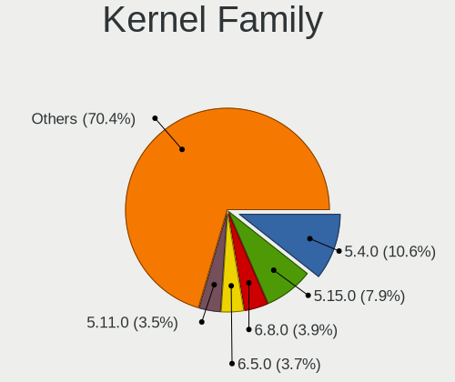

| Version | Computers | Percent |
|---------|-----------|---------|
| 5.4.0   | 407       | 10.63%  |
| 5.15.0  | 302       | 7.89%   |
| 6.8.0   | 148       | 3.86%   |
| 6.5.0   | 141       | 3.68%   |
| 5.11.0  | 134       | 3.5%    |
| 5.13.0  | 127       | 3.32%   |
| 5.8.0   | 121       | 3.16%   |
| 4.15.0  | 115       | 3%      |
| 5.3.0   | 111       | 2.9%    |
| 6.1.0   | 103       | 2.69%   |
| 5.19.0  | 102       | 2.66%   |
| 6.2.0   | 98        | 2.56%   |
| 5.10.14 | 94        | 2.45%   |
| 5.10.0  | 87        | 2.27%   |
| 5.16.7  | 83        | 2.17%   |
| 4.18.0  | 74        | 1.93%   |
| 5.0.0   | 72        | 1.88%   |
| 6.2.6   | 45        | 1.17%   |
| 6.4.11  | 40        | 1.04%   |
| 4.19.0  | 35        | 0.91%   |
| 6.1.1   | 32        | 0.84%   |
| 6.6.2   | 27        | 0.7%    |
| 6.10.0  | 26        | 0.68%   |
| 6.9.7   | 17        | 0.44%   |
| 6.8.7   | 15        | 0.39%   |
| 6.12.1  | 15        | 0.39%   |
| 6.9.3   | 13        | 0.34%   |
| 6.8.9   | 13        | 0.34%   |
| 6.8.11  | 13        | 0.34%   |
| 5.14.0  | 13        | 0.34%   |
| 6.7.9   | 12        | 0.31%   |
| 6.5.6   | 12        | 0.31%   |
| 6.2.15  | 12        | 0.31%   |
| 6.0.12  | 12        | 0.31%   |
| 6.5.5   | 11        | 0.29%   |
| 6.4.6   | 11        | 0.29%   |
| 6.10.6  | 11        | 0.29%   |
| 6.10.10 | 11        | 0.29%   |
| 5.16.13 | 11        | 0.29%   |
| 6.7.4   | 10        | 0.26%   |

Kernel Major Ver.
-----------------

Linux kernel major version

| Version | Computers | Percent |
|---------|-----------|---------|
| 5.4     | 437       | 11.59%  |
| 5.15    | 376       | 9.97%   |
| 5.10    | 224       | 5.94%   |
| 6.8     | 216       | 5.73%   |
| 6.5     | 196       | 5.2%    |
| 6.2     | 192       | 5.09%   |
| 6.1     | 183       | 4.85%   |
| 5.11    | 152       | 4.03%   |
| 5.13    | 145       | 3.85%   |
| 5.19    | 138       | 3.66%   |
| 5.8     | 136       | 3.61%   |
| 5.3     | 128       | 3.39%   |
| 5.16    | 126       | 3.34%   |
| 4.15    | 115       | 3.05%   |
| 6.4     | 105       | 2.78%   |
| 6.6     | 102       | 2.7%    |
| 6.10    | 78        | 2.07%   |
| 4.18    | 76        | 2.02%   |
| 5.0     | 73        | 1.94%   |
| 6.9     | 60        | 1.59%   |
| 6.0     | 54        | 1.43%   |
| 6.11    | 46        | 1.22%   |
| 6.3     | 43        | 1.14%   |
| 6.7     | 42        | 1.11%   |
| 4.19    | 41        | 1.09%   |
| 5.18    | 37        | 0.98%   |
| 5.14    | 37        | 0.98%   |
| 5.17    | 35        | 0.93%   |
| 6.12    | 29        | 0.77%   |
| 5.9     | 25        | 0.66%   |
| 4.9     | 25        | 0.66%   |
| 5.7     | 22        | 0.58%   |
| 5.12    | 21        | 0.56%   |
| 5.6     | 19        | 0.5%    |
| 5.5     | 9         | 0.24%   |
| 4.4     | 6         | 0.16%   |
| 5.2     | 4         | 0.11%   |
| 4.12    | 4         | 0.11%   |
| 4.13    | 3         | 0.08%   |
| 4.1     | 3         | 0.08%   |

Arch
----

OS architecture (x86_64, i586, etc.)

| Name    | Computers | Percent |
|---------|-----------|---------|
| x86_64  | 3281      | 97.42%  |
| i686    | 79        | 2.35%   |
| aarch64 | 7         | 0.21%   |
| armv7l  | 1         | 0.03%   |

DE
--

Desktop Environment

| Name              | Computers | Percent |
|-------------------|-----------|---------|
| GNOME             | 1603      | 45.19%  |
| KDE5              | 669       | 18.86%  |
| Unknown           | 278       | 7.84%   |
| XFCE              | 250       | 7.05%   |
| X-Cinnamon        | 210       | 5.92%   |
| MATE              | 99        | 2.79%   |
| KDE               | 80        | 2.26%   |
| KDE6              | 71        | 2%      |
| Pantheon          | 58        | 1.64%   |
| LXQt              | 39        | 1.1%    |
| Cinnamon          | 39        | 1.1%    |
| KDE4              | 22        | 0.62%   |
| Budgie            | 19        | 0.54%   |
| LXDE              | 18        | 0.51%   |
| Unity             | 12        | 0.34%   |
| i3                | 11        | 0.31%   |
| Hyprland          | 10        | 0.28%   |
| Deepin            | 10        | 0.28%   |
| GNOME Classic     | 7         | 0.2%    |
| Enlightenment     | 7         | 0.2%    |
| openbox           | 6         | 0.17%   |
| qtile             | 5         | 0.14%   |
| trinity           | 4         | 0.11%   |
| lightdm-xsession  | 4         | 0.11%   |
| GNOME Flashback   | 3         | 0.08%   |
| COSMIC            | 2         | 0.06%   |
| awesome           | 2         | 0.06%   |
| Yaru:ubuntu:GNOME | 1         | 0.03%   |
| xmonad            | 1         | 0.03%   |
| wayland           | 1         | 0.03%   |
| niri              | 1         | 0.03%   |
| i3-with-shmlog    | 1         | 0.03%   |
| GNOME-Classic     | 1         | 0.03%   |
| DWM               | 1         | 0.03%   |
| Cutefish          | 1         | 0.03%   |
| chadwm            | 1         | 0.03%   |

Display Server
--------------

X11 or Wayland

| Name    | Computers | Percent |
|---------|-----------|---------|
| X11     | 2344      | 66.95%  |
| Wayland | 976       | 27.88%  |
| Unknown | 150       | 4.28%   |
| Tty     | 31        | 0.89%   |

Display Manager
---------------

SDDM, LightDM, etc.

| Name    | Computers | Percent |
|---------|-----------|---------|
| Unknown | 1645      | 46.87%  |
| SDDM    | 632       | 18.01%  |
| GDM3    | 469       | 13.36%  |
| LightDM | 354       | 10.09%  |
| GDM     | 317       | 9.03%   |
| TDM     | 53        | 1.51%   |
| KDM     | 23        | 0.66%   |
| XDM     | 5         | 0.14%   |
| SLiM    | 5         | 0.14%   |
| LXDM    | 3         | 0.09%   |
| NODM    | 1         | 0.03%   |
| MDM     | 1         | 0.03%   |
| LY-DM   | 1         | 0.03%   |
| Ly      | 1         | 0.03%   |

OS Lang
-------

Language

| Lang        | Computers | Percent |
|-------------|-----------|---------|
| es_MX       | 1697      | 49.02%  |
| en_US       | 1123      | 32.44%  |
| es_ES       | 260       | 7.51%   |
| Unknown     | 226       | 6.53%   |
| C           | 75        | 2.17%   |
| en_GB       | 24        | 0.69%   |
| es_US       | 9         | 0.26%   |
| en_CA       | 8         | 0.23%   |
| fr_FR       | 4         | 0.12%   |
| POSIX       | 3         | 0.09%   |
| es_AR       | 3         | 0.09%   |
| it_IT       | 2         | 0.06%   |
| es_VE       | 2         | 0.06%   |
| es_MX.UTF8  | 2         | 0.06%   |
| es_CO       | 2         | 0.06%   |
| en_US.UTF8  | 2         | 0.06%   |
| en_MX       | 2         | 0.06%   |
| en_DK       | 2         | 0.06%   |
| de_DE       | 2         | 0.06%   |
| C.UTF8      | 2         | 0.06%   |
| uk_UA       | 1         | 0.03%   |
| ru_RU       | 1         | 0.03%   |
| pt_BR       | 1         | 0.03%   |
| nhn_MX      | 1         | 0.03%   |
| es_PE       | 1         | 0.03%   |
| es_MX UTF-8 | 1         | 0.03%   |
| es_GT       | 1         | 0.03%   |
| es_CR       | 1         | 0.03%   |
| es_419      | 1         | 0.03%   |
| en_IE       | 1         | 0.03%   |
| Default     | 1         | 0.03%   |
| aa_ET       | 1         | 0.03%   |

Boot Mode
---------

EFI or BIOS

| Mode | Computers | Percent |
|------|-----------|---------|
| BIOS | 1859      | 53.79%  |
| EFI  | 1597      | 46.21%  |

Filesystem
----------

Type of filesystem

| Type                | Computers | Percent |
|---------------------|-----------|---------|
| Ext4                | 2380      | 68.57%  |
| Btrfs               | 454       | 13.08%  |
| Overlay             | 314       | 9.05%   |
| Tmpfs               | 177       | 5.1%    |
| Unknown             | 68        | 1.96%   |
| Xfs                 | 44        | 1.27%   |
| Zfs                 | 14        | 0.4%    |
| Ext2                | 8         | 0.23%   |
| Reiserfs            | 4         | 0.12%   |
| XXXXXXX             | 2         | 0.06%   |
| F2fs                | 2         | 0.06%   |
| Ext3                | 2         | 0.06%   |
| Fuse.fuse-overlayfs | 1         | 0.03%   |
| Aufs                | 1         | 0.03%   |

Part. scheme
------------

Scheme of partitioning

| Type    | Computers | Percent |
|---------|-----------|---------|
| Unknown | 1746      | 50.46%  |
| GPT     | 1346      | 38.9%   |
| MBR     | 368       | 10.64%  |

Dual Boot with Linux/BSD
------------------------

Hosting more than one Linux/BSD

| Dual boot | Computers | Percent |
|-----------|-----------|---------|
| No        | 3004      | 87.63%  |
| Yes       | 424       | 12.37%  |

Dual Boot (Win)
---------------

Hosting Linux and Windows

| Dual boot | Computers | Percent |
|-----------|-----------|---------|
| No        | 2396      | 69.57%  |
| Yes       | 1048      | 30.43%  |

Board
-----

Vendor
------

Motherboard manufacturer

| Name                    | Computers | Percent |
|-------------------------|-----------|---------|
| Hewlett-Packard         | 640       | 19.01%  |
| Lenovo                  | 482       | 14.32%  |
| Dell                    | 479       | 14.23%  |
| ASUSTek Computer        | 393       | 11.67%  |
| Gigabyte Technology     | 215       | 6.39%   |
| Acer                    | 169       | 5.02%   |
| Apple                   | 115       | 3.42%   |
| HUAWEI                  | 101       | 3%      |
| Toshiba                 | 97        | 2.88%   |
| MSI                     | 75        | 2.23%   |
| Sony                    | 49        | 1.46%   |
| Intel                   | 49        | 1.46%   |
| ASRock                  | 47        | 1.4%    |
| ECS                     | 37        | 1.1%    |
| Biostar                 | 35        | 1.04%   |
| Unknown                 | 31        | 0.92%   |
| Gateway                 | 28        | 0.83%   |
| Google                  | 25        | 0.74%   |
| Samsung Electronics     | 23        | 0.68%   |
| Alienware               | 21        | 0.62%   |
| Valve                   | 20        | 0.59%   |
| Pegatron                | 20        | 0.59%   |
| Lanix                   | 17        | 0.5%    |
| Chuwi                   | 14        | 0.42%   |
| Microsoft               | 13        | 0.39%   |
| PCChips                 | 9         | 0.27%   |
| Foxconn                 | 9         | 0.27%   |
| AMI                     | 9         | 0.27%   |
| GPU Company             | 8         | 0.24%   |
| Timi                    | 7         | 0.21%   |
| eMachines               | 7         | 0.21%   |
| Raspberry Pi Foundation | 6         | 0.18%   |
| AZW                     | 6         | 0.18%   |
| Notebook                | 5         | 0.15%   |
| GHIA                    | 5         | 0.15%   |
| A-DATA Technology       | 5         | 0.15%   |
| System76                | 4         | 0.12%   |
| Supermicro              | 4         | 0.12%   |
| SK hynix                | 4         | 0.12%   |
| HONOR                   | 4         | 0.12%   |

Model
-----

Motherboard model

| Name                          | Computers | Percent |
|-------------------------------|-----------|---------|
| Unknown                       | 49        | 1.46%   |
| HP Notebook                   | 33        | 0.98%   |
| ASUS PRIME A320M-K            | 26        | 0.77%   |
| HUAWEI HVY-WXX9               | 22        | 0.65%   |
| Valve Jupiter                 | 20        | 0.59%   |
| HP Pavilion Notebook          | 17        | 0.5%    |
| HP Pavilion Laptop 15-cw0xxx  | 17        | 0.5%    |
| HP Pavilion Laptop 15-cw1xxx  | 16        | 0.48%   |
| HP Pavilion g4                | 16        | 0.48%   |
| ASUS All Series               | 15        | 0.45%   |
| Apple MacBookPro9,2           | 15        | 0.45%   |
| HP Pavilion dv4               | 12        | 0.36%   |
| Dell Latitude E6430           | 12        | 0.36%   |
| Apple MacBookPro8,1           | 12        | 0.36%   |
| HP Laptop 15-da0xxx           | 11        | 0.33%   |
| HUAWEI BOM-WXX9               | 10        | 0.3%    |
| Gigabyte B450M DS3H           | 10        | 0.3%    |
| ASUS PRIME B450M-A II         | 10        | 0.3%    |
| Lenovo IdeaPad 330-14AST 81D5 | 9         | 0.27%   |
| HP EliteBook 8460p            | 9         | 0.27%   |
| ASUS PRIME B550M-A AC         | 9         | 0.27%   |
| Apple MacBookPro12,1          | 9         | 0.27%   |
| HUAWEI NBLK-WAX9X             | 8         | 0.24%   |
| HUAWEI NBLB-WAX9N             | 8         | 0.24%   |
| HP Laptop 15-bw0xx            | 8         | 0.24%   |
| HP Compaq 6200 Pro SFF PC     | 8         | 0.24%   |
| Dell OptiPlex 9020            | 8         | 0.24%   |
| Dell OptiPlex 7010            | 8         | 0.24%   |
| Dell Inspiron 5559            | 8         | 0.24%   |
| Lenovo IdeaPad 330-15AST 81D6 | 7         | 0.21%   |
| HP Laptop 15-db0xxx           | 7         | 0.21%   |
| HP G42                        | 7         | 0.21%   |
| Gigabyte A320M-S2H            | 7         | 0.21%   |
| ECS A320AM4-M3D               | 7         | 0.21%   |
| Dell OptiPlex 745             | 7         | 0.21%   |
| Lenovo IdeaPad 330-14IGM 81D0 | 6         | 0.18%   |
| Lenovo IdeaPad 3 14ALC6 82KT  | 6         | 0.18%   |
| Lenovo G50-30 80G0            | 6         | 0.18%   |
| Lenovo G40-45 80E1            | 6         | 0.18%   |
| HUAWEI NBM-WXX9               | 6         | 0.18%   |

Model Family
------------

Motherboard model prefix

| Name               | Computers | Percent |
|--------------------|-----------|---------|
| Lenovo ThinkPad    | 161       | 4.78%   |
| HP Pavilion        | 154       | 4.57%   |
| Dell Inspiron      | 146       | 4.34%   |
| Lenovo IdeaPad     | 145       | 4.31%   |
| Dell Latitude      | 130       | 3.86%   |
| Acer Aspire        | 124       | 3.68%   |
| ASUS PRIME         | 88        | 2.61%   |
| HP Laptop          | 87        | 2.58%   |
| Toshiba Satellite  | 86        | 2.55%   |
| Dell OptiPlex      | 82        | 2.44%   |
| HP Compaq          | 57        | 1.69%   |
| Unknown            | 49        | 1.46%   |
| ASUS ROG           | 48        | 1.43%   |
| ASUS VivoBook      | 43        | 1.28%   |
| Lenovo ThinkCentre | 39        | 1.16%   |
| HP EliteBook       | 36        | 1.07%   |
| HP ProBook         | 33        | 0.98%   |
| HP Notebook        | 33        | 0.98%   |
| Dell Precision     | 26        | 0.77%   |
| HP ENVY            | 24        | 0.71%   |
| HUAWEI HVY-WXX9    | 22        | 0.65%   |
| Dell Vostro        | 21        | 0.62%   |
| ASUS TUF           | 21        | 0.62%   |
| Valve Jupiter      | 20        | 0.59%   |
| HP ProDesk         | 20        | 0.59%   |
| HP 240             | 19        | 0.56%   |
| Dell XPS           | 19        | 0.56%   |
| Apple MacBookPro9  | 18        | 0.53%   |
| Lenovo Yoga        | 17        | 0.5%    |
| Lenovo Legion      | 15        | 0.45%   |
| ASUS All           | 15        | 0.45%   |
| HP OMEN            | 14        | 0.42%   |
| HP EliteDesk       | 14        | 0.42%   |
| ASUS ASUS          | 14        | 0.42%   |
| Apple MacBookPro8  | 14        | 0.42%   |
| Microsoft Surface  | 13        | 0.39%   |
| HP ZBook           | 13        | 0.39%   |
| Gigabyte B450M     | 13        | 0.39%   |
| Gigabyte B550M     | 12        | 0.36%   |
| Dell Studio        | 12        | 0.36%   |

MFG Year
--------

Motherboard manufacture year

| Year    | Computers | Percent |
|---------|-----------|---------|
| 2018    | 295       | 8.76%   |
| 2020    | 271       | 8.05%   |
| 2012    | 268       | 7.96%   |
| 2011    | 261       | 7.75%   |
| 2019    | 256       | 7.6%    |
| 2017    | 247       | 7.34%   |
| 2021    | 231       | 6.86%   |
| 2013    | 212       | 6.3%    |
| 2014    | 207       | 6.15%   |
| 2015    | 196       | 5.82%   |
| 2010    | 161       | 4.78%   |
| 2016    | 155       | 4.6%    |
| 2022    | 126       | 3.74%   |
| 2008    | 125       | 3.71%   |
| 2009    | 114       | 3.39%   |
| 2023    | 84        | 2.49%   |
| 2007    | 75        | 2.23%   |
| 2006    | 30        | 0.89%   |
| 2024    | 27        | 0.8%    |
| 2005    | 13        | 0.39%   |
| Unknown | 10        | 0.3%    |
| 2004    | 2         | 0.06%   |
| 2003    | 1         | 0.03%   |

Form Factor
-----------

Physical design of the computer

| Name           | Computers | Percent |
|----------------|-----------|---------|
| Notebook       | 2101      | 62.4%   |
| Desktop        | 1033      | 30.68%  |
| All in one     | 69        | 2.05%   |
| Convertible    | 62        | 1.84%   |
| Mini pc        | 39        | 1.16%   |
| Tablet         | 36        | 1.07%   |
| Server         | 20        | 0.59%   |
| System on chip | 7         | 0.21%   |

Secure Boot
-----------

Enabled or disabled

| State    | Computers | Percent |
|----------|-----------|---------|
| Disabled | 3124      | 91.94%  |
| Enabled  | 274       | 8.06%   |

Coreboot
--------

Have coreboot on board

| Used | Computers | Percent |
|------|-----------|---------|
| No   | 3340      | 99.2%   |
| Yes  | 27        | 0.8%    |

RAM Size
--------

Total RAM memory

| Size in GB      | Computers | Percent |
|-----------------|-----------|---------|
| 4.01-8.0        | 936       | 27.31%  |
| 8.01-16.0       | 692       | 20.19%  |
| 3.01-4.0        | 672       | 19.61%  |
| 16.01-24.0      | 499       | 14.56%  |
| 32.01-64.0      | 224       | 6.54%   |
| 1.01-2.0        | 160       | 4.67%   |
| 24.01-32.0      | 82        | 2.39%   |
| 64.01-256.0     | 68        | 1.98%   |
| 2.01-3.0        | 64        | 1.87%   |
| 0.51-1.0        | 25        | 0.73%   |
| More than 256.0 | 3         | 0.09%   |
| 0.01-0.5        | 1         | 0.03%   |
| Unknown         | 1         | 0.03%   |

RAM Used
--------

Used RAM memory

| Used GB     | Computers | Percent |
|-------------|-----------|---------|
| 1.01-2.0    | 1238      | 33.1%   |
| 2.01-3.0    | 1011      | 27.03%  |
| 4.01-8.0    | 561       | 15%     |
| 3.01-4.0    | 533       | 14.25%  |
| 0.51-1.0    | 210       | 5.61%   |
| 8.01-16.0   | 137       | 3.66%   |
| 0.01-0.5    | 25        | 0.67%   |
| 16.01-24.0  | 14        | 0.37%   |
| 24.01-32.0  | 5         | 0.13%   |
| 32.01-64.0  | 3         | 0.08%   |
| Unknown     | 2         | 0.05%   |
| 64.01-256.0 | 1         | 0.03%   |

Total Drives
------------

Number of drives on board

| Drives  | Computers | Percent |
|---------|-----------|---------|
| 1       | 2276      | 65.59%  |
| 2       | 833       | 24.01%  |
| 3       | 193       | 5.56%   |
| 4       | 78        | 2.25%   |
| 0       | 37        | 1.07%   |
| 5       | 25        | 0.72%   |
| 6       | 16        | 0.46%   |
| 7       | 7         | 0.2%    |
| 37      | 1         | 0.03%   |
| 18      | 1         | 0.03%   |
| 10      | 1         | 0.03%   |
| 8       | 1         | 0.03%   |
| Unknown | 1         | 0.03%   |

Has CD-ROM
----------

Has CD-ROM on board

| Presented | Computers | Percent |
|-----------|-----------|---------|
| No        | 2259      | 66.6%   |
| Yes       | 1133      | 33.4%   |

Has Ethernet
------------

Has Ethernet on board

| Presented | Computers | Percent |
|-----------|-----------|---------|
| Yes       | 2825      | 83.73%  |
| No        | 549       | 16.27%  |

Has WiFi
--------

Has WiFi module

| Presented | Computers | Percent |
|-----------|-----------|---------|
| Yes       | 2786      | 82.28%  |
| No        | 600       | 17.72%  |

Has Bluetooth
-------------

Has Bluetooth module

| Presented | Computers | Percent |
|-----------|-----------|---------|
| Yes       | 2113      | 62%     |
| No        | 1295      | 38%     |

Location
--------

Country
-------

Geographic location (country)

| Country | Computers | Percent |
|---------|-----------|---------|
| Mexico  | 3367      | 100%    |

City
----

Geographic location (city)

| City                  | Computers | Percent |
|-----------------------|-----------|---------|
| Mexico City           | 683       | 19.07%  |
| Guadalajara           | 162       | 4.52%   |
| Monterrey             | 118       | 3.3%    |
| Zapopan               | 109       | 3.04%   |
| Tijuana               | 109       | 3.04%   |
| Puebla City           | 107       | 2.99%   |
| Mrida               | 72        | 2.01%   |
| Queretaro             | 58        | 1.62%   |
| Toluca                | 52        | 1.45%   |
| Tlalnepantla          | 48        | 1.34%   |
| Morelia               | 46        | 1.28%   |
| Hermosillo            | 42        | 1.17%   |
| Ciudad Jurez        | 42        | 1.17%   |
| Ecatepec              | 41        | 1.14%   |
| Chihuahua City        | 41        | 1.14%   |
| Naucalpan             | 40        | 1.12%   |
| Mexicali              | 40        | 1.12%   |
| Len                 | 40        | 1.12%   |
| Cuernavaca            | 40        | 1.12%   |
| Cancn               | 38        | 1.06%   |
| Xalapa                | 36        | 1.01%   |
| Veracruz              | 35        | 0.98%   |
| Quertaro City       | 34        | 0.95%   |
| Gustavo Adolfo Madero | 34        | 0.95%   |
| Culiacn             | 34        | 0.95%   |
| Ciudad Nezahualcoyotl | 34        | 0.95%   |
| Ciudad Lopez Mateos   | 33        | 0.92%   |
| Oaxaca City           | 32        | 0.89%   |
| San Luis Potos City | 31        | 0.87%   |
| Apodaca               | 31        | 0.87%   |
| Pachuca               | 29        | 0.81%   |
| Guadalupe             | 29        | 0.81%   |
| Aguascalientes        | 29        | 0.81%   |
| Saltillo              | 28        | 0.78%   |
| Iztapalapa            | 27        | 0.75%   |
| Mexico                | 23        | 0.64%   |
| Villahermosa          | 22        | 0.61%   |
| Zacatecas City        | 21        | 0.59%   |
| Ensenada              | 21        | 0.59%   |
| Cuautitln Izcalli   | 21        | 0.59%   |

Drives
------

Drive Vendor
------------

Hard drive vendors

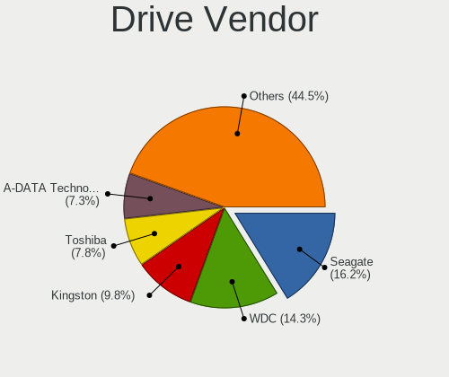

| Vendor                      | Computers | Drives | Percent |
|-----------------------------|-----------|--------|---------|
| Seagate                     | 749       | 1103   | 16.21%  |
| WDC                         | 662       | 894    | 14.33%  |
| Kingston                    | 454       | 599    | 9.83%   |
| Toshiba                     | 362       | 453    | 7.84%   |
| A-DATA Technology           | 337       | 421    | 7.29%   |
| Samsung Electronics         | 295       | 399    | 6.39%   |
| Unknown                     | 209       | 276    | 4.52%   |
| Hitachi                     | 201       | 253    | 4.35%   |
| Sandisk                     | 174       | 216    | 3.77%   |
| HGST                        | 100       | 114    | 2.16%   |
| SK hynix                    | 83        | 108    | 1.8%    |
| Intel                       | 80        | 129    | 1.73%   |
| Crucial                     | 59        | 83     | 1.28%   |
| Kingston Technology Company | 58        | 67     | 1.26%   |
| Micron Technology           | 57        | 73     | 1.23%   |
| Apple                       | 54        | 76     | 1.17%   |
| XPG                         | 38        | 50     | 0.82%   |
| China                       | 37        | 42     | 0.8%    |
| KIOXIA                      | 32        | 38     | 0.69%   |
| Silicon Motion              | 31        | 34     | 0.67%   |
| ADATA Technology            | 31        | 40     | 0.67%   |
| PNY                         | 29        | 39     | 0.63%   |
| Fujitsu                     | 27        | 32     | 0.58%   |
| Unknown                     | 27        | 30     | 0.58%   |
| Realtek Semiconductor       | 26        | 33     | 0.56%   |
| LITEON                      | 22        | 29     | 0.48%   |
| Phison Electronics          | 21        | 25     | 0.45%   |
| Hewlett-Packard             | 19        | 22     | 0.41%   |
| Phison                      | 18        | 20     | 0.39%   |
| Micron/Crucial Technology   | 15        | 21     | 0.32%   |
| Patriot                     | 14        | 21     | 0.3%    |
| Acer                        | 14        | 16     | 0.3%    |
| MAXIO Technology (Hangzhou) | 12        | 14     | 0.26%   |
| JMicron Technology          | 12        | 13     | 0.26%   |
| Netac                       | 11        | 13     | 0.24%   |
| Maxtor                      | 11        | 13     | 0.24%   |
| Gigabyte Technology         | 11        | 12     | 0.24%   |
| YMTC                        | 8         | 10     | 0.17%   |
| UMIS                        | 7         | 10     | 0.15%   |
| Team                        | 7         | 7      | 0.15%   |

Drive Model
-----------

Hard drive models

| Model                                               | Computers | Percent |
|-----------------------------------------------------|-----------|---------|
| Kingston SA400S37240G 240GB SSD                     | 122       | 2.46%   |
| Kingston SA400S37480G 480GB SSD                     | 104       | 2.09%   |
| Seagate ST1000LM035-1RK172 1TB                      | 80        | 1.61%   |
| A-DATA SU650 120GB SSD                              | 59        | 1.19%   |
| A-DATA SU630 240GB SSD                              | 59        | 1.19%   |
| Toshiba MQ01ABD100 1TB                              | 56        | 1.13%   |
| Toshiba MQ04ABF100 1TB                              | 48        | 0.97%   |
| Seagate ST500DM002-1BD142 500GB                     | 45        | 0.91%   |
| Seagate ST1000LM024 HN-M101MBB 1TB                  | 44        | 0.89%   |
| Unknown MMC Card  32GB                              | 39        | 0.79%   |
| Toshiba MQ01ABF050 500GB                            | 37        | 0.74%   |
| Seagate ST500LT012-1DG142 500GB                     | 37        | 0.74%   |
| Kingston SA400S37960G 960GB SSD                     | 36        | 0.72%   |
| Seagate ST1000DM010-2EP102 1TB                      | 33        | 0.66%   |
| Kingston SA400S37120G 120GB SSD                     | 33        | 0.66%   |
| A-DATA SU630 480GB SSD                              | 33        | 0.66%   |
| Kingston Company SNV2S1000G 1TB                     | 30        | 0.6%    |
| Unknown MMC Card  64GB                              | 29        | 0.58%   |
| Unknown                                             | 27        | 0.54%   |
| A-DATA SU650 240GB SSD                              | 26        | 0.52%   |
| Samsung NVMe SSD Controller SM981/PM981/PM983 512GB | 25        | 0.5%    |
| WDC WDS240G2G0A-00JH30 240GB SSD                    | 20        | 0.4%    |
| Unknown SD/MMC/MS PRO 128GB                         | 20        | 0.4%    |
| Seagate ST9500325AS 500GB                           | 20        | 0.4%    |
| Unknown MMC Card  16GB                              | 18        | 0.36%   |
| Seagate ST3500418AS 500GB                           | 18        | 0.36%   |
| Sandisk WD Blue SN550 NVMe SSD 256GB                | 18        | 0.36%   |
| Toshiba DT01ACA050 500GB                            | 17        | 0.34%   |
| HGST HTS541010A9E680 1TB                            | 17        | 0.34%   |
| Unknown MMC Card  128GB                             | 16        | 0.32%   |
| Seagate ST500LM021-1KJ152 500GB                     | 16        | 0.32%   |
| Kingston Company SNV2S2000G 2TB                     | 16        | 0.32%   |
| Kingston SV300S37A120G 120GB SSD                    | 16        | 0.32%   |
| A-DATA SU800 512GB SSD                              | 16        | 0.32%   |
| XPG GAMMIX S11 Pro 512GB                            | 15        | 0.3%    |
| WDC WD5000LPCX-24VHAT0 500GB                        | 15        | 0.3%    |
| Toshiba DT01ACA100 1TB                              | 15        | 0.3%    |
| HGST HTS725050A7E630 500GB                          | 15        | 0.3%    |
| HGST HTS721010A9E630 1TB                            | 15        | 0.3%    |
| HGST HTS545050A7E680 500GB                          | 15        | 0.3%    |

HDD Vendor
----------

Hard disk drive vendors

| Vendor              | Computers | Drives | Percent |
|---------------------|-----------|--------|---------|
| Seagate             | 745       | 1096   | 36.25%  |
| WDC                 | 552       | 734    | 26.86%  |
| Toshiba             | 317       | 397    | 15.43%  |
| Hitachi             | 201       | 253    | 9.78%   |
| HGST                | 100       | 114    | 4.87%   |
| Samsung Electronics | 37        | 42     | 1.8%    |
| Fujitsu             | 27        | 32     | 1.31%   |
| Unknown             | 20        | 22     | 0.97%   |
| Apple               | 19        | 25     | 0.92%   |
| Maxtor              | 11        | 13     | 0.54%   |
| JMicron Technology  | 5         | 6      | 0.24%   |
| Hewlett-Packard     | 5         | 6      | 0.24%   |
| SABRENT             | 2         | 3      | 0.1%    |
| LaCie               | 2         | 3      | 0.1%    |
| IBM/Hitachi         | 2         | 3      | 0.1%    |
| ASMT                | 2         | 8      | 0.1%    |
| SAGE                | 1         | 1      | 0.05%   |
| QUANTUM             | 1         | 2      | 0.05%   |
| MaxDigital          | 1         | 4      | 0.05%   |
| HPE                 | 1         | 1      | 0.05%   |
| HGST HTS            | 1         | 1      | 0.05%   |
| External            | 1         | 2      | 0.05%   |
| DELLBOSS            | 1         | 1      | 0.05%   |
| ASMedia             | 1         | 1      | 0.05%   |

SSD Vendor
----------

Solid state drive vendors

| Vendor              | Computers | Drives | Percent |
|---------------------|-----------|--------|---------|
| Kingston            | 401       | 518    | 29.66%  |
| A-DATA Technology   | 314       | 394    | 23.22%  |
| WDC                 | 93        | 119    | 6.88%   |
| Samsung Electronics | 82        | 104    | 6.07%   |
| SanDisk             | 51        | 60     | 3.77%   |
| Crucial             | 50        | 66     | 3.7%    |
| China               | 37        | 42     | 2.74%   |
| PNY                 | 28        | 38     | 2.07%   |
| Apple               | 28        | 33     | 2.07%   |
| SK hynix            | 19        | 28     | 1.41%   |
| Micron Technology   | 19        | 22     | 1.41%   |
| LITEON              | 19        | 25     | 1.41%   |
| Intel               | 19        | 26     | 1.41%   |
| Patriot             | 13        | 20     | 0.96%   |
| Hewlett-Packard     | 13        | 15     | 0.96%   |
| Acer                | 12        | 13     | 0.89%   |
| Netac               | 11        | 13     | 0.81%   |
| Gigabyte Technology | 10        | 11     | 0.74%   |
| Toshiba             | 9         | 10     | 0.67%   |
| Unknown             | 7         | 7      | 0.52%   |
| Wibtek              | 6         | 6      | 0.44%   |
| Team                | 6         | 6      | 0.44%   |
| Blackpcs            | 6         | 6      | 0.44%   |
| AS201               | 6         | 6      | 0.44%   |
| SPCC                | 5         | 5      | 0.37%   |
| LITEONIT            | 5         | 5      | 0.37%   |
| Transcend           | 4         | 4      | 0.3%    |
| Lexar               | 4         | 4      | 0.3%    |
| BHT                 | 4         | 4      | 0.3%    |
| Yeyian              | 3         | 6      | 0.22%   |
| USB3.0              | 3         | 3      | 0.22%   |
| Unknown             | 3         | 3      | 0.22%   |
| Timetec             | 3         | 3      | 0.22%   |
| tecmiyo             | 3         | 5      | 0.22%   |
| Quaroni             | 3         | 3      | 0.22%   |
| Pioneer             | 3         | 5      | 0.22%   |
| OCZ                 | 3         | 5      | 0.22%   |
| KingSpec            | 3         | 10     | 0.22%   |
| Dogfish             | 2         | 5      | 0.15%   |
| Apacer              | 2         | 2      | 0.15%   |

Drive Kind
----------

HDD or SSD

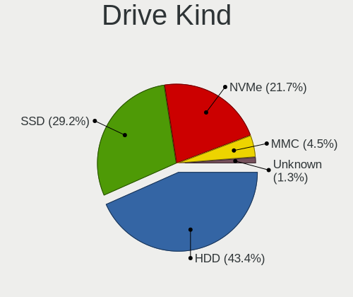

| Kind    | Computers | Drives | Percent |
|---------|-----------|--------|---------|
| HDD     | 1820      | 2770   | 43.36%  |
| SSD     | 1225      | 1703   | 29.19%  |
| NVMe    | 911       | 1304   | 21.71%  |
| MMC     | 188       | 252    | 4.48%   |
| Unknown | 53        | 76     | 1.26%   |

Drive Connector
---------------

SATA, SAS, NVMe, etc.

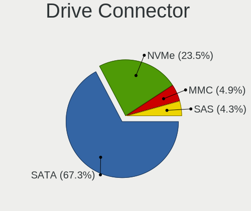

| Type | Computers | Drives | Percent |
|------|-----------|--------|---------|
| SATA | 2600      | 4335   | 67.29%  |
| NVMe | 908       | 1296   | 23.5%   |
| MMC  | 188       | 252    | 4.87%   |
| SAS  | 168       | 222    | 4.35%   |

Drive Size
----------

Size of hard drive

| Size in TB | Computers | Drives | Percent |
|------------|-----------|--------|---------|
| 0.01-0.5   | 1896      | 2755   | 60.71%  |
| 0.51-1.0   | 929       | 1242   | 29.75%  |
| 1.01-2.0   | 192       | 268    | 6.15%   |
| 3.01-4.0   | 47        | 86     | 1.5%    |
| 2.01-3.0   | 30        | 40     | 0.96%   |
| 4.01-10.0  | 24        | 58     | 0.77%   |
| 10.01-20.0 | 5         | 24     | 0.16%   |

Space Total
-----------

Amount of disk space available on the file system

| Size in GB     | Computers | Percent |
|----------------|-----------|---------|
| 101-250        | 894       | 24.94%  |
| 251-500        | 844       | 23.55%  |
| 501-1000       | 580       | 16.18%  |
| 1001-2000      | 296       | 8.26%   |
| 1-20           | 287       | 8.01%   |
| 51-100         | 275       | 7.67%   |
| 21-50          | 151       | 4.21%   |
| More than 3000 | 118       | 3.29%   |
| 2001-3000      | 80        | 2.23%   |
| Unknown        | 59        | 1.65%   |

Space Used
----------

Amount of used disk space

| Used GB        | Computers | Percent |
|----------------|-----------|---------|
| 1-20           | 1477      | 39.8%   |
| 21-50          | 731       | 19.7%   |
| 101-250        | 443       | 11.94%  |
| 51-100         | 410       | 11.05%  |
| 251-500        | 259       | 6.98%   |
| 501-1000       | 179       | 4.82%   |
| 1001-2000      | 92        | 2.48%   |
| Unknown        | 59        | 1.59%   |
| More than 3000 | 34        | 0.92%   |
| 2001-3000      | 22        | 0.59%   |
| 0              | 5         | 0.13%   |

Malfunc. Drives
---------------

Drive models with a malfunction

| Model                              | Computers | Drives | Percent |
|------------------------------------|-----------|--------|---------|
| Toshiba MQ01ABD100 1TB             | 8         | 9      | 2.07%   |
| Seagate ST500LT012-1DG142 500GB    | 8         | 9      | 2.07%   |
| Seagate ST1000LM024 HN-M101MBB 1TB | 7         | 8      | 1.81%   |
| Seagate ST1000LM035-1RK172 1TB     | 6         | 6      | 1.55%   |
| Toshiba MQ04ABF100 1TB             | 5         | 5      | 1.29%   |
| Seagate ST500LM021-1KJ152 500GB    | 5         | 5      | 1.29%   |
| Seagate ST3500418AS 500GB          | 5         | 6      | 1.29%   |
| HGST HTS541010A9E680 1TB           | 5         | 5      | 1.29%   |
| Toshiba MQ01ABF050 500GB           | 4         | 4      | 1.03%   |
| Seagate ST9500420AS 500GB          | 4         | 4      | 1.03%   |
| Seagate ST9500325AS 500GB          | 4         | 4      | 1.03%   |
| Seagate ST3160815AS 160GB          | 4         | 4      | 1.03%   |
| Seagate ST1000DM010-2EP102 1TB     | 4         | 4      | 1.03%   |
| LITEON CV8-8E128-HP 128GB SSD      | 4         | 5      | 1.03%   |
| Hitachi HTS545050B9A300 500GB      | 4         | 4      | 1.03%   |
| HGST HTS541075A9E680 752GB         | 4         | 4      | 1.03%   |
| A-DATA Technology SU650 240GB SSD  | 4         | 4      | 1.03%   |
| WDC WD5000LPCX-60VHAT0 500GB       | 3         | 3      | 0.78%   |
| Seagate ST500LT012-9WS142 500GB    | 3         | 4      | 0.78%   |
| Seagate ST31000524AS 1TB           | 3         | 5      | 0.78%   |
| Seagate ST2000DL003-9VT166 2TB     | 3         | 3      | 0.78%   |
| Seagate ST1000DM003-9YN162 1TB     | 3         | 3      | 0.78%   |
| Hitachi HUA722020ALA331 2TB        | 3         | 3      | 0.78%   |
| Hitachi HDS721010CLA332 1TB        | 3         | 3      | 0.78%   |
| HGST HTS545050A7E380 500GB         | 3         | 5      | 0.78%   |
| HGST HTS541010A7E630 1TB           | 3         | 3      | 0.78%   |
| China SSD 256GB                    | 3         | 3      | 0.78%   |
| WDC WD5000LPVX-22V0TT0 500GB       | 2         | 2      | 0.52%   |
| WDC WD5000AAKX-603CA0 500GB        | 2         | 3      | 0.52%   |
| WDC WD5000AAKX-08U6AA0 500GB       | 2         | 2      | 0.52%   |
| WDC WD40PURZ-85TTDY0 4TB           | 2         | 6      | 0.52%   |
| WDC WD3200AAJS-00YZCA0 320GB       | 2         | 3      | 0.52%   |
| WDC WD2500BEVS-60UST0 250GB        | 2         | 2      | 0.52%   |
| WDC WD1600BEVT-22ZCT0 160GB        | 2         | 2      | 0.52%   |
| WDC WD10JPVX-60JC3T1 1TB           | 2         | 2      | 0.52%   |
| WDC WD10JPVX-60JC3T0 1TB           | 2         | 2      | 0.52%   |
| WDC WD Green 2.5 240GB SSD         | 2         | 2      | 0.52%   |
| WDC WD Green 2.5 1000GB SSD        | 2         | 2      | 0.52%   |
| Toshiba DT01ACA100 1TB             | 2         | 2      | 0.52%   |
| Seagate ST9320325AS 320GB          | 2         | 4      | 0.52%   |

Malfunc. Drive Vendor
---------------------

Vendors of faulty drives

| Vendor                    | Computers | Drives | Percent |
|---------------------------|-----------|--------|---------|
| Seagate                   | 113       | 159    | 30.46%  |
| WDC                       | 75        | 93     | 20.22%  |
| Hitachi                   | 48        | 51     | 12.94%  |
| Toshiba                   | 41        | 53     | 11.05%  |
| HGST                      | 19        | 21     | 5.12%   |
| Kingston                  | 16        | 16     | 4.31%   |
| A-DATA Technology         | 11        | 11     | 2.96%   |
| Samsung Electronics       | 8         | 8      | 2.16%   |
| LITEON                    | 6         | 8      | 1.62%   |
| Fujitsu                   | 6         | 6      | 1.62%   |
| SanDisk                   | 5         | 5      | 1.35%   |
| China                     | 5         | 5      | 1.35%   |
| Maxtor                    | 3         | 3      | 0.81%   |
| Realtek Semiconductor     | 2         | 2      | 0.54%   |
| Crucial                   | 2         | 2      | 0.54%   |
| Apple                     | 2         | 2      | 0.54%   |
| SSSTC                     | 1         | 1      | 0.27%   |
| sk600                     | 1         | 1      | 0.27%   |
| Micron/Crucial Technology | 1         | 2      | 0.27%   |
| Micron Technology         | 1         | 1      | 0.27%   |
| Intel                     | 1         | 1      | 0.27%   |
| IBM/Hitachi               | 1         | 2      | 0.27%   |
| HGST HTS                  | 1         | 1      | 0.27%   |
| Biwin Storage Technology  | 1         | 1      | 0.27%   |
| Acer                      | 1         | 1      | 0.27%   |

Malfunc. HDD Vendor
-------------------

Vendors of faulty HDD drives

| Vendor              | Computers | Drives | Percent |
|---------------------|-----------|--------|---------|
| Seagate             | 113       | 159    | 36.33%  |
| WDC                 | 70        | 87     | 22.51%  |
| Hitachi             | 48        | 51     | 15.43%  |
| Toshiba             | 41        | 53     | 13.18%  |
| HGST                | 19        | 21     | 6.11%   |
| Samsung Electronics | 7         | 7      | 2.25%   |
| Fujitsu             | 6         | 6      | 1.93%   |
| Maxtor              | 3         | 3      | 0.96%   |
| Apple               | 2         | 2      | 0.64%   |
| IBM/Hitachi         | 1         | 2      | 0.32%   |
| HGST HTS            | 1         | 1      | 0.32%   |

Malfunc. Drive Kind
-------------------

Kinds of faulty drives

| Kind | Computers | Drives | Percent |
|------|-----------|--------|---------|
| HDD  | 292       | 392    | 82.72%  |
| SSD  | 49        | 50     | 13.88%  |
| NVMe | 12        | 14     | 3.4%    |

Failed Drives
-------------

Failed drive models

| Model                             | Computers | Drives | Percent |
|-----------------------------------|-----------|--------|---------|
| Seagate ST3500410AS 500GB         | 2         | 3      | 25%     |
| Seagate ST31500341AS 1TB          | 2         | 3      | 25%     |
| WDC WD1600BEVT-75A23T0 160GB      | 1         | 1      | 12.5%   |
| Toshiba MK1234GSX 120GB           | 1         | 1      | 12.5%   |
| Samsung Electronics HD161GJ 160GB | 1         | 1      | 12.5%   |
| Hitachi HTS545016B9A300 160GB     | 1         | 1      | 12.5%   |

Failed Drive Vendor
-------------------

Failed drive vendors

| Vendor              | Computers | Drives | Percent |
|---------------------|-----------|--------|---------|
| Seagate             | 2         | 6      | 33.33%  |
| WDC                 | 1         | 1      | 16.67%  |
| Toshiba             | 1         | 1      | 16.67%  |
| Samsung Electronics | 1         | 1      | 16.67%  |
| Hitachi             | 1         | 1      | 16.67%  |

Drive Status
------------

Number of failed and malfunc. drives

| Status   | Computers | Drives | Percent |
|----------|-----------|--------|---------|
| Detected | 2109      | 3668   | 57.99%  |
| Works    | 1178      | 1971   | 32.39%  |
| Malfunc  | 344       | 456    | 9.46%   |
| Failed   | 6         | 10     | 0.16%   |

Storage controller
------------------

Storage Vendor
--------------

Storage controller vendors

| Vendor                                  | Computers | Percent |
|-----------------------------------------|-----------|---------|
| Intel                                   | 2054      | 51.8%   |
| AMD                                     | 821       | 20.71%  |
| Samsung Electronics                     | 193       | 4.87%   |
| SanDisk                                 | 150       | 3.78%   |
| Kingston Technology Company             | 115       | 2.9%    |
| ADATA Technology                        | 73        | 1.84%   |
| Nvidia                                  | 71        | 1.79%   |
| SK hynix                                | 63        | 1.59%   |
| Realtek Semiconductor                   | 42        | 1.06%   |
| Phison Electronics                      | 42        | 1.06%   |
| Micron Technology                       | 38        | 0.96%   |
| Toshiba America Info Systems            | 36        | 0.91%   |
| KIOXIA                                  | 33        | 0.83%   |
| Silicon Motion                          | 31        | 0.78%   |
| Marvell Technology Group                | 27        | 0.68%   |
| Micron/Crucial Technology               | 25        | 0.63%   |
| Union Memory (Shenzhen)                 | 17        | 0.43%   |
| MAXIO Technology (Hangzhou)             | 17        | 0.43%   |
| ASMedia Technology                      | 17        | 0.43%   |
| Yangtze Memory Technologies             | 11        | 0.28%   |
| LSI Logic / Symbios Logic               | 10        | 0.25%   |
| JMicron Technology                      | 10        | 0.25%   |
| Apple                                   | 8         | 0.2%    |
| INNOGRIT                                | 7         | 0.18%   |
| Biwin Storage Technology                | 7         | 0.18%   |
| VIA Technologies                        | 6         | 0.15%   |
| Shenzhen Longsys Electronics            | 5         | 0.13%   |
| O2 Micro                                | 5         | 0.13%   |
| Solid State Storage Technology          | 4         | 0.1%    |
| Lite-On Technology                      | 4         | 0.1%    |
| Broadcom / LSI                          | 4         | 0.1%    |
| Silicon Image                           | 3         | 0.08%   |
| Hewlett-Packard                         | 3         | 0.08%   |
| Solidigm                                | 2         | 0.05%   |
| Seagate Technology                      | 2         | 0.05%   |
| Lenovo                                  | 2         | 0.05%   |
| Adaptec                                 | 2         | 0.05%   |
| Silicon Integrated Systems [SiS]        | 1         | 0.03%   |
| Shenzhen Unionmemory Information System | 1         | 0.03%   |
| ShenZhen TIGO Semiconductor             | 1         | 0.03%   |

Storage Model
-------------

Storage controller models

| Model                                                                                   | Computers | Percent |
|-----------------------------------------------------------------------------------------|-----------|---------|
| AMD FCH SATA Controller [AHCI mode]                                                     | 563       | 12.27%  |
| Intel 82801 Mobile SATA Controller [RAID mode]                                          | 155       | 3.38%   |
| Intel 7 Series Chipset Family 6-port SATA Controller [AHCI mode]                        | 153       | 3.33%   |
| Intel Sunrise Point-LP SATA Controller [AHCI mode]                                      | 138       | 3.01%   |
| Intel 6 Series/C200 Series Chipset Family 6 port Mobile SATA AHCI Controller            | 109       | 2.38%   |
| Intel 8 Series/C220 Series Chipset Family 6-port SATA Controller 1 [AHCI mode]          | 96        | 2.09%   |
| AMD SB7x0/SB8x0/SB9x0 SATA Controller [AHCI mode]                                       | 80        | 1.74%   |
| AMD 400 Series Chipset SATA Controller                                                  | 74        | 1.61%   |
| Samsung NVMe SSD Controller SM981/PM981/PM983                                           | 73        | 1.59%   |
| Intel SATA Controller [RAID mode]                                                       | 72        | 1.57%   |
| Intel 6 Series/C200 Series Chipset Family 6 port Desktop SATA AHCI Controller           | 68        | 1.48%   |
| Intel 8 Series SATA Controller 1 [AHCI mode]                                            | 67        | 1.46%   |
| Intel Atom/Celeron/Pentium Processor x5-E8000/J3xxx/N3xxx Series SATA Controller        | 65        | 1.42%   |
| Intel Celeron/Pentium Silver Processor SATA Controller                                  | 64        | 1.39%   |
| Intel Volume Management Device NVMe RAID Controller                                     | 63        | 1.37%   |
| AMD SB7x0/SB8x0/SB9x0 IDE Controller                                                    | 60        | 1.31%   |
| Intel NM10/ICH7 Family SATA Controller [IDE mode]                                       | 58        | 1.26%   |
| Intel Wildcat Point-LP SATA Controller [AHCI Mode]                                      | 57        | 1.24%   |
| Intel 82801IBM/IEM (ICH9M/ICH9M-E) 4 port SATA Controller [AHCI mode]                   | 57        | 1.24%   |
| AMD 500 Series Chipset SATA Controller                                                  | 56        | 1.22%   |
| Intel Atom Processor E3800 Series SATA AHCI Controller                                  | 55        | 1.2%    |
| Samsung NVMe SSD Controller 980 (DRAM-less)                                             | 54        | 1.18%   |
| Intel Q170/Q150/B150/H170/H110/Z170/CM236 Chipset SATA Controller [AHCI Mode]           | 51        | 1.11%   |
| AMD A320 Chipset SATA Controller [AHCI mode]                                            | 50        | 1.09%   |
| Intel 82801G (ICH7 Family) IDE Controller                                               | 47        | 1.02%   |
| AMD SB7x0/SB8x0/SB9x0 SATA Controller [IDE mode]                                        | 47        | 1.02%   |
| Intel 5 Series/3400 Series Chipset 4 port SATA AHCI Controller                          | 46        | 1%      |
| Intel 82801HM/HEM (ICH8M/ICH8M-E) IDE Controller                                        | 45        | 0.98%   |
| Kingston Company NV2 NVMe SSD [SM2267XT] (DRAM-less)                                    | 43        | 0.94%   |
| Intel 82801HM/HEM (ICH8M/ICH8M-E) SATA Controller [AHCI mode]                           | 40        | 0.87%   |
| ADATA XPG SX8200 Pro PCIe Gen3x4 M.2 2280 Solid State Drive                             | 40        | 0.87%   |
| Intel HM170/QM170 Chipset SATA Controller [AHCI Mode]                                   | 39        | 0.85%   |
| Intel Comet Lake SATA AHCI Controller                                                   | 36        | 0.78%   |
| Intel Cannon Lake Mobile PCH SATA AHCI Controller                                       | 35        | 0.76%   |
| Intel 200 Series PCH SATA controller [AHCI mode]                                        | 35        | 0.76%   |
| Intel Celeron N3350/Pentium N4200/Atom E3900 Series SATA AHCI Controller                | 32        | 0.7%    |
| Nvidia MCP61 SATA Controller                                                            | 31        | 0.68%   |
| Intel 7 Series/C210 Series Chipset Family 6-port SATA Controller [AHCI mode]            | 31        | 0.68%   |
| Intel 6 Series/C200 Series Chipset Family Desktop SATA Controller (IDE mode, ports 4-5) | 30        | 0.65%   |
| Intel 6 Series/C200 Series Chipset Family Desktop SATA Controller (IDE mode, ports 0-3) | 30        | 0.65%   |

Storage Kind
------------

Kind of storage controller (IDE, SATA, NVMe, SAS, ...)

| Kind | Computers | Percent |
|------|-----------|---------|
| SATA | 2415      | 58.86%  |
| NVMe | 909       | 22.15%  |
| IDE  | 440       | 10.72%  |
| RAID | 322       | 7.85%   |
| SAS  | 13        | 0.32%   |
| SCSI | 4         | 0.1%    |

Processor
---------

CPU Vendor
----------

Processor vendors

| Vendor       | Computers | Percent |
|--------------|-----------|---------|
| Intel        | 2316      | 68.76%  |
| AMD          | 1042      | 30.94%  |
| ARM          | 7         | 0.21%   |
| Unknown      | 2         | 0.06%   |
| CentaurHauls | 1         | 0.03%   |

CPU Model
---------

Processor models

| Model                                         | Computers | Percent |
|-----------------------------------------------|-----------|---------|
| AMD Ryzen 5 3500U with Radeon Vega Mobile Gfx | 33        | 0.98%   |
| Intel Core i5-3210M CPU @ 2.50GHz             | 32        | 0.95%   |
| Intel Celeron N4000 CPU @ 1.10GHz             | 29        | 0.86%   |
| Intel Core i5-7200U CPU @ 2.50GHz             | 28        | 0.83%   |
| Intel 11th Gen Core i5-1135G7 @ 2.40GHz       | 28        | 0.83%   |
| AMD Ryzen 5 4600H with Radeon Graphics        | 28        | 0.83%   |
| Intel Celeron N4020 CPU @ 1.10GHz             | 27        | 0.8%    |
| AMD Ryzen 5 5600G with Radeon Graphics        | 26        | 0.77%   |
| AMD Ryzen 5 5500U with Radeon Graphics        | 26        | 0.77%   |
| Intel Core i7-8750H CPU @ 2.20GHz             | 25        | 0.74%   |
| Intel Celeron CPU N3350 @ 1.10GHz             | 25        | 0.74%   |
| Intel Celeron CPU N3050 @ 1.60GHz             | 25        | 0.74%   |
| Intel Celeron CPU N2840 @ 2.16GHz             | 25        | 0.74%   |
| Intel 11th Gen Core i7-1165G7 @ 2.80GHz       | 25        | 0.74%   |
| AMD Ryzen 7 3700U with Radeon Vega Mobile Gfx | 24        | 0.71%   |
| Intel Celeron CPU N3060 @ 1.60GHz             | 23        | 0.68%   |
| Intel Core i7-6700HQ CPU @ 2.60GHz            | 22        | 0.65%   |
| AMD Ryzen 7 5700U with Radeon Graphics        | 21        | 0.62%   |
| Intel Core i5-8265U CPU @ 1.60GHz             | 20        | 0.59%   |
| Intel Core i5-8250U CPU @ 1.60GHz             | 20        | 0.59%   |
| AMD Custom APU 0405                           | 20        | 0.59%   |
| Intel Core i7-9750H CPU @ 2.60GHz             | 19        | 0.56%   |
| Intel Core i5-5200U CPU @ 2.20GHz             | 19        | 0.56%   |
| Intel Core i7-7500U CPU @ 2.70GHz             | 18        | 0.53%   |
| Intel Core i5-10210U CPU @ 1.60GHz            | 18        | 0.53%   |
| Intel Core i7-8565U CPU @ 1.80GHz             | 17        | 0.5%    |
| Intel Core i7-8550U CPU @ 1.80GHz             | 17        | 0.5%    |
| Intel Core i7-7700HQ CPU @ 2.80GHz            | 17        | 0.5%    |
| Intel Core i5-3320M CPU @ 2.60GHz             | 17        | 0.5%    |
| Intel Core i7-6500U CPU @ 2.50GHz             | 16        | 0.47%   |
| Intel Core i7-3770 CPU @ 3.40GHz              | 16        | 0.47%   |
| Intel Core i5-6200U CPU @ 2.30GHz             | 16        | 0.47%   |
| Intel Core i5-2400 CPU @ 3.10GHz              | 16        | 0.47%   |
| Intel Core i7-4790 CPU @ 3.60GHz              | 15        | 0.44%   |
| Intel Core i3-10110U CPU @ 2.10GHz            | 15        | 0.44%   |
| AMD Ryzen 7 5700G with Radeon Graphics        | 15        | 0.44%   |
| AMD Ryzen 3 2200G with Radeon Vega Graphics   | 15        | 0.44%   |
| Intel Core i5-3470 CPU @ 3.20GHz              | 14        | 0.41%   |
| Intel Core 2 Duo CPU E8400 @ 3.00GHz          | 14        | 0.41%   |
| Intel Celeron CPU N2830 @ 2.16GHz             | 14        | 0.41%   |

CPU Model Family
----------------

Processor model prefix

| Model                   | Computers | Percent |
|-------------------------|-----------|---------|
| Intel Core i5           | 597       | 17.7%   |
| Intel Core i7           | 495       | 14.68%  |
| Intel Celeron           | 284       | 8.42%   |
| Intel Core i3           | 262       | 7.77%   |
| Other                   | 240       | 7.12%   |
| AMD Ryzen 5             | 231       | 6.85%   |
| AMD Ryzen 7             | 145       | 4.3%    |
| Intel Core 2 Duo        | 130       | 3.86%   |
| Intel Xeon              | 72        | 2.14%   |
| Intel Pentium           | 66        | 1.96%   |
| AMD Ryzen 3             | 65        | 1.93%   |
| Intel Atom              | 64        | 1.9%    |
| AMD A6                  | 62        | 1.84%   |
| AMD A8                  | 53        | 1.57%   |
| AMD A4                  | 48        | 1.42%   |
| AMD Ryzen 9             | 45        | 1.33%   |
| AMD FX                  | 42        | 1.25%   |
| AMD A10                 | 38        | 1.13%   |
| AMD E                   | 35        | 1.04%   |
| AMD Athlon              | 34        | 1.01%   |
| Intel Pentium Dual-Core | 32        | 0.95%   |
| Intel Pentium Dual      | 32        | 0.95%   |
| AMD E1                  | 24        | 0.71%   |
| Intel Core 2 Quad       | 19        | 0.56%   |
| AMD Athlon II X2        | 18        | 0.53%   |
| Intel Core 2            | 16        | 0.47%   |
| AMD Athlon 64 X2        | 14        | 0.42%   |
| Intel Pentium 4         | 13        | 0.39%   |
| AMD Sempron             | 11        | 0.33%   |
| AMD Ryzen 5 PRO         | 11        | 0.33%   |
| AMD Phenom II X4        | 11        | 0.33%   |
| Intel Genuine           | 10        | 0.3%    |
| AMD Turion 64 X2 Mobile | 10        | 0.3%    |
| AMD Athlon II           | 10        | 0.3%    |
| Intel Core i9           | 9         | 0.27%   |
| Intel Pentium Silver    | 8         | 0.24%   |
| AMD Phenom II X6        | 7         | 0.21%   |
| AMD E2                  | 7         | 0.21%   |
| AMD Ryzen 3 PRO         | 6         | 0.18%   |
| Intel Core m3           | 5         | 0.15%   |

CPU Cores
---------

Number of processor cores

| Number  | Computers | Percent |
|---------|-----------|---------|
| 2       | 1568      | 46.49%  |
| 4       | 1049      | 31.1%   |
| 6       | 312       | 9.25%   |
| 8       | 175       | 5.19%   |
| 1       | 136       | 4.03%   |
| 10      | 32        | 0.95%   |
| 12      | 31        | 0.92%   |
| 16      | 20        | 0.59%   |
| 14      | 16        | 0.47%   |
| 3       | 14        | 0.42%   |
| 24      | 8         | 0.24%   |
| Unknown | 4         | 0.12%   |
| 28      | 3         | 0.09%   |
| 56      | 2         | 0.06%   |
| 32      | 1         | 0.03%   |
| 20      | 1         | 0.03%   |
| 18      | 1         | 0.03%   |

CPU Sockets
-----------

Number of sockets

| Number  | Computers | Percent |
|---------|-----------|---------|
| 1       | 3345      | 99.29%  |
| 2       | 21        | 0.62%   |
| Unknown | 3         | 0.09%   |

CPU Threads
-----------

Threads per core (Hyper-Threading)

| Number  | Computers | Percent |
|---------|-----------|---------|
| 2       | 2106      | 62.4%   |
| 1       | 1264      | 37.45%  |
| Unknown | 4         | 0.12%   |
| 4       | 1         | 0.03%   |

CPU Op-Modes
------------

CPU Operation Modes (32-bit, 64-bit)

| Op mode        | Computers | Percent |
|----------------|-----------|---------|
| 32-bit, 64-bit | 3304      | 97.95%  |
| Unknown        | 35        | 1.04%   |
| 32-bit         | 22        | 0.65%   |
| 64-bit         | 12        | 0.36%   |

CPU Microcode
-------------

Microcode number

| Number     | Computers | Percent |
|------------|-----------|---------|
| Unknown    | 1406      | 39.84%  |
| 0x206a7    | 157       | 4.45%   |
| 0x306a9    | 122       | 3.46%   |
| 0x1067a    | 81        | 2.3%    |
| 0x306c3    | 72        | 2.04%   |
| 0x08108109 | 60        | 1.7%    |
| 0x40651    | 58        | 1.64%   |
| 0x30678    | 55        | 1.56%   |
| 0x806ec    | 53        | 1.5%    |
| 0x806e9    | 51        | 1.45%   |
| 0x906ea    | 44        | 1.25%   |
| 0x806ea    | 43        | 1.22%   |
| 0x6fd      | 43        | 1.22%   |
| 0x306d4    | 43        | 1.22%   |
| 0x406e3    | 41        | 1.16%   |
| 0x806c1    | 38        | 1.08%   |
| 0x506e3    | 38        | 1.08%   |
| 0x06006705 | 38        | 1.08%   |
| 0x406c4    | 35        | 0.99%   |
| 0x20655    | 34        | 0.96%   |
| 0x010000c8 | 34        | 0.96%   |
| 0x906e9    | 33        | 0.94%   |
| 0x06001119 | 32        | 0.91%   |
| 0x10676    | 30        | 0.85%   |
| 0x08600106 | 29        | 0.82%   |
| 0x0810100b | 29        | 0.82%   |
| 0x406c3    | 26        | 0.74%   |
| 0x0600611a | 26        | 0.74%   |
| 0x08608103 | 25        | 0.71%   |
| 0x07030105 | 24        | 0.68%   |
| 0x106ca    | 23        | 0.65%   |
| 0x0a50000d | 23        | 0.65%   |
| 0x08108102 | 23        | 0.65%   |
| 0x08101016 | 22        | 0.62%   |
| 0x0800820d | 22        | 0.62%   |
| 0x706a1    | 20        | 0.57%   |
| 0x05000119 | 20        | 0.57%   |
| 0x20652    | 19        | 0.54%   |
| 0x6fb      | 18        | 0.51%   |
| 0x506c9    | 18        | 0.51%   |

CPU Microarch
-------------

Microarchitecture

| Name              | Computers | Percent |
|-------------------|-----------|---------|
| KabyLake          | 414       | 12.27%  |
| SandyBridge       | 248       | 7.35%   |
| Haswell           | 226       | 6.7%    |
| IvyBridge         | 212       | 6.29%   |
| Unknown           | 184       | 5.46%   |
| Silvermont        | 159       | 4.71%   |
| Penryn            | 150       | 4.45%   |
| Zen+              | 149       | 4.42%   |
| Skylake           | 146       | 4.33%   |
| Excavator         | 115       | 3.41%   |
| Zen 3             | 110       | 3.26%   |
| Core              | 105       | 3.11%   |
| Zen 2             | 92        | 2.73%   |
| Broadwell         | 84        | 2.49%   |
| Zen               | 83        | 2.46%   |
| Westmere          | 83        | 2.46%   |
| TigerLake         | 81        | 2.4%    |
| Goldmont plus     | 74        | 2.19%   |
| K10               | 73        | 2.16%   |
| Piledriver        | 71        | 2.1%    |
| CometLake         | 63        | 1.87%   |
| Bobcat            | 51        | 1.51%   |
| Puma              | 47        | 1.39%   |
| K8 Hammer         | 46        | 1.36%   |
| Alderlake Hybrid  | 45        | 1.33%   |
| IceLake           | 39        | 1.16%   |
| Bonnell           | 39        | 1.16%   |
| Goldmont          | 34        | 1.01%   |
| Jaguar            | 23        | 0.68%   |
| Steamroller       | 21        | 0.62%   |
| Nehalem           | 19        | 0.56%   |
| NetBurst          | 18        | 0.53%   |
| K10 Llano         | 18        | 0.53%   |
| Bulldozer         | 12        | 0.36%   |
| Tremont           | 11        | 0.33%   |
| P6                | 11        | 0.33%   |
| K8 & K10 hybrid   | 9         | 0.27%   |
| Gracemont         | 5         | 0.15%   |
| Meteorlake Hybrid | 2         | 0.06%   |
| Sapphire Rapids   | 1         | 0.03%   |

Graphics
--------

GPU Vendor
----------

Vendors of graphics cards

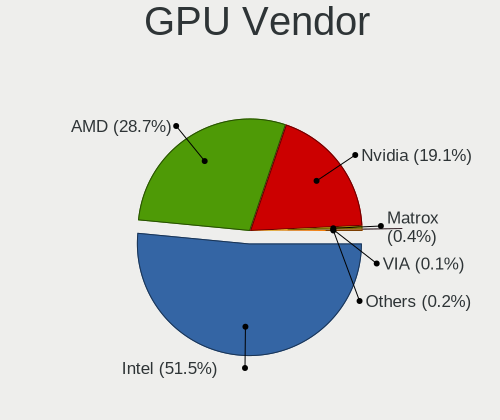

| Vendor                           | Computers | Percent |
|----------------------------------|-----------|---------|
| Intel                            | 1968      | 51.52%  |
| AMD                              | 1095      | 28.66%  |
| Nvidia                           | 729       | 19.08%  |
| Matrox Electronics Systems       | 16        | 0.42%   |
| VIA Technologies                 | 4         | 0.1%    |
| ASPEED Technology                | 4         | 0.1%    |
| ATI Technologies                 | 3         | 0.08%   |
| Silicon Integrated Systems [SiS] | 1         | 0.03%   |

GPU Model
---------

Graphics card models

| Model                                                                                    | Computers | Percent |
|------------------------------------------------------------------------------------------|-----------|---------|
| Intel 2nd Generation Core Processor Family Integrated Graphics Controller                | 203       | 5.13%   |
| Intel 3rd Gen Core processor Graphics Controller                                         | 126       | 3.19%   |
| AMD Picasso/Raven 2 [Radeon Vega Series / Radeon Vega Mobile Series]                     | 120       | 3.03%   |
| Intel Haswell-ULT Integrated Graphics Controller                                         | 84        | 2.12%   |
| Intel Atom/Celeron/Pentium Processor x5-E8000/J3xxx/N3xxx Integrated Graphics Controller | 82        | 2.07%   |
| Intel Atom Processor Z36xxx/Z37xxx Series Graphics & Display                             | 77        | 1.95%   |
| Intel HD Graphics 620                                                                    | 73        | 1.85%   |
| Intel TigerLake-LP GT2 [Iris Xe Graphics]                                                | 72        | 1.82%   |
| Intel GeminiLake [UHD Graphics 600]                                                      | 68        | 1.72%   |
| Intel Core Processor Integrated Graphics Controller                                      | 67        | 1.69%   |
| Intel HD Graphics 5500                                                                   | 62        | 1.57%   |
| AMD Raven Ridge [Radeon Vega Series / Radeon Vega Mobile Series]                         | 62        | 1.57%   |
| Intel UHD Graphics 620                                                                   | 60        | 1.52%   |
| AMD Stoney [Radeon R2/R3/R4/R5 Graphics]                                                 | 60        | 1.52%   |
| Intel Xeon E3-1200 v3/4th Gen Core Processor Integrated Graphics Controller              | 58        | 1.47%   |
| Intel Skylake GT2 [HD Graphics 520]                                                      | 58        | 1.47%   |
| Intel CoffeeLake-H GT2 [UHD Graphics 630]                                                | 57        | 1.44%   |
| Intel Mobile 4 Series Chipset Integrated Graphics Controller                             | 55        | 1.39%   |
| AMD Renoir [Radeon Vega Series / Radeon Vega Mobile Series]                              | 55        | 1.39%   |
| AMD Cezanne [Radeon Vega Series / Radeon Vega Mobile Series]                             | 54        | 1.37%   |
| AMD Lucienne                                                                             | 52        | 1.31%   |
| AMD Wani [Radeon R5/R6/R7 Graphics]                                                      | 51        | 1.29%   |
| Intel WhiskeyLake-U GT2 [UHD Graphics 620]                                               | 50        | 1.26%   |
| Intel HD Graphics 530                                                                    | 49        | 1.24%   |
| Intel HD Graphics 630                                                                    | 47        | 1.19%   |
| Intel CometLake-U GT2 [UHD Graphics]                                                     | 46        | 1.16%   |
| Intel Xeon E3-1200 v2/3rd Gen Core processor Graphics Controller                         | 39        | 0.99%   |
| Intel Mobile GM965/GL960 Integrated Graphics Controller (secondary)                      | 39        | 0.99%   |
| Intel Mobile GM965/GL960 Integrated Graphics Controller (primary)                        | 39        | 0.99%   |
| Intel 4 Series Chipset Integrated Graphics Controller                                    | 36        | 0.91%   |
| Intel 4th Gen Core Processor Integrated Graphics Controller                              | 35        | 0.88%   |
| Intel CometLake-H GT2 [UHD Graphics]                                                     | 34        | 0.86%   |
| AMD Mullins [Radeon R4/R5 Graphics]                                                      | 33        | 0.83%   |
| Intel HD Graphics 500                                                                    | 30        | 0.76%   |
| AMD Ellesmere [Radeon RX 470/480/570/570X/580/580X/590]                                  | 28        | 0.71%   |
| Intel Atom Processor D4xx/D5xx/N4xx/N5xx Integrated Graphics Controller                  | 24        | 0.61%   |
| AMD Sun XT [Radeon HD 8670A/8670M/8690M / R5 M330 / M430 / Radeon 520 Mobile]            | 24        | 0.61%   |
| Nvidia TU117M [GeForce GTX 1650 Mobile / Max-Q]                                          | 23        | 0.58%   |
| AMD Wrestler [Radeon HD 6310]                                                            | 22        | 0.56%   |
| AMD RS880M [Mobility Radeon HD 4225/4250]                                                | 22        | 0.56%   |

GPU Combo
---------

Combinations of graphics cards

| Name            | Computers | Percent |
|-----------------|-----------|---------|
| 1 x Intel       | 1563      | 46.09%  |
| 1 x AMD         | 917       | 27.04%  |
| 1 x Nvidia      | 368       | 10.85%  |
| Intel + Nvidia  | 290       | 8.55%   |
| Intel + AMD     | 63        | 1.86%   |
| 2 x AMD         | 62        | 1.83%   |
| AMD + Nvidia    | 58        | 1.71%   |
| 2 x Intel       | 22        | 0.65%   |
| Other           | 15        | 0.44%   |
| 1 x Matrox      | 14        | 0.41%   |
| 2 x Nvidia      | 7         | 0.21%   |
| 1 x VIA         | 3         | 0.09%   |
| 1 x ASPEED      | 3         | 0.09%   |
| Nvidia + Matrox | 2         | 0.06%   |
| 3 x AMD         | 1         | 0.03%   |
| 1 x SiS         | 1         | 0.03%   |
| Nvidia + VIA    | 1         | 0.03%   |
| Nvidia + ASPEED | 1         | 0.03%   |

GPU Driver
----------

Free vs proprietary

| Driver      | Computers | Percent |
|-------------|-----------|---------|
| Free        | 2952      | 86.72%  |
| Proprietary | 347       | 10.19%  |
| Unknown     | 105       | 3.08%   |

GPU Memory
----------

Total video memory

| Size in GB | Computers | Percent |
|------------|-----------|---------|
| Unknown    | 2157      | 62.4%   |
| 0.01-0.5   | 450       | 13.02%  |
| 1.01-2.0   | 306       | 8.85%   |
| 0.51-1.0   | 243       | 7.03%   |
| 3.01-4.0   | 123       | 3.56%   |
| 7.01-8.0   | 79        | 2.29%   |
| 5.01-6.0   | 56        | 1.62%   |
| 2.01-3.0   | 20        | 0.58%   |
| 8.01-16.0  | 17        | 0.49%   |
| 16.01-24.0 | 6         | 0.17%   |

Monitor
-------

Monitor Vendor
--------------

Monitor vendors

| Vendor                  | Computers | Percent |
|-------------------------|-----------|---------|
| AU Optronics            | 433       | 11.74%  |
| BOE                     | 424       | 11.5%   |
| Samsung Electronics     | 391       | 10.6%   |
| Chimei Innolux          | 365       | 9.9%    |
| LG Display              | 306       | 8.3%    |
| Hewlett-Packard         | 259       | 7.02%   |
| Dell                    | 206       | 5.59%   |
| Goldstar                | 135       | 3.66%   |
| Apple                   | 110       | 2.98%   |
| BenQ                    | 95        | 2.58%   |
| Acer                    | 90        | 2.44%   |
| AOC                     | 72        | 1.95%   |
| Lenovo                  | 65        | 1.76%   |
| Unknown                 | 51        | 1.38%   |
| Chi Mei Optoelectronics | 49        | 1.33%   |
| Sharp                   | 36        | 0.98%   |
| ASUSTek Computer        | 34        | 0.92%   |
| Sony                    | 28        | 0.76%   |
| PANDA                   | 28        | 0.76%   |
| LG Philips              | 27        | 0.73%   |
| Ancor Communications    | 27        | 0.73%   |
| Gateway                 | 26        | 0.71%   |
| ViewSonic               | 23        | 0.62%   |
| InfoVision              | 18        | 0.49%   |
| Valve                   | 17        | 0.46%   |
| Insignia                | 13        | 0.35%   |
| HannStar                | 13        | 0.35%   |
| ___                     | 12        | 0.33%   |
| VOR                     | 11        | 0.3%    |
| Panasonic               | 11        | 0.3%    |
| HKC                     | 10        | 0.27%   |
| FOX                     | 10        | 0.27%   |
| CSO                     | 10        | 0.27%   |
| Sceptre Tech            | 9         | 0.24%   |
| HUAWEI                  | 9         | 0.24%   |
| Hitachi                 | 9         | 0.24%   |
| Unknown                 | 9         | 0.24%   |
| SLD                     | 8         | 0.22%   |
| Roku                    | 8         | 0.22%   |
| MSI                     | 8         | 0.22%   |

Monitor Model
-------------

Monitor models

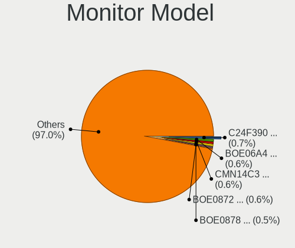

| Model                                                                | Computers | Percent |
|----------------------------------------------------------------------|-----------|---------|
| Samsung Electronics C24F390 SAM0D2C 1920x1080 521x293mm 23.5-inch    | 25        | 0.67%   |
| BOE LCD Monitor BOE06A4 1366x768 344x194mm 15.5-inch                 | 24        | 0.64%   |
| Chimei Innolux LCD Monitor CMN14C3 1366x768 309x173mm 13.9-inch      | 21        | 0.56%   |
| BOE LCD Monitor BOE0872 1920x1080 344x194mm 15.5-inch                | 21        | 0.56%   |
| BOE LCD Monitor BOE0878 1920x1080 355x200mm 16.0-inch                | 20        | 0.53%   |
| BOE LCD Monitor BOE0877 1920x1080 309x173mm 13.9-inch                | 19        | 0.51%   |
| Chimei Innolux LCD Monitor CMN15E6 1366x768 344x193mm 15.5-inch      | 18        | 0.48%   |
| BOE LCD Monitor BOE076F 1366x768 344x194mm 15.5-inch                 | 18        | 0.48%   |
| BOE LCD Monitor BOE0696 1366x768 309x173mm 13.9-inch                 | 18        | 0.48%   |
| Valve ANX7530 U VLV3001 800x1280 100x150mm 7.1-inch                  | 17        | 0.45%   |
| Samsung Electronics LCD Monitor SEC5441 1280x800 286x179mm 13.3-inch | 17        | 0.45%   |
| Chimei Innolux LCD Monitor CMN14D6 1366x768 309x173mm 13.9-inch      | 17        | 0.45%   |
| Chimei Innolux LCD Monitor CMN15F5 1920x1080 344x193mm 15.5-inch     | 16        | 0.43%   |
| AU Optronics LCD Monitor AUO183C 1366x768 309x173mm 13.9-inch        | 16        | 0.43%   |
| AU Optronics LCD Monitor AUO2E3C 1366x768 309x173mm 13.9-inch        | 15        | 0.4%    |
| Unknown LCD Monitor FFFF 2288x1287 2550x2550mm 142.0-inch            | 14        | 0.37%   |
| Chimei Innolux LCD Monitor CMN15DC 1366x768 344x193mm 15.5-inch      | 14        | 0.37%   |
| AU Optronics LCD Monitor AUO235C 1366x768 256x144mm 11.6-inch        | 14        | 0.37%   |
| BenQ GW2480 BNQ78E7 1920x1080 527x296mm 23.8-inch                    | 13        | 0.35%   |
| AU Optronics LCD Monitor AUO70EC 1366x768 344x193mm 15.5-inch        | 13        | 0.35%   |
| AU Optronics LCD Monitor AUO21ED 1920x1080 344x193mm 15.5-inch       | 13        | 0.35%   |
| LG Display LCD Monitor LGD0456 1366x768 344x194mm 15.5-inch          | 12        | 0.32%   |
| LG Display LCD Monitor LGD02E9 1366x768 309x174mm 14.0-inch          | 12        | 0.32%   |
| Chimei Innolux LCD Monitor CMN15E7 1920x1080 344x193mm 15.5-inch     | 12        | 0.32%   |
| AU Optronics LCD Monitor AUO2D3C 1366x768 309x173mm 13.9-inch        | 12        | 0.32%   |
| Hewlett-Packard w1907 HWP26A2 1440x900 408x255mm 18.9-inch           | 11        | 0.29%   |
| Goldstar FULL HD GSM5B55 1920x1080 480x270mm 21.7-inch               | 11        | 0.29%   |
| Chimei Innolux LCD Monitor CMN14C4 1366x768 309x173mm 13.9-inch      | 10        | 0.27%   |
| Apple LCD Monitor APP9CC3 1280x800 286x179mm 13.3-inch               | 10        | 0.27%   |
| Samsung Electronics LCD Monitor SAM0C3C 1366x768 609x347mm 27.6-inch | 9         | 0.24%   |
| HannStar LCD Monitor HSD03E9 1024x600 220x129mm 10.0-inch            | 9         | 0.24%   |
| Goldstar ULTRAWIDE GSM7770 2560x1080 798x334mm 34.1-inch             | 9         | 0.24%   |
| Chimei Innolux LCD Monitor CMN1472 1366x768 309x174mm 14.0-inch      | 9         | 0.24%   |
| BOE LCD Monitor BOE0893 2160x1440 296x197mm 14.0-inch                | 9         | 0.24%   |
| BenQ GW2270 BNQ78DB 1920x1080 476x268mm 21.5-inch                    | 9         | 0.24%   |
| AU Optronics LCD Monitor AUO81EC 1366x768 344x193mm 15.5-inch        | 9         | 0.24%   |
| AU Optronics LCD Monitor AUO10EC 1366x768 344x193mm 15.5-inch        | 9         | 0.24%   |
| Apple Color LCD APP9CC7 1280x800 286x179mm 13.3-inch                 | 9         | 0.24%   |
| Unknown                                                              | 9         | 0.24%   |
| SLD LCD Monitor SLD003C 1366x768 309x173mm 13.9-inch                 | 8         | 0.21%   |

Monitor Resolution
------------------

Monitor screen resolution

| Resolution         | Computers | Percent |
|--------------------|-----------|---------|
| 1920x1080 (FHD)    | 1222      | 34.76%  |
| 1366x768 (WXGA)    | 1140      | 32.42%  |
| 1600x900 (HD+)     | 152       | 4.32%   |
| 1280x800 (WXGA)    | 125       | 3.56%   |
| 3840x2160 (4K)     | 122       | 3.47%   |
| 1440x900 (WXGA+)   | 112       | 3.19%   |
| 1280x1024 (SXGA)   | 94        | 2.67%   |
| 1680x1050 (WSXGA+) | 60        | 1.71%   |
| 2560x1440 (QHD)    | 59        | 1.68%   |
| 1920x1200 (WUXGA)  | 51        | 1.45%   |
| 1360x768           | 36        | 1.02%   |
| 2560x1600          | 34        | 0.97%   |
| 2560x1080          | 34        | 0.97%   |
| 1024x768 (XGA)     | 31        | 0.88%   |
| 1024x600           | 27        | 0.77%   |
| 3440x1440          | 25        | 0.71%   |
| Unknown            | 24        | 0.68%   |
| 2160x1440          | 23        | 0.65%   |
| 800x1280           | 18        | 0.51%   |
| 2880x1800          | 17        | 0.48%   |
| 2288x1287          | 17        | 0.48%   |
| 3840x1080          | 12        | 0.34%   |
| 1600x1200          | 8         | 0.23%   |
| 3000x2000          | 7         | 0.2%    |
| 3840x2400          | 5         | 0.14%   |
| 3200x1800 (QHD+)   | 5         | 0.14%   |
| 1280x960           | 5         | 0.14%   |
| 2880x1920          | 4         | 0.11%   |
| 1920x540           | 4         | 0.11%   |
| 2520x1680          | 3         | 0.09%   |
| 1152x864           | 3         | 0.09%   |
| 3600x1080          | 2         | 0.06%   |
| 3360x1080          | 2         | 0.06%   |
| 2736x1824          | 2         | 0.06%   |
| 2400x1600          | 2         | 0.06%   |
| 2256x1504          | 2         | 0.06%   |
| 2240x1400          | 2         | 0.06%   |
| 1920x1280          | 2         | 0.06%   |
| 1400x1050          | 2         | 0.06%   |
| 1280x768           | 2         | 0.06%   |

Monitor Diagonal
----------------

Diagonal size in inches

| Inches  | Computers | Percent |
|---------|-----------|---------|
| 15      | 928       | 25.34%  |
| 13      | 505       | 13.79%  |
| 14      | 390       | 10.65%  |
| 21      | 175       | 4.78%   |
| 23      | 171       | 4.67%   |
| 27      | 146       | 3.99%   |
| 24      | 146       | 3.99%   |
| 17      | 134       | 3.66%   |
| 18      | 129       | 3.52%   |
| 19      | 126       | 3.44%   |
| Unknown | 102       | 2.79%   |
| 31      | 96        | 2.62%   |
| 20      | 96        | 2.62%   |
| 11      | 80        | 2.18%   |
| 16      | 54        | 1.47%   |
| 34      | 53        | 1.45%   |
| 12      | 52        | 1.42%   |
| 22      | 41        | 1.12%   |
| 72      | 29        | 0.79%   |
| 10      | 29        | 0.79%   |
| 84      | 27        | 0.74%   |
| 7       | 18        | 0.49%   |
| 40      | 15        | 0.41%   |
| 142     | 14        | 0.38%   |
| 32      | 14        | 0.38%   |
| 54      | 12        | 0.33%   |
| 26      | 12        | 0.33%   |
| 29      | 9         | 0.25%   |
| 25      | 6         | 0.16%   |
| 52      | 5         | 0.14%   |
| 48      | 5         | 0.14%   |
| 46      | 5         | 0.14%   |
| 42      | 5         | 0.14%   |
| 39      | 5         | 0.14%   |
| 8       | 4         | 0.11%   |
| 49      | 3         | 0.08%   |
| 37      | 3         | 0.08%   |
| 36      | 3         | 0.08%   |
| 38      | 2         | 0.05%   |
| 86      | 1         | 0.03%   |

Monitor Width
-------------

Physical width

| Width in mm    | Computers | Percent |
|----------------|-----------|---------|
| 301-350        | 1694      | 46.81%  |
| 401-500        | 519       | 14.34%  |
| 501-600        | 456       | 12.6%   |
| 201-300        | 344       | 9.51%   |
| 351-400        | 159       | 4.39%   |
| 601-700        | 112       | 3.09%   |
| Unknown        | 102       | 2.82%   |
| 701-800        | 71        | 1.96%   |
| 1501-2000      | 57        | 1.58%   |
| 1001-1500      | 36        | 0.99%   |
| 801-900        | 25        | 0.69%   |
| 1-100          | 19        | 0.53%   |
| More than 2000 | 14        | 0.39%   |
| 901-1000       | 7         | 0.19%   |
| 101-200        | 4         | 0.11%   |

Aspect Ratio
------------

Proportional relationship between the width and the height

| Ratio   | Computers | Percent |
|---------|-----------|---------|
| 16/9    | 2552      | 76.87%  |
| 16/10   | 390       | 11.75%  |
| 5/4     | 92        | 2.77%   |
| Unknown | 77        | 2.32%   |
| 21/9    | 57        | 1.72%   |
| 4/3     | 54        | 1.63%   |
| 3/2     | 49        | 1.48%   |
| 0.67    | 18        | 0.54%   |
| 1.00    | 14        | 0.42%   |
| 32/9    | 5         | 0.15%   |
| 6/5     | 4         | 0.12%   |
| 0.56    | 3         | 0.09%   |
| 0.62    | 2         | 0.06%   |
| 2.65    | 1         | 0.03%   |
| 2.00    | 1         | 0.03%   |
| 1.96    | 1         | 0.03%   |

Monitor Area
------------

Area in inch

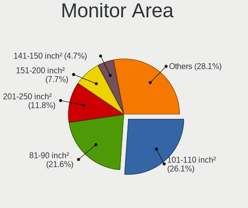

| Area in inch | Computers | Percent |
|----------------|-----------|---------|
| 101-110        | 948       | 26.11%  |
| 81-90          | 783       | 21.56%  |
| 201-250        | 429       | 11.81%  |
| 151-200        | 281       | 7.74%   |
| 141-150        | 171       | 4.71%   |
| 351-500        | 164       | 4.52%   |
| 301-350        | 154       | 4.24%   |
| 71-80          | 110       | 3.03%   |
| Unknown        | 102       | 2.81%   |
| More than 1000 | 96        | 2.64%   |
| 51-60          | 81        | 2.23%   |
| 121-130        | 60        | 1.65%   |
| 251-300        | 52        | 1.43%   |
| 61-70          | 46        | 1.27%   |
| 501-1000       | 45        | 1.24%   |
| 111-120        | 34        | 0.94%   |
| 41-50          | 28        | 0.77%   |
| 1-40           | 23        | 0.63%   |
| 131-140        | 17        | 0.47%   |
| 91-100         | 7         | 0.19%   |

Pixel Density
-------------

Pixels per inch

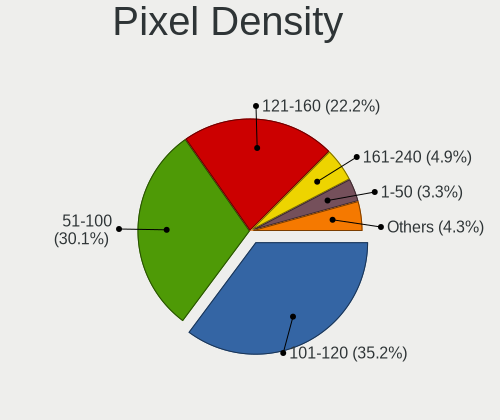

| Density       | Computers | Percent |
|---------------|-----------|---------|
| 101-120       | 1245      | 35.19%  |
| 51-100        | 1064      | 30.07%  |
| 121-160       | 786       | 22.22%  |
| 161-240       | 173       | 4.89%   |
| 1-50          | 118       | 3.34%   |
| Unknown       | 102       | 2.88%   |
| More than 240 | 50        | 1.41%   |

Multiple Monitors
-----------------

Total monitors connected

| Total | Computers | Percent |
|-------|-----------|---------|
| 1     | 2786      | 80.61%  |
| 2     | 515       | 14.9%   |
| 0     | 101       | 2.92%   |
| 3     | 50        | 1.45%   |
| 4     | 4         | 0.12%   |

Network
-------

Net Controller Vendor
---------------------

Controller vendors

| Vendor                                | Computers | Percent |
|---------------------------------------|-----------|---------|
| Realtek Semiconductor                 | 2004      | 39.73%  |
| Intel                                 | 1271      | 25.2%   |
| Qualcomm Atheros                      | 590       | 11.7%   |
| Broadcom                              | 366       | 7.26%   |
| Ralink Technology                     | 95        | 1.88%   |
| Ralink                                | 81        | 1.61%   |
| MediaTek                              | 80        | 1.59%   |
| Broadcom Limited                      | 79        | 1.57%   |
| TP-Link                               | 71        | 1.41%   |
| Nvidia                                | 58        | 1.15%   |
| Marvell Technology Group              | 54        | 1.07%   |
| Qualcomm Atheros Communications       | 40        | 0.79%   |
| ASIX Electronics                      | 31        | 0.61%   |
| Huawei Technologies                   | 20        | 0.4%    |
| Samsung Electronics                   | 19        | 0.38%   |
| Mercucys                              | 19        | 0.38%   |
| Motorola PCS                          | 15        | 0.3%    |
| DisplayLink                           | 15        | 0.3%    |
| Xiaomi                                | 14        | 0.28%   |
| Linksys                               | 9         | 0.18%   |
| Qualcomm                              | 8         | 0.16%   |
| D-Link                                | 7         | 0.14%   |
| ICS Advent                            | 6         | 0.12%   |
| VIA Technologies                      | 5         | 0.1%    |
| Spreadtrum Communications             | 5         | 0.1%    |
| OPPO Electronics                      | 5         | 0.1%    |
| Google                                | 5         | 0.1%    |
| Microsoft                             | 4         | 0.08%   |
| Lenovo                                | 4         | 0.08%   |
| IBM                                   | 4         | 0.08%   |
| Dell                                  | 4         | 0.08%   |
| D-Link System                         | 4         | 0.08%   |
| ZTE WCDMA Technologies MSM            | 3         | 0.06%   |
| NetGear                               | 3         | 0.06%   |
| Microchip Technology                  | 3         | 0.06%   |
| Hewlett-Packard                       | 3         | 0.06%   |
| 802.11g Adapter [Linksys WUSB54GC v3] | 3         | 0.06%   |
| Wacom                                 | 2         | 0.04%   |
| LG Electronics                        | 2         | 0.04%   |
| JMicron Technology                    | 2         | 0.04%   |

Net Controller Model
--------------------

Controller models

| Model                                                                  | Computers | Percent |
|------------------------------------------------------------------------|-----------|---------|
| Realtek RTL8111/8168/8211/8411 PCI Express Gigabit Ethernet Controller | 1164      | 19.17%  |
| Realtek RTL810xE PCI Express Fast Ethernet controller                  | 388       | 6.39%   |
| Realtek RTL8821CE 802.11ac PCIe Wireless Network Adapter               | 167       | 2.75%   |
| Intel 82579LM Gigabit Network Connection (Lewisville)                  | 128       | 2.11%   |
| Realtek RTL8822CE 802.11ac PCIe Wireless Network Adapter               | 101       | 1.66%   |
| Intel Wi-Fi 6 AX200                                                    | 98        | 1.61%   |
| Qualcomm Atheros QCA9565 / AR9565 Wireless Network Adapter             | 97        | 1.6%    |
| Qualcomm Atheros QCA9377 802.11ac Wireless Network Adapter             | 85        | 1.4%    |
| Qualcomm Atheros AR9485 Wireless Network Adapter                       | 79        | 1.3%    |
| Qualcomm Atheros AR9285 Wireless Network Adapter (PCI-Express)         | 71        | 1.17%   |
| Realtek RTL8153 Gigabit Ethernet Adapter                               | 67        | 1.1%    |
| Realtek RTL8723BE PCIe Wireless Network Adapter                        | 66        | 1.09%   |
| Intel Wireless 8265 / 8275                                             | 66        | 1.09%   |
| Intel Wi-Fi 6 AX201                                                    | 65        | 1.07%   |
| Realtek RTL8723DE Wireless Network Adapter                             | 63        | 1.04%   |
| Broadcom BCM43142 802.11b/g/n                                          | 60        | 0.99%   |
| Intel Wireless 7265                                                    | 55        | 0.91%   |
| Qualcomm Atheros QCA6174 802.11ac Wireless Network Adapter             | 53        | 0.87%   |
| Intel Ethernet Connection I217-LM                                      | 50        | 0.82%   |
| Realtek RTL8188EUS 802.11n Wireless Network Adapter                    | 48        | 0.79%   |
| Realtek RTL8125 2.5GbE Controller                                      | 47        | 0.77%   |
| Intel Wireless 8260                                                    | 46        | 0.76%   |
| Intel Wireless 7260                                                    | 46        | 0.76%   |
| Intel Centrino Advanced-N 6205 [Taylor Peak]                           | 46        | 0.76%   |
| Broadcom BCM4313 802.11bgn Wireless Network Adapter                    | 43        | 0.71%   |
| Realtek RTL8188EE Wireless Network Adapter                             | 42        | 0.69%   |
| Ralink RT2870/RT3070 Wireless Adapter                                  | 42        | 0.69%   |
| Intel Cannon Lake PCH CNVi WiFi                                        | 41        | 0.68%   |
| Intel I211 Gigabit Network Connection                                  | 40        | 0.66%   |
| Intel Comet Lake PCH-LP CNVi WiFi                                      | 39        | 0.64%   |
| Broadcom NetXtreme BCM57765 Gigabit Ethernet PCIe                      | 37        | 0.61%   |
| Intel Wireless 3165                                                    | 36        | 0.59%   |
| Intel Alder Lake-P PCH CNVi WiFi                                       | 36        | 0.59%   |
| Ralink MT7601U Wireless Adapter                                        | 35        | 0.58%   |
| Qualcomm Atheros AR9271 802.11n                                        | 34        | 0.56%   |
| MediaTek MT7921 802.11ax PCI Express Wireless Network Adapter          | 34        | 0.56%   |
| Broadcom BCM4331 802.11a/b/g/n                                         | 34        | 0.56%   |
| Intel Comet Lake PCH CNVi WiFi                                         | 33        | 0.54%   |
| Realtek 802.11ac NIC                                                   | 32        | 0.53%   |
| Realtek RTL8188CE 802.11b/g/n WiFi Adapter                             | 28        | 0.46%   |

Wireless Vendor
---------------

Wireless vendors

| Vendor                                | Computers | Percent |
|---------------------------------------|-----------|---------|
| Intel                                 | 948       | 32.04%  |
| Realtek Semiconductor                 | 769       | 25.99%  |
| Qualcomm Atheros                      | 492       | 16.63%  |
| Broadcom                              | 275       | 9.29%   |
| Ralink Technology                     | 95        | 3.21%   |
| Ralink                                | 81        | 2.74%   |
| MediaTek                              | 70        | 2.37%   |
| TP-Link                               | 66        | 2.23%   |
| Broadcom Limited                      | 54        | 1.82%   |
| Qualcomm Atheros Communications       | 40        | 1.35%   |
| Mercucys                              | 19        | 0.64%   |
| Marvell Technology Group              | 8         | 0.27%   |
| Linksys                               | 7         | 0.24%   |
| D-Link                                | 7         | 0.24%   |
| Qualcomm                              | 5         | 0.17%   |
| NetGear                               | 3         | 0.1%    |
| Microsoft                             | 3         | 0.1%    |
| Dell                                  | 3         | 0.1%    |
| D-Link System                         | 3         | 0.1%    |
| 802.11g Adapter [Linksys WUSB54GC v3] | 3         | 0.1%    |
| Wacom                                 | 2         | 0.07%   |
| Tenda                                 | 1         | 0.03%   |
| Sierra Wireless                       | 1         | 0.03%   |
| Qualcomm Technologies                 | 1         | 0.03%   |
| Micro Star International              | 1         | 0.03%   |
| Gemtek                                | 1         | 0.03%   |
| Belkin Components                     | 1         | 0.03%   |

Wireless Model
--------------

Wireless models

| Model                                                          | Computers | Percent |
|----------------------------------------------------------------|-----------|---------|
| Realtek RTL8821CE 802.11ac PCIe Wireless Network Adapter       | 167       | 5.57%   |
| Realtek RTL8822CE 802.11ac PCIe Wireless Network Adapter       | 101       | 3.37%   |
| Intel Wi-Fi 6 AX200                                            | 98        | 3.27%   |
| Qualcomm Atheros QCA9565 / AR9565 Wireless Network Adapter     | 97        | 3.23%   |
| Qualcomm Atheros QCA9377 802.11ac Wireless Network Adapter     | 85        | 2.83%   |
| Qualcomm Atheros AR9485 Wireless Network Adapter               | 79        | 2.63%   |
| Qualcomm Atheros AR9285 Wireless Network Adapter (PCI-Express) | 71        | 2.37%   |
| Realtek RTL8723BE PCIe Wireless Network Adapter                | 66        | 2.2%    |
| Intel Wireless 8265 / 8275                                     | 66        | 2.2%    |
| Intel Wi-Fi 6 AX201                                            | 65        | 2.17%   |
| Realtek RTL8723DE Wireless Network Adapter                     | 63        | 2.1%    |
| Broadcom BCM43142 802.11b/g/n                                  | 60        | 2%      |
| Intel Wireless 7265                                            | 55        | 1.83%   |
| Qualcomm Atheros QCA6174 802.11ac Wireless Network Adapter     | 53        | 1.77%   |
| Realtek RTL8188EUS 802.11n Wireless Network Adapter            | 48        | 1.6%    |
| Intel Wireless 8260                                            | 46        | 1.53%   |
| Intel Wireless 7260                                            | 46        | 1.53%   |
| Intel Centrino Advanced-N 6205 [Taylor Peak]                   | 46        | 1.53%   |
| Broadcom BCM4313 802.11bgn Wireless Network Adapter            | 43        | 1.43%   |
| Realtek RTL8188EE Wireless Network Adapter                     | 42        | 1.4%    |
| Ralink RT2870/RT3070 Wireless Adapter                          | 42        | 1.4%    |
| Intel Cannon Lake PCH CNVi WiFi                                | 41        | 1.37%   |
| Intel Comet Lake PCH-LP CNVi WiFi                              | 39        | 1.3%    |
| Intel Wireless 3165                                            | 36        | 1.2%    |
| Ralink MT7601U Wireless Adapter                                | 35        | 1.17%   |
| Intel Alder Lake-P PCH CNVi WiFi                               | 35        | 1.17%   |
| Qualcomm Atheros AR9271 802.11n                                | 34        | 1.13%   |
| MediaTek MT7921 802.11ax PCI Express Wireless Network Adapter  | 34        | 1.13%   |
| Broadcom BCM4331 802.11a/b/g/n                                 | 34        | 1.13%   |
| Intel Comet Lake PCH CNVi WiFi                                 | 33        | 1.1%    |
| Realtek 802.11ac NIC                                           | 32        | 1.07%   |
| Realtek RTL8188CE 802.11b/g/n WiFi Adapter                     | 28        | 0.93%   |
| Intel Cannon Point-LP CNVi [Wireless-AC]                       | 27        | 0.9%    |
| Realtek RTL8822BE 802.11a/b/g/n/ac WiFi adapter                | 25        | 0.83%   |
| Intel Wireless 3160                                            | 25        | 0.83%   |
| Broadcom Limited BCM4312 802.11b/g LP-PHY                      | 24        | 0.8%    |
| Intel PRO/Wireless 3945ABG [Golan] Network Connection          | 23        | 0.77%   |
| Broadcom BCM4312 802.11b/g LP-PHY                              | 23        | 0.77%   |
| Ralink RT3090 Wireless 802.11n 1T/1R PCIe                      | 22        | 0.73%   |
| Intel Wi-Fi 6E(802.11ax) AX210/AX1675* 2x2 [Typhoon Peak]      | 22        | 0.73%   |

Ethernet Vendor
---------------

Ethernet vendors

| Vendor                                 | Computers | Percent |
|----------------------------------------|-----------|---------|
| Realtek Semiconductor                  | 1689      | 56.51%  |
| Intel                                  | 655       | 21.91%  |
| Qualcomm Atheros                       | 171       | 5.72%   |
| Broadcom                               | 158       | 5.29%   |
| Nvidia                                 | 58        | 1.94%   |
| Marvell Technology Group               | 46        | 1.54%   |
| ASIX Electronics                       | 31        | 1.04%   |
| Broadcom Limited                       | 25        | 0.84%   |
| Huawei Technologies                    | 19        | 0.64%   |
| Motorola PCS                           | 15        | 0.5%    |
| DisplayLink                            | 15        | 0.5%    |
| Xiaomi                                 | 14        | 0.47%   |
| Samsung Electronics                    | 12        | 0.4%    |
| MediaTek                               | 9         | 0.3%    |
| ICS Advent                             | 6         | 0.2%    |
| VIA Technologies                       | 5         | 0.17%   |
| TP-Link                                | 5         | 0.17%   |
| Spreadtrum Communications              | 5         | 0.17%   |
| OPPO Electronics                       | 5         | 0.17%   |
| Google                                 | 5         | 0.17%   |
| IBM                                    | 4         | 0.13%   |
| ZTE WCDMA Technologies MSM             | 3         | 0.1%    |
| Qualcomm                               | 3         | 0.1%    |
| Lenovo                                 | 3         | 0.1%    |
| Microchip Technology                   | 2         | 0.07%   |
| Linksys                                | 2         | 0.07%   |
| LG Electronics                         | 2         | 0.07%   |
| JMicron Technology                     | 2         | 0.07%   |
| Insyde Software                        | 2         | 0.07%   |
| Davicom Semiconductor                  | 2         | 0.07%   |
| Aquantia                               | 2         | 0.07%   |
| T & A Mobile Phones                    | 1         | 0.03%   |
| Sony Ericsson Mobile Communications AB | 1         | 0.03%   |
| Silicon Integrated Systems [SiS]       | 1         | 0.03%   |
| Raspberry Pi                           | 1         | 0.03%   |
| Microsoft                              | 1         | 0.03%   |
| Lab126                                 | 1         | 0.03%   |
| HTC (High Tech Computer)               | 1         | 0.03%   |
| Hisense                                | 1         | 0.03%   |
| Foxconn / Hon Hai                      | 1         | 0.03%   |

Ethernet Model
--------------

Ethernet models

| Model                                                                  | Computers | Percent |
|------------------------------------------------------------------------|-----------|---------|
| Realtek RTL8111/8168/8211/8411 PCI Express Gigabit Ethernet Controller | 1164      | 38.25%  |
| Realtek RTL810xE PCI Express Fast Ethernet controller                  | 388       | 12.75%  |
| Intel 82579LM Gigabit Network Connection (Lewisville)                  | 128       | 4.21%   |
| Realtek RTL8153 Gigabit Ethernet Adapter                               | 67        | 2.2%    |
| Intel Ethernet Connection I217-LM                                      | 50        | 1.64%   |
| Realtek RTL8125 2.5GbE Controller                                      | 47        | 1.54%   |
| Intel I211 Gigabit Network Connection                                  | 40        | 1.31%   |
| Broadcom NetXtreme BCM57765 Gigabit Ethernet PCIe                      | 37        | 1.22%   |
| Qualcomm Atheros AR8152 v2.0 Fast Ethernet                             | 27        | 0.89%   |
| Qualcomm Atheros AR8151 v2.0 Gigabit Ethernet                          | 27        | 0.89%   |
| ASIX AX88179 Gigabit Ethernet                                          | 27        | 0.89%   |
| Nvidia MCP61 Ethernet                                                  | 25        | 0.82%   |
| Intel Ethernet Connection I218-LM                                      | 25        | 0.82%   |
| Intel Ethernet Controller I225-V                                       | 23        | 0.76%   |
| Intel Ethernet Connection (4) I219-LM                                  | 23        | 0.76%   |
| Intel Ethernet Connection (2) I219-V                                   | 21        | 0.69%   |
| Intel 82579V Gigabit Network Connection                                | 21        | 0.69%   |
| Intel Ethernet Connection (2) I219-LM                                  | 20        | 0.66%   |
| Intel Ethernet Connection (3) I218-LM                                  | 19        | 0.62%   |
| Intel Ethernet Connection (7) I219-V                                   | 18        | 0.59%   |
| Realtek RTL8152 Fast Ethernet Adapter                                  | 17        | 0.56%   |
| Huawei FOA-LX9                                                         | 17        | 0.56%   |
| Qualcomm Atheros QCA8171 Gigabit Ethernet                              | 16        | 0.53%   |
| Intel 82577LM Gigabit Network Connection                               | 16        | 0.53%   |
| Intel 82567LM-3 Gigabit Network Connection                             | 16        | 0.53%   |
| Intel 82567LM Gigabit Network Connection                               | 16        | 0.53%   |
| Qualcomm Atheros AR8162 Fast Ethernet                                  | 15        | 0.49%   |
| Qualcomm Atheros AR8161 Gigabit Ethernet                               | 15        | 0.49%   |
| Qualcomm Atheros AR8131 Gigabit Ethernet                               | 14        | 0.46%   |
| Intel Ethernet Connection I219-LM                                      | 14        | 0.46%   |
| Intel 82574L Gigabit Network Connection                                | 14        | 0.46%   |
| Nvidia MCP79 Ethernet                                                  | 13        | 0.43%   |
| Broadcom NetXtreme BCM57766 Gigabit Ethernet PCIe                      | 13        | 0.43%   |
| Broadcom NetXtreme BCM5764M Gigabit Ethernet PCIe                      | 13        | 0.43%   |
| Broadcom NetLink BCM57785 Gigabit Ethernet PCIe                        | 13        | 0.43%   |
| Samsung Galaxy series, misc. (tethering mode)                          | 12        | 0.39%   |
| Qualcomm Atheros Killer E2500 Gigabit Ethernet Controller              | 12        | 0.39%   |
| Marvell Group 88E8040 PCI-E Fast Ethernet Controller                   | 12        | 0.39%   |
| Xiaomi Mi/Redmi series (RNDIS)                                         | 11        | 0.36%   |
| Qualcomm Atheros Killer E2400 Gigabit Ethernet Controller              | 11        | 0.36%   |

Net Controller Kind
-------------------

Ethernet, WiFi or modem

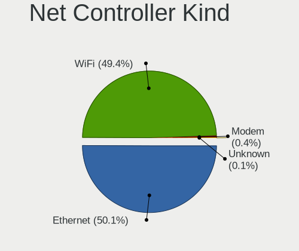

| Kind     | Computers | Percent |
|----------|-----------|---------|
| Ethernet | 2822      | 50.08%  |
| WiFi     | 2783      | 49.39%  |
| Modem    | 23        | 0.41%   |
| Unknown  | 7         | 0.12%   |

Used Controller
---------------

Currently used network controller

| Kind     | Computers | Percent |
|----------|-----------|---------|
| WiFi     | 2175      | 61.2%   |
| Ethernet | 1377      | 38.75%  |
| Unknown  | 2         | 0.06%   |

NICs
----

Total network controllers on board

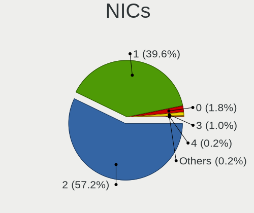

| Total | Computers | Percent |
|-------|-----------|---------|
| 2     | 1931      | 57.21%  |
| 1     | 1335      | 39.56%  |
| 0     | 60        | 1.78%   |
| 3     | 35        | 1.04%   |
| 4     | 7         | 0.21%   |
| 8     | 3         | 0.09%   |
| 6     | 3         | 0.09%   |
| 5     | 1         | 0.03%   |

IPv6
----

IPv6 vs IPv4

| Used | Computers | Percent |
|------|-----------|---------|
| No   | 2220      | 63.88%  |
| Yes  | 1255      | 36.12%  |

Bluetooth
---------

Bluetooth Vendor
----------------

Controller vendors

| Vendor                          | Computers | Percent |
|---------------------------------|-----------|---------|
| Intel                           | 747       | 34.91%  |
| Realtek Semiconductor           | 367       | 17.15%  |
| Qualcomm Atheros Communications | 175       | 8.18%   |
| Cambridge Silicon Radio         | 140       | 6.54%   |
| Broadcom                        | 113       | 5.28%   |
| IMC Networks                    | 111       | 5.19%   |
| Apple                           | 104       | 4.86%   |
| Lite-On Technology              | 78        | 3.64%   |
| Foxconn / Hon Hai               | 61        | 2.85%   |
| Realtek                         | 49        | 2.29%   |
| Dell                            | 38        | 1.78%   |
| Hewlett-Packard                 | 30        | 1.4%    |
| Toshiba                         | 24        | 1.12%   |
| Ralink                          | 21        | 0.98%   |
| ASUSTek Computer                | 17        | 0.79%   |
| MediaTek                        | 16        | 0.75%   |
| TP-Link                         | 9         | 0.42%   |
| Ralink Technology               | 8         | 0.37%   |
| Marvell Semiconductor           | 8         | 0.37%   |
| Foxconn International           | 4         | 0.19%   |
| Alps Electric                   | 4         | 0.19%   |
| Unknown                         | 3         | 0.14%   |
| Opticis                         | 2         | 0.09%   |
| Integrated System Solution      | 2         | 0.09%   |
| Chicony Electronics             | 2         | 0.09%   |
| USI                             | 1         | 0.05%   |
| SiW                             | 1         | 0.05%   |
| Roper                           | 1         | 0.05%   |
| Micro Star International        | 1         | 0.05%   |
| Fujitsu                         | 1         | 0.05%   |
| Dynex                           | 1         | 0.05%   |
| Actions                         | 1         | 0.05%   |

Bluetooth Model
---------------

Controller models

| Model                                               | Computers | Percent |
|-----------------------------------------------------|-----------|---------|
| Intel Bluetooth wireless interface                  | 266       | 12.41%  |
| Realtek Bluetooth Radio                             | 175       | 8.17%   |
| Cambridge Silicon Radio Bluetooth Dongle (HCI mode) | 140       | 6.53%   |
| Intel AX201 Bluetooth                               | 137       | 6.39%   |
| Realtek  Bluetooth 4.2 Adapter                      | 136       | 6.35%   |
| Intel Bluetooth 9460/9560 Jefferson Peak (JfP)      | 126       | 5.88%   |
| Intel AX200 Bluetooth                               | 95        | 4.43%   |
| Qualcomm Atheros  Bluetooth Device                  | 94        | 4.39%   |
| IMC Networks Bluetooth Radio                        | 55        | 2.57%   |
| Apple Bluetooth Host Controller                     | 51        | 2.38%   |
| Realtek Bluetooth Radio                             | 49        | 2.29%   |
| Broadcom BCM43142A0 Bluetooth 4.0                   | 35        | 1.63%   |
| Apple Bluetooth USB Host Controller                 | 33        | 1.54%   |
| Intel AX211 Bluetooth                               | 32        | 1.49%   |
| IMC Networks Wireless_Device                        | 29        | 1.35%   |
| Lite-On Bluetooth Device                            | 27        | 1.26%   |
| Intel Centrino Bluetooth Wireless Transceiver       | 24        | 1.12%   |
| Qualcomm Atheros QCA61x4 Bluetooth 4.0              | 23        | 1.07%   |
| Intel Centrino Advanced-N 6230 Bluetooth adapter    | 23        | 1.07%   |
| Ralink RT3290 Bluetooth                             | 21        | 0.98%   |
| Lite-On Atheros AR3012 Bluetooth                    | 21        | 0.98%   |
| Qualcomm Atheros AR3012 Bluetooth 4.0               | 20        | 0.93%   |
| Lite-On Qualcomm Atheros QCA9377 Bluetooth          | 20        | 0.93%   |
| Intel AX210 Bluetooth                               | 20        | 0.93%   |
| Foxconn / Hon Hai Bluetooth Device                  | 20        | 0.93%   |
| Realtek RTL8723B Bluetooth                          | 17        | 0.79%   |
| Qualcomm Atheros AR3011 Bluetooth                   | 17        | 0.79%   |
| MediaTek Wireless_Device                            | 16        | 0.75%   |
| HP Broadcom 2070 Bluetooth Combo                    | 16        | 0.75%   |
| Qualcomm Atheros AR9462 Bluetooth                   | 15        | 0.7%    |
| Intel Wireless-AC 9260 Bluetooth Adapter            | 14        | 0.65%   |
| HP Bluetooth 2.0 Interface [Broadcom BCM2045]       | 14        | 0.65%   |
| Broadcom BCM20702 Bluetooth 4.0 [ThinkPad]          | 14        | 0.65%   |
| Realtek RTL8821A Bluetooth                          | 13        | 0.61%   |
| Realtek 802.11ac WLAN Adapter                       | 13        | 0.61%   |
| Apple Built-in Bluetooth 2.0+EDR HCI                | 12        | 0.56%   |
| Intel Wireless-AC 3168 Bluetooth                    | 11        | 0.51%   |
| IMC Networks Bluetooth Device                       | 11        | 0.51%   |
| Dell BCM20702A0 Bluetooth Module                    | 10        | 0.47%   |
| Broadcom BCM2045B (BDC-2.1)                         | 10        | 0.47%   |

Sound
-----

Sound Vendor
------------

Sound card vendors

| Vendor                                       | Computers | Percent |
|----------------------------------------------|-----------|---------|
| Intel                                        | 2236      | 52.85%  |
| AMD                                          | 1113      | 26.31%  |
| Nvidia                                       | 568       | 13.42%  |
| C-Media Electronics                          | 39        | 0.92%   |
| Logitech                                     | 32        | 0.76%   |
| Texas Instruments                            | 22        | 0.52%   |
| Generalplus Technology                       | 22        | 0.52%   |
| Realtek Semiconductor                        | 13        | 0.31%   |
| ASUSTek Computer                             | 13        | 0.31%   |
| GN Netcom                                    | 12        | 0.28%   |
| Creative Labs                                | 12        | 0.28%   |
| Kingston Technology                          | 10        | 0.24%   |
| JMTek                                        | 9         | 0.21%   |
| VIA Technologies                             | 7         | 0.17%   |
| Razer USA                                    | 7         | 0.17%   |
| Plantronics                                  | 7         | 0.17%   |
| Lenovo                                       | 7         | 0.17%   |
| Focusrite-Novation                           | 7         | 0.17%   |
| Corsair                                      | 7         | 0.17%   |
| Zoran Co. Personal Media Division (Nogatech) | 5         | 0.12%   |
| Tenx Technology                              | 5         | 0.12%   |
| Sony                                         | 5         | 0.12%   |
| Creative Technology                          | 5         | 0.12%   |
| Syntek                                       | 4         | 0.09%   |
| Thesycon Systemsoftware & Consulting         | 3         | 0.07%   |
| M-Audio                                      | 3         | 0.07%   |
| KTMicro                                      | 3         | 0.07%   |
| Jieli Technology                             | 3         | 0.07%   |
| Hewlett-Packard                              | 3         | 0.07%   |
| ATI Technologies                             | 3         | 0.07%   |
| Apple                                        | 3         | 0.07%   |
| Synaptics                                    | 2         | 0.05%   |
| Shure                                        | 2         | 0.05%   |
| SAVITECH                                     | 2         | 0.05%   |
| Samson Technologies                          | 2         | 0.05%   |
| Microsoft                                    | 2         | 0.05%   |
| FiiO Electronics Technology                  | 2         | 0.05%   |
| Yamaha                                       | 1         | 0.02%   |
| Walmart                                      | 1         | 0.02%   |
| SteelSeries ApS                              | 1         | 0.02%   |

Sound Model
-----------

Sound card models

| Model                                                                                             | Computers | Percent |
|---------------------------------------------------------------------------------------------------|-----------|---------|
| AMD Family 17h/19h/1ah HD Audio Controller                                                        | 369       | 6.98%   |
| Intel 6 Series/C200 Series Chipset Family High Definition Audio Controller                        | 219       | 4.14%   |
| Intel 7 Series/C216 Chipset Family High Definition Audio Controller                               | 218       | 4.12%   |
| Intel Sunrise Point-LP HD Audio                                                                   | 214       | 4.05%   |
| AMD FCH Azalia Controller                                                                         | 182       | 3.44%   |
| AMD Raven/Raven2/Fenghuang HDMI/DP Audio Controller                                               | 179       | 3.38%   |
| AMD Renoir Radeon High Definition Audio Controller                                                | 166       | 3.14%   |
| AMD SBx00 Azalia (Intel HDA)                                                                      | 136       | 2.57%   |
| Intel 8 Series/C220 Series Chipset High Definition Audio Controller                               | 123       | 2.33%   |
| AMD Kabini HDMI/DP Audio                                                                          | 118       | 2.23%   |
| AMD Family 15h (Models 60h-6fh) Audio Controller                                                  | 111       | 2.1%    |
| Intel NM10/ICH7 Family High Definition Audio Controller                                           | 101       | 1.91%   |
| Intel Xeon E3-1200 v3/4th Gen Core Processor HD Audio Controller                                  | 94        | 1.78%   |
| Intel Cannon Lake PCH cAVS                                                                        | 91        | 1.72%   |
| Intel 5 Series/3400 Series Chipset High Definition Audio                                          | 88        | 1.66%   |
| Intel 82801I (ICH9 Family) HD Audio Controller                                                    | 86        | 1.63%   |
| Intel 8 Series HD Audio Controller                                                                | 86        | 1.63%   |
| Intel Haswell-ULT HD Audio Controller                                                             | 85        | 1.61%   |
| Intel Tiger Lake-LP Smart Sound Technology Audio Controller                                       | 81        | 1.53%   |
| Intel Broadwell-U Audio Controller                                                                | 78        | 1.47%   |
| Intel Wildcat Point-LP High Definition Audio Controller                                           | 77        | 1.46%   |
| Intel 100 Series/C230 Series Chipset Family HD Audio Controller                                   | 76        | 1.44%   |
| Intel Celeron/Pentium Silver Processor High Definition Audio                                      | 74        | 1.4%    |
| AMD Starship/Matisse HD Audio Controller                                                          | 73        | 1.38%   |
| Intel Atom/Celeron/Pentium Processor x5-E8000/J3xxx/N3xxx Series High Definition Audio Controller | 70        | 1.32%   |
| AMD Rembrandt Radeon High Definition Audio Controller                                             | 67        | 1.27%   |
| Intel Atom Processor Z36xxx/Z37xxx Series High Definition Audio Controller                        | 64        | 1.21%   |
| Intel 82801H (ICH8 Family) HD Audio Controller                                                    | 62        | 1.17%   |
| AMD High Definition Audio Controller                                                              | 60        | 1.13%   |
| Intel Cannon Point-LP High Definition Audio Controller                                            | 53        | 1%      |
| Intel Comet Lake PCH-LP cAVS                                                                      | 50        | 0.95%   |
| Intel Alder Lake PCH-P High Definition Audio Controller                                           | 46        | 0.87%   |
| AMD Trinity HDMI Audio Controller                                                                 | 46        | 0.87%   |
| AMD Family 17h (Models 00h-0fh) HD Audio Controller                                               | 46        | 0.87%   |
| Nvidia GP107GL High Definition Audio Controller                                                   | 44        | 0.83%   |
| Intel Comet Lake PCH cAVS                                                                         | 44        | 0.83%   |
| Intel 200 Series PCH HD Audio                                                                     | 39        | 0.74%   |
| AMD Oland/Hainan/Cape Verde/Pitcairn HDMI Audio [Radeon HD 7000 Series]                           | 39        | 0.74%   |
| Nvidia GP106 High Definition Audio Controller                                                     | 38        | 0.72%   |
| Nvidia TU107 GeForce GTX 1650 High Definition Audio Controller                                    | 37        | 0.7%    |

Memory
------

Memory Vendor
-------------

Memory module vendors

| Vendor                                           | Computers | Percent |
|--------------------------------------------------|-----------|---------|
| Samsung Electronics                              | 487       | 23.26%  |
| SK hynix                                         | 373       | 17.81%  |
| Kingston                                         | 328       | 15.66%  |
| Micron Technology                                | 226       | 10.79%  |
| A-DATA Technology                                | 154       | 7.35%   |
| Unknown                                          | 150       | 7.16%   |
| Corsair                                          | 61        | 2.91%   |
| Ramaxel Technology                               | 56        | 2.67%   |
| Crucial                                          | 49        | 2.34%   |
| Elpida                                           | 34        | 1.62%   |
| Nanya Technology                                 | 27        | 1.29%   |
| Unknown (ABCD)                                   | 24        | 1.15%   |
| Unknown                                          | 19        | 0.91%   |
| Team                                             | 15        | 0.72%   |
| Patriot                                          | 10        | 0.48%   |
| G.Skill                                          | 8         | 0.38%   |
| Timetec                                          | 7         | 0.33%   |
| Qimonda                                          | 7         | 0.33%   |
| PNY                                              | 7         | 0.33%   |
| ChangXin Memory                                  | 6         | 0.29%   |
| Transcend                                        | 4         | 0.19%   |
| Avant                                            | 3         | 0.14%   |
| Silicon Power                                    | 2         | 0.1%    |
| Hewlett-Packard                                  | 2         | 0.1%    |
| ff                                               | 2         | 0.1%    |
| CSX                                              | 2         | 0.1%    |
| ASint Technology                                 | 2         | 0.1%    |
| 4ea5                                             | 2         | 0.1%    |
| Unknown (8A6B)                                   | 1         | 0.05%   |
| Unknown (0x8AF1)                                 | 1         | 0.05%   |
| Unknown (0x4D342037305435363633515A332D43453620) | 1         | 0.05%   |
| Unknown (0x29E)                                  | 1         | 0.05%   |
| Unknown (0x0E9D)                                 | 1         | 0.05%   |
| Unknown (0x0C75)                                 | 1         | 0.05%   |
| Unknown (0E97)                                   | 1         | 0.05%   |
| Unknown (0B92)                                   | 1         | 0.05%   |
| Unifosa                                          | 1         | 0.05%   |
| SHARETRONIC                                      | 1         | 0.05%   |
| SGS/Thomson                                      | 1         | 0.05%   |
| S                                                | 1         | 0.05%   |

Memory Model
------------

Memory module models

| Model                                                            | Computers | Percent |
|------------------------------------------------------------------|-----------|---------|
| Samsung RAM M471A5244CB0-CTD 4GB SODIMM DDR4 3266MT/s            | 34        | 1.5%    |
| Unknown (ABCD) RAM 123456789012345678 2GB SODIMM LPDDR3 2400MT/s | 22        | 0.97%   |
| A-DATA RAM DDR4 3200 8GB DIMM DDR4 3600MT/s                      | 21        | 0.93%   |
| Micron RAM 4ATF1G64HZ-3G2E1 8GB Row Of Chips DDR4 3200MT/s       | 20        | 0.88%   |
| Unknown                                                          | 19        | 0.84%   |
| Samsung RAM M471B5173QH0-YK0 4GB SODIMM DDR3 1600MT/s            | 17        | 0.75%   |
| SK hynix RAM HMA81GS6AFR8N-UH 8GB SODIMM DDR4 2667MT/s           | 16        | 0.71%   |
| Samsung RAM M471B5173DB0-YK0 4GB SODIMM DDR3 1600MT/s            | 16        | 0.71%   |
| Samsung RAM M471A1K43DB1-CTD 8GB SODIMM DDR4 2667MT/s            | 16        | 0.71%   |
| Micron RAM 4ATF51264HZ-2G6E1 4GB SODIMM DDR4 2667MT/s            | 16        | 0.71%   |
| Samsung RAM M471B5273DH0-CH9 4GB SODIMM DDR3 1334MT/s            | 14        | 0.62%   |
| Samsung RAM M471B5173EB0-YK0 4GB SODIMM DDR3 1600MT/s            | 14        | 0.62%   |
| SK hynix RAM HMT451S6BFR8A-PB 4096MB SODIMM DDR3 1600MT/s        | 13        | 0.57%   |
| Micron RAM 8KTF51264HZ-1G6E1 4GB SODIMM DDR3 1600MT/s            | 13        | 0.57%   |
| Kingston RAM KF3200C16D4/8GX 8GB DIMM DDR4 3600MT/s              | 13        | 0.57%   |
| Samsung RAM M471B1G73QH0-YK0 8GB SODIMM DDR3 1600MT/s            | 12        | 0.53%   |
| SK hynix RAM HMT41GS6BFR8A-PB 8GB SODIMM DDR3 1600MT/s           | 11        | 0.49%   |
| SK hynix RAM HMT351S6CFR8C-PB 4GB SODIMM DDR3 1600MT/s           | 11        | 0.49%   |
| SK hynix RAM HMA81GS6DJR8N-XN 8GB SODIMM DDR4 3200MT/s           | 11        | 0.49%   |
| Samsung RAM M471B1G73EB0-YK0 8GB SODIMM DDR3 1600MT/s            | 11        | 0.49%   |
| Samsung RAM M471A1K43CB1-CTD 8GB SODIMM DDR4 2667MT/s            | 11        | 0.49%   |
| Samsung RAM M471A1K43CB1-CRC 8GB SODIMM DDR4 2667MT/s            | 11        | 0.49%   |
| Samsung RAM M471A1G44AB0-CWE 8GB Row Of Chips DDR4 3200MT/s      | 11        | 0.49%   |
| SK hynix RAM HMT451S6BFR8A-PB 4GB SODIMM DDR3 1600MT/s           | 10        | 0.44%   |
| SK hynix RAM HMA81GS6JJR8N-VK 8GB SODIMM DDR4 2667MT/s           | 10        | 0.44%   |
| SK hynix RAM HMT451S6AFR8A-PB 4GB SODIMM DDR3 1600MT/s           | 9         | 0.4%    |
| Samsung RAM M471B1G73DB0-YK0 8GB SODIMM DDR3 1600MT/s            | 9         | 0.4%    |
| Samsung RAM M471A5244CB0-CTD 4GB Row Of Chips DDR4 2667MT/s      | 9         | 0.4%    |
| Samsung RAM M471A1K43DB1-CWE 8GB SODIMM DDR4 3200MT/s            | 9         | 0.4%    |
| Unknown RAM Module 2GB SODIMM DDR2 667MT/s                       | 8         | 0.35%   |
| SK hynix RAM HMT41GS6AFR8A-PB 8GB SODIMM DDR3 1600MT/s           | 8         | 0.35%   |
| SK hynix RAM HMA81GS6CJR8N-VK 8GB SODIMM DDR4 2667MT/s           | 8         | 0.35%   |
| Samsung RAM M471B5273CH0-CH9 4GB SODIMM DDR3 1334MT/s            | 8         | 0.35%   |
| Samsung RAM M471A1G44AB0-CWE 8GB SODIMM DDR4 3200MT/s            | 8         | 0.35%   |
| Samsung RAM M4 70T5663QZ3-CF7 2GB SODIMM DDR2 2048MT/s           | 8         | 0.35%   |
| Ramaxel RAM RMSA3260ME78HAF-2666 8GB SODIMM DDR4 2667MT/s        | 8         | 0.35%   |
| Micron RAM 16KTF1G64HZ-1G6E1 8GB SODIMM DDR3 1600MT/s            | 8         | 0.35%   |
| Kingston RAM KHX2666C16/8G 8GB DIMM DDR4 3466MT/s                | 8         | 0.35%   |
| Kingston RAM 99U5428-018.A00LF 8GB SODIMM DDR3 1600MT/s          | 8         | 0.35%   |
| A-DATA RAM DDR4 2666 8GB DIMM DDR4 3200MT/s                      | 8         | 0.35%   |

Memory Kind
-----------

Memory module kinds

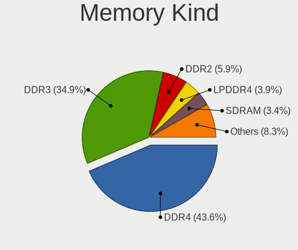

| Kind    | Computers | Percent |
|---------|-----------|---------|
| DDR4    | 755       | 43.59%  |
| DDR3    | 604       | 34.87%  |
| DDR2    | 103       | 5.95%   |
| LPDDR4  | 68        | 3.93%   |
| SDRAM   | 59        | 3.41%   |
| LPDDR3  | 37        | 2.14%   |
| Unknown | 35        | 2.02%   |
| DDR5    | 33        | 1.91%   |
| LPDDR5  | 20        | 1.15%   |
| DDR     | 15        | 0.87%   |
| DRAM    | 2         | 0.12%   |
| RAM     | 1         | 0.06%   |

Memory Form Factor
------------------

Physical design of the memory module

| Name         | Computers | Percent |
|--------------|-----------|---------|
| SODIMM       | 1028      | 60.19%  |
| DIMM         | 507       | 29.68%  |
| Row Of Chips | 153       | 8.96%   |
| Chip         | 9         | 0.53%   |
| Unknown      | 8         | 0.47%   |
| RIMM         | 2         | 0.12%   |
| FB-DIMM      | 1         | 0.06%   |

Memory Size
-----------

Memory module size

| Size  | Computers | Percent |
|-------|-----------|---------|
| 8192  | 699       | 35.54%  |
| 4096  | 590       | 29.99%  |
| 2048  | 274       | 13.93%  |
| 16384 | 224       | 11.39%  |
| 1024  | 82        | 4.17%   |
| 32768 | 80        | 4.07%   |
| 512   | 10        | 0.51%   |
| 12288 | 3         | 0.15%   |
| 256   | 2         | 0.1%    |
| 65536 | 1         | 0.05%   |
| 32767 | 1         | 0.05%   |
| 128   | 1         | 0.05%   |

Memory Speed
------------

Memory module speed

| Speed   | Computers | Percent |
|---------|-----------|---------|
| 1600    | 411       | 21.42%  |
| 2667    | 269       | 14.02%  |
| 3200    | 264       | 13.76%  |
| 2400    | 134       | 6.98%   |
| 1333    | 127       | 6.62%   |
| 2133    | 87        | 4.53%   |
| 3600    | 56        | 2.92%   |
| 1334    | 55        | 2.87%   |
| 667     | 55        | 2.87%   |
| 800     | 45        | 2.34%   |
| Unknown | 38        | 1.98%   |
| 3266    | 34        | 1.77%   |
| 4267    | 26        | 1.35%   |
| 1867    | 26        | 1.35%   |
| 1067    | 26        | 1.35%   |
| 3733    | 23        | 1.2%    |
| 2048    | 20        | 1.04%   |
| 4800    | 19        | 0.99%   |
| 6400    | 18        | 0.94%   |
| 533     | 15        | 0.78%   |
| 1866    | 13        | 0.68%   |
| 1066    | 13        | 0.68%   |
| 2666    | 12        | 0.63%   |
| 3466    | 9         | 0.47%   |
| 5600    | 8         | 0.42%   |
| 4199    | 8         | 0.42%   |
| 1800    | 8         | 0.42%   |
| 975     | 8         | 0.42%   |
| 3000    | 7         | 0.36%   |
| 3400    | 6         | 0.31%   |
| 49926   | 5         | 0.26%   |
| 8400    | 5         | 0.26%   |
| 3933    | 5         | 0.26%   |
| 1639    | 5         | 0.26%   |
| 4000    | 4         | 0.21%   |
| 3800    | 4         | 0.21%   |
| 3066    | 4         | 0.21%   |
| 2800    | 4         | 0.21%   |
| 2200    | 4         | 0.21%   |
| 1331    | 4         | 0.21%   |

Printers & scanners
-------------------

Printer Vendor
--------------

Printer device vendors

| Vendor                 | Computers | Percent |
|------------------------|-----------|---------|
| Hewlett-Packard        | 20        | 26.67%  |
| Seiko Epson            | 17        | 22.67%  |
| Brother Industries     | 17        | 22.67%  |
| Canon                  | 8         | 10.67%  |
| Samsung Electronics    | 7         | 9.33%   |
| Kyocera                | 2         | 2.67%   |
| TSC Auto ID Technology | 1         | 1.33%   |
| QinHeng Electronics    | 1         | 1.33%   |
| Prolific Technology    | 1         | 1.33%   |
| BIXOLON                | 1         | 1.33%   |

Printer Model
-------------

Printer device models

| Model                                   | Computers | Percent |
|-----------------------------------------|-----------|---------|
| Seiko Epson L120 Series                 | 6         | 7.89%   |
| HP LaserJet Professional P 1102w        | 3         | 3.95%   |
| HP DeskJet 2300 series                  | 3         | 3.95%   |
| HP DeskJet 1110 series                  | 3         | 3.95%   |
| Samsung M2020 Series                    | 2         | 2.63%   |
| Canon G3000 series                      | 2         | 2.63%   |
| Brother MFC-J470DW                      | 2         | 2.63%   |
| Brother MFC-J460DW                      | 2         | 2.63%   |
| Brother HL-1110 series                  | 2         | 2.63%   |
| Brother DCP-L2540DW                     | 2         | 2.63%   |
| TSC Auto ID Printer                     | 1         | 1.32%   |
| Seiko Epson XP-235 Series               | 1         | 1.32%   |
| Seiko Epson Printer                     | 1         | 1.32%   |
| Seiko Epson L805 Series                 | 1         | 1.32%   |
| Seiko Epson L555 Series                 | 1         | 1.32%   |
| Seiko Epson L382 Series                 | 1         | 1.32%   |
| Seiko Epson L300 Series                 | 1         | 1.32%   |
| Seiko Epson L210 Series                 | 1         | 1.32%   |
| Seiko Epson L200 Series                 | 1         | 1.32%   |
| Seiko Epson L1300 Series                | 1         | 1.32%   |
| Seiko Epson ET-4850 Series              | 1         | 1.32%   |
| Seiko Epson ET-3750 Series              | 1         | 1.32%   |
| Seiko Epson ET-2700 Series              | 1         | 1.32%   |
| Samsung Xerox Phaser 3117 Laser Printer | 1         | 1.32%   |
| Samsung SCX-4600 Series                 | 1         | 1.32%   |
| Samsung ML-1660 Series                  | 1         | 1.32%   |
| Samsung ML-1640 Series Laser Printer    | 1         | 1.32%   |
| Samsung M283x Series                    | 1         | 1.32%   |
| QinHeng CH340S                          | 1         | 1.32%   |
| Prolific PL2305 Parallel Port           | 1         | 1.32%   |
| Kyocera FS-1116MFP                      | 1         | 1.32%   |
| Kyocera FS-1030D printer                | 1         | 1.32%   |
| HP Smart Tank 580-590 series            | 1         | 1.32%   |
| HP OfficeJet Pro 7740 series            | 1         | 1.32%   |
| HP LaserJet P3010 Series                | 1         | 1.32%   |
| HP LaserJet M109-M112                   | 1         | 1.32%   |
| HP LaserJet 1018                        | 1         | 1.32%   |
| HP DeskJet F4200 series                 | 1         | 1.32%   |
| HP DeskJet F300 series                  | 1         | 1.32%   |
| HP DeskJet 4720 series                  | 1         | 1.32%   |

Scanner Vendor
--------------

Scanner device vendors

| Vendor          | Computers | Percent |
|-----------------|-----------|---------|
| Hewlett-Packard | 6         | 75%     |
| Seiko Epson     | 2         | 25%     |

Scanner Model
-------------

Scanner device models

| Model                                              | Computers | Percent |
|----------------------------------------------------|-----------|---------|
| HP ScanJet 5590                                    | 2         | 25%     |
| HP ScanJet 4500C/5550C                             | 2         | 25%     |
| Seiko Epson GT-X820 [Perfection V600 Photo]        | 1         | 12.5%   |
| Seiko Epson GT-8400UF [Perfection 1670/1670 PHOTO] | 1         | 12.5%   |
| HP ScanJet 3300c                                   | 1         | 12.5%   |
| HP Scanjet 300                                     | 1         | 12.5%   |

Camera
------

Camera Vendor
-------------

Camera device vendors

| Vendor                                 | Computers | Percent |
|----------------------------------------|-----------|---------|
| Chicony Electronics                    | 470       | 20.75%  |
| IMC Networks                           | 211       | 9.32%   |
| Microdia                               | 203       | 8.96%   |
| Realtek Semiconductor                  | 152       | 6.71%   |
| Sunplus Innovation Technology          | 124       | 5.47%   |
| Cheng Uei Precision Industry (Foxlink) | 114       | 5.03%   |
| Quanta                                 | 112       | 4.94%   |
| Bison Electronics                      | 111       | 4.9%    |
| Apple                                  | 81        | 3.58%   |
| Suyin                                  | 79        | 3.49%   |
| Logitech                               | 73        | 3.22%   |
| Syntek                                 | 67        | 2.96%   |
| Lite-On Technology                     | 63        | 2.78%   |
| Generalplus Technology                 | 32        | 1.41%   |
| Silicon Motion                         | 31        | 1.37%   |
| Luxvisions Innotech Limited            | 27        | 1.19%   |
| Acer                                   | 26        | 1.15%   |
| Alcor Micro                            | 25        | 1.1%    |
| Ricoh                                  | 24        | 1.06%   |
| Importek                               | 22        | 0.97%   |
| Microsoft                              | 17        | 0.75%   |
| Sonix Technology                       | 15        | 0.66%   |
| Samsung Electronics                    | 14        | 0.62%   |
| Z-Star Microelectronics                | 12        | 0.53%   |
| Jieli Technology                       | 11        | 0.49%   |
| Primax Electronics                     | 10        | 0.44%   |
| GEMBIRD                                | 9         | 0.4%    |
| Y Media                                | 8         | 0.35%   |
| OmniVision Technologies                | 8         | 0.35%   |
| MacroSilicon                           | 8         | 0.35%   |
| ALi                                    | 8         | 0.35%   |
| KYE Systems (Mouse Systems)            | 7         | 0.31%   |
| HRY                                    | 6         | 0.26%   |
| Genesys Logic                          | 6         | 0.26%   |
| icSpring                               | 5         | 0.22%   |
| SunplusIT                              | 4         | 0.18%   |
| LG Electronics                         | 4         | 0.18%   |
| Lenovo                                 | 4         | 0.18%   |
| Xiongmai                               | 3         | 0.13%   |
| Sunplus Technology                     | 3         | 0.13%   |

Camera Model
------------

Camera device models

| Model                                                          | Computers | Percent |
|----------------------------------------------------------------|-----------|---------|
| Chicony Integrated Camera                                      | 77        | 3.38%   |
| Microdia Integrated_Webcam_HD                                  | 64        | 2.81%   |
| Realtek Integrated_Webcam_HD                                   | 45        | 1.97%   |
| IMC Networks Integrated Camera                                 | 45        | 1.97%   |
| Sunplus Integrated_Webcam_HD                                   | 43        | 1.89%   |
| Chicony HD WebCam                                              | 42        | 1.84%   |
| Bison Integrated Camera                                        | 42        | 1.84%   |
| IMC Networks USB2.0 HD UVC WebCam                              | 40        | 1.76%   |
| IMC Networks HD Camera                                         | 33        | 1.45%   |
| Apple FaceTime HD Camera                                       | 30        | 1.32%   |
| Syntek Integrated Camera                                       | 27        | 1.18%   |
| Logitech HD Pro Webcam C920                                    | 27        | 1.18%   |
| Generalplus GENERAL WEBCAM                                     | 27        | 1.18%   |
| IMC Networks USB2.0 VGA UVC WebCam                             | 26        | 1.14%   |
| Chicony HP Webcam                                              | 23        | 1.01%   |
| Chicony HP TrueVision HD Camera                                | 23        | 1.01%   |
| Chicony HP TrueVision HD                                       | 23        | 1.01%   |
| Cheng Uei Precision Industry (Foxlink) HD Camera               | 21        | 0.92%   |
| Quanta HP Webcam                                               | 20        | 0.88%   |
| Lite-On HP Wide Vision HD Camera                               | 20        | 0.88%   |
| Sunplus HD WebCam                                              | 19        | 0.83%   |
| Microdia Integrated Webcam                                     | 18        | 0.79%   |
| IMC Networks ov9734_azurewave_camera                           | 18        | 0.79%   |
| IMC Networks EasyCamera                                        | 18        | 0.79%   |
| Apple Built-in iSight                                          | 18        | 0.79%   |
| Cheng Uei Precision Industry (Foxlink) HP TrueVision HD Camera | 17        | 0.75%   |
| Apple FaceTime HD Camera (Built-in)                            | 17        | 0.75%   |
| Syntek Lenovo EasyCamera                                       | 16        | 0.7%    |
| Quanta HP TrueVision HD Camera                                 | 16        | 0.7%    |
| Cheng Uei Precision Industry (Foxlink) HP Webcam               | 16        | 0.7%    |
| Microdia Sonix USB 2.0 Camera                                  | 15        | 0.66%   |
| Chicony USB 2.0 Camera                                         | 15        | 0.66%   |
| Alcor Micro USB 2.0 Camera                                     | 15        | 0.66%   |
| Samsung Galaxy series, misc. (MTP mode)                        | 14        | 0.61%   |
| Logitech Webcam C270                                           | 14        | 0.61%   |
| Cheng Uei Precision Industry (Foxlink) HP Truevision HD        | 14        | 0.61%   |
| Bison Lenovo EasyCamera                                        | 14        | 0.61%   |
| Suyin HP Truevision HD                                         | 13        | 0.57%   |
| Quanta ov9734_techfront_camera                                 | 13        | 0.57%   |
| Microdia Lenovo EasyCamera                                     | 13        | 0.57%   |

Security
--------

Fingerprint Vendor
------------------

Fingerprint sensor vendors

| Vendor                             | Computers | Percent |
|------------------------------------|-----------|---------|
| Validity Sensors                   | 124       | 32.63%  |
| Shenzhen Goodix Technology         | 97        | 25.53%  |
| Synaptics                          | 64        | 16.84%  |
| AuthenTec                          | 27        | 7.11%   |
| Upek                               | 21        | 5.53%   |
| Elan Microelectronics              | 19        | 5%      |
| Focal-systems.Corp                 | 9         | 2.37%   |
| STMicroelectronics                 | 5         | 1.32%   |
| LighTuning Technology              | 4         | 1.05%   |
| DigitalPersona                     | 3         | 0.79%   |
| Samsung Electronics                | 2         | 0.53%   |
| Realtek USB2.0 Finger Print Bridge | 2         | 0.53%   |
| Suprema                            | 1         | 0.26%   |
| GDMicroelectronics                 | 1         | 0.26%   |
| FocalTech                          | 1         | 0.26%   |

Fingerprint Model
-----------------

Fingerprint sensor models

| Model                                                                      | Computers | Percent |
|----------------------------------------------------------------------------|-----------|---------|
| Shenzhen Goodix  Fingerprint Device                                        | 83        | 21.84%  |
| Validity Sensors VFS495 Fingerprint Reader                                 | 29        | 7.63%   |
| Synaptics Prometheus MIS Touch Fingerprint Reader                          | 23        | 6.05%   |
| Upek Biometric Touchchip/Touchstrip Fingerprint Sensor                     | 19        | 5%      |
| Validity Sensors VFS 5011 fingerprint sensor                               | 18        | 4.74%   |
| AuthenTec AES2501 Fingerprint Sensor                                       | 14        | 3.68%   |
| Validity Sensors VFS5011 Fingerprint Reader                                | 13        | 3.42%   |
| Validity Sensors VFS471 Fingerprint Reader                                 | 13        | 3.42%   |
| Synaptics Metallica MIS Touch Fingerprint Reader                           | 13        | 3.42%   |
| Shenzhen Goodix Fingerprint Reader                                         | 11        | 2.89%   |
| Elan ELAN:ARM-M4                                                           | 11        | 2.89%   |
| Focal-systems.Corp FT9201Fingerprint.                                  | 9         | 2.37%   |
| Validity Sensors Synaptics WBDI                                            | 8         | 2.11%   |
| Validity Sensors VFS7500 Touch Fingerprint Sensor                          | 7         | 1.84%   |
| Validity Sensors VFS491                                                    | 7         | 1.84%   |
| AuthenTec AES2810                                                          | 7         | 1.84%   |
| Elan ELAN:Fingerprint                                                      | 6         | 1.58%   |
| Validity Sensors VFS451 Fingerprint Reader                                 | 5         | 1.32%   |
| Validity Sensors VFS101 Fingerprint Reader                                 | 5         | 1.32%   |
| Validity Sensors Synaptics VFS7552 Touch Fingerprint Sensor with PurePrint | 5         | 1.32%   |
| Validity Sensors Swipe Fingerprint Sensor                                  | 5         | 1.32%   |
| STMicroelectronics Fingerprint Reader                                      | 5         | 1.32%   |
| Synaptics WBDI                                                             | 4         | 1.05%   |
| Validity Sensors VFS301 Fingerprint Reader                                 | 3         | 0.79%   |
| Validity Sensors Fingerprint scanner                                       | 3         | 0.79%   |
| Synaptics WBDI Fingerprint Reader USB 086                                  | 3         | 0.79%   |
| Synaptics  WBDI                                                            | 3         | 0.79%   |
| Synaptics Fingerprint reader [HP G6]                                       | 3         | 0.79%   |
| Shenzhen Goodix FingerPrint                                                | 3         | 0.79%   |
| LighTuning EgisTec Touch Fingerprint Sensor                                | 3         | 0.79%   |
| AuthenTec Fingerprint Sensor                                               | 3         | 0.79%   |
| AuthenTec AES1600                                                          | 3         | 0.79%   |
| Validity Sensors VFS Fingerprint sensor                                    | 2         | 0.53%   |
| Upek TCS5B Fingerprint sensor                                              | 2         | 0.53%   |
| Synaptics UWP WBDI Device                                                  | 2         | 0.53%   |
| Synaptics UWP WBDI                                                         | 2         | 0.53%   |
| Synaptics  FS7604 Touch Fingerprint Sensor with PurePrint                  | 2         | 0.53%   |
| Synaptics Prometheus Fingerprint Reader                                    | 2         | 0.53%   |
| Synaptics Metallica MOH Touch Fingerprint Reader                           | 2         | 0.53%   |
| Synaptics FS7604 Touch Fingerprint Sensor with PurePrint                   | 2         | 0.53%   |

Chipcard Vendor
---------------

Chipcard module vendors

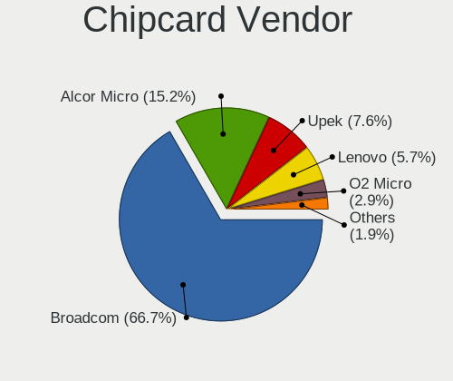

| Vendor                | Computers | Percent |
|-----------------------|-----------|---------|
| Broadcom              | 70        | 66.67%  |
| Alcor Micro           | 16        | 15.24%  |
| Upek                  | 8         | 7.62%   |
| Lenovo                | 6         | 5.71%   |
| O2 Micro              | 3         | 2.86%   |
| Gemalto (was Gemplus) | 1         | 0.95%   |
| Advanced Card Systems | 1         | 0.95%   |

Chipcard Model
--------------

Chipcard module models

| Model                                                                        | Computers | Percent |
|------------------------------------------------------------------------------|-----------|---------|
| Broadcom BCM5880 Secure Applications Processor                               | 23        | 21.9%   |
| Broadcom BCM5880 Secure Applications Processor with fingerprint swipe sensor | 17        | 16.19%  |
| Broadcom 5880                                                                | 16        | 15.24%  |
| Alcor Micro AU9540 Smartcard Reader                                          | 16        | 15.24%  |
| Broadcom 58200                                                               | 13        | 12.38%  |
| Upek TouchChip Fingerprint Coprocessor (WBF advanced mode)                   | 8         | 7.62%   |
| Lenovo Integrated Smart Card Reader                                          | 6         | 5.71%   |
| O2 Micro OZ776 CCID Smartcard Reader                                         | 3         | 2.86%   |
| Gemalto (was Gemplus) Compact Smart Card Reader Writer                       | 1         | 0.95%   |
| Broadcom BCM5880 Secure Applications Processor with fingerprint touch sensor | 1         | 0.95%   |
| Advanced Card Systems ACR122U                                                | 1         | 0.95%   |

Unsupported
-----------

Unsupported Devices
-------------------

Total unsupported devices on board

| Total | Computers | Percent |
|-------|-----------|---------|
| 0     | 2373      | 68.88%  |
| 1     | 883       | 25.63%  |
| 2     | 158       | 4.59%   |
| 3     | 20        | 0.58%   |
| 4     | 4         | 0.12%   |
| 5     | 3         | 0.09%   |
| 6     | 2         | 0.06%   |
| 8     | 1         | 0.03%   |
| 7     | 1         | 0.03%   |

Unsupported Device Types
------------------------

Types of unsupported devices

| Type                     | Computers | Percent |
|--------------------------|-----------|---------|
| Fingerprint reader       | 376       | 29.58%  |
| Graphics card            | 275       | 21.64%  |
| Net/wireless             | 199       | 15.66%  |
| Multimedia controller    | 96        | 7.55%   |
| Chipcard                 | 95        | 7.47%   |
| Communication controller | 52        | 4.09%   |
| Camera                   | 40        | 3.15%   |
| Bluetooth                | 38        | 2.99%   |
| Unassigned class         | 19        | 1.49%   |
| Sound                    | 16        | 1.26%   |
| Net/ethernet             | 16        | 1.26%   |
| Storage                  | 13        | 1.02%   |
| Card reader              | 9         | 0.71%   |
| Network                  | 8         | 0.63%   |
| Modem                    | 6         | 0.47%   |
| Storage/raid             | 3         | 0.24%   |
| Storage/ide              | 3         | 0.24%   |
| Firewire controller      | 2         | 0.16%   |
| Video                    | 1         | 0.08%   |
| Tv card                  | 1         | 0.08%   |
| Storage/nvme             | 1         | 0.08%   |
| Storage/ata              | 1         | 0.08%   |
| Dvb card                 | 1         | 0.08%   |

