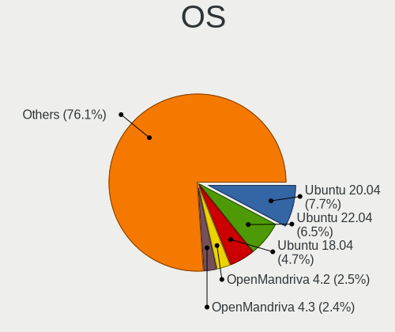
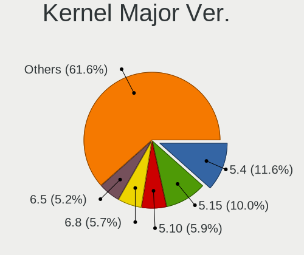
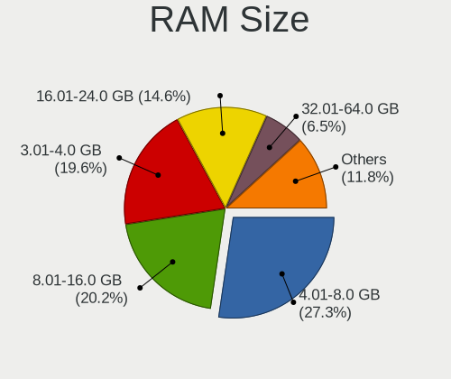
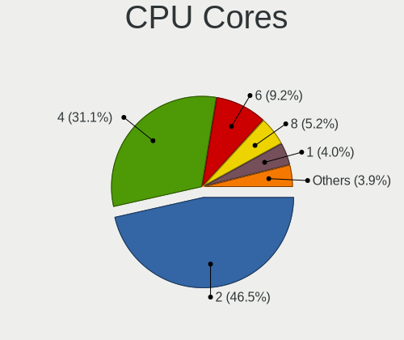
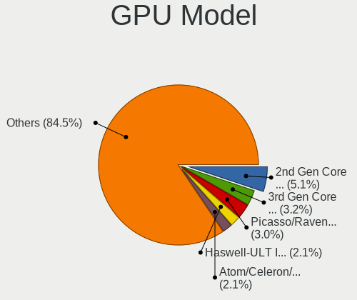
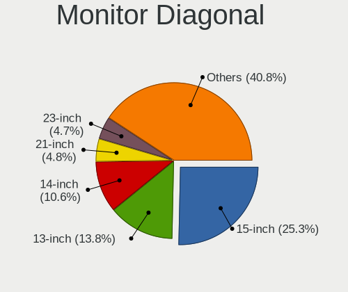
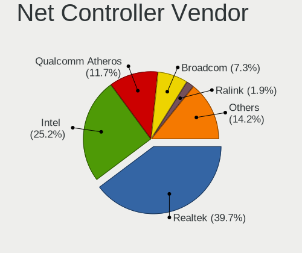
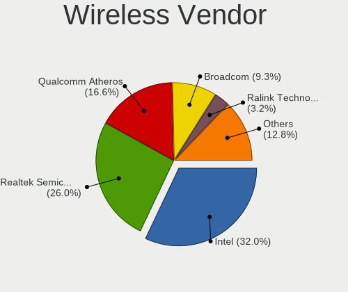
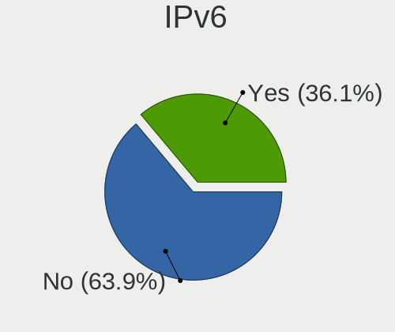
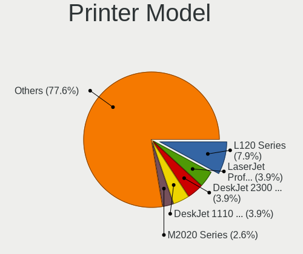

Linux in Mexico - Tested Hardware & Statistics
----------------------------------------------

A project to collect tested hardware configurations for Linux in Mexico.

Anyone can contribute to this report by the [hw-probe](https://github.com/linuxhw/hw-probe) tool:

    sudo -E hw-probe -all -upload

Please contribute! Especially if your hardware is rare.

This is a report for all computer types. See also reports for [desktops](/Location/Mexico/Desktop/README.md) and [notebooks](/Location/Mexico/Notebook/README.md).

Contents
--------

* [ Test Cases ](#test-cases)

* [ System ](#system)
  - [ OS                       ](#os)
  - [ OS Family                ](#os-family)
  - [ Kernel                   ](#kernel)
  - [ Kernel Family            ](#kernel-family)
  - [ Kernel Major Ver.        ](#kernel-major-ver)
  - [ Arch                     ](#arch)
  - [ DE                       ](#de)
  - [ Display Server           ](#display-server)
  - [ Display Manager          ](#display-manager)
  - [ OS Lang                  ](#os-lang)
  - [ Boot Mode                ](#boot-mode)
  - [ Filesystem               ](#filesystem)
  - [ Part. scheme             ](#part-scheme)
  - [ Dual Boot with Linux/BSD ](#dual-boot-with-linuxbsd)
  - [ Dual Boot (Win)          ](#dual-boot-win)

* [ Board ](#board)
  - [ Vendor                   ](#vendor)
  - [ Model                    ](#model)
  - [ Model Family             ](#model-family)
  - [ MFG Year                 ](#mfg-year)
  - [ Form Factor              ](#form-factor)
  - [ Secure Boot              ](#secure-boot)
  - [ Coreboot                 ](#coreboot)
  - [ RAM Size                 ](#ram-size)
  - [ RAM Used                 ](#ram-used)
  - [ Total Drives             ](#total-drives)
  - [ Has CD-ROM               ](#has-cd-rom)
  - [ Has Ethernet             ](#has-ethernet)
  - [ Has WiFi                 ](#has-wifi)
  - [ Has Bluetooth            ](#has-bluetooth)

* [ Location ](#location)
  - [ Country                  ](#country)
  - [ City                     ](#city)

* [ Drives ](#drives)
  - [ Drive Vendor             ](#drive-vendor)
  - [ Drive Model              ](#drive-model)
  - [ HDD Vendor               ](#hdd-vendor)
  - [ SSD Vendor               ](#ssd-vendor)
  - [ Drive Kind               ](#drive-kind)
  - [ Drive Connector          ](#drive-connector)
  - [ Drive Size               ](#drive-size)
  - [ Space Total              ](#space-total)
  - [ Space Used               ](#space-used)
  - [ Malfunc. Drives          ](#malfunc-drives)
  - [ Malfunc. Drive Vendor    ](#malfunc-drive-vendor)
  - [ Malfunc. HDD Vendor      ](#malfunc-hdd-vendor)
  - [ Malfunc. Drive Kind      ](#malfunc-drive-kind)
  - [ Failed Drives            ](#failed-drives)
  - [ Failed Drive Vendor      ](#failed-drive-vendor)
  - [ Drive Status             ](#drive-status)

* [ Storage controller ](#storage-controller)
  - [ Storage Vendor           ](#storage-vendor)
  - [ Storage Model            ](#storage-model)
  - [ Storage Kind             ](#storage-kind)

* [ Processor ](#processor)
  - [ CPU Vendor               ](#cpu-vendor)
  - [ CPU Model                ](#cpu-model)
  - [ CPU Model Family         ](#cpu-model-family)
  - [ CPU Cores                ](#cpu-cores)
  - [ CPU Sockets              ](#cpu-sockets)
  - [ CPU Threads              ](#cpu-threads)
  - [ CPU Op-Modes             ](#cpu-op-modes)
  - [ CPU Microcode            ](#cpu-microcode)
  - [ CPU Microarch            ](#cpu-microarch)

* [ Graphics ](#graphics)
  - [ GPU Vendor               ](#gpu-vendor)
  - [ GPU Model                ](#gpu-model)
  - [ GPU Combo                ](#gpu-combo)
  - [ GPU Driver               ](#gpu-driver)
  - [ GPU Memory               ](#gpu-memory)

* [ Monitor ](#monitor)
  - [ Monitor Vendor           ](#monitor-vendor)
  - [ Monitor Model            ](#monitor-model)
  - [ Monitor Resolution       ](#monitor-resolution)
  - [ Monitor Diagonal         ](#monitor-diagonal)
  - [ Monitor Width            ](#monitor-width)
  - [ Aspect Ratio             ](#aspect-ratio)
  - [ Monitor Area             ](#monitor-area)
  - [ Pixel Density            ](#pixel-density)
  - [ Multiple Monitors        ](#multiple-monitors)

* [ Network ](#network)
  - [ Net Controller Vendor    ](#net-controller-vendor)
  - [ Net Controller Model     ](#net-controller-model)
  - [ Wireless Vendor          ](#wireless-vendor)
  - [ Wireless Model           ](#wireless-model)
  - [ Ethernet Vendor          ](#ethernet-vendor)
  - [ Ethernet Model           ](#ethernet-model)
  - [ Net Controller Kind      ](#net-controller-kind)
  - [ Used Controller          ](#used-controller)
  - [ NICs                     ](#nics)
  - [ IPv6                     ](#ipv6)

* [ Bluetooth ](#bluetooth)
  - [ Bluetooth Vendor         ](#bluetooth-vendor)
  - [ Bluetooth Model          ](#bluetooth-model)

* [ Sound ](#sound)
  - [ Sound Vendor             ](#sound-vendor)
  - [ Sound Model              ](#sound-model)

* [ Memory ](#memory)
  - [ Memory Vendor            ](#memory-vendor)
  - [ Memory Model             ](#memory-model)
  - [ Memory Kind              ](#memory-kind)
  - [ Memory Form Factor       ](#memory-form-factor)
  - [ Memory Size              ](#memory-size)
  - [ Memory Speed             ](#memory-speed)

* [ Printers & scanners ](#printers--scanners)
  - [ Printer Vendor           ](#printer-vendor)
  - [ Printer Model            ](#printer-model)
  - [ Scanner Vendor           ](#scanner-vendor)
  - [ Scanner Model            ](#scanner-model)

* [ Camera ](#camera)
  - [ Camera Vendor            ](#camera-vendor)
  - [ Camera Model             ](#camera-model)

* [ Security ](#security)
  - [ Fingerprint Vendor       ](#fingerprint-vendor)
  - [ Fingerprint Model        ](#fingerprint-model)
  - [ Chipcard Vendor          ](#chipcard-vendor)
  - [ Chipcard Model           ](#chipcard-model)

* [ Unsupported ](#unsupported)
  - [ Unsupported Devices      ](#unsupported-devices)
  - [ Unsupported Device Types ](#unsupported-device-types)

Test Cases
----------

Total: 3636

| Vendor        | Model                       | Form-Factor | Probe                                                      | Date         |
|---------------|-----------------------------|-------------|------------------------------------------------------------|--------------|
| Lenovo        | Yoga 7 14ITL5 82BH          | Convertible | [4fe6eb4d59](https://linux-hardware.org/?probe=4fe6eb4d59) | Aug 12, 2023 |
| HP            | 0A04h                       | Desktop     | [61b0d9bc15](https://linux-hardware.org/?probe=61b0d9bc15) | Aug 12, 2023 |
| Dell          | 03KWTV A02                  | Desktop     | [4d26902a65](https://linux-hardware.org/?probe=4d26902a65) | Aug 12, 2023 |
| Valve         | Jupiter                     | Notebook    | [069bfd618c](https://linux-hardware.org/?probe=069bfd618c) | Aug 11, 2023 |
| Lenovo        | IdeaCentre B320             | Desktop     | [175fb6f041](https://linux-hardware.org/?probe=175fb6f041) | Aug 11, 2023 |
| Biostar       | A10N-8800E                  | Desktop     | [5ccf8e7d00](https://linux-hardware.org/?probe=5ccf8e7d00) | Aug 11, 2023 |
| Lenovo        | G40-45 80E1                 | Notebook    | [d6f18c79f6](https://linux-hardware.org/?probe=d6f18c79f6) | Aug 10, 2023 |
| Dell          | 0MGK50 A01                  | Desktop     | [ac0ed4109e](https://linux-hardware.org/?probe=ac0ed4109e) | Aug 10, 2023 |
| Toshiba       | Satellite L745D             | Notebook    | [9576dab2b0](https://linux-hardware.org/?probe=9576dab2b0) | Aug 09, 2023 |
| Lenovo        | 30C1                        | Desktop     | [dda7ed4e8b](https://linux-hardware.org/?probe=dda7ed4e8b) | Aug 09, 2023 |
| Dell          | Precision 3551              | Notebook    | [a9b776ade0](https://linux-hardware.org/?probe=a9b776ade0) | Aug 09, 2023 |
| Pegatron      | BOWIE                       | Desktop     | [6047747c8f](https://linux-hardware.org/?probe=6047747c8f) | Aug 09, 2023 |
| Pegatron      | BOWIE                       | Desktop     | [8a11b56d79](https://linux-hardware.org/?probe=8a11b56d79) | Aug 09, 2023 |
| ASUSTek       | X455LA                      | Notebook    | [8b60fb0411](https://linux-hardware.org/?probe=8b60fb0411) | Aug 08, 2023 |
| Lenovo        | Y720-15IKB 80VR             | Notebook    | [7a088aea04](https://linux-hardware.org/?probe=7a088aea04) | Aug 08, 2023 |
| MSI           | B350 GAMING PLUS            | Desktop     | [951597859a](https://linux-hardware.org/?probe=951597859a) | Aug 08, 2023 |
| GPU Compan... | GWNR71517                   | Notebook    | [3fea8d650e](https://linux-hardware.org/?probe=3fea8d650e) | Aug 08, 2023 |
| ASUSTek       | N550LF                      | Notebook    | [57f7da9570](https://linux-hardware.org/?probe=57f7da9570) | Aug 08, 2023 |
| HUAWEI        | NBLK-WAX9X                  | Notebook    | [72bb72d2aa](https://linux-hardware.org/?probe=72bb72d2aa) | Aug 08, 2023 |
| System76      | Oryx Pro                    | Notebook    | [c5b97761d3](https://linux-hardware.org/?probe=c5b97761d3) | Aug 07, 2023 |
| HUAWEI        | WRTD-WXX9                   | Notebook    | [dc02eefe63](https://linux-hardware.org/?probe=dc02eefe63) | Aug 06, 2023 |
| Lenovo        | 30BC SDK0J40697 WIN 3305... | Desktop     | [f670b492a9](https://linux-hardware.org/?probe=f670b492a9) | Aug 06, 2023 |
| HUAWEI        | HVY-WXX9                    | Notebook    | [0c8aef568d](https://linux-hardware.org/?probe=0c8aef568d) | Aug 06, 2023 |
| HUAWEI        | HVY-WXX9                    | Notebook    | [597f8ddaf2](https://linux-hardware.org/?probe=597f8ddaf2) | Aug 06, 2023 |
| ASUSTek       | PRIME H410M-E               | Desktop     | [8618a7051f](https://linux-hardware.org/?probe=8618a7051f) | Aug 06, 2023 |
| ONE-NETBOO... | ONEXPLAYER 2 ARP23 Ver.1... | Notebook    | [8b6db0bfbb](https://linux-hardware.org/?probe=8b6db0bfbb) | Aug 05, 2023 |
| Apple         | MacBookPro11,2              | Notebook    | [32f8bbeff7](https://linux-hardware.org/?probe=32f8bbeff7) | Aug 05, 2023 |
| HP            | ENVY x360 Convertible 13... | Convertible | [ab9328165e](https://linux-hardware.org/?probe=ab9328165e) | Aug 05, 2023 |
| HUAWEI        | HVY-WXX9                    | Notebook    | [9f813efccc](https://linux-hardware.org/?probe=9f813efccc) | Aug 05, 2023 |
| Lenovo        | IdeaPad 3 14ALC6 82KT       | Notebook    | [349326315f](https://linux-hardware.org/?probe=349326315f) | Aug 05, 2023 |
| ASUSTek       | PRIME B450M-A               | Desktop     | [d2d45c853b](https://linux-hardware.org/?probe=d2d45c853b) | Aug 05, 2023 |
| ASUSTek       | PRIME B450M-A               | Desktop     | [f18b2ff744](https://linux-hardware.org/?probe=f18b2ff744) | Aug 05, 2023 |
| Gigabyte      | GA-MA69VM-S2                | Desktop     | [197a9b0139](https://linux-hardware.org/?probe=197a9b0139) | Aug 03, 2023 |
| INET          | Z12B                        | Mini pc     | [6acbb961c7](https://linux-hardware.org/?probe=6acbb961c7) | Aug 03, 2023 |
| Dell          | Latitude 5490               | Notebook    | [e93c786075](https://linux-hardware.org/?probe=e93c786075) | Aug 03, 2023 |
| Dell          | Latitude E6440              | Notebook    | [c00884f2cd](https://linux-hardware.org/?probe=c00884f2cd) | Aug 03, 2023 |
| Microsoft     | Surface Pro 7+              | Tablet      | [1a39b68c7f](https://linux-hardware.org/?probe=1a39b68c7f) | Aug 03, 2023 |
| Lenovo        | ThinkPad T450 20BU000QLM    | Notebook    | [610fdfd850](https://linux-hardware.org/?probe=610fdfd850) | Aug 03, 2023 |
| HP            | Pavilion Laptop 15-cw0xx... | Notebook    | [451bfcf27d](https://linux-hardware.org/?probe=451bfcf27d) | Aug 02, 2023 |
| Pegatron      | BOWIE                       | Desktop     | [cfce53f1a3](https://linux-hardware.org/?probe=cfce53f1a3) | Aug 02, 2023 |
| HUAWEI        | WRTD-WXX9                   | Notebook    | [18396303b8](https://linux-hardware.org/?probe=18396303b8) | Aug 02, 2023 |
| Anbernic      | Win600                      | Notebook    | [6d076e4bc9](https://linux-hardware.org/?probe=6d076e4bc9) | Aug 02, 2023 |
| Dell          | Inspiron 5567               | Notebook    | [6f220fcf23](https://linux-hardware.org/?probe=6f220fcf23) | Aug 01, 2023 |
| Dell          | Inspiron 5567               | Notebook    | [d6c2eae395](https://linux-hardware.org/?probe=d6c2eae395) | Aug 01, 2023 |
| HUAWEI        | HVY-WXX9                    | Notebook    | [39774f9f5d](https://linux-hardware.org/?probe=39774f9f5d) | Aug 01, 2023 |
| Lenovo        | IdeaPad C340-14API 81N6     | Notebook    | [1dfc12fc6c](https://linux-hardware.org/?probe=1dfc12fc6c) | Jul 31, 2023 |
| Dell          | 0D8M0M A00                  | Desktop     | [3ac6740883](https://linux-hardware.org/?probe=3ac6740883) | Jul 31, 2023 |
| VPU Compan... | VWNC71429-S                 | Notebook    | [2a21ab7b53](https://linux-hardware.org/?probe=2a21ab7b53) | Jul 31, 2023 |
| Dell          | 0RF705                      | Desktop     | [9370437c75](https://linux-hardware.org/?probe=9370437c75) | Jul 30, 2023 |
| HP            | 255 G7 Notebook PC          | Notebook    | [9d93bef2df](https://linux-hardware.org/?probe=9d93bef2df) | Jul 30, 2023 |
| ASUSTek       | X540NA                      | Notebook    | [68b0d7d1fb](https://linux-hardware.org/?probe=68b0d7d1fb) | Jul 30, 2023 |
| Dell          | 0RF705                      | Desktop     | [fe3118bd3c](https://linux-hardware.org/?probe=fe3118bd3c) | Jul 30, 2023 |
| Biostar       | A320MH                      | Desktop     | [8fbc21fb3e](https://linux-hardware.org/?probe=8fbc21fb3e) | Jul 29, 2023 |
| HONOR         | BMH-WCX9                    | Notebook    | [c098429c68](https://linux-hardware.org/?probe=c098429c68) | Jul 29, 2023 |
| HP            | Pavilion Laptop 15-cw0xx... | Notebook    | [fb2ba2d3eb](https://linux-hardware.org/?probe=fb2ba2d3eb) | Jul 29, 2023 |
| Lenovo        | IdeaPadFlex 5 14ALC7 82R... | Convertible | [8d3733b439](https://linux-hardware.org/?probe=8d3733b439) | Jul 29, 2023 |
| Lenovo        | IdeaPadFlex 5 14ALC7 82R... | Convertible | [28bd5d7d66](https://linux-hardware.org/?probe=28bd5d7d66) | Jul 29, 2023 |
| Apple         | MacBookAir6,2               | Notebook    | [dd2b310ecf](https://linux-hardware.org/?probe=dd2b310ecf) | Jul 29, 2023 |
| Apple         | MacBookAir6,2               | Notebook    | [b8e059a47d](https://linux-hardware.org/?probe=b8e059a47d) | Jul 29, 2023 |
| Lenovo        | G40-45 80E1                 | Notebook    | [27af99ec54](https://linux-hardware.org/?probe=27af99ec54) | Jul 28, 2023 |
| HP            | 0A04h                       | Desktop     | [aaf7bb9453](https://linux-hardware.org/?probe=aaf7bb9453) | Jul 28, 2023 |
| Pegatron      | BOWIE                       | Desktop     | [4d413cb864](https://linux-hardware.org/?probe=4d413cb864) | Jul 28, 2023 |
| ASUSTek       | ROG STRIX B550-F GAMING     | Desktop     | [e46fa3639e](https://linux-hardware.org/?probe=e46fa3639e) | Jul 27, 2023 |
| HUAWEI        | BOM-WXX9                    | Notebook    | [1e0ad64e6f](https://linux-hardware.org/?probe=1e0ad64e6f) | Jul 27, 2023 |
| Lenovo        | MIIX 320-10ICR 80XF         | Tablet      | [01110b1f21](https://linux-hardware.org/?probe=01110b1f21) | Jul 27, 2023 |
| HONOR         | BMH-WCX9                    | Notebook    | [865315bd06](https://linux-hardware.org/?probe=865315bd06) | Jul 27, 2023 |
| Dell          | Latitude 5530               | Notebook    | [165d2cd3b1](https://linux-hardware.org/?probe=165d2cd3b1) | Jul 27, 2023 |
| ASUSTek       | B250 MINING EXPERT          | Desktop     | [0236b3ce26](https://linux-hardware.org/?probe=0236b3ce26) | Jul 26, 2023 |
| ASUSTek       | 970 PRO GAMING/AURA         | Desktop     | [c950e4d2f9](https://linux-hardware.org/?probe=c950e4d2f9) | Jul 25, 2023 |
| Dell          | Inspiron 5570               | Notebook    | [fb125d5fcb](https://linux-hardware.org/?probe=fb125d5fcb) | Jul 25, 2023 |
| Acer          | Aspire A114-33              | Notebook    | [a8c1a06e1a](https://linux-hardware.org/?probe=a8c1a06e1a) | Jul 25, 2023 |
| Lenovo        | SHARKBAY SDK0E50510 WIN     | Desktop     | [156d74ec26](https://linux-hardware.org/?probe=156d74ec26) | Jul 24, 2023 |
| Apple         | MacBookPro8,1               | Notebook    | [d3ba6058c7](https://linux-hardware.org/?probe=d3ba6058c7) | Jul 24, 2023 |
| Biostar       | A68MDE                      | Desktop     | [8ab5498633](https://linux-hardware.org/?probe=8ab5498633) | Jul 24, 2023 |
| Lenovo        | IdeaPad 3 14IGL05 81WH      | Notebook    | [92c6b0de0c](https://linux-hardware.org/?probe=92c6b0de0c) | Jul 23, 2023 |
| Dell          | Latitude E6400              | Notebook    | [77a598aa4d](https://linux-hardware.org/?probe=77a598aa4d) | Jul 23, 2023 |
| Dell          | 0F373D A00                  | Desktop     | [fd337bb7ab](https://linux-hardware.org/?probe=fd337bb7ab) | Jul 23, 2023 |
| Dell          | 0F373D A00                  | Desktop     | [026854a02c](https://linux-hardware.org/?probe=026854a02c) | Jul 23, 2023 |
| ASUSTek       | VivoBook_ASUSLaptop X150... | Notebook    | [28340d4ad4](https://linux-hardware.org/?probe=28340d4ad4) | Jul 23, 2023 |
| HP            | 18E7                        | Desktop     | [1638b42b8b](https://linux-hardware.org/?probe=1638b42b8b) | Jul 23, 2023 |
| HP            | 18E7                        | Desktop     | [909788f739](https://linux-hardware.org/?probe=909788f739) | Jul 23, 2023 |
| HP            | Pavilion Plus Laptop 14-... | Notebook    | [a6e2f105ed](https://linux-hardware.org/?probe=a6e2f105ed) | Jul 23, 2023 |
| Gigabyte      | Z390 I AORUS PRO WIFI-CF    | Desktop     | [c4890b8f34](https://linux-hardware.org/?probe=c4890b8f34) | Jul 23, 2023 |
| HP            | Pavilion dv2500             | Notebook    | [6e86c0a75b](https://linux-hardware.org/?probe=6e86c0a75b) | Jul 23, 2023 |
| ASRock        | B550M-HDV                   | Desktop     | [af255054c3](https://linux-hardware.org/?probe=af255054c3) | Jul 22, 2023 |
| MSI           | Boston                      | Desktop     | [d71010f2a7](https://linux-hardware.org/?probe=d71010f2a7) | Jul 22, 2023 |
| Dell          | Latitude E7450              | Notebook    | [d7a8f0a599](https://linux-hardware.org/?probe=d7a8f0a599) | Jul 22, 2023 |
| Lenovo        | ThinkBook 15 G3 ACL 21A4    | Notebook    | [d10701a88b](https://linux-hardware.org/?probe=d10701a88b) | Jul 22, 2023 |
| HP            | Pavilion dv6700             | Notebook    | [aed45c2e40](https://linux-hardware.org/?probe=aed45c2e40) | Jul 21, 2023 |
| HP            | 3048h                       | Desktop     | [1be902df43](https://linux-hardware.org/?probe=1be902df43) | Jul 21, 2023 |
| Acer          | Aspire SW3-013              | Notebook    | [b503fa1044](https://linux-hardware.org/?probe=b503fa1044) | Jul 21, 2023 |
| HP            | Pavilion Plus Laptop 14-... | Notebook    | [937715a75f](https://linux-hardware.org/?probe=937715a75f) | Jul 20, 2023 |
| Lenovo        | IdeaPad 3 14ALC6 82KT       | Notebook    | [39ea43d323](https://linux-hardware.org/?probe=39ea43d323) | Jul 20, 2023 |
| HP            | 2B26 A01                    | All in one  | [41de8f48f0](https://linux-hardware.org/?probe=41de8f48f0) | Jul 20, 2023 |
| Dell          | Latitude 5420               | Notebook    | [ea97d72c47](https://linux-hardware.org/?probe=ea97d72c47) | Jul 20, 2023 |
| HP            | ENVY Notebook               | Notebook    | [0055da01e2](https://linux-hardware.org/?probe=0055da01e2) | Jul 19, 2023 |
| Lenovo        | ThinkBook 15 G3 ACL 21A4    | Notebook    | [d79851836e](https://linux-hardware.org/?probe=d79851836e) | Jul 19, 2023 |
| HP            | OMEN by Laptop 15-dc0xxx    | Notebook    | [c4ab55ea69](https://linux-hardware.org/?probe=c4ab55ea69) | Jul 18, 2023 |
| HUAWEI        | HVY-WXX9                    | Notebook    | [666c1c0162](https://linux-hardware.org/?probe=666c1c0162) | Jul 18, 2023 |
| HP            | G42                         | Notebook    | [d42b44461e](https://linux-hardware.org/?probe=d42b44461e) | Jul 18, 2023 |
| HP            | 805A                        | Desktop     | [d4e6fca09f](https://linux-hardware.org/?probe=d4e6fca09f) | Jul 17, 2023 |
| Apple         | MacBookAir6,2               | Notebook    | [a83e3b42b3](https://linux-hardware.org/?probe=a83e3b42b3) | Jul 17, 2023 |
| MSI           | GE72MVR 7RG                 | Notebook    | [c1834b63c2](https://linux-hardware.org/?probe=c1834b63c2) | Jul 16, 2023 |
| HP            | Laptop 14-fq1xxx            | Notebook    | [2687ecdde1](https://linux-hardware.org/?probe=2687ecdde1) | Jul 14, 2023 |
| ASUSTek       | PRIME B550M-A AC            | Desktop     | [ed49c9c5e0](https://linux-hardware.org/?probe=ed49c9c5e0) | Jul 14, 2023 |
| Dell          | Inspiron 5555               | Notebook    | [a63fbcabfb](https://linux-hardware.org/?probe=a63fbcabfb) | Jul 14, 2023 |
| MSI           | MPG Z590 GAMING CARBON W... | Desktop     | [7e1752f29c](https://linux-hardware.org/?probe=7e1752f29c) | Jul 14, 2023 |
| GPU Compan... | GWTC51427                   | Notebook    | [138ef93d27](https://linux-hardware.org/?probe=138ef93d27) | Jul 13, 2023 |
| Dell          | 0D28YY A00                  | Desktop     | [1976f92f56](https://linux-hardware.org/?probe=1976f92f56) | Jul 12, 2023 |
| ASUSTek       | PRIME A320M-K               | Desktop     | [a167d41a74](https://linux-hardware.org/?probe=a167d41a74) | Jul 12, 2023 |
| Apple         | MacBookPro12,1              | Notebook    | [dd19bc7fee](https://linux-hardware.org/?probe=dd19bc7fee) | Jul 12, 2023 |
| Dell          | 0Y2MRG A00                  | Desktop     | [3866c4a7ff](https://linux-hardware.org/?probe=3866c4a7ff) | Jul 12, 2023 |
| Lenovo        | ThinkPad L390 Yoga 20NUS... | Convertible | [a1334a7b0f](https://linux-hardware.org/?probe=a1334a7b0f) | Jul 11, 2023 |
| Lenovo        | IdeaPad 1 15IGL7 82V7       | Notebook    | [052461ef4d](https://linux-hardware.org/?probe=052461ef4d) | Jul 11, 2023 |
| HP            | Pavilion g4                 | Notebook    | [6e76f09416](https://linux-hardware.org/?probe=6e76f09416) | Jul 11, 2023 |
| Apple         | MacBookAir6,2               | Notebook    | [ea833bb195](https://linux-hardware.org/?probe=ea833bb195) | Jul 11, 2023 |
| ASUSTek       | Zenbook UX562UG_Q508UG      | Convertible | [058522b2ca](https://linux-hardware.org/?probe=058522b2ca) | Jul 11, 2023 |
| HP            | Laptop 14-cm0xxx            | Notebook    | [a0fd2eeb7b](https://linux-hardware.org/?probe=a0fd2eeb7b) | Jul 11, 2023 |
| ASRock        | B460M Pro4                  | Desktop     | [c972293107](https://linux-hardware.org/?probe=c972293107) | Jul 10, 2023 |
| Dell          | 04Y8V0 A02                  | Desktop     | [b1b3d1eedc](https://linux-hardware.org/?probe=b1b3d1eedc) | Jul 10, 2023 |
| Acer          | Aspire ES1-511              | Notebook    | [1e7434d3b0](https://linux-hardware.org/?probe=1e7434d3b0) | Jul 10, 2023 |
| ASRock        | N68-VS3 FX                  | Desktop     | [9934022e9b](https://linux-hardware.org/?probe=9934022e9b) | Jul 09, 2023 |
| Dell          | Precision M6700             | Notebook    | [ec5b230e37](https://linux-hardware.org/?probe=ec5b230e37) | Jul 09, 2023 |
| ECS           | A790GXM-AD3                 | Desktop     | [d88aa3d8d1](https://linux-hardware.org/?probe=d88aa3d8d1) | Jul 09, 2023 |
| Sony          | VPCF236FM                   | Notebook    | [21a805fe1d](https://linux-hardware.org/?probe=21a805fe1d) | Jul 08, 2023 |
| Dell          | Inspiron 5565               | Notebook    | [d1df053096](https://linux-hardware.org/?probe=d1df053096) | Jul 08, 2023 |
| HP            | Stream Laptop 14-cb1XX      | Notebook    | [883185ea85](https://linux-hardware.org/?probe=883185ea85) | Jul 07, 2023 |
| Toshiba       | Satellite L745              | Notebook    | [cda3474ee7](https://linux-hardware.org/?probe=cda3474ee7) | Jul 07, 2023 |
| HUAWEI        | BOM-WXX9                    | Notebook    | [905af6686d](https://linux-hardware.org/?probe=905af6686d) | Jul 06, 2023 |
| HUAWEI        | HVY-WXX9                    | Notebook    | [8d64c46d1d](https://linux-hardware.org/?probe=8d64c46d1d) | Jul 06, 2023 |
| HP            | 895C                        | Desktop     | [8a7f102530](https://linux-hardware.org/?probe=8a7f102530) | Jul 05, 2023 |
| Gigabyte      | B650 AORUS ELITE AX         | Desktop     | [e59862f167](https://linux-hardware.org/?probe=e59862f167) | Jul 05, 2023 |
| Lenovo        | C205                        | All in one  | [04e0a62210](https://linux-hardware.org/?probe=04e0a62210) | Jul 05, 2023 |
| HUAWEI        | BOHK-WAX9X                  | Notebook    | [9d57d6a85f](https://linux-hardware.org/?probe=9d57d6a85f) | Jul 05, 2023 |
| Acer          | Aspire V5-472               | Notebook    | [663adbe947](https://linux-hardware.org/?probe=663adbe947) | Jul 05, 2023 |
| Dell          | 0MWYPT A02                  | Desktop     | [bbfc788fae](https://linux-hardware.org/?probe=bbfc788fae) | Jul 05, 2023 |
| Gigabyte      | AX370-Gaming 5              | Desktop     | [5e07b39a67](https://linux-hardware.org/?probe=5e07b39a67) | Jul 04, 2023 |
| Lenovo        | IdeaPad Gaming 3 15ARH05... | Notebook    | [8553179448](https://linux-hardware.org/?probe=8553179448) | Jul 04, 2023 |
| Lenovo        | 30BC SDK0J40697 WIN 3305... | Desktop     | [6ce7d33591](https://linux-hardware.org/?probe=6ce7d33591) | Jul 03, 2023 |
| Lenovo        | Aptio CRB SDK0J40679 WIN... | Mini pc     | [40f510325d](https://linux-hardware.org/?probe=40f510325d) | Jul 02, 2023 |
| Dell          | Inspiron 5555               | Notebook    | [011aa45cc1](https://linux-hardware.org/?probe=011aa45cc1) | Jul 01, 2023 |
| HP            | 550                         | Notebook    | [7681694808](https://linux-hardware.org/?probe=7681694808) | Jul 01, 2023 |
| PCChips       | P17G ECS                    | Desktop     | [c1181f8ae7](https://linux-hardware.org/?probe=c1181f8ae7) | Jul 01, 2023 |
| Dell          | 0YXT71 A00                  | Desktop     | [031599c8b1](https://linux-hardware.org/?probe=031599c8b1) | Jul 01, 2023 |
| HUAWEI        | BOM-WXX9                    | Notebook    | [4d4d992cb0](https://linux-hardware.org/?probe=4d4d992cb0) | Jul 01, 2023 |
| HP            | 255 G8 Notebook PC          | Notebook    | [3c3ddffa8b](https://linux-hardware.org/?probe=3c3ddffa8b) | Jul 01, 2023 |
| Lenovo        | ThinkPad L430 246634S       | Notebook    | [5368d4410f](https://linux-hardware.org/?probe=5368d4410f) | Jun 30, 2023 |
| Dell          | Inspiron 5555               | Notebook    | [7c07dbad40](https://linux-hardware.org/?probe=7c07dbad40) | Jun 29, 2023 |
| Alienware     | 17 R4                       | Notebook    | [e7f3110f1f](https://linux-hardware.org/?probe=e7f3110f1f) | Jun 29, 2023 |
| ASUSTek       | M5A78L-M PLUS/USB3          | Desktop     | [2f50312c02](https://linux-hardware.org/?probe=2f50312c02) | Jun 29, 2023 |
| Dell          | 0H1TR9 A00                  | All in one  | [b4be8eaa80](https://linux-hardware.org/?probe=b4be8eaa80) | Jun 27, 2023 |
| HP            | Pavilion dv6700             | Notebook    | [182bf6e4a7](https://linux-hardware.org/?probe=182bf6e4a7) | Jun 27, 2023 |
| HP            | Pavilion dv6700             | Notebook    | [c5e6819ca8](https://linux-hardware.org/?probe=c5e6819ca8) | Jun 26, 2023 |
| HP            | 339A                        | Desktop     | [ff38f43250](https://linux-hardware.org/?probe=ff38f43250) | Jun 25, 2023 |
| Lenovo        | ThinkPad T480 20L6S01G00    | Notebook    | [a66d6dba45](https://linux-hardware.org/?probe=a66d6dba45) | Jun 25, 2023 |
| Acer          | AOD270                      | Notebook    | [af596f2c11](https://linux-hardware.org/?probe=af596f2c11) | Jun 24, 2023 |
| Acer          | AOD270                      | Notebook    | [d3204f80d5](https://linux-hardware.org/?probe=d3204f80d5) | Jun 24, 2023 |
| MSI           | GE66 Raider 10SFS           | Notebook    | [683b7b2dc2](https://linux-hardware.org/?probe=683b7b2dc2) | Jun 24, 2023 |
| MSI           | GE66 Raider 10SFS           | Notebook    | [558a5b8a7f](https://linux-hardware.org/?probe=558a5b8a7f) | Jun 24, 2023 |
| Lenovo        | IdeaPad Gaming 3 16IAH7 ... | Notebook    | [ef5eb06f90](https://linux-hardware.org/?probe=ef5eb06f90) | Jun 24, 2023 |
| Lenovo        | IdeaPad 3 14ALC6 82KT       | Notebook    | [44b5bb5453](https://linux-hardware.org/?probe=44b5bb5453) | Jun 23, 2023 |
| Dell          | Latitude E5470              | Notebook    | [e10153b4c9](https://linux-hardware.org/?probe=e10153b4c9) | Jun 23, 2023 |
| Dell          | 0G9322                      | Desktop     | [a742a26282](https://linux-hardware.org/?probe=a742a26282) | Jun 22, 2023 |
| Dell          | 00V62H A01                  | Desktop     | [2e654ead73](https://linux-hardware.org/?probe=2e654ead73) | Jun 21, 2023 |
| Dell          | 00V62H A01                  | Desktop     | [2ebfd9c347](https://linux-hardware.org/?probe=2ebfd9c347) | Jun 21, 2023 |
| Gateway       | ZX4800                      | All in one  | [fbb23975d9](https://linux-hardware.org/?probe=fbb23975d9) | Jun 21, 2023 |
| Gateway       | ZX4800                      | All in one  | [eea8b39580](https://linux-hardware.org/?probe=eea8b39580) | Jun 21, 2023 |
| HP            | Pavilion Laptop 15-cw0xx... | Notebook    | [696e42eaba](https://linux-hardware.org/?probe=696e42eaba) | Jun 20, 2023 |
| ASUSTek       | TP501UA                     | Notebook    | [e883c61561](https://linux-hardware.org/?probe=e883c61561) | Jun 19, 2023 |
| Gigabyte      | GA-E350N                    | Desktop     | [dc5ab95b15](https://linux-hardware.org/?probe=dc5ab95b15) | Jun 19, 2023 |
| Dell          | Latitude 5531               | Notebook    | [bf22616526](https://linux-hardware.org/?probe=bf22616526) | Jun 18, 2023 |
| HP            | 2B3B                        | All in one  | [5e96206d26](https://linux-hardware.org/?probe=5e96206d26) | Jun 17, 2023 |
| Pegatron      | BOWIE                       | Desktop     | [a2bbc6abd3](https://linux-hardware.org/?probe=a2bbc6abd3) | Jun 17, 2023 |
| MSI           | B360M PRO-VH                | Desktop     | [e628906fc2](https://linux-hardware.org/?probe=e628906fc2) | Jun 16, 2023 |
| Lenovo        | Legion 5 Pro 16ACH6H 82J... | Notebook    | [dc892cf2b0](https://linux-hardware.org/?probe=dc892cf2b0) | Jun 16, 2023 |
| Dell          | Latitude E6320              | Notebook    | [f1552f3016](https://linux-hardware.org/?probe=f1552f3016) | Jun 16, 2023 |
| Chuwi         | LarkBook X                  | Notebook    | [1869c3f4dc](https://linux-hardware.org/?probe=1869c3f4dc) | Jun 16, 2023 |
| Chuwi         | LarkBook X                  | Notebook    | [2aed95c237](https://linux-hardware.org/?probe=2aed95c237) | Jun 16, 2023 |
| Dell          | Inspiron 5548               | Notebook    | [547ffd8db7](https://linux-hardware.org/?probe=547ffd8db7) | Jun 16, 2023 |
| HP            | Laptop 14-cm0xxx            | Notebook    | [67ed3346c2](https://linux-hardware.org/?probe=67ed3346c2) | Jun 15, 2023 |
| HP            | Laptop 14-cm0xxx            | Notebook    | [07f1089ee7](https://linux-hardware.org/?probe=07f1089ee7) | Jun 15, 2023 |
| ASUSTek       | Maximus VI HERO             | Desktop     | [ae9d05ff3a](https://linux-hardware.org/?probe=ae9d05ff3a) | Jun 15, 2023 |
| Acer          | Aspire V5-472               | Notebook    | [58dc632831](https://linux-hardware.org/?probe=58dc632831) | Jun 15, 2023 |
| Lenovo        | ThinkPad T495 20NKS0TG00    | Notebook    | [628c8fb554](https://linux-hardware.org/?probe=628c8fb554) | Jun 15, 2023 |
| HP            | Laptop 15-db0xxx            | Notebook    | [ca0a511cd7](https://linux-hardware.org/?probe=ca0a511cd7) | Jun 14, 2023 |
| HP            | G61                         | Notebook    | [52e962e82d](https://linux-hardware.org/?probe=52e962e82d) | Jun 14, 2023 |
| Dell          | Latitude 5590               | Notebook    | [56f8f9bbaf](https://linux-hardware.org/?probe=56f8f9bbaf) | Jun 14, 2023 |
| HP            | Pavilion Notebook           | Notebook    | [f444f44a49](https://linux-hardware.org/?probe=f444f44a49) | Jun 13, 2023 |
| Gateway       | NE572                       | Notebook    | [771f8d0d63](https://linux-hardware.org/?probe=771f8d0d63) | Jun 13, 2023 |
| Pegatron      | BOWIE                       | Desktop     | [2794a5aa86](https://linux-hardware.org/?probe=2794a5aa86) | Jun 12, 2023 |
| Lenovo        | IdeaPad 330-14IGM 81D0      | Notebook    | [98a4801b23](https://linux-hardware.org/?probe=98a4801b23) | Jun 12, 2023 |
| Toshiba       | Mobile Intel 4 Series/IC... | Desktop     | [45696e1d1b](https://linux-hardware.org/?probe=45696e1d1b) | Jun 12, 2023 |
| HUAWEI        | HVY-WXX9                    | Notebook    | [4cf431ecc8](https://linux-hardware.org/?probe=4cf431ecc8) | Jun 12, 2023 |
| ASUSTek       | PRIME B650M-A AX            | Desktop     | [f39a1874f7](https://linux-hardware.org/?probe=f39a1874f7) | Jun 12, 2023 |
| ASUSTek       | ASUS TUF Gaming F15 FX50... | Notebook    | [2c5f9d83bd](https://linux-hardware.org/?probe=2c5f9d83bd) | Jun 12, 2023 |
| HP            | Pavilion Notebook           | Notebook    | [b31d9c8e55](https://linux-hardware.org/?probe=b31d9c8e55) | Jun 12, 2023 |
| Dell          | Latitude 5590               | Notebook    | [f6347f5d6b](https://linux-hardware.org/?probe=f6347f5d6b) | Jun 11, 2023 |
| Dell          | Inspiron 3583               | Notebook    | [f3a04ea109](https://linux-hardware.org/?probe=f3a04ea109) | Jun 11, 2023 |
| Dell          | Inspiron 3583               | Notebook    | [d9ad875572](https://linux-hardware.org/?probe=d9ad875572) | Jun 11, 2023 |
| Apple         | MacBookPro12,1              | Notebook    | [7e6a1fa5ff](https://linux-hardware.org/?probe=7e6a1fa5ff) | Jun 11, 2023 |
| Lenovo        | Legion Slim 7 16IRH8 82Y... | Notebook    | [e9e79a1c3b](https://linux-hardware.org/?probe=e9e79a1c3b) | Jun 11, 2023 |
| HP            | Stream Laptop 11-ah0XX      | Notebook    | [a3e566ad38](https://linux-hardware.org/?probe=a3e566ad38) | Jun 11, 2023 |
| MSI           | PRO B660M-A DDR4            | Desktop     | [e3311e26b6](https://linux-hardware.org/?probe=e3311e26b6) | Jun 11, 2023 |
| HP            | Laptop 15-db0xxx            | Notebook    | [03f0e4060e](https://linux-hardware.org/?probe=03f0e4060e) | Jun 10, 2023 |
| Google        | Pirika                      | Notebook    | [67fce0a645](https://linux-hardware.org/?probe=67fce0a645) | Jun 10, 2023 |
| Dell          | Vostro 3560                 | Notebook    | [86f646e00f](https://linux-hardware.org/?probe=86f646e00f) | Jun 10, 2023 |
| Dell          | Vostro 3560                 | Notebook    | [1bb9178df2](https://linux-hardware.org/?probe=1bb9178df2) | Jun 10, 2023 |
| HP            | Laptop 15-db0xxx            | Notebook    | [881d5dc409](https://linux-hardware.org/?probe=881d5dc409) | Jun 09, 2023 |
| Dell          | Inspiron 7348               | Notebook    | [a2bd4ab5b9](https://linux-hardware.org/?probe=a2bd4ab5b9) | Jun 09, 2023 |
| Dell          | 0YXT71 A00                  | Desktop     | [477afe615b](https://linux-hardware.org/?probe=477afe615b) | Jun 09, 2023 |
| Dell          | 0YXT71 A00                  | Desktop     | [463dfa5d83](https://linux-hardware.org/?probe=463dfa5d83) | Jun 09, 2023 |
| ASUSTek       | PRIME A520M-A II            | Desktop     | [176b4ca0bb](https://linux-hardware.org/?probe=176b4ca0bb) | Jun 09, 2023 |
| Lenovo        | ThinkPad T14s Gen 1 20T0... | Notebook    | [a579703f97](https://linux-hardware.org/?probe=a579703f97) | Jun 09, 2023 |
| Lenovo        | IdeaPad 3 14ALC6 82KT       | Notebook    | [c35e22de2b](https://linux-hardware.org/?probe=c35e22de2b) | Jun 09, 2023 |
| Lenovo        | IdeaPad 3 14ALC6 82KT       | Notebook    | [68be9da7f1](https://linux-hardware.org/?probe=68be9da7f1) | Jun 09, 2023 |
| HUAWEI        | NBLK-WAX9X                  | Notebook    | [e28668e147](https://linux-hardware.org/?probe=e28668e147) | Jun 08, 2023 |
| ASUSTek       | Maximus VI HERO             | Desktop     | [5861bc7cef](https://linux-hardware.org/?probe=5861bc7cef) | Jun 08, 2023 |
| HP            | Laptop 14-cm0xxx            | Notebook    | [f1100ce875](https://linux-hardware.org/?probe=f1100ce875) | Jun 08, 2023 |
| ASUSTek       | VivoBook_ASUSLaptop M350... | Notebook    | [59ff5486a9](https://linux-hardware.org/?probe=59ff5486a9) | Jun 08, 2023 |
| ASUSTek       | X455LA                      | Notebook    | [583596672d](https://linux-hardware.org/?probe=583596672d) | Jun 08, 2023 |
| ASUSTek       | VivoBook_ASUSLaptop X160... | Notebook    | [3acaedf40f](https://linux-hardware.org/?probe=3acaedf40f) | Jun 08, 2023 |
| Dell          | 0G9322                      | Desktop     | [e81a7f788a](https://linux-hardware.org/?probe=e81a7f788a) | Jun 07, 2023 |
| Gigabyte      | B550 VISION D               | Desktop     | [94cf7f5675](https://linux-hardware.org/?probe=94cf7f5675) | Jun 07, 2023 |
| Acer          | Nitro AN515-55              | Notebook    | [99b42755e8](https://linux-hardware.org/?probe=99b42755e8) | Jun 07, 2023 |
| Dell          | Latitude E6400              | Notebook    | [ced90af89e](https://linux-hardware.org/?probe=ced90af89e) | Jun 06, 2023 |
| HP            | Pavilion Laptop 15-cw0xx... | Notebook    | [a9ea51ea77](https://linux-hardware.org/?probe=a9ea51ea77) | Jun 06, 2023 |
| Lenovo        | ThinkPad W520 427637U       | Notebook    | [1bec07891b](https://linux-hardware.org/?probe=1bec07891b) | Jun 05, 2023 |
| HP            | Pavilion g4                 | Notebook    | [af0c33de44](https://linux-hardware.org/?probe=af0c33de44) | Jun 05, 2023 |
| Apple         | MacBookPro12,1              | Notebook    | [bfce53d6f5](https://linux-hardware.org/?probe=bfce53d6f5) | Jun 05, 2023 |
| HP            | 240 G3                      | Notebook    | [475e3e63ef](https://linux-hardware.org/?probe=475e3e63ef) | Jun 05, 2023 |
| ASUSTek       | CROSSHAIR V FORMULA-Z       | Desktop     | [d275c3c00b](https://linux-hardware.org/?probe=d275c3c00b) | Jun 05, 2023 |
| ASUSTek       | H81M-A                      | Desktop     | [9636642e65](https://linux-hardware.org/?probe=9636642e65) | Jun 04, 2023 |
| Dell          | Inspiron 5559               | Notebook    | [9ee7eff678](https://linux-hardware.org/?probe=9ee7eff678) | Jun 04, 2023 |
| MSI           | Boston                      | Desktop     | [95b4d5183d](https://linux-hardware.org/?probe=95b4d5183d) | Jun 04, 2023 |
| Lanix         | AL V9                       | Notebook    | [3bd23fdde7](https://linux-hardware.org/?probe=3bd23fdde7) | Jun 04, 2023 |
| Dell          | 0G9322                      | Desktop     | [a1c5ec8909](https://linux-hardware.org/?probe=a1c5ec8909) | Jun 03, 2023 |
| Dell          | Inspiron 5555               | Notebook    | [e14ab40d68](https://linux-hardware.org/?probe=e14ab40d68) | Jun 03, 2023 |
| ASUSTek       | PRIME B650M-A AX            | Desktop     | [983a81f19e](https://linux-hardware.org/?probe=983a81f19e) | Jun 03, 2023 |
| HP            | Laptop 14-cm0xxx            | Notebook    | [8933e1b0ad](https://linux-hardware.org/?probe=8933e1b0ad) | Jun 03, 2023 |
| Lenovo        | ThinkPad E15 Gen 3 20YHS... | Notebook    | [b546b2e7f1](https://linux-hardware.org/?probe=b546b2e7f1) | Jun 02, 2023 |
| Dell          | Latitude E5470              | Notebook    | [daa15a6cb0](https://linux-hardware.org/?probe=daa15a6cb0) | Jun 02, 2023 |
| Dell          | Latitude E5470              | Notebook    | [92d3a8b502](https://linux-hardware.org/?probe=92d3a8b502) | Jun 02, 2023 |
| Dell          | Inspiron N4030              | Notebook    | [1a01fbae46](https://linux-hardware.org/?probe=1a01fbae46) | Jun 02, 2023 |
| Lenovo        | ThinkPad T430 2350BG7       | Notebook    | [29d6e72544](https://linux-hardware.org/?probe=29d6e72544) | Jun 02, 2023 |
| HP            | EliteBook 8470p             | Notebook    | [bc606409ff](https://linux-hardware.org/?probe=bc606409ff) | Jun 01, 2023 |
| Valve         | Jupiter                     | Notebook    | [30a2370d6e](https://linux-hardware.org/?probe=30a2370d6e) | Jun 01, 2023 |
| Acer          | AO756                       | Notebook    | [e135dbe37e](https://linux-hardware.org/?probe=e135dbe37e) | Jun 01, 2023 |
| Lenovo        | ThinkPad L440 20ASA20VLM    | Notebook    | [1d59682589](https://linux-hardware.org/?probe=1d59682589) | Jun 01, 2023 |
| HP            | Pavilion Laptop 15-cw1xx... | Notebook    | [560680687c](https://linux-hardware.org/?probe=560680687c) | May 31, 2023 |
| Lenovo        | IdeaPad 3 14ALC6 82KT       | Notebook    | [65b03710b2](https://linux-hardware.org/?probe=65b03710b2) | May 31, 2023 |
| Lenovo        | ThinkPad T430 2350BG7       | Notebook    | [a09171afde](https://linux-hardware.org/?probe=a09171afde) | May 31, 2023 |
| ASUSTek       | VivoBook_ASUSLaptop X515... | Notebook    | [32ba69494b](https://linux-hardware.org/?probe=32ba69494b) | May 31, 2023 |
| Gigabyte      | GA-E6010N                   | Desktop     | [563074319d](https://linux-hardware.org/?probe=563074319d) | May 31, 2023 |
| Gigabyte      | GA-78LMT-S2P                | Desktop     | [54b872a39b](https://linux-hardware.org/?probe=54b872a39b) | May 31, 2023 |
| Lenovo        | 30BC SDK0J40697 WIN 3305... | Desktop     | [6dbaa9e2ff](https://linux-hardware.org/?probe=6dbaa9e2ff) | May 30, 2023 |
| TPV-INVENT... | 2AC6 A01                    | Desktop     | [1ac394c97c](https://linux-hardware.org/?probe=1ac394c97c) | May 30, 2023 |
| ASUSTek       | ROG STRIX X570-E GAMING     | Desktop     | [d2ce08a746](https://linux-hardware.org/?probe=d2ce08a746) | May 30, 2023 |
| Alienware     | m15 Ryzen Ed. R5            | Notebook    | [ed1996aaeb](https://linux-hardware.org/?probe=ed1996aaeb) | May 30, 2023 |
| Alienware     | m15 Ryzen Ed. R5            | Notebook    | [3b8f9077db](https://linux-hardware.org/?probe=3b8f9077db) | May 30, 2023 |
| Lenovo        | Legion 5 Pro 16ACH6H 82J... | Notebook    | [bb05a8a89b](https://linux-hardware.org/?probe=bb05a8a89b) | May 30, 2023 |
| Gigabyte      | H410M H V3                  | Desktop     | [f23e90acce](https://linux-hardware.org/?probe=f23e90acce) | May 30, 2023 |
| HP            | Pavilion Gaming Laptop 1... | Notebook    | [7816244e1a](https://linux-hardware.org/?probe=7816244e1a) | May 30, 2023 |
| Biostar       | H310MHP                     | Desktop     | [7bfe35481d](https://linux-hardware.org/?probe=7bfe35481d) | May 29, 2023 |
| Gigabyte      | B550M DS3H AC               | Desktop     | [6dca0624e2](https://linux-hardware.org/?probe=6dca0624e2) | May 29, 2023 |
| Acer          | Aspire E5-573               | Notebook    | [fc839b0b6f](https://linux-hardware.org/?probe=fc839b0b6f) | May 29, 2023 |
| Biostar       | H310MHP                     | Desktop     | [7138f287c8](https://linux-hardware.org/?probe=7138f287c8) | May 29, 2023 |
| HP            | Compaq 6910p (GY174UP#AB... | Notebook    | [43ee52e798](https://linux-hardware.org/?probe=43ee52e798) | May 28, 2023 |
| HUAWEI        | HVY-WXX9                    | Notebook    | [412b42ae92](https://linux-hardware.org/?probe=412b42ae92) | May 28, 2023 |
| HP            | Mini 110-3700               | Notebook    | [0f9528a8d2](https://linux-hardware.org/?probe=0f9528a8d2) | May 28, 2023 |
| Pegatron      | 2ACB                        | Desktop     | [cc1c8b2941](https://linux-hardware.org/?probe=cc1c8b2941) | May 28, 2023 |
| ASUSTek       | H81M-A                      | Desktop     | [70714d71f5](https://linux-hardware.org/?probe=70714d71f5) | May 28, 2023 |
| HUAWEI        | HVY-WXX9                    | Notebook    | [3f6fc3ec0c](https://linux-hardware.org/?probe=3f6fc3ec0c) | May 27, 2023 |
| PCChips       | P17G ECS                    | Desktop     | [0518fce589](https://linux-hardware.org/?probe=0518fce589) | May 27, 2023 |
| Dell          | 0G9322                      | Desktop     | [4d1450ba3a](https://linux-hardware.org/?probe=4d1450ba3a) | May 27, 2023 |
| Biostar       | A10N-8800E                  | Desktop     | [6b8c135c5d](https://linux-hardware.org/?probe=6b8c135c5d) | May 27, 2023 |
| HP            | 1497                        | Desktop     | [94f79f2f74](https://linux-hardware.org/?probe=94f79f2f74) | May 27, 2023 |
| Dell          | 0G9322                      | Desktop     | [d742ccb0c4](https://linux-hardware.org/?probe=d742ccb0c4) | May 27, 2023 |
| HP            | 1497                        | Desktop     | [d2cca6c2a1](https://linux-hardware.org/?probe=d2cca6c2a1) | May 27, 2023 |
| Lenovo        | Legion 5 Pro 16ACH6H 82J... | Notebook    | [3715c09ad3](https://linux-hardware.org/?probe=3715c09ad3) | May 27, 2023 |
| HP            | 895C                        | Desktop     | [f0986c3613](https://linux-hardware.org/?probe=f0986c3613) | May 26, 2023 |
| HP            | 2B3B                        | All in one  | [7819836b92](https://linux-hardware.org/?probe=7819836b92) | May 26, 2023 |
| Lenovo        | Legion 5 Pro 16ACH6H 82J... | Notebook    | [df5ea78282](https://linux-hardware.org/?probe=df5ea78282) | May 25, 2023 |
| Acer          | Aspire E5-575               | Notebook    | [45ac56e70c](https://linux-hardware.org/?probe=45ac56e70c) | May 25, 2023 |
| ASUSTek       | PRIME Z690-P WIFI D4        | Desktop     | [922428b203](https://linux-hardware.org/?probe=922428b203) | May 25, 2023 |
| Dell          | Latitude E5470              | Notebook    | [6054d2ee2b](https://linux-hardware.org/?probe=6054d2ee2b) | May 25, 2023 |
| Apple         | MacBookPro6,1               | Notebook    | [c8eb2c32b3](https://linux-hardware.org/?probe=c8eb2c32b3) | May 25, 2023 |
| Gigabyte      | G41MT-S2P                   | Desktop     | [edfd6dd6d9](https://linux-hardware.org/?probe=edfd6dd6d9) | May 24, 2023 |
| Gigabyte      | G41MT-S2P                   | Desktop     | [43cf78743a](https://linux-hardware.org/?probe=43cf78743a) | May 24, 2023 |
| Apple         | MacBookPro6,1               | Notebook    | [a8da820b95](https://linux-hardware.org/?probe=a8da820b95) | May 24, 2023 |
| Dell          | Inspiron 5548               | Notebook    | [5665ccbc0a](https://linux-hardware.org/?probe=5665ccbc0a) | May 23, 2023 |
| Toshiba       | Satellite C645D             | Notebook    | [97abd98fdd](https://linux-hardware.org/?probe=97abd98fdd) | May 23, 2023 |
| MSI           | GF65 Thin 9SE               | Notebook    | [c485674a13](https://linux-hardware.org/?probe=c485674a13) | May 23, 2023 |
| Pegatron      | 2ACB                        | Desktop     | [e9c0ee4659](https://linux-hardware.org/?probe=e9c0ee4659) | May 23, 2023 |
| HP            | Pavilion dm4                | Notebook    | [81f264e4ef](https://linux-hardware.org/?probe=81f264e4ef) | May 22, 2023 |
| HP            | Pavilion dm4                | Notebook    | [1f1a9e3f62](https://linux-hardware.org/?probe=1f1a9e3f62) | May 22, 2023 |
| ASUSTek       | PRIME A320M-K               | Desktop     | [ab21a2a608](https://linux-hardware.org/?probe=ab21a2a608) | May 22, 2023 |
| Apple         | MacBookPro5,5               | Notebook    | [a4b0d5fd13](https://linux-hardware.org/?probe=a4b0d5fd13) | May 22, 2023 |
| HP            | Pavilion dm4                | Notebook    | [e25186a486](https://linux-hardware.org/?probe=e25186a486) | May 22, 2023 |
| HUAWEI        | NBM-WXX9                    | Notebook    | [e3ea42dd02](https://linux-hardware.org/?probe=e3ea42dd02) | May 22, 2023 |
| Gigabyte      | B550M AORUS ELITE           | Desktop     | [2ae04bd0d4](https://linux-hardware.org/?probe=2ae04bd0d4) | May 21, 2023 |
| HP            | 2B3B                        | All in one  | [2ed92e9c21](https://linux-hardware.org/?probe=2ed92e9c21) | May 21, 2023 |
| Apple         | Mac-63001698E7A34814 iMa... | All in one  | [b2c9a1cd71](https://linux-hardware.org/?probe=b2c9a1cd71) | May 21, 2023 |
| Lenovo        | ThinkPad W530 24382LU       | Notebook    | [908f53f58b](https://linux-hardware.org/?probe=908f53f58b) | May 20, 2023 |
| Apple         | MacBookPro12,1              | Notebook    | [c25d920f3d](https://linux-hardware.org/?probe=c25d920f3d) | May 20, 2023 |
| Lenovo        | G50-30 80G0                 | Notebook    | [03c6d7a815](https://linux-hardware.org/?probe=03c6d7a815) | May 19, 2023 |
| HP            | Pavilion Notebook           | Notebook    | [f76ac6d7b5](https://linux-hardware.org/?probe=f76ac6d7b5) | May 19, 2023 |
| Lenovo        | C205                        | All in one  | [16ecd2d81d](https://linux-hardware.org/?probe=16ecd2d81d) | May 19, 2023 |
| Lenovo        | C205                        | All in one  | [dfb0b6c8f3](https://linux-hardware.org/?probe=dfb0b6c8f3) | May 19, 2023 |
| ASUSTek       | PRIME B550M-A AC            | Desktop     | [916931d01a](https://linux-hardware.org/?probe=916931d01a) | May 19, 2023 |
| Lenovo        | ThinkPad L14 Gen 3 21C2C... | Notebook    | [a0f983e519](https://linux-hardware.org/?probe=a0f983e519) | May 18, 2023 |
| ASUSTek       | G73Sw                       | Notebook    | [ec9817e3d1](https://linux-hardware.org/?probe=ec9817e3d1) | May 16, 2023 |
| Dell          | Inspiron 20 Model 3043      | All in one  | [2401d72219](https://linux-hardware.org/?probe=2401d72219) | May 16, 2023 |
| HP            | Laptop 15-db0xxx            | Notebook    | [496f6048ec](https://linux-hardware.org/?probe=496f6048ec) | May 15, 2023 |
| Samsung       | R530/R730                   | Notebook    | [d7674fa203](https://linux-hardware.org/?probe=d7674fa203) | May 15, 2023 |
| Lenovo        | Legion 5 Pro 16ACH6H 82J... | Notebook    | [2df8fbd5a5](https://linux-hardware.org/?probe=2df8fbd5a5) | May 15, 2023 |
| ASUSTek       | VivoBook_ASUS Laptop X50... | Notebook    | [204400bcf7](https://linux-hardware.org/?probe=204400bcf7) | May 13, 2023 |
| MSI           | MAG X570 TOMAHAWK WIFI      | Desktop     | [275f194797](https://linux-hardware.org/?probe=275f194797) | May 13, 2023 |
| HP            | 2B3B                        | All in one  | [4785289345](https://linux-hardware.org/?probe=4785289345) | May 13, 2023 |
| ASRock        | H55M-LE                     | Desktop     | [e31e211aa2](https://linux-hardware.org/?probe=e31e211aa2) | May 13, 2023 |
| ASRock        | H55M-LE                     | Desktop     | [8f2f79fb45](https://linux-hardware.org/?probe=8f2f79fb45) | May 13, 2023 |
| Gigabyte      | H310M H x.x                 | Desktop     | [f8c0bd3176](https://linux-hardware.org/?probe=f8c0bd3176) | May 12, 2023 |
| HP            | 2B3B                        | All in one  | [a4c65ac28f](https://linux-hardware.org/?probe=a4c65ac28f) | May 12, 2023 |
| HP            | 2B3B                        | All in one  | [ca83ed5e3f](https://linux-hardware.org/?probe=ca83ed5e3f) | May 12, 2023 |
| HP            | 0A58h                       | Desktop     | [b48452bdd9](https://linux-hardware.org/?probe=b48452bdd9) | May 12, 2023 |
| Apple         | MacBookPro9,2               | Notebook    | [ecb43775d1](https://linux-hardware.org/?probe=ecb43775d1) | May 11, 2023 |
| Biostar       | B450MH                      | Desktop     | [e5dac06f4e](https://linux-hardware.org/?probe=e5dac06f4e) | May 11, 2023 |
| HP            | Laptop 14-dk0xxx            | Notebook    | [e644ef3b24](https://linux-hardware.org/?probe=e644ef3b24) | May 11, 2023 |
| Biostar       | B450MH                      | Desktop     | [12659ad2e2](https://linux-hardware.org/?probe=12659ad2e2) | May 11, 2023 |
| Lenovo        | ThinkPad E15 Gen 3 20YHS... | Notebook    | [f02c2abaab](https://linux-hardware.org/?probe=f02c2abaab) | May 11, 2023 |
| Lenovo        | IdeaPad 320-15AST 80XV      | Notebook    | [9ff409cce8](https://linux-hardware.org/?probe=9ff409cce8) | May 11, 2023 |
| Lenovo        | IdeaPad 3 14IGL05 81WH      | Notebook    | [79d149ff5c](https://linux-hardware.org/?probe=79d149ff5c) | May 11, 2023 |
| Gigabyte      | B75M-D3H                    | Desktop     | [e360693145](https://linux-hardware.org/?probe=e360693145) | May 11, 2023 |
| ASUSTek       | VivoBook_ASUS Laptop X50... | Notebook    | [b791be35c2](https://linux-hardware.org/?probe=b791be35c2) | May 10, 2023 |
| eMachines     | E625                        | Notebook    | [1271e33078](https://linux-hardware.org/?probe=1271e33078) | May 10, 2023 |
| ASUSTek       | VivoBook_ASUS Laptop X50... | Notebook    | [7058baf75d](https://linux-hardware.org/?probe=7058baf75d) | May 10, 2023 |
| eMachines     | E625                        | Notebook    | [3160c872b8](https://linux-hardware.org/?probe=3160c872b8) | May 10, 2023 |
| Lenovo        | ThinkPad T480 20L6S91L00    | Notebook    | [82c3d7dd74](https://linux-hardware.org/?probe=82c3d7dd74) | May 09, 2023 |
| Lanix Amer... | A V19                       | Notebook    | [31e64dbd5d](https://linux-hardware.org/?probe=31e64dbd5d) | May 08, 2023 |
| HP            | 15                          | Notebook    | [fd2af6a225](https://linux-hardware.org/?probe=fd2af6a225) | May 08, 2023 |
| HP            | Laptop 15-da2xxx            | Notebook    | [8f08aa189f](https://linux-hardware.org/?probe=8f08aa189f) | May 08, 2023 |
| ASUSTek       | VivoBook_ASUS Laptop E41... | Notebook    | [75fe05267b](https://linux-hardware.org/?probe=75fe05267b) | May 08, 2023 |
| AZW           | SER V01                     | Mini pc     | [6097531bfc](https://linux-hardware.org/?probe=6097531bfc) | May 08, 2023 |
| Apple         | MacBookPro9,2               | Notebook    | [a8d45ac430](https://linux-hardware.org/?probe=a8d45ac430) | May 07, 2023 |
| Gigabyte      | Z390 I AORUS PRO WIFI-CF    | Desktop     | [dbeb828b17](https://linux-hardware.org/?probe=dbeb828b17) | May 07, 2023 |
| ASUSTek       | Q405UA                      | Convertible | [f8f69fc110](https://linux-hardware.org/?probe=f8f69fc110) | May 06, 2023 |
| Lenovo        | IdeaPad 110-15IBR 80T7      | Notebook    | [c3ef7b4de9](https://linux-hardware.org/?probe=c3ef7b4de9) | May 06, 2023 |
| HP            | Pavilion g4                 | Notebook    | [55a4a7978e](https://linux-hardware.org/?probe=55a4a7978e) | May 04, 2023 |
| Lenovo        | IdeaPad Yoga 11S 20246      | Notebook    | [fde0845fa4](https://linux-hardware.org/?probe=fde0845fa4) | May 04, 2023 |
| Gigabyte      | H410M H                     | Desktop     | [3e13b2bc4a](https://linux-hardware.org/?probe=3e13b2bc4a) | May 04, 2023 |
| Lenovo        | IdeaPad Yoga 11S 20246      | Notebook    | [1a15177f0a](https://linux-hardware.org/?probe=1a15177f0a) | May 04, 2023 |
| Lenovo        | Yoga 300-11IBY 80M0         | Notebook    | [a4a894bb7a](https://linux-hardware.org/?probe=a4a894bb7a) | May 03, 2023 |
| Dell          | Inspiron 20 Model 3043      | All in one  | [8a25091e19](https://linux-hardware.org/?probe=8a25091e19) | May 03, 2023 |
| HUAWEI        | BOHB-WAX9                   | Notebook    | [3a9a2590e3](https://linux-hardware.org/?probe=3a9a2590e3) | May 01, 2023 |
| Dell          | 0D6H9T A00                  | Desktop     | [0e46a82cca](https://linux-hardware.org/?probe=0e46a82cca) | May 01, 2023 |
| ASUSTek       | PRIME A320M-K               | Desktop     | [c2b7a8dbe1](https://linux-hardware.org/?probe=c2b7a8dbe1) | May 01, 2023 |
| Lenovo        | ThinkPad T480 20L6S91L00    | Notebook    | [fe2f2e420f](https://linux-hardware.org/?probe=fe2f2e420f) | May 01, 2023 |
| Lenovo        | IdeaPad 320-15AST 80XV      | Notebook    | [0784fc9b1c](https://linux-hardware.org/?probe=0784fc9b1c) | Apr 30, 2023 |
| Dell          | Latitude 5580               | Notebook    | [556abc1561](https://linux-hardware.org/?probe=556abc1561) | Apr 30, 2023 |
| Lenovo        | IdeaPad 320-15AST 80XV      | Notebook    | [9c07454907](https://linux-hardware.org/?probe=9c07454907) | Apr 30, 2023 |
| HP            | Laptop 15-dw1xxx            | Notebook    | [3056c07eb6](https://linux-hardware.org/?probe=3056c07eb6) | Apr 29, 2023 |
| HUAWEI        | BOHK-WAX9X                  | Notebook    | [4490476bd2](https://linux-hardware.org/?probe=4490476bd2) | Apr 29, 2023 |
| Gigabyte      | H410M H                     | Desktop     | [3ea3271f4a](https://linux-hardware.org/?probe=3ea3271f4a) | Apr 29, 2023 |
| Biostar       | A10N-9630E                  | Desktop     | [e9df412284](https://linux-hardware.org/?probe=e9df412284) | Apr 28, 2023 |
| HP            | Laptop 15-dy2xxx            | Notebook    | [210ceedb6d](https://linux-hardware.org/?probe=210ceedb6d) | Apr 28, 2023 |
| HP            | Pavilion Laptop 15-cw1xx... | Notebook    | [7aa3832621](https://linux-hardware.org/?probe=7aa3832621) | Apr 28, 2023 |
| ASUSTek       | PRIME A320M-K               | Desktop     | [155ce08a00](https://linux-hardware.org/?probe=155ce08a00) | Apr 27, 2023 |
| ASUSTek       | AM1M-A                      | Desktop     | [ab3c4ea199](https://linux-hardware.org/?probe=ab3c4ea199) | Apr 26, 2023 |
| Acer          | Aspire A315-56              | Notebook    | [1fb0741f20](https://linux-hardware.org/?probe=1fb0741f20) | Apr 26, 2023 |
| Acer          | Aspire A315-56              | Notebook    | [f43777b85b](https://linux-hardware.org/?probe=f43777b85b) | Apr 26, 2023 |
| Lenovo        | 30FD SDK0J40697 WIN 3305... | Desktop     | [07e9099105](https://linux-hardware.org/?probe=07e9099105) | Apr 26, 2023 |
| Lenovo        | Y720-15IKB 80VR             | Notebook    | [c9ef115a29](https://linux-hardware.org/?probe=c9ef115a29) | Apr 26, 2023 |
| Dell          | 0WR7PY A01                  | Desktop     | [6eeb692185](https://linux-hardware.org/?probe=6eeb692185) | Apr 25, 2023 |
| Lenovo        | Y720-15IKB 80VR             | Notebook    | [1602540ab8](https://linux-hardware.org/?probe=1602540ab8) | Apr 25, 2023 |
| Lenovo        | Legion 5 15IMH05H 81Y6      | Notebook    | [93b15a590f](https://linux-hardware.org/?probe=93b15a590f) | Apr 25, 2023 |
| HUAWEI        | BOHB-WAX9                   | Notebook    | [e05975b1cc](https://linux-hardware.org/?probe=e05975b1cc) | Apr 25, 2023 |
| Dell          | 03FV9K A00                  | Server      | [4d9f06ca7b](https://linux-hardware.org/?probe=4d9f06ca7b) | Apr 24, 2023 |
| DERE          | X16                         | Notebook    | [8c51699ade](https://linux-hardware.org/?probe=8c51699ade) | Apr 23, 2023 |
| HP            | 805D                        | Desktop     | [091e90cae0](https://linux-hardware.org/?probe=091e90cae0) | Apr 23, 2023 |
| Acer          | AOD270                      | Notebook    | [d7d653d3d6](https://linux-hardware.org/?probe=d7d653d3d6) | Apr 23, 2023 |
| Gigabyte      | G41MT-S2P                   | Desktop     | [9f5177c657](https://linux-hardware.org/?probe=9f5177c657) | Apr 23, 2023 |
| Gigabyte      | G41MT-S2P                   | Desktop     | [e263516539](https://linux-hardware.org/?probe=e263516539) | Apr 23, 2023 |
| Toshiba       | Satellite C845              | Notebook    | [8174d09074](https://linux-hardware.org/?probe=8174d09074) | Apr 21, 2023 |
| ASUSTek       | PRIME A320M-K               | Desktop     | [880ee85934](https://linux-hardware.org/?probe=880ee85934) | Apr 21, 2023 |
| ASUSTek       | 970 PRO GAMING/AURA         | Desktop     | [7215ce49dd](https://linux-hardware.org/?probe=7215ce49dd) | Apr 21, 2023 |
| Dell          | G15 5510                    | Notebook    | [724945ee92](https://linux-hardware.org/?probe=724945ee92) | Apr 20, 2023 |
| ASUSTek       | PRIME A320M-K               | Desktop     | [d8025962bf](https://linux-hardware.org/?probe=d8025962bf) | Apr 20, 2023 |
| ASUSTek       | T100TAF                     | Notebook    | [9e59d428d2](https://linux-hardware.org/?probe=9e59d428d2) | Apr 19, 2023 |
| Dell          | 0HR330                      | Desktop     | [1619f09258](https://linux-hardware.org/?probe=1619f09258) | Apr 19, 2023 |
| ASUSTek       | ASUS TUF Gaming F15 FX50... | Notebook    | [2cb8ecb34d](https://linux-hardware.org/?probe=2cb8ecb34d) | Apr 19, 2023 |
| HP            | EliteBook 8460p             | Notebook    | [33b92210c7](https://linux-hardware.org/?probe=33b92210c7) | Apr 19, 2023 |
| HP            | EliteBook 8460p             | Notebook    | [fe26aeffdd](https://linux-hardware.org/?probe=fe26aeffdd) | Apr 19, 2023 |
| HP            | Unknown                     | Notebook    | [5a295b02bc](https://linux-hardware.org/?probe=5a295b02bc) | Apr 19, 2023 |
| Apple         | MacBook4,1                  | Notebook    | [39057bb60a](https://linux-hardware.org/?probe=39057bb60a) | Apr 18, 2023 |
| Apple         | MacBook4,1                  | Notebook    | [ebfd8fec1b](https://linux-hardware.org/?probe=ebfd8fec1b) | Apr 18, 2023 |
| Apple         | MacBookPro12,1              | Notebook    | [28f6e6e6c6](https://linux-hardware.org/?probe=28f6e6e6c6) | Apr 18, 2023 |
| Intel         | DZ68DB AAG27985-105         | Desktop     | [aa030a4054](https://linux-hardware.org/?probe=aa030a4054) | Apr 18, 2023 |
| Gigabyte      | H370 AORUS GAMING 3-CF      | Desktop     | [8b585cf135](https://linux-hardware.org/?probe=8b585cf135) | Apr 18, 2023 |
| HP            | ProBook 645 G1              | Notebook    | [e7d992accf](https://linux-hardware.org/?probe=e7d992accf) | Apr 17, 2023 |
| ASUSTek       | ASUS TUF Gaming F17 FX70... | Notebook    | [ad381ae6d8](https://linux-hardware.org/?probe=ad381ae6d8) | Apr 17, 2023 |
| Lenovo        | ThinkPad E15 Gen 3 20YHS... | Notebook    | [94f62c41e5](https://linux-hardware.org/?probe=94f62c41e5) | Apr 17, 2023 |
| Gigabyte      | GA-IMB410TN                 | Desktop     | [44293ba6b9](https://linux-hardware.org/?probe=44293ba6b9) | Apr 17, 2023 |
| ASUSTek       | ASUS TUF Gaming F17 FX70... | Notebook    | [4644eb92ef](https://linux-hardware.org/?probe=4644eb92ef) | Apr 17, 2023 |
| Gigabyte      | GA-IMB410TN                 | Desktop     | [983906ed11](https://linux-hardware.org/?probe=983906ed11) | Apr 17, 2023 |
| ASUSTek       | ASUS TUF Gaming F15 FX50... | Notebook    | [52e4ec34e1](https://linux-hardware.org/?probe=52e4ec34e1) | Apr 16, 2023 |
| HP            | 1850                        | Desktop     | [9ba17e1d9c](https://linux-hardware.org/?probe=9ba17e1d9c) | Apr 16, 2023 |
| Biostar       | A10N-8800E                  | Desktop     | [31557d5e8c](https://linux-hardware.org/?probe=31557d5e8c) | Apr 15, 2023 |
| HP            | 1850                        | Desktop     | [d30cea781b](https://linux-hardware.org/?probe=d30cea781b) | Apr 15, 2023 |
| Dell          | 0HR330                      | Desktop     | [4fd4f887bd](https://linux-hardware.org/?probe=4fd4f887bd) | Apr 14, 2023 |
| HUAWEI        | NBLB-WAX9N                  | Notebook    | [2e6b5600aa](https://linux-hardware.org/?probe=2e6b5600aa) | Apr 14, 2023 |
| Dell          | Inspiron 20 Model 3043      | All in one  | [73b41d39ba](https://linux-hardware.org/?probe=73b41d39ba) | Apr 14, 2023 |
| Dell          | Inspiron 1525               | Notebook    | [9ab8e04a20](https://linux-hardware.org/?probe=9ab8e04a20) | Apr 14, 2023 |
| Dell          | Inspiron 1525               | Notebook    | [1a327ce647](https://linux-hardware.org/?probe=1a327ce647) | Apr 13, 2023 |
| HP            | 1589                        | Desktop     | [b1ca06250e](https://linux-hardware.org/?probe=b1ca06250e) | Apr 13, 2023 |
| Dell          | Vostro 14-3468              | Notebook    | [947f70ebf7](https://linux-hardware.org/?probe=947f70ebf7) | Apr 13, 2023 |
| Dell          | Inspiron 1525               | Notebook    | [bc3ccff50c](https://linux-hardware.org/?probe=bc3ccff50c) | Apr 13, 2023 |
| Lenovo        | IdeaPad 5 15ITL05 82FG      | Notebook    | [77384847ef](https://linux-hardware.org/?probe=77384847ef) | Apr 12, 2023 |
| Gigabyte      | G1.Sniper M3-CF             | Desktop     | [d3ecd3c066](https://linux-hardware.org/?probe=d3ecd3c066) | Apr 12, 2023 |
| Dell          | Inspiron 15-3567            | Notebook    | [23c158b19b](https://linux-hardware.org/?probe=23c158b19b) | Apr 12, 2023 |
| ASUSTek       | 970 PRO GAMING/AURA         | Desktop     | [4c217a8a03](https://linux-hardware.org/?probe=4c217a8a03) | Apr 11, 2023 |
| HP            | ProBook 655 G1              | Notebook    | [aaef8a36db](https://linux-hardware.org/?probe=aaef8a36db) | Apr 10, 2023 |
| eMachines     | EL1852G                     | Desktop     | [e99e4b1fac](https://linux-hardware.org/?probe=e99e4b1fac) | Apr 10, 2023 |
| Lanix         | ChiefRiver                  | Desktop     | [ef23ac88e4](https://linux-hardware.org/?probe=ef23ac88e4) | Apr 10, 2023 |
| ASRock        | X570 Pro4                   | Desktop     | [feb08fab62](https://linux-hardware.org/?probe=feb08fab62) | Apr 09, 2023 |
| Gateway       | M-6812M                     | Notebook    | [6101b79a06](https://linux-hardware.org/?probe=6101b79a06) | Apr 08, 2023 |
| eMachines     | EL1852G                     | Desktop     | [e9dde876e9](https://linux-hardware.org/?probe=e9dde876e9) | Apr 08, 2023 |
| Samsung       | RV415/RV515                 | Notebook    | [fe77afbdfa](https://linux-hardware.org/?probe=fe77afbdfa) | Apr 07, 2023 |
| HP            | ProBook 6360b               | Notebook    | [bfa6c44b14](https://linux-hardware.org/?probe=bfa6c44b14) | Apr 07, 2023 |
| HP            | 895C                        | Desktop     | [27de3e2244](https://linux-hardware.org/?probe=27de3e2244) | Apr 06, 2023 |
| HP            | 895C                        | Desktop     | [3c87e6de19](https://linux-hardware.org/?probe=3c87e6de19) | Apr 05, 2023 |
| ASRock        | B450M Steel Legend          | Desktop     | [fb0dc3cc20](https://linux-hardware.org/?probe=fb0dc3cc20) | Apr 05, 2023 |
| Acer          | Aspire 3680                 | Notebook    | [b5511d9060](https://linux-hardware.org/?probe=b5511d9060) | Apr 05, 2023 |
| HP            | 8522 A01                    | Mini pc     | [28b79ea28b](https://linux-hardware.org/?probe=28b79ea28b) | Apr 04, 2023 |
| Apple         | Mac-63001698E7A34814 iMa... | All in one  | [f17cf21fbe](https://linux-hardware.org/?probe=f17cf21fbe) | Apr 04, 2023 |
| Apple         | MacBookPro10,2              | Notebook    | [ad5d8f611a](https://linux-hardware.org/?probe=ad5d8f611a) | Apr 04, 2023 |
| Notebook      | L140PU                      | Notebook    | [628319771e](https://linux-hardware.org/?probe=628319771e) | Apr 04, 2023 |
| HUAWEI        | HVY-WXX9                    | Notebook    | [9da88b2a33](https://linux-hardware.org/?probe=9da88b2a33) | Apr 04, 2023 |
| HP            | 1850                        | Desktop     | [04243d9db8](https://linux-hardware.org/?probe=04243d9db8) | Apr 03, 2023 |
| HP            | 1850                        | Desktop     | [62b8f8056b](https://linux-hardware.org/?probe=62b8f8056b) | Apr 03, 2023 |
| Sony          | VPCF236FM                   | Notebook    | [d02623453c](https://linux-hardware.org/?probe=d02623453c) | Apr 03, 2023 |
| Valve         | Jupiter                     | Notebook    | [7a6dcc077f](https://linux-hardware.org/?probe=7a6dcc077f) | Apr 03, 2023 |
| HP            | Unknown                     | Notebook    | [bd783cf180](https://linux-hardware.org/?probe=bd783cf180) | Apr 03, 2023 |
| HP            | 2000                        | Notebook    | [3fffec7875](https://linux-hardware.org/?probe=3fffec7875) | Apr 03, 2023 |
| ASUSTek       | M5A78L-M PLUS/USB3          | Desktop     | [a225e27910](https://linux-hardware.org/?probe=a225e27910) | Apr 03, 2023 |
| HUAWEI        | HVY-WXX9                    | Notebook    | [63d38ddebf](https://linux-hardware.org/?probe=63d38ddebf) | Apr 02, 2023 |
| Gateway       | ZX6900                      | All in one  | [83a5f64b3f](https://linux-hardware.org/?probe=83a5f64b3f) | Apr 02, 2023 |
| Apple         | Mac-63001698E7A34814 iMa... | All in one  | [5b3fcb351b](https://linux-hardware.org/?probe=5b3fcb351b) | Apr 02, 2023 |
| Dell          | System XPS L502X            | Notebook    | [2ed08c70a9](https://linux-hardware.org/?probe=2ed08c70a9) | Apr 01, 2023 |
| Apple         | MacBookPro9,2               | Notebook    | [111eeac3b3](https://linux-hardware.org/?probe=111eeac3b3) | Apr 01, 2023 |
| Apple         | MacBookPro9,2               | Notebook    | [2fcab6a925](https://linux-hardware.org/?probe=2fcab6a925) | Apr 01, 2023 |
| ASUSTek       | PRIME B550M-A AC            | Desktop     | [2cc7a15de5](https://linux-hardware.org/?probe=2cc7a15de5) | Apr 01, 2023 |
| Gigabyte      | B550M DS3H AC               | Desktop     | [f8e723a8dc](https://linux-hardware.org/?probe=f8e723a8dc) | Mar 31, 2023 |
| Gigabyte      | B460M AORUS ELITE           | Desktop     | [87145cd4b2](https://linux-hardware.org/?probe=87145cd4b2) | Mar 31, 2023 |
| Gigabyte      | B550M DS3H AC               | Desktop     | [4693b65922](https://linux-hardware.org/?probe=4693b65922) | Mar 31, 2023 |
| EVOO          | EVC156-1                    | Notebook    | [8e665ae8b2](https://linux-hardware.org/?probe=8e665ae8b2) | Mar 31, 2023 |
| HP            | Pavilion Laptop 15-cw1xx... | Notebook    | [f5db7a6030](https://linux-hardware.org/?probe=f5db7a6030) | Mar 30, 2023 |
| HP            | Notebook                    | Notebook    | [e631e8e62a](https://linux-hardware.org/?probe=e631e8e62a) | Mar 29, 2023 |
| HUAWEI        | HVY-WXX9                    | Notebook    | [31d94ffb5f](https://linux-hardware.org/?probe=31d94ffb5f) | Mar 29, 2023 |
| Apple         | MacBookPro8,3               | Notebook    | [90fadbf903](https://linux-hardware.org/?probe=90fadbf903) | Mar 28, 2023 |
| Dell          | 073MMW A02                  | Desktop     | [311057a095](https://linux-hardware.org/?probe=311057a095) | Mar 28, 2023 |
| Apple         | MacBookPro9,2               | Notebook    | [bce7f8b531](https://linux-hardware.org/?probe=bce7f8b531) | Mar 27, 2023 |
| Alienware     | 17 R4                       | Notebook    | [4a61d300b5](https://linux-hardware.org/?probe=4a61d300b5) | Mar 27, 2023 |
| Lenovo        | IdeaPad Y910-17ISK 80V1     | Notebook    | [5e4e7975c1](https://linux-hardware.org/?probe=5e4e7975c1) | Mar 26, 2023 |
| HUAWEI        | BOHB-WAX9                   | Notebook    | [4cc097dbcf](https://linux-hardware.org/?probe=4cc097dbcf) | Mar 26, 2023 |
| Toshiba       | Satellite C845D             | Notebook    | [32341bde2a](https://linux-hardware.org/?probe=32341bde2a) | Mar 26, 2023 |
| Gigabyte      | H410M H V3                  | Desktop     | [c47ec8c99a](https://linux-hardware.org/?probe=c47ec8c99a) | Mar 26, 2023 |
| Lenovo        | Y50-70 20378                | Notebook    | [61897b32de](https://linux-hardware.org/?probe=61897b32de) | Mar 25, 2023 |
| American M... | XA133PR110                  | Notebook    | [7e49d89ca8](https://linux-hardware.org/?probe=7e49d89ca8) | Mar 25, 2023 |
| Biostar       | A10N-9630E                  | Desktop     | [46af7d1f6d](https://linux-hardware.org/?probe=46af7d1f6d) | Mar 25, 2023 |
| ASUSTek       | N56VJ                       | Notebook    | [da2c5d6ff1](https://linux-hardware.org/?probe=da2c5d6ff1) | Mar 24, 2023 |
| HP            | Unknown                     | Notebook    | [c27dcda931](https://linux-hardware.org/?probe=c27dcda931) | Mar 24, 2023 |
| Gigabyte      | GA-880GM-USB3               | Desktop     | [e6219dd355](https://linux-hardware.org/?probe=e6219dd355) | Mar 24, 2023 |
| Dell          | Inspiron 7559               | Notebook    | [51aab276a2](https://linux-hardware.org/?probe=51aab276a2) | Mar 23, 2023 |
| MSI           | B360M PRO-VH                | Desktop     | [2706ed39b7](https://linux-hardware.org/?probe=2706ed39b7) | Mar 23, 2023 |
| ASUSTek       | X202EP                      | Notebook    | [5cc1f3216b](https://linux-hardware.org/?probe=5cc1f3216b) | Mar 23, 2023 |
| HP            | Unknown                     | Notebook    | [913aa678bf](https://linux-hardware.org/?probe=913aa678bf) | Mar 23, 2023 |
| Lenovo        | Yoga 500-14IBD 80N4         | Notebook    | [f364402e8a](https://linux-hardware.org/?probe=f364402e8a) | Mar 23, 2023 |
| HONOR         | BBR-WAX9                    | Notebook    | [b16e6324ed](https://linux-hardware.org/?probe=b16e6324ed) | Mar 22, 2023 |
| Dell          | G15 5511                    | Notebook    | [6d71997e08](https://linux-hardware.org/?probe=6d71997e08) | Mar 21, 2023 |
| Dell          | G15 5510                    | Notebook    | [3ddfc82bcd](https://linux-hardware.org/?probe=3ddfc82bcd) | Mar 21, 2023 |
| Lenovo        | MAHOBAY NO DPK              | Desktop     | [7ccc7e9ae1](https://linux-hardware.org/?probe=7ccc7e9ae1) | Mar 21, 2023 |
| Lenovo        | MAHOBAY NO DPK              | Desktop     | [4544e68d4a](https://linux-hardware.org/?probe=4544e68d4a) | Mar 21, 2023 |
| HUAWEI        | KLVL-WXXW                   | Notebook    | [8a70a156a4](https://linux-hardware.org/?probe=8a70a156a4) | Mar 21, 2023 |
| HUAWEI        | KLVL-WXXW                   | Notebook    | [6dc3256710](https://linux-hardware.org/?probe=6dc3256710) | Mar 21, 2023 |
| HP            | Unknown                     | Notebook    | [66723d18e0](https://linux-hardware.org/?probe=66723d18e0) | Mar 21, 2023 |
| Acer          | Aspire 5253                 | Notebook    | [56b1138062](https://linux-hardware.org/?probe=56b1138062) | Mar 21, 2023 |
| Acer          | Aspire 5253                 | Notebook    | [1fe782c379](https://linux-hardware.org/?probe=1fe782c379) | Mar 21, 2023 |
| ASUSTek       | PRIME X570-P                | Desktop     | [417d3cf9b7](https://linux-hardware.org/?probe=417d3cf9b7) | Mar 19, 2023 |
| HP            | ENVY x360 Convertible 15... | Convertible | [cb27b0fbaf](https://linux-hardware.org/?probe=cb27b0fbaf) | Mar 19, 2023 |
| HP            | Laptop 14-cm0xxx            | Notebook    | [b939c61b5a](https://linux-hardware.org/?probe=b939c61b5a) | Mar 18, 2023 |
| Biostar       | A10N-9630E                  | Desktop     | [a38995d817](https://linux-hardware.org/?probe=a38995d817) | Mar 18, 2023 |
| Lenovo        | G40-80 80E4                 | Notebook    | [70b2fab92b](https://linux-hardware.org/?probe=70b2fab92b) | Mar 17, 2023 |
| Lenovo        | ThinkPad A485 20MVS0C300    | Notebook    | [70812fb9c8](https://linux-hardware.org/?probe=70812fb9c8) | Mar 17, 2023 |
| Dell          | 0V52N7 A02                  | Server      | [f22446cb1d](https://linux-hardware.org/?probe=f22446cb1d) | Mar 16, 2023 |
| HP            | Pavilion Notebook           | Notebook    | [40c232c45d](https://linux-hardware.org/?probe=40c232c45d) | Mar 16, 2023 |
| ASUSTek       | Z10PE-D16 WS                | Server      | [74269b72b0](https://linux-hardware.org/?probe=74269b72b0) | Mar 15, 2023 |
| Toshiba       | Satellite P55t-B            | Notebook    | [7bd981d445](https://linux-hardware.org/?probe=7bd981d445) | Mar 15, 2023 |
| ASUSTek       | Q525UAR                     | Convertible | [42443a4950](https://linux-hardware.org/?probe=42443a4950) | Mar 14, 2023 |
| Lenovo        | ThinkPad A485 20MVS0C300    | Notebook    | [f3dd1409f6](https://linux-hardware.org/?probe=f3dd1409f6) | Mar 14, 2023 |
| ASUSTek       | Q525UAR                     | Convertible | [5bd1e69a10](https://linux-hardware.org/?probe=5bd1e69a10) | Mar 14, 2023 |
| HUAWEI        | NBM-WXX9                    | Notebook    | [27b710cd68](https://linux-hardware.org/?probe=27b710cd68) | Mar 12, 2023 |
| Dell          | Inspiron 5593               | Notebook    | [631b554e46](https://linux-hardware.org/?probe=631b554e46) | Mar 12, 2023 |
| Apple         | MacBookPro9,2               | Notebook    | [fd63e92774](https://linux-hardware.org/?probe=fd63e92774) | Mar 12, 2023 |
| Apple         | MacBookPro9,2               | Notebook    | [6a0426cb65](https://linux-hardware.org/?probe=6a0426cb65) | Mar 12, 2023 |
| Lenovo        | Y520-15IKBN 80WK            | Notebook    | [f91bf005b0](https://linux-hardware.org/?probe=f91bf005b0) | Mar 11, 2023 |
| HP            | Pavilion Notebook           | Notebook    | [158d246d65](https://linux-hardware.org/?probe=158d246d65) | Mar 11, 2023 |
| Lenovo        | G50-45 80E3                 | Notebook    | [e2b7d998d8](https://linux-hardware.org/?probe=e2b7d998d8) | Mar 11, 2023 |
| ASUSTek       | P5QPL-AM                    | Desktop     | [2e94546c02](https://linux-hardware.org/?probe=2e94546c02) | Mar 11, 2023 |
| Acer          | Aspire R3-131T              | Notebook    | [94435f58ed](https://linux-hardware.org/?probe=94435f58ed) | Mar 11, 2023 |
| Microsoft     | Surface Pro 7               | Tablet      | [9535f3676b](https://linux-hardware.org/?probe=9535f3676b) | Mar 10, 2023 |
| Microsoft     | Surface Pro 7               | Tablet      | [fca941c098](https://linux-hardware.org/?probe=fca941c098) | Mar 10, 2023 |
| Lenovo        | Y520-15IKBN 80WK            | Notebook    | [e770c2f24c](https://linux-hardware.org/?probe=e770c2f24c) | Mar 10, 2023 |
| Samsung       | R430/R480/R440              | Notebook    | [cdb2525b51](https://linux-hardware.org/?probe=cdb2525b51) | Mar 10, 2023 |
| Dell          | G3 3500                     | Notebook    | [5cfed5bee9](https://linux-hardware.org/?probe=5cfed5bee9) | Mar 10, 2023 |
| HP            | Pavilion dv4                | Notebook    | [79a8c505ef](https://linux-hardware.org/?probe=79a8c505ef) | Mar 09, 2023 |
| Gigabyte      | GA-MA69VM-S2                | Desktop     | [c81f97ee71](https://linux-hardware.org/?probe=c81f97ee71) | Mar 09, 2023 |
| ASUSTek       | ASUS TUF Gaming F17 FX70... | Notebook    | [b7fd2dfa30](https://linux-hardware.org/?probe=b7fd2dfa30) | Mar 09, 2023 |
| Dell          | 0HR330                      | Desktop     | [314bd7b2be](https://linux-hardware.org/?probe=314bd7b2be) | Mar 08, 2023 |
| Lenovo        | ThinkCentre M91p 4524CB9    | Desktop     | [a56b16b410](https://linux-hardware.org/?probe=a56b16b410) | Mar 08, 2023 |
| Dell          | 0HR330                      | Desktop     | [a652a631f1](https://linux-hardware.org/?probe=a652a631f1) | Mar 08, 2023 |
| Lenovo        | IdeaPad 3 14IGL05 81WH      | Notebook    | [d677609a51](https://linux-hardware.org/?probe=d677609a51) | Mar 07, 2023 |
| Lenovo        | G50-45 80E3                 | Notebook    | [ade979391f](https://linux-hardware.org/?probe=ade979391f) | Mar 07, 2023 |
| Lenovo        | IdeaPad 5 14ITL05 82FE      | Notebook    | [67d9219fc2](https://linux-hardware.org/?probe=67d9219fc2) | Mar 07, 2023 |
| Dell          | Inspiron 5567               | Notebook    | [780dc15bcc](https://linux-hardware.org/?probe=780dc15bcc) | Mar 06, 2023 |
| Dell          | 0VRWRC A00                  | Desktop     | [4810cd01e3](https://linux-hardware.org/?probe=4810cd01e3) | Mar 06, 2023 |
| ASUSTek       | PRIME A320M-K               | Desktop     | [f163816260](https://linux-hardware.org/?probe=f163816260) | Mar 04, 2023 |
| ASUSTek       | VivoBook_ASUSLaptop X515... | Notebook    | [6f7e8084e5](https://linux-hardware.org/?probe=6f7e8084e5) | Mar 04, 2023 |
| Biostar       | A10N-9630E                  | Desktop     | [e1bd95af21](https://linux-hardware.org/?probe=e1bd95af21) | Mar 03, 2023 |
| HP            | ProBook 6360b               | Notebook    | [8b6826988f](https://linux-hardware.org/?probe=8b6826988f) | Mar 03, 2023 |
| A-DATA Tec... | XENIAXe15TI7G11GXELX        | Notebook    | [c3113c9da6](https://linux-hardware.org/?probe=c3113c9da6) | Mar 02, 2023 |
| A-DATA Tec... | XENIAXe15TI7G11GXELX        | Notebook    | [73efff8199](https://linux-hardware.org/?probe=73efff8199) | Mar 02, 2023 |
| Dell          | 073MMW A02                  | Desktop     | [5915c17b3a](https://linux-hardware.org/?probe=5915c17b3a) | Mar 01, 2023 |
| Dell          | 073MMW A02                  | Desktop     | [e3ba0ef4b7](https://linux-hardware.org/?probe=e3ba0ef4b7) | Mar 01, 2023 |
| Gigabyte      | Z77X-UP4 TH                 | Desktop     | [b80cb49656](https://linux-hardware.org/?probe=b80cb49656) | Mar 01, 2023 |
| HP            | Pavilion 14                 | Notebook    | [ae0e65f5d1](https://linux-hardware.org/?probe=ae0e65f5d1) | Feb 28, 2023 |
| Dell          | Latitude E7270              | Notebook    | [2718026d03](https://linux-hardware.org/?probe=2718026d03) | Feb 28, 2023 |
| Dell          | Latitude E7450              | Notebook    | [0e5fe9d2a7](https://linux-hardware.org/?probe=0e5fe9d2a7) | Feb 28, 2023 |
| Gigabyte      | Z97M-D3H                    | Desktop     | [d93d9bff7f](https://linux-hardware.org/?probe=d93d9bff7f) | Feb 27, 2023 |
| A-DATA Tec... | XENIAXe15TI7G11GXELX        | Notebook    | [d6e0c6c0ac](https://linux-hardware.org/?probe=d6e0c6c0ac) | Feb 26, 2023 |
| Acer          | Nitro AN515-52              | Notebook    | [f589c3687b](https://linux-hardware.org/?probe=f589c3687b) | Feb 26, 2023 |
| Dell          | 0HR330                      | Desktop     | [9110acd156](https://linux-hardware.org/?probe=9110acd156) | Feb 26, 2023 |
| HP            | Pavilion 14                 | Notebook    | [c9b9f213b5](https://linux-hardware.org/?probe=c9b9f213b5) | Feb 26, 2023 |
| ASUSTek       | PRIME A320M-K               | Desktop     | [8a2a361aff](https://linux-hardware.org/?probe=8a2a361aff) | Feb 26, 2023 |
| Lenovo        | B40-45 20394                | Notebook    | [8472ed364a](https://linux-hardware.org/?probe=8472ed364a) | Feb 26, 2023 |
| HUAWEI        | WRT-WX9                     | Notebook    | [d49316c5e8](https://linux-hardware.org/?probe=d49316c5e8) | Feb 25, 2023 |
| Quanta        | 2AC7 011                    | Desktop     | [3505fadb68](https://linux-hardware.org/?probe=3505fadb68) | Feb 25, 2023 |
| Alienware     | 17 R4                       | Notebook    | [bfeccbf9f3](https://linux-hardware.org/?probe=bfeccbf9f3) | Feb 25, 2023 |
| Acer          | Aspire X3990                | Desktop     | [c83e31d66b](https://linux-hardware.org/?probe=c83e31d66b) | Feb 25, 2023 |
| Acer          | Aspire X3990                | Desktop     | [4be9f68049](https://linux-hardware.org/?probe=4be9f68049) | Feb 25, 2023 |
| Valve         | Jupiter                     | Notebook    | [0ec37b6ef2](https://linux-hardware.org/?probe=0ec37b6ef2) | Feb 25, 2023 |
| ASRock        | FM2A58M-VG3+ R2.0           | Desktop     | [92ac86c31b](https://linux-hardware.org/?probe=92ac86c31b) | Feb 25, 2023 |
| Chuwi         | HeroBook Air                | Notebook    | [8daed679c2](https://linux-hardware.org/?probe=8daed679c2) | Feb 24, 2023 |
| ASUSTek       | PRIME B460M-A R2.0          | Desktop     | [0ccac8edb4](https://linux-hardware.org/?probe=0ccac8edb4) | Feb 24, 2023 |
| Lenovo        | IdeaPad Y510P 20217         | Notebook    | [bfd3019210](https://linux-hardware.org/?probe=bfd3019210) | Feb 22, 2023 |
| Dell          | Latitude E6430              | Notebook    | [80c9785ef0](https://linux-hardware.org/?probe=80c9785ef0) | Feb 21, 2023 |
| HP            | 158B                        | Desktop     | [4d6199df48](https://linux-hardware.org/?probe=4d6199df48) | Feb 20, 2023 |
| Toshiba       | Satellite C50D-A            | Notebook    | [3e9201a0fe](https://linux-hardware.org/?probe=3e9201a0fe) | Feb 20, 2023 |
| Gigabyte      | B460 AORUS PRO AC           | Desktop     | [dc6b25dcef](https://linux-hardware.org/?probe=dc6b25dcef) | Feb 19, 2023 |
| HP            | Pavilion g6                 | Notebook    | [2b4de6efbe](https://linux-hardware.org/?probe=2b4de6efbe) | Feb 18, 2023 |
| Gigabyte      | GA-MA69VM-S2                | Desktop     | [b01f6d7a1f](https://linux-hardware.org/?probe=b01f6d7a1f) | Feb 17, 2023 |
| Biostar       | B450MH                      | Desktop     | [963e90387d](https://linux-hardware.org/?probe=963e90387d) | Feb 17, 2023 |
| ASRock        | FM2A58M-VG3+ R2.0           | Desktop     | [27501ca342](https://linux-hardware.org/?probe=27501ca342) | Feb 17, 2023 |
| Dell          | Studio 1558                 | Notebook    | [4a2f0524b9](https://linux-hardware.org/?probe=4a2f0524b9) | Feb 17, 2023 |
| Lenovo        | ThinkCentre M91 4518E4S     | Desktop     | [91b1fb7e03](https://linux-hardware.org/?probe=91b1fb7e03) | Feb 16, 2023 |
| Dell          | G15 5515                    | Notebook    | [17ff15f50e](https://linux-hardware.org/?probe=17ff15f50e) | Feb 16, 2023 |
| Dell          | Latitude E7440              | Notebook    | [86f8d34ba7](https://linux-hardware.org/?probe=86f8d34ba7) | Feb 16, 2023 |
| Biostar       | B450MH                      | Desktop     | [34591a7516](https://linux-hardware.org/?probe=34591a7516) | Feb 15, 2023 |
| Biostar       | B450MH                      | Desktop     | [12142a9f86](https://linux-hardware.org/?probe=12142a9f86) | Feb 15, 2023 |
| Lenovo        | ThinkPad A485 20MVS0C300    | Notebook    | [269420c3fe](https://linux-hardware.org/?probe=269420c3fe) | Feb 15, 2023 |
| ASUSTek       | ROG Zephyrus G14 GA401IV... | Notebook    | [de592b6218](https://linux-hardware.org/?probe=de592b6218) | Feb 14, 2023 |
| Dell          | Latitude E7270              | Notebook    | [03199b7612](https://linux-hardware.org/?probe=03199b7612) | Feb 14, 2023 |
| Lenovo        | 30FD SDK0J40697 WIN 3305... | Desktop     | [b6b09f6455](https://linux-hardware.org/?probe=b6b09f6455) | Feb 14, 2023 |
| HP            | Laptop 15-da2xxx            | Notebook    | [41bf5d50f8](https://linux-hardware.org/?probe=41bf5d50f8) | Feb 14, 2023 |
| Dell          | Inspiron 5555               | Notebook    | [395077145c](https://linux-hardware.org/?probe=395077145c) | Feb 13, 2023 |
| HP            | 1493                        | Desktop     | [641106a383](https://linux-hardware.org/?probe=641106a383) | Feb 13, 2023 |
| ZOTAC         | ZBOX                        | Mini pc     | [762cb319c6](https://linux-hardware.org/?probe=762cb319c6) | Feb 13, 2023 |
| HP            | Stream Laptop 14-ax0XX      | Notebook    | [cfeb6479d1](https://linux-hardware.org/?probe=cfeb6479d1) | Feb 13, 2023 |
| Gigabyte      | Z77M-D3H                    | Desktop     | [6d428a3fb9](https://linux-hardware.org/?probe=6d428a3fb9) | Feb 13, 2023 |
| Apple         | MacBookPro10,2              | Notebook    | [4a6ea9bd99](https://linux-hardware.org/?probe=4a6ea9bd99) | Feb 12, 2023 |
| Apple         | MacBookPro10,2              | Notebook    | [063d6eb482](https://linux-hardware.org/?probe=063d6eb482) | Feb 12, 2023 |
| Dell          | Latitude E7270              | Notebook    | [c684709755](https://linux-hardware.org/?probe=c684709755) | Feb 11, 2023 |
| HP            | Laptop 15-da2xxx            | Notebook    | [200150e4e3](https://linux-hardware.org/?probe=200150e4e3) | Feb 10, 2023 |
| HONOR         | NMH-WCX9                    | Notebook    | [d5bb6335d4](https://linux-hardware.org/?probe=d5bb6335d4) | Feb 08, 2023 |
| ZOTAC         | ZBOX                        | Mini pc     | [04b52cc9f4](https://linux-hardware.org/?probe=04b52cc9f4) | Feb 08, 2023 |
| ZOTAC         | ZBOX                        | Mini pc     | [4206b31f46](https://linux-hardware.org/?probe=4206b31f46) | Feb 08, 2023 |
| HP            | 240 G3                      | Notebook    | [e3a0318824](https://linux-hardware.org/?probe=e3a0318824) | Feb 07, 2023 |
| HP            | 1905                        | Desktop     | [a442e1de06](https://linux-hardware.org/?probe=a442e1de06) | Feb 07, 2023 |
| HP            | Laptop 15-bw0xx             | Notebook    | [da8dac3c03](https://linux-hardware.org/?probe=da8dac3c03) | Feb 07, 2023 |
| Lenovo        | IdeaPad S340-15IIL 81VW     | Notebook    | [f7c5e9e498](https://linux-hardware.org/?probe=f7c5e9e498) | Feb 06, 2023 |
| Gigabyte      | B450M DS3H V2               | Desktop     | [781dc9da09](https://linux-hardware.org/?probe=781dc9da09) | Feb 06, 2023 |
| Lenovo        | ThinkPad E15 Gen 3 20YHS... | Notebook    | [413341361a](https://linux-hardware.org/?probe=413341361a) | Feb 05, 2023 |
| HP            | Pavilion Laptop 15-cw1xx... | Notebook    | [44aed7e81a](https://linux-hardware.org/?probe=44aed7e81a) | Feb 04, 2023 |
| HUAWEI        | NBLB-WAX9N                  | Notebook    | [5acc007668](https://linux-hardware.org/?probe=5acc007668) | Feb 04, 2023 |
| HP            | 240 G3                      | Notebook    | [43e56d3ae5](https://linux-hardware.org/?probe=43e56d3ae5) | Feb 03, 2023 |
| Gigabyte      | X570 UD                     | Desktop     | [909d48ecda](https://linux-hardware.org/?probe=909d48ecda) | Feb 03, 2023 |
| Dell          | 00V62H A01                  | Desktop     | [5b3fa12024](https://linux-hardware.org/?probe=5b3fa12024) | Feb 03, 2023 |
| HP            | 240 G3                      | Notebook    | [a977b66ced](https://linux-hardware.org/?probe=a977b66ced) | Feb 02, 2023 |
| HP            | 240 G3                      | Notebook    | [816a3f4b28](https://linux-hardware.org/?probe=816a3f4b28) | Feb 02, 2023 |
| HUAWEI        | KLVD-WXX9                   | Notebook    | [6546c6e279](https://linux-hardware.org/?probe=6546c6e279) | Feb 02, 2023 |
| HP            | Pavilion Gaming Laptop 1... | Notebook    | [73230e9490](https://linux-hardware.org/?probe=73230e9490) | Feb 02, 2023 |
| Acer          | Predator PH315-52           | Notebook    | [4f59d41c11](https://linux-hardware.org/?probe=4f59d41c11) | Feb 02, 2023 |
| ASUSTek       | N56VB                       | Notebook    | [d5b5c983c9](https://linux-hardware.org/?probe=d5b5c983c9) | Feb 02, 2023 |
| ASUSTek       | M5A78L-M LX PLUS            | Desktop     | [cad4d19ab7](https://linux-hardware.org/?probe=cad4d19ab7) | Feb 02, 2023 |
| Apple         | MacBookPro15,2              | Notebook    | [7c17db143e](https://linux-hardware.org/?probe=7c17db143e) | Feb 01, 2023 |
| Apple         | MacBookPro8,1               | Notebook    | [13467e9e83](https://linux-hardware.org/?probe=13467e9e83) | Feb 01, 2023 |
| Dell          | Latitude 5430               | Notebook    | [2afa57d0fa](https://linux-hardware.org/?probe=2afa57d0fa) | Feb 01, 2023 |
| Gigabyte      | GA-MA69VM-S2                | Desktop     | [72dae43046](https://linux-hardware.org/?probe=72dae43046) | Feb 01, 2023 |
| Apple         | MacBookPro15,2              | Notebook    | [7612aba4cb](https://linux-hardware.org/?probe=7612aba4cb) | Jan 31, 2023 |
| Lenovo        | ThinkPad T430 2349A44       | Notebook    | [9f8528c5da](https://linux-hardware.org/?probe=9f8528c5da) | Jan 31, 2023 |
| Dell          | G15 5511                    | Notebook    | [36214ba4de](https://linux-hardware.org/?probe=36214ba4de) | Jan 30, 2023 |
| ASUSTek       | PRIME B550M-A AC            | Desktop     | [c11ff840dd](https://linux-hardware.org/?probe=c11ff840dd) | Jan 29, 2023 |
| Dell          | G15 5515                    | Notebook    | [1be125c3cd](https://linux-hardware.org/?probe=1be125c3cd) | Jan 29, 2023 |
| HP            | Laptop 15-da2xxx            | Notebook    | [8384a02b4b](https://linux-hardware.org/?probe=8384a02b4b) | Jan 28, 2023 |
| Apple         | MacBookPro9,2               | Notebook    | [1aa83fb987](https://linux-hardware.org/?probe=1aa83fb987) | Jan 28, 2023 |
| ASUSTek       | PRIME H510M-E               | Desktop     | [fa464af5fb](https://linux-hardware.org/?probe=fa464af5fb) | Jan 27, 2023 |
| Chuwi         | UBook X                     | Tablet      | [3f983d6ce7](https://linux-hardware.org/?probe=3f983d6ce7) | Jan 27, 2023 |
| ASUSTek       | ROG STRIX X570-E GAMING     | Desktop     | [edfd032f00](https://linux-hardware.org/?probe=edfd032f00) | Jan 26, 2023 |
| Gigabyte      | X570 UD                     | Desktop     | [75e92725f5](https://linux-hardware.org/?probe=75e92725f5) | Jan 26, 2023 |
| HP            | Laptop 15-dw1xxx            | Notebook    | [c7d825c34c](https://linux-hardware.org/?probe=c7d825c34c) | Jan 26, 2023 |
| Dell          | 0773VG A00                  | Desktop     | [328dae4014](https://linux-hardware.org/?probe=328dae4014) | Jan 26, 2023 |
| AZW           | U59                         | Desktop     | [6d2b672b77](https://linux-hardware.org/?probe=6d2b672b77) | Jan 25, 2023 |
| ASUSTek       | TUF Gaming FX505DT_FX505... | Notebook    | [bd58d910f7](https://linux-hardware.org/?probe=bd58d910f7) | Jan 25, 2023 |
| Dell          | Latitude E5440              | Notebook    | [f8e7f1785b](https://linux-hardware.org/?probe=f8e7f1785b) | Jan 24, 2023 |
| PCChips       | P49G                        | Desktop     | [24a7d0e02b](https://linux-hardware.org/?probe=24a7d0e02b) | Jan 24, 2023 |
| ASUSTek       | TUF Gaming FX505DT_FX505... | Notebook    | [65b6391803](https://linux-hardware.org/?probe=65b6391803) | Jan 24, 2023 |
| Lenovo        | ThinkPad E15 Gen 3 20YHS... | Notebook    | [fd6d2ec3c2](https://linux-hardware.org/?probe=fd6d2ec3c2) | Jan 23, 2023 |
| Dell          | Inspiron 5558               | Notebook    | [bf87467519](https://linux-hardware.org/?probe=bf87467519) | Jan 23, 2023 |
| Gigabyte      | B250M-DS3H-CF               | Desktop     | [af23cdf7e9](https://linux-hardware.org/?probe=af23cdf7e9) | Jan 23, 2023 |
| ASRock        | N68-VGS3 FX                 | Desktop     | [d25d4580a9](https://linux-hardware.org/?probe=d25d4580a9) | Jan 23, 2023 |
| Lenovo        | IdeaPad 3 15IGL05 81WQ      | Notebook    | [57ed6980d4](https://linux-hardware.org/?probe=57ed6980d4) | Jan 22, 2023 |
| Lenovo        | ThinkPad T470s 20HGS27Y0... | Notebook    | [e1678320fc](https://linux-hardware.org/?probe=e1678320fc) | Jan 22, 2023 |
| Lenovo        | IdeaPad 3 14IGL05 81WH      | Notebook    | [0667ad7cee](https://linux-hardware.org/?probe=0667ad7cee) | Jan 22, 2023 |
| Lenovo        | 31900004 STD                | All in one  | [55c11b6b87](https://linux-hardware.org/?probe=55c11b6b87) | Jan 21, 2023 |
| HP            | Pavilion x360 Convertibl... | Convertible | [863666d76f](https://linux-hardware.org/?probe=863666d76f) | Jan 20, 2023 |
| HP            | Pavilion x360 Convertibl... | Convertible | [019527cd61](https://linux-hardware.org/?probe=019527cd61) | Jan 20, 2023 |
| Apple         | MacBook5,1                  | Notebook    | [9732bb65cd](https://linux-hardware.org/?probe=9732bb65cd) | Jan 20, 2023 |
| ASUSTek       | PRIME B350M-A               | Desktop     | [17bdbada47](https://linux-hardware.org/?probe=17bdbada47) | Jan 20, 2023 |
| Gigabyte      | Z390 I AORUS PRO WIFI-CF    | Desktop     | [0f21d67175](https://linux-hardware.org/?probe=0f21d67175) | Jan 20, 2023 |
| HP            | Laptop 15-dy1xxx            | Notebook    | [4b76c154f3](https://linux-hardware.org/?probe=4b76c154f3) | Jan 20, 2023 |
| Lenovo        | IdeaPad 100S-11IBY 80R2     | Notebook    | [9c9279b845](https://linux-hardware.org/?probe=9c9279b845) | Jan 19, 2023 |
| ASUSTek       | PRIME A320M-K               | Desktop     | [b48e8ac2ee](https://linux-hardware.org/?probe=b48e8ac2ee) | Jan 19, 2023 |
| Lenovo        | ThinkPad T15 Gen 2i 20W5... | Notebook    | [393e6cd6d2](https://linux-hardware.org/?probe=393e6cd6d2) | Jan 18, 2023 |
| Intel         | DG41RQ AAE54511-205         | Desktop     | [1125db7cfd](https://linux-hardware.org/?probe=1125db7cfd) | Jan 18, 2023 |
| Lenovo        | IdeaPad 330-15AST 81D6      | Notebook    | [7be5d0d09b](https://linux-hardware.org/?probe=7be5d0d09b) | Jan 18, 2023 |
| HP            | Laptop 15-dy2xxx            | Notebook    | [7e61f98275](https://linux-hardware.org/?probe=7e61f98275) | Jan 18, 2023 |
| ECS           | Iris8                       | Desktop     | [ed85f79aaa](https://linux-hardware.org/?probe=ed85f79aaa) | Jan 16, 2023 |
| Acer          | IAXBT-BL                    | All in one  | [ff4762d139](https://linux-hardware.org/?probe=ff4762d139) | Jan 15, 2023 |
| ASUSTek       | ASUS TUF Gaming F15 FX50... | Notebook    | [5661d09dd0](https://linux-hardware.org/?probe=5661d09dd0) | Jan 15, 2023 |
| Gigabyte      | B550M DS3H                  | Desktop     | [d667bf6bb2](https://linux-hardware.org/?probe=d667bf6bb2) | Jan 15, 2023 |
| HUAWEI        | EMD-WXX                     | Notebook    | [3709c83303](https://linux-hardware.org/?probe=3709c83303) | Jan 15, 2023 |
| HUAWEI        | EMD-WXX                     | Notebook    | [6eeac14bb9](https://linux-hardware.org/?probe=6eeac14bb9) | Jan 15, 2023 |
| Gigabyte      | H410M H                     | Desktop     | [85605e8c5b](https://linux-hardware.org/?probe=85605e8c5b) | Jan 14, 2023 |
| Dell          | Latitude E6440              | Notebook    | [d04d05f246](https://linux-hardware.org/?probe=d04d05f246) | Jan 14, 2023 |
| ASRock        | B450 Gaming-ITX/ac          | Desktop     | [aade436557](https://linux-hardware.org/?probe=aade436557) | Jan 14, 2023 |
| Lenovo        | B490 20205                  | Notebook    | [14243e79d2](https://linux-hardware.org/?probe=14243e79d2) | Jan 13, 2023 |
| HP            | 2ADC                        | Desktop     | [69bb1386c0](https://linux-hardware.org/?probe=69bb1386c0) | Jan 13, 2023 |
| HP            | ProBook 4230s               | Notebook    | [63a87864b9](https://linux-hardware.org/?probe=63a87864b9) | Jan 12, 2023 |
| HP            | ProBook 4230s               | Notebook    | [9a6505c0aa](https://linux-hardware.org/?probe=9a6505c0aa) | Jan 12, 2023 |
| Lenovo        | Y50-70 20378                | Notebook    | [64ec4b6816](https://linux-hardware.org/?probe=64ec4b6816) | Jan 12, 2023 |
| Lenovo        | ThinkPad P1 20MDCTO1WW      | Notebook    | [d859e0ff10](https://linux-hardware.org/?probe=d859e0ff10) | Jan 12, 2023 |
| MSI           | MPG B550 GAMING EDGE WIF... | Desktop     | [306315e4d8](https://linux-hardware.org/?probe=306315e4d8) | Jan 12, 2023 |
| Gateway       | M-6854m                     | Notebook    | [76f293b62b](https://linux-hardware.org/?probe=76f293b62b) | Jan 12, 2023 |
| Dell          | Precision M4400             | Notebook    | [27da7825fb](https://linux-hardware.org/?probe=27da7825fb) | Jan 12, 2023 |
| Lenovo        | IdeaPad 3 15ALC6 82KU       | Notebook    | [8c1eb7fc02](https://linux-hardware.org/?probe=8c1eb7fc02) | Jan 11, 2023 |
| Lenovo        | Y50-70 20378                | Notebook    | [9cd68b4513](https://linux-hardware.org/?probe=9cd68b4513) | Jan 11, 2023 |
| Sony          | VPCEH1AFX                   | Notebook    | [3f64681bc7](https://linux-hardware.org/?probe=3f64681bc7) | Jan 11, 2023 |
| Gigabyte      | B550M DS3H                  | Desktop     | [1058c3d279](https://linux-hardware.org/?probe=1058c3d279) | Jan 11, 2023 |
| HP            | Pavilion Notebook           | Notebook    | [2132701432](https://linux-hardware.org/?probe=2132701432) | Jan 11, 2023 |
| Dell          | 0D28YY A00                  | Desktop     | [736f7a2f65](https://linux-hardware.org/?probe=736f7a2f65) | Jan 11, 2023 |
| MSI           | Boston                      | Desktop     | [00949f3199](https://linux-hardware.org/?probe=00949f3199) | Jan 10, 2023 |
| HUAWEI        | NBLB-WAX9N                  | Notebook    | [04a9deb0c1](https://linux-hardware.org/?probe=04a9deb0c1) | Jan 10, 2023 |
| Valve         | Jupiter                     | Notebook    | [57b570af42](https://linux-hardware.org/?probe=57b570af42) | Jan 09, 2023 |
| ASUSTek       | Leonite2                    | Desktop     | [cf4fe3c8d7](https://linux-hardware.org/?probe=cf4fe3c8d7) | Jan 09, 2023 |
| Intel         | NUC11ATBC4 M53051-303       | Mini pc     | [fcc9b4bbcc](https://linux-hardware.org/?probe=fcc9b4bbcc) | Jan 09, 2023 |
| HP            | Pavilion 15                 | Notebook    | [2937882035](https://linux-hardware.org/?probe=2937882035) | Jan 08, 2023 |
| Notebook      | W9x0LU                      | Notebook    | [a81dd09b0c](https://linux-hardware.org/?probe=a81dd09b0c) | Jan 07, 2023 |
| HP            | 1497                        | Desktop     | [71550a0f21](https://linux-hardware.org/?probe=71550a0f21) | Jan 07, 2023 |
| ASUSTek       | TUF Gaming X570-PLUS        | Desktop     | [f09e26eaa3](https://linux-hardware.org/?probe=f09e26eaa3) | Jan 07, 2023 |
| ASUSTek       | H61M-C                      | Desktop     | [494e552521](https://linux-hardware.org/?probe=494e552521) | Jan 07, 2023 |
| Gigabyte      | Z390 UD                     | Desktop     | [74859544a4](https://linux-hardware.org/?probe=74859544a4) | Jan 06, 2023 |
| HP            | Stream Laptop 11-y0XX       | Notebook    | [b40a3e32e9](https://linux-hardware.org/?probe=b40a3e32e9) | Jan 06, 2023 |
| HP            | Stream Laptop 11-y0XX       | Notebook    | [73db1ffcf6](https://linux-hardware.org/?probe=73db1ffcf6) | Jan 06, 2023 |
| Samsung       | 300E4C/300E5C/300E7C        | Notebook    | [3245d27cb7](https://linux-hardware.org/?probe=3245d27cb7) | Jan 05, 2023 |
| Lenovo        | G580 20157                  | Notebook    | [c0199fa7bf](https://linux-hardware.org/?probe=c0199fa7bf) | Jan 05, 2023 |
| Dell          | 0M5DCD A00                  | Desktop     | [c64a1198cd](https://linux-hardware.org/?probe=c64a1198cd) | Jan 04, 2023 |
| Lenovo        | ThinkPad P1 20MDCTO1WW      | Notebook    | [23bfcb7f4c](https://linux-hardware.org/?probe=23bfcb7f4c) | Jan 04, 2023 |
| HP            | EliteBook 840 G5            | Notebook    | [f7bf32067f](https://linux-hardware.org/?probe=f7bf32067f) | Jan 03, 2023 |
| Lenovo        | ThinkPad T590 20N5S2NC1V    | Notebook    | [c621679405](https://linux-hardware.org/?probe=c621679405) | Jan 03, 2023 |
| Dell          | 0MM599                      | Desktop     | [95763443e3](https://linux-hardware.org/?probe=95763443e3) | Jan 03, 2023 |
| HP            | EliteBook 8460p             | Notebook    | [3365055862](https://linux-hardware.org/?probe=3365055862) | Jan 02, 2023 |
| HP            | EliteBook 8460p             | Notebook    | [45184e1f70](https://linux-hardware.org/?probe=45184e1f70) | Jan 02, 2023 |
| HP            | Laptop 15-dy2xxx            | Notebook    | [8c76b9ad8e](https://linux-hardware.org/?probe=8c76b9ad8e) | Jan 01, 2023 |
| HP            | Laptop 15-da2xxx            | Notebook    | [a96e5b892b](https://linux-hardware.org/?probe=a96e5b892b) | Jan 01, 2023 |
| Lenovo        | IdeaPad 100S-11IBY 80R2     | Notebook    | [0179007813](https://linux-hardware.org/?probe=0179007813) | Jan 01, 2023 |
| ASUSTek       | E410                        | Desktop     | [d284787f09](https://linux-hardware.org/?probe=d284787f09) | Jan 01, 2023 |
| ASUSTek       | E410                        | Desktop     | [4dabf86358](https://linux-hardware.org/?probe=4dabf86358) | Jan 01, 2023 |
| Chuwi         | UBook X                     | Tablet      | [cc5cc14d77](https://linux-hardware.org/?probe=cc5cc14d77) | Jan 01, 2023 |
| Chuwi         | UBook X                     | Tablet      | [735746822f](https://linux-hardware.org/?probe=735746822f) | Jan 01, 2023 |
| Acer          | Aspire A114-33              | Notebook    | [bba53b0159](https://linux-hardware.org/?probe=bba53b0159) | Jan 01, 2023 |
| Toshiba       | Satellite A305D             | Notebook    | [b85a377462](https://linux-hardware.org/?probe=b85a377462) | Dec 31, 2022 |
| ASUSTek       | E410                        | Desktop     | [98e0007b65](https://linux-hardware.org/?probe=98e0007b65) | Dec 31, 2022 |
| Acer          | Aspire R7-371T              | Notebook    | [057e717cb7](https://linux-hardware.org/?probe=057e717cb7) | Dec 30, 2022 |
| HP            | 240 G7 Notebook PC          | Notebook    | [414db30bff](https://linux-hardware.org/?probe=414db30bff) | Dec 30, 2022 |
| ASUSTek       | N56VB                       | Notebook    | [6201ddc028](https://linux-hardware.org/?probe=6201ddc028) | Dec 30, 2022 |
| Apple         | MacBook4,1                  | Notebook    | [41a9d09ec8](https://linux-hardware.org/?probe=41a9d09ec8) | Dec 29, 2022 |
| HP            | ENVY x360 Convertible 15... | Convertible | [51f9de5f53](https://linux-hardware.org/?probe=51f9de5f53) | Dec 29, 2022 |
| GPU Compan... | GWNR71517                   | Notebook    | [bc9e41ea0d](https://linux-hardware.org/?probe=bc9e41ea0d) | Dec 29, 2022 |
| GPU Compan... | GWNR71517                   | Notebook    | [65f3d3dd65](https://linux-hardware.org/?probe=65f3d3dd65) | Dec 29, 2022 |
| Dell          | Inspiron MM061              | Notebook    | [34804f8a34](https://linux-hardware.org/?probe=34804f8a34) | Dec 29, 2022 |
| HP            | ENVY x360 Convertible 15... | Convertible | [47f95e17c5](https://linux-hardware.org/?probe=47f95e17c5) | Dec 28, 2022 |
| Lanix         | P55M-UD2 LNXACT             | Desktop     | [5575ce838c](https://linux-hardware.org/?probe=5575ce838c) | Dec 28, 2022 |
| HUAWEI        | HVY-WXX9                    | Notebook    | [069f0917d6](https://linux-hardware.org/?probe=069f0917d6) | Dec 28, 2022 |
| Lenovo        | IdeaPad S340-15API 81NC     | Notebook    | [0f15c0b801](https://linux-hardware.org/?probe=0f15c0b801) | Dec 28, 2022 |
| HP            | Laptop 14-fq0xxx            | Notebook    | [e020678b51](https://linux-hardware.org/?probe=e020678b51) | Dec 28, 2022 |
| Dell          | 0M017G A00                  | Desktop     | [5c41315695](https://linux-hardware.org/?probe=5c41315695) | Dec 27, 2022 |
| HP            | Laptop 15-dy2xxx            | Notebook    | [8e2393e7b4](https://linux-hardware.org/?probe=8e2393e7b4) | Dec 26, 2022 |
| Acer          | Aspire E1-522               | Notebook    | [8bf37cf82d](https://linux-hardware.org/?probe=8bf37cf82d) | Dec 26, 2022 |
| ASUSTek       | PRIME A320M-K               | Desktop     | [d90a9cdcd3](https://linux-hardware.org/?probe=d90a9cdcd3) | Dec 26, 2022 |
| ASUSTek       | PRIME A320M-K               | Desktop     | [fc0eac877c](https://linux-hardware.org/?probe=fc0eac877c) | Dec 26, 2022 |
| HP            | ProBook 6470b               | Notebook    | [880f8d51d3](https://linux-hardware.org/?probe=880f8d51d3) | Dec 24, 2022 |
| HP            | ProBook 6470b               | Notebook    | [315e362044](https://linux-hardware.org/?probe=315e362044) | Dec 24, 2022 |
| Google        | Bobba360                    | Notebook    | [bdad461cec](https://linux-hardware.org/?probe=bdad461cec) | Dec 23, 2022 |
| Lenovo        | ThinkBook 14s Yoga G2 IA... | Convertible | [3ea5c420b1](https://linux-hardware.org/?probe=3ea5c420b1) | Dec 23, 2022 |
| HUAWEI        | NBLB-WAX9N                  | Notebook    | [77e30fee83](https://linux-hardware.org/?probe=77e30fee83) | Dec 23, 2022 |
| ASUSTek       | PRIME A320M-K               | Desktop     | [bc1c9956b3](https://linux-hardware.org/?probe=bc1c9956b3) | Dec 23, 2022 |
| Schenker      | VIA 15 Pro                  | Notebook    | [b1a40c91d2](https://linux-hardware.org/?probe=b1a40c91d2) | Dec 22, 2022 |
| Schenker      | VIA 15 Pro                  | Notebook    | [75efe6fb52](https://linux-hardware.org/?probe=75efe6fb52) | Dec 22, 2022 |
| Dell          | Inspiron 7559               | Notebook    | [52cf8ddc0f](https://linux-hardware.org/?probe=52cf8ddc0f) | Dec 22, 2022 |
| HP            | Laptop 15-dy2xxx            | Notebook    | [482001243a](https://linux-hardware.org/?probe=482001243a) | Dec 22, 2022 |
| HP            | Laptop 15-dy2xxx            | Notebook    | [95a82bb7e0](https://linux-hardware.org/?probe=95a82bb7e0) | Dec 22, 2022 |
| ASUSTek       | H110M-E/M.2                 | Desktop     | [82584d7e83](https://linux-hardware.org/?probe=82584d7e83) | Dec 20, 2022 |
| Biostar       | A10N-9630E                  | Desktop     | [bc183b5af7](https://linux-hardware.org/?probe=bc183b5af7) | Dec 20, 2022 |
| Apple         | Mac-63001698E7A34814 iMa... | All in one  | [6fdcb5b8b4](https://linux-hardware.org/?probe=6fdcb5b8b4) | Dec 20, 2022 |
| Acer          | Aspire A515-51              | Notebook    | [29af4c3712](https://linux-hardware.org/?probe=29af4c3712) | Dec 20, 2022 |
| Biostar       | A10N-9630E                  | Desktop     | [65c72d297e](https://linux-hardware.org/?probe=65c72d297e) | Dec 19, 2022 |
| Gigabyte      | H61M-DS2                    | Desktop     | [b5c4e6cf61](https://linux-hardware.org/?probe=b5c4e6cf61) | Dec 19, 2022 |
| ASUSTek       | ROG STRIX B550-F GAMING ... | Desktop     | [743b2176f1](https://linux-hardware.org/?probe=743b2176f1) | Dec 19, 2022 |
| Google        | Coral                       | Notebook    | [8e2407d4b2](https://linux-hardware.org/?probe=8e2407d4b2) | Dec 19, 2022 |
| Lenovo        | Y720-15IKB 80VR             | Notebook    | [96dcb47ba1](https://linux-hardware.org/?probe=96dcb47ba1) | Dec 18, 2022 |
| Dell          | 0M858N A00                  | Desktop     | [e46a95080d](https://linux-hardware.org/?probe=e46a95080d) | Dec 18, 2022 |
| Acer          | Aspire A515-46              | Notebook    | [fab35bfa42](https://linux-hardware.org/?probe=fab35bfa42) | Dec 18, 2022 |
| ASUSTek       | PRIME A320M-K               | Desktop     | [7adfddc31e](https://linux-hardware.org/?probe=7adfddc31e) | Dec 16, 2022 |
| Biostar       | A10N-9630E                  | Desktop     | [5dce29a057](https://linux-hardware.org/?probe=5dce29a057) | Dec 16, 2022 |
| Biostar       | A10N-9630E                  | Desktop     | [702d391e89](https://linux-hardware.org/?probe=702d391e89) | Dec 16, 2022 |
| Dell          | 0RW203                      | Desktop     | [2f5bede488](https://linux-hardware.org/?probe=2f5bede488) | Dec 16, 2022 |
| Lenovo        | IdeaPad 3 15ALC6 82KU       | Notebook    | [7c678e18cd](https://linux-hardware.org/?probe=7c678e18cd) | Dec 16, 2022 |
| Biostar       | A10N-9630E                  | Desktop     | [a884fddf53](https://linux-hardware.org/?probe=a884fddf53) | Dec 16, 2022 |
| HUAWEI        | HVY-WXX9                    | Notebook    | [5c6f8cd52d](https://linux-hardware.org/?probe=5c6f8cd52d) | Dec 16, 2022 |
| Lenovo        | ThinkPad X240 20AMA40QLM    | Notebook    | [ec9133f05d](https://linux-hardware.org/?probe=ec9133f05d) | Dec 16, 2022 |
| HUAWEI        | HVY-WXX9                    | Notebook    | [87603a034e](https://linux-hardware.org/?probe=87603a034e) | Dec 15, 2022 |
| Gigabyte      | X570 AORUS PRO WIFI         | Desktop     | [535643e246](https://linux-hardware.org/?probe=535643e246) | Dec 15, 2022 |
| ASUSTek       | TUF Gaming X570-PLUS        | Desktop     | [7d15ecff86](https://linux-hardware.org/?probe=7d15ecff86) | Dec 15, 2022 |
| Valve         | Jupiter                     | Notebook    | [f89644c711](https://linux-hardware.org/?probe=f89644c711) | Dec 15, 2022 |
| Biostar       | A10N-9630E                  | Desktop     | [b90f6a6980](https://linux-hardware.org/?probe=b90f6a6980) | Dec 14, 2022 |
| HP            | Laptop 15-da2xxx            | Notebook    | [cd64f27416](https://linux-hardware.org/?probe=cd64f27416) | Dec 14, 2022 |
| MSI           | GL75 Leopard 10SDK          | Notebook    | [03dc950ee5](https://linux-hardware.org/?probe=03dc950ee5) | Dec 14, 2022 |
| Lenovo        | IdeaPad 3 15ALC6 82KU       | Notebook    | [b2d808ab85](https://linux-hardware.org/?probe=b2d808ab85) | Dec 14, 2022 |
| ASUSTek       | M5A78L-M PLUS/USB3          | Desktop     | [0a564c9f0f](https://linux-hardware.org/?probe=0a564c9f0f) | Dec 14, 2022 |
| Acer          | Aspire ES1-531              | Notebook    | [36bd6688bb](https://linux-hardware.org/?probe=36bd6688bb) | Dec 14, 2022 |
| Acer          | Aspire ES1-531              | Notebook    | [ed5d274c1a](https://linux-hardware.org/?probe=ed5d274c1a) | Dec 14, 2022 |
| HUAWEI        | NBLK-WAX9X                  | Notebook    | [5ea80edee8](https://linux-hardware.org/?probe=5ea80edee8) | Dec 14, 2022 |
| Alienware     | 15 R4                       | Notebook    | [f365266667](https://linux-hardware.org/?probe=f365266667) | Dec 14, 2022 |
| Lenovo        | ThinkPad E15 Gen 3 20YHS... | Notebook    | [14f87b8695](https://linux-hardware.org/?probe=14f87b8695) | Dec 13, 2022 |
| Toshiba       | TECRA A10                   | Notebook    | [760bda2b7d](https://linux-hardware.org/?probe=760bda2b7d) | Dec 13, 2022 |
| HUAWEI        | KLVL-WXX9                   | Notebook    | [469a37f1e4](https://linux-hardware.org/?probe=469a37f1e4) | Dec 12, 2022 |
| HUAWEI        | KLVL-WXX9                   | Notebook    | [bdddbb7807](https://linux-hardware.org/?probe=bdddbb7807) | Dec 12, 2022 |
| ASUSTek       | VivoBook_ASUSLaptop X512... | Notebook    | [4a5f657daf](https://linux-hardware.org/?probe=4a5f657daf) | Dec 12, 2022 |
| Toshiba       | Satellite L855              | Notebook    | [932d8fec2d](https://linux-hardware.org/?probe=932d8fec2d) | Dec 12, 2022 |
| Sony          | VGN-NS220TH                 | Notebook    | [29e1373be4](https://linux-hardware.org/?probe=29e1373be4) | Dec 11, 2022 |
| Sony          | VPCEE27FL                   | Notebook    | [dd2bc8b6ff](https://linux-hardware.org/?probe=dd2bc8b6ff) | Dec 10, 2022 |
| Dell          | Latitude E6420              | Notebook    | [acd81c73d0](https://linux-hardware.org/?probe=acd81c73d0) | Dec 09, 2022 |
| HUAWEI        | NBLB-WAX9N                  | Notebook    | [38d274571d](https://linux-hardware.org/?probe=38d274571d) | Dec 09, 2022 |
| Lenovo        | IdeaPad 3 15ALC6 82KU       | Notebook    | [1595cc246a](https://linux-hardware.org/?probe=1595cc246a) | Dec 09, 2022 |
| Lenovo        | IdeaPad 3 15ALC6 82KU       | Notebook    | [94c151e95d](https://linux-hardware.org/?probe=94c151e95d) | Dec 09, 2022 |
| HP            | Pavilion dv5                | Notebook    | [cdd08235ff](https://linux-hardware.org/?probe=cdd08235ff) | Dec 09, 2022 |
| Acer          | TravelMate 5720             | Notebook    | [d0a54f621e](https://linux-hardware.org/?probe=d0a54f621e) | Dec 09, 2022 |
| GPU Compan... | GWNR71517                   | Notebook    | [148040d1fd](https://linux-hardware.org/?probe=148040d1fd) | Dec 09, 2022 |
| Acer          | TravelMate B117-M           | Notebook    | [00ff19b078](https://linux-hardware.org/?probe=00ff19b078) | Dec 08, 2022 |
| Gigabyte      | 970A-UD3P                   | Desktop     | [4a41ed7fae](https://linux-hardware.org/?probe=4a41ed7fae) | Dec 07, 2022 |
| Acer          | Aspire A315-51              | Notebook    | [3ab56a93d6](https://linux-hardware.org/?probe=3ab56a93d6) | Dec 07, 2022 |
| HP            | Pavilion dv6000 (RV009UA... | Notebook    | [6dcd661136](https://linux-hardware.org/?probe=6dcd661136) | Dec 05, 2022 |
| HP            | EliteBook x360 1040 G5      | Convertible | [02c80899f7](https://linux-hardware.org/?probe=02c80899f7) | Dec 05, 2022 |
| Lenovo        | Yoga 720-15IKB 80X7         | Convertible | [a7f86279b6](https://linux-hardware.org/?probe=a7f86279b6) | Dec 04, 2022 |
| HP            | 15                          | Notebook    | [132fad5c38](https://linux-hardware.org/?probe=132fad5c38) | Dec 04, 2022 |
| Acer          | TravelMate B117-M           | Notebook    | [0b86a9c3b9](https://linux-hardware.org/?probe=0b86a9c3b9) | Dec 03, 2022 |
| HP            | Pavilion g4                 | Notebook    | [c6a564dce1](https://linux-hardware.org/?probe=c6a564dce1) | Dec 02, 2022 |
| Gigabyte      | GA-E6010N                   | Desktop     | [5fddeb1852](https://linux-hardware.org/?probe=5fddeb1852) | Dec 02, 2022 |
| MSI           | GE75 Raider 10SE            | Notebook    | [88245a0df3](https://linux-hardware.org/?probe=88245a0df3) | Nov 30, 2022 |
| HP            | Pavilion 14                 | Notebook    | [dedd30adc4](https://linux-hardware.org/?probe=dedd30adc4) | Nov 30, 2022 |
| Sony          | VGN-NS150FJ                 | Notebook    | [e675a19a27](https://linux-hardware.org/?probe=e675a19a27) | Nov 29, 2022 |
| Apple         | MacBookPro8,1               | Notebook    | [7ba1690c68](https://linux-hardware.org/?probe=7ba1690c68) | Nov 28, 2022 |
| HP            | OMEN Laptop 15-ek0xxx       | Notebook    | [a7b7f4f100](https://linux-hardware.org/?probe=a7b7f4f100) | Nov 25, 2022 |
| Lenovo        | ThinkPad X250 20CLS3AX05    | Notebook    | [c4a2ce46ca](https://linux-hardware.org/?probe=c4a2ce46ca) | Nov 24, 2022 |
| HUAWEI        | CREM-WXX9                   | Notebook    | [240694e932](https://linux-hardware.org/?probe=240694e932) | Nov 23, 2022 |
| HP            | Notebook                    | Notebook    | [616c071073](https://linux-hardware.org/?probe=616c071073) | Nov 23, 2022 |
| ASUSTek       | PRIME B450M-A               | Desktop     | [69d71bba75](https://linux-hardware.org/?probe=69d71bba75) | Nov 23, 2022 |
| Dell          | G3 3579                     | Notebook    | [7f4d27ea26](https://linux-hardware.org/?probe=7f4d27ea26) | Nov 23, 2022 |
| Lenovo        | SHARKBAY 0B98401 PRO        | Desktop     | [9cbe89c328](https://linux-hardware.org/?probe=9cbe89c328) | Nov 22, 2022 |
| Unknown       | Unknown                     | Notebook    | [1de34b67e2](https://linux-hardware.org/?probe=1de34b67e2) | Nov 22, 2022 |
| ASUSTek       | PRIME A320M-K               | Desktop     | [9a74fdb05b](https://linux-hardware.org/?probe=9a74fdb05b) | Nov 22, 2022 |
| Toshiba       | Satellite L45Dt-B           | Notebook    | [9cdcee20dc](https://linux-hardware.org/?probe=9cdcee20dc) | Nov 22, 2022 |
| OEM           | SHARKBAY JHS695             | Desktop     | [03c915bbd9](https://linux-hardware.org/?probe=03c915bbd9) | Nov 22, 2022 |
| Valve         | Jupiter                     | Notebook    | [e9f2caddf6](https://linux-hardware.org/?probe=e9f2caddf6) | Nov 21, 2022 |
| MSI           | Stealth GS66 12UGS          | Notebook    | [ca3d88f38d](https://linux-hardware.org/?probe=ca3d88f38d) | Nov 21, 2022 |
| Intel         | JSL MRD                     | Desktop     | [469567b71f](https://linux-hardware.org/?probe=469567b71f) | Nov 20, 2022 |
| Dell          | Latitude E5440              | Notebook    | [f423bbe9b0](https://linux-hardware.org/?probe=f423bbe9b0) | Nov 19, 2022 |
| Dell          | 02YRK5 A02                  | Desktop     | [da08e08dec](https://linux-hardware.org/?probe=da08e08dec) | Nov 18, 2022 |
| TPV-INVENT... | 2AC6 A01                    | Desktop     | [04b3ba4242](https://linux-hardware.org/?probe=04b3ba4242) | Nov 18, 2022 |
| ASUSTek       | PRIME A320M-K               | Desktop     | [41266bf8f0](https://linux-hardware.org/?probe=41266bf8f0) | Nov 18, 2022 |
| Dell          | Latitude E5440              | Notebook    | [0f98fe6066](https://linux-hardware.org/?probe=0f98fe6066) | Nov 18, 2022 |
| HP            | Laptop 15-da2xxx            | Notebook    | [e55a0e2ae1](https://linux-hardware.org/?probe=e55a0e2ae1) | Nov 18, 2022 |
| HP            | 2B3B                        | All in one  | [ae8821c392](https://linux-hardware.org/?probe=ae8821c392) | Nov 18, 2022 |
| HP            | 2B3B                        | All in one  | [84028321b8](https://linux-hardware.org/?probe=84028321b8) | Nov 18, 2022 |
| ASUSTek       | VivoBook_ASUSLaptop M760... | Notebook    | [c08218542c](https://linux-hardware.org/?probe=c08218542c) | Nov 18, 2022 |
| ASUSTek       | VivoBook_ASUSLaptop M760... | Notebook    | [4830cb0a27](https://linux-hardware.org/?probe=4830cb0a27) | Nov 17, 2022 |
| ASUSTek       | X556UQK                     | Notebook    | [fb33c2bdea](https://linux-hardware.org/?probe=fb33c2bdea) | Nov 16, 2022 |
| ASUSTek       | X556UQK                     | Notebook    | [b4f8d67230](https://linux-hardware.org/?probe=b4f8d67230) | Nov 16, 2022 |
| ASUSTek       | VivoBook_ASUSLaptop M760... | Notebook    | [f29e7d7659](https://linux-hardware.org/?probe=f29e7d7659) | Nov 16, 2022 |
| HP            | Laptop 15-da2xxx            | Notebook    | [b1ed3e6190](https://linux-hardware.org/?probe=b1ed3e6190) | Nov 16, 2022 |
| HP            | 871A                        | Mini pc     | [ac658f992a](https://linux-hardware.org/?probe=ac658f992a) | Nov 15, 2022 |
| HP            | EliteBook 820 G3            | Notebook    | [fe84036164](https://linux-hardware.org/?probe=fe84036164) | Nov 15, 2022 |
| ASUSTek       | PRIME A320M-K               | Desktop     | [9a7cae7b96](https://linux-hardware.org/?probe=9a7cae7b96) | Nov 15, 2022 |
| Lenovo        | IdeaPad 3 15ITL6 82H8       | Notebook    | [b9d92c6041](https://linux-hardware.org/?probe=b9d92c6041) | Nov 15, 2022 |
| Dell          | 0VNP2H A00                  | Desktop     | [8a9b31c73c](https://linux-hardware.org/?probe=8a9b31c73c) | Nov 14, 2022 |
| Dell          | 0VNP2H A00                  | Desktop     | [b49e089cbc](https://linux-hardware.org/?probe=b49e089cbc) | Nov 14, 2022 |
| HUAWEI        | BOHK-WAX9X                  | Notebook    | [61b131a3ae](https://linux-hardware.org/?probe=61b131a3ae) | Nov 13, 2022 |
| HP            | 1850                        | Desktop     | [0b5e36c27b](https://linux-hardware.org/?probe=0b5e36c27b) | Nov 13, 2022 |
| ASUSTek       | VivoBook_ASUSLaptop X412... | Notebook    | [3f3280fa71](https://linux-hardware.org/?probe=3f3280fa71) | Nov 13, 2022 |
| Dell          | 0DF42J A00                  | Desktop     | [52e8355edf](https://linux-hardware.org/?probe=52e8355edf) | Nov 12, 2022 |
| Apple         | Mac-63001698E7A34814 iMa... | All in one  | [e0aaa027a0](https://linux-hardware.org/?probe=e0aaa027a0) | Nov 11, 2022 |
| Lenovo        | ThinkPad P1 Gen 2 20QT00... | Notebook    | [9a69ea4724](https://linux-hardware.org/?probe=9a69ea4724) | Nov 10, 2022 |
| HUAWEI        | CREM-WXX9                   | Notebook    | [416c73c293](https://linux-hardware.org/?probe=416c73c293) | Nov 09, 2022 |
| HUAWEI        | BOHK-WAX9X                  | Notebook    | [eac572ee3d](https://linux-hardware.org/?probe=eac572ee3d) | Nov 09, 2022 |
| HP            | 304Bh                       | Desktop     | [441e27ba6f](https://linux-hardware.org/?probe=441e27ba6f) | Nov 09, 2022 |
| HP            | 304Bh                       | Desktop     | [ec223d7334](https://linux-hardware.org/?probe=ec223d7334) | Nov 09, 2022 |
| Toshiba       | All In One PC MP            | All in one  | [2c34dbcccf](https://linux-hardware.org/?probe=2c34dbcccf) | Nov 09, 2022 |
| Lenovo        | ThinkPad E15 Gen 3 20YHS... | Notebook    | [6b1f5f2c2a](https://linux-hardware.org/?probe=6b1f5f2c2a) | Nov 08, 2022 |
| Chuwi         | GemiBook Pro                | Notebook    | [315d8b6ff7](https://linux-hardware.org/?probe=315d8b6ff7) | Nov 08, 2022 |
| A-DATA Tec... | XENIAXe15TI7G11GXELX        | Notebook    | [5285abf94f](https://linux-hardware.org/?probe=5285abf94f) | Nov 08, 2022 |
| A-DATA Tec... | XENIAXe15TI7G11GXELX        | Notebook    | [5cfd9a145a](https://linux-hardware.org/?probe=5cfd9a145a) | Nov 08, 2022 |
| Google        | Grunt                       | Notebook    | [dc9067b4b6](https://linux-hardware.org/?probe=dc9067b4b6) | Nov 07, 2022 |
| HP            | OMEN by Laptop 15-dc0xxx    | Notebook    | [20826ec148](https://linux-hardware.org/?probe=20826ec148) | Nov 06, 2022 |
| Lenovo        | G485 20136                  | Notebook    | [f8ee5082f8](https://linux-hardware.org/?probe=f8ee5082f8) | Nov 06, 2022 |
| Gigabyte      | A320M-H-CF                  | Desktop     | [fa33ccff27](https://linux-hardware.org/?probe=fa33ccff27) | Nov 05, 2022 |
| ASUSTek       | ROG STRIX B450-F GAMING ... | Desktop     | [56db615f30](https://linux-hardware.org/?probe=56db615f30) | Nov 05, 2022 |
| Lenovo        | G40-30 80FY                 | Notebook    | [2313029c70](https://linux-hardware.org/?probe=2313029c70) | Nov 04, 2022 |
| Intel         | DG33BU AAD79951-407         | Desktop     | [e692849b95](https://linux-hardware.org/?probe=e692849b95) | Nov 04, 2022 |
| ASUSTek       | ROG Zephyrus G15 GA503QS... | Notebook    | [41e941e3ca](https://linux-hardware.org/?probe=41e941e3ca) | Nov 03, 2022 |
| Intel         | DG31PR AAD97573-300         | Desktop     | [b2006d028b](https://linux-hardware.org/?probe=b2006d028b) | Nov 03, 2022 |
| HP            | Laptop 17-ca0xxx            | Notebook    | [af3aa996df](https://linux-hardware.org/?probe=af3aa996df) | Nov 03, 2022 |
| HP            | Pavilion Notebook           | Notebook    | [caaca6d1f1](https://linux-hardware.org/?probe=caaca6d1f1) | Nov 03, 2022 |
| Lenovo        | ThinkPad E15 Gen 3 20YHS... | Notebook    | [7a5f1eaf6c](https://linux-hardware.org/?probe=7a5f1eaf6c) | Nov 03, 2022 |
| Lenovo        | ThinkPad E15 Gen 3 20YHS... | Notebook    | [cecc0cca9d](https://linux-hardware.org/?probe=cecc0cca9d) | Nov 03, 2022 |
| Toshiba       | Satellite L55-B             | Notebook    | [ca03715db3](https://linux-hardware.org/?probe=ca03715db3) | Nov 03, 2022 |
| Acer          | Aspire E5-522               | Notebook    | [32f73c64a6](https://linux-hardware.org/?probe=32f73c64a6) | Nov 02, 2022 |
| Acer          | Aspire E5-522               | Notebook    | [412b8c701e](https://linux-hardware.org/?probe=412b8c701e) | Nov 02, 2022 |
| Lenovo        | IdeaPad 110-15ACL 80TJ      | Notebook    | [0a79270558](https://linux-hardware.org/?probe=0a79270558) | Nov 02, 2022 |
| Acer          | Nitro AN515-57              | Notebook    | [44f768478e](https://linux-hardware.org/?probe=44f768478e) | Nov 02, 2022 |
| HP            | Pavilion Notebook           | Notebook    | [95d825cd94](https://linux-hardware.org/?probe=95d825cd94) | Nov 01, 2022 |
| MSI           | PRO B660M-A DDR4            | Desktop     | [f6b6afc8a3](https://linux-hardware.org/?probe=f6b6afc8a3) | Nov 01, 2022 |
| HP            | Laptop 15-da2xxx            | Notebook    | [ea7591794a](https://linux-hardware.org/?probe=ea7591794a) | Nov 01, 2022 |
| ASUSTek       | PRIME A320M-K               | Desktop     | [689b5a4022](https://linux-hardware.org/?probe=689b5a4022) | Nov 01, 2022 |
| MSI           | A320M PRO-M2 V2             | Desktop     | [d7c699118b](https://linux-hardware.org/?probe=d7c699118b) | Oct 30, 2022 |
| Dell          | Inspiron 5537               | Notebook    | [4cd1e12a5d](https://linux-hardware.org/?probe=4cd1e12a5d) | Oct 30, 2022 |
| ASUSTek       | X556UQK                     | Notebook    | [f8bdcbce4e](https://linux-hardware.org/?probe=f8bdcbce4e) | Oct 29, 2022 |
| ASUSTek       | ROG STRIX X570-E GAMING     | Desktop     | [98fe919d0e](https://linux-hardware.org/?probe=98fe919d0e) | Oct 29, 2022 |
| ASUSTek       | ROG STRIX X570-E GAMING     | Desktop     | [9a6e9239e1](https://linux-hardware.org/?probe=9a6e9239e1) | Oct 29, 2022 |
| GPU Compan... | GWNR71517                   | Notebook    | [168f199ffd](https://linux-hardware.org/?probe=168f199ffd) | Oct 29, 2022 |
| Supermicro    | X12DPU-6A                   | Server      | [28c143d1f2](https://linux-hardware.org/?probe=28c143d1f2) | Oct 28, 2022 |
| Dell          | Latitude 3590               | Notebook    | [d1b6c7cd85](https://linux-hardware.org/?probe=d1b6c7cd85) | Oct 28, 2022 |
| HP            | EliteBook 845 G7 Noteboo... | Notebook    | [0957761dea](https://linux-hardware.org/?probe=0957761dea) | Oct 28, 2022 |
| HP            | Laptop 15-da2xxx            | Notebook    | [071938b19a](https://linux-hardware.org/?probe=071938b19a) | Oct 28, 2022 |
| HUAWEI        | DRC-WXX                     | Tablet      | [5d0f250345](https://linux-hardware.org/?probe=5d0f250345) | Oct 27, 2022 |
| GPU Compan... | GWNR71517                   | Notebook    | [e03f1db8e1](https://linux-hardware.org/?probe=e03f1db8e1) | Oct 27, 2022 |
| HP            | Laptop 15-dy2xxx            | Notebook    | [16b3338525](https://linux-hardware.org/?probe=16b3338525) | Oct 27, 2022 |
| HP            | EliteBook 8570w             | Notebook    | [7d30f96368](https://linux-hardware.org/?probe=7d30f96368) | Oct 27, 2022 |
| Gigabyte      | B365M DS3H                  | Desktop     | [2dd0f7f115](https://linux-hardware.org/?probe=2dd0f7f115) | Oct 26, 2022 |
| Dell          | 0WR7PY A03                  | Desktop     | [fa0daeab26](https://linux-hardware.org/?probe=fa0daeab26) | Oct 26, 2022 |
| Dell          | Inspiron 3421               | Notebook    | [6ebaad0374](https://linux-hardware.org/?probe=6ebaad0374) | Oct 25, 2022 |
| HP            | 21B4 A01                    | Desktop     | [ec46b18fd5](https://linux-hardware.org/?probe=ec46b18fd5) | Oct 25, 2022 |
| Dell          | Inspiron 3421               | Notebook    | [d10106fb33](https://linux-hardware.org/?probe=d10106fb33) | Oct 24, 2022 |
| Dell          | Latitude 9420               | Notebook    | [ab37e0d841](https://linux-hardware.org/?probe=ab37e0d841) | Oct 24, 2022 |
| HP            | Pavilion g4                 | Notebook    | [3b6666b5ba](https://linux-hardware.org/?probe=3b6666b5ba) | Oct 24, 2022 |
| Dell          | Inspiron 3505               | Notebook    | [891f846aac](https://linux-hardware.org/?probe=891f846aac) | Oct 24, 2022 |
| Biostar       | B450MH                      | Desktop     | [048cd18957](https://linux-hardware.org/?probe=048cd18957) | Oct 24, 2022 |
| HP            | Pavilion g4                 | Notebook    | [487a972bda](https://linux-hardware.org/?probe=487a972bda) | Oct 23, 2022 |
| HP            | OMEN Notebook PC 15         | Notebook    | [1d5ebc92c4](https://linux-hardware.org/?probe=1d5ebc92c4) | Oct 23, 2022 |
| HP            | Laptop 15-da2xxx            | Notebook    | [a9de489f26](https://linux-hardware.org/?probe=a9de489f26) | Oct 21, 2022 |
| Lenovo        | ThinkBook 14 G2 ITL 20VD    | Notebook    | [914bab2302](https://linux-hardware.org/?probe=914bab2302) | Oct 20, 2022 |
| Dell          | Inspiron 7460               | Notebook    | [879fabd350](https://linux-hardware.org/?probe=879fabd350) | Oct 20, 2022 |
| GPU Compan... | GWNR71517                   | Notebook    | [f467f29abf](https://linux-hardware.org/?probe=f467f29abf) | Oct 19, 2022 |
| Lenovo        | Yoga 900-13ISK2 80UE        | Notebook    | [efadc96c65](https://linux-hardware.org/?probe=efadc96c65) | Oct 19, 2022 |
| ASUSTek       | ASUS TUF Gaming A15 FA50... | Notebook    | [c14937070e](https://linux-hardware.org/?probe=c14937070e) | Oct 19, 2022 |
| Lenovo        | G450 2949                   | Notebook    | [13c0232085](https://linux-hardware.org/?probe=13c0232085) | Oct 19, 2022 |
| Lenovo        | G450 2949                   | Notebook    | [1e5a91a31d](https://linux-hardware.org/?probe=1e5a91a31d) | Oct 18, 2022 |
| Gigabyte      | A320M-S2H-CF                | Desktop     | [bcf4fa1baf](https://linux-hardware.org/?probe=bcf4fa1baf) | Oct 18, 2022 |
| ASUSTek       | H110M-E/M.2                 | Desktop     | [fb73fb5efc](https://linux-hardware.org/?probe=fb73fb5efc) | Oct 18, 2022 |
| ASUSTek       | H110M-E/M.2                 | Desktop     | [77fd87ca91](https://linux-hardware.org/?probe=77fd87ca91) | Oct 18, 2022 |
| Dell          | Latitude 7430               | Notebook    | [d4d6f89390](https://linux-hardware.org/?probe=d4d6f89390) | Oct 18, 2022 |
| HP            | Unknown                     | Notebook    | [4a0df43034](https://linux-hardware.org/?probe=4a0df43034) | Oct 17, 2022 |
| Dell          | 0WG864                      | Desktop     | [2feb42b3cf](https://linux-hardware.org/?probe=2feb42b3cf) | Oct 17, 2022 |
| Dell          | Vostro 14-3468              | Notebook    | [c0958ba47f](https://linux-hardware.org/?probe=c0958ba47f) | Oct 17, 2022 |
| Lenovo        | IdeaPad S340-15IIL 81VW     | Notebook    | [2dd84a41e8](https://linux-hardware.org/?probe=2dd84a41e8) | Oct 17, 2022 |
| ASUSTek       | PN41                        | Mini pc     | [29f6ba9612](https://linux-hardware.org/?probe=29f6ba9612) | Oct 17, 2022 |
| Gigabyte      | X570 AORUS PRO WIFI         | Desktop     | [b140bed0ec](https://linux-hardware.org/?probe=b140bed0ec) | Oct 17, 2022 |
| HP            | 245 G7 Notebook PC          | Notebook    | [c164c2ab59](https://linux-hardware.org/?probe=c164c2ab59) | Oct 16, 2022 |
| A-DATA Tec... | XENIAXe15TI7G11GXELX        | Notebook    | [87cf4b398b](https://linux-hardware.org/?probe=87cf4b398b) | Oct 16, 2022 |
| Toshiba       | All In One PC MP            | All in one  | [5fbd89ac63](https://linux-hardware.org/?probe=5fbd89ac63) | Oct 15, 2022 |
| Toshiba       | All In One PC MP            | All in one  | [1d17da22db](https://linux-hardware.org/?probe=1d17da22db) | Oct 15, 2022 |
| Intel         | DP45SG AAE27733-403         | Desktop     | [f391a78f4d](https://linux-hardware.org/?probe=f391a78f4d) | Oct 15, 2022 |
| HUAWEI        | CREM-WXX9                   | Notebook    | [3edd19f985](https://linux-hardware.org/?probe=3edd19f985) | Oct 15, 2022 |
| Dell          | Latitude E5440              | Notebook    | [432aa93109](https://linux-hardware.org/?probe=432aa93109) | Oct 14, 2022 |
| ASUSTek       | PRIME H510M-E               | Desktop     | [2b217ec76a](https://linux-hardware.org/?probe=2b217ec76a) | Oct 14, 2022 |
| Gigabyte      | B450M DS3H-CF               | Desktop     | [ede8c7fa36](https://linux-hardware.org/?probe=ede8c7fa36) | Oct 13, 2022 |
| HP            | Laptop 14-bw0xx             | Notebook    | [3a190d5718](https://linux-hardware.org/?probe=3a190d5718) | Oct 13, 2022 |
| HP            | Laptop 15-da2xxx            | Notebook    | [2813d441b5](https://linux-hardware.org/?probe=2813d441b5) | Oct 13, 2022 |
| HP            | Laptop 15-da2xxx            | Notebook    | [4039ed6d6f](https://linux-hardware.org/?probe=4039ed6d6f) | Oct 13, 2022 |
| HP            | 2B26 A01                    | All in one  | [dec1b9e40f](https://linux-hardware.org/?probe=dec1b9e40f) | Oct 12, 2022 |
| HP            | 2B26 A01                    | All in one  | [3a0980d3d4](https://linux-hardware.org/?probe=3a0980d3d4) | Oct 12, 2022 |
| Toshiba       | Satellite P55t-A            | Notebook    | [60d52e85a0](https://linux-hardware.org/?probe=60d52e85a0) | Oct 12, 2022 |
| EVOO          | EG-LP10                     | Notebook    | [f8895e9483](https://linux-hardware.org/?probe=f8895e9483) | Oct 11, 2022 |
| Lenovo        | Yoga 7 14ITL5 82BH          | Convertible | [0761be6b86](https://linux-hardware.org/?probe=0761be6b86) | Oct 11, 2022 |
| Intel         | DX79SI AAG28808-600         | Desktop     | [6e3b794116](https://linux-hardware.org/?probe=6e3b794116) | Oct 11, 2022 |
| Biostar       | A10N-9630E                  | Desktop     | [94e5ada4d2](https://linux-hardware.org/?probe=94e5ada4d2) | Oct 11, 2022 |
| Gigabyte      | B450M H                     | Desktop     | [36fc5f2c90](https://linux-hardware.org/?probe=36fc5f2c90) | Oct 10, 2022 |
| Gigabyte      | B450M H                     | Desktop     | [c3dc2e33df](https://linux-hardware.org/?probe=c3dc2e33df) | Oct 10, 2022 |
| MSI           | GV62 8RD                    | Notebook    | [8902a355f4](https://linux-hardware.org/?probe=8902a355f4) | Oct 09, 2022 |
| eMachines     | EMCP61M                     | Desktop     | [711594c5b4](https://linux-hardware.org/?probe=711594c5b4) | Oct 09, 2022 |
| Dell          | System XPS L502X            | Notebook    | [cd40a3f168](https://linux-hardware.org/?probe=cd40a3f168) | Oct 08, 2022 |
| Dell          | Inspiron 3520               | Notebook    | [5cf6d495ff](https://linux-hardware.org/?probe=5cf6d495ff) | Oct 08, 2022 |
| HP            | ZBook 17 G5                 | Notebook    | [19db5a4e7c](https://linux-hardware.org/?probe=19db5a4e7c) | Oct 07, 2022 |
| HP            | ZBook 17 G5                 | Notebook    | [005d2d7671](https://linux-hardware.org/?probe=005d2d7671) | Oct 07, 2022 |
| Dell          | Precision 5530              | Notebook    | [db48ac269b](https://linux-hardware.org/?probe=db48ac269b) | Oct 07, 2022 |
| HP            | ProLiant ML110 Gen9         | Desktop     | [de23da6c1d](https://linux-hardware.org/?probe=de23da6c1d) | Oct 07, 2022 |
| Lenovo        | IdeaPad S145-15AST 81N3     | Notebook    | [167321509c](https://linux-hardware.org/?probe=167321509c) | Oct 07, 2022 |
| Apple         | MacBookPro8,1               | Notebook    | [0d9e169836](https://linux-hardware.org/?probe=0d9e169836) | Oct 06, 2022 |
| ASRock        | N68-VS3 UCC                 | Desktop     | [e4d5236ae6](https://linux-hardware.org/?probe=e4d5236ae6) | Oct 06, 2022 |
| ASUSTek       | ROG STRIX B365-F GAMING     | Desktop     | [c5cc32bb50](https://linux-hardware.org/?probe=c5cc32bb50) | Oct 05, 2022 |
| ASRock        | B450M Steel Legend          | Desktop     | [4f4352de45](https://linux-hardware.org/?probe=4f4352de45) | Oct 04, 2022 |
| Gigabyte      | X570 AORUS PRO WIFI         | Desktop     | [4a364c0802](https://linux-hardware.org/?probe=4a364c0802) | Oct 04, 2022 |
| Acer          | Aspire E5-575G              | Notebook    | [330f866cf3](https://linux-hardware.org/?probe=330f866cf3) | Oct 03, 2022 |
| HP            | Pavilion Gaming Laptop 1... | Notebook    | [0382d1ec36](https://linux-hardware.org/?probe=0382d1ec36) | Oct 02, 2022 |
| Lenovo        | ThinkCentre M58p 6234FB9    | Desktop     | [3c772e3e1d](https://linux-hardware.org/?probe=3c772e3e1d) | Oct 02, 2022 |
| ASUSTek       | TUF Gaming X570-PLUS        | Desktop     | [668ad3e30a](https://linux-hardware.org/?probe=668ad3e30a) | Oct 02, 2022 |
| HP            | ProBook 6470b               | Notebook    | [10438199c4](https://linux-hardware.org/?probe=10438199c4) | Oct 02, 2022 |
| HP            | Unknown                     | Notebook    | [72a00fa1a2](https://linux-hardware.org/?probe=72a00fa1a2) | Oct 02, 2022 |
| Lenovo        | ThinkPad E15 Gen 3 20YHS... | Notebook    | [9cd72ed352](https://linux-hardware.org/?probe=9cd72ed352) | Oct 01, 2022 |
| HP            | Pavilion                    | Notebook    | [124e8b760a](https://linux-hardware.org/?probe=124e8b760a) | Oct 01, 2022 |
| EVOO          | EG-LP10                     | Notebook    | [32c1a174d1](https://linux-hardware.org/?probe=32c1a174d1) | Oct 01, 2022 |
| Gigabyte      | B75M-D3H                    | Desktop     | [162334ac1e](https://linux-hardware.org/?probe=162334ac1e) | Sep 30, 2022 |
| ECS           | A320AM4-M3D/3.x/5.x         | Desktop     | [570ff509ac](https://linux-hardware.org/?probe=570ff509ac) | Sep 30, 2022 |
| Gigabyte      | Z390 UD                     | Desktop     | [afe1282d38](https://linux-hardware.org/?probe=afe1282d38) | Sep 29, 2022 |
| GHIA          | LFI3H                       | Notebook    | [4233e4e6c5](https://linux-hardware.org/?probe=4233e4e6c5) | Sep 29, 2022 |
| MSI           | A68HM-E33 V2                | Desktop     | [3e8f63475d](https://linux-hardware.org/?probe=3e8f63475d) | Sep 29, 2022 |
| GHIA          | LFI3H                       | Notebook    | [482e78460a](https://linux-hardware.org/?probe=482e78460a) | Sep 29, 2022 |
| HP            | Pavilion Notebook           | Notebook    | [ee72cbd627](https://linux-hardware.org/?probe=ee72cbd627) | Sep 29, 2022 |
| HUAWEI        | HVY-WXX9                    | Notebook    | [4f2655de78](https://linux-hardware.org/?probe=4f2655de78) | Sep 29, 2022 |
| Lenovo        | ThinkPad T430 23501K0       | Notebook    | [124afba97e](https://linux-hardware.org/?probe=124afba97e) | Sep 28, 2022 |
| Gigabyte      | B450 AORUS PRO WIFI-CF      | Desktop     | [27ce89f701](https://linux-hardware.org/?probe=27ce89f701) | Sep 28, 2022 |
| Gigabyte      | M68MT-S2                    | Desktop     | [55db3c3775](https://linux-hardware.org/?probe=55db3c3775) | Sep 27, 2022 |
| Apple         | MacBookPro8,1               | Notebook    | [c0d2617a28](https://linux-hardware.org/?probe=c0d2617a28) | Sep 27, 2022 |
| HUAWEI        | NBLK-WAX9X                  | Notebook    | [c60d7e3375](https://linux-hardware.org/?probe=c60d7e3375) | Sep 27, 2022 |
| Dell          | Latitude E7440              | Notebook    | [d211ff97c6](https://linux-hardware.org/?probe=d211ff97c6) | Sep 27, 2022 |
| Dell          | Latitude E5450              | Notebook    | [8738ac7280](https://linux-hardware.org/?probe=8738ac7280) | Sep 26, 2022 |
| ASUSTek       | PRIME H410M-A               | Desktop     | [dafae8d45b](https://linux-hardware.org/?probe=dafae8d45b) | Sep 26, 2022 |
| Intel         | NUC5i3MYBE H47781-211       | Mini pc     | [ec2541f624](https://linux-hardware.org/?probe=ec2541f624) | Sep 26, 2022 |
| HP            | Unknown                     | Notebook    | [63af86aa38](https://linux-hardware.org/?probe=63af86aa38) | Sep 25, 2022 |
| Gigabyte      | B550M AORUS ELITE           | Desktop     | [e5b4fe8914](https://linux-hardware.org/?probe=e5b4fe8914) | Sep 25, 2022 |
| Gigabyte      | H410M H V3                  | Desktop     | [68f3d2bdba](https://linux-hardware.org/?probe=68f3d2bdba) | Sep 25, 2022 |
| ASUSTek       | Leonite2                    | Desktop     | [f7e1dc7c9d](https://linux-hardware.org/?probe=f7e1dc7c9d) | Sep 24, 2022 |
| ASUSTek       | Leonite2                    | Desktop     | [63d494787f](https://linux-hardware.org/?probe=63d494787f) | Sep 24, 2022 |
| HP            | ENVY x360 Convertible 15... | Convertible | [0170bcbb42](https://linux-hardware.org/?probe=0170bcbb42) | Sep 24, 2022 |
| Lenovo        | IdeaPad 5 15ITL05 82FG      | Notebook    | [f72f370511](https://linux-hardware.org/?probe=f72f370511) | Sep 23, 2022 |
| Chuwi         | CoreBook XPro               | Notebook    | [5ace2b3ea5](https://linux-hardware.org/?probe=5ace2b3ea5) | Sep 23, 2022 |
| MSI           | Prestige 14Evo A11M         | Notebook    | [609225524a](https://linux-hardware.org/?probe=609225524a) | Sep 23, 2022 |
| ASUSTek       | G750JM                      | Notebook    | [2e53c11312](https://linux-hardware.org/?probe=2e53c11312) | Sep 22, 2022 |
| MSI           | GT70 2OC/2OD                | Notebook    | [c6a0b0d987](https://linux-hardware.org/?probe=c6a0b0d987) | Sep 22, 2022 |
| Lenovo        | G40-80 80E4                 | Notebook    | [575b85b038](https://linux-hardware.org/?probe=575b85b038) | Sep 21, 2022 |
| Lenovo        | G40-80 80E4                 | Notebook    | [18a0a2158c](https://linux-hardware.org/?probe=18a0a2158c) | Sep 21, 2022 |
| Gateway       | NE46R                       | Notebook    | [61ee26263b](https://linux-hardware.org/?probe=61ee26263b) | Sep 20, 2022 |
| American M... | XA133PR110                  | Notebook    | [b79d35c0bd](https://linux-hardware.org/?probe=b79d35c0bd) | Sep 19, 2022 |
| ASUSTek       | ROG STRIX B450-F GAMING     | Desktop     | [841474a64b](https://linux-hardware.org/?probe=841474a64b) | Sep 19, 2022 |
| Toshiba       | Satellite L40t-A            | Notebook    | [b09254248d](https://linux-hardware.org/?probe=b09254248d) | Sep 19, 2022 |
| HUAWEI        | NBLK-WAX9X                  | Notebook    | [bb8fdeb489](https://linux-hardware.org/?probe=bb8fdeb489) | Sep 19, 2022 |
| Sony          | VPCF236FM                   | Notebook    | [397f485cfc](https://linux-hardware.org/?probe=397f485cfc) | Sep 19, 2022 |
| Intel         | DG33BU AAD79951-407         | Desktop     | [d35104af13](https://linux-hardware.org/?probe=d35104af13) | Sep 19, 2022 |
| Wistron       | ProLiant ML110 G6           | Desktop     | [c986542d56](https://linux-hardware.org/?probe=c986542d56) | Sep 18, 2022 |
| Wistron       | ProLiant ML110 G6           | Desktop     | [a17cc62b40](https://linux-hardware.org/?probe=a17cc62b40) | Sep 18, 2022 |
| HP            | EliteBook 2740p             | Notebook    | [6643773237](https://linux-hardware.org/?probe=6643773237) | Sep 18, 2022 |
| HP            | Notebook                    | Notebook    | [9fcfcab16e](https://linux-hardware.org/?probe=9fcfcab16e) | Sep 17, 2022 |
| ASUSTek       | X555DG                      | Notebook    | [c46c229dfb](https://linux-hardware.org/?probe=c46c229dfb) | Sep 16, 2022 |
| ASUSTek       | X555DG                      | Notebook    | [e39d4a8247](https://linux-hardware.org/?probe=e39d4a8247) | Sep 16, 2022 |
| Toshiba       | Satellite L855              | Notebook    | [1065197a6e](https://linux-hardware.org/?probe=1065197a6e) | Sep 15, 2022 |
| ASUSTek       | G501VW                      | Notebook    | [cf04ceb420](https://linux-hardware.org/?probe=cf04ceb420) | Sep 15, 2022 |
| Dell          | 0CYTN6 A00                  | All in one  | [e0bddcbf09](https://linux-hardware.org/?probe=e0bddcbf09) | Sep 15, 2022 |
| HUAWEI        | KLVD-WXX9                   | Notebook    | [9e0c10b8e3](https://linux-hardware.org/?probe=9e0c10b8e3) | Sep 14, 2022 |
| Gigabyte      | M68MT-S2                    | Desktop     | [1a5358a3c1](https://linux-hardware.org/?probe=1a5358a3c1) | Sep 14, 2022 |
| HUAWEI        | HVY-WXX9                    | Notebook    | [8fab790c57](https://linux-hardware.org/?probe=8fab790c57) | Sep 14, 2022 |
| Dell          | Latitude E6400              | Notebook    | [0c6b0c35e6](https://linux-hardware.org/?probe=0c6b0c35e6) | Sep 14, 2022 |
| Dell          | Latitude E6400              | Notebook    | [b4c9fcf4c3](https://linux-hardware.org/?probe=b4c9fcf4c3) | Sep 14, 2022 |
| Lanix         | AL V9                       | Notebook    | [03e7c7ece5](https://linux-hardware.org/?probe=03e7c7ece5) | Sep 14, 2022 |
| Toshiba       | Satellite L55-B             | Notebook    | [b593ff9e20](https://linux-hardware.org/?probe=b593ff9e20) | Sep 14, 2022 |

...

See full list of test cases in the file [Test_Cases.md](</Location/Mexico/All/Test_Cases.md>).

System
------

OS
--

Installed operating systems

| Name               | Computers | Percent |
|--------------------|-----------|---------|
| Ubuntu 20.04       | 275       | 10.78%  |
| Ubuntu 18.04       | 174       | 6.82%   |
| Ubuntu 22.04       | 140       | 5.49%   |
| OpenMandriva 4.2   | 90        | 3.53%   |
| OpenMandriva 4.3   | 85        | 3.33%   |
| Debian 11          | 76        | 2.98%   |
| Zorin 16           | 63        | 2.47%   |
| KDE neon 20.04     | 51        | 2%      |
| Manjaro            | 49        | 1.92%   |
| Linux Mint 20.3    | 45        | 1.76%   |
| Fedora 36          | 43        | 1.68%   |
| Fedora 38          | 41        | 1.61%   |
| Pop!_OS 22.04      | 40        | 1.57%   |
| Arch               | 34        | 1.33%   |
| Pop!_OS 20.04      | 33        | 1.29%   |
| OpenMandriva 23.03 | 31        | 1.21%   |
| Zorin 15           | 29        | 1.14%   |
| Ubuntu 19.10       | 26        | 1.02%   |
| Linux Mint 20      | 26        | 1.02%   |
| Fedora 35          | 26        | 1.02%   |
| ArcoLinux Rolling  | 26        | 1.02%   |
| Ubuntu 21.10       | 25        | 0.98%   |
| Linux Mint 21.1    | 24        | 0.94%   |
| Linux Mint 19.3    | 24        | 0.94%   |
| Fedora 37          | 24        | 0.94%   |
| Ubuntu 19.04       | 23        | 0.9%    |
| OpenMandriva 23.01 | 23        | 0.9%    |
| Debian 10          | 23        | 0.9%    |
| Ubuntu 20.10       | 22        | 0.86%   |
| Pop!_OS 21.04      | 22        | 0.86%   |
| Linux Mint 21      | 22        | 0.86%   |
| Arch Rolling       | 22        | 0.86%   |
| Ubuntu 22.10       | 21        | 0.82%   |
| Linux Mint 20.1    | 20        | 0.78%   |
| Kubuntu 20.04      | 20        | 0.78%   |
| KDE neon 22.04     | 19        | 0.74%   |
| Fedora 34          | 19        | 0.74%   |
| Xubuntu 18.04      | 18        | 0.71%   |
| Xubuntu 20.04      | 17        | 0.67%   |
| Linux Mint 20.2    | 17        | 0.67%   |

OS Family
---------

OS without a version

| Name          | Computers | Percent |
|---------------|-----------|---------|
| Ubuntu        | 731       | 29.89%  |
| OpenMandriva  | 233       | 9.53%   |
| Linux Mint    | 195       | 7.97%   |
| Fedora        | 191       | 7.81%   |
| Debian        | 114       | 4.66%   |
| Pop!_OS       | 110       | 4.5%    |
| Zorin         | 97        | 3.97%   |
| Manjaro       | 97        | 3.97%   |
| KDE neon      | 71        | 2.9%    |
| Arch          | 55        | 2.25%   |
| Kubuntu       | 50        | 2.04%   |
| Endless       | 47        | 1.92%   |
| Xubuntu       | 46        | 1.88%   |
| ROSA          | 46        | 1.88%   |
| Elementary    | 40        | 1.64%   |
| Kali          | 31        | 1.27%   |
| openSUSE      | 28        | 1.14%   |
| ArcoLinux     | 26        | 1.06%   |
| Lubuntu       | 17        | 0.7%    |
| Clear Linux   | 15        | 0.61%   |
| Nobara        | 13        | 0.53%   |
| LMDE          | 13        | 0.53%   |
| Gentoo        | 13        | 0.53%   |
| Ubuntu MATE   | 12        | 0.49%   |
| Ubuntu Budgie | 12        | 0.49%   |
| EndeavourOS   | 11        | 0.45%   |
| Ubuntu Unity  | 10        | 0.41%   |
| Parrot        | 10        | 0.41%   |
| CentOS        | 9         | 0.37%   |
| SteamOS       | 8         | 0.33%   |
| MX            | 8         | 0.33%   |
| Garuda Linux  | 8         | 0.33%   |
| Archcraft     | 6         | 0.25%   |
| Peppermint    | 5         | 0.2%    |
| Linux Lite    | 5         | 0.2%    |
| Xero          | 4         | 0.16%   |
| RHEL          | 4         | 0.16%   |
| Reborn OS     | 4         | 0.16%   |
| BlackPanther  | 4         | 0.16%   |
| UbuntuDDE     | 3         | 0.12%   |

Kernel
------

Version of the Linux kernel

| Version                  | Computers | Percent |
|--------------------------|-----------|---------|
| 5.10.14-desktop-1omv4002 | 90        | 3.22%   |
| 5.16.7-desktop-1omv4003  | 79        | 2.83%   |
| 5.4.0-42-generic         | 44        | 1.57%   |
| 5.4.0-58-generic         | 27        | 0.97%   |
| 5.15.0-56-generic        | 27        | 0.97%   |
| 6.2.6-desktop-1omv2390   | 26        | 0.93%   |
| 5.15.0-58-generic        | 22        | 0.79%   |
| 6.1.1-desktop-1omv2290   | 21        | 0.75%   |
| 5.8.0-14-generic         | 21        | 0.75%   |
| 5.4.0-91-generic         | 20        | 0.72%   |
| 5.3.0-40-generic         | 20        | 0.72%   |
| 5.11.0-27-generic        | 19        | 0.68%   |
| 5.4.0-52-generic         | 18        | 0.64%   |
| 5.4.0-48-generic         | 18        | 0.64%   |
| 5.15.0-52-generic        | 18        | 0.64%   |
| 5.4.0-40-generic         | 17        | 0.61%   |
| 5.19.0-35-generic        | 17        | 0.61%   |
| 5.15.0-48-generic        | 17        | 0.61%   |
| 5.3.0-46-generic         | 16        | 0.57%   |
| 5.11.0-37-generic        | 16        | 0.57%   |
| 5.4.0-65-generic         | 15        | 0.54%   |
| 5.15.0-47-generic        | 15        | 0.54%   |
| 5.13.0-40-generic        | 15        | 0.54%   |
| 6.2.6-76060206-generic   | 14        | 0.5%    |
| 5.4.0-54-generic         | 14        | 0.5%    |
| 5.4.0-37-generic         | 14        | 0.5%    |
| 5.3.0-42-generic         | 14        | 0.5%    |
| 5.3.0-28-generic         | 14        | 0.5%    |
| 5.19.0-38-generic        | 14        | 0.5%    |
| 5.19.0-43-generic        | 13        | 0.46%   |
| 5.13.0-39-generic        | 13        | 0.46%   |
| 5.11.0-7620-generic      | 13        | 0.46%   |
| 5.4.0-7642-generic       | 12        | 0.43%   |
| 5.4.0-33-generic         | 12        | 0.43%   |
| 5.15.0-78-generic        | 12        | 0.43%   |
| 5.15.0-46-generic        | 12        | 0.43%   |
| 5.15.0-43-generic        | 12        | 0.43%   |
| 5.15.0-41-generic        | 12        | 0.43%   |
| 5.13.0-28-generic        | 12        | 0.43%   |
| 5.11.0-43-generic        | 12        | 0.43%   |

Kernel Family
-------------

Linux kernel without a distro release

| Version | Computers | Percent |
|---------|-----------|---------|
| 5.4.0   | 392       | 14.88%  |
| 5.15.0  | 232       | 8.8%    |
| 5.11.0  | 134       | 5.09%   |
| 5.13.0  | 124       | 4.71%   |
| 5.8.0   | 120       | 4.55%   |
| 5.3.0   | 111       | 4.21%   |
| 4.15.0  | 111       | 4.21%   |
| 5.19.0  | 97        | 3.68%   |
| 5.10.14 | 90        | 3.42%   |
| 5.10.0  | 84        | 3.19%   |
| 5.16.7  | 80        | 3.04%   |
| 4.18.0  | 74        | 2.81%   |
| 5.0.0   | 72        | 2.73%   |
| 6.2.6   | 40        | 1.52%   |
| 4.19.0  | 35        | 1.33%   |
| 6.1.1   | 28        | 1.06%   |
| 6.2.0   | 21        | 0.8%    |
| 6.1.0   | 21        | 0.8%    |
| 6.0.12  | 11        | 0.42%   |
| 6.0.0   | 10        | 0.38%   |
| 5.17.5  | 10        | 0.38%   |
| 5.16.13 | 10        | 0.38%   |
| 5.14.0  | 10        | 0.38%   |
| 6.3.5   | 9         | 0.34%   |
| 6.2.15  | 9         | 0.34%   |
| 6.2.14  | 9         | 0.34%   |
| 4.9.20  | 9         | 0.34%   |
| 6.4.6   | 8         | 0.3%    |
| 6.4.4   | 7         | 0.27%   |
| 6.0.11  | 7         | 0.27%   |
| 5.12.4  | 7         | 0.27%   |
| 5.11.12 | 7         | 0.27%   |
| 6.2.2   | 6         | 0.23%   |
| 5.9.16  | 6         | 0.23%   |
| 5.3.18  | 6         | 0.23%   |
| 5.17.0  | 6         | 0.23%   |
| 4.9.60  | 6         | 0.23%   |
| 4.4.0   | 6         | 0.23%   |
| 6.1.9   | 5         | 0.19%   |
| 5.9.1   | 5         | 0.19%   |

Kernel Major Ver.
-----------------

Linux kernel major version

| Version | Computers | Percent |
|---------|-----------|---------|
| 5.4     | 421       | 16.21%  |
| 5.15    | 303       | 11.67%  |
| 5.10    | 214       | 8.24%   |
| 5.11    | 152       | 5.85%   |
| 5.13    | 142       | 5.47%   |
| 5.8     | 135       | 5.2%    |
| 5.19    | 133       | 5.12%   |
| 5.3     | 128       | 4.93%   |
| 5.16    | 122       | 4.7%    |
| 4.15    | 111       | 4.27%   |
| 6.2     | 101       | 3.89%   |
| 4.18    | 76        | 2.93%   |
| 6.1     | 74        | 2.85%   |
| 5.0     | 73        | 2.81%   |
| 6.0     | 54        | 2.08%   |
| 4.19    | 40        | 1.54%   |
| 6.3     | 36        | 1.39%   |
| 5.18    | 36        | 1.39%   |
| 5.17    | 35        | 1.35%   |
| 6.4     | 32        | 1.23%   |
| 5.14    | 31        | 1.19%   |
| 5.9     | 25        | 0.96%   |
| 4.9     | 25        | 0.96%   |
| 5.7     | 22        | 0.85%   |
| 5.12    | 21        | 0.81%   |
| 5.6     | 19        | 0.73%   |
| 5.5     | 9         | 0.35%   |
| 4.4     | 6         | 0.23%   |
| 5.2     | 4         | 0.15%   |
| 4.12    | 4         | 0.15%   |
| 4.13    | 3         | 0.12%   |
| 4.1     | 3         | 0.12%   |
| 4.10    | 2         | 0.08%   |
| 3.10    | 2         | 0.08%   |
| 5.1     | 1         | 0.04%   |
| 4.20    | 1         | 0.04%   |
| 3.2     | 1         | 0.04%   |

Arch
----

OS architecture (x86_64, i586, etc.)

| Name    | Computers | Percent |
|---------|-----------|---------|
| x86_64  | 2272      | 96.68%  |
| i686    | 74        | 3.15%   |
| aarch64 | 3         | 0.13%   |
| armv7l  | 1         | 0.04%   |

DE
--

Desktop Environment

| Name              | Computers | Percent |
|-------------------|-----------|---------|
| GNOME             | 1088      | 44.32%  |
| KDE5              | 472       | 19.23%  |
| Unknown           | 229       | 9.33%   |
| XFCE              | 181       | 7.37%   |
| X-Cinnamon        | 148       | 6.03%   |
| MATE              | 73        | 2.97%   |
| KDE               | 73        | 2.97%   |
| Pantheon          | 38        | 1.55%   |
| Cinnamon          | 28        | 1.14%   |
| LXQt              | 22        | 0.9%    |
| KDE4              | 22        | 0.9%    |
| LXDE              | 15        | 0.61%   |
| Budgie            | 15        | 0.61%   |
| Unity             | 10        | 0.41%   |
| Deepin            | 8         | 0.33%   |
| Openbox           | 5         | 0.2%    |
| i3                | 4         | 0.16%   |
| GNOME Classic     | 4         | 0.16%   |
| trinity           | 3         | 0.12%   |
| qtile             | 3         | 0.12%   |
| lightdm-xsession  | 2         | 0.08%   |
| Hyprland          | 2         | 0.08%   |
| GNOME Flashback   | 2         | 0.08%   |
| Enlightenment     | 2         | 0.08%   |
| awesome           | 2         | 0.08%   |
| Yaru:ubuntu:GNOME | 1         | 0.04%   |
| xmonad            | 1         | 0.04%   |
| chadwm            | 1         | 0.04%   |
| bspwm             | 1         | 0.04%   |

Display Server
--------------

X11 or Wayland

| Name    | Computers | Percent |
|---------|-----------|---------|
| X11     | 1848      | 76.21%  |
| Wayland | 420       | 17.32%  |
| Unknown | 139       | 5.73%   |
| Tty     | 18        | 0.74%   |

Display Manager
---------------

SDDM, LightDM, etc.

| Name    | Computers | Percent |
|---------|-----------|---------|
| Unknown | 1218      | 49.94%  |
| SDDM    | 399       | 16.36%  |
| GDM3    | 258       | 10.58%  |
| GDM     | 247       | 10.13%  |
| LightDM | 229       | 9.39%   |
| TDM     | 53        | 2.17%   |
| KDM     | 23        | 0.94%   |
| XDM     | 4         | 0.16%   |
| SLiM    | 4         | 0.16%   |
| LXDM    | 2         | 0.08%   |
| MDM     | 1         | 0.04%   |
| Ly      | 1         | 0.04%   |

OS Lang
-------

Language

| Lang       | Computers | Percent |
|------------|-----------|---------|
| es_MX      | 1187      | 49.25%  |
| en_US      | 745       | 30.91%  |
| Unknown    | 223       | 9.25%   |
| es_ES      | 156       | 6.47%   |
| C          | 42        | 1.74%   |
| en_GB      | 17        | 0.71%   |
| es_US      | 8         | 0.33%   |
| en_CA      | 4         | 0.17%   |
| fr_FR      | 3         | 0.12%   |
| POSIX      | 2         | 0.08%   |
| it_IT      | 2         | 0.08%   |
| es_MX.UTF8 | 2         | 0.08%   |
| es_AR      | 2         | 0.08%   |
| en_MX      | 2         | 0.08%   |
| en_DK      | 2         | 0.08%   |
| C.UTF8     | 2         | 0.08%   |
| uk_UA      | 1         | 0.04%   |
| pt_BR      | 1         | 0.04%   |
| nhn_MX     | 1         | 0.04%   |
| es_PE      | 1         | 0.04%   |
| es_CR      | 1         | 0.04%   |
| es_CO      | 1         | 0.04%   |
| es_419     | 1         | 0.04%   |
| en_US.UTF8 | 1         | 0.04%   |
| en_IE      | 1         | 0.04%   |
| de_DE      | 1         | 0.04%   |
| Default    | 1         | 0.04%   |

Boot Mode
---------

EFI or BIOS

| Mode | Computers | Percent |
|------|-----------|---------|
| BIOS | 1272      | 52.96%  |
| EFI  | 1130      | 47.04%  |

Filesystem
----------

Type of filesystem

| Type     | Computers | Percent |
|----------|-----------|---------|
| Ext4     | 1796      | 74.71%  |
| Overlay  | 236       | 9.82%   |
| Btrfs    | 213       | 8.86%   |
| Unknown  | 68        | 2.83%   |
| Tmpfs    | 36        | 1.5%    |
| Xfs      | 29        | 1.21%   |
| Zfs      | 11        | 0.46%   |
| Ext2     | 8         | 0.33%   |
| XXXXXXX  | 2         | 0.08%   |
| Ext3     | 2         | 0.08%   |
| Reiserfs | 1         | 0.04%   |
| F2fs     | 1         | 0.04%   |
| Aufs     | 1         | 0.04%   |

Part. scheme
------------

Scheme of partitioning

| Type    | Computers | Percent |
|---------|-----------|---------|
| Unknown | 1332      | 55.38%  |
| GPT     | 792       | 32.93%  |
| MBR     | 281       | 11.68%  |

Dual Boot with Linux/BSD
------------------------

Hosting more than one Linux/BSD

| Dual boot | Computers | Percent |
|-----------|-----------|---------|
| No        | 2088      | 87.44%  |
| Yes       | 300       | 12.56%  |

Dual Boot (Win)
---------------

Hosting Linux and Windows

| Dual boot | Computers | Percent |
|-----------|-----------|---------|
| No        | 1618      | 67.53%  |
| Yes       | 778       | 32.47%  |

Board
-----

Vendor
------

Motherboard manufacturer

| Name                    | Computers | Percent |
|-------------------------|-----------|---------|
| Hewlett-Packard         | 467       | 19.88%  |
| Lenovo                  | 338       | 14.39%  |
| Dell                    | 321       | 13.67%  |
| ASUSTek Computer        | 256       | 10.9%   |
| Gigabyte Technology     | 164       | 6.98%   |
| Acer                    | 127       | 5.41%   |
| Toshiba                 | 72        | 3.07%   |
| Apple                   | 72        | 3.07%   |
| HUAWEI                  | 62        | 2.64%   |
| MSI                     | 51        | 2.17%   |
| Sony                    | 40        | 1.7%    |
| ASRock                  | 37        | 1.58%   |
| Intel                   | 34        | 1.45%   |
| ECS                     | 31        | 1.32%   |
| Biostar                 | 28        | 1.19%   |
| Gateway                 | 22        | 0.94%   |
| Samsung Electronics     | 20        | 0.85%   |
| Pegatron                | 16        | 0.68%   |
| Lanix                   | 16        | 0.68%   |
| Google                  | 15        | 0.64%   |
| Alienware               | 15        | 0.64%   |
| Chuwi                   | 10        | 0.43%   |
| PCChips                 | 8         | 0.34%   |
| Microsoft               | 8         | 0.34%   |
| Unknown                 | 8         | 0.34%   |
| Foxconn                 | 7         | 0.3%    |
| eMachines               | 7         | 0.3%    |
| AMI                     | 7         | 0.3%    |
| Valve                   | 6         | 0.26%   |
| GPU Company             | 5         | 0.21%   |
| GHIA                    | 5         | 0.21%   |
| System76                | 4         | 0.17%   |
| Raspberry Pi Foundation | 4         | 0.17%   |
| HONOR                   | 4         | 0.17%   |
| EVOO                    | 4         | 0.17%   |
| A-DATA Technology       | 4         | 0.17%   |
| TPV-INVENTA             | 3         | 0.13%   |
| Timi                    | 3         | 0.13%   |
| Supermicro              | 3         | 0.13%   |
| Notebook                | 3         | 0.13%   |

Model
-----

Motherboard model

| Name                                  | Computers | Percent |
|---------------------------------------|-----------|---------|
| HP Notebook                           | 27        | 1.15%   |
| Unknown                               | 22        | 0.94%   |
| ASUS PRIME A320M-K                    | 18        | 0.77%   |
| HUAWEI HVY-WXX9                       | 17        | 0.72%   |
| HP Pavilion Laptop 15-cw0xxx          | 17        | 0.72%   |
| HP Pavilion g4                        | 15        | 0.64%   |
| HP Pavilion Notebook                  | 14        | 0.6%    |
| HP Pavilion Laptop 15-cw1xxx          | 10        | 0.43%   |
| Apple MacBookPro9,2                   | 10        | 0.43%   |
| HP Laptop 15-da0xxx                   | 9         | 0.38%   |
| Lenovo IdeaPad 330-14AST 81D5         | 8         | 0.34%   |
| HP Laptop 15-bw0xx                    | 8         | 0.34%   |
| HP EliteBook 8460p                    | 8         | 0.34%   |
| Gigabyte B450M DS3H                   | 8         | 0.34%   |
| Dell OptiPlex 7010                    | 8         | 0.34%   |
| Dell Latitude E6430                   | 8         | 0.34%   |
| ASUS All Series                       | 8         | 0.34%   |
| Apple MacBookPro8,1                   | 8         | 0.34%   |
| HP Pavilion dv4                       | 7         | 0.3%    |
| ECS A320AM4-M3D                       | 7         | 0.3%    |
| Dell OptiPlex 9020                    | 7         | 0.3%    |
| Dell Inspiron 5559                    | 7         | 0.3%    |
| Apple MacBookPro12,1                  | 7         | 0.3%    |
| Valve Jupiter                         | 6         | 0.26%   |
| HP Pavilion dv5                       | 6         | 0.26%   |
| HP Laptop 15-db0xxx                   | 6         | 0.26%   |
| HP Compaq 6200 Pro SFF PC             | 6         | 0.26%   |
| Dell OptiPlex 745                     | 6         | 0.26%   |
| Dell Inspiron 3421                    | 6         | 0.26%   |
| ASUS PRIME B450M-A II                 | 6         | 0.26%   |
| Acer Aspire E5-573                    | 6         | 0.26%   |
| Lenovo Y720-15IKB 80VR                | 5         | 0.21%   |
| Lenovo Y50-70 20378                   | 5         | 0.21%   |
| Lenovo G50-30 80G0                    | 5         | 0.21%   |
| Lenovo G40-45 80E1                    | 5         | 0.21%   |
| HUAWEI NBLK-WAX9X                     | 5         | 0.21%   |
| HUAWEI NBLB-WAX9N                     | 5         | 0.21%   |
| HUAWEI BOHK-WAX9X                     | 5         | 0.21%   |
| HP Pavilion x360 Convertible 14-ba0xx | 5         | 0.21%   |
| HP Pavilion 14                        | 5         | 0.21%   |

Model Family
------------

Motherboard model prefix

| Name               | Computers | Percent |
|--------------------|-----------|---------|
| HP Pavilion        | 126       | 5.36%   |
| Lenovo ThinkPad    | 110       | 4.68%   |
| Lenovo IdeaPad     | 104       | 4.43%   |
| Dell Inspiron      | 100       | 4.26%   |
| Acer Aspire        | 90        | 3.83%   |
| Dell Latitude      | 87        | 3.7%    |
| Toshiba Satellite  | 65        | 2.77%   |
| HP Laptop          | 62        | 2.64%   |
| ASUS PRIME         | 58        | 2.47%   |
| Dell OptiPlex      | 57        | 2.43%   |
| HP Compaq          | 45        | 1.92%   |
| HP Notebook        | 27        | 1.15%   |
| HP EliteBook       | 27        | 1.15%   |
| ASUS VivoBook      | 26        | 1.11%   |
| HP ProBook         | 24        | 1.02%   |
| ASUS ROG           | 22        | 0.94%   |
| Unknown            | 22        | 0.94%   |
| Lenovo ThinkCentre | 19        | 0.81%   |
| HUAWEI HVY-WXX9    | 17        | 0.72%   |
| Dell Precision     | 16        | 0.68%   |
| HP ENVY            | 15        | 0.64%   |
| Lenovo Yoga        | 13        | 0.55%   |
| Dell Vostro        | 13        | 0.55%   |
| Lenovo Legion      | 11        | 0.47%   |
| HP 240             | 11        | 0.47%   |
| Gigabyte B450M     | 11        | 0.47%   |
| Dell XPS           | 11        | 0.47%   |
| Apple MacBookPro9  | 11        | 0.47%   |
| Dell Studio        | 10        | 0.43%   |
| ASUS TUF           | 10        | 0.43%   |
| HP ProDesk         | 9         | 0.38%   |
| HP OMEN            | 9         | 0.38%   |
| Gigabyte A320M-S2H | 9         | 0.38%   |
| Apple MacBookPro8  | 9         | 0.38%   |
| Microsoft Surface  | 8         | 0.34%   |
| Gigabyte X570      | 8         | 0.34%   |
| ASUS M5A78L-M      | 8         | 0.34%   |
| ASUS All           | 8         | 0.34%   |
| Gigabyte B450      | 7         | 0.3%    |
| ECS A320AM4-M3D    | 7         | 0.3%    |

MFG Year
--------

Motherboard manufacture year

| Year    | Computers | Percent |
|---------|-----------|---------|
| 2018    | 228       | 9.71%   |
| 2011    | 208       | 8.85%   |
| 2019    | 192       | 8.17%   |
| 2012    | 185       | 7.88%   |
| 2020    | 178       | 7.58%   |
| 2017    | 177       | 7.54%   |
| 2014    | 153       | 6.51%   |
| 2013    | 151       | 6.43%   |
| 2015    | 149       | 6.34%   |
| 2021    | 134       | 5.7%    |
| 2010    | 123       | 5.24%   |
| 2016    | 117       | 4.98%   |
| 2008    | 102       | 4.34%   |
| 2009    | 94        | 4%      |
| 2007    | 61        | 2.6%    |
| 2022    | 47        | 2%      |
| 2006    | 26        | 1.11%   |
| 2005    | 11        | 0.47%   |
| 2023    | 5         | 0.21%   |
| Unknown | 5         | 0.21%   |
| 2004    | 2         | 0.09%   |
| 2003    | 1         | 0.04%   |

Form Factor
-----------

Physical design of the computer

| Name           | Computers | Percent |
|----------------|-----------|---------|
| Notebook       | 1472      | 62.66%  |
| Desktop        | 717       | 30.52%  |
| All in one     | 49        | 2.09%   |
| Convertible    | 43        | 1.83%   |
| Tablet         | 25        | 1.06%   |
| Mini pc        | 23        | 0.98%   |
| Server         | 16        | 0.68%   |
| System on chip | 4         | 0.17%   |

Secure Boot
-----------

Enabled or disabled

| State    | Computers | Percent |
|----------|-----------|---------|
| Disabled | 2158      | 91.02%  |
| Enabled  | 213       | 8.98%   |

Coreboot
--------

Have coreboot on board

| Used | Computers | Percent |
|------|-----------|---------|
| No   | 2332      | 99.28%  |
| Yes  | 17        | 0.72%   |

RAM Size
--------

Total RAM memory

| Size in GB      | Computers | Percent |
|-----------------|-----------|---------|
| 4.01-8.0        | 655       | 27.49%  |
| 3.01-4.0        | 531       | 22.28%  |
| 8.01-16.0       | 462       | 19.39%  |
| 16.01-24.0      | 316       | 13.26%  |
| 1.01-2.0        | 150       | 6.29%   |
| 32.01-64.0      | 120       | 5.04%   |
| 2.01-3.0        | 48        | 2.01%   |
| 24.01-32.0      | 39        | 1.64%   |
| 64.01-256.0     | 35        | 1.47%   |
| 0.51-1.0        | 23        | 0.97%   |
| More than 256.0 | 3         | 0.13%   |
| 0.01-0.5        | 1         | 0.04%   |

RAM Used
--------

Used RAM memory

| Used GB     | Computers | Percent |
|-------------|-----------|---------|
| 1.01-2.0    | 953       | 36.75%  |
| 2.01-3.0    | 685       | 26.42%  |
| 3.01-4.0    | 338       | 13.04%  |
| 4.01-8.0    | 320       | 12.34%  |
| 0.51-1.0    | 175       | 6.75%   |
| 8.01-16.0   | 82        | 3.16%   |
| 0.01-0.5    | 22        | 0.85%   |
| 16.01-24.0  | 11        | 0.42%   |
| 24.01-32.0  | 3         | 0.12%   |
| 32.01-64.0  | 2         | 0.08%   |
| 64.01-256.0 | 1         | 0.04%   |
| Unknown     | 1         | 0.04%   |

Total Drives
------------

Number of drives on board

| Drives  | Computers | Percent |
|---------|-----------|---------|
| 1       | 1607      | 66.4%   |
| 2       | 570       | 23.55%  |
| 3       | 124       | 5.12%   |
| 4       | 53        | 2.19%   |
| 0       | 32        | 1.32%   |
| 5       | 15        | 0.62%   |
| 6       | 11        | 0.45%   |
| 7       | 4         | 0.17%   |
| 37      | 1         | 0.04%   |
| 18      | 1         | 0.04%   |
| 8       | 1         | 0.04%   |
| Unknown | 1         | 0.04%   |

Has CD-ROM
----------

Has CD-ROM on board

| Presented | Computers | Percent |
|-----------|-----------|---------|
| No        | 1478      | 62.44%  |
| Yes       | 889       | 37.56%  |

Has Ethernet
------------

Has Ethernet on board

| Presented | Computers | Percent |
|-----------|-----------|---------|
| Yes       | 2017      | 85.83%  |
| No        | 333       | 14.17%  |

Has WiFi
--------

Has WiFi module

| Presented | Computers | Percent |
|-----------|-----------|---------|
| Yes       | 1932      | 81.86%  |
| No        | 428       | 18.14%  |

Has Bluetooth
-------------

Has Bluetooth module

| Presented | Computers | Percent |
|-----------|-----------|---------|
| Yes       | 1398      | 58.71%  |
| No        | 983       | 41.29%  |

Location
--------

Country
-------

Geographic location (country)

| Country | Computers | Percent |
|---------|-----------|---------|
| Mexico  | 2349      | 100%    |

City
----

Geographic location (city)

| City                  | Computers | Percent |
|-----------------------|-----------|---------|
| Mexico City           | 501       | 20.12%  |
| Guadalajara           | 131       | 5.26%   |
| Monterrey             | 83        | 3.33%   |
| Zapopan               | 69        | 2.77%   |
| Tijuana               | 66        | 2.65%   |
| Puebla City           | 62        | 2.49%   |
| Queretaro             | 53        | 2.13%   |
| Mrida               | 48        | 1.93%   |
| Toluca                | 36        | 1.45%   |
| Hermosillo            | 35        | 1.41%   |
| Cancn               | 34        | 1.37%   |
| Tlalnepantla          | 32        | 1.29%   |
| Ciudad Jurez        | 31        | 1.24%   |
| Morelia               | 30        | 1.2%    |
| Naucalpan             | 28        | 1.12%   |
| Ciudad Lopez Mateos   | 28        | 1.12%   |
| Mexicali              | 27        | 1.08%   |
| Ecatepec              | 27        | 1.08%   |
| Len                 | 26        | 1.04%   |
| Chihuahua City        | 25        | 1%      |
| Apodaca               | 25        | 1%      |
| Oaxaca City           | 24        | 0.96%   |
| Mexico                | 24        | 0.96%   |
| Culiacn             | 24        | 0.96%   |
| Cuernavaca            | 24        | 0.96%   |
| Xalapa                | 23        | 0.92%   |
| Veracruz              | 23        | 0.92%   |
| Ciudad Nezahualcoyotl | 23        | 0.92%   |
| San Luis Potos City | 20        | 0.8%    |
| Guadalupe             | 19        | 0.76%   |
| Villahermosa          | 18        | 0.72%   |
| Aguascalientes        | 17        | 0.68%   |
| Iztapalapa            | 16        | 0.64%   |
| Ensenada              | 16        | 0.64%   |
| Zacatecas City        | 15        | 0.6%    |
| Saltillo              | 15        | 0.6%    |
| Pachuca               | 15        | 0.6%    |
| Celaya                | 15        | 0.6%    |
| Quertaro City       | 14        | 0.56%   |
| Puerto Vallarta       | 14        | 0.56%   |

Drives
------

Drive Vendor
------------

Hard drive vendors

| Vendor                      | Computers | Drives | Percent |
|-----------------------------|-----------|--------|---------|
| Seagate                     | 570       | 837    | 17.95%  |
| WDC                         | 504       | 674    | 15.87%  |
| Kingston                    | 310       | 398    | 9.76%   |
| Toshiba                     | 280       | 341    | 8.82%   |
| A-DATA Technology           | 229       | 279    | 7.21%   |
| Samsung Electronics         | 206       | 266    | 6.49%   |
| Hitachi                     | 161       | 204    | 5.07%   |
| Unknown                     | 145       | 186    | 4.57%   |
| SanDisk                     | 91        | 115    | 2.87%   |
| HGST                        | 86        | 100    | 2.71%   |
| SK hynix                    | 53        | 69     | 1.67%   |
| Intel                       | 53        | 87     | 1.67%   |
| Crucial                     | 42        | 50     | 1.32%   |
| Apple                       | 34        | 45     | 1.07%   |
| XPG                         | 29        | 40     | 0.91%   |
| Micron Technology           | 26        | 33     | 0.82%   |
| Fujitsu                     | 24        | 29     | 0.76%   |
| Realtek Semiconductor       | 22        | 28     | 0.69%   |
| PNY                         | 20        | 27     | 0.63%   |
| Phison                      | 14        | 15     | 0.44%   |
| LITEON                      | 13        | 18     | 0.41%   |
| KIOXIA                      | 13        | 15     | 0.41%   |
| ADATA Technology            | 13        | 15     | 0.41%   |
| Silicon Motion              | 12        | 13     | 0.38%   |
| China                       | 12        | 12     | 0.38%   |
| Unknown                     | 11        | 11     | 0.35%   |
| Netac                       | 10        | 12     | 0.31%   |
| JMicron Technology          | 9         | 9      | 0.28%   |
| YMTC                        | 8         | 9      | 0.25%   |
| Phison Electronics          | 8         | 9      | 0.25%   |
| Maxtor                      | 8         | 10     | 0.25%   |
| Kingston Technology Company | 8         | 8      | 0.25%   |
| Hewlett-Packard             | 8         | 8      | 0.25%   |
| Gigabyte Technology         | 8         | 9      | 0.25%   |
| Micron/Crucial Technology   | 7         | 10     | 0.22%   |
| Acer                        | 7         | 8      | 0.22%   |
| Patriot                     | 6         | 9      | 0.19%   |
| AS201                       | 5         | 5      | 0.16%   |
| Union Memory (Shenzhen)     | 4         | 4      | 0.13%   |
| UMIS                        | 4         | 4      | 0.13%   |

Drive Model
-----------

Hard drive models

| Model                                               | Computers | Percent |
|-----------------------------------------------------|-----------|---------|
| Kingston SA400S37240G 240GB SSD                     | 79        | 2.33%   |
| Seagate ST1000LM035-1RK172 1TB                      | 67        | 1.97%   |
| Kingston SA400S37480G 480GB SSD                     | 65        | 1.91%   |
| Toshiba MQ01ABD100 1TB                              | 48        | 1.41%   |
| A-DATA SU650 120GB SSD                              | 47        | 1.38%   |
| Toshiba MQ04ABF100 1TB                              | 41        | 1.21%   |
| Seagate ST1000LM024 HN-M101MBB 1TB                  | 39        | 1.15%   |
| Unknown MMC Card  32GB                              | 33        | 0.97%   |
| A-DATA SU630 240GB SSD                              | 33        | 0.97%   |
| Seagate ST500DM002-1BD142 500GB                     | 28        | 0.82%   |
| Kingston SA400S37120G 120GB SSD                     | 28        | 0.82%   |
| Toshiba MQ01ABF050 500GB                            | 27        | 0.8%    |
| Seagate ST500LT012-1DG142 500GB                     | 26        | 0.77%   |
| Kingston SA400S37960G 960GB SSD                     | 21        | 0.62%   |
| Seagate ST1000DM010-2EP102 1TB                      | 20        | 0.59%   |
| A-DATA SU650 240GB SSD                              | 20        | 0.59%   |
| A-DATA SU630 480GB SSD                              | 18        | 0.53%   |
| Unknown MMC Card  64GB                              | 16        | 0.47%   |
| Unknown MMC Card  16GB                              | 16        | 0.47%   |
| WDC WDS240G2G0A-00JH30 240GB SSD                    | 15        | 0.44%   |
| HGST HTS541010A9E680 1TB                            | 15        | 0.44%   |
| Unknown SD/MMC/MS PRO 128GB                         | 14        | 0.41%   |
| Toshiba DT01ACA050 500GB                            | 14        | 0.41%   |
| Seagate ST3500418AS 500GB                           | 14        | 0.41%   |
| Samsung NVMe SSD Controller SM981/PM981/PM983 500GB | 14        | 0.41%   |
| XPG GAMMIX S11 Pro 1TB                              | 13        | 0.38%   |
| Seagate ST9500325AS 500GB                           | 13        | 0.38%   |
| Samsung NVMe SSD Drive 512GB                        | 13        | 0.38%   |
| HGST HTS725050A7E630 500GB                          | 13        | 0.38%   |
| WDC WD5000LPCX-60VHAT0 500GB                        | 12        | 0.35%   |
| Seagate ST500LM021-1KJ152 500GB                     | 12        | 0.35%   |
| Seagate ST2000LM007-1R8174 2TB                      | 12        | 0.35%   |
| Seagate ST1000DM003-1CH162 1TB                      | 12        | 0.35%   |
| Kingston SV300S37A120G 120GB SSD                    | 12        | 0.35%   |
| HGST HTS721010A9E630 1TB                            | 12        | 0.35%   |
| HGST HTS545050A7E680 500GB                          | 12        | 0.35%   |
| A-DATA SU800 512GB SSD                              | 12        | 0.35%   |
| WDC WD5000LPCX-24VHAT0 500GB                        | 11        | 0.32%   |
| Toshiba DT01ACA200 2TB                              | 11        | 0.32%   |
| Hitachi HTS547550A9E384 500GB                       | 11        | 0.32%   |

HDD Vendor
----------

Hard disk drive vendors

| Vendor              | Computers | Drives | Percent |
|---------------------|-----------|--------|---------|
| Seagate             | 567       | 832    | 35.22%  |
| WDC                 | 436       | 569    | 27.08%  |
| Toshiba             | 250       | 306    | 15.53%  |
| Hitachi             | 161       | 204    | 10%     |
| HGST                | 86        | 100    | 5.34%   |
| Samsung Electronics | 35        | 40     | 2.17%   |
| Fujitsu             | 24        | 29     | 1.49%   |
| Unknown             | 14        | 15     | 0.87%   |
| Apple               | 9         | 13     | 0.56%   |
| Maxtor              | 8         | 10     | 0.5%    |
| JMicron Technology  | 5         | 5      | 0.31%   |
| Hewlett-Packard     | 3         | 3      | 0.19%   |
| Pioneer             | 2         | 3      | 0.12%   |
| LaCie               | 2         | 3      | 0.12%   |
| USB3.0              | 1         | 1      | 0.06%   |
| QUANTUM             | 1         | 2      | 0.06%   |
| MaxDigital          | 1         | 4      | 0.06%   |
| IBM/Hitachi         | 1         | 1      | 0.06%   |
| HPE                 | 1         | 1      | 0.06%   |
| DELLBOSS            | 1         | 1      | 0.06%   |
| ASMT                | 1         | 1      | 0.06%   |
| ASMedia             | 1         | 1      | 0.06%   |

SSD Vendor
----------

Solid state drive vendors

| Vendor              | Computers | Drives | Percent |
|---------------------|-----------|--------|---------|
| Kingston            | 279       | 353    | 31.38%  |
| A-DATA Technology   | 214       | 263    | 24.07%  |
| Samsung Electronics | 63        | 74     | 7.09%   |
| WDC                 | 54        | 72     | 6.07%   |
| SanDisk             | 39        | 45     | 4.39%   |
| Crucial             | 37        | 40     | 4.16%   |
| PNY                 | 20        | 27     | 2.25%   |
| Apple               | 20        | 22     | 2.25%   |
| SK hynix            | 14        | 21     | 1.57%   |
| Intel               | 14        | 19     | 1.57%   |
| LITEON              | 12        | 17     | 1.35%   |
| China               | 12        | 12     | 1.35%   |
| Micron Technology   | 11        | 14     | 1.24%   |
| Netac               | 10        | 12     | 1.12%   |
| Gigabyte Technology | 7         | 8      | 0.79%   |
| Acer                | 6         | 7      | 0.67%   |
| Patriot             | 5         | 8      | 0.56%   |
| AS201               | 5         | 5      | 0.56%   |
| Toshiba             | 4         | 4      | 0.45%   |
| LITEONIT            | 4         | 4      | 0.45%   |
| Hewlett-Packard     | 4         | 4      | 0.45%   |
| Unknown             | 4         | 4      | 0.45%   |
| Yeyian              | 3         | 5      | 0.34%   |
| Unknown             | 3         | 3      | 0.34%   |
| Transcend           | 3         | 3      | 0.34%   |
| SPCC                | 3         | 3      | 0.34%   |
| Blackpcs            | 3         | 3      | 0.34%   |
| BHT                 | 3         | 3      | 0.34%   |
| Wibtek              | 2         | 2      | 0.22%   |
| Team                | 2         | 2      | 0.22%   |
| Quaroni             | 2         | 2      | 0.22%   |
| OCZ                 | 2         | 4      | 0.22%   |
| Lexar               | 2         | 2      | 0.22%   |
| KingSpec            | 2         | 7      | 0.22%   |
| ZTC                 | 1         | 1      | 0.11%   |
| ZOTAC               | 1         | 1      | 0.11%   |
| Zheino              | 1         | 1      | 0.11%   |
| WDC WDS4            | 1         | 1      | 0.11%   |
| VERICO              | 1         | 1      | 0.11%   |
| VALK                | 1         | 1      | 0.11%   |

Drive Kind
----------

HDD or SSD

| Kind    | Computers | Drives | Percent |
|---------|-----------|--------|---------|
| HDD     | 1424      | 2144   | 49.14%  |
| SSD     | 809       | 1101   | 27.92%  |
| NVMe    | 498       | 690    | 17.18%  |
| MMC     | 130       | 167    | 4.49%   |
| Unknown | 37        | 50     | 1.28%   |

Drive Connector
---------------

SATA, SAS, NVMe, etc.

| Type | Computers | Drives | Percent |
|------|-----------|--------|---------|
| SATA | 1923      | 3164   | 72.4%   |
| NVMe | 495       | 687    | 18.64%  |
| MMC  | 130       | 167    | 4.89%   |
| SAS  | 108       | 134    | 4.07%   |

Drive Size
----------

Size of hard drive

| Size in TB | Computers | Drives | Percent |
|------------|-----------|--------|---------|
| 0.01-0.5   | 1402      | 2022   | 61.63%  |
| 0.51-1.0   | 677       | 901    | 29.76%  |
| 1.01-2.0   | 128       | 182    | 5.63%   |
| 3.01-4.0   | 31        | 57     | 1.36%   |
| 2.01-3.0   | 21        | 28     | 0.92%   |
| 4.01-10.0  | 14        | 35     | 0.62%   |
| 10.01-20.0 | 2         | 20     | 0.09%   |

Space Total
-----------

Amount of disk space available on the file system

| Size in GB     | Computers | Percent |
|----------------|-----------|---------|
| 101-250        | 633       | 25.48%  |
| 251-500        | 570       | 22.95%  |
| 501-1000       | 388       | 15.62%  |
| 1-20           | 217       | 8.74%   |
| 51-100         | 202       | 8.13%   |
| 1001-2000      | 176       | 7.09%   |
| 21-50          | 124       | 4.99%   |
| More than 3000 | 74        | 2.98%   |
| 2001-3000      | 56        | 2.25%   |
| Unknown        | 44        | 1.77%   |

Space Used
----------

Amount of used disk space

| Used GB        | Computers | Percent |
|----------------|-----------|---------|
| 1-20           | 1071      | 41.59%  |
| 21-50          | 493       | 19.15%  |
| 101-250        | 301       | 11.69%  |
| 51-100         | 277       | 10.76%  |
| 251-500        | 169       | 6.56%   |
| 501-1000       | 118       | 4.58%   |
| 1001-2000      | 68        | 2.64%   |
| Unknown        | 44        | 1.71%   |
| More than 3000 | 21        | 0.82%   |
| 2001-3000      | 13        | 0.5%    |

Malfunc. Drives
---------------

Drive models with a malfunction

| Model                               | Computers | Drives | Percent |
|-------------------------------------|-----------|--------|---------|
| Toshiba MQ01ABD100 1TB              | 8         | 9      | 3.01%   |
| Seagate ST500LT012-1DG142 500GB     | 6         | 7      | 2.26%   |
| Seagate ST1000LM024 HN-M101MBB 1TB  | 6         | 6      | 2.26%   |
| Toshiba MQ04ABF100 1TB              | 5         | 5      | 1.88%   |
| HGST HTS541010A9E680 1TB            | 5         | 5      | 1.88%   |
| Seagate ST3160815AS 160GB           | 4         | 4      | 1.5%    |
| Hitachi HTS545050B9A300 500GB       | 4         | 4      | 1.5%    |
| HGST HTS541075A9E680 752GB          | 4         | 4      | 1.5%    |
| Toshiba MQ01ABF050 500GB            | 3         | 3      | 1.13%   |
| Seagate ST9500420AS 500GB           | 3         | 3      | 1.13%   |
| Seagate ST2000DL003-9VT166 2TB      | 3         | 3      | 1.13%   |
| Seagate ST1000LM035-1RK172 1TB      | 3         | 3      | 1.13%   |
| LITEON CV8-8E128-HP 128GB SSD       | 3         | 3      | 1.13%   |
| HGST HTS545050A7E380 500GB          | 3         | 5      | 1.13%   |
| HGST HTS541010A7E630 1TB            | 3         | 3      | 1.13%   |
| China SSD 256GB                     | 3         | 3      | 1.13%   |
| A-DATA Technology SU650 240GB SSD   | 3         | 3      | 1.13%   |
| WDC WD5000LPVX-22V0TT0 500GB        | 2         | 2      | 0.75%   |
| WDC WD5000LPCX-60VHAT0 500GB        | 2         | 2      | 0.75%   |
| WDC WD2500BEVS-60UST0 250GB         | 2         | 2      | 0.75%   |
| WDC WD1600BEVT-22ZCT0 160GB         | 2         | 2      | 0.75%   |
| Toshiba DT01ACA100 1TB              | 2         | 2      | 0.75%   |
| Seagate ST9320325AS 320GB           | 2         | 4      | 0.75%   |
| Seagate ST500LM021-1KJ152 500GB     | 2         | 2      | 0.75%   |
| Seagate ST3500418AS 500GB           | 2         | 2      | 0.75%   |
| Seagate ST31000524AS 1TB            | 2         | 4      | 0.75%   |
| Seagate ST2000DM001-1CH164 2TB      | 2         | 2      | 0.75%   |
| Seagate ST1500DL003-9VT16L 1TB      | 2         | 2      | 0.75%   |
| SanDisk SD9SN8W-128G-1006 128GB SSD | 2         | 2      | 0.75%   |
| Maxtor 6Y080M0 80GB                 | 2         | 2      | 0.75%   |
| Kingston SUV400S37480G 480GB SSD    | 2         | 2      | 0.75%   |
| Kingston SA400S37240G 240GB SSD     | 2         | 2      | 0.75%   |
| Kingston SA400S37120G 120GB SSD     | 2         | 2      | 0.75%   |
| Hitachi HTS723232A7A364 320GB       | 2         | 2      | 0.75%   |
| Hitachi HTS547550A9E384 500GB       | 2         | 2      | 0.75%   |
| Hitachi HTS545016B9A300 160GB       | 2         | 2      | 0.75%   |
| Hitachi HTS543232A7A384 320GB       | 2         | 2      | 0.75%   |
| Hitachi HDS721010CLA332 1TB         | 2         | 2      | 0.75%   |
| WDC WD800JD-00MSA1 80GB             | 1         | 1      | 0.38%   |
| WDC WD6400BEVT-60A0RT0 640GB        | 1         | 1      | 0.38%   |

Malfunc. Drive Vendor
---------------------

Vendors of faulty drives

| Vendor                    | Computers | Drives | Percent |
|---------------------------|-----------|--------|---------|
| Seagate                   | 75        | 103    | 28.85%  |
| WDC                       | 51        | 59     | 19.62%  |
| Toshiba                   | 35        | 47     | 13.46%  |
| Hitachi                   | 34        | 37     | 13.08%  |
| HGST                      | 18        | 20     | 6.92%   |
| Kingston                  | 13        | 13     | 5%      |
| Samsung Electronics       | 8         | 8      | 3.08%   |
| A-DATA Technology         | 7         | 7      | 2.69%   |
| SanDisk                   | 4         | 4      | 1.54%   |
| Fujitsu                   | 4         | 4      | 1.54%   |
| LITEON                    | 3         | 3      | 1.15%   |
| China                     | 3         | 3      | 1.15%   |
| Maxtor                    | 2         | 2      | 0.77%   |
| Micron/Crucial Technology | 1         | 2      | 0.38%   |
| Micron Technology         | 1         | 1      | 0.38%   |
| Crucial                   | 1         | 1      | 0.38%   |

Malfunc. HDD Vendor
-------------------

Vendors of faulty HDD drives

| Vendor              | Computers | Drives | Percent |
|---------------------|-----------|--------|---------|
| Seagate             | 75        | 103    | 33.19%  |
| WDC                 | 51        | 59     | 22.57%  |
| Toshiba             | 35        | 47     | 15.49%  |
| Hitachi             | 34        | 37     | 15.04%  |
| HGST                | 18        | 20     | 7.96%   |
| Samsung Electronics | 7         | 7      | 3.1%    |
| Fujitsu             | 4         | 4      | 1.77%   |
| Maxtor              | 2         | 2      | 0.88%   |

Malfunc. Drive Kind
-------------------

Kinds of faulty drives

| Kind | Computers | Drives | Percent |
|------|-----------|--------|---------|
| HDD  | 214       | 279    | 86.29%  |
| SSD  | 30        | 30     | 12.1%   |
| NVMe | 4         | 5      | 1.61%   |

Failed Drives
-------------

Failed drive models

| Model                             | Computers | Drives | Percent |
|-----------------------------------|-----------|--------|---------|
| WDC WD1600BEVT-75A23T0 160GB      | 1         | 1      | 20%     |
| Seagate ST3500410AS 500GB         | 1         | 2      | 20%     |
| Seagate ST31500341AS 1TB          | 1         | 2      | 20%     |
| Samsung Electronics HD161GJ 160GB | 1         | 1      | 20%     |
| Hitachi HTS545016B9A300 160GB     | 1         | 1      | 20%     |

Failed Drive Vendor
-------------------

Failed drive vendors

| Vendor              | Computers | Drives | Percent |
|---------------------|-----------|--------|---------|
| WDC                 | 1         | 1      | 25%     |
| Seagate             | 1         | 4      | 25%     |
| Samsung Electronics | 1         | 1      | 25%     |
| Hitachi             | 1         | 1      | 25%     |

Drive Status
------------

Number of failed and malfunc. drives

| Status   | Computers | Drives | Percent |
|----------|-----------|--------|---------|
| Detected | 1494      | 2561   | 59.59%  |
| Works    | 766       | 1270   | 30.55%  |
| Malfunc  | 243       | 314    | 9.69%   |
| Failed   | 4         | 7      | 0.16%   |

Storage controller
------------------

Storage Vendor
--------------

Storage controller vendors

| Vendor                                  | Computers | Percent |
|-----------------------------------------|-----------|---------|
| Intel                                   | 1459      | 54.5%   |
| AMD                                     | 604       | 22.56%  |
| Samsung Electronics                     | 117       | 4.37%   |
| SanDisk                                 | 72        | 2.69%   |
| Nvidia                                  | 61        | 2.28%   |
| Kingston Technology Company             | 42        | 1.57%   |
| ADATA Technology                        | 42        | 1.57%   |
| SK hynix                                | 38        | 1.42%   |
| Realtek Semiconductor                   | 35        | 1.31%   |
| Toshiba America Info Systems            | 27        | 1.01%   |
| Phison Electronics                      | 23        | 0.86%   |
| Marvell Technology Group                | 22        | 0.82%   |
| Micron Technology                       | 15        | 0.56%   |
| KIOXIA                                  | 14        | 0.52%   |
| Micron/Crucial Technology               | 13        | 0.49%   |
| Silicon Motion                          | 12        | 0.45%   |
| Union Memory (Shenzhen)                 | 10        | 0.37%   |
| Yangtze Memory Technologies             | 9         | 0.34%   |
| JMicron Technology                      | 9         | 0.34%   |
| ASMedia Technology                      | 9         | 0.34%   |
| LSI Logic / Symbios Logic               | 7         | 0.26%   |
| Apple                                   | 5         | 0.19%   |
| VIA Technologies                        | 4         | 0.15%   |
| MAXIO Technology (Hangzhou)             | 4         | 0.15%   |
| Silicon Image                           | 3         | 0.11%   |
| Hewlett-Packard                         | 3         | 0.11%   |
| Broadcom / LSI                          | 3         | 0.11%   |
| Solid State Storage Technology          | 2         | 0.07%   |
| Lite-On Technology                      | 2         | 0.07%   |
| Lenovo                                  | 2         | 0.07%   |
| Solidigm                                | 1         | 0.04%   |
| Silicon Integrated Systems [SiS]        | 1         | 0.04%   |
| Shenzhen Unionmemory Information System | 1         | 0.04%   |
| Seagate Technology                      | 1         | 0.04%   |
| INNOGRIT                                | 1         | 0.04%   |
| Broadcom                                | 1         | 0.04%   |
| Biwin Storage Technology                | 1         | 0.04%   |
| Adaptec                                 | 1         | 0.04%   |
| Unknown                                 | 1         | 0.04%   |

Storage Model
-------------

Storage controller models

| Model                                                                                   | Computers | Percent |
|-----------------------------------------------------------------------------------------|-----------|---------|
| AMD FCH SATA Controller [AHCI mode]                                                     | 427       | 13.51%  |
| Intel 82801 Mobile SATA Controller [RAID mode]                                          | 119       | 3.77%   |
| Intel 7 Series Chipset Family 6-port SATA Controller [AHCI mode]                        | 117       | 3.7%    |
| Intel Sunrise Point-LP SATA Controller [AHCI mode]                                      | 100       | 3.16%   |
| Intel 6 Series/C200 Series Chipset Family 6 port Mobile SATA AHCI Controller            | 80        | 2.53%   |
| AMD SB7x0/SB8x0/SB9x0 SATA Controller [AHCI mode]                                       | 70        | 2.22%   |
| Samsung NVMe SSD Controller SM981/PM981/PM983                                           | 56        | 1.77%   |
| Intel 8 Series/C220 Series Chipset Family 6-port SATA Controller 1 [AHCI mode]          | 56        | 1.77%   |
| AMD 400 Series Chipset SATA Controller                                                  | 52        | 1.65%   |
| Intel NM10/ICH7 Family SATA Controller [IDE mode]                                       | 50        | 1.58%   |
| Intel 8 Series SATA Controller 1 [AHCI mode]                                            | 50        | 1.58%   |
| Intel SATA Controller [RAID mode]                                                       | 49        | 1.55%   |
| AMD SB7x0/SB8x0/SB9x0 IDE Controller                                                    | 48        | 1.52%   |
| Intel 6 Series/C200 Series Chipset Family 6 port Desktop SATA AHCI Controller           | 47        | 1.49%   |
| Intel Atom/Celeron/Pentium Processor x5-E8000/J3xxx/N3xxx Series SATA Controller        | 46        | 1.46%   |
| Intel 82801IBM/IEM (ICH9M/ICH9M-E) 4 port SATA Controller [AHCI mode]                   | 46        | 1.46%   |
| Intel Wildcat Point-LP SATA Controller [AHCI Mode]                                      | 45        | 1.42%   |
| Intel Atom Processor E3800 Series SATA AHCI Controller                                  | 44        | 1.39%   |
| Intel 82801G (ICH7 Family) IDE Controller                                               | 42        | 1.33%   |
| AMD FCH SATA Controller D                                                               | 37        | 1.17%   |
| Intel 82801HM/HEM (ICH8M/ICH8M-E) IDE Controller                                        | 36        | 1.14%   |
| AMD SB7x0/SB8x0/SB9x0 SATA Controller [IDE mode]                                        | 36        | 1.14%   |
| Intel Celeron/Pentium Silver Processor SATA Controller                                  | 35        | 1.11%   |
| Intel Q170/Q150/B150/H170/H110/Z170/CM236 Chipset SATA Controller [AHCI Mode]           | 34        | 1.08%   |
| Intel 82801HM/HEM (ICH8M/ICH8M-E) SATA Controller [AHCI mode]                           | 34        | 1.08%   |
| Samsung NVMe SSD Controller 980                                                         | 31        | 0.98%   |
| Intel 5 Series/3400 Series Chipset 4 port SATA AHCI Controller                          | 29        | 0.92%   |
| ADATA XPG SX8200 Pro PCIe Gen3x4 M.2 2280 Solid State Drive                             | 29        | 0.92%   |
| Intel HM170/QM170 Chipset SATA Controller [AHCI Mode]                                   | 28        | 0.89%   |
| Nvidia MCP61 SATA Controller                                                            | 26        | 0.82%   |
| Intel Volume Management Device NVMe RAID Controller                                     | 26        | 0.82%   |
| Intel NM10/ICH7 Family SATA Controller [AHCI mode]                                      | 24        | 0.76%   |
| Intel 6 Series/C200 Series Chipset Family Desktop SATA Controller (IDE mode, ports 4-5) | 24        | 0.76%   |
| Intel 6 Series/C200 Series Chipset Family Desktop SATA Controller (IDE mode, ports 0-3) | 24        | 0.76%   |
| Intel 400 Series Chipset Family SATA AHCI Controller                                    | 24        | 0.76%   |
| AMD 500 Series Chipset SATA Controller                                                  | 24        | 0.76%   |
| Intel Celeron N3350/Pentium N4200/Atom E3900 Series SATA AHCI Controller                | 23        | 0.73%   |
| Intel Comet Lake SATA AHCI Controller                                                   | 22        | 0.7%    |
| Intel 5 Series/3400 Series Chipset 6 port SATA AHCI Controller                          | 22        | 0.7%    |
| Intel Cannon Lake Mobile PCH SATA AHCI Controller                                       | 21        | 0.66%   |

Storage Kind
------------

Kind of storage controller (IDE, SATA, NVMe, SAS, ...)

| Kind | Computers | Percent |
|------|-----------|---------|
| SATA | 1718      | 61.07%  |
| NVMe | 497       | 17.67%  |
| IDE  | 362       | 12.87%  |
| RAID | 222       | 7.89%   |
| SAS  | 13        | 0.46%   |
| SCSI | 1         | 0.04%   |

Processor
---------

CPU Vendor
----------

Processor vendors

| Vendor | Computers | Percent |
|--------|-----------|---------|
| Intel  | 1628      | 69.31%  |
| AMD    | 717       | 30.52%  |
| ARM    | 4         | 0.17%   |

CPU Model
---------

Processor models

| Model                                         | Computers | Percent |
|-----------------------------------------------|-----------|---------|
| Intel Core i5-3210M CPU @ 2.50GHz             | 23        | 0.98%   |
| Intel Celeron CPU N2840 @ 2.16GHz             | 23        | 0.98%   |
| AMD Ryzen 5 3500U with Radeon Vega Mobile Gfx | 23        | 0.98%   |
| AMD Ryzen 5 4600H with Radeon Graphics        | 22        | 0.93%   |
| Intel Core i5-7200U CPU @ 2.50GHz             | 20        | 0.85%   |
| Intel Celeron CPU N3050 @ 1.60GHz             | 19        | 0.81%   |
| Intel Core i7-8750H CPU @ 2.20GHz             | 18        | 0.76%   |
| Intel Core i5-8250U CPU @ 1.60GHz             | 18        | 0.76%   |
| Intel Core i7-6700HQ CPU @ 2.60GHz            | 17        | 0.72%   |
| Intel Celeron CPU N3350 @ 1.10GHz             | 17        | 0.72%   |
| Intel 11th Gen Core i5-1135G7 @ 2.40GHz       | 17        | 0.72%   |
| Intel Core i5-8265U CPU @ 1.60GHz             | 16        | 0.68%   |
| Intel Core i5-5200U CPU @ 2.20GHz             | 16        | 0.68%   |
| Intel Celeron CPU N3060 @ 1.60GHz             | 16        | 0.68%   |
| AMD Ryzen 7 3700U with Radeon Vega Mobile Gfx | 16        | 0.68%   |
| Intel Celeron N4000 CPU @ 1.10GHz             | 15        | 0.64%   |
| Intel Celeron N4020 CPU @ 1.10GHz             | 14        | 0.59%   |
| Intel 11th Gen Core i7-1165G7 @ 2.80GHz       | 14        | 0.59%   |
| AMD Ryzen 5 5500U with Radeon Graphics        | 14        | 0.59%   |
| Intel Core i7-8565U CPU @ 1.80GHz             | 13        | 0.55%   |
| Intel Core i7-9750H CPU @ 2.60GHz             | 12        | 0.51%   |
| Intel Core i7-8550U CPU @ 1.80GHz             | 12        | 0.51%   |
| Intel Core i7-7700HQ CPU @ 2.80GHz            | 12        | 0.51%   |
| Intel Core i7-7500U CPU @ 2.70GHz             | 12        | 0.51%   |
| Intel Core i7-6500U CPU @ 2.50GHz             | 12        | 0.51%   |
| Intel Core i7-4790 CPU @ 3.60GHz              | 12        | 0.51%   |
| Intel Core i7-3770 CPU @ 3.40GHz              | 12        | 0.51%   |
| Intel Core i5-3320M CPU @ 2.60GHz             | 12        | 0.51%   |
| Intel Core i5-10300H CPU @ 2.50GHz            | 12        | 0.51%   |
| Intel Core i3-5005U CPU @ 2.00GHz             | 12        | 0.51%   |
| Intel Celeron CPU N2830 @ 2.16GHz             | 12        | 0.51%   |
| AMD Ryzen 5 5600G with Radeon Graphics        | 12        | 0.51%   |
| AMD Ryzen 5 2500U with Radeon Vega Mobile Gfx | 12        | 0.51%   |
| AMD Ryzen 3 2300U with Radeon Vega Mobile Gfx | 12        | 0.51%   |
| AMD Athlon 3000G with Radeon Vega Graphics    | 12        | 0.51%   |
| Intel Core i5-6200U CPU @ 2.30GHz             | 11        | 0.47%   |
| Intel Core i5-4200U CPU @ 1.60GHz             | 11        | 0.47%   |
| Intel Core i5-2400 CPU @ 3.10GHz              | 11        | 0.47%   |
| Intel Core i5-10210U CPU @ 1.60GHz            | 11        | 0.47%   |
| Intel Core i3-10110U CPU @ 2.10GHz            | 11        | 0.47%   |

CPU Model Family
----------------

Processor model prefix

| Model                   | Computers | Percent |
|-------------------------|-----------|---------|
| Intel Core i5           | 417       | 17.72%  |
| Intel Core i7           | 350       | 14.87%  |
| Intel Celeron           | 205       | 8.71%   |
| Intel Core i3           | 194       | 8.24%   |
| AMD Ryzen 5             | 143       | 6.08%   |
| Other                   | 110       | 4.67%   |
| Intel Core 2 Duo        | 101       | 4.29%   |
| AMD Ryzen 7             | 73        | 3.1%    |
| Intel Atom              | 61        | 2.59%   |
| Intel Pentium           | 47        | 2%      |
| AMD A6                  | 47        | 2%      |
| AMD A8                  | 46        | 1.95%   |
| AMD Ryzen 3             | 45        | 1.91%   |
| Intel Xeon              | 44        | 1.87%   |
| AMD A4                  | 36        | 1.53%   |
| AMD FX                  | 34        | 1.44%   |
| AMD E                   | 29        | 1.23%   |
| AMD A10                 | 29        | 1.23%   |
| Intel Pentium Dual      | 28        | 1.19%   |
| AMD Athlon              | 28        | 1.19%   |
| Intel Pentium Dual-Core | 24        | 1.02%   |
| AMD Ryzen 9             | 23        | 0.98%   |
| AMD Athlon II X2        | 16        | 0.68%   |
| Intel Core 2 Quad       | 15        | 0.64%   |
| Intel Core 2            | 15        | 0.64%   |
| AMD E1                  | 15        | 0.64%   |
| AMD Athlon 64 X2        | 12        | 0.51%   |
| Intel Pentium 4         | 11        | 0.47%   |
| AMD Sempron             | 11        | 0.47%   |
| AMD Turion 64 X2 Mobile | 10        | 0.42%   |
| AMD Athlon II           | 10        | 0.42%   |
| Intel Genuine           | 9         | 0.38%   |
| AMD Ryzen 5 PRO         | 9         | 0.38%   |
| AMD Phenom II X4        | 8         | 0.34%   |
| AMD Ryzen 3 PRO         | 6         | 0.25%   |
| AMD Phenom II X6        | 6         | 0.25%   |
| AMD E2                  | 6         | 0.25%   |
| Intel Pentium Silver    | 5         | 0.21%   |
| Intel Core i9           | 5         | 0.21%   |
| AMD A12                 | 5         | 0.21%   |

CPU Cores
---------

Number of processor cores

| Number  | Computers | Percent |
|---------|-----------|---------|
| 2       | 1182      | 50.21%  |
| 4       | 717       | 30.46%  |
| 6       | 191       | 8.11%   |
| 1       | 121       | 5.14%   |
| 8       | 88        | 3.74%   |
| 12      | 15        | 0.64%   |
| 3       | 11        | 0.47%   |
| 10      | 10        | 0.42%   |
| 16      | 8         | 0.34%   |
| 14      | 4         | 0.17%   |
| 28      | 3         | 0.13%   |
| 56      | 1         | 0.04%   |
| 32      | 1         | 0.04%   |
| 24      | 1         | 0.04%   |
| Unknown | 1         | 0.04%   |

CPU Sockets
-----------

Number of sockets

| Number | Computers | Percent |
|--------|-----------|---------|
| 1      | 2334      | 99.36%  |
| 2      | 15        | 0.64%   |

CPU Threads
-----------

Threads per core (Hyper-Threading)

| Number  | Computers | Percent |
|---------|-----------|---------|
| 2       | 1406      | 59.75%  |
| 1       | 945       | 40.16%  |
| 4       | 1         | 0.04%   |
| Unknown | 1         | 0.04%   |

CPU Op-Modes
------------

CPU Operation Modes (32-bit, 64-bit)

| Op mode        | Computers | Percent |
|----------------|-----------|---------|
| 32-bit, 64-bit | 2289      | 97.24%  |
| Unknown        | 33        | 1.4%    |
| 32-bit         | 21        | 0.89%   |
| 64-bit         | 11        | 0.47%   |

CPU Microcode
-------------

Microcode number

| Number     | Computers | Percent |
|------------|-----------|---------|
| Unknown    | 573       | 23.4%   |
| 0x206a7    | 148       | 6.04%   |
| 0x306a9    | 111       | 4.53%   |
| 0x1067a    | 77        | 3.14%   |
| 0x306c3    | 61        | 2.49%   |
| 0x40651    | 54        | 2.2%    |
| 0x806ec    | 50        | 2.04%   |
| 0x30678    | 50        | 2.04%   |
| 0x08108109 | 46        | 1.88%   |
| 0x806e9    | 44        | 1.8%    |
| 0x906ea    | 42        | 1.71%   |
| 0x806ea    | 41        | 1.67%   |
| 0x306d4    | 41        | 1.67%   |
| 0x6fd      | 38        | 1.55%   |
| 0x506e3    | 35        | 1.43%   |
| 0x406e3    | 35        | 1.43%   |
| 0x806c1    | 34        | 1.39%   |
| 0x06006705 | 33        | 1.35%   |
| 0x010000c8 | 33        | 1.35%   |
| 0x406c4    | 32        | 1.31%   |
| 0x906e9    | 30        | 1.22%   |
| 0x20655    | 30        | 1.22%   |
| 0x06001119 | 29        | 1.18%   |
| 0x0810100b | 27        | 1.1%    |
| 0x10676    | 26        | 1.06%   |
| 0x406c3    | 25        | 1.02%   |
| 0x08600106 | 24        | 0.98%   |
| 0x07030105 | 24        | 0.98%   |
| 0x106ca    | 22        | 0.9%    |
| 0x08108102 | 21        | 0.86%   |
| 0x0600611a | 21        | 0.86%   |
| 0x08101016 | 20        | 0.82%   |
| 0x20652    | 19        | 0.78%   |
| 0x0800820d | 19        | 0.78%   |
| 0x05000119 | 19        | 0.78%   |
| 0x706a1    | 18        | 0.73%   |
| 0x6fb      | 17        | 0.69%   |
| 0x506c9    | 17        | 0.69%   |
| 0xa0652    | 16        | 0.65%   |
| 0x706e5    | 16        | 0.65%   |

CPU Microarch
-------------

Microarchitecture

| Name             | Computers | Percent |
|------------------|-----------|---------|
| KabyLake         | 289       | 12.29%  |
| SandyBridge      | 188       | 7.99%   |
| IvyBridge        | 152       | 6.46%   |
| Haswell          | 152       | 6.46%   |
| Silvermont       | 126       | 5.36%   |
| Penryn           | 117       | 4.97%   |
| Zen+             | 108       | 4.59%   |
| Skylake          | 98        | 4.17%   |
| Excavator        | 94        | 4%      |
| Core             | 88        | 3.74%   |
| Zen 2            | 69        | 2.93%   |
| Zen              | 69        | 2.93%   |
| Broadwell        | 65        | 2.76%   |
| K10              | 62        | 2.64%   |
| Westmere         | 57        | 2.42%   |
| Piledriver       | 56        | 2.38%   |
| Unknown          | 53        | 2.25%   |
| Zen 3            | 47        | 2%      |
| CometLake        | 47        | 2%      |
| TigerLake        | 44        | 1.87%   |
| K8 Hammer        | 41        | 1.74%   |
| Goldmont plus    | 41        | 1.74%   |
| Bobcat           | 41        | 1.74%   |
| Bonnell          | 38        | 1.62%   |
| Puma             | 35        | 1.49%   |
| IceLake          | 26        | 1.11%   |
| Goldmont         | 24        | 1.02%   |
| Steamroller      | 16        | 0.68%   |
| Nehalem          | 16        | 0.68%   |
| Jaguar           | 16        | 0.68%   |
| NetBurst         | 15        | 0.64%   |
| Alderlake Hybrid | 15        | 0.64%   |
| K10 Llano        | 12        | 0.51%   |
| P6               | 10        | 0.43%   |
| Bulldozer        | 10        | 0.43%   |
| K8 & K10 hybrid  | 9         | 0.38%   |
| Tremont          | 6         | 0.26%   |

Graphics
--------

GPU Vendor
----------

Vendors of graphics cards

| Vendor                           | Computers | Percent |
|----------------------------------|-----------|---------|
| Intel                            | 1382      | 52.21%  |
| AMD                              | 749       | 28.3%   |
| Nvidia                           | 497       | 18.78%  |
| Matrox Electronics Systems       | 11        | 0.42%   |
| ASPEED Technology                | 3         | 0.11%   |
| VIA Technologies                 | 2         | 0.08%   |
| ATI Technologies                 | 2         | 0.08%   |
| Silicon Integrated Systems [SiS] | 1         | 0.04%   |

GPU Model
---------

Graphics card models

| Model                                                                                    | Computers | Percent |
|------------------------------------------------------------------------------------------|-----------|---------|
| Intel 2nd Generation Core Processor Family Integrated Graphics Controller                | 157       | 5.7%    |
| Intel 3rd Gen Core processor Graphics Controller                                         | 92        | 3.34%   |
| AMD Picasso/Raven 2 [Radeon Vega Series / Radeon Vega Mobile Series]                     | 84        | 3.05%   |
| Intel Haswell-ULT Integrated Graphics Controller                                         | 65        | 2.36%   |
| Intel Atom Processor Z36xxx/Z37xxx Series Graphics & Display                             | 65        | 2.36%   |
| Intel Atom/Celeron/Pentium Processor x5-E8000/J3xxx/N3xxx Integrated Graphics Controller | 61        | 2.22%   |
| Intel HD Graphics 5500                                                                   | 52        | 1.89%   |
| AMD Raven Ridge [Radeon Vega Series / Radeon Vega Mobile Series]                         | 52        | 1.89%   |
| Intel HD Graphics 620                                                                    | 49        | 1.78%   |
| AMD Stoney [Radeon R2/R3/R4/R5 Graphics]                                                 | 48        | 1.74%   |
| Intel UHD Graphics 620                                                                   | 45        | 1.63%   |
| Intel Core Processor Integrated Graphics Controller                                      | 45        | 1.63%   |
| Intel Mobile 4 Series Chipset Integrated Graphics Controller                             | 43        | 1.56%   |
| AMD Wani [Radeon R5/R6/R7 Graphics]                                                      | 43        | 1.56%   |
| Intel CoffeeLake-H GT2 [UHD Graphics 630]                                                | 42        | 1.53%   |
| AMD Renoir                                                                               | 40        | 1.45%   |
| Intel TigerLake-LP GT2 [Iris Xe Graphics]                                                | 39        | 1.42%   |
| Intel Skylake GT2 [HD Graphics 520]                                                      | 38        | 1.38%   |
| Intel GeminiLake [UHD Graphics 600]                                                      | 37        | 1.34%   |
| Intel WhiskeyLake-U GT2 [UHD Graphics 620]                                               | 36        | 1.31%   |
| Intel Xeon E3-1200 v3/4th Gen Core Processor Integrated Graphics Controller              | 35        | 1.27%   |
| Intel HD Graphics 530                                                                    | 35        | 1.27%   |
| Intel Mobile GM965/GL960 Integrated Graphics Controller (secondary)                      | 32        | 1.16%   |
| Intel Mobile GM965/GL960 Integrated Graphics Controller (primary)                        | 32        | 1.16%   |
| Intel CometLake-U GT2 [UHD Graphics]                                                     | 32        | 1.16%   |
| Intel HD Graphics 630                                                                    | 29        | 1.05%   |
| Intel Xeon E3-1200 v2/3rd Gen Core processor Graphics Controller                         | 28        | 1.02%   |
| Intel CometLake-H GT2 [UHD Graphics]                                                     | 26        | 0.94%   |
| Intel 4th Gen Core Processor Integrated Graphics Controller                              | 26        | 0.94%   |
| Intel 4 Series Chipset Integrated Graphics Controller                                    | 26        | 0.94%   |
| Intel Atom Processor D4xx/D5xx/N4xx/N5xx Integrated Graphics Controller                  | 23        | 0.84%   |
| AMD Mullins [Radeon R4/R5 Graphics]                                                      | 23        | 0.84%   |
| AMD Lucienne                                                                             | 23        | 0.84%   |
| AMD Cezanne [Radeon Vega Series / Radeon Vega Mobile Series]                             | 23        | 0.84%   |
| Intel HD Graphics 500                                                                    | 21        | 0.76%   |
| AMD RS880M [Mobility Radeon HD 4225/4250]                                                | 20        | 0.73%   |
| AMD Cedar [Radeon HD 5000/6000/7350/8350 Series]                                         | 20        | 0.73%   |
| AMD Sun XT [Radeon HD 8670A/8670M/8690M / R5 M330 / M430 / Radeon 520 Mobile]            | 19        | 0.69%   |
| AMD Wrestler [Radeon HD 6310]                                                            | 18        | 0.65%   |
| AMD Ellesmere [Radeon RX 470/480/570/570X/580/580X/590]                                  | 18        | 0.65%   |

GPU Combo
---------

Combinations of graphics cards

| Name            | Computers | Percent |
|-----------------|-----------|---------|
| 1 x Intel       | 1117      | 47.29%  |
| 1 x AMD         | 631       | 26.71%  |
| 1 x Nvidia      | 263       | 11.13%  |
| Intel + Nvidia  | 191       | 8.09%   |
| Intel + AMD     | 45        | 1.91%   |
| 2 x AMD         | 44        | 1.86%   |
| AMD + Nvidia    | 32        | 1.35%   |
| 1 x Matrox      | 10        | 0.42%   |
| Other           | 8         | 0.34%   |
| 2 x Nvidia      | 7         | 0.3%    |
| 2 x Intel       | 6         | 0.25%   |
| 1 x ASPEED      | 3         | 0.13%   |
| 3 x AMD         | 1         | 0.04%   |
| 1 x VIA         | 1         | 0.04%   |
| 1 x SiS         | 1         | 0.04%   |
| Nvidia + VIA    | 1         | 0.04%   |
| Nvidia + Matrox | 1         | 0.04%   |

GPU Driver
----------

Free vs proprietary

| Driver      | Computers | Percent |
|-------------|-----------|---------|
| Free        | 2071      | 87.35%  |
| Proprietary | 244       | 10.29%  |
| Unknown     | 56        | 2.36%   |

GPU Memory
----------

Total video memory

| Size in GB | Computers | Percent |
|------------|-----------|---------|
| Unknown    | 1394      | 57.84%  |
| 0.01-0.5   | 364       | 15.1%   |
| 1.01-2.0   | 241       | 10%     |
| 0.51-1.0   | 199       | 8.26%   |
| 3.01-4.0   | 88        | 3.65%   |
| 7.01-8.0   | 55        | 2.28%   |
| 5.01-6.0   | 44        | 1.83%   |
| 2.01-3.0   | 16        | 0.66%   |
| 8.01-16.0  | 6         | 0.25%   |
| 16.01-24.0 | 3         | 0.12%   |

Monitor
-------

Monitor Vendor
--------------

Monitor vendors

| Vendor                  | Computers | Percent |
|-------------------------|-----------|---------|
| AU Optronics            | 293       | 11.49%  |
| BOE                     | 283       | 11.09%  |
| Samsung Electronics     | 277       | 10.86%  |
| Chimei Innolux          | 252       | 9.88%   |
| LG Display              | 238       | 9.33%   |
| Hewlett-Packard         | 192       | 7.53%   |
| Dell                    | 148       | 5.8%    |
| Goldstar                | 83        | 3.25%   |
| BenQ                    | 73        | 2.86%   |
| Apple                   | 73        | 2.86%   |
| Acer                    | 70        | 2.74%   |
| AOC                     | 47        | 1.84%   |
| Lenovo                  | 42        | 1.65%   |
| Chi Mei Optoelectronics | 41        | 1.61%   |
| Unknown                 | 32        | 1.25%   |
| LG Philips              | 23        | 0.9%    |
| Sony                    | 22        | 0.86%   |
| Sharp                   | 21        | 0.82%   |
| ASUSTek Computer        | 20        | 0.78%   |
| Gateway                 | 19        | 0.74%   |
| Ancor Communications    | 19        | 0.74%   |
| ViewSonic               | 18        | 0.71%   |
| PANDA                   | 17        | 0.67%   |
| InfoVision              | 13        | 0.51%   |
| HannStar                | 11        | 0.43%   |
| VOR                     | 9         | 0.35%   |
| ___                     | 7         | 0.27%   |
| Insignia                | 7         | 0.27%   |
| Hitachi                 | 7         | 0.27%   |
| Vizio                   | 6         | 0.24%   |
| Toshiba                 | 6         | 0.24%   |
| SAC                     | 6         | 0.24%   |
| LG Electronics          | 6         | 0.24%   |
| FOX                     | 6         | 0.24%   |
| Unknown                 | 6         | 0.24%   |
| Valve                   | 5         | 0.2%    |
| RTK                     | 5         | 0.2%    |
| Philips                 | 5         | 0.2%    |
| Panasonic               | 5         | 0.2%    |
| NEC Computers           | 5         | 0.2%    |

Monitor Model
-------------

Monitor models

| Model                                                                 | Computers | Percent |
|-----------------------------------------------------------------------|-----------|---------|
| BOE LCD Monitor BOE06A4 1366x768 344x194mm 15.5-inch                  | 20        | 0.77%   |
| BOE LCD Monitor BOE076F 1366x768 344x194mm 15.5-inch                  | 17        | 0.65%   |
| Samsung Electronics C24F390 SAM0D2C 1920x1080 521x293mm 23.5-inch     | 16        | 0.62%   |
| Chimei Innolux LCD Monitor CMN14D6 1366x768 309x173mm 13.9-inch       | 15        | 0.58%   |
| Chimei Innolux LCD Monitor CMN14C3 1366x768 309x173mm 13.9-inch       | 15        | 0.58%   |
| BOE LCD Monitor BOE0878 1920x1080 355x200mm 16.0-inch                 | 15        | 0.58%   |
| Chimei Innolux LCD Monitor CMN15DC 1366x768 344x193mm 15.5-inch       | 14        | 0.54%   |
| BOE LCD Monitor BOE0696 1366x768 309x173mm 13.9-inch                  | 13        | 0.5%    |
| AU Optronics LCD Monitor AUO235C 1366x768 256x144mm 11.6-inch         | 13        | 0.5%    |
| LG Display LCD Monitor LGD0456 1366x768 344x194mm 15.5-inch           | 12        | 0.46%   |
| Hewlett-Packard w1907 HWP26A2 1440x900 408x255mm 18.9-inch            | 11        | 0.42%   |
| AU Optronics LCD Monitor AUO2E3C 1366x768 309x173mm 13.9-inch         | 11        | 0.42%   |
| AU Optronics LCD Monitor AUO183C 1366x768 309x173mm 13.9-inch         | 11        | 0.42%   |
| Samsung Electronics LCD Monitor SEC5441 1366x768 344x194mm 15.5-inch  | 10        | 0.38%   |
| LG Display LCD Monitor LGD02E9 1366x768 309x174mm 14.0-inch           | 10        | 0.38%   |
| Chimei Innolux LCD Monitor CMN15E6 1366x768 344x193mm 15.5-inch       | 10        | 0.38%   |
| AU Optronics LCD Monitor AUO70EC 1366x768 344x193mm 15.5-inch         | 10        | 0.38%   |
| AU Optronics LCD Monitor AUO21ED 1920x1080 344x194mm 15.5-inch        | 10        | 0.38%   |
| HannStar LCD Monitor HSD03E9 1024x600 220x129mm 10.0-inch             | 9         | 0.35%   |
| Goldstar FULL HD GSM5B55 1920x1080 480x270mm 21.7-inch                | 9         | 0.35%   |
| Chimei Innolux LCD Monitor CMN15F5 1920x1080 344x193mm 15.5-inch      | 9         | 0.35%   |
| Chimei Innolux LCD Monitor CMN15E7 1920x1080 344x193mm 15.5-inch      | 9         | 0.35%   |
| Chimei Innolux LCD Monitor CMN14C4 1366x768 309x173mm 13.9-inch       | 9         | 0.35%   |
| Chimei Innolux LCD Monitor CMN1487 1366x768 309x173mm 13.9-inch       | 8         | 0.31%   |
| Chimei Innolux LCD Monitor CMN1476 1366x768 309x174mm 14.0-inch       | 8         | 0.31%   |
| BOE LCD Monitor BOE0877 1920x1080 309x173mm 13.9-inch                 | 8         | 0.31%   |
| BenQ GW2480 BNQ78E7 1920x1080 527x296mm 23.8-inch                     | 8         | 0.31%   |
| Apple LCD Monitor APP9CC3 1280x800 286x179mm 13.3-inch                | 8         | 0.31%   |
| LG Display LCD Monitor LGD04A7 1920x1080 344x194mm 15.5-inch          | 7         | 0.27%   |
| Lenovo LCD Monitor LEN40B2 1920x1080 344x193mm 15.5-inch              | 7         | 0.27%   |
| Chimei Innolux LCD Monitor CMN15FD 1366x768 344x193mm 15.5-inch       | 7         | 0.27%   |
| Chimei Innolux LCD Monitor CMN1490 1366x768 309x173mm 13.9-inch       | 7         | 0.27%   |
| Chimei Innolux LCD Monitor CMN1472 1366x768 309x174mm 14.0-inch       | 7         | 0.27%   |
| BOE LCD Monitor BOE0872 1920x1080 344x194mm 15.5-inch                 | 7         | 0.27%   |
| BenQ GW2270 BNQ78DB 1920x1080 476x268mm 21.5-inch                     | 7         | 0.27%   |
| AU Optronics LCD Monitor AUO36ED 1920x1080 344x193mm 15.5-inch        | 7         | 0.27%   |
| AU Optronics LCD Monitor AUO333C 1366x768 309x173mm 13.9-inch         | 7         | 0.27%   |
| AU Optronics LCD Monitor AUO323C 1366x768 309x173mm 13.9-inch         | 7         | 0.27%   |
| AU Optronics LCD Monitor AUO313C 1366x768 309x173mm 13.9-inch         | 7         | 0.27%   |
| Ancor Communications ASUS VP228 ACI22C3 1920x1080 476x268mm 21.5-inch | 7         | 0.27%   |

Monitor Resolution
------------------

Monitor screen resolution

| Resolution         | Computers | Percent |
|--------------------|-----------|---------|
| 1366x768 (WXGA)    | 879       | 35.95%  |
| 1920x1080 (FHD)    | 791       | 32.35%  |
| 1600x900 (HD+)     | 108       | 4.42%   |
| 1280x800 (WXGA)    | 99        | 4.05%   |
| 1440x900 (WXGA+)   | 87        | 3.56%   |
| 1280x1024 (SXGA)   | 75        | 3.07%   |
| 3840x2160 (4K)     | 67        | 2.74%   |
| 1680x1050 (WSXGA+) | 30        | 1.23%   |
| 1360x768           | 29        | 1.19%   |
| 2560x1440 (QHD)    | 28        | 1.15%   |
| 1024x768 (XGA)     | 27        | 1.1%    |
| 1024x600           | 26        | 1.06%   |
| 2560x1080          | 24        | 0.98%   |
| Unknown            | 21        | 0.86%   |
| 2160x1440          | 18        | 0.74%   |
| 3440x1440          | 17        | 0.7%    |
| 2560x1600          | 16        | 0.65%   |
| 1920x1200 (WUXGA)  | 16        | 0.65%   |
| 3840x1080          | 9         | 0.37%   |
| 1600x1200          | 7         | 0.29%   |
| 800x1280           | 6         | 0.25%   |
| 2880x1800          | 6         | 0.25%   |
| 2288x1287          | 6         | 0.25%   |
| 3000x2000          | 5         | 0.2%    |
| 2736x1824          | 5         | 0.2%    |
| 3200x1800 (QHD+)   | 4         | 0.16%   |
| 1280x960           | 4         | 0.16%   |
| 2520x1680          | 3         | 0.12%   |
| 3840x2400          | 2         | 0.08%   |
| 3600x1080          | 2         | 0.08%   |
| 3360x1080          | 2         | 0.08%   |
| 2240x1400          | 2         | 0.08%   |
| 1920x540           | 2         | 0.08%   |
| 1400x1050          | 2         | 0.08%   |
| 1280x768           | 2         | 0.08%   |
| 1152x864           | 2         | 0.08%   |
| 7280x2160          | 1         | 0.04%   |
| 6720x1440          | 1         | 0.04%   |
| 6000x1440          | 1         | 0.04%   |
| 5560x2160          | 1         | 0.04%   |

Monitor Diagonal
----------------

Diagonal size in inches

| Inches  | Computers | Percent |
|---------|-----------|---------|
| 15      | 671       | 26.44%  |
| 13      | 340       | 13.4%   |
| 14      | 272       | 10.72%  |
| 21      | 139       | 5.48%   |
| 23      | 123       | 4.85%   |
| 19      | 103       | 4.06%   |
| 18      | 101       | 3.98%   |
| 17      | 97        | 3.82%   |
| 24      | 91        | 3.59%   |
| 27      | 80        | 3.15%   |
| Unknown | 79        | 3.11%   |
| 20      | 65        | 2.56%   |
| 11      | 63        | 2.48%   |
| 12      | 42        | 1.65%   |
| 31      | 37        | 1.46%   |
| 34      | 35        | 1.38%   |
| 16      | 26        | 1.02%   |
| 10      | 26        | 1.02%   |
| 22      | 23        | 0.91%   |
| 72      | 18        | 0.71%   |
| 84      | 17        | 0.67%   |
| 40      | 12        | 0.47%   |
| 54      | 9         | 0.35%   |
| 32      | 9         | 0.35%   |
| 29      | 7         | 0.28%   |
| 46      | 5         | 0.2%    |
| 26      | 5         | 0.2%    |
| 7       | 5         | 0.2%    |
| 25      | 4         | 0.16%   |
| 142     | 3         | 0.12%   |
| 52      | 3         | 0.12%   |
| 48      | 3         | 0.12%   |
| 39      | 3         | 0.12%   |
| 8       | 3         | 0.12%   |
| 49      | 2         | 0.08%   |
| 47      | 2         | 0.08%   |
| 42      | 2         | 0.08%   |
| 37      | 2         | 0.08%   |
| 74      | 1         | 0.04%   |
| 64      | 1         | 0.04%   |

Monitor Width
-------------

Physical width

| Width in mm    | Computers | Percent |
|----------------|-----------|---------|
| 301-350        | 1192      | 47.57%  |
| 401-500        | 390       | 15.56%  |
| 501-600        | 287       | 11.45%  |
| 201-300        | 253       | 10.1%   |
| 351-400        | 112       | 4.47%   |
| Unknown        | 79        | 3.15%   |
| 601-700        | 49        | 1.96%   |
| 701-800        | 46        | 1.84%   |
| 1501-2000      | 36        | 1.44%   |
| 1001-1500      | 28        | 1.12%   |
| 801-900        | 19        | 0.76%   |
| 1-100          | 6         | 0.24%   |
| More than 2000 | 3         | 0.12%   |
| 101-200        | 3         | 0.12%   |
| 901-1000       | 3         | 0.12%   |

Aspect Ratio
------------

Proportional relationship between the width and the height

| Ratio   | Computers | Percent |
|---------|-----------|---------|
| 16/9    | 1767      | 76.83%  |
| 16/10   | 262       | 11.39%  |
| 5/4     | 71        | 3.09%   |
| Unknown | 64        | 2.78%   |
| 4/3     | 45        | 1.96%   |
| 21/9    | 37        | 1.61%   |
| 3/2     | 36        | 1.57%   |
| 0.67    | 5         | 0.22%   |
| 6/5     | 4         | 0.17%   |
| 1.00    | 4         | 0.17%   |
| 32/9    | 3         | 0.13%   |
| 0.62    | 1         | 0.04%   |
| 0.56    | 1         | 0.04%   |

Monitor Area
------------

Area in inch

| Area in inch | Computers | Percent |
|----------------|-----------|---------|
| 101-110        | 685       | 27.28%  |
| 81-90          | 542       | 21.59%  |
| 201-250        | 308       | 12.27%  |
| 151-200        | 206       | 8.2%    |
| 141-150        | 135       | 5.38%   |
| 301-350        | 84        | 3.35%   |
| 351-500        | 81        | 3.23%   |
| Unknown        | 79        | 3.15%   |
| 71-80          | 75        | 2.99%   |
| 51-60          | 63        | 2.51%   |
| More than 1000 | 57        | 2.27%   |
| 121-130        | 36        | 1.43%   |
| 61-70          | 33        | 1.31%   |
| 501-1000       | 32        | 1.27%   |
| 251-300        | 28        | 1.12%   |
| 41-50          | 26        | 1.04%   |
| 131-140        | 14        | 0.56%   |
| 111-120        | 14        | 0.56%   |
| 1-40           | 9         | 0.36%   |
| 91-100         | 4         | 0.16%   |

Pixel Density
-------------

Pixels per inch

| Density       | Computers | Percent |
|---------------|-----------|---------|
| 101-120       | 928       | 37.91%  |
| 51-100        | 739       | 30.19%  |
| 121-160       | 507       | 20.71%  |
| 161-240       | 90        | 3.68%   |
| Unknown       | 79        | 3.23%   |
| 1-50          | 75        | 3.06%   |
| More than 240 | 30        | 1.23%   |

Multiple Monitors
-----------------

Total monitors connected

| Total | Computers | Percent |
|-------|-----------|---------|
| 1     | 1941      | 80.61%  |
| 2     | 359       | 14.91%  |
| 0     | 71        | 2.95%   |
| 3     | 35        | 1.45%   |
| 4     | 2         | 0.08%   |

Network
-------

Net Controller Vendor
---------------------

Controller vendors

| Vendor                                 | Computers | Percent |
|----------------------------------------|-----------|---------|
| Realtek Semiconductor                  | 1390      | 39.2%   |
| Intel                                  | 868       | 24.48%  |
| Qualcomm Atheros                       | 452       | 12.75%  |
| Broadcom                               | 266       | 7.5%    |
| Ralink Technology                      | 72        | 2.03%   |
| Ralink                                 | 68        | 1.92%   |
| Broadcom Limited                       | 58        | 1.64%   |
| Nvidia                                 | 52        | 1.47%   |
| TP-Link                                | 46        | 1.3%    |
| Marvell Technology Group               | 46        | 1.3%    |
| Qualcomm Atheros Communications        | 31        | 0.87%   |
| MediaTek                               | 27        | 0.76%   |
| Huawei Technologies                    | 18        | 0.51%   |
| ASIX Electronics                       | 15        | 0.42%   |
| Samsung Electronics                    | 11        | 0.31%   |
| Motorola PCS                           | 11        | 0.31%   |
| Mercucys                               | 10        | 0.28%   |
| DisplayLink                            | 10        | 0.28%   |
| Xiaomi                                 | 7         | 0.2%    |
| Linksys                                | 6         | 0.17%   |
| Qualcomm                               | 5         | 0.14%   |
| ICS Advent                             | 5         | 0.14%   |
| VIA Technologies                       | 4         | 0.11%   |
| Spreadtrum Communications              | 4         | 0.11%   |
| Lenovo                                 | 4         | 0.11%   |
| Google                                 | 4         | 0.11%   |
| Dell                                   | 4         | 0.11%   |
| D-Link System                          | 4         | 0.11%   |
| D-Link                                 | 4         | 0.11%   |
| NetGear                                | 3         | 0.08%   |
| Microchip Technology                   | 3         | 0.08%   |
| IBM                                    | 3         | 0.08%   |
| 802.11g Adapter [Linksys WUSB54GC v3]  | 3         | 0.08%   |
| ZTE WCDMA Technologies MSM             | 2         | 0.06%   |
| Wacom                                  | 2         | 0.06%   |
| LG Electronics                         | 2         | 0.06%   |
| JMicron Technology                     | 2         | 0.06%   |
| Tenda                                  | 1         | 0.03%   |
| T & A Mobile Phones                    | 1         | 0.03%   |
| Sony Ericsson Mobile Communications AB | 1         | 0.03%   |

Net Controller Model
--------------------

Controller models

| Model                                                             | Computers | Percent |
|-------------------------------------------------------------------|-----------|---------|
| Realtek RTL8111/8168/8411 PCI Express Gigabit Ethernet Controller | 814       | 19.13%  |
| Realtek RTL810xE PCI Express Fast Ethernet controller             | 308       | 7.24%   |
| Realtek RTL8821CE 802.11ac PCIe Wireless Network Adapter          | 103       | 2.42%   |
| Intel 82579LM Gigabit Network Connection (Lewisville)             | 98        | 2.3%    |
| Qualcomm Atheros QCA9565 / AR9565 Wireless Network Adapter        | 72        | 1.69%   |
| Intel Wi-Fi 6 AX200                                               | 69        | 1.62%   |
| Qualcomm Atheros AR9285 Wireless Network Adapter (PCI-Express)    | 62        | 1.46%   |
| Qualcomm Atheros QCA9377 802.11ac Wireless Network Adapter        | 59        | 1.39%   |
| Qualcomm Atheros AR9485 Wireless Network Adapter                  | 57        | 1.34%   |
| Realtek RTL8822CE 802.11ac PCIe Wireless Network Adapter          | 54        | 1.27%   |
| Realtek RTL8723BE PCIe Wireless Network Adapter                   | 54        | 1.27%   |
| Realtek RTL8723DE Wireless Network Adapter                        | 50        | 1.17%   |
| Broadcom BCM43142 802.11b/g/n                                     | 45        | 1.06%   |
| Intel Wireless 8265 / 8275                                        | 41        | 0.96%   |
| Intel Wireless 7265                                               | 41        | 0.96%   |
| Realtek RTL8188EUS 802.11n Wireless Network Adapter               | 39        | 0.92%   |
| Realtek RTL8153 Gigabit Ethernet Adapter                          | 37        | 0.87%   |
| Intel Wi-Fi 6 AX201                                               | 36        | 0.85%   |
| Broadcom BCM4313 802.11bgn Wireless Network Adapter               | 34        | 0.8%    |
| Qualcomm Atheros QCA6174 802.11ac Wireless Network Adapter        | 33        | 0.78%   |
| Intel Wireless 7260                                               | 33        | 0.78%   |
| Intel Centrino Advanced-N 6205 [Taylor Peak]                      | 33        | 0.78%   |
| Intel Cannon Lake PCH CNVi WiFi                                   | 33        | 0.78%   |
| Ralink RT2870/RT3070 Wireless Adapter                             | 32        | 0.75%   |
| Intel Ethernet Connection I217-LM                                 | 32        | 0.75%   |
| Realtek RTL8188EE Wireless Network Adapter                        | 31        | 0.73%   |
| Intel I211 Gigabit Network Connection                             | 31        | 0.73%   |
| Intel Wireless 3165                                               | 30        | 0.7%    |
| Intel Wireless 8260                                               | 29        | 0.68%   |
| Ralink MT7601U Wireless Adapter                                   | 27        | 0.63%   |
| Qualcomm Atheros AR9271 802.11n                                   | 26        | 0.61%   |
| Intel Comet Lake PCH-LP CNVi WiFi                                 | 26        | 0.61%   |
| Intel Comet Lake PCH CNVi WiFi                                    | 23        | 0.54%   |
| Broadcom NetXtreme BCM57765 Gigabit Ethernet PCIe                 | 23        | 0.54%   |
| Qualcomm Atheros AR8151 v2.0 Gigabit Ethernet                     | 22        | 0.52%   |
| Intel Wireless 3160                                               | 22        | 0.52%   |
| Intel PRO/Wireless 3945ABG [Golan] Network Connection             | 22        | 0.52%   |
| Broadcom BCM4331 802.11a/b/g/n                                    | 22        | 0.52%   |
| Nvidia MCP61 Ethernet                                             | 21        | 0.49%   |
| Realtek RTL8188CE 802.11b/g/n WiFi Adapter                        | 20        | 0.47%   |

Wireless Vendor
---------------

Wireless vendors

| Vendor                                | Computers | Percent |
|---------------------------------------|-----------|---------|
| Intel                                 | 639       | 31.19%  |
| Realtek Semiconductor                 | 517       | 25.23%  |
| Qualcomm Atheros                      | 377       | 18.4%   |
| Broadcom                              | 197       | 9.61%   |
| Ralink Technology                     | 72        | 3.51%   |
| Ralink                                | 68        | 3.32%   |
| TP-Link                               | 44        | 2.15%   |
| Broadcom Limited                      | 38        | 1.85%   |
| Qualcomm Atheros Communications       | 31        | 1.51%   |
| MediaTek                              | 22        | 1.07%   |
| Mercucys                              | 10        | 0.49%   |
| Marvell Technology Group              | 6         | 0.29%   |
| Linksys                               | 4         | 0.2%    |
| D-Link                                | 4         | 0.2%    |
| Qualcomm                              | 3         | 0.15%   |
| NetGear                               | 3         | 0.15%   |
| Dell                                  | 3         | 0.15%   |
| D-Link System                         | 3         | 0.15%   |
| 802.11g Adapter [Linksys WUSB54GC v3] | 3         | 0.15%   |
| Wacom                                 | 2         | 0.1%    |
| Micro Star International              | 1         | 0.05%   |
| Gemtek                                | 1         | 0.05%   |
| Belkin Components                     | 1         | 0.05%   |

Wireless Model
--------------

Wireless models

| Model                                                                   | Computers | Percent |
|-------------------------------------------------------------------------|-----------|---------|
| Realtek RTL8821CE 802.11ac PCIe Wireless Network Adapter                | 103       | 4.96%   |
| Qualcomm Atheros QCA9565 / AR9565 Wireless Network Adapter              | 72        | 3.47%   |
| Intel Wi-Fi 6 AX200                                                     | 69        | 3.32%   |
| Qualcomm Atheros AR9285 Wireless Network Adapter (PCI-Express)          | 62        | 2.99%   |
| Qualcomm Atheros QCA9377 802.11ac Wireless Network Adapter              | 59        | 2.84%   |
| Qualcomm Atheros AR9485 Wireless Network Adapter                        | 57        | 2.74%   |
| Realtek RTL8822CE 802.11ac PCIe Wireless Network Adapter                | 54        | 2.6%    |
| Realtek RTL8723BE PCIe Wireless Network Adapter                         | 54        | 2.6%    |
| Realtek RTL8723DE Wireless Network Adapter                              | 50        | 2.41%   |
| Broadcom BCM43142 802.11b/g/n                                           | 45        | 2.17%   |
| Intel Wireless 8265 / 8275                                              | 41        | 1.97%   |
| Intel Wireless 7265                                                     | 41        | 1.97%   |
| Realtek RTL8188EUS 802.11n Wireless Network Adapter                     | 39        | 1.88%   |
| Intel Wi-Fi 6 AX201                                                     | 36        | 1.73%   |
| Broadcom BCM4313 802.11bgn Wireless Network Adapter                     | 34        | 1.64%   |
| Qualcomm Atheros QCA6174 802.11ac Wireless Network Adapter              | 33        | 1.59%   |
| Intel Wireless 7260                                                     | 33        | 1.59%   |
| Intel Centrino Advanced-N 6205 [Taylor Peak]                            | 33        | 1.59%   |
| Intel Cannon Lake PCH CNVi WiFi                                         | 33        | 1.59%   |
| Ralink RT2870/RT3070 Wireless Adapter                                   | 32        | 1.54%   |
| Realtek RTL8188EE Wireless Network Adapter                              | 31        | 1.49%   |
| Intel Wireless 3165                                                     | 30        | 1.44%   |
| Intel Wireless 8260                                                     | 29        | 1.4%    |
| Ralink MT7601U Wireless Adapter                                         | 27        | 1.3%    |
| Qualcomm Atheros AR9271 802.11n                                         | 26        | 1.25%   |
| Intel Comet Lake PCH-LP CNVi WiFi                                       | 26        | 1.25%   |
| Intel Comet Lake PCH CNVi WiFi                                          | 23        | 1.11%   |
| Intel Wireless 3160                                                     | 22        | 1.06%   |
| Intel PRO/Wireless 3945ABG [Golan] Network Connection                   | 22        | 1.06%   |
| Broadcom BCM4331 802.11a/b/g/n                                          | 22        | 1.06%   |
| Realtek RTL8188CE 802.11b/g/n WiFi Adapter                              | 20        | 0.96%   |
| Realtek RTL8822BE 802.11a/b/g/n/ac WiFi adapter                         | 19        | 0.91%   |
| Realtek 802.11ac NIC                                                    | 19        | 0.91%   |
| Intel Cannon Point-LP CNVi [Wireless-AC]                                | 19        | 0.91%   |
| Broadcom BCM4312 802.11b/g LP-PHY                                       | 19        | 0.91%   |
| Ralink RT3290 Wireless 802.11n 1T/1R PCIe                               | 18        | 0.87%   |
| Ralink RT3090 Wireless 802.11n 1T/1R PCIe                               | 18        | 0.87%   |
| Broadcom Limited BCM4312 802.11b/g LP-PHY                               | 17        | 0.82%   |
| Qualcomm Atheros AR9462 Wireless Network Adapter                        | 16        | 0.77%   |
| Qualcomm Atheros AR242x / AR542x Wireless Network Adapter (PCI-Express) | 16        | 0.77%   |

Ethernet Vendor
---------------

Ethernet vendors

| Vendor                                 | Computers | Percent |
|----------------------------------------|-----------|---------|
| Realtek Semiconductor                  | 1193      | 56.27%  |
| Intel                                  | 451       | 21.27%  |
| Qualcomm Atheros                       | 136       | 6.42%   |
| Broadcom                               | 110       | 5.19%   |
| Nvidia                                 | 52        | 2.45%   |
| Marvell Technology Group               | 40        | 1.89%   |
| Broadcom Limited                       | 20        | 0.94%   |
| Huawei Technologies                    | 17        | 0.8%    |
| ASIX Electronics                       | 15        | 0.71%   |
| DisplayLink                            | 10        | 0.47%   |
| Xiaomi                                 | 7         | 0.33%   |
| Motorola PCS                           | 7         | 0.33%   |
| Samsung Electronics                    | 5         | 0.24%   |
| MediaTek                               | 5         | 0.24%   |
| ICS Advent                             | 5         | 0.24%   |
| VIA Technologies                       | 4         | 0.19%   |
| Spreadtrum Communications              | 4         | 0.19%   |
| Google                                 | 4         | 0.19%   |
| Lenovo                                 | 3         | 0.14%   |
| IBM                                    | 3         | 0.14%   |
| ZTE WCDMA Technologies MSM             | 2         | 0.09%   |
| TP-Link                                | 2         | 0.09%   |
| Qualcomm                               | 2         | 0.09%   |
| Microchip Technology                   | 2         | 0.09%   |
| Linksys                                | 2         | 0.09%   |
| LG Electronics                         | 2         | 0.09%   |
| JMicron Technology                     | 2         | 0.09%   |
| Tenda                                  | 1         | 0.05%   |
| T & A Mobile Phones                    | 1         | 0.05%   |
| Sony Ericsson Mobile Communications AB | 1         | 0.05%   |
| Silicon Integrated Systems [SiS]       | 1         | 0.05%   |
| OPPO Electronics                       | 1         | 0.05%   |
| Microsoft                              | 1         | 0.05%   |
| Lab126                                 | 1         | 0.05%   |
| Insyde Software                        | 1         | 0.05%   |
| HTC (High Tech Computer)               | 1         | 0.05%   |
| Hisense                                | 1         | 0.05%   |
| Foxconn / Hon Hai                      | 1         | 0.05%   |
| D-Link System                          | 1         | 0.05%   |
| ADMtek                                 | 1         | 0.05%   |

Ethernet Model
--------------

Ethernet models

| Model                                                             | Computers | Percent |
|-------------------------------------------------------------------|-----------|---------|
| Realtek RTL8111/8168/8411 PCI Express Gigabit Ethernet Controller | 814       | 37.83%  |
| Realtek RTL810xE PCI Express Fast Ethernet controller             | 308       | 14.31%  |
| Intel 82579LM Gigabit Network Connection (Lewisville)             | 98        | 4.55%   |
| Realtek RTL8153 Gigabit Ethernet Adapter                          | 37        | 1.72%   |
| Intel Ethernet Connection I217-LM                                 | 32        | 1.49%   |
| Intel I211 Gigabit Network Connection                             | 31        | 1.44%   |
| Broadcom NetXtreme BCM57765 Gigabit Ethernet PCIe                 | 23        | 1.07%   |
| Qualcomm Atheros AR8151 v2.0 Gigabit Ethernet                     | 22        | 1.02%   |
| Nvidia MCP61 Ethernet                                             | 21        | 0.98%   |
| Realtek RTL8125 2.5GbE Controller                                 | 20        | 0.93%   |
| Qualcomm Atheros AR8152 v2.0 Fast Ethernet                        | 19        | 0.88%   |
| Intel Ethernet Connection I218-LM                                 | 17        | 0.79%   |
| Intel Ethernet Connection (2) I219-V                              | 15        | 0.7%    |
| Huawei WLZ-AN00                                                   | 15        | 0.7%    |
| Intel Ethernet Connection (4) I219-LM                             | 14        | 0.65%   |
| Intel Ethernet Connection (3) I218-LM                             | 14        | 0.65%   |
| Intel Ethernet Connection (2) I219-LM                             | 14        | 0.65%   |
| Intel 82579V Gigabit Network Connection                           | 14        | 0.65%   |
| Qualcomm Atheros AR8131 Gigabit Ethernet                          | 13        | 0.6%    |
| Intel Ethernet Connection (7) I219-V                              | 13        | 0.6%    |
| Intel 82567LM Gigabit Network Connection                          | 13        | 0.6%    |
| Qualcomm Atheros AR8162 Fast Ethernet                             | 12        | 0.56%   |
| Qualcomm Atheros AR8161 Gigabit Ethernet                          | 12        | 0.56%   |
| Nvidia MCP79 Ethernet                                             | 12        | 0.56%   |
| Intel 82577LM Gigabit Network Connection                          | 12        | 0.56%   |
| ASIX AX88179 Gigabit Ethernet                                     | 12        | 0.56%   |
| Qualcomm Atheros QCA8171 Gigabit Ethernet                         | 11        | 0.51%   |
| Qualcomm Atheros Killer E2500 Gigabit Ethernet Controller         | 11        | 0.51%   |
| Marvell Group 88E8040 PCI-E Fast Ethernet Controller              | 11        | 0.51%   |
| Broadcom NetLink BCM57785 Gigabit Ethernet PCIe                   | 11        | 0.51%   |
| Realtek RTL8152 Fast Ethernet Adapter                             | 10        | 0.46%   |
| Qualcomm Atheros AR8132 Fast Ethernet                             | 10        | 0.46%   |
| Intel Ethernet Controller I225-V                                  | 10        | 0.46%   |
| Intel Ethernet Connection I217-V                                  | 10        | 0.46%   |
| Intel 82574L Gigabit Network Connection                           | 10        | 0.46%   |
| Intel 82567LM-3 Gigabit Network Connection                        | 10        | 0.46%   |
| Qualcomm Atheros Killer E2400 Gigabit Ethernet Controller         | 9         | 0.42%   |
| Intel Ethernet Connection (6) I219-V                              | 9         | 0.42%   |
| Realtek RTL-8100/8101L/8139 PCI Fast Ethernet Adapter             | 8         | 0.37%   |
| Nvidia MCP67 Ethernet                                             | 8         | 0.37%   |

Net Controller Kind
-------------------

Ethernet, WiFi or modem

| Kind     | Computers | Percent |
|----------|-----------|---------|
| Ethernet | 2015      | 50.73%  |
| WiFi     | 1930      | 48.59%  |
| Modem    | 18        | 0.45%   |
| Unknown  | 9         | 0.23%   |

Used Controller
---------------

Currently used network controller

| Kind     | Computers | Percent |
|----------|-----------|---------|
| WiFi     | 1521      | 61.5%   |
| Ethernet | 950       | 38.41%  |
| Unknown  | 2         | 0.08%   |

NICs
----

Total network controllers on board

| Total | Computers | Percent |
|-------|-----------|---------|
| 2     | 1383      | 58.73%  |
| 1     | 897       | 38.09%  |
| 0     | 43        | 1.83%   |
| 3     | 22        | 0.93%   |
| 4     | 6         | 0.25%   |
| 8     | 3         | 0.13%   |
| 6     | 1         | 0.04%   |

IPv6
----

IPv6 vs IPv4

| Used | Computers | Percent |
|------|-----------|---------|
| No   | 1676      | 69.43%  |
| Yes  | 738       | 30.57%  |

Bluetooth
---------

Bluetooth Vendor
----------------

Controller vendors

| Vendor                          | Computers | Percent |
|---------------------------------|-----------|---------|
| Intel                           | 481       | 34.09%  |
| Realtek Semiconductor           | 245       | 17.36%  |
| Qualcomm Atheros Communications | 124       | 8.79%   |
| Cambridge Silicon Radio         | 105       | 7.44%   |
| Broadcom                        | 90        | 6.38%   |
| Apple                           | 65        | 4.61%   |
| Lite-On Technology              | 51        | 3.61%   |
| IMC Networks                    | 49        | 3.47%   |
| Foxconn / Hon Hai               | 41        | 2.91%   |
| Dell                            | 28        | 1.98%   |
| Realtek                         | 25        | 1.77%   |
| Hewlett-Packard                 | 22        | 1.56%   |
| Toshiba                         | 18        | 1.28%   |
| Ralink                          | 18        | 1.28%   |
| ASUSTek Computer                | 13        | 0.92%   |
| Ralink Technology               | 7         | 0.5%    |
| TP-Link                         | 6         | 0.43%   |
| Marvell Semiconductor           | 6         | 0.43%   |
| MediaTek                        | 4         | 0.28%   |
| Foxconn International           | 4         | 0.28%   |
| Alps Electric                   | 4         | 0.28%   |
| Roper                           | 1         | 0.07%   |
| Micro Star International        | 1         | 0.07%   |
| Integrated System Solution      | 1         | 0.07%   |
| Dynex                           | 1         | 0.07%   |
| Chicony Electronics             | 1         | 0.07%   |

Bluetooth Model
---------------

Controller models

| Model                                                                               | Computers | Percent |
|-------------------------------------------------------------------------------------|-----------|---------|
| Intel Bluetooth wireless interface                                                  | 188       | 13.31%  |
| Realtek Bluetooth Radio                                                             | 106       | 7.5%    |
| Cambridge Silicon Radio Bluetooth Dongle (HCI mode)                                 | 105       | 7.43%   |
| Realtek  Bluetooth 4.2 Adapter                                                      | 104       | 7.36%   |
| Intel Bluetooth 9460/9560 Jefferson Peak (JfP)                                      | 92        | 6.51%   |
| Intel AX201 Bluetooth                                                               | 72        | 5.1%    |
| Intel AX200 Bluetooth                                                               | 67        | 4.74%   |
| Qualcomm Atheros  Bluetooth Device                                                  | 63        | 4.46%   |
| Broadcom BCM43142A0 Bluetooth 4.0                                                   | 26        | 1.84%   |
| Apple Bluetooth Host Controller                                                     | 26        | 1.84%   |
| Realtek 802.11ac WLAN Adapter                                                       | 25        | 1.77%   |
| IMC Networks Bluetooth Radio                                                        | 23        | 1.63%   |
| Apple Bluetooth USB Host Controller                                                 | 23        | 1.63%   |
| Qualcomm Atheros AR3012 Bluetooth 4.0                                               | 19        | 1.34%   |
| Ralink RT3290 Bluetooth                                                             | 18        | 1.27%   |
| Foxconn / Hon Hai Bluetooth Device                                                  | 18        | 1.27%   |
| Qualcomm Atheros QCA61x4 Bluetooth 4.0                                              | 17        | 1.2%    |
| Lite-On Qualcomm Atheros QCA9377 Bluetooth                                          | 16        | 1.13%   |
| Lite-On Atheros AR3012 Bluetooth                                                    | 16        | 1.13%   |
| Intel Centrino Bluetooth Wireless Transceiver                                       | 16        | 1.13%   |
| Intel Centrino Advanced-N 6230 Bluetooth adapter                                    | 16        | 1.13%   |
| Realtek RTL8723B Bluetooth                                                          | 15        | 1.06%   |
| Lite-On Bluetooth Device                                                            | 14        | 0.99%   |
| Realtek RTL8821A Bluetooth                                                          | 12        | 0.85%   |
| Qualcomm Atheros AR3011 Bluetooth                                                   | 12        | 0.85%   |
| Intel Wireless-AC 9260 Bluetooth Adapter                                            | 11        | 0.78%   |
| HP Broadcom 2070 Bluetooth Combo                                                    | 11        | 0.78%   |
| HP Bluetooth 2.0 Interface [Broadcom BCM2045]                                       | 11        | 0.78%   |
| Broadcom BCM20702 Bluetooth 4.0 [ThinkPad]                                          | 11        | 0.78%   |
| Broadcom BCM2045B (BDC-2.1)                                                         | 10        | 0.71%   |
| Apple Built-in Bluetooth 2.0+EDR HCI                                                | 10        | 0.71%   |
| Qualcomm Atheros AR9462 Bluetooth                                                   | 9         | 0.64%   |
| Intel Bluetooth Device                                                              | 8         | 0.57%   |
| IMC Networks Wireless_Device                                                        | 8         | 0.57%   |
| IMC Networks Bluetooth Device                                                       | 8         | 0.57%   |
| Foxconn / Hon Hai Foxconn T77H114 BCM2070 [Single-Chip Bluetooth 2.1 + EDR Adapter] | 8         | 0.57%   |
| Dell Wireless 370 Bluetooth Mini-card                                               | 8         | 0.57%   |
| Intel Wireless-AC 3168 Bluetooth                                                    | 7         | 0.5%    |
| TP-Link UB500 Adapter                                                               | 6         | 0.42%   |
| Intel AX210 Bluetooth                                                               | 6         | 0.42%   |

Sound
-----

Sound Vendor
------------

Sound card vendors

| Vendor                                          | Computers | Percent |
|-------------------------------------------------|-----------|---------|
| Intel                                           | 1564      | 54.06%  |
| AMD                                             | 753       | 26.03%  |
| Nvidia                                          | 383       | 13.24%  |
| C-Media Electronics                             | 28        | 0.97%   |
| Logitech                                        | 19        | 0.66%   |
| Texas Instruments                               | 15        | 0.52%   |
| Generalplus Technology                          | 15        | 0.52%   |
| Realtek Semiconductor                           | 8         | 0.28%   |
| Kingston Technology                             | 7         | 0.24%   |
| JMTek                                           | 7         | 0.24%   |
| GN Netcom                                       | 7         | 0.24%   |
| Plantronics                                     | 6         | 0.21%   |
| Creative Labs                                   | 6         | 0.21%   |
| VIA Technologies                                | 5         | 0.17%   |
| Tenx Technology                                 | 5         | 0.17%   |
| Razer USA                                       | 5         | 0.17%   |
| Lenovo                                          | 5         | 0.17%   |
| Syntek                                          | 4         | 0.14%   |
| Creative Technology                             | 4         | 0.14%   |
| Corsair                                         | 4         | 0.14%   |
| ASUSTek Computer                                | 4         | 0.14%   |
| Synaptics                                       | 2         | 0.07%   |
| Samson Technologies                             | 2         | 0.07%   |
| M-Audio                                         | 2         | 0.07%   |
| Jieli Technology                                | 2         | 0.07%   |
| Focusrite-Novation                              | 2         | 0.07%   |
| ATI Technologies                                | 2         | 0.07%   |
| Apple                                           | 2         | 0.07%   |
| Yamaha                                          | 1         | 0.03%   |
| Thesycon Systemsoftware & Consulting            | 1         | 0.03%   |
| Sony                                            | 1         | 0.03%   |
| Silicon Integrated Systems [SiS]                | 1         | 0.03%   |
| Shure                                           | 1         | 0.03%   |
| Sennheiser Communications                       | 1         | 0.03%   |
| Scarlett                                        | 1         | 0.03%   |
| SAVITECH                                        | 1         | 0.03%   |
| Samsung Electronics                             | 1         | 0.03%   |
| Microsoft                                       | 1         | 0.03%   |
| Micro Star International                        | 1         | 0.03%   |
| Licensed by Sony Computer Entertainment America | 1         | 0.03%   |

Sound Model
-----------

Sound card models

| Model                                                                                             | Computers | Percent |
|---------------------------------------------------------------------------------------------------|-----------|---------|
| AMD Family 17h/19h HD Audio Controller                                                            | 214       | 5.9%    |
| Intel 6 Series/C200 Series Chipset Family High Definition Audio Controller                        | 163       | 4.49%   |
| Intel 7 Series/C216 Chipset Family High Definition Audio Controller                               | 162       | 4.47%   |
| Intel Sunrise Point-LP HD Audio                                                                   | 147       | 4.05%   |
| AMD FCH Azalia Controller                                                                         | 135       | 3.72%   |
| AMD Raven/Raven2/Fenghuang HDMI/DP Audio Controller                                               | 133       | 3.67%   |
| AMD SBx00 Azalia (Intel HDA)                                                                      | 114       | 3.14%   |
| AMD Kabini HDMI/DP Audio                                                                          | 92        | 2.54%   |
| Intel NM10/ICH7 Family High Definition Audio Controller                                           | 91        | 2.51%   |
| AMD Family 15h (Models 60h-6fh) Audio Controller                                                  | 91        | 2.51%   |
| AMD Renoir Radeon High Definition Audio Controller                                                | 83        | 2.29%   |
| Intel 8 Series/C220 Series Chipset High Definition Audio Controller                               | 77        | 2.12%   |
| Intel 82801I (ICH9 Family) HD Audio Controller                                                    | 70        | 1.93%   |
| Intel 8 Series HD Audio Controller                                                                | 66        | 1.82%   |
| Intel Haswell-ULT HD Audio Controller                                                             | 65        | 1.79%   |
| Intel Cannon Lake PCH cAVS                                                                        | 64        | 1.76%   |
| Intel Xeon E3-1200 v3/4th Gen Core Processor HD Audio Controller                                  | 63        | 1.74%   |
| Intel Broadwell-U Audio Controller                                                                | 61        | 1.68%   |
| Intel Wildcat Point-LP High Definition Audio Controller                                           | 60        | 1.65%   |
| Intel 5 Series/3400 Series Chipset High Definition Audio                                          | 59        | 1.63%   |
| Intel 100 Series/C230 Series Chipset Family HD Audio Controller                                   | 55        | 1.52%   |
| Intel Atom Processor Z36xxx/Z37xxx Series High Definition Audio Controller                        | 53        | 1.46%   |
| Intel 82801H (ICH8 Family) HD Audio Controller                                                    | 52        | 1.43%   |
| Intel Atom/Celeron/Pentium Processor x5-E8000/J3xxx/N3xxx Series High Definition Audio Controller | 50        | 1.38%   |
| AMD High Definition Audio Controller                                                              | 48        | 1.32%   |
| Intel Tiger Lake-LP Smart Sound Technology Audio Controller                                       | 44        | 1.21%   |
| AMD Starship/Matisse HD Audio Controller                                                          | 44        | 1.21%   |
| Intel Celeron/Pentium Silver Processor High Definition Audio                                      | 41        | 1.13%   |
| Intel Cannon Point-LP High Definition Audio Controller                                            | 39        | 1.07%   |
| AMD Family 17h (Models 00h-0fh) HD Audio Controller                                               | 38        | 1.05%   |
| Intel Comet Lake PCH-LP cAVS                                                                      | 36        | 0.99%   |
| AMD Trinity HDMI Audio Controller                                                                 | 36        | 0.99%   |
| Nvidia GP107GL High Definition Audio Controller                                                   | 35        | 0.96%   |
| Intel Comet Lake PCH cAVS                                                                         | 32        | 0.88%   |
| Nvidia MCP61 High Definition Audio                                                                | 26        | 0.72%   |
| AMD RS880 HDMI Audio [Radeon HD 4200 Series]                                                      | 25        | 0.69%   |
| Nvidia TU107 GeForce GTX 1650 High Definition Audio Controller                                    | 24        | 0.66%   |
| Intel Celeron N3350/Pentium N4200/Atom E3900 Series Audio Cluster                                 | 24        | 0.66%   |
| Nvidia GP106 High Definition Audio Controller                                                     | 23        | 0.63%   |
| Nvidia GF108 High Definition Audio Controller                                                     | 23        | 0.63%   |

Memory
------

Memory Vendor
-------------

Memory module vendors

| Vendor                                           | Computers | Percent |
|--------------------------------------------------|-----------|---------|
| Samsung Electronics                              | 323       | 22.88%  |
| SK hynix                                         | 249       | 17.63%  |
| Kingston                                         | 226       | 16.01%  |
| Micron Technology                                | 157       | 11.12%  |
| Unknown                                          | 119       | 8.43%   |
| A-DATA Technology                                | 112       | 7.93%   |
| Ramaxel Technology                               | 36        | 2.55%   |
| Corsair                                          | 36        | 2.55%   |
| Crucial                                          | 24        | 1.7%    |
| Elpida                                           | 22        | 1.56%   |
| Nanya Technology                                 | 19        | 1.35%   |
| Unknown (ABCD)                                   | 15        | 1.06%   |
| Team                                             | 12        | 0.85%   |
| Patriot                                          | 9         | 0.64%   |
| Qimonda                                          | 7         | 0.5%    |
| PNY                                              | 7         | 0.5%    |
| G.Skill                                          | 5         | 0.35%   |
| Unknown                                          | 5         | 0.35%   |
| Transcend                                        | 3         | 0.21%   |
| Timetec                                          | 3         | 0.21%   |
| ChangXin Memory                                  | 3         | 0.21%   |
| Hewlett-Packard                                  | 2         | 0.14%   |
| Avant                                            | 2         | 0.14%   |
| Unknown (0x8AF1)                                 | 1         | 0.07%   |
| Unknown (0x4D342037305435363633515A332D43453620) | 1         | 0.07%   |
| Unknown (0x29E)                                  | 1         | 0.07%   |
| Silicon Power                                    | 1         | 0.07%   |
| SHARETRONIC                                      | 1         | 0.07%   |
| SGS/Thomson                                      | 1         | 0.07%   |
| S                                                | 1         | 0.07%   |
| Patriot Memory                                   | 1         | 0.07%   |
| MKF_SMBIOS_TYPE17_MANUFACTURER                   | 1         | 0.07%   |
| Goldkey                                          | 1         | 0.07%   |
| Gigabyte Technology                              | 1         | 0.07%   |
| CSX                                              | 1         | 0.07%   |
| Apacer                                           | 1         | 0.07%   |
| Aeneon                                           | 1         | 0.07%   |
| 3235CB0010E4                                     | 1         | 0.07%   |
| 0161000080AD                                     | 1         | 0.07%   |

Memory Model
------------

Memory module models

| Model                                                            | Computers | Percent |
|------------------------------------------------------------------|-----------|---------|
| Samsung RAM M471A5244CB0-CTD 4GB SODIMM DDR4 3266MT/s            | 25        | 1.62%   |
| SK hynix RAM HMT451S6BFR8A-PB 4GB SODIMM DDR3 1600MT/s           | 18        | 1.17%   |
| Micron RAM 4ATF1G64HZ-3G2E1 8GB Row Of Chips DDR4 3200MT/s       | 16        | 1.04%   |
| Unknown (ABCD) RAM 123456789012345678 2GB SODIMM LPDDR4 2400MT/s | 14        | 0.91%   |
| Samsung RAM M471A1K43DB1-CTD 8GB SODIMM DDR4 2667MT/s            | 14        | 0.91%   |
| A-DATA RAM DDR4 3200 16GB DIMM DDR4 3600MT/s                     | 13        | 0.84%   |
| Samsung RAM M471B5173QH0-YK0 4096MB SODIMM DDR3 1600MT/s         | 12        | 0.78%   |
| SK hynix RAM HMA81GS6AFR8N-UH 8GB SODIMM DDR4 2667MT/s           | 11        | 0.71%   |
| Samsung RAM M471B5273DH0-CH9 4GB SODIMM DDR3 1334MT/s            | 11        | 0.71%   |
| Samsung RAM M471B5173DB0-YK0 4GB SODIMM DDR3 1600MT/s            | 11        | 0.71%   |
| Micron RAM 4ATF51264HZ-2G6E1 4GB SODIMM DDR4 2667MT/s            | 11        | 0.71%   |
| SK hynix RAM HMT41GS6BFR8A-PB 8GB SODIMM DDR3 1600MT/s           | 10        | 0.65%   |
| Samsung RAM M471B5173EB0-YK0 4GB SODIMM DDR3 1600MT/s            | 10        | 0.65%   |
| Micron RAM 8KTF51264HZ-1G6E1 4GB SODIMM DDR3 1600MT/s            | 10        | 0.65%   |
| SK hynix RAM HMT351S6CFR8C-PB 4GB SODIMM DDR3 1600MT/s           | 9         | 0.58%   |
| Samsung RAM M471A1K43CB1-CRC 8GB SODIMM DDR4 2667MT/s            | 9         | 0.58%   |
| Kingston RAM KF3200C16D4/8GX 8GB DIMM DDR4 3600MT/s              | 9         | 0.58%   |
| SK hynix RAM HMA81GS6JJR8N-VK 8GB SODIMM DDR4 2667MT/s           | 8         | 0.52%   |
| Samsung RAM M471B1G73QH0-YK0 8GB SODIMM DDR3 1867MT/s            | 8         | 0.52%   |
| Samsung RAM M471B1G73DB0-YK0 8GB SODIMM DDR3 1600MT/s            | 8         | 0.52%   |
| Samsung RAM M471A1K43CB1-CTD 8GB SODIMM DDR4 2667MT/s            | 8         | 0.52%   |
| Unknown RAM Module 2GB SODIMM DDR2 667MT/s                       | 7         | 0.45%   |
| Samsung RAM M471B5273DH0-CK0 4GB SODIMM DDR3 1600MT/s            | 7         | 0.45%   |
| Samsung RAM M471B1G73EB0-YK0 8GB SODIMM DDR3 1600MT/s            | 7         | 0.45%   |
| Kingston RAM 99U5428-018.A00LF 8GB SODIMM DDR3 1600MT/s          | 7         | 0.45%   |
| Unknown RAM Module 4GB DIMM DDR3 1333MT/s                        | 6         | 0.39%   |
| Unknown RAM Module 4GB DIMM 1333MT/s                             | 6         | 0.39%   |
| SK hynix RAM HMT451S6AFR8A-PB 4GB SODIMM DDR3 1600MT/s           | 6         | 0.39%   |
| SK hynix RAM HMA81GS6CJR8N-VK 8GB SODIMM DDR4 2667MT/s           | 6         | 0.39%   |
| Samsung RAM M471A5244CB0-CTD 4GB Row Of Chips DDR4 2667MT/s      | 6         | 0.39%   |
| Samsung RAM M471A1K43DB1-CWE 8192MB SODIMM DDR4 3200MT/s         | 6         | 0.39%   |
| Samsung RAM M471A1K43BB0-CPB 8GB SODIMM DDR4 2133MT/s            | 6         | 0.39%   |
| Samsung RAM M471A1G44AB0-CWE 8GB Row Of Chips DDR4 3200MT/s      | 6         | 0.39%   |
| Kingston RAM KHX2666C16/8G 8GB DIMM DDR4 3466MT/s                | 6         | 0.39%   |
| Unknown RAM Module 4GB SODIMM DDR3 1600MT/s                      | 5         | 0.32%   |
| Team RAM TEAMGROUP-UD4-2666 16GB DIMM DDR4 2933MT/s              | 5         | 0.32%   |
| SK hynix RAM HYMP125S64CP8-S6 2GB SODIMM DDR 975MT/s             | 5         | 0.32%   |
| SK hynix RAM HMT41GS6AFR8A-PB 8GB SODIMM DDR3 1600MT/s           | 5         | 0.32%   |
| SK hynix RAM HMT325S6CFR8C-PB 2GB SODIMM DDR3 1600MT/s           | 5         | 0.32%   |
| SK hynix RAM HMA851S6AFR6N-UH 4096MB SODIMM DDR4 2400MT/s        | 5         | 0.32%   |

Memory Kind
-----------

Memory module kinds

| Kind    | Computers | Percent |
|---------|-----------|---------|
| DDR4    | 491       | 41.86%  |
| DDR3    | 451       | 38.45%  |
| DDR2    | 81        | 6.91%   |
| SDRAM   | 38        | 3.24%   |
| LPDDR4  | 36        | 3.07%   |
| Unknown | 27        | 2.3%    |
| LPDDR3  | 26        | 2.22%   |
| DDR     | 12        | 1.02%   |
| DDR5    | 6         | 0.51%   |
| LPDDR5  | 3         | 0.26%   |
| RAM     | 1         | 0.09%   |
| DRAM    | 1         | 0.09%   |

Memory Form Factor
------------------

Physical design of the memory module

| Name         | Computers | Percent |
|--------------|-----------|---------|
| SODIMM       | 719       | 62.04%  |
| DIMM         | 341       | 29.42%  |
| Row Of Chips | 91        | 7.85%   |
| Chip         | 4         | 0.35%   |
| Unknown      | 2         | 0.17%   |
| RIMM         | 1         | 0.09%   |
| FB-DIMM      | 1         | 0.09%   |

Memory Size
-----------

Memory module size

| Size  | Computers | Percent |
|-------|-----------|---------|
| 8192  | 473       | 35.46%  |
| 4096  | 415       | 31.11%  |
| 2048  | 208       | 15.59%  |
| 16384 | 121       | 9.07%   |
| 1024  | 65        | 4.87%   |
| 32768 | 39        | 2.92%   |
| 512   | 8         | 0.6%    |
| 256   | 2         | 0.15%   |
| 65536 | 1         | 0.07%   |
| 32767 | 1         | 0.07%   |
| 128   | 1         | 0.07%   |

Memory Speed
------------

Memory module speed

| Speed   | Computers | Percent |
|---------|-----------|---------|
| 1600    | 305       | 23.57%  |
| 2667    | 188       | 14.53%  |
| 3200    | 135       | 10.43%  |
| 1333    | 100       | 7.73%   |
| 2400    | 82        | 6.34%   |
| 2133    | 63        | 4.87%   |
| 667     | 46        | 3.55%   |
| 1334    | 42        | 3.25%   |
| 3600    | 38        | 2.94%   |
| 800     | 34        | 2.63%   |
| Unknown | 29        | 2.24%   |
| 3266    | 27        | 2.09%   |
| 1867    | 19        | 1.47%   |
| 1067    | 16        | 1.24%   |
| 4267    | 14        | 1.08%   |
| 2048    | 12        | 0.93%   |
| 533     | 12        | 0.93%   |
| 1866    | 11        | 0.85%   |
| 1066    | 11        | 0.85%   |
| 3733    | 9         | 0.7%    |
| 3000    | 8         | 0.62%   |
| 2933    | 7         | 0.54%   |
| 975     | 7         | 0.54%   |
| 3466    | 6         | 0.46%   |
| 2800    | 6         | 0.46%   |
| 2666    | 6         | 0.46%   |
| 4800    | 5         | 0.39%   |
| 4199    | 5         | 0.39%   |
| 3400    | 5         | 0.39%   |
| 49926   | 4         | 0.31%   |
| 8400    | 4         | 0.31%   |
| 3933    | 4         | 0.31%   |
| 6400    | 3         | 0.23%   |
| 3800    | 3         | 0.23%   |
| 400     | 3         | 0.23%   |
| 2000    | 2         | 0.15%   |
| 1800    | 2         | 0.15%   |
| 1332    | 2         | 0.15%   |
| 1331    | 2         | 0.15%   |
| 333     | 2         | 0.15%   |

Printers & scanners
-------------------

Printer Vendor
--------------

Printer device vendors

| Vendor                 | Computers | Percent |
|------------------------|-----------|---------|
| Seiko Epson            | 15        | 25.42%  |
| Hewlett-Packard        | 14        | 23.73%  |
| Brother Industries     | 12        | 20.34%  |
| Canon                  | 7         | 11.86%  |
| Samsung Electronics    | 6         | 10.17%  |
| Kyocera                | 2         | 3.39%   |
| TSC Auto ID Technology | 1         | 1.69%   |
| QinHeng Electronics    | 1         | 1.69%   |
| BIXOLON                | 1         | 1.69%   |

Printer Model
-------------

Printer device models

| Model                                   | Computers | Percent |
|-----------------------------------------|-----------|---------|
| Seiko Epson L120 Series                 | 6         | 10%     |
| HP DeskJet 1110 series                  | 3         | 5%      |
| HP LaserJet Professional P 1102w        | 2         | 3.33%   |
| HP DeskJet 2300 series                  | 2         | 3.33%   |
| Canon G3000 series                      | 2         | 3.33%   |
| Brother MFC-J470DW                      | 2         | 3.33%   |
| Brother HL-1110 series                  | 2         | 3.33%   |
| TSC Auto ID Printer                     | 1         | 1.67%   |
| Seiko Epson XP-230 Series               | 1         | 1.67%   |
| Seiko Epson Printer                     | 1         | 1.67%   |
| Seiko Epson L805 Series                 | 1         | 1.67%   |
| Seiko Epson L6160 Series                | 1         | 1.67%   |
| Seiko Epson L555 Series                 | 1         | 1.67%   |
| Seiko Epson L300 Series                 | 1         | 1.67%   |
| Seiko Epson L210 Series                 | 1         | 1.67%   |
| Seiko Epson L200 Series                 | 1         | 1.67%   |
| Seiko Epson L1300 Series                | 1         | 1.67%   |
| Seiko Epson ET-2700 Series              | 1         | 1.67%   |
| Samsung Xerox Phaser 3117 Laser Printer | 1         | 1.67%   |
| Samsung SCX-4600 Series                 | 1         | 1.67%   |
| Samsung ML-1660 Series                  | 1         | 1.67%   |
| Samsung ML-1640 Series Laser Printer    | 1         | 1.67%   |
| Samsung M283x Series                    | 1         | 1.67%   |
| Samsung M2020 Series                    | 1         | 1.67%   |
| QinHeng CH340S                          | 1         | 1.67%   |
| Kyocera FS-1116MFP                      | 1         | 1.67%   |
| Kyocera FS-1030D printer                | 1         | 1.67%   |
| HP OfficeJet Pro 7740 series            | 1         | 1.67%   |
| HP LaserJet P3010 Series                | 1         | 1.67%   |
| HP DeskJet F4200 series                 | 1         | 1.67%   |
| HP DeskJet 4720 series                  | 1         | 1.67%   |
| HP DeskJet 3700 series                  | 1         | 1.67%   |
| HP DeskJet 2620 All-in-One Printer      | 1         | 1.67%   |
| HP Deskjet 2540 series                  | 1         | 1.67%   |
| Canon PIXMA MG3500 Series               | 1         | 1.67%   |
| Canon PIXMA iP3000x Printer             | 1         | 1.67%   |
| Canon iP2600 series                     | 1         | 1.67%   |
| Canon G2010 series                      | 1         | 1.67%   |
| Canon G1010 series                      | 1         | 1.67%   |
| Brother MFC-T910DW                      | 1         | 1.67%   |

Scanner Vendor
--------------

Scanner device vendors

| Vendor          | Computers | Percent |
|-----------------|-----------|---------|
| Hewlett-Packard | 5         | 83.33%  |
| Seiko Epson     | 1         | 16.67%  |

Scanner Model
-------------

Scanner device models

| Model                                              | Computers | Percent |
|----------------------------------------------------|-----------|---------|
| HP ScanJet 5590                                    | 2         | 33.33%  |
| HP ScanJet 4500C/5550C                             | 2         | 33.33%  |
| Seiko Epson GT-8400UF [Perfection 1670/1670 PHOTO] | 1         | 16.67%  |
| HP ScanJet 3300c                                   | 1         | 16.67%  |

Camera
------

Camera Vendor
-------------

Camera device vendors

| Vendor                                 | Computers | Percent |
|----------------------------------------|-----------|---------|
| Chicony Electronics                    | 339       | 21.23%  |
| Microdia                               | 147       | 9.2%    |
| IMC Networks                           | 143       | 8.95%   |
| Realtek Semiconductor                  | 107       | 6.7%    |
| Cheng Uei Precision Industry (Foxlink) | 86        | 5.39%   |
| Sunplus Innovation Technology          | 77        | 4.82%   |
| Suyin                                  | 69        | 4.32%   |
| Quanta                                 | 65        | 4.07%   |
| Bison Electronics                      | 64        | 4.01%   |
| Logitech                               | 58        | 3.63%   |
| Apple                                  | 54        | 3.38%   |
| Syntek                                 | 50        | 3.13%   |
| Lite-On Technology                     | 43        | 2.69%   |
| Acer                                   | 33        | 2.07%   |
| Generalplus Technology                 | 22        | 1.38%   |
| Silicon Motion                         | 21        | 1.31%   |
| Ricoh                                  | 21        | 1.31%   |
| Importek                               | 17        | 1.06%   |
| Alcor Micro                            | 16        | 1%      |
| Luxvisions Innotech Limited            | 14        | 0.88%   |
| Microsoft                              | 11        | 0.69%   |
| Samsung Electronics                    | 10        | 0.63%   |
| Jieli Technology                       | 10        | 0.63%   |
| Z-Star Microelectronics                | 9         | 0.56%   |
| GEMBIRD                                | 8         | 0.5%    |
| ALi                                    | 8         | 0.5%    |
| Y Media                                | 7         | 0.44%   |
| Primax Electronics                     | 7         | 0.44%   |
| OmniVision Technologies                | 7         | 0.44%   |
| Genesys Logic                          | 6         | 0.38%   |
| Sonix Technology                       | 5         | 0.31%   |
| MacroSilicon                           | 4         | 0.25%   |
| LG Electronics                         | 4         | 0.25%   |
| KYE Systems (Mouse Systems)            | 4         | 0.25%   |
| HRY                                    | 4         | 0.25%   |
| Xiongmai                               | 3         | 0.19%   |
| Sunplus Technology                     | 3         | 0.19%   |
| Lenovo                                 | 3         | 0.19%   |
| icSpring                               | 3         | 0.19%   |
| Cubeternet                             | 3         | 0.19%   |

Camera Model
------------

Camera device models

| Model                                                                      | Computers | Percent |
|----------------------------------------------------------------------------|-----------|---------|
| Chicony Integrated Camera                                                  | 45        | 2.8%    |
| Microdia Integrated_Webcam_HD                                              | 44        | 2.73%   |
| Chicony HD WebCam                                                          | 37        | 2.3%    |
| IMC Networks Integrated Camera                                             | 31        | 1.93%   |
| Realtek Integrated_Webcam_HD                                               | 25        | 1.55%   |
| IMC Networks HD Camera                                                     | 25        | 1.55%   |
| Sunplus Integrated_Webcam_HD                                               | 23        | 1.43%   |
| Chicony HP Webcam                                                          | 21        | 1.3%    |
| Logitech HD Pro Webcam C920                                                | 20        | 1.24%   |
| IMC Networks USB2.0 VGA UVC WebCam                                         | 20        | 1.24%   |
| IMC Networks USB2.0 HD UVC WebCam                                          | 19        | 1.18%   |
| Acer Integrated Camera                                                     | 19        | 1.18%   |
| Generalplus GENERAL WEBCAM                                                 | 18        | 1.12%   |
| Bison Integrated Camera                                                    | 18        | 1.12%   |
| Apple FaceTime HD Camera                                                   | 18        | 1.12%   |
| Lite-On HP Wide Vision HD Camera                                           | 17        | 1.06%   |
| Chicony HP TrueVision HD Camera                                            | 17        | 1.06%   |
| Syntek Integrated Camera                                                   | 16        | 0.99%   |
| Quanta HP Webcam                                                           | 16        | 0.99%   |
| Chicony HP Truevision HD                                                   | 16        | 0.99%   |
| Cheng Uei Precision Industry (Foxlink) HD Camera                           | 16        | 0.99%   |
| Syntek Lenovo EasyCamera                                                   | 15        | 0.93%   |
| Microdia Integrated Webcam                                                 | 15        | 0.93%   |
| Sunplus HD WebCam                                                          | 14        | 0.87%   |
| IMC Networks EasyCamera                                                    | 14        | 0.87%   |
| Logitech Webcam C270                                                       | 13        | 0.81%   |
| Chicony USB 2.0 Camera                                                     | 13        | 0.81%   |
| Cheng Uei Precision Industry (Foxlink) HP TrueVision HD Camera             | 13        | 0.81%   |
| Bison EasyCamera                                                           | 13        | 0.81%   |
| Chicony HP Wide Vision HD Camera                                           | 12        | 0.75%   |
| Microdia Lenovo EasyCamera                                                 | 11        | 0.68%   |
| Cheng Uei Precision Industry (Foxlink) HP Webcam                           | 11        | 0.68%   |
| Apple Built-in iSight                                                      | 11        | 0.68%   |
| Suyin HP Truevision HD                                                     | 10        | 0.62%   |
| Samsung Galaxy series, misc. (MTP mode)                                    | 10        | 0.62%   |
| Quanta HP TrueVision HD Camera                                             | 10        | 0.62%   |
| Jieli USB PHY 2.0                                                          | 10        | 0.62%   |
| Chicony TOSHIBA Web Camera - HD                                            | 10        | 0.62%   |
| Chicony HP HD Camera                                                       | 10        | 0.62%   |
| Cheng Uei Precision Industry (Foxlink) HP Wide Vision HD Integrated Webcam | 10        | 0.62%   |

Security
--------

Fingerprint Vendor
------------------

Fingerprint sensor vendors

| Vendor                             | Computers | Percent |
|------------------------------------|-----------|---------|
| Validity Sensors                   | 85        | 32.57%  |
| Shenzhen Goodix Technology         | 62        | 23.75%  |
| Synaptics                          | 45        | 17.24%  |
| AuthenTec                          | 23        | 8.81%   |
| Upek                               | 17        | 6.51%   |
| Elan Microelectronics              | 10        | 3.83%   |
| Focal-systems.Corp                 | 6         | 2.3%    |
| STMicroelectronics                 | 5         | 1.92%   |
| LighTuning Technology              | 3         | 1.15%   |
| Realtek USB2.0 Finger Print Bridge | 2         | 0.77%   |
| Suprema                            | 1         | 0.38%   |
| Samsung Electronics                | 1         | 0.38%   |
| DigitalPersona                     | 1         | 0.38%   |

Fingerprint Model
-----------------

Fingerprint sensor models

| Model                                                                      | Computers | Percent |
|----------------------------------------------------------------------------|-----------|---------|
| Shenzhen Goodix  Fingerprint Device                                        | 53        | 20.31%  |
| Validity Sensors VFS495 Fingerprint Reader                                 | 19        | 7.28%   |
| Upek Biometric Touchchip/Touchstrip Fingerprint Sensor                     | 15        | 5.75%   |
| Synaptics Prometheus MIS Touch Fingerprint Reader                          | 15        | 5.75%   |
| AuthenTec AES2501 Fingerprint Sensor                                       | 13        | 4.98%   |
| Validity Sensors VFS 5011 fingerprint sensor                               | 11        | 4.21%   |
| Synaptics Metallica MIS Touch Fingerprint Reader                           | 11        | 4.21%   |
| Validity Sensors VFS5011 Fingerprint Reader                                | 10        | 3.83%   |
| Validity Sensors VFS471 Fingerprint Reader                                 | 10        | 3.83%   |
| Shenzhen Goodix Fingerprint Reader                                         | 8         | 3.07%   |
| Focal-systems.Corp FT9201Fingerprint.                                      | 6         | 2.3%    |
| Validity Sensors VFS491                                                    | 5         | 1.92%   |
| Validity Sensors VFS451 Fingerprint Reader                                 | 5         | 1.92%   |
| Validity Sensors VFS101 Fingerprint Reader                                 | 5         | 1.92%   |
| Validity Sensors Synaptics VFS7552 Touch Fingerprint Sensor with PurePrint | 5         | 1.92%   |
| STMicroelectronics Fingerprint Reader                                      | 5         | 1.92%   |
| Elan ELAN:Fingerprint                                                      | 5         | 1.92%   |
| Elan ELAN:ARM-M4                                                           | 5         | 1.92%   |
| AuthenTec AES2810                                                          | 5         | 1.92%   |
| Validity Sensors VFS7500 Touch Fingerprint Sensor                          | 4         | 1.53%   |
| Validity Sensors Swipe Fingerprint Sensor                                  | 3         | 1.15%   |
| Synaptics WBDI Fingerprint Reader USB 086                                  | 3         | 1.15%   |
| Synaptics WBDI                                                             | 3         | 1.15%   |
| Synaptics Fingerprint reader [HP G6]                                       | 3         | 1.15%   |
| LighTuning EgisTec Touch Fingerprint Sensor                                | 3         | 1.15%   |
| AuthenTec AES1600                                                          | 3         | 1.15%   |
| Validity Sensors VFS Fingerprint sensor                                    | 2         | 0.77%   |
| Validity Sensors Synaptics WBDI                                            | 2         | 0.77%   |
| Validity Sensors Fingerprint scanner                                       | 2         | 0.77%   |
| Upek TCS5B Fingerprint sensor                                              | 2         | 0.77%   |
| Synaptics UWP WBDI Device                                                  | 2         | 0.77%   |
| Synaptics UWP WBDI                                                         | 2         | 0.77%   |
| Synaptics Metallica MOH Touch Fingerprint Reader                           | 2         | 0.77%   |
| Realtek USB2.0 Finger Print Bridge FocalTech Fingerprint Device            | 2         | 0.77%   |
| AuthenTec Fingerprint Sensor                                               | 2         | 0.77%   |
| Validity Sensors VFS7552 Touch Fingerprint Sensor                          | 1         | 0.38%   |
| Validity Sensors VFS301 Fingerprint Reader                                 | 1         | 0.38%   |
| Synaptics WBDI Fingerprint Reader USB 102                                  | 1         | 0.38%   |
| Synaptics  WBDI                                                            | 1         | 0.38%   |
| Synaptics  FS7604 Touch Fingerprint Sensor with PurePrint                  | 1         | 0.38%   |

Chipcard Vendor
---------------

Chipcard module vendors

| Vendor                | Computers | Percent |
|-----------------------|-----------|---------|
| Broadcom              | 43        | 62.32%  |
| Alcor Micro           | 12        | 17.39%  |
| Upek                  | 7         | 10.14%  |
| Lenovo                | 6         | 8.7%    |
| Gemalto (was Gemplus) | 1         | 1.45%   |

Chipcard Model
--------------

Chipcard module models

| Model                                                                        | Computers | Percent |
|------------------------------------------------------------------------------|-----------|---------|
| Broadcom BCM5880 Secure Applications Processor                               | 18        | 26.09%  |
| Broadcom BCM5880 Secure Applications Processor with fingerprint swipe sensor | 13        | 18.84%  |
| Alcor Micro AU9540 Smartcard Reader                                          | 12        | 17.39%  |
| Upek TouchChip Fingerprint Coprocessor (WBF advanced mode)                   | 7         | 10.14%  |
| Lenovo Integrated Smart Card Reader                                          | 6         | 8.7%    |
| Broadcom 58200                                                               | 6         | 8.7%    |
| Broadcom 5880                                                                | 5         | 7.25%   |
| Gemalto (was Gemplus) Compact Smart Card Reader Writer                       | 1         | 1.45%   |
| Broadcom BCM5880 Secure Applications Processor with fingerprint touch sensor | 1         | 1.45%   |

Unsupported
-----------

Unsupported Devices
-------------------

Total unsupported devices on board

| Total | Computers | Percent |
|-------|-----------|---------|
| 0     | 1676      | 69.86%  |
| 1     | 595       | 24.8%   |
| 2     | 109       | 4.54%   |
| 3     | 13        | 0.54%   |
| 6     | 2         | 0.08%   |
| 5     | 2         | 0.08%   |
| 7     | 1         | 0.04%   |
| 4     | 1         | 0.04%   |

Unsupported Device Types
------------------------

Types of unsupported devices

| Type                     | Computers | Percent |
|--------------------------|-----------|---------|
| Fingerprint reader       | 258       | 30.11%  |
| Graphics card            | 155       | 18.09%  |
| Net/wireless             | 143       | 16.69%  |
| Chipcard                 | 65        | 7.58%   |
| Multimedia controller    | 64        | 7.47%   |
| Communication controller | 41        | 4.78%   |
| Bluetooth                | 29        | 3.38%   |
| Camera                   | 27        | 3.15%   |
| Unassigned class         | 13        | 1.52%   |
| Storage                  | 11        | 1.28%   |
| Sound                    | 11        | 1.28%   |
| Net/ethernet             | 11        | 1.28%   |
| Card reader              | 7         | 0.82%   |
| Network                  | 6         | 0.7%    |
| Modem                    | 6         | 0.7%    |
| Storage/raid             | 3         | 0.35%   |
| Storage/ide              | 2         | 0.23%   |
| Firewire controller      | 2         | 0.23%   |
| Video                    | 1         | 0.12%   |
| Tv card                  | 1         | 0.12%   |
| Dvb card                 | 1         | 0.12%   |

